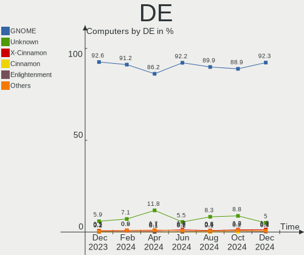
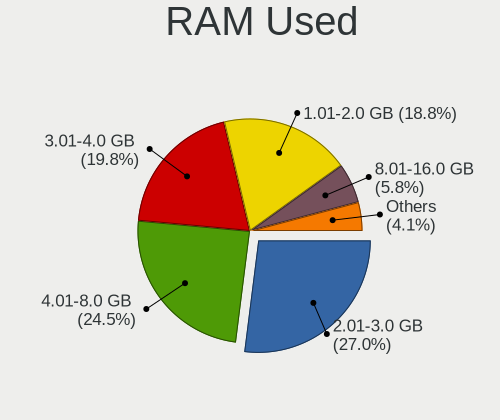
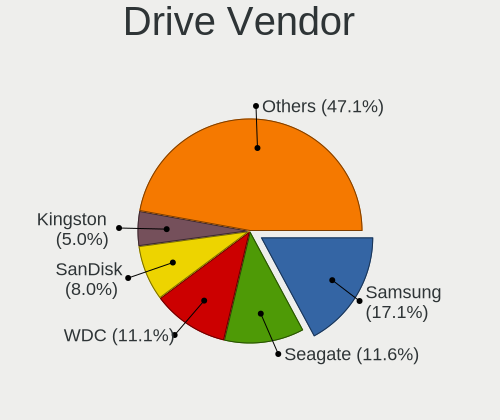
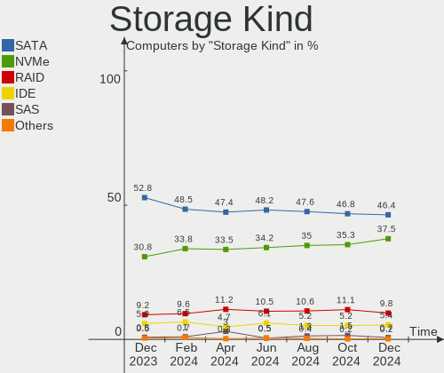

Ubuntu - Hardware Trends
------------------------

A project to identify most popular hardware characteristics and track their change
over time based on data collected by Linux users at https://Linux-Hardware.org.

Anyone can contribute to this report by the [hw-probe](https://github.com/linuxhw/hw-probe) tool:

    sudo -E hw-probe -all -upload

This is a report for all computer types. See also reports for [desktops](/Dist/Ubuntu/Desktop/README.md) and [notebooks](/Dist/Ubuntu/Notebook/README.md).

This report is for one last month. Overall report since the beginning of time: [TestCoverage](https://github.com/linuxhw/TestCoverage)

Period: Aug, 2022.

Contents
--------

* [ System ](#system)
  - [ OS                       ](#os)
  - [ OS Family                ](#os-family)
  - [ Kernel                   ](#kernel)
  - [ Kernel Family            ](#kernel-family)
  - [ Kernel Major Ver.        ](#kernel-major-ver)
  - [ Arch                     ](#arch)
  - [ DE                       ](#de)
  - [ Display Server           ](#display-server)
  - [ Display Manager          ](#display-manager)
  - [ OS Lang                  ](#os-lang)
  - [ Boot Mode                ](#boot-mode)
  - [ Filesystem               ](#filesystem)
  - [ Part. scheme             ](#part-scheme)
  - [ Dual Boot with Linux/BSD ](#dual-boot-with-linuxbsd)
  - [ Dual Boot (Win)          ](#dual-boot-win)

* [ Board ](#board)
  - [ Vendor                   ](#vendor)
  - [ Model                    ](#model)
  - [ Model Family             ](#model-family)
  - [ MFG Year                 ](#mfg-year)
  - [ Form Factor              ](#form-factor)
  - [ Secure Boot              ](#secure-boot)
  - [ Coreboot                 ](#coreboot)
  - [ RAM Size                 ](#ram-size)
  - [ RAM Used                 ](#ram-used)
  - [ Total Drives             ](#total-drives)
  - [ Has CD-ROM               ](#has-cd-rom)
  - [ Has Ethernet             ](#has-ethernet)
  - [ Has WiFi                 ](#has-wifi)
  - [ Has Bluetooth            ](#has-bluetooth)

* [ Location ](#location)
  - [ Country                  ](#country)
  - [ City                     ](#city)

* [ Drives ](#drives)
  - [ Drive Vendor             ](#drive-vendor)
  - [ Drive Model              ](#drive-model)
  - [ HDD Vendor               ](#hdd-vendor)
  - [ SSD Vendor               ](#ssd-vendor)
  - [ Drive Kind               ](#drive-kind)
  - [ Drive Connector          ](#drive-connector)
  - [ Drive Size               ](#drive-size)
  - [ Space Total              ](#space-total)
  - [ Space Used               ](#space-used)
  - [ Malfunc. Drives          ](#malfunc-drives)
  - [ Malfunc. Drive Vendor    ](#malfunc-drive-vendor)
  - [ Malfunc. HDD Vendor      ](#malfunc-hdd-vendor)
  - [ Malfunc. Drive Kind      ](#malfunc-drive-kind)
  - [ Failed Drives            ](#failed-drives)
  - [ Failed Drive Vendor      ](#failed-drive-vendor)
  - [ Drive Status             ](#drive-status)

* [ Storage controller ](#storage-controller)
  - [ Storage Vendor           ](#storage-vendor)
  - [ Storage Model            ](#storage-model)
  - [ Storage Kind             ](#storage-kind)

* [ Processor ](#processor)
  - [ CPU Vendor               ](#cpu-vendor)
  - [ CPU Model                ](#cpu-model)
  - [ CPU Model Family         ](#cpu-model-family)
  - [ CPU Cores                ](#cpu-cores)
  - [ CPU Sockets              ](#cpu-sockets)
  - [ CPU Threads              ](#cpu-threads)
  - [ CPU Op-Modes             ](#cpu-op-modes)
  - [ CPU Microcode            ](#cpu-microcode)
  - [ CPU Microarch            ](#cpu-microarch)

* [ Graphics ](#graphics)
  - [ GPU Vendor               ](#gpu-vendor)
  - [ GPU Model                ](#gpu-model)
  - [ GPU Combo                ](#gpu-combo)
  - [ GPU Driver               ](#gpu-driver)
  - [ GPU Memory               ](#gpu-memory)

* [ Monitor ](#monitor)
  - [ Monitor Vendor           ](#monitor-vendor)
  - [ Monitor Model            ](#monitor-model)
  - [ Monitor Resolution       ](#monitor-resolution)
  - [ Monitor Diagonal         ](#monitor-diagonal)
  - [ Monitor Width            ](#monitor-width)
  - [ Aspect Ratio             ](#aspect-ratio)
  - [ Monitor Area             ](#monitor-area)
  - [ Pixel Density            ](#pixel-density)
  - [ Multiple Monitors        ](#multiple-monitors)

* [ Network ](#network)
  - [ Net Controller Vendor    ](#net-controller-vendor)
  - [ Net Controller Model     ](#net-controller-model)
  - [ Wireless Vendor          ](#wireless-vendor)
  - [ Wireless Model           ](#wireless-model)
  - [ Ethernet Vendor          ](#ethernet-vendor)
  - [ Ethernet Model           ](#ethernet-model)
  - [ Net Controller Kind      ](#net-controller-kind)
  - [ Used Controller          ](#used-controller)
  - [ NICs                     ](#nics)
  - [ IPv6                     ](#ipv6)

* [ Bluetooth ](#bluetooth)
  - [ Bluetooth Vendor         ](#bluetooth-vendor)
  - [ Bluetooth Model          ](#bluetooth-model)

* [ Sound ](#sound)
  - [ Sound Vendor             ](#sound-vendor)
  - [ Sound Model              ](#sound-model)

* [ Memory ](#memory)
  - [ Memory Vendor            ](#memory-vendor)
  - [ Memory Model             ](#memory-model)
  - [ Memory Kind              ](#memory-kind)
  - [ Memory Form Factor       ](#memory-form-factor)
  - [ Memory Size              ](#memory-size)
  - [ Memory Speed             ](#memory-speed)

* [ Printers & scanners ](#printers--scanners)
  - [ Printer Vendor           ](#printer-vendor)
  - [ Printer Model            ](#printer-model)
  - [ Scanner Vendor           ](#scanner-vendor)
  - [ Scanner Model            ](#scanner-model)

* [ Camera ](#camera)
  - [ Camera Vendor            ](#camera-vendor)
  - [ Camera Model             ](#camera-model)

* [ Security ](#security)
  - [ Fingerprint Vendor       ](#fingerprint-vendor)
  - [ Fingerprint Model        ](#fingerprint-model)
  - [ Chipcard Vendor          ](#chipcard-vendor)
  - [ Chipcard Model           ](#chipcard-model)

* [ Unsupported ](#unsupported)
  - [ Unsupported Devices      ](#unsupported-devices)
  - [ Unsupported Device Types ](#unsupported-device-types)

System
------

OS
--

Installed operating systems

| Name           | Computers | Percent |
|----------------|-----------|---------|
| Ubuntu 22.04   | 710       | 67.3%   |
| Ubuntu 20.04   | 276       | 26.16%  |
| Ubuntu 18.04   | 34        | 3.22%   |
| Ubuntu 22.10   | 10        | 0.95%   |
| Ubuntu 21.10   | 10        | 0.95%   |
| Ubuntu 16.04   | 6         | 0.57%   |
| Ubuntu 21.04   | 3         | 0.28%   |
| Ubuntu 20.10   | 3         | 0.28%   |
| Ubuntu Core 18 | 2         | 0.19%   |
| Ubuntu 19.10   | 1         | 0.09%   |

OS Family
---------

OS without a version

| Name   | Computers | Percent |
|--------|-----------|---------|
| Ubuntu | 1055      | 100%    |

Kernel
------

Version of the Linux kernel

| Version                | Computers | Percent |
|------------------------|-----------|---------|
| 5.15.0-46-generic      | 444       | 42.09%  |
| 5.15.0-43-generic      | 269       | 25.5%   |
| 5.15.0-41-generic      | 46        | 4.36%   |
| 5.15.0-25-generic      | 36        | 3.41%   |
| 5.15.0-47-generic      | 27        | 2.56%   |
| 5.4.0-122-generic      | 26        | 2.46%   |
| 5.4.0-124-generic      | 23        | 2.18%   |
| 5.15.0-1013-raspi      | 8         | 0.76%   |
| 5.15.0-40-generic      | 7         | 0.66%   |
| 5.19.0-051900-generic  | 6         | 0.57%   |
| 5.15.0-45-generic      | 6         | 0.57%   |
| 5.13.0-30-generic      | 6         | 0.57%   |
| 4.15.0-191-generic     | 6         | 0.57%   |
| 5.15.0-1012-raspi      | 5         | 0.47%   |
| 5.19.3-051903-generic  | 4         | 0.38%   |
| 5.19.0-15-generic      | 4         | 0.38%   |
| 5.17.0-1014-oem        | 4         | 0.38%   |
| 5.13.0-52-generic      | 4         | 0.38%   |
| 5.17.1-051701-generic  | 3         | 0.28%   |
| 5.13.0-51-generic      | 3         | 0.28%   |
| 5.13.0-44-generic      | 3         | 0.28%   |
| 5.13.0-39-generic      | 3         | 0.28%   |
| 5.11.0-27-generic      | 3         | 0.28%   |
| 4.4.0-210-generic      | 3         | 0.28%   |
| 4.15.0-189-generic     | 3         | 0.28%   |
| 5.8.0-53-generic       | 2         | 0.19%   |
| 5.8.0-50-generic       | 2         | 0.19%   |
| 5.8.0-25-generic       | 2         | 0.19%   |
| 5.4.0-42-generic       | 2         | 0.19%   |
| 5.4.0-125-generic      | 2         | 0.19%   |
| 5.4.0-121-generic      | 2         | 0.19%   |
| 5.4.0-107-generic      | 2         | 0.19%   |
| 5.18.15-051815-generic | 2         | 0.19%   |
| 5.15.0-48-generic      | 2         | 0.19%   |
| 5.15.0-47-lowlatency   | 2         | 0.19%   |
| 5.15.0-37-generic      | 2         | 0.19%   |
| 5.15.0-35-generic      | 2         | 0.19%   |
| 5.15.0-27-generic      | 2         | 0.19%   |
| 5.14.0-1049-oem        | 2         | 0.19%   |
| 5.14.0-1047-oem        | 2         | 0.19%   |
| 5.14.0-1045-oem        | 2         | 0.19%   |
| 5.13.0-40-generic      | 2         | 0.19%   |
| 5.13.0-19-generic      | 2         | 0.19%   |
| 4.15.0-142-generic     | 2         | 0.19%   |
| 5.8.0-43-generic       | 1         | 0.09%   |
| 5.8.0-38-generic       | 1         | 0.09%   |
| 5.8.0-34-generic       | 1         | 0.09%   |
| 5.7.19-mbp-alt         | 1         | 0.09%   |
| 5.5.19-bp0             | 1         | 0.09%   |
| 5.4.0-87-generic       | 1         | 0.09%   |
| 5.4.0-84-generic       | 1         | 0.09%   |
| 5.4.0-81-lowlatency    | 1         | 0.09%   |
| 5.4.0-73-generic       | 1         | 0.09%   |
| 5.4.0-71-generic       | 1         | 0.09%   |
| 5.4.0-58-generic       | 1         | 0.09%   |
| 5.4.0-47-generic       | 1         | 0.09%   |
| 5.4.0-124-lowlatency   | 1         | 0.09%   |
| 5.4.0-123-generic      | 1         | 0.09%   |
| 5.4.0-113-generic      | 1         | 0.09%   |
| 5.4.0-109-generic      | 1         | 0.09%   |

Kernel Family
-------------

Linux kernel without a distro release

| Version  | Computers | Percent |
|----------|-----------|---------|
| 5.15.0   | 864       | 81.9%   |
| 5.4.0    | 70        | 6.64%   |
| 5.13.0   | 29        | 2.75%   |
| 4.15.0   | 14        | 1.33%   |
| 5.19.0   | 12        | 1.14%   |
| 5.14.0   | 10        | 0.95%   |
| 5.8.0    | 9         | 0.85%   |
| 5.11.0   | 9         | 0.85%   |
| 5.17.0   | 7         | 0.66%   |
| 5.19.3   | 4         | 0.38%   |
| 4.4.0    | 4         | 0.38%   |
| 5.3.0    | 3         | 0.28%   |
| 5.17.1   | 3         | 0.28%   |
| 5.18.8   | 2         | 0.19%   |
| 5.18.16  | 2         | 0.19%   |
| 5.18.15  | 2         | 0.19%   |
| 5.18.0   | 2         | 0.19%   |
| 5.7.19   | 1         | 0.09%   |
| 5.5.19   | 1         | 0.09%   |
| 5.17.15  | 1         | 0.09%   |
| 5.15.60  | 1         | 0.09%   |
| 5.15.55  | 1         | 0.09%   |
| 5.15.48  | 1         | 0.09%   |
| 5.10.0   | 1         | 0.09%   |
| 4.9.277  | 1         | 0.09%   |
| 4.19.219 | 1         | 0.09%   |

Kernel Major Ver.
-----------------

Linux kernel major version

| Version | Computers | Percent |
|---------|-----------|---------|
| 5.15    | 867       | 82.18%  |
| 5.4     | 70        | 6.64%   |
| 5.13    | 29        | 2.75%   |
| 5.19    | 16        | 1.52%   |
| 4.15    | 14        | 1.33%   |
| 5.17    | 11        | 1.04%   |
| 5.14    | 10        | 0.95%   |
| 5.8     | 9         | 0.85%   |
| 5.11    | 9         | 0.85%   |
| 5.18    | 8         | 0.76%   |
| 4.4     | 4         | 0.38%   |
| 5.3     | 3         | 0.28%   |
| 5.7     | 1         | 0.09%   |
| 5.5     | 1         | 0.09%   |
| 5.10    | 1         | 0.09%   |
| 4.9     | 1         | 0.09%   |
| 4.19    | 1         | 0.09%   |

Arch
----

OS architecture (x86_64, i586, etc.)

| Name    | Computers | Percent |
|---------|-----------|---------|
| x86_64  | 1031      | 97.73%  |
| aarch64 | 20        | 1.9%    |
| i686    | 4         | 0.38%   |

DE
--

Desktop Environment

| Name            | Computers | Percent |
|-----------------|-----------|---------|
| GNOME           | 979       | 92.8%   |
| Unknown         | 42        | 3.98%   |
| Unity           | 10        | 0.95%   |
| X-Cinnamon      | 9         | 0.85%   |
| GNOME Flashback | 5         | 0.47%   |
| Cinnamon        | 3         | 0.28%   |
| Pantheon        | 2         | 0.19%   |
| i3              | 2         | 0.19%   |
| Enlightenment   | 1         | 0.09%   |
| dwm             | 1         | 0.09%   |
| Cutefish        | 1         | 0.09%   |

Display Server
--------------

X11 or Wayland

| Name    | Computers | Percent |
|---------|-----------|---------|
| X11     | 513       | 48.63%  |
| Wayland | 501       | 47.49%  |
| Tty     | 26        | 2.46%   |
| Unknown | 15        | 1.42%   |

Display Manager
---------------

SDDM, LightDM, etc.

| Name    | Computers | Percent |
|---------|-----------|---------|
| GDM3    | 833       | 78.96%  |
| GDM     | 114       | 10.81%  |
| Unknown | 76        | 7.2%    |
| LightDM | 28        | 2.65%   |
| SDDM    | 4         | 0.38%   |

OS Lang
-------

Language

| Lang    | Computers | Percent |
|---------|-----------|---------|
| en_US   | 478       | 45.31%  |
| de_DE   | 86        | 8.15%   |
| fr_FR   | 75        | 7.11%   |
| pt_BR   | 48        | 4.55%   |
| en_GB   | 45        | 4.27%   |
| it_IT   | 30        | 2.84%   |
| en_IN   | 30        | 2.84%   |
| ru_RU   | 21        | 1.99%   |
| en_AU   | 18        | 1.71%   |
| es_ES   | 17        | 1.61%   |
| nl_NL   | 16        | 1.52%   |
| en_CA   | 16        | 1.52%   |
| zh_CN   | 13        | 1.23%   |
| C       | 13        | 1.23%   |
| cs_CZ   | 11        | 1.04%   |
| pl_PL   | 9         | 0.85%   |
| sv_SE   | 8         | 0.76%   |
| pt_PT   | 8         | 0.76%   |
| de_AT   | 8         | 0.76%   |
| ja_JP   | 7         | 0.66%   |
| fi_FI   | 6         | 0.57%   |
| es_AR   | 6         | 0.57%   |
| en_ZA   | 6         | 0.57%   |
| Unknown | 6         | 0.57%   |
| hu_HU   | 5         | 0.47%   |
| fr_BE   | 5         | 0.47%   |
| es_MX   | 5         | 0.47%   |
| en_SG   | 4         | 0.38%   |
| en_NZ   | 4         | 0.38%   |
| de_CH   | 4         | 0.38%   |
| tr_TR   | 3         | 0.28%   |
| nb_NO   | 3         | 0.28%   |
| fr_CA   | 3         | 0.28%   |
| es_US   | 3         | 0.28%   |
| en_PH   | 3         | 0.28%   |
| en_HK   | 3         | 0.28%   |
| da_DK   | 3         | 0.28%   |
| sl_SI   | 2         | 0.19%   |
| sk_SK   | 2         | 0.19%   |
| ro_RO   | 2         | 0.19%   |
| es_CO   | 2         | 0.19%   |
| ca_ES   | 2         | 0.19%   |
| uk_UA   | 1         | 0.09%   |
| ru_UA   | 1         | 0.09%   |
| nl_BE   | 1         | 0.09%   |
| lv_LV   | 1         | 0.09%   |
| lt_LT   | 1         | 0.09%   |
| ko_KR   | 1         | 0.09%   |
| es_VE   | 1         | 0.09%   |
| es_SV   | 1         | 0.09%   |
| es_PE   | 1         | 0.09%   |
| es_CR   | 1         | 0.09%   |
| es_CL   | 1         | 0.09%   |
| en_NG   | 1         | 0.09%   |
| en_IE   | 1         | 0.09%   |
| el_GR   | 1         | 0.09%   |
| bg_BG   | 1         | 0.09%   |
| be_BY   | 1         | 0.09%   |

Boot Mode
---------

EFI or BIOS

| Mode | Computers | Percent |
|------|-----------|---------|
| BIOS | 592       | 56.11%  |
| EFI  | 463       | 43.89%  |

Filesystem
----------

Type of filesystem

| Type    | Computers | Percent |
|---------|-----------|---------|
| Ext4    | 993       | 94.12%  |
| Overlay | 24        | 2.27%   |
| Zfs     | 17        | 1.61%   |
| Btrfs   | 12        | 1.14%   |
| Ext2    | 4         | 0.38%   |
| Ext3    | 3         | 0.28%   |
| Xfs     | 2         | 0.19%   |

Part. scheme
------------

Scheme of partitioning

| Type    | Computers | Percent |
|---------|-----------|---------|
| Unknown | 634       | 60.09%  |
| GPT     | 377       | 35.73%  |
| MBR     | 44        | 4.17%   |

Dual Boot with Linux/BSD
------------------------

Hosting more than one Linux/BSD

| Dual boot | Computers | Percent |
|-----------|-----------|---------|
| No        | 923       | 87.49%  |
| Yes       | 132       | 12.51%  |

Dual Boot (Win)
---------------

Hosting Linux and Windows

| Dual boot | Computers | Percent |
|-----------|-----------|---------|
| No        | 670       | 63.51%  |
| Yes       | 385       | 36.49%  |

Board
-----

Vendor
------

Motherboard manufacturer

| Name                    | Computers | Percent |
|-------------------------|-----------|---------|
| Dell                    | 166       | 15.73%  |
| Hewlett-Packard         | 162       | 15.36%  |
| Lenovo                  | 157       | 14.88%  |
| ASUSTek Computer        | 157       | 14.88%  |
| MSI                     | 58        | 5.5%    |
| Acer                    | 48        | 4.55%   |
| Gigabyte Technology     | 43        | 4.08%   |
| Apple                   | 25        | 2.37%   |
| ASRock                  | 21        | 1.99%   |
| Intel                   | 20        | 1.9%    |
| HUAWEI                  | 17        | 1.61%   |
| Raspberry Pi Foundation | 16        | 1.52%   |
| Toshiba                 | 13        | 1.23%   |
| Samsung Electronics     | 11        | 1.04%   |
| Foxconn                 | 11        | 1.04%   |
| Fujitsu                 | 9         | 0.85%   |
| Supermicro              | 8         | 0.76%   |
| Notebook                | 8         | 0.76%   |
| Pegatron                | 7         | 0.66%   |
| Sony                    | 6         | 0.57%   |
| Alienware               | 6         | 0.57%   |
| Unknown                 | 6         | 0.57%   |
| Timi                    | 5         | 0.47%   |
| Positivo                | 5         | 0.47%   |
| Packard Bell            | 5         | 0.47%   |
| Biostar                 | 4         | 0.38%   |
| Protectli               | 3         | 0.28%   |
| Google                  | 3         | 0.28%   |
| ECS                     | 3         | 0.28%   |
| BESSTAR Tech            | 3         | 0.28%   |
| TrekStor                | 2         | 0.19%   |
| System76                | 2         | 0.19%   |
| OEM                     | 2         | 0.19%   |
| Monster                 | 2         | 0.19%   |
| Microsoft               | 2         | 0.19%   |
| Medion                  | 2         | 0.19%   |
| LattePanda              | 2         | 0.19%   |
| AZW                     | 2         | 0.19%   |
| AMI                     | 2         | 0.19%   |
| VALE                    | 1         | 0.09%   |
| TUXEDO                  | 1         | 0.09%   |
| TEKNOSERVICE            | 1         | 0.09%   |
| Teclast                 | 1         | 0.09%   |
| sunxi                   | 1         | 0.09%   |
| Star Labs               | 1         | 0.09%   |
| speedmaster             | 1         | 0.09%   |
| Shuttle                 | 1         | 0.09%   |
| SHARKBAY                | 1         | 0.09%   |
| QIYIDA                  | 1         | 0.09%   |
| PCWare                  | 1         | 0.09%   |
| PC Specialist           | 1         | 0.09%   |
| Panasonic               | 1         | 0.09%   |
| Nvidia                  | 1         | 0.09%   |
| MOTILE                  | 1         | 0.09%   |
| Microtech               | 1         | 0.09%   |
| MACHINIST               | 1         | 0.09%   |
| Linx                    | 1         | 0.09%   |
| IT Channel Pty          | 1         | 0.09%   |
| Irbis                   | 1         | 0.09%   |
| Hardkernel              | 1         | 0.09%   |

Model
-----

Motherboard model

| Name                                     | Computers | Percent |
|------------------------------------------|-----------|---------|
| RPi Raspberry Pi                         | 11        | 1.04%   |
| Unknown                                  | 9         | 0.85%   |
| Dell OptiPlex 7010                       | 7         | 0.66%   |
| ASUS All Series                          | 6         | 0.57%   |
| Supermicro Super Server                  | 4         | 0.38%   |
| HP Pavilion Notebook                     | 4         | 0.38%   |
| HP Pavilion g6                           | 4         | 0.38%   |
| Dell XPS 15 9560                         | 4         | 0.38%   |
| Dell OptiPlex 790                        | 4         | 0.38%   |
| Timi TM1701                              | 3         | 0.28%   |
| MSI MS-7C52                              | 3         | 0.28%   |
| MSI MS-7C37                              | 3         | 0.28%   |
| HP Z400 Workstation                      | 3         | 0.28%   |
| HP Pavilion 15                           | 3         | 0.28%   |
| HP EliteBook x360 1030 G2                | 3         | 0.28%   |
| HP EliteBook 840 G8 Notebook PC          | 3         | 0.28%   |
| HP 255 G6 Notebook PC                    | 3         | 0.28%   |
| Dell Latitude E7470                      | 3         | 0.28%   |
| Dell Inspiron 3543                       | 3         | 0.28%   |
| ASUS PRIME A320M-K                       | 3         | 0.28%   |
| ASRock B450M Pro4                        | 3         | 0.28%   |
| Apple MacBookPro9,2                      | 3         | 0.28%   |
| Apple MacBookPro11,3                     | 3         | 0.28%   |
| TrekStor Notebook Slim S130              | 2         | 0.19%   |
| Toshiba Satellite C55-B                  | 2         | 0.19%   |
| Toshiba Satellite C55-A                  | 2         | 0.19%   |
| Protectli FW4B                           | 2         | 0.19%   |
| Packard Bell EasyNote TS11HR             | 2         | 0.19%   |
| MSI MS-7D42                              | 2         | 0.19%   |
| MSI MS-7C91                              | 2         | 0.19%   |
| MSI MS-7721                              | 2         | 0.19%   |
| MSI Modern 14 A10RB                      | 2         | 0.19%   |
| Lenovo V330-15IKB 81AX                   | 2         | 0.19%   |
| Lenovo ThinkPad X1 Carbon 6th 20KHCTO1WW | 2         | 0.19%   |
| Lenovo ThinkPad Edge E530 62724FU        | 2         | 0.19%   |
| Lenovo ThinkCentre M73 10AXS1UY00        | 2         | 0.19%   |
| Lenovo Legion 5 15IMH05H 81Y6            | 2         | 0.19%   |
| Lenovo IdeaPad 330-15IKB 81DE            | 2         | 0.19%   |
| Lenovo IdeaPad 3 15ITL6 82H8             | 2         | 0.19%   |
| Lenovo G580 20150                        | 2         | 0.19%   |
| HUAWEI NBLB-WAX9N                        | 2         | 0.19%   |
| HUAWEI HVY-WXX9                          | 2         | 0.19%   |
| HUAWEI BOM-WXX9                          | 2         | 0.19%   |
| HP ZBook 15 G3                           | 2         | 0.19%   |
| HP ProBook 455 G8 Notebook PC            | 2         | 0.19%   |
| HP ProBook 4440s                         | 2         | 0.19%   |
| HP ProBook 440 G8 Notebook PC            | 2         | 0.19%   |
| HP Notebook                              | 2         | 0.19%   |
| HP Laptop 15-db0xxx                      | 2         | 0.19%   |
| HP Laptop 14s-dq2xxx                     | 2         | 0.19%   |
| HP ENVY x360 Convertible 13-ay0xxx       | 2         | 0.19%   |
| HP ENVY x360 2-in-1 Laptop 15-ey0xxx     | 2         | 0.19%   |
| HP EliteBook 8470p                       | 2         | 0.19%   |
| HP Compaq 8100 Elite SFF PC              | 2         | 0.19%   |
| HP Compaq 6005 Pro SFF PC                | 2         | 0.19%   |
| HP 15                                    | 2         | 0.19%   |
| Gigabyte B550 AORUS ELITE AX V2          | 2         | 0.19%   |
| Gigabyte AORUS 17 YE5                    | 2         | 0.19%   |
| Gigabyte A320M-S2H                       | 2         | 0.19%   |
| Dell XPS 15 9575                         | 2         | 0.19%   |

Model Family
------------

Motherboard model prefix

| Name                  | Computers | Percent |
|-----------------------|-----------|---------|
| Lenovo ThinkPad       | 70        | 6.64%   |
| Dell Inspiron         | 43        | 4.08%   |
| Dell Latitude         | 37        | 3.51%   |
| Acer Aspire           | 33        | 3.13%   |
| Dell OptiPlex         | 31        | 2.94%   |
| Lenovo IdeaPad        | 27        | 2.56%   |
| HP Pavilion           | 23        | 2.18%   |
| HP EliteBook          | 22        | 2.09%   |
| Dell XPS              | 21        | 1.99%   |
| HP ProBook            | 18        | 1.71%   |
| ASUS PRIME            | 18        | 1.71%   |
| HP Compaq             | 17        | 1.61%   |
| RPi Raspberry         | 16        | 1.52%   |
| HP Laptop             | 14        | 1.33%   |
| ASUS VivoBook         | 14        | 1.33%   |
| ASUS ROG              | 14        | 1.33%   |
| Lenovo ThinkCentre    | 13        | 1.23%   |
| Dell Precision        | 13        | 1.23%   |
| ASUS TUF              | 12        | 1.14%   |
| HP ENVY               | 11        | 1.04%   |
| ASUS ZenBook          | 10        | 0.95%   |
| Toshiba Satellite     | 9         | 0.85%   |
| Dell Vostro           | 9         | 0.85%   |
| Unknown               | 9         | 0.85%   |
| Lenovo ThinkBook      | 8         | 0.76%   |
| Lenovo Yoga           | 7         | 0.66%   |
| HP ZBook              | 7         | 0.66%   |
| ASUS All              | 6         | 0.57%   |
| Acer Nitro            | 6         | 0.57%   |
| Lenovo Legion         | 5         | 0.47%   |
| Toshiba PORTEGE       | 4         | 0.38%   |
| Supermicro Super      | 4         | 0.38%   |
| Packard Bell EasyNote | 4         | 0.38%   |
| HP Stream             | 4         | 0.38%   |
| HP Spectre            | 4         | 0.38%   |
| HP EliteDesk          | 4         | 0.38%   |
| HP 255                | 4         | 0.38%   |
| Gigabyte B550         | 4         | 0.38%   |
| Apple MacBookPro16    | 4         | 0.38%   |
| Apple MacBookPro11    | 4         | 0.38%   |
| Timi TM1701           | 3         | 0.28%   |
| MSI MS-7C52           | 3         | 0.28%   |
| MSI MS-7C37           | 3         | 0.28%   |
| MSI Modern            | 3         | 0.28%   |
| Lenovo ThinkStation   | 3         | 0.28%   |
| Lenovo IdeaCentre     | 3         | 0.28%   |
| HP Z400               | 3         | 0.28%   |
| HP ProDesk            | 3         | 0.28%   |
| Gigabyte A320M-S2H    | 3         | 0.28%   |
| Fujitsu LIFEBOOK      | 3         | 0.28%   |
| Fujitsu ESPRIMO       | 3         | 0.28%   |
| Dell Studio           | 3         | 0.28%   |
| Dell PowerEdge        | 3         | 0.28%   |
| Dell G15              | 3         | 0.28%   |
| ASUS ProArt           | 3         | 0.28%   |
| ASUS Pro              | 3         | 0.28%   |
| ASUS ASUS             | 3         | 0.28%   |
| ASRock B450M          | 3         | 0.28%   |
| Apple MacBookPro9     | 3         | 0.28%   |
| Acer Veriton          | 3         | 0.28%   |

MFG Year
--------

Motherboard manufacture year

| Year    | Computers | Percent |
|---------|-----------|---------|
| 2021    | 122       | 11.56%  |
| 2019    | 115       | 10.9%   |
| 2020    | 104       | 9.86%   |
| 2018    | 90        | 8.53%   |
| 2012    | 74        | 7.01%   |
| 2017    | 65        | 6.16%   |
| 2013    | 65        | 6.16%   |
| 2014    | 60        | 5.69%   |
| 2015    | 58        | 5.5%    |
| 2010    | 56        | 5.31%   |
| 2022    | 54        | 5.12%   |
| 2011    | 53        | 5.02%   |
| 2016    | 39        | 3.7%    |
| 2008    | 31        | 2.94%   |
| 2009    | 30        | 2.84%   |
| Unknown | 21        | 1.99%   |
| 2007    | 17        | 1.61%   |
| 2006    | 1         | 0.09%   |

Form Factor
-----------

Physical design of the computer

| Name           | Computers | Percent |
|----------------|-----------|---------|
| Notebook       | 584       | 55.36%  |
| Desktop        | 363       | 34.41%  |
| Convertible    | 38        | 3.6%    |
| System on chip | 19        | 1.8%    |
| All in one     | 17        | 1.61%   |
| Server         | 13        | 1.23%   |
| Mini pc        | 12        | 1.14%   |
| Tablet         | 9         | 0.85%   |

Secure Boot
-----------

Enabled or disabled

| State    | Computers | Percent |
|----------|-----------|---------|
| Disabled | 944       | 89.48%  |
| Enabled  | 111       | 10.52%  |

Coreboot
--------

Have coreboot on board

| Used | Computers | Percent |
|------|-----------|---------|
| No   | 1050      | 99.53%  |
| Yes  | 5         | 0.47%   |

RAM Size
--------

Total RAM memory

| Size in GB      | Computers | Percent |
|-----------------|-----------|---------|
| 4.01-8.0        | 252       | 23.89%  |
| 16.01-24.0      | 243       | 23.03%  |
| 8.01-16.0       | 204       | 19.34%  |
| 3.01-4.0        | 172       | 16.3%   |
| 32.01-64.0      | 93        | 8.82%   |
| 64.01-256.0     | 34        | 3.22%   |
| 1.01-2.0        | 24        | 2.27%   |
| 24.01-32.0      | 17        | 1.61%   |
| 2.01-3.0        | 9         | 0.85%   |
| More than 256.0 | 4         | 0.38%   |
| 0.51-1.0        | 3         | 0.28%   |

RAM Used
--------

Used RAM memory

| Used GB     | Computers | Percent |
|-------------|-----------|---------|
| 1.01-2.0    | 326       | 30.9%   |
| 2.01-3.0    | 304       | 28.82%  |
| 4.01-8.0    | 174       | 16.49%  |
| 3.01-4.0    | 156       | 14.79%  |
| 8.01-16.0   | 51        | 4.83%   |
| 0.51-1.0    | 21        | 1.99%   |
| 0.01-0.5    | 8         | 0.76%   |
| 16.01-24.0  | 7         | 0.66%   |
| 24.01-32.0  | 5         | 0.47%   |
| 64.01-256.0 | 2         | 0.19%   |
| 32.01-64.0  | 1         | 0.09%   |

Total Drives
------------

Number of drives on board

| Drives | Computers | Percent |
|--------|-----------|---------|
| 1      | 687       | 65.12%  |
| 2      | 236       | 22.37%  |
| 3      | 65        | 6.16%   |
| 4      | 25        | 2.37%   |
| 5      | 13        | 1.23%   |
| 0      | 13        | 1.23%   |
| 6      | 8         | 0.76%   |
| 9      | 4         | 0.38%   |
| 7      | 2         | 0.19%   |
| 14     | 1         | 0.09%   |
| 11     | 1         | 0.09%   |

Has CD-ROM
----------

Has CD-ROM on board

| Presented | Computers | Percent |
|-----------|-----------|---------|
| No        | 664       | 62.94%  |
| Yes       | 391       | 37.06%  |

Has Ethernet
------------

Has Ethernet on board

| Presented | Computers | Percent |
|-----------|-----------|---------|
| Yes       | 875       | 82.94%  |
| No        | 180       | 17.06%  |

Has WiFi
--------

Has WiFi module

| Presented | Computers | Percent |
|-----------|-----------|---------|
| Yes       | 803       | 76.11%  |
| No        | 252       | 23.89%  |

Has Bluetooth
-------------

Has Bluetooth module

| Presented | Computers | Percent |
|-----------|-----------|---------|
| Yes       | 648       | 61.42%  |
| No        | 407       | 38.58%  |

Location
--------

Country
-------

Geographic location (country)

| Country      | Computers | Percent |
|--------------|-----------|---------|
| USA          | 209       | 19.81%  |
| Germany      | 107       | 10.14%  |
| France       | 80        | 7.58%   |
| Brazil       | 59        | 5.59%   |
| Russia       | 43        | 4.08%   |
| Italy        | 41        | 3.89%   |
| UK           | 38        | 3.6%    |
| India        | 37        | 3.51%   |
| Netherlands  | 28        | 2.65%   |
| Canada       | 22        | 2.09%   |
| Spain        | 19        | 1.8%    |
| Poland       | 19        | 1.8%    |
| Australia    | 19        | 1.8%    |
| Sweden       | 18        | 1.71%   |
| Austria      | 17        | 1.61%   |
| Turkey       | 16        | 1.52%   |
| Czechia      | 15        | 1.42%   |
| Hungary      | 13        | 1.23%   |
| Portugal     | 10        | 0.95%   |
| Mexico       | 10        | 0.95%   |
| Finland      | 10        | 0.95%   |
| Argentina    | 10        | 0.95%   |
| Switzerland  | 9         | 0.85%   |
| Belgium      | 9         | 0.85%   |
| Singapore    | 8         | 0.76%   |
| South Africa | 7         | 0.66%   |
| Norway       | 7         | 0.66%   |
| Japan        | 7         | 0.66%   |
| Hong Kong    | 7         | 0.66%   |
| Bulgaria     | 7         | 0.66%   |
| Thailand     | 6         | 0.57%   |
| Romania      | 6         | 0.57%   |
| Philippines  | 6         | 0.57%   |
| Pakistan     | 6         | 0.57%   |
| Malaysia     | 6         | 0.57%   |
| Iran         | 6         | 0.57%   |
| Colombia     | 6         | 0.57%   |
| Tunisia      | 5         | 0.47%   |
| Slovenia     | 5         | 0.47%   |
| New Zealand  | 5         | 0.47%   |
| Greece       | 5         | 0.47%   |
| China        | 5         | 0.47%   |
| Chile        | 5         | 0.47%   |
| Slovakia     | 4         | 0.38%   |
| Serbia       | 4         | 0.38%   |
| Denmark      | 4         | 0.38%   |
| Vietnam      | 3         | 0.28%   |
| Venezuela    | 3         | 0.28%   |
| Taiwan       | 3         | 0.28%   |
| Myanmar      | 3         | 0.28%   |
| Uzbekistan   | 2         | 0.19%   |
| Uruguay      | 2         | 0.19%   |
| Ukraine      | 2         | 0.19%   |
| Puerto Rico  | 2         | 0.19%   |
| Lithuania    | 2         | 0.19%   |
| Kenya        | 2         | 0.19%   |
| Ireland      | 2         | 0.19%   |
| Indonesia    | 2         | 0.19%   |
| Georgia      | 2         | 0.19%   |
| Croatia      | 2         | 0.19%   |

City
----

Geographic location (city)

| City           | Computers | Percent |
|----------------|-----------|---------|
| Moscow         | 16        | 1.52%   |
| Berlin         | 14        | 1.33%   |
| Paris          | 12        | 1.14%   |
| Istanbul       | 9         | 0.85%   |
| Budapest       | 9         | 0.85%   |
| Vienna         | 8         | 0.76%   |
| Singapore      | 8         | 0.76%   |
| Helsinki       | 8         | 0.76%   |
| Sydney         | 7         | 0.66%   |
| Stockholm      | 7         | 0.66%   |
| St Petersburg  | 6         | 0.57%   |
| Sofia          | 6         | 0.57%   |
| Munich         | 6         | 0.57%   |
| Milan          | 6         | 0.57%   |
| Stuttgart      | 5         | 0.47%   |
| Sao Paulo      | 5         | 0.47%   |
| Nantes         | 5         | 0.47%   |
| Fortaleza      | 5         | 0.47%   |
| Cypress        | 5         | 0.47%   |
| Ankara         | 5         | 0.47%   |
| Warsaw         | 4         | 0.38%   |
| Tehran         | 4         | 0.38%   |
| San Diego      | 4         | 0.38%   |
| Prague         | 4         | 0.38%   |
| New York       | 4         | 0.38%   |
| Madrid         | 4         | 0.38%   |
| Ljubljana      | 4         | 0.38%   |
| Chennai        | 4         | 0.38%   |
| Brisbane       | 4         | 0.38%   |
| Bogotá        | 4         | 0.38%   |
| Bengaluru      | 4         | 0.38%   |
| Atlanta        | 4         | 0.38%   |
| Athens         | 4         | 0.38%   |
| Yangon         | 3         | 0.28%   |
| Turin          | 3         | 0.28%   |
| Toronto        | 3         | 0.28%   |
| San Antonio    | 3         | 0.28%   |
| Salvador       | 3         | 0.28%   |
| Rome           | 3         | 0.28%   |
| Rio de Janeiro | 3         | 0.28%   |
| Portland       | 3         | 0.28%   |
| Mumbai         | 3         | 0.28%   |
| Mirpur         | 3         | 0.28%   |
| Minneapolis    | 3         | 0.28%   |
| Los Angeles    | 3         | 0.28%   |
| Kuala Lumpur   | 3         | 0.28%   |
| Krakow         | 3         | 0.28%   |
| Johannesburg   | 3         | 0.28%   |
| Islamabad      | 3         | 0.28%   |
| Dresden        | 3         | 0.28%   |
| Denver         | 3         | 0.28%   |
| Dallas         | 3         | 0.28%   |
| Curitiba       | 3         | 0.28%   |
| Coimbatore     | 3         | 0.28%   |
| Chicago        | 3         | 0.28%   |
| Central        | 3         | 0.28%   |
| Cape Town      | 3         | 0.28%   |
| Bucharest      | 3         | 0.28%   |
| Belgrade       | 3         | 0.28%   |
| Amsterdam      | 3         | 0.28%   |

Drives
------

Drive Vendor
------------

Hard drive vendors

| Vendor                         | Computers | Drives | Percent |
|--------------------------------|-----------|--------|---------|
| Samsung Electronics            | 237       | 282    | 16.78%  |
| WDC                            | 200       | 247    | 14.16%  |
| Seagate                        | 181       | 225    | 12.82%  |
| Toshiba                        | 97        | 101    | 6.87%   |
| Kingston                       | 69        | 71     | 4.89%   |
| SanDisk                        | 66        | 76     | 4.67%   |
| SK hynix                       | 55        | 59     | 3.9%    |
| Unknown                        | 54        | 60     | 3.82%   |
| Crucial                        | 51        | 56     | 3.61%   |
| Intel                          | 45        | 57     | 3.19%   |
| Hitachi                        | 43        | 43     | 3.05%   |
| Micron Technology              | 28        | 37     | 1.98%   |
| HGST                           | 28        | 38     | 1.98%   |
| A-DATA Technology              | 22        | 23     | 1.56%   |
| KIOXIA                         | 18        | 19     | 1.27%   |
| Phison                         | 17        | 21     | 1.2%    |
| China                          | 17        | 18     | 1.2%    |
| Apple                          | 14        | 15     | 0.99%   |
| Silicon Motion                 | 13        | 15     | 0.92%   |
| SPCC                           | 11        | 12     | 0.78%   |
| Unknown                        | 11        | 14     | 0.78%   |
| Intenso                        | 10        | 12     | 0.71%   |
| PNY                            | 6         | 6      | 0.42%   |
| JMicron Technology             | 6         | 6      | 0.42%   |
| Transcend                      | 5         | 5      | 0.35%   |
| LITEON                         | 5         | 5      | 0.35%   |
| UMIS                           | 4         | 4      | 0.28%   |
| OCZ                            | 4         | 5      | 0.28%   |
| Micron/Crucial Technology      | 4         | 4      | 0.28%   |
| Maxtor                         | 4         | 4      | 0.28%   |
| LDLC                           | 4         | 4      | 0.28%   |
| Corsair                        | 4         | 4      | 0.28%   |
| Team                           | 3         | 4      | 0.21%   |
| GOODRAM                        | 3         | 3      | 0.21%   |
| Emtec                          | 3         | 3      | 0.21%   |
| ADATA Technology               | 3         | 3      | 0.21%   |
| Union Memory (Shenzhen)        | 2         | 2      | 0.14%   |
| Solid State Storage Technology | 2         | 2      | 0.14%   |
| Realtek Semiconductor          | 2         | 2      | 0.14%   |
| Realtek                        | 2         | 2      | 0.14%   |
| Protectli                      | 2         | 2      | 0.14%   |
| Patriot                        | 2         | 2      | 0.14%   |
| Netac                          | 2         | 2      | 0.14%   |
| Mushkin                        | 2         | 2      | 0.14%   |
| M4-CT128                       | 2         | 2      | 0.14%   |
| LITEONIT                       | 2         | 2      | 0.14%   |
| Lenovo                         | 2         | 2      | 0.14%   |
| KIOXIA-EXCERIA                 | 2         | 2      | 0.14%   |
| KingSpec                       | 2         | 2      | 0.14%   |
| Hewlett-Packard                | 2         | 2      | 0.14%   |
| Fujitsu                        | 2         | 2      | 0.14%   |
| Apacer                         | 2         | 2      | 0.14%   |
| Zheino                         | 1         | 1      | 0.07%   |
| YMTC                           | 1         | 1      | 0.07%   |
| XrayDisk                       | 1         | 1      | 0.07%   |
| XPG                            | 1         | 1      | 0.07%   |
| WDS100T3                       | 1         | 1      | 0.07%   |
| WDC WDBN                       | 1         | 1      | 0.07%   |
| Verbatim                       | 1         | 1      | 0.07%   |
| ValueTech                      | 1         | 1      | 0.07%   |

Drive Model
-----------

Hard drive models

| Model                               | Computers | Percent |
|-------------------------------------|-----------|---------|
| Samsung NVMe SSD Drive 512GB        | 18        | 1.16%   |
| Seagate ST1000LM024 HN-M101MBB 1TB  | 14        | 0.9%    |
| Samsung SSD 860 EVO 500GB           | 13        | 0.84%   |
| Kingston SA400S37240G 240GB SSD     | 13        | 0.84%   |
| Crucial CT1000MX500SSD1 1TB         | 12        | 0.77%   |
| Toshiba MQ04ABF100 1TB              | 11        | 0.71%   |
| Seagate ST1000DM010-2EP102 1TB      | 11        | 0.71%   |
| Samsung SSD 850 EVO 500GB           | 11        | 0.71%   |
| Unknown                             | 11        | 0.71%   |
| Seagate ST1000LM035-1RK172 1TB      | 10        | 0.64%   |
| Samsung NVMe SSD Drive 1TB          | 10        | 0.64%   |
| SanDisk NVMe SSD Drive 1TB          | 9         | 0.58%   |
| Samsung SSD 860 EVO 1TB             | 8         | 0.52%   |
| Intel SSDPEKNW512G8 512GB           | 8         | 0.52%   |
| Crucial CT500MX500SSD1 500GB        | 8         | 0.52%   |
| Toshiba DT01ACA050 500GB            | 7         | 0.45%   |
| Seagate ST500LT012-1DG142 500GB     | 7         | 0.45%   |
| Samsung NVMe SSD Drive 256GB        | 7         | 0.45%   |
| Kingston SA400S37120G 120GB SSD     | 7         | 0.45%   |
| Crucial CT480BX500SSD1 480GB        | 7         | 0.45%   |
| WDC WD10SPZX-21Z10T0 1TB            | 6         | 0.39%   |
| Toshiba MQ01ABF050 500GB            | 6         | 0.39%   |
| Samsung SSD 850 EVO 250GB           | 6         | 0.39%   |
| Intel NVMe SSD Drive 512GB          | 6         | 0.39%   |
| Crucial CT240BX500SSD1 240GB        | 6         | 0.39%   |
| Unknown MMC Card  32GB              | 5         | 0.32%   |
| SPCC Solid State Disk 256GB         | 5         | 0.32%   |
| SK hynix NVMe SSD Drive 512GB       | 5         | 0.32%   |
| SK hynix NVMe SSD Drive 1024GB      | 5         | 0.32%   |
| Silicon Motion NVMe SSD Drive 256GB | 5         | 0.32%   |
| Seagate ST500DM002-1BD142 500GB     | 5         | 0.32%   |
| Seagate ST2000DM001-1ER164 2TB      | 5         | 0.32%   |
| Seagate ST1000DM003-1ER162 1TB      | 5         | 0.32%   |
| Seagate ST1000DM003-1CH162 1TB      | 5         | 0.32%   |
| SanDisk SSD PLUS 240GB              | 5         | 0.32%   |
| SanDisk NVMe SSD Drive 512GB        | 5         | 0.32%   |
| Samsung SSD 970 EVO Plus 1TB        | 5         | 0.32%   |
| Samsung SSD 840 EVO 250GB           | 5         | 0.32%   |
| Samsung SSD 750 EVO 250GB           | 5         | 0.32%   |
| Samsung NVMe SSD Drive 500GB        | 5         | 0.32%   |
| Micron NVMe SSD Drive 512GB         | 5         | 0.32%   |
| Kingston SA400S37480G 480GB SSD     | 5         | 0.32%   |
| Kingston NVMe SSD Drive 512GB       | 5         | 0.32%   |
| HGST HTS541010A9E680 1TB            | 5         | 0.32%   |
| WDC PC SN810 NVMe 512GB             | 4         | 0.26%   |
| Unknown SD/MMC/MS PRO 128GB         | 4         | 0.26%   |
| Toshiba MQ01ABD100 1TB              | 4         | 0.26%   |
| Toshiba MQ01ABD050 500GB            | 4         | 0.26%   |
| Toshiba DT01ACA200 2TB              | 4         | 0.26%   |
| SK hynix NVMe SSD Drive 256GB       | 4         | 0.26%   |
| Seagate ST9500325AS 500GB           | 4         | 0.26%   |
| Seagate ST500LT012-9WS142 500GB     | 4         | 0.26%   |
| Seagate ST4000VN008-2DR166 4TB      | 4         | 0.26%   |
| Seagate ST2000DM008-2FR102 2TB      | 4         | 0.26%   |
| Seagate ST1000LM048-2E7172 1TB      | 4         | 0.26%   |
| Seagate ST1000LM014-1EJ164 1TB      | 4         | 0.26%   |
| SanDisk NVMe SSD Drive 500GB        | 4         | 0.26%   |
| SanDisk NVMe SSD Drive 256GB        | 4         | 0.26%   |
| Samsung SSD 980 PRO 1TB             | 4         | 0.26%   |
| Samsung SSD 980 1TB                 | 4         | 0.26%   |

HDD Vendor
----------

Hard disk drive vendors

| Vendor              | Computers | Drives | Percent |
|---------------------|-----------|--------|---------|
| Seagate             | 178       | 217    | 35.32%  |
| WDC                 | 157       | 202    | 31.15%  |
| Toshiba             | 62        | 65     | 12.3%   |
| Hitachi             | 43        | 43     | 8.53%   |
| HGST                | 28        | 38     | 5.56%   |
| Samsung Electronics | 21        | 23     | 4.17%   |
| Unknown             | 5         | 8      | 0.99%   |
| Maxtor              | 3         | 3      | 0.6%    |
| Intenso             | 2         | 2      | 0.4%    |
| Fujitsu             | 2         | 2      | 0.4%    |
| USB3.0              | 1         | 1      | 0.2%    |
| SABRENT             | 1         | 1      | 0.2%    |
| ExcelStor           | 1         | 1      | 0.2%    |

SSD Vendor
----------

Solid state drive vendors

| Vendor              | Computers | Drives | Percent |
|---------------------|-----------|--------|---------|
| Samsung Electronics | 110       | 120    | 25.88%  |
| Crucial             | 48        | 52     | 11.29%  |
| Kingston            | 46        | 48     | 10.82%  |
| SanDisk             | 37        | 46     | 8.71%   |
| WDC                 | 20        | 20     | 4.71%   |
| China               | 17        | 18     | 4%      |
| SPCC                | 11        | 12     | 2.59%   |
| A-DATA Technology   | 11        | 11     | 2.59%   |
| Toshiba             | 10        | 10     | 2.35%   |
| Micron Technology   | 10        | 14     | 2.35%   |
| Intel               | 9         | 11     | 2.12%   |
| Intenso             | 8         | 9      | 1.88%   |
| SK hynix            | 7         | 7      | 1.65%   |
| PNY                 | 6         | 6      | 1.41%   |
| Apple               | 6         | 6      | 1.41%   |
| LITEON              | 5         | 5      | 1.18%   |
| Transcend           | 4         | 4      | 0.94%   |
| Unknown             | 4         | 4      | 0.94%   |
| Team                | 3         | 4      | 0.71%   |
| Seagate             | 3         | 6      | 0.71%   |
| OCZ                 | 3         | 3      | 0.71%   |
| GOODRAM             | 3         | 3      | 0.71%   |
| Emtec               | 3         | 3      | 0.71%   |
| Patriot             | 2         | 2      | 0.47%   |
| Netac               | 2         | 2      | 0.47%   |
| Mushkin             | 2         | 2      | 0.47%   |
| M4-CT128            | 2         | 2      | 0.47%   |
| LITEONIT            | 2         | 2      | 0.47%   |
| LDLC                | 2         | 2      | 0.47%   |
| KIOXIA-EXCERIA      | 2         | 2      | 0.47%   |
| KingSpec            | 2         | 2      | 0.47%   |
| JMicron Technology  | 2         | 2      | 0.47%   |
| Corsair             | 2         | 2      | 0.47%   |
| Apacer              | 2         | 2      | 0.47%   |
| XrayDisk            | 1         | 1      | 0.24%   |
| WDC WDBN            | 1         | 1      | 0.24%   |
| Verbatim            | 1         | 1      | 0.24%   |
| ValueTech           | 1         | 1      | 0.24%   |
| Unknown             | 1         | 1      | 0.24%   |
| Teclast             | 1         | 1      | 0.24%   |
| OSCOO               | 1         | 1      | 0.24%   |
| OCZ-VERTEX3         | 1         | 1      | 0.24%   |
| NVMe                | 1         | 2      | 0.24%   |
| Maxtor              | 1         | 1      | 0.24%   |
| Lexar               | 1         | 1      | 0.24%   |
| KingFast            | 1         | 1      | 0.24%   |
| HUSKY               | 1         | 1      | 0.24%   |
| Hoodisk             | 1         | 1      | 0.24%   |
| Hewlett-Packard     | 1         | 1      | 0.24%   |
| Gigabyte Technology | 1         | 1      | 0.24%   |
| GALAX               | 1         | 1      | 0.24%   |
| FORESEE             | 1         | 1      | 0.24%   |
| BHT                 | 1         | 1      | 0.24%   |

Drive Kind
----------

HDD or SSD

| Kind    | Computers | Drives | Percent |
|---------|-----------|--------|---------|
| HDD     | 434       | 606    | 33.41%  |
| NVMe    | 406       | 475    | 31.25%  |
| SSD     | 384       | 464    | 29.56%  |
| MMC     | 53        | 58     | 4.08%   |
| Unknown | 22        | 26     | 1.69%   |

Drive Connector
---------------

SATA, SAS, NVMe, etc.

| Type | Computers | Drives | Percent |
|------|-----------|--------|---------|
| SATA | 687       | 1033   | 57.25%  |
| NVMe | 404       | 471    | 33.67%  |
| SAS  | 56        | 67     | 4.67%   |
| MMC  | 53        | 58     | 4.42%   |

Drive Size
----------

Size of hard drive

| Size in TB | Computers | Drives | Percent |
|------------|-----------|--------|---------|
| 0.01-0.5   | 488       | 595    | 56.74%  |
| 0.51-1.0   | 258       | 302    | 30%     |
| 1.01-2.0   | 53        | 66     | 6.16%   |
| 3.01-4.0   | 22        | 32     | 2.56%   |
| 4.01-10.0  | 20        | 45     | 2.33%   |
| 2.01-3.0   | 14        | 18     | 1.63%   |
| 10.01-20.0 | 5         | 12     | 0.58%   |

Space Total
-----------

Amount of disk space available on the file system

| Size in GB     | Computers | Percent |
|----------------|-----------|---------|
| 251-500        | 296       | 28.06%  |
| 101-250        | 279       | 26.45%  |
| 501-1000       | 182       | 17.25%  |
| 1001-2000      | 71        | 6.73%   |
| 51-100         | 71        | 6.73%   |
| 1-20           | 45        | 4.27%   |
| More than 3000 | 41        | 3.89%   |
| 21-50          | 38        | 3.6%    |
| 2001-3000      | 25        | 2.37%   |
| Unknown        | 7         | 0.66%   |

Space Used
----------

Amount of used disk space

| Used GB        | Computers | Percent |
|----------------|-----------|---------|
| 1-20           | 358       | 33.93%  |
| 21-50          | 218       | 20.66%  |
| 51-100         | 146       | 13.84%  |
| 101-250        | 144       | 13.65%  |
| 251-500        | 77        | 7.3%    |
| 501-1000       | 49        | 4.64%   |
| 1001-2000      | 28        | 2.65%   |
| More than 3000 | 18        | 1.71%   |
| 2001-3000      | 9         | 0.85%   |
| Unknown        | 7         | 0.66%   |
| 0              | 1         | 0.09%   |

Malfunc. Drives
---------------

Drive models with a malfunction

| Model                                          | Computers | Drives | Percent |
|------------------------------------------------|-----------|--------|---------|
| Seagate ST500LT012-9WS142 500GB                | 3         | 3      | 5.45%   |
| Toshiba MQ04ABF100 1TB                         | 2         | 2      | 3.64%   |
| SK hynix BC711 HFM512GD3JX013N 512GB           | 2         | 2      | 3.64%   |
| Seagate ST1000DM003-1CH162 1TB                 | 2         | 2      | 3.64%   |
| Micron Technology 1100_MTFDDAK512TBN 512GB SSD | 2         | 2      | 3.64%   |
| HGST HTS541010A7E630 1TB                       | 2         | 2      | 3.64%   |
| WDC WD7500BPKT-22PK4T0 752GB                   | 1         | 1      | 1.82%   |
| WDC WD6400BEVT-60A0RT0 640GB                   | 1         | 1      | 1.82%   |
| WDC WD5000AAKX-08ERMA0 500GB                   | 1         | 1      | 1.82%   |
| WDC WD40EFRX-68WT0N0 4TB                       | 1         | 1      | 1.82%   |
| WDC WD2500BEKT-75A25T0 250GB                   | 1         | 1      | 1.82%   |
| WDC WD20EFRX-68AX9N0 2TB                       | 1         | 1      | 1.82%   |
| WDC WD10SPZX-21Z10T0 1TB                       | 1         | 1      | 1.82%   |
| WDC WD10EZEX-22MFCA0 1TB                       | 1         | 1      | 1.82%   |
| WDC WD10EARS-22Y5B1 1TB                        | 1         | 1      | 1.82%   |
| Toshiba MQ01ABF050 500GB                       | 1         | 1      | 1.82%   |
| Toshiba MK6465GSX 640GB                        | 1         | 1      | 1.82%   |
| Toshiba MK3255GSXF 320GB                       | 1         | 1      | 1.82%   |
| Toshiba DT01ABA200V 2TB                        | 1         | 1      | 1.82%   |
| SK hynix BC501 HFM256GDJTNG-8310A 256GB        | 1         | 1      | 1.82%   |
| Seagate ST9500325AS 500GB                      | 1         | 1      | 1.82%   |
| Seagate ST750LM022 HN-M750MBB 752GB            | 1         | 1      | 1.82%   |
| Seagate ST500LM021-1KJ152 500GB                | 1         | 1      | 1.82%   |
| Seagate ST3750528AS 752GB                      | 1         | 1      | 1.82%   |
| Seagate ST3160811AS 160GB                      | 1         | 1      | 1.82%   |
| Seagate ST31000528AS 1TB                       | 1         | 1      | 1.82%   |
| Seagate ST2000DM001-1ER164 2TB                 | 1         | 1      | 1.82%   |
| Seagate ST1000LM024 HN-M101MBB 1TB             | 1         | 1      | 1.82%   |
| Seagate ST1000LM014-1EJ164 1TB                 | 1         | 1      | 1.82%   |
| Seagate ST1000DM003-9YN162 1TB                 | 1         | 1      | 1.82%   |
| SanDisk SSD PLUS 1000GB                        | 1         | 1      | 1.82%   |
| Samsung Electronics HD321KJ 320GB              | 1         | 1      | 1.82%   |
| Maxtor 7Y250M0 250GB                           | 1         | 1      | 1.82%   |
| LITEONIT LCS-128M6S 128GB SSD                  | 1         | 1      | 1.82%   |
| Kingston SV300S37A120G 120GB SSD               | 1         | 1      | 1.82%   |
| Kingston SA400S37240G 240GB SSD                | 1         | 1      | 1.82%   |
| Intel SSDSCKKW240H6 240GB                      | 1         | 1      | 1.82%   |
| Intel SSDSC2BW240H6 240GB                      | 1         | 1      | 1.82%   |
| Intel SSDPEKKW256G7 256GB                      | 1         | 1      | 1.82%   |
| Hitachi HUA722010CLA330 1TB                    | 1         | 1      | 1.82%   |
| Hitachi HTS725032A9A360 320GB                  | 1         | 1      | 1.82%   |
| Hitachi HTS545050A7E380 500GB                  | 1         | 1      | 1.82%   |
| HGST HUS724040ALA640 4TB                       | 1         | 2      | 1.82%   |
| HGST HTS725050A7E630 500GB                     | 1         | 1      | 1.82%   |
| HGST HTS545050A7E680 500GB                     | 1         | 1      | 1.82%   |
| HGST HTS541010A9E680 1TB                       | 1         | 1      | 1.82%   |
| Crucial CT275MX300SSD1 275GB                   | 1         | 1      | 1.82%   |
| A-DATA Technology SX8100NP 512GB               | 1         | 1      | 1.82%   |

Malfunc. Drive Vendor
---------------------

Vendors of faulty drives

| Vendor              | Computers | Drives | Percent |
|---------------------|-----------|--------|---------|
| Seagate             | 15        | 15     | 27.78%  |
| WDC                 | 8         | 9      | 14.81%  |
| Toshiba             | 6         | 6      | 11.11%  |
| HGST                | 6         | 7      | 11.11%  |
| SK hynix            | 3         | 3      | 5.56%   |
| Intel               | 3         | 3      | 5.56%   |
| Hitachi             | 3         | 3      | 5.56%   |
| Micron Technology   | 2         | 2      | 3.7%    |
| Kingston            | 2         | 2      | 3.7%    |
| SanDisk             | 1         | 1      | 1.85%   |
| Samsung Electronics | 1         | 1      | 1.85%   |
| Maxtor              | 1         | 1      | 1.85%   |
| LITEONIT            | 1         | 1      | 1.85%   |
| Crucial             | 1         | 1      | 1.85%   |
| A-DATA Technology   | 1         | 1      | 1.85%   |

Malfunc. HDD Vendor
-------------------

Vendors of faulty HDD drives

| Vendor              | Computers | Drives | Percent |
|---------------------|-----------|--------|---------|
| Seagate             | 15        | 15     | 37.5%   |
| WDC                 | 8         | 9      | 20%     |
| Toshiba             | 6         | 6      | 15%     |
| HGST                | 6         | 7      | 15%     |
| Hitachi             | 3         | 3      | 7.5%    |
| Samsung Electronics | 1         | 1      | 2.5%    |
| Maxtor              | 1         | 1      | 2.5%    |

Malfunc. Drive Kind
-------------------

Kinds of faulty drives

| Kind | Computers | Drives | Percent |
|------|-----------|--------|---------|
| HDD  | 40        | 42     | 74.07%  |
| SSD  | 9         | 9      | 16.67%  |
| NVMe | 5         | 5      | 9.26%   |

Failed Drives
-------------

Failed drive models

Zero info for selected period =(

Failed Drive Vendor
-------------------

Failed drive vendors

Zero info for selected period =(

Drive Status
------------

Number of failed and malfunc. drives

| Status   | Computers | Drives | Percent |
|----------|-----------|--------|---------|
| Detected | 651       | 988    | 58.81%  |
| Works    | 403       | 585    | 36.4%   |
| Malfunc  | 53        | 56     | 4.79%   |

Storage controller
------------------

Storage Vendor
--------------

Storage controller vendors

| Vendor                           | Computers | Percent |
|----------------------------------|-----------|---------|
| Intel                            | 693       | 51.6%   |
| AMD                              | 175       | 13.03%  |
| Samsung Electronics              | 133       | 9.9%    |
| SanDisk                          | 48        | 3.57%   |
| SK hynix                         | 44        | 3.28%   |
| Toshiba America Info Systems     | 27        | 2.01%   |
| Kingston Technology Company      | 23        | 1.71%   |
| Silicon Motion                   | 21        | 1.56%   |
| Phison Electronics               | 20        | 1.49%   |
| Micron Technology                | 19        | 1.41%   |
| ASMedia Technology               | 18        | 1.34%   |
| KIOXIA                           | 16        | 1.19%   |
| Nvidia                           | 13        | 0.97%   |
| Marvell Technology Group         | 13        | 0.97%   |
| JMicron Technology               | 13        | 0.97%   |
| ADATA Technology                 | 11        | 0.82%   |
| Micron/Crucial Technology        | 8         | 0.6%    |
| LSI Logic / Symbios Logic        | 8         | 0.6%    |
| Union Memory (Shenzhen)          | 6         | 0.45%   |
| Apple                            | 6         | 0.45%   |
| Silicon Image                    | 4         | 0.3%    |
| Realtek Semiconductor            | 4         | 0.3%    |
| Broadcom / LSI                   | 3         | 0.22%   |
| VIA Technologies                 | 2         | 0.15%   |
| Solid State Storage Technology   | 2         | 0.15%   |
| Lenovo                           | 2         | 0.15%   |
| Integrated Technology Express    | 2         | 0.15%   |
| HighPoint Technologies           | 2         | 0.15%   |
| Yangtze Memory Technologies      | 1         | 0.07%   |
| Unknown                          | 1         | 0.07%   |
| Silicon Integrated Systems [SiS] | 1         | 0.07%   |
| Seagate Technology               | 1         | 0.07%   |
| OCZ Technology Group             | 1         | 0.07%   |
| Areca Technology                 | 1         | 0.07%   |
| Adaptec                          | 1         | 0.07%   |

Storage Model
-------------

Storage controller models

| Model                                                                                   | Computers | Percent |
|-----------------------------------------------------------------------------------------|-----------|---------|
| AMD FCH SATA Controller [AHCI mode]                                                     | 122       | 8.11%   |
| Intel Sunrise Point-LP SATA Controller [AHCI mode]                                      | 60        | 3.99%   |
| Intel 8 Series/C220 Series Chipset Family 6-port SATA Controller 1 [AHCI mode]          | 52        | 3.46%   |
| Intel Volume Management Device NVMe RAID Controller                                     | 47        | 3.12%   |
| Intel 7 Series Chipset Family 6-port SATA Controller [AHCI mode]                        | 45        | 2.99%   |
| Samsung NVMe SSD Controller 980                                                         | 44        | 2.92%   |
| Samsung NVMe SSD Controller SM981/PM981/PM983                                           | 43        | 2.86%   |
| Intel 82801 Mobile SATA Controller [RAID mode]                                          | 40        | 2.66%   |
| Samsung NVMe SSD Controller PM9A1/PM9A3/980PRO                                          | 25        | 1.66%   |
| Intel 6 Series/C200 Series Chipset Family 6 port Desktop SATA AHCI Controller           | 25        | 1.66%   |
| AMD 400 Series Chipset SATA Controller                                                  | 25        | 1.66%   |
| Intel SATA Controller [RAID mode]                                                       | 24        | 1.59%   |
| Intel Q170/Q150/B150/H170/H110/Z170/CM236 Chipset SATA Controller [AHCI Mode]           | 24        | 1.59%   |
| SK hynix Gold P31 SSD                                                                   | 22        | 1.46%   |
| Intel 200 Series PCH SATA controller [AHCI mode]                                        | 20        | 1.33%   |
| Intel 7 Series/C210 Series Chipset Family 6-port SATA Controller [AHCI mode]            | 19        | 1.26%   |
| Micron Non-Volatile memory controller                                                   | 18        | 1.2%    |
| Intel Wildcat Point-LP SATA Controller [AHCI Mode]                                      | 17        | 1.13%   |
| Intel Comet Lake SATA AHCI Controller                                                   | 17        | 1.13%   |
| Intel 8 Series SATA Controller 1 [AHCI mode]                                            | 17        | 1.13%   |
| ASMedia ASM1062 Serial ATA Controller                                                   | 17        | 1.13%   |
| AMD SB7x0/SB8x0/SB9x0 SATA Controller [AHCI mode]                                       | 17        | 1.13%   |
| Intel 6 Series/C200 Series Chipset Family 6 port Mobile SATA AHCI Controller            | 16        | 1.06%   |
| Silicon Motion SM2263EN/SM2263XT SSD Controller                                         | 15        | 1%      |
| Samsung NVMe SSD Controller SM961/PM961/SM963                                           | 15        | 1%      |
| Intel Tiger Lake-LP SATA Controller                                                     | 15        | 1%      |
| Intel 82801IBM/IEM (ICH9M/ICH9M-E) 4 port SATA Controller [AHCI mode]                   | 15        | 1%      |
| Intel 5 Series/3400 Series Chipset 4 port SATA AHCI Controller                          | 14        | 0.93%   |
| Intel SSD 660P Series                                                                   | 13        | 0.86%   |
| Intel Non-Volatile memory controller                                                    | 13        | 0.86%   |
| Intel NM10/ICH7 Family SATA Controller [IDE mode]                                       | 13        | 0.86%   |
| Intel 5 Series/3400 Series Chipset 6 port SATA AHCI Controller                          | 13        | 0.86%   |
| SanDisk WD Blue SN550 NVMe SSD                                                          | 12        | 0.8%    |
| KIOXIA NVMe SSD Controller BG4                                                          | 12        | 0.8%    |
| Intel Celeron/Pentium Silver Processor SATA Controller                                  | 12        | 0.8%    |
| SanDisk Non-Volatile memory controller                                                  | 11        | 0.73%   |
| Intel HM170/QM170 Chipset SATA Controller [AHCI Mode]                                   | 11        | 0.73%   |
| Intel Cannon Lake Mobile PCH SATA AHCI Controller                                       | 11        | 0.73%   |
| Intel 82801G (ICH7 Family) IDE Controller                                               | 11        | 0.73%   |
| AMD FCH SATA Controller D                                                               | 11        | 0.73%   |
| AMD 500 Series Chipset SATA Controller                                                  | 11        | 0.73%   |
| Toshiba America Info Systems XG6 NVMe SSD Controller                                    | 10        | 0.66%   |
| Intel Cannon Point-LP SATA Controller [AHCI Mode]                                       | 10        | 0.66%   |
| Intel Cannon Lake PCH SATA AHCI Controller                                              | 10        | 0.66%   |
| Intel 500 Series Chipset Family SATA AHCI Controller                                    | 10        | 0.66%   |
| JMicron JMB363 SATA/IDE Controller                                                      | 9         | 0.6%    |
| Intel 5 Series/3400 Series Chipset 4 port SATA IDE Controller                           | 9         | 0.6%    |
| Intel 5 Series/3400 Series Chipset 2 port SATA IDE Controller                           | 9         | 0.6%    |
| Intel 400 Series Chipset Family SATA AHCI Controller                                    | 9         | 0.6%    |
| AMD SB7x0/SB8x0/SB9x0 IDE Controller                                                    | 9         | 0.6%    |
| Toshiba America Info Systems Toshiba America Info Non-Volatile memory controller        | 8         | 0.53%   |
| Kingston Company Company Non-Volatile memory controller                                 | 8         | 0.53%   |
| Intel Ice Lake-LP SATA Controller [AHCI mode]                                           | 8         | 0.53%   |
| Intel Alder Lake-S PCH SATA Controller [AHCI Mode]                                      | 8         | 0.53%   |
| Intel 6 Series/C200 Series Chipset Family Desktop SATA Controller (IDE mode, ports 4-5) | 8         | 0.53%   |
| Intel 6 Series/C200 Series Chipset Family Desktop SATA Controller (IDE mode, ports 0-3) | 8         | 0.53%   |
| SK hynix Non-Volatile memory controller                                                 | 7         | 0.47%   |
| SK hynix BC511                                                                          | 7         | 0.47%   |
| SanDisk WD PC SN810 / Black SN850 NVMe SSD                                              | 7         | 0.47%   |
| SanDisk WD Black SN750 / PC SN730 NVMe SSD                                              | 7         | 0.47%   |

Storage Kind
------------

Kind of storage controller (IDE, SATA, NVMe, SAS, ...)

| Kind | Computers | Percent |
|------|-----------|---------|
| SATA | 699       | 52.2%   |
| NVMe | 403       | 30.1%   |
| RAID | 131       | 9.78%   |
| IDE  | 101       | 7.54%   |
| SAS  | 4         | 0.3%    |
| SCSI | 1         | 0.07%   |

Processor
---------

CPU Vendor
----------

Processor vendors

| Vendor | Computers | Percent |
|--------|-----------|---------|
| Intel  | 806       | 76.4%   |
| AMD    | 229       | 21.71%  |
| ARM    | 20        | 1.9%    |

CPU Model
---------

Processor models

| Model                                         | Computers | Percent |
|-----------------------------------------------|-----------|---------|
| Intel 11th Gen Core i7-1165G7 @ 2.80GHz       | 23        | 2.18%   |
| Intel 11th Gen Core i5-1135G7 @ 2.40GHz       | 20        | 1.9%    |
| ARM Processor                                 | 20        | 1.9%    |
| Intel Core i7-10510U CPU @ 1.80GHz            | 15        | 1.42%   |
| Intel Core i7-8550U CPU @ 1.80GHz             | 11        | 1.04%   |
| Intel Core i5-6200U CPU @ 2.30GHz             | 11        | 1.04%   |
| Intel Core i5-8265U CPU @ 1.60GHz             | 10        | 0.95%   |
| AMD Ryzen 7 5700U with Radeon Graphics        | 10        | 0.95%   |
| Intel Core i5-3210M CPU @ 2.50GHz             | 9         | 0.85%   |
| Intel Core i5-10210U CPU @ 1.60GHz            | 9         | 0.85%   |
| Intel Core i7-4770 CPU @ 3.40GHz              | 8         | 0.76%   |
| Intel Core i5-8250U CPU @ 1.60GHz             | 8         | 0.76%   |
| Intel Core 2 Duo CPU P8600 @ 2.40GHz          | 8         | 0.76%   |
| Intel 12th Gen Core i7-12700H                 | 8         | 0.76%   |
| Intel Core i7-8750H CPU @ 2.20GHz             | 7         | 0.66%   |
| Intel Core i7-8565U CPU @ 1.80GHz             | 7         | 0.66%   |
| Intel Core i7-7500U CPU @ 2.70GHz             | 7         | 0.66%   |
| Intel Core i7-2600 CPU @ 3.40GHz              | 7         | 0.66%   |
| Intel Core i5-5200U CPU @ 2.20GHz             | 7         | 0.66%   |
| Intel Core i5-3470 CPU @ 3.20GHz              | 7         | 0.66%   |
| Intel Core i7-9750H CPU @ 2.60GHz             | 6         | 0.57%   |
| Intel Core i7-3770 CPU @ 3.40GHz              | 6         | 0.57%   |
| Intel Core i7-1065G7 CPU @ 1.30GHz            | 6         | 0.57%   |
| Intel Core i5-1035G1 CPU @ 1.00GHz            | 6         | 0.57%   |
| AMD Ryzen 5 5500U with Radeon Graphics        | 6         | 0.57%   |
| Intel Core i7-8665U CPU @ 1.90GHz             | 5         | 0.47%   |
| Intel Core i7-4510U CPU @ 2.00GHz             | 5         | 0.47%   |
| Intel Core i5-8350U CPU @ 1.70GHz             | 5         | 0.47%   |
| Intel Core i5-7500 CPU @ 3.40GHz              | 5         | 0.47%   |
| Intel Core i5-7200U CPU @ 2.50GHz             | 5         | 0.47%   |
| Intel Core i5-6300U CPU @ 2.40GHz             | 5         | 0.47%   |
| Intel Core i5-3320M CPU @ 2.60GHz             | 5         | 0.47%   |
| Intel Core i5-2450M CPU @ 2.50GHz             | 5         | 0.47%   |
| Intel Core i5 CPU 650 @ 3.20GHz               | 5         | 0.47%   |
| Intel 11th Gen Core i7-1185G7 @ 3.00GHz       | 5         | 0.47%   |
| Intel 11th Gen Core i3-1115G4 @ 3.00GHz       | 5         | 0.47%   |
| AMD Ryzen 9 3900X 12-Core Processor           | 5         | 0.47%   |
| AMD Ryzen 7 5800H with Radeon Graphics        | 5         | 0.47%   |
| AMD Ryzen 5 3600 6-Core Processor             | 5         | 0.47%   |
| AMD Ryzen 5 3550H with Radeon Vega Mobile Gfx | 5         | 0.47%   |
| AMD Ryzen 5 3500U with Radeon Vega Mobile Gfx | 5         | 0.47%   |
| AMD Ryzen 5 2600 Six-Core Processor           | 5         | 0.47%   |
| AMD Ryzen 3 2200G with Radeon Vega Graphics   | 5         | 0.47%   |
| Intel Pentium Dual-Core CPU T4500 @ 2.30GHz   | 4         | 0.38%   |
| Intel Core i7-9700K CPU @ 3.60GHz             | 4         | 0.38%   |
| Intel Core i7-8650U CPU @ 1.90GHz             | 4         | 0.38%   |
| Intel Core i7-7700HQ CPU @ 2.80GHz            | 4         | 0.38%   |
| Intel Core i7-7600U CPU @ 2.80GHz             | 4         | 0.38%   |
| Intel Core i7-6700K CPU @ 4.00GHz             | 4         | 0.38%   |
| Intel Core i7-6700HQ CPU @ 2.60GHz            | 4         | 0.38%   |
| Intel Core i7-6600U CPU @ 2.60GHz             | 4         | 0.38%   |
| Intel Core i7-6500U CPU @ 2.50GHz             | 4         | 0.38%   |
| Intel Core i7-5500U CPU @ 2.40GHz             | 4         | 0.38%   |
| Intel Core i7-3610QM CPU @ 2.30GHz            | 4         | 0.38%   |
| Intel Core i5-4460 CPU @ 3.20GHz              | 4         | 0.38%   |
| Intel Core i5-2400 CPU @ 3.10GHz              | 4         | 0.38%   |
| Intel Core i3-6100U CPU @ 2.30GHz             | 4         | 0.38%   |
| Intel Core i3-6006U CPU @ 2.00GHz             | 4         | 0.38%   |
| Intel Core i3-4130 CPU @ 3.40GHz              | 4         | 0.38%   |
| Intel Core i3-3110M CPU @ 2.40GHz             | 4         | 0.38%   |

CPU Model Family
----------------

Processor model prefix

| Model                   | Computers | Percent |
|-------------------------|-----------|---------|
| Intel Core i7           | 225       | 21.33%  |
| Intel Core i5           | 222       | 21.04%  |
| Other                   | 124       | 11.75%  |
| Intel Core i3           | 69        | 6.54%   |
| AMD Ryzen 5             | 54        | 5.12%   |
| AMD Ryzen 7             | 49        | 4.64%   |
| Intel Core 2 Duo        | 39        | 3.7%    |
| Intel Celeron           | 38        | 3.6%    |
| Intel Xeon              | 29        | 2.75%   |
| Intel Pentium           | 23        | 2.18%   |
| AMD Ryzen 3             | 22        | 2.09%   |
| AMD Ryzen 9             | 15        | 1.42%   |
| Intel Pentium Dual-Core | 14        | 1.33%   |
| Intel Atom              | 14        | 1.33%   |
| AMD FX                  | 11        | 1.04%   |
| AMD A6                  | 9         | 0.85%   |
| AMD A10                 | 8         | 0.76%   |
| Intel Core 2 Quad       | 7         | 0.66%   |
| AMD Ryzen 5 PRO         | 7         | 0.66%   |
| AMD A8                  | 7         | 0.66%   |
| Intel Core i9           | 6         | 0.57%   |
| AMD A4                  | 6         | 0.57%   |
| AMD Phenom II X4        | 5         | 0.47%   |
| AMD E2                  | 5         | 0.47%   |
| AMD Ryzen 7 PRO         | 4         | 0.38%   |
| Intel Pentium Dual      | 3         | 0.28%   |
| Intel Core 2            | 3         | 0.28%   |
| AMD Ryzen Threadripper  | 3         | 0.28%   |
| AMD Athlon 64 X2        | 3         | 0.28%   |
| Intel Xeon Gold         | 2         | 0.19%   |
| Intel Pentium Silver    | 2         | 0.19%   |
| Intel Pentium Gold      | 2         | 0.19%   |
| AMD Phenom II X2        | 2         | 0.19%   |
| AMD Phenom              | 2         | 0.19%   |
| AMD E                   | 2         | 0.19%   |
| AMD Athlon II X2        | 2         | 0.19%   |
| Intel Xeon Silver       | 1         | 0.09%   |
| Intel Pentium 4         | 1         | 0.09%   |
| Intel Genuine           | 1         | 0.09%   |
| Intel Core m5           | 1         | 0.09%   |
| Intel Core m3           | 1         | 0.09%   |
| Intel Core 2 Extreme    | 1         | 0.09%   |
| Intel Celeron D         | 1         | 0.09%   |
| AMD V140                | 1         | 0.09%   |
| AMD Turion 64 Mobile    | 1         | 0.09%   |
| AMD Ryzen 3 PRO         | 1         | 0.09%   |
| AMD PRO A10             | 1         | 0.09%   |
| AMD Phenom II X6        | 1         | 0.09%   |
| AMD Phenom II           | 1         | 0.09%   |
| AMD EPYC                | 1         | 0.09%   |
| AMD Athlon II           | 1         | 0.09%   |
| AMD Athlon              | 1         | 0.09%   |
| AMD A12                 | 1         | 0.09%   |

CPU Cores
---------

Number of processor cores

| Number  | Computers | Percent |
|---------|-----------|---------|
| 4       | 435       | 41.23%  |
| 2       | 368       | 34.88%  |
| 6       | 102       | 9.67%   |
| 8       | 77        | 7.3%    |
| 14      | 16        | 1.52%   |
| 1       | 14        | 1.33%   |
| 12      | 13        | 1.23%   |
| 16      | 10        | 0.95%   |
| 10      | 4         | 0.38%   |
| 3       | 3         | 0.28%   |
| Unknown | 3         | 0.28%   |
| 40      | 2         | 0.19%   |
| 32      | 2         | 0.19%   |
| 28      | 2         | 0.19%   |
| 24      | 2         | 0.19%   |
| 80      | 1         | 0.09%   |
| 5       | 1         | 0.09%   |

CPU Sockets
-----------

Number of sockets

| Number  | Computers | Percent |
|---------|-----------|---------|
| 1       | 1041      | 98.67%  |
| 2       | 11        | 1.04%   |
| Unknown | 3         | 0.28%   |

CPU Threads
-----------

Threads per core (Hyper-Threading)

| Number  | Computers | Percent |
|---------|-----------|---------|
| 2       | 726       | 68.82%  |
| 1       | 326       | 30.9%   |
| Unknown | 3         | 0.28%   |

CPU Op-Modes
------------

CPU Operation Modes (32-bit, 64-bit)

| Op mode        | Computers | Percent |
|----------------|-----------|---------|
| 32-bit, 64-bit | 1038      | 98.39%  |
| Unknown        | 16        | 1.52%   |
| 64-bit         | 1         | 0.09%   |

CPU Microcode
-------------

Microcode number

| Number     | Computers | Percent |
|------------|-----------|---------|
| Unknown    | 457       | 43.32%  |
| 0x806c1    | 44        | 4.17%   |
| 0x306a9    | 38        | 3.6%    |
| 0x806ec    | 34        | 3.22%   |
| 0x306c3    | 26        | 2.46%   |
| 0x0a50000c | 22        | 2.09%   |
| 0x206a7    | 21        | 1.99%   |
| 0x906ea    | 20        | 1.9%    |
| 0x406e3    | 20        | 1.9%    |
| 0x906e9    | 18        | 1.71%   |
| 0x906a3    | 16        | 1.52%   |
| 0x1067a    | 16        | 1.52%   |
| 0x806ea    | 15        | 1.42%   |
| 0x506e3    | 14        | 1.33%   |
| 0x306d4    | 12        | 1.14%   |
| 0x08608103 | 12        | 1.14%   |
| 0x08108109 | 12        | 1.14%   |
| 0x806e9    | 10        | 0.95%   |
| 0x706e5    | 10        | 0.95%   |
| 0x40651    | 10        | 0.95%   |
| 0x20655    | 10        | 0.95%   |
| 0x08600106 | 9         | 0.85%   |
| 0x906ed    | 8         | 0.76%   |
| 0x08108102 | 8         | 0.76%   |
| 0x6fd      | 7         | 0.66%   |
| 0x20652    | 7         | 0.66%   |
| 0x106e5    | 7         | 0.66%   |
| 0x0800820d | 7         | 0.66%   |
| 0xa0652    | 6         | 0.57%   |
| 0x806eb    | 6         | 0.57%   |
| 0x706a1    | 6         | 0.57%   |
| 0x10676    | 6         | 0.57%   |
| 0x06001119 | 6         | 0.57%   |
| 0x706a8    | 5         | 0.47%   |
| 0x406c4    | 5         | 0.47%   |
| 0x106a5    | 5         | 0.47%   |
| 0x06006705 | 5         | 0.47%   |
| 0x010000c8 | 5         | 0.47%   |
| 0xa0653    | 4         | 0.38%   |
| 0x806d1    | 4         | 0.38%   |
| 0x406c3    | 4         | 0.38%   |
| 0x40661    | 4         | 0.38%   |
| 0x30678    | 4         | 0.38%   |
| 0x08701021 | 4         | 0.38%   |
| 0x08701013 | 4         | 0.38%   |
| 0xa0671    | 3         | 0.28%   |
| 0x906ec    | 3         | 0.28%   |
| 0x906a4    | 3         | 0.28%   |
| 0x506c9    | 3         | 0.28%   |
| 0x50657    | 3         | 0.28%   |
| 0x50654    | 3         | 0.28%   |
| 0x08101016 | 3         | 0.28%   |
| 0xa0655    | 2         | 0.19%   |
| 0x906eb    | 2         | 0.19%   |
| 0x90672    | 2         | 0.19%   |
| 0x806c2    | 2         | 0.19%   |
| 0x6f6      | 2         | 0.19%   |
| 0x306f2    | 2         | 0.19%   |
| 0x306e4    | 2         | 0.19%   |
| 0x206c2    | 2         | 0.19%   |

CPU Microarch
-------------

Microarchitecture

| Name             | Computers | Percent |
|------------------|-----------|---------|
| KabyLake         | 182       | 17.25%  |
| Haswell          | 93        | 8.82%   |
| IvyBridge        | 73        | 6.92%   |
| Skylake          | 65        | 6.16%   |
| TigerLake        | 64        | 6.07%   |
| Unknown          | 59        | 5.59%   |
| SandyBridge      | 55        | 5.21%   |
| Penryn           | 50        | 4.74%   |
| Zen+             | 45        | 4.27%   |
| Zen 2            | 39        | 3.7%    |
| Zen 3            | 38        | 3.6%    |
| Westmere         | 35        | 3.32%   |
| Silvermont       | 26        | 2.46%   |
| Broadwell        | 23        | 2.18%   |
| Icelake          | 22        | 2.09%   |
| Core             | 21        | 1.99%   |
| Piledriver       | 20        | 1.9%    |
| CometLake        | 19        | 1.8%    |
| Alderlake Hybrid | 18        | 1.71%   |
| Nehalem          | 16        | 1.52%   |
| K10              | 16        | 1.52%   |
| Goldmont plus    | 14        | 1.33%   |
| Excavator        | 14        | 1.33%   |
| Zen              | 12        | 1.14%   |
| Goldmont         | 7         | 0.66%   |
| Puma             | 5         | 0.47%   |
| K8 Hammer        | 4         | 0.38%   |
| Bobcat           | 4         | 0.38%   |
| Steamroller      | 3         | 0.28%   |
| Bulldozer        | 3         | 0.28%   |
| Bonnell          | 3         | 0.28%   |
| NetBurst         | 2         | 0.19%   |
| K10 Llano        | 2         | 0.19%   |
| Jaguar           | 2         | 0.19%   |
| Tremont          | 1         | 0.09%   |

Graphics
--------

GPU Vendor
----------

Vendors of graphics cards

| Vendor                                       | Computers | Percent |
|----------------------------------------------|-----------|---------|
| Intel                                        | 623       | 50.57%  |
| Nvidia                                       | 322       | 26.14%  |
| AMD                                          | 267       | 21.67%  |
| ASPEED Technology                            | 9         | 0.73%   |
| Matrox Electronics Systems                   | 7         | 0.57%   |
| ATI Technologies                             | 2         | 0.16%   |
| XGI Technology (eXtreme Graphics Innovation) | 1         | 0.08%   |
| S3 Graphics                                  | 1         | 0.08%   |

GPU Model
---------

Graphics card models

| Model                                                                                    | Computers | Percent |
|------------------------------------------------------------------------------------------|-----------|---------|
| Intel TigerLake-LP GT2 [Iris Xe Graphics]                                                | 56        | 4.46%   |
| Intel 3rd Gen Core processor Graphics Controller                                         | 40        | 3.18%   |
| Intel 2nd Generation Core Processor Family Integrated Graphics Controller                | 34        | 2.71%   |
| Intel Skylake GT2 [HD Graphics 520]                                                      | 31        | 2.47%   |
| AMD Picasso/Raven 2 [Radeon Vega Series / Radeon Vega Mobile Series]                     | 31        | 2.47%   |
| Intel UHD Graphics 620                                                                   | 29        | 2.31%   |
| Intel CometLake-U GT2 [UHD Graphics]                                                     | 29        | 2.31%   |
| Intel Xeon E3-1200 v3/4th Gen Core Processor Integrated Graphics Controller              | 24        | 1.91%   |
| Intel WhiskeyLake-U GT2 [UHD Graphics 620]                                               | 23        | 1.83%   |
| AMD Cezanne                                                                              | 22        | 1.75%   |
| Intel HD Graphics 620                                                                    | 21        | 1.67%   |
| Intel Haswell-ULT Integrated Graphics Controller                                         | 21        | 1.67%   |
| Intel Core Processor Integrated Graphics Controller                                      | 21        | 1.67%   |
| Intel HD Graphics 630                                                                    | 20        | 1.59%   |
| Intel Alder Lake-P Integrated Graphics Controller                                        | 19        | 1.51%   |
| AMD Renoir                                                                               | 19        | 1.51%   |
| Intel HD Graphics 5500                                                                   | 18        | 1.43%   |
| Intel CoffeeLake-H GT2 [UHD Graphics 630]                                                | 17        | 1.35%   |
| AMD Lucienne                                                                             | 17        | 1.35%   |
| Intel Atom/Celeron/Pentium Processor x5-E8000/J3xxx/N3xxx Integrated Graphics Controller | 15        | 1.19%   |
| Intel 4th Gen Core Processor Integrated Graphics Controller                              | 14        | 1.11%   |
| Intel Xeon E3-1200 v2/3rd Gen Core processor Graphics Controller                         | 13        | 1.04%   |
| Intel Mobile 4 Series Chipset Integrated Graphics Controller                             | 13        | 1.04%   |
| Intel HD Graphics 530                                                                    | 13        | 1.04%   |
| AMD Ellesmere [Radeon RX 470/480/570/570X/580/580X/590]                                  | 13        | 1.04%   |
| Intel GeminiLake [UHD Graphics 600]                                                      | 12        | 0.96%   |
| Nvidia TU117M [GeForce GTX 1650 Mobile / Max-Q]                                          | 11        | 0.88%   |
| Intel CoffeeLake-S GT2 [UHD Graphics 630]                                                | 11        | 0.88%   |
| Intel Atom Processor Z36xxx/Z37xxx Series Graphics & Display                             | 11        | 0.88%   |
| AMD Stoney [Radeon R2/R3/R4/R5 Graphics]                                                 | 11        | 0.88%   |
| Nvidia GA106M [GeForce RTX 3060 Mobile / Max-Q]                                          | 10        | 0.8%    |
| Intel 4 Series Chipset Integrated Graphics Controller                                    | 10        | 0.8%    |
| ASPEED Technology ASPEED Graphics Family                                                 | 9         | 0.72%   |
| Intel Tiger Lake UHD Graphics                                                            | 8         | 0.64%   |
| Nvidia GP108M [GeForce MX150]                                                            | 7         | 0.56%   |
| Nvidia GP107M [GeForce GTX 1050 Mobile]                                                  | 7         | 0.56%   |
| Intel Iris Plus Graphics G7                                                              | 7         | 0.56%   |
| Intel Iris Plus Graphics G1 (Ice Lake)                                                   | 7         | 0.56%   |
| Intel 4th Generation Core Processor Family Integrated Graphics Controller                | 7         | 0.56%   |
| AMD Raven Ridge [Radeon Vega Series / Radeon Vega Mobile Series]                         | 7         | 0.56%   |
| Nvidia GP107 [GeForce GTX 1050 Ti]                                                       | 6         | 0.48%   |
| Nvidia GF117M [GeForce 610M/710M/810M/820M / GT 620M/625M/630M/720M]                     | 6         | 0.48%   |
| Nvidia GA107M [GeForce RTX 3050 Mobile]                                                  | 6         | 0.48%   |
| Intel HD Graphics 500                                                                    | 6         | 0.48%   |
| Intel CometLake-H GT2 [UHD Graphics]                                                     | 6         | 0.48%   |
| AMD Topaz XT [Radeon R7 M260/M265 / M340/M360 / M440/M445 / 530/535 / 620/625 Mobile]    | 6         | 0.48%   |
| AMD Sun XT [Radeon HD 8670A/8670M/8690M / R5 M330 / M430 / Radeon 520 Mobile]            | 6         | 0.48%   |
| AMD Lexa PRO [Radeon 540/540X/550/550X / RX 540X/550/550X]                               | 6         | 0.48%   |
| AMD Barcelo                                                                              | 6         | 0.48%   |
| Nvidia GP108 [GeForce GT 1030]                                                           | 5         | 0.4%    |
| Nvidia GM108M [GeForce MX130]                                                            | 5         | 0.4%    |
| Nvidia GF108 [GeForce GT 420]                                                            | 5         | 0.4%    |
| Nvidia GA107M [GeForce RTX 3050 Ti Mobile]                                               | 5         | 0.4%    |
| Intel Mobile GM965/GL960 Integrated Graphics Controller (secondary)                      | 5         | 0.4%    |
| Intel Mobile GM965/GL960 Integrated Graphics Controller (primary)                        | 5         | 0.4%    |
| Intel AlderLake-S GT1                                                                    | 5         | 0.4%    |
| Nvidia TU117 [GeForce GTX 1650]                                                          | 4         | 0.32%   |
| Nvidia TU116M [GeForce GTX 1660 Ti Mobile]                                               | 4         | 0.32%   |
| Nvidia GP107M [GeForce GTX 1050 Ti Mobile]                                               | 4         | 0.32%   |
| Nvidia GM107 [GeForce GTX 750 Ti]                                                        | 4         | 0.32%   |

GPU Combo
---------

Combinations of graphics cards

| Name                     | Computers | Percent |
|--------------------------|-----------|---------|
| 1 x Intel                | 448       | 42.46%  |
| 1 x AMD                  | 208       | 19.72%  |
| 1 x Nvidia               | 157       | 14.88%  |
| Intel + Nvidia           | 139       | 13.18%  |
| Intel + AMD              | 28        | 2.65%   |
| Other                    | 21        | 1.99%   |
| AMD + Nvidia             | 19        | 1.8%    |
| 2 x AMD                  | 12        | 1.14%   |
| 1 x ASPEED               | 8         | 0.76%   |
| 1 x Matrox               | 5         | 0.47%   |
| 2 x Nvidia               | 2         | 0.19%   |
| Nvidia + Matrox          | 2         | 0.19%   |
| 2 x Intel                | 1         | 0.09%   |
| 2 x AMD + 3 x Nvidia     | 1         | 0.09%   |
| 1 x XGI                  | 1         | 0.09%   |
| 1 x S3 Graphics          | 1         | 0.09%   |
| Nvidia + ASPEED          | 1         | 0.09%   |
| Intel + AMD + 1 x Nvidia | 1         | 0.09%   |

GPU Driver
----------

Free vs proprietary

| Driver      | Computers | Percent |
|-------------|-----------|---------|
| Free        | 818       | 77.54%  |
| Proprietary | 180       | 17.06%  |
| Unknown     | 57        | 5.4%    |

GPU Memory
----------

Total video memory

| Size in GB | Computers | Percent |
|------------|-----------|---------|
| Unknown    | 775       | 73.46%  |
| 1.01-2.0   | 91        | 8.63%   |
| 0.01-0.5   | 70        | 6.64%   |
| 0.51-1.0   | 44        | 4.17%   |
| 3.01-4.0   | 35        | 3.32%   |
| 5.01-6.0   | 17        | 1.61%   |
| 7.01-8.0   | 13        | 1.23%   |
| 2.01-3.0   | 4         | 0.38%   |
| 8.01-16.0  | 3         | 0.28%   |
| 16.01-24.0 | 2         | 0.19%   |
| 32.01-64.0 | 1         | 0.09%   |

Monitor
-------

Monitor Vendor
--------------

Monitor vendors

| Vendor                  | Computers | Percent |
|-------------------------|-----------|---------|
| AU Optronics            | 139       | 11.94%  |
| Samsung Electronics     | 127       | 10.91%  |
| BOE                     | 114       | 9.79%   |
| Chimei Innolux          | 100       | 8.59%   |
| LG Display              | 99        | 8.51%   |
| Dell                    | 73        | 6.27%   |
| Goldstar                | 62        | 5.33%   |
| Hewlett-Packard         | 44        | 3.78%   |
| Acer                    | 35        | 3.01%   |
| Philips                 | 26        | 2.23%   |
| Lenovo                  | 25        | 2.15%   |
| Sharp                   | 24        | 2.06%   |
| Apple                   | 23        | 1.98%   |
| BenQ                    | 22        | 1.89%   |
| AOC                     | 21        | 1.8%    |
| Ancor Communications    | 20        | 1.72%   |
| PANDA                   | 14        | 1.2%    |
| ViewSonic               | 12        | 1.03%   |
| InfoVision              | 12        | 1.03%   |
| Chi Mei Optoelectronics | 9         | 0.77%   |
| ASUSTek Computer        | 9         | 0.77%   |
| Sony                    | 8         | 0.69%   |
| Iiyama                  | 8         | 0.69%   |
| HannStar                | 8         | 0.69%   |
| Sceptre Tech            | 7         | 0.6%    |
| RTK                     | 7         | 0.6%    |
| Unknown                 | 6         | 0.52%   |
| Eizo                    | 6         | 0.52%   |
| LG Philips              | 5         | 0.43%   |
| CSO                     | 5         | 0.43%   |
| Vestel Elektronik       | 4         | 0.34%   |
| NEC Computers           | 4         | 0.34%   |
| Belinea                 | 4         | 0.34%   |
| Vizio                   | 3         | 0.26%   |
| Toshiba                 | 3         | 0.26%   |
| Panasonic               | 3         | 0.26%   |
| MSI                     | 3         | 0.26%   |
| LG Electronics          | 3         | 0.26%   |
| Fujitsu Siemens         | 3         | 0.26%   |
| Elgato                  | 3         | 0.26%   |
| ___                     | 2         | 0.17%   |
| Unknown (XXX)           | 2         | 0.17%   |
| Mi                      | 2         | 0.17%   |
| HKC                     | 2         | 0.17%   |
| FL_                     | 2         | 0.17%   |
| Denver                  | 2         | 0.17%   |
| CPT                     | 2         | 0.17%   |
| YUK                     | 1         | 0.09%   |
| XKX                     | 1         | 0.09%   |
| Xiaomi                  | 1         | 0.09%   |
| Westinghouse            | 1         | 0.09%   |
| Wacom                   | 1         | 0.09%   |
| TVW                     | 1         | 0.09%   |
| TMX                     | 1         | 0.09%   |
| Targa Visionary         | 1         | 0.09%   |
| SLD                     | 1         | 0.09%   |
| SKY                     | 1         | 0.09%   |
| SGT                     | 1         | 0.09%   |
| SANYO                   | 1         | 0.09%   |
| Quanta Display          | 1         | 0.09%   |

Monitor Model
-------------

Monitor models

| Model                                                                  | Computers | Percent |
|------------------------------------------------------------------------|-----------|---------|
| Samsung Electronics LCD Monitor SEC5441 1366x768 344x194mm 15.5-inch   | 7         | 0.59%   |
| AU Optronics LCD Monitor AUO38ED 1920x1080 344x193mm 15.5-inch         | 7         | 0.59%   |
| LG Display LCD Monitor LGD02DC 1366x768 344x194mm 15.5-inch            | 5         | 0.42%   |
| Goldstar FULL HD GSM5B55 1920x1080 480x270mm 21.7-inch                 | 5         | 0.42%   |
| Chimei Innolux LCD Monitor CMN15DB 1366x768 344x193mm 15.5-inch        | 5         | 0.42%   |
| BOE LCD Monitor BOE0747 1920x1080 344x194mm 15.5-inch                  | 5         | 0.42%   |
| Vestel Elektronik 50UHD_LCD_TV VES3700 3840x2160 1872x1053mm 84.6-inch | 4         | 0.34%   |
| Samsung Electronics C27F390 SAM0D32 1920x1080 600x340mm 27.2-inch      | 4         | 0.34%   |
| Samsung Electronics C24F390 SAM0D2C 1920x1080 520x290mm 23.4-inch      | 4         | 0.34%   |
| LG Display LCD Monitor LGD05E5 1920x1080 344x194mm 15.5-inch           | 4         | 0.34%   |
| LG Display LCD Monitor LGD033A 1366x768 344x194mm 15.5-inch            | 4         | 0.34%   |
| Lenovo LCD Monitor LEN40BA 1920x1080 344x194mm 15.5-inch               | 4         | 0.34%   |
| Goldstar ULTRAWIDE GSM59F1 2560x1080 673x284mm 28.8-inch               | 4         | 0.34%   |
| Goldstar HDR WFHD GSM7714 2560x1080 798x334mm 34.1-inch                | 4         | 0.34%   |
| Chimei Innolux LCD Monitor CMN15F5 1920x1080 344x193mm 15.5-inch       | 4         | 0.34%   |
| Chimei Innolux LCD Monitor CMN15E6 1366x768 344x193mm 15.5-inch        | 4         | 0.34%   |
| Chimei Innolux LCD Monitor CMN14D5 1920x1080 309x173mm 13.9-inch       | 4         | 0.34%   |
| AU Optronics LCD Monitor AUO71EC 1366x768 344x193mm 15.5-inch          | 4         | 0.34%   |
| AU Optronics LCD Monitor AUO61ED 1920x1080 344x193mm 15.5-inch         | 4         | 0.34%   |
| AU Optronics LCD Monitor AUO26EC 1366x768 344x193mm 15.5-inch          | 4         | 0.34%   |
| AU Optronics LCD Monitor AUO22EC 1366x768 344x193mm 15.5-inch          | 4         | 0.34%   |
| Sharp LCD Monitor SHP148D 3840x2160 344x194mm 15.5-inch                | 3         | 0.25%   |
| Sharp LCD Monitor SHP1476 3840x2160 346x194mm 15.6-inch                | 3         | 0.25%   |
| Samsung Electronics U28E590 SAM0C4E 3840x2160 610x350mm 27.7-inch      | 3         | 0.25%   |
| Samsung Electronics S24F350 SAM0D20 1920x1080 521x293mm 23.5-inch      | 3         | 0.25%   |
| Samsung Electronics LCD Monitor SEC544B 1600x900 382x215mm 17.3-inch   | 3         | 0.25%   |
| Philips PHL 223V5 PHLC0CF 1920x1080 477x268mm 21.5-inch                | 3         | 0.25%   |
| PANDA LCD Monitor NCP004D 1920x1080 344x194mm 15.5-inch                | 3         | 0.25%   |
| Goldstar LG HDR 5K GSM7721 3440x1440 800x330mm 34.1-inch               | 3         | 0.25%   |
| Goldstar IPS FULLHD GSM5AB7 1920x1080 480x270mm 21.7-inch              | 3         | 0.25%   |
| Elgato HD60 S+ EGA006A 1920x1080 708x398mm 32.0-inch                   | 3         | 0.25%   |
| Dell SE2417HG DELD08C 1920x1080 521x293mm 23.5-inch                    | 3         | 0.25%   |
| Chimei Innolux LCD Monitor CMN15D5 1920x1080 344x193mm 15.5-inch       | 3         | 0.25%   |
| Chimei Innolux LCD Monitor CMN15C4 1920x1080 344x193mm 15.5-inch       | 3         | 0.25%   |
| Chimei Innolux LCD Monitor CMN14D4 1920x1080 309x173mm 13.9-inch       | 3         | 0.25%   |
| Chimei Innolux LCD Monitor CMN1482 1600x900 309x174mm 14.0-inch        | 3         | 0.25%   |
| Chimei Innolux LCD Monitor CMN1406 1920x1080 309x173mm 13.9-inch       | 3         | 0.25%   |
| BOE LCD Monitor BOE0877 1920x1080 309x173mm 13.9-inch                  | 3         | 0.25%   |
| BOE LCD Monitor BOE0872 1920x1080 344x194mm 15.5-inch                  | 3         | 0.25%   |
| BOE LCD Monitor BOE0812 1920x1080 344x194mm 15.5-inch                  | 3         | 0.25%   |
| BOE LCD Monitor BOE0687 1920x1080 344x193mm 15.5-inch                  | 3         | 0.25%   |
| BenQ GW2480 BNQ78E7 1920x1080 527x296mm 23.8-inch                      | 3         | 0.25%   |
| AU Optronics LCD Monitor AUOE48D 1920x1080 344x194mm 15.5-inch         | 3         | 0.25%   |
| AU Optronics LCD Monitor AUO2E3C 1366x768 309x173mm 13.9-inch          | 3         | 0.25%   |
| AU Optronics LCD Monitor AUO109D 1920x1080 381x214mm 17.2-inch         | 3         | 0.25%   |
| Apple Color LCD APP9CC7 1280x800 286x179mm 13.3-inch                   | 3         | 0.25%   |
| AOC 24B1W1 AOC2401 1920x1080 527x296mm 23.8-inch                       | 3         | 0.25%   |
| Toshiba ScreenXpert TSB8888 1080x2160                                  | 2         | 0.17%   |
| Sony LCD Monitor SNY05FA 1366x768 340x190mm 15.3-inch                  | 2         | 0.17%   |
| Samsung Electronics SyncMaster SAM0473 2048x1152 510x287mm 23.0-inch   | 2         | 0.17%   |
| Samsung Electronics SyncMaster SAM044C 1680x1050 474x296mm 22.0-inch   | 2         | 0.17%   |
| Samsung Electronics S24D300 SAM0B43 1920x1080 531x299mm 24.0-inch      | 2         | 0.17%   |
| Samsung Electronics LCD Monitor SEC5442 1440x900 303x190mm 14.1-inch   | 2         | 0.17%   |
| Samsung Electronics LCD Monitor SEC345A 1366x768 309x174mm 14.0-inch   | 2         | 0.17%   |
| Samsung Electronics LCD Monitor SEC3245 1366x768 344x194mm 15.5-inch   | 2         | 0.17%   |
| Samsung Electronics LCD Monitor SEC314C 1920x1080 344x194mm 15.5-inch  | 2         | 0.17%   |
| Samsung Electronics LCD Monitor SDC484E 1600x900 309x174mm 14.0-inch   | 2         | 0.17%   |
| Samsung Electronics LCD Monitor SDC4347 1366x768 344x193mm 15.5-inch   | 2         | 0.17%   |
| Samsung Electronics LCD Monitor SAM090B 1920x1080 1020x570mm 46.0-inch | 2         | 0.17%   |
| Samsung Electronics LCD Monitor SAM0669 1920x1080                      | 2         | 0.17%   |

Monitor Resolution
------------------

Monitor screen resolution

| Resolution         | Computers | Percent |
|--------------------|-----------|---------|
| 1920x1080 (FHD)    | 513       | 46.38%  |
| 1366x768 (WXGA)    | 191       | 17.27%  |
| 3840x2160 (4K)     | 76        | 6.87%   |
| 2560x1440 (QHD)    | 47        | 4.25%   |
| 1600x900 (HD+)     | 42        | 3.8%    |
| 1280x1024 (SXGA)   | 38        | 3.44%   |
| 1680x1050 (WSXGA+) | 26        | 2.35%   |
| 1440x900 (WXGA+)   | 21        | 1.9%    |
| 1920x1200 (WUXGA)  | 18        | 1.63%   |
| 1280x800 (WXGA)    | 17        | 1.54%   |
| 2560x1080          | 13        | 1.18%   |
| 1360x768           | 13        | 1.18%   |
| 3440x1440          | 11        | 0.99%   |
| 2560x1600          | 11        | 0.99%   |
| 2880x1800          | 8         | 0.72%   |
| 1024x768 (XGA)     | 5         | 0.45%   |
| Unknown            | 5         | 0.45%   |
| 2160x1440          | 4         | 0.36%   |
| 2048x1152          | 4         | 0.36%   |
| 1920x540           | 4         | 0.36%   |
| 5760x2160          | 2         | 0.18%   |
| 3840x2400          | 2         | 0.18%   |
| 3840x1200          | 2         | 0.18%   |
| 3840x1080          | 2         | 0.18%   |
| 3200x1800 (QHD+)   | 2         | 0.18%   |
| 3072x1920          | 2         | 0.18%   |
| 3000x2000          | 2         | 0.18%   |
| 2520x1680          | 2         | 0.18%   |
| 1400x1050          | 2         | 0.18%   |
| 1280x720 (HD)      | 2         | 0.18%   |
| 1024x600           | 2         | 0.18%   |
| 7120x1080          | 1         | 0.09%   |
| 4480x1440          | 1         | 0.09%   |
| 3840x1600          | 1         | 0.09%   |
| 3456x2160          | 1         | 0.09%   |
| 2880x1620          | 1         | 0.09%   |
| 2736x1824          | 1         | 0.09%   |
| 2400x1600          | 1         | 0.09%   |
| 2288x1287          | 1         | 0.09%   |
| 2256x1504          | 1         | 0.09%   |
| 2160x1350          | 1         | 0.09%   |
| 1920x800           | 1         | 0.09%   |
| 1920x515           | 1         | 0.09%   |
| 1920x2160          | 1         | 0.09%   |
| 1920x1280          | 1         | 0.09%   |
| 1600x1200          | 1         | 0.09%   |
| 1440x1440          | 1         | 0.09%   |
| 1280x960           | 1         | 0.09%   |

Monitor Diagonal
----------------

Diagonal size in inches

| Inches  | Computers | Percent |
|---------|-----------|---------|
| 15      | 321       | 27.89%  |
| 13      | 122       | 10.6%   |
| 14      | 92        | 7.99%   |
| 23      | 82        | 7.12%   |
| 27      | 73        | 6.34%   |
| 24      | 68        | 5.91%   |
| 21      | 60        | 5.21%   |
| 17      | 54        | 4.69%   |
| Unknown | 35        | 3.04%   |
| 19      | 32        | 2.78%   |
| 31      | 25        | 2.17%   |
| 34      | 21        | 1.82%   |
| 18      | 20        | 1.74%   |
| 20      | 17        | 1.48%   |
| 22      | 16        | 1.39%   |
| 16      | 15        | 1.3%    |
| 12      | 12        | 1.04%   |
| 32      | 11        | 0.96%   |
| 11      | 11        | 0.96%   |
| 84      | 10        | 0.87%   |
| 26      | 8         | 0.7%    |
| 72      | 7         | 0.61%   |
| 25      | 5         | 0.43%   |
| 65      | 4         | 0.35%   |
| 54      | 4         | 0.35%   |
| 40      | 4         | 0.35%   |
| 10      | 4         | 0.35%   |
| 46      | 3         | 0.26%   |
| 50      | 2         | 0.17%   |
| 43      | 2         | 0.17%   |
| 37      | 2         | 0.17%   |
| 29      | 2         | 0.17%   |
| 142     | 1         | 0.09%   |
| 74      | 1         | 0.09%   |
| 52      | 1         | 0.09%   |
| 49      | 1         | 0.09%   |
| 41      | 1         | 0.09%   |
| 30      | 1         | 0.09%   |
| 28      | 1         | 0.09%   |

Monitor Width
-------------

Physical width

| Width in mm    | Computers | Percent |
|----------------|-----------|---------|
| 301-350        | 489       | 43.2%   |
| 501-600        | 214       | 18.9%   |
| 401-500        | 124       | 10.95%  |
| 201-300        | 87        | 7.69%   |
| 351-400        | 72        | 6.36%   |
| 601-700        | 36        | 3.18%   |
| Unknown        | 35        | 3.09%   |
| 701-800        | 32        | 2.83%   |
| 1501-2000      | 18        | 1.59%   |
| 1001-1500      | 16        | 1.41%   |
| 801-900        | 6         | 0.53%   |
| 901-1000       | 2         | 0.18%   |
| More than 2000 | 1         | 0.09%   |

Aspect Ratio
------------

Proportional relationship between the width and the height

| Ratio   | Computers | Percent |
|---------|-----------|---------|
| 16/9    | 814       | 78.04%  |
| 16/10   | 110       | 10.55%  |
| 5/4     | 35        | 3.36%   |
| 21/9    | 25        | 2.4%    |
| Unknown | 22        | 2.11%   |
| 3/2     | 16        | 1.53%   |
| 4/3     | 13        | 1.25%   |
| 32/9    | 3         | 0.29%   |
| 6/5     | 2         | 0.19%   |
| 3.73    | 1         | 0.1%    |
| 3.20    | 1         | 0.1%    |
| 1.00    | 1         | 0.1%    |

Monitor Area
------------

Area in inch²

| Area in inch² | Computers | Percent |
|----------------|-----------|---------|
| 101-110        | 317       | 27.86%  |
| 201-250        | 181       | 15.91%  |
| 81-90          | 163       | 14.32%  |
| 301-350        | 81        | 7.12%   |
| 151-200        | 70        | 6.15%   |
| 351-500        | 55        | 4.83%   |
| 71-80          | 52        | 4.57%   |
| Unknown        | 35        | 3.08%   |
| 121-130        | 34        | 2.99%   |
| More than 1000 | 30        | 2.64%   |
| 141-150        | 30        | 2.64%   |
| 251-300        | 27        | 2.37%   |
| 501-1000       | 13        | 1.14%   |
| 111-120        | 12        | 1.05%   |
| 51-60          | 11        | 0.97%   |
| 61-70          | 10        | 0.88%   |
| 91-100         | 8         | 0.7%    |
| 131-140        | 5         | 0.44%   |
| 41-50          | 4         | 0.35%   |

Pixel Density
-------------

Pixels per inch

| Density       | Computers | Percent |
|---------------|-----------|---------|
| 51-100        | 348       | 31.27%  |
| 121-160       | 323       | 29.02%  |
| 101-120       | 265       | 23.81%  |
| 161-240       | 84        | 7.55%   |
| Unknown       | 35        | 3.14%   |
| More than 240 | 29        | 2.61%   |
| 1-50          | 29        | 2.61%   |

Multiple Monitors
-----------------

Total monitors connected

| Total | Computers | Percent |
|-------|-----------|---------|
| 1     | 812       | 76.97%  |
| 2     | 175       | 16.59%  |
| 0     | 47        | 4.45%   |
| 3     | 20        | 1.9%    |
| 4     | 1         | 0.09%   |

Network
-------

Net Controller Vendor
---------------------

Controller vendors

| Vendor                                 | Computers | Percent |
|----------------------------------------|-----------|---------|
| Realtek Semiconductor                  | 565       | 36.48%  |
| Intel                                  | 543       | 35.05%  |
| Qualcomm Atheros                       | 151       | 9.75%   |
| Broadcom                               | 66        | 4.26%   |
| MediaTek                               | 25        | 1.61%   |
| Broadcom Limited                       | 23        | 1.48%   |
| Ralink Technology                      | 19        | 1.23%   |
| Ralink                                 | 13        | 0.84%   |
| Marvell Technology Group               | 13        | 0.84%   |
| TP-Link                                | 12        | 0.77%   |
| Nvidia                                 | 9         | 0.58%   |
| ASIX Electronics                       | 8         | 0.52%   |
| NetGear                                | 7         | 0.45%   |
| Xiaomi                                 | 6         | 0.39%   |
| Samsung Electronics                    | 6         | 0.39%   |
| DisplayLink                            | 6         | 0.39%   |
| Microsoft                              | 5         | 0.32%   |
| D-Link                                 | 5         | 0.32%   |
| IMC Networks                           | 4         | 0.26%   |
| Huawei Technologies                    | 4         | 0.26%   |
| D-Link System                          | 4         | 0.26%   |
| Aquantia                               | 4         | 0.26%   |
| Sierra Wireless                        | 3         | 0.19%   |
| Qualcomm Atheros Communications        | 3         | 0.19%   |
| OPPO Electronics                       | 3         | 0.19%   |
| Lenovo                                 | 3         | 0.19%   |
| ICS Advent                             | 3         | 0.19%   |
| Apple                                  | 3         | 0.19%   |
| Sony Ericsson Mobile Communications AB | 2         | 0.13%   |
| Qualcomm                               | 2         | 0.13%   |
| Motorola PCS                           | 2         | 0.13%   |
| Hewlett-Packard                        | 2         | 0.13%   |
| Exar                                   | 2         | 0.13%   |
| Dell                                   | 2         | 0.13%   |
| ASUSTek Computer                       | 2         | 0.13%   |
| Wilocity                               | 1         | 0.06%   |
| U-Blox                                 | 1         | 0.06%   |
| Sundance Technology Inc / IC Plus      | 1         | 0.06%   |
| Silicon Integrated Systems [SiS]       | 1         | 0.06%   |
| Realtek                                | 1         | 0.06%   |
| Provo Craft & Novelty                  | 1         | 0.06%   |
| OnePlus Technology (Shenzhen)          | 1         | 0.06%   |
| NetXen Incorporated                    | 1         | 0.06%   |
| JMicron Technology                     | 1         | 0.06%   |
| Google                                 | 1         | 0.06%   |
| Ericsson Business Mobile Networks      | 1         | 0.06%   |
| Edimax Technology                      | 1         | 0.06%   |
| Dresden Elektronik                     | 1         | 0.06%   |
| Cypress Semiconductor                  | 1         | 0.06%   |
| Belkin Components                      | 1         | 0.06%   |
| AVM                                    | 1         | 0.06%   |
| Attansic Technology                    | 1         | 0.06%   |
| American Megatrends                    | 1         | 0.06%   |
| Unknown                                | 1         | 0.06%   |

Net Controller Model
--------------------

Controller models

| Model                                                             | Computers | Percent |
|-------------------------------------------------------------------|-----------|---------|
| Realtek RTL8111/8168/8411 PCI Express Gigabit Ethernet Controller | 373       | 20.49%  |
| Realtek RTL810xE PCI Express Fast Ethernet controller             | 65        | 3.57%   |
| Intel Wi-Fi 6 AX201                                               | 50        | 2.75%   |
| Intel Wi-Fi 6 AX200                                               | 50        | 2.75%   |
| Intel Wireless 8265 / 8275                                        | 33        | 1.81%   |
| Intel 82579LM Gigabit Network Connection (Lewisville)             | 32        | 1.76%   |
| Intel Comet Lake PCH-LP CNVi WiFi                                 | 29        | 1.59%   |
| Realtek RTL8821CE 802.11ac PCIe Wireless Network Adapter          | 28        | 1.54%   |
| Realtek RTL8125 2.5GbE Controller                                 | 27        | 1.48%   |
| Qualcomm Atheros QCA9565 / AR9565 Wireless Network Adapter        | 26        | 1.43%   |
| Qualcomm Atheros QCA9377 802.11ac Wireless Network Adapter        | 26        | 1.43%   |
| Intel Wireless 8260                                               | 21        | 1.15%   |
| Realtek RTL8822CE 802.11ac PCIe Wireless Network Adapter          | 20        | 1.1%    |
| Realtek RTL8153 Gigabit Ethernet Adapter                          | 20        | 1.1%    |
| Qualcomm Atheros QCA6174 802.11ac Wireless Network Adapter        | 20        | 1.1%    |
| Intel Alder Lake-P PCH CNVi WiFi                                  | 20        | 1.1%    |
| Qualcomm Atheros AR9285 Wireless Network Adapter (PCI-Express)    | 19        | 1.04%   |
| Qualcomm Atheros AR9485 Wireless Network Adapter                  | 18        | 0.99%   |
| Intel Wireless 7260                                               | 17        | 0.93%   |
| Intel Cannon Lake PCH CNVi WiFi                                   | 17        | 0.93%   |
| Intel Ethernet Connection I217-LM                                 | 16        | 0.88%   |
| Intel Wireless 7265                                               | 15        | 0.82%   |
| Intel Wi-Fi 6 AX210/AX211/AX411 160MHz                            | 14        | 0.77%   |
| Realtek RTL8188EUS 802.11n Wireless Network Adapter               | 13        | 0.71%   |
| Intel Wireless 3165                                               | 13        | 0.71%   |
| Intel I210 Gigabit Network Connection                             | 13        | 0.71%   |
| Intel Dual Band Wireless-AC 3168NGW [Stone Peak]                  | 13        | 0.71%   |
| Realtek RTL8723BE PCIe Wireless Network Adapter                   | 12        | 0.66%   |
| Intel Wireless-AC 9260                                            | 12        | 0.66%   |
| Intel Ethernet Connection (4) I219-LM                             | 12        | 0.66%   |
| Intel Cannon Point-LP CNVi [Wireless-AC]                          | 12        | 0.66%   |
| Realtek RTL88x2bu [AC1200 Techkey]                                | 11        | 0.6%    |
| Intel I211 Gigabit Network Connection                             | 11        | 0.6%    |
| Intel Ethernet Connection I217-V                                  | 11        | 0.6%    |
| Intel Ethernet Controller I225-V                                  | 10        | 0.55%   |
| Intel Ethernet Connection (2) I219-V                              | 10        | 0.55%   |
| Intel Centrino Wireless-N 2230                                    | 10        | 0.55%   |
| Intel Centrino Advanced-N 6205 [Taylor Peak]                      | 10        | 0.55%   |
| MediaTek MT7921 802.11ax PCI Express Wireless Network Adapter     | 9         | 0.49%   |
| Intel Ethernet Connection I219-LM                                 | 9         | 0.49%   |
| Intel Dual Band Wireless-AC 3165 Plus Bluetooth                   | 9         | 0.49%   |
| Intel Comet Lake PCH CNVi WiFi                                    | 9         | 0.49%   |
| Realtek RTL8852AE 802.11ax PCIe Wireless Network Adapter          | 8         | 0.44%   |
| Realtek 802.11ac NIC                                              | 8         | 0.44%   |
| Intel Ice Lake-LP PCH CNVi WiFi                                   | 8         | 0.44%   |
| Intel Ethernet Connection (7) I219-V                              | 8         | 0.44%   |
| Intel Ethernet Connection (2) I219-LM                             | 8         | 0.44%   |
| Realtek RTL8821AE 802.11ac PCIe Wireless Network Adapter          | 7         | 0.38%   |
| Realtek Realtek Network controller                                | 7         | 0.38%   |
| Qualcomm Atheros AR9287 Wireless Network Adapter (PCI-Express)    | 7         | 0.38%   |
| Intel Wireless 3160                                               | 7         | 0.38%   |
| Intel PRO/Wireless 3945ABG [Golan] Network Connection             | 7         | 0.38%   |
| Intel Ethernet Connection I218-LM                                 | 7         | 0.38%   |
| Intel 82567LM Gigabit Network Connection                          | 7         | 0.38%   |
| ASIX AX88179 Gigabit Ethernet                                     | 7         | 0.38%   |
| Realtek RTL8188EE Wireless Network Adapter                        | 6         | 0.33%   |
| Realtek Killer E2600 Gigabit Ethernet Controller                  | 6         | 0.33%   |
| Qualcomm Atheros AR8161 Gigabit Ethernet                          | 6         | 0.33%   |
| Intel Tiger Lake PCH CNVi WiFi                                    | 6         | 0.33%   |
| Intel Ethernet Connection (5) I219-LM                             | 6         | 0.33%   |

Wireless Vendor
---------------

Wireless vendors

| Vendor                          | Computers | Percent |
|---------------------------------|-----------|---------|
| Intel                           | 418       | 48.77%  |
| Realtek Semiconductor           | 154       | 17.97%  |
| Qualcomm Atheros                | 128       | 14.94%  |
| Broadcom                        | 37        | 4.32%   |
| MediaTek                        | 21        | 2.45%   |
| Ralink Technology               | 19        | 2.22%   |
| Broadcom Limited                | 15        | 1.75%   |
| Ralink                          | 13        | 1.52%   |
| TP-Link                         | 12        | 1.4%    |
| NetGear                         | 7         | 0.82%   |
| D-Link                          | 5         | 0.58%   |
| Microsoft                       | 4         | 0.47%   |
| IMC Networks                    | 4         | 0.47%   |
| D-Link System                   | 4         | 0.47%   |
| Sierra Wireless                 | 3         | 0.35%   |
| Qualcomm Atheros Communications | 3         | 0.35%   |
| Dell                            | 2         | 0.23%   |
| ASUSTek Computer                | 2         | 0.23%   |
| Wilocity                        | 1         | 0.12%   |
| Realtek                         | 1         | 0.12%   |
| Marvell Technology Group        | 1         | 0.12%   |
| Edimax Technology               | 1         | 0.12%   |
| Belkin Components               | 1         | 0.12%   |
| AVM                             | 1         | 0.12%   |

Wireless Model
--------------

Wireless models

| Model                                                          | Computers | Percent |
|----------------------------------------------------------------|-----------|---------|
| Intel Wi-Fi 6 AX201                                            | 50        | 5.77%   |
| Intel Wi-Fi 6 AX200                                            | 50        | 5.77%   |
| Intel Wireless 8265 / 8275                                     | 33        | 3.81%   |
| Intel Comet Lake PCH-LP CNVi WiFi                              | 29        | 3.34%   |
| Realtek RTL8821CE 802.11ac PCIe Wireless Network Adapter       | 28        | 3.23%   |
| Qualcomm Atheros QCA9565 / AR9565 Wireless Network Adapter     | 26        | 3%      |
| Qualcomm Atheros QCA9377 802.11ac Wireless Network Adapter     | 26        | 3%      |
| Intel Wireless 8260                                            | 21        | 2.42%   |
| Realtek RTL8822CE 802.11ac PCIe Wireless Network Adapter       | 20        | 2.31%   |
| Qualcomm Atheros QCA6174 802.11ac Wireless Network Adapter     | 20        | 2.31%   |
| Intel Alder Lake-P PCH CNVi WiFi                               | 20        | 2.31%   |
| Qualcomm Atheros AR9285 Wireless Network Adapter (PCI-Express) | 19        | 2.19%   |
| Qualcomm Atheros AR9485 Wireless Network Adapter               | 18        | 2.08%   |
| Intel Wireless 7260                                            | 17        | 1.96%   |
| Intel Cannon Lake PCH CNVi WiFi                                | 17        | 1.96%   |
| Intel Wireless 7265                                            | 15        | 1.73%   |
| Intel Wi-Fi 6 AX210/AX211/AX411 160MHz                         | 14        | 1.61%   |
| Realtek RTL8188EUS 802.11n Wireless Network Adapter            | 13        | 1.5%    |
| Intel Wireless 3165                                            | 13        | 1.5%    |
| Intel Dual Band Wireless-AC 3168NGW [Stone Peak]               | 13        | 1.5%    |
| Realtek RTL8723BE PCIe Wireless Network Adapter                | 12        | 1.38%   |
| Intel Wireless-AC 9260                                         | 12        | 1.38%   |
| Intel Cannon Point-LP CNVi [Wireless-AC]                       | 12        | 1.38%   |
| Realtek RTL88x2bu [AC1200 Techkey]                             | 11        | 1.27%   |
| Intel Centrino Wireless-N 2230                                 | 10        | 1.15%   |
| Intel Centrino Advanced-N 6205 [Taylor Peak]                   | 10        | 1.15%   |
| MediaTek MT7921 802.11ax PCI Express Wireless Network Adapter  | 9         | 1.04%   |
| Intel Dual Band Wireless-AC 3165 Plus Bluetooth                | 9         | 1.04%   |
| Intel Comet Lake PCH CNVi WiFi                                 | 9         | 1.04%   |
| Realtek RTL8852AE 802.11ax PCIe Wireless Network Adapter       | 8         | 0.92%   |
| Realtek 802.11ac NIC                                           | 8         | 0.92%   |
| Intel Ice Lake-LP PCH CNVi WiFi                                | 8         | 0.92%   |
| Realtek RTL8821AE 802.11ac PCIe Wireless Network Adapter       | 7         | 0.81%   |
| Realtek Realtek Network controller                             | 7         | 0.81%   |
| Qualcomm Atheros AR9287 Wireless Network Adapter (PCI-Express) | 7         | 0.81%   |
| Intel Wireless 3160                                            | 7         | 0.81%   |
| Intel PRO/Wireless 3945ABG [Golan] Network Connection          | 7         | 0.81%   |
| Realtek RTL8188EE Wireless Network Adapter                     | 6         | 0.69%   |
| Intel Tiger Lake PCH CNVi WiFi                                 | 6         | 0.69%   |
| Broadcom BCM4364 802.11ac Wireless Network Adapter             | 6         | 0.69%   |
| Broadcom BCM4360 802.11ac Wireless Network Adapter             | 6         | 0.69%   |
| Realtek RTL8723DE Wireless Network Adapter                     | 5         | 0.58%   |
| Ralink RT5370 Wireless Adapter                                 | 5         | 0.58%   |
| Ralink MT7601U Wireless Adapter                                | 5         | 0.58%   |
| Qualcomm Atheros AR9462 Wireless Network Adapter               | 5         | 0.58%   |
| Intel WiFi Link 5100                                           | 5         | 0.58%   |
| Intel Centrino Advanced-N 6235                                 | 5         | 0.58%   |
| Realtek RTL8191SEvB Wireless LAN Controller                    | 4         | 0.46%   |
| Realtek RTL8188CE 802.11b/g/n WiFi Adapter                     | 4         | 0.46%   |
| Ralink RT3290 Wireless 802.11n 1T/1R PCIe                      | 4         | 0.46%   |
| Microsoft XBOX ACC                                             | 4         | 0.46%   |
| MediaTek MT7922 802.11ax PCI Express Wireless Network Adapter  | 4         | 0.46%   |
| MediaTek MT7921K (RZ608) Wi-Fi 6E 80MHz                        | 4         | 0.46%   |
| Intel PRO/Wireless 5100 AGN [Shiloh] Network Connection        | 4         | 0.46%   |
| Intel Gemini Lake PCH CNVi WiFi                                | 4         | 0.46%   |
| Intel Centrino Advanced-N 6200                                 | 4         | 0.46%   |
| Broadcom Limited BCM4360 802.11ac Wireless Network Adapter     | 4         | 0.46%   |
| Broadcom Limited BCM4312 802.11b/g LP-PHY                      | 4         | 0.46%   |
| Broadcom BCM43142 802.11b/g/n                                  | 4         | 0.46%   |
| Broadcom BCM4313 802.11bgn Wireless Network Adapter            | 4         | 0.46%   |

Ethernet Vendor
---------------

Ethernet vendors

| Vendor                                 | Computers | Percent |
|----------------------------------------|-----------|---------|
| Realtek Semiconductor                  | 498       | 53.84%  |
| Intel                                  | 257       | 27.78%  |
| Broadcom                               | 42        | 4.54%   |
| Qualcomm Atheros                       | 34        | 3.68%   |
| Marvell Technology Group               | 12        | 1.3%    |
| Nvidia                                 | 9         | 0.97%   |
| Broadcom Limited                       | 8         | 0.86%   |
| ASIX Electronics                       | 8         | 0.86%   |
| Xiaomi                                 | 6         | 0.65%   |
| Samsung Electronics                    | 6         | 0.65%   |
| DisplayLink                            | 6         | 0.65%   |
| MediaTek                               | 4         | 0.43%   |
| Huawei Technologies                    | 4         | 0.43%   |
| Aquantia                               | 4         | 0.43%   |
| OPPO Electronics                       | 3         | 0.32%   |
| Lenovo                                 | 3         | 0.32%   |
| ICS Advent                             | 3         | 0.32%   |
| Apple                                  | 3         | 0.32%   |
| Sony Ericsson Mobile Communications AB | 2         | 0.22%   |
| Qualcomm                               | 2         | 0.22%   |
| Sundance Technology Inc / IC Plus      | 1         | 0.11%   |
| Silicon Integrated Systems [SiS]       | 1         | 0.11%   |
| OnePlus Technology (Shenzhen)          | 1         | 0.11%   |
| NetXen Incorporated                    | 1         | 0.11%   |
| Motorola PCS                           | 1         | 0.11%   |
| Microsoft                              | 1         | 0.11%   |
| JMicron Technology                     | 1         | 0.11%   |
| Hewlett-Packard                        | 1         | 0.11%   |
| Google                                 | 1         | 0.11%   |
| Attansic Technology                    | 1         | 0.11%   |
| American Megatrends                    | 1         | 0.11%   |

Ethernet Model
--------------

Ethernet models

| Model                                                                          | Computers | Percent |
|--------------------------------------------------------------------------------|-----------|---------|
| Realtek RTL8111/8168/8411 PCI Express Gigabit Ethernet Controller              | 373       | 39.55%  |
| Realtek RTL810xE PCI Express Fast Ethernet controller                          | 65        | 6.89%   |
| Intel 82579LM Gigabit Network Connection (Lewisville)                          | 32        | 3.39%   |
| Realtek RTL8125 2.5GbE Controller                                              | 27        | 2.86%   |
| Realtek RTL8153 Gigabit Ethernet Adapter                                       | 20        | 2.12%   |
| Intel Ethernet Connection I217-LM                                              | 16        | 1.7%    |
| Intel I210 Gigabit Network Connection                                          | 13        | 1.38%   |
| Intel Ethernet Connection (4) I219-LM                                          | 12        | 1.27%   |
| Intel I211 Gigabit Network Connection                                          | 11        | 1.17%   |
| Intel Ethernet Connection I217-V                                               | 11        | 1.17%   |
| Intel Ethernet Controller I225-V                                               | 10        | 1.06%   |
| Intel Ethernet Connection (2) I219-V                                           | 10        | 1.06%   |
| Intel Ethernet Connection I219-LM                                              | 9         | 0.95%   |
| Intel Ethernet Connection (7) I219-V                                           | 8         | 0.85%   |
| Intel Ethernet Connection (2) I219-LM                                          | 8         | 0.85%   |
| Intel Ethernet Connection I218-LM                                              | 7         | 0.74%   |
| Intel 82567LM Gigabit Network Connection                                       | 7         | 0.74%   |
| ASIX AX88179 Gigabit Ethernet                                                  | 7         | 0.74%   |
| Realtek Killer E2600 Gigabit Ethernet Controller                               | 6         | 0.64%   |
| Qualcomm Atheros AR8161 Gigabit Ethernet                                       | 6         | 0.64%   |
| Intel Ethernet Connection (5) I219-LM                                          | 6         | 0.64%   |
| Intel 82579V Gigabit Network Connection                                        | 6         | 0.64%   |
| Intel 82577LM Gigabit Network Connection                                       | 6         | 0.64%   |
| Intel 82567LM-3 Gigabit Network Connection                                     | 6         | 0.64%   |
| Broadcom NetLink BCM57780 Gigabit Ethernet PCIe                                | 6         | 0.64%   |
| Xiaomi Mi/Redmi series (RNDIS)                                                 | 5         | 0.53%   |
| Realtek RTL-8100/8101L/8139 PCI Fast Ethernet Adapter                          | 5         | 0.53%   |
| Intel Ethernet Connection (3) I218-LM                                          | 5         | 0.53%   |
| Broadcom NetXtreme BCM57765 Gigabit Ethernet PCIe                              | 5         | 0.53%   |
| Qualcomm Atheros AR8162 Fast Ethernet                                          | 4         | 0.42%   |
| Qualcomm Atheros AR8152 v2.0 Fast Ethernet                                     | 4         | 0.42%   |
| Qualcomm Atheros AR8151 v2.0 Gigabit Ethernet                                  | 4         | 0.42%   |
| Marvell Group Yukon Optima 88E8059 [PCIe Gigabit Ethernet Controller with AVB] | 4         | 0.42%   |
| Intel I350 Gigabit Network Connection                                          | 4         | 0.42%   |
| Intel Ethernet Connection I219-V                                               | 4         | 0.42%   |
| Intel Ethernet Connection (7) I219-LM                                          | 4         | 0.42%   |
| Intel Ethernet Connection (16) I219-LM                                         | 4         | 0.42%   |
| Intel Ethernet Connection (13) I219-LM                                         | 4         | 0.42%   |
| Broadcom NetXtreme BCM5764M Gigabit Ethernet PCIe                              | 4         | 0.42%   |
| Broadcom NetLink BCM57785 Gigabit Ethernet PCIe                                | 4         | 0.42%   |
| Samsung GT-I9070 (network tethering, USB debugging enabled)                    | 3         | 0.32%   |
| Samsung Galaxy series, misc. (tethering mode)                                  | 3         | 0.32%   |
| Realtek RTL8169 PCI Gigabit Ethernet Controller                                | 3         | 0.32%   |
| Qualcomm Atheros AR8131 Gigabit Ethernet                                       | 3         | 0.32%   |
| Qualcomm Atheros AR8121/AR8113/AR8114 Gigabit or Fast Ethernet                 | 3         | 0.32%   |
| OPPO 9R                                                                        | 3         | 0.32%   |
| Intel Ethernet Controller X550                                                 | 3         | 0.32%   |
| Intel Ethernet Controller 10-Gigabit X540-AT2                                  | 3         | 0.32%   |
| Intel Ethernet Connection (6) I219-V                                           | 3         | 0.32%   |
| Intel Ethernet Connection (6) I219-LM                                          | 3         | 0.32%   |
| Intel Ethernet Connection (4) I219-V                                           | 3         | 0.32%   |
| Intel Ethernet Connection (2) I218-V                                           | 3         | 0.32%   |
| Intel Ethernet Connection (16) I219-V                                          | 3         | 0.32%   |
| Intel Ethernet Connection (10) I219-V                                          | 3         | 0.32%   |
| Intel Ethernet Connection (10) I219-LM                                         | 3         | 0.32%   |
| Intel 82578DM Gigabit Network Connection                                       | 3         | 0.32%   |
| Huawei JNY-LX1                                                                 | 3         | 0.32%   |
| Broadcom NetXtreme BCM57766 Gigabit Ethernet PCIe                              | 3         | 0.32%   |
| Broadcom NetXtreme BCM57762 Gigabit Ethernet PCIe                              | 3         | 0.32%   |
| Apple iBridge                                                                  | 3         | 0.32%   |

Net Controller Kind
-------------------

Ethernet, WiFi or modem

| Kind     | Computers | Percent |
|----------|-----------|---------|
| Ethernet | 872       | 51.78%  |
| WiFi     | 804       | 47.74%  |
| Modem    | 7         | 0.42%   |
| Unknown  | 1         | 0.06%   |

Used Controller
---------------

Currently used network controller

| Kind     | Computers | Percent |
|----------|-----------|---------|
| WiFi     | 633       | 59.72%  |
| Ethernet | 427       | 40.28%  |

NICs
----

Total network controllers on board

| Total | Computers | Percent |
|-------|-----------|---------|
| 2     | 548       | 51.94%  |
| 1     | 442       | 41.9%   |
| 0     | 30        | 2.84%   |
| 3     | 21        | 1.99%   |
| 4     | 10        | 0.95%   |
| 6     | 2         | 0.19%   |
| 5     | 2         | 0.19%   |

IPv6
----

IPv6 vs IPv4

| Used | Computers | Percent |
|------|-----------|---------|
| No   | 737       | 69.86%  |
| Yes  | 318       | 30.14%  |

Bluetooth
---------

Bluetooth Vendor
----------------

Controller vendors

| Vendor                          | Computers | Percent |
|---------------------------------|-----------|---------|
| Intel                           | 345       | 52.75%  |
| Realtek Semiconductor           | 72        | 11.01%  |
| Qualcomm Atheros Communications | 49        | 7.49%   |
| IMC Networks                    | 33        | 5.05%   |
| Cambridge Silicon Radio         | 29        | 4.43%   |
| Broadcom                        | 26        | 3.98%   |
| Foxconn / Hon Hai               | 22        | 3.36%   |
| Lite-On Technology              | 18        | 2.75%   |
| Apple                           | 17        | 2.6%    |
| Dell                            | 9         | 1.38%   |
| ASUSTek Computer                | 7         | 1.07%   |
| Realtek                         | 6         | 0.92%   |
| Ralink                          | 4         | 0.61%   |
| MediaTek                        | 4         | 0.61%   |
| Toshiba                         | 3         | 0.46%   |
| Hewlett-Packard                 | 3         | 0.46%   |
| Belkin Components               | 2         | 0.31%   |
| Alps Electric                   | 2         | 0.31%   |
| Mobile Action Technology        | 1         | 0.15%   |
| Marvell Semiconductor           | 1         | 0.15%   |
| Askey Computer                  | 1         | 0.15%   |

Bluetooth Model
---------------

Controller models

| Model                                                                               | Computers | Percent |
|-------------------------------------------------------------------------------------|-----------|---------|
| Intel Bluetooth wireless interface                                                  | 100       | 15.27%  |
| Intel AX201 Bluetooth                                                               | 83        | 12.67%  |
| Realtek Bluetooth Radio                                                             | 52        | 7.94%   |
| Intel Bluetooth 9460/9560 Jefferson Peak (JfP)                                      | 49        | 7.48%   |
| Intel AX200 Bluetooth                                                               | 48        | 7.33%   |
| Cambridge Silicon Radio Bluetooth Dongle (HCI mode)                                 | 29        | 4.43%   |
| Qualcomm Atheros  Bluetooth Device                                                  | 26        | 3.97%   |
| Intel Bluetooth Device                                                              | 17        | 2.6%    |
| Intel Wireless-AC 3168 Bluetooth                                                    | 14        | 2.14%   |
| Intel AX210 Bluetooth                                                               | 13        | 1.98%   |
| IMC Networks Bluetooth Radio                                                        | 13        | 1.98%   |
| Intel Centrino Bluetooth Wireless Transceiver                                       | 12        | 1.83%   |
| Realtek  Bluetooth 4.2 Adapter                                                      | 10        | 1.53%   |
| Intel Wireless-AC 9260 Bluetooth Adapter                                            | 10        | 1.53%   |
| Foxconn / Hon Hai Bluetooth Device                                                  | 9         | 1.37%   |
| Apple Bluetooth USB Host Controller                                                 | 9         | 1.37%   |
| Qualcomm Atheros AR3012 Bluetooth 4.0                                               | 8         | 1.22%   |
| Foxconn / Hon Hai Wireless_Device                                                   | 8         | 1.22%   |
| Lite-On Bluetooth Device                                                            | 7         | 1.07%   |
| Broadcom BCM20702A0 Bluetooth 4.0                                                   | 7         | 1.07%   |
| Apple Bluetooth Host Controller                                                     | 7         | 1.07%   |
| Realtek Bluetooth Radio                                                             | 6         | 0.92%   |
| Qualcomm Atheros AR3011 Bluetooth                                                   | 6         | 0.92%   |
| Lite-On Qualcomm Atheros QCA9377 Bluetooth                                          | 6         | 0.92%   |
| IMC Networks Wireless_Device                                                        | 6         | 0.92%   |
| IMC Networks Bluetooth Device                                                       | 6         | 0.92%   |
| Realtek RTL8821A Bluetooth                                                          | 5         | 0.76%   |
| Realtek RTL8723B Bluetooth                                                          | 4         | 0.61%   |
| Ralink RT3290 Bluetooth                                                             | 4         | 0.61%   |
| Qualcomm Atheros AR9462 Bluetooth                                                   | 4         | 0.61%   |
| MediaTek Wireless_Device                                                            | 4         | 0.61%   |
| IMC Networks Atheros AR3012 Bluetooth 4.0 Adapter                                   | 4         | 0.61%   |
| Qualcomm Atheros QCA61x4 Bluetooth 4.0                                              | 3         | 0.46%   |
| Lite-On Atheros AR3012 Bluetooth                                                    | 3         | 0.46%   |
| Dell Wireless 365 Bluetooth                                                         | 3         | 0.46%   |
| Broadcom HP Portable SoftSailing                                                    | 3         | 0.46%   |
| Broadcom BCM2045B (BDC-2.1)                                                         | 3         | 0.46%   |
| ASUS Broadcom BCM20702A0 Bluetooth                                                  | 3         | 0.46%   |
| Lite-On Broadcom BCM43142A0 Bluetooth Device                                        | 2         | 0.31%   |
| IMC Networks Bluetooth USB Host Controller                                          | 2         | 0.31%   |
| HP Bluetooth 2.0 Interface [Broadcom BCM2045]                                       | 2         | 0.31%   |
| Foxconn / Hon Hai Foxconn T77H114 BCM2070 [Single-Chip Bluetooth 2.1 + EDR Adapter] | 2         | 0.31%   |
| Foxconn / Hon Hai Broadcom Bluetooth 2.1 Device                                     | 2         | 0.31%   |
| Dell Wireless 370 Bluetooth Mini-card                                               | 2         | 0.31%   |
| Dell DW375 Bluetooth Module                                                         | 2         | 0.31%   |
| Broadcom HP Bluetooth Module                                                        | 2         | 0.31%   |
| Broadcom BCM43142 Bluetooth 4.0                                                     | 2         | 0.31%   |
| Broadcom BCM2045 Bluetooth                                                          | 2         | 0.31%   |
| Toshiba RT Bluetooth Radio                                                          | 1         | 0.15%   |
| Toshiba Integrated Bluetooth HCI                                                    | 1         | 0.15%   |
| Toshiba Bluetooth Device                                                            | 1         | 0.15%   |
| Realtek RTL8822BE Bluetooth 4.2 Adapter                                             | 1         | 0.15%   |
| Qualcomm Atheros Bluetooth                                                          | 1         | 0.15%   |
| Qualcomm Atheros AR3012 Bluetooth                                                   | 1         | 0.15%   |
| Mobile Action MA-700 Bluetooth Adapter                                              | 1         | 0.15%   |
| Marvell Bluetooth and Wireless LAN Composite                                        | 1         | 0.15%   |
| IMC Networks Bluetooth                                                              | 1         | 0.15%   |
| IMC Networks Atheros AR3012 Bluetooth                                               | 1         | 0.15%   |
| HP Broadcom 2070 Bluetooth Combo                                                    | 1         | 0.15%   |
| Foxconn / Hon Hai BCM20702A0                                                        | 1         | 0.15%   |

Sound
-----

Sound Vendor
------------

Sound card vendors

| Vendor                                       | Computers | Percent |
|----------------------------------------------|-----------|---------|
| Intel                                        | 756       | 55.88%  |
| AMD                                          | 277       | 20.47%  |
| Nvidia                                       | 224       | 16.56%  |
| C-Media Electronics                          | 13        | 0.96%   |
| Creative Labs                                | 6         | 0.44%   |
| Logitech                                     | 5         | 0.37%   |
| Apple                                        | 5         | 0.37%   |
| Kingston Technology                          | 4         | 0.3%    |
| JMTek                                        | 4         | 0.3%    |
| Hewlett-Packard                              | 4         | 0.3%    |
| GN Netcom                                    | 4         | 0.3%    |
| Texas Instruments                            | 3         | 0.22%   |
| Lenovo                                       | 3         | 0.22%   |
| Generalplus Technology                       | 3         | 0.22%   |
| SteelSeries ApS                              | 2         | 0.15%   |
| Sennheiser Communications                    | 2         | 0.15%   |
| RODE Microphones                             | 2         | 0.15%   |
| Realtek Semiconductor                        | 2         | 0.15%   |
| Razer USA                                    | 2         | 0.15%   |
| Plantronics                                  | 2         | 0.15%   |
| Micro Star International                     | 2         | 0.15%   |
| M-Audio                                      | 2         | 0.15%   |
| Focusrite-Novation                           | 2         | 0.15%   |
| Conexant Systems                             | 2         | 0.15%   |
| Zoran Co. Personal Media Division (Nogatech) | 1         | 0.07%   |
| XMOS                                         | 1         | 0.07%   |
| Unknown                                      | 1         | 0.07%   |
| Turtle Beach                                 | 1         | 0.07%   |
| Syntek                                       | 1         | 0.07%   |
| Silicon Integrated Systems [SiS]             | 1         | 0.07%   |
| SAVITECH                                     | 1         | 0.07%   |
| No brand                                     | 1         | 0.07%   |
| Microsoft                                    | 1         | 0.07%   |
| Medeli Electronics                           | 1         | 0.07%   |
| Lautsprecher Teufel                          | 1         | 0.07%   |
| JOUNIVO                                      | 1         | 0.07%   |
| Huawei Technologies                          | 1         | 0.07%   |
| Elite Silicon                                | 1         | 0.07%   |
| Corsair                                      | 1         | 0.07%   |
| CMX Systems                                  | 1         | 0.07%   |
| Cirrus Logic                                 | 1         | 0.07%   |
| Cambridge Silicon Radio                      | 1         | 0.07%   |
| Blue Microphones                             | 1         | 0.07%   |
| BEHRINGER International                      | 1         | 0.07%   |
| ASUSTek Computer                             | 1         | 0.07%   |
| AOKEO                                        | 1         | 0.07%   |

Sound Model
-----------

Sound card models

| Model                                                                      | Computers | Percent |
|----------------------------------------------------------------------------|-----------|---------|
| AMD Family 17h/19h HD Audio Controller                                     | 106       | 6.58%   |
| Intel Sunrise Point-LP HD Audio                                            | 87        | 5.4%    |
| Intel 7 Series/C216 Chipset Family High Definition Audio Controller        | 71        | 4.4%    |
| Intel Tiger Lake-LP Smart Sound Technology Audio Controller                | 64        | 3.97%   |
| Intel 8 Series/C220 Series Chipset High Definition Audio Controller        | 61        | 3.78%   |
| AMD Renoir Radeon High Definition Audio Controller                         | 60        | 3.72%   |
| Intel 6 Series/C200 Series Chipset Family High Definition Audio Controller | 51        | 3.16%   |
| Intel Xeon E3-1200 v3/4th Gen Core Processor HD Audio Controller           | 45        | 2.79%   |
| Intel 5 Series/3400 Series Chipset High Definition Audio                   | 42        | 2.61%   |
| AMD Raven/Raven2/Fenghuang HDMI/DP Audio Controller                        | 34        | 2.11%   |
| Intel Comet Lake PCH-LP cAVS                                               | 31        | 1.92%   |
| Intel Cannon Lake PCH cAVS                                                 | 31        | 1.92%   |
| AMD Starship/Matisse HD Audio Controller                                   | 28        | 1.74%   |
| Intel 200 Series PCH HD Audio                                              | 26        | 1.61%   |
| AMD SBx00 Azalia (Intel HDA)                                               | 26        | 1.61%   |
| AMD FCH Azalia Controller                                                  | 26        | 1.61%   |
| Intel Cannon Point-LP High Definition Audio Controller                     | 25        | 1.55%   |
| Intel Alder Lake PCH-P High Definition Audio Controller                    | 24        | 1.49%   |
| Intel 100 Series/C230 Series Chipset Family HD Audio Controller            | 24        | 1.49%   |
| Intel 82801I (ICH9 Family) HD Audio Controller                             | 23        | 1.43%   |
| Intel Wildcat Point-LP High Definition Audio Controller                    | 22        | 1.36%   |
| Intel Broadwell-U Audio Controller                                         | 22        | 1.36%   |
| Intel Haswell-ULT HD Audio Controller                                      | 21        | 1.3%    |
| Intel 8 Series HD Audio Controller                                         | 20        | 1.24%   |
| Nvidia GP107GL High Definition Audio Controller                            | 17        | 1.05%   |
| Intel NM10/ICH7 Family High Definition Audio Controller                    | 17        | 1.05%   |
| AMD Family 17h (Models 00h-0fh) HD Audio Controller                        | 16        | 0.99%   |
| Nvidia TU107 GeForce GTX 1650 High Definition Audio Controller             | 15        | 0.93%   |
| Nvidia GA106 High Definition Audio Controller                              | 14        | 0.87%   |
| Intel Ice Lake-LP Smart Sound Technology Audio Controller                  | 14        | 0.87%   |
| Intel Celeron/Pentium Silver Processor High Definition Audio               | 14        | 0.87%   |
| AMD Family 15h (Models 60h-6fh) Audio Controller                           | 14        | 0.87%   |
| Nvidia GK107 HDMI Audio Controller                                         | 13        | 0.81%   |
| AMD Ellesmere HDMI Audio [Radeon RX 470/480 / 570/580/590]                 | 13        | 0.81%   |
| Nvidia TU116 High Definition Audio Controller                              | 12        | 0.74%   |
| Nvidia GA104 High Definition Audio Controller                              | 12        | 0.74%   |
| AMD Baffin HDMI/DP Audio [Radeon RX 550 640SP / RX 560/560X]               | 12        | 0.74%   |
| Nvidia GK208 HDMI/DP Audio Controller                                      | 11        | 0.68%   |
| Nvidia GF108 High Definition Audio Controller                              | 11        | 0.68%   |
| Intel 82801JI (ICH10 Family) HD Audio Controller                           | 11        | 0.68%   |
| Intel 82801H (ICH8 Family) HD Audio Controller                             | 11        | 0.68%   |
| AMD Oland/Hainan/Cape Verde/Pitcairn HDMI Audio [Radeon HD 7000 Series]    | 11        | 0.68%   |
| AMD High Definition Audio Controller                                       | 11        | 0.68%   |
| Nvidia TU106 High Definition Audio Controller                              | 10        | 0.62%   |
| Nvidia High Definition Audio Controller                                    | 10        | 0.62%   |
| Intel Comet Lake PCH cAVS                                                  | 10        | 0.62%   |
| Intel CM238 HD Audio Controller                                            | 10        | 0.62%   |
| Nvidia GM107 High Definition Audio Controller [GeForce 940MX]              | 9         | 0.56%   |
| Nvidia Audio device                                                        | 9         | 0.56%   |
| AMD Kabini HDMI/DP Audio                                                   | 9         | 0.56%   |
| Nvidia GP106 High Definition Audio Controller                              | 8         | 0.5%    |
| Intel Atom Processor Z36xxx/Z37xxx Series High Definition Audio Controller | 8         | 0.5%    |
| Intel Alder Lake-S HD Audio Controller                                     | 8         | 0.5%    |
| Intel 82801JD/DO (ICH10 Family) HD Audio Controller                        | 8         | 0.5%    |
| AMD Cedar HDMI Audio [Radeon HD 5400/6300/7300 Series]                     | 8         | 0.5%    |
| Nvidia GF119 HDMI Audio Controller                                         | 7         | 0.43%   |
| Nvidia GA102 High Definition Audio Controller                              | 7         | 0.43%   |
| Intel Tiger Lake-H HD Audio Controller                                     | 7         | 0.43%   |
| Intel Celeron N3350/Pentium N4200/Atom E3900 Series Audio Cluster          | 7         | 0.43%   |
| AMD Trinity HDMI Audio Controller                                          | 7         | 0.43%   |

Memory
------

Memory Vendor
-------------

Memory module vendors

| Vendor              | Computers | Percent |
|---------------------|-----------|---------|
| Samsung Electronics | 163       | 26.42%  |
| SK hynix            | 124       | 20.1%   |
| Micron Technology   | 77        | 12.48%  |
| Kingston            | 60        | 9.72%   |
| Crucial             | 34        | 5.51%   |
| Unknown             | 31        | 5.02%   |
| Corsair             | 22        | 3.57%   |
| A-DATA Technology   | 18        | 2.92%   |
| G.Skill             | 17        | 2.76%   |
| Ramaxel Technology  | 10        | 1.62%   |
| Team                | 9         | 1.46%   |
| Nanya Technology    | 7         | 1.13%   |
| Smart               | 6         | 0.97%   |
| Elpida              | 5         | 0.81%   |
| Unknown             | 5         | 0.81%   |
| Unknown (ABCD)      | 4         | 0.65%   |
| Patriot             | 4         | 0.65%   |
| Apacer              | 3         | 0.49%   |
| Transcend           | 2         | 0.32%   |
| Qimonda             | 2         | 0.32%   |
| PNY                 | 2         | 0.32%   |
| Goldkey             | 2         | 0.32%   |
| Timetec             | 1         | 0.16%   |
| Super Talent        | 1         | 0.16%   |
| Ramos Technology    | 1         | 0.16%   |
| Kllisre             | 1         | 0.16%   |
| Hewlett-Packard     | 1         | 0.16%   |
| GOODRAM             | 1         | 0.16%   |
| GeIL                | 1         | 0.16%   |
| Essencore Limited   | 1         | 0.16%   |
| CUSO                | 1         | 0.16%   |
| Avant               | 1         | 0.16%   |

Memory Model
------------

Memory module models

| Model                                                               | Computers | Percent |
|---------------------------------------------------------------------|-----------|---------|
| Samsung RAM M471A5244CB0-CTD 4096MB SODIMM DDR4 3266MT/s            | 7         | 1.09%   |
| Samsung RAM M471A1G44AB0-CWE 8GB SODIMM DDR4 3200MT/s               | 7         | 1.09%   |
| Samsung RAM M471A2K43CB1-CTD 16GB SODIMM DDR4 8400MT/s              | 6         | 0.93%   |
| Samsung RAM M471A1G44BB0-CWE 8192MB SODIMM DDR4 3200MT/s            | 6         | 0.93%   |
| SK hynix RAM HMT351S6CFR8C-PB 4GB SODIMM DDR3 1600MT/s              | 5         | 0.78%   |
| Samsung RAM M471A5244CB0-CWE 4GB SODIMM DDR4 3200MT/s               | 5         | 0.78%   |
| Samsung RAM M471A5244CB0-CRC 4GB SODIMM DDR4 2667MT/s               | 5         | 0.78%   |
| Samsung RAM M471A1K43EB1-CWE 8GB SODIMM DDR4 3200MT/s               | 5         | 0.78%   |
| Micron RAM 8ATF1G64HZ-3G2J1 8GB SODIMM DDR4 3200MT/s                | 5         | 0.78%   |
| Unknown                                                             | 5         | 0.78%   |
| Unknown (ABCD) RAM 123456789012345678 2048MB SODIMM LPDDR4 2400MT/s | 4         | 0.62%   |
| SK hynix RAM HMAA1GS6CJR6N-XN 8GB SODIMM DDR4 3200MT/s              | 4         | 0.62%   |
| SK hynix RAM HMA81GS6JJR8N-VK 8GB SODIMM DDR4 2667MT/s              | 4         | 0.62%   |
| SK hynix RAM HMA81GS6AFR8N-UH 8GB SODIMM DDR4 2667MT/s              | 4         | 0.62%   |
| Samsung RAM M471B1G73QH0-YK0 8GB SODIMM DDR3 1600MT/s               | 4         | 0.62%   |
| Samsung RAM M471A1K43CB1-CTD 8GB SODIMM DDR4 2667MT/s               | 4         | 0.62%   |
| Samsung RAM M471A1K43BB1-CRC 8GB SODIMM DDR4 2667MT/s               | 4         | 0.62%   |
| Samsung RAM M471A1G44AB0-CWE 8GB Row Of Chips DDR4 3200MT/s         | 4         | 0.62%   |
| Samsung RAM K4EBE304EB-EGCG 8GB Row Of Chips LPDDR3 2133MT/s        | 4         | 0.62%   |
| Micron RAM 4ATF1G64HZ-3G2E1 8GB SODIMM DDR4 3200MT/s                | 4         | 0.62%   |
| Micron RAM 4ATF1G64HZ-3G2E1 8GB Row Of Chips DDR4 3200MT/s          | 4         | 0.62%   |
| SK hynix RAM Module 8GB SODIMM DDR3 1600MT/s                        | 3         | 0.47%   |
| SK hynix RAM Module 4GB SODIMM DDR3 1600MT/s                        | 3         | 0.47%   |
| SK hynix RAM HMT451S6BFR8A-PB 4GB SODIMM DDR3 1600MT/s              | 3         | 0.47%   |
| SK hynix RAM HMCG78MEBSA095N 16GB SODIMM 4800MT/s                   | 3         | 0.47%   |
| SK hynix RAM HMA81GS6DJR8N-XN 8GB SODIMM DDR4 3200MT/s              | 3         | 0.47%   |
| Samsung RAM M471B5273DH0-CK0 4GB SODIMM DDR3 1600MT/s               | 3         | 0.47%   |
| Samsung RAM M471B5173QH0-YK0 4GB SODIMM DDR3 1600MT/s               | 3         | 0.47%   |
| Samsung RAM M471A4G43MB1-CTD 32GB SODIMM DDR4 2667MT/s              | 3         | 0.47%   |
| Samsung RAM M471A2K43DB1-CWE 16GB SODIMM DDR4 3200MT/s              | 3         | 0.47%   |
| Samsung RAM M471A1K43DB1-CWE 8GB SODIMM DDR4 3200MT/s               | 3         | 0.47%   |
| Samsung RAM M378B5273DH0-CK0 4GB DIMM DDR3 2200MT/s                 | 3         | 0.47%   |
| Samsung RAM K4A8G165WC-BCTD 4GB SODIMM DDR4 2667MT/s                | 3         | 0.47%   |
| Micron RAM MT53E1G32D4NQ_046 8GB Row Of Chips LPDDR4 4267MT/s       | 3         | 0.47%   |
| Micron RAM 8KTF51264HZ-1G6E1 4096MB SODIMM DDR3 1600MT/s            | 3         | 0.47%   |
| Micron RAM 8ATF1G64HZ-2G6E1 8GB SODIMM DDR4 2667MT/s                | 3         | 0.47%   |
| Micron RAM 4ATF51264HZ-2G6E1 4GB SODIMM DDR4 2667MT/s               | 3         | 0.47%   |
| Kingston RAM KHX2666C16/8G 8GB DIMM DDR4 3466MT/s                   | 3         | 0.47%   |
| G.Skill RAM F4-3200C16-16GVK 16GB DIMM DDR4 3600MT/s                | 3         | 0.47%   |
| A-DATA RAM Module 8GB SODIMM DDR4 2667MT/s                          | 3         | 0.47%   |
| Unknown RAM Module 8GB DIMM DDR3 1600MT/s                           | 2         | 0.31%   |
| Unknown RAM Module 2GB SODIMM DDR3                                  | 2         | 0.31%   |
| Unknown RAM Module 2GB DIMM DDR2 800MT/s                            | 2         | 0.31%   |
| Unknown RAM Module 2048MB DIMM DDR 1333MT/s                         | 2         | 0.31%   |
| Team RAM TEAMGROUP-UD3-1600 8GB DIMM DDR3 1600MT/s                  | 2         | 0.31%   |
| Team RAM TEAMGROUP-SD3-1600 8192MB SODIMM DDR3 1600MT/s             | 2         | 0.31%   |
| Smart RAM SH564128FJ8NWRNSQG 4GB SODIMM DDR3 1600MT/s               | 2         | 0.31%   |
| Smart RAM SF4641G8CK8IEHLSBG 8192MB SODIMM DDR4 2667MT/s            | 2         | 0.31%   |
| SK hynix RAM Module 8GB SODIMM DDR4 2400MT/s                        | 2         | 0.31%   |
| SK hynix RAM HMT41GS6BFR8A-PB 8GB SODIMM DDR3 1600MT/s              | 2         | 0.31%   |
| SK hynix RAM HMAA8GR7CJR4N-XN 64GB DIMM DDR4 3200MT/s               | 2         | 0.31%   |
| SK hynix RAM HMAA51S6AMR6N-UH 16GB Row Of Chips DDR4 2400MT/s       | 2         | 0.31%   |
| SK hynix RAM HMAA1GS6CJR6N-XN 8GB Row Of Chips DDR4 3200MT/s        | 2         | 0.31%   |
| SK hynix RAM HMAA1GS6CJR6N-XN 8192MB Row Of Chips DDR4 3200MT/s     | 2         | 0.31%   |
| SK hynix RAM HMA851S6JJR6N-VK 4096MB SODIMM DDR4 2667MT/s           | 2         | 0.31%   |
| SK hynix RAM HMA851S6CJR6N-XN 4GB Row Of Chips DDR4 3200MT/s        | 2         | 0.31%   |
| SK hynix RAM HMA851S6CJR6N-VK 4096MB Row Of Chips DDR4 2667MT/s     | 2         | 0.31%   |
| SK hynix RAM HCNNNCPMMLXR-NEE 2GB Row Of Chips LPDDR4 4267MT/s      | 2         | 0.31%   |
| Samsung RAM Module 8GB SODIMM DDR4 3200MT/s                         | 2         | 0.31%   |
| Samsung RAM Module 8GB DIMM DDR4 2400MT/s                           | 2         | 0.31%   |

Memory Kind
-----------

Memory module kinds

| Kind    | Computers | Percent |
|---------|-----------|---------|
| DDR4    | 294       | 55.58%  |
| DDR3    | 139       | 26.28%  |
| LPDDR4  | 25        | 4.73%   |
| Unknown | 20        | 3.78%   |
| LPDDR3  | 18        | 3.4%    |
| DDR2    | 14        | 2.65%   |
| SDRAM   | 8         | 1.51%   |
| DDR     | 5         | 0.95%   |
| DDR5    | 3         | 0.57%   |
| LPDDR5  | 2         | 0.38%   |
| DRAM    | 1         | 0.19%   |

Memory Form Factor
------------------

Physical design of the memory module

| Name         | Computers | Percent |
|--------------|-----------|---------|
| SODIMM       | 318       | 60.11%  |
| DIMM         | 146       | 27.6%   |
| Row Of Chips | 59        | 11.15%  |
| Chip         | 4         | 0.76%   |
| Unknown      | 2         | 0.38%   |

Memory Size
-----------

Memory module size

| Size  | Computers | Percent |
|-------|-----------|---------|
| 8192  | 232       | 40.56%  |
| 4096  | 149       | 26.05%  |
| 16384 | 101       | 17.66%  |
| 2048  | 45        | 7.87%   |
| 32768 | 28        | 4.9%    |
| 1024  | 12        | 2.1%    |
| 65536 | 4         | 0.7%    |
| 512   | 1         | 0.17%   |

Memory Speed
------------

Memory module speed

| Speed   | Computers | Percent |
|---------|-----------|---------|
| 3200    | 116       | 20.14%  |
| 2667    | 97        | 16.84%  |
| 1600    | 90        | 15.63%  |
| 2400    | 49        | 8.51%   |
| 2133    | 37        | 6.42%   |
| 1333    | 32        | 5.56%   |
| 3600    | 14        | 2.43%   |
| 4800    | 13        | 2.26%   |
| 4267    | 13        | 2.26%   |
| 667     | 11        | 1.91%   |
| 1867    | 9         | 1.56%   |
| 1334    | 9         | 1.56%   |
| 3266    | 7         | 1.22%   |
| Unknown | 7         | 1.22%   |
| 8400    | 6         | 1.04%   |
| 2933    | 6         | 1.04%   |
| 2666    | 6         | 1.04%   |
| 1066    | 6         | 1.04%   |
| 3466    | 5         | 0.87%   |
| 1067    | 5         | 0.87%   |
| 800     | 5         | 0.87%   |
| 6400    | 4         | 0.69%   |
| 4266    | 3         | 0.52%   |
| 2800    | 3         | 0.52%   |
| 2200    | 3         | 0.52%   |
| 1800    | 3         | 0.52%   |
| 4000    | 2         | 0.35%   |
| 2000    | 2         | 0.35%   |
| 1866    | 2         | 0.35%   |
| 4199    | 1         | 0.17%   |
| 4040    | 1         | 0.17%   |
| 3733    | 1         | 0.17%   |
| 3400    | 1         | 0.17%   |
| 3000    | 1         | 0.17%   |
| 2934    | 1         | 0.17%   |
| 2134    | 1         | 0.17%   |
| 2048    | 1         | 0.17%   |
| 975     | 1         | 0.17%   |
| 533     | 1         | 0.17%   |
| 400     | 1         | 0.17%   |

Printers & scanners
-------------------

Printer Vendor
--------------

Printer device vendors

| Vendor              | Computers | Percent |
|---------------------|-----------|---------|
| Hewlett-Packard     | 17        | 47.22%  |
| Canon               | 6         | 16.67%  |
| Brother Industries  | 4         | 11.11%  |
| Samsung Electronics | 3         | 8.33%   |
| Prolific Technology | 2         | 5.56%   |
| Seiko Epson         | 1         | 2.78%   |
| QinHeng Electronics | 1         | 2.78%   |
| Dymo-CoStar         | 1         | 2.78%   |
| Datamax-O'Neil      | 1         | 2.78%   |

Printer Model
-------------

Printer device models

| Model                              | Computers | Percent |
|------------------------------------|-----------|---------|
| Prolific PL2305 Parallel Port      | 2         | 5.56%   |
| Seiko Epson L120 Series            | 1         | 2.78%   |
| Samsung SCX-3400 Series            | 1         | 2.78%   |
| Samsung M2020 Series               | 1         | 2.78%   |
| Samsung Composite Device           | 1         | 2.78%   |
| QinHeng CH340S                     | 1         | 2.78%   |
| HP Smart Tank 7000 series          | 1         | 2.78%   |
| HP PhotoSmart 7350                 | 1         | 2.78%   |
| HP Officejet Pro 8630              | 1         | 2.78%   |
| HP OfficeJet Pro 69                | 1         | 2.78%   |
| HP OfficeJet 5600 (USBHUB)         | 1         | 2.78%   |
| HP Officejet 4500 G510n-z          | 1         | 2.78%   |
| HP LaserJet Pro M428f-M429f        | 1         | 2.78%   |
| HP LaserJet P1005                  | 1         | 2.78%   |
| HP LaserJet M14-M17                | 1         | 2.78%   |
| HP LaserJet 1320                   | 1         | 2.78%   |
| HP LaserJet 1020                   | 1         | 2.78%   |
| HP LaserJet 1018                   | 1         | 2.78%   |
| HP ENVY 4500 series                | 1         | 2.78%   |
| HP DeskJet 2620 All-in-One Printer | 1         | 2.78%   |
| HP DeskJet 2300 series             | 1         | 2.78%   |
| HP DeskJet 2130 series             | 1         | 2.78%   |
| HP DeskJet 1110 series             | 1         | 2.78%   |
| Dymo-CoStar LabelWriter 450        | 1         | 2.78%   |
| Datamax-O'Neil Datamax E-4304      | 1         | 2.78%   |
| Canon TS3100 series                | 1         | 2.78%   |
| Canon PIXMA MG2900 Series          | 1         | 2.78%   |
| Canon PIXMA MG2500 Series          | 1         | 2.78%   |
| Canon PIXMA iX6850 Printer         | 1         | 2.78%   |
| Canon PIXMA iP3000x Printer        | 1         | 2.78%   |
| Canon G3000 series                 | 1         | 2.78%   |
| Brother MFC-L2700DW                | 1         | 2.78%   |
| Brother MFC-J6930DW                | 1         | 2.78%   |
| Brother HL-2240 series             | 1         | 2.78%   |
| Brother DCP-1510                   | 1         | 2.78%   |

Scanner Vendor
--------------

Scanner device vendors

| Vendor      | Computers | Percent |
|-------------|-----------|---------|
| Seiko Epson | 2         | 50%     |
| Canon       | 2         | 50%     |

Scanner Model
-------------

Scanner device models

| Model                                              | Computers | Percent |
|----------------------------------------------------|-----------|---------|
| Seiko Epson GT-8400UF [Perfection 1670/1670 PHOTO] | 1         | 25%     |
| Seiko Epson ES-H300 [GT-2500]                      | 1         | 25%     |
| Canon CanoScan LiDE 220                            | 1         | 25%     |
| Canon CanoScan 4200F                               | 1         | 25%     |

Camera
------

Camera Vendor
-------------

Camera device vendors

| Vendor                                 | Computers | Percent |
|----------------------------------------|-----------|---------|
| Chicony Electronics                    | 134       | 20.33%  |
| IMC Networks                           | 76        | 11.53%  |
| Microdia                               | 69        | 10.47%  |
| Realtek Semiconductor                  | 45        | 6.83%   |
| Sunplus Innovation Technology          | 44        | 6.68%   |
| Acer                                   | 36        | 5.46%   |
| Quanta                                 | 33        | 5.01%   |
| Logitech                               | 26        | 3.95%   |
| Cheng Uei Precision Industry (Foxlink) | 25        | 3.79%   |
| Luxvisions Innotech Limited            | 19        | 2.88%   |
| Apple                                  | 17        | 2.58%   |
| Lite-On Technology                     | 15        | 2.28%   |
| Syntek                                 | 14        | 2.12%   |
| Suyin                                  | 14        | 2.12%   |
| Microsoft                              | 13        | 1.97%   |
| Alcor Micro                            | 9         | 1.37%   |
| Silicon Motion                         | 7         | 1.06%   |
| Sonix Technology                       | 6         | 0.91%   |
| Samsung Electronics                    | 6         | 0.91%   |
| Z-Star Microelectronics                | 5         | 0.76%   |
| ALi                                    | 5         | 0.76%   |
| Lenovo                                 | 4         | 0.61%   |
| ARC International                      | 4         | 0.61%   |
| Ricoh                                  | 2         | 0.3%    |
| MacroSilicon                           | 2         | 0.3%    |
| Intel                                  | 2         | 0.3%    |
| Importek                               | 2         | 0.3%    |
| Huawei Technologies                    | 2         | 0.3%    |
| Goodong                                | 2         | 0.3%    |
| YGTek                                  | 1         | 0.15%   |
| webcam                                 | 1         | 0.15%   |
| Trust                                  | 1         | 0.15%   |
| SunplusIT                              | 1         | 0.15%   |
| Sunplus Technology                     | 1         | 0.15%   |
| Sony Ericsson Mobile Communications AB | 1         | 0.15%   |
| ShineTech                              | 1         | 0.15%   |
| Primax Electronics                     | 1         | 0.15%   |
| Panasonic (Matsushita)                 | 1         | 0.15%   |
| OmniVision Technologies                | 1         | 0.15%   |
| Magic Control Technology               | 1         | 0.15%   |
| LG Electronics                         | 1         | 0.15%   |
| KYE Systems (Mouse Systems)            | 1         | 0.15%   |
| icSpring                               | 1         | 0.15%   |
| Generalplus Technology                 | 1         | 0.15%   |
| eMPIA Technology                       | 1         | 0.15%   |
| Dynex                                  | 1         | 0.15%   |
| Cubeternet                             | 1         | 0.15%   |
| BKX-Usb2.0 2MP Camera                  | 1         | 0.15%   |
| A4Tech                                 | 1         | 0.15%   |
| Unknown                                | 1         | 0.15%   |

Camera Model
------------

Camera device models

| Model                                                | Computers | Percent |
|------------------------------------------------------|-----------|---------|
| Chicony Integrated Camera                            | 39        | 5.85%   |
| Microdia Integrated_Webcam_HD                        | 34        | 5.1%    |
| IMC Networks Integrated Camera                       | 22        | 3.3%    |
| Realtek Integrated_Webcam_HD                         | 19        | 2.85%   |
| IMC Networks USB2.0 HD UVC WebCam                    | 15        | 2.25%   |
| Sunplus Integrated_Webcam_HD                         | 12        | 1.8%    |
| Acer Integrated Camera                               | 12        | 1.8%    |
| Chicony HP HD Camera                                 | 11        | 1.65%   |
| Chicony HD WebCam                                    | 9         | 1.35%   |
| Syntek Integrated Camera                             | 8         | 1.2%    |
| IMC Networks USB2.0 VGA UVC WebCam                   | 8         | 1.2%    |
| IMC Networks HD Camera                               | 8         | 1.2%    |
| Quanta HP TrueVision HD Camera                       | 7         | 1.05%   |
| Microdia Webcam Vitade AF                            | 7         | 1.05%   |
| Luxvisions Innotech Limited HP HD Camera             | 7         | 1.05%   |
| Cheng Uei Precision Industry (Foxlink) Webcam        | 7         | 1.05%   |
| Acer BisonCam,NB Pro                                 | 7         | 1.05%   |
| Samsung Galaxy series, misc. (MTP mode)              | 6         | 0.9%    |
| Apple iPhone 5/5C/5S/6/SE                            | 6         | 0.9%    |
| Apple FaceTime HD Camera (Built-in)                  | 6         | 0.9%    |
| Acer HD Webcam                                       | 6         | 0.9%    |
| Realtek HP Truevision HD                             | 5         | 0.75%   |
| Microdia Integrated Webcam                           | 5         | 0.75%   |
| Logitech HD Webcam C615                              | 5         | 0.75%   |
| Logitech HD Pro Webcam C920                          | 5         | 0.75%   |
| Lite-On HP HD Webcam                                 | 5         | 0.75%   |
| IMC Networks USB2.0 HD IR UVC WebCam                 | 5         | 0.75%   |
| Chicony USB2.0 VGA UVC WebCam                        | 5         | 0.75%   |
| Chicony USB 2.0 Camera                               | 5         | 0.75%   |
| Chicony Lenovo EasyCamera                            | 5         | 0.75%   |
| Suyin HP TrueVision HD                               | 4         | 0.6%    |
| Sunplus Laptop Integrated WebCam HD                  | 4         | 0.6%    |
| Realtek USB Camera                                   | 4         | 0.6%    |
| Realtek EasyCamera                                   | 4         | 0.6%    |
| Quanta HD Webcam                                     | 4         | 0.6%    |
| Quanta HD User Facing                                | 4         | 0.6%    |
| Luxvisions Innotech Limited Integrated Camera        | 4         | 0.6%    |
| Luxvisions Innotech Limited HP Wide Vision HD Camera | 4         | 0.6%    |
| Logitech Webcam C270                                 | 4         | 0.6%    |
| Lite-On Integrated Camera                            | 4         | 0.6%    |
| IMC Networks HP TrueVision HD Camera                 | 4         | 0.6%    |
| Chicony Integrated HP HD Webcam                      | 4         | 0.6%    |
| Chicony HP Wide Vision HD Camera                     | 4         | 0.6%    |
| Chicony HP IR Camera                                 | 4         | 0.6%    |
| ARC International Camera                             | 4         | 0.6%    |
| Apple FaceTime HD Camera                             | 4         | 0.6%    |
| Alcor Micro USB 2.0 Camera                           | 4         | 0.6%    |
| Sunplus Integrated_Webcam_FHD                        | 3         | 0.45%   |
| Sunplus Dell E5570 integrated webcam                 | 3         | 0.45%   |
| Sunplus ASUS USB2.0 Webcam                           | 3         | 0.45%   |
| Sonix USB2.0 HD UVC WebCam                           | 3         | 0.45%   |
| Quanta HP Webcam                                     | 3         | 0.45%   |
| Quanta HP HD Camera                                  | 3         | 0.45%   |
| Quanta HD Camera                                     | 3         | 0.45%   |
| Microsoft LifeCam HD-3000                            | 3         | 0.45%   |
| Microdia Webcam                                      | 3         | 0.45%   |
| Microdia USB 2.0 Camera                              | 3         | 0.45%   |
| Microdia Integrated_Webcam_FHD                       | 3         | 0.45%   |
| Luxvisions Innotech Limited HP TrueVision HD Camera  | 3         | 0.45%   |
| IMC Networks EasyCamera                              | 3         | 0.45%   |

Security
--------

Fingerprint Vendor
------------------

Fingerprint sensor vendors

| Vendor                     | Computers | Percent |
|----------------------------|-----------|---------|
| Validity Sensors           | 43        | 33.59%  |
| Synaptics                  | 39        | 30.47%  |
| Shenzhen Goodix Technology | 27        | 21.09%  |
| Elan Microelectronics      | 11        | 8.59%   |
| AuthenTec                  | 4         | 3.13%   |
| Upek                       | 2         | 1.56%   |
| LighTuning Technology      | 1         | 0.78%   |
| DigitalPersona             | 1         | 0.78%   |

Fingerprint Model
-----------------

Fingerprint sensor models

| Model                                                                      | Computers | Percent |
|----------------------------------------------------------------------------|-----------|---------|
| Shenzhen Goodix  Fingerprint Device                                        | 20        | 15.63%  |
| Unknown                                                                    | 16        | 12.5%   |
| Validity Sensors VFS495 Fingerprint Reader                                 | 14        | 10.94%  |
| Synaptics Prometheus MIS Touch Fingerprint Reader                          | 10        | 7.81%   |
| Validity Sensors VFS 5011 fingerprint sensor                               | 6         | 4.69%   |
| Shenzhen Goodix Fingerprint Reader                                         | 6         | 4.69%   |
| Elan ELAN:ARM-M4                                                           | 6         | 4.69%   |
| Synaptics Metallica MIS Touch Fingerprint Reader                           | 5         | 3.91%   |
| Elan ELAN:Fingerprint                                                      | 5         | 3.91%   |
| Validity Sensors VFS491                                                    | 4         | 3.13%   |
| Validity Sensors VFS7552 Touch Fingerprint Sensor                          | 3         | 2.34%   |
| Validity Sensors VFS5011 Fingerprint Reader                                | 3         | 2.34%   |
| Validity Sensors Synaptics VFS7552 Touch Fingerprint Sensor                | 3         | 2.34%   |
| Synaptics  FS7604 Touch Fingerprint Sensor with PurePrint                  | 3         | 2.34%   |
| Validity Sensors VFS7500 Touch Fingerprint Sensor                          | 2         | 1.56%   |
| Validity Sensors Synaptics WBDI                                            | 2         | 1.56%   |
| Validity Sensors Synaptics VFS7552 Touch Fingerprint Sensor with PurePrint | 2         | 1.56%   |
| Upek Biometric Touchchip/Touchstrip Fingerprint Sensor                     | 2         | 1.56%   |
| Synaptics  WBDI                                                            | 2         | 1.56%   |
| Synaptics  VFS7552 Touch Fingerprint Sensor with PurePrint                 | 2         | 1.56%   |
| AuthenTec AES1600                                                          | 2         | 1.56%   |
| Validity Sensors VFS451 Fingerprint Reader                                 | 1         | 0.78%   |
| Validity Sensors VFS300 Fingerprint Reader                                 | 1         | 0.78%   |
| Validity Sensors Swipe Fingerprint Sensor                                  | 1         | 0.78%   |
| Validity Sensors Fingerprint scanner                                       | 1         | 0.78%   |
| Synaptics Metallica MOH Touch Fingerprint Reader                           | 1         | 0.78%   |
| Shenzhen Goodix FingerPrint                                                | 1         | 0.78%   |
| LighTuning Fingerprint Sensor                                              | 1         | 0.78%   |
| DigitalPersona Fingerprint Reader                                          | 1         | 0.78%   |
| AuthenTec Fingerprint Sensor                                               | 1         | 0.78%   |
| AuthenTec AES2501 Fingerprint Sensor                                       | 1         | 0.78%   |

Chipcard Vendor
---------------

Chipcard module vendors

| Vendor                    | Computers | Percent |
|---------------------------|-----------|---------|
| Broadcom                  | 27        | 54%     |
| Alcor Micro               | 12        | 24%     |
| O2 Micro                  | 3         | 6%      |
| SCM Microsystems          | 2         | 4%      |
| Gemalto (was Gemplus)     | 2         | 4%      |
| Yubico.com                | 1         | 2%      |
| Upek                      | 1         | 2%      |
| Aladdin Knowledge Systems | 1         | 2%      |
| Advanced Card Systems     | 1         | 2%      |

Chipcard Model
--------------

Chipcard module models

| Model                                                                        | Computers | Percent |
|------------------------------------------------------------------------------|-----------|---------|
| Alcor Micro AU9540 Smartcard Reader                                          | 12        | 24%     |
| Broadcom 58200                                                               | 11        | 22%     |
| Broadcom BCM5880 Secure Applications Processor                               | 7         | 14%     |
| Broadcom 5880                                                                | 6         | 12%     |
| O2 Micro OZ776 CCID Smartcard Reader                                         | 3         | 6%      |
| Broadcom BCM5880 Secure Applications Processor with fingerprint swipe sensor | 3         | 6%      |
| SCM Microsystems SCR331-LC1 / SCR3310 SmartCard Reader                       | 2         | 4%      |
| Gemalto (was Gemplus) GemPC Twin SmartCard Reader                            | 2         | 4%      |
| Yubico.com Yubikey 4 U2F+CCID                                                | 1         | 2%      |
| Upek TouchChip Fingerprint Coprocessor (WBF advanced mode)                   | 1         | 2%      |
| Aladdin Knowledge Systems Token JC                                           | 1         | 2%      |
| Advanced Card Systems ACR38 SmartCard Reader                                 | 1         | 2%      |

Unsupported
-----------

Unsupported Devices
-------------------

Total unsupported devices on board

| Total | Computers | Percent |
|-------|-----------|---------|
| 0     | 722       | 68.44%  |
| 1     | 265       | 25.12%  |
| 2     | 51        | 4.83%   |
| 3     | 10        | 0.95%   |
| 4     | 5         | 0.47%   |
| 6     | 1         | 0.09%   |
| 5     | 1         | 0.09%   |

Unsupported Device Types
------------------------

Types of unsupported devices

| Type                     | Computers | Percent |
|--------------------------|-----------|---------|
| Fingerprint reader       | 126       | 30.51%  |
| Graphics card            | 103       | 24.94%  |
| Chipcard                 | 46        | 11.14%  |
| Net/wireless             | 44        | 10.65%  |
| Communication controller | 21        | 5.08%   |
| Multimedia controller    | 17        | 4.12%   |
| Camera                   | 15        | 3.63%   |
| Unassigned class         | 12        | 2.91%   |
| Bluetooth                | 8         | 1.94%   |
| Sound                    | 7         | 1.69%   |
| Storage/raid             | 5         | 1.21%   |
| Net/ethernet             | 4         | 0.97%   |
| Card reader              | 3         | 0.73%   |
| Storage                  | 1         | 0.24%   |
| Dvb card                 | 1         | 0.24%   |

