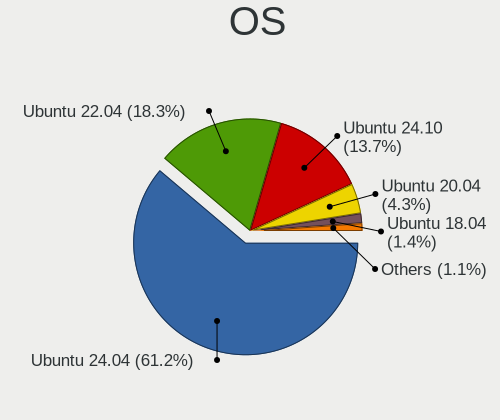
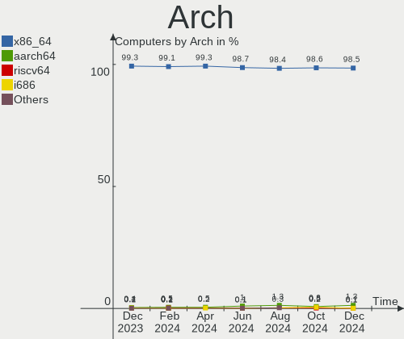
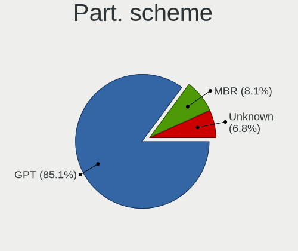
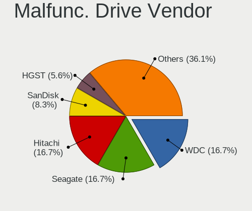
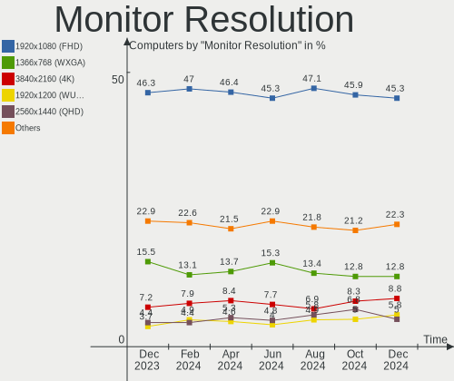

Ubuntu Hardware Trends
----------------------

A project to identify most popular hardware characteristics and track their change
over time based on data collected by Ubuntu users at https://Linux-Hardware.org.

Anyone can contribute to this report by the [hw-probe](https://github.com/linuxhw/hw-probe) tool:

    sudo -E hw-probe -all -upload

This is a report for all computer types. See also reports for [desktops](/Dist/Ubuntu/Desktop/README.md) and [notebooks](/Dist/Ubuntu/Notebook/README.md).

Full-feature report is available here: https://linux-hardware.org/?view=trends

Period: Jul, 2021.

Contents
--------

* [ System ](#system)
  - [ OS                       ](#os)
  - [ OS Family                ](#os-family)
  - [ Kernel                   ](#kernel)
  - [ Kernel Family            ](#kernel-family)
  - [ Kernel Major Ver.        ](#kernel-major-ver)
  - [ Arch                     ](#arch)
  - [ DE                       ](#de)
  - [ Display Server           ](#display-server)
  - [ Display Manager          ](#display-manager)
  - [ OS Lang                  ](#os-lang)
  - [ Boot Mode                ](#boot-mode)
  - [ Filesystem               ](#filesystem)
  - [ Part. scheme             ](#part-scheme)
  - [ Dual Boot with Linux/BSD ](#dual-boot-with-linuxbsd)
  - [ Dual Boot (Win)          ](#dual-boot-win)

* [ Board ](#board)
  - [ Vendor                   ](#vendor)
  - [ Model                    ](#model)
  - [ Model Family             ](#model-family)
  - [ MFG Year                 ](#mfg-year)
  - [ Form Factor              ](#form-factor)
  - [ Secure Boot              ](#secure-boot)
  - [ Coreboot                 ](#coreboot)
  - [ RAM Size                 ](#ram-size)
  - [ RAM Used                 ](#ram-used)
  - [ Total Drives             ](#total-drives)
  - [ Has CD-ROM               ](#has-cd-rom)
  - [ Has Ethernet             ](#has-ethernet)
  - [ Has WiFi                 ](#has-wifi)
  - [ Has Bluetooth            ](#has-bluetooth)

* [ Location ](#location)
  - [ Country                  ](#country)
  - [ City                     ](#city)

* [ Drives ](#drives)
  - [ Drive Vendor             ](#drive-vendor)
  - [ Drive Model              ](#drive-model)
  - [ HDD Vendor               ](#hdd-vendor)
  - [ SSD Vendor               ](#ssd-vendor)
  - [ Drive Kind               ](#drive-kind)
  - [ Drive Connector          ](#drive-connector)
  - [ Drive Size               ](#drive-size)
  - [ Space Total              ](#space-total)
  - [ Space Used               ](#space-used)
  - [ Malfunc. Drives          ](#malfunc-drives)
  - [ Malfunc. Drive Vendor    ](#malfunc-drive-vendor)
  - [ Malfunc. HDD Vendor      ](#malfunc-hdd-vendor)
  - [ Malfunc. Drive Kind      ](#malfunc-drive-kind)
  - [ Failed Drives            ](#failed-drives)
  - [ Failed Drive Vendor      ](#failed-drive-vendor)
  - [ Drive Status             ](#drive-status)

* [ Storage controller ](#storage-controller)
  - [ Storage Vendor           ](#storage-vendor)
  - [ Storage Model            ](#storage-model)
  - [ Storage Kind             ](#storage-kind)

* [ Processor ](#processor)
  - [ CPU Vendor               ](#cpu-vendor)
  - [ CPU Model                ](#cpu-model)
  - [ CPU Model Family         ](#cpu-model-family)
  - [ CPU Cores                ](#cpu-cores)
  - [ CPU Sockets              ](#cpu-sockets)
  - [ CPU Threads              ](#cpu-threads)
  - [ CPU Op-Modes             ](#cpu-op-modes)
  - [ CPU Microcode            ](#cpu-microcode)
  - [ CPU Microarch            ](#cpu-microarch)

* [ Graphics ](#graphics)
  - [ GPU Vendor               ](#gpu-vendor)
  - [ GPU Model                ](#gpu-model)
  - [ GPU Combo                ](#gpu-combo)
  - [ GPU Driver               ](#gpu-driver)
  - [ GPU Memory               ](#gpu-memory)

* [ Monitor ](#monitor)
  - [ Monitor Vendor           ](#monitor-vendor)
  - [ Monitor Model            ](#monitor-model)
  - [ Monitor Resolution       ](#monitor-resolution)
  - [ Monitor Diagonal         ](#monitor-diagonal)
  - [ Monitor Width            ](#monitor-width)
  - [ Aspect Ratio             ](#aspect-ratio)
  - [ Monitor Area             ](#monitor-area)
  - [ Pixel Density            ](#pixel-density)
  - [ Multiple Monitors        ](#multiple-monitors)

* [ Network ](#network)
  - [ Net Controller Vendor    ](#net-controller-vendor)
  - [ Net Controller Model     ](#net-controller-model)
  - [ Wireless Vendor          ](#wireless-vendor)
  - [ Wireless Model           ](#wireless-model)
  - [ Ethernet Vendor          ](#ethernet-vendor)
  - [ Ethernet Model           ](#ethernet-model)
  - [ Net Controller Kind      ](#net-controller-kind)
  - [ Used Controller          ](#used-controller)
  - [ NICs                     ](#nics)
  - [ IPv6                     ](#ipv6)

* [ Bluetooth ](#bluetooth)
  - [ Bluetooth Vendor         ](#bluetooth-vendor)
  - [ Bluetooth Model          ](#bluetooth-model)

* [ Sound ](#sound)
  - [ Sound Vendor             ](#sound-vendor)
  - [ Sound Model              ](#sound-model)

* [ Memory ](#memory)
  - [ Memory Vendor            ](#memory-vendor)
  - [ Memory Model             ](#memory-model)
  - [ Memory Kind              ](#memory-kind)
  - [ Memory Form Factor       ](#memory-form-factor)
  - [ Memory Size              ](#memory-size)
  - [ Memory Speed             ](#memory-speed)

* [ Printers & scanners ](#printers--scanners)
  - [ Printer Vendor           ](#printer-vendor)
  - [ Printer Model            ](#printer-model)
  - [ Scanner Vendor           ](#scanner-vendor)
  - [ Scanner Model            ](#scanner-model)

* [ Camera ](#camera)
  - [ Camera Vendor            ](#camera-vendor)
  - [ Camera Model             ](#camera-model)

* [ Security ](#security)
  - [ Fingerprint Vendor       ](#fingerprint-vendor)
  - [ Fingerprint Model        ](#fingerprint-model)
  - [ Chipcard Vendor          ](#chipcard-vendor)
  - [ Chipcard Model           ](#chipcard-model)

* [ Unsupported ](#unsupported)
  - [ Unsupported Devices      ](#unsupported-devices)
  - [ Unsupported Device Types ](#unsupported-device-types)

System
------

OS
--

Installed operating systems

| Name           | Computers | Percent |
|----------------|-----------|---------|
| Ubuntu 20.04   | 829       | 64.31%  |
| Ubuntu 21.04   | 291       | 22.58%  |
| Ubuntu 18.04   | 105       | 8.15%   |
| Ubuntu 20.10   | 33        | 2.56%   |
| Ubuntu 16.04   | 13        | 1.01%   |
| Ubuntu 21.10   | 9         | 0.7%    |
| Ubuntu 19.10   | 2         | 0.16%   |
| Ubuntu 18.10   | 2         | 0.16%   |
| Ubuntu Core 20 | 1         | 0.08%   |
| Ubuntu Core 18 | 1         | 0.08%   |
| Ubuntu Core 16 | 1         | 0.08%   |
| Ubuntu 14.04   | 1         | 0.08%   |
| Ubuntu         | 1         | 0.08%   |

OS Family
---------

OS without a version

| Name   | Computers | Percent |
|--------|-----------|---------|
| Ubuntu | 1290      | 100%    |

Kernel
------

Version of the Linux kernel

| Version                    | Computers | Percent |
|----------------------------|-----------|---------|
| 5.8.0-59-generic           | 387       | 30%     |
| 5.8.0-63-generic           | 163       | 12.64%  |
| 5.11.0-22-generic          | 145       | 11.24%  |
| 5.4.0-77-generic           | 119       | 9.22%   |
| 5.11.0-25-generic          | 70        | 5.43%   |
| 5.4.0-80-generic           | 58        | 4.5%    |
| 5.8.0-43-generic           | 44        | 3.41%   |
| 5.11.0-16-generic          | 20        | 1.55%   |
| 4.15.0-151-generic         | 20        | 1.55%   |
| 4.15.0-147-generic         | 15        | 1.16%   |
| 5.11.0-24-generic          | 14        | 1.09%   |
| 5.8.0-61-generic           | 13        | 1.01%   |
| 5.11.0-26-generic          | 13        | 1.01%   |
| 5.11.0-1012-raspi          | 13        | 1.01%   |
| 5.8.0-55-generic           | 11        | 0.85%   |
| 5.4.0-42-generic           | 11        | 0.85%   |
| 5.8.0-53-generic           | 5         | 0.39%   |
| 5.4.0-74-generic           | 5         | 0.39%   |
| 5.4.0-72-generic           | 5         | 0.39%   |
| 5.4.0-26-generic           | 5         | 0.39%   |
| 5.13.1-051301-generic      | 5         | 0.39%   |
| 5.13.0-051300-generic      | 5         | 0.39%   |
| 5.11.0-1015-raspi          | 5         | 0.39%   |
| 4.4.0-210-generic          | 5         | 0.39%   |
| 5.8.0-64-generic           | 4         | 0.31%   |
| 5.8.0-50-generic           | 4         | 0.31%   |
| 4.15.0-20-generic          | 4         | 0.31%   |
| 4.15.0-142-generic         | 4         | 0.31%   |
| 5.9.0-050900-generic       | 3         | 0.23%   |
| 5.8.0-63-lowlatency        | 3         | 0.23%   |
| 5.8.0-60-generic           | 3         | 0.23%   |
| 5.8.0-38-generic           | 3         | 0.23%   |
| 5.8.0-25-generic           | 3         | 0.23%   |
| 5.4.0-73-generic           | 3         | 0.23%   |
| 5.4.0-70-generic           | 3         | 0.23%   |
| 5.4.0-58-generic           | 3         | 0.23%   |
| 5.11.0-20-generic          | 3         | 0.23%   |
| 5.8.0-41-generic           | 2         | 0.16%   |
| 5.6.0-1047-oem             | 2         | 0.16%   |
| 5.4.0-79-generic           | 2         | 0.16%   |
| 5.4.0-77-lowlatency        | 2         | 0.16%   |
| 5.4.0-65-generic           | 2         | 0.16%   |
| 5.4.0-62-generic           | 2         | 0.16%   |
| 5.4.0-54-generic           | 2         | 0.16%   |
| 5.4.0-48-generic           | 2         | 0.16%   |
| 5.4.0-1038-raspi           | 2         | 0.16%   |
| 5.3.0-64-generic           | 2         | 0.16%   |
| 5.13.2-051302-generic      | 2         | 0.16%   |
| 5.11.0-18-generic          | 2         | 0.16%   |
| 4.9.201-tegra              | 2         | 0.16%   |
| 4.18.0-25-generic          | 2         | 0.16%   |
| 4.15.0-152-generic         | 2         | 0.16%   |
| 4.15.0-149-generic         | 2         | 0.16%   |
| 5.8.7-050807-generic       | 1         | 0.08%   |
| 5.8.0-59-lowlatency        | 1         | 0.08%   |
| 5.8.0-492104061620-generic | 1         | 0.08%   |
| 5.8.0-49-generic           | 1         | 0.08%   |
| 5.8.0-48-generic           | 1         | 0.08%   |
| 5.8.0-44-generic           | 1         | 0.08%   |
| 5.8.0-36-generic           | 1         | 0.08%   |

Kernel Family
-------------

Linux kernel without a distro release

| Version | Computers | Percent |
|---------|-----------|---------|
| 5.8.0   | 652       | 50.54%  |
| 5.11.0  | 287       | 22.25%  |
| 5.4.0   | 234       | 18.14%  |
| 4.15.0  | 55        | 4.26%   |
| 5.13.0  | 7         | 0.54%   |
| 4.4.0   | 7         | 0.54%   |
| 5.13.1  | 5         | 0.39%   |
| 5.10.0  | 4         | 0.31%   |
| 5.9.0   | 3         | 0.23%   |
| 5.6.0   | 3         | 0.23%   |
| 5.3.0   | 3         | 0.23%   |
| 5.12.14 | 3         | 0.23%   |
| 5.0.0   | 3         | 0.23%   |
| 5.13.6  | 2         | 0.16%   |
| 5.13.4  | 2         | 0.16%   |
| 5.13.2  | 2         | 0.16%   |
| 5.12.9  | 2         | 0.16%   |
| 5.12.0  | 2         | 0.16%   |
| 4.9.201 | 2         | 0.16%   |
| 4.18.0  | 2         | 0.16%   |
| 5.8.7   | 1         | 0.08%   |
| 5.7.15  | 1         | 0.08%   |
| 5.4.44  | 1         | 0.08%   |
| 5.14.0  | 1         | 0.08%   |
| 5.11.11 | 1         | 0.08%   |
| 5.10.34 | 1         | 0.08%   |
| 5.10.11 | 1         | 0.08%   |
| 4.20.17 | 1         | 0.08%   |
| 4.16.18 | 1         | 0.08%   |
| 3.13.0  | 1         | 0.08%   |

Kernel Major Ver.
-----------------

Linux kernel major version

| Version | Computers | Percent |
|---------|-----------|---------|
| 5.8     | 653       | 50.62%  |
| 5.11    | 288       | 22.33%  |
| 5.4     | 235       | 18.22%  |
| 4.15    | 55        | 4.26%   |
| 5.13    | 18        | 1.4%    |
| 5.12    | 7         | 0.54%   |
| 4.4     | 7         | 0.54%   |
| 5.10    | 6         | 0.47%   |
| 5.9     | 3         | 0.23%   |
| 5.6     | 3         | 0.23%   |
| 5.3     | 3         | 0.23%   |
| 5.0     | 3         | 0.23%   |
| 4.9     | 2         | 0.16%   |
| 4.18    | 2         | 0.16%   |
| 5.7     | 1         | 0.08%   |
| 5.14    | 1         | 0.08%   |
| 4.20    | 1         | 0.08%   |
| 4.16    | 1         | 0.08%   |
| 3.13    | 1         | 0.08%   |

Arch
----

OS architecture (x86_64, i586, etc.)

| Name    | Computers | Percent |
|---------|-----------|---------|
| x86_64  | 1253      | 97.13%  |
| aarch64 | 24        | 1.86%   |
| i686    | 13        | 1.01%   |

DE
--

Desktop Environment

| Name              | Computers | Percent |
|-------------------|-----------|---------|
| GNOME             | 1086      | 84.19%  |
| Unknown           | 144       | 11.16%  |
| Unity             | 22        | 1.71%   |
| X-Cinnamon        | 17        | 1.32%   |
| GNOME Flashback   | 8         | 0.62%   |
| i3                | 3         | 0.23%   |
| Cinnamon          | 3         | 0.23%   |
| Enlightenment     | 2         | 0.16%   |
| Yaru:ubuntu:GNOME | 1         | 0.08%   |
| ubuntustudio      | 1         | 0.08%   |
| Trinity           | 1         | 0.08%   |
| GNOME Classic     | 1         | 0.08%   |
| Deepin            | 1         | 0.08%   |

Display Server
--------------

X11 or Wayland

| Name    | Computers | Percent |
|---------|-----------|---------|
| X11     | 972       | 75.35%  |
| Wayland | 226       | 17.52%  |
| Unknown | 67        | 5.19%   |
| Tty     | 25        | 1.94%   |

Display Manager
---------------

SDDM, LightDM, etc.

| Name    | Computers | Percent |
|---------|-----------|---------|
| Unknown | 994       | 77.05%  |
| GDM     | 281       | 21.78%  |
| TDM     | 8         | 0.62%   |
| GDM3    | 4         | 0.31%   |
| SDDM    | 1         | 0.08%   |
| Ly      | 1         | 0.08%   |
| LightDM | 1         | 0.08%   |

OS Lang
-------

Language

| Lang    | Computers | Percent |
|---------|-----------|---------|
| en_US   | 553       | 42.87%  |
| de_DE   | 137       | 10.62%  |
| fr_FR   | 76        | 5.89%   |
| en_GB   | 68        | 5.27%   |
| en_IN   | 47        | 3.64%   |
| pt_BR   | 46        | 3.57%   |
| it_IT   | 32        | 2.48%   |
| ru_RU   | 31        | 2.4%    |
| en_CA   | 30        | 2.33%   |
| en_AU   | 25        | 1.94%   |
| pl_PL   | 20        | 1.55%   |
| C       | 19        | 1.47%   |
| es_ES   | 17        | 1.32%   |
| nl_NL   | 15        | 1.16%   |
| pt_PT   | 11        | 0.85%   |
| ja_JP   | 11        | 0.85%   |
| Unknown | 11        | 0.85%   |
| cs_CZ   | 10        | 0.78%   |
| es_MX   | 9         | 0.7%    |
| en_ZA   | 9         | 0.7%    |
| de_AT   | 8         | 0.62%   |
| hu_HU   | 7         | 0.54%   |
| es_AR   | 7         | 0.54%   |
| zh_CN   | 6         | 0.47%   |
| ro_RO   | 5         | 0.39%   |
| ko_KR   | 5         | 0.39%   |
| en_NZ   | 5         | 0.39%   |
| de_CH   | 5         | 0.39%   |
| ru_UA   | 4         | 0.31%   |
| hr_HR   | 4         | 0.31%   |
| es_CL   | 4         | 0.31%   |
| ca_ES   | 4         | 0.31%   |
| sv_SE   | 3         | 0.23%   |
| sk_SK   | 3         | 0.23%   |
| nb_NO   | 3         | 0.23%   |
| es_CO   | 3         | 0.23%   |
| en_NG   | 3         | 0.23%   |
| zh_TW   | 2         | 0.16%   |
| id_ID   | 2         | 0.16%   |
| fr_LU   | 2         | 0.16%   |
| fr_CH   | 2         | 0.16%   |
| fi_FI   | 2         | 0.16%   |
| es_VE   | 2         | 0.16%   |
| en_SG   | 2         | 0.16%   |
| en_IE   | 2         | 0.16%   |
| da_DK   | 2         | 0.16%   |
| zh_HK   | 1         | 0.08%   |
| vi_VN   | 1         | 0.08%   |
| uk_UA   | 1         | 0.08%   |
| tr_TR   | 1         | 0.08%   |
| lzh_TW  | 1         | 0.08%   |
| fr_CA   | 1         | 0.08%   |
| es_UY   | 1         | 0.08%   |
| es_NI   | 1         | 0.08%   |
| es_HN   | 1         | 0.08%   |
| es_EC   | 1         | 0.08%   |
| es_CR   | 1         | 0.08%   |
| en_PH   | 1         | 0.08%   |
| en_IL   | 1         | 0.08%   |
| en_HK   | 1         | 0.08%   |

Boot Mode
---------

EFI or BIOS

| Mode | Computers | Percent |
|------|-----------|---------|
| BIOS | 710       | 55.04%  |
| EFI  | 580       | 44.96%  |

Filesystem
----------

Type of filesystem

| Type    | Computers | Percent |
|---------|-----------|---------|
| Ext4    | 1220      | 94.57%  |
| Overlay | 35        | 2.71%   |
| Zfs     | 17        | 1.32%   |
| Btrfs   | 7         | 0.54%   |
| Xfs     | 5         | 0.39%   |
| Ext2    | 3         | 0.23%   |
| Ext3    | 2         | 0.16%   |
| Nfs     | 1         | 0.08%   |

Part. scheme
------------

Scheme of partitioning

| Type    | Computers | Percent |
|---------|-----------|---------|
| Unknown | 968       | 75.04%  |
| GPT     | 262       | 20.31%  |
| MBR     | 60        | 4.65%   |

Dual Boot with Linux/BSD
------------------------

Hosting more than one Linux/BSD

| Dual boot | Computers | Percent |
|-----------|-----------|---------|
| No        | 1134      | 87.91%  |
| Yes       | 156       | 12.09%  |

Dual Boot (Win)
---------------

Hosting Linux and Windows

| Dual boot | Computers | Percent |
|-----------|-----------|---------|
| No        | 757       | 58.68%  |
| Yes       | 533       | 41.32%  |

Board
-----

Vendor
------

Motherboard manufacturer

| Name                           | Computers | Percent |
|--------------------------------|-----------|---------|
| Dell                           | 206       | 15.97%  |
| ASUSTek Computer               | 194       | 15.04%  |
| Hewlett-Packard                | 185       | 14.34%  |
| Lenovo                         | 151       | 11.71%  |
| Gigabyte Technology            | 85        | 6.59%   |
| Acer                           | 77        | 5.97%   |
| MSI                            | 75        | 5.81%   |
| ASRock                         | 39        | 3.02%   |
| Intel                          | 33        | 2.56%   |
| Unknown                        | 26        | 2.02%   |
| Apple                          | 25        | 1.94%   |
| Toshiba                        | 22        | 1.71%   |
| Sony                           | 14        | 1.09%   |
| Fujitsu                        | 13        | 1.01%   |
| Medion                         | 12        | 0.93%   |
| Samsung Electronics            | 11        | 0.85%   |
| Pegatron                       | 11        | 0.85%   |
| Supermicro                     | 6         | 0.47%   |
| Raspberry Pi Foundation        | 6         | 0.47%   |
| TUXEDO                         | 5         | 0.39%   |
| Foxconn                        | 5         | 0.39%   |
| ECS                            | 5         | 0.39%   |
| Biostar                        | 5         | 0.39%   |
| AMI                            | 5         | 0.39%   |
| Timi                           | 4         | 0.31%   |
| System76                       | 3         | 0.23%   |
| Notebook                       | 3         | 0.23%   |
| Huanan                         | 3         | 0.23%   |
| Chuwi                          | 3         | 0.23%   |
| Teclast                        | 2         | 0.16%   |
| Shuttle                        | 2         | 0.16%   |
| Schenker                       | 2         | 0.16%   |
| Packard Bell                   | 2         | 0.16%   |
| Nvidia                         | 2         | 0.16%   |
| Microsoft                      | 2         | 0.16%   |
| LG Electronics                 | 2         | 0.16%   |
| HUAWEI                         | 2         | 0.16%   |
| Google                         | 2         | 0.16%   |
| Getac                          | 2         | 0.16%   |
| Gateway                        | 2         | 0.16%   |
| Casper                         | 2         | 0.16%   |
| Alienware                      | 2         | 0.16%   |
| Wortmann AG                    | 1         | 0.08%   |
| Wiltronic                      | 1         | 0.08%   |
| whyopencomputing               | 1         | 0.08%   |
| SLIMBOOK                       | 1         | 0.08%   |
| roda computer                  | 1         | 0.08%   |
| Positivo                       | 1         | 0.08%   |
| PCWare                         | 1         | 0.08%   |
| PCChips                        | 1         | 0.08%   |
| Panasonic                      | 1         | 0.08%   |
| ONE-NETBOOK TECHNOLOGY         | 1         | 0.08%   |
| OEM                            | 1         | 0.08%   |
| Multilaser                     | 1         | 0.08%   |
| mPTech                         | 1         | 0.08%   |
| Motion Computing               | 1         | 0.08%   |
| Matsushita Electric Industrial | 1         | 0.08%   |
| MACHINIST                      | 1         | 0.08%   |
| Kogan                          | 1         | 0.08%   |
| Itautec                        | 1         | 0.08%   |

Model
-----

Motherboard model

| Name                                 | Computers | Percent |
|--------------------------------------|-----------|---------|
| Unknown                              | 30        | 2.33%   |
| ASUS All Series                      | 19        | 1.47%   |
| HP Notebook                          | 6         | 0.47%   |
| Dell OptiPlex 790                    | 5         | 0.39%   |
| MSI MS-7A38                          | 4         | 0.31%   |
| MSI MS-7817                          | 4         | 0.31%   |
| HP Pavilion dv6                      | 4         | 0.31%   |
| HP EliteBook 840 G2                  | 4         | 0.31%   |
| Gigabyte B450M DS3H                  | 4         | 0.31%   |
| Dell XPS 15 9500                     | 4         | 0.31%   |
| Dell OptiPlex 990                    | 4         | 0.31%   |
| Dell Inspiron N5110                  | 4         | 0.31%   |
| MSI MS-7C37                          | 3         | 0.23%   |
| HP EliteBook 840 G3                  | 3         | 0.23%   |
| Gigabyte GA-78LMT-USB3 6.0           | 3         | 0.23%   |
| Dell XPS 13 9310                     | 3         | 0.23%   |
| Dell OptiPlex 7010                   | 3         | 0.23%   |
| Dell Latitude E7470                  | 3         | 0.23%   |
| Dell Latitude E7440                  | 3         | 0.23%   |
| Dell Latitude E5470                  | 3         | 0.23%   |
| ASUS T100HAN                         | 3         | 0.23%   |
| ASUS ROG STRIX X570-E GAMING         | 3         | 0.23%   |
| ASUS P6T DELUXE V2                   | 3         | 0.23%   |
| AMI Cherry Trail CR                  | 3         | 0.23%   |
| Acer Aspire E1-571                   | 3         | 0.23%   |
| Acer Aspire 5741G                    | 3         | 0.23%   |
| Toshiba Satellite L50-B              | 2         | 0.16%   |
| Toshiba Satellite C55-B              | 2         | 0.16%   |
| Timi TM1701                          | 2         | 0.16%   |
| RPi Raspberry Pi 4 Model B Rev 1.4   | 2         | 0.16%   |
| RPi Raspberry Pi 4 Model B Rev 1.2   | 2         | 0.16%   |
| RPi Raspberry Pi 4 Model B Rev 1.1   | 2         | 0.16%   |
| Nvidia Tegra                         | 2         | 0.16%   |
| MSI Pro 3000/3080                    | 2         | 0.16%   |
| MSI MS-7C91                          | 2         | 0.16%   |
| MSI MS-7C75                          | 2         | 0.16%   |
| MSI MS-7C56                          | 2         | 0.16%   |
| MSI MS-7C02                          | 2         | 0.16%   |
| MSI MS-7A34                          | 2         | 0.16%   |
| MSI MS-7996                          | 2         | 0.16%   |
| MSI MS-7788                          | 2         | 0.16%   |
| MSI MS-7693                          | 2         | 0.16%   |
| MSI MS-7592                          | 2         | 0.16%   |
| Lenovo ThinkPad T14 Gen 1 20S1SDLQ00 | 2         | 0.16%   |
| Lenovo IdeaPad 5 14ARE05 81YM        | 2         | 0.16%   |
| Lenovo G500 20236                    | 2         | 0.16%   |
| Intel NUC8i3BEH                      | 2         | 0.16%   |
| Intel DQ57TM AAE70931-404            | 2         | 0.16%   |
| Huanan X99-F8                        | 2         | 0.16%   |
| HP Z400 Workstation                  | 2         | 0.16%   |
| HP ProLiant MicroServer Gen8         | 2         | 0.16%   |
| HP ProLiant DL360p Gen8              | 2         | 0.16%   |
| HP ProDesk 405 G6 Desktop Mini PC    | 2         | 0.16%   |
| HP ProBook 650 G1                    | 2         | 0.16%   |
| HP ProBook 6460b                     | 2         | 0.16%   |
| HP ProBook 6450b                     | 2         | 0.16%   |
| HP ProBook 640 G1                    | 2         | 0.16%   |
| HP Presario CQ56                     | 2         | 0.16%   |
| HP Pavilion Laptop 15-cs3xxx         | 2         | 0.16%   |
| HP Pavilion Gaming Laptop 15-dk0xxx  | 2         | 0.16%   |

Model Family
------------

Motherboard model prefix

| Name                   | Computers | Percent |
|------------------------|-----------|---------|
| Lenovo ThinkPad        | 75        | 5.81%   |
| Dell Inspiron          | 55        | 4.26%   |
| Acer Aspire            | 53        | 4.11%   |
| Dell Latitude          | 46        | 3.57%   |
| HP Pavilion            | 35        | 2.71%   |
| Dell XPS               | 32        | 2.48%   |
| Dell OptiPlex          | 31        | 2.4%    |
| HP EliteBook           | 30        | 2.33%   |
| Unknown                | 30        | 2.33%   |
| HP ProBook             | 27        | 2.09%   |
| Lenovo IdeaPad         | 26        | 2.02%   |
| ASUS All               | 19        | 1.47%   |
| ASUS ROG               | 18        | 1.4%    |
| Toshiba Satellite      | 16        | 1.24%   |
| HP Laptop              | 16        | 1.24%   |
| Dell Precision         | 16        | 1.24%   |
| HP Compaq              | 15        | 1.16%   |
| ASUS PRIME             | 15        | 1.16%   |
| ASUS TUF               | 14        | 1.09%   |
| ASUS VivoBook          | 12        | 0.93%   |
| Lenovo ThinkBook       | 8         | 0.62%   |
| Dell Vostro            | 8         | 0.62%   |
| HP ProLiant            | 7         | 0.54%   |
| RPi Raspberry          | 6         | 0.47%   |
| HP Notebook            | 6         | 0.47%   |
| Fujitsu LIFEBOOK       | 6         | 0.47%   |
| Dell PowerEdge         | 6         | 0.47%   |
| Lenovo Yoga            | 5         | 0.39%   |
| Lenovo ThinkCentre     | 5         | 0.39%   |
| Lenovo Legion          | 5         | 0.39%   |
| HP ZBook               | 5         | 0.39%   |
| Gigabyte B450M         | 5         | 0.39%   |
| ASUS P8H61-M           | 5         | 0.39%   |
| Acer Swift             | 5         | 0.39%   |
| MSI MS-7A38            | 4         | 0.31%   |
| MSI MS-7817            | 4         | 0.31%   |
| HP ENVY                | 4         | 0.31%   |
| Gigabyte GA-78LMT-USB3 | 4         | 0.31%   |
| Fujitsu ESPRIMO        | 4         | 0.31%   |
| Dell Studio            | 4         | 0.31%   |
| Dell G3                | 4         | 0.31%   |
| Acer Veriton           | 4         | 0.31%   |
| Toshiba TECRA          | 3         | 0.23%   |
| MSI MS-7C37            | 3         | 0.23%   |
| Lenovo MIIX            | 3         | 0.23%   |
| HP Stream              | 3         | 0.23%   |
| HP ProDesk             | 3         | 0.23%   |
| HP Presario            | 3         | 0.23%   |
| HP OMEN                | 3         | 0.23%   |
| HP EliteDesk           | 3         | 0.23%   |
| Gigabyte Z390          | 3         | 0.23%   |
| Gigabyte X570          | 3         | 0.23%   |
| Gigabyte B450          | 3         | 0.23%   |
| Gigabyte A320M-S2H     | 3         | 0.23%   |
| ASUS T100HAN           | 3         | 0.23%   |
| ASUS SABERTOOTH        | 3         | 0.23%   |
| ASUS P6T               | 3         | 0.23%   |
| ASUS Maximus           | 3         | 0.23%   |
| ASUS M5A97             | 3         | 0.23%   |
| ASRock 970             | 3         | 0.23%   |

MFG Year
--------

Motherboard manufacture year

| Year    | Computers | Percent |
|---------|-----------|---------|
| 2021    | 186       | 14.42%  |
| 2020    | 186       | 14.42%  |
| 2018    | 125       | 9.69%   |
| 2019    | 111       | 8.6%    |
| 2012    | 86        | 6.67%   |
| 2011    | 86        | 6.67%   |
| 2015    | 70        | 5.43%   |
| 2013    | 68        | 5.27%   |
| 2010    | 68        | 5.27%   |
| 2014    | 66        | 5.12%   |
| 2017    | 58        | 4.5%    |
| 2016    | 53        | 4.11%   |
| 2009    | 52        | 4.03%   |
| 2008    | 32        | 2.48%   |
| Unknown | 25        | 1.94%   |
| 2007    | 14        | 1.09%   |
| 2006    | 2         | 0.16%   |
| 2005    | 1         | 0.08%   |
| 2004    | 1         | 0.08%   |

Form Factor
-----------

Physical design of the computer

| Name           | Computers | Percent |
|----------------|-----------|---------|
| Notebook       | 670       | 51.94%  |
| Desktop        | 513       | 39.77%  |
| Convertible    | 29        | 2.25%   |
| System on chip | 24        | 1.86%   |
| Server         | 17        | 1.32%   |
| All in one     | 14        | 1.09%   |
| Tablet         | 12        | 0.93%   |
| Mini pc        | 11        | 0.85%   |

Secure Boot
-----------

Enabled or disabled

| State    | Computers | Percent |
|----------|-----------|---------|
| Disabled | 1164      | 90.23%  |
| Enabled  | 126       | 9.77%   |

Coreboot
--------

Have coreboot on board

| Used | Computers | Percent |
|------|-----------|---------|
| No   | 1287      | 99.77%  |
| Yes  | 3         | 0.23%   |

RAM Size
--------

Total RAM memory

| Size in GB      | Computers | Percent |
|-----------------|-----------|---------|
| 4.01-8.0        | 301       | 23.33%  |
| 16.01-24.0      | 278       | 21.55%  |
| 3.01-4.0        | 242       | 18.76%  |
| 8.01-16.0       | 238       | 18.45%  |
| 32.01-64.0      | 119       | 9.22%   |
| 1.01-2.0        | 46        | 3.57%   |
| 64.01-256.0     | 37        | 2.87%   |
| 24.01-32.0      | 14        | 1.09%   |
| 2.01-3.0        | 9         | 0.7%    |
| More than 256.0 | 6         | 0.47%   |

RAM Used
--------

Used RAM memory

| Used GB     | Computers | Percent |
|-------------|-----------|---------|
| 1.01-2.0    | 488       | 37.83%  |
| 2.01-3.0    | 349       | 27.05%  |
| 3.01-4.0    | 186       | 14.42%  |
| 4.01-8.0    | 170       | 13.18%  |
| 8.01-16.0   | 56        | 4.34%   |
| 0.51-1.0    | 23        | 1.78%   |
| 16.01-24.0  | 7         | 0.54%   |
| 0.01-0.5    | 5         | 0.39%   |
| 24.01-32.0  | 3         | 0.23%   |
| 32.01-64.0  | 1         | 0.08%   |
| 64.01-256.0 | 1         | 0.08%   |
| Unknown     | 1         | 0.08%   |

Total Drives
------------

Number of drives on board

| Drives | Computers | Percent |
|--------|-----------|---------|
| 1      | 761       | 58.99%  |
| 2      | 322       | 24.96%  |
| 3      | 116       | 8.99%   |
| 4      | 36        | 2.79%   |
| 5      | 20        | 1.55%   |
| 0      | 12        | 0.93%   |
| 6      | 10        | 0.78%   |
| 7      | 4         | 0.31%   |
| 9      | 3         | 0.23%   |
| 8      | 2         | 0.16%   |
| 32     | 1         | 0.08%   |
| 23     | 1         | 0.08%   |
| 11     | 1         | 0.08%   |
| 10     | 1         | 0.08%   |

Has CD-ROM
----------

Has CD-ROM on board

| Presented | Computers | Percent |
|-----------|-----------|---------|
| No        | 779       | 60.39%  |
| Yes       | 511       | 39.61%  |

Has Ethernet
------------

Has Ethernet on board

| Presented | Computers | Percent |
|-----------|-----------|---------|
| Yes       | 1119      | 86.74%  |
| No        | 171       | 13.26%  |

Has WiFi
--------

Has WiFi module

| Presented | Computers | Percent |
|-----------|-----------|---------|
| Yes       | 930       | 72.09%  |
| No        | 360       | 27.91%  |

Has Bluetooth
-------------

Has Bluetooth module

| Presented | Computers | Percent |
|-----------|-----------|---------|
| Yes       | 698       | 54.11%  |
| No        | 592       | 45.89%  |

Location
--------

Country
-------

Geographic location (country)

| Country      | Computers | Percent |
|--------------|-----------|---------|
| USA          | 244       | 18.91%  |
| Germany      | 162       | 12.56%  |
| France       | 82        | 6.36%   |
| Brazil       | 67        | 5.19%   |
| UK           | 61        | 4.73%   |
| India        | 52        | 4.03%   |
| Italy        | 45        | 3.49%   |
| Russia       | 42        | 3.26%   |
| Canada       | 35        | 2.71%   |
| Netherlands  | 33        | 2.56%   |
| Poland       | 29        | 2.25%   |
| Australia    | 27        | 2.09%   |
| Spain        | 23        | 1.78%   |
| Austria      | 17        | 1.32%   |
| Ukraine      | 16        | 1.24%   |
| Switzerland  | 16        | 1.24%   |
| Romania      | 16        | 1.24%   |
| Portugal     | 16        | 1.24%   |
| Mexico       | 16        | 1.24%   |
| Czechia      | 16        | 1.24%   |
| Argentina    | 13        | 1.01%   |
| Turkey       | 12        | 0.93%   |
| Indonesia    | 12        | 0.93%   |
| South Africa | 11        | 0.85%   |
| Japan        | 11        | 0.85%   |
| Hungary      | 11        | 0.85%   |
| China        | 10        | 0.78%   |
| Iran         | 9         | 0.7%    |
| Sweden       | 8         | 0.62%   |
| Puerto Rico  | 7         | 0.54%   |
| Greece       | 7         | 0.54%   |
| Finland      | 7         | 0.54%   |
| Bulgaria     | 7         | 0.54%   |
| Slovakia     | 6         | 0.47%   |
| New Zealand  | 6         | 0.47%   |
| Belgium      | 6         | 0.47%   |
| Taiwan       | 5         | 0.39%   |
| South Korea  | 5         | 0.39%   |
| Pakistan     | 5         | 0.39%   |
| Croatia      | 5         | 0.39%   |
| Chile        | 5         | 0.39%   |
| Belarus      | 5         | 0.39%   |
| Singapore    | 4         | 0.31%   |
| Norway       | 4         | 0.31%   |
| Luxembourg   | 4         | 0.31%   |
| Denmark      | 4         | 0.31%   |
| Colombia     | 4         | 0.31%   |
| Vietnam      | 3         | 0.23%   |
| Thailand     | 3         | 0.23%   |
| Serbia       | 3         | 0.23%   |
| Peru         | 3         | 0.23%   |
| Nigeria      | 3         | 0.23%   |
| Nepal        | 3         | 0.23%   |
| Malaysia     | 3         | 0.23%   |
| Kenya        | 3         | 0.23%   |
| Hong Kong    | 3         | 0.23%   |
| Estonia      | 3         | 0.23%   |
| Ecuador      | 3         | 0.23%   |
| Costa Rica   | 3         | 0.23%   |
| Uruguay      | 2         | 0.16%   |

City
----

Geographic location (city)

| City              | Computers | Percent |
|-------------------|-----------|---------|
| Paris             | 19        | 1.47%   |
| Berlin            | 19        | 1.47%   |
| Moscow            | 16        | 1.24%   |
| Vienna            | 10        | 0.78%   |
| S??o Paulo        | 10        | 0.78%   |
| Warsaw            | 9         | 0.7%    |
| Munich            | 9         | 0.7%    |
| Tehran            | 8         | 0.62%   |
| Prague            | 8         | 0.62%   |
| Milan             | 8         | 0.62%   |
| Sydney            | 6         | 0.47%   |
| Portland          | 6         | 0.47%   |
| London            | 6         | 0.47%   |
| Juncos            | 6         | 0.47%   |
| Hyderabad         | 6         | 0.47%   |
| St Petersburg     | 5         | 0.39%   |
| Kyiv              | 5         | 0.39%   |
| Helsinki          | 5         | 0.39%   |
| Frankfurt am Main | 5         | 0.39%   |
| Cape Town         | 5         | 0.39%   |
| Bucharest         | 5         | 0.39%   |
| Bengaluru         | 5         | 0.39%   |
| Austin            | 5         | 0.39%   |
| Ankara            | 5         | 0.39%   |
| Sofia             | 4         | 0.31%   |
| Singapore         | 4         | 0.31%   |
| Seattle           | 4         | 0.31%   |
| Pretoria          | 4         | 0.31%   |
| Porto             | 4         | 0.31%   |
| Mumbai            | 4         | 0.31%   |
| Mexico City       | 4         | 0.31%   |
| Melbourne         | 4         | 0.31%   |
| Lyon              | 4         | 0.31%   |
| Los Angeles       | 4         | 0.31%   |
| Greenwood         | 4         | 0.31%   |
| Buenos Aires      | 4         | 0.31%   |
| Budapest          | 4         | 0.31%   |
| Augsburg          | 4         | 0.31%   |
| Athens            | 4         | 0.31%   |
| Amsterdam         | 4         | 0.31%   |
| Zagreb            | 3         | 0.23%   |
| Wroclaw           | 3         | 0.23%   |
| Tubarao           | 3         | 0.23%   |
| Toronto           | 3         | 0.23%   |
| Tallahassee       | 3         | 0.23%   |
| São Paulo        | 3         | 0.23%   |
| Shanghai          | 3         | 0.23%   |
| Rotterdam         | 3         | 0.23%   |
| Rosario           | 3         | 0.23%   |
| Rome              | 3         | 0.23%   |
| Pune              | 3         | 0.23%   |
| Oberhausen        | 3         | 0.23%   |
| Nuremberg         | 3         | 0.23%   |
| Noida             | 3         | 0.23%   |
| New York          | 3         | 0.23%   |
| New Taipei        | 3         | 0.23%   |
| Nairobi           | 3         | 0.23%   |
| Minsk             | 3         | 0.23%   |
| Madrid            | 3         | 0.23%   |
| Lahore            | 3         | 0.23%   |

Drives
------

Drive Vendor
------------

Hard drive vendors

| Vendor                    | Computers | Drives | Percent |
|---------------------------|-----------|--------|---------|
| WDC                       | 319       | 414    | 17.73%  |
| Seagate                   | 275       | 356    | 15.29%  |
| Samsung Electronics       | 264       | 329    | 14.67%  |
| Toshiba                   | 129       | 132    | 7.17%   |
| Unknown                   | 91        | 107    | 5.06%   |
| SanDisk                   | 89        | 92     | 4.95%   |
| Kingston                  | 87        | 93     | 4.84%   |
| Hitachi                   | 59        | 63     | 3.28%   |
| Crucial                   | 56        | 62     | 3.11%   |
| SK Hynix                  | 47        | 48     | 2.61%   |
| HGST                      | 41        | 52     | 2.28%   |
| Intel                     | 32        | 46     | 1.78%   |
| A-DATA Technology         | 23        | 24     | 1.28%   |
| Phison                    | 22        | 27     | 1.22%   |
| Micron Technology         | 20        | 21     | 1.11%   |
| China                     | 16        | 16     | 0.89%   |
| KIOXIA                    | 13        | 15     | 0.72%   |
| Apple                     | 12        | 13     | 0.67%   |
| Silicon Motion            | 11        | 11     | 0.61%   |
| Transcend                 | 9         | 9      | 0.5%    |
| OCZ                       | 9         | 9      | 0.5%    |
| PNY                       | 8         | 8      | 0.44%   |
| LITEONIT                  | 8         | 8      | 0.44%   |
| LITEON                    | 8         | 8      | 0.44%   |
| XPG                       | 7         | 7      | 0.39%   |
| SPCC                      | 7         | 7      | 0.39%   |
| Corsair                   | 7         | 7      | 0.39%   |
| Micron/Crucial Technology | 6         | 6      | 0.33%   |
| JMicron                   | 6         | 6      | 0.33%   |
| Netac                     | 5         | 5      | 0.28%   |
| Maxtor                    | 5         | 5      | 0.28%   |
| Intenso                   | 5         | 5      | 0.28%   |
| Fujitsu                   | 5         | 6      | 0.28%   |
| Realtek Semiconductor     | 4         | 4      | 0.22%   |
| Patriot                   | 4         | 4      | 0.22%   |
| Mushkin                   | 4         | 4      | 0.22%   |
| Hewlett-Packard           | 4         | 6      | 0.22%   |
| GOODRAM                   | 4         | 4      | 0.22%   |
| EMTEC                     | 4         | 4      | 0.22%   |
| Team                      | 3         | 3      | 0.17%   |
| Solid State Storage       | 3         | 3      | 0.17%   |
| Lexar                     | 3         | 3      | 0.17%   |
| KingFast                  | 3         | 3      | 0.17%   |
| KingDian                  | 3         | 3      | 0.17%   |
| Vaseky                    | 2         | 2      | 0.11%   |
| Lite-On                   | 2         | 3      | 0.11%   |
| Lenovo                    | 2         | 2      | 0.11%   |
| LaCie                     | 2         | 3      | 0.11%   |
| KingSpec                  | 2         | 2      | 0.11%   |
| Gigabyte Technology       | 2         | 2      | 0.11%   |
| External                  | 2         | 2      | 0.11%   |
| DREVO                     | 2         | 2      | 0.11%   |
| asmedia                   | 2         | 2      | 0.11%   |
| Apacer                    | 2         | 2      | 0.11%   |
| ADATA Technology          | 2         | 2      | 0.11%   |
| WD MediaMax               | 1         | 1      | 0.06%   |
| Verbatim                  | 1         | 1      | 0.06%   |
| USB                       | 1         | 1      | 0.06%   |
| Union Memory (Shenzhen)   | 1         | 1      | 0.06%   |
| Union Memory              | 1         | 1      | 0.06%   |

Drive Model
-----------

Hard drive models

| Model                               | Computers | Percent |
|-------------------------------------|-----------|---------|
| Samsung NVMe SSD Drive 512GB        | 24        | 1.22%   |
| Unknown MMC Card  32GB              | 20        | 1.02%   |
| Samsung SSD 860 EVO 500GB           | 20        | 1.02%   |
| Seagate ST500DM002-1BD142 500GB     | 19        | 0.97%   |
| Seagate ST1000LM035-1RK172 1TB      | 17        | 0.86%   |
| Kingston SA400S37240G 240GB SSD     | 17        | 0.86%   |
| Seagate ST1000DM010-2EP102 1TB      | 16        | 0.81%   |
| Samsung NVMe SSD Drive 500GB        | 16        | 0.81%   |
| Unknown MMC Card  64GB              | 15        | 0.76%   |
| Toshiba MQ01ABD100 1TB              | 15        | 0.76%   |
| Seagate ST1000LM024 HN-M101MBB 1TB  | 14        | 0.71%   |
| Kingston SA400S37480G 480GB SSD     | 13        | 0.66%   |
| Unknown MMC Card  16GB              | 11        | 0.56%   |
| Toshiba MQ01ABF050 500GB            | 11        | 0.56%   |
| Seagate ST2000DM008-2FR102 2TB      | 11        | 0.56%   |
| Samsung SSD 850 EVO 500GB           | 11        | 0.56%   |
| WDC WD10EZEX-08WN4A0 1TB            | 10        | 0.51%   |
| Sandisk NVMe SSD Drive 512GB        | 10        | 0.51%   |
| SK Hynix NVMe SSD Drive 512GB       | 9         | 0.46%   |
| Seagate ST500LT012-1DG142 500GB     | 9         | 0.46%   |
| Samsung SSD 860 EVO 1TB             | 9         | 0.46%   |
| HGST HTS721010A9E630 1TB            | 9         | 0.46%   |
| Crucial CT1000MX500SSD1 1TB         | 9         | 0.46%   |
| WDC WDS240G2G0A-00JH30 240GB SSD    | 8         | 0.41%   |
| Unknown MMC Card  128GB             | 8         | 0.41%   |
| Toshiba MQ04ABF100 1TB              | 8         | 0.41%   |
| Toshiba DT01ACA100 1TB              | 8         | 0.41%   |
| Toshiba DT01ACA050 500GB            | 8         | 0.41%   |
| Seagate ST9500325AS 500GB           | 8         | 0.41%   |
| Sandisk NVMe SSD Drive 500GB        | 8         | 0.41%   |
| Samsung SSD 860 EVO 250GB           | 8         | 0.41%   |
| Samsung SSD 850 EVO 250GB           | 8         | 0.41%   |
| Kingston SA400S37120G 120GB SSD     | 8         | 0.41%   |
| Crucial CT240BX500SSD1 240GB        | 8         | 0.41%   |
| WDC WD20EZRZ-00Z5HB0 2TB            | 7         | 0.36%   |
| Unknown SD/MMC/MS PRO 128GB         | 7         | 0.36%   |
| Seagate ST1000DM003-1SB102 1TB      | 7         | 0.36%   |
| SanDisk SDSSDA240G 240GB            | 7         | 0.36%   |
| Samsung NVMe SSD Drive 1TB          | 7         | 0.36%   |
| Intel NVMe SSD Drive 512GB          | 7         | 0.36%   |
| HGST HTS725050A7E630 500GB          | 7         | 0.36%   |
| WDC WDS120G2G0A-00JH30 120GB SSD    | 6         | 0.31%   |
| Toshiba NVMe SSD Drive 512GB        | 6         | 0.31%   |
| Seagate ST3250318AS 250GB           | 6         | 0.31%   |
| Seagate ST3160318AS 160GB           | 6         | 0.31%   |
| Seagate ST2000DM001-1ER164 2TB      | 6         | 0.31%   |
| Seagate ST1000DM003-1ER162 1TB      | 6         | 0.31%   |
| Sandisk NVMe SSD Drive 256GB        | 6         | 0.31%   |
| Samsung NVMe SSD Drive 256GB        | 6         | 0.31%   |
| HGST HTS545050A7E680 500GB          | 6         | 0.31%   |
| Crucial CT480BX500SSD1 480GB        | 6         | 0.31%   |
| WDC WDS500G2B0A-00SM50 500GB SSD    | 5         | 0.25%   |
| WDC WD10SPZX-21Z10T0 1TB            | 5         | 0.25%   |
| Toshiba HDWD110 1TB                 | 5         | 0.25%   |
| Silicon Motion NVMe SSD Drive 256GB | 5         | 0.25%   |
| Seagate ST2000DM006-2DM164 2TB      | 5         | 0.25%   |
| Seagate ST1000DM003-1CH162 1TB      | 5         | 0.25%   |
| Sandisk NVMe SSD Drive 1024GB       | 5         | 0.25%   |
| Samsung SSD 970 EVO Plus 500GB      | 5         | 0.25%   |
| Samsung SSD 850 PRO 256GB           | 5         | 0.25%   |

HDD Vendor
----------

Hard disk drive vendors

| Vendor              | Computers | Drives | Percent |
|---------------------|-----------|--------|---------|
| Seagate             | 269       | 347    | 35.21%  |
| WDC                 | 245       | 323    | 32.07%  |
| Toshiba             | 94        | 94     | 12.3%   |
| Hitachi             | 59        | 63     | 7.72%   |
| HGST                | 41        | 52     | 5.37%   |
| Samsung Electronics | 35        | 39     | 4.58%   |
| Maxtor              | 5         | 5      | 0.65%   |
| Apple               | 5         | 5      | 0.65%   |
| Fujitsu             | 4         | 5      | 0.52%   |
| Hewlett-Packard     | 3         | 5      | 0.39%   |
| Unknown             | 1         | 4      | 0.13%   |
| PHD 3.0             | 1         | 1      | 0.13%   |
| LaCie               | 1         | 1      | 0.13%   |
| asmedia             | 1         | 1      | 0.13%   |

SSD Vendor
----------

Solid state drive vendors

| Vendor              | Computers | Drives | Percent |
|---------------------|-----------|--------|---------|
| Samsung Electronics | 114       | 133    | 21.15%  |
| Kingston            | 71        | 75     | 13.17%  |
| SanDisk             | 55        | 58     | 10.2%   |
| Crucial             | 54        | 60     | 10.02%  |
| WDC                 | 46        | 46     | 8.53%   |
| A-DATA Technology   | 18        | 19     | 3.34%   |
| China               | 16        | 16     | 2.97%   |
| Intel               | 14        | 15     | 2.6%    |
| Micron Technology   | 11        | 12     | 2.04%   |
| Transcend           | 9         | 9      | 1.67%   |
| OCZ                 | 9         | 9      | 1.67%   |
| Toshiba             | 8         | 8      | 1.48%   |
| LITEONIT            | 8         | 8      | 1.48%   |
| LITEON              | 8         | 8      | 1.48%   |
| SPCC                | 7         | 7      | 1.3%    |
| PNY                 | 7         | 7      | 1.3%    |
| JMicron             | 6         | 6      | 1.11%   |
| SK Hynix            | 4         | 4      | 0.74%   |
| Patriot             | 4         | 4      | 0.74%   |
| Intenso             | 4         | 4      | 0.74%   |
| GOODRAM             | 4         | 4      | 0.74%   |
| Corsair             | 4         | 4      | 0.74%   |
| Apple               | 4         | 4      | 0.74%   |
| Team                | 3         | 3      | 0.56%   |
| Netac               | 3         | 3      | 0.56%   |
| Mushkin             | 3         | 3      | 0.56%   |
| Lexar               | 3         | 3      | 0.56%   |
| KingDian            | 3         | 3      | 0.56%   |
| Emtec               | 3         | 3      | 0.56%   |
| Vaseky              | 2         | 2      | 0.37%   |
| Seagate             | 2         | 2      | 0.37%   |
| Gigabyte Technology | 2         | 2      | 0.37%   |
| DREVO               | 2         | 2      | 0.37%   |
| Apacer              | 2         | 2      | 0.37%   |
| Verbatim            | 1         | 1      | 0.19%   |
| Unknown             | 1         | 1      | 0.19%   |
| TO Exter            | 1         | 1      | 0.19%   |
| TCSUNBOW            | 1         | 1      | 0.19%   |
| SMART               | 1         | 2      | 0.19%   |
| S3+                 | 1         | 1      | 0.19%   |
| PLEXTOR             | 1         | 1      | 0.19%   |
| Pioneer             | 1         | 2      | 0.19%   |
| OSCOO               | 1         | 1      | 0.19%   |
| OCZ-VERTEX3         | 1         | 1      | 0.19%   |
| Lite-On             | 1         | 2      | 0.19%   |
| Leven               | 1         | 1      | 0.19%   |
| Lenovo              | 1         | 1      | 0.19%   |
| KLEVV               | 1         | 1      | 0.19%   |
| KIOXIA-EXCERIA      | 1         | 1      | 0.19%   |
| KingSpec            | 1         | 1      | 0.19%   |
| INTEL SS            | 1         | 1      | 0.19%   |
| Hewlett-Packard     | 1         | 1      | 0.19%   |
| Fujitsu             | 1         | 1      | 0.19%   |
| FORESEE             | 1         | 1      | 0.19%   |
| DeTech              | 1         | 1      | 0.19%   |
| BIWIN               | 1         | 1      | 0.19%   |
| BHT                 | 1         | 1      | 0.19%   |
| ASMedia             | 1         | 1      | 0.19%   |
| Argon               | 1         | 1      | 0.19%   |
| AMD-RAID            | 1         | 1      | 0.19%   |

Drive Kind
----------

HDD or SSD

| Kind    | Computers | Drives | Percent |
|---------|-----------|--------|---------|
| HDD     | 660       | 945    | 39.88%  |
| SSD     | 493       | 577    | 29.79%  |
| NVMe    | 383       | 458    | 23.14%  |
| MMC     | 77        | 84     | 4.65%   |
| Unknown | 42        | 58     | 2.54%   |

Drive Connector
---------------

SATA, SAS, NVMe, etc.

| Type | Computers | Drives | Percent |
|------|-----------|--------|---------|
| SATA | 969       | 1491   | 64.69%  |
| NVMe | 381       | 455    | 25.43%  |
| MMC  | 77        | 84     | 5.14%   |
| SAS  | 71        | 92     | 4.74%   |

Drive Size
----------

Size of hard drive

| Size in TB | Computers | Drives | Percent |
|------------|-----------|--------|---------|
| 0.01-0.5   | 662       | 827    | 54.76%  |
| 0.51-1.0   | 380       | 437    | 31.43%  |
| 1.01-2.0   | 92        | 116    | 7.61%   |
| 3.01-4.0   | 38        | 76     | 3.14%   |
| 2.01-3.0   | 21        | 28     | 1.74%   |
| 4.01-10.0  | 13        | 28     | 1.08%   |
| 10.01-20.0 | 3         | 10     | 0.25%   |

Space Total
-----------

Amount of disk space available on the file system

| Size in GB     | Computers | Percent |
|----------------|-----------|---------|
| 101-250        | 350       | 27.13%  |
| 251-500        | 326       | 25.27%  |
| 501-1000       | 219       | 16.98%  |
| 1001-2000      | 93        | 7.21%   |
| 51-100         | 89        | 6.9%    |
| 21-50          | 61        | 4.73%   |
| 1-20           | 51        | 3.95%   |
| More than 3000 | 49        | 3.8%    |
| 2001-3000      | 35        | 2.71%   |
| Unknown        | 17        | 1.32%   |

Space Used
----------

Amount of used disk space

| Used GB        | Computers | Percent |
|----------------|-----------|---------|
| 1-20           | 497       | 38.53%  |
| 21-50          | 230       | 17.83%  |
| 101-250        | 175       | 13.57%  |
| 51-100         | 154       | 11.94%  |
| 251-500        | 87        | 6.74%   |
| 501-1000       | 71        | 5.5%    |
| 1001-2000      | 31        | 2.4%    |
| More than 3000 | 18        | 1.4%    |
| Unknown        | 17        | 1.32%   |
| 2001-3000      | 10        | 0.78%   |

Malfunc. Drives
---------------

Drive models with a malfunction

| Model                                        | Computers | Drives | Percent |
|----------------------------------------------|-----------|--------|---------|
| Seagate ST500DM002-1BD142 500GB              | 3         | 3      | 5.17%   |
| Seagate ST3250318AS 250GB                    | 3         | 3      | 5.17%   |
| Seagate ST500LT012-1DG142 500GB              | 2         | 2      | 3.45%   |
| Samsung Electronics HD502HI 500GB            | 2         | 2      | 3.45%   |
| HGST HTS721010A9E630 1TB                     | 2         | 2      | 3.45%   |
| HGST HTS541075A9E680 752GB                   | 2         | 2      | 3.45%   |
| WDC WD5002AALX-00J37A0 500GB                 | 1         | 1      | 1.72%   |
| WDC WD5000AAKX-001CA0 500GB                  | 1         | 1      | 1.72%   |
| WDC WD5000AAKS-22V1A0 500GB                  | 1         | 1      | 1.72%   |
| WDC WD5000AAKS-00UU3A0 500GB                 | 1         | 1      | 1.72%   |
| WDC WD3200LPCX-24C6HT0 320GB                 | 1         | 1      | 1.72%   |
| WDC WD3200JS-63PDB1 320GB                    | 1         | 1      | 1.72%   |
| WDC WD3200AAKS-00L9A0 320GB                  | 1         | 1      | 1.72%   |
| WDC WD20PURZ-85AKKY0 2TB                     | 1         | 1      | 1.72%   |
| WDC WD20EZRZ-00Z5HB0 2TB                     | 1         | 1      | 1.72%   |
| WDC WD20EARS-00MVWB0 2TB                     | 1         | 1      | 1.72%   |
| WDC WD2002FYPS-02W3B0 2TB                    | 1         | 1      | 1.72%   |
| WDC WD10SPZX-21Z10T0 1TB                     | 1         | 1      | 1.72%   |
| WDC WD10EZEX-08WN4A0 1TB                     | 1         | 1      | 1.72%   |
| Transcend TS240GSSD220S 240GB                | 1         | 1      | 1.72%   |
| Toshiba MQ01ABD100 1TB                       | 1         | 1      | 1.72%   |
| Toshiba MK5056GSY 500GB                      | 1         | 1      | 1.72%   |
| Toshiba DT01ACA050 500GB                     | 1         | 1      | 1.72%   |
| Seagate ST750LX003-1AC154 752GB              | 1         | 1      | 1.72%   |
| Seagate ST750LM022 HN-M750MBB 752GB          | 1         | 1      | 1.72%   |
| Seagate ST500NM0011 39M4517 42C0468IBM 500GB | 1         | 1      | 1.72%   |
| Seagate ST500LM000-1EJ162 500GB              | 1         | 1      | 1.72%   |
| Seagate ST3750330NS 752GB                    | 1         | 1      | 1.72%   |
| Seagate ST3500418AS 500GB                    | 1         | 2      | 1.72%   |
| Seagate ST3500413AS 500GB                    | 1         | 1      | 1.72%   |
| Seagate ST320LT020-9YG142 320GB              | 1         | 1      | 1.72%   |
| Seagate ST3160215ACE 160GB                   | 1         | 1      | 1.72%   |
| Seagate ST2000DL003-9VT166 2TB               | 1         | 1      | 1.72%   |
| Seagate ST1000LX015-1U7172 1TB               | 1         | 1      | 1.72%   |
| Samsung Electronics SSD 970 EVO 1TB          | 1         | 1      | 1.72%   |
| Samsung Electronics SSD 870 EVO 4TB          | 1         | 1      | 1.72%   |
| Samsung Electronics SSD 860 EVO 500GB        | 1         | 1      | 1.72%   |
| Samsung Electronics MZVLW256HEHP-00000 256GB | 1         | 1      | 1.72%   |
| Samsung Electronics HM160HI 160GB            | 1         | 1      | 1.72%   |
| Samsung Electronics HD103SJ 1TB              | 1         | 1      | 1.72%   |
| PLEXTOR PX-128M5S 128GB SSD                  | 1         | 1      | 1.72%   |
| LITEONIT LMT-32L3M mSATA 32GB SSD            | 1         | 1      | 1.72%   |
| Kingston SA400S37120G 120GB SSD              | 1         | 1      | 1.72%   |
| Intel SSDSC2BW240A4 240GB                    | 1         | 1      | 1.72%   |
| Intel SSDSA2M080G2GC 80GB                    | 1         | 1      | 1.72%   |
| Hitachi HTS547575A9E384 752GB                | 1         | 1      | 1.72%   |
| Fujitsu MHV2080BH PL 80GB                    | 1         | 1      | 1.72%   |
| Crucial CT275MX300SSD1 275GB                 | 1         | 1      | 1.72%   |
| Apple HDD HTS541010A9E662 1TB                | 1         | 1      | 1.72%   |
| A-DATA Technology SU800 512GB SSD            | 1         | 1      | 1.72%   |

Malfunc. Drive Vendor
---------------------

Vendors of faulty drives

| Vendor              | Computers | Drives | Percent |
|---------------------|-----------|--------|---------|
| Seagate             | 17        | 20     | 30.36%  |
| WDC                 | 13        | 13     | 23.21%  |
| Samsung Electronics | 8         | 8      | 14.29%  |
| HGST                | 4         | 4      | 7.14%   |
| Toshiba             | 3         | 3      | 5.36%   |
| Intel               | 2         | 2      | 3.57%   |
| Transcend           | 1         | 1      | 1.79%   |
| PLEXTOR             | 1         | 1      | 1.79%   |
| LITEONIT            | 1         | 1      | 1.79%   |
| Kingston            | 1         | 1      | 1.79%   |
| Hitachi             | 1         | 1      | 1.79%   |
| Fujitsu             | 1         | 1      | 1.79%   |
| Crucial             | 1         | 1      | 1.79%   |
| Apple               | 1         | 1      | 1.79%   |
| A-DATA Technology   | 1         | 1      | 1.79%   |

Malfunc. HDD Vendor
-------------------

Vendors of faulty HDD drives

| Vendor              | Computers | Drives | Percent |
|---------------------|-----------|--------|---------|
| Seagate             | 17        | 20     | 38.64%  |
| WDC                 | 13        | 13     | 29.55%  |
| Samsung Electronics | 4         | 4      | 9.09%   |
| HGST                | 4         | 4      | 9.09%   |
| Toshiba             | 3         | 3      | 6.82%   |
| Hitachi             | 1         | 1      | 2.27%   |
| Fujitsu             | 1         | 1      | 2.27%   |
| Apple               | 1         | 1      | 2.27%   |

Malfunc. Drive Kind
-------------------

Kinds of faulty drives

| Kind | Computers | Drives | Percent |
|------|-----------|--------|---------|
| HDD  | 42        | 47     | 79.25%  |
| SSD  | 9         | 10     | 16.98%  |
| NVMe | 2         | 2      | 3.77%   |

Failed Drives
-------------

Failed drive models

| Model                    | Computers | Drives | Percent |
|--------------------------|-----------|--------|---------|
| WDC WD10SPZX-21Z10T0 1TB | 1         | 1      | 100%    |

Failed Drive Vendor
-------------------

Failed drive vendors

| Vendor | Computers | Drives | Percent |
|--------|-----------|--------|---------|
| WDC    | 1         | 1      | 100%    |

Drive Status
------------

Number of failed and malfunc. drives

| Status   | Computers | Drives | Percent |
|----------|-----------|--------|---------|
| Detected | 943       | 1521   | 71.01%  |
| Works    | 332       | 541    | 25%     |
| Malfunc  | 52        | 59     | 3.92%   |
| Failed   | 1         | 1      | 0.08%   |

Storage controller
------------------

Storage Vendor
--------------

Storage controller vendors

| Vendor                         | Computers | Percent |
|--------------------------------|-----------|---------|
| Intel                          | 906       | 56.17%  |
| AMD                            | 203       | 12.59%  |
| Samsung Electronics            | 135       | 8.37%   |
| Sandisk                        | 67        | 4.15%   |
| SK Hynix                       | 41        | 2.54%   |
| Phison Electronics             | 26        | 1.61%   |
| Toshiba America Info Systems   | 25        | 1.55%   |
| Nvidia                         | 23        | 1.43%   |
| Marvell Technology Group       | 23        | 1.43%   |
| ASMedia Technology             | 23        | 1.43%   |
| JMicron Technology             | 21        | 1.3%    |
| Kingston Technology Company    | 20        | 1.24%   |
| KIOXIA                         | 15        | 0.93%   |
| Silicon Motion                 | 12        | 0.74%   |
| ADATA Technology               | 11        | 0.68%   |
| Micron Technology              | 9         | 0.56%   |
| Micron/Crucial Technology      | 8         | 0.5%    |
| Realtek Semiconductor          | 7         | 0.43%   |
| Solid State Storage Technology | 6         | 0.37%   |
| LSI Logic / Symbios Logic      | 6         | 0.37%   |
| Hewlett-Packard                | 6         | 0.37%   |
| Broadcom / LSI                 | 6         | 0.37%   |
| VIA Technologies               | 4         | 0.25%   |
| Apple                          | 3         | 0.19%   |
| Unknown                        | 2         | 0.12%   |
| Union Memory (Shenzhen)        | 2         | 0.12%   |
| Silicon Image                  | 1         | 0.06%   |
| Lite-On Technology             | 1         | 0.06%   |
| Lenovo                         | 1         | 0.06%   |

Storage Model
-------------

Storage controller models

| Model                                                                                   | Computers | Percent |
|-----------------------------------------------------------------------------------------|-----------|---------|
| AMD FCH SATA Controller [AHCI mode]                                                     | 133       | 7.14%   |
| Intel Sunrise Point-LP SATA Controller [AHCI mode]                                      | 62        | 3.33%   |
| Samsung NVMe SSD Controller SM981/PM981/PM983                                           | 60        | 3.22%   |
| Intel 8 Series/C220 Series Chipset Family 6-port SATA Controller 1 [AHCI mode]          | 57        | 3.06%   |
| Intel 7 Series Chipset Family 6-port SATA Controller [AHCI mode]                        | 54        | 2.9%    |
| Intel 6 Series/C200 Series Chipset Family 6 port Mobile SATA AHCI Controller            | 51        | 2.74%   |
| Intel 82801 Mobile SATA Controller [RAID mode]                                          | 50        | 2.69%   |
| Intel 6 Series/C200 Series Chipset Family 6 port Desktop SATA AHCI Controller           | 42        | 2.26%   |
| Samsung NVMe Controller                                                                 | 38        | 2.04%   |
| Intel SATA Controller [RAID mode]                                                       | 31        | 1.66%   |
| Intel Q170/Q150/B150/H170/H110/Z170/CM236 Chipset SATA Controller [AHCI Mode]           | 31        | 1.66%   |
| AMD 400 Series Chipset SATA Controller                                                  | 31        | 1.66%   |
| Intel NM10/ICH7 Family SATA Controller [IDE mode]                                       | 30        | 1.61%   |
| Intel Comet Lake SATA AHCI Controller                                                   | 29        | 1.56%   |
| Intel 8 Series SATA Controller 1 [AHCI mode]                                            | 28        | 1.5%    |
| AMD SB7x0/SB8x0/SB9x0 SATA Controller [AHCI mode]                                       | 28        | 1.5%    |
| AMD SB7x0/SB8x0/SB9x0 IDE Controller                                                    | 28        | 1.5%    |
| Intel Cannon Lake Mobile PCH SATA AHCI Controller                                       | 27        | 1.45%   |
| Intel 82801G (ICH7 Family) IDE Controller                                               | 27        | 1.45%   |
| Intel Wildcat Point-LP SATA Controller [AHCI Mode]                                      | 26        | 1.4%    |
| Intel 82801IBM/IEM (ICH9M/ICH9M-E) 4 port SATA Controller [AHCI mode]                   | 26        | 1.4%    |
| Intel 5 Series/3400 Series Chipset 4 port SATA AHCI Controller                          | 26        | 1.4%    |
| Intel Volume Management Device NVMe RAID Controller                                     | 25        | 1.34%   |
| Intel 200 Series PCH SATA controller [AHCI mode]                                        | 24        | 1.29%   |
| Samsung NVMe SSD Controller SM961/PM961/SM963                                           | 23        | 1.24%   |
| AMD SB7x0/SB8x0/SB9x0 SATA Controller [IDE mode]                                        | 22        | 1.18%   |
| Sandisk WD Black SN750 / PC SN730 NVMe SSD                                              | 21        | 1.13%   |
| Intel 5 Series/3400 Series Chipset 6 port SATA AHCI Controller                          | 21        | 1.13%   |
| ASMedia ASM1062 Serial ATA Controller                                                   | 20        | 1.07%   |
| Intel Cannon Lake PCH SATA AHCI Controller                                              | 17        | 0.91%   |
| Intel 7 Series/C210 Series Chipset Family 6-port SATA Controller [AHCI mode]            | 17        | 0.91%   |
| Intel 400 Series Chipset Family SATA AHCI Controller                                    | 17        | 0.91%   |
| Intel 82801HM/HEM (ICH8M/ICH8M-E) SATA Controller [AHCI mode]                           | 16        | 0.86%   |
| Intel 82801HM/HEM (ICH8M/ICH8M-E) IDE Controller                                        | 16        | 0.86%   |
| Sandisk WD Blue SN550 NVMe SSD                                                          | 14        | 0.75%   |
| KIOXIA Non-Volatile memory controller                                                   | 14        | 0.75%   |
| Intel HM170/QM170 Chipset SATA Controller [AHCI Mode]                                   | 14        | 0.75%   |
| Intel 6 Series/C200 Series Chipset Family Desktop SATA Controller (IDE mode, ports 4-5) | 14        | 0.75%   |
| Intel 6 Series/C200 Series Chipset Family Desktop SATA Controller (IDE mode, ports 0-3) | 14        | 0.75%   |
| AMD Starship/Matisse Chipset SATA Controller [AHCI mode]                                | 14        | 0.75%   |
| Phison E12 NVMe Controller                                                              | 13        | 0.7%    |
| Intel 82801JI (ICH10 Family) 4 port SATA IDE Controller #1                              | 13        | 0.7%    |
| SK Hynix Non-Volatile memory controller                                                 | 12        | 0.64%   |
| Toshiba America Info Systems XG6 NVMe SSD Controller                                    | 11        | 0.59%   |
| SK Hynix BC511                                                                          | 11        | 0.59%   |
| Samsung NVMe SSD Controller PM9A1/PM9A3/980PRO                                          | 11        | 0.59%   |
| Intel Cannon Point-LP SATA Controller [AHCI Mode]                                       | 11        | 0.59%   |
| AMD FCH SATA Controller D                                                               | 11        | 0.59%   |
| Intel Tiger Lake-LP SATA Controller [AHCI mode]                                         | 10        | 0.54%   |
| Intel Celeron/Pentium Silver Processor SATA Controller                                  | 10        | 0.54%   |
| Intel Celeron N3350/Pentium N4200/Atom E3900 Series SATA AHCI Controller                | 10        | 0.54%   |
| Intel C610/X99 series chipset 6-Port SATA Controller [AHCI mode]                        | 10        | 0.54%   |
| Intel C600/X79 series chipset 6-Port SATA AHCI Controller                               | 10        | 0.54%   |
| Intel Atom Processor E3800 Series SATA AHCI Controller                                  | 10        | 0.54%   |
| SK Hynix BC501 NVMe Solid State Drive                                                   | 9         | 0.48%   |
| Sandisk Non-Volatile memory controller                                                  | 9         | 0.48%   |
| Nvidia MCP61 SATA Controller                                                            | 9         | 0.48%   |
| Nvidia MCP61 IDE                                                                        | 9         | 0.48%   |
| Micron Non-Volatile memory controller                                                   | 9         | 0.48%   |
| Kingston Company A2000 NVMe SSD                                                         | 9         | 0.48%   |

Storage Kind
------------

Kind of storage controller (IDE, SATA, NVMe, SAS, ...)

| Kind | Computers | Percent |
|------|-----------|---------|
| SATA | 918       | 56.39%  |
| NVMe | 382       | 23.46%  |
| IDE  | 186       | 11.43%  |
| RAID | 130       | 7.99%   |
| SAS  | 11        | 0.68%   |
| SCSI | 1         | 0.06%   |

Processor
---------

CPU Vendor
----------

Processor vendors

| Vendor | Computers | Percent |
|--------|-----------|---------|
| Intel  | 1020      | 79.07%  |
| AMD    | 246       | 19.07%  |
| ARM    | 24        | 1.86%   |

CPU Model
---------

Processor models

| Model                                       | Computers | Percent |
|---------------------------------------------|-----------|---------|
| ARM Processor                               | 24        | 1.86%   |
| Intel 11th Gen Core i7-1165G7 @ 2.80GHz     | 20        | 1.55%   |
| Intel Core i7-10510U CPU @ 1.80GHz          | 16        | 1.24%   |
| Intel 11th Gen Core i5-1135G7 @ 2.40GHz     | 16        | 1.24%   |
| Intel Core i7-8550U CPU @ 1.80GHz           | 14        | 1.09%   |
| Intel Core i5-8265U CPU @ 1.60GHz           | 13        | 1.01%   |
| Intel Core i7-10750H CPU @ 2.60GHz          | 12        | 0.93%   |
| Intel Core i5-10210U CPU @ 1.60GHz          | 12        | 0.93%   |
| Intel Core i7-7700HQ CPU @ 2.80GHz          | 11        | 0.85%   |
| Intel Core i5-3210M CPU @ 2.50GHz           | 11        | 0.85%   |
| Intel Core i5-7200U CPU @ 2.50GHz           | 10        | 0.78%   |
| Intel Core i5-6300U CPU @ 2.40GHz           | 10        | 0.78%   |
| Intel Core i5-6200U CPU @ 2.30GHz           | 10        | 0.78%   |
| Intel Core i5-3470 CPU @ 3.20GHz            | 10        | 0.78%   |
| Intel Core i7-9750H CPU @ 2.60GHz           | 9         | 0.7%    |
| Intel Core i7-8750H CPU @ 2.20GHz           | 9         | 0.7%    |
| Intel Core i5-2520M CPU @ 2.50GHz           | 9         | 0.7%    |
| Intel Core i5-2400 CPU @ 3.10GHz            | 9         | 0.7%    |
| AMD FX-6300 Six-Core Processor              | 9         | 0.7%    |
| Intel Core i5-8250U CPU @ 1.60GHz           | 8         | 0.62%   |
| Intel Core i5-7400 CPU @ 3.00GHz            | 8         | 0.62%   |
| Intel Core i5-5200U CPU @ 2.20GHz           | 8         | 0.62%   |
| Intel Core i5-3230M CPU @ 2.60GHz           | 8         | 0.62%   |
| AMD Ryzen 7 4700U with Radeon Graphics      | 8         | 0.62%   |
| AMD Ryzen 5 5500U with Radeon Graphics      | 8         | 0.62%   |
| AMD Ryzen 5 3600 6-Core Processor           | 8         | 0.62%   |
| Intel Core i7-8565U CPU @ 1.80GHz           | 7         | 0.54%   |
| Intel Core i7-7500U CPU @ 2.70GHz           | 7         | 0.54%   |
| Intel Core i7-6700K CPU @ 4.00GHz           | 7         | 0.54%   |
| Intel Core i7-3630QM CPU @ 2.40GHz          | 7         | 0.54%   |
| Intel Core i7-1065G7 CPU @ 1.30GHz          | 7         | 0.54%   |
| Intel 11th Gen Core i7-1185G7 @ 3.00GHz     | 7         | 0.54%   |
| AMD Ryzen 7 3700X 8-Core Processor          | 7         | 0.54%   |
| AMD Ryzen 5 2600 Six-Core Processor         | 7         | 0.54%   |
| Intel Core i7-8650U CPU @ 1.90GHz           | 6         | 0.47%   |
| Intel Core i7-5500U CPU @ 2.40GHz           | 6         | 0.47%   |
| Intel Core i5-5300U CPU @ 2.30GHz           | 6         | 0.47%   |
| Intel Core i5-4200U CPU @ 1.60GHz           | 6         | 0.47%   |
| Intel Core i5-1035G1 CPU @ 1.00GHz          | 6         | 0.47%   |
| Intel Core i3-2310M CPU @ 2.10GHz           | 6         | 0.47%   |
| Intel Core i3-2100 CPU @ 3.10GHz            | 6         | 0.47%   |
| Intel Core 2 Duo CPU T6600 @ 2.20GHz        | 6         | 0.47%   |
| Intel Core 2 Duo CPU E8400 @ 3.00GHz        | 6         | 0.47%   |
| AMD Ryzen 5 1600 Six-Core Processor         | 6         | 0.47%   |
| Intel Core i7-4790 CPU @ 3.60GHz            | 5         | 0.39%   |
| Intel Core i7-2670QM CPU @ 2.20GHz          | 5         | 0.39%   |
| Intel Core i7-2600 CPU @ 3.40GHz            | 5         | 0.39%   |
| Intel Core i5-4460 CPU @ 3.20GHz            | 5         | 0.39%   |
| Intel Core i5-4300U CPU @ 1.90GHz           | 5         | 0.39%   |
| Intel Core i5-3320M CPU @ 2.60GHz           | 5         | 0.39%   |
| Intel Core i3 CPU M 330 @ 2.13GHz           | 5         | 0.39%   |
| Intel Core 2 Quad CPU Q6600 @ 2.40GHz       | 5         | 0.39%   |
| AMD Ryzen 5 5600X 6-Core Processor          | 5         | 0.39%   |
| Intel Pentium Dual-Core CPU E5400 @ 2.70GHz | 4         | 0.31%   |
| Intel Pentium CPU B960 @ 2.20GHz            | 4         | 0.31%   |
| Intel Core i9-9900K CPU @ 3.60GHz           | 4         | 0.31%   |
| Intel Core i7-7700 CPU @ 3.60GHz            | 4         | 0.31%   |
| Intel Core i7-6700HQ CPU @ 2.60GHz          | 4         | 0.31%   |
| Intel Core i7-6700 CPU @ 3.40GHz            | 4         | 0.31%   |
| Intel Core i7-6600U CPU @ 2.60GHz           | 4         | 0.31%   |

CPU Model Family
----------------

Processor model prefix

| Model                   | Computers | Percent |
|-------------------------|-----------|---------|
| Intel Core i5           | 313       | 24.26%  |
| Intel Core i7           | 274       | 21.24%  |
| Intel Core i3           | 101       | 7.83%   |
| Other                   | 79        | 6.12%   |
| AMD Ryzen 5             | 60        | 4.65%   |
| Intel Core 2 Duo        | 57        | 4.42%   |
| Intel Xeon              | 47        | 3.64%   |
| Intel Celeron           | 43        | 3.33%   |
| Intel Pentium           | 36        | 2.79%   |
| AMD Ryzen 7             | 35        | 2.71%   |
| Intel Pentium Dual-Core | 21        | 1.63%   |
| Intel Core i9           | 19        | 1.47%   |
| AMD FX                  | 17        | 1.32%   |
| Intel Atom              | 16        | 1.24%   |
| Intel Core 2 Quad       | 15        | 1.16%   |
| AMD Ryzen 9             | 14        | 1.09%   |
| AMD Ryzen 3             | 12        | 0.93%   |
| AMD Phenom II X4        | 12        | 0.93%   |
| AMD A8                  | 11        | 0.85%   |
| AMD A6                  | 9         | 0.7%    |
| AMD A4                  | 9         | 0.7%    |
| AMD Athlon II X2        | 7         | 0.54%   |
| AMD Athlon 64 X2        | 7         | 0.54%   |
| AMD A10                 | 7         | 0.54%   |
| Intel Core 2            | 6         | 0.47%   |
| AMD Phenom II X6        | 5         | 0.39%   |
| Intel Genuine           | 4         | 0.31%   |
| AMD Ryzen 7 PRO         | 4         | 0.31%   |
| AMD Athlon II X4        | 4         | 0.31%   |
| AMD Ryzen Threadripper  | 3         | 0.23%   |
| AMD E1                  | 3         | 0.23%   |
| AMD E                   | 3         | 0.23%   |
| Intel Pentium Silver    | 2         | 0.16%   |
| Intel Pentium Gold      | 2         | 0.16%   |
| Intel Pentium Dual      | 2         | 0.16%   |
| Intel Pentium 4         | 2         | 0.16%   |
| Intel Core m3           | 2         | 0.16%   |
| AMD Ryzen 5 PRO         | 2         | 0.16%   |
| AMD Ryzen 3 PRO         | 2         | 0.16%   |
| AMD Phenom II X2        | 2         | 0.16%   |
| AMD Athlon              | 2         | 0.16%   |
| AMD A12                 | 2         | 0.16%   |
| Intel Xeon Silver       | 1         | 0.08%   |
| Intel Core m7           | 1         | 0.08%   |
| Intel Core M            | 1         | 0.08%   |
| Intel Core Duo          | 1         | 0.08%   |
| Intel Celeron Dual-Core | 1         | 0.08%   |
| AMD V160                | 1         | 0.08%   |
| AMD Sempron             | 1         | 0.08%   |
| AMD PRO A10             | 1         | 0.08%   |
| AMD Phenom II X3        | 1         | 0.08%   |
| AMD G                   | 1         | 0.08%   |
| AMD EPYC                | 1         | 0.08%   |
| AMD E2                  | 1         | 0.08%   |
| AMD C-50                | 1         | 0.08%   |
| AMD Athlon II Dual-Core | 1         | 0.08%   |
| AMD Athlon II           | 1         | 0.08%   |
| AMD Athlon Dual Core    | 1         | 0.08%   |
| AMD Athlon 64           | 1         | 0.08%   |

CPU Cores
---------

Number of processor cores

| Number | Computers | Percent |
|--------|-----------|---------|
| 4      | 505       | 39.15%  |
| 2      | 505       | 39.15%  |
| 6      | 127       | 9.84%   |
| 8      | 79        | 6.12%   |
| 1      | 19        | 1.47%   |
| 3      | 15        | 1.16%   |
| 12     | 14        | 1.09%   |
| 16     | 7         | 0.54%   |
| 14     | 4         | 0.31%   |
| 10     | 4         | 0.31%   |
| 40     | 3         | 0.23%   |
| 64     | 2         | 0.16%   |
| 32     | 2         | 0.16%   |
| 28     | 2         | 0.16%   |
| 36     | 1         | 0.08%   |
| 20     | 1         | 0.08%   |

CPU Sockets
-----------

Number of sockets

| Number | Computers | Percent |
|--------|-----------|---------|
| 1      | 1267      | 98.22%  |
| 2      | 21        | 1.63%   |
| 4      | 2         | 0.16%   |

CPU Threads
-----------

Threads per core (Hyper-Threading)

| Number | Computers | Percent |
|--------|-----------|---------|
| 2      | 852       | 66.05%  |
| 1      | 438       | 33.95%  |

CPU Op-Modes
------------

CPU Operation Modes (32-bit, 64-bit)

| Op mode        | Computers | Percent |
|----------------|-----------|---------|
| 32-bit, 64-bit | 1266      | 98.14%  |
| Unknown        | 19        | 1.47%   |
| 32-bit         | 5         | 0.39%   |

CPU Microcode
-------------

Microcode number

| Number     | Computers | Percent |
|------------|-----------|---------|
| Unknown    | 321       | 24.88%  |
| 0x206a7    | 84        | 6.51%   |
| 0x306a9    | 61        | 4.73%   |
| 0x306c3    | 54        | 4.19%   |
| 0x1067a    | 44        | 3.41%   |
| 0x906ea    | 37        | 2.87%   |
| 0x806c1    | 37        | 2.87%   |
| 0x806ec    | 36        | 2.79%   |
| 0x906e9    | 29        | 2.25%   |
| 0x406e3    | 27        | 2.09%   |
| 0x806ea    | 26        | 2.02%   |
| 0x306d4    | 25        | 1.94%   |
| 0x20655    | 25        | 1.94%   |
| 0x40651    | 24        | 1.86%   |
| 0x806e9    | 22        | 1.71%   |
| 0x506e3    | 20        | 1.55%   |
| 0x706e5    | 16        | 1.24%   |
| 0xa0652    | 15        | 1.16%   |
| 0x010000c8 | 15        | 1.16%   |
| 0x20652    | 14        | 1.09%   |
| 0x106e5    | 14        | 1.09%   |
| 0x10676    | 14        | 1.09%   |
| 0x08701021 | 14        | 1.09%   |
| 0x30678    | 13        | 1.01%   |
| 0x0800820d | 12        | 0.93%   |
| 0x806eb    | 11        | 0.85%   |
| 0x6fd      | 11        | 0.85%   |
| 0x906ed    | 10        | 0.78%   |
| 0x08600104 | 10        | 0.78%   |
| 0x06000852 | 10        | 0.78%   |
| 0xa0655    | 9         | 0.7%    |
| 0x206d7    | 9         | 0.7%    |
| 0x08108109 | 9         | 0.7%    |
| 0x06001119 | 9         | 0.7%    |
| 0x08600106 | 8         | 0.62%   |
| 0x406c3    | 7         | 0.54%   |
| 0x206c2    | 7         | 0.54%   |
| 0xa0653    | 6         | 0.47%   |
| 0x706a1    | 6         | 0.47%   |
| 0x306f2    | 6         | 0.47%   |
| 0x08608102 | 6         | 0.47%   |
| 0x6fb      | 5         | 0.39%   |
| 0x506c9    | 5         | 0.39%   |
| 0x0a201009 | 5         | 0.39%   |
| 0x08701013 | 5         | 0.39%   |
| 0x0700010f | 5         | 0.39%   |
| 0xa0660    | 4         | 0.31%   |
| 0x6f6      | 4         | 0.31%   |
| 0x50654    | 4         | 0.31%   |
| 0x406c4    | 4         | 0.31%   |
| 0x30673    | 4         | 0.31%   |
| 0x106a5    | 4         | 0.31%   |
| 0x08608103 | 4         | 0.31%   |
| 0x06003106 | 4         | 0.31%   |
| 0x05000119 | 4         | 0.31%   |
| 0x03000027 | 4         | 0.31%   |
| 0x010000dc | 4         | 0.31%   |
| 0x906eb    | 3         | 0.23%   |
| 0x806d1    | 3         | 0.23%   |
| 0x706a8    | 3         | 0.23%   |

CPU Microarch
-------------

Microarchitecture

| Name            | Computers | Percent |
|-----------------|-----------|---------|
| KabyLake        | 220       | 17.05%  |
| SandyBridge     | 128       | 9.92%   |
| Haswell         | 107       | 8.29%   |
| IvyBridge       | 89        | 6.9%    |
| Penryn          | 77        | 5.97%   |
| Skylake         | 72        | 5.58%   |
| Westmere        | 55        | 4.26%   |
| Zen 2           | 51        | 3.95%   |
| CometLake       | 47        | 3.64%   |
| TigerLake       | 46        | 3.57%   |
| Unknown         | 39        | 3.02%   |
| Broadwell       | 38        | 2.95%   |
| K10             | 34        | 2.64%   |
| Silvermont      | 33        | 2.56%   |
| Core            | 33        | 2.56%   |
| Zen+            | 32        | 2.48%   |
| Piledriver      | 26        | 2.02%   |
| IceLake         | 22        | 1.71%   |
| Zen             | 20        | 1.55%   |
| Nehalem         | 20        | 1.55%   |
| Zen 3           | 19        | 1.47%   |
| Goldmont plus   | 13        | 1.01%   |
| Excavator       | 12        | 0.93%   |
| K8 Hammer       | 10        | 0.78%   |
| Goldmont        | 10        | 0.78%   |
| Bobcat          | 7         | 0.54%   |
| Jaguar          | 6         | 0.47%   |
| Puma            | 5         | 0.39%   |
| Steamroller     | 4         | 0.31%   |
| K10 Llano       | 4         | 0.31%   |
| P6              | 3         | 0.23%   |
| Bulldozer       | 3         | 0.23%   |
| NetBurst        | 2         | 0.16%   |
| Bonnell         | 2         | 0.16%   |
| K8 & K10 hybrid | 1         | 0.08%   |

Graphics
--------

GPU Vendor
----------

Vendors of graphics cards

| Vendor                     | Computers | Percent |
|----------------------------|-----------|---------|
| Intel                      | 756       | 50.7%   |
| Nvidia                     | 418       | 28.03%  |
| AMD                        | 297       | 19.92%  |
| Matrox Electronics Systems | 15        | 1.01%   |
| ASPEED Technology          | 4         | 0.27%   |
| VIA Technologies           | 1         | 0.07%   |

GPU Model
---------

Graphics card models

| Model                                                                                    | Computers | Percent |
|------------------------------------------------------------------------------------------|-----------|---------|
| Intel 2nd Generation Core Processor Family Integrated Graphics Controller                | 87        | 5.7%    |
| Intel 3rd Gen Core processor Graphics Controller                                         | 50        | 3.28%   |
| Intel TigerLake-LP GT2 [Iris Xe Graphics]                                                | 44        | 2.89%   |
| Intel UHD Graphics 620                                                                   | 34        | 2.23%   |
| Intel CometLake-U GT2 [UHD Graphics]                                                     | 32        | 2.1%    |
| Intel Skylake GT2 [HD Graphics 520]                                                      | 31        | 2.03%   |
| Intel Haswell-ULT Integrated Graphics Controller                                         | 31        | 2.03%   |
| Intel Core Processor Integrated Graphics Controller                                      | 31        | 2.03%   |
| Intel CoffeeLake-H GT2 [UHD Graphics 630]                                                | 31        | 2.03%   |
| Intel Xeon E3-1200 v3/4th Gen Core Processor Integrated Graphics Controller              | 27        | 1.77%   |
| Intel HD Graphics 5500                                                                   | 27        | 1.77%   |
| Intel WhiskeyLake-U GT2 [UHD Graphics 620]                                               | 25        | 1.64%   |
| Intel HD Graphics 620                                                                    | 24        | 1.57%   |
| AMD Ellesmere [Radeon RX 470/480/570/570X/580/580X/590]                                  | 24        | 1.57%   |
| Intel HD Graphics 630                                                                    | 23        | 1.51%   |
| Intel CometLake-S GT2 [UHD Graphics 630]                                                 | 22        | 1.44%   |
| AMD Renoir                                                                               | 22        | 1.44%   |
| Intel CometLake-H GT2 [UHD Graphics]                                                     | 20        | 1.31%   |
| Nvidia GK208B [GeForce GT 710]                                                           | 18        | 1.18%   |
| Intel Atom Processor Z36xxx/Z37xxx Series Graphics & Display                             | 18        | 1.18%   |
| Intel 4 Series Chipset Integrated Graphics Controller                                    | 17        | 1.11%   |
| Intel 4th Gen Core Processor Integrated Graphics Controller                              | 16        | 1.05%   |
| Intel HD Graphics 530                                                                    | 15        | 0.98%   |
| Intel Atom/Celeron/Pentium Processor x5-E8000/J3xxx/N3xxx Integrated Graphics Controller | 15        | 0.98%   |
| Intel Xeon E3-1200 v2/3rd Gen Core processor Graphics Controller                         | 14        | 0.92%   |
| Intel Mobile 4 Series Chipset Integrated Graphics Controller                             | 14        | 0.92%   |
| AMD Picasso                                                                              | 14        | 0.92%   |
| Intel GeminiLake [UHD Graphics 600]                                                      | 12        | 0.79%   |
| AMD Lucienne                                                                             | 12        | 0.79%   |
| Nvidia GT218 [GeForce 210]                                                               | 11        | 0.72%   |
| Intel Iris Plus Graphics G1 (Ice Lake)                                                   | 10        | 0.66%   |
| AMD Topaz XT [Radeon R7 M260/M265 / M340/M360 / M440/M445 / 530/535 / 620/625 Mobile]    | 10        | 0.66%   |
| Nvidia TU117M [GeForce GTX 1650 Ti Mobile]                                               | 9         | 0.59%   |
| Nvidia GP108M [GeForce MX150]                                                            | 9         | 0.59%   |
| Nvidia GP107M [GeForce GTX 1050 Ti Mobile]                                               | 9         | 0.59%   |
| Nvidia GP107 [GeForce GTX 1050 Ti]                                                       | 9         | 0.59%   |
| Nvidia GP104 [GeForce GTX 1080]                                                          | 8         | 0.52%   |
| Nvidia GM206 [GeForce GTX 960]                                                           | 8         | 0.52%   |
| Intel HD Graphics 500                                                                    | 8         | 0.52%   |
| Intel 82G33/G31 Express Integrated Graphics Controller                                   | 8         | 0.52%   |
| AMD Raven Ridge [Radeon Vega Series / Radeon Vega Mobile Series]                         | 8         | 0.52%   |
| Nvidia TU116M [GeForce GTX 1660 Ti Mobile]                                               | 7         | 0.46%   |
| Nvidia GP108 [GeForce GT 1030]                                                           | 7         | 0.46%   |
| Nvidia GP106M [GeForce GTX 1060 Mobile]                                                  | 7         | 0.46%   |
| Nvidia GP106 [GeForce GTX 1060 6GB]                                                      | 7         | 0.46%   |
| Nvidia G96CM [GeForce 9600M GT]                                                          | 7         | 0.46%   |
| Intel Mobile GM965/GL960 Integrated Graphics Controller (secondary)                      | 7         | 0.46%   |
| Intel Mobile GM965/GL960 Integrated Graphics Controller (primary)                        | 7         | 0.46%   |
| Intel Iris Plus Graphics G7                                                              | 7         | 0.46%   |
| AMD Wani [Radeon R5/R6/R7 Graphics]                                                      | 7         | 0.46%   |
| AMD Seymour [Radeon HD 6400M/7400M Series]                                               | 7         | 0.46%   |
| AMD Cezanne                                                                              | 7         | 0.46%   |
| Nvidia TU117M [GeForce GTX 1650 Mobile / Max-Q]                                          | 6         | 0.39%   |
| Nvidia GP107M [GeForce GTX 1050 Mobile]                                                  | 6         | 0.39%   |
| Nvidia GP107 [GeForce GTX 1050]                                                          | 6         | 0.39%   |
| Nvidia GK208B [GeForce GT 730]                                                           | 6         | 0.39%   |
| Matrox Electronics Systems MGA G200eW WPCM450                                            | 6         | 0.39%   |
| Intel Comet Lake UHD Graphics                                                            | 6         | 0.39%   |
| Intel CoffeeLake-S GT2 [UHD Graphics 630]                                                | 6         | 0.39%   |
| AMD Sun XT [Radeon HD 8670A/8670M/8690M / R5 M330 / M430 / Radeon 520 Mobile]            | 6         | 0.39%   |

GPU Combo
---------

Combinations of graphics cards

| Name                 | Computers | Percent |
|----------------------|-----------|---------|
| 1 x Intel            | 551       | 42.71%  |
| 1 x Nvidia           | 245       | 18.99%  |
| 1 x AMD              | 222       | 17.21%  |
| Intel + Nvidia       | 153       | 11.86%  |
| Intel + AMD          | 44        | 3.41%   |
| Other                | 24        | 1.86%   |
| 2 x AMD              | 15        | 1.16%   |
| 1 x Matrox           | 13        | 1.01%   |
| AMD + Nvidia         | 10        | 0.78%   |
| 2 x Nvidia           | 4         | 0.31%   |
| 1 x ASPEED           | 3         | 0.23%   |
| 3 x AMD + 1 x Nvidia | 1         | 0.08%   |
| Nvidia + VIA         | 1         | 0.08%   |
| Nvidia + Matrox      | 1         | 0.08%   |
| 1 x Intel + 4 x AMD  | 1         | 0.08%   |
| AMD + Matrox         | 1         | 0.08%   |
| AMD + ASPEED         | 1         | 0.08%   |

GPU Driver
----------

Free vs proprietary

| Driver      | Computers | Percent |
|-------------|-----------|---------|
| Free        | 1097      | 85.04%  |
| Proprietary | 140       | 10.85%  |
| Unknown     | 53        | 4.11%   |

GPU Memory
----------

Total video memory

| Size in GB | Computers | Percent |
|------------|-----------|---------|
| Unknown    | 791       | 61.32%  |
| 1.01-2.0   | 128       | 9.92%   |
| 0.01-0.5   | 111       | 8.6%    |
| 0.51-1.0   | 89        | 6.9%    |
| 3.01-4.0   | 87        | 6.74%   |
| 7.01-8.0   | 34        | 2.64%   |
| 5.01-6.0   | 28        | 2.17%   |
| 8.01-16.0  | 12        | 0.93%   |
| 2.01-3.0   | 5         | 0.39%   |
| 16.01-24.0 | 3         | 0.23%   |
| 32.01-64.0 | 1         | 0.08%   |
| 4.01-5.0   | 1         | 0.08%   |

Monitor
-------

Monitor Vendor
--------------

Monitor vendors

| Vendor                  | Computers | Percent |
|-------------------------|-----------|---------|
| Samsung Electronics     | 174       | 12.71%  |
| AU Optronics            | 166       | 12.13%  |
| Chimei Innolux          | 123       | 8.98%   |
| LG Display              | 119       | 8.69%   |
| Dell                    | 83        | 6.06%   |
| Goldstar                | 78        | 5.7%    |
| BOE                     | 69        | 5.04%   |
| Hewlett-Packard         | 57        | 4.16%   |
| Acer                    | 54        | 3.94%   |
| Sharp                   | 36        | 2.63%   |
| Ancor Communications    | 34        | 2.48%   |
| BenQ                    | 31        | 2.26%   |
| AOC                     | 27        | 1.97%   |
| Philips                 | 26        | 1.9%    |
| Chi Mei Optoelectronics | 23        | 1.68%   |
| Apple                   | 20        | 1.46%   |
| Lenovo                  | 19        | 1.39%   |
| LG Electronics          | 16        | 1.17%   |
| ViewSonic               | 14        | 1.02%   |
| PANDA                   | 13        | 0.95%   |
| Unknown                 | 12        | 0.88%   |
| Sony                    | 12        | 0.88%   |
| Iiyama                  | 12        | 0.88%   |
| Fujitsu Siemens         | 12        | 0.88%   |
| NEC Computers           | 6         | 0.44%   |
| InfoVision              | 6         | 0.44%   |
| ASUSTek Computer        | 6         | 0.44%   |
| Panasonic               | 5         | 0.37%   |
| Vizio                   | 4         | 0.29%   |
| Sceptre Tech            | 4         | 0.29%   |
| RTK                     | 4         | 0.29%   |
| MSI                     | 4         | 0.29%   |
| Hitachi                 | 4         | 0.29%   |
| Eizo                    | 4         | 0.29%   |
| Westinghouse            | 3         | 0.22%   |
| Sanyo                   | 3         | 0.22%   |
| LGD                     | 3         | 0.22%   |
| LG Philips              | 3         | 0.22%   |
| Insignia                | 3         | 0.22%   |
| CSO                     | 3         | 0.22%   |
| Vestel Elektronik       | 2         | 0.15%   |
| Toshiba                 | 2         | 0.15%   |
| SKY                     | 2         | 0.15%   |
| Plain Tree Systems      | 2         | 0.15%   |
| Pixio                   | 2         | 0.15%   |
| Packard Bell            | 2         | 0.15%   |
| Mitsubishi              | 2         | 0.15%   |
| MiTAC                   | 2         | 0.15%   |
| Medion                  | 2         | 0.15%   |
| Lacie                   | 2         | 0.15%   |
| InnoLux Display         | 2         | 0.15%   |
| Idek Iiyama             | 2         | 0.15%   |
| HPN                     | 2         | 0.15%   |
| HannStar                | 2         | 0.15%   |
| eMachines               | 2         | 0.15%   |
| CTV                     | 2         | 0.15%   |
| CPT                     | 2         | 0.15%   |
| Xerox                   | 1         | 0.07%   |
| Vita                    | 1         | 0.07%   |
| Viotek                  | 1         | 0.07%   |

Monitor Model
-------------

Monitor models

| Model                                                                    | Computers | Percent |
|--------------------------------------------------------------------------|-----------|---------|
| Chimei Innolux LCD Monitor CMN14D4 1920x1080 309x173mm 13.9-inch         | 13        | 0.92%   |
| Samsung Electronics LCD Monitor SEC5441 1366x768 344x194mm 15.5-inch     | 12        | 0.85%   |
| AU Optronics LCD Monitor AUO61ED 1920x1080 340x190mm 15.3-inch           | 8         | 0.57%   |
| AU Optronics LCD Monitor AUO403D 1920x1080 309x173mm 13.9-inch           | 7         | 0.5%    |
| LG Display LCD Monitor LGD02DC 1366x768 344x194mm 15.5-inch              | 6         | 0.43%   |
| Chimei Innolux LCD Monitor CMN15E8 1920x1080 344x193mm 15.5-inch         | 6         | 0.43%   |
| AU Optronics LCD Monitor AUO21ED 1920x1080 344x194mm 15.5-inch           | 6         | 0.43%   |
| Sharp LCD Monitor SHP148D 3840x2160 344x194mm 15.5-inch                  | 4         | 0.28%   |
| Samsung Electronics LCD Monitor SEC304C 1920x1080 353x198mm 15.9-inch    | 4         | 0.28%   |
| Goldstar IPS FULLHD GSM5AB8 1920x1080 480x270mm 21.7-inch                | 4         | 0.28%   |
| Chimei Innolux LCD Monitor CMN15F5 1920x1080 344x193mm 15.5-inch         | 4         | 0.28%   |
| Chimei Innolux LCD Monitor CMN15E7 1920x1080 344x193mm 15.5-inch         | 4         | 0.28%   |
| Chimei Innolux LCD Monitor CMN15DB 1366x768 344x193mm 15.5-inch          | 4         | 0.28%   |
| Chimei Innolux LCD Monitor CMN14C0 1920x1080 308x173mm 13.9-inch         | 4         | 0.28%   |
| BenQ GL2450H BNQ78A7 1920x1080 530x300mm 24.0-inch                       | 4         | 0.28%   |
| AU Optronics LCD Monitor AUO26EC 1366x768 344x193mm 15.5-inch            | 4         | 0.28%   |
| AU Optronics LCD Monitor AUO23EC 1366x768 344x193mm 15.5-inch            | 4         | 0.28%   |
| AU Optronics LCD Monitor AUO22EC 1366x768 344x193mm 15.5-inch            | 4         | 0.28%   |
| AU Optronics LCD Monitor AUO20EC 1366x768 344x193mm 15.5-inch            | 4         | 0.28%   |
| Sharp LCD Monitor SHP14F9 1920x1200 288x180mm 13.4-inch                  | 3         | 0.21%   |
| Samsung Electronics S24F350 SAM0D20 1920x1080 521x293mm 23.5-inch        | 3         | 0.21%   |
| Samsung Electronics LCD Monitor SEC544B 1600x900 382x214mm 17.2-inch     | 3         | 0.21%   |
| Samsung Electronics C24F390 SAM0D2C 1920x1080 520x290mm 23.4-inch        | 3         | 0.21%   |
| Philips PHL 223V5 PHLC0CF 1920x1080 480x270mm 21.7-inch                  | 3         | 0.21%   |
| LG Display LCD Monitor LGD0521 1920x1080 309x174mm 14.0-inch             | 3         | 0.21%   |
| LG Display LCD Monitor LGD038E 1366x768 340x190mm 15.3-inch              | 3         | 0.21%   |
| LG Display LCD Monitor LGD0250 1366x768 345x194mm 15.6-inch              | 3         | 0.21%   |
| Lenovo LEN T22i-10 LEN61A9 1920x1080 476x268mm 21.5-inch                 | 3         | 0.21%   |
| Lenovo LCD Monitor LEN40BA 1920x1080 344x194mm 15.5-inch                 | 3         | 0.21%   |
| Hewlett-Packard L1706 HWP265C 1280x1024 340x270mm 17.1-inch              | 3         | 0.21%   |
| Goldstar Ultra HD GSM5B08 3840x2160 600x340mm 27.2-inch                  | 3         | 0.21%   |
| Goldstar FULL HD GSM5B55 1920x1080 480x270mm 21.7-inch                   | 3         | 0.21%   |
| Dell U2412M DELA07A 1920x1200 518x324mm 24.1-inch                        | 3         | 0.21%   |
| Dell P2419H DELD0DA 1920x1080 527x296mm 23.8-inch                        | 3         | 0.21%   |
| Dell E2414H DEL4091 1920x1080 530x300mm 24.0-inch                        | 3         | 0.21%   |
| Chimei Innolux LCD Monitor CMN15C4 1920x1080 344x193mm 15.5-inch         | 3         | 0.21%   |
| Chimei Innolux LCD Monitor CMN14E7 1920x1080 309x173mm 13.9-inch         | 3         | 0.21%   |
| Chimei Innolux LCD Monitor CMN14D6 1366x768 309x173mm 13.9-inch          | 3         | 0.21%   |
| Chi Mei Optoelectronics LCD Monitor CMO15A7 1366x768 350x190mm 15.7-inch | 3         | 0.21%   |
| Chi Mei Optoelectronics LCD Monitor CMO15A3 1366x768 344x193mm 15.5-inch | 3         | 0.21%   |
| BOE LCD Monitor BOE097D 1920x1080 344x194mm 15.5-inch                    | 3         | 0.21%   |
| BOE LCD Monitor BOE06A4 1366x768 344x194mm 15.5-inch                     | 3         | 0.21%   |
| AU Optronics LCD Monitor AUOC48A 1920x1080 344x194mm 15.5-inch           | 3         | 0.21%   |
| AU Optronics LCD Monitor AUO70EC 1366x768 340x190mm 15.3-inch            | 3         | 0.21%   |
| AU Optronics LCD Monitor AUO683D 1920x1080 309x174mm 14.0-inch           | 3         | 0.21%   |
| AU Optronics LCD Monitor AUO38ED 1920x1080 340x190mm 15.3-inch           | 3         | 0.21%   |
| AU Optronics LCD Monitor AUO312C 1366x768 293x164mm 13.2-inch            | 3         | 0.21%   |
| AU Optronics LCD Monitor 1920x1080                                       | 3         | 0.21%   |
| AOC 2369M AOC2369 1920x1080 509x286mm 23.0-inch                          | 3         | 0.21%   |
| Vizio E190VA VIZ0067 1360x768 410x230mm 18.5-inch                        | 2         | 0.14%   |
| ViewSonic VX2250 SERIES VSCCB25 1920x1080 477x268mm 21.5-inch            | 2         | 0.14%   |
| Vestel Elektronik 50UHD_LCD_TV VES3700 3840x2160 1872x1053mm 84.6-inch   | 2         | 0.14%   |
| Sharp LCD Monitor SHP14F8 3840x2400 288x180mm 13.4-inch                  | 2         | 0.14%   |
| Sharp LCD Monitor SHP14D1 1920x1200 336x210mm 15.6-inch                  | 2         | 0.14%   |
| Sharp LCD Monitor SHP14D0 3840x2400 336x210mm 15.6-inch                  | 2         | 0.14%   |
| Sharp LCD Monitor SHP14BA 1920x1080 344x194mm 15.5-inch                  | 2         | 0.14%   |
| Sharp LCD Monitor SHP14AE 1920x1080 294x165mm 13.3-inch                  | 2         | 0.14%   |
| Sharp LCD Monitor SHP1453 1920x1080 346x194mm 15.6-inch                  | 2         | 0.14%   |
| Sharp LCD Monitor SHP1449 1920x1080 294x165mm 13.3-inch                  | 2         | 0.14%   |
| Samsung Electronics U32J59x SAM0F35 3840x2160 697x392mm 31.5-inch        | 2         | 0.14%   |

Monitor Resolution
------------------

Monitor screen resolution

| Resolution         | Computers | Percent |
|--------------------|-----------|---------|
| 1920x1080 (FHD)    | 596       | 45.05%  |
| 1366x768 (WXGA)    | 243       | 18.37%  |
| 3840x2160 (4K)     | 79        | 5.97%   |
| 1600x900 (HD+)     | 61        | 4.61%   |
| 1280x1024 (SXGA)   | 60        | 4.54%   |
| 1680x1050 (WSXGA+) | 47        | 3.55%   |
| 2560x1440 (QHD)    | 42        | 3.17%   |
| 1440x900 (WXGA+)   | 31        | 2.34%   |
| 1920x1200 (WUXGA)  | 23        | 1.74%   |
| Unknown            | 20        | 1.51%   |
| 1280x800 (WXGA)    | 13        | 0.98%   |
| 3440x1440          | 11        | 0.83%   |
| 2560x1080          | 11        | 0.83%   |
| 1360x768           | 11        | 0.83%   |
| 1920x540           | 9         | 0.68%   |
| 3840x1080          | 8         | 0.6%    |
| 2560x1600          | 8         | 0.6%    |
| 1600x1200          | 7         | 0.53%   |
| 3840x2400          | 6         | 0.45%   |
| 1024x768 (XGA)     | 6         | 0.45%   |
| 1280x720 (HD)      | 3         | 0.23%   |
| 5120x1440          | 2         | 0.15%   |
| 3456x2160          | 2         | 0.15%   |
| 3200x1800 (QHD+)   | 2         | 0.15%   |
| 2880x1800          | 2         | 0.15%   |
| 2160x1440          | 2         | 0.15%   |
| 6400x1080          | 1         | 0.08%   |
| 5760x2160          | 1         | 0.08%   |
| 5760x1080          | 1         | 0.08%   |
| 5206x1200          | 1         | 0.08%   |
| 4480x1440          | 1         | 0.08%   |
| 3840x1200          | 1         | 0.08%   |
| 3520x1080          | 1         | 0.08%   |
| 3280x1050          | 1         | 0.08%   |
| 3240x2160          | 1         | 0.08%   |
| 3000x2000          | 1         | 0.08%   |
| 2304x1440          | 1         | 0.08%   |
| 2288x1287          | 1         | 0.08%   |
| 2256x1504          | 1         | 0.08%   |
| 2048x1152          | 1         | 0.08%   |
| 1400x1050          | 1         | 0.08%   |
| 1360x765           | 1         | 0.08%   |
| 1280x960           | 1         | 0.08%   |
| 1024x600           | 1         | 0.08%   |

Monitor Diagonal
----------------

Diagonal size in inches

| Inches  | Computers | Percent |
|---------|-----------|---------|
| 15      | 330       | 24.16%  |
| 13      | 134       | 9.81%   |
| 23      | 94        | 6.88%   |
| 17      | 93        | 6.81%   |
| 24      | 91        | 6.66%   |
| Unknown | 87        | 6.37%   |
| 14      | 86        | 6.3%    |
| 21      | 80        | 5.86%   |
| 27      | 72        | 5.27%   |
| 19      | 50        | 3.66%   |
| 18      | 35        | 2.56%   |
| 31      | 30        | 2.2%    |
| 22      | 28        | 2.05%   |
| 20      | 24        | 1.76%   |
| 34      | 19        | 1.39%   |
| 12      | 14        | 1.02%   |
| 32      | 12        | 0.88%   |
| 84      | 11        | 0.81%   |
| 72      | 11        | 0.81%   |
| 11      | 10        | 0.73%   |
| 10      | 8         | 0.59%   |
| 25      | 6         | 0.44%   |
| 16      | 6         | 0.44%   |
| 40      | 5         | 0.37%   |
| 54      | 4         | 0.29%   |
| 48      | 4         | 0.29%   |
| 37      | 4         | 0.29%   |
| 46      | 3         | 0.22%   |
| 42      | 2         | 0.15%   |
| 30      | 2         | 0.15%   |
| 26      | 2         | 0.15%   |
| 95      | 1         | 0.07%   |
| 65      | 1         | 0.07%   |
| 59      | 1         | 0.07%   |
| 49      | 1         | 0.07%   |
| 47      | 1         | 0.07%   |
| 41      | 1         | 0.07%   |
| 36      | 1         | 0.07%   |
| 29      | 1         | 0.07%   |
| 8       | 1         | 0.07%   |

Monitor Width
-------------

Physical width

| Width in mm | Computers | Percent |
|-------------|-----------|---------|
| 301-350     | 492       | 36.42%  |
| 501-600     | 245       | 18.13%  |
| 401-500     | 180       | 13.32%  |
| 351-400     | 129       | 9.55%   |
| 201-300     | 96        | 7.11%   |
| Unknown     | 87        | 6.44%   |
| 601-700     | 39        | 2.89%   |
| 701-800     | 31        | 2.29%   |
| 1501-2000   | 23        | 1.7%    |
| 1001-1500   | 15        | 1.11%   |
| 801-900     | 10        | 0.74%   |
| 901-1000    | 3         | 0.22%   |
| 101-200     | 1         | 0.07%   |

Aspect Ratio
------------

Proportional relationship between the width and the height

| Ratio   | Computers | Percent |
|---------|-----------|---------|
| 16/9    | 935       | 74.74%  |
| 16/10   | 127       | 10.15%  |
| Unknown | 78        | 6.24%   |
| 5/4     | 57        | 4.56%   |
| 21/9    | 20        | 1.6%    |
| 4/3     | 16        | 1.28%   |
| 3/2     | 9         | 0.72%   |
| 6/5     | 3         | 0.24%   |
| 32/9    | 3         | 0.24%   |
| 1.96    | 2         | 0.16%   |
| 0.62    | 1         | 0.08%   |

Monitor Area
------------

Area in inch²

| Area in inch² | Computers | Percent |
|----------------|-----------|---------|
| 101-110        | 330       | 24.43%  |
| 201-250        | 245       | 18.13%  |
| 81-90          | 160       | 11.84%  |
| 151-200        | 97        | 7.18%   |
| Unknown        | 87        | 6.44%   |
| 301-350        | 75        | 5.55%   |
| 351-500        | 61        | 4.52%   |
| 121-130        | 60        | 4.44%   |
| 71-80          | 56        | 4.15%   |
| 141-150        | 48        | 3.55%   |
| More than 1000 | 31        | 2.29%   |
| 251-300        | 29        | 2.15%   |
| 501-1000       | 20        | 1.48%   |
| 61-70          | 14        | 1.04%   |
| 51-60          | 11        | 0.81%   |
| 131-140        | 10        | 0.74%   |
| 41-50          | 7         | 0.52%   |
| 91-100         | 6         | 0.44%   |
| 111-120        | 3         | 0.22%   |
| 1-40           | 1         | 0.07%   |

Pixel Density
-------------

Pixels per inch

| Density       | Computers | Percent |
|---------------|-----------|---------|
| 51-100        | 459       | 34.72%  |
| 101-120       | 330       | 24.96%  |
| 121-160       | 320       | 24.21%  |
| Unknown       | 87        | 6.58%   |
| 161-240       | 66        | 4.99%   |
| More than 240 | 31        | 2.34%   |
| 1-50          | 29        | 2.19%   |

Multiple Monitors
-----------------

Total monitors connected

| Total | Computers | Percent |
|-------|-----------|---------|
| 1     | 1021      | 79.15%  |
| 2     | 201       | 15.58%  |
| 0     | 52        | 4.03%   |
| 3     | 13        | 1.01%   |
| 4     | 3         | 0.23%   |

Network
-------

Net Controller Vendor
---------------------

Controller vendors

| Vendor                                | Computers | Percent |
|---------------------------------------|-----------|---------|
| Realtek Semiconductor                 | 687       | 36.31%  |
| Intel                                 | 630       | 33.3%   |
| Qualcomm Atheros                      | 199       | 10.52%  |
| Broadcom                              | 110       | 5.81%   |
| Marvell Technology Group              | 27        | 1.43%   |
| Broadcom Limited                      | 26        | 1.37%   |
| Ralink Technology                     | 19        | 1%      |
| Ralink                                | 19        | 1%      |
| Nvidia                                | 19        | 1%      |
| TP-Link                               | 13        | 0.69%   |
| Samsung Electronics                   | 10        | 0.53%   |
| MEDIATEK                              | 10        | 0.53%   |
| NetGear                               | 8         | 0.42%   |
| ASIX Electronics                      | 8         | 0.42%   |
| Dell                                  | 7         | 0.37%   |
| D-Link                                | 6         | 0.32%   |
| Xiaomi                                | 5         | 0.26%   |
| Lenovo                                | 5         | 0.26%   |
| Hewlett-Packard                       | 5         | 0.26%   |
| DisplayLink                           | 5         | 0.26%   |
| Sierra Wireless                       | 4         | 0.21%   |
| Qualcomm Atheros Communications       | 4         | 0.21%   |
| Motorola PCS                          | 4         | 0.21%   |
| JMicron Technology                    | 4         | 0.21%   |
| Ericsson Business Mobile Networks     | 4         | 0.21%   |
| D-Link System                         | 4         | 0.21%   |
| Microsoft                             | 3         | 0.16%   |
| Davicom Semiconductor                 | 3         | 0.16%   |
| Aquantia                              | 3         | 0.16%   |
| U-Blox                                | 2         | 0.11%   |
| Sundance Technology Inc / IC Plus     | 2         | 0.11%   |
| Qualcomm                              | 2         | 0.11%   |
| Gemtek                                | 2         | 0.11%   |
| Elecom                                | 2         | 0.11%   |
| Edimax Technology                     | 2         | 0.11%   |
| AVM                                   | 2         | 0.11%   |
| ASUSTek Computer                      | 2         | 0.11%   |
| 802.11g Adapter [Linksys WUSB54GC v3] | 2         | 0.11%   |
| ZyXEL Communications                  | 1         | 0.05%   |
| VIA Technologies                      | 1         | 0.05%   |
| Van Ooijen Technische Informatica     | 1         | 0.05%   |
| PLANEX                                | 1         | 0.05%   |
| OPPO Electronics                      | 1         | 0.05%   |
| Netchip Technology                    | 1         | 0.05%   |
| Micro Star International              | 1         | 0.05%   |
| Mellanox Technologies                 | 1         | 0.05%   |
| MCS                                   | 1         | 0.05%   |
| Luminary Micro                        | 1         | 0.05%   |
| LG Electronics                        | 1         | 0.05%   |
| IMC Networks                          | 1         | 0.05%   |
| Huawei Technologies                   | 1         | 0.05%   |
| Guillemot                             | 1         | 0.05%   |
| Google                                | 1         | 0.05%   |
| Dresden Elektronik                    | 1         | 0.05%   |
| CyberTAN Technology                   | 1         | 0.05%   |
| BUFFALO                               | 1         | 0.05%   |
| Belkin Components                     | 1         | 0.05%   |
| Belkin                                | 1         | 0.05%   |
| Arduino SA                            | 1         | 0.05%   |
| Apple                                 | 1         | 0.05%   |

Net Controller Model
--------------------

Controller models

| Model                                                             | Computers | Percent |
|-------------------------------------------------------------------|-----------|---------|
| Realtek RTL8111/8168/8411 PCI Express Gigabit Ethernet Controller | 493       | 22.25%  |
| Realtek RTL810xE PCI Express Fast Ethernet controller             | 82        | 3.7%    |
| Intel Wi-Fi 6 AX200                                               | 65        | 2.93%   |
| Intel 82579LM Gigabit Network Connection (Lewisville)             | 51        | 2.3%    |
| Qualcomm Atheros AR9285 Wireless Network Adapter (PCI-Express)    | 32        | 1.44%   |
| Intel Wireless 8265 / 8275                                        | 32        | 1.44%   |
| Intel Wi-Fi 6 AX201                                               | 30        | 1.35%   |
| Realtek RTL8153 Gigabit Ethernet Adapter                          | 29        | 1.31%   |
| Qualcomm Atheros QCA9377 802.11ac Wireless Network Adapter        | 28        | 1.26%   |
| Qualcomm Atheros AR9485 Wireless Network Adapter                  | 28        | 1.26%   |
| Intel Comet Lake PCH-LP CNVi WiFi                                 | 28        | 1.26%   |
| Realtek RTL8821CE 802.11ac PCIe Wireless Network Adapter          | 27        | 1.22%   |
| Intel Wireless 8260                                               | 25        | 1.13%   |
| Intel Wireless 7265                                               | 25        | 1.13%   |
| Intel Ethernet Connection (2) I219-V                              | 24        | 1.08%   |
| Intel Cannon Lake PCH CNVi WiFi                                   | 24        | 1.08%   |
| Intel Wireless 7260                                               | 23        | 1.04%   |
| Intel Comet Lake PCH CNVi WiFi                                    | 21        | 0.95%   |
| Realtek RTL8125 2.5GbE Controller                                 | 20        | 0.9%    |
| Qualcomm Atheros QCA9565 / AR9565 Wireless Network Adapter        | 20        | 0.9%    |
| Intel Ethernet Connection I217-LM                                 | 20        | 0.9%    |
| Realtek RTL8822CE 802.11ac PCIe Wireless Network Adapter          | 19        | 0.86%   |
| Intel I211 Gigabit Network Connection                             | 18        | 0.81%   |
| Intel Centrino Advanced-N 6205 [Taylor Peak]                      | 18        | 0.81%   |
| Broadcom BCM4313 802.11bgn Wireless Network Adapter               | 18        | 0.81%   |
| Qualcomm Atheros QCA6174 802.11ac Wireless Network Adapter        | 17        | 0.77%   |
| Intel Wireless 3165                                               | 17        | 0.77%   |
| Intel Cannon Point-LP CNVi [Wireless-AC]                          | 17        | 0.77%   |
| Intel 82579V Gigabit Network Connection                           | 17        | 0.77%   |
| Intel Wireless 3160                                               | 16        | 0.72%   |
| Intel WiFi Link 5100                                              | 15        | 0.68%   |
| Intel Dual Band Wireless-AC 3168NGW [Stone Peak]                  | 15        | 0.68%   |
| Intel Ethernet Connection I219-LM                                 | 14        | 0.63%   |
| Realtek RTL8188EUS 802.11n Wireless Network Adapter               | 13        | 0.59%   |
| Intel I210 Gigabit Network Connection                             | 13        | 0.59%   |
| Intel Wireless-AC 9260                                            | 12        | 0.54%   |
| Realtek 802.11ac NIC                                              | 11        | 0.5%    |
| Qualcomm Atheros AR8151 v2.0 Gigabit Ethernet                     | 10        | 0.45%   |
| Intel Ethernet Connection I218-LM                                 | 10        | 0.45%   |
| Realtek RTL8723BE PCIe Wireless Network Adapter                   | 9         | 0.41%   |
| Realtek RTL8188EE Wireless Network Adapter                        | 9         | 0.41%   |
| Realtek RTL8188CE 802.11b/g/n WiFi Adapter                        | 9         | 0.41%   |
| Intel Ice Lake-LP PCH CNVi WiFi                                   | 9         | 0.41%   |
| Intel 82577LM Gigabit Network Connection                          | 9         | 0.41%   |
| Broadcom NetLink BCM57785 Gigabit Ethernet PCIe                   | 9         | 0.41%   |
| Broadcom BCM43142 802.11b/g/n                                     | 9         | 0.41%   |
| Ralink MT7601U Wireless Adapter                                   | 8         | 0.36%   |
| Qualcomm Atheros AR9462 Wireless Network Adapter                  | 8         | 0.36%   |
| Qualcomm Atheros AR9287 Wireless Network Adapter (PCI-Express)    | 8         | 0.36%   |
| Qualcomm Atheros AR8152 v2.0 Fast Ethernet                        | 8         | 0.36%   |
| Qualcomm Atheros AR8121/AR8113/AR8114 Gigabit or Fast Ethernet    | 8         | 0.36%   |
| Intel Ethernet Connection (7) I219-V                              | 8         | 0.36%   |
| Intel Ethernet Connection (4) I219-V                              | 8         | 0.36%   |
| Intel Ethernet Connection (4) I219-LM                             | 8         | 0.36%   |
| Realtek RTL88x2bu [AC1200 Techkey]                                | 7         | 0.32%   |
| Realtek RTL8822BE 802.11a/b/g/n/ac WiFi adapter                   | 7         | 0.32%   |
| Intel Ethernet Connection I217-V                                  | 7         | 0.32%   |
| Intel Ethernet Connection (7) I219-LM                             | 7         | 0.32%   |
| Intel Ethernet Connection (3) I218-LM                             | 7         | 0.32%   |
| Intel Ethernet Connection (2) I219-LM                             | 7         | 0.32%   |

Wireless Vendor
---------------

Wireless vendors

| Vendor                                | Computers | Percent |
|---------------------------------------|-----------|---------|
| Intel                                 | 464       | 47.59%  |
| Qualcomm Atheros                      | 157       | 16.1%   |
| Realtek Semiconductor                 | 152       | 15.59%  |
| Broadcom                              | 65        | 6.67%   |
| Broadcom Limited                      | 20        | 2.05%   |
| Ralink Technology                     | 19        | 1.95%   |
| Ralink                                | 19        | 1.95%   |
| TP-Link                               | 11        | 1.13%   |
| NetGear                               | 8         | 0.82%   |
| MediaTek                              | 7         | 0.72%   |
| Dell                                  | 6         | 0.62%   |
| D-Link                                | 6         | 0.62%   |
| Sierra Wireless                       | 4         | 0.41%   |
| Qualcomm Atheros Communications       | 4         | 0.41%   |
| Hewlett-Packard                       | 3         | 0.31%   |
| Qualcomm                              | 2         | 0.21%   |
| Microsoft                             | 2         | 0.21%   |
| Gemtek                                | 2         | 0.21%   |
| Elecom                                | 2         | 0.21%   |
| Edimax Technology                     | 2         | 0.21%   |
| AVM                                   | 2         | 0.21%   |
| ASUSTek Computer                      | 2         | 0.21%   |
| 802.11g Adapter [Linksys WUSB54GC v3] | 2         | 0.21%   |
| ZyXEL Communications                  | 1         | 0.1%    |
| Xiaomi                                | 1         | 0.1%    |
| PLANEX                                | 1         | 0.1%    |
| Micro Star International              | 1         | 0.1%    |
| Marvell Technology Group              | 1         | 0.1%    |
| IMC Networks                          | 1         | 0.1%    |
| Huawei Technologies                   | 1         | 0.1%    |
| Guillemot                             | 1         | 0.1%    |
| D-Link System                         | 1         | 0.1%    |
| CyberTAN Technology                   | 1         | 0.1%    |
| BUFFALO                               | 1         | 0.1%    |
| Belkin Components                     | 1         | 0.1%    |
| Belkin                                | 1         | 0.1%    |
| Accton Technology                     | 1         | 0.1%    |

Wireless Model
--------------

Wireless models

| Model                                                                | Computers | Percent |
|----------------------------------------------------------------------|-----------|---------|
| Intel Wi-Fi 6 AX200                                                  | 65        | 6.64%   |
| Qualcomm Atheros AR9285 Wireless Network Adapter (PCI-Express)       | 32        | 3.27%   |
| Intel Wireless 8265 / 8275                                           | 32        | 3.27%   |
| Intel Wi-Fi 6 AX201                                                  | 30        | 3.06%   |
| Qualcomm Atheros QCA9377 802.11ac Wireless Network Adapter           | 28        | 2.86%   |
| Qualcomm Atheros AR9485 Wireless Network Adapter                     | 28        | 2.86%   |
| Intel Comet Lake PCH-LP CNVi WiFi                                    | 28        | 2.86%   |
| Realtek RTL8821CE 802.11ac PCIe Wireless Network Adapter             | 27        | 2.76%   |
| Intel Wireless 8260                                                  | 25        | 2.55%   |
| Intel Wireless 7265                                                  | 25        | 2.55%   |
| Intel Cannon Lake PCH CNVi WiFi                                      | 24        | 2.45%   |
| Intel Wireless 7260                                                  | 23        | 2.35%   |
| Intel Comet Lake PCH CNVi WiFi                                       | 21        | 2.15%   |
| Qualcomm Atheros QCA9565 / AR9565 Wireless Network Adapter           | 20        | 2.04%   |
| Realtek RTL8822CE 802.11ac PCIe Wireless Network Adapter             | 19        | 1.94%   |
| Intel Centrino Advanced-N 6205 [Taylor Peak]                         | 18        | 1.84%   |
| Broadcom BCM4313 802.11bgn Wireless Network Adapter                  | 18        | 1.84%   |
| Qualcomm Atheros QCA6174 802.11ac Wireless Network Adapter           | 17        | 1.74%   |
| Intel Wireless 3165                                                  | 17        | 1.74%   |
| Intel Cannon Point-LP CNVi [Wireless-AC]                             | 17        | 1.74%   |
| Intel Wireless 3160                                                  | 16        | 1.63%   |
| Intel WiFi Link 5100                                                 | 15        | 1.53%   |
| Intel Dual Band Wireless-AC 3168NGW [Stone Peak]                     | 15        | 1.53%   |
| Realtek RTL8188EUS 802.11n Wireless Network Adapter                  | 13        | 1.33%   |
| Intel Wireless-AC 9260                                               | 12        | 1.23%   |
| Realtek 802.11ac NIC                                                 | 11        | 1.12%   |
| Realtek RTL8723BE PCIe Wireless Network Adapter                      | 9         | 0.92%   |
| Realtek RTL8188EE Wireless Network Adapter                           | 9         | 0.92%   |
| Realtek RTL8188CE 802.11b/g/n WiFi Adapter                           | 9         | 0.92%   |
| Intel Ice Lake-LP PCH CNVi WiFi                                      | 9         | 0.92%   |
| Broadcom BCM43142 802.11b/g/n                                        | 9         | 0.92%   |
| Ralink MT7601U Wireless Adapter                                      | 8         | 0.82%   |
| Qualcomm Atheros AR9462 Wireless Network Adapter                     | 8         | 0.82%   |
| Qualcomm Atheros AR9287 Wireless Network Adapter (PCI-Express)       | 8         | 0.82%   |
| Realtek RTL88x2bu [AC1200 Techkey]                                   | 7         | 0.72%   |
| Realtek RTL8822BE 802.11a/b/g/n/ac WiFi adapter                      | 7         | 0.72%   |
| Intel Dual Band Wireless-AC 3165 Plus Bluetooth                      | 7         | 0.72%   |
| Intel Centrino Wireless-N 2230                                       | 7         | 0.72%   |
| Intel Centrino Wireless-N 1030 [Rainbow Peak]                        | 7         | 0.72%   |
| Broadcom Limited BCM4312 802.11b/g LP-PHY                            | 7         | 0.72%   |
| Ralink RT3290 Wireless 802.11n 1T/1R PCIe                            | 6         | 0.61%   |
| Qualcomm Atheros AR928X Wireless Network Adapter (PCI-Express)       | 6         | 0.61%   |
| Intel Tiger Lake PCH CNVi WiFi                                       | 6         | 0.61%   |
| Intel PRO/Wireless 3945ABG [Golan] Network Connection                | 6         | 0.61%   |
| Intel Centrino Advanced-N 6235                                       | 6         | 0.61%   |
| Broadcom BCM43602 802.11ac Wireless LAN SoC                          | 6         | 0.61%   |
| Realtek RTL8821AE 802.11ac PCIe Wireless Network Adapter             | 5         | 0.51%   |
| Ralink RT5370 Wireless Adapter                                       | 5         | 0.51%   |
| Ralink RT5390 Wireless 802.11n 1T/1R PCIe                            | 5         | 0.51%   |
| Intel Centrino Ultimate-N 6300                                       | 5         | 0.51%   |
| Intel Centrino Advanced-N 6200                                       | 5         | 0.51%   |
| Broadcom BCM4360 802.11ac Wireless Network Adapter                   | 5         | 0.51%   |
| TP-Link TL-WN823N v2/v3 [Realtek RTL8192EU]                          | 4         | 0.41%   |
| Realtek RTL8812AU 802.11a/b/g/n/ac 2T2R DB WLAN Adapter              | 4         | 0.41%   |
| Realtek RTL8188CUS 802.11n WLAN Adapter                              | 4         | 0.41%   |
| Qualcomm Atheros AR9271 802.11n                                      | 4         | 0.41%   |
| MEDIATEK Network controller                                          | 4         | 0.41%   |
| Intel Wi-Fi 6 AX210/AX211/AX411 160MHz                               | 4         | 0.41%   |
| Intel Ultimate N WiFi Link 5300                                      | 4         | 0.41%   |
| D-Link DWA-131 Wireless N Nano Adapter (Rev. E1) [Realtek RTL8192EU] | 4         | 0.41%   |

Ethernet Vendor
---------------

Ethernet vendors

| Vendor                            | Computers | Percent |
|-----------------------------------|-----------|---------|
| Realtek Semiconductor             | 630       | 53.07%  |
| Intel                             | 326       | 27.46%  |
| Qualcomm Atheros                  | 59        | 4.97%   |
| Broadcom                          | 59        | 4.97%   |
| Marvell Technology Group          | 26        | 2.19%   |
| Nvidia                            | 19        | 1.6%    |
| Samsung Electronics               | 10        | 0.84%   |
| ASIX Electronics                  | 8         | 0.67%   |
| Broadcom Limited                  | 6         | 0.51%   |
| Lenovo                            | 5         | 0.42%   |
| DisplayLink                       | 5         | 0.42%   |
| Xiaomi                            | 4         | 0.34%   |
| JMicron Technology                | 4         | 0.34%   |
| Motorola PCS                      | 3         | 0.25%   |
| Davicom Semiconductor             | 3         | 0.25%   |
| D-Link System                     | 3         | 0.25%   |
| Aquantia                          | 3         | 0.25%   |
| TP-Link                           | 2         | 0.17%   |
| Sundance Technology Inc / IC Plus | 2         | 0.17%   |
| MediaTek                          | 2         | 0.17%   |
| VIA Technologies                  | 1         | 0.08%   |
| OPPO Electronics                  | 1         | 0.08%   |
| Netchip Technology                | 1         | 0.08%   |
| Microsoft                         | 1         | 0.08%   |
| Mellanox Technologies             | 1         | 0.08%   |
| LG Electronics                    | 1         | 0.08%   |
| Google                            | 1         | 0.08%   |
| Apple                             | 1         | 0.08%   |

Ethernet Model
--------------

Ethernet models

| Model                                                             | Computers | Percent |
|-------------------------------------------------------------------|-----------|---------|
| Realtek RTL8111/8168/8411 PCI Express Gigabit Ethernet Controller | 493       | 40.38%  |
| Realtek RTL810xE PCI Express Fast Ethernet controller             | 82        | 6.72%   |
| Intel 82579LM Gigabit Network Connection (Lewisville)             | 51        | 4.18%   |
| Realtek RTL8153 Gigabit Ethernet Adapter                          | 29        | 2.38%   |
| Intel Ethernet Connection (2) I219-V                              | 24        | 1.97%   |
| Realtek RTL8125 2.5GbE Controller                                 | 20        | 1.64%   |
| Intel Ethernet Connection I217-LM                                 | 20        | 1.64%   |
| Intel I211 Gigabit Network Connection                             | 18        | 1.47%   |
| Intel 82579V Gigabit Network Connection                           | 17        | 1.39%   |
| Intel Ethernet Connection I219-LM                                 | 14        | 1.15%   |
| Intel I210 Gigabit Network Connection                             | 13        | 1.06%   |
| Qualcomm Atheros AR8151 v2.0 Gigabit Ethernet                     | 10        | 0.82%   |
| Intel Ethernet Connection I218-LM                                 | 10        | 0.82%   |
| Intel 82577LM Gigabit Network Connection                          | 9         | 0.74%   |
| Broadcom NetLink BCM57785 Gigabit Ethernet PCIe                   | 9         | 0.74%   |
| Qualcomm Atheros AR8152 v2.0 Fast Ethernet                        | 8         | 0.66%   |
| Qualcomm Atheros AR8121/AR8113/AR8114 Gigabit or Fast Ethernet    | 8         | 0.66%   |
| Intel Ethernet Connection (7) I219-V                              | 8         | 0.66%   |
| Intel Ethernet Connection (4) I219-V                              | 8         | 0.66%   |
| Intel Ethernet Connection (4) I219-LM                             | 8         | 0.66%   |
| Intel Ethernet Connection I217-V                                  | 7         | 0.57%   |
| Intel Ethernet Connection (7) I219-LM                             | 7         | 0.57%   |
| Intel Ethernet Connection (3) I218-LM                             | 7         | 0.57%   |
| Intel Ethernet Connection (2) I219-LM                             | 7         | 0.57%   |
| Broadcom NetLink BCM57780 Gigabit Ethernet PCIe                   | 7         | 0.57%   |
| Samsung Galaxy series, misc. (tethering mode)                     | 6         | 0.49%   |
| Realtek RTL-8100/8101L/8139 PCI Fast Ethernet Adapter             | 6         | 0.49%   |
| Qualcomm Atheros Killer E2400 Gigabit Ethernet Controller         | 6         | 0.49%   |
| Nvidia MCP61 Ethernet                                             | 6         | 0.49%   |
| Marvell Group 88E8040 PCI-E Fast Ethernet Controller              | 6         | 0.49%   |
| Intel Ethernet Controller I225-V                                  | 6         | 0.49%   |
| Intel Ethernet Connection (6) I219-V                              | 6         | 0.49%   |
| Intel Ethernet Connection (2) I218-V                              | 6         | 0.49%   |
| Intel Ethernet Connection (11) I219-LM                            | 6         | 0.49%   |
| Intel Ethernet Connection (10) I219-V                             | 6         | 0.49%   |
| Realtek RTL-8110SC/8169SC Gigabit Ethernet                        | 5         | 0.41%   |
| Qualcomm Atheros Killer E2500 Gigabit Ethernet Controller         | 5         | 0.41%   |
| Qualcomm Atheros AR8161 Gigabit Ethernet                          | 5         | 0.41%   |
| Nvidia MCP77 Ethernet                                             | 5         | 0.41%   |
| Intel I350 Gigabit Network Connection                             | 5         | 0.41%   |
| Intel Ethernet Connection I219-V                                  | 5         | 0.41%   |
| Intel 82574L Gigabit Network Connection                           | 5         | 0.41%   |
| Intel 82567LM-3 Gigabit Network Connection                        | 5         | 0.41%   |
| Broadcom NetXtreme BCM57766 Gigabit Ethernet PCIe                 | 5         | 0.41%   |
| Broadcom NetXtreme BCM5764M Gigabit Ethernet PCIe                 | 5         | 0.41%   |
| Broadcom NetXtreme BCM5761 Gigabit Ethernet PCIe                  | 5         | 0.41%   |
| Broadcom NetXtreme BCM5720 Gigabit Ethernet PCIe                  | 5         | 0.41%   |
| Samsung GT-I9070 (network tethering, USB debugging enabled)       | 4         | 0.33%   |
| Realtek RTL8169 PCI Gigabit Ethernet Controller                   | 4         | 0.33%   |
| Nvidia MCP51 Ethernet Controller                                  | 4         | 0.33%   |
| Marvell Group 88E8056 PCI-E Gigabit Ethernet Controller           | 4         | 0.33%   |
| Marvell Group 88E8055 PCI-E Gigabit Ethernet Controller           | 4         | 0.33%   |
| Intel Ethernet Connection (10) I219-LM                            | 4         | 0.33%   |
| Intel 82578DM Gigabit Network Connection                          | 4         | 0.33%   |
| Intel 82567LM Gigabit Network Connection                          | 4         | 0.33%   |
| Xiaomi Mi/Redmi series (RNDIS)                                    | 3         | 0.25%   |
| Realtek RTL8152 Fast Ethernet Adapter                             | 3         | 0.25%   |
| Qualcomm Atheros QCA8172 Fast Ethernet                            | 3         | 0.25%   |
| Qualcomm Atheros Killer E220x Gigabit Ethernet Controller         | 3         | 0.25%   |
| Qualcomm Atheros AR8152 v1.1 Fast Ethernet                        | 3         | 0.25%   |

Net Controller Kind
-------------------

Ethernet, WiFi or modem

| Kind     | Computers | Percent |
|----------|-----------|---------|
| Ethernet | 1118      | 54.17%  |
| WiFi     | 930       | 45.06%  |
| Modem    | 14        | 0.68%   |
| Unknown  | 2         | 0.1%    |

Used Controller
---------------

Currently used network controller

| Kind     | Computers | Percent |
|----------|-----------|---------|
| WiFi     | 775       | 53.82%  |
| Ethernet | 664       | 46.11%  |
| Unknown  | 1         | 0.07%   |

NICs
----

Total network controllers on board

| Total | Computers | Percent |
|-------|-----------|---------|
| 2     | 700       | 54.26%  |
| 1     | 514       | 39.84%  |
| 0     | 43        | 3.33%   |
| 3     | 22        | 1.71%   |
| 4     | 10        | 0.78%   |
| 5     | 1         | 0.08%   |

IPv6
----

IPv6 vs IPv4

| Used | Computers | Percent |
|------|-----------|---------|
| No   | 943       | 73.1%   |
| Yes  | 347       | 26.9%   |

Bluetooth
---------

Bluetooth Vendor
----------------

Controller vendors

| Vendor                          | Computers | Percent |
|---------------------------------|-----------|---------|
| Intel                           | 365       | 51.85%  |
| Realtek Semiconductor           | 64        | 9.09%   |
| Qualcomm Atheros Communications | 53        | 7.53%   |
| Cambridge Silicon Radio         | 42        | 5.97%   |
| Broadcom                        | 31        | 4.4%    |
| IMC Networks                    | 27        | 3.84%   |
| Lite-On Technology              | 22        | 3.13%   |
| Apple                           | 22        | 3.13%   |
| Foxconn / Hon Hai               | 17        | 2.41%   |
| Dell                            | 13        | 1.85%   |
| ASUSTek Computer                | 9         | 1.28%   |
| Hewlett-Packard                 | 8         | 1.14%   |
| Ralink                          | 6         | 0.85%   |
| Alps Electric                   | 5         | 0.71%   |
| Toshiba                         | 3         | 0.43%   |
| Realtek                         | 3         | 0.43%   |
| Ralink Technology               | 2         | 0.28%   |
| Foxconn International           | 2         | 0.28%   |
| Taiyo Yuden                     | 1         | 0.14%   |
| Micro Star International        | 1         | 0.14%   |
| Marvell Semiconductor           | 1         | 0.14%   |
| i.Tech Dynamic Limited          | 1         | 0.14%   |
| Edimax Technology               | 1         | 0.14%   |
| Dynex                           | 1         | 0.14%   |
| D-Link                          | 1         | 0.14%   |
| Conwise Technology              | 1         | 0.14%   |
| Belkin Components               | 1         | 0.14%   |
| Askey Computer                  | 1         | 0.14%   |

Bluetooth Model
---------------

Controller models

| Model                                               | Computers | Percent |
|-----------------------------------------------------|-----------|---------|
| Intel Bluetooth wireless interface                  | 132       | 18.75%  |
| Intel AX201 Bluetooth                               | 76        | 10.8%   |
| Intel AX200 Bluetooth                               | 59        | 8.38%   |
| Intel Bluetooth 9460/9560 Jefferson Peak (JfP)      | 52        | 7.39%   |
| Realtek Bluetooth Radio                             | 43        | 6.11%   |
| Cambridge Silicon Radio Bluetooth Dongle (HCI mode) | 42        | 5.97%   |
| Qualcomm Atheros  Bluetooth Device                  | 25        | 3.55%   |
| Realtek  Bluetooth 4.2 Adapter                      | 15        | 2.13%   |
| Intel Wireless-AC 3168 Bluetooth                    | 15        | 2.13%   |
| IMC Networks Bluetooth Radio                        | 13        | 1.85%   |
| Intel Centrino Bluetooth Wireless Transceiver       | 11        | 1.56%   |
| Qualcomm Atheros QCA61x4 Bluetooth 4.0              | 10        | 1.42%   |
| Qualcomm Atheros AR3011 Bluetooth                   | 10        | 1.42%   |
| Intel Wireless-AC 9260 Bluetooth Adapter            | 10        | 1.42%   |
| Lite-On Qualcomm Atheros QCA9377 Bluetooth          | 8         | 1.14%   |
| Intel Centrino Advanced-N 6230 Bluetooth adapter    | 8         | 1.14%   |
| IMC Networks Bluetooth Device                       | 8         | 1.14%   |
| Apple Bluetooth Host Controller                     | 8         | 1.14%   |
| Apple Bluetooth USB Host Controller                 | 7         | 0.99%   |
| Ralink RT3290 Bluetooth                             | 6         | 0.85%   |
| HP Broadcom 2070 Bluetooth Combo                    | 6         | 0.85%   |
| Lite-On Atheros AR3012 Bluetooth                    | 5         | 0.71%   |
| Foxconn / Hon Hai Bluetooth Device                  | 5         | 0.71%   |
| Broadcom BCM20702 Bluetooth 4.0 [ThinkPad]          | 5         | 0.71%   |
| Broadcom BCM2045 Bluetooth                          | 5         | 0.71%   |
| Apple Bluetooth HCI                                 | 5         | 0.71%   |
| Foxconn / Hon Hai BCM20702A0                        | 4         | 0.57%   |
| Dell DW375 Bluetooth Module                         | 4         | 0.57%   |
| Broadcom BCM2045B (BDC-2.1)                         | 4         | 0.57%   |
| ASUS BT-270 Bluetooth Adapter                       | 4         | 0.57%   |
| Realtek RTL8821A Bluetooth                          | 3         | 0.43%   |
| Realtek RTL8723B Bluetooth                          | 3         | 0.43%   |
| Realtek Bluetooth Radio                             | 3         | 0.43%   |
| Qualcomm Atheros AR3012 Bluetooth 4.0               | 3         | 0.43%   |
| Lite-On Bluetooth Device                            | 3         | 0.43%   |
| Dell Wireless 365 Bluetooth                         | 3         | 0.43%   |
| Dell BCM20702A0 Bluetooth Module                    | 3         | 0.43%   |
| Broadcom HP Portable SoftSailing                    | 3         | 0.43%   |
| Broadcom BCM20702A0 Bluetooth 4.0                   | 3         | 0.43%   |
| Alps Electric BCM2046 Bluetooth Device              | 3         | 0.43%   |
| Qualcomm Atheros Bluetooth USB Host Controller      | 2         | 0.28%   |
| Lite-On Wireless_Device                             | 2         | 0.28%   |
| Lite-On Bluetooth Radio                             | 2         | 0.28%   |
| Intel Bluetooth Device                              | 2         | 0.28%   |
| IMC Networks Wireless_Device                        | 2         | 0.28%   |
| HP Bluetooth 2.0 Interface [Broadcom BCM2045]       | 2         | 0.28%   |
| Foxconn International BCM43142A0 Bluetooth module   | 2         | 0.28%   |
| Foxconn / Hon Hai Bluetooth USB Host Controller     | 2         | 0.28%   |
| Foxconn / Hon Hai BCM2045A0                         | 2         | 0.28%   |
| Broadcom BCM43142A0 Bluetooth Device                | 2         | 0.28%   |
| Broadcom BCM43142 Bluetooth 4.0                     | 2         | 0.28%   |
| ASUS Broadcom BCM20702A0 Bluetooth                  | 2         | 0.28%   |
| Apple Built-in Bluetooth 2.0+EDR HCI                | 2         | 0.28%   |
| Toshiba RT Bluetooth Radio                          | 1         | 0.14%   |
| Toshiba Bluetooth Device                            | 1         | 0.14%   |
| Toshiba Askey Bluetooth Module                      | 1         | 0.14%   |
| Taiyo Yuden Bluetooth Device(BC04-External)         | 1         | 0.14%   |
| Ralink Motorola BC4 Bluetooth 3.0+HS Adapter        | 1         | 0.14%   |
| Ralink CSR BS8510                                   | 1         | 0.14%   |
| Qualcomm Atheros Bluetooth (AR3011)                 | 1         | 0.14%   |

Sound
-----

Sound Vendor
------------

Sound card vendors

| Vendor                               | Computers | Percent |
|--------------------------------------|-----------|---------|
| Intel                                | 970       | 56.53%  |
| AMD                                  | 308       | 17.95%  |
| Nvidia                               | 305       | 17.77%  |
| C-Media Electronics                  | 22        | 1.28%   |
| Creative Labs                        | 11        | 0.64%   |
| Plantronics                          | 10        | 0.58%   |
| JMTek                                | 7         | 0.41%   |
| Logitech                             | 6         | 0.35%   |
| Generalplus Technology               | 6         | 0.35%   |
| Kingston Technology                  | 5         | 0.29%   |
| VIA Technologies                     | 4         | 0.23%   |
| Realtek Semiconductor                | 4         | 0.23%   |
| Creative Technology                  | 4         | 0.23%   |
| Tenx Technology                      | 3         | 0.17%   |
| SteelSeries ApS                      | 3         | 0.17%   |
| GN Netcom                            | 3         | 0.17%   |
| Focusrite-Novation                   | 3         | 0.17%   |
| Texas Instruments                    | 2         | 0.12%   |
| TerraTec Electronic                  | 2         | 0.12%   |
| Microsoft                            | 2         | 0.12%   |
| Lenovo                               | 2         | 0.12%   |
| GYROCOM C&C                          | 2         | 0.12%   |
| Cambridge Silicon Radio              | 2         | 0.12%   |
| Astro Gaming                         | 2         | 0.12%   |
| Yamaha                               | 1         | 0.06%   |
| Unknown                              | 1         | 0.06%   |
| Thomann                              | 1         | 0.06%   |
| Thesycon Systemsoftware & Consulting | 1         | 0.06%   |
| SHARKOON Technologies                | 1         | 0.06%   |
| Sennheiser Communications            | 1         | 0.06%   |
| Samson Technologies                  | 1         | 0.06%   |
| RODE Microphones                     | 1         | 0.06%   |
| Razer USA                            | 1         | 0.06%   |
| No brand                             | 1         | 0.06%   |
| MAG Technology                       | 1         | 0.06%   |
| Jieli Technology                     | 1         | 0.06%   |
| IK Multimedia                        | 1         | 0.06%   |
| iConnectivity                        | 1         | 0.06%   |
| Holtek Semiconductor                 | 1         | 0.06%   |
| Hewlett-Packard                      | 1         | 0.06%   |
| Giga-Byte Technology                 | 1         | 0.06%   |
| Ensoniq                              | 1         | 0.06%   |
| Dell                                 | 1         | 0.06%   |
| Costar Electronics                   | 1         | 0.06%   |
| Corsair                              | 1         | 0.06%   |
| CMX Systems                          | 1         | 0.06%   |
| Cambridge Audio                      | 1         | 0.06%   |
| BY EDIFIER                           | 1         | 0.06%   |
| Blue Microphones                     | 1         | 0.06%   |
| BEHRINGER International              | 1         | 0.06%   |
| AKAI Professional M.I.               | 1         | 0.06%   |
| Afatech                              | 1         | 0.06%   |

Sound Model
-----------

Sound card models

| Model                                                                      | Computers | Percent |
|----------------------------------------------------------------------------|-----------|---------|
| Intel 6 Series/C200 Series Chipset Family High Definition Audio Controller | 110       | 5.54%   |
| Intel Sunrise Point-LP HD Audio                                            | 94        | 4.73%   |
| Intel 7 Series/C216 Chipset Family High Definition Audio Controller        | 86        | 4.33%   |
| AMD Family 17h (Models 10h-1fh) HD Audio Controller                        | 66        | 3.32%   |
| Intel 5 Series/3400 Series Chipset High Definition Audio                   | 59        | 2.97%   |
| Intel 8 Series/C220 Series Chipset High Definition Audio Controller        | 57        | 2.87%   |
| Intel Cannon Lake PCH cAVS                                                 | 54        | 2.72%   |
| AMD SBx00 Azalia (Intel HDA)                                               | 48        | 2.42%   |
| Intel Xeon E3-1200 v3/4th Gen Core Processor HD Audio Controller           | 47        | 2.37%   |
| Intel Tiger Lake-LP Smart Sound Technology Audio Controller                | 46        | 2.32%   |
| Intel 100 Series/C230 Series Chipset Family HD Audio Controller            | 39        | 1.96%   |
| AMD Starship/Matisse HD Audio Controller                                   | 39        | 1.96%   |
| AMD Renoir Radeon High Definition Audio Controller                         | 38        | 1.91%   |
| Intel NM10/ICH7 Family High Definition Audio Controller                    | 36        | 1.81%   |
| Intel Comet Lake PCH-LP cAVS                                               | 36        | 1.81%   |
| Intel 82801I (ICH9 Family) HD Audio Controller                             | 34        | 1.71%   |
| AMD FCH Azalia Controller                                                  | 33        | 1.66%   |
| Intel Haswell-ULT HD Audio Controller                                      | 32        | 1.61%   |
| Intel Broadwell-U Audio Controller                                         | 32        | 1.61%   |
| Intel 8 Series HD Audio Controller                                         | 32        | 1.61%   |
| Intel Wildcat Point-LP High Definition Audio Controller                    | 31        | 1.56%   |
| Intel 200 Series PCH HD Audio                                              | 30        | 1.51%   |
| AMD Family 17h (Models 00h-0fh) HD Audio Controller                        | 28        | 1.41%   |
| Nvidia GK208 HDMI/DP Audio Controller                                      | 27        | 1.36%   |
| Intel Comet Lake PCH cAVS                                                  | 27        | 1.36%   |
| Intel Cannon Point-LP High Definition Audio Controller                     | 27        | 1.36%   |
| Nvidia GP107GL High Definition Audio Controller                            | 26        | 1.31%   |
| Nvidia GF108 High Definition Audio Controller                              | 24        | 1.21%   |
| AMD Ellesmere HDMI Audio [Radeon RX 470/480 / 570/580/590]                 | 24        | 1.21%   |
| AMD Raven/Raven2/Fenghuang HDMI/DP Audio Controller                        | 21        | 1.06%   |
| Nvidia GP106 High Definition Audio Controller                              | 20        | 1.01%   |
| Intel Ice Lake-LP Smart Sound Technology Audio Controller                  | 18        | 0.91%   |
| Intel 82801H (ICH8 Family) HD Audio Controller                             | 18        | 0.91%   |
| AMD Kabini HDMI/DP Audio                                                   | 18        | 0.91%   |
| Nvidia High Definition Audio Controller                                    | 17        | 0.86%   |
| Nvidia TU107 GeForce GTX 1650 High Definition Audio Controller             | 16        | 0.81%   |
| Intel 82801JI (ICH10 Family) HD Audio Controller                           | 16        | 0.81%   |
| Nvidia TU116 High Definition Audio Controller                              | 15        | 0.76%   |
| Nvidia TU106 High Definition Audio Controller                              | 14        | 0.7%    |
| Nvidia GM107 High Definition Audio Controller [GeForce 940MX]              | 14        | 0.7%    |
| Intel CM238 HD Audio Controller                                            | 14        | 0.7%    |
| Intel Celeron/Pentium Silver Processor High Definition Audio               | 13        | 0.65%   |
| Intel Atom Processor Z36xxx/Z37xxx Series High Definition Audio Controller | 13        | 0.65%   |
| AMD Cedar HDMI Audio [Radeon HD 5400/6300/7300 Series]                     | 13        | 0.65%   |
| Nvidia GP104 High Definition Audio Controller                              | 12        | 0.6%    |
| Nvidia GF119 HDMI Audio Controller                                         | 12        | 0.6%    |
| AMD Family 15h (Models 60h-6fh) Audio Controller                           | 12        | 0.6%    |
| AMD Baffin HDMI/DP Audio [Radeon RX 550 640SP / RX 560/560X]               | 12        | 0.6%    |
| Intel C610/X99 series chipset HD Audio Controller                          | 11        | 0.55%   |
| AMD Oland/Hainan/Cape Verde/Pitcairn HDMI Audio [Radeon HD 7000 Series]    | 11        | 0.55%   |
| Nvidia GK104 HDMI Audio Controller                                         | 10        | 0.5%    |
| Intel Comet Lake PCH-V Smart Sound Technology Audio Controller             | 10        | 0.5%    |
| Intel Celeron N3350/Pentium N4200/Atom E3900 Series Audio Cluster          | 10        | 0.5%    |
| AMD Turks HDMI Audio [Radeon HD 6500/6600 / 6700M Series]                  | 10        | 0.5%    |
| Nvidia GM206 High Definition Audio Controller                              | 9         | 0.45%   |
| Nvidia GK107 HDMI Audio Controller                                         | 9         | 0.45%   |
| AMD Trinity HDMI Audio Controller                                          | 9         | 0.45%   |
| AMD RV710/730 HDMI Audio [Radeon HD 4000 series]                           | 9         | 0.45%   |
| Nvidia MCP61 High Definition Audio                                         | 8         | 0.4%    |
| Intel C600/X79 series chipset High Definition Audio Controller             | 8         | 0.4%    |

Memory
------

Memory Vendor
-------------

Memory module vendors

| Vendor                       | Computers | Percent |
|------------------------------|-----------|---------|
| Samsung Electronics          | 147       | 23.82%  |
| SK Hynix                     | 117       | 18.96%  |
| Kingston                     | 81        | 13.13%  |
| Unknown                      | 59        | 9.56%   |
| Micron Technology            | 57        | 9.24%   |
| Crucial                      | 32        | 5.19%   |
| Corsair                      | 31        | 5.02%   |
| G.Skill                      | 23        | 3.73%   |
| Smart                        | 11        | 1.78%   |
| Ramaxel Technology           | 9         | 1.46%   |
| A-DATA Technology            | 6         | 0.97%   |
| Team                         | 5         | 0.81%   |
| Nanya Technology             | 5         | 0.81%   |
| Elpida                       | 5         | 0.81%   |
| Unknown (ABCD)               | 3         | 0.49%   |
| GOODRAM                      | 3         | 0.49%   |
| Patriot                      | 2         | 0.32%   |
| Avant                        | 2         | 0.32%   |
| Unknown (768A)               | 1         | 0.16%   |
| Transcend                    | 1         | 0.16%   |
| TIMETEC                      | 1         | 0.16%   |
| Tigo                         | 1         | 0.16%   |
| Super Talent                 | 1         | 0.16%   |
| Smart Modular                | 1         | 0.16%   |
| Qumo                         | 1         | 0.16%   |
| PNY                          | 1         | 0.16%   |
| Patriot Memory (PDP Systems) | 1         | 0.16%   |
| OLOY                         | 1         | 0.16%   |
| Neo Forza                    | 1         | 0.16%   |
| Kllisre                      | 1         | 0.16%   |
| Klevv                        | 1         | 0.16%   |
| Kingmax                      | 1         | 0.16%   |
| High Bridge                  | 1         | 0.16%   |
| Hewlett-Packard              | 1         | 0.16%   |
| Goldkey                      | 1         | 0.16%   |
| atermiter                    | 1         | 0.16%   |
| Apacer                       | 1         | 0.16%   |

Memory Model
------------

Memory module models

| Model                                                               | Computers | Percent |
|---------------------------------------------------------------------|-----------|---------|
| Samsung RAM M471A1K43DB1-CWE 8GB SODIMM DDR4 3200MT/s               | 11        | 1.67%   |
| SK Hynix RAM HMA81GS6DJR8N-XN 8GB SODIMM DDR4 3200MT/s              | 9         | 1.37%   |
| Samsung RAM M471A1K43CB1-CTD 8192MB SODIMM DDR4 2667MT/s            | 7         | 1.06%   |
| Samsung RAM M471A1G44AB0-CWE 8GB SODIMM DDR4 3200MT/s               | 7         | 1.06%   |
| Samsung RAM M471B5173DB0-YK0 4096MB SODIMM DDR3 1600MT/s            | 6         | 0.91%   |
| SK Hynix RAM H9CCNNNCLGALAR-NVD 8GB Row Of Chips LPDDR3 2133MT/s    | 5         | 0.76%   |
| Samsung RAM M471A1K43DB1-CTD 8GB SODIMM DDR4 2667MT/s               | 5         | 0.76%   |
| Samsung RAM M471A1G44AB0-CWE 8192MB Row Of Chips DDR4 3200MT/s      | 5         | 0.76%   |
| Micron RAM 4ATF51264HZ-3G2J1 4096MB SODIMM DDR4 3200MT/s            | 5         | 0.76%   |
| Unknown RAM Module 2048MB DIMM 1333MT/s                             | 4         | 0.61%   |
| SK Hynix RAM HMT451S6BFR8A-PB 4096MB SODIMM DDR3 1600MT/s           | 4         | 0.61%   |
| SK Hynix RAM HMT41GS6BFR8A-PB 8GB SODIMM DDR3 1600MT/s              | 4         | 0.61%   |
| SK Hynix RAM HMA81GS6AFR8N-UH 8GB SODIMM DDR4 2667MT/s              | 4         | 0.61%   |
| Samsung RAM M471B1G73QH0-YK0 8GB SODIMM DDR3 1600MT/s               | 4         | 0.61%   |
| Samsung RAM M471A2K43CB1-CTD 16384MB SODIMM DDR4 2667MT/s           | 4         | 0.61%   |
| Micron RAM 4ATF1G64HZ-3G2E1 8192MB SODIMM DDR4 3200MT/s             | 4         | 0.61%   |
| Unknown RAM Module 4GB SODIMM DDR3 1333MT/s                         | 3         | 0.46%   |
| Unknown RAM Module 2GB DIMM DDR2 800MT/s                            | 3         | 0.46%   |
| SK Hynix RAM HMA851S6JJR6N-VK 4GB SODIMM DDR4 2667MT/s              | 3         | 0.46%   |
| SK Hynix RAM HMA851S6AFR6N-UH 4096MB SODIMM DDR4 2667MT/s           | 3         | 0.46%   |
| SK Hynix RAM HMA81GS6CJR8N-VK 8192MB SODIMM DDR4 2667MT/s           | 3         | 0.46%   |
| SK Hynix RAM HMA41GS6AFR8N-TF 8192MB SODIMM DDR4 2133MT/s           | 3         | 0.46%   |
| Samsung RAM Module 8GB SODIMM DDR4 2133MT/s                         | 3         | 0.46%   |
| Samsung RAM M471B1G73DB0-YK0 8GB SODIMM DDR3 1600MT/s               | 3         | 0.46%   |
| Samsung RAM M471A5244CB0-CWE 4GB SODIMM DDR4 3200MT/s               | 3         | 0.46%   |
| Samsung RAM M471A5244CB0-CTD 4GB SODIMM DDR4 2667MT/s               | 3         | 0.46%   |
| Samsung RAM M471A5244CB0-CRC 4GB SODIMM DDR4 2667MT/s               | 3         | 0.46%   |
| Samsung RAM M471A2K43DB1-CWE 16GB SODIMM DDR4 3200MT/s              | 3         | 0.46%   |
| Samsung RAM M471A2K43CB1-CRC 16GB SODIMM DDR4 2667MT/s              | 3         | 0.46%   |
| Samsung RAM M471A1K43CB1-CRC 8GB SODIMM DDR4 2667MT/s               | 3         | 0.46%   |
| Micron RAM 8ATF1G64HZ-3G2J1 8GB SODIMM DDR4 3200MT/s                | 3         | 0.46%   |
| Micron RAM 16ATF2G64HZ-2G6E1 16GB SODIMM DDR4 2667MT/s              | 3         | 0.46%   |
| Unknown RAM Module 8192MB DIMM 1333MT/s                             | 2         | 0.3%    |
| Unknown RAM Module 4096MB Row Of Chips LPDDR4 4267MT/s              | 2         | 0.3%    |
| Unknown RAM Module 4096MB DIMM 1333MT/s                             | 2         | 0.3%    |
| Unknown RAM Module 2GB SODIMM DDR3 1333MT/s                         | 2         | 0.3%    |
| Unknown RAM Module 2GB DIMM SDRAM                                   | 2         | 0.3%    |
| Unknown RAM Module 2048MB Row Of Chips LPDDR4 4267MT/s              | 2         | 0.3%    |
| Unknown RAM Module 2048MB DIMM DDR2 800MT/s                         | 2         | 0.3%    |
| Unknown (ABCD) RAM 123456789012345678 1536MB SODIMM LPDDR3 2400MT/s | 2         | 0.3%    |
| Smart RAM SH564128FJ8NWRNSQR 4GB SODIMM DDR3 1600MT/s               | 2         | 0.3%    |
| SK Hynix RAM Module 4GB SODIMM DDR3 1600MT/s                        | 2         | 0.3%    |
| SK Hynix RAM Module 4096MB SODIMM DDR3 1600MT/s                     | 2         | 0.3%    |
| SK Hynix RAM Module 4096MB DIMM DDR3 1066MT/s                       | 2         | 0.3%    |
| SK Hynix RAM HMT351S6EFR8A-PB 4GB SODIMM DDR3 1600MT/s              | 2         | 0.3%    |
| SK Hynix RAM HMT325U6CFR8C-PB 2GB DIMM DDR3 1600MT/s                | 2         | 0.3%    |
| SK Hynix RAM HMAA1GS6CMR6N-XN 8GB Row Of Chips DDR4 3200MT/s        | 2         | 0.3%    |
| SK Hynix RAM HMAA1GS6CJR6N-XN 8192MB SODIMM DDR4 3200MT/s           | 2         | 0.3%    |
| SK Hynix RAM HMA851S6CJR6N-VK 4096MB SODIMM DDR4 2667MT/s           | 2         | 0.3%    |
| SK Hynix RAM HMA82GS6DJR8N-XN 16GB SODIMM DDR4 3200MT/s             | 2         | 0.3%    |
| SK Hynix RAM HMA82GS6DJR8N-VK 16GB SODIMM DDR4 2667MT/s             | 2         | 0.3%    |
| SK Hynix RAM HMA81GS6JJR8N-VK 8GB SODIMM DDR4 2667MT/s              | 2         | 0.3%    |
| SK Hynix RAM HCNNNCPMMLXR-NEE 2GB Row Of Chips LPDDR4 4267MT/s      | 2         | 0.3%    |
| Samsung RAM Module 16384MB SODIMM DDR4 3200MT/s                     | 2         | 0.3%    |
| Samsung RAM M471B5773DH0-CK0 2GB SODIMM DDR3 1600MT/s               | 2         | 0.3%    |
| Samsung RAM M471B5673FH0-CH9 2048MB SODIMM DDR3 1334MT/s            | 2         | 0.3%    |
| Samsung RAM M471B5273DH0-CH9 4GB SODIMM DDR3 1334MT/s               | 2         | 0.3%    |
| Samsung RAM M471B5273CH0-CK0 4096MB SODIMM DDR3 1600MT/s            | 2         | 0.3%    |
| Samsung RAM M471B5273CH0-CH9 4096MB SODIMM DDR3 1334MT/s            | 2         | 0.3%    |
| Samsung RAM M471B5173QH0-YK0 4GB SODIMM DDR3 1600MT/s               | 2         | 0.3%    |

Memory Kind
-----------

Memory module kinds

| Kind    | Computers | Percent |
|---------|-----------|---------|
| DDR4    | 289       | 53.52%  |
| DDR3    | 171       | 31.67%  |
| LPDDR4  | 21        | 3.89%   |
| LPDDR3  | 19        | 3.52%   |
| DDR2    | 18        | 3.33%   |
| Unknown | 13        | 2.41%   |
| SDRAM   | 6         | 1.11%   |
| DDR     | 2         | 0.37%   |
| DRAM    | 1         | 0.19%   |

Memory Form Factor
------------------

Physical design of the memory module

| Name         | Computers | Percent |
|--------------|-----------|---------|
| SODIMM       | 320       | 59.04%  |
| DIMM         | 176       | 32.47%  |
| Row Of Chips | 41        | 7.56%   |
| Chip         | 3         | 0.55%   |
| RIMM         | 1         | 0.18%   |
| FB-DIMM      | 1         | 0.18%   |

Memory Size
-----------

Memory module size

| Size  | Computers | Percent |
|-------|-----------|---------|
| 8192  | 227       | 39.27%  |
| 4096  | 159       | 27.51%  |
| 16384 | 90        | 15.57%  |
| 2048  | 73        | 12.63%  |
| 32768 | 17        | 2.94%   |
| 1024  | 10        | 1.73%   |
| 65536 | 1         | 0.17%   |
| 256   | 1         | 0.17%   |

Memory Speed
------------

Memory module speed

| Speed   | Computers | Percent |
|---------|-----------|---------|
| 2667    | 111       | 19.14%  |
| 3200    | 108       | 18.62%  |
| 1600    | 108       | 18.62%  |
| 1333    | 60        | 10.34%  |
| 2400    | 43        | 7.41%   |
| 2133    | 37        | 6.38%   |
| 800     | 15        | 2.59%   |
| 4267    | 14        | 2.41%   |
| 3600    | 14        | 2.41%   |
| 1334    | 13        | 2.24%   |
| 667     | 8         | 1.38%   |
| 1066    | 7         | 1.21%   |
| 1867    | 6         | 1.03%   |
| Unknown | 6         | 1.03%   |
| 2933    | 5         | 0.86%   |
| 3000    | 3         | 0.52%   |
| 3466    | 2         | 0.34%   |
| 3400    | 2         | 0.34%   |
| 1800    | 2         | 0.34%   |
| 4266    | 1         | 0.17%   |
| 3500    | 1         | 0.17%   |
| 3334    | 1         | 0.17%   |
| 3151    | 1         | 0.17%   |
| 3100    | 1         | 0.17%   |
| 3066    | 1         | 0.17%   |
| 2934    | 1         | 0.17%   |
| 2800    | 1         | 0.17%   |
| 2666    | 1         | 0.17%   |
| 2200    | 1         | 0.17%   |
| 2048    | 1         | 0.17%   |
| 1866    | 1         | 0.17%   |
| 1067    | 1         | 0.17%   |
| 975     | 1         | 0.17%   |
| 533     | 1         | 0.17%   |
| 400     | 1         | 0.17%   |

Printers & scanners
-------------------

Printer Vendor
--------------

Printer device vendors

| Vendor                   | Computers | Percent |
|--------------------------|-----------|---------|
| Hewlett-Packard          | 18        | 30.51%  |
| Samsung Electronics      | 9         | 15.25%  |
| Brother Industries       | 9         | 15.25%  |
| Seiko Epson              | 7         | 11.86%  |
| Canon                    | 6         | 10.17%  |
| Citizen                  | 3         | 5.08%   |
| Zhuhai Poskey Technology | 1         | 1.69%   |
| Zebra                    | 1         | 1.69%   |
| STMicroelectronics       | 1         | 1.69%   |
| QinHeng Electronics      | 1         | 1.69%   |
| Dymo-CoStar              | 1         | 1.69%   |
| Dell                     | 1         | 1.69%   |
| ARGOX                    | 1         | 1.69%   |

Printer Model
-------------

Printer device models

| Model                                                      | Computers | Percent |
|------------------------------------------------------------|-----------|---------|
| Citizen Thermal Receipt Printer [CT-E351]                  | 3         | 4.84%   |
| Seiko Epson XP-243 245 247 Series                          | 2         | 3.23%   |
| HP Deskjet F4500 series                                    | 2         | 3.23%   |
| HP DeskJet 2130 series                                     | 2         | 3.23%   |
| HP Deskjet 2050 J510                                       | 2         | 3.23%   |
| Zhuhai Poskey Printer                                      | 1         | 1.61%   |
| Zebra LP2844 Printer                                       | 1         | 1.61%   |
| STMicroelectronics LED badge -- mini LED display -- 11x44  | 1         | 1.61%   |
| Seiko Epson XP-4100 Series                                 | 1         | 1.61%   |
| Seiko Epson XP-2100 Series                                 | 1         | 1.61%   |
| Seiko Epson L555 Series                                    | 1         | 1.61%   |
| Seiko Epson L395 Series                                    | 1         | 1.61%   |
| Seiko Epson ET-4750 [WorkForce ET-4750 EcoTank All-in-One] | 1         | 1.61%   |
| Samsung Xerox Phaser 3117 Laser Printer                    | 1         | 1.61%   |
| Samsung SCX-4623 Series                                    | 1         | 1.61%   |
| Samsung SCX-4300 Series                                    | 1         | 1.61%   |
| Samsung SCX-3400 Series                                    | 1         | 1.61%   |
| Samsung ML-216x Series Laser Printer                       | 1         | 1.61%   |
| Samsung ML-1450                                            | 1         | 1.61%   |
| Samsung M267x 287x Series                                  | 1         | 1.61%   |
| Samsung C48x Series Color Laser Multifunction Printer      | 1         | 1.61%   |
| Samsung C43x Series                                        | 1         | 1.61%   |
| QinHeng CH340S                                             | 1         | 1.61%   |
| HP Officejet Pro 8000 A809                                 | 1         | 1.61%   |
| HP Officejet 4620 series                                   | 1         | 1.61%   |
| HP LaserJet Professional P 1102w                           | 1         | 1.61%   |
| HP LaserJet Pro M148f-M149f                                | 1         | 1.61%   |
| HP LaserJet M14-M17                                        | 1         | 1.61%   |
| HP LaserJet CP1025nw                                       | 1         | 1.61%   |
| HP LaserJet 400 color M451dn                               | 1         | 1.61%   |
| HP LaserJet 1010                                           | 1         | 1.61%   |
| HP ENVY 4520 series                                        | 1         | 1.61%   |
| HP DeskJet F4100 Printer series                            | 1         | 1.61%   |
| HP DeskJet 3940                                            | 1         | 1.61%   |
| HP DeskJet 3700 series                                     | 1         | 1.61%   |
| HP Deskjet 3050 J610 series                                | 1         | 1.61%   |
| HP DeskJet 2700 series                                     | 1         | 1.61%   |
| HP Color LaserJet CP2025dn                                 | 1         | 1.61%   |
| Dymo-CoStar LabelWriter 400                                | 1         | 1.61%   |
| Dell 1130 Laser Printer                                    | 1         | 1.61%   |
| Canon PIXMA TS6250                                         | 1         | 1.61%   |
| Canon PIXMA MX450 Series                                   | 1         | 1.61%   |
| Canon PIXMA MG3600 Series                                  | 1         | 1.61%   |
| Canon PIXMA MG3200 Series                                  | 1         | 1.61%   |
| Canon D530/D560                                            | 1         | 1.61%   |
| Canon CanoScan LiDE 300                                    | 1         | 1.61%   |
| Brother Printer                                            | 1         | 1.61%   |
| Brother HL-L2320D series                                   | 1         | 1.61%   |
| Brother HL-L2305 series                                    | 1         | 1.61%   |
| Brother HL-L2300D series                                   | 1         | 1.61%   |
| Brother HL-5350DN series                                   | 1         | 1.61%   |
| Brother HL-2270DW Laser Printer                            | 1         | 1.61%   |
| Brother HL-2130 series                                     | 1         | 1.61%   |
| Brother HL-1200 series                                     | 1         | 1.61%   |
| Brother DCP-T310                                           | 1         | 1.61%   |
| ARGOX OS-214 plus PPLA                                     | 1         | 1.61%   |

Scanner Vendor
--------------

Scanner device vendors

| Vendor      | Computers | Percent |
|-------------|-----------|---------|
| Seiko Epson | 3         | 60%     |
| Canon       | 2         | 40%     |

Scanner Model
-------------

Scanner device models

| Model                                 | Computers | Percent |
|---------------------------------------|-----------|---------|
| Seiko Epson GT-X770 [Perfection V500] | 2         | 40%     |
| Seiko Epson Stylus Photo RX500/510    | 1         | 20%     |
| Canon CanoScan LiDE 600F              | 1         | 20%     |
| Canon CanoScan LiDE 220               | 1         | 20%     |

Camera
------

Camera Vendor
-------------

Camera device vendors

| Vendor                                 | Computers | Percent |
|----------------------------------------|-----------|---------|
| Chicony Electronics                    | 171       | 23.08%  |
| Microdia                               | 84        | 11.34%  |
| IMC Networks                           | 68        | 9.18%   |
| Realtek Semiconductor                  | 57        | 7.69%   |
| Sunplus Innovation Technology          | 51        | 6.88%   |
| Logitech                               | 40        | 5.4%    |
| Acer                                   | 37        | 4.99%   |
| Suyin                                  | 30        | 4.05%   |
| Cheng Uei Precision Industry (Foxlink) | 30        | 4.05%   |
| Quanta                                 | 27        | 3.64%   |
| Apple                                  | 20        | 2.7%    |
| Lite-On Technology                     | 19        | 2.56%   |
| Ricoh                                  | 11        | 1.48%   |
| Alcor Micro                            | 10        | 1.35%   |
| Syntek                                 | 9         | 1.21%   |
| Samsung Electronics                    | 9         | 1.21%   |
| Silicon Motion                         | 8         | 1.08%   |
| Microsoft                              | 7         | 0.94%   |
| Luxvisions Innotech Limited            | 7         | 0.94%   |
| Generalplus Technology                 | 6         | 0.81%   |
| ALi                                    | 4         | 0.54%   |
| Jieli Technology                       | 3         | 0.4%    |
| Importek                               | 3         | 0.4%    |
| Unknown                                | 2         | 0.27%   |
| Trust                                  | 2         | 0.27%   |
| Primax Electronics                     | 2         | 0.27%   |
| Pixart Imaging                         | 2         | 0.27%   |
| OmniVision Technologies                | 2         | 0.27%   |
| LG Electronics                         | 2         | 0.27%   |
| GEMBIRD                                | 2         | 0.27%   |
| Sunplus Technology                     | 1         | 0.13%   |
| OPPO Electronics                       | 1         | 0.13%   |
| MacroSilicon                           | 1         | 0.13%   |
| Lenovo                                 | 1         | 0.13%   |
| Huawei Technologies                    | 1         | 0.13%   |
| Hewlett-Packard                        | 1         | 0.13%   |
| Dynex                                  | 1         | 0.13%   |
| DLEQNA19IESZE9                         | 1         | 0.13%   |
| Cubeternet                             | 1         | 0.13%   |
| Creative Technology                    | 1         | 0.13%   |
| Canon                                  | 1         | 0.13%   |
| Camera                                 | 1         | 0.13%   |
| Asuscom Network                        | 1         | 0.13%   |
| Arkmicro Technologies                  | 1         | 0.13%   |
| ARC International                      | 1         | 0.13%   |
| 8SSC20F27114V1SR11M110G                | 1         | 0.13%   |

Camera Model
------------

Camera device models

| Model                                               | Computers | Percent |
|-----------------------------------------------------|-----------|---------|
| Chicony Integrated Camera                           | 37        | 4.97%   |
| Microdia Integrated_Webcam_HD                       | 34        | 4.56%   |
| Realtek Integrated_Webcam_HD                        | 31        | 4.16%   |
| IMC Networks Integrated Camera                      | 29        | 3.89%   |
| Chicony HD WebCam                                   | 17        | 2.28%   |
| Sunplus Integrated_Webcam_HD                        | 14        | 1.88%   |
| Logitech Webcam C270                                | 12        | 1.61%   |
| IMC Networks USB2.0 HD UVC WebCam                   | 12        | 1.61%   |
| Acer Integrated Camera                              | 12        | 1.61%   |
| Chicony USB2.0 Camera                               | 10        | 1.34%   |
| Samsung Galaxy A5 (MTP)                             | 9         | 1.21%   |
| IMC Networks USB2.0 VGA UVC WebCam                  | 8         | 1.07%   |
| Chicony TOSHIBA Web Camera - HD                     | 8         | 1.07%   |
| Apple Built-in iSight                               | 8         | 1.07%   |
| Chicony Integrated HP HD Webcam                     | 7         | 0.94%   |
| Chicony HP HD Camera                                | 7         | 0.94%   |
| Chicony EasyCamera                                  | 7         | 0.94%   |
| Syntek Integrated Camera                            | 6         | 0.81%   |
| Sunplus HD Webcam                                   | 6         | 0.81%   |
| Quanta HP TrueVision HD Camera                      | 6         | 0.81%   |
| Microdia Integrated Webcam                          | 6         | 0.81%   |
| Chicony USB2.0 HD UVC WebCam                        | 6         | 0.81%   |
| Chicony HP Wide Vision HD Camera                    | 6         | 0.81%   |
| Chicony HP HD Webcam                                | 6         | 0.81%   |
| Cheng Uei Precision Industry (Foxlink) HP HD Camera | 6         | 0.81%   |
| Realtek USB Camera                                  | 5         | 0.67%   |
| Quanta HD User Facing                               | 5         | 0.67%   |
| Microdia Laptop_Integrated_Webcam_HD                | 5         | 0.67%   |
| Lite-On Integrated Camera                           | 5         | 0.67%   |
| Lite-On HP Wide Vision HD Camera                    | 5         | 0.67%   |
| Lite-On HP HD Camera                                | 5         | 0.67%   |
| Chicony USB 2.0 Camera                              | 5         | 0.67%   |
| Chicony HD User Facing                              | 5         | 0.67%   |
| Cheng Uei Precision Industry (Foxlink) Webcam       | 5         | 0.67%   |
| Apple FaceTime HD Camera (Built-in)                 | 5         | 0.67%   |
| Sunplus FHD Camera Microphone                       | 4         | 0.54%   |
| Microdia Webcam Vitade AF                           | 4         | 0.54%   |
| Microdia USB 2.0 Camera                             | 4         | 0.54%   |
| Microdia Lenovo EasyCamera                          | 4         | 0.54%   |
| Luxvisions Innotech Limited HP HD Camera            | 4         | 0.54%   |
| Generalplus GENERAL WEBCAM                          | 4         | 0.54%   |
| Chicony HP TrueVision HD                            | 4         | 0.54%   |
| Cheng Uei Precision Industry (Foxlink) HP Webcam    | 4         | 0.54%   |
| Apple iPhone 5/5C/5S/6/SE                           | 4         | 0.54%   |
| Alcor Micro USB 2.0 PC Camera                       | 4         | 0.54%   |
| Acer Lenovo EasyCamera                              | 4         | 0.54%   |
| Acer HD Webcam                                      | 4         | 0.54%   |
| Suyin HP Webcam-101                                 | 3         | 0.4%    |
| Suyin HP TrueVision HD                              | 3         | 0.4%    |
| Suyin HD WebCam                                     | 3         | 0.4%    |
| Suyin Acer/HP Integrated Webcam [CN0314]            | 3         | 0.4%    |
| Suyin Acer HD Crystal Eye webcam                    | 3         | 0.4%    |
| Sunplus HP HD Webcam [Fixed]                        | 3         | 0.4%    |
| Ricoh Integrated Webcam                             | 3         | 0.4%    |
| Realtek USB2.0-Camera                               | 3         | 0.4%    |
| Realtek Lenovo EasyCamera                           | 3         | 0.4%    |
| Quanta HP HD Camera                                 | 3         | 0.4%    |
| Microdia Sonix USB 2.0 Camera                       | 3         | 0.4%    |
| Microdia Laptop_Integrated_Webcam_E4HD              | 3         | 0.4%    |
| Microdia Camera                                     | 3         | 0.4%    |

Security
--------

Fingerprint Vendor
------------------

Fingerprint sensor vendors

| Vendor                     | Computers | Percent |
|----------------------------|-----------|---------|
| Validity Sensors           | 66        | 38.82%  |
| Synaptics                  | 49        | 28.82%  |
| Shenzhen Goodix Technology | 35        | 20.59%  |
| LighTuning Technology      | 5         | 2.94%   |
| AuthenTec                  | 5         | 2.94%   |
| Upek                       | 3         | 1.76%   |
| STMicroelectronics         | 3         | 1.76%   |
| Elan Microelectronics      | 3         | 1.76%   |
| Dell                       | 1         | 0.59%   |

Fingerprint Model
-----------------

Fingerprint sensor models

| Model                                                                      | Computers | Percent |
|----------------------------------------------------------------------------|-----------|---------|
| Validity Sensors VFS495 Fingerprint Reader                                 | 18        | 10.59%  |
| Shenzhen Goodix  FingerPrint Device                                        | 18        | 10.59%  |
| Synaptics Prometheus MIS Touch Fingerprint Reader                          | 14        | 8.24%   |
| Unknown                                                                    | 12        | 7.06%   |
| Shenzhen Goodix Fingerprint Reader                                         | 9         | 5.29%   |
| Validity Sensors VFS471 Fingerprint Reader                                 | 8         | 4.71%   |
| Shenzhen Goodix FingerPrint                                                | 8         | 4.71%   |
| Synaptics Metallica MIS Touch Fingerprint Reader                           | 7         | 4.12%   |
| Validity Sensors VFS5011 Fingerprint Reader                                | 6         | 3.53%   |
| Validity Sensors Synaptics WBDI                                            | 5         | 2.94%   |
| Synaptics  WBDI                                                            | 5         | 2.94%   |
| Synaptics  VFS7552 Touch Fingerprint Sensor with PurePrint                 | 5         | 2.94%   |
| Validity Sensors VFS491                                                    | 4         | 2.35%   |
| Validity Sensors VFS451 Fingerprint Reader                                 | 4         | 2.35%   |
| Validity Sensors VFS101 Fingerprint Reader                                 | 4         | 2.35%   |
| Validity Sensors Synaptics VFS7552 Touch Fingerprint Sensor with PurePrint | 4         | 2.35%   |
| Validity Sensors VFS7500 Touch Fingerprint Sensor                          | 3         | 1.76%   |
| Validity Sensors Fingerprint scanner                                       | 3         | 1.76%   |
| Upek Biometric Touchchip/Touchstrip Fingerprint Sensor                     | 3         | 1.76%   |
| Synaptics  FS7604 Touch Fingerprint Sensor with PurePrint                  | 3         | 1.76%   |
| STMicroelectronics Fingerprint Reader                                      | 3         | 1.76%   |
| Validity Sensors VFS Fingerprint sensor                                    | 2         | 1.18%   |
| Validity Sensors VFS 5011 fingerprint sensor                               | 2         | 1.18%   |
| Validity Sensors Swipe Fingerprint Sensor                                  | 2         | 1.18%   |
| Synaptics Metallica MOH Touch Fingerprint Reader                           | 2         | 1.18%   |
| LighTuning ES603 Swipe Fingerprint Sensor                                  | 2         | 1.18%   |
| LighTuning EgisTec Touch Fingerprint Sensor                                | 2         | 1.18%   |
| Elan ELAN:Fingerprint                                                      | 2         | 1.18%   |
| AuthenTec AES2550 Fingerprint Sensor                                       | 2         | 1.18%   |
| AuthenTec AES2501 Fingerprint Sensor                                       | 2         | 1.18%   |
| Validity Sensors VFS7552 Touch Fingerprint Sensor                          | 1         | 0.59%   |
| Synaptics  WBDI Fingerprint Reader - USB 052                               | 1         | 0.59%   |
| LighTuning EgisTec EH577                                                   | 1         | 0.59%   |
| Elan fingerprint sensor [FeinTech FPS00200]                                | 1         | 0.59%   |
| Dell MS819 Wired Mouse With Fingerprint Reader                             | 1         | 0.59%   |
| AuthenTec Fingerprint Sensor                                               | 1         | 0.59%   |

Chipcard Vendor
---------------

Chipcard module vendors

| Vendor                | Computers | Percent |
|-----------------------|-----------|---------|
| Broadcom              | 39        | 54.93%  |
| Alcor Micro           | 21        | 29.58%  |
| O2 Micro              | 5         | 7.04%   |
| Upek                  | 3         | 4.23%   |
| Lenovo                | 2         | 2.82%   |
| Gemalto (was Gemplus) | 1         | 1.41%   |

Chipcard Model
--------------

Chipcard module models

| Model                                                                        | Computers | Percent |
|------------------------------------------------------------------------------|-----------|---------|
| Alcor Micro AU9540 Smartcard Reader                                          | 20        | 28.17%  |
| Broadcom BCM5880 Secure Applications Processor                               | 12        | 16.9%   |
| Broadcom 5880                                                                | 11        | 15.49%  |
| Broadcom 58200                                                               | 10        | 14.08%  |
| Broadcom BCM5880 Secure Applications Processor with fingerprint swipe sensor | 6         | 8.45%   |
| O2 Micro OZ776 CCID Smartcard Reader                                         | 4         | 5.63%   |
| Upek TouchChip Fingerprint Coprocessor (WBF advanced mode)                   | 3         | 4.23%   |
| Lenovo Integrated Smart Card Reader                                          | 2         | 2.82%   |
| O2 Micro Oz776 SmartCard Reader                                              | 1         | 1.41%   |
| Gemalto (was Gemplus) Compact Smart Card Reader Writer                       | 1         | 1.41%   |
| Alcor Micro Watchdata W 1981                                                 | 1         | 1.41%   |

Unsupported
-----------

Unsupported Devices
-------------------

Total unsupported devices on board

| Total | Computers | Percent |
|-------|-----------|---------|
| 0     | 913       | 70.78%  |
| 1     | 304       | 23.57%  |
| 2     | 55        | 4.26%   |
| 3     | 10        | 0.78%   |
| 4     | 3         | 0.23%   |
| 7     | 2         | 0.16%   |
| 9     | 1         | 0.08%   |
| 6     | 1         | 0.08%   |
| 5     | 1         | 0.08%   |

Unsupported Device Types
------------------------

Types of unsupported devices

| Type                     | Computers | Percent |
|--------------------------|-----------|---------|
| Fingerprint reader       | 164       | 34.67%  |
| Graphics card            | 77        | 16.28%  |
| Chipcard                 | 70        | 14.8%   |
| Net/wireless             | 53        | 11.21%  |
| Communication controller | 22        | 4.65%   |
| Unassigned class         | 19        | 4.02%   |
| Multimedia controller    | 15        | 3.17%   |
| Bluetooth                | 15        | 3.17%   |
| Storage                  | 11        | 2.33%   |
| Sound                    | 11        | 2.33%   |
| Camera                   | 6         | 1.27%   |
| Network                  | 3         | 0.63%   |
| Net/ethernet             | 2         | 0.42%   |
| Card reader              | 2         | 0.42%   |
| Modem                    | 1         | 0.21%   |
| Firewire controller      | 1         | 0.21%   |
| Dvb card                 | 1         | 0.21%   |

