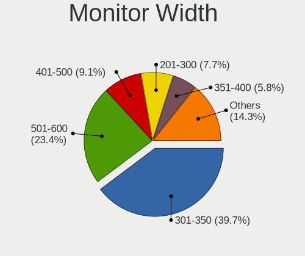
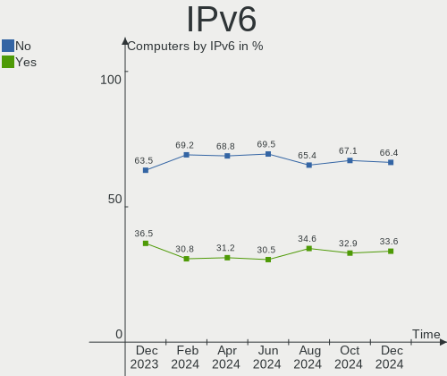

Ubuntu - Hardware Trends
------------------------

A project to identify most popular hardware characteristics and track their change
over time based on data collected by Linux users at https://Linux-Hardware.org.

Anyone can contribute to this report by the [hw-probe](https://github.com/linuxhw/hw-probe) tool:

    sudo -E hw-probe -all -upload

This is a report for all computer types. See also reports for [desktops](/Dist/Ubuntu/Desktop/README.md) and [notebooks](/Dist/Ubuntu/Notebook/README.md).

This report is for one last month. Overall report since the beginning of time: [TestDays](https://github.com/linuxhw/TestDays)

Period: Mar, 2023.

Contents
--------

* [ System ](#system)
  - [ OS                       ](#os)
  - [ OS Family                ](#os-family)
  - [ Kernel                   ](#kernel)
  - [ Kernel Family            ](#kernel-family)
  - [ Kernel Major Ver.        ](#kernel-major-ver)
  - [ Arch                     ](#arch)
  - [ DE                       ](#de)
  - [ Display Server           ](#display-server)
  - [ Display Manager          ](#display-manager)
  - [ OS Lang                  ](#os-lang)
  - [ Boot Mode                ](#boot-mode)
  - [ Filesystem               ](#filesystem)
  - [ Part. scheme             ](#part-scheme)
  - [ Dual Boot with Linux/BSD ](#dual-boot-with-linuxbsd)
  - [ Dual Boot (Win)          ](#dual-boot-win)

* [ Board ](#board)
  - [ Vendor                   ](#vendor)
  - [ Model                    ](#model)
  - [ Model Family             ](#model-family)
  - [ MFG Year                 ](#mfg-year)
  - [ Form Factor              ](#form-factor)
  - [ Secure Boot              ](#secure-boot)
  - [ Coreboot                 ](#coreboot)
  - [ RAM Size                 ](#ram-size)
  - [ RAM Used                 ](#ram-used)
  - [ Total Drives             ](#total-drives)
  - [ Has CD-ROM               ](#has-cd-rom)
  - [ Has Ethernet             ](#has-ethernet)
  - [ Has WiFi                 ](#has-wifi)
  - [ Has Bluetooth            ](#has-bluetooth)

* [ Location ](#location)
  - [ Country                  ](#country)
  - [ City                     ](#city)

* [ Drives ](#drives)
  - [ Drive Vendor             ](#drive-vendor)
  - [ Drive Model              ](#drive-model)
  - [ HDD Vendor               ](#hdd-vendor)
  - [ SSD Vendor               ](#ssd-vendor)
  - [ Drive Kind               ](#drive-kind)
  - [ Drive Connector          ](#drive-connector)
  - [ Drive Size               ](#drive-size)
  - [ Space Total              ](#space-total)
  - [ Space Used               ](#space-used)
  - [ Malfunc. Drives          ](#malfunc-drives)
  - [ Malfunc. Drive Vendor    ](#malfunc-drive-vendor)
  - [ Malfunc. HDD Vendor      ](#malfunc-hdd-vendor)
  - [ Malfunc. Drive Kind      ](#malfunc-drive-kind)
  - [ Failed Drives            ](#failed-drives)
  - [ Failed Drive Vendor      ](#failed-drive-vendor)
  - [ Drive Status             ](#drive-status)

* [ Storage controller ](#storage-controller)
  - [ Storage Vendor           ](#storage-vendor)
  - [ Storage Model            ](#storage-model)
  - [ Storage Kind             ](#storage-kind)

* [ Processor ](#processor)
  - [ CPU Vendor               ](#cpu-vendor)
  - [ CPU Model                ](#cpu-model)
  - [ CPU Model Family         ](#cpu-model-family)
  - [ CPU Cores                ](#cpu-cores)
  - [ CPU Sockets              ](#cpu-sockets)
  - [ CPU Threads              ](#cpu-threads)
  - [ CPU Op-Modes             ](#cpu-op-modes)
  - [ CPU Microcode            ](#cpu-microcode)
  - [ CPU Microarch            ](#cpu-microarch)

* [ Graphics ](#graphics)
  - [ GPU Vendor               ](#gpu-vendor)
  - [ GPU Model                ](#gpu-model)
  - [ GPU Combo                ](#gpu-combo)
  - [ GPU Driver               ](#gpu-driver)
  - [ GPU Memory               ](#gpu-memory)

* [ Monitor ](#monitor)
  - [ Monitor Vendor           ](#monitor-vendor)
  - [ Monitor Model            ](#monitor-model)
  - [ Monitor Resolution       ](#monitor-resolution)
  - [ Monitor Diagonal         ](#monitor-diagonal)
  - [ Monitor Width            ](#monitor-width)
  - [ Aspect Ratio             ](#aspect-ratio)
  - [ Monitor Area             ](#monitor-area)
  - [ Pixel Density            ](#pixel-density)
  - [ Multiple Monitors        ](#multiple-monitors)

* [ Network ](#network)
  - [ Net Controller Vendor    ](#net-controller-vendor)
  - [ Net Controller Model     ](#net-controller-model)
  - [ Wireless Vendor          ](#wireless-vendor)
  - [ Wireless Model           ](#wireless-model)
  - [ Ethernet Vendor          ](#ethernet-vendor)
  - [ Ethernet Model           ](#ethernet-model)
  - [ Net Controller Kind      ](#net-controller-kind)
  - [ Used Controller          ](#used-controller)
  - [ NICs                     ](#nics)
  - [ IPv6                     ](#ipv6)

* [ Bluetooth ](#bluetooth)
  - [ Bluetooth Vendor         ](#bluetooth-vendor)
  - [ Bluetooth Model          ](#bluetooth-model)

* [ Sound ](#sound)
  - [ Sound Vendor             ](#sound-vendor)
  - [ Sound Model              ](#sound-model)

* [ Memory ](#memory)
  - [ Memory Vendor            ](#memory-vendor)
  - [ Memory Model             ](#memory-model)
  - [ Memory Kind              ](#memory-kind)
  - [ Memory Form Factor       ](#memory-form-factor)
  - [ Memory Size              ](#memory-size)
  - [ Memory Speed             ](#memory-speed)

* [ Printers & scanners ](#printers--scanners)
  - [ Printer Vendor           ](#printer-vendor)
  - [ Printer Model            ](#printer-model)
  - [ Scanner Vendor           ](#scanner-vendor)
  - [ Scanner Model            ](#scanner-model)

* [ Camera ](#camera)
  - [ Camera Vendor            ](#camera-vendor)
  - [ Camera Model             ](#camera-model)

* [ Security ](#security)
  - [ Fingerprint Vendor       ](#fingerprint-vendor)
  - [ Fingerprint Model        ](#fingerprint-model)
  - [ Chipcard Vendor          ](#chipcard-vendor)
  - [ Chipcard Model           ](#chipcard-model)

* [ Unsupported ](#unsupported)
  - [ Unsupported Devices      ](#unsupported-devices)
  - [ Unsupported Device Types ](#unsupported-device-types)

System
------

OS
--

Installed operating systems

| Name           | Computers | Percent |
|----------------|-----------|---------|
| Ubuntu 22.04   | 890       | 66.22%  |
| Ubuntu 22.10   | 267       | 19.87%  |
| Ubuntu 20.04   | 134       | 9.97%   |
| Ubuntu 18.04   | 30        | 2.23%   |
| Ubuntu 23.04   | 15        | 1.12%   |
| Ubuntu Core 18 | 3         | 0.22%   |
| Ubuntu 21.10   | 3         | 0.22%   |
| Ubuntu 20.10   | 2         | 0.15%   |

OS Family
---------

OS without a version

| Name   | Computers | Percent |
|--------|-----------|---------|
| Ubuntu | 1344      | 100%    |

Kernel
------

Version of the Linux kernel

| Version                | Computers | Percent |
|------------------------|-----------|---------|
| 5.19.0-35-generic      | 663       | 49.33%  |
| 5.19.0-38-generic      | 118       | 8.78%   |
| 5.19.0-32-generic      | 111       | 8.26%   |
| 5.15.0-67-generic      | 108       | 8.04%   |
| 5.15.0-60-generic      | 34        | 2.53%   |
| 5.4.0-144-generic      | 31        | 2.31%   |
| 5.19.0-31-generic      | 21        | 1.56%   |
| 5.15.0-69-generic      | 21        | 1.56%   |
| 5.19.0-37-generic      | 18        | 1.34%   |
| 5.19.0-21-generic      | 16        | 1.19%   |
| 5.15.0-43-generic      | 15        | 1.12%   |
| 5.15.0-58-generic      | 11        | 0.82%   |
| 6.2.8-060208-generic   | 6         | 0.45%   |
| 5.15.0-56-generic      | 6         | 0.45%   |
| 6.1.0-16-generic       | 5         | 0.37%   |
| 5.15.0-46-generic      | 5         | 0.37%   |
| 6.2.2-060202-generic   | 4         | 0.3%    |
| 5.4.0-146-generic      | 4         | 0.3%    |
| 5.4.0-139-generic      | 4         | 0.3%    |
| 5.15.0-25-generic      | 4         | 0.3%    |
| 5.14.0-1058-oem        | 4         | 0.3%    |
| 4.15.0-206-generic     | 4         | 0.3%    |
| 6.2.6-060206-generic   | 3         | 0.22%   |
| 6.2.0-18-generic       | 3         | 0.22%   |
| 5.19.0-1020-lowlatency | 3         | 0.22%   |
| 5.15.0-68-generic      | 3         | 0.22%   |
| 5.15.0-52-generic      | 3         | 0.22%   |
| 5.14.0-1054-oem        | 3         | 0.22%   |
| 5.14.0-1048-oem        | 3         | 0.22%   |
| 5.13.0-30-generic      | 3         | 0.22%   |
| 4.15.0-208-generic     | 3         | 0.22%   |
| 6.2.9-060209-generic   | 2         | 0.15%   |
| 6.2.7-060207-generic   | 2         | 0.15%   |
| 6.2.3-060203-generic   | 2         | 0.15%   |
| 6.2.2-t2-jammy         | 2         | 0.15%   |
| 6.2.0-060200-generic   | 2         | 0.15%   |
| 6.1.12-060112-generic  | 2         | 0.15%   |
| 6.1.11-060111-generic  | 2         | 0.15%   |
| 6.1.0-1009-tuxedo      | 2         | 0.15%   |
| 6.1.0-1007-oem         | 2         | 0.15%   |

Kernel Family
-------------

Linux kernel without a distro release

| Version | Computers | Percent |
|---------|-----------|---------|
| 5.19.0  | 955       | 71.06%  |
| 5.15.0  | 227       | 16.89%  |
| 5.4.0   | 51        | 3.79%   |
| 5.14.0  | 12        | 0.89%   |
| 5.13.0  | 10        | 0.74%   |
| 6.1.0   | 9         | 0.67%   |
| 6.2.2   | 8         | 0.6%    |
| 4.15.0  | 8         | 0.6%    |
| 6.2.8   | 7         | 0.52%   |
| 6.2.0   | 7         | 0.52%   |
| 5.8.0   | 4         | 0.3%    |
| 6.2.6   | 3         | 0.22%   |
| 6.2.1   | 3         | 0.22%   |
| 6.0.0   | 3         | 0.22%   |
| 6.2.9   | 2         | 0.15%   |
| 6.2.7   | 2         | 0.15%   |
| 6.2.5   | 2         | 0.15%   |
| 6.2.3   | 2         | 0.15%   |
| 6.1.13  | 2         | 0.15%   |
| 6.1.12  | 2         | 0.15%   |
| 6.1.11  | 2         | 0.15%   |
| 5.19.17 | 2         | 0.15%   |
| 5.17.0  | 2         | 0.15%   |
| 5.11.0  | 2         | 0.15%   |
| 5.0.0   | 2         | 0.15%   |
| 6.3.0   | 1         | 0.07%   |
| 6.1.9   | 1         | 0.07%   |
| 6.1.10  | 1         | 0.07%   |
| 6.0.9   | 1         | 0.07%   |
| 6.0.6   | 1         | 0.07%   |
| 6.0.2   | 1         | 0.07%   |
| 6.0.12  | 1         | 0.07%   |
| 6.0.1   | 1         | 0.07%   |
| 5.4.41  | 1         | 0.07%   |
| 5.4.27  | 1         | 0.07%   |
| 5.19.16 | 1         | 0.07%   |
| 5.18.0  | 1         | 0.07%   |
| 5.17.5  | 1         | 0.07%   |
| 4.9.253 | 1         | 0.07%   |
| 4.9.0   | 1         | 0.07%   |

Kernel Major Ver.
-----------------

Linux kernel major version

| Version | Computers | Percent |
|---------|-----------|---------|
| 5.19    | 958       | 71.28%  |
| 5.15    | 227       | 16.89%  |
| 5.4     | 53        | 3.94%   |
| 6.2     | 36        | 2.68%   |
| 6.1     | 17        | 1.26%   |
| 5.14    | 12        | 0.89%   |
| 5.13    | 10        | 0.74%   |
| 6.0     | 8         | 0.6%    |
| 4.15    | 8         | 0.6%    |
| 5.8     | 4         | 0.3%    |
| 5.17    | 3         | 0.22%   |
| 5.11    | 2         | 0.15%   |
| 5.0     | 2         | 0.15%   |
| 4.9     | 2         | 0.15%   |
| 6.3     | 1         | 0.07%   |
| 5.18    | 1         | 0.07%   |

Arch
----

OS architecture (x86_64, i586, etc.)

| Name    | Computers | Percent |
|---------|-----------|---------|
| x86_64  | 1332      | 99.11%  |
| i686    | 6         | 0.45%   |
| aarch64 | 5         | 0.37%   |
| armv7l  | 1         | 0.07%   |

DE
--

Desktop Environment

| Name            | Computers | Percent |
|-----------------|-----------|---------|
| GNOME           | 1261      | 93.82%  |
| Unknown         | 56        | 4.17%   |
| X-Cinnamon      | 11        | 0.82%   |
| GNOME Flashback | 6         | 0.45%   |
| GNOME Classic   | 3         | 0.22%   |
| i3              | 2         | 0.15%   |
| xsession        | 1         | 0.07%   |
| sway            | 1         | 0.07%   |
| Enlightenment   | 1         | 0.07%   |
| DWM             | 1         | 0.07%   |
| Cinnamon        | 1         | 0.07%   |

Display Server
--------------

X11 or Wayland

| Name    | Computers | Percent |
|---------|-----------|---------|
| Wayland | 754       | 56.1%   |
| X11     | 527       | 39.21%  |
| Tty     | 34        | 2.53%   |
| Unknown | 29        | 2.16%   |

Display Manager
---------------

SDDM, LightDM, etc.

| Name    | Computers | Percent |
|---------|-----------|---------|
| GDM3    | 1116      | 83.04%  |
| Unknown | 135       | 10.04%  |
| GDM     | 62        | 4.61%   |
| LightDM | 28        | 2.08%   |
| SDDM    | 2         | 0.15%   |
| LXDM    | 1         | 0.07%   |

OS Lang
-------

Language

| Lang    | Computers | Percent |
|---------|-----------|---------|
| en_US   | 581       | 43.23%  |
| de_DE   | 165       | 12.28%  |
| fr_FR   | 77        | 5.73%   |
| en_GB   | 74        | 5.51%   |
| pt_BR   | 44        | 3.27%   |
| it_IT   | 43        | 3.2%    |
| ru_RU   | 32        | 2.38%   |
| en_CA   | 31        | 2.31%   |
| es_ES   | 26        | 1.93%   |
| en_IN   | 26        | 1.93%   |
| pl_PL   | 20        | 1.49%   |
| nl_NL   | 19        | 1.41%   |
| Unknown | 18        | 1.34%   |
| en_AU   | 17        | 1.26%   |
| C       | 14        | 1.04%   |
| es_MX   | 10        | 0.74%   |
| cs_CZ   | 10        | 0.74%   |
| de_CH   | 8         | 0.6%    |
| zh_CN   | 7         | 0.52%   |
| tr_TR   | 6         | 0.45%   |
| pt_PT   | 6         | 0.45%   |
| ja_JP   | 6         | 0.45%   |
| hu_HU   | 6         | 0.45%   |
| es_AR   | 6         | 0.45%   |
| en_ZA   | 6         | 0.45%   |
| de_AT   | 6         | 0.45%   |
| es_CO   | 5         | 0.37%   |
| en_NZ   | 5         | 0.37%   |
| zh_TW   | 4         | 0.3%    |
| sv_SE   | 4         | 0.3%    |
| sk_SK   | 4         | 0.3%    |
| nb_NO   | 4         | 0.3%    |
| fi_FI   | 4         | 0.3%    |
| en_IE   | 4         | 0.3%    |
| el_GR   | 4         | 0.3%    |
| ro_RO   | 3         | 0.22%   |
| nl_BE   | 3         | 0.22%   |
| ko_KR   | 3         | 0.22%   |
| es_CL   | 3         | 0.22%   |
| en_PH   | 3         | 0.22%   |

Boot Mode
---------

EFI or BIOS

| Mode | Computers | Percent |
|------|-----------|---------|
| BIOS | 784       | 58.33%  |
| EFI  | 560       | 41.67%  |

Filesystem
----------

Type of filesystem

| Type    | Computers | Percent |
|---------|-----------|---------|
| Ext4    | 1228      | 91.37%  |
| Overlay | 37        | 2.75%   |
| Btrfs   | 36        | 2.68%   |
| Zfs     | 27        | 2.01%   |
| Xfs     | 6         | 0.45%   |
| Unknown | 4         | 0.3%    |
| Ext2    | 3         | 0.22%   |
| Ext3    | 2         | 0.15%   |
| Tmpfs   | 1         | 0.07%   |

Part. scheme
------------

Scheme of partitioning

| Type    | Computers | Percent |
|---------|-----------|---------|
| GPT     | 1085      | 80.73%  |
| MBR     | 160       | 11.9%   |
| Unknown | 99        | 7.37%   |

Dual Boot with Linux/BSD
------------------------

Hosting more than one Linux/BSD

| Dual boot | Computers | Percent |
|-----------|-----------|---------|
| No        | 1174      | 87.35%  |
| Yes       | 170       | 12.65%  |

Dual Boot (Win)
---------------

Hosting Linux and Windows

| Dual boot | Computers | Percent |
|-----------|-----------|---------|
| No        | 845       | 62.87%  |
| Yes       | 499       | 37.13%  |

Board
-----

Vendor
------

Motherboard manufacturer

| Name                           | Computers | Percent |
|--------------------------------|-----------|---------|
| Hewlett-Packard                | 217       | 16.15%  |
| Lenovo                         | 201       | 14.96%  |
| ASUSTek Computer               | 184       | 13.69%  |
| Dell                           | 166       | 12.35%  |
| MSI                            | 81        | 6.03%   |
| Gigabyte Technology            | 75        | 5.58%   |
| Acer                           | 63        | 4.69%   |
| ASRock                         | 40        | 2.98%   |
| Apple                          | 39        | 2.9%    |
| Intel                          | 36        | 2.68%   |
| HUAWEI                         | 19        | 1.41%   |
| Samsung Electronics            | 15        | 1.12%   |
| Toshiba                        | 13        | 0.97%   |
| Fujitsu                        | 12        | 0.89%   |
| Sony                           | 11        | 0.82%   |
| Medion                         | 10        | 0.74%   |
| Pegatron                       | 9         | 0.67%   |
| Notebook                       | 8         | 0.6%    |
| Unknown                        | 8         | 0.6%    |
| Microsoft                      | 6         | 0.45%   |
| Google                         | 6         | 0.45%   |
| Timi                           | 5         | 0.37%   |
| Supermicro                     | 5         | 0.37%   |
| Positivo                       | 5         | 0.37%   |
| Packard Bell                   | 5         | 0.37%   |
| Foxconn                        | 5         | 0.37%   |
| AZW                            | 5         | 0.37%   |
| ZOTAC                          | 4         | 0.3%    |
| LG Electronics                 | 4         | 0.3%    |
| HONOR                          | 4         | 0.3%    |
| Gateway                        | 4         | 0.3%    |
| ECS                            | 4         | 0.3%    |
| Biostar                        | 4         | 0.3%    |
| TUXEDO                         | 3         | 0.22%   |
| Shuttle                        | 3         | 0.22%   |
| Avell High Performance         | 3         | 0.22%   |
| Alienware                      | 3         | 0.22%   |
| Wistron                        | 2         | 0.15%   |
| Teclast                        | 2         | 0.15%   |
| Shanghai Zhaoxin Semiconductor | 2         | 0.15%   |

Model
-----

Motherboard model

| Name                                   | Computers | Percent |
|----------------------------------------|-----------|---------|
| ASUS All Series                        | 12        | 0.89%   |
| Unknown                                | 8         | 0.6%    |
| HUAWEI NBLB-WAX9N                      | 5         | 0.37%   |
| MSI MS-7721                            | 4         | 0.3%    |
| Dell OptiPlex 3050                     | 4         | 0.3%    |
| ASUS TUF Gaming B550M-PLUS             | 4         | 0.3%    |
| Apple MacBookPro9,2                    | 4         | 0.3%    |
| Supermicro Super Server                | 3         | 0.22%   |
| Samsung 550XDA                         | 3         | 0.22%   |
| MSI MS-7C56                            | 3         | 0.22%   |
| MSI MS-7C52                            | 3         | 0.22%   |
| MSI MS-7C37                            | 3         | 0.22%   |
| MSI MS-7B79                            | 3         | 0.22%   |
| HP Z440 Workstation                    | 3         | 0.22%   |
| HP Spectre x360 2-in-1 Laptop 16-f1xxx | 3         | 0.22%   |
| HP EliteDesk 800 G3 SFF                | 3         | 0.22%   |
| HP EliteBook x360 1030 G2              | 3         | 0.22%   |
| HP Compaq Pro 6305 SFF                 | 3         | 0.22%   |
| HP Compaq Elite 8300 SFF               | 3         | 0.22%   |
| HP Compaq 6200 Pro MT PC               | 3         | 0.22%   |
| Gigabyte A320M-S2H                     | 3         | 0.22%   |
| Dell XPS 15 9510                       | 3         | 0.22%   |
| Dell OptiPlex 9020                     | 3         | 0.22%   |
| Dell OptiPlex 780                      | 3         | 0.22%   |
| Dell Latitude 7420                     | 3         | 0.22%   |
| Dell Latitude 5400                     | 3         | 0.22%   |
| Dell Inspiron 3442                     | 3         | 0.22%   |
| Dell G15 5510                          | 3         | 0.22%   |
| ASUS TUF Gaming X570-PLUS              | 3         | 0.22%   |
| ASUS PRIME A320M-K                     | 3         | 0.22%   |
| Timi Xiaomi NoteBook Pro               | 2         | 0.15%   |
| Shanghai Zhaoxin ZXE CRB               | 2         | 0.15%   |
| RPi Raspberry Pi                       | 2         | 0.15%   |
| MSI MS-7C84                            | 2         | 0.15%   |
| MSI MS-7C02                            | 2         | 0.15%   |
| MSI MS-7A34                            | 2         | 0.15%   |
| MSI GF63 Thin 10SC                     | 2         | 0.15%   |
| Lenovo Y520-15IKBN 80WK                | 2         | 0.15%   |
| Lenovo Legion Y530-15ICH 81FV          | 2         | 0.15%   |
| Lenovo IdeaPad Gaming 3 15ARH05 82EY   | 2         | 0.15%   |

Model Family
------------

Motherboard model prefix

| Name               | Computers | Percent |
|--------------------|-----------|---------|
| Lenovo ThinkPad    | 98        | 7.29%   |
| Dell Latitude      | 43        | 3.2%    |
| Acer Aspire        | 40        | 2.98%   |
| Lenovo IdeaPad     | 33        | 2.46%   |
| HP Pavilion        | 31        | 2.31%   |
| Dell Inspiron      | 29        | 2.16%   |
| Dell OptiPlex      | 27        | 2.01%   |
| HP EliteBook       | 25        | 1.86%   |
| HP Compaq          | 25        | 1.86%   |
| ASUS ROG           | 25        | 1.86%   |
| HP ProBook         | 23        | 1.71%   |
| HP Laptop          | 23        | 1.71%   |
| Dell Precision     | 22        | 1.64%   |
| ASUS PRIME         | 21        | 1.56%   |
| Dell XPS           | 20        | 1.49%   |
| ASUS TUF           | 18        | 1.34%   |
| ASUS VivoBook      | 17        | 1.26%   |
| Dell Vostro        | 13        | 0.97%   |
| Lenovo ThinkCentre | 12        | 0.89%   |
| HP ENVY            | 12        | 0.89%   |
| ASUS All           | 12        | 0.89%   |
| Lenovo Yoga        | 10        | 0.74%   |
| Toshiba Satellite  | 9         | 0.67%   |
| HP ZBook           | 8         | 0.6%    |
| HP Spectre         | 8         | 0.6%    |
| Unknown            | 8         | 0.6%    |
| HP ProLiant        | 7         | 0.52%   |
| Microsoft Surface  | 6         | 0.45%   |
| HP OMEN            | 6         | 0.45%   |
| HP EliteDesk       | 6         | 0.45%   |
| HP 250             | 6         | 0.45%   |
| Fujitsu ESPRIMO    | 6         | 0.45%   |
| ASUS ASUS          | 6         | 0.45%   |
| Acer Swift         | 6         | 0.45%   |
| Lenovo ThinkBook   | 5         | 0.37%   |
| Lenovo Legion      | 5         | 0.37%   |
| HUAWEI NBLB-WAX9N  | 5         | 0.37%   |
| HP ProDesk         | 5         | 0.37%   |
| Dell PowerEdge     | 5         | 0.37%   |
| Dell G15           | 5         | 0.37%   |

MFG Year
--------

Motherboard manufacture year

| Year    | Computers | Percent |
|---------|-----------|---------|
| 2020    | 156       | 11.61%  |
| 2021    | 145       | 10.79%  |
| 2022    | 117       | 8.71%   |
| 2019    | 117       | 8.71%   |
| 2018    | 109       | 8.11%   |
| 2012    | 94        | 6.99%   |
| 2011    | 80        | 5.95%   |
| 2017    | 79        | 5.88%   |
| 2016    | 71        | 5.28%   |
| 2013    | 67        | 4.99%   |
| 2014    | 66        | 4.91%   |
| 2010    | 66        | 4.91%   |
| 2015    | 62        | 4.61%   |
| 2009    | 45        | 3.35%   |
| 2008    | 27        | 2.01%   |
| 2007    | 19        | 1.41%   |
| 2023    | 10        | 0.74%   |
| 2006    | 8         | 0.6%    |
| Unknown | 5         | 0.37%   |
| 2004    | 1         | 0.07%   |

Form Factor
-----------

Physical design of the computer

| Name           | Computers | Percent |
|----------------|-----------|---------|
| Notebook       | 708       | 52.68%  |
| Desktop        | 498       | 37.05%  |
| Convertible    | 53        | 3.94%   |
| Mini pc        | 27        | 2.01%   |
| Server         | 22        | 1.64%   |
| All in one     | 19        | 1.41%   |
| Tablet         | 12        | 0.89%   |
| System on chip | 5         | 0.37%   |

Secure Boot
-----------

Enabled or disabled

| State    | Computers | Percent |
|----------|-----------|---------|
| Disabled | 1234      | 91.82%  |
| Enabled  | 110       | 8.18%   |

Coreboot
--------

Have coreboot on board

| Used | Computers | Percent |
|------|-----------|---------|
| No   | 1337      | 99.48%  |
| Yes  | 7         | 0.52%   |

RAM Size
--------

Total RAM memory

| Size in GB      | Computers | Percent |
|-----------------|-----------|---------|
| 4.01-8.0        | 304       | 22.62%  |
| 16.01-24.0      | 289       | 21.5%   |
| 8.01-16.0       | 250       | 18.6%   |
| 3.01-4.0        | 190       | 14.14%  |
| 32.01-64.0      | 170       | 12.65%  |
| 64.01-256.0     | 56        | 4.17%   |
| 24.01-32.0      | 32        | 2.38%   |
| 2.01-3.0        | 26        | 1.93%   |
| 1.01-2.0        | 20        | 1.49%   |
| More than 256.0 | 4         | 0.3%    |
| 0.51-1.0        | 2         | 0.15%   |
| 0.01-0.5        | 1         | 0.07%   |

RAM Used
--------

Used RAM memory

| Used GB     | Computers | Percent |
|-------------|-----------|---------|
| 2.01-3.0    | 377       | 28.05%  |
| 1.01-2.0    | 377       | 28.05%  |
| 4.01-8.0    | 272       | 20.24%  |
| 3.01-4.0    | 187       | 13.91%  |
| 8.01-16.0   | 78        | 5.8%    |
| 0.51-1.0    | 26        | 1.93%   |
| 16.01-24.0  | 15        | 1.12%   |
| 0.01-0.5    | 5         | 0.37%   |
| 32.01-64.0  | 4         | 0.3%    |
| 24.01-32.0  | 2         | 0.15%   |
| 64.01-256.0 | 1         | 0.07%   |

Total Drives
------------

Number of drives on board

| Drives | Computers | Percent |
|--------|-----------|---------|
| 1      | 842       | 62.65%  |
| 2      | 315       | 23.44%  |
| 3      | 95        | 7.07%   |
| 4      | 38        | 2.83%   |
| 5      | 20        | 1.49%   |
| 6      | 10        | 0.74%   |
| 0      | 9         | 0.67%   |
| 7      | 5         | 0.37%   |
| 8      | 4         | 0.3%    |
| 9      | 2         | 0.15%   |
| 25     | 1         | 0.07%   |
| 16     | 1         | 0.07%   |
| 14     | 1         | 0.07%   |
| 10     | 1         | 0.07%   |

Has CD-ROM
----------

Has CD-ROM on board

| Presented | Computers | Percent |
|-----------|-----------|---------|
| No        | 891       | 66.29%  |
| Yes       | 453       | 33.71%  |

Has Ethernet
------------

Has Ethernet on board

| Presented | Computers | Percent |
|-----------|-----------|---------|
| Yes       | 1136      | 84.52%  |
| No        | 208       | 15.48%  |

Has WiFi
--------

Has WiFi module

| Presented | Computers | Percent |
|-----------|-----------|---------|
| Yes       | 1040      | 77.38%  |
| No        | 304       | 22.62%  |

Has Bluetooth
-------------

Has Bluetooth module

| Presented | Computers | Percent |
|-----------|-----------|---------|
| Yes       | 833       | 61.98%  |
| No        | 511       | 38.02%  |

Location
--------

Country
-------

Geographic location (country)

| Country      | Computers | Percent |
|--------------|-----------|---------|
| USA          | 229       | 17.04%  |
| Germany      | 202       | 15.03%  |
| France       | 101       | 7.51%   |
| Brazil       | 70        | 5.21%   |
| UK           | 60        | 4.46%   |
| Italy        | 56        | 4.17%   |
| Russia       | 47        | 3.5%    |
| Spain        | 44        | 3.27%   |
| Poland       | 42        | 3.13%   |
| Canada       | 39        | 2.9%    |
| Netherlands  | 32        | 2.38%   |
| India        | 32        | 2.38%   |
| Switzerland  | 21        | 1.56%   |
| Australia    | 20        | 1.49%   |
| Turkey       | 15        | 1.12%   |
| Mexico       | 13        | 0.97%   |
| Austria      | 13        | 0.97%   |
| Czechia      | 12        | 0.89%   |
| Argentina    | 12        | 0.89%   |
| Sweden       | 11        | 0.82%   |
| Romania      | 11        | 0.82%   |
| Hungary      | 11        | 0.82%   |
| Bulgaria     | 11        | 0.82%   |
| Belgium      | 11        | 0.82%   |
| Portugal     | 10        | 0.74%   |
| Japan        | 10        | 0.74%   |
| Denmark      | 9         | 0.67%   |
| Ukraine      | 8         | 0.6%    |
| Ireland      | 8         | 0.6%    |
| Indonesia    | 8         | 0.6%    |
| Colombia     | 8         | 0.6%    |
| China        | 8         | 0.6%    |
| South Africa | 7         | 0.52%   |
| Slovakia     | 7         | 0.52%   |
| Greece       | 7         | 0.52%   |
| Belarus      | 7         | 0.52%   |
| South Korea  | 6         | 0.45%   |
| Finland      | 6         | 0.45%   |
| Chile        | 6         | 0.45%   |
| Taiwan       | 5         | 0.37%   |

City
----

Geographic location (city)

| City              | Computers | Percent |
|-------------------|-----------|---------|
| Berlin            | 23        | 1.71%   |
| Paris             | 14        | 1.04%   |
| Moscow            | 14        | 1.04%   |
| Madrid            | 13        | 0.97%   |
| Warsaw            | 10        | 0.74%   |
| London            | 10        | 0.74%   |
| Sao Paulo         | 8         | 0.6%    |
| Sydney            | 7         | 0.52%   |
| St Petersburg     | 7         | 0.52%   |
| Rio de Janeiro    | 7         | 0.52%   |
| Rome              | 6         | 0.45%   |
| Munich            | 6         | 0.45%   |
| Milano            | 6         | 0.45%   |
| Milan             | 6         | 0.45%   |
| Dublin            | 6         | 0.45%   |
| Bogotá           | 6         | 0.45%   |
| Nairobi           | 5         | 0.37%   |
| Hamburg           | 5         | 0.37%   |
| Frankfurt am Main | 5         | 0.37%   |
| Denver            | 5         | 0.37%   |
| Budapest          | 5         | 0.37%   |
| Bucharest         | 5         | 0.37%   |
| Bengaluru         | 5         | 0.37%   |
| Barcelona         | 5         | 0.37%   |
| Amsterdam         | 5         | 0.37%   |
| Vienna            | 4         | 0.3%    |
| Vancouver         | 4         | 0.3%    |
| Tallinn           | 4         | 0.3%    |
| Stockholm         | 4         | 0.3%    |
| Sofia             | 4         | 0.3%    |
| Santiago          | 4         | 0.3%    |
| Porto             | 4         | 0.3%    |
| New York          | 4         | 0.3%    |
| Montreal          | 4         | 0.3%    |
| Melbourne         | 4         | 0.3%    |
| Los Angeles       | 4         | 0.3%    |
| Lisbon            | 4         | 0.3%    |
| Leipzig           | 4         | 0.3%    |
| Karlsruhe         | 4         | 0.3%    |
| Istanbul          | 4         | 0.3%    |

Drives
------

Drive Vendor
------------

Hard drive vendors

| Vendor                      | Computers | Drives | Percent |
|-----------------------------|-----------|--------|---------|
| Samsung Electronics         | 357       | 413    | 18.54%  |
| WDC                         | 292       | 359    | 15.16%  |
| Seagate                     | 246       | 316    | 12.77%  |
| Toshiba                     | 121       | 127    | 6.28%   |
| Sandisk                     | 104       | 113    | 5.4%    |
| Kingston                    | 90        | 93     | 4.67%   |
| Crucial                     | 79        | 91     | 4.1%    |
| SK hynix                    | 59        | 59     | 3.06%   |
| Unknown                     | 54        | 59     | 2.8%    |
| Hitachi                     | 49        | 50     | 2.54%   |
| Intel                       | 41        | 44     | 2.13%   |
| Micron Technology           | 32        | 34     | 1.66%   |
| KIOXIA                      | 29        | 30     | 1.51%   |
| HGST                        | 28        | 29     | 1.45%   |
| China                       | 27        | 29     | 1.4%    |
| A-DATA Technology           | 19        | 20     | 0.99%   |
| Apple                       | 17        | 18     | 0.88%   |
| Phison Electronics          | 13        | 18     | 0.67%   |
| Kingston Technology Company | 13        | 13     | 0.67%   |
| Intenso                     | 12        | 12     | 0.62%   |
| SPCC                        | 11        | 12     | 0.57%   |
| Micron/Crucial Technology   | 10        | 10     | 0.52%   |
| PNY                         | 9         | 9      | 0.47%   |
| Unknown                     | 9         | 9      | 0.47%   |
| Silicon Motion              | 8         | 8      | 0.42%   |
| OCZ                         | 8         | 8      | 0.42%   |
| Gigabyte Technology         | 8         | 8      | 0.42%   |
| Corsair                     | 7         | 7      | 0.36%   |
| SSSTC                       | 6         | 6      | 0.31%   |
| JMicron Technology          | 6         | 6      | 0.31%   |
| Hewlett-Packard             | 6         | 38     | 0.31%   |
| GOODRAM                     | 6         | 6      | 0.31%   |
| Fanxiang                    | 6         | 6      | 0.31%   |
| ADATA Technology            | 6         | 7      | 0.31%   |
| Transcend                   | 5         | 5      | 0.26%   |
| Phison                      | 5         | 5      | 0.26%   |
| Team                        | 4         | 4      | 0.21%   |
| Netac                       | 4         | 5      | 0.21%   |
| LITEONIT                    | 4         | 4      | 0.21%   |
| Lexar                       | 4         | 4      | 0.21%   |

Drive Model
-----------

Hard drive models

| Model                                               | Computers | Percent |
|-----------------------------------------------------|-----------|---------|
| Samsung NVMe SSD Controller SM981/PM981/PM983 250GB | 33        | 1.59%   |
| Samsung SSD 860 EVO 500GB                           | 23        | 1.11%   |
| Samsung NVMe SSD Controller PM9A1/PM9A3/980PRO 1TB  | 17        | 0.82%   |
| Kingston SA400S37240G 240GB SSD                     | 17        | 0.82%   |
| Samsung SSD 850 EVO 500GB                           | 15        | 0.72%   |
| Kingston SA400S37480G 480GB SSD                     | 15        | 0.72%   |
| Unknown MMC Card  64GB                              | 14        | 0.67%   |
| Seagate ST1000DM010-2EP102 1TB                      | 13        | 0.63%   |
| Samsung SSD 850 EVO 250GB                           | 13        | 0.63%   |
| Crucial CT500MX500SSD1 500GB                        | 12        | 0.58%   |
| Unknown MMC Card  32GB                              | 11        | 0.53%   |
| Toshiba MQ01ABF050 500GB                            | 11        | 0.53%   |
| Seagate ST500DM002-1BD142 500GB                     | 11        | 0.53%   |
| Seagate ST1000LM035-1RK172 1TB                      | 11        | 0.53%   |
| Samsung SSD 980 1TB                                 | 11        | 0.53%   |
| Toshiba MQ01ABD100 1TB                              | 10        | 0.48%   |
| Seagate ST500LT012-1DG142 500GB                     | 10        | 0.48%   |
| Seagate ST2000DM008-2FR102 2TB                      | 10        | 0.48%   |
| Samsung NVMe SSD Controller SM961/PM961/SM963 256GB | 9         | 0.43%   |
| Unknown                                             | 9         | 0.43%   |
| Toshiba MQ04ABF100 1TB                              | 8         | 0.38%   |
| Seagate ST9500325AS 500GB                           | 8         | 0.38%   |
| Seagate ST3500418AS 500GB                           | 8         | 0.38%   |
| Samsung SSD 980 500GB                               | 8         | 0.38%   |
| Micron/Crucial P2 NVMe PCIe SSD 1TB                 | 8         | 0.38%   |
| WDC WD10SPZX-60Z10T0 1TB                            | 7         | 0.34%   |
| Unknown SD/MMC/MS PRO 64GB                          | 7         | 0.34%   |
| Seagate ST500LM012 HN-M500MBB 500GB                 | 7         | 0.34%   |
| Seagate ST1000LM024 HN-M101MBB 1TB                  | 7         | 0.34%   |
| Seagate Expansion+ 2TB                              | 7         | 0.34%   |
| SanDisk NVMe SSD Drive 1TB                          | 7         | 0.34%   |
| Samsung SSD 970 EVO Plus 2TB                        | 7         | 0.34%   |
| Samsung SSD 860 EVO 1TB                             | 7         | 0.34%   |
| KIOXIA KBG40ZNS512G NVMe 512GB                      | 7         | 0.34%   |
| Kingston SA400S37120G 120GB SSD                     | 7         | 0.34%   |
| HGST HTS721010A9E630 1TB                            | 7         | 0.34%   |
| Crucial CT250MX500SSD1 250GB                        | 7         | 0.34%   |
| Crucial CT1000MX500SSD1 1TB                         | 7         | 0.34%   |
| WDC WDS500G2B0A-00SM50 500GB SSD                    | 6         | 0.29%   |
| Toshiba DT01ACA200 2TB                              | 6         | 0.29%   |

HDD Vendor
----------

Hard disk drive vendors

| Vendor              | Computers | Drives | Percent |
|---------------------|-----------|--------|---------|
| Seagate             | 239       | 308    | 34.64%  |
| WDC                 | 230       | 286    | 33.33%  |
| Toshiba             | 87        | 92     | 12.61%  |
| Hitachi             | 49        | 50     | 7.1%    |
| Samsung Electronics | 31        | 34     | 4.49%   |
| HGST                | 28        | 29     | 4.06%   |
| Unknown             | 7         | 7      | 1.01%   |
| Fujitsu             | 3         | 4      | 0.43%   |
| ASMT                | 3         | 4      | 0.43%   |
| Apple               | 3         | 3      | 0.43%   |
| USB3.0              | 2         | 2      | 0.29%   |
| PHD 3.0             | 2         | 2      | 0.29%   |
| Hewlett-Packard     | 2         | 11     | 0.29%   |
| SABRENT             | 1         | 1      | 0.14%   |
| Maxtor              | 1         | 1      | 0.14%   |
| LaCie               | 1         | 1      | 0.14%   |
| Intenso             | 1         | 1      | 0.14%   |

SSD Vendor
----------

Solid state drive vendors

| Vendor              | Computers | Drives | Percent |
|---------------------|-----------|--------|---------|
| Samsung Electronics | 143       | 155    | 24.44%  |
| Kingston            | 73        | 76     | 12.48%  |
| Crucial             | 70        | 74     | 11.97%  |
| SanDisk             | 47        | 50     | 8.03%   |
| WDC                 | 29        | 31     | 4.96%   |
| China               | 25        | 26     | 4.27%   |
| Intel               | 12        | 12     | 2.05%   |
| A-DATA Technology   | 11        | 11     | 1.88%   |
| Toshiba             | 10        | 11     | 1.71%   |
| SPCC                | 10        | 11     | 1.71%   |
| SK hynix            | 8         | 8      | 1.37%   |
| PNY                 | 8         | 8      | 1.37%   |
| OCZ                 | 8         | 8      | 1.37%   |
| Micron Technology   | 8         | 10     | 1.37%   |
| Intenso             | 8         | 8      | 1.37%   |
| Gigabyte Technology | 8         | 8      | 1.37%   |
| GOODRAM             | 6         | 6      | 1.03%   |
| Fanxiang            | 6         | 6      | 1.03%   |
| Transcend           | 5         | 5      | 0.85%   |
| Team                | 4         | 4      | 0.68%   |
| Netac               | 4         | 5      | 0.68%   |
| LITEONIT            | 4         | 4      | 0.68%   |
| JMicron Technology  | 4         | 4      | 0.68%   |
| Corsair             | 4         | 4      | 0.68%   |
| Apple               | 4         | 4      | 0.68%   |
| Teclast             | 3         | 3      | 0.51%   |
| Seagate             | 3         | 3      | 0.51%   |
| KingSpec            | 3         | 3      | 0.51%   |
| Hewlett-Packard     | 3         | 3      | 0.51%   |
| Unknown             | 3         | 3      | 0.51%   |
| Patriot             | 2         | 2      | 0.34%   |
| Mushkin             | 2         | 2      | 0.34%   |
| LITEON              | 2         | 2      | 0.34%   |
| Lexar               | 2         | 2      | 0.34%   |
| KingFast            | 2         | 2      | 0.34%   |
| Kimtigo             | 2         | 2      | 0.34%   |
| BHT                 | 2         | 2      | 0.34%   |
| Wibtek              | 1         | 1      | 0.17%   |
| WDC WDB             | 1         | 1      | 0.17%   |
| VERICO              | 1         | 1      | 0.17%   |

Drive Kind
----------

HDD or SSD

| Kind    | Computers | Drives | Percent |
|---------|-----------|--------|---------|
| HDD     | 572       | 836    | 33.22%  |
| NVMe    | 551       | 645    | 32%     |
| SSD     | 518       | 615    | 30.08%  |
| MMC     | 48        | 53     | 2.79%   |
| Unknown | 33        | 62     | 1.92%   |

Drive Connector
---------------

SATA, SAS, NVMe, etc.

| Type | Computers | Drives | Percent |
|------|-----------|--------|---------|
| SATA | 892       | 1407   | 57.18%  |
| NVMe | 550       | 643    | 35.26%  |
| SAS  | 70        | 108    | 4.49%   |
| MMC  | 48        | 53     | 3.08%   |

Drive Size
----------

Size of hard drive

| Size in TB | Computers | Drives | Percent |
|------------|-----------|--------|---------|
| 0.01-0.5   | 631       | 805    | 55.35%  |
| 0.51-1.0   | 322       | 382    | 28.25%  |
| 1.01-2.0   | 102       | 132    | 8.95%   |
| 3.01-4.0   | 31        | 45     | 2.72%   |
| 4.01-10.0  | 30        | 53     | 2.63%   |
| 2.01-3.0   | 19        | 23     | 1.67%   |
| 10.01-20.0 | 5         | 11     | 0.44%   |

Space Total
-----------

Amount of disk space available on the file system

| Size in GB     | Computers | Percent |
|----------------|-----------|---------|
| 251-500        | 374       | 27.83%  |
| 101-250        | 350       | 26.04%  |
| 501-1000       | 232       | 17.26%  |
| 1001-2000      | 86        | 6.4%    |
| 51-100         | 81        | 6.03%   |
| More than 3000 | 64        | 4.76%   |
| 1-20           | 54        | 4.02%   |
| 2001-3000      | 40        | 2.98%   |
| 21-50          | 35        | 2.6%    |
| Unknown        | 28        | 2.08%   |

Space Used
----------

Amount of used disk space

| Used GB        | Computers | Percent |
|----------------|-----------|---------|
| 1-20           | 392       | 29.17%  |
| 21-50          | 285       | 21.21%  |
| 101-250        | 200       | 14.88%  |
| 51-100         | 188       | 13.99%  |
| 251-500        | 98        | 7.29%   |
| 501-1000       | 69        | 5.13%   |
| 1001-2000      | 40        | 2.98%   |
| Unknown        | 28        | 2.08%   |
| More than 3000 | 26        | 1.93%   |
| 2001-3000      | 18        | 1.34%   |

Malfunc. Drives
---------------

Drive models with a malfunction

| Model                                | Computers | Drives | Percent |
|--------------------------------------|-----------|--------|---------|
| Toshiba MQ04ABF100 1TB               | 2         | 2      | 1.96%   |
| SK hynix BC711 HFM256GD3JX013N 256GB | 2         | 2      | 1.96%   |
| Seagate ST500LM012 HN-M500MBB 500GB  | 2         | 2      | 1.96%   |
| Seagate ST500DM002-1BD142 500GB      | 2         | 2      | 1.96%   |
| Seagate ST3500418AS 500GB            | 2         | 2      | 1.96%   |
| WDC WD7500AARS-00Y5B1 752GB          | 1         | 1      | 0.98%   |
| WDC WD6402AAEX-00Z3A0 640GB          | 1         | 1      | 0.98%   |
| WDC WD6000HLHX-01JJPV0 600GB         | 1         | 1      | 0.98%   |
| WDC WD5001AALS-00L3B2 500GB          | 1         | 1      | 0.98%   |
| WDC WD5000LPLX-66ZNTT0 500GB         | 1         | 1      | 0.98%   |
| WDC WD5000BPVT-22HXZT1 500GB         | 1         | 1      | 0.98%   |
| WDC WD5000BPKT-60PK4T0 500GB         | 1         | 1      | 0.98%   |
| WDC WD5000AVDS-73U7B1 500GB          | 1         | 1      | 0.98%   |
| WDC WD5000AAJS-55A8B2 500GB          | 1         | 1      | 0.98%   |
| WDC WD40EFRX-68WT0N0 4TB             | 1         | 1      | 0.98%   |
| WDC WD3200BPVT-22ZEST0 320GB         | 1         | 1      | 0.98%   |
| WDC WD3200AAJS-08L7A0 320GB          | 1         | 1      | 0.98%   |
| WDC WD30EZRX-00MMMB0 3TB             | 1         | 2      | 0.98%   |
| WDC WD2500AVJS-63B6A0 250GB          | 1         | 1      | 0.98%   |
| WDC WD20EARS-60MVWB0 2TB             | 1         | 1      | 0.98%   |
| WDC WD20EARS-55MVWB0 2TB             | 1         | 1      | 0.98%   |
| WDC WD10JPCX-24UE4T0 1TB             | 1         | 1      | 0.98%   |
| WDC WD10EZEX-22MFCA0 1TB             | 1         | 1      | 0.98%   |
| WDC WD10EZEX-22BN5A0 1TB             | 1         | 1      | 0.98%   |
| WDC WD10EURX-63FH1Y0 1TB             | 1         | 1      | 0.98%   |
| WDC WD10EARS-00Y5B1 1TB              | 1         | 1      | 0.98%   |
| WDC WD10EALX-009BA0 1TB              | 1         | 1      | 0.98%   |
| WDC WD10EACS-00D6B0 1TB              | 1         | 1      | 0.98%   |
| WDC WD Green M.2 2280 480GB SSD      | 1         | 1      | 0.98%   |
| Toshiba MQ01ABF050 500GB             | 1         | 1      | 0.98%   |
| Toshiba MQ01ABD100 1TB               | 1         | 1      | 0.98%   |
| Toshiba MK8046GSX 80GB               | 1         | 1      | 0.98%   |
| Toshiba MK7559GSXF 752GB             | 1         | 1      | 0.98%   |
| Toshiba MK5065GSX 500GB              | 1         | 1      | 0.98%   |
| Toshiba MK5059GSXP 500GB             | 1         | 1      | 0.98%   |
| Toshiba MK1652GSX 160GB              | 1         | 1      | 0.98%   |
| Toshiba DT01ACA100 1TB               | 1         | 1      | 0.98%   |
| SSSTC CL1-4D256 256GB                | 1         | 1      | 0.98%   |
| SK hynix SH920 2.5 7MM 256GB SSD     | 1         | 1      | 0.98%   |
| SK hynix PC611 NVMe 512GB            | 1         | 1      | 0.98%   |

Malfunc. Drive Vendor
---------------------

Vendors of faulty drives

| Vendor              | Computers | Drives | Percent |
|---------------------|-----------|--------|---------|
| Seagate             | 27        | 29     | 26.73%  |
| WDC                 | 24        | 25     | 23.76%  |
| Toshiba             | 10        | 10     | 9.9%    |
| SK hynix            | 7         | 7      | 6.93%   |
| Samsung Electronics | 6         | 7      | 5.94%   |
| Intel               | 5         | 5      | 4.95%   |
| China               | 4         | 4      | 3.96%   |
| Kingston            | 3         | 3      | 2.97%   |
| Hitachi             | 3         | 3      | 2.97%   |
| Crucial             | 2         | 2      | 1.98%   |
| SSSTC               | 1         | 1      | 0.99%   |
| SanDisk             | 1         | 1      | 0.99%   |
| Neo                 | 1         | 1      | 0.99%   |
| Mushkin             | 1         | 1      | 0.99%   |
| Micron Technology   | 1         | 1      | 0.99%   |
| KingSpec            | 1         | 1      | 0.99%   |
| HGST                | 1         | 1      | 0.99%   |
| Corsair             | 1         | 1      | 0.99%   |
| ASMT                | 1         | 1      | 0.99%   |
| A-DATA Technology   | 1         | 1      | 0.99%   |

Malfunc. HDD Vendor
-------------------

Vendors of faulty HDD drives

| Vendor              | Computers | Drives | Percent |
|---------------------|-----------|--------|---------|
| Seagate             | 27        | 29     | 40.3%   |
| WDC                 | 23        | 24     | 34.33%  |
| Toshiba             | 10        | 10     | 14.93%  |
| Hitachi             | 3         | 3      | 4.48%   |
| Samsung Electronics | 2         | 2      | 2.99%   |
| HGST                | 1         | 1      | 1.49%   |
| ASMT                | 1         | 1      | 1.49%   |

Malfunc. Drive Kind
-------------------

Kinds of faulty drives

| Kind | Computers | Drives | Percent |
|------|-----------|--------|---------|
| HDD  | 59        | 70     | 63.44%  |
| SSD  | 25        | 26     | 26.88%  |
| NVMe | 9         | 9      | 9.68%   |

Failed Drives
-------------

Failed drive models

| Model                                 | Computers | Drives | Percent |
|---------------------------------------|-----------|--------|---------|
| WDC WD3200AAJS-22VWA0 320GB           | 1         | 1      | 50%     |
| Samsung Electronics SSD 960 EVO 250GB | 1         | 1      | 50%     |

Failed Drive Vendor
-------------------

Failed drive vendors

| Vendor              | Computers | Drives | Percent |
|---------------------|-----------|--------|---------|
| WDC                 | 1         | 1      | 50%     |
| Samsung Electronics | 1         | 1      | 50%     |

Drive Status
------------

Number of failed and malfunc. drives

| Status   | Computers | Drives | Percent |
|----------|-----------|--------|---------|
| Detected | 806       | 1315   | 56.64%  |
| Works    | 526       | 789    | 36.96%  |
| Malfunc  | 89        | 105    | 6.25%   |
| Failed   | 2         | 2      | 0.14%   |

Storage controller
------------------

Storage Vendor
--------------

Storage controller vendors

| Vendor                           | Computers | Percent |
|----------------------------------|-----------|---------|
| Intel                            | 860       | 48.56%  |
| AMD                              | 257       | 14.51%  |
| Samsung Electronics              | 206       | 11.63%  |
| SanDisk                          | 93        | 5.25%   |
| SK hynix                         | 50        | 2.82%   |
| Kingston Technology Company      | 29        | 1.64%   |
| Toshiba America Info Systems     | 28        | 1.58%   |
| KIOXIA                           | 27        | 1.52%   |
| ASMedia Technology               | 26        | 1.47%   |
| Micron Technology                | 25        | 1.41%   |
| Micron/Crucial Technology        | 22        | 1.24%   |
| Phison Electronics               | 21        | 1.19%   |
| JMicron Technology               | 17        | 0.96%   |
| Marvell Technology Group         | 14        | 0.79%   |
| ADATA Technology                 | 14        | 0.79%   |
| Silicon Motion                   | 11        | 0.62%   |
| Apple                            | 9         | 0.51%   |
| Solid State Storage Technology   | 8         | 0.45%   |
| Nvidia                           | 8         | 0.45%   |
| Hewlett-Packard                  | 6         | 0.34%   |
| Silicon Image                    | 4         | 0.23%   |
| Realtek Semiconductor            | 4         | 0.23%   |
| LSI Logic / Symbios Logic        | 4         | 0.23%   |
| Broadcom / LSI                   | 4         | 0.23%   |
| Yangtze Memory Technologies      | 3         | 0.17%   |
| Union Memory (Shenzhen)          | 3         | 0.17%   |
| Shenzhen Longsys Electronics     | 3         | 0.17%   |
| MAXIO Technology (Hangzhou)      | 3         | 0.17%   |
| Zhaoxin                          | 2         | 0.11%   |
| Seagate Technology               | 2         | 0.11%   |
| VIA Technologies                 | 1         | 0.06%   |
| TenaFe                           | 1         | 0.06%   |
| Shenzhen Shichuangyi Electronics | 1         | 0.06%   |
| Lite-On Technology               | 1         | 0.06%   |
| Integrated Technology Express    | 1         | 0.06%   |
| Future Domain                    | 1         | 0.06%   |
| Biwin Storage Technology         | 1         | 0.06%   |
| Adaptec                          | 1         | 0.06%   |

Storage Model
-------------

Storage controller models

| Model                                                                          | Computers | Percent |
|--------------------------------------------------------------------------------|-----------|---------|
| AMD FCH SATA Controller [AHCI mode]                                            | 174       | 8.75%   |
| Samsung NVMe SSD Controller SM981/PM981/PM983                                  | 76        | 3.82%   |
| Samsung NVMe SSD Controller 980                                                | 58        | 2.92%   |
| Intel 8 Series/C220 Series Chipset Family 6-port SATA Controller 1 [AHCI mode] | 51        | 2.57%   |
| Intel Sunrise Point-LP SATA Controller [AHCI mode]                             | 50        | 2.52%   |
| Intel 7 Series Chipset Family 6-port SATA Controller [AHCI mode]               | 50        | 2.52%   |
| Intel Volume Management Device NVMe RAID Controller                            | 49        | 2.46%   |
| Intel 82801 Mobile SATA Controller [RAID mode]                                 | 48        | 2.41%   |
| Samsung NVMe SSD Controller PM9A1/PM9A3/980PRO                                 | 45        | 2.26%   |
| Intel Q170/Q150/B150/H170/H110/Z170/CM236 Chipset SATA Controller [AHCI Mode]  | 39        | 1.96%   |
| Intel 6 Series/C200 Series Chipset Family 6 port Mobile SATA AHCI Controller   | 35        | 1.76%   |
| Intel 200 Series PCH SATA controller [AHCI mode]                               | 31        | 1.56%   |
| AMD 400 Series Chipset SATA Controller                                         | 31        | 1.56%   |
| Intel SATA Controller [RAID mode]                                              | 30        | 1.51%   |
| Intel 6 Series/C200 Series Chipset Family 6 port Desktop SATA AHCI Controller  | 28        | 1.41%   |
| AMD 500 Series Chipset SATA Controller                                         | 28        | 1.41%   |
| SK hynix Gold P31/PC711 NVMe Solid State Drive                                 | 26        | 1.31%   |
| Micron NVMe Storage Controller                                                 | 25        | 1.26%   |
| Intel Cannon Lake Mobile PCH SATA AHCI Controller                              | 25        | 1.26%   |
| AMD SB7x0/SB8x0/SB9x0 SATA Controller [AHCI mode]                              | 25        | 1.26%   |
| Samsung NVMe SSD Controller SM961/PM961/SM963                                  | 23        | 1.16%   |
| Intel Comet Lake SATA AHCI Controller                                          | 23        | 1.16%   |
| ASMedia ASM1062 Serial ATA Controller                                          | 22        | 1.11%   |
| KIOXIA NVMe SSD Controller BG4                                                 | 21        | 1.06%   |
| Intel Tiger Lake-LP SATA Controller                                            | 21        | 1.06%   |
| Intel NM10/ICH7 Family SATA Controller [IDE mode]                              | 20        | 1.01%   |
| SanDisk WD Black SN750 / PC SN730 NVMe SSD                                     | 19        | 0.96%   |
| Intel 8 Series SATA Controller 1 [AHCI mode]                                   | 19        | 0.96%   |
| Intel 7 Series/C210 Series Chipset Family 6-port SATA Controller [AHCI mode]   | 19        | 0.96%   |
| Intel 5 Series/3400 Series Chipset 6 port SATA AHCI Controller                 | 19        | 0.96%   |
| Intel Wildcat Point-LP SATA Controller [AHCI Mode]                             | 18        | 0.91%   |
| AMD SB7x0/SB8x0/SB9x0 IDE Controller                                           | 17        | 0.86%   |
| SanDisk WD Blue SN550 NVMe SSD                                                 | 16        | 0.8%    |
| Intel Celeron/Pentium Silver Processor SATA Controller                         | 16        | 0.8%    |
| Intel 82801IBM/IEM (ICH9M/ICH9M-E) 4 port SATA Controller [AHCI mode]          | 16        | 0.8%    |
| Intel 5 Series/3400 Series Chipset 4 port SATA AHCI Controller                 | 16        | 0.8%    |
| Intel 400 Series Chipset Family SATA AHCI Controller                           | 16        | 0.8%    |
| Toshiba America Info Systems XG6 NVMe SSD Controller                           | 15        | 0.75%   |
| Micron/Crucial P2 NVMe PCIe SSD                                                | 15        | 0.75%   |
| Intel Cannon Lake PCH SATA AHCI Controller                                     | 15        | 0.75%   |

Storage Kind
------------

Kind of storage controller (IDE, SATA, NVMe, SAS, ...)

| Kind | Computers | Percent |
|------|-----------|---------|
| SATA | 913       | 51.96%  |
| NVMe | 548       | 31.19%  |
| RAID | 154       | 8.76%   |
| IDE  | 134       | 7.63%   |
| SAS  | 6         | 0.34%   |
| SCSI | 2         | 0.11%   |

Processor
---------

CPU Vendor
----------

Processor vendors

| Vendor       | Computers | Percent |
|--------------|-----------|---------|
| Intel        | 1015      | 75.52%  |
| AMD          | 321       | 23.88%  |
| ARM          | 5         | 0.37%   |
| CentaurHauls | 2         | 0.15%   |
| Unknown      | 1         | 0.07%   |

CPU Model
---------

Processor models

| Model                                   | Computers | Percent |
|-----------------------------------------|-----------|---------|
| Intel 11th Gen Core i7-1165G7 @ 2.80GHz | 26        | 1.93%   |
| Intel 11th Gen Core i5-1135G7 @ 2.40GHz | 26        | 1.93%   |
| Intel Core i7-8565U CPU @ 1.80GHz       | 13        | 0.97%   |
| Intel Core i7-8550U CPU @ 1.80GHz       | 13        | 0.97%   |
| Intel Core i7-10510U CPU @ 1.80GHz      | 13        | 0.97%   |
| Intel Core i5-7200U CPU @ 2.50GHz       | 12        | 0.89%   |
| Intel Core i5-10210U CPU @ 1.60GHz      | 12        | 0.89%   |
| Intel 11th Gen Core i7-1185G7 @ 3.00GHz | 12        | 0.89%   |
| Intel Core i7-9750H CPU @ 2.60GHz       | 10        | 0.74%   |
| Intel Core i5-8250U CPU @ 1.60GHz       | 10        | 0.74%   |
| AMD Ryzen 5 3600 6-Core Processor       | 10        | 0.74%   |
| Intel Core i5-8265U CPU @ 1.60GHz       | 9         | 0.67%   |
| Intel 12th Gen Core i7-1260P            | 9         | 0.67%   |
| Intel 11th Gen Core i7-11800H @ 2.30GHz | 9         | 0.67%   |
| AMD Ryzen 5 5600G with Radeon Graphics  | 9         | 0.67%   |
| Intel Core i5-6500 CPU @ 3.20GHz        | 8         | 0.6%    |
| Intel Core i5-6300U CPU @ 2.40GHz       | 8         | 0.6%    |
| Intel Core i5-5200U CPU @ 2.20GHz       | 8         | 0.6%    |
| AMD Ryzen 7 3700X 8-Core Processor      | 8         | 0.6%    |
| Intel Core i7-9700 CPU @ 3.00GHz        | 7         | 0.52%   |
| Intel Core i7-8750H CPU @ 2.20GHz       | 7         | 0.52%   |
| Intel Core i7-3770 CPU @ 3.40GHz        | 7         | 0.52%   |
| Intel Core i7-10750H CPU @ 2.60GHz      | 7         | 0.52%   |
| Intel Celeron N4020 CPU @ 1.10GHz       | 7         | 0.52%   |
| Intel 12th Gen Core i7-12700H           | 7         | 0.52%   |
| AMD Ryzen 9 5900X 12-Core Processor     | 7         | 0.52%   |
| AMD Ryzen 9 5900HX with Radeon Graphics | 7         | 0.52%   |
| AMD Ryzen 7 5800H with Radeon Graphics  | 7         | 0.52%   |
| AMD Ryzen 7 5700U with Radeon Graphics  | 7         | 0.52%   |
| Intel Core i7-7700 CPU @ 3.60GHz        | 6         | 0.45%   |
| Intel Core i7-6820HQ CPU @ 2.70GHz      | 6         | 0.45%   |
| Intel Core i7-6600U CPU @ 2.60GHz       | 6         | 0.45%   |
| Intel Core i7-4790 CPU @ 3.60GHz        | 6         | 0.45%   |
| Intel Core i7-2600 CPU @ 3.40GHz        | 6         | 0.45%   |
| Intel Core i5-3470 CPU @ 3.20GHz        | 6         | 0.45%   |
| Intel Core i5-3320M CPU @ 2.60GHz       | 6         | 0.45%   |
| Intel Core i5-3210M CPU @ 2.50GHz       | 6         | 0.45%   |
| Intel Core i5-2520M CPU @ 2.50GHz       | 6         | 0.45%   |
| Intel Core i5-1035G1 CPU @ 1.00GHz      | 6         | 0.45%   |
| Intel Celeron CPU N3350 @ 1.10GHz       | 6         | 0.45%   |

CPU Model Family
----------------

Processor model prefix

| Model                   | Computers | Percent |
|-------------------------|-----------|---------|
| Intel Core i5           | 273       | 20.31%  |
| Intel Core i7           | 246       | 18.3%   |
| Other                   | 172       | 12.8%   |
| Intel Core i3           | 98        | 7.29%   |
| AMD Ryzen 5             | 76        | 5.65%   |
| AMD Ryzen 7             | 69        | 5.13%   |
| Intel Celeron           | 52        | 3.87%   |
| Intel Xeon              | 45        | 3.35%   |
| Intel Core 2 Duo        | 37        | 2.75%   |
| Intel Pentium           | 34        | 2.53%   |
| AMD Ryzen 9             | 31        | 2.31%   |
| Intel Core 2 Quad       | 18        | 1.34%   |
| AMD Ryzen 3             | 16        | 1.19%   |
| AMD A8                  | 15        | 1.12%   |
| Intel Atom              | 14        | 1.04%   |
| AMD FX                  | 11        | 0.82%   |
| AMD A10                 | 11        | 0.82%   |
| AMD A6                  | 10        | 0.74%   |
| Intel Pentium Dual-Core | 9         | 0.67%   |
| AMD Ryzen 7 PRO         | 8         | 0.6%    |
| AMD Ryzen Threadripper  | 7         | 0.52%   |
| AMD Ryzen 5 PRO         | 7         | 0.52%   |
| AMD E2                  | 7         | 0.52%   |
| Intel Core i9           | 5         | 0.37%   |
| AMD A4                  | 5         | 0.37%   |
| Intel Pentium Silver    | 4         | 0.3%    |
| Intel Core 2            | 4         | 0.3%    |
| AMD Phenom II X4        | 4         | 0.3%    |
| AMD E                   | 4         | 0.3%    |
| AMD Athlon II X2        | 4         | 0.3%    |
| Intel Pentium Dual      | 3         | 0.22%   |
| AMD GX                  | 3         | 0.22%   |
| AMD Athlon 64 X2        | 3         | 0.22%   |
| AMD Athlon              | 3         | 0.22%   |
| Intel Pentium Gold      | 2         | 0.15%   |
| Intel Core m3           | 2         | 0.15%   |
| Intel Celeron Dual-Core | 2         | 0.15%   |
| AMD Turion 64 X2 Mobile | 2         | 0.15%   |
| AMD Sempron             | 2         | 0.15%   |
| AMD Phenom II X6        | 2         | 0.15%   |

CPU Cores
---------

Number of processor cores

| Number  | Computers | Percent |
|---------|-----------|---------|
| 4       | 521       | 38.76%  |
| 2       | 434       | 32.29%  |
| 6       | 139       | 10.34%  |
| 8       | 124       | 9.23%   |
| 12      | 44        | 3.27%   |
| 16      | 19        | 1.41%   |
| 10      | 16        | 1.19%   |
| 14      | 14        | 1.04%   |
| 1       | 13        | 0.97%   |
| 3       | 7         | 0.52%   |
| 24      | 5         | 0.37%   |
| Unknown | 3         | 0.22%   |
| 64      | 2         | 0.15%   |
| 32      | 2         | 0.15%   |
| 80      | 1         | 0.07%   |

CPU Sockets
-----------

Number of sockets

| Number  | Computers | Percent |
|---------|-----------|---------|
| 1       | 1325      | 98.59%  |
| 2       | 15        | 1.12%   |
| Unknown | 3         | 0.22%   |
| 3       | 1         | 0.07%   |

CPU Threads
-----------

Threads per core (Hyper-Threading)

| Number  | Computers | Percent |
|---------|-----------|---------|
| 2       | 940       | 69.94%  |
| 1       | 400       | 29.76%  |
| Unknown | 3         | 0.22%   |
| 4       | 1         | 0.07%   |

CPU Op-Modes
------------

CPU Operation Modes (32-bit, 64-bit)

| Op mode        | Computers | Percent |
|----------------|-----------|---------|
| 32-bit, 64-bit | 1336      | 99.4%   |
| 32-bit         | 3         | 0.22%   |
| Unknown        | 3         | 0.22%   |
| 64-bit         | 2         | 0.15%   |

CPU Microcode
-------------

Microcode number

| Number     | Computers | Percent |
|------------|-----------|---------|
| Unknown    | 705       | 52.46%  |
| 0x806c1    | 49        | 3.65%   |
| 0x306a9    | 38        | 2.83%   |
| 0x806ec    | 32        | 2.38%   |
| 0x306c3    | 28        | 2.08%   |
| 0x206a7    | 26        | 1.93%   |
| 0x806ea    | 22        | 1.64%   |
| 0x0a50000c | 22        | 1.64%   |
| 0x506e3    | 20        | 1.49%   |
| 0x1067a    | 18        | 1.34%   |
| 0x906a3    | 17        | 1.26%   |
| 0xa0652    | 16        | 1.19%   |
| 0x906ea    | 16        | 1.19%   |
| 0x906e9    | 14        | 1.04%   |
| 0x406e3    | 12        | 0.89%   |
| 0x40651    | 12        | 0.89%   |
| 0x20655    | 11        | 0.82%   |
| 0x0a50000d | 11        | 0.82%   |
| 0x08108109 | 11        | 0.82%   |
| 0x906ed    | 10        | 0.74%   |
| 0x906a4    | 10        | 0.74%   |
| 0x706e5    | 9         | 0.67%   |
| 0x706a8    | 9         | 0.67%   |
| 0x06001119 | 9         | 0.67%   |
| 0x806eb    | 8         | 0.6%    |
| 0x306f2    | 8         | 0.6%    |
| 0x306d4    | 8         | 0.6%    |
| 0x08701021 | 8         | 0.6%    |
| 0x08600106 | 8         | 0.6%    |
| 0x90672    | 7         | 0.52%   |
| 0x0a601203 | 7         | 0.52%   |
| 0x08608103 | 7         | 0.52%   |
| 0x406f1    | 5         | 0.37%   |
| 0x0a20120a | 5         | 0.37%   |
| 0x08701013 | 5         | 0.37%   |
| 0x0800820d | 5         | 0.37%   |
| 0xa0653    | 4         | 0.3%    |
| 0x906eb    | 4         | 0.3%    |
| 0x806d1    | 4         | 0.3%    |
| 0x406c4    | 4         | 0.3%    |

CPU Microarch
-------------

Microarchitecture

| Name             | Computers | Percent |
|------------------|-----------|---------|
| KabyLake         | 216       | 16.07%  |
| Haswell          | 101       | 7.51%   |
| IvyBridge        | 93        | 6.92%   |
| Unknown          | 87        | 6.47%   |
| TigerLake        | 82        | 6.1%    |
| SandyBridge      | 78        | 5.8%    |
| Skylake          | 76        | 5.65%   |
| Zen 3            | 69        | 5.13%   |
| Penryn           | 59        | 4.39%   |
| Zen 2            | 58        | 4.32%   |
| Westmere         | 45        | 3.35%   |
| Zen+             | 34        | 2.53%   |
| CometLake        | 34        | 2.53%   |
| Alderlake Hybrid | 33        | 2.46%   |
| Silvermont       | 31        | 2.31%   |
| Piledriver       | 29        | 2.16%   |
| Broadwell        | 27        | 2.01%   |
| Zen              | 25        | 1.86%   |
| IceLake          | 21        | 1.56%   |
| Core             | 21        | 1.56%   |
| Goldmont plus    | 20        | 1.49%   |
| K10              | 19        | 1.41%   |
| Excavator        | 16        | 1.19%   |
| Nehalem          | 14        | 1.04%   |
| Puma             | 9         | 0.67%   |
| Goldmont         | 9         | 0.67%   |
| Bobcat           | 8         | 0.6%    |
| K8 Hammer        | 5         | 0.37%   |
| Steamroller      | 4         | 0.3%    |
| K10 Llano        | 4         | 0.3%    |
| Bonnell          | 4         | 0.3%    |
| Tremont          | 3         | 0.22%   |
| Jaguar           | 3         | 0.22%   |
| P6               | 2         | 0.15%   |
| K8 & K10 hybrid  | 2         | 0.15%   |
| Bulldozer        | 2         | 0.15%   |
| NetBurst         | 1         | 0.07%   |

Graphics
--------

GPU Vendor
----------

Vendors of graphics cards

| Vendor                     | Computers | Percent |
|----------------------------|-----------|---------|
| Intel                      | 789       | 49.59%  |
| Nvidia                     | 416       | 26.15%  |
| AMD                        | 367       | 23.07%  |
| Matrox Electronics Systems | 9         | 0.57%   |
| ASPEED Technology          | 8         | 0.5%    |
| Zhaoxin                    | 2         | 0.13%   |

GPU Model
---------

Graphics card models

| Model                                                                                    | Computers | Percent |
|------------------------------------------------------------------------------------------|-----------|---------|
| Intel TigerLake-LP GT2 [Iris Xe Graphics]                                                | 72        | 4.45%   |
| Intel 2nd Generation Core Processor Family Integrated Graphics Controller                | 61        | 3.77%   |
| Intel 3rd Gen Core processor Graphics Controller                                         | 52        | 3.22%   |
| AMD Cezanne [Radeon Vega Series / Radeon Vega Mobile Series]                             | 35        | 2.16%   |
| Intel CometLake-U GT2 [UHD Graphics]                                                     | 34        | 2.1%    |
| Intel CoffeeLake-H GT2 [UHD Graphics 630]                                                | 30        | 1.86%   |
| Intel UHD Graphics 620                                                                   | 29        | 1.79%   |
| Intel WhiskeyLake-U GT2 [UHD Graphics 620]                                               | 27        | 1.67%   |
| AMD Picasso/Raven 2 [Radeon Vega Series / Radeon Vega Mobile Series]                     | 26        | 1.61%   |
| Intel Alder Lake-P Integrated Graphics Controller                                        | 25        | 1.55%   |
| Intel Skylake GT2 [HD Graphics 520]                                                      | 24        | 1.48%   |
| Intel HD Graphics 530                                                                    | 24        | 1.48%   |
| AMD Ellesmere [Radeon RX 470/480/570/570X/580/580X/590]                                  | 24        | 1.48%   |
| AMD Renoir                                                                               | 23        | 1.42%   |
| Intel Core Processor Integrated Graphics Controller                                      | 22        | 1.36%   |
| Intel CometLake-H GT2 [UHD Graphics]                                                     | 22        | 1.36%   |
| Intel HD Graphics 620                                                                    | 21        | 1.3%    |
| Intel Haswell-ULT Integrated Graphics Controller                                         | 21        | 1.3%    |
| Intel Atom/Celeron/Pentium Processor x5-E8000/J3xxx/N3xxx Integrated Graphics Controller | 21        | 1.3%    |
| Intel HD Graphics 630                                                                    | 20        | 1.24%   |
| Intel 4th Gen Core Processor Integrated Graphics Controller                              | 19        | 1.18%   |
| Intel Xeon E3-1200 v3/4th Gen Core Processor Integrated Graphics Controller              | 18        | 1.11%   |
| Intel CoffeeLake-S GT2 [UHD Graphics 630]                                                | 17        | 1.05%   |
| Intel HD Graphics 5500                                                                   | 16        | 0.99%   |
| Intel GeminiLake [UHD Graphics 600]                                                      | 16        | 0.99%   |
| Intel Xeon E3-1200 v2/3rd Gen Core processor Graphics Controller                         | 14        | 0.87%   |
| Intel TigerLake-H GT1 [UHD Graphics]                                                     | 14        | 0.87%   |
| Intel 4 Series Chipset Integrated Graphics Controller                                    | 13        | 0.8%    |
| AMD Lucienne                                                                             | 13        | 0.8%    |
| Nvidia TU117M [GeForce GTX 1650 Mobile / Max-Q]                                          | 12        | 0.74%   |
| Intel Mobile 4 Series Chipset Integrated Graphics Controller                             | 12        | 0.74%   |
| Nvidia GA106M [GeForce RTX 3060 Mobile / Max-Q]                                          | 11        | 0.68%   |
| Nvidia GP107M [GeForce GTX 1050 Mobile]                                                  | 10        | 0.62%   |
| Nvidia GA107M [GeForce RTX 3050 Ti Mobile]                                               | 10        | 0.62%   |
| Intel Atom Processor Z36xxx/Z37xxx Series Graphics & Display                             | 10        | 0.62%   |
| AMD Stoney [Radeon R2/R3/R4/R5 Graphics]                                                 | 10        | 0.62%   |
| AMD Lexa PRO [Radeon 540/540X/550/550X / RX 540X/550/550X]                               | 10        | 0.62%   |
| Nvidia GP108 [GeForce GT 1030]                                                           | 9         | 0.56%   |
| Nvidia GP106 [GeForce GTX 1060 6GB]                                                      | 9         | 0.56%   |
| Nvidia GK208B [GeForce GT 710]                                                           | 9         | 0.56%   |

GPU Combo
---------

Combinations of graphics cards

| Name                 | Computers | Percent |
|----------------------|-----------|---------|
| 1 x Intel            | 572       | 42.56%  |
| 1 x AMD              | 291       | 21.65%  |
| 1 x Nvidia           | 208       | 15.48%  |
| Intel + Nvidia       | 169       | 12.57%  |
| Intel + AMD          | 30        | 2.23%   |
| AMD + Nvidia         | 29        | 2.16%   |
| 2 x AMD              | 13        | 0.97%   |
| Other                | 7         | 0.52%   |
| 1 x Matrox           | 6         | 0.45%   |
| 1 x ASPEED           | 4         | 0.3%    |
| 2 x Nvidia           | 3         | 0.22%   |
| Nvidia + ASPEED      | 3         | 0.22%   |
| 2 x Intel            | 2         | 0.15%   |
| 1 x Zhaoxin          | 2         | 0.15%   |
| AMD + Matrox         | 2         | 0.15%   |
| 2 x AMD + 1 x ASPEED | 1         | 0.07%   |
| Nvidia + Matrox      | 1         | 0.07%   |
| Intel + 2 x Nvidia   | 1         | 0.07%   |

GPU Driver
----------

Free vs proprietary

| Driver      | Computers | Percent |
|-------------|-----------|---------|
| Free        | 1060      | 78.87%  |
| Proprietary | 233       | 17.34%  |
| Unknown     | 51        | 3.79%   |

GPU Memory
----------

Total video memory

| Size in GB | Computers | Percent |
|------------|-----------|---------|
| Unknown    | 1037      | 77.16%  |
| 0.01-0.5   | 79        | 5.88%   |
| 1.01-2.0   | 72        | 5.36%   |
| 0.51-1.0   | 54        | 4.02%   |
| 3.01-4.0   | 41        | 3.05%   |
| 7.01-8.0   | 23        | 1.71%   |
| 5.01-6.0   | 17        | 1.26%   |
| 8.01-16.0  | 11        | 0.82%   |
| 2.01-3.0   | 5         | 0.37%   |
| 16.01-24.0 | 4         | 0.3%    |
| 4.01-5.0   | 1         | 0.07%   |

Monitor
-------

Monitor Vendor
--------------

Monitor vendors

| Vendor                  | Computers | Percent |
|-------------------------|-----------|---------|
| Samsung Electronics     | 178       | 12.48%  |
| AU Optronics            | 153       | 10.73%  |
| BOE                     | 130       | 9.12%   |
| LG Display              | 129       | 9.05%   |
| Chimei Innolux          | 114       | 7.99%   |
| Dell                    | 95        | 6.66%   |
| Goldstar                | 66        | 4.63%   |
| Acer                    | 55        | 3.86%   |
| Hewlett-Packard         | 44        | 3.09%   |
| AOC                     | 34        | 2.38%   |
| Philips                 | 32        | 2.24%   |
| Ancor Communications    | 32        | 2.24%   |
| BenQ                    | 30        | 2.1%    |
| Apple                   | 29        | 2.03%   |
| Sharp                   | 26        | 1.82%   |
| Lenovo                  | 24        | 1.68%   |
| Chi Mei Optoelectronics | 22        | 1.54%   |
| Iiyama                  | 17        | 1.19%   |
| ViewSonic               | 15        | 1.05%   |
| ASUSTek Computer        | 15        | 1.05%   |
| PANDA                   | 14        | 0.98%   |
| InfoVision              | 14        | 0.98%   |
| Sony                    | 10        | 0.7%    |
| NEC Computers           | 9         | 0.63%   |
| Eizo                    | 8         | 0.56%   |
| CSO                     | 8         | 0.56%   |
| Medion                  | 7         | 0.49%   |
| Mi                      | 6         | 0.42%   |
| HKC                     | 5         | 0.35%   |
| Vizio                   | 4         | 0.28%   |
| Toshiba                 | 4         | 0.28%   |
| Wacom                   | 3         | 0.21%   |
| TMX                     | 3         | 0.21%   |
| Sceptre Tech            | 3         | 0.21%   |
| Panasonic               | 3         | 0.21%   |
| MSI                     | 3         | 0.21%   |
| LGD                     | 3         | 0.21%   |
| HUAWEI                  | 3         | 0.21%   |
| HannStar                | 3         | 0.21%   |
| eMachines               | 3         | 0.21%   |

Monitor Model
-------------

Monitor models

| Model                                                                 | Computers | Percent |
|-----------------------------------------------------------------------|-----------|---------|
| AU Optronics LCD Monitor AUO21ED 1920x1080 344x194mm 15.5-inch        | 9         | 0.62%   |
| Chimei Innolux LCD Monitor CMN15F5 1920x1080 344x193mm 15.5-inch      | 8         | 0.55%   |
| Chimei Innolux LCD Monitor CMN14D4 1920x1080 309x173mm 13.9-inch      | 8         | 0.55%   |
| AU Optronics LCD Monitor AUO61ED 1920x1080 344x194mm 15.5-inch        | 7         | 0.48%   |
| Chimei Innolux LCD Monitor CMN15DB 1366x768 344x193mm 15.5-inch       | 5         | 0.34%   |
| BOE LCD Monitor BOE0877 1920x1080 309x173mm 13.9-inch                 | 5         | 0.34%   |
| Samsung Electronics LCD Monitor SEC5441 1366x768 344x194mm 15.5-inch  | 4         | 0.27%   |
| LG Display LCD Monitor LGD06B3 1920x1200 336x210mm 15.6-inch          | 4         | 0.27%   |
| LG Display LCD Monitor LGD033B 1366x768 344x194mm 15.5-inch           | 4         | 0.27%   |
| Goldstar IPS FULLHD GSM5AB8 1920x1080 480x270mm 21.7-inch             | 4         | 0.27%   |
| Dell P2217H DELA0D8 1920x1080 476x267mm 21.5-inch                     | 4         | 0.27%   |
| Chimei Innolux LCD Monitor CMN15E6 1366x768 344x193mm 15.5-inch       | 4         | 0.27%   |
| BOE LCD Monitor BOE091D 1920x1080 309x174mm 14.0-inch                 | 4         | 0.27%   |
| BOE LCD Monitor BOE08E2 1920x1080 344x194mm 15.5-inch                 | 4         | 0.27%   |
| BOE LCD Monitor BOE08A8 1920x1080 344x194mm 15.5-inch                 | 4         | 0.27%   |
| AU Optronics LCD Monitor AUO38ED 1920x1080 344x193mm 15.5-inch        | 4         | 0.27%   |
| AOC Q27P1B AOC2701 2560x1440 597x336mm 27.0-inch                      | 4         | 0.27%   |
| ViewSonic VP2756-2K VSCE63B 2560x1440 597x336mm 27.0-inch             | 3         | 0.21%   |
| Samsung Electronics LCD Monitor SDC5441 1366x768 309x174mm 14.0-inch  | 3         | 0.21%   |
| Samsung Electronics LCD Monitor SDC415D 3840x2400 344x215mm 16.0-inch | 3         | 0.21%   |
| Samsung Electronics LCD Monitor SDC415C 3840x2400 344x215mm 16.0-inch | 3         | 0.21%   |
| LG Display LCD Monitor LGD0465 1366x768 344x194mm 15.5-inch           | 3         | 0.21%   |
| LG Display LCD Monitor LGD033A 1366x768 344x194mm 15.5-inch           | 3         | 0.21%   |
| LG Display LCD Monitor LGD02DF 1600x900 310x174mm 14.0-inch           | 3         | 0.21%   |
| LG Display LCD Monitor LGD02D8 1366x768 277x156mm 12.5-inch           | 3         | 0.21%   |
| Lenovo LCD Monitor LEN40BA 1920x1080 344x194mm 15.5-inch              | 3         | 0.21%   |
| Hewlett-Packard w2216 HWP280C 1680x1050 465x291mm 21.6-inch           | 3         | 0.21%   |
| Goldstar FULL HD GSM5B55 1920x1080 480x270mm 21.7-inch                | 3         | 0.21%   |
| Dell P2419H DELD0DA 1920x1080 527x296mm 23.8-inch                     | 3         | 0.21%   |
| Chimei Innolux LCD Monitor CMN1734 1600x900 382x214mm 17.2-inch       | 3         | 0.21%   |
| Chimei Innolux LCD Monitor CMN1728 1600x900 382x215mm 17.3-inch       | 3         | 0.21%   |
| Chimei Innolux LCD Monitor CMN15E7 1920x1080 344x193mm 15.5-inch      | 3         | 0.21%   |
| Chimei Innolux LCD Monitor CMN1521 1920x1080 344x193mm 15.5-inch      | 3         | 0.21%   |
| Chimei Innolux LCD Monitor CMN1512 1920x1080 344x193mm 15.5-inch      | 3         | 0.21%   |
| Chimei Innolux LCD Monitor CMN14F2 1920x1080 309x173mm 13.9-inch      | 3         | 0.21%   |
| Chimei Innolux LCD Monitor CMN14D2 1920x1080 309x173mm 13.9-inch      | 3         | 0.21%   |
| Chimei Innolux LCD Monitor CMN14C3 1366x768 309x173mm 13.9-inch       | 3         | 0.21%   |
| Chimei Innolux LCD Monitor CMN1492 1366x768 309x174mm 14.0-inch       | 3         | 0.21%   |
| Chimei Innolux LCD Monitor CMN1490 1366x768 309x173mm 13.9-inch       | 3         | 0.21%   |
| Chimei Innolux LCD Monitor CMN1404 1920x1080 309x173mm 13.9-inch      | 3         | 0.21%   |

Monitor Resolution
------------------

Monitor screen resolution

| Resolution         | Computers | Percent |
|--------------------|-----------|---------|
| 1920x1080 (FHD)    | 644       | 47.42%  |
| 1366x768 (WXGA)    | 200       | 14.73%  |
| 3840x2160 (4K)     | 102       | 7.51%   |
| 2560x1440 (QHD)    | 57        | 4.2%    |
| 1600x900 (HD+)     | 57        | 4.2%    |
| 1920x1200 (WUXGA)  | 44        | 3.24%   |
| 1280x1024 (SXGA)   | 33        | 2.43%   |
| 1680x1050 (WSXGA+) | 32        | 2.36%   |
| 1440x900 (WXGA+)   | 25        | 1.84%   |
| 2560x1600          | 19        | 1.4%    |
| 3440x1440          | 17        | 1.25%   |
| 1280x800 (WXGA)    | 17        | 1.25%   |
| 3840x2400          | 13        | 0.96%   |
| 2560x1080          | 13        | 0.96%   |
| 3840x1080          | 12        | 0.88%   |
| Unknown            | 12        | 0.88%   |
| 2880x1800          | 9         | 0.66%   |
| 2160x1440          | 5         | 0.37%   |
| 1920x540           | 5         | 0.37%   |
| 1024x768 (XGA)     | 5         | 0.37%   |
| 1360x768           | 4         | 0.29%   |
| 1920x1280          | 3         | 0.22%   |
| 3072x1920          | 2         | 0.15%   |
| 2880x1920          | 2         | 0.15%   |
| 2880x1620          | 2         | 0.15%   |
| 2736x1824          | 2         | 0.15%   |
| 2256x1504          | 2         | 0.15%   |
| 2240x1400          | 2         | 0.15%   |
| 1680x945           | 2         | 0.15%   |
| 1600x1200          | 2         | 0.15%   |
| 5520x1080          | 1         | 0.07%   |
| 5120x1440          | 1         | 0.07%   |
| 4093x4093          | 1         | 0.07%   |
| 3840x1600          | 1         | 0.07%   |
| 3840x1200          | 1         | 0.07%   |
| 3286x1080          | 1         | 0.07%   |
| 3240x2160          | 1         | 0.07%   |
| 3200x2000          | 1         | 0.07%   |
| 3200x1800 (QHD+)   | 1         | 0.07%   |
| 3000x2000          | 1         | 0.07%   |

Monitor Diagonal
----------------

Diagonal size in inches

| Inches  | Computers | Percent |
|---------|-----------|---------|
| 15      | 347       | 24.32%  |
| 13      | 144       | 10.09%  |
| 27      | 117       | 8.2%    |
| 14      | 108       | 7.57%   |
| 24      | 104       | 7.29%   |
| 23      | 93        | 6.52%   |
| 21      | 89        | 6.24%   |
| 17      | 76        | 5.33%   |
| Unknown | 38        | 2.66%   |
| 19      | 35        | 2.45%   |
| 31      | 34        | 2.38%   |
| 16      | 30        | 2.1%    |
| 34      | 24        | 1.68%   |
| 22      | 24        | 1.68%   |
| 18      | 24        | 1.68%   |
| 12      | 16        | 1.12%   |
| 84      | 13        | 0.91%   |
| 11      | 13        | 0.91%   |
| 72      | 11        | 0.77%   |
| 20      | 10        | 0.7%    |
| 32      | 9         | 0.63%   |
| 54      | 8         | 0.56%   |
| 28      | 7         | 0.49%   |
| 48      | 6         | 0.42%   |
| 25      | 6         | 0.42%   |
| 40      | 5         | 0.35%   |
| 52      | 4         | 0.28%   |
| 49      | 4         | 0.28%   |
| 29      | 4         | 0.28%   |
| 26      | 4         | 0.28%   |
| 47      | 3         | 0.21%   |
| 10      | 3         | 0.21%   |
| 58      | 2         | 0.14%   |
| 42      | 2         | 0.14%   |
| 37      | 2         | 0.14%   |
| 65      | 1         | 0.07%   |
| 64      | 1         | 0.07%   |
| 57      | 1         | 0.07%   |
| 46      | 1         | 0.07%   |
| 43      | 1         | 0.07%   |

Monitor Width
-------------

Physical width

| Width in mm | Computers | Percent |
|-------------|-----------|---------|
| 301-350     | 546       | 38.45%  |
| 501-600     | 304       | 21.41%  |
| 401-500     | 163       | 11.48%  |
| 201-300     | 114       | 8.03%   |
| 351-400     | 97        | 6.83%   |
| 601-700     | 57        | 4.01%   |
| Unknown     | 38        | 2.68%   |
| 701-800     | 35        | 2.46%   |
| 1001-1500   | 31        | 2.18%   |
| 1501-2000   | 24        | 1.69%   |
| 801-900     | 8         | 0.56%   |
| 901-1000    | 3         | 0.21%   |

Aspect Ratio
------------

Proportional relationship between the width and the height

| Ratio   | Computers | Percent |
|---------|-----------|---------|
| 16/9    | 973       | 75.72%  |
| 16/10   | 172       | 13.39%  |
| Unknown | 34        | 2.65%   |
| 21/9    | 33        | 2.57%   |
| 5/4     | 31        | 2.41%   |
| 3/2     | 23        | 1.79%   |
| 4/3     | 8         | 0.62%   |
| 32/9    | 8         | 0.62%   |
| 1.96    | 2         | 0.16%   |
| 6/5     | 1         | 0.08%   |

Monitor Area
------------

Area in inch²

| Area in inch² | Computers | Percent |
|----------------|-----------|---------|
| 101-110        | 350       | 24.67%  |
| 201-250        | 253       | 17.83%  |
| 81-90          | 185       | 13.04%  |
| 301-350        | 122       | 8.6%    |
| 351-500        | 73        | 5.14%   |
| 151-200        | 73        | 5.14%   |
| 71-80          | 69        | 4.86%   |
| 121-130        | 51        | 3.59%   |
| More than 1000 | 41        | 2.89%   |
| 251-300        | 39        | 2.75%   |
| Unknown        | 38        | 2.68%   |
| 141-150        | 31        | 2.18%   |
| 111-120        | 27        | 1.9%    |
| 501-1000       | 24        | 1.69%   |
| 61-70          | 14        | 0.99%   |
| 51-60          | 14        | 0.99%   |
| 131-140        | 12        | 0.85%   |
| 41-50          | 2         | 0.14%   |
| 91-100         | 1         | 0.07%   |

Pixel Density
-------------

Pixels per inch

| Density       | Computers | Percent |
|---------------|-----------|---------|
| 51-100        | 438       | 31.69%  |
| 121-160       | 399       | 28.87%  |
| 101-120       | 326       | 23.59%  |
| 161-240       | 109       | 7.89%   |
| More than 240 | 38        | 2.75%   |
| Unknown       | 38        | 2.75%   |
| 1-50          | 34        | 2.46%   |

Multiple Monitors
-----------------

Total monitors connected

| Total | Computers | Percent |
|-------|-----------|---------|
| 1     | 1018      | 75.74%  |
| 2     | 219       | 16.29%  |
| 0     | 81        | 6.03%   |
| 3     | 26        | 1.93%   |

Network
-------

Net Controller Vendor
---------------------

Controller vendors

| Vendor                            | Computers | Percent |
|-----------------------------------|-----------|---------|
| Realtek Semiconductor             | 709       | 36.08%  |
| Intel                             | 693       | 35.27%  |
| Qualcomm Atheros                  | 176       | 8.96%   |
| Broadcom                          | 118       | 6.01%   |
| MediaTek                          | 42        | 2.14%   |
| Broadcom Limited                  | 23        | 1.17%   |
| Ralink Technology                 | 19        | 0.97%   |
| TP-Link                           | 17        | 0.87%   |
| Marvell Technology Group          | 17        | 0.87%   |
| Ralink                            | 15        | 0.76%   |
| ASIX Electronics                  | 13        | 0.66%   |
| Samsung Electronics               | 11        | 0.56%   |
| D-Link                            | 11        | 0.56%   |
| Qualcomm                          | 8         | 0.41%   |
| Nvidia                            | 7         | 0.36%   |
| D-Link System                     | 7         | 0.36%   |
| Lenovo                            | 6         | 0.31%   |
| Xiaomi                            | 5         | 0.25%   |
| Sierra Wireless                   | 5         | 0.25%   |
| Qualcomm Atheros Communications   | 5         | 0.25%   |
| NetGear                           | 5         | 0.25%   |
| Linksys                           | 5         | 0.25%   |
| DisplayLink                       | 5         | 0.25%   |
| Microsoft                         | 3         | 0.15%   |
| JMicron Technology                | 3         | 0.15%   |
| Hewlett-Packard                   | 3         | 0.15%   |
| Aquantia                          | 3         | 0.15%   |
| Apple                             | 3         | 0.15%   |
| Texas Instruments                 | 2         | 0.1%    |
| Google                            | 2         | 0.1%    |
| Ericsson Business Mobile Networks | 2         | 0.1%    |
| AVM                               | 2         | 0.1%    |
| Wacom                             | 1         | 0.05%   |
| Uniden                            | 1         | 0.05%   |
| Spreadtrum Communications         | 1         | 0.05%   |
| Research In Motion                | 1         | 0.05%   |
| OpenMoko                          | 1         | 0.05%   |
| OnePlus Technology (Shenzhen)     | 1         | 0.05%   |
| Motorola PCS                      | 1         | 0.05%   |
| Microchip Technology              | 1         | 0.05%   |

Net Controller Model
--------------------

Controller models

| Model                                                             | Computers | Percent |
|-------------------------------------------------------------------|-----------|---------|
| Realtek RTL8111/8168/8411 PCI Express Gigabit Ethernet Controller | 484       | 20.69%  |
| Intel Wi-Fi 6 AX201                                               | 70        | 2.99%   |
| Intel Wi-Fi 6 AX200                                               | 56        | 2.39%   |
| Realtek RTL8153 Gigabit Ethernet Adapter                          | 55        | 2.35%   |
| Realtek RTL810xE PCI Express Fast Ethernet controller             | 52        | 2.22%   |
| Realtek RTL8125 2.5GbE Controller                                 | 48        | 2.05%   |
| Intel 82579LM Gigabit Network Connection (Lewisville)             | 46        | 1.97%   |
| Intel Wireless 8265 / 8275                                        | 34        | 1.45%   |
| Realtek RTL8821CE 802.11ac PCIe Wireless Network Adapter          | 33        | 1.41%   |
| Intel Alder Lake-P PCH CNVi WiFi                                  | 33        | 1.41%   |
| Realtek RTL8822CE 802.11ac PCIe Wireless Network Adapter          | 32        | 1.37%   |
| Intel Comet Lake PCH-LP CNVi WiFi                                 | 29        | 1.24%   |
| Intel Wireless 7265                                               | 25        | 1.07%   |
| Qualcomm Atheros QCA9565 / AR9565 Wireless Network Adapter        | 24        | 1.03%   |
| Qualcomm Atheros AR9485 Wireless Network Adapter                  | 24        | 1.03%   |
| Intel Wireless 8260                                               | 22        | 0.94%   |
| Intel I211 Gigabit Network Connection                             | 21        | 0.9%    |
| Intel Ethernet Controller I225-V                                  | 21        | 0.9%    |
| Intel Ethernet Connection I217-LM                                 | 21        | 0.9%    |
| Intel Dual Band Wireless-AC 3168NGW [Stone Peak]                  | 21        | 0.9%    |
| MediaTek MT7921 802.11ax PCI Express Wireless Network Adapter     | 20        | 0.86%   |
| Qualcomm Atheros QCA9377 802.11ac Wireless Network Adapter        | 19        | 0.81%   |
| Qualcomm Atheros QCA6174 802.11ac Wireless Network Adapter        | 19        | 0.81%   |
| Intel Comet Lake PCH CNVi WiFi                                    | 19        | 0.81%   |
| Intel Centrino Advanced-N 6205 [Taylor Peak]                      | 19        | 0.81%   |
| Intel Cannon Lake PCH CNVi WiFi                                   | 19        | 0.81%   |
| Intel Ethernet Connection (2) I219-V                              | 18        | 0.77%   |
| Intel Wireless 7260                                               | 17        | 0.73%   |
| Intel Wi-Fi 6 AX210/AX211/AX411 160MHz                            | 16        | 0.68%   |
| Qualcomm Atheros AR9285 Wireless Network Adapter (PCI-Express)    | 15        | 0.64%   |
| Intel Wireless 3165                                               | 15        | 0.64%   |
| Intel Cannon Point-LP CNVi [Wireless-AC]                          | 15        | 0.64%   |
| Intel Ethernet Connection (2) I219-LM                             | 14        | 0.6%    |
| Broadcom BCM4313 802.11bgn Wireless Network Adapter               | 14        | 0.6%    |
| Realtek RTL88x2bu [AC1200 Techkey]                                | 13        | 0.56%   |
| ASIX AX88179 Gigabit Ethernet                                     | 13        | 0.56%   |
| Intel Ethernet Connection I219-LM                                 | 12        | 0.51%   |
| Intel Ethernet Connection (7) I219-V                              | 12        | 0.51%   |
| Realtek RTL8852BE PCIe 802.11ax Wireless Network Controller       | 11        | 0.47%   |
| Realtek 802.11ac NIC                                              | 11        | 0.47%   |

Wireless Vendor
---------------

Wireless vendors

| Vendor                                | Computers | Percent |
|---------------------------------------|-----------|---------|
| Intel                                 | 518       | 48.14%  |
| Realtek Semiconductor                 | 191       | 17.75%  |
| Qualcomm Atheros                      | 133       | 12.36%  |
| Broadcom                              | 75        | 6.97%   |
| MediaTek                              | 39        | 3.62%   |
| Ralink Technology                     | 19        | 1.77%   |
| TP-Link                               | 17        | 1.58%   |
| Ralink                                | 15        | 1.39%   |
| Broadcom Limited                      | 12        | 1.12%   |
| D-Link                                | 9         | 0.84%   |
| Qualcomm                              | 7         | 0.65%   |
| Sierra Wireless                       | 5         | 0.46%   |
| Qualcomm Atheros Communications       | 5         | 0.46%   |
| NetGear                               | 5         | 0.46%   |
| D-Link System                         | 5         | 0.46%   |
| Linksys                               | 4         | 0.37%   |
| Microsoft                             | 3         | 0.28%   |
| Marvell Technology Group              | 2         | 0.19%   |
| AVM                                   | 2         | 0.19%   |
| Wacom                                 | 1         | 0.09%   |
| Micro Star International              | 1         | 0.09%   |
| IMC Networks                          | 1         | 0.09%   |
| Gemtek                                | 1         | 0.09%   |
| Edimax Technology                     | 1         | 0.09%   |
| Dell                                  | 1         | 0.09%   |
| Cypress Semiconductor                 | 1         | 0.09%   |
| BUFFALO                               | 1         | 0.09%   |
| ASUSTek Computer                      | 1         | 0.09%   |
| 802.11g Adapter [Linksys WUSB54GC v3] | 1         | 0.09%   |

Wireless Model
--------------

Wireless models

| Model                                                          | Computers | Percent |
|----------------------------------------------------------------|-----------|---------|
| Intel Wi-Fi 6 AX201                                            | 70        | 6.44%   |
| Intel Wi-Fi 6 AX200                                            | 56        | 5.15%   |
| Intel Wireless 8265 / 8275                                     | 34        | 3.13%   |
| Realtek RTL8821CE 802.11ac PCIe Wireless Network Adapter       | 33        | 3.04%   |
| Intel Alder Lake-P PCH CNVi WiFi                               | 33        | 3.04%   |
| Realtek RTL8822CE 802.11ac PCIe Wireless Network Adapter       | 32        | 2.94%   |
| Intel Comet Lake PCH-LP CNVi WiFi                              | 29        | 2.67%   |
| Intel Wireless 7265                                            | 25        | 2.3%    |
| Qualcomm Atheros QCA9565 / AR9565 Wireless Network Adapter     | 24        | 2.21%   |
| Qualcomm Atheros AR9485 Wireless Network Adapter               | 24        | 2.21%   |
| Intel Wireless 8260                                            | 22        | 2.02%   |
| Intel Dual Band Wireless-AC 3168NGW [Stone Peak]               | 21        | 1.93%   |
| MediaTek MT7921 802.11ax PCI Express Wireless Network Adapter  | 20        | 1.84%   |
| Qualcomm Atheros QCA9377 802.11ac Wireless Network Adapter     | 19        | 1.75%   |
| Qualcomm Atheros QCA6174 802.11ac Wireless Network Adapter     | 19        | 1.75%   |
| Intel Comet Lake PCH CNVi WiFi                                 | 19        | 1.75%   |
| Intel Centrino Advanced-N 6205 [Taylor Peak]                   | 19        | 1.75%   |
| Intel Cannon Lake PCH CNVi WiFi                                | 19        | 1.75%   |
| Intel Wireless 7260                                            | 17        | 1.56%   |
| Intel Wi-Fi 6 AX210/AX211/AX411 160MHz                         | 16        | 1.47%   |
| Qualcomm Atheros AR9285 Wireless Network Adapter (PCI-Express) | 15        | 1.38%   |
| Intel Wireless 3165                                            | 15        | 1.38%   |
| Intel Cannon Point-LP CNVi [Wireless-AC]                       | 15        | 1.38%   |
| Broadcom BCM4313 802.11bgn Wireless Network Adapter            | 14        | 1.29%   |
| Realtek RTL88x2bu [AC1200 Techkey]                             | 13        | 1.2%    |
| Realtek RTL8852BE PCIe 802.11ax Wireless Network Controller    | 11        | 1.01%   |
| Realtek 802.11ac NIC                                           | 11        | 1.01%   |
| Intel Wireless-AC 9260                                         | 11        | 1.01%   |
| Intel Tiger Lake PCH CNVi WiFi                                 | 11        | 1.01%   |
| Intel Dual Band Wireless-AC 3165 Plus Bluetooth                | 11        | 1.01%   |
| Realtek RTL8822BE 802.11a/b/g/n/ac WiFi adapter                | 10        | 0.92%   |
| Realtek RTL8188EUS 802.11n Wireless Network Adapter            | 9         | 0.83%   |
| MediaTek MT7922 802.11ax PCI Express Wireless Network Adapter  | 9         | 0.83%   |
| Intel Ice Lake-LP PCH CNVi WiFi                                | 9         | 0.83%   |
| Realtek RTL8852AE 802.11ax PCIe Wireless Network Adapter       | 8         | 0.74%   |
| Realtek RTL8188CE 802.11b/g/n WiFi Adapter                     | 8         | 0.74%   |
| Broadcom BCM4331 802.11a/b/g/n                                 | 8         | 0.74%   |
| Realtek RTL8821AE 802.11ac PCIe Wireless Network Adapter       | 7         | 0.64%   |
| Ralink MT7601U Wireless Adapter                                | 7         | 0.64%   |
| Qualcomm QCNFA765 Wireless Network Adapter                     | 7         | 0.64%   |

Ethernet Vendor
---------------

Ethernet vendors

| Vendor                        | Computers | Percent |
|-------------------------------|-----------|---------|
| Realtek Semiconductor         | 634       | 52.61%  |
| Intel                         | 347       | 28.8%   |
| Broadcom                      | 62        | 5.15%   |
| Qualcomm Atheros              | 61        | 5.06%   |
| Marvell Technology Group      | 15        | 1.24%   |
| ASIX Electronics              | 13        | 1.08%   |
| Samsung Electronics           | 11        | 0.91%   |
| Broadcom Limited              | 11        | 0.91%   |
| Nvidia                        | 7         | 0.58%   |
| Lenovo                        | 6         | 0.5%    |
| Xiaomi                        | 5         | 0.41%   |
| DisplayLink                   | 5         | 0.41%   |
| MediaTek                      | 3         | 0.25%   |
| JMicron Technology            | 3         | 0.25%   |
| Aquantia                      | 3         | 0.25%   |
| Apple                         | 3         | 0.25%   |
| Google                        | 2         | 0.17%   |
| D-Link System                 | 2         | 0.17%   |
| D-Link                        | 2         | 0.17%   |
| Spreadtrum Communications     | 1         | 0.08%   |
| Research In Motion            | 1         | 0.08%   |
| Qualcomm                      | 1         | 0.08%   |
| OnePlus Technology (Shenzhen) | 1         | 0.08%   |
| Motorola PCS                  | 1         | 0.08%   |
| Microchip Technology          | 1         | 0.08%   |
| Linksys                       | 1         | 0.08%   |
| ICS Advent                    | 1         | 0.08%   |
| Hewlett-Packard               | 1         | 0.08%   |
| Accton Technology             | 1         | 0.08%   |

Ethernet Model
--------------

Ethernet models

| Model                                                             | Computers | Percent |
|-------------------------------------------------------------------|-----------|---------|
| Realtek RTL8111/8168/8411 PCI Express Gigabit Ethernet Controller | 484       | 38.97%  |
| Realtek RTL8153 Gigabit Ethernet Adapter                          | 55        | 4.43%   |
| Realtek RTL810xE PCI Express Fast Ethernet controller             | 52        | 4.19%   |
| Realtek RTL8125 2.5GbE Controller                                 | 48        | 3.86%   |
| Intel 82579LM Gigabit Network Connection (Lewisville)             | 46        | 3.7%    |
| Intel I211 Gigabit Network Connection                             | 21        | 1.69%   |
| Intel Ethernet Controller I225-V                                  | 21        | 1.69%   |
| Intel Ethernet Connection I217-LM                                 | 21        | 1.69%   |
| Intel Ethernet Connection (2) I219-V                              | 18        | 1.45%   |
| Intel Ethernet Connection (2) I219-LM                             | 14        | 1.13%   |
| ASIX AX88179 Gigabit Ethernet                                     | 13        | 1.05%   |
| Intel Ethernet Connection I219-LM                                 | 12        | 0.97%   |
| Intel Ethernet Connection (7) I219-V                              | 12        | 0.97%   |
| Broadcom NetXtreme BCM57765 Gigabit Ethernet PCIe                 | 11        | 0.89%   |
| Intel Ethernet Connection (4) I219-LM                             | 10        | 0.81%   |
| Intel I210 Gigabit Network Connection                             | 9         | 0.72%   |
| Intel Ethernet Connection (7) I219-LM                             | 9         | 0.72%   |
| Intel 82579V Gigabit Network Connection                           | 8         | 0.64%   |
| Intel 82567LM-3 Gigabit Network Connection                        | 8         | 0.64%   |
| Qualcomm Atheros Killer E220x Gigabit Ethernet Controller         | 7         | 0.56%   |
| Intel Ethernet Connection (5) I219-LM                             | 7         | 0.56%   |
| Intel Ethernet Connection (2) I218-V                              | 7         | 0.56%   |
| Intel Ethernet Connection (13) I219-LM                            | 7         | 0.56%   |
| Intel 82577LM Gigabit Network Connection                          | 7         | 0.56%   |
| Samsung Galaxy series, misc. (tethering mode)                     | 6         | 0.48%   |
| Qualcomm Atheros QCA8172 Fast Ethernet                            | 6         | 0.48%   |
| Qualcomm Atheros AR8161 Gigabit Ethernet                          | 6         | 0.48%   |
| Qualcomm Atheros AR8151 v2.0 Gigabit Ethernet                     | 6         | 0.48%   |
| Intel Ethernet Connection I218-LM                                 | 6         | 0.48%   |
| Intel Ethernet Connection (16) I219-V                             | 6         | 0.48%   |
| Intel 82578DC Gigabit Network Connection                          | 6         | 0.48%   |
| Broadcom NetXtreme BCM57766 Gigabit Ethernet PCIe                 | 6         | 0.48%   |
| Broadcom NetLink BCM57785 Gigabit Ethernet PCIe                   | 6         | 0.48%   |
| Xiaomi Mi/Redmi series (RNDIS)                                    | 5         | 0.4%    |
| Samsung GT-I9070 (network tethering, USB debugging enabled)       | 5         | 0.4%    |
| Qualcomm Atheros Killer E2500 Gigabit Ethernet Controller         | 5         | 0.4%    |
| Qualcomm Atheros AR8152 v2.0 Fast Ethernet                        | 5         | 0.4%    |
| Intel Ethernet Connection I219-V                                  | 5         | 0.4%    |
| Intel Ethernet Connection I217-V                                  | 5         | 0.4%    |
| Intel Ethernet Connection (6) I219-LM                             | 5         | 0.4%    |

Net Controller Kind
-------------------

Ethernet, WiFi or modem

| Kind     | Computers | Percent |
|----------|-----------|---------|
| Ethernet | 1134      | 51.92%  |
| WiFi     | 1040      | 47.62%  |
| Modem    | 8         | 0.37%   |
| Unknown  | 2         | 0.09%   |

Used Controller
---------------

Currently used network controller

| Kind     | Computers | Percent |
|----------|-----------|---------|
| WiFi     | 800       | 57.31%  |
| Ethernet | 596       | 42.69%  |

NICs
----

Total network controllers on board

| Total | Computers | Percent |
|-------|-----------|---------|
| 2     | 708       | 52.68%  |
| 1     | 573       | 42.63%  |
| 3     | 28        | 2.08%   |
| 0     | 21        | 1.56%   |
| 4     | 12        | 0.89%   |
| 7     | 1         | 0.07%   |
| 6     | 1         | 0.07%   |

IPv6
----

IPv6 vs IPv4

| Used | Computers | Percent |
|------|-----------|---------|
| No   | 903       | 67.19%  |
| Yes  | 441       | 32.81%  |

Bluetooth
---------

Bluetooth Vendor
----------------

Controller vendors

| Vendor                          | Computers | Percent |
|---------------------------------|-----------|---------|
| Intel                           | 442       | 52.49%  |
| Realtek Semiconductor           | 106       | 12.59%  |
| Qualcomm Atheros Communications | 51        | 6.06%   |
| Cambridge Silicon Radio         | 38        | 4.51%   |
| Broadcom                        | 33        | 3.92%   |
| IMC Networks                    | 30        | 3.56%   |
| Apple                           | 28        | 3.33%   |
| Foxconn / Hon Hai               | 26        | 3.09%   |
| Lite-On Technology              | 16        | 1.9%    |
| MediaTek                        | 10        | 1.19%   |
| Dell                            | 9         | 1.07%   |
| ASUSTek Computer                | 9         | 1.07%   |
| Hewlett-Packard                 | 8         | 0.95%   |
| Realtek                         | 6         | 0.71%   |
| Toshiba                         | 4         | 0.48%   |
| Alps Electric                   | 4         | 0.48%   |
| USI                             | 3         | 0.36%   |
| Ralink                          | 3         | 0.36%   |
| TP-Link                         | 2         | 0.24%   |
| Opticis                         | 2         | 0.24%   |
| Marvell Semiconductor           | 2         | 0.24%   |
| Roper                           | 1         | 0.12%   |
| Ralink Technology               | 1         | 0.12%   |
| Qcom                            | 1         | 0.12%   |
| Micro Star International        | 1         | 0.12%   |
| Integrated System Solution      | 1         | 0.12%   |
| Fujitsu                         | 1         | 0.12%   |
| Foxconn International           | 1         | 0.12%   |
| Edimax Technology               | 1         | 0.12%   |
| Belkin Components               | 1         | 0.12%   |
| Askey Computer                  | 1         | 0.12%   |

Bluetooth Model
---------------

Controller models

| Model                                               | Computers | Percent |
|-----------------------------------------------------|-----------|---------|
| Intel AX201 Bluetooth                               | 125       | 14.85%  |
| Intel Bluetooth wireless interface                  | 118       | 14.01%  |
| Realtek Bluetooth Radio                             | 76        | 9.03%   |
| Intel Bluetooth 9460/9560 Jefferson Peak (JfP)      | 64        | 7.6%    |
| Intel AX200 Bluetooth                               | 51        | 6.06%   |
| Cambridge Silicon Radio Bluetooth Dongle (HCI mode) | 38        | 4.51%   |
| Intel Bluetooth Device                              | 26        | 3.09%   |
| Qualcomm Atheros  Bluetooth Device                  | 20        | 2.38%   |
| Intel Wireless-AC 3168 Bluetooth                    | 20        | 2.38%   |
| Realtek  Bluetooth 4.2 Adapter                      | 17        | 2.02%   |
| IMC Networks Wireless_Device                        | 15        | 1.78%   |
| Intel AX210 Bluetooth                               | 13        | 1.54%   |
| Qualcomm Atheros AR3012 Bluetooth 4.0               | 12        | 1.43%   |
| Foxconn / Hon Hai Wireless_Device                   | 12        | 1.43%   |
| Apple Bluetooth Host Controller                     | 12        | 1.43%   |
| Intel Wireless-AC 9260 Bluetooth Adapter            | 11        | 1.31%   |
| Intel Centrino Bluetooth Wireless Transceiver       | 11        | 1.31%   |
| Foxconn / Hon Hai Bluetooth Device                  | 11        | 1.31%   |
| MediaTek Wireless_Device                            | 10        | 1.19%   |
| IMC Networks Bluetooth Radio                        | 9         | 1.07%   |
| Apple Bluetooth USB Host Controller                 | 9         | 1.07%   |
| Qualcomm Atheros QCA61x4 Bluetooth 4.0              | 7         | 0.83%   |
| HP Broadcom 2070 Bluetooth Combo                    | 7         | 0.83%   |
| Realtek RTL8822BE Bluetooth 4.2 Adapter             | 6         | 0.71%   |
| Realtek Bluetooth Radio                             | 6         | 0.71%   |
| Broadcom BCM20702A0 Bluetooth 4.0                   | 6         | 0.71%   |
| Qualcomm Atheros AR3011 Bluetooth                   | 5         | 0.59%   |
| Lite-On Bluetooth Device                            | 5         | 0.59%   |
| Broadcom BCM20702 Bluetooth 4.0 [ThinkPad]          | 5         | 0.59%   |
| Broadcom BCM2045B (BDC-2.1)                         | 5         | 0.59%   |
| Realtek RTL8821A Bluetooth                          | 4         | 0.48%   |
| Qualcomm Atheros AR9462 Bluetooth                   | 4         | 0.48%   |
| Lite-On Qualcomm Atheros QCA9377 Bluetooth          | 4         | 0.48%   |
| IMC Networks Bluetooth Device                       | 4         | 0.48%   |
| Apple Built-in Bluetooth 2.0+EDR HCI                | 4         | 0.48%   |
| USI Bluetooth Device                                | 3         | 0.36%   |
| Ralink RT3290 Bluetooth                             | 3         | 0.36%   |
| Qualcomm Atheros Bluetooth USB Host Controller      | 3         | 0.36%   |
| Lite-On Atheros AR3012 Bluetooth                    | 3         | 0.36%   |
| Intel Centrino Advanced-N 6230 Bluetooth adapter    | 3         | 0.36%   |

Sound
-----

Sound Vendor
------------

Sound card vendors

| Vendor                               | Computers | Percent |
|--------------------------------------|-----------|---------|
| Intel                                | 970       | 51.51%  |
| AMD                                  | 398       | 21.14%  |
| Nvidia                               | 303       | 16.09%  |
| C-Media Electronics                  | 27        | 1.43%   |
| Logitech                             | 16        | 0.85%   |
| GN Netcom                            | 12        | 0.64%   |
| Realtek Semiconductor                | 10        | 0.53%   |
| Apple                                | 10        | 0.53%   |
| Hewlett-Packard                      | 9         | 0.48%   |
| Creative Labs                        | 9         | 0.48%   |
| Plantronics                          | 8         | 0.42%   |
| Lenovo                               | 8         | 0.42%   |
| JMTek                                | 8         | 0.42%   |
| ASUSTek Computer                     | 8         | 0.42%   |
| Generalplus Technology               | 6         | 0.32%   |
| Razer USA                            | 5         | 0.27%   |
| Texas Instruments                    | 4         | 0.21%   |
| Micro Star International             | 4         | 0.21%   |
| Giga-Byte Technology                 | 4         | 0.21%   |
| Creative Technology                  | 4         | 0.21%   |
| Sony                                 | 3         | 0.16%   |
| Kingston Technology                  | 3         | 0.16%   |
| Zhaoxin                              | 2         | 0.11%   |
| Trust                                | 2         | 0.11%   |
| Tenx Technology                      | 2         | 0.11%   |
| Sennheiser Communications            | 2         | 0.11%   |
| Samsung Electronics                  | 2         | 0.11%   |
| KTMicro                              | 2         | 0.11%   |
| Huawei Technologies                  | 2         | 0.11%   |
| Focusrite-Novation                   | 2         | 0.11%   |
| Dell                                 | 2         | 0.11%   |
| Corsair                              | 2         | 0.11%   |
| BR36                                 | 2         | 0.11%   |
| Blue Microphones                     | 2         | 0.11%   |
| XMOS                                 | 1         | 0.05%   |
| Valve Software                       | 1         | 0.05%   |
| VALETON AUDIO                        | 1         | 0.05%   |
| Turtle Beach                         | 1         | 0.05%   |
| Thesycon Systemsoftware & Consulting | 1         | 0.05%   |
| TerraTec Electronic                  | 1         | 0.05%   |

Sound Model
-----------

Sound card models

| Model                                                                      | Computers | Percent |
|----------------------------------------------------------------------------|-----------|---------|
| AMD Family 17h/19h HD Audio Controller                                     | 137       | 6.22%   |
| Intel 7 Series/C216 Chipset Family High Definition Audio Controller        | 88        | 4%      |
| Intel Sunrise Point-LP HD Audio                                            | 83        | 3.77%   |
| Intel Tiger Lake-LP Smart Sound Technology Audio Controller                | 82        | 3.73%   |
| Intel 6 Series/C200 Series Chipset Family High Definition Audio Controller | 78        | 3.54%   |
| AMD Renoir Radeon High Definition Audio Controller                         | 78        | 3.54%   |
| Intel 8 Series/C220 Series Chipset High Definition Audio Controller        | 61        | 2.77%   |
| AMD Starship/Matisse HD Audio Controller                                   | 55        | 2.5%    |
| Intel Cannon Lake PCH cAVS                                                 | 49        | 2.23%   |
| Intel Xeon E3-1200 v3/4th Gen Core Processor HD Audio Controller           | 41        | 1.86%   |
| Intel 5 Series/3400 Series Chipset High Definition Audio                   | 41        | 1.86%   |
| AMD FCH Azalia Controller                                                  | 41        | 1.86%   |
| Intel Alder Lake PCH-P High Definition Audio Controller                    | 39        | 1.77%   |
| Intel 100 Series/C230 Series Chipset Family HD Audio Controller            | 39        | 1.77%   |
| AMD SBx00 Azalia (Intel HDA)                                               | 38        | 1.73%   |
| Intel Comet Lake PCH-LP cAVS                                               | 35        | 1.59%   |
| Intel 200 Series PCH HD Audio                                              | 35        | 1.59%   |
| Intel Cannon Point-LP High Definition Audio Controller                     | 32        | 1.45%   |
| AMD Raven/Raven2/Fenghuang HDMI/DP Audio Controller                        | 30        | 1.36%   |
| Nvidia TU107 GeForce GTX 1650 High Definition Audio Controller             | 27        | 1.23%   |
| Intel 82801I (ICH9 Family) HD Audio Controller                             | 26        | 1.18%   |
| AMD Ellesmere HDMI Audio [Radeon RX 470/480 / 570/580/590]                 | 25        | 1.14%   |
| Intel Comet Lake PCH cAVS                                                  | 24        | 1.09%   |
| Intel NM10/ICH7 Family High Definition Audio Controller                    | 23        | 1.04%   |
| Intel Haswell-ULT HD Audio Controller                                      | 21        | 0.95%   |
| Intel 8 Series HD Audio Controller                                         | 21        | 0.95%   |
| AMD Family 17h (Models 00h-0fh) HD Audio Controller                        | 21        | 0.95%   |
| Nvidia GP107GL High Definition Audio Controller                            | 20        | 0.91%   |
| Intel Celeron/Pentium Silver Processor High Definition Audio               | 20        | 0.91%   |
| Nvidia GM107 High Definition Audio Controller [GeForce 940MX]              | 19        | 0.86%   |
| Nvidia GA106 High Definition Audio Controller                              | 19        | 0.86%   |
| Intel Tiger Lake-H HD Audio Controller                                     | 19        | 0.86%   |
| Intel Broadwell-U Audio Controller                                         | 19        | 0.86%   |
| Nvidia GK208 HDMI/DP Audio Controller                                      | 17        | 0.77%   |
| Nvidia GA104 High Definition Audio Controller                              | 17        | 0.77%   |
| Intel Wildcat Point-LP High Definition Audio Controller                    | 17        | 0.77%   |
| AMD Trinity HDMI Audio Controller                                          | 16        | 0.73%   |
| AMD Rembrandt Radeon High Definition Audio Controller                      | 16        | 0.73%   |
| AMD Kabini HDMI/DP Audio                                                   | 16        | 0.73%   |
| Nvidia GP106 High Definition Audio Controller                              | 15        | 0.68%   |

Memory
------

Memory Vendor
-------------

Memory module vendors

| Vendor              | Computers | Percent |
|---------------------|-----------|---------|
| Samsung Electronics | 188       | 24.01%  |
| SK hynix            | 130       | 16.6%   |
| Micron Technology   | 107       | 13.67%  |
| Kingston            | 67        | 8.56%   |
| Crucial             | 61        | 7.79%   |
| Corsair             | 51        | 6.51%   |
| Unknown             | 42        | 5.36%   |
| G.Skill             | 23        | 2.94%   |
| A-DATA Technology   | 19        | 2.43%   |
| Ramaxel Technology  | 10        | 1.28%   |
| Team                | 9         | 1.15%   |
| Unknown (ABCD)      | 8         | 1.02%   |
| Elpida              | 7         | 0.89%   |
| Patriot             | 6         | 0.77%   |
| Unknown             | 6         | 0.77%   |
| Nanya Technology    | 5         | 0.64%   |
| GOODRAM             | 4         | 0.51%   |
| Apacer              | 4         | 0.51%   |
| Transcend           | 3         | 0.38%   |
| Smart               | 2         | 0.26%   |
| Silicon Power       | 2         | 0.26%   |
| Shenzhen WODPOSIT   | 2         | 0.26%   |
| PNY                 | 2         | 0.26%   |
| ff                  | 2         | 0.26%   |
| AMD                 | 2         | 0.26%   |
| 4ea5                | 2         | 0.26%   |
| Unknown (F785)      | 1         | 0.13%   |
| Unknown (AD8A)      | 1         | 0.13%   |
| Unknown (0x9801)    | 1         | 0.13%   |
| Unknown (0x0B5E)    | 1         | 0.13%   |
| TwinMOS             | 1         | 0.13%   |
| Teikon              | 1         | 0.13%   |
| Smart Modular       | 1         | 0.13%   |
| Smart Brazil        | 1         | 0.13%   |
| S                   | 1         | 0.13%   |
| Qumo                | 1         | 0.13%   |
| KINGBANK            | 1         | 0.13%   |
| INNOVATION PC       | 1         | 0.13%   |
| H                   | 1         | 0.13%   |
| GSkill              | 1         | 0.13%   |

Memory Model
------------

Memory module models

| Model                                                            | Computers | Percent |
|------------------------------------------------------------------|-----------|---------|
| SK hynix RAM HMAA1GS6CJR6N-XN 8GB SODIMM DDR4 3200MT/s           | 8         | 0.94%   |
| Samsung RAM M471A1G44BB0-CWE 8GB SODIMM DDR4 3200MT/s            | 8         | 0.94%   |
| Samsung RAM M471A1G44AB0-CWE 8GB SODIMM DDR4 3200MT/s            | 7         | 0.83%   |
| Unknown (ABCD) RAM 123456789012345678 2GB SODIMM LPDDR4 2400MT/s | 6         | 0.71%   |
| Micron RAM 8ATF1G64HZ-3G2R1 8GB SODIMM DDR4 3200MT/s             | 6         | 0.71%   |
| Unknown                                                          | 6         | 0.71%   |
| SK hynix RAM HMA81GS6DJR8N-XN 8GB SODIMM DDR4 3200MT/s           | 5         | 0.59%   |
| Samsung RAM M471A5244CB0-CTD 4GB SODIMM DDR4 3266MT/s            | 5         | 0.59%   |
| Samsung RAM M471A1K43EB1-CWE 8GB SODIMM DDR4 3200MT/s            | 5         | 0.59%   |
| Samsung RAM M471A1K43CB1-CRC 8GB SODIMM DDR4 2667MT/s            | 5         | 0.59%   |
| Micron RAM 4ATF51264HZ-3G2J1 4GB SODIMM DDR4 3200MT/s            | 5         | 0.59%   |
| Micron RAM 4ATF1G64HZ-3G2F1 8GB SODIMM DDR4 3200MT/s             | 5         | 0.59%   |
| SK hynix RAM HMT451S6BFR8A-PB 4GB SODIMM DDR3 1600MT/s           | 4         | 0.47%   |
| SK hynix RAM HMT41GS6BFR8A-PB 8GB SODIMM DDR3 1600MT/s           | 4         | 0.47%   |
| SK hynix RAM HMA82GS6JJR8N-VK 16GB SODIMM DDR4 2667MT/s          | 4         | 0.47%   |
| SK hynix RAM HMA81GS6JJR8N-VK 8GB SODIMM DDR4 2667MT/s           | 4         | 0.47%   |
| SK hynix RAM H9CCNNNCLGALAR-NVD 8GB Row Of Chips LPDDR3 2133MT/s | 4         | 0.47%   |
| Samsung RAM Module 4GB SODIMM DDR3 1600MT/s                      | 4         | 0.47%   |
| Samsung RAM M471B1G73QH0-YK0 8GB SODIMM DDR3 1867MT/s            | 4         | 0.47%   |
| Samsung RAM M471A5244CB0-CWE 4GB SODIMM DDR4 3200MT/s            | 4         | 0.47%   |
| Samsung RAM M471A5244CB0-CRC 4GB SODIMM DDR4 2667MT/s            | 4         | 0.47%   |
| Samsung RAM M471A2G44AM0-CWE 16GB SODIMM DDR4 3200MT/s           | 4         | 0.47%   |
| Samsung RAM M471A2G43AB2-CWE 16384MB SODIMM DDR4 3200MT/s        | 4         | 0.47%   |
| Samsung RAM M471A1K43DB1-CTD 8GB SODIMM DDR4 2667MT/s            | 4         | 0.47%   |
| Samsung RAM M471A1K43BB0-CPB 8GB SODIMM DDR4 2133MT/s            | 4         | 0.47%   |
| Micron RAM 4ATF51264HZ-3G2R1 4GB SODIMM DDR4 3200MT/s            | 4         | 0.47%   |
| Micron RAM 4ATF1G64HZ-3G2E1 8GB SODIMM DDR4 3200MT/s             | 4         | 0.47%   |
| Micron RAM 4ATF1G64HZ-3G2E1 8GB Row Of Chips DDR4 3200MT/s       | 4         | 0.47%   |
| A-DATA RAM DDR4 3200 8GB DIMM DDR4 3400MT/s                      | 4         | 0.47%   |
| Unknown RAM Module 2GB Row Of Chips LPDDR4 4267MT/s              | 3         | 0.35%   |
| Team RAM TEAMGROUP-UD4-3200 8GB DIMM DDR4 3800MT/s               | 3         | 0.35%   |
| SK hynix RAM HMT351U6CFR8C-PB 4GB DIMM DDR3 1800MT/s             | 3         | 0.35%   |
| SK hynix RAM HMT351S6CFR8C-PB 4GB SODIMM DDR3 1600MT/s           | 3         | 0.35%   |
| SK hynix RAM HMAA2GS6CJR8N-XN 16384MB SODIMM DDR4 3200MT/s       | 3         | 0.35%   |
| SK hynix RAM HMAA1GS6CJR6N-XN 8GB Row Of Chips DDR4 3200MT/s     | 3         | 0.35%   |
| SK hynix RAM HMA82GS6AFR8N-UH 16GB SODIMM DDR4 2667MT/s          | 3         | 0.35%   |
| SK hynix RAM HMA81GS6CJR8N-VK 8GB SODIMM DDR4 2667MT/s           | 3         | 0.35%   |
| SK hynix RAM HMA81GS6AFR8N-UH 8GB SODIMM DDR4 2667MT/s           | 3         | 0.35%   |
| SK hynix RAM HCNNNFAMMLXR-NEE 4GB Row Of Chips LPDDR4 4267MT/s   | 3         | 0.35%   |
| Samsung RAM Module 8GB SODIMM DDR4 2400MT/s                      | 3         | 0.35%   |

Memory Kind
-----------

Memory module kinds

| Kind    | Computers | Percent |
|---------|-----------|---------|
| DDR4    | 390       | 56.93%  |
| DDR3    | 168       | 24.53%  |
| LPDDR4  | 48        | 7.01%   |
| DDR5    | 21        | 3.07%   |
| DDR2    | 15        | 2.19%   |
| LPDDR3  | 14        | 2.04%   |
| SDRAM   | 11        | 1.61%   |
| LPDDR5  | 10        | 1.46%   |
| Unknown | 5         | 0.73%   |
| DRAM    | 2         | 0.29%   |
| DDR     | 1         | 0.15%   |

Memory Form Factor
------------------

Physical design of the memory module

| Name            | Computers | Percent |
|-----------------|-----------|---------|
| SODIMM          | 381       | 55.22%  |
| DIMM            | 216       | 31.3%   |
| Row Of Chips    | 78        | 11.3%   |
| Chip            | 7         | 1.01%   |
| Unknown         | 4         | 0.58%   |
| RIMM            | 2         | 0.29%   |
| Proprietary Car | 1         | 0.14%   |
| FB-DIMM         | 1         | 0.14%   |

Memory Size
-----------

Memory module size

| Size   | Computers | Percent |
|--------|-----------|---------|
| 8192   | 296       | 40.6%   |
| 4096   | 158       | 21.67%  |
| 16384  | 149       | 20.44%  |
| 2048   | 59        | 8.09%   |
| 32768  | 48        | 6.58%   |
| 1024   | 17        | 2.33%   |
| 131072 | 1         | 0.14%   |
| 65536  | 1         | 0.14%   |

Memory Speed
------------

Memory module speed

| Speed   | Computers | Percent |
|---------|-----------|---------|
| 3200    | 175       | 23.52%  |
| 1600    | 106       | 14.25%  |
| 2667    | 101       | 13.58%  |
| 2400    | 65        | 8.74%   |
| 2133    | 36        | 4.84%   |
| 1333    | 35        | 4.7%    |
| 4267    | 23        | 3.09%   |
| 4800    | 18        | 2.42%   |
| 3600    | 14        | 1.88%   |
| 1334    | 13        | 1.75%   |
| 6400    | 12        | 1.61%   |
| 1867    | 12        | 1.61%   |
| 3400    | 10        | 1.34%   |
| 3266    | 10        | 1.34%   |
| 667     | 10        | 1.34%   |
| 3000    | 9         | 1.21%   |
| 2666    | 9         | 1.21%   |
| 3733    | 8         | 1.08%   |
| 800     | 8         | 1.08%   |
| 1067    | 7         | 0.94%   |
| 1066    | 6         | 0.81%   |
| 3800    | 5         | 0.67%   |
| 4266    | 4         | 0.54%   |
| 4199    | 4         | 0.54%   |
| Unknown | 4         | 0.54%   |
| 3666    | 3         | 0.4%    |
| 2933    | 3         | 0.4%    |
| 1800    | 3         | 0.4%    |
| 3866    | 2         | 0.27%   |
| 3500    | 2         | 0.27%   |
| 2465    | 2         | 0.27%   |
| 2000    | 2         | 0.27%   |
| 533     | 2         | 0.27%   |
| 6000    | 1         | 0.13%   |
| 5808    | 1         | 0.13%   |
| 5200    | 1         | 0.13%   |
| 4400    | 1         | 0.13%   |
| 3534    | 1         | 0.13%   |
| 3466    | 1         | 0.13%   |
| 3334    | 1         | 0.13%   |

Printers & scanners
-------------------

Printer Vendor
--------------

Printer device vendors

| Vendor              | Computers | Percent |
|---------------------|-----------|---------|
| Hewlett-Packard     | 15        | 33.33%  |
| Brother Industries  | 9         | 20%     |
| Samsung Electronics | 7         | 15.56%  |
| Canon               | 4         | 8.89%   |
| Seiko Epson         | 3         | 6.67%   |
| Dymo-CoStar         | 3         | 6.67%   |
| Zebra               | 1         | 2.22%   |
| Prolific Technology | 1         | 2.22%   |
| Kyocera             | 1         | 2.22%   |
| Citizen             | 1         | 2.22%   |

Printer Model
-------------

Printer device models

| Model                                     | Computers | Percent |
|-------------------------------------------|-----------|---------|
| Samsung SCX-4200 series                   | 2         | 4.44%   |
| Dymo-CoStar LabelWriter 400               | 2         | 4.44%   |
| Zebra ZTC ZP 500 (ZPL)                    | 1         | 2.22%   |
| Seiko Epson XP-2100 Series                | 1         | 2.22%   |
| Seiko Epson Stylus NX230/SX235W Series    | 1         | 2.22%   |
| Seiko Epson FX-2190IIN                    | 1         | 2.22%   |
| Samsung ML-2510 Series                    | 1         | 2.22%   |
| Samsung M332x 382x 402x Series            | 1         | 2.22%   |
| Samsung M267x 287x Series                 | 1         | 2.22%   |
| Samsung M2020 Series                      | 1         | 2.22%   |
| Samsung C1860 Series                      | 1         | 2.22%   |
| Prolific PL2305 Parallel Port             | 1         | 2.22%   |
| Kyocera ECOSYS M5521cdw                   | 1         | 2.22%   |
| HP Smart Tank Plus 570 series             | 1         | 2.22%   |
| HP Photosmart B010 series                 | 1         | 2.22%   |
| HP OfficeJet 5200 series                  | 1         | 2.22%   |
| HP LaserJet P1102                         | 1         | 2.22%   |
| HP LaserJet M402dn                        | 1         | 2.22%   |
| HP LaserJet 400 M401a                     | 1         | 2.22%   |
| HP LaserJet 3015                          | 1         | 2.22%   |
| HP LaserJet 1000                          | 1         | 2.22%   |
| HP ENVY Photo 7800 series                 | 1         | 2.22%   |
| HP ENVY 4520 series                       | 1         | 2.22%   |
| HP DeskJet F2492 All-in-One               | 1         | 2.22%   |
| HP DeskJet 2700 series                    | 1         | 2.22%   |
| HP DeskJet 2600 series                    | 1         | 2.22%   |
| HP DeskJet 2300 series                    | 1         | 2.22%   |
| HP Deskjet 2050 J510                      | 1         | 2.22%   |
| Dymo-CoStar LabelWriter 450               | 1         | 2.22%   |
| Citizen Thermal Receipt Printer [CT-E351] | 1         | 2.22%   |
| Canon TS3300 series                       | 1         | 2.22%   |
| Canon TR4500 series                       | 1         | 2.22%   |
| Canon MF3110                              | 1         | 2.22%   |
| Canon LiDE 400                            | 1         | 2.22%   |
| Brother MFC-1810                          | 1         | 2.22%   |
| Brother HL-L2375DW series                 | 1         | 2.22%   |
| Brother HL-2270DW Laser Printer           | 1         | 2.22%   |
| Brother HL-2170W series                   | 1         | 2.22%   |
| Brother HL-1440 Laser Printer             | 1         | 2.22%   |
| Brother HL-1250 Laser Printer             | 1         | 2.22%   |

Scanner Vendor
--------------

Scanner device vendors

| Vendor          | Computers | Percent |
|-----------------|-----------|---------|
| Canon           | 4         | 44.44%  |
| Seiko Epson     | 3         | 33.33%  |
| Hewlett-Packard | 2         | 22.22%  |

Scanner Model
-------------

Scanner device models

| Model                                              | Computers | Percent |
|----------------------------------------------------|-----------|---------|
| Canon CanoScan LiDE 100                            | 2         | 22.22%  |
| Seiko Epson GT-F650 [GT-S600/Perfection V10/V100]  | 1         | 11.11%  |
| Seiko Epson GT-8400UF [Perfection 1670/1670 PHOTO] | 1         | 11.11%  |
| Seiko Epson GT-7700U [Perfection 1240U]            | 1         | 11.11%  |
| HP ScanJet 3970c                                   | 1         | 11.11%  |
| HP ScanJet 3400cse                                 | 1         | 11.11%  |
| Canon CanoScan N670U/N676U/LiDE 20                 | 1         | 11.11%  |
| Canon CanoScan LiDE 110                            | 1         | 11.11%  |

Camera
------

Camera Vendor
-------------

Camera device vendors

| Vendor                                 | Computers | Percent |
|----------------------------------------|-----------|---------|
| Chicony Electronics                    | 166       | 19.93%  |
| IMC Networks                           | 84        | 10.08%  |
| Microdia                               | 73        | 8.76%   |
| Realtek Semiconductor                  | 62        | 7.44%   |
| Logitech                               | 55        | 6.6%    |
| Acer                                   | 47        | 5.64%   |
| Sunplus Innovation Technology          | 42        | 5.04%   |
| Quanta                                 | 40        | 4.8%    |
| Apple                                  | 32        | 3.84%   |
| Cheng Uei Precision Industry (Foxlink) | 28        | 3.36%   |
| Syntek                                 | 23        | 2.76%   |
| Suyin                                  | 19        | 2.28%   |
| Luxvisions Innotech Limited            | 19        | 2.28%   |
| Lite-On Technology                     | 16        | 1.92%   |
| Alcor Micro                            | 11        | 1.32%   |
| SunplusIT                              | 9         | 1.08%   |
| Bison Electronics                      | 9         | 1.08%   |
| Microsoft                              | 8         | 0.96%   |
| Sonix Technology                       | 7         | 0.84%   |
| Silicon Motion                         | 7         | 0.84%   |
| Ricoh                                  | 7         | 0.84%   |
| Samsung Electronics                    | 6         | 0.72%   |
| Lenovo                                 | 6         | 0.72%   |
| Z-Star Microelectronics                | 4         | 0.48%   |
| USB Camera                             | 4         | 0.48%   |
| ARC International                      | 4         | 0.48%   |
| Sunplus Technology                     | 3         | 0.36%   |
| Primax Electronics                     | 3         | 0.36%   |
| Generalplus Technology                 | 3         | 0.36%   |
| Shenzhen Kingcome Optoelectronic       | 2         | 0.24%   |
| KYE Systems (Mouse Systems)            | 2         | 0.24%   |
| Jieli Technology                       | 2         | 0.24%   |
| Importek                               | 2         | 0.24%   |
| Creative Technology                    | 2         | 0.24%   |
| YGTek                                  | 1         | 0.12%   |
| Y Media                                | 1         | 0.12%   |
| Valve Software                         | 1         | 0.12%   |
| Unknown                                | 1         | 0.12%   |
| Trust                                  | 1         | 0.12%   |
| Sweex                                  | 1         | 0.12%   |

Camera Model
------------

Camera device models

| Model                                               | Computers | Percent |
|-----------------------------------------------------|-----------|---------|
| Chicony Integrated Camera                           | 39        | 4.65%   |
| Microdia Integrated_Webcam_HD                       | 35        | 4.17%   |
| IMC Networks Integrated Camera                      | 26        | 3.1%    |
| Realtek Integrated_Webcam_HD                        | 21        | 2.5%    |
| IMC Networks USB2.0 HD UVC WebCam                   | 21        | 2.5%    |
| Syntek Integrated Camera                            | 18        | 2.15%   |
| Chicony HP HD Camera                                | 13        | 1.55%   |
| Logitech Webcam C270                                | 12        | 1.43%   |
| Chicony HD WebCam                                   | 11        | 1.31%   |
| Apple FaceTime HD Camera (Built-in)                 | 11        | 1.31%   |
| Apple iPhone 5/5C/5S/6/SE/7/8/X                     | 10        | 1.19%   |
| Acer Integrated Camera                              | 10        | 1.19%   |
| Sunplus Integrated_Webcam_HD                        | 9         | 1.07%   |
| Luxvisions Innotech Limited HP TrueVision HD Camera | 9         | 1.07%   |
| IMC Networks ov9734_azurewave_camera                | 8         | 0.95%   |
| Quanta HP Wide Vision HD Camera                     | 7         | 0.83%   |
| Quanta HP TrueVision HD Camera                      | 7         | 0.83%   |
| Quanta HP HD Camera                                 | 7         | 0.83%   |
| Cheng Uei Precision Industry (Foxlink) HP HD Camera | 7         | 0.83%   |
| Acer Lenovo Integrated Webcam                       | 7         | 0.83%   |
| Acer HD Webcam                                      | 7         | 0.83%   |
| Samsung Galaxy A5 (MTP)                             | 6         | 0.72%   |
| Quanta HD User Facing                               | 6         | 0.72%   |
| Microdia Integrated_Webcam_FHD                      | 6         | 0.72%   |
| Logitech HD Pro Webcam C920                         | 6         | 0.72%   |
| Logitech C922 Pro Stream Webcam                     | 6         | 0.72%   |
| IMC Networks HD Camera                              | 6         | 0.72%   |
| Chicony USB2.0 Camera                               | 6         | 0.72%   |
| Chicony HD User Facing                              | 6         | 0.72%   |
| Apple FaceTime HD Camera                            | 6         | 0.72%   |
| Realtek USB Camera                                  | 5         | 0.6%    |
| Realtek Lenovo EasyCamera                           | 5         | 0.6%    |
| Microdia Webcam Vitade AF                           | 5         | 0.6%    |
| Microdia USB 2.0 Camera                             | 5         | 0.6%    |
| IMC Networks USB2.0 VGA UVC WebCam                  | 5         | 0.6%    |
| IMC Networks HP TrueVision HD Camera                | 5         | 0.6%    |
| Chicony Integrated Camera (1280x720@30)             | 5         | 0.6%    |
| Chicony HP Wide Vision HD Camera                    | 5         | 0.6%    |
| Chicony HP TrueVision HD Camera                     | 5         | 0.6%    |
| Chicony EasyCamera                                  | 5         | 0.6%    |

Security
--------

Fingerprint Vendor
------------------

Fingerprint sensor vendors

| Vendor                             | Computers | Percent |
|------------------------------------|-----------|---------|
| Validity Sensors                   | 62        | 34.83%  |
| Synaptics                          | 54        | 30.34%  |
| Shenzhen Goodix Technology         | 25        | 14.04%  |
| Elan Microelectronics              | 11        | 6.18%   |
| AuthenTec                          | 8         | 4.49%   |
| Upek                               | 6         | 3.37%   |
| LighTuning Technology              | 6         | 3.37%   |
| Realtek USB2.0 Finger Print Bridge | 4         | 2.25%   |
| Samsung Electronics                | 1         | 0.56%   |
| HOLTEK                             | 1         | 0.56%   |

Fingerprint Model
-----------------

Fingerprint sensor models

| Model                                                                      | Computers | Percent |
|----------------------------------------------------------------------------|-----------|---------|
| Shenzhen Goodix  FingerPrint Device                                        | 19        | 10.67%  |
| Synaptics Prometheus MIS Touch Fingerprint Reader                          | 16        | 8.99%   |
| Validity Sensors VFS495 Fingerprint Reader                                 | 15        | 8.43%   |
| Validity Sensors VFS7500 Touch Fingerprint Sensor                          | 7         | 3.93%   |
| Validity Sensors VFS 5011 fingerprint sensor                               | 6         | 3.37%   |
| Upek Biometric Touchchip/Touchstrip Fingerprint Sensor                     | 6         | 3.37%   |
| Synaptics WBDI                                                             | 6         | 3.37%   |
| Synaptics UWP WBDI                                                         | 6         | 3.37%   |
| Elan ELAN:ARM-M4                                                           | 6         | 3.37%   |
| Validity Sensors VFS5011 Fingerprint Reader                                | 5         | 2.81%   |
| Validity Sensors VFS471 Fingerprint Reader                                 | 5         | 2.81%   |
| Validity Sensors Synaptics WBDI                                            | 5         | 2.81%   |
| Validity Sensors Synaptics VFS7552 Touch Fingerprint Sensor with PurePrint | 5         | 2.81%   |
| Synaptics  FS7604 Touch Fingerprint Sensor with PurePrint                  | 5         | 2.81%   |
| Synaptics Metallica MIS Touch Fingerprint Reader                           | 5         | 2.81%   |
| Elan ELAN:Fingerprint                                                      | 5         | 2.81%   |
| Synaptics  WBDI                                                            | 4         | 2.25%   |
| Realtek USB2.0 Finger Print Bridge FocalTech Fingerprint Device            | 4         | 2.25%   |
| Validity Sensors VFS491                                                    | 3         | 1.69%   |
| Validity Sensors Synaptics VFS7552 Touch Fingerprint Sensor                | 3         | 1.69%   |
| Synaptics UWP WBDI Device                                                  | 3         | 1.69%   |
| Synaptics Metallica MOH Touch Fingerprint Reader                           | 3         | 1.69%   |
| Shenzhen Goodix Fingerprint Reader                                         | 3         | 1.69%   |
| Shenzhen Goodix FingerPrint                                                | 3         | 1.69%   |
| LighTuning EgisTec Touch Fingerprint Sensor                                | 3         | 1.69%   |
| Validity Sensors VFS451 Fingerprint Reader                                 | 2         | 1.12%   |
| Validity Sensors VFS301 Fingerprint Reader                                 | 2         | 1.12%   |
| Validity Sensors VFS Fingerprint sensor                                    | 2         | 1.12%   |
| Synaptics FS7604 Touch Fingerprint Sensor with PurePrint                   | 2         | 1.12%   |
| LighTuning Fingerprint Reader                                              | 2         | 1.12%   |
| AuthenTec Fingerprint Sensor                                               | 2         | 1.12%   |
| AuthenTec AES2810                                                          | 2         | 1.12%   |
| AuthenTec AES2550 Fingerprint Sensor                                       | 2         | 1.12%   |
| Unknown                                                                    | 2         | 1.12%   |
| Validity Sensors VFS101 Fingerprint Reader                                 | 1         | 0.56%   |
| Validity Sensors Fingerprint scanner                                       | 1         | 0.56%   |
| Synaptics WBDI Fingerprint Reader USB 102                                  | 1         | 0.56%   |
| Synaptics  VFS7552 Touch Fingerprint Sensor with PurePrint                 | 1         | 0.56%   |
| Samsung Fingerprint Sensor Device - 730B                                   | 1         | 0.56%   |
| LighTuning Fingerprint Sensor                                              | 1         | 0.56%   |

Chipcard Vendor
---------------

Chipcard module vendors

| Vendor                    | Computers | Percent |
|---------------------------|-----------|---------|
| Broadcom                  | 34        | 46.58%  |
| Alcor Micro               | 22        | 30.14%  |
| O2 Micro                  | 6         | 8.22%   |
| Upek                      | 5         | 6.85%   |
| Cherry                    | 2         | 2.74%   |
| Yubico.com                | 1         | 1.37%   |
| OmniKey                   | 1         | 1.37%   |
| Lenovo                    | 1         | 1.37%   |
| Aladdin Knowledge Systems | 1         | 1.37%   |

Chipcard Model
--------------

Chipcard module models

| Model                                                                        | Computers | Percent |
|------------------------------------------------------------------------------|-----------|---------|
| Alcor Micro AU9540 Smartcard Reader                                          | 22        | 30.14%  |
| Broadcom 58200                                                               | 19        | 26.03%  |
| Broadcom 5880                                                                | 8         | 10.96%  |
| O2 Micro OZ776 CCID Smartcard Reader                                         | 6         | 8.22%   |
| Upek TouchChip Fingerprint Coprocessor (WBF advanced mode)                   | 5         | 6.85%   |
| Broadcom BCM5880 Secure Applications Processor                               | 4         | 5.48%   |
| Broadcom BCM5880 Secure Applications Processor with fingerprint swipe sensor | 3         | 4.11%   |
| Cherry SmartCard Reader Keyboard KC 1000 SC                                  | 2         | 2.74%   |
| Yubico.com Yubikey 4/5 U2F+CCID                                              | 1         | 1.37%   |
| OmniKey CardMan 3121 (HID Technologies)                                      | 1         | 1.37%   |
| Lenovo Integrated Smart Card Reader                                          | 1         | 1.37%   |
| Aladdin Knowledge Systems Token JC                                           | 1         | 1.37%   |

Unsupported
-----------

Unsupported Devices
-------------------

Total unsupported devices on board

| Total | Computers | Percent |
|-------|-----------|---------|
| 0     | 900       | 66.96%  |
| 1     | 351       | 26.12%  |
| 2     | 74        | 5.51%   |
| 3     | 13        | 0.97%   |
| 8     | 2         | 0.15%   |
| 5     | 2         | 0.15%   |
| 4     | 2         | 0.15%   |

Unsupported Device Types
------------------------

Types of unsupported devices

| Type                     | Computers | Percent |
|--------------------------|-----------|---------|
| Fingerprint reader       | 173       | 31.28%  |
| Graphics card            | 122       | 22.06%  |
| Chipcard                 | 67        | 12.12%  |
| Net/wireless             | 56        | 10.13%  |
| Multimedia controller    | 23        | 4.16%   |
| Camera                   | 22        | 3.98%   |
| Unassigned class         | 21        | 3.8%    |
| Communication controller | 21        | 3.8%    |
| Sound                    | 13        | 2.35%   |
| Storage                  | 7         | 1.27%   |
| Net/ethernet             | 7         | 1.27%   |
| Bluetooth                | 6         | 1.08%   |
| Network                  | 4         | 0.72%   |
| Card reader              | 3         | 0.54%   |
| Storage/raid             | 2         | 0.36%   |
| Storage/ata              | 2         | 0.36%   |
| Wireless                 | 1         | 0.18%   |
| Storage/nvme             | 1         | 0.18%   |
| Modem                    | 1         | 0.18%   |
| Flash memory             | 1         | 0.18%   |

