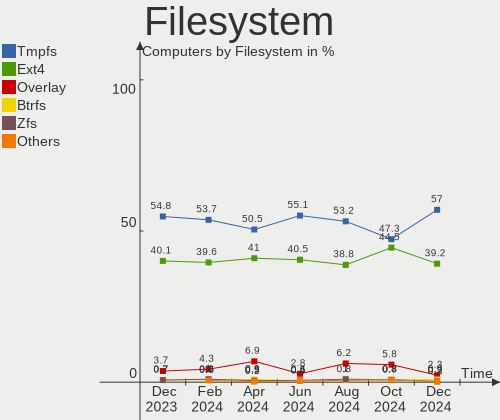
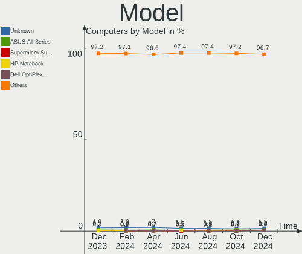
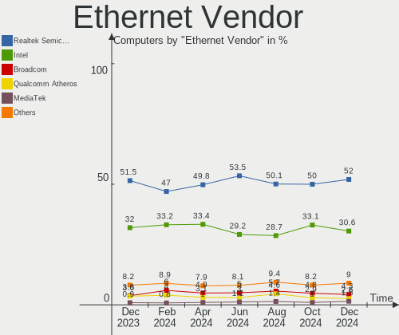
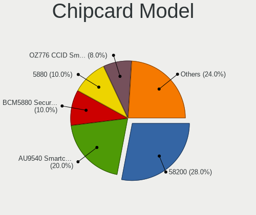

Ubuntu Hardware Trends
----------------------

A project to identify most popular hardware characteristics and track their change
over time based on data collected by Ubuntu users at https://Linux-Hardware.org.

Anyone can contribute to the study by uploading probes of their computers by
the [hw-probe](https://github.com/linuxhw/hw-probe) tool:

    sudo -E hw-probe -all -upload

This is a report for all computer types. See also reports for [desktops](/Dist/Ubuntu/Desktop/README.md) and [notebooks](/Dist/Ubuntu/Notebook/README.md).

Full-feature report is available here: https://linux-hardware.org/?view=trends

Period: Feb, 2021.

Contents
--------

- [ OS                       ](#os)
- [ OS Family                ](#os-family)
- [ Kernel                   ](#kernel)
- [ Kernel Family            ](#kernel-family)
- [ Kernel Major Ver.        ](#kernel-major-ver)
- [ Arch                     ](#arch)
- [ DE                       ](#de)
- [ Display Server           ](#display-server)
- [ Display Manager          ](#display-manager)
- [ OS Lang                  ](#os-lang)
- [ Boot Mode                ](#boot-mode)
- [ Filesystem               ](#filesystem)
- [ Part. scheme             ](#part-scheme)
- [ Dual Boot with Linux/BSD ](#dual-boot-with-linux/bsd)
- [ Dual Boot (Win)          ](#dual-boot-win)
- [ Country                  ](#country)
- [ City                     ](#city)
- [ Vendor                   ](#vendor)
- [ Model                    ](#model)
- [ Model Family             ](#model-family)
- [ MFG Year                 ](#mfg-year)
- [ Form Factor              ](#form-factor)
- [ Secure Boot              ](#secure-boot)
- [ Coreboot                 ](#coreboot)
- [ RAM Size                 ](#ram-size)
- [ RAM Used                 ](#ram-used)
- [ Has CD-ROM               ](#has-cd-rom)
- [ Total Drives             ](#total-drives)
- [ Has Ethernet             ](#has-ethernet)
- [ Drive Vendor             ](#drive-vendor)
- [ Drive Model              ](#drive-model)
- [ HDD Vendor               ](#hdd-vendor)
- [ SSD Vendor               ](#ssd-vendor)
- [ Drive Kind               ](#drive-kind)
- [ Drive Connector          ](#drive-connector)
- [ Drive Size               ](#drive-size)
- [ Space Total              ](#space-total)
- [ Space Used               ](#space-used)
- [ Malfunc. Drives          ](#malfunc-drives)
- [ Malfunc. Drive Vendor    ](#malfunc-drive-vendor)
- [ Malfunc. HDD Vendor      ](#malfunc-hdd-vendor)
- [ Malfunc. Drive Kind      ](#malfunc-drive-kind)
- [ Failed Drives            ](#failed-drives)
- [ Failed Drive Vendor      ](#failed-drive-vendor)
- [ Drive Status             ](#drive-status)
- [ Storage Vendor           ](#storage-vendor)
- [ Storage Model            ](#storage-model)
- [ Storage Kind             ](#storage-kind)
- [ CPU Vendor               ](#cpu-vendor)
- [ CPU Model                ](#cpu-model)
- [ CPU Model Family         ](#cpu-model-family)
- [ CPU Cores                ](#cpu-cores)
- [ CPU Sockets              ](#cpu-sockets)
- [ CPU Threads              ](#cpu-threads)
- [ CPU Op-Modes             ](#cpu-op-modes)
- [ CPU Microcode            ](#cpu-microcode)
- [ CPU Microarch            ](#cpu-microarch)
- [ GPU Vendor               ](#gpu-vendor)
- [ GPU Model                ](#gpu-model)
- [ GPU Combo                ](#gpu-combo)
- [ GPU Driver               ](#gpu-driver)
- [ GPU Memory               ](#gpu-memory)
- [ Monitor Vendor           ](#monitor-vendor)
- [ Monitor Model            ](#monitor-model)
- [ Monitor Resolution       ](#monitor-resolution)
- [ Monitor Diagonal         ](#monitor-diagonal)
- [ Monitor Width            ](#monitor-width)
- [ Aspect Ratio             ](#aspect-ratio)
- [ Monitor Area             ](#monitor-area)
- [ Pixel Density            ](#pixel-density)
- [ Multiple Monitors        ](#multiple-monitors)
- [ Net Controller Vendor    ](#net-controller-vendor)
- [ Net Controller Model     ](#net-controller-model)
- [ Wireless Vendor          ](#wireless-vendor)
- [ Wireless Model           ](#wireless-model)
- [ Ethernet Vendor          ](#ethernet-vendor)
- [ Ethernet Model           ](#ethernet-model)
- [ Net Controller Kind      ](#net-controller-kind)
- [ Used Controller          ](#used-controller)
- [ NICs                     ](#nics)
- [ Memory Vendor            ](#memory-vendor)
- [ Memory Model             ](#memory-model)
- [ Memory Kind              ](#memory-kind)
- [ Memory Form Factor       ](#memory-form-factor)
- [ Memory Size              ](#memory-size)
- [ Memory Speed             ](#memory-speed)
- [ Sound Vendor             ](#sound-vendor)
- [ Sound Model              ](#sound-model)
- [ Camera Vendor            ](#camera-vendor)
- [ Camera Model             ](#camera-model)
- [ Fingerprint Vendor       ](#fingerprint-vendor)
- [ Fingerprint Model        ](#fingerprint-model)
- [ Chipcard Vendor          ](#chipcard-vendor)
- [ Chipcard Model           ](#chipcard-model)
- [ Printer Vendor           ](#printer-vendor)
- [ Printer Model            ](#printer-model)
- [ Scanner Vendor           ](#scanner-vendor)
- [ Scanner Model            ](#scanner-model)
- [ Bluetooth Vendor         ](#bluetooth-vendor)
- [ Bluetooth Model          ](#bluetooth-model)
- [ Unsupported Devices      ](#unsupported-devices)
- [ Unsupported Device Types ](#unsupported-device-types)

OS
--

Installed operating systems

| Name           | Computers | Percent |
|----------------|-----------|---------|
| Ubuntu 20.04   | 1260      | 66.81%  |
| Ubuntu 20.10   | 392       | 20.78%  |
| Ubuntu 18.04   | 182       | 9.65%   |
| Ubuntu 16.04   | 20        | 1.06%   |
| Ubuntu 21.04   | 9         | 0.48%   |
| Ubuntu         | 8         | 0.42%   |
| Ubuntu 19.10   | 4         | 0.21%   |
| Ubuntu 18.10   | 4         | 0.21%   |
| Ubuntu 19.04   | 3         | 0.16%   |
| Ubuntu Core 20 | 1         | 0.05%   |
| Ubuntu 2020    | 1         | 0.05%   |
| Ubuntu 17.10   | 1         | 0.05%   |
| Ubuntu 14.04   | 1         | 0.05%   |

OS Family
---------

OS without a version

| Name   | Computers | Percent |
|--------|-----------|---------|
| Ubuntu | 1886      | 100%    |

Kernel
------

Version of the Linux kernel

| Version                | Computers | Percent |
|------------------------|-----------|---------|
| 5.8.0-43-generic       | 537       | 28.47%  |
| 5.8.0-41-generic       | 359       | 19.03%  |
| 5.4.0-65-generic       | 316       | 16.76%  |
| 5.8.0-44-generic       | 155       | 8.22%   |
| 5.4.0-66-generic       | 53        | 2.81%   |
| 5.4.0-42-generic       | 43        | 2.28%   |
| 4.15.0-135-generic     | 41        | 2.17%   |
| 5.4.0-65-lowlatency    | 23        | 1.22%   |
| 5.8.0-1015-raspi       | 17        | 0.9%    |
| 5.8.0-1013-raspi       | 15        | 0.8%    |
| 4.15.0-136-generic     | 15        | 0.8%    |
| 5.8.0-40-generic       | 13        | 0.69%   |
| 5.11.0-051100-generic  | 13        | 0.69%   |
| 5.4.0-58-generic       | 12        | 0.64%   |
| 5.8.0-25-generic       | 11        | 0.58%   |
| 5.4.0-64-generic       | 11        | 0.58%   |
| 5.4.0-62-generic       | 11        | 0.58%   |
| 5.8.0-38-generic       | 10        | 0.53%   |
| 5.4.0-26-generic       | 10        | 0.53%   |
| 5.8.0-42-generic       | 9         | 0.48%   |
| 4.15.0-133-generic     | 9         | 0.48%   |
| 5.8.0-36-generic       | 8         | 0.42%   |
| 5.8.0-1016-raspi       | 6         | 0.32%   |
| 5.10.0-14-generic      | 6         | 0.32%   |
| 5.10.0-051000-generic  | 6         | 0.32%   |
| 5.8.0-43-lowlatency    | 5         | 0.27%   |
| 5.8.0-33-generic       | 5         | 0.27%   |
| 5.8.0-45-generic       | 4         | 0.21%   |
| 5.4.0-60-generic       | 4         | 0.21%   |
| 5.4.0-54-generic       | 4         | 0.21%   |
| 4.4.0-201-generic      | 4         | 0.21%   |
| 5.8.0-7630-generic     | 3         | 0.16%   |
| 5.8.0-44-lowlatency    | 3         | 0.16%   |
| 5.8.0-34-generic       | 3         | 0.16%   |
| 5.8.0-29-generic       | 3         | 0.16%   |
| 5.8.0-1006-raspi       | 3         | 0.16%   |
| 5.6.0-1047-oem         | 3         | 0.16%   |
| 5.6.0-1042-oem         | 3         | 0.16%   |
| 5.4.0-56-generic       | 3         | 0.16%   |
| 5.10.13-051013-generic | 3         | 0.16%   |
| 4.15.0-135-lowlatency  | 3         | 0.16%   |
| 4.15.0-134-generic     | 3         | 0.16%   |
| 5.9.6-050906-generic   | 2         | 0.11%   |
| 5.8.0-41-lowlatency    | 2         | 0.11%   |
| 5.7.15-050715-generic  | 2         | 0.11%   |
| 5.4.0-67-generic       | 2         | 0.11%   |
| 5.4.0-59-generic       | 2         | 0.11%   |
| 5.4.0-53-generic       | 2         | 0.11%   |
| 5.4.0-52-generic       | 2         | 0.11%   |
| 5.4.0-47-generic       | 2         | 0.11%   |
| 5.4.0-45-generic       | 2         | 0.11%   |
| 5.3.0-28-generic       | 2         | 0.11%   |
| 5.10.15-051015-generic | 2         | 0.11%   |
| 5.10.10-051010-generic | 2         | 0.11%   |
| 5.10.0-1008-oem        | 2         | 0.11%   |
| 5.0.0-23-generic       | 2         | 0.11%   |
| 4.4.0-198-generic      | 2         | 0.11%   |
| 4.18.0-25-generic      | 2         | 0.11%   |
| 4.15.0-66-generic      | 2         | 0.11%   |
| 4.15.0-132-generic     | 2         | 0.11%   |

Kernel Family
-------------

Linux kernel without a distro release

| Version  | Computers | Percent |
|----------|-----------|---------|
| 5.8.0    | 1175      | 62.3%   |
| 5.4.0    | 512       | 27.15%  |
| 4.15.0   | 86        | 4.56%   |
| 5.10.0   | 17        | 0.9%    |
| 5.11.0   | 16        | 0.85%   |
| 5.3.0    | 9         | 0.48%   |
| 5.6.0    | 8         | 0.42%   |
| 4.4.0    | 8         | 0.42%   |
| 5.0.0    | 6         | 0.32%   |
| 4.18.0   | 6         | 0.32%   |
| 5.10.13  | 5         | 0.27%   |
| 5.9.6    | 2         | 0.11%   |
| 5.9.0    | 2         | 0.11%   |
| 5.7.15   | 2         | 0.11%   |
| 5.10.17  | 2         | 0.11%   |
| 5.10.15  | 2         | 0.11%   |
| 5.10.10  | 2         | 0.11%   |
| 4.13.0   | 2         | 0.11%   |
| 5.9.8    | 1         | 0.05%   |
| 5.9.11   | 1         | 0.05%   |
| 5.9.10   | 1         | 0.05%   |
| 5.8.18   | 1         | 0.05%   |
| 5.8.17   | 1         | 0.05%   |
| 5.7.7    | 1         | 0.05%   |
| 5.7.1    | 1         | 0.05%   |
| 5.4.97   | 1         | 0.05%   |
| 5.4.80   | 1         | 0.05%   |
| 5.4.73   | 1         | 0.05%   |
| 5.4.72   | 1         | 0.05%   |
| 5.10.7   | 1         | 0.05%   |
| 5.10.18  | 1         | 0.05%   |
| 5.10.14  | 1         | 0.05%   |
| 5.10.12  | 1         | 0.05%   |
| 5.10.11  | 1         | 0.05%   |
| 5.1.15   | 1         | 0.05%   |
| 4.9.201  | 1         | 0.05%   |
| 4.9.140  | 1         | 0.05%   |
| 4.8.0    | 1         | 0.05%   |
| 4.17.3   | 1         | 0.05%   |
| 4.14.89  | 1         | 0.05%   |
| 4.14.221 | 1         | 0.05%   |
| 4.14.219 | 1         | 0.05%   |

Kernel Major Ver.
-----------------

Linux kernel major version

| Version | Computers | Percent |
|---------|-----------|---------|
| 5.8     | 1177      | 62.41%  |
| 5.4     | 516       | 27.36%  |
| 4.15    | 86        | 4.56%   |
| 5.10    | 33        | 1.75%   |
| 5.11    | 16        | 0.85%   |
| 5.3     | 9         | 0.48%   |
| 5.6     | 8         | 0.42%   |
| 4.4     | 8         | 0.42%   |
| 5.9     | 7         | 0.37%   |
| 5.0     | 6         | 0.32%   |
| 4.18    | 6         | 0.32%   |
| 5.7     | 4         | 0.21%   |
| 4.14    | 3         | 0.16%   |
| 4.9     | 2         | 0.11%   |
| 4.13    | 2         | 0.11%   |
| 5.1     | 1         | 0.05%   |
| 4.8     | 1         | 0.05%   |
| 4.17    | 1         | 0.05%   |

Arch
----

OS architecture (x86_64, i586, etc.)

| Name    | Computers | Percent |
|---------|-----------|---------|
| x86_64  | 1798      | 95.33%  |
| aarch64 | 48        | 2.55%   |
| i686    | 39        | 2.07%   |
| armv7l  | 1         | 0.05%   |

DE
--

Desktop Environment

| Name            | Computers | Percent |
|-----------------|-----------|---------|
| GNOME           | 1360      | 72.11%  |
| Unknown         | 154       | 8.17%   |
| XFCE            | 117       | 6.2%    |
| KDE             | 53        | 2.81%   |
| KDE5            | 39        | 2.07%   |
| Unity           | 35        | 1.86%   |
| MATE            | 34        | 1.8%    |
| Budgie          | 26        | 1.38%   |
| LXQt            | 22        | 1.17%   |
| X-Cinnamon      | 21        | 1.11%   |
| GNOME Flashback | 10        | 0.53%   |
| LXDE            | 6         | 0.32%   |
| Cinnamon        | 6         | 0.32%   |
| i3              | 1         | 0.05%   |
| GNUstep         | 1         | 0.05%   |
| Deepin          | 1         | 0.05%   |

Display Server
--------------

X11 or Wayland

| Name    | Computers | Percent |
|---------|-----------|---------|
| X11     | 1722      | 91.3%   |
| Unknown | 71        | 3.76%   |
| Wayland | 67        | 3.55%   |
| Tty     | 26        | 1.38%   |

Display Manager
---------------

SDDM, LightDM, etc.

| Name    | Computers | Percent |
|---------|-----------|---------|
| Unknown | 1442      | 76.46%  |
| GDM     | 322       | 17.07%  |
| TDM     | 63        | 3.34%   |
| SDDM    | 49        | 2.6%    |
| LightDM | 6         | 0.32%   |
| GDM3    | 2         | 0.11%   |
| XDM     | 1         | 0.05%   |
| SLiM    | 1         | 0.05%   |

OS Lang
-------

Language

| Lang    | Computers | Percent |
|---------|-----------|---------|
| en_US   | 708       | 37.54%  |
| de_DE   | 228       | 12.09%  |
| fr_FR   | 151       | 8.01%   |
| en_GB   | 98        | 5.2%    |
| pt_BR   | 72        | 3.82%   |
| ru_RU   | 61        | 3.23%   |
| it_IT   | 60        | 3.18%   |
| es_ES   | 51        | 2.7%    |
| en_CA   | 45        | 2.39%   |
| en_IN   | 34        | 1.8%    |
| pl_PL   | 31        | 1.64%   |
| C       | 29        | 1.54%   |
| nl_NL   | 25        | 1.33%   |
| en_AU   | 23        | 1.22%   |
| hu_HU   | 16        | 0.85%   |
| pt_PT   | 13        | 0.69%   |
| es_MX   | 13        | 0.69%   |
| de_AT   | 12        | 0.64%   |
| Unknown | 12        | 0.64%   |
| ru_UA   | 11        | 0.58%   |
| ja_JP   | 11        | 0.58%   |
| cs_CZ   | 11        | 0.58%   |
| en_NZ   | 10        | 0.53%   |
| es_AR   | 9         | 0.48%   |
| en_ZA   | 9         | 0.48%   |
| sv_SE   | 8         | 0.42%   |
| fr_BE   | 8         | 0.42%   |
| el_GR   | 8         | 0.42%   |
| tr_TR   | 7         | 0.37%   |
| id_ID   | 7         | 0.37%   |
| fi_FI   | 7         | 0.37%   |
| en_IL   | 7         | 0.37%   |
| de_CH   | 7         | 0.37%   |
| sl_SI   | 6         | 0.32%   |
| sk_SK   | 6         | 0.32%   |
| ko_KR   | 6         | 0.32%   |
| ca_ES   | 6         | 0.32%   |
| uk_UA   | 5         | 0.27%   |
| ro_RO   | 5         | 0.27%   |
| es_CL   | 5         | 0.27%   |
| en_IE   | 4         | 0.21%   |
| zh_CN   | 3         | 0.16%   |
| fr_CA   | 3         | 0.16%   |
| es_CO   | 3         | 0.16%   |
| zh_TW   | 2         | 0.11%   |
| nl_BE   | 2         | 0.11%   |
| nb_NO   | 2         | 0.11%   |
| fr_CH   | 2         | 0.11%   |
| es_PE   | 2         | 0.11%   |
| en_SG   | 2         | 0.11%   |
| da_DK   | 2         | 0.11%   |
| bg_BG   | 2         | 0.11%   |
| sv_FI   | 1         | 0.05%   |
| lv_LV   | 1         | 0.05%   |
| lt_LT   | 1         | 0.05%   |
| gl_ES   | 1         | 0.05%   |
| fa_IR   | 1         | 0.05%   |
| es_VE   | 1         | 0.05%   |
| es_UY   | 1         | 0.05%   |
| es_HN   | 1         | 0.05%   |

Boot Mode
---------

EFI or BIOS

| Mode | Computers | Percent |
|------|-----------|---------|
| BIOS | 1122      | 59.49%  |
| EFI  | 764       | 40.51%  |

Filesystem
----------

Type of filesystem

| Type    | Computers | Percent |
|---------|-----------|---------|
| Ext4    | 1783      | 94.54%  |
| Overlay | 49        | 2.6%    |
| Zfs     | 21        | 1.11%   |
| Btrfs   | 12        | 0.64%   |
| Ext3    | 8         | 0.42%   |
| Xfs     | 6         | 0.32%   |
| Ext2    | 6         | 0.32%   |
| Aufs    | 1         | 0.05%   |

Part. scheme
------------

Scheme of partitioning

| Type    | Computers | Percent |
|---------|-----------|---------|
| Unknown | 1446      | 76.67%  |
| GPT     | 321       | 17.02%  |
| MBR     | 119       | 6.31%   |

Dual Boot with Linux/BSD
------------------------

Hosting more than one Linux/BSD

| Dual boot | Computers | Percent |
|-----------|-----------|---------|
| No        | 1640      | 86.96%  |
| Yes       | 246       | 13.04%  |

Dual Boot (Win)
---------------

Hosting Linux and Windows

| Dual boot | Computers | Percent |
|-----------|-----------|---------|
| No        | 1184      | 62.78%  |
| Yes       | 702       | 37.22%  |

Country
-------

Geographic location (country)

| Country            | Computers | Percent |
|--------------------|-----------|---------|
| USA                | 349       | 18.5%   |
| Germany            | 260       | 13.79%  |
| France             | 157       | 8.32%   |
| Brazil             | 96        | 5.09%   |
| UK                 | 81        | 4.29%   |
| Russia             | 68        | 3.61%   |
| Italy              | 67        | 3.55%   |
| Canada             | 60        | 3.18%   |
| Spain              | 53        | 2.81%   |
| Netherlands        | 40        | 2.12%   |
| India              | 40        | 2.12%   |
| Poland             | 38        | 2.01%   |
| Ukraine            | 33        | 1.75%   |
| Belgium            | 27        | 1.43%   |
| Australia          | 23        | 1.22%   |
| Switzerland        | 21        | 1.11%   |
| Mexico             | 21        | 1.11%   |
| Hungary            | 21        | 1.11%   |
| Austria            | 20        | 1.06%   |
| Finland            | 18        | 0.95%   |
| Portugal           | 17        | 0.9%    |
| Japan              | 17        | 0.9%    |
| Argentina          | 17        | 0.9%    |
| Turkey             | 16        | 0.85%   |
| Sweden             | 15        | 0.8%    |
| Greece             | 15        | 0.8%    |
| Czech Republic     | 14        | 0.74%   |
| South Africa       | 13        | 0.69%   |
| New Zealand        | 13        | 0.69%   |
| Romania            | 12        | 0.64%   |
| Norway             | 12        | 0.64%   |
| Indonesia          | 11        | 0.58%   |
| Denmark            | 11        | 0.58%   |
| Colombia           | 11        | 0.58%   |
| Slovakia           | 10        | 0.53%   |
| Israel             | 9         | 0.48%   |
| Ireland            | 9         | 0.48%   |
| China              | 9         | 0.48%   |
| Chile              | 9         | 0.48%   |
| Bulgaria           | 9         | 0.48%   |
| Slovenia           | 8         | 0.42%   |
| Vietnam            | 7         | 0.37%   |
| Saudi Arabia       | 7         | 0.37%   |
| Pakistan           | 7         | 0.37%   |
| Korea, Republic of | 6         | 0.32%   |
| Iran               | 6         | 0.32%   |
| Egypt              | 5         | 0.27%   |
| Croatia            | 5         | 0.27%   |
| Morocco            | 4         | 0.21%   |
| Malaysia           | 4         | 0.21%   |
| Belarus            | 4         | 0.21%   |
| Armenia            | 4         | 0.21%   |
| Thailand           | 3         | 0.16%   |
| Taiwan             | 3         | 0.16%   |
| Singapore          | 3         | 0.16%   |
| Serbia             | 3         | 0.16%   |
| Lithuania          | 3         | 0.16%   |
| Ecuador            | 3         | 0.16%   |
| Czechia            | 3         | 0.16%   |
| Algeria            | 3         | 0.16%   |

City
----

Geographic location (city)

| City              | Computers | Percent |
|-------------------|-----------|---------|
| Berlin            | 29        | 1.54%   |
| Paris             | 19        | 1.01%   |
| Moscow            | 18        | 0.95%   |
| Rome              | 15        | 0.8%    |
| Kyiv              | 15        | 0.8%    |
| Hamburg           | 15        | 0.8%    |
| Prague            | 12        | 0.64%   |
| Warsaw            | 11        | 0.58%   |
| São Paulo        | 10        | 0.53%   |
| St Petersburg     | 9         | 0.48%   |
| Munich            | 9         | 0.48%   |
| Athens            | 9         | 0.48%   |
| Madrid            | 8         | 0.42%   |
| Helsinki          | 8         | 0.42%   |
| Frankfurt am Main | 8         | 0.42%   |
| Düsseldorf       | 8         | 0.42%   |
| Budapest          | 8         | 0.42%   |
| Zurich            | 7         | 0.37%   |
| Vienna            | 7         | 0.37%   |
| Portland          | 7         | 0.37%   |
| Mumbai            | 7         | 0.37%   |
| Istanbul          | 7         | 0.37%   |
| Bogotá           | 7         | 0.37%   |
| Auckland          | 7         | 0.37%   |
| Toronto           | 6         | 0.32%   |
| Sofia             | 6         | 0.32%   |
| London            | 6         | 0.32%   |
| Jakarta           | 6         | 0.32%   |
| Copenhagen        | 6         | 0.32%   |
| Barcelona         | 6         | 0.32%   |
| Amsterdam         | 6         | 0.32%   |
| Stuttgart         | 5         | 0.27%   |
| Pune              | 5         | 0.27%   |
| Poznan            | 5         | 0.27%   |
| Montreal          | 5         | 0.27%   |
| Milan             | 5         | 0.27%   |
| Dublin            | 5         | 0.27%   |
| Curitiba          | 5         | 0.27%   |
| Chicago           | 5         | 0.27%   |
| Calgary           | 5         | 0.27%   |
| Buenos Aires      | 5         | 0.27%   |
| Brasília         | 5         | 0.27%   |
| Zagreb            | 4         | 0.21%   |
| Thessaloniki      | 4         | 0.21%   |
| Spokane           | 4         | 0.21%   |
| Santiago          | 4         | 0.21%   |
| San Jose          | 4         | 0.21%   |
| Riyadh            | 4         | 0.21%   |
| Perth             | 4         | 0.21%   |
| New York          | 4         | 0.21%   |
| Mexico City       | 4         | 0.21%   |
| Lisbon            | 4         | 0.21%   |
| Leipzig           | 4         | 0.21%   |
| Leeds             | 4         | 0.21%   |
| Johannesburg      | 4         | 0.21%   |
| Houston           | 4         | 0.21%   |
| Ho Chi Minh City  | 4         | 0.21%   |
| Fortaleza         | 4         | 0.21%   |
| Essen             | 4         | 0.21%   |
| Ekaterinburg      | 4         | 0.21%   |

Vendor
------

Motherboard manufacturer

| Name                            | Computers | Percent |
|---------------------------------|-----------|---------|
| Dell                            | 289       | 15.32%  |
| ASUSTek Computer                | 275       | 14.58%  |
| Hewlett-Packard                 | 253       | 13.41%  |
| Lenovo                          | 229       | 12.14%  |
| Gigabyte Technology             | 129       | 6.84%   |
| MSI                             | 121       | 6.42%   |
| Acer                            | 102       | 5.41%   |
| ASRock                          | 56        | 2.97%   |
| Unknown                         | 51        | 2.7%    |
| Apple                           | 38        | 2.01%   |
| Toshiba                         | 36        | 1.91%   |
| Intel                           | 35        | 1.86%   |
| Sony                            | 26        | 1.38%   |
| Medion                          | 18        | 0.95%   |
| Samsung Electronics             | 17        | 0.9%    |
| Fujitsu                         | 17        | 0.9%    |
| Raspberry Pi Foundation         | 12        | 0.64%   |
| Pegatron                        | 12        | 0.64%   |
| Fujitsu Siemens                 | 11        | 0.58%   |
| Notebook                        | 10        | 0.53%   |
| Foxconn                         | 10        | 0.53%   |
| Biostar                         | 10        | 0.53%   |
| Packard Bell                    | 9         | 0.48%   |
| Supermicro                      | 7         | 0.37%   |
| ECS                             | 6         | 0.32%   |
| Timi                            | 5         | 0.27%   |
| HUAWEI                          | 5         | 0.27%   |
| Gateway                         | 5         | 0.27%   |
| System76                        | 4         | 0.21%   |
| Semp Toshiba                    | 4         | 0.21%   |
| NEC Computers                   | 4         | 0.21%   |
| Shuttle                         | 3         | 0.16%   |
| Positivo                        | 3         | 0.16%   |
| Microsoft                       | 3         | 0.16%   |
| Chuwi                           | 3         | 0.16%   |
| ZOTAC                           | 2         | 0.11%   |
| Wortmann AG                     | 2         | 0.11%   |
| TUXEDO                          | 2         | 0.11%   |
| PCWare                          | 2         | 0.11%   |
| Panasonic                       | 2         | 0.11%   |
| Nvidia                          | 2         | 0.11%   |
| Maibenben                       | 2         | 0.11%   |
| LG Electronics                  | 2         | 0.11%   |
| JINGSHA                         | 2         | 0.11%   |
| eMachines                       | 2         | 0.11%   |
| Clevo                           | 2         | 0.11%   |
| BESSTAR Tech                    | 2         | 0.11%   |
| AZW                             | 2         | 0.11%   |
| AVITA                           | 2         | 0.11%   |
| ASRockRack                      | 2         | 0.11%   |
| AMI                             | 2         | 0.11%   |
| YIFANG                          | 1         | 0.05%   |
| WYSE                            | 1         | 0.05%   |
| VINGA                           | 1         | 0.05%   |
| Universal Scientific Industrial | 1         | 0.05%   |
| Trenton Systems                 | 1         | 0.05%   |
| Star Labs                       | 1         | 0.05%   |
| SLIMBOOK                        | 1         | 0.05%   |
| Seco                            | 1         | 0.05%   |
| Razer                           | 1         | 0.05%   |

Model
-----

Motherboard model

| Name                               | Computers | Percent |
|------------------------------------|-----------|---------|
| Unknown                            | 60        | 3.18%   |
| ASUS All Series                    | 14        | 0.74%   |
| MSI MS-7C02                        | 7         | 0.37%   |
| HP Pavilion dv6                    | 6         | 0.32%   |
| Dell Precision M4800               | 6         | 0.32%   |
| MSI MS-7B79                        | 5         | 0.27%   |
| MSI MS-7A38                        | 5         | 0.27%   |
| HP Notebook                        | 5         | 0.27%   |
| Dell XPS 13 7390                   | 5         | 0.27%   |
| Dell OptiPlex 990                  | 5         | 0.27%   |
| Dell Latitude E6420                | 5         | 0.27%   |
| Dell Latitude E4310                | 5         | 0.27%   |
| ASUS TUF GAMING X570-PLUS          | 5         | 0.27%   |
| ASUS M5A78L-M/USB3                 | 5         | 0.27%   |
| RPi Raspberry Pi 4 Model B Rev 1.4 | 4         | 0.21%   |
| Packard Bell EasyNote TS11HR       | 4         | 0.21%   |
| MSI MS-7C37                        | 4         | 0.21%   |
| HP Pavilion dv7                    | 4         | 0.21%   |
| Gigabyte B450M DS3H                | 4         | 0.21%   |
| Gigabyte 970A-DS3P                 | 4         | 0.21%   |
| Dell XPS 15 7590                   | 4         | 0.21%   |
| Dell Latitude 7490                 | 4         | 0.21%   |
| Toshiba Satellite C55-C            | 3         | 0.16%   |
| RPi Raspberry Pi 400 Rev 1.0       | 3         | 0.16%   |
| MSI MS-7C75                        | 3         | 0.16%   |
| MSI MS-7B86                        | 3         | 0.16%   |
| MSI MS-7817                        | 3         | 0.16%   |
| MSI MS-7721                        | 3         | 0.16%   |
| Lenovo G510 20238                  | 3         | 0.16%   |
| HP ProLiant MicroServer            | 3         | 0.16%   |
| HP ProBook 455 G7                  | 3         | 0.16%   |
| HP Pavilion Notebook               | 3         | 0.16%   |
| HP Pavilion g6                     | 3         | 0.16%   |
| HP Pavilion dv5                    | 3         | 0.16%   |
| HP Laptop 15-dw1xxx                | 3         | 0.16%   |
| HP Laptop 15-da1xxx                | 3         | 0.16%   |
| HP EliteBook 850 G7 Notebook PC    | 3         | 0.16%   |
| HP EliteBook 8470p                 | 3         | 0.16%   |
| HP EliteBook 840 G2                | 3         | 0.16%   |
| HP 15                              | 3         | 0.16%   |
| Gigabyte H81M-DS2                  | 3         | 0.16%   |
| Gigabyte G31M-ES2L                 | 3         | 0.16%   |
| Dell XPS 13 9370                   | 3         | 0.16%   |
| Dell Vostro 3480                   | 3         | 0.16%   |
| Dell Precision Tower 5810          | 3         | 0.16%   |
| Dell OptiPlex 790                  | 3         | 0.16%   |
| Dell OptiPlex 780                  | 3         | 0.16%   |
| Dell OptiPlex 7010                 | 3         | 0.16%   |
| Dell Latitude E6510                | 3         | 0.16%   |
| Dell Inspiron 5537                 | 3         | 0.16%   |
| Dell Inspiron 530                  | 3         | 0.16%   |
| Dell Inspiron 3542                 | 3         | 0.16%   |
| Dell Inspiron 15-3567              | 3         | 0.16%   |
| ASUS T100HAN                       | 3         | 0.16%   |
| ASUS P8Z77-V LX                    | 3         | 0.16%   |
| Apple MacBookPro9,2                | 3         | 0.16%   |
| Apple iMac8,1                      | 3         | 0.16%   |
| Toshiba Satellite C75D-B           | 2         | 0.11%   |
| Toshiba Satellite C55D-B           | 2         | 0.11%   |
| Timi Mi Laptop Pro 15 2020         | 2         | 0.11%   |

Model Family
------------

Motherboard model prefix

| Name                    | Computers | Percent |
|-------------------------|-----------|---------|
| Lenovo ThinkPad         | 103       | 5.46%   |
| Dell Inspiron           | 76        | 4.03%   |
| Acer Aspire             | 69        | 3.66%   |
| Dell Latitude           | 60        | 3.18%   |
| Unknown                 | 60        | 3.18%   |
| HP Pavilion             | 55        | 2.92%   |
| Dell OptiPlex           | 44        | 2.33%   |
| Lenovo IdeaPad          | 42        | 2.23%   |
| Dell Precision          | 36        | 1.91%   |
| Toshiba Satellite       | 30        | 1.59%   |
| ASUS PRIME              | 28        | 1.48%   |
| HP ProBook              | 26        | 1.38%   |
| HP EliteBook            | 26        | 1.38%   |
| Dell XPS                | 25        | 1.33%   |
| Dell Vostro             | 25        | 1.33%   |
| HP Laptop               | 23        | 1.22%   |
| Lenovo ThinkCentre      | 22        | 1.17%   |
| HP Compaq               | 20        | 1.06%   |
| ASUS TUF                | 16        | 0.85%   |
| ASUS All                | 14        | 0.74%   |
| RPi Raspberry           | 12        | 0.64%   |
| Lenovo Yoga             | 12        | 0.64%   |
| ASUS ZenBook            | 11        | 0.58%   |
| ASUS ROG                | 11        | 0.58%   |
| HP Spectre              | 10        | 0.53%   |
| ASUS VivoBook           | 10        | 0.53%   |
| HP ProLiant             | 8         | 0.42%   |
| HP ENVY                 | 8         | 0.42%   |
| Fujitsu LIFEBOOK        | 8         | 0.42%   |
| ASUS M5A78L-M           | 8         | 0.42%   |
| Acer Swift              | 8         | 0.42%   |
| Packard Bell EasyNote   | 7         | 0.37%   |
| MSI MS-7C02             | 7         | 0.37%   |
| Lenovo ThinkBook        | 7         | 0.37%   |
| Gigabyte B450M          | 7         | 0.37%   |
| Dell Studio             | 7         | 0.37%   |
| HP ZBook                | 6         | 0.32%   |
| Gigabyte Z390           | 6         | 0.32%   |
| Fujitsu Siemens ESPRIMO | 6         | 0.32%   |
| Acer Nitro              | 6         | 0.32%   |
| MSI MS-7B79             | 5         | 0.27%   |
| MSI MS-7A38             | 5         | 0.27%   |
| HP Notebook             | 5         | 0.27%   |
| Gigabyte X570           | 5         | 0.27%   |
| Fujitsu ESPRIMO         | 5         | 0.27%   |
| ASRock A320M-HDV        | 5         | 0.27%   |
| Timi Mi                 | 4         | 0.21%   |
| MSI MS-7C37             | 4         | 0.21%   |
| Lenovo IdeaCentre       | 4         | 0.21%   |
| HP Stream               | 4         | 0.21%   |
| HP Presario             | 4         | 0.21%   |
| HP 15                   | 4         | 0.21%   |
| Gigabyte GA-78LMT-USB3  | 4         | 0.21%   |
| Gigabyte 970A-DS3P      | 4         | 0.21%   |
| Dell PowerEdge          | 4         | 0.21%   |
| ASUS P8H61-M            | 4         | 0.21%   |
| ASUS P5KPL-AM           | 4         | 0.21%   |
| Acer TravelMate         | 4         | 0.21%   |
| Toshiba PORTEGE         | 3         | 0.16%   |
| MSI MS-7C75             | 3         | 0.16%   |

MFG Year
--------

Motherboard manufacture year

| Year    | Computers | Percent |
|---------|-----------|---------|
| 2020    | 384       | 20.36%  |
| 2019    | 200       | 10.6%   |
| 2018    | 154       | 8.17%   |
| 2013    | 134       | 7.1%    |
| 2012    | 133       | 7.05%   |
| 2011    | 118       | 6.26%   |
| 2010    | 112       | 5.94%   |
| 2014    | 102       | 5.41%   |
| 2015    | 93        | 4.93%   |
| 2009    | 91        | 4.83%   |
| 2008    | 81        | 4.29%   |
| 2017    | 77        | 4.08%   |
| 2016    | 76        | 4.03%   |
| Unknown | 49        | 2.6%    |
| 2007    | 40        | 2.12%   |
| 2021    | 23        | 1.22%   |
| 2006    | 11        | 0.58%   |
| 2005    | 7         | 0.37%   |
| 2004    | 1         | 0.05%   |

Form Factor
-----------

Physical design of the computer

| Name           | Computers | Percent |
|----------------|-----------|---------|
| Notebook       | 968       | 51.33%  |
| Desktop        | 751       | 39.82%  |
| System on chip | 49        | 2.6%    |
| Convertible    | 49        | 2.6%    |
| All in one     | 24        | 1.27%   |
| Mini pc        | 20        | 1.06%   |
| Server         | 17        | 0.9%    |
| Tablet         | 8         | 0.42%   |

Secure Boot
-----------

Enabled or disabled

| State    | Computers | Percent |
|----------|-----------|---------|
| Disabled | 1726      | 91.52%  |
| Enabled  | 160       | 8.48%   |

Coreboot
--------

Have coreboot on board

| Used | Computers | Percent |
|------|-----------|---------|
| No   | 1883      | 99.84%  |
| Yes  | 3         | 0.16%   |

RAM Size
--------

Total RAM memory

| Size in GB      | Computers | Percent |
|-----------------|-----------|---------|
| 4.01-8.0        | 440       | 23.33%  |
| 3.01-4.0        | 436       | 23.12%  |
| 8.01-16.0       | 357       | 18.93%  |
| 16.01-24.0      | 333       | 17.66%  |
| 32.01-64.0      | 134       | 7.1%    |
| 1.01-2.0        | 77        | 4.08%   |
| 64.01-256.0     | 37        | 1.96%   |
| 2.01-3.0        | 34        | 1.8%    |
| 24.01-32.0      | 26        | 1.38%   |
| 0.51-1.0        | 9         | 0.48%   |
| More than 256.0 | 3         | 0.16%   |

RAM Used
--------

Used RAM memory

| Used GB    | Computers | Percent |
|------------|-----------|---------|
| 1.01-2.0   | 747       | 39.61%  |
| 2.01-3.0   | 490       | 25.98%  |
| 4.01-8.0   | 258       | 13.68%  |
| 3.01-4.0   | 232       | 12.3%   |
| 0.51-1.0   | 81        | 4.29%   |
| 8.01-16.0  | 60        | 3.18%   |
| 16.01-24.0 | 8         | 0.42%   |
| 0.01-0.5   | 8         | 0.42%   |
| 24.01-32.0 | 2         | 0.11%   |

Has CD-ROM
----------

Has CD-ROM on board

| Presented | Computers | Percent |
|-----------|-----------|---------|
| No        | 1064      | 56.42%  |
| Yes       | 822       | 43.58%  |

Total Drives
------------

Number of drives on board

| Drives | Computers | Percent |
|--------|-----------|---------|
| 1      | 1118      | 59.28%  |
| 2      | 478       | 25.34%  |
| 3      | 153       | 8.11%   |
| 4      | 61        | 3.23%   |
| 5      | 25        | 1.33%   |
| 0      | 23        | 1.22%   |
| 6      | 13        | 0.69%   |
| 7      | 10        | 0.53%   |
| 8      | 2         | 0.11%   |
| 16     | 1         | 0.05%   |
| 11     | 1         | 0.05%   |
| 10     | 1         | 0.05%   |

Has Ethernet
------------

Has Ethernet on board

| Presented | Computers | Percent |
|-----------|-----------|---------|
| Yes       | 1651      | 87.54%  |
| No        | 235       | 12.46%  |

Drive Vendor
------------

Hard drive vendors

| Vendor                    | Computers | Drives | Percent |
|---------------------------|-----------|--------|---------|
| WDC                       | 441       | 564    | 16.72%  |
| Seagate                   | 418       | 502    | 15.85%  |
| Samsung Electronics       | 395       | 454    | 14.97%  |
| Toshiba                   | 183       | 195    | 6.94%   |
| Unknown                   | 135       | 153    | 5.12%   |
| SanDisk                   | 132       | 139    | 5%      |
| Kingston                  | 130       | 140    | 4.93%   |
| Hitachi                   | 99        | 106    | 3.75%   |
| Crucial                   | 97        | 103    | 3.68%   |
| Intel                     | 70        | 77     | 2.65%   |
| HGST                      | 62        | 64     | 2.35%   |
| SK Hynix                  | 51        | 56     | 1.93%   |
| A-DATA Technology         | 30        | 31     | 1.14%   |
| Micron Technology         | 26        | 27     | 0.99%   |
| Maxtor                    | 22        | 27     | 0.83%   |
| PNY                       | 21        | 22     | 0.8%    |
| China                     | 19        | 19     | 0.72%   |
| Intenso                   | 16        | 19     | 0.61%   |
| Phison                    | 15        | 16     | 0.57%   |
| LITEON                    | 14        | 14     | 0.53%   |
| Patriot                   | 13        | 13     | 0.49%   |
| Apple                     | 13        | 15     | 0.49%   |
| SPCC                      | 12        | 12     | 0.45%   |
| Silicon Motion            | 12        | 12     | 0.45%   |
| OCZ                       | 12        | 12     | 0.45%   |
| KIOXIA                    | 12        | 12     | 0.45%   |
| Fujitsu                   | 12        | 12     | 0.45%   |
| GOODRAM                   | 9         | 9      | 0.34%   |
| Corsair                   | 8         | 8      | 0.3%    |
| Realtek Semiconductor     | 7         | 7      | 0.27%   |
| LITEONIT                  | 7         | 7      | 0.27%   |
| Transcend                 | 6         | 6      | 0.23%   |
| SABRENT                   | 6         | 6      | 0.23%   |
| KingSpec                  | 6         | 6      | 0.23%   |
| Team                      | 5         | 5      | 0.19%   |
| PLEXTOR                   | 5         | 5      | 0.19%   |
| Lexar                     | 5         | 5      | 0.19%   |
| JMicron                   | 5         | 7      | 0.19%   |
| Hewlett-Packard           | 5         | 5      | 0.19%   |
| Mushkin                   | 4         | 4      | 0.15%   |
| Micron/Crucial Technology | 4         | 4      | 0.15%   |
| Apacer                    | 4         | 5      | 0.15%   |
| TO Exter                  | 3         | 3      | 0.11%   |
| Leven                     | 3         | 3      | 0.11%   |
| KingFast                  | 3         | 3      | 0.11%   |
| Integral                  | 3         | 3      | 0.11%   |
| Gigabyte Technology       | 3         | 3      | 0.11%   |
| Asmedia                   | 3         | 3      | 0.11%   |
| Union Memory              | 2         | 2      | 0.08%   |
| TCSUNBOW                  | 2         | 2      | 0.08%   |
| T-FORCE                   | 2         | 2      | 0.08%   |
| Netac                     | 2         | 2      | 0.08%   |
| Lenovo                    | 2         | 2      | 0.08%   |
| LDLC                      | 2         | 2      | 0.08%   |
| LaCie                     | 2         | 2      | 0.08%   |
| KingDian                  | 2         | 2      | 0.08%   |
| HS-SSD-C100               | 2         | 2      | 0.08%   |
| FORESEE                   | 2         | 2      | 0.08%   |
| External                  | 2         | 3      | 0.08%   |
| DOGFISH                   | 2         | 2      | 0.08%   |

Drive Model
-----------

Hard drive models

| Model                              | Computers | Percent |
|------------------------------------|-----------|---------|
| Unknown MMC Card  32GB             | 41        | 1.42%   |
| Unknown MMC Card  64GB             | 27        | 0.94%   |
| Kingston SA400S37240G 240GB SSD    | 25        | 0.87%   |
| Seagate ST500DM002-1BD142 500GB    | 24        | 0.83%   |
| Samsung NVMe SSD Drive 512GB       | 22        | 0.76%   |
| Samsung SSD 860 EVO 500GB          | 21        | 0.73%   |
| Samsung SSD 860 EVO 250GB          | 20        | 0.69%   |
| Seagate ST1000LM035-1RK172 1TB     | 18        | 0.62%   |
| Crucial CT500MX500SSD1 500GB       | 18        | 0.62%   |
| Seagate ST500LT012-1DG142 500GB    | 17        | 0.59%   |
| Seagate ST1000DM010-2EP102 1TB     | 17        | 0.59%   |
| Samsung SSD 840 EVO 250GB          | 17        | 0.59%   |
| Unknown MMC Card  128GB            | 16        | 0.55%   |
| Toshiba MQ01ABD100 1TB             | 16        | 0.55%   |
| SanDisk SSD PLUS 240GB             | 16        | 0.55%   |
| Samsung SSD 850 EVO 250GB          | 16        | 0.55%   |
| Kingston SA400S37120G 120GB SSD    | 16        | 0.55%   |
| Seagate ST31000528AS 1TB           | 15        | 0.52%   |
| Seagate ST1000LM024 HN-M101MBB 1TB | 15        | 0.52%   |
| Kingston SV300S37A120G 120GB SSD   | 15        | 0.52%   |
| HGST HTS545050A7E680 500GB         | 15        | 0.52%   |
| Sandisk NVMe SSD Drive 256GB       | 14        | 0.49%   |
| Kingston SA400S37480G 480GB SSD    | 14        | 0.49%   |
| Unknown SD/MMC/MS PRO 64GB         | 13        | 0.45%   |
| Samsung SSD 850 EVO 500GB          | 13        | 0.45%   |
| Intel NVMe SSD Drive 512GB         | 13        | 0.45%   |
| HGST HTS541010A9E680 1TB           | 13        | 0.45%   |
| Crucial CT240BX500SSD1 240GB       | 13        | 0.45%   |
| WDC WD10EZEX-08WN4A0 1TB           | 12        | 0.42%   |
| Seagate ST1000DM003-1CH162 1TB     | 12        | 0.42%   |
| WDC WDS240G2G0A-00JH30 240GB SSD   | 11        | 0.38%   |
| Unknown MMC Card  16GB             | 11        | 0.38%   |
| Toshiba MQ04ABF100 1TB             | 11        | 0.38%   |
| Toshiba MQ01ABF050 500GB           | 11        | 0.38%   |
| Toshiba DT01ACA100 1TB             | 11        | 0.38%   |
| Seagate ST9500325AS 500GB          | 11        | 0.38%   |
| Seagate ST2000DM008-2FR102 2TB     | 11        | 0.38%   |
| Sandisk NVMe SSD Drive 512GB       | 11        | 0.38%   |
| Samsung SSD 860 EVO 1TB            | 11        | 0.38%   |
| Samsung NVMe SSD Drive 500GB       | 11        | 0.38%   |
| Samsung NVMe SSD Drive 250GB       | 11        | 0.38%   |
| WDC WD10EZEX-00BN5A0 1TB           | 10        | 0.35%   |
| SK Hynix NVMe SSD Drive 256GB      | 10        | 0.35%   |
| Seagate ST2000LM007-1R8174 2TB     | 10        | 0.35%   |
| Samsung NVMe SSD Drive 256GB       | 10        | 0.35%   |
| Samsung NVMe SSD Drive 1TB         | 10        | 0.35%   |
| WDC WDS500G2B0A-00SM50 500GB SSD   | 9         | 0.31%   |
| Toshiba HDWD110 1TB                | 9         | 0.31%   |
| Seagate ST1000LM048-2E7172 1TB     | 9         | 0.31%   |
| SanDisk SDSSDA240G 240GB           | 9         | 0.31%   |
| Intel NVMe SSD Drive 1024GB        | 9         | 0.31%   |
| Toshiba NVMe SSD Drive 512GB       | 8         | 0.28%   |
| Toshiba DT01ACA050 500GB           | 8         | 0.28%   |
| Seagate ST1000DM003-1SB102 1TB     | 8         | 0.28%   |
| Samsung NVMe SSD Drive 1024GB      | 8         | 0.28%   |
| PNY CS900 120GB SSD                | 8         | 0.28%   |
| HGST HTS721010A9E630 1TB           | 8         | 0.28%   |
| WDC WDS240G2G0B-00EPW0 240GB SSD   | 7         | 0.24%   |
| WDC WD10SPZX-60Z10T0 1TB           | 7         | 0.24%   |
| Toshiba DT01ACA300 3TB             | 7         | 0.24%   |

HDD Vendor
----------

Hard disk drive vendors

| Vendor              | Computers | Drives | Percent |
|---------------------|-----------|--------|---------|
| Seagate             | 409       | 491    | 33.39%  |
| WDC                 | 390       | 483    | 31.84%  |
| Toshiba             | 142       | 152    | 11.59%  |
| Hitachi             | 99        | 106    | 8.08%   |
| Samsung Electronics | 62        | 76     | 5.06%   |
| HGST                | 62        | 64     | 5.06%   |
| MAXTOR              | 20        | 25     | 1.63%   |
| Fujitsu             | 11        | 11     | 0.9%    |
| Intenso             | 6         | 6      | 0.49%   |
| Apple               | 5         | 5      | 0.41%   |
| TO Exter            | 3         | 3      | 0.24%   |
| asmedia             | 3         | 3      | 0.24%   |
| Hewlett-Packard     | 2         | 2      | 0.16%   |
| ASMT109x            | 2         | 3      | 0.16%   |
| WD MediaMax         | 1         | 1      | 0.08%   |
| USB                 | 1         | 1      | 0.08%   |
| Msft                | 1         | 4      | 0.08%   |
| LaCie               | 1         | 1      | 0.08%   |
| Inateck             | 1         | 1      | 0.08%   |
| IBM/Hitachi         | 1         | 1      | 0.08%   |
| Ext Hard            | 1         | 1      | 0.08%   |
| ExcelStor           | 1         | 1      | 0.08%   |
| ASMT                | 1         | 2      | 0.08%   |

SSD Vendor
----------

Solid state drive vendors

| Vendor              | Computers | Drives | Percent |
|---------------------|-----------|--------|---------|
| Samsung Electronics | 206       | 225    | 24.15%  |
| Kingston            | 115       | 123    | 13.48%  |
| SanDisk             | 91        | 97     | 10.67%  |
| Crucial             | 87        | 93     | 10.2%   |
| WDC                 | 43        | 45     | 5.04%   |
| A-DATA Technology   | 26        | 27     | 3.05%   |
| Intel               | 25        | 25     | 2.93%   |
| PNY                 | 20        | 21     | 2.34%   |
| China               | 18        | 18     | 2.11%   |
| Micron Technology   | 17        | 18     | 1.99%   |
| SK Hynix            | 13        | 16     | 1.52%   |
| Patriot             | 13        | 13     | 1.52%   |
| LITEON              | 13        | 13     | 1.52%   |
| SPCC                | 12        | 12     | 1.41%   |
| Toshiba             | 11        | 11     | 1.29%   |
| OCZ                 | 11        | 11     | 1.29%   |
| Intenso             | 9         | 9      | 1.06%   |
| GOODRAM             | 9         | 9      | 1.06%   |
| LITEONIT            | 7         | 7      | 0.82%   |
| Corsair             | 7         | 7      | 0.82%   |
| Transcend           | 6         | 6      | 0.7%    |
| Apple               | 6         | 6      | 0.7%    |
| Seagate             | 5         | 5      | 0.59%   |
| SABRENT             | 5         | 5      | 0.59%   |
| PLEXTOR             | 5         | 5      | 0.59%   |
| Lexar               | 5         | 5      | 0.59%   |
| KingSpec            | 5         | 5      | 0.59%   |
| Team                | 4         | 4      | 0.47%   |
| Mushkin             | 4         | 4      | 0.47%   |
| Apacer              | 4         | 5      | 0.47%   |
| Unknown             | 3         | 3      | 0.35%   |
| JMicron             | 3         | 5      | 0.35%   |
| Integral            | 3         | 3      | 0.35%   |
| TCSUNBOW            | 2         | 2      | 0.23%   |
| Maxtor              | 2         | 2      | 0.23%   |
| Leven               | 2         | 2      | 0.23%   |
| KingDian            | 2         | 2      | 0.23%   |
| Hewlett-Packard     | 2         | 2      | 0.23%   |
| Gigabyte Technology | 2         | 2      | 0.23%   |
| FORESEE             | 2         | 2      | 0.23%   |
| External            | 2         | 3      | 0.23%   |
| DOGFISH             | 2         | 2      | 0.23%   |
| Biostar             | 2         | 2      | 0.23%   |
| Zheino              | 1         | 1      | 0.12%   |
| WDC WDS1            | 1         | 1      | 0.12%   |
| W800S               | 1         | 1      | 0.12%   |
| Verbatim            | 1         | 1      | 0.12%   |
| T-FORCE             | 1         | 1      | 0.12%   |
| Star                | 1         | 1      | 0.12%   |
| PNY USB             | 1         | 1      | 0.12%   |
| OWC                 | 1         | 1      | 0.12%   |
| OCZ-VERTEX2         | 1         | 1      | 0.12%   |
| Netac               | 1         | 1      | 0.12%   |
| LDLC                | 1         | 1      | 0.12%   |
| KIOXIA-EXCERIA      | 1         | 1      | 0.12%   |
| KINGSHARE           | 1         | 1      | 0.12%   |
| KingFast            | 1         | 1      | 0.12%   |
| INDMEM              | 1         | 1      | 0.12%   |
| Hoodisk             | 1         | 1      | 0.12%   |
| DREVO               | 1         | 1      | 0.12%   |

Drive Kind
----------

HDD or SSD

| Kind    | Computers | Drives | Percent |
|---------|-----------|--------|---------|
| HDD     | 1063      | 1443   | 43.96%  |
| SSD     | 769       | 908    | 31.8%   |
| NVMe    | 413       | 464    | 17.08%  |
| MMC     | 116       | 126    | 4.8%    |
| Unknown | 57        | 64     | 2.36%   |

Drive Connector
---------------

SATA, SAS, NVMe, etc.

| Type | Computers | Drives | Percent |
|------|-----------|--------|---------|
| SATA | 1501      | 2269   | 70.34%  |
| NVMe | 413       | 464    | 19.35%  |
| MMC  | 116       | 126    | 5.44%   |
| SAS  | 104       | 146    | 4.87%   |

Drive Size
----------

Size of hard drive

| Size in TB | Computers | Drives | Percent |
|------------|-----------|--------|---------|
| 0.01-0.5   | 1113      | 1393   | 58.39%  |
| 0.51-1.0   | 531       | 614    | 27.86%  |
| 1.01-2.0   | 144       | 169    | 7.56%   |
| 3.01-4.0   | 60        | 88     | 3.15%   |
| 2.01-3.0   | 34        | 48     | 1.78%   |
| 4.01-10.0  | 23        | 38     | 1.21%   |
| 10.01-20.0 | 1         | 1      | 0.05%   |

Space Total
-----------

Amount of disk space available on the file system

| Size in GB     | Computers | Percent |
|----------------|-----------|---------|
| 101-250        | 594       | 31.5%   |
| 251-500        | 452       | 23.97%  |
| 501-1000       | 273       | 14.48%  |
| 1001-2000      | 140       | 7.42%   |
| 51-100         | 127       | 6.73%   |
| 21-50          | 92        | 4.88%   |
| More than 3000 | 79        | 4.19%   |
| 1-20           | 66        | 3.5%    |
| 2001-3000      | 45        | 2.39%   |
| Unknown        | 18        | 0.95%   |

Space Used
----------

Amount of used disk space

| Used GB        | Computers | Percent |
|----------------|-----------|---------|
| 1-20           | 760       | 40.3%   |
| 21-50          | 330       | 17.5%   |
| 101-250        | 259       | 13.73%  |
| 51-100         | 205       | 10.87%  |
| 251-500        | 126       | 6.68%   |
| 501-1000       | 94        | 4.98%   |
| 1001-2000      | 44        | 2.33%   |
| More than 3000 | 35        | 1.86%   |
| Unknown        | 18        | 0.95%   |
| 2001-3000      | 15        | 0.8%    |

Malfunc. Drives
---------------

Drive models with a malfunction

| Model                                          | Computers | Drives | Percent |
|------------------------------------------------|-----------|--------|---------|
| Toshiba MQ01ACF050 500GB                       | 2         | 2      | 2.7%    |
| Seagate ST500LT012-1DG142 500GB                | 2         | 2      | 2.7%    |
| Seagate ST500DM002-1BD142 500GB                | 2         | 2      | 2.7%    |
| HGST HTS541010A9E680 1TB                       | 2         | 2      | 2.7%    |
| WDC WD5003ABYX-01WERA0 500GB                   | 1         | 2      | 1.35%   |
| WDC WD5002ABYS-01B1B0 500GB                    | 1         | 1      | 1.35%   |
| WDC WD5000LPCX-21VHAT0 500GB                   | 1         | 1      | 1.35%   |
| WDC WD5000AAKX-001CA0 500GB                    | 1         | 1      | 1.35%   |
| WDC WD5000AADS-00S9B0 500GB                    | 1         | 1      | 1.35%   |
| WDC WD40EFRX-68WT0N0 4TB                       | 1         | 1      | 1.35%   |
| WDC WD3200BEKT-60PVMT0 320GB                   | 1         | 1      | 1.35%   |
| WDC WD3200AAKS-75L9A0 320GB                    | 1         | 1      | 1.35%   |
| WDC WD3200AAJS-40VWA1 320GB                    | 1         | 1      | 1.35%   |
| WDC WD10JPVX-75JC3T0 1TB                       | 1         | 1      | 1.35%   |
| WDC WD10JPVX-60JC3T0 1TB                       | 1         | 1      | 1.35%   |
| WDC WD10EZEX-60WN4A0 1TB                       | 1         | 1      | 1.35%   |
| WDC WD10EFRX-68FYTN0 1TB                       | 1         | 1      | 1.35%   |
| WDC WD10EARS-00Y5B1 1TB                        | 1         | 2      | 1.35%   |
| WDC WD10EADS-22M2B0 1TB                        | 1         | 1      | 1.35%   |
| WDC WD10EADS-00M2B0 1TB                        | 1         | 1      | 1.35%   |
| WDC PC SN520 SDAPMUW-512G-1001 512GB           | 1         | 1      | 1.35%   |
| Toshiba MQ01ABD100 1TB                         | 1         | 1      | 1.35%   |
| Toshiba MK3265GSX 320GB                        | 1         | 1      | 1.35%   |
| Toshiba MK1652GSX 160GB                        | 1         | 1      | 1.35%   |
| Toshiba MK1237GSX 120GB                        | 1         | 1      | 1.35%   |
| Toshiba MK1011GAH 100GB                        | 1         | 1      | 1.35%   |
| Toshiba MG03ACA100 1TB                         | 1         | 1      | 1.35%   |
| Toshiba HDWD110 1TB                            | 1         | 1      | 1.35%   |
| SPCC Solid State Disk 512GB                    | 1         | 1      | 1.35%   |
| SK Hynix SH920 2.5 7MM 512GB SSD               | 1         | 4      | 1.35%   |
| Seagate ST980310AS 80GB                        | 1         | 1      | 1.35%   |
| Seagate ST9750420AS 752GB                      | 1         | 1      | 1.35%   |
| Seagate ST9500420ASG 500GB                     | 1         | 1      | 1.35%   |
| Seagate ST9250410AS 250GB                      | 1         | 1      | 1.35%   |
| Seagate ST9250315AS 250GB                      | 1         | 1      | 1.35%   |
| Seagate ST500LT012-9WS142 500GB                | 1         | 1      | 1.35%   |
| Seagate ST4000NM0245-1Z2107 4TB                | 1         | 2      | 1.35%   |
| Seagate ST3320813AS 320GB                      | 1         | 1      | 1.35%   |
| Seagate ST3320413AS 320GB                      | 1         | 1      | 1.35%   |
| Seagate ST31000524AS 1TB                       | 1         | 1      | 1.35%   |
| Seagate ST2000DM001-1ER164 2TB                 | 1         | 1      | 1.35%   |
| Seagate ST2000DM001-1CH164 2TB                 | 1         | 1      | 1.35%   |
| Seagate ST1000DM003-1SB102 1TB                 | 1         | 1      | 1.35%   |
| Seagate ST1000DL002-9TT153 1TB                 | 1         | 1      | 1.35%   |
| SanDisk SD7UB3Q256G1001 256GB SSD              | 1         | 1      | 1.35%   |
| Samsung Electronics SSD PM810 2.5 7mm 256GB    | 1         | 1      | 1.35%   |
| Samsung Electronics SSD 860 QVO 1TB            | 1         | 1      | 1.35%   |
| Samsung Electronics SP2504C 250GB              | 1         | 1      | 1.35%   |
| Samsung Electronics HM320JI 320GB              | 1         | 1      | 1.35%   |
| Samsung Electronics HD204UI 2TB                | 1         | 1      | 1.35%   |
| Samsung Electronics HD103UJ 1TB                | 1         | 1      | 1.35%   |
| OCZ-VERTEX2 3.5 120GB SSD                      | 1         | 1      | 1.35%   |
| OCZ VERTEX450 128GB SSD                        | 1         | 1      | 1.35%   |
| Micron Technology 1100_MTFDDAV512TBN 512GB SSD | 1         | 1      | 1.35%   |
| Maxtor 6L160M0 160GB                           | 1         | 2      | 1.35%   |
| Hitachi HTS545025B9SA02 250GB                  | 1         | 1      | 1.35%   |
| Hitachi HTS541075A9E680 752GB                  | 1         | 1      | 1.35%   |
| Hitachi HDS5C1010CLA382 1TB                    | 1         | 1      | 1.35%   |
| HGST HTS721010A9E630 1TB                       | 1         | 1      | 1.35%   |
| HGST HTS545050A7E680 500GB                     | 1         | 1      | 1.35%   |

Malfunc. Drive Vendor
---------------------

Vendors of faulty drives

| Vendor              | Computers | Drives | Percent |
|---------------------|-----------|--------|---------|
| Seagate             | 18        | 19     | 24.32%  |
| WDC                 | 17        | 19     | 22.97%  |
| Toshiba             | 9         | 9      | 12.16%  |
| Samsung Electronics | 6         | 6      | 8.11%   |
| Crucial             | 5         | 5      | 6.76%   |
| HGST                | 4         | 4      | 5.41%   |
| Hitachi             | 3         | 3      | 4.05%   |
| Apple               | 2         | 2      | 2.7%    |
| SPCC                | 1         | 1      | 1.35%   |
| SK Hynix            | 1         | 4      | 1.35%   |
| SanDisk             | 1         | 1      | 1.35%   |
| OCZ-VERTEX2         | 1         | 1      | 1.35%   |
| OCZ                 | 1         | 1      | 1.35%   |
| Micron Technology   | 1         | 1      | 1.35%   |
| Maxtor              | 1         | 2      | 1.35%   |
| Fujitsu             | 1         | 1      | 1.35%   |
| Corsair             | 1         | 1      | 1.35%   |
| A-DATA Technology   | 1         | 1      | 1.35%   |

Malfunc. HDD Vendor
-------------------

Vendors of faulty HDD drives

| Vendor              | Computers | Drives | Percent |
|---------------------|-----------|--------|---------|
| Seagate             | 18        | 19     | 31.03%  |
| WDC                 | 16        | 18     | 27.59%  |
| Toshiba             | 9         | 9      | 15.52%  |
| Samsung Electronics | 4         | 4      | 6.9%    |
| HGST                | 4         | 4      | 6.9%    |
| Hitachi             | 3         | 3      | 5.17%   |
| Apple               | 2         | 2      | 3.45%   |
| Maxtor              | 1         | 2      | 1.72%   |
| Fujitsu             | 1         | 1      | 1.72%   |

Malfunc. Drive Kind
-------------------

Kinds of faulty drives

| Kind | Computers | Drives | Percent |
|------|-----------|--------|---------|
| HDD  | 54        | 62     | 77.14%  |
| SSD  | 14        | 17     | 20%     |
| NVMe | 2         | 2      | 2.86%   |

Failed Drives
-------------

Failed drive models

| Model                         | Computers | Drives | Percent |
|-------------------------------|-----------|--------|---------|
| Hitachi HTS545050A7E380 500GB | 1         | 1      | 100%    |

Failed Drive Vendor
-------------------

Failed drive vendors

| Vendor  | Computers | Drives | Percent |
|---------|-----------|--------|---------|
| Hitachi | 1         | 1      | 100%    |

Drive Status
------------

Number of failed and malfunc. drives

| Status   | Computers | Drives | Percent |
|----------|-----------|--------|---------|
| Detected | 1421      | 2240   | 73.32%  |
| Works    | 449       | 683    | 23.17%  |
| Malfunc  | 67        | 81     | 3.46%   |
| Failed   | 1         | 1      | 0.05%   |

Storage Vendor
--------------

Storage controller vendors

| Vendor                           | Computers | Percent |
|----------------------------------|-----------|---------|
| Intel                            | 1294      | 58.53%  |
| AMD                              | 357       | 16.15%  |
| Samsung Electronics              | 147       | 6.65%   |
| Sandisk                          | 68        | 3.08%   |
| SK Hynix                         | 37        | 1.67%   |
| Nvidia                           | 36        | 1.63%   |
| JMicron Technology               | 35        | 1.58%   |
| Toshiba America Info Systems     | 32        | 1.45%   |
| ASMedia Technology               | 32        | 1.45%   |
| Marvell Technology Group         | 26        | 1.18%   |
| Phison Electronics               | 21        | 0.95%   |
| Kingston Technology Company      | 15        | 0.68%   |
| Micron/Crucial Technology        | 14        | 0.63%   |
| KIOXIA                           | 12        | 0.54%   |
| Silicon Motion                   | 11        | 0.5%    |
| VIA Technologies                 | 9         | 0.41%   |
| Realtek Semiconductor            | 9         | 0.41%   |
| Micron Technology                | 9         | 0.41%   |
| LSI Logic / Symbios Logic        | 7         | 0.32%   |
| Broadcom / LSI                   | 7         | 0.32%   |
| Silicon Image                    | 5         | 0.23%   |
| Silicon Integrated Systems [SiS] | 3         | 0.14%   |
| ADATA Technology                 | 3         | 0.14%   |
| Union Memory (Shenzhen)          | 2         | 0.09%   |
| Lenovo                           | 2         | 0.09%   |
| Hewlett-Packard                  | 2         | 0.09%   |
| Apple                            | 2         | 0.09%   |
| Adaptec                          | 2         | 0.09%   |
| 3ware                            | 2         | 0.09%   |
| ULi Electronics                  | 1         | 0.05%   |
| Solid State Storage Technology   | 1         | 0.05%   |
| Shenzhen Longsys Electronics     | 1         | 0.05%   |
| Seagate Technology               | 1         | 0.05%   |
| OCZ Technology Group             | 1         | 0.05%   |
| Lite-On Technology               | 1         | 0.05%   |
| Integrated Technology Express    | 1         | 0.05%   |
| Huawei Technologies              | 1         | 0.05%   |
| Dell                             | 1         | 0.05%   |
| Advanced System Products         | 1         | 0.05%   |

Storage Model
-------------

Storage controller models

| Model                                                                                   | Computers | Percent |
|-----------------------------------------------------------------------------------------|-----------|---------|
| AMD FCH SATA Controller [AHCI mode]                                                     | 229       | 8.59%   |
| Samsung NVMe SSD Controller SM981/PM981/PM983                                           | 90        | 3.37%   |
| Intel 7 Series Chipset Family 6-port SATA Controller [AHCI mode]                        | 87        | 3.26%   |
| Intel 8 Series/C220 Series Chipset Family 6-port SATA Controller 1 [AHCI mode]          | 83        | 3.11%   |
| Intel Sunrise Point-LP SATA Controller [AHCI mode]                                      | 82        | 3.07%   |
| Intel 82801 Mobile SATA Controller [RAID mode]                                          | 75        | 2.81%   |
| Intel 6 Series/C200 Series Chipset Family 6 port Mobile SATA AHCI Controller            | 61        | 2.29%   |
| Intel 82801IBM/IEM (ICH9M/ICH9M-E) 4 port SATA Controller [AHCI mode]                   | 57        | 2.14%   |
| AMD SB7x0/SB8x0/SB9x0 IDE Controller                                                    | 57        | 2.14%   |
| Intel NM10/ICH7 Family SATA Controller [IDE mode]                                       | 50        | 1.87%   |
| Intel 6 Series/C200 Series Chipset Family 6 port Desktop SATA AHCI Controller           | 49        | 1.84%   |
| Intel 82801G (ICH7 Family) IDE Controller                                               | 48        | 1.8%    |
| AMD SB7x0/SB8x0/SB9x0 SATA Controller [AHCI mode]                                       | 47        | 1.76%   |
| Intel Q170/Q150/B150/H170/H110/Z170/CM236 Chipset SATA Controller [AHCI Mode]           | 45        | 1.69%   |
| AMD 400 Series Chipset SATA Controller                                                  | 42        | 1.57%   |
| Intel 82801HM/HEM (ICH8M/ICH8M-E) IDE Controller                                        | 39        | 1.46%   |
| Intel SATA Controller [RAID mode]                                                       | 38        | 1.42%   |
| Intel 8 Series SATA Controller 1 [AHCI mode]                                            | 38        | 1.42%   |
| AMD SB7x0/SB8x0/SB9x0 SATA Controller [IDE mode]                                        | 38        | 1.42%   |
| Intel Wildcat Point-LP SATA Controller [AHCI Mode]                                      | 34        | 1.27%   |
| Intel Cannon Lake PCH SATA AHCI Controller                                              | 33        | 1.24%   |
| Intel 5 Series/3400 Series Chipset 6 port SATA AHCI Controller                          | 32        | 1.2%    |
| ASMedia ASM1062 Serial ATA Controller                                                   | 30        | 1.12%   |
| Intel Cannon Lake Mobile PCH SATA AHCI Controller                                       | 29        | 1.09%   |
| Intel 82801HM/HEM (ICH8M/ICH8M-E) SATA Controller [AHCI mode]                           | 28        | 1.05%   |
| Intel Comet Lake SATA AHCI Controller                                                   | 27        | 1.01%   |
| Intel 200 Series PCH SATA controller [AHCI mode]                                        | 26        | 0.97%   |
| Intel SSD 660P Series                                                                   | 24        | 0.9%    |
| Intel 7 Series/C210 Series Chipset Family 6-port SATA Controller [AHCI mode]            | 24        | 0.9%    |
| Intel 6 Series/C200 Series Chipset Family Desktop SATA Controller (IDE mode, ports 0-3) | 24        | 0.9%    |
| Intel 5 Series/3400 Series Chipset 4 port SATA AHCI Controller                          | 24        | 0.9%    |
| Samsung NVMe SSD Controller SM961/PM961/SM963                                           | 23        | 0.86%   |
| Intel 6 Series/C200 Series Chipset Family Desktop SATA Controller (IDE mode, ports 4-5) | 23        | 0.86%   |
| Intel Cannon Point-LP SATA Controller [AHCI Mode]                                       | 22        | 0.82%   |
| Intel 400 Series Chipset Family SATA AHCI Controller                                    | 22        | 0.82%   |
| Intel Atom Processor E3800 Series SATA AHCI Controller                                  | 21        | 0.79%   |
| JMicron JMB363 SATA/IDE Controller                                                      | 20        | 0.75%   |
| Samsung Electronics Non-Volatile memory controller                                      | 19        | 0.71%   |
| Intel 5 Series/3400 Series Chipset 4 port SATA IDE Controller                           | 19        | 0.71%   |
| AMD FCH SATA Controller D                                                               | 19        | 0.71%   |
| Intel Volume Management Device NVMe RAID Controller                                     | 17        | 0.64%   |
| AMD SATA controller                                                                     | 17        | 0.64%   |
| Intel 5 Series/3400 Series Chipset 2 port SATA IDE Controller                           | 16        | 0.6%    |
| Sandisk WD Blue SN500 / PC SN520 NVMe SSD                                               | 15        | 0.56%   |
| Sandisk WD Black SN750 / PC SN730 NVMe SSD                                              | 15        | 0.56%   |
| Intel 82801JI (ICH10 Family) 4 port SATA IDE Controller #1                              | 15        | 0.56%   |
| AMD 300 Series Chipset SATA Controller                                                  | 15        | 0.56%   |
| Intel HM170/QM170 Chipset SATA Controller [AHCI Mode]                                   | 14        | 0.52%   |
| Intel Atom/Celeron/Pentium Processor x5-E8000/J3xxx/N3xxx Series SATA Controller        | 14        | 0.52%   |
| Intel 82801JI (ICH10 Family) SATA AHCI Controller                                       | 14        | 0.52%   |
| Intel 82801JI (ICH10 Family) 2 port SATA IDE Controller #2                              | 14        | 0.52%   |
| Sandisk WD Black 2018/SN750 / PC SN720 NVMe SSD                                         | 13        | 0.49%   |
| Toshiba America Info Systems XG6 NVMe SSD Controller                                    | 12        | 0.45%   |
| Sandisk WD Blue SN550 NVMe SSD                                                          | 12        | 0.45%   |
| KIOXIA Non-Volatile memory controller                                                   | 12        | 0.45%   |
| Intel Ice Lake-LP SATA Controller [AHCI mode]                                           | 12        | 0.45%   |
| Intel 82801I (ICH9 Family) 2 port SATA Controller [IDE mode]                            | 12        | 0.45%   |
| AMD SB600 Non-Raid-5 SATA                                                               | 12        | 0.45%   |
| AMD SB600 IDE                                                                           | 12        | 0.45%   |
| SK Hynix Non-Volatile memory controller                                                 | 11        | 0.41%   |

Storage Kind
------------

Kind of storage controller (IDE, SATA, NVMe, SAS, ...)

| Kind | Computers | Percent |
|------|-----------|---------|
| SATA | 1342      | 58.5%   |
| NVMe | 415       | 18.09%  |
| IDE  | 351       | 15.3%   |
| RAID | 172       | 7.5%    |
| SAS  | 9         | 0.39%   |
| SCSI | 5         | 0.22%   |

CPU Vendor
----------

Processor vendors

| Vendor  | Computers | Percent |
|---------|-----------|---------|
| Intel   | 1434      | 76.03%  |
| AMD     | 403       | 21.37%  |
| ARM     | 48        | 2.55%   |
| Unknown | 1         | 0.05%   |

CPU Model
---------

Processor models

| Model                                         | Computers | Percent |
|-----------------------------------------------|-----------|---------|
| ARM Processor                                 | 47        | 2.49%   |
| Intel Core i7-10510U CPU @ 1.80GHz            | 31        | 1.64%   |
| Intel Core i7-8565U CPU @ 1.80GHz             | 23        | 1.22%   |
| Intel Core i5-8250U CPU @ 1.60GHz             | 23        | 1.22%   |
| Intel Core i7-8550U CPU @ 1.80GHz             | 20        | 1.06%   |
| Intel Core i5-7200U CPU @ 2.50GHz             | 19        | 1.01%   |
| Intel Core i5-8265U CPU @ 1.60GHz             | 15        | 0.8%    |
| Intel Core i7-9750H CPU @ 2.60GHz             | 14        | 0.74%   |
| AMD Ryzen 7 3700X 8-Core Processor            | 14        | 0.74%   |
| Intel Core i7-8750H CPU @ 2.20GHz             | 13        | 0.69%   |
| Intel Core i5-5200U CPU @ 2.20GHz             | 13        | 0.69%   |
| Intel Core i7-7500U CPU @ 2.70GHz             | 12        | 0.64%   |
| Intel Core i5-3320M CPU @ 2.60GHz             | 12        | 0.64%   |
| Intel Core i5-1035G1 CPU @ 1.00GHz            | 12        | 0.64%   |
| Intel Core i5-6200U CPU @ 2.30GHz             | 11        | 0.58%   |
| Intel Core i5-3210M CPU @ 2.50GHz             | 11        | 0.58%   |
| Intel Core i5-2520M CPU @ 2.50GHz             | 11        | 0.58%   |
| Intel Core i5-10210U CPU @ 1.60GHz            | 11        | 0.58%   |
| AMD Ryzen 5 3500U with Radeon Vega Mobile Gfx | 11        | 0.58%   |
| Intel Core i5-2450M CPU @ 2.50GHz             | 10        | 0.53%   |
| Intel Core i5-2400 CPU @ 3.10GHz              | 10        | 0.53%   |
| Intel Core i3 CPU M 370 @ 2.40GHz             | 10        | 0.53%   |
| Intel Celeron CPU N2840 @ 2.16GHz             | 10        | 0.53%   |
| Intel 11th Gen Core i7-1165G7 @ 2.80GHz       | 10        | 0.53%   |
| AMD FX-8350 Eight-Core Processor              | 10        | 0.53%   |
| Intel Core i7-2600 CPU @ 3.40GHz              | 9         | 0.48%   |
| Intel Core i5-6500 CPU @ 3.20GHz              | 9         | 0.48%   |
| Intel Core i5-4440 CPU @ 3.10GHz              | 9         | 0.48%   |
| Intel Core i5 CPU 650 @ 3.20GHz               | 9         | 0.48%   |
| Intel Core i3-4005U CPU @ 1.70GHz             | 9         | 0.48%   |
| AMD Ryzen 9 3900X 12-Core Processor           | 9         | 0.48%   |
| AMD Ryzen 5 3600 6-Core Processor             | 9         | 0.48%   |
| Intel Core i7-4790 CPU @ 3.60GHz              | 8         | 0.42%   |
| Intel Core i7-3770 CPU @ 3.40GHz              | 8         | 0.42%   |
| Intel Core i5-3230M CPU @ 2.60GHz             | 8         | 0.42%   |
| Intel Core i5-2410M CPU @ 2.30GHz             | 8         | 0.42%   |
| Intel Core i3-2120 CPU @ 3.30GHz              | 8         | 0.42%   |
| Intel Core 2 Duo CPU T7500 @ 2.20GHz          | 8         | 0.42%   |
| Intel Core 2 Duo CPU E7500 @ 2.93GHz          | 8         | 0.42%   |
| Intel 11th Gen Core i5-1135G7 @ 2.40GHz       | 8         | 0.42%   |
| AMD Ryzen 7 2700X Eight-Core Processor        | 8         | 0.42%   |
| AMD Ryzen 5 3400G with Radeon Vega Graphics   | 8         | 0.42%   |
| AMD Ryzen 5 2600 Six-Core Processor           | 8         | 0.42%   |
| Intel Pentium Dual CPU T3400 @ 2.16GHz        | 7         | 0.37%   |
| Intel Core i7-6820HQ CPU @ 2.70GHz            | 7         | 0.37%   |
| Intel Core i7-1065G7 CPU @ 1.30GHz            | 7         | 0.37%   |
| Intel Core i5-4200U CPU @ 1.60GHz             | 7         | 0.37%   |
| Intel Core i5-2500 CPU @ 3.30GHz              | 7         | 0.37%   |
| Intel Core i3-5005U CPU @ 2.00GHz             | 7         | 0.37%   |
| Intel Core i3-3217U CPU @ 1.80GHz             | 7         | 0.37%   |
| Intel Core i3-2350M CPU @ 2.30GHz             | 7         | 0.37%   |
| Intel Core i3-10110U CPU @ 2.10GHz            | 7         | 0.37%   |
| AMD Ryzen 7 4800H with Radeon Graphics        | 7         | 0.37%   |
| AMD FX-6300 Six-Core Processor                | 7         | 0.37%   |
| Intel Pentium CPU N3540 @ 2.16GHz             | 6         | 0.32%   |
| Intel Pentium CPU 2020M @ 2.40GHz             | 6         | 0.32%   |
| Intel Core i7-8650U CPU @ 1.90GHz             | 6         | 0.32%   |
| Intel Core i7-7700 CPU @ 3.60GHz              | 6         | 0.32%   |
| Intel Core i7-6700K CPU @ 4.00GHz             | 6         | 0.32%   |
| Intel Core i7-6700HQ CPU @ 2.60GHz            | 6         | 0.32%   |

CPU Model Family
----------------

Processor model prefix

| Model                          | Computers | Percent |
|--------------------------------|-----------|---------|
| Intel Core i5                  | 415       | 22%     |
| Intel Core i7                  | 367       | 19.46%  |
| Intel Core i3                  | 155       | 8.22%   |
| Intel Core 2 Duo               | 113       | 5.99%   |
| AMD Ryzen 5                    | 81        | 4.29%   |
| Intel Celeron                  | 78        | 4.14%   |
| Other                          | 75        | 3.98%   |
| Intel Xeon                     | 60        | 3.18%   |
| Intel Pentium                  | 59        | 3.13%   |
| AMD Ryzen 7                    | 50        | 2.65%   |
| AMD FX                         | 30        | 1.59%   |
| Intel Pentium Dual-Core        | 29        | 1.54%   |
| Intel Atom                     | 28        | 1.48%   |
| Intel Core 2 Quad              | 22        | 1.17%   |
| Intel Pentium Dual             | 20        | 1.06%   |
| AMD A8                         | 20        | 1.06%   |
| AMD Ryzen 9                    | 19        | 1.01%   |
| Intel Core 2                   | 18        | 0.95%   |
| AMD Phenom II X4               | 17        | 0.9%    |
| AMD A6                         | 15        | 0.8%    |
| AMD Athlon 64 X2               | 14        | 0.74%   |
| AMD A4                         | 14        | 0.74%   |
| AMD A10                        | 13        | 0.69%   |
| AMD Ryzen 3                    | 11        | 0.58%   |
| Intel Core i9                  | 10        | 0.53%   |
| Intel Pentium 4                | 9         | 0.48%   |
| AMD Turion 64 X2 Mobile        | 8         | 0.42%   |
| AMD Phenom II X6               | 7         | 0.37%   |
| AMD E2                         | 7         | 0.37%   |
| AMD E1                         | 7         | 0.37%   |
| AMD Athlon II X4               | 7         | 0.37%   |
| AMD Athlon                     | 7         | 0.37%   |
| AMD Ryzen 5 PRO                | 6         | 0.32%   |
| AMD Athlon II X2               | 6         | 0.32%   |
| Intel Pentium D                | 5         | 0.27%   |
| Intel Genuine                  | 4         | 0.21%   |
| AMD Athlon II                  | 4         | 0.21%   |
| AMD A12                        | 4         | 0.21%   |
| Intel Pentium Gold             | 3         | 0.16%   |
| Intel Core m3                  | 3         | 0.16%   |
| Intel Celeron M                | 3         | 0.16%   |
| AMD Turion X2 Dual-Core Mobile | 3         | 0.16%   |
| AMD Turion II Neo              | 3         | 0.16%   |
| AMD Ryzen Threadripper         | 3         | 0.16%   |
| AMD Ryzen 7 PRO                | 3         | 0.16%   |
| AMD Phenom II X2               | 3         | 0.16%   |
| AMD Phenom                     | 3         | 0.16%   |
| AMD Opteron                    | 3         | 0.16%   |
| AMD E                          | 3         | 0.16%   |
| AMD Athlon X4                  | 3         | 0.16%   |
| AMD Athlon X2                  | 3         | 0.16%   |
| Intel Xeon Silver              | 2         | 0.11%   |
| Intel Pentium Silver           | 2         | 0.11%   |
| Intel Core M                   | 2         | 0.11%   |
| Intel Core 2 Extreme           | 2         | 0.11%   |
| AMD Turion II                  | 2         | 0.11%   |
| AMD Ryzen 3 PRO                | 2         | 0.11%   |
| AMD Phenom II                  | 2         | 0.11%   |
| AMD EPYC                       | 2         | 0.11%   |
| AMD Athlon II Dual-Core        | 2         | 0.11%   |

CPU Cores
---------

Number of processor cores

| Number | Computers | Percent |
|--------|-----------|---------|
| 2      | 834       | 44.22%  |
| 4      | 710       | 37.65%  |
| 6      | 154       | 8.17%   |
| 8      | 83        | 4.4%    |
| 1      | 45        | 2.39%   |
| 12     | 20        | 1.06%   |
| 3      | 14        | 0.74%   |
| 16     | 10        | 0.53%   |
| 24     | 5         | 0.27%   |
| 10     | 5         | 0.27%   |
| 32     | 3         | 0.16%   |
| 20     | 1         | 0.05%   |
| 18     | 1         | 0.05%   |
| 14     | 1         | 0.05%   |

CPU Sockets
-----------

Number of sockets

| Number | Computers | Percent |
|--------|-----------|---------|
| 1      | 1859      | 98.57%  |
| 2      | 26        | 1.38%   |
| 6      | 1         | 0.05%   |

CPU Threads
-----------

Threads per core (Hyper-Threading)

| Number | Computers | Percent |
|--------|-----------|---------|
| 2      | 1139      | 60.39%  |
| 1      | 747       | 39.61%  |

CPU Op-Modes
------------

CPU Operation Modes (32-bit, 64-bit)

| Op mode        | Computers | Percent |
|----------------|-----------|---------|
| 32-bit, 64-bit | 1832      | 97.14%  |
| Unknown        | 44        | 2.33%   |
| 32-bit         | 9         | 0.48%   |
| 64-bit         | 1         | 0.05%   |

CPU Microcode
-------------

Microcode number

| Number     | Computers | Percent |
|------------|-----------|---------|
| Unknown    | 422       | 22.38%  |
| 0x206a7    | 128       | 6.79%   |
| 0x306a9    | 103       | 5.46%   |
| 0x1067a    | 84        | 4.45%   |
| 0x306c3    | 78        | 4.14%   |
| 0x806ec    | 64        | 3.39%   |
| 0x906ea    | 55        | 2.92%   |
| 0x20655    | 46        | 2.44%   |
| 0x806ea    | 45        | 2.39%   |
| 0x806e9    | 39        | 2.07%   |
| 0x506e3    | 38        | 2.01%   |
| 0x40651    | 34        | 1.8%    |
| 0x906e9    | 30        | 1.59%   |
| 0x306d4    | 30        | 1.59%   |
| 0x6fd      | 28        | 1.48%   |
| 0x010000c8 | 24        | 1.27%   |
| 0x08701021 | 23        | 1.22%   |
| 0x10676    | 22        | 1.17%   |
| 0x6fb      | 21        | 1.11%   |
| 0x30678    | 21        | 1.11%   |
| 0x406e3    | 20        | 1.06%   |
| 0x08108109 | 20        | 1.06%   |
| 0x0800820d | 20        | 1.06%   |
| 0x806eb    | 19        | 1.01%   |
| 0x06000852 | 19        | 1.01%   |
| 0x06001119 | 18        | 0.95%   |
| 0x806c1    | 17        | 0.9%    |
| 0x706e5    | 17        | 0.9%    |
| 0x106e5    | 16        | 0.85%   |
| 0x906ed    | 15        | 0.8%    |
| 0x406c3    | 14        | 0.74%   |
| 0x6f6      | 13        | 0.69%   |
| 0x306f2    | 13        | 0.69%   |
| 0xa0652    | 12        | 0.64%   |
| 0x406c4    | 11        | 0.58%   |
| 0x08600106 | 11        | 0.58%   |
| 0x08108102 | 11        | 0.58%   |
| 0x20652    | 10        | 0.53%   |
| 0x010000db | 10        | 0.53%   |
| 0x706a1    | 9         | 0.48%   |
| 0x206d7    | 9         | 0.48%   |
| 0x0a201009 | 9         | 0.48%   |
| 0xa0655    | 8         | 0.42%   |
| 0x08701013 | 8         | 0.42%   |
| 0x08600103 | 8         | 0.42%   |
| 0x07030105 | 8         | 0.42%   |
| 0x010000dc | 8         | 0.42%   |
| 0xa0653    | 7         | 0.37%   |
| 0x206c2    | 7         | 0.37%   |
| 0x0700010f | 7         | 0.37%   |
| 0x506c9    | 6         | 0.32%   |
| 0x106c2    | 6         | 0.32%   |
| 0x106a5    | 6         | 0.32%   |
| 0x06006705 | 6         | 0.32%   |
| 0x03000027 | 6         | 0.32%   |
| 0xf43      | 5         | 0.27%   |
| 0x0810100b | 5         | 0.27%   |
| 0x08001138 | 5         | 0.27%   |
| 0x06003106 | 5         | 0.27%   |
| 0x0600063e | 5         | 0.27%   |

CPU Microarch
-------------

Microarchitecture

| Name            | Computers | Percent |
|-----------------|-----------|---------|
| KabyLake        | 335       | 17.76%  |
| SandyBridge     | 161       | 8.54%   |
| Haswell         | 159       | 8.43%   |
| Penryn          | 137       | 7.26%   |
| IvyBridge       | 137       | 7.26%   |
| Core            | 85        | 4.51%   |
| Skylake         | 81        | 4.29%   |
| Westmere        | 74        | 3.92%   |
| Zen 2           | 72        | 3.82%   |
| Zen+            | 64        | 3.39%   |
| Unknown         | 62        | 3.29%   |
| K10             | 57        | 3.02%   |
| Silvermont      | 55        | 2.92%   |
| Piledriver      | 47        | 2.49%   |
| Broadwell       | 42        | 2.23%   |
| CometLake       | 36        | 1.91%   |
| Zen             | 35        | 1.86%   |
| K8 Hammer       | 29        | 1.54%   |
| Nehalem         | 28        | 1.48%   |
| IceLake         | 23        | 1.22%   |
| Excavator       | 23        | 1.22%   |
| TigerLake       | 21        | 1.11%   |
| Puma            | 17        | 0.9%    |
| NetBurst        | 17        | 0.9%    |
| Goldmont plus   | 15        | 0.8%    |
| Bonnell         | 13        | 0.69%   |
| Goldmont        | 12        | 0.64%   |
| Steamroller     | 10        | 0.53%   |
| Bobcat          | 9         | 0.48%   |
| K10 Llano       | 8         | 0.42%   |
| Jaguar          | 8         | 0.42%   |
| Bulldozer       | 6         | 0.32%   |
| K8 & K10 hybrid | 5         | 0.27%   |
| P6              | 3         | 0.16%   |

GPU Vendor
----------

Vendors of graphics cards

| Vendor                           | Computers | Percent |
|----------------------------------|-----------|---------|
| Intel                            | 1023      | 47.6%   |
| Nvidia                           | 611       | 28.43%  |
| AMD                              | 491       | 22.85%  |
| ASPEED Technology                | 12        | 0.56%   |
| Matrox Electronics Systems       | 8         | 0.37%   |
| VIA Technologies                 | 2         | 0.09%   |
| Silicon Integrated Systems [SiS] | 1         | 0.05%   |
| ATI Technologies                 | 1         | 0.05%   |

GPU Model
---------

Graphics card models

| Model                                                                                    | Computers | Percent |
|------------------------------------------------------------------------------------------|-----------|---------|
| Intel 2nd Generation Core Processor Family Integrated Graphics Controller                | 115       | 5.2%    |
| Intel 3rd Gen Core processor Graphics Controller                                         | 83        | 3.75%   |
| Intel UHD Graphics 620                                                                   | 54        | 2.44%   |
| Intel CometLake-U GT2 [UHD Graphics]                                                     | 53        | 2.4%    |
| Intel WhiskeyLake-U GT2 [UHD Graphics 620]                                               | 44        | 1.99%   |
| Intel Haswell-ULT Integrated Graphics Controller                                         | 42        | 1.9%    |
| Intel HD Graphics 620                                                                    | 41        | 1.85%   |
| Intel Mobile 4 Series Chipset Integrated Graphics Controller                             | 40        | 1.81%   |
| Intel Core Processor Integrated Graphics Controller                                      | 40        | 1.81%   |
| Intel CoffeeLake-H GT2 [UHD Graphics 630]                                                | 39        | 1.76%   |
| AMD Picasso                                                                              | 35        | 1.58%   |
| Intel 4th Gen Core Processor Integrated Graphics Controller                              | 34        | 1.54%   |
| Intel HD Graphics 5500                                                                   | 33        | 1.49%   |
| Intel CometLake-S GT2 [UHD Graphics 630]                                                 | 29        | 1.31%   |
| Intel Atom/Celeron/Pentium Processor x5-E8000/J3xxx/N3xxx Integrated Graphics Controller | 29        | 1.31%   |
| AMD Renoir                                                                               | 28        | 1.27%   |
| Intel Xeon E3-1200 v3/4th Gen Core Processor Integrated Graphics Controller              | 27        | 1.22%   |
| Intel HD Graphics 630                                                                    | 25        | 1.13%   |
| Intel Atom Processor Z36xxx/Z37xxx Series Graphics & Display                             | 25        | 1.13%   |
| AMD Ellesmere [Radeon RX 470/480/570/570X/580/580X/590]                                  | 25        | 1.13%   |
| Intel Xeon E3-1200 v2/3rd Gen Core processor Graphics Controller                         | 24        | 1.09%   |
| Intel Skylake GT2 [HD Graphics 520]                                                      | 24        | 1.09%   |
| Intel HD Graphics 530                                                                    | 24        | 1.09%   |
| Intel Mobile GM965/GL960 Integrated Graphics Controller (secondary)                      | 20        | 0.9%    |
| Intel Mobile GM965/GL960 Integrated Graphics Controller (primary)                        | 20        | 0.9%    |
| Intel TigerLake GT2 [Iris Xe Graphics]                                                   | 19        | 0.86%   |
| Nvidia GP107 [GeForce GTX 1050 Ti]                                                       | 17        | 0.77%   |
| Nvidia GK208B [GeForce GT 710]                                                           | 17        | 0.77%   |
| AMD Raven Ridge [Radeon Vega Series / Radeon Vega Mobile Series]                         | 16        | 0.72%   |
| Nvidia GT218 [GeForce 210]                                                               | 15        | 0.68%   |
| Nvidia GP108M [GeForce MX250]                                                            | 14        | 0.63%   |
| Intel Iris Plus Graphics G1 (Ice Lake)                                                   | 14        | 0.63%   |
| Intel GeminiLake [UHD Graphics 600]                                                      | 13        | 0.59%   |
| Intel CometLake-H GT2 [UHD Graphics]                                                     | 13        | 0.59%   |
| AMD Cedar [Radeon HD 5000/6000/7350/8350 Series]                                         | 13        | 0.59%   |
| Nvidia TU117M [GeForce GTX 1650 Mobile / Max-Q]                                          | 12        | 0.54%   |
| Intel 4 Series Chipset Integrated Graphics Controller                                    | 12        | 0.54%   |
| ASPEED Technology ASPEED Graphics Family                                                 | 12        | 0.54%   |
| AMD Stoney [Radeon R2/R3/R4/R5 Graphics]                                                 | 12        | 0.54%   |
| Nvidia GP107M [GeForce GTX 1050 Mobile]                                                  | 11        | 0.5%    |
| Nvidia GM108M [GeForce 940MX]                                                            | 11        | 0.5%    |
| Intel Mobile 945GM/GMS/GME, 943/940GML Express Integrated Graphics Controller            | 11        | 0.5%    |
| AMD RS880M [Mobility Radeon HD 4225/4250]                                                | 11        | 0.5%    |
| Nvidia GP108M [GeForce MX150]                                                            | 10        | 0.45%   |
| Intel 82G33/G31 Express Integrated Graphics Controller                                   | 10        | 0.45%   |
| Nvidia TU117 [GeForce GTX 1650]                                                          | 9         | 0.41%   |
| Nvidia GM107 [GeForce GTX 750 Ti]                                                        | 9         | 0.41%   |
| Nvidia GF119 [GeForce GT 610]                                                            | 9         | 0.41%   |
| Intel HD Graphics 500                                                                    | 9         | 0.41%   |
| AMD Sun XT [Radeon HD 8670A/8670M/8690M / R5 M330 / M430 / Radeon 520 Mobile]            | 9         | 0.41%   |
| AMD RS780L [Radeon 3000]                                                                 | 9         | 0.41%   |
| AMD Navi 10 [Radeon RX 5600 OEM/5600 XT / 5700/5700 XT]                                  | 9         | 0.41%   |
| AMD Mullins [Radeon R4/R5 Graphics]                                                      | 9         | 0.41%   |
| Nvidia GM206 [GeForce GTX 960]                                                           | 8         | 0.36%   |
| Nvidia GM108M [GeForce MX130]                                                            | 8         | 0.36%   |
| Nvidia GK208B [GeForce GT 730]                                                           | 8         | 0.36%   |
| Nvidia GF117M [GeForce 610M/710M/810M/820M / GT 620M/625M/630M/720M]                     | 8         | 0.36%   |
| AMD Wani [Radeon R5/R6/R7 Graphics]                                                      | 8         | 0.36%   |
| AMD Thames [Radeon HD 7500M/7600M Series]                                                | 8         | 0.36%   |
| AMD Seymour [Radeon HD 6400M/7400M Series]                                               | 8         | 0.36%   |

GPU Combo
---------

Combinations of graphics cards

| Name                     | Computers | Percent |
|--------------------------|-----------|---------|
| 1 x Intel                | 733       | 38.87%  |
| 1 x AMD                  | 390       | 20.68%  |
| 1 x Nvidia               | 367       | 19.46%  |
| Intel + Nvidia           | 217       | 11.51%  |
| Intel + AMD              | 62        | 3.29%   |
| Other                    | 49        | 2.6%    |
| 2 x AMD                  | 26        | 1.38%   |
| AMD + Nvidia             | 13        | 0.69%   |
| 1 x Matrox               | 7         | 0.37%   |
| 1 x ASPEED               | 7         | 0.37%   |
| 2 x Nvidia               | 5         | 0.27%   |
| Nvidia + ASPEED          | 4         | 0.21%   |
| 1 x VIA                  | 2         | 0.11%   |
| 1 x SiS                  | 1         | 0.05%   |
| Nvidia + Matrox          | 1         | 0.05%   |
| Intel + ASPEED           | 1         | 0.05%   |
| Intel + AMD + 1 x Nvidia | 1         | 0.05%   |

GPU Driver
----------

Free vs proprietary

| Driver      | Computers | Percent |
|-------------|-----------|---------|
| Free        | 1441      | 76.41%  |
| Proprietary | 337       | 17.87%  |
| Unknown     | 108       | 5.73%   |

GPU Memory
----------

Total video memory

| Size in GB | Computers | Percent |
|------------|-----------|---------|
| Unknown    | 1072      | 56.84%  |
| 1.01-2.0   | 230       | 12.2%   |
| 0.01-0.5   | 219       | 11.61%  |
| 0.51-1.0   | 146       | 7.74%   |
| 3.01-4.0   | 126       | 6.68%   |
| 7.01-8.0   | 44        | 2.33%   |
| 5.01-6.0   | 29        | 1.54%   |
| 2.01-3.0   | 12        | 0.64%   |
| 8.01-16.0  | 8         | 0.42%   |

Monitor Vendor
--------------

Monitor vendors

| Vendor                  | Computers | Percent |
|-------------------------|-----------|---------|
| Samsung Electronics     | 275       | 13.86%  |
| AU Optronics            | 222       | 11.19%  |
| LG Display              | 189       | 9.53%   |
| BOE                     | 135       | 6.8%    |
| Chimei Innolux          | 127       | 6.4%    |
| Dell                    | 126       | 6.35%   |
| Goldstar                | 107       | 5.39%   |
| Hewlett-Packard         | 75        | 3.78%   |
| Acer                    | 72        | 3.63%   |
| AOC                     | 44        | 2.22%   |
| Philips                 | 43        | 2.17%   |
| Ancor Communications    | 39        | 1.97%   |
| Chi Mei Optoelectronics | 38        | 1.92%   |
| BenQ                    | 37        | 1.86%   |
| Apple                   | 33        | 1.66%   |
| Sharp                   | 31        | 1.56%   |
| Lenovo                  | 31        | 1.56%   |
| Unknown                 | 26        | 1.31%   |
| Iiyama                  | 26        | 1.31%   |
| LG Philips              | 22        | 1.11%   |
| ViewSonic               | 21        | 1.06%   |
| ASUSTek Computer        | 17        | 0.86%   |
| Sony                    | 15        | 0.76%   |
| NEC Computers           | 12        | 0.6%    |
| LG Electronics          | 12        | 0.6%    |
| InfoVision              | 12        | 0.6%    |
| Fujitsu Siemens         | 11        | 0.55%   |
| Panasonic               | 10        | 0.5%    |
| PANDA                   | 9         | 0.45%   |
| Toshiba                 | 8         | 0.4%    |
| Sceptre Tech            | 8         | 0.4%    |
| HannStar                | 7         | 0.35%   |
| Eizo                    | 7         | 0.35%   |
| Medion                  | 6         | 0.3%    |
| CPT                     | 6         | 0.3%    |
| Hitachi                 | 5         | 0.25%   |
| Vizio                   | 4         | 0.2%    |
| MStar                   | 4         | 0.2%    |
| Vestel Elektronik       | 3         | 0.15%   |
| Seiko/Epson             | 3         | 0.15%   |
| RTK                     | 3         | 0.15%   |
| Packard Bell            | 3         | 0.15%   |
| InnoLux Display         | 3         | 0.15%   |
| HPN                     | 3         | 0.15%   |
| AUS                     | 3         | 0.15%   |
| VIZ                     | 2         | 0.1%    |
| Targa Visionary         | 2         | 0.1%    |
| SKY                     | 2         | 0.1%    |
| Nvidia                  | 2         | 0.1%    |
| MSI                     | 2         | 0.1%    |
| Microstep               | 2         | 0.1%    |
| LTM                     | 2         | 0.1%    |
| LGD                     | 2         | 0.1%    |
| HKC                     | 2         | 0.1%    |
| CVT                     | 2         | 0.1%    |
| Compal                  | 2         | 0.1%    |
| Belinea                 | 2         | 0.1%    |
| ___                     | 1         | 0.05%   |
| YTH                     | 1         | 0.05%   |
| Xiaomi                  | 1         | 0.05%   |

Monitor Model
-------------

Monitor models

| Model                                                                    | Computers | Percent |
|--------------------------------------------------------------------------|-----------|---------|
| AU Optronics LCD Monitor AUO21ED 1920x1080 344x194mm 15.5-inch           | 12        | 0.59%   |
| Samsung Electronics LCD Monitor SEC5441 1366x768 344x194mm 15.5-inch     | 11        | 0.54%   |
| Chimei Innolux LCD Monitor CMN14D4 1920x1080 309x173mm 13.9-inch         | 10        | 0.49%   |
| AU Optronics LCD Monitor AUO403D 1920x1080 309x173mm 13.9-inch           | 9         | 0.44%   |
| Chimei Innolux LCD Monitor CMN15F5 1920x1080 344x193mm 15.5-inch         | 8         | 0.39%   |
| AU Optronics LCD Monitor AUO26EC 1366x768 344x193mm 15.5-inch            | 8         | 0.39%   |
| LG Display LCD Monitor LGD046F 1920x1080 344x194mm 15.5-inch             | 7         | 0.34%   |
| Goldstar LG ULTRAWIDE GSM59F1 1920x1080 580x240mm 24.7-inch              | 7         | 0.34%   |
| Chi Mei Optoelectronics LCD Monitor CMO15A7 1366x768 350x190mm 15.7-inch | 7         | 0.34%   |
| AU Optronics LCD Monitor AUO61ED 1920x1080 340x190mm 15.3-inch           | 7         | 0.34%   |
| LG Display LCD Monitor LGD0456 1366x768 344x194mm 15.5-inch              | 6         | 0.3%    |
| LG Display LCD Monitor LGD033A 1366x768 340x190mm 15.3-inch              | 6         | 0.3%    |
| Chimei Innolux LCD Monitor CMN15E8 1920x1080 344x193mm 15.5-inch         | 6         | 0.3%    |
| Philips PHL 243V5 PHLC0D1 1920x1080 521x293mm 23.5-inch                  | 5         | 0.25%   |
| Panasonic VVX13F009G00 MEI96A2 1920x1080 290x170mm 13.2-inch             | 5         | 0.25%   |
| LG Display LCD Monitor LGD05E5 1920x1080 344x194mm 15.5-inch             | 5         | 0.25%   |
| LG Display LCD Monitor LGD02DC 1366x768 344x194mm 15.5-inch              | 5         | 0.25%   |
| Chimei Innolux LCD Monitor CMN15DB 1366x768 344x193mm 15.5-inch          | 5         | 0.25%   |
| AU Optronics LCD Monitor AUO45EC 1366x768 340x190mm 15.3-inch            | 5         | 0.25%   |
| AU Optronics LCD Monitor AUO38ED 1920x1080 340x190mm 15.3-inch           | 5         | 0.25%   |
| Unknown LCD Monitor SAMSUNG                                              | 4         | 0.2%    |
| Philips FTV PHL01EA 1920x1080 1440x810mm 65.0-inch                       | 4         | 0.2%    |
| LG Display LCD Monitor LGD024D 1366x768 294x166mm 13.3-inch              | 4         | 0.2%    |
| Goldstar HD GSM5ACD 1366x768 410x230mm 18.5-inch                         | 4         | 0.2%    |
| Chimei Innolux LCD Monitor CMN15E7 1920x1080 344x193mm 15.5-inch         | 4         | 0.2%    |
| Chimei Innolux LCD Monitor CMN14C3 1366x768 309x173mm 13.9-inch          | 4         | 0.2%    |
| BOE LCD Monitor BOE0687 1920x1080 344x193mm 15.5-inch                    | 4         | 0.2%    |
| AU Optronics LCD Monitor AUO70EC 1366x768 340x190mm 15.3-inch            | 4         | 0.2%    |
| AU Optronics LCD Monitor AUO46EC 1366x768 344x193mm 15.5-inch            | 4         | 0.2%    |
| AU Optronics LCD Monitor AUO41EC 1366x768 340x190mm 15.3-inch            | 4         | 0.2%    |
| AU Optronics LCD Monitor AUO22EC 1366x768 344x193mm 15.5-inch            | 4         | 0.2%    |
| AU Optronics LCD Monitor AUO193C 1366x768 309x173mm 13.9-inch            | 4         | 0.2%    |
| AU Optronics LCD Monitor AUO109D 1920x1080 381x214mm 17.2-inch           | 4         | 0.2%    |
| Vestel Elektronik 50UHD_LCD_TV VES3700 3840x2160 1872x1053mm 84.6-inch   | 3         | 0.15%   |
| Sony TV SNYC901 1920x1080 1600x900mm 72.3-inch                           | 3         | 0.15%   |
| Sharp LQ156M1JW01 SHP14C3 1920x1080 344x194mm 15.5-inch                  | 3         | 0.15%   |
| Sharp LCD Monitor SHP14B9 3840x2160 344x194mm 15.5-inch                  | 3         | 0.15%   |
| Sharp LCD Monitor SHP1484 1920x1080 294x165mm 13.3-inch                  | 3         | 0.15%   |
| Sceptre Tech E205W-1600 SPT080D 1600x900 477x268mm 21.5-inch             | 3         | 0.15%   |
| Samsung Electronics LCD Monitor SEC544B 1600x900 382x214mm 17.2-inch     | 3         | 0.15%   |
| Samsung Electronics LCD Monitor SEC504B 1600x900 382x215mm 17.3-inch     | 3         | 0.15%   |
| Samsung Electronics LCD Monitor SEC3846 1680x1050 331x207mm 15.4-inch    | 3         | 0.15%   |
| Samsung Electronics LCD Monitor SEC3651 1366x768 344x194mm 15.5-inch     | 3         | 0.15%   |
| Samsung Electronics LCD Monitor SEC324C 1366x768 353x198mm 15.9-inch     | 3         | 0.15%   |
| Samsung Electronics LCD Monitor SEC324A 1366x768 344x194mm 15.5-inch     | 3         | 0.15%   |
| Samsung Electronics LCD Monitor SAM0C39 1920x1080 1050x590mm 47.4-inch   | 3         | 0.15%   |
| Samsung Electronics C27F390 SAM0D32 1920x1080 600x340mm 27.2-inch        | 3         | 0.15%   |
| LG Display LCD Monitor LGD065A 1920x1080 344x194mm 15.5-inch             | 3         | 0.15%   |
| LG Display LCD Monitor LGD033E 1366x768 309x174mm 14.0-inch              | 3         | 0.15%   |
| LG Display LCD Monitor LGD033B 1366x768 344x194mm 15.5-inch              | 3         | 0.15%   |
| LG Display LCD Monitor LGD02F8 1366x768 309x174mm 14.0-inch              | 3         | 0.15%   |
| LG Display LCD Monitor LGD0259 1920x1080 350x190mm 15.7-inch             | 3         | 0.15%   |
| Lenovo LCD Monitor LEN40BA 1920x1080 344x194mm 15.5-inch                 | 3         | 0.15%   |
| Lenovo LCD Monitor LEN40B1 1600x900 344x194mm 15.5-inch                  | 3         | 0.15%   |
| Lenovo LCD Monitor LEN4011 1280x800 261x163mm 12.1-inch                  | 3         | 0.15%   |
| InfoVision LCD Monitor IVO8544 1920x1080 294x165mm 13.3-inch             | 3         | 0.15%   |
| HannStar LCD Monitor HSD03E9 1024x600 220x129mm 10.0-inch                | 3         | 0.15%   |
| Goldstar W2242 GSM5677 1680x1050 474x296mm 22.0-inch                     | 3         | 0.15%   |
| Goldstar W1946 GSM4BCD 1360x768 406x229mm 18.4-inch                      | 3         | 0.15%   |
| Goldstar IPS FULLHD GSM5AB8 1920x1080 480x270mm 21.7-inch                | 3         | 0.15%   |

Monitor Resolution
------------------

Monitor screen resolution

| Resolution         | Computers | Percent |
|--------------------|-----------|---------|
| 1920x1080 (FHD)    | 790       | 41.19%  |
| 1366x768 (WXGA)    | 386       | 20.13%  |
| 3840x2160 (4K)     | 101       | 5.27%   |
| 1600x900 (HD+)     | 96        | 5.01%   |
| 1280x1024 (SXGA)   | 94        | 4.9%    |
| 1680x1050 (WSXGA+) | 80        | 4.17%   |
| 1440x900 (WXGA+)   | 60        | 3.13%   |
| 1280x800 (WXGA)    | 54        | 2.82%   |
| 2560x1440 (QHD)    | 47        | 2.45%   |
| 1920x1200 (WUXGA)  | 38        | 1.98%   |
| 1360x768           | 27        | 1.41%   |
| Unknown            | 26        | 1.36%   |
| 2560x1080          | 19        | 0.99%   |
| 3840x1080          | 11        | 0.57%   |
| 1024x768 (XGA)     | 10        | 0.52%   |
| 3440x1440          | 9         | 0.47%   |
| 1024x600           | 9         | 0.47%   |
| 2880x1800          | 5         | 0.26%   |
| 1920x540           | 5         | 0.26%   |
| 3200x1800 (QHD+)   | 4         | 0.21%   |
| 2560x1600          | 4         | 0.21%   |
| 1600x1200          | 4         | 0.21%   |
| 5760x1080          | 3         | 0.16%   |
| 3840x2400          | 2         | 0.1%    |
| 3000x2000          | 2         | 0.1%    |
| 2736x1824          | 2         | 0.1%    |
| 2256x1504          | 2         | 0.1%    |
| 2160x1440          | 2         | 0.1%    |
| 1400x1050          | 2         | 0.1%    |
| 1280x720 (HD)      | 2         | 0.1%    |
| 1080x2160          | 2         | 0.1%    |
| 7680x2160          | 1         | 0.05%   |
| 640x480            | 1         | 0.05%   |
| 6400x2160          | 1         | 0.05%   |
| 5760x2160          | 1         | 0.05%   |
| 5440x1800          | 1         | 0.05%   |
| 4050x2688          | 1         | 0.05%   |
| 3840x1100          | 1         | 0.05%   |
| 3600x1080          | 1         | 0.05%   |
| 3360x1080          | 1         | 0.05%   |
| 3286x1080          | 1         | 0.05%   |
| 3200x1080          | 1         | 0.05%   |
| 3120x1050          | 1         | 0.05%   |
| 2880x1920          | 1         | 0.05%   |
| 2720x768           | 1         | 0.05%   |
| 2646x768           | 1         | 0.05%   |
| 2288x1287          | 1         | 0.05%   |
| 2048x1152          | 1         | 0.05%   |
| 1920x1440          | 1         | 0.05%   |
| 1680x945           | 1         | 0.05%   |
| 1280x960           | 1         | 0.05%   |

Monitor Diagonal
----------------

Diagonal size in inches

| Inches  | Computers | Percent |
|---------|-----------|---------|
| 15      | 499       | 25.29%  |
| 13      | 164       | 8.31%   |
| Unknown | 149       | 7.55%   |
| 17      | 144       | 7.3%    |
| 23      | 139       | 7.05%   |
| 27      | 127       | 6.44%   |
| 14      | 124       | 6.28%   |
| 24      | 119       | 6.03%   |
| 21      | 97        | 4.92%   |
| 19      | 84        | 4.26%   |
| 22      | 43        | 2.18%   |
| 18      | 40        | 2.03%   |
| 20      | 32        | 1.62%   |
| 12      | 32        | 1.62%   |
| 31      | 27        | 1.37%   |
| 34      | 23        | 1.17%   |
| 72      | 13        | 0.66%   |
| 10      | 13        | 0.66%   |
| 11      | 12        | 0.61%   |
| 40      | 11        | 0.56%   |
| 84      | 10        | 0.51%   |
| 32      | 9         | 0.46%   |
| 25      | 8         | 0.41%   |
| 54      | 7         | 0.35%   |
| 65      | 5         | 0.25%   |
| 39      | 5         | 0.25%   |
| 47      | 4         | 0.2%    |
| 29      | 4         | 0.2%    |
| 28      | 4         | 0.2%    |
| 52      | 3         | 0.15%   |
| 16      | 3         | 0.15%   |
| 48      | 2         | 0.1%    |
| 46      | 2         | 0.1%    |
| 33      | 2         | 0.1%    |
| 26      | 2         | 0.1%    |
| 5       | 2         | 0.1%    |
| 142     | 1         | 0.05%   |
| 74      | 1         | 0.05%   |
| 57      | 1         | 0.05%   |
| 55      | 1         | 0.05%   |
| 49      | 1         | 0.05%   |
| 43      | 1         | 0.05%   |
| 37      | 1         | 0.05%   |
| 36      | 1         | 0.05%   |
| 35      | 1         | 0.05%   |

Monitor Width
-------------

Physical width

| Width in mm    | Computers | Percent |
|----------------|-----------|---------|
| 301-350        | 725       | 37.1%   |
| 501-600        | 350       | 17.91%  |
| 401-500        | 253       | 12.95%  |
| 351-400        | 179       | 9.16%   |
| Unknown        | 149       | 7.63%   |
| 201-300        | 135       | 6.91%   |
| 601-700        | 56        | 2.87%   |
| 701-800        | 35        | 1.79%   |
| 1001-1500      | 26        | 1.33%   |
| 1501-2000      | 24        | 1.23%   |
| 801-900        | 18        | 0.92%   |
| 1-100          | 2         | 0.1%    |
| More than 2000 | 1         | 0.05%   |
| 901-1000       | 1         | 0.05%   |

Aspect Ratio
------------

Proportional relationship between the width and the height

| Ratio   | Computers | Percent |
|---------|-----------|---------|
| 16/9    | 1311      | 72.15%  |
| 16/10   | 222       | 12.22%  |
| Unknown | 117       | 6.44%   |
| 5/4     | 86        | 4.73%   |
| 21/9    | 28        | 1.54%   |
| 4/3     | 22        | 1.21%   |
| 3/2     | 21        | 1.16%   |
| 32/9    | 3         | 0.17%   |
| 6/5     | 2         | 0.11%   |
| 0.46    | 2         | 0.11%   |
| 3.40    | 1         | 0.06%   |
| 1.96    | 1         | 0.06%   |
| 1.00    | 1         | 0.06%   |

Monitor Area
------------

Area in inch²

| Area in inch² | Computers | Percent |
|----------------|-----------|---------|
| 101-110        | 495       | 25.17%  |
| 201-250        | 327       | 16.62%  |
| 81-90          | 218       | 11.08%  |
| 151-200        | 152       | 7.73%   |
| Unknown        | 149       | 7.57%   |
| 301-350        | 130       | 6.61%   |
| 121-130        | 86        | 4.37%   |
| 141-150        | 73        | 3.71%   |
| 71-80          | 71        | 3.61%   |
| 351-500        | 65        | 3.3%    |
| 251-300        | 45        | 2.29%   |
| More than 1000 | 43        | 2.19%   |
| 501-1000       | 27        | 1.37%   |
| 61-70          | 26        | 1.32%   |
| 131-140        | 22        | 1.12%   |
| 51-60          | 14        | 0.71%   |
| 41-50          | 12        | 0.61%   |
| 111-120        | 6         | 0.31%   |
| 91-100         | 4         | 0.2%    |
| 1-40           | 2         | 0.1%    |

Pixel Density
-------------

Pixels per inch

| Density       | Computers | Percent |
|---------------|-----------|---------|
| 51-100        | 703       | 36.5%   |
| 101-120       | 508       | 26.38%  |
| 121-160       | 397       | 20.61%  |
| Unknown       | 149       | 7.74%   |
| 161-240       | 80        | 4.15%   |
| 1-50          | 46        | 2.39%   |
| More than 240 | 43        | 2.23%   |

Multiple Monitors
-----------------

Total monitors connected

| Total | Computers | Percent |
|-------|-----------|---------|
| 1     | 1539      | 81.6%   |
| 2     | 252       | 13.36%  |
| 0     | 63        | 3.34%   |
| 3     | 28        | 1.48%   |
| 4     | 4         | 0.21%   |

Net Controller Vendor
---------------------

Controller vendors

| Vendor                                 | Computers | Percent |
|----------------------------------------|-----------|---------|
| Realtek Semiconductor                  | 1005      | 36.35%  |
| Intel                                  | 846       | 30.6%   |
| Qualcomm Atheros                       | 329       | 11.9%   |
| Broadcom Inc. and subsidiaries         | 174       | 6.29%   |
| Ralink                                 | 45        | 1.63%   |
| Marvell Technology Group               | 40        | 1.45%   |
| Broadcom Limited                       | 40        | 1.45%   |
| Nvidia                                 | 30        | 1.08%   |
| Ralink Technology                      | 28        | 1.01%   |
| TP-Link                                | 25        | 0.9%    |
| Samsung Electronics                    | 15        | 0.54%   |
| NetGear                                | 13        | 0.47%   |
| Xiaomi                                 | 11        | 0.4%    |
| Qualcomm Atheros Communications        | 11        | 0.4%    |
| Dell                                   | 11        | 0.4%    |
| Huawei Technologies                    | 10        | 0.36%   |
| Broadcom                               | 10        | 0.36%   |
| DisplayLink                            | 9         | 0.33%   |
| ASIX Electronics                       | 9         | 0.33%   |
| D-Link                                 | 8         | 0.29%   |
| ASUSTek Computer                       | 8         | 0.29%   |
| JMicron Technology                     | 7         | 0.25%   |
| Aquantia                               | 6         | 0.22%   |
| VIA Technologies                       | 5         | 0.18%   |
| Ericsson Business Mobile Networks      | 5         | 0.18%   |
| D-Link System                          | 5         | 0.18%   |
| Belkin Components                      | 5         | 0.18%   |
| Sierra Wireless                        | 4         | 0.14%   |
| Qualcomm                               | 3         | 0.11%   |
| Lenovo                                 | 3         | 0.11%   |
| IMC Networks                           | 3         | 0.11%   |
| Silicon Integrated Systems [SiS]       | 2         | 0.07%   |
| OnePlus                                | 2         | 0.07%   |
| Motorola PCS                           | 2         | 0.07%   |
| Microsoft                              | 2         | 0.07%   |
| Microchip Technology                   | 2         | 0.07%   |
| MediaTek                               | 2         | 0.07%   |
| Linksys                                | 2         | 0.07%   |
| Edimax Technology                      | 2         | 0.07%   |
| BUFFALO                                | 2         | 0.07%   |
| Apple                                  | 2         | 0.07%   |
| Wilocity                               | 1         | 0.04%   |
| U-Blox                                 | 1         | 0.04%   |
| T & A Mobile Phones                    | 1         | 0.04%   |
| Sony Ericsson Mobile Communications AB | 1         | 0.04%   |
| Sigma Designs                          | 1         | 0.04%   |
| Quanta                                 | 1         | 0.04%   |
| PLANEX                                 | 1         | 0.04%   |
| Mellanox Technologies                  | 1         | 0.04%   |
| Lite-On Communications                 | 1         | 0.04%   |
| LG Electronics                         | 1         | 0.04%   |
| InterBiometrics                        | 1         | 0.04%   |
| ICS Advent                             | 1         | 0.04%   |
| Hewlett-Packard                        | 1         | 0.04%   |
| Fujitsu Siemens Computers              | 1         | 0.04%   |
| Fibocom                                | 1         | 0.04%   |
| Emulex                                 | 1         | 0.04%   |
| Dresden Elektronik                     | 1         | 0.04%   |
| Compal Electronics                     | 1         | 0.04%   |
| AVM                                    | 1         | 0.04%   |

Net Controller Model
--------------------

Controller models

| Model                                                                     | Computers | Percent |
|---------------------------------------------------------------------------|-----------|---------|
| Realtek RTL8111/8168/8411 PCI Express Gigabit Ethernet Controller         | 724       | 22.48%  |
| Realtek RTL810xE PCI Express Fast Ethernet controller                     | 149       | 4.63%   |
| Intel 82579LM Gigabit Network Connection (Lewisville)                     | 75        | 2.33%   |
| Intel Wi-Fi 6 AX200                                                       | 70        | 2.17%   |
| Intel Wireless 8265 / 8275                                                | 55        | 1.71%   |
| Qualcomm Atheros QCA9377 802.11ac Wireless Network Adapter                | 45        | 1.4%    |
| Qualcomm Atheros AR9485 Wireless Network Adapter                          | 43        | 1.34%   |
| Intel Comet Lake PCH-LP CNVi WiFi                                         | 39        | 1.21%   |
| Intel Wireless 7260                                                       | 35        | 1.09%   |
| Qualcomm Atheros AR9285 Wireless Network Adapter (PCI-Express)            | 34        | 1.06%   |
| Intel Wireless 8260                                                       | 34        | 1.06%   |
| Qualcomm Atheros QCA9565 / AR9565 Wireless Network Adapter                | 32        | 0.99%   |
| Realtek RTL8821CE 802.11ac PCIe Wireless Network Adapter                  | 31        | 0.96%   |
| Qualcomm Atheros QCA6174 802.11ac Wireless Network Adapter                | 31        | 0.96%   |
| Intel Wireless 7265                                                       | 30        | 0.93%   |
| Intel Wireless 3165                                                       | 30        | 0.93%   |
| Realtek RTL8153 Gigabit Ethernet Adapter                                  | 29        | 0.9%    |
| Realtek RTL8723BE PCIe Wireless Network Adapter                           | 28        | 0.87%   |
| Intel Cannon Point-LP CNVi [Wireless-AC]                                  | 28        | 0.87%   |
| Intel I211 Gigabit Network Connection                                     | 27        | 0.84%   |
| Intel Ethernet Connection I217-LM                                         | 25        | 0.78%   |
| Broadcom Inc. and subsidiaries BCM43142 802.11b/g/n                       | 25        | 0.78%   |
| Intel Ethernet Connection (2) I219-V                                      | 24        | 0.75%   |
| Intel Wireless-AC 9560 [Jefferson Peak]                                   | 22        | 0.68%   |
| Intel PRO/Wireless 3945ABG [Golan] Network Connection                     | 21        | 0.65%   |
| Intel 82579V Gigabit Network Connection                                   | 21        | 0.65%   |
| Realtek RTL8822CE 802.11ac PCIe Wireless Network Adapter                  | 20        | 0.62%   |
| Realtek RTL8188EUS 802.11n Wireless Network Adapter                       | 20        | 0.62%   |
| Realtek RTL8125 2.5GbE Controller                                         | 20        | 0.62%   |
| Intel Wireless-AC 9260                                                    | 20        | 0.62%   |
| Intel WiFi Link 5100                                                      | 20        | 0.62%   |
| Intel Dual Band Wireless-AC 3168NGW [Stone Peak]                          | 20        | 0.62%   |
| Intel Centrino Advanced-N 6205 [Taylor Peak]                              | 20        | 0.62%   |
| Qualcomm Atheros AR8161 Gigabit Ethernet                                  | 19        | 0.59%   |
| Intel Ethernet Connection (7) I219-V                                      | 19        | 0.59%   |
| Qualcomm Atheros AR8151 v2.0 Gigabit Ethernet                             | 18        | 0.56%   |
| Qualcomm Atheros AR242x / AR542x Wireless Network Adapter (PCI-Express)   | 17        | 0.53%   |
| Intel Wi-Fi 6 AX201                                                       | 17        | 0.53%   |
| Intel 82577LM Gigabit Network Connection                                  | 17        | 0.53%   |
| Intel Ethernet Connection (4) I219-LM                                     | 16        | 0.5%    |
| Intel Ethernet Connection (2) I219-LM                                     | 16        | 0.5%    |
| Realtek RTL88x2bu [AC1200 Techkey]                                        | 15        | 0.47%   |
| Realtek RTL8822BE 802.11a/b/g/n/ac WiFi adapter                           | 15        | 0.47%   |
| Intel PRO/Wireless 4965 AG or AGN [Kedron] Network Connection             | 15        | 0.47%   |
| Broadcom Inc. and subsidiaries BCM4313 802.11bgn Wireless Network Adapter | 15        | 0.47%   |
| Realtek RTL8188CE 802.11b/g/n WiFi Adapter                                | 14        | 0.43%   |
| Qualcomm Atheros AR9287 Wireless Network Adapter (PCI-Express)            | 14        | 0.43%   |
| Intel Killer Wi-Fi 6 AX1650i 160MHz Wireless Network Adapter (201NGW)     | 14        | 0.43%   |
| Intel I210 Gigabit Network Connection                                     | 14        | 0.43%   |
| Intel Dual Band Wireless-AC 3165 Plus Bluetooth                           | 14        | 0.43%   |
| Intel Comet Lake PCH CNVi WiFi                                            | 14        | 0.43%   |
| Qualcomm Atheros Killer E220x Gigabit Ethernet Controller                 | 13        | 0.4%    |
| Qualcomm Atheros AR928X Wireless Network Adapter (PCI-Express)            | 13        | 0.4%    |
| Intel Wireless 3160                                                       | 13        | 0.4%    |
| Intel Centrino Ultimate-N 6300                                            | 13        | 0.4%    |
| Realtek RTL8188EE Wireless Network Adapter                                | 12        | 0.37%   |
| Intel Centrino Advanced-N 6235                                            | 12        | 0.37%   |
| Intel Centrino Advanced-N 6200                                            | 12        | 0.37%   |
| Ralink RT2870/RT3070 Wireless Adapter                                     | 11        | 0.34%   |
| Ralink RT3290 Wireless 802.11n 1T/1R PCIe                                 | 11        | 0.34%   |

Wireless Vendor
---------------

Wireless vendors

| Vendor                                | Computers | Percent |
|---------------------------------------|-----------|---------|
| Intel                                 | 622       | 43.83%  |
| Qualcomm Atheros                      | 252       | 17.76%  |
| Realtek Semiconductor                 | 236       | 16.63%  |
| Broadcom Inc. and subsidiaries        | 105       | 7.4%    |
| Ralink                                | 45        | 3.17%   |
| Ralink Technology                     | 28        | 1.97%   |
| Broadcom Limited                      | 26        | 1.83%   |
| TP-Link                               | 22        | 1.55%   |
| NetGear                               | 13        | 0.92%   |
| Qualcomm Atheros Communications       | 11        | 0.78%   |
| D-Link                                | 8         | 0.56%   |
| Dell                                  | 7         | 0.49%   |
| ASUSTek Computer                      | 7         | 0.49%   |
| Belkin Components                     | 5         | 0.35%   |
| Sierra Wireless                       | 4         | 0.28%   |
| Marvell Technology Group              | 3         | 0.21%   |
| IMC Networks                          | 3         | 0.21%   |
| D-Link System                         | 3         | 0.21%   |
| Broadcom                              | 3         | 0.21%   |
| Linksys                               | 2         | 0.14%   |
| Edimax Technology                     | 2         | 0.14%   |
| BUFFALO                               | 2         | 0.14%   |
| Xiaomi                                | 1         | 0.07%   |
| Wilocity                              | 1         | 0.07%   |
| Samsung Electronics                   | 1         | 0.07%   |
| Qualcomm                              | 1         | 0.07%   |
| PLANEX                                | 1         | 0.07%   |
| MediaTek                              | 1         | 0.07%   |
| Fujitsu Siemens Computers             | 1         | 0.07%   |
| Fibocom                               | 1         | 0.07%   |
| AVM                                   | 1         | 0.07%   |
| 802.11g Adapter [Linksys WUSB54GC v3] | 1         | 0.07%   |

Wireless Model
--------------

Wireless models

| Model                                                                     | Computers | Percent |
|---------------------------------------------------------------------------|-----------|---------|
| Intel Wi-Fi 6 AX200                                                       | 70        | 4.91%   |
| Intel Wireless 8265 / 8275                                                | 55        | 3.86%   |
| Qualcomm Atheros QCA9377 802.11ac Wireless Network Adapter                | 45        | 3.16%   |
| Qualcomm Atheros AR9485 Wireless Network Adapter                          | 43        | 3.02%   |
| Intel Comet Lake PCH-LP CNVi WiFi                                         | 39        | 2.73%   |
| Intel Wireless 7260                                                       | 35        | 2.45%   |
| Qualcomm Atheros AR9285 Wireless Network Adapter (PCI-Express)            | 34        | 2.38%   |
| Intel Wireless 8260                                                       | 34        | 2.38%   |
| Qualcomm Atheros QCA9565 / AR9565 Wireless Network Adapter                | 32        | 2.24%   |
| Realtek RTL8821CE 802.11ac PCIe Wireless Network Adapter                  | 31        | 2.17%   |
| Qualcomm Atheros QCA6174 802.11ac Wireless Network Adapter                | 31        | 2.17%   |
| Intel Wireless 7265                                                       | 30        | 2.1%    |
| Intel Wireless 3165                                                       | 30        | 2.1%    |
| Realtek RTL8723BE PCIe Wireless Network Adapter                           | 28        | 1.96%   |
| Intel Cannon Point-LP CNVi [Wireless-AC]                                  | 28        | 1.96%   |
| Broadcom Inc. and subsidiaries BCM43142 802.11b/g/n                       | 25        | 1.75%   |
| Intel Wireless-AC 9560 [Jefferson Peak]                                   | 22        | 1.54%   |
| Intel PRO/Wireless 3945ABG [Golan] Network Connection                     | 21        | 1.47%   |
| Realtek RTL8822CE 802.11ac PCIe Wireless Network Adapter                  | 20        | 1.4%    |
| Realtek RTL8188EUS 802.11n Wireless Network Adapter                       | 20        | 1.4%    |
| Intel Wireless-AC 9260                                                    | 20        | 1.4%    |
| Intel WiFi Link 5100                                                      | 20        | 1.4%    |
| Intel Dual Band Wireless-AC 3168NGW [Stone Peak]                          | 20        | 1.4%    |
| Intel Centrino Advanced-N 6205 [Taylor Peak]                              | 20        | 1.4%    |
| Qualcomm Atheros AR242x / AR542x Wireless Network Adapter (PCI-Express)   | 17        | 1.19%   |
| Intel Wi-Fi 6 AX201                                                       | 17        | 1.19%   |
| Realtek RTL88x2bu [AC1200 Techkey]                                        | 15        | 1.05%   |
| Realtek RTL8822BE 802.11a/b/g/n/ac WiFi adapter                           | 15        | 1.05%   |
| Intel PRO/Wireless 4965 AG or AGN [Kedron] Network Connection             | 15        | 1.05%   |
| Broadcom Inc. and subsidiaries BCM4313 802.11bgn Wireless Network Adapter | 15        | 1.05%   |
| Realtek RTL8188CE 802.11b/g/n WiFi Adapter                                | 14        | 0.98%   |
| Qualcomm Atheros AR9287 Wireless Network Adapter (PCI-Express)            | 14        | 0.98%   |
| Intel Killer Wi-Fi 6 AX1650i 160MHz Wireless Network Adapter (201NGW)     | 14        | 0.98%   |
| Intel Dual Band Wireless-AC 3165 Plus Bluetooth                           | 14        | 0.98%   |
| Intel Comet Lake PCH CNVi WiFi                                            | 14        | 0.98%   |
| Qualcomm Atheros AR928X Wireless Network Adapter (PCI-Express)            | 13        | 0.91%   |
| Intel Wireless 3160                                                       | 13        | 0.91%   |
| Intel Centrino Ultimate-N 6300                                            | 13        | 0.91%   |
| Realtek RTL8188EE Wireless Network Adapter                                | 12        | 0.84%   |
| Intel Centrino Advanced-N 6235                                            | 12        | 0.84%   |
| Intel Centrino Advanced-N 6200                                            | 12        | 0.84%   |
| Ralink RT2870/RT3070 Wireless Adapter                                     | 11        | 0.77%   |
| Ralink RT3290 Wireless 802.11n 1T/1R PCIe                                 | 11        | 0.77%   |
| Intel Centrino Wireless-N 2230                                            | 11        | 0.77%   |
| Ralink RT3090 Wireless 802.11n 1T/1R PCIe                                 | 10        | 0.7%    |
| Qualcomm Atheros AR9462 Wireless Network Adapter                          | 10        | 0.7%    |
| Qualcomm Atheros AR9271 802.11n                                           | 9         | 0.63%   |
| Broadcom Limited BCM4312 802.11b/g LP-PHY                                 | 9         | 0.63%   |
| Broadcom Inc. and subsidiaries BCM4360 802.11ac Wireless Network Adapter  | 9         | 0.63%   |
| Realtek RTL8821AE 802.11ac PCIe Wireless Network Adapter                  | 8         | 0.56%   |
| Realtek RTL8188CUS 802.11n WLAN Adapter                                   | 8         | 0.56%   |
| Qualcomm Atheros AR93xx Wireless Network Adapter                          | 8         | 0.56%   |
| Intel Centrino Wireless-N 1030 [Rainbow Peak]                             | 8         | 0.56%   |
| Intel Centrino Wireless-N 1000 [Condor Peak]                              | 8         | 0.56%   |
| Broadcom Inc. and subsidiaries BCM4312 802.11b/g LP-PHY                   | 8         | 0.56%   |
| TP-Link TL-WN823N v2/v3 [Realtek RTL8192EU]                               | 7         | 0.49%   |
| TP-Link TL-WN722N v2/v3 [Realtek RTL8188EUS]                              | 7         | 0.49%   |
| Realtek RTL8192EU 802.11b/g/n WLAN Adapter                                | 7         | 0.49%   |
| Ralink MT7601U Wireless Adapter                                           | 7         | 0.49%   |
| Broadcom Inc. and subsidiaries BCM43224 802.11a/b/g/n                     | 7         | 0.49%   |

Ethernet Vendor
---------------

Ethernet vendors

| Vendor                                 | Computers | Percent |
|----------------------------------------|-----------|---------|
| Realtek Semiconductor                  | 926       | 53.22%  |
| Intel                                  | 431       | 24.77%  |
| Qualcomm Atheros                       | 112       | 6.44%   |
| Broadcom Inc. and subsidiaries         | 80        | 4.6%    |
| Marvell Technology Group               | 37        | 2.13%   |
| Nvidia                                 | 30        | 1.72%   |
| Broadcom Limited                       | 16        | 0.92%   |
| Samsung Electronics                    | 14        | 0.8%    |
| Xiaomi                                 | 10        | 0.57%   |
| Huawei Technologies                    | 9         | 0.52%   |
| DisplayLink                            | 9         | 0.52%   |
| ASIX Electronics                       | 9         | 0.52%   |
| Broadcom                               | 8         | 0.46%   |
| JMicron Technology                     | 7         | 0.4%    |
| Aquantia                               | 6         | 0.34%   |
| VIA Technologies                       | 5         | 0.29%   |
| TP-Link                                | 3         | 0.17%   |
| Lenovo                                 | 3         | 0.17%   |
| Silicon Integrated Systems [SiS]       | 2         | 0.11%   |
| Qualcomm                               | 2         | 0.11%   |
| OnePlus                                | 2         | 0.11%   |
| Microsoft                              | 2         | 0.11%   |
| Microchip Technology                   | 2         | 0.11%   |
| D-Link System                          | 2         | 0.11%   |
| Apple                                  | 2         | 0.11%   |
| T & A Mobile Phones                    | 1         | 0.06%   |
| Sony Ericsson Mobile Communications AB | 1         | 0.06%   |
| Quanta                                 | 1         | 0.06%   |
| Motorola PCS                           | 1         | 0.06%   |
| Mellanox Technologies                  | 1         | 0.06%   |
| MediaTek                               | 1         | 0.06%   |
| Lite-On Communications                 | 1         | 0.06%   |
| LG Electronics                         | 1         | 0.06%   |
| ICS Advent                             | 1         | 0.06%   |
| Emulex                                 | 1         | 0.06%   |
| American Megatrends                    | 1         | 0.06%   |

Ethernet Model
--------------

Ethernet models

| Model                                                                   | Computers | Percent |
|-------------------------------------------------------------------------|-----------|---------|
| Realtek RTL8111/8168/8411 PCI Express Gigabit Ethernet Controller       | 724       | 40.79%  |
| Realtek RTL810xE PCI Express Fast Ethernet controller                   | 149       | 8.39%   |
| Intel 82579LM Gigabit Network Connection (Lewisville)                   | 75        | 4.23%   |
| Realtek RTL8153 Gigabit Ethernet Adapter                                | 29        | 1.63%   |
| Intel I211 Gigabit Network Connection                                   | 27        | 1.52%   |
| Intel Ethernet Connection I217-LM                                       | 25        | 1.41%   |
| Intel Ethernet Connection (2) I219-V                                    | 24        | 1.35%   |
| Intel 82579V Gigabit Network Connection                                 | 21        | 1.18%   |
| Realtek RTL8125 2.5GbE Controller                                       | 20        | 1.13%   |
| Qualcomm Atheros AR8161 Gigabit Ethernet                                | 19        | 1.07%   |
| Intel Ethernet Connection (7) I219-V                                    | 19        | 1.07%   |
| Qualcomm Atheros AR8151 v2.0 Gigabit Ethernet                           | 18        | 1.01%   |
| Intel 82577LM Gigabit Network Connection                                | 17        | 0.96%   |
| Intel Ethernet Connection (4) I219-LM                                   | 16        | 0.9%    |
| Intel Ethernet Connection (2) I219-LM                                   | 16        | 0.9%    |
| Intel I210 Gigabit Network Connection                                   | 14        | 0.79%   |
| Qualcomm Atheros Killer E220x Gigabit Ethernet Controller               | 13        | 0.73%   |
| Intel 82567LM Gigabit Network Connection                                | 11        | 0.62%   |
| Qualcomm Atheros AR8131 Gigabit Ethernet                                | 10        | 0.56%   |
| Qualcomm Atheros AR8121/AR8113/AR8114 Gigabit or Fast Ethernet          | 10        | 0.56%   |
| Nvidia MCP61 Ethernet                                                   | 10        | 0.56%   |
| Marvell Group 88E8055 PCI-E Gigabit Ethernet Controller                 | 10        | 0.56%   |
| Intel Ethernet Connection (7) I219-LM                                   | 10        | 0.56%   |
| Intel Ethernet Connection (3) I218-LM                                   | 10        | 0.56%   |
| Broadcom Inc. and subsidiaries NetLink BCM57785 Gigabit Ethernet PCIe   | 10        | 0.56%   |
| Realtek RTL-8100/8101L/8139 PCI Fast Ethernet Adapter                   | 9         | 0.51%   |
| Broadcom Inc. and subsidiaries NetXtreme BCM57765 Gigabit Ethernet PCIe | 9         | 0.51%   |
| Samsung Galaxy series, misc. (tethering mode)                           | 8         | 0.45%   |
| Intel Ethernet Connection I219-LM                                       | 8         | 0.45%   |
| Intel Ethernet Connection I218-LM                                       | 8         | 0.45%   |
| Intel Ethernet Connection I217-V                                        | 8         | 0.45%   |
| Intel 82567LM-3 Gigabit Network Connection                              | 8         | 0.45%   |
| Broadcom Inc. and subsidiaries NetLink BCM57780 Gigabit Ethernet PCIe   | 8         | 0.45%   |
| Xiaomi Mi/Redmi series (RNDIS)                                          | 7         | 0.39%   |
| Intel Ethernet Connection (5) I219-LM                                   | 7         | 0.39%   |
| Samsung GT-I9070 (network tethering, USB debugging enabled)             | 6         | 0.34%   |
| Qualcomm Atheros QCA8172 Fast Ethernet                                  | 6         | 0.34%   |
| Nvidia MCP77 Ethernet                                                   | 6         | 0.34%   |
| Intel Ethernet Connection (4) I219-V                                    | 6         | 0.34%   |
| Intel Ethernet Connection (2) I218-V                                    | 6         | 0.34%   |
| Intel Ethernet Connection (10) I219-V                                   | 6         | 0.34%   |
| Intel 82578DM Gigabit Network Connection                                | 6         | 0.34%   |
| ASIX AX88179 Gigabit Ethernet                                           | 6         | 0.34%   |
| Realtek RTL8152 Fast Ethernet Adapter                                   | 5         | 0.28%   |
| Qualcomm Atheros Killer E2400 Gigabit Ethernet Controller               | 5         | 0.28%   |
| Qualcomm Atheros AR8152 v2.0 Fast Ethernet                              | 5         | 0.28%   |
| Qualcomm Atheros AR8132 Fast Ethernet                                   | 5         | 0.28%   |
| Nvidia MCP79 Ethernet                                                   | 5         | 0.28%   |
| Marvell Group 88E8058 PCI-E Gigabit Ethernet Controller                 | 5         | 0.28%   |
| Marvell Group 88E8040 PCI-E Fast Ethernet Controller                    | 5         | 0.28%   |
| JMicron JMC250 PCI Express Gigabit Ethernet Controller                  | 5         | 0.28%   |
| Intel Ethernet Connection I219-V                                        | 5         | 0.28%   |
| Intel Ethernet Connection (6) I219-V                                    | 5         | 0.28%   |
| Intel 82574L Gigabit Network Connection                                 | 5         | 0.28%   |
| Huawei JNY-LX1                                                          | 5         | 0.28%   |
| Broadcom Inc. and subsidiaries NetXtreme BCM5764M Gigabit Ethernet PCIe | 5         | 0.28%   |
| Broadcom Inc. and subsidiaries NetXtreme BCM5761 Gigabit Ethernet PCIe  | 5         | 0.28%   |
| VIA VT6102/VT6103 [Rhine-II]                                            | 4         | 0.23%   |
| Qualcomm Atheros Attansic L2 Fast Ethernet                              | 4         | 0.23%   |
| Qualcomm Atheros AR8162 Fast Ethernet                                   | 4         | 0.23%   |

Net Controller Kind
-------------------

Ethernet, WiFi or modem

| Kind     | Computers | Percent |
|----------|-----------|---------|
| Ethernet | 1649      | 54.46%  |
| WiFi     | 1360      | 44.91%  |
| Modem    | 16        | 0.53%   |
| Unknown  | 3         | 0.1%    |

Used Controller
---------------

Currently used network controller

| Kind     | Computers | Percent |
|----------|-----------|---------|
| WiFi     | 1090      | 53.17%  |
| Ethernet | 958       | 46.73%  |
| Unknown  | 2         | 0.1%    |

NICs
----

Total network controllers on board

| Total | Computers | Percent |
|-------|-----------|---------|
| 2     | 1021      | 54.14%  |
| 1     | 761       | 40.35%  |
| 0     | 64        | 3.39%   |
| 3     | 28        | 1.48%   |
| 4     | 7         | 0.37%   |
| 6     | 4         | 0.21%   |
| 5     | 1         | 0.05%   |

Memory Vendor
-------------

Memory module vendors

| Vendor                       | Computers | Percent |
|------------------------------|-----------|---------|
| Samsung Electronics          | 178       | 20.97%  |
| SK Hynix                     | 162       | 19.08%  |
| Kingston                     | 118       | 13.9%   |
| Unknown                      | 84        | 9.89%   |
| Micron Technology            | 84        | 9.89%   |
| Crucial                      | 51        | 6.01%   |
| Corsair                      | 48        | 5.65%   |
| G.Skill                      | 24        | 2.83%   |
| A-DATA Technology            | 14        | 1.65%   |
| Ramaxel Technology           | 11        | 1.3%    |
| Nanya Technology             | 10        | 1.18%   |
| Elpida                       | 10        | 1.18%   |
| Patriot                      | 8         | 0.94%   |
| Smart                        | 5         | 0.59%   |
| Unknown (ABCD)               | 4         | 0.47%   |
| Team                         | 4         | 0.47%   |
| Qimonda                      | 4         | 0.47%   |
| Transcend                    | 3         | 0.35%   |
| SMART Brazil                 | 2         | 0.24%   |
| Hewlett-Packard              | 2         | 0.24%   |
| GOODRAM                      | 2         | 0.24%   |
| CSX                          | 2         | 0.24%   |
| atermiter                    | 2         | 0.24%   |
| Walton Chaintech             | 1         | 0.12%   |
| Unknown (8A76)               | 1         | 0.12%   |
| Unknown (89D0)               | 1         | 0.12%   |
| Unknown (768A)               | 1         | 0.12%   |
| Unknown (0x7F7F7F8A00000000) | 1         | 0.12%   |
| Unknown (09D5)               | 1         | 0.12%   |
| Unknown (000000000000FE02)   | 1         | 0.12%   |
| Teikon                       | 1         | 0.12%   |
| Silicon Power                | 1         | 0.12%   |
| PNY                          | 1         | 0.12%   |
| OCZ                          | 1         | 0.12%   |
| Kingmax                      | 1         | 0.12%   |
| High Bridge                  | 1         | 0.12%   |
| Goldkey                      | 1         | 0.12%   |
| Avant                        | 1         | 0.12%   |
| Apacer                       | 1         | 0.12%   |
| AMD                          | 1         | 0.12%   |

Memory Model
------------

Memory module models

| Model                                                               | Computers | Percent |
|---------------------------------------------------------------------|-----------|---------|
| SK Hynix RAM HMA81GS6AFR8N-UH 8GB SODIMM DDR4 2667MT/s              | 10        | 1.1%    |
| SK Hynix RAM HMT451S6BFR8A-PB 4GB SODIMM DDR3 1600MT/s              | 8         | 0.88%   |
| SK Hynix RAM HMA81GS6JJR8N-VK 8192MB SODIMM DDR4 2667MT/s           | 8         | 0.88%   |
| Samsung RAM M471B5173DB0-YK0 4GB SODIMM DDR3 1600MT/s               | 8         | 0.88%   |
| Samsung RAM M471A5244CB0-CTD 4GB SODIMM DDR4 2667MT/s               | 8         | 0.88%   |
| Samsung RAM M471A1K43DB1-CWE 8192MB SODIMM DDR4 3200MT/s            | 8         | 0.88%   |
| Unknown RAM Module 4096MB DIMM 1333MT/s                             | 7         | 0.77%   |
| SK Hynix RAM H9CCNNNCLGALAR-NVD 8GB Row Of Chips LPDDR3 2133MT/s    | 6         | 0.66%   |
| Samsung RAM M471A1K43DB1-CTD 8GB SODIMM DDR4 2667MT/s               | 6         | 0.66%   |
| Nanya RAM NT4GC64B8HB0NS-CG 4GB SODIMM DDR3 1334MT/s                | 6         | 0.66%   |
| SK Hynix RAM HMT41GS6BFR8A-PB 8GB SODIMM DDR3 1600MT/s              | 5         | 0.55%   |
| SK Hynix RAM HMA851S6AFR6N-UH 4096MB SODIMM DDR4 2667MT/s           | 5         | 0.55%   |
| Samsung RAM M471B1G73QH0-YK0 8192MB SODIMM DDR3 1600MT/s            | 5         | 0.55%   |
| Samsung RAM M471A5244CB0-CRC 4GB SODIMM DDR4 2667MT/s               | 5         | 0.55%   |
| Samsung RAM M471A1K43CB1-CRC 8192MB SODIMM DDR4 2667MT/s            | 5         | 0.55%   |
| Ramaxel RAM RMSA3260ME78HAF-2666 8192MB SODIMM DDR4 2667MT/s        | 5         | 0.55%   |
| Corsair RAM CMK16GX4M2B3200C16 8GB DIMM DDR4 3266MT/s               | 5         | 0.55%   |
| SK Hynix RAM HMA851S6JJR6N-VK 4GB SODIMM DDR4 2667MT/s              | 4         | 0.44%   |
| SK Hynix RAM HMA851S6CJR6N-VK 4096MB SODIMM DDR4 2667MT/s           | 4         | 0.44%   |
| SK Hynix RAM HMA81GS6DJR8N-XN 8GB SODIMM DDR4 3200MT/s              | 4         | 0.44%   |
| SK Hynix RAM HMA81GS6CJR8N-VK 8192MB SODIMM DDR4 2667MT/s           | 4         | 0.44%   |
| Samsung RAM M471B5773CHS-CH9 2GB SODIMM DDR3 4199MT/s               | 4         | 0.44%   |
| Samsung RAM M471B5673FH0-CF8 2GB SODIMM DDR3 1067MT/s               | 4         | 0.44%   |
| Samsung RAM M471B5273DH0-CH9 4096MB SODIMM DDR3 1334MT/s            | 4         | 0.44%   |
| Samsung RAM M471B5173EB0-YK0 4096MB SODIMM DDR3 1600MT/s            | 4         | 0.44%   |
| Samsung RAM M471A2K43CB1-CRC 16384MB SODIMM DDR4 2667MT/s           | 4         | 0.44%   |
| Samsung RAM K4EBE304EB-EGCG 8192MB Row Of Chips LPDDR3 2133MT/s     | 4         | 0.44%   |
| Micron RAM 8ATF1G64HZ-2G6E1 8GB SODIMM DDR4 2667MT/s                | 4         | 0.44%   |
| Micron RAM 4ATF51264HZ-2G6E1 4GB SODIMM DDR4 2667MT/s               | 4         | 0.44%   |
| Micron RAM 16ATF2G64HZ-2G6E1 16GB SODIMM DDR4 2667MT/s              | 4         | 0.44%   |
| Kingston RAM KHX1600C10D3/8G 8GB DIMM DDR3 1867MT/s                 | 4         | 0.44%   |
| Unknown RAM Module 4096MB SODIMM DDR3                               | 3         | 0.33%   |
| Unknown RAM Module 2048MB DIMM 1333MT/s                             | 3         | 0.33%   |
| Unknown (ABCD) RAM 123456789012345678 2048MB SODIMM LPDDR4 2400MT/s | 3         | 0.33%   |
| SK Hynix RAM HMT351S6CFR8A-PB 4096MB SODIMM DDR3 1600MT/s           | 3         | 0.33%   |
| SK Hynix RAM HMA851S6JJR6N-VK 4096MB SODIMM DDR4 2667MT/s           | 3         | 0.33%   |
| SK Hynix RAM HMA82GS6JJR8N-VK 16384MB SODIMM DDR4 2667MT/s          | 3         | 0.33%   |
| SK Hynix RAM HMA82GS6CJR8N-VK 16GB SODIMM DDR4 2667MT/s             | 3         | 0.33%   |
| Samsung RAM M471B5273DH0-CK0 4GB SODIMM DDR3 1600MT/s               | 3         | 0.33%   |
| Samsung RAM M471A5244CB0-CWE 4GB SODIMM DDR4 3200MT/s               | 3         | 0.33%   |
| Samsung RAM M471A2K43CB1-CTD 16384MB SODIMM DDR4 2667MT/s           | 3         | 0.33%   |
| Samsung RAM M471A1K43BB0-CPB 8192MB SODIMM DDR4 2133MT/s            | 3         | 0.33%   |
| Samsung RAM M471A1G44AB0-CWE 8192MB SODIMM DDR4 3200MT/s            | 3         | 0.33%   |
| Samsung RAM M471A1G44AB0-CTD 8GB SODIMM DDR4 2667MT/s               | 3         | 0.33%   |
| Samsung RAM M3 78T2863QZS-CF7 1024MB DIMM DDR2 800MT/s              | 3         | 0.33%   |
| Samsung RAM K4EBE304EC-EGCG 8192MB Row Of Chips LPDDR3 2133MT/s     | 3         | 0.33%   |
| Micron RAM MT52L512M32D2PF-09 4096MB Row Of Chips LPDDR3 2133MT/s   | 3         | 0.33%   |
| Micron RAM 4ATF1G64HZ-3G2E1 8192MB SODIMM DDR4 3200MT/s             | 3         | 0.33%   |
| Kingston RAM KHX3200C16D4/16GX 16GB DIMM DDR4 3600MT/s              | 3         | 0.33%   |
| Kingston RAM KHX1600C9S3L/8G 8192MB SODIMM DDR3 1600MT/s            | 3         | 0.33%   |
| Corsair RAM CMK16GX4M2B3000C15 8GB DIMM DDR4 3466MT/s               | 3         | 0.33%   |
| Unknown RAM Module 8GB DIMM 1600MT/s                                | 2         | 0.22%   |
| Unknown RAM Module 8192MB DIMM 667MT/s                              | 2         | 0.22%   |
| Unknown RAM Module 4GB DIMM DDR3 1333MT/s                           | 2         | 0.22%   |
| Unknown RAM Module 4096MB DIMM DDR 1333MT/s                         | 2         | 0.22%   |
| Unknown RAM Module 2GB SODIMM DDR2 667MT/s                          | 2         | 0.22%   |
| Unknown RAM Module 2GB DIMM SDRAM                                   | 2         | 0.22%   |
| Unknown RAM Module 2GB DIMM DDR3 1333MT/s                           | 2         | 0.22%   |
| Unknown RAM Module 2GB DIMM DDR 1333MT/s                            | 2         | 0.22%   |
| Unknown RAM Module 2GB DIMM 800MT/s                                 | 2         | 0.22%   |

Memory Kind
-----------

Memory module kinds

| Kind    | Computers | Percent |
|---------|-----------|---------|
| DDR4    | 356       | 47.66%  |
| DDR3    | 253       | 33.87%  |
| DDR2    | 39        | 5.22%   |
| Unknown | 28        | 3.75%   |
| LPDDR3  | 26        | 3.48%   |
| LPDDR4  | 22        | 2.95%   |
| SDRAM   | 15        | 2.01%   |
| DDR     | 8         | 1.07%   |

Memory Form Factor
------------------

Physical design of the memory module

| Name         | Computers | Percent |
|--------------|-----------|---------|
| SODIMM       | 410       | 55.41%  |
| DIMM         | 276       | 37.3%   |
| Row Of Chips | 45        | 6.08%   |
| RIMM         | 3         | 0.41%   |
| Chip         | 3         | 0.41%   |
| Unknown      | 2         | 0.27%   |
| FB-DIMM      | 1         | 0.14%   |

Memory Size
-----------

Memory module size

| Size  | Computers | Percent |
|-------|-----------|---------|
| 8192  | 309       | 37.87%  |
| 4096  | 229       | 28.06%  |
| 2048  | 117       | 14.34%  |
| 16384 | 107       | 13.11%  |
| 1024  | 37        | 4.53%   |
| 32768 | 13        | 1.59%   |
| 512   | 4         | 0.49%   |

Memory Speed
------------

Memory module speed

| Speed   | Computers | Percent |
|---------|-----------|---------|
| 1600    | 159       | 19.95%  |
| 2667    | 155       | 19.45%  |
| 3200    | 84        | 10.54%  |
| 1333    | 75        | 9.41%   |
| 2133    | 58        | 7.28%   |
| 2400    | 56        | 7.03%   |
| 1334    | 22        | 2.76%   |
| 800     | 19        | 2.38%   |
| 1067    | 18        | 2.26%   |
| 667     | 17        | 2.13%   |
| 3600    | 16        | 2.01%   |
| Unknown | 14        | 1.76%   |
| 1867    | 13        | 1.63%   |
| 2933    | 10        | 1.25%   |
| 4267    | 8         | 1%      |
| 2666    | 8         | 1%      |
| 2048    | 7         | 0.88%   |
| 1066    | 7         | 0.88%   |
| 3466    | 5         | 0.63%   |
| 3266    | 5         | 0.63%   |
| 1866    | 5         | 0.63%   |
| 4199    | 4         | 0.5%    |
| 3000    | 4         | 0.5%    |
| 533     | 4         | 0.5%    |
| 3733    | 3         | 0.38%   |
| 3400    | 2         | 0.25%   |
| 975     | 2         | 0.25%   |
| 400     | 2         | 0.25%   |
| 4133    | 1         | 0.13%   |
| 3800    | 1         | 0.13%   |
| 3533    | 1         | 0.13%   |
| 3334    | 1         | 0.13%   |
| 2934    | 1         | 0.13%   |
| 2800    | 1         | 0.13%   |
| 2134    | 1         | 0.13%   |
| 2000    | 1         | 0.13%   |
| 1800    | 1         | 0.13%   |
| 1077    | 1         | 0.13%   |
| 333     | 1         | 0.13%   |
| 200     | 1         | 0.13%   |
| 66      | 1         | 0.13%   |
| 2       | 1         | 0.13%   |
| 1       | 1         | 0.13%   |

Sound Vendor
------------

Sound card vendors

| Vendor                             | Computers | Percent |
|------------------------------------|-----------|---------|
| Intel                              | 1369      | 55.11%  |
| AMD                                | 509       | 20.49%  |
| Nvidia                             | 426       | 17.15%  |
| C-Media Electronics                | 29        | 1.17%   |
| Logitech                           | 12        | 0.48%   |
| Creative Labs                      | 11        | 0.44%   |
| Realtek Semiconductor              | 10        | 0.4%    |
| Creative Technology                | 8         | 0.32%   |
| JMTek                              | 7         | 0.28%   |
| Plantronics                        | 6         | 0.24%   |
| Generalplus Technology             | 6         | 0.24%   |
| Corsair                            | 6         | 0.24%   |
| GN Netcom                          | 5         | 0.2%    |
| VIA Technologies                   | 4         | 0.16%   |
| Texas Instruments                  | 4         | 0.16%   |
| Lenovo                             | 4         | 0.16%   |
| BEHRINGER International            | 4         | 0.16%   |
| Silicon Integrated Systems [SiS]   | 3         | 0.12%   |
| Razer USA                          | 3         | 0.12%   |
| M-Audio                            | 3         | 0.12%   |
| Kingston Technology                | 3         | 0.12%   |
| Blue Microphones                   | 3         | 0.12%   |
| Yamaha                             | 2         | 0.08%   |
| Trust                              | 2         | 0.08%   |
| Tenx Technology                    | 2         | 0.08%   |
| Sennheiser Communications          | 2         | 0.08%   |
| Microsoft                          | 2         | 0.08%   |
| Hewlett-Packard                    | 2         | 0.08%   |
| Cambridge Silicon Radio            | 2         | 0.08%   |
| ATI Technologies                   | 2         | 0.08%   |
| Asahi Kasei Microsystems           | 2         | 0.08%   |
| Apple                              | 2         | 0.08%   |
| XMOS                               | 1         | 0.04%   |
| www.hirestech.com 2012 REV 1.8     | 1         | 0.04%   |
| ULi Electronics                    | 1         | 0.04%   |
| Syntek                             | 1         | 0.04%   |
| SteelSeries ApS                    | 1         | 0.04%   |
| Sound Devices                      | 1         | 0.04%   |
| Sony                               | 1         | 0.04%   |
| SGM                                | 1         | 0.04%   |
| SAVITECH                           | 1         | 0.04%   |
| Samsung Electronics                | 1         | 0.04%   |
| Samson Technologies                | 1         | 0.04%   |
| ROCCAT                             | 1         | 0.04%   |
| Pro-Ject                           | 1         | 0.04%   |
| Panasonic (Matsushita)             | 1         | 0.04%   |
| Orbbec 3D Technology International | 1         | 0.04%   |
| Magic Control Technology           | 1         | 0.04%   |
| Mad Catz                           | 1         | 0.04%   |
| iCreate Technologies               | 1         | 0.04%   |
| Holtek Semiconductor               | 1         | 0.04%   |
| GYROCOM C&C                        | 1         | 0.04%   |
| Griffin Technology                 | 1         | 0.04%   |
| Giga-Byte Technology               | 1         | 0.04%   |
| Ensoniq                            | 1         | 0.04%   |
| AudioQuest                         | 1         | 0.04%   |
| Audio-Technica                     | 1         | 0.04%   |
| ASUSTek Computer                   | 1         | 0.04%   |
| ASTRO Gaming                       | 1         | 0.04%   |
| Altec Lansing Technologies         | 1         | 0.04%   |

Sound Model
-----------

Sound card models

| Model                                                                                             | Computers | Percent |
|---------------------------------------------------------------------------------------------------|-----------|---------|
| Intel 6 Series/C200 Series Chipset Family High Definition Audio Controller                        | 146       | 5.04%   |
| Intel 7 Series/C216 Chipset Family High Definition Audio Controller                               | 135       | 4.66%   |
| Intel Sunrise Point-LP HD Audio                                                                   | 128       | 4.42%   |
| AMD SBx00 Azalia (Intel HDA)                                                                      | 98        | 3.39%   |
| Intel 8 Series/C220 Series Chipset High Definition Audio Controller                               | 92        | 3.18%   |
| AMD Family 17h (Models 10h-1fh) HD Audio Controller                                               | 83        | 2.87%   |
| Intel 82801I (ICH9 Family) HD Audio Controller                                                    | 82        | 2.83%   |
| Intel 5 Series/3400 Series Chipset High Definition Audio                                          | 79        | 2.73%   |
| Intel Cannon Lake PCH cAVS                                                                        | 78        | 2.69%   |
| AMD FCH Azalia Controller                                                                         | 72        | 2.49%   |
| Intel NM10/ICH7 Family High Definition Audio Controller                                           | 70        | 2.42%   |
| Intel Xeon E3-1200 v3/4th Gen Core Processor HD Audio Controller                                  | 66        | 2.28%   |
| Intel Comet Lake PCH-LP cAVS                                                                      | 58        | 2%      |
| AMD Starship/Matisse HD Audio Controller                                                          | 55        | 1.9%    |
| Intel 100 Series/C230 Series Chipset Family HD Audio Controller                                   | 52        | 1.8%    |
| AMD Raven/Raven2/Fenghuang HDMI/DP Audio Controller                                               | 49        | 1.69%   |
| Intel Cannon Point-LP High Definition Audio Controller                                            | 47        | 1.62%   |
| Intel 82801H (ICH8 Family) HD Audio Controller                                                    | 47        | 1.62%   |
| AMD Family 17h (Models 00h-0fh) HD Audio Controller                                               | 43        | 1.49%   |
| Intel Haswell-ULT HD Audio Controller                                                             | 42        | 1.45%   |
| Intel 8 Series HD Audio Controller                                                                | 42        | 1.45%   |
| Nvidia GF108 High Definition Audio Controller                                                     | 40        | 1.38%   |
| Intel Broadwell-U Audio Controller                                                                | 39        | 1.35%   |
| Nvidia GP107GL High Definition Audio Controller                                                   | 38        | 1.31%   |
| Intel Wildcat Point-LP High Definition Audio Controller                                           | 37        | 1.28%   |
| AMD Kabini HDMI/DP Audio                                                                          | 32        | 1.11%   |
| Nvidia High Definition Audio Controller                                                           | 31        | 1.07%   |
| Nvidia GK208 HDMI/DP Audio Controller                                                             | 31        | 1.07%   |
| AMD Oland/Hainan/Cape Verde/Pitcairn HDMI Audio [Radeon HD 7000 Series]                           | 31        | 1.07%   |
| Intel 200 Series PCH HD Audio                                                                     | 30        | 1.04%   |
| Intel 82801JI (ICH10 Family) HD Audio Controller                                                  | 29        | 1%      |
| Nvidia GM107 High Definition Audio Controller [GeForce 940MX]                                     | 26        | 0.9%    |
| Nvidia TU116 High Definition Audio Controller                                                     | 25        | 0.86%   |
| AMD Ellesmere HDMI Audio [Radeon RX 470/480 / 570/580/590]                                        | 25        | 0.86%   |
| Intel Comet Lake PCH cAVS                                                                         | 24        | 0.83%   |
| Intel Atom Processor Z36xxx/Z37xxx Series High Definition Audio Controller                        | 24        | 0.83%   |
| AMD Renoir Radeon High Definition Audio Controller                                                | 24        | 0.83%   |
| Nvidia TU107 GeForce GTX 1650 High Definition Audio Controller                                    | 23        | 0.79%   |
| Intel Ice Lake-LP Smart Sound Technology Audio Controller                                         | 22        | 0.76%   |
| AMD RV710/730 HDMI Audio [Radeon HD 4000 series]                                                  | 22        | 0.76%   |
| Intel Tiger Lake-LP Smart Sound Technology Audio Controller                                       | 21        | 0.73%   |
| Nvidia GK107 HDMI Audio Controller                                                                | 20        | 0.69%   |
| AMD Family 15h (Models 60h-6fh) Audio Controller                                                  | 20        | 0.69%   |
| AMD Caicos HDMI Audio [Radeon HD 6450 / 7450/8450/8490 OEM / R5 230/235/235X OEM]                 | 20        | 0.69%   |
| AMD Cedar HDMI Audio [Radeon HD 5400/6300/7300 Series]                                            | 19        | 0.66%   |
| AMD Baffin HDMI/DP Audio [Radeon RX 550 640SP / RX 560/560X]                                      | 18        | 0.62%   |
| Nvidia GP106 High Definition Audio Controller                                                     | 17        | 0.59%   |
| Nvidia GP104 High Definition Audio Controller                                                     | 17        | 0.59%   |
| Intel Atom/Celeron/Pentium Processor x5-E8000/J3xxx/N3xxx Series High Definition Audio Controller | 17        | 0.59%   |
| Intel C610/X99 series chipset HD Audio Controller                                                 | 16        | 0.55%   |
| AMD Trinity HDMI Audio Controller                                                                 | 16        | 0.55%   |
| Nvidia GK104 HDMI Audio Controller                                                                | 15        | 0.52%   |
| Nvidia GF119 HDMI Audio Controller                                                                | 15        | 0.52%   |
| Intel Celeron/Pentium Silver Processor High Definition Audio                                      | 15        | 0.52%   |
| Nvidia TU106 High Definition Audio Controller                                                     | 14        | 0.48%   |
| AMD Navi 10 HDMI Audio                                                                            | 14        | 0.48%   |
| Nvidia GM206 High Definition Audio Controller                                                     | 13        | 0.45%   |
| Intel CM238 HD Audio Controller                                                                   | 13        | 0.45%   |
| Intel C600/X79 series chipset High Definition Audio Controller                                    | 12        | 0.41%   |
| Intel Celeron N3350/Pentium N4200/Atom E3900 Series Audio Cluster                                 | 11        | 0.38%   |

Camera Vendor
-------------

Camera device vendors

| Vendor                                 | Computers | Percent |
|----------------------------------------|-----------|---------|
| Chicony Electronics                    | 224       | 20.88%  |
| Microdia                               | 116       | 10.81%  |
| IMC Networks                           | 92        | 8.57%   |
| Realtek Semiconductor                  | 84        | 7.83%   |
| Acer                                   | 76        | 7.08%   |
| Logitech                               | 62        | 5.78%   |
| Sunplus Innovation Technology          | 53        | 4.94%   |
| Suyin                                  | 50        | 4.66%   |
| Cheng Uei Precision Industry (Foxlink) | 41        | 3.82%   |
| Quanta                                 | 40        | 3.73%   |
| Apple                                  | 32        | 2.98%   |
| Syntek                                 | 26        | 2.42%   |
| Lite-On Technology                     | 21        | 1.96%   |
| Ricoh                                  | 15        | 1.4%    |
| Alcor Micro                            | 13        | 1.21%   |
| Silicon Motion                         | 12        | 1.12%   |
| Luxvisions Innotech Limited            | 10        | 0.93%   |
| Samsung Electronics                    | 9         | 0.84%   |
| Microsoft                              | 9         | 0.84%   |
| Primax Electronics                     | 8         | 0.75%   |
| Z-Star Microelectronics                | 7         | 0.65%   |
| Lenovo                                 | 7         | 0.65%   |
| OmniVision Technologies                | 5         | 0.47%   |
| Jieli Technology                       | 5         | 0.47%   |
| Generalplus Technology                 | 5         | 0.47%   |
| Importek                               | 4         | 0.37%   |
| Creative Technology                    | 4         | 0.37%   |
| Sunplus Technology                     | 3         | 0.28%   |
| Cubeternet                             | 3         | 0.28%   |
| ARC International                      | 3         | 0.28%   |
| ALi                                    | 3         | 0.28%   |
| Sonix Technology                       | 2         | 0.19%   |
| SHENZHEN Fullhan                       | 2         | 0.19%   |
| Ruision                                | 2         | 0.19%   |
| LG Electronics                         | 2         | 0.19%   |
| KYE Systems (Mouse Systems)            | 2         | 0.19%   |
| Hewlett-Packard                        | 2         | 0.19%   |
| GEMBIRD                                | 2         | 0.19%   |
| DigiTech                               | 2         | 0.19%   |
| Y Media                                | 1         | 0.09%   |
| SN0002                                 | 1         | 0.09%   |
| Orbbec 3D Technology International     | 1         | 0.09%   |
| Nokia Mobile Phones                    | 1         | 0.09%   |
| MSD                                    | 1         | 0.09%   |
| MacroSilicon                           | 1         | 0.09%   |
| Huawei Technologies                    | 1         | 0.09%   |
| HD WEBCAM                              | 1         | 0.09%   |
| Guillemot                              | 1         | 0.09%   |
| eMPIA Technology                       | 1         | 0.09%   |
| AVerMedia Technologies                 | 1         | 0.09%   |
| Aveo Technology                        | 1         | 0.09%   |
| Arkmicro Technologies                  | 1         | 0.09%   |
| Alpha Imaging Technology               | 1         | 0.09%   |
| A4Tech                                 | 1         | 0.09%   |

Camera Model
------------

Camera device models

| Model                                                          | Computers | Percent |
|----------------------------------------------------------------|-----------|---------|
| Microdia Integrated_Webcam_HD                                  | 43        | 3.99%   |
| Chicony Integrated Camera                                      | 36        | 3.34%   |
| Realtek Integrated_Webcam_HD                                   | 33        | 3.06%   |
| IMC Networks Integrated Camera                                 | 27        | 2.5%    |
| Logitech Webcam C270                                           | 19        | 1.76%   |
| Acer Integrated Camera                                         | 19        | 1.76%   |
| IMC Networks USB2.0 HD UVC WebCam                              | 18        | 1.67%   |
| Chicony HD WebCam                                              | 16        | 1.48%   |
| Acer BisonCam, NB Pro                                          | 13        | 1.2%    |
| Syntek Integrated Camera                                       | 12        | 1.11%   |
| Chicony TOSHIBA Web Camera - HD                                | 12        | 1.11%   |
| Sunplus Integrated_Webcam_HD                                   | 11        | 1.02%   |
| Microdia Integrated Webcam                                     | 11        | 1.02%   |
| Acer SunplusIT Integrated Camera                               | 11        | 1.02%   |
| Chicony HP Truevision HD                                       | 10        | 0.93%   |
| Samsung Galaxy A5 (MTP)                                        | 9         | 0.83%   |
| Microdia Sonix USB 2.0 Camera                                  | 9         | 0.83%   |
| Logitech HD Pro Webcam C920                                    | 9         | 0.83%   |
| Apple Built-in iSight                                          | 9         | 0.83%   |
| Acer Lenovo EasyCamera                                         | 9         | 0.83%   |
| Chicony USB 2.0 Camera                                         | 8         | 0.74%   |
| Chicony HP HD Camera                                           | 8         | 0.74%   |
| Apple iPhone 5/5C/5S/6/SE                                      | 8         | 0.74%   |
| Realtek USB Camera                                             | 7         | 0.65%   |
| Quanta HP TrueVision HD Camera                                 | 7         | 0.65%   |
| Microdia Laptop_Integrated_Webcam_HD                           | 7         | 0.65%   |
| Lite-On Integrated Camera                                      | 7         | 0.65%   |
| IMC Networks USB2.0 VGA UVC WebCam                             | 7         | 0.65%   |
| Chicony USB2.0 Camera                                          | 7         | 0.65%   |
| Chicony Integrated Camera (1280x720@30)                        | 7         | 0.65%   |
| Chicony HP TrueVision HD Camera                                | 7         | 0.65%   |
| Chicony HD User Facing                                         | 7         | 0.65%   |
| Chicony EasyCamera                                             | 7         | 0.65%   |
| Cheng Uei Precision Industry (Foxlink) Webcam                  | 7         | 0.65%   |
| Suyin HP TrueVision HD                                         | 6         | 0.56%   |
| Quanta HP HD Camera                                            | 6         | 0.56%   |
| Microdia Webcam Vitade AF                                      | 6         | 0.56%   |
| Microdia Laptop_Integrated_Webcam_2M                           | 6         | 0.56%   |
| Lite-On HP HD Camera                                           | 6         | 0.56%   |
| IMC Networks UVC VGA Webcam                                    | 6         | 0.56%   |
| IMC Networks USB2.0 UVC HD Webcam                              | 6         | 0.56%   |
| Chicony USB2.0 VGA UVC WebCam                                  | 6         | 0.56%   |
| Chicony USB2.0 HD UVC WebCam                                   | 6         | 0.56%   |
| Chicony HP Webcam                                              | 6         | 0.56%   |
| Cheng Uei Precision Industry (Foxlink) HP TrueVision HD Camera | 6         | 0.56%   |
| Apple FaceTime HD Camera (Built-in)                            | 6         | 0.56%   |
| Acer Lenovo Integrated Webcam                                  | 6         | 0.56%   |
| Acer EasyCamera                                                | 6         | 0.56%   |
| Syntek Lenovo EasyCamera                                       | 5         | 0.46%   |
| Suyin Acer/HP Integrated Webcam [CN0314]                       | 5         | 0.46%   |
| Suyin 1.3M HD WebCam                                           | 5         | 0.46%   |
| Sunplus Laptop_Integrated_Webcam_FHD                           | 5         | 0.46%   |
| Quanta VGA WebCam                                              | 5         | 0.46%   |
| Quanta HP Webcam                                               | 5         | 0.46%   |
| OmniVision OV2640 Webcam                                       | 5         | 0.46%   |
| Microdia USB 2.0 Camera                                        | 5         | 0.46%   |
| Luxvisions Innotech Limited HP HD Camera                       | 5         | 0.46%   |
| Jieli USB PHY 2.0                                              | 5         | 0.46%   |
| IMC Networks USB2.0 HD IR UVC WebCam                           | 5         | 0.46%   |
| IMC Networks Integrated Webcam                                 | 5         | 0.46%   |

Fingerprint Vendor
------------------

Fingerprint sensor vendors

| Vendor                     | Computers | Percent |
|----------------------------|-----------|---------|
| Synaptics                  | 71        | 31.42%  |
| Validity Sensors           | 62        | 27.43%  |
| Shenzhen Goodix Technology | 30        | 13.27%  |
| AuthenTec                  | 23        | 10.18%  |
| Upek                       | 13        | 5.75%   |
| LighTuning Technology      | 11        | 4.87%   |
| Elan Microelectronics      | 8         | 3.54%   |
| STMicroelectronics         | 6         | 2.65%   |
| Samsung Electronics        | 1         | 0.44%   |
| Focal-systems.Corp         | 1         | 0.44%   |

Fingerprint Model
-----------------

Fingerprint sensor models

| Model                                                                      | Computers | Percent |
|----------------------------------------------------------------------------|-----------|---------|
| Unknown                                                                    | 29        | 12.83%  |
| Shenzhen Goodix Fingerprint Reader                                         | 16        | 7.08%   |
| Synaptics Metallica MIS Touch Fingerprint Reader                           | 14        | 6.19%   |
| Upek Biometric Touchchip/Touchstrip Fingerprint Sensor                     | 13        | 5.75%   |
| Validity Sensors VFS495 Fingerprint Reader                                 | 12        | 5.31%   |
| Synaptics Prometheus MIS Touch Fingerprint Reader                          | 11        | 4.87%   |
| Shenzhen Goodix  Fingerprint Device                                        | 11        | 4.87%   |
| AuthenTec AES2810                                                          | 10        | 4.42%   |
| Validity Sensors VFS5011 Fingerprint Reader                                | 8         | 3.54%   |
| Elan ELAN:Fingerprint                                                      | 8         | 3.54%   |
| Synaptics  WBDI                                                            | 7         | 3.1%    |
| Synaptics Metallica MOH Touch Fingerprint Reader                           | 7         | 3.1%    |
| LighTuning EgisTec Touch Fingerprint Sensor                                | 7         | 3.1%    |
| Validity Sensors VFS 5011 fingerprint sensor                               | 6         | 2.65%   |
| STMicroelectronics Fingerprint Reader                                      | 6         | 2.65%   |
| AuthenTec AES2501 Fingerprint Sensor                                       | 6         | 2.65%   |
| Validity Sensors VFS491                                                    | 5         | 2.21%   |
| AuthenTec AES1600                                                          | 5         | 2.21%   |
| Validity Sensors VFS471 Fingerprint Reader                                 | 4         | 1.77%   |
| Validity Sensors VFS101 Fingerprint Reader                                 | 4         | 1.77%   |
| Validity Sensors Synaptics WBDI                                            | 4         | 1.77%   |
| Validity Sensors Fingerprint scanner                                       | 4         | 1.77%   |
| LighTuning ES603 Swipe Fingerprint Sensor                                  | 4         | 1.77%   |
| Validity Sensors VFS7500 Touch Fingerprint Sensor                          | 3         | 1.33%   |
| Validity Sensors VFS301 Fingerprint Reader                                 | 3         | 1.33%   |
| Shenzhen Goodix FingerPrint                                                | 3         | 1.33%   |
| Validity Sensors VFS451 Fingerprint Reader                                 | 2         | 0.88%   |
| Validity Sensors VFS300 Fingerprint Reader                                 | 2         | 0.88%   |
| Validity Sensors Swipe Fingerprint Sensor                                  | 2         | 0.88%   |
| Synaptics  VFS7552 Touch Fingerprint Sensor with PurePrint                 | 2         | 0.88%   |
| Validity Sensors VFS7552 Touch Fingerprint Sensor                          | 1         | 0.44%   |
| Validity Sensors Synaptics VFS7552 Touch Fingerprint Sensor with PurePrint | 1         | 0.44%   |
| Validity Sensors Synaptics VFS7552 Touch Fingerprint Sensor                | 1         | 0.44%   |
| Synaptics WBDI Device                                                      | 1         | 0.44%   |
| Samsung Fingerprint Device                                                 | 1         | 0.44%   |
| Focal-systems.Corp FT9201Fingerprint.                                      | 1         | 0.44%   |
| AuthenTec Fingerprint Sensor                                               | 1         | 0.44%   |
| AuthenTec AES2550 Fingerprint Sensor                                       | 1         | 0.44%   |

Chipcard Vendor
---------------

Chipcard module vendors

| Vendor                   | Computers | Percent |
|--------------------------|-----------|---------|
| Broadcom                 | 52        | 48.15%  |
| Alcor Micro              | 24        | 22.22%  |
| O2 Micro                 | 12        | 11.11%  |
| Upek                     | 5         | 4.63%   |
| Lenovo                   | 5         | 4.63%   |
| OmniKey                  | 2         | 1.85%   |
| Gemalto (was Gemplus)    | 2         | 1.85%   |
| BIT4ID                   | 2         | 1.85%   |
| SCM Microsystems         | 1         | 0.93%   |
| Reiner SCT Kartensysteme | 1         | 0.93%   |
| Kobil Systems            | 1         | 0.93%   |
| Clay Logic               | 1         | 0.93%   |

Chipcard Model
--------------

Chipcard module models

| Model                                                                        | Computers | Percent |
|------------------------------------------------------------------------------|-----------|---------|
| Alcor Micro AU9540 Smartcard Reader                                          | 24        | 22.22%  |
| Broadcom BCM5880 Secure Applications Processor                               | 23        | 21.3%   |
| O2 Micro OZ776 CCID Smartcard Reader                                         | 12        | 11.11%  |
| Broadcom 5880                                                                | 12        | 11.11%  |
| Broadcom BCM5880 Secure Applications Processor with fingerprint swipe sensor | 9         | 8.33%   |
| Upek TouchChip Fingerprint Coprocessor (WBF advanced mode)                   | 5         | 4.63%   |
| Lenovo Integrated Smart Card Reader                                          | 5         | 4.63%   |
| Broadcom 58200                                                               | 5         | 4.63%   |
| Broadcom BCM5880 Secure Applications Processor with fingerprint touch sensor | 3         | 2.78%   |
| BIT4ID miniLector EVO                                                        | 2         | 1.85%   |
| SCM Microsystems SCR3340 - ExpressCard54 Smart Card Reader                   | 1         | 0.93%   |
| Reiner SCT Kartensysteme tanJack USB                                         | 1         | 0.93%   |
| OmniKey CardMan 4321                                                         | 1         | 0.93%   |
| OmniKey CardMan 3121                                                         | 1         | 0.93%   |
| Kobil Systems Smart Token                                                    | 1         | 0.93%   |
| Gemalto (was Gemplus) GemPC Twin SmartCard Reader                            | 1         | 0.93%   |
| Gemalto (was Gemplus) GemPC Key SmartCard Reader                             | 1         | 0.93%   |
| Clay Logic Nitrokey Pro                                                      | 1         | 0.93%   |

Printer Vendor
--------------

Printer device vendors

| Vendor                | Computers | Percent |
|-----------------------|-----------|---------|
| Hewlett-Packard       | 28        | 43.08%  |
| Canon                 | 14        | 21.54%  |
| Brother Industries    | 10        | 15.38%  |
| Samsung Electronics   | 5         | 7.69%   |
| Lexmark International | 2         | 3.08%   |
| Zebra                 | 1         | 1.54%   |
| Xerox                 | 1         | 1.54%   |
| Seiko Epson           | 1         | 1.54%   |
| Prolific Technology   | 1         | 1.54%   |
| Oki Data              | 1         | 1.54%   |
| Kyocera               | 1         | 1.54%   |

Printer Model
-------------

Printer device models

| Model                                           | Computers | Percent |
|-------------------------------------------------|-----------|---------|
| HP ENVY 4520 series                             | 3         | 4.62%   |
| HP DeskJet F2100 Printer series                 | 2         | 3.08%   |
| Canon PIXMA MX490 Series                        | 2         | 3.08%   |
| Canon PIXMA MP495                               | 2         | 3.08%   |
| Canon MG5700 series                             | 2         | 3.08%   |
| Brother HL-2270DW Laser Printer                 | 2         | 3.08%   |
| Zebra ZTC GX430t                                | 1         | 1.54%   |
| Xerox ColorQube 8580DN                          | 1         | 1.54%   |
| Seiko Epson Printer                             | 1         | 1.54%   |
| Samsung SCX-472x Series                         | 1         | 1.54%   |
| Samsung SCX-3400 Series                         | 1         | 1.54%   |
| Samsung ML-216x Series Laser Printer            | 1         | 1.54%   |
| Samsung M262x/M282x Xpress Series Laser Printer | 1         | 1.54%   |
| Samsung CLX-3180 Series                         | 1         | 1.54%   |
| Prolific PL2305 Parallel Port                   | 1         | 1.54%   |
| Oki Data USB Device                             | 1         | 1.54%   |
| Lexmark International Lexmark C544              | 1         | 1.54%   |
| Lexmark International InkJet Color Printer      | 1         | 1.54%   |
| Kyocera Mita FS-920                             | 1         | 1.54%   |
| HP OfficeJet 6960                               | 1         | 1.54%   |
| HP Officejet 6600                               | 1         | 1.54%   |
| HP Officejet 4500 G510g-m                       | 1         | 1.54%   |
| HP LaserJet P2055 series                        | 1         | 1.54%   |
| HP LaserJet P1005                               | 1         | 1.54%   |
| HP LaserJet M14-M17                             | 1         | 1.54%   |
| HP LaserJet 3050                                | 1         | 1.54%   |
| HP LaserJet 1320                                | 1         | 1.54%   |
| HP LaserJet 1020                                | 1         | 1.54%   |
| HP LaserJet 1012                                | 1         | 1.54%   |
| HP ENVY Photo 7100 series                       | 1         | 1.54%   |
| HP ENVY Photo 6200 series                       | 1         | 1.54%   |
| HP ENVY 5540 series                             | 1         | 1.54%   |
| HP ENVY 5000 series                             | 1         | 1.54%   |
| HP ENVY 4500 series                             | 1         | 1.54%   |
| HP DeskJet Plus 4100 series                     | 1         | 1.54%   |
| HP Deskjet F4500 series                         | 1         | 1.54%   |
| HP DeskJet F4200 series                         | 1         | 1.54%   |
| HP DeskJet 880c/970c                            | 1         | 1.54%   |
| HP DeskJet 6980 series                          | 1         | 1.54%   |
| HP DeskJet 2620 All-in-One Printer              | 1         | 1.54%   |
| HP Deskjet 2540 series                          | 1         | 1.54%   |
| HP DeckJet 450                                  | 1         | 1.54%   |
| Canon TS5300 series                             | 1         | 1.54%   |
| Canon TS3300 series                             | 1         | 1.54%   |
| Canon TR8500 series                             | 1         | 1.54%   |
| Canon PIXMA MX450 Series                        | 1         | 1.54%   |
| Canon PIXMA MP280                               | 1         | 1.54%   |
| Canon PIXMA MG3200 Series                       | 1         | 1.54%   |
| Canon PIXMA MG2500 Series                       | 1         | 1.54%   |
| Canon E4200 series                              | 1         | 1.54%   |
| Brother MFC-L2710DW series                      | 1         | 1.54%   |
| Brother MFC-J475DW                              | 1         | 1.54%   |
| Brother MFC-9330CDW                             | 1         | 1.54%   |
| Brother HL-5150D series                         | 1         | 1.54%   |
| Brother HL-2140 series                          | 1         | 1.54%   |
| Brother HL-1430 Laser Printer                   | 1         | 1.54%   |
| Brother DCP-T300                                | 1         | 1.54%   |
| Brother DCP-7055W                               | 1         | 1.54%   |

Scanner Vendor
--------------

Scanner device vendors

| Vendor          | Computers | Percent |
|-----------------|-----------|---------|
| Canon           | 12        | 80%     |
| Hewlett-Packard | 2         | 13.33%  |
| Seiko Epson     | 1         | 6.67%   |

Scanner Model
-------------

Scanner device models

| Model                                                       | Computers | Percent |
|-------------------------------------------------------------|-----------|---------|
| Canon CanoScan LIDE 25                                      | 2         | 13.33%  |
| Seiko Epson GT-8200U/GT-8200UF [Perfection 1650/1650 PHOTO] | 1         | 6.67%   |
| HP scanjet 8270                                             | 1         | 6.67%   |
| HP ScanJet 5300c/5370c                                      | 1         | 6.67%   |
| Canon CanoScan N670U/N676U/LiDE 20                          | 1         | 6.67%   |
| Canon CanoScan N650U/N656U                                  | 1         | 6.67%   |
| Canon CanoScan N1240U/LiDE 30                               | 1         | 6.67%   |
| Canon CanoScan LiDE 600F                                    | 1         | 6.67%   |
| Canon CanoScan LiDE 50/LiDE 35/LiDE 40                      | 1         | 6.67%   |
| Canon CanoScan LiDE 220                                     | 1         | 6.67%   |
| Canon CanoScan LiDE 210                                     | 1         | 6.67%   |
| Canon CanoScan LiDE 110                                     | 1         | 6.67%   |
| Canon CanoScan 4400F                                        | 1         | 6.67%   |
| Canon CanoScan 3000/3000F/3000ex                            | 1         | 6.67%   |

Bluetooth Vendor
----------------

Controller vendors

| Vendor                          | Computers | Percent |
|---------------------------------|-----------|---------|
| Intel                           | 458       | 47.86%  |
| Realtek Semiconductor           | 81        | 8.46%   |
| Qualcomm Atheros Communications | 78        | 8.15%   |
| Cambridge Silicon Radio         | 61        | 6.37%   |
| Broadcom                        | 54        | 5.64%   |
| Lite-On Technology              | 37        | 3.87%   |
| Apple                           | 34        | 3.55%   |
| IMC Networks                    | 28        | 2.93%   |
| Dell                            | 24        | 2.51%   |
| Foxconn / Hon Hai               | 22        | 2.3%    |
| ASUSTek Computer                | 15        | 1.57%   |
| Hewlett-Packard                 | 14        | 1.46%   |
| Ralink                          | 11        | 1.15%   |
| Toshiba                         | 9         | 0.94%   |
| Foxconn International           | 7         | 0.73%   |
| Alps Electric                   | 7         | 0.73%   |
| Realtek                         | 4         | 0.42%   |
| Ralink Technology               | 3         | 0.31%   |
| Marvell Semiconductor           | 3         | 0.31%   |
| Dynex                           | 2         | 0.21%   |
| Taiyo Yuden                     | 1         | 0.1%    |
| Edimax Technology               | 1         | 0.1%    |
| D-Link System                   | 1         | 0.1%    |
| Creative Technology             | 1         | 0.1%    |
| Conwise Technology              | 1         | 0.1%    |

Bluetooth Model
---------------

Controller models

| Model                                               | Computers | Percent |
|-----------------------------------------------------|-----------|---------|
| Intel Bluetooth wireless interface                  | 192       | 20.06%  |
| Intel Bluetooth 9460/9560 Jefferson Peak (JfP)      | 74        | 7.73%   |
| Intel Bluetooth Device                              | 67        | 7%      |
| Intel AX200 Bluetooth                               | 67        | 7%      |
| Cambridge Silicon Radio Bluetooth Dongle (HCI mode) | 61        | 6.37%   |
| Realtek Bluetooth Radio                             | 42        | 4.39%   |
| Qualcomm Atheros  Bluetooth Device                  | 42        | 4.39%   |
| Realtek  Bluetooth 4.2 Adapter                      | 23        | 2.4%    |
| Intel Centrino Bluetooth Wireless Transceiver       | 20        | 2.09%   |
| Intel Wireless-AC 9260 Bluetooth Adapter            | 19        | 1.99%   |
| Intel Wireless-AC 3168 Bluetooth                    | 19        | 1.99%   |
| Lite-On Bluetooth Device                            | 16        | 1.67%   |
| Broadcom BCM20702A0 Bluetooth 4.0                   | 14        | 1.46%   |
| Ralink RT3290 Bluetooth                             | 11        | 1.15%   |
| IMC Networks Bluetooth Radio                        | 11        | 1.15%   |
| Qualcomm Atheros AR9462 Bluetooth                   | 10        | 1.04%   |
| Apple Bluetooth USB Host Controller                 | 10        | 1.04%   |
| Apple Bluetooth Host Controller                     | 10        | 1.04%   |
| Realtek RTL8723B Bluetooth                          | 9         | 0.94%   |
| Lite-On Qualcomm Atheros QCA9377 Bluetooth          | 9         | 0.94%   |
| Foxconn / Hon Hai Bluetooth Device                  | 9         | 0.94%   |
| HP Bluetooth 2.0 Interface [Broadcom BCM2045]       | 8         | 0.84%   |
| Apple Bluetooth HCI                                 | 8         | 0.84%   |
| Realtek RTL8822BE Bluetooth 4.2 Adapter             | 7         | 0.73%   |
| Qualcomm Atheros QCA61x4 Bluetooth 4.0              | 7         | 0.73%   |
| Qualcomm Atheros AR3012 Bluetooth 4.0               | 7         | 0.73%   |
| Qualcomm Atheros AR3011 Bluetooth                   | 7         | 0.73%   |
| IMC Networks Bluetooth Device                       | 7         | 0.73%   |
| Foxconn International BCM43142A0 Bluetooth module   | 7         | 0.73%   |
| HP Broadcom 2070 Bluetooth Combo                    | 6         | 0.63%   |
| Broadcom BCM20702 Bluetooth 4.0 [ThinkPad]          | 6         | 0.63%   |
| Apple Built-in Bluetooth 2.0+EDR HCI                | 6         | 0.63%   |
| Broadcom BCM2045B (BDC-2.1)                         | 5         | 0.52%   |
| Toshiba Bluetooth Device                            | 4         | 0.42%   |
| Realtek Bluetooth Radio                             | 4         | 0.42%   |
| Foxconn / Hon Hai BCM43142A0                        | 4         | 0.42%   |
| Dell Wireless 370 Bluetooth Mini-card               | 4         | 0.42%   |
| Dell Wireless 365 Bluetooth                         | 4         | 0.42%   |
| Dell DW375 Bluetooth Module                         | 4         | 0.42%   |
| Dell BCM20702A0 Bluetooth Module                    | 4         | 0.42%   |
| Broadcom BCM2045B (BDC-2.1) [Bluetooth Controller]  | 4         | 0.42%   |
| Broadcom BCM2045 Bluetooth                          | 4         | 0.42%   |
| ASUS Broadcom BCM20702A0 Bluetooth                  | 4         | 0.42%   |
| Toshiba BCM43142A0                                  | 3         | 0.31%   |
| Ralink Motorola BC4 Bluetooth 3.0+HS Adapter        | 3         | 0.31%   |
| Qualcomm Atheros Bluetooth USB Host Controller      | 3         | 0.31%   |
| Marvell Bluetooth and Wireless LAN Composite        | 3         | 0.31%   |
| Lite-On BCM43142A0                                  | 3         | 0.31%   |
| Lite-On Atheros AR3012 Bluetooth                    | 3         | 0.31%   |
| IMC Networks Bluetooth Module                       | 3         | 0.31%   |
| IMC Networks Atheros AR3012 Bluetooth 4.0 Adapter   | 3         | 0.31%   |
| Foxconn / Hon Hai Bluetooth USB Host Controller     | 3         | 0.31%   |
| Foxconn / Hon Hai BCM20702A0                        | 3         | 0.31%   |
| Dell Wireless 360 Bluetooth                         | 3         | 0.31%   |
| Broadcom HP Portable SoftSailing                    | 3         | 0.31%   |
| Broadcom Bluetooth 2.1 Device                       | 3         | 0.31%   |
| Broadcom BCM43142 Bluetooth 4.0                     | 3         | 0.31%   |
| Alps Electric Bluetooth Controller (ALPS/UGPZ6)     | 3         | 0.31%   |
| Qualcomm Atheros Bluetooth                          | 2         | 0.21%   |
| Lite-On Broadcom BCM43142A0 Bluetooth Device        | 2         | 0.21%   |

Unsupported Devices
-------------------

Total unsupported devices on board

| Total | Computers | Percent |
|-------|-----------|---------|
| 0     | 1357      | 71.95%  |
| 1     | 429       | 22.75%  |
| 2     | 75        | 3.98%   |
| 3     | 13        | 0.69%   |
| 4     | 7         | 0.37%   |
| 7     | 2         | 0.11%   |
| 8     | 1         | 0.05%   |
| 6     | 1         | 0.05%   |
| 5     | 1         | 0.05%   |

Unsupported Device Types
------------------------

Types of unsupported devices

| Type                     | Computers | Percent |
|--------------------------|-----------|---------|
| Fingerprint reader       | 218       | 33.54%  |
| Graphics card            | 110       | 16.92%  |
| Chipcard                 | 99        | 15.23%  |
| Net/wireless             | 78        | 12%     |
| Unassigned class         | 24        | 3.69%   |
| Multimedia controller    | 21        | 3.23%   |
| Bluetooth                | 20        | 3.08%   |
| Communication controller | 18        | 2.77%   |
| Storage                  | 17        | 2.62%   |
| Camera                   | 15        | 2.31%   |
| Sound                    | 12        | 1.85%   |
| Card reader              | 5         | 0.77%   |
| Net/ethernet             | 4         | 0.62%   |
| Storage/raid             | 2         | 0.31%   |
| Firewire controller      | 2         | 0.31%   |
| Unclassified device      | 1         | 0.15%   |
| Storage/ide              | 1         | 0.15%   |
| Modem                    | 1         | 0.15%   |
| Flash memory             | 1         | 0.15%   |
| Dvb card                 | 1         | 0.15%   |

