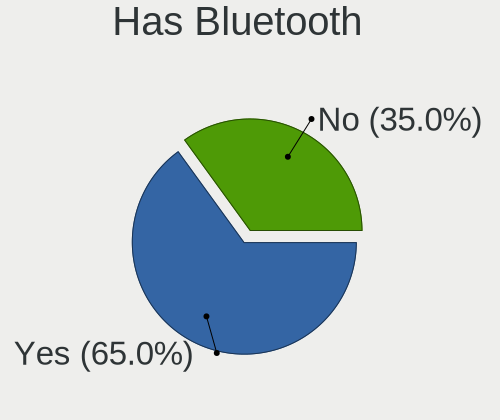
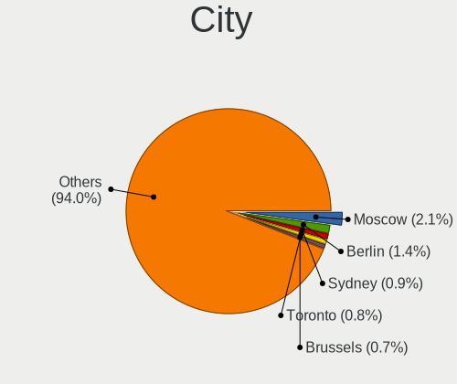

Ubuntu - Hardware Trends
------------------------

A project to identify most popular hardware characteristics and track their change
over time based on data collected by Linux users at https://Linux-Hardware.org.

Anyone can contribute to this report by the [hw-probe](https://github.com/linuxhw/hw-probe) tool:

    sudo -E hw-probe -all -upload

This is a report for all computer types. See also reports for [desktops](/Dist/Ubuntu/Desktop/README.md) and [notebooks](/Dist/Ubuntu/Notebook/README.md).

This report is for one last month. Overall report since the beginning of time: [TestDays](https://github.com/linuxhw/TestDays)

Period: Apr, 2023.

Contents
--------

* [ System ](#system)
  - [ OS                       ](#os)
  - [ OS Family                ](#os-family)
  - [ Kernel                   ](#kernel)
  - [ Kernel Family            ](#kernel-family)
  - [ Kernel Major Ver.        ](#kernel-major-ver)
  - [ Arch                     ](#arch)
  - [ DE                       ](#de)
  - [ Display Server           ](#display-server)
  - [ Display Manager          ](#display-manager)
  - [ OS Lang                  ](#os-lang)
  - [ Boot Mode                ](#boot-mode)
  - [ Filesystem               ](#filesystem)
  - [ Part. scheme             ](#part-scheme)
  - [ Dual Boot with Linux/BSD ](#dual-boot-with-linuxbsd)
  - [ Dual Boot (Win)          ](#dual-boot-win)

* [ Board ](#board)
  - [ Vendor                   ](#vendor)
  - [ Model                    ](#model)
  - [ Model Family             ](#model-family)
  - [ MFG Year                 ](#mfg-year)
  - [ Form Factor              ](#form-factor)
  - [ Secure Boot              ](#secure-boot)
  - [ Coreboot                 ](#coreboot)
  - [ RAM Size                 ](#ram-size)
  - [ RAM Used                 ](#ram-used)
  - [ Total Drives             ](#total-drives)
  - [ Has CD-ROM               ](#has-cd-rom)
  - [ Has Ethernet             ](#has-ethernet)
  - [ Has WiFi                 ](#has-wifi)
  - [ Has Bluetooth            ](#has-bluetooth)

* [ Location ](#location)
  - [ Country                  ](#country)
  - [ City                     ](#city)

* [ Drives ](#drives)
  - [ Drive Vendor             ](#drive-vendor)
  - [ Drive Model              ](#drive-model)
  - [ HDD Vendor               ](#hdd-vendor)
  - [ SSD Vendor               ](#ssd-vendor)
  - [ Drive Kind               ](#drive-kind)
  - [ Drive Connector          ](#drive-connector)
  - [ Drive Size               ](#drive-size)
  - [ Space Total              ](#space-total)
  - [ Space Used               ](#space-used)
  - [ Malfunc. Drives          ](#malfunc-drives)
  - [ Malfunc. Drive Vendor    ](#malfunc-drive-vendor)
  - [ Malfunc. HDD Vendor      ](#malfunc-hdd-vendor)
  - [ Malfunc. Drive Kind      ](#malfunc-drive-kind)
  - [ Failed Drives            ](#failed-drives)
  - [ Failed Drive Vendor      ](#failed-drive-vendor)
  - [ Drive Status             ](#drive-status)

* [ Storage controller ](#storage-controller)
  - [ Storage Vendor           ](#storage-vendor)
  - [ Storage Model            ](#storage-model)
  - [ Storage Kind             ](#storage-kind)

* [ Processor ](#processor)
  - [ CPU Vendor               ](#cpu-vendor)
  - [ CPU Model                ](#cpu-model)
  - [ CPU Model Family         ](#cpu-model-family)
  - [ CPU Cores                ](#cpu-cores)
  - [ CPU Sockets              ](#cpu-sockets)
  - [ CPU Threads              ](#cpu-threads)
  - [ CPU Op-Modes             ](#cpu-op-modes)
  - [ CPU Microcode            ](#cpu-microcode)
  - [ CPU Microarch            ](#cpu-microarch)

* [ Graphics ](#graphics)
  - [ GPU Vendor               ](#gpu-vendor)
  - [ GPU Model                ](#gpu-model)
  - [ GPU Combo                ](#gpu-combo)
  - [ GPU Driver               ](#gpu-driver)
  - [ GPU Memory               ](#gpu-memory)

* [ Monitor ](#monitor)
  - [ Monitor Vendor           ](#monitor-vendor)
  - [ Monitor Model            ](#monitor-model)
  - [ Monitor Resolution       ](#monitor-resolution)
  - [ Monitor Diagonal         ](#monitor-diagonal)
  - [ Monitor Width            ](#monitor-width)
  - [ Aspect Ratio             ](#aspect-ratio)
  - [ Monitor Area             ](#monitor-area)
  - [ Pixel Density            ](#pixel-density)
  - [ Multiple Monitors        ](#multiple-monitors)

* [ Network ](#network)
  - [ Net Controller Vendor    ](#net-controller-vendor)
  - [ Net Controller Model     ](#net-controller-model)
  - [ Wireless Vendor          ](#wireless-vendor)
  - [ Wireless Model           ](#wireless-model)
  - [ Ethernet Vendor          ](#ethernet-vendor)
  - [ Ethernet Model           ](#ethernet-model)
  - [ Net Controller Kind      ](#net-controller-kind)
  - [ Used Controller          ](#used-controller)
  - [ NICs                     ](#nics)
  - [ IPv6                     ](#ipv6)

* [ Bluetooth ](#bluetooth)
  - [ Bluetooth Vendor         ](#bluetooth-vendor)
  - [ Bluetooth Model          ](#bluetooth-model)

* [ Sound ](#sound)
  - [ Sound Vendor             ](#sound-vendor)
  - [ Sound Model              ](#sound-model)

* [ Memory ](#memory)
  - [ Memory Vendor            ](#memory-vendor)
  - [ Memory Model             ](#memory-model)
  - [ Memory Kind              ](#memory-kind)
  - [ Memory Form Factor       ](#memory-form-factor)
  - [ Memory Size              ](#memory-size)
  - [ Memory Speed             ](#memory-speed)

* [ Printers & scanners ](#printers--scanners)
  - [ Printer Vendor           ](#printer-vendor)
  - [ Printer Model            ](#printer-model)
  - [ Scanner Vendor           ](#scanner-vendor)
  - [ Scanner Model            ](#scanner-model)

* [ Camera ](#camera)
  - [ Camera Vendor            ](#camera-vendor)
  - [ Camera Model             ](#camera-model)

* [ Security ](#security)
  - [ Fingerprint Vendor       ](#fingerprint-vendor)
  - [ Fingerprint Model        ](#fingerprint-model)
  - [ Chipcard Vendor          ](#chipcard-vendor)
  - [ Chipcard Model           ](#chipcard-model)

* [ Unsupported ](#unsupported)
  - [ Unsupported Devices      ](#unsupported-devices)
  - [ Unsupported Device Types ](#unsupported-device-types)

System
------

OS
--

Installed operating systems

| Name           | Computers | Percent |
|----------------|-----------|---------|
| Ubuntu 22.04   | 776       | 64.03%  |
| Ubuntu 22.10   | 153       | 12.62%  |
| Ubuntu 23.04   | 144       | 11.88%  |
| Ubuntu 20.04   | 117       | 9.65%   |
| Ubuntu 18.04   | 18        | 1.49%   |
| Ubuntu 21.10   | 2         | 0.17%   |
| Ubuntu Core 18 | 1         | 0.08%   |
| Ubuntu 21.04   | 1         | 0.08%   |

OS Family
---------

OS without a version

| Name   | Computers | Percent |
|--------|-----------|---------|
| Ubuntu | 1212      | 100%    |

Kernel
------

Version of the Linux kernel

| Version                  | Computers | Percent |
|--------------------------|-----------|---------|
| 5.19.0-38-generic        | 387       | 31.93%  |
| 5.19.0-40-generic        | 185       | 15.26%  |
| 6.2.0-20-generic         | 111       | 9.16%   |
| 5.15.0-69-generic        | 110       | 9.08%   |
| 5.19.0-41-generic        | 61        | 5.03%   |
| 5.15.0-67-generic        | 46        | 3.8%    |
| 5.19.0-32-generic        | 35        | 2.89%   |
| 5.19.0-35-generic        | 20        | 1.65%   |
| 5.15.0-58-generic        | 20        | 1.65%   |
| 5.15.0-71-generic        | 19        | 1.57%   |
| 5.4.0-146-generic        | 16        | 1.32%   |
| 5.15.0-70-generic        | 14        | 1.16%   |
| 5.15.0-43-generic        | 11        | 0.91%   |
| 6.2.11-060211-generic    | 10        | 0.83%   |
| 6.2.0-18-generic         | 10        | 0.83%   |
| 5.4.0-147-generic        | 9         | 0.74%   |
| 5.15.0-46-generic        | 8         | 0.66%   |
| 5.19.0-42-generic        | 7         | 0.58%   |
| 5.19.0-21-generic        | 7         | 0.58%   |
| 5.15.0-60-generic        | 6         | 0.5%    |
| 5.15.0-56-generic        | 6         | 0.5%    |
| 5.14.0-1059-oem          | 6         | 0.5%    |
| 6.2.9-060209-generic     | 5         | 0.41%   |
| 6.2.10-060210-generic    | 5         | 0.41%   |
| 5.4.0-144-generic        | 4         | 0.33%   |
| 6.2.8-060208-generic     | 3         | 0.25%   |
| 6.2.0-19-generic         | 3         | 0.25%   |
| 6.1.0-1008-oem           | 3         | 0.25%   |
| 5.15.0-25-generic        | 3         | 0.25%   |
| 5.10.110-rockchip-rk3588 | 3         | 0.25%   |
| 6.2.0-10005-tuxedo       | 2         | 0.17%   |
| 6.1.22-060122-generic    | 2         | 0.17%   |
| 6.1.0-1007-oem           | 2         | 0.17%   |
| 5.4.0-84-generic         | 2         | 0.17%   |
| 5.19.0-1015-raspi        | 2         | 0.17%   |
| 5.18.0-051800-generic    | 2         | 0.17%   |
| 5.15.93-sunxi            | 2         | 0.17%   |
| 5.15.0-69-lowlatency     | 2         | 0.17%   |
| 5.15.0-48-generic        | 2         | 0.17%   |
| 5.13.0-30-generic        | 2         | 0.17%   |

Kernel Family
-------------

Linux kernel without a distro release

| Version  | Computers | Percent |
|----------|-----------|---------|
| 5.19.0   | 707       | 58.33%  |
| 5.15.0   | 254       | 20.96%  |
| 6.2.0    | 131       | 10.81%  |
| 5.4.0    | 38        | 3.14%   |
| 6.2.11   | 10        | 0.83%   |
| 5.14.0   | 8         | 0.66%   |
| 6.3.0    | 6         | 0.5%    |
| 6.2.9    | 6         | 0.5%    |
| 6.2.10   | 6         | 0.5%    |
| 6.1.0    | 6         | 0.5%    |
| 5.13.0   | 6         | 0.5%    |
| 5.11.0   | 4         | 0.33%   |
| 6.2.8    | 3         | 0.25%   |
| 5.10.110 | 3         | 0.25%   |
| 6.1.22   | 2         | 0.17%   |
| 5.3.0    | 2         | 0.17%   |
| 5.18.0   | 2         | 0.17%   |
| 5.15.93  | 2         | 0.17%   |
| 4.15.0   | 2         | 0.17%   |
| 6.2.6    | 1         | 0.08%   |
| 6.2.5    | 1         | 0.08%   |
| 6.2.12   | 1         | 0.08%   |
| 6.1.12   | 1         | 0.08%   |
| 6.0.0    | 1         | 0.08%   |
| 5.8.0    | 1         | 0.08%   |
| 5.6.0    | 1         | 0.08%   |
| 5.19.9   | 1         | 0.08%   |
| 5.18.19  | 1         | 0.08%   |
| 5.17.0   | 1         | 0.08%   |
| 5.15.2   | 1         | 0.08%   |
| 5.13.19  | 1         | 0.08%   |
| 5.10.133 | 1         | 0.08%   |
| 4.9.253  | 1         | 0.08%   |

Kernel Major Ver.
-----------------

Linux kernel major version

| Version | Computers | Percent |
|---------|-----------|---------|
| 5.19    | 708       | 58.42%  |
| 5.15    | 257       | 21.2%   |
| 6.2     | 159       | 13.12%  |
| 5.4     | 38        | 3.14%   |
| 6.1     | 9         | 0.74%   |
| 5.14    | 8         | 0.66%   |
| 5.13    | 7         | 0.58%   |
| 6.3     | 6         | 0.5%    |
| 5.11    | 4         | 0.33%   |
| 5.10    | 4         | 0.33%   |
| 5.18    | 3         | 0.25%   |
| 5.3     | 2         | 0.17%   |
| 4.15    | 2         | 0.17%   |
| 6.0     | 1         | 0.08%   |
| 5.8     | 1         | 0.08%   |
| 5.6     | 1         | 0.08%   |
| 5.17    | 1         | 0.08%   |
| 4.9     | 1         | 0.08%   |

Arch
----

OS architecture (x86_64, i586, etc.)

| Name    | Computers | Percent |
|---------|-----------|---------|
| x86_64  | 1199      | 98.93%  |
| aarch64 | 9         | 0.74%   |
| armv7l  | 3         | 0.25%   |
| i686    | 1         | 0.08%   |

DE
--

Desktop Environment

| Name            | Computers | Percent |
|-----------------|-----------|---------|
| GNOME           | 1068      | 88.12%  |
| GNUstep         | 72        | 5.94%   |
| Unknown         | 38        | 3.14%   |
| X-Cinnamon      | 16        | 1.32%   |
| GNOME Flashback | 7         | 0.58%   |
| i3              | 3         | 0.25%   |
| Enlightenment   | 3         | 0.25%   |
| sway            | 1         | 0.08%   |
| ratflow         | 1         | 0.08%   |
| Pantheon        | 1         | 0.08%   |
| GNOME Classic   | 1         | 0.08%   |
| Cinnamon        | 1         | 0.08%   |

Display Server
--------------

X11 or Wayland

| Name    | Computers | Percent |
|---------|-----------|---------|
| Wayland | 637       | 52.56%  |
| X11     | 448       | 36.96%  |
| Tty     | 98        | 8.09%   |
| Unknown | 29        | 2.39%   |

Display Manager
---------------

SDDM, LightDM, etc.

| Name    | Computers | Percent |
|---------|-----------|---------|
| GDM3    | 936       | 77.23%  |
| Unknown | 118       | 9.74%   |
| LightDM | 93        | 7.67%   |
| GDM     | 61        | 5.03%   |
| SDDM    | 2         | 0.17%   |
| SLiM    | 1         | 0.08%   |
| LXDM    | 1         | 0.08%   |

OS Lang
-------

Language

| Lang    | Computers | Percent |
|---------|-----------|---------|
| en_US   | 561       | 46.29%  |
| de_DE   | 127       | 10.48%  |
| fr_FR   | 67        | 5.53%   |
| en_GB   | 53        | 4.37%   |
| pt_BR   | 42        | 3.47%   |
| it_IT   | 35        | 2.89%   |
| ru_RU   | 29        | 2.39%   |
| C       | 26        | 2.15%   |
| en_CA   | 23        | 1.9%    |
| en_IN   | 22        | 1.82%   |
| es_ES   | 20        | 1.65%   |
| nl_NL   | 15        | 1.24%   |
| en_AU   | 15        | 1.24%   |
| Unknown | 15        | 1.24%   |
| zh_CN   | 12        | 0.99%   |
| pl_PL   | 11        | 0.91%   |
| es_AR   | 10        | 0.83%   |
| es_MX   | 8         | 0.66%   |
| sv_SE   | 7         | 0.58%   |
| pt_PT   | 7         | 0.58%   |
| es_CL   | 7         | 0.58%   |
| de_AT   | 7         | 0.58%   |
| cs_CZ   | 7         | 0.58%   |
| ja_JP   | 6         | 0.5%    |
| el_GR   | 6         | 0.5%    |
| hu_HU   | 4         | 0.33%   |
| fi_FI   | 4         | 0.33%   |
| en_ZA   | 4         | 0.33%   |
| de_CH   | 4         | 0.33%   |
| tr_TR   | 3         | 0.25%   |
| nl_BE   | 3         | 0.25%   |
| en_SG   | 3         | 0.25%   |
| en_NZ   | 3         | 0.25%   |
| en_IL   | 3         | 0.25%   |
| en_IE   | 3         | 0.25%   |
| bg_BG   | 3         | 0.25%   |
| zh_TW   | 2         | 0.17%   |
| sk_SK   | 2         | 0.17%   |
| ko_KR   | 2         | 0.17%   |
| fr_CA   | 2         | 0.17%   |

Boot Mode
---------

EFI or BIOS

| Mode | Computers | Percent |
|------|-----------|---------|
| BIOS | 663       | 54.7%   |
| EFI  | 549       | 45.3%   |

Filesystem
----------

Type of filesystem

| Type    | Computers | Percent |
|---------|-----------|---------|
| Ext4    | 915       | 75.5%   |
| Tmpfs   | 214       | 17.66%  |
| Zfs     | 30        | 2.48%   |
| Btrfs   | 26        | 2.15%   |
| Overlay | 24        | 1.98%   |
| Xfs     | 2         | 0.17%   |
| Ext2    | 1         | 0.08%   |

Part. scheme
------------

Scheme of partitioning

| Type    | Computers | Percent |
|---------|-----------|---------|
| GPT     | 1003      | 82.76%  |
| MBR     | 129       | 10.64%  |
| Unknown | 80        | 6.6%    |

Dual Boot with Linux/BSD
------------------------

Hosting more than one Linux/BSD

| Dual boot | Computers | Percent |
|-----------|-----------|---------|
| No        | 1080      | 89.11%  |
| Yes       | 132       | 10.89%  |

Dual Boot (Win)
---------------

Hosting Linux and Windows

| Dual boot | Computers | Percent |
|-----------|-----------|---------|
| No        | 803       | 66.25%  |
| Yes       | 409       | 33.75%  |

Board
-----

Vendor
------

Motherboard manufacturer

| Name                    | Computers | Percent |
|-------------------------|-----------|---------|
| ASUSTek Computer        | 232       | 19.14%  |
| Lenovo                  | 171       | 14.11%  |
| Dell                    | 154       | 12.71%  |
| Hewlett-Packard         | 146       | 12.05%  |
| MSI                     | 73        | 6.02%   |
| Gigabyte Technology     | 62        | 5.12%   |
| Acer                    | 60        | 4.95%   |
| Apple                   | 42        | 3.47%   |
| ASRock                  | 39        | 3.22%   |
| Intel                   | 32        | 2.64%   |
| Fujitsu                 | 28        | 2.31%   |
| HUAWEI                  | 20        | 1.65%   |
| Samsung Electronics     | 10        | 0.83%   |
| Toshiba                 | 7         | 0.58%   |
| Sony                    | 7         | 0.58%   |
| Medion                  | 7         | 0.58%   |
| Raspberry Pi Foundation | 6         | 0.5%    |
| Notebook                | 6         | 0.5%    |
| Microsoft               | 6         | 0.5%    |
| Unknown                 | 6         | 0.5%    |
| TUXEDO                  | 5         | 0.41%   |
| Pegatron                | 4         | 0.33%   |
| Google                  | 4         | 0.33%   |
| Gateway                 | 4         | 0.33%   |
| ECS                     | 4         | 0.33%   |
| Biostar                 | 4         | 0.33%   |
| Timi                    | 3         | 0.25%   |
| BESSTAR Tech            | 3         | 0.25%   |
| Xunlong                 | 2         | 0.17%   |
| System76                | 2         | 0.17%   |
| Rockchip                | 2         | 0.17%   |
| MiTAC                   | 2         | 0.17%   |
| LG Electronics          | 2         | 0.17%   |
| ICL                     | 2         | 0.17%   |
| Hampoo                  | 2         | 0.17%   |
| eMachines               | 2         | 0.17%   |
| AMI                     | 2         | 0.17%   |
| Alienware               | 2         | 0.17%   |
| AAEON                   | 2         | 0.17%   |
| YANYU                   | 1         | 0.08%   |

Model
-----

Motherboard model

| Name                                      | Computers | Percent |
|-------------------------------------------|-----------|---------|
| ASUS PRIME Z590-P                         | 16        | 1.32%   |
| ASUS All Series                           | 15        | 1.24%   |
| ASUS PRIME X570-PRO                       | 11        | 0.91%   |
| ASUS PRIME B550M-A                        | 10        | 0.83%   |
| Unknown                                   | 7         | 0.58%   |
| HP Notebook                               | 6         | 0.5%    |
| Fujitsu CELSIUS_W550                      | 5         | 0.41%   |
| ASUS TUF Gaming X570-PLUS                 | 5         | 0.41%   |
| ASUS PRIME Z370-A II                      | 5         | 0.41%   |
| Dell XPS 15 9500                          | 4         | 0.33%   |
| Dell OptiPlex 7010                        | 4         | 0.33%   |
| RPi Raspberry Pi Compute Module 4 Rev 1.1 | 3         | 0.25%   |
| HUAWEI HVY-WXX9                           | 3         | 0.25%   |
| HP Z230 Tower Workstation                 | 3         | 0.25%   |
| HP Pavilion dv7                           | 3         | 0.25%   |
| HP Laptop 15s-eq2xxx                      | 3         | 0.25%   |
| HP Compaq Pro 6300 MT                     | 3         | 0.25%   |
| HP 250 15.6 inch G9 Notebook PC           | 3         | 0.25%   |
| Gigabyte GA-78LMT-S2P                     | 3         | 0.25%   |
| Dell XPS 13 9350                          | 3         | 0.25%   |
| Dell Latitude E5470                       | 3         | 0.25%   |
| ASUS STRIX Z270F GAMING                   | 3         | 0.25%   |
| Apple MacBookPro9,2                       | 3         | 0.25%   |
| Apple MacBookPro11,5                      | 3         | 0.25%   |
| Apple MacBookAir7,2                       | 3         | 0.25%   |
| Xunlong Orange Pi One                     | 2         | 0.17%   |
| TUXEDO InfinityBook Pro Gen7 (MK1)        | 2         | 0.17%   |
| Samsung 730QED                            | 2         | 0.17%   |
| Rockchip Orange Pi 5                      | 2         | 0.17%   |
| RPi Raspberry Pi                          | 2         | 0.17%   |
| Pegatron A15                              | 2         | 0.17%   |
| MSI Prestige 14Evo B13M                   | 2         | 0.17%   |
| MSI MS-7D25                               | 2         | 0.17%   |
| MSI MS-7C94                               | 2         | 0.17%   |
| MSI MS-7C91                               | 2         | 0.17%   |
| MSI MS-7B79                               | 2         | 0.17%   |
| MSI Modern 14 A10M                        | 2         | 0.17%   |
| MSI Katana GF66 12UE                      | 2         | 0.17%   |
| MSI GF63 Thin 9SC                         | 2         | 0.17%   |
| Lenovo Yoga C640-13IML 81UE               | 2         | 0.17%   |

Model Family
------------

Motherboard model prefix

| Name                | Computers | Percent |
|---------------------|-----------|---------|
| Lenovo ThinkPad     | 67        | 5.53%   |
| ASUS PRIME          | 67        | 5.53%   |
| Dell Latitude       | 39        | 3.22%   |
| Acer Aspire         | 37        | 3.05%   |
| Dell Inspiron       | 33        | 2.72%   |
| Lenovo IdeaPad      | 28        | 2.31%   |
| ASUS ROG            | 27        | 2.23%   |
| Dell OptiPlex       | 23        | 1.9%    |
| HP Pavilion         | 21        | 1.73%   |
| Dell XPS            | 19        | 1.57%   |
| ASUS VivoBook       | 19        | 1.57%   |
| HP Compaq           | 16        | 1.32%   |
| ASUS TUF            | 16        | 1.32%   |
| HP ProBook          | 15        | 1.24%   |
| HP Laptop           | 15        | 1.24%   |
| Fujitsu CELSIUS     | 15        | 1.24%   |
| Dell Precision      | 15        | 1.24%   |
| ASUS All            | 15        | 1.24%   |
| Lenovo ThinkCentre  | 13        | 1.07%   |
| Dell Vostro         | 13        | 1.07%   |
| ASUS ZenBook        | 11        | 0.91%   |
| ASUS ASUS           | 11        | 0.91%   |
| HP EliteBook        | 10        | 0.83%   |
| Lenovo Yoga         | 9         | 0.74%   |
| Lenovo IdeaPadFlex  | 7         | 0.58%   |
| HP EliteDesk        | 7         | 0.58%   |
| Acer Swift          | 7         | 0.58%   |
| Unknown             | 7         | 0.58%   |
| RPi Raspberry       | 6         | 0.5%    |
| Microsoft Surface   | 6         | 0.5%    |
| Lenovo ThinkStation | 6         | 0.5%    |
| Lenovo IdeaCentre   | 6         | 0.5%    |
| HP Notebook         | 6         | 0.5%    |
| HP 250              | 6         | 0.5%    |
| Fujitsu ESPRIMO     | 6         | 0.5%    |
| Toshiba Satellite   | 5         | 0.41%   |
| HP OMEN             | 5         | 0.41%   |
| HP ENVY             | 5         | 0.41%   |
| Acer Nitro          | 5         | 0.41%   |
| MSI Katana          | 4         | 0.33%   |

MFG Year
--------

Motherboard manufacture year

| Year    | Computers | Percent |
|---------|-----------|---------|
| 2021    | 154       | 12.71%  |
| 2020    | 152       | 12.54%  |
| 2022    | 127       | 10.48%  |
| 2019    | 100       | 8.25%   |
| 2018    | 87        | 7.18%   |
| 2013    | 75        | 6.19%   |
| 2011    | 71        | 5.86%   |
| 2015    | 68        | 5.61%   |
| 2012    | 68        | 5.61%   |
| 2017    | 56        | 4.62%   |
| 2014    | 56        | 4.62%   |
| 2016    | 52        | 4.29%   |
| 2010    | 41        | 3.38%   |
| 2008    | 32        | 2.64%   |
| 2009    | 31        | 2.56%   |
| 2023    | 18        | 1.49%   |
| Unknown | 13        | 1.07%   |
| 2007    | 9         | 0.74%   |
| 2006    | 1         | 0.08%   |
| 2005    | 1         | 0.08%   |

Form Factor
-----------

Physical design of the computer

| Name           | Computers | Percent |
|----------------|-----------|---------|
| Notebook       | 597       | 49.26%  |
| Desktop        | 493       | 40.68%  |
| Convertible    | 39        | 3.22%   |
| All in one     | 25        | 2.06%   |
| Mini pc        | 21        | 1.73%   |
| Server         | 13        | 1.07%   |
| System on chip | 12        | 0.99%   |
| Tablet         | 12        | 0.99%   |

Secure Boot
-----------

Enabled or disabled

| State    | Computers | Percent |
|----------|-----------|---------|
| Disabled | 1101      | 90.84%  |
| Enabled  | 111       | 9.16%   |

Coreboot
--------

Have coreboot on board

| Used | Computers | Percent |
|------|-----------|---------|
| No   | 1206      | 99.5%   |
| Yes  | 6         | 0.5%    |

RAM Size
--------

Total RAM memory

| Size in GB      | Computers | Percent |
|-----------------|-----------|---------|
| 4.01-8.0        | 294       | 24.26%  |
| 16.01-24.0      | 284       | 23.43%  |
| 8.01-16.0       | 187       | 15.43%  |
| 32.01-64.0      | 150       | 12.38%  |
| 3.01-4.0        | 149       | 12.29%  |
| 64.01-256.0     | 76        | 6.27%   |
| 24.01-32.0      | 36        | 2.97%   |
| 1.01-2.0        | 17        | 1.4%    |
| More than 256.0 | 9         | 0.74%   |
| 2.01-3.0        | 8         | 0.66%   |
| 0.51-1.0        | 1         | 0.08%   |
| 0.01-0.5        | 1         | 0.08%   |

RAM Used
--------

Used RAM memory

| Used GB     | Computers | Percent |
|-------------|-----------|---------|
| 2.01-3.0    | 361       | 29.79%  |
| 1.01-2.0    | 307       | 25.33%  |
| 4.01-8.0    | 226       | 18.65%  |
| 3.01-4.0    | 187       | 15.43%  |
| 8.01-16.0   | 89        | 7.34%   |
| 0.51-1.0    | 14        | 1.16%   |
| 16.01-24.0  | 10        | 0.83%   |
| 0.01-0.5    | 8         | 0.66%   |
| 32.01-64.0  | 4         | 0.33%   |
| 24.01-32.0  | 4         | 0.33%   |
| 64.01-256.0 | 2         | 0.17%   |

Total Drives
------------

Number of drives on board

| Drives | Computers | Percent |
|--------|-----------|---------|
| 1      | 741       | 61.14%  |
| 2      | 300       | 24.75%  |
| 3      | 99        | 8.17%   |
| 4      | 32        | 2.64%   |
| 5      | 18        | 1.49%   |
| 6      | 7         | 0.58%   |
| 0      | 7         | 0.58%   |
| 7      | 4         | 0.33%   |
| 9      | 3         | 0.25%   |
| 8      | 1         | 0.08%   |

Has CD-ROM
----------

Has CD-ROM on board

| Presented | Computers | Percent |
|-----------|-----------|---------|
| No        | 844       | 69.64%  |
| Yes       | 368       | 30.36%  |

Has Ethernet
------------

Has Ethernet on board

| Presented | Computers | Percent |
|-----------|-----------|---------|
| Yes       | 1001      | 82.59%  |
| No        | 211       | 17.41%  |

Has WiFi
--------

Has WiFi module

| Presented | Computers | Percent |
|-----------|-----------|---------|
| Yes       | 864       | 71.29%  |
| No        | 348       | 28.71%  |

Has Bluetooth
-------------

Has Bluetooth module

| Presented | Computers | Percent |
|-----------|-----------|---------|
| Yes       | 742       | 61.22%  |
| No        | 470       | 38.78%  |

Location
--------

Country
-------

Geographic location (country)

| Country      | Computers | Percent |
|--------------|-----------|---------|
| USA          | 191       | 15.76%  |
| Germany      | 158       | 13.04%  |
| Switzerland  | 103       | 8.5%    |
| France       | 81        | 6.68%   |
| Brazil       | 62        | 5.12%   |
| Russia       | 50        | 4.13%   |
| Italy        | 44        | 3.63%   |
| UK           | 39        | 3.22%   |
| Netherlands  | 30        | 2.48%   |
| India        | 30        | 2.48%   |
| Canada       | 28        | 2.31%   |
| Spain        | 26        | 2.15%   |
| Poland       | 22        | 1.82%   |
| Mexico       | 20        | 1.65%   |
| Australia    | 16        | 1.32%   |
| Belgium      | 15        | 1.24%   |
| Sweden       | 14        | 1.16%   |
| Greece       | 14        | 1.16%   |
| China        | 13        | 1.07%   |
| Argentina    | 13        | 1.07%   |
| Czechia      | 11        | 0.91%   |
| Finland      | 10        | 0.83%   |
| Austria      | 10        | 0.83%   |
| Vietnam      | 9         | 0.74%   |
| Japan        | 9         | 0.74%   |
| Chile        | 9         | 0.74%   |
| Portugal     | 8         | 0.66%   |
| South Korea  | 7         | 0.58%   |
| Ireland      | 7         | 0.58%   |
| Hungary      | 7         | 0.58%   |
| Denmark      | 7         | 0.58%   |
| Colombia     | 7         | 0.58%   |
| Turkey       | 6         | 0.5%    |
| South Africa | 6         | 0.5%    |
| Israel       | 6         | 0.5%    |
| Egypt        | 6         | 0.5%    |
| Bulgaria     | 6         | 0.5%    |
| Singapore    | 5         | 0.41%   |
| Iran         | 5         | 0.41%   |
| Bolivia      | 5         | 0.41%   |

City
----

Geographic location (city)

| City              | Computers | Percent |
|-------------------|-----------|---------|
| Zurich            | 94        | 7.76%   |
| Berlin            | 13        | 1.07%   |
| Paris             | 12        | 0.99%   |
| St Petersburg     | 11        | 0.91%   |
| Frankfurt am Main | 11        | 0.91%   |
| Sao Paulo         | 10        | 0.83%   |
| Milan             | 9         | 0.74%   |
| Moscow            | 8         | 0.66%   |
| Brussels          | 8         | 0.66%   |
| Amsterdam         | 8         | 0.66%   |
| Warsaw            | 7         | 0.58%   |
| Vienna            | 7         | 0.58%   |
| Los Angeles       | 7         | 0.58%   |
| Prague            | 6         | 0.5%    |
| Munich            | 6         | 0.5%    |
| Bengaluru         | 6         | 0.5%    |
| Barcelona         | 6         | 0.5%    |
| Athens            | 6         | 0.5%    |
| Tehran            | 5         | 0.41%   |
| Sydney            | 5         | 0.41%   |
| Rome              | 5         | 0.41%   |
| London            | 5         | 0.41%   |
| Dublin            | 5         | 0.41%   |
| Denver            | 5         | 0.41%   |
| Budapest          | 5         | 0.41%   |
| Toronto           | 4         | 0.33%   |
| Singapore         | 4         | 0.33%   |
| Santiago          | 4         | 0.33%   |
| Rio de Janeiro    | 4         | 0.33%   |
| Melbourne         | 4         | 0.33%   |
| Madrid            | 4         | 0.33%   |
| Lynnwood          | 4         | 0.33%   |
| Hamburg           | 4         | 0.33%   |
| Zagreb            | 3         | 0.25%   |
| Wroclaw           | 3         | 0.25%   |
| Voronezh          | 3         | 0.25%   |
| Stockholm         | 3         | 0.25%   |
| Shanghai          | 3         | 0.25%   |
| Seville           | 3         | 0.25%   |
| San Jose          | 3         | 0.25%   |

Drives
------

Drive Vendor
------------

Hard drive vendors

| Vendor                      | Computers | Drives | Percent |
|-----------------------------|-----------|--------|---------|
| Samsung Electronics         | 304       | 377    | 17.74%  |
| Seagate                     | 251       | 307    | 14.64%  |
| WDC                         | 208       | 257    | 12.14%  |
| SanDisk                     | 101       | 114    | 5.89%   |
| Kingston                    | 88        | 93     | 5.13%   |
| Toshiba                     | 83        | 85     | 4.84%   |
| Unknown                     | 61        | 67     | 3.56%   |
| Intel                       | 60        | 63     | 3.5%    |
| Crucial                     | 54        | 63     | 3.15%   |
| SK hynix                    | 48        | 48     | 2.8%    |
| Hitachi                     | 48        | 48     | 2.8%    |
| Micron Technology           | 43        | 46     | 2.51%   |
| KIOXIA                      | 30        | 30     | 1.75%   |
| A-DATA Technology           | 22        | 24     | 1.28%   |
| HGST                        | 20        | 21     | 1.17%   |
| Apple                       | 20        | 21     | 1.17%   |
| Phison Electronics          | 16        | 16     | 0.93%   |
| Silicon Motion              | 13        | 14     | 0.76%   |
| Micron/Crucial Technology   | 13        | 15     | 0.76%   |
| China                       | 13        | 13     | 0.76%   |
| Kingston Technology Company | 11        | 12     | 0.64%   |
| Intenso                     | 11        | 11     | 0.64%   |
| Unknown                     | 9         | 9      | 0.53%   |
| Phison                      | 8         | 9      | 0.47%   |
| ASMT                        | 8         | 9      | 0.47%   |
| LITEON                      | 7         | 7      | 0.41%   |
| ADATA Technology            | 7         | 8      | 0.41%   |
| Realtek Semiconductor       | 6         | 6      | 0.35%   |
| Patriot                     | 6         | 6      | 0.35%   |
| UMIS                        | 5         | 5      | 0.29%   |
| Maxtor                      | 5         | 5      | 0.29%   |
| Gigabyte Technology         | 5         | 6      | 0.29%   |
| XrayDisk                    | 4         | 5      | 0.23%   |
| SPCC                        | 4         | 5      | 0.23%   |
| MAXIO Technology (Hangzhou) | 4         | 4      | 0.23%   |
| Fujitsu                     | 4         | 4      | 0.23%   |
| Emtec                       | 4         | 4      | 0.23%   |
| Apacer                      | 4         | 4      | 0.23%   |
| YMTC                        | 3         | 3      | 0.18%   |
| Yangtze Memory Technologies | 3         | 3      | 0.18%   |

Drive Model
-----------

Hard drive models

| Model                                                  | Computers | Percent |
|--------------------------------------------------------|-----------|---------|
| Samsung NVMe SSD Controller SM981/PM981/PM983 1TB      | 26        | 1.41%   |
| Seagate ST2000DM008-2FR102 2TB                         | 23        | 1.24%   |
| Samsung SSD 980 PRO 1TB                                | 22        | 1.19%   |
| Seagate ST1000DM010-2EP102 1TB                         | 15        | 0.81%   |
| Unknown MMC Card  64GB                                 | 14        | 0.76%   |
| Seagate ST500DM002-1BD142 500GB                        | 14        | 0.76%   |
| SanDisk NVMe SSD Drive 1TB                             | 13        | 0.7%    |
| Samsung SSD 860 EVO 500GB                              | 13        | 0.7%    |
| Samsung SSD 850 EVO 250GB                              | 13        | 0.7%    |
| Kingston SA400S37480G 480GB SSD                        | 13        | 0.7%    |
| Kingston SA400S37240G 240GB SSD                        | 13        | 0.7%    |
| Seagate ST1000DM003-1ER162 1TB                         | 12        | 0.65%   |
| Samsung NVMe SSD Drive 1TB                             | 12        | 0.65%   |
| Unknown MMC Card  32GB                                 | 10        | 0.54%   |
| Silicon Motion SM2263EN/SM2263XT SSD Controller 1024GB | 10        | 0.54%   |
| Seagate ST2000DM006-2DM164 2TB                         | 10        | 0.54%   |
| Samsung SSD 980 1TB                                    | 9         | 0.49%   |
| Micron/Crucial P2 NVMe PCIe SSD 1TB                    | 9         | 0.49%   |
| Crucial CT240BX500SSD1 240GB                           | 9         | 0.49%   |
| Unknown                                                | 9         | 0.49%   |
| Toshiba MQ01ABD100 1TB                                 | 8         | 0.43%   |
| Seagate ST1000LM035-1RK172 970GB                       | 8         | 0.43%   |
| Seagate ST1000LM024 HN-M101MBB 1TB                     | 8         | 0.43%   |
| Kingston SA400S37120G 120GB SSD                        | 8         | 0.43%   |
| Intel SSDPEKNU512GZ 512GB                              | 8         | 0.43%   |
| WDC WD10EZEX-08WN4A0 1TB                               | 7         | 0.38%   |
| Seagate ST500LT012-1DG142 500GB                        | 7         | 0.38%   |
| Sandisk WD Blue SN550 NVMe SSD 1024GB                  | 7         | 0.38%   |
| Sandisk WD Black SN750 / PC SN730 NVMe SSD 512GB       | 7         | 0.38%   |
| Samsung SSD 970 EVO Plus 1TB                           | 7         | 0.38%   |
| Samsung SSD 850 EVO 500GB                              | 7         | 0.38%   |
| Samsung NVMe SSD Controller SM961/PM961/SM963 500GB    | 7         | 0.38%   |
| Crucial CT480BX500SSD1 480GB                           | 7         | 0.38%   |
| Toshiba MQ04ABF100 1TB                                 | 6         | 0.32%   |
| Toshiba MQ01ABF050 500GB                               | 6         | 0.32%   |
| Seagate ST4000DM004-2CV104 4TB                         | 6         | 0.32%   |
| Seagate ST3500418AS 500GB                              | 6         | 0.32%   |
| Seagate Expansion 4TB                                  | 6         | 0.32%   |
| Sandisk WD Black SN850 1TB                             | 6         | 0.32%   |
| Sandisk WD Black 2018/SN750 / PC SN720 NVMe SSD 500GB  | 6         | 0.32%   |

HDD Vendor
----------

Hard disk drive vendors

| Vendor              | Computers | Drives | Percent |
|---------------------|-----------|--------|---------|
| Seagate             | 242       | 294    | 41.94%  |
| WDC                 | 157       | 199    | 27.21%  |
| Toshiba             | 60        | 62     | 10.4%   |
| Hitachi             | 48        | 48     | 8.32%   |
| HGST                | 20        | 21     | 3.47%   |
| Samsung Electronics | 18        | 19     | 3.12%   |
| Apple               | 5         | 5      | 0.87%   |
| Fujitsu             | 4         | 4      | 0.69%   |
| Unknown             | 3         | 3      | 0.52%   |
| Maxtor              | 3         | 3      | 0.52%   |
| Intenso             | 3         | 3      | 0.52%   |
| ASMT                | 3         | 4      | 0.52%   |
| SAGE                | 2         | 2      | 0.35%   |
| Inateck             | 2         | 2      | 0.35%   |
| USB3.0              | 1         | 1      | 0.17%   |
| JMicron Technology  | 1         | 1      | 0.17%   |
| HGST HTS            | 1         | 1      | 0.17%   |
| Hewlett-Packard     | 1         | 1      | 0.17%   |
| DELLBOSS            | 1         | 1      | 0.17%   |
| ASMedia             | 1         | 1      | 0.17%   |
| Adaptec             | 1         | 1      | 0.17%   |

SSD Vendor
----------

Solid state drive vendors

| Vendor              | Computers | Drives | Percent |
|---------------------|-----------|--------|---------|
| Samsung Electronics | 120       | 136    | 24.69%  |
| Kingston            | 62        | 64     | 12.76%  |
| Crucial             | 48        | 55     | 9.88%   |
| SanDisk             | 39        | 41     | 8.02%   |
| WDC                 | 28        | 28     | 5.76%   |
| Intel               | 28        | 29     | 5.76%   |
| A-DATA Technology   | 15        | 16     | 3.09%   |
| China               | 12        | 12     | 2.47%   |
| Micron Technology   | 11        | 13     | 2.26%   |
| Apple               | 11        | 11     | 2.26%   |
| Intenso             | 8         | 8      | 1.65%   |
| Toshiba             | 7         | 7      | 1.44%   |
| SK hynix            | 6         | 6      | 1.23%   |
| LITEON              | 6         | 6      | 1.23%   |
| Seagate             | 5         | 5      | 1.03%   |
| Patriot             | 5         | 5      | 1.03%   |
| ASMT                | 5         | 5      | 1.03%   |
| Emtec               | 4         | 4      | 0.82%   |
| Apacer              | 4         | 4      | 0.82%   |
| Team                | 3         | 3      | 0.62%   |
| SPCC                | 3         | 4      | 0.62%   |
| PNY                 | 3         | 3      | 0.62%   |
| LITEONIT            | 3         | 3      | 0.62%   |
| Lexar               | 3         | 3      | 0.62%   |
| LDLC                | 3         | 3      | 0.62%   |
| KingSpec            | 3         | 3      | 0.62%   |
| Fanxiang            | 3         | 3      | 0.62%   |
| XrayDisk            | 2         | 2      | 0.41%   |
| Transcend           | 2         | 2      | 0.41%   |
| Netac               | 2         | 2      | 0.41%   |
| Maxtor              | 2         | 2      | 0.41%   |
| Gigabyte Technology | 2         | 3      | 0.41%   |
| Dogfish             | 2         | 2      | 0.41%   |
| Unknown             | 2         | 2      | 0.41%   |
| Zheino              | 1         | 1      | 0.21%   |
| XSTAR               | 1         | 1      | 0.21%   |
| Win Memory          | 1         | 1      | 0.21%   |
| Smartbuy            | 1         | 1      | 0.21%   |
| S3+                 | 1         | 1      | 0.21%   |
| PNY CS90            | 1         | 1      | 0.21%   |

Drive Kind
----------

HDD or SSD

| Kind    | Computers | Drives | Percent |
|---------|-----------|--------|---------|
| NVMe    | 552       | 658    | 34.94%  |
| HDD     | 502       | 676    | 31.77%  |
| SSD     | 439       | 520    | 27.78%  |
| MMC     | 58        | 62     | 3.67%   |
| Unknown | 29        | 34     | 1.84%   |

Drive Connector
---------------

SATA, SAS, NVMe, etc.

| Type | Computers | Drives | Percent |
|------|-----------|--------|---------|
| SATA | 767       | 1149   | 52.93%  |
| NVMe | 550       | 653    | 37.96%  |
| SAS  | 74        | 86     | 5.11%   |
| MMC  | 58        | 62     | 4%      |

Drive Size
----------

Size of hard drive

| Size in TB | Computers | Drives | Percent |
|------------|-----------|--------|---------|
| 0.01-0.5   | 501       | 633    | 51.92%  |
| 0.51-1.0   | 269       | 322    | 27.88%  |
| 1.01-2.0   | 110       | 125    | 11.4%   |
| 3.01-4.0   | 35        | 50     | 3.63%   |
| 4.01-10.0  | 23        | 34     | 2.38%   |
| 2.01-3.0   | 15        | 18     | 1.55%   |
| 10.01-20.0 | 12        | 14     | 1.24%   |

Space Total
-----------

Amount of disk space available on the file system

| Size in GB     | Computers | Percent |
|----------------|-----------|---------|
| 101-250        | 323       | 26.65%  |
| 251-500        | 320       | 26.4%   |
| 501-1000       | 196       | 16.17%  |
| 1001-2000      | 89        | 7.34%   |
| More than 3000 | 66        | 5.45%   |
| 51-100         | 64        | 5.28%   |
| 1-20           | 57        | 4.7%    |
| 2001-3000      | 36        | 2.97%   |
| Unknown        | 34        | 2.81%   |
| 21-50          | 27        | 2.23%   |

Space Used
----------

Amount of used disk space

| Used GB        | Computers | Percent |
|----------------|-----------|---------|
| 1-20           | 337       | 27.81%  |
| 21-50          | 262       | 21.62%  |
| 101-250        | 179       | 14.77%  |
| 51-100         | 172       | 14.19%  |
| 251-500        | 101       | 8.33%   |
| 501-1000       | 58        | 4.79%   |
| 1001-2000      | 34        | 2.81%   |
| Unknown        | 34        | 2.81%   |
| More than 3000 | 28        | 2.31%   |
| 2001-3000      | 7         | 0.58%   |

Malfunc. Drives
---------------

Drive models with a malfunction

| Model                                | Computers | Drives | Percent |
|--------------------------------------|-----------|--------|---------|
| Seagate ST1000LM024 HN-M101MBB 1TB   | 3         | 5      | 4.35%   |
| WDC WD10EZEX-22MFCA0 1TB             | 2         | 2      | 2.9%    |
| Seagate ST500DM002-1BD142 500GB      | 2         | 2      | 2.9%    |
| Seagate ST2000DM008-2FR102 2TB       | 2         | 2      | 2.9%    |
| Seagate ST1000LM014-1EJ164 1TB       | 2         | 2      | 2.9%    |
| XPG GAMMIX S41 512GB                 | 1         | 1      | 1.45%   |
| WDC WD6400AAKS-22A7B2 640GB          | 1         | 1      | 1.45%   |
| WDC WD5000LPVX-00V0TT0 500GB         | 1         | 1      | 1.45%   |
| WDC WD5000LPCX-60VHAT0 500GB         | 1         | 1      | 1.45%   |
| WDC WD40EZRX-22SPEB0 4TB             | 1         | 1      | 1.45%   |
| WDC WD40EFRX-68WT0N0 4TB             | 1         | 1      | 1.45%   |
| WDC WD3200BPVT-22JJ5T0 320GB         | 1         | 1      | 1.45%   |
| WDC WD3200BEKT-66PVMT0 320GB         | 1         | 1      | 1.45%   |
| WDC WD20SPZX-75UA7T0 2TB             | 1         | 1      | 1.45%   |
| WDC WD20EZRX-00D8PB0 2TB             | 1         | 1      | 1.45%   |
| WDC WD20EARX-008FB0 2TB              | 1         | 2      | 1.45%   |
| WDC WD1600BEVT-22ZCT0 160GB          | 1         | 1      | 1.45%   |
| WDC WD15EZRX-00DC0B0 1TB             | 1         | 1      | 1.45%   |
| WDC WD10EZEX-08M2NA0 1TB             | 1         | 1      | 1.45%   |
| WDC WD10EARX-00N0YB0 1TB             | 1         | 1      | 1.45%   |
| WDC WD1003FBYX-50Y7B0 1TB            | 1         | 1      | 1.45%   |
| Toshiba THNSFC256GBSJ SSD            | 1         | 1      | 1.45%   |
| Toshiba DT01ACA050 500GB             | 1         | 1      | 1.45%   |
| SK hynix BC711 HFM512GD3JX013N 512GB | 1         | 1      | 1.45%   |
| Silicon Motion APS-SE20 1TB          | 1         | 1      | 1.45%   |
| Seagate ST9320325AS 320GB            | 1         | 1      | 1.45%   |
| Seagate ST500LT012-1DG142 500GB      | 1         | 1      | 1.45%   |
| Seagate ST500LM012 HN-M500MBB 500GB  | 1         | 1      | 1.45%   |
| Seagate ST500DM002-9YN14C 500GB      | 1         | 1      | 1.45%   |
| Seagate ST500DM002-1BC142 500GB      | 1         | 1      | 1.45%   |
| Seagate ST3500641AS 500GB            | 1         | 1      | 1.45%   |
| Seagate ST3500413AS 500GB            | 1         | 1      | 1.45%   |
| Seagate ST31500341AS 1TB             | 1         | 1      | 1.45%   |
| Seagate ST31000520AS 1TB             | 1         | 1      | 1.45%   |
| Seagate ST31000340NS 1TB             | 1         | 1      | 1.45%   |
| Seagate ST14000NM0018-2H4101 14TB    | 1         | 1      | 1.45%   |
| Seagate ST1000VM002-1ET162 1TB       | 1         | 1      | 1.45%   |
| Seagate ST1000LM035-1RK172 970GB     | 1         | 1      | 1.45%   |
| Seagate ST1000DM003-1CH162 1TB       | 1         | 1      | 1.45%   |
| SanDisk SSD PLUS 240GB               | 1         | 1      | 1.45%   |

Malfunc. Drive Vendor
---------------------

Vendors of faulty drives

| Vendor              | Computers | Drives | Percent |
|---------------------|-----------|--------|---------|
| Seagate             | 22        | 25     | 32.35%  |
| WDC                 | 17        | 18     | 25%     |
| Samsung Electronics | 6         | 6      | 8.82%   |
| Hitachi             | 5         | 5      | 7.35%   |
| Toshiba             | 2         | 2      | 2.94%   |
| SanDisk             | 2         | 2      | 2.94%   |
| LDLC                | 2         | 2      | 2.94%   |
| Intel               | 2         | 2      | 2.94%   |
| Gigabyte Technology | 2         | 2      | 2.94%   |
| A-DATA Technology   | 2         | 2      | 2.94%   |
| XPG                 | 1         | 1      | 1.47%   |
| SK hynix            | 1         | 1      | 1.47%   |
| Silicon Motion      | 1         | 1      | 1.47%   |
| Neo                 | 1         | 1      | 1.47%   |
| Crucial             | 1         | 1      | 1.47%   |
| ASMedia             | 1         | 1      | 1.47%   |

Malfunc. HDD Vendor
-------------------

Vendors of faulty HDD drives

| Vendor              | Computers | Drives | Percent |
|---------------------|-----------|--------|---------|
| Seagate             | 22        | 25     | 44%     |
| WDC                 | 17        | 18     | 34%     |
| Hitachi             | 5         | 5      | 10%     |
| Samsung Electronics | 4         | 4      | 8%      |
| Toshiba             | 1         | 1      | 2%      |
| ASMedia             | 1         | 1      | 2%      |

Malfunc. Drive Kind
-------------------

Kinds of faulty drives

| Kind | Computers | Drives | Percent |
|------|-----------|--------|---------|
| HDD  | 49        | 54     | 74.24%  |
| SSD  | 11        | 12     | 16.67%  |
| NVMe | 6         | 6      | 9.09%   |

Failed Drives
-------------

Failed drive models

| Model                             | Computers | Drives | Percent |
|-----------------------------------|-----------|--------|---------|
| Samsung Electronics HD161GJ 160GB | 1         | 1      | 50%     |
| KingDian S400 120GB SSD           | 1         | 1      | 50%     |

Failed Drive Vendor
-------------------

Failed drive vendors

| Vendor              | Computers | Drives | Percent |
|---------------------|-----------|--------|---------|
| Samsung Electronics | 1         | 1      | 50%     |
| KingDian            | 1         | 1      | 50%     |

Drive Status
------------

Number of failed and malfunc. drives

| Status   | Computers | Drives | Percent |
|----------|-----------|--------|---------|
| Detected | 756       | 1217   | 58.88%  |
| Works    | 465       | 659    | 36.21%  |
| Malfunc  | 61        | 72     | 4.75%   |
| Failed   | 2         | 2      | 0.16%   |

Storage controller
------------------

Storage Vendor
--------------

Storage controller vendors

| Vendor                         | Computers | Percent |
|--------------------------------|-----------|---------|
| Intel                          | 788       | 47.79%  |
| AMD                            | 214       | 12.98%  |
| Samsung Electronics            | 192       | 11.64%  |
| SanDisk                        | 90        | 5.46%   |
| SK hynix                       | 42        | 2.55%   |
| Kingston Technology Company    | 38        | 2.3%    |
| Micron Technology              | 32        | 1.94%   |
| ASMedia Technology             | 31        | 1.88%   |
| Phison Electronics             | 26        | 1.58%   |
| KIOXIA                         | 26        | 1.58%   |
| Toshiba America Info Systems   | 20        | 1.21%   |
| Micron/Crucial Technology      | 19        | 1.15%   |
| Silicon Motion                 | 15        | 0.91%   |
| Marvell Technology Group       | 15        | 0.91%   |
| ADATA Technology               | 14        | 0.85%   |
| JMicron Technology             | 11        | 0.67%   |
| Realtek Semiconductor          | 10        | 0.61%   |
| Nvidia                         | 10        | 0.61%   |
| Yangtze Memory Technologies    | 7         | 0.42%   |
| Union Memory (Shenzhen)        | 7         | 0.42%   |
| Solid State Storage Technology | 6         | 0.36%   |
| MAXIO Technology (Hangzhou)    | 5         | 0.3%    |
| Broadcom / LSI                 | 5         | 0.3%    |
| INNOGRIT                       | 4         | 0.24%   |
| Apple                          | 4         | 0.24%   |
| VIA Technologies               | 3         | 0.18%   |
| LSI Logic / Symbios Logic      | 3         | 0.18%   |
| Zhaoxin                        | 1         | 0.06%   |
| Solidigm                       | 1         | 0.06%   |
| Shenzhen Longsys Electronics   | 1         | 0.06%   |
| Seagate Technology             | 1         | 0.06%   |
| Netac Technology               | 1         | 0.06%   |
| Lite-On Technology             | 1         | 0.06%   |
| Lenovo                         | 1         | 0.06%   |
| Hewlett-Packard                | 1         | 0.06%   |
| Chelsio Communications         | 1         | 0.06%   |
| Areca Technology               | 1         | 0.06%   |
| Adaptec                        | 1         | 0.06%   |
| Unknown                        | 1         | 0.06%   |

Storage Model
-------------

Storage controller models

| Model                                                                          | Computers | Percent |
|--------------------------------------------------------------------------------|-----------|---------|
| AMD FCH SATA Controller [AHCI mode]                                            | 134       | 7.27%   |
| Intel Volume Management Device NVMe RAID Controller                            | 58        | 3.15%   |
| Samsung NVMe SSD Controller SM981/PM981/PM983                                  | 57        | 3.09%   |
| Samsung NVMe SSD Controller PM9A1/PM9A3/980PRO                                 | 53        | 2.88%   |
| Intel 8 Series/C220 Series Chipset Family 6-port SATA Controller 1 [AHCI mode] | 51        | 2.77%   |
| Samsung NVMe SSD Controller 980                                                | 49        | 2.66%   |
| Intel Sunrise Point-LP SATA Controller [AHCI mode]                             | 45        | 2.44%   |
| Intel Q170/Q150/B150/H170/H110/Z170/CM236 Chipset SATA Controller [AHCI Mode]  | 37        | 2.01%   |
| Intel 7 Series Chipset Family 6-port SATA Controller [AHCI mode]               | 36        | 1.95%   |
| Intel 82801 Mobile SATA Controller [RAID mode]                                 | 34        | 1.84%   |
| Intel Comet Lake SATA AHCI Controller                                          | 32        | 1.74%   |
| Intel 500 Series Chipset Family SATA AHCI Controller                           | 32        | 1.74%   |
| Intel 200 Series PCH SATA controller [AHCI mode]                               | 32        | 1.74%   |
| AMD 500 Series Chipset SATA Controller                                         | 32        | 1.74%   |
| Micron NVMe Storage Controller                                                 | 30        | 1.63%   |
| Intel 6 Series/C200 Series Chipset Family 6 port Mobile SATA AHCI Controller   | 30        | 1.63%   |
| Intel 6 Series/C200 Series Chipset Family 6 port Desktop SATA AHCI Controller  | 25        | 1.36%   |
| ASMedia ASM1062 Serial ATA Controller                                          | 25        | 1.36%   |
| SK hynix Gold P31/PC711 NVMe Solid State Drive                                 | 24        | 1.3%    |
| KIOXIA NVMe SSD Controller BG4                                                 | 24        | 1.3%    |
| Intel SATA Controller [RAID mode]                                              | 24        | 1.3%    |
| Intel 7 Series/C210 Series Chipset Family 6-port SATA Controller [AHCI mode]   | 22        | 1.19%   |
| AMD 400 Series Chipset SATA Controller                                         | 22        | 1.19%   |
| Intel Tiger Lake-LP SATA Controller                                            | 21        | 1.14%   |
| Intel Alder Lake-P SATA AHCI Controller                                        | 20        | 1.09%   |
| AMD SB7x0/SB8x0/SB9x0 SATA Controller [AHCI mode]                              | 20        | 1.09%   |
| SanDisk WD Blue SN550 NVMe SSD                                                 | 19        | 1.03%   |
| Intel Cannon Lake Mobile PCH SATA AHCI Controller                              | 19        | 1.03%   |
| AMD SB7x0/SB8x0/SB9x0 IDE Controller                                           | 19        | 1.03%   |
| Kingston Company Company Non-Volatile memory controller                        | 17        | 0.92%   |
| Intel 8 Series SATA Controller 1 [AHCI mode]                                   | 17        | 0.92%   |
| SanDisk WD Black SN750 / PC SN730 NVMe SSD                                     | 16        | 0.87%   |
| Intel Wildcat Point-LP SATA Controller [AHCI Mode]                             | 16        | 0.87%   |
| Intel Non-Volatile memory controller                                           | 16        | 0.87%   |
| Intel Celeron/Pentium Silver Processor SATA Controller                         | 16        | 0.87%   |
| Intel 400 Series Chipset Family SATA AHCI Controller                           | 16        | 0.87%   |
| Samsung NVMe SSD Controller SM961/PM961/SM963                                  | 15        | 0.81%   |
| Intel Alder Lake-S PCH SATA Controller [AHCI Mode]                             | 15        | 0.81%   |
| Intel 9 Series Chipset Family SATA Controller [AHCI Mode]                      | 15        | 0.81%   |
| Intel Cannon Lake PCH SATA AHCI Controller                                     | 14        | 0.76%   |

Storage Kind
------------

Kind of storage controller (IDE, SATA, NVMe, SAS, ...)

| Kind | Computers | Percent |
|------|-----------|---------|
| SATA | 864       | 52.08%  |
| NVMe | 550       | 33.15%  |
| RAID | 136       | 8.2%    |
| IDE  | 103       | 6.21%   |
| SAS  | 5         | 0.3%    |
| SCSI | 1         | 0.06%   |

Processor
---------

CPU Vendor
----------

Processor vendors

| Vendor       | Computers | Percent |
|--------------|-----------|---------|
| Intel        | 920       | 75.91%  |
| AMD          | 279       | 23.02%  |
| ARM          | 12        | 0.99%   |
| CentaurHauls | 1         | 0.08%   |

CPU Model
---------

Processor models

| Model                                         | Computers | Percent |
|-----------------------------------------------|-----------|---------|
| Intel 11th Gen Core i7-1165G7 @ 2.80GHz       | 20        | 1.65%   |
| Intel 11th Gen Core i5-1135G7 @ 2.40GHz       | 20        | 1.65%   |
| Intel Core i5-10210U CPU @ 1.60GHz            | 18        | 1.49%   |
| Intel 11th Gen Core i9-11900F @ 2.50GHz       | 17        | 1.4%    |
| AMD Ryzen 7 5800X 8-Core Processor            | 17        | 1.4%    |
| Intel 12th Gen Core i7-12700H                 | 13        | 1.07%   |
| AMD Ryzen 5 5500U with Radeon Graphics        | 13        | 1.07%   |
| Intel 12th Gen Core i7-1255U                  | 12        | 0.99%   |
| Intel Core i7-3770 CPU @ 3.40GHz              | 11        | 0.91%   |
| Intel Core i7-10750H CPU @ 2.60GHz            | 11        | 0.91%   |
| Intel Core i7-10510U CPU @ 1.80GHz            | 11        | 0.91%   |
| Intel Core i7-9750H CPU @ 2.60GHz             | 9         | 0.74%   |
| Intel Core i7-8565U CPU @ 1.80GHz             | 9         | 0.74%   |
| Intel Core i7-6700 CPU @ 3.40GHz              | 9         | 0.74%   |
| ARM Processor                                 | 9         | 0.74%   |
| Intel Core i7-7500U CPU @ 2.70GHz             | 8         | 0.66%   |
| Intel Core i5-7200U CPU @ 2.50GHz             | 8         | 0.66%   |
| Intel Core i5-2520M CPU @ 2.50GHz             | 8         | 0.66%   |
| Intel Core i5-2400 CPU @ 3.10GHz              | 8         | 0.66%   |
| Intel 11th Gen Core i7-11800H @ 2.30GHz       | 8         | 0.66%   |
| AMD Ryzen 5 5600X 6-Core Processor            | 8         | 0.66%   |
| AMD Ryzen 5 3500U with Radeon Vega Mobile Gfx | 8         | 0.66%   |
| Intel Core i7-4770 CPU @ 3.40GHz              | 7         | 0.58%   |
| Intel Core i5-3470 CPU @ 3.20GHz              | 7         | 0.58%   |
| Intel Core i5-3210M CPU @ 2.50GHz             | 7         | 0.58%   |
| Intel 12th Gen Core i7-1260P                  | 7         | 0.58%   |
| AMD Ryzen 7 5700U with Radeon Graphics        | 7         | 0.58%   |
| Intel Core i7-8550U CPU @ 1.80GHz             | 6         | 0.5%    |
| Intel Core i7-4790 CPU @ 3.60GHz              | 6         | 0.5%    |
| Intel Core i5-3230M CPU @ 2.60GHz             | 6         | 0.5%    |
| Intel Core i5-1035G1 CPU @ 1.00GHz            | 6         | 0.5%    |
| Intel Atom x5-Z8350 CPU @ 1.44GHz             | 6         | 0.5%    |
| Intel 12th Gen Core i5-1240P                  | 6         | 0.5%    |
| Intel 11th Gen Core i7-1185G7 @ 3.00GHz       | 6         | 0.5%    |
| Intel 11th Gen Core i7-11370H @ 3.30GHz       | 6         | 0.5%    |
| Intel 11th Gen Core i3-1115G4 @ 3.00GHz       | 6         | 0.5%    |
| AMD Ryzen 7 5825U with Radeon Graphics        | 6         | 0.5%    |
| AMD Ryzen 7 4700U with Radeon Graphics        | 6         | 0.5%    |
| Intel Core i7-9700K CPU @ 3.60GHz             | 5         | 0.41%   |
| Intel Core i7-8750H CPU @ 2.20GHz             | 5         | 0.41%   |

CPU Model Family
----------------

Processor model prefix

| Model                   | Computers | Percent |
|-------------------------|-----------|---------|
| Intel Core i5           | 247       | 20.38%  |
| Intel Core i7           | 214       | 17.66%  |
| Other                   | 203       | 16.75%  |
| AMD Ryzen 5             | 77        | 6.35%   |
| AMD Ryzen 7             | 76        | 6.27%   |
| Intel Core i3           | 74        | 6.11%   |
| Intel Celeron           | 44        | 3.63%   |
| Intel Xeon              | 43        | 3.55%   |
| Intel Core 2 Duo        | 33        | 2.72%   |
| AMD Ryzen 9             | 27        | 2.23%   |
| Intel Pentium           | 25        | 2.06%   |
| Intel Core 2 Quad       | 12        | 0.99%   |
| AMD FX                  | 11        | 0.91%   |
| Intel Atom              | 10        | 0.83%   |
| AMD Ryzen 3             | 9         | 0.74%   |
| Intel Pentium Dual-Core | 8         | 0.66%   |
| AMD A8                  | 8         | 0.66%   |
| AMD A6                  | 7         | 0.58%   |
| AMD Ryzen 7 PRO         | 6         | 0.5%    |
| Intel Pentium Silver    | 5         | 0.41%   |
| AMD Ryzen Threadripper  | 5         | 0.41%   |
| AMD A10                 | 5         | 0.41%   |
| Intel Core i9           | 4         | 0.33%   |
| AMD Phenom II X2        | 4         | 0.33%   |
| AMD Ryzen 5 PRO         | 3         | 0.25%   |
| AMD Phenom II X4        | 3         | 0.25%   |
| AMD E2                  | 3         | 0.25%   |
| AMD E                   | 3         | 0.25%   |
| AMD Athlon II X4        | 3         | 0.25%   |
| AMD Athlon II X2        | 3         | 0.25%   |
| Intel Xeon Gold         | 2         | 0.17%   |
| Intel Pentium Dual      | 2         | 0.17%   |
| Intel Core M            | 2         | 0.17%   |
| Intel Core 2            | 2         | 0.17%   |
| ARM Allwinner           | 2         | 0.17%   |
| AMD Phenom II X6        | 2         | 0.17%   |
| AMD Opteron             | 2         | 0.17%   |
| AMD EPYC                | 2         | 0.17%   |
| AMD E1                  | 2         | 0.17%   |
| AMD Athlon II X3        | 2         | 0.17%   |

CPU Cores
---------

Number of processor cores

| Number  | Computers | Percent |
|---------|-----------|---------|
| 4       | 426       | 35.15%  |
| 2       | 351       | 28.96%  |
| 6       | 148       | 12.21%  |
| 8       | 141       | 11.63%  |
| 12      | 38        | 3.14%   |
| 10      | 27        | 2.23%   |
| 14      | 24        | 1.98%   |
| 16      | 18        | 1.49%   |
| 1       | 9         | 0.74%   |
| 24      | 8         | 0.66%   |
| 3       | 7         | 0.58%   |
| Unknown | 4         | 0.33%   |
| 32      | 2         | 0.17%   |
| 20      | 2         | 0.17%   |
| 18      | 2         | 0.17%   |
| 128     | 1         | 0.08%   |
| 64      | 1         | 0.08%   |
| 48      | 1         | 0.08%   |
| 40      | 1         | 0.08%   |
| 5       | 1         | 0.08%   |

CPU Sockets
-----------

Number of sockets

| Number  | Computers | Percent |
|---------|-----------|---------|
| 1       | 1194      | 98.51%  |
| 2       | 13        | 1.07%   |
| Unknown | 4         | 0.33%   |
| 4       | 1         | 0.08%   |

CPU Threads
-----------

Threads per core (Hyper-Threading)

| Number  | Computers | Percent |
|---------|-----------|---------|
| 2       | 857       | 70.71%  |
| 1       | 351       | 28.96%  |
| Unknown | 4         | 0.33%   |

CPU Op-Modes
------------

CPU Operation Modes (32-bit, 64-bit)

| Op mode        | Computers | Percent |
|----------------|-----------|---------|
| 32-bit, 64-bit | 1207      | 99.59%  |
| Unknown        | 3         | 0.25%   |
| 64-bit         | 2         | 0.17%   |

CPU Microcode
-------------

Microcode number

| Number     | Computers | Percent |
|------------|-----------|---------|
| Unknown    | 634       | 52.31%  |
| 0x806ec    | 30        | 2.48%   |
| 0x306c3    | 30        | 2.48%   |
| 0x806c1    | 28        | 2.31%   |
| 0x306a9    | 25        | 2.06%   |
| 0x906a3    | 22        | 1.82%   |
| 0x906ea    | 21        | 1.73%   |
| 0x506e3    | 21        | 1.73%   |
| 0x206a7    | 21        | 1.73%   |
| 0x906e9    | 17        | 1.4%    |
| 0x0a50000c | 17        | 1.4%    |
| 0xa0671    | 16        | 1.32%   |
| 0x1067a    | 14        | 1.16%   |
| 0xa0652    | 12        | 0.99%   |
| 0x08600106 | 11        | 0.91%   |
| 0x906a4    | 10        | 0.83%   |
| 0xb0671    | 9         | 0.74%   |
| 0x406e3    | 9         | 0.74%   |
| 0x306d4    | 9         | 0.74%   |
| 0x08608103 | 9         | 0.74%   |
| 0x806e9    | 8         | 0.66%   |
| 0x40651    | 8         | 0.66%   |
| 0x0a601203 | 8         | 0.66%   |
| 0x08701021 | 8         | 0.66%   |
| 0x08108109 | 8         | 0.66%   |
| 0x010000c8 | 8         | 0.66%   |
| 0xa0655    | 7         | 0.58%   |
| 0x806ea    | 7         | 0.58%   |
| 0x806d1    | 7         | 0.58%   |
| 0x0a50000d | 7         | 0.58%   |
| 0x0a20120a | 7         | 0.58%   |
| 0x906ed    | 6         | 0.5%    |
| 0x0a201205 | 6         | 0.5%    |
| 0x0a201016 | 6         | 0.5%    |
| 0x706e5    | 5         | 0.41%   |
| 0x306f2    | 5         | 0.41%   |
| 0x20655    | 5         | 0.41%   |
| 0x0a404102 | 5         | 0.41%   |
| 0x0800820d | 5         | 0.41%   |
| 0x06000852 | 5         | 0.41%   |

CPU Microarch
-------------

Microarchitecture

| Name             | Computers | Percent |
|------------------|-----------|---------|
| KabyLake         | 180       | 14.85%  |
| Unknown          | 121       | 9.98%   |
| Haswell          | 104       | 8.58%   |
| IvyBridge        | 75        | 6.19%   |
| Zen 3            | 73        | 6.02%   |
| Skylake          | 69        | 5.69%   |
| SandyBridge      | 69        | 5.69%   |
| TigerLake        | 65        | 5.36%   |
| Penryn           | 51        | 4.21%   |
| Alderlake Hybrid | 50        | 4.13%   |
| Zen 2            | 46        | 3.8%    |
| CometLake        | 41        | 3.38%   |
| IceLake          | 32        | 2.64%   |
| Zen+             | 31        | 2.56%   |
| Westmere         | 31        | 2.56%   |
| Broadwell        | 27        | 2.23%   |
| Silvermont       | 23        | 1.9%    |
| K10              | 19        | 1.57%   |
| Goldmont plus    | 18        | 1.49%   |
| Piledriver       | 17        | 1.4%    |
| Core             | 11        | 0.91%   |
| Zen              | 8         | 0.66%   |
| Excavator        | 8         | 0.66%   |
| Nehalem          | 7         | 0.58%   |
| Bobcat           | 7         | 0.58%   |
| Steamroller      | 5         | 0.41%   |
| Puma             | 5         | 0.41%   |
| K8 Hammer        | 5         | 0.41%   |
| Goldmont         | 5         | 0.41%   |
| Bulldozer        | 3         | 0.25%   |
| Tremont          | 2         | 0.17%   |
| NetBurst         | 1         | 0.08%   |
| K8 & K10 hybrid  | 1         | 0.08%   |
| K10 Llano        | 1         | 0.08%   |
| Jaguar           | 1         | 0.08%   |

Graphics
--------

GPU Vendor
----------

Vendors of graphics cards

| Vendor                     | Computers | Percent |
|----------------------------|-----------|---------|
| Intel                      | 682       | 47.59%  |
| Nvidia                     | 437       | 30.5%   |
| AMD                        | 296       | 20.66%  |
| Matrox Electronics Systems | 10        | 0.7%    |
| ASPEED Technology          | 5         | 0.35%   |
| VIA Technologies           | 2         | 0.14%   |
| Zhaoxin                    | 1         | 0.07%   |

GPU Model
---------

Graphics card models

| Model                                                                                    | Computers | Percent |
|------------------------------------------------------------------------------------------|-----------|---------|
| Intel TigerLake-LP GT2 [Iris Xe Graphics]                                                | 59        | 4.05%   |
| Intel 2nd Generation Core Processor Family Integrated Graphics Controller                | 49        | 3.37%   |
| Intel CometLake-U GT2 [UHD Graphics]                                                     | 36        | 2.47%   |
| Intel Alder Lake-P Integrated Graphics Controller                                        | 34        | 2.34%   |
| Intel 3rd Gen Core processor Graphics Controller                                         | 32        | 2.2%    |
| Intel Xeon E3-1200 v3/4th Gen Core Processor Integrated Graphics Controller              | 27        | 1.86%   |
| Intel HD Graphics 530                                                                    | 23        | 1.58%   |
| Intel HD Graphics 620                                                                    | 22        | 1.51%   |
| AMD Lucienne                                                                             | 21        | 1.44%   |
| AMD Cezanne [Radeon Vega Series / Radeon Vega Mobile Series]                             | 21        | 1.44%   |
| Intel Core Processor Integrated Graphics Controller                                      | 20        | 1.37%   |
| Intel CoffeeLake-H GT2 [UHD Graphics 630]                                                | 20        | 1.37%   |
| AMD Renoir                                                                               | 20        | 1.37%   |
| Intel Haswell-ULT Integrated Graphics Controller                                         | 19        | 1.31%   |
| AMD Picasso/Raven 2 [Radeon Vega Series / Radeon Vega Mobile Series]                     | 19        | 1.31%   |
| Nvidia GA106M [GeForce RTX 3060 Mobile / Max-Q]                                          | 18        | 1.24%   |
| Intel WhiskeyLake-U GT2 [UHD Graphics 620]                                               | 18        | 1.24%   |
| Intel Skylake GT2 [HD Graphics 520]                                                      | 18        | 1.24%   |
| Nvidia GA104 [GeForce RTX 3070 Lite Hash Rate]                                           | 17        | 1.17%   |
| Intel CometLake-H GT2 [UHD Graphics]                                                     | 17        | 1.17%   |
| Intel Xeon E3-1200 v2/3rd Gen Core processor Graphics Controller                         | 16        | 1.1%    |
| Nvidia GP107GL [Quadro P400]                                                             | 15        | 1.03%   |
| Intel UHD Graphics 620                                                                   | 15        | 1.03%   |
| Intel Alder Lake-UP3 GT2 [Iris Xe Graphics]                                              | 15        | 1.03%   |
| Intel TigerLake-H GT1 [UHD Graphics]                                                     | 14        | 0.96%   |
| Intel GeminiLake [UHD Graphics 600]                                                      | 14        | 0.96%   |
| Intel CoffeeLake-S GT2 [UHD Graphics 630]                                                | 14        | 0.96%   |
| Intel Atom/Celeron/Pentium Processor x5-E8000/J3xxx/N3xxx Integrated Graphics Controller | 14        | 0.96%   |
| Intel HD Graphics 630                                                                    | 13        | 0.89%   |
| Intel HD Graphics 5500                                                                   | 13        | 0.89%   |
| AMD Raphael                                                                              | 13        | 0.89%   |
| AMD Ellesmere [Radeon RX 470/480/570/570X/580/580X/590]                                  | 13        | 0.89%   |
| AMD Rembrandt [Radeon 680M]                                                              | 11        | 0.76%   |
| Nvidia TU117M [GeForce GTX 1650 Mobile / Max-Q]                                          | 10        | 0.69%   |
| Nvidia GA107M [GeForce RTX 3050 Mobile]                                                  | 10        | 0.69%   |
| Intel 4th Gen Core Processor Integrated Graphics Controller                              | 10        | 0.69%   |
| AMD Barcelo                                                                              | 10        | 0.69%   |
| Nvidia TU117 [GeForce GTX 1650]                                                          | 9         | 0.62%   |
| Nvidia GP102 [GeForce GTX 1080 Ti]                                                       | 9         | 0.62%   |
| Nvidia GA107M [GeForce RTX 3050 Ti Mobile]                                               | 9         | 0.62%   |

GPU Combo
---------

Combinations of graphics cards

| Name            | Computers | Percent |
|-----------------|-----------|---------|
| 1 x Intel       | 476       | 39.27%  |
| 1 x Nvidia      | 244       | 20.13%  |
| 1 x AMD         | 230       | 18.98%  |
| Intel + Nvidia  | 162       | 13.37%  |
| AMD + Nvidia    | 26        | 2.15%   |
| Intel + AMD     | 25        | 2.06%   |
| 2 x AMD         | 14        | 1.16%   |
| Other           | 12        | 0.99%   |
| 1 x Matrox      | 9         | 0.74%   |
| 2 x Intel       | 3         | 0.25%   |
| 1 x ASPEED      | 3         | 0.25%   |
| 2 x Nvidia      | 2         | 0.17%   |
| 1 x VIA         | 2         | 0.17%   |
| Nvidia + ASPEED | 2         | 0.17%   |
| 1 x Zhaoxin     | 1         | 0.08%   |
| Nvidia + Matrox | 1         | 0.08%   |

GPU Driver
----------

Free vs proprietary

| Driver      | Computers | Percent |
|-------------|-----------|---------|
| Free        | 896       | 73.93%  |
| Proprietary | 270       | 22.28%  |
| Unknown     | 46        | 3.8%    |

GPU Memory
----------

Total video memory

| Size in GB | Computers | Percent |
|------------|-----------|---------|
| Unknown    | 864       | 71.29%  |
| 1.01-2.0   | 87        | 7.18%   |
| 0.01-0.5   | 70        | 5.78%   |
| 3.01-4.0   | 55        | 4.54%   |
| 0.51-1.0   | 42        | 3.47%   |
| 7.01-8.0   | 36        | 2.97%   |
| 8.01-16.0  | 26        | 2.15%   |
| 16.01-24.0 | 15        | 1.24%   |
| 5.01-6.0   | 12        | 0.99%   |
| 2.01-3.0   | 3         | 0.25%   |
| 4.01-5.0   | 2         | 0.17%   |

Monitor
-------

Monitor Vendor
--------------

Monitor vendors

| Vendor                  | Computers | Percent |
|-------------------------|-----------|---------|
| Samsung Electronics     | 178       | 14.21%  |
| BOE                     | 127       | 10.14%  |
| AU Optronics            | 124       | 9.9%    |
| Chimei Innolux          | 112       | 8.94%   |
| Dell                    | 85        | 6.78%   |
| LG Display              | 75        | 5.99%   |
| Goldstar                | 53        | 4.23%   |
| Hewlett-Packard         | 41        | 3.27%   |
| Acer                    | 41        | 3.27%   |
| Philips                 | 32        | 2.55%   |
| Apple                   | 31        | 2.47%   |
| AOC                     | 29        | 2.31%   |
| Lenovo                  | 25        | 2%      |
| BenQ                    | 25        | 2%      |
| Ancor Communications    | 24        | 1.92%   |
| Sharp                   | 21        | 1.68%   |
| PANDA                   | 20        | 1.6%    |
| Iiyama                  | 14        | 1.12%   |
| ViewSonic               | 13        | 1.04%   |
| CSO                     | 11        | 0.88%   |
| Chi Mei Optoelectronics | 11        | 0.88%   |
| Sony                    | 10        | 0.8%    |
| ASUSTek Computer        | 9         | 0.72%   |
| Unknown                 | 8         | 0.64%   |
| Vizio                   | 7         | 0.56%   |
| NEC Computers           | 6         | 0.48%   |
| InfoVision              | 6         | 0.48%   |
| Sceptre Tech            | 5         | 0.4%    |
| Panasonic               | 5         | 0.4%    |
| Fujitsu Siemens         | 5         | 0.4%    |
| Unknown                 | 5         | 0.4%    |
| Eizo                    | 4         | 0.32%   |
| Unknown (XXX)           | 3         | 0.24%   |
| MSI                     | 3         | 0.24%   |
| Mi                      | 3         | 0.24%   |
| LG Philips              | 3         | 0.24%   |
| Gigabyte Technology     | 3         | 0.24%   |
| TMX                     | 2         | 0.16%   |
| SLD                     | 2         | 0.16%   |
| Medion                  | 2         | 0.16%   |

Monitor Model
-------------

Monitor models

| Model                                                                    | Computers | Percent |
|--------------------------------------------------------------------------|-----------|---------|
| Samsung Electronics LCD Monitor LF24T450F 1920x1080                      | 15        | 1.16%   |
| Chimei Innolux LCD Monitor CMN15E7 1920x1080 344x193mm 15.5-inch         | 7         | 0.54%   |
| Samsung Electronics LCD Monitor SyncMaster 1920x1200                     | 6         | 0.46%   |
| PANDA LCD Monitor NCP004D 1920x1080 344x194mm 15.5-inch                  | 6         | 0.46%   |
| Chimei Innolux LCD Monitor CMN1521 1920x1080 344x193mm 15.5-inch         | 6         | 0.46%   |
| Samsung Electronics S24F350 SAM0D20 1920x1080 521x293mm 23.5-inch        | 5         | 0.39%   |
| LG Display LCD Monitor LGD02DC 1366x768 344x194mm 15.5-inch              | 5         | 0.39%   |
| Chimei Innolux LCD Monitor CMN15F5 1920x1080 344x193mm 15.5-inch         | 5         | 0.39%   |
| AU Optronics LCD Monitor AUO403D 1920x1080 309x174mm 14.0-inch           | 5         | 0.39%   |
| Unknown                                                                  | 5         | 0.39%   |
| Samsung Electronics U28E590 SAM0C4D 3840x2160 607x345mm 27.5-inch        | 4         | 0.31%   |
| Chimei Innolux LCD Monitor CMN15DB 1366x768 344x193mm 15.5-inch          | 4         | 0.31%   |
| Chimei Innolux LCD Monitor CMN14E5 1920x1080 309x173mm 13.9-inch         | 4         | 0.31%   |
| BOE LCD Monitor BOE084E 1920x1080 382x215mm 17.3-inch                    | 4         | 0.31%   |
| AU Optronics LCD Monitor AUO26EC 1366x768 344x193mm 15.5-inch            | 4         | 0.31%   |
| Unknown (XXX) Union TV XXX2841 1920x1080 1209x680mm 54.6-inch            | 3         | 0.23%   |
| Samsung Electronics LF24T35 SAM707D 1920x1080 528x297mm 23.9-inch        | 3         | 0.23%   |
| Samsung Electronics LCD Monitor SEC5441 1366x768 344x194mm 15.5-inch     | 3         | 0.23%   |
| Samsung Electronics LCD Monitor SDC4171 2880x1800 302x189mm 14.0-inch    | 3         | 0.23%   |
| Samsung Electronics C24F390 SAM0D2C 1920x1080 521x293mm 23.5-inch        | 3         | 0.23%   |
| Philips PHL 243V7 PHLC155 1920x1080 527x296mm 23.8-inch                  | 3         | 0.23%   |
| Philips LCD Monitor PHL 272S4L 2560x1440                                 | 3         | 0.23%   |
| Philips LCD Monitor PHL 272S4L                                           | 3         | 0.23%   |
| LG Display LCD Monitor LGD033E 1366x768 309x174mm 14.0-inch              | 3         | 0.23%   |
| LG Display LCD Monitor LGD033A 1366x768 344x194mm 15.5-inch              | 3         | 0.23%   |
| Goldstar ULTRAWIDE GSM59F1 2560x1080 673x284mm 28.8-inch                 | 3         | 0.23%   |
| Goldstar HDR WQHD GSM7755 3440x1440 820x346mm 35.0-inch                  | 3         | 0.23%   |
| Goldstar HDR 4K GSM7707 3840x2160 600x340mm 27.2-inch                    | 3         | 0.23%   |
| Goldstar HDR 4K GSM7706 3840x2160 600x340mm 27.2-inch                    | 3         | 0.23%   |
| Goldstar FULL HD GSM5B55 1920x1080 480x270mm 21.7-inch                   | 3         | 0.23%   |
| Dell P2217H DELA0D8 1920x1080 476x267mm 21.5-inch                        | 3         | 0.23%   |
| Dell LCD Monitor P2719H 3840x1080                                        | 3         | 0.23%   |
| Dell LCD Monitor P2719H                                                  | 3         | 0.23%   |
| Chimei Innolux LCD Monitor CMN1735 1920x1080 381x214mm 17.2-inch         | 3         | 0.23%   |
| Chimei Innolux LCD Monitor CMN151E 1920x1080 344x193mm 15.5-inch         | 3         | 0.23%   |
| Chimei Innolux LCD Monitor CMN14D5 1920x1080 309x173mm 13.9-inch         | 3         | 0.23%   |
| Chi Mei Optoelectronics LCD Monitor CMO15A7 1366x768 344x193mm 15.5-inch | 3         | 0.23%   |
| BOE LCD Monitor BOE091D 1920x1080 309x174mm 14.0-inch                    | 3         | 0.23%   |
| BOE LCD Monitor BOE08E2 1920x1080 344x194mm 15.5-inch                    | 3         | 0.23%   |
| BOE LCD Monitor BOE08D5 1920x1080 344x194mm 15.5-inch                    | 3         | 0.23%   |

Monitor Resolution
------------------

Monitor screen resolution

| Resolution         | Computers | Percent |
|--------------------|-----------|---------|
| 1920x1080 (FHD)    | 556       | 45.91%  |
| 1366x768 (WXGA)    | 180       | 14.86%  |
| 3840x2160 (4K)     | 94        | 7.76%   |
| 2560x1440 (QHD)    | 61        | 5.04%   |
| 1920x1200 (WUXGA)  | 44        | 3.63%   |
| 1600x900 (HD+)     | 43        | 3.55%   |
| 1680x1050 (WSXGA+) | 30        | 2.48%   |
| 1440x900 (WXGA+)   | 23        | 1.9%    |
| 1280x800 (WXGA)    | 18        | 1.49%   |
| 1280x1024 (SXGA)   | 18        | 1.49%   |
| Unknown            | 18        | 1.49%   |
| 2560x1600          | 17        | 1.4%    |
| 2880x1800          | 16        | 1.32%   |
| 3440x1440          | 14        | 1.16%   |
| 2560x1080          | 9         | 0.74%   |
| 3840x1080          | 8         | 0.66%   |
| 1360x768           | 8         | 0.66%   |
| 2160x1440          | 7         | 0.58%   |
| 1920x540           | 7         | 0.58%   |
| 3840x2400          | 6         | 0.5%    |
| 3840x1200          | 4         | 0.33%   |
| 3200x1800 (QHD+)   | 3         | 0.25%   |
| 1600x1200          | 3         | 0.25%   |
| 4480x1440          | 2         | 0.17%   |
| 2736x1824          | 2         | 0.17%   |
| 2520x1680          | 2         | 0.17%   |
| 1920x1280          | 2         | 0.17%   |
| 1024x768 (XGA)     | 2         | 0.17%   |
| 6400x2160          | 1         | 0.08%   |
| 5120x1440          | 1         | 0.08%   |
| 3840x1600          | 1         | 0.08%   |
| 3520x1200          | 1         | 0.08%   |
| 3200x2000          | 1         | 0.08%   |
| 3120x2080          | 1         | 0.08%   |
| 3072x1920          | 1         | 0.08%   |
| 3000x2000          | 1         | 0.08%   |
| 2880x864           | 1         | 0.08%   |
| 2560x2880          | 1         | 0.08%   |
| 2256x1504          | 1         | 0.08%   |
| 2160x1350          | 1         | 0.08%   |

Monitor Diagonal
----------------

Diagonal size in inches

| Inches  | Computers | Percent |
|---------|-----------|---------|
| 15      | 285       | 22.71%  |
| 13      | 110       | 8.76%   |
| 27      | 104       | 8.29%   |
| Unknown | 92        | 7.33%   |
| 24      | 91        | 7.25%   |
| 14      | 90        | 7.17%   |
| 23      | 78        | 6.22%   |
| 21      | 65        | 5.18%   |
| 17      | 63        | 5.02%   |
| 31      | 32        | 2.55%   |
| 20      | 27        | 2.15%   |
| 16      | 27        | 2.15%   |
| 18      | 22        | 1.75%   |
| 12      | 21        | 1.67%   |
| 22      | 18        | 1.43%   |
| 19      | 16        | 1.27%   |
| 34      | 15        | 1.2%    |
| 11      | 15        | 1.2%    |
| 72      | 10        | 0.8%    |
| 32      | 10        | 0.8%    |
| 84      | 9         | 0.72%   |
| 54      | 8         | 0.64%   |
| 40      | 6         | 0.48%   |
| 26      | 6         | 0.48%   |
| 35      | 5         | 0.4%    |
| 42      | 3         | 0.24%   |
| 28      | 3         | 0.24%   |
| 10      | 3         | 0.24%   |
| 65      | 2         | 0.16%   |
| 52      | 2         | 0.16%   |
| 48      | 2         | 0.16%   |
| 46      | 2         | 0.16%   |
| 36      | 2         | 0.16%   |
| 25      | 2         | 0.16%   |
| 69      | 1         | 0.08%   |
| 63      | 1         | 0.08%   |
| 60      | 1         | 0.08%   |
| 49      | 1         | 0.08%   |
| 43      | 1         | 0.08%   |
| 39      | 1         | 0.08%   |

Monitor Width
-------------

Physical width

| Width in mm | Computers | Percent |
|-------------|-----------|---------|
| 301-350     | 444       | 35.84%  |
| 501-600     | 252       | 20.34%  |
| 401-500     | 140       | 11.3%   |
| 201-300     | 105       | 8.47%   |
| Unknown     | 92        | 7.43%   |
| 351-400     | 71        | 5.73%   |
| 601-700     | 51        | 4.12%   |
| 701-800     | 28        | 2.26%   |
| 1501-2000   | 20        | 1.61%   |
| 1001-1500   | 20        | 1.61%   |
| 801-900     | 13        | 1.05%   |
| 901-1000    | 3         | 0.24%   |

Aspect Ratio
------------

Proportional relationship between the width and the height

| Ratio   | Computers | Percent |
|---------|-----------|---------|
| 16/9    | 832       | 72.92%  |
| 16/10   | 150       | 13.15%  |
| Unknown | 85        | 7.45%   |
| 21/9    | 22        | 1.93%   |
| 3/2     | 19        | 1.67%   |
| 5/4     | 15        | 1.31%   |
| 4/3     | 9         | 0.79%   |
| 32/9    | 4         | 0.35%   |
| 6/5     | 1         | 0.09%   |
| 3.33    | 1         | 0.09%   |
| 3.20    | 1         | 0.09%   |
| 1.96    | 1         | 0.09%   |
| 0.89    | 1         | 0.09%   |

Monitor Area
------------

Area in inch

| Area in inch | Computers | Percent |
|----------------|-----------|---------|
| 101-110        | 290       | 23.29%  |
| 201-250        | 185       | 14.86%  |
| 81-90          | 151       | 12.13%  |
| 301-350        | 108       | 8.67%   |
| Unknown        | 92        | 7.39%   |
| 151-200        | 71        | 5.7%    |
| 351-500        | 66        | 5.3%    |
| 71-80          | 50        | 4.02%   |
| 121-130        | 46        | 3.69%   |
| 251-300        | 38        | 3.05%   |
| More than 1000 | 35        | 2.81%   |
| 141-150        | 27        | 2.17%   |
| 111-120        | 19        | 1.53%   |
| 501-1000       | 18        | 1.45%   |
| 61-70          | 17        | 1.37%   |
| 51-60          | 17        | 1.37%   |
| 131-140        | 10        | 0.8%    |
| 91-100         | 4         | 0.32%   |
| 41-50          | 1         | 0.08%   |

Pixel Density
-------------

Pixels per inch

| Density       | Computers | Percent |
|---------------|-----------|---------|
| 51-100        | 373       | 30.72%  |
| 121-160       | 332       | 27.35%  |
| 101-120       | 252       | 20.76%  |
| 161-240       | 102       | 8.4%    |
| Unknown       | 92        | 7.58%   |
| More than 240 | 35        | 2.88%   |
| 1-50          | 28        | 2.31%   |

Multiple Monitors
-----------------

Total monitors connected

| Total | Computers | Percent |
|-------|-----------|---------|
| 1     | 941       | 77.64%  |
| 2     | 179       | 14.77%  |
| 0     | 77        | 6.35%   |
| 3     | 15        | 1.24%   |

Network
-------

Net Controller Vendor
---------------------

Controller vendors

| Vendor                            | Computers | Percent |
|-----------------------------------|-----------|---------|
| Intel                             | 640       | 36.61%  |
| Realtek Semiconductor             | 628       | 35.93%  |
| Qualcomm Atheros                  | 124       | 7.09%   |
| Broadcom                          | 94        | 5.38%   |
| MediaTek                          | 53        | 3.03%   |
| Marvell Technology Group          | 21        | 1.2%    |
| Broadcom Limited                  | 18        | 1.03%   |
| Ralink                            | 16        | 0.92%   |
| Ralink Technology                 | 15        | 0.86%   |
| TP-Link                           | 12        | 0.69%   |
| ASIX Electronics                  | 9         | 0.51%   |
| Samsung Electronics               | 7         | 0.4%    |
| Nvidia                            | 7         | 0.4%    |
| DisplayLink                       | 7         | 0.4%    |
| Dell                              | 7         | 0.4%    |
| D-Link                            | 6         | 0.34%   |
| NetGear                           | 5         | 0.29%   |
| Ericsson Business Mobile Networks | 5         | 0.29%   |
| Aquantia                          | 5         | 0.29%   |
| Xiaomi                            | 4         | 0.23%   |
| Huawei Technologies               | 4         | 0.23%   |
| Edimax Technology                 | 4         | 0.23%   |
| Qualcomm                          | 3         | 0.17%   |
| JMicron Technology                | 3         | 0.17%   |
| D-Link System                     | 3         | 0.17%   |
| ASUSTek Computer                  | 3         | 0.17%   |
| STMicroelectronics                | 2         | 0.11%   |
| Qualcomm Atheros Communications   | 2         | 0.11%   |
| Lenovo                            | 2         | 0.11%   |
| Hewlett-Packard                   | 2         | 0.11%   |
| Google                            | 2         | 0.11%   |
| Chelsio Communications            | 2         | 0.11%   |
| Belkin Components                 | 2         | 0.11%   |
| AVM                               | 2         | 0.11%   |
| Arduino SA                        | 2         | 0.11%   |
| ZTE WCDMA Technologies MSM        | 1         | 0.06%   |
| Zoom Telephonics                  | 1         | 0.06%   |
| Wilocity                          | 1         | 0.06%   |
| Wacom                             | 1         | 0.06%   |
| Vimtron Electronics               | 1         | 0.06%   |

Net Controller Model
--------------------

Controller models

| Model                                                             | Computers | Percent |
|-------------------------------------------------------------------|-----------|---------|
| Realtek RTL8111/8168/8411 PCI Express Gigabit Ethernet Controller | 398       | 19.68%  |
| Realtek RTL8125 2.5GbE Controller                                 | 59        | 2.92%   |
| Intel Wi-Fi 6 AX201                                               | 56        | 2.77%   |
| Realtek RTL810xE PCI Express Fast Ethernet controller             | 46        | 2.27%   |
| Intel Wi-Fi 6 AX200                                               | 45        | 2.23%   |
| Intel Alder Lake-P PCH CNVi WiFi                                  | 45        | 2.23%   |
| Intel 82579LM Gigabit Network Connection (Lewisville)             | 43        | 2.13%   |
| Realtek RTL8822CE 802.11ac PCIe Wireless Network Adapter          | 33        | 1.63%   |
| Realtek RTL8153 Gigabit Ethernet Adapter                          | 31        | 1.53%   |
| Intel I211 Gigabit Network Connection                             | 31        | 1.53%   |
| Intel Ethernet Connection (2) I219-V                              | 30        | 1.48%   |
| MediaTek MT7921 802.11ax PCI Express Wireless Network Adapter     | 29        | 1.43%   |
| Intel Ethernet Controller I225-V                                  | 27        | 1.34%   |
| Intel Comet Lake PCH-LP CNVi WiFi                                 | 26        | 1.29%   |
| Intel Wireless 8265 / 8275                                        | 25        | 1.24%   |
| Intel Ethernet Connection I217-LM                                 | 24        | 1.19%   |
| Realtek RTL8821CE 802.11ac PCIe Wireless Network Adapter          | 21        | 1.04%   |
| Qualcomm Atheros AR9485 Wireless Network Adapter                  | 21        | 1.04%   |
| Intel Comet Lake PCH CNVi WiFi                                    | 19        | 0.94%   |
| Intel Centrino Advanced-N 6205 [Taylor Peak]                      | 18        | 0.89%   |
| Intel 82579V Gigabit Network Connection                           | 18        | 0.89%   |
| Intel Wireless 7265                                               | 16        | 0.79%   |
| Intel Wireless 7260                                               | 16        | 0.79%   |
| Intel Wi-Fi 6 AX210/AX211/AX411 160MHz                            | 16        | 0.79%   |
| Qualcomm Atheros QCA6174 802.11ac Wireless Network Adapter        | 15        | 0.74%   |
| Intel Wireless 8260                                               | 15        | 0.74%   |
| Qualcomm Atheros QCA9565 / AR9565 Wireless Network Adapter        | 14        | 0.69%   |
| Qualcomm Atheros QCA9377 802.11ac Wireless Network Adapter        | 14        | 0.69%   |
| Intel Ethernet Connection (2) I219-LM                             | 14        | 0.69%   |
| Intel Cannon Point-LP CNVi [Wireless-AC]                          | 14        | 0.69%   |
| Intel Cannon Lake PCH CNVi WiFi                                   | 14        | 0.69%   |
| Realtek 802.11ac NIC                                              | 13        | 0.64%   |
| Realtek RTL8723BE PCIe Wireless Network Adapter                   | 12        | 0.59%   |
| Qualcomm Atheros AR9285 Wireless Network Adapter (PCI-Express)    | 12        | 0.59%   |
| MediaTek MT7922 802.11ax PCI Express Wireless Network Adapter     | 12        | 0.59%   |
| Intel Wireless 3165                                               | 12        | 0.59%   |
| Realtek RTL8852BE PCIe 802.11ax Wireless Network Controller       | 10        | 0.49%   |
| Intel Wireless-AC 9260                                            | 10        | 0.49%   |
| Broadcom BCM43142 802.11b/g/n                                     | 10        | 0.49%   |
| Realtek RTL8188EUS 802.11n Wireless Network Adapter               | 9         | 0.45%   |

Wireless Vendor
---------------

Wireless vendors

| Vendor                                | Computers | Percent |
|---------------------------------------|-----------|---------|
| Intel                                 | 440       | 48.35%  |
| Realtek Semiconductor                 | 157       | 17.25%  |
| Qualcomm Atheros                      | 98        | 10.77%  |
| Broadcom                              | 64        | 7.03%   |
| MediaTek                              | 51        | 5.6%    |
| Ralink                                | 16        | 1.76%   |
| Ralink Technology                     | 15        | 1.65%   |
| TP-Link                               | 12        | 1.32%   |
| Broadcom Limited                      | 10        | 1.1%    |
| Dell                                  | 6         | 0.66%   |
| D-Link                                | 6         | 0.66%   |
| NetGear                               | 5         | 0.55%   |
| Marvell Technology Group              | 4         | 0.44%   |
| Edimax Technology                     | 4         | 0.44%   |
| Qualcomm Atheros Communications       | 2         | 0.22%   |
| Qualcomm                              | 2         | 0.22%   |
| Belkin Components                     | 2         | 0.22%   |
| AVM                                   | 2         | 0.22%   |
| ASUSTek Computer                      | 2         | 0.22%   |
| Wilocity                              | 1         | 0.11%   |
| Wacom                                 | 1         | 0.11%   |
| Sitecom Europe                        | 1         | 0.11%   |
| Sierra Wireless                       | 1         | 0.11%   |
| Microsoft                             | 1         | 0.11%   |
| Micro Star International              | 1         | 0.11%   |
| Intersil                              | 1         | 0.11%   |
| IMC Networks                          | 1         | 0.11%   |
| Fibocom                               | 1         | 0.11%   |
| D-Link System                         | 1         | 0.11%   |
| AboCom Systems                        | 1         | 0.11%   |
| 802.11g Adapter [Linksys WUSB54GC v3] | 1         | 0.11%   |

Wireless Model
--------------

Wireless models

| Model                                                          | Computers | Percent |
|----------------------------------------------------------------|-----------|---------|
| Intel Wi-Fi 6 AX201                                            | 56        | 6.11%   |
| Intel Wi-Fi 6 AX200                                            | 45        | 4.91%   |
| Intel Alder Lake-P PCH CNVi WiFi                               | 45        | 4.91%   |
| Realtek RTL8822CE 802.11ac PCIe Wireless Network Adapter       | 33        | 3.6%    |
| MediaTek MT7921 802.11ax PCI Express Wireless Network Adapter  | 29        | 3.17%   |
| Intel Comet Lake PCH-LP CNVi WiFi                              | 26        | 2.84%   |
| Intel Wireless 8265 / 8275                                     | 25        | 2.73%   |
| Realtek RTL8821CE 802.11ac PCIe Wireless Network Adapter       | 21        | 2.29%   |
| Qualcomm Atheros AR9485 Wireless Network Adapter               | 21        | 2.29%   |
| Intel Comet Lake PCH CNVi WiFi                                 | 19        | 2.07%   |
| Intel Centrino Advanced-N 6205 [Taylor Peak]                   | 18        | 1.97%   |
| Intel Wireless 7265                                            | 16        | 1.75%   |
| Intel Wireless 7260                                            | 16        | 1.75%   |
| Intel Wi-Fi 6 AX210/AX211/AX411 160MHz                         | 16        | 1.75%   |
| Qualcomm Atheros QCA6174 802.11ac Wireless Network Adapter     | 15        | 1.64%   |
| Intel Wireless 8260                                            | 15        | 1.64%   |
| Qualcomm Atheros QCA9565 / AR9565 Wireless Network Adapter     | 14        | 1.53%   |
| Qualcomm Atheros QCA9377 802.11ac Wireless Network Adapter     | 14        | 1.53%   |
| Intel Cannon Point-LP CNVi [Wireless-AC]                       | 14        | 1.53%   |
| Intel Cannon Lake PCH CNVi WiFi                                | 14        | 1.53%   |
| Realtek 802.11ac NIC                                           | 13        | 1.42%   |
| Realtek RTL8723BE PCIe Wireless Network Adapter                | 12        | 1.31%   |
| Qualcomm Atheros AR9285 Wireless Network Adapter (PCI-Express) | 12        | 1.31%   |
| MediaTek MT7922 802.11ax PCI Express Wireless Network Adapter  | 12        | 1.31%   |
| Intel Wireless 3165                                            | 12        | 1.31%   |
| Realtek RTL8852BE PCIe 802.11ax Wireless Network Controller    | 10        | 1.09%   |
| Intel Wireless-AC 9260                                         | 10        | 1.09%   |
| Broadcom BCM43142 802.11b/g/n                                  | 10        | 1.09%   |
| Realtek RTL8188EUS 802.11n Wireless Network Adapter            | 9         | 0.98%   |
| Intel Tiger Lake PCH CNVi WiFi                                 | 9         | 0.98%   |
| Intel Dual Band Wireless-AC 3165 Plus Bluetooth                | 8         | 0.87%   |
| Intel Alder Lake-S PCH CNVi WiFi                               | 8         | 0.87%   |
| Broadcom BCM43602 802.11ac Wireless LAN SoC                    | 8         | 0.87%   |
| Realtek RTL88x2bu [AC1200 Techkey]                             | 7         | 0.76%   |
| MediaTek MT7921K (RZ608) Wi-Fi 6E 80MHz                        | 7         | 0.76%   |
| Intel Wireless 3160                                            | 7         | 0.76%   |
| Intel Gemini Lake PCH CNVi WiFi                                | 7         | 0.76%   |
| Intel Dual Band Wireless-AC 3168NGW [Stone Peak]               | 7         | 0.76%   |
| Intel Ice Lake-LP PCH CNVi WiFi                                | 6         | 0.66%   |
| Intel Centrino Advanced-N 6200                                 | 6         | 0.66%   |

Ethernet Vendor
---------------

Ethernet vendors

| Vendor                     | Computers | Percent |
|----------------------------|-----------|---------|
| Realtek Semiconductor      | 555       | 52.16%  |
| Intel                      | 336       | 31.58%  |
| Broadcom                   | 47        | 4.42%   |
| Qualcomm Atheros           | 34        | 3.2%    |
| Marvell Technology Group   | 17        | 1.6%    |
| ASIX Electronics           | 9         | 0.85%   |
| Broadcom Limited           | 8         | 0.75%   |
| Nvidia                     | 7         | 0.66%   |
| DisplayLink                | 7         | 0.66%   |
| Samsung Electronics        | 5         | 0.47%   |
| Aquantia                   | 5         | 0.47%   |
| Xiaomi                     | 4         | 0.38%   |
| JMicron Technology         | 3         | 0.28%   |
| MediaTek                   | 2         | 0.19%   |
| Lenovo                     | 2         | 0.19%   |
| Huawei Technologies        | 2         | 0.19%   |
| Google                     | 2         | 0.19%   |
| D-Link System              | 2         | 0.19%   |
| Chelsio Communications     | 2         | 0.19%   |
| ZTE WCDMA Technologies MSM | 1         | 0.09%   |
| Vimtron Electronics        | 1         | 0.09%   |
| VIA Technologies           | 1         | 0.09%   |
| TP-Link                    | 1         | 0.09%   |
| Qualcomm                   | 1         | 0.09%   |
| OPPO Electronics           | 1         | 0.09%   |
| Mellanox Technologies      | 1         | 0.09%   |
| Linksys                    | 1         | 0.09%   |
| HTC (High Tech Computer)   | 1         | 0.09%   |
| Hewlett-Packard            | 1         | 0.09%   |
| Davicom Semiconductor      | 1         | 0.09%   |
| Compal Electronics         | 1         | 0.09%   |
| Cisco Systems              | 1         | 0.09%   |
| ASUSTek Computer           | 1         | 0.09%   |
| American Megatrends        | 1         | 0.09%   |

Ethernet Model
--------------

Ethernet models

| Model                                                             | Computers | Percent |
|-------------------------------------------------------------------|-----------|---------|
| Realtek RTL8111/8168/8411 PCI Express Gigabit Ethernet Controller | 398       | 36.65%  |
| Realtek RTL8125 2.5GbE Controller                                 | 59        | 5.43%   |
| Realtek RTL810xE PCI Express Fast Ethernet controller             | 46        | 4.24%   |
| Intel 82579LM Gigabit Network Connection (Lewisville)             | 43        | 3.96%   |
| Realtek RTL8153 Gigabit Ethernet Adapter                          | 31        | 2.85%   |
| Intel I211 Gigabit Network Connection                             | 31        | 2.85%   |
| Intel Ethernet Connection (2) I219-V                              | 30        | 2.76%   |
| Intel Ethernet Controller I225-V                                  | 27        | 2.49%   |
| Intel Ethernet Connection I217-LM                                 | 24        | 2.21%   |
| Intel 82579V Gigabit Network Connection                           | 18        | 1.66%   |
| Intel Ethernet Connection (2) I219-LM                             | 14        | 1.29%   |
| Intel Ethernet Connection I217-V                                  | 9         | 0.83%   |
| Intel Ethernet Connection (2) I218-V                              | 9         | 0.83%   |
| Qualcomm Atheros AR8151 v2.0 Gigabit Ethernet                     | 8         | 0.74%   |
| Intel Ethernet Connection I219-LM                                 | 8         | 0.74%   |
| Intel Ethernet Connection (4) I219-LM                             | 8         | 0.74%   |
| Intel Ethernet Connection (10) I219-V                             | 8         | 0.74%   |
| Intel 82574L Gigabit Network Connection                           | 8         | 0.74%   |
| Broadcom NetXtreme BCM57766 Gigabit Ethernet PCIe                 | 8         | 0.74%   |
| ASIX AX88179 Gigabit Ethernet                                     | 8         | 0.74%   |
| Realtek Killer E2600 Gigabit Ethernet Controller                  | 6         | 0.55%   |
| Qualcomm Atheros AR8161 Gigabit Ethernet                          | 6         | 0.55%   |
| Marvell Group 88E8058 PCI-E Gigabit Ethernet Controller           | 6         | 0.55%   |
| Intel Ethernet Connection (7) I219-LM                             | 6         | 0.55%   |
| Intel 82577LM Gigabit Network Connection                          | 6         | 0.55%   |
| Broadcom NetXtreme BCM57765 Gigabit Ethernet PCIe                 | 6         | 0.55%   |
| Broadcom NetXtreme BCM5761 Gigabit Ethernet PCIe                  | 6         | 0.55%   |
| Samsung Galaxy series, misc. (tethering mode)                     | 5         | 0.46%   |
| Realtek Killer E3000 2.5GbE Controller                            | 5         | 0.46%   |
| Intel Ethernet Connection I218-LM                                 | 5         | 0.46%   |
| Intel Ethernet Connection (7) I219-V                              | 5         | 0.46%   |
| Intel Ethernet Connection (6) I219-V                              | 5         | 0.46%   |
| Intel Ethernet Connection (11) I219-V                             | 5         | 0.46%   |
| Broadcom NetLink BCM57785 Gigabit Ethernet PCIe                   | 5         | 0.46%   |
| Realtek RTL8152 Fast Ethernet Adapter                             | 4         | 0.37%   |
| Realtek PCIe GbE Family Controller                                | 4         | 0.37%   |
| Realtek Killer E2500 Gigabit Ethernet Controller                  | 4         | 0.37%   |
| Intel I350 Gigabit Network Connection                             | 4         | 0.37%   |
| Intel Ethernet Controller X550                                    | 4         | 0.37%   |
| Intel Ethernet Connection (3) I218-LM                             | 4         | 0.37%   |

Net Controller Kind
-------------------

Ethernet, WiFi or modem

| Kind     | Computers | Percent |
|----------|-----------|---------|
| Ethernet | 1001      | 53.16%  |
| WiFi     | 862       | 45.78%  |
| Modem    | 20        | 1.06%   |

Used Controller
---------------

Currently used network controller

| Kind     | Computers | Percent |
|----------|-----------|---------|
| WiFi     | 674       | 54.22%  |
| Ethernet | 569       | 45.78%  |

NICs
----

Total network controllers on board

| Total | Computers | Percent |
|-------|-----------|---------|
| 2     | 576       | 47.52%  |
| 1     | 572       | 47.19%  |
| 0     | 28        | 2.31%   |
| 3     | 25        | 2.06%   |
| 4     | 6         | 0.5%    |
| 7     | 2         | 0.17%   |
| 8     | 1         | 0.08%   |
| 6     | 1         | 0.08%   |
| 5     | 1         | 0.08%   |

IPv6
----

IPv6 vs IPv4

| Used | Computers | Percent |
|------|-----------|---------|
| No   | 846       | 69.8%   |
| Yes  | 366       | 30.2%   |

Bluetooth
---------

Bluetooth Vendor
----------------

Controller vendors

| Vendor                          | Computers | Percent |
|---------------------------------|-----------|---------|
| Intel                           | 388       | 51.53%  |
| Realtek Semiconductor           | 75        | 9.96%   |
| Cambridge Silicon Radio         | 45        | 5.98%   |
| Apple                           | 38        | 5.05%   |
| Qualcomm Atheros Communications | 33        | 4.38%   |
| Foxconn / Hon Hai               | 33        | 4.38%   |
| IMC Networks                    | 32        | 4.25%   |
| Broadcom                        | 21        | 2.79%   |
| Lite-On Technology              | 18        | 2.39%   |
| ASUSTek Computer                | 13        | 1.73%   |
| MediaTek                        | 11        | 1.46%   |
| Realtek                         | 10        | 1.33%   |
| TP-Link                         | 6         | 0.8%    |
| Hewlett-Packard                 | 5         | 0.66%   |
| Toshiba                         | 4         | 0.53%   |
| Ralink                          | 4         | 0.53%   |
| Dell                            | 4         | 0.53%   |
| Marvell Semiconductor           | 3         | 0.4%    |
| USI                             | 2         | 0.27%   |
| Ralink Technology               | 2         | 0.27%   |
| Foxconn International           | 2         | 0.27%   |
| Alps Electric                   | 2         | 0.27%   |
| Micro Star International        | 1         | 0.13%   |
| Fujitsu                         | 1         | 0.13%   |

Bluetooth Model
---------------

Controller models

| Model                                               | Computers | Percent |
|-----------------------------------------------------|-----------|---------|
| Intel AX201 Bluetooth                               | 110       | 14.61%  |
| Intel Bluetooth wireless interface                  | 97        | 12.88%  |
| Realtek Bluetooth Radio                             | 60        | 7.97%   |
| Intel Bluetooth 9460/9560 Jefferson Peak (JfP)      | 54        | 7.17%   |
| Intel Bluetooth Device                              | 45        | 5.98%   |
| Cambridge Silicon Radio Bluetooth Dongle (HCI mode) | 45        | 5.98%   |
| Intel AX200 Bluetooth                               | 42        | 5.58%   |
| Qualcomm Atheros  Bluetooth Device                  | 25        | 3.32%   |
| Foxconn / Hon Hai Wireless_Device                   | 17        | 2.26%   |
| Intel AX210 Bluetooth                               | 16        | 2.12%   |
| Apple Bluetooth Host Controller                     | 16        | 2.12%   |
| IMC Networks Wireless_Device                        | 15        | 1.99%   |
| MediaTek Wireless_Device                            | 11        | 1.46%   |
| Intel Wireless-AC 9260 Bluetooth Adapter            | 10        | 1.33%   |
| Apple Bluetooth USB Host Controller                 | 10        | 1.33%   |
| Realtek 802.11ac WLAN Adapter                       | 9         | 1.2%    |
| IMC Networks Bluetooth Radio                        | 9         | 1.2%    |
| Realtek  Bluetooth 4.2 Adapter                      | 8         | 1.06%   |
| Intel Wireless-AC 3168 Bluetooth                    | 7         | 0.93%   |
| Apple Bluetooth HCI                                 | 7         | 0.93%   |
| TP-Link UB500 Adapter                               | 6         | 0.8%    |
| Lite-On Wireless_Device                             | 6         | 0.8%    |
| Foxconn / Hon Hai Bluetooth Device                  | 6         | 0.8%    |
| Broadcom BCM2045B (BDC-2.1)                         | 6         | 0.8%    |
| Intel Centrino Bluetooth Wireless Transceiver       | 5         | 0.66%   |
| ASUS ASUS USB-BT500                                 | 5         | 0.66%   |
| Apple Built-in Bluetooth 2.0+EDR HCI                | 5         | 0.66%   |
| Ralink RT3290 Bluetooth                             | 4         | 0.53%   |
| Lite-On Qualcomm Atheros QCA9377 Bluetooth          | 4         | 0.53%   |
| IMC Networks Bluetooth Device                       | 4         | 0.53%   |
| ASUS Broadcom BCM20702A0 Bluetooth                  | 4         | 0.53%   |
| Realtek RTL8723B Bluetooth                          | 3         | 0.4%    |
| Qualcomm Atheros AR3011 Bluetooth                   | 3         | 0.4%    |
| Lite-On Atheros AR3012 Bluetooth                    | 3         | 0.4%    |
| IMC Networks Atheros AR3012 Bluetooth 4.0 Adapter   | 3         | 0.4%    |
| HP Broadcom 2070 Bluetooth Combo                    | 3         | 0.4%    |
| Foxconn / Hon Hai BCM20702A0                        | 3         | 0.4%    |
| Dell DW375 Bluetooth Module                         | 3         | 0.4%    |
| Toshiba Bluetooth USB Host Controller               | 2         | 0.27%   |
| Realtek RTL8822BE Bluetooth 4.2 Adapter             | 2         | 0.27%   |

Sound
-----

Sound Vendor
------------

Sound card vendors

| Vendor                                       | Computers | Percent |
|----------------------------------------------|-----------|---------|
| Intel                                        | 882       | 50.98%  |
| Nvidia                                       | 342       | 19.77%  |
| AMD                                          | 338       | 19.54%  |
| C-Media Electronics                          | 21        | 1.21%   |
| Logitech                                     | 17        | 0.98%   |
| GN Netcom                                    | 13        | 0.75%   |
| ASUSTek Computer                             | 13        | 0.75%   |
| Texas Instruments                            | 10        | 0.58%   |
| Realtek Semiconductor                        | 7         | 0.4%    |
| Generalplus Technology                       | 7         | 0.4%    |
| Creative Labs                                | 7         | 0.4%    |
| Plantronics                                  | 5         | 0.29%   |
| Micro Star International                     | 5         | 0.29%   |
| JMTek                                        | 5         | 0.29%   |
| VIA Technologies                             | 4         | 0.23%   |
| Creative Technology                          | 4         | 0.23%   |
| Kingston Technology                          | 3         | 0.17%   |
| Hewlett-Packard                              | 3         | 0.17%   |
| Apple                                        | 3         | 0.17%   |
| Samson Technologies                          | 2         | 0.12%   |
| Razer USA                                    | 2         | 0.12%   |
| M-Audio                                      | 2         | 0.12%   |
| Lenovo                                       | 2         | 0.12%   |
| Huawei Technologies                          | 2         | 0.12%   |
| Focusrite-Novation                           | 2         | 0.12%   |
| FIFINE Microphones                           | 2         | 0.12%   |
| Dell                                         | 2         | 0.12%   |
| Zoran Co. Personal Media Division (Nogatech) | 1         | 0.06%   |
| Zhaoxin                                      | 1         | 0.06%   |
| XMOS                                         | 1         | 0.06%   |
| Tenx Technology                              | 1         | 0.06%   |
| Superlux digit                               | 1         | 0.06%   |
| SteelSeries ApS                              | 1         | 0.06%   |
| Sony                                         | 1         | 0.06%   |
| Samsung Electronics                          | 1         | 0.06%   |
| MV                                           | 1         | 0.06%   |
| MediaTek                                     | 1         | 0.06%   |
| Lautsprecher Teufel                          | 1         | 0.06%   |
| JBL                                          | 1         | 0.06%   |
| Giga-Byte Technology                         | 1         | 0.06%   |

Sound Model
-----------

Sound card models

| Model                                                                      | Computers | Percent |
|----------------------------------------------------------------------------|-----------|---------|
| AMD Family 17h/19h HD Audio Controller                                     | 118       | 5.87%   |
| AMD Renoir Radeon High Definition Audio Controller                         | 76        | 3.78%   |
| Intel 6 Series/C200 Series Chipset Family High Definition Audio Controller | 67        | 3.33%   |
| Intel Tiger Lake-LP Smart Sound Technology Audio Controller                | 65        | 3.23%   |
| Intel Sunrise Point-LP HD Audio                                            | 65        | 3.23%   |
| Intel 7 Series/C216 Chipset Family High Definition Audio Controller        | 65        | 3.23%   |
| AMD Starship/Matisse HD Audio Controller                                   | 60        | 2.99%   |
| Intel Alder Lake PCH-P High Definition Audio Controller                    | 57        | 2.84%   |
| Intel 8 Series/C220 Series Chipset High Definition Audio Controller        | 57        | 2.84%   |
| Intel Xeon E3-1200 v3/4th Gen Core Processor HD Audio Controller           | 40        | 1.99%   |
| Intel 100 Series/C230 Series Chipset Family HD Audio Controller            | 40        | 1.99%   |
| Intel 200 Series PCH HD Audio                                              | 38        | 1.89%   |
| Intel Tiger Lake-H HD Audio Controller                                     | 36        | 1.79%   |
| Intel Comet Lake PCH-LP cAVS                                               | 36        | 1.79%   |
| Intel Cannon Lake PCH cAVS                                                 | 35        | 1.74%   |
| AMD SBx00 Azalia (Intel HDA)                                               | 32        | 1.59%   |
| Nvidia GP107GL High Definition Audio Controller                            | 29        | 1.44%   |
| Nvidia GA104 High Definition Audio Controller                              | 29        | 1.44%   |
| Intel 5 Series/3400 Series Chipset High Definition Audio                   | 29        | 1.44%   |
| Intel Comet Lake PCH cAVS                                                  | 28        | 1.39%   |
| Nvidia TU107 GeForce GTX 1650 High Definition Audio Controller             | 24        | 1.19%   |
| Nvidia Audio device                                                        | 24        | 1.19%   |
| Intel Broadwell-U Audio Controller                                         | 23        | 1.14%   |
| AMD Rembrandt Radeon High Definition Audio Controller                      | 23        | 1.14%   |
| AMD FCH Azalia Controller                                                  | 23        | 1.14%   |
| Nvidia GA102 High Definition Audio Controller                              | 22        | 1.09%   |
| Intel Wildcat Point-LP High Definition Audio Controller                    | 22        | 1.09%   |
| Intel Cannon Point-LP High Definition Audio Controller                     | 22        | 1.09%   |
| AMD Raven/Raven2/Fenghuang HDMI/DP Audio Controller                        | 22        | 1.09%   |
| Nvidia GA106 High Definition Audio Controller                              | 21        | 1.04%   |
| Intel Haswell-ULT HD Audio Controller                                      | 20        | 1%      |
| Intel 8 Series HD Audio Controller                                         | 20        | 1%      |
| AMD Navi 21/23 HDMI/DP Audio Controller                                    | 20        | 1%      |
| Nvidia TU116 High Definition Audio Controller                              | 19        | 0.95%   |
| Nvidia GK107 HDMI Audio Controller                                         | 19        | 0.95%   |
| Intel Celeron/Pentium Silver Processor High Definition Audio               | 18        | 0.9%    |
| Intel 82801I (ICH9 Family) HD Audio Controller                             | 18        | 0.9%    |
| Nvidia GK208 HDMI/DP Audio Controller                                      | 17        | 0.85%   |
| Intel Alder Lake-S HD Audio Controller                                     | 16        | 0.8%    |
| AMD Oland/Hainan/Cape Verde/Pitcairn HDMI Audio [Radeon HD 7000 Series]    | 16        | 0.8%    |

Memory
------

Memory Vendor
-------------

Memory module vendors

| Vendor                                  | Computers | Percent |
|-----------------------------------------|-----------|---------|
| Samsung Electronics                     | 178       | 23.67%  |
| SK hynix                                | 131       | 17.42%  |
| Kingston                                | 120       | 15.96%  |
| Micron Technology                       | 78        | 10.37%  |
| Crucial                                 | 45        | 5.98%   |
| Corsair                                 | 42        | 5.59%   |
| Unknown                                 | 28        | 3.72%   |
| G.Skill                                 | 28        | 3.72%   |
| A-DATA Technology                       | 22        | 2.93%   |
| Ramaxel Technology                      | 10        | 1.33%   |
| Unknown (ABCD)                          | 8         | 1.06%   |
| Smart                                   | 7         | 0.93%   |
| Elpida                                  | 7         | 0.93%   |
| Team                                    | 4         | 0.53%   |
| Unknown                                 | 4         | 0.53%   |
| Transcend                               | 3         | 0.4%    |
| PNY                                     | 3         | 0.4%    |
| Patriot                                 | 3         | 0.4%    |
| AMD                                     | 3         | 0.4%    |
| Teikon                                  | 2         | 0.27%   |
| Silicon Power                           | 2         | 0.27%   |
| GOODRAM                                 | 2         | 0.27%   |
| Toshiba                                 | 1         | 0.13%   |
| Timetec                                 | 1         | 0.13%   |
| Strontium                               | 1         | 0.13%   |
| Smart Modular                           | 1         | 0.13%   |
| Smart Brazil                            | 1         | 0.13%   |
| Silicon Power Computer & Communications | 1         | 0.13%   |
| Shenzhen WODPOSIT                       | 1         | 0.13%   |
| PUSKILL                                 | 1         | 0.13%   |
| Patriot Memory                          | 1         | 0.13%   |
| Netac                                   | 1         | 0.13%   |
| Nanya Technology                        | 1         | 0.13%   |
| Lenovo                                  | 1         | 0.13%   |
| KLEVV                                   | 1         | 0.13%   |
| Kingmax                                 | 1         | 0.13%   |
| Juhor                                   | 1         | 0.13%   |
| Hewlett-Packard                         | 1         | 0.13%   |
| Gold Key                                | 1         | 0.13%   |
| Foxline                                 | 1         | 0.13%   |

Memory Model
------------

Memory module models

| Model                                                            | Computers | Percent |
|------------------------------------------------------------------|-----------|---------|
| Kingston RAM 9905734-415.A00G 16GB DIMM DDR4 3200MT/s            | 12        | 1.49%   |
| Samsung RAM M471A1K43EB1-CWE 8GB SODIMM DDR4 3200MT/s            | 11        | 1.37%   |
| Samsung RAM M471A1G44BB0-CWE 8GB SODIMM DDR4 3200MT/s            | 9         | 1.12%   |
| Kingston RAM 9905734-016.A00G 16GB DIMM DDR4 3200MT/s            | 9         | 1.12%   |
| SK hynix RAM HMAA1GS6CJR6N-XN 8GB SODIMM DDR4 3200MT/s           | 8         | 0.99%   |
| Samsung RAM M471A1K43DB1-CWE 8GB SODIMM DDR4 3200MT/s            | 8         | 0.99%   |
| Corsair RAM CM4X16GC3000C16K4D 16GB DIMM DDR4 3000MT/s           | 8         | 0.99%   |
| SK hynix RAM HMA81GS6AFR8N-UH 8GB SODIMM DDR4 2667MT/s           | 7         | 0.87%   |
| Samsung RAM M471A5244CB0-CWE 4GB SODIMM DDR4 3200MT/s            | 7         | 0.87%   |
| Samsung RAM M471A1G44AB0-CWE 8GB SODIMM DDR4 3200MT/s            | 7         | 0.87%   |
| Unknown (ABCD) RAM 123456789012345678 3GB SODIMM LPDDR4 2400MT/s | 6         | 0.75%   |
| Samsung RAM M471A5244CB0-CTD 4GB SODIMM DDR4 3266MT/s            | 6         | 0.75%   |
| Unknown RAM Module 2GB SODIMM DDR2 667MT/s                       | 5         | 0.62%   |
| SK hynix RAM HMA81GS6DJR8N-XN 8GB SODIMM DDR4 3200MT/s           | 5         | 0.62%   |
| Samsung RAM M471A1K43DB1-CTD 8GB SODIMM DDR4 2667MT/s            | 5         | 0.62%   |
| Samsung RAM M471A1K43CB1-CTD 8GB SODIMM DDR4 2667MT/s            | 5         | 0.62%   |
| Samsung RAM M425R1GB4BB0-CQKOL 8GB SODIMM DDR5 4800MT/s          | 5         | 0.62%   |
| Micron RAM 8ATF1G64HZ-3G2R1 8GB SODIMM DDR4 3200MT/s             | 5         | 0.62%   |
| Micron RAM 4ATF1G64HZ-3G2E2 8GB SODIMM DDR4 3200MT/s             | 5         | 0.62%   |
| SK hynix RAM HMA41GS6AFR8N-TF 8GB SODIMM DDR4 2667MT/s           | 4         | 0.5%    |
| Samsung RAM M471A1G44AB0-CWE 8GB Row Of Chips DDR4 3200MT/s      | 4         | 0.5%    |
| Micron RAM 4ATF1G64HZ-3G2E1 8GB Row Of Chips DDR4 3200MT/s       | 4         | 0.5%    |
| Unknown                                                          | 4         | 0.5%    |
| Unknown RAM Module 2GB Row Of Chips LPDDR4 4267MT/s              | 3         | 0.37%   |
| SK hynix RAM HMT451U6AFR8C-PB 4096MB DIMM DDR3 1600MT/s          | 3         | 0.37%   |
| SK hynix RAM HMT451S6BFR8A-PB 4GB SODIMM DDR3 1600MT/s           | 3         | 0.37%   |
| SK hynix RAM HMT351S6EFR8A-PB 4GB SODIMM DDR3 1600MT/s           | 3         | 0.37%   |
| SK hynix RAM HMAB2GS6AMR6N-XN 16GB SODIMM DDR4 3200MT/s          | 3         | 0.37%   |
| SK hynix RAM HMAA1GS6CMR6N-VK 8GB SODIMM DDR4 2667MT/s           | 3         | 0.37%   |
| SK hynix RAM HMAA1GS6CJR6N-XN 8GB Row Of Chips DDR4 3200MT/s     | 3         | 0.37%   |
| SK hynix RAM HMA851S6DJR6N-XN 4GB SODIMM DDR4 3200MT/s           | 3         | 0.37%   |
| SK hynix RAM HMA82GS6DJR8N-XN 16GB SODIMM DDR4 3200MT/s          | 3         | 0.37%   |
| SK hynix RAM HMA81GS6JJR8N-VK 8GB SODIMM DDR4 2667MT/s           | 3         | 0.37%   |
| SK hynix RAM H9CCNNNCLGALAR-NVD 8GB Row Of Chips LPDDR3 2133MT/s | 3         | 0.37%   |
| Samsung RAM M471B5273DH0-CH9 4GB SODIMM DDR3 1334MT/s            | 3         | 0.37%   |
| Samsung RAM M471B5173QH0-YK0 4GB SODIMM DDR3 1600MT/s            | 3         | 0.37%   |
| Samsung RAM M471B5173DB0-YK0 4GB SODIMM DDR3 1600MT/s            | 3         | 0.37%   |
| Samsung RAM M471A2K43CB1-CTD 16384MB SODIMM DDR4 8400MT/s        | 3         | 0.37%   |
| Micron RAM MTC4C10163S1SC48BA1 8GB SODIMM DDR5 4800MT/s          | 3         | 0.37%   |
| Micron RAM 4ATF51264HZ-3G2J1 4GB SODIMM DDR4 3200MT/s            | 3         | 0.37%   |

Memory Kind
-----------

Memory module kinds

| Kind    | Computers | Percent |
|---------|-----------|---------|
| DDR4    | 387       | 57.93%  |
| DDR3    | 149       | 22.31%  |
| DDR5    | 39        | 5.84%   |
| LPDDR4  | 34        | 5.09%   |
| LPDDR3  | 17        | 2.54%   |
| DDR2    | 16        | 2.4%    |
| LPDDR5  | 13        | 1.95%   |
| Unknown | 10        | 1.5%    |
| SDRAM   | 3         | 0.45%   |

Memory Form Factor
------------------

Physical design of the memory module

| Name            | Computers | Percent |
|-----------------|-----------|---------|
| SODIMM          | 328       | 48.59%  |
| DIMM            | 265       | 39.26%  |
| Row Of Chips    | 73        | 10.81%  |
| Chip            | 4         | 0.59%   |
| RIMM            | 3         | 0.44%   |
| Proprietary Car | 1         | 0.15%   |
| Unknown         | 1         | 0.15%   |

Memory Size
-----------

Memory module size

| Size  | Computers | Percent |
|-------|-----------|---------|
| 8192  | 299       | 42.17%  |
| 16384 | 159       | 22.43%  |
| 4096  | 151       | 21.3%   |
| 2048  | 48        | 6.77%   |
| 32768 | 43        | 6.06%   |
| 65536 | 5         | 0.71%   |
| 1024  | 4         | 0.56%   |

Memory Speed
------------

Memory module speed

| Speed   | Computers | Percent |
|---------|-----------|---------|
| 3200    | 202       | 28.13%  |
| 2667    | 99        | 13.79%  |
| 1600    | 98        | 13.65%  |
| 2400    | 42        | 5.85%   |
| 2133    | 32        | 4.46%   |
| 1333    | 30        | 4.18%   |
| 4800    | 23        | 3.2%    |
| 4267    | 21        | 2.92%   |
| 6400    | 16        | 2.23%   |
| 1867    | 16        | 2.23%   |
| 3600    | 12        | 1.67%   |
| 3000    | 12        | 1.67%   |
| 3266    | 9         | 1.25%   |
| 2666    | 9         | 1.25%   |
| 1334    | 9         | 1.25%   |
| 800     | 9         | 1.25%   |
| 2933    | 8         | 1.11%   |
| 1066    | 7         | 0.97%   |
| 667     | 7         | 0.97%   |
| 1866    | 5         | 0.7%    |
| 6000    | 4         | 0.56%   |
| Unknown | 4         | 0.56%   |
| 8400    | 3         | 0.42%   |
| 5808    | 3         | 0.42%   |
| 5600    | 3         | 0.42%   |
| 3733    | 3         | 0.42%   |
| 1067    | 3         | 0.42%   |
| 5200    | 2         | 0.28%   |
| 4266    | 2         | 0.28%   |
| 3933    | 2         | 0.28%   |
| 3800    | 2         | 0.28%   |
| 3500    | 2         | 0.28%   |
| 3334    | 2         | 0.28%   |
| 2048    | 2         | 0.28%   |
| 2000    | 2         | 0.28%   |
| 1800    | 2         | 0.28%   |
| 5800    | 1         | 0.14%   |
| 4802    | 1         | 0.14%   |
| 3866    | 1         | 0.14%   |
| 3534    | 1         | 0.14%   |

Printers & scanners
-------------------

Printer Vendor
--------------

Printer device vendors

| Vendor                | Computers | Percent |
|-----------------------|-----------|---------|
| Hewlett-Packard       | 6         | 22.22%  |
| Canon                 | 6         | 22.22%  |
| Brother Industries    | 6         | 22.22%  |
| Seiko Epson           | 3         | 11.11%  |
| STMicroelectronics    | 2         | 7.41%   |
| Xiaomi                | 1         | 3.7%    |
| Samsung Electronics   | 1         | 3.7%    |
| Lexmark International | 1         | 3.7%    |
| Dymo-CoStar           | 1         | 3.7%    |

Printer Model
-------------

Printer device models

| Model                                                     | Computers | Percent |
|-----------------------------------------------------------|-----------|---------|
| STMicroelectronics LED badge -- mini LED display -- 11x44 | 2         | 7.14%   |
| Xiaomi MiMouse 2                                          | 1         | 3.57%   |
| Seiko Epson L4260 Series                                  | 1         | 3.57%   |
| Seiko Epson ET-8550 Series                                | 1         | 3.57%   |
| Seiko Epson Epson Stylus Photo 1500                       | 1         | 3.57%   |
| Samsung CLP-680 Series                                    | 1         | 3.57%   |
| Lexmark International InkJet Color Printer                | 1         | 3.57%   |
| HP LaserJet 1150                                          | 1         | 3.57%   |
| HP DeskJet 960c                                           | 1         | 3.57%   |
| HP Deskjet 3050A                                          | 1         | 3.57%   |
| HP DeskJet 2620 All-in-One Printer                        | 1         | 3.57%   |
| HP Deskjet 1050 J410                                      | 1         | 3.57%   |
| HP ColorLaserJet M253-M254                                | 1         | 3.57%   |
| Dymo-CoStar LabelWriter 400                               | 1         | 3.57%   |
| Dymo-CoStar DYMO LabelWriter 450 Turbo                    | 1         | 3.57%   |
| Canon TS9100 series                                       | 1         | 3.57%   |
| Canon PIXMA MX320 series                                  | 1         | 3.57%   |
| Canon MF3110                                              | 1         | 3.57%   |
| Canon MF230 Series UFRII LT                               | 1         | 3.57%   |
| Canon G2020 series                                        | 1         | 3.57%   |
| Canon D400-450                                            | 1         | 3.57%   |
| Brother Printer                                           | 1         | 3.57%   |
| Brother MFC-J6930DW                                       | 1         | 3.57%   |
| Brother MFC-J497DW                                        | 1         | 3.57%   |
| Brother MFC-7340                                          | 1         | 3.57%   |
| Brother HL-L2375DW series                                 | 1         | 3.57%   |
| Brother DCP-7055 scanner/printer                          | 1         | 3.57%   |

Scanner Vendor
--------------

Scanner device vendors

| Vendor | Computers | Percent |
|--------|-----------|---------|
| Canon  | 3         | 100%    |

Scanner Model
-------------

Scanner device models

| Model                   | Computers | Percent |
|-------------------------|-----------|---------|
| Canon CanoScan LiDE 100 | 2         | 66.67%  |
| Canon CanoScan 4200F    | 1         | 33.33%  |

Camera
------

Camera Vendor
-------------

Camera device vendors

| Vendor                                 | Computers | Percent |
|----------------------------------------|-----------|---------|
| Chicony Electronics                    | 121       | 17.46%  |
| IMC Networks                           | 67        | 9.67%   |
| Microdia                               | 53        | 7.65%   |
| Realtek Semiconductor                  | 49        | 7.07%   |
| Logitech                               | 48        | 6.93%   |
| Quanta                                 | 46        | 6.64%   |
| Sunplus Innovation Technology          | 43        | 6.2%    |
| Bison Electronics                      | 28        | 4.04%   |
| Cheng Uei Precision Industry (Foxlink) | 23        | 3.32%   |
| Syntek                                 | 22        | 3.17%   |
| Apple                                  | 22        | 3.17%   |
| Acer                                   | 22        | 3.17%   |
| Suyin                                  | 18        | 2.6%    |
| Luxvisions Innotech Limited            | 17        | 2.45%   |
| Lite-On Technology                     | 13        | 1.88%   |
| Microsoft                              | 10        | 1.44%   |
| Samsung Electronics                    | 9         | 1.3%    |
| Sonix Technology                       | 8         | 1.15%   |
| Ricoh                                  | 6         | 0.87%   |
| Z-Star Microelectronics                | 5         | 0.72%   |
| Silicon Motion                         | 5         | 0.72%   |
| Alcor Micro                            | 5         | 0.72%   |
| Y Media                                | 3         | 0.43%   |
| SunplusIT                              | 3         | 0.43%   |
| Sunplus Technology                     | 3         | 0.43%   |
| Primax Electronics                     | 3         | 0.43%   |
| ARC International                      | 3         | 0.43%   |
| Sunplus IT                             | 2         | 0.29%   |
| ShineTech                              | 2         | 0.29%   |
| Lenovo                                 | 2         | 0.29%   |
| Importek                               | 2         | 0.29%   |
| Genesys Logic                          | 2         | 0.29%   |
| Cubeternet                             | 2         | 0.29%   |
| Creative Technology                    | 2         | 0.29%   |
| AVerMedia Technologies                 | 2         | 0.29%   |
| WaveRider Communications               | 1         | 0.14%   |
| ValueHD                                | 1         | 0.14%   |
| TASCORP                                | 1         | 0.14%   |
| Shine-optics                           | 1         | 0.14%   |
| Razer USA                              | 1         | 0.14%   |

Camera Model
------------

Camera device models

| Model                                                          | Computers | Percent |
|----------------------------------------------------------------|-----------|---------|
| Chicony Integrated Camera                                      | 29        | 4.16%   |
| Microdia Integrated_Webcam_HD                                  | 27        | 3.87%   |
| IMC Networks USB2.0 HD UVC WebCam                              | 23        | 3.3%    |
| Realtek Integrated_Webcam_HD                                   | 21        | 3.01%   |
| Syntek Integrated Camera                                       | 19        | 2.73%   |
| Logitech Webcam C270                                           | 18        | 2.58%   |
| IMC Networks Integrated Camera                                 | 17        | 2.44%   |
| Acer Integrated Camera                                         | 13        | 1.87%   |
| Sunplus Integrated_Webcam_HD                                   | 12        | 1.72%   |
| Sunplus HD WebCam                                              | 9         | 1.29%   |
| Samsung Galaxy series, misc. (MTP mode)                        | 9         | 1.29%   |
| IMC Networks USB2.0 VGA UVC WebCam                             | 8         | 1.15%   |
| Chicony HD WebCam                                              | 8         | 1.15%   |
| Apple Built-in iSight                                          | 8         | 1.15%   |
| Quanta ACER HD User Facing                                     | 7         | 1%      |
| Logitech HD Pro Webcam C920                                    | 7         | 1%      |
| Chicony USB2.0 Camera                                          | 7         | 1%      |
| Sunplus FHD Camera Microphone                                  | 6         | 0.86%   |
| Quanta HP Wide Vision HD Camera                                | 6         | 0.86%   |
| Quanta HP HD Camera                                            | 6         | 0.86%   |
| Luxvisions Innotech Limited Integrated Camera                  | 6         | 0.86%   |
| IMC Networks HD Camera                                         | 6         | 0.86%   |
| Chicony HP HD Camera                                           | 6         | 0.86%   |
| Apple FaceTime HD Camera (Built-in)                            | 6         | 0.86%   |
| Sonix USB2.0 HD UVC WebCam                                     | 5         | 0.72%   |
| Quanta ov9734_techfront_camera                                 | 5         | 0.72%   |
| Quanta HP TrueVision HD Camera                                 | 5         | 0.72%   |
| Quanta HD User Facing                                          | 5         | 0.72%   |
| Microdia Integrated Webcam                                     | 5         | 0.72%   |
| Lite-On Integrated Camera                                      | 5         | 0.72%   |
| Cheng Uei Precision Industry (Foxlink) HP TrueVision HD Camera | 5         | 0.72%   |
| Bison Integrated Camera                                        | 5         | 0.72%   |
| Bison HD Webcam                                                | 5         | 0.72%   |
| Suyin HP TrueVision HD Integrated Webcam                       | 4         | 0.57%   |
| Microdia Integrated Webcam HD                                  | 4         | 0.57%   |
| Luxvisions Innotech Limited HP TrueVision HD Camera            | 4         | 0.57%   |
| Chicony HP Wide Vision HD Camera                               | 4         | 0.57%   |
| Bison BisonCam,NB Pro                                          | 4         | 0.57%   |
| Apple FaceTime HD Camera                                       | 4         | 0.57%   |
| Y Media USB Camera                                             | 3         | 0.43%   |

Security
--------

Fingerprint Vendor
------------------

Fingerprint sensor vendors

| Vendor                     | Computers | Percent |
|----------------------------|-----------|---------|
| Shenzhen Goodix Technology | 45        | 35.16%  |
| Validity Sensors           | 25        | 19.53%  |
| Synaptics                  | 25        | 19.53%  |
| Elan Microelectronics      | 13        | 10.16%  |
| Upek                       | 9         | 7.03%   |
| AuthenTec                  | 5         | 3.91%   |
| LighTuning Technology      | 4         | 3.13%   |
| HOLTEK                     | 1         | 0.78%   |
| Dell                       | 1         | 0.78%   |

Fingerprint Model
-----------------

Fingerprint sensor models

| Model                                                                      | Computers | Percent |
|----------------------------------------------------------------------------|-----------|---------|
| Shenzhen Goodix  FingerPrint Device                                        | 24        | 18.75%  |
| Shenzhen Goodix Fingerprint Reader                                         | 16        | 12.5%   |
| Synaptics Prometheus MIS Touch Fingerprint Reader                          | 11        | 8.59%   |
| Upek Biometric Touchchip/Touchstrip Fingerprint Sensor                     | 9         | 7.03%   |
| Elan ELAN:ARM-M4                                                           | 9         | 7.03%   |
| Validity Sensors VFS495 Fingerprint Reader                                 | 5         | 3.91%   |
| Shenzhen Goodix FingerPrint                                                | 5         | 3.91%   |
| Elan ELAN:Fingerprint                                                      | 4         | 3.13%   |
| Validity Sensors VFS5011 Fingerprint Reader                                | 3         | 2.34%   |
| Validity Sensors VFS491                                                    | 3         | 2.34%   |
| Validity Sensors VFS471 Fingerprint Reader                                 | 3         | 2.34%   |
| Validity Sensors VFS 5011 fingerprint sensor                               | 3         | 2.34%   |
| LighTuning EgisTec Touch Fingerprint Sensor                                | 3         | 2.34%   |
| Validity Sensors VFS451 Fingerprint Reader                                 | 2         | 1.56%   |
| Validity Sensors VFS301 Fingerprint Reader                                 | 2         | 1.56%   |
| Synaptics Metallica MOH Touch Fingerprint Reader                           | 2         | 1.56%   |
| Synaptics Metallica MIS Touch Fingerprint Reader                           | 2         | 1.56%   |
| Synaptics FS7604 Touch Fingerprint Sensor with PurePrint                   | 2         | 1.56%   |
| AuthenTec Fingerprint Sensor                                               | 2         | 1.56%   |
| Unknown                                                                    | 2         | 1.56%   |
| Validity Sensors VFS Fingerprint sensor                                    | 1         | 0.78%   |
| Validity Sensors Synaptics WBDI                                            | 1         | 0.78%   |
| Validity Sensors Synaptics VFS7552 Touch Fingerprint Sensor with PurePrint | 1         | 0.78%   |
| Validity Sensors Fingerprint scanner                                       | 1         | 0.78%   |
| Synaptics WBDI Fingerprint Reader USB 102                                  | 1         | 0.78%   |
| Synaptics WBDI                                                             | 1         | 0.78%   |
| Synaptics UWP WBDI Device                                                  | 1         | 0.78%   |
| Synaptics  WBDI                                                            | 1         | 0.78%   |
| Synaptics  VFS7552 Touch Fingerprint Sensor with PurePrint                 | 1         | 0.78%   |
| Synaptics  FS7604 Touch Fingerprint Sensor with PurePrint                  | 1         | 0.78%   |
| LighTuning ES603 Swipe Fingerprint Sensor                                  | 1         | 0.78%   |
| HOLTEK FocalTech Fingerprint Device                                        | 1         | 0.78%   |
| Dell MS819 Wired Mouse With Fingerprint Reader                             | 1         | 0.78%   |
| AuthenTec AES2810                                                          | 1         | 0.78%   |
| AuthenTec AES2501 Fingerprint Sensor                                       | 1         | 0.78%   |
| AuthenTec AES1600                                                          | 1         | 0.78%   |

Chipcard Vendor
---------------

Chipcard module vendors

| Vendor                | Computers | Percent |
|-----------------------|-----------|---------|
| Broadcom              | 27        | 51.92%  |
| Alcor Micro           | 11        | 21.15%  |
| O2 Micro              | 3         | 5.77%   |
| Lenovo                | 3         | 5.77%   |
| Upek                  | 2         | 3.85%   |
| Yubico.com            | 1         | 1.92%   |
| Realtek Semiconductor | 1         | 1.92%   |
| Giesecke & Devrient   | 1         | 1.92%   |
| Gemalto (was Gemplus) | 1         | 1.92%   |
| Chicony Electronics   | 1         | 1.92%   |
| Advanced Card Systems | 1         | 1.92%   |

Chipcard Model
--------------

Chipcard module models

| Model                                                                        | Computers | Percent |
|------------------------------------------------------------------------------|-----------|---------|
| Alcor Micro AU9540 Smartcard Reader                                          | 11        | 21.15%  |
| Broadcom BCM5880 Secure Applications Processor                               | 10        | 19.23%  |
| Broadcom 5880                                                                | 7         | 13.46%  |
| Broadcom 58200                                                               | 7         | 13.46%  |
| O2 Micro OZ776 CCID Smartcard Reader                                         | 3         | 5.77%   |
| Lenovo Integrated Smart Card Reader                                          | 3         | 5.77%   |
| Broadcom BCM5880 Secure Applications Processor with fingerprint swipe sensor | 3         | 5.77%   |
| Upek TouchChip Fingerprint Coprocessor (WBF advanced mode)                   | 2         | 3.85%   |
| Yubico.com Yubikey 4 U2F+CCID                                                | 1         | 1.92%   |
| Realtek Semiconductor Smart Card Reader Interface                            | 1         | 1.92%   |
| Giesecke & Devrient StarSign CUT                                             | 1         | 1.92%   |
| Gemalto (was Gemplus) GemPC Twin SmartCard Reader                            | 1         | 1.92%   |
| Chicony Electronics HP Skylab USB Smartcard Keyboard                         | 1         | 1.92%   |
| Advanced Card Systems ACR38 SmartCard Reader                                 | 1         | 1.92%   |

Unsupported
-----------

Unsupported Devices
-------------------

Total unsupported devices on board

| Total | Computers | Percent |
|-------|-----------|---------|
| 0     | 838       | 69.14%  |
| 1     | 292       | 24.09%  |
| 2     | 60        | 4.95%   |
| 3     | 14        | 1.16%   |
| 4     | 4         | 0.33%   |
| 5     | 3         | 0.25%   |
| 10    | 1         | 0.08%   |

Unsupported Device Types
------------------------

Types of unsupported devices

| Type                     | Computers | Percent |
|--------------------------|-----------|---------|
| Fingerprint reader       | 124       | 26.27%  |
| Graphics card            | 108       | 22.88%  |
| Net/wireless             | 55        | 11.65%  |
| Chipcard                 | 44        | 9.32%   |
| Camera                   | 29        | 6.14%   |
| Communication controller | 21        | 4.45%   |
| Multimedia controller    | 20        | 4.24%   |
| Unassigned class         | 18        | 3.81%   |
| Sound                    | 15        | 3.18%   |
| Bluetooth                | 9         | 1.91%   |
| Storage                  | 6         | 1.27%   |
| Card reader              | 5         | 1.06%   |
| Network                  | 4         | 0.85%   |
| Modem                    | 4         | 0.85%   |
| Net/ethernet             | 3         | 0.64%   |
| Storage/raid             | 2         | 0.42%   |
| Unclassified device      | 1         | 0.21%   |
| Storage/ide              | 1         | 0.21%   |
| Storage/ata              | 1         | 0.21%   |
| Firewire controller      | 1         | 0.21%   |
| Dvb card                 | 1         | 0.21%   |

