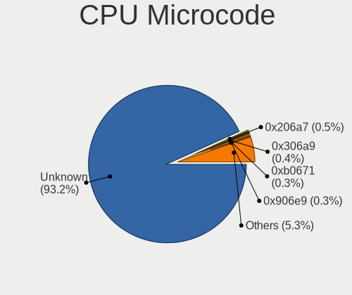
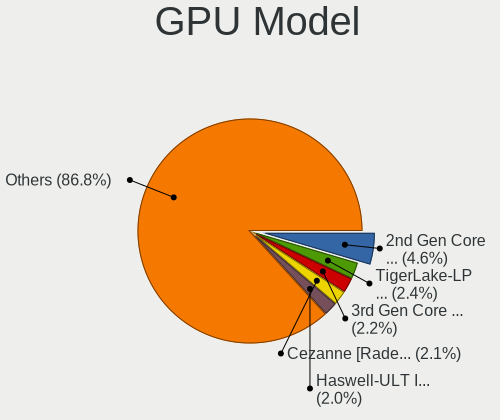

Ubuntu Hardware Trends
----------------------

A project to identify most popular hardware characteristics and track their change
over time based on data collected by Ubuntu users at https://Linux-Hardware.org.

Anyone can contribute to this report by the [hw-probe](https://github.com/linuxhw/hw-probe) tool:

    sudo -E hw-probe -all -upload

This is a report for all computer types. See also reports for [desktops](/Dist/Ubuntu/Desktop/README.md) and [notebooks](/Dist/Ubuntu/Notebook/README.md).

Full-feature report is available here: https://linux-hardware.org/?view=trends

Period: Oct, 2021.

Contents
--------

* [ System ](#system)
  - [ OS                       ](#os)
  - [ OS Family                ](#os-family)
  - [ Kernel                   ](#kernel)
  - [ Kernel Family            ](#kernel-family)
  - [ Kernel Major Ver.        ](#kernel-major-ver)
  - [ Arch                     ](#arch)
  - [ DE                       ](#de)
  - [ Display Server           ](#display-server)
  - [ Display Manager          ](#display-manager)
  - [ OS Lang                  ](#os-lang)
  - [ Boot Mode                ](#boot-mode)
  - [ Filesystem               ](#filesystem)
  - [ Part. scheme             ](#part-scheme)
  - [ Dual Boot with Linux/BSD ](#dual-boot-with-linuxbsd)
  - [ Dual Boot (Win)          ](#dual-boot-win)

* [ Board ](#board)
  - [ Vendor                   ](#vendor)
  - [ Model                    ](#model)
  - [ Model Family             ](#model-family)
  - [ MFG Year                 ](#mfg-year)
  - [ Form Factor              ](#form-factor)
  - [ Secure Boot              ](#secure-boot)
  - [ Coreboot                 ](#coreboot)
  - [ RAM Size                 ](#ram-size)
  - [ RAM Used                 ](#ram-used)
  - [ Total Drives             ](#total-drives)
  - [ Has CD-ROM               ](#has-cd-rom)
  - [ Has Ethernet             ](#has-ethernet)
  - [ Has WiFi                 ](#has-wifi)
  - [ Has Bluetooth            ](#has-bluetooth)

* [ Location ](#location)
  - [ Country                  ](#country)
  - [ City                     ](#city)

* [ Drives ](#drives)
  - [ Drive Vendor             ](#drive-vendor)
  - [ Drive Model              ](#drive-model)
  - [ HDD Vendor               ](#hdd-vendor)
  - [ SSD Vendor               ](#ssd-vendor)
  - [ Drive Kind               ](#drive-kind)
  - [ Drive Connector          ](#drive-connector)
  - [ Drive Size               ](#drive-size)
  - [ Space Total              ](#space-total)
  - [ Space Used               ](#space-used)
  - [ Malfunc. Drives          ](#malfunc-drives)
  - [ Malfunc. Drive Vendor    ](#malfunc-drive-vendor)
  - [ Malfunc. HDD Vendor      ](#malfunc-hdd-vendor)
  - [ Malfunc. Drive Kind      ](#malfunc-drive-kind)
  - [ Failed Drives            ](#failed-drives)
  - [ Failed Drive Vendor      ](#failed-drive-vendor)
  - [ Drive Status             ](#drive-status)

* [ Storage controller ](#storage-controller)
  - [ Storage Vendor           ](#storage-vendor)
  - [ Storage Model            ](#storage-model)
  - [ Storage Kind             ](#storage-kind)

* [ Processor ](#processor)
  - [ CPU Vendor               ](#cpu-vendor)
  - [ CPU Model                ](#cpu-model)
  - [ CPU Model Family         ](#cpu-model-family)
  - [ CPU Cores                ](#cpu-cores)
  - [ CPU Sockets              ](#cpu-sockets)
  - [ CPU Threads              ](#cpu-threads)
  - [ CPU Op-Modes             ](#cpu-op-modes)
  - [ CPU Microcode            ](#cpu-microcode)
  - [ CPU Microarch            ](#cpu-microarch)

* [ Graphics ](#graphics)
  - [ GPU Vendor               ](#gpu-vendor)
  - [ GPU Model                ](#gpu-model)
  - [ GPU Combo                ](#gpu-combo)
  - [ GPU Driver               ](#gpu-driver)
  - [ GPU Memory               ](#gpu-memory)

* [ Monitor ](#monitor)
  - [ Monitor Vendor           ](#monitor-vendor)
  - [ Monitor Model            ](#monitor-model)
  - [ Monitor Resolution       ](#monitor-resolution)
  - [ Monitor Diagonal         ](#monitor-diagonal)
  - [ Monitor Width            ](#monitor-width)
  - [ Aspect Ratio             ](#aspect-ratio)
  - [ Monitor Area             ](#monitor-area)
  - [ Pixel Density            ](#pixel-density)
  - [ Multiple Monitors        ](#multiple-monitors)

* [ Network ](#network)
  - [ Net Controller Vendor    ](#net-controller-vendor)
  - [ Net Controller Model     ](#net-controller-model)
  - [ Wireless Vendor          ](#wireless-vendor)
  - [ Wireless Model           ](#wireless-model)
  - [ Ethernet Vendor          ](#ethernet-vendor)
  - [ Ethernet Model           ](#ethernet-model)
  - [ Net Controller Kind      ](#net-controller-kind)
  - [ Used Controller          ](#used-controller)
  - [ NICs                     ](#nics)
  - [ IPv6                     ](#ipv6)

* [ Bluetooth ](#bluetooth)
  - [ Bluetooth Vendor         ](#bluetooth-vendor)
  - [ Bluetooth Model          ](#bluetooth-model)

* [ Sound ](#sound)
  - [ Sound Vendor             ](#sound-vendor)
  - [ Sound Model              ](#sound-model)

* [ Memory ](#memory)
  - [ Memory Vendor            ](#memory-vendor)
  - [ Memory Model             ](#memory-model)
  - [ Memory Kind              ](#memory-kind)
  - [ Memory Form Factor       ](#memory-form-factor)
  - [ Memory Size              ](#memory-size)
  - [ Memory Speed             ](#memory-speed)

* [ Printers & scanners ](#printers--scanners)
  - [ Printer Vendor           ](#printer-vendor)
  - [ Printer Model            ](#printer-model)
  - [ Scanner Vendor           ](#scanner-vendor)
  - [ Scanner Model            ](#scanner-model)

* [ Camera ](#camera)
  - [ Camera Vendor            ](#camera-vendor)
  - [ Camera Model             ](#camera-model)

* [ Security ](#security)
  - [ Fingerprint Vendor       ](#fingerprint-vendor)
  - [ Fingerprint Model        ](#fingerprint-model)
  - [ Chipcard Vendor          ](#chipcard-vendor)
  - [ Chipcard Model           ](#chipcard-model)

* [ Unsupported ](#unsupported)
  - [ Unsupported Devices      ](#unsupported-devices)
  - [ Unsupported Device Types ](#unsupported-device-types)

System
------

OS
--

Installed operating systems

| Name         | Computers | Percent |
|--------------|-----------|---------|
| Ubuntu 20.04 | 973       | 63.72%  |
| Ubuntu 21.10 | 252       | 16.5%   |
| Ubuntu 21.04 | 204       | 13.36%  |
| Ubuntu 18.04 | 64        | 4.19%   |
| Ubuntu 16.04 | 13        | 0.85%   |
| Ubuntu 20.10 | 11        | 0.72%   |
| Ubuntu       | 5         | 0.33%   |
| Ubuntu 18.10 | 2         | 0.13%   |
| Ubuntu 22.04 | 1         | 0.07%   |
| Ubuntu 19.10 | 1         | 0.07%   |
| Ubuntu 13.04 | 1         | 0.07%   |

OS Family
---------

OS without a version

| Name   | Computers | Percent |
|--------|-----------|---------|
| Ubuntu | 1527      | 100%    |

Kernel
------

Version of the Linux kernel

| Version                            | Computers | Percent |
|------------------------------------|-----------|---------|
| 5.11.0-37-generic                  | 520       | 34.05%  |
| 5.11.0-38-generic                  | 325       | 21.28%  |
| 5.13.0-20-generic                  | 116       | 7.6%    |
| 5.13.0-19-generic                  | 93        | 6.09%   |
| 5.4.0-88-generic                   | 79        | 5.17%   |
| 5.11.0-27-generic                  | 47        | 3.08%   |
| 5.4.0-89-generic                   | 42        | 2.75%   |
| 5.11.0-36-generic                  | 23        | 1.51%   |
| 5.4.0-87-generic                   | 22        | 1.44%   |
| 4.15.0-159-generic                 | 14        | 0.92%   |
| 5.11.0-34-generic                  | 12        | 0.79%   |
| 5.8.0-43-generic                   | 11        | 0.72%   |
| 5.13.0-21-generic                  | 11        | 0.72%   |
| 5.13.0-16-generic                  | 11        | 0.72%   |
| 5.11.0-40-generic                  | 11        | 0.72%   |
| 5.8.0-63-generic                   | 10        | 0.65%   |
| 5.11.0-16-generic                  | 9         | 0.59%   |
| 4.15.0-142-generic                 | 9         | 0.59%   |
| 5.4.0-42-generic                   | 8         | 0.52%   |
| 5.13.0-1008-raspi                  | 6         | 0.39%   |
| 5.8.0-59-generic                   | 5         | 0.33%   |
| 5.11.0-25-generic                  | 5         | 0.33%   |
| 5.10.0-1050-oem                    | 5         | 0.33%   |
| 5.8.0-50-generic                   | 4         | 0.26%   |
| 5.14.9-051409-generic              | 4         | 0.26%   |
| 5.11.0-1019-raspi                  | 4         | 0.26%   |
| 5.8.0-48-generic                   | 3         | 0.2%    |
| 5.4.0-90-generic                   | 3         | 0.2%    |
| 5.4.0-88-lowlatency                | 3         | 0.2%    |
| 5.4.0-86-generic                   | 3         | 0.2%    |
| 5.4.0-84-generic                   | 3         | 0.2%    |
| 5.4.0-58-generic                   | 3         | 0.2%    |
| 5.4.0-26-generic                   | 3         | 0.2%    |
| 5.15.0-051500rc7-generic           | 3         | 0.2%    |
| 5.10.0-1049-oem                    | 3         | 0.2%    |
| 4.4.0-210-generic                  | 3         | 0.2%    |
| 4.15.0-156-generic                 | 3         | 0.2%    |
| 5.8.0-53-generic                   | 2         | 0.13%   |
| 5.4.0-77-generic                   | 2         | 0.13%   |
| 5.4.0-47-generic                   | 2         | 0.13%   |
| 5.15.0-051500rc5-generic           | 2         | 0.13%   |
| 5.14.9-surface                     | 2         | 0.13%   |
| 5.14.2-051402-generic              | 2         | 0.13%   |
| 5.14.0-1005-oem                    | 2         | 0.13%   |
| 5.13.0-1017-oem                    | 2         | 0.13%   |
| 5.11.0-31-generic                  | 2         | 0.13%   |
| 4.4.154-113-rockchip-gdb9dfc2cdd25 | 2         | 0.13%   |
| 4.15.0-162-generic                 | 2         | 0.13%   |
| 4.15.0-161-generic                 | 2         | 0.13%   |
| 5.8.0-61-generic                   | 1         | 0.07%   |
| 5.8.0-55-generic                   | 1         | 0.07%   |
| 5.8.0-49-generic                   | 1         | 0.07%   |
| 5.8.0-41-generic                   | 1         | 0.07%   |
| 5.8.0-38-generic                   | 1         | 0.07%   |
| 5.8.0-25-generic                   | 1         | 0.07%   |
| 5.4.0-81-generic                   | 1         | 0.07%   |
| 5.4.0-73-generic                   | 1         | 0.07%   |
| 5.4.0-72-generic                   | 1         | 0.07%   |
| 5.4.0-70-generic                   | 1         | 0.07%   |
| 5.4.0-65-generic                   | 1         | 0.07%   |

Kernel Family
-------------

Linux kernel without a distro release

| Version | Computers | Percent |
|---------|-----------|---------|
| 5.11.0  | 966       | 63.26%  |
| 5.13.0  | 245       | 16.04%  |
| 5.4.0   | 184       | 12.05%  |
| 5.8.0   | 41        | 2.69%   |
| 4.15.0  | 35        | 2.29%   |
| 5.10.0  | 9         | 0.59%   |
| 5.15.0  | 7         | 0.46%   |
| 5.14.9  | 7         | 0.46%   |
| 5.14.0  | 4         | 0.26%   |
| 5.14.14 | 3         | 0.2%    |
| 4.4.0   | 3         | 0.2%    |
| 5.14.8  | 2         | 0.13%   |
| 5.14.2  | 2         | 0.13%   |
| 5.14.15 | 2         | 0.13%   |
| 4.4.154 | 2         | 0.13%   |
| 4.18.0  | 2         | 0.13%   |
| 5.3.0   | 1         | 0.07%   |
| 5.2.21  | 1         | 0.07%   |
| 5.14.11 | 1         | 0.07%   |
| 5.13.9  | 1         | 0.07%   |
| 5.13.1  | 1         | 0.07%   |
| 5.12.19 | 1         | 0.07%   |
| 5.10.69 | 1         | 0.07%   |
| 5.10.67 | 1         | 0.07%   |
| 5.10.63 | 1         | 0.07%   |
| 5.10.43 | 1         | 0.07%   |
| 5.10.32 | 1         | 0.07%   |
| 4.9.0   | 1         | 0.07%   |
| 4.16.18 | 1         | 0.07%   |

Kernel Major Ver.
-----------------

Linux kernel major version

| Version | Computers | Percent |
|---------|-----------|---------|
| 5.11    | 966       | 63.26%  |
| 5.13    | 247       | 16.18%  |
| 5.4     | 184       | 12.05%  |
| 5.8     | 41        | 2.69%   |
| 4.15    | 35        | 2.29%   |
| 5.14    | 21        | 1.38%   |
| 5.10    | 14        | 0.92%   |
| 5.15    | 7         | 0.46%   |
| 4.4     | 5         | 0.33%   |
| 4.18    | 2         | 0.13%   |
| 5.3     | 1         | 0.07%   |
| 5.2     | 1         | 0.07%   |
| 5.12    | 1         | 0.07%   |
| 4.9     | 1         | 0.07%   |
| 4.16    | 1         | 0.07%   |

Arch
----

OS architecture (x86_64, i586, etc.)

| Name    | Computers | Percent |
|---------|-----------|---------|
| x86_64  | 1493      | 97.77%  |
| i686    | 19        | 1.24%   |
| aarch64 | 14        | 0.92%   |
| armv7l  | 1         | 0.07%   |

DE
--

Desktop Environment

| Name            | Computers | Percent |
|-----------------|-----------|---------|
| GNOME           | 1354      | 88.67%  |
| Unknown         | 121       | 7.92%   |
| Unity           | 17        | 1.11%   |
| X-Cinnamon      | 13        | 0.85%   |
| GNOME Flashback | 11        | 0.72%   |
| i3              | 4         | 0.26%   |
| GNOME Classic   | 2         | 0.13%   |
| Deepin          | 2         | 0.13%   |
| openbox         | 1         | 0.07%   |
| enlightenment   | 1         | 0.07%   |
| Cinnamon        | 1         | 0.07%   |

Display Server
--------------

X11 or Wayland

| Name    | Computers | Percent |
|---------|-----------|---------|
| X11     | 1125      | 73.67%  |
| Wayland | 324       | 21.22%  |
| Unknown | 61        | 3.99%   |
| Tty     | 17        | 1.11%   |

Display Manager
---------------

SDDM, LightDM, etc.

| Name    | Computers | Percent |
|---------|-----------|---------|
| GDM3    | 990       | 64.83%  |
| GDM     | 365       | 23.9%   |
| Unknown | 99        | 6.48%   |
| LightDM | 65        | 4.26%   |
| SDDM    | 7         | 0.46%   |
| Ly      | 1         | 0.07%   |

OS Lang
-------

Language

| Lang    | Computers | Percent |
|---------|-----------|---------|
| en_US   | 618       | 40.47%  |
| de_DE   | 178       | 11.66%  |
| fr_FR   | 120       | 7.86%   |
| en_GB   | 70        | 4.58%   |
| pt_BR   | 55        | 3.6%    |
| ru_RU   | 42        | 2.75%   |
| it_IT   | 40        | 2.62%   |
| en_CA   | 39        | 2.55%   |
| es_ES   | 38        | 2.49%   |
| en_IN   | 37        | 2.42%   |
| en_AU   | 36        | 2.36%   |
| pl_PL   | 27        | 1.77%   |
| C       | 25        | 1.64%   |
| nl_NL   | 16        | 1.05%   |
| cs_CZ   | 16        | 1.05%   |
| Unknown | 13        | 0.85%   |
| ja_JP   | 12        | 0.79%   |
| de_AT   | 12        | 0.79%   |
| hu_HU   | 9         | 0.59%   |
| en_NZ   | 9         | 0.59%   |
| en_ZA   | 8         | 0.52%   |
| zh_CN   | 7         | 0.46%   |
| pt_PT   | 5         | 0.33%   |
| es_CO   | 5         | 0.33%   |
| en_IL   | 5         | 0.33%   |
| de_CH   | 5         | 0.33%   |
| tr_TR   | 4         | 0.26%   |
| ro_RO   | 4         | 0.26%   |
| fr_BE   | 4         | 0.26%   |
| fi_FI   | 4         | 0.26%   |
| es_AR   | 4         | 0.26%   |
| el_GR   | 4         | 0.26%   |
| da_DK   | 4         | 0.26%   |
| zh_TW   | 3         | 0.2%    |
| sv_SE   | 3         | 0.2%    |
| sk_SK   | 3         | 0.2%    |
| ru_UA   | 3         | 0.2%    |
| nl_BE   | 3         | 0.2%    |
| nb_NO   | 3         | 0.2%    |
| fr_CA   | 3         | 0.2%    |
| es_MX   | 3         | 0.2%    |
| en_SG   | 3         | 0.2%    |
| uk_UA   | 2         | 0.13%   |
| sl_SI   | 2         | 0.13%   |
| hr_HR   | 2         | 0.13%   |
| es_PE   | 2         | 0.13%   |
| en_IE   | 2         | 0.13%   |
| vi_VN   | 1         | 0.07%   |
| sr_RS   | 1         | 0.07%   |
| lv_LV   | 1         | 0.07%   |
| ko_KR   | 1         | 0.07%   |
| he_IL   | 1         | 0.07%   |
| fr_CH   | 1         | 0.07%   |
| eu_ES   | 1         | 0.07%   |
| es_UY   | 1         | 0.07%   |
| es_EC   | 1         | 0.07%   |
| es_CL   | 1         | 0.07%   |
| bg_BG   | 1         | 0.07%   |
| ar_SA   | 1         | 0.07%   |
| ar_MA   | 1         | 0.07%   |

Boot Mode
---------

EFI or BIOS

| Mode | Computers | Percent |
|------|-----------|---------|
| BIOS | 830       | 54.35%  |
| EFI  | 697       | 45.65%  |

Filesystem
----------

Type of filesystem

| Type     | Computers | Percent |
|----------|-----------|---------|
| Ext4     | 1438      | 94.17%  |
| Overlay  | 41        | 2.69%   |
| Zfs      | 20        | 1.31%   |
| Btrfs    | 13        | 0.85%   |
| Xfs      | 5         | 0.33%   |
| Ext3     | 4         | 0.26%   |
| Ext2     | 4         | 0.26%   |
| Reiserfs | 1         | 0.07%   |
| Jfs      | 1         | 0.07%   |

Part. scheme
------------

Scheme of partitioning

| Type    | Computers | Percent |
|---------|-----------|---------|
| Unknown | 1106      | 72.43%  |
| GPT     | 346       | 22.66%  |
| MBR     | 75        | 4.91%   |

Dual Boot with Linux/BSD
------------------------

Hosting more than one Linux/BSD

| Dual boot | Computers | Percent |
|-----------|-----------|---------|
| No        | 1342      | 87.88%  |
| Yes       | 185       | 12.12%  |

Dual Boot (Win)
---------------

Hosting Linux and Windows

| Dual boot | Computers | Percent |
|-----------|-----------|---------|
| No        | 918       | 60.12%  |
| Yes       | 609       | 39.88%  |

Board
-----

Vendor
------

Motherboard manufacturer

| Name                    | Computers | Percent |
|-------------------------|-----------|---------|
| ASUSTek Computer        | 237       | 15.52%  |
| Dell                    | 231       | 15.13%  |
| Lenovo                  | 216       | 14.15%  |
| Hewlett-Packard         | 216       | 14.15%  |
| MSI                     | 92        | 6.02%   |
| Acer                    | 89        | 5.83%   |
| Gigabyte Technology     | 83        | 5.44%   |
| ASRock                  | 45        | 2.95%   |
| Toshiba                 | 31        | 2.03%   |
| Apple                   | 31        | 2.03%   |
| Fujitsu                 | 22        | 1.44%   |
| Samsung Electronics     | 19        | 1.24%   |
| Intel                   | 19        | 1.24%   |
| Medion                  | 14        | 0.92%   |
| Sony                    | 13        | 0.85%   |
| Packard Bell            | 13        | 0.85%   |
| Unknown                 | 13        | 0.85%   |
| Microsoft               | 11        | 0.72%   |
| HUAWEI                  | 10        | 0.65%   |
| Raspberry Pi Foundation | 8         | 0.52%   |
| Supermicro              | 7         | 0.46%   |
| Pegatron                | 7         | 0.46%   |
| Alienware               | 6         | 0.39%   |
| Notebook                | 5         | 0.33%   |
| Foxconn                 | 5         | 0.33%   |
| IBM                     | 4         | 0.26%   |
| Google                  | 4         | 0.26%   |
| TUXEDO                  | 3         | 0.2%    |
| realme                  | 3         | 0.2%    |
| Positivo                | 3         | 0.2%    |
| Gateway                 | 3         | 0.2%    |
| Fujitsu Siemens         | 3         | 0.2%    |
| Wortmann AG             | 2         | 0.13%   |
| Timi                    | 2         | 0.13%   |
| System76                | 2         | 0.13%   |
| Schenker                | 2         | 0.13%   |
| Rockchip                | 2         | 0.13%   |
| OEM                     | 2         | 0.13%   |
| Nvidia                  | 2         | 0.13%   |
| LG Electronics          | 2         | 0.13%   |
| Huanan                  | 2         | 0.13%   |
| HONOR                   | 2         | 0.13%   |
| Hampoo                  | 2         | 0.13%   |
| Framework               | 2         | 0.13%   |
| Biostar                 | 2         | 0.13%   |
| AMI                     | 2         | 0.13%   |
| Wistron                 | 1         | 0.07%   |
| win element             | 1         | 0.07%   |
| whyopencomputing        | 1         | 0.07%   |
| TrekStor                | 1         | 0.07%   |
| Sun Microsystems        | 1         | 0.07%   |
| Shuttle                 | 1         | 0.07%   |
| SHENZHEN X&F TECHNOLOGY | 1         | 0.07%   |
| Razer                   | 1         | 0.07%   |
| Pine Microsystems       | 1         | 0.07%   |
| Panasonic               | 1         | 0.07%   |
| Oracle                  | 1         | 0.07%   |
| Multilaser              | 1         | 0.07%   |
| Motion Computing        | 1         | 0.07%   |
| Microtech               | 1         | 0.07%   |

Model
-----

Motherboard model

| Name                                | Computers | Percent |
|-------------------------------------|-----------|---------|
| Unknown                             | 19        | 1.24%   |
| ASUS All Series                     | 11        | 0.72%   |
| RPi Raspberry Pi                    | 8         | 0.52%   |
| HP Notebook                         | 7         | 0.46%   |
| HP Pavilion dv6                     | 6         | 0.39%   |
| Dell OptiPlex 790                   | 6         | 0.39%   |
| Dell XPS 15 7590                    | 5         | 0.33%   |
| Dell OptiPlex 9010                  | 5         | 0.33%   |
| Dell OptiPlex 7010                  | 5         | 0.33%   |
| Acer Aspire 5741G                   | 5         | 0.33%   |
| Lenovo ThinkBook 14 G2 ITL 20VD     | 4         | 0.26%   |
| HP ProBook 450 G7                   | 4         | 0.26%   |
| HP Pavilion dv7                     | 4         | 0.26%   |
| HP 15                               | 4         | 0.26%   |
| Dell XPS 15 9570                    | 4         | 0.26%   |
| Dell XPS 13 9310                    | 4         | 0.26%   |
| Dell XPS 13 7390                    | 4         | 0.26%   |
| Dell OptiPlex 3020                  | 4         | 0.26%   |
| Dell OptiPlex 3010                  | 4         | 0.26%   |
| Dell Latitude 5400                  | 4         | 0.26%   |
| ASUS TUF GAMING X570-PLUS           | 4         | 0.26%   |
| ASUS M5A97 R2.0                     | 4         | 0.26%   |
| Apple MacBookPro12,1                | 4         | 0.26%   |
| Acer Swift SF314-43                 | 4         | 0.26%   |
| realme RMNBXXXX                     | 3         | 0.2%    |
| MSI MS-7C37                         | 3         | 0.2%    |
| MSI MS-7B86                         | 3         | 0.2%    |
| MSI MS-7592                         | 3         | 0.2%    |
| Microsoft Surface Pro 3             | 3         | 0.2%    |
| Lenovo Yoga 7 14ITL5 82BH           | 3         | 0.2%    |
| HUAWEI KLVL-WXX9                    | 3         | 0.2%    |
| HP Pavilion Notebook                | 3         | 0.2%    |
| HP Pavilion Gaming Laptop 15-ec2xxx | 3         | 0.2%    |
| HP Pavilion g6                      | 3         | 0.2%    |
| HP Laptop 15-da0xxx                 | 3         | 0.2%    |
| HP EliteBook Folio 9470m            | 3         | 0.2%    |
| HP EliteBook 840 G3                 | 3         | 0.2%    |
| HP EliteBook 840 G2                 | 3         | 0.2%    |
| HP Compaq Pro 6305 SFF              | 3         | 0.2%    |
| HP 250 G3                           | 3         | 0.2%    |
| Gigabyte Z77X-UD5H                  | 3         | 0.2%    |
| Dell OptiPlex 3050                  | 3         | 0.2%    |
| Dell Latitude E7250                 | 3         | 0.2%    |
| Dell Latitude E5430 non-vPro        | 3         | 0.2%    |
| Dell Inspiron N5110                 | 3         | 0.2%    |
| ASUS ROG STRIX B450-F GAMING        | 3         | 0.2%    |
| ASUS PRIME A320M-K                  | 3         | 0.2%    |
| ASUS M5A97 LE R2.0                  | 3         | 0.2%    |
| ASUS M5A97 EVO R2.0                 | 3         | 0.2%    |
| ASUS M5A78L-M LX V2                 | 3         | 0.2%    |
| Apple MacBookPro9,2                 | 3         | 0.2%    |
| Apple MacBookPro8,1                 | 3         | 0.2%    |
| TUXEDO Pulse 15 Gen1                | 2         | 0.13%   |
| Toshiba Satellite C875D             | 2         | 0.13%   |
| Supermicro PIO-618U-TR4T+-ST031     | 2         | 0.13%   |
| Samsung 550XCJ/550XCR               | 2         | 0.13%   |
| Positivo C14CR21                    | 2         | 0.13%   |
| Packard Bell EasyNote TV44HC        | 2         | 0.13%   |
| Packard Bell EasyNote TS11HR        | 2         | 0.13%   |
| Packard Bell EasyNote TJ66          | 2         | 0.13%   |

Model Family
------------

Motherboard model prefix

| Name                  | Computers | Percent |
|-----------------------|-----------|---------|
| Lenovo ThinkPad       | 96        | 6.29%   |
| Acer Aspire           | 60        | 3.93%   |
| Dell Latitude         | 54        | 3.54%   |
| Dell Inspiron         | 52        | 3.41%   |
| Lenovo IdeaPad        | 43        | 2.82%   |
| Dell OptiPlex         | 42        | 2.75%   |
| HP Pavilion           | 41        | 2.69%   |
| Dell XPS              | 38        | 2.49%   |
| HP EliteBook          | 29        | 1.9%    |
| ASUS PRIME            | 29        | 1.9%    |
| Toshiba Satellite     | 24        | 1.57%   |
| ASUS ROG              | 24        | 1.57%   |
| HP ProBook            | 21        | 1.38%   |
| Dell Precision        | 20        | 1.31%   |
| HP Laptop             | 19        | 1.24%   |
| Unknown               | 19        | 1.24%   |
| HP Compaq             | 18        | 1.18%   |
| Lenovo ThinkCentre    | 17        | 1.11%   |
| ASUS TUF              | 15        | 0.98%   |
| ASUS VivoBook         | 14        | 0.92%   |
| HP ZBook              | 12        | 0.79%   |
| Dell Vostro           | 12        | 0.79%   |
| Acer Swift            | 12        | 0.79%   |
| Microsoft Surface     | 11        | 0.72%   |
| Lenovo ThinkBook      | 11        | 0.72%   |
| ASUS M5A97            | 11        | 0.72%   |
| ASUS All              | 11        | 0.72%   |
| Packard Bell EasyNote | 10        | 0.65%   |
| HP ENVY               | 10        | 0.65%   |
| Lenovo Legion         | 9         | 0.59%   |
| Fujitsu ESPRIMO       | 9         | 0.59%   |
| RPi Raspberry         | 8         | 0.52%   |
| Fujitsu LIFEBOOK      | 8         | 0.52%   |
| HP Notebook           | 7         | 0.46%   |
| HP ProLiant           | 6         | 0.39%   |
| HP EliteDesk          | 6         | 0.39%   |
| Gigabyte X570         | 6         | 0.39%   |
| Lenovo Yoga           | 5         | 0.33%   |
| HP Stream             | 5         | 0.33%   |
| ASUS P8Z77-V          | 5         | 0.33%   |
| ASUS M5A78L-M         | 5         | 0.33%   |
| Apple MacBookPro8     | 5         | 0.33%   |
| Acer Nitro            | 5         | 0.33%   |
| Medion Akoya          | 4         | 0.26%   |
| HP 15                 | 4         | 0.26%   |
| Dell System           | 4         | 0.26%   |
| ASUS P8Z68-V          | 4         | 0.26%   |
| ASUS P8H61-M          | 4         | 0.26%   |
| Apple MacBookPro12    | 4         | 0.26%   |
| Acer Extensa          | 4         | 0.26%   |
| realme RMNBXXXX       | 3         | 0.2%    |
| MSI MS-7C37           | 3         | 0.2%    |
| MSI MS-7B86           | 3         | 0.2%    |
| MSI MS-7592           | 3         | 0.2%    |
| Lenovo IdeaCentre     | 3         | 0.2%    |
| Intel DG31PR          | 3         | 0.2%    |
| HUAWEI KLVL-WXX9      | 3         | 0.2%    |
| HP OMEN               | 3         | 0.2%    |
| HP 250                | 3         | 0.2%    |
| Gigabyte Z77X-UD5H    | 3         | 0.2%    |

MFG Year
--------

Motherboard manufacture year

| Year    | Computers | Percent |
|---------|-----------|---------|
| 2021    | 310       | 20.3%   |
| 2020    | 190       | 12.44%  |
| 2019    | 139       | 9.1%    |
| 2018    | 111       | 7.27%   |
| 2013    | 109       | 7.14%   |
| 2011    | 95        | 6.22%   |
| 2012    | 89        | 5.83%   |
| 2015    | 80        | 5.24%   |
| 2014    | 74        | 4.85%   |
| 2010    | 69        | 4.52%   |
| 2016    | 64        | 4.19%   |
| 2009    | 60        | 3.93%   |
| 2017    | 53        | 3.47%   |
| 2008    | 37        | 2.42%   |
| 2007    | 24        | 1.57%   |
| Unknown | 16        | 1.05%   |
| 2006    | 4         | 0.26%   |
| 2005    | 2         | 0.13%   |
| 2004    | 1         | 0.07%   |

Form Factor
-----------

Physical design of the computer

| Name           | Computers | Percent |
|----------------|-----------|---------|
| Notebook       | 831       | 54.42%  |
| Desktop        | 585       | 38.31%  |
| Convertible    | 31        | 2.03%   |
| All in one     | 19        | 1.24%   |
| Tablet         | 17        | 1.11%   |
| Mini pc        | 17        | 1.11%   |
| System on chip | 14        | 0.92%   |
| Server         | 12        | 0.79%   |
| Other          | 1         | 0.07%   |

Secure Boot
-----------

Enabled or disabled

| State    | Computers | Percent |
|----------|-----------|---------|
| Disabled | 1331      | 87.16%  |
| Enabled  | 196       | 12.84%  |

Coreboot
--------

Have coreboot on board

| Used | Computers | Percent |
|------|-----------|---------|
| No   | 1523      | 99.74%  |
| Yes  | 4         | 0.26%   |

RAM Size
--------

Total RAM memory

| Size in GB      | Computers | Percent |
|-----------------|-----------|---------|
| 4.01-8.0        | 374       | 24.49%  |
| 16.01-24.0      | 327       | 21.41%  |
| 3.01-4.0        | 292       | 19.12%  |
| 8.01-16.0       | 266       | 17.42%  |
| 32.01-64.0      | 142       | 9.3%    |
| 64.01-256.0     | 48        | 3.14%   |
| 1.01-2.0        | 40        | 2.62%   |
| 24.01-32.0      | 20        | 1.31%   |
| 2.01-3.0        | 12        | 0.79%   |
| More than 256.0 | 3         | 0.2%    |
| 0.51-1.0        | 3         | 0.2%    |

RAM Used
--------

Used RAM memory

| Used GB    | Computers | Percent |
|------------|-----------|---------|
| 1.01-2.0   | 611       | 40.01%  |
| 2.01-3.0   | 402       | 26.33%  |
| 3.01-4.0   | 207       | 13.56%  |
| 4.01-8.0   | 203       | 13.29%  |
| 8.01-16.0  | 52        | 3.41%   |
| 0.51-1.0   | 37        | 2.42%   |
| 0.01-0.5   | 9         | 0.59%   |
| 16.01-24.0 | 5         | 0.33%   |
| 32.01-64.0 | 1         | 0.07%   |

Total Drives
------------

Number of drives on board

| Drives | Computers | Percent |
|--------|-----------|---------|
| 1      | 916       | 59.99%  |
| 2      | 380       | 24.89%  |
| 3      | 114       | 7.47%   |
| 4      | 50        | 3.27%   |
| 5      | 37        | 2.42%   |
| 0      | 13        | 0.85%   |
| 6      | 7         | 0.46%   |
| 7      | 4         | 0.26%   |
| 16     | 2         | 0.13%   |
| 8      | 2         | 0.13%   |
| 11     | 1         | 0.07%   |
| 9      | 1         | 0.07%   |

Has CD-ROM
----------

Has CD-ROM on board

| Presented | Computers | Percent |
|-----------|-----------|---------|
| No        | 900       | 58.94%  |
| Yes       | 627       | 41.06%  |

Has Ethernet
------------

Has Ethernet on board

| Presented | Computers | Percent |
|-----------|-----------|---------|
| Yes       | 1316      | 86.18%  |
| No        | 211       | 13.82%  |

Has WiFi
--------

Has WiFi module

| Presented | Computers | Percent |
|-----------|-----------|---------|
| Yes       | 1130      | 74%     |
| No        | 397       | 26%     |

Has Bluetooth
-------------

Has Bluetooth module

| Presented | Computers | Percent |
|-----------|-----------|---------|
| Yes       | 862       | 56.45%  |
| No        | 665       | 43.55%  |

Location
--------

Country
-------

Geographic location (country)

| Country      | Computers | Percent |
|--------------|-----------|---------|
| USA          | 253       | 16.57%  |
| Germany      | 207       | 13.56%  |
| France       | 131       | 8.58%   |
| Brazil       | 75        | 4.91%   |
| UK           | 63        | 4.13%   |
| Russia       | 55        | 3.6%    |
| Italy        | 50        | 3.27%   |
| Spain        | 47        | 3.08%   |
| Canada       | 46        | 3.01%   |
| India        | 42        | 2.75%   |
| Poland       | 40        | 2.62%   |
| Australia    | 38        | 2.49%   |
| Netherlands  | 37        | 2.42%   |
| Czechia      | 22        | 1.44%   |
| Ukraine      | 20        | 1.31%   |
| Sweden       | 18        | 1.18%   |
| Belgium      | 18        | 1.18%   |
| Austria      | 18        | 1.18%   |
| Switzerland  | 17        | 1.11%   |
| Romania      | 16        | 1.05%   |
| Mexico       | 16        | 1.05%   |
| Hungary      | 15        | 0.98%   |
| Greece       | 13        | 0.85%   |
| Egypt        | 12        | 0.79%   |
| South Africa | 11        | 0.72%   |
| New Zealand  | 11        | 0.72%   |
| Japan        | 11        | 0.72%   |
| Indonesia    | 11        | 0.72%   |
| Finland      | 11        | 0.72%   |
| Denmark      | 10        | 0.65%   |
| Portugal     | 9         | 0.59%   |
| Israel       | 9         | 0.59%   |
| Argentina    | 9         | 0.59%   |
| Vietnam      | 8         | 0.52%   |
| Pakistan     | 8         | 0.52%   |
| Norway       | 7         | 0.46%   |
| China        | 7         | 0.46%   |
| Turkey       | 6         | 0.39%   |
| Serbia       | 6         | 0.39%   |
| Iran         | 6         | 0.39%   |
| Colombia     | 5         | 0.33%   |
| Taiwan       | 4         | 0.26%   |
| Singapore    | 4         | 0.26%   |
| Puerto Rico  | 4         | 0.26%   |
| Jordan       | 4         | 0.26%   |
| Ireland      | 4         | 0.26%   |
| Hong Kong    | 4         | 0.26%   |
| Croatia      | 4         | 0.26%   |
| Bulgaria     | 4         | 0.26%   |
| Belarus      | 4         | 0.26%   |
| Tunisia      | 3         | 0.2%    |
| South Korea  | 3         | 0.2%    |
| Saudi Arabia | 3         | 0.2%    |
| Morocco      | 3         | 0.2%    |
| Cyprus       | 3         | 0.2%    |
| Cameroon     | 3         | 0.2%    |
| Algeria      | 3         | 0.2%    |
| Uruguay      | 2         | 0.13%   |
| Slovenia     | 2         | 0.13%   |
| Slovakia     | 2         | 0.13%   |

City
----

Geographic location (city)

| City              | Computers | Percent |
|-------------------|-----------|---------|
| Berlin            | 24        | 1.57%   |
| Paris             | 21        | 1.38%   |
| Moscow            | 18        | 1.18%   |
| Madrid            | 12        | 0.79%   |
| Vienna            | 11        | 0.72%   |
| Kyiv              | 11        | 0.72%   |
| Warsaw            | 10        | 0.65%   |
| S??o Paulo        | 9         | 0.59%   |
| Phoenix           | 8         | 0.52%   |
| Perth             | 8         | 0.52%   |
| Cairo             | 8         | 0.52%   |
| Rome              | 7         | 0.46%   |
| Milan             | 7         | 0.46%   |
| Budapest          | 7         | 0.46%   |
| Athens            | 7         | 0.46%   |
| Amsterdam         | 7         | 0.46%   |
| Valencia          | 6         | 0.39%   |
| Prague            | 6         | 0.39%   |
| Munich            | 6         | 0.39%   |
| Melbourne         | 6         | 0.39%   |
| Krakow            | 6         | 0.39%   |
| Hyderabad         | 6         | 0.39%   |
| Cologne           | 6         | 0.39%   |
| Bengaluru         | 6         | 0.39%   |
| Auckland          | 6         | 0.39%   |
| Tehran            | 5         | 0.33%   |
| St Petersburg     | 5         | 0.33%   |
| Seattle           | 5         | 0.33%   |
| Istanbul          | 5         | 0.33%   |
| Helsinki          | 5         | 0.33%   |
| Hamburg           | 5         | 0.33%   |
| Wroclaw           | 4         | 0.26%   |
| Vancouver         | 4         | 0.26%   |
| Toulouse          | 4         | 0.26%   |
| Taby              | 4         | 0.26%   |
| Sydney            | 4         | 0.26%   |
| Stuttgart         | 4         | 0.26%   |
| Singapore         | 4         | 0.26%   |
| San Jose          | 4         | 0.26%   |
| San Antonio       | 4         | 0.26%   |
| Rio de Janeiro    | 4         | 0.26%   |
| New York          | 4         | 0.26%   |
| Montpellier       | 4         | 0.26%   |
| London            | 4         | 0.26%   |
| Leipzig           | 4         | 0.26%   |
| Gdansk            | 4         | 0.26%   |
| Frankfurt am Main | 4         | 0.26%   |
| Essen             | 4         | 0.26%   |
| Edmonton          | 4         | 0.26%   |
| Denver            | 4         | 0.26%   |
| Brussels          | 4         | 0.26%   |
| Austin            | 4         | 0.26%   |
| Amman             | 4         | 0.26%   |
| Zagreb            | 3         | 0.2%    |
| Yekaterinburg     | 3         | 0.2%    |
| Yaound?©          | 3         | 0.2%    |
| Turin             | 3         | 0.2%    |
| Toronto           | 3         | 0.2%    |
| Tijuana           | 3         | 0.2%    |
| Surabaya          | 3         | 0.2%    |

Drives
------

Drive Vendor
------------

Hard drive vendors

| Vendor                    | Computers | Drives | Percent |
|---------------------------|-----------|--------|---------|
| WDC                       | 343       | 434    | 16.18%  |
| Samsung Electronics       | 340       | 414    | 16.04%  |
| Seagate                   | 330       | 416    | 15.57%  |
| Toshiba                   | 149       | 168    | 7.03%   |
| Sandisk                   | 111       | 115    | 5.24%   |
| Kingston                  | 101       | 106    | 4.76%   |
| Unknown                   | 82        | 95     | 3.87%   |
| Hitachi                   | 78        | 84     | 3.68%   |
| Crucial                   | 76        | 82     | 3.58%   |
| SK Hynix                  | 52        | 52     | 2.45%   |
| Intel                     | 46        | 56     | 2.17%   |
| HGST                      | 44        | 64     | 2.08%   |
| KIOXIA                    | 28        | 30     | 1.32%   |
| Micron Technology         | 27        | 27     | 1.27%   |
| A-DATA Technology         | 19        | 20     | 0.9%    |
| Phison                    | 16        | 17     | 0.75%   |
| PNY                       | 14        | 14     | 0.66%   |
| MAXTOR                    | 14        | 15     | 0.66%   |
| Apple                     | 14        | 16     | 0.66%   |
| Transcend                 | 11        | 11     | 0.52%   |
| LITEON                    | 11        | 11     | 0.52%   |
| OCZ                       | 10        | 11     | 0.47%   |
| JMicron                   | 10        | 13     | 0.47%   |
| Intenso                   | 10        | 10     | 0.47%   |
| Micron/Crucial Technology | 9         | 9      | 0.42%   |
| China                     | 9         | 9      | 0.42%   |
| SPCC                      | 8         | 9      | 0.38%   |
| Silicon Motion            | 8         | 9      | 0.38%   |
| Hewlett-Packard           | 8         | 9      | 0.38%   |
| GOODRAM                   | 8         | 8      | 0.38%   |
| Team                      | 7         | 7      | 0.33%   |
| Fujitsu                   | 7         | 8      | 0.33%   |
| Realtek Semiconductor     | 6         | 6      | 0.28%   |
| LITEONIT                  | 6         | 6      | 0.28%   |
| Unknown                   | 6         | 6      | 0.28%   |
| SABRENT                   | 5         | 9      | 0.24%   |
| Lexar                     | 5         | 5      | 0.24%   |
| ASMT                      | 5         | 5      | 0.24%   |
| KingSpec                  | 4         | 4      | 0.19%   |
| UMIS                      | 3         | 3      | 0.14%   |
| StoreJet                  | 3         | 3      | 0.14%   |
| Patriot                   | 3         | 3      | 0.14%   |
| Mushkin                   | 3         | 3      | 0.14%   |
| Apacer                    | 3         | 3      | 0.14%   |
| SSSTC                     | 2         | 2      | 0.09%   |
| PLEXTOR                   | 2         | 2      | 0.09%   |
| Lite-On                   | 2         | 2      | 0.09%   |
| Lenovo                    | 2         | 2      | 0.09%   |
| KIOXIA-EXCERIA            | 2         | 2      | 0.09%   |
| KingDian                  | 2         | 2      | 0.09%   |
| KINGBANK                  | 2         | 2      | 0.09%   |
| Gigabyte Technology       | 2         | 2      | 0.09%   |
| Corsair                   | 2         | 2      | 0.09%   |
| ASMedia                   | 2         | 2      | 0.09%   |
| AMD                       | 2         | 2      | 0.09%   |
| XSTAR                     | 1         | 1      | 0.05%   |
| XPG                       | 1         | 1      | 0.05%   |
| XINTOR                    | 1         | 1      | 0.05%   |
| WD MediaMax               | 1         | 1      | 0.05%   |
| Verbatim                  | 1         | 1      | 0.05%   |

Drive Model
-----------

Hard drive models

| Model                                  | Computers | Percent |
|----------------------------------------|-----------|---------|
| Samsung PM963 2.5" NVMe PCIe SSD 512GB | 23        | 0.98%   |
| Kingston SA400S37240G 240GB SSD        | 23        | 0.98%   |
| Unknown MMC Card  32GB                 | 22        | 0.94%   |
| Samsung SSD 860 EVO 500GB              | 20        | 0.85%   |
| Seagate ST1000LM024 HN-M101MBB 1TB     | 17        | 0.73%   |
| Samsung SSD 850 EVO 250GB              | 17        | 0.73%   |
| Samsung NVMe SSD Drive 256GB           | 17        | 0.73%   |
| Kingston SA400S37120G 120GB SSD        | 17        | 0.73%   |
| Seagate ST1000LM035-1RK172 1TB         | 16        | 0.68%   |
| Samsung NVMe SSD Drive 1TB             | 16        | 0.68%   |
| Toshiba MQ04ABF100 1TB                 | 15        | 0.64%   |
| Toshiba MQ01ABD100 1TB                 | 15        | 0.64%   |
| Seagate ST1000DM010-2EP102 1TB         | 15        | 0.64%   |
| Seagate ST1000DM003-1ER162 1TB         | 15        | 0.64%   |
| Seagate ST500DM002-1BD142 500GB        | 14        | 0.6%    |
| Seagate ST2000DM008-2FR102 2TB         | 13        | 0.56%   |
| Crucial CT240BX500SSD1 240GB           | 13        | 0.56%   |
| Unknown SD/MMC/MS PRO 128GB            | 12        | 0.51%   |
| Toshiba MQ01ABF050 500GB               | 12        | 0.51%   |
| Samsung SSD 850 EVO 500GB              | 12        | 0.51%   |
| HGST HTS721010A9E630 1TB               | 12        | 0.51%   |
| Seagate ST1000DM003-1CH162 1TB         | 11        | 0.47%   |
| Seagate Expansion 1TB                  | 11        | 0.47%   |
| Samsung NVMe SSD Drive 1024GB          | 11        | 0.47%   |
| Unknown MMC Card  64GB                 | 10        | 0.43%   |
| Unknown MMC Card  128GB                | 10        | 0.43%   |
| Toshiba NVMe SSD Drive 512GB           | 10        | 0.43%   |
| Toshiba DT01ACA100 1TB                 | 10        | 0.43%   |
| Seagate ST9500325AS 500GB              | 10        | 0.43%   |
| Sandisk NVMe SSD Drive 512GB           | 10        | 0.43%   |
| Sandisk NVMe SSD Drive 256GB           | 10        | 0.43%   |
| Samsung SSD 860 EVO 1TB                | 10        | 0.43%   |
| Samsung NVMe SSD Drive 500GB           | 10        | 0.43%   |
| Crucial CT500MX500SSD1 500GB           | 10        | 0.43%   |
| WDC WDS240G2G0A-00JH30 240GB SSD       | 9         | 0.38%   |
| WDC WD10EZEX-08WN4A0 1TB               | 9         | 0.38%   |
| WDC WDS500G2B0A-00SM50 500GB SSD       | 8         | 0.34%   |
| Toshiba DT01ACA050 500GB               | 8         | 0.34%   |
| SK Hynix NVMe SSD Drive 256GB          | 8         | 0.34%   |
| Seagate ST2000DM001-1CH164 2TB         | 8         | 0.34%   |
| Unknown MMC Card  16GB                 | 7         | 0.3%    |
| Seagate ST3500418AS 500GB              | 7         | 0.3%    |
| Seagate ST2000DM006-2DM164 2TB         | 7         | 0.3%    |
| Seagate ST2000DM001-1ER164 2TB         | 7         | 0.3%    |
| SanDisk SSD PLUS 240GB                 | 7         | 0.3%    |
| Samsung SSD 970 EVO Plus 1TB           | 7         | 0.3%    |
| Samsung SM963 2.5" NVMe PCIe SSD 250GB | 7         | 0.3%    |
| KIOXIA NVMe SSD Drive 256GB            | 7         | 0.3%    |
| Kingston SA400S37480G 480GB SSD        | 7         | 0.3%    |
| Intel SSDPEKNW512G8H 512GB             | 7         | 0.3%    |
| Intel NVMe SSD Drive 512GB             | 7         | 0.3%    |
| HGST HTS545050A7E680 500GB             | 7         | 0.3%    |
| Crucial CT1000MX500SSD1 1TB            | 7         | 0.3%    |
| WDC WD20EZRX-00D8PB0 2TB               | 6         | 0.26%   |
| WDC WD10SPZX-24Z10 1TB                 | 6         | 0.26%   |
| Seagate ST500LT012-1DG142 500GB        | 6         | 0.26%   |
| Seagate ST3320620AS 320GB              | 6         | 0.26%   |
| Seagate ST1000DM003-1SB102 1TB         | 6         | 0.26%   |
| Samsung SSD 870 QVO 1TB                | 6         | 0.26%   |
| Samsung SSD 870 EVO 1TB                | 6         | 0.26%   |

HDD Vendor
----------

Hard disk drive vendors

| Vendor              | Computers | Drives | Percent |
|---------------------|-----------|--------|---------|
| Seagate             | 323       | 401    | 34.84%  |
| WDC                 | 271       | 348    | 29.23%  |
| Toshiba             | 105       | 119    | 11.33%  |
| Hitachi             | 78        | 84     | 8.41%   |
| Samsung Electronics | 51        | 58     | 5.5%    |
| HGST                | 44        | 64     | 4.75%   |
| MAXTOR              | 14        | 15     | 1.51%   |
| Unknown             | 12        | 12     | 1.29%   |
| Fujitsu             | 7         | 8      | 0.76%   |
| SABRENT             | 5         | 9      | 0.54%   |
| JMicron             | 5         | 7      | 0.54%   |
| Apple               | 3         | 3      | 0.32%   |
| asmedia             | 2         | 2      | 0.22%   |
| USB                 | 1         | 1      | 0.11%   |
| MARVELL             | 1         | 1      | 0.11%   |
| Intenso             | 1         | 1      | 0.11%   |
| IBM                 | 1         | 3      | 0.11%   |
| Hewlett-Packard     | 1         | 2      | 0.11%   |
| ASMT                | 1         | 1      | 0.11%   |
| Unknown             | 1         | 1      | 0.11%   |

SSD Vendor
----------

Solid state drive vendors

| Vendor              | Computers | Drives | Percent |
|---------------------|-----------|--------|---------|
| Samsung Electronics | 156       | 169    | 23.67%  |
| Kingston            | 82        | 85     | 12.44%  |
| SanDisk             | 69        | 70     | 10.47%  |
| Crucial             | 67        | 71     | 10.17%  |
| WDC                 | 48        | 51     | 7.28%   |
| Toshiba             | 17        | 18     | 2.58%   |
| Intel               | 15        | 16     | 2.28%   |
| PNY                 | 14        | 14     | 2.12%   |
| A-DATA Technology   | 14        | 15     | 2.12%   |
| Micron Technology   | 13        | 13     | 1.97%   |
| SK Hynix            | 12        | 12     | 1.82%   |
| Transcend           | 11        | 11     | 1.67%   |
| LITEON              | 10        | 10     | 1.52%   |
| Apple               | 10        | 10     | 1.52%   |
| OCZ                 | 9         | 9      | 1.37%   |
| China               | 9         | 9      | 1.37%   |
| Intenso             | 8         | 8      | 1.21%   |
| GOODRAM             | 8         | 8      | 1.21%   |
| Team                | 7         | 7      | 1.06%   |
| SPCC                | 6         | 7      | 0.91%   |
| LITEONIT            | 6         | 6      | 0.91%   |
| Lexar               | 5         | 5      | 0.76%   |
| Hewlett-Packard     | 5         | 5      | 0.76%   |
| KingSpec            | 4         | 4      | 0.61%   |
| Mushkin             | 3         | 3      | 0.46%   |
| ASMT                | 3         | 3      | 0.46%   |
| Apacer              | 3         | 3      | 0.46%   |
| PLEXTOR             | 2         | 2      | 0.3%    |
| Patriot             | 2         | 2      | 0.3%    |
| KIOXIA-EXCERIA      | 2         | 2      | 0.3%    |
| KingDian            | 2         | 2      | 0.3%    |
| Corsair             | 2         | 2      | 0.3%    |
| AMD                 | 2         | 2      | 0.3%    |
| XSTAR               | 1         | 1      | 0.15%   |
| XINTOR              | 1         | 1      | 0.15%   |
| Verbatim            | 1         | 1      | 0.15%   |
| Vaseky              | 1         | 1      | 0.15%   |
| TCSUNBOW            | 1         | 1      | 0.15%   |
| SUNEAST             | 1         | 1      | 0.15%   |
| StoreJet            | 1         | 1      | 0.15%   |
| Smartbuy            | 1         | 1      | 0.15%   |
| ShanDianZhe         | 1         | 1      | 0.15%   |
| SBe                 | 1         | 1      | 0.15%   |
| PNY CS90            | 1         | 1      | 0.15%   |
| PHISON              | 1         | 1      | 0.15%   |
| OSCOO               | 1         | 1      | 0.15%   |
| Netac               | 1         | 1      | 0.15%   |
| Maximus             | 1         | 1      | 0.15%   |
| Lite-On             | 1         | 1      | 0.15%   |
| LDLC                | 1         | 1      | 0.15%   |
| Lanbo               | 1         | 1      | 0.15%   |
| Kston               | 1         | 1      | 0.15%   |
| KingPower128G       | 1         | 1      | 0.15%   |
| KINGBANK            | 1         | 1      | 0.15%   |
| JMicron             | 1         | 1      | 0.15%   |
| Integral            | 1         | 1      | 0.15%   |
| Gigabyte Technology | 1         | 1      | 0.15%   |
| GALAX               | 1         | 1      | 0.15%   |
| CT500MX5            | 1         | 1      | 0.15%   |
| CT2000BX            | 1         | 1      | 0.15%   |

Drive Kind
----------

HDD or SSD

| Kind    | Computers | Drives | Percent |
|---------|-----------|--------|---------|
| HDD     | 790       | 1140   | 40.7%   |
| SSD     | 592       | 687    | 30.5%   |
| NVMe    | 452       | 523    | 23.29%  |
| MMC     | 71        | 82     | 3.66%   |
| Unknown | 36        | 43     | 1.85%   |

Drive Connector
---------------

SATA, SAS, NVMe, etc.

| Type | Computers | Drives | Percent |
|------|-----------|--------|---------|
| SATA | 1128      | 1725   | 64.49%  |
| NVMe | 452       | 523    | 25.84%  |
| SAS  | 98        | 145    | 5.6%    |
| MMC  | 71        | 82     | 4.06%   |

Drive Size
----------

Size of hard drive

| Size in TB | Computers | Drives | Percent |
|------------|-----------|--------|---------|
| 0.01-0.5   | 827       | 1040   | 57.11%  |
| 0.51-1.0   | 430       | 503    | 29.7%   |
| 1.01-2.0   | 115       | 151    | 7.94%   |
| 3.01-4.0   | 30        | 55     | 2.07%   |
| 2.01-3.0   | 23        | 40     | 1.59%   |
| 4.01-10.0  | 19        | 32     | 1.31%   |
| 10.01-20.0 | 3         | 5      | 0.21%   |
| 0          | 1         | 1      | 0.07%   |

Space Total
-----------

Amount of disk space available on the file system

| Size in GB     | Computers | Percent |
|----------------|-----------|---------|
| 101-250        | 444       | 29.08%  |
| 251-500        | 408       | 26.72%  |
| 501-1000       | 233       | 15.26%  |
| 1001-2000      | 111       | 7.27%   |
| 51-100         | 103       | 6.75%   |
| 1-20           | 58        | 3.8%    |
| More than 3000 | 57        | 3.73%   |
| 21-50          | 54        | 3.54%   |
| 2001-3000      | 44        | 2.88%   |
| Unknown        | 15        | 0.98%   |

Space Used
----------

Amount of used disk space

| Used GB        | Computers | Percent |
|----------------|-----------|---------|
| 1-20           | 607       | 39.75%  |
| 21-50          | 289       | 18.93%  |
| 101-250        | 185       | 12.12%  |
| 51-100         | 178       | 11.66%  |
| 251-500        | 107       | 7.01%   |
| 501-1000       | 67        | 4.39%   |
| 1001-2000      | 40        | 2.62%   |
| More than 3000 | 25        | 1.64%   |
| Unknown        | 15        | 0.98%   |
| 2001-3000      | 14        | 0.92%   |

Malfunc. Drives
---------------

Drive models with a malfunction

| Model                                    | Computers | Drives | Percent |
|------------------------------------------|-----------|--------|---------|
| Toshiba DT01ACA050 500GB                 | 2         | 2      | 2.5%    |
| SK Hynix HFS064G3AMNB-2200A 64GB SSD     | 2         | 2      | 2.5%    |
| Seagate ST500LM021-1KJ152 500GB          | 2         | 2      | 2.5%    |
| Seagate ST2000DM001-1CH164 2TB           | 2         | 2      | 2.5%    |
| Seagate ST1000LM024 HN-M101MBB 1TB       | 2         | 2      | 2.5%    |
| MAXTOR STM3250310AS 250GB                | 2         | 2      | 2.5%    |
| Hitachi HTS543232L9A300 320GB            | 2         | 2      | 2.5%    |
| HGST HTS725050A7E630 500GB               | 2         | 2      | 2.5%    |
| HGST HTS545050A7E680 500GB               | 2         | 2      | 2.5%    |
| WDC WD7500BPVT-80HXZT3 752GB             | 1         | 1      | 1.25%   |
| WDC WD6400AAKS-65Z7B0 640GB              | 1         | 1      | 1.25%   |
| WDC WD5000LPVX-22V0TT0 500GB             | 1         | 1      | 1.25%   |
| WDC WD5000BEVT-26A0RT0 500GB             | 1         | 1      | 1.25%   |
| WDC WD5000BEKT-60KA9T0 500GB             | 1         | 1      | 1.25%   |
| WDC WD5000AVVS-63M8B0 500GB              | 1         | 1      | 1.25%   |
| WDC WD5000AVDS-63U7B1 500GB              | 1         | 1      | 1.25%   |
| WDC WD5000AAKX-083CA1 500GB              | 1         | 1      | 1.25%   |
| WDC WD40PURZ-85TTDY0 4TB                 | 1         | 1      | 1.25%   |
| WDC WD40PURZ-85AKKY0 4TB                 | 1         | 1      | 1.25%   |
| WDC WD3200AAJS-60M0A0 320GB              | 1         | 1      | 1.25%   |
| WDC WD3200AAJS-00L7A0 320GB              | 1         | 1      | 1.25%   |
| WDC WD2500BEVS-60UST0 250GB              | 1         | 1      | 1.25%   |
| WDC WD20EZRX-00DC0B0 2TB                 | 1         | 1      | 1.25%   |
| WDC WD15EARS-00S8B1 1TB                  | 1         | 1      | 1.25%   |
| WDC WD10JPVT-08A1YT2 1TB                 | 1         | 1      | 1.25%   |
| WDC WD10EZEX-60ZF5A0 1TB                 | 1         | 1      | 1.25%   |
| Toshiba THNSNK256GVN8 M.2 2280 256GB SSD | 1         | 1      | 1.25%   |
| Toshiba MQ01ABF050 500GB                 | 1         | 1      | 1.25%   |
| SK Hynix PC711 HFS512GDE9X073N 512GB     | 1         | 1      | 1.25%   |
| Seagate ST9500620NS 500GB                | 1         | 1      | 1.25%   |
| Seagate ST9320325AS 320GB                | 1         | 1      | 1.25%   |
| Seagate ST500VT000-1DK142 500GB          | 1         | 1      | 1.25%   |
| Seagate ST500LT012-9WS142 500GB          | 1         | 1      | 1.25%   |
| Seagate ST3500630AS 500GB                | 1         | 1      | 1.25%   |
| Seagate ST3500620AS 500GB                | 1         | 1      | 1.25%   |
| Seagate ST3320620AS 320GB                | 1         | 1      | 1.25%   |
| Seagate ST3000NM0005-1V410N 3TB          | 1         | 3      | 1.25%   |
| Seagate ST2000DX002-2DV164 2TB           | 1         | 1      | 1.25%   |
| Seagate ST2000DM001-1ER164 2TB           | 1         | 2      | 1.25%   |
| Seagate ST2000DL003-9VT166 2TB           | 1         | 1      | 1.25%   |
| Seagate ST1000DM003-1CH162 1TB           | 1         | 1      | 1.25%   |
| Seagate ST1000DL002-9TT153 1TB           | 1         | 1      | 1.25%   |
| SanDisk SDSSDXPS240G 240GB               | 1         | 1      | 1.25%   |
| SanDisk SDSSDX240GG25 240GB              | 1         | 1      | 1.25%   |
| SanDisk SD8SNAT256G1002 256GB SSD        | 1         | 1      | 1.25%   |
| Samsung Electronics SSD 970 EVO 250GB    | 1         | 1      | 1.25%   |
| Samsung Electronics SP1604N 160GB        | 1         | 1      | 1.25%   |
| Samsung Electronics HD322HJ 320GB        | 1         | 1      | 1.25%   |
| LITEONIT LCT-128M3S 128GB SSD            | 1         | 1      | 1.25%   |
| Kingston SUV500480G 480GB SSD            | 1         | 1      | 1.25%   |
| Intel SSDSC2KG480G7 480GB                | 1         | 1      | 1.25%   |
| Intel SSDSC2CW120A3 120GB                | 1         | 1      | 1.25%   |
| Hitachi HTS725032A9A364 320GB            | 1         | 1      | 1.25%   |
| Hitachi HTS723232A7A364 320GB            | 1         | 1      | 1.25%   |
| Hitachi HTS547550A9E384 500GB            | 1         | 1      | 1.25%   |
| Hitachi HTS545050B9SA00 500GB            | 1         | 1      | 1.25%   |
| Hitachi HTS543232A7A384 320GB            | 1         | 1      | 1.25%   |
| Hitachi HTS543216L9A300 160GB            | 1         | 1      | 1.25%   |
| Hitachi HDT721032SLA360 320GB            | 1         | 1      | 1.25%   |
| Hitachi HDS721050CLA362 500GB            | 1         | 1      | 1.25%   |

Malfunc. Drive Vendor
---------------------

Vendors of faulty drives

| Vendor              | Computers | Drives | Percent |
|---------------------|-----------|--------|---------|
| Seagate             | 18        | 22     | 23.08%  |
| WDC                 | 16        | 17     | 20.51%  |
| Hitachi             | 13        | 13     | 16.67%  |
| HGST                | 6         | 6      | 7.69%   |
| Toshiba             | 4         | 4      | 5.13%   |
| SK Hynix            | 3         | 3      | 3.85%   |
| SanDisk             | 3         | 3      | 3.85%   |
| Samsung Electronics | 3         | 3      | 3.85%   |
| MAXTOR              | 2         | 2      | 2.56%   |
| Intel               | 2         | 2      | 2.56%   |
| Fujitsu             | 2         | 2      | 2.56%   |
| Crucial             | 2         | 2      | 2.56%   |
| LITEONIT            | 1         | 1      | 1.28%   |
| Kingston            | 1         | 1      | 1.28%   |
| Anobit              | 1         | 1      | 1.28%   |
| A-DATA Technology   | 1         | 1      | 1.28%   |

Malfunc. HDD Vendor
-------------------

Vendors of faulty HDD drives

| Vendor              | Computers | Drives | Percent |
|---------------------|-----------|--------|---------|
| Seagate             | 18        | 22     | 29.03%  |
| WDC                 | 16        | 17     | 25.81%  |
| Hitachi             | 13        | 13     | 20.97%  |
| HGST                | 6         | 6      | 9.68%   |
| Toshiba             | 3         | 3      | 4.84%   |
| Samsung Electronics | 2         | 2      | 3.23%   |
| MAXTOR              | 2         | 2      | 3.23%   |
| Fujitsu             | 2         | 2      | 3.23%   |

Malfunc. Drive Kind
-------------------

Kinds of faulty drives

| Kind | Computers | Drives | Percent |
|------|-----------|--------|---------|
| HDD  | 56        | 67     | 77.78%  |
| SSD  | 14        | 14     | 19.44%  |
| NVMe | 2         | 2      | 2.78%   |

Failed Drives
-------------

Failed drive models

Zero info for selected period =(

Failed Drive Vendor
-------------------

Failed drive vendors

Zero info for selected period =(

Drive Status
------------

Number of failed and malfunc. drives

| Status   | Computers | Drives | Percent |
|----------|-----------|--------|---------|
| Detected | 1071      | 1756   | 67.96%  |
| Works    | 433       | 636    | 27.47%  |
| Malfunc  | 72        | 83     | 4.57%   |

Storage controller
------------------

Storage Vendor
--------------

Storage controller vendors

| Vendor                           | Computers | Percent |
|----------------------------------|-----------|---------|
| Intel                            | 1014      | 53.42%  |
| AMD                              | 305       | 16.07%  |
| Samsung Electronics              | 170       | 8.96%   |
| Sandisk                          | 71        | 3.74%   |
| SK Hynix                         | 39        | 2.05%   |
| KIOXIA                           | 29        | 1.53%   |
| ASMedia Technology               | 29        | 1.53%   |
| Toshiba America Info Systems     | 26        | 1.37%   |
| Marvell Technology Group         | 25        | 1.32%   |
| Nvidia                           | 20        | 1.05%   |
| Kingston Technology Company      | 19        | 1%      |
| JMicron Technology               | 19        | 1%      |
| Phison Electronics               | 18        | 0.95%   |
| Micron/Crucial Technology        | 18        | 0.95%   |
| Micron Technology                | 14        | 0.74%   |
| Silicon Motion                   | 10        | 0.53%   |
| LSI Logic / Symbios Logic        | 9         | 0.47%   |
| Realtek Semiconductor            | 6         | 0.32%   |
| ADATA Technology                 | 6         | 0.32%   |
| Adaptec                          | 6         | 0.32%   |
| VIA Technologies                 | 5         | 0.26%   |
| Silicon Image                    | 5         | 0.26%   |
| Broadcom / LSI                   | 5         | 0.26%   |
| Seagate Technology               | 4         | 0.21%   |
| Hewlett-Packard                  | 4         | 0.21%   |
| Union Memory (Shenzhen)          | 3         | 0.16%   |
| Silicon Integrated Systems [SiS] | 3         | 0.16%   |
| Unknown                          | 2         | 0.11%   |
| Solid State Storage Technology   | 2         | 0.11%   |
| Lite-On Technology               | 2         | 0.11%   |
| Lenovo                           | 2         | 0.11%   |
| Apple                            | 2         | 0.11%   |
| Shenzhen Longsys Electronics     | 1         | 0.05%   |
| ScaleFlux                        | 1         | 0.05%   |
| Promise Technology               | 1         | 0.05%   |
| OCZ Technology Group             | 1         | 0.05%   |
| Advanced System Products         | 1         | 0.05%   |
| 3ware                            | 1         | 0.05%   |

Storage Model
-------------

Storage controller models

| Model                                                                                   | Computers | Percent |
|-----------------------------------------------------------------------------------------|-----------|---------|
| AMD FCH SATA Controller [AHCI mode]                                                     | 202       | 9.19%   |
| Samsung NVMe SSD Controller SM981/PM981/PM983                                           | 78        | 3.55%   |
| Intel 8 Series/C220 Series Chipset Family 6-port SATA Controller 1 [AHCI mode]          | 66        | 3%      |
| Intel 7 Series Chipset Family 6-port SATA Controller [AHCI mode]                        | 61        | 2.77%   |
| Intel 82801 Mobile SATA Controller [RAID mode]                                          | 58        | 2.64%   |
| Intel 6 Series/C200 Series Chipset Family 6 port Mobile SATA AHCI Controller            | 57        | 2.59%   |
| Intel Sunrise Point-LP SATA Controller [AHCI mode]                                      | 52        | 2.36%   |
| Samsung NVMe SSD Controller 980                                                         | 50        | 2.27%   |
| AMD SB7x0/SB8x0/SB9x0 SATA Controller [AHCI mode]                                       | 47        | 2.14%   |
| Intel Q170/Q150/B150/H170/H110/Z170/CM236 Chipset SATA Controller [AHCI Mode]           | 44        | 2%      |
| Intel 6 Series/C200 Series Chipset Family 6 port Desktop SATA AHCI Controller           | 42        | 1.91%   |
| Intel Volume Management Device NVMe RAID Controller                                     | 40        | 1.82%   |
| AMD SB7x0/SB8x0/SB9x0 IDE Controller                                                    | 37        | 1.68%   |
| AMD 400 Series Chipset SATA Controller                                                  | 35        | 1.59%   |
| Intel NM10/ICH7 Family SATA Controller [IDE mode]                                       | 34        | 1.55%   |
| Intel Comet Lake SATA AHCI Controller                                                   | 33        | 1.5%    |
| Intel 82801IBM/IEM (ICH9M/ICH9M-E) 4 port SATA Controller [AHCI mode]                   | 32        | 1.46%   |
| Intel 8 Series SATA Controller 1 [AHCI mode]                                            | 32        | 1.46%   |
| Intel 7 Series/C210 Series Chipset Family 6-port SATA Controller [AHCI mode]            | 32        | 1.46%   |
| Intel SATA Controller [RAID mode]                                                       | 30        | 1.36%   |
| KIOXIA Non-Volatile memory controller                                                   | 29        | 1.32%   |
| Intel 82801G (ICH7 Family) IDE Controller                                               | 29        | 1.32%   |
| Intel Wildcat Point-LP SATA Controller [AHCI Mode]                                      | 27        | 1.23%   |
| Intel 200 Series PCH SATA controller [AHCI mode]                                        | 27        | 1.23%   |
| Intel Cannon Lake Mobile PCH SATA AHCI Controller                                       | 26        | 1.18%   |
| ASMedia ASM1062 Serial ATA Controller                                                   | 26        | 1.18%   |
| Intel 5 Series/3400 Series Chipset 4 port SATA AHCI Controller                          | 23        | 1.05%   |
| AMD SB7x0/SB8x0/SB9x0 SATA Controller [IDE mode]                                        | 23        | 1.05%   |
| Intel 6 Series/C200 Series Chipset Family Desktop SATA Controller (IDE mode, ports 4-5) | 22        | 1%      |
| Intel 6 Series/C200 Series Chipset Family Desktop SATA Controller (IDE mode, ports 0-3) | 22        | 1%      |
| Sandisk WD Blue SN550 NVMe SSD                                                          | 20        | 0.91%   |
| Samsung NVMe SSD Controller SM961/PM961/SM963                                           | 19        | 0.86%   |
| Samsung NVMe SSD Controller PM9A1/PM9A3/980PRO                                          | 18        | 0.82%   |
| Sandisk WD Black SN750 / PC SN730 NVMe SSD                                              | 17        | 0.77%   |
| Intel Tiger Lake-LP SATA Controller [AHCI mode]                                         | 17        | 0.77%   |
| Intel Atom Processor E3800 Series SATA AHCI Controller                                  | 16        | 0.73%   |
| Intel HM170/QM170 Chipset SATA Controller [AHCI Mode]                                   | 15        | 0.68%   |
| Intel Cannon Point-LP SATA Controller [AHCI Mode]                                       | 15        | 0.68%   |
| AMD Starship/Matisse Chipset SATA Controller [AHCI mode]                                | 15        | 0.68%   |
| SK Hynix Gold P31 SSD                                                                   | 14        | 0.64%   |
| Micron Non-Volatile memory controller                                                   | 14        | 0.64%   |
| Intel Cannon Lake PCH SATA AHCI Controller                                              | 14        | 0.64%   |
| Intel 5 Series/3400 Series Chipset 6 port SATA AHCI Controller                          | 14        | 0.64%   |
| Toshiba America Info Systems XG6 NVMe SSD Controller                                    | 12        | 0.55%   |
| Sandisk WD Black 2018/SN750 / PC SN720 NVMe SSD                                         | 12        | 0.55%   |
| Intel SSD 660P Series                                                                   | 12        | 0.55%   |
| Intel Ice Lake-LP SATA Controller [AHCI mode]                                           | 12        | 0.55%   |
| Intel 82801HM/HEM (ICH8M/ICH8M-E) IDE Controller                                        | 12        | 0.55%   |
| Intel 400 Series Chipset Family SATA AHCI Controller                                    | 12        | 0.55%   |
| Intel C610/X99 series chipset 6-Port SATA Controller [AHCI mode]                        | 11        | 0.5%    |
| Intel Atom/Celeron/Pentium Processor x5-E8000/J3xxx/N3xxx Series SATA Controller        | 11        | 0.5%    |
| Intel 82801HM/HEM (ICH8M/ICH8M-E) SATA Controller [AHCI mode]                           | 11        | 0.5%    |
| Intel 5 Series/3400 Series Chipset 4 port SATA IDE Controller                           | 11        | 0.5%    |
| Intel 5 Series/3400 Series Chipset 2 port SATA IDE Controller                           | 11        | 0.5%    |
| AMD 300 Series Chipset SATA Controller                                                  | 11        | 0.5%    |
| Silicon Motion SM2263EN/SM2263XT SSD Controller                                         | 10        | 0.45%   |
| JMicron JMB363 SATA/IDE Controller                                                      | 10        | 0.45%   |
| Intel Celeron/Pentium Silver Processor SATA Controller                                  | 10        | 0.45%   |
| Intel 82801JI (ICH10 Family) SATA AHCI Controller                                       | 10        | 0.45%   |
| Intel 500 Series Chipset Family SATA AHCI Controller                                    | 10        | 0.45%   |

Storage Kind
------------

Kind of storage controller (IDE, SATA, NVMe, SAS, ...)

| Kind | Computers | Percent |
|------|-----------|---------|
| SATA | 1085      | 56.25%  |
| NVMe | 451       | 23.38%  |
| IDE  | 218       | 11.3%   |
| RAID | 162       | 8.4%    |
| SCSI | 7         | 0.36%   |
| SAS  | 6         | 0.31%   |

Processor
---------

CPU Vendor
----------

Processor vendors

| Vendor | Computers | Percent |
|--------|-----------|---------|
| Intel  | 1157      | 75.77%  |
| AMD    | 355       | 23.25%  |
| ARM    | 15        | 0.98%   |

CPU Model
---------

Processor models

| Model                                         | Computers | Percent |
|-----------------------------------------------|-----------|---------|
| Intel 11th Gen Core i7-1165G7 @ 2.80GHz       | 29        | 1.9%    |
| Intel 11th Gen Core i5-1135G7 @ 2.40GHz       | 24        | 1.57%   |
| Intel Core i7-10510U CPU @ 1.80GHz            | 18        | 1.18%   |
| Intel Core i5-8250U CPU @ 1.60GHz             | 15        | 0.98%   |
| Intel Core i7-3770 CPU @ 3.40GHz              | 14        | 0.92%   |
| ARM Processor                                 | 14        | 0.92%   |
| Intel Core i7-1065G7 CPU @ 1.30GHz            | 13        | 0.85%   |
| Intel Core i5-10210U CPU @ 1.60GHz            | 13        | 0.85%   |
| Intel Core i5-7200U CPU @ 2.50GHz             | 12        | 0.79%   |
| Intel Core i5-3470 CPU @ 3.20GHz              | 12        | 0.79%   |
| AMD Ryzen 5 3600 6-Core Processor             | 12        | 0.79%   |
| AMD Ryzen 5 3500U with Radeon Vega Mobile Gfx | 12        | 0.79%   |
| Intel Core i7-8750H CPU @ 2.20GHz             | 11        | 0.72%   |
| Intel Core i7-10750H CPU @ 2.60GHz            | 11        | 0.72%   |
| AMD Ryzen 7 4700U with Radeon Graphics        | 11        | 0.72%   |
| Intel Core i7-9750H CPU @ 2.60GHz             | 10        | 0.65%   |
| Intel Core i7-8565U CPU @ 1.80GHz             | 10        | 0.65%   |
| Intel Core i5-5200U CPU @ 2.20GHz             | 10        | 0.65%   |
| Intel Core i5-2520M CPU @ 2.50GHz             | 10        | 0.65%   |
| Intel Core i5-2400 CPU @ 3.10GHz              | 10        | 0.65%   |
| Intel Atom x5-Z8350 CPU @ 1.44GHz             | 10        | 0.65%   |
| AMD FX-8350 Eight-Core Processor              | 10        | 0.65%   |
| Intel Core i7-8550U CPU @ 1.80GHz             | 9         | 0.59%   |
| Intel Core i5-8265U CPU @ 1.60GHz             | 9         | 0.59%   |
| Intel Core i5-6300U CPU @ 2.40GHz             | 9         | 0.59%   |
| Intel Core i5-5300U CPU @ 2.30GHz             | 9         | 0.59%   |
| Intel Core i5-1035G1 CPU @ 1.00GHz            | 9         | 0.59%   |
| AMD Ryzen 7 4800H with Radeon Graphics        | 9         | 0.59%   |
| Intel Core i7-7700HQ CPU @ 2.80GHz            | 8         | 0.52%   |
| Intel Core i5-4300U CPU @ 1.90GHz             | 8         | 0.52%   |
| Intel Core i5-3210M CPU @ 2.50GHz             | 8         | 0.52%   |
| Intel Core 2 Duo CPU E8400 @ 3.00GHz          | 8         | 0.52%   |
| Intel Celeron CPU N3060 @ 1.60GHz             | 8         | 0.52%   |
| Intel 11th Gen Core i7-1185G7 @ 3.00GHz       | 8         | 0.52%   |
| AMD Ryzen 7 5700U with Radeon Graphics        | 8         | 0.52%   |
| Intel Core i7-6700HQ CPU @ 2.60GHz            | 7         | 0.46%   |
| Intel Core i5-3320M CPU @ 2.60GHz             | 7         | 0.46%   |
| Intel Core i5 CPU M 430 @ 2.27GHz             | 7         | 0.46%   |
| Intel Core i3-1005G1 CPU @ 1.20GHz            | 7         | 0.46%   |
| Intel Celeron CPU N2840 @ 2.16GHz             | 7         | 0.46%   |
| Intel 11th Gen Core i7-11800H @ 2.30GHz       | 7         | 0.46%   |
| AMD Ryzen 9 3900X 12-Core Processor           | 7         | 0.46%   |
| AMD Ryzen 7 3700X 8-Core Processor            | 7         | 0.46%   |
| AMD Ryzen 5 5600X 6-Core Processor            | 7         | 0.46%   |
| AMD Ryzen 5 1600 Six-Core Processor           | 7         | 0.46%   |
| Intel Core i7-7700K CPU @ 4.20GHz             | 6         | 0.39%   |
| Intel Core i7-2670QM CPU @ 2.20GHz            | 6         | 0.39%   |
| Intel Core i5-6200U CPU @ 2.30GHz             | 6         | 0.39%   |
| Intel Core i5-4460 CPU @ 3.20GHz              | 6         | 0.39%   |
| Intel Core i5-4210U CPU @ 1.70GHz             | 6         | 0.39%   |
| Intel Core i5-2410M CPU @ 2.30GHz             | 6         | 0.39%   |
| Intel Core i3-2330M CPU @ 2.20GHz             | 6         | 0.39%   |
| Intel Core i3-2120 CPU @ 3.30GHz              | 6         | 0.39%   |
| Intel Core 2 Duo CPU P8700 @ 2.53GHz          | 6         | 0.39%   |
| AMD Ryzen 7 5800H with Radeon Graphics        | 6         | 0.39%   |
| AMD Ryzen 7 2700X Eight-Core Processor        | 6         | 0.39%   |
| AMD Ryzen 5 5500U with Radeon Graphics        | 6         | 0.39%   |
| AMD Ryzen 5 4500U with Radeon Graphics        | 6         | 0.39%   |
| AMD FX-6300 Six-Core Processor                | 6         | 0.39%   |
| Intel Pentium Dual-Core CPU E5400 @ 2.70GHz   | 5         | 0.33%   |

CPU Model Family
----------------

Processor model prefix

| Model                                | Computers | Percent |
|--------------------------------------|-----------|---------|
| Intel Core i5                        | 338       | 22.13%  |
| Intel Core i7                        | 296       | 19.38%  |
| Intel Core i3                        | 120       | 7.86%   |
| Other                                | 108       | 7.07%   |
| AMD Ryzen 5                          | 89        | 5.83%   |
| Intel Core 2 Duo                     | 66        | 4.32%   |
| AMD Ryzen 7                          | 64        | 4.19%   |
| Intel Celeron                        | 53        | 3.47%   |
| Intel Xeon                           | 49        | 3.21%   |
| Intel Pentium                        | 33        | 2.16%   |
| AMD FX                               | 33        | 2.16%   |
| Intel Pentium Dual-Core              | 23        | 1.51%   |
| Intel Atom                           | 21        | 1.38%   |
| Intel Core i9                        | 16        | 1.05%   |
| AMD Ryzen 9                          | 15        | 0.98%   |
| AMD A10                              | 15        | 0.98%   |
| AMD Ryzen 3                          | 14        | 0.92%   |
| AMD A6                               | 14        | 0.92%   |
| Intel Core 2                         | 13        | 0.85%   |
| Intel Core 2 Quad                    | 12        | 0.79%   |
| AMD A8                               | 12        | 0.79%   |
| AMD Athlon II X2                     | 9         | 0.59%   |
| Intel Pentium Dual                   | 8         | 0.52%   |
| AMD E2                               | 7         | 0.46%   |
| AMD Athlon 64 X2                     | 7         | 0.46%   |
| AMD A4                               | 7         | 0.46%   |
| AMD Phenom II X4                     | 6         | 0.39%   |
| AMD E1                               | 6         | 0.39%   |
| AMD Athlon                           | 6         | 0.39%   |
| Intel Pentium Silver                 | 5         | 0.33%   |
| Intel Pentium 4                      | 5         | 0.33%   |
| AMD Ryzen Threadripper               | 5         | 0.33%   |
| AMD Athlon II X4                     | 5         | 0.33%   |
| AMD Phenom II X6                     | 4         | 0.26%   |
| AMD Athlon II                        | 4         | 0.26%   |
| AMD G                                | 3         | 0.2%    |
| AMD E                                | 3         | 0.2%    |
| Intel Xeon Silver                    | 2         | 0.13%   |
| Intel Pentium Gold                   | 2         | 0.13%   |
| Intel Pentium D                      | 2         | 0.13%   |
| Intel Genuine                        | 2         | 0.13%   |
| AMD Turion X2 Dual-Core Mobile       | 2         | 0.13%   |
| AMD Sempron                          | 2         | 0.13%   |
| AMD Ryzen 5 PRO                      | 2         | 0.13%   |
| AMD Athlon X4                        | 2         | 0.13%   |
| AMD A12                              | 2         | 0.13%   |
| Intel Core m3                        | 1         | 0.07%   |
| Intel Celeron M                      | 1         | 0.07%   |
| ARM BCM                              | 1         | 0.07%   |
| AMD V140                             | 1         | 0.07%   |
| AMD Turion X2 Ultra Dual-Core Mobile | 1         | 0.07%   |
| AMD Turion II Neo                    | 1         | 0.07%   |
| AMD Turion 64 X2 Mobile              | 1         | 0.07%   |
| AMD Ryzen 7 PRO                      | 1         | 0.07%   |
| AMD Phenom II X2                     | 1         | 0.07%   |
| AMD GX                               | 1         | 0.07%   |
| AMD EPYC                             | 1         | 0.07%   |
| AMD C-60                             | 1         | 0.07%   |
| AMD Athlon II X3                     | 1         | 0.07%   |
| AMD Athlon Dual Core                 | 1         | 0.07%   |

CPU Cores
---------

Number of processor cores

| Number  | Computers | Percent |
|---------|-----------|---------|
| 2       | 597       | 39.1%   |
| 4       | 589       | 38.57%  |
| 6       | 149       | 9.76%   |
| 8       | 110       | 7.2%    |
| 1       | 25        | 1.64%   |
| 12      | 18        | 1.18%   |
| 3       | 12        | 0.79%   |
| 10      | 10        | 0.65%   |
| 16      | 9         | 0.59%   |
| 24      | 2         | 0.13%   |
| 64      | 1         | 0.07%   |
| 36      | 1         | 0.07%   |
| 32      | 1         | 0.07%   |
| 20      | 1         | 0.07%   |
| 18      | 1         | 0.07%   |
| Unknown | 1         | 0.07%   |

CPU Sockets
-----------

Number of sockets

| Number  | Computers | Percent |
|---------|-----------|---------|
| 1       | 1503      | 98.43%  |
| 2       | 23        | 1.51%   |
| Unknown | 1         | 0.07%   |

CPU Threads
-----------

Threads per core (Hyper-Threading)

| Number  | Computers | Percent |
|---------|-----------|---------|
| 2       | 1021      | 66.86%  |
| 1       | 505       | 33.07%  |
| Unknown | 1         | 0.07%   |

CPU Op-Modes
------------

CPU Operation Modes (32-bit, 64-bit)

| Op mode        | Computers | Percent |
|----------------|-----------|---------|
| 32-bit, 64-bit | 1512      | 99.02%  |
| Unknown        | 11        | 0.72%   |
| 32-bit         | 3         | 0.2%    |
| 64-bit         | 1         | 0.07%   |

CPU Microcode
-------------

Microcode number

| Number     | Computers | Percent |
|------------|-----------|---------|
| Unknown    | 399       | 26.13%  |
| 0x306a9    | 96        | 6.29%   |
| 0x206a7    | 90        | 5.89%   |
| 0x306c3    | 64        | 4.19%   |
| 0x806c1    | 61        | 3.99%   |
| 0x806ec    | 40        | 2.62%   |
| 0x1067a    | 40        | 2.62%   |
| 0x906ea    | 31        | 2.03%   |
| 0x906e9    | 31        | 2.03%   |
| 0x40651    | 28        | 1.83%   |
| 0x506e3    | 26        | 1.7%    |
| 0x706e5    | 25        | 1.64%   |
| 0x806ea    | 23        | 1.51%   |
| 0x806e9    | 23        | 1.51%   |
| 0x306d4    | 23        | 1.51%   |
| 0xa0652    | 21        | 1.38%   |
| 0x406e3    | 19        | 1.24%   |
| 0x06000852 | 19        | 1.24%   |
| 0x08701021 | 18        | 1.18%   |
| 0x6fd      | 17        | 1.11%   |
| 0x08108109 | 17        | 1.11%   |
| 0x30678    | 16        | 1.05%   |
| 0x06001119 | 16        | 1.05%   |
| 0x406c4    | 15        | 0.98%   |
| 0x0a50000c | 15        | 0.98%   |
| 0x0800820d | 15        | 0.98%   |
| 0x20655    | 14        | 0.92%   |
| 0x08600106 | 14        | 0.92%   |
| 0x010000c8 | 14        | 0.92%   |
| 0x20652    | 13        | 0.85%   |
| 0x906ed    | 11        | 0.72%   |
| 0x806d1    | 10        | 0.65%   |
| 0x10676    | 9         | 0.59%   |
| 0x08701013 | 9         | 0.59%   |
| 0x0a201009 | 8         | 0.52%   |
| 0x08108102 | 8         | 0.52%   |
| 0x6fb      | 7         | 0.46%   |
| 0x406c3    | 7         | 0.46%   |
| 0x106e5    | 7         | 0.46%   |
| 0x08608103 | 7         | 0.46%   |
| 0x08600103 | 7         | 0.46%   |
| 0xa0671    | 6         | 0.39%   |
| 0xa0655    | 6         | 0.39%   |
| 0xa0653    | 6         | 0.39%   |
| 0x706a1    | 6         | 0.39%   |
| 0x6f6      | 6         | 0.39%   |
| 0x206c2    | 6         | 0.39%   |
| 0x106a5    | 6         | 0.39%   |
| 0x08608102 | 6         | 0.39%   |
| 0x05000119 | 6         | 0.39%   |
| 0x010000db | 6         | 0.39%   |
| 0x806eb    | 5         | 0.33%   |
| 0x08600102 | 5         | 0.33%   |
| 0x0810100b | 5         | 0.33%   |
| 0x07030105 | 5         | 0.33%   |
| 0x0700010f | 5         | 0.33%   |
| 0x0600063e | 5         | 0.33%   |
| 0xa0660    | 4         | 0.26%   |
| 0x306f2    | 4         | 0.26%   |
| 0x306e4    | 4         | 0.26%   |

CPU Microarch
-------------

Microarchitecture

| Name            | Computers | Percent |
|-----------------|-----------|---------|
| KabyLake        | 231       | 15.13%  |
| IvyBridge       | 128       | 8.38%   |
| SandyBridge     | 124       | 8.12%   |
| Haswell         | 121       | 7.92%   |
| Penryn          | 82        | 5.37%   |
| Zen 2           | 75        | 4.91%   |
| TigerLake       | 71        | 4.65%   |
| Skylake         | 69        | 4.52%   |
| Core            | 51        | 3.34%   |
| Zen+            | 50        | 3.27%   |
| Piledriver      | 47        | 3.08%   |
| Westmere        | 46        | 3.01%   |
| Silvermont      | 46        | 3.01%   |
| CometLake       | 46        | 3.01%   |
| IceLake         | 45        | 2.95%   |
| Broadwell       | 41        | 2.69%   |
| Zen 3           | 34        | 2.23%   |
| K10             | 33        | 2.16%   |
| Unknown         | 33        | 2.16%   |
| Zen             | 23        | 1.51%   |
| Nehalem         | 20        | 1.31%   |
| Excavator       | 15        | 0.98%   |
| Goldmont plus   | 12        | 0.79%   |
| Puma            | 11        | 0.72%   |
| K8 Hammer       | 11        | 0.72%   |
| Jaguar          | 11        | 0.72%   |
| Bobcat          | 10        | 0.65%   |
| NetBurst        | 8         | 0.52%   |
| K10 Llano       | 6         | 0.39%   |
| Goldmont        | 6         | 0.39%   |
| Bulldozer       | 6         | 0.39%   |
| K8 & K10 hybrid | 5         | 0.33%   |
| Steamroller     | 4         | 0.26%   |
| Bonnell         | 4         | 0.26%   |
| Tremont         | 1         | 0.07%   |
| P6              | 1         | 0.07%   |

Graphics
--------

GPU Vendor
----------

Vendors of graphics cards

| Vendor                           | Computers | Percent |
|----------------------------------|-----------|---------|
| Intel                            | 872       | 49.38%  |
| Nvidia                           | 484       | 27.41%  |
| AMD                              | 387       | 21.91%  |
| Matrox Electronics Systems       | 10        | 0.57%   |
| ASPEED Technology                | 10        | 0.57%   |
| Silicon Integrated Systems [SiS] | 3         | 0.17%   |

GPU Model
---------

Graphics card models

| Model                                                                                    | Computers | Percent |
|------------------------------------------------------------------------------------------|-----------|---------|
| Intel 2nd Generation Core Processor Family Integrated Graphics Controller                | 93        | 5.16%   |
| Intel TigerLake-LP GT2 [Iris Xe Graphics]                                                | 67        | 3.72%   |
| Intel 3rd Gen Core processor Graphics Controller                                         | 59        | 3.27%   |
| Intel CometLake-U GT2 [UHD Graphics]                                                     | 38        | 2.11%   |
| AMD Renoir                                                                               | 37        | 2.05%   |
| Intel Haswell-ULT Integrated Graphics Controller                                         | 32        | 1.78%   |
| Intel Xeon E3-1200 v2/3rd Gen Core processor Graphics Controller                         | 31        | 1.72%   |
| Intel HD Graphics 5500                                                                   | 31        | 1.72%   |
| AMD Picasso                                                                              | 30        | 1.66%   |
| Intel HD Graphics 630                                                                    | 29        | 1.61%   |
| Intel CoffeeLake-H GT2 [UHD Graphics 630]                                                | 29        | 1.61%   |
| Intel WhiskeyLake-U GT2 [UHD Graphics 620]                                               | 28        | 1.55%   |
| Intel UHD Graphics 620                                                                   | 28        | 1.55%   |
| Intel Atom/Celeron/Pentium Processor x5-E8000/J3xxx/N3xxx Integrated Graphics Controller | 27        | 1.5%    |
| Intel HD Graphics 620                                                                    | 26        | 1.44%   |
| Intel Xeon E3-1200 v3/4th Gen Core Processor Integrated Graphics Controller              | 25        | 1.39%   |
| Intel Skylake GT2 [HD Graphics 520]                                                      | 25        | 1.39%   |
| Intel Mobile 4 Series Chipset Integrated Graphics Controller                             | 24        | 1.33%   |
| Nvidia GK208B [GeForce GT 710]                                                           | 23        | 1.28%   |
| Intel CometLake-H GT2 [UHD Graphics]                                                     | 23        | 1.28%   |
| Intel HD Graphics 530                                                                    | 21        | 1.17%   |
| Intel Core Processor Integrated Graphics Controller                                      | 21        | 1.17%   |
| Intel Atom Processor Z36xxx/Z37xxx Series Graphics & Display                             | 19        | 1.05%   |
| AMD Ellesmere [Radeon RX 470/480/570/570X/580/580X/590]                                  | 18        | 1%      |
| AMD Cezanne                                                                              | 18        | 1%      |
| Intel 4th Gen Core Processor Integrated Graphics Controller                              | 17        | 0.94%   |
| Intel Iris Plus Graphics G1 (Ice Lake)                                                   | 16        | 0.89%   |
| Intel 4 Series Chipset Integrated Graphics Controller                                    | 14        | 0.78%   |
| AMD Lucienne                                                                             | 14        | 0.78%   |
| Intel Iris Plus Graphics G7                                                              | 13        | 0.72%   |
| Intel CometLake-S GT2 [UHD Graphics 630]                                                 | 13        | 0.72%   |
| Nvidia GP107M [GeForce GTX 1050 Ti Mobile]                                               | 12        | 0.67%   |
| Nvidia GP107M [GeForce GTX 1050 Mobile]                                                  | 12        | 0.67%   |
| Intel TigerLake-H GT1 [UHD Graphics]                                                     | 12        | 0.67%   |
| Nvidia TU117M [GeForce GTX 1650 Mobile / Max-Q]                                          | 11        | 0.61%   |
| Nvidia GM107 [GeForce GTX 750 Ti]                                                        | 11        | 0.61%   |
| ASPEED Technology ASPEED Graphics Family                                                 | 10        | 0.55%   |
| AMD Raven Ridge [Radeon Vega Series / Radeon Vega Mobile Series]                         | 10        | 0.55%   |
| Nvidia GP107 [GeForce GTX 1050 Ti]                                                       | 9         | 0.5%    |
| Intel CoffeeLake-S GT2 [UHD Graphics 630]                                                | 9         | 0.5%    |
| AMD Park [Mobility Radeon HD 5430/5450/5470]                                             | 9         | 0.5%    |
| Nvidia GT218 [GeForce 210]                                                               | 8         | 0.44%   |
| Nvidia GP108 [GeForce GT 1030]                                                           | 8         | 0.44%   |
| Intel Mobile GM965/GL960 Integrated Graphics Controller (secondary)                      | 8         | 0.44%   |
| Intel Mobile GM965/GL960 Integrated Graphics Controller (primary)                        | 8         | 0.44%   |
| Intel GeminiLake [UHD Graphics 600]                                                      | 8         | 0.44%   |
| AMD Stoney [Radeon R2/R3/R4/R5 Graphics]                                                 | 8         | 0.44%   |
| AMD Mullins [Radeon R4/R5 Graphics]                                                      | 8         | 0.44%   |
| AMD Cedar [Radeon HD 5000/6000/7350/8350 Series]                                         | 8         | 0.44%   |
| AMD Caicos [Radeon HD 6450/7450/8450 / R5 230 OEM]                                       | 8         | 0.44%   |
| Nvidia GP106 [GeForce GTX 1060 6GB]                                                      | 7         | 0.39%   |
| Nvidia GP106 [GeForce GTX 1060 3GB]                                                      | 7         | 0.39%   |
| Intel Comet Lake UHD Graphics                                                            | 7         | 0.39%   |
| Intel 82945G/GZ Integrated Graphics Controller                                           | 7         | 0.39%   |
| Intel 4th Generation Core Processor Family Integrated Graphics Controller                | 7         | 0.39%   |
| Nvidia TU117M [GeForce GTX 1650 Ti Mobile]                                               | 6         | 0.33%   |
| Nvidia GP108M [GeForce MX150]                                                            | 6         | 0.33%   |
| Nvidia GM206 [GeForce GTX 960]                                                           | 6         | 0.33%   |
| Nvidia GF108M [GeForce GT 540M]                                                          | 6         | 0.33%   |
| Nvidia GA107M [GeForce RTX 3050 Mobile]                                                  | 6         | 0.33%   |

GPU Combo
---------

Combinations of graphics cards

| Name                     | Computers | Percent |
|--------------------------|-----------|---------|
| 1 x Intel                | 642       | 42.04%  |
| 1 x AMD                  | 319       | 20.89%  |
| 1 x Nvidia               | 272       | 17.81%  |
| Intel + Nvidia           | 178       | 11.66%  |
| Intel + AMD              | 35        | 2.29%   |
| AMD + Nvidia             | 20        | 1.31%   |
| Other                    | 16        | 1.05%   |
| 2 x AMD                  | 12        | 0.79%   |
| 2 x Nvidia               | 8         | 0.52%   |
| 1 x Matrox               | 8         | 0.52%   |
| 1 x ASPEED               | 8         | 0.52%   |
| 1 x SiS                  | 3         | 0.2%    |
| 2 x Intel                | 2         | 0.13%   |
| Nvidia + ASPEED          | 2         | 0.13%   |
| Nvidia + Matrox          | 1         | 0.07%   |
| Intel + AMD + 1 x Nvidia | 1         | 0.07%   |

GPU Driver
----------

Free vs proprietary

| Driver      | Computers | Percent |
|-------------|-----------|---------|
| Free        | 1224      | 80.16%  |
| Proprietary | 238       | 15.59%  |
| Unknown     | 65        | 4.26%   |

GPU Memory
----------

Total video memory

| Size in GB | Computers | Percent |
|------------|-----------|---------|
| Unknown    | 969       | 63.46%  |
| 1.01-2.0   | 145       | 9.5%    |
| 0.01-0.5   | 137       | 8.97%   |
| 0.51-1.0   | 107       | 7.01%   |
| 3.01-4.0   | 77        | 5.04%   |
| 7.01-8.0   | 38        | 2.49%   |
| 5.01-6.0   | 17        | 1.11%   |
| 2.01-3.0   | 17        | 1.11%   |
| 8.01-16.0  | 17        | 1.11%   |
| 16.01-24.0 | 2         | 0.13%   |
| 4.01-5.0   | 1         | 0.07%   |

Monitor
-------

Monitor Vendor
--------------

Monitor vendors

| Vendor                  | Computers | Percent |
|-------------------------|-----------|---------|
| Samsung Electronics     | 209       | 12.87%  |
| AU Optronics            | 201       | 12.38%  |
| LG Display              | 140       | 8.62%   |
| Chimei Innolux          | 135       | 8.31%   |
| BOE                     | 127       | 7.82%   |
| Dell                    | 110       | 6.77%   |
| Goldstar                | 81        | 4.99%   |
| Hewlett-Packard         | 70        | 4.31%   |
| Acer                    | 55        | 3.39%   |
| Philips                 | 43        | 2.65%   |
| Sharp                   | 38        | 2.34%   |
| Ancor Communications    | 37        | 2.28%   |
| Lenovo                  | 34        | 2.09%   |
| BenQ                    | 31        | 1.91%   |
| AOC                     | 30        | 1.85%   |
| Chi Mei Optoelectronics | 25        | 1.54%   |
| Apple                   | 25        | 1.54%   |
| ViewSonic               | 23        | 1.42%   |
| Iiyama                  | 17        | 1.05%   |
| Sony                    | 15        | 0.92%   |
| PANDA                   | 10        | 0.62%   |
| LG Electronics          | 9         | 0.55%   |
| NEC Computers           | 8         | 0.49%   |
| LG Philips              | 8         | 0.49%   |
| InfoVision              | 7         | 0.43%   |
| Fujitsu Siemens         | 7         | 0.43%   |
| ASUSTek Computer        | 7         | 0.43%   |
| Unknown                 | 6         | 0.37%   |
| Eizo                    | 6         | 0.37%   |
| Medion                  | 5         | 0.31%   |
| HannStar                | 5         | 0.31%   |
| Vizio                   | 4         | 0.25%   |
| RTK                     | 4         | 0.25%   |
| Panasonic               | 4         | 0.25%   |
| MSI                     | 4         | 0.25%   |
| Gateway                 | 4         | 0.25%   |
| CSO                     | 4         | 0.25%   |
| Unknown                 | 4         | 0.25%   |
| Compaq Computer         | 3         | 0.18%   |
| Sun                     | 2         | 0.12%   |
| Packard Bell            | 2         | 0.12%   |
| LED                     | 2         | 0.12%   |
| KDC                     | 2         | 0.12%   |
| Insignia                | 2         | 0.12%   |
| Idek Iiyama             | 2         | 0.12%   |
| HPN                     | 2         | 0.12%   |
| GKK                     | 2         | 0.12%   |
| eMachines               | 2         | 0.12%   |
| DZX                     | 2         | 0.12%   |
| CPT                     | 2         | 0.12%   |
| Compal                  | 2         | 0.12%   |
| Belinea                 | 2         | 0.12%   |
| Xiaomi                  | 1         | 0.06%   |
| VIZ                     | 1         | 0.06%   |
| Vestel Elektronik       | 1         | 0.06%   |
| Unknown (ACA)           | 1         | 0.06%   |
| TXD                     | 1         | 0.06%   |
| Toshiba                 | 1         | 0.06%   |
| Targa Visionary         | 1         | 0.06%   |
| STD                     | 1         | 0.06%   |

Monitor Model
-------------

Monitor models

| Model                                                                    | Computers | Percent |
|--------------------------------------------------------------------------|-----------|---------|
| Chimei Innolux LCD Monitor CMN14D4 1920x1080 309x173mm 13.9-inch         | 10        | 0.6%    |
| Samsung Electronics C24F390 SAM0D2C 1920x1080 520x290mm 23.4-inch        | 9         | 0.54%   |
| AU Optronics LCD Monitor AUO21ED 1920x1080 344x194mm 15.5-inch           | 9         | 0.54%   |
| Samsung Electronics LCD Monitor SEC5441 1366x768 344x194mm 15.5-inch     | 8         | 0.48%   |
| Chimei Innolux LCD Monitor CMN15F5 1920x1080 344x193mm 15.5-inch         | 8         | 0.48%   |
| AU Optronics LCD Monitor AUO61ED 1920x1080 340x190mm 15.3-inch           | 8         | 0.48%   |
| AU Optronics LCD Monitor AUO38ED 1920x1080 340x190mm 15.3-inch           | 7         | 0.42%   |
| AU Optronics LCD Monitor AUO22EC 1366x768 344x193mm 15.5-inch            | 7         | 0.42%   |
| Dell U2412M DELA07A 1920x1200 518x324mm 24.1-inch                        | 6         | 0.36%   |
| AU Optronics LCD Monitor AUO403D 1920x1080 309x173mm 13.9-inch           | 6         | 0.36%   |
| Philips PHL 243V5 PHLC0D1 1920x1080 521x293mm 23.5-inch                  | 5         | 0.3%    |
| LG Display LCD Monitor LGD0555 2736x1824 260x173mm 12.3-inch             | 5         | 0.3%    |
| LG Display LCD Monitor LGD039F 1366x768 345x194mm 15.6-inch              | 5         | 0.3%    |
| LG Display LCD Monitor LGD02DC 1366x768 344x194mm 15.5-inch              | 5         | 0.3%    |
| BOE LCD Monitor BOE0687 1920x1080 344x193mm 15.5-inch                    | 5         | 0.3%    |
| Sharp LCD Monitor SHP14BA 1920x1080 344x194mm 15.5-inch                  | 4         | 0.24%   |
| Samsung Electronics S24F350 SAM0D20 1920x1080 521x293mm 23.5-inch        | 4         | 0.24%   |
| Samsung Electronics LCD Monitor SEC4251 1366x768 344x194mm 15.5-inch     | 4         | 0.24%   |
| LG Display LCD Monitor LGD05F6 1920x1080 309x174mm 14.0-inch             | 4         | 0.24%   |
| Lenovo LCD Monitor LEN40BA 1920x1080 344x194mm 15.5-inch                 | 4         | 0.24%   |
| Goldstar LG ULTRAWIDE GSM59F1 1920x1080 580x240mm 24.7-inch              | 4         | 0.24%   |
| Goldstar HDR WFHD GSM7714 2560x1080 798x334mm 34.1-inch                  | 4         | 0.24%   |
| Goldstar 2D FHD LG TV GSM59C6 1920x1080 509x286mm 23.0-inch              | 4         | 0.24%   |
| Chimei Innolux LCD Monitor CMN1735 1920x1080 382x215mm 17.3-inch         | 4         | 0.24%   |
| Chimei Innolux LCD Monitor CMN14D6 1366x768 309x173mm 13.9-inch          | 4         | 0.24%   |
| BOE LCD Monitor BOE07F6 1920x1080 309x174mm 14.0-inch                    | 4         | 0.24%   |
| BOE LCD Monitor BOE0697 1366x768 309x173mm 13.9-inch                     | 4         | 0.24%   |
| AU Optronics LCD Monitor AUO10EC 1366x768 340x190mm 15.3-inch            | 4         | 0.24%   |
| Apple LCD Monitor APP9CC5 1280x800 286x179mm 13.3-inch                   | 4         | 0.24%   |
| Unknown                                                                  | 4         | 0.24%   |
| Sharp LQ156M1JW01 SHP14C3 1920x1080 344x194mm 15.5-inch                  | 3         | 0.18%   |
| Sharp LCD Monitor SHP149A 1920x1080 344x194mm 15.5-inch                  | 3         | 0.18%   |
| Samsung Electronics S24F350 SAM0D21 1680x1050 520x290mm 23.4-inch        | 3         | 0.18%   |
| Samsung Electronics LCD Monitor SEC504B 1600x900 382x215mm 17.3-inch     | 3         | 0.18%   |
| Samsung Electronics LCD Monitor SEC4E45 1280x800 331x207mm 15.4-inch     | 3         | 0.18%   |
| Samsung Electronics LCD Monitor SEC3542 2160x1440 250x170mm 11.9-inch    | 3         | 0.18%   |
| Samsung Electronics LCD Monitor SDC4C48 1920x1080 409x230mm 18.5-inch    | 3         | 0.18%   |
| Samsung Electronics C27F390 SAM0D32 1920x1080 600x340mm 27.2-inch        | 3         | 0.18%   |
| Philips PHL 223V5 PHLC0CF 1920x1080 480x270mm 21.7-inch                  | 3         | 0.18%   |
| PANDA LCD Monitor NCP004D 1920x1080 344x194mm 15.5-inch                  | 3         | 0.18%   |
| LG Display LP156WH2-TLE1 LGDCF01 1366x768 344x194mm 15.5-inch            | 3         | 0.18%   |
| LG Display LCD Monitor LGD0590 1920x1080 344x194mm 15.5-inch             | 3         | 0.18%   |
| LG Display LCD Monitor LGD033A 1366x768 340x190mm 15.3-inch              | 3         | 0.18%   |
| Lenovo LCD Monitor LEN40A0 1366x768 309x174mm 14.0-inch                  | 3         | 0.18%   |
| InfoVision LCD Monitor IVO8C41 1920x1080 309x174mm 14.0-inch             | 3         | 0.18%   |
| Goldstar Ultra HD GSM5B08 3840x2160 600x340mm 27.2-inch                  | 3         | 0.18%   |
| Dell P2719H DEL4185 1920x1080 598x336mm 27.0-inch                        | 3         | 0.18%   |
| Chimei Innolux P140ZKA-BZ1 CMN8C03 2160x1440 296x197mm 14.0-inch         | 3         | 0.18%   |
| Chimei Innolux LCD Monitor CMN1738 1920x1080 381x214mm 17.2-inch         | 3         | 0.18%   |
| Chimei Innolux LCD Monitor CMN15E7 1920x1080 344x193mm 15.5-inch         | 3         | 0.18%   |
| Chimei Innolux LCD Monitor CMN15E6 1366x768 344x193mm 15.5-inch          | 3         | 0.18%   |
| Chimei Innolux LCD Monitor CMN15DB 1366x768 344x193mm 15.5-inch          | 3         | 0.18%   |
| Chimei Innolux LCD Monitor CMN15CA 1366x768 340x190mm 15.3-inch          | 3         | 0.18%   |
| Chimei Innolux LCD Monitor CMN15C9 1366x768 344x193mm 15.5-inch          | 3         | 0.18%   |
| Chimei Innolux LCD Monitor CMN15B7 1366x768 340x190mm 15.3-inch          | 3         | 0.18%   |
| Chimei Innolux LCD Monitor CMN14E7 1920x1080 309x173mm 13.9-inch         | 3         | 0.18%   |
| Chimei Innolux LCD Monitor CMN1406 1920x1080 309x173mm 13.9-inch         | 3         | 0.18%   |
| Chi Mei Optoelectronics LCD Monitor CMO1590 1366x768 344x194mm 15.5-inch | 3         | 0.18%   |
| BOE LCD Monitor BOE0893 2160x1440 296x197mm 14.0-inch                    | 3         | 0.18%   |
| BOE LCD Monitor BOE0853 1920x1080 344x194mm 15.5-inch                    | 3         | 0.18%   |

Monitor Resolution
------------------

Monitor screen resolution

| Resolution         | Computers | Percent |
|--------------------|-----------|---------|
| 1920x1080 (FHD)    | 697       | 45.03%  |
| 1366x768 (WXGA)    | 289       | 18.67%  |
| 3840x2160 (4K)     | 86        | 5.56%   |
| 1600x900 (HD+)     | 65        | 4.2%    |
| 1280x1024 (SXGA)   | 63        | 4.07%   |
| 1680x1050 (WSXGA+) | 50        | 3.23%   |
| 2560x1440 (QHD)    | 44        | 2.84%   |
| 1280x800 (WXGA)    | 40        | 2.58%   |
| 1920x1200 (WUXGA)  | 33        | 2.13%   |
| 1440x900 (WXGA+)   | 26        | 1.68%   |
| Unknown            | 21        | 1.36%   |
| 3440x1440          | 15        | 0.97%   |
| 2560x1080          | 12        | 0.78%   |
| 1360x768           | 12        | 0.78%   |
| 2560x1600          | 11        | 0.71%   |
| 2160x1440          | 10        | 0.65%   |
| 3840x2400          | 9         | 0.58%   |
| 3840x1080          | 6         | 0.39%   |
| 1024x768 (XGA)     | 6         | 0.39%   |
| 2736x1824          | 5         | 0.32%   |
| 1920x540           | 4         | 0.26%   |
| 1600x1200          | 4         | 0.26%   |
| 2880x1800          | 3         | 0.19%   |
| 7680x2160          | 2         | 0.13%   |
| 4480x1440          | 2         | 0.13%   |
| 3840x1600          | 2         | 0.13%   |
| 3072x1920          | 2         | 0.13%   |
| 3000x2000          | 2         | 0.13%   |
| 2256x1504          | 2         | 0.13%   |
| 1400x1050          | 2         | 0.13%   |
| 1360x765           | 2         | 0.13%   |
| 1024x600           | 2         | 0.13%   |
| 800x480            | 1         | 0.06%   |
| 7040x1440          | 1         | 0.06%   |
| 5760x1080          | 1         | 0.06%   |
| 5520x2160          | 1         | 0.06%   |
| 5040x1080          | 1         | 0.06%   |
| 4480x1200          | 1         | 0.06%   |
| 4480x1080          | 1         | 0.06%   |
| 4096x1152          | 1         | 0.06%   |
| 3200x900           | 1         | 0.06%   |
| 3200x2160          | 1         | 0.06%   |
| 3200x1800 (QHD+)   | 1         | 0.06%   |
| 3200x1080          | 1         | 0.06%   |
| 2880x1920          | 1         | 0.06%   |
| 2624x900           | 1         | 0.06%   |
| 2288x1287          | 1         | 0.06%   |
| 2160x1350          | 1         | 0.06%   |
| 2048x1152          | 1         | 0.06%   |
| 1920x2160          | 1         | 0.06%   |
| 1280x768           | 1         | 0.06%   |

Monitor Diagonal
----------------

Diagonal size in inches

| Inches  | Computers | Percent |
|---------|-----------|---------|
| 15      | 407       | 25.41%  |
| 13      | 150       | 9.36%   |
| 14      | 136       | 8.49%   |
| 27      | 120       | 7.49%   |
| 24      | 111       | 6.93%   |
| 23      | 107       | 6.68%   |
| 17      | 102       | 6.37%   |
| Unknown | 79        | 4.93%   |
| 21      | 77        | 4.81%   |
| 19      | 50        | 3.12%   |
| 22      | 43        | 2.68%   |
| 34      | 28        | 1.75%   |
| 18      | 28        | 1.75%   |
| 20      | 26        | 1.62%   |
| 12      | 24        | 1.5%    |
| 31      | 18        | 1.12%   |
| 11      | 12        | 0.75%   |
| 84      | 8         | 0.5%    |
| 72      | 8         | 0.5%    |
| 25      | 6         | 0.37%   |
| 16      | 6         | 0.37%   |
| 54      | 5         | 0.31%   |
| 40      | 5         | 0.31%   |
| 32      | 5         | 0.31%   |
| 26      | 5         | 0.31%   |
| 47      | 4         | 0.25%   |
| 10      | 4         | 0.25%   |
| 52      | 3         | 0.19%   |
| 48      | 3         | 0.19%   |
| 35      | 3         | 0.19%   |
| 65      | 2         | 0.12%   |
| 57      | 2         | 0.12%   |
| 46      | 2         | 0.12%   |
| 43      | 2         | 0.12%   |
| 37      | 2         | 0.12%   |
| 142     | 1         | 0.06%   |
| 59      | 1         | 0.06%   |
| 55      | 1         | 0.06%   |
| 49      | 1         | 0.06%   |
| 42      | 1         | 0.06%   |
| 39      | 1         | 0.06%   |
| 30      | 1         | 0.06%   |
| 29      | 1         | 0.06%   |
| 28      | 1         | 0.06%   |

Monitor Width
-------------

Physical width

| Width in mm    | Computers | Percent |
|----------------|-----------|---------|
| 301-350        | 629       | 39.73%  |
| 501-600        | 323       | 20.4%   |
| 401-500        | 189       | 11.94%  |
| 201-300        | 122       | 7.71%   |
| 351-400        | 121       | 7.64%   |
| Unknown        | 79        | 4.99%   |
| 701-800        | 34        | 2.15%   |
| 601-700        | 32        | 2.02%   |
| 1001-1500      | 24        | 1.52%   |
| 1501-2000      | 16        | 1.01%   |
| 801-900        | 10        | 0.63%   |
| 901-1000       | 3         | 0.19%   |
| More than 2000 | 1         | 0.06%   |

Aspect Ratio
------------

Proportional relationship between the width and the height

| Ratio   | Computers | Percent |
|---------|-----------|---------|
| 16/9    | 1082      | 73.56%  |
| 16/10   | 179       | 12.17%  |
| Unknown | 70        | 4.76%   |
| 5/4     | 62        | 4.21%   |
| 21/9    | 30        | 2.04%   |
| 3/2     | 22        | 1.5%    |
| 4/3     | 15        | 1.02%   |
| 6/5     | 5         | 0.34%   |
| 32/9    | 3         | 0.2%    |
| 2.01    | 1         | 0.07%   |
| 1.00    | 1         | 0.07%   |
| 0.89    | 1         | 0.07%   |

Monitor Area
------------

Area in inch²

| Area in inch² | Computers | Percent |
|----------------|-----------|---------|
| 101-110        | 405       | 25.49%  |
| 201-250        | 276       | 17.37%  |
| 81-90          | 228       | 14.35%  |
| 301-350        | 122       | 7.68%   |
| 151-200        | 98        | 6.17%   |
| Unknown        | 79        | 4.97%   |
| 71-80          | 62        | 3.9%    |
| 121-130        | 61        | 3.84%   |
| 351-500        | 54        | 3.4%    |
| 141-150        | 50        | 3.15%   |
| 251-300        | 44        | 2.77%   |
| More than 1000 | 34        | 2.14%   |
| 61-70          | 19        | 1.2%    |
| 501-1000       | 19        | 1.2%    |
| 51-60          | 13        | 0.82%   |
| 131-140        | 12        | 0.76%   |
| 111-120        | 5         | 0.31%   |
| 91-100         | 5         | 0.31%   |
| 41-50          | 3         | 0.19%   |

Pixel Density
-------------

Pixels per inch

| Density       | Computers | Percent |
|---------------|-----------|---------|
| 51-100        | 515       | 33.16%  |
| 101-120       | 415       | 26.72%  |
| 121-160       | 394       | 25.37%  |
| 161-240       | 85        | 5.47%   |
| Unknown       | 79        | 5.09%   |
| 1-50          | 35        | 2.25%   |
| More than 240 | 30        | 1.93%   |

Multiple Monitors
-----------------

Total monitors connected

| Total | Computers | Percent |
|-------|-----------|---------|
| 1     | 1207      | 79.04%  |
| 2     | 225       | 14.73%  |
| 0     | 66        | 4.32%   |
| 3     | 27        | 1.77%   |
| 4     | 2         | 0.13%   |

Network
-------

Net Controller Vendor
---------------------

Controller vendors

| Vendor                            | Computers | Percent |
|-----------------------------------|-----------|---------|
| Realtek Semiconductor             | 822       | 36.4%   |
| Intel                             | 726       | 32.15%  |
| Qualcomm Atheros                  | 262       | 11.6%   |
| Broadcom                          | 143       | 6.33%   |
| Marvell Technology Group          | 30        | 1.33%   |
| Ralink                            | 29        | 1.28%   |
| Broadcom Limited                  | 28        | 1.24%   |
| Ralink Technology                 | 25        | 1.11%   |
| Nvidia                            | 16        | 0.71%   |
| MEDIATEK                          | 16        | 0.71%   |
| Samsung Electronics               | 11        | 0.49%   |
| DisplayLink                       | 11        | 0.49%   |
| Qualcomm Atheros Communications   | 9         | 0.4%    |
| TP-Link                           | 8         | 0.35%   |
| Realtek                           | 7         | 0.31%   |
| Sierra Wireless                   | 6         | 0.27%   |
| Dell                              | 6         | 0.27%   |
| ASIX Electronics                  | 6         | 0.27%   |
| Linksys                           | 5         | 0.22%   |
| Lenovo                            | 5         | 0.22%   |
| JMicron Technology                | 5         | 0.22%   |
| Qualcomm                          | 4         | 0.18%   |
| Microsoft                         | 4         | 0.18%   |
| Hewlett-Packard                   | 4         | 0.18%   |
| Ericsson Business Mobile Networks | 4         | 0.18%   |
| ASUSTek Computer                  | 4         | 0.18%   |
| Aquantia                          | 4         | 0.18%   |
| Xiaomi                            | 3         | 0.13%   |
| Silicon Integrated Systems [SiS]  | 3         | 0.13%   |
| NetGear                           | 3         | 0.13%   |
| Huawei Technologies               | 3         | 0.13%   |
| D-Link                            | 3         | 0.13%   |
| Texas Instruments                 | 2         | 0.09%   |
| Microchip Technology              | 2         | 0.09%   |
| IBM                               | 2         | 0.09%   |
| Edimax Technology                 | 2         | 0.09%   |
| Dresden Elektronik                | 2         | 0.09%   |
| D-Link System                     | 2         | 0.09%   |
| Apple                             | 2         | 0.09%   |
| ZyXEL Communications              | 1         | 0.04%   |
| Wilocity                          | 1         | 0.04%   |
| U.S. Robotics                     | 1         | 0.04%   |
| Tenda                             | 1         | 0.04%   |
| Sun Microsystems                  | 1         | 0.04%   |
| STMicroelectronics                | 1         | 0.04%   |
| Standard Microsystems             | 1         | 0.04%   |
| Solarflare Communications         | 1         | 0.04%   |
| SILICON Laboratories              | 1         | 0.04%   |
| SEGGER                            | 1         | 0.04%   |
| Pulse-Eight                       | 1         | 0.04%   |
| OPPO Electronics                  | 1         | 0.04%   |
| Netchip Technology                | 1         | 0.04%   |
| Motorola PCS                      | 1         | 0.04%   |
| Mercucys                          | 1         | 0.04%   |
| Mellanox Technologies             | 1         | 0.04%   |
| Holtek Semiconductor              | 1         | 0.04%   |
| HMD Global                        | 1         | 0.04%   |
| Guillemot                         | 1         | 0.04%   |
| GoPro                             | 1         | 0.04%   |
| Gemtek                            | 1         | 0.04%   |

Net Controller Model
--------------------

Controller models

| Model                                                                   | Computers | Percent |
|-------------------------------------------------------------------------|-----------|---------|
| Realtek RTL8111/8168/8411 PCI Express Gigabit Ethernet Controller       | 577       | 21.7%   |
| Realtek RTL810xE PCI Express Fast Ethernet controller                   | 101       | 3.8%    |
| Intel Wi-Fi 6 AX200                                                     | 81        | 3.05%   |
| Intel 82579LM Gigabit Network Connection (Lewisville)                   | 63        | 2.37%   |
| Intel Wi-Fi 6 AX201                                                     | 57        | 2.14%   |
| Qualcomm Atheros QCA9565 / AR9565 Wireless Network Adapter              | 40        | 1.5%    |
| Realtek RTL8153 Gigabit Ethernet Adapter                                | 38        | 1.43%   |
| Qualcomm Atheros QCA9377 802.11ac Wireless Network Adapter              | 35        | 1.32%   |
| Intel Wireless 8265 / 8275                                              | 34        | 1.28%   |
| Intel Comet Lake PCH-LP CNVi WiFi                                       | 34        | 1.28%   |
| Intel Wireless 7265                                                     | 33        | 1.24%   |
| Intel Comet Lake PCH CNVi WiFi                                          | 32        | 1.2%    |
| Qualcomm Atheros AR9485 Wireless Network Adapter                        | 30        | 1.13%   |
| Intel I211 Gigabit Network Connection                                   | 29        | 1.09%   |
| Intel Wireless 8260                                                     | 28        | 1.05%   |
| Qualcomm Atheros QCA6174 802.11ac Wireless Network Adapter              | 27        | 1.02%   |
| Qualcomm Atheros AR9285 Wireless Network Adapter (PCI-Express)          | 26        | 0.98%   |
| Realtek RTL8821CE 802.11ac PCIe Wireless Network Adapter                | 25        | 0.94%   |
| Realtek RTL8822CE 802.11ac PCIe Wireless Network Adapter                | 24        | 0.9%    |
| Intel Ethernet Connection (2) I219-V                                    | 23        | 0.86%   |
| Intel Wireless 7260                                                     | 22        | 0.83%   |
| Intel Ice Lake-LP PCH CNVi WiFi                                         | 22        | 0.83%   |
| Realtek RTL8125 2.5GbE Controller                                       | 19        | 0.71%   |
| Intel 82579V Gigabit Network Connection                                 | 19        | 0.71%   |
| Qualcomm Atheros AR8151 v2.0 Gigabit Ethernet                           | 18        | 0.68%   |
| Intel Ethernet Connection I217-LM                                       | 18        | 0.68%   |
| Intel Centrino Advanced-N 6205 [Taylor Peak]                            | 17        | 0.64%   |
| Broadcom BCM4313 802.11bgn Wireless Network Adapter                     | 17        | 0.64%   |
| Realtek RTL8723BE PCIe Wireless Network Adapter                         | 16        | 0.6%    |
| Intel Cannon Point-LP CNVi [Wireless-AC]                                | 15        | 0.56%   |
| Intel Cannon Lake PCH CNVi WiFi                                         | 15        | 0.56%   |
| Qualcomm Atheros AR9287 Wireless Network Adapter (PCI-Express)          | 14        | 0.53%   |
| Intel Wireless 3165                                                     | 14        | 0.53%   |
| Intel Ethernet Connection (3) I218-LM                                   | 14        | 0.53%   |
| Realtek RTL88x2bu [AC1200 Techkey]                                      | 13        | 0.49%   |
| Realtek 802.11ac NIC                                                    | 13        | 0.49%   |
| Intel Wireless 3160                                                     | 13        | 0.49%   |
| Intel Ethernet Connection I219-LM                                       | 13        | 0.49%   |
| Intel Ethernet Connection (2) I219-LM                                   | 13        | 0.49%   |
| MEDIATEK Network controller                                             | 12        | 0.45%   |
| Intel Ethernet Connection (7) I219-V                                    | 12        | 0.45%   |
| Intel Ethernet Connection (10) I219-V                                   | 12        | 0.45%   |
| Realtek RTL8822BE 802.11a/b/g/n/ac WiFi adapter                         | 11        | 0.41%   |
| Intel Wireless-AC 9260                                                  | 11        | 0.41%   |
| Intel Centrino Ultimate-N 6300                                          | 11        | 0.41%   |
| Broadcom NetLink BCM57780 Gigabit Ethernet PCIe                         | 11        | 0.41%   |
| Broadcom BCM43142 802.11b/g/n                                           | 11        | 0.41%   |
| Realtek RTL8188CE 802.11b/g/n WiFi Adapter                              | 10        | 0.38%   |
| Qualcomm Atheros AR242x / AR542x Wireless Network Adapter (PCI-Express) | 10        | 0.38%   |
| Intel WiFi Link 5100                                                    | 10        | 0.38%   |
| Intel Tiger Lake PCH CNVi WiFi                                          | 10        | 0.38%   |
| Intel Ethernet Connection I217-V                                        | 10        | 0.38%   |
| Broadcom NetXtreme BCM57765 Gigabit Ethernet PCIe                       | 10        | 0.38%   |
| Samsung Galaxy series, misc. (tethering mode)                           | 9         | 0.34%   |
| Realtek RTL8188EUS 802.11n Wireless Network Adapter                     | 9         | 0.34%   |
| Realtek RTL8188EE Wireless Network Adapter                              | 9         | 0.34%   |
| Ralink MT7601U Wireless Adapter                                         | 9         | 0.34%   |
| Qualcomm Atheros QCA8171 Gigabit Ethernet                               | 9         | 0.34%   |
| Qualcomm Atheros AR928X Wireless Network Adapter (PCI-Express)          | 9         | 0.34%   |
| Qualcomm Atheros AR8161 Gigabit Ethernet                                | 9         | 0.34%   |

Wireless Vendor
---------------

Wireless vendors

| Vendor                          | Computers | Percent |
|---------------------------------|-----------|---------|
| Intel                           | 554       | 46.67%  |
| Qualcomm Atheros                | 214       | 18.03%  |
| Realtek Semiconductor           | 182       | 15.33%  |
| Broadcom                        | 86        | 7.25%   |
| Ralink                          | 28        | 2.36%   |
| Ralink Technology               | 25        | 2.11%   |
| MEDIATEK                        | 14        | 1.18%   |
| Broadcom Limited                | 13        | 1.1%    |
| Qualcomm Atheros Communications | 9         | 0.76%   |
| Realtek                         | 7         | 0.59%   |
| TP-Link                         | 6         | 0.51%   |
| Sierra Wireless                 | 6         | 0.51%   |
| Marvell Technology Group        | 6         | 0.51%   |
| Linksys                         | 5         | 0.42%   |
| ASUSTek Computer                | 4         | 0.34%   |
| NetGear                         | 3         | 0.25%   |
| Microsoft                       | 3         | 0.25%   |
| Dell                            | 3         | 0.25%   |
| D-Link                          | 3         | 0.25%   |
| Qualcomm                        | 2         | 0.17%   |
| Edimax Technology               | 2         | 0.17%   |
| ZyXEL Communications            | 1         | 0.08%   |
| Wilocity                        | 1         | 0.08%   |
| Tenda                           | 1         | 0.08%   |
| Samsung Electronics             | 1         | 0.08%   |
| Mercucys                        | 1         | 0.08%   |
| Hewlett-Packard                 | 1         | 0.08%   |
| Guillemot                       | 1         | 0.08%   |
| Gemtek                          | 1         | 0.08%   |
| Fibocom                         | 1         | 0.08%   |
| D-Link System                   | 1         | 0.08%   |
| Belkin Components               | 1         | 0.08%   |
| AVM                             | 1         | 0.08%   |

Wireless Model
--------------

Wireless models

| Model                                                                   | Computers | Percent |
|-------------------------------------------------------------------------|-----------|---------|
| Intel Wi-Fi 6 AX200                                                     | 81        | 6.78%   |
| Intel Wi-Fi 6 AX201                                                     | 57        | 4.77%   |
| Qualcomm Atheros QCA9565 / AR9565 Wireless Network Adapter              | 40        | 3.35%   |
| Qualcomm Atheros QCA9377 802.11ac Wireless Network Adapter              | 35        | 2.93%   |
| Intel Wireless 8265 / 8275                                              | 34        | 2.85%   |
| Intel Comet Lake PCH-LP CNVi WiFi                                       | 34        | 2.85%   |
| Intel Wireless 7265                                                     | 33        | 2.76%   |
| Intel Comet Lake PCH CNVi WiFi                                          | 32        | 2.68%   |
| Qualcomm Atheros AR9485 Wireless Network Adapter                        | 30        | 2.51%   |
| Intel Wireless 8260                                                     | 28        | 2.34%   |
| Qualcomm Atheros QCA6174 802.11ac Wireless Network Adapter              | 27        | 2.26%   |
| Qualcomm Atheros AR9285 Wireless Network Adapter (PCI-Express)          | 26        | 2.18%   |
| Realtek RTL8821CE 802.11ac PCIe Wireless Network Adapter                | 25        | 2.09%   |
| Realtek RTL8822CE 802.11ac PCIe Wireless Network Adapter                | 24        | 2.01%   |
| Intel Wireless 7260                                                     | 22        | 1.84%   |
| Intel Ice Lake-LP PCH CNVi WiFi                                         | 22        | 1.84%   |
| Intel Centrino Advanced-N 6205 [Taylor Peak]                            | 17        | 1.42%   |
| Broadcom BCM4313 802.11bgn Wireless Network Adapter                     | 17        | 1.42%   |
| Realtek RTL8723BE PCIe Wireless Network Adapter                         | 16        | 1.34%   |
| Intel Cannon Point-LP CNVi [Wireless-AC]                                | 15        | 1.26%   |
| Intel Cannon Lake PCH CNVi WiFi                                         | 15        | 1.26%   |
| Qualcomm Atheros AR9287 Wireless Network Adapter (PCI-Express)          | 14        | 1.17%   |
| Intel Wireless 3165                                                     | 14        | 1.17%   |
| Realtek RTL88x2bu [AC1200 Techkey]                                      | 13        | 1.09%   |
| Realtek 802.11ac NIC                                                    | 13        | 1.09%   |
| Intel Wireless 3160                                                     | 13        | 1.09%   |
| MEDIATEK Network controller                                             | 12        | 1%      |
| Realtek RTL8822BE 802.11a/b/g/n/ac WiFi adapter                         | 11        | 0.92%   |
| Intel Wireless-AC 9260                                                  | 11        | 0.92%   |
| Intel Centrino Ultimate-N 6300                                          | 11        | 0.92%   |
| Broadcom BCM43142 802.11b/g/n                                           | 11        | 0.92%   |
| Realtek RTL8188CE 802.11b/g/n WiFi Adapter                              | 10        | 0.84%   |
| Qualcomm Atheros AR242x / AR542x Wireless Network Adapter (PCI-Express) | 10        | 0.84%   |
| Intel WiFi Link 5100                                                    | 10        | 0.84%   |
| Intel Tiger Lake PCH CNVi WiFi                                          | 10        | 0.84%   |
| Realtek RTL8188EUS 802.11n Wireless Network Adapter                     | 9         | 0.75%   |
| Realtek RTL8188EE Wireless Network Adapter                              | 9         | 0.75%   |
| Ralink MT7601U Wireless Adapter                                         | 9         | 0.75%   |
| Qualcomm Atheros AR928X Wireless Network Adapter (PCI-Express)          | 9         | 0.75%   |
| Intel Dual Band Wireless-AC 3168NGW [Stone Peak]                        | 9         | 0.75%   |
| Broadcom BCM4360 802.11ac Wireless Network Adapter                      | 9         | 0.75%   |
| Realtek RTL8852AE 802.11ax PCIe Wireless Network Adapter                | 8         | 0.67%   |
| Intel Wi-Fi 6 AX210/AX211/AX411 160MHz                                  | 8         | 0.67%   |
| Intel PRO/Wireless 3945ABG [Golan] Network Connection                   | 8         | 0.67%   |
| Intel Dual Band Wireless-AC 3165 Plus Bluetooth                         | 8         | 0.67%   |
| Intel Centrino Wireless-N 2230                                          | 8         | 0.67%   |
| Intel Centrino Wireless-N 1030 [Rainbow Peak]                           | 8         | 0.67%   |
| Broadcom BCM43602 802.11ac Wireless LAN SoC                             | 8         | 0.67%   |
| Broadcom BCM4331 802.11a/b/g/n                                          | 8         | 0.67%   |
| Realtek 802.11n NIC                                                     | 7         | 0.59%   |
| Ralink RT5370 Wireless Adapter                                          | 7         | 0.59%   |
| Ralink RT3290 Wireless 802.11n 1T/1R PCIe                               | 7         | 0.59%   |
| Qualcomm Atheros AR9271 802.11n                                         | 7         | 0.59%   |
| Intel PRO/Wireless 5100 AGN [Shiloh] Network Connection                 | 7         | 0.59%   |
| Intel Centrino Advanced-N 6235                                          | 7         | 0.59%   |
| Broadcom BCM43228 802.11a/b/g/n                                         | 7         | 0.59%   |
| Realtek RTL8188FTV 802.11b/g/n 1T1R 2.4G WLAN Adapter                   | 6         | 0.5%    |
| Ralink RT3090 Wireless 802.11n 1T/1R PCIe                               | 6         | 0.5%    |
| Qualcomm Atheros AR9462 Wireless Network Adapter                        | 6         | 0.5%    |
| Marvell Group 88W8897 [AVASTAR] 802.11ac Wireless                       | 6         | 0.5%    |

Ethernet Vendor
---------------

Ethernet vendors

| Vendor                           | Computers | Percent |
|----------------------------------|-----------|---------|
| Realtek Semiconductor            | 740       | 52.78%  |
| Intel                            | 375       | 26.75%  |
| Broadcom                         | 80        | 5.71%   |
| Qualcomm Atheros                 | 76        | 5.42%   |
| Marvell Technology Group         | 24        | 1.71%   |
| Nvidia                           | 16        | 1.14%   |
| Broadcom Limited                 | 15        | 1.07%   |
| DisplayLink                      | 11        | 0.78%   |
| Samsung Electronics              | 10        | 0.71%   |
| ASIX Electronics                 | 6         | 0.43%   |
| Lenovo                           | 5         | 0.36%   |
| JMicron Technology               | 5         | 0.36%   |
| Aquantia                         | 4         | 0.29%   |
| Xiaomi                           | 3         | 0.21%   |
| Silicon Integrated Systems [SiS] | 3         | 0.21%   |
| MediaTek                         | 3         | 0.21%   |
| TP-Link                          | 2         | 0.14%   |
| Qualcomm                         | 2         | 0.14%   |
| IBM                              | 2         | 0.14%   |
| Huawei Technologies              | 2         | 0.14%   |
| Hewlett-Packard                  | 2         | 0.14%   |
| Apple                            | 2         | 0.14%   |
| U.S. Robotics                    | 1         | 0.07%   |
| Sun Microsystems                 | 1         | 0.07%   |
| Standard Microsystems            | 1         | 0.07%   |
| Solarflare Communications        | 1         | 0.07%   |
| OPPO Electronics                 | 1         | 0.07%   |
| Netchip Technology               | 1         | 0.07%   |
| Motorola PCS                     | 1         | 0.07%   |
| Microsoft                        | 1         | 0.07%   |
| Microchip Technology             | 1         | 0.07%   |
| Mellanox Technologies            | 1         | 0.07%   |
| HMD Global                       | 1         | 0.07%   |
| GoPro                            | 1         | 0.07%   |
| D-Link System                    | 1         | 0.07%   |
| Accton Technology                | 1         | 0.07%   |

Ethernet Model
--------------

Ethernet models

| Model                                                             | Computers | Percent |
|-------------------------------------------------------------------|-----------|---------|
| Realtek RTL8111/8168/8411 PCI Express Gigabit Ethernet Controller | 577       | 40.1%   |
| Realtek RTL810xE PCI Express Fast Ethernet controller             | 101       | 7.02%   |
| Intel 82579LM Gigabit Network Connection (Lewisville)             | 63        | 4.38%   |
| Realtek RTL8153 Gigabit Ethernet Adapter                          | 38        | 2.64%   |
| Intel I211 Gigabit Network Connection                             | 29        | 2.02%   |
| Intel Ethernet Connection (2) I219-V                              | 23        | 1.6%    |
| Intel 82579V Gigabit Network Connection                           | 19        | 1.32%   |
| Realtek RTL8125 2.5GbE Controller                                 | 18        | 1.25%   |
| Qualcomm Atheros AR8151 v2.0 Gigabit Ethernet                     | 18        | 1.25%   |
| Intel Ethernet Connection I217-LM                                 | 18        | 1.25%   |
| Intel Ethernet Connection (3) I218-LM                             | 14        | 0.97%   |
| Intel Ethernet Connection I219-LM                                 | 13        | 0.9%    |
| Intel Ethernet Connection (2) I219-LM                             | 13        | 0.9%    |
| Intel Ethernet Connection (7) I219-V                              | 12        | 0.83%   |
| Intel Ethernet Connection (10) I219-V                             | 12        | 0.83%   |
| Broadcom NetLink BCM57780 Gigabit Ethernet PCIe                   | 11        | 0.76%   |
| Intel Ethernet Connection I217-V                                  | 10        | 0.69%   |
| Broadcom NetXtreme BCM57765 Gigabit Ethernet PCIe                 | 10        | 0.69%   |
| Samsung Galaxy series, misc. (tethering mode)                     | 9         | 0.63%   |
| Qualcomm Atheros QCA8171 Gigabit Ethernet                         | 9         | 0.63%   |
| Qualcomm Atheros AR8161 Gigabit Ethernet                          | 9         | 0.63%   |
| Intel I210 Gigabit Network Connection                             | 9         | 0.63%   |
| Intel Ethernet Connection (4) I219-LM                             | 9         | 0.63%   |
| Intel 82567LM-3 Gigabit Network Connection                        | 9         | 0.63%   |
| Broadcom NetXtreme BCM5761 Gigabit Ethernet PCIe                  | 9         | 0.63%   |
| Intel Ethernet Controller I225-V                                  | 8         | 0.56%   |
| Intel 82577LM Gigabit Network Connection                          | 8         | 0.56%   |
| Qualcomm Atheros Killer E220x Gigabit Ethernet Controller         | 7         | 0.49%   |
| Intel Ethernet Connection (6) I219-V                              | 7         | 0.49%   |
| Broadcom NetLink BCM57785 Gigabit Ethernet PCIe                   | 7         | 0.49%   |
| Realtek RTL8169 PCI Gigabit Ethernet Controller                   | 6         | 0.42%   |
| Marvell Group 88E8040 PCI-E Fast Ethernet Controller              | 6         | 0.42%   |
| Intel Ethernet Controller 10-Gigabit X540-AT2                     | 6         | 0.42%   |
| Intel Ethernet Connection (4) I219-V                              | 6         | 0.42%   |
| Realtek RTL8152 Fast Ethernet Adapter                             | 5         | 0.35%   |
| Qualcomm Atheros Killer E2400 Gigabit Ethernet Controller         | 5         | 0.35%   |
| Qualcomm Atheros AR8162 Fast Ethernet                             | 5         | 0.35%   |
| Qualcomm Atheros AR8152 v2.0 Fast Ethernet                        | 5         | 0.35%   |
| Qualcomm Atheros AR8131 Gigabit Ethernet                          | 5         | 0.35%   |
| Nvidia MCP61 Ethernet                                             | 5         | 0.35%   |
| Intel Ethernet Connection (6) I219-LM                             | 5         | 0.35%   |
| Intel Ethernet Connection (13) I219-V                             | 5         | 0.35%   |
| Intel 82567LM Gigabit Network Connection                          | 5         | 0.35%   |
| Broadcom Limited NetXtreme BCM5761 Gigabit Ethernet PCIe          | 5         | 0.35%   |
| Nvidia MCP79 Ethernet                                             | 4         | 0.28%   |
| JMicron JMC250 PCI Express Gigabit Ethernet Controller            | 4         | 0.28%   |
| Intel NM10/ICH7 Family LAN Controller                             | 4         | 0.28%   |
| Intel Ethernet Connection I218-LM                                 | 4         | 0.28%   |
| Intel Ethernet Connection (7) I219-LM                             | 4         | 0.28%   |
| Intel Ethernet Connection (5) I219-LM                             | 4         | 0.28%   |
| Intel Ethernet Connection (13) I219-LM                            | 4         | 0.28%   |
| Intel Ethernet Connection (11) I219-LM                            | 4         | 0.28%   |
| Intel Ethernet Connection (10) I219-LM                            | 4         | 0.28%   |
| Intel 82574L Gigabit Network Connection                           | 4         | 0.28%   |
| Broadcom NetXtreme BCM57766 Gigabit Ethernet PCIe                 | 4         | 0.28%   |
| Broadcom NetXtreme BCM5764M Gigabit Ethernet PCIe                 | 4         | 0.28%   |
| Broadcom NetLink BCM5784M Gigabit Ethernet PCIe                   | 4         | 0.28%   |
| ASIX AX88179 Gigabit Ethernet                                     | 4         | 0.28%   |
| Silicon Integrated Systems [SiS] 191 Gigabit Ethernet Adapter     | 3         | 0.21%   |
| Realtek RTL-8100/8101L/8139 PCI Fast Ethernet Adapter             | 3         | 0.21%   |

Net Controller Kind
-------------------

Ethernet, WiFi or modem

| Kind     | Computers | Percent |
|----------|-----------|---------|
| Ethernet | 1310      | 53.17%  |
| WiFi     | 1130      | 45.86%  |
| Modem    | 20        | 0.81%   |
| Unknown  | 4         | 0.16%   |

Used Controller
---------------

Currently used network controller

| Kind     | Computers | Percent |
|----------|-----------|---------|
| WiFi     | 941       | 54.3%   |
| Ethernet | 792       | 45.7%   |

NICs
----

Total network controllers on board

| Total | Computers | Percent |
|-------|-----------|---------|
| 2     | 830       | 54.35%  |
| 1     | 615       | 40.28%  |
| 3     | 35        | 2.29%   |
| 0     | 31        | 2.03%   |
| 4     | 8         | 0.52%   |
| 5     | 5         | 0.33%   |
| 12    | 1         | 0.07%   |
| 8     | 1         | 0.07%   |
| 6     | 1         | 0.07%   |

IPv6
----

IPv6 vs IPv4

| Used | Computers | Percent |
|------|-----------|---------|
| No   | 1083      | 70.92%  |
| Yes  | 444       | 29.08%  |

Bluetooth
---------

Bluetooth Vendor
----------------

Controller vendors

| Vendor                          | Computers | Percent |
|---------------------------------|-----------|---------|
| Intel                           | 447       | 51.44%  |
| Qualcomm Atheros Communications | 72        | 8.29%   |
| Realtek Semiconductor           | 66        | 7.59%   |
| Cambridge Silicon Radio         | 54        | 6.21%   |
| Broadcom                        | 48        | 5.52%   |
| Lite-On Technology              | 38        | 4.37%   |
| Apple                           | 28        | 3.22%   |
| IMC Networks                    | 23        | 2.65%   |
| Foxconn / Hon Hai               | 20        | 2.3%    |
| ASUSTek Computer                | 13        | 1.5%    |
| Dell                            | 10        | 1.15%   |
| Toshiba                         | 9         | 1.04%   |
| Realtek                         | 9         | 1.04%   |
| Ralink                          | 7         | 0.81%   |
| Marvell Semiconductor           | 6         | 0.69%   |
| Hewlett-Packard                 | 5         | 0.58%   |
| Ralink Technology               | 2         | 0.23%   |
| Edimax Technology               | 2         | 0.23%   |
| Dynex                           | 2         | 0.23%   |
| Alps Electric                   | 2         | 0.23%   |
| Primax Electronics              | 1         | 0.12%   |
| Logitech                        | 1         | 0.12%   |
| HTC (High Tech Computer)        | 1         | 0.12%   |
| Conwise Technology              | 1         | 0.12%   |
| Belkin Components               | 1         | 0.12%   |
| Askey Computer                  | 1         | 0.12%   |

Bluetooth Model
---------------

Controller models

| Model                                                    | Computers | Percent |
|----------------------------------------------------------|-----------|---------|
| Intel AX201 Bluetooth                                    | 127       | 14.6%   |
| Intel Bluetooth wireless interface                       | 83        | 9.54%   |
| Intel AX200 Bluetooth                                    | 79        | 9.08%   |
| Intel Bluetooth Device                                   | 78        | 8.97%   |
| Intel Bluetooth 9460/9560 Jefferson Peak (JfP)           | 56        | 6.44%   |
| Cambridge Silicon Radio Bluetooth Dongle (HCI mode)      | 54        | 6.21%   |
| Realtek Bluetooth Radio                                  | 41        | 4.71%   |
| Qualcomm Atheros  Bluetooth Device                       | 32        | 3.68%   |
| Apple Bluetooth Host Controller                          | 17        | 1.95%   |
| Realtek  Bluetooth 4.2 Adapter                           | 16        | 1.84%   |
| Lite-On Bluetooth Device                                 | 15        | 1.72%   |
| Qualcomm Atheros AR3011 Bluetooth                        | 12        | 1.38%   |
| Lite-On Atheros AR3012 Bluetooth                         | 12        | 1.38%   |
| Qualcomm Atheros QCA61x4 Bluetooth 4.0                   | 10        | 1.15%   |
| Intel Wireless-AC 9260 Bluetooth Adapter                 | 10        | 1.15%   |
| Realtek Bluetooth Radio                                  | 9         | 1.03%   |
| Qualcomm Atheros AR3012 Bluetooth 4.0                    | 9         | 1.03%   |
| Apple Bluetooth USB Host Controller                      | 9         | 1.03%   |
| Intel Wireless-AC 3168 Bluetooth                         | 8         | 0.92%   |
| IMC Networks Bluetooth Radio                             | 8         | 0.92%   |
| Ralink RT3290 Bluetooth                                  | 7         | 0.8%    |
| Intel AX210 Bluetooth                                    | 7         | 0.8%    |
| Broadcom BCM20702 Bluetooth 4.0 [ThinkPad]               | 7         | 0.8%    |
| Broadcom BCM2045B (BDC-2.1)                              | 7         | 0.8%    |
| Qualcomm Atheros AR9462 Bluetooth                        | 6         | 0.69%   |
| Foxconn / Hon Hai Bluetooth Device                       | 6         | 0.69%   |
| Realtek RTL8723B Bluetooth                               | 5         | 0.57%   |
| Lite-On Wireless_Device                                  | 5         | 0.57%   |
| IMC Networks Wireless_Device                             | 5         | 0.57%   |
| IMC Networks Bluetooth Device                            | 5         | 0.57%   |
| ASUS Broadcom BCM20702A0 Bluetooth                       | 5         | 0.57%   |
| Realtek RTL8822BE Bluetooth 4.2 Adapter                  | 4         | 0.46%   |
| Marvell Bluetooth and Wireless LAN Composite Device      | 4         | 0.46%   |
| Foxconn / Hon Hai BCM20702A0                             | 4         | 0.46%   |
| Dell BCM20702A0 Bluetooth Module                         | 4         | 0.46%   |
| Broadcom HP Portable SoftSailing                         | 4         | 0.46%   |
| Broadcom BCM20702A0 Bluetooth 4.0                        | 4         | 0.46%   |
| Broadcom BCM2045 Bluetooth                               | 4         | 0.46%   |
| Toshiba RT Bluetooth Radio                               | 3         | 0.34%   |
| Qualcomm Atheros Bluetooth USB Host Controller           | 3         | 0.34%   |
| Lite-On Broadcom BCM43142A0 Bluetooth Device             | 3         | 0.34%   |
| IMC Networks Atheros AR3012 Bluetooth 4.0 Adapter        | 3         | 0.34%   |
| HP Broadcom 2070 Bluetooth Combo                         | 3         | 0.34%   |
| Foxconn / Hon Hai Broadcom Bluetooth 2.1 Device          | 3         | 0.34%   |
| Broadcom BCM43142A0 Bluetooth 4.0                        | 3         | 0.34%   |
| Broadcom BCM2070 Bluetooth 2.1 + EDR                     | 3         | 0.34%   |
| Broadcom BCM2045B (BDC-2.1) [Bluetooth Controller]       | 3         | 0.34%   |
| ASUS Bluetooth Device                                    | 3         | 0.34%   |
| Toshiba Bluetooth Device                                 | 2         | 0.23%   |
| Toshiba Atheros AR3012 Bluetooth                         | 2         | 0.23%   |
| Marvell Bluetooth and Wireless LAN Composite             | 2         | 0.23%   |
| Lite-On Bluetooth Radio                                  | 2         | 0.23%   |
| HP Bluetooth 2.0 Interface [Broadcom BCM2045]            | 2         | 0.23%   |
| Foxconn / Hon Hai Wireless_Device                        | 2         | 0.23%   |
| Foxconn / Hon Hai Bluetooth USB Host Controller          | 2         | 0.23%   |
| Dynex Bluetooth 4.0 Adapter [Broadcom, 1.12, BCM20702A0] | 2         | 0.23%   |
| Dell Wireless 365 Bluetooth                              | 2         | 0.23%   |
| Dell DW375 Bluetooth Module                              | 2         | 0.23%   |
| Broadcom HP Portable Bumble Bee                          | 2         | 0.23%   |
| Broadcom BCM43142A0 Bluetooth Device                     | 2         | 0.23%   |

Sound
-----

Sound Vendor
------------

Sound card vendors

| Vendor                                          | Computers | Percent |
|-------------------------------------------------|-----------|---------|
| Intel                                           | 1096      | 53.59%  |
| AMD                                             | 429       | 20.98%  |
| Nvidia                                          | 358       | 17.51%  |
| C-Media Electronics                             | 20        | 0.98%   |
| Creative Labs                                   | 15        | 0.73%   |
| Logitech                                        | 13        | 0.64%   |
| GN Netcom                                       | 11        | 0.54%   |
| Texas Instruments                               | 7         | 0.34%   |
| JMTek                                           | 7         | 0.34%   |
| Plantronics                                     | 6         | 0.29%   |
| Realtek Semiconductor                           | 5         | 0.24%   |
| Hewlett-Packard                                 | 5         | 0.24%   |
| Creative Technology                             | 5         | 0.24%   |
| ASUSTek Computer                                | 5         | 0.24%   |
| RODE Microphones                                | 4         | 0.2%    |
| Lenovo                                          | 4         | 0.2%    |
| Silicon Integrated Systems [SiS]                | 3         | 0.15%   |
| Sennheiser Communications                       | 3         | 0.15%   |
| PreSonus Audio Electronics                      | 3         | 0.15%   |
| Kingston Technology                             | 3         | 0.15%   |
| Focusrite-Novation                              | 3         | 0.15%   |
| Corsair                                         | 3         | 0.15%   |
| Yealink Network Technology                      | 2         | 0.1%    |
| VIA Technologies                                | 2         | 0.1%    |
| Generalplus Technology                          | 2         | 0.1%    |
| Cambridge Silicon Radio                         | 2         | 0.1%    |
| Zoran Co. Personal Media Division (Nogatech)    | 1         | 0.05%   |
| Yamaha                                          | 1         | 0.05%   |
| Unknown                                         | 1         | 0.05%   |
| TerraTec Electronic                             | 1         | 0.05%   |
| Tenx Technology                                 | 1         | 0.05%   |
| SteelSeries ApS                                 | 1         | 0.05%   |
| Sony                                            | 1         | 0.05%   |
| Samson Technologies                             | 1         | 0.05%   |
| Panasonic (Matsushita)                          | 1         | 0.05%   |
| Numark                                          | 1         | 0.05%   |
| Native Instruments                              | 1         | 0.05%   |
| Microsoft                                       | 1         | 0.05%   |
| Micro Star International                        | 1         | 0.05%   |
| MAG Technology                                  | 1         | 0.05%   |
| Licensed by Sony Computer Entertainment America | 1         | 0.05%   |
| IK Multimedia                                   | 1         | 0.05%   |
| iConnectivity                                   | 1         | 0.05%   |
| FIFINE Microphones                              | 1         | 0.05%   |
| Elgato Systems                                  | 1         | 0.05%   |
| DCMT Technology                                 | 1         | 0.05%   |
| Conexant                                        | 1         | 0.05%   |
| Bose                                            | 1         | 0.05%   |
| Blue Microphones                                | 1         | 0.05%   |
| BlackWeb                                        | 1         | 0.05%   |
| BEHRINGER International                         | 1         | 0.05%   |
| Audio-Technica                                  | 1         | 0.05%   |
| Astro Gaming                                    | 1         | 0.05%   |
| Apple                                           | 1         | 0.05%   |
| AKAI Professional M.I.                          | 1         | 0.05%   |

Sound Model
-----------

Sound card models

| Model                                                                                             | Computers | Percent |
|---------------------------------------------------------------------------------------------------|-----------|---------|
| Intel 6 Series/C200 Series Chipset Family High Definition Audio Controller                        | 130       | 5.44%   |
| Intel 7 Series/C216 Chipset Family High Definition Audio Controller                               | 113       | 4.73%   |
| AMD Family 17h (Models 10h-1fh) HD Audio Controller                                               | 109       | 4.56%   |
| Intel Sunrise Point-LP HD Audio                                                                   | 87        | 3.64%   |
| Intel 8 Series/C220 Series Chipset High Definition Audio Controller                               | 72        | 3.01%   |
| Intel Tiger Lake-LP Smart Sound Technology Audio Controller                                       | 71        | 2.97%   |
| AMD SBx00 Azalia (Intel HDA)                                                                      | 71        | 2.97%   |
| AMD Renoir Radeon High Definition Audio Controller                                                | 59        | 2.47%   |
| AMD FCH Azalia Controller                                                                         | 56        | 2.34%   |
| AMD Starship/Matisse HD Audio Controller                                                          | 50        | 2.09%   |
| Intel 5 Series/3400 Series Chipset High Definition Audio                                          | 48        | 2.01%   |
| Intel Cannon Lake PCH cAVS                                                                        | 47        | 1.97%   |
| Intel 82801I (ICH9 Family) HD Audio Controller                                                    | 46        | 1.92%   |
| Intel Xeon E3-1200 v3/4th Gen Core Processor HD Audio Controller                                  | 45        | 1.88%   |
| Intel 100 Series/C230 Series Chipset Family HD Audio Controller                                   | 45        | 1.88%   |
| Intel Comet Lake PCH-LP cAVS                                                                      | 44        | 1.84%   |
| Intel NM10/ICH7 Family High Definition Audio Controller                                           | 43        | 1.8%    |
| AMD Raven/Raven2/Fenghuang HDMI/DP Audio Controller                                               | 39        | 1.63%   |
| Intel Broadwell-U Audio Controller                                                                | 36        | 1.51%   |
| Intel Wildcat Point-LP High Definition Audio Controller                                           | 35        | 1.46%   |
| Intel Haswell-ULT HD Audio Controller                                                             | 34        | 1.42%   |
| Intel 8 Series HD Audio Controller                                                                | 34        | 1.42%   |
| Nvidia GK208 HDMI/DP Audio Controller                                                             | 32        | 1.34%   |
| Nvidia GF108 High Definition Audio Controller                                                     | 31        | 1.3%    |
| Intel Comet Lake PCH cAVS                                                                         | 31        | 1.3%    |
| Intel Ice Lake-LP Smart Sound Technology Audio Controller                                         | 30        | 1.25%   |
| Intel 200 Series PCH HD Audio                                                                     | 30        | 1.25%   |
| Intel Cannon Point-LP High Definition Audio Controller                                            | 29        | 1.21%   |
| AMD Family 17h (Models 00h-0fh) HD Audio Controller                                               | 29        | 1.21%   |
| AMD Kabini HDMI/DP Audio                                                                          | 27        | 1.13%   |
| Nvidia GM107 High Definition Audio Controller [GeForce 940MX]                                     | 26        | 1.09%   |
| Nvidia GP107GL High Definition Audio Controller                                                   | 24        | 1%      |
| Nvidia High Definition Audio Controller                                                           | 21        | 0.88%   |
| AMD Oland/Hainan/Cape Verde/Pitcairn HDMI Audio [Radeon HD 7000 Series]                           | 20        | 0.84%   |
| Nvidia TU106 High Definition Audio Controller                                                     | 19        | 0.79%   |
| Nvidia GP106 High Definition Audio Controller                                                     | 18        | 0.75%   |
| Intel CM238 HD Audio Controller                                                                   | 18        | 0.75%   |
| AMD Ellesmere HDMI Audio [Radeon RX 470/480 / 570/580/590]                                        | 18        | 0.75%   |
| Nvidia TU107 GeForce GTX 1650 High Definition Audio Controller                                    | 17        | 0.71%   |
| Nvidia GK107 HDMI Audio Controller                                                                | 17        | 0.71%   |
| Intel Tiger Lake-H HD Audio Controller                                                            | 17        | 0.71%   |
| Intel Atom Processor Z36xxx/Z37xxx Series High Definition Audio Controller                        | 16        | 0.67%   |
| Intel 82801JI (ICH10 Family) HD Audio Controller                                                  | 16        | 0.67%   |
| Intel 82801H (ICH8 Family) HD Audio Controller                                                    | 16        | 0.67%   |
| AMD Cedar HDMI Audio [Radeon HD 5400/6300/7300 Series]                                            | 16        | 0.67%   |
| Intel Atom/Celeron/Pentium Processor x5-E8000/J3xxx/N3xxx Series High Definition Audio Controller | 14        | 0.59%   |
| AMD Turks HDMI Audio [Radeon HD 6500/6600 / 6700M Series]                                         | 14        | 0.59%   |
| AMD Caicos HDMI Audio [Radeon HD 6450 / 7450/8450/8490 OEM / R5 230/235/235X OEM]                 | 14        | 0.59%   |
| AMD Baffin HDMI/DP Audio [Radeon RX 550 640SP / RX 560/560X]                                      | 14        | 0.59%   |
| Nvidia TU116 High Definition Audio Controller                                                     | 13        | 0.54%   |
| Nvidia Audio device                                                                               | 13        | 0.54%   |
| AMD Trinity HDMI Audio Controller                                                                 | 13        | 0.54%   |
| AMD Family 15h (Models 60h-6fh) Audio Controller                                                  | 13        | 0.54%   |
| Nvidia GF119 HDMI Audio Controller                                                                | 12        | 0.5%    |
| Nvidia GA104 High Definition Audio Controller                                                     | 12        | 0.5%    |
| Intel Celeron/Pentium Silver Processor High Definition Audio                                      | 12        | 0.5%    |
| AMD Navi 10 HDMI Audio                                                                            | 10        | 0.42%   |
| Nvidia TU104 HD Audio Controller                                                                  | 9         | 0.38%   |
| Nvidia GK106 HDMI Audio Controller                                                                | 9         | 0.38%   |
| Nvidia GA102 High Definition Audio Controller                                                     | 9         | 0.38%   |

Memory
------

Memory Vendor
-------------

Memory module vendors

| Vendor              | Computers | Percent |
|---------------------|-----------|---------|
| Samsung Electronics | 186       | 23.63%  |
| SK Hynix            | 166       | 21.09%  |
| Kingston            | 83        | 10.55%  |
| Unknown             | 72        | 9.15%   |
| Micron Technology   | 70        | 8.89%   |
| Crucial             | 49        | 6.23%   |
| Corsair             | 42        | 5.34%   |
| G.Skill             | 21        | 2.67%   |
| Nanya Technology    | 17        | 2.16%   |
| Ramaxel Technology  | 16        | 2.03%   |
| A-DATA Technology   | 16        | 2.03%   |
| Elpida              | 7         | 0.89%   |
| Team                | 4         | 0.51%   |
| Patriot             | 4         | 0.51%   |
| GOODRAM             | 4         | 0.51%   |
| Smart               | 3         | 0.38%   |
| Transcend           | 2         | 0.25%   |
| Teikon              | 2         | 0.25%   |
| Qimonda             | 2         | 0.25%   |
| AMD                 | 2         | 0.25%   |
| Vaseky              | 1         | 0.13%   |
| Unknown (0x8783)    | 1         | 0.13%   |
| Unknown (01F3)      | 1         | 0.13%   |
| Unifosa             | 1         | 0.13%   |
| Undefi              | 1         | 0.13%   |
| UMAX                | 1         | 0.13%   |
| SMART Brazil        | 1         | 0.13%   |
| SHARETRONIC         | 1         | 0.13%   |
| Ramos Technology    | 1         | 0.13%   |
| Neo Forza           | 1         | 0.13%   |
| Lexar               | 1         | 0.13%   |
| J&A Information     | 1         | 0.13%   |
| HPE                 | 1         | 0.13%   |
| GEIL 3              | 1         | 0.13%   |
| GEIL 1              | 1         | 0.13%   |
| Centon              | 1         | 0.13%   |
| Avant               | 1         | 0.13%   |
| ASint Technology    | 1         | 0.13%   |
| Unknown             | 1         | 0.13%   |

Memory Model
------------

Memory module models

| Model                                                          | Computers | Percent |
|----------------------------------------------------------------|-----------|---------|
| Samsung RAM M471A1G44AB0-CWE 8GB SODIMM DDR4 3200MT/s          | 11        | 1.33%   |
| SK Hynix RAM HMA81GS6AFR8N-UH 8GB SODIMM DDR4 2667MT/s         | 10        | 1.21%   |
| Samsung RAM M471A1G44AB0-CWE 8192MB Row Of Chips DDR4 3200MT/s | 9         | 1.09%   |
| Samsung RAM M471A5244CB0-CTD 4GB SODIMM DDR4 3266MT/s          | 7         | 0.85%   |
| Samsung RAM M471A1K43DB1-CWE 8GB SODIMM DDR4 3200MT/s          | 7         | 0.85%   |
| SK Hynix RAM HMAA1GS6CJR6N-XN 8GB SODIMM DDR4 3200MT/s         | 6         | 0.73%   |
| Micron RAM 4ATF1G64HZ-3G2E2 8GB SODIMM DDR4 3200MT/s           | 6         | 0.73%   |
| SK Hynix RAM HMAA2GS6CJR8N-XN 16384MB SODIMM DDR4 3200MT/s     | 5         | 0.61%   |
| SK Hynix RAM HMA81GS6DJR8N-XN 8GB SODIMM DDR4 3200MT/s         | 5         | 0.61%   |
| Samsung RAM Module 8GB SODIMM DDR4 3200MT/s                    | 5         | 0.61%   |
| Samsung RAM Module 16384MB SODIMM DDR4 2667MT/s                | 5         | 0.61%   |
| Samsung RAM M471A5244CB0-CRC 4GB SODIMM DDR4 2667MT/s          | 5         | 0.61%   |
| Samsung RAM M471A1K43CB1-CTD 8GB SODIMM DDR4 2667MT/s          | 5         | 0.61%   |
| Micron RAM 4ATF51264HZ-2G6E1 4096MB SODIMM DDR4 2667MT/s       | 5         | 0.61%   |
| Kingston RAM KHX1600C9D3/4GX 4096MB DIMM DDR3 2400MT/s         | 5         | 0.61%   |
| SK Hynix RAM HMA851S6JJR6N-VK 4096MB SODIMM DDR4 2667MT/s      | 4         | 0.48%   |
| SK Hynix RAM HMA41GS6AFR8N-TF 8192MB SODIMM DDR4 2667MT/s      | 4         | 0.48%   |
| Samsung RAM M471B5273DH0-CH9 4GB SODIMM DDR3 1334MT/s          | 4         | 0.48%   |
| Samsung RAM M471A5244CB0-CWE 4GB SODIMM DDR4 3200MT/s          | 4         | 0.48%   |
| Samsung RAM M471A2K43CB1-CRC 16384MB SODIMM DDR4 2667MT/s      | 4         | 0.48%   |
| Samsung RAM M393A4K40BB1-CRC 32GB DIMM DDR4 2400MT/s           | 4         | 0.48%   |
| Micron RAM 8ATF2G64HZ-3G2E2 16GB SODIMM DDR4 3200MT/s          | 4         | 0.48%   |
| Micron RAM 8ATF1G64HZ-3G2J1 8GB SODIMM DDR4 3200MT/s           | 4         | 0.48%   |
| Micron RAM 8ATF1G64HZ-2G6E1 8GB SODIMM DDR4 2667MT/s           | 4         | 0.48%   |
| Unknown RAM Module 4GB DIMM 1333MT/s                           | 3         | 0.36%   |
| Unknown RAM Module 2GB SODIMM DDR2                             | 3         | 0.36%   |
| Unknown RAM Module 2GB DIMM 800MT/s                            | 3         | 0.36%   |
| Unknown RAM Module 2048MB SODIMM DDR3 1600MT/s                 | 3         | 0.36%   |
| SK Hynix RAM Module 8192MB SODIMM DDR4 2133MT/s                | 3         | 0.36%   |
| SK Hynix RAM HMT451S6BFR8A-PB 4096MB SODIMM DDR3 1600MT/s      | 3         | 0.36%   |
| SK Hynix RAM HMAA2GS6AJR8N-XN 16GB SODIMM DDR4 3200MT/s        | 3         | 0.36%   |
| SK Hynix RAM HMA851S6DJR6N-XN 4GB SODIMM DDR4 3200MT/s         | 3         | 0.36%   |
| SK Hynix RAM HMA851S6CJR6N-VK 4GB Row Of Chips DDR4 2667MT/s   | 3         | 0.36%   |
| SK Hynix RAM HMA851S6AFR6N-UH 4GB SODIMM DDR4 2667MT/s         | 3         | 0.36%   |
| SK Hynix RAM HMA82GS6DJR8N-VK 16GB SODIMM DDR4 2667MT/s        | 3         | 0.36%   |
| Samsung RAM U6E3S4AA-MGCR 1GB Row Of Chips LPDDR4 4267MT/s     | 3         | 0.36%   |
| Samsung RAM Module 8192MB SODIMM DDR4 3200MT/s                 | 3         | 0.36%   |
| Samsung RAM Module 4096MB SODIMM DDR3 1600MT/s                 | 3         | 0.36%   |
| Samsung RAM M471B5273CH0-CH9 4096MB SODIMM DDR3 1334MT/s       | 3         | 0.36%   |
| Samsung RAM M471B5173QH0-YK0 4GB SODIMM DDR3 1600MT/s          | 3         | 0.36%   |
| Samsung RAM M471A5244BB0-CRC 4096MB SODIMM DDR4 2667MT/s       | 3         | 0.36%   |
| Samsung RAM M471A4G43AB1-CWE 32GB SODIMM DDR4 3200MT/s         | 3         | 0.36%   |
| Samsung RAM M471A2K43CB1-CTD 16GB SODIMM DDR4 2667MT/s         | 3         | 0.36%   |
| Samsung RAM M471A1K43CB1-CRC 8GB SODIMM DDR4 2667MT/s          | 3         | 0.36%   |
| Samsung RAM M471A1K43BB1-CRC 8GB SODIMM DDR4 2667MT/s          | 3         | 0.36%   |
| Samsung RAM M378B5273DH0-CH9 4096MB DIMM DDR3 2133MT/s         | 3         | 0.36%   |
| Samsung RAM K4EBE304EB-EGCG 8GB Row Of Chips LPDDR3 2133MT/s   | 3         | 0.36%   |
| Ramaxel RAM RMT3020EC58E9F1333 4GB SODIMM DDR3 4199MT/s        | 3         | 0.36%   |
| Ramaxel RAM RMSA3300ME78HBF-2666 16384MB SODIMM DDR4 2667MT/s  | 3         | 0.36%   |
| Ramaxel RAM RMSA3260ME78HAF-2666 8GB SODIMM DDR4 2667MT/s      | 3         | 0.36%   |
| Micron RAM MT53E1G32D2NP-046 8GB SODIMM LPDDR4 4266MT/s        | 3         | 0.36%   |
| Micron RAM 8JTF25664AZ-1G6M1 2GB DIMM DDR3 1600MT/s            | 3         | 0.36%   |
| Micron RAM 8ATF1G64HZ-2G3B1 8GB SODIMM DDR4 2400MT/s           | 3         | 0.36%   |
| Micron RAM 4ATF51264HZ-3G2J1 4GB Row Of Chips DDR4 3200MT/s    | 3         | 0.36%   |
| Micron RAM 4ATF1G64HZ-3G2E1 8192MB Row Of Chips DDR4 3200MT/s  | 3         | 0.36%   |
| Kingston RAM KHX3200C16D4/16GX 16GB DIMM DDR4 3600MT/s         | 3         | 0.36%   |
| Kingston RAM 99U5428-018.A00LF 8192MB SODIMM DDR3 1600MT/s     | 3         | 0.36%   |
| G.Skill RAM F4-2400C16-16GRS 16GB SODIMM DDR4 2667MT/s         | 3         | 0.36%   |
| Crucial RAM BLS4G3D1609DS1S00. 4GB DIMM DDR3 1600MT/s          | 3         | 0.36%   |
| Corsair RAM CMK16GX4M2A2400C16 8GB DIMM DDR4 2933MT/s          | 3         | 0.36%   |

Memory Kind
-----------

Memory module kinds

| Kind    | Computers | Percent |
|---------|-----------|---------|
| DDR4    | 364       | 54.25%  |
| DDR3    | 202       | 30.1%   |
| LPDDR4  | 35        | 5.22%   |
| DDR2    | 21        | 3.13%   |
| SDRAM   | 16        | 2.38%   |
| LPDDR3  | 16        | 2.38%   |
| Unknown | 12        | 1.79%   |
| DDR     | 4         | 0.6%    |
| DRAM    | 1         | 0.15%   |

Memory Form Factor
------------------

Physical design of the memory module

| Name            | Computers | Percent |
|-----------------|-----------|---------|
| SODIMM          | 375       | 55.89%  |
| DIMM            | 217       | 32.34%  |
| Row Of Chips    | 70        | 10.43%  |
| Chip            | 4         | 0.6%    |
| Unknown         | 3         | 0.45%   |
| RIMM            | 1         | 0.15%   |
| Proprietary Car | 1         | 0.15%   |

Memory Size
-----------

Memory module size

| Size  | Computers | Percent |
|-------|-----------|---------|
| 8192  | 286       | 39.78%  |
| 4096  | 208       | 28.93%  |
| 16384 | 104       | 14.46%  |
| 2048  | 78        | 10.85%  |
| 32768 | 28        | 3.89%   |
| 1024  | 12        | 1.67%   |
| 512   | 3         | 0.42%   |

Memory Speed
------------

Memory module speed

| Speed   | Computers | Percent |
|---------|-----------|---------|
| 3200    | 153       | 20.79%  |
| 2667    | 123       | 16.71%  |
| 1600    | 123       | 16.71%  |
| 2400    | 54        | 7.34%   |
| 1333    | 53        | 7.2%    |
| 2133    | 39        | 5.3%    |
| 4267    | 22        | 2.99%   |
| 1867    | 15        | 2.04%   |
| 1334    | 15        | 2.04%   |
| 3600    | 14        | 1.9%    |
| 800     | 13        | 1.77%   |
| 667     | 9         | 1.22%   |
| 4266    | 8         | 1.09%   |
| 3266    | 8         | 1.09%   |
| 2666    | 8         | 1.09%   |
| 1066    | 8         | 1.09%   |
| 3000    | 7         | 0.95%   |
| 2933    | 6         | 0.82%   |
| Unknown | 6         | 0.82%   |
| 4199    | 5         | 0.68%   |
| 2048    | 5         | 0.68%   |
| 533     | 5         | 0.68%   |
| 3733    | 3         | 0.41%   |
| 3466    | 3         | 0.41%   |
| 2800    | 3         | 0.41%   |
| 1866    | 3         | 0.41%   |
| 1067    | 3         | 0.41%   |
| 3467    | 2         | 0.27%   |
| 1800    | 2         | 0.27%   |
| 975     | 2         | 0.27%   |
| 400     | 2         | 0.27%   |
| 49926   | 1         | 0.14%   |
| 4333    | 1         | 0.14%   |
| 4000    | 1         | 0.14%   |
| 3533    | 1         | 0.14%   |
| 3500    | 1         | 0.14%   |
| 3400    | 1         | 0.14%   |
| 2465    | 1         | 0.14%   |
| 2134    | 1         | 0.14%   |
| 2000    | 1         | 0.14%   |
| 1777    | 1         | 0.14%   |
| 1639    | 1         | 0.14%   |
| 1166    | 1         | 0.14%   |
| 880     | 1         | 0.14%   |
| 742     | 1         | 0.14%   |

Printers & scanners
-------------------

Printer Vendor
--------------

Printer device vendors

| Vendor                | Computers | Percent |
|-----------------------|-----------|---------|
| Hewlett-Packard       | 12        | 27.91%  |
| Brother Industries    | 10        | 23.26%  |
| Canon                 | 8         | 18.6%   |
| Samsung Electronics   | 6         | 13.95%  |
| Seiko Epson           | 4         | 9.3%    |
| MIIIW                 | 1         | 2.33%   |
| Lexmark International | 1         | 2.33%   |
| Dymo-CoStar           | 1         | 2.33%   |

Printer Model
-------------

Printer device models

| Model                                                      | Computers | Percent |
|------------------------------------------------------------|-----------|---------|
| Seiko Epson WF-2510 Series                                 | 2         | 4.65%   |
| Seiko Epson XP-255 257 Series                              | 1         | 2.33%   |
| Seiko Epson ET-4750 [WorkForce ET-4750 EcoTank All-in-One] | 1         | 2.33%   |
| Samsung SCX-3200 Series                                    | 1         | 2.33%   |
| Samsung M283x Series                                       | 1         | 2.33%   |
| Samsung M2070 Series                                       | 1         | 2.33%   |
| Samsung Composite Device                                   | 1         | 2.33%   |
| Samsung C48x Series Color Laser Multifunction Printer      | 1         | 2.33%   |
| Samsung C43x Series                                        | 1         | 2.33%   |
| MIIIW MW Keyboard Air Mini                                 | 1         | 2.33%   |
| Lexmark International InkJet Color Printer                 | 1         | 2.33%   |
| HP Smart Tank Plus 550 series                              | 1         | 2.33%   |
| HP PSC 1100 series                                         | 1         | 2.33%   |
| HP LaserJet M14-M17                                        | 1         | 2.33%   |
| HP LaserJet 400 M401n                                      | 1         | 2.33%   |
| HP ENVY 4520 series                                        | 1         | 2.33%   |
| HP DeskJet F4100 Printer series                            | 1         | 2.33%   |
| HP DeskJet 990c                                            | 1         | 2.33%   |
| HP DeskJet 840c                                            | 1         | 2.33%   |
| HP DeskJet 5550                                            | 1         | 2.33%   |
| HP DeskJet 3700 series                                     | 1         | 2.33%   |
| HP DeskJet 2700 series                                     | 1         | 2.33%   |
| HP Deskjet 2540 series                                     | 1         | 2.33%   |
| Dymo-CoStar DYMO LabelWriter 450 Turbo                     | 1         | 2.33%   |
| Canon TR8600 series                                        | 1         | 2.33%   |
| Canon TR4500 series                                        | 1         | 2.33%   |
| Canon PIXMA MP280                                          | 1         | 2.33%   |
| Canon PIXMA MG3600 Series                                  | 1         | 2.33%   |
| Canon PIXMA MG3000 series                                  | 1         | 2.33%   |
| Canon PIXMA MG2900 Series                                  | 1         | 2.33%   |
| Canon MF4700 Series                                        | 1         | 2.33%   |
| Canon iP7200 series                                        | 1         | 2.33%   |
| Brother Printer                                            | 1         | 2.33%   |
| Brother MFC-L2710DW series                                 | 1         | 2.33%   |
| Brother MFC-J6945DW                                        | 1         | 2.33%   |
| Brother MFC-J480DW                                         | 1         | 2.33%   |
| Brother HL-L3270CDW series                                 | 1         | 2.33%   |
| Brother HL-L3210CW series                                  | 1         | 2.33%   |
| Brother HL-2030 Laser Printer                              | 1         | 2.33%   |
| Brother HL-1430 Laser Printer                              | 1         | 2.33%   |
| Brother DCP-L2550DW series                                 | 1         | 2.33%   |
| Brother DCP-1510                                           | 1         | 2.33%   |

Scanner Vendor
--------------

Scanner device vendors

| Vendor      | Computers | Percent |
|-------------|-----------|---------|
| Canon       | 6         | 85.71%  |
| Seiko Epson | 1         | 14.29%  |

Scanner Model
-------------

Scanner device models

| Model                                   | Computers | Percent |
|-----------------------------------------|-----------|---------|
| Canon CanoScan N1240U/LiDE 30           | 2         | 28.57%  |
| Seiko Epson GT-9400UF [Perfection 3170] | 1         | 14.29%  |
| Canon CanoScan N670U/N676U/LiDE 20      | 1         | 14.29%  |
| Canon CanoScan LiDE 50/LiDE 35/LiDE 40  | 1         | 14.29%  |
| Canon CanoScan LIDE 25                  | 1         | 14.29%  |
| Canon CanoScan LiDE 210                 | 1         | 14.29%  |

Camera
------

Camera Vendor
-------------

Camera device vendors

| Vendor                                 | Computers | Percent |
|----------------------------------------|-----------|---------|
| Chicony Electronics                    | 197       | 20.98%  |
| Microdia                               | 88        | 9.37%   |
| Realtek Semiconductor                  | 70        | 7.45%   |
| Acer                                   | 66        | 7.03%   |
| IMC Networks                           | 65        | 6.92%   |
| Logitech                               | 56        | 5.96%   |
| Sunplus Innovation Technology          | 49        | 5.22%   |
| Quanta                                 | 44        | 4.69%   |
| Cheng Uei Precision Industry (Foxlink) | 39        | 4.15%   |
| Apple                                  | 35        | 3.73%   |
| Suyin                                  | 34        | 3.62%   |
| Lite-On Technology                     | 28        | 2.98%   |
| Syntek                                 | 21        | 2.24%   |
| Silicon Motion                         | 15        | 1.6%    |
| Microsoft                              | 11        | 1.17%   |
| Z-Star Microelectronics                | 8         | 0.85%   |
| Samsung Electronics                    | 8         | 0.85%   |
| Lenovo                                 | 7         | 0.75%   |
| Generalplus Technology                 | 7         | 0.75%   |
| ARC International                      | 6         | 0.64%   |
| ALi                                    | 6         | 0.64%   |
| Alcor Micro                            | 6         | 0.64%   |
| Luxvisions Innotech Limited            | 5         | 0.53%   |
| Creative Technology                    | 5         | 0.53%   |
| Ricoh                                  | 4         | 0.43%   |
| GEMBIRD                                | 4         | 0.43%   |
| webcam vendor                          | 3         | 0.32%   |
| Unknown                                | 3         | 0.32%   |
| SunplusIT                              | 3         | 0.32%   |
| Jieli Technology                       | 3         | 0.32%   |
| Importek                               | 3         | 0.32%   |
| 8SSC20F27114V1SR0C71XEG                | 3         | 0.32%   |
| Sunplus IT                             | 2         | 0.21%   |
| Sonix Technology                       | 2         | 0.21%   |
| Primax Electronics                     | 2         | 0.21%   |
| OmniVision Technologies                | 2         | 0.21%   |
| MacroSilicon                           | 2         | 0.21%   |
| Hewlett-Packard                        | 2         | 0.21%   |
| Genesys Logic                          | 2         | 0.21%   |
| DJKANA1RSF34LM                         | 2         | 0.21%   |
| ANYKA                                  | 2         | 0.21%   |
| YGTek                                  | 1         | 0.11%   |
| WCM_USB                                | 1         | 0.11%   |
| Trust                                  | 1         | 0.11%   |
| Sunplus Technology                     | 1         | 0.11%   |
| Razer USA                              | 1         | 0.11%   |
| Philips (or NXP)                       | 1         | 0.11%   |
| IPEVO                                  | 1         | 0.11%   |
| Huawei Technologies                    | 1         | 0.11%   |
| HTC (High Tech Computer)               | 1         | 0.11%   |
| Guillemot                              | 1         | 0.11%   |
| GenesysLogic Technology                | 1         | 0.11%   |
| Epiphan Systems                        | 1         | 0.11%   |
| DJJHPA19IF16HL                         | 1         | 0.11%   |
| DigiTech                               | 1         | 0.11%   |
| Cubeternet                             | 1         | 0.11%   |
| AVerMedia Technologies                 | 1         | 0.11%   |
| Aveo Technology                        | 1         | 0.11%   |
| ASUSTek Computer                       | 1         | 0.11%   |
| Arkmicro Technologies                  | 1         | 0.11%   |

Camera Model
------------

Camera device models

| Model                                                           | Computers | Percent |
|-----------------------------------------------------------------|-----------|---------|
| Microdia Integrated_Webcam_HD                                   | 44        | 4.65%   |
| Chicony Integrated Camera                                       | 40        | 4.22%   |
| Realtek Integrated_Webcam_HD                                    | 28        | 2.96%   |
| IMC Networks Integrated Camera                                  | 24        | 2.53%   |
| Acer Integrated Camera                                          | 23        | 2.43%   |
| Sunplus Integrated_Webcam_HD                                    | 22        | 2.32%   |
| Chicony HD WebCam                                               | 21        | 2.22%   |
| Apple iPhone 5/5C/5S/6/SE                                       | 17        | 1.8%    |
| Syntek Integrated Camera                                        | 16        | 1.69%   |
| Logitech HD Pro Webcam C920                                     | 13        | 1.37%   |
| IMC Networks USB2.0 HD UVC WebCam                               | 13        | 1.37%   |
| Quanta HD User Facing                                           | 12        | 1.27%   |
| Logitech Webcam C270                                            | 11        | 1.16%   |
| Chicony HP HD Camera                                            | 11        | 1.16%   |
| Quanta HP HD Camera                                             | 10        | 1.06%   |
| Lite-On HP HD Camera                                            | 10        | 1.06%   |
| IMC Networks USB2.0 VGA UVC WebCam                              | 9         | 0.95%   |
| Chicony USB 2.0 Camera                                          | 9         | 0.95%   |
| Samsung Galaxy A5 (MTP)                                         | 8         | 0.84%   |
| Chicony TOSHIBA Web Camera - HD                                 | 8         | 0.84%   |
| Apple FaceTime HD Camera                                        | 8         | 0.84%   |
| Suyin HP TrueVision HD Integrated Webcam                        | 7         | 0.74%   |
| Sunplus HD WebCam                                               | 7         | 0.74%   |
| Quanta HP TrueVision HD Camera                                  | 7         | 0.74%   |
| Logitech HD Webcam C525                                         | 7         | 0.74%   |
| Lite-On Integrated Camera                                       | 7         | 0.74%   |
| Chicony USB2.0 VGA UVC WebCam                                   | 7         | 0.74%   |
| Acer Lenovo EasyCamera                                          | 7         | 0.74%   |
| Realtek USB Camera                                              | 6         | 0.63%   |
| Chicony VGA Webcam                                              | 6         | 0.63%   |
| Chicony HP Webcam                                               | 6         | 0.63%   |
| Chicony HD User Facing                                          | 6         | 0.63%   |
| Chicony FJ Camera                                               | 6         | 0.63%   |
| Cheng Uei Precision Industry (Foxlink) HD Camera                | 6         | 0.63%   |
| ARC International Camera                                        | 6         | 0.63%   |
| ALi Gateway Webcam                                              | 6         | 0.63%   |
| Acer SunplusIT Integrated Camera                                | 6         | 0.63%   |
| Acer HD Webcam                                                  | 6         | 0.63%   |
| Sunplus Laptop_Integrated_Webcam_FHD                            | 5         | 0.53%   |
| Microdia Webcam Vitade AF                                       | 5         | 0.53%   |
| Lite-On HP HD Webcam                                            | 5         | 0.53%   |
| Chicony USB2.0 HD UVC WebCam                                    | 5         | 0.53%   |
| Chicony HP Truevision HD                                        | 5         | 0.53%   |
| Chicony EasyCamera                                              | 5         | 0.53%   |
| Cheng Uei Precision Industry (Foxlink) HP TrueVision HD Camera  | 5         | 0.53%   |
| Cheng Uei Precision Industry (Foxlink) HP TrueVision HD         | 5         | 0.53%   |
| Quanta VGA WebCam                                               | 4         | 0.42%   |
| Microdia Integrated Webcam                                      | 4         | 0.42%   |
| Logitech C922 Pro Stream Webcam                                 | 4         | 0.42%   |
| IMC Networks UVC VGA Webcam                                     | 4         | 0.42%   |
| Generalplus GENERAL WEBCAM                                      | 4         | 0.42%   |
| Chicony USB 2.0 Webcam Device                                   | 4         | 0.42%   |
| Chicony Integrated Camera (1280x720@30)                         | 4         | 0.42%   |
| Chicony HP Wide Vision HD Camera                                | 4         | 0.42%   |
| Chicony HP TrueVision HD Camera                                 | 4         | 0.42%   |
| Cheng Uei Precision Industry (Foxlink) HP Wide Vision HD Camera | 4         | 0.42%   |
| Apple Built-in iSight                                           | 4         | 0.42%   |
| webcam vendor webcam product                                    | 3         | 0.32%   |
| Syntek EasyCamera                                               | 3         | 0.32%   |
| Suyin Acer/HP Integrated Webcam [CN0314]                        | 3         | 0.32%   |

Security
--------

Fingerprint Vendor
------------------

Fingerprint sensor vendors

| Vendor                     | Computers | Percent |
|----------------------------|-----------|---------|
| Validity Sensors           | 54        | 30%     |
| Synaptics                  | 44        | 24.44%  |
| Shenzhen Goodix Technology | 42        | 23.33%  |
| Upek                       | 10        | 5.56%   |
| LighTuning Technology      | 10        | 5.56%   |
| AuthenTec                  | 9         | 5%      |
| Elan Microelectronics      | 6         | 3.33%   |
| STMicroelectronics         | 3         | 1.67%   |
| Suprema                    | 1         | 0.56%   |
| Samsung Electronics        | 1         | 0.56%   |

Fingerprint Model
-----------------

Fingerprint sensor models

| Model                                                                      | Computers | Percent |
|----------------------------------------------------------------------------|-----------|---------|
| Shenzhen Goodix  FingerPrint Device                                        | 23        | 12.78%  |
| Validity Sensors VFS495 Fingerprint Reader                                 | 12        | 6.67%   |
| Synaptics Prometheus MIS Touch Fingerprint Reader                          | 12        | 6.67%   |
| Unknown                                                                    | 11        | 6.11%   |
| Upek Biometric Touchchip/Touchstrip Fingerprint Sensor                     | 10        | 5.56%   |
| Shenzhen Goodix Fingerprint Reader                                         | 10        | 5.56%   |
| Validity Sensors Fingerprint scanner                                       | 9         | 5%      |
| Shenzhen Goodix FingerPrint                                                | 9         | 5%      |
| Synaptics  FS7604 Touch Fingerprint Sensor with PurePrint                  | 6         | 3.33%   |
| Synaptics Metallica MIS Touch Fingerprint Reader                           | 6         | 3.33%   |
| LighTuning EgisTec Touch Fingerprint Sensor                                | 6         | 3.33%   |
| Elan ELAN:Fingerprint                                                      | 6         | 3.33%   |
| Validity Sensors VFS7500 Touch Fingerprint Sensor                          | 5         | 2.78%   |
| Validity Sensors VFS491                                                    | 5         | 2.78%   |
| Validity Sensors Synaptics WBDI                                            | 5         | 2.78%   |
| Validity Sensors VFS471 Fingerprint Reader                                 | 4         | 2.22%   |
| Validity Sensors VFS 5011 fingerprint sensor                               | 4         | 2.22%   |
| Synaptics  VFS7552 Touch Fingerprint Sensor with PurePrint                 | 4         | 2.22%   |
| AuthenTec AES2810                                                          | 4         | 2.22%   |
| STMicroelectronics Fingerprint Reader                                      | 3         | 1.67%   |
| LighTuning ES603 Swipe Fingerprint Sensor                                  | 3         | 1.67%   |
| Validity Sensors VFS5011 Fingerprint Reader                                | 2         | 1.11%   |
| Validity Sensors VFS451 Fingerprint Reader                                 | 2         | 1.11%   |
| Validity Sensors Synaptics VFS7552 Touch Fingerprint Sensor with PurePrint | 2         | 1.11%   |
| Validity Sensors Synaptics VFS7552 Touch Fingerprint Sensor                | 2         | 1.11%   |
| Synaptics  WBDI                                                            | 2         | 1.11%   |
| Synaptics Metallica MOH Touch Fingerprint Reader                           | 2         | 1.11%   |
| AuthenTec AES1600                                                          | 2         | 1.11%   |
| Validity Sensors VFS101 Fingerprint Reader                                 | 1         | 0.56%   |
| Validity Sensors VFS Fingerprint sensor                                    | 1         | 0.56%   |
| Synaptics WBDI Device                                                      | 1         | 0.56%   |
| Suprema SUP-SFR400(A) BioMini Fingerprint Reader                           | 1         | 0.56%   |
| Samsung Fingerprint Sensor Device - 730B                                   | 1         | 0.56%   |
| LighTuning Fingerprint Reader                                              | 1         | 0.56%   |
| AuthenTec Fingerprint Sensor                                               | 1         | 0.56%   |
| AuthenTec AES2550 Fingerprint Sensor                                       | 1         | 0.56%   |
| AuthenTec AES2501 Fingerprint Sensor                                       | 1         | 0.56%   |

Chipcard Vendor
---------------

Chipcard module vendors

| Vendor                            | Computers | Percent |
|-----------------------------------|-----------|---------|
| Broadcom                          | 35        | 47.95%  |
| Alcor Micro                       | 18        | 24.66%  |
| O2 Micro                          | 7         | 9.59%   |
| Upek                              | 5         | 6.85%   |
| Lenovo                            | 3         | 4.11%   |
| VASCO Data Security International | 1         | 1.37%   |
| SCM Microsystems                  | 1         | 1.37%   |
| Fujitsu Siemens Computers         | 1         | 1.37%   |
| C3PO                              | 1         | 1.37%   |
| BIT4ID                            | 1         | 1.37%   |

Chipcard Model
--------------

Chipcard module models

| Model                                                                        | Computers | Percent |
|------------------------------------------------------------------------------|-----------|---------|
| Alcor Micro AU9540 Smartcard Reader                                          | 18        | 24.66%  |
| Broadcom BCM5880 Secure Applications Processor                               | 13        | 17.81%  |
| Broadcom 5880                                                                | 9         | 12.33%  |
| Broadcom 58200                                                               | 9         | 12.33%  |
| Upek TouchChip Fingerprint Coprocessor (WBF advanced mode)                   | 5         | 6.85%   |
| O2 Micro OZ776 CCID Smartcard Reader                                         | 5         | 6.85%   |
| Broadcom BCM5880 Secure Applications Processor with fingerprint swipe sensor | 4         | 5.48%   |
| Lenovo Integrated Smart Card Reader                                          | 3         | 4.11%   |
| O2 Micro Oz776 SmartCard Reader                                              | 2         | 2.74%   |
| VASCO Data Security International DIGIPASS 870                               | 1         | 1.37%   |
| SCM Microsystems SCR335 SmartCard Reader                                     | 1         | 1.37%   |
| Fujitsu Siemens Computers SmartCard Reader 2A                                | 1         | 1.37%   |
| C3PO LTC31v2                                                                 | 1         | 1.37%   |
| BIT4ID miniLector EVO                                                        | 1         | 1.37%   |

Unsupported
-----------

Unsupported Devices
-------------------

Total unsupported devices on board

| Total | Computers | Percent |
|-------|-----------|---------|
| 0     | 1082      | 70.86%  |
| 1     | 368       | 24.1%   |
| 2     | 58        | 3.8%    |
| 3     | 14        | 0.92%   |
| 8     | 3         | 0.2%    |
| 10    | 1         | 0.07%   |
| 4     | 1         | 0.07%   |

Unsupported Device Types
------------------------

Types of unsupported devices

| Type                     | Computers | Percent |
|--------------------------|-----------|---------|
| Fingerprint reader       | 177       | 32.66%  |
| Graphics card            | 115       | 21.22%  |
| Chipcard                 | 69        | 12.73%  |
| Net/wireless             | 63        | 11.62%  |
| Multimedia controller    | 22        | 4.06%   |
| Communication controller | 18        | 3.32%   |
| Unassigned class         | 15        | 2.77%   |
| Bluetooth                | 14        | 2.58%   |
| Storage                  | 12        | 2.21%   |
| Sound                    | 7         | 1.29%   |
| Card reader              | 7         | 1.29%   |
| Camera                   | 6         | 1.11%   |
| Net/ethernet             | 5         | 0.92%   |
| Network                  | 4         | 0.74%   |
| Storage/nvme             | 2         | 0.37%   |
| Dvb card                 | 2         | 0.37%   |
| Video                    | 1         | 0.18%   |
| Storage/raid             | 1         | 0.18%   |
| Storage/ata              | 1         | 0.18%   |
| Modem                    | 1         | 0.18%   |

