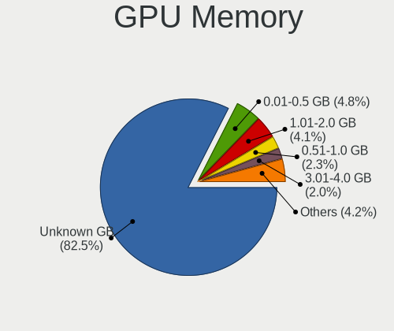

Ubuntu Hardware Trends
----------------------

A project to identify most popular hardware characteristics and track their change
over time based on data collected by Ubuntu users at https://Linux-Hardware.org.

Anyone can contribute to the study by uploading probes of their computers by
the [hw-probe](https://github.com/linuxhw/hw-probe) tool:

    sudo hw-probe -all -upload

This is a report for all computer types. See also reports for [desktops](/Dist/Ubuntu/Desktop/README.md) and [notebooks](/Dist/Ubuntu/Notebook/README.md).

Full-feature report is available here: https://linux-hardware.org/?view=trends

Period: Mar, 2020.

Contents
--------

- [ OS                       ](#os)
- [ OS Family                ](#os-family)
- [ Kernel                   ](#kernel)
- [ Kernel Family            ](#kernel-family)
- [ Kernel Major Ver.        ](#kernel-major-ver)
- [ Arch                     ](#arch)
- [ DE                       ](#de)
- [ Display Server           ](#display-server)
- [ OS Lang                  ](#os-lang)
- [ Boot Mode                ](#boot-mode)
- [ Filesystem               ](#filesystem)
- [ Dual Boot with Linux     ](#dual-boot-with-linux)
- [ Dual Boot (Win)          ](#dual-boot-win)
- [ Country                  ](#country)
- [ City                     ](#city)
- [ Vendor                   ](#vendor)
- [ Model                    ](#model)
- [ Model Family             ](#model-family)
- [ MFG Year                 ](#mfg-year)
- [ Form Factor              ](#form-factor)
- [ Secure Boot              ](#secure-boot)
- [ Coreboot                 ](#coreboot)
- [ RAM Size                 ](#ram-size)
- [ RAM Used                 ](#ram-used)
- [ Drive Vendor             ](#drive-vendor)
- [ Drive Model              ](#drive-model)
- [ Drive Kind               ](#drive-kind)
- [ Drive Connector          ](#drive-connector)
- [ Drive Size               ](#drive-size)
- [ Space Total              ](#space-total)
- [ Space Used               ](#space-used)
- [ Malfunc. Drives          ](#malfunc-drives)
- [ Malfunc. Drive Vendor    ](#malfunc-drive-vendor)
- [ Malfunc. Drive Kind      ](#malfunc-drive-kind)
- [ Failed Drives            ](#failed-drives)
- [ Failed Drive Vendor      ](#failed-drive-vendor)
- [ Drive Status             ](#drive-status)
- [ Storage Vendor           ](#storage-vendor)
- [ Storage Model            ](#storage-model)
- [ Storage Kind             ](#storage-kind)
- [ CPU Vendor               ](#cpu-vendor)
- [ CPU Model                ](#cpu-model)
- [ CPU Model Family         ](#cpu-model-family)
- [ CPU Cores                ](#cpu-cores)
- [ CPU Sockets              ](#cpu-sockets)
- [ CPU Threads              ](#cpu-threads)
- [ CPU Op-Modes             ](#cpu-op-modes)
- [ CPU Microarch            ](#cpu-microarch)
- [ CPU Microcode            ](#cpu-microcode)
- [ GPU Vendor               ](#gpu-vendor)
- [ GPU Model                ](#gpu-model)
- [ GPU Combo                ](#gpu-combo)
- [ GPU Driver               ](#gpu-driver)
- [ GPU Memory               ](#gpu-memory)
- [ Monitor Vendor           ](#monitor-vendor)
- [ Monitor Model            ](#monitor-model)
- [ Monitor Resolution       ](#monitor-resolution)
- [ Monitor Diagonal         ](#monitor-diagonal)
- [ Monitor Width            ](#monitor-width)
- [ Aspect Ratio             ](#aspect-ratio)
- [ Monitor Area             ](#monitor-area)
- [ Pixel Density            ](#pixel-density)
- [ Multiple Monitors        ](#multiple-monitors)
- [ Net Controller Vendor    ](#net-controller-vendor)
- [ Net Controller Model     ](#net-controller-model)
- [ Net Controller Kind      ](#net-controller-kind)
- [ Used Controller          ](#used-controller)
- [ NICs                     ](#nics)
- [ Unsupported Devices      ](#unsupported-devices)
- [ Unsupported Device Types ](#unsupported-device-types)

OS
--

Installed operating systems

| Name           | Computers | Percent |
|----------------|-----------|---------|
| Ubuntu 18.04   | 1062      | 60.2%   |
| Ubuntu 19.10   | 524       | 29.71%  |
| Ubuntu 16.04   | 71        | 4.02%   |
| Ubuntu 20.04   | 56        | 3.17%   |
| Ubuntu 19.04   | 36        | 2.04%   |
| Ubuntu         | 6         | 0.34%   |
| Ubuntu 18.10   | 5         | 0.28%   |
| Ubuntu 17.10   | 2         | 0.11%   |
| Ubuntu Core 16 | 1         | 0.06%   |
| Ubuntu 17.04   | 1         | 0.06%   |

OS Family
---------

OS without a version

| Name   | Computers | Percent |
|--------|-----------|---------|
| Ubuntu | 1764      | 100%    |

Kernel
------

Version of the Linux kernel

| Version                  | Computers | Percent |
|--------------------------|-----------|---------|
| 5.3.0-40-generic         | 498       | 28.23%  |
| 5.3.0-42-generic         | 477       | 27.04%  |
| 4.15.0-91-generic        | 145       | 8.22%   |
| 4.15.0-88-generic        | 131       | 7.43%   |
| 5.3.0-28-generic         | 99        | 5.61%   |
| 5.3.0-18-generic         | 49        | 2.78%   |
| 5.4.0-18-generic         | 25        | 1.42%   |
| 5.0.0-38-generic         | 23        | 1.3%    |
| 5.0.0-23-generic         | 23        | 1.3%    |
| 5.3.0-45-generic         | 22        | 1.25%   |
| 5.4.0-14-generic         | 20        | 1.13%   |
| 5.3.0-43-generic         | 16        | 0.91%   |
| 5.3.0-42-lowlatency      | 13        | 0.74%   |
| 5.3.0-40-lowlatency      | 12        | 0.68%   |
| 4.4.0-176-generic        | 8         | 0.45%   |
| 5.0.0-37-generic         | 7         | 0.4%    |
| 4.4.0-174-generic        | 7         | 0.4%    |
| 4.15.0-92-generic        | 7         | 0.4%    |
| 4.15.0-88-lowlatency     | 7         | 0.4%    |
| 4.15.0-29-generic        | 7         | 0.4%    |
| 4.15.0-45-generic        | 6         | 0.34%   |
| 5.3.0-41-generic         | 5         | 0.28%   |
| 4.18.0-15-generic        | 5         | 0.28%   |
| 4.15.0-76-generic        | 5         | 0.28%   |
| 4.15.0-20-generic        | 5         | 0.28%   |
| 5.3.0-29-generic         | 4         | 0.23%   |
| 5.0.0-1043-oem-osp1      | 4         | 0.23%   |
| 5.5.8-050508-generic     | 3         | 0.17%   |
| 5.4.0-20-generic         | 3         | 0.17%   |
| 5.3.0-26-generic         | 3         | 0.17%   |
| 5.3.0-050300-generic     | 3         | 0.17%   |
| 5.0.0-38-lowlatency      | 3         | 0.17%   |
| 5.0.0-32-generic         | 3         | 0.17%   |
| 5.0.0-31-generic         | 3         | 0.17%   |
| 5.0.0-13-generic         | 3         | 0.17%   |
| 4.18.0-25-generic        | 3         | 0.17%   |
| 4.15.0-91-lowlatency     | 3         | 0.17%   |
| 4.15.0-74-generic        | 3         | 0.17%   |
| 4.15.0-72-generic        | 3         | 0.17%   |
| 4.15.0-1076-oem          | 3         | 0.17%   |
| 5.5.9-050509-generic     | 2         | 0.11%   |
| 5.5.7-050507-generic     | 2         | 0.11%   |
| 5.5.13-050513-lowlatency | 2         | 0.11%   |
| 5.5.13-050513-generic    | 2         | 0.11%   |
| 5.3.0-18-lowlatency      | 2         | 0.11%   |
| 5.3.0-1019-raspi2        | 2         | 0.11%   |
| 5.0.21-050021-generic    | 2         | 0.11%   |
| 5.0.0-36-generic         | 2         | 0.11%   |
| 4.9.140-tegra            | 2         | 0.11%   |
| 4.15.0-94-generic        | 2         | 0.11%   |
| 4.15.0-70-generic        | 2         | 0.11%   |
| 4.15.0-65-generic        | 2         | 0.11%   |
| 4.15.0-62-generic        | 2         | 0.11%   |
| 4.13.0-46-generic        | 2         | 0.11%   |
| 5.6.0-050600rc7-generic  | 1         | 0.06%   |
| 5.6.0-050600rc6-generic  | 1         | 0.06%   |
| 5.6.0-050600rc5-generic  | 1         | 0.06%   |
| 5.5.9-050509-lowlatency  | 1         | 0.06%   |
| 5.5.5-050505-generic     | 1         | 0.06%   |
| 5.5.2-050502-generic     | 1         | 0.06%   |

Kernel Family
-------------

Linux kernel without a distro release

| Version | Computers | Percent |
|---------|-----------|---------|
| 5.3.0   | 1213      | 68.76%  |
| 4.15.0  | 353       | 20.01%  |
| 5.0.0   | 75        | 4.25%   |
| 5.4.0   | 52        | 2.95%   |
| 4.4.0   | 21        | 1.19%   |
| 4.18.0  | 12        | 0.68%   |
| 5.5.13  | 4         | 0.23%   |
| 5.6.0   | 3         | 0.17%   |
| 5.5.9   | 3         | 0.17%   |
| 5.5.8   | 3         | 0.17%   |
| 4.13.0  | 3         | 0.17%   |
| 4.10.0  | 3         | 0.17%   |
| 5.5.7   | 2         | 0.11%   |
| 5.4.24  | 2         | 0.11%   |
| 5.0.21  | 2         | 0.11%   |
| 4.9.140 | 2         | 0.11%   |
| 5.5.5   | 1         | 0.06%   |
| 5.5.2   | 1         | 0.06%   |
| 5.5.11  | 1         | 0.06%   |
| 5.4.6   | 1         | 0.06%   |
| 5.4.25  | 1         | 0.06%   |
| 5.4.10  | 1         | 0.06%   |
| 5.1.0   | 1         | 0.06%   |
| 4.20.0  | 1         | 0.06%   |
| 4.19.97 | 1         | 0.06%   |
| 4.19.88 | 1         | 0.06%   |
| 4.18.6  | 1         | 0.06%   |

Kernel Major Ver.
-----------------

Linux kernel major version

| Version | Computers | Percent |
|---------|-----------|---------|
| 5.3     | 1213      | 68.76%  |
| 4.15    | 353       | 20.01%  |
| 5.0     | 77        | 4.37%   |
| 5.4     | 57        | 3.23%   |
| 4.4     | 21        | 1.19%   |
| 5.5     | 15        | 0.85%   |
| 4.18    | 13        | 0.74%   |
| 5.6     | 3         | 0.17%   |
| 4.13    | 3         | 0.17%   |
| 4.10    | 3         | 0.17%   |
| 4.9     | 2         | 0.11%   |
| 4.19    | 2         | 0.11%   |
| 5.1     | 1         | 0.06%   |
| 4.20    | 1         | 0.06%   |

Arch
----

OS architecture (x86_64, i586, etc.)

| Name    | Computers | Percent |
|---------|-----------|---------|
| x86_64  | 1647      | 93.37%  |
| i686    | 109       | 6.18%   |
| aarch64 | 5         | 0.28%   |
| armv7l  | 3         | 0.17%   |

DE
--

Desktop Environment

| Name            | Computers | Percent |
|-----------------|-----------|---------|
| GNOME           | 1255      | 71.15%  |
| XFCE            | 151       | 8.56%   |
| Unknown         | 118       | 6.69%   |
| Unity           | 62        | 3.51%   |
| KDE             | 48        | 2.72%   |
| MATE            | 32        | 1.81%   |
| Budgie          | 21        | 1.19%   |
| LXQt            | 18        | 1.02%   |
| X-Cinnamon      | 15        | 0.85%   |
| LXDE            | 15        | 0.85%   |
| GNOME Flashback | 11        | 0.62%   |
| KDE5            | 10        | 0.57%   |
| Cinnamon        | 4         | 0.23%   |
| ubuntustudio    | 1         | 0.06%   |
| Lubuntu         | 1         | 0.06%   |
| GNUstep         | 1         | 0.06%   |
| Deepin          | 1         | 0.06%   |

Display Server
--------------

X11 or Wayland

| Name    | Computers | Percent |
|---------|-----------|---------|
| X11     | 1660      | 94.1%   |
| Unknown | 66        | 3.74%   |
| Wayland | 38        | 2.15%   |

OS Lang
-------

Language

| Lang    | Computers | Percent |
|---------|-----------|---------|
| en_US   | 593       | 33.62%  |
| de_DE   | 141       | 7.99%   |
| it_IT   | 115       | 6.52%   |
| pt_BR   | 104       | 5.9%    |
| en_GB   | 87        | 4.93%   |
| fr_FR   | 67        | 3.8%    |
| ru_RU   | 60        | 3.4%    |
| es_ES   | 53        | 3%      |
| C       | 52        | 2.95%   |
| en_CA   | 46        | 2.61%   |
| en_IN   | 45        | 2.55%   |
| en_AU   | 35        | 1.98%   |
| pl_PL   | 27        | 1.53%   |
| Unknown | 25        | 1.42%   |
| nl_NL   | 23        | 1.3%    |
| cs_CZ   | 22        | 1.25%   |
| es_MX   | 19        | 1.08%   |
| es_AR   | 18        | 1.02%   |
| pt_PT   | 14        | 0.79%   |
| tr_TR   | 13        | 0.74%   |
| hu_HU   | 13        | 0.74%   |
| en_ZA   | 11        | 0.62%   |
| el_GR   | 11        | 0.62%   |
| ru_UA   | 10        | 0.57%   |
| uk_UA   | 9         | 0.51%   |
| zh_CN   | 8         | 0.45%   |
| fi_FI   | 7         | 0.4%    |
| es_CO   | 7         | 0.4%    |
| de_CH   | 7         | 0.4%    |
| ca_ES   | 7         | 0.4%    |
| zh_TW   | 6         | 0.34%   |
| ko_KR   | 6         | 0.34%   |
| ja_JP   | 6         | 0.34%   |
| en_NZ   | 6         | 0.34%   |
| bg_BG   | 6         | 0.34%   |
| sv_SE   | 5         | 0.28%   |
| nl_BE   | 5         | 0.28%   |
| de_AT   | 5         | 0.28%   |
| sk_SK   | 4         | 0.23%   |
| lt_LT   | 4         | 0.23%   |
| fr_CH   | 4         | 0.23%   |
| es_PE   | 4         | 0.23%   |
| en_IL   | 4         | 0.23%   |
| en_IE   | 4         | 0.23%   |
| nb_NO   | 3         | 0.17%   |
| lv_LV   | 3         | 0.17%   |
| es_VE   | 3         | 0.17%   |
| en_PH   | 3         | 0.17%   |
| da_DK   | 3         | 0.17%   |
| sl_SI   | 2         | 0.11%   |
| ro_RO   | 2         | 0.11%   |
| hr_HR   | 2         | 0.11%   |
| fr_CA   | 2         | 0.11%   |
| fr_BE   | 2         | 0.11%   |
| fa_IR   | 2         | 0.11%   |
| es_CL   | 2         | 0.11%   |
| en_SG   | 2         | 0.11%   |
| zh_HK   | 1         | 0.06%   |
| tt_RU   | 1         | 0.06%   |
| sv_FI   | 1         | 0.06%   |

Boot Mode
---------

EFI or BIOS

| Mode | Computers | Percent |
|------|-----------|---------|
| BIOS | 1018      | 57.71%  |
| EFI  | 746       | 42.29%  |

Filesystem
----------

Type of filesystem

| Type    | Computers | Percent |
|---------|-----------|---------|
| Ext4    | 1662      | 94.22%  |
| Overlay | 67        | 3.8%    |
| Btrfs   | 14        | 0.79%   |
| Zfs     | 9         | 0.51%   |
| Xfs     | 5         | 0.28%   |
| Ext3    | 5         | 0.28%   |
| Ext2    | 2         | 0.11%   |

Dual Boot with Linux
--------------------

Hosting more than one Linux

| Dual boot | Computers | Percent |
|-----------|-----------|---------|
| No        | 1551      | 87.93%  |
| Yes       | 213       | 12.07%  |

Dual Boot (Win)
---------------

Hosting Linux and Windows

| Dual boot | Computers | Percent |
|-----------|-----------|---------|
| No        | 1097      | 62.19%  |
| Yes       | 667       | 37.81%  |

Country
-------

Geographic location (country)

| Country                   | Computers | Percent |
|---------------------------|-----------|---------|
| USA                       | 277       | 15.7%   |
| Germany                   | 175       | 9.92%   |
| Italy                     | 128       | 7.26%   |
| Brazil                    | 119       | 6.75%   |
| UK                        | 85        | 4.82%   |
| France                    | 69        | 3.91%   |
| Russia                    | 67        | 3.8%    |
| Canada                    | 60        | 3.4%    |
| Spain                     | 55        | 3.12%   |
| India                     | 49        | 2.78%   |
| Poland                    | 41        | 2.32%   |
| Australia                 | 39        | 2.21%   |
| Ukraine                   | 31        | 1.76%   |
| Netherlands               | 31        | 1.76%   |
| Belgium                   | 31        | 1.76%   |
| Mexico                    | 30        | 1.7%    |
| Czech Republic            | 28        | 1.59%   |
| Turkey                    | 24        | 1.36%   |
| Argentina                 | 23        | 1.3%    |
| Portugal                  | 21        | 1.19%   |
| Switzerland               | 19        | 1.08%   |
| Finland                   | 18        | 1.02%   |
| Hungary                   | 17        | 0.96%   |
| Greece                    | 17        | 0.96%   |
| Sweden                    | 15        | 0.85%   |
| Romania                   | 15        | 0.85%   |
| Bulgaria                  | 15        | 0.85%   |
| Colombia                  | 14        | 0.79%   |
| Iran                      | 13        | 0.74%   |
| Denmark                   | 12        | 0.68%   |
| Austria                   | 11        | 0.62%   |
| South Africa              | 10        | 0.57%   |
| Taiwan                    | 9         | 0.51%   |
| Norway                    | 9         | 0.51%   |
| Korea, Republic of        | 9         | 0.51%   |
| China                     | 9         | 0.51%   |
| Slovakia                  | 8         | 0.45%   |
| Israel                    | 8         | 0.45%   |
| Indonesia                 | 8         | 0.45%   |
| Serbia                    | 7         | 0.4%    |
| Peru                      | 6         | 0.34%   |
| New Zealand               | 6         | 0.34%   |
| Lithuania                 | 6         | 0.34%   |
| Japan                     | 6         | 0.34%   |
| Tunisia                   | 5         | 0.28%   |
| Singapore                 | 5         | 0.28%   |
| Latvia                    | 5         | 0.28%   |
| Ireland                   | 5         | 0.28%   |
| Egypt                     | 5         | 0.28%   |
| Venezuela                 | 4         | 0.23%   |
| Slovenia                  | 4         | 0.23%   |
| Puerto Rico               | 4         | 0.23%   |
| Philippines               | 4         | 0.23%   |
| Pakistan                  | 4         | 0.23%   |
| Dominican Republic        | 4         | 0.23%   |
| Croatia                   | 4         | 0.23%   |
| Vietnam                   | 3         | 0.17%   |
| Iran, Islamic Republic of | 3         | 0.17%   |
| Estonia                   | 3         | 0.17%   |
| Chile                     | 3         | 0.17%   |

City
----

Geographic location (city)

| City              | Computers | Percent |
|-------------------|-----------|---------|
| Moscow            | 18        | 1.02%   |
| Rome              | 16        | 0.91%   |
| Berlin            | 14        | 0.79%   |
| Athens            | 14        | 0.79%   |
| Warsaw            | 12        | 0.68%   |
| São Paulo        | 12        | 0.68%   |
| Prague            | 12        | 0.68%   |
| Milan             | 12        | 0.68%   |
| Barcelona         | 12        | 0.68%   |
| Istanbul          | 11        | 0.62%   |
| Bucharest         | 10        | 0.57%   |
| Brisbane          | 10        | 0.57%   |
| Paris             | 9         | 0.51%   |
| Mexico City       | 9         | 0.51%   |
| Vienna            | 8         | 0.45%   |
| Tehran            | 8         | 0.45%   |
| St Petersburg     | 8         | 0.45%   |
| Munich            | 8         | 0.45%   |
| Sydney            | 7         | 0.4%    |
| Curitiba          | 7         | 0.4%    |
| Sofia             | 6         | 0.34%   |
| Oshawa            | 6         | 0.34%   |
| Montreal          | 6         | 0.34%   |
| Miami             | 6         | 0.34%   |
| Kyiv              | 6         | 0.34%   |
| Houston           | 6         | 0.34%   |
| Budapest          | 6         | 0.34%   |
| Belgrade          | 6         | 0.34%   |
| Wrocław          | 5         | 0.28%   |
| Toronto           | 5         | 0.28%   |
| Stuttgart         | 5         | 0.28%   |
| Seattle           | 5         | 0.28%   |
| Rotterdam         | 5         | 0.28%   |
| New Delhi         | 5         | 0.28%   |
| Madrid            | 5         | 0.28%   |
| Lviv              | 5         | 0.28%   |
| Lisbon            | 5         | 0.28%   |
| Hyderabad         | 5         | 0.28%   |
| Helsinki          | 5         | 0.28%   |
| Hamburg           | 5         | 0.28%   |
| Garbsen           | 5         | 0.28%   |
| Frankfurt am Main | 5         | 0.28%   |
| Ernakulam         | 5         | 0.28%   |
| Chicago           | 5         | 0.28%   |
| Boom              | 5         | 0.28%   |
| Zurich            | 4         | 0.23%   |
| Vilnius           | 4         | 0.23%   |
| Vancouver         | 4         | 0.23%   |
| Taipei            | 4         | 0.23%   |
| Singapore         | 4         | 0.23%   |
| Santiago de Cali  | 4         | 0.23%   |
| Salt Lake City    | 4         | 0.23%   |
| Rio de Janeiro    | 4         | 0.23%   |
| Riga              | 4         | 0.23%   |
| Perth             | 4         | 0.23%   |
| Padova            | 4         | 0.23%   |
| Novosibirsk       | 4         | 0.23%   |
| Naples            | 4         | 0.23%   |
| Lyon              | 4         | 0.23%   |
| Los Angeles       | 4         | 0.23%   |

Vendor
------

Motherboard manufacturer

| Name                    | Computers | Percent |
|-------------------------|-----------|---------|
| Hewlett-Packard         | 298       | 16.89%  |
| ASUSTek Computer        | 291       | 16.5%   |
| Dell                    | 240       | 13.61%  |
| Lenovo                  | 188       | 10.66%  |
| Acer                    | 116       | 6.58%   |
| MSI                     | 102       | 5.78%   |
| Gigabyte Technology     | 102       | 5.78%   |
| ASRock                  | 58        | 3.29%   |
| Apple                   | 40        | 2.27%   |
| Toshiba                 | 35        | 1.98%   |
| Intel                   | 27        | 1.53%   |
| Unknown                 | 25        | 1.42%   |
| Samsung Electronics     | 18        | 1.02%   |
| Fujitsu                 | 17        | 0.96%   |
| Sony                    | 16        | 0.91%   |
| Packard Bell            | 13        | 0.74%   |
| Fujitsu Siemens         | 10        | 0.57%   |
| ECS                     | 9         | 0.51%   |
| Medion                  | 7         | 0.4%    |
| Foxconn                 | 7         | 0.4%    |
| Alienware               | 7         | 0.4%    |
| Positivo                | 6         | 0.34%   |
| Pegatron                | 6         | 0.34%   |
| HUAWEI                  | 6         | 0.34%   |
| Supermicro              | 5         | 0.28%   |
| Raspberry Pi Foundation | 5         | 0.28%   |
| Gateway                 | 5         | 0.28%   |
| Clevo                   | 5         | 0.28%   |
| Biostar                 | 4         | 0.23%   |
| ZOTAC                   | 3         | 0.17%   |
| Shuttle                 | 3         | 0.17%   |
| Microsoft               | 3         | 0.17%   |
| LG Electronics          | 3         | 0.17%   |
| AMI                     | 3         | 0.17%   |
| Timi                    | 2         | 0.11%   |
| Teclast                 | 2         | 0.11%   |
| System76                | 2         | 0.11%   |
| SLIMBOOK                | 2         | 0.11%   |
| PCWare                  | 2         | 0.11%   |
| PC Specialist           | 2         | 0.11%   |
| Nvidia                  | 2         | 0.11%   |
| Notebook                | 2         | 0.11%   |
| NEC Computers           | 2         | 0.11%   |
| Megaware                | 2         | 0.11%   |
| Linx                    | 2         | 0.11%   |
| IBM                     | 2         | 0.11%   |
| Hometech                | 2         | 0.11%   |
| HCL Infosystems Limited | 2         | 0.11%   |
| Google                  | 2         | 0.11%   |
| Chuwi                   | 2         | 0.11%   |
| Zoostorm                | 1         | 0.06%   |
| VS Company              | 1         | 0.06%   |
| VIT                     | 1         | 0.06%   |
| TrekStor                | 1         | 0.06%   |
| Thomson                 | 1         | 0.06%   |
| TECH PAD                | 1         | 0.06%   |
| Standard                | 1         | 0.06%   |
| Semp Toshiba            | 1         | 0.06%   |
| Purism                  | 1         | 0.06%   |
| Philco                  | 1         | 0.06%   |

Model
-----

Motherboard model

| Name                                  | Computers | Percent |
|---------------------------------------|-----------|---------|
| Unknown                               | 31        | 1.76%   |
| ASUS All Series                       | 14        | 0.79%   |
| HP Pavilion dv6                       | 11        | 0.62%   |
| Dell G3 3590                          | 8         | 0.45%   |
| HP Notebook                           | 6         | 0.34%   |
| MSI MS-7A38                           | 5         | 0.28%   |
| HP Pavilion g6                        | 5         | 0.28%   |
| HP Pavilion dv7                       | 5         | 0.28%   |
| Dell OptiPlex 7010                    | 5         | 0.28%   |
| Dell Latitude E6420                   | 5         | 0.28%   |
| ASUS M5A78L-M/USB3                    | 5         | 0.28%   |
| RPi Raspberry Pi 4 Model B Rev 1.1    | 4         | 0.23%   |
| HP Pavilion Notebook                  | 4         | 0.23%   |
| HP Pavilion Gaming Laptop 15-cx0xxx   | 4         | 0.23%   |
| HP Laptop 15-db0xxx                   | 4         | 0.23%   |
| HP Laptop 15-da0xxx                   | 4         | 0.23%   |
| HP Laptop 15-bw0xx                    | 4         | 0.23%   |
| HP Laptop 15-bs1xx                    | 4         | 0.23%   |
| HP EliteBook 840 G6                   | 4         | 0.23%   |
| HP Compaq Presario CQ60               | 4         | 0.23%   |
| HP Compaq Elite 8300 SFF              | 4         | 0.23%   |
| Gigabyte G31M-ES2L                    | 4         | 0.23%   |
| Gigabyte B450 I AORUS PRO WIFI        | 4         | 0.23%   |
| Dell XPS 13 9380                      | 4         | 0.23%   |
| Dell OptiPlex GX620                   | 4         | 0.23%   |
| Dell OptiPlex 9020                    | 4         | 0.23%   |
| Dell Latitude E6230                   | 4         | 0.23%   |
| Dell Inspiron 1545                    | 4         | 0.23%   |
| Apple MacBookPro8,1                   | 4         | 0.23%   |
| Toshiba Satellite C660                | 3         | 0.17%   |
| MSI MS-7C37                           | 3         | 0.17%   |
| MSI MS-7C02                           | 3         | 0.17%   |
| MSI MS-7B86                           | 3         | 0.17%   |
| MSI MS-7A74                           | 3         | 0.17%   |
| MSI MS-7817                           | 3         | 0.17%   |
| MSI MS-7721                           | 3         | 0.17%   |
| MSI MS-7693                           | 3         | 0.17%   |
| Lenovo ThinkBook 13s-IWL 20R9         | 3         | 0.17%   |
| Lenovo MIIX 320-10ICR 80XF            | 3         | 0.17%   |
| HP Pavilion x360 Convertible 14-ba0xx | 3         | 0.17%   |
| HP Pavilion g4                        | 3         | 0.17%   |
| HP Laptop 15-bs0xx                    | 3         | 0.17%   |
| HP EliteBook 840 G5                   | 3         | 0.17%   |
| HP Compaq CQ58                        | 3         | 0.17%   |
| HP 250 G7 Notebook PC                 | 3         | 0.17%   |
| HP 2000                               | 3         | 0.17%   |
| HP 15                                 | 3         | 0.17%   |
| Gigabyte B450M DS3H                   | 3         | 0.17%   |
| Gigabyte 970A-DS3P                    | 3         | 0.17%   |
| Dell PowerEdge T30                    | 3         | 0.17%   |
| Dell OptiPlex 3020                    | 3         | 0.17%   |
| Dell Latitude E6410                   | 3         | 0.17%   |
| Dell Latitude D630                    | 3         | 0.17%   |
| Dell Inspiron 5559                    | 3         | 0.17%   |
| Dell Inspiron 3543                    | 3         | 0.17%   |
| Dell Inspiron 3521                    | 3         | 0.17%   |
| Dell Inspiron 15-3567                 | 3         | 0.17%   |
| ASUS X200MA                           | 3         | 0.17%   |
| ASUS ROG CROSSHAIR VII HERO           | 3         | 0.17%   |
| ASUS P5G41T-M LX                      | 3         | 0.17%   |

Model Family
------------

Motherboard model prefix

| Name                        | Computers | Percent |
|-----------------------------|-----------|---------|
| Acer Aspire                 | 88        | 4.99%   |
| Dell Inspiron               | 72        | 4.08%   |
| HP Pavilion                 | 69        | 3.91%   |
| Lenovo ThinkPad             | 67        | 3.8%    |
| Dell Latitude               | 49        | 2.78%   |
| Lenovo IdeaPad              | 46        | 2.61%   |
| HP Compaq                   | 35        | 1.98%   |
| HP Laptop                   | 33        | 1.87%   |
| Toshiba Satellite           | 32        | 1.81%   |
| HP EliteBook                | 31        | 1.76%   |
| Unknown                     | 31        | 1.76%   |
| Dell OptiPlex               | 30        | 1.7%    |
| HP ProBook                  | 27        | 1.53%   |
| Dell XPS                    | 24        | 1.36%   |
| ASUS ROG                    | 20        | 1.13%   |
| Dell Precision              | 17        | 0.96%   |
| Dell Vostro                 | 15        | 0.85%   |
| ASUS PRIME                  | 14        | 0.79%   |
| ASUS All                    | 14        | 0.79%   |
| Lenovo Yoga                 | 11        | 0.62%   |
| Lenovo ThinkCentre          | 11        | 0.62%   |
| HP ENVY                     | 11        | 0.62%   |
| ASUS TUF                    | 11        | 0.62%   |
| Dell G3                     | 10        | 0.57%   |
| Fujitsu ESPRIMO             | 9         | 0.51%   |
| Dell Studio                 | 9         | 0.51%   |
| HP 250                      | 8         | 0.45%   |
| Fujitsu LIFEBOOK            | 8         | 0.45%   |
| HP ZBook                    | 7         | 0.4%    |
| HP ProLiant                 | 7         | 0.4%    |
| Dell PowerEdge              | 7         | 0.4%    |
| ASUS M5A78L-M               | 7         | 0.4%    |
| Acer Extensa                | 7         | 0.4%    |
| Packard Bell EasyNote       | 6         | 0.34%   |
| Lenovo ThinkBook            | 6         | 0.34%   |
| HP Notebook                 | 6         | 0.34%   |
| Gigabyte B450               | 6         | 0.34%   |
| Fujitsu Siemens ESPRIMO     | 6         | 0.34%   |
| ASUS VivoBook               | 6         | 0.34%   |
| ASUS P8H61-M                | 6         | 0.34%   |
| Acer Swift                  | 6         | 0.34%   |
| RPi Raspberry               | 5         | 0.28%   |
| Packard Bell imedia         | 5         | 0.28%   |
| MSI MS-7A38                 | 5         | 0.28%   |
| Apple MacBookPro8           | 5         | 0.28%   |
| Acer TravelMate             | 5         | 0.28%   |
| Samsung Electronics 300E5EV | 4         | 0.23%   |
| Lenovo MIIX                 | 4         | 0.23%   |
| HP Stream                   | 4         | 0.23%   |
| HP Spectre                  | 4         | 0.23%   |
| HP Presario                 | 4         | 0.23%   |
| HP EliteDesk                | 4         | 0.23%   |
| HP 255                      | 4         | 0.23%   |
| Gigabyte Z390               | 4         | 0.23%   |
| Gigabyte X570               | 4         | 0.23%   |
| Gigabyte G31M-ES2L          | 4         | 0.23%   |
| Gigabyte B450M              | 4         | 0.23%   |
| ASUS P8Z77-V                | 4         | 0.23%   |
| ASUS P5G41T-M               | 4         | 0.23%   |
| ASUS M4A87TD                | 4         | 0.23%   |

MFG Year
--------

Motherboard manufacture year

| Year    | Computers | Percent |
|---------|-----------|---------|
| 2019    | 368       | 20.86%  |
| 2018    | 174       | 9.86%   |
| 2011    | 136       | 7.71%   |
| 2012    | 129       | 7.31%   |
| 2013    | 119       | 6.75%   |
| 2010    | 118       | 6.69%   |
| 2014    | 113       | 6.41%   |
| 2015    | 102       | 5.78%   |
| 2009    | 102       | 5.78%   |
| 2017    | 99        | 5.61%   |
| 2008    | 86        | 4.88%   |
| 2016    | 82        | 4.65%   |
| 2007    | 53        | 3%      |
| 2020    | 27        | 1.53%   |
| 2006    | 23        | 1.3%    |
| 2005    | 20        | 1.13%   |
| Unknown | 9         | 0.51%   |
| 2004    | 3         | 0.17%   |
| 2003    | 1         | 0.06%   |

Form Factor
-----------

Physical design of the computer

| Name           | Computers | Percent |
|----------------|-----------|---------|
| Notebook       | 997       | 56.52%  |
| Desktop        | 655       | 37.13%  |
| Convertible    | 28        | 1.59%   |
| Mini pc        | 20        | 1.13%   |
| All in one     | 20        | 1.13%   |
| Tablet         | 18        | 1.02%   |
| Server         | 17        | 0.96%   |
| System on chip | 8         | 0.45%   |
| Other          | 1         | 0.06%   |

Secure Boot
-----------

Enabled or disabled

| State    | Computers | Percent |
|----------|-----------|---------|
| Disabled | 1596      | 90.48%  |
| Enabled  | 168       | 9.52%   |

Coreboot
--------

Have coreboot on board

| Used | Computers | Percent |
|------|-----------|---------|
| No   | 1760      | 99.77%  |
| Yes  | 4         | 0.23%   |

RAM Size
--------

Total RAM memory

| Size in GB      | Computers | Percent |
|-----------------|-----------|---------|
| 3.01-4.0        | 477       | 27.04%  |
| 4.01-8.0        | 355       | 20.12%  |
| 16.01-24.0      | 296       | 16.78%  |
| 8.01-16.0       | 286       | 16.21%  |
| 1.01-2.0        | 149       | 8.45%   |
| 32.01-64.0      | 90        | 5.1%    |
| 2.01-3.0        | 39        | 2.21%   |
| 0.01-1.0        | 28        | 1.59%   |
| 24.01-32.0      | 22        | 1.25%   |
| 64.01-256.0     | 21        | 1.19%   |
| More than 256.0 | 1         | 0.06%   |

RAM Used
--------

Used RAM memory

| Used GB    | Computers | Percent |
|------------|-----------|---------|
| 1.01-2.0   | 814       | 46.15%  |
| 2.01-3.0   | 423       | 23.98%  |
| 3.01-4.0   | 173       | 9.81%   |
| 4.01-8.0   | 159       | 9.01%   |
| 0.01-1.0   | 147       | 8.33%   |
| 8.01-16.0  | 38        | 2.15%   |
| 16.01-24.0 | 6         | 0.34%   |
| 32.01-64.0 | 2         | 0.11%   |
| 24.01-32.0 | 2         | 0.11%   |

Drive Vendor
------------

Hard drive vendors

| Vendor              | Computers | Drives | Percent |
|---------------------|-----------|--------|---------|
| Seagate             | 439       | 505    | 20.84%  |
| WDC                 | 384       | 433    | 18.22%  |
| Samsung Electronics | 277       | 302    | 13.15%  |
| Toshiba             | 167       | 174    | 7.93%   |
| Hitachi             | 96        | 105    | 4.56%   |
| Unknown             | 95        | 110    | 4.51%   |
| Kingston            | 94        | 98     | 4.46%   |
| SanDisk             | 77        | 78     | 3.65%   |
| Crucial             | 67        | 72     | 3.18%   |
| HGST                | 64        | 64     | 3.04%   |
| Intel               | 28        | 29     | 1.33%   |
| A-DATA Technology   | 26        | 27     | 1.23%   |
| Maxtor              | 20        | 21     | 0.95%   |
| Fujitsu             | 17        | 17     | 0.81%   |
| SK Hynix            | 15        | 15     | 0.71%   |
| HL-DT-ST            | 15        | 11     | 0.71%   |
| SPCC                | 14        | 14     | 0.66%   |
| Micron Technology   | 14        | 14     | 0.66%   |
| Transcend           | 13        | 13     | 0.62%   |
| Apple               | 13        | 15     | 0.62%   |
| OCZ                 | 12        | 12     | 0.57%   |
| LITEON              | 12        | 12     | 0.57%   |
| Generic             | 12        | 12     | 0.57%   |
| China               | 10        | 10     | 0.47%   |
| Patriot             | 8         | 9      | 0.38%   |
| PLEXTOR             | 7         | 7      | 0.33%   |
| PNY                 | 6         | 7      | 0.28%   |
| LITEONIT            | 6         | 6      | 0.28%   |
| GOODRAM             | 6         | 6      | 0.28%   |
| Intenso             | 5         | 5      | 0.24%   |
| Corsair             | 5         | 6      | 0.24%   |
| Team                | 4         | 4      | 0.19%   |
| JMicron             | 4         | 4      | 0.19%   |
| USB                 | 3         | 3      | 0.14%   |
| TCSUNBOW            | 3         | 3      | 0.14%   |
| Lexar               | 3         | 3      | 0.14%   |
| KingSpec            | 3         | 3      | 0.14%   |
| Zheino              | 2         | 2      | 0.09%   |
| Phison              | 2         | 2      | 0.09%   |
| MEDIATEK            | 2         | 2      | 0.09%   |
| KingDian            | 2         | 2      | 0.09%   |
| Hewlett-Packard     | 2         | 3      | 0.09%   |
| FORESEE             | 2         | 2      | 0.09%   |
| DREVO               | 2         | 2      | 0.09%   |
| DOGFISH             | 2         | 2      | 0.09%   |
| ASMT                | 2         | 3      | 0.09%   |
| Apacer              | 2         | 2      | 0.09%   |
| WDC WD64            | 1         | 1      | 0.05%   |
| WDC WD30            | 1         | 1      | 0.05%   |
| WD MediaMax         | 1         | 1      | 0.05%   |
| Vi550               | 1         | 1      | 0.05%   |
| Union Memory        | 1         | 1      | 0.05%   |
| Teclast             | 1         | 1      | 0.05%   |
| STEC                | 1         | 1      | 0.05%   |
| SMI                 | 1         | 1      | 0.05%   |
| Silicon Motion      | 1         | 1      | 0.05%   |
| SATAFIRM            | 1         | 1      | 0.05%   |
| SABRENT             | 1         | 1      | 0.05%   |
| Ramsta              | 1         | 1      | 0.05%   |
| PIONEER             | 1         | 1      | 0.05%   |

Drive Model
-----------

Hard drive models

| Model                       | Computers | Percent |
|-----------------------------|-----------|---------|
| MMC Card  32GB              | 47        | 2.06%   |
| ST1000LM035-1RK172 1TB      | 35        | 1.54%   |
| MMC Card  64GB              | 23        | 1.01%   |
| MQ01ABF050 500GB            | 22        | 0.97%   |
| SSD 850 EVO 250GB           | 21        | 0.92%   |
| SA400S37240G 240GB SSD      | 21        | 0.92%   |
| ST9500325AS 500GB           | 20        | 0.88%   |
| ST500DM002-1BD142 500GB     | 20        | 0.88%   |
| ST1000LM024 HN-M101MBB 1TB  | 20        | 0.88%   |
| SA400S37120G 120GB SSD      | 19        | 0.83%   |
| HTS721010A9E630 1TB         | 18        | 0.79%   |
| WD10EZEX-08WN4A0 1TB        | 17        | 0.75%   |
| DT01ACA100 1TB              | 16        | 0.7%    |
| SSD 850 EVO 500GB           | 15        | 0.66%   |
| MQ04ABF100 1TB              | 15        | 0.66%   |
| MQ01ABD100 1TB              | 15        | 0.66%   |
| ST500LT012-1DG142 500GB     | 14        | 0.61%   |
| ST1000DM003-1CH162 1TB      | 14        | 0.61%   |
| SV300S37A120G 120GB SSD     | 12        | 0.53%   |
| ST31000528AS 1TB            | 12        | 0.53%   |
| ST1000DM010-2EP102 1TB      | 12        | 0.53%   |
| SD/MMC/MS PRO 16GB          | 12        | 0.53%   |
| MMC Card  16GB              | 12        | 0.53%   |
| HTS545050A7E680 500GB       | 12        | 0.53%   |
| SSD 860 EVO 500GB           | 11        | 0.48%   |
| SSD 860 EVO 250GB           | 11        | 0.48%   |
| SSD 860 EVO 1TB             | 11        | 0.48%   |
| HTS541010A9E680 1TB         | 11        | 0.48%   |
| DVDRAM GUE1N 3GB            | 11        | 0.48%   |
| SDSSDA240G 240GB            | 10        | 0.44%   |
| CT500MX500SSD1 500GB        | 10        | 0.44%   |
| ST500LT012-9WS142 500GB     | 9         | 0.4%    |
| ST2000DM006-2DM164 2TB      | 9         | 0.4%    |
| ST1000LX015-1U7172 1TB      | 9         | 0.4%    |
| SA400S37480G 480GB SSD      | 9         | 0.4%    |
| HD502HJ 500GB               | 9         | 0.4%    |
| CT240BX500SSD1 240GB        | 9         | 0.4%    |
| WD10JPVX-22JC3T0 1TB        | 8         | 0.35%   |
| ST2000DM008-2FR102 2TB      | 8         | 0.35%   |
| ST2000DM001-1ER164 2TB      | 8         | 0.35%   |
| SSD 840 EVO 250GB           | 8         | 0.35%   |
| Expansion 1TB               | 8         | 0.35%   |
| WD20EZRZ-00Z5HB0 2TB        | 7         | 0.31%   |
| WD1600BEVT-22ZCT0 160GB     | 7         | 0.31%   |
| TR200 240GB SSD             | 7         | 0.31%   |
| ST9500420AS 500GB           | 7         | 0.31%   |
| ST500LM012 HN-M500MBB 500GB | 7         | 0.31%   |
| ST3500418AS 500GB           | 7         | 0.31%   |
| ST2000LM007-1R8174 2TB      | 7         | 0.31%   |
| SSD 850 PRO 256GB           | 7         | 0.31%   |
| HTS725050A7E630 500GB       | 7         | 0.31%   |
| HTS542516K9SA00 160GB       | 7         | 0.31%   |
| HD103SJ 1TB                 | 7         | 0.31%   |
| WD5000LPVX-22V0TT0 500GB    | 6         | 0.26%   |
| WD20EFRX-68EUZN0 2TB        | 6         | 0.26%   |
| WD10EZEX-00BN5A0 1TB        | 6         | 0.26%   |
| ST9250315AS 250GB           | 6         | 0.26%   |
| SSD PLUS 480GB              | 6         | 0.26%   |
| SSD 860 QVO 1TB             | 6         | 0.26%   |
| SSD 850 PRO 512GB           | 6         | 0.26%   |

Drive Kind
----------

HDD or SSD

| Kind    | Computers | Drives | Percent |
|---------|-----------|--------|---------|
| HDD     | 1094      | 1348   | 56.3%   |
| SSD     | 648       | 728    | 33.35%  |
| MMC     | 85        | 100    | 4.37%   |
| Unknown | 73        | 74     | 3.76%   |
| NVMe    | 43        | 45     | 2.21%   |

Drive Connector
---------------

SATA, SAS, NVMe, etc.

| Type | Computers | Drives | Percent |
|------|-----------|--------|---------|
| SATA | 1501      | 2053   | 87.47%  |
| SAS  | 87        | 97     | 5.07%   |
| MMC  | 85        | 100    | 4.95%   |
| NVMe | 43        | 45     | 2.51%   |

Drive Size
----------

Size of hard drive

| Size in TB | Computers | Drives | Percent |
|------------|-----------|--------|---------|
| 0.01-0.5   | 1231      | 1509   | 63.88%  |
| 0.51-1.0   | 525       | 580    | 27.24%  |
| 1.01-2.0   | 107       | 120    | 5.55%   |
| 3.01-4.0   | 29        | 34     | 1.5%    |
| 2.01-3.0   | 21        | 32     | 1.09%   |
| 4.01-10.0  | 12        | 17     | 0.62%   |
| 10.01-20.0 | 1         | 2      | 0.05%   |
| Unknown    | 1         | 1      | 0.05%   |

Space Total
-----------

Amount of disk space available on the file system

| Size in GB     | Computers | Percent |
|----------------|-----------|---------|
| 101-250        | 525       | 29.76%  |
| 251-500        | 430       | 24.38%  |
| 501-1000       | 251       | 14.23%  |
| 51-100         | 161       | 9.13%   |
| 21-50          | 128       | 7.26%   |
| 1001-2000      | 102       | 5.78%   |
| 1-20           | 67        | 3.8%    |
| More than 3000 | 40        | 2.27%   |
| 2001-3000      | 37        | 2.1%    |
| Unknown        | 23        | 1.3%    |

Space Used
----------

Amount of used disk space

| Used GB        | Computers | Percent |
|----------------|-----------|---------|
| 1-20           | 868       | 49.21%  |
| 21-50          | 276       | 15.65%  |
| 101-250        | 195       | 11.05%  |
| 51-100         | 168       | 9.52%   |
| 251-500        | 90        | 5.1%    |
| 501-1000       | 74        | 4.2%    |
| 1001-2000      | 43        | 2.44%   |
| Unknown        | 23        | 1.3%    |
| More than 3000 | 16        | 0.91%   |
| 2001-3000      | 11        | 0.62%   |

Malfunc. Drives
---------------

Drive models with a malfunction

| Model                        | Computers | Drives | Percent |
|------------------------------|-----------|--------|---------|
| WD5000LPCX-24C6HT0 500GB     | 1         | 1      | 3.85%   |
| SX8200NP 240GB               | 1         | 1      | 3.85%   |
| ST9500420AS 500GB            | 1         | 1      | 3.85%   |
| ST500LM000-1EJ162 500GB      | 1         | 1      | 3.85%   |
| ST3250823AS 250GB            | 1         | 1      | 3.85%   |
| ST320LT007-9ZV142 320GB      | 1         | 1      | 3.85%   |
| ST3160023AS 160GB            | 1         | 1      | 3.85%   |
| ST31000524NS 1TB             | 1         | 1      | 3.85%   |
| SSDSC2CW060A3 64GB           | 1         | 1      | 3.85%   |
| SSD PLUS 120 GB              | 1         | 1      | 3.85%   |
| SP900 128GB SSD              | 1         | 1      | 3.85%   |
| SKC300S37A60G 64GB SSD       | 1         | 1      | 3.85%   |
| SA400S37120G 120GB SSD       | 1         | 1      | 3.85%   |
| MZ7PD256HCGM-000H7 256GB SSD | 1         | 1      | 3.85%   |
| MTFDDAK256MAM-1K12 256GB SSD | 1         | 1      | 3.85%   |
| MK3261GSYN 320GB             | 1         | 1      | 3.85%   |
| HTS727550A9E364 500GB        | 1         | 1      | 3.85%   |
| HTS725050A9A364 500GB        | 1         | 1      | 3.85%   |
| HTS721010A9E630 1TB          | 1         | 1      | 3.85%   |
| HTS547550A9E384 500GB        | 1         | 1      | 3.85%   |
| HTS545050B9A300 500GB        | 1         | 1      | 3.85%   |
| HTS542516K9SA00 160GB        | 1         | 1      | 3.85%   |
| HDS5C3030ALA630 3TB          | 1         | 1      | 3.85%   |
| HD161HJ 160GB                | 1         | 1      | 3.85%   |
| CT525MX300SSD1 528GB         | 1         | 1      | 3.85%   |
| CT500P1SSD8 500GB            | 1         | 1      | 3.85%   |

Malfunc. Drive Vendor
---------------------

Vendors of faulty drives

| Vendor              | Computers | Drives | Percent |
|---------------------|-----------|--------|---------|
| Seagate             | 6         | 6      | 23.08%  |
| Hitachi             | 6         | 6      | 23.08%  |
| Samsung Electronics | 2         | 2      | 7.69%   |
| Kingston            | 2         | 2      | 7.69%   |
| Crucial             | 2         | 2      | 7.69%   |
| A-DATA Technology   | 2         | 2      | 7.69%   |
| WDC                 | 1         | 1      | 3.85%   |
| Toshiba             | 1         | 1      | 3.85%   |
| SanDisk             | 1         | 1      | 3.85%   |
| Micron Technology   | 1         | 1      | 3.85%   |
| Intel               | 1         | 1      | 3.85%   |
| HGST                | 1         | 1      | 3.85%   |

Malfunc. Drive Kind
-------------------

Kinds of faulty drives

| Kind | Computers | Drives | Percent |
|------|-----------|--------|---------|
| HDD  | 16        | 16     | 61.54%  |
| SSD  | 8         | 8      | 30.77%  |
| NVMe | 2         | 2      | 7.69%   |

Failed Drives
-------------

Failed drive models

| Model                  | Computers | Drives | Percent |
|------------------------|-----------|--------|---------|
| ST9500420AS 500GB      | 1         | 1      | 50%     |
| MZVLB1T0HALR-00000 1TB | 1         | 2      | 50%     |

Failed Drive Vendor
-------------------

Failed drive vendors

| Vendor              | Computers | Drives | Percent |
|---------------------|-----------|--------|---------|
| Seagate             | 1         | 1      | 50%     |
| Samsung Electronics | 1         | 2      | 50%     |

Drive Status
------------

Number of failed and malfunc. drives

| Status   | Computers | Drives | Percent |
|----------|-----------|--------|---------|
| Detected | 1459      | 2080   | 89.67%  |
| Works    | 140       | 186    | 8.6%    |
| Malfunc  | 26        | 26     | 1.6%    |
| Failed   | 2         | 3      | 0.12%   |

Storage Vendor
--------------

Storage controller vendors

| Vendor                           | Computers | Percent |
|----------------------------------|-----------|---------|
| Intel                            | 1272      | 62.88%  |
| AMD                              | 280       | 13.84%  |
| Samsung Electronics              | 103       | 5.09%   |
| Nvidia                           | 55        | 2.72%   |
| JMicron Technology               | 43        | 2.13%   |
| Sandisk                          | 42        | 2.08%   |
| ASMedia Technology               | 32        | 1.58%   |
| Toshiba America Info Systems     | 27        | 1.33%   |
| Marvell Technology Group         | 23        | 1.14%   |
| VIA Technologies                 | 17        | 0.84%   |
| SK Hynix                         | 17        | 0.84%   |
| Phison Electronics               | 14        | 0.69%   |
| Silicon Motion                   | 13        | 0.64%   |
| Silicon Integrated Systems [SiS] | 13        | 0.64%   |
| Kingston Technology Company      | 9         | 0.44%   |
| ADATA Technology                 | 7         | 0.35%   |
| LSI Logic / Symbios Logic        | 6         | 0.3%    |
| Broadcom / LSI                   | 6         | 0.3%    |
| Hewlett-Packard                  | 5         | 0.25%   |
| Realtek Semiconductor            | 4         | 0.2%    |
| Micron/Crucial Technology        | 4         | 0.2%    |
| KIOXIA                           | 4         | 0.2%    |
| Union Memory (Shenzhen)          | 3         | 0.15%   |
| Silicon Image                    | 3         | 0.15%   |
| Micron Technology                | 3         | 0.15%   |
| Lite-On Technology               | 3         | 0.15%   |
| HighPoint Technologies           | 3         | 0.15%   |
| Adaptec                          | 3         | 0.15%   |
| Lite-On IT Corp. / Plextor       | 2         | 0.1%    |
| Apple                            | 2         | 0.1%    |
| ULi Electronics                  | 1         | 0.05%   |
| Seagate Technology               | 1         | 0.05%   |
| OCZ Technology Group             | 1         | 0.05%   |
| Lenovo                           | 1         | 0.05%   |
| Integrated Technology Express    | 1         | 0.05%   |

Storage Model
-------------

Storage controller models

| Model                                                                             | Computers | Percent |
|-----------------------------------------------------------------------------------|-----------|---------|
| FCH SATA Controller [AHCI mode]                                                   | 180       | 7.37%   |
| Sunrise Point-LP SATA Controller [AHCI mode]                                      | 95        | 3.89%   |
| 7 Series Chipset Family 6-port SATA Controller [AHCI mode]                        | 83        | 3.4%    |
| 6 Series/C200 Series Chipset Family 6 port Mobile SATA AHCI Controller            | 80        | 3.28%   |
| 82801 Mobile SATA Controller [RAID mode]                                          | 78        | 3.19%   |
| 8 Series/C220 Series Chipset Family 6-port SATA Controller 1 [AHCI mode]          | 77        | 3.15%   |
| NVMe SSD Controller SM981/PM981/PM983                                             | 69        | 2.83%   |
| Non-Volatile memory controller                                                    | 61        | 2.5%    |
| NM10/ICH7 Family SATA Controller [IDE mode]                                       | 57        | 2.33%   |
| SB7x0/SB8x0/SB9x0 IDE Controller                                                  | 52        | 2.13%   |
| 5 Series/3400 Series Chipset 4 port SATA AHCI Controller                          | 51        | 2.09%   |
| 82801IBM/IEM (ICH9M/ICH9M-E) 4 port SATA Controller [AHCI mode]                   | 50        | 2.05%   |
| 82801G (ICH7 Family) IDE Controller                                               | 47        | 1.92%   |
| SB7x0/SB8x0/SB9x0 SATA Controller [IDE mode]                                      | 44        | 1.8%    |
| Cannon Lake Mobile PCH SATA AHCI Controller                                       | 42        | 1.72%   |
| Q170/Q150/B150/H170/H110/Z170/CM236 Chipset SATA Controller [AHCI Mode]           | 40        | 1.64%   |
| 400 Series Chipset SATA Controller                                                | 39        | 1.6%    |
| 8 Series SATA Controller 1 [AHCI mode]                                            | 38        | 1.56%   |
| 7 Series/C210 Series Chipset Family 6-port SATA Controller [AHCI mode]            | 37        | 1.52%   |
| SB7x0/SB8x0/SB9x0 SATA Controller [AHCI mode]                                     | 35        | 1.43%   |
| SATA Controller [RAID mode]                                                       | 35        | 1.43%   |
| Wildcat Point-LP SATA Controller [AHCI Mode]                                      | 34        | 1.39%   |
| 82801HM/HEM (ICH8M/ICH8M-E) IDE Controller                                        | 33        | 1.35%   |
| 5 Series/3400 Series Chipset 6 port SATA AHCI Controller                          | 31        | 1.27%   |
| Atom Processor E3800 Series SATA AHCI Controller                                  | 28        | 1.15%   |
| ASM1062 Serial ATA Controller                                                     | 28        | 1.15%   |
| Cannon Lake PCH SATA AHCI Controller                                              | 27        | 1.11%   |
| 6 Series/C200 Series Chipset Family 6 port Desktop SATA AHCI Controller           | 27        | 1.11%   |
| JMB363 SATA/IDE Controller                                                        | 26        | 1.06%   |
| 82801HM/HEM (ICH8M/ICH8M-E) SATA Controller [AHCI mode]                           | 26        | 1.06%   |
| MCP61 SATA Controller                                                             | 25        | 1.02%   |
| 6 Series/C200 Series Chipset Family Desktop SATA Controller (IDE mode, ports 4-5) | 24        | 0.98%   |
| 6 Series/C200 Series Chipset Family Desktop SATA Controller (IDE mode, ports 0-3) | 24        | 0.98%   |
| MCP61 IDE                                                                         | 23        | 0.94%   |
| Cannon Point-LP SATA Controller [AHCI Mode]                                       | 21        | 0.86%   |
| Toshiba America Info Non-Volatile memory controller                               | 19        | 0.78%   |
| 200 Series PCH SATA controller [AHCI mode]                                        | 19        | 0.78%   |
| NVMe SSD Controller SM961/PM961                                                   | 18        | 0.74%   |
| 82801JI (ICH10 Family) 4 port SATA IDE Controller #1                              | 18        | 0.74%   |
| HM170/QM170 Chipset SATA Controller [AHCI Mode]                                   | 17        | 0.7%    |
| JMB368 IDE controller                                                             | 15        | 0.61%   |
| 82801JI (ICH10 Family) SATA AHCI Controller                                       | 15        | 0.61%   |
| 82801JI (ICH10 Family) 2 port SATA IDE Controller #2                              | 15        | 0.61%   |
| 82801GBM/GHM (ICH7-M Family) SATA Controller [IDE mode]                           | 15        | 0.61%   |
| SSD 660P Series                                                                   | 14        | 0.57%   |
| Atom/Celeron/Pentium Processor x5-E8000/J3xxx/N3xxx Series SATA Controller        | 14        | 0.57%   |
| 5 Series/3400 Series Chipset 4 port SATA IDE Controller                           | 14        | 0.57%   |
| 300 Series Chipset SATA Controller                                                | 14        | 0.57%   |
| WD Black 2018/PC SN720 NVMe SSD                                                   | 13        | 0.53%   |
| 5513 IDE Controller                                                               | 13        | 0.53%   |
| 5 Series/3400 Series Chipset 2 port SATA IDE Controller                           | 13        | 0.53%   |
| SATA controller                                                                   | 12        | 0.49%   |
| 82801I (ICH9 Family) 2 port SATA Controller [IDE mode]                            | 12        | 0.49%   |
| VT82C586A/B/VT82C686/A/B/VT823x/A/C PIPC Bus Master IDE                           | 11        | 0.45%   |
| MCP79 AHCI Controller                                                             | 11        | 0.45%   |
| Celeron N3350/Pentium N4200/Atom E3900 Series SATA AHCI Controller                | 11        | 0.45%   |
| BC501 NVMe Solid State Drive 512GB                                                | 11        | 0.45%   |
| 82801FB/FBM/FR/FW/FRW (ICH6 Family) IDE Controller                                | 11        | 0.45%   |
| Comet Lake SATA AHCI Controller                                                   | 10        | 0.41%   |
| WD Black 2018/PC SN520 NVMe SSD                                                   | 9         | 0.37%   |

Storage Kind
------------

Kind of storage controller (IDE, SATA, NVMe, SAS, ...)

| Kind | Computers | Percent |
|------|-----------|---------|
| SATA | 1233      | 59.48%  |
| IDE  | 414       | 19.97%  |
| NVMe | 275       | 13.27%  |
| RAID | 142       | 6.85%   |
| SAS  | 5         | 0.24%   |
| SCSI | 4         | 0.19%   |

CPU Vendor
----------

Processor vendors

| Vendor       | Computers | Percent |
|--------------|-----------|---------|
| Intel        | 1413      | 80.1%   |
| AMD          | 340       | 19.27%  |
| ARM          | 7         | 0.4%    |
| CentaurHauls | 3         | 0.17%   |
| unknown (4e) | 1         | 0.06%   |

CPU Model
---------

Processor models

| Model                                         | Computers | Percent |
|-----------------------------------------------|-----------|---------|
| Intel Core i7-8565U CPU @ 1.80GHz             | 28        | 1.59%   |
| Intel Core i5-7200U CPU @ 2.50GHz             | 26        | 1.47%   |
| Intel Core i7-9750H CPU @ 2.60GHz             | 25        | 1.42%   |
| Intel Core i5-8265U CPU @ 1.60GHz             | 22        | 1.25%   |
| Intel Core i5-8250U CPU @ 1.60GHz             | 22        | 1.25%   |
| Intel Atom x5-Z8350 CPU @ 1.44GHz             | 22        | 1.25%   |
| Intel Core i7-8550U CPU @ 1.80GHz             | 19        | 1.08%   |
| Intel Core i7-8750H CPU @ 2.20GHz             | 16        | 0.91%   |
| Intel Core i5-3470 CPU @ 3.20GHz              | 13        | 0.74%   |
| Intel Core i5-3210M CPU @ 2.50GHz             | 13        | 0.74%   |
| Intel Core i5-2410M CPU @ 2.30GHz             | 13        | 0.74%   |
| Intel Core i3 CPU M 330 @ 2.13GHz             | 13        | 0.74%   |
| Intel Core i7-7500U CPU @ 2.70GHz             | 12        | 0.68%   |
| Intel Core i7-3770 CPU @ 3.40GHz              | 12        | 0.68%   |
| Intel Core i7-2670QM CPU @ 2.20GHz            | 12        | 0.68%   |
| Intel Core i7-7700HQ CPU @ 2.80GHz            | 11        | 0.62%   |
| Intel Core i7-6500U CPU @ 2.50GHz             | 11        | 0.62%   |
| Intel Core i5-5200U CPU @ 2.20GHz             | 11        | 0.62%   |
| Intel Celeron CPU N2840 @ 2.16GHz             | 11        | 0.62%   |
| AMD FX-6300 Six-Core Processor                | 11        | 0.62%   |
| AMD Ryzen 7 2700X Eight-Core Processor        | 10        | 0.57%   |
| AMD Ryzen 5 3500U with Radeon Vega Mobile Gfx | 10        | 0.57%   |
| Intel Core i7-6700HQ CPU @ 2.60GHz            | 9         | 0.51%   |
| Intel Core i7-10510U CPU @ 1.80GHz            | 9         | 0.51%   |
| Intel Pentium 4 CPU 3.00GHz                   | 8         | 0.45%   |
| Intel Core i7-5500U CPU @ 2.40GHz             | 8         | 0.45%   |
| Intel Core i5-10210U CPU @ 1.60GHz            | 8         | 0.45%   |
| Intel Core i5 CPU 650 @ 3.20GHz               | 8         | 0.45%   |
| Intel Core i3-3110M CPU @ 2.40GHz             | 8         | 0.45%   |
| Intel Celeron CPU N3060 @ 1.60GHz             | 8         | 0.45%   |
| Intel Atom x5-Z8300 CPU @ 1.44GHz             | 8         | 0.45%   |
| Intel Core i7-6700K CPU @ 4.00GHz             | 7         | 0.4%    |
| Intel Core i7 CPU Q 720 @ 1.60GHz             | 7         | 0.4%    |
| Intel Core i5-2520M CPU @ 2.50GHz             | 7         | 0.4%    |
| Intel Core i3-2330M CPU @ 2.20GHz             | 7         | 0.4%    |
| Intel Core 2 Duo CPU T6600 @ 2.20GHz          | 7         | 0.4%    |
| Intel Core 2 Duo CPU E8400 @ 3.00GHz          | 7         | 0.4%    |
| Intel Celeron N4000 CPU @ 1.10GHz             | 7         | 0.4%    |
| Intel Celeron CPU N3050 @ 1.60GHz             | 7         | 0.4%    |
| AMD Ryzen 7 2700 Eight-Core Processor         | 7         | 0.4%    |
| AMD Ryzen 5 2600 Six-Core Processor           | 7         | 0.4%    |
| AMD Ryzen 5 1600 Six-Core Processor           | 7         | 0.4%    |
| Intel Pentium Dual-Core CPU E5300 @ 2.60GHz   | 6         | 0.34%   |
| Intel Pentium CPU P6200 @ 2.13GHz             | 6         | 0.34%   |
| Intel Core i7-4790K CPU @ 4.00GHz             | 6         | 0.34%   |
| Intel Core i7-2630QM CPU @ 2.00GHz            | 6         | 0.34%   |
| Intel Core i5-8400 CPU @ 2.80GHz              | 6         | 0.34%   |
| Intel Core i5-8365U CPU @ 1.60GHz             | 6         | 0.34%   |
| Intel Core i5-6400 CPU @ 2.70GHz              | 6         | 0.34%   |
| Intel Core i5-6200U CPU @ 2.30GHz             | 6         | 0.34%   |
| Intel Core i5-4570 CPU @ 3.20GHz              | 6         | 0.34%   |
| Intel Core i5-4210U CPU @ 1.70GHz             | 6         | 0.34%   |
| Intel Core i5-4200U CPU @ 1.60GHz             | 6         | 0.34%   |
| Intel Core i5-2430M CPU @ 2.40GHz             | 6         | 0.34%   |
| Intel Core i5-2400 CPU @ 3.10GHz              | 6         | 0.34%   |
| Intel Core i5 CPU M 430 @ 2.27GHz             | 6         | 0.34%   |
| Intel Core i3-3220 CPU @ 3.30GHz              | 6         | 0.34%   |
| Intel Core i3-3217U CPU @ 1.80GHz             | 6         | 0.34%   |
| Intel Core i3-3120M CPU @ 2.50GHz             | 6         | 0.34%   |
| Intel Core i3-2350M CPU @ 2.30GHz             | 6         | 0.34%   |

CPU Model Family
----------------

Processor model prefix

| Model                                | Computers | Percent |
|--------------------------------------|-----------|---------|
| Intel Core i5                        | 380       | 21.54%  |
| Intel Core i7                        | 357       | 20.24%  |
| Intel Core i3                        | 143       | 8.11%   |
| Intel Celeron                        | 108       | 6.12%   |
| Intel Core 2 Duo                     | 106       | 6.01%   |
| Intel Atom                           | 55        | 3.12%   |
| AMD Ryzen 5                          | 55        | 3.12%   |
| Intel Pentium                        | 54        | 3.06%   |
| Intel Xeon                           | 49        | 2.78%   |
| AMD Ryzen 7                          | 38        | 2.15%   |
| Intel Pentium Dual-Core              | 36        | 2.04%   |
| AMD FX                               | 28        | 1.59%   |
| Intel Core 2 Quad                    | 25        | 1.42%   |
| Intel Pentium 4                      | 20        | 1.13%   |
| Intel Core 2                         | 18        | 1.02%   |
| AMD Athlon 64 X2                     | 18        | 1.02%   |
| AMD A8                               | 18        | 1.02%   |
| AMD A6                               | 18        | 1.02%   |
| Intel Genuine                        | 16        | 0.91%   |
| Other                                | 15        | 0.85%   |
| Intel Pentium Dual                   | 14        | 0.79%   |
| AMD Ryzen 3                          | 14        | 0.79%   |
| AMD A10                              | 13        | 0.74%   |
| AMD Phenom II X4                     | 12        | 0.68%   |
| AMD Athlon II X2                     | 10        | 0.57%   |
| AMD A4                               | 10        | 0.57%   |
| AMD E1                               | 9         | 0.51%   |
| AMD E                                | 9         | 0.51%   |
| Intel Core i9                        | 8         | 0.45%   |
| AMD Phenom II X6                     | 7         | 0.4%    |
| Intel Celeron M                      | 6         | 0.34%   |
| AMD Ryzen 9                          | 5         | 0.28%   |
| AMD Athlon II X4                     | 5         | 0.28%   |
| AMD Athlon 64                        | 5         | 0.28%   |
| Intel Pentium D                      | 4         | 0.23%   |
| AMD Turion 64 X2 Mobile              | 4         | 0.23%   |
| AMD Ryzen Threadripper               | 4         | 0.23%   |
| AMD Phenom II X2                     | 4         | 0.23%   |
| AMD Phenom                           | 4         | 0.23%   |
| AMD Mobile Sempron                   | 4         | 0.23%   |
| AMD E2                               | 4         | 0.23%   |
| AMD Athlon                           | 4         | 0.23%   |
| Intel Pentium M                      | 3         | 0.17%   |
| Intel Core Duo                       | 3         | 0.17%   |
| Intel Celeron Dual-Core              | 3         | 0.17%   |
| AMD Turion 64 Mobile                 | 3         | 0.17%   |
| AMD Sempron                          | 3         | 0.17%   |
| AMD Athlon X2                        | 3         | 0.17%   |
| AMD Athlon II X3                     | 3         | 0.17%   |
| CentaurHauls VIA C7                  | 2         | 0.11%   |
| ARM BCM                              | 2         | 0.11%   |
| AMD Ryzen 3 PRO                      | 2         | 0.11%   |
| AMD Athlon II                        | 2         | 0.11%   |
| AMD Athlon Dual Core                 | 2         | 0.11%   |
| Intel Xeon Gold                      | 1         | 0.06%   |
| Intel Pentium Gold                   | 1         | 0.06%   |
| Intel Core m5                        | 1         | 0.06%   |
| Intel Core m3                        | 1         | 0.06%   |
| CentaurHauls VIA Eden                | 1         | 0.06%   |
| AMD Turion X2 Ultra Dual-Core Mobile | 1         | 0.06%   |

CPU Cores
---------

Number of processor cores

| Number | Computers | Percent |
|--------|-----------|---------|
| 2      | 850       | 48.19%  |
| 4      | 609       | 34.52%  |
| 6      | 123       | 6.97%   |
| 1      | 88        | 4.99%   |
| 8      | 55        | 3.12%   |
| 3      | 21        | 1.19%   |
| 12     | 9         | 0.51%   |
| 16     | 3         | 0.17%   |
| 24     | 2         | 0.11%   |
| 18     | 2         | 0.11%   |
| 32     | 1         | 0.06%   |
| 5      | 1         | 0.06%   |

CPU Sockets
-----------

Number of sockets

| Number | Computers | Percent |
|--------|-----------|---------|
| 1      | 1745      | 98.92%  |
| 2      | 19        | 1.08%   |

CPU Threads
-----------

Threads per core (Hyper-Threading)

| Number | Computers | Percent |
|--------|-----------|---------|
| 2      | 1005      | 56.97%  |
| 1      | 759       | 43.03%  |

CPU Op-Modes
------------

CPU Operation Modes (32-bit, 64-bit)

| Op mode        | Computers | Percent |
|----------------|-----------|---------|
| 32-bit, 64-bit | 1717      | 97.34%  |
| 32-bit         | 38        | 2.15%   |
| Unknown        | 9         | 0.51%   |

CPU Microarch
-------------

Microarchitecture

| Name            | Computers | Percent |
|-----------------|-----------|---------|
| Skylake         | 372       | 21.09%  |
| Core            | 213       | 12.07%  |
| IvyBridge       | 143       | 8.11%   |
| SandyBridge     | 141       | 7.99%   |
| Haswell         | 141       | 7.99%   |
| Westmere        | 94        | 5.33%   |
| Silvermont      | 88        | 4.99%   |
| Zen+            | 68        | 3.85%   |
| K10             | 54        | 3.06%   |
| Piledriver      | 45        | 2.55%   |
| K8 Hammer       | 40        | 2.27%   |
| Broadwell       | 36        | 2.04%   |
| KabyLake        | 35        | 1.98%   |
| Zen             | 32        | 1.81%   |
| Nehalem         | 32        | 1.81%   |
| NetBurst        | 27        | 1.53%   |
| P6              | 23        | 1.3%    |
| Excavator       | 23        | 1.3%    |
| Zen 2           | 20        | 1.13%   |
| Bonnell         | 17        | 0.96%   |
| Penryn          | 15        | 0.85%   |
| Goldmont plus   | 15        | 0.85%   |
| Bobcat          | 15        | 0.85%   |
| Unknown         | 13        | 0.74%   |
| Goldmont        | 11        | 0.62%   |
| K10 Llano       | 9         | 0.51%   |
| Puma            | 8         | 0.45%   |
| Icelake         | 8         | 0.45%   |
| K8 & K10 hybrid | 7         | 0.4%    |
| Bulldozer       | 7         | 0.4%    |
| Steamroller     | 6         | 0.34%   |
| Jaguar          | 6         | 0.34%   |

CPU Microcode
-------------

Microcode number

| Number     | Computers | Percent |
|------------|-----------|---------|
| Unknown    | 143       | 8.11%   |
| 0x206a7    | 135       | 7.65%   |
| 0x306a9    | 130       | 7.37%   |
| 0x1067a    | 115       | 6.52%   |
| 0x306c3    | 86        | 4.88%   |
| 0x906ea    | 69        | 3.91%   |
| 0x806ea    | 50        | 2.83%   |
| 0x806e9    | 49        | 2.78%   |
| 0x806ec    | 47        | 2.66%   |
| 0x20655    | 43        | 2.44%   |
| 0x506e3    | 41        | 2.32%   |
| 0x40651    | 40        | 2.27%   |
| 0x306d4    | 36        | 2.04%   |
| 0x906e9    | 35        | 1.98%   |
| 0x406c4    | 34        | 1.93%   |
| 0x20652    | 34        | 1.93%   |
| 0x6fd      | 33        | 1.87%   |
| 0x010000c8 | 32        | 1.81%   |
| 0x406e3    | 30        | 1.7%    |
| 0x806eb    | 28        | 1.59%   |
| 0x30678    | 28        | 1.59%   |
| 0x08108102 | 24        | 1.36%   |
| 0x106e5    | 23        | 1.3%    |
| 0x06001119 | 23        | 1.3%    |
| 0x6fb      | 21        | 1.19%   |
| 0x0800820d | 20        | 1.13%   |
| 0x06000852 | 20        | 1.13%   |
| 0x10676    | 19        | 1.08%   |
| 0x906ed    | 16        | 0.91%   |
| 0x706a1    | 15        | 0.85%   |
| 0x08701013 | 15        | 0.85%   |
| 0x406c3    | 14        | 0.79%   |
| 0x206c2    | 12        | 0.68%   |
| 0x06006705 | 12        | 0.68%   |
| 0x6f6      | 11        | 0.62%   |
| 0x08108109 | 11        | 0.62%   |
| 0x0810100b | 11        | 0.62%   |
| 0x05000119 | 11        | 0.62%   |
| 0xf43      | 9         | 0.51%   |
| 0x706e5    | 9         | 0.51%   |
| 0x6ec      | 9         | 0.51%   |
| 0x506c9    | 9         | 0.51%   |
| 0x03000027 | 9         | 0.51%   |
| 0x6d8      | 8         | 0.45%   |
| 0x306f2    | 8         | 0.45%   |
| 0x106c2    | 8         | 0.45%   |
| 0x010000dc | 8         | 0.45%   |
| 0x6f2      | 7         | 0.4%    |
| 0x0800820b | 7         | 0.4%    |
| 0x6e8      | 6         | 0.34%   |
| 0x08001137 | 6         | 0.34%   |
| 0x08001129 | 6         | 0.34%   |
| 0x07030105 | 6         | 0.34%   |
| 0x0700010f | 6         | 0.34%   |
| 0x0600063e | 6         | 0.34%   |
| 0x906eb    | 5         | 0.28%   |
| 0x306e4    | 5         | 0.28%   |
| 0x30673    | 5         | 0.28%   |
| 0x106ca    | 5         | 0.28%   |
| 0x10661    | 5         | 0.28%   |

GPU Vendor
----------

Vendors of graphics cards

| Vendor                           | Computers | Percent |
|----------------------------------|-----------|---------|
| Intel                            | 1044      | 50.46%  |
| Nvidia                           | 562       | 27.16%  |
| AMD                              | 433       | 20.93%  |
| Silicon Integrated Systems [SiS] | 11        | 0.53%   |
| VIA Technologies                 | 8         | 0.39%   |
| Matrox Electronics Systems       | 7         | 0.34%   |
| ASPEED Technology                | 3         | 0.14%   |
| ATI Technologies                 | 1         | 0.05%   |

GPU Model
---------

Graphics card models

| Model                                                                              | Computers | Percent |
|------------------------------------------------------------------------------------|-----------|---------|
| 2nd Generation Core Processor Family Integrated Graphics Controller                | 115       | 5.38%   |
| 3rd Gen Core processor Graphics Controller                                         | 78        | 3.65%   |
| UHD Graphics 620 (Whiskey Lake)                                                    | 64        | 2.99%   |
| UHD Graphics 630 (Mobile)                                                          | 53        | 2.48%   |
| Atom/Celeron/Pentium Processor x5-E8000/J3xxx/N3xxx Integrated Graphics Controller | 50        | 2.34%   |
| UHD Graphics 620                                                                   | 48        | 2.24%   |
| Mobile 4 Series Chipset Integrated Graphics Controller                             | 47        | 2.2%    |
| HD Graphics 620                                                                    | 46        | 2.15%   |
| Core Processor Integrated Graphics Controller                                      | 46        | 2.15%   |
| Haswell-ULT Integrated Graphics Controller                                         | 43        | 2.01%   |
| Atom Processor Z36xxx/Z37xxx Series Graphics & Display                             | 38        | 1.78%   |
| Xeon E3-1200 v2/3rd Gen Core processor Graphics Controller                         | 37        | 1.73%   |
| Xeon E3-1200 v3/4th Gen Core Processor Integrated Graphics Controller              | 36        | 1.68%   |
| Picasso                                                                            | 33        | 1.54%   |
| Skylake GT2 [HD Graphics 520]                                                      | 30        | 1.4%    |
| HD Graphics 5500                                                                   | 29        | 1.36%   |
| Ellesmere [Radeon RX 470/480/570/570X/580/580X/590]                                | 27        | 1.26%   |
| 4th Gen Core Processor Integrated Graphics Controller                              | 23        | 1.08%   |
| HD Graphics 630                                                                    | 22        | 1.03%   |
| HD Graphics 530                                                                    | 22        | 1.03%   |
| 4 Series Chipset Integrated Graphics Controller                                    | 21        | 0.98%   |
| TU117M [GeForce GTX 1650 Mobile / Max-Q]                                           | 19        | 0.89%   |
| Mobile GM965/GL960 Integrated Graphics Controller (secondary)                      | 19        | 0.89%   |
| Mobile GM965/GL960 Integrated Graphics Controller (primary)                        | 19        | 0.89%   |
| UHD Graphics                                                                       | 18        | 0.84%   |
| Topaz XT [Radeon R7 M260/M265 / M340/M360 / M440/M445 / 530/535 / 620/625 Mobile]  | 16        | 0.75%   |
| UHD Graphics 605                                                                   | 15        | 0.7%    |
| Stoney [Radeon R2/R3/R4/R5 Graphics]                                               | 15        | 0.7%    |
| Sun XT [Radeon HD 8670A/8670M/8690M / R5 M330 / M430 / Radeon 520 Mobile]          | 14        | 0.65%   |
| Raven Ridge [Radeon Vega Series / Radeon Vega Mobile Series]                       | 14        | 0.65%   |
| Mobile 945GM/GMS/GME, 943/940GML Express Integrated Graphics Controller            | 14        | 0.65%   |
| GT218 [GeForce 210]                                                                | 14        | 0.65%   |
| GF117M [GeForce 610M/710M/810M/820M / GT 620M/625M/630M/720M]                      | 14        | 0.65%   |
| Baffin [Radeon RX 460/560D / Pro 450/455/460/555/555X/560/560X]                    | 14        | 0.65%   |
| GP108M [GeForce MX150]                                                             | 13        | 0.61%   |
| GP107M [GeForce GTX 1050 Mobile]                                                   | 12        | 0.56%   |
| Cedar [Radeon HD 5000/6000/7350/8350 Series]                                       | 12        | 0.56%   |
| UHD Graphics 630 (Desktop)                                                         | 11        | 0.51%   |
| HD Graphics 500                                                                    | 11        | 0.51%   |
| 82G33/G31 Express Integrated Graphics Controller                                   | 11        | 0.51%   |
| 82945G/GZ Integrated Graphics Controller                                           | 11        | 0.51%   |
| TU116M [GeForce GTX 1660 Ti Mobile]                                                | 10        | 0.47%   |
| GK208B [GeForce GT 710]                                                            | 10        | 0.47%   |
| GP106 [GeForce GTX 1060 3GB]                                                       | 9         | 0.42%   |
| Wrestler [Radeon HD 6310]                                                          | 8         | 0.37%   |
| Wani [Radeon R5/R6/R7 Graphics]                                                    | 8         | 0.37%   |
| Thames [Radeon HD 7500M/7600M Series]                                              | 8         | 0.37%   |
| Seymour [Radeon HD 6400M/7400M Series]                                             | 8         | 0.37%   |
| RS780L [Radeon 3000]                                                               | 8         | 0.37%   |
| Mobile 945GM/GMS, 943/940GML Express Integrated Graphics Controller                | 8         | 0.37%   |
| GP108M [GeForce MX230]                                                             | 8         | 0.37%   |
| GP107M [GeForce GTX 1050 Ti Mobile]                                                | 8         | 0.37%   |
| UHD Graphics 630 (Desktop 9 Series)                                                | 7         | 0.33%   |
| RV710/M92 [Mobility Radeon HD 4530/4570/545v]                                      | 7         | 0.33%   |
| Park [Mobility Radeon HD 5430/5450/5470]                                           | 7         | 0.33%   |
| Navi 10 [Radeon RX 5600 OEM/5600 XT / 5700/5700 XT]                                | 7         | 0.33%   |
| GP107 [GeForce GTX 1050 Ti]                                                        | 7         | 0.33%   |
| GM204 [GeForce GTX 970]                                                            | 7         | 0.33%   |
| GM107 [GeForce GTX 750 Ti]                                                         | 7         | 0.33%   |
| GK208B [GeForce GT 730]                                                            | 7         | 0.33%   |

GPU Combo
---------

Combinations of graphics cards

| Name            | Computers | Percent |
|-----------------|-----------|---------|
| 1 x Intel       | 744       | 42.18%  |
| 1 x Nvidia      | 335       | 18.99%  |
| 1 x AMD         | 316       | 17.91%  |
| Intel + Nvidia  | 208       | 11.79%  |
| Intel + AMD     | 75        | 4.25%   |
| 2 x AMD         | 30        | 1.7%    |
| 1 x SiS         | 10        | 0.57%   |
| AMD + Nvidia    | 10        | 0.57%   |
| Other           | 9         | 0.51%   |
| 1 x VIA         | 8         | 0.45%   |
| 2 x Nvidia      | 7         | 0.4%    |
| 1 x Matrox      | 6         | 0.34%   |
| 1 x ASPEED      | 3         | 0.17%   |
| 3 x AMD         | 1         | 0.06%   |
| Nvidia + Matrox | 1         | 0.06%   |
| AMD + SiS       | 1         | 0.06%   |

GPU Driver
----------

Free vs proprietary

| Driver      | Computers | Percent |
|-------------|-----------|---------|
| Free        | 1434      | 81.29%  |
| Proprietary | 261       | 14.8%   |
| Unknown     | 69        | 3.91%   |

GPU Memory
----------

Total video memory

| Size in GB | Computers | Percent |
|------------|-----------|---------|
| Unknown    | 716       | 40.59%  |
| 1.01-2.0   | 325       | 18.42%  |
| 0.01-0.5   | 286       | 16.21%  |
| 0.51-1.0   | 186       | 10.54%  |
| 3.01-4.0   | 144       | 8.16%   |
| 7.01-8.0   | 51        | 2.89%   |
| 5.01-6.0   | 31        | 1.76%   |
| 2.01-3.0   | 19        | 1.08%   |
| 8.01-16.0  | 6         | 0.34%   |

Monitor Vendor
--------------

Monitor vendors

| Vendor                  | Computers | Percent |
|-------------------------|-----------|---------|
| Samsung Electronics     | 259       | 14.23%  |
| AU Optronics            | 239       | 13.13%  |
| LG Display              | 177       | 9.73%   |
| Chimei Innolux          | 141       | 7.75%   |
| BOE                     | 124       | 6.81%   |
| Dell                    | 110       | 6.04%   |
| Goldstar                | 86        | 4.73%   |
| Hewlett-Packard         | 69        | 3.79%   |
| Acer                    | 58        | 3.19%   |
| Ancor Communications    | 50        | 2.75%   |
| Philips                 | 42        | 2.31%   |
| Apple                   | 39        | 2.14%   |
| AOC                     | 38        | 2.09%   |
| BenQ                    | 31        | 1.7%    |
| Chi Mei Optoelectronics | 27        | 1.48%   |
| Lenovo                  | 26        | 1.43%   |
| Sharp                   | 23        | 1.26%   |
| LG Electronics          | 19        | 1.04%   |
| ViewSonic               | 17        | 0.93%   |
| Sony                    | 17        | 0.93%   |
| Unknown                 | 15        | 0.82%   |
| LG Philips              | 11        | 0.6%    |
| InfoVision              | 11        | 0.6%    |
| HannStar                | 11        | 0.6%    |
| PANDA                   | 10        | 0.55%   |
| Iiyama                  | 10        | 0.55%   |
| Toshiba                 | 8         | 0.44%   |
| Panasonic               | 7         | 0.38%   |
| Fujitsu Siemens         | 7         | 0.38%   |
| CPT                     | 6         | 0.33%   |
| Seiko/Epson             | 5         | 0.27%   |
| Quanta Display          | 5         | 0.27%   |
| InnoLux Display         | 5         | 0.27%   |
| VIZ                     | 4         | 0.22%   |
| Vestel Elektronik       | 4         | 0.22%   |
| LGD                     | 4         | 0.22%   |
| Insignia                | 4         | 0.22%   |
| Vizio                   | 3         | 0.16%   |
| MStar                   | 3         | 0.16%   |
| Medion                  | 3         | 0.16%   |
| Gateway                 | 3         | 0.16%   |
| DENON                   | 3         | 0.16%   |
| ASUSTek Computer        | 3         | 0.16%   |
| Westinghouse            | 2         | 0.11%   |
| Sceptre Tech            | 2         | 0.11%   |
| Sanyo                   | 2         | 0.11%   |
| Plain Tree Systems      | 2         | 0.11%   |
| PDI                     | 2         | 0.11%   |
| Nvidia                  | 2         | 0.11%   |
| NEC Computers           | 2         | 0.11%   |
| KTC                     | 2         | 0.11%   |
| Idek Iiyama             | 2         | 0.11%   |
| Hyundai ImageQuest      | 2         | 0.11%   |
| HPN                     | 2         | 0.11%   |
| HKC                     | 2         | 0.11%   |
| Hitachi                 | 2         | 0.11%   |
| HannStar Display        | 2         | 0.11%   |
| AUS                     | 2         | 0.11%   |
| ___                     | 1         | 0.05%   |
| Yuraku                  | 1         | 0.05%   |

Monitor Model
-------------

Monitor models

| Model                                                | Computers | Percent |
|------------------------------------------------------|-----------|---------|
| LCD Monitor AUO38ED 1920x1080 340x190mm 15.3-inch    | 14        | 0.75%   |
| LCD Monitor SEC5441 1366x768 344x194mm 15.5-inch     | 13        | 0.7%    |
| LCD Monitor AUO22EC 1366x768 344x193mm 15.5-inch     | 12        | 0.64%   |
| LCD Monitor BOE06A4 1366x768 344x194mm 15.5-inch     | 8         | 0.43%   |
| LCD Monitor AUO26EC 1366x768 344x193mm 15.5-inch     | 8         | 0.43%   |
| LCD Monitor NCP002D 1920x1080 344x194mm 15.5-inch    | 7         | 0.37%   |
| LCD Monitor CMN15DB 1366x768 344x193mm 15.5-inch     | 7         | 0.37%   |
| LCD Monitor CMN15E8 1920x1080 344x193mm 15.5-inch    | 6         | 0.32%   |
| LCD Monitor CMN14D4 1920x1080 309x173mm 13.9-inch    | 6         | 0.32%   |
| LCD Monitor AUO21ED 1920x1080 344x194mm 15.5-inch    | 6         | 0.32%   |
| SyncMaster SAM01F9 1280x1024 376x301mm 19.0-inch     | 5         | 0.27%   |
| LCD Monitor SEC304C 1920x1080 353x198mm 15.9-inch    | 5         | 0.27%   |
| LCD Monitor LGD033A 1366x768 340x190mm 15.3-inch     | 5         | 0.27%   |
| LCD Monitor LGD02DC 1366x768 344x194mm 15.5-inch     | 5         | 0.27%   |
| LCD Monitor CMN15AB 1366x768 350x190mm 15.7-inch     | 5         | 0.27%   |
| LCD Monitor CMN14C3 1366x768 309x173mm 13.9-inch     | 5         | 0.27%   |
| LCD Monitor BOE0819 1920x1080 344x194mm 15.5-inch    | 5         | 0.27%   |
| LCD Monitor BOE06A5 1366x768 344x194mm 15.5-inch     | 5         | 0.27%   |
| LCD Monitor BOE0687 1920x1080 344x193mm 15.5-inch    | 5         | 0.27%   |
| LCD Monitor 1920x1080                                | 5         | 0.27%   |
| HDMI SHP0FFB 1920x1080 820x460mm 37.0-inch           | 5         | 0.27%   |
| LP156WH2-TLAA LGD0230 1366x768 344x194mm 15.5-inch   | 4         | 0.21%   |
| LG ULTRAWIDE GSM59F1 1920x1080 580x240mm 24.7-inch   | 4         | 0.21%   |
| LCD Monitor SEC4251 1366x768 344x194mm 15.5-inch     | 4         | 0.21%   |
| LCD Monitor LGD046F 1920x1080 344x194mm 15.5-inch    | 4         | 0.21%   |
| LCD Monitor LGD0385 1366x768 309x174mm 14.0-inch     | 4         | 0.21%   |
| LCD Monitor LGD036C 1366x768 277x156mm 12.5-inch     | 4         | 0.21%   |
| LCD Monitor LGD02E9 1366x768 309x174mm 14.0-inch     | 4         | 0.21%   |
| LCD Monitor CMN1728 1600x900 382x215mm 17.3-inch     | 4         | 0.21%   |
| LCD Monitor CMN15BF 1366x768 344x193mm 15.5-inch     | 4         | 0.21%   |
| LCD Monitor CMN14D5 1920x1080 309x173mm 13.9-inch    | 4         | 0.21%   |
| LCD Monitor BOE082E 1920x1080 309x174mm 14.0-inch    | 4         | 0.21%   |
| LCD Monitor BOE0671 1366x768 344x194mm 15.5-inch     | 4         | 0.21%   |
| LCD Monitor AUO71EC 1366x768 340x190mm 15.3-inch     | 4         | 0.21%   |
| LCD Monitor AUO48EC 1366x768 344x193mm 15.5-inch     | 4         | 0.21%   |
| LCD Monitor AUO2E3C 1366x768 309x173mm 13.9-inch     | 4         | 0.21%   |
| LCD Monitor AUO193C 1366x768 309x173mm 13.9-inch     | 4         | 0.21%   |
| LCD Monitor AUO139E 1600x900 382x214mm 17.2-inch     | 4         | 0.21%   |
| LCD Monitor 1366x768                                 | 4         | 0.21%   |
| C24F390 SAM0D2C 1920x1080 520x290mm 23.4-inch        | 4         | 0.21%   |
| ASUS VS247 ACI249A 1920x1080 521x293mm 23.5-inch     | 4         | 0.21%   |
| ASUS VS229 ACI22C2 1920x1080 477x268mm 21.5-inch     | 4         | 0.21%   |
| 50UHD_LCD_TV VES3700 3840x2160 1872x1053mm 84.6-inch | 4         | 0.21%   |
| W1942 GSM4B6F 1440x900 408x255mm 18.9-inch           | 3         | 0.16%   |
| VE208 ACI20A8 1600x900 443x249mm 20.0-inch           | 3         | 0.16%   |
| U2417H DEL40E7 1920x1080 527x296mm 23.8-inch         | 3         | 0.16%   |
| TV_MONITOR MST0030 1440x900 1150x650mm 52.0-inch     | 3         | 0.16%   |
| PHL 223V5 PHLC0CF 1920x1080 480x270mm 21.7-inch      | 3         | 0.16%   |
| P190S DEL405A 1280x1024 376x301mm 19.0-inch          | 3         | 0.16%   |
| LCD Monitor TV 1920x1080                             | 3         | 0.16%   |
| LCD Monitor TV                                       | 3         | 0.16%   |
| LCD Monitor SEC544B 1600x900 382x214mm 17.2-inch     | 3         | 0.16%   |
| LCD Monitor SDC4C48 1920x1080 409x230mm 18.5-inch    | 3         | 0.16%   |
| LCD Monitor SAMSUNG 1920x1080                        | 3         | 0.16%   |
| LCD Monitor SAMSUNG                                  | 3         | 0.16%   |
| LCD Monitor LGD0574 1920x1080 309x175mm 14.0-inch    | 3         | 0.16%   |
| LCD Monitor LGD0456 1366x768 344x194mm 15.5-inch     | 3         | 0.16%   |
| LCD Monitor LGD0395 1366x768 344x194mm 15.5-inch     | 3         | 0.16%   |
| LCD Monitor LGD0390 1600x900 380x210mm 17.1-inch     | 3         | 0.16%   |
| LCD Monitor LGD038E 1366x768 340x190mm 15.3-inch     | 3         | 0.16%   |

Monitor Resolution
------------------

Monitor screen resolution

| Resolution         | Computers | Percent |
|--------------------|-----------|---------|
| 1920x1080 (FHD)    | 665       | 37.74%  |
| 1366x768 (WXGA)    | 428       | 24.29%  |
| 1600x900 (HD+)     | 94        | 5.33%   |
| 1280x1024 (SXGA)   | 83        | 4.71%   |
| 1280x800 (WXGA)    | 70        | 3.97%   |
| 1680x1050 (WSXGA+) | 68        | 3.86%   |
| 3840x2160 (4K)     | 57        | 3.23%   |
| 1440x900 (WXGA+)   | 48        | 2.72%   |
| 2560x1440 (QHD)    | 46        | 2.61%   |
| Unknown            | 42        | 2.38%   |
| 1920x1200 (WUXGA)  | 31        | 1.76%   |
| 1360x768           | 17        | 0.96%   |
| 1024x768 (XGA)     | 16        | 0.91%   |
| 1024x600           | 9         | 0.51%   |
| 3840x1080          | 8         | 0.45%   |
| 1280x720 (HD)      | 7         | 0.4%    |
| 2560x1080          | 6         | 0.34%   |
| 5760x2160          | 4         | 0.23%   |
| 3440x1440          | 4         | 0.23%   |
| 3200x1800 (QHD+)   | 4         | 0.23%   |
| 2160x1440          | 4         | 0.23%   |
| 1920x540           | 4         | 0.23%   |
| 6400x2160          | 3         | 0.17%   |
| 2880x1800          | 3         | 0.17%   |
| 1600x1200          | 3         | 0.17%   |
| 3840x1600          | 2         | 0.11%   |
| 3840x1200          | 2         | 0.11%   |
| 2560x1600          | 2         | 0.11%   |
| 2560x1024          | 2         | 0.11%   |
| 1152x864           | 2         | 0.11%   |
| 1080x2160          | 2         | 0.11%   |
| 7696x2160          | 1         | 0.06%   |
| 7680x2160          | 1         | 0.06%   |
| 7680x1440          | 1         | 0.06%   |
| 6400x1440          | 1         | 0.06%   |
| 5520x2160          | 1         | 0.06%   |
| 5120x1440          | 1         | 0.06%   |
| 4640x1050          | 1         | 0.06%   |
| 3840x1024          | 1         | 0.06%   |
| 3600x1080          | 1         | 0.06%   |
| 3280x1200          | 1         | 0.06%   |
| 3200x1200          | 1         | 0.06%   |
| 3200x1080          | 1         | 0.06%   |
| 3000x2000          | 1         | 0.06%   |
| 2960x1050          | 1         | 0.06%   |
| 2880x1920          | 1         | 0.06%   |
| 2800x900           | 1         | 0.06%   |
| 2736x1824          | 1         | 0.06%   |
| 2732x768           | 1         | 0.06%   |
| 2048x1536          | 1         | 0.06%   |
| 2048x1152          | 1         | 0.06%   |
| 1680x945           | 1         | 0.06%   |
| 1400x1050          | 1         | 0.06%   |
| 1360x765           | 1         | 0.06%   |
| 1280x960           | 1         | 0.06%   |
| 1220x686           | 1         | 0.06%   |
| 1024x576           | 1         | 0.06%   |

Monitor Diagonal
----------------

Diagonal size in inches

| Inches  | Computers | Percent |
|---------|-----------|---------|
| 15      | 490       | 27.22%  |
| 13      | 176       | 9.78%   |
| Unknown | 165       | 9.17%   |
| 23      | 129       | 7.17%   |
| 17      | 128       | 7.11%   |
| 14      | 121       | 6.72%   |
| 27      | 93        | 5.17%   |
| 21      | 80        | 4.44%   |
| 24      | 69        | 3.83%   |
| 19      | 51        | 2.83%   |
| 18      | 44        | 2.44%   |
| 20      | 42        | 2.33%   |
| 22      | 35        | 1.94%   |
| 12      | 31        | 1.72%   |
| 11      | 27        | 1.5%    |
| 31      | 25        | 1.39%   |
| 10      | 12        | 0.67%   |
| 40      | 9         | 0.5%    |
| 52      | 6         | 0.33%   |
| 37      | 6         | 0.33%   |
| 25      | 6         | 0.33%   |
| 84      | 5         | 0.28%   |
| 72      | 5         | 0.28%   |
| 57      | 4         | 0.22%   |
| 32      | 4         | 0.22%   |
| 28      | 4         | 0.22%   |
| 16      | 4         | 0.22%   |
| 43      | 3         | 0.17%   |
| 42      | 3         | 0.17%   |
| 34      | 3         | 0.17%   |
| 29      | 3         | 0.17%   |
| 65      | 2         | 0.11%   |
| 54      | 2         | 0.11%   |
| 44      | 2         | 0.11%   |
| 41      | 2         | 0.11%   |
| 33      | 2         | 0.11%   |
| 26      | 2         | 0.11%   |
| 8       | 2         | 0.11%   |
| 50      | 1         | 0.06%   |
| 48      | 1         | 0.06%   |
| 36      | 1         | 0.06%   |

Monitor Width
-------------

Physical width

| Width in mm | Computers | Percent |
|-------------|-----------|---------|
| 301-350     | 740       | 41.62%  |
| 501-600     | 274       | 15.41%  |
| 401-500     | 210       | 11.81%  |
| Unknown     | 165       | 9.28%   |
| 201-300     | 148       | 8.32%   |
| 351-400     | 135       | 7.59%   |
| 601-700     | 42        | 2.36%   |
| 1001-1500   | 16        | 0.9%    |
| 801-900     | 15        | 0.84%   |
| 701-800     | 11        | 0.62%   |
| 1501-2000   | 10        | 0.56%   |
| 901-1000    | 10        | 0.56%   |
| 101-200     | 2         | 0.11%   |

Aspect Ratio
------------

Proportional relationship between the width and the height

| Ratio   | Computers | Percent |
|---------|-----------|---------|
| 16/9    | 1181      | 70.93%  |
| 16/10   | 204       | 12.25%  |
| Unknown | 150       | 9.01%   |
| 5/4     | 77        | 4.62%   |
| 4/3     | 26        | 1.56%   |
| 3/2     | 13        | 0.78%   |
| 21/9    | 8         | 0.48%   |
| 32/9    | 3         | 0.18%   |
| 0.50    | 2         | 0.12%   |
| 6/5     | 1         | 0.06%   |

Monitor Area
------------

Area in inch²

| Area in inch² | Computers | Percent |
|----------------|-----------|---------|
| 101-110        | 483       | 26.97%  |
| 81-90          | 223       | 12.45%  |
| 201-250        | 219       | 12.23%  |
| 151-200        | 174       | 9.72%   |
| Unknown        | 165       | 9.21%   |
| 301-350        | 93        | 5.19%   |
| 71-80          | 79        | 4.41%   |
| 121-130        | 76        | 4.24%   |
| 141-150        | 63        | 3.52%   |
| 251-300        | 40        | 2.23%   |
| 351-500        | 38        | 2.12%   |
| 51-60          | 27        | 1.51%   |
| More than 1000 | 26        | 1.45%   |
| 61-70          | 25        | 1.4%    |
| 501-1000       | 25        | 1.4%    |
| 41-50          | 12        | 0.67%   |
| 131-140        | 11        | 0.61%   |
| 111-120        | 5         | 0.28%   |
| 91-100         | 5         | 0.28%   |
| 1-40           | 2         | 0.11%   |

Pixel Density
-------------

Pixels per inch

| Density       | Computers | Percent |
|---------------|-----------|---------|
| 101-120       | 555       | 31.57%  |
| 51-100        | 540       | 30.72%  |
| 121-160       | 367       | 20.88%  |
| Unknown       | 165       | 9.39%   |
| 161-240       | 71        | 4.04%   |
| 1-50          | 31        | 1.76%   |
| More than 240 | 29        | 1.65%   |

Multiple Monitors
-----------------

Total monitors connected

| Total | Computers | Percent |
|-------|-----------|---------|
| 1     | 1450      | 82.2%   |
| 2     | 219       | 12.41%  |
| 0     | 73        | 4.14%   |
| 3     | 20        | 1.13%   |
| 4     | 2         | 0.11%   |

Net Controller Vendor
---------------------

Controller vendors

| Vendor                                 | Computers | Percent |
|----------------------------------------|-----------|---------|
| Intel                                  | 243       | 50.63%  |
| Realtek Semiconductor                  | 63        | 13.13%  |
| Nvidia                                 | 27        | 5.63%   |
| Samsung Electronics                    | 16        | 3.33%   |
| VIA Technologies                       | 12        | 2.5%    |
| ASIX Electronics                       | 10        | 2.08%   |
| Android                                | 10        | 2.08%   |
| Huawei Technologies                    | 9         | 1.88%   |
| Hewlett-Packard                        | 7         | 1.46%   |
| Dell                                   | 7         | 1.46%   |
| DisplayLink                            | 6         | 1.25%   |
| Silicon Integrated Systems [SiS]       | 5         | 1.04%   |
| MediaTek                               | 5         | 1.04%   |
| Edimax Technology                      | 5         | 1.04%   |
| Broadcom Inc. and subsidiaries         | 5         | 1.04%   |
| Sierra Wireless                        | 4         | 0.83%   |
| D-Link                                 | 4         | 0.83%   |
| Lenovo                                 | 3         | 0.63%   |
| FIBOCOM                                | 3         | 0.63%   |
| Ericsson Business Mobile Networks      | 3         | 0.63%   |
| Arduino SA                             | 3         | 0.63%   |
| Wacom                                  | 2         | 0.42%   |
| TP-Link                                | 2         | 0.42%   |
| Qualcomm                               | 2         | 0.42%   |
| OnePlus                                | 2         | 0.42%   |
| NetGear                                | 2         | 0.42%   |
| Google                                 | 2         | 0.42%   |
| Broadcom Limited                       | 2         | 0.42%   |
| ZTE WCDMA Technologies MSM             | 1         | 0.21%   |
| T & A Mobile Phones                    | 1         | 0.21%   |
| STMicroelectronics                     | 1         | 0.21%   |
| SparkFun                               | 1         | 0.21%   |
| Sony Ericsson Mobile Communications AB | 1         | 0.21%   |
| Novatel Wireless                       | 1         | 0.21%   |
| Nokia Mobile Phones                    | 1         | 0.21%   |
| Microchip Technology                   | 1         | 0.21%   |
| Mellanox Technologies                  | 1         | 0.21%   |
| Macronix [MXIC]                        | 1         | 0.21%   |
| Intellon                               | 1         | 0.21%   |
| HTC (High Tech Computer)               | 1         | 0.21%   |
| Hisense                                | 1         | 0.21%   |
| BUFFALO                                | 1         | 0.21%   |
| ASUSTek Computer                       | 1         | 0.21%   |
| AMD                                    | 1         | 0.21%   |

Net Controller Model
--------------------

Controller models

| Model                                                              | Computers | Percent |
|--------------------------------------------------------------------|-----------|---------|
| 82579LM Gigabit Network Connection (Lewisville)                    | 55        | 10.3%   |
| I211 Gigabit Network Connection                                    | 46        | 8.61%   |
| RTL8723DE Wireless Network Adapter                                 | 28        | 5.24%   |
| Wi-Fi 6 AX200                                                      | 27        | 5.06%   |
| MCP61 Ethernet                                                     | 22        | 4.12%   |
| 82579V Gigabit Network Connection                                  | 20        | 3.75%   |
| Centrino Advanced-N 6205 [Taylor Peak]                             | 19        | 3.56%   |
| RTL8153 Gigabit Ethernet Adapter                                   | 18        | 3.37%   |
| 82577LM Gigabit Network Connection                                 | 15        | 2.81%   |
| Centrino Ultimate-N 6300                                           | 14        | 2.62%   |
| Centrino Advanced-N 6200                                           | 14        | 2.62%   |
| VT6102/VT6103 [Rhine-II]                                           | 11        | 2.06%   |
| SDM636-MTP _SN:5F93851E                                            | 10        | 1.87%   |
| GT-I9070 (network tethering, USB debugging enabled)                | 9         | 1.69%   |
| Wireless 8265 / 8275                                               | 8         | 1.5%    |
| GT-I9500 [Galaxy S4] / GT-I9250 [Galaxy Nexus] (network tethering) | 7         | 1.31%   |
| Centrino Advanced-N 6235                                           | 7         | 1.31%   |
| 82574L Gigabit Network Connection                                  | 7         | 1.31%   |
| 82567LM-3 Gigabit Network Connection                               | 7         | 1.31%   |
| 82567LM Gigabit Network Connection                                 | 7         | 1.31%   |
| AC'97 Modem Controller                                             | 6         | 1.12%   |
| RTL8187 Wireless LAN Adapter                                       | 5         | 0.94%   |
| DLI-TL20                                                           | 5         | 0.94%   |
| BCM4401-B0 100Base-TX                                              | 5         | 0.94%   |
| AX88179 Gigabit Ethernet                                           | 5         | 0.94%   |
| RTL8152 Fast Ethernet Adapter                                      | 4         | 0.75%   |
| 82578DM Gigabit Network Connection                                 | 4         | 0.75%   |
| 82578DC Gigabit Network Connection                                 | 4         | 0.75%   |
| 82567V-2 Gigabit Network Connection                                | 4         | 0.75%   |
| Wireless-AC 9462                                                   | 3         | 0.56%   |
| PRO/100 VE Network Connection                                      | 3         | 0.56%   |
| L830-EB-00                                                         | 3         | 0.56%   |
| F3607gw v2 Mobile Broadband Module                                 | 3         | 0.56%   |
| CPH1717                                                            | 3         | 0.56%   |
| AX88772                                                            | 3         | 0.56%   |
| AC1200 MU-MIMO USB2.0 Adapter                                      | 3         | 0.56%   |
| 82801FB/FBM/FR/FW/FRW (ICH6 Family) AC'97 Modem Controller         | 3         | 0.56%   |
| 82577LC Gigabit Network Connection                                 | 3         | 0.56%   |
| 82566MM Gigabit Network Connection                                 | 3         | 0.56%   |
| 82562V-2 10/100 Network Connection                                 | 3         | 0.56%   |
| Wireless adapter for Bamboo tablets                                | 2         | 0.37%   |
| USB 3.0 5K Graphic Docking                                         | 2         | 0.37%   |
| Uno R3 (CDC ACM)                                                   | 2         | 0.37%   |
| un2430 Mobile Broadband Module                                     | 2         | 0.37%   |
| RTL8822CE 802.11ac PCIe Wireless Network Adapter                   | 2         | 0.37%   |
| RTL8723BU 802.11n WLAN Adapter                                     | 2         | 0.37%   |
| RTL8153 TP-Link UE300 USB 10/100/1000 LAN                          | 2         | 0.37%   |
| RTL8111/8168/8411 PCI Express Gigabit Ethernet Controller          | 2         | 0.37%   |
| OnePlus                                                            | 2         | 0.37%   |
| Nexus 4/5/7/10 (tether)                                            | 2         | 0.37%   |
| MT65xx Android Phone                                               | 2         | 0.37%   |
| MCP51 Ethernet Controller                                          | 2         | 0.37%   |
| I350 Gigabit Network Connection                                    | 2         | 0.37%   |
| I210 Gigabit Network Connection                                    | 2         | 0.37%   |
| F5521gw                                                            | 2         | 0.37%   |
| F3507g Mobile Broadband Module                                     | 2         | 0.37%   |
| EM7305                                                             | 2         | 0.37%   |
| DW5811e Snapdragon X7 LTE                                          | 2         | 0.37%   |
| Dell Universal Dock D6000                                          | 2         | 0.37%   |
| CK804 Ethernet Controller                                          | 2         | 0.37%   |

Net Controller Kind
-------------------

Ethernet, WiFi or modem

| Kind     | Computers | Percent |
|----------|-----------|---------|
| Ethernet | 330       | 63.83%  |
| WiFi     | 151       | 29.21%  |
| Modem    | 29        | 5.61%   |
| Unknown  | 7         | 1.35%   |

Used Controller
---------------

Currently used network controller

| Kind     | Computers | Percent |
|----------|-----------|---------|
| Ethernet | 174       | 65.41%  |
| WiFi     | 92        | 34.59%  |

NICs
----

Total network controllers on board

| Total | Computers | Percent |
|-------|-----------|---------|
| 2     | 1034      | 58.62%  |
| 1     | 643       | 36.45%  |
| 0     | 46        | 2.61%   |
| 3     | 32        | 1.81%   |
| 4     | 4         | 0.23%   |
| 5     | 3         | 0.17%   |
| 6     | 2         | 0.11%   |

Unsupported Devices
-------------------

Total unsupported devices on board

| Total | Computers | Percent |
|-------|-----------|---------|
| 0     | 1221      | 69.22%  |
| 1     | 448       | 25.4%   |
| 2     | 81        | 4.59%   |
| 3     | 12        | 0.68%   |
| 4     | 2         | 0.11%   |

Unsupported Device Types
------------------------

Types of unsupported devices

| Type                     | Computers | Percent |
|--------------------------|-----------|---------|
| Fingerprint reader       | 190       | 29.97%  |
| Graphics card            | 130       | 20.5%   |
| Net/wireless             | 77        | 12.15%  |
| Chipcard                 | 56        | 8.83%   |
| Network                  | 32        | 5.05%   |
| Bluetooth                | 24        | 3.79%   |
| Multimedia controller    | 21        | 3.31%   |
| Communication controller | 21        | 3.31%   |
| Storage                  | 17        | 2.68%   |
| Unassigned class         | 16        | 2.52%   |
| Sound                    | 10        | 1.58%   |
| Net/ethernet             | 10        | 1.58%   |
| Modem                    | 9         | 1.42%   |
| Camera                   | 7         | 1.1%    |
| Card reader              | 6         | 0.95%   |
| Storage/raid             | 4         | 0.63%   |
| Dvb card                 | 2         | 0.32%   |
| Storage/nvme             | 1         | 0.16%   |
| Storage/ata              | 1         | 0.16%   |

