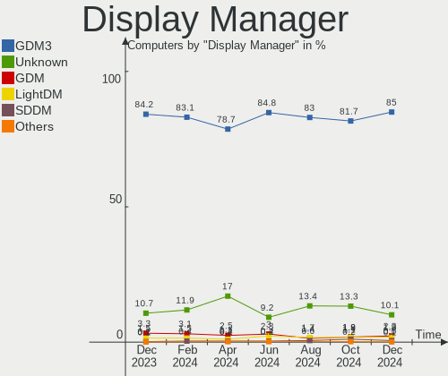
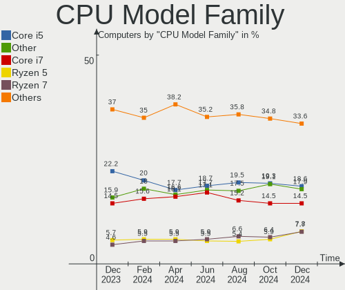
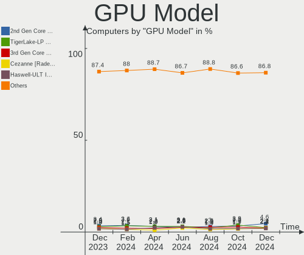
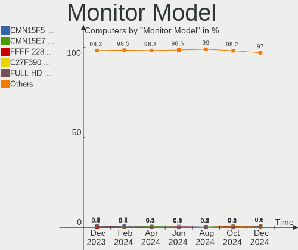

Ubuntu - Hardware Trends
------------------------

A project to identify most popular hardware characteristics and track their change
over time based on data collected by Linux users at https://Linux-Hardware.org.

Anyone can contribute to this report by the [hw-probe](https://github.com/linuxhw/hw-probe) tool:

    sudo -E hw-probe -all -upload

This is a report for all computer types. See also reports for [desktops](/Dist/Ubuntu/Desktop/README.md) and [notebooks](/Dist/Ubuntu/Notebook/README.md).

This report is for one last month. Overall report since the beginning of time: [TestCoverage](https://github.com/linuxhw/TestCoverage)

Period: Jul, 2022.

Contents
--------

* [ System ](#system)
  - [ OS                       ](#os)
  - [ OS Family                ](#os-family)
  - [ Kernel                   ](#kernel)
  - [ Kernel Family            ](#kernel-family)
  - [ Kernel Major Ver.        ](#kernel-major-ver)
  - [ Arch                     ](#arch)
  - [ DE                       ](#de)
  - [ Display Server           ](#display-server)
  - [ Display Manager          ](#display-manager)
  - [ OS Lang                  ](#os-lang)
  - [ Boot Mode                ](#boot-mode)
  - [ Filesystem               ](#filesystem)
  - [ Part. scheme             ](#part-scheme)
  - [ Dual Boot with Linux/BSD ](#dual-boot-with-linuxbsd)
  - [ Dual Boot (Win)          ](#dual-boot-win)

* [ Board ](#board)
  - [ Vendor                   ](#vendor)
  - [ Model                    ](#model)
  - [ Model Family             ](#model-family)
  - [ MFG Year                 ](#mfg-year)
  - [ Form Factor              ](#form-factor)
  - [ Secure Boot              ](#secure-boot)
  - [ Coreboot                 ](#coreboot)
  - [ RAM Size                 ](#ram-size)
  - [ RAM Used                 ](#ram-used)
  - [ Total Drives             ](#total-drives)
  - [ Has CD-ROM               ](#has-cd-rom)
  - [ Has Ethernet             ](#has-ethernet)
  - [ Has WiFi                 ](#has-wifi)
  - [ Has Bluetooth            ](#has-bluetooth)

* [ Location ](#location)
  - [ Country                  ](#country)
  - [ City                     ](#city)

* [ Drives ](#drives)
  - [ Drive Vendor             ](#drive-vendor)
  - [ Drive Model              ](#drive-model)
  - [ HDD Vendor               ](#hdd-vendor)
  - [ SSD Vendor               ](#ssd-vendor)
  - [ Drive Kind               ](#drive-kind)
  - [ Drive Connector          ](#drive-connector)
  - [ Drive Size               ](#drive-size)
  - [ Space Total              ](#space-total)
  - [ Space Used               ](#space-used)
  - [ Malfunc. Drives          ](#malfunc-drives)
  - [ Malfunc. Drive Vendor    ](#malfunc-drive-vendor)
  - [ Malfunc. HDD Vendor      ](#malfunc-hdd-vendor)
  - [ Malfunc. Drive Kind      ](#malfunc-drive-kind)
  - [ Failed Drives            ](#failed-drives)
  - [ Failed Drive Vendor      ](#failed-drive-vendor)
  - [ Drive Status             ](#drive-status)

* [ Storage controller ](#storage-controller)
  - [ Storage Vendor           ](#storage-vendor)
  - [ Storage Model            ](#storage-model)
  - [ Storage Kind             ](#storage-kind)

* [ Processor ](#processor)
  - [ CPU Vendor               ](#cpu-vendor)
  - [ CPU Model                ](#cpu-model)
  - [ CPU Model Family         ](#cpu-model-family)
  - [ CPU Cores                ](#cpu-cores)
  - [ CPU Sockets              ](#cpu-sockets)
  - [ CPU Threads              ](#cpu-threads)
  - [ CPU Op-Modes             ](#cpu-op-modes)
  - [ CPU Microcode            ](#cpu-microcode)
  - [ CPU Microarch            ](#cpu-microarch)

* [ Graphics ](#graphics)
  - [ GPU Vendor               ](#gpu-vendor)
  - [ GPU Model                ](#gpu-model)
  - [ GPU Combo                ](#gpu-combo)
  - [ GPU Driver               ](#gpu-driver)
  - [ GPU Memory               ](#gpu-memory)

* [ Monitor ](#monitor)
  - [ Monitor Vendor           ](#monitor-vendor)
  - [ Monitor Model            ](#monitor-model)
  - [ Monitor Resolution       ](#monitor-resolution)
  - [ Monitor Diagonal         ](#monitor-diagonal)
  - [ Monitor Width            ](#monitor-width)
  - [ Aspect Ratio             ](#aspect-ratio)
  - [ Monitor Area             ](#monitor-area)
  - [ Pixel Density            ](#pixel-density)
  - [ Multiple Monitors        ](#multiple-monitors)

* [ Network ](#network)
  - [ Net Controller Vendor    ](#net-controller-vendor)
  - [ Net Controller Model     ](#net-controller-model)
  - [ Wireless Vendor          ](#wireless-vendor)
  - [ Wireless Model           ](#wireless-model)
  - [ Ethernet Vendor          ](#ethernet-vendor)
  - [ Ethernet Model           ](#ethernet-model)
  - [ Net Controller Kind      ](#net-controller-kind)
  - [ Used Controller          ](#used-controller)
  - [ NICs                     ](#nics)
  - [ IPv6                     ](#ipv6)

* [ Bluetooth ](#bluetooth)
  - [ Bluetooth Vendor         ](#bluetooth-vendor)
  - [ Bluetooth Model          ](#bluetooth-model)

* [ Sound ](#sound)
  - [ Sound Vendor             ](#sound-vendor)
  - [ Sound Model              ](#sound-model)

* [ Memory ](#memory)
  - [ Memory Vendor            ](#memory-vendor)
  - [ Memory Model             ](#memory-model)
  - [ Memory Kind              ](#memory-kind)
  - [ Memory Form Factor       ](#memory-form-factor)
  - [ Memory Size              ](#memory-size)
  - [ Memory Speed             ](#memory-speed)

* [ Printers & scanners ](#printers--scanners)
  - [ Printer Vendor           ](#printer-vendor)
  - [ Printer Model            ](#printer-model)
  - [ Scanner Vendor           ](#scanner-vendor)
  - [ Scanner Model            ](#scanner-model)

* [ Camera ](#camera)
  - [ Camera Vendor            ](#camera-vendor)
  - [ Camera Model             ](#camera-model)

* [ Security ](#security)
  - [ Fingerprint Vendor       ](#fingerprint-vendor)
  - [ Fingerprint Model        ](#fingerprint-model)
  - [ Chipcard Vendor          ](#chipcard-vendor)
  - [ Chipcard Model           ](#chipcard-model)

* [ Unsupported ](#unsupported)
  - [ Unsupported Devices      ](#unsupported-devices)
  - [ Unsupported Device Types ](#unsupported-device-types)

System
------

OS
--

Installed operating systems

| Name         | Computers | Percent |
|--------------|-----------|---------|
| Ubuntu 22.04 | 578       | 59.16%  |
| Ubuntu 20.04 | 324       | 33.16%  |
| Ubuntu 18.04 | 33        | 3.38%   |
| Ubuntu 21.10 | 25        | 2.56%   |
| Ubuntu 22.10 | 6         | 0.61%   |
| Ubuntu 16.04 | 5         | 0.51%   |
| Ubuntu 21.04 | 4         | 0.41%   |
| Ubuntu 20.10 | 1         | 0.1%    |
| Ubuntu 19.04 | 1         | 0.1%    |

OS Family
---------

OS without a version

| Name   | Computers | Percent |
|--------|-----------|---------|
| Ubuntu | 977       | 100%    |

Kernel
------

Version of the Linux kernel

| Version                  | Computers | Percent |
|--------------------------|-----------|---------|
| 5.15.0-41-generic        | 357       | 36.54%  |
| 5.15.0-40-generic        | 178       | 18.22%  |
| 5.13.0-52-generic        | 103       | 10.54%  |
| 5.15.0-43-generic        | 48        | 4.91%   |
| 5.15.0-25-generic        | 36        | 3.68%   |
| 5.4.0-121-generic        | 25        | 2.56%   |
| 5.4.0-122-generic        | 24        | 2.46%   |
| 5.15.0-39-generic        | 19        | 1.94%   |
| 5.13.0-51-generic        | 18        | 1.84%   |
| 5.14.0-1044-oem          | 8         | 0.82%   |
| 4.15.0-189-generic       | 8         | 0.82%   |
| 5.15.0-1011-raspi        | 7         | 0.72%   |
| 5.14.0-1045-oem          | 7         | 0.72%   |
| 5.13.0-44-generic        | 7         | 0.72%   |
| 5.15.0-1012-raspi        | 6         | 0.61%   |
| 5.4.0-120-generic        | 5         | 0.51%   |
| 5.17.0-1013-oem          | 5         | 0.51%   |
| 5.17.0-1012-oem          | 4         | 0.41%   |
| 5.13.0-40-generic        | 4         | 0.41%   |
| 5.13.0-30-generic        | 4         | 0.41%   |
| 5.11.0-49-generic        | 4         | 0.41%   |
| 5.11.0-27-generic        | 4         | 0.41%   |
| 4.15.0-188-generic       | 4         | 0.41%   |
| 5.8.0-43-generic         | 3         | 0.31%   |
| 5.4.0-90-generic         | 2         | 0.2%    |
| 5.4.0-72-generic         | 2         | 0.2%    |
| 5.4.0-104-generic        | 2         | 0.2%    |
| 5.18.8-051808-generic    | 2         | 0.2%    |
| 5.18.12-051812-generic   | 2         | 0.2%    |
| 5.18.10-051810-generic   | 2         | 0.2%    |
| 5.15.0-40-lowlatency     | 2         | 0.2%    |
| 5.15.0-35-generic        | 2         | 0.2%    |
| 5.15.0-27-generic        | 2         | 0.2%    |
| 5.15.0-1006-raspi        | 2         | 0.2%    |
| 5.13.0-41-generic        | 2         | 0.2%    |
| 5.13.0-39-generic        | 2         | 0.2%    |
| 5.13.0-28-generic        | 2         | 0.2%    |
| 5.13.0-1017-intel        | 2         | 0.2%    |
| 4.4.0-210-generic        | 2         | 0.2%    |
| 4.15.0-142-generic       | 2         | 0.2%    |
| 5.8.0-59-generic         | 1         | 0.1%    |
| 5.8.0-53-generic         | 1         | 0.1%    |
| 5.8.0-25-generic         | 1         | 0.1%    |
| 5.7.0-050700-generic     | 1         | 0.1%    |
| 5.4.0-91-generic         | 1         | 0.1%    |
| 5.4.0-58-generic         | 1         | 0.1%    |
| 5.4.0-54-generic         | 1         | 0.1%    |
| 5.4.0-42-generic         | 1         | 0.1%    |
| 5.4.0-26-generic         | 1         | 0.1%    |
| 5.4.0-121-lowlatency     | 1         | 0.1%    |
| 5.4.0-117-generic        | 1         | 0.1%    |
| 5.4.0-1066-raspi         | 1         | 0.1%    |
| 5.4.0-100-generic        | 1         | 0.1%    |
| 5.3.0-40-generic         | 1         | 0.1%    |
| 5.19.0-odroid-arm64      | 1         | 0.1%    |
| 5.19.0-051900rc4-generic | 1         | 0.1%    |
| 5.18.9-surface           | 1         | 0.1%    |
| 5.18.8-t2                | 1         | 0.1%    |
| 5.18.4-051804-generic    | 1         | 0.1%    |
| 5.18.3-051803-generic    | 1         | 0.1%    |

Kernel Family
-------------

Linux kernel without a distro release

| Version  | Computers | Percent |
|----------|-----------|---------|
| 5.15.0   | 666       | 68.17%  |
| 5.13.0   | 149       | 15.25%  |
| 5.4.0    | 69        | 7.06%   |
| 5.14.0   | 16        | 1.64%   |
| 4.15.0   | 16        | 1.64%   |
| 5.17.0   | 12        | 1.23%   |
| 5.11.0   | 11        | 1.13%   |
| 5.8.0    | 6         | 0.61%   |
| 4.4.0    | 4         | 0.41%   |
| 5.18.8   | 3         | 0.31%   |
| 5.18.10  | 3         | 0.31%   |
| 5.19.0   | 2         | 0.2%    |
| 5.18.12  | 2         | 0.2%    |
| 5.18.0   | 2         | 0.2%    |
| 5.7.0    | 1         | 0.1%    |
| 5.3.0    | 1         | 0.1%    |
| 5.18.9   | 1         | 0.1%    |
| 5.18.4   | 1         | 0.1%    |
| 5.18.3   | 1         | 0.1%    |
| 5.18.13  | 1         | 0.1%    |
| 5.18.11  | 1         | 0.1%    |
| 5.17.7   | 1         | 0.1%    |
| 5.17.15  | 1         | 0.1%    |
| 5.16.0   | 1         | 0.1%    |
| 5.15.45  | 1         | 0.1%    |
| 5.15.4   | 1         | 0.1%    |
| 5.11.20  | 1         | 0.1%    |
| 5.10.65  | 1         | 0.1%    |
| 5.0.0    | 1         | 0.1%    |
| 4.19.219 | 1         | 0.1%    |

Kernel Major Ver.
-----------------

Linux kernel major version

| Version | Computers | Percent |
|---------|-----------|---------|
| 5.15    | 668       | 68.37%  |
| 5.13    | 149       | 15.25%  |
| 5.4     | 69        | 7.06%   |
| 5.14    | 16        | 1.64%   |
| 4.15    | 16        | 1.64%   |
| 5.18    | 15        | 1.54%   |
| 5.17    | 14        | 1.43%   |
| 5.11    | 12        | 1.23%   |
| 5.8     | 6         | 0.61%   |
| 4.4     | 4         | 0.41%   |
| 5.19    | 2         | 0.2%    |
| 5.7     | 1         | 0.1%    |
| 5.3     | 1         | 0.1%    |
| 5.16    | 1         | 0.1%    |
| 5.10    | 1         | 0.1%    |
| 5.0     | 1         | 0.1%    |
| 4.19    | 1         | 0.1%    |

Arch
----

OS architecture (x86_64, i586, etc.)

| Name    | Computers | Percent |
|---------|-----------|---------|
| x86_64  | 946       | 96.83%  |
| aarch64 | 21        | 2.15%   |
| i686    | 10        | 1.02%   |

DE
--

Desktop Environment

| Name            | Computers | Percent |
|-----------------|-----------|---------|
| GNOME           | 902       | 92.32%  |
| Unknown         | 45        | 4.61%   |
| Unity           | 10        | 1.02%   |
| X-Cinnamon      | 7         | 0.72%   |
| GNOME Flashback | 5         | 0.51%   |
| i3              | 2         | 0.2%    |
| GNOME Classic   | 2         | 0.2%    |
| Trinity         | 1         | 0.1%    |
| openbox         | 1         | 0.1%    |
| Enlightenment   | 1         | 0.1%    |
| Cinnamon        | 1         | 0.1%    |

Display Server
--------------

X11 or Wayland

| Name    | Computers | Percent |
|---------|-----------|---------|
| X11     | 532       | 54.45%  |
| Wayland | 405       | 41.45%  |
| Tty     | 24        | 2.46%   |
| Unknown | 16        | 1.64%   |

Display Manager
---------------

SDDM, LightDM, etc.

| Name    | Computers | Percent |
|---------|-----------|---------|
| GDM3    | 737       | 75.44%  |
| GDM     | 125       | 12.79%  |
| Unknown | 80        | 8.19%   |
| LightDM | 31        | 3.17%   |
| SDDM    | 2         | 0.2%    |
| TDM     | 1         | 0.1%    |
| SLiM    | 1         | 0.1%    |

OS Lang
-------

Language

| Lang    | Computers | Percent |
|---------|-----------|---------|
| en_US   | 441       | 45.14%  |
| de_DE   | 74        | 7.57%   |
| fr_FR   | 56        | 5.73%   |
| en_GB   | 45        | 4.61%   |
| pt_BR   | 38        | 3.89%   |
| en_IN   | 29        | 2.97%   |
| ru_RU   | 26        | 2.66%   |
| en_CA   | 26        | 2.66%   |
| it_IT   | 20        | 2.05%   |
| pl_PL   | 19        | 1.94%   |
| es_ES   | 19        | 1.94%   |
| C       | 16        | 1.64%   |
| nl_NL   | 12        | 1.23%   |
| en_AU   | 12        | 1.23%   |
| Unknown | 12        | 1.23%   |
| es_AR   | 11        | 1.13%   |
| pt_PT   | 10        | 1.02%   |
| hu_HU   | 9         | 0.92%   |
| cs_CZ   | 9         | 0.92%   |
| es_MX   | 7         | 0.72%   |
| en_PH   | 7         | 0.72%   |
| en_ZA   | 6         | 0.61%   |
| ko_KR   | 5         | 0.51%   |
| ja_JP   | 5         | 0.51%   |
| zh_CN   | 4         | 0.41%   |
| nb_NO   | 4         | 0.41%   |
| tr_TR   | 3         | 0.31%   |
| sv_SE   | 3         | 0.31%   |
| nl_BE   | 3         | 0.31%   |
| fr_CA   | 3         | 0.31%   |
| fi_FI   | 3         | 0.31%   |
| es_CO   | 3         | 0.31%   |
| es_CL   | 3         | 0.31%   |
| en_IE   | 3         | 0.31%   |
| zh_TW   | 2         | 0.2%    |
| lt_LT   | 2         | 0.2%    |
| hr_HR   | 2         | 0.2%    |
| fr_BE   | 2         | 0.2%    |
| en_NZ   | 2         | 0.2%    |
| en_IL   | 2         | 0.2%    |
| el_GR   | 2         | 0.2%    |
| de_AT   | 2         | 0.2%    |
| da_DK   | 2         | 0.2%    |
| ca_ES   | 2         | 0.2%    |
| zh_HK   | 1         | 0.1%    |
| sk_SK   | 1         | 0.1%    |
| ru_UA   | 1         | 0.1%    |
| hy_AM   | 1         | 0.1%    |
| es_US   | 1         | 0.1%    |
| es_HN   | 1         | 0.1%    |
| es_CU   | 1         | 0.1%    |
| es_CR   | 1         | 0.1%    |
| en_SG   | 1         | 0.1%    |
| en_NG   | 1         | 0.1%    |
| de_CH   | 1         | 0.1%    |

Boot Mode
---------

EFI or BIOS

| Mode | Computers | Percent |
|------|-----------|---------|
| BIOS | 556       | 56.91%  |
| EFI  | 421       | 43.09%  |

Filesystem
----------

Type of filesystem

| Type    | Computers | Percent |
|---------|-----------|---------|
| Ext4    | 911       | 93.24%  |
| Zfs     | 24        | 2.46%   |
| Overlay | 21        | 2.15%   |
| Btrfs   | 13        | 1.33%   |
| Ext2    | 3         | 0.31%   |
| Xfs     | 2         | 0.2%    |
| Jfs     | 1         | 0.1%    |
| Ext3    | 1         | 0.1%    |
| Unknown | 1         | 0.1%    |

Part. scheme
------------

Scheme of partitioning

| Type    | Computers | Percent |
|---------|-----------|---------|
| Unknown | 605       | 61.92%  |
| GPT     | 327       | 33.47%  |
| MBR     | 45        | 4.61%   |

Dual Boot with Linux/BSD
------------------------

Hosting more than one Linux/BSD

| Dual boot | Computers | Percent |
|-----------|-----------|---------|
| No        | 860       | 88.02%  |
| Yes       | 117       | 11.98%  |

Dual Boot (Win)
---------------

Hosting Linux and Windows

| Dual boot | Computers | Percent |
|-----------|-----------|---------|
| No        | 648       | 66.33%  |
| Yes       | 329       | 33.67%  |

Board
-----

Vendor
------

Motherboard manufacturer

| Name                    | Computers | Percent |
|-------------------------|-----------|---------|
| Dell                    | 169       | 17.3%   |
| ASUSTek Computer        | 136       | 13.92%  |
| Hewlett-Packard         | 131       | 13.41%  |
| Lenovo                  | 130       | 13.31%  |
| Gigabyte Technology     | 57        | 5.83%   |
| MSI                     | 54        | 5.53%   |
| Acer                    | 49        | 5.02%   |
| Apple                   | 26        | 2.66%   |
| ASRock                  | 23        | 2.35%   |
| Toshiba                 | 19        | 1.94%   |
| Raspberry Pi Foundation | 18        | 1.84%   |
| Intel                   | 17        | 1.74%   |
| HUAWEI                  | 10        | 1.02%   |
| Samsung Electronics     | 9         | 0.92%   |
| Sony                    | 7         | 0.72%   |
| Unknown                 | 6         | 0.61%   |
| Fujitsu                 | 5         | 0.51%   |
| Alienware               | 5         | 0.51%   |
| Timi                    | 4         | 0.41%   |
| Positivo                | 4         | 0.41%   |
| Pegatron                | 4         | 0.41%   |
| Packard Bell            | 4         | 0.41%   |
| Medion                  | 4         | 0.41%   |
| Biostar                 | 4         | 0.41%   |
| Supermicro              | 3         | 0.31%   |
| Microsoft               | 3         | 0.31%   |
| Huanan                  | 3         | 0.31%   |
| Google                  | 3         | 0.31%   |
| ECS                     | 3         | 0.31%   |
| AMI                     | 3         | 0.31%   |
| Teclast                 | 2         | 0.2%    |
| Shuttle                 | 2         | 0.2%    |
| Semp Toshiba            | 2         | 0.2%    |
| Panasonic               | 2         | 0.2%    |
| NEC Computers           | 2         | 0.2%    |
| LG Electronics          | 2         | 0.2%    |
| Jumper                  | 2         | 0.2%    |
| Hardkernel              | 2         | 0.2%    |
| Gateway                 | 2         | 0.2%    |
| Fujitsu Siemens         | 2         | 0.2%    |
| Foxconn                 | 2         | 0.2%    |
| AZW                     | 2         | 0.2%    |
| AWOW                    | 2         | 0.2%    |
| Avell High Performance  | 2         | 0.2%    |
| ZOTAC                   | 1         | 0.1%    |
| YANYU                   | 1         | 0.1%    |
| XDO.AI                  | 1         | 0.1%    |
| X79-1356                | 1         | 0.1%    |
| WinFast                 | 1         | 0.1%    |
| SLIMBOOK                | 1         | 0.1%    |
| Seeed Studio            | 1         | 0.1%    |
| Schenker                | 1         | 0.1%    |
| Razer                   | 1         | 0.1%    |
| PCWare                  | 1         | 0.1%    |
| PCPartner               | 1         | 0.1%    |
| Olidata                 | 1         | 0.1%    |
| Nvidia                  | 1         | 0.1%    |
| Novatech                | 1         | 0.1%    |
| Notebook                | 1         | 0.1%    |
| MouseComputer           | 1         | 0.1%    |

Model
-----

Motherboard model

| Name                               | Computers | Percent |
|------------------------------------|-----------|---------|
| RPi Raspberry Pi                   | 13        | 1.33%   |
| Unknown                            | 11        | 1.13%   |
| ASUS All Series                    | 9         | 0.92%   |
| Dell Latitude 5420                 | 6         | 0.61%   |
| Apple MacPro5,1                    | 5         | 0.51%   |
| Dell XPS 15 9520                   | 4         | 0.41%   |
| RPi Raspberry Pi 4 Model B Rev 1.2 | 3         | 0.31%   |
| MSI MS-7C02                        | 3         | 0.31%   |
| MSI MS-7817                        | 3         | 0.31%   |
| HUAWEI NBLK-WAX9X                  | 3         | 0.31%   |
| HP ProBook 450 G5                  | 3         | 0.31%   |
| HP Pavilion Aero Laptop 13-be0xxx  | 3         | 0.31%   |
| HP Notebook                        | 3         | 0.31%   |
| HP EliteBook 855 G8 Notebook PC    | 3         | 0.31%   |
| Gigabyte 970A-DS3P                 | 3         | 0.31%   |
| Dell XPS 15 9500                   | 3         | 0.31%   |
| Dell OptiPlex 755                  | 3         | 0.31%   |
| Dell OptiPlex 7010                 | 3         | 0.31%   |
| Dell Latitude E7470                | 3         | 0.31%   |
| Dell Latitude E6420                | 3         | 0.31%   |
| Dell Inspiron 7306 2n1             | 3         | 0.31%   |
| ASUS TUF Gaming X570-PLUS          | 3         | 0.31%   |
| Apple MacBookAir7,2                | 3         | 0.31%   |
| Toshiba Satellite L350             | 2         | 0.2%    |
| Positivo C14CU51                   | 2         | 0.2%    |
| MSI MS-7D54                        | 2         | 0.2%    |
| MSI MS-7C96                        | 2         | 0.2%    |
| MSI MS-7C35                        | 2         | 0.2%    |
| MSI MS-7B79                        | 2         | 0.2%    |
| MSI MS-7B17                        | 2         | 0.2%    |
| MSI MS-7721                        | 2         | 0.2%    |
| Lenovo ThinkBook 14-IIL 20SL       | 2         | 0.2%    |
| Lenovo IdeaPad 320-15IKB 80YH      | 2         | 0.2%    |
| Lenovo IdeaPad 3 15ITL6 82H8       | 2         | 0.2%    |
| Jumper EZbook                      | 2         | 0.2%    |
| HUAWEI HVY-WXX9                    | 2         | 0.2%    |
| HP Z440 Workstation                | 2         | 0.2%    |
| HP ProDesk 600 G1 SFF              | 2         | 0.2%    |
| HP Pavilion 15                     | 2         | 0.2%    |
| HP EliteBook 840 G4                | 2         | 0.2%    |
| HP EliteBook 840 G1                | 2         | 0.2%    |
| HP EliteBook 2530p                 | 2         | 0.2%    |
| HP Compaq Elite 8300 SFF           | 2         | 0.2%    |
| HP 15 Notebook PC                  | 2         | 0.2%    |
| HP 14                              | 2         | 0.2%    |
| Hardkernel ODROID-M1               | 2         | 0.2%    |
| Gigabyte Z97X-Gaming 3             | 2         | 0.2%    |
| Gigabyte X570 I AORUS PRO WIFI     | 2         | 0.2%    |
| Dell XPS 15 9510                   | 2         | 0.2%    |
| Dell XPS 15 7590                   | 2         | 0.2%    |
| Dell XPS 13 9370                   | 2         | 0.2%    |
| Dell Vostro 3500                   | 2         | 0.2%    |
| Dell Vostro 15 3515                | 2         | 0.2%    |
| Dell Precision 7560                | 2         | 0.2%    |
| Dell Precision 5550                | 2         | 0.2%    |
| Dell Precision 3561                | 2         | 0.2%    |
| Dell OptiPlex 390                  | 2         | 0.2%    |
| Dell OptiPlex 3010                 | 2         | 0.2%    |
| Dell Latitude E6510                | 2         | 0.2%    |
| Dell Latitude 7490                 | 2         | 0.2%    |

Model Family
------------

Motherboard model prefix

| Name                  | Computers | Percent |
|-----------------------|-----------|---------|
| Lenovo ThinkPad       | 56        | 5.73%   |
| Dell Latitude         | 47        | 4.81%   |
| Dell Inspiron         | 40        | 4.09%   |
| Acer Aspire           | 38        | 3.89%   |
| Lenovo IdeaPad        | 27        | 2.76%   |
| Dell OptiPlex         | 24        | 2.46%   |
| Dell XPS              | 22        | 2.25%   |
| HP EliteBook          | 21        | 2.15%   |
| RPi Raspberry         | 18        | 1.84%   |
| HP Pavilion           | 17        | 1.74%   |
| HP Laptop             | 15        | 1.54%   |
| HP ProBook            | 14        | 1.43%   |
| Dell Vostro           | 14        | 1.43%   |
| Dell Precision        | 14        | 1.43%   |
| ASUS ROG              | 14        | 1.43%   |
| ASUS VivoBook         | 13        | 1.33%   |
| Toshiba Satellite     | 12        | 1.23%   |
| ASUS PRIME            | 12        | 1.23%   |
| Unknown               | 11        | 1.13%   |
| HP Compaq             | 10        | 1.02%   |
| Lenovo ThinkCentre    | 9         | 0.92%   |
| ASUS TUF              | 9         | 0.92%   |
| ASUS All              | 9         | 0.92%   |
| HP ENVY               | 6         | 0.61%   |
| HP ZBook              | 5         | 0.51%   |
| HP ProDesk            | 5         | 0.51%   |
| Gigabyte X570         | 5         | 0.51%   |
| Apple MacPro5         | 5         | 0.51%   |
| Lenovo ThinkBook      | 4         | 0.41%   |
| HP Notebook           | 4         | 0.41%   |
| ASUS ASUS             | 4         | 0.41%   |
| Packard Bell EasyNote | 3         | 0.31%   |
| MSI MS-7C02           | 3         | 0.31%   |
| MSI MS-7817           | 3         | 0.31%   |
| Microsoft Surface     | 3         | 0.31%   |
| Lenovo Yoga           | 3         | 0.31%   |
| Lenovo Legion         | 3         | 0.31%   |
| Lenovo IdeaCentre     | 3         | 0.31%   |
| HUAWEI NBLK-WAX9X     | 3         | 0.31%   |
| HP Spectre            | 3         | 0.31%   |
| HP OMEN               | 3         | 0.31%   |
| HP 15                 | 3         | 0.31%   |
| Gigabyte 970A-DS3P    | 3         | 0.31%   |
| ASUS P8H61-M          | 3         | 0.31%   |
| Apple MacBookAir7     | 3         | 0.31%   |
| Acer Nitro            | 3         | 0.31%   |
| Toshiba TECRA         | 2         | 0.2%    |
| Toshiba PORTEGE       | 2         | 0.2%    |
| Timi Mi               | 2         | 0.2%    |
| Samsung 300E4A        | 2         | 0.2%    |
| Positivo C14CU51      | 2         | 0.2%    |
| MSI MS-7D54           | 2         | 0.2%    |
| MSI MS-7C96           | 2         | 0.2%    |
| MSI MS-7C35           | 2         | 0.2%    |
| MSI MS-7B79           | 2         | 0.2%    |
| MSI MS-7B17           | 2         | 0.2%    |
| MSI MS-7721           | 2         | 0.2%    |
| Lenovo IdeaPadFlex    | 2         | 0.2%    |
| Jumper EZbook         | 2         | 0.2%    |
| HUAWEI HVY-WXX9       | 2         | 0.2%    |

MFG Year
--------

Motherboard manufacture year

| Year    | Computers | Percent |
|---------|-----------|---------|
| 2021    | 133       | 13.61%  |
| 2020    | 103       | 10.54%  |
| 2019    | 81        | 8.29%   |
| 2018    | 73        | 7.47%   |
| 2014    | 65        | 6.65%   |
| 2017    | 62        | 6.35%   |
| 2013    | 61        | 6.24%   |
| 2015    | 60        | 6.14%   |
| 2010    | 55        | 5.63%   |
| 2012    | 50        | 5.12%   |
| 2011    | 47        | 4.81%   |
| 2016    | 41        | 4.2%    |
| 2022    | 39        | 3.99%   |
| 2008    | 28        | 2.87%   |
| 2009    | 26        | 2.66%   |
| 2007    | 21        | 2.15%   |
| Unknown | 21        | 2.15%   |
| 2006    | 7         | 0.72%   |
| 2005    | 4         | 0.41%   |

Form Factor
-----------

Physical design of the computer

| Name           | Computers | Percent |
|----------------|-----------|---------|
| Notebook       | 535       | 54.76%  |
| Desktop        | 343       | 35.11%  |
| Convertible    | 29        | 2.97%   |
| Mini pc        | 23        | 2.35%   |
| System on chip | 21        | 2.15%   |
| All in one     | 14        | 1.43%   |
| Tablet         | 7         | 0.72%   |
| Server         | 5         | 0.51%   |

Secure Boot
-----------

Enabled or disabled

| State    | Computers | Percent |
|----------|-----------|---------|
| Disabled | 876       | 89.66%  |
| Enabled  | 101       | 10.34%  |

Coreboot
--------

Have coreboot on board

| Used | Computers | Percent |
|------|-----------|---------|
| No   | 974       | 99.69%  |
| Yes  | 3         | 0.31%   |

RAM Size
--------

Total RAM memory

| Size in GB      | Computers | Percent |
|-----------------|-----------|---------|
| 4.01-8.0        | 244       | 24.97%  |
| 16.01-24.0      | 227       | 23.23%  |
| 3.01-4.0        | 159       | 16.27%  |
| 8.01-16.0       | 154       | 15.76%  |
| 32.01-64.0      | 100       | 10.24%  |
| 64.01-256.0     | 34        | 3.48%   |
| 1.01-2.0        | 27        | 2.76%   |
| 24.01-32.0      | 18        | 1.84%   |
| 2.01-3.0        | 7         | 0.72%   |
| 0.51-1.0        | 5         | 0.51%   |
| More than 256.0 | 2         | 0.2%    |

RAM Used
--------

Used RAM memory

| Used GB    | Computers | Percent |
|------------|-----------|---------|
| 1.01-2.0   | 321       | 32.86%  |
| 2.01-3.0   | 283       | 28.97%  |
| 4.01-8.0   | 150       | 15.35%  |
| 3.01-4.0   | 143       | 14.64%  |
| 8.01-16.0  | 41        | 4.2%    |
| 0.51-1.0   | 22        | 2.25%   |
| 16.01-24.0 | 10        | 1.02%   |
| 0.01-0.5   | 4         | 0.41%   |
| 24.01-32.0 | 3         | 0.31%   |

Total Drives
------------

Number of drives on board

| Drives | Computers | Percent |
|--------|-----------|---------|
| 1      | 613       | 62.74%  |
| 2      | 228       | 23.34%  |
| 3      | 71        | 7.27%   |
| 4      | 27        | 2.76%   |
| 5      | 15        | 1.54%   |
| 0      | 12        | 1.23%   |
| 6      | 5         | 0.51%   |
| 11     | 2         | 0.2%    |
| 12     | 1         | 0.1%    |
| 9      | 1         | 0.1%    |
| 8      | 1         | 0.1%    |
| 7      | 1         | 0.1%    |

Has CD-ROM
----------

Has CD-ROM on board

| Presented | Computers | Percent |
|-----------|-----------|---------|
| No        | 652       | 66.73%  |
| Yes       | 325       | 33.27%  |

Has Ethernet
------------

Has Ethernet on board

| Presented | Computers | Percent |
|-----------|-----------|---------|
| Yes       | 808       | 82.7%   |
| No        | 169       | 17.3%   |

Has WiFi
--------

Has WiFi module

| Presented | Computers | Percent |
|-----------|-----------|---------|
| Yes       | 763       | 78.1%   |
| No        | 214       | 21.9%   |

Has Bluetooth
-------------

Has Bluetooth module

| Presented | Computers | Percent |
|-----------|-----------|---------|
| Yes       | 590       | 60.39%  |
| No        | 387       | 39.61%  |

Location
--------

Country
-------

Geographic location (country)

| Country      | Computers | Percent |
|--------------|-----------|---------|
| USA          | 209       | 21.39%  |
| Germany      | 97        | 9.93%   |
| Brazil       | 59        | 6.04%   |
| France       | 57        | 5.83%   |
| UK           | 42        | 4.3%    |
| Russia       | 36        | 3.68%   |
| Canada       | 35        | 3.58%   |
| India        | 31        | 3.17%   |
| Italy        | 26        | 2.66%   |
| Poland       | 24        | 2.46%   |
| Netherlands  | 19        | 1.94%   |
| Spain        | 18        | 1.84%   |
| Hungary      | 15        | 1.54%   |
| Argentina    | 15        | 1.54%   |
| Portugal     | 14        | 1.43%   |
| Mexico       | 13        | 1.33%   |
| Belgium      | 13        | 1.33%   |
| Sweden       | 11        | 1.13%   |
| Czechia      | 11        | 1.13%   |
| Australia    | 11        | 1.13%   |
| Austria      | 10        | 1.02%   |
| Switzerland  | 9         | 0.92%   |
| Japan        | 9         | 0.92%   |
| Greece       | 9         | 0.92%   |
| China        | 9         | 0.92%   |
| Turkey       | 8         | 0.82%   |
| Philippines  | 8         | 0.82%   |
| Taiwan       | 7         | 0.72%   |
| Romania      | 7         | 0.72%   |
| Finland      | 7         | 0.72%   |
| South Korea  | 6         | 0.61%   |
| South Africa | 6         | 0.61%   |
| Norway       | 6         | 0.61%   |
| Indonesia    | 6         | 0.61%   |
| Denmark      | 6         | 0.61%   |
| Myanmar      | 5         | 0.51%   |
| Chile        | 5         | 0.51%   |
| Slovakia     | 4         | 0.41%   |
| Serbia       | 4         | 0.41%   |
| Puerto Rico  | 4         | 0.41%   |
| Iran         | 4         | 0.41%   |
| Croatia      | 4         | 0.41%   |
| Colombia     | 4         | 0.41%   |
| Venezuela    | 3         | 0.31%   |
| Tunisia      | 3         | 0.31%   |
| Pakistan     | 3         | 0.31%   |
| New Zealand  | 3         | 0.31%   |
| Israel       | 3         | 0.31%   |
| Ireland      | 3         | 0.31%   |
| Egypt        | 3         | 0.31%   |
| Bulgaria     | 3         | 0.31%   |
| Belarus      | 3         | 0.31%   |
| Thailand     | 2         | 0.2%    |
| Slovenia     | 2         | 0.2%    |
| Singapore    | 2         | 0.2%    |
| Réunion     | 2         | 0.2%    |
| Moldova      | 2         | 0.2%    |
| Luxembourg   | 2         | 0.2%    |
| Lithuania    | 2         | 0.2%    |
| Kazakhstan   | 2         | 0.2%    |

City
----

Geographic location (city)

| City              | Computers | Percent |
|-------------------|-----------|---------|
| Sao Paulo         | 11        | 1.13%   |
| Berlin            | 11        | 1.13%   |
| Moscow            | 10        | 1.02%   |
| Budapest          | 8         | 0.82%   |
| San Jose          | 7         | 0.72%   |
| Paris             | 7         | 0.72%   |
| Warsaw            | 6         | 0.61%   |
| Vienna            | 6         | 0.61%   |
| Prague            | 6         | 0.61%   |
| Milan             | 6         | 0.61%   |
| Bengaluru         | 6         | 0.61%   |
| Taipei            | 5         | 0.51%   |
| Yangon            | 4         | 0.41%   |
| Västerås        | 4         | 0.41%   |
| St Petersburg     | 4         | 0.41%   |
| San Francisco     | 4         | 0.41%   |
| Pune              | 4         | 0.41%   |
| Phoenix           | 4         | 0.41%   |
| New York          | 4         | 0.41%   |
| Munich            | 4         | 0.41%   |
| London            | 4         | 0.41%   |
| Helsinki          | 4         | 0.41%   |
| Chicago           | 4         | 0.41%   |
| Athens            | 4         | 0.41%   |
| Zurich            | 3         | 0.31%   |
| Zagreb            | 3         | 0.31%   |
| Toronto           | 3         | 0.31%   |
| Thessaloniki      | 3         | 0.31%   |
| Tehran            | 3         | 0.31%   |
| Sydney            | 3         | 0.31%   |
| Stuttgart         | 3         | 0.31%   |
| St Louis          | 3         | 0.31%   |
| Santiago          | 3         | 0.31%   |
| San Juan          | 3         | 0.31%   |
| Rio de Janeiro    | 3         | 0.31%   |
| Perth             | 3         | 0.31%   |
| New Westminster   | 3         | 0.31%   |
| Milwaukee         | 3         | 0.31%   |
| Miami             | 3         | 0.31%   |
| Karachi           | 3         | 0.31%   |
| Istanbul          | 3         | 0.31%   |
| Hyderabad         | 3         | 0.31%   |
| Hamburg           | 3         | 0.31%   |
| Frankfurt am Main | 3         | 0.31%   |
| Dublin            | 3         | 0.31%   |
| Dallas            | 3         | 0.31%   |
| Córdoba          | 3         | 0.31%   |
| Chennai           | 3         | 0.31%   |
| Cartagena         | 3         | 0.31%   |
| Campo Grande      | 3         | 0.31%   |
| Cambridge         | 3         | 0.31%   |
| Belo Horizonte    | 3         | 0.31%   |
| Belgrade          | 3         | 0.31%   |
| Austin            | 3         | 0.31%   |
| Wroclaw           | 2         | 0.2%    |
| Westminster       | 2         | 0.2%    |
| Vancouver         | 2         | 0.2%    |
| Valencia          | 2         | 0.2%    |
| Uberlândia       | 2         | 0.2%    |
| Turnhout          | 2         | 0.2%    |

Drives
------

Drive Vendor
------------

Hard drive vendors

| Vendor                    | Computers | Drives | Percent |
|---------------------------|-----------|--------|---------|
| Samsung Electronics       | 204       | 248    | 15.16%  |
| WDC                       | 185       | 233    | 13.74%  |
| Seagate                   | 178       | 235    | 13.22%  |
| SanDisk                   | 91        | 106    | 6.76%   |
| Toshiba                   | 81        | 86     | 6.02%   |
| Kingston                  | 78        | 86     | 5.79%   |
| Unknown                   | 52        | 55     | 3.86%   |
| SK hynix                  | 50        | 50     | 3.71%   |
| Crucial                   | 48        | 51     | 3.57%   |
| Intel                     | 37        | 50     | 2.75%   |
| Hitachi                   | 30        | 30     | 2.23%   |
| Micron Technology         | 27        | 27     | 2.01%   |
| HGST                      | 26        | 28     | 1.93%   |
| A-DATA Technology         | 23        | 23     | 1.71%   |
| KIOXIA                    | 22        | 22     | 1.63%   |
| Apple                     | 16        | 19     | 1.19%   |
| Unknown                   | 15        | 15     | 1.11%   |
| Phison                    | 12        | 17     | 0.89%   |
| China                     | 10        | 11     | 0.74%   |
| PNY                       | 9         | 9      | 0.67%   |
| SPCC                      | 8         | 8      | 0.59%   |
| OCZ                       | 7         | 8      | 0.52%   |
| Intenso                   | 7         | 7      | 0.52%   |
| Silicon Motion            | 5         | 5      | 0.37%   |
| Patriot                   | 5         | 7      | 0.37%   |
| LITEON                    | 5         | 5      | 0.37%   |
| XPG                       | 4         | 4      | 0.3%    |
| UMIS                      | 4         | 4      | 0.3%    |
| Team                      | 4         | 4      | 0.3%    |
| Plextor                   | 4         | 4      | 0.3%    |
| GOODRAM                   | 4         | 4      | 0.3%    |
| Gigabyte Technology       | 4         | 4      | 0.3%    |
| Union Memory (Shenzhen)   | 3         | 3      | 0.22%   |
| Transcend                 | 3         | 3      | 0.22%   |
| SABRENT                   | 3         | 4      | 0.22%   |
| Micron/Crucial Technology | 3         | 3      | 0.22%   |
| Hewlett-Packard           | 3         | 3      | 0.22%   |
| WD MediaMax               | 2         | 2      | 0.15%   |
| SSSTC                     | 2         | 2      | 0.15%   |
| Realtek Semiconductor     | 2         | 2      | 0.15%   |
| OWC                       | 2         | 2      | 0.15%   |
| Maxtor                    | 2         | 2      | 0.15%   |
| Lite-On                   | 2         | 2      | 0.15%   |
| Lexar                     | 2         | 2      | 0.15%   |
| KingDian                  | 2         | 2      | 0.15%   |
| JMicron Technology        | 2         | 2      | 0.15%   |
| FORESEE                   | 2         | 2      | 0.15%   |
| Corsair                   | 2         | 2      | 0.15%   |
| ASMT                      | 2         | 2      | 0.15%   |
| Argon                     | 2         | 2      | 0.15%   |
| ADATA Technology          | 2         | 2      | 0.15%   |
| ZTE                       | 1         | 1      | 0.07%   |
| Zheino                    | 1         | 1      | 0.07%   |
| WALRAM                    | 1         | 1      | 0.07%   |
| ValueTech                 | 1         | 1      | 0.07%   |
| TO Exter                  | 1         | 1      | 0.07%   |
| TEXTORM                   | 1         | 1      | 0.07%   |
| Teclast                   | 1         | 1      | 0.07%   |
| SSK                       | 1         | 2      | 0.07%   |
| Soyo                      | 1         | 1      | 0.07%   |

Drive Model
-----------

Hard drive models

| Model                              | Computers | Percent |
|------------------------------------|-----------|---------|
| Unknown                            | 15        | 1.01%   |
| SanDisk NVMe SSD Drive 1TB         | 14        | 0.94%   |
| Kingston SA400S37240G 240GB SSD    | 14        | 0.94%   |
| Toshiba MQ01ABD100 1TB             | 12        | 0.81%   |
| SanDisk NVMe SSD Drive 256GB       | 11        | 0.74%   |
| Samsung NVMe SSD Drive 512GB       | 11        | 0.74%   |
| Seagate ST2000DM008-2FR102 2TB     | 10        | 0.67%   |
| Seagate ST1000LM035-1RK172 1TB     | 10        | 0.67%   |
| Samsung SSD 980 PRO 1TB            | 10        | 0.67%   |
| Samsung NVMe SSD Drive 1TB         | 10        | 0.67%   |
| Seagate ST1000DM010-2EP102 1TB     | 9         | 0.61%   |
| Kingston SA400S37480G 480GB SSD    | 9         | 0.61%   |
| Seagate ST500DM002-1BD142 500GB    | 8         | 0.54%   |
| Kingston SA400S37120G 120GB SSD    | 8         | 0.54%   |
| Intel NVMe SSD Drive 512GB         | 8         | 0.54%   |
| Crucial CT500MX500SSD1 500GB       | 8         | 0.54%   |
| Toshiba DT01ACA100 1TB             | 7         | 0.47%   |
| Samsung SSD 860 EVO 500GB          | 7         | 0.47%   |
| Intel NVMe SSD Drive 32GB          | 7         | 0.47%   |
| Crucial CT1000MX500SSD1 1TB        | 7         | 0.47%   |
| Unknown SD/MMC/MS PRO 64GB         | 6         | 0.4%    |
| Seagate ST1000DM003-1CH162 1TB     | 6         | 0.4%    |
| SanDisk SDSSDA120G 120GB           | 6         | 0.4%    |
| Kingston SV300S37A120G 120GB SSD   | 6         | 0.4%    |
| HGST HTS721010A9E630 1TB           | 6         | 0.4%    |
| Crucial CT480BX500SSD1 480GB       | 6         | 0.4%    |
| WDC WD10JPVX-22JC3T0 1TB           | 5         | 0.34%   |
| Toshiba MQ04ABF100 1TB             | 5         | 0.34%   |
| SK hynix NVMe SSD Drive 256GB      | 5         | 0.34%   |
| Seagate ST9500325AS 500GB          | 5         | 0.34%   |
| Seagate ST1000LM024 HN-M101MBB 1TB | 5         | 0.34%   |
| SanDisk NVMe SSD Drive 512GB       | 5         | 0.34%   |
| SanDisk NVMe SSD Drive 500GB       | 5         | 0.34%   |
| Samsung SSD 970 EVO Plus 500GB     | 5         | 0.34%   |
| Samsung SSD 850 EVO 500GB          | 5         | 0.34%   |
| Samsung SSD 850 EVO 250GB          | 5         | 0.34%   |
| Samsung NVMe SSD Drive 256GB       | 5         | 0.34%   |
| Samsung NVMe SSD Drive 1024GB      | 5         | 0.34%   |
| WDC WD10EARS-22Y5B1 1TB            | 4         | 0.27%   |
| Unknown SD128  128GB               | 4         | 0.27%   |
| Unknown MMC Card  128GB            | 4         | 0.27%   |
| Seagate ST500LT012-1DG142 500GB    | 4         | 0.27%   |
| Seagate ST4000DM004-2CV104 4TB     | 4         | 0.27%   |
| Seagate ST2000DM006-2DM164 2TB     | 4         | 0.27%   |
| Seagate ST1000LM049-2GH172 1TB     | 4         | 0.27%   |
| Seagate ST1000LM048-2E7172 1TB     | 4         | 0.27%   |
| Seagate ST1000DM003-1ER162 1TB     | 4         | 0.27%   |
| SanDisk NVMe SSD Drive 1024GB      | 4         | 0.27%   |
| Samsung SSD 980 1TB                | 4         | 0.27%   |
| Samsung SSD 970 EVO Plus 1TB       | 4         | 0.27%   |
| Samsung SSD 860 EVO 1TB            | 4         | 0.27%   |
| Samsung MZVLW256HEHP-000L7 256GB   | 4         | 0.27%   |
| KIOXIA NVMe SSD Drive 512GB        | 4         | 0.27%   |
| Kingston NVMe SSD Drive 500GB      | 4         | 0.27%   |
| HGST HTS545050A7E680 500GB         | 4         | 0.27%   |
| Crucial CT240BX500SSD1 240GB       | 4         | 0.27%   |
| WDC WDS500G2B0A-00SM50 500GB SSD   | 3         | 0.2%    |
| WDC WDS240G2G0A-00JH30 240GB SSD   | 3         | 0.2%    |
| WDC WDS100T2G0A-00JH30 1TB SSD     | 3         | 0.2%    |
| WDC WD5000AAKX-60U6AA0 500GB       | 3         | 0.2%    |

HDD Vendor
----------

Hard disk drive vendors

| Vendor              | Computers | Drives | Percent |
|---------------------|-----------|--------|---------|
| Seagate             | 173       | 226    | 35.67%  |
| WDC                 | 142       | 183    | 29.28%  |
| Toshiba             | 64        | 67     | 13.2%   |
| Hitachi             | 30        | 30     | 6.19%   |
| HGST                | 26        | 28     | 5.36%   |
| Samsung Electronics | 25        | 29     | 5.15%   |
| Unknown             | 6         | 6      | 1.24%   |
| Apple               | 5         | 6      | 1.03%   |
| SABRENT             | 3         | 4      | 0.62%   |
| WD MediaMax         | 2         | 2      | 0.41%   |
| Maxtor              | 2         | 2      | 0.41%   |
| Intenso             | 2         | 2      | 0.41%   |
| SAGE                | 1         | 1      | 0.21%   |
| HPE                 | 1         | 1      | 0.21%   |
| Fujitsu             | 1         | 1      | 0.21%   |
| External            | 1         | 1      | 0.21%   |
| ASMT                | 1         | 1      | 0.21%   |

SSD Vendor
----------

Solid state drive vendors

| Vendor              | Computers | Drives | Percent |
|---------------------|-----------|--------|---------|
| Samsung Electronics | 73        | 83     | 17.8%   |
| Kingston            | 61        | 68     | 14.88%  |
| SanDisk             | 49        | 59     | 11.95%  |
| Crucial             | 44        | 47     | 10.73%  |
| WDC                 | 24        | 25     | 5.85%   |
| A-DATA Technology   | 15        | 15     | 3.66%   |
| China               | 10        | 11     | 2.44%   |
| SK hynix            | 9         | 9      | 2.2%    |
| Micron Technology   | 9         | 9      | 2.2%    |
| PNY                 | 8         | 8      | 1.95%   |
| SPCC                | 6         | 6      | 1.46%   |
| OCZ                 | 6         | 6      | 1.46%   |
| Apple               | 6         | 6      | 1.46%   |
| Unknown             | 6         | 6      | 1.46%   |
| Toshiba             | 5         | 6      | 1.22%   |
| Patriot             | 5         | 7      | 1.22%   |
| Intel               | 5         | 5      | 1.22%   |
| Team                | 4         | 4      | 0.98%   |
| LITEON              | 4         | 4      | 0.98%   |
| Intenso             | 4         | 4      | 0.98%   |
| GOODRAM             | 4         | 4      | 0.98%   |
| Transcend           | 3         | 3      | 0.73%   |
| Hewlett-Packard     | 3         | 3      | 0.73%   |
| Plextor             | 2         | 2      | 0.49%   |
| OWC                 | 2         | 2      | 0.49%   |
| Lexar               | 2         | 2      | 0.49%   |
| KingDian            | 2         | 2      | 0.49%   |
| Gigabyte Technology | 2         | 2      | 0.49%   |
| FORESEE             | 2         | 2      | 0.49%   |
| Argon               | 2         | 2      | 0.49%   |
| WALRAM              | 1         | 1      | 0.24%   |
| ValueTech           | 1         | 1      | 0.24%   |
| Unknown             | 1         | 1      | 0.24%   |
| TO Exter            | 1         | 1      | 0.24%   |
| TEXTORM             | 1         | 1      | 0.24%   |
| Teclast             | 1         | 1      | 0.24%   |
| Soyo                | 1         | 1      | 0.24%   |
| Smartbuy            | 1         | 1      | 0.24%   |
| ShiJi               | 1         | 1      | 0.24%   |
| Seagate             | 1         | 2      | 0.24%   |
| RZX                 | 1         | 1      | 0.24%   |
| Ramsta              | 1         | 1      | 0.24%   |
| PNY USB             | 1         | 1      | 0.24%   |
| ORTIAL              | 1         | 1      | 0.24%   |
| OCZ-VERTEX3         | 1         | 1      | 0.24%   |
| NGFF                | 1         | 1      | 0.24%   |
| Netac               | 1         | 1      | 0.24%   |
| MyDigitalSSD        | 1         | 1      | 0.24%   |
| Mushkin             | 1         | 1      | 0.24%   |
| minisforum          | 1         | 1      | 0.24%   |
| Leven               | 1         | 1      | 0.24%   |
| KIOXIA-EXCERIA      | 1         | 1      | 0.24%   |
| KingSpec            | 1         | 1      | 0.24%   |
| INTEL SS            | 1         | 1      | 0.24%   |
| Inateck             | 1         | 1      | 0.24%   |
| faspeed             | 1         | 1      | 0.24%   |
| Emtec               | 1         | 1      | 0.24%   |
| DERLER              | 1         | 1      | 0.24%   |
| CT480BX5            | 1         | 1      | 0.24%   |
| Corsair             | 1         | 1      | 0.24%   |

Drive Kind
----------

HDD or SSD

| Kind    | Computers | Drives | Percent |
|---------|-----------|--------|---------|
| HDD     | 414       | 590    | 34.07%  |
| NVMe    | 363       | 438    | 29.88%  |
| SSD     | 362       | 446    | 29.79%  |
| MMC     | 58        | 64     | 4.77%   |
| Unknown | 18        | 20     | 1.48%   |

Drive Connector
---------------

SATA, SAS, NVMe, etc.

| Type | Computers | Drives | Percent |
|------|-----------|--------|---------|
| SATA | 652       | 991    | 57.7%   |
| NVMe | 363       | 438    | 32.12%  |
| MMC  | 58        | 64     | 5.13%   |
| SAS  | 57        | 65     | 5.04%   |

Drive Size
----------

Size of hard drive

| Size in TB | Computers | Drives | Percent |
|------------|-----------|--------|---------|
| 0.01-0.5   | 461       | 569    | 56.15%  |
| 0.51-1.0   | 245       | 304    | 29.84%  |
| 1.01-2.0   | 66        | 83     | 8.04%   |
| 3.01-4.0   | 24        | 34     | 2.92%   |
| 4.01-10.0  | 11        | 13     | 1.34%   |
| 2.01-3.0   | 9         | 14     | 1.1%    |
| 10.01-20.0 | 5         | 19     | 0.61%   |

Space Total
-----------

Amount of disk space available on the file system

| Size in GB     | Computers | Percent |
|----------------|-----------|---------|
| 101-250        | 297       | 30.4%   |
| 251-500        | 237       | 24.26%  |
| 501-1000       | 166       | 16.99%  |
| 1001-2000      | 66        | 6.76%   |
| 51-100         | 49        | 5.02%   |
| 21-50          | 44        | 4.5%    |
| 1-20           | 41        | 4.2%    |
| More than 3000 | 38        | 3.89%   |
| 2001-3000      | 25        | 2.56%   |
| Unknown        | 14        | 1.43%   |

Space Used
----------

Amount of used disk space

| Used GB        | Computers | Percent |
|----------------|-----------|---------|
| 1-20           | 357       | 36.54%  |
| 21-50          | 197       | 20.16%  |
| 51-100         | 132       | 13.51%  |
| 101-250        | 122       | 12.49%  |
| 251-500        | 59        | 6.04%   |
| 501-1000       | 47        | 4.81%   |
| 1001-2000      | 27        | 2.76%   |
| More than 3000 | 15        | 1.54%   |
| Unknown        | 14        | 1.43%   |
| 2001-3000      | 7         | 0.72%   |

Malfunc. Drives
---------------

Drive models with a malfunction

| Model                                          | Computers | Drives | Percent |
|------------------------------------------------|-----------|--------|---------|
| Toshiba MQ01ABD100 1TB                         | 2         | 2      | 3.13%   |
| SanDisk SSD PLUS 480GB                         | 2         | 2      | 3.13%   |
| Samsung Electronics HD322GJ 320GB              | 2         | 2      | 3.13%   |
| HGST HTS545050A7E680 500GB                     | 2         | 2      | 3.13%   |
| WDC WDS240G2G0A-00JH30 240GB SSD               | 1         | 1      | 1.56%   |
| WDC WDS120G2G0A-00JH30 120GB SSD               | 1         | 1      | 1.56%   |
| WDC WD75 00BPVT-16HXZ 752GB                    | 1         | 1      | 1.56%   |
| WDC WD740GD-00FLA1 74GB                        | 1         | 1      | 1.56%   |
| WDC WD40PURZ-85TTDY0 4TB                       | 1         | 1      | 1.56%   |
| WDC WD4003FZEX-00Z4SA0 4TB                     | 1         | 2      | 1.56%   |
| WDC WD3200BPVT-16JJ5T0 320GB                   | 1         | 1      | 1.56%   |
| WDC WD3200AAKS-75L9A0 320GB                    | 1         | 1      | 1.56%   |
| WDC WD20SPZX-60UA7T0 2TB                       | 1         | 1      | 1.56%   |
| WDC WD20EARS-00MVWB0 2TB                       | 1         | 1      | 1.56%   |
| WDC WD10SPZX-21Z10T0 1TB                       | 1         | 1      | 1.56%   |
| WDC WD10JPVX-60JC3T1 1TB                       | 1         | 1      | 1.56%   |
| WDC WD10JPVX-22JC3T0 1TB                       | 1         | 1      | 1.56%   |
| WDC WD10JPCX-24UE4T0 1TB                       | 1         | 1      | 1.56%   |
| WDC WD10EARX-00N0YB0 1TB                       | 1         | 1      | 1.56%   |
| WDC WD10EARS-22Y5B1 1TB                        | 1         | 1      | 1.56%   |
| WDC WD10EADS-11M2B2 1TB                        | 1         | 1      | 1.56%   |
| WDC WD1003FZEX-00MK2A0 1TB                     | 1         | 1      | 1.56%   |
| WDC WD1001FALS-00J7B0 1TB                      | 1         | 1      | 1.56%   |
| WDC PC SA530 SDATN8Y-256G-1006 256GB SSD       | 1         | 1      | 1.56%   |
| Toshiba MQ01ABD075 752GB                       | 1         | 1      | 1.56%   |
| SK hynix HFS256G39TND-N210A 256GB SSD          | 1         | 1      | 1.56%   |
| SK hynix BC711 HFM512GD3JX013N 512GB           | 1         | 1      | 1.56%   |
| Seagate ST9500325AS 500GB                      | 1         | 1      | 1.56%   |
| Seagate ST500DM002-1BC142 500GB                | 1         | 1      | 1.56%   |
| Seagate ST4000VX007-2DT166 4TB                 | 1         | 1      | 1.56%   |
| Seagate ST3250823AS 250GB                      | 1         | 1      | 1.56%   |
| Seagate ST3250410AS 250GB                      | 1         | 1      | 1.56%   |
| Seagate ST320LT020-9YG142 320GB                | 1         | 1      | 1.56%   |
| Seagate ST31500341AS 1TB                       | 1         | 1      | 1.56%   |
| Seagate ST1000DX001-1CM162 1TB                 | 1         | 1      | 1.56%   |
| Seagate ST1000DM010-2EP102 1TB                 | 1         | 1      | 1.56%   |
| Seagate ST1000DM003-1CH162 1TB                 | 1         | 1      | 1.56%   |
| SanDisk SDSSDXPS240G 240GB                     | 1         | 1      | 1.56%   |
| Samsung Electronics SSD PM800 Series 2.5 256GB | 1         | 1      | 1.56%   |
| Samsung Electronics SSD 980 PRO 1TB            | 1         | 1      | 1.56%   |
| Samsung Electronics SSD 870 EVO 500GB          | 1         | 1      | 1.56%   |
| Samsung Electronics SSD 870 EVO 1TB            | 1         | 2      | 1.56%   |
| Samsung Electronics SP1614C 160GB              | 1         | 1      | 1.56%   |
| Samsung Electronics HD642JJ 640GB              | 1         | 1      | 1.56%   |
| Samsung Electronics HD103SI 1TB                | 1         | 1      | 1.56%   |
| PNY CS3030 500GB SSD                           | 1         | 1      | 1.56%   |
| Kingston SV300S37A120G 120GB SSD               | 1         | 1      | 1.56%   |
| Intel SSDSA2CW120G3 120GB                      | 1         | 1      | 1.56%   |
| Hitachi HUA722020ALA331 2TB                    | 1         | 1      | 1.56%   |
| Hitachi HTS545050B9SA00 500GB                  | 1         | 1      | 1.56%   |
| Hitachi HTS545050B9A300 500GB                  | 1         | 1      | 1.56%   |
| Hitachi HTS421260H9AT00 64GB                   | 1         | 1      | 1.56%   |
| Hitachi HDS722020ALA330 2TB                    | 1         | 1      | 1.56%   |
| Hitachi HDS721616PLA380 160GB                  | 1         | 1      | 1.56%   |
| HGST HTS725050A7E630 500GB                     | 1         | 1      | 1.56%   |
| HGST HTS721010A9E630 1TB                       | 1         | 1      | 1.56%   |
| HGST HTS541075A9E680 752GB                     | 1         | 1      | 1.56%   |
| HGST HTS541010B7E610 1TB                       | 1         | 1      | 1.56%   |
| HGST HTS541010A9E680 1TB                       | 1         | 1      | 1.56%   |
| Apple HDD HTS541010A9E662 1TB                  | 1         | 2      | 1.56%   |

Malfunc. Drive Vendor
---------------------

Vendors of faulty drives

| Vendor              | Computers | Drives | Percent |
|---------------------|-----------|--------|---------|
| WDC                 | 20        | 21     | 31.25%  |
| Seagate             | 10        | 10     | 15.63%  |
| Samsung Electronics | 9         | 10     | 14.06%  |
| HGST                | 7         | 7      | 10.94%  |
| Hitachi             | 6         | 6      | 9.38%   |
| Toshiba             | 3         | 3      | 4.69%   |
| SanDisk             | 3         | 3      | 4.69%   |
| SK hynix            | 2         | 2      | 3.13%   |
| PNY                 | 1         | 1      | 1.56%   |
| Kingston            | 1         | 1      | 1.56%   |
| Intel               | 1         | 1      | 1.56%   |
| Apple               | 1         | 2      | 1.56%   |

Malfunc. HDD Vendor
-------------------

Vendors of faulty HDD drives

| Vendor              | Computers | Drives | Percent |
|---------------------|-----------|--------|---------|
| WDC                 | 17        | 18     | 34.69%  |
| Seagate             | 10        | 10     | 20.41%  |
| HGST                | 7         | 7      | 14.29%  |
| Hitachi             | 6         | 6      | 12.24%  |
| Samsung Electronics | 5         | 5      | 10.2%   |
| Toshiba             | 3         | 3      | 6.12%   |
| Apple               | 1         | 2      | 2.04%   |

Malfunc. Drive Kind
-------------------

Kinds of faulty drives

| Kind | Computers | Drives | Percent |
|------|-----------|--------|---------|
| HDD  | 46        | 51     | 75.41%  |
| SSD  | 12        | 13     | 19.67%  |
| NVMe | 3         | 3      | 4.92%   |

Failed Drives
-------------

Failed drive models

Zero info for selected period =(

Failed Drive Vendor
-------------------

Failed drive vendors

Zero info for selected period =(

Drive Status
------------

Number of failed and malfunc. drives

| Status   | Computers | Drives | Percent |
|----------|-----------|--------|---------|
| Detected | 634       | 1001   | 61.49%  |
| Works    | 341       | 490    | 33.07%  |
| Malfunc  | 56        | 67     | 5.43%   |

Storage controller
------------------

Storage Vendor
--------------

Storage controller vendors

| Vendor                           | Computers | Percent |
|----------------------------------|-----------|---------|
| Intel                            | 656       | 54.35%  |
| AMD                              | 139       | 11.52%  |
| Samsung Electronics              | 121       | 10.02%  |
| Sandisk                          | 60        | 4.97%   |
| SK hynix                         | 39        | 3.23%   |
| KIOXIA                           | 19        | 1.57%   |
| Phison Electronics               | 18        | 1.49%   |
| Kingston Technology Company      | 18        | 1.49%   |
| ASMedia Technology               | 18        | 1.49%   |
| Micron Technology                | 17        | 1.41%   |
| Toshiba America Info Systems     | 14        | 1.16%   |
| Nvidia                           | 11        | 0.91%   |
| ADATA Technology                 | 11        | 0.91%   |
| Marvell Technology Group         | 9         | 0.75%   |
| Micron/Crucial Technology        | 7         | 0.58%   |
| Union Memory (Shenzhen)          | 6         | 0.5%    |
| Silicon Motion                   | 6         | 0.5%    |
| JMicron Technology               | 6         | 0.5%    |
| Realtek Semiconductor            | 5         | 0.41%   |
| LSI Logic / Symbios Logic        | 4         | 0.33%   |
| Apple                            | 4         | 0.33%   |
| VIA Technologies                 | 3         | 0.25%   |
| Solid State Storage Technology   | 3         | 0.25%   |
| Lite-On Technology               | 3         | 0.25%   |
| Silicon Integrated Systems [SiS] | 2         | 0.17%   |
| Seagate Technology               | 2         | 0.17%   |
| Adaptec                          | 2         | 0.17%   |
| Shenzhen Longsys Electronics     | 1         | 0.08%   |
| OCZ Technology Group             | 1         | 0.08%   |
| MAXIO Technology (Hangzhou)      | 1         | 0.08%   |
| Hewlett-Packard                  | 1         | 0.08%   |

Storage Model
-------------

Storage controller models

| Model                                                                                   | Computers | Percent |
|-----------------------------------------------------------------------------------------|-----------|---------|
| AMD FCH SATA Controller [AHCI mode]                                                     | 90        | 6.6%    |
| Intel Sunrise Point-LP SATA Controller [AHCI mode]                                      | 57        | 4.18%   |
| Intel Volume Management Device NVMe RAID Controller                                     | 42        | 3.08%   |
| Intel 8 Series/C220 Series Chipset Family 6-port SATA Controller 1 [AHCI mode]          | 42        | 3.08%   |
| Samsung NVMe SSD Controller SM981/PM981/PM983                                           | 40        | 2.93%   |
| Samsung NVMe SSD Controller PM9A1/PM9A3/980PRO                                          | 31        | 2.27%   |
| Samsung NVMe SSD Controller 980                                                         | 30        | 2.2%    |
| Intel 8 Series SATA Controller 1 [AHCI mode]                                            | 29        | 2.13%   |
| Intel 7 Series Chipset Family 6-port SATA Controller [AHCI mode]                        | 28        | 2.05%   |
| Intel 82801 Mobile SATA Controller [RAID mode]                                          | 27        | 1.98%   |
| Intel Q170/Q150/B150/H170/H110/Z170/CM236 Chipset SATA Controller [AHCI Mode]           | 23        | 1.69%   |
| Intel 500 Series Chipset Family SATA AHCI Controller                                    | 23        | 1.69%   |
| SK hynix Gold P31 SSD                                                                   | 22        | 1.61%   |
| Intel Wildcat Point-LP SATA Controller [AHCI Mode]                                      | 21        | 1.54%   |
| Intel Tiger Lake-LP SATA Controller                                                     | 19        | 1.39%   |
| Intel 6 Series/C200 Series Chipset Family 6 port Desktop SATA AHCI Controller           | 19        | 1.39%   |
| Intel 5 Series/3400 Series Chipset 4 port SATA AHCI Controller                          | 19        | 1.39%   |
| SanDisk WD Blue SN550 NVMe SSD                                                          | 18        | 1.32%   |
| Intel SATA Controller [RAID mode]                                                       | 18        | 1.32%   |
| Intel Non-Volatile memory controller                                                    | 18        | 1.32%   |
| Intel 6 Series/C200 Series Chipset Family 6 port Mobile SATA AHCI Controller            | 18        | 1.32%   |
| AMD SB7x0/SB8x0/SB9x0 SATA Controller [AHCI mode]                                       | 18        | 1.32%   |
| Micron Non-Volatile memory controller                                                   | 17        | 1.25%   |
| AMD 400 Series Chipset SATA Controller                                                  | 17        | 1.25%   |
| Samsung NVMe SSD Controller SM961/PM961/SM963                                           | 16        | 1.17%   |
| KIOXIA NVMe SSD Controller BG4                                                          | 16        | 1.17%   |
| ASMedia ASM1062 Serial ATA Controller                                                   | 16        | 1.17%   |
| Intel NM10/ICH7 Family SATA Controller [IDE mode]                                       | 15        | 1.1%    |
| Intel Celeron/Pentium Silver Processor SATA Controller                                  | 15        | 1.1%    |
| Intel 82801G (ICH7 Family) IDE Controller                                               | 15        | 1.1%    |
| Intel 7 Series/C210 Series Chipset Family 6-port SATA Controller [AHCI mode]            | 15        | 1.1%    |
| AMD SB7x0/SB8x0/SB9x0 IDE Controller                                                    | 15        | 1.1%    |
| SanDisk WD Black SN750 / PC SN730 NVMe SSD                                              | 14        | 1.03%   |
| SanDisk Non-Volatile memory controller                                                  | 14        | 1.03%   |
| Intel 5 Series/3400 Series Chipset 6 port SATA AHCI Controller                          | 14        | 1.03%   |
| Intel 200 Series PCH SATA controller [AHCI mode]                                        | 14        | 1.03%   |
| AMD 500 Series Chipset SATA Controller                                                  | 14        | 1.03%   |
| Intel Ice Lake-LP SATA Controller [AHCI mode]                                           | 12        | 0.88%   |
| Intel 82801IBM/IEM (ICH9M/ICH9M-E) 4 port SATA Controller [AHCI mode]                   | 12        | 0.88%   |
| Intel Comet Lake SATA AHCI Controller                                                   | 10        | 0.73%   |
| Intel Cannon Lake Mobile PCH SATA AHCI Controller                                       | 10        | 0.73%   |
| Intel Atom Processor E3800 Series SATA AHCI Controller                                  | 10        | 0.73%   |
| Intel 9 Series Chipset Family SATA Controller [AHCI Mode]                               | 10        | 0.73%   |
| Intel Celeron N3350/Pentium N4200/Atom E3900 Series SATA AHCI Controller                | 9         | 0.66%   |
| Intel Cannon Lake PCH SATA AHCI Controller                                              | 9         | 0.66%   |
| Phison PS5013 E13 NVMe Controller                                                       | 8         | 0.59%   |
| Intel Alder Lake-S PCH SATA Controller [AHCI Mode]                                      | 8         | 0.59%   |
| Intel 82801JD/DO (ICH10 Family) SATA AHCI Controller                                    | 8         | 0.59%   |
| Intel 6 Series/C200 Series Chipset Family Desktop SATA Controller (IDE mode, ports 4-5) | 8         | 0.59%   |
| Intel 6 Series/C200 Series Chipset Family Desktop SATA Controller (IDE mode, ports 0-3) | 8         | 0.59%   |
| Intel 400 Series Chipset Family SATA AHCI Controller                                    | 8         | 0.59%   |
| ADATA Non-Volatile memory controller                                                    | 8         | 0.59%   |
| Toshiba America Info Systems XG6 NVMe SSD Controller                                    | 7         | 0.51%   |
| Kingston Company Company Non-Volatile memory controller                                 | 7         | 0.51%   |
| Intel SSD Pro 7600p/760p/E 6100p Series                                                 | 7         | 0.51%   |
| Intel HM170/QM170 Chipset SATA Controller [AHCI Mode]                                   | 7         | 0.51%   |
| Intel 82801JI (ICH10 Family) 4 port SATA IDE Controller #1                              | 7         | 0.51%   |
| Intel 82801HM/HEM (ICH8M/ICH8M-E) IDE Controller                                        | 7         | 0.51%   |
| Intel 4 Series Chipset PT IDER Controller                                               | 7         | 0.51%   |
| Union Memory (Shenzhen) Non-Volatile memory controller                                  | 6         | 0.44%   |

Storage Kind
------------

Kind of storage controller (IDE, SATA, NVMe, SAS, ...)

| Kind | Computers | Percent |
|------|-----------|---------|
| SATA | 662       | 53.82%  |
| NVMe | 362       | 29.43%  |
| IDE  | 105       | 8.54%   |
| RAID | 96        | 7.8%    |
| SAS  | 3         | 0.24%   |
| SCSI | 2         | 0.16%   |

Processor
---------

CPU Vendor
----------

Processor vendors

| Vendor | Computers | Percent |
|--------|-----------|---------|
| Intel  | 769       | 78.71%  |
| AMD    | 187       | 19.14%  |
| ARM    | 21        | 2.15%   |

CPU Model
---------

Processor models

| Model                                         | Computers | Percent |
|-----------------------------------------------|-----------|---------|
| ARM Processor                                 | 21        | 2.15%   |
| Intel 11th Gen Core i7-1165G7 @ 2.80GHz       | 20        | 2.05%   |
| Intel 11th Gen Core i7-11800H @ 2.30GHz       | 14        | 1.43%   |
| Intel 11th Gen Core i5-1135G7 @ 2.40GHz       | 14        | 1.43%   |
| Intel Core i7-10510U CPU @ 1.80GHz            | 13        | 1.33%   |
| Intel Core i5-7200U CPU @ 2.50GHz             | 13        | 1.33%   |
| Intel Core i7-8550U CPU @ 1.80GHz             | 11        | 1.13%   |
| Intel Core i5-8250U CPU @ 1.60GHz             | 11        | 1.13%   |
| Intel Core i5-1035G1 CPU @ 1.00GHz            | 11        | 1.13%   |
| Intel Core i5-3470 CPU @ 3.20GHz              | 9         | 0.92%   |
| Intel Core i5-5200U CPU @ 2.20GHz             | 8         | 0.82%   |
| Intel Core 2 Duo CPU E8400 @ 3.00GHz          | 8         | 0.82%   |
| Intel 12th Gen Core i7-12700H                 | 8         | 0.82%   |
| AMD Ryzen 5 3500U with Radeon Vega Mobile Gfx | 8         | 0.82%   |
| Intel Core i7-7500U CPU @ 2.70GHz             | 7         | 0.72%   |
| Intel Core i7-5500U CPU @ 2.40GHz             | 7         | 0.72%   |
| Intel Core i5-6300U CPU @ 2.40GHz             | 7         | 0.72%   |
| Intel Celeron J4125 CPU @ 2.00GHz             | 7         | 0.72%   |
| Intel 11th Gen Core i7-1185G7 @ 3.00GHz       | 7         | 0.72%   |
| Intel 11th Gen Core i5-1145G7 @ 2.60GHz       | 7         | 0.72%   |
| AMD Ryzen 9 5900X 12-Core Processor           | 7         | 0.72%   |
| AMD Ryzen 5 5500U with Radeon Graphics        | 7         | 0.72%   |
| Intel Core i7-9750H CPU @ 2.60GHz             | 6         | 0.61%   |
| Intel Core i7-10750H CPU @ 2.60GHz            | 6         | 0.61%   |
| Intel Core i7-1065G7 CPU @ 1.30GHz            | 6         | 0.61%   |
| Intel Atom x5-Z8350 CPU @ 1.44GHz             | 6         | 0.61%   |
| AMD Ryzen 7 3700X 8-Core Processor            | 6         | 0.61%   |
| AMD Ryzen 5 5600X 6-Core Processor            | 6         | 0.61%   |
| AMD Ryzen 5 3600 6-Core Processor             | 6         | 0.61%   |
| Intel Core i7-4790K CPU @ 4.00GHz             | 5         | 0.51%   |
| Intel Core i7-2600 CPU @ 3.40GHz              | 5         | 0.51%   |
| Intel Core i5-7300U CPU @ 2.60GHz             | 5         | 0.51%   |
| Intel Core i5-6200U CPU @ 2.30GHz             | 5         | 0.51%   |
| Intel Core i5-4200U CPU @ 1.60GHz             | 5         | 0.51%   |
| Intel Core i5-2410M CPU @ 2.30GHz             | 5         | 0.51%   |
| Intel Core i3 CPU M 370 @ 2.40GHz             | 5         | 0.51%   |
| Intel Core i3 CPU 540 @ 3.07GHz               | 5         | 0.51%   |
| Intel 11th Gen Core i7-11850H @ 2.50GHz       | 5         | 0.51%   |
| Intel 11th Gen Core i5-11400 @ 2.60GHz        | 5         | 0.51%   |
| Intel 11th Gen Core i3-1115G4 @ 3.00GHz       | 5         | 0.51%   |
| AMD Ryzen 5 4500U with Radeon Graphics        | 5         | 0.51%   |
| AMD Ryzen 5 2600 Six-Core Processor           | 5         | 0.51%   |
| Intel Core i9-9900K CPU @ 3.60GHz             | 4         | 0.41%   |
| Intel Core i7-8565U CPU @ 1.80GHz             | 4         | 0.41%   |
| Intel Core i7-7700HQ CPU @ 2.80GHz            | 4         | 0.41%   |
| Intel Core i7-6700K CPU @ 4.00GHz             | 4         | 0.41%   |
| Intel Core i7-6700HQ CPU @ 2.60GHz            | 4         | 0.41%   |
| Intel Core i7-6600U CPU @ 2.60GHz             | 4         | 0.41%   |
| Intel Core i7-4510U CPU @ 2.00GHz             | 4         | 0.41%   |
| Intel Core i5-7400 CPU @ 3.00GHz              | 4         | 0.41%   |
| Intel Core i5-4690 CPU @ 3.50GHz              | 4         | 0.41%   |
| Intel Core i5-4300U CPU @ 1.90GHz             | 4         | 0.41%   |
| Intel Core i5-3230M CPU @ 2.60GHz             | 4         | 0.41%   |
| Intel Core i3-4005U CPU @ 1.70GHz             | 4         | 0.41%   |
| Intel Core i3-1005G1 CPU @ 1.20GHz            | 4         | 0.41%   |
| Intel Core i3 CPU 550 @ 3.20GHz               | 4         | 0.41%   |
| AMD Ryzen 5 5600H with Radeon Graphics        | 4         | 0.41%   |
| AMD FX-8350 Eight-Core Processor              | 4         | 0.41%   |
| Intel Pentium Dual CPU E2200 @ 2.20GHz        | 3         | 0.31%   |
| Intel Core i7-8700 CPU @ 3.20GHz              | 3         | 0.31%   |

CPU Model Family
----------------

Processor model prefix

| Model                   | Computers | Percent |
|-------------------------|-----------|---------|
| Intel Core i5           | 195       | 19.96%  |
| Intel Core i7           | 184       | 18.83%  |
| Other                   | 142       | 14.53%  |
| Intel Core i3           | 74        | 7.57%   |
| AMD Ryzen 5             | 57        | 5.83%   |
| Intel Celeron           | 53        | 5.42%   |
| Intel Core 2 Duo        | 37        | 3.79%   |
| AMD Ryzen 7             | 26        | 2.66%   |
| Intel Xeon              | 25        | 2.56%   |
| Intel Pentium           | 19        | 1.94%   |
| AMD Ryzen 9             | 18        | 1.84%   |
| AMD FX                  | 16        | 1.64%   |
| Intel Atom              | 12        | 1.23%   |
| Intel Core i9           | 10        | 1.02%   |
| Intel Core 2 Quad       | 9         | 0.92%   |
| AMD Ryzen 3             | 8         | 0.82%   |
| AMD Athlon              | 8         | 0.82%   |
| AMD A10                 | 8         | 0.82%   |
| Intel Pentium Dual      | 6         | 0.61%   |
| AMD Athlon 64 X2        | 5         | 0.51%   |
| AMD A8                  | 5         | 0.51%   |
| AMD A4                  | 5         | 0.51%   |
| Intel Core 2            | 4         | 0.41%   |
| AMD Phenom II X4        | 4         | 0.41%   |
| Intel Pentium Silver    | 3         | 0.31%   |
| Intel Pentium Gold      | 3         | 0.31%   |
| Intel Pentium Dual-Core | 3         | 0.31%   |
| Intel Genuine           | 3         | 0.31%   |
| AMD Ryzen 5 PRO         | 3         | 0.31%   |
| AMD E                   | 3         | 0.31%   |
| AMD Athlon II X2        | 3         | 0.31%   |
| Intel Xeon Silver       | 2         | 0.2%    |
| AMD Ryzen 7 PRO         | 2         | 0.2%    |
| AMD E1                  | 2         | 0.2%    |
| AMD Athlon 64           | 2         | 0.2%    |
| Intel Pentium M         | 1         | 0.1%    |
| Intel Pentium D         | 1         | 0.1%    |
| Intel Pentium 4         | 1         | 0.1%    |
| Intel Core m3           | 1         | 0.1%    |
| Intel Core M            | 1         | 0.1%    |
| Intel Celeron M         | 1         | 0.1%    |
| Intel Celeron Dual-Core | 1         | 0.1%    |
| AMD V120                | 1         | 0.1%    |
| AMD Ryzen Threadripper  | 1         | 0.1%    |
| AMD Phenom II X6        | 1         | 0.1%    |
| AMD Phenom II           | 1         | 0.1%    |
| AMD Mobile Sempron      | 1         | 0.1%    |
| AMD EPYC                | 1         | 0.1%    |
| AMD E2                  | 1         | 0.1%    |
| AMD Athlon II X4        | 1         | 0.1%    |
| AMD Athlon II           | 1         | 0.1%    |
| AMD A6                  | 1         | 0.1%    |
| AMD A12                 | 1         | 0.1%    |

CPU Cores
---------

Number of processor cores

| Number  | Computers | Percent |
|---------|-----------|---------|
| 2       | 374       | 38.28%  |
| 4       | 358       | 36.64%  |
| 6       | 99        | 10.13%  |
| 8       | 70        | 7.16%   |
| 12      | 24        | 2.46%   |
| 14      | 16        | 1.64%   |
| 1       | 14        | 1.43%   |
| 16      | 7         | 0.72%   |
| 10      | 5         | 0.51%   |
| 3       | 4         | 0.41%   |
| Unknown | 3         | 0.31%   |
| 32      | 1         | 0.1%    |
| 24      | 1         | 0.1%    |
| 20      | 1         | 0.1%    |

CPU Sockets
-----------

Number of sockets

| Number  | Computers | Percent |
|---------|-----------|---------|
| 1       | 962       | 98.46%  |
| 2       | 11        | 1.13%   |
| Unknown | 3         | 0.31%   |
| 3       | 1         | 0.1%    |

CPU Threads
-----------

Threads per core (Hyper-Threading)

| Number  | Computers | Percent |
|---------|-----------|---------|
| 2       | 688       | 70.42%  |
| 1       | 286       | 29.27%  |
| Unknown | 3         | 0.31%   |

CPU Op-Modes
------------

CPU Operation Modes (32-bit, 64-bit)

| Op mode        | Computers | Percent |
|----------------|-----------|---------|
| 32-bit, 64-bit | 954       | 97.65%  |
| Unknown        | 17        | 1.74%   |
| 32-bit         | 6         | 0.61%   |

CPU Microcode
-------------

Microcode number

| Number     | Computers | Percent |
|------------|-----------|---------|
| Unknown    | 416       | 42.58%  |
| 0x806c1    | 39        | 3.99%   |
| 0x306a9    | 29        | 2.97%   |
| 0x206a7    | 29        | 2.97%   |
| 0x306c3    | 25        | 2.56%   |
| 0x806e9    | 21        | 2.15%   |
| 0x806ea    | 19        | 1.94%   |
| 0x1067a    | 18        | 1.84%   |
| 0x906a3    | 17        | 1.74%   |
| 0x406e3    | 16        | 1.64%   |
| 0x40651    | 15        | 1.54%   |
| 0x20655    | 15        | 1.54%   |
| 0x0a50000c | 15        | 1.54%   |
| 0x506e3    | 14        | 1.43%   |
| 0x906ea    | 13        | 1.33%   |
| 0x906e9    | 12        | 1.23%   |
| 0x806d1    | 12        | 1.23%   |
| 0x306d4    | 12        | 1.23%   |
| 0xa0652    | 11        | 1.13%   |
| 0x706e5    | 11        | 1.13%   |
| 0x806ec    | 10        | 1.02%   |
| 0x08701021 | 10        | 1.02%   |
| 0x6fd      | 9         | 0.92%   |
| 0x906ed    | 8         | 0.82%   |
| 0x706a8    | 8         | 0.82%   |
| 0x20652    | 8         | 0.82%   |
| 0x08108109 | 8         | 0.82%   |
| 0x10676    | 6         | 0.61%   |
| 0x0a201016 | 6         | 0.61%   |
| 0x06000852 | 6         | 0.61%   |
| 0xa0671    | 5         | 0.51%   |
| 0xa0653    | 5         | 0.51%   |
| 0x90672    | 5         | 0.51%   |
| 0x406c4    | 5         | 0.51%   |
| 0x206d7    | 5         | 0.51%   |
| 0x08108102 | 5         | 0.51%   |
| 0x506c9    | 4         | 0.41%   |
| 0x206c2    | 4         | 0.41%   |
| 0x08608103 | 4         | 0.41%   |
| 0x0800820d | 4         | 0.41%   |
| 0x06001119 | 4         | 0.41%   |
| 0x806eb    | 3         | 0.31%   |
| 0x6f6      | 3         | 0.31%   |
| 0x08600106 | 3         | 0.31%   |
| 0x08600104 | 3         | 0.31%   |
| 0x0600611a | 3         | 0.31%   |
| 0x010000c8 | 3         | 0.31%   |
| 0xa0660    | 2         | 0.2%    |
| 0xa0655    | 2         | 0.2%    |
| 0x706a1    | 2         | 0.2%    |
| 0x6e8      | 2         | 0.2%    |
| 0x6d8      | 2         | 0.2%    |
| 0x506ca    | 2         | 0.2%    |
| 0x50654    | 2         | 0.2%    |
| 0x306f2    | 2         | 0.2%    |
| 0x30679    | 2         | 0.2%    |
| 0x30678    | 2         | 0.2%    |
| 0x106e5    | 2         | 0.2%    |
| 0x106c2    | 2         | 0.2%    |
| 0x106a5    | 2         | 0.2%    |

CPU Microarch
-------------

Microarchitecture

| Name             | Computers | Percent |
|------------------|-----------|---------|
| KabyLake         | 138       | 14.12%  |
| Haswell          | 90        | 9.21%   |
| TigerLake        | 59        | 6.04%   |
| Unknown          | 57        | 5.83%   |
| SandyBridge      | 56        | 5.73%   |
| Skylake          | 54        | 5.53%   |
| IvyBridge        | 52        | 5.32%   |
| Westmere         | 46        | 4.71%   |
| Penryn           | 42        | 4.3%    |
| IceLake          | 37        | 3.79%   |
| Zen 3            | 36        | 3.68%   |
| Zen 2            | 33        | 3.38%   |
| Zen+             | 30        | 3.07%   |
| Broadwell        | 29        | 2.97%   |
| CometLake        | 28        | 2.87%   |
| Silvermont       | 26        | 2.66%   |
| Core             | 23        | 2.35%   |
| Alderlake Hybrid | 22        | 2.25%   |
| Piledriver       | 18        | 1.84%   |
| Goldmont plus    | 17        | 1.74%   |
| Zen              | 13        | 1.33%   |
| K10              | 12        | 1.23%   |
| Goldmont         | 9         | 0.92%   |
| Excavator        | 9         | 0.92%   |
| K8 Hammer        | 8         | 0.82%   |
| Steamroller      | 6         | 0.61%   |
| P6               | 5         | 0.51%   |
| Nehalem          | 5         | 0.51%   |
| Bobcat           | 4         | 0.41%   |
| Puma             | 3         | 0.31%   |
| Bonnell          | 3         | 0.31%   |
| NetBurst         | 2         | 0.2%    |
| K10 Llano        | 2         | 0.2%    |
| Tremont          | 1         | 0.1%    |
| Jaguar           | 1         | 0.1%    |
| Bulldozer        | 1         | 0.1%    |

Graphics
--------

GPU Vendor
----------

Vendors of graphics cards

| Vendor                           | Computers | Percent |
|----------------------------------|-----------|---------|
| Intel                            | 593       | 51.75%  |
| Nvidia                           | 312       | 27.23%  |
| AMD                              | 233       | 20.33%  |
| ASPEED Technology                | 4         | 0.35%   |
| Silicon Integrated Systems [SiS] | 2         | 0.17%   |
| VIA Technologies                 | 1         | 0.09%   |
| Matrox Electronics Systems       | 1         | 0.09%   |

GPU Model
---------

Graphics card models

| Model                                                                                    | Computers | Percent |
|------------------------------------------------------------------------------------------|-----------|---------|
| Intel TigerLake-LP GT2 [Iris Xe Graphics]                                                | 53        | 4.55%   |
| Intel 2nd Generation Core Processor Family Integrated Graphics Controller                | 38        | 3.26%   |
| Intel HD Graphics 620                                                                    | 31        | 2.66%   |
| Intel Haswell-ULT Integrated Graphics Controller                                         | 29        | 2.49%   |
| Intel 3rd Gen Core processor Graphics Controller                                         | 27        | 2.32%   |
| Intel UHD Graphics 620                                                                   | 26        | 2.23%   |
| Intel Skylake GT2 [HD Graphics 520]                                                      | 23        | 1.98%   |
| AMD Picasso/Raven 2 [Radeon Vega Series / Radeon Vega Mobile Series]                     | 22        | 1.89%   |
| Intel HD Graphics 5500                                                                   | 21        | 1.8%    |
| Intel Xeon E3-1200 v3/4th Gen Core Processor Integrated Graphics Controller              | 20        | 1.72%   |
| Intel TigerLake-H GT1 [UHD Graphics]                                                     | 20        | 1.72%   |
| Intel Alder Lake-P Integrated Graphics Controller                                        | 19        | 1.63%   |
| Intel HD Graphics 530                                                                    | 17        | 1.46%   |
| Intel Core Processor Integrated Graphics Controller                                      | 16        | 1.37%   |
| Intel CometLake-U GT2 [UHD Graphics]                                                     | 16        | 1.37%   |
| AMD Cezanne                                                                              | 16        | 1.37%   |
| Intel Iris Plus Graphics G1 (Ice Lake)                                                   | 15        | 1.29%   |
| Intel 4th Gen Core Processor Integrated Graphics Controller                              | 15        | 1.29%   |
| AMD Ellesmere [Radeon RX 470/480/570/570X/580/580X/590]                                  | 15        | 1.29%   |
| Intel GeminiLake [UHD Graphics 600]                                                      | 14        | 1.2%    |
| Intel CoffeeLake-H GT2 [UHD Graphics 630]                                                | 13        | 1.12%   |
| Intel Atom/Celeron/Pentium Processor x5-E8000/J3xxx/N3xxx Integrated Graphics Controller | 13        | 1.12%   |
| Intel Atom Processor Z36xxx/Z37xxx Series Graphics & Display                             | 13        | 1.12%   |
| Intel 4 Series Chipset Integrated Graphics Controller                                    | 13        | 1.12%   |
| Intel Xeon E3-1200 v2/3rd Gen Core processor Graphics Controller                         | 12        | 1.03%   |
| Intel CometLake-H GT2 [UHD Graphics]                                                     | 12        | 1.03%   |
| AMD Renoir                                                                               | 12        | 1.03%   |
| Nvidia GK208B [GeForce GT 730]                                                           | 10        | 0.86%   |
| Intel HD Graphics 630                                                                    | 10        | 0.86%   |
| Nvidia GP107 [GeForce GTX 1050 Ti]                                                       | 9         | 0.77%   |
| Nvidia GA107M [GeForce RTX 3050 Ti Mobile]                                               | 9         | 0.77%   |
| Nvidia GA106M [GeForce RTX 3060 Mobile / Max-Q]                                          | 9         | 0.77%   |
| Intel Mobile 4 Series Chipset Integrated Graphics Controller                             | 9         | 0.77%   |
| Intel HD Graphics 500                                                                    | 9         | 0.77%   |
| AMD Sun XT [Radeon HD 8670A/8670M/8690M / R5 M330 / M430 / Radeon 520 Mobile]            | 9         | 0.77%   |
| AMD Lucienne                                                                             | 9         | 0.77%   |
| Nvidia GM108M [GeForce 940MX]                                                            | 8         | 0.69%   |
| Intel CoffeeLake-S GT2 [UHD Graphics 630]                                                | 8         | 0.69%   |
| AMD Raven Ridge [Radeon Vega Series / Radeon Vega Mobile Series]                         | 8         | 0.69%   |
| Nvidia GA107M [GeForce RTX 3050 Mobile]                                                  | 7         | 0.6%    |
| Intel Mobile GM965/GL960 Integrated Graphics Controller (secondary)                      | 7         | 0.6%    |
| Intel Mobile GM965/GL960 Integrated Graphics Controller (primary)                        | 7         | 0.6%    |
| Nvidia TU117M [GeForce GTX 1650 Mobile / Max-Q]                                          | 6         | 0.52%   |
| Intel Tiger Lake UHD Graphics                                                            | 6         | 0.52%   |
| Intel Iris Plus Graphics G7                                                              | 6         | 0.52%   |
| Intel CometLake-S GT2 [UHD Graphics 630]                                                 | 6         | 0.52%   |
| Nvidia TU117M                                                                            | 5         | 0.43%   |
| Nvidia TU117GLM [Quadro T1000 Mobile]                                                    | 5         | 0.43%   |
| Nvidia GT218 [GeForce 210]                                                               | 5         | 0.43%   |
| Nvidia GP108 [GeForce GT 1030]                                                           | 5         | 0.43%   |
| Nvidia GF119 [GeForce GT 610]                                                            | 5         | 0.43%   |
| Nvidia GA106 [GeForce RTX 3060 Lite Hash Rate]                                           | 5         | 0.43%   |
| Intel WhiskeyLake-U GT2 [UHD Graphics 620]                                               | 5         | 0.43%   |
| AMD Wani [Radeon R5/R6/R7 Graphics]                                                      | 5         | 0.43%   |
| AMD Caicos XT [Radeon HD 7470/8470 / R5 235/310 OEM]                                     | 5         | 0.43%   |
| Nvidia TU117M [GeForce GTX 1650 Ti Mobile]                                               | 4         | 0.34%   |
| Nvidia GP108M [GeForce MX250]                                                            | 4         | 0.34%   |
| Nvidia GM206 [GeForce GTX 960]                                                           | 4         | 0.34%   |
| Nvidia GM107M [GeForce GTX 850M]                                                         | 4         | 0.34%   |
| Nvidia GA102 [GeForce RTX 3090]                                                          | 4         | 0.34%   |

GPU Combo
---------

Combinations of graphics cards

| Name            | Computers | Percent |
|-----------------|-----------|---------|
| 1 x Intel       | 415       | 42.48%  |
| 1 x AMD         | 188       | 19.24%  |
| 1 x Nvidia      | 155       | 15.86%  |
| Intel + Nvidia  | 140       | 14.33%  |
| Intel + AMD     | 26        | 2.66%   |
| Other           | 23        | 2.35%   |
| AMD + Nvidia    | 13        | 1.33%   |
| 2 x AMD         | 6         | 0.61%   |
| 2 x Nvidia      | 2         | 0.2%    |
| 1 x SiS         | 2         | 0.2%    |
| Nvidia + ASPEED | 2         | 0.2%    |
| 1 x ASPEED      | 2         | 0.2%    |
| 2 x Intel       | 1         | 0.1%    |
| 1 x VIA         | 1         | 0.1%    |
| 1 x Matrox      | 1         | 0.1%    |

GPU Driver
----------

Free vs proprietary

| Driver      | Computers | Percent |
|-------------|-----------|---------|
| Free        | 730       | 74.72%  |
| Proprietary | 188       | 19.24%  |
| Unknown     | 59        | 6.04%   |

GPU Memory
----------

Total video memory

| Size in GB | Computers | Percent |
|------------|-----------|---------|
| Unknown    | 717       | 73.39%  |
| 1.01-2.0   | 66        | 6.76%   |
| 0.01-0.5   | 66        | 6.76%   |
| 0.51-1.0   | 50        | 5.12%   |
| 3.01-4.0   | 41        | 4.2%    |
| 7.01-8.0   | 20        | 2.05%   |
| 2.01-3.0   | 6         | 0.61%   |
| 8.01-16.0  | 6         | 0.61%   |
| 5.01-6.0   | 4         | 0.41%   |
| 24.01-32.0 | 1         | 0.1%    |

Monitor
-------

Monitor Vendor
--------------

Monitor vendors

| Vendor                  | Computers | Percent |
|-------------------------|-----------|---------|
| AU Optronics            | 133       | 12.86%  |
| Samsung Electronics     | 117       | 11.32%  |
| Chimei Innolux          | 99        | 9.57%   |
| BOE                     | 92        | 8.9%    |
| LG Display              | 81        | 7.83%   |
| Dell                    | 65        | 6.29%   |
| Goldstar                | 59        | 5.71%   |
| Hewlett-Packard         | 37        | 3.58%   |
| Sharp                   | 27        | 2.61%   |
| Acer                    | 24        | 2.32%   |
| Philips                 | 18        | 1.74%   |
| Lenovo                  | 17        | 1.64%   |
| BenQ                    | 17        | 1.64%   |
| Ancor Communications    | 17        | 1.64%   |
| Apple                   | 15        | 1.45%   |
| AOC                     | 14        | 1.35%   |
| ViewSonic               | 13        | 1.26%   |
| Sony                    | 13        | 1.26%   |
| Chi Mei Optoelectronics | 12        | 1.16%   |
| ASUSTek Computer        | 11        | 1.06%   |
| PANDA                   | 10        | 0.97%   |
| Iiyama                  | 9         | 0.87%   |
| Fujitsu Siemens         | 8         | 0.77%   |
| Toshiba                 | 7         | 0.68%   |
| CSO                     | 6         | 0.58%   |
| Unknown                 | 5         | 0.48%   |
| NEC Computers           | 5         | 0.48%   |
| LG Electronics          | 5         | 0.48%   |
| Vizio                   | 4         | 0.39%   |
| Panasonic               | 4         | 0.39%   |
| MSI                     | 4         | 0.39%   |
| InfoVision              | 4         | 0.39%   |
| Sceptre Tech            | 3         | 0.29%   |
| MStar                   | 3         | 0.29%   |
| Mi                      | 3         | 0.29%   |
| Medion                  | 3         | 0.29%   |
| IEI                     | 3         | 0.29%   |
| Vestel Elektronik       | 2         | 0.19%   |
| Unknown (XXX)           | 2         | 0.19%   |
| Unknown (ADA)           | 2         | 0.19%   |
| Sun                     | 2         | 0.19%   |
| MiTAC                   | 2         | 0.19%   |
| LG Philips              | 2         | 0.19%   |
| Insignia                | 2         | 0.19%   |
| Idek Iiyama             | 2         | 0.19%   |
| HKC                     | 2         | 0.19%   |
| HannStar                | 2         | 0.19%   |
| Grundig                 | 2         | 0.19%   |
| Eizo                    | 2         | 0.19%   |
| CPT                     | 2         | 0.19%   |
| AGO                     | 2         | 0.19%   |
| ZZZ                     | 1         | 0.1%    |
| Zoran                   | 1         | 0.1%    |
| ZLS                     | 1         | 0.1%    |
| YCT                     | 1         | 0.1%    |
| Xiaomi                  | 1         | 0.1%    |
| Wacom                   | 1         | 0.1%    |
| VIZ                     | 1         | 0.1%    |
| TMX                     | 1         | 0.1%    |
| SLD                     | 1         | 0.1%    |

Monitor Model
-------------

Monitor models

| Model                                                                    | Computers | Percent |
|--------------------------------------------------------------------------|-----------|---------|
| AU Optronics LCD Monitor AUO38ED 1920x1080 344x193mm 15.5-inch           | 9         | 0.85%   |
| Chimei Innolux LCD Monitor CMN15F5 1920x1080 344x193mm 15.5-inch         | 7         | 0.66%   |
| Chimei Innolux LCD Monitor CMN14D4 1920x1080 309x173mm 13.9-inch         | 7         | 0.66%   |
| AU Optronics LCD Monitor AUO21ED 1920x1080 344x194mm 15.5-inch           | 7         | 0.66%   |
| Samsung Electronics C24F390 SAM0D2C 1920x1080 521x293mm 23.5-inch        | 6         | 0.56%   |
| Sharp LCD Monitor SHP14D0 3840x2400 336x210mm 15.6-inch                  | 5         | 0.47%   |
| Goldstar HDR 4K GSM7706 3840x2160 600x340mm 27.2-inch                    | 5         | 0.47%   |
| AU Optronics LCD Monitor AUO26EC 1366x768 344x193mm 15.5-inch            | 5         | 0.47%   |
| Samsung Electronics C27F390 SAM0D32 1920x1080 598x336mm 27.0-inch        | 4         | 0.38%   |
| PANDA LCD Monitor NCP004D 1920x1080 344x194mm 15.5-inch                  | 4         | 0.38%   |
| Goldstar LG Ultra HD GSM5B08 3840x2160 600x340mm 27.2-inch               | 4         | 0.38%   |
| Chimei Innolux LCD Monitor CMN15E6 1366x768 344x193mm 15.5-inch          | 4         | 0.38%   |
| BOE LCD Monitor BOE091D 1920x1080 309x174mm 14.0-inch                    | 4         | 0.38%   |
| AU Optronics LCD Monitor AUO2B2B 3840x2160 293x165mm 13.2-inch           | 4         | 0.38%   |
| AU Optronics LCD Monitor AUO133D 1920x1080 309x173mm 13.9-inch           | 4         | 0.38%   |
| Samsung Electronics LCD Monitor SEC5441 1366x768 344x194mm 15.5-inch     | 3         | 0.28%   |
| Samsung Electronics LCD Monitor SEC3358 1280x800 331x207mm 15.4-inch     | 3         | 0.28%   |
| MStar TV MST0030 1920x1080 708x398mm 32.0-inch                           | 3         | 0.28%   |
| LG Display LCD Monitor LGD06B3 1920x1200 336x210mm 15.6-inch             | 3         | 0.28%   |
| LG Display LCD Monitor LGD0521 1920x1080 309x174mm 14.0-inch             | 3         | 0.28%   |
| IEI 150 IEI2044 1152x870 304x228mm 15.0-inch                             | 3         | 0.28%   |
| Goldstar IPS FULLHD GSM5AB8 1920x1080 480x270mm 21.7-inch                | 3         | 0.28%   |
| Goldstar FULL HD GSM5B55 1920x1080 480x270mm 21.7-inch                   | 3         | 0.28%   |
| Chimei Innolux LCD Monitor CMN15E5 1920x1080 344x193mm 15.5-inch         | 3         | 0.28%   |
| Chimei Innolux LCD Monitor CMN15DB 1366x768 344x193mm 15.5-inch          | 3         | 0.28%   |
| Chimei Innolux LCD Monitor CMN15D2 1920x1080 344x193mm 15.5-inch         | 3         | 0.28%   |
| Chimei Innolux LCD Monitor CMN15C4 1920x1080 344x193mm 15.5-inch         | 3         | 0.28%   |
| Chimei Innolux LCD Monitor CMN1521 1920x1080 344x193mm 15.5-inch         | 3         | 0.28%   |
| Chimei Innolux LCD Monitor CMN1404 1920x1080 309x173mm 13.9-inch         | 3         | 0.28%   |
| Chi Mei Optoelectronics LCD Monitor CMO15A7 1366x768 344x193mm 15.5-inch | 3         | 0.28%   |
| BOE LCD Monitor BOE08F5 1920x1080 344x194mm 15.5-inch                    | 3         | 0.28%   |
| AU Optronics LCD Monitor AUO4195 2560x1600 286x178mm 13.3-inch           | 3         | 0.28%   |
| AU Optronics LCD Monitor AUO22EC 1366x768 344x193mm 15.5-inch            | 3         | 0.28%   |
| AU Optronics LCD Monitor AUO10EC 1366x768 344x193mm 15.5-inch            | 3         | 0.28%   |
| ASUSTek Computer VG245 AUS24A1 1920x1080 531x299mm 24.0-inch             | 3         | 0.28%   |
| Ancor Communications VS278 ACI27A1 1920x1080 598x336mm 27.0-inch         | 3         | 0.28%   |
| Vestel Elektronik 39FHD_LCD_TV VES3700 1920x1080 1280x720mm 57.8-inch    | 2         | 0.19%   |
| Unknown (ADA) MPI4008 ADA0004 480x800 150x100mm 7.1-inch                 | 2         | 0.19%   |
| Sony TV *00 SNYF303 1920x1080 1218x685mm 55.0-inch                       | 2         | 0.19%   |
| Sony LCD Monitor SNY05FA 1366x768 310x170mm 13.9-inch                    | 2         | 0.19%   |
| Samsung Electronics Q80A SAM713C 3840x2160 1872x1053mm 84.6-inch         | 2         | 0.19%   |
| Samsung Electronics LU28R55 SAM1018 3840x2160 632x360mm 28.6-inch        | 2         | 0.19%   |
| Samsung Electronics LCD Monitor SEC4542 1366x768 309x174mm 14.0-inch     | 2         | 0.19%   |
| Samsung Electronics LCD Monitor SEC3242 1920x1080 235x132mm 10.6-inch    | 2         | 0.19%   |
| Samsung Electronics LCD Monitor SDC4C48 1920x1080 309x174mm 14.0-inch    | 2         | 0.19%   |
| Samsung Electronics LCD Monitor SDC4852 1366x768 344x194mm 15.5-inch     | 2         | 0.19%   |
| Samsung Electronics LCD Monitor SDC414D 3456x2160 336x210mm 15.6-inch    | 2         | 0.19%   |
| Samsung Electronics LCD Monitor SAM7017 3840x2160 950x540mm 43.0-inch    | 2         | 0.19%   |
| Samsung Electronics LCD Monitor SAM0FB9 3840x2160 1872x1053mm 84.6-inch  | 2         | 0.19%   |
| Samsung Electronics LCD Monitor SAM0F13 3840x2160 890x500mm 40.2-inch    | 2         | 0.19%   |
| PANDA LCD Monitor NCP005F 1920x1080 344x194mm 15.5-inch                  | 2         | 0.19%   |
| MSI Optix MAG27CQ MSI1462 2560x1440 597x336mm 27.0-inch                  | 2         | 0.19%   |
| MSI AIO PC MSI2482 1920x1080 477x268mm 21.5-inch                         | 2         | 0.19%   |
| Mi Monitor XMI23C3 1920x1080 527x293mm 23.7-inch                         | 2         | 0.19%   |
| LG Display LP156WH2-TLAA LGD0230 1366x768 344x194mm 15.5-inch            | 2         | 0.19%   |
| LG Display LCD Monitor LGD02DC 1366x768 344x194mm 15.5-inch              | 2         | 0.19%   |
| LG Display LCD Monitor LGD027A 1600x900 382x215mm 17.3-inch              | 2         | 0.19%   |
| LG Display LCD Monitor LGD0250 1366x768 345x194mm 15.6-inch              | 2         | 0.19%   |
| Lenovo LEN L24e-20 LEN65DF 1920x1080 527x296mm 23.8-inch                 | 2         | 0.19%   |
| Lenovo LCD Monitor LEN4050 1280x800 331x207mm 15.4-inch                  | 2         | 0.19%   |

Monitor Resolution
------------------

Monitor screen resolution

| Resolution         | Computers | Percent |
|--------------------|-----------|---------|
| 1920x1080 (FHD)    | 459       | 46.93%  |
| 1366x768 (WXGA)    | 158       | 16.16%  |
| 3840x2160 (4K)     | 81        | 8.28%   |
| 2560x1440 (QHD)    | 36        | 3.68%   |
| 1600x900 (HD+)     | 35        | 3.58%   |
| 1280x1024 (SXGA)   | 34        | 3.48%   |
| 1440x900 (WXGA+)   | 21        | 2.15%   |
| 1920x1200 (WUXGA)  | 18        | 1.84%   |
| 1280x800 (WXGA)    | 17        | 1.74%   |
| 1680x1050 (WSXGA+) | 16        | 1.64%   |
| 2560x1600          | 13        | 1.33%   |
| 3840x2400          | 12        | 1.23%   |
| 3440x1440          | 11        | 1.12%   |
| 2560x1080          | 11        | 1.12%   |
| 1024x768 (XGA)     | 7         | 0.72%   |
| Unknown            | 6         | 0.61%   |
| 2880x1800          | 5         | 0.51%   |
| 1920x540           | 5         | 0.51%   |
| 1360x768           | 5         | 0.51%   |
| 3840x1080          | 4         | 0.41%   |
| 3072x1920          | 3         | 0.31%   |
| 3456x2160          | 2         | 0.2%    |
| 2288x1287          | 2         | 0.2%    |
| 1600x1200          | 2         | 0.2%    |
| 1400x1050          | 2         | 0.2%    |
| 1280x720 (HD)      | 2         | 0.2%    |
| 4080x2058          | 1         | 0.1%    |
| 3840x2560          | 1         | 0.1%    |
| 3360x1080          | 1         | 0.1%    |
| 3200x2000          | 1         | 0.1%    |
| 3200x1800 (QHD+)   | 1         | 0.1%    |
| 2736x1824          | 1         | 0.1%    |
| 2520x1680          | 1         | 0.1%    |
| 2160x1440          | 1         | 0.1%    |
| 2048x1152          | 1         | 0.1%    |
| 1080x1920          | 1         | 0.1%    |
| 1024x600           | 1         | 0.1%    |

Monitor Diagonal
----------------

Diagonal size in inches

| Inches  | Computers | Percent |
|---------|-----------|---------|
| 15      | 273       | 26.4%   |
| 13      | 105       | 10.15%  |
| 27      | 78        | 7.54%   |
| 14      | 74        | 7.16%   |
| 23      | 73        | 7.06%   |
| 17      | 62        | 6%      |
| 24      | 58        | 5.61%   |
| 21      | 58        | 5.61%   |
| Unknown | 30        | 2.9%    |
| 19      | 26        | 2.51%   |
| 31      | 21        | 2.03%   |
| 18      | 18        | 1.74%   |
| 16      | 18        | 1.74%   |
| 34      | 17        | 1.64%   |
| 84      | 14        | 1.35%   |
| 22      | 14        | 1.35%   |
| 12      | 14        | 1.35%   |
| 20      | 12        | 1.16%   |
| 11      | 8         | 0.77%   |
| 54      | 6         | 0.58%   |
| 72      | 5         | 0.48%   |
| 28      | 5         | 0.48%   |
| 32      | 4         | 0.39%   |
| 25      | 4         | 0.39%   |
| 52      | 3         | 0.29%   |
| 48      | 3         | 0.29%   |
| 46      | 3         | 0.29%   |
| 29      | 3         | 0.29%   |
| 75      | 2         | 0.19%   |
| 74      | 2         | 0.19%   |
| 57      | 2         | 0.19%   |
| 55      | 2         | 0.19%   |
| 43      | 2         | 0.19%   |
| 37      | 2         | 0.19%   |
| 7       | 2         | 0.19%   |
| 142     | 1         | 0.1%    |
| 86      | 1         | 0.1%    |
| 65      | 1         | 0.1%    |
| 49      | 1         | 0.1%    |
| 47      | 1         | 0.1%    |
| 41      | 1         | 0.1%    |
| 40      | 1         | 0.1%    |
| 39      | 1         | 0.1%    |
| 36      | 1         | 0.1%    |
| 26      | 1         | 0.1%    |
| 10      | 1         | 0.1%    |

Monitor Width
-------------

Physical width

| Width in mm    | Computers | Percent |
|----------------|-----------|---------|
| 301-350        | 431       | 42.01%  |
| 501-600        | 197       | 19.2%   |
| 401-500        | 110       | 10.72%  |
| 351-400        | 76        | 7.41%   |
| 201-300        | 67        | 6.53%   |
| 601-700        | 37        | 3.61%   |
| Unknown        | 30        | 2.92%   |
| 1501-2000      | 24        | 2.34%   |
| 701-800        | 22        | 2.14%   |
| 1001-1500      | 22        | 2.14%   |
| 801-900        | 4         | 0.39%   |
| 901-1000       | 3         | 0.29%   |
| 101-200        | 2         | 0.19%   |
| More than 2000 | 1         | 0.1%    |

Aspect Ratio
------------

Proportional relationship between the width and the height

| Ratio   | Computers | Percent |
|---------|-----------|---------|
| 16/9    | 711       | 76.62%  |
| 16/10   | 111       | 11.96%  |
| 5/4     | 31        | 3.34%   |
| Unknown | 25        | 2.69%   |
| 21/9    | 20        | 2.16%   |
| 4/3     | 16        | 1.72%   |
| 3/2     | 8         | 0.86%   |
| 32/9    | 3         | 0.32%   |
| 6/5     | 2         | 0.22%   |
| 1.00    | 1         | 0.11%   |

Monitor Area
------------

Area in inch²

| Area in inch² | Computers | Percent |
|----------------|-----------|---------|
| 101-110        | 275       | 26.67%  |
| 201-250        | 163       | 15.81%  |
| 81-90          | 139       | 13.48%  |
| 301-350        | 81        | 7.86%   |
| 151-200        | 62        | 6.01%   |
| 351-500        | 45        | 4.36%   |
| 71-80          | 44        | 4.27%   |
| More than 1000 | 40        | 3.88%   |
| 121-130        | 40        | 3.88%   |
| Unknown        | 30        | 2.91%   |
| 251-300        | 26        | 2.52%   |
| 141-150        | 25        | 2.42%   |
| 501-1000       | 16        | 1.55%   |
| 111-120        | 13        | 1.26%   |
| 131-140        | 9         | 0.87%   |
| 61-70          | 8         | 0.78%   |
| 51-60          | 8         | 0.78%   |
| 91-100         | 4         | 0.39%   |
| 1-40           | 2         | 0.19%   |
| 41-50          | 1         | 0.1%    |

Pixel Density
-------------

Pixels per inch

| Density       | Computers | Percent |
|---------------|-----------|---------|
| 51-100        | 314       | 31.34%  |
| 121-160       | 277       | 27.64%  |
| 101-120       | 237       | 23.65%  |
| 161-240       | 72        | 7.19%   |
| More than 240 | 39        | 3.89%   |
| 1-50          | 33        | 3.29%   |
| Unknown       | 30        | 2.99%   |

Multiple Monitors
-----------------

Total monitors connected

| Total | Computers | Percent |
|-------|-----------|---------|
| 1     | 750       | 76.77%  |
| 2     | 147       | 15.05%  |
| 0     | 61        | 6.24%   |
| 3     | 16        | 1.64%   |
| 4     | 3         | 0.31%   |

Network
-------

Net Controller Vendor
---------------------

Controller vendors

| Vendor                           | Computers | Percent |
|----------------------------------|-----------|---------|
| Realtek Semiconductor            | 524       | 36.57%  |
| Intel                            | 494       | 34.47%  |
| Qualcomm Atheros                 | 140       | 9.77%   |
| Broadcom                         | 71        | 4.95%   |
| Broadcom Limited                 | 19        | 1.33%   |
| MediaTek                         | 17        | 1.19%   |
| Ralink Technology                | 16        | 1.12%   |
| Ralink                           | 15        | 1.05%   |
| TP-Link                          | 14        | 0.98%   |
| Marvell Technology Group         | 11        | 0.77%   |
| ASIX Electronics                 | 9         | 0.63%   |
| Nvidia                           | 7         | 0.49%   |
| Sierra Wireless                  | 6         | 0.42%   |
| Samsung Electronics              | 6         | 0.42%   |
| NetGear                          | 5         | 0.35%   |
| Lenovo                           | 5         | 0.35%   |
| DisplayLink                      | 5         | 0.35%   |
| Aquantia                         | 5         | 0.35%   |
| ASUSTek Computer                 | 4         | 0.28%   |
| Toshiba                          | 3         | 0.21%   |
| Qualcomm Atheros Communications  | 3         | 0.21%   |
| Microsoft                        | 3         | 0.21%   |
| JMicron Technology               | 3         | 0.21%   |
| Dell                             | 3         | 0.21%   |
| D-Link                           | 3         | 0.21%   |
| ZTE WCDMA Technologies MSM       | 2         | 0.14%   |
| Xiaomi                           | 2         | 0.14%   |
| VIA Technologies                 | 2         | 0.14%   |
| Silicon Integrated Systems [SiS] | 2         | 0.14%   |
| Microchip Technology             | 2         | 0.14%   |
| Linksys                          | 2         | 0.14%   |
| Google                           | 2         | 0.14%   |
| D-Link System                    | 2         | 0.14%   |
| Arduino SA                       | 2         | 0.14%   |
| Apple                            | 2         | 0.14%   |
| ZyXEL Communications             | 1         | 0.07%   |
| U-Blox                           | 1         | 0.07%   |
| Systec                           | 1         | 0.07%   |
| Sitecom Europe                   | 1         | 0.07%   |
| Sigma Designs                    | 1         | 0.07%   |
| Seeed Technology                 | 1         | 0.07%   |
| Realtek                          | 1         | 0.07%   |
| Raspberry Pi                     | 1         | 0.07%   |
| Qualcomm                         | 1         | 0.07%   |
| QinHeng Electronics              | 1         | 0.07%   |
| Philips (or NXP)                 | 1         | 0.07%   |
| OPPO Electronics                 | 1         | 0.07%   |
| Motorola PCS                     | 1         | 0.07%   |
| LG Electronics                   | 1         | 0.07%   |
| IMC Networks                     | 1         | 0.07%   |
| ICS Advent                       | 1         | 0.07%   |
| Hex/ProfiCNC                     | 1         | 0.07%   |
| Hewlett-Packard                  | 1         | 0.07%   |
| Gemtek                           | 1         | 0.07%   |
| Edimax Technology                | 1         | 0.07%   |
| Compal Electronics               | 1         | 0.07%   |
| Belkin Components                | 1         | 0.07%   |

Net Controller Model
--------------------

Controller models

| Model                                                             | Computers | Percent |
|-------------------------------------------------------------------|-----------|---------|
| Realtek RTL8111/8168/8411 PCI Express Gigabit Ethernet Controller | 349       | 20.57%  |
| Intel Wi-Fi 6 AX201                                               | 51        | 3.01%   |
| Realtek RTL810xE PCI Express Fast Ethernet controller             | 49        | 2.89%   |
| Intel Wi-Fi 6 AX200                                               | 39        | 2.3%    |
| Intel Wireless 8265 / 8275                                        | 34        | 2%      |
| Intel 82579LM Gigabit Network Connection (Lewisville)             | 28        | 1.65%   |
| Realtek RTL8822CE 802.11ac PCIe Wireless Network Adapter          | 27        | 1.59%   |
| Realtek RTL8821CE 802.11ac PCIe Wireless Network Adapter          | 26        | 1.53%   |
| Qualcomm Atheros QCA9377 802.11ac Wireless Network Adapter        | 26        | 1.53%   |
| Qualcomm Atheros QCA9565 / AR9565 Wireless Network Adapter        | 25        | 1.47%   |
| Intel Wireless 7265                                               | 25        | 1.47%   |
| Realtek RTL8153 Gigabit Ethernet Adapter                          | 24        | 1.41%   |
| Realtek RTL8125 2.5GbE Controller                                 | 24        | 1.41%   |
| Intel Alder Lake-P PCH CNVi WiFi                                  | 21        | 1.24%   |
| Intel Wireless 7260                                               | 19        | 1.12%   |
| Intel Wi-Fi 6 AX210/AX211/AX411 160MHz                            | 18        | 1.06%   |
| Intel I211 Gigabit Network Connection                             | 17        | 1%      |
| Intel Wireless 8260                                               | 15        | 0.88%   |
| Intel Ice Lake-LP PCH CNVi WiFi                                   | 15        | 0.88%   |
| Intel Comet Lake PCH-LP CNVi WiFi                                 | 15        | 0.88%   |
| Intel Comet Lake PCH CNVi WiFi                                    | 15        | 0.88%   |
| Qualcomm Atheros AR9485 Wireless Network Adapter                  | 14        | 0.82%   |
| Intel Wireless 3165                                               | 14        | 0.82%   |
| Intel Tiger Lake PCH CNVi WiFi                                    | 14        | 0.82%   |
| Qualcomm Atheros AR9285 Wireless Network Adapter (PCI-Express)    | 13        | 0.77%   |
| Intel Ethernet Controller I225-V                                  | 13        | 0.77%   |
| Qualcomm Atheros QCA6174 802.11ac Wireless Network Adapter        | 12        | 0.71%   |
| MediaTek MT7921 802.11ax PCI Express Wireless Network Adapter     | 12        | 0.71%   |
| Intel Ethernet Connection I219-LM                                 | 12        | 0.71%   |
| Intel Ethernet Connection (2) I219-V                              | 11        | 0.65%   |
| Realtek RTL88x2bu [AC1200 Techkey]                                | 10        | 0.59%   |
| Realtek RTL8723BE PCIe Wireless Network Adapter                   | 9         | 0.53%   |
| Intel Ethernet Connection (4) I219-LM                             | 9         | 0.53%   |
| Intel Ethernet Connection (2) I219-LM                             | 9         | 0.53%   |
| Intel Ethernet Connection (14) I219-V                             | 9         | 0.53%   |
| Intel 82567LM-3 Gigabit Network Connection                        | 9         | 0.53%   |
| Realtek 802.11ac NIC                                              | 8         | 0.47%   |
| Intel Wireless 3160                                               | 8         | 0.47%   |
| Intel Ethernet Connection I217-LM                                 | 8         | 0.47%   |
| ASIX AX88179 Gigabit Ethernet                                     | 8         | 0.47%   |
| Intel Ethernet Connection (13) I219-LM                            | 7         | 0.41%   |
| Intel 82574L Gigabit Network Connection                           | 7         | 0.41%   |
| Broadcom BCM4360 802.11ac Wireless Network Adapter                | 7         | 0.41%   |
| Broadcom BCM4313 802.11bgn Wireless Network Adapter               | 7         | 0.41%   |
| Samsung Galaxy series, misc. (tethering mode)                     | 6         | 0.35%   |
| Realtek RTL8188EUS 802.11n Wireless Network Adapter               | 6         | 0.35%   |
| Realtek RTL8188CUS 802.11n WLAN Adapter                           | 6         | 0.35%   |
| Realtek RTL8152 Fast Ethernet Adapter                             | 6         | 0.35%   |
| Qualcomm Atheros AR928X Wireless Network Adapter (PCI-Express)    | 6         | 0.35%   |
| Qualcomm Atheros AR8151 v2.0 Gigabit Ethernet                     | 6         | 0.35%   |
| Intel Ethernet Connection I218-LM                                 | 6         | 0.35%   |
| Intel Ethernet Connection I217-V                                  | 6         | 0.35%   |
| Intel Ethernet Connection (7) I219-V                              | 6         | 0.35%   |
| Intel Ethernet Connection (4) I219-V                              | 6         | 0.35%   |
| Intel Ethernet Connection (3) I218-LM                             | 6         | 0.35%   |
| Intel Ethernet Connection (2) I218-V                              | 6         | 0.35%   |
| Intel Ethernet Connection (10) I219-V                             | 6         | 0.35%   |
| Intel Dual Band Wireless-AC 3165 Plus Bluetooth                   | 6         | 0.35%   |
| Intel Centrino Advanced-N 6205 [Taylor Peak]                      | 6         | 0.35%   |
| Intel Cannon Point-LP CNVi [Wireless-AC]                          | 6         | 0.35%   |

Wireless Vendor
---------------

Wireless vendors

| Vendor                          | Computers | Percent |
|---------------------------------|-----------|---------|
| Intel                           | 377       | 47.13%  |
| Realtek Semiconductor           | 143       | 17.88%  |
| Qualcomm Atheros                | 118       | 14.75%  |
| Broadcom                        | 49        | 6.13%   |
| Ralink Technology               | 16        | 2%      |
| MediaTek                        | 16        | 2%      |
| Ralink                          | 15        | 1.88%   |
| Broadcom Limited                | 14        | 1.75%   |
| TP-Link                         | 13        | 1.63%   |
| Sierra Wireless                 | 6         | 0.75%   |
| NetGear                         | 5         | 0.63%   |
| ASUSTek Computer                | 4         | 0.5%    |
| Qualcomm Atheros Communications | 3         | 0.38%   |
| D-Link                          | 3         | 0.38%   |
| Microsoft                       | 2         | 0.25%   |
| Linksys                         | 2         | 0.25%   |
| Dell                            | 2         | 0.25%   |
| D-Link System                   | 2         | 0.25%   |
| ZyXEL Communications            | 1         | 0.13%   |
| Sitecom Europe                  | 1         | 0.13%   |
| Realtek                         | 1         | 0.13%   |
| Philips (or NXP)                | 1         | 0.13%   |
| Marvell Technology Group        | 1         | 0.13%   |
| IMC Networks                    | 1         | 0.13%   |
| Hewlett-Packard                 | 1         | 0.13%   |
| Gemtek                          | 1         | 0.13%   |
| Edimax Technology               | 1         | 0.13%   |
| Belkin Components               | 1         | 0.13%   |

Wireless Model
--------------

Wireless models

| Model                                                                   | Computers | Percent |
|-------------------------------------------------------------------------|-----------|---------|
| Intel Wi-Fi 6 AX201                                                     | 51        | 6.35%   |
| Intel Wi-Fi 6 AX200                                                     | 39        | 4.86%   |
| Intel Wireless 8265 / 8275                                              | 34        | 4.23%   |
| Realtek RTL8822CE 802.11ac PCIe Wireless Network Adapter                | 27        | 3.36%   |
| Realtek RTL8821CE 802.11ac PCIe Wireless Network Adapter                | 26        | 3.24%   |
| Qualcomm Atheros QCA9377 802.11ac Wireless Network Adapter              | 26        | 3.24%   |
| Qualcomm Atheros QCA9565 / AR9565 Wireless Network Adapter              | 25        | 3.11%   |
| Intel Wireless 7265                                                     | 25        | 3.11%   |
| Intel Alder Lake-P PCH CNVi WiFi                                        | 20        | 2.49%   |
| Intel Wireless 7260                                                     | 19        | 2.37%   |
| Intel Wi-Fi 6 AX210/AX211/AX411 160MHz                                  | 18        | 2.24%   |
| Intel Wireless 8260                                                     | 15        | 1.87%   |
| Intel Ice Lake-LP PCH CNVi WiFi                                         | 15        | 1.87%   |
| Intel Comet Lake PCH-LP CNVi WiFi                                       | 15        | 1.87%   |
| Intel Comet Lake PCH CNVi WiFi                                          | 15        | 1.87%   |
| Qualcomm Atheros AR9485 Wireless Network Adapter                        | 14        | 1.74%   |
| Intel Wireless 3165                                                     | 14        | 1.74%   |
| Intel Tiger Lake PCH CNVi WiFi                                          | 14        | 1.74%   |
| Qualcomm Atheros AR9285 Wireless Network Adapter (PCI-Express)          | 13        | 1.62%   |
| Qualcomm Atheros QCA6174 802.11ac Wireless Network Adapter              | 12        | 1.49%   |
| MediaTek MT7921 802.11ax PCI Express Wireless Network Adapter           | 12        | 1.49%   |
| Realtek RTL88x2bu [AC1200 Techkey]                                      | 10        | 1.25%   |
| Realtek RTL8723BE PCIe Wireless Network Adapter                         | 9         | 1.12%   |
| Realtek 802.11ac NIC                                                    | 8         | 1%      |
| Intel Wireless 3160                                                     | 8         | 1%      |
| Broadcom BCM4360 802.11ac Wireless Network Adapter                      | 7         | 0.87%   |
| Broadcom BCM4313 802.11bgn Wireless Network Adapter                     | 7         | 0.87%   |
| Realtek RTL8188EUS 802.11n Wireless Network Adapter                     | 6         | 0.75%   |
| Realtek RTL8188CUS 802.11n WLAN Adapter                                 | 6         | 0.75%   |
| Qualcomm Atheros AR928X Wireless Network Adapter (PCI-Express)          | 6         | 0.75%   |
| Intel Dual Band Wireless-AC 3165 Plus Bluetooth                         | 6         | 0.75%   |
| Intel Centrino Advanced-N 6205 [Taylor Peak]                            | 6         | 0.75%   |
| Intel Cannon Point-LP CNVi [Wireless-AC]                                | 6         | 0.75%   |
| Intel Cannon Lake PCH CNVi WiFi                                         | 6         | 0.75%   |
| Broadcom Limited BCM4360 802.11ac Wireless Network Adapter              | 6         | 0.75%   |
| Realtek RTL8822BE 802.11a/b/g/n/ac WiFi adapter                         | 5         | 0.62%   |
| Realtek RTL8723DE Wireless Network Adapter                              | 5         | 0.62%   |
| Realtek RTL8192CU 802.11n WLAN Adapter                                  | 5         | 0.62%   |
| Realtek RTL8188EE Wireless Network Adapter                              | 5         | 0.62%   |
| Realtek RTL8188CE 802.11b/g/n WiFi Adapter                              | 5         | 0.62%   |
| Ralink MT7601U Wireless Adapter                                         | 5         | 0.62%   |
| Ralink RT3090 Wireless 802.11n 1T/1R PCIe                               | 5         | 0.62%   |
| Qualcomm Atheros AR9287 Wireless Network Adapter (PCI-Express)          | 5         | 0.62%   |
| Intel Wireless-AC 9260                                                  | 5         | 0.62%   |
| Intel PRO/Wireless 3945ABG [Golan] Network Connection                   | 5         | 0.62%   |
| Intel Dual Band Wireless-AC 3168NGW [Stone Peak]                        | 5         | 0.62%   |
| Broadcom BCM43142 802.11b/g/n                                           | 5         | 0.62%   |
| TP-Link TL-WN722N v2/v3 [Realtek RTL8188EUS]                            | 4         | 0.5%    |
| Realtek RTL8188FTV 802.11b/g/n 1T1R 2.4G WLAN Adapter                   | 4         | 0.5%    |
| Realtek Realtek Network controller                                      | 4         | 0.5%    |
| Ralink MT7610U ("Archer T2U" 2.4G+5G WLAN Adapter                       | 4         | 0.5%    |
| Qualcomm Atheros AR9462 Wireless Network Adapter                        | 4         | 0.5%    |
| Qualcomm Atheros AR242x / AR542x Wireless Network Adapter (PCI-Express) | 4         | 0.5%    |
| Intel Gemini Lake PCH CNVi WiFi                                         | 4         | 0.5%    |
| Intel Centrino Wireless-N 2230                                          | 4         | 0.5%    |
| Intel Centrino Ultimate-N 6300                                          | 4         | 0.5%    |
| Intel Alder Lake-S PCH CNVi WiFi                                        | 4         | 0.5%    |
| Broadcom BCM4364 802.11ac Wireless Network Adapter                      | 4         | 0.5%    |
| Broadcom BCM4331 802.11a/b/g/n                                          | 4         | 0.5%    |
| Broadcom BCM43228 802.11a/b/g/n                                         | 4         | 0.5%    |

Ethernet Vendor
---------------

Ethernet vendors

| Vendor                           | Computers | Percent |
|----------------------------------|-----------|---------|
| Realtek Semiconductor            | 458       | 53.57%  |
| Intel                            | 257       | 30.06%  |
| Broadcom                         | 33        | 3.86%   |
| Qualcomm Atheros                 | 31        | 3.63%   |
| Marvell Technology Group         | 10        | 1.17%   |
| ASIX Electronics                 | 9         | 1.05%   |
| Nvidia                           | 7         | 0.82%   |
| Samsung Electronics              | 6         | 0.7%    |
| Broadcom Limited                 | 6         | 0.7%    |
| Lenovo                           | 5         | 0.58%   |
| DisplayLink                      | 5         | 0.58%   |
| Aquantia                         | 5         | 0.58%   |
| JMicron Technology               | 3         | 0.35%   |
| Xiaomi                           | 2         | 0.23%   |
| VIA Technologies                 | 2         | 0.23%   |
| Silicon Integrated Systems [SiS] | 2         | 0.23%   |
| Google                           | 2         | 0.23%   |
| Apple                            | 2         | 0.23%   |
| ZTE WCDMA Technologies MSM       | 1         | 0.12%   |
| TP-Link                          | 1         | 0.12%   |
| Qualcomm                         | 1         | 0.12%   |
| OPPO Electronics                 | 1         | 0.12%   |
| Motorola PCS                     | 1         | 0.12%   |
| Microsoft                        | 1         | 0.12%   |
| Microchip Technology             | 1         | 0.12%   |
| MediaTek                         | 1         | 0.12%   |
| LG Electronics                   | 1         | 0.12%   |
| ICS Advent                       | 1         | 0.12%   |

Ethernet Model
--------------

Ethernet models

| Model                                                             | Computers | Percent |
|-------------------------------------------------------------------|-----------|---------|
| Realtek RTL8111/8168/8411 PCI Express Gigabit Ethernet Controller | 349       | 39.84%  |
| Realtek RTL810xE PCI Express Fast Ethernet controller             | 49        | 5.59%   |
| Intel 82579LM Gigabit Network Connection (Lewisville)             | 28        | 3.2%    |
| Realtek RTL8153 Gigabit Ethernet Adapter                          | 24        | 2.74%   |
| Realtek RTL8125 2.5GbE Controller                                 | 24        | 2.74%   |
| Intel I211 Gigabit Network Connection                             | 17        | 1.94%   |
| Intel Ethernet Controller I225-V                                  | 13        | 1.48%   |
| Intel Ethernet Connection I219-LM                                 | 12        | 1.37%   |
| Intel Ethernet Connection (2) I219-V                              | 11        | 1.26%   |
| Intel Ethernet Connection (4) I219-LM                             | 9         | 1.03%   |
| Intel Ethernet Connection (2) I219-LM                             | 9         | 1.03%   |
| Intel Ethernet Connection (14) I219-V                             | 9         | 1.03%   |
| Intel 82567LM-3 Gigabit Network Connection                        | 9         | 1.03%   |
| Intel Ethernet Connection I217-LM                                 | 8         | 0.91%   |
| ASIX AX88179 Gigabit Ethernet                                     | 8         | 0.91%   |
| Intel Ethernet Connection (13) I219-LM                            | 7         | 0.8%    |
| Intel 82574L Gigabit Network Connection                           | 7         | 0.8%    |
| Samsung Galaxy series, misc. (tethering mode)                     | 6         | 0.68%   |
| Realtek RTL8152 Fast Ethernet Adapter                             | 6         | 0.68%   |
| Qualcomm Atheros AR8151 v2.0 Gigabit Ethernet                     | 6         | 0.68%   |
| Intel Ethernet Connection I218-LM                                 | 6         | 0.68%   |
| Intel Ethernet Connection I217-V                                  | 6         | 0.68%   |
| Intel Ethernet Connection (7) I219-V                              | 6         | 0.68%   |
| Intel Ethernet Connection (4) I219-V                              | 6         | 0.68%   |
| Intel Ethernet Connection (3) I218-LM                             | 6         | 0.68%   |
| Intel Ethernet Connection (2) I218-V                              | 6         | 0.68%   |
| Intel Ethernet Connection (10) I219-V                             | 6         | 0.68%   |
| Intel 82579V Gigabit Network Connection                           | 6         | 0.68%   |
| Realtek Killer E3000 2.5GbE Controller                            | 5         | 0.57%   |
| Intel I210 Gigabit Network Connection                             | 5         | 0.57%   |
| Intel Ethernet Connection (7) I219-LM                             | 5         | 0.57%   |
| Intel Ethernet Connection (14) I219-LM                            | 5         | 0.57%   |
| Broadcom NetXtreme BCM57766 Gigabit Ethernet PCIe                 | 5         | 0.57%   |
| Realtek Killer E2600 Gigabit Ethernet Controller                  | 4         | 0.46%   |
| Qualcomm Atheros QCA8171 Gigabit Ethernet                         | 4         | 0.46%   |
| Qualcomm Atheros Killer E220x Gigabit Ethernet Controller         | 4         | 0.46%   |
| Qualcomm Atheros AR8131 Gigabit Ethernet                          | 4         | 0.46%   |
| Intel Ethernet Connection (13) I219-V                             | 4         | 0.46%   |
| Intel 82577LM Gigabit Network Connection                          | 4         | 0.46%   |
| Intel 82566DM-2 Gigabit Network Connection                        | 4         | 0.46%   |
| Broadcom NetLink BCM57780 Gigabit Ethernet PCIe                   | 4         | 0.46%   |
| Qualcomm Atheros AR8152 v2.0 Fast Ethernet                        | 3         | 0.34%   |
| Nvidia MCP61 Ethernet                                             | 3         | 0.34%   |
| Marvell Group 88E8056 PCI-E Gigabit Ethernet Controller           | 3         | 0.34%   |
| JMicron JMC250 PCI Express Gigabit Ethernet Controller            | 3         | 0.34%   |
| Intel I350 Gigabit Network Connection                             | 3         | 0.34%   |
| Intel Ethernet Controller I225-LM                                 | 3         | 0.34%   |
| Intel Ethernet Connection I218-V                                  | 3         | 0.34%   |
| Intel Ethernet Connection (6) I219-V                              | 3         | 0.34%   |
| Broadcom NetXtreme BCM57765 Gigabit Ethernet PCIe                 | 3         | 0.34%   |
| Broadcom NetXtreme BCM5761 Gigabit Ethernet PCIe                  | 3         | 0.34%   |
| Broadcom NetLink BCM57785 Gigabit Ethernet PCIe                   | 3         | 0.34%   |
| Broadcom BCM4401-B0 100Base-TX                                    | 3         | 0.34%   |
| Aquantia AQC107 NBase-T/IEEE 802.3bz Ethernet Controller [AQtion] | 3         | 0.34%   |
| VIA VT6102/VT6103 [Rhine-II]                                      | 2         | 0.23%   |
| Realtek RTL-8100/8101L/8139 PCI Fast Ethernet Adapter             | 2         | 0.23%   |
| Realtek Realtek Ethernet controller                               | 2         | 0.23%   |
| Qualcomm Atheros Killer E2400 Gigabit Ethernet Controller         | 2         | 0.23%   |
| Qualcomm Atheros AR8152 v1.1 Fast Ethernet                        | 2         | 0.23%   |
| Qualcomm Atheros AR8121/AR8113/AR8114 Gigabit or Fast Ethernet    | 2         | 0.23%   |

Net Controller Kind
-------------------

Ethernet, WiFi or modem

| Kind     | Computers | Percent |
|----------|-----------|---------|
| Ethernet | 806       | 50.76%  |
| WiFi     | 765       | 48.17%  |
| Modem    | 13        | 0.82%   |
| Unknown  | 4         | 0.25%   |

Used Controller
---------------

Currently used network controller

| Kind     | Computers | Percent |
|----------|-----------|---------|
| WiFi     | 587       | 58.52%  |
| Ethernet | 415       | 41.38%  |
| Unknown  | 1         | 0.1%    |

NICs
----

Total network controllers on board

| Total | Computers | Percent |
|-------|-----------|---------|
| 2     | 515       | 52.71%  |
| 1     | 400       | 40.94%  |
| 0     | 33        | 3.38%   |
| 3     | 24        | 2.46%   |
| 4     | 5         | 0.51%   |

IPv6
----

IPv6 vs IPv4

| Used | Computers | Percent |
|------|-----------|---------|
| No   | 676       | 69.19%  |
| Yes  | 301       | 30.81%  |

Bluetooth
---------

Bluetooth Vendor
----------------

Controller vendors

| Vendor                          | Computers | Percent |
|---------------------------------|-----------|---------|
| Intel                           | 325       | 54.71%  |
| Realtek Semiconductor           | 65        | 10.94%  |
| Qualcomm Atheros Communications | 35        | 5.89%   |
| IMC Networks                    | 25        | 4.21%   |
| Cambridge Silicon Radio         | 22        | 3.7%    |
| Apple                           | 21        | 3.54%   |
| Lite-On Technology              | 20        | 3.37%   |
| Foxconn / Hon Hai               | 18        | 3.03%   |
| Broadcom                        | 17        | 2.86%   |
| Realtek                         | 11        | 1.85%   |
| ASUSTek Computer                | 9         | 1.52%   |
| Dell                            | 7         | 1.18%   |
| Toshiba                         | 4         | 0.67%   |
| Ralink Technology               | 2         | 0.34%   |
| Ralink                          | 2         | 0.34%   |
| Marvell Semiconductor           | 2         | 0.34%   |
| Unknown                         | 1         | 0.17%   |
| Mobile Action Technology        | 1         | 0.17%   |
| Micro Star International        | 1         | 0.17%   |
| Logitech                        | 1         | 0.17%   |
| Integrated System Solution      | 1         | 0.17%   |
| Hewlett-Packard                 | 1         | 0.17%   |
| Foxconn International           | 1         | 0.17%   |
| Edimax Technology               | 1         | 0.17%   |
| Dynex                           | 1         | 0.17%   |

Bluetooth Model
---------------

Controller models

| Model                                                                               | Computers | Percent |
|-------------------------------------------------------------------------------------|-----------|---------|
| Intel Bluetooth wireless interface                                                  | 111       | 18.69%  |
| Intel AX201 Bluetooth                                                               | 92        | 15.49%  |
| Realtek Bluetooth Radio                                                             | 47        | 7.91%   |
| Intel Bluetooth 9460/9560 Jefferson Peak (JfP)                                      | 36        | 6.06%   |
| Intel AX200 Bluetooth                                                               | 34        | 5.72%   |
| Intel Bluetooth Device                                                              | 25        | 4.21%   |
| Qualcomm Atheros  Bluetooth Device                                                  | 23        | 3.87%   |
| Cambridge Silicon Radio Bluetooth Dongle (HCI mode)                                 | 22        | 3.7%    |
| Intel AX210 Bluetooth                                                               | 16        | 2.69%   |
| Realtek  Bluetooth 4.2 Adapter                                                      | 13        | 2.19%   |
| Realtek Bluetooth Radio                                                             | 11        | 1.85%   |
| IMC Networks Bluetooth Device                                                       | 10        | 1.68%   |
| Apple Bluetooth USB Host Controller                                                 | 10        | 1.68%   |
| Lite-On Qualcomm Atheros QCA9377 Bluetooth                                          | 9         | 1.52%   |
| Intel Centrino Bluetooth Wireless Transceiver                                       | 7         | 1.18%   |
| IMC Networks Bluetooth Radio                                                        | 7         | 1.18%   |
| IMC Networks Wireless_Device                                                        | 6         | 1.01%   |
| Apple Built-in Bluetooth 2.0+EDR HCI                                                | 6         | 1.01%   |
| Foxconn / Hon Hai Wireless_Device                                                   | 5         | 0.84%   |
| Foxconn / Hon Hai Bluetooth Device                                                  | 5         | 0.84%   |
| Apple Bluetooth Host Controller                                                     | 5         | 0.84%   |
| Qualcomm Atheros AR3012 Bluetooth 4.0                                               | 4         | 0.67%   |
| Intel Wireless-AC 3168 Bluetooth                                                    | 4         | 0.67%   |
| Realtek RTL8723B Bluetooth                                                          | 3         | 0.51%   |
| Qualcomm Atheros AR9462 Bluetooth                                                   | 3         | 0.51%   |
| Lite-On Bluetooth Device                                                            | 3         | 0.51%   |
| Lite-On Atheros AR3012 Bluetooth                                                    | 3         | 0.51%   |
| Foxconn / Hon Hai Foxconn T77H114 BCM2070 [Single-Chip Bluetooth 2.1 + EDR Adapter] | 3         | 0.51%   |
| Broadcom BCM20702A0 Bluetooth 4.0                                                   | 3         | 0.51%   |
| ASUS ASUS USB-BT500                                                                 | 3         | 0.51%   |
| Toshiba Integrated Bluetooth HCI                                                    | 2         | 0.34%   |
| Ralink RT3290 Bluetooth                                                             | 2         | 0.34%   |
| Qualcomm Atheros AR3012 Bluetooth                                                   | 2         | 0.34%   |
| Qualcomm Atheros AR3011 Bluetooth                                                   | 2         | 0.34%   |
| Lite-On Wireless_Device                                                             | 2         | 0.34%   |
| Lite-On Qualcomm Atheros Bluetooth                                                  | 2         | 0.34%   |
| Foxconn / Hon Hai BT                                                                | 2         | 0.34%   |
| Dell Wireless 365 Bluetooth                                                         | 2         | 0.34%   |
| Dell DW375 Bluetooth Module                                                         | 2         | 0.34%   |
| Dell BCM20702A0 Bluetooth Module                                                    | 2         | 0.34%   |
| Broadcom HP Portable Bumble Bee                                                     | 2         | 0.34%   |
| Broadcom BCM2070 Bluetooth 2.1 + EDR                                                | 2         | 0.34%   |
| ASUS BT-270 Bluetooth Adapter                                                       | 2         | 0.34%   |
| ASUS Broadcom BCM20702A0 Bluetooth                                                  | 2         | 0.34%   |
| Unknown Bluetooth Device                                                            | 1         | 0.17%   |
| Toshiba Atheros AR3012 Bluetooth                                                    | 1         | 0.17%   |
| Toshiba Askey Bluetooth Module                                                      | 1         | 0.17%   |
| Realtek RTL8822BE Bluetooth 4.2 Adapter                                             | 1         | 0.17%   |
| Realtek RTL8821A Bluetooth                                                          | 1         | 0.17%   |
| Ralink Motorola BC4 Bluetooth 3.0+HS Adapter                                        | 1         | 0.17%   |
| Ralink CSR BS8510                                                                   | 1         | 0.17%   |
| Qualcomm Atheros Bluetooth USB Host Controller                                      | 1         | 0.17%   |
| Mobile Action MA-700 Bluetooth Adapter                                              | 1         | 0.17%   |
| Micro Star International Bluetooth EDR Device                                       | 1         | 0.17%   |
| Marvell Bluetooth and Wireless LAN Composite Device                                 | 1         | 0.17%   |
| Marvell Bluetooth and Wireless LAN Composite                                        | 1         | 0.17%   |
| Logitech BT Mini-Receiver (HCI mode)                                                | 1         | 0.17%   |
| Lite-On Broadcom BCM43142A0 Bluetooth Device                                        | 1         | 0.17%   |
| Integrated System Solution Bluetooth Device                                         | 1         | 0.17%   |
| IMC Networks Bluetooth USB Host Controller                                          | 1         | 0.17%   |

Sound
-----

Sound Vendor
------------

Sound card vendors

| Vendor                                 | Computers | Percent |
|----------------------------------------|-----------|---------|
| Intel                                  | 740       | 55.93%  |
| AMD                                    | 247       | 18.67%  |
| Nvidia                                 | 222       | 16.78%  |
| C-Media Electronics                    | 18        | 1.36%   |
| Logitech                               | 10        | 0.76%   |
| Lenovo                                 | 5         | 0.38%   |
| Plantronics                            | 4         | 0.3%    |
| JMTek                                  | 4         | 0.3%    |
| Hewlett-Packard                        | 4         | 0.3%    |
| GN Netcom                              | 4         | 0.3%    |
| Creative Labs                          | 4         | 0.3%    |
| Apple                                  | 4         | 0.3%    |
| SteelSeries ApS                        | 3         | 0.23%   |
| Razer USA                              | 3         | 0.23%   |
| Micro Star International               | 3         | 0.23%   |
| Dell                                   | 3         | 0.23%   |
| Corsair                                | 3         | 0.23%   |
| Astro Gaming                           | 3         | 0.23%   |
| VIA Technologies                       | 2         | 0.15%   |
| Texas Instruments                      | 2         | 0.15%   |
| Silicon Integrated Systems [SiS]       | 2         | 0.15%   |
| Sennheiser Communications              | 2         | 0.15%   |
| Realtek Semiconductor                  | 2         | 0.15%   |
| Kingston Technology                    | 2         | 0.15%   |
| Generalplus Technology                 | 2         | 0.15%   |
| Creative Technology                    | 2         | 0.15%   |
| Unknown                                | 2         | 0.15%   |
| Tenx Technology                        | 1         | 0.08%   |
| Sony Ericsson Mobile Communications AB | 1         | 0.08%   |
| Sony                                   | 1         | 0.08%   |
| Orbbec 3D Technology International     | 1         | 0.08%   |
| Native Instruments                     | 1         | 0.08%   |
| Medeli Electronics                     | 1         | 0.08%   |
| M-Audio                                | 1         | 0.08%   |
| Linux Foundation                       | 1         | 0.08%   |
| KORG                                   | 1         | 0.08%   |
| JBL                                    | 1         | 0.08%   |
| Google                                 | 1         | 0.08%   |
| Goldvish                               | 1         | 0.08%   |
| Giga-Byte Technology                   | 1         | 0.08%   |
| Fry's Electronics                      | 1         | 0.08%   |
| Focusrite-Novation                     | 1         | 0.08%   |
| Elite Silicon                          | 1         | 0.08%   |
| DCMT Technology                        | 1         | 0.08%   |
| Cambridge Silicon Radio                | 1         | 0.08%   |
| BEHRINGER International                | 1         | 0.08%   |
| ASUSTek Computer                       | 1         | 0.08%   |
| AOKEO                                  | 1         | 0.08%   |

Sound Model
-----------

Sound card models

| Model                                                                             | Computers | Percent |
|-----------------------------------------------------------------------------------|-----------|---------|
| Intel Sunrise Point-LP HD Audio                                                   | 86        | 5.58%   |
| AMD Family 17h/19h HD Audio Controller                                            | 69        | 4.48%   |
| Intel Tiger Lake-LP Smart Sound Technology Audio Controller                       | 58        | 3.77%   |
| Intel 7 Series/C216 Chipset Family High Definition Audio Controller               | 52        | 3.38%   |
| Intel 6 Series/C200 Series Chipset Family High Definition Audio Controller        | 49        | 3.18%   |
| Intel 8 Series/C220 Series Chipset High Definition Audio Controller               | 45        | 2.92%   |
| Intel 5 Series/3400 Series Chipset High Definition Audio                          | 39        | 2.53%   |
| AMD Starship/Matisse HD Audio Controller                                          | 36        | 2.34%   |
| AMD Renoir Radeon High Definition Audio Controller                                | 35        | 2.27%   |
| Intel Xeon E3-1200 v3/4th Gen Core Processor HD Audio Controller                  | 34        | 2.21%   |
| Intel Tiger Lake-H HD Audio Controller                                            | 34        | 2.21%   |
| Intel 8 Series HD Audio Controller                                                | 30        | 1.95%   |
| Intel Haswell-ULT HD Audio Controller                                             | 29        | 1.88%   |
| AMD Raven/Raven2/Fenghuang HDMI/DP Audio Controller                               | 29        | 1.88%   |
| Intel 100 Series/C230 Series Chipset Family HD Audio Controller                   | 28        | 1.82%   |
| AMD SBx00 Azalia (Intel HDA)                                                      | 28        | 1.82%   |
| Intel Wildcat Point-LP High Definition Audio Controller                           | 27        | 1.75%   |
| Intel Broadwell-U Audio Controller                                                | 27        | 1.75%   |
| Intel Cannon Lake PCH cAVS                                                        | 25        | 1.62%   |
| Intel NM10/ICH7 Family High Definition Audio Controller                           | 22        | 1.43%   |
| Intel Ice Lake-LP Smart Sound Technology Audio Controller                         | 21        | 1.36%   |
| Intel Alder Lake PCH-P High Definition Audio Controller                           | 21        | 1.36%   |
| Intel 82801I (ICH9 Family) HD Audio Controller                                    | 20        | 1.3%    |
| Intel Comet Lake PCH-LP cAVS                                                      | 19        | 1.23%   |
| Intel Comet Lake PCH cAVS                                                         | 19        | 1.23%   |
| AMD FCH Azalia Controller                                                         | 18        | 1.17%   |
| Intel Celeron/Pentium Silver Processor High Definition Audio                      | 17        | 1.1%    |
| Intel 200 Series PCH HD Audio                                                     | 16        | 1.04%   |
| Nvidia TU107 GeForce GTX 1650 High Definition Audio Controller                    | 15        | 0.97%   |
| Nvidia GA106 High Definition Audio Controller                                     | 15        | 0.97%   |
| Nvidia GA104 High Definition Audio Controller                                     | 15        | 0.97%   |
| AMD Ellesmere HDMI Audio [Radeon RX 470/480 / 570/580/590]                        | 15        | 0.97%   |
| Nvidia High Definition Audio Controller                                           | 14        | 0.91%   |
| Nvidia GP107GL High Definition Audio Controller                                   | 14        | 0.91%   |
| Nvidia GK208 HDMI/DP Audio Controller                                             | 14        | 0.91%   |
| Nvidia GF108 High Definition Audio Controller                                     | 13        | 0.84%   |
| Nvidia GA102 High Definition Audio Controller                                     | 12        | 0.78%   |
| Intel 82801JI (ICH10 Family) HD Audio Controller                                  | 12        | 0.78%   |
| Intel Atom Processor Z36xxx/Z37xxx Series High Definition Audio Controller        | 11        | 0.71%   |
| AMD Family 17h (Models 00h-0fh) HD Audio Controller                               | 11        | 0.71%   |
| AMD Caicos HDMI Audio [Radeon HD 6450 / 7450/8450/8490 OEM / R5 230/235/235X OEM] | 11        | 0.71%   |
| Intel 9 Series Chipset Family HD Audio Controller                                 | 10        | 0.65%   |
| Intel 82801H (ICH8 Family) HD Audio Controller                                    | 10        | 0.65%   |
| AMD RV710/730 HDMI Audio [Radeon HD 4000 series]                                  | 10        | 0.65%   |
| AMD Baffin HDMI/DP Audio [Radeon RX 550 640SP / RX 560/560X]                      | 10        | 0.65%   |
| Nvidia GF119 HDMI Audio Controller                                                | 9         | 0.58%   |
| Intel Celeron N3350/Pentium N4200/Atom E3900 Series Audio Cluster                 | 9         | 0.58%   |
| Intel Cannon Point-LP High Definition Audio Controller                            | 9         | 0.58%   |
| Intel 82801JD/DO (ICH10 Family) HD Audio Controller                               | 9         | 0.58%   |
| AMD Oland/Hainan/Cape Verde/Pitcairn HDMI Audio [Radeon HD 7000 Series]           | 9         | 0.58%   |
| AMD Family 15h (Models 60h-6fh) Audio Controller                                  | 9         | 0.58%   |
| Nvidia TU106 High Definition Audio Controller                                     | 8         | 0.52%   |
| Nvidia Audio device                                                               | 8         | 0.52%   |
| Intel Alder Lake-S HD Audio Controller                                            | 8         | 0.52%   |
| AMD Kabini HDMI/DP Audio                                                          | 8         | 0.52%   |
| AMD Cedar HDMI Audio [Radeon HD 5400/6300/7300 Series]                            | 8         | 0.52%   |
| Nvidia GP104 High Definition Audio Controller                                     | 7         | 0.45%   |
| Nvidia GM206 High Definition Audio Controller                                     | 7         | 0.45%   |
| Nvidia GM107 High Definition Audio Controller [GeForce 940MX]                     | 7         | 0.45%   |
| Nvidia GK107 HDMI Audio Controller                                                | 7         | 0.45%   |

Memory
------

Memory Vendor
-------------

Memory module vendors

| Vendor              | Computers | Percent |
|---------------------|-----------|---------|
| Samsung Electronics | 150       | 27.37%  |
| SK hynix            | 104       | 18.98%  |
| Micron Technology   | 57        | 10.4%   |
| Kingston            | 52        | 9.49%   |
| Crucial             | 36        | 6.57%   |
| Corsair             | 33        | 6.02%   |
| Unknown             | 28        | 5.11%   |
| A-DATA Technology   | 16        | 2.92%   |
| G.Skill             | 15        | 2.74%   |
| Unknown (ABCD)      | 11        | 2.01%   |
| Team                | 5         | 0.91%   |
| Smart               | 5         | 0.91%   |
| GOODRAM             | 5         | 0.91%   |
| Patriot             | 4         | 0.73%   |
| Unknown             | 4         | 0.73%   |
| Ramaxel Technology  | 3         | 0.55%   |
| Elpida              | 3         | 0.55%   |
| Teikon              | 2         | 0.36%   |
| Nanya Technology    | 2         | 0.36%   |
| ZION                | 1         | 0.18%   |
| Unknown (0x0C97)    | 1         | 0.18%   |
| Smart Brazil        | 1         | 0.18%   |
| Qimonda             | 1         | 0.18%   |
| PNY                 | 1         | 0.18%   |
| OM Nanotech         | 1         | 0.18%   |
| GeIL                | 1         | 0.18%   |
| Exceleram           | 1         | 0.18%   |
| Essencore           | 1         | 0.18%   |
| CSX                 | 1         | 0.18%   |
| Avant               | 1         | 0.18%   |
| ASint Technology    | 1         | 0.18%   |
| Ankowall            | 1         | 0.18%   |

Memory Model
------------

Memory module models

| Model                                                            | Computers | Percent |
|------------------------------------------------------------------|-----------|---------|
| Samsung RAM M471A1G44AB0-CWE 8192MB SODIMM DDR4 3200MT/s         | 9         | 1.57%   |
| SK hynix RAM HMAA1GS6CJR6N-XN 8GB SODIMM DDR4 3200MT/s           | 8         | 1.4%    |
| Unknown (ABCD) RAM 123456789012345678 4GB SODIMM LPDDR4 2400MT/s | 7         | 1.22%   |
| SK hynix RAM HMA81GS6DJR8N-XN 8GB SODIMM DDR4 3200MT/s           | 6         | 1.05%   |
| Samsung RAM M471A1K43DB1-CWE 8GB SODIMM DDR4 3200MT/s            | 6         | 1.05%   |
| SK hynix RAM HMA81GS6AFR8N-UH 8GB SODIMM DDR4 2667MT/s           | 5         | 0.87%   |
| Samsung RAM M471A5244CB0-CRC 4GB SODIMM DDR4 2667MT/s            | 5         | 0.87%   |
| Unknown (ABCD) RAM 123456789012345678 4GB DIMM LPDDR4 2400MT/s   | 4         | 0.7%    |
| SK hynix RAM HMAA1GS6CJR6N-XN 8GB Row Of Chips DDR4 3200MT/s     | 4         | 0.7%    |
| SK hynix RAM HMA851S6AFR6N-UH 4GB SODIMM DDR4 2667MT/s           | 4         | 0.7%    |
| SK hynix RAM HCNNNCPMMLXR-NEE 2GB Row Of Chips LPDDR4 4267MT/s   | 4         | 0.7%    |
| Samsung RAM M471A5244CB0-CTD 4096MB SODIMM DDR4 3266MT/s         | 4         | 0.7%    |
| Samsung RAM M471A1K43CB1-CTD 8GB SODIMM DDR4 2667MT/s            | 4         | 0.7%    |
| Corsair RAM CMK16GX4M2B3200C16 8GB DIMM DDR4 3600MT/s            | 4         | 0.7%    |
| Unknown                                                          | 4         | 0.7%    |
| SK hynix RAM HMT41GS6BFR8A-PB 8GB SODIMM DDR3 1600MT/s           | 3         | 0.52%   |
| SK hynix RAM HMT41GS6AFR8A-PB 8GB SODIMM DDR3 1600MT/s           | 3         | 0.52%   |
| SK hynix RAM HMT351S6CFR8C-H9 4096MB SODIMM DDR3 1334MT/s        | 3         | 0.52%   |
| SK hynix RAM HMAA2GS6AJR8N-XN 16384MB SODIMM DDR4 3200MT/s       | 3         | 0.52%   |
| Samsung RAM M471B5173DB0-YK0 4GB SODIMM DDR3 1600MT/s            | 3         | 0.52%   |
| Samsung RAM M471B1G73DB0-YK0 8GB SODIMM DDR3 1600MT/s            | 3         | 0.52%   |
| Samsung RAM M471A5244CB0-CWE 4GB SODIMM DDR4 3200MT/s            | 3         | 0.52%   |
| Samsung RAM M471A5244CB0-CTD 4096MB Row Of Chips DDR4 2667MT/s   | 3         | 0.52%   |
| Samsung RAM M471A5244BB0-CRC 4096MB SODIMM DDR4 2667MT/s         | 3         | 0.52%   |
| Samsung RAM M471A2K43DB1-CTD 16GB SODIMM DDR4 2667MT/s           | 3         | 0.52%   |
| Samsung RAM M471A1K43CB1-CRC 8GB SODIMM DDR4 2667MT/s            | 3         | 0.52%   |
| Samsung RAM M471A1K43BB1-CRC 8GB SODIMM DDR4 2667MT/s            | 3         | 0.52%   |
| Samsung RAM M471A1K43BB0-CPB 8GB SODIMM DDR4 2133MT/s            | 3         | 0.52%   |
| Samsung RAM M425R1GB4BB0-CQKOL 8GB SODIMM 4800MT/s               | 3         | 0.52%   |
| Micron RAM 8ATF1G64HZ-3G2J1 8GB SODIMM DDR4 3200MT/s             | 3         | 0.52%   |
| Micron RAM 4ATF1G64HZ-3G2E1 8GB Row Of Chips DDR4 3200MT/s       | 3         | 0.52%   |
| G.Skill RAM F4-3000C16-8GISB 8GB DIMM DDR4 3200MT/s              | 3         | 0.52%   |
| A-DATA RAM Module 8GB SODIMM DDR4 2667MT/s                       | 3         | 0.52%   |
| Unknown RAM Module 8192MB SODIMM DDR3 1600MT/s                   | 2         | 0.35%   |
| Unknown RAM Module 4GB DIMM 1333MT/s                             | 2         | 0.35%   |
| Unknown RAM Module 2GB SODIMM DDR3                               | 2         | 0.35%   |
| SK hynix RAM HMT351S6EFR8A-PB 4GB SODIMM DDR3 1600MT/s           | 2         | 0.35%   |
| SK hynix RAM HMT351S6CFR8C-H9 4GB SODIMM DDR3 1333MT/s           | 2         | 0.35%   |
| SK hynix RAM HMT325S6CFR8C-PB 2048MB SODIMM DDR3 1600MT/s        | 2         | 0.35%   |
| SK hynix RAM HMCG78MEBSA095N 16GB SODIMM 4800MT/s                | 2         | 0.35%   |
| SK hynix RAM HMAA4GS6AJR8N-XN 32GB SODIMM DDR4 3200MT/s          | 2         | 0.35%   |
| SK hynix RAM HMAA2GS6CJR8N-XN 16GB SODIMM DDR4 3200MT/s          | 2         | 0.35%   |
| SK hynix RAM HMA851S6JJR6N-VK 4GB SODIMM DDR4 2667MT/s           | 2         | 0.35%   |
| SK hynix RAM HMA851S6CJR6N-VK 4GB Row Of Chips DDR4 2667MT/s     | 2         | 0.35%   |
| Samsung RAM M471B5273DH0-CH9 4GB SODIMM DDR3 1334MT/s            | 2         | 0.35%   |
| Samsung RAM M471B5273DH0-CH9 4GB DIMM DDR3 1333MT/s              | 2         | 0.35%   |
| Samsung RAM M471B5173QH0-YK0 4GB SODIMM DDR3 1600MT/s            | 2         | 0.35%   |
| Samsung RAM M471B5173EB0-YK0 4GB SODIMM DDR3 1600MT/s            | 2         | 0.35%   |
| Samsung RAM M471A5244CB0-CWE 4096MB Row Of Chips DDR4 3200MT/s   | 2         | 0.35%   |
| Samsung RAM M471A4G43AB1-CWE 32GB SODIMM DDR4 3200MT/s           | 2         | 0.35%   |
| Samsung RAM M471A2G44AM0-CWE 16GB SODIMM DDR4 3200MT/s           | 2         | 0.35%   |
| Samsung RAM M471A1K43EB1-CWE 8192MB SODIMM DDR4 3200MT/s         | 2         | 0.35%   |
| Samsung RAM M471A1G44AB0-CWE 8GB Row Of Chips DDR4 3200MT/s      | 2         | 0.35%   |
| Samsung RAM M425R4GA3BB0-CQKOD 32GB SODIMM 4800MT/s              | 2         | 0.35%   |
| Samsung RAM M425R2GA3BB0-CQKOL 16384MB SODIMM 4800MT/s           | 2         | 0.35%   |
| Samsung RAM M378B5773DH0-CH9 2GB DIMM DDR3 1333MT/s              | 2         | 0.35%   |
| Samsung RAM M378A1K43BB1-CPB 8192MB DIMM DDR4 2733MT/s           | 2         | 0.35%   |
| Samsung RAM M3 78T2863QZS-CF7 1GB DIMM DDR2 800MT/s              | 2         | 0.35%   |
| Samsung RAM K4E6E304EC-EGCG 4GB Row Of Chips LPDDR3 2133MT/s     | 2         | 0.35%   |
| Micron RAM Module 8GB SODIMM DDR4 2400MT/s                       | 2         | 0.35%   |

Memory Kind
-----------

Memory module kinds

| Kind    | Computers | Percent |
|---------|-----------|---------|
| DDR4    | 259       | 55.34%  |
| DDR3    | 113       | 24.15%  |
| LPDDR4  | 35        | 7.48%   |
| Unknown | 24        | 5.13%   |
| LPDDR3  | 13        | 2.78%   |
| SDRAM   | 11        | 2.35%   |
| DDR2    | 10        | 2.14%   |
| DDR     | 2         | 0.43%   |
| LPDDR5  | 1         | 0.21%   |

Memory Form Factor
------------------

Physical design of the memory module

| Name         | Computers | Percent |
|--------------|-----------|---------|
| SODIMM       | 269       | 57.85%  |
| DIMM         | 141       | 30.32%  |
| Row Of Chips | 55        | 11.83%  |

Memory Size
-----------

Memory module size

| Size  | Computers | Percent |
|-------|-----------|---------|
| 8192  | 190       | 37.62%  |
| 4096  | 132       | 26.14%  |
| 16384 | 101       | 20%     |
| 2048  | 43        | 8.51%   |
| 32768 | 26        | 5.15%   |
| 1024  | 12        | 2.38%   |
| 65536 | 1         | 0.2%    |

Memory Speed
------------

Memory module speed

| Speed   | Computers | Percent |
|---------|-----------|---------|
| 3200    | 121       | 23.77%  |
| 2667    | 79        | 15.52%  |
| 1600    | 70        | 13.75%  |
| 2400    | 52        | 10.22%  |
| 2133    | 27        | 5.3%    |
| 1333    | 27        | 5.3%    |
| 4267    | 15        | 2.95%   |
| 4800    | 14        | 2.75%   |
| 3600    | 14        | 2.75%   |
| 800     | 11        | 2.16%   |
| 1334    | 10        | 1.96%   |
| 1067    | 9         | 1.77%   |
| Unknown | 7         | 1.38%   |
| 2933    | 5         | 0.98%   |
| 6400    | 4         | 0.79%   |
| 3466    | 4         | 0.79%   |
| 3266    | 4         | 0.79%   |
| 1867    | 4         | 0.79%   |
| 3400    | 3         | 0.59%   |
| 2666    | 3         | 0.59%   |
| 1800    | 3         | 0.59%   |
| 667     | 3         | 0.59%   |
| 4266    | 2         | 0.39%   |
| 3733    | 2         | 0.39%   |
| 2733    | 2         | 0.39%   |
| 1400    | 2         | 0.39%   |
| 1066    | 2         | 0.39%   |
| 533     | 2         | 0.39%   |
| 49926   | 1         | 0.2%    |
| 5200    | 1         | 0.2%    |
| 4333    | 1         | 0.2%    |
| 3500    | 1         | 0.2%    |
| 3467    | 1         | 0.2%    |
| 3066    | 1         | 0.2%    |
| 3000    | 1         | 0.2%    |
| 1866    | 1         | 0.2%    |

Printers & scanners
-------------------

Printer Vendor
--------------

Printer device vendors

| Vendor                | Computers | Percent |
|-----------------------|-----------|---------|
| Hewlett-Packard       | 8         | 30.77%  |
| Canon                 | 5         | 19.23%  |
| Brother Industries    | 5         | 19.23%  |
| Samsung Electronics   | 4         | 15.38%  |
| Seiko Epson           | 2         | 7.69%   |
| Prolific Technology   | 1         | 3.85%   |
| Lexmark International | 1         | 3.85%   |

Printer Model
-------------

Printer device models

| Model                           | Computers | Percent |
|---------------------------------|-----------|---------|
| Samsung M267x 287x Series       | 2         | 7.69%   |
| Seiko Epson L3110 Series        | 1         | 3.85%   |
| Seiko Epson L220 Series         | 1         | 3.85%   |
| Samsung M2070 Series            | 1         | 3.85%   |
| Samsung Composite Device        | 1         | 3.85%   |
| Prolific PL2305 Parallel Port   | 1         | 3.85%   |
| Lexmark International E120(n)   | 1         | 3.85%   |
| HP Officejet Pro 8100           | 1         | 3.85%   |
| HP OfficeJet 5200 series        | 1         | 3.85%   |
| HP Officejet 4630 series        | 1         | 3.85%   |
| HP LaserJet Professional P1102w | 1         | 3.85%   |
| HP LaserJet M14-M17             | 1         | 3.85%   |
| HP LaserJet 1320                | 1         | 3.85%   |
| HP LaserJet 1012                | 1         | 3.85%   |
| HP DeskJet 3630 series          | 1         | 3.85%   |
| Canon TS700 series              | 1         | 3.85%   |
| Canon PIXMA MX920 Series        | 1         | 3.85%   |
| Canon PIXMA MG2500 Series       | 1         | 3.85%   |
| Canon PIXMA iP3000x Printer     | 1         | 3.85%   |
| Canon MF4410                    | 1         | 3.85%   |
| Brother HL-52x0 series          | 1         | 3.85%   |
| Brother HL-2220 series          | 1         | 3.85%   |
| Brother HL-2150N series         | 1         | 3.85%   |
| Brother HL-2030 Laser Printer   | 1         | 3.85%   |
| Brother HL-1440 Laser Printer   | 1         | 3.85%   |

Scanner Vendor
--------------

Scanner device vendors

| Vendor      | Computers | Percent |
|-------------|-----------|---------|
| Canon       | 2         | 66.67%  |
| Seiko Epson | 1         | 33.33%  |

Scanner Model
-------------

Scanner device models

| Model                                 | Computers | Percent |
|---------------------------------------|-----------|---------|
| Seiko Epson GT-X770 [Perfection V500] | 1         | 33.33%  |
| Canon CanoScan N1240U/LiDE 30         | 1         | 33.33%  |
| Canon CanoScan LiDE 120               | 1         | 33.33%  |

Camera
------

Camera Vendor
-------------

Camera device vendors

| Vendor                                 | Computers | Percent |
|----------------------------------------|-----------|---------|
| Chicony Electronics                    | 108       | 19.18%  |
| Microdia                               | 68        | 12.08%  |
| Realtek Semiconductor                  | 56        | 9.95%   |
| IMC Networks                           | 53        | 9.41%   |
| Acer                                   | 32        | 5.68%   |
| Sunplus Innovation Technology          | 30        | 5.33%   |
| Cheng Uei Precision Industry (Foxlink) | 26        | 4.62%   |
| Quanta                                 | 24        | 4.26%   |
| Logitech                               | 17        | 3.02%   |
| Syntek                                 | 16        | 2.84%   |
| Luxvisions Innotech Limited            | 16        | 2.84%   |
| Suyin                                  | 13        | 2.31%   |
| Apple                                  | 13        | 2.31%   |
| Lite-On Technology                     | 12        | 2.13%   |
| Ricoh                                  | 9         | 1.6%    |
| Silicon Motion                         | 8         | 1.42%   |
| Microsoft                              | 6         | 1.07%   |
| Importek                               | 5         | 0.89%   |
| Alcor Micro                            | 4         | 0.71%   |
| Samsung Electronics                    | 3         | 0.53%   |
| Creative Technology                    | 3         | 0.53%   |
| ALi                                    | 3         | 0.53%   |
| Z-Star Microelectronics                | 2         | 0.36%   |
| Unknown                                | 2         | 0.36%   |
| SunplusIT                              | 2         | 0.36%   |
| Sonix Technology                       | 2         | 0.36%   |
| Razer USA                              | 2         | 0.36%   |
| Jieli Technology                       | 2         | 0.36%   |
| icSpring                               | 2         | 0.36%   |
| Genesys Logic                          | 2         | 0.36%   |
| Generalplus Technology                 | 2         | 0.36%   |
| YGTek                                  | 1         | 0.18%   |
| WaveRider Communications               | 1         | 0.18%   |
| Trust                                  | 1         | 0.18%   |
| Sunplus Technology                     | 1         | 0.18%   |
| Primax Electronics                     | 1         | 0.18%   |
| OmniVision Technologies                | 1         | 0.18%   |
| Novatel Wireless                       | 1         | 0.18%   |
| Nebraska Furniture Mart                | 1         | 0.18%   |
| MacroSilicon                           | 1         | 0.18%   |
| Intel                                  | 1         | 0.18%   |
| Hewlett-Packard                        | 1         | 0.18%   |
| Goodong Industry                       | 1         | 0.18%   |
| Goodong                                | 1         | 0.18%   |
| GEMBIRD                                | 1         | 0.18%   |
| Cubeternet                             | 1         | 0.18%   |
| BRS 2Mp Camera                         | 1         | 0.18%   |
| ARC International                      | 1         | 0.18%   |
| Alpha Imaging Technology               | 1         | 0.18%   |
| 8SSC20F27142V1GZ17M2049                | 1         | 0.18%   |
| 2M UVC CAMERA                          | 1         | 0.18%   |

Camera Model
------------

Camera device models

| Model                                                       | Computers | Percent |
|-------------------------------------------------------------|-----------|---------|
| Microdia Integrated_Webcam_HD                               | 44        | 7.73%   |
| Chicony Integrated Camera                                   | 28        | 4.92%   |
| Realtek Integrated_Webcam_HD                                | 23        | 4.04%   |
| Sunplus Integrated_Webcam_HD                                | 15        | 2.64%   |
| Chicony HD WebCam                                           | 14        | 2.46%   |
| IMC Networks Integrated Camera                              | 12        | 2.11%   |
| Acer Integrated Camera                                      | 12        | 2.11%   |
| IMC Networks USB2.0 VGA UVC WebCam                          | 11        | 1.93%   |
| Syntek Integrated Camera                                    | 10        | 1.76%   |
| IMC Networks USB2.0 HD UVC WebCam                           | 10        | 1.76%   |
| Quanta HP HD Camera                                         | 8         | 1.41%   |
| Realtek Integrated Webcam                                   | 7         | 1.23%   |
| Luxvisions Innotech Limited Integrated Camera               | 7         | 1.23%   |
| Cheng Uei Precision Industry (Foxlink) Webcam               | 7         | 1.23%   |
| Lite-On Integrated Camera                                   | 6         | 1.05%   |
| Acer Lenovo EasyCamera                                      | 6         | 1.05%   |
| Sunplus HD WebCam                                           | 5         | 0.88%   |
| Realtek USB Camera                                          | 5         | 0.88%   |
| Quanta HP TrueVision HD Camera                              | 5         | 0.88%   |
| Quanta HD User Facing                                       | 5         | 0.88%   |
| IMC Networks ov9734_azurewave_camera                        | 5         | 0.88%   |
| Chicony TOSHIBA Web Camera - HD                             | 5         | 0.88%   |
| Chicony HD User Facing                                      | 5         | 0.88%   |
| Chicony EasyCamera                                          | 5         | 0.88%   |
| Cheng Uei Precision Industry (Foxlink) HP Webcam            | 5         | 0.88%   |
| Apple iPhone 5/5C/5S/6/SE                                   | 5         | 0.88%   |
| Syntek EasyCamera                                           | 4         | 0.7%    |
| Microdia Laptop_Integrated_Webcam_HD                        | 4         | 0.7%    |
| Logitech C922 Pro Stream Webcam                             | 4         | 0.7%    |
| Chicony USB2.0 UVC WebCam                                   | 4         | 0.7%    |
| Chicony HP HD Camera                                        | 4         | 0.7%    |
| Samsung Galaxy A5 (MTP)                                     | 3         | 0.53%   |
| Ricoh Sony Vaio Integrated Webcam                           | 3         | 0.53%   |
| Realtek USB2.0 HD UVC WebCam                                | 3         | 0.53%   |
| Realtek Integrated Webcam HD                                | 3         | 0.53%   |
| Microdia HDP Webcam USB                                     | 3         | 0.53%   |
| Luxvisions Innotech Limited HP Wide Vision HD Camera        | 3         | 0.53%   |
| Logitech Webcam C270                                        | 3         | 0.53%   |
| Lite-On HP HD Webcam                                        | 3         | 0.53%   |
| IMC Networks HD Camera                                      | 3         | 0.53%   |
| Chicony USB2.0 VGA UVC WebCam                               | 3         | 0.53%   |
| Chicony HP Wide Vision FHD Camera                           | 3         | 0.53%   |
| Chicony HP TrueVision HD Camera                             | 3         | 0.53%   |
| Chicony HP Truevision HD                                    | 3         | 0.53%   |
| Chicony HP HD Webcam                                        | 3         | 0.53%   |
| Chicony HD WebCam (Asus N-series)                           | 3         | 0.53%   |
| Cheng Uei Precision Industry (Foxlink) HP HD Webcam         | 3         | 0.53%   |
| Apple FaceTime HD Camera (Built-in)                         | 3         | 0.53%   |
| ALi Gateway Webcam                                          | 3         | 0.53%   |
| Acer EasyCamera                                             | 3         | 0.53%   |
| Suyin Laptop_Integrated_Webcam_HD                           | 2         | 0.35%   |
| Suyin HP TrueVision HD                                      | 2         | 0.35%   |
| Suyin 1.3M WebCam (notebook emachines E730, Acer sub-brand) | 2         | 0.35%   |
| Sunplus XiaoMi USB 2.0 Webcam                               | 2         | 0.35%   |
| Sunplus Integrated_Webcam_FHD                               | 2         | 0.35%   |
| Sonix USB2.0 HD UVC WebCam                                  | 2         | 0.35%   |
| Ricoh Laptop_Integrated_Webcam_FHD                          | 2         | 0.35%   |
| Ricoh HD Webcam                                             | 2         | 0.35%   |
| Realtek Integrated_Webcam_5M                                | 2         | 0.35%   |
| Realtek Integrated Webcam_HD                                | 2         | 0.35%   |

Security
--------

Fingerprint Vendor
------------------

Fingerprint sensor vendors

| Vendor                     | Computers | Percent |
|----------------------------|-----------|---------|
| Validity Sensors           | 44        | 35.2%   |
| Synaptics                  | 32        | 25.6%   |
| Shenzhen Goodix Technology | 23        | 18.4%   |
| Elan Microelectronics      | 8         | 6.4%    |
| AuthenTec                  | 8         | 6.4%    |
| Upek                       | 4         | 3.2%    |
| LighTuning Technology      | 4         | 3.2%    |
| Samsung Electronics        | 1         | 0.8%    |
| HOLTEK                     | 1         | 0.8%    |

Fingerprint Model
-----------------

Fingerprint sensor models

| Model                                                                      | Computers | Percent |
|----------------------------------------------------------------------------|-----------|---------|
| Validity Sensors VFS495 Fingerprint Reader                                 | 16        | 12.8%   |
| Shenzhen Goodix  FingerPrint Device                                        | 14        | 11.2%   |
| Synaptics Prometheus MIS Touch Fingerprint Reader                          | 12        | 9.6%    |
| Unknown                                                                    | 12        | 9.6%    |
| Validity Sensors Synaptics WBDI                                            | 9         | 7.2%    |
| Shenzhen Goodix FingerPrint                                                | 6         | 4.8%    |
| Elan ELAN:ARM-M4                                                           | 6         | 4.8%    |
| AuthenTec Fingerprint Sensor                                               | 5         | 4%      |
| Upek Biometric Touchchip/Touchstrip Fingerprint Sensor                     | 4         | 3.2%    |
| Validity Sensors VFS5011 Fingerprint Reader                                | 3         | 2.4%    |
| Synaptics  FS7604 Touch Fingerprint Sensor with PurePrint                  | 3         | 2.4%    |
| Shenzhen Goodix Fingerprint Reader                                         | 3         | 2.4%    |
| AuthenTec AES2810                                                          | 3         | 2.4%    |
| Validity Sensors VFS451 Fingerprint Reader                                 | 2         | 1.6%    |
| Validity Sensors VFS301 Fingerprint Reader                                 | 2         | 1.6%    |
| Validity Sensors VFS 5011 fingerprint sensor                               | 2         | 1.6%    |
| Validity Sensors Synaptics VFS7552 Touch Fingerprint Sensor with PurePrint | 2         | 1.6%    |
| Validity Sensors Swipe Fingerprint Sensor                                  | 2         | 1.6%    |
| Validity Sensors Fingerprint scanner                                       | 2         | 1.6%    |
| Synaptics  VFS7552 Touch Fingerprint Sensor with PurePrint                 | 2         | 1.6%    |
| Synaptics Metallica MOH Touch Fingerprint Reader                           | 2         | 1.6%    |
| LighTuning EgisTec Touch Fingerprint Sensor                                | 2         | 1.6%    |
| Elan ELAN:Fingerprint                                                      | 2         | 1.6%    |
| Validity Sensors VFS7500 Touch Fingerprint Sensor                          | 1         | 0.8%    |
| Validity Sensors VFS471 Fingerprint Reader                                 | 1         | 0.8%    |
| Validity Sensors VFS300 Fingerprint Reader                                 | 1         | 0.8%    |
| Validity Sensors Synaptics VFS7552 Touch Fingerprint Sensor                | 1         | 0.8%    |
| Synaptics Metallica MIS Touch Fingerprint Reader                           | 1         | 0.8%    |
| Samsung Fingerprint Device                                                 | 1         | 0.8%    |
| LighTuning Fingerprint Reader                                              | 1         | 0.8%    |
| LighTuning ES603 Swipe Fingerprint Sensor                                  | 1         | 0.8%    |
| HOLTEK FocalTech Fingerprint Device                                        | 1         | 0.8%    |

Chipcard Vendor
---------------

Chipcard module vendors

| Vendor                | Computers | Percent |
|-----------------------|-----------|---------|
| Broadcom              | 31        | 60.78%  |
| Alcor Micro           | 14        | 27.45%  |
| O2 Micro              | 3         | 5.88%   |
| SCM Microsystems      | 1         | 1.96%   |
| Realtek Semiconductor | 1         | 1.96%   |
| Gemalto (was Gemplus) | 1         | 1.96%   |

Chipcard Model
--------------

Chipcard module models

| Model                                                                        | Computers | Percent |
|------------------------------------------------------------------------------|-----------|---------|
| Broadcom 58200                                                               | 15        | 29.41%  |
| Alcor Micro AU9540 Smartcard Reader                                          | 14        | 27.45%  |
| Broadcom 5880                                                                | 8         | 15.69%  |
| Broadcom BCM5880 Secure Applications Processor                               | 4         | 7.84%   |
| O2 Micro OZ776 CCID Smartcard Reader                                         | 3         | 5.88%   |
| Broadcom BCM5880 Secure Applications Processor with fingerprint swipe sensor | 3         | 5.88%   |
| SCM Microsystems SCR35xx Smart Card Reader                                   | 1         | 1.96%   |
| Realtek Semiconductor Smart Card Reader Interface                            | 1         | 1.96%   |
| Gemalto (was Gemplus) GemPC Twin SmartCard Reader                            | 1         | 1.96%   |
| Broadcom BCM5880 Secure Applications Processor with fingerprint touch sensor | 1         | 1.96%   |

Unsupported
-----------

Unsupported Devices
-------------------

Total unsupported devices on board

| Total | Computers | Percent |
|-------|-----------|---------|
| 0     | 667       | 68.27%  |
| 1     | 241       | 24.67%  |
| 2     | 55        | 5.63%   |
| 3     | 12        | 1.23%   |
| 6     | 1         | 0.1%    |
| 5     | 1         | 0.1%    |

Unsupported Device Types
------------------------

Types of unsupported devices

| Type                     | Computers | Percent |
|--------------------------|-----------|---------|
| Fingerprint reader       | 123       | 31.87%  |
| Graphics card            | 85        | 22.02%  |
| Chipcard                 | 51        | 13.21%  |
| Net/wireless             | 38        | 9.84%   |
| Communication controller | 15        | 3.89%   |
| Camera                   | 14        | 3.63%   |
| Multimedia controller    | 13        | 3.37%   |
| Unassigned class         | 9         | 2.33%   |
| Sound                    | 9         | 2.33%   |
| Net/ethernet             | 8         | 2.07%   |
| Bluetooth                | 8         | 2.07%   |
| Storage                  | 4         | 1.04%   |
| Card reader              | 4         | 1.04%   |
| Modem                    | 2         | 0.52%   |
| Network                  | 1         | 0.26%   |
| Flash memory             | 1         | 0.26%   |
| Dvb card                 | 1         | 0.26%   |

