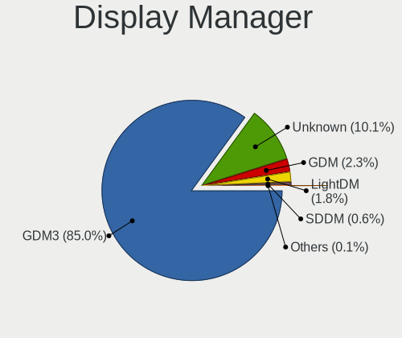
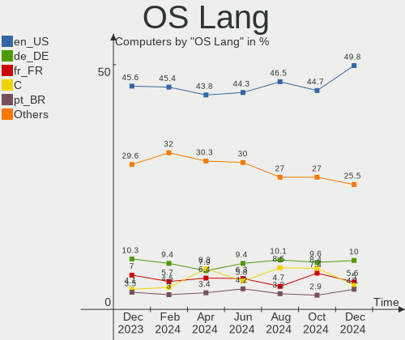
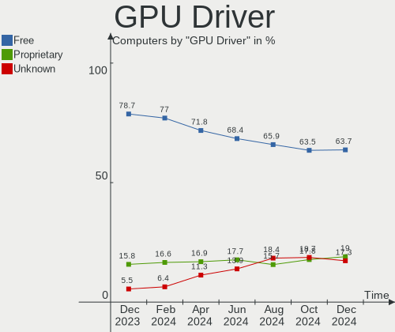
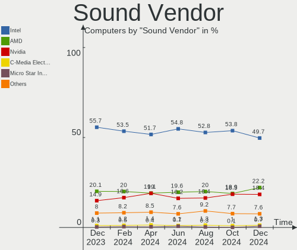

Ubuntu Hardware Trends
----------------------

A project to identify most popular hardware characteristics and track their change
over time based on data collected by Ubuntu users at https://Linux-Hardware.org.

Anyone can contribute to the study by uploading probes of their computers by
the [hw-probe](https://github.com/linuxhw/hw-probe) tool:

    sudo -E hw-probe -all -upload

This is a report for all computer types. See also reports for [desktops](/Dist/Ubuntu/Desktop/README.md) and [notebooks](/Dist/Ubuntu/Notebook/README.md).

Full-feature report is available here: https://linux-hardware.org/?view=trends

Period: Dec, 2020.

Contents
--------

- [ OS                       ](#os)
- [ OS Family                ](#os-family)
- [ Kernel                   ](#kernel)
- [ Kernel Family            ](#kernel-family)
- [ Kernel Major Ver.        ](#kernel-major-ver)
- [ Arch                     ](#arch)
- [ DE                       ](#de)
- [ Display Server           ](#display-server)
- [ Display Manager          ](#display-manager)
- [ OS Lang                  ](#os-lang)
- [ Boot Mode                ](#boot-mode)
- [ Filesystem               ](#filesystem)
- [ Part. scheme             ](#part-scheme)
- [ Dual Boot with Linux/BSD ](#dual-boot-with-linux/bsd)
- [ Dual Boot (Win)          ](#dual-boot-win)
- [ Country                  ](#country)
- [ City                     ](#city)
- [ Vendor                   ](#vendor)
- [ Model                    ](#model)
- [ Model Family             ](#model-family)
- [ MFG Year                 ](#mfg-year)
- [ Form Factor              ](#form-factor)
- [ Secure Boot              ](#secure-boot)
- [ Coreboot                 ](#coreboot)
- [ RAM Size                 ](#ram-size)
- [ RAM Used                 ](#ram-used)
- [ Has CD-ROM               ](#has-cd-rom)
- [ Total Drives             ](#total-drives)
- [ Has Ethernet             ](#has-ethernet)
- [ Drive Vendor             ](#drive-vendor)
- [ Drive Model              ](#drive-model)
- [ HDD Vendor               ](#hdd-vendor)
- [ SSD Vendor               ](#ssd-vendor)
- [ Drive Kind               ](#drive-kind)
- [ Drive Connector          ](#drive-connector)
- [ Drive Size               ](#drive-size)
- [ Space Total              ](#space-total)
- [ Space Used               ](#space-used)
- [ Malfunc. Drives          ](#malfunc-drives)
- [ Malfunc. Drive Vendor    ](#malfunc-drive-vendor)
- [ Malfunc. HDD Vendor      ](#malfunc-hdd-vendor)
- [ Malfunc. Drive Kind      ](#malfunc-drive-kind)
- [ Failed Drives            ](#failed-drives)
- [ Failed Drive Vendor      ](#failed-drive-vendor)
- [ Drive Status             ](#drive-status)
- [ Storage Vendor           ](#storage-vendor)
- [ Storage Model            ](#storage-model)
- [ Storage Kind             ](#storage-kind)
- [ CPU Vendor               ](#cpu-vendor)
- [ CPU Model                ](#cpu-model)
- [ CPU Model Family         ](#cpu-model-family)
- [ CPU Cores                ](#cpu-cores)
- [ CPU Sockets              ](#cpu-sockets)
- [ CPU Threads              ](#cpu-threads)
- [ CPU Op-Modes             ](#cpu-op-modes)
- [ CPU Microcode            ](#cpu-microcode)
- [ CPU Microarch            ](#cpu-microarch)
- [ GPU Vendor               ](#gpu-vendor)
- [ GPU Model                ](#gpu-model)
- [ GPU Combo                ](#gpu-combo)
- [ GPU Driver               ](#gpu-driver)
- [ GPU Memory               ](#gpu-memory)
- [ Monitor Vendor           ](#monitor-vendor)
- [ Monitor Model            ](#monitor-model)
- [ Monitor Resolution       ](#monitor-resolution)
- [ Monitor Diagonal         ](#monitor-diagonal)
- [ Monitor Width            ](#monitor-width)
- [ Aspect Ratio             ](#aspect-ratio)
- [ Monitor Area             ](#monitor-area)
- [ Pixel Density            ](#pixel-density)
- [ Multiple Monitors        ](#multiple-monitors)
- [ Net Controller Vendor    ](#net-controller-vendor)
- [ Net Controller Model     ](#net-controller-model)
- [ Wireless Vendor          ](#wireless-vendor)
- [ Wireless Model           ](#wireless-model)
- [ Ethernet Vendor          ](#ethernet-vendor)
- [ Ethernet Model           ](#ethernet-model)
- [ Net Controller Kind      ](#net-controller-kind)
- [ Used Controller          ](#used-controller)
- [ NICs                     ](#nics)
- [ Memory Vendor            ](#memory-vendor)
- [ Memory Model             ](#memory-model)
- [ Memory Kind              ](#memory-kind)
- [ Memory Form Factor       ](#memory-form-factor)
- [ Memory Size              ](#memory-size)
- [ Memory Speed             ](#memory-speed)
- [ Sound Vendor             ](#sound-vendor)
- [ Sound Model              ](#sound-model)
- [ Camera Vendor            ](#camera-vendor)
- [ Camera Model             ](#camera-model)
- [ Fingerprint Vendor       ](#fingerprint-vendor)
- [ Fingerprint Model        ](#fingerprint-model)
- [ Chipcard Vendor          ](#chipcard-vendor)
- [ Chipcard Model           ](#chipcard-model)
- [ Printer Vendor           ](#printer-vendor)
- [ Printer Model            ](#printer-model)
- [ Scanner Vendor           ](#scanner-vendor)
- [ Scanner Model            ](#scanner-model)
- [ Bluetooth Vendor         ](#bluetooth-vendor)
- [ Bluetooth Model          ](#bluetooth-model)
- [ Unsupported Devices      ](#unsupported-devices)
- [ Unsupported Device Types ](#unsupported-device-types)

OS
--

Installed operating systems

| Name           | Computers | Percent |
|----------------|-----------|---------|
| Ubuntu 20.04   | 1519      | 64.8%   |
| Ubuntu 20.10   | 476       | 20.31%  |
| Ubuntu 18.04   | 266       | 11.35%  |
| Ubuntu 16.04   | 36        | 1.54%   |
| Ubuntu 19.10   | 14        | 0.6%    |
| Ubuntu 21.04   | 9         | 0.38%   |
| Ubuntu         | 8         | 0.34%   |
| Ubuntu 19.04   | 4         | 0.17%   |
| Ubuntu 18.10   | 3         | 0.13%   |
| Ubuntu Core 16 | 2         | 0.09%   |
| Ubuntu 2020    | 2         | 0.09%   |
| Ubuntu 16.10   | 2         | 0.09%   |
| Ubuntu 17.10   | 1         | 0.04%   |
| Ubuntu 17.04   | 1         | 0.04%   |
| Ubuntu 14.04   | 1         | 0.04%   |

OS Family
---------

OS without a version

| Name   | Computers | Percent |
|--------|-----------|---------|
| Ubuntu | 2344      | 100%    |

Kernel
------

Version of the Linux kernel

| Version               | Computers | Percent |
|-----------------------|-----------|---------|
| 5.4.0-58-generic      | 732       | 31.23%  |
| 5.4.0-56-generic      | 467       | 19.92%  |
| 5.8.0-33-generic      | 196       | 8.36%   |
| 5.4.0-54-generic      | 126       | 5.38%   |
| 5.8.0-31-generic      | 97        | 4.14%   |
| 5.4.0-42-generic      | 85        | 3.63%   |
| 4.15.0-128-generic    | 50        | 2.13%   |
| 5.8.0-32-generic      | 43        | 1.83%   |
| 5.8.0-29-generic      | 43        | 1.83%   |
| 5.8.0-34-generic      | 27        | 1.15%   |
| 5.4.0-52-generic      | 25        | 1.07%   |
| 5.8.0-25-generic      | 22        | 0.94%   |
| 5.4.0-58-lowlatency   | 22        | 0.94%   |
| 5.4.0-53-generic      | 20        | 0.85%   |
| 4.15.0-126-generic    | 20        | 0.85%   |
| 5.4.0-59-generic      | 19        | 0.81%   |
| 5.8.0-1010-raspi      | 18        | 0.77%   |
| 5.4.0-26-generic      | 15        | 0.64%   |
| 5.10.2-051002-generic | 11        | 0.47%   |
| 5.8.0-1008-raspi      | 10        | 0.43%   |
| 4.15.0-124-generic    | 10        | 0.43%   |
| 5.4.0-56-lowlatency   | 9         | 0.38%   |
| 4.15.0-123-generic    | 9         | 0.38%   |
| 5.4.0-57-generic      | 8         | 0.34%   |
| 5.4.0-48-generic      | 8         | 0.34%   |
| 5.3.0-64-generic      | 8         | 0.34%   |
| 5.9.12-050912-generic | 7         | 0.3%    |
| 5.8.0-28-generic      | 7         | 0.3%    |
| 5.10.1-051001-generic | 7         | 0.3%    |
| 4.4.0-197-generic     | 7         | 0.3%    |
| 5.8.0-1007-raspi      | 6         | 0.26%   |
| 5.8.0-31-lowlatency   | 5         | 0.21%   |
| 5.8.0-1006-raspi      | 5         | 0.21%   |
| 5.6.0-1034-oem        | 5         | 0.21%   |
| 4.15.0-127-generic    | 5         | 0.21%   |
| 4.15.0-112-generic    | 5         | 0.21%   |
| 5.9.10-050910-generic | 4         | 0.17%   |
| 5.8.0-33-lowlatency   | 4         | 0.17%   |
| 5.8.0-1011-raspi      | 4         | 0.17%   |
| 5.4.0-47-generic      | 4         | 0.17%   |
| 5.8.18-050818-generic | 3         | 0.13%   |
| 5.8.0-34-lowlatency   | 3         | 0.13%   |
| 5.4.0-55-generic      | 3         | 0.13%   |
| 5.4.0-51-generic      | 3         | 0.13%   |
| 5.4.0-39-generic      | 3         | 0.13%   |
| 5.4.0-28-generic      | 3         | 0.13%   |
| 5.4.0-1025-raspi      | 3         | 0.13%   |
| 5.3.0-62-generic      | 3         | 0.13%   |
| 5.3.0-28-generic      | 3         | 0.13%   |
| 5.3.0-18-generic      | 3         | 0.13%   |
| 4.18.0-25-generic     | 3         | 0.13%   |
| 4.15.0-88-generic     | 3         | 0.13%   |
| 4.15.0-122-generic    | 3         | 0.13%   |
| 5.9.1-050901-generic  | 2         | 0.09%   |
| 5.8.0-30-generic      | 2         | 0.09%   |
| 5.8.0-14-generic      | 2         | 0.09%   |
| 5.7.1-050701-generic  | 2         | 0.09%   |
| 5.6.0-1036-oem        | 2         | 0.09%   |
| 5.4.0-57-lowlatency   | 2         | 0.09%   |
| 5.4.0-45-generic      | 2         | 0.09%   |

Kernel Family
-------------

Linux kernel without a distro release

| Version  | Computers | Percent |
|----------|-----------|---------|
| 5.4.0    | 1577      | 67.28%  |
| 5.8.0    | 502       | 21.42%  |
| 4.15.0   | 131       | 5.59%   |
| 5.3.0    | 25        | 1.07%   |
| 5.10.2   | 13        | 0.55%   |
| 4.4.0    | 13        | 0.55%   |
| 5.6.0    | 11        | 0.47%   |
| 5.9.12   | 8         | 0.34%   |
| 5.10.1   | 8         | 0.34%   |
| 5.10.0   | 6         | 0.26%   |
| 5.0.0    | 6         | 0.26%   |
| 4.18.0   | 6         | 0.26%   |
| 5.9.10   | 4         | 0.17%   |
| 5.9.0    | 4         | 0.17%   |
| 5.9.16   | 3         | 0.13%   |
| 5.8.18   | 3         | 0.13%   |
| 5.9.15   | 2         | 0.09%   |
| 5.9.1    | 2         | 0.09%   |
| 5.7.1    | 2         | 0.09%   |
| 5.10.3   | 2         | 0.09%   |
| 4.13.0   | 2         | 0.09%   |
| 5.9.6    | 1         | 0.04%   |
| 5.9.14   | 1         | 0.04%   |
| 5.9.13   | 1         | 0.04%   |
| 5.8.1    | 1         | 0.04%   |
| 5.6.7    | 1         | 0.04%   |
| 5.5.8    | 1         | 0.04%   |
| 5.4.58   | 1         | 0.04%   |
| 5.10.4   | 1         | 0.04%   |
| 4.9.140  | 1         | 0.04%   |
| 4.8.0    | 1         | 0.04%   |
| 4.19.127 | 1         | 0.04%   |
| 4.19.104 | 1         | 0.04%   |
| 4.16.0   | 1         | 0.04%   |
| 4.10.0   | 1         | 0.04%   |

Kernel Major Ver.
-----------------

Linux kernel major version

| Version | Computers | Percent |
|---------|-----------|---------|
| 5.4     | 1578      | 67.32%  |
| 5.8     | 506       | 21.59%  |
| 4.15    | 131       | 5.59%   |
| 5.10    | 30        | 1.28%   |
| 5.9     | 26        | 1.11%   |
| 5.3     | 25        | 1.07%   |
| 4.4     | 13        | 0.55%   |
| 5.6     | 12        | 0.51%   |
| 5.0     | 6         | 0.26%   |
| 4.18    | 6         | 0.26%   |
| 5.7     | 2         | 0.09%   |
| 4.19    | 2         | 0.09%   |
| 4.13    | 2         | 0.09%   |
| 5.5     | 1         | 0.04%   |
| 4.9     | 1         | 0.04%   |
| 4.8     | 1         | 0.04%   |
| 4.16    | 1         | 0.04%   |
| 4.10    | 1         | 0.04%   |

Arch
----

OS architecture (x86_64, i586, etc.)

| Name    | Computers | Percent |
|---------|-----------|---------|
| x86_64  | 2229      | 95.09%  |
| i686    | 62        | 2.65%   |
| aarch64 | 52        | 2.22%   |
| armv7l  | 1         | 0.04%   |

DE
--

Desktop Environment

| Name            | Computers | Percent |
|-----------------|-----------|---------|
| GNOME           | 1713      | 73.08%  |
| XFCE            | 175       | 7.47%   |
| Unknown         | 120       | 5.12%   |
| KDE             | 86        | 3.67%   |
| KDE5            | 58        | 2.47%   |
| Unity           | 48        | 2.05%   |
| MATE            | 39        | 1.66%   |
| Budgie          | 22        | 0.94%   |
| LXQt            | 21        | 0.9%    |
| X-Cinnamon      | 20        | 0.85%   |
| GNOME Flashback | 13        | 0.55%   |
| LXDE            | 9         | 0.38%   |
| GNOME Classic   | 7         | 0.3%    |
| Cinnamon        | 7         | 0.3%    |
| i3              | 3         | 0.13%   |
| fvwm            | 1         | 0.04%   |
| enlightenment   | 1         | 0.04%   |
| Deepin          | 1         | 0.04%   |

Display Server
--------------

X11 or Wayland

| Name    | Computers | Percent |
|---------|-----------|---------|
| X11     | 2207      | 94.16%  |
| Wayland | 71        | 3.03%   |
| Unknown | 47        | 2.01%   |
| Tty     | 18        | 0.77%   |
| Web     | 1         | 0.04%   |

Display Manager
---------------

SDDM, LightDM, etc.

| Name    | Computers | Percent |
|---------|-----------|---------|
| Unknown | 1842      | 78.58%  |
| GDM     | 346       | 14.76%  |
| TDM     | 85        | 3.63%   |
| SDDM    | 64        | 2.73%   |
| GDM3    | 4         | 0.17%   |
| XDM     | 2         | 0.09%   |
| LightDM | 1         | 0.04%   |

OS Lang
-------

Language

| Lang    | Computers | Percent |
|---------|-----------|---------|
| en_US   | 917       | 39.12%  |
| de_DE   | 276       | 11.77%  |
| it_IT   | 118       | 5.03%   |
| fr_FR   | 118       | 5.03%   |
| en_GB   | 112       | 4.78%   |
| pt_BR   | 83        | 3.54%   |
| en_CA   | 64        | 2.73%   |
| es_ES   | 60        | 2.56%   |
| en_IN   | 54        | 2.3%    |
| ru_RU   | 53        | 2.26%   |
| pl_PL   | 44        | 1.88%   |
| C       | 37        | 1.58%   |
| nl_NL   | 35        | 1.49%   |
| en_AU   | 32        | 1.37%   |
| hu_HU   | 22        | 0.94%   |
| ja_JP   | 20        | 0.85%   |
| cs_CZ   | 19        | 0.81%   |
| Unknown | 17        | 0.73%   |
| tr_TR   | 16        | 0.68%   |
| sv_SE   | 16        | 0.68%   |
| fi_FI   | 15        | 0.64%   |
| de_CH   | 15        | 0.64%   |
| es_MX   | 12        | 0.51%   |
| en_ZA   | 11        | 0.47%   |
| es_AR   | 10        | 0.43%   |
| de_AT   | 10        | 0.43%   |
| ru_UA   | 9         | 0.38%   |
| ro_RO   | 9         | 0.38%   |
| pt_PT   | 9         | 0.38%   |
| es_CO   | 9         | 0.38%   |
| nl_BE   | 7         | 0.3%    |
| hr_HR   | 7         | 0.3%    |
| el_GR   | 7         | 0.3%    |
| sk_SK   | 6         | 0.26%   |
| fr_CA   | 6         | 0.26%   |
| fr_BE   | 6         | 0.26%   |
| da_DK   | 6         | 0.26%   |
| zh_TW   | 5         | 0.21%   |
| ko_KR   | 5         | 0.21%   |
| es_CL   | 5         | 0.21%   |
| en_IL   | 5         | 0.21%   |
| zh_CN   | 4         | 0.17%   |
| uk_UA   | 4         | 0.17%   |
| bg_BG   | 4         | 0.17%   |
| es_EC   | 3         | 0.13%   |
| en_PH   | 3         | 0.13%   |
| en_NZ   | 3         | 0.13%   |
| en_IE   | 3         | 0.13%   |
| en_HK   | 3         | 0.13%   |
| sl_SI   | 2         | 0.09%   |
| nb_NO   | 2         | 0.09%   |
| id_ID   | 2         | 0.09%   |
| et_EE   | 2         | 0.09%   |
| es_PE   | 2         | 0.09%   |
| ca_ES   | 2         | 0.09%   |
| nds_DE  | 1         | 0.04%   |
| lv_LV   | 1         | 0.04%   |
| lt_LT   | 1         | 0.04%   |
| he_IL   | 1         | 0.04%   |
| gl_ES   | 1         | 0.04%   |

Boot Mode
---------

EFI or BIOS

| Mode | Computers | Percent |
|------|-----------|---------|
| BIOS | 1357      | 57.89%  |
| EFI  | 987       | 42.11%  |

Filesystem
----------

Type of filesystem

| Type     | Computers | Percent |
|----------|-----------|---------|
| Ext4     | 2204      | 94.03%  |
| Overlay  | 60        | 2.56%   |
| Zfs      | 32        | 1.37%   |
| Btrfs    | 23        | 0.98%   |
| Xfs      | 8         | 0.34%   |
| Ext2     | 6         | 0.26%   |
| Ext3     | 4         | 0.17%   |
| Unknown  | 4         | 0.17%   |
| Reiserfs | 2         | 0.09%   |
| Aufs     | 1         | 0.04%   |

Part. scheme
------------

Scheme of partitioning

| Type    | Computers | Percent |
|---------|-----------|---------|
| Unknown | 1822      | 77.73%  |
| GPT     | 405       | 17.28%  |
| MBR     | 117       | 4.99%   |

Dual Boot with Linux/BSD
------------------------

Hosting more than one Linux/BSD

| Dual boot | Computers | Percent |
|-----------|-----------|---------|
| No        | 2033      | 86.73%  |
| Yes       | 311       | 13.27%  |

Dual Boot (Win)
---------------

Hosting Linux and Windows

| Dual boot | Computers | Percent |
|-----------|-----------|---------|
| No        | 1492      | 63.65%  |
| Yes       | 852       | 36.35%  |

Country
-------

Geographic location (country)

| Country            | Computers | Percent |
|--------------------|-----------|---------|
| USA                | 436       | 18.6%   |
| Germany            | 319       | 13.61%  |
| Italy              | 135       | 5.76%   |
| France             | 125       | 5.33%   |
| Brazil             | 115       | 4.91%   |
| UK                 | 92        | 3.92%   |
| Spain              | 84        | 3.58%   |
| Canada             | 78        | 3.33%   |
| Netherlands        | 68        | 2.9%    |
| Russia             | 67        | 2.86%   |
| India              | 59        | 2.52%   |
| Poland             | 53        | 2.26%   |
| Switzerland        | 37        | 1.58%   |
| Belgium            | 37        | 1.58%   |
| Turkey             | 34        | 1.45%   |
| Ukraine            | 33        | 1.41%   |
| Australia          | 32        | 1.37%   |
| Hungary            | 28        | 1.19%   |
| Czech Republic     | 26        | 1.11%   |
| Sweden             | 25        | 1.07%   |
| Japan              | 23        | 0.98%   |
| Finland            | 23        | 0.98%   |
| Austria            | 23        | 0.98%   |
| Romania            | 21        | 0.9%    |
| Mexico             | 20        | 0.85%   |
| Portugal           | 18        | 0.77%   |
| Argentina          | 17        | 0.73%   |
| Indonesia          | 16        | 0.68%   |
| Greece             | 16        | 0.68%   |
| Bulgaria           | 16        | 0.68%   |
| Denmark            | 15        | 0.64%   |
| Colombia           | 13        | 0.55%   |
| South Africa       | 12        | 0.51%   |
| Korea, Republic of | 11        | 0.47%   |
| Iran               | 11        | 0.47%   |
| Egypt              | 11        | 0.47%   |
| Serbia             | 10        | 0.43%   |
| Croatia            | 10        | 0.43%   |
| Slovakia           | 9         | 0.38%   |
| Chile              | 9         | 0.38%   |
| Slovenia           | 8         | 0.34%   |
| China              | 8         | 0.34%   |
| Taiwan             | 7         | 0.3%    |
| Malaysia           | 7         | 0.3%    |
| Norway             | 6         | 0.26%   |
| New Zealand        | 6         | 0.26%   |
| Morocco            | 6         | 0.26%   |
| Israel             | 6         | 0.26%   |
| Tunisia            | 5         | 0.21%   |
| Philippines        | 5         | 0.21%   |
| Ireland            | 5         | 0.21%   |
| Estonia            | 5         | 0.21%   |
| Puerto Rico        | 4         | 0.17%   |
| Latvia             | 4         | 0.17%   |
| Ecuador            | 4         | 0.17%   |
| Algeria            | 4         | 0.17%   |
| Vietnam            | 3         | 0.13%   |
| UAE                | 3         | 0.13%   |
| Thailand           | 3         | 0.13%   |
| Sri Lanka          | 3         | 0.13%   |

City
----

Geographic location (city)

| City           | Computers | Percent |
|----------------|-----------|---------|
| Berlin         | 29        | 1.24%   |
| Rome           | 20        | 0.85%   |
| Madrid         | 17        | 0.73%   |
| Paris          | 16        | 0.68%   |
| Istanbul       | 16        | 0.68%   |
| Vienna         | 14        | 0.6%    |
| Prague         | 12        | 0.51%   |
| Milan          | 12        | 0.51%   |
| Kyiv           | 12        | 0.51%   |
| Düsseldorf    | 12        | 0.51%   |
| Warsaw         | 11        | 0.47%   |
| Tehran         | 11        | 0.47%   |
| São Paulo     | 11        | 0.47%   |
| Hamburg        | 11        | 0.47%   |
| Budapest       | 11        | 0.47%   |
| Mumbai         | 9         | 0.38%   |
| Moscow         | 9         | 0.38%   |
| Chicago        | 9         | 0.38%   |
| Athens         | 9         | 0.38%   |
| Stuttgart      | 8         | 0.34%   |
| Sofia          | 8         | 0.34%   |
| Munich         | 8         | 0.34%   |
| Hyderabad      | 8         | 0.34%   |
| Chennai        | 8         | 0.34%   |
| Bucharest      | 8         | 0.34%   |
| Bengaluru      | 8         | 0.34%   |
| Zagreb         | 7         | 0.3%    |
| Toronto        | 7         | 0.3%    |
| St Petersburg  | 7         | 0.3%    |
| Naples         | 7         | 0.3%    |
| Montreal       | 7         | 0.3%    |
| Helsinki       | 7         | 0.3%    |
| Dresden        | 7         | 0.3%    |
| Barcelona      | 7         | 0.3%    |
| Zurich         | 6         | 0.26%   |
| Sydney         | 6         | 0.26%   |
| Rio de Janeiro | 6         | 0.26%   |
| Essen          | 6         | 0.26%   |
| Edmonton       | 6         | 0.26%   |
| Cairo          | 6         | 0.26%   |
| Bogotá        | 6         | 0.26%   |
| Bielefeld      | 6         | 0.26%   |
| Belgrade       | 6         | 0.26%   |
| Alexandria     | 6         | 0.26%   |
| Wuppertal      | 5         | 0.21%   |
| Voronezh       | 5         | 0.21%   |
| Thonex         | 5         | 0.21%   |
| Stockholm      | 5         | 0.21%   |
| Seattle        | 5         | 0.21%   |
| Santiago       | 5         | 0.21%   |
| Orlando        | 5         | 0.21%   |
| Leipzig        | 5         | 0.21%   |
| Katowice       | 5         | 0.21%   |
| Houston        | 5         | 0.21%   |
| Gdańsk        | 5         | 0.21%   |
| Florence       | 5         | 0.21%   |
| Dublin         | 5         | 0.21%   |
| Curitiba       | 5         | 0.21%   |
| Brasília      | 5         | 0.21%   |
| Bonn           | 5         | 0.21%   |

Vendor
------

Motherboard manufacturer

| Name                    | Computers | Percent |
|-------------------------|-----------|---------|
| ASUSTek Computer        | 370       | 15.78%  |
| Dell                    | 347       | 14.8%   |
| Hewlett-Packard         | 313       | 13.35%  |
| Lenovo                  | 294       | 12.54%  |
| Gigabyte Technology     | 165       | 7.04%   |
| Acer                    | 150       | 6.4%    |
| MSI                     | 119       | 5.08%   |
| ASRock                  | 76        | 3.24%   |
| Intel                   | 51        | 2.18%   |
| Toshiba                 | 47        | 2.01%   |
| Raspberry Pi Foundation | 40        | 1.71%   |
| Apple                   | 38        | 1.62%   |
| Unknown                 | 35        | 1.49%   |
| Samsung Electronics     | 31        | 1.32%   |
| Fujitsu                 | 27        | 1.15%   |
| Sony                    | 21        | 0.9%    |
| Medion                  | 18        | 0.77%   |
| HUAWEI                  | 12        | 0.51%   |
| Notebook                | 11        | 0.47%   |
| Pegatron                | 10        | 0.43%   |
| Foxconn                 | 9         | 0.38%   |
| Packard Bell            | 8         | 0.34%   |
| Fujitsu Siemens         | 8         | 0.34%   |
| ECS                     | 7         | 0.3%    |
| TUXEDO                  | 6         | 0.26%   |
| Positivo                | 6         | 0.26%   |
| Gateway                 | 6         | 0.26%   |
| Biostar                 | 6         | 0.26%   |
| PC Engines              | 5         | 0.21%   |
| eMachines               | 5         | 0.21%   |
| Timi                    | 4         | 0.17%   |
| Supermicro              | 4         | 0.17%   |
| PC Specialist           | 4         | 0.17%   |
| Microsoft               | 4         | 0.17%   |
| Alienware               | 4         | 0.17%   |
| Teclast                 | 3         | 0.13%   |
| System76                | 3         | 0.13%   |
| LG Electronics          | 3         | 0.13%   |
| Huanan                  | 3         | 0.13%   |
| Clevo                   | 3         | 0.13%   |
| Avell High Performance  | 3         | 0.13%   |
| Panasonic               | 2         | 0.09%   |
| NEC Computers           | 2         | 0.09%   |
| Monster                 | 2         | 0.09%   |
| Compal                  | 2         | 0.09%   |
| Chuwi                   | 2         | 0.09%   |
| Casper                  | 2         | 0.09%   |
| BESSTAR Tech            | 2         | 0.09%   |
| Xplore                  | 1         | 0.04%   |
| XMG                     | 1         | 0.04%   |
| Wortmann AG             | 1         | 0.04%   |
| Wistron                 | 1         | 0.04%   |
| TrekStor                | 1         | 0.04%   |
| Thomson                 | 1         | 0.04%   |
| Thirdwave Diginnos      | 1         | 0.04%   |
| TaNix                   | 1         | 0.04%   |
| Star Labs               | 1         | 0.04%   |
| Standard                | 1         | 0.04%   |
| Sole                    | 1         | 0.04%   |
| SLIMBOOK                | 1         | 0.04%   |

Model
-----

Motherboard model

| Name                               | Computers | Percent |
|------------------------------------|-----------|---------|
| Unknown                            | 40        | 1.71%   |
| ASUS All Series                    | 21        | 0.9%    |
| RPi Raspberry Pi 4 Model B Rev 1.4 | 18        | 0.77%   |
| RPi Raspberry Pi 4 Model B Rev 1.2 | 11        | 0.47%   |
| HP Notebook                        | 11        | 0.47%   |
| Dell Inspiron 1545                 | 8         | 0.34%   |
| ASUS ROG STRIX B450-F GAMING       | 8         | 0.34%   |
| HP Pavilion g6                     | 6         | 0.26%   |
| HP EliteBook 8460p                 | 6         | 0.26%   |
| HP 15                              | 6         | 0.26%   |
| Dell XPS 15 9500                   | 6         | 0.26%   |
| Dell XPS 13 9310                   | 6         | 0.26%   |
| RPi Raspberry Pi 4 Model B Rev 1.1 | 5         | 0.21%   |
| MSI MS-7C37                        | 5         | 0.21%   |
| HUAWEI NBLK-WAX9X                  | 5         | 0.21%   |
| HP Pavilion Notebook               | 5         | 0.21%   |
| HP Pavilion dv6                    | 5         | 0.21%   |
| Dell XPS 13 9380                   | 5         | 0.21%   |
| Dell OptiPlex 7010                 | 5         | 0.21%   |
| Dell OptiPlex 3010                 | 5         | 0.21%   |
| Dell Latitude D630                 | 5         | 0.21%   |
| Dell Inspiron 3847                 | 5         | 0.21%   |
| RPi Raspberry Pi 400 Rev 1.0       | 4         | 0.17%   |
| PC Engines apu2                    | 4         | 0.17%   |
| MSI MS-7C51                        | 4         | 0.17%   |
| MSI MS-7A38                        | 4         | 0.17%   |
| HP ProBook 4540s                   | 4         | 0.17%   |
| HP Pavilion dv7                    | 4         | 0.17%   |
| HP Pavilion 17                     | 4         | 0.17%   |
| HP Laptop 15-db0xxx                | 4         | 0.17%   |
| HP Laptop 15-bs0xx                 | 4         | 0.17%   |
| HP 255 G7 Notebook PC              | 4         | 0.17%   |
| Gigabyte B550I AORUS PRO AX        | 4         | 0.17%   |
| Dell XPS 13 9310 2-in-1            | 4         | 0.17%   |
| Dell OptiPlex 9020                 | 4         | 0.17%   |
| Dell OptiPlex 780                  | 4         | 0.17%   |
| Dell OptiPlex 745                  | 4         | 0.17%   |
| Dell Latitude E6500                | 4         | 0.17%   |
| Dell Latitude E6430                | 4         | 0.17%   |
| Dell Latitude E6420                | 4         | 0.17%   |
| Dell Latitude E6400                | 4         | 0.17%   |
| Dell Inspiron 530                  | 4         | 0.17%   |
| Dell Inspiron 3543                 | 4         | 0.17%   |
| ASUS PRIME B450M-A                 | 4         | 0.17%   |
| ASUS PRIME A320M-K                 | 4         | 0.17%   |
| Acer Aspire A715-75G               | 4         | 0.17%   |
| TUXEDO Pulse 15 Gen1               | 3         | 0.13%   |
| Samsung 550P5C/550P7C              | 3         | 0.13%   |
| MSI MS-7B89                        | 3         | 0.13%   |
| MSI MS-7816                        | 3         | 0.13%   |
| MSI GL65 Leopard 10SDK             | 3         | 0.13%   |
| MSI GE66 Raider 10SFS              | 3         | 0.13%   |
| Lenovo Z50-70 20354                | 3         | 0.13%   |
| Lenovo IdeaPad 5 14ARE05 81YM      | 3         | 0.13%   |
| Lenovo IdeaPad 3 15IIL05 81WE      | 3         | 0.13%   |
| Intel HCL Desktop                  | 3         | 0.13%   |
| HUAWEI KLVL-WXX9                   | 3         | 0.13%   |
| HP ZBook 15                        | 3         | 0.13%   |
| HP Z620 Workstation                | 3         | 0.13%   |
| HP ProDesk 400 G1 SFF              | 3         | 0.13%   |

Model Family
------------

Motherboard model prefix

| Name                    | Computers | Percent |
|-------------------------|-----------|---------|
| Lenovo ThinkPad         | 137       | 5.84%   |
| Acer Aspire             | 102       | 4.35%   |
| Dell Inspiron           | 98        | 4.18%   |
| Dell Latitude           | 86        | 3.67%   |
| Lenovo IdeaPad          | 64        | 2.73%   |
| HP Pavilion             | 64        | 2.73%   |
| Dell OptiPlex           | 48        | 2.05%   |
| HP EliteBook            | 46        | 1.96%   |
| Dell XPS                | 46        | 1.96%   |
| RPi Raspberry           | 40        | 1.71%   |
| ASUS PRIME              | 40        | 1.71%   |
| Unknown                 | 40        | 1.71%   |
| Toshiba Satellite       | 38        | 1.62%   |
| HP Compaq               | 33        | 1.41%   |
| Dell Precision          | 31        | 1.32%   |
| ASUS ROG                | 29        | 1.24%   |
| HP ProBook              | 26        | 1.11%   |
| HP Laptop               | 23        | 0.98%   |
| ASUS All                | 21        | 0.9%    |
| Lenovo ThinkCentre      | 16        | 0.68%   |
| Dell Vostro             | 16        | 0.68%   |
| HP ENVY                 | 14        | 0.6%    |
| ASUS VivoBook           | 14        | 0.6%    |
| Lenovo Yoga             | 13        | 0.55%   |
| ASUS TUF                | 13        | 0.55%   |
| HP ZBook                | 12        | 0.51%   |
| Fujitsu LIFEBOOK        | 12        | 0.51%   |
| HP Notebook             | 11        | 0.47%   |
| HP ProDesk              | 9         | 0.38%   |
| Fujitsu ESPRIMO         | 9         | 0.38%   |
| Acer Swift              | 9         | 0.38%   |
| Acer Nitro              | 9         | 0.38%   |
| HP 15                   | 8         | 0.34%   |
| ASUS M5A78L-M           | 8         | 0.34%   |
| Acer Extensa            | 8         | 0.34%   |
| Lenovo Legion           | 7         | 0.3%    |
| Lenovo IdeaCentre       | 7         | 0.3%    |
| HP 255                  | 7         | 0.3%    |
| Gigabyte X570           | 7         | 0.3%    |
| Dell PowerEdge          | 7         | 0.3%    |
| ASUS ZenBook            | 7         | 0.3%    |
| HP Spectre              | 6         | 0.26%   |
| Gigabyte B450M          | 6         | 0.26%   |
| Fujitsu Siemens ESPRIMO | 6         | 0.26%   |
| Dell G3                 | 6         | 0.26%   |
| Acer TravelMate         | 6         | 0.26%   |
| MSI MS-7C37             | 5         | 0.21%   |
| HUAWEI NBLK-WAX9X       | 5         | 0.21%   |
| HP ProLiant             | 5         | 0.21%   |
| Gigabyte Z390           | 5         | 0.21%   |
| Gigabyte GA-78LMT-USB3  | 5         | 0.21%   |
| Gigabyte B550           | 5         | 0.21%   |
| ASUS M5A97              | 5         | 0.21%   |
| ASRock B450M            | 5         | 0.21%   |
| Apple MacBookPro8       | 5         | 0.21%   |
| PC Engines apu2         | 4         | 0.17%   |
| Packard Bell EasyNote   | 4         | 0.17%   |
| MSI MS-7C51             | 4         | 0.17%   |
| MSI MS-7A38             | 4         | 0.17%   |
| MSI GL65                | 4         | 0.17%   |

MFG Year
--------

Motherboard manufacture year

| Year    | Computers | Percent |
|---------|-----------|---------|
| 2020    | 484       | 20.65%  |
| 2019    | 271       | 11.56%  |
| 2018    | 184       | 7.85%   |
| 2013    | 163       | 6.95%   |
| 2012    | 158       | 6.74%   |
| 2011    | 148       | 6.31%   |
| 2014    | 144       | 6.14%   |
| 2010    | 141       | 6.02%   |
| 2015    | 136       | 5.8%    |
| 2017    | 110       | 4.69%   |
| 2009    | 105       | 4.48%   |
| 2016    | 88        | 3.75%   |
| 2008    | 85        | 3.63%   |
| Unknown | 54        | 2.3%    |
| 2007    | 51        | 2.18%   |
| 2006    | 10        | 0.43%   |
| 2005    | 9         | 0.38%   |
| 2004    | 3         | 0.13%   |

Form Factor
-----------

Physical design of the computer

| Name           | Computers | Percent |
|----------------|-----------|---------|
| Notebook       | 1236      | 52.73%  |
| Desktop        | 919       | 39.21%  |
| Convertible    | 58        | 2.47%   |
| System on chip | 52        | 2.22%   |
| Mini pc        | 28        | 1.19%   |
| All in one     | 23        | 0.98%   |
| Server         | 17        | 0.73%   |
| Tablet         | 11        | 0.47%   |

Secure Boot
-----------

Enabled or disabled

| State    | Computers | Percent |
|----------|-----------|---------|
| Disabled | 2143      | 91.42%  |
| Enabled  | 201       | 8.58%   |

Coreboot
--------

Have coreboot on board

| Used | Computers | Percent |
|------|-----------|---------|
| No   | 2338      | 99.74%  |
| Yes  | 6         | 0.26%   |

RAM Size
--------

Total RAM memory

| Size in GB  | Computers | Percent |
|-------------|-----------|---------|
| 3.01-4.0    | 536       | 22.87%  |
| 4.01-8.0    | 522       | 22.27%  |
| 8.01-16.0   | 432       | 18.43%  |
| 16.01-24.0  | 419       | 17.88%  |
| 32.01-64.0  | 191       | 8.15%   |
| 1.01-2.0    | 107       | 4.56%   |
| 64.01-256.0 | 47        | 2.01%   |
| 2.01-3.0    | 41        | 1.75%   |
| 24.01-32.0  | 32        | 1.37%   |
| 0.51-1.0    | 17        | 0.73%   |

RAM Used
--------

Used RAM memory

| Used GB    | Computers | Percent |
|------------|-----------|---------|
| 1.01-2.0   | 966       | 41.21%  |
| 2.01-3.0   | 610       | 26.02%  |
| 4.01-8.0   | 289       | 12.33%  |
| 3.01-4.0   | 263       | 11.22%  |
| 0.51-1.0   | 109       | 4.65%   |
| 8.01-16.0  | 76        | 3.24%   |
| 0.01-0.5   | 17        | 0.73%   |
| 16.01-24.0 | 8         | 0.34%   |
| 32.01-64.0 | 4         | 0.17%   |
| 24.01-32.0 | 2         | 0.09%   |

Has CD-ROM
----------

Has CD-ROM on board

| Presented | Computers | Percent |
|-----------|-----------|---------|
| No        | 1275      | 54.39%  |
| Yes       | 1069      | 45.61%  |

Total Drives
------------

Number of drives on board

| Drives | Computers | Percent |
|--------|-----------|---------|
| 1      | 1413      | 60.28%  |
| 2      | 610       | 26.02%  |
| 3      | 166       | 7.08%   |
| 4      | 77        | 3.28%   |
| 5      | 26        | 1.11%   |
| 6      | 17        | 0.73%   |
| 0      | 15        | 0.64%   |
| 7      | 9         | 0.38%   |
| 9      | 5         | 0.21%   |
| 8      | 3         | 0.13%   |
| 36     | 1         | 0.04%   |
| 13     | 1         | 0.04%   |
| 11     | 1         | 0.04%   |

Has Ethernet
------------

Has Ethernet on board

| Presented | Computers | Percent |
|-----------|-----------|---------|
| Yes       | 2058      | 87.8%   |
| No        | 286       | 12.2%   |

Drive Vendor
------------

Hard drive vendors

| Vendor                    | Computers | Drives | Percent |
|---------------------------|-----------|--------|---------|
| WDC                       | 563       | 684    | 17.19%  |
| Seagate                   | 535       | 646    | 16.34%  |
| Samsung Electronics       | 487       | 580    | 14.87%  |
| Toshiba                   | 230       | 242    | 7.02%   |
| Kingston                  | 182       | 186    | 5.56%   |
| Unknown                   | 161       | 179    | 4.92%   |
| SanDisk                   | 137       | 142    | 4.18%   |
| Hitachi                   | 124       | 137    | 3.79%   |
| Crucial                   | 98        | 106    | 2.99%   |
| SK Hynix                  | 77        | 80     | 2.35%   |
| Intel                     | 76        | 80     | 2.32%   |
| HGST                      | 69        | 77     | 2.11%   |
| Micron Technology         | 43        | 45     | 1.31%   |
| A-DATA Technology         | 37        | 40     | 1.13%   |
| Phison                    | 33        | 35     | 1.01%   |
| China                     | 25        | 26     | 0.76%   |
| Patriot                   | 19        | 19     | 0.58%   |
| Fujitsu                   | 18        | 18     | 0.55%   |
| SPCC                      | 17        | 17     | 0.52%   |
| Intenso                   | 17        | 19     | 0.52%   |
| Apple                     | 17        | 19     | 0.52%   |
| Silicon Motion            | 15        | 16     | 0.46%   |
| MAXTOR                    | 15        | 15     | 0.46%   |
| KIOXIA                    | 15        | 15     | 0.46%   |
| PNY                       | 13        | 13     | 0.4%    |
| Transcend                 | 12        | 12     | 0.37%   |
| OCZ                       | 12        | 12     | 0.37%   |
| Gigabyte Technology       | 12        | 12     | 0.37%   |
| LITEON                    | 11        | 11     | 0.34%   |
| Micron/Crucial Technology | 10        | 10     | 0.31%   |
| JMicron                   | 9         | 9      | 0.27%   |
| Hewlett-Packard           | 8         | 8      | 0.24%   |
| Corsair                   | 8         | 8      | 0.24%   |
| Apacer                    | 8         | 8      | 0.24%   |
| GOODRAM                   | 7         | 7      | 0.21%   |
| SABRENT                   | 6         | 6      | 0.18%   |
| Realtek Semiconductor     | 6         | 6      | 0.18%   |
| PLEXTOR                   | 6         | 6      | 0.18%   |
| Lexar                     | 5         | 5      | 0.15%   |
| KingFast                  | 5         | 6      | 0.15%   |
| KingDian                  | 5         | 5      | 0.15%   |
| ASMT                      | 5         | 8      | 0.15%   |
| XPG                       | 4         | 4      | 0.12%   |
| TO Exter                  | 4         | 4      | 0.12%   |
| LITEONIT                  | 4         | 4      | 0.12%   |
| ADATA Technology          | 4         | 4      | 0.12%   |
| Team                      | 3         | 3      | 0.09%   |
| StoreJet                  | 3         | 3      | 0.09%   |
| Lenovo                    | 3         | 4      | 0.09%   |
| INNOVATION IT             | 3         | 3      | 0.09%   |
| HPE                       | 3         | 4      | 0.09%   |
| XrayDisk                  | 2         | 3      | 0.06%   |
| WD MediaMax               | 2         | 2      | 0.06%   |
| Union Memory              | 2         | 2      | 0.06%   |
| Teclast                   | 2         | 2      | 0.06%   |
| TCSUNBOW                  | 2         | 2      | 0.06%   |
| SUNEAST                   | 2         | 2      | 0.06%   |
| Pioneer                   | 2         | 2      | 0.06%   |
| OWC                       | 2         | 2      | 0.06%   |
| Mushkin                   | 2         | 2      | 0.06%   |

Drive Model
-----------

Hard drive models

| Model                              | Computers | Percent |
|------------------------------------|-----------|---------|
| Unknown MMC Card  32GB             | 37        | 1.03%   |
| Kingston SA400S37240G 240GB SSD    | 37        | 1.03%   |
| Samsung SSD 860 EVO 500GB          | 35        | 0.98%   |
| Unknown MMC Card  64GB             | 29        | 0.81%   |
| Seagate ST500DM002-1BD142 500GB    | 28        | 0.78%   |
| Samsung SSD 850 EVO 250GB          | 25        | 0.7%    |
| Seagate ST1000LM024 HN-M101MBB 1TB | 24        | 0.67%   |
| Seagate ST1000DM010-2EP102 1TB     | 23        | 0.64%   |
| Samsung NVMe SSD Drive 500GB       | 23        | 0.64%   |
| Kingston SA400S37480G 480GB SSD    | 23        | 0.64%   |
| Samsung NVMe SSD Drive 256GB       | 22        | 0.62%   |
| Toshiba MQ01ABF050 500GB           | 20        | 0.56%   |
| Seagate ST1000LM035-1RK172 1TB     | 20        | 0.56%   |
| Crucial CT500MX500SSD1 500GB       | 20        | 0.56%   |
| Samsung SSD 860 EVO 1TB            | 19        | 0.53%   |
| Kingston SA400S37120G 120GB SSD    | 19        | 0.53%   |
| Toshiba MQ01ABD100 1TB             | 18        | 0.5%    |
| Samsung SSD 850 EVO 500GB          | 18        | 0.5%    |
| Samsung NVMe SSD Drive 512GB       | 18        | 0.5%    |
| Kingston SV300S37A120G 120GB SSD   | 18        | 0.5%    |
| Toshiba DT01ACA100 1TB             | 17        | 0.48%   |
| Seagate ST2000DM008-2FR102 2TB     | 17        | 0.48%   |
| Sandisk NVMe SSD Drive 512GB       | 17        | 0.48%   |
| Unknown MMC Card  16GB             | 16        | 0.45%   |
| Toshiba HDWD110 1TB                | 16        | 0.45%   |
| Samsung SSD 860 EVO 250GB          | 16        | 0.45%   |
| Intel NVMe SSD Drive 512GB         | 15        | 0.42%   |
| HGST HTS721010A9E630 1TB           | 15        | 0.42%   |
| Crucial CT240BX500SSD1 240GB       | 15        | 0.42%   |
| Seagate ST3500418AS 500GB          | 14        | 0.39%   |
| Seagate ST1000DM003-1CH162 1TB     | 14        | 0.39%   |
| Seagate Expansion+ 4TB             | 14        | 0.39%   |
| Samsung NVMe SSD Drive 1TB         | 14        | 0.39%   |
| HGST HTS545050A7E680 500GB         | 14        | 0.39%   |
| WDC WD10EZEX-08WN4A0 1TB           | 13        | 0.36%   |
| Unknown MMC Card  128GB            | 13        | 0.36%   |
| Toshiba MQ04ABF100 1TB             | 13        | 0.36%   |
| Seagate ST3500413AS 500GB          | 13        | 0.36%   |
| SK Hynix NVMe SSD Drive 512GB      | 12        | 0.34%   |
| Seagate ST500LT012-1DG142 500GB    | 12        | 0.34%   |
| Seagate ST1000LM048-2E7172 1TB     | 12        | 0.34%   |
| Samsung SSD 840 EVO 250GB          | 12        | 0.34%   |
| Samsung NVMe SSD Drive 250GB       | 12        | 0.34%   |
| Unknown SD/MMC/MS PRO 128GB        | 11        | 0.31%   |
| Seagate ST9500325AS 500GB          | 11        | 0.31%   |
| SanDisk SSD PLUS 240GB             | 11        | 0.31%   |
| Samsung SSD 970 EVO Plus 1TB       | 11        | 0.31%   |
| WDC WD10SPZX-21Z10T0 1TB           | 10        | 0.28%   |
| SK Hynix NVMe SSD Drive 256GB      | 10        | 0.28%   |
| Seagate ST2000DM006-2DM164 2TB     | 10        | 0.28%   |
| Samsung HD103SJ 1TB                | 10        | 0.28%   |
| HGST HTS725050A7E630 500GB         | 10        | 0.28%   |
| Crucial CT250MX500SSD1 250GB       | 10        | 0.28%   |
| Seagate ST31000524AS 1TB           | 9         | 0.25%   |
| Seagate ST1000LM049-2GH172 1TB     | 9         | 0.25%   |
| Seagate ST1000DM003-1ER162 1TB     | 9         | 0.25%   |
| SanDisk SDSSDA240G 240GB           | 9         | 0.25%   |
| Samsung SSD 860 QVO 1TB            | 9         | 0.25%   |
| Phison NVMe SSD Drive 1TB          | 9         | 0.25%   |
| Patriot Burst 120GB SSD            | 9         | 0.25%   |

HDD Vendor
----------

Hard disk drive vendors

| Vendor              | Computers | Drives | Percent |
|---------------------|-----------|--------|---------|
| Seagate             | 525       | 624    | 34.84%  |
| WDC                 | 473       | 573    | 31.39%  |
| Toshiba             | 180       | 189    | 11.94%  |
| Hitachi             | 124       | 137    | 8.23%   |
| Samsung Electronics | 83        | 99     | 5.51%   |
| HGST                | 69        | 77     | 4.58%   |
| Fujitsu             | 18        | 18     | 1.19%   |
| Maxtor              | 14        | 14     | 0.93%   |
| Apple               | 6         | 6      | 0.4%    |
| TO Exter            | 4         | 4      | 0.27%   |
| ASMT                | 3         | 3      | 0.2%    |
| Intenso             | 2         | 2      | 0.13%   |
| Hewlett-Packard     | 2         | 2      | 0.13%   |
| Msft                | 1         | 1      | 0.07%   |
| IBM/Hitachi         | 1         | 1      | 0.07%   |
| ExcelStor           | 1         | 1      | 0.07%   |
| ASMT109x            | 1         | 1      | 0.07%   |

SSD Vendor
----------

Solid state drive vendors

| Vendor              | Computers | Drives | Percent |
|---------------------|-----------|--------|---------|
| Samsung Electronics | 265       | 290    | 25.38%  |
| Kingston            | 152       | 154    | 14.56%  |
| SanDisk             | 97        | 102    | 9.29%   |
| Crucial             | 93        | 100    | 8.91%   |
| WDC                 | 56        | 61     | 5.36%   |
| Intel               | 33        | 33     | 3.16%   |
| A-DATA Technology   | 32        | 34     | 3.07%   |
| Micron Technology   | 28        | 29     | 2.68%   |
| China               | 25        | 26     | 2.39%   |
| SK Hynix            | 21        | 21     | 2.01%   |
| Patriot             | 19        | 19     | 1.82%   |
| Toshiba             | 16        | 17     | 1.53%   |
| SPCC                | 16        | 16     | 1.53%   |
| Intenso             | 13        | 15     | 1.25%   |
| PNY                 | 12        | 12     | 1.15%   |
| OCZ                 | 12        | 12     | 1.15%   |
| Transcend           | 11        | 11     | 1.05%   |
| Unknown             | 9         | 9      | 0.86%   |
| LITEON              | 9         | 9      | 0.86%   |
| Apple               | 8         | 8      | 0.77%   |
| Apacer              | 8         | 8      | 0.77%   |
| JMicron             | 7         | 7      | 0.67%   |
| GOODRAM             | 7         | 7      | 0.67%   |
| Gigabyte Technology | 7         | 7      | 0.67%   |
| PLEXTOR             | 6         | 6      | 0.57%   |
| Hewlett-Packard     | 6         | 6      | 0.57%   |
| Corsair             | 6         | 6      | 0.57%   |
| SABRENT             | 5         | 5      | 0.48%   |
| Lexar               | 5         | 5      | 0.48%   |
| KingDian            | 5         | 5      | 0.48%   |
| LITEONIT            | 4         | 4      | 0.38%   |
| Team                | 3         | 3      | 0.29%   |
| INNOVATION IT       | 3         | 3      | 0.29%   |
| Teclast             | 2         | 2      | 0.19%   |
| SUNEAST             | 2         | 2      | 0.19%   |
| Pioneer             | 2         | 2      | 0.19%   |
| OWC                 | 2         | 2      | 0.19%   |
| Mushkin             | 2         | 2      | 0.19%   |
| External            | 2         | 2      | 0.19%   |
| ZOTAC               | 1         | 1      | 0.1%    |
| Zheino              | 1         | 1      | 0.1%    |
| XrayDisk            | 1         | 2      | 0.1%    |
| WDC WDS1            | 1         | 1      | 0.1%    |
| Verbatim            | 1         | 1      | 0.1%    |
| Vaseky              | 1         | 1      | 0.1%    |
| TCSUNBOW            | 1         | 1      | 0.1%    |
| SMART               | 1         | 1      | 0.1%    |
| Seagate             | 1         | 1      | 0.1%    |
| SATA3 12            | 1         | 1      | 0.1%    |
| S3+                 | 1         | 1      | 0.1%    |
| Radeon              | 1         | 1      | 0.1%    |
| NVMe                | 1         | 2      | 0.1%    |
| Netac               | 1         | 1      | 0.1%    |
| Mercury             | 1         | 1      | 0.1%    |
| Maxtor              | 1         | 1      | 0.1%    |
| Leven               | 1         | 1      | 0.1%    |
| KIOXIA-EXCERIA      | 1         | 1      | 0.1%    |
| KingSpec            | 1         | 1      | 0.1%    |
| Integral            | 1         | 1      | 0.1%    |
| INDMEM              | 1         | 1      | 0.1%    |

Drive Kind
----------

HDD or SSD

| Kind    | Computers | Drives | Percent |
|---------|-----------|--------|---------|
| HDD     | 1276      | 1752   | 42.95%  |
| SSD     | 940       | 1098   | 31.64%  |
| NVMe    | 540       | 604    | 18.18%  |
| MMC     | 128       | 142    | 4.31%   |
| Unknown | 87        | 102    | 2.93%   |

Drive Connector
---------------

SATA, SAS, NVMe, etc.

| Type | Computers | Drives | Percent |
|------|-----------|--------|---------|
| SATA | 1871      | 2782   | 70.05%  |
| NVMe | 540       | 604    | 20.22%  |
| SAS  | 132       | 170    | 4.94%   |
| MMC  | 128       | 142    | 4.79%   |

Drive Size
----------

Size of hard drive

| Size in TB  | Computers | Drives | Percent |
|-------------|-----------|--------|---------|
| 0.01-0.5    | 1393      | 1709   | 59.61%  |
| 0.51-1.0    | 647       | 734    | 27.69%  |
| 1.01-2.0    | 165       | 197    | 7.06%   |
| 3.01-4.0    | 63        | 86     | 2.7%    |
| 2.01-3.0    | 38        | 56     | 1.63%   |
| 4.01-10.0   | 26        | 62     | 1.11%   |
| 10.01-20.0  | 3         | 3      | 0.13%   |
| 50.01-100.0 | 1         | 2      | 0.04%   |
| 0           | 1         | 1      | 0.04%   |

Space Total
-----------

Amount of disk space available on the file system

| Size in GB     | Computers | Percent |
|----------------|-----------|---------|
| 101-250        | 721       | 30.76%  |
| 251-500        | 557       | 23.76%  |
| 501-1000       | 368       | 15.7%   |
| 51-100         | 176       | 7.51%   |
| 1001-2000      | 148       | 6.31%   |
| 21-50          | 119       | 5.08%   |
| More than 3000 | 95        | 4.05%   |
| 1-20           | 81        | 3.46%   |
| 2001-3000      | 54        | 2.3%    |
| Unknown        | 25        | 1.07%   |

Space Used
----------

Amount of used disk space

| Used GB        | Computers | Percent |
|----------------|-----------|---------|
| 1-20           | 964       | 41.13%  |
| 21-50          | 399       | 17.02%  |
| 101-250        | 313       | 13.35%  |
| 51-100         | 275       | 11.73%  |
| 251-500        | 155       | 6.61%   |
| 501-1000       | 115       | 4.91%   |
| 1001-2000      | 44        | 1.88%   |
| More than 3000 | 36        | 1.54%   |
| Unknown        | 25        | 1.07%   |
| 2001-3000      | 18        | 0.77%   |

Malfunc. Drives
---------------

Drive models with a malfunction

| Model                                   | Computers | Drives | Percent |
|-----------------------------------------|-----------|--------|---------|
| Toshiba MQ04ABF100 1TB                  | 3         | 3      | 2.75%   |
| Seagate ST500DM002-1BD142 500GB         | 3         | 3      | 2.75%   |
| WDC WD10EADS-00M2B0 1TB                 | 2         | 2      | 1.83%   |
| Toshiba DT01ACA050 500GB                | 2         | 2      | 1.83%   |
| Seagate ST3500418AS 500GB               | 2         | 2      | 1.83%   |
| Intel SSDSC2KW240H6 240GB               | 2         | 2      | 1.83%   |
| HGST HTS545050A7E680 500GB              | 2         | 2      | 1.83%   |
| HGST HTS541075A9E680 752GB              | 2         | 2      | 1.83%   |
| Crucial CT500P1SSD8 500GB               | 2         | 2      | 1.83%   |
| WDC WDS240G2G0B-00EPW0 240GB SSD        | 1         | 1      | 0.92%   |
| WDC WD800BD-22MRA1 80GB                 | 1         | 1      | 0.92%   |
| WDC WD7501AAES-60Z2A0 752GB             | 1         | 1      | 0.92%   |
| WDC WD7500BPVT-80HXZT1 752GB            | 1         | 1      | 0.92%   |
| WDC WD5000LPLX-00ZNTT0 500GB            | 1         | 1      | 0.92%   |
| WDC WD5000BEVT-60ZAT1 500GB             | 1         | 1      | 0.92%   |
| WDC WD5000AAKX-00ERMA0 500GB            | 1         | 1      | 0.92%   |
| WDC WD5000AAKX-001CA0 500GB             | 1         | 2      | 0.92%   |
| WDC WD5000AAKS-00V1A0 500GB             | 1         | 1      | 0.92%   |
| WDC WD40EFRX-68WT0N0 4TB                | 1         | 1      | 0.92%   |
| WDC WD3200BEVT-60A23T0 320GB            | 1         | 1      | 0.92%   |
| WDC WD30EZRX-00MMMB0 3TB                | 1         | 1      | 0.92%   |
| WDC WD20EZRX-00D8PB0 2TB                | 1         | 1      | 0.92%   |
| WDC WD20EARS-22MVWB0 2TB                | 1         | 1      | 0.92%   |
| WDC WD2003FZEX-00Z4SA0 2TB              | 1         | 1      | 0.92%   |
| WDC WD2000FYYZ-01UL1B1 2TB              | 1         | 2      | 0.92%   |
| WDC WD10JPVX-75JC3T0 1TB                | 1         | 1      | 0.92%   |
| WDC WD10EZEX-60WN4A0 1TB                | 1         | 1      | 0.92%   |
| WDC WD10EFRX-68FYTN0 1TB                | 1         | 1      | 0.92%   |
| WDC WD10EADS-67M2B0 1TB                 | 1         | 1      | 0.92%   |
| WDC WD1001FALS-00U9B0 1TB               | 1         | 1      | 0.92%   |
| Unknown 8GB SATA Flash Drive SSD        | 1         | 1      | 0.92%   |
| Toshiba MQ01ABD100 1TB                  | 1         | 1      | 0.92%   |
| SK Hynix PC401 NVMe 512GB               | 1         | 1      | 0.92%   |
| SK Hynix HFS256G39TND-N210A 256GB SSD   | 1         | 1      | 0.92%   |
| SK Hynix BC501 HFM256GDJTNG-8310A 256GB | 1         | 1      | 0.92%   |
| Seagate ST9500420AS 500GB               | 1         | 1      | 0.92%   |
| Seagate ST9500325AS 500GB               | 1         | 1      | 0.92%   |
| Seagate ST9250315AS 250GB               | 1         | 1      | 0.92%   |
| Seagate ST9160310AS 160GB               | 1         | 1      | 0.92%   |
| Seagate ST500LT012-9WS142 500GB         | 1         | 1      | 0.92%   |
| Seagate ST500LT012-1DG142 500GB         | 1         | 1      | 0.92%   |
| Seagate ST500LM021-1KJ152 500GB         | 1         | 1      | 0.92%   |
| Seagate ST500LM012 HN-M500MBB 500GB     | 1         | 1      | 0.92%   |
| Seagate ST4000LM024-2AN17V 4TB          | 1         | 1      | 0.92%   |
| Seagate ST4000DM004-2CV104 4TB          | 1         | 1      | 0.92%   |
| Seagate ST3500830AS 500GB               | 1         | 1      | 0.92%   |
| Seagate ST3500630AS 500GB               | 1         | 1      | 0.92%   |
| Seagate ST3500620AS 500GB               | 1         | 1      | 0.92%   |
| Seagate ST3500312CS 500GB               | 1         | 1      | 0.92%   |
| Seagate ST3320813AS 320GB               | 1         | 1      | 0.92%   |
| Seagate ST3250824AS 250GB               | 1         | 1      | 0.92%   |
| Seagate ST3250820AS 250GB               | 1         | 1      | 0.92%   |
| Seagate ST3160318AS 160GB               | 1         | 1      | 0.92%   |
| Seagate ST2000VN000-1H3164 2TB          | 1         | 1      | 0.92%   |
| Seagate ST2000DM001-9YN164 2TB          | 1         | 1      | 0.92%   |
| Seagate ST1000VM002-9ZL162 1TB          | 1         | 1      | 0.92%   |
| Seagate ST1000LM049-2GH172 1TB          | 1         | 1      | 0.92%   |
| Seagate ST1000LM035-1RK172 1TB          | 1         | 1      | 0.92%   |
| Seagate ST1000LM024 HN-M101MBB 1TB      | 1         | 1      | 0.92%   |
| Seagate ST1000LM 035-1RK172 1TB         | 1         | 1      | 0.92%   |

Malfunc. Drive Vendor
---------------------

Vendors of faulty drives

| Vendor              | Computers | Drives | Percent |
|---------------------|-----------|--------|---------|
| Seagate             | 31        | 32     | 28.97%  |
| WDC                 | 23        | 25     | 21.5%   |
| Samsung Electronics | 7         | 9      | 6.54%   |
| Hitachi             | 7         | 8      | 6.54%   |
| Toshiba             | 6         | 6      | 5.61%   |
| HGST                | 6         | 6      | 5.61%   |
| Kingston            | 4         | 4      | 3.74%   |
| Intel               | 4         | 4      | 3.74%   |
| Crucial             | 4         | 4      | 3.74%   |
| SK Hynix            | 3         | 3      | 2.8%    |
| SanDisk             | 2         | 2      | 1.87%   |
| Micron Technology   | 2         | 2      | 1.87%   |
| A-DATA Technology   | 2         | 2      | 1.87%   |
| Unknown             | 1         | 1      | 0.93%   |
| OWC                 | 1         | 1      | 0.93%   |
| OCZ                 | 1         | 1      | 0.93%   |
| Drevo               | 1         | 1      | 0.93%   |
| Corsair             | 1         | 1      | 0.93%   |
| Apacer              | 1         | 1      | 0.93%   |

Malfunc. HDD Vendor
-------------------

Vendors of faulty HDD drives

| Vendor              | Computers | Drives | Percent |
|---------------------|-----------|--------|---------|
| Seagate             | 31        | 32     | 39.74%  |
| WDC                 | 22        | 24     | 28.21%  |
| Hitachi             | 7         | 8      | 8.97%   |
| Toshiba             | 6         | 6      | 7.69%   |
| Samsung Electronics | 6         | 8      | 7.69%   |
| HGST                | 6         | 6      | 7.69%   |

Malfunc. Drive Kind
-------------------

Kinds of faulty drives

| Kind | Computers | Drives | Percent |
|------|-----------|--------|---------|
| HDD  | 72        | 84     | 72%     |
| SSD  | 23        | 24     | 23%     |
| NVMe | 5         | 5      | 5%      |

Failed Drives
-------------

Failed drive models

Zero info for selected period =(

Failed Drive Vendor
-------------------

Failed drive vendors

Zero info for selected period =(

Drive Status
------------

Number of failed and malfunc. drives

| Status   | Computers | Drives | Percent |
|----------|-----------|--------|---------|
| Detected | 1803      | 2813   | 74.23%  |
| Works    | 526       | 771    | 21.66%  |
| Malfunc  | 99        | 113    | 4.08%   |
| Limited  | 1         | 1      | 0.04%   |

Storage Vendor
--------------

Storage controller vendors

| Vendor                           | Computers | Percent |
|----------------------------------|-----------|---------|
| Intel                            | 1588      | 56.43%  |
| AMD                              | 459       | 16.31%  |
| Samsung Electronics              | 178       | 6.33%   |
| Sandisk                          | 84        | 2.99%   |
| SK Hynix                         | 56        | 1.99%   |
| Nvidia                           | 53        | 1.88%   |
| Marvell Technology Group         | 46        | 1.63%   |
| JMicron Technology               | 46        | 1.63%   |
| ASMedia Technology               | 44        | 1.56%   |
| Phison Electronics               | 43        | 1.53%   |
| Toshiba America Info Systems     | 33        | 1.17%   |
| Kingston Technology Company      | 32        | 1.14%   |
| KIOXIA                           | 18        | 0.64%   |
| Silicon Motion                   | 16        | 0.57%   |
| Micron/Crucial Technology        | 15        | 0.53%   |
| Micron Technology                | 14        | 0.5%    |
| ADATA Technology                 | 13        | 0.46%   |
| Broadcom / LSI                   | 11        | 0.39%   |
| VIA Technologies                 | 10        | 0.36%   |
| LSI Logic / Symbios Logic        | 8         | 0.28%   |
| Realtek Semiconductor            | 6         | 0.21%   |
| Silicon Integrated Systems [SiS] | 5         | 0.18%   |
| Silicon Image                    | 4         | 0.14%   |
| Integrated Technology Express    | 4         | 0.14%   |
| Hewlett-Packard                  | 4         | 0.14%   |
| Union Memory (Shenzhen)          | 3         | 0.11%   |
| Solid State Storage Technology   | 3         | 0.11%   |
| Lenovo                           | 3         | 0.11%   |
| Apple                            | 3         | 0.11%   |
| Adaptec                          | 3         | 0.11%   |
| Shenzhen Longsys Electronics     | 2         | 0.07%   |
| Seagate Technology               | 2         | 0.07%   |
| Lite-On Technology               | 2         | 0.07%   |
| ULi Electronics                  | 1         | 0.04%   |
| Huawei Technologies              | 1         | 0.04%   |
| Advanced System Products         | 1         | 0.04%   |

Storage Model
-------------

Storage controller models

| Model                                                                                   | Computers | Percent |
|-----------------------------------------------------------------------------------------|-----------|---------|
| AMD FCH SATA Controller [AHCI mode]                                                     | 288       | 8.63%   |
| Samsung NVMe SSD Controller SM981/PM981/PM983                                           | 120       | 3.59%   |
| Intel 8 Series/C220 Series Chipset Family 6-port SATA Controller 1 [AHCI mode]          | 115       | 3.45%   |
| Intel Sunrise Point-LP SATA Controller [AHCI mode]                                      | 113       | 3.39%   |
| Intel 7 Series Chipset Family 6-port SATA Controller [AHCI mode]                        | 102       | 3.06%   |
| Intel 82801 Mobile SATA Controller [RAID mode]                                          | 85        | 2.55%   |
| Intel 6 Series/C200 Series Chipset Family 6 port Mobile SATA AHCI Controller            | 82        | 2.46%   |
| AMD SB7x0/SB8x0/SB9x0 IDE Controller                                                    | 81        | 2.43%   |
| Intel 8 Series SATA Controller 1 [AHCI mode]                                            | 65        | 1.95%   |
| Intel 82801IBM/IEM (ICH9M/ICH9M-E) 4 port SATA Controller [AHCI mode]                   | 64        | 1.92%   |
| AMD SB7x0/SB8x0/SB9x0 SATA Controller [IDE mode]                                        | 58        | 1.74%   |
| AMD SB7x0/SB8x0/SB9x0 SATA Controller [AHCI mode]                                       | 58        | 1.74%   |
| Intel 6 Series/C200 Series Chipset Family 6 port Desktop SATA AHCI Controller           | 54        | 1.62%   |
| AMD 400 Series Chipset SATA Controller                                                  | 53        | 1.59%   |
| Intel SATA Controller [RAID mode]                                                       | 52        | 1.56%   |
| Intel Wildcat Point-LP SATA Controller [AHCI Mode]                                      | 49        | 1.47%   |
| Intel NM10/ICH7 Family SATA Controller [IDE mode]                                       | 48        | 1.44%   |
| Intel Q170/Q150/B150/H170/H110/Z170/CM236 Chipset SATA Controller [AHCI Mode]           | 47        | 1.41%   |
| Intel Cannon Lake Mobile PCH SATA AHCI Controller                                       | 47        | 1.41%   |
| Intel 7 Series/C210 Series Chipset Family 6-port SATA Controller [AHCI mode]            | 45        | 1.35%   |
| Intel 82801G (ICH7 Family) IDE Controller                                               | 42        | 1.26%   |
| ASMedia ASM1062 Serial ATA Controller                                                   | 41        | 1.23%   |
| Intel 82801HM/HEM (ICH8M/ICH8M-E) IDE Controller                                        | 37        | 1.11%   |
| Intel 5 Series/3400 Series Chipset 6 port SATA AHCI Controller                          | 36        | 1.08%   |
| Intel 5 Series/3400 Series Chipset 4 port SATA AHCI Controller                          | 36        | 1.08%   |
| Sandisk WD Black SN750 / PC SN730 NVMe SSD                                              | 34        | 1.02%   |
| Samsung NVMe SSD Controller SM961/PM961/SM963                                           | 33        | 0.99%   |
| Intel Cannon Lake PCH SATA AHCI Controller                                              | 32        | 0.96%   |
| Intel 400 Series Chipset Family SATA AHCI Controller                                    | 32        | 0.96%   |
| Intel Comet Lake SATA AHCI Controller                                                   | 30        | 0.9%    |
| Intel 82801HM/HEM (ICH8M/ICH8M-E) SATA Controller [AHCI mode]                           | 30        | 0.9%    |
| SK Hynix Non-Volatile memory controller                                                 | 28        | 0.84%   |
| Intel Atom Processor E3800 Series SATA AHCI Controller                                  | 26        | 0.78%   |
| JMicron JMB363 SATA/IDE Controller                                                      | 24        | 0.72%   |
| Intel 200 Series PCH SATA controller [AHCI mode]                                        | 24        | 0.72%   |
| AMD SATA controller                                                                     | 24        | 0.72%   |
| SK Hynix BC501 NVMe Solid State Drive 512GB                                             | 23        | 0.69%   |
| Intel SSD 660P Series                                                                   | 23        | 0.69%   |
| Intel Cannon Point-LP SATA Controller [AHCI Mode]                                       | 23        | 0.69%   |
| AMD FCH SATA Controller D                                                               | 22        | 0.66%   |
| Sandisk WD Blue SN500 / PC SN520 NVMe SSD                                               | 21        | 0.63%   |
| Phison E12 NVMe Controller                                                              | 21        | 0.63%   |
| Intel HM170/QM170 Chipset SATA Controller [AHCI Mode]                                   | 21        | 0.63%   |
| Intel 6 Series/C200 Series Chipset Family Desktop SATA Controller (IDE mode, ports 4-5) | 21        | 0.63%   |
| Intel 6 Series/C200 Series Chipset Family Desktop SATA Controller (IDE mode, ports 0-3) | 21        | 0.63%   |
| Intel 82801JI (ICH10 Family) 4 port SATA IDE Controller #1                              | 20        | 0.6%    |
| Samsung Electronics Non-Volatile memory controller                                      | 19        | 0.57%   |
| Nvidia MCP61 SATA Controller                                                            | 19        | 0.57%   |
| Intel 82801JI (ICH10 Family) 2 port SATA IDE Controller #2                              | 19        | 0.57%   |
| Intel 82801I (ICH9 Family) 2 port SATA Controller [IDE mode]                            | 19        | 0.57%   |
| KIOXIA Non-Volatile memory controller                                                   | 18        | 0.54%   |
| Intel 82801JI (ICH10 Family) SATA AHCI Controller                                       | 18        | 0.54%   |
| Nvidia MCP61 IDE                                                                        | 17        | 0.51%   |
| Intel 82801IR/IO/IH (ICH9R/DO/DH) 4 port SATA Controller [IDE mode]                     | 16        | 0.48%   |
| Phison E16 PCIe4 NVMe Controller                                                        | 15        | 0.45%   |
| Kingston Company A2000 NVMe SSD                                                         | 15        | 0.45%   |
| JMicron JMB368 IDE controller                                                           | 15        | 0.45%   |
| Intel Volume Management Device NVMe RAID Controller                                     | 15        | 0.45%   |
| Toshiba America Info Systems XG6 NVMe SSD Controller                                    | 14        | 0.42%   |
| Silicon Motion SM2263EN/SM2263XT SSD Controller                                         | 14        | 0.42%   |

Storage Kind
------------

Kind of storage controller (IDE, SATA, NVMe, SAS, ...)

| Kind | Computers | Percent |
|------|-----------|---------|
| SATA | 1677      | 58.29%  |
| NVMe | 539       | 18.73%  |
| IDE  | 449       | 15.61%  |
| RAID | 187       | 6.5%    |
| SAS  | 13        | 0.45%   |
| SCSI | 12        | 0.42%   |

CPU Vendor
----------

Processor vendors

| Vendor       | Computers | Percent |
|--------------|-----------|---------|
| Intel        | 1746      | 74.49%  |
| AMD          | 544       | 23.21%  |
| ARM          | 52        | 2.22%   |
| CentaurHauls | 1         | 0.04%   |
| Unknown      | 1         | 0.04%   |

CPU Model
---------

Processor models

| Model                                         | Computers | Percent |
|-----------------------------------------------|-----------|---------|
| ARM Processor                                 | 51        | 2.18%   |
| Intel Core i7-8565U CPU @ 1.80GHz             | 29        | 1.24%   |
| Intel Core i5-8250U CPU @ 1.60GHz             | 27        | 1.15%   |
| Intel Core i5-7200U CPU @ 2.50GHz             | 26        | 1.11%   |
| Intel Core i7-8550U CPU @ 1.80GHz             | 22        | 0.94%   |
| Intel Core i7-10510U CPU @ 1.80GHz            | 21        | 0.9%    |
| Intel Core i5-10210U CPU @ 1.60GHz            | 21        | 0.9%    |
| AMD Ryzen 5 3500U with Radeon Vega Mobile Gfx | 20        | 0.85%   |
| Intel Core i7-10750H CPU @ 2.60GHz            | 18        | 0.77%   |
| Intel Core i5-3470 CPU @ 3.20GHz              | 18        | 0.77%   |
| AMD Ryzen 7 3700X 8-Core Processor            | 17        | 0.73%   |
| Intel Core i5-6200U CPU @ 2.30GHz             | 16        | 0.68%   |
| Intel Core i5-3320M CPU @ 2.60GHz             | 16        | 0.68%   |
| Intel Core i5-8265U CPU @ 1.60GHz             | 15        | 0.64%   |
| Intel Core i5-2520M CPU @ 2.50GHz             | 15        | 0.64%   |
| Intel 11th Gen Core i7-1165G7 @ 2.80GHz       | 15        | 0.64%   |
| AMD Ryzen 7 4800H with Radeon Graphics        | 15        | 0.64%   |
| Intel Core i7-7700HQ CPU @ 2.80GHz            | 14        | 0.6%    |
| Intel Core i7-9750H CPU @ 2.60GHz             | 13        | 0.55%   |
| Intel Core i7-8750H CPU @ 2.20GHz             | 13        | 0.55%   |
| Intel Core i5-2410M CPU @ 2.30GHz             | 13        | 0.55%   |
| AMD Ryzen 5 3600 6-Core Processor             | 13        | 0.55%   |
| Intel Core i7-6700K CPU @ 4.00GHz             | 12        | 0.51%   |
| Intel Core i7-3770 CPU @ 3.40GHz              | 12        | 0.51%   |
| Intel Core i5-9300H CPU @ 2.40GHz             | 12        | 0.51%   |
| Intel Core 2 Duo CPU P8600 @ 2.40GHz          | 12        | 0.51%   |
| AMD Ryzen 5 3400G with Radeon Vega Graphics   | 12        | 0.51%   |
| Intel Core i7-6500U CPU @ 2.50GHz             | 11        | 0.47%   |
| Intel Core i7-5500U CPU @ 2.40GHz             | 11        | 0.47%   |
| Intel Core i5-3210M CPU @ 2.50GHz             | 11        | 0.47%   |
| Intel Core i5-1035G1 CPU @ 1.00GHz            | 11        | 0.47%   |
| Intel Atom x5-Z8350 CPU @ 1.44GHz             | 11        | 0.47%   |
| AMD Ryzen 9 3900X 12-Core Processor           | 11        | 0.47%   |
| AMD Ryzen 5 2600 Six-Core Processor           | 11        | 0.47%   |
| AMD FX-8350 Eight-Core Processor              | 11        | 0.47%   |
| Intel Core i7-1065G7 CPU @ 1.30GHz            | 10        | 0.43%   |
| Intel Core i5-5300U CPU @ 2.30GHz             | 10        | 0.43%   |
| Intel Core i5-4210U CPU @ 1.70GHz             | 10        | 0.43%   |
| AMD Ryzen 7 4700U with Radeon Graphics        | 10        | 0.43%   |
| AMD FX-6300 Six-Core Processor                | 10        | 0.43%   |
| Intel Core i7-7500U CPU @ 2.70GHz             | 9         | 0.38%   |
| Intel Core i7-4790 CPU @ 3.60GHz              | 9         | 0.38%   |
| Intel Core i5-8300H CPU @ 2.30GHz             | 9         | 0.38%   |
| Intel Core i5-5200U CPU @ 2.20GHz             | 9         | 0.38%   |
| Intel Core i5-4200U CPU @ 1.60GHz             | 9         | 0.38%   |
| Intel Core 2 Duo CPU E8400 @ 3.00GHz          | 9         | 0.38%   |
| AMD Ryzen 5 4500U with Radeon Graphics        | 9         | 0.38%   |
| Intel Pentium Dual-Core CPU T4400 @ 2.20GHz   | 8         | 0.34%   |
| Intel Core i7-6700HQ CPU @ 2.60GHz            | 8         | 0.34%   |
| Intel Core i7-4500U CPU @ 1.80GHz             | 8         | 0.34%   |
| Intel Core i7-3630QM CPU @ 2.40GHz            | 8         | 0.34%   |
| Intel Core i7-2670QM CPU @ 2.20GHz            | 8         | 0.34%   |
| Intel Core i5-4460 CPU @ 3.20GHz              | 8         | 0.34%   |
| Intel Core i5-4300U CPU @ 1.90GHz             | 8         | 0.34%   |
| Intel Core i3-7100U CPU @ 2.40GHz             | 8         | 0.34%   |
| Intel Core i3-4130 CPU @ 3.40GHz              | 8         | 0.34%   |
| Intel Celeron CPU N3060 @ 1.60GHz             | 8         | 0.34%   |
| AMD Ryzen 3 3200G with Radeon Vega Graphics   | 8         | 0.34%   |
| Intel Pentium CPU N3540 @ 2.16GHz             | 7         | 0.3%    |
| Intel Core i7-8850H CPU @ 2.60GHz             | 7         | 0.3%    |

CPU Model Family
----------------

Processor model prefix

| Model                          | Computers | Percent |
|--------------------------------|-----------|---------|
| Intel Core i5                  | 539       | 22.99%  |
| Intel Core i7                  | 469       | 20.01%  |
| Intel Core i3                  | 177       | 7.55%   |
| Intel Core 2 Duo               | 128       | 5.46%   |
| AMD Ryzen 5                    | 101       | 4.31%   |
| Intel Celeron                  | 77        | 3.28%   |
| Other                          | 76        | 3.24%   |
| AMD Ryzen 7                    | 74        | 3.16%   |
| Intel Xeon                     | 71        | 3.03%   |
| Intel Pentium                  | 64        | 2.73%   |
| Intel Pentium Dual-Core        | 47        | 2.01%   |
| AMD FX                         | 45        | 1.92%   |
| Intel Atom                     | 34        | 1.45%   |
| AMD Ryzen 3                    | 30        | 1.28%   |
| Intel Core 2 Quad              | 29        | 1.24%   |
| AMD A8                         | 25        | 1.07%   |
| AMD Phenom II X4               | 24        | 1.02%   |
| AMD A6                         | 21        | 0.9%    |
| AMD Ryzen 9                    | 20        | 0.85%   |
| AMD A4                         | 20        | 0.85%   |
| AMD A10                        | 18        | 0.77%   |
| Intel Pentium Dual             | 17        | 0.73%   |
| AMD Athlon II X2               | 16        | 0.68%   |
| AMD Athlon 64 X2               | 15        | 0.64%   |
| Intel Core i9                  | 14        | 0.6%    |
| Intel Core 2                   | 14        | 0.6%    |
| AMD Ryzen 7 PRO                | 11        | 0.47%   |
| AMD E                          | 11        | 0.47%   |
| Intel Genuine                  | 10        | 0.43%   |
| AMD Athlon II X4               | 10        | 0.43%   |
| AMD Athlon                     | 9         | 0.38%   |
| Intel Pentium 4                | 8         | 0.34%   |
| AMD E1                         | 8         | 0.34%   |
| AMD Turion 64 X2 Mobile        | 7         | 0.3%    |
| AMD Sempron                    | 6         | 0.26%   |
| AMD GX                         | 6         | 0.26%   |
| AMD E2                         | 6         | 0.26%   |
| Intel Pentium D                | 5         | 0.21%   |
| AMD Ryzen Threadripper         | 5         | 0.21%   |
| AMD A12                        | 5         | 0.21%   |
| Intel Pentium Silver           | 4         | 0.17%   |
| Intel Celeron M                | 4         | 0.17%   |
| AMD Phenom II X6               | 4         | 0.17%   |
| AMD Phenom                     | 4         | 0.17%   |
| AMD Athlon X2                  | 4         | 0.17%   |
| Intel Pentium M                | 3         | 0.13%   |
| Intel Pentium Gold             | 3         | 0.13%   |
| Intel Core m3                  | 3         | 0.13%   |
| Intel Celeron Dual-Core        | 3         | 0.13%   |
| AMD Turion X2 Dual-Core Mobile | 3         | 0.13%   |
| AMD Phenom II X2               | 3         | 0.13%   |
| AMD Athlon X4                  | 3         | 0.13%   |
| AMD Athlon II X3               | 3         | 0.13%   |
| AMD Turion 64 Mobile           | 2         | 0.09%   |
| AMD Ryzen 5 PRO                | 2         | 0.09%   |
| AMD Mobile Sempron             | 2         | 0.09%   |
| AMD Athlon II                  | 2         | 0.09%   |
| AMD Athlon Dual Core           | 2         | 0.09%   |
| Intel Xeon Silver              | 1         | 0.04%   |
| Intel Xeon Gold                | 1         | 0.04%   |

CPU Cores
---------

Number of processor cores

| Number | Computers | Percent |
|--------|-----------|---------|
| 2      | 1014      | 43.26%  |
| 4      | 909       | 38.78%  |
| 6      | 172       | 7.34%   |
| 8      | 117       | 4.99%   |
| 1      | 66        | 2.82%   |
| 12     | 24        | 1.02%   |
| 3      | 18        | 0.77%   |
| 16     | 10        | 0.43%   |
| 10     | 8         | 0.34%   |
| 24     | 4         | 0.17%   |
| 32     | 1         | 0.04%   |
| 5      | 1         | 0.04%   |

CPU Sockets
-----------

Number of sockets

| Number | Computers | Percent |
|--------|-----------|---------|
| 1      | 2317      | 98.85%  |
| 2      | 27        | 1.15%   |

CPU Threads
-----------

Threads per core (Hyper-Threading)

| Number | Computers | Percent |
|--------|-----------|---------|
| 2      | 1425      | 60.79%  |
| 1      | 919       | 39.21%  |

CPU Op-Modes
------------

CPU Operation Modes (32-bit, 64-bit)

| Op mode        | Computers | Percent |
|----------------|-----------|---------|
| 32-bit, 64-bit | 2278      | 97.18%  |
| Unknown        | 48        | 2.05%   |
| 32-bit         | 17        | 0.73%   |
| 64-bit         | 1         | 0.04%   |

CPU Microcode
-------------

Microcode number

| Number     | Computers | Percent |
|------------|-----------|---------|
| Unknown    | 515       | 21.97%  |
| 0x306a9    | 140       | 5.97%   |
| 0x206a7    | 130       | 5.55%   |
| 0x306c3    | 111       | 4.74%   |
| 0x1067a    | 111       | 4.74%   |
| 0x906ea    | 66        | 2.82%   |
| 0x806ec    | 66        | 2.82%   |
| 0x40651    | 57        | 2.43%   |
| 0x806ea    | 54        | 2.3%    |
| 0x806e9    | 48        | 2.05%   |
| 0x506e3    | 44        | 1.88%   |
| 0x20655    | 42        | 1.79%   |
| 0x406e3    | 41        | 1.75%   |
| 0x306d4    | 41        | 1.75%   |
| 0x08108109 | 40        | 1.71%   |
| 0x6fd      | 36        | 1.54%   |
| 0x10676    | 32        | 1.37%   |
| 0x08701021 | 32        | 1.37%   |
| 0xa0652    | 30        | 1.28%   |
| 0x906e9    | 28        | 1.19%   |
| 0x30678    | 28        | 1.19%   |
| 0x06001119 | 25        | 1.07%   |
| 0x06000852 | 24        | 1.02%   |
| 0x906ed    | 22        | 0.94%   |
| 0x20652    | 22        | 0.94%   |
| 0x706e5    | 21        | 0.9%    |
| 0x010000c8 | 21        | 0.9%    |
| 0x08701013 | 18        | 0.77%   |
| 0x6fb      | 17        | 0.73%   |
| 0x08108102 | 17        | 0.73%   |
| 0x406c4    | 16        | 0.68%   |
| 0x106e5    | 15        | 0.64%   |
| 0x106a5    | 15        | 0.64%   |
| 0x0800820d | 15        | 0.64%   |
| 0x806eb    | 14        | 0.6%    |
| 0x806c1    | 14        | 0.6%    |
| 0x07030105 | 14        | 0.6%    |
| 0x010000db | 14        | 0.6%    |
| 0x06006705 | 13        | 0.55%   |
| 0x05000119 | 13        | 0.55%   |
| 0x08600106 | 12        | 0.51%   |
| 0xa0655    | 11        | 0.47%   |
| 0xa0653    | 11        | 0.47%   |
| 0x08600103 | 11        | 0.47%   |
| 0x0700010f | 11        | 0.47%   |
| 0x06003106 | 11        | 0.47%   |
| 0x6f6      | 10        | 0.43%   |
| 0x08600104 | 10        | 0.43%   |
| 0x706a1    | 9         | 0.38%   |
| 0x506c9    | 9         | 0.38%   |
| 0x206c2    | 9         | 0.38%   |
| 0x406c3    | 8         | 0.34%   |
| 0x206d7    | 8         | 0.34%   |
| 0x08101016 | 8         | 0.34%   |
| 0x106ca    | 7         | 0.3%    |
| 0x0a201009 | 7         | 0.3%    |
| 0x08600102 | 7         | 0.3%    |
| 0x0600063e | 7         | 0.3%    |
| 0x03000027 | 7         | 0.3%    |
| 0x010000c7 | 7         | 0.3%    |

CPU Microarch
-------------

Microarchitecture

| Name            | Computers | Percent |
|-----------------|-----------|---------|
| KabyLake        | 380       | 16.21%  |
| Haswell         | 214       | 9.13%   |
| IvyBridge       | 182       | 7.76%   |
| Penryn          | 179       | 7.64%   |
| SandyBridge     | 178       | 7.59%   |
| Skylake         | 111       | 4.74%   |
| Zen 2           | 110       | 4.69%   |
| Core            | 91        | 3.88%   |
| Zen+            | 90        | 3.84%   |
| Westmere        | 85        | 3.63%   |
| K10             | 74        | 3.16%   |
| Silvermont      | 68        | 2.9%    |
| Piledriver      | 68        | 2.9%    |
| Unknown         | 64        | 2.73%   |
| CometLake       | 58        | 2.47%   |
| Broadwell       | 54        | 2.3%    |
| Zen             | 41        | 1.75%   |
| Nehalem         | 39        | 1.66%   |
| K8 Hammer       | 32        | 1.37%   |
| Excavator       | 32        | 1.37%   |
| IceLake         | 27        | 1.15%   |
| Puma            | 23        | 0.98%   |
| Bobcat          | 18        | 0.77%   |
| TigerLake       | 17        | 0.73%   |
| NetBurst        | 15        | 0.64%   |
| Goldmont plus   | 15        | 0.64%   |
| Jaguar          | 13        | 0.55%   |
| Bonnell         | 13        | 0.55%   |
| Steamroller     | 12        | 0.51%   |
| Goldmont        | 11        | 0.47%   |
| P6              | 9         | 0.38%   |
| K10 Llano       | 8         | 0.34%   |
| Bulldozer       | 7         | 0.3%    |
| K8 & K10 hybrid | 6         | 0.26%   |

GPU Vendor
----------

Vendors of graphics cards

| Vendor                                       | Computers | Percent |
|----------------------------------------------|-----------|---------|
| Intel                                        | 1298      | 48.85%  |
| Nvidia                                       | 728       | 27.4%   |
| AMD                                          | 610       | 22.96%  |
| Matrox Electronics Systems                   | 8         | 0.3%    |
| Silicon Integrated Systems [SiS]             | 4         | 0.15%   |
| ASPEED Technology                            | 4         | 0.15%   |
| VIA Technologies                             | 3         | 0.11%   |
| XGI Technology (eXtreme Graphics Innovation) | 1         | 0.04%   |
| NVidia / SGS Thomson (Joint Venture)         | 1         | 0.04%   |

GPU Model
---------

Graphics card models

| Model                                                                                    | Computers | Percent |
|------------------------------------------------------------------------------------------|-----------|---------|
| Intel 2nd Generation Core Processor Family Integrated Graphics Controller                | 115       | 4.19%   |
| Intel 3rd Gen Core processor Graphics Controller                                         | 98        | 3.57%   |
| Intel UHD Graphics                                                                       | 94        | 3.42%   |
| Intel Haswell-ULT Integrated Graphics Controller                                         | 70        | 2.55%   |
| Intel UHD Graphics 620                                                                   | 62        | 2.26%   |
| AMD Picasso                                                                              | 59        | 2.15%   |
| Intel Mobile 4 Series Chipset Integrated Graphics Controller                             | 58        | 2.11%   |
| Intel UHD Graphics 630 (Mobile)                                                          | 55        | 2%      |
| Intel UHD Graphics 620 (Whiskey Lake)                                                    | 51        | 1.86%   |
| Intel Xeon E3-1200 v3/4th Gen Core Processor Integrated Graphics Controller              | 50        | 1.82%   |
| Intel HD Graphics 620                                                                    | 50        | 1.82%   |
| Intel Core Processor Integrated Graphics Controller                                      | 48        | 1.75%   |
| AMD Renoir                                                                               | 47        | 1.71%   |
| AMD Ellesmere [Radeon RX 470/480/570/570X/580/580X/590]                                  | 47        | 1.71%   |
| Intel Xeon E3-1200 v2/3rd Gen Core processor Graphics Controller                         | 45        | 1.64%   |
| Intel Skylake GT2 [HD Graphics 520]                                                      | 44        | 1.6%    |
| Intel HD Graphics 5500                                                                   | 42        | 1.53%   |
| Intel 4th Gen Core Processor Integrated Graphics Controller                              | 39        | 1.42%   |
| Intel Atom/Celeron/Pentium Processor x5-E8000/J3xxx/N3xxx Integrated Graphics Controller | 34        | 1.24%   |
| Intel Atom Processor Z36xxx/Z37xxx Series Graphics & Display                             | 34        | 1.24%   |
| Intel 4 Series Chipset Integrated Graphics Controller                                    | 29        | 1.06%   |
| Intel HD Graphics 530                                                                    | 27        | 0.98%   |
| Intel Mobile GM965/GL960 Integrated Graphics Controller (secondary)                      | 26        | 0.95%   |
| Intel Mobile GM965/GL960 Integrated Graphics Controller (primary)                        | 26        | 0.95%   |
| Intel HD Graphics 630                                                                    | 23        | 0.84%   |
| Nvidia GK208B [GeForce GT 710]                                                           | 21        | 0.77%   |
| Nvidia GT218 [GeForce 210]                                                               | 19        | 0.69%   |
| Nvidia GP108M [GeForce MX150]                                                            | 19        | 0.69%   |
| AMD Stoney [Radeon R2/R3/R4/R5 Graphics]                                                 | 19        | 0.69%   |
| Nvidia GP108 [GeForce GT 1030]                                                           | 17        | 0.62%   |
| AMD Raven Ridge [Radeon Vega Series / Radeon Vega Mobile Series]                         | 17        | 0.62%   |
| Nvidia TU117M [GeForce GTX 1650 Mobile / Max-Q]                                          | 16        | 0.58%   |
| Nvidia GP107M [GeForce GTX 1050 Mobile]                                                  | 16        | 0.58%   |
| Intel Iris Xe Graphics                                                                   | 16        | 0.58%   |
| AMD Navi 14 [Radeon RX 5500/5500M / Pro 5500M]                                           | 16        | 0.58%   |
| Nvidia GP107 [GeForce GTX 1050 Ti]                                                       | 15        | 0.55%   |
| Intel UHD Graphics 605                                                                   | 15        | 0.55%   |
| AMD Mullins [Radeon R4/R5 Graphics]                                                      | 15        | 0.55%   |
| Nvidia GP107M [GeForce GTX 1050 Ti Mobile]                                               | 14        | 0.51%   |
| Nvidia GM107 [GeForce GTX 750 Ti]                                                        | 14        | 0.51%   |
| Nvidia GF117M [GeForce 610M/710M/810M/820M / GT 620M/625M/630M/720M]                     | 14        | 0.51%   |
| Intel Iris Plus Graphics G1 (Ice Lake)                                                   | 14        | 0.51%   |
| AMD Cedar [Radeon HD 5000/6000/7350/8350 Series]                                         | 14        | 0.51%   |
| Intel Mobile 945GM/GMS/GME, 943/940GML Express Integrated Graphics Controller            | 13        | 0.47%   |
| Nvidia GP106 [GeForce GTX 1060 3GB]                                                      | 12        | 0.44%   |
| Intel UHD Graphics 630 (Desktop)                                                         | 12        | 0.44%   |
| Intel 4th Generation Core Processor Family Integrated Graphics Controller                | 12        | 0.44%   |
| Intel Mobile 945GM/GMS, 943/940GML Express Integrated Graphics Controller                | 11        | 0.4%    |
| Intel Iris Plus Graphics G7                                                              | 11        | 0.4%    |
| AMD Wani [Radeon R5/R6/R7 Graphics]                                                      | 11        | 0.4%    |
| AMD Topaz XT [Radeon R7 M260/M265 / M340/M360 / M440/M445 / 530/535 / 620/625 Mobile]    | 11        | 0.4%    |
| AMD Lexa PRO [Radeon 540/540X/550/550X / RX 540X/550/550X]                               | 11        | 0.4%    |
| Nvidia GP106 [GeForce GTX 1060 6GB]                                                      | 10        | 0.36%   |
| Nvidia GM108M [GeForce MX130]                                                            | 10        | 0.36%   |
| Nvidia GK208B [GeForce GT 730]                                                           | 10        | 0.36%   |
| Intel 82G33/G31 Express Integrated Graphics Controller                                   | 10        | 0.36%   |
| AMD Sun XT [Radeon HD 8670A/8670M/8690M / R5 M330 / M430 / Radeon 520 Mobile]            | 10        | 0.36%   |
| AMD Caicos [Radeon HD 6450/7450/8450 / R5 230 OEM]                                       | 10        | 0.36%   |
| Nvidia GP104 [GeForce GTX 1080]                                                          | 9         | 0.33%   |
| Nvidia GM108M [GeForce 940MX]                                                            | 9         | 0.33%   |

GPU Combo
---------

Combinations of graphics cards

| Name                                     | Computers | Percent |
|------------------------------------------|-----------|---------|
| 1 x Intel                                | 948       | 40.44%  |
| 1 x AMD                                  | 492       | 20.99%  |
| 1 x Nvidia                               | 430       | 18.34%  |
| Intel + Nvidia                           | 267       | 11.39%  |
| Intel + AMD                              | 63        | 2.69%   |
| Other                                    | 58        | 2.47%   |
| 2 x AMD                                  | 36        | 1.54%   |
| AMD + Nvidia                             | 13        | 0.55%   |
| 2 x Nvidia                               | 12        | 0.51%   |
| 1 x Matrox                               | 7         | 0.3%    |
| 1 x SiS                                  | 4         | 0.17%   |
| 1 x VIA                                  | 3         | 0.13%   |
| Nvidia + ASPEED                          | 2         | 0.09%   |
| 1 x ASPEED                               | 2         | 0.09%   |
| 3 x AMD                                  | 1         | 0.04%   |
| 1 x NVidia / SGS Thomson (Joint Venture) | 1         | 0.04%   |
| Nvidia + Matrox                          | 1         | 0.04%   |
| 1 x Intel + 3 x AMD                      | 1         | 0.04%   |
| Intel + 2 x AMD                          | 1         | 0.04%   |
| Intel + AMD + 1 x Nvidia                 | 1         | 0.04%   |
| AMD + XGI                                | 1         | 0.04%   |

GPU Driver
----------

Free vs proprietary

| Driver      | Computers | Percent |
|-------------|-----------|---------|
| Free        | 1819      | 77.6%   |
| Proprietary | 401       | 17.11%  |
| Unknown     | 124       | 5.29%   |

GPU Memory
----------

Total video memory

| Size in GB | Computers | Percent |
|------------|-----------|---------|
| Unknown    | 1315      | 56.1%   |
| 1.01-2.0   | 283       | 12.07%  |
| 0.01-0.5   | 278       | 11.86%  |
| 0.51-1.0   | 210       | 8.96%   |
| 3.01-4.0   | 125       | 5.33%   |
| 7.01-8.0   | 72        | 3.07%   |
| 5.01-6.0   | 39        | 1.66%   |
| 8.01-16.0  | 11        | 0.47%   |
| 2.01-3.0   | 9         | 0.38%   |
| 4.01-5.0   | 2         | 0.09%   |

Monitor Vendor
--------------

Monitor vendors

| Vendor                  | Computers | Percent |
|-------------------------|-----------|---------|
| Samsung Electronics     | 343       | 13.87%  |
| AU Optronics            | 310       | 12.54%  |
| LG Display              | 243       | 9.83%   |
| Chimei Innolux          | 173       | 7%      |
| Dell                    | 150       | 6.07%   |
| BOE                     | 150       | 6.07%   |
| Goldstar                | 129       | 5.22%   |
| Hewlett-Packard         | 109       | 4.41%   |
| Acer                    | 99        | 4%      |
| BenQ                    | 56        | 2.26%   |
| Chi Mei Optoelectronics | 51        | 2.06%   |
| AOC                     | 50        | 2.02%   |
| Ancor Communications    | 50        | 2.02%   |
| Sharp                   | 49        | 1.98%   |
| Philips                 | 47        | 1.9%    |
| Lenovo                  | 42        | 1.7%    |
| Apple                   | 37        | 1.5%    |
| ViewSonic               | 29        | 1.17%   |
| Unknown                 | 26        | 1.05%   |
| Iiyama                  | 23        | 0.93%   |
| Vizio                   | 20        | 0.81%   |
| Sony                    | 17        | 0.69%   |
| LG Electronics          | 17        | 0.69%   |
| LG Philips              | 14        | 0.57%   |
| PANDA                   | 13        | 0.53%   |
| HannStar                | 13        | 0.53%   |
| Eizo                    | 13        | 0.53%   |
| InfoVision              | 12        | 0.49%   |
| ASUSTek Computer        | 12        | 0.49%   |
| Medion                  | 9         | 0.36%   |
| Panasonic               | 8         | 0.32%   |
| NEC Computers           | 8         | 0.32%   |
| Hitachi                 | 7         | 0.28%   |
| Sceptre Tech            | 5         | 0.2%    |
| LGD                     | 5         | 0.2%    |
| Fujitsu Siemens         | 5         | 0.2%    |
| Toshiba                 | 4         | 0.16%   |
| MSI                     | 4         | 0.16%   |
| Idek Iiyama             | 4         | 0.16%   |
| Belinea                 | 4         | 0.16%   |
| Vestel Elektronik       | 3         | 0.12%   |
| Seiko/Epson             | 3         | 0.12%   |
| Onkyo                   | 3         | 0.12%   |
| Nvidia                  | 3         | 0.12%   |
| LPL                     | 3         | 0.12%   |
| InnoLux Display         | 3         | 0.12%   |
| CVT                     | 3         | 0.12%   |
| CHR                     | 3         | 0.12%   |
| ___                     | 2         | 0.08%   |
| Unknown (ADA)           | 2         | 0.08%   |
| SII                     | 2         | 0.08%   |
| RTK                     | 2         | 0.08%   |
| Quanta Display          | 2         | 0.08%   |
| Positivo                | 2         | 0.08%   |
| Planar                  | 2         | 0.08%   |
| Packard Bell            | 2         | 0.08%   |
| Lenovo Group Limited    | 2         | 0.08%   |
| KTC                     | 2         | 0.08%   |
| JDI                     | 2         | 0.08%   |
| Insignia                | 2         | 0.08%   |

Monitor Model
-------------

Monitor models

| Model                                                                    | Computers | Percent |
|--------------------------------------------------------------------------|-----------|---------|
| Chimei Innolux LCD Monitor CMN14D4 1920x1080 309x173mm 13.9-inch         | 14        | 0.55%   |
| LG Display LCD Monitor LGD02DC 1366x768 344x194mm 15.5-inch              | 12        | 0.47%   |
| Samsung Electronics LCD Monitor SEC5441 1366x768 344x194mm 15.5-inch     | 11        | 0.44%   |
| AU Optronics LCD Monitor AUO38ED 1920x1080 340x190mm 15.3-inch           | 11        | 0.44%   |
| Samsung Electronics C27F390 SAM0D32 1920x1080 600x340mm 27.2-inch        | 8         | 0.32%   |
| Goldstar LG ULTRAWIDE GSM59F1 1920x1080 580x240mm 24.7-inch              | 8         | 0.32%   |
| Chi Mei Optoelectronics LCD Monitor CMO15A7 1366x768 350x190mm 15.7-inch | 8         | 0.32%   |
| LG Display LCD Monitor LGD065A 1920x1080 344x194mm 15.5-inch             | 7         | 0.28%   |
| Chimei Innolux LCD Monitor CMN15F5 1920x1080 344x193mm 15.5-inch         | 7         | 0.28%   |
| AU Optronics LCD Monitor AUO70EC 1366x768 340x190mm 15.3-inch            | 7         | 0.28%   |
| AU Optronics LCD Monitor AUO61ED 1920x1080 340x190mm 15.3-inch           | 7         | 0.28%   |
| AU Optronics LCD Monitor AUO22EC 1366x768 344x193mm 15.5-inch            | 7         | 0.28%   |
| AU Optronics LCD Monitor AUO21ED 1920x1080 344x194mm 15.5-inch           | 7         | 0.28%   |
| Samsung Electronics C24F390 SAM0D2C 1920x1080 520x290mm 23.4-inch        | 6         | 0.24%   |
| Lenovo LCD Monitor LEN40B1 1600x900 344x194mm 15.5-inch                  | 6         | 0.24%   |
| Goldstar HDR WFHD GSM7714 2560x1080 798x334mm 34.1-inch                  | 6         | 0.24%   |
| Goldstar FULL HD GSM5B55 1920x1080 480x270mm 21.7-inch                   | 6         | 0.24%   |
| Chimei Innolux LCD Monitor CMN15C9 1366x768 344x193mm 15.5-inch          | 6         | 0.24%   |
| BOE LCD Monitor BOE06A5 1366x768 344x194mm 15.5-inch                     | 6         | 0.24%   |
| BOE LCD Monitor BOE06A4 1366x768 344x194mm 15.5-inch                     | 6         | 0.24%   |
| AU Optronics LCD Monitor AUO8174 1280x800 331x207mm 15.4-inch            | 6         | 0.24%   |
| AU Optronics LCD Monitor AUO403D 1920x1080 309x173mm 13.9-inch           | 6         | 0.24%   |
| AU Optronics LCD Monitor AUO106C 1366x768 277x156mm 12.5-inch            | 6         | 0.24%   |
| Sharp LCD Monitor SHP14FA 3840x2400 288x180mm 13.4-inch                  | 5         | 0.2%    |
| Sharp LCD Monitor SHP14D1 1920x1200 336x210mm 15.6-inch                  | 5         | 0.2%    |
| LG Display LCD Monitor LGD053F 1920x1080 344x194mm 15.5-inch             | 5         | 0.2%    |
| Hewlett-Packard w1907 HWP26A2 1440x900 408x255mm 18.9-inch               | 5         | 0.2%    |
| Dell U2412M DELA07A 1920x1200 518x324mm 24.1-inch                        | 5         | 0.2%    |
| Dell 1908FP DEL4026 1280x1024 376x301mm 19.0-inch                        | 5         | 0.2%    |
| Chimei Innolux LCD Monitor CMN1735 1920x1080 382x215mm 17.3-inch         | 5         | 0.2%    |
| Chimei Innolux LCD Monitor CMN15DB 1366x768 344x193mm 15.5-inch          | 5         | 0.2%    |
| Chimei Innolux LCD Monitor CMN15C4 1920x1080 344x193mm 15.5-inch         | 5         | 0.2%    |
| Chimei Innolux LCD Monitor CMN15BF 1366x768 344x193mm 15.5-inch          | 5         | 0.2%    |
| BOE LCD Monitor BOE0700 1920x1080 344x194mm 15.5-inch                    | 5         | 0.2%    |
| BOE LCD Monitor BOE0687 1920x1080 344x193mm 15.5-inch                    | 5         | 0.2%    |
| AU Optronics LCD Monitor AUO5B2D 1920x1080 293x162mm 13.2-inch           | 5         | 0.2%    |
| AU Optronics LCD Monitor AUO45EC 1366x768 340x190mm 15.3-inch            | 5         | 0.2%    |
| AU Optronics LCD Monitor AUO313C 1366x768 310x170mm 13.9-inch            | 5         | 0.2%    |
| AU Optronics LCD Monitor AUO26EC 1366x768 344x193mm 15.5-inch            | 5         | 0.2%    |
| AU Optronics LCD Monitor AUO23EC 1366x768 344x193mm 15.5-inch            | 5         | 0.2%    |
| AU Optronics LCD Monitor AUO21EC 1366x768 340x190mm 15.3-inch            | 5         | 0.2%    |
| AU Optronics LCD Monitor AUO123D 1920x1080 309x173mm 13.9-inch           | 5         | 0.2%    |
| AU Optronics LCD Monitor AUO10EC 1366x768 340x190mm 15.3-inch            | 5         | 0.2%    |
| Vizio E241i-A1 VIZ1005 1920x1080 521x293mm 23.5-inch                     | 4         | 0.16%   |
| Sharp LQ156M1JW03 SHP14C5 1920x1080 344x194mm 15.5-inch                  | 4         | 0.16%   |
| Samsung Electronics U28E590 SAM0C4D 3840x2160 607x345mm 27.5-inch        | 4         | 0.16%   |
| Samsung Electronics LCD Monitor SyncMaster 1920x1080                     | 4         | 0.16%   |
| Samsung Electronics LCD Monitor SEC324A 1366x768 344x194mm 15.5-inch     | 4         | 0.16%   |
| Samsung Electronics LCD Monitor SDC5441 1366x768 340x190mm 15.3-inch     | 4         | 0.16%   |
| Samsung Electronics LCD Monitor SDC4C48 1920x1080 409x230mm 18.5-inch    | 4         | 0.16%   |
| LG Display LCD Monitor LGD058B 2560x1440 309x174mm 14.0-inch             | 4         | 0.16%   |
| LG Display LCD Monitor LGD0563 1920x1080 344x194mm 15.5-inch             | 4         | 0.16%   |
| LG Display LCD Monitor LGD046F 1920x1080 344x194mm 15.5-inch             | 4         | 0.16%   |
| LG Display LCD Monitor LGD046C 1920x1080 380x210mm 17.1-inch             | 4         | 0.16%   |
| LG Display LCD Monitor LGD045C 1366x768 350x190mm 15.7-inch              | 4         | 0.16%   |
| LG Display LCD Monitor LGD0456 1366x768 344x194mm 15.5-inch              | 4         | 0.16%   |
| LG Display LCD Monitor LGD039F 1366x768 345x194mm 15.6-inch              | 4         | 0.16%   |
| LG Display LCD Monitor LGD033E 1366x768 309x174mm 14.0-inch              | 4         | 0.16%   |
| LG Display LCD Monitor LGD033A 1366x768 340x190mm 15.3-inch              | 4         | 0.16%   |
| LG Display LCD Monitor LGD02F2 1366x768 344x194mm 15.5-inch              | 4         | 0.16%   |

Monitor Resolution
------------------

Monitor screen resolution

| Resolution         | Computers | Percent |
|--------------------|-----------|---------|
| 1920x1080 (FHD)    | 1022      | 42.65%  |
| 1366x768 (WXGA)    | 490       | 20.45%  |
| 1600x900 (HD+)     | 115       | 4.8%    |
| 1280x1024 (SXGA)   | 114       | 4.76%   |
| 3840x2160 (4K)     | 111       | 4.63%   |
| 1440x900 (WXGA+)   | 83        | 3.46%   |
| 1280x800 (WXGA)    | 76        | 3.17%   |
| 1680x1050 (WSXGA+) | 75        | 3.13%   |
| 1920x1200 (WUXGA)  | 57        | 2.38%   |
| 2560x1440 (QHD)    | 47        | 1.96%   |
| Unknown            | 30        | 1.25%   |
| 2560x1080          | 20        | 0.83%   |
| 1360x768           | 18        | 0.75%   |
| 3440x1440          | 15        | 0.63%   |
| 1024x768 (XGA)     | 15        | 0.63%   |
| 1600x1200          | 9         | 0.38%   |
| 3840x2400          | 8         | 0.33%   |
| 3840x1080          | 8         | 0.33%   |
| 3200x1800 (QHD+)   | 7         | 0.29%   |
| 1920x540           | 7         | 0.29%   |
| 1024x600           | 7         | 0.29%   |
| 2560x1600          | 6         | 0.25%   |
| 1280x720 (HD)      | 5         | 0.21%   |
| 2160x1440          | 4         | 0.17%   |
| 4480x1440          | 3         | 0.13%   |
| 1920x1280          | 3         | 0.13%   |
| 1280x768           | 3         | 0.13%   |
| 5760x2160          | 2         | 0.08%   |
| 5120x1440          | 2         | 0.08%   |
| 3286x1080          | 2         | 0.08%   |
| 3000x2000          | 2         | 0.08%   |
| 2880x1800          | 2         | 0.08%   |
| 1720x1440          | 2         | 0.08%   |
| 1680x945           | 2         | 0.08%   |
| 1280x960           | 2         | 0.08%   |
| 7680x2160          | 1         | 0.04%   |
| 6400x2160          | 1         | 0.04%   |
| 5520x2160          | 1         | 0.04%   |
| 5280x2560          | 1         | 0.04%   |
| 5280x1080          | 1         | 0.04%   |
| 4480x1080          | 1         | 0.04%   |
| 3840x1600          | 1         | 0.04%   |
| 3840x1200          | 1         | 0.04%   |
| 3600x1080          | 1         | 0.04%   |
| 3520x1200          | 1         | 0.04%   |
| 3360x1080          | 1         | 0.04%   |
| 3280x1050          | 1         | 0.04%   |
| 3200x1200          | 1         | 0.04%   |
| 3200x1080          | 1         | 0.04%   |
| 2880x1024          | 1         | 0.04%   |
| 2736x1824          | 1         | 0.04%   |
| 2304x1440          | 1         | 0.04%   |
| 2256x1504          | 1         | 0.04%   |
| 1822x1024          | 1         | 0.04%   |
| 1400x1050          | 1         | 0.04%   |
| 1152x864           | 1         | 0.04%   |
| 1080x2160          | 1         | 0.04%   |

Monitor Diagonal
----------------

Diagonal size in inches

| Inches  | Computers | Percent |
|---------|-----------|---------|
| 15      | 634       | 25.72%  |
| 13      | 211       | 8.56%   |
| 14      | 174       | 7.06%   |
| Unknown | 173       | 7.02%   |
| 23      | 156       | 6.33%   |
| 24      | 152       | 6.17%   |
| 17      | 147       | 5.96%   |
| 27      | 139       | 5.64%   |
| 21      | 134       | 5.44%   |
| 19      | 100       | 4.06%   |
| 18      | 61        | 2.47%   |
| 20      | 50        | 2.03%   |
| 31      | 45        | 1.83%   |
| 12      | 45        | 1.83%   |
| 22      | 41        | 1.66%   |
| 34      | 29        | 1.18%   |
| 11      | 24        | 0.97%   |
| 84      | 18        | 0.73%   |
| 54      | 15        | 0.61%   |
| 72      | 14        | 0.57%   |
| 32      | 12        | 0.49%   |
| 10      | 11        | 0.45%   |
| 40      | 8         | 0.32%   |
| 46      | 6         | 0.24%   |
| 42      | 5         | 0.2%    |
| 25      | 5         | 0.2%    |
| 28      | 4         | 0.16%   |
| 16      | 4         | 0.16%   |
| 74      | 3         | 0.12%   |
| 65      | 3         | 0.12%   |
| 60      | 3         | 0.12%   |
| 55      | 3         | 0.12%   |
| 41      | 3         | 0.12%   |
| 37      | 3         | 0.12%   |
| 29      | 3         | 0.12%   |
| 64      | 2         | 0.08%   |
| 52      | 2         | 0.08%   |
| 47      | 2         | 0.08%   |
| 43      | 2         | 0.08%   |
| 39      | 2         | 0.08%   |
| 38      | 2         | 0.08%   |
| 33      | 2         | 0.08%   |
| 26      | 2         | 0.08%   |
| 8       | 2         | 0.08%   |
| 7       | 2         | 0.08%   |
| 63      | 1         | 0.04%   |
| 61      | 1         | 0.04%   |
| 49      | 1         | 0.04%   |
| 48      | 1         | 0.04%   |
| 44      | 1         | 0.04%   |
| 35      | 1         | 0.04%   |
| 5       | 1         | 0.04%   |

Monitor Width
-------------

Physical width

| Width in mm | Computers | Percent |
|-------------|-----------|---------|
| 301-350     | 948       | 38.82%  |
| 501-600     | 413       | 16.91%  |
| 401-500     | 336       | 13.76%  |
| 201-300     | 185       | 7.58%   |
| Unknown     | 173       | 7.08%   |
| 351-400     | 168       | 6.88%   |
| 601-700     | 70        | 2.87%   |
| 701-800     | 43        | 1.76%   |
| 1001-1500   | 40        | 1.64%   |
| 1501-2000   | 34        | 1.39%   |
| 801-900     | 16        | 0.66%   |
| 901-1000    | 11        | 0.45%   |
| 101-200     | 4         | 0.16%   |
| 1-100       | 1         | 0.04%   |

Aspect Ratio
------------

Proportional relationship between the width and the height

| Ratio   | Computers | Percent |
|---------|-----------|---------|
| 16/9    | 1645      | 72.44%  |
| 16/10   | 285       | 12.55%  |
| Unknown | 141       | 6.21%   |
| 5/4     | 101       | 4.45%   |
| 21/9    | 32        | 1.41%   |
| 4/3     | 31        | 1.37%   |
| 3/2     | 20        | 0.88%   |
| 6/5     | 7         | 0.31%   |
| 32/9    | 6         | 0.26%   |
| 1.96    | 1         | 0.04%   |
| 0.62    | 1         | 0.04%   |
| 0.46    | 1         | 0.04%   |

Monitor Area
------------

Area in inch²

| Area in inch² | Computers | Percent |
|----------------|-----------|---------|
| 101-110        | 626       | 25.49%  |
| 201-250        | 391       | 15.92%  |
| 81-90          | 295       | 12.01%  |
| 151-200        | 198       | 8.06%   |
| Unknown        | 173       | 7.04%   |
| 301-350        | 139       | 5.66%   |
| 141-150        | 101       | 4.11%   |
| 351-500        | 93        | 3.79%   |
| 71-80          | 90        | 3.66%   |
| 121-130        | 80        | 3.26%   |
| More than 1000 | 62        | 2.52%   |
| 251-300        | 60        | 2.44%   |
| 61-70          | 42        | 1.71%   |
| 501-1000       | 36        | 1.47%   |
| 51-60          | 25        | 1.02%   |
| 131-140        | 16        | 0.65%   |
| 41-50          | 10        | 0.41%   |
| 91-100         | 8         | 0.33%   |
| 111-120        | 6         | 0.24%   |
| 1-40           | 5         | 0.2%    |

Pixel Density
-------------

Pixels per inch

| Density       | Computers | Percent |
|---------------|-----------|---------|
| 51-100        | 843       | 35.18%  |
| 101-120       | 631       | 26.34%  |
| 121-160       | 542       | 22.62%  |
| Unknown       | 173       | 7.22%   |
| 161-240       | 101       | 4.22%   |
| 1-50          | 60        | 2.5%    |
| More than 240 | 46        | 1.92%   |

Multiple Monitors
-----------------

Total monitors connected

| Total | Computers | Percent |
|-------|-----------|---------|
| 1     | 1922      | 82%     |
| 2     | 325       | 13.87%  |
| 0     | 73        | 3.11%   |
| 3     | 22        | 0.94%   |
| 4     | 2         | 0.09%   |

Net Controller Vendor
---------------------

Controller vendors

| Vendor                            | Computers | Percent |
|-----------------------------------|-----------|---------|
| Realtek Semiconductor             | 1242      | 35.79%  |
| Intel                             | 1072      | 30.89%  |
| Qualcomm Atheros                  | 410       | 11.82%  |
| Broadcom Inc. and subsidiaries    | 214       | 6.17%   |
| Marvell Technology Group          | 54        | 1.56%   |
| Broadcom Limited                  | 48        | 1.38%   |
| Nvidia                            | 43        | 1.24%   |
| Ralink Technology                 | 41        | 1.18%   |
| Ralink                            | 40        | 1.15%   |
| TP-Link                           | 34        | 0.98%   |
| Broadcom                          | 19        | 0.55%   |
| Qualcomm Atheros Communications   | 17        | 0.49%   |
| NetGear                           | 15        | 0.43%   |
| Sierra Wireless                   | 13        | 0.37%   |
| Dell                              | 12        | 0.35%   |
| D-Link                            | 12        | 0.35%   |
| Samsung Electronics               | 10        | 0.29%   |
| MediaTek                          | 9         | 0.26%   |
| Xiaomi                            | 8         | 0.23%   |
| JMicron Technology                | 8         | 0.23%   |
| Huawei Technologies               | 8         | 0.23%   |
| Edimax Technology                 | 8         | 0.23%   |
| Hewlett-Packard                   | 7         | 0.2%    |
| ASIX Electronics                  | 7         | 0.2%    |
| Qualcomm                          | 6         | 0.17%   |
| IMC Networks                      | 6         | 0.17%   |
| Ericsson Business Mobile Networks | 6         | 0.17%   |
| VIA Technologies                  | 5         | 0.14%   |
| Silicon Integrated Systems [SiS]  | 5         | 0.14%   |
| Microsoft                         | 5         | 0.14%   |
| Belkin Components                 | 5         | 0.14%   |
| Texas Instruments                 | 4         | 0.12%   |
| Motorola PCS                      | 4         | 0.12%   |
| Linksys                           | 4         | 0.12%   |
| Lenovo                            | 4         | 0.12%   |
| DisplayLink                       | 4         | 0.12%   |
| Android                           | 4         | 0.12%   |
| Sitecom Europe                    | 3         | 0.09%   |
| ICS Advent                        | 3         | 0.09%   |
| Foxconn / Hon Hai                 | 3         | 0.09%   |
| Fibocom                           | 3         | 0.09%   |
| D-Link System                     | 3         | 0.09%   |
| AVM                               | 3         | 0.09%   |
| ASUSTek Computer                  | 3         | 0.09%   |
| ZTE WCDMA Technologies MSM        | 2         | 0.06%   |
| U-Blox                            | 2         | 0.06%   |
| Aquantia                          | 2         | 0.06%   |
| AMD                               | 2         | 0.06%   |
| 3Com                              | 2         | 0.06%   |
| ZyDAS                             | 1         | 0.03%   |
| Wistron NeWeb                     | 1         | 0.03%   |
| Wacom                             | 1         | 0.03%   |
| ULi Electronics                   | 1         | 0.03%   |
| Sundance Technology Inc / IC Plus | 1         | 0.03%   |
| STMicroelectronics                | 1         | 0.03%   |
| SEGGER                            | 1         | 0.03%   |
| Sagem                             | 1         | 0.03%   |
| Pulse-Eight                       | 1         | 0.03%   |
| PEAK-System Technik               | 1         | 0.03%   |
| OPPO Electronics                  | 1         | 0.03%   |

Net Controller Model
--------------------

Controller models

| Model                                                                     | Computers | Percent |
|---------------------------------------------------------------------------|-----------|---------|
| Realtek RTL8111/8168/8411 PCI Express Gigabit Ethernet Controller         | 866       | 21.36%  |
| Realtek RTL810xE PCI Express Fast Ethernet controller                     | 181       | 4.46%   |
| Intel 82579LM Gigabit Network Connection (Lewisville)                     | 104       | 2.56%   |
| Intel Wi-Fi 6 AX200                                                       | 93        | 2.29%   |
| Intel Wireless 8265 / 8275                                                | 64        | 1.58%   |
| Qualcomm Atheros QCA9565 / AR9565 Wireless Network Adapter                | 63        | 1.55%   |
| Intel Wireless 7260                                                       | 58        | 1.43%   |
| Qualcomm Atheros AR9485 Wireless Network Adapter                          | 50        | 1.23%   |
| Intel I211 Gigabit Network Connection                                     | 50        | 1.23%   |
| Qualcomm Atheros AR9285 Wireless Network Adapter (PCI-Express)            | 49        | 1.21%   |
| Qualcomm Atheros QCA6174 802.11ac Wireless Network Adapter                | 47        | 1.16%   |
| Intel Wireless 7265                                                       | 45        | 1.11%   |
| Realtek RTL8153 Gigabit Ethernet Adapter                                  | 43        | 1.06%   |
| Intel Comet Lake PCH-LP CNVi WiFi                                         | 42        | 1.04%   |
| Intel Centrino Advanced-N 6205 [Taylor Peak]                              | 40        | 0.99%   |
| Intel Wireless-AC 9560 [Jefferson Peak]                                   | 39        | 0.96%   |
| Qualcomm Atheros QCA9377 802.11ac Wireless Network Adapter                | 38        | 0.94%   |
| Intel Ethernet Connection I217-LM                                         | 38        | 0.94%   |
| Intel Cannon Point-LP CNVi [Wireless-AC]                                  | 37        | 0.91%   |
| Realtek RTL8821CE 802.11ac PCIe Wireless Network Adapter                  | 36        | 0.89%   |
| Intel Wireless 8260                                                       | 35        | 0.86%   |
| Intel Comet Lake PCH CNVi WiFi                                            | 35        | 0.86%   |
| Intel Ethernet Connection (2) I219-V                                      | 33        | 0.81%   |
| Broadcom Inc. and subsidiaries BCM4313 802.11bgn Wireless Network Adapter | 32        | 0.79%   |
| Realtek RTL8822CE 802.11ac PCIe Wireless Network Adapter                  | 30        | 0.74%   |
| Intel Centrino Advanced-N 6235                                            | 28        | 0.69%   |
| Intel 82579V Gigabit Network Connection                                   | 28        | 0.69%   |
| Intel Dual Band Wireless-AC 3168NGW [Stone Peak]                          | 27        | 0.67%   |
| Realtek RTL8125 2.5GbE Controller                                         | 24        | 0.59%   |
| Intel Wireless 3160                                                       | 24        | 0.59%   |
| Intel Wireless 3165                                                       | 23        | 0.57%   |
| Intel Killer Wi-Fi 6 AX1650i 160MHz Wireless Network Adapter (201NGW)     | 22        | 0.54%   |
| Intel Wireless-AC 9260                                                    | 21        | 0.52%   |
| Realtek RTL8723BE PCIe Wireless Network Adapter                           | 20        | 0.49%   |
| Realtek RTL8188EUS 802.11n Wireless Network Adapter                       | 20        | 0.49%   |
| Realtek RTL8188EE Wireless Network Adapter                                | 20        | 0.49%   |
| Qualcomm Atheros AR8151 v2.0 Gigabit Ethernet                             | 20        | 0.49%   |
| Intel Ethernet Connection (7) I219-V                                      | 20        | 0.49%   |
| Broadcom Inc. and subsidiaries BCM43142 802.11b/g/n                       | 20        | 0.49%   |
| Realtek RTL8822BE 802.11a/b/g/n/ac WiFi adapter                           | 19        | 0.47%   |
| Intel 82577LM Gigabit Network Connection                                  | 19        | 0.47%   |
| Intel PRO/Wireless 3945ABG [Golan] Network Connection                     | 18        | 0.44%   |
| Qualcomm Atheros AR928X Wireless Network Adapter (PCI-Express)            | 17        | 0.42%   |
| Marvell Group 88E8040 PCI-E Fast Ethernet Controller                      | 17        | 0.42%   |
| Intel WiFi Link 5100                                                      | 17        | 0.42%   |
| Intel Ethernet Connection I218-LM                                         | 17        | 0.42%   |
| Intel 82567LM Gigabit Network Connection                                  | 17        | 0.42%   |
| Ralink MT7601U Wireless Adapter                                           | 16        | 0.39%   |
| Qualcomm Atheros AR9271 802.11n                                           | 16        | 0.39%   |
| Intel Ethernet Connection (7) I219-LM                                     | 16        | 0.39%   |
| Intel Ethernet Connection (4) I219-V                                      | 16        | 0.39%   |
| Nvidia MCP61 Ethernet                                                     | 15        | 0.37%   |
| Intel I210 Gigabit Network Connection                                     | 15        | 0.37%   |
| Intel Ethernet Connection (3) I218-LM                                     | 15        | 0.37%   |
| Intel Centrino Advanced-N 6200                                            | 15        | 0.37%   |
| Realtek RTL8188CE 802.11b/g/n WiFi Adapter                                | 14        | 0.35%   |
| Realtek RTL-8100/8101L/8139 PCI Fast Ethernet Adapter                     | 14        | 0.35%   |
| Qualcomm Atheros AR9287 Wireless Network Adapter (PCI-Express)            | 14        | 0.35%   |
| Qualcomm Atheros AR8131 Gigabit Ethernet                                  | 14        | 0.35%   |
| Qualcomm Atheros AR242x / AR542x Wireless Network Adapter (PCI-Express)   | 14        | 0.35%   |

Wireless Vendor
---------------

Wireless vendors

| Vendor                          | Computers | Percent |
|---------------------------------|-----------|---------|
| Intel                           | 791       | 43.94%  |
| Qualcomm Atheros                | 334       | 18.56%  |
| Realtek Semiconductor           | 275       | 15.28%  |
| Broadcom Inc. and subsidiaries  | 135       | 7.5%    |
| Ralink Technology               | 41        | 2.28%   |
| Ralink                          | 40        | 2.22%   |
| TP-Link                         | 29        | 1.61%   |
| Broadcom Limited                | 29        | 1.61%   |
| Qualcomm Atheros Communications | 17        | 0.94%   |
| NetGear                         | 15        | 0.83%   |
| Sierra Wireless                 | 13        | 0.72%   |
| D-Link                          | 11        | 0.61%   |
| Edimax Technology               | 8         | 0.44%   |
| MEDIATEK                        | 6         | 0.33%   |
| IMC Networks                    | 6         | 0.33%   |
| Dell                            | 5         | 0.28%   |
| Belkin Components               | 5         | 0.28%   |
| Qualcomm                        | 4         | 0.22%   |
| Microsoft                       | 4         | 0.22%   |
| Linksys                         | 4         | 0.22%   |
| Broadcom                        | 4         | 0.22%   |
| Sitecom Europe                  | 3         | 0.17%   |
| Fibocom                         | 3         | 0.17%   |
| AVM                             | 3         | 0.17%   |
| ASUSTek Computer                | 3         | 0.17%   |
| Marvell Technology Group        | 2         | 0.11%   |
| D-Link System                   | 2         | 0.11%   |
| ZyDAS                           | 1         | 0.06%   |
| Wistron NeWeb                   | 1         | 0.06%   |
| Wacom                           | 1         | 0.06%   |
| Texas Instruments               | 1         | 0.06%   |
| Mercucys                        | 1         | 0.06%   |
| Gemtek                          | 1         | 0.06%   |
| BUFFALO                         | 1         | 0.06%   |
| AirTies Wireless Networks       | 1         | 0.06%   |

Wireless Model
--------------

Wireless models

| Model                                                                     | Computers | Percent |
|---------------------------------------------------------------------------|-----------|---------|
| Intel Wi-Fi 6 AX200                                                       | 93        | 5.15%   |
| Intel Wireless 8265 / 8275                                                | 64        | 3.54%   |
| Qualcomm Atheros QCA9565 / AR9565 Wireless Network Adapter                | 63        | 3.49%   |
| Intel Wireless 7260                                                       | 58        | 3.21%   |
| Qualcomm Atheros AR9485 Wireless Network Adapter                          | 50        | 2.77%   |
| Qualcomm Atheros AR9285 Wireless Network Adapter (PCI-Express)            | 49        | 2.71%   |
| Qualcomm Atheros QCA6174 802.11ac Wireless Network Adapter                | 47        | 2.6%    |
| Intel Wireless 7265                                                       | 45        | 2.49%   |
| Intel Comet Lake PCH-LP CNVi WiFi                                         | 42        | 2.33%   |
| Intel Centrino Advanced-N 6205 [Taylor Peak]                              | 40        | 2.21%   |
| Intel Wireless-AC 9560 [Jefferson Peak]                                   | 39        | 2.16%   |
| Qualcomm Atheros QCA9377 802.11ac Wireless Network Adapter                | 38        | 2.1%    |
| Intel Cannon Point-LP CNVi [Wireless-AC]                                  | 37        | 2.05%   |
| Realtek RTL8821CE 802.11ac PCIe Wireless Network Adapter                  | 36        | 1.99%   |
| Intel Wireless 8260                                                       | 35        | 1.94%   |
| Intel Comet Lake PCH CNVi WiFi                                            | 35        | 1.94%   |
| Broadcom Inc. and subsidiaries BCM4313 802.11bgn Wireless Network Adapter | 32        | 1.77%   |
| Realtek RTL8822CE 802.11ac PCIe Wireless Network Adapter                  | 30        | 1.66%   |
| Intel Centrino Advanced-N 6235                                            | 28        | 1.55%   |
| Intel Dual Band Wireless-AC 3168NGW [Stone Peak]                          | 27        | 1.5%    |
| Intel Wireless 3160                                                       | 24        | 1.33%   |
| Intel Wireless 3165                                                       | 23        | 1.27%   |
| Intel Killer Wi-Fi 6 AX1650i 160MHz Wireless Network Adapter (201NGW)     | 22        | 1.22%   |
| Intel Wireless-AC 9260                                                    | 21        | 1.16%   |
| Realtek RTL8723BE PCIe Wireless Network Adapter                           | 20        | 1.11%   |
| Realtek RTL8188EUS 802.11n Wireless Network Adapter                       | 20        | 1.11%   |
| Realtek RTL8188EE Wireless Network Adapter                                | 20        | 1.11%   |
| Broadcom Inc. and subsidiaries BCM43142 802.11b/g/n                       | 20        | 1.11%   |
| Realtek RTL8822BE 802.11a/b/g/n/ac WiFi adapter                           | 19        | 1.05%   |
| Intel PRO/Wireless 3945ABG [Golan] Network Connection                     | 18        | 1%      |
| Qualcomm Atheros AR928X Wireless Network Adapter (PCI-Express)            | 17        | 0.94%   |
| Intel WiFi Link 5100                                                      | 17        | 0.94%   |
| Ralink MT7601U Wireless Adapter                                           | 16        | 0.89%   |
| Qualcomm Atheros AR9271 802.11n                                           | 16        | 0.89%   |
| Intel Centrino Advanced-N 6200                                            | 15        | 0.83%   |
| Realtek RTL8188CE 802.11b/g/n WiFi Adapter                                | 14        | 0.78%   |
| Qualcomm Atheros AR9287 Wireless Network Adapter (PCI-Express)            | 14        | 0.78%   |
| Qualcomm Atheros AR242x / AR542x Wireless Network Adapter (PCI-Express)   | 14        | 0.78%   |
| Intel Wi-Fi 6 AX201                                                       | 14        | 0.78%   |
| Intel Dual Band Wireless-AC 3165 Plus Bluetooth                           | 14        | 0.78%   |
| Qualcomm Atheros AR9462 Wireless Network Adapter                          | 13        | 0.72%   |
| Broadcom Limited BCM4312 802.11b/g LP-PHY                                 | 12        | 0.66%   |
| Realtek RTL88x2bu [AC1200 Techkey]                                        | 11        | 0.61%   |
| Intel PRO/Wireless 5100 AGN [Shiloh] Network Connection                   | 11        | 0.61%   |
| Intel PRO/Wireless 4965 AG or AGN [Kedron] Network Connection             | 11        | 0.61%   |
| Intel Centrino Ultimate-N 6300                                            | 11        | 0.61%   |
| Broadcom Inc. and subsidiaries BCM43228 802.11a/b/g/n                     | 11        | 0.61%   |
| Ralink RT3290 Wireless 802.11n 1T/1R PCIe                                 | 10        | 0.55%   |
| Broadcom Inc. and subsidiaries BCM4312 802.11b/g LP-PHY                   | 10        | 0.55%   |
| Realtek RTL8192CU 802.11n WLAN Adapter                                    | 9         | 0.5%    |
| Realtek RTL8191SEvB Wireless LAN Controller                               | 9         | 0.5%    |
| Qualcomm Atheros AR93xx Wireless Network Adapter                          | 9         | 0.5%    |
| Intel Centrino Wireless-N 2230                                            | 9         | 0.5%    |
| Broadcom Inc. and subsidiaries BCM4331 802.11a/b/g/n                      | 9         | 0.5%    |
| Realtek RTL8821AE 802.11ac PCIe Wireless Network Adapter                  | 8         | 0.44%   |
| Realtek RTL8723DE Wireless Network Adapter                                | 8         | 0.44%   |
| Realtek RTL8188FTV 802.11b/g/n 1T1R 2.4G WLAN Adapter                     | 8         | 0.44%   |
| Realtek 802.11ac NIC                                                      | 8         | 0.44%   |
| Ralink RT3090 Wireless 802.11n 1T/1R PCIe                                 | 8         | 0.44%   |
| Intel Centrino Wireless-N 1000 [Condor Peak]                              | 8         | 0.44%   |

Ethernet Vendor
---------------

Ethernet vendors

| Vendor                            | Computers | Percent |
|-----------------------------------|-----------|---------|
| Realtek Semiconductor             | 1133      | 52.5%   |
| Intel                             | 587       | 27.2%   |
| Qualcomm Atheros                  | 112       | 5.19%   |
| Broadcom Inc. and subsidiaries    | 103       | 4.77%   |
| Marvell Technology Group          | 52        | 2.41%   |
| Nvidia                            | 41        | 1.9%    |
| Broadcom Limited                  | 20        | 0.93%   |
| Broadcom                          | 15        | 0.7%    |
| Samsung Electronics               | 10        | 0.46%   |
| Xiaomi                            | 8         | 0.37%   |
| JMicron Technology                | 8         | 0.37%   |
| ASIX Electronics                  | 7         | 0.32%   |
| Huawei Technologies               | 6         | 0.28%   |
| VIA Technologies                  | 5         | 0.23%   |
| TP-Link                           | 5         | 0.23%   |
| Silicon Integrated Systems [SiS]  | 5         | 0.23%   |
| Lenovo                            | 4         | 0.19%   |
| DisplayLink                       | 4         | 0.19%   |
| Android                           | 4         | 0.19%   |
| MediaTek                          | 3         | 0.14%   |
| ICS Advent                        | 3         | 0.14%   |
| Qualcomm                          | 2         | 0.09%   |
| Motorola PCS                      | 2         | 0.09%   |
| Hewlett-Packard                   | 2         | 0.09%   |
| Aquantia                          | 2         | 0.09%   |
| 3Com                              | 2         | 0.09%   |
| ZTE WCDMA Technologies MSM        | 1         | 0.05%   |
| ULi Electronics                   | 1         | 0.05%   |
| Sundance Technology Inc / IC Plus | 1         | 0.05%   |
| OPPO Electronics                  | 1         | 0.05%   |
| Netchip Technology                | 1         | 0.05%   |
| Microsoft                         | 1         | 0.05%   |
| Microchip Technology              | 1         | 0.05%   |
| LG Electronics                    | 1         | 0.05%   |
| Davicom Semiconductor             | 1         | 0.05%   |
| D-Link System                     | 1         | 0.05%   |
| D-Link                            | 1         | 0.05%   |
| Apple                             | 1         | 0.05%   |
| ADMtek                            | 1         | 0.05%   |

Ethernet Model
--------------

Ethernet models

| Model                                                                          | Computers | Percent |
|--------------------------------------------------------------------------------|-----------|---------|
| Realtek RTL8111/8168/8411 PCI Express Gigabit Ethernet Controller              | 866       | 39.36%  |
| Realtek RTL810xE PCI Express Fast Ethernet controller                          | 181       | 8.23%   |
| Intel 82579LM Gigabit Network Connection (Lewisville)                          | 104       | 4.73%   |
| Intel I211 Gigabit Network Connection                                          | 50        | 2.27%   |
| Realtek RTL8153 Gigabit Ethernet Adapter                                       | 43        | 1.95%   |
| Intel Ethernet Connection I217-LM                                              | 38        | 1.73%   |
| Intel Ethernet Connection (2) I219-V                                           | 33        | 1.5%    |
| Intel 82579V Gigabit Network Connection                                        | 28        | 1.27%   |
| Realtek RTL8125 2.5GbE Controller                                              | 23        | 1.05%   |
| Qualcomm Atheros AR8151 v2.0 Gigabit Ethernet                                  | 20        | 0.91%   |
| Intel Ethernet Connection (7) I219-V                                           | 20        | 0.91%   |
| Intel 82577LM Gigabit Network Connection                                       | 19        | 0.86%   |
| Marvell Group 88E8040 PCI-E Fast Ethernet Controller                           | 17        | 0.77%   |
| Intel Ethernet Connection I218-LM                                              | 17        | 0.77%   |
| Intel 82567LM Gigabit Network Connection                                       | 17        | 0.77%   |
| Intel Ethernet Connection (7) I219-LM                                          | 16        | 0.73%   |
| Intel Ethernet Connection (4) I219-V                                           | 16        | 0.73%   |
| Nvidia MCP61 Ethernet                                                          | 15        | 0.68%   |
| Intel I210 Gigabit Network Connection                                          | 15        | 0.68%   |
| Intel Ethernet Connection (3) I218-LM                                          | 15        | 0.68%   |
| Realtek RTL-8100/8101L/8139 PCI Fast Ethernet Adapter                          | 14        | 0.64%   |
| Qualcomm Atheros AR8131 Gigabit Ethernet                                       | 14        | 0.64%   |
| Intel Ethernet Connection (4) I219-LM                                          | 14        | 0.64%   |
| Intel 82574L Gigabit Network Connection                                        | 14        | 0.64%   |
| Intel 82567LM-3 Gigabit Network Connection                                     | 14        | 0.64%   |
| Qualcomm Atheros QCA8171 Gigabit Ethernet                                      | 13        | 0.59%   |
| Qualcomm Atheros AR8161 Gigabit Ethernet                                       | 13        | 0.59%   |
| Marvell Group 88E8056 PCI-E Gigabit Ethernet Controller                        | 12        | 0.55%   |
| Intel Ethernet Connection I219-V                                               | 12        | 0.55%   |
| Intel Ethernet Connection (6) I219-V                                           | 12        | 0.55%   |
| Intel Ethernet Connection (10) I219-V                                          | 12        | 0.55%   |
| Qualcomm Atheros AR8121/AR8113/AR8114 Gigabit or Fast Ethernet                 | 11        | 0.5%    |
| Intel Ethernet Connection I217-V                                               | 11        | 0.5%    |
| Broadcom Inc. and subsidiaries NetXtreme BCM5761 Gigabit Ethernet PCIe         | 11        | 0.5%    |
| Broadcom Inc. and subsidiaries NetXtreme BCM57765 Gigabit Ethernet PCIe        | 10        | 0.45%   |
| Broadcom Inc. and subsidiaries NetXtreme BCM5764M Gigabit Ethernet PCIe        | 10        | 0.45%   |
| Realtek RTL8169 PCI Gigabit Ethernet Controller                                | 9         | 0.41%   |
| Intel Ethernet Connection I219-LM                                              | 9         | 0.41%   |
| Intel Ethernet Connection I218-V                                               | 9         | 0.41%   |
| Xiaomi Mi/Redmi series (RNDIS)                                                 | 8         | 0.36%   |
| Samsung Galaxy series, misc. (tethering mode)                                  | 8         | 0.36%   |
| Intel 82562V-2 10/100 Network Connection                                       | 8         | 0.36%   |
| Broadcom Inc. and subsidiaries NetLink BCM57780 Gigabit Ethernet PCIe          | 8         | 0.36%   |
| JMicron JMC250 PCI Express Gigabit Ethernet Controller                         | 7         | 0.32%   |
| Intel Ethernet Controller I225-V                                               | 7         | 0.32%   |
| Intel Ethernet Connection (2) I219-LM                                          | 7         | 0.32%   |
| Broadcom Inc. and subsidiaries NetXtreme BCM5755M Gigabit Ethernet PCI Express | 7         | 0.32%   |
| Broadcom Inc. and subsidiaries NetLink BCM57785 Gigabit Ethernet PCIe          | 7         | 0.32%   |
| Qualcomm Atheros QCA8172 Fast Ethernet                                         | 6         | 0.27%   |
| Qualcomm Atheros Killer E2500 Gigabit Ethernet Controller                      | 6         | 0.27%   |
| Nvidia MCP79 Ethernet                                                          | 6         | 0.27%   |
| Nvidia MCP77 Ethernet                                                          | 6         | 0.27%   |
| Marvell Group 88E8001 Gigabit Ethernet Controller                              | 6         | 0.27%   |
| Intel Ethernet Connection (11) I219-LM                                         | 6         | 0.27%   |
| Broadcom Inc. and subsidiaries NetXtreme BCM57766 Gigabit Ethernet PCIe        | 6         | 0.27%   |
| Broadcom Inc. and subsidiaries NetXtreme BCM5754 Gigabit Ethernet PCI Express  | 6         | 0.27%   |
| VIA VT6102/VT6103 [Rhine-II]                                                   | 5         | 0.23%   |
| TP-Link USB 10/100/1000 LAN                                                    | 5         | 0.23%   |
| Silicon Integrated Systems [SiS] 191 Gigabit Ethernet Adapter                  | 5         | 0.23%   |
| Qualcomm Atheros Killer E220x Gigabit Ethernet Controller                      | 5         | 0.23%   |

Net Controller Kind
-------------------

Ethernet, WiFi or modem

| Kind     | Computers | Percent |
|----------|-----------|---------|
| Ethernet | 2059      | 53.83%  |
| WiFi     | 1717      | 44.89%  |
| Modem    | 42        | 1.1%    |
| Unknown  | 7         | 0.18%   |

Used Controller
---------------

Currently used network controller

| Kind     | Computers | Percent |
|----------|-----------|---------|
| WiFi     | 1405      | 54.35%  |
| Ethernet | 1180      | 45.65%  |

NICs
----

Total network controllers on board

| Total | Computers | Percent |
|-------|-----------|---------|
| 2     | 1289      | 54.99%  |
| 1     | 920       | 39.25%  |
| 0     | 74        | 3.16%   |
| 3     | 46        | 1.96%   |
| 4     | 9         | 0.38%   |
| 5     | 4         | 0.17%   |
| 10    | 1         | 0.04%   |
| 7     | 1         | 0.04%   |

Memory Vendor
-------------

Memory module vendors

| Vendor              | Computers | Percent |
|---------------------|-----------|---------|
| Samsung Electronics | 229       | 23.68%  |
| SK Hynix            | 180       | 18.61%  |
| Unknown             | 109       | 11.27%  |
| Kingston            | 98        | 10.13%  |
| Micron Technology   | 84        | 8.69%   |
| Crucial             | 53        | 5.48%   |
| Corsair             | 47        | 4.86%   |
| G.Skill             | 38        | 3.93%   |
| Elpida              | 18        | 1.86%   |
| A-DATA Technology   | 18        | 1.86%   |
| Ramaxel Technology  | 14        | 1.45%   |
| Nanya Technology    | 13        | 1.34%   |
| Team                | 7         | 0.72%   |
| Smart               | 7         | 0.72%   |
| Patriot             | 6         | 0.62%   |
| Unknown (ABCD)      | 4         | 0.41%   |
| GOODRAM             | 4         | 0.41%   |
| Transcend           | 3         | 0.31%   |
| Teikon              | 3         | 0.31%   |
| Hewlett-Packard     | 2         | 0.21%   |
| Apacer              | 2         | 0.21%   |
| Unknown (0B2C)      | 1         | 0.1%    |
| Unknown (00C2)      | 1         | 0.1%    |
| Tigo                | 1         | 0.1%    |
| Smart Brazil        | 1         | 0.1%    |
| Silicon Power       | 1         | 0.1%    |
| Sesame              | 1         | 0.1%    |
| SanMax              | 1         | 0.1%    |
| S                   | 1         | 0.1%    |
| Qimonda             | 1         | 0.1%    |
| PNY                 | 1         | 0.1%    |
| OLOY                | 1         | 0.1%    |
| Netlist             | 1         | 0.1%    |
| Neo Forza           | 1         | 0.1%    |
| Magnum Tech         | 1         | 0.1%    |
| M                   | 1         | 0.1%    |
| Klevv               | 1         | 0.1%    |
| Innodisk            | 1         | 0.1%    |
| HPE                 | 1         | 0.1%    |
| Goldkey             | 1         | 0.1%    |
| Golden Empire       | 1         | 0.1%    |
| GEIL                | 1         | 0.1%    |
| Foxline             | 1         | 0.1%    |
| CSX                 | 1         | 0.1%    |
| Avant               | 1         | 0.1%    |
| 2C0C1121390963FE    | 1         | 0.1%    |
| 2C0C1121390963FD    | 1         | 0.1%    |
| 2C0C1121390963F9    | 1         | 0.1%    |
| 2C0C1121390963F8    | 1         | 0.1%    |

Memory Model
------------

Memory module models

| Model                                                               | Computers | Percent |
|---------------------------------------------------------------------|-----------|---------|
| Samsung RAM M471A1K43CB1-CTD 8GB SODIMM DDR4 2667MT/s               | 15        | 1.44%   |
| Samsung RAM M471A5244CB0-CTD 4096MB SODIMM DDR4 2667MT/s            | 11        | 1.06%   |
| SK Hynix RAM HMA81GS6AFR8N-UH 8GB SODIMM DDR4 2667MT/s              | 10        | 0.96%   |
| Samsung RAM M471B5173DB0-YK0 4GB SODIMM DDR3 1600MT/s               | 9         | 0.86%   |
| Samsung RAM M471A2K43DB1-CWE 16384MB SODIMM DDR4 3200MT/s           | 9         | 0.86%   |
| Samsung RAM M471A1K43DB1-CTD 8GB SODIMM DDR4 2667MT/s               | 9         | 0.86%   |
| Samsung RAM M471A5244CB0-CRC 4096MB SODIMM DDR4 2667MT/s            | 8         | 0.77%   |
| SK Hynix RAM HMA81GS6JJR8N-VK 8192MB SODIMM DDR4 2667MT/s           | 7         | 0.67%   |
| SK Hynix RAM HMA81GS6DJR8N-XN 8192MB SODIMM DDR4 3200MT/s           | 7         | 0.67%   |
| Samsung RAM M471B5173QH0-YK0 4096MB SODIMM DDR3 1600MT/s            | 7         | 0.67%   |
| Samsung RAM M471B1G73DB0-YK0 8GB SODIMM DDR3 1600MT/s               | 7         | 0.67%   |
| Samsung RAM M471A2K43CB1-CTD 16GB SODIMM DDR4 2667MT/s              | 7         | 0.67%   |
| SK Hynix RAM HMT351S6EFR8A-PB 4096MB SODIMM DDR3 1600MT/s           | 6         | 0.58%   |
| SK Hynix RAM HMT351S6CFR8C-PB 4096MB SODIMM DDR3 1600MT/s           | 6         | 0.58%   |
| SK Hynix RAM HMA851S6AFR6N-UH 4GB SODIMM DDR4 2667MT/s              | 6         | 0.58%   |
| Samsung RAM M471B1G73QH0-YK0 8GB SODIMM DDR3 1600MT/s               | 6         | 0.58%   |
| Samsung RAM M471A1K43CB1-CRC 8192MB SODIMM DDR4 2667MT/s            | 6         | 0.58%   |
| SK Hynix RAM HMT41GS6BFR8A-PB 8192MB SODIMM DDR3 1600MT/s           | 5         | 0.48%   |
| Samsung RAM M471B5273DH0-CH9 4GB SODIMM DDR3 1334MT/s               | 5         | 0.48%   |
| Samsung RAM K4EBE304EC-EGCG 8192MB Row Of Chips LPDDR3 2133MT/s     | 5         | 0.48%   |
| Unknown RAM Module 4096MB Row Of Chips LPDDR4 4267MT/s              | 4         | 0.38%   |
| Unknown RAM Module 4096MB DIMM 1333MT/s                             | 4         | 0.38%   |
| Unknown RAM Module 2048MB Row Of Chips LPDDR4 4267MT/s              | 4         | 0.38%   |
| SK Hynix RAM HMT451S6BFR8A-PB 4GB SODIMM DDR3 1600MT/s              | 4         | 0.38%   |
| SK Hynix RAM HMT451S6BFR8A-PB 4096MB SODIMM DDR3 1600MT/s           | 4         | 0.38%   |
| SK Hynix RAM HMT351U6CFR8C-PB 4096MB DIMM DDR3 1800MT/s             | 4         | 0.38%   |
| SK Hynix RAM HMA82GS6AFR8N-UH 16GB SODIMM DDR4 2400MT/s             | 4         | 0.38%   |
| SK Hynix RAM HMA81GS6CJR8N-VK 8192MB SODIMM DDR4 2667MT/s           | 4         | 0.38%   |
| Samsung RAM M471A5244CB0-CTD 4096MB Row Of Chips DDR4 2667MT/s      | 4         | 0.38%   |
| Samsung RAM M471A2K43DB1-CTD 16GB SODIMM DDR4 2667MT/s              | 4         | 0.38%   |
| Samsung RAM M471A2K43CB1-CRC 16384MB SODIMM DDR4 2667MT/s           | 4         | 0.38%   |
| Samsung RAM K4E6E304EB-EGCG 4096MB Row Of Chips LPDDR3 2133MT/s     | 4         | 0.38%   |
| Nanya RAM NT2GC64B88B0NS-CG 2GB SODIMM DDR3 1334MT/s                | 4         | 0.38%   |
| Micron RAM 16JTF1G64AZ-1G6E1 8192MB DIMM DDR3 1600MT/s              | 4         | 0.38%   |
| Crucial RAM CT102464BF160B.C16 8GB SODIMM DDR3 1600MT/s             | 4         | 0.38%   |
| Corsair RAM CMK16GX4M2B3000C15 8GB DIMM DDR4 3466MT/s               | 4         | 0.38%   |
| Unknown RAM Module 4GB SODIMM DDR3                                  | 3         | 0.29%   |
| Unknown RAM Module 4096MB DIMM SDRAM                                | 3         | 0.29%   |
| Unknown RAM Module 4096MB DIMM DDR3 1333MT/s                        | 3         | 0.29%   |
| Unknown RAM Module 2GB DIMM DDR2 800MT/s                            | 3         | 0.29%   |
| Unknown RAM Module 2GB DIMM 800MT/s                                 | 3         | 0.29%   |
| Unknown RAM Module 2048MB SODIMM DDR2 667MT/s                       | 3         | 0.29%   |
| Unknown (ABCD) RAM 123456789012345678 2048MB SODIMM LPDDR4 2400MT/s | 3         | 0.29%   |
| SK Hynix RAM HMA851S6DJR6N-XN 4GB SODIMM DDR4 3200MT/s              | 3         | 0.29%   |
| SK Hynix RAM HMA851S6CJR6N-VK 4GB SODIMM DDR4 2667MT/s              | 3         | 0.29%   |
| SK Hynix RAM HMA851S6CJR6N-VK 4096MB SODIMM DDR4 2667MT/s           | 3         | 0.29%   |
| SK Hynix RAM HMA82GS6DJR8N-XN 16384MB SODIMM DDR4 3200MT/s          | 3         | 0.29%   |
| SK Hynix RAM HMA82GS6CJR8N-VK 16384MB SODIMM DDR4 2667MT/s          | 3         | 0.29%   |
| Samsung RAM Module 8192MB Row Of Chips LPDDR3 2133MT/s              | 3         | 0.29%   |
| Samsung RAM M471B1G73EB0-YK0 8GB SODIMM DDR3 1600MT/s               | 3         | 0.29%   |
| Samsung RAM M471A5244CB0-CWE 4096MB SODIMM DDR4 3200MT/s            | 3         | 0.29%   |
| Samsung RAM M471A1K43DB1-CWE 8GB SODIMM DDR4 3200MT/s               | 3         | 0.29%   |
| Samsung RAM M471A1K43BB1-CRC 8192MB SODIMM DDR4 2667MT/s            | 3         | 0.29%   |
| Samsung RAM M471A1G44AB0-CWE 8GB Row Of Chips DDR4 3200MT/s         | 3         | 0.29%   |
| Samsung RAM M471A1G44AB0-CTD 8GB SODIMM DDR4 2667MT/s               | 3         | 0.29%   |
| Samsung RAM M471A1G44AB0-CTD 8192MB Row Of Chips DDR4 2667MT/s      | 3         | 0.29%   |
| Samsung RAM M3 78T5663EH3-CF7 2GB DIMM DDR2 2048MT/s                | 3         | 0.29%   |
| Micron RAM MT52L1G32D4PG-093 8GB Row Of Chips LPDDR3 2133MT/s       | 3         | 0.29%   |
| Micron RAM 8KTF51264HZ-1G6E1 4GB SODIMM DDR3 1600MT/s               | 3         | 0.29%   |
| Micron RAM 8ATF1G64HZ-2G6E1 8192MB SODIMM DDR4 2667MT/s             | 3         | 0.29%   |

Memory Kind
-----------

Memory module kinds

| Kind    | Computers | Percent |
|---------|-----------|---------|
| DDR4    | 422       | 50.36%  |
| DDR3    | 264       | 31.5%   |
| DDR2    | 43        | 5.13%   |
| LPDDR3  | 36        | 4.3%    |
| Unknown | 26        | 3.1%    |
| LPDDR4  | 25        | 2.98%   |
| SDRAM   | 19        | 2.27%   |
| DDR     | 3         | 0.36%   |

Memory Form Factor
------------------

Physical design of the memory module

| Name         | Computers | Percent |
|--------------|-----------|---------|
| SODIMM       | 486       | 58.13%  |
| DIMM         | 273       | 32.66%  |
| Row Of Chips | 67        | 8.01%   |
| Chip         | 7         | 0.84%   |
| FB-DIMM      | 2         | 0.24%   |
| Unknown      | 1         | 0.12%   |

Memory Size
-----------

Memory module size

| Size  | Computers | Percent |
|-------|-----------|---------|
| 8192  | 330       | 35.95%  |
| 4096  | 277       | 30.17%  |
| 16384 | 150       | 16.34%  |
| 2048  | 108       | 11.76%  |
| 1024  | 34        | 3.7%    |
| 32768 | 16        | 1.74%   |
| 512   | 2         | 0.22%   |
| 256   | 1         | 0.11%   |

Memory Speed
------------

Memory module speed

| Speed   | Computers | Percent |
|---------|-----------|---------|
| 2667    | 186       | 20.81%  |
| 1600    | 176       | 19.69%  |
| 3200    | 104       | 11.63%  |
| 2400    | 70        | 7.83%   |
| 1333    | 70        | 7.83%   |
| 2133    | 63        | 7.05%   |
| 1334    | 23        | 2.57%   |
| 667     | 23        | 2.57%   |
| 800     | 19        | 2.13%   |
| 3600    | 18        | 2.01%   |
| 1867    | 15        | 1.68%   |
| Unknown | 15        | 1.68%   |
| 1066    | 12        | 1.34%   |
| 4267    | 11        | 1.23%   |
| 2666    | 10        | 1.12%   |
| 3000    | 8         | 0.89%   |
| 2048    | 8         | 0.89%   |
| 1067    | 6         | 0.67%   |
| 3466    | 5         | 0.56%   |
| 3400    | 5         | 0.56%   |
| 1800    | 5         | 0.56%   |
| 1866    | 4         | 0.45%   |
| 975     | 4         | 0.45%   |
| 533     | 4         | 0.45%   |
| 400     | 4         | 0.45%   |
| 3733    | 3         | 0.34%   |
| 2933    | 3         | 0.34%   |
| 333     | 3         | 0.34%   |
| 4266    | 2         | 0.22%   |
| 4199    | 2         | 0.22%   |
| 4133    | 2         | 0.22%   |
| 3533    | 2         | 0.22%   |
| 2800    | 2         | 0.22%   |
| 3500    | 1         | 0.11%   |
| 3066    | 1         | 0.11%   |
| 3007    | 1         | 0.11%   |
| 2747    | 1         | 0.11%   |
| 2200    | 1         | 0.11%   |
| 1639    | 1         | 0.11%   |
| 1332    | 1         | 0.11%   |

Sound Vendor
------------

Sound card vendors

| Vendor                                          | Computers | Percent |
|-------------------------------------------------|-----------|---------|
| Intel                                           | 1670      | 54.77%  |
| AMD                                             | 632       | 20.73%  |
| Nvidia                                          | 515       | 16.89%  |
| C-Media Electronics                             | 43        | 1.41%   |
| Creative Labs                                   | 22        | 0.72%   |
| GN Netcom                                       | 13        | 0.43%   |
| Logitech                                        | 12        | 0.39%   |
| Creative Technology                             | 11        | 0.36%   |
| Focusrite-Novation                              | 10        | 0.33%   |
| Realtek Semiconductor                           | 9         | 0.3%    |
| VIA Technologies                                | 8         | 0.26%   |
| Plantronics                                     | 7         | 0.23%   |
| Texas Instruments                               | 5         | 0.16%   |
| Silicon Integrated Systems [SiS]                | 5         | 0.16%   |
| Generalplus Technology                          | 5         | 0.16%   |
| Sennheiser Communications                       | 4         | 0.13%   |
| Lenovo                                          | 4         | 0.13%   |
| JMTek                                           | 4         | 0.13%   |
| Corsair                                         | 4         | 0.13%   |
| Hewlett-Packard                                 | 3         | 0.1%    |
| Blue Microphones                                | 3         | 0.1%    |
| Yamaha                                          | 2         | 0.07%   |
| Turtle Beach                                    | 2         | 0.07%   |
| TerraTec Electronic                             | 2         | 0.07%   |
| Tenx Technology                                 | 2         | 0.07%   |
| SteelSeries ApS                                 | 2         | 0.07%   |
| Shenzhen Riitek Technology                      | 2         | 0.07%   |
| PreSonus Audio Electronics                      | 2         | 0.07%   |
| Logic3                                          | 2         | 0.07%   |
| Dell                                            | 2         | 0.07%   |
| Conexant Systems                                | 2         | 0.07%   |
| Cambridge Audio                                 | 2         | 0.07%   |
| CalDigit                                        | 2         | 0.07%   |
| Audio-Technica                                  | 2         | 0.07%   |
| Apple                                           | 2         | 0.07%   |
| XMOS                                            | 1         | 0.03%   |
| Xilinx                                          | 1         | 0.03%   |
| www.hirestech.com 2010 REV 1.4                  | 1         | 0.03%   |
| ULi Electronics                                 | 1         | 0.03%   |
| Syntek                                          | 1         | 0.03%   |
| SHARKOON Technologies                           | 1         | 0.03%   |
| Samsung Electronics                             | 1         | 0.03%   |
| QinHeng Electronics                             | 1         | 0.03%   |
| Ploytec                                         | 1         | 0.03%   |
| Pioneer DJ                                      | 1         | 0.03%   |
| Panasonic (Matsushita)                          | 1         | 0.03%   |
| OPPO Electronics                                | 1         | 0.03%   |
| Nordic Semiconductor ASA                        | 1         | 0.03%   |
| Nam Tai E&E Products                            | 1         | 0.03%   |
| Microsoft                                       | 1         | 0.03%   |
| Micronas                                        | 1         | 0.03%   |
| Microchip Technology                            | 1         | 0.03%   |
| Mark of the Unicorn                             | 1         | 0.03%   |
| M-Audio                                         | 1         | 0.03%   |
| Licensed by Sony Computer Entertainment America | 1         | 0.03%   |
| Kingston Technology                             | 1         | 0.03%   |
| Harman                                          | 1         | 0.03%   |
| Guillemot                                       | 1         | 0.03%   |
| Giga-Byte Technology                            | 1         | 0.03%   |
| FIFINE Microphones                              | 1         | 0.03%   |

Sound Model
-----------

Sound card models

| Model                                                                                             | Computers | Percent |
|---------------------------------------------------------------------------------------------------|-----------|---------|
| Intel 7 Series/C216 Chipset Family High Definition Audio Controller                               | 173       | 4.76%   |
| Intel Sunrise Point-LP HD Audio                                                                   | 171       | 4.71%   |
| Intel 6 Series/C200 Series Chipset Family High Definition Audio Controller                        | 163       | 4.49%   |
| AMD Family 17h (Models 10h-1fh) HD Audio Controller                                               | 132       | 3.64%   |
| Intel 8 Series/C220 Series Chipset High Definition Audio Controller                               | 121       | 3.33%   |
| AMD SBx00 Azalia (Intel HDA)                                                                      | 117       | 3.22%   |
| Intel 82801I (ICH9 Family) HD Audio Controller                                                    | 104       | 2.86%   |
| Intel Cannon Lake PCH cAVS                                                                        | 103       | 2.84%   |
| Intel 5 Series/3400 Series Chipset High Definition Audio                                          | 92        | 2.53%   |
| AMD FCH Azalia Controller                                                                         | 89        | 2.45%   |
| Intel Xeon E3-1200 v3/4th Gen Core Processor HD Audio Controller                                  | 86        | 2.37%   |
| AMD Raven/Raven2/Fenghuang HDMI/DP Audio Controller                                               | 74        | 2.04%   |
| Intel NM10/ICH7 Family High Definition Audio Controller                                           | 73        | 2.01%   |
| AMD Starship/Matisse HD Audio Controller                                                          | 71        | 1.96%   |
| Intel 8 Series HD Audio Controller                                                                | 70        | 1.93%   |
| Intel Haswell-ULT HD Audio Controller                                                             | 69        | 1.9%    |
| Intel 100 Series/C230 Series Chipset Family HD Audio Controller                                   | 60        | 1.65%   |
| Intel Cannon Point-LP High Definition Audio Controller                                            | 59        | 1.62%   |
| Intel 82801H (ICH8 Family) HD Audio Controller                                                    | 54        | 1.49%   |
| Intel Wildcat Point-LP High Definition Audio Controller                                           | 53        | 1.46%   |
| Intel Broadwell-U Audio Controller                                                                | 53        | 1.46%   |
| Intel Comet Lake PCH-LP cAVS                                                                      | 52        | 1.43%   |
| AMD Ellesmere HDMI Audio [Radeon RX 470/480 / 570/580/590]                                        | 46        | 1.27%   |
| Nvidia GF108 High Definition Audio Controller                                                     | 45        | 1.24%   |
| AMD Family 17h (Models 00h-0fh) HD Audio Controller                                               | 45        | 1.24%   |
| Intel 82801JI (ICH10 Family) HD Audio Controller                                                  | 44        | 1.21%   |
| Nvidia GP107GL High Definition Audio Controller                                                   | 43        | 1.18%   |
| Intel Comet Lake PCH cAVS                                                                         | 43        | 1.18%   |
| AMD Kabini HDMI/DP Audio                                                                          | 42        | 1.16%   |
| Nvidia GK208 HDMI/DP Audio Controller                                                             | 40        | 1.1%    |
| AMD Renoir Radeon High Definition Audio Controller                                                | 39        | 1.07%   |
| Nvidia High Definition Audio Controller                                                           | 36        | 0.99%   |
| Nvidia GP106 High Definition Audio Controller                                                     | 30        | 0.83%   |
| AMD Family 15h (Models 60h-6fh) Audio Controller                                                  | 30        | 0.83%   |
| Nvidia TU107 GeForce GTX 1650 High Definition Audio Controller                                    | 29        | 0.8%    |
| Nvidia TU106 High Definition Audio Controller                                                     | 29        | 0.8%    |
| Intel 200 Series PCH HD Audio                                                                     | 28        | 0.77%   |
| AMD Oland/Hainan/Cape Verde/Pitcairn HDMI Audio [Radeon HD 7000 Series]                           | 28        | 0.77%   |
| Intel Ice Lake-LP Smart Sound Technology Audio Controller                                         | 27        | 0.74%   |
| Intel Atom Processor Z36xxx/Z37xxx Series High Definition Audio Controller                        | 27        | 0.74%   |
| AMD Navi 10 HDMI Audio                                                                            | 26        | 0.72%   |
| Nvidia GP104 High Definition Audio Controller                                                     | 24        | 0.66%   |
| AMD Baffin HDMI/DP Audio [Radeon RX 550 640SP / RX 560/560X]                                      | 24        | 0.66%   |
| AMD Trinity HDMI Audio Controller                                                                 | 23        | 0.63%   |
| Nvidia GM107 High Definition Audio Controller [GeForce 940MX]                                     | 20        | 0.55%   |
| Nvidia GF119 HDMI Audio Controller                                                                | 20        | 0.55%   |
| AMD Cedar HDMI Audio [Radeon HD 5400/6300/7300 Series]                                            | 20        | 0.55%   |
| Nvidia GK107 HDMI Audio Controller                                                                | 19        | 0.52%   |
| Intel Atom/Celeron/Pentium Processor x5-E8000/J3xxx/N3xxx Series High Definition Audio Controller | 19        | 0.52%   |
| AMD High Definition Audio Controller                                                              | 19        | 0.52%   |
| AMD Caicos HDMI Audio [Radeon HD 6450 / 7450/8450/8490 OEM / R5 230/235/235X OEM]                 | 19        | 0.52%   |
| Nvidia TU116 High Definition Audio Controller                                                     | 18        | 0.5%    |
| Nvidia MCP61 High Definition Audio                                                                | 18        | 0.5%    |
| Nvidia GT216 HDMI Audio Controller                                                                | 18        | 0.5%    |
| Intel CM238 HD Audio Controller                                                                   | 18        | 0.5%    |
| AMD RV710/730 HDMI Audio [Radeon HD 4000 series]                                                  | 18        | 0.5%    |
| Nvidia GP108 High Definition Audio Controller                                                     | 17        | 0.47%   |
| Intel Tiger Lake-LP Smart Sound Technology Audio Controller                                       | 17        | 0.47%   |
| Intel Celeron/Pentium Silver Processor High Definition Audio                                      | 15        | 0.41%   |
| Intel 82801JD/DO (ICH10 Family) HD Audio Controller                                               | 15        | 0.41%   |

Camera Vendor
-------------

Camera device vendors

| Vendor                                 | Computers | Percent |
|----------------------------------------|-----------|---------|
| Chicony Electronics                    | 310       | 22.98%  |
| Microdia                               | 127       | 9.41%   |
| Realtek Semiconductor                  | 114       | 8.45%   |
| Acer                                   | 108       | 8.01%   |
| IMC Networks                           | 100       | 7.41%   |
| Logitech                               | 81        | 6%      |
| Sunplus Innovation Technology          | 66        | 4.89%   |
| Suyin                                  | 50        | 3.71%   |
| Cheng Uei Precision Industry (Foxlink) | 49        | 3.63%   |
| Quanta                                 | 39        | 2.89%   |
| Lite-On Technology                     | 35        | 2.59%   |
| Apple                                  | 35        | 2.59%   |
| Syntek                                 | 26        | 1.93%   |
| Alcor Micro                            | 21        | 1.56%   |
| Microsoft                              | 20        | 1.48%   |
| Silicon Motion                         | 19        | 1.41%   |
| Ricoh                                  | 18        | 1.33%   |
| Samsung Electronics                    | 15        | 1.11%   |
| Lenovo                                 | 10        | 0.74%   |
| Z-Star Microelectronics                | 8         | 0.59%   |
| Importek                               | 7         | 0.52%   |
| Creative Technology                    | 6         | 0.44%   |
| SunplusIT                              | 4         | 0.3%    |
| Primax Electronics                     | 4         | 0.3%    |
| MACROSILICON                           | 4         | 0.3%    |
| Jieli Technology                       | 4         | 0.3%    |
| GEMBIRD                                | 4         | 0.3%    |
| DigiTech                               | 4         | 0.3%    |
| Cubeternet                             | 4         | 0.3%    |
| Unknown                                | 3         | 0.22%   |
| Trust                                  | 3         | 0.22%   |
| OmniVision Technologies                | 3         | 0.22%   |
| Luxvisions Innotech Limited            | 3         | 0.22%   |
| KYE Systems (Mouse Systems)            | 3         | 0.22%   |
| Hewlett-Packard                        | 3         | 0.22%   |
| Linux Foundation                       | 2         | 0.15%   |
| Intel                                  | 2         | 0.15%   |
| Huawei Technologies                    | 2         | 0.15%   |
| Genesys Logic                          | 2         | 0.15%   |
| Generalplus Technology                 | 2         | 0.15%   |
| ARC International                      | 2         | 0.15%   |
| ALi                                    | 2         | 0.15%   |
| Xiongmai                               | 1         | 0.07%   |
| WaveRider Communications               | 1         | 0.07%   |
| Sweex                                  | 1         | 0.07%   |
| Sunplus Technology                     | 1         | 0.07%   |
| Sunplus IT                             | 1         | 0.07%   |
| SMI                                    | 1         | 0.07%   |
| SJ-180517-N                            | 1         | 0.07%   |
| PCTV Systems                           | 1         | 0.07%   |
| Omnivision                             | 1         | 0.07%   |
| Nintendo                               | 1         | 0.07%   |
| lihappe8                               | 1         | 0.07%   |
| kingcome                               | 1         | 0.07%   |
| IPEVO                                  | 1         | 0.07%   |
| HTC (High Tech Computer)               | 1         | 0.07%   |
| Guillemot                              | 1         | 0.07%   |
| Google                                 | 1         | 0.07%   |
| GenesysLogic Technology                | 1         | 0.07%   |
| FLIR Systems                           | 1         | 0.07%   |

Camera Model
------------

Camera device models

| Model                                                                      | Computers | Percent |
|----------------------------------------------------------------------------|-----------|---------|
| Microdia Integrated_Webcam_HD                                              | 53        | 3.89%   |
| Realtek Integrated_Webcam_HD                                               | 46        | 3.37%   |
| Chicony Integrated Camera                                                  | 42        | 3.08%   |
| Acer Integrated Camera                                                     | 34        | 2.49%   |
| Chicony HD WebCam                                                          | 31        | 2.27%   |
| IMC Networks Integrated Camera                                             | 28        | 2.05%   |
| Acer Lenovo EasyCamera                                                     | 22        | 1.61%   |
| Sunplus Integrated_Webcam_HD                                               | 17        | 1.25%   |
| IMC Networks USB2.0 HD UVC WebCam                                          | 17        | 1.25%   |
| Syntek Integrated Camera                                                   | 16        | 1.17%   |
| Samsung Galaxy A5 (MTP)                                                    | 15        | 1.1%    |
| Logitech Webcam C270                                                       | 15        | 1.1%    |
| Chicony HD User Facing                                                     | 15        | 1.1%    |
| Microdia Integrated Webcam                                                 | 14        | 1.03%   |
| Lite-On Integrated Camera                                                  | 14        | 1.03%   |
| Logitech HD Pro Webcam C920                                                | 13        | 0.95%   |
| Chicony HP Wide Vision HD Camera                                           | 12        | 0.88%   |
| Quanta HD User Facing                                                      | 11        | 0.81%   |
| Sunplus HD WebCam                                                          | 10        | 0.73%   |
| Realtek USB Camera                                                         | 10        | 0.73%   |
| IMC Networks USB2.0 VGA UVC WebCam                                         | 10        | 0.73%   |
| Chicony TOSHIBA Web Camera - HD                                            | 10        | 0.73%   |
| Chicony EasyCamera                                                         | 10        | 0.73%   |
| Suyin HP Truevision HD                                                     | 9         | 0.66%   |
| Suyin Acer/HP Integrated Webcam [CN0314]                                   | 9         | 0.66%   |
| Microdia Webcam Vitade AF                                                  | 9         | 0.66%   |
| Microdia Laptop_Integrated_Webcam_HD                                       | 9         | 0.66%   |
| Lite-On HP HD Camera                                                       | 9         | 0.66%   |
| Chicony USB2.0 Camera                                                      | 9         | 0.66%   |
| Chicony USB 2.0 Camera                                                     | 9         | 0.66%   |
| Chicony HP Truevision HD                                                   | 9         | 0.66%   |
| Chicony FJ Camera                                                          | 9         | 0.66%   |
| Cheng Uei Precision Industry (Foxlink) HP Webcam                           | 9         | 0.66%   |
| Apple iPhone 5/5C/5S/6/SE                                                  | 9         | 0.66%   |
| Apple Built-in iSight                                                      | 9         | 0.66%   |
| Realtek Integrated Webcam HD                                               | 8         | 0.59%   |
| Chicony USB2.0 VGA UVC WebCam                                              | 8         | 0.59%   |
| Chicony USB2.0 HD UVC WebCam                                               | 8         | 0.59%   |
| Chicony HP Truevision HD camera                                            | 8         | 0.59%   |
| Chicony HP HD Camera                                                       | 8         | 0.59%   |
| Apple FaceTime HD Camera                                                   | 8         | 0.59%   |
| Acer BisonCam, NB Pro                                                      | 8         | 0.59%   |
| Quanta HP TrueVision HD Camera                                             | 7         | 0.51%   |
| Logitech HD Webcam C615                                                    | 7         | 0.51%   |
| Lenovo Integrated Webcam [R5U877]                                          | 7         | 0.51%   |
| IMC Networks Integrated Webcam                                             | 7         | 0.51%   |
| Chicony Integrated HP HD Webcam                                            | 7         | 0.51%   |
| Chicony Integrated Camera (1280x720@30)                                    | 7         | 0.51%   |
| Chicony HP Webcam                                                          | 7         | 0.51%   |
| Chicony Acer CrystalEye Webcam                                             | 7         | 0.51%   |
| Cheng Uei Precision Industry (Foxlink) HP Truevision HD                    | 7         | 0.51%   |
| Alcor Micro Asus Integrated Webcam                                         | 7         | 0.51%   |
| Acer HD Webcam                                                             | 7         | 0.51%   |
| Realtek USB2.0 HD UVC WebCam                                               | 6         | 0.44%   |
| Realtek Lenovo EasyCamera                                                  | 6         | 0.44%   |
| Logitech Webcam C310                                                       | 6         | 0.44%   |
| IMC Networks ov9734_azurewave_camera                                       | 6         | 0.44%   |
| Chicony VGA WebCam                                                         | 6         | 0.44%   |
| Chicony HP HD Webcam                                                       | 6         | 0.44%   |
| Cheng Uei Precision Industry (Foxlink) HP Wide Vision HD Integrated Webcam | 6         | 0.44%   |

Fingerprint Vendor
------------------

Fingerprint sensor vendors

| Vendor                     | Computers | Percent |
|----------------------------|-----------|---------|
| Validity Sensors           | 88        | 33.33%  |
| Synaptics                  | 74        | 28.03%  |
| Shenzhen Goodix Technology | 27        | 10.23%  |
| AuthenTec                  | 23        | 8.71%   |
| Upek                       | 17        | 6.44%   |
| LighTuning Technology      | 14        | 5.3%    |
| Elan Microelectronics      | 10        | 3.79%   |
| STMicroelectronics         | 7         | 2.65%   |
| Samsung Electronics        | 2         | 0.76%   |
| Focal-systems.Corp         | 2         | 0.76%   |

Fingerprint Model
-----------------

Fingerprint sensor models

| Model                                                                      | Computers | Percent |
|----------------------------------------------------------------------------|-----------|---------|
| Unknown                                                                    | 24        | 9.09%   |
| Validity Sensors VFS495 Fingerprint Reader                                 | 17        | 6.44%   |
| Upek Biometric Touchchip/Touchstrip Fingerprint Sensor                     | 17        | 6.44%   |
| Synaptics Prometheus MIS Touch Fingerprint Reader                          | 17        | 6.44%   |
| Shenzhen Goodix  Fingerprint Device                                        | 16        | 6.06%   |
| Validity Sensors VFS 5011 fingerprint sensor                               | 13        | 4.92%   |
| Synaptics Metallica MIS Touch Fingerprint Reader                           | 12        | 4.55%   |
| Synaptics  WBDI                                                            | 11        | 4.17%   |
| Shenzhen Goodix Fingerprint Reader                                         | 11        | 4.17%   |
| Elan ELAN:Fingerprint                                                      | 10        | 3.79%   |
| Validity Sensors VFS491                                                    | 9         | 3.41%   |
| LighTuning EgisTec Touch Fingerprint Sensor                                | 9         | 3.41%   |
| AuthenTec AES2810                                                          | 8         | 3.03%   |
| Validity Sensors VFS471 Fingerprint Reader                                 | 7         | 2.65%   |
| STMicroelectronics Fingerprint Reader                                      | 7         | 2.65%   |
| Validity Sensors VFS5011 Fingerprint Reader                                | 6         | 2.27%   |
| Validity Sensors Swipe Fingerprint Sensor                                  | 6         | 2.27%   |
| Validity Sensors VFS451 Fingerprint Reader                                 | 5         | 1.89%   |
| Validity Sensors VFS101 Fingerprint Reader                                 | 5         | 1.89%   |
| Synaptics Metallica MOH Touch Fingerprint Reader                           | 5         | 1.89%   |
| LighTuning ES603 Swipe Fingerprint Sensor                                  | 5         | 1.89%   |
| AuthenTec Fingerprint Sensor                                               | 5         | 1.89%   |
| Validity Sensors VFS Fingerprint sensor                                    | 4         | 1.52%   |
| Validity Sensors Synaptics WBDI                                            | 4         | 1.52%   |
| Validity Sensors Fingerprint scanner                                       | 4         | 1.52%   |
| Synaptics  VFS7552 Touch Fingerprint Sensor with PurePrint                 | 4         | 1.52%   |
| AuthenTec AES2501 Fingerprint Sensor                                       | 4         | 1.52%   |
| Validity Sensors VFS7500 Touch Fingerprint Sensor                          | 3         | 1.14%   |
| Validity Sensors Synaptics VFS7552 Touch Fingerprint Sensor with PurePrint | 3         | 1.14%   |
| AuthenTec AES2550 Fingerprint Sensor                                       | 3         | 1.14%   |
| AuthenTec AES1600                                                          | 3         | 1.14%   |
| Validity Sensors VFS7552 Touch Fingerprint Sensor                          | 2         | 0.76%   |
| Samsung Fingerprint Device                                                 | 2         | 0.76%   |
| Focal-systems.Corp FT9201Fingerprint.                                      | 2         | 0.76%   |
| Synaptics WBDI Device                                                      | 1         | 0.38%   |

Chipcard Vendor
---------------

Chipcard module vendors

| Vendor                   | Computers | Percent |
|--------------------------|-----------|---------|
| Broadcom                 | 49        | 39.84%  |
| Alcor Micro              | 32        | 26.02%  |
| O2 Micro                 | 15        | 12.2%   |
| Upek                     | 9         | 7.32%   |
| Lenovo                   | 3         | 2.44%   |
| BIT4ID                   | 3         | 2.44%   |
| Yubico.com               | 2         | 1.63%   |
| Reiner SCT Kartensysteme | 2         | 1.63%   |
| Gemalto (was Gemplus)    | 2         | 1.63%   |
| Advanced Card Systems    | 2         | 1.63%   |
| SCM Microsystems         | 1         | 0.81%   |
| OmniKey                  | 1         | 0.81%   |
| Hewlett-Packard          | 1         | 0.81%   |
| C3PO                     | 1         | 0.81%   |

Chipcard Model
--------------

Chipcard module models

| Model                                                                        | Computers | Percent |
|------------------------------------------------------------------------------|-----------|---------|
| Alcor Micro AU9540 Smartcard Reader                                          | 31        | 25.2%   |
| Broadcom BCM5880 Secure Applications Processor                               | 22        | 17.89%  |
| O2 Micro OZ776 CCID Smartcard Reader                                         | 14        | 11.38%  |
| Broadcom BCM5880 Secure Applications Processor with fingerprint swipe sensor | 12        | 9.76%   |
| Upek TouchChip Fingerprint Coprocessor (WBF advanced mode)                   | 9         | 7.32%   |
| Broadcom 58200                                                               | 8         | 6.5%    |
| Broadcom 5880                                                                | 6         | 4.88%   |
| Lenovo Integrated Smart Card Reader                                          | 3         | 2.44%   |
| BIT4ID miniLector EVO                                                        | 3         | 2.44%   |
| Yubico.com Yubikey 4/5 U2F+CCID                                              | 2         | 1.63%   |
| SCM Microsystems SCR3340 - ExpressCard54 Smart Card Reader                   | 1         | 0.81%   |
| Reiner SCT Kartensysteme cyberJack RFID basis contactless smartcard reader   | 1         | 0.81%   |
| Reiner SCT Kartensysteme cyberJack e-com/pinpad                              | 1         | 0.81%   |
| OmniKey CardMan 3021 / 3121                                                  | 1         | 0.81%   |
| O2 Micro Oz776 SmartCard Reader                                              | 1         | 0.81%   |
| Hewlett-Packard SC Keyboard - Apollo (Liteon)                                | 1         | 0.81%   |
| Gemalto (was Gemplus) GemPC Key SmartCard Reader                             | 1         | 0.81%   |
| Gemalto (was Gemplus) Compact Smart Card Reader Writer                       | 1         | 0.81%   |
| C3PO LTC31v2                                                                 | 1         | 0.81%   |
| Broadcom BCM5880 Secure Applications Processor with fingerprint touch sensor | 1         | 0.81%   |
| Alcor Micro Watchdata W 1981                                                 | 1         | 0.81%   |
| Advanced Card Systems ACR38 SmartCard Reader                                 | 1         | 0.81%   |
| Advanced Card Systems ACR122U                                                | 1         | 0.81%   |

Printer Vendor
--------------

Printer device vendors

| Vendor              | Computers | Percent |
|---------------------|-----------|---------|
| Hewlett-Packard     | 25        | 29.41%  |
| Canon               | 18        | 21.18%  |
| Brother Industries  | 18        | 21.18%  |
| Samsung Electronics | 14        | 16.47%  |
| Seiko Epson         | 4         | 4.71%   |
| Prolific Technology | 2         | 2.35%   |
| Xerox               | 1         | 1.18%   |
| QinHeng Electronics | 1         | 1.18%   |
| Kyocera             | 1         | 1.18%   |
| Dymo-CoStar         | 1         | 1.18%   |

Printer Model
-------------

Printer device models

| Model                                                 | Computers | Percent |
|-------------------------------------------------------|-----------|---------|
| Samsung SCX-3400 Series                               | 2         | 2.3%    |
| Samsung Composite Device                              | 2         | 2.3%    |
| Samsung CLX-3180 Series                               | 2         | 2.3%    |
| Prolific PL2305 Parallel Port                         | 2         | 2.3%    |
| Canon PIXMA MG3600 Series                             | 2         | 2.3%    |
| Canon MG5700 series                                   | 2         | 2.3%    |
| Brother MFC-J480DW                                    | 2         | 2.3%    |
| Brother DCP-7030                                      | 2         | 2.3%    |
| Xerox WorkCentre 6515                                 | 1         | 1.15%   |
| Seiko Epson XP-7100 Series                            | 1         | 1.15%   |
| Seiko Epson Printer                                   | 1         | 1.15%   |
| Seiko Epson L355 Series                               | 1         | 1.15%   |
| Seiko Epson L3110 Series                              | 1         | 1.15%   |
| Samsung ML-2250 Series                                | 1         | 1.15%   |
| Samsung ML-1670 Series                                | 1         | 1.15%   |
| Samsung ML-1210 Printer                               | 1         | 1.15%   |
| Samsung M2070 Series                                  | 1         | 1.15%   |
| Samsung M2020 Series                                  | 1         | 1.15%   |
| Samsung Color Laser Printer                           | 1         | 1.15%   |
| Samsung C48x Series Color Laser Multifunction Printer | 1         | 1.15%   |
| Samsung C43x Series                                   | 1         | 1.15%   |
| QinHeng CH340S                                        | 1         | 1.15%   |
| Kyocera ECOSYS M6230cidn                              | 1         | 1.15%   |
| HP Printing Support                                   | 1         | 1.15%   |
| HP OfficeJet Pro 6960                                 | 1         | 1.15%   |
| HP OfficeJet 6950                                     | 1         | 1.15%   |
| HP Officejet 6600                                     | 1         | 1.15%   |
| HP OfficeJet 5200 series                              | 1         | 1.15%   |
| HP OfficeJet 4650 series                              | 1         | 1.15%   |
| HP LaserJet P1006                                     | 1         | 1.15%   |
| HP LaserJet M402n                                     | 1         | 1.15%   |
| HP LaserJet M101-M106                                 | 1         | 1.15%   |
| HP LaserJet 1320                                      | 1         | 1.15%   |
| HP LaserJet 1020                                      | 1         | 1.15%   |
| HP LaserJet 1010                                      | 1         | 1.15%   |
| HP ENVY 5000 series                                   | 1         | 1.15%   |
| HP Deskjet F2280 series                               | 1         | 1.15%   |
| HP DeskJet F2100 Printer series                       | 1         | 1.15%   |
| HP DeskJet 880c/970c                                  | 1         | 1.15%   |
| HP DeskJet 6800 series                                | 1         | 1.15%   |
| HP DeskJet 4670 series                                | 1         | 1.15%   |
| HP Deskjet 3520 series                                | 1         | 1.15%   |
| HP Deskjet 3050A                                      | 1         | 1.15%   |
| HP Deskjet 3050 J610 series                           | 1         | 1.15%   |
| HP DeskJet 2700 series                                | 1         | 1.15%   |
| HP Deskjet 2540 series                                | 1         | 1.15%   |
| HP DeskJet 2130 series                                | 1         | 1.15%   |
| HP Deskjet 1050 J410                                  | 1         | 1.15%   |
| HP ColorLaserJet M253-M254                            | 1         | 1.15%   |
| Dymo-CoStar LabelWriter 330                           | 1         | 1.15%   |
| Canon TS6100 series                                   | 1         | 1.15%   |
| Canon TS3100 series                                   | 1         | 1.15%   |
| Canon PIXMA MX920 Series                              | 1         | 1.15%   |
| Canon PIXMA MP280                                     | 1         | 1.15%   |
| Canon PIXMA MG3100 Series                             | 1         | 1.15%   |
| Canon MG2400 series                                   | 1         | 1.15%   |
| Canon MF3010                                          | 1         | 1.15%   |
| Canon MF230 Series UFRII LT                           | 1         | 1.15%   |
| Canon MB2000 series                                   | 1         | 1.15%   |
| Canon LBP2900                                         | 1         | 1.15%   |

Scanner Vendor
--------------

Scanner device vendors

| Vendor          | Computers | Percent |
|-----------------|-----------|---------|
| Canon           | 14        | 73.68%  |
| Seiko Epson     | 2         | 10.53%  |
| Hewlett-Packard | 2         | 10.53%  |
| Mustek Systems  | 1         | 5.26%   |

Scanner Model
-------------

Scanner device models

| Model                                                   | Computers | Percent |
|---------------------------------------------------------|-----------|---------|
| Canon CanoScan N1240U/LiDE 30                           | 3         | 15.79%  |
| Canon CanoScan LiDE 110                                 | 3         | 15.79%  |
| Canon CanoScan LiDE 210                                 | 2         | 10.53%  |
| Canon CanoScan LiDE 120                                 | 2         | 10.53%  |
| Seiko Epson GT-X820 [Perfection V600 Photo]             | 1         | 5.26%   |
| Seiko Epson GT-F730 [GT-S630/Perfection V33/V330 Photo] | 1         | 5.26%   |
| Mustek Systems ScanExpress 1200 CU                      | 1         | 5.26%   |
| HP ScanJet 4300c                                        | 1         | 5.26%   |
| HP ScanJet 2400c                                        | 1         | 5.26%   |
| Canon CanoScan N670U/N676U/LiDE 20                      | 1         | 5.26%   |
| Canon CanoScan LiDE 600F                                | 1         | 5.26%   |
| Canon CanoScan LiDE 220                                 | 1         | 5.26%   |
| Canon CanoScan 4400F                                    | 1         | 5.26%   |

Bluetooth Vendor
----------------

Controller vendors

| Vendor                          | Computers | Percent |
|---------------------------------|-----------|---------|
| Intel                           | 596       | 48.06%  |
| Qualcomm Atheros Communications | 110       | 8.87%   |
| Realtek Semiconductor           | 96        | 7.74%   |
| Cambridge Silicon Radio         | 87        | 7.02%   |
| Broadcom                        | 84        | 6.77%   |
| Lite-On Technology              | 47        | 3.79%   |
| Foxconn / Hon Hai               | 38        | 3.06%   |
| Apple                           | 37        | 2.98%   |
| IMC Networks                    | 33        | 2.66%   |
| ASUSTek Computer                | 21        | 1.69%   |
| Dell                            | 18        | 1.45%   |
| Hewlett-Packard                 | 15        | 1.21%   |
| Realtek                         | 12        | 0.97%   |
| Ralink                          | 10        | 0.81%   |
| Toshiba                         | 9         | 0.73%   |
| Alps Electric                   | 6         | 0.48%   |
| Integrated System Solution      | 4         | 0.32%   |
| Askey Computer                  | 4         | 0.32%   |
| Marvell Semiconductor           | 3         | 0.24%   |
| MediaTek                        | 2         | 0.16%   |
| Foxconn International           | 2         | 0.16%   |
| Syntek                          | 1         | 0.08%   |
| Primax Electronics              | 1         | 0.08%   |
| HTC (High Tech Computer)        | 1         | 0.08%   |
| Edimax Technology               | 1         | 0.08%   |
| Dynex                           | 1         | 0.08%   |
| Belkin Components               | 1         | 0.08%   |

Bluetooth Model
---------------

Controller models

| Model                                               | Computers | Percent |
|-----------------------------------------------------|-----------|---------|
| Intel Bluetooth Device                              | 265       | 21.37%  |
| Intel Bluetooth wireless interface                  | 148       | 11.94%  |
| Intel Bluetooth 9460/9560 Jefferson Peak (JfP)      | 95        | 7.66%   |
| Cambridge Silicon Radio Bluetooth Dongle (HCI mode) | 87        | 7.02%   |
| Realtek Bluetooth Radio                             | 52        | 4.19%   |
| Qualcomm Atheros  Bluetooth Device                  | 39        | 3.15%   |
| Intel Centrino Bluetooth Wireless Transceiver       | 37        | 2.98%   |
| Realtek  Bluetooth 4.2 Adapter                      | 32        | 2.58%   |
| Intel Wireless-AC 3168 Bluetooth                    | 27        | 2.18%   |
| Qualcomm Atheros AR3011 Bluetooth                   | 20        | 1.61%   |
| Lite-On Bluetooth Device                            | 20        | 1.61%   |
| Intel Wireless-AC 9260 Bluetooth Adapter            | 19        | 1.53%   |
| Qualcomm Atheros QCA61x4 Bluetooth 4.0              | 17        | 1.37%   |
| Foxconn / Hon Hai Bluetooth Device                  | 17        | 1.37%   |
| Broadcom BCM20702A0 Bluetooth 4.0                   | 16        | 1.29%   |
| Apple Bluetooth Host Controller                     | 15        | 1.21%   |
| Qualcomm Atheros AR9462 Bluetooth                   | 13        | 1.05%   |
| Lite-On Qualcomm Atheros QCA9377 Bluetooth          | 13        | 1.05%   |
| IMC Networks Bluetooth Radio                        | 13        | 1.05%   |
| Realtek Bluetooth Radio                             | 12        | 0.97%   |
| Qualcomm Atheros AR3012 Bluetooth 4.0               | 12        | 0.97%   |
| Apple Bluetooth USB Host Controller                 | 12        | 0.97%   |
| Lite-On Atheros AR3012 Bluetooth                    | 11        | 0.89%   |
| IMC Networks Bluetooth Device                       | 11        | 0.89%   |
| Ralink RT3290 Bluetooth                             | 10        | 0.81%   |
| Broadcom BCM2045B (BDC-2.1)                         | 9         | 0.73%   |
| HP Bluetooth 2.0 Interface [Broadcom BCM2045]       | 8         | 0.65%   |
| Broadcom BCM2045 Bluetooth                          | 8         | 0.65%   |
| HP Broadcom 2070 Bluetooth Combo                    | 7         | 0.56%   |
| Broadcom BCM20702 Bluetooth 4.0 [ThinkPad]          | 7         | 0.56%   |
| Realtek RTL8822BE Bluetooth 4.2 Adapter             | 6         | 0.48%   |
| Dell BCM20702A0 Bluetooth Module                    | 6         | 0.48%   |
| Broadcom HP Portable SoftSailing                    | 6         | 0.48%   |
| Realtek RTL8723B Bluetooth                          | 5         | 0.4%    |
| Qualcomm Atheros Bluetooth USB Host Controller      | 5         | 0.4%    |
| Intel Centrino Advanced-N 6230 Bluetooth adapter    | 5         | 0.4%    |
| Broadcom BCM43142A0 Bluetooth 4.0                   | 5         | 0.4%    |
| Broadcom BCM2070 Bluetooth 2.1 + EDR                | 5         | 0.4%    |
| ASUS BT-253 Bluetooth Adapter                       | 5         | 0.4%    |
| ASUS Broadcom BCM20702A0 Bluetooth                  | 5         | 0.4%    |
| Apple Built-in Bluetooth 2.0+EDR HCI                | 5         | 0.4%    |
| Apple Bluetooth HCI                                 | 5         | 0.4%    |
| Dell Wireless 365 Bluetooth                         | 4         | 0.32%   |
| Broadcom BCM43142A0 Bluetooth Device                | 4         | 0.32%   |
| Askey Bluetooth Device                              | 4         | 0.32%   |
| Toshiba Askey Bluetooth Module                      | 3         | 0.24%   |
| IMC Networks Bluetooth                              | 3         | 0.24%   |
| Foxconn / Hon Hai Broadcom Bluetooth 2.1 Device     | 3         | 0.24%   |
| Foxconn / Hon Hai BCM43142A0 broadcom bluetooth     | 3         | 0.24%   |
| Foxconn / Hon Hai BCM2045A0                         | 3         | 0.24%   |
| Dell Wireless 370 Bluetooth Mini-card               | 3         | 0.24%   |
| Dell DW375 Bluetooth Module                         | 3         | 0.24%   |
| Broadcom BCM20702A0                                 | 3         | 0.24%   |
| Broadcom BCM2070 Bluetooth Device                   | 3         | 0.24%   |
| Broadcom BCM2045B (BDC-2.1) [Bluetooth Controller]  | 3         | 0.24%   |
| Alps Electric Bluetooth Controller (ALPS/UGPZ6)     | 3         | 0.24%   |
| Toshiba RT Bluetooth Radio                          | 2         | 0.16%   |
| Toshiba Integrated Bluetooth HCI                    | 2         | 0.16%   |
| Toshiba Bluetooth Device                            | 2         | 0.16%   |
| Qualcomm Atheros Bluetooth                          | 2         | 0.16%   |

Unsupported Devices
-------------------

Total unsupported devices on board

| Total | Computers | Percent |
|-------|-----------|---------|
| 0     | 1695      | 72.31%  |
| 1     | 550       | 23.46%  |
| 2     | 82        | 3.5%    |
| 3     | 13        | 0.55%   |
| 7     | 2         | 0.09%   |
| 4     | 2         | 0.09%   |

Unsupported Device Types
------------------------

Types of unsupported devices

| Type                     | Computers | Percent |
|--------------------------|-----------|---------|
| Fingerprint reader       | 262       | 34.66%  |
| Graphics card            | 152       | 20.11%  |
| Chipcard                 | 109       | 14.42%  |
| Net/wireless             | 91        | 12.04%  |
| Communication controller | 26        | 3.44%   |
| Storage                  | 17        | 2.25%   |
| Multimedia controller    | 17        | 2.25%   |
| Bluetooth                | 16        | 2.12%   |
| Unassigned class         | 13        | 1.72%   |
| Camera                   | 11        | 1.46%   |
| Card reader              | 9         | 1.19%   |
| Sound                    | 8         | 1.06%   |
| Modem                    | 6         | 0.79%   |
| Flash memory             | 5         | 0.66%   |
| Storage/raid             | 4         | 0.53%   |
| Net/ethernet             | 4         | 0.53%   |
| Network                  | 3         | 0.4%    |
| Storage/ide              | 1         | 0.13%   |
| Firewire controller      | 1         | 0.13%   |
| Dvb card                 | 1         | 0.13%   |

