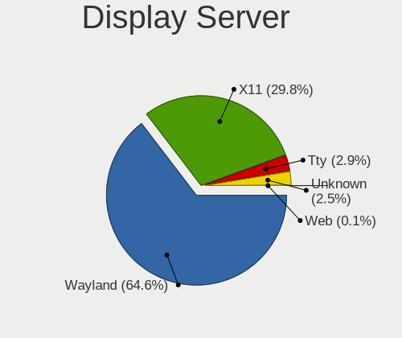
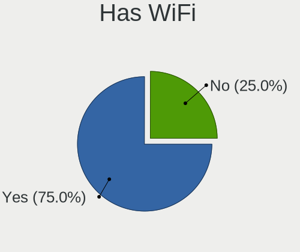
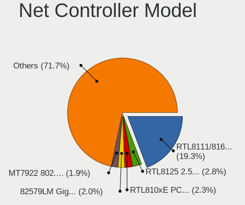
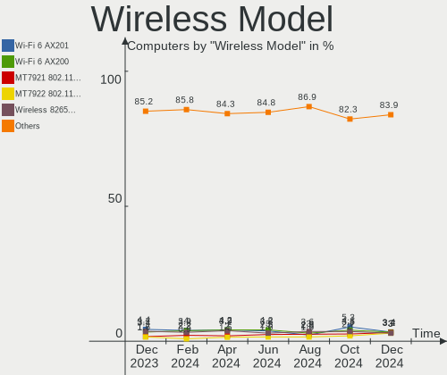
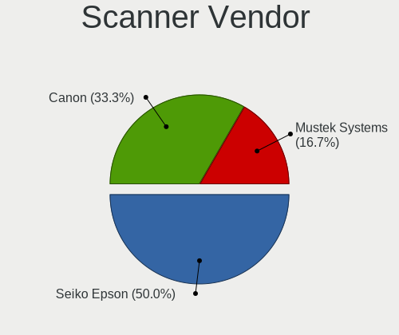
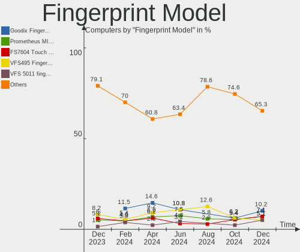

Ubuntu - Hardware Trends
------------------------

A project to identify most popular hardware characteristics and track their change
over time based on data collected by Linux users at https://Linux-Hardware.org.

Anyone can contribute to this report by the [hw-probe](https://github.com/linuxhw/hw-probe) tool:

    sudo -E hw-probe -all -upload

This is a report for all computer types. See also reports for [desktops](/Dist/Ubuntu/Desktop/README.md) and [notebooks](/Dist/Ubuntu/Notebook/README.md).

This report is for one last month. Overall report since the beginning of time: [TestDays](https://github.com/linuxhw/TestDays)

Period: Dec, 2023.

Contents
--------

* [ System ](#system)
  - [ OS                       ](#os)
  - [ OS Family                ](#os-family)
  - [ Kernel                   ](#kernel)
  - [ Kernel Family            ](#kernel-family)
  - [ Kernel Major Ver.        ](#kernel-major-ver)
  - [ Arch                     ](#arch)
  - [ DE                       ](#de)
  - [ Display Server           ](#display-server)
  - [ Display Manager          ](#display-manager)
  - [ OS Lang                  ](#os-lang)
  - [ Boot Mode                ](#boot-mode)
  - [ Filesystem               ](#filesystem)
  - [ Part. scheme             ](#part-scheme)
  - [ Dual Boot with Linux/BSD ](#dual-boot-with-linuxbsd)
  - [ Dual Boot (Win)          ](#dual-boot-win)

* [ Board ](#board)
  - [ Vendor                   ](#vendor)
  - [ Model                    ](#model)
  - [ Model Family             ](#model-family)
  - [ MFG Year                 ](#mfg-year)
  - [ Form Factor              ](#form-factor)
  - [ Secure Boot              ](#secure-boot)
  - [ Coreboot                 ](#coreboot)
  - [ RAM Size                 ](#ram-size)
  - [ RAM Used                 ](#ram-used)
  - [ Total Drives             ](#total-drives)
  - [ Has CD-ROM               ](#has-cd-rom)
  - [ Has Ethernet             ](#has-ethernet)
  - [ Has WiFi                 ](#has-wifi)
  - [ Has Bluetooth            ](#has-bluetooth)

* [ Location ](#location)
  - [ Country                  ](#country)
  - [ City                     ](#city)

* [ Drives ](#drives)
  - [ Drive Vendor             ](#drive-vendor)
  - [ Drive Model              ](#drive-model)
  - [ HDD Vendor               ](#hdd-vendor)
  - [ SSD Vendor               ](#ssd-vendor)
  - [ Drive Kind               ](#drive-kind)
  - [ Drive Connector          ](#drive-connector)
  - [ Drive Size               ](#drive-size)
  - [ Space Total              ](#space-total)
  - [ Space Used               ](#space-used)
  - [ Malfunc. Drives          ](#malfunc-drives)
  - [ Malfunc. Drive Vendor    ](#malfunc-drive-vendor)
  - [ Malfunc. HDD Vendor      ](#malfunc-hdd-vendor)
  - [ Malfunc. Drive Kind      ](#malfunc-drive-kind)
  - [ Failed Drives            ](#failed-drives)
  - [ Failed Drive Vendor      ](#failed-drive-vendor)
  - [ Drive Status             ](#drive-status)

* [ Storage controller ](#storage-controller)
  - [ Storage Vendor           ](#storage-vendor)
  - [ Storage Model            ](#storage-model)
  - [ Storage Kind             ](#storage-kind)

* [ Processor ](#processor)
  - [ CPU Vendor               ](#cpu-vendor)
  - [ CPU Model                ](#cpu-model)
  - [ CPU Model Family         ](#cpu-model-family)
  - [ CPU Cores                ](#cpu-cores)
  - [ CPU Sockets              ](#cpu-sockets)
  - [ CPU Threads              ](#cpu-threads)
  - [ CPU Op-Modes             ](#cpu-op-modes)
  - [ CPU Microcode            ](#cpu-microcode)
  - [ CPU Microarch            ](#cpu-microarch)

* [ Graphics ](#graphics)
  - [ GPU Vendor               ](#gpu-vendor)
  - [ GPU Model                ](#gpu-model)
  - [ GPU Combo                ](#gpu-combo)
  - [ GPU Driver               ](#gpu-driver)
  - [ GPU Memory               ](#gpu-memory)

* [ Monitor ](#monitor)
  - [ Monitor Vendor           ](#monitor-vendor)
  - [ Monitor Model            ](#monitor-model)
  - [ Monitor Resolution       ](#monitor-resolution)
  - [ Monitor Diagonal         ](#monitor-diagonal)
  - [ Monitor Width            ](#monitor-width)
  - [ Aspect Ratio             ](#aspect-ratio)
  - [ Monitor Area             ](#monitor-area)
  - [ Pixel Density            ](#pixel-density)
  - [ Multiple Monitors        ](#multiple-monitors)

* [ Network ](#network)
  - [ Net Controller Vendor    ](#net-controller-vendor)
  - [ Net Controller Model     ](#net-controller-model)
  - [ Wireless Vendor          ](#wireless-vendor)
  - [ Wireless Model           ](#wireless-model)
  - [ Ethernet Vendor          ](#ethernet-vendor)
  - [ Ethernet Model           ](#ethernet-model)
  - [ Net Controller Kind      ](#net-controller-kind)
  - [ Used Controller          ](#used-controller)
  - [ NICs                     ](#nics)
  - [ IPv6                     ](#ipv6)

* [ Bluetooth ](#bluetooth)
  - [ Bluetooth Vendor         ](#bluetooth-vendor)
  - [ Bluetooth Model          ](#bluetooth-model)

* [ Sound ](#sound)
  - [ Sound Vendor             ](#sound-vendor)
  - [ Sound Model              ](#sound-model)

* [ Memory ](#memory)
  - [ Memory Vendor            ](#memory-vendor)
  - [ Memory Model             ](#memory-model)
  - [ Memory Kind              ](#memory-kind)
  - [ Memory Form Factor       ](#memory-form-factor)
  - [ Memory Size              ](#memory-size)
  - [ Memory Speed             ](#memory-speed)

* [ Printers & scanners ](#printers--scanners)
  - [ Printer Vendor           ](#printer-vendor)
  - [ Printer Model            ](#printer-model)
  - [ Scanner Vendor           ](#scanner-vendor)
  - [ Scanner Model            ](#scanner-model)

* [ Camera ](#camera)
  - [ Camera Vendor            ](#camera-vendor)
  - [ Camera Model             ](#camera-model)

* [ Security ](#security)
  - [ Fingerprint Vendor       ](#fingerprint-vendor)
  - [ Fingerprint Model        ](#fingerprint-model)
  - [ Chipcard Vendor          ](#chipcard-vendor)
  - [ Chipcard Model           ](#chipcard-model)

* [ Unsupported ](#unsupported)
  - [ Unsupported Devices      ](#unsupported-devices)
  - [ Unsupported Device Types ](#unsupported-device-types)

System
------

OS
--

Installed operating systems

| Name           | Computers | Percent |
|----------------|-----------|---------|
| Ubuntu 22.04   | 771       | 62.84%  |
| Ubuntu 23.10   | 279       | 22.74%  |
| Ubuntu 20.04   | 95        | 7.74%   |
| Ubuntu 23.04   | 38        | 3.1%    |
| Ubuntu 18.04   | 13        | 1.06%   |
| Ubuntu 22.10   | 11        | 0.9%    |
| Ubuntu 24.04   | 9         | 0.73%   |
| Ubuntu 21.10   | 4         | 0.33%   |
| Ubuntu 20.10   | 3         | 0.24%   |
| Ubuntu Core 22 | 1         | 0.08%   |
| Ubuntu 21.04   | 1         | 0.08%   |
| Ubuntu 19.10   | 1         | 0.08%   |
| Ubuntu 17.10   | 1         | 0.08%   |

OS Family
---------

OS without a version

| Name   | Computers | Percent |
|--------|-----------|---------|
| Ubuntu | 1227      | 100%    |

Kernel
------

Version of the Linux kernel

| Version                 | Computers | Percent |
|-------------------------|-----------|---------|
| 6.2.0-39-generic        | 309       | 25.18%  |
| 6.2.0-37-generic        | 258       | 21.03%  |
| 6.5.0-14-generic        | 199       | 16.22%  |
| 5.15.0-91-generic       | 101       | 8.23%   |
| 6.2.0-26-generic        | 47        | 3.83%   |
| 6.5.0-13-generic        | 41        | 3.34%   |
| 6.5.0-9-generic         | 37        | 3.02%   |
| 5.15.0-89-generic       | 31        | 2.53%   |
| 5.19.0-38-generic       | 27        | 2.2%    |
| 6.2.0-36-generic        | 11        | 0.9%    |
| 5.4.0-169-generic       | 6         | 0.49%   |
| 5.19.0-32-generic       | 6         | 0.49%   |
| 5.15.0-88-generic       | 6         | 0.49%   |
| 6.5.0-14-lowlatency     | 5         | 0.41%   |
| 6.1.0-1027-oem          | 5         | 0.41%   |
| 5.4.0-167-generic       | 5         | 0.41%   |
| 5.4.0-150-generic       | 5         | 0.41%   |
| 4.15.0-213-generic      | 5         | 0.41%   |
| 6.5.0-10-generic        | 4         | 0.33%   |
| 6.2.0-32-generic        | 4         | 0.33%   |
| 5.19.0-21-generic       | 4         | 0.33%   |
| 5.15.0-25-generic       | 4         | 0.33%   |
| 6.2.0-35-generic        | 3         | 0.24%   |
| 6.2.0-34-generic        | 3         | 0.24%   |
| 6.2.0-20-generic        | 3         | 0.24%   |
| 5.19.0-46-generic       | 3         | 0.24%   |
| 5.15.0-67-generic       | 3         | 0.24%   |
| 5.15.0-43-generic       | 3         | 0.24%   |
| 5.13.0-19-generic       | 3         | 0.24%   |
| 6.7.0-060700rc5-generic | 2         | 0.16%   |
| 6.6.8-060608-generic    | 2         | 0.16%   |
| 6.6.5-060605-generic    | 2         | 0.16%   |
| 6.2.0-33-generic        | 2         | 0.16%   |
| 6.2.0-1017-lowlatency   | 2         | 0.16%   |
| 5.4.0-84-generic        | 2         | 0.16%   |
| 5.19.0-29-generic       | 2         | 0.16%   |
| 5.17.7-051707-generic   | 2         | 0.16%   |
| 5.15.0-87-generic       | 2         | 0.16%   |
| 5.14.0-1054-oem         | 2         | 0.16%   |
| 6.7.0-060700rc4-generic | 1         | 0.08%   |

Kernel Family
-------------

Linux kernel without a distro release

| Version  | Computers | Percent |
|----------|-----------|---------|
| 6.2.0    | 646       | 52.65%  |
| 6.5.0    | 290       | 23.63%  |
| 5.15.0   | 161       | 13.12%  |
| 5.19.0   | 46        | 3.75%   |
| 5.4.0    | 23        | 1.87%   |
| 6.1.0    | 6         | 0.49%   |
| 5.8.0    | 6         | 0.49%   |
| 4.15.0   | 6         | 0.49%   |
| 6.6.8    | 4         | 0.33%   |
| 5.13.0   | 4         | 0.33%   |
| 6.7.0    | 3         | 0.24%   |
| 6.6.7    | 3         | 0.24%   |
| 6.6.4    | 3         | 0.24%   |
| 6.6.6    | 2         | 0.16%   |
| 6.6.5    | 2         | 0.16%   |
| 5.17.7   | 2         | 0.16%   |
| 5.14.0   | 2         | 0.16%   |
| 5.11.0   | 2         | 0.16%   |
| 6.6.3    | 1         | 0.08%   |
| 6.6.1    | 1         | 0.08%   |
| 6.5.7    | 1         | 0.08%   |
| 6.5.11   | 1         | 0.08%   |
| 6.4.6    | 1         | 0.08%   |
| 6.4.0    | 1         | 0.08%   |
| 6.1.63   | 1         | 0.08%   |
| 6.1.25   | 1         | 0.08%   |
| 6.1.16   | 1         | 0.08%   |
| 5.4.256  | 1         | 0.08%   |
| 5.3.0    | 1         | 0.08%   |
| 5.15.144 | 1         | 0.08%   |
| 5.11.5   | 1         | 0.08%   |
| 5.10.160 | 1         | 0.08%   |
| 4.19.191 | 1         | 0.08%   |
| 4.13.0   | 1         | 0.08%   |

Kernel Major Ver.
-----------------

Linux kernel major version

| Version | Computers | Percent |
|---------|-----------|---------|
| 6.2     | 646       | 52.65%  |
| 6.5     | 292       | 23.8%   |
| 5.15    | 162       | 13.2%   |
| 5.19    | 46        | 3.75%   |
| 5.4     | 24        | 1.96%   |
| 6.6     | 16        | 1.3%    |
| 6.1     | 9         | 0.73%   |
| 5.8     | 6         | 0.49%   |
| 4.15    | 6         | 0.49%   |
| 5.13    | 4         | 0.33%   |
| 6.7     | 3         | 0.24%   |
| 5.11    | 3         | 0.24%   |
| 6.4     | 2         | 0.16%   |
| 5.17    | 2         | 0.16%   |
| 5.14    | 2         | 0.16%   |
| 5.3     | 1         | 0.08%   |
| 5.10    | 1         | 0.08%   |
| 4.19    | 1         | 0.08%   |
| 4.13    | 1         | 0.08%   |

Arch
----

OS architecture (x86_64, i586, etc.)

| Name    | Computers | Percent |
|---------|-----------|---------|
| x86_64  | 1218      | 99.27%  |
| aarch64 | 5         | 0.41%   |
| i686    | 3         | 0.24%   |
| armv7l  | 1         | 0.08%   |

DE
--

Desktop Environment

| Name            | Computers | Percent |
|-----------------|-----------|---------|
| GNOME           | 1135      | 92.5%   |
| Unknown         | 73        | 5.95%   |
| X-Cinnamon      | 9         | 0.73%   |
| GNOME Flashback | 3         | 0.24%   |
| Enlightenment   | 3         | 0.24%   |
| Lubuntu         | 1         | 0.08%   |
| i3              | 1         | 0.08%   |
| GNOME Classic   | 1         | 0.08%   |
| Cinnamon        | 1         | 0.08%   |

Display Server
--------------

X11 or Wayland

| Name    | Computers | Percent |
|---------|-----------|---------|
| Wayland | 706       | 57.54%  |
| X11     | 434       | 35.37%  |
| Unknown | 60        | 4.89%   |
| Tty     | 26        | 2.12%   |
| Web     | 1         | 0.08%   |

Display Manager
---------------

SDDM, LightDM, etc.

| Name    | Computers | Percent |
|---------|-----------|---------|
| GDM3    | 1029      | 83.86%  |
| Unknown | 134       | 10.92%  |
| GDM     | 41        | 3.34%   |
| LightDM | 19        | 1.55%   |
| SDDM    | 3         | 0.24%   |
| SLiM    | 1         | 0.08%   |

OS Lang
-------

Language

| Lang    | Computers | Percent |
|---------|-----------|---------|
| en_US   | 559       | 45.56%  |
| de_DE   | 125       | 10.19%  |
| fr_FR   | 86        | 7.01%   |
| C       | 51        | 4.16%   |
| pt_BR   | 43        | 3.5%    |
| en_GB   | 40        | 3.26%   |
| es_ES   | 36        | 2.93%   |
| it_IT   | 32        | 2.61%   |
| ru_RU   | 30        | 2.44%   |
| en_IN   | 25        | 2.04%   |
| Unknown | 25        | 2.04%   |
| pl_PL   | 20        | 1.63%   |
| en_CA   | 20        | 1.63%   |
| en_AU   | 19        | 1.55%   |
| nl_NL   | 10        | 0.81%   |
| zh_CN   | 8         | 0.65%   |
| tr_TR   | 7         | 0.57%   |
| sv_SE   | 6         | 0.49%   |
| es_MX   | 6         | 0.49%   |
| en_IL   | 6         | 0.49%   |
| nb_NO   | 5         | 0.41%   |
| hu_HU   | 5         | 0.41%   |
| ro_RO   | 4         | 0.33%   |
| pt_PT   | 4         | 0.33%   |
| fi_FI   | 4         | 0.33%   |
| es_AR   | 4         | 0.33%   |
| en_PH   | 4         | 0.33%   |
| cs_CZ   | 4         | 0.33%   |
| sk_SK   | 3         | 0.24%   |
| ja_JP   | 3         | 0.24%   |
| el_GR   | 3         | 0.24%   |
| de_AT   | 3         | 0.24%   |
| fr_CA   | 2         | 0.16%   |
| es_VE   | 2         | 0.16%   |
| es_UY   | 2         | 0.16%   |
| es_US   | 2         | 0.16%   |
| es_CO   | 2         | 0.16%   |
| de_CH   | 2         | 0.16%   |
| bg_BG   | 2         | 0.16%   |
| zh_TW   | 1         | 0.08%   |

Boot Mode
---------

EFI or BIOS

| Mode | Computers | Percent |
|------|-----------|---------|
| BIOS | 759       | 61.86%  |
| EFI  | 468       | 38.14%  |

Filesystem
----------

Type of filesystem

| Type    | Computers | Percent |
|---------|-----------|---------|
| Tmpfs   | 674       | 54.93%  |
| Ext4    | 491       | 40.02%  |
| Overlay | 46        | 3.75%   |
| Zfs     | 8         | 0.65%   |
| Btrfs   | 8         | 0.65%   |

Part. scheme
------------

Scheme of partitioning

| Type    | Computers | Percent |
|---------|-----------|---------|
| GPT     | 1016      | 82.8%   |
| MBR     | 107       | 8.72%   |
| Unknown | 104       | 8.48%   |

Dual Boot with Linux/BSD
------------------------

Hosting more than one Linux/BSD

| Dual boot | Computers | Percent |
|-----------|-----------|---------|
| No        | 1052      | 85.74%  |
| Yes       | 175       | 14.26%  |

Dual Boot (Win)
---------------

Hosting Linux and Windows

| Dual boot | Computers | Percent |
|-----------|-----------|---------|
| No        | 828       | 67.48%  |
| Yes       | 399       | 32.52%  |

Board
-----

Vendor
------

Motherboard manufacturer

| Name                                 | Computers | Percent |
|--------------------------------------|-----------|---------|
| ASUSTek Computer                     | 177       | 14.43%  |
| Lenovo                               | 173       | 14.1%   |
| Hewlett-Packard                      | 171       | 13.94%  |
| Dell                                 | 170       | 13.85%  |
| Acer                                 | 72        | 5.87%   |
| MSI                                  | 64        | 5.22%   |
| Gigabyte Technology                  | 58        | 4.73%   |
| Apple                                | 35        | 2.85%   |
| ASRock                               | 34        | 2.77%   |
| Supermicro                           | 32        | 2.61%   |
| Unknown                              | 19        | 1.55%   |
| Intel                                | 15        | 1.22%   |
| Fujitsu                              | 15        | 1.22%   |
| HUAWEI                               | 14        | 1.14%   |
| Toshiba                              | 11        | 0.9%    |
| Google                               | 11        | 0.9%    |
| Medion                               | 9         | 0.73%   |
| Sony                                 | 8         | 0.65%   |
| Samsung Electronics                  | 7         | 0.57%   |
| Microsoft                            | 6         | 0.49%   |
| Foxconn                              | 6         | 0.49%   |
| Framework                            | 5         | 0.41%   |
| AZW                                  | 5         | 0.41%   |
| Shenzhen Meigao Electronic Equipment | 4         | 0.33%   |
| Pegatron                             | 4         | 0.33%   |
| Inventec                             | 4         | 0.33%   |
| Positivo                             | 3         | 0.24%   |
| Panasonic                            | 3         | 0.24%   |
| MACHINIST                            | 3         | 0.24%   |
| LG Electronics                       | 3         | 0.24%   |
| Huanan                               | 3         | 0.24%   |
| HC Technology.                       | 3         | 0.24%   |
| ZOTAC                                | 2         | 0.16%   |
| XIAOMI                               | 2         | 0.16%   |
| VIT                                  | 2         | 0.16%   |
| Valve                                | 2         | 0.16%   |
| Timi                                 | 2         | 0.16%   |
| Notebook                             | 2         | 0.16%   |
| Monster                              | 2         | 0.16%   |
| Infinix                              | 2         | 0.16%   |

Model
-----

Motherboard model

| Name                                       | Computers | Percent |
|--------------------------------------------|-----------|---------|
| Unknown                                    | 22        | 1.79%   |
| Lenovo ThinkCentre M710s 10M8S02A00        | 8         | 0.65%   |
| ASUS All Series                            | 8         | 0.65%   |
| Supermicro X8DTU                           | 5         | 0.41%   |
| Dell OptiPlex 7010                         | 5         | 0.41%   |
| Supermicro X9DRW                           | 4         | 0.33%   |
| Supermicro SYS-1028R-TDW                   | 4         | 0.33%   |
| HUAWEI BoDE-WXX9                           | 4         | 0.33%   |
| HP Pavilion 15                             | 4         | 0.33%   |
| HP Notebook                                | 4         | 0.33%   |
| HP Laptop 15-fc0xxx                        | 4         | 0.33%   |
| HP ENVY x360 2-in-1 Laptop 15-ey0xxx       | 4         | 0.33%   |
| HP EliteBook 840 G6                        | 4         | 0.33%   |
| Framework Laptop 13 (AMD Ryzen 7040Series) | 4         | 0.33%   |
| ASUS M5A97 R2.0                            | 4         | 0.33%   |
| MSI MS-7E07                                | 3         | 0.24%   |
| MSI MS-7C56                                | 3         | 0.24%   |
| MSI MS-7C37                                | 3         | 0.24%   |
| Lenovo ThinkCentre M720s 10SUSES500        | 3         | 0.24%   |
| Lenovo G50-45 80E3                         | 3         | 0.24%   |
| HP Pavilion dv7                            | 3         | 0.24%   |
| HP Pavilion 17                             | 3         | 0.24%   |
| HP EliteBook 840 G3                        | 3         | 0.24%   |
| Dell XPS 13 9380                           | 3         | 0.24%   |
| Dell Vostro 3550                           | 3         | 0.24%   |
| Dell Vostro 3268                           | 3         | 0.24%   |
| Dell OptiPlex 980                          | 3         | 0.24%   |
| Dell OptiPlex 7040                         | 3         | 0.24%   |
| Dell OptiPlex 5050                         | 3         | 0.24%   |
| Dell Latitude 3520                         | 3         | 0.24%   |
| ASUS Zenbook UM3402YAR_UM3402YA            | 3         | 0.24%   |
| ASUS Zenbook 15 UM3504DA_UM3504DA          | 3         | 0.24%   |
| Apple MacBookPro9,2                        | 3         | 0.24%   |
| Apple MacBookAir6,2                        | 3         | 0.24%   |
| Acer Veriton X2631G                        | 3         | 0.24%   |
| Acer Nitro AN515-57                        | 3         | 0.24%   |
| ZOTAC NM10                                 | 2         | 0.16%   |
| XIAOMI Redmi Book Pro 15 2023              | 2         | 0.16%   |
| VIT M2400-01                               | 2         | 0.16%   |
| Supermicro X8DTT                           | 2         | 0.16%   |

Model Family
------------

Motherboard model prefix

| Name               | Computers | Percent |
|--------------------|-----------|---------|
| Lenovo ThinkPad    | 70        | 5.7%    |
| Acer Aspire        | 43        | 3.5%    |
| Dell Latitude      | 38        | 3.1%    |
| Dell OptiPlex      | 35        | 2.85%   |
| Lenovo IdeaPad     | 32        | 2.61%   |
| Dell Inspiron      | 32        | 2.61%   |
| HP Pavilion        | 31        | 2.53%   |
| Lenovo ThinkCentre | 29        | 2.36%   |
| ASUS VivoBook      | 28        | 2.28%   |
| HP EliteBook       | 24        | 1.96%   |
| ASUS ROG           | 24        | 1.96%   |
| ASUS PRIME         | 23        | 1.87%   |
| Unknown            | 22        | 1.79%   |
| Dell Precision     | 21        | 1.71%   |
| Dell XPS           | 20        | 1.63%   |
| HP Laptop          | 19        | 1.55%   |
| HP Compaq          | 15        | 1.22%   |
| Dell Vostro        | 13        | 1.06%   |
| Acer Nitro         | 12        | 0.98%   |
| HP ProBook         | 11        | 0.9%    |
| ASUS Zenbook       | 11        | 0.9%    |
| ASUS TUF           | 11        | 0.9%    |
| Toshiba Satellite  | 10        | 0.81%   |
| Fujitsu LIFEBOOK   | 10        | 0.81%   |
| Lenovo Yoga        | 8         | 0.65%   |
| ASUS All           | 8         | 0.65%   |
| HP ProDesk         | 7         | 0.57%   |
| HP ENVY            | 7         | 0.57%   |
| ASUS ASUS          | 7         | 0.57%   |
| Microsoft Surface  | 6         | 0.49%   |
| Lenovo ThinkBook   | 6         | 0.49%   |
| HP ZBook           | 6         | 0.49%   |
| Acer Swift         | 6         | 0.49%   |
| Supermicro X8DTU   | 5         | 0.41%   |
| Lenovo Legion      | 5         | 0.41%   |
| HP EliteDesk       | 5         | 0.41%   |
| Gigabyte B550M     | 5         | 0.41%   |
| Framework Laptop   | 5         | 0.41%   |
| Acer Veriton       | 5         | 0.41%   |
| Supermicro X9DRW   | 4         | 0.33%   |

MFG Year
--------

Motherboard manufacture year

| Year    | Computers | Percent |
|---------|-----------|---------|
| 2023    | 124       | 10.11%  |
| 2022    | 109       | 8.88%   |
| 2021    | 102       | 8.31%   |
| 2020    | 94        | 7.66%   |
| 2018    | 91        | 7.42%   |
| 2017    | 87        | 7.09%   |
| 2013    | 87        | 7.09%   |
| 2012    | 83        | 6.76%   |
| 2019    | 81        | 6.6%    |
| 2015    | 65        | 5.3%    |
| 2016    | 59        | 4.81%   |
| 2011    | 57        | 4.65%   |
| 2014    | 55        | 4.48%   |
| 2010    | 48        | 3.91%   |
| 2009    | 35        | 2.85%   |
| 2008    | 26        | 2.12%   |
| 2007    | 15        | 1.22%   |
| Unknown | 6         | 0.49%   |
| 2006    | 2         | 0.16%   |
| 2005    | 1         | 0.08%   |

Form Factor
-----------

Physical design of the computer

| Name           | Computers | Percent |
|----------------|-----------|---------|
| Notebook       | 642       | 52.32%  |
| Desktop        | 463       | 37.73%  |
| Convertible    | 33        | 2.69%   |
| Mini pc        | 27        | 2.2%    |
| Server         | 25        | 2.04%   |
| All in one     | 19        | 1.55%   |
| Tablet         | 11        | 0.9%    |
| System on chip | 6         | 0.49%   |
| Other          | 1         | 0.08%   |

Secure Boot
-----------

Enabled or disabled

| State    | Computers | Percent |
|----------|-----------|---------|
| Disabled | 1114      | 90.79%  |
| Enabled  | 113       | 9.21%   |

Coreboot
--------

Have coreboot on board

| Used | Computers | Percent |
|------|-----------|---------|
| No   | 1215      | 99.02%  |
| Yes  | 12        | 0.98%   |

RAM Size
--------

Total RAM memory

| Size in GB      | Computers | Percent |
|-----------------|-----------|---------|
| 4.01-8.0        | 333       | 27.14%  |
| 16.01-24.0      | 255       | 20.78%  |
| 8.01-16.0       | 195       | 15.89%  |
| 3.01-4.0        | 161       | 13.12%  |
| 32.01-64.0      | 146       | 11.9%   |
| 64.01-256.0     | 75        | 6.11%   |
| 24.01-32.0      | 30        | 2.44%   |
| 1.01-2.0        | 15        | 1.22%   |
| More than 256.0 | 11        | 0.9%    |
| 2.01-3.0        | 6         | 0.49%   |

RAM Used
--------

Used RAM memory

| Used GB     | Computers | Percent |
|-------------|-----------|---------|
| 2.01-3.0    | 362       | 29.5%   |
| 1.01-2.0    | 351       | 28.61%  |
| 4.01-8.0    | 233       | 18.99%  |
| 3.01-4.0    | 186       | 15.16%  |
| 8.01-16.0   | 58        | 4.73%   |
| 0.51-1.0    | 14        | 1.14%   |
| 16.01-24.0  | 12        | 0.98%   |
| 64.01-256.0 | 4         | 0.33%   |
| 32.01-64.0  | 3         | 0.24%   |
| 24.01-32.0  | 2         | 0.16%   |
| 0.01-0.5    | 2         | 0.16%   |

Total Drives
------------

Number of drives on board

| Drives | Computers | Percent |
|--------|-----------|---------|
| 1      | 786       | 64.06%  |
| 2      | 281       | 22.9%   |
| 3      | 74        | 6.03%   |
| 4      | 43        | 3.5%    |
| 5      | 14        | 1.14%   |
| 0      | 10        | 0.81%   |
| 7      | 7         | 0.57%   |
| 6      | 7         | 0.57%   |
| 10     | 2         | 0.16%   |
| 9      | 2         | 0.16%   |
| 101    | 1         | 0.08%   |

Has CD-ROM
----------

Has CD-ROM on board

| Presented | Computers | Percent |
|-----------|-----------|---------|
| No        | 817       | 66.59%  |
| Yes       | 410       | 33.41%  |

Has Ethernet
------------

Has Ethernet on board

| Presented | Computers | Percent |
|-----------|-----------|---------|
| Yes       | 1030      | 83.94%  |
| No        | 197       | 16.06%  |

Has WiFi
--------

Has WiFi module

| Presented | Computers | Percent |
|-----------|-----------|---------|
| Yes       | 947       | 77.18%  |
| No        | 280       | 22.82%  |

Has Bluetooth
-------------

Has Bluetooth module

| Presented | Computers | Percent |
|-----------|-----------|---------|
| Yes       | 791       | 64.47%  |
| No        | 436       | 35.53%  |

Location
--------

Country
-------

Geographic location (country)

| Country     | Computers | Percent |
|-------------|-----------|---------|
| USA         | 249       | 20.29%  |
| Germany     | 159       | 12.96%  |
| France      | 98        | 7.99%   |
| Russia      | 65        | 5.3%    |
| Brazil      | 61        | 4.97%   |
| Italy       | 50        | 4.07%   |
| Spain       | 43        | 3.5%    |
| UK          | 39        | 3.18%   |
| Canada      | 39        | 3.18%   |
| India       | 37        | 3.02%   |
| Netherlands | 24        | 1.96%   |
| Australia   | 24        | 1.96%   |
| Poland      | 23        | 1.87%   |
| Mexico      | 17        | 1.39%   |
| Switzerland | 16        | 1.3%    |
| China       | 15        | 1.22%   |
| Turkey      | 14        | 1.14%   |
| Norway      | 13        | 1.06%   |
| Sweden      | 12        | 0.98%   |
| Romania     | 12        | 0.98%   |
| Austria     | 11        | 0.9%    |
| Hungary     | 10        | 0.81%   |
| Finland     | 10        | 0.81%   |
| Czechia     | 10        | 0.81%   |
| Vietnam     | 9         | 0.73%   |
| Portugal    | 9         | 0.73%   |
| Israel      | 9         | 0.73%   |
| Greece      | 8         | 0.65%   |
| Thailand    | 7         | 0.57%   |
| Slovakia    | 7         | 0.57%   |
| Philippines | 6         | 0.49%   |
| Iran        | 6         | 0.49%   |
| Bulgaria    | 6         | 0.49%   |
| Argentina   | 6         | 0.49%   |
| Singapore   | 5         | 0.41%   |
| Pakistan    | 5         | 0.41%   |
| Japan       | 5         | 0.41%   |
| Hong Kong   | 5         | 0.41%   |
| Egypt       | 5         | 0.41%   |
| Belgium     | 5         | 0.41%   |

City
----

Geographic location (city)

| City           | Computers | Percent |
|----------------|-----------|---------|
| Moscow         | 42        | 3.42%   |
| Roubaix        | 12        | 0.98%   |
| Paris          | 12        | 0.98%   |
| Berlin         | 12        | 0.98%   |
| Sao Paulo      | 11        | 0.9%    |
| Munich         | 11        | 0.9%    |
| Milan          | 11        | 0.9%    |
| Montreal       | 10        | 0.81%   |
| Melbourne      | 8         | 0.65%   |
| Los Angeles    | 8         | 0.65%   |
| Barcelona      | 8         | 0.65%   |
| Kolkata        | 7         | 0.57%   |
| Helsinki       | 7         | 0.57%   |
| Hamburg        | 7         | 0.57%   |
| Thornton       | 6         | 0.49%   |
| Rio de Janeiro | 6         | 0.49%   |
| Prague         | 6         | 0.49%   |
| Oslo           | 6         | 0.49%   |
| Istanbul       | 6         | 0.49%   |
| Hanoi          | 6         | 0.49%   |
| Brisbane       | 6         | 0.49%   |
| Amsterdam      | 6         | 0.49%   |
| Warsaw         | 5         | 0.41%   |
| Vienna         | 5         | 0.41%   |
| Sydney         | 5         | 0.41%   |
| Singapore      | 5         | 0.41%   |
| Rome           | 5         | 0.41%   |
| Mannheim       | 5         | 0.41%   |
| Madrid         | 5         | 0.41%   |
| Las Vegas      | 5         | 0.41%   |
| Hyderabad      | 5         | 0.41%   |
| Chicago        | 5         | 0.41%   |
| Cairo          | 5         | 0.41%   |
| Toronto        | 4         | 0.33%   |
| Tehran         | 4         | 0.33%   |
| Sofia          | 4         | 0.33%   |
| Santo André   | 4         | 0.33%   |
| Delhi          | 4         | 0.33%   |
| Cologne        | 4         | 0.33%   |
| Budapest       | 4         | 0.33%   |

Drives
------

Drive Vendor
------------

Hard drive vendors

| Vendor                       | Computers | Drives | Percent |
|------------------------------|-----------|--------|---------|
| Samsung Electronics          | 254       | 300    | 14.96%  |
| WDC                          | 203       | 280    | 11.96%  |
| Seagate                      | 196       | 258    | 11.54%  |
| SanDisk                      | 98        | 104    | 5.77%   |
| Toshiba                      | 82        | 93     | 4.83%   |
| Kingston                     | 77        | 82     | 4.53%   |
| Unknown                      | 71        | 85     | 4.18%   |
| Intel                        | 67        | 88     | 3.95%   |
| Crucial                      | 57        | 68     | 3.36%   |
| Micron Technology            | 48        | 49     | 2.83%   |
| SK hynix                     | 46        | 47     | 2.71%   |
| Hitachi                      | 30        | 35     | 1.77%   |
| HGST                         | 29        | 58     | 1.71%   |
| Apple                        | 25        | 26     | 1.47%   |
| A-DATA Technology            | 23        | 23     | 1.35%   |
| China                        | 21        | 23     | 1.24%   |
| KIOXIA                       | 20        | 21     | 1.18%   |
| Micron/Crucial Technology    | 18        | 22     | 1.06%   |
| Phison Electronics           | 17        | 19     | 1%      |
| Silicon Motion               | 16        | 16     | 0.94%   |
| Kingston Technology Company  | 16        | 16     | 0.94%   |
| Unknown                      | 15        | 17     | 0.88%   |
| Transcend                    | 13        | 13     | 0.77%   |
| Intenso                      | 12        | 15     | 0.71%   |
| Fujitsu                      | 10        | 11     | 0.59%   |
| ADATA Technology             | 10        | 12     | 0.59%   |
| PNY                          | 9         | 9      | 0.53%   |
| Patriot                      | 9         | 9      | 0.53%   |
| Netac                        | 9         | 10     | 0.53%   |
| MAXIO Technology (Hangzhou)  | 9         | 9      | 0.53%   |
| SPCC                         | 8         | 10     | 0.47%   |
| Hewlett-Packard              | 8         | 9      | 0.47%   |
| Shenzhen Longsys Electronics | 7         | 7      | 0.41%   |
| Lexar                        | 7         | 7      | 0.41%   |
| Phison                       | 6         | 8      | 0.35%   |
| Corsair                      | 6         | 7      | 0.35%   |
| Team                         | 5         | 5      | 0.29%   |
| T-FORCE                      | 5         | 6      | 0.29%   |
| OCZ                          | 5         | 5      | 0.29%   |
| LITEON                       | 5         | 5      | 0.29%   |

Drive Model
-----------

Hard drive models

| Model                                                 | Computers | Percent |
|-------------------------------------------------------|-----------|---------|
| Samsung NVMe SSD Controller SM981/PM981/PM983 512GB   | 29        | 1.56%   |
| Samsung NVMe SSD Controller PM9A1/PM9A3/980PRO 2TB    | 21        | 1.13%   |
| Unknown                                               | 15        | 0.81%   |
| Kingston SA400S37480G 480GB SSD                       | 14        | 0.75%   |
| Samsung SSD 860 EVO 500GB                             | 13        | 0.7%    |
| Micron/Crucial P2 NVMe PCIe SSD 4TB                   | 12        | 0.65%   |
| Unknown MMC Card  64GB                                | 11        | 0.59%   |
| Toshiba MQ01ABD100 1TB                                | 11        | 0.59%   |
| Seagate ST1000DM003-1SB102 1TB                        | 11        | 0.59%   |
| Unknown MMC Card  128GB                               | 10        | 0.54%   |
| Seagate ST1000LM035-1RK172 1TB                        | 10        | 0.54%   |
| Seagate ST1000DM010-2EP102 1TB                        | 10        | 0.54%   |
| Crucial CT500MX500SSD1 500GB                          | 10        | 0.54%   |
| Crucial CT1000MX500SSD1 1TB                           | 10        | 0.54%   |
| Unknown SD/MMC/MS PRO 512GB                           | 9         | 0.48%   |
| Unknown MMC Card  32GB                                | 9         | 0.48%   |
| Seagate ST500DM002-1BD142 500GB                       | 9         | 0.48%   |
| Kingston Company SNV2S1000G 1TB                       | 9         | 0.48%   |
| Intel SSD 660P Series 1TB                             | 9         | 0.48%   |
| WDC WD10EZEX-08WN4A0 1TB                              | 8         | 0.43%   |
| Silicon Motion SM2263EN/SM2263XT SSD Controller 500GB | 8         | 0.43%   |
| Seagate ST2000DM008-2FR102 2TB                        | 8         | 0.43%   |
| Sandisk WD Blue SN550 NVMe SSD 1TB                    | 8         | 0.43%   |
| Samsung SSD 990 PRO 2TB                               | 8         | 0.43%   |
| Samsung NVMe SSD Controller SM961/PM961/SM963 250GB   | 8         | 0.43%   |
| Samsung SSD 980 1TB                                   | 7         | 0.38%   |
| Samsung SSD 870 EVO 1TB                               | 7         | 0.38%   |
| Phison E12 NVMe Controller 1TB                        | 7         | 0.38%   |
| Kingston SV300S37A120G 120GB SSD                      | 7         | 0.38%   |
| Kingston SA400S37240G 240GB SSD                       | 7         | 0.38%   |
| HGST HTS721010A9E630 1TB                              | 7         | 0.38%   |
| Unknown SD/MMC 2GB                                    | 6         | 0.32%   |
| Unknown M.S./M.S.Pro/HG 16GB                          | 6         | 0.32%   |
| Toshiba MQ04ABF100 1TB                                | 6         | 0.32%   |
| Toshiba MQ01ABF050 500GB                              | 6         | 0.32%   |
| Toshiba DT01ACA100 1TB                                | 6         | 0.32%   |
| Seagate ST500LT012-1DG142 500GB                       | 6         | 0.32%   |
| SanDisk SSD PLUS 240GB                                | 6         | 0.32%   |
| SanDisk NVMe SSD Drive 1TB                            | 6         | 0.32%   |
| MAXIO (Hangzhou) NVMe SSD Controller MAP1202 256GB    | 6         | 0.32%   |

HDD Vendor
----------

Hard disk drive vendors

| Vendor              | Computers | Drives | Percent |
|---------------------|-----------|--------|---------|
| Seagate             | 192       | 252    | 34.78%  |
| WDC                 | 169       | 232    | 30.62%  |
| Toshiba             | 66        | 77     | 11.96%  |
| Hitachi             | 30        | 35     | 5.43%   |
| HGST                | 29        | 36     | 5.25%   |
| Samsung Electronics | 19        | 22     | 3.44%   |
| Unknown             | 11        | 11     | 1.99%   |
| Fujitsu             | 10        | 11     | 1.81%   |
| Apple               | 9         | 9      | 1.63%   |
| USB3.0              | 3         | 3      | 0.54%   |
| Maxtor              | 2         | 2      | 0.36%   |
| Intenso             | 2         | 2      | 0.36%   |
| WD MediaMax         | 1         | 2      | 0.18%   |
| TO Exter            | 1         | 1      | 0.18%   |
| SABRENT             | 1         | 1      | 0.18%   |
| OOS16000            | 1         | 1      | 0.18%   |
| NETAPP              | 1         | 12     | 0.18%   |
| IBM-ESXS            | 1         | 1      | 0.18%   |
| Hewlett-Packard     | 1         | 2      | 0.18%   |
| External            | 1         | 1      | 0.18%   |
| ASMT                | 1         | 1      | 0.18%   |
| Unknown             | 1         | 1      | 0.18%   |

SSD Vendor
----------

Solid state drive vendors

| Vendor              | Computers | Drives | Percent |
|---------------------|-----------|--------|---------|
| Samsung Electronics | 110       | 116    | 20.56%  |
| Kingston            | 62        | 65     | 11.59%  |
| Crucial             | 51        | 57     | 9.53%   |
| SanDisk             | 42        | 44     | 7.85%   |
| Intel               | 27        | 44     | 5.05%   |
| WDC                 | 25        | 26     | 4.67%   |
| China               | 21        | 23     | 3.93%   |
| A-DATA Technology   | 17        | 17     | 3.18%   |
| Micron Technology   | 14        | 14     | 2.62%   |
| Transcend           | 10        | 10     | 1.87%   |
| PNY                 | 9         | 9      | 1.68%   |
| Patriot             | 9         | 9      | 1.68%   |
| Apple               | 9         | 9      | 1.68%   |
| Netac               | 8         | 8      | 1.5%    |
| Intenso             | 8         | 11     | 1.5%    |
| SPCC                | 7         | 9      | 1.31%   |
| Lexar               | 6         | 6      | 1.12%   |
| SK hynix            | 5         | 5      | 0.93%   |
| OCZ                 | 5         | 5      | 0.93%   |
| LITEON              | 5         | 5      | 0.93%   |
| Team                | 4         | 4      | 0.75%   |
| Corsair             | 4         | 4      | 0.75%   |
| Toshiba             | 3         | 3      | 0.56%   |
| Phison              | 3         | 3      | 0.56%   |
| KIOXIA-EXCERIA      | 3         | 6      | 0.56%   |
| KingSpec            | 3         | 3      | 0.56%   |
| Hewlett-Packard     | 3         | 3      | 0.56%   |
| GOODRAM             | 3         | 3      | 0.56%   |
| Dogfish             | 3         | 3      | 0.56%   |
| Wibtek              | 2         | 2      | 0.37%   |
| VICKTER             | 2         | 2      | 0.37%   |
| Verbatim            | 2         | 2      | 0.37%   |
| Teclast             | 2         | 2      | 0.37%   |
| SCY                 | 2         | 2      | 0.37%   |
| LITEONIT            | 2         | 2      | 0.37%   |
| LDLC                | 2         | 2      | 0.37%   |
| KingFast            | 2         | 2      | 0.37%   |
| KingDian            | 2         | 2      | 0.37%   |
| Indilinx            | 2         | 2      | 0.37%   |
| Gigabyte Technology | 2         | 2      | 0.37%   |

Drive Kind
----------

HDD or SSD

| Kind    | Computers | Drives | Percent |
|---------|-----------|--------|---------|
| NVMe    | 505       | 589    | 32.37%  |
| SSD     | 481       | 580    | 30.83%  |
| HDD     | 475       | 715    | 30.45%  |
| MMC     | 53        | 58     | 3.4%    |
| Unknown | 46        | 87     | 2.95%   |

Drive Connector
---------------

SATA, SAS, NVMe, etc.

| Type | Computers | Drives | Percent |
|------|-----------|--------|---------|
| SATA | 802       | 1220   | 55.73%  |
| NVMe | 505       | 588    | 35.09%  |
| SAS  | 79        | 163    | 5.49%   |
| MMC  | 53        | 58     | 3.68%   |

Drive Size
----------

Size of hard drive

| Size in TB | Computers | Drives | Percent |
|------------|-----------|--------|---------|
| 0.01-0.5   | 528       | 644    | 52.54%  |
| 0.51-1.0   | 314       | 373    | 31.24%  |
| 1.01-2.0   | 86        | 106    | 8.56%   |
| 3.01-4.0   | 31        | 49     | 3.08%   |
| 4.01-10.0  | 21        | 46     | 2.09%   |
| 2.01-3.0   | 15        | 16     | 1.49%   |
| 10.01-20.0 | 10        | 61     | 1%      |

Space Total
-----------

Amount of disk space available on the file system

| Size in GB     | Computers | Percent |
|----------------|-----------|---------|
| 101-250        | 324       | 26.41%  |
| 251-500        | 284       | 23.15%  |
| 501-1000       | 223       | 18.17%  |
| 1001-2000      | 106       | 8.64%   |
| 51-100         | 70        | 5.7%    |
| More than 3000 | 54        | 4.4%    |
| Unknown        | 54        | 4.4%    |
| 1-20           | 50        | 4.07%   |
| 21-50          | 31        | 2.53%   |
| 2001-3000      | 31        | 2.53%   |

Space Used
----------

Amount of used disk space

| Used GB        | Computers | Percent |
|----------------|-----------|---------|
| 1-20           | 370       | 30.15%  |
| 21-50          | 271       | 22.09%  |
| 101-250        | 180       | 14.67%  |
| 51-100         | 162       | 13.2%   |
| 251-500        | 77        | 6.28%   |
| Unknown        | 54        | 4.4%    |
| 501-1000       | 51        | 4.16%   |
| 1001-2000      | 30        | 2.44%   |
| More than 3000 | 18        | 1.47%   |
| 2001-3000      | 14        | 1.14%   |

Malfunc. Drives
---------------

Drive models with a malfunction

| Model                                                 | Computers | Drives | Percent |
|-------------------------------------------------------|-----------|--------|---------|
| Intel SSDSC2BB800G7 800GB                             | 3         | 3      | 4.41%   |
| SK hynix BC511 HFM512GDJTNI-82A0A 512GB               | 2         | 2      | 2.94%   |
| Seagate ST1000DM010-2EP102 1TB                        | 2         | 2      | 2.94%   |
| WDC WDS240G2G0B-00EPW0 240GB SSD                      | 1         | 1      | 1.47%   |
| WDC WD60PURZ-85ZUFY1 6TB                              | 1         | 1      | 1.47%   |
| WDC WD5002ABYS-02B1B0 500GB                           | 1         | 2      | 1.47%   |
| WDC WD5000LPCX-75VHAT0 500GB                          | 1         | 1      | 1.47%   |
| WDC WD5000BPKT-75PK4T0 500GB                          | 1         | 1      | 1.47%   |
| WDC WD5000AAKX-22ERMA0 500GB                          | 1         | 1      | 1.47%   |
| WDC WD5000AAKX-001CA0 500GB                           | 1         | 1      | 1.47%   |
| WDC WD5000AAKS-75V0A0 500GB                           | 1         | 1      | 1.47%   |
| WDC WD40EZRZ-00WN9B0 4TB                              | 1         | 1      | 1.47%   |
| WDC WD40EZRX-00SPEB0 4TB                              | 1         | 1      | 1.47%   |
| WDC WD30EZRZ-00Z5HB0 3TB                              | 1         | 1      | 1.47%   |
| WDC WD2500BEVT-75A23T0 250GB                          | 1         | 1      | 1.47%   |
| WDC WD2003FYPS-27W9B0 2TB                             | 1         | 1      | 1.47%   |
| WDC WD10EZRZ-00HTKB0 1TB                              | 1         | 2      | 1.47%   |
| WDC WD10EADS-65L5B1 1TB                               | 1         | 1      | 1.47%   |
| Transcend TS1TMTE220S 1TB                             | 1         | 1      | 1.47%   |
| Toshiba THNSN5512GPUK NVMe 512GB                      | 1         | 1      | 1.47%   |
| Toshiba MQ01ACF050 500GB                              | 1         | 1      | 1.47%   |
| Toshiba MQ01ABF050 500GB                              | 1         | 1      | 1.47%   |
| SK hynix SH920 2.5 7MM 512GB SSD                      | 1         | 1      | 1.47%   |
| SK hynix PC711 HFS001TDE9X073N 1024GB                 | 1         | 1      | 1.47%   |
| Seagate ST8000DM0004-1ZC11G 8TB                       | 1         | 1      | 1.47%   |
| Seagate ST500LM021-1KJ152 500GB                       | 1         | 3      | 1.47%   |
| Seagate ST500DM002-1BC142 500GB                       | 1         | 1      | 1.47%   |
| Seagate ST4000VN008-2DR166 4TB                        | 1         | 1      | 1.47%   |
| Seagate ST31000528ASQ 1TB                             | 1         | 1      | 1.47%   |
| Seagate ST3000NC000 3TB                               | 1         | 1      | 1.47%   |
| Seagate ST2000DM008-2UB102 2TB                        | 1         | 2      | 1.47%   |
| Seagate ST2000DM008-2FR102 2TB                        | 1         | 1      | 1.47%   |
| Seagate ST2000DM001-1CH164 2TB                        | 1         | 1      | 1.47%   |
| Seagate ST2000DM 001-1CH164 2TB                       | 1         | 1      | 1.47%   |
| Seagate ST14000NM0018-2H4101 14TB                     | 1         | 1      | 1.47%   |
| Seagate ST1000NM0011 1TB                              | 1         | 2      | 1.47%   |
| Seagate ST1000LM035-1RK172 1TB                        | 1         | 1      | 1.47%   |
| Seagate ST1000LM024 HN-M101MBB 1TB                    | 1         | 1      | 1.47%   |
| Samsung Electronics SSD 980 1TB                       | 1         | 1      | 1.47%   |
| Samsung Electronics SSD 970 EVO 500GB S5H7NS0N813785B | 1         | 1      | 1.47%   |

Malfunc. Drive Vendor
---------------------

Vendors of faulty drives

| Vendor              | Computers | Drives | Percent |
|---------------------|-----------|--------|---------|
| Seagate             | 15        | 20     | 23.08%  |
| WDC                 | 14        | 17     | 21.54%  |
| Kingston            | 5         | 5      | 7.69%   |
| Intel               | 5         | 9      | 7.69%   |
| SK hynix            | 4         | 4      | 6.15%   |
| Samsung Electronics | 4         | 4      | 6.15%   |
| Toshiba             | 3         | 3      | 4.62%   |
| LDLC                | 2         | 2      | 3.08%   |
| Hitachi             | 2         | 5      | 3.08%   |
| China               | 2         | 2      | 3.08%   |
| A-DATA Technology   | 2         | 2      | 3.08%   |
| Transcend           | 1         | 1      | 1.54%   |
| Patriot             | 1         | 1      | 1.54%   |
| Micron Technology   | 1         | 1      | 1.54%   |
| HS-SSD-C160         | 1         | 1      | 1.54%   |
| HGST                | 1         | 1      | 1.54%   |
| Fujitsu             | 1         | 1      | 1.54%   |
| Apple               | 1         | 1      | 1.54%   |

Malfunc. HDD Vendor
-------------------

Vendors of faulty HDD drives

| Vendor              | Computers | Drives | Percent |
|---------------------|-----------|--------|---------|
| Seagate             | 15        | 20     | 41.67%  |
| WDC                 | 13        | 16     | 36.11%  |
| Toshiba             | 2         | 2      | 5.56%   |
| Hitachi             | 2         | 5      | 5.56%   |
| Samsung Electronics | 1         | 1      | 2.78%   |
| HGST                | 1         | 1      | 2.78%   |
| Fujitsu             | 1         | 1      | 2.78%   |
| Apple               | 1         | 1      | 2.78%   |

Malfunc. Drive Kind
-------------------

Kinds of faulty drives

| Kind | Computers | Drives | Percent |
|------|-----------|--------|---------|
| HDD  | 36        | 47     | 55.38%  |
| SSD  | 21        | 25     | 32.31%  |
| NVMe | 8         | 8      | 12.31%  |

Failed Drives
-------------

Failed drive models

Zero info for selected period =(

Failed Drive Vendor
-------------------

Failed drive vendors

Zero info for selected period =(

Drive Status
------------

Number of failed and malfunc. drives

| Status   | Computers | Drives | Percent |
|----------|-----------|--------|---------|
| Detected | 809       | 1294   | 63.01%  |
| Works    | 413       | 655    | 32.17%  |
| Malfunc  | 62        | 80     | 4.83%   |

Storage controller
------------------

Storage Vendor
--------------

Storage controller vendors

| Vendor                         | Computers | Percent |
|--------------------------------|-----------|---------|
| Intel                          | 825       | 50.8%   |
| AMD                            | 204       | 12.56%  |
| Samsung Electronics            | 149       | 9.17%   |
| SanDisk                        | 73        | 4.5%    |
| SK hynix                       | 41        | 2.52%   |
| Micron Technology              | 34        | 2.09%   |
| Kingston Technology Company    | 32        | 1.97%   |
| ASMedia Technology             | 29        | 1.79%   |
| Phison Electronics             | 25        | 1.54%   |
| Micron/Crucial Technology      | 25        | 1.54%   |
| Silicon Motion                 | 21        | 1.29%   |
| KIOXIA                         | 20        | 1.23%   |
| Marvell Technology Group       | 15        | 0.92%   |
| Toshiba America Info Systems   | 13        | 0.8%    |
| MAXIO Technology (Hangzhou)    | 13        | 0.8%    |
| ADATA Technology               | 13        | 0.8%    |
| LSI Logic / Symbios Logic      | 11        | 0.68%   |
| Shenzhen Longsys Electronics   | 9         | 0.55%   |
| Realtek Semiconductor          | 9         | 0.55%   |
| Broadcom / LSI                 | 9         | 0.55%   |
| Solidigm                       | 7         | 0.43%   |
| JMicron Technology             | 7         | 0.43%   |
| Apple                          | 6         | 0.37%   |
| Nvidia                         | 5         | 0.31%   |
| Seagate Technology             | 4         | 0.25%   |
| INNOGRIT                       | 4         | 0.25%   |
| VIA Technologies               | 3         | 0.18%   |
| Union Memory (Shenzhen)        | 3         | 0.18%   |
| Hewlett-Packard                | 3         | 0.18%   |
| Adaptec                        | 3         | 0.18%   |
| Transcend                      | 2         | 0.12%   |
| Solid State Storage Technology | 2         | 0.12%   |
| Netac Technology               | 2         | 0.12%   |
| 3ware                          | 2         | 0.12%   |
| Integrated Technology Express  | 1         | 0.06%   |

Storage Model
-------------

Storage controller models

| Model                                                                          | Computers | Percent |
|--------------------------------------------------------------------------------|-----------|---------|
| AMD FCH SATA Controller [AHCI mode]                                            | 142       | 7.83%   |
| Intel Sunrise Point-LP SATA Controller [AHCI mode]                             | 58        | 3.2%    |
| Intel 8 Series/C220 Series Chipset Family 6-port SATA Controller 1 [AHCI mode] | 48        | 2.65%   |
| Samsung NVMe SSD Controller SM981/PM981/PM983                                  | 47        | 2.59%   |
| Intel 7 Series Chipset Family 6-port SATA Controller [AHCI mode]               | 45        | 2.48%   |
| Intel Volume Management Device NVMe RAID Controller                            | 43        | 2.37%   |
| Intel 82801 Mobile SATA Controller [RAID mode]                                 | 37        | 2.04%   |
| Samsung NVMe SSD Controller 980 (DRAM-less)                                    | 34        | 1.87%   |
| Samsung NVMe SSD Controller PM9A1/PM9A3/980PRO                                 | 32        | 1.76%   |
| Intel 200 Series PCH SATA controller [AHCI mode]                               | 30        | 1.65%   |
| Intel SATA Controller [RAID mode]                                              | 29        | 1.6%    |
| Intel 6 Series/C200 Series Chipset Family 6 port Mobile SATA AHCI Controller   | 29        | 1.6%    |
| Intel Q170/Q150/B150/H170/H110/Z170/CM236 Chipset SATA Controller [AHCI Mode]  | 28        | 1.54%   |
| Intel Wildcat Point-LP SATA Controller [AHCI Mode]                             | 27        | 1.49%   |
| ASMedia ASM1062 Serial ATA Controller                                          | 27        | 1.49%   |
| Intel 6 Series/C200 Series Chipset Family 6 port Desktop SATA AHCI Controller  | 26        | 1.43%   |
| Intel Celeron/Pentium Silver Processor SATA Controller                         | 25        | 1.38%   |
| Intel Tiger Lake-LP SATA Controller                                            | 23        | 1.27%   |
| AMD SB7x0/SB8x0/SB9x0 SATA Controller [AHCI mode]                              | 23        | 1.27%   |
| AMD 500 Series Chipset SATA Controller                                         | 23        | 1.27%   |
| Intel 8 Series SATA Controller 1 [AHCI mode]                                   | 22        | 1.21%   |
| Intel Volume Management Device NVMe RAID Controller Intel Corporation          | 21        | 1.16%   |
| Intel 7 Series/C210 Series Chipset Family 6-port SATA Controller [AHCI mode]   | 21        | 1.16%   |
| Intel C610/X99 series chipset 6-Port SATA Controller [AHCI mode]               | 19        | 1.05%   |
| AMD 400 Series Chipset SATA Controller                                         | 19        | 1.05%   |
| Micron/Crucial P2 [Nick P2] / P3 / P3 Plus NVMe PCIe SSD (DRAM-less)           | 18        | 0.99%   |
| Intel SSD 670p Series [Keystone Harbor]                                        | 17        | 0.94%   |
| Intel Cannon Lake PCH SATA AHCI Controller                                     | 17        | 0.94%   |
| Silicon Motion SM2263EN/SM2263XT (DRAM-less) NVMe SSD Controllers              | 16        | 0.88%   |
| AMD SB7x0/SB8x0/SB9x0 IDE Controller                                           | 16        | 0.88%   |
| Samsung NVMe SSD Controller S4LV008[Pascal]                                    | 15        | 0.83%   |
| Intel Alder Lake-S PCH SATA Controller [AHCI Mode]                             | 15        | 0.83%   |
| Intel 700 Series Chipset Family SATA AHCI Controller                           | 15        | 0.83%   |
| Intel 500 Series Chipset Family SATA AHCI Controller                           | 15        | 0.83%   |
| Intel 5 Series/3400 Series Chipset 6 port SATA AHCI Controller                 | 15        | 0.83%   |
| SanDisk WD Black SN770 / PC SN740 256GB / PC SN560 (DRAM-less) NVMe SSD        | 14        | 0.77%   |
| Intel C610/X99 series chipset sSATA Controller [AHCI mode]                     | 14        | 0.77%   |
| Intel Alder Lake-P SATA AHCI Controller                                        | 14        | 0.77%   |
| SK hynix Gold P31/BC711/PC711 NVMe Solid State Drive                           | 13        | 0.72%   |
| KIOXIA NVMe SSD Controller BG4 (DRAM-less)                                     | 13        | 0.72%   |

Storage Kind
------------

Kind of storage controller (IDE, SATA, NVMe, SAS, ...)

| Kind | Computers | Percent |
|------|-----------|---------|
| SATA | 865       | 52.81%  |
| NVMe | 505       | 30.83%  |
| RAID | 151       | 9.22%   |
| IDE  | 96        | 5.86%   |
| SAS  | 13        | 0.79%   |
| SCSI | 8         | 0.49%   |

Processor
---------

CPU Vendor
----------

Processor vendors

| Vendor       | Computers | Percent |
|--------------|-----------|---------|
| Intel        | 952       | 77.59%  |
| AMD          | 267       | 21.76%  |
| ARM          | 6         | 0.49%   |
| CentaurHauls | 2         | 0.16%   |

CPU Model
---------

Processor models

| Model                                         | Computers | Percent |
|-----------------------------------------------|-----------|---------|
| Intel 11th Gen Core i5-1135G7 @ 2.40GHz       | 16        | 1.3%    |
| Intel Core i5-8250U CPU @ 1.60GHz             | 15        | 1.22%   |
| Intel Core i5-8265U CPU @ 1.60GHz             | 14        | 1.14%   |
| Intel Core i5-7200U CPU @ 2.50GHz             | 11        | 0.9%    |
| Intel Core i5-6300U CPU @ 2.40GHz             | 11        | 0.9%    |
| Intel Celeron N4020 CPU @ 1.10GHz             | 11        | 0.9%    |
| Intel Core i3-6100 CPU @ 3.70GHz              | 10        | 0.81%   |
| Intel 11th Gen Core i7-1165G7 @ 2.80GHz       | 10        | 0.81%   |
| Intel Core i7-10750H CPU @ 2.60GHz            | 9         | 0.73%   |
| Intel 13th Gen Core i7-1355U                  | 9         | 0.73%   |
| Intel Core i7-8565U CPU @ 1.80GHz             | 8         | 0.65%   |
| Intel Core i7-7700HQ CPU @ 2.80GHz            | 8         | 0.65%   |
| Intel Core i7-6700HQ CPU @ 2.60GHz            | 8         | 0.65%   |
| Intel 13th Gen Core i9-13900H                 | 8         | 0.65%   |
| Intel 12th Gen Core i5-12450H                 | 8         | 0.65%   |
| Intel 11th Gen Core i3-1115G4 @ 3.00GHz       | 8         | 0.65%   |
| Intel Core i7-7500U CPU @ 2.70GHz             | 7         | 0.57%   |
| Intel Core i5-6200U CPU @ 2.30GHz             | 7         | 0.57%   |
| Intel Core i5-3210M CPU @ 2.50GHz             | 7         | 0.57%   |
| Intel Core i5-2430M CPU @ 2.40GHz             | 7         | 0.57%   |
| Intel Core i5-1035G1 CPU @ 1.00GHz            | 7         | 0.57%   |
| Intel Core 2 Duo CPU E8400 @ 3.00GHz          | 7         | 0.57%   |
| AMD Ryzen 7 5800H with Radeon Graphics        | 7         | 0.57%   |
| AMD Ryzen 7 5700U with Radeon Graphics        | 7         | 0.57%   |
| AMD Ryzen 5 5600G with Radeon Graphics        | 7         | 0.57%   |
| AMD Ryzen 5 3500U with Radeon Vega Mobile Gfx | 7         | 0.57%   |
| Intel Xeon CPU X5670 @ 2.93GHz                | 6         | 0.49%   |
| Intel Core i7-6700 CPU @ 3.40GHz              | 6         | 0.49%   |
| Intel 12th Gen Core i7-12700H                 | 6         | 0.49%   |
| Intel 11th Gen Core i7-11800H @ 2.30GHz       | 6         | 0.49%   |
| Intel 11th Gen Core i5-1155G7 @ 2.50GHz       | 6         | 0.49%   |
| AMD Ryzen 5 7520U with Radeon Graphics        | 6         | 0.49%   |
| AMD Ryzen 5 5600X 6-Core Processor            | 6         | 0.49%   |
| Intel Xeon CPU E5-2650 v4 @ 2.20GHz           | 5         | 0.41%   |
| Intel Core i7-8550U CPU @ 1.80GHz             | 5         | 0.41%   |
| Intel Core i7-4790 CPU @ 3.60GHz              | 5         | 0.41%   |
| Intel Core i7-10510U CPU @ 1.80GHz            | 5         | 0.41%   |
| Intel Core i5-8365U CPU @ 1.60GHz             | 5         | 0.41%   |
| Intel Core i5-6500T CPU @ 2.50GHz             | 5         | 0.41%   |
| Intel Core i5-5300U CPU @ 2.30GHz             | 5         | 0.41%   |

CPU Model Family
----------------

Processor model prefix

| Model                   | Computers | Percent |
|-------------------------|-----------|---------|
| Intel Core i5           | 273       | 22.25%  |
| Other                   | 195       | 15.89%  |
| Intel Core i7           | 178       | 14.51%  |
| Intel Core i3           | 85        | 6.93%   |
| Intel Xeon              | 71        | 5.79%   |
| AMD Ryzen 5             | 70        | 5.7%    |
| AMD Ryzen 7             | 57        | 4.65%   |
| Intel Celeron           | 53        | 4.32%   |
| Intel Core 2 Duo        | 25        | 2.04%   |
| AMD Ryzen 9             | 25        | 2.04%   |
| Intel Pentium           | 24        | 1.96%   |
| AMD FX                  | 13        | 1.06%   |
| Intel Pentium Dual-Core | 12        | 0.98%   |
| Intel Core i9           | 10        | 0.81%   |
| Intel Atom              | 10        | 0.81%   |
| AMD A8                  | 10        | 0.81%   |
| AMD A6                  | 10        | 0.81%   |
| AMD A4                  | 9         | 0.73%   |
| AMD A10                 | 9         | 0.73%   |
| Intel Pentium Silver    | 8         | 0.65%   |
| AMD Ryzen 3             | 7         | 0.57%   |
| Intel Pentium Gold      | 6         | 0.49%   |
| Intel Core m3           | 4         | 0.33%   |
| Intel Core 2 Quad       | 4         | 0.33%   |
| AMD Ryzen 5 PRO         | 4         | 0.33%   |
| AMD E2                  | 4         | 0.33%   |
| AMD Athlon II X2        | 4         | 0.33%   |
| AMD Ryzen 7 PRO         | 3         | 0.24%   |
| AMD Phenom II X4        | 3         | 0.24%   |
| AMD E1                  | 3         | 0.24%   |
| AMD Athlon              | 3         | 0.24%   |
| Intel Xeon Silver       | 2         | 0.16%   |
| Intel Core M            | 2         | 0.16%   |
| AMD Turion 64 X2 Mobile | 2         | 0.16%   |
| AMD Ryzen Threadripper  | 2         | 0.16%   |
| AMD Phenom II X2        | 2         | 0.16%   |
| AMD GX                  | 2         | 0.16%   |
| AMD EPYC                | 2         | 0.16%   |
| AMD E                   | 2         | 0.16%   |
| AMD Athlon II           | 2         | 0.16%   |

CPU Cores
---------

Number of processor cores

| Number  | Computers | Percent |
|---------|-----------|---------|
| 4       | 421       | 34.31%  |
| 2       | 417       | 33.99%  |
| 6       | 113       | 9.21%   |
| 8       | 104       | 8.48%   |
| 12      | 48        | 3.91%   |
| 10      | 37        | 3.02%   |
| 14      | 24        | 1.96%   |
| 24      | 20        | 1.63%   |
| 16      | 14        | 1.14%   |
| 3       | 6         | 0.49%   |
| 1       | 6         | 0.49%   |
| 32      | 4         | 0.33%   |
| 28      | 4         | 0.33%   |
| 64      | 2         | 0.16%   |
| 20      | 2         | 0.16%   |
| 5       | 2         | 0.16%   |
| 36      | 1         | 0.08%   |
| 22      | 1         | 0.08%   |
| Unknown | 1         | 0.08%   |

CPU Sockets
-----------

Number of sockets

| Number  | Computers | Percent |
|---------|-----------|---------|
| 1       | 1182      | 96.33%  |
| 2       | 44        | 3.59%   |
| Unknown | 1         | 0.08%   |

CPU Threads
-----------

Threads per core (Hyper-Threading)

| Number  | Computers | Percent |
|---------|-----------|---------|
| 2       | 862       | 70.25%  |
| 1       | 364       | 29.67%  |
| Unknown | 1         | 0.08%   |

CPU Op-Modes
------------

CPU Operation Modes (32-bit, 64-bit)

| Op mode        | Computers | Percent |
|----------------|-----------|---------|
| 32-bit, 64-bit | 1225      | 99.84%  |
| 32-bit         | 1         | 0.08%   |
| Unknown        | 1         | 0.08%   |

CPU Microcode
-------------

Microcode number

| Number     | Computers | Percent |
|------------|-----------|---------|
| Unknown    | 969       | 78.97%  |
| 0x0a50000d | 14        | 1.14%   |
| 0x306c3    | 13        | 1.06%   |
| 0x306a9    | 12        | 0.98%   |
| 0x406f1    | 9         | 0.73%   |
| 0x0a50000c | 9         | 0.73%   |
| 0x206c2    | 8         | 0.65%   |
| 0x206a7    | 8         | 0.65%   |
| 0x506e3    | 7         | 0.57%   |
| 0x08108109 | 7         | 0.57%   |
| 0x906e9    | 6         | 0.49%   |
| 0x0a704103 | 6         | 0.49%   |
| 0x0a601206 | 6         | 0.49%   |
| 0x806ec    | 5         | 0.41%   |
| 0x08608103 | 5         | 0.41%   |
| 0x0700010f | 5         | 0.41%   |
| 0x406e3    | 4         | 0.33%   |
| 0x306e4    | 4         | 0.33%   |
| 0x306d4    | 4         | 0.33%   |
| 0x0a404102 | 4         | 0.33%   |
| 0xb06a2    | 3         | 0.24%   |
| 0xb0671    | 3         | 0.24%   |
| 0xa0652    | 3         | 0.24%   |
| 0x906ea    | 3         | 0.24%   |
| 0x40651    | 3         | 0.24%   |
| 0x20655    | 3         | 0.24%   |
| 0x0a50000f | 3         | 0.24%   |
| 0x0a20120a | 3         | 0.24%   |
| 0x08701021 | 3         | 0.24%   |
| 0x08600103 | 3         | 0.24%   |
| 0x0800820d | 3         | 0.24%   |
| 0x06001119 | 3         | 0.24%   |
| 0x06000852 | 3         | 0.24%   |
| 0x010000c8 | 3         | 0.24%   |
| 0xb06a3    | 2         | 0.16%   |
| 0xa0655    | 2         | 0.16%   |
| 0x906a4    | 2         | 0.16%   |
| 0x806e9    | 2         | 0.16%   |
| 0x806c1    | 2         | 0.16%   |
| 0x6fd      | 2         | 0.16%   |

CPU Microarch
-------------

Microarchitecture

| Name             | Computers | Percent |
|------------------|-----------|---------|
| KabyLake         | 172       | 14.02%  |
| Unknown          | 118       | 9.62%   |
| Haswell          | 111       | 9.05%   |
| Skylake          | 80        | 6.52%   |
| IvyBridge        | 80        | 6.52%   |
| SandyBridge      | 71        | 5.79%   |
| Zen 3            | 64        | 5.22%   |
| Alderlake Hybrid | 64        | 5.22%   |
| TigerLake        | 54        | 4.4%    |
| Broadwell        | 43        | 3.5%    |
| Westmere         | 42        | 3.42%   |
| Penryn           | 33        | 2.69%   |
| CometLake        | 31        | 2.53%   |
| Zen 2            | 25        | 2.04%   |
| Goldmont plus    | 25        | 2.04%   |
| Piledriver       | 24        | 1.96%   |
| Zen+             | 23        | 1.87%   |
| Silvermont       | 19        | 1.55%   |
| Excavator        | 19        | 1.55%   |
| Icelake          | 18        | 1.47%   |
| K10              | 17        | 1.39%   |
| Core             | 15        | 1.22%   |
| Nehalem          | 14        | 1.14%   |
| Zen              | 11        | 0.9%    |
| Puma             | 10        | 0.81%   |
| Jaguar           | 9         | 0.73%   |
| Goldmont         | 9         | 0.73%   |
| Bobcat           | 5         | 0.41%   |
| Gracemont        | 4         | 0.33%   |
| Tremont          | 3         | 0.24%   |
| Steamroller      | 3         | 0.24%   |
| K8 Hammer        | 3         | 0.24%   |
| K10 Llano        | 3         | 0.24%   |
| Bonnell          | 3         | 0.24%   |
| P6               | 1         | 0.08%   |
| NetBurst         | 1         | 0.08%   |

Graphics
--------

GPU Vendor
----------

Vendors of graphics cards

| Vendor                     | Computers | Percent |
|----------------------------|-----------|---------|
| Intel                      | 743       | 52.18%  |
| Nvidia                     | 330       | 23.17%  |
| AMD                        | 316       | 22.19%  |
| Matrox Electronics Systems | 19        | 1.33%   |
| ASPEED Technology          | 14        | 0.98%   |
| Zhaoxin                    | 1         | 0.07%   |
| VIA Technologies           | 1         | 0.07%   |

GPU Model
---------

Graphics card models

| Model                                                                                    | Computers | Percent |
|------------------------------------------------------------------------------------------|-----------|---------|
| Intel 2nd Generation Core Processor Family Integrated Graphics Controller                | 50        | 3.43%   |
| Intel TigerLake-LP GT2 [Iris Xe Graphics]                                                | 42        | 2.88%   |
| Intel Xeon E3-1200 v3/4th Gen Core Processor Integrated Graphics Controller              | 37        | 2.54%   |
| Intel 3rd Gen Core processor Graphics Controller                                         | 37        | 2.54%   |
| Intel HD Graphics 530                                                                    | 35        | 2.4%    |
| Intel WhiskeyLake-U GT2 [UHD Graphics 620]                                               | 30        | 2.06%   |
| Intel Skylake GT2 [HD Graphics 520]                                                      | 29        | 1.99%   |
| Intel UHD Graphics 620                                                                   | 28        | 1.92%   |
| Intel Raptor Lake-P [Iris Xe Graphics]                                                   | 28        | 1.92%   |
| AMD Cezanne [Radeon Vega Series / Radeon Vega Mobile Series]                             | 28        | 1.92%   |
| Intel HD Graphics 620                                                                    | 27        | 1.85%   |
| Intel Haswell-ULT Integrated Graphics Controller                                         | 26        | 1.78%   |
| Intel GeminiLake [UHD Graphics 600]                                                      | 20        | 1.37%   |
| Intel Core Processor Integrated Graphics Controller                                      | 20        | 1.37%   |
| Intel HD Graphics 5500                                                                   | 19        | 1.3%    |
| Intel HD Graphics 630                                                                    | 17        | 1.17%   |
| Intel CoffeeLake-S GT2 [UHD Graphics 630]                                                | 16        | 1.1%    |
| AMD Ellesmere [Radeon RX 470/480/570/570X/580/580X/590]                                  | 16        | 1.1%    |
| Matrox Electronics Systems MGA G200eW WPCM450                                            | 15        | 1.03%   |
| Intel Alder Lake-P GT2 [Iris Xe Graphics]                                                | 15        | 1.03%   |
| AMD Picasso/Raven 2 [Radeon Vega Series / Radeon Vega Mobile Series]                     | 15        | 1.03%   |
| AMD Barcelo                                                                              | 15        | 1.03%   |
| Intel Atom/Celeron/Pentium Processor x5-E8000/J3xxx/N3xxx Integrated Graphics Controller | 14        | 0.96%   |
| Intel 4th Gen Core Processor Integrated Graphics Controller                              | 14        | 0.96%   |
| ASPEED Technology ASPEED Graphics Family                                                 | 14        | 0.96%   |
| Intel CometLake-H GT2 [UHD Graphics]                                                     | 13        | 0.89%   |
| Nvidia GK208B [GeForce GT 710]                                                           | 12        | 0.82%   |
| Intel Raptor Lake-S GT1 [UHD Graphics 770]                                               | 12        | 0.82%   |
| AMD Renoir [Radeon RX Vega 6 (Ryzen 4000/5000 Mobile Series)]                            | 12        | 0.82%   |
| Nvidia TU117M [GeForce GTX 1650 Mobile / Max-Q]                                          | 11        | 0.75%   |
| Intel Tiger Lake-LP GT2 [UHD Graphics G4]                                                | 11        | 0.75%   |
| Intel Alder Lake-UP3 GT2 [Iris Xe Graphics]                                              | 11        | 0.75%   |
| AMD Stoney [Radeon R2/R3/R4/R5 Graphics]                                                 | 11        | 0.75%   |
| AMD Raphael                                                                              | 11        | 0.75%   |
| AMD Lucienne                                                                             | 11        | 0.75%   |
| Nvidia GA107M [GeForce RTX 3050 Mobile]                                                  | 10        | 0.69%   |
| Nvidia GA106 [GeForce RTX 3060 Lite Hash Rate]                                           | 10        | 0.69%   |
| Intel CoffeeLake-H GT2 [UHD Graphics 630]                                                | 10        | 0.69%   |
| Intel Xeon E3-1200 v2/3rd Gen Core processor Graphics Controller                         | 9         | 0.62%   |
| Intel Mobile 4 Series Chipset Integrated Graphics Controller                             | 9         | 0.62%   |

GPU Combo
---------

Combinations of graphics cards

| Name                    | Computers | Percent |
|-------------------------|-----------|---------|
| 1 x Intel               | 561       | 45.72%  |
| 1 x AMD                 | 241       | 19.64%  |
| 1 x Nvidia              | 167       | 13.61%  |
| Intel + Nvidia          | 134       | 10.92%  |
| Intel + AMD             | 30        | 2.44%   |
| AMD + Nvidia            | 23        | 1.87%   |
| 2 x AMD                 | 20        | 1.63%   |
| 1 x Matrox              | 19        | 1.55%   |
| Other                   | 10        | 0.81%   |
| 1 x ASPEED              | 9         | 0.73%   |
| 2 x Intel               | 3         | 0.24%   |
| Nvidia + ASPEED         | 2         | 0.16%   |
| AMD + ASPEED            | 2         | 0.16%   |
| 3 x Nvidia + 1 x ASPEED | 1         | 0.08%   |
| 2 x Nvidia              | 1         | 0.08%   |
| 1 x Zhaoxin             | 1         | 0.08%   |
| 1 x VIA                 | 1         | 0.08%   |
| 1 x Intel + 3 x Nvidia  | 1         | 0.08%   |
| Intel + 2 x Nvidia      | 1         | 0.08%   |

GPU Driver
----------

Free vs proprietary

| Driver      | Computers | Percent |
|-------------|-----------|---------|
| Free        | 966       | 78.73%  |
| Proprietary | 194       | 15.81%  |
| Unknown     | 67        | 5.46%   |

GPU Memory
----------

Total video memory

| Size in GB | Computers | Percent |
|------------|-----------|---------|
| Unknown    | 1000      | 81.5%   |
| 0.01-0.5   | 67        | 5.46%   |
| 1.01-2.0   | 47        | 3.83%   |
| 0.51-1.0   | 38        | 3.1%    |
| 3.01-4.0   | 24        | 1.96%   |
| 7.01-8.0   | 18        | 1.47%   |
| 8.01-16.0  | 13        | 1.06%   |
| 16.01-24.0 | 8         | 0.65%   |
| 5.01-6.0   | 7         | 0.57%   |
| 2.01-3.0   | 4         | 0.33%   |
| 4.01-5.0   | 1         | 0.08%   |

Monitor
-------

Monitor Vendor
--------------

Monitor vendors

| Vendor                  | Computers | Percent |
|-------------------------|-----------|---------|
| Samsung Electronics     | 157       | 11.81%  |
| AU Optronics            | 136       | 10.23%  |
| Chimei Innolux          | 125       | 9.41%   |
| BOE                     | 118       | 8.88%   |
| LG Display              | 104       | 7.83%   |
| Dell                    | 89        | 6.7%    |
| Goldstar                | 71        | 5.34%   |
| Hewlett-Packard         | 47        | 3.54%   |
| Acer                    | 47        | 3.54%   |
| Philips                 | 45        | 3.39%   |
| Lenovo                  | 33        | 2.48%   |
| Apple                   | 30        | 2.26%   |
| AOC                     | 29        | 2.18%   |
| Ancor Communications    | 28        | 2.11%   |
| Sharp                   | 21        | 1.58%   |
| Iiyama                  | 20        | 1.5%    |
| BenQ                    | 17        | 1.28%   |
| PANDA                   | 16        | 1.2%    |
| Chi Mei Optoelectronics | 12        | 0.9%    |
| Sony                    | 11        | 0.83%   |
| ViewSonic               | 10        | 0.75%   |
| ASUSTek Computer        | 10        | 0.75%   |
| InfoVision              | 9         | 0.68%   |
| Panasonic               | 7         | 0.53%   |
| Sceptre Tech            | 6         | 0.45%   |
| Fujitsu Siemens         | 6         | 0.45%   |
| MSI                     | 5         | 0.38%   |
| Toshiba                 | 4         | 0.3%    |
| RTK                     | 4         | 0.3%    |
| Mi                      | 4         | 0.3%    |
| CSO                     | 4         | 0.3%    |
| Vizio                   | 3         | 0.23%   |
| Vestel Elektronik       | 3         | 0.23%   |
| Unknown                 | 3         | 0.23%   |
| TMX                     | 3         | 0.23%   |
| HKC                     | 3         | 0.23%   |
| Eizo                    | 3         | 0.23%   |
| Denver                  | 3         | 0.23%   |
| CPT                     | 3         | 0.23%   |
| Belinea                 | 3         | 0.23%   |

Monitor Model
-------------

Monitor models

| Model                                                                  | Computers | Percent |
|------------------------------------------------------------------------|-----------|---------|
| Philips 197EL PHLC08B 1366x768 410x230mm 18.5-inch                     | 12        | 0.88%   |
| Goldstar FULL HD GSM5B55 1920x1080 480x270mm 21.7-inch                 | 9         | 0.66%   |
| Goldstar LG IPS FULLHD GSM5AB8 1920x1080 480x270mm 21.7-inch           | 7         | 0.51%   |
| Chimei Innolux LCD Monitor CMN15E7 1920x1080 344x193mm 15.5-inch       | 7         | 0.51%   |
| Chimei Innolux LCD Monitor CMN1521 1920x1080 344x193mm 15.5-inch       | 7         | 0.51%   |
| Goldstar HDR 4K GSM7707 3840x2160 600x340mm 27.2-inch                  | 6         | 0.44%   |
| Chimei Innolux LCD Monitor CMN15F5 1920x1080 344x193mm 15.5-inch       | 6         | 0.44%   |
| LG Display LCD Monitor LGD02DC 1366x768 344x194mm 15.5-inch            | 5         | 0.37%   |
| Chimei Innolux LCD Monitor CMN15DB 1366x768 344x193mm 15.5-inch        | 5         | 0.37%   |
| Chimei Innolux LCD Monitor CMN14D4 1920x1080 309x173mm 13.9-inch       | 5         | 0.37%   |
| BOE LCD Monitor BOE0BCA 2256x1504 285x190mm 13.5-inch                  | 5         | 0.37%   |
| BOE LCD Monitor BOE0872 1920x1080 344x194mm 15.5-inch                  | 5         | 0.37%   |
| AU Optronics LCD Monitor AUO61ED 1920x1080 344x194mm 15.5-inch         | 5         | 0.37%   |
| AU Optronics LCD Monitor AUO403D 1920x1080 309x173mm 13.9-inch         | 5         | 0.37%   |
| AU Optronics LCD Monitor AUO21ED 1920x1080 344x193mm 15.5-inch         | 5         | 0.37%   |
| Apple iMac APPA012 1920x1080 475x267mm 21.5-inch                       | 5         | 0.37%   |
| Samsung Electronics LCD Monitor SDC4180 2880x1620 344x194mm 15.5-inch  | 4         | 0.29%   |
| Samsung Electronics LCD Monitor SDC4171 2880x1800 302x189mm 14.0-inch  | 4         | 0.29%   |
| PANDA LCD Monitor NCP004D 1920x1080 344x194mm 15.5-inch                | 4         | 0.29%   |
| LG Display LCD Monitor LGD046D 1920x1080 309x174mm 14.0-inch           | 4         | 0.29%   |
| LG Display LCD Monitor LGD02E3 1366x768 344x194mm 15.5-inch            | 4         | 0.29%   |
| Goldstar 2D FHD TV GSM59C6 1920x1080 509x286mm 23.0-inch               | 4         | 0.29%   |
| Chimei Innolux LCD Monitor CMN14D6 1366x768 309x173mm 13.9-inch        | 4         | 0.29%   |
| BOE LCD Monitor BOE084E 1920x1080 382x215mm 17.3-inch                  | 4         | 0.29%   |
| BOE LCD Monitor BOE06A4 1366x768 344x194mm 15.5-inch                   | 4         | 0.29%   |
| AU Optronics LCD Monitor AUO71EC 1366x768 344x193mm 15.5-inch          | 4         | 0.29%   |
| AU Optronics LCD Monitor AUO159E 1600x900 382x214mm 17.2-inch          | 4         | 0.29%   |
| AOC 27G2G4 AOC2702 1920x1080 598x336mm 27.0-inch                       | 4         | 0.29%   |
| AOC 24B1W AOC2401 1920x1080 521x293mm 23.5-inch                        | 4         | 0.29%   |
| Vestel Elektronik 55UHD_LCD_TV VES3700 3840x2160 1872x1053mm 84.6-inch | 3         | 0.22%   |
| Samsung Electronics SyncMaster SAM03E5 1680x1050 470x300mm 22.0-inch   | 3         | 0.22%   |
| PANDA LCD Monitor NCP0057 1920x1080 344x194mm 15.5-inch                | 3         | 0.22%   |
| Mi Redmi Monitor XMI23C3 1920x1080 527x293mm 23.7-inch                 | 3         | 0.22%   |
| LG Display LCD Monitor LGD056D 1920x1080 382x215mm 17.3-inch           | 3         | 0.22%   |
| Lenovo LCD Monitor LEN40BA 1920x1080 344x194mm 15.5-inch               | 3         | 0.22%   |
| Goldstar ULTRAWIDE GSM59F1 2560x1080 673x284mm 28.8-inch               | 3         | 0.22%   |
| Chimei Innolux LCD Monitor CMN15E8 1920x1080 344x193mm 15.5-inch       | 3         | 0.22%   |
| Chimei Innolux LCD Monitor CMN15C4 1920x1080 344x193mm 15.5-inch       | 3         | 0.22%   |
| Chimei Innolux LCD Monitor CMN1512 1920x1080 344x193mm 15.5-inch       | 3         | 0.22%   |
| Chimei Innolux LCD Monitor CMN14C9 1920x1080 309x173mm 13.9-inch       | 3         | 0.22%   |

Monitor Resolution
------------------

Monitor screen resolution

| Resolution         | Computers | Percent |
|--------------------|-----------|---------|
| 1920x1080 (FHD)    | 588       | 46.3%   |
| 1366x768 (WXGA)    | 200       | 15.75%  |
| 3840x2160 (4K)     | 89        | 7.01%   |
| 2560x1440 (QHD)    | 56        | 4.41%   |
| 1600x900 (HD+)     | 48        | 3.78%   |
| 1920x1200 (WUXGA)  | 45        | 3.54%   |
| 1680x1050 (WSXGA+) | 38        | 2.99%   |
| 1280x1024 (SXGA)   | 29        | 2.28%   |
| 1440x900 (WXGA+)   | 27        | 2.13%   |
| 2560x1600          | 24        | 1.89%   |
| 3440x1440          | 14        | 1.1%    |
| 2880x1800          | 11        | 0.87%   |
| 1280x800 (WXGA)    | 11        | 0.87%   |
| 3840x1080          | 8         | 0.63%   |
| 2560x1080          | 8         | 0.63%   |
| 1920x540           | 6         | 0.47%   |
| 1360x768           | 6         | 0.47%   |
| Unknown            | 6         | 0.47%   |
| 3200x1800 (QHD+)   | 5         | 0.39%   |
| 2256x1504          | 5         | 0.39%   |
| 3200x2000          | 4         | 0.31%   |
| 2880x1620          | 4         | 0.31%   |
| 1600x1200          | 4         | 0.31%   |
| 3840x2400          | 3         | 0.24%   |
| 3840x1600          | 3         | 0.24%   |
| 2736x1824          | 3         | 0.24%   |
| 2160x1440          | 3         | 0.24%   |
| 1024x768 (XGA)     | 3         | 0.24%   |
| 800x1280           | 2         | 0.16%   |
| 1920x1280          | 2         | 0.16%   |
| 800x600            | 1         | 0.08%   |
| 5120x1080          | 1         | 0.08%   |
| 3200x1080          | 1         | 0.08%   |
| 3072x1920          | 1         | 0.08%   |
| 3040x900           | 1         | 0.08%   |
| 2944x1840          | 1         | 0.08%   |
| 2880x1920          | 1         | 0.08%   |
| 2520x1680          | 1         | 0.08%   |
| 2400x1600          | 1         | 0.08%   |
| 2288x1287          | 1         | 0.08%   |

Monitor Diagonal
----------------

Diagonal size in inches

| Inches  | Computers | Percent |
|---------|-----------|---------|
| 15      | 305       | 22.92%  |
| 13      | 137       | 10.29%  |
| 27      | 117       | 8.79%   |
| 24      | 117       | 8.79%   |
| 14      | 101       | 7.59%   |
| 21      | 85        | 6.39%   |
| 23      | 72        | 5.41%   |
| 17      | 66        | 4.96%   |
| 19      | 42        | 3.16%   |
| Unknown | 36        | 2.7%    |
| 18      | 30        | 2.25%   |
| 31      | 28        | 2.1%    |
| 16      | 27        | 2.03%   |
| 22      | 26        | 1.95%   |
| 34      | 21        | 1.58%   |
| 20      | 18        | 1.35%   |
| 54      | 12        | 0.9%    |
| 32      | 11        | 0.83%   |
| 11      | 11        | 0.83%   |
| 84      | 10        | 0.75%   |
| 12      | 10        | 0.75%   |
| 72      | 7         | 0.53%   |
| 48      | 6         | 0.45%   |
| 40      | 5         | 0.38%   |
| 37      | 5         | 0.38%   |
| 49      | 4         | 0.3%    |
| 43      | 3         | 0.23%   |
| 28      | 3         | 0.23%   |
| 65      | 2         | 0.15%   |
| 29      | 2         | 0.15%   |
| 26      | 2         | 0.15%   |
| 7       | 2         | 0.15%   |
| 142     | 1         | 0.08%   |
| 74      | 1         | 0.08%   |
| 57      | 1         | 0.08%   |
| 42      | 1         | 0.08%   |
| 41      | 1         | 0.08%   |
| 25      | 1         | 0.08%   |
| 10      | 1         | 0.08%   |
| 8       | 1         | 0.08%   |

Monitor Width
-------------

Physical width

| Width in mm    | Computers | Percent |
|----------------|-----------|---------|
| 301-350        | 501       | 38.39%  |
| 501-600        | 272       | 20.84%  |
| 401-500        | 181       | 13.87%  |
| 201-300        | 88        | 6.74%   |
| 351-400        | 86        | 6.59%   |
| 601-700        | 48        | 3.68%   |
| Unknown        | 36        | 2.76%   |
| 701-800        | 31        | 2.38%   |
| 1001-1500      | 25        | 1.92%   |
| 1501-2000      | 18        | 1.38%   |
| 801-900        | 10        | 0.77%   |
| 901-1000       | 5         | 0.38%   |
| 1-100          | 2         | 0.15%   |
| More than 2000 | 1         | 0.08%   |
| 101-200        | 1         | 0.08%   |

Aspect Ratio
------------

Proportional relationship between the width and the height

| Ratio   | Computers | Percent |
|---------|-----------|---------|
| 16/9    | 902       | 75.61%  |
| 16/10   | 168       | 14.08%  |
| 5/4     | 27        | 2.26%   |
| 21/9    | 26        | 2.18%   |
| Unknown | 25        | 2.1%    |
| 3/2     | 19        | 1.59%   |
| 4/3     | 10        | 0.84%   |
| 32/9    | 10        | 0.84%   |
| 0.62    | 2         | 0.17%   |
| 6/5     | 1         | 0.08%   |
| 2.69    | 1         | 0.08%   |
| 1.00    | 1         | 0.08%   |
| 0.67    | 1         | 0.08%   |

Monitor Area
------------

Area in inch²

| Area in inch² | Computers | Percent |
|----------------|-----------|---------|
| 101-110        | 302       | 22.98%  |
| 201-250        | 230       | 17.5%   |
| 81-90          | 186       | 14.16%  |
| 301-350        | 119       | 9.06%   |
| 151-200        | 85        | 6.47%   |
| 351-500        | 63        | 4.79%   |
| 121-130        | 54        | 4.11%   |
| 71-80          | 52        | 3.96%   |
| 251-300        | 36        | 2.74%   |
| Unknown        | 36        | 2.74%   |
| More than 1000 | 35        | 2.66%   |
| 141-150        | 35        | 2.66%   |
| 111-120        | 26        | 1.98%   |
| 501-1000       | 23        | 1.75%   |
| 51-60          | 12        | 0.91%   |
| 61-70          | 8         | 0.61%   |
| 131-140        | 4         | 0.3%    |
| 91-100         | 4         | 0.3%    |
| 1-40           | 3         | 0.23%   |
| 41-50          | 1         | 0.08%   |

Pixel Density
-------------

Pixels per inch

| Density       | Computers | Percent |
|---------------|-----------|---------|
| 51-100        | 423       | 32.94%  |
| 121-160       | 347       | 27.02%  |
| 101-120       | 309       | 24.07%  |
| 161-240       | 114       | 8.88%   |
| Unknown       | 36        | 2.8%    |
| 1-50          | 28        | 2.18%   |
| More than 240 | 27        | 2.1%    |

Multiple Monitors
-----------------

Total monitors connected

| Total | Computers | Percent |
|-------|-----------|---------|
| 1     | 919       | 74.9%   |
| 2     | 192       | 15.65%  |
| 0     | 89        | 7.25%   |
| 3     | 24        | 1.96%   |
| 4     | 2         | 0.16%   |
| 5     | 1         | 0.08%   |

Network
-------

Net Controller Vendor
---------------------

Controller vendors

| Vendor                            | Computers | Percent |
|-----------------------------------|-----------|---------|
| Intel                             | 645       | 35.42%  |
| Realtek Semiconductor             | 643       | 35.31%  |
| Qualcomm Atheros                  | 162       | 8.9%    |
| Broadcom                          | 80        | 4.39%   |
| MediaTek                          | 63        | 3.46%   |
| Broadcom Limited                  | 25        | 1.37%   |
| Marvell Technology Group          | 16        | 0.88%   |
| ASIX Electronics                  | 16        | 0.88%   |
| Ralink                            | 14        | 0.77%   |
| Ralink Technology                 | 13        | 0.71%   |
| Samsung Electronics               | 11        | 0.6%    |
| TP-Link                           | 10        | 0.55%   |
| DisplayLink                       | 10        | 0.55%   |
| Sierra Wireless                   | 7         | 0.38%   |
| Xiaomi                            | 5         | 0.27%   |
| Qualcomm Atheros Communications   | 5         | 0.27%   |
| Mellanox Technologies             | 5         | 0.27%   |
| Lenovo                            | 5         | 0.27%   |
| Huawei Technologies               | 5         | 0.27%   |
| Dell                              | 5         | 0.27%   |
| D-Link                            | 5         | 0.27%   |
| Nvidia                            | 4         | 0.22%   |
| NetGear                           | 4         | 0.22%   |
| Mercucys                          | 4         | 0.22%   |
| Ericsson Business Mobile Networks | 4         | 0.22%   |
| ASUSTek Computer                  | 4         | 0.22%   |
| Qualcomm                          | 3         | 0.16%   |
| Motorola PCS                      | 3         | 0.16%   |
| Microsoft                         | 3         | 0.16%   |
| Hewlett-Packard                   | 3         | 0.16%   |
| D-Link System                     | 3         | 0.16%   |
| Apple                             | 3         | 0.16%   |
| Unknown                           | 3         | 0.16%   |
| Sitecom Europe                    | 2         | 0.11%   |
| Netchip Technology                | 2         | 0.11%   |
| JMicron Technology                | 2         | 0.11%   |
| Edimax Technology                 | 2         | 0.11%   |
| Arduino SA                        | 2         | 0.11%   |
| Texas Instruments                 | 1         | 0.05%   |
| Spreadtrum Communications         | 1         | 0.05%   |

Net Controller Model
--------------------

Controller models

| Model                                                             | Computers | Percent |
|-------------------------------------------------------------------|-----------|---------|
| Realtek RTL8111/8168/8411 PCI Express Gigabit Ethernet Controller | 423       | 19.6%   |
| Realtek RTL8153 Gigabit Ethernet Adapter                          | 56        | 2.59%   |
| Realtek RTL810xE PCI Express Fast Ethernet controller             | 48        | 2.22%   |
| Intel Wi-Fi 6 AX201                                               | 43        | 1.99%   |
| Intel Wireless 8265 / 8275                                        | 36        | 1.67%   |
| Intel Wi-Fi 6 AX200                                               | 34        | 1.58%   |
| Intel 82579LM Gigabit Network Connection (Lewisville)             | 33        | 1.53%   |
| Realtek RTL8125 2.5GbE Controller                                 | 32        | 1.48%   |
| Intel Wireless 7265                                               | 32        | 1.48%   |
| Intel Alder Lake-P PCH CNVi WiFi                                  | 31        | 1.44%   |
| Realtek RTL8822CE 802.11ac PCIe Wireless Network Adapter          | 27        | 1.25%   |
| Intel Ethernet Controller I225-V                                  | 27        | 1.25%   |
| Qualcomm Atheros QCA9377 802.11ac Wireless Network Adapter        | 25        | 1.16%   |
| MediaTek MT7922 802.11ax PCI Express Wireless Network Adapter     | 25        | 1.16%   |
| Qualcomm Atheros QCA6174 802.11ac Wireless Network Adapter        | 24        | 1.11%   |
| Qualcomm Atheros AR9485 Wireless Network Adapter                  | 24        | 1.11%   |
| Intel Wireless 8260                                               | 24        | 1.11%   |
| Intel Ethernet Connection I217-LM                                 | 24        | 1.11%   |
| Intel Wireless 7260                                               | 23        | 1.07%   |
| Intel Raptor Lake PCH CNVi WiFi                                   | 23        | 1.07%   |
| Realtek RTL8821CE 802.11ac PCIe Wireless Network Adapter          | 22        | 1.02%   |
| Intel Wi-Fi 6 AX210/AX211/AX411 160MHz                            | 22        | 1.02%   |
| Qualcomm Atheros QCA9565 / AR9565 Wireless Network Adapter        | 19        | 0.88%   |
| Qualcomm Atheros AR9285 Wireless Network Adapter (PCI-Express)    | 19        | 0.88%   |
| Intel Centrino Advanced-N 6205 [Taylor Peak]                      | 19        | 0.88%   |
| MediaTek MT7921 802.11ax PCI Express Wireless Network Adapter     | 17        | 0.79%   |
| Intel Wireless 3165                                               | 16        | 0.74%   |
| Intel I350 Gigabit Network Connection                             | 16        | 0.74%   |
| Intel Dual Band Wireless-AC 3168NGW [Stone Peak]                  | 16        | 0.74%   |
| Intel Cannon Point-LP CNVi [Wireless-AC]                          | 16        | 0.74%   |
| Intel I211 Gigabit Network Connection                             | 15        | 0.7%    |
| Intel Ethernet Connection (7) I219-V                              | 14        | 0.65%   |
| ASIX AX88179 Gigabit Ethernet                                     | 14        | 0.65%   |
| Intel Ethernet Connection (4) I219-LM                             | 13        | 0.6%    |
| Intel Ethernet Connection (2) I219-LM                             | 13        | 0.6%    |
| Realtek RTL8852BE PCIe 802.11ax Wireless Network Controller       | 12        | 0.56%   |
| Realtek 802.11ac NIC                                              | 12        | 0.56%   |
| MediaTek Wi-Fi 6E MT7902 Wireless Network Adapter                 | 12        | 0.56%   |
| Intel Comet Lake PCH CNVi WiFi                                    | 11        | 0.51%   |
| Intel 700 Series Chipset Family Wi-Fi                             | 11        | 0.51%   |

Wireless Vendor
---------------

Wireless vendors

| Vendor                            | Computers | Percent |
|-----------------------------------|-----------|---------|
| Intel                             | 461       | 46.19%  |
| Realtek Semiconductor             | 173       | 17.33%  |
| Qualcomm Atheros                  | 136       | 13.63%  |
| MediaTek                          | 61        | 6.11%   |
| Broadcom                          | 53        | 5.31%   |
| Broadcom Limited                  | 19        | 1.9%    |
| Ralink                            | 14        | 1.4%    |
| Ralink Technology                 | 13        | 1.3%    |
| TP-Link                           | 10        | 1%      |
| Sierra Wireless                   | 7         | 0.7%    |
| Qualcomm Atheros Communications   | 5         | 0.5%    |
| Dell                              | 5         | 0.5%    |
| D-Link                            | 5         | 0.5%    |
| NetGear                           | 4         | 0.4%    |
| Mercucys                          | 4         | 0.4%    |
| Marvell Technology Group          | 4         | 0.4%    |
| ASUSTek Computer                  | 4         | 0.4%    |
| Microsoft                         | 3         | 0.3%    |
| Sitecom Europe                    | 2         | 0.2%    |
| Qualcomm                          | 2         | 0.2%    |
| Edimax Technology                 | 2         | 0.2%    |
| D-Link System                     | 2         | 0.2%    |
| Unknown                           | 2         | 0.2%    |
| Xiaomi                            | 1         | 0.1%    |
| Fibocom                           | 1         | 0.1%    |
| Ericsson Business Mobile Networks | 1         | 0.1%    |
| Comneon                           | 1         | 0.1%    |
| BUFFALO                           | 1         | 0.1%    |
| Belkin Components                 | 1         | 0.1%    |
| AVM                               | 1         | 0.1%    |

Wireless Model
--------------

Wireless models

| Model                                                          | Computers | Percent |
|----------------------------------------------------------------|-----------|---------|
| Intel Wi-Fi 6 AX201                                            | 43        | 4.27%   |
| Intel Wireless 8265 / 8275                                     | 36        | 3.57%   |
| Intel Wi-Fi 6 AX200                                            | 34        | 3.38%   |
| Intel Wireless 7265                                            | 32        | 3.18%   |
| Intel Alder Lake-P PCH CNVi WiFi                               | 31        | 3.08%   |
| Realtek RTL8822CE 802.11ac PCIe Wireless Network Adapter       | 27        | 2.68%   |
| Qualcomm Atheros QCA9377 802.11ac Wireless Network Adapter     | 25        | 2.48%   |
| MediaTek MT7922 802.11ax PCI Express Wireless Network Adapter  | 25        | 2.48%   |
| Qualcomm Atheros QCA6174 802.11ac Wireless Network Adapter     | 24        | 2.38%   |
| Qualcomm Atheros AR9485 Wireless Network Adapter               | 24        | 2.38%   |
| Intel Wireless 8260                                            | 24        | 2.38%   |
| Intel Wireless 7260                                            | 23        | 2.28%   |
| Intel Raptor Lake PCH CNVi WiFi                                | 23        | 2.28%   |
| Realtek RTL8821CE 802.11ac PCIe Wireless Network Adapter       | 22        | 2.18%   |
| Intel Wi-Fi 6 AX210/AX211/AX411 160MHz                         | 22        | 2.18%   |
| Qualcomm Atheros QCA9565 / AR9565 Wireless Network Adapter     | 19        | 1.89%   |
| Qualcomm Atheros AR9285 Wireless Network Adapter (PCI-Express) | 19        | 1.89%   |
| Intel Centrino Advanced-N 6205 [Taylor Peak]                   | 19        | 1.89%   |
| MediaTek MT7921 802.11ax PCI Express Wireless Network Adapter  | 17        | 1.69%   |
| Intel Wireless 3165                                            | 16        | 1.59%   |
| Intel Dual Band Wireless-AC 3168NGW [Stone Peak]               | 16        | 1.59%   |
| Intel Cannon Point-LP CNVi [Wireless-AC]                       | 16        | 1.59%   |
| Realtek RTL8852BE PCIe 802.11ax Wireless Network Controller    | 12        | 1.19%   |
| Realtek 802.11ac NIC                                           | 12        | 1.19%   |
| MediaTek Wi-Fi 6E MT7902 Wireless Network Adapter              | 12        | 1.19%   |
| Intel Comet Lake PCH CNVi WiFi                                 | 11        | 1.09%   |
| Intel 700 Series Chipset Family Wi-Fi                          | 11        | 1.09%   |
| Realtek RTL88x2bu [AC1200 Techkey]                             | 10        | 0.99%   |
| Realtek RTL8723BE PCIe Wireless Network Adapter                | 10        | 0.99%   |
| Intel Wireless 3160                                            | 10        | 0.99%   |
| Intel Tiger Lake PCH CNVi WiFi                                 | 10        | 0.99%   |
| Broadcom BCM4313 802.11bgn Wireless Network Adapter            | 10        | 0.99%   |
| Realtek RTL8188EUS 802.11n Wireless Network Adapter            | 9         | 0.89%   |
| Qualcomm Atheros AR9462 Wireless Network Adapter               | 9         | 0.89%   |
| Broadcom BCM43142 802.11b/g/n                                  | 9         | 0.89%   |
| Intel Cannon Lake PCH CNVi WiFi                                | 8         | 0.79%   |
| Realtek RTL8188EE Wireless Network Adapter                     | 7         | 0.7%    |
| Intel Wireless-AC 9260                                         | 7         | 0.7%    |
| Intel Gemini Lake PCH CNVi WiFi                                | 7         | 0.7%    |
| Intel Dual Band Wireless-AC 3165 Plus Bluetooth                | 7         | 0.7%    |

Ethernet Vendor
---------------

Ethernet vendors

| Vendor                                 | Computers | Percent |
|----------------------------------------|-----------|---------|
| Realtek Semiconductor                  | 565       | 52.03%  |
| Intel                                  | 350       | 32.23%  |
| Broadcom                               | 42        | 3.87%   |
| Qualcomm Atheros                       | 40        | 3.68%   |
| ASIX Electronics                       | 16        | 1.47%   |
| Marvell Technology Group               | 12        | 1.1%    |
| DisplayLink                            | 10        | 0.92%   |
| Samsung Electronics                    | 8         | 0.74%   |
| Broadcom Limited                       | 6         | 0.55%   |
| Xiaomi                                 | 4         | 0.37%   |
| Nvidia                                 | 4         | 0.37%   |
| Lenovo                                 | 4         | 0.37%   |
| Motorola PCS                           | 3         | 0.28%   |
| Huawei Technologies                    | 3         | 0.28%   |
| Apple                                  | 3         | 0.28%   |
| JMicron Technology                     | 2         | 0.18%   |
| Hewlett-Packard                        | 2         | 0.18%   |
| Spreadtrum Communications              | 1         | 0.09%   |
| Sony Ericsson Mobile Communications AB | 1         | 0.09%   |
| Qualcomm                               | 1         | 0.09%   |
| OnePlus Technology (Shenzhen)          | 1         | 0.09%   |
| NetXen Incorporated                    | 1         | 0.09%   |
| Netchip Technology                     | 1         | 0.09%   |
| Mellanox Technologies                  | 1         | 0.09%   |
| MediaTek                               | 1         | 0.09%   |
| Google                                 | 1         | 0.09%   |
| D-Link System                          | 1         | 0.09%   |
| Cypress Semiconductor                  | 1         | 0.09%   |
| Aquantia                               | 1         | 0.09%   |

Ethernet Model
--------------

Ethernet models

| Model                                                             | Computers | Percent |
|-------------------------------------------------------------------|-----------|---------|
| Realtek RTL8111/8168/8411 PCI Express Gigabit Ethernet Controller | 423       | 37.73%  |
| Realtek RTL8153 Gigabit Ethernet Adapter                          | 56        | 5%      |
| Realtek RTL810xE PCI Express Fast Ethernet controller             | 48        | 4.28%   |
| Intel 82579LM Gigabit Network Connection (Lewisville)             | 33        | 2.94%   |
| Realtek RTL8125 2.5GbE Controller                                 | 32        | 2.85%   |
| Intel Ethernet Controller I225-V                                  | 27        | 2.41%   |
| Intel Ethernet Connection I217-LM                                 | 24        | 2.14%   |
| Intel I350 Gigabit Network Connection                             | 16        | 1.43%   |
| Intel I211 Gigabit Network Connection                             | 15        | 1.34%   |
| Intel Ethernet Connection (7) I219-V                              | 14        | 1.25%   |
| ASIX AX88179 Gigabit Ethernet                                     | 14        | 1.25%   |
| Intel Ethernet Connection (4) I219-LM                             | 13        | 1.16%   |
| Intel Ethernet Connection (2) I219-LM                             | 13        | 1.16%   |
| Intel I210 Gigabit Network Connection                             | 10        | 0.89%   |
| Intel Ethernet Controller I226-V                                  | 10        | 0.89%   |
| Intel Ethernet Connection I219-LM                                 | 10        | 0.89%   |
| Intel 82576 Gigabit Network Connection                            | 10        | 0.89%   |
| Realtek Killer E2600 Gigabit Ethernet Controller                  | 9         | 0.8%    |
| Intel Ethernet Connection (5) I219-LM                             | 9         | 0.8%    |
| Intel Ethernet Connection (2) I219-V                              | 9         | 0.8%    |
| Samsung Galaxy series, misc. (tethering mode)                     | 8         | 0.71%   |
| Intel 82567LM-3 Gigabit Network Connection                        | 8         | 0.71%   |
| Qualcomm Atheros AR8151 v2.0 Gigabit Ethernet                     | 7         | 0.62%   |
| Intel Ethernet Connection I218-LM                                 | 7         | 0.62%   |
| Intel Ethernet Connection (6) I219-LM                             | 7         | 0.62%   |
| Intel Ethernet Connection (3) I218-LM                             | 7         | 0.62%   |
| Intel 82579V Gigabit Network Connection                           | 7         | 0.62%   |
| Broadcom NetXtreme BCM57766 Gigabit Ethernet PCIe                 | 7         | 0.62%   |
| Broadcom NetXtreme BCM5764M Gigabit Ethernet PCIe                 | 7         | 0.62%   |
| Intel Ethernet Connection (7) I219-LM                             | 6         | 0.54%   |
| Intel Ethernet Connection (4) I219-V                              | 6         | 0.54%   |
| Intel Ethernet Connection (14) I219-V                             | 6         | 0.54%   |
| Intel 82577LM Gigabit Network Connection                          | 6         | 0.54%   |
| Broadcom NetXtreme BCM57765 Gigabit Ethernet PCIe                 | 6         | 0.54%   |
| Qualcomm Atheros AR8152 v2.0 Fast Ethernet                        | 5         | 0.45%   |
| Intel Ethernet Connection I219-V                                  | 5         | 0.45%   |
| Intel 82574L Gigabit Network Connection                           | 5         | 0.45%   |
| DisplayLink USB 3.0 Dual Video Dock                               | 5         | 0.45%   |
| Broadcom NetLink BCM57785 Gigabit Ethernet PCIe                   | 5         | 0.45%   |
| Xiaomi Mi/Redmi series (RNDIS)                                    | 4         | 0.36%   |

Net Controller Kind
-------------------

Ethernet, WiFi or modem

| Kind     | Computers | Percent |
|----------|-----------|---------|
| Ethernet | 1024      | 51.2%   |
| WiFi     | 946       | 47.3%   |
| Modem    | 21        | 1.05%   |
| Unknown  | 9         | 0.45%   |

Used Controller
---------------

Currently used network controller

| Kind     | Computers | Percent |
|----------|-----------|---------|
| WiFi     | 729       | 57.67%  |
| Ethernet | 535       | 42.33%  |

NICs
----

Total network controllers on board

| Total | Computers | Percent |
|-------|-----------|---------|
| 2     | 649       | 52.89%  |
| 1     | 509       | 41.48%  |
| 3     | 34        | 2.77%   |
| 0     | 22        | 1.79%   |
| 4     | 6         | 0.49%   |
| 6     | 3         | 0.24%   |
| 7     | 2         | 0.16%   |
| 11    | 1         | 0.08%   |
| 5     | 1         | 0.08%   |

IPv6
----

IPv6 vs IPv4

| Used | Computers | Percent |
|------|-----------|---------|
| No   | 778       | 63.41%  |
| Yes  | 449       | 36.59%  |

Bluetooth
---------

Bluetooth Vendor
----------------

Controller vendors

| Vendor                          | Computers | Percent |
|---------------------------------|-----------|---------|
| Intel                           | 390       | 48.69%  |
| Realtek Semiconductor           | 85        | 10.61%  |
| IMC Networks                    | 49        | 6.12%   |
| Qualcomm Atheros Communications | 47        | 5.87%   |
| Cambridge Silicon Radio         | 42        | 5.24%   |
| Foxconn / Hon Hai               | 34        | 4.24%   |
| Broadcom                        | 30        | 3.75%   |
| Apple                           | 29        | 3.62%   |
| Lite-On Technology              | 25        | 3.12%   |
| MediaTek                        | 14        | 1.75%   |
| ASUSTek Computer                | 10        | 1.25%   |
| Realtek                         | 8         | 1%      |
| Hewlett-Packard                 | 8         | 1%      |
| Ralink                          | 6         | 0.75%   |
| Dell                            | 5         | 0.62%   |
| TP-Link                         | 4         | 0.5%    |
| Marvell Semiconductor           | 4         | 0.5%    |
| Alps Electric                   | 4         | 0.5%    |
| Actions                         | 2         | 0.25%   |
| Toshiba                         | 1         | 0.12%   |
| Taiyo Yuden                     | 1         | 0.12%   |
| Foxconn International           | 1         | 0.12%   |
| Dynex                           | 1         | 0.12%   |
| Askey Computer                  | 1         | 0.12%   |

Bluetooth Model
---------------

Controller models

| Model                                               | Computers | Percent |
|-----------------------------------------------------|-----------|---------|
| Intel Bluetooth Device                              | 138       | 17.21%  |
| Intel Bluetooth wireless interface                  | 128       | 15.96%  |
| Realtek Bluetooth Radio                             | 63        | 7.86%   |
| Cambridge Silicon Radio Bluetooth Dongle (HCI mode) | 42        | 5.24%   |
| Intel Bluetooth 9460/9560 Jefferson Peak (JfP)      | 40        | 4.99%   |
| Intel AX200 Bluetooth                               | 33        | 4.11%   |
| Qualcomm Atheros  Bluetooth Device                  | 24        | 2.99%   |
| IMC Networks Wireless_Device                        | 24        | 2.99%   |
| Intel AX210 Bluetooth                               | 18        | 2.24%   |
| Intel Wireless-AC 3168 Bluetooth                    | 16        | 2%      |
| Apple Bluetooth USB Host Controller                 | 15        | 1.87%   |
| MediaTek Wireless_Device                            | 14        | 1.75%   |
| IMC Networks Bluetooth Radio                        | 14        | 1.75%   |
| Foxconn / Hon Hai Bluetooth Device                  | 13        | 1.62%   |
| Realtek  Bluetooth 4.2 Adapter                      | 12        | 1.5%    |
| Foxconn / Hon Hai Wireless_Device                   | 10        | 1.25%   |
| Lite-On Bluetooth Device                            | 9         | 1.12%   |
| Intel Centrino Bluetooth Wireless Transceiver       | 9         | 1.12%   |
| Realtek Bluetooth Radio                             | 8         | 1%      |
| Apple Bluetooth Host Controller                     | 8         | 1%      |
| Qualcomm Atheros AR3011 Bluetooth                   | 7         | 0.87%   |
| Intel Wireless-AC 9260 Bluetooth Adapter            | 7         | 0.87%   |
| IMC Networks Bluetooth Device                       | 7         | 0.87%   |
| Ralink RT3290 Bluetooth                             | 6         | 0.75%   |
| Lite-On Wireless_Device                             | 6         | 0.75%   |
| Lite-On Qualcomm Atheros QCA9377 Bluetooth          | 6         | 0.75%   |
| Realtek RTL8723B Bluetooth                          | 5         | 0.62%   |
| HP Broadcom 2070 Bluetooth Combo                    | 5         | 0.62%   |
| TP-Link UB500 Adapter                               | 4         | 0.5%    |
| Qualcomm Atheros QCA61x4 Bluetooth 4.0              | 4         | 0.5%    |
| Qualcomm Atheros AR3012 Bluetooth 4.0               | 4         | 0.5%    |
| Marvell Bluetooth and Wireless LAN Composite        | 4         | 0.5%    |
| Foxconn / Hon Hai BCM20702A0                        | 4         | 0.5%    |
| Broadcom BCM20702 Bluetooth 4.0 [ThinkPad]          | 4         | 0.5%    |
| Broadcom BCM2045B (BDC-2.1)                         | 4         | 0.5%    |
| ASUS Bluetooth Device                               | 4         | 0.5%    |
| Apple Built-in Bluetooth 2.0+EDR HCI                | 4         | 0.5%    |
| Qualcomm Atheros AR9462 Bluetooth                   | 3         | 0.37%   |
| HP Bluetooth 2.0 Interface [Broadcom BCM2045]       | 3         | 0.37%   |
| Foxconn / Hon Hai MediaTek Bluetooth Adapter        | 3         | 0.37%   |

Sound
-----

Sound Vendor
------------

Sound card vendors

| Vendor                                       | Computers | Percent |
|----------------------------------------------|-----------|---------|
| Intel                                        | 900       | 55.66%  |
| AMD                                          | 325       | 20.1%   |
| Nvidia                                       | 241       | 14.9%   |
| C-Media Electronics                          | 17        | 1.05%   |
| Logitech                                     | 16        | 0.99%   |
| ASUSTek Computer                             | 12        | 0.74%   |
| Creative Labs                                | 9         | 0.56%   |
| Texas Instruments                            | 7         | 0.43%   |
| JMTek                                        | 7         | 0.43%   |
| GN Netcom                                    | 7         | 0.43%   |
| Realtek Semiconductor                        | 5         | 0.31%   |
| Plantronics                                  | 5         | 0.31%   |
| Micro Star International                     | 5         | 0.31%   |
| Hewlett-Packard                              | 5         | 0.31%   |
| Generalplus Technology                       | 5         | 0.31%   |
| Apple                                        | 4         | 0.25%   |
| Lenovo                                       | 3         | 0.19%   |
| FIFINE Microphones                           | 3         | 0.19%   |
| Creative Technology                          | 3         | 0.19%   |
| Zoran Co. Personal Media Division (Nogatech) | 2         | 0.12%   |
| Mark of the Unicorn                          | 2         | 0.12%   |
| Kingston Technology                          | 2         | 0.12%   |
| JBL                                          | 2         | 0.12%   |
| DSEA A/S                                     | 2         | 0.12%   |
| Corsair                                      | 2         | 0.12%   |
| BR23                                         | 2         | 0.12%   |
| Blue Microphones                             | 2         | 0.12%   |
| Zhaoxin                                      | 1         | 0.06%   |
| Yamaha                                       | 1         | 0.06%   |
| VIA Technologies                             | 1         | 0.06%   |
| Tenx Technology                              | 1         | 0.06%   |
| Syntek                                       | 1         | 0.06%   |
| Sony                                         | 1         | 0.06%   |
| Silicon Motion                               | 1         | 0.06%   |
| Sennheiser Communications                    | 1         | 0.06%   |
| Philips (or NXP)                             | 1         | 0.06%   |
| Native Instruments                           | 1         | 0.06%   |
| Medeli Electronics                           | 1         | 0.06%   |
| Focusrite-Novation                           | 1         | 0.06%   |
| ESS Technology                               | 1         | 0.06%   |

Sound Model
-----------

Sound card models

| Model                                                                      | Computers | Percent |
|----------------------------------------------------------------------------|-----------|---------|
| AMD Family 17h/19h HD Audio Controller                                     | 122       | 6.27%   |
| Intel Sunrise Point-LP HD Audio                                            | 95        | 4.88%   |
| Intel 7 Series/C216 Chipset Family High Definition Audio Controller        | 73        | 3.75%   |
| Intel 6 Series/C200 Series Chipset Family High Definition Audio Controller | 63        | 3.24%   |
| Intel 8 Series/C220 Series Chipset High Definition Audio Controller        | 61        | 3.14%   |
| AMD Renoir Radeon High Definition Audio Controller                         | 61        | 3.14%   |
| Intel Tiger Lake-LP Smart Sound Technology Audio Controller                | 54        | 2.78%   |
| Intel Xeon E3-1200 v3/4th Gen Core Processor HD Audio Controller           | 51        | 2.62%   |
| Intel Alder Lake PCH-P High Definition Audio Controller                    | 44        | 2.26%   |
| AMD FCH Azalia Controller                                                  | 39        | 2.01%   |
| Intel 100 Series/C230 Series Chipset Family HD Audio Controller            | 37        | 1.9%    |
| AMD Rembrandt Radeon High Definition Audio Controller                      | 34        | 1.75%   |
| Intel Raptor Lake-P/U/H cAVS                                               | 33        | 1.7%    |
| Intel 5 Series/3400 Series Chipset High Definition Audio                   | 33        | 1.7%    |
| Intel 200 Series PCH HD Audio                                              | 33        | 1.7%    |
| Intel Cannon Point-LP High Definition Audio Controller                     | 31        | 1.59%   |
| Intel Cannon Lake PCH cAVS                                                 | 31        | 1.59%   |
| AMD SBx00 Azalia (Intel HDA)                                               | 31        | 1.59%   |
| Intel Broadwell-U Audio Controller                                         | 30        | 1.54%   |
| Intel Wildcat Point-LP High Definition Audio Controller                    | 29        | 1.49%   |
| AMD Starship/Matisse HD Audio Controller                                   | 28        | 1.44%   |
| Intel 8 Series HD Audio Controller                                         | 27        | 1.39%   |
| AMD Kabini HDMI/DP Audio                                                   | 27        | 1.39%   |
| Intel Haswell-ULT HD Audio Controller                                      | 26        | 1.34%   |
| Intel Celeron/Pentium Silver Processor High Definition Audio               | 25        | 1.29%   |
| Intel 82801I (ICH9 Family) HD Audio Controller                             | 22        | 1.13%   |
| Nvidia Audio device                                                        | 20        | 1.03%   |
| Intel Comet Lake PCH cAVS                                                  | 20        | 1.03%   |
| AMD Raven/Raven2/Fenghuang HDMI/DP Audio Controller                        | 20        | 1.03%   |
| Nvidia GK208 HDMI/DP Audio Controller                                      | 19        | 0.98%   |
| AMD Ellesmere HDMI Audio [Radeon RX 470/480 / 570/580/590]                 | 19        | 0.98%   |
| Nvidia GA106 High Definition Audio Controller                              | 18        | 0.93%   |
| AMD Family 15h (Models 60h-6fh) Audio Controller                           | 18        | 0.93%   |
| Intel 700 Series Chipset Family Precise Touch and Stylus Port #1           | 17        | 0.87%   |
| AMD Navi 21/23 HDMI/DP Audio Controller                                    | 17        | 0.87%   |
| Intel C610/X99 series chipset HD Audio Controller                          | 15        | 0.77%   |
| Intel Alder Lake-S HD Audio Controller                                     | 15        | 0.77%   |
| Nvidia GA104 High Definition Audio Controller                              | 14        | 0.72%   |
| Intel Tiger Lake-H HD Audio Controller                                     | 13        | 0.67%   |
| AMD Oland/Hainan/Cape Verde/Pitcairn HDMI Audio [Radeon HD 7000 Series]    | 13        | 0.67%   |

Memory
------

Memory Vendor
-------------

Memory module vendors

| Vendor                       | Computers | Percent |
|------------------------------|-----------|---------|
| Samsung Electronics          | 150       | 22.03%  |
| SK hynix                     | 131       | 19.24%  |
| Kingston                     | 79        | 11.6%   |
| Micron Technology            | 78        | 11.45%  |
| Corsair                      | 40        | 5.87%   |
| Crucial                      | 39        | 5.73%   |
| Unknown                      | 26        | 3.82%   |
| A-DATA Technology            | 26        | 3.82%   |
| G.Skill                      | 21        | 3.08%   |
| Unknown (ABCD)               | 13        | 1.91%   |
| Unknown                      | 11        | 1.62%   |
| Ramaxel Technology           | 8         | 1.17%   |
| Elpida                       | 8         | 1.17%   |
| Nanya Technology             | 6         | 0.88%   |
| Smart                        | 5         | 0.73%   |
| Transcend                    | 3         | 0.44%   |
| Patriot Memory (PDP Systems) | 3         | 0.44%   |
| Patriot                      | 3         | 0.44%   |
| GOODRAM                      | 3         | 0.44%   |
| Unknown (0x0E9D)             | 2         | 0.29%   |
| Teikon                       | 2         | 0.29%   |
| Silicon Power                | 2         | 0.29%   |
| PNY                          | 2         | 0.29%   |
| ChangXin Memory              | 2         | 0.29%   |
| Apacer                       | 2         | 0.29%   |
| Xi'an UniIC Semiconductors   | 1         | 0.15%   |
| Unknown (CB83)               | 1         | 0.15%   |
| Unifosa                      | 1         | 0.15%   |
| Team                         | 1         | 0.15%   |
| SHARETRONIC                  | 1         | 0.15%   |
| Sesame                       | 1         | 0.15%   |
| Multilaser                   | 1         | 0.15%   |
| Lexar                        | 1         | 0.15%   |
| Kllisre                      | 1         | 0.15%   |
| Hewlett-Packard              | 1         | 0.15%   |
| Goldkey                      | 1         | 0.15%   |
| Golden Empire                | 1         | 0.15%   |
| fef5                         | 1         | 0.15%   |
| Avant                        | 1         | 0.15%   |
| <Unknown>                    | 1         | 0.15%   |

Memory Model
------------

Memory module models

| Model                                                            | Computers | Percent |
|------------------------------------------------------------------|-----------|---------|
| Samsung RAM M471A1K43EB1-CWE 8GB SODIMM DDR4 3200MT/s            | 12        | 1.64%   |
| Samsung RAM M378A5244CB0-CRC 4GB DIMM DDR4 3066MT/s              | 12        | 1.64%   |
| Unknown                                                          | 11        | 1.5%    |
| Unknown (ABCD) RAM 123456789012345678 2GB SODIMM LPDDR4 2400MT/s | 10        | 1.37%   |
| Samsung RAM M471A1G44BB0-CWE 8GB SODIMM DDR4 3200MT/s            | 7         | 0.96%   |
| Micron RAM 4ATF1G64HZ-3G2F1 8GB SODIMM DDR4 3200MT/s             | 6         | 0.82%   |
| SK hynix RAM HMT451S6BFR8A-PB 4GB SODIMM DDR3 1600MT/s           | 5         | 0.68%   |
| SK hynix RAM HMT41GS6BFR8A-PB 8GB SODIMM DDR3 1600MT/s           | 5         | 0.68%   |
| SK hynix RAM HMAA2GS6CJR8N-XN 16GB SODIMM DDR4 3200MT/s          | 5         | 0.68%   |
| SK hynix RAM HMAA1GS6CJR6N-XN 8GB SODIMM DDR4 3200MT/s           | 5         | 0.68%   |
| SK hynix RAM HMA851S6CJR6N-VK 4GB SODIMM DDR4 2667MT/s           | 5         | 0.68%   |
| SK hynix RAM HMT451S6AFR8A-PB 4096MB SODIMM DDR3 1600MT/s        | 4         | 0.55%   |
| SK hynix RAM HMA81GS6AFR8N-UH 8GB SODIMM DDR4 2667MT/s           | 4         | 0.55%   |
| Samsung RAM M471A1K43DB1-CWE 8GB SODIMM DDR4 3200MT/s            | 4         | 0.55%   |
| Samsung RAM M378A1K43CB2-CTD 8GB DIMM DDR4 3266MT/s              | 4         | 0.55%   |
| Micron RAM 36ASF2G72PZ-2G3B1 16GB DIMM DDR4 2400MT/s             | 4         | 0.55%   |
| Elpida RAM Module 4GB SODIMM DDR3 1600MT/s                       | 4         | 0.55%   |
| Unknown (ABCD) RAM 123456789012345678 2GB DIMM LPDDR4 2400MT/s   | 3         | 0.41%   |
| SK hynix RAM Module 4GB DIMM DDR3 1600MT/s                       | 3         | 0.41%   |
| SK hynix RAM HMT41GS6AFR8A-PB 8GB SODIMM DDR3 1600MT/s           | 3         | 0.41%   |
| SK hynix RAM HMT351U6CFR8C-PB 4GB DIMM DDR3 1800MT/s             | 3         | 0.41%   |
| SK hynix RAM HMT351S6CFR8C-PB 4GB SODIMM DDR3 1600MT/s           | 3         | 0.41%   |
| SK hynix RAM HMT151R7BFR4C-H9 4GB DIMM 1333MT/s                  | 3         | 0.41%   |
| SK hynix RAM HMA851S6CJR6N-XN 4GB SODIMM DDR4 3200MT/s           | 3         | 0.41%   |
| SK hynix RAM HMA851S6AFR6N-UH 4096MB SODIMM DDR4 2667MT/s        | 3         | 0.41%   |
| SK hynix RAM HMA82GS6CJR8N-VK 16GB SODIMM DDR4 2667MT/s          | 3         | 0.41%   |
| SK hynix RAM H9JCNNNCP3MLYR-N6E 4GB SODIMM LPDDR5 6400MT/s       | 3         | 0.41%   |
| Samsung RAM U6E3S4AA-MGCR 1GB Row Of Chips LPDDR4 4267MT/s       | 3         | 0.41%   |
| Samsung RAM Module 8GB SODIMM DDR4 2133MT/s                      | 3         | 0.41%   |
| Samsung RAM M471B5273DH0-CH9 4096MB SODIMM DDR3 1334MT/s         | 3         | 0.41%   |
| Samsung RAM M471B5273CH0-CH9 4096MB SODIMM DDR3 1334MT/s         | 3         | 0.41%   |
| Samsung RAM M471B5173QH0-YK0 4GB SODIMM DDR3 1600MT/s            | 3         | 0.41%   |
| Samsung RAM M471A5244CB0-CTD 4GB SODIMM DDR4 3266MT/s            | 3         | 0.41%   |
| Samsung RAM M471A2K43EB1-CWE 16GB SODIMM DDR4 3200MT/s           | 3         | 0.41%   |
| Samsung RAM M471A2K43DB1-CWE 16GB SODIMM DDR4 3200MT/s           | 3         | 0.41%   |
| Samsung RAM M471A1G44AB0-CWE 8GB SODIMM DDR4 3200MT/s            | 3         | 0.41%   |
| Samsung RAM M471A1G44AB0-CWE 8GB Row Of Chips DDR4 3200MT/s      | 3         | 0.41%   |
| Samsung RAM K4UBE3D4AA-MGCR 8GB SODIMM LPDDR4 4266MT/s           | 3         | 0.41%   |
| Micron RAM MT62F1G32D4DR-031 2GB Row Of Chips LPDDR5 6400MT/s    | 3         | 0.41%   |
| Micron RAM Module 8GB SODIMM DDR4 3200MT/s                       | 3         | 0.41%   |

Memory Kind
-----------

Memory module kinds

| Kind    | Computers | Percent |
|---------|-----------|---------|
| DDR4    | 283       | 48.05%  |
| DDR3    | 153       | 25.98%  |
| DDR5    | 43        | 7.3%    |
| LPDDR4  | 40        | 6.79%   |
| LPDDR5  | 22        | 3.74%   |
| LPDDR3  | 16        | 2.72%   |
| Unknown | 14        | 2.38%   |
| DDR2    | 13        | 2.21%   |
| DRAM    | 4         | 0.68%   |
| SDRAM   | 1         | 0.17%   |

Memory Form Factor
------------------

Physical design of the memory module

| Name         | Computers | Percent |
|--------------|-----------|---------|
| SODIMM       | 317       | 54.28%  |
| DIMM         | 202       | 34.59%  |
| Row Of Chips | 55        | 9.42%   |
| Unknown      | 5         | 0.86%   |
| Chip         | 3         | 0.51%   |
| RIMM         | 2         | 0.34%   |

Memory Size
-----------

Memory module size

| Size  | Computers | Percent |
|-------|-----------|---------|
| 8192  | 228       | 35.46%  |
| 4096  | 171       | 26.59%  |
| 16384 | 140       | 21.77%  |
| 32768 | 44        | 6.84%   |
| 2048  | 43        | 6.69%   |
| 1024  | 13        | 2.02%   |
| 49152 | 2         | 0.31%   |
| 65536 | 1         | 0.16%   |
| 512   | 1         | 0.16%   |

Memory Speed
------------

Memory module speed

| Speed   | Computers | Percent |
|---------|-----------|---------|
| 3200    | 121       | 19.48%  |
| 1600    | 94        | 15.14%  |
| 2667    | 77        | 12.4%   |
| 2400    | 50        | 8.05%   |
| 1333    | 35        | 5.64%   |
| 2133    | 27        | 4.35%   |
| 6400    | 22        | 3.54%   |
| 4800    | 21        | 3.38%   |
| 3600    | 14        | 2.25%   |
| 5600    | 13        | 2.09%   |
| 3066    | 12        | 1.93%   |
| 1334    | 12        | 1.93%   |
| 4267    | 11        | 1.77%   |
| 1867    | 9         | 1.45%   |
| 1067    | 9         | 1.45%   |
| 3266    | 7         | 1.13%   |
| 800     | 7         | 1.13%   |
| 4266    | 6         | 0.97%   |
| 2933    | 6         | 0.97%   |
| 1066    | 5         | 0.81%   |
| 667     | 5         | 0.81%   |
| Unknown | 5         | 0.81%   |
| 6000    | 4         | 0.64%   |
| 3733    | 4         | 0.64%   |
| 1800    | 4         | 0.64%   |
| 3866    | 3         | 0.48%   |
| 3666    | 3         | 0.48%   |
| 3000    | 3         | 0.48%   |
| 2666    | 3         | 0.48%   |
| 1866    | 3         | 0.48%   |
| 5500    | 2         | 0.32%   |
| 5200    | 2         | 0.32%   |
| 3100    | 2         | 0.32%   |
| 2733    | 2         | 0.32%   |
| 2048    | 2         | 0.32%   |
| 2000    | 2         | 0.32%   |
| 5808    | 1         | 0.16%   |
| 4000    | 1         | 0.16%   |
| 3933    | 1         | 0.16%   |
| 3800    | 1         | 0.16%   |

Printers & scanners
-------------------

Printer Vendor
--------------

Printer device vendors

| Vendor              | Computers | Percent |
|---------------------|-----------|---------|
| Hewlett-Packard     | 9         | 34.62%  |
| Brother Industries  | 8         | 30.77%  |
| Seiko Epson         | 3         | 11.54%  |
| Canon               | 3         | 11.54%  |
| Dymo-CoStar         | 2         | 7.69%   |
| Samsung Electronics | 1         | 3.85%   |

Printer Model
-------------

Printer device models

| Model                            | Computers | Percent |
|----------------------------------|-----------|---------|
| Seiko Epson ET-4800 Series       | 2         | 7.69%   |
| HP DeskJet 3700 series           | 2         | 7.69%   |
| Canon MF230 Series UFRII LT      | 2         | 7.69%   |
| Seiko Epson L3150 Series         | 1         | 3.85%   |
| Samsung M267x 287x Series        | 1         | 3.85%   |
| HP Printing Support              | 1         | 3.85%   |
| HP OfficeJet 5200 series         | 1         | 3.85%   |
| HP LaserJet P2055 series         | 1         | 3.85%   |
| HP LaserJet M402d                | 1         | 3.85%   |
| HP LaserJet CM1415fnw            | 1         | 3.85%   |
| HP ENVY 4500 series              | 1         | 3.85%   |
| HP Deskjet 2510 series           | 1         | 3.85%   |
| Dymo-CoStar LabelWriter 400      | 1         | 3.85%   |
| Dymo-CoStar DYMO LabelWriter 4XL | 1         | 3.85%   |
| Canon MG2200 series              | 1         | 3.85%   |
| Brother QL-570 Label Printer     | 1         | 3.85%   |
| Brother MFC-L2715DW series       | 1         | 3.85%   |
| Brother MFC-L2700DW              | 1         | 3.85%   |
| Brother MFC-J4540DW              | 1         | 3.85%   |
| Brother HL-L2370DW series        | 1         | 3.85%   |
| Brother HL-L2305 series          | 1         | 3.85%   |
| Brother HL-2030 Laser Printer    | 1         | 3.85%   |
| Brother DCP-L2530DW series       | 1         | 3.85%   |

Scanner Vendor
--------------

Scanner device vendors

| Vendor                      | Computers | Percent |
|-----------------------------|-----------|---------|
| Canon                       | 2         | 50%     |
| Seiko Epson                 | 1         | 25%     |
| Acer Peripherals (now BenQ) | 1         | 25%     |

Scanner Model
-------------

Scanner device models

| Model                                         | Computers | Percent |
|-----------------------------------------------|-----------|---------|
| Seiko Epson GT-9300UF [Perfection 2400 PHOTO] | 1         | 25%     |
| Canon CanoScan N670U/N676U/LiDE 20            | 1         | 25%     |
| Canon CanoScan LiDE 220                       | 1         | 25%     |
| Acer Peripherals (now BenQ) Benq 5560         | 1         | 25%     |

Camera
------

Camera Vendor
-------------

Camera device vendors

| Vendor                                 | Computers | Percent |
|----------------------------------------|-----------|---------|
| Chicony Electronics                    | 145       | 20.48%  |
| Microdia                               | 64        | 9.04%   |
| IMC Networks                           | 63        | 8.9%    |
| Realtek Semiconductor                  | 53        | 7.49%   |
| Logitech                               | 48        | 6.78%   |
| Quanta                                 | 46        | 6.5%    |
| Sunplus Innovation Technology          | 39        | 5.51%   |
| Bison Electronics                      | 31        | 4.38%   |
| Apple                                  | 26        | 3.67%   |
| Cheng Uei Precision Industry (Foxlink) | 25        | 3.53%   |
| Suyin                                  | 18        | 2.54%   |
| Lite-On Technology                     | 15        | 2.12%   |
| Sonix Technology                       | 14        | 1.98%   |
| Luxvisions Innotech Limited            | 14        | 1.98%   |
| Syntek                                 | 12        | 1.69%   |
| Ricoh                                  | 9         | 1.27%   |
| Alcor Micro                            | 9         | 1.27%   |
| ShineTech                              | 7         | 0.99%   |
| Samsung Electronics                    | 7         | 0.99%   |
| Acer                                   | 6         | 0.85%   |
| SunplusIT                              | 4         | 0.56%   |
| Z-Star Microelectronics                | 3         | 0.42%   |
| Silicon Motion                         | 3         | 0.42%   |
| Importek                               | 3         | 0.42%   |
| icSpring                               | 3         | 0.42%   |
| Hewlett-Packard                        | 3         | 0.42%   |
| Sunplus Technology                     | 2         | 0.28%   |
| Primax Electronics                     | 2         | 0.28%   |
| Lenovo                                 | 2         | 0.28%   |
| Generalplus Technology                 | 2         | 0.28%   |
| Creality 3D Technology                 | 2         | 0.28%   |
| ALi                                    | 2         | 0.28%   |
| Unknown                                | 2         | 0.28%   |
| YT-230810-H                            | 1         | 0.14%   |
| Y Media                                | 1         | 0.14%   |
| USB Camera CS                          | 1         | 0.14%   |
| Trust                                  | 1         | 0.14%   |
| Tobii Technology AB                    | 1         | 0.14%   |
| Sung Forn                              | 1         | 0.14%   |
| Sony Ericsson Mobile Communications AB | 1         | 0.14%   |

Camera Model
------------

Camera device models

| Model                                   | Computers | Percent |
|-----------------------------------------|-----------|---------|
| Chicony Integrated Camera               | 39        | 5.45%   |
| Microdia Integrated_Webcam_HD           | 32        | 4.48%   |
| IMC Networks USB2.0 HD UVC WebCam       | 23        | 3.22%   |
| Chicony HD WebCam                       | 16        | 2.24%   |
| Realtek Integrated_Webcam_HD            | 15        | 2.1%    |
| Logitech Webcam C270                    | 15        | 2.1%    |
| IMC Networks Integrated Camera          | 12        | 1.68%   |
| Sunplus Integrated_Webcam_HD            | 11        | 1.54%   |
| Syntek Integrated Camera                | 10        | 1.4%    |
| Apple FaceTime HD Camera (Built-in)     | 10        | 1.4%    |
| Sunplus HD WebCam                       | 9         | 1.26%   |
| Realtek USB camera                      | 9         | 1.26%   |
| Quanta HD User Facing                   | 9         | 1.26%   |
| Logitech HD Pro Webcam C920             | 9         | 1.26%   |
| IMC Networks USB2.0 VGA UVC WebCam      | 9         | 1.26%   |
| Chicony HP HD Camera                    | 9         | 1.26%   |
| Bison Integrated Camera                 | 9         | 1.26%   |
| Quanta ACER HD User Facing              | 8         | 1.12%   |
| Chicony HP TrueVision HD Camera         | 8         | 1.12%   |
| Apple iPhone 5/5C/5S/6/SE               | 8         | 1.12%   |
| Samsung Galaxy series, misc. (MTP mode) | 7         | 0.98%   |
| Chicony FJ Camera                       | 7         | 0.98%   |
| Sonix USB2.0 FHD UVC WebCam             | 6         | 0.84%   |
| Quanta HP TrueVision HD Camera          | 6         | 0.84%   |
| Microdia Integrated_Webcam_FHD          | 6         | 0.84%   |
| Chicony Integrated Camera (1280x720@30) | 6         | 0.84%   |
| Alcor Micro USB 2.0 Camera              | 6         | 0.84%   |
| Sonix USB2.0 HD UVC WebCam              | 5         | 0.7%    |
| Microdia Integrated Webcam              | 5         | 0.7%    |
| Lite-On Integrated Camera               | 5         | 0.7%    |
| Lite-On HP HD Camera                    | 5         | 0.7%    |
| IMC Networks ov9734_azurewave_camera    | 5         | 0.7%    |
| Chicony USB2.0 HD UVC WebCam            | 5         | 0.7%    |
| Chicony EasyCamera                      | 5         | 0.7%    |
| Shinetech USB2.0 FHD UVC WebCam         | 4         | 0.56%   |
| Realtek Laptop Camera                   | 4         | 0.56%   |
| Quanta HP HD Camera                     | 4         | 0.56%   |
| Microdia Laptop_Integrated_Webcam_HD    | 4         | 0.56%   |
| Logitech Webcam C170                    | 4         | 0.56%   |
| Chicony USB 2.0 Camera                  | 4         | 0.56%   |

Security
--------

Fingerprint Vendor
------------------

Fingerprint sensor vendors

| Vendor                             | Computers | Percent |
|------------------------------------|-----------|---------|
| Validity Sensors                   | 42        | 31.82%  |
| Synaptics                          | 33        | 25%     |
| Shenzhen Goodix Technology         | 22        | 16.67%  |
| Elan Microelectronics              | 10        | 7.58%   |
| LighTuning Technology              | 8         | 6.06%   |
| Upek                               | 6         | 4.55%   |
| AuthenTec                          | 4         | 3.03%   |
| STMicroelectronics                 | 2         | 1.52%   |
| Samsung Electronics                | 1         | 0.76%   |
| Realtek USB2.0 Finger Print Bridge | 1         | 0.76%   |
| GDMicroelectronics                 | 1         | 0.76%   |
| Focal-systems.Corp                 | 1         | 0.76%   |
| DigitalPersona                     | 1         | 0.76%   |

Fingerprint Model
-----------------

Fingerprint sensor models

| Model                                                           | Computers | Percent |
|-----------------------------------------------------------------|-----------|---------|
| Shenzhen Goodix  FingerPrint Device                             | 13        | 9.77%   |
| Validity Sensors VFS495 Fingerprint Reader                      | 11        | 8.27%   |
| Validity Sensors Synaptics WBDI                                 | 8         | 6.02%   |
| Synaptics FS7604 Touch Fingerprint Sensor with PurePrint        | 8         | 6.02%   |
| Synaptics Prometheus MIS Touch Fingerprint Reader               | 7         | 5.26%   |
| Upek Biometric Touchchip/Touchstrip Fingerprint Sensor          | 6         | 4.51%   |
| Shenzhen Goodix Fingerprint Reader                              | 6         | 4.51%   |
| Validity Sensors VFS5011 Fingerprint Reader                     | 5         | 3.76%   |
| LighTuning EgisTec Touch Fingerprint Sensor                     | 5         | 3.76%   |
| Elan ELAN:Fingerprint                                           | 5         | 3.76%   |
| Elan ELAN:ARM-M4                                                | 5         | 3.76%   |
| Validity Sensors VFS471 Fingerprint Reader                      | 4         | 3.01%   |
| Synaptics WBDI                                                  | 4         | 3.01%   |
| Synaptics Metallica MIS Touch Fingerprint Reader                | 4         | 3.01%   |
| Validity Sensors VFS7500 Touch Fingerprint Sensor               | 3         | 2.26%   |
| Synaptics Fingerprint reader [HP G6]                            | 3         | 2.26%   |
| Shenzhen Goodix FingerPrint                                     | 3         | 2.26%   |
| LighTuning ES603 Swipe Fingerprint Sensor                       | 3         | 2.26%   |
| Validity Sensors VFS491                                         | 2         | 1.5%    |
| Validity Sensors VFS301 Fingerprint Reader                      | 2         | 1.5%    |
| Validity Sensors VFS 5011 fingerprint sensor                    | 2         | 1.5%    |
| Validity Sensors Fingerprint scanner                            | 2         | 1.5%    |
| Synaptics WBDI Fingerprint Reader USB 086                       | 2         | 1.5%    |
| Synaptics  FS7604 Touch Fingerprint Sensor with PurePrint       | 2         | 1.5%    |
| Synaptics Metallica MOH Touch Fingerprint Reader                | 2         | 1.5%    |
| STMicroelectronics Fingerprint Reader                           | 2         | 1.5%    |
| Validity Sensors VFS451 Fingerprint Reader                      | 1         | 0.75%   |
| Validity Sensors VFS101 Fingerprint Reader                      | 1         | 0.75%   |
| Validity Sensors Synaptics VFS7552 Touch Fingerprint Sensor     | 1         | 0.75%   |
| Synaptics  WBDI Fingerprint Reader - USB 052                    | 1         | 0.75%   |
| Synaptics  WBDI                                                 | 1         | 0.75%   |
| Samsung Fingerprint Sensor Device - 730B                        | 1         | 0.75%   |
| Realtek USB2.0 Finger Print Bridge FocalTech Fingerprint Device | 1         | 0.75%   |
| GDMicroelectronics Touch Fingerprint Sensor                     | 1         | 0.75%   |
| Focal-systems.Corp FT9201Fingerprint.                           | 1         | 0.75%   |
| DigitalPersona Fingerprint Reader                               | 1         | 0.75%   |
| AuthenTec Fingerprint Sensor                                    | 1         | 0.75%   |
| AuthenTec AES2810                                               | 1         | 0.75%   |
| AuthenTec AES2550 Fingerprint Sensor                            | 1         | 0.75%   |
| AuthenTec AES2501 Fingerprint Sensor                            | 1         | 0.75%   |

Chipcard Vendor
---------------

Chipcard module vendors

| Vendor                | Computers | Percent |
|-----------------------|-----------|---------|
| Broadcom              | 21        | 42%     |
| Alcor Micro           | 16        | 32%     |
| Upek                  | 3         | 6%      |
| O2 Micro              | 3         | 6%      |
| Lenovo                | 3         | 6%      |
| Realtek Semiconductor | 1         | 2%      |
| OmniKey               | 1         | 2%      |
| Giesecke & Devrient   | 1         | 2%      |
| Advanced Card Systems | 1         | 2%      |

Chipcard Model
--------------

Chipcard module models

| Model                                                      | Computers | Percent |
|------------------------------------------------------------|-----------|---------|
| Alcor Micro AU9540 Smartcard Reader                        | 16        | 32%     |
| Broadcom 58200                                             | 8         | 16%     |
| Broadcom 5880                                              | 7         | 14%     |
| Broadcom BCM5880 Secure Applications Processor             | 6         | 12%     |
| Upek TouchChip Fingerprint Coprocessor (WBF advanced mode) | 3         | 6%      |
| O2 Micro OZ776 CCID Smartcard Reader                       | 3         | 6%      |
| Lenovo Integrated Smart Card Reader                        | 3         | 6%      |
| Realtek Semiconductor Smart Card Reader Interface          | 1         | 2%      |
| OmniKey CardMan 3021 / 3121                                | 1         | 2%      |
| Giesecke & Devrient StarSign CUT                           | 1         | 2%      |
| Advanced Card Systems ACR38 SmartCard Reader               | 1         | 2%      |

Unsupported
-----------

Unsupported Devices
-------------------

Total unsupported devices on board

| Total | Computers | Percent |
|-------|-----------|---------|
| 0     | 840       | 68.46%  |
| 1     | 312       | 25.43%  |
| 2     | 52        | 4.24%   |
| 3     | 12        | 0.98%   |
| 4     | 8         | 0.65%   |
| 5     | 2         | 0.16%   |
| 10    | 1         | 0.08%   |

Unsupported Device Types
------------------------

Types of unsupported devices

| Type                     | Computers | Percent |
|--------------------------|-----------|---------|
| Fingerprint reader       | 129       | 27.56%  |
| Graphics card            | 113       | 24.15%  |
| Chipcard                 | 49        | 10.47%  |
| Net/wireless             | 44        | 9.4%    |
| Unassigned class         | 29        | 6.2%    |
| Multimedia controller    | 27        | 5.77%   |
| Communication controller | 24        | 5.13%   |
| Camera                   | 15        | 3.21%   |
| Sound                    | 11        | 2.35%   |
| Bluetooth                | 8         | 1.71%   |
| Net/ethernet             | 6         | 1.28%   |
| Storage/raid             | 4         | 0.85%   |
| Storage                  | 4         | 0.85%   |
| Card reader              | 3         | 0.64%   |
| Network                  | 1         | 0.21%   |
| Flash memory             | 1         | 0.21%   |

