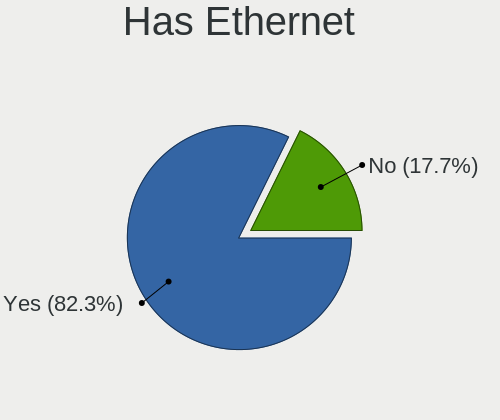
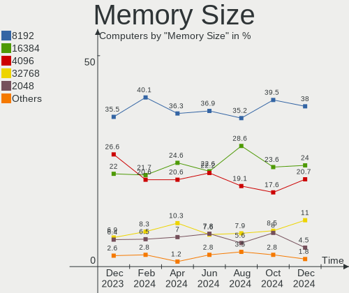

Ubuntu Hardware Trends
----------------------

A project to identify most popular hardware characteristics and track their change
over time based on data collected by Ubuntu users at https://Linux-Hardware.org.

Anyone can contribute to this report by the [hw-probe](https://github.com/linuxhw/hw-probe) tool:

    sudo -E hw-probe -all -upload

This is a report for all computer types. See also reports for [desktops](/Dist/Ubuntu/Desktop/README.md) and [notebooks](/Dist/Ubuntu/Notebook/README.md).

Full-feature report is available here: https://linux-hardware.org/?view=trends

Period: Aug, 2021.

Contents
--------

* [ System ](#system)
  - [ OS                       ](#os)
  - [ OS Family                ](#os-family)
  - [ Kernel                   ](#kernel)
  - [ Kernel Family            ](#kernel-family)
  - [ Kernel Major Ver.        ](#kernel-major-ver)
  - [ Arch                     ](#arch)
  - [ DE                       ](#de)
  - [ Display Server           ](#display-server)
  - [ Display Manager          ](#display-manager)
  - [ OS Lang                  ](#os-lang)
  - [ Boot Mode                ](#boot-mode)
  - [ Filesystem               ](#filesystem)
  - [ Part. scheme             ](#part-scheme)
  - [ Dual Boot with Linux/BSD ](#dual-boot-with-linuxbsd)
  - [ Dual Boot (Win)          ](#dual-boot-win)

* [ Board ](#board)
  - [ Vendor                   ](#vendor)
  - [ Model                    ](#model)
  - [ Model Family             ](#model-family)
  - [ MFG Year                 ](#mfg-year)
  - [ Form Factor              ](#form-factor)
  - [ Secure Boot              ](#secure-boot)
  - [ Coreboot                 ](#coreboot)
  - [ RAM Size                 ](#ram-size)
  - [ RAM Used                 ](#ram-used)
  - [ Total Drives             ](#total-drives)
  - [ Has CD-ROM               ](#has-cd-rom)
  - [ Has Ethernet             ](#has-ethernet)
  - [ Has WiFi                 ](#has-wifi)
  - [ Has Bluetooth            ](#has-bluetooth)

* [ Location ](#location)
  - [ Country                  ](#country)
  - [ City                     ](#city)

* [ Drives ](#drives)
  - [ Drive Vendor             ](#drive-vendor)
  - [ Drive Model              ](#drive-model)
  - [ HDD Vendor               ](#hdd-vendor)
  - [ SSD Vendor               ](#ssd-vendor)
  - [ Drive Kind               ](#drive-kind)
  - [ Drive Connector          ](#drive-connector)
  - [ Drive Size               ](#drive-size)
  - [ Space Total              ](#space-total)
  - [ Space Used               ](#space-used)
  - [ Malfunc. Drives          ](#malfunc-drives)
  - [ Malfunc. Drive Vendor    ](#malfunc-drive-vendor)
  - [ Malfunc. HDD Vendor      ](#malfunc-hdd-vendor)
  - [ Malfunc. Drive Kind      ](#malfunc-drive-kind)
  - [ Failed Drives            ](#failed-drives)
  - [ Failed Drive Vendor      ](#failed-drive-vendor)
  - [ Drive Status             ](#drive-status)

* [ Storage controller ](#storage-controller)
  - [ Storage Vendor           ](#storage-vendor)
  - [ Storage Model            ](#storage-model)
  - [ Storage Kind             ](#storage-kind)

* [ Processor ](#processor)
  - [ CPU Vendor               ](#cpu-vendor)
  - [ CPU Model                ](#cpu-model)
  - [ CPU Model Family         ](#cpu-model-family)
  - [ CPU Cores                ](#cpu-cores)
  - [ CPU Sockets              ](#cpu-sockets)
  - [ CPU Threads              ](#cpu-threads)
  - [ CPU Op-Modes             ](#cpu-op-modes)
  - [ CPU Microcode            ](#cpu-microcode)
  - [ CPU Microarch            ](#cpu-microarch)

* [ Graphics ](#graphics)
  - [ GPU Vendor               ](#gpu-vendor)
  - [ GPU Model                ](#gpu-model)
  - [ GPU Combo                ](#gpu-combo)
  - [ GPU Driver               ](#gpu-driver)
  - [ GPU Memory               ](#gpu-memory)

* [ Monitor ](#monitor)
  - [ Monitor Vendor           ](#monitor-vendor)
  - [ Monitor Model            ](#monitor-model)
  - [ Monitor Resolution       ](#monitor-resolution)
  - [ Monitor Diagonal         ](#monitor-diagonal)
  - [ Monitor Width            ](#monitor-width)
  - [ Aspect Ratio             ](#aspect-ratio)
  - [ Monitor Area             ](#monitor-area)
  - [ Pixel Density            ](#pixel-density)
  - [ Multiple Monitors        ](#multiple-monitors)

* [ Network ](#network)
  - [ Net Controller Vendor    ](#net-controller-vendor)
  - [ Net Controller Model     ](#net-controller-model)
  - [ Wireless Vendor          ](#wireless-vendor)
  - [ Wireless Model           ](#wireless-model)
  - [ Ethernet Vendor          ](#ethernet-vendor)
  - [ Ethernet Model           ](#ethernet-model)
  - [ Net Controller Kind      ](#net-controller-kind)
  - [ Used Controller          ](#used-controller)
  - [ NICs                     ](#nics)
  - [ IPv6                     ](#ipv6)

* [ Bluetooth ](#bluetooth)
  - [ Bluetooth Vendor         ](#bluetooth-vendor)
  - [ Bluetooth Model          ](#bluetooth-model)

* [ Sound ](#sound)
  - [ Sound Vendor             ](#sound-vendor)
  - [ Sound Model              ](#sound-model)

* [ Memory ](#memory)
  - [ Memory Vendor            ](#memory-vendor)
  - [ Memory Model             ](#memory-model)
  - [ Memory Kind              ](#memory-kind)
  - [ Memory Form Factor       ](#memory-form-factor)
  - [ Memory Size              ](#memory-size)
  - [ Memory Speed             ](#memory-speed)

* [ Printers & scanners ](#printers--scanners)
  - [ Printer Vendor           ](#printer-vendor)
  - [ Printer Model            ](#printer-model)
  - [ Scanner Vendor           ](#scanner-vendor)
  - [ Scanner Model            ](#scanner-model)

* [ Camera ](#camera)
  - [ Camera Vendor            ](#camera-vendor)
  - [ Camera Model             ](#camera-model)

* [ Security ](#security)
  - [ Fingerprint Vendor       ](#fingerprint-vendor)
  - [ Fingerprint Model        ](#fingerprint-model)
  - [ Chipcard Vendor          ](#chipcard-vendor)
  - [ Chipcard Model           ](#chipcard-model)

* [ Unsupported ](#unsupported)
  - [ Unsupported Devices      ](#unsupported-devices)
  - [ Unsupported Device Types ](#unsupported-device-types)

System
------

OS
--

Installed operating systems

| Name           | Computers | Percent |
|----------------|-----------|---------|
| Ubuntu 20.04   | 831       | 63.19%  |
| Ubuntu 21.04   | 347       | 26.39%  |
| Ubuntu 18.04   | 88        | 6.69%   |
| Ubuntu 20.10   | 22        | 1.67%   |
| Ubuntu 21.10   | 9         | 0.68%   |
| Ubuntu 16.04   | 8         | 0.61%   |
| Ubuntu 19.10   | 4         | 0.3%    |
| Ubuntu         | 3         | 0.23%   |
| Ubuntu Core 18 | 1         | 0.08%   |
| Ubuntu Core 16 | 1         | 0.08%   |
| Ubuntu 19.04   | 1         | 0.08%   |

OS Family
---------

OS without a version

| Name   | Computers | Percent |
|--------|-----------|---------|
| Ubuntu | 1315      | 100%    |

Kernel
------

Version of the Linux kernel

| Version                    | Computers | Percent |
|----------------------------|-----------|---------|
| 5.11.0-25-generic          | 367       | 27.91%  |
| 5.11.0-27-generic          | 251       | 19.09%  |
| 5.11.0-31-generic          | 118       | 8.97%   |
| 5.8.0-63-generic           | 114       | 8.67%   |
| 5.4.0-81-generic           | 83        | 6.31%   |
| 5.4.0-80-generic           | 79        | 6.01%   |
| 5.8.0-43-generic           | 50        | 3.8%    |
| 5.11.0-16-generic          | 23        | 1.75%   |
| 5.8.0-59-generic           | 16        | 1.22%   |
| 5.11.0-33-generic          | 14        | 1.06%   |
| 5.4.0-42-generic           | 11        | 0.84%   |
| 5.4.0-77-generic           | 10        | 0.76%   |
| 5.11.0-26-generic          | 10        | 0.76%   |
| 4.15.0-151-generic         | 10        | 0.76%   |
| 5.11.0-22-generic          | 9         | 0.68%   |
| 5.11.0-1015-raspi          | 8         | 0.61%   |
| 4.15.0-153-generic         | 7         | 0.53%   |
| 5.8.0-55-generic           | 5         | 0.38%   |
| 4.15.0-154-generic         | 5         | 0.38%   |
| 5.8.0-53-generic           | 4         | 0.3%    |
| 5.8.0-50-generic           | 4         | 0.3%    |
| 5.13.9-051309-generic      | 4         | 0.3%    |
| 5.11.0-1016-raspi          | 4         | 0.3%    |
| 5.8.0-64-generic           | 3         | 0.23%   |
| 5.8.0-25-generic           | 3         | 0.23%   |
| 5.13.0-14-generic          | 3         | 0.23%   |
| 5.13.0-051300-generic      | 3         | 0.23%   |
| 5.10.0-1044-oem            | 3         | 0.23%   |
| 5.10.0-1038-oem            | 3         | 0.23%   |
| 4.15.0-45-generic          | 3         | 0.23%   |
| 5.8.0-36-generic           | 2         | 0.15%   |
| 5.4.0-hiveos               | 2         | 0.15%   |
| 5.4.0-74-generic           | 2         | 0.15%   |
| 5.4.0-73-generic           | 2         | 0.15%   |
| 5.4.0-26-generic           | 2         | 0.15%   |
| 5.13.7-surface             | 2         | 0.15%   |
| 5.13.4-051304-generic      | 2         | 0.15%   |
| 5.11.0-7620-generic        | 2         | 0.15%   |
| 5.11.0-25-lowlatency       | 2         | 0.15%   |
| 4.4.0-186-generic          | 2         | 0.15%   |
| 4.15.0-147-generic         | 2         | 0.15%   |
| 4.15.0-112-generic         | 2         | 0.15%   |
| 5.8.0-63-lowlatency        | 1         | 0.08%   |
| 5.8.0-54-generic           | 1         | 0.08%   |
| 5.8.0-492104061620-generic | 1         | 0.08%   |
| 5.8.0-48-generic           | 1         | 0.08%   |
| 5.8.0-44-generic           | 1         | 0.08%   |
| 5.8.0-41-generic           | 1         | 0.08%   |
| 5.8.0-1032-raspi           | 1         | 0.08%   |
| 5.4.5-050405-generic       | 1         | 0.08%   |
| 5.4.13-050413-generic      | 1         | 0.08%   |
| 5.4.0-81-lowlatency        | 1         | 0.08%   |
| 5.4.0-80-lowlatency        | 1         | 0.08%   |
| 5.4.0-79-generic           | 1         | 0.08%   |
| 5.4.0-70-generic           | 1         | 0.08%   |
| 5.4.0-65-generic           | 1         | 0.08%   |
| 5.4.0-58-generic           | 1         | 0.08%   |
| 5.4.0-54-generic           | 1         | 0.08%   |
| 5.4.0-52-generic           | 1         | 0.08%   |
| 5.4.0-48-generic           | 1         | 0.08%   |

Kernel Family
-------------

Linux kernel without a distro release

| Version | Computers | Percent |
|---------|-----------|---------|
| 5.11.0  | 816       | 62.05%  |
| 5.8.0   | 208       | 15.82%  |
| 5.4.0   | 203       | 15.44%  |
| 4.15.0  | 38        | 2.89%   |
| 5.10.0  | 8         | 0.61%   |
| 5.13.0  | 7         | 0.53%   |
| 5.3.0   | 6         | 0.46%   |
| 5.13.9  | 4         | 0.3%    |
| 5.13.7  | 4         | 0.3%    |
| 4.4.0   | 3         | 0.23%   |
| 5.14.0  | 2         | 0.15%   |
| 5.13.4  | 2         | 0.15%   |
| 5.0.0   | 2         | 0.15%   |
| 5.4.5   | 1         | 0.08%   |
| 5.4.13  | 1         | 0.08%   |
| 5.13.8  | 1         | 0.08%   |
| 5.13.13 | 1         | 0.08%   |
| 5.13.12 | 1         | 0.08%   |
| 5.12.0  | 1         | 0.08%   |
| 5.11.6  | 1         | 0.08%   |
| 5.11.14 | 1         | 0.08%   |
| 5.10.32 | 1         | 0.08%   |
| 4.20.0  | 1         | 0.08%   |
| 4.18.0  | 1         | 0.08%   |
| 4.13.0  | 1         | 0.08%   |

Kernel Major Ver.
-----------------

Linux kernel major version

| Version | Computers | Percent |
|---------|-----------|---------|
| 5.11    | 818       | 62.21%  |
| 5.8     | 208       | 15.82%  |
| 5.4     | 205       | 15.59%  |
| 4.15    | 38        | 2.89%   |
| 5.13    | 20        | 1.52%   |
| 5.10    | 9         | 0.68%   |
| 5.3     | 6         | 0.46%   |
| 4.4     | 3         | 0.23%   |
| 5.14    | 2         | 0.15%   |
| 5.0     | 2         | 0.15%   |
| 5.12    | 1         | 0.08%   |
| 4.20    | 1         | 0.08%   |
| 4.18    | 1         | 0.08%   |
| 4.13    | 1         | 0.08%   |

Arch
----

OS architecture (x86_64, i586, etc.)

| Name    | Computers | Percent |
|---------|-----------|---------|
| x86_64  | 1287      | 97.87%  |
| aarch64 | 16        | 1.22%   |
| i686    | 12        | 0.91%   |

DE
--

Desktop Environment

| Name            | Computers | Percent |
|-----------------|-----------|---------|
| GNOME           | 1153      | 87.68%  |
| Unknown         | 121       | 9.2%    |
| Unity           | 14        | 1.06%   |
| X-Cinnamon      | 8         | 0.61%   |
| GNOME Flashback | 7         | 0.53%   |
| Cinnamon        | 3         | 0.23%   |
| i3              | 2         | 0.15%   |
| enlightenment   | 2         | 0.15%   |
| xubuntu         | 1         | 0.08%   |
| wmaker-common   | 1         | 0.08%   |
| UKUI            | 1         | 0.08%   |
| sway            | 1         | 0.08%   |
| Deepin          | 1         | 0.08%   |

Display Server
--------------

X11 or Wayland

| Name    | Computers | Percent |
|---------|-----------|---------|
| X11     | 972       | 73.92%  |
| Wayland | 266       | 20.23%  |
| Unknown | 59        | 4.49%   |
| Tty     | 18        | 1.37%   |

Display Manager
---------------

SDDM, LightDM, etc.

| Name    | Computers | Percent |
|---------|-----------|---------|
| Unknown | 981       | 74.6%   |
| GDM     | 318       | 24.18%  |
| TDM     | 12        | 0.91%   |
| LightDM | 2         | 0.15%   |
| SDDM    | 1         | 0.08%   |
| GDM3    | 1         | 0.08%   |

OS Lang
-------

Language

| Lang    | Computers | Percent |
|---------|-----------|---------|
| en_US   | 521       | 39.62%  |
| de_DE   | 149       | 11.33%  |
| fr_FR   | 84        | 6.39%   |
| en_GB   | 71        | 5.4%    |
| en_IN   | 58        | 4.41%   |
| pt_BR   | 52        | 3.95%   |
| ru_RU   | 34        | 2.59%   |
| es_ES   | 27        | 2.05%   |
| en_CA   | 26        | 1.98%   |
| en_AU   | 26        | 1.98%   |
| it_IT   | 20        | 1.52%   |
| pl_PL   | 19        | 1.44%   |
| zh_CN   | 14        | 1.06%   |
| C       | 14        | 1.06%   |
| es_AR   | 13        | 0.99%   |
| Unknown | 12        | 0.91%   |
| en_ZA   | 11        | 0.84%   |
| cs_CZ   | 11        | 0.84%   |
| nl_NL   | 10        | 0.76%   |
| de_CH   | 10        | 0.76%   |
| fi_FI   | 9         | 0.68%   |
| de_AT   | 9         | 0.68%   |
| en_NZ   | 7         | 0.53%   |
| ro_RO   | 6         | 0.46%   |
| ja_JP   | 6         | 0.46%   |
| hu_HU   | 6         | 0.46%   |
| fr_BE   | 6         | 0.46%   |
| sv_SE   | 5         | 0.38%   |
| nl_BE   | 5         | 0.38%   |
| es_MX   | 5         | 0.38%   |
| es_CO   | 5         | 0.38%   |
| es_CL   | 5         | 0.38%   |
| tr_TR   | 4         | 0.3%    |
| ru_UA   | 4         | 0.3%    |
| pt_PT   | 4         | 0.3%    |
| es_EC   | 4         | 0.3%    |
| nb_NO   | 3         | 0.23%   |
| hr_HR   | 3         | 0.23%   |
| en_IL   | 3         | 0.23%   |
| da_DK   | 3         | 0.23%   |
| sl_SI   | 2         | 0.15%   |
| sk_SK   | 2         | 0.15%   |
| fr_CH   | 2         | 0.15%   |
| et_EE   | 2         | 0.15%   |
| es_SV   | 2         | 0.15%   |
| en_SG   | 2         | 0.15%   |
| en_IE   | 2         | 0.15%   |
| el_GR   | 2         | 0.15%   |
| bg_BG   | 2         | 0.15%   |
| zh_TW   | 1         | 0.08%   |
| zh_HK   | 1         | 0.08%   |
| lv_LV   | 1         | 0.08%   |
| fr_CA   | 1         | 0.08%   |
| es_VE   | 1         | 0.08%   |
| es_UY   | 1         | 0.08%   |
| es_PE   | 1         | 0.08%   |
| es_NI   | 1         | 0.08%   |
| es_HN   | 1         | 0.08%   |
| en_ZW   | 1         | 0.08%   |
| en_NG   | 1         | 0.08%   |

Boot Mode
---------

EFI or BIOS

| Mode | Computers | Percent |
|------|-----------|---------|
| BIOS | 734       | 55.82%  |
| EFI  | 581       | 44.18%  |

Filesystem
----------

Type of filesystem

| Type    | Computers | Percent |
|---------|-----------|---------|
| Ext4    | 1230      | 93.54%  |
| Overlay | 37        | 2.81%   |
| Zfs     | 23        | 1.75%   |
| Btrfs   | 10        | 0.76%   |
| Xfs     | 6         | 0.46%   |
| Ext2    | 5         | 0.38%   |
| Aufs    | 2         | 0.15%   |
| Ext3    | 1         | 0.08%   |
| Unknown | 1         | 0.08%   |

Part. scheme
------------

Scheme of partitioning

| Type    | Computers | Percent |
|---------|-----------|---------|
| Unknown | 954       | 72.55%  |
| GPT     | 298       | 22.66%  |
| MBR     | 63        | 4.79%   |

Dual Boot with Linux/BSD
------------------------

Hosting more than one Linux/BSD

| Dual boot | Computers | Percent |
|-----------|-----------|---------|
| No        | 1134      | 86.24%  |
| Yes       | 181       | 13.76%  |

Dual Boot (Win)
---------------

Hosting Linux and Windows

| Dual boot | Computers | Percent |
|-----------|-----------|---------|
| No        | 816       | 62.05%  |
| Yes       | 499       | 37.95%  |

Board
-----

Vendor
------

Motherboard manufacturer

| Name                    | Computers | Percent |
|-------------------------|-----------|---------|
| Hewlett-Packard         | 212       | 16.12%  |
| Lenovo                  | 204       | 15.51%  |
| Dell                    | 194       | 14.75%  |
| ASUSTek Computer        | 161       | 12.24%  |
| Gigabyte Technology     | 99        | 7.53%   |
| Acer                    | 73        | 5.55%   |
| MSI                     | 51        | 3.88%   |
| ASRock                  | 48        | 3.65%   |
| Apple                   | 33        | 2.51%   |
| Unknown                 | 30        | 2.28%   |
| Toshiba                 | 20        | 1.52%   |
| Samsung Electronics     | 17        | 1.29%   |
| Intel                   | 15        | 1.14%   |
| Fujitsu                 | 15        | 1.14%   |
| Medion                  | 14        | 1.06%   |
| Pegatron                | 10        | 0.76%   |
| Packard Bell            | 9         | 0.68%   |
| Sony                    | 8         | 0.61%   |
| HUAWEI                  | 7         | 0.53%   |
| Notebook                | 5         | 0.38%   |
| Google                  | 5         | 0.38%   |
| ECS                     | 5         | 0.38%   |
| TUXEDO                  | 4         | 0.3%    |
| Panasonic               | 4         | 0.3%    |
| Microsoft               | 4         | 0.3%    |
| Huanan                  | 4         | 0.3%    |
| Foxconn                 | 4         | 0.3%    |
| System76                | 3         | 0.23%   |
| Shuttle                 | 3         | 0.23%   |
| LG Electronics          | 3         | 0.23%   |
| Biostar                 | 3         | 0.23%   |
| Supermicro              | 2         | 0.15%   |
| NEC Computers           | 2         | 0.15%   |
| Monster                 | 2         | 0.15%   |
| Gateway                 | 2         | 0.15%   |
| Fujitsu Siemens         | 2         | 0.15%   |
| AMI                     | 2         | 0.15%   |
| ZOTAC                   | 1         | 0.08%   |
| Yanling                 | 1         | 0.08%   |
| Wortmann AG             | 1         | 0.08%   |
| whyopencomputing        | 1         | 0.08%   |
| VIT                     | 1         | 0.08%   |
| VIA technology          | 1         | 0.08%   |
| TYAN Computer           | 1         | 0.08%   |
| TrekStor                | 1         | 0.08%   |
| THD                     | 1         | 0.08%   |
| Teclast                 | 1         | 0.08%   |
| Seco                    | 1         | 0.08%   |
| Razer                   | 1         | 0.08%   |
| Raspberry Pi Foundation | 1         | 0.08%   |
| Radxa                   | 1         | 0.08%   |
| Positivo                | 1         | 0.08%   |
| PC Specialist           | 1         | 0.08%   |
| ONDA                    | 1         | 0.08%   |
| OEM                     | 1         | 0.08%   |
| IP3 Tech                | 1         | 0.08%   |
| Informatica Login       | 1         | 0.08%   |
| ICP / iEi               | 1         | 0.08%   |
| HKC                     | 1         | 0.08%   |
| Exo                     | 1         | 0.08%   |

Model
-----

Motherboard model

| Name                                | Computers | Percent |
|-------------------------------------|-----------|---------|
| Unknown                             | 34        | 2.59%   |
| ASUS All Series                     | 9         | 0.68%   |
| Lenovo IdeaPad Y700-15ISK 80NV      | 5         | 0.38%   |
| Dell OptiPlex 7010                  | 5         | 0.38%   |
| Lenovo IdeaPad 330-15IKB 81DE       | 4         | 0.3%    |
| HP Pavilion dv6                     | 4         | 0.3%    |
| HP Notebook                         | 4         | 0.3%    |
| Dell Latitude E6400                 | 4         | 0.3%    |
| MSI MS-7C91                         | 3         | 0.23%   |
| Lenovo IdeaPad 5 15ITL05 82FG       | 3         | 0.23%   |
| Lenovo IdeaPad 5 14ARE05 81YM       | 3         | 0.23%   |
| Lenovo G560 0679                    | 3         | 0.23%   |
| HP ProBook 650 G1                   | 3         | 0.23%   |
| HP Pavilion g6                      | 3         | 0.23%   |
| HP EliteBook 8460p                  | 3         | 0.23%   |
| HP EliteBook 845 G7 Notebook PC     | 3         | 0.23%   |
| HP EliteBook 840 G3                 | 3         | 0.23%   |
| HP EliteBook 820 G1                 | 3         | 0.23%   |
| Gigabyte GA-78LMT-USB3 6.0          | 3         | 0.23%   |
| Gigabyte B450M DS3H                 | 3         | 0.23%   |
| Gigabyte A320M-S2H                  | 3         | 0.23%   |
| Dell Vostro 3500                    | 3         | 0.23%   |
| Dell Latitude E6500                 | 3         | 0.23%   |
| Dell Latitude 5410                  | 3         | 0.23%   |
| ASUS ROG STRIX B450-F GAMING        | 3         | 0.23%   |
| ASUS PRIME A320M-K                  | 3         | 0.23%   |
| Apple MacBookPro8,1                 | 3         | 0.23%   |
| Toshiba Satellite C55-B             | 2         | 0.15%   |
| System76 Oryx Pro                   | 2         | 0.15%   |
| Packard Bell EasyNote TS11HR        | 2         | 0.15%   |
| MSI PPPPP-CCC#MMMMMMMM              | 2         | 0.15%   |
| MSI MS-7C94                         | 2         | 0.15%   |
| MSI MS-7C35                         | 2         | 0.15%   |
| MSI MS-7C02                         | 2         | 0.15%   |
| MSI MS-7816                         | 2         | 0.15%   |
| MSI MS-7693                         | 2         | 0.15%   |
| Microsoft Surface Pro 4             | 2         | 0.15%   |
| Lenovo Yoga 910-13IKB 80VF          | 2         | 0.15%   |
| Lenovo Yoga 2 11 20332              | 2         | 0.15%   |
| Lenovo ThinkBook 14 G2 ITL 20VD     | 2         | 0.15%   |
| Lenovo IdeaPad S145-15API 81V7      | 2         | 0.15%   |
| Lenovo IdeaPad Flex 5 14IIL05 81X1  | 2         | 0.15%   |
| Lenovo IdeaPad 500-15ACZ 80K4       | 2         | 0.15%   |
| Lenovo IdeaPad 3 17ADA05 81W2       | 2         | 0.15%   |
| Lenovo G500 20236                   | 2         | 0.15%   |
| Lenovo G50-45 80E3                  | 2         | 0.15%   |
| Intel NUC8i7BEH                     | 2         | 0.15%   |
| HUAWEI HLYL-WXX9                    | 2         | 0.15%   |
| HUAWEI BOHK-WAX9X                   | 2         | 0.15%   |
| HP Z440 Workstation                 | 2         | 0.15%   |
| HP ProLiant MicroServer             | 2         | 0.15%   |
| HP ProDesk 400 G1 SFF               | 2         | 0.15%   |
| HP ProBook 4540s                    | 2         | 0.15%   |
| HP ProBook 450 G6                   | 2         | 0.15%   |
| HP ProBook 440 G8 Notebook PC       | 2         | 0.15%   |
| HP Presario CQ61                    | 2         | 0.15%   |
| HP Presario CQ56                    | 2         | 0.15%   |
| HP Pavilion Notebook                | 2         | 0.15%   |
| HP Pavilion Laptop 15-eh0xxx        | 2         | 0.15%   |
| HP Pavilion Gaming Laptop 15-dk0xxx | 2         | 0.15%   |

Model Family
------------

Motherboard model prefix

| Name                   | Computers | Percent |
|------------------------|-----------|---------|
| Lenovo ThinkPad        | 76        | 5.78%   |
| Lenovo IdeaPad         | 53        | 4.03%   |
| Dell Latitude          | 52        | 3.95%   |
| Dell Inspiron          | 52        | 3.95%   |
| Acer Aspire            | 43        | 3.27%   |
| HP EliteBook           | 39        | 2.97%   |
| Unknown                | 34        | 2.59%   |
| HP Pavilion            | 32        | 2.43%   |
| HP Laptop              | 23        | 1.75%   |
| Dell XPS               | 23        | 1.75%   |
| Dell Precision         | 23        | 1.75%   |
| Dell OptiPlex          | 23        | 1.75%   |
| ASUS PRIME             | 19        | 1.44%   |
| HP ProBook             | 18        | 1.37%   |
| ASUS VivoBook          | 18        | 1.37%   |
| HP Compaq              | 17        | 1.29%   |
| Toshiba Satellite      | 15        | 1.14%   |
| Lenovo ThinkCentre     | 15        | 1.14%   |
| Dell Vostro            | 15        | 1.14%   |
| HP ENVY                | 14        | 1.06%   |
| ASUS ROG               | 12        | 0.91%   |
| Acer Swift             | 11        | 0.84%   |
| Lenovo Yoga            | 9         | 0.68%   |
| ASUS All               | 9         | 0.68%   |
| HP EliteDesk           | 8         | 0.61%   |
| Fujitsu LIFEBOOK       | 7         | 0.53%   |
| Packard Bell EasyNote  | 6         | 0.46%   |
| Lenovo ThinkBook       | 6         | 0.46%   |
| ASUS TUF               | 6         | 0.46%   |
| Apple MacBookPro8      | 6         | 0.46%   |
| HP ProLiant            | 5         | 0.38%   |
| HP ProDesk             | 5         | 0.38%   |
| Gigabyte GA-78LMT-USB3 | 5         | 0.38%   |
| Gigabyte B450M         | 5         | 0.38%   |
| ASUS M5A78L-M          | 5         | 0.38%   |
| Acer Nitro             | 5         | 0.38%   |
| Microsoft Surface      | 4         | 0.3%    |
| Lenovo ThinkStation    | 4         | 0.3%    |
| HP Spectre             | 4         | 0.3%    |
| HP Presario            | 4         | 0.3%    |
| HP Notebook            | 4         | 0.3%    |
| Gigabyte B450          | 4         | 0.3%    |
| Dell Studio            | 4         | 0.3%    |
| Toshiba PORTEGE        | 3         | 0.23%   |
| Pegatron Compaq        | 3         | 0.23%   |
| MSI MS-7C91            | 3         | 0.23%   |
| Lenovo G560            | 3         | 0.23%   |
| Intel DG31PR           | 3         | 0.23%   |
| HP OMEN                | 3         | 0.23%   |
| Gigabyte Z390          | 3         | 0.23%   |
| Gigabyte X570          | 3         | 0.23%   |
| Gigabyte A320M-S2H     | 3         | 0.23%   |
| Fujitsu ESPRIMO        | 3         | 0.23%   |
| ASUS ZenBook           | 3         | 0.23%   |
| ASUS SABERTOOTH        | 3         | 0.23%   |
| Acer Veriton           | 3         | 0.23%   |
| System76 Oryx          | 2         | 0.15%   |
| Samsung 350V5C         | 2         | 0.15%   |
| MSI PPPPP-CCC#MMMMMMMM | 2         | 0.15%   |
| MSI MS-7C94            | 2         | 0.15%   |

MFG Year
--------

Motherboard manufacture year

| Year    | Computers | Percent |
|---------|-----------|---------|
| 2021    | 207       | 15.74%  |
| 2020    | 185       | 14.07%  |
| 2019    | 124       | 9.43%   |
| 2018    | 98        | 7.45%   |
| 2013    | 98        | 7.45%   |
| 2011    | 89        | 6.77%   |
| 2012    | 84        | 6.39%   |
| 2014    | 80        | 6.08%   |
| 2015    | 70        | 5.32%   |
| 2016    | 61        | 4.64%   |
| 2010    | 57        | 4.33%   |
| 2017    | 56        | 4.26%   |
| 2009    | 48        | 3.65%   |
| 2008    | 21        | 1.6%    |
| Unknown | 16        | 1.22%   |
| 2007    | 14        | 1.06%   |
| 2006    | 6         | 0.46%   |
| 2004    | 1         | 0.08%   |

Form Factor
-----------

Physical design of the computer

| Name           | Computers | Percent |
|----------------|-----------|---------|
| Notebook       | 738       | 56.12%  |
| Desktop        | 471       | 35.82%  |
| Convertible    | 39        | 2.97%   |
| All in one     | 22        | 1.67%   |
| System on chip | 16        | 1.22%   |
| Mini pc        | 12        | 0.91%   |
| Tablet         | 10        | 0.76%   |
| Server         | 5         | 0.38%   |
| Other          | 2         | 0.15%   |

Secure Boot
-----------

Enabled or disabled

| State    | Computers | Percent |
|----------|-----------|---------|
| Disabled | 1161      | 88.29%  |
| Enabled  | 154       | 11.71%  |

Coreboot
--------

Have coreboot on board

| Used | Computers | Percent |
|------|-----------|---------|
| No   | 1309      | 99.54%  |
| Yes  | 6         | 0.46%   |

RAM Size
--------

Total RAM memory

| Size in GB      | Computers | Percent |
|-----------------|-----------|---------|
| 4.01-8.0        | 319       | 24.26%  |
| 16.01-24.0      | 266       | 20.23%  |
| 8.01-16.0       | 256       | 19.47%  |
| 3.01-4.0        | 249       | 18.94%  |
| 32.01-64.0      | 102       | 7.76%   |
| 1.01-2.0        | 47        | 3.57%   |
| 64.01-256.0     | 32        | 2.43%   |
| 24.01-32.0      | 23        | 1.75%   |
| 2.01-3.0        | 14        | 1.06%   |
| 0.51-1.0        | 5         | 0.38%   |
| More than 256.0 | 2         | 0.15%   |

RAM Used
--------

Used RAM memory

| Used GB    | Computers | Percent |
|------------|-----------|---------|
| 1.01-2.0   | 534       | 40.61%  |
| 2.01-3.0   | 373       | 28.37%  |
| 4.01-8.0   | 169       | 12.85%  |
| 3.01-4.0   | 138       | 10.49%  |
| 8.01-16.0  | 48        | 3.65%   |
| 0.51-1.0   | 29        | 2.21%   |
| 16.01-24.0 | 12        | 0.91%   |
| 0.01-0.5   | 9         | 0.68%   |
| 24.01-32.0 | 2         | 0.15%   |
| 32.01-64.0 | 1         | 0.08%   |

Total Drives
------------

Number of drives on board

| Drives | Computers | Percent |
|--------|-----------|---------|
| 1      | 838       | 63.73%  |
| 2      | 310       | 23.57%  |
| 3      | 93        | 7.07%   |
| 4      | 35        | 2.66%   |
| 5      | 15        | 1.14%   |
| 6      | 10        | 0.76%   |
| 0      | 7         | 0.53%   |
| 8      | 2         | 0.15%   |
| 7      | 2         | 0.15%   |
| 13     | 1         | 0.08%   |
| 11     | 1         | 0.08%   |
| 9      | 1         | 0.08%   |

Has CD-ROM
----------

Has CD-ROM on board

| Presented | Computers | Percent |
|-----------|-----------|---------|
| No        | 780       | 59.32%  |
| Yes       | 535       | 40.68%  |

Has Ethernet
------------

Has Ethernet on board

| Presented | Computers | Percent |
|-----------|-----------|---------|
| Yes       | 1120      | 85.17%  |
| No        | 195       | 14.83%  |

Has WiFi
--------

Has WiFi module

| Presented | Computers | Percent |
|-----------|-----------|---------|
| Yes       | 1002      | 76.2%   |
| No        | 313       | 23.8%   |

Has Bluetooth
-------------

Has Bluetooth module

| Presented | Computers | Percent |
|-----------|-----------|---------|
| Yes       | 749       | 56.96%  |
| No        | 566       | 43.04%  |

Location
--------

Country
-------

Geographic location (country)

| Country            | Computers | Percent |
|--------------------|-----------|---------|
| USA                | 223       | 16.96%  |
| Germany            | 163       | 12.4%   |
| France             | 81        | 6.16%   |
| Brazil             | 73        | 5.55%   |
| UK                 | 67        | 5.1%    |
| India              | 66        | 5.02%   |
| Russia             | 47        | 3.57%   |
| Poland             | 32        | 2.43%   |
| Canada             | 32        | 2.43%   |
| Spain              | 30        | 2.28%   |
| Australia          | 30        | 2.28%   |
| Italy              | 26        | 1.98%   |
| Netherlands        | 25        | 1.9%    |
| Switzerland        | 20        | 1.52%   |
| Czechia            | 18        | 1.37%   |
| Austria            | 17        | 1.29%   |
| Ukraine            | 16        | 1.22%   |
| Turkey             | 16        | 1.22%   |
| Finland            | 16        | 1.22%   |
| China              | 15        | 1.14%   |
| Belgium            | 15        | 1.14%   |
| Argentina          | 14        | 1.06%   |
| Sweden             | 12        | 0.91%   |
| Romania            | 12        | 0.91%   |
| Mexico             | 12        | 0.91%   |
| South Africa       | 11        | 0.84%   |
| Greece             | 11        | 0.84%   |
| Indonesia          | 10        | 0.76%   |
| Hungary            | 10        | 0.76%   |
| Algeria            | 10        | 0.76%   |
| New Zealand        | 9         | 0.68%   |
| Portugal           | 8         | 0.61%   |
| Japan              | 8         | 0.61%   |
| Iran               | 8         | 0.61%   |
| Norway             | 7         | 0.53%   |
| Israel             | 6         | 0.46%   |
| Ecuador            | 6         | 0.46%   |
| Chile              | 6         | 0.46%   |
| Singapore          | 5         | 0.38%   |
| Serbia             | 5         | 0.38%   |
| Denmark            | 5         | 0.38%   |
| Colombia           | 5         | 0.38%   |
| Bulgaria           | 5         | 0.38%   |
| Vietnam            | 4         | 0.3%    |
| Thailand           | 4         | 0.3%    |
| Taiwan             | 4         | 0.3%    |
| Uruguay            | 3         | 0.23%   |
| Saudi Arabia       | 3         | 0.23%   |
| Puerto Rico        | 3         | 0.23%   |
| Peru               | 3         | 0.23%   |
| North Macedonia    | 3         | 0.23%   |
| Lithuania          | 3         | 0.23%   |
| Latvia             | 3         | 0.23%   |
| Estonia            | 3         | 0.23%   |
| Dominican Republic | 3         | 0.23%   |
| Croatia            | 3         | 0.23%   |
| Belarus            | 3         | 0.23%   |
| Uzbekistan         | 2         | 0.15%   |
| Sudan              | 2         | 0.15%   |
| South Korea        | 2         | 0.15%   |

City
----

Geographic location (city)

| City              | Computers | Percent |
|-------------------|-----------|---------|
| Prague            | 10        | 0.76%   |
| Moscow            | 10        | 0.76%   |
| Berlin            | 10        | 0.76%   |
| Vienna            | 9         | 0.68%   |
| S??o Paulo        | 9         | 0.68%   |
| Paris             | 9         | 0.68%   |
| Helsinki          | 9         | 0.68%   |
| Kyiv              | 8         | 0.61%   |
| Bengaluru         | 8         | 0.61%   |
| Tehran            | 7         | 0.53%   |
| Madrid            | 7         | 0.53%   |
| Hamburg           | 7         | 0.53%   |
| Warsaw            | 6         | 0.46%   |
| Stuttgart         | 6         | 0.46%   |
| Los Angeles       | 6         | 0.46%   |
| Istanbul          | 6         | 0.46%   |
| Chennai           | 6         | 0.46%   |
| Ankara            | 6         | 0.46%   |
| Singapore         | 5         | 0.38%   |
| Portland          | 5         | 0.38%   |
| Milan             | 5         | 0.38%   |
| Kolkata           | 5         | 0.38%   |
| Cologne           | 5         | 0.38%   |
| Brisbane          | 5         | 0.38%   |
| Zurich            | 4         | 0.3%    |
| Yekaterinburg     | 4         | 0.3%    |
| Thessaloniki      | 4         | 0.3%    |
| Tel Aviv          | 4         | 0.3%    |
| St Petersburg     | 4         | 0.3%    |
| Rio de Janeiro    | 4         | 0.3%    |
| Quito             | 4         | 0.3%    |
| Pune              | 4         | 0.3%    |
| Nuremberg         | 4         | 0.3%    |
| Munich            | 4         | 0.3%    |
| Melbourne         | 4         | 0.3%    |
| London            | 4         | 0.3%    |
| Frankfurt am Main | 4         | 0.3%    |
| Dresden           | 4         | 0.3%    |
| Dallas            | 4         | 0.3%    |
| Bucharest         | 4         | 0.3%    |
| Bogot??           | 4         | 0.3%    |
| Bielefeld         | 4         | 0.3%    |
| Belgrade          | 4         | 0.3%    |
| Barcelona         | 4         | 0.3%    |
| Bangkok           | 4         | 0.3%    |
| Algiers           | 4         | 0.3%    |
| Wroclaw           | 3         | 0.23%   |
| Vancouver         | 3         | 0.23%   |
| Tucson            | 3         | 0.23%   |
| Toronto           | 3         | 0.23%   |
| Tomsk             | 3         | 0.23%   |
| Sydney            | 3         | 0.23%   |
| Skopje            | 3         | 0.23%   |
| Santiago          | 3         | 0.23%   |
| San Jose          | 3         | 0.23%   |
| Rome              | 3         | 0.23%   |
| Poznan            | 3         | 0.23%   |
| Oslo              | 3         | 0.23%   |
| Novosibirsk       | 3         | 0.23%   |
| Nottingham        | 3         | 0.23%   |

Drives
------

Drive Vendor
------------

Hard drive vendors

| Vendor                    | Computers | Drives | Percent |
|---------------------------|-----------|--------|---------|
| WDC                       | 309       | 366    | 17.61%  |
| Seagate                   | 275       | 340    | 15.67%  |
| Samsung Electronics       | 260       | 318    | 14.81%  |
| Toshiba                   | 122       | 135    | 6.95%   |
| Kingston                  | 91        | 98     | 5.19%   |
| SanDisk                   | 88        | 94     | 5.01%   |
| Unknown                   | 73        | 80     | 4.16%   |
| SK Hynix                  | 51        | 51     | 2.91%   |
| Crucial                   | 48        | 51     | 2.74%   |
| Intel                     | 47        | 56     | 2.68%   |
| Hitachi                   | 47        | 53     | 2.68%   |
| Micron Technology         | 25        | 26     | 1.42%   |
| HGST                      | 22        | 24     | 1.25%   |
| A-DATA Technology         | 21        | 22     | 1.2%    |
| Apple                     | 16        | 16     | 0.91%   |
| Phison                    | 15        | 16     | 0.85%   |
| KIOXIA                    | 15        | 17     | 0.85%   |
| China                     | 14        | 14     | 0.8%    |
| SPCC                      | 12        | 13     | 0.68%   |
| Silicon Motion            | 12        | 12     | 0.68%   |
| Transcend                 | 11        | 11     | 0.63%   |
| PNY                       | 8         | 8      | 0.46%   |
| Maxtor                    | 8         | 8      | 0.46%   |
| LITEONIT                  | 7         | 7      | 0.4%    |
| JMicron                   | 7         | 7      | 0.4%    |
| Fujitsu                   | 7         | 7      | 0.4%    |
| SABRENT                   | 6         | 6      | 0.34%   |
| Team                      | 5         | 5      | 0.28%   |
| Realtek Semiconductor     | 5         | 5      | 0.28%   |
| Patriot                   | 5         | 6      | 0.28%   |
| OCZ                       | 5         | 5      | 0.28%   |
| Netac                     | 5         | 7      | 0.28%   |
| LITEON                    | 5         | 5      | 0.28%   |
| Lite-On                   | 5         | 6      | 0.28%   |
| Intenso                   | 5         | 5      | 0.28%   |
| PLEXTOR                   | 4         | 4      | 0.23%   |
| KingFast                  | 4         | 4      | 0.23%   |
| Hewlett-Packard           | 4         | 4      | 0.23%   |
| Union Memory              | 3         | 3      | 0.17%   |
| Micron/Crucial Technology | 3         | 3      | 0.17%   |
| Lenovo                    | 3         | 3      | 0.17%   |
| KingSpec                  | 3         | 3      | 0.17%   |
| ASMT                      | 3         | 4      | 0.17%   |
| Apacer                    | 3         | 3      | 0.17%   |
| Zheino                    | 2         | 2      | 0.11%   |
| XPG                       | 2         | 2      | 0.11%   |
| Union Memory (Shenzhen)   | 2         | 2      | 0.11%   |
| LDLC                      | 2         | 2      | 0.11%   |
| KIOXIA-EXCERIA            | 2         | 2      | 0.11%   |
| GOODRAM                   | 2         | 2      | 0.11%   |
| Gigabyte Technology       | 2         | 2      | 0.11%   |
| FORESEE                   | 2         | 2      | 0.11%   |
| EMTEC                     | 2         | 2      | 0.11%   |
| Dogfish                   | 2         | 2      | 0.11%   |
| Corsair                   | 2         | 2      | 0.11%   |
| Verbatim                  | 1         | 1      | 0.06%   |
| TO Exter                  | 1         | 1      | 0.06%   |
| Teclast                   | 1         | 1      | 0.06%   |
| Synology                  | 1         | 2      | 0.06%   |
| StoreJet                  | 1         | 1      | 0.06%   |

Drive Model
-----------

Hard drive models

| Model                               | Computers | Percent |
|-------------------------------------|-----------|---------|
| Seagate ST1000LM035-1RK172 1TB      | 24        | 1.25%   |
| Kingston SA400S37240G 240GB SSD     | 23        | 1.2%    |
| Samsung NVMe SSD Drive 512GB        | 21        | 1.1%    |
| Toshiba MQ01ABD100 1TB              | 20        | 1.04%   |
| Samsung NVMe SSD Drive 500GB        | 20        | 1.04%   |
| Unknown MMC Card  32GB              | 15        | 0.78%   |
| Seagate ST1000LM024 HN-M101MBB 1TB  | 15        | 0.78%   |
| Intel NVMe SSD Drive 512GB          | 15        | 0.78%   |
| WDC WDS240G2G0A-00JH30 240GB SSD    | 14        | 0.73%   |
| Seagate ST1000DM003-1CH162 1TB      | 14        | 0.73%   |
| Samsung SSD 860 EVO 500GB           | 13        | 0.68%   |
| Samsung SSD 850 EVO 250GB           | 13        | 0.68%   |
| Unknown MMC Card  64GB              | 11        | 0.57%   |
| Toshiba MQ04ABF100 1TB              | 11        | 0.57%   |
| Seagate ST500DM002-1BD142 500GB     | 11        | 0.57%   |
| Seagate ST1000DM003-1ER162 1TB      | 11        | 0.57%   |
| Samsung SSD 860 EVO 250GB           | 11        | 0.57%   |
| Samsung SSD 850 EVO 500GB           | 11        | 0.57%   |
| Kingston SA400S37120G 120GB SSD     | 11        | 0.57%   |
| Seagate ST3500418AS 500GB           | 10        | 0.52%   |
| WDC WD10EZEX-08WN4A0 1TB            | 9         | 0.47%   |
| Seagate ST1000DM010-2EP102 1TB      | 9         | 0.47%   |
| SanDisk SSD PLUS 240GB              | 9         | 0.47%   |
| HGST HTS721010A9E630 1TB            | 9         | 0.47%   |
| Crucial CT240BX500SSD1 240GB        | 9         | 0.47%   |
| Toshiba DT01ACA100 1TB              | 8         | 0.42%   |
| Seagate ST500LT012-1DG142 500GB     | 8         | 0.42%   |
| Seagate ST2000DM008-2FR102 2TB      | 8         | 0.42%   |
| Seagate ST1000LM048-2E7172 1TB      | 8         | 0.42%   |
| Sandisk NVMe SSD Drive 256GB        | 8         | 0.42%   |
| Samsung NVMe SSD Drive 256GB        | 8         | 0.42%   |
| Samsung NVMe SSD Drive 250GB        | 8         | 0.42%   |
| Samsung NVMe SSD Drive 1TB          | 8         | 0.42%   |
| Kingston SV300S37A120G 120GB SSD    | 8         | 0.42%   |
| Kingston SA400S37480G 480GB SSD     | 8         | 0.42%   |
| Unknown MMC Card  128GB             | 7         | 0.37%   |
| SK Hynix NVMe SSD Drive 512GB       | 7         | 0.37%   |
| Seagate ST500LM012 HN-M500MBB 500GB | 7         | 0.37%   |
| Seagate Expansion 2TB               | 7         | 0.37%   |
| Kingston SUV400S37240G 240GB SSD    | 7         | 0.37%   |
| WDC WDS500G2B0A-00SM50 500GB SSD    | 6         | 0.31%   |
| Toshiba NVMe SSD Drive 512GB        | 6         | 0.31%   |
| Toshiba MQ01ABF050 500GB            | 6         | 0.31%   |
| Seagate ST9500325AS 500GB           | 6         | 0.31%   |
| Seagate ST4000DM004-2CV104 4TB      | 6         | 0.31%   |
| Samsung NVMe SSD Drive 1024GB       | 6         | 0.31%   |
| WDC WDS100T2B0A-00SM50 1TB SSD      | 5         | 0.26%   |
| WDC WD10SPZX-24Z10 1TB              | 5         | 0.26%   |
| WDC WD10SPZX-21Z10T0 1TB            | 5         | 0.26%   |
| Unknown SD/MMC/MS PRO 128GB         | 5         | 0.26%   |
| Toshiba NVMe SSD Drive 256GB        | 5         | 0.26%   |
| Toshiba DT01ACA200 2TB              | 5         | 0.26%   |
| Seagate ST2000DM001-1ER164 2TB      | 5         | 0.26%   |
| Seagate ST1000DM003-1SB102 1TB      | 5         | 0.26%   |
| SanDisk SSD PLUS 480GB              | 5         | 0.26%   |
| Sandisk NVMe SSD Drive 500GB        | 5         | 0.26%   |
| Sandisk NVMe SSD Drive 1TB          | 5         | 0.26%   |
| Samsung SSD 970 EVO Plus 500GB      | 5         | 0.26%   |
| Samsung SSD 970 EVO Plus 1TB        | 5         | 0.26%   |
| Samsung SSD 860 EVO 1TB             | 5         | 0.26%   |

HDD Vendor
----------

Hard disk drive vendors

| Vendor              | Computers | Drives | Percent |
|---------------------|-----------|--------|---------|
| Seagate             | 272       | 335    | 36.86%  |
| WDC                 | 242       | 287    | 32.79%  |
| Toshiba             | 95        | 104    | 12.87%  |
| Hitachi             | 47        | 53     | 6.37%   |
| Samsung Electronics | 29        | 35     | 3.93%   |
| HGST                | 22        | 24     | 2.98%   |
| Maxtor              | 8         | 8      | 1.08%   |
| Fujitsu             | 6         | 6      | 0.81%   |
| Apple               | 5         | 5      | 0.68%   |
| ASMT                | 3         | 4      | 0.41%   |
| Unknown             | 2         | 2      | 0.27%   |
| TO Exter            | 1         | 1      | 0.14%   |
| Synology            | 1         | 2      | 0.14%   |
| PHD 3.0             | 1         | 1      | 0.14%   |
| MARSHAL             | 1         | 1      | 0.14%   |
| JMicron             | 1         | 1      | 0.14%   |
| Intenso             | 1         | 1      | 0.14%   |
| asmedia             | 1         | 1      | 0.14%   |

SSD Vendor
----------

Solid state drive vendors

| Vendor              | Computers | Drives | Percent |
|---------------------|-----------|--------|---------|
| Samsung Electronics | 126       | 138    | 21.69%  |
| Kingston            | 80        | 86     | 13.77%  |
| SanDisk             | 66        | 70     | 11.36%  |
| Crucial             | 47        | 50     | 8.09%   |
| WDC                 | 43        | 44     | 7.4%    |
| Intel               | 17        | 17     | 2.93%   |
| A-DATA Technology   | 17        | 17     | 2.93%   |
| Micron Technology   | 16        | 16     | 2.75%   |
| China               | 14        | 14     | 2.41%   |
| SPCC                | 11        | 12     | 1.89%   |
| Transcend           | 10        | 10     | 1.72%   |
| SK Hynix            | 10        | 10     | 1.72%   |
| PNY                 | 8         | 8      | 1.38%   |
| LITEONIT            | 7         | 7      | 1.2%    |
| Apple               | 7         | 7      | 1.2%    |
| Toshiba             | 5         | 5      | 0.86%   |
| Patriot             | 5         | 6      | 0.86%   |
| OCZ                 | 5         | 5      | 0.86%   |
| LITEON              | 5         | 5      | 0.86%   |
| Team                | 4         | 4      | 0.69%   |
| Seagate             | 4         | 4      | 0.69%   |
| SABRENT             | 4         | 4      | 0.69%   |
| PLEXTOR             | 4         | 4      | 0.69%   |
| Netac               | 4         | 5      | 0.69%   |
| Hewlett-Packard     | 4         | 4      | 0.69%   |
| Unknown             | 3         | 3      | 0.52%   |
| KingSpec            | 3         | 3      | 0.52%   |
| Intenso             | 3         | 3      | 0.52%   |
| Apacer              | 3         | 3      | 0.52%   |
| LDLC                | 2         | 2      | 0.34%   |
| KIOXIA-EXCERIA      | 2         | 2      | 0.34%   |
| KingFast            | 2         | 2      | 0.34%   |
| JMicron             | 2         | 2      | 0.34%   |
| GOODRAM             | 2         | 2      | 0.34%   |
| Gigabyte Technology | 2         | 2      | 0.34%   |
| FORESEE             | 2         | 2      | 0.34%   |
| Dogfish             | 2         | 2      | 0.34%   |
| Zheino              | 1         | 1      | 0.17%   |
| Verbatim            | 1         | 1      | 0.17%   |
| Teclast             | 1         | 1      | 0.17%   |
| StoreJet            | 1         | 1      | 0.17%   |
| Smartbuy            | 1         | 1      | 0.17%   |
| Pioneer             | 1         | 1      | 0.17%   |
| OWC                 | 1         | 1      | 0.17%   |
| OCZ-VERTEX3         | 1         | 1      | 0.17%   |
| OCZ-VERTEX          | 1         | 1      | 0.17%   |
| OCZ-VERT            | 1         | 1      | 0.17%   |
| Mushkin             | 1         | 1      | 0.17%   |
| MG                  | 1         | 1      | 0.17%   |
| Lite-On             | 1         | 2      | 0.17%   |
| Lexar               | 1         | 1      | 0.17%   |
| Leven               | 1         | 1      | 0.17%   |
| Lenovo              | 1         | 1      | 0.17%   |
| Hoodisk             | 1         | 1      | 0.17%   |
| Hikvision           | 1         | 1      | 0.17%   |
| G-DRIVE             | 1         | 1      | 0.17%   |
| Fujitsu             | 1         | 1      | 0.17%   |
| EMTEC               | 1         | 1      | 0.17%   |
| EAGET S5            | 1         | 1      | 0.17%   |
| CT240BX5            | 1         | 1      | 0.17%   |

Drive Kind
----------

HDD or SSD

| Kind    | Computers | Drives | Percent |
|---------|-----------|--------|---------|
| HDD     | 657       | 871    | 39.87%  |
| SSD     | 529       | 611    | 32.1%   |
| NVMe    | 367       | 416    | 22.27%  |
| MMC     | 58        | 63     | 3.52%   |
| Unknown | 37        | 40     | 2.25%   |

Drive Connector
---------------

SATA, SAS, NVMe, etc.

| Type | Computers | Drives | Percent |
|------|-----------|--------|---------|
| SATA | 1003      | 1445   | 67.36%  |
| NVMe | 365       | 414    | 24.51%  |
| SAS  | 63        | 79     | 4.23%   |
| MMC  | 58        | 63     | 3.9%    |

Drive Size
----------

Size of hard drive

| Size in TB | Computers | Drives | Percent |
|------------|-----------|--------|---------|
| 0.01-0.5   | 710       | 870    | 57.63%  |
| 0.51-1.0   | 363       | 391    | 29.46%  |
| 1.01-2.0   | 99        | 121    | 8.04%   |
| 3.01-4.0   | 24        | 29     | 1.95%   |
| 2.01-3.0   | 17        | 28     | 1.38%   |
| 4.01-10.0  | 14        | 18     | 1.14%   |
| 10.01-20.0 | 5         | 25     | 0.41%   |

Space Total
-----------

Amount of disk space available on the file system

| Size in GB     | Computers | Percent |
|----------------|-----------|---------|
| 101-250        | 403       | 30.65%  |
| 251-500        | 352       | 26.77%  |
| 501-1000       | 184       | 13.99%  |
| 51-100         | 91        | 6.92%   |
| 1001-2000      | 82        | 6.24%   |
| 1-20           | 66        | 5.02%   |
| More than 3000 | 52        | 3.95%   |
| 21-50          | 52        | 3.95%   |
| 2001-3000      | 21        | 1.6%    |
| Unknown        | 12        | 0.91%   |

Space Used
----------

Amount of used disk space

| Used GB        | Computers | Percent |
|----------------|-----------|---------|
| 1-20           | 538       | 40.91%  |
| 21-50          | 248       | 18.86%  |
| 101-250        | 173       | 13.16%  |
| 51-100         | 154       | 11.71%  |
| 251-500        | 76        | 5.78%   |
| 501-1000       | 53        | 4.03%   |
| 1001-2000      | 29        | 2.21%   |
| More than 3000 | 26        | 1.98%   |
| Unknown        | 12        | 0.91%   |
| 2001-3000      | 6         | 0.46%   |

Malfunc. Drives
---------------

Drive models with a malfunction

| Model                                          | Computers | Drives | Percent |
|------------------------------------------------|-----------|--------|---------|
| WDC WD2001FASS-00U0B0 2TB                      | 2         | 2      | 2.86%   |
| Seagate ST3500413AS 500GB                      | 2         | 3      | 2.86%   |
| XPG SPECTRIX S40G 512GB                        | 1         | 1      | 1.43%   |
| WDC WD800JD-00HKA0 80GB                        | 1         | 1      | 1.43%   |
| WDC WD7500BPVT-08HXZT3 752GB                   | 1         | 1      | 1.43%   |
| WDC WD7500BPKX-00HPJT0 752GB                   | 1         | 1      | 1.43%   |
| WDC WD5000LPLX-75ZNTT0 500GB                   | 1         | 1      | 1.43%   |
| WDC WD5000LPCX-60VHAT1 500GB                   | 1         | 1      | 1.43%   |
| WDC WD5000LPCX-24C6HT0 500GB                   | 1         | 1      | 1.43%   |
| WDC WD5000AZLX-60K2TA0 500GB                   | 1         | 1      | 1.43%   |
| WDC WD5000AAKX-001CA0 500GB                    | 1         | 1      | 1.43%   |
| WDC WD5000AADS-00L4B1 500GB                    | 1         | 1      | 1.43%   |
| WDC WD3200AAKS-00L9A0 320GB                    | 1         | 1      | 1.43%   |
| WDC WD2500YS-01SHB1 256GB                      | 1         | 1      | 1.43%   |
| WDC WD20EARX-00AZ6B0 2TB                       | 1         | 1      | 1.43%   |
| WDC WD15EARS-00Z5B1 1TB                        | 1         | 1      | 1.43%   |
| WDC WD1200JD-00HBB0 120GB                      | 1         | 1      | 1.43%   |
| WDC WD10EZRX-00L4HB0 1TB                       | 1         | 1      | 1.43%   |
| WDC WD10EFRX-68JCSN0 1TB                       | 1         | 1      | 1.43%   |
| Unknown MM0500EBKAE 500GB                      | 1         | 1      | 1.43%   |
| Toshiba MQ01ABD100 1TB                         | 1         | 1      | 1.43%   |
| Toshiba MQ01ABD075 752GB                       | 1         | 1      | 1.43%   |
| Toshiba MQ01ABD050 500GB                       | 1         | 1      | 1.43%   |
| Toshiba MK3252GSX 320GB                        | 1         | 1      | 1.43%   |
| Seagate ST9500325AS 500GB                      | 1         | 1      | 1.43%   |
| Seagate ST9320423AS 320GB                      | 1         | 1      | 1.43%   |
| Seagate ST9320320AS 320GB                      | 1         | 1      | 1.43%   |
| Seagate ST9250320AS 250GB                      | 1         | 1      | 1.43%   |
| Seagate ST8000VN0002-1Z8112 8TB                | 1         | 1      | 1.43%   |
| Seagate ST750LX003-1AC154 752GB                | 1         | 1      | 1.43%   |
| Seagate ST500LT012-9WS142 500GB                | 1         | 1      | 1.43%   |
| Seagate ST500LM021-1KJ152 500GB                | 1         | 1      | 1.43%   |
| Seagate ST500DM002-1BD142 500GB                | 1         | 1      | 1.43%   |
| Seagate ST3802110AS 80GB                       | 1         | 1      | 1.43%   |
| Seagate ST3750640NS 752GB                      | 1         | 1      | 1.43%   |
| Seagate ST3500418AS 500GB                      | 1         | 1      | 1.43%   |
| Seagate ST3250824AS 250GB                      | 1         | 1      | 1.43%   |
| Seagate ST1000LM049-2GH172 1TB                 | 1         | 1      | 1.43%   |
| Seagate ST1000LM048-2E7172 1TB                 | 1         | 1      | 1.43%   |
| Seagate ST1000LM035-1RK172 1TB                 | 1         | 1      | 1.43%   |
| Seagate ST1000LM014-1EJ164-SSHD-8GB            | 1         | 1      | 1.43%   |
| Seagate ST1000LM014-1EJ164 1TB                 | 1         | 1      | 1.43%   |
| Seagate ST1000DM010-2EP102 1TB                 | 1         | 1      | 1.43%   |
| SanDisk SSD U100 128GB                         | 1         | 1      | 1.43%   |
| SanDisk SDSSDA-1T00 1TB                        | 1         | 2      | 1.43%   |
| SanDisk SD7SB2Q-512G-1006 512GB SSD            | 1         | 1      | 1.43%   |
| Samsung Electronics SSD 870 EVO 2TB            | 1         | 1      | 1.43%   |
| Samsung Electronics SSD 840 EVO 250GB          | 1         | 1      | 1.43%   |
| Samsung Electronics HM500JI 500GB              | 1         | 1      | 1.43%   |
| Samsung Electronics HD161HJ 160GB              | 1         | 2      | 1.43%   |
| OCZ-VERTEX v1.10 64GB SSD                      | 1         | 1      | 1.43%   |
| Micron Technology 2300 NVMe 512GB              | 1         | 1      | 1.43%   |
| Micron Technology 1100_MTFDDAV256TBN 256GB SSD | 1         | 1      | 1.43%   |
| Maxtor 32049H2 20GB                            | 1         | 1      | 1.43%   |
| LITEONIT LMT-32L3M mSATA 32GB SSD              | 1         | 1      | 1.43%   |
| Kingston SUV400S37240G 240GB SSD               | 1         | 1      | 1.43%   |
| KingSpec NT-256 256GB SSD                      | 1         | 1      | 1.43%   |
| KingSpec MT-256 256GB                          | 1         | 1      | 1.43%   |
| Hitachi HTS727575A9E364 752GB                  | 1         | 1      | 1.43%   |
| Hitachi HTS725032A9A364 320GB                  | 1         | 1      | 1.43%   |

Malfunc. Drive Vendor
---------------------

Vendors of faulty drives

| Vendor              | Computers | Drives | Percent |
|---------------------|-----------|--------|---------|
| Seagate             | 21        | 22     | 30.43%  |
| WDC                 | 17        | 18     | 24.64%  |
| Hitachi             | 6         | 6      | 8.7%    |
| Toshiba             | 4         | 4      | 5.8%    |
| Samsung Electronics | 4         | 5      | 5.8%    |
| SanDisk             | 3         | 4      | 4.35%   |
| A-DATA Technology   | 3         | 3      | 4.35%   |
| Micron Technology   | 2         | 2      | 2.9%    |
| KingSpec            | 2         | 2      | 2.9%    |
| XPG                 | 1         | 1      | 1.45%   |
| Unknown             | 1         | 1      | 1.45%   |
| OCZ-VERTEX          | 1         | 1      | 1.45%   |
| Maxtor              | 1         | 1      | 1.45%   |
| LITEONIT            | 1         | 1      | 1.45%   |
| Kingston            | 1         | 1      | 1.45%   |
| Apple               | 1         | 1      | 1.45%   |

Malfunc. HDD Vendor
-------------------

Vendors of faulty HDD drives

| Vendor              | Computers | Drives | Percent |
|---------------------|-----------|--------|---------|
| Seagate             | 21        | 22     | 39.62%  |
| WDC                 | 17        | 18     | 32.08%  |
| Hitachi             | 6         | 6      | 11.32%  |
| Toshiba             | 4         | 4      | 7.55%   |
| Samsung Electronics | 2         | 3      | 3.77%   |
| Unknown             | 1         | 1      | 1.89%   |
| Maxtor              | 1         | 1      | 1.89%   |
| Apple               | 1         | 1      | 1.89%   |

Malfunc. Drive Kind
-------------------

Kinds of faulty drives

| Kind | Computers | Drives | Percent |
|------|-----------|--------|---------|
| HDD  | 51        | 56     | 76.12%  |
| SSD  | 13        | 14     | 19.4%   |
| NVMe | 3         | 3      | 4.48%   |

Failed Drives
-------------

Failed drive models

| Model                     | Computers | Drives | Percent |
|---------------------------|-----------|--------|---------|
| Seagate ST3500418AS 500GB | 1         | 1      | 50%     |
| JMicron Tech 250GB        | 1         | 1      | 50%     |

Failed Drive Vendor
-------------------

Failed drive vendors

| Vendor  | Computers | Drives | Percent |
|---------|-----------|--------|---------|
| Seagate | 1         | 1      | 50%     |
| JMicron | 1         | 1      | 50%     |

Drive Status
------------

Number of failed and malfunc. drives

| Status   | Computers | Drives | Percent |
|----------|-----------|--------|---------|
| Detected | 936       | 1384   | 68.42%  |
| Works    | 364       | 542    | 26.61%  |
| Malfunc  | 66        | 73     | 4.82%   |
| Failed   | 2         | 2      | 0.15%   |

Storage controller
------------------

Storage Vendor
--------------

Storage controller vendors

| Vendor                           | Computers | Percent |
|----------------------------------|-----------|---------|
| Intel                            | 914       | 57.63%  |
| AMD                              | 233       | 14.69%  |
| Samsung Electronics              | 130       | 8.2%    |
| Sandisk                          | 52        | 3.28%   |
| SK Hynix                         | 39        | 2.46%   |
| ASMedia Technology               | 29        | 1.83%   |
| Toshiba America Info Systems     | 25        | 1.58%   |
| Nvidia                           | 17        | 1.07%   |
| Phison Electronics               | 16        | 1.01%   |
| Silicon Motion                   | 15        | 0.95%   |
| Marvell Technology Group         | 15        | 0.95%   |
| KIOXIA                           | 15        | 0.95%   |
| Kingston Technology Company      | 12        | 0.76%   |
| JMicron Technology               | 12        | 0.76%   |
| Micron Technology                | 9         | 0.57%   |
| Realtek Semiconductor            | 8         | 0.5%    |
| Union Memory (Shenzhen)          | 5         | 0.32%   |
| VIA Technologies                 | 4         | 0.25%   |
| Solid State Storage Technology   | 4         | 0.25%   |
| Micron/Crucial Technology        | 4         | 0.25%   |
| LSI Logic / Symbios Logic        | 4         | 0.25%   |
| Lite-On Technology               | 4         | 0.25%   |
| ADATA Technology                 | 4         | 0.25%   |
| Hewlett-Packard                  | 3         | 0.19%   |
| Broadcom / LSI                   | 3         | 0.19%   |
| Apple                            | 3         | 0.19%   |
| Lenovo                           | 2         | 0.13%   |
| Silicon Integrated Systems [SiS] | 1         | 0.06%   |
| Silicon Image                    | 1         | 0.06%   |
| Initio                           | 1         | 0.06%   |
| Broadcom                         | 1         | 0.06%   |
| Adaptec                          | 1         | 0.06%   |

Storage Model
-------------

Storage controller models

| Model                                                                                   | Computers | Percent |
|-----------------------------------------------------------------------------------------|-----------|---------|
| AMD FCH SATA Controller [AHCI mode]                                                     | 154       | 8.42%   |
| Intel Sunrise Point-LP SATA Controller [AHCI mode]                                      | 68        | 3.72%   |
| Samsung NVMe SSD Controller SM981/PM981/PM983                                           | 66        | 3.61%   |
| Intel 7 Series Chipset Family 6-port SATA Controller [AHCI mode]                        | 66        | 3.61%   |
| Intel 8 Series/C220 Series Chipset Family 6-port SATA Controller 1 [AHCI mode]          | 63        | 3.45%   |
| Intel 82801 Mobile SATA Controller [RAID mode]                                          | 57        | 3.12%   |
| Intel 6 Series/C200 Series Chipset Family 6 port Mobile SATA AHCI Controller            | 40        | 2.19%   |
| Intel 6 Series/C200 Series Chipset Family 6 port Desktop SATA AHCI Controller           | 38        | 2.08%   |
| Intel 8 Series SATA Controller 1 [AHCI mode]                                            | 34        | 1.86%   |
| Intel 82801IBM/IEM (ICH9M/ICH9M-E) 4 port SATA Controller [AHCI mode]                   | 33        | 1.81%   |
| Samsung NVMe Controller                                                                 | 32        | 1.75%   |
| AMD SB7x0/SB8x0/SB9x0 IDE Controller                                                    | 32        | 1.75%   |
| Intel Volume Management Device NVMe RAID Controller                                     | 31        | 1.7%    |
| Intel Q170/Q150/B150/H170/H110/Z170/CM236 Chipset SATA Controller [AHCI Mode]           | 29        | 1.59%   |
| AMD SB7x0/SB8x0/SB9x0 SATA Controller [AHCI mode]                                       | 29        | 1.59%   |
| AMD 400 Series Chipset SATA Controller                                                  | 29        | 1.59%   |
| Intel SATA Controller [RAID mode]                                                       | 27        | 1.48%   |
| Intel HM170/QM170 Chipset SATA Controller [AHCI Mode]                                   | 26        | 1.42%   |
| Intel 5 Series/3400 Series Chipset 4 port SATA AHCI Controller                          | 25        | 1.37%   |
| Intel 5 Series/3400 Series Chipset 6 port SATA AHCI Controller                          | 24        | 1.31%   |
| ASMedia ASM1062 Serial ATA Controller                                                   | 24        | 1.31%   |
| AMD SB7x0/SB8x0/SB9x0 SATA Controller [IDE mode]                                        | 23        | 1.26%   |
| Intel 200 Series PCH SATA controller [AHCI mode]                                        | 22        | 1.2%    |
| Sandisk WD Black SN750 / PC SN730 NVMe SSD                                              | 21        | 1.15%   |
| Intel Wildcat Point-LP SATA Controller [AHCI Mode]                                      | 20        | 1.09%   |
| Intel Cannon Lake PCH SATA AHCI Controller                                              | 20        | 1.09%   |
| Intel 82801G (ICH7 Family) IDE Controller                                               | 20        | 1.09%   |
| Intel 7 Series/C210 Series Chipset Family 6-port SATA Controller [AHCI mode]            | 20        | 1.09%   |
| Intel SSD 660P Series                                                                   | 19        | 1.04%   |
| Intel Comet Lake SATA AHCI Controller                                                   | 19        | 1.04%   |
| Intel NM10/ICH7 Family SATA Controller [IDE mode]                                       | 18        | 0.98%   |
| Intel Cannon Point-LP SATA Controller [AHCI Mode]                                       | 18        | 0.98%   |
| Samsung NVMe SSD Controller SM961/PM961/SM963                                           | 17        | 0.93%   |
| Intel 6 Series/C200 Series Chipset Family Desktop SATA Controller (IDE mode, ports 4-5) | 16        | 0.88%   |
| Intel 6 Series/C200 Series Chipset Family Desktop SATA Controller (IDE mode, ports 0-3) | 16        | 0.88%   |
| Intel Cannon Lake Mobile PCH SATA AHCI Controller                                       | 15        | 0.82%   |
| Intel Atom Processor E3800 Series SATA AHCI Controller                                  | 15        | 0.82%   |
| Silicon Motion SM2263EN/SM2263XT SSD Controller                                         | 14        | 0.77%   |
| KIOXIA Non-Volatile memory controller                                                   | 14        | 0.77%   |
| Intel Tiger Lake-LP SATA Controller [AHCI mode]                                         | 14        | 0.77%   |
| Sandisk WD Blue SN550 NVMe SSD                                                          | 13        | 0.71%   |
| Intel Celeron/Pentium Silver Processor SATA Controller                                  | 12        | 0.66%   |
| Intel C600/X79 series chipset 6-Port SATA AHCI Controller                               | 12        | 0.66%   |
| Intel Atom/Celeron/Pentium Processor x5-E8000/J3xxx/N3xxx Series SATA Controller        | 12        | 0.66%   |
| AMD Starship/Matisse Chipset SATA Controller [AHCI mode]                                | 12        | 0.66%   |
| AMD FCH SATA Controller D                                                               | 11        | 0.6%    |
| SK Hynix BC511                                                                          | 10        | 0.55%   |
| Samsung NVMe SSD Controller PM9A1/PM9A3/980PRO                                          | 10        | 0.55%   |
| Intel C610/X99 series chipset 6-Port SATA Controller [AHCI mode]                        | 10        | 0.55%   |
| AMD FCH IDE Controller                                                                  | 10        | 0.55%   |
| Toshiba America Info Systems XG6 NVMe SSD Controller                                    | 9         | 0.49%   |
| SK Hynix NVMe SSD Controller                                                            | 9         | 0.49%   |
| Phison E12 NVMe Controller                                                              | 9         | 0.49%   |
| Micron Non-Volatile memory controller                                                   | 9         | 0.49%   |
| JMicron JMB363 SATA/IDE Controller                                                      | 9         | 0.49%   |
| AMD 300 Series Chipset SATA Controller                                                  | 9         | 0.49%   |
| SK Hynix BC501 NVMe Solid State Drive                                                   | 8         | 0.44%   |
| Intel Non-Volatile memory controller                                                    | 8         | 0.44%   |
| Intel 400 Series Chipset Family SATA AHCI Controller                                    | 8         | 0.44%   |
| Toshiba America Info Systems BG3 NVMe SSD Controller                                    | 7         | 0.38%   |

Storage Kind
------------

Kind of storage controller (IDE, SATA, NVMe, SAS, ...)

| Kind | Computers | Percent |
|------|-----------|---------|
| SATA | 948       | 57.98%  |
| NVMe | 363       | 22.2%   |
| IDE  | 183       | 11.19%  |
| RAID | 129       | 7.89%   |
| SAS  | 7         | 0.43%   |
| SCSI | 5         | 0.31%   |

Processor
---------

CPU Vendor
----------

Processor vendors

| Vendor       | Computers | Percent |
|--------------|-----------|---------|
| Intel        | 1019      | 77.49%  |
| AMD          | 279       | 21.22%  |
| ARM          | 16        | 1.22%   |
| CentaurHauls | 1         | 0.08%   |

CPU Model
---------

Processor models

| Model                                         | Computers | Percent |
|-----------------------------------------------|-----------|---------|
| Intel 11th Gen Core i5-1135G7 @ 2.40GHz       | 20        | 1.52%   |
| Intel Core i7-10510U CPU @ 1.80GHz            | 19        | 1.44%   |
| Intel 11th Gen Core i7-1165G7 @ 2.80GHz       | 19        | 1.44%   |
| Intel Core i7-8565U CPU @ 1.80GHz             | 18        | 1.37%   |
| Intel Core i7-8550U CPU @ 1.80GHz             | 16        | 1.22%   |
| ARM Processor                                 | 16        | 1.22%   |
| Intel Core i5-8265U CPU @ 1.60GHz             | 13        | 0.99%   |
| Intel Core i5-8250U CPU @ 1.60GHz             | 13        | 0.99%   |
| Intel Core i7-6700HQ CPU @ 2.60GHz            | 12        | 0.91%   |
| Intel Core i7-7500U CPU @ 2.70GHz             | 11        | 0.84%   |
| Intel Core i5-7200U CPU @ 2.50GHz             | 11        | 0.84%   |
| Intel Core i5-3210M CPU @ 2.50GHz             | 11        | 0.84%   |
| Intel Core i5-2520M CPU @ 2.50GHz             | 11        | 0.84%   |
| Intel Core i7-7700HQ CPU @ 2.80GHz            | 10        | 0.76%   |
| AMD Ryzen 5 3500U with Radeon Vega Mobile Gfx | 10        | 0.76%   |
| Intel Core i5-6300U CPU @ 2.40GHz             | 9         | 0.68%   |
| Intel Core i7-1065G7 CPU @ 1.30GHz            | 8         | 0.61%   |
| AMD Ryzen 7 PRO 4750U with Radeon Graphics    | 8         | 0.61%   |
| AMD Ryzen 7 4700U with Radeon Graphics        | 8         | 0.61%   |
| Intel Core i7-4790K CPU @ 4.00GHz             | 7         | 0.53%   |
| Intel Core i7-3630QM CPU @ 2.40GHz            | 7         | 0.53%   |
| Intel Core i5-5200U CPU @ 2.20GHz             | 7         | 0.53%   |
| Intel Core i5-3470 CPU @ 3.20GHz              | 7         | 0.53%   |
| Intel Core i5-1035G1 CPU @ 1.00GHz            | 7         | 0.53%   |
| Intel Core i3-6006U CPU @ 2.00GHz             | 7         | 0.53%   |
| Intel Atom x5-Z8350 CPU @ 1.44GHz             | 7         | 0.53%   |
| AMD Ryzen 5 3600 6-Core Processor             | 7         | 0.53%   |
| Intel Core i5-2500 CPU @ 3.30GHz              | 6         | 0.46%   |
| Intel Core i5-10210U CPU @ 1.60GHz            | 6         | 0.46%   |
| Intel Core i5 CPU M 430 @ 2.27GHz             | 6         | 0.46%   |
| Intel Core i3-3110M CPU @ 2.40GHz             | 6         | 0.46%   |
| Intel Core i3-2120 CPU @ 3.30GHz              | 6         | 0.46%   |
| Intel Core 2 Duo CPU P8700 @ 2.53GHz          | 6         | 0.46%   |
| AMD Ryzen 9 3900X 12-Core Processor           | 6         | 0.46%   |
| AMD Ryzen 5 3400G with Radeon Vega Graphics   | 6         | 0.46%   |
| AMD Ryzen 3 3200G with Radeon Vega Graphics   | 6         | 0.46%   |
| AMD FX-8350 Eight-Core Processor              | 6         | 0.46%   |
| AMD FX-6300 Six-Core Processor                | 6         | 0.46%   |
| Intel Core i7-8750H CPU @ 2.20GHz             | 5         | 0.38%   |
| Intel Core i7-7700K CPU @ 4.20GHz             | 5         | 0.38%   |
| Intel Core i7-6700 CPU @ 3.40GHz              | 5         | 0.38%   |
| Intel Core i7-6500U CPU @ 2.50GHz             | 5         | 0.38%   |
| Intel Core i7-2600 CPU @ 3.40GHz              | 5         | 0.38%   |
| Intel Core i5-7400 CPU @ 3.00GHz              | 5         | 0.38%   |
| Intel Core i5-6200U CPU @ 2.30GHz             | 5         | 0.38%   |
| Intel Core i5-5300U CPU @ 2.30GHz             | 5         | 0.38%   |
| Intel Core i5-4590 CPU @ 3.30GHz              | 5         | 0.38%   |
| Intel Core i5-4210U CPU @ 1.70GHz             | 5         | 0.38%   |
| Intel Core i5-3320M CPU @ 2.60GHz             | 5         | 0.38%   |
| Intel Core i5-2500K CPU @ 3.30GHz             | 5         | 0.38%   |
| Intel Core i5-2400 CPU @ 3.10GHz              | 5         | 0.38%   |
| Intel Core i3-8130U CPU @ 2.20GHz             | 5         | 0.38%   |
| Intel Core i3-8100 CPU @ 3.60GHz              | 5         | 0.38%   |
| Intel Core i3-4030U CPU @ 1.90GHz             | 5         | 0.38%   |
| Intel Core i3-10110U CPU @ 2.10GHz            | 5         | 0.38%   |
| Intel Core i3 CPU M 350 @ 2.27GHz             | 5         | 0.38%   |
| Intel Core 2 Quad CPU Q6600 @ 2.40GHz         | 5         | 0.38%   |
| Intel Core 2 Duo CPU T6600 @ 2.20GHz          | 5         | 0.38%   |
| Intel Core 2 Duo CPU P8600 @ 2.40GHz          | 5         | 0.38%   |
| Intel Celeron CPU N2840 @ 2.16GHz             | 5         | 0.38%   |

CPU Model Family
----------------

Processor model prefix

| Model                   | Computers | Percent |
|-------------------------|-----------|---------|
| Intel Core i5           | 312       | 23.73%  |
| Intel Core i7           | 281       | 21.37%  |
| Intel Core i3           | 117       | 8.9%    |
| Other                   | 80        | 6.08%   |
| AMD Ryzen 5             | 60        | 4.56%   |
| Intel Core 2 Duo        | 53        | 4.03%   |
| Intel Celeron           | 48        | 3.65%   |
| Intel Xeon              | 35        | 2.66%   |
| AMD Ryzen 7             | 33        | 2.51%   |
| Intel Pentium           | 31        | 2.36%   |
| Intel Atom              | 18        | 1.37%   |
| AMD Ryzen 3             | 18        | 1.37%   |
| AMD FX                  | 18        | 1.37%   |
| AMD A4                  | 18        | 1.37%   |
| AMD Ryzen 9             | 15        | 1.14%   |
| Intel Pentium Dual-Core | 14        | 1.06%   |
| Intel Core 2 Quad       | 12        | 0.91%   |
| AMD Ryzen 7 PRO         | 12        | 0.91%   |
| AMD A6                  | 12        | 0.91%   |
| Intel Core 2            | 11        | 0.84%   |
| AMD Phenom II X4        | 10        | 0.76%   |
| AMD Athlon II X2        | 10        | 0.76%   |
| AMD A10                 | 9         | 0.68%   |
| Intel Pentium Dual      | 7         | 0.53%   |
| Intel Core i9           | 7         | 0.53%   |
| AMD E2                  | 6         | 0.46%   |
| AMD Ryzen Threadripper  | 5         | 0.38%   |
| AMD A8                  | 5         | 0.38%   |
| AMD E                   | 4         | 0.3%    |
| AMD Athlon 64 X2        | 4         | 0.3%    |
| AMD Athlon              | 4         | 0.3%    |
| Intel Celeron Dual-Core | 3         | 0.23%   |
| AMD Ryzen 5 PRO         | 3         | 0.23%   |
| AMD Phenom II X2        | 3         | 0.23%   |
| AMD E1                  | 3         | 0.23%   |
| Intel Pentium Silver    | 2         | 0.15%   |
| Intel Pentium 4         | 2         | 0.15%   |
| AMD Turion II Neo       | 2         | 0.15%   |
| AMD Ryzen 3 PRO         | 2         | 0.15%   |
| AMD Phenom II X6        | 2         | 0.15%   |
| AMD GX                  | 2         | 0.15%   |
| AMD Athlon X4           | 2         | 0.15%   |
| AMD Athlon II Dual-Core | 2         | 0.15%   |
| AMD Athlon 64           | 2         | 0.15%   |
| Intel Xeon Gold         | 1         | 0.08%   |
| Intel Pentium D         | 1         | 0.08%   |
| Intel Genuine           | 1         | 0.08%   |
| Intel Core m3           | 1         | 0.08%   |
| Intel Core M            | 1         | 0.08%   |
| Intel Core 2 Solo       | 1         | 0.08%   |
| Intel Celeron D         | 1         | 0.08%   |
| CentaurHauls VIA Eden   | 1         | 0.08%   |
| AMD V140                | 1         | 0.08%   |
| AMD Ryzen Embedded      | 1         | 0.08%   |
| AMD PRO A8              | 1         | 0.08%   |
| AMD PRO A10             | 1         | 0.08%   |
| AMD Phenom              | 1         | 0.08%   |
| AMD Athlon X2           | 1         | 0.08%   |
| AMD Athlon II           | 1         | 0.08%   |
| AMD Athlon Dual Core    | 1         | 0.08%   |

CPU Cores
---------

Number of processor cores

| Number | Computers | Percent |
|--------|-----------|---------|
| 4      | 565       | 42.97%  |
| 2      | 519       | 39.47%  |
| 6      | 87        | 6.62%   |
| 8      | 78        | 5.93%   |
| 1      | 28        | 2.13%   |
| 12     | 16        | 1.22%   |
| 3      | 9         | 0.68%   |
| 16     | 4         | 0.3%    |
| 32     | 2         | 0.15%   |
| 28     | 2         | 0.15%   |
| 64     | 1         | 0.08%   |
| 44     | 1         | 0.08%   |
| 36     | 1         | 0.08%   |
| 24     | 1         | 0.08%   |
| 10     | 1         | 0.08%   |

CPU Sockets
-----------

Number of sockets

| Number | Computers | Percent |
|--------|-----------|---------|
| 1      | 1300      | 98.86%  |
| 2      | 15        | 1.14%   |

CPU Threads
-----------

Threads per core (Hyper-Threading)

| Number | Computers | Percent |
|--------|-----------|---------|
| 2      | 862       | 65.55%  |
| 1      | 453       | 34.45%  |

CPU Op-Modes
------------

CPU Operation Modes (32-bit, 64-bit)

| Op mode        | Computers | Percent |
|----------------|-----------|---------|
| 32-bit, 64-bit | 1296      | 98.56%  |
| Unknown        | 17        | 1.29%   |
| 32-bit         | 2         | 0.15%   |

CPU Microcode
-------------

Microcode number

| Number     | Computers | Percent |
|------------|-----------|---------|
| Unknown    | 333       | 25.32%  |
| 0x306a9    | 75        | 5.7%    |
| 0x206a7    | 67        | 5.1%    |
| 0x306c3    | 55        | 4.18%   |
| 0x806ec    | 50        | 3.8%    |
| 0x806c1    | 45        | 3.42%   |
| 0x1067a    | 36        | 2.74%   |
| 0x806ea    | 32        | 2.43%   |
| 0x506e3    | 29        | 2.21%   |
| 0x40651    | 29        | 2.21%   |
| 0x906e9    | 28        | 2.13%   |
| 0x406e3    | 27        | 2.05%   |
| 0x906ea    | 24        | 1.83%   |
| 0x806e9    | 20        | 1.52%   |
| 0x306d4    | 20        | 1.52%   |
| 0x20655    | 20        | 1.52%   |
| 0x08108109 | 18        | 1.37%   |
| 0x706e5    | 16        | 1.22%   |
| 0x20652    | 15        | 1.14%   |
| 0x806eb    | 14        | 1.06%   |
| 0x010000c8 | 14        | 1.06%   |
| 0x6fd      | 13        | 0.99%   |
| 0x30678    | 13        | 0.99%   |
| 0x06000852 | 13        | 0.99%   |
| 0x406c4    | 12        | 0.91%   |
| 0x10676    | 12        | 0.91%   |
| 0x08600106 | 12        | 0.91%   |
| 0x08600104 | 12        | 0.91%   |
| 0x906ed    | 11        | 0.84%   |
| 0x6fb      | 11        | 0.84%   |
| 0x106e5    | 11        | 0.84%   |
| 0x08701021 | 10        | 0.76%   |
| 0x06001119 | 10        | 0.76%   |
| 0xa0652    | 9         | 0.68%   |
| 0x06006705 | 9         | 0.68%   |
| 0xa0653    | 8         | 0.61%   |
| 0x806d1    | 7         | 0.53%   |
| 0x206d7    | 7         | 0.53%   |
| 0x08108102 | 7         | 0.53%   |
| 0x406c3    | 6         | 0.46%   |
| 0x08101016 | 6         | 0.46%   |
| 0x0800820d | 6         | 0.46%   |
| 0x0700010f | 6         | 0.46%   |
| 0x906eb    | 5         | 0.38%   |
| 0x706a8    | 5         | 0.38%   |
| 0x6f6      | 5         | 0.38%   |
| 0x106ca    | 5         | 0.38%   |
| 0x0a201009 | 5         | 0.38%   |
| 0x08600103 | 5         | 0.38%   |
| 0x03000027 | 5         | 0.38%   |
| 0x010000db | 5         | 0.38%   |
| 0x906ec    | 4         | 0.3%    |
| 0x306e4    | 4         | 0.3%    |
| 0x106a5    | 4         | 0.3%    |
| 0x08001138 | 4         | 0.3%    |
| 0x706a1    | 3         | 0.23%   |
| 0x6f2      | 3         | 0.23%   |
| 0x206c2    | 3         | 0.23%   |
| 0x0a50000b | 3         | 0.23%   |
| 0x08701013 | 3         | 0.23%   |

CPU Microarch
-------------

Microarchitecture

| Name            | Computers | Percent |
|-----------------|-----------|---------|
| KabyLake        | 231       | 17.57%  |
| Haswell         | 120       | 9.13%   |
| SandyBridge     | 116       | 8.82%   |
| IvyBridge       | 102       | 7.76%   |
| Skylake         | 75        | 5.7%    |
| Penryn          | 67        | 5.1%    |
| Zen 2           | 58        | 4.41%   |
| TigerLake       | 51        | 3.88%   |
| Westmere        | 47        | 3.57%   |
| Zen+            | 44        | 3.35%   |
| Silvermont      | 42        | 3.19%   |
| Core            | 39        | 2.97%   |
| Piledriver      | 32        | 2.43%   |
| K10             | 32        | 2.43%   |
| Broadwell       | 29        | 2.21%   |
| Zen             | 27        | 2.05%   |
| Unknown         | 27        | 2.05%   |
| IceLake         | 26        | 1.98%   |
| CometLake       | 26        | 1.98%   |
| Excavator       | 20        | 1.52%   |
| Nehalem         | 19        | 1.44%   |
| Zen 3           | 15        | 1.14%   |
| Goldmont plus   | 12        | 0.91%   |
| K8 Hammer       | 9         | 0.68%   |
| Jaguar          | 8         | 0.61%   |
| Bonnell         | 8         | 0.61%   |
| K10 Llano       | 7         | 0.53%   |
| Puma            | 6         | 0.46%   |
| Bobcat          | 6         | 0.46%   |
| Steamroller     | 5         | 0.38%   |
| NetBurst        | 4         | 0.3%    |
| Goldmont        | 2         | 0.15%   |
| P6              | 1         | 0.08%   |
| K8 & K10 hybrid | 1         | 0.08%   |
| Bulldozer       | 1         | 0.08%   |

Graphics
--------

GPU Vendor
----------

Vendors of graphics cards

| Vendor                                       | Computers | Percent |
|----------------------------------------------|-----------|---------|
| Intel                                        | 801       | 52.46%  |
| Nvidia                                       | 400       | 26.2%   |
| AMD                                          | 316       | 20.69%  |
| ASPEED Technology                            | 3         | 0.2%    |
| Matrox Electronics Systems                   | 2         | 0.13%   |
| ATI Technologies                             | 2         | 0.13%   |
| XGI Technology (eXtreme Graphics Innovation) | 1         | 0.07%   |
| VIA Technologies                             | 1         | 0.07%   |
| Silicon Integrated Systems [SiS]             | 1         | 0.07%   |

GPU Model
---------

Graphics card models

| Model                                                                                    | Computers | Percent |
|------------------------------------------------------------------------------------------|-----------|---------|
| Intel 2nd Generation Core Processor Family Integrated Graphics Controller                | 86        | 5.51%   |
| Intel 3rd Gen Core processor Graphics Controller                                         | 54        | 3.46%   |
| Intel TigerLake-LP GT2 [Iris Xe Graphics]                                                | 48        | 3.08%   |
| Intel WhiskeyLake-U GT2 [UHD Graphics 620]                                               | 39        | 2.5%    |
| Intel UHD Graphics 620                                                                   | 38        | 2.44%   |
| Intel Haswell-ULT Integrated Graphics Controller                                         | 36        | 2.31%   |
| AMD Renoir                                                                               | 34        | 2.18%   |
| Intel CometLake-U GT2 [UHD Graphics]                                                     | 33        | 2.12%   |
| Intel Xeon E3-1200 v3/4th Gen Core Processor Integrated Graphics Controller              | 30        | 1.92%   |
| Intel Mobile 4 Series Chipset Integrated Graphics Controller                             | 30        | 1.92%   |
| Intel Core Processor Integrated Graphics Controller                                      | 30        | 1.92%   |
| AMD Picasso                                                                              | 30        | 1.92%   |
| Intel Skylake GT2 [HD Graphics 520]                                                      | 29        | 1.86%   |
| Nvidia GK208B [GeForce GT 710]                                                           | 26        | 1.67%   |
| Intel HD Graphics 630                                                                    | 26        | 1.67%   |
| Intel Atom/Celeron/Pentium Processor x5-E8000/J3xxx/N3xxx Integrated Graphics Controller | 25        | 1.6%    |
| Intel HD Graphics 620                                                                    | 24        | 1.54%   |
| Intel 4th Gen Core Processor Integrated Graphics Controller                              | 24        | 1.54%   |
| Intel Xeon E3-1200 v2/3rd Gen Core processor Graphics Controller                         | 23        | 1.47%   |
| Intel HD Graphics 5500                                                                   | 22        | 1.41%   |
| Intel HD Graphics 530                                                                    | 22        | 1.41%   |
| AMD Ellesmere [Radeon RX 470/480/570/570X/580/580X/590]                                  | 18        | 1.15%   |
| Intel CoffeeLake-H GT2 [UHD Graphics 630]                                                | 17        | 1.09%   |
| Intel Atom Processor Z36xxx/Z37xxx Series Graphics & Display                             | 17        | 1.09%   |
| AMD Raven Ridge [Radeon Vega Series / Radeon Vega Mobile Series]                         | 14        | 0.9%    |
| Intel CometLake-S GT2 [UHD Graphics 630]                                                 | 13        | 0.83%   |
| AMD Stoney [Radeon R2/R3/R4/R5 Graphics]                                                 | 13        | 0.83%   |
| Nvidia GP107M [GeForce GTX 1050 Mobile]                                                  | 11        | 0.71%   |
| Intel CometLake-H GT2 [UHD Graphics]                                                     | 11        | 0.71%   |
| Intel CoffeeLake-S GT2 [UHD Graphics 630]                                                | 11        | 0.71%   |
| Nvidia GT218 [GeForce 210]                                                               | 10        | 0.64%   |
| Intel GeminiLake [UHD Graphics 600]                                                      | 10        | 0.64%   |
| Intel 4 Series Chipset Integrated Graphics Controller                                    | 10        | 0.64%   |
| Nvidia GP107 [GeForce GTX 1050 Ti]                                                       | 9         | 0.58%   |
| Nvidia GF117M [GeForce 610M/710M/810M/820M / GT 620M/625M/630M/720M]                     | 9         | 0.58%   |
| Intel Iris Plus Graphics G1 (Ice Lake)                                                   | 9         | 0.58%   |
| AMD Topaz XT [Radeon R7 M260/M265 / M340/M360 / M440/M445 / 530/535 / 620/625 Mobile]    | 9         | 0.58%   |
| AMD Sun XT [Radeon HD 8670A/8670M/8690M / R5 M330 / M430 / Radeon 520 Mobile]            | 9         | 0.58%   |
| Nvidia GP108M [GeForce MX250]                                                            | 8         | 0.51%   |
| Nvidia GP108M [GeForce MX150]                                                            | 8         | 0.51%   |
| Nvidia GM107M [GeForce GTX 960M]                                                         | 8         | 0.51%   |
| Intel Iris Plus Graphics G7                                                              | 8         | 0.51%   |
| Intel 4th Generation Core Processor Family Integrated Graphics Controller                | 8         | 0.51%   |
| AMD Lucienne                                                                             | 8         | 0.51%   |
| Nvidia GK208B [GeForce GT 730]                                                           | 7         | 0.45%   |
| Intel 82G33/G31 Express Integrated Graphics Controller                                   | 7         | 0.45%   |
| AMD Wani [Radeon R5/R6/R7 Graphics]                                                      | 7         | 0.45%   |
| AMD RS780L [Radeon 3000]                                                                 | 7         | 0.45%   |
| AMD Baffin [Radeon RX 460/560D / Pro 450/455/460/555/555X/560/560X]                      | 7         | 0.45%   |
| Nvidia TU117M [GeForce MX450]                                                            | 6         | 0.38%   |
| Nvidia TU117M [GeForce GTX 1650 Ti Mobile]                                               | 6         | 0.38%   |
| Nvidia GP108M [GeForce MX330]                                                            | 6         | 0.38%   |
| Nvidia GP108 [GeForce GT 1030]                                                           | 6         | 0.38%   |
| Nvidia GP106 [GeForce GTX 1060 6GB]                                                      | 6         | 0.38%   |
| Nvidia GM108M [GeForce 940MX]                                                            | 6         | 0.38%   |
| Intel TigerLake-H GT1 [UHD Graphics]                                                     | 6         | 0.38%   |
| Intel Mobile 945GM/GMS/GME, 943/940GML Express Integrated Graphics Controller            | 6         | 0.38%   |
| Nvidia TU117M [GeForce GTX 1650 Mobile / Max-Q]                                          | 5         | 0.32%   |
| Nvidia GP107M [GeForce GTX 1050 Ti Mobile]                                               | 5         | 0.32%   |
| Nvidia GM107 [GeForce GTX 750 Ti]                                                        | 5         | 0.32%   |

GPU Combo
---------

Combinations of graphics cards

| Name                   | Computers | Percent |
|------------------------|-----------|---------|
| 1 x Intel              | 589       | 44.79%  |
| 1 x AMD                | 248       | 18.86%  |
| 1 x Nvidia             | 215       | 16.35%  |
| Intel + Nvidia         | 160       | 12.17%  |
| Intel + AMD            | 39        | 2.97%   |
| Other                  | 18        | 1.37%   |
| 2 x AMD                | 16        | 1.22%   |
| AMD + Nvidia           | 14        | 1.06%   |
| 2 x Nvidia             | 5         | 0.38%   |
| Nvidia + ASPEED        | 2         | 0.15%   |
| 1 x Matrox             | 2         | 0.15%   |
| 3 x Nvidia             | 1         | 0.08%   |
| 1 x XGI                | 1         | 0.08%   |
| 1 x VIA                | 1         | 0.08%   |
| 1 x SiS                | 1         | 0.08%   |
| 1 x Intel + 7 x Nvidia | 1         | 0.08%   |
| Intel + 2 x Nvidia     | 1         | 0.08%   |
| 1 x ASPEED             | 1         | 0.08%   |

GPU Driver
----------

Free vs proprietary

| Driver      | Computers | Percent |
|-------------|-----------|---------|
| Free        | 1052      | 80%     |
| Proprietary | 211       | 16.05%  |
| Unknown     | 52        | 3.95%   |

GPU Memory
----------

Total video memory

| Size in GB | Computers | Percent |
|------------|-----------|---------|
| Unknown    | 823       | 62.59%  |
| 1.01-2.0   | 158       | 12.02%  |
| 0.01-0.5   | 126       | 9.58%   |
| 0.51-1.0   | 82        | 6.24%   |
| 3.01-4.0   | 66        | 5.02%   |
| 7.01-8.0   | 24        | 1.83%   |
| 5.01-6.0   | 19        | 1.44%   |
| 8.01-16.0  | 11        | 0.84%   |
| 2.01-3.0   | 5         | 0.38%   |
| 24.01-32.0 | 1         | 0.08%   |

Monitor
-------

Monitor Vendor
--------------

Monitor vendors

| Vendor                  | Computers | Percent |
|-------------------------|-----------|---------|
| AU Optronics            | 190       | 13.37%  |
| Samsung Electronics     | 187       | 13.16%  |
| LG Display              | 131       | 9.22%   |
| Chimei Innolux          | 114       | 8.02%   |
| BOE                     | 113       | 7.95%   |
| Dell                    | 89        | 6.26%   |
| Goldstar                | 59        | 4.15%   |
| Hewlett-Packard         | 57        | 4.01%   |
| Acer                    | 46        | 3.24%   |
| Philips                 | 36        | 2.53%   |
| Ancor Communications    | 31        | 2.18%   |
| Sharp                   | 30        | 2.11%   |
| Apple                   | 27        | 1.9%    |
| Lenovo                  | 26        | 1.83%   |
| Chi Mei Optoelectronics | 25        | 1.76%   |
| AOC                     | 21        | 1.48%   |
| Unknown                 | 17        | 1.2%    |
| Iiyama                  | 17        | 1.2%    |
| BenQ                    | 17        | 1.2%    |
| PANDA                   | 15        | 1.06%   |
| LG Electronics          | 13        | 0.91%   |
| ASUSTek Computer        | 13        | 0.91%   |
| ViewSonic               | 12        | 0.84%   |
| InfoVision              | 10        | 0.7%    |
| Vizio                   | 7         | 0.49%   |
| Fujitsu Siemens         | 7         | 0.49%   |
| Medion                  | 6         | 0.42%   |
| Sony                    | 5         | 0.35%   |
| MSI                     | 5         | 0.35%   |
| HannStar                | 5         | 0.35%   |
| LG Philips              | 4         | 0.28%   |
| Gateway                 | 4         | 0.28%   |
| CSO                     | 4         | 0.28%   |
| RTK                     | 3         | 0.21%   |
| Panasonic               | 3         | 0.21%   |
| NEC Computers           | 3         | 0.21%   |
| MiTAC                   | 3         | 0.21%   |
| Insignia                | 3         | 0.21%   |
| Hitachi                 | 3         | 0.21%   |
| eMachines               | 3         | 0.21%   |
| Eizo                    | 3         | 0.21%   |
| Vestel Elektronik       | 2         | 0.14%   |
| Unknown (XXX)           | 2         | 0.14%   |
| Toshiba                 | 2         | 0.14%   |
| LED                     | 2         | 0.14%   |
| GDH                     | 2         | 0.14%   |
| CPT                     | 2         | 0.14%   |
| ZTY                     | 1         | 0.07%   |
| Xiaomi                  | 1         | 0.07%   |
| Westinghouse            | 1         | 0.07%   |
| Viotek                  | 1         | 0.07%   |
| Unknown (CEA)           | 1         | 0.07%   |
| TCL                     | 1         | 0.07%   |
| Sun                     | 1         | 0.07%   |
| STD                     | 1         | 0.07%   |
| SGT                     | 1         | 0.07%   |
| Sceptre Tech            | 1         | 0.07%   |
| Sanyo                   | 1         | 0.07%   |
| SAC                     | 1         | 0.07%   |
| PRISM+                  | 1         | 0.07%   |

Monitor Model
-------------

Monitor models

| Model                                                                    | Computers | Percent |
|--------------------------------------------------------------------------|-----------|---------|
| Chimei Innolux LCD Monitor CMN14D4 1920x1080 309x173mm 13.9-inch         | 10        | 0.69%   |
| AU Optronics LCD Monitor AUO61ED 1920x1080 340x190mm 15.3-inch           | 8         | 0.55%   |
| AU Optronics LCD Monitor AUO21ED 1920x1080 344x194mm 15.5-inch           | 8         | 0.55%   |
| AU Optronics LCD Monitor AUO403D 1920x1080 309x173mm 13.9-inch           | 7         | 0.48%   |
| Samsung Electronics C27F390 SAM0D32 1920x1080 600x340mm 27.2-inch        | 6         | 0.41%   |
| LG Display LCD Monitor LGD04A7 1920x1080 340x190mm 15.3-inch             | 6         | 0.41%   |
| LG Display LCD Monitor LGD046F 1920x1080 344x194mm 15.5-inch             | 6         | 0.41%   |
| LG Display LCD Monitor LGD02DC 1366x768 344x194mm 15.5-inch              | 6         | 0.41%   |
| Chimei Innolux LCD Monitor CMN14E7 1920x1080 309x173mm 13.9-inch         | 6         | 0.41%   |
| AU Optronics LCD Monitor AUO23EC 1366x768 344x193mm 15.5-inch            | 6         | 0.41%   |
| AU Optronics LCD Monitor AUO22EC 1366x768 344x193mm 15.5-inch            | 6         | 0.41%   |
| Chi Mei Optoelectronics LCD Monitor CMO1592 1366x768 344x193mm 15.5-inch | 5         | 0.34%   |
| Samsung Electronics LCD Monitor SEC5441 1366x768 344x194mm 15.5-inch     | 4         | 0.28%   |
| LG Display LCD Monitor LGD05E5 1920x1080 344x194mm 15.5-inch             | 4         | 0.28%   |
| Goldstar FULL HD GSM5B55 1920x1080 480x270mm 21.7-inch                   | 4         | 0.28%   |
| Chimei Innolux LCD Monitor CMN15DB 1366x768 344x193mm 15.5-inch          | 4         | 0.28%   |
| Chimei Innolux LCD Monitor CMN15CA 1366x768 340x190mm 15.3-inch          | 4         | 0.28%   |
| Chimei Innolux LCD Monitor CMN15C4 1920x1080 344x193mm 15.5-inch         | 4         | 0.28%   |
| Chimei Innolux LCD Monitor CMN14C0 1920x1080 308x173mm 13.9-inch         | 4         | 0.28%   |
| Chi Mei Optoelectronics LCD Monitor CMO15A3 1366x768 344x193mm 15.5-inch | 4         | 0.28%   |
| AU Optronics LCD Monitor AUO38ED 1920x1080 340x190mm 15.3-inch           | 4         | 0.28%   |
| AU Optronics LCD Monitor AUO312C 1366x768 293x164mm 13.2-inch            | 4         | 0.28%   |
| AU Optronics LCD Monitor AUO21EC 1366x768 340x190mm 15.3-inch            | 4         | 0.28%   |
| Unknown LCD Monitor FFFF 2288x1287 2550x2550mm 142.0-inch                | 3         | 0.21%   |
| Samsung Electronics U28D590 SAM0B81 3840x2160 608x345mm 27.5-inch        | 3         | 0.21%   |
| Samsung Electronics S22D300 SAM0B3F 1920x1080 477x268mm 21.5-inch        | 3         | 0.21%   |
| Samsung Electronics LCD Monitor SEC3245 1366x768 344x194mm 15.5-inch     | 3         | 0.21%   |
| Samsung Electronics C32F391 SAM0D34 1920x1080 698x393mm 31.5-inch        | 3         | 0.21%   |
| Philips PHL 323E7 PHLC121 1920x1080 700x390mm 31.5-inch                  | 3         | 0.21%   |
| PANDA LCD Monitor NCP0050 1920x1080 309x174mm 14.0-inch                  | 3         | 0.21%   |
| LG Display LP156WH2-TLAA LGD0230 1366x768 344x194mm 15.5-inch            | 3         | 0.21%   |
| LG Display LCD Monitor LGD062E 1920x1080 344x194mm 15.5-inch             | 3         | 0.21%   |
| LG Display LCD Monitor LGD056D 1920x1080 380x210mm 17.1-inch             | 3         | 0.21%   |
| LG Display LCD Monitor LGD02E3 1366x768 344x194mm 15.5-inch              | 3         | 0.21%   |
| Lenovo LCD Monitor LEN40B0 1366x768 344x194mm 15.5-inch                  | 3         | 0.21%   |
| Lenovo LCD Monitor LEN4036 1440x900 304x190mm 14.1-inch                  | 3         | 0.21%   |
| Chimei Innolux LCD Monitor CMN15E7 1920x1080 344x193mm 15.5-inch         | 3         | 0.21%   |
| Chimei Innolux LCD Monitor CMN15E6 1366x768 344x193mm 15.5-inch          | 3         | 0.21%   |
| Chimei Innolux LCD Monitor CMN1482 1600x900 309x174mm 14.0-inch          | 3         | 0.21%   |
| Chi Mei Optoelectronics LCD Monitor CMO15A2 1366x768 344x193mm 15.5-inch | 3         | 0.21%   |
| BOE LCD Monitor BOE08E4 1600x900 382x215mm 17.3-inch                     | 3         | 0.21%   |
| BOE LCD Monitor BOE08E2 1920x1080 344x194mm 15.5-inch                    | 3         | 0.21%   |
| BOE LCD Monitor BOE08D7 1920x1080 309x174mm 14.0-inch                    | 3         | 0.21%   |
| BOE LCD Monitor BOE07BB 1920x1080 309x173mm 13.9-inch                    | 3         | 0.21%   |
| BOE LCD Monitor BOE06A5 1366x768 344x194mm 15.5-inch                     | 3         | 0.21%   |
| BOE LCD Monitor BOE06A4 1366x768 344x194mm 15.5-inch                     | 3         | 0.21%   |
| BOE LCD Monitor BOE069C 1920x1080 344x193mm 15.5-inch                    | 3         | 0.21%   |
| BOE LCD Monitor BOE0687 1920x1080 344x193mm 15.5-inch                    | 3         | 0.21%   |
| BenQ GL2460 BNQ78CE 1920x1080 531x299mm 24.0-inch                        | 3         | 0.21%   |
| AU Optronics LCD Monitor AUO70EC 1366x768 340x190mm 15.3-inch            | 3         | 0.21%   |
| AU Optronics LCD Monitor AUO5B2D 1920x1080 293x162mm 13.2-inch           | 3         | 0.21%   |
| AU Optronics LCD Monitor AUO573D 1920x1080 309x174mm 14.0-inch           | 3         | 0.21%   |
| AU Optronics LCD Monitor AUO35ED 1920x1080 344x193mm 15.5-inch           | 3         | 0.21%   |
| AU Optronics LCD Monitor AUO34EB 3840x2160 344x193mm 15.5-inch           | 3         | 0.21%   |
| AU Optronics LCD Monitor AUO323D 1920x1080 309x174mm 14.0-inch           | 3         | 0.21%   |
| AU Optronics LCD Monitor AUO2E3C 1366x768 309x173mm 13.9-inch            | 3         | 0.21%   |
| AU Optronics LCD Monitor AUO26EC 1366x768 344x193mm 15.5-inch            | 3         | 0.21%   |
| AU Optronics LCD Monitor AUO20ED 1920x1080 344x193mm 15.5-inch           | 3         | 0.21%   |
| AU Optronics LCD Monitor AUO133D 1920x1080 309x173mm 13.9-inch           | 3         | 0.21%   |
| AU Optronics LCD Monitor AUO10EC 1366x768 340x190mm 15.3-inch            | 3         | 0.21%   |

Monitor Resolution
------------------

Monitor screen resolution

| Resolution         | Computers | Percent |
|--------------------|-----------|---------|
| 1920x1080 (FHD)    | 610       | 44.82%  |
| 1366x768 (WXGA)    | 267       | 19.62%  |
| 3840x2160 (4K)     | 74        | 5.44%   |
| 1600x900 (HD+)     | 67        | 4.92%   |
| 1280x1024 (SXGA)   | 48        | 3.53%   |
| 1440x900 (WXGA+)   | 45        | 3.31%   |
| 1680x1050 (WSXGA+) | 44        | 3.23%   |
| 2560x1440 (QHD)    | 36        | 2.65%   |
| 1920x1200 (WUXGA)  | 26        | 1.91%   |
| 1280x800 (WXGA)    | 24        | 1.76%   |
| Unknown            | 13        | 0.96%   |
| 2560x1080          | 12        | 0.88%   |
| 1360x768           | 11        | 0.81%   |
| 3440x1440          | 10        | 0.73%   |
| 2560x1600          | 10        | 0.73%   |
| 3840x1080          | 8         | 0.59%   |
| 1920x540           | 8         | 0.59%   |
| 1024x600           | 5         | 0.37%   |
| 3200x1800 (QHD+)   | 4         | 0.29%   |
| 1024x768 (XGA)     | 4         | 0.29%   |
| 3840x2400          | 3         | 0.22%   |
| 2736x1824          | 3         | 0.22%   |
| 2288x1287          | 3         | 0.22%   |
| 1280x720 (HD)      | 3         | 0.22%   |
| 2256x1504          | 2         | 0.15%   |
| 2160x1440          | 2         | 0.15%   |
| 2048x1152          | 2         | 0.15%   |
| 1920x1280          | 2         | 0.15%   |
| 1600x1200          | 2         | 0.15%   |
| 1400x1050          | 2         | 0.15%   |
| 5760x1080          | 1         | 0.07%   |
| 4608x1440          | 1         | 0.07%   |
| 4480x1080          | 1         | 0.07%   |
| 3840x1200          | 1         | 0.07%   |
| 3600x1080          | 1         | 0.07%   |
| 2624x900           | 1         | 0.07%   |
| 2560x1024          | 1         | 0.07%   |
| 2048x1080          | 1         | 0.07%   |
| 1920x2928          | 1         | 0.07%   |
| 1680x945           | 1         | 0.07%   |
| 1080x2160          | 1         | 0.07%   |

Monitor Diagonal
----------------

Diagonal size in inches

| Inches  | Computers | Percent |
|---------|-----------|---------|
| 15      | 390       | 27.54%  |
| 13      | 144       | 10.17%  |
| 14      | 116       | 8.19%   |
| 23      | 97        | 6.85%   |
| 24      | 83        | 5.86%   |
| 27      | 82        | 5.79%   |
| Unknown | 74        | 5.23%   |
| 21      | 72        | 5.08%   |
| 17      | 69        | 4.87%   |
| 19      | 47        | 3.32%   |
| 18      | 35        | 2.47%   |
| 31      | 32        | 2.26%   |
| 22      | 31        | 2.19%   |
| 20      | 29        | 2.05%   |
| 12      | 20        | 1.41%   |
| 34      | 13        | 0.92%   |
| 11      | 12        | 0.85%   |
| 40      | 6         | 0.42%   |
| 32      | 6         | 0.42%   |
| 10      | 6         | 0.42%   |
| 84      | 5         | 0.35%   |
| 72      | 5         | 0.35%   |
| 52      | 4         | 0.28%   |
| 28      | 4         | 0.28%   |
| 16      | 4         | 0.28%   |
| 142     | 3         | 0.21%   |
| 49      | 3         | 0.21%   |
| 48      | 3         | 0.21%   |
| 33      | 3         | 0.21%   |
| 54      | 2         | 0.14%   |
| 46      | 2         | 0.14%   |
| 37      | 2         | 0.14%   |
| 26      | 2         | 0.14%   |
| 25      | 2         | 0.14%   |
| 60      | 1         | 0.07%   |
| 57      | 1         | 0.07%   |
| 55      | 1         | 0.07%   |
| 43      | 1         | 0.07%   |
| 42      | 1         | 0.07%   |
| 39      | 1         | 0.07%   |
| 29      | 1         | 0.07%   |
| 5       | 1         | 0.07%   |

Monitor Width
-------------

Physical width

| Width in mm    | Computers | Percent |
|----------------|-----------|---------|
| 301-350        | 589       | 42.16%  |
| 501-600        | 239       | 17.11%  |
| 401-500        | 182       | 13.03%  |
| 201-300        | 109       | 7.8%    |
| 351-400        | 91        | 6.51%   |
| Unknown        | 74        | 5.3%    |
| 601-700        | 49        | 3.51%   |
| 701-800        | 22        | 1.57%   |
| 1001-1500      | 17        | 1.22%   |
| 801-900        | 10        | 0.72%   |
| 1501-2000      | 10        | 0.72%   |
| More than 2000 | 3         | 0.21%   |
| 901-1000       | 1         | 0.07%   |
| 1-100          | 1         | 0.07%   |

Aspect Ratio
------------

Proportional relationship between the width and the height

| Ratio   | Computers | Percent |
|---------|-----------|---------|
| 16/9    | 980       | 75.79%  |
| 16/10   | 151       | 11.68%  |
| Unknown | 65        | 5.03%   |
| 5/4     | 44        | 3.4%    |
| 21/9    | 17        | 1.31%   |
| 3/2     | 14        | 1.08%   |
| 4/3     | 11        | 0.85%   |
| 6/5     | 3         | 0.23%   |
| 32/9    | 3         | 0.23%   |
| 1.00    | 3         | 0.23%   |
| 1.96    | 1         | 0.08%   |
| 0.46    | 1         | 0.08%   |

Monitor Area
------------

Area in inch

| Area in inch | Computers | Percent |
|----------------|-----------|---------|
| 101-110        | 389       | 27.65%  |
| 201-250        | 225       | 15.99%  |
| 81-90          | 199       | 14.14%  |
| 151-200        | 111       | 7.89%   |
| 301-350        | 85        | 6.04%   |
| Unknown        | 74        | 5.26%   |
| 71-80          | 65        | 4.62%   |
| 351-500        | 55        | 3.91%   |
| 141-150        | 40        | 2.84%   |
| 121-130        | 40        | 2.84%   |
| 251-300        | 31        | 2.2%    |
| More than 1000 | 26        | 1.85%   |
| 61-70          | 17        | 1.21%   |
| 501-1000       | 15        | 1.07%   |
| 51-60          | 12        | 0.85%   |
| 131-140        | 11        | 0.78%   |
| 41-50          | 6         | 0.43%   |
| 111-120        | 4         | 0.28%   |
| 1-40           | 1         | 0.07%   |
| 91-100         | 1         | 0.07%   |

Pixel Density
-------------

Pixels per inch

| Density       | Computers | Percent |
|---------------|-----------|---------|
| 51-100        | 448       | 32.75%  |
| 121-160       | 354       | 25.88%  |
| 101-120       | 353       | 25.8%   |
| Unknown       | 74        | 5.41%   |
| 161-240       | 71        | 5.19%   |
| More than 240 | 36        | 2.63%   |
| 1-50          | 32        | 2.34%   |

Multiple Monitors
-----------------

Total monitors connected

| Total | Computers | Percent |
|-------|-----------|---------|
| 1     | 1056      | 80.3%   |
| 2     | 185       | 14.07%  |
| 0     | 50        | 3.8%    |
| 3     | 21        | 1.6%    |
| 4     | 3         | 0.23%   |

Network
-------

Net Controller Vendor
---------------------

Controller vendors

| Vendor                                 | Computers | Percent |
|----------------------------------------|-----------|---------|
| Realtek Semiconductor                  | 674       | 34.72%  |
| Intel                                  | 647       | 33.33%  |
| Qualcomm Atheros                       | 224       | 11.54%  |
| Broadcom                               | 125       | 6.44%   |
| Ralink Technology                      | 32        | 1.65%   |
| Marvell Technology Group               | 25        | 1.29%   |
| TP-Link                                | 23        | 1.18%   |
| Ralink                                 | 22        | 1.13%   |
| Broadcom Limited                       | 22        | 1.13%   |
| Nvidia                                 | 13        | 0.67%   |
| ASIX Electronics                       | 8         | 0.41%   |
| NetGear                                | 7         | 0.36%   |
| Ericsson Business Mobile Networks      | 7         | 0.36%   |
| Dell                                   | 7         | 0.36%   |
| Samsung Electronics                    | 6         | 0.31%   |
| MEDIATEK                               | 6         | 0.31%   |
| Lenovo                                 | 6         | 0.31%   |
| Huawei Technologies                    | 6         | 0.31%   |
| Xiaomi                                 | 5         | 0.26%   |
| Hewlett-Packard                        | 5         | 0.26%   |
| DisplayLink                            | 5         | 0.26%   |
| D-Link System                          | 5         | 0.26%   |
| Qualcomm Atheros Communications        | 4         | 0.21%   |
| JMicron Technology                     | 4         | 0.21%   |
| Edimax Technology                      | 4         | 0.21%   |
| D-Link                                 | 4         | 0.21%   |
| ASUSTek Computer                       | 4         | 0.21%   |
| Aquantia                               | 4         | 0.21%   |
| Sierra Wireless                        | 3         | 0.15%   |
| VIA Technologies                       | 2         | 0.1%    |
| Qualcomm                               | 2         | 0.1%    |
| Motorola PCS                           | 2         | 0.1%    |
| IMC Networks                           | 2         | 0.1%    |
| Belkin Components                      | 2         | 0.1%    |
| Winbond Electronics                    | 1         | 0.05%   |
| U-Blox                                 | 1         | 0.05%   |
| Texas Instruments                      | 1         | 0.05%   |
| STMicroelectronics                     | 1         | 0.05%   |
| Sony Ericsson Mobile Communications AB | 1         | 0.05%   |
| Sitecom Europe                         | 1         | 0.05%   |
| Silicon Integrated Systems [SiS]       | 1         | 0.05%   |
| Sigma Designs                          | 1         | 0.05%   |
| Qcom                                   | 1         | 0.05%   |
| OnePlus Technology (Shenzhen)          | 1         | 0.05%   |
| Microsoft                              | 1         | 0.05%   |
| Mellanox Technologies                  | 1         | 0.05%   |
| Manta                                  | 1         | 0.05%   |
| LSI                                    | 1         | 0.05%   |
| ICS Advent                             | 1         | 0.05%   |
| Google                                 | 1         | 0.05%   |
| Fibocom                                | 1         | 0.05%   |
| Exar                                   | 1         | 0.05%   |
| Dresden Elektronik                     | 1         | 0.05%   |
| Arduino SA                             | 1         | 0.05%   |
| Apple                                  | 1         | 0.05%   |
| AMD                                    | 1         | 0.05%   |
| 802.11g Adapter [Linksys WUSB54GC v3]  | 1         | 0.05%   |
| 3Com                                   | 1         | 0.05%   |

Net Controller Model
--------------------

Controller models

| Model                                                             | Computers | Percent |
|-------------------------------------------------------------------|-----------|---------|
| Realtek RTL8111/8168/8411 PCI Express Gigabit Ethernet Controller | 485       | 21.29%  |
| Realtek RTL810xE PCI Express Fast Ethernet controller             | 85        | 3.73%   |
| Intel 82579LM Gigabit Network Connection (Lewisville)             | 60        | 2.63%   |
| Intel Wi-Fi 6 AX200                                               | 57        | 2.5%    |
| Intel Wireless 7265                                               | 41        | 1.8%    |
| Intel Wi-Fi 6 AX201                                               | 40        | 1.76%   |
| Intel Wireless 8265 / 8275                                        | 37        | 1.62%   |
| Realtek RTL8821CE 802.11ac PCIe Wireless Network Adapter          | 36        | 1.58%   |
| Realtek RTL8153 Gigabit Ethernet Adapter                          | 36        | 1.58%   |
| Qualcomm Atheros AR9485 Wireless Network Adapter                  | 33        | 1.45%   |
| Qualcomm Atheros AR9285 Wireless Network Adapter (PCI-Express)    | 30        | 1.32%   |
| Qualcomm Atheros QCA9565 / AR9565 Wireless Network Adapter        | 29        | 1.27%   |
| Qualcomm Atheros QCA9377 802.11ac Wireless Network Adapter        | 28        | 1.23%   |
| Intel Wireless 7260                                               | 25        | 1.1%    |
| Intel Cannon Point-LP CNVi [Wireless-AC]                          | 25        | 1.1%    |
| Intel Comet Lake PCH-LP CNVi WiFi                                 | 23        | 1.01%   |
| Intel Dual Band Wireless-AC 3168NGW [Stone Peak]                  | 22        | 0.97%   |
| Intel Wireless 8260                                               | 21        | 0.92%   |
| Intel Ethernet Connection I217-LM                                 | 21        | 0.92%   |
| Intel Ethernet Connection (2) I219-V                              | 21        | 0.92%   |
| Qualcomm Atheros QCA6174 802.11ac Wireless Network Adapter        | 20        | 0.88%   |
| Ralink MT7601U Wireless Adapter                                   | 18        | 0.79%   |
| Intel Wireless 3165                                               | 17        | 0.75%   |
| Intel I211 Gigabit Network Connection                             | 17        | 0.75%   |
| Intel Centrino Advanced-N 6205 [Taylor Peak]                      | 17        | 0.75%   |
| Broadcom BCM43142 802.11b/g/n                                     | 17        | 0.75%   |
| Realtek RTL8822CE 802.11ac PCIe Wireless Network Adapter          | 16        | 0.7%    |
| Broadcom BCM4313 802.11bgn Wireless Network Adapter               | 14        | 0.61%   |
| Realtek RTL8125 2.5GbE Controller                                 | 13        | 0.57%   |
| Intel Dual Band Wireless-AC 3165 Plus Bluetooth                   | 13        | 0.57%   |
| Intel Cannon Lake PCH CNVi WiFi                                   | 13        | 0.57%   |
| Intel 82567LM Gigabit Network Connection                          | 13        | 0.57%   |
| Intel Wireless-AC 9260                                            | 12        | 0.53%   |
| Intel Wireless 3160                                               | 12        | 0.53%   |
| Intel Comet Lake PCH CNVi WiFi                                    | 12        | 0.53%   |
| Intel 82579V Gigabit Network Connection                           | 12        | 0.53%   |
| Qualcomm Atheros AR8151 v2.0 Gigabit Ethernet                     | 11        | 0.48%   |
| Intel WiFi Link 5100                                              | 11        | 0.48%   |
| Broadcom NetLink BCM57785 Gigabit Ethernet PCIe                   | 11        | 0.48%   |
| Realtek RTL8822BE 802.11a/b/g/n/ac WiFi adapter                   | 10        | 0.44%   |
| Realtek RTL8723BE PCIe Wireless Network Adapter                   | 10        | 0.44%   |
| Intel Ice Lake-LP PCH CNVi WiFi                                   | 10        | 0.44%   |
| Intel Ethernet Connection I217-V                                  | 10        | 0.44%   |
| Intel Ethernet Connection (7) I219-V                              | 10        | 0.44%   |
| Intel Ethernet Connection (6) I219-V                              | 10        | 0.44%   |
| Intel Ethernet Connection (3) I218-LM                             | 10        | 0.44%   |
| Intel Centrino Advanced-N 6235                                    | 10        | 0.44%   |
| Realtek RTL8188EUS 802.11n Wireless Network Adapter               | 9         | 0.4%    |
| Ralink RT3090 Wireless 802.11n 1T/1R PCIe                         | 9         | 0.4%    |
| Qualcomm Atheros AR9287 Wireless Network Adapter (PCI-Express)    | 9         | 0.4%    |
| Qualcomm Atheros AR8161 Gigabit Ethernet                          | 9         | 0.4%    |
| Intel Ethernet Connection I219-LM                                 | 9         | 0.4%    |
| Intel Ethernet Connection I218-LM                                 | 9         | 0.4%    |
| Intel Centrino Advanced-N 6200                                    | 9         | 0.4%    |
| Intel 82577LM Gigabit Network Connection                          | 9         | 0.4%    |
| Broadcom NetXtreme BCM57765 Gigabit Ethernet PCIe                 | 9         | 0.4%    |
| Broadcom NetLink BCM57780 Gigabit Ethernet PCIe                   | 9         | 0.4%    |
| Broadcom BCM4322 802.11a/b/g/n Wireless LAN Controller            | 9         | 0.4%    |
| Realtek RTL8723DE Wireless Network Adapter                        | 8         | 0.35%   |
| Qualcomm Atheros AR93xx Wireless Network Adapter                  | 8         | 0.35%   |

Wireless Vendor
---------------

Wireless vendors

| Vendor                                | Computers | Percent |
|---------------------------------------|-----------|---------|
| Intel                                 | 493       | 47.22%  |
| Qualcomm Atheros                      | 183       | 17.53%  |
| Realtek Semiconductor                 | 147       | 14.08%  |
| Broadcom                              | 77        | 7.38%   |
| Ralink Technology                     | 32        | 3.07%   |
| Ralink                                | 22        | 2.11%   |
| TP-Link                               | 21        | 2.01%   |
| Broadcom Limited                      | 17        | 1.63%   |
| NetGear                               | 7         | 0.67%   |
| MediaTek                              | 5         | 0.48%   |
| Qualcomm Atheros Communications       | 4         | 0.38%   |
| Marvell Technology Group              | 4         | 0.38%   |
| Edimax Technology                     | 4         | 0.38%   |
| D-Link System                         | 4         | 0.38%   |
| D-Link                                | 4         | 0.38%   |
| ASUSTek Computer                      | 3         | 0.29%   |
| Sierra Wireless                       | 2         | 0.19%   |
| IMC Networks                          | 2         | 0.19%   |
| Dell                                  | 2         | 0.19%   |
| Belkin Components                     | 2         | 0.19%   |
| Xiaomi                                | 1         | 0.1%    |
| Texas Instruments                     | 1         | 0.1%    |
| Sitecom Europe                        | 1         | 0.1%    |
| Qualcomm                              | 1         | 0.1%    |
| Qcom                                  | 1         | 0.1%    |
| Microsoft                             | 1         | 0.1%    |
| Hewlett-Packard                       | 1         | 0.1%    |
| Fibocom                               | 1         | 0.1%    |
| 802.11g Adapter [Linksys WUSB54GC v3] | 1         | 0.1%    |

Wireless Model
--------------

Wireless models

| Model                                                                   | Computers | Percent |
|-------------------------------------------------------------------------|-----------|---------|
| Intel Wi-Fi 6 AX200                                                     | 57        | 5.44%   |
| Intel Wireless 7265                                                     | 41        | 3.91%   |
| Intel Wi-Fi 6 AX201                                                     | 40        | 3.82%   |
| Intel Wireless 8265 / 8275                                              | 37        | 3.53%   |
| Realtek RTL8821CE 802.11ac PCIe Wireless Network Adapter                | 36        | 3.44%   |
| Qualcomm Atheros AR9485 Wireless Network Adapter                        | 33        | 3.15%   |
| Qualcomm Atheros AR9285 Wireless Network Adapter (PCI-Express)          | 30        | 2.86%   |
| Qualcomm Atheros QCA9565 / AR9565 Wireless Network Adapter              | 29        | 2.77%   |
| Qualcomm Atheros QCA9377 802.11ac Wireless Network Adapter              | 28        | 2.67%   |
| Intel Wireless 7260                                                     | 25        | 2.39%   |
| Intel Cannon Point-LP CNVi [Wireless-AC]                                | 25        | 2.39%   |
| Intel Comet Lake PCH-LP CNVi WiFi                                       | 23        | 2.19%   |
| Intel Dual Band Wireless-AC 3168NGW [Stone Peak]                        | 22        | 2.1%    |
| Intel Wireless 8260                                                     | 21        | 2%      |
| Qualcomm Atheros QCA6174 802.11ac Wireless Network Adapter              | 20        | 1.91%   |
| Ralink MT7601U Wireless Adapter                                         | 18        | 1.72%   |
| Intel Wireless 3165                                                     | 17        | 1.62%   |
| Intel Centrino Advanced-N 6205 [Taylor Peak]                            | 17        | 1.62%   |
| Broadcom BCM43142 802.11b/g/n                                           | 17        | 1.62%   |
| Broadcom BCM4313 802.11bgn Wireless Network Adapter                     | 14        | 1.34%   |
| Realtek RTL8822CE 802.11ac PCIe Wireless Network Adapter                | 13        | 1.24%   |
| Intel Dual Band Wireless-AC 3165 Plus Bluetooth                         | 13        | 1.24%   |
| Intel Cannon Lake PCH CNVi WiFi                                         | 13        | 1.24%   |
| Intel Wireless-AC 9260                                                  | 12        | 1.15%   |
| Intel Wireless 3160                                                     | 12        | 1.15%   |
| Intel Comet Lake PCH CNVi WiFi                                          | 12        | 1.15%   |
| Intel WiFi Link 5100                                                    | 11        | 1.05%   |
| Realtek RTL8822BE 802.11a/b/g/n/ac WiFi adapter                         | 10        | 0.95%   |
| Realtek RTL8723BE PCIe Wireless Network Adapter                         | 10        | 0.95%   |
| Intel Ice Lake-LP PCH CNVi WiFi                                         | 10        | 0.95%   |
| Intel Centrino Advanced-N 6235                                          | 10        | 0.95%   |
| Realtek RTL8188EUS 802.11n Wireless Network Adapter                     | 9         | 0.86%   |
| Ralink RT3090 Wireless 802.11n 1T/1R PCIe                               | 9         | 0.86%   |
| Qualcomm Atheros AR9287 Wireless Network Adapter (PCI-Express)          | 9         | 0.86%   |
| Intel Centrino Advanced-N 6200                                          | 9         | 0.86%   |
| Broadcom BCM4322 802.11a/b/g/n Wireless LAN Controller                  | 9         | 0.86%   |
| Realtek RTL8723DE Wireless Network Adapter                              | 8         | 0.76%   |
| Qualcomm Atheros AR93xx Wireless Network Adapter                        | 8         | 0.76%   |
| Intel Centrino Ultimate-N 6300                                          | 8         | 0.76%   |
| Broadcom BCM4331 802.11a/b/g/n                                          | 8         | 0.76%   |
| Realtek RTL8188EE Wireless Network Adapter                              | 7         | 0.67%   |
| Realtek 802.11ac NIC                                                    | 7         | 0.67%   |
| Ralink RT3290 Wireless 802.11n 1T/1R PCIe                               | 7         | 0.67%   |
| Qualcomm Atheros AR242x / AR542x Wireless Network Adapter (PCI-Express) | 7         | 0.67%   |
| Intel Centrino Wireless-N 2230                                          | 7         | 0.67%   |
| Realtek RTL88x2bu [AC1200 Techkey]                                      | 6         | 0.57%   |
| Realtek RTL8852AE 802.11ax PCIe Wireless Network Adapter                | 6         | 0.57%   |
| Realtek RTL8188CE 802.11b/g/n WiFi Adapter                              | 6         | 0.57%   |
| Intel Ultimate N WiFi Link 5300                                         | 6         | 0.57%   |
| Intel Tiger Lake PCH CNVi WiFi                                          | 6         | 0.57%   |
| Intel Centrino Wireless-N 1000 [Condor Peak]                            | 6         | 0.57%   |
| Ralink RT2870/RT3070 Wireless Adapter                                   | 5         | 0.48%   |
| Qualcomm Atheros AR928X Wireless Network Adapter (PCI-Express)          | 5         | 0.48%   |
| Intel Wi-Fi 6 AX210/AX211/AX411 160MHz                                  | 5         | 0.48%   |
| Intel PRO/Wireless 4965 AG or AGN [Kedron] Network Connection           | 5         | 0.48%   |
| Broadcom BCM4364 802.11ac Wireless Network Adapter                      | 5         | 0.48%   |
| TP-Link TL-WN823N v2/v3 [Realtek RTL8192EU]                             | 4         | 0.38%   |
| TP-Link Archer T3U [Realtek RTL8812BU]                                  | 4         | 0.38%   |
| TP-Link Archer T2U PLUS [RTL8821AU]                                     | 4         | 0.38%   |
| Realtek RTL8192CE PCIe Wireless Network Adapter                         | 4         | 0.38%   |

Ethernet Vendor
---------------

Ethernet vendors

| Vendor                                 | Computers | Percent |
|----------------------------------------|-----------|---------|
| Realtek Semiconductor                  | 630       | 53.21%  |
| Intel                                  | 321       | 27.11%  |
| Broadcom                               | 65        | 5.49%   |
| Qualcomm Atheros                       | 64        | 5.41%   |
| Marvell Technology Group               | 21        | 1.77%   |
| Nvidia                                 | 13        | 1.1%    |
| ASIX Electronics                       | 8         | 0.68%   |
| Samsung Electronics                    | 6         | 0.51%   |
| Lenovo                                 | 6         | 0.51%   |
| Broadcom Limited                       | 6         | 0.51%   |
| Huawei Technologies                    | 5         | 0.42%   |
| DisplayLink                            | 5         | 0.42%   |
| Xiaomi                                 | 4         | 0.34%   |
| JMicron Technology                     | 4         | 0.34%   |
| Aquantia                               | 4         | 0.34%   |
| Hewlett-Packard                        | 3         | 0.25%   |
| VIA Technologies                       | 2         | 0.17%   |
| TP-Link                                | 2         | 0.17%   |
| Motorola PCS                           | 2         | 0.17%   |
| Sony Ericsson Mobile Communications AB | 1         | 0.08%   |
| Silicon Integrated Systems [SiS]       | 1         | 0.08%   |
| Sierra Wireless                        | 1         | 0.08%   |
| Qualcomm                               | 1         | 0.08%   |
| OnePlus Technology (Shenzhen)          | 1         | 0.08%   |
| MediaTek                               | 1         | 0.08%   |
| ICS Advent                             | 1         | 0.08%   |
| Google                                 | 1         | 0.08%   |
| D-Link System                          | 1         | 0.08%   |
| ASUSTek Computer                       | 1         | 0.08%   |
| Apple                                  | 1         | 0.08%   |
| AMD                                    | 1         | 0.08%   |
| 3Com                                   | 1         | 0.08%   |

Ethernet Model
--------------

Ethernet models

| Model                                                             | Computers | Percent |
|-------------------------------------------------------------------|-----------|---------|
| Realtek RTL8111/8168/8411 PCI Express Gigabit Ethernet Controller | 485       | 40.22%  |
| Realtek RTL810xE PCI Express Fast Ethernet controller             | 85        | 7.05%   |
| Intel 82579LM Gigabit Network Connection (Lewisville)             | 60        | 4.98%   |
| Realtek RTL8153 Gigabit Ethernet Adapter                          | 36        | 2.99%   |
| Intel Ethernet Connection I217-LM                                 | 21        | 1.74%   |
| Intel Ethernet Connection (2) I219-V                              | 21        | 1.74%   |
| Intel I211 Gigabit Network Connection                             | 17        | 1.41%   |
| Realtek RTL8125 2.5GbE Controller                                 | 13        | 1.08%   |
| Intel 82567LM Gigabit Network Connection                          | 13        | 1.08%   |
| Intel 82579V Gigabit Network Connection                           | 12        | 1%      |
| Qualcomm Atheros AR8151 v2.0 Gigabit Ethernet                     | 11        | 0.91%   |
| Broadcom NetLink BCM57785 Gigabit Ethernet PCIe                   | 11        | 0.91%   |
| Intel Ethernet Connection I217-V                                  | 10        | 0.83%   |
| Intel Ethernet Connection (7) I219-V                              | 10        | 0.83%   |
| Intel Ethernet Connection (6) I219-V                              | 10        | 0.83%   |
| Intel Ethernet Connection (3) I218-LM                             | 10        | 0.83%   |
| Qualcomm Atheros AR8161 Gigabit Ethernet                          | 9         | 0.75%   |
| Intel Ethernet Connection I219-LM                                 | 9         | 0.75%   |
| Intel Ethernet Connection I218-LM                                 | 9         | 0.75%   |
| Intel 82577LM Gigabit Network Connection                          | 9         | 0.75%   |
| Broadcom NetXtreme BCM57765 Gigabit Ethernet PCIe                 | 9         | 0.75%   |
| Broadcom NetLink BCM57780 Gigabit Ethernet PCIe                   | 9         | 0.75%   |
| Intel Ethernet Connection (4) I219-V                              | 8         | 0.66%   |
| Intel Ethernet Connection (2) I219-LM                             | 8         | 0.66%   |
| Nvidia MCP61 Ethernet                                             | 7         | 0.58%   |
| Intel Ethernet Connection (7) I219-LM                             | 7         | 0.58%   |
| Intel Ethernet Connection (10) I219-V                             | 7         | 0.58%   |
| Qualcomm Atheros Killer E2400 Gigabit Ethernet Controller         | 6         | 0.5%    |
| Qualcomm Atheros AR8121/AR8113/AR8114 Gigabit or Fast Ethernet    | 6         | 0.5%    |
| Marvell Group 88E8040 PCI-E Fast Ethernet Controller              | 6         | 0.5%    |
| Intel I210 Gigabit Network Connection                             | 6         | 0.5%    |
| Intel Ethernet Connection (4) I219-LM                             | 6         | 0.5%    |
| ASIX AX88179 Gigabit Ethernet                                     | 6         | 0.5%    |
| Realtek RTL-8100/8101L/8139 PCI Fast Ethernet Adapter             | 5         | 0.41%   |
| Qualcomm Atheros QCA8172 Fast Ethernet                            | 5         | 0.41%   |
| Intel Ethernet Connection (6) I219-LM                             | 5         | 0.41%   |
| Broadcom NetXtreme BCM57766 Gigabit Ethernet PCIe                 | 5         | 0.41%   |
| Samsung Galaxy series, misc. (tethering mode)                     | 4         | 0.33%   |
| Qualcomm Atheros QCA8171 Gigabit Ethernet                         | 4         | 0.33%   |
| Qualcomm Atheros Killer E2500 Gigabit Ethernet Controller         | 4         | 0.33%   |
| Qualcomm Atheros AR8152 v2.0 Fast Ethernet                        | 4         | 0.33%   |
| Qualcomm Atheros AR8131 Gigabit Ethernet                          | 4         | 0.33%   |
| Nvidia MCP79 Ethernet                                             | 4         | 0.33%   |
| Lenovo ThinkPad Lan                                               | 4         | 0.33%   |
| Intel Ethernet Controller I225-V                                  | 4         | 0.33%   |
| Intel Ethernet Connection (2) I218-V                              | 4         | 0.33%   |
| Intel Ethernet Connection (13) I219-V                             | 4         | 0.33%   |
| Intel 82578DM Gigabit Network Connection                          | 4         | 0.33%   |
| Intel 82577LC Gigabit Network Connection                          | 4         | 0.33%   |
| Intel 82574L Gigabit Network Connection                           | 4         | 0.33%   |
| Huawei E353/E3131                                                 | 4         | 0.33%   |
| Broadcom NetXtreme BCM5764M Gigabit Ethernet PCIe                 | 4         | 0.33%   |
| Xiaomi Mi/Redmi series (RNDIS)                                    | 3         | 0.25%   |
| Realtek RTL8822CE 802.11ac PCIe Wireless Network Adapter          | 3         | 0.25%   |
| Realtek Killer E2600 Gigabit Ethernet Controller                  | 3         | 0.25%   |
| Qualcomm Atheros Killer E220x Gigabit Ethernet Controller         | 3         | 0.25%   |
| Qualcomm Atheros AR8132 Fast Ethernet                             | 3         | 0.25%   |
| Marvell Group 88E8053 PCI-E Gigabit Ethernet Controller           | 3         | 0.25%   |
| JMicron JMC250 PCI Express Gigabit Ethernet Controller            | 3         | 0.25%   |
| Intel Ethernet Controller 10G X550T                               | 3         | 0.25%   |

Net Controller Kind
-------------------

Ethernet, WiFi or modem

| Kind     | Computers | Percent |
|----------|-----------|---------|
| Ethernet | 1120      | 52.21%  |
| WiFi     | 1002      | 46.71%  |
| Modem    | 21        | 0.98%   |
| Unknown  | 2         | 0.09%   |

Used Controller
---------------

Currently used network controller

| Kind     | Computers | Percent |
|----------|-----------|---------|
| WiFi     | 848       | 56.61%  |
| Ethernet | 649       | 43.32%  |
| Modem    | 1         | 0.07%   |

NICs
----

Total network controllers on board

| Total | Computers | Percent |
|-------|-----------|---------|
| 2     | 727       | 55.29%  |
| 1     | 538       | 40.91%  |
| 0     | 27        | 2.05%   |
| 3     | 19        | 1.44%   |
| 4     | 2         | 0.15%   |
| 6     | 1         | 0.08%   |
| 5     | 1         | 0.08%   |

IPv6
----

IPv6 vs IPv4

| Used | Computers | Percent |
|------|-----------|---------|
| No   | 944       | 71.79%  |
| Yes  | 371       | 28.21%  |

Bluetooth
---------

Bluetooth Vendor
----------------

Controller vendors

| Vendor                          | Computers | Percent |
|---------------------------------|-----------|---------|
| Intel                           | 392       | 51.58%  |
| Realtek Semiconductor           | 71        | 9.34%   |
| Qualcomm Atheros Communications | 64        | 8.42%   |
| Cambridge Silicon Radio         | 46        | 6.05%   |
| Broadcom                        | 38        | 5%      |
| Apple                           | 28        | 3.68%   |
| IMC Networks                    | 23        | 3.03%   |
| Lite-On Technology              | 16        | 2.11%   |
| Foxconn / Hon Hai               | 15        | 1.97%   |
| Realtek                         | 8         | 1.05%   |
| Hewlett-Packard                 | 8         | 1.05%   |
| Dell                            | 8         | 1.05%   |
| Ralink                          | 7         | 0.92%   |
| Toshiba                         | 6         | 0.79%   |
| Foxconn International           | 6         | 0.79%   |
| Alps Electric                   | 6         | 0.79%   |
| ASUSTek Computer                | 4         | 0.53%   |
| Marvell Semiconductor           | 3         | 0.39%   |
| Ralink Technology               | 2         | 0.26%   |
| Chicony Electronics             | 2         | 0.26%   |
| Askey Computer                  | 2         | 0.26%   |
| Qcom                            | 1         | 0.13%   |
| Integrated System Solution      | 1         | 0.13%   |
| i.Tech Dynamic Limited          | 1         | 0.13%   |
| Edimax Technology               | 1         | 0.13%   |
| Belkin Components               | 1         | 0.13%   |

Bluetooth Model
---------------

Controller models

| Model                                               | Computers | Percent |
|-----------------------------------------------------|-----------|---------|
| Intel Bluetooth wireless interface                  | 150       | 19.74%  |
| Intel Bluetooth Device                              | 94        | 12.37%  |
| Intel AX200 Bluetooth                               | 54        | 7.11%   |
| Realtek Bluetooth Radio                             | 52        | 6.84%   |
| Intel Bluetooth 9460/9560 Jefferson Peak (JfP)      | 49        | 6.45%   |
| Cambridge Silicon Radio Bluetooth Dongle (HCI mode) | 46        | 6.05%   |
| Qualcomm Atheros  Bluetooth Device                  | 29        | 3.82%   |
| Intel Wireless-AC 3168 Bluetooth                    | 22        | 2.89%   |
| Intel Centrino Bluetooth Wireless Transceiver       | 17        | 2.24%   |
| Apple Bluetooth Host Controller                     | 14        | 1.84%   |
| Qualcomm Atheros AR3012 Bluetooth 4.0               | 10        | 1.32%   |
| IMC Networks Bluetooth Radio                        | 10        | 1.32%   |
| Realtek  Bluetooth 4.2 Adapter                      | 8         | 1.05%   |
| Realtek Bluetooth Radio                             | 8         | 1.05%   |
| Qualcomm Atheros AR3011 Bluetooth                   | 8         | 1.05%   |
| Realtek 802.11n WLAN Adapter                        | 7         | 0.92%   |
| Ralink RT3290 Bluetooth                             | 7         | 0.92%   |
| Qualcomm Atheros QCA61x4 Bluetooth 4.0              | 7         | 0.92%   |
| IMC Networks Bluetooth Device                       | 7         | 0.92%   |
| Foxconn / Hon Hai Bluetooth Device                  | 7         | 0.92%   |
| Intel Centrino Advanced-N 6230 Bluetooth adapter    | 6         | 0.79%   |
| Foxconn International BCM43142A0 Bluetooth module   | 6         | 0.79%   |
| Lite-On Qualcomm Atheros QCA9377 Bluetooth          | 5         | 0.66%   |
| HP Broadcom 2070 Bluetooth Combo                    | 5         | 0.66%   |
| Dell BCM20702A0 Bluetooth Module                    | 5         | 0.66%   |
| Broadcom BCM2045B (BDC-2.1)                         | 5         | 0.66%   |
| Apple Built-in Bluetooth 2.0+EDR HCI                | 5         | 0.66%   |
| Apple Bluetooth USB Host Controller                 | 5         | 0.66%   |
| Qualcomm Atheros AR9462 Bluetooth                   | 4         | 0.53%   |
| Broadcom HP Portable SoftSailing                    | 4         | 0.53%   |
| Broadcom BCM20702A0 Bluetooth 4.0                   | 4         | 0.53%   |
| Apple Bluetooth HCI                                 | 4         | 0.53%   |
| Toshiba Bluetooth Device                            | 3         | 0.39%   |
| Qualcomm Atheros Bluetooth                          | 3         | 0.39%   |
| Marvell Bluetooth and Wireless LAN Composite        | 3         | 0.39%   |
| Lite-On Atheros AR3012 Bluetooth                    | 3         | 0.39%   |
| Broadcom HP Portable Bumble Bee                     | 3         | 0.39%   |
| Broadcom BCM43142 Bluetooth 4.0                     | 3         | 0.39%   |
| Broadcom BCM2045 Bluetooth                          | 3         | 0.39%   |
| ASUS Broadcom BCM20702A0 Bluetooth                  | 3         | 0.39%   |
| Alps Electric UGTZ4 Bluetooth                       | 3         | 0.39%   |
| Toshiba Askey Bluetooth Module                      | 2         | 0.26%   |
| Realtek RTL8822BE Bluetooth 4.2 Adapter             | 2         | 0.26%   |
| Realtek RTL8723B Bluetooth                          | 2         | 0.26%   |
| Ralink Motorola BC4 Bluetooth 3.0+HS Adapter        | 2         | 0.26%   |
| Qualcomm Atheros Bluetooth USB Host Controller      | 2         | 0.26%   |
| Lite-On Wireless_Device                             | 2         | 0.26%   |
| Lite-On Qualcomm Atheros Bluetooth                  | 2         | 0.26%   |
| Lite-On Bluetooth Device                            | 2         | 0.26%   |
| IMC Networks Bluetooth USB Host Controller          | 2         | 0.26%   |
| IMC Networks Atheros AR3012 Bluetooth 4.0 Adapter   | 2         | 0.26%   |
| HP Bluetooth 2.0 Interface [Broadcom BCM2045]       | 2         | 0.26%   |
| Foxconn / Hon Hai Bluetooth USB Host Controller     | 2         | 0.26%   |
| Foxconn / Hon Hai BCM20702A0                        | 2         | 0.26%   |
| Foxconn / Hon Hai BCM2045A0                         | 2         | 0.26%   |
| Chicony Bluetooth (RTL8723BE)                       | 2         | 0.26%   |
| Broadcom BCM43142A0 Bluetooth Device                | 2         | 0.26%   |
| Broadcom BCM43142A0 Bluetooth 4.0                   | 2         | 0.26%   |
| Broadcom BCM2070 Bluetooth 2.1 + EDR                | 2         | 0.26%   |
| Askey Bluetooth Device                              | 2         | 0.26%   |

Sound
-----

Sound Vendor
------------

Sound card vendors

| Vendor                                          | Computers | Percent |
|-------------------------------------------------|-----------|---------|
| Intel                                           | 983       | 58.13%  |
| AMD                                             | 326       | 19.28%  |
| Nvidia                                          | 266       | 15.73%  |
| C-Media Electronics                             | 15        | 0.89%   |
| GN Netcom                                       | 8         | 0.47%   |
| Realtek Semiconductor                           | 7         | 0.41%   |
| Logitech                                        | 7         | 0.41%   |
| Texas Instruments                               | 5         | 0.3%    |
| JMTek                                           | 5         | 0.3%    |
| Plantronics                                     | 4         | 0.24%   |
| Kingston Technology                             | 4         | 0.24%   |
| Generalplus Technology                          | 4         | 0.24%   |
| Lenovo                                          | 3         | 0.18%   |
| Focusrite-Novation                              | 3         | 0.18%   |
| Creative Labs                                   | 3         | 0.18%   |
| Corsair                                         | 3         | 0.18%   |
| Apple                                           | 3         | 0.18%   |
| XMOS                                            | 2         | 0.12%   |
| VIA Technologies                                | 2         | 0.12%   |
| Unknown                                         | 2         | 0.12%   |
| SteelSeries ApS                                 | 2         | 0.12%   |
| Sennheiser Communications                       | 2         | 0.12%   |
| Razer USA                                       | 2         | 0.12%   |
| Microsoft                                       | 2         | 0.12%   |
| Licensed by Sony Computer Entertainment America | 2         | 0.12%   |
| Creative Technology                             | 2         | 0.12%   |
| Audio-Technica                                  | 2         | 0.12%   |
| ASUSTek Computer                                | 2         | 0.12%   |
| Turtle Beach                                    | 1         | 0.06%   |
| TerraTec Electronic                             | 1         | 0.06%   |
| Sony                                            | 1         | 0.06%   |
| Silicon Integrated Systems [SiS]                | 1         | 0.06%   |
| Samsung Electronics                             | 1         | 0.06%   |
| Onkyo                                           | 1         | 0.06%   |
| Native Instruments                              | 1         | 0.06%   |
| Mytek Digital                                   | 1         | 0.06%   |
| Micro Star International                        | 1         | 0.06%   |
| Mad Catz                                        | 1         | 0.06%   |
| Hewlett-Packard                                 | 1         | 0.06%   |
| GYROCOM C&C                                     | 1         | 0.06%   |
| Giga-Byte Technology                            | 1         | 0.06%   |
| Fry's Electronics                               | 1         | 0.06%   |
| Elitegroup Computer Systems (ECS)               | 1         | 0.06%   |
| Conexant Systems                                | 1         | 0.06%   |
| Bose                                            | 1         | 0.06%   |
| Blue Microphones                                | 1         | 0.06%   |
| Barco Display Systems                           | 1         | 0.06%   |
| Audioengine                                     | 1         | 0.06%   |

Sound Model
-----------

Sound card models

| Model                                                                                             | Computers | Percent |
|---------------------------------------------------------------------------------------------------|-----------|---------|
| Intel 6 Series/C200 Series Chipset Family High Definition Audio Controller                        | 102       | 5.06%   |
| Intel Sunrise Point-LP HD Audio                                                                   | 99        | 4.92%   |
| AMD Family 17h (Models 10h-1fh) HD Audio Controller                                               | 99        | 4.92%   |
| Intel 7 Series/C216 Chipset Family High Definition Audio Controller                               | 97        | 4.82%   |
| Intel 8 Series/C220 Series Chipset High Definition Audio Controller                               | 71        | 3.53%   |
| Intel 5 Series/3400 Series Chipset High Definition Audio                                          | 55        | 2.73%   |
| Intel Xeon E3-1200 v3/4th Gen Core Processor HD Audio Controller                                  | 54        | 2.68%   |
| Intel 82801I (ICH9 Family) HD Audio Controller                                                    | 52        | 2.58%   |
| AMD SBx00 Azalia (Intel HDA)                                                                      | 52        | 2.58%   |
| Intel Tiger Lake-LP Smart Sound Technology Audio Controller                                       | 51        | 2.53%   |
| Intel Cannon Point-LP High Definition Audio Controller                                            | 44        | 2.18%   |
| AMD Renoir Radeon High Definition Audio Controller                                                | 43        | 2.14%   |
| AMD Raven/Raven2/Fenghuang HDMI/DP Audio Controller                                               | 43        | 2.14%   |
| AMD FCH Azalia Controller                                                                         | 42        | 2.09%   |
| Intel Cannon Lake PCH cAVS                                                                        | 41        | 2.04%   |
| Intel 100 Series/C230 Series Chipset Family HD Audio Controller                                   | 41        | 2.04%   |
| Nvidia GK208 HDMI/DP Audio Controller                                                             | 37        | 1.84%   |
| Intel Haswell-ULT HD Audio Controller                                                             | 36        | 1.79%   |
| Intel 8 Series HD Audio Controller                                                                | 36        | 1.79%   |
| Intel Comet Lake PCH-LP cAVS                                                                      | 34        | 1.69%   |
| Intel NM10/ICH7 Family High Definition Audio Controller                                           | 33        | 1.64%   |
| AMD Starship/Matisse HD Audio Controller                                                          | 30        | 1.49%   |
| Intel 200 Series PCH HD Audio                                                                     | 26        | 1.29%   |
| Intel Wildcat Point-LP High Definition Audio Controller                                           | 24        | 1.19%   |
| Intel Broadwell-U Audio Controller                                                                | 24        | 1.19%   |
| AMD Kabini HDMI/DP Audio                                                                          | 21        | 1.04%   |
| AMD Family 17h (Models 00h-0fh) HD Audio Controller                                               | 21        | 1.04%   |
| Nvidia High Definition Audio Controller                                                           | 20        | 0.99%   |
| Nvidia GK107 HDMI Audio Controller                                                                | 20        | 0.99%   |
| AMD Family 15h (Models 60h-6fh) Audio Controller                                                  | 20        | 0.99%   |
| Nvidia GP107GL High Definition Audio Controller                                                   | 19        | 0.94%   |
| Intel Ice Lake-LP Smart Sound Technology Audio Controller                                         | 18        | 0.89%   |
| AMD Ellesmere HDMI Audio [Radeon RX 470/480 / 570/580/590]                                        | 18        | 0.89%   |
| Intel CM238 HD Audio Controller                                                                   | 17        | 0.84%   |
| Intel Comet Lake PCH cAVS                                                                         | 16        | 0.79%   |
| Intel Atom/Celeron/Pentium Processor x5-E8000/J3xxx/N3xxx Series High Definition Audio Controller | 16        | 0.79%   |
| Intel Atom Processor Z36xxx/Z37xxx Series High Definition Audio Controller                        | 16        | 0.79%   |
| Nvidia GF108 High Definition Audio Controller                                                     | 15        | 0.74%   |
| Nvidia GP106 High Definition Audio Controller                                                     | 13        | 0.65%   |
| AMD Trinity HDMI Audio Controller                                                                 | 13        | 0.65%   |
| AMD High Definition Audio Controller                                                              | 13        | 0.65%   |
| Intel Celeron/Pentium Silver Processor High Definition Audio                                      | 12        | 0.6%    |
| Intel C600/X79 series chipset High Definition Audio Controller                                    | 12        | 0.6%    |
| Intel 82801JI (ICH10 Family) HD Audio Controller                                                  | 12        | 0.6%    |
| AMD Turks HDMI Audio [Radeon HD 6500/6600 / 6700M Series]                                         | 12        | 0.6%    |
| Nvidia TU107 GeForce GTX 1650 High Definition Audio Controller                                    | 11        | 0.55%   |
| Nvidia GP104 High Definition Audio Controller                                                     | 11        | 0.55%   |
| Nvidia GM107 High Definition Audio Controller [GeForce 940MX]                                     | 11        | 0.55%   |
| Intel 82801H (ICH8 Family) HD Audio Controller                                                    | 11        | 0.55%   |
| AMD Cedar HDMI Audio [Radeon HD 5400/6300/7300 Series]                                            | 11        | 0.55%   |
| Nvidia TU116 High Definition Audio Controller                                                     | 10        | 0.5%    |
| Nvidia TU106 High Definition Audio Controller                                                     | 10        | 0.5%    |
| Intel C610/X99 series chipset HD Audio Controller                                                 | 10        | 0.5%    |
| AMD RV710/730 HDMI Audio [Radeon HD 4000 series]                                                  | 10        | 0.5%    |
| Nvidia GF119 HDMI Audio Controller                                                                | 9         | 0.45%   |
| Intel Tiger Lake-H HD Audio Controller                                                            | 9         | 0.45%   |
| AMD Oland/Hainan/Cape Verde/Pitcairn HDMI Audio [Radeon HD 7000 Series]                           | 9         | 0.45%   |
| Nvidia Audio device                                                                               | 8         | 0.4%    |
| AMD Baffin HDMI/DP Audio [Radeon RX 550 640SP / RX 560/560X]                                      | 8         | 0.4%    |
| Nvidia TU104 HD Audio Controller                                                                  | 7         | 0.35%   |

Memory
------

Memory Vendor
-------------

Memory module vendors

| Vendor                | Computers | Percent |
|-----------------------|-----------|---------|
| SK Hynix              | 144       | 22.46%  |
| Samsung Electronics   | 141       | 22%     |
| Micron Technology     | 72        | 11.23%  |
| Kingston              | 67        | 10.45%  |
| Unknown               | 52        | 8.11%   |
| Corsair               | 35        | 5.46%   |
| Crucial               | 31        | 4.84%   |
| Ramaxel Technology    | 15        | 2.34%   |
| G.Skill               | 14        | 2.18%   |
| Nanya Technology      | 11        | 1.72%   |
| Smart                 | 7         | 1.09%   |
| Elpida                | 6         | 0.94%   |
| A-DATA Technology     | 6         | 0.94%   |
| Transcend             | 5         | 0.78%   |
| Patriot               | 5         | 0.78%   |
| Team                  | 4         | 0.62%   |
| Silicon Power         | 3         | 0.47%   |
| GOODRAM               | 3         | 0.47%   |
| Unknown (ABCD)        | 2         | 0.31%   |
| Teikon                | 2         | 0.31%   |
| Unknown (AD8A)        | 1         | 0.16%   |
| Unknown (768A)        | 1         | 0.16%   |
| Unifosa               | 1         | 0.16%   |
| Super Talent          | 1         | 0.16%   |
| SMART Brazil          | 1         | 0.16%   |
| Sesame                | 1         | 0.16%   |
| Qumo                  | 1         | 0.16%   |
| PNY                   | 1         | 0.16%   |
| Lexar Co Limited      | 1         | 0.16%   |
| Kingmax Semiconductor | 1         | 0.16%   |
| Goldkey               | 1         | 0.16%   |
| Avant                 | 1         | 0.16%   |
| ASint Technology      | 1         | 0.16%   |
| Apacer                | 1         | 0.16%   |
| AMD                   | 1         | 0.16%   |
| 09490000802C          | 1         | 0.16%   |

Memory Model
------------

Memory module models

| Model                                                           | Computers | Percent |
|-----------------------------------------------------------------|-----------|---------|
| SK Hynix RAM HMA81GS6AFR8N-UH 8GB SODIMM DDR4 2667MT/s          | 8         | 1.17%   |
| Micron RAM 8ATF1G64HZ-3G2J1 8192MB SODIMM DDR4 3200MT/s         | 7         | 1.02%   |
| SK Hynix RAM HMA82GS6JJR8N-VK 16384MB SODIMM DDR4 2667MT/s      | 6         | 0.88%   |
| Samsung RAM M471B5173DB0-YK0 4GB SODIMM DDR3 1600MT/s           | 6         | 0.88%   |
| Samsung RAM M471A5244CB0-CTD 4096MB SODIMM DDR4 2667MT/s        | 6         | 0.88%   |
| Micron RAM 4ATF51264HZ-2G6E1 4096MB SODIMM DDR4 2667MT/s        | 6         | 0.88%   |
| SK Hynix RAM HMA82GS6DJR8N-XN 16GB SODIMM DDR4 3200MT/s         | 5         | 0.73%   |
| SK Hynix RAM HMA82GS6AFR8N-UH 16384MB SODIMM DDR4 2667MT/s      | 5         | 0.73%   |
| SK Hynix RAM HMA81GS6DJR8N-XN 8GB SODIMM DDR4 3200MT/s          | 5         | 0.73%   |
| Samsung RAM M471A2G43AB2-CWE 16GB SODIMM DDR4 3200MT/s          | 5         | 0.73%   |
| Samsung RAM M471A1K43DB1-CWE 8GB SODIMM DDR4 3200MT/s           | 5         | 0.73%   |
| Samsung RAM M471B5273DH0-CH9 4GB SODIMM DDR3 1334MT/s           | 4         | 0.59%   |
| Samsung RAM M471B5273CH0-CH9 4096MB SODIMM DDR3 1334MT/s        | 4         | 0.59%   |
| Samsung RAM M471B1G73QH0-YK0 8192MB SODIMM DDR3 2667MT/s        | 4         | 0.59%   |
| Samsung RAM M471B1G73DB0-YK0 8GB SODIMM DDR3 1600MT/s           | 4         | 0.59%   |
| Samsung RAM M471A2G44AM0-CWE 16384MB SODIMM DDR4 3200MT/s       | 4         | 0.59%   |
| Samsung RAM M471A1K43BB0-CPB 8192MB SODIMM DDR4 2133MT/s        | 4         | 0.59%   |
| Samsung RAM M471A1G44AB0-CWE 8GB SODIMM DDR4 3200MT/s           | 4         | 0.59%   |
| Micron RAM 4ATF1G64HZ-3G2E1 8192MB SODIMM DDR4 3200MT/s         | 4         | 0.59%   |
| Unknown RAM Module 4GB DIMM 1333MT/s                            | 3         | 0.44%   |
| SK Hynix RAM Module 4GB DIMM DDR3 1600MT/s                      | 3         | 0.44%   |
| SK Hynix RAM HMT451S6BFR8A-PB 4096MB SODIMM DDR3 1600MT/s       | 3         | 0.44%   |
| SK Hynix RAM HMT41GS6BFR8A-PB 8GB SODIMM DDR3 1600MT/s          | 3         | 0.44%   |
| SK Hynix RAM HMT351S6EFR8A-PB 4GB SODIMM DDR3 1600MT/s          | 3         | 0.44%   |
| SK Hynix RAM HMA82GS6DJR8N-VK 16384MB SODIMM DDR4 2667MT/s      | 3         | 0.44%   |
| SK Hynix RAM HMA81GS6JJR8N-VK 8GB SODIMM DDR4 2667MT/s          | 3         | 0.44%   |
| SK Hynix RAM HMA41GS6AFR8N-TF 8GB SODIMM DDR4 2667MT/s          | 3         | 0.44%   |
| Samsung RAM M471B5273DH0-CK0 4GB SODIMM DDR3 1600MT/s           | 3         | 0.44%   |
| Samsung RAM M471B5173QH0-YK0 4GB SODIMM DDR3 1600MT/s           | 3         | 0.44%   |
| Samsung RAM M471A5244CB0-CRC 4GB SODIMM DDR4 2667MT/s           | 3         | 0.44%   |
| Samsung RAM M471A2K43CB1-CRC 16GB SODIMM DDR4 2667MT/s          | 3         | 0.44%   |
| Samsung RAM M471A1K43DB1-CTD 8192MB SODIMM DDR4 2667MT/s        | 3         | 0.44%   |
| Samsung RAM M471A1K43CB1-CTD 8192MB SODIMM DDR4 2667MT/s        | 3         | 0.44%   |
| Samsung RAM M471A1G44AB0-CWE 8GB Row Of Chips DDR4 3200MT/s     | 3         | 0.44%   |
| Samsung RAM K4EBE304EC-EGCG 8192MB Row Of Chips LPDDR3 2133MT/s | 3         | 0.44%   |
| Ramaxel RAM RMT3160ED58E9W1600 4096MB SODIMM DDR3 1600MT/s      | 3         | 0.44%   |
| Nanya RAM NT4GC64B8HG0NS-DI 4GB SODIMM DDR3 1600MT/s            | 3         | 0.44%   |
| Kingston RAM KKRVFX-MIE 8192MB SODIMM DDR4 3200MT/s             | 3         | 0.44%   |
| Corsair RAM CMK16GX4M2A2400C16 8GB DIMM DDR4 2933MT/s           | 3         | 0.44%   |
| Unknown RAM Module 8GB SODIMM DDR3 1600MT/s                     | 2         | 0.29%   |
| Unknown RAM Module 8GB DIMM 1333MT/s                            | 2         | 0.29%   |
| Unknown RAM Module 4096MB DIMM DDR3 1333MT/s                    | 2         | 0.29%   |
| Unknown RAM Module 2GB DIMM 1333MT/s                            | 2         | 0.29%   |
| Smart RAM SF4641G8CK8IEHLSBG 8GB SODIMM DDR4 2667MT/s           | 2         | 0.29%   |
| SK Hynix RAM Module 8GB Row Of Chips LPDDR3 2133MT/s            | 2         | 0.29%   |
| SK Hynix RAM Module 8192MB SODIMM DDR3 1600MT/s                 | 2         | 0.29%   |
| SK Hynix RAM Module 4096MB SODIMM DDR4 2133MT/s                 | 2         | 0.29%   |
| SK Hynix RAM Module 2GB SODIMM DDR3 1600MT/s                    | 2         | 0.29%   |
| SK Hynix RAM Module 2GB SODIMM DDR3 1333MT/s                    | 2         | 0.29%   |
| SK Hynix RAM Module 16GB SODIMM DDR4 2667MT/s                   | 2         | 0.29%   |
| SK Hynix RAM Module 16GB SODIMM DDR4 2133MT/s                   | 2         | 0.29%   |
| SK Hynix RAM HMT451S6AFR8A-PB 4GB SODIMM DDR3 1600MT/s          | 2         | 0.29%   |
| SK Hynix RAM HMT351S6EFR8A-PB 4096MB SODIMM DDR3 1600MT/s       | 2         | 0.29%   |
| SK Hynix RAM HMT351S6CFR8C-PB 4GB SODIMM DDR3 1600MT/s          | 2         | 0.29%   |
| SK Hynix RAM HMT31GR7CFR4C-PB 8192MB DIMM DDR3 1600MT/s         | 2         | 0.29%   |
| SK Hynix RAM HMT125S6BFR8C-G7 2GB SODIMM DDR3 1067MT/s          | 2         | 0.29%   |
| SK Hynix RAM HMAA2GS6CJR8N-XN 16384MB SODIMM DDR4 3200MT/s      | 2         | 0.29%   |
| SK Hynix RAM HMAA1GS6CMR6N-VK 8192MB Row Of Chips DDR4 2667MT/s | 2         | 0.29%   |
| SK Hynix RAM HMAA1GS6CJR6N-XN 8192MB SODIMM DDR4 3200MT/s       | 2         | 0.29%   |
| SK Hynix RAM HMA851S6JJR6N-VK 4GB SODIMM DDR4 2667MT/s          | 2         | 0.29%   |

Memory Kind
-----------

Memory module kinds

| Kind    | Computers | Percent |
|---------|-----------|---------|
| DDR4    | 288       | 51.8%   |
| DDR3    | 179       | 32.19%  |
| LPDDR4  | 28        | 5.04%   |
| DDR2    | 20        | 3.6%    |
| Unknown | 17        | 3.06%   |
| LPDDR3  | 15        | 2.7%    |
| SDRAM   | 6         | 1.08%   |
| DDR     | 3         | 0.54%   |

Memory Form Factor
------------------

Physical design of the memory module

| Name         | Computers | Percent |
|--------------|-----------|---------|
| SODIMM       | 338       | 60.79%  |
| DIMM         | 165       | 29.68%  |
| Row Of Chips | 49        | 8.81%   |
| Chip         | 2         | 0.36%   |
| Unknown      | 2         | 0.36%   |

Memory Size
-----------

Memory module size

| Size  | Computers | Percent |
|-------|-----------|---------|
| 8192  | 223       | 37.23%  |
| 4096  | 176       | 29.38%  |
| 16384 | 99        | 16.53%  |
| 2048  | 77        | 12.85%  |
| 32768 | 12        | 2%      |
| 1024  | 11        | 1.84%   |
| 65536 | 1         | 0.17%   |

Memory Speed
------------

Memory module speed

| Speed   | Computers | Percent |
|---------|-----------|---------|
| 1600    | 127       | 21.49%  |
| 2667    | 116       | 19.63%  |
| 3200    | 91        | 15.4%   |
| 2400    | 50        | 8.46%   |
| 1333    | 48        | 8.12%   |
| 2133    | 37        | 6.26%   |
| 4267    | 19        | 3.21%   |
| 1334    | 15        | 2.54%   |
| 800     | 10        | 1.69%   |
| 667     | 9         | 1.52%   |
| 3600    | 7         | 1.18%   |
| 2933    | 6         | 1.02%   |
| 1867    | 6         | 1.02%   |
| Unknown | 6         | 1.02%   |
| 3000    | 5         | 0.85%   |
| 1067    | 4         | 0.68%   |
| 3733    | 3         | 0.51%   |
| 3466    | 3         | 0.51%   |
| 2800    | 3         | 0.51%   |
| 1866    | 3         | 0.51%   |
| 400     | 3         | 0.51%   |
| 2666    | 2         | 0.34%   |
| 2048    | 2         | 0.34%   |
| 975     | 2         | 0.34%   |
| 266     | 2         | 0.34%   |
| 4266    | 1         | 0.17%   |
| 4199    | 1         | 0.17%   |
| 3800    | 1         | 0.17%   |
| 3533    | 1         | 0.17%   |
| 3400    | 1         | 0.17%   |
| 3334    | 1         | 0.17%   |
| 3020    | 1         | 0.17%   |
| 2733    | 1         | 0.17%   |
| 2267    | 1         | 0.17%   |
| 1800    | 1         | 0.17%   |
| 1400    | 1         | 0.17%   |
| 533     | 1         | 0.17%   |

Printers & scanners
-------------------

Printer Vendor
--------------

Printer device vendors

| Vendor                             | Computers | Percent |
|------------------------------------|-----------|---------|
| Hewlett-Packard                    | 11        | 32.35%  |
| Canon                              | 8         | 23.53%  |
| Brother Industries                 | 5         | 14.71%  |
| Seiko Epson                        | 3         | 8.82%   |
| Samsung Electronics                | 3         | 8.82%   |
| Lexmark International              | 1         | 2.94%   |
| Kyocera                            | 1         | 2.94%   |
| Dell                               | 1         | 2.94%   |
| BeiJing LanXum Computer Technology | 1         | 2.94%   |

Printer Model
-------------

Printer device models

| Model                                                   | Computers | Percent |
|---------------------------------------------------------|-----------|---------|
| Samsung C48x Series Color Laser Multifunction Printer   | 2         | 5.88%   |
| HP LaserJet M14-M17                                     | 2         | 5.88%   |
| Seiko Epson XP-240 Series                               | 1         | 2.94%   |
| Seiko Epson ME Office 600F/Stylus Office BX300F/TX300F  | 1         | 2.94%   |
| Seiko Epson EP-306 Series                               | 1         | 2.94%   |
| Samsung Composite Device                                | 1         | 2.94%   |
| Lexmark International Lexmark MC2425adw                 | 1         | 2.94%   |
| Kyocera FS-1370DN                                       | 1         | 2.94%   |
| HP Officejet Pro 8100                                   | 1         | 2.94%   |
| HP OfficeJet 5200 series                                | 1         | 2.94%   |
| HP LaserJet 200 colorMFP M276nw                         | 1         | 2.94%   |
| HP LaserJet 1020                                        | 1         | 2.94%   |
| HP LaserJet 1015                                        | 1         | 2.94%   |
| HP LaserJet 1012                                        | 1         | 2.94%   |
| HP ENVY 5000 series                                     | 1         | 2.94%   |
| HP Deskjet 3050 J610 series                             | 1         | 2.94%   |
| HP DeskJet 2600 series                                  | 1         | 2.94%   |
| Dell B1160 Mono Laser Printer                           | 1         | 2.94%   |
| Canon TR8500 series                                     | 1         | 2.94%   |
| Canon PRO-100 series                                    | 1         | 2.94%   |
| Canon PIXMA MX410                                       | 1         | 2.94%   |
| Canon PIXMA MG3600 Series                               | 1         | 2.94%   |
| Canon PIXMA MG2500 Series                               | 1         | 2.94%   |
| Canon MF260 Series                                      | 1         | 2.94%   |
| Canon iP8700 series                                     | 1         | 2.94%   |
| Canon iP2700 series                                     | 1         | 2.94%   |
| Brother Printer                                         | 1         | 2.94%   |
| Brother HL-2030 Laser Printer                           | 1         | 2.94%   |
| Brother DCP-L3510CDW                                    | 1         | 2.94%   |
| Brother DCP-L2500D                                      | 1         | 2.94%   |
| Brother DCP-7055 scanner/printer                        | 1         | 2.94%   |
| BeiJing LanXum Technology Black and White Laser Printer | 1         | 2.94%   |

Scanner Vendor
--------------

Scanner device vendors

| Vendor          | Computers | Percent |
|-----------------|-----------|---------|
| Canon           | 5         | 62.5%   |
| Hewlett-Packard | 2         | 25%     |
| Seiko Epson     | 1         | 12.5%   |

Scanner Model
-------------

Scanner device models

| Model                                 | Computers | Percent |
|---------------------------------------|-----------|---------|
| Canon CanoScan LiDE 220               | 3         | 37.5%   |
| Seiko Epson GT-X770 [Perfection V500] | 1         | 12.5%   |
| HP ScanJet G4050                      | 1         | 12.5%   |
| HP ScanJet 5200c                      | 1         | 12.5%   |
| Canon CanoScan N1240U/LiDE 30         | 1         | 12.5%   |
| Canon CanoScan LiDE 120               | 1         | 12.5%   |

Camera
------

Camera Vendor
-------------

Camera device vendors

| Vendor                                 | Computers | Percent |
|----------------------------------------|-----------|---------|
| Chicony Electronics                    | 175       | 21.96%  |
| IMC Networks                           | 70        | 8.78%   |
| Microdia                               | 67        | 8.41%   |
| Acer                                   | 64        | 8.03%   |
| Realtek Semiconductor                  | 58        | 7.28%   |
| Sunplus Innovation Technology          | 53        | 6.65%   |
| Quanta                                 | 42        | 5.27%   |
| Suyin                                  | 31        | 3.89%   |
| Cheng Uei Precision Industry (Foxlink) | 30        | 3.76%   |
| Logitech                               | 27        | 3.39%   |
| Syntek                                 | 26        | 3.26%   |
| Apple                                  | 22        | 2.76%   |
| Lite-On Technology                     | 19        | 2.38%   |
| Silicon Motion                         | 11        | 1.38%   |
| Samsung Electronics                    | 11        | 1.38%   |
| Microsoft                              | 8         | 1%      |
| Generalplus Technology                 | 8         | 1%      |
| Luxvisions Innotech Limited            | 6         | 0.75%   |
| Alcor Micro                            | 6         | 0.75%   |
| Ricoh                                  | 5         | 0.63%   |
| Lenovo                                 | 5         | 0.63%   |
| Primax Electronics                     | 4         | 0.5%    |
| Intel                                  | 4         | 0.5%    |
| Pixart Imaging                         | 3         | 0.38%   |
| Genesys Logic                          | 3         | 0.38%   |
| Cubeternet                             | 3         | 0.38%   |
| ALi                                    | 3         | 0.38%   |
| Z-Star Microelectronics                | 2         | 0.25%   |
| Unknown                                | 2         | 0.25%   |
| Trust                                  | 2         | 0.25%   |
| SunplusIT                              | 2         | 0.25%   |
| LG Electronics                         | 2         | 0.25%   |
| DLEQNA1RSF8M7D                         | 2         | 0.25%   |
| DigiTech                               | 2         | 0.25%   |
| Sunplus Technology                     | 1         | 0.13%   |
| Sony                                   | 1         | 0.13%   |
| SMI                                    | 1         | 0.13%   |
| SiGma Micro                            | 1         | 0.13%   |
| Polycom                                | 1         | 0.13%   |
| Philips (or NXP)                       | 1         | 0.13%   |
| OmniVision Technologies                | 1         | 0.13%   |
| Mustek Systems                         | 1         | 0.13%   |
| Mimaki Engineering                     | 1         | 0.13%   |
| Linux Foundation HS                    | 1         | 0.13%   |
| KYE Systems (Mouse Systems)            | 1         | 0.13%   |
| Importek                               | 1         | 0.13%   |
| Huawei Technologies                    | 1         | 0.13%   |
| Creative Technology                    | 1         | 0.13%   |
| AVerMedia Technologies                 | 1         | 0.13%   |
| Aveo Technology                        | 1         | 0.13%   |
| Arkmicro Technologies                  | 1         | 0.13%   |
| ANYKA                                  | 1         | 0.13%   |
| 8SSC20F27114V1SR11K1SE2                | 1         | 0.13%   |

Camera Model
------------

Camera device models

| Model                                                           | Computers | Percent |
|-----------------------------------------------------------------|-----------|---------|
| Microdia Integrated_Webcam_HD                                   | 32        | 4%      |
| Chicony Integrated Camera                                       | 31        | 3.87%   |
| Realtek Integrated_Webcam_HD                                    | 30        | 3.75%   |
| IMC Networks Integrated Camera                                  | 22        | 2.75%   |
| Acer Integrated Camera                                          | 21        | 2.62%   |
| IMC Networks USB2.0 HD UVC WebCam                               | 19        | 2.37%   |
| Chicony HD WebCam                                               | 19        | 2.37%   |
| Sunplus Integrated_Webcam_HD                                    | 17        | 2.12%   |
| Syntek Integrated Camera                                        | 13        | 1.62%   |
| Acer Lenovo EasyCamera                                          | 12        | 1.5%    |
| Samsung Galaxy series, misc. (MTP mode)                         | 11        | 1.37%   |
| Chicony USB 2.0 Camera                                          | 11        | 1.37%   |
| Logitech Webcam C270                                            | 10        | 1.25%   |
| IMC Networks USB2.0 VGA UVC WebCam                              | 10        | 1.25%   |
| Chicony Lenovo EasyCamera                                       | 9         | 1.12%   |
| Realtek USB Camera                                              | 7         | 0.87%   |
| Quanta HP TrueVision HD Camera                                  | 7         | 0.87%   |
| Quanta HP HD Camera                                             | 7         | 0.87%   |
| Quanta HD User Facing                                           | 7         | 0.87%   |
| Chicony HP Wide Vision HD Camera                                | 7         | 0.87%   |
| Chicony HP Truevision HD camera                                 | 7         | 0.87%   |
| Chicony HP TrueVision HD                                        | 7         | 0.87%   |
| Chicony EasyCamera                                              | 7         | 0.87%   |
| Acer BisonCam, NB Pro                                           | 7         | 0.87%   |
| Syntek Lenovo EasyCamera                                        | 6         | 0.75%   |
| Suyin HP Truevision HD                                          | 6         | 0.75%   |
| Chicony VGA WebCam                                              | 6         | 0.75%   |
| Chicony USB2.0 Camera                                           | 6         | 0.75%   |
| Chicony TOSHIBA Web Camera - HD                                 | 6         | 0.75%   |
| Apple FaceTime HD Camera (Built-in)                             | 6         | 0.75%   |
| Apple FaceTime HD Camera                                        | 6         | 0.75%   |
| Apple Built-in iSight                                           | 6         | 0.75%   |
| Suyin Acer/HP Integrated Webcam [CN0314]                        | 5         | 0.62%   |
| Lite-On Integrated Camera                                       | 5         | 0.62%   |
| Lite-On HP HD Webcam                                            | 5         | 0.62%   |
| Lite-On HP HD Camera                                            | 5         | 0.62%   |
| Chicony USB2.0 HD UVC WebCam                                    | 5         | 0.62%   |
| Chicony HP HD Camera                                            | 5         | 0.62%   |
| Cheng Uei Precision Industry (Foxlink) HP Wide Vision HD Camera | 5         | 0.62%   |
| Cheng Uei Precision Industry (Foxlink) HP HD Webcam             | 5         | 0.62%   |
| Syntek EasyCamera                                               | 4         | 0.5%    |
| Sunplus HP HD Webcam [Fixed]                                    | 4         | 0.5%    |
| Sunplus HD WebCam                                               | 4         | 0.5%    |
| Sunplus Asus Webcam                                             | 4         | 0.5%    |
| Realtek Lenovo EasyCamera                                       | 4         | 0.5%    |
| Realtek Integrated Webcam                                       | 4         | 0.5%    |
| Primax HP HD Webcam [Fixed]                                     | 4         | 0.5%    |
| Microdia Laptop_Integrated_Webcam_HD                            | 4         | 0.5%    |
| Microdia Integrated Webcam                                      | 4         | 0.5%    |
| Luxvisions Innotech Limited HP HD Camera                        | 4         | 0.5%    |
| Logitech HD Pro Webcam C920                                     | 4         | 0.5%    |
| Intel RealSense 3D Camera (Front F200)                          | 4         | 0.5%    |
| Generalplus GENERAL WEBCAM                                      | 4         | 0.5%    |
| Chicony USB2.0 VGA UVC WebCam                                   | 4         | 0.5%    |
| Acer SunplusIT Integrated Camera                                | 4         | 0.5%    |
| Suyin Integrated_Webcam_HD                                      | 3         | 0.37%   |
| Suyin HP Webcam                                                 | 3         | 0.37%   |
| Sunplus Laptop Integrated Webcam HD                             | 3         | 0.37%   |
| Sunplus Full HD webcam                                          | 3         | 0.37%   |
| Quanta VGA Webcam                                               | 3         | 0.37%   |

Security
--------

Fingerprint Vendor
------------------

Fingerprint sensor vendors

| Vendor                     | Computers | Percent |
|----------------------------|-----------|---------|
| Synaptics                  | 59        | 33.33%  |
| Validity Sensors           | 57        | 32.2%   |
| Shenzhen Goodix Technology | 33        | 18.64%  |
| Upek                       | 8         | 4.52%   |
| LighTuning Technology      | 8         | 4.52%   |
| Elan Microelectronics      | 6         | 3.39%   |
| AuthenTec                  | 3         | 1.69%   |
| STMicroelectronics         | 1         | 0.56%   |
| HOLTEK                     | 1         | 0.56%   |
| Futronic Technology        | 1         | 0.56%   |

Fingerprint Model
-----------------

Fingerprint sensor models

| Model                                                       | Computers | Percent |
|-------------------------------------------------------------|-----------|---------|
| Validity Sensors VFS495 Fingerprint Reader                  | 19        | 10.73%  |
| Synaptics Prometheus MIS Touch Fingerprint Reader           | 17        | 9.6%    |
| Unknown                                                     | 17        | 9.6%    |
| Shenzhen Goodix  Fingerprint Device                         | 15        | 8.47%   |
| Shenzhen Goodix Fingerprint Reader                          | 14        | 7.91%   |
| Upek Biometric Touchchip/Touchstrip Fingerprint Sensor      | 8         | 4.52%   |
| Validity Sensors VFS491                                     | 7         | 3.95%   |
| Validity Sensors VFS 5011 fingerprint sensor                | 6         | 3.39%   |
| Synaptics  WBDI                                             | 6         | 3.39%   |
| Synaptics  VFS7552 Touch Fingerprint Sensor with PurePrint  | 6         | 3.39%   |
| LighTuning EgisTec Touch Fingerprint Sensor                 | 5         | 2.82%   |
| Elan ELAN:Fingerprint                                       | 5         | 2.82%   |
| Validity Sensors VFS5011 Fingerprint Reader                 | 4         | 2.26%   |
| Validity Sensors VFS471 Fingerprint Reader                  | 4         | 2.26%   |
| Synaptics  FS7604 Touch Fingerprint Sensor with PurePrint   | 4         | 2.26%   |
| Synaptics Metallica MIS Touch Fingerprint Reader            | 4         | 2.26%   |
| Shenzhen Goodix FingerPrint                                 | 4         | 2.26%   |
| Validity Sensors VFS7500 Touch Fingerprint Sensor           | 3         | 1.69%   |
| Validity Sensors Synaptics WBDI                             | 3         | 1.69%   |
| Synaptics WBDI Device                                       | 3         | 1.69%   |
| Validity Sensors VFS7552 Touch Fingerprint Sensor           | 2         | 1.13%   |
| Validity Sensors VFS451 Fingerprint Reader                  | 2         | 1.13%   |
| Validity Sensors Swipe Fingerprint Sensor                   | 2         | 1.13%   |
| Synaptics Metallica MOH Touch Fingerprint Reader            | 2         | 1.13%   |
| LighTuning ES603 Swipe Fingerprint Sensor                   | 2         | 1.13%   |
| AuthenTec AES2810                                           | 2         | 1.13%   |
| Validity Sensors VFS301 Fingerprint Reader                  | 1         | 0.56%   |
| Validity Sensors VFS300 Fingerprint Reader                  | 1         | 0.56%   |
| Validity Sensors VFS101 Fingerprint Reader                  | 1         | 0.56%   |
| Validity Sensors VFS Fingerprint sensor                     | 1         | 0.56%   |
| Validity Sensors Synaptics VFS7552 Touch Fingerprint Sensor | 1         | 0.56%   |
| STMicroelectronics Fingerprint Reader                       | 1         | 0.56%   |
| LighTuning Fingerprint Reader                               | 1         | 0.56%   |
| HOLTEK FocalTech Fingerprint Device                         | 1         | 0.56%   |
| Futronic Fingerprint Scanner Model FS88                     | 1         | 0.56%   |
| Elan fingerprint sensor [FeinTech FPS00200]                 | 1         | 0.56%   |
| AuthenTec AES1600                                           | 1         | 0.56%   |

Chipcard Vendor
---------------

Chipcard module vendors

| Vendor                | Computers | Percent |
|-----------------------|-----------|---------|
| Broadcom              | 36        | 57.14%  |
| Alcor Micro           | 17        | 26.98%  |
| Lenovo                | 3         | 4.76%   |
| Gemalto (was Gemplus) | 2         | 3.17%   |
| SCM Microsystems      | 1         | 1.59%   |
| O2 Micro              | 1         | 1.59%   |
| Giesecke & Devrient   | 1         | 1.59%   |
| Chicony Electronics   | 1         | 1.59%   |
| Cherry                | 1         | 1.59%   |

Chipcard Model
--------------

Chipcard module models

| Model                                                                        | Computers | Percent |
|------------------------------------------------------------------------------|-----------|---------|
| Alcor Micro AU9540 Smartcard Reader                                          | 17        | 26.98%  |
| Broadcom BCM5880 Secure Applications Processor                               | 12        | 19.05%  |
| Broadcom 58200                                                               | 12        | 19.05%  |
| Broadcom 5880                                                                | 8         | 12.7%   |
| Broadcom BCM5880 Secure Applications Processor with fingerprint swipe sensor | 4         | 6.35%   |
| Lenovo Integrated Smart Card Reader                                          | 3         | 4.76%   |
| Gemalto (was Gemplus) GemPC Twin SmartCard Reader                            | 2         | 3.17%   |
| SCM Microsystems SCR331-LC1 / SCR3310 SmartCard Reader                       | 1         | 1.59%   |
| O2 Micro OZ776 CCID Smartcard Reader                                         | 1         | 1.59%   |
| Giesecke & Devrient StarSign CUT S                                           | 1         | 1.59%   |
| Chicony Electronics HP Skylab USB Smartcard Keyboard                         | 1         | 1.59%   |
| Cherry SmartTerminal XX1X                                                    | 1         | 1.59%   |

Unsupported
-----------

Unsupported Devices
-------------------

Total unsupported devices on board

| Total | Computers | Percent |
|-------|-----------|---------|
| 0     | 936       | 71.18%  |
| 1     | 304       | 23.12%  |
| 2     | 56        | 4.26%   |
| 3     | 11        | 0.84%   |
| 4     | 4         | 0.3%    |
| 7     | 3         | 0.23%   |
| 8     | 1         | 0.08%   |

Unsupported Device Types
------------------------

Types of unsupported devices

| Type                     | Computers | Percent |
|--------------------------|-----------|---------|
| Fingerprint reader       | 174       | 37.42%  |
| Graphics card            | 80        | 17.2%   |
| Net/wireless             | 57        | 12.26%  |
| Chipcard                 | 56        | 12.04%  |
| Communication controller | 16        | 3.44%   |
| Unassigned class         | 14        | 3.01%   |
| Multimedia controller    | 14        | 3.01%   |
| Sound                    | 13        | 2.8%    |
| Bluetooth                | 12        | 2.58%   |
| Storage                  | 7         | 1.51%   |
| Card reader              | 7         | 1.51%   |
| Net/ethernet             | 5         | 1.08%   |
| Camera                   | 5         | 1.08%   |
| Storage/nvme             | 1         | 0.22%   |
| Storage/ata              | 1         | 0.22%   |
| Modem                    | 1         | 0.22%   |
| Flash memory             | 1         | 0.22%   |
| Dvb card                 | 1         | 0.22%   |

