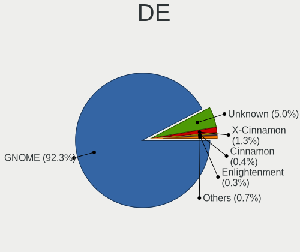
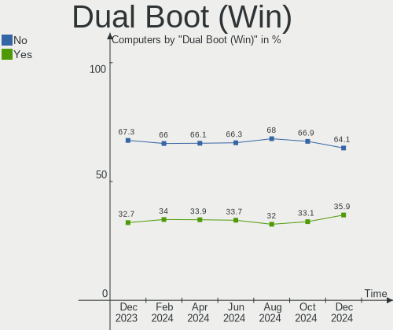
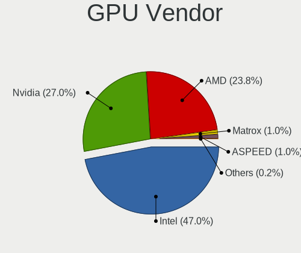
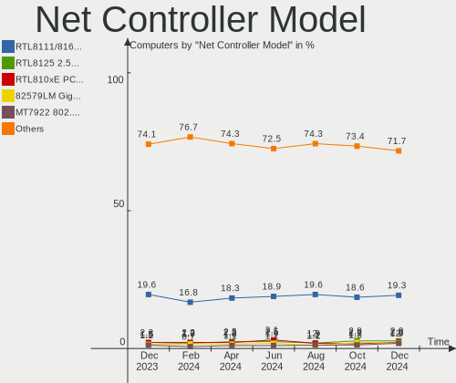

Ubuntu Hardware Trends
----------------------

A project to identify most popular hardware characteristics and track their change
over time based on data collected by Ubuntu users at https://Linux-Hardware.org.

Anyone can contribute to the study by uploading probes of their computers by
the [hw-probe](https://github.com/linuxhw/hw-probe) tool:

    sudo hw-probe -all -upload

This is a report for all computer types. See also reports for [desktops](/Dist/Ubuntu/Desktop/README.md) and [notebooks](/Dist/Ubuntu/Notebook/README.md).

Full-feature report is available here: https://linux-hardware.org/?view=trends

Period: Nov, 2019.

Contents
--------

- [ OS                       ](#os)
- [ OS Family                ](#os-family)
- [ Kernel                   ](#kernel)
- [ Kernel Family            ](#kernel-family)
- [ Kernel Major Ver.        ](#kernel-major-ver)
- [ Arch                     ](#arch)
- [ DE                       ](#de)
- [ Display Server           ](#display-server)
- [ OS Lang                  ](#os-lang)
- [ Boot Mode                ](#boot-mode)
- [ Filesystem               ](#filesystem)
- [ Dual Boot with Linux     ](#dual-boot-with-linux)
- [ Dual Boot (Win)          ](#dual-boot-win)
- [ Country                  ](#country)
- [ City                     ](#city)
- [ Vendor                   ](#vendor)
- [ Model                    ](#model)
- [ Model Family             ](#model-family)
- [ MFG Year                 ](#mfg-year)
- [ Form Factor              ](#form-factor)
- [ Secure Boot              ](#secure-boot)
- [ Coreboot                 ](#coreboot)
- [ RAM Size                 ](#ram-size)
- [ RAM Used                 ](#ram-used)
- [ Drive Vendor             ](#drive-vendor)
- [ Drive Model              ](#drive-model)
- [ Drive Kind               ](#drive-kind)
- [ Drive Connector          ](#drive-connector)
- [ Drive Size               ](#drive-size)
- [ Space Total              ](#space-total)
- [ Space Used               ](#space-used)
- [ Malfunc. Drives          ](#malfunc-drives)
- [ Malfunc. Drive Vendor    ](#malfunc-drive-vendor)
- [ Malfunc. Drive Kind      ](#malfunc-drive-kind)
- [ Failed Drives            ](#failed-drives)
- [ Failed Drive Vendor      ](#failed-drive-vendor)
- [ Drive Status             ](#drive-status)
- [ CPU Vendor               ](#cpu-vendor)
- [ CPU Model                ](#cpu-model)
- [ CPU Model Family         ](#cpu-model-family)
- [ CPU Cores                ](#cpu-cores)
- [ CPU Sockets              ](#cpu-sockets)
- [ CPU Threads              ](#cpu-threads)
- [ CPU Op-Modes             ](#cpu-op-modes)
- [ CPU Microarch            ](#cpu-microarch)
- [ CPU Microcode            ](#cpu-microcode)
- [ GPU Vendor               ](#gpu-vendor)
- [ GPU Model                ](#gpu-model)
- [ GPU Combo                ](#gpu-combo)
- [ GPU Driver               ](#gpu-driver)
- [ GPU Memory               ](#gpu-memory)
- [ Monitor Vendor           ](#monitor-vendor)
- [ Monitor Model            ](#monitor-model)
- [ Monitor Resolution       ](#monitor-resolution)
- [ Monitor Diagonal         ](#monitor-diagonal)
- [ Monitor Width            ](#monitor-width)
- [ Aspect Ratio             ](#aspect-ratio)
- [ Monitor Area             ](#monitor-area)
- [ Pixel Density            ](#pixel-density)
- [ Multiple Monitors        ](#multiple-monitors)
- [ Net Controller Vendor    ](#net-controller-vendor)
- [ Net Controller Model     ](#net-controller-model)
- [ Net Controller Kind      ](#net-controller-kind)
- [ Used Controller          ](#used-controller)
- [ NICs                     ](#nics)
- [ Unsupported Devices      ](#unsupported-devices)
- [ Unsupported Device Types ](#unsupported-device-types)

OS
--

Installed operating systems

| Name         | Computers | Percent |
|--------------|-----------|---------|
| Ubuntu 18.04 | 532       | 58.85%  |
| Ubuntu 19.10 | 255       | 28.21%  |
| Ubuntu 19.04 | 68        | 7.52%   |
| Ubuntu 16.04 | 36        | 3.98%   |
| Ubuntu 18.10 | 8         | 0.88%   |
| Ubuntu 20.04 | 3         | 0.33%   |
| Ubuntu 17.10 | 2         | 0.22%   |

OS Family
---------

OS without a version

| Name   | Computers | Percent |
|--------|-----------|---------|
| Ubuntu | 904       | 100%    |

Kernel
------

Version of the Linux kernel

| Version                 | Computers | Percent |
|-------------------------|-----------|---------|
| 5.0.0-36-generic        | 155       | 17.15%  |
| 5.0.0-32-generic        | 145       | 16.04%  |
| 5.3.0-23-generic        | 102       | 11.28%  |
| 5.3.0-19-generic        | 78        | 8.63%   |
| 4.15.0-70-generic       | 75        | 8.3%    |
| 4.15.0-66-generic       | 69        | 7.63%   |
| 5.0.0-23-generic        | 50        | 5.53%   |
| 5.3.0-18-generic        | 18        | 1.99%   |
| 5.0.0-31-generic        | 12        | 1.33%   |
| 5.3.0-24-generic        | 11        | 1.22%   |
| 4.18.0-25-generic       | 11        | 1.22%   |
| 5.3.0-21-generic        | 10        | 1.11%   |
| 4.15.0-29-generic       | 9         | 1%      |
| 5.0.0-35-generic        | 8         | 0.88%   |
| 5.0.0-34-generic        | 8         | 0.88%   |
| 5.0.0-13-generic        | 7         | 0.77%   |
| 5.3.0-22-generic        | 6         | 0.66%   |
| 5.3.0-19-lowlatency     | 5         | 0.55%   |
| 5.0.0-37-generic        | 5         | 0.55%   |
| 4.15.0-69-generic       | 5         | 0.55%   |
| 4.15.0-66-lowlatency    | 5         | 0.55%   |
| 4.15.0-65-generic       | 5         | 0.55%   |
| 4.15.0-55-generic       | 5         | 0.55%   |
| 5.3.0-23-lowlatency     | 4         | 0.44%   |
| 5.3.0-20-generic        | 4         | 0.44%   |
| 5.0.0-29-generic        | 4         | 0.44%   |
| 4.15.0-71-generic       | 4         | 0.44%   |
| 5.3.0-1008-raspi2       | 3         | 0.33%   |
| 5.0.0-27-generic        | 3         | 0.33%   |
| 4.4.0-169-generic       | 3         | 0.33%   |
| 4.4.0-166-generic       | 3         | 0.33%   |
| 5.3.0-1012-raspi2       | 2         | 0.22%   |
| 5.0.0-32-lowlatency     | 2         | 0.22%   |
| 4.4.0-168-generic       | 2         | 0.22%   |
| 4.16.18-pa2-1bp5        | 2         | 0.22%   |
| 4.15.0-72-generic       | 2         | 0.22%   |
| 4.15.0-70-lowlatency    | 2         | 0.22%   |
| 4.15.0-68-lowlatency    | 2         | 0.22%   |
| 4.15.0-62-generic       | 2         | 0.22%   |
| 4.15.0-47-generic       | 2         | 0.22%   |
| 4.15.0-20-generic       | 2         | 0.22%   |
| 4.13.0-36-generic       | 2         | 0.22%   |
| 5.4.1-mykernel          | 1         | 0.11%   |
| 5.4.0-050400rc8-generic | 1         | 0.11%   |
| 5.4.0-050400rc6-generic | 1         | 0.11%   |
| 5.4.0-050400rc4-generic | 1         | 0.11%   |
| 5.3.8-854.native        | 1         | 0.11%   |
| 5.3.8-050308-generic    | 1         | 0.11%   |
| 5.3.7-301.fc31.x86_64   | 1         | 0.11%   |
| 5.3.7-050307-generic    | 1         | 0.11%   |
| 5.3.13-050313-generic   | 1         | 0.11%   |
| 5.3.12-050312-generic   | 1         | 0.11%   |
| 5.3.11-050311-generic   | 1         | 0.11%   |
| 5.3.1-050301-generic    | 1         | 0.11%   |
| 5.3.0-24-lowlatency     | 1         | 0.11%   |
| 5.3.0-2-686             | 1         | 0.11%   |
| 5.3.0-1007-raspi2       | 1         | 0.11%   |
| 5.2.20-050220-generic   | 1         | 0.11%   |
| 5.1.8-050108-generic    | 1         | 0.11%   |
| 5.1.0-050100-lowlatency | 1         | 0.11%   |

Kernel Family
-------------

Linux kernel without a distro release

| Version | Computers | Percent |
|---------|-----------|---------|
| 5.0.0   | 405       | 44.8%   |
| 5.3.0   | 246       | 27.21%  |
| 4.15.0  | 200       | 22.12%  |
| 4.18.0  | 15        | 1.66%   |
| 4.4.0   | 12        | 1.33%   |
| 4.13.0  | 5         | 0.55%   |
| 5.4.0   | 3         | 0.33%   |
| 4.16.18 | 3         | 0.33%   |
| 5.3.8   | 2         | 0.22%   |
| 5.3.7   | 2         | 0.22%   |
| 5.4.1   | 1         | 0.11%   |
| 5.3.13  | 1         | 0.11%   |
| 5.3.12  | 1         | 0.11%   |
| 5.3.11  | 1         | 0.11%   |
| 5.3.1   | 1         | 0.11%   |
| 5.2.20  | 1         | 0.11%   |
| 5.1.8   | 1         | 0.11%   |
| 5.1.0   | 1         | 0.11%   |
| 5.0.21  | 1         | 0.11%   |
| 4.19.75 | 1         | 0.11%   |
| 3.13.0  | 1         | 0.11%   |

Kernel Major Ver.
-----------------

Linux kernel major version

| Version | Computers | Percent |
|---------|-----------|---------|
| 5.0     | 406       | 44.91%  |
| 5.3     | 254       | 28.1%   |
| 4.15    | 200       | 22.12%  |
| 4.18    | 15        | 1.66%   |
| 4.4     | 12        | 1.33%   |
| 4.13    | 5         | 0.55%   |
| 5.4     | 4         | 0.44%   |
| 4.16    | 3         | 0.33%   |
| 5.1     | 2         | 0.22%   |
| 5.2     | 1         | 0.11%   |
| 4.19    | 1         | 0.11%   |
| 3.13    | 1         | 0.11%   |

Arch
----

OS architecture (x86_64, i586, etc.)

| Name    | Computers | Percent |
|---------|-----------|---------|
| x86_64  | 835       | 92.37%  |
| i686    | 62        | 6.86%   |
| aarch64 | 5         | 0.55%   |
| armv7l  | 2         | 0.22%   |

DE
--

Desktop Environment

| Name            | Computers | Percent |
|-----------------|-----------|---------|
| GNOME           | 394       | 43.58%  |
| Unknown         | 381       | 42.15%  |
| XFCE            | 61        | 6.75%   |
| Unity           | 20        | 2.21%   |
| KDE             | 17        | 1.88%   |
| MATE            | 9         | 1%      |
| LXQt            | 6         | 0.66%   |
| X-Cinnamon      | 5         | 0.55%   |
| GNOME Flashback | 4         | 0.44%   |
| LXDE            | 3         | 0.33%   |
| Budgie          | 2         | 0.22%   |
| Deepin          | 1         | 0.11%   |
| Cinnamon        | 1         | 0.11%   |

Display Server
--------------

X11 or Wayland

| Name    | Computers | Percent |
|---------|-----------|---------|
| Unknown | 471       | 52.1%   |
| X11     | 425       | 47.01%  |
| Wayland | 8         | 0.88%   |

OS Lang
-------

Language

| Lang    | Computers | Percent |
|---------|-----------|---------|
| Unknown | 454       | 50.22%  |
| en_US   | 146       | 16.15%  |
| de_DE   | 51        | 5.64%   |
| pt_BR   | 28        | 3.1%    |
| fr_FR   | 27        | 2.99%   |
| es_ES   | 23        | 2.54%   |
| it_IT   | 21        | 2.32%   |
| en_GB   | 20        | 2.21%   |
| ru_RU   | 14        | 1.55%   |
| en_CA   | 14        | 1.55%   |
| C       | 14        | 1.55%   |
| pl_PL   | 7         | 0.77%   |
| hu_HU   | 7         | 0.77%   |
| en_IN   | 6         | 0.66%   |
| en_AU   | 6         | 0.66%   |
| cs_CZ   | 4         | 0.44%   |
| zh_CN   | 3         | 0.33%   |
| pt_PT   | 3         | 0.33%   |
| nl_NL   | 3         | 0.33%   |
| fr_CA   | 3         | 0.33%   |
| es_UY   | 3         | 0.33%   |
| es_MX   | 3         | 0.33%   |
| en_ZA   | 3         | 0.33%   |
| th_TH   | 2         | 0.22%   |
| sl_SI   | 2         | 0.22%   |
| sk_SK   | 2         | 0.22%   |
| nl_BE   | 2         | 0.22%   |
| fi_FI   | 2         | 0.22%   |
| es_CO   | 2         | 0.22%   |
| es_CL   | 2         | 0.22%   |
| es_AR   | 2         | 0.22%   |
| en_IE   | 2         | 0.22%   |
| el_GR   | 2         | 0.22%   |
| de_CH   | 2         | 0.22%   |
| de_AT   | 2         | 0.22%   |
| da_DK   | 2         | 0.22%   |
| zh_TW   | 1         | 0.11%   |
| tr_TR   | 1         | 0.11%   |
| ru_UA   | 1         | 0.11%   |
| ro_RO   | 1         | 0.11%   |
| nb_NO   | 1         | 0.11%   |
| ja_JP   | 1         | 0.11%   |
| id_ID   | 1         | 0.11%   |
| hr_HR   | 1         | 0.11%   |
| fr_CH   | 1         | 0.11%   |
| es_VE   | 1         | 0.11%   |
| es_CR   | 1         | 0.11%   |
| en_PH   | 1         | 0.11%   |
| en_NZ   | 1         | 0.11%   |
| en_HK   | 1         | 0.11%   |
| bg_BG   | 1         | 0.11%   |

Boot Mode
---------

EFI or BIOS

| Mode | Computers | Percent |
|------|-----------|---------|
| BIOS | 514       | 56.86%  |
| EFI  | 390       | 43.14%  |

Filesystem
----------

Type of filesystem

| Type    | Computers | Percent |
|---------|-----------|---------|
| Ext4    | 849       | 93.92%  |
| Overlay | 42        | 4.65%   |
| Btrfs   | 7         | 0.77%   |
| Ext2    | 3         | 0.33%   |
| Jfs     | 1         | 0.11%   |
| Ext3    | 1         | 0.11%   |
| Unknown | 1         | 0.11%   |

Dual Boot with Linux
--------------------

Hosting more than one Linux

| Dual boot | Computers | Percent |
|-----------|-----------|---------|
| No        | 777       | 85.95%  |
| Yes       | 127       | 14.05%  |

Dual Boot (Win)
---------------

Hosting Linux and Windows

| Dual boot | Computers | Percent |
|-----------|-----------|---------|
| No        | 561       | 62.06%  |
| Yes       | 343       | 37.94%  |

Country
-------

Geographic location (country)

| Country                   | Computers | Percent |
|---------------------------|-----------|---------|
| USA                       | 154       | 17.04%  |
| Germany                   | 115       | 12.72%  |
| Brazil                    | 61        | 6.75%   |
| Italy                     | 50        | 5.53%   |
| France                    | 45        | 4.98%   |
| Spain                     | 40        | 4.42%   |
| Russia                    | 39        | 4.31%   |
| UK                        | 37        | 4.09%   |
| Canada                    | 34        | 3.76%   |
| Netherlands               | 21        | 2.32%   |
| India                     | 20        | 2.21%   |
| Poland                    | 17        | 1.88%   |
| Czech Republic            | 16        | 1.77%   |
| Australia                 | 14        | 1.55%   |
| Slovakia                  | 13        | 1.44%   |
| Romania                   | 13        | 1.44%   |
| Ukraine                   | 12        | 1.33%   |
| Hungary                   | 12        | 1.33%   |
| Belgium                   | 12        | 1.33%   |
| Switzerland               | 10        | 1.11%   |
| Portugal                  | 9         | 1%      |
| Japan                     | 9         | 1%      |
| Argentina                 | 9         | 1%      |
| Mexico                    | 8         | 0.88%   |
| Finland                   | 7         | 0.77%   |
| Egypt                     | 7         | 0.77%   |
| Denmark                   | 6         | 0.66%   |
| Croatia                   | 6         | 0.66%   |
| China                     | 6         | 0.66%   |
| Austria                   | 6         | 0.66%   |
| Uruguay                   | 5         | 0.55%   |
| Turkey                    | 5         | 0.55%   |
| Sweden                    | 5         | 0.55%   |
| Peru                      | 5         | 0.55%   |
| Norway                    | 5         | 0.55%   |
| Colombia                  | 5         | 0.55%   |
| Bulgaria                  | 5         | 0.55%   |
| South Africa              | 4         | 0.44%   |
| New Zealand               | 4         | 0.44%   |
| Malaysia                  | 4         | 0.44%   |
| Chile                     | 4         | 0.44%   |
| Philippines               | 3         | 0.33%   |
| Greece                    | 3         | 0.33%   |
| Thailand                  | 2         | 0.22%   |
| Slovenia                  | 2         | 0.22%   |
| Singapore                 | 2         | 0.22%   |
| Morocco                   | 2         | 0.22%   |
| Ireland                   | 2         | 0.22%   |
| Iran, Islamic Republic of | 2         | 0.22%   |
| Indonesia                 | 2         | 0.22%   |
| Iceland                   | 2         | 0.22%   |
| Hong Kong                 | 2         | 0.22%   |
| Dominican Republic        | 2         | 0.22%   |
| Algeria                   | 2         | 0.22%   |
| Vietnam                   | 1         | 0.11%   |
| Venezuela                 | 1         | 0.11%   |
| Tunisia                   | 1         | 0.11%   |
| Taiwan                    | 1         | 0.11%   |
| Paraguay                  | 1         | 0.11%   |
| Montenegro                | 1         | 0.11%   |

City
----

Geographic location (city)

| City                 | Computers | Percent |
|----------------------|-----------|---------|
| Moscow               | 15        | 1.66%   |
| Berlin               | 12        | 1.33%   |
| Prague               | 8         | 0.88%   |
| São Paulo           | 7         | 0.77%   |
| Rome                 | 7         | 0.77%   |
| Munich               | 7         | 0.77%   |
| Frankfurt am Main    | 7         | 0.77%   |
| Warsaw               | 6         | 0.66%   |
| Hamburg              | 6         | 0.66%   |
| Bengaluru            | 6         | 0.66%   |
| Zagreb               | 5         | 0.55%   |
| Montreal             | 5         | 0.55%   |
| Kyiv                 | 5         | 0.55%   |
| Curitiba             | 5         | 0.55%   |
| Cairo                | 5         | 0.55%   |
| Paris                | 4         | 0.44%   |
| Ottawa               | 4         | 0.44%   |
| Madrid               | 4         | 0.44%   |
| Lima                 | 4         | 0.44%   |
| Genoa                | 4         | 0.44%   |
| Düsseldorf          | 4         | 0.44%   |
| Budapest             | 4         | 0.44%   |
| Zurich               | 3         | 0.33%   |
| Zaragoza             | 3         | 0.33%   |
| Vienna               | 3         | 0.33%   |
| Vancouver            | 3         | 0.33%   |
| Toronto              | 3         | 0.33%   |
| Tampere              | 3         | 0.33%   |
| St Petersburg        | 3         | 0.33%   |
| Sofia                | 3         | 0.33%   |
| Santiago             | 3         | 0.33%   |
| Prešov              | 3         | 0.33%   |
| Olympia              | 3         | 0.33%   |
| Miami                | 3         | 0.33%   |
| Laatzen              | 3         | 0.33%   |
| Krakow               | 3         | 0.33%   |
| Istanbul             | 3         | 0.33%   |
| Herne                | 3         | 0.33%   |
| Dublin               | 3         | 0.33%   |
| Cologne              | 3         | 0.33%   |
| Chicago              | 3         | 0.33%   |
| Bucharest            | 3         | 0.33%   |
| Belo Horizonte       | 3         | 0.33%   |
| Auckland             | 3         | 0.33%   |
| Amsterdam            | 3         | 0.33%   |
| Vinnytsia            | 2         | 0.22%   |
| Vila Nova de Gaia    | 2         | 0.22%   |
| Valencia             | 2         | 0.22%   |
| The Hague            | 2         | 0.22%   |
| Tehran               | 2         | 0.22%   |
| São Carlos          | 2         | 0.22%   |
| Stuttgart            | 2         | 0.22%   |
| Spring               | 2         | 0.22%   |
| Seattle              | 2         | 0.22%   |
| Saratov              | 2         | 0.22%   |
| Santo Domingo Este   | 2         | 0.22%   |
| Santa Clara          | 2         | 0.22%   |
| San Sebastian        | 2         | 0.22%   |
| Salvador             | 2         | 0.22%   |
| Saint-Laurent-d'Agny | 2         | 0.22%   |

Vendor
------

Motherboard manufacturer

| Name                    | Computers | Percent |
|-------------------------|-----------|---------|
| ASUSTek Computer        | 153       | 16.92%  |
| Hewlett-Packard         | 138       | 15.27%  |
| Lenovo                  | 112       | 12.39%  |
| Dell                    | 107       | 11.84%  |
| Gigabyte Technology     | 66        | 7.3%    |
| Acer                    | 59        | 6.53%   |
| MSI                     | 49        | 5.42%   |
| ASRock                  | 30        | 3.32%   |
| Toshiba                 | 22        | 2.43%   |
| Intel                   | 15        | 1.66%   |
| Sony                    | 13        | 1.44%   |
| Fujitsu                 | 12        | 1.33%   |
| Apple                   | 11        | 1.22%   |
| Samsung Electronics     | 8         | 0.88%   |
| ECS                     | 8         | 0.88%   |
| Raspberry Pi Foundation | 7         | 0.77%   |
| Supermicro              | 6         | 0.66%   |
| Pegatron                | 6         | 0.66%   |
| Foxconn                 | 6         | 0.66%   |
| Packard Bell            | 5         | 0.55%   |
| Medion                  | 5         | 0.55%   |
| Unknown                 | 5         | 0.55%   |
| Novastar                | 4         | 0.44%   |
| Microsoft               | 4         | 0.44%   |
| eMachines               | 4         | 0.44%   |
| System76                | 3         | 0.33%   |
| Positivo                | 3         | 0.33%   |
| Notebook                | 3         | 0.33%   |
| HUAWEI                  | 3         | 0.33%   |
| Biostar                 | 3         | 0.33%   |
| AMI                     | 3         | 0.33%   |
| Wistron                 | 2         | 0.22%   |
| Gateway                 | 2         | 0.22%   |
| Fujitsu Siemens         | 2         | 0.22%   |
| Clevo                   | 2         | 0.22%   |
| WINCOR NIXDORF          | 1         | 0.11%   |
| TR                      | 1         | 0.11%   |
| Timi                    | 1         | 0.11%   |
| Teclast                 | 1         | 0.11%   |
| Shuttle                 | 1         | 0.11%   |
| Quanta                  | 1         | 0.11%   |
| Qbex                    | 1         | 0.11%   |
| PCWare                  | 1         | 0.11%   |
| PCChips                 | 1         | 0.11%   |
| PC Specialist           | 1         | 0.11%   |
| Panasonic               | 1         | 0.11%   |
| OEGStone                | 1         | 0.11%   |
| MiTAC                   | 1         | 0.11%   |
| Microboard              | 1         | 0.11%   |
| Megaware                | 1         | 0.11%   |
| Login Informatica       | 1         | 0.11%   |
| JW Technology           | 1         | 0.11%   |
| Itautec                 | 1         | 0.11%   |
| IBM                     | 1         | 0.11%   |
| Digma                   | 1         | 0.11%   |
| BESSTAR Tech            | 1         | 0.11%   |
| Avell High Performance  | 1         | 0.11%   |
| Alienware               | 1         | 0.11%   |

Model
-----

Motherboard model

| Name                            | Computers | Percent |
|---------------------------------|-----------|---------|
| All Series                      | 17        | 1.88%   |
| Unknown                         | 7         | 0.77%   |
| Raspberry Pi 4 Model B Rev 1.1  | 6         | 0.66%   |
| Laptop 15-bw0xx                 | 4         | 0.44%   |
| KL55                            | 4         | 0.44%   |
| Surface Pro 4                   | 3         | 0.33%   |
| SF20PA2                         | 3         | 0.33%   |
| ProBook 4530s                   | 3         | 0.33%   |
| Pavilion g6                     | 3         | 0.33%   |
| Pavilion 15                     | 3         | 0.33%   |
| OptiPlex 745                    | 3         | 0.33%   |
| Notebook                        | 3         | 0.33%   |
| MS-7A38                         | 3         | 0.33%   |
| Legion Y530-15ICH 81FV          | 3         | 0.33%   |
| Laptop 15-bs1xx                 | 3         | 0.33%   |
| H61M-K                          | 3         | 0.33%   |
| H61M-A/BR                       | 3         | 0.33%   |
| Compaq dc5800 Small Form Factor | 3         | 0.33%   |
| XPS L502X                       | 2         | 0.22%   |
| X570 AORUS PRO WIFI             | 2         | 0.22%   |
| Vostro V130                     | 2         | 0.22%   |
| ThinkPad T60 200764U            | 2         | 0.22%   |
| TERRA_PC                        | 2         | 0.22%   |
| Strix GL504GM_GL504GM           | 2         | 0.22%   |
| Stream Laptop 11-y0XX           | 2         | 0.22%   |
| Satellite C55-B                 | 2         | 0.22%   |
| Q232A                           | 2         | 0.22%   |
| ProLiant ML110 G6               | 2         | 0.22%   |
| ProBook 6460b                   | 2         | 0.22%   |
| Pavilion g7                     | 2         | 0.22%   |
| Pavilion dv7                    | 2         | 0.22%   |
| Pavilion dv6                    | 2         | 0.22%   |
| P8Z77-V LX                      | 2         | 0.22%   |
| P8H67                           | 2         | 0.22%   |
| P6T SE                          | 2         | 0.22%   |
| P5K PRO                         | 2         | 0.22%   |
| P35-DS4                         | 2         | 0.22%   |
| OptiPlex 960                    | 2         | 0.22%   |
| OptiPlex 9020                   | 2         | 0.22%   |
| OptiPlex 760                    | 2         | 0.22%   |
| OptiPlex 755                    | 2         | 0.22%   |
| OptiPlex 390                    | 2         | 0.22%   |
| OptiPlex 380                    | 2         | 0.22%   |
| OptiPlex 3020                   | 2         | 0.22%   |
| OMEN by HP Laptop 17-cb0xxx     | 2         | 0.22%   |
| MS-7C37                         | 2         | 0.22%   |
| MS-7C02                         | 2         | 0.22%   |
| MS-7751                         | 2         | 0.22%   |
| MS-7360                         | 2         | 0.22%   |
| M5A78L-M/USB3                   | 2         | 0.22%   |
| M2N-E                           | 2         | 0.22%   |
| Latitude E6410                  | 2         | 0.22%   |
| Latitude E5520                  | 2         | 0.22%   |
| Laptop 15-db0xxx                | 2         | 0.22%   |
| Laptop 15-bs0xx                 | 2         | 0.22%   |
| K53SV                           | 2         | 0.22%   |
| K45A                            | 2         | 0.22%   |
| Inspiron N5110                  | 2         | 0.22%   |
| Inspiron 3543                   | 2         | 0.22%   |
| Inspiron 3442                   | 2         | 0.22%   |

Model Family
------------

Motherboard model prefix

| Name                   | Computers | Percent |
|------------------------|-----------|---------|
| Lenovo ThinkPad        | 50        | 5.53%   |
| Acer Aspire            | 44        | 4.87%   |
| Dell Inspiron          | 34        | 3.76%   |
| HP Pavilion            | 25        | 2.77%   |
| Lenovo IdeaPad         | 24        | 2.65%   |
| HP EliteBook           | 20        | 2.21%   |
| Dell OptiPlex          | 20        | 2.21%   |
| HP Laptop              | 19        | 2.1%    |
| Dell Latitude          | 19        | 2.1%    |
| Toshiba Satellite      | 17        | 1.88%   |
| ASUS All               | 17        | 1.88%   |
| HP Compaq              | 13        | 1.44%   |
| HP ProBook             | 11        | 1.22%   |
| Dell Precision         | 11        | 1.22%   |
| Dell XPS               | 9         | 1%      |
| Lenovo ThinkCentre     | 8         | 0.88%   |
| ASUS PRIME             | 8         | 0.88%   |
| RPi Raspberry          | 7         | 0.77%   |
| Unknown                | 7         | 0.77%   |
| Dell Vostro            | 6         | 0.66%   |
| Lenovo Legion          | 5         | 0.55%   |
| Fujitsu LIFEBOOK       | 5         | 0.55%   |
| ASUS TUF               | 5         | 0.55%   |
| Acer Veriton           | 5         | 0.55%   |
| Novastar KL55          | 4         | 0.44%   |
| Microsoft Surface      | 4         | 0.44%   |
| HP Stream              | 4         | 0.44%   |
| HP OMEN                | 4         | 0.44%   |
| Gigabyte GA-78LMT-USB3 | 4         | 0.44%   |
| Gigabyte B450          | 4         | 0.44%   |
| Fujitsu ESPRIMO        | 4         | 0.44%   |
| ASUS M5A78L-M          | 4         | 0.44%   |
| Packard Bell EasyNote  | 3         | 0.33%   |
| MSI MS-7A38            | 3         | 0.33%   |
| HP Notebook            | 3         | 0.33%   |
| HP EliteDesk           | 3         | 0.33%   |
| HP 250                 | 3         | 0.33%   |
| ECS SF20PA2            | 3         | 0.33%   |
| ASUS P6T               | 3         | 0.33%   |
| ASUS P5K               | 3         | 0.33%   |
| ASUS H61M-K            | 3         | 0.33%   |
| ASUS H61M-A            | 3         | 0.33%   |
| ASRock B450M           | 3         | 0.33%   |
| ASRock 970             | 3         | 0.33%   |
| Acer Swift             | 3         | 0.33%   |
| Wistron ProLiant       | 2         | 0.22%   |
| System76 Galago        | 2         | 0.22%   |
| Positivo Q232A         | 2         | 0.22%   |
| MSI MS-7C37            | 2         | 0.22%   |
| MSI MS-7C02            | 2         | 0.22%   |
| MSI MS-7751            | 2         | 0.22%   |
| MSI MS-7360            | 2         | 0.22%   |
| MSI GT70               | 2         | 0.22%   |
| Medion Akoya           | 2         | 0.22%   |
| HP ZBook               | 2         | 0.22%   |
| HP Spectre             | 2         | 0.22%   |
| HP ProDesk             | 2         | 0.22%   |
| HP Presario            | 2         | 0.22%   |
| HP Mini                | 2         | 0.22%   |
| Gigabyte Z390          | 2         | 0.22%   |

MFG Year
--------

Motherboard manufacture year

| Year    | Computers | Percent |
|---------|-----------|---------|
| 2019    | 154       | 17.04%  |
| 2018    | 114       | 12.61%  |
| 2012    | 84        | 9.29%   |
| 2011    | 68        | 7.52%   |
| 2014    | 63        | 6.97%   |
| 2013    | 61        | 6.75%   |
| 2017    | 59        | 6.53%   |
| 2010    | 57        | 6.31%   |
| 2015    | 55        | 6.08%   |
| 2016    | 48        | 5.31%   |
| 2008    | 47        | 5.2%    |
| 2009    | 38        | 4.2%    |
| 2007    | 23        | 2.54%   |
| 2006    | 13        | 1.44%   |
| Unknown | 10        | 1.11%   |
| 2005    | 4         | 0.44%   |
| 2004    | 2         | 0.22%   |
| 2001    | 2         | 0.22%   |
| 2003    | 1         | 0.11%   |
| 2002    | 1         | 0.11%   |

Form Factor
-----------

Physical design of the computer

| Name           | Computers | Percent |
|----------------|-----------|---------|
| Notebook       | 478       | 52.88%  |
| Desktop        | 375       | 41.48%  |
| Server         | 14        | 1.55%   |
| Tablet         | 8         | 0.88%   |
| Mini pc        | 8         | 0.88%   |
| System on chip | 7         | 0.77%   |
| Convertible    | 7         | 0.77%   |
| All in one     | 7         | 0.77%   |

Secure Boot
-----------

Enabled or disabled

| State    | Computers | Percent |
|----------|-----------|---------|
| Disabled | 834       | 92.26%  |
| Enabled  | 70        | 7.74%   |

Coreboot
--------

Have coreboot on board

| Used | Computers | Percent |
|------|-----------|---------|
| No   | 904       | 100%    |

RAM Size
--------

Total RAM memory

| Size in GB  | Computers | Percent |
|-------------|-----------|---------|
| 3.01-4.0    | 244       | 26.99%  |
| 4.01-8.0    | 192       | 21.24%  |
| 8.01-16.0   | 159       | 17.59%  |
| 16.01-24.0  | 147       | 16.26%  |
| 1.01-2.0    | 69        | 7.63%   |
| 32.01-64.0  | 38        | 4.2%    |
| 2.01-3.0    | 20        | 2.21%   |
| 64.01-256.0 | 18        | 1.99%   |
| 24.01-32.0  | 9         | 1%      |
| 0.01-1.0    | 7         | 0.77%   |
| Unknown     | 1         | 0.11%   |

RAM Used
--------

Used RAM memory

| Used GB    | Computers | Percent |
|------------|-----------|---------|
| 1.01-2.0   | 422       | 46.68%  |
| 2.01-3.0   | 248       | 27.43%  |
| 3.01-4.0   | 85        | 9.4%    |
| 0.01-1.0   | 73        | 8.08%   |
| 4.01-8.0   | 61        | 6.75%   |
| 8.01-16.0  | 10        | 1.11%   |
| Unknown    | 2         | 0.22%   |
| 32.01-64.0 | 1         | 0.11%   |
| 24.01-32.0 | 1         | 0.11%   |
| 16.01-24.0 | 1         | 0.11%   |

Drive Vendor
------------

Hard drive vendors

| Vendor              | Computers | Drives  | Percent |
|---------------------|-----------|---------|---------|
| Seagate             | 240       | 274     | 20.94%  |
| WDC                 | 211       | 240     | 18.41%  |
| Samsung Electronics | 138       | 154     | 12.04%  |
| Toshiba             | 110       | 113     | 9.6%    |
| Kingston            | 66        | 67      | 5.76%   |
| SanDisk             | 54        | 58      | 4.71%   |
| Hitachi             | 47        | 48      | 4.1%    |
| Crucial             | 36        | 37      | 3.14%   |
| Unknown             | 33        | 38      | 2.88%   |
| HGST                | 27        | 27      | 2.36%   |
| Intel               | 22        | 23      | 1.92%   |
| MAXTOR              | 14        | 15      | 1.22%   |
| SK Hynix            | 11        | 11      | 0.96%   |
| OCZ                 | 11        | 11      | 0.96%   |
| Transcend           | 9         | 9       | 0.79%   |
| A-DATA Technology   | 9         | 9       | 0.79%   |
| Micron Technology   | 8         | 8       | 0.7%    |
| Patriot             | 7         | 7       | 0.61%   |
| SPCC                | 6         | 6       | 0.52%   |
| Intenso             | 6         | 6       | 0.52%   |
| Corsair             | 6         | 6       | 0.52%   |
| Apacer              | 6         | 6       | 0.52%   |
| LITEONIT            | 5         | 5       | 0.44%   |
| LITEON              | 5         | 5       | 0.44%   |
| Generic             | 5         | 5       | 0.44%   |
| China               | 5         | 5       | 0.44%   |
| PNY                 | 4         | 4       | 0.35%   |
| PLEXTOR             | 4         | 4       | 0.35%   |
| Fujitsu             | 4         | 4       | 0.35%   |
| Team                | 3         | 3       | 0.26%   |
| JMicron             | 3         | 3       | 0.26%   |
| HL-DT-ST            | 3         | Unknown | 0.26%   |
| ASMT                | 3         | 3       | 0.26%   |
| Vi550               | 2         | 2       | 0.17%   |
| KingSpec            | 2         | 2       | 0.17%   |
| GOODRAM             | 2         | 3       | 0.17%   |
| faspeed             | 2         | 2       | 0.17%   |
| Apple               | 2         | 2       | 0.17%   |
| Phison              | 1         | 1       | 0.09%   |
| OWC                 | 1         | 1       | 0.09%   |
| OCZ-VERTEX          | 1         | 1       | 0.09%   |
| Netac               | 1         | 1       | 0.09%   |
| Mushkin             | 1         | 1       | 0.09%   |
| MARSHAL             | 1         | 1       | 0.09%   |
| Lexar               | 1         | 1       | 0.09%   |
| LaCie               | 1         | 1       | 0.09%   |
| IBM/Hitachi         | 1         | 1       | 0.09%   |
| HUAWEI              | 1         | 1       | 0.09%   |
| Hewlett-Packard     | 1         | 2       | 0.09%   |
| Gigabyte Technology | 1         | 1       | 0.09%   |
| ASMT109x            | 1         | 1       | 0.09%   |
| asmedia             | 1         | 1       | 0.09%   |
| AMD                 | 1         | 1       | 0.09%   |

Drive Model
-----------

Hard drive models

| Model                        | Computers | Percent |
|------------------------------|-----------|---------|
| ST1000LM035-1RK172 1TB       | 19        | 1.53%   |
| SV300S37A120G 120GB SSD      | 15        | 1.21%   |
| ST500DM002-1BD142 500GB      | 15        | 1.21%   |
| SSD 850 EVO 250GB            | 14        | 1.13%   |
| SA400S37240G 240GB SSD       | 14        | 1.13%   |
| ST1000LM024 HN-M101MBB 1TB   | 12        | 0.97%   |
| SA400S37120G 120GB SSD       | 12        | 0.97%   |
| MQ01ABF050 500GB             | 11        | 0.88%   |
| MQ01ABD100 1TB               | 11        | 0.88%   |
| SSD 860 EVO 250GB            | 10        | 0.8%    |
| MQ04ABF100 1TB               | 8         | 0.64%   |
| HTS721010A9E630 1TB          | 8         | 0.64%   |
| WD20EZRZ-00Z5HB0 2TB         | 7         | 0.56%   |
| ST500LT012-9WS142 500GB      | 7         | 0.56%   |
| ST500LT012-1DG142 500GB      | 7         | 0.56%   |
| ST3500418AS 500GB            | 7         | 0.56%   |
| ST3500413AS 500GB            | 7         | 0.56%   |
| SSD 850 EVO 500GB            | 7         | 0.56%   |
| DT01ACA050 500GB             | 7         | 0.56%   |
| DF4032  31GB                 | 7         | 0.56%   |
| ST1000DM003-1ER162 1TB       | 6         | 0.48%   |
| ST1000DM003-1CH162 1TB       | 6         | 0.48%   |
| SSD PLUS 240GB               | 6         | 0.48%   |
| SSD 860 EVO 1TB              | 6         | 0.48%   |
| SSD 840 EVO 120GB            | 6         | 0.48%   |
| Solid State Disk 128GB       | 6         | 0.48%   |
| HTS545050A7E680 500GB        | 6         | 0.48%   |
| DT01ACA200 2TB               | 6         | 0.48%   |
| WD10EZEX-22MFCA0 1TB         | 5         | 0.4%    |
| TR200 240GB SSD              | 5         | 0.4%    |
| ST4000DM004-2CV104 4TB       | 5         | 0.4%    |
| ST2000DM001-1CH164 2TB       | 5         | 0.4%    |
| ST1000DM010-2EP102 1TB       | 5         | 0.4%    |
| SDSSDA240G 240GB             | 5         | 0.4%    |
| DT01ACA100 1TB               | 5         | 0.4%    |
| CT120BX500SSD1 120GB         | 5         | 0.4%    |
| CT1000MX500SSD1 1TB          | 5         | 0.4%    |
| WD20EFRX-68EUZN0 2TB         | 4         | 0.32%   |
| WD10JPVX-60JC3T1 1TB         | 4         | 0.32%   |
| WD10JPCX-24UE4T0 1TB         | 4         | 0.32%   |
| WD10EZEX-08WN4A0 1TB         | 4         | 0.32%   |
| Ultra II 480GB SSD           | 4         | 0.32%   |
| ST9500420AS 500GB            | 4         | 0.32%   |
| ST9320423AS 320GB            | 4         | 0.32%   |
| ST1000LX015-1U7172 1TB       | 4         | 0.32%   |
| ST1000DM003-9YN162 1TB       | 4         | 0.32%   |
| ST1000DM003-1SB102 1TB       | 4         | 0.32%   |
| SSD 860 EVO 500GB            | 4         | 0.32%   |
| SSD 850 EVO 120GB            | 4         | 0.32%   |
| SD/MMC/MS PRO 128GB          | 4         | 0.32%   |
| SATA 120GB SSD               | 4         | 0.32%   |
| SA400S37480G 480GB SSD       | 4         | 0.32%   |
| RBUSNS4180S3256GJ 256GB SSD  | 4         | 0.32%   |
| HD103SJ 1TB                  | 4         | 0.32%   |
| DT01ACA300 3TB               | 4         | 0.32%   |
| Burst 120GB SSD              | 4         | 0.32%   |
| 6Y080L0 81GB                 | 4         | 0.32%   |
| WDS240G2G0A-00JH30 240GB SSD | 3         | 0.24%   |
| WD5000AAKX-22ERMA0 500GB     | 3         | 0.24%   |
| WD5000AAKX-001CA0 500GB      | 3         | 0.24%   |

Drive Kind
----------

HDD or SSD

| Kind    | Computers | Drives | Percent |
|---------|-----------|--------|---------|
| HDD     | 585       | 738    | 56.96%  |
| SSD     | 354       | 410    | 34.47%  |
| MMC     | 42        | 48     | 4.09%   |
| Unknown | 24        | 22     | 2.34%   |
| NVMe    | 22        | 23     | 2.14%   |

Drive Connector
---------------

SATA, SAS, NVMe, etc.

| Type | Computers | Drives | Percent |
|------|-----------|--------|---------|
| SATA | 791       | 1131   | 88.48%  |
| MMC  | 42        | 48     | 4.7%    |
| SAS  | 39        | 39     | 4.36%   |
| NVMe | 22        | 23     | 2.46%   |

Drive Size
----------

Size of hard drive

| Size in TB | Computers | Drives | Percent |
|------------|-----------|--------|---------|
| 0.01-0.5   | 647       | 797    | 61.68%  |
| 0.51-1.0   | 280       | 309    | 26.69%  |
| 1.01-2.0   | 72        | 81     | 6.86%   |
| 3.01-4.0   | 22        | 23     | 2.1%    |
| 2.01-3.0   | 15        | 16     | 1.43%   |
| 4.01-10.0  | 9         | 10     | 0.86%   |
| Unknown    | 4         | 5      | 0.38%   |

Space Total
-----------

Amount of disk space available on the file system

| Size in GB     | Computers | Percent |
|----------------|-----------|---------|
| 101-250        | 251       | 27.77%  |
| 251-500        | 225       | 24.89%  |
| 501-1000       | 138       | 15.27%  |
| 51-100         | 87        | 9.62%   |
| 21-50          | 62        | 6.86%   |
| 1001-2000      | 49        | 5.42%   |
| 1-20           | 34        | 3.76%   |
| More than 3000 | 25        | 2.77%   |
| 2001-3000      | 23        | 2.54%   |
| Unknown        | 10        | 1.11%   |

Space Used
----------

Amount of used disk space

| Used GB        | Computers | Percent |
|----------------|-----------|---------|
| 1-20           | 405       | 44.8%   |
| 21-50          | 162       | 17.92%  |
| 101-250        | 105       | 11.62%  |
| 51-100         | 94        | 10.4%   |
| 251-500        | 52        | 5.75%   |
| 501-1000       | 38        | 4.2%    |
| 1001-2000      | 21        | 2.32%   |
| More than 3000 | 11        | 1.22%   |
| Unknown        | 10        | 1.11%   |
| 2001-3000      | 6         | 0.66%   |

Malfunc. Drives
---------------

Drive models with a malfunction

| Model                          | Computers | Drives | Percent |
|--------------------------------|-----------|--------|---------|
| WD2500AAKX-75U6AA0 250GB       | 1         | 1      | 10%     |
| WD2000JS-00MHB0 200GB          | 1         | 1      | 10%     |
| SV300S37A120G 120GB SSD        | 1         | 1      | 10%     |
| ST3500312CS 500GB              | 1         | 1      | 10%     |
| ST3320410SV 320GB              | 1         | 1      | 10%     |
| SSDSC2BW120H6 120GB            | 1         | 1      | 10%     |
| MQ01ABD100 1TB                 | 1         | 1      | 10%     |
| MD04ACA400 4TB                 | 1         | 1      | 10%     |
| HTS543216L9SA02 160GB          | 1         | 1      | 10%     |
| BC501 HFM256GDJTNG-8310A 256GB | 1         | 1      | 10%     |

Malfunc. Drive Vendor
---------------------

Vendors of faulty drives

| Vendor   | Computers | Drives | Percent |
|----------|-----------|--------|---------|
| WDC      | 2         | 2      | 20%     |
| Toshiba  | 2         | 2      | 20%     |
| Seagate  | 2         | 2      | 20%     |
| SK Hynix | 1         | 1      | 10%     |
| Kingston | 1         | 1      | 10%     |
| Intel    | 1         | 1      | 10%     |
| Hitachi  | 1         | 1      | 10%     |

Malfunc. Drive Kind
-------------------

Kinds of faulty drives

| Kind | Computers | Drives | Percent |
|------|-----------|--------|---------|
| HDD  | 7         | 7      | 70%     |
| SSD  | 2         | 2      | 20%     |
| NVMe | 1         | 1      | 10%     |

Failed Drives
-------------

Failed drive models

Zero info for selected period =(

Failed Drive Vendor
-------------------

Failed drive vendors

Zero info for selected period =(

Drive Status
------------

Number of failed and malfunc. drives

| Status   | Computers | Drives | Percent |
|----------|-----------|--------|---------|
| Detected | 788       | 1154   | 92.49%  |
| Works    | 54        | 77     | 6.34%   |
| Malfunc  | 10        | 10     | 1.17%   |

CPU Vendor
----------

Processor vendors

| Vendor       | Computers | Percent |
|--------------|-----------|---------|
| Intel        | 710       | 78.54%  |
| AMD          | 186       | 20.58%  |
| ARM          | 7         | 0.77%   |
| CentaurHauls | 1         | 0.11%   |

CPU Model
---------

Processor models

| Model                                       | Computers | Percent |
|---------------------------------------------|-----------|---------|
| Intel Core i5-8250U CPU @ 1.60GHz           | 12        | 1.33%   |
| Intel Core i7-8750H CPU @ 2.20GHz           | 10        | 1.11%   |
| Intel Core i5-7200U CPU @ 2.50GHz           | 10        | 1.11%   |
| Intel Core i5-2520M CPU @ 2.50GHz           | 10        | 1.11%   |
| Intel Core i5-8265U CPU @ 1.60GHz           | 9         | 1%      |
| Intel Core i7-9750H CPU @ 2.60GHz           | 8         | 0.88%   |
| Intel Core i7-8550U CPU @ 1.80GHz           | 8         | 0.88%   |
| Intel Core 2 Duo CPU E8400 @ 3.00GHz        | 8         | 0.88%   |
| Intel Atom x5-Z8350 CPU @ 1.44GHz           | 8         | 0.88%   |
| Intel Core i7-8565U CPU @ 1.80GHz           | 7         | 0.77%   |
| Intel Core i7-7500U CPU @ 2.70GHz           | 7         | 0.77%   |
| Intel Core i5-3320M CPU @ 2.60GHz           | 7         | 0.77%   |
| Intel Celeron CPU N3060 @ 1.60GHz           | 7         | 0.77%   |
| Intel Core i7-4770 CPU @ 3.40GHz            | 6         | 0.66%   |
| Intel Core i7-3770 CPU @ 3.40GHz            | 6         | 0.66%   |
| Intel Core i5-6200U CPU @ 2.30GHz           | 6         | 0.66%   |
| Intel Core i5-5300U CPU @ 2.30GHz           | 6         | 0.66%   |
| Intel Core i5-5200U CPU @ 2.20GHz           | 6         | 0.66%   |
| Intel Core i5-3470 CPU @ 3.20GHz            | 6         | 0.66%   |
| Intel Core i5-3210M CPU @ 2.50GHz           | 6         | 0.66%   |
| Intel Core i5-2450M CPU @ 2.50GHz           | 6         | 0.66%   |
| Intel Core i5-2400 CPU @ 3.10GHz            | 6         | 0.66%   |
| AMD FX-8350 Eight-Core Processor            | 6         | 0.66%   |
| Intel Core i7-6700HQ CPU @ 2.60GHz          | 5         | 0.55%   |
| Intel Core i5-8300H CPU @ 2.30GHz           | 5         | 0.55%   |
| Intel Core i5-7500 CPU @ 3.40GHz            | 5         | 0.55%   |
| Intel Core i5-4210U CPU @ 1.70GHz           | 5         | 0.55%   |
| Intel Core i3-2120 CPU @ 3.30GHz            | 5         | 0.55%   |
| Intel Core 2 Quad CPU Q6600 @ 2.40GHz       | 5         | 0.55%   |
| Intel Celeron N4000 CPU @ 1.10GHz           | 5         | 0.55%   |
| Intel Celeron CPU N3350 @ 1.10GHz           | 5         | 0.55%   |
| ARM Processor                               | 5         | 0.55%   |
| AMD Ryzen 5 2600 Six-Core Processor         | 5         | 0.55%   |
| Intel Core i7-7700HQ CPU @ 2.80GHz          | 4         | 0.44%   |
| Intel Core i7-6500U CPU @ 2.50GHz           | 4         | 0.44%   |
| Intel Core i7-5500U CPU @ 2.40GHz           | 4         | 0.44%   |
| Intel Core i7-4790K CPU @ 4.00GHz           | 4         | 0.44%   |
| Intel Core i7-3630QM CPU @ 2.40GHz          | 4         | 0.44%   |
| Intel Core i7-2670QM CPU @ 2.20GHz          | 4         | 0.44%   |
| Intel Core i7-2630QM CPU @ 2.00GHz          | 4         | 0.44%   |
| Intel Core i5-6500 CPU @ 3.20GHz            | 4         | 0.44%   |
| Intel Core i5-6300U CPU @ 2.40GHz           | 4         | 0.44%   |
| Intel Core i5-3330 CPU @ 3.00GHz            | 4         | 0.44%   |
| Intel Core i5-3230M CPU @ 2.60GHz           | 4         | 0.44%   |
| Intel Core i5-2410M CPU @ 2.30GHz           | 4         | 0.44%   |
| Intel Core i5 CPU M 520 @ 2.40GHz           | 4         | 0.44%   |
| Intel Core i3-8100 CPU @ 3.60GHz            | 4         | 0.44%   |
| Intel Core i3-7100U CPU @ 2.40GHz           | 4         | 0.44%   |
| Intel Core i3-4005U CPU @ 1.70GHz           | 4         | 0.44%   |
| Intel Core i3-3220 CPU @ 3.30GHz            | 4         | 0.44%   |
| Intel Core i3-2350M CPU @ 2.30GHz           | 4         | 0.44%   |
| Intel Core i3-2100 CPU @ 3.10GHz            | 4         | 0.44%   |
| Intel Core i3 CPU M 370 @ 2.40GHz           | 4         | 0.44%   |
| Intel Core 2 Duo CPU E7500 @ 2.93GHz        | 4         | 0.44%   |
| Intel Core 2 Duo CPU E6750 @ 2.66GHz        | 4         | 0.44%   |
| AMD Ryzen 3 2200G with Radeon Vega Graphics | 4         | 0.44%   |
| Intel Genuine CPU T2400 @ 1.83GHz           | 3         | 0.33%   |
| Intel Core i7-8700K CPU @ 3.70GHz           | 3         | 0.33%   |
| Intel Core i7-6700 CPU @ 3.40GHz            | 3         | 0.33%   |
| Intel Core i7-3770K CPU @ 3.50GHz           | 3         | 0.33%   |

CPU Model Family
----------------

Processor model prefix

| Model                   | Computers | Percent |
|-------------------------|-----------|---------|
| Intel Core i5           | 226       | 25%     |
| Intel Core i7           | 159       | 17.59%  |
| Intel Core i3           | 68        | 7.52%   |
| Intel Core 2 Duo        | 56        | 6.19%   |
| Intel Celeron           | 46        | 5.09%   |
| Intel Pentium           | 28        | 3.1%    |
| Intel Xeon              | 25        | 2.77%   |
| AMD Ryzen 5             | 24        | 2.65%   |
| Intel Atom              | 22        | 2.43%   |
| AMD FX                  | 21        | 2.32%   |
| Intel Core 2 Quad       | 15        | 1.66%   |
| AMD Ryzen 7             | 13        | 1.44%   |
| AMD Athlon 64 X2        | 13        | 1.44%   |
| Intel Pentium Dual-Core | 12        | 1.33%   |
| AMD Ryzen 3             | 11        | 1.22%   |
| Intel Core i9           | 10        | 1.11%   |
| AMD A6                  | 10        | 1.11%   |
| Other                   | 9         | 1%      |
| Intel Core 2            | 9         | 1%      |
| AMD A10                 | 9         | 1%      |
| Intel Pentium 4         | 8         | 0.88%   |
| Intel Genuine           | 8         | 0.88%   |
| AMD Athlon              | 8         | 0.88%   |
| Intel Pentium Dual      | 7         | 0.77%   |
| AMD A8                  | 7         | 0.77%   |
| AMD A4                  | 7         | 0.77%   |
| AMD Athlon II X2        | 6         | 0.66%   |
| AMD Phenom II X4        | 5         | 0.55%   |
| AMD Phenom              | 5         | 0.55%   |
| AMD E                   | 4         | 0.44%   |
| AMD Athlon 64           | 4         | 0.44%   |
| Intel Pentium D         | 3         | 0.33%   |
| AMD V140                | 3         | 0.33%   |
| AMD Athlon II X4        | 3         | 0.33%   |
| AMD Athlon II           | 3         | 0.33%   |
| Intel Pentium Silver    | 2         | 0.22%   |
| Intel Pentium M         | 2         | 0.22%   |
| ARM BCM                 | 2         | 0.22%   |
| AMD Turion 64 X2 Mobile | 2         | 0.22%   |
| AMD Sempron             | 2         | 0.22%   |
| AMD Ryzen Threadripper  | 2         | 0.22%   |
| AMD Mobile Sempron      | 2         | 0.22%   |
| AMD E2                  | 2         | 0.22%   |
| AMD E1                  | 2         | 0.22%   |
| AMD C-60                | 2         | 0.22%   |
| AMD Athlon II X3        | 2         | 0.22%   |
| Intel Xeon Platinum     | 1         | 0.11%   |
| Intel Core m5           | 1         | 0.11%   |
| Intel Core 2 Extreme    | 1         | 0.11%   |
| Intel Celeron M         | 1         | 0.11%   |
| CentaurHauls VIA C7     | 1         | 0.11%   |
| AMD Turion Dual-Core    | 1         | 0.11%   |
| AMD Sempron X2          | 1         | 0.11%   |
| AMD Ryzen 9             | 1         | 0.11%   |
| AMD Quad-Core Opteron   | 1         | 0.11%   |
| AMD PRO A10             | 1         | 0.11%   |
| AMD Phenom II X6        | 1         | 0.11%   |
| AMD EPYC                | 1         | 0.11%   |
| AMD C-70                | 1         | 0.11%   |
| AMD Athlon XP           | 1         | 0.11%   |

CPU Cores
---------

Number of processor cores

| Number  | Computers | Percent |
|---------|-----------|---------|
| 2       | 446       | 49.34%  |
| 4       | 320       | 35.4%   |
| 6       | 48        | 5.31%   |
| 1       | 40        | 4.42%   |
| 8       | 25        | 2.77%   |
| 3       | 9         | 1%      |
| 12      | 3         | 0.33%   |
| 24      | 2         | 0.22%   |
| 18      | 2         | 0.22%   |
| 16      | 2         | 0.22%   |
| 64      | 1         | 0.11%   |
| 48      | 1         | 0.11%   |
| 32      | 1         | 0.11%   |
| 28      | 1         | 0.11%   |
| 14      | 1         | 0.11%   |
| 10      | 1         | 0.11%   |
| Unknown | 1         | 0.11%   |

CPU Sockets
-----------

Number of sockets

| Number  | Computers | Percent |
|---------|-----------|---------|
| 1       | 894       | 98.89%  |
| 2       | 9         | 1%      |
| Unknown | 1         | 0.11%   |

CPU Threads
-----------

Threads per core (Hyper-Threading)

| Number  | Computers | Percent |
|---------|-----------|---------|
| 2       | 499       | 55.2%   |
| 1       | 403       | 44.58%  |
| 4       | 1         | 0.11%   |
| Unknown | 1         | 0.11%   |

CPU Op-Modes
------------

CPU Operation Modes (32-bit, 64-bit)

| Op mode        | Computers | Percent |
|----------------|-----------|---------|
| 32-bit, 64-bit | 865       | 95.69%  |
| Unknown        | 21        | 2.32%   |
| 32-bit         | 18        | 1.99%   |

CPU Microarch
-------------

Microarchitecture

| Name            | Computers | Percent |
|-----------------|-----------|---------|
| Skylake         | 180       | 19.91%  |
| Core            | 107       | 11.84%  |
| SandyBridge     | 95        | 10.51%  |
| IvyBridge       | 83        | 9.18%   |
| Haswell         | 78        | 8.63%   |
| Westmere        | 38        | 4.2%    |
| Silvermont      | 32        | 3.54%   |
| K10             | 32        | 3.54%   |
| Piledriver      | 25        | 2.77%   |
| K8 Hammer       | 23        | 2.54%   |
| Zen             | 22        | 2.43%   |
| Zen+            | 21        | 2.32%   |
| Broadwell       | 20        | 2.21%   |
| KabyLake        | 13        | 1.44%   |
| Excavator       | 12        | 1.33%   |
| NetBurst        | 11        | 1.22%   |
| Nehalem         | 11        | 1.22%   |
| Bonnell         | 11        | 1.22%   |
| Unknown         | 10        | 1.11%   |
| Zen 2           | 9         | 1%      |
| P6              | 9         | 1%      |
| Jaguar          | 9         | 1%      |
| Goldmont plus   | 9         | 1%      |
| Puma            | 8         | 0.88%   |
| Bobcat          | 8         | 0.88%   |
| Steamroller     | 6         | 0.66%   |
| Goldmont        | 6         | 0.66%   |
| Bulldozer       | 4         | 0.44%   |
| Penryn          | 3         | 0.33%   |
| K8 & K10 hybrid | 3         | 0.33%   |
| K10 Llano       | 2         | 0.22%   |
| K6              | 1         | 0.11%   |
| K10 Liano       | 1         | 0.11%   |
| Icelake         | 1         | 0.11%   |
| CometLake       | 1         | 0.11%   |

CPU Microcode
-------------

Microcode number

| Number     | Computers | Percent |
|------------|-----------|---------|
| Unknown    | 88        | 9.73%   |
| 0x206a7    | 87        | 9.62%   |
| 0x306a9    | 74        | 8.19%   |
| 0x306c3    | 49        | 5.42%   |
| 0x1067a    | 44        | 4.87%   |
| 0x906ea    | 39        | 4.31%   |
| 0x806e9    | 26        | 2.88%   |
| 0x40651    | 25        | 2.77%   |
| 0x20655    | 24        | 2.65%   |
| 0x806ea    | 22        | 2.43%   |
| 0x506e3    | 22        | 2.43%   |
| 0x906e9    | 21        | 2.32%   |
| 0x6fd      | 20        | 2.21%   |
| 0x306d4    | 17        | 1.88%   |
| 0x010000c8 | 17        | 1.88%   |
| 0x406c4    | 16        | 1.77%   |
| 0x406e3    | 15        | 1.66%   |
| 0x06000852 | 15        | 1.66%   |
| 0x6fb      | 14        | 1.55%   |
| 0x10676    | 13        | 1.44%   |
| 0x806ec    | 12        | 1.33%   |
| 0x706a1    | 9         | 1%      |
| 0x806eb    | 8         | 0.88%   |
| 0x30678    | 8         | 0.88%   |
| 0x20652    | 8         | 0.88%   |
| 0x106ca    | 8         | 0.88%   |
| 0x08701013 | 8         | 0.88%   |
| 0x0810100b | 8         | 0.88%   |
| 0x0700010f | 8         | 0.88%   |
| 0x106e5    | 7         | 0.77%   |
| 0x07030105 | 7         | 0.77%   |
| 0x06001119 | 7         | 0.77%   |
| 0x6f6      | 6         | 0.66%   |
| 0x08108102 | 6         | 0.66%   |
| 0x06006705 | 6         | 0.66%   |
| 0x6e8      | 5         | 0.55%   |
| 0x50654    | 5         | 0.55%   |
| 0x08001138 | 5         | 0.55%   |
| 0x06003106 | 5         | 0.55%   |
| 0x05000119 | 5         | 0.55%   |
| 0x01000083 | 5         | 0.55%   |
| 0x906ed    | 4         | 0.44%   |
| 0x906eb    | 4         | 0.44%   |
| 0x206d7    | 4         | 0.44%   |
| 0x206c2    | 4         | 0.44%   |
| 0x0800820d | 4         | 0.44%   |
| 0x0800820b | 4         | 0.44%   |
| 0x0600063e | 4         | 0.44%   |
| 0x506c9    | 3         | 0.33%   |
| 0x306f2    | 3         | 0.33%   |
| 0x106a5    | 3         | 0.33%   |
| 0x08108109 | 3         | 0.33%   |
| 0x08001129 | 3         | 0.33%   |
| 0x06006704 | 3         | 0.33%   |
| 0x03000027 | 3         | 0.33%   |
| 0x010000db | 3         | 0.33%   |
| 0xf47      | 2         | 0.22%   |
| 0xf43      | 2         | 0.22%   |
| 0xf29      | 2         | 0.22%   |
| 0xf27      | 2         | 0.22%   |

GPU Vendor
----------

Vendors of graphics cards

| Vendor                                       | Computers | Percent |
|----------------------------------------------|-----------|---------|
| Intel                                        | 504       | 47.46%  |
| Nvidia                                       | 304       | 28.63%  |
| AMD                                          | 240       | 22.6%   |
| Matrox Electronics Systems                   | 5         | 0.47%   |
| ASPEED Technology                            | 5         | 0.47%   |
| VIA Technologies                             | 2         | 0.19%   |
| XGI Technology (eXtreme Graphics Innovation) | 1         | 0.09%   |
| Silicon Integrated Systems [SiS]             | 1         | 0.09%   |

GPU Model
---------

Graphics card models

| Model                                                                              | Computers | Percent |
|------------------------------------------------------------------------------------|-----------|---------|
| 2nd Generation Core Processor Family Integrated Graphics Controller                | 75        | 6.88%   |
| 3rd Gen Core processor Graphics Controller                                         | 42        | 3.85%   |
| UHD Graphics 630 (Mobile)                                                          | 27        | 2.48%   |
| Haswell-ULT Integrated Graphics Controller                                         | 25        | 2.29%   |
| Core Processor Integrated Graphics Controller                                      | 24        | 2.2%    |
| UHD Graphics 620                                                                   | 23        | 2.11%   |
| HD Graphics 620                                                                    | 22        | 2.02%   |
| Atom/Celeron/Pentium Processor x5-E8000/J3xxx/N3xxx Integrated Graphics Controller | 20        | 1.83%   |
| UHD Graphics 620 (Whiskey Lake)                                                    | 18        | 1.65%   |
| HD Graphics 5500                                                                   | 18        | 1.65%   |
| Ellesmere [Radeon RX 470/480/570/570X/580/580X/590]                                | 18        | 1.65%   |
| Xeon E3-1200 v2/3rd Gen Core processor Graphics Controller                         | 17        | 1.56%   |
| Xeon E3-1200 v3/4th Gen Core Processor Integrated Graphics Controller              | 16        | 1.47%   |
| Skylake GT2 [HD Graphics 520]                                                      | 16        | 1.47%   |
| 4th Gen Core Processor Integrated Graphics Controller                              | 16        | 1.47%   |
| HD Graphics 630                                                                    | 15        | 1.38%   |
| HD Graphics 530                                                                    | 13        | 1.19%   |
| Raven Ridge [Radeon Vega Series / Radeon Vega Mobile Series]                       | 12        | 1.1%    |
| Mobile 4 Series Chipset Integrated Graphics Controller                             | 12        | 1.1%    |
| Atom Processor Z36xxx/Z37xxx Series Graphics & Display                             | 12        | 1.1%    |
| GK208B [GeForce GT 710]                                                            | 11        | 1.01%   |
| Picasso                                                                            | 10        | 0.92%   |
| GP107M [GeForce GTX 1050 Mobile]                                                   | 10        | 0.92%   |
| UHD Graphics 605                                                                   | 9         | 0.83%   |
| Topaz XT [Radeon R7 M260/M265 / M340/M360 / M440/M445 / 530/535 / 620/625 Mobile]  | 9         | 0.83%   |
| Sun XT [Radeon HD 8670A/8670M/8690M / R5 M330 / M430 / Radeon 520 Mobile]          | 9         | 0.83%   |
| Stoney [Radeon R2/R3/R4/R5 Graphics]                                               | 9         | 0.83%   |
| GP106 [GeForce GTX 1060 6GB]                                                       | 9         | 0.83%   |
| Mobile 945GM/GMS/GME, 943/940GML Express Integrated Graphics Controller            | 8         | 0.73%   |
| GT218 [GeForce 210]                                                                | 8         | 0.73%   |
| GP107 [GeForce GTX 1050 Ti]                                                        | 8         | 0.73%   |
| GF117M [GeForce 610M/710M/810M/820M / GT 620M/625M/630M/720M]                      | 8         | 0.73%   |
| Caicos [Radeon HD 6450/7450/8450 / R5 230 OEM]                                     | 8         | 0.73%   |
| 4 Series Chipset Integrated Graphics Controller                                    | 8         | 0.73%   |
| Seymour [Radeon HD 6400M/7400M Series]                                             | 7         | 0.64%   |
| Atom Processor D4xx/D5xx/N4xx/N5xx Integrated Graphics Controller                  | 7         | 0.64%   |
| UHD Graphics 630 (Desktop)                                                         | 6         | 0.55%   |
| RS880M [Mobility Radeon HD 4225/4250]                                              | 6         | 0.55%   |
| Mobile 945GM/GMS, 943/940GML Express Integrated Graphics Controller                | 6         | 0.55%   |
| Kabini [Radeon HD 8400 / R3 Series]                                                | 6         | 0.55%   |
| HD Graphics 500                                                                    | 6         | 0.55%   |
| GF108M [GeForce GT 540M]                                                           | 6         | 0.55%   |
| Mullins [Radeon R4/R5 Graphics]                                                    | 5         | 0.46%   |
| Mobile GM965/GL960 Integrated Graphics Controller (secondary)                      | 5         | 0.46%   |
| Mobile GM965/GL960 Integrated Graphics Controller (primary)                        | 5         | 0.46%   |
| GM204 [GeForce GTX 970]                                                            | 5         | 0.46%   |
| GM108M [GeForce 940M]                                                              | 5         | 0.46%   |
| GF119 [GeForce GT 610]                                                             | 5         | 0.46%   |
| ASPEED Graphics Family                                                             | 5         | 0.46%   |
| Whistler [Radeon HD 6730M/6770M/7690M XT]                                          | 4         | 0.37%   |
| TU106M [GeForce RTX 2060 Mobile]                                                   | 4         | 0.37%   |
| Thames [Radeon HD 7500M/7600M Series]                                              | 4         | 0.37%   |
| RV710/M92 [Mobility Radeon HD 4530/4570/545v]                                      | 4         | 0.37%   |
| RV710 [Radeon HD 4350/4550]                                                        | 4         | 0.37%   |
| RS780L [Radeon 3000]                                                               | 4         | 0.37%   |
| Kaveri [Radeon R7 Graphics]                                                        | 4         | 0.37%   |
| GP108M [GeForce MX150]                                                             | 4         | 0.37%   |
| GP107M [GeForce GTX 1050 Ti Mobile]                                                | 4         | 0.37%   |
| GP104BM [GeForce GTX 1070 Mobile]                                                  | 4         | 0.37%   |
| GM107M [GeForce GTX 950M]                                                          | 4         | 0.37%   |

GPU Combo
---------

Combinations of graphics cards

| Name                                               | Computers | Percent |
|----------------------------------------------------|-----------|---------|
| 1 x Intel                                          | 350       | 38.72%  |
| 1 x AMD                                            | 185       | 20.46%  |
| 1 x Nvidia                                         | 184       | 20.35%  |
| Intel + Nvidia                                     | 108       | 11.95%  |
| Intel + AMD                                        | 36        | 3.98%   |
| 2 x AMD                                            | 13        | 1.44%   |
| Other                                              | 8         | 0.88%   |
| 2 x Nvidia                                         | 3         | 0.33%   |
| 1 x Matrox                                         | 3         | 0.33%   |
| 1 x ASPEED                                         | 3         | 0.33%   |
| 1 x VIA                                            | 2         | 0.22%   |
| Nvidia + ASPEED                                    | 2         | 0.22%   |
| AMD + Nvidia                                       | 2         | 0.22%   |
| 2 x AMD + 1 x Nvidia                               | 1         | 0.11%   |
| 1 x SiS                                            | 1         | 0.11%   |
| Nvidia + Matrox                                    | 1         | 0.11%   |
| AMD + XGI Technology (eXtreme Graphics Innovation) | 1         | 0.11%   |
| AMD + Matrox                                       | 1         | 0.11%   |

GPU Driver
----------

Free vs proprietary

| Driver      | Computers | Percent |
|-------------|-----------|---------|
| Free        | 727       | 80.42%  |
| Proprietary | 144       | 15.93%  |
| Unknown     | 33        | 3.65%   |

GPU Memory
----------

Total video memory

| Size in GB | Computers | Percent |
|------------|-----------|---------|
| Unknown    | 349       | 38.61%  |
| 1.01-2.0   | 171       | 18.92%  |
| 0.01-0.5   | 161       | 17.81%  |
| 0.51-1.0   | 93        | 10.29%  |
| 3.01-4.0   | 73        | 8.08%   |
| 7.01-8.0   | 27        | 2.99%   |
| 5.01-6.0   | 20        | 2.21%   |
| 2.01-3.0   | 5         | 0.55%   |
| 8.01-16.0  | 4         | 0.44%   |
| 4.01-5.0   | 1         | 0.11%   |

Monitor Vendor
--------------

Monitor vendors

| Vendor                  | Computers | Percent |
|-------------------------|-----------|---------|
| Samsung Electronics     | 143       | 17.27%  |
| AU Optronics            | 93        | 11.23%  |
| LG Display              | 80        | 9.66%   |
| Chimei Innolux          | 69        | 8.33%   |
| BOE                     | 57        | 6.88%   |
| Goldstar                | 39        | 4.71%   |
| Dell                    | 37        | 4.47%   |
| Ancor Communications    | 27        | 3.26%   |
| Hewlett-Packard         | 23        | 2.78%   |
| Chi Mei Optoelectronics | 21        | 2.54%   |
| BenQ                    | 19        | 2.29%   |
| AOC                     | 19        | 2.29%   |
| Acer                    | 18        | 2.17%   |
| Lenovo                  | 17        | 2.05%   |
| Philips                 | 14        | 1.69%   |
| ViewSonic               | 10        | 1.21%   |
| Sony                    | 10        | 1.21%   |
| Iiyama                  | 9         | 1.09%   |
| Fujitsu Siemens         | 9         | 1.09%   |
| Apple                   | 9         | 1.09%   |
| LG Philips              | 8         | 0.97%   |
| HannStar                | 6         | 0.72%   |
| Sharp                   | 5         | 0.6%    |
| Medion                  | 5         | 0.6%    |
| NOV                     | 4         | 0.48%   |
| InfoVision              | 4         | 0.48%   |
| Vizio                   | 3         | 0.36%   |
| PANDA                   | 3         | 0.36%   |
| NEC Computers           | 3         | 0.36%   |
| MSI                     | 3         | 0.36%   |
| CPT                     | 3         | 0.36%   |
| ASUSTek Computer        | 3         | 0.36%   |
| Toshiba                 | 2         | 0.24%   |
| STD                     | 2         | 0.24%   |
| Panasonic               | 2         | 0.24%   |
| LG Electronics          | 2         | 0.24%   |
| Lenovo Group Limited    | 2         | 0.24%   |
| ITE                     | 2         | 0.24%   |
| INN                     | 2         | 0.24%   |
| Eizo                    | 2         | 0.24%   |
| Westinghouse            | 1         | 0.12%   |
| Unknown (ADA)           | 1         | 0.12%   |
| TMA                     | 1         | 0.12%   |
| Sceptre Tech            | 1         | 0.12%   |
| RTK                     | 1         | 0.12%   |
| Quanta Display          | 1         | 0.12%   |
| Plain Tree Systems      | 1         | 0.12%   |
| PGE                     | 1         | 0.12%   |
| PEB                     | 1         | 0.12%   |
| PDI                     | 1         | 0.12%   |
| Packard Bell            | 1         | 0.12%   |
| Onkyo                   | 1         | 0.12%   |
| Nvidia                  | 1         | 0.12%   |
| NECCI                   | 1         | 0.12%   |
| MTD                     | 1         | 0.12%   |
| Mitsubishi              | 1         | 0.12%   |
| Medion Akoya            | 1         | 0.12%   |
| KTC                     | 1         | 0.12%   |
| Konka                   | 1         | 0.12%   |
| KDC                     | 1         | 0.12%   |

Monitor Model
-------------

Monitor models

| Model                                               | Computers | Percent |
|-----------------------------------------------------|-----------|---------|
| LCD Monitor SEC5441 1366x768 344x194mm 15.5-inch    | 8         | 0.94%   |
| LCD Monitor CMN15DB 1366x768 344x193mm 15.5-inch    | 6         | 0.71%   |
| LCD Monitor AUO38ED 1920x1080 340x190mm 15.3-inch   | 6         | 0.71%   |
| NOVA HD CARD NOV0405 1920x1080 459x296mm 21.5-inch  | 4         | 0.47%   |
| LCD Monitor SEC5541 1366x768 344x193mm 15.5-inch    | 4         | 0.47%   |
| LCD Monitor LGD039F 1366x768 345x194mm 15.6-inch    | 4         | 0.47%   |
| LCD Monitor LGD02DC 1366x768 344x194mm 15.5-inch    | 4         | 0.47%   |
| LCD Monitor CMN15CA 1366x768 340x190mm 15.3-inch    | 4         | 0.47%   |
| LCD Monitor BOE0687 1920x1080 344x193mm 15.5-inch   | 4         | 0.47%   |
| LCD Monitor AUO2E3C 1366x768 309x173mm 13.9-inch    | 4         | 0.47%   |
| LCD Monitor AUO26EC 1366x768 344x193mm 15.5-inch    | 4         | 0.47%   |
| LCD Monitor AUO22EC 1366x768 344x193mm 15.5-inch    | 4         | 0.47%   |
| P2715Q DEL40BD 3840x2160 597x336mm 27.0-inch        | 3         | 0.35%   |
| LCD Monitor SDC4E51 1366x768 340x190mm 15.3-inch    | 3         | 0.35%   |
| LCD Monitor SDC4951 1366x768 344x194mm 15.5-inch    | 3         | 0.35%   |
| LCD Monitor SDC3853 2736x1824 260x173mm 12.3-inch   | 3         | 0.35%   |
| LCD Monitor LEN40B2 1920x1080 344x193mm 15.5-inch   | 3         | 0.35%   |
| LCD Monitor CMO15A7 1366x768 350x190mm 15.7-inch    | 3         | 0.35%   |
| LCD Monitor CMN15DC 1366x768 344x193mm 15.5-inch    | 3         | 0.35%   |
| LCD Monitor CMN15C4 1920x1080 344x193mm 15.5-inch   | 3         | 0.35%   |
| LCD Monitor CMN14D4 1920x1080 309x173mm 13.9-inch   | 3         | 0.35%   |
| LCD Monitor CMN14C9 1920x1080 309x173mm 13.9-inch   | 3         | 0.35%   |
| LCD Monitor AUO123D 1920x1080 309x173mm 13.9-inch   | 3         | 0.35%   |
| LCD Monitor AUO10EC 1366x768 340x190mm 15.3-inch    | 3         | 0.35%   |
| HDR WFHD GSM7714 2560x1080 798x334mm 34.1-inch      | 3         | 0.35%   |
| ASUS VS247 ACI249A 1920x1080 521x293mm 23.5-inch    | 3         | 0.35%   |
| X315 INN3200 2560x1440 697x393mm 31.5-inch          | 2         | 0.24%   |
| W1752 GSM4490 1440x900 370x232mm 17.2-inch          | 2         | 0.24%   |
| VX2250 SERIES VSCCB25 1920x1080 477x268mm 21.5-inch | 2         | 0.24%   |
| VE228 ACI22FA 1920x1080 477x268mm 21.5-inch         | 2         | 0.24%   |
| U28E590 SAM0C4E 3840x2160 608x345mm 27.5-inch       | 2         | 0.24%   |
| U2410 DELF015 1920x1200 520x320mm 24.0-inch         | 2         | 0.24%   |
| S/T 77/76DFX STN0006 1280x1024 312x234mm 15.4-inch  | 2         | 0.24%   |
| LEN L171 LEN240B 1280x1024 337x270mm 17.0-inch      | 2         | 0.24%   |
| LCD Monitor SEC5842 1366x768 309x174mm 14.0-inch    | 2         | 0.24%   |
| LCD Monitor SEC3541 1366x768 344x194mm 15.5-inch    | 2         | 0.24%   |
| LCD Monitor SEC324A 1366x768 344x194mm 15.5-inch    | 2         | 0.24%   |
| LCD Monitor SEC3046 1366x768 340x190mm 15.3-inch    | 2         | 0.24%   |
| LCD Monitor SAM052F 1360x768 410x256mm 19.0-inch    | 2         | 0.24%   |
| LCD Monitor SAM0509 1920x1080                       | 2         | 0.24%   |
| LCD Monitor NCP0036 1920x1080 344x194mm 15.5-inch   | 2         | 0.24%   |
| LCD Monitor LGD05E5 1920x1080 344x194mm 15.5-inch   | 2         | 0.24%   |
| LCD Monitor LGD056D 1920x1080 380x210mm 17.1-inch   | 2         | 0.24%   |
| LCD Monitor LGD04E8 1920x1080 382x215mm 17.3-inch   | 2         | 0.24%   |
| LCD Monitor LGD046F 1920x1080 344x194mm 15.5-inch   | 2         | 0.24%   |
| LCD Monitor LGD0469 1920x1080 382x215mm 17.3-inch   | 2         | 0.24%   |
| LCD Monitor LGD045E 1366x768 309x174mm 14.0-inch    | 2         | 0.24%   |
| LCD Monitor LGD044F 1920x1080 350x190mm 15.7-inch   | 2         | 0.24%   |
| LCD Monitor LGD033F 1366x768 309x174mm 14.0-inch    | 2         | 0.24%   |
| LCD Monitor LGD0258 1600x900 345x194mm 15.6-inch    | 2         | 0.24%   |
| LCD Monitor LEN40BA 1920x1080 344x194mm 15.5-inch   | 2         | 0.24%   |
| LCD Monitor LEN4020 1024x768 286x214mm 14.1-inch    | 2         | 0.24%   |
| LCD Monitor HSD03E9 1024x600 220x129mm 10.0-inch    | 2         | 0.24%   |
| LCD Monitor CMO1720 1920x1080 382x215mm 17.3-inch   | 2         | 0.24%   |
| LCD Monitor CMO15A3 1366x768 344x193mm 15.5-inch    | 2         | 0.24%   |
| LCD Monitor CMO1526 1280x800 331x207mm 15.4-inch    | 2         | 0.24%   |
| LCD Monitor CMN15E3 1920x1080 344x193mm 15.5-inch   | 2         | 0.24%   |
| LCD Monitor CMN15C9 1366x768 344x193mm 15.5-inch    | 2         | 0.24%   |
| LCD Monitor CMN15BC 1366x768 350x190mm 15.7-inch    | 2         | 0.24%   |
| LCD Monitor CMN15B7 1366x768 340x190mm 15.3-inch    | 2         | 0.24%   |

Monitor Resolution
------------------

Monitor screen resolution

| Resolution         | Computers | Percent |
|--------------------|-----------|---------|
| 1920x1080 (FHD)    | 313       | 38.36%  |
| 1366x768 (WXGA)    | 216       | 26.47%  |
| 1680x1050 (WSXGA+) | 39        | 4.78%   |
| 1280x1024 (SXGA)   | 38        | 4.66%   |
| 1600x900 (HD+)     | 35        | 4.29%   |
| 1440x900 (WXGA+)   | 30        | 3.68%   |
| 1280x800 (WXGA)    | 29        | 3.55%   |
| 3840x2160 (4K)     | 20        | 2.45%   |
| 1920x1200 (WUXGA)  | 16        | 1.96%   |
| 2560x1440 (QHD)    | 13        | 1.59%   |
| 1024x768 (XGA)     | 12        | 1.47%   |
| 1360x768           | 11        | 1.35%   |
| 1024x600           | 8         | 0.98%   |
| 2560x1080          | 6         | 0.74%   |
| 1920x540           | 4         | 0.49%   |
| 3840x1080          | 3         | 0.37%   |
| 2736x1824          | 3         | 0.37%   |
| 1280x720 (HD)      | 3         | 0.37%   |
| Unknown            | 3         | 0.37%   |
| 3200x1800 (QHD+)   | 2         | 0.25%   |
| 2880x1800          | 2         | 0.25%   |
| 2560x1600          | 2         | 0.25%   |
| 2160x1440          | 2         | 0.25%   |
| 3840x1100          | 1         | 0.12%   |
| 3360x1080          | 1         | 0.12%   |
| 3000x2000          | 1         | 0.12%   |
| 2880x1920          | 1         | 0.12%   |
| 1360x765           | 1         | 0.12%   |
| 1280x768           | 1         | 0.12%   |

Monitor Diagonal
----------------

Diagonal size in inches

| Inches  | Computers | Percent |
|---------|-----------|---------|
| 15      | 240       | 28.81%  |
| 13      | 73        | 8.76%   |
| 14      | 61        | 7.32%   |
| 17      | 60        | 7.2%    |
| 23      | 59        | 7.08%   |
| 21      | 59        | 7.08%   |
| 27      | 38        | 4.56%   |
| 24      | 33        | 3.96%   |
| 19      | 30        | 3.6%    |
| 22      | 26        | 3.12%   |
| 18      | 25        | 3%      |
| Unknown | 23        | 2.76%   |
| 12      | 19        | 2.28%   |
| 20      | 18        | 2.16%   |
| 31      | 13        | 1.56%   |
| 10      | 11        | 1.32%   |
| 11      | 8         | 0.96%   |
| 72      | 7         | 0.84%   |
| 32      | 6         | 0.72%   |
| 16      | 5         | 0.6%    |
| 25      | 4         | 0.48%   |
| 34      | 3         | 0.36%   |
| 29      | 2         | 0.24%   |
| 64      | 1         | 0.12%   |
| 54      | 1         | 0.12%   |
| 49      | 1         | 0.12%   |
| 46      | 1         | 0.12%   |
| 42      | 1         | 0.12%   |
| 41      | 1         | 0.12%   |
| 33      | 1         | 0.12%   |
| 28      | 1         | 0.12%   |
| 26      | 1         | 0.12%   |
| 7       | 1         | 0.12%   |

Monitor Width
-------------

Physical width

| Width in mm | Computers | Percent |
|-------------|-----------|---------|
| 301-350     | 366       | 44.31%  |
| 401-500     | 135       | 16.34%  |
| 501-600     | 128       | 15.5%   |
| 201-300     | 64        | 7.75%   |
| 351-400     | 63        | 7.63%   |
| 601-700     | 23        | 2.78%   |
| Unknown     | 23        | 2.78%   |
| 701-800     | 10        | 1.21%   |
| 1501-2000   | 7         | 0.85%   |
| 1001-1500   | 4         | 0.48%   |
| 901-1000    | 2         | 0.24%   |
| 101-200     | 1         | 0.12%   |

Aspect Ratio
------------

Proportional relationship between the width and the height

| Ratio   | Computers | Percent |
|---------|-----------|---------|
| 16/9    | 584       | 74.3%   |
| 16/10   | 117       | 14.89%  |
| 5/4     | 37        | 4.71%   |
| 4/3     | 16        | 2.04%   |
| Unknown | 14        | 1.78%   |
| 3/2     | 10        | 1.27%   |
| 21/9    | 5         | 0.64%   |
| 32/9    | 2         | 0.25%   |
| 3.40    | 1         | 0.13%   |

Monitor Area
------------

Area in inch²

| Area in inch² | Computers | Percent |
|----------------|-----------|---------|
| 101-110        | 238       | 28.67%  |
| 201-250        | 119       | 14.34%  |
| 81-90          | 108       | 13.01%  |
| 151-200        | 106       | 12.77%  |
| 301-350        | 39        | 4.7%    |
| 141-150        | 33        | 3.98%   |
| 121-130        | 33        | 3.98%   |
| 351-500        | 24        | 2.89%   |
| Unknown        | 23        | 2.77%   |
| 71-80          | 20        | 2.41%   |
| 61-70          | 18        | 2.17%   |
| 251-300        | 17        | 2.05%   |
| 41-50          | 11        | 1.33%   |
| More than 1000 | 9         | 1.08%   |
| 51-60          | 9         | 1.08%   |
| 131-140        | 9         | 1.08%   |
| 91-100         | 5         | 0.6%    |
| 111-120        | 4         | 0.48%   |
| 501-1000       | 4         | 0.48%   |
| 1-40           | 1         | 0.12%   |

Pixel Density
-------------

Pixels per inch

| Density       | Computers | Percent |
|---------------|-----------|---------|
| 101-120       | 293       | 36%     |
| 51-100        | 277       | 34.03%  |
| 121-160       | 173       | 21.25%  |
| Unknown       | 23        | 2.83%   |
| 161-240       | 21        | 2.58%   |
| More than 240 | 16        | 1.97%   |
| 1-50          | 11        | 1.35%   |

Multiple Monitors
-----------------

Total monitors connected

| Total | Computers | Percent |
|-------|-----------|---------|
| 1     | 763       | 84.4%   |
| 2     | 90        | 9.96%   |
| 0     | 40        | 4.42%   |
| 3     | 10        | 1.11%   |
| 4     | 1         | 0.11%   |

Net Controller Vendor
---------------------

Controller vendors

| Vendor                                            | Computers | Percent |
|---------------------------------------------------|-----------|---------|
| Intel                                             | 159       | 61.39%  |
| Realtek Semiconductor                             | 25        | 9.65%   |
| Nvidia                                            | 18        | 6.95%   |
| Samsung Electronics                               | 8         | 3.09%   |
| Hewlett-Packard                                   | 5         | 1.93%   |
| Dell                                              | 5         | 1.93%   |
| Ericsson Business Mobile Networks                 | 4         | 1.54%   |
| Sierra Wireless                                   | 3         | 1.16%   |
| Android                                           | 3         | 1.16%   |
| VIA Technologies                                  | 2         | 0.77%   |
| Huawei Technologies                               | 2         | 0.77%   |
| D-Link System                                     | 2         | 0.77%   |
| Broadcom Inc. and subsidiaries                    | 2         | 0.77%   |
| ASIX Electronics                                  | 2         | 0.77%   |
| Arduino SA                                        | 2         | 0.77%   |
| ZTE WCDMA Technologies MSM                        | 1         | 0.39%   |
| Qualcomm                                          | 1         | 0.39%   |
| QLogic                                            | 1         | 0.39%   |
| Mellanox Technologies                             | 1         | 0.39%   |
| MediaTek                                          | 1         | 0.39%   |
| Linux 3.4.99-bilbao with at91_udc                 | 1         | 0.39%   |
| Lenovo                                            | 1         | 0.39%   |
| Kontron (Industrial Computer Source / ICS Advent) | 1         | 0.39%   |
| Intersil                                          | 1         | 0.39%   |
| Holtek Semiconductor                              | 1         | 0.39%   |
| FIBOCOM                                           | 1         | 0.39%   |
| Edimax Technology                                 | 1         | 0.39%   |
| DisplayLink                                       | 1         | 0.39%   |
| Broadcom Limited                                  | 1         | 0.39%   |
| ASUSTek Computer                                  | 1         | 0.39%   |
| Acer                                              | 1         | 0.39%   |
| 3Com                                              | 1         | 0.39%   |

Net Controller Model
--------------------

Controller models

| Model                                                              | Computers | Percent |
|--------------------------------------------------------------------|-----------|---------|
| 82579LM Gigabit Network Connection (Lewisville)                    | 35        | 11.59%  |
| Centrino Advanced-N 6205 [Taylor Peak]                             | 22        | 7.28%   |
| I211 Gigabit Network Connection                                    | 18        | 5.96%   |
| 82579V Gigabit Network Connection                                  | 16        | 5.3%    |
| Wi-Fi 6 AX200                                                      | 13        | 4.3%    |
| RTL8723DE Wireless Network Adapter                                 | 13        | 4.3%    |
| 82577LM Gigabit Network Connection                                 | 13        | 4.3%    |
| Wireless 8265 / 8275                                               | 12        | 3.97%   |
| Centrino Advanced-N 6200                                           | 12        | 3.97%   |
| MCP61 Ethernet                                                     | 9         | 2.98%   |
| 82566DM-2 Gigabit Network Connection                               | 9         | 2.98%   |
| 82567LM-3 Gigabit Network Connection                               | 7         | 2.32%   |
| RTL8153 Gigabit Ethernet Adapter                                   | 6         | 1.99%   |
| GT-I9500 [Galaxy S4] / GT-I9250 [Galaxy Nexus] (network tethering) | 6         | 1.99%   |
| MCP51 Ethernet Controller                                          | 5         | 1.66%   |
| I210 Gigabit Network Connection                                    | 5         | 1.66%   |
| Centrino Ultimate-N 6300                                           | 4         | 1.32%   |
| 82574L Gigabit Network Connection                                  | 4         | 1.32%   |
| PRO/100 VE Network Connection                                      | 3         | 0.99%   |
| MCP55 Ethernet                                                     | 3         | 0.99%   |
| I350 Gigabit Network Connection                                    | 3         | 0.99%   |
| DW5550                                                             | 3         | 0.99%   |
| Android                                                            | 3         | 0.99%   |
| 82567V-2 Gigabit Network Connection                                | 3         | 0.99%   |
| 82567LM Gigabit Network Connection                                 | 3         | 0.99%   |
| 82566MM Gigabit Network Connection                                 | 3         | 0.99%   |
| Wireless-AC 9462                                                   | 2         | 0.66%   |
| un2430 Mobile Broadband Module                                     | 2         | 0.66%   |
| SDM636-MTP _SN:5F93851E                                            | 2         | 0.66%   |
| hs2340 HSPA+ mobile broadband                                      | 2         | 0.66%   |
| GT-I9070 (network tethering, USB debugging enabled)                | 2         | 0.66%   |
| F3507g Mobile Broadband Module                                     | 2         | 0.66%   |
| EM7345 4G LTE                                                      | 2         | 0.66%   |
| DWA-140 RangeBooster N Adapter(rev.B2) [Ralink RT3072]             | 2         | 0.66%   |
| Centrino Advanced-N 6235                                           | 2         | 0.66%   |
| Centrino Advanced-N + WiMAX 6250 [Kilmer Peak]                     | 2         | 0.66%   |
| AX88179 Gigabit Ethernet                                           | 2         | 0.66%   |
| 82576 Gigabit Network Connection                                   | 2         | 0.66%   |
| 82566DM Gigabit Network Connection                                 | 2         | 0.66%   |
| ZTE Mobile Broadband Station                                       | 1         | 0.33%   |
| VT6105/VT6106S [Rhine-III]                                         | 1         | 0.33%   |
| VT6102/VT6103 [Rhine-II]                                           | 1         | 0.33%   |
| USB3.0 Dual Video Dock                                             | 1         | 0.33%   |
| USB-C Dock Ethernet                                                | 1         | 0.33%   |
| Uno (CDC ACM)                                                      | 1         | 0.33%   |
| T10                                                                | 1         | 0.33%   |
| RTL8723BU 802.11n WLAN Adapter                                     | 1         | 0.33%   |
| RTL8192EE PCIe Wireless Network Adapter                            | 1         | 0.33%   |
| RTL8187 Wireless LAN Adapter                                       | 1         | 0.33%   |
| RTL8152 Fast Ethernet Adapter                                      | 1         | 0.33%   |
| OSA Express Network card                                           | 1         | 0.33%   |
| NM10/ICH7 Family LAN Controller                                    | 1         | 0.33%   |
| N5321 gw                                                           | 1         | 0.33%   |
| MT27800 Family [ConnectX-5]                                        | 1         | 0.33%   |
| Mega 2560 R3 (CDC ACM)                                             | 1         | 0.33%   |
| lt4120 Snapdragon X5 LTE                                           | 1         | 0.33%   |
| L830-EB-00                                                         | 1         | 0.33%   |
| ISL3886 [Prism Javelin/Prism Xbow]                                 | 1         | 0.33%   |
| Gobi 2000                                                          | 1         | 0.33%   |
| Gadget Serial v2.4                                                 | 1         | 0.33%   |

Net Controller Kind
-------------------

Ethernet, WiFi or modem

| Kind     | Computers | Percent |
|----------|-----------|---------|
| Ethernet | 175       | 60.14%  |
| WiFi     | 96        | 32.99%  |
| Modem    | 15        | 5.15%   |
| Unknown  | 5         | 1.72%   |

Used Controller
---------------

Currently used network controller

| Kind     | Computers | Percent |
|----------|-----------|---------|
| Ethernet | 91        | 61.9%   |
| WiFi     | 56        | 38.1%   |

NICs
----

Total network controllers on board

| Total | Computers | Percent |
|-------|-----------|---------|
| 2     | 521       | 57.63%  |
| 1     | 342       | 37.83%  |
| 0     | 20        | 2.21%   |
| 3     | 13        | 1.44%   |
| 4     | 6         | 0.66%   |
| 8     | 1         | 0.11%   |
| 6     | 1         | 0.11%   |

Unsupported Devices
-------------------

Total unsupported devices on board

| Total | Computers | Percent |
|-------|-----------|---------|
| 0     | 645       | 71.35%  |
| 1     | 204       | 22.57%  |
| 2     | 43        | 4.76%   |
| 3     | 8         | 0.88%   |
| 5     | 2         | 0.22%   |
| 4     | 2         | 0.22%   |

Unsupported Device Types
------------------------

Types of unsupported devices

| Type                     | Computers | Percent |
|--------------------------|-----------|---------|
| Fingerprint reader       | 86        | 27.56%  |
| Graphics card            | 64        | 20.51%  |
| Chipcard                 | 43        | 13.78%  |
| Net/wireless             | 39        | 12.5%   |
| Communication controller | 19        | 6.09%   |
| Network                  | 18        | 5.77%   |
| Unassigned class         | 8         | 2.56%   |
| Multimedia controller    | 8         | 2.56%   |
| Bluetooth                | 8         | 2.56%   |
| Storage                  | 6         | 1.92%   |
| Camera                   | 4         | 1.28%   |
| Sound                    | 3         | 0.96%   |
| Flash memory             | 3         | 0.96%   |
| Tv card                  | 1         | 0.32%   |
| Modem                    | 1         | 0.32%   |
| Firewire controller      | 1         | 0.32%   |

