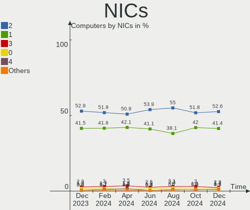
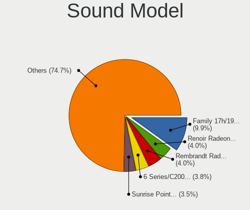
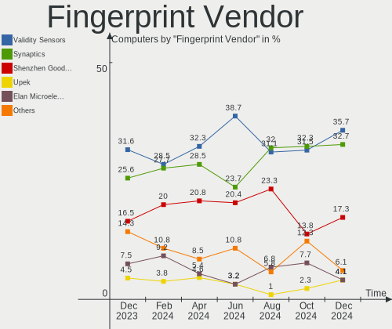

Ubuntu Hardware Trends
----------------------

A project to identify most popular hardware characteristics and track their change
over time based on data collected by Ubuntu users at https://Linux-Hardware.org.

Anyone can contribute to this report by the [hw-probe](https://github.com/linuxhw/hw-probe) tool:

    sudo -E hw-probe -all -upload

This is a report for all computer types. See also reports for [desktops](/Dist/Ubuntu/Desktop/README.md) and [notebooks](/Dist/Ubuntu/Notebook/README.md).

Full-feature report is available here: https://linux-hardware.org/?view=trends

Period: Jan, 2022.

Contents
--------

* [ System ](#system)
  - [ OS                       ](#os)
  - [ OS Family                ](#os-family)
  - [ Kernel                   ](#kernel)
  - [ Kernel Family            ](#kernel-family)
  - [ Kernel Major Ver.        ](#kernel-major-ver)
  - [ Arch                     ](#arch)
  - [ DE                       ](#de)
  - [ Display Server           ](#display-server)
  - [ Display Manager          ](#display-manager)
  - [ OS Lang                  ](#os-lang)
  - [ Boot Mode                ](#boot-mode)
  - [ Filesystem               ](#filesystem)
  - [ Part. scheme             ](#part-scheme)
  - [ Dual Boot with Linux/BSD ](#dual-boot-with-linuxbsd)
  - [ Dual Boot (Win)          ](#dual-boot-win)

* [ Board ](#board)
  - [ Vendor                   ](#vendor)
  - [ Model                    ](#model)
  - [ Model Family             ](#model-family)
  - [ MFG Year                 ](#mfg-year)
  - [ Form Factor              ](#form-factor)
  - [ Secure Boot              ](#secure-boot)
  - [ Coreboot                 ](#coreboot)
  - [ RAM Size                 ](#ram-size)
  - [ RAM Used                 ](#ram-used)
  - [ Total Drives             ](#total-drives)
  - [ Has CD-ROM               ](#has-cd-rom)
  - [ Has Ethernet             ](#has-ethernet)
  - [ Has WiFi                 ](#has-wifi)
  - [ Has Bluetooth            ](#has-bluetooth)

* [ Location ](#location)
  - [ Country                  ](#country)
  - [ City                     ](#city)

* [ Drives ](#drives)
  - [ Drive Vendor             ](#drive-vendor)
  - [ Drive Model              ](#drive-model)
  - [ HDD Vendor               ](#hdd-vendor)
  - [ SSD Vendor               ](#ssd-vendor)
  - [ Drive Kind               ](#drive-kind)
  - [ Drive Connector          ](#drive-connector)
  - [ Drive Size               ](#drive-size)
  - [ Space Total              ](#space-total)
  - [ Space Used               ](#space-used)
  - [ Malfunc. Drives          ](#malfunc-drives)
  - [ Malfunc. Drive Vendor    ](#malfunc-drive-vendor)
  - [ Malfunc. HDD Vendor      ](#malfunc-hdd-vendor)
  - [ Malfunc. Drive Kind      ](#malfunc-drive-kind)
  - [ Failed Drives            ](#failed-drives)
  - [ Failed Drive Vendor      ](#failed-drive-vendor)
  - [ Drive Status             ](#drive-status)

* [ Storage controller ](#storage-controller)
  - [ Storage Vendor           ](#storage-vendor)
  - [ Storage Model            ](#storage-model)
  - [ Storage Kind             ](#storage-kind)

* [ Processor ](#processor)
  - [ CPU Vendor               ](#cpu-vendor)
  - [ CPU Model                ](#cpu-model)
  - [ CPU Model Family         ](#cpu-model-family)
  - [ CPU Cores                ](#cpu-cores)
  - [ CPU Sockets              ](#cpu-sockets)
  - [ CPU Threads              ](#cpu-threads)
  - [ CPU Op-Modes             ](#cpu-op-modes)
  - [ CPU Microcode            ](#cpu-microcode)
  - [ CPU Microarch            ](#cpu-microarch)

* [ Graphics ](#graphics)
  - [ GPU Vendor               ](#gpu-vendor)
  - [ GPU Model                ](#gpu-model)
  - [ GPU Combo                ](#gpu-combo)
  - [ GPU Driver               ](#gpu-driver)
  - [ GPU Memory               ](#gpu-memory)

* [ Monitor ](#monitor)
  - [ Monitor Vendor           ](#monitor-vendor)
  - [ Monitor Model            ](#monitor-model)
  - [ Monitor Resolution       ](#monitor-resolution)
  - [ Monitor Diagonal         ](#monitor-diagonal)
  - [ Monitor Width            ](#monitor-width)
  - [ Aspect Ratio             ](#aspect-ratio)
  - [ Monitor Area             ](#monitor-area)
  - [ Pixel Density            ](#pixel-density)
  - [ Multiple Monitors        ](#multiple-monitors)

* [ Network ](#network)
  - [ Net Controller Vendor    ](#net-controller-vendor)
  - [ Net Controller Model     ](#net-controller-model)
  - [ Wireless Vendor          ](#wireless-vendor)
  - [ Wireless Model           ](#wireless-model)
  - [ Ethernet Vendor          ](#ethernet-vendor)
  - [ Ethernet Model           ](#ethernet-model)
  - [ Net Controller Kind      ](#net-controller-kind)
  - [ Used Controller          ](#used-controller)
  - [ NICs                     ](#nics)
  - [ IPv6                     ](#ipv6)

* [ Bluetooth ](#bluetooth)
  - [ Bluetooth Vendor         ](#bluetooth-vendor)
  - [ Bluetooth Model          ](#bluetooth-model)

* [ Sound ](#sound)
  - [ Sound Vendor             ](#sound-vendor)
  - [ Sound Model              ](#sound-model)

* [ Memory ](#memory)
  - [ Memory Vendor            ](#memory-vendor)
  - [ Memory Model             ](#memory-model)
  - [ Memory Kind              ](#memory-kind)
  - [ Memory Form Factor       ](#memory-form-factor)
  - [ Memory Size              ](#memory-size)
  - [ Memory Speed             ](#memory-speed)

* [ Printers & scanners ](#printers--scanners)
  - [ Printer Vendor           ](#printer-vendor)
  - [ Printer Model            ](#printer-model)
  - [ Scanner Vendor           ](#scanner-vendor)
  - [ Scanner Model            ](#scanner-model)

* [ Camera ](#camera)
  - [ Camera Vendor            ](#camera-vendor)
  - [ Camera Model             ](#camera-model)

* [ Security ](#security)
  - [ Fingerprint Vendor       ](#fingerprint-vendor)
  - [ Fingerprint Model        ](#fingerprint-model)
  - [ Chipcard Vendor          ](#chipcard-vendor)
  - [ Chipcard Model           ](#chipcard-model)

* [ Unsupported ](#unsupported)
  - [ Unsupported Devices      ](#unsupported-devices)
  - [ Unsupported Device Types ](#unsupported-device-types)

System
------

OS
--

Installed operating systems

| Name         | Computers | Percent |
|--------------|-----------|---------|
| Ubuntu 20.04 | 764       | 62.98%  |
| Ubuntu 21.10 | 325       | 26.79%  |
| Ubuntu 18.04 | 59        | 4.86%   |
| Ubuntu 21.04 | 39        | 3.22%   |
| Ubuntu 22.04 | 15        | 1.24%   |
| Ubuntu 16.04 | 8         | 0.66%   |
| Ubuntu 6.1   | 1         | 0.08%   |
| Ubuntu 20.10 | 1         | 0.08%   |
| Ubuntu 19.10 | 1         | 0.08%   |

OS Family
---------

OS without a version

| Name   | Computers | Percent |
|--------|-----------|---------|
| Ubuntu | 1213      | 100%    |

Kernel
------

Version of the Linux kernel

| Version                | Computers | Percent |
|------------------------|-----------|---------|
| 5.13.0-27-generic      | 285       | 23.5%   |
| 5.11.0-46-generic      | 117       | 9.65%   |
| 5.11.0-44-generic      | 116       | 9.56%   |
| 5.11.0-43-generic      | 94        | 7.75%   |
| 5.13.0-25-generic      | 93        | 7.67%   |
| 5.13.0-23-generic      | 54        | 4.45%   |
| 5.13.0-22-generic      | 46        | 3.79%   |
| 5.4.0-96-generic       | 43        | 3.54%   |
| 5.4.0-92-generic       | 36        | 2.97%   |
| 5.11.0-27-generic      | 30        | 2.47%   |
| 5.4.0-94-generic       | 29        | 2.39%   |
| 5.4.0-91-generic       | 21        | 1.73%   |
| 5.13.0-19-generic      | 19        | 1.57%   |
| 5.13.0-28-generic      | 15        | 1.24%   |
| 4.15.0-166-generic     | 15        | 1.24%   |
| 5.11.0-41-generic      | 13        | 1.07%   |
| 4.15.0-163-generic     | 8         | 0.66%   |
| 5.13.0-1013-raspi      | 7         | 0.58%   |
| 5.11.0-38-generic      | 7         | 0.58%   |
| 5.8.0-43-generic       | 6         | 0.49%   |
| 5.15.0-17-generic      | 6         | 0.49%   |
| 5.13.0-24-generic      | 6         | 0.49%   |
| 5.11.0-49-generic      | 6         | 0.49%   |
| 5.11.0-40-generic      | 6         | 0.49%   |
| 5.11.0-37-generic      | 5         | 0.41%   |
| 5.8.0-55-generic       | 4         | 0.33%   |
| 5.4.0-42-generic       | 4         | 0.33%   |
| 5.16.0-051600-generic  | 4         | 0.33%   |
| 5.10.0-1053-oem        | 4         | 0.33%   |
| 4.4.0-210-generic      | 4         | 0.33%   |
| 4.15.0-142-generic     | 4         | 0.33%   |
| 5.4.0-84-generic       | 3         | 0.25%   |
| 5.4.0-26-generic       | 3         | 0.25%   |
| 5.13.0-21-generic      | 3         | 0.25%   |
| 5.11.0-34-generic      | 3         | 0.25%   |
| 5.11.0-16-generic      | 3         | 0.25%   |
| 5.10.0-1057-oem        | 3         | 0.25%   |
| 5.10.0-1055-oem        | 3         | 0.25%   |
| 5.8.0-50-generic       | 2         | 0.16%   |
| 5.4.0-90-generic       | 2         | 0.16%   |
| 5.4.0-89-generic       | 2         | 0.16%   |
| 5.4.0-88-generic       | 2         | 0.16%   |
| 5.4.0-1050-raspi       | 2         | 0.16%   |
| 5.15.13-051513-generic | 2         | 0.16%   |
| 5.15.0-18-generic      | 2         | 0.16%   |
| 5.13.0-1011-raspi      | 2         | 0.16%   |
| 5.11.0-1024-raspi      | 2         | 0.16%   |
| 5.10.0-1052-oem        | 2         | 0.16%   |
| 4.15.0-162-generic     | 2         | 0.16%   |
| 5.8.18-050818-generic  | 1         | 0.08%   |
| 5.8.0-63-generic       | 1         | 0.08%   |
| 5.8.0-53-generic       | 1         | 0.08%   |
| 5.8.0-41-generic       | 1         | 0.08%   |
| 5.8.0-28-generic       | 1         | 0.08%   |
| 5.8.0-050800-generic   | 1         | 0.08%   |
| 5.6.0-1036-oem         | 1         | 0.08%   |
| 5.4.157-1-pve          | 1         | 0.08%   |
| 5.4.0-80-generic       | 1         | 0.08%   |
| 5.4.0-77-generic       | 1         | 0.08%   |
| 5.4.0-74-generic       | 1         | 0.08%   |

Kernel Family
-------------

Linux kernel without a distro release

| Version | Computers | Percent |
|---------|-----------|---------|
| 5.13.0  | 538       | 44.35%  |
| 5.11.0  | 407       | 33.55%  |
| 5.4.0   | 157       | 12.94%  |
| 4.15.0  | 33        | 2.72%   |
| 5.8.0   | 17        | 1.4%    |
| 5.10.0  | 12        | 0.99%   |
| 5.15.0  | 10        | 0.82%   |
| 5.16.0  | 6         | 0.49%   |
| 4.4.0   | 4         | 0.33%   |
| 5.16.1  | 2         | 0.16%   |
| 5.15.13 | 2         | 0.16%   |
| 5.15.12 | 2         | 0.16%   |
| 5.8.18  | 1         | 0.08%   |
| 5.6.0   | 1         | 0.08%   |
| 5.4.157 | 1         | 0.08%   |
| 5.3.0   | 1         | 0.08%   |
| 5.16.4  | 1         | 0.08%   |
| 5.15.8  | 1         | 0.08%   |
| 5.15.5  | 1         | 0.08%   |
| 5.15.18 | 1         | 0.08%   |
| 5.15.17 | 1         | 0.08%   |
| 5.15.11 | 1         | 0.08%   |
| 5.14.9  | 1         | 0.08%   |
| 5.14.0  | 1         | 0.08%   |
| 5.13.15 | 1         | 0.08%   |
| 5.12.11 | 1         | 0.08%   |
| 5.10.94 | 1         | 0.08%   |
| 5.10.75 | 1         | 0.08%   |
| 5.10.10 | 1         | 0.08%   |
| 4.9.253 | 1         | 0.08%   |
| 4.9.201 | 1         | 0.08%   |
| 4.9.140 | 1         | 0.08%   |
| 4.18.0  | 1         | 0.08%   |
| 3.16.85 | 1         | 0.08%   |
| Unknown | 1         | 0.08%   |

Kernel Major Ver.
-----------------

Linux kernel major version

| Version | Computers | Percent |
|---------|-----------|---------|
| 5.13    | 539       | 44.44%  |
| 5.11    | 407       | 33.55%  |
| 5.4     | 158       | 13.03%  |
| 4.15    | 33        | 2.72%   |
| 5.15    | 19        | 1.57%   |
| 5.8     | 18        | 1.48%   |
| 5.10    | 15        | 1.24%   |
| 5.16    | 9         | 0.74%   |
| 4.4     | 4         | 0.33%   |
| 4.9     | 3         | 0.25%   |
| 5.14    | 2         | 0.16%   |
| 5.6     | 1         | 0.08%   |
| 5.3     | 1         | 0.08%   |
| 5.12    | 1         | 0.08%   |
| 4.18    | 1         | 0.08%   |
| 3.16    | 1         | 0.08%   |
| Unknown | 1         | 0.08%   |

Arch
----

OS architecture (x86_64, i586, etc.)

| Name    | Computers | Percent |
|---------|-----------|---------|
| x86_64  | 1176      | 96.95%  |
| aarch64 | 22        | 1.81%   |
| i686    | 14        | 1.15%   |
| Unknown | 1         | 0.08%   |

DE
--

Desktop Environment

| Name            | Computers | Percent |
|-----------------|-----------|---------|
| GNOME           | 1135      | 93.57%  |
| Unknown         | 41        | 3.38%   |
| Unity           | 19        | 1.57%   |
| GNOME Flashback | 6         | 0.49%   |
| X-Cinnamon      | 4         | 0.33%   |
| i3              | 3         | 0.25%   |
| Enlightenment   | 2         | 0.16%   |
| Pantheon        | 1         | 0.08%   |
| Deepin          | 1         | 0.08%   |
| Cinnamon        | 1         | 0.08%   |

Display Server
--------------

X11 or Wayland

| Name        | Computers | Percent |
|-------------|-----------|---------|
| X11         | 887       | 73.12%  |
| Wayland     | 281       | 23.17%  |
| Tty         | 24        | 1.98%   |
| Unknown     | 19        | 1.57%   |
| Web         | 1         | 0.08%   |
| Unspecified | 1         | 0.08%   |

Display Manager
---------------

SDDM, LightDM, etc.

| Name    | Computers | Percent |
|---------|-----------|---------|
| GDM3    | 684       | 56.39%  |
| GDM     | 400       | 32.98%  |
| Unknown | 84        | 6.92%   |
| LightDM | 43        | 3.54%   |
| SLiM    | 1         | 0.08%   |
| SDDM    | 1         | 0.08%   |

OS Lang
-------

Language

| Lang    | Computers | Percent |
|---------|-----------|---------|
| en_US   | 474       | 39.08%  |
| de_DE   | 167       | 13.77%  |
| fr_FR   | 92        | 7.58%   |
| en_GB   | 64        | 5.28%   |
| it_IT   | 36        | 2.97%   |
| en_CA   | 33        | 2.72%   |
| en_IN   | 31        | 2.56%   |
| pt_BR   | 30        | 2.47%   |
| ru_RU   | 27        | 2.23%   |
| pl_PL   | 22        | 1.81%   |
| es_ES   | 22        | 1.81%   |
| C       | 18        | 1.48%   |
| hu_HU   | 17        | 1.4%    |
| en_AU   | 16        | 1.32%   |
| nl_NL   | 14        | 1.15%   |
| es_MX   | 10        | 0.82%   |
| ja_JP   | 8         | 0.66%   |
| fr_CA   | 8         | 0.66%   |
| el_GR   | 8         | 0.66%   |
| zh_CN   | 7         | 0.58%   |
| fi_FI   | 7         | 0.58%   |
| de_CH   | 7         | 0.58%   |
| de_AT   | 7         | 0.58%   |
| Unknown | 7         | 0.58%   |
| sv_SE   | 6         | 0.49%   |
| da_DK   | 6         | 0.49%   |
| cs_CZ   | 6         | 0.49%   |
| es_AR   | 5         | 0.41%   |
| en_ZA   | 5         | 0.41%   |
| pt_PT   | 4         | 0.33%   |
| fr_BE   | 4         | 0.33%   |
| en_IL   | 4         | 0.33%   |
| en_SG   | 3         | 0.25%   |
| zh_TW   | 2         | 0.16%   |
| sk_SK   | 2         | 0.16%   |
| ru_UA   | 2         | 0.16%   |
| ro_RO   | 2         | 0.16%   |
| nl_BE   | 2         | 0.16%   |
| fr_CH   | 2         | 0.16%   |
| es_PE   | 2         | 0.16%   |
| es_CO   | 2         | 0.16%   |
| en_ZW   | 2         | 0.16%   |
| en_NZ   | 2         | 0.16%   |
| en_IE   | 2         | 0.16%   |
| ca_ES   | 2         | 0.16%   |
| sr_RS   | 1         | 0.08%   |
| sl_SI   | 1         | 0.08%   |
| nb_NO   | 1         | 0.08%   |
| ko_KR   | 1         | 0.08%   |
| id_ID   | 1         | 0.08%   |
| fr_LU   | 1         | 0.08%   |
| es_US   | 1         | 0.08%   |
| es_EC   | 1         | 0.08%   |
| es_DO   | 1         | 0.08%   |
| es_CL   | 1         | 0.08%   |
| en_NG   | 1         | 0.08%   |
| en_HK   | 1         | 0.08%   |
| bg_BG   | 1         | 0.08%   |
| ar_EG   | 1         | 0.08%   |

Boot Mode
---------

EFI or BIOS

| Mode | Computers | Percent |
|------|-----------|---------|
| EFI  | 608       | 50.12%  |
| BIOS | 605       | 49.88%  |

Filesystem
----------

Type of filesystem

| Type    | Computers | Percent |
|---------|-----------|---------|
| Ext4    | 1137      | 93.73%  |
| Overlay | 31        | 2.56%   |
| Zfs     | 15        | 1.24%   |
| Xfs     | 10        | 0.82%   |
| Btrfs   | 10        | 0.82%   |
| Ext3    | 6         | 0.49%   |
| Ext2    | 3         | 0.25%   |
| Unknown | 1         | 0.08%   |

Part. scheme
------------

Scheme of partitioning

| Type    | Computers | Percent |
|---------|-----------|---------|
| Unknown | 768       | 63.31%  |
| GPT     | 370       | 30.5%   |
| MBR     | 75        | 6.18%   |

Dual Boot with Linux/BSD
------------------------

Hosting more than one Linux/BSD

| Dual boot | Computers | Percent |
|-----------|-----------|---------|
| No        | 1066      | 87.88%  |
| Yes       | 147       | 12.12%  |

Dual Boot (Win)
---------------

Hosting Linux and Windows

| Dual boot | Computers | Percent |
|-----------|-----------|---------|
| No        | 755       | 62.24%  |
| Yes       | 458       | 37.76%  |

Board
-----

Vendor
------

Motherboard manufacturer

| Name                    | Computers | Percent |
|-------------------------|-----------|---------|
| Dell                    | 195       | 16.08%  |
| Hewlett-Packard         | 181       | 14.92%  |
| ASUSTek Computer        | 177       | 14.59%  |
| Lenovo                  | 161       | 13.27%  |
| MSI                     | 76        | 6.27%   |
| Gigabyte Technology     | 68        | 5.61%   |
| Acer                    | 68        | 5.61%   |
| ASRock                  | 25        | 2.06%   |
| Apple                   | 25        | 2.06%   |
| Intel                   | 20        | 1.65%   |
| Raspberry Pi Foundation | 17        | 1.4%    |
| Packard Bell            | 14        | 1.15%   |
| Samsung Electronics     | 13        | 1.07%   |
| Medion                  | 13        | 1.07%   |
| HUAWEI                  | 13        | 1.07%   |
| Toshiba                 | 12        | 0.99%   |
| Unknown                 | 12        | 0.99%   |
| Supermicro              | 10        | 0.82%   |
| Timi                    | 8         | 0.66%   |
| Fujitsu                 | 8         | 0.66%   |
| Sony                    | 5         | 0.41%   |
| Nvidia                  | 4         | 0.33%   |
| Google                  | 4         | 0.33%   |
| Fujitsu Siemens         | 4         | 0.33%   |
| ECS                     | 4         | 0.33%   |
| Gateway                 | 3         | 0.25%   |
| Chuwi                   | 3         | 0.25%   |
| Biostar                 | 3         | 0.25%   |
| BESSTAR Tech            | 3         | 0.25%   |
| ZOTAC                   | 2         | 0.16%   |
| Wortmann AG             | 2         | 0.16%   |
| TUXEDO                  | 2         | 0.16%   |
| Razer                   | 2         | 0.16%   |
| Positivo                | 2         | 0.16%   |
| Notebook                | 2         | 0.16%   |
| Microsoft               | 2         | 0.16%   |
| Huanan                  | 2         | 0.16%   |
| HONOR                   | 2         | 0.16%   |
| Foxconn                 | 2         | 0.16%   |
| Clevo                   | 2         | 0.16%   |
| AMI                     | 2         | 0.16%   |
| Alienware               | 2         | 0.16%   |
| TYAN Computer           | 1         | 0.08%   |
| teleplatforms           | 1         | 0.08%   |
| Teclast                 | 1         | 0.08%   |
| sunxi                   | 1         | 0.08%   |
| RuggedPC                | 1         | 0.08%   |
| QTQD                    | 1         | 0.08%   |
| PCWare                  | 1         | 0.08%   |
| PC Specialist           | 1         | 0.08%   |
| PC Engines              | 1         | 0.08%   |
| Panasonic               | 1         | 0.08%   |
| OEM                     | 1         | 0.08%   |
| NCS-Tech                | 1         | 0.08%   |
| Multilaser              | 1         | 0.08%   |
| MOTILE                  | 1         | 0.08%   |
| Mediacom                | 1         | 0.08%   |
| Maibenben               | 1         | 0.08%   |
| MACHINIST               | 1         | 0.08%   |
| LG Electronics          | 1         | 0.08%   |

Model
-----

Motherboard model

| Name                                  | Computers | Percent |
|---------------------------------------|-----------|---------|
| RPi Raspberry Pi                      | 16        | 1.32%   |
| Unknown                               | 15        | 1.24%   |
| ASUS All Series                       | 14        | 1.15%   |
| HP Notebook                           | 6         | 0.49%   |
| Dell OptiPlex 7010                    | 5         | 0.41%   |
| Dell Inspiron 5570                    | 5         | 0.41%   |
| Supermicro Super Server               | 4         | 0.33%   |
| HP EliteBook 8470p                    | 4         | 0.33%   |
| Dell OptiPlex 3020                    | 4         | 0.33%   |
| Nvidia Tegra                          | 3         | 0.25%   |
| MSI MS-7592                           | 3         | 0.25%   |
| Intel NUC8i7BEH                       | 3         | 0.25%   |
| HUAWEI NBLK-WAX9X                     | 3         | 0.25%   |
| HP ProBook 445 G7                     | 3         | 0.25%   |
| HP ProBook 440 G7                     | 3         | 0.25%   |
| HP Pavilion Gaming Laptop 15-cx0xxx   | 3         | 0.25%   |
| HP Pavilion g6                        | 3         | 0.25%   |
| HP Pavilion Aero Laptop 13-be0xxx     | 3         | 0.25%   |
| HP ENVY x360 Convertible 13-ay0xxx    | 3         | 0.25%   |
| Dell XPS 15 7590                      | 3         | 0.25%   |
| Dell XPS 13 9360                      | 3         | 0.25%   |
| Dell OptiPlex 7440 AIO                | 3         | 0.25%   |
| Dell Latitude 7490                    | 3         | 0.25%   |
| Dell Inspiron 3501                    | 3         | 0.25%   |
| Dell Inspiron 1545                    | 3         | 0.25%   |
| ASUS ROG Zephyrus G14 GA401QM_GA401QM | 3         | 0.25%   |
| ASUS PRIME A320M-K                    | 3         | 0.25%   |
| Apple MacBookPro9,2                   | 3         | 0.25%   |
| Apple iMac12,1                        | 3         | 0.25%   |
| Acer Swift SF315-41                   | 3         | 0.25%   |
| Wortmann AG TERRA_MOBILE_1512/1712    | 2         | 0.16%   |
| Packard Bell IMEDIA S3840             | 2         | 0.16%   |
| Packard Bell EasyNote MH36            | 2         | 0.16%   |
| MSI MS-7D25                           | 2         | 0.16%   |
| MSI MS-7C96                           | 2         | 0.16%   |
| MSI MS-7C08                           | 2         | 0.16%   |
| MSI MS-7B98                           | 2         | 0.16%   |
| MSI MS-7996                           | 2         | 0.16%   |
| MSI MS-7978                           | 2         | 0.16%   |
| MSI MS-7721                           | 2         | 0.16%   |
| Medion MD34030/2511                   | 2         | 0.16%   |
| Lenovo IdeaPadFlex 5 14ITL05 82HS     | 2         | 0.16%   |
| Lenovo IdeaPad S145-15API 81V7        | 2         | 0.16%   |
| Lenovo IdeaPad 5 15ARE05 81YQ         | 2         | 0.16%   |
| Lenovo IdeaPad 330-15IKB 81DE         | 2         | 0.16%   |
| Lenovo IdeaPad 3 15IIL05 81WE         | 2         | 0.16%   |
| Lenovo G50-70 20351                   | 2         | 0.16%   |
| HUAWEI NBLB-WAX9N                     | 2         | 0.16%   |
| HUAWEI HVY-WXX9                       | 2         | 0.16%   |
| HP ZBook 15v G5                       | 2         | 0.16%   |
| HP Z800 Workstation                   | 2         | 0.16%   |
| HP ProDesk 600 G1 SFF                 | 2         | 0.16%   |
| HP ProBook 6560b                      | 2         | 0.16%   |
| HP ProBook 6550b                      | 2         | 0.16%   |
| HP ProBook 455 G7                     | 2         | 0.16%   |
| HP Pavilion g7                        | 2         | 0.16%   |
| HP Pavilion dv6                       | 2         | 0.16%   |
| HP Pavilion 17                        | 2         | 0.16%   |
| HP Laptop 15s-fq1xxx                  | 2         | 0.16%   |
| HP Laptop 15-db0xxx                   | 2         | 0.16%   |

Model Family
------------

Motherboard model prefix

| Name                  | Computers | Percent |
|-----------------------|-----------|---------|
| Lenovo ThinkPad       | 77        | 6.35%   |
| Dell Inspiron         | 51        | 4.2%    |
| Dell Latitude         | 47        | 3.87%   |
| Acer Aspire           | 46        | 3.79%   |
| HP Pavilion           | 34        | 2.8%    |
| Dell OptiPlex         | 29        | 2.39%   |
| HP ProBook            | 28        | 2.31%   |
| Lenovo IdeaPad        | 27        | 2.23%   |
| HP EliteBook          | 26        | 2.14%   |
| Dell XPS              | 26        | 2.14%   |
| ASUS PRIME            | 23        | 1.9%    |
| ASUS ROG              | 21        | 1.73%   |
| Dell Precision        | 20        | 1.65%   |
| RPi Raspberry         | 16        | 1.32%   |
| HP Compaq             | 16        | 1.32%   |
| Unknown               | 15        | 1.24%   |
| HP Laptop             | 14        | 1.15%   |
| ASUS All              | 14        | 1.15%   |
| HP ENVY               | 10        | 0.82%   |
| Dell Vostro           | 10        | 0.82%   |
| Packard Bell EasyNote | 9         | 0.74%   |
| Lenovo ThinkCentre    | 9         | 0.74%   |
| ASUS VivoBook         | 9         | 0.74%   |
| Acer Swift            | 9         | 0.74%   |
| Gigabyte X570         | 8         | 0.66%   |
| ASUS TUF              | 7         | 0.58%   |
| Toshiba Satellite     | 6         | 0.49%   |
| Lenovo Yoga           | 6         | 0.49%   |
| HP ProDesk            | 6         | 0.49%   |
| HP Notebook           | 6         | 0.49%   |
| HP EliteDesk          | 6         | 0.49%   |
| Lenovo ThinkBook      | 5         | 0.41%   |
| Timi RedmiBook        | 4         | 0.33%   |
| Supermicro Super      | 4         | 0.33%   |
| Medion Akoya          | 4         | 0.33%   |
| Lenovo Legion         | 4         | 0.33%   |
| Lenovo IdeaPadFlex    | 4         | 0.33%   |
| Lenovo IdeaCentre     | 4         | 0.33%   |
| HP 255                | 4         | 0.33%   |
| ASUS ZenBook          | 4         | 0.33%   |
| ASUS M5A78L-M         | 4         | 0.33%   |
| Apple iMac12          | 4         | 0.33%   |
| Packard Bell IMEDIA   | 3         | 0.25%   |
| Nvidia Tegra          | 3         | 0.25%   |
| MSI MS-7592           | 3         | 0.25%   |
| Intel NUC8i7BEH       | 3         | 0.25%   |
| HUAWEI NBLK-WAX9X     | 3         | 0.25%   |
| HP ZBook              | 3         | 0.25%   |
| Gigabyte 970A-DS3P    | 3         | 0.25%   |
| Fujitsu LIFEBOOK      | 3         | 0.25%   |
| Fujitsu ESPRIMO       | 3         | 0.25%   |
| Dell PowerEdge        | 3         | 0.25%   |
| Dell G5               | 3         | 0.25%   |
| ASUS P8Z77-V          | 3         | 0.25%   |
| ASUS ASUS             | 3         | 0.25%   |
| Apple MacBookPro9     | 3         | 0.25%   |
| Apple MacBookPro16    | 3         | 0.25%   |
| Acer TravelMate       | 3         | 0.25%   |
| Acer Predator         | 3         | 0.25%   |
| Acer Nitro            | 3         | 0.25%   |

MFG Year
--------

Motherboard manufacture year

| Year    | Computers | Percent |
|---------|-----------|---------|
| 2021    | 145       | 11.95%  |
| 2020    | 138       | 11.38%  |
| 2019    | 123       | 10.14%  |
| 2018    | 105       | 8.66%   |
| 2012    | 84        | 6.92%   |
| 2013    | 83        | 6.84%   |
| 2017    | 82        | 6.76%   |
| 2011    | 81        | 6.68%   |
| 2014    | 71        | 5.85%   |
| 2016    | 57        | 4.7%    |
| 2010    | 55        | 4.53%   |
| 2009    | 51        | 4.2%    |
| 2015    | 50        | 4.12%   |
| 2008    | 38        | 3.13%   |
| 2007    | 22        | 1.81%   |
| Unknown | 21        | 1.73%   |
| 2006    | 6         | 0.49%   |
| 2005    | 1         | 0.08%   |

Form Factor
-----------

Physical design of the computer

| Name           | Computers | Percent |
|----------------|-----------|---------|
| Notebook       | 669       | 55.15%  |
| Desktop        | 421       | 34.71%  |
| Convertible    | 34        | 2.8%    |
| System on chip | 22        | 1.81%   |
| All in one     | 22        | 1.81%   |
| Server         | 19        | 1.57%   |
| Mini pc        | 17        | 1.4%    |
| Tablet         | 8         | 0.66%   |
| Other          | 1         | 0.08%   |

Secure Boot
-----------

Enabled or disabled

| State    | Computers | Percent |
|----------|-----------|---------|
| Disabled | 1048      | 86.4%   |
| Enabled  | 165       | 13.6%   |

Coreboot
--------

Have coreboot on board

| Used | Computers | Percent |
|------|-----------|---------|
| No   | 1207      | 99.51%  |
| Yes  | 6         | 0.49%   |

RAM Size
--------

Total RAM memory

| Size in GB      | Computers | Percent |
|-----------------|-----------|---------|
| 4.01-8.0        | 312       | 25.72%  |
| 16.01-24.0      | 243       | 20.03%  |
| 3.01-4.0        | 216       | 17.81%  |
| 8.01-16.0       | 206       | 16.98%  |
| 32.01-64.0      | 118       | 9.73%   |
| 64.01-256.0     | 39        | 3.22%   |
| 1.01-2.0        | 31        | 2.56%   |
| 24.01-32.0      | 23        | 1.9%    |
| 2.01-3.0        | 16        | 1.32%   |
| 0.51-1.0        | 7         | 0.58%   |
| More than 256.0 | 1         | 0.08%   |
| Unknown         | 1         | 0.08%   |

RAM Used
--------

Used RAM memory

| Used GB    | Computers | Percent |
|------------|-----------|---------|
| 1.01-2.0   | 459       | 37.84%  |
| 2.01-3.0   | 323       | 26.63%  |
| 4.01-8.0   | 183       | 15.09%  |
| 3.01-4.0   | 148       | 12.2%   |
| 8.01-16.0  | 43        | 3.54%   |
| 0.51-1.0   | 37        | 3.05%   |
| 0.01-0.5   | 7         | 0.58%   |
| 16.01-24.0 | 6         | 0.49%   |
| 24.01-32.0 | 5         | 0.41%   |
| 32.01-64.0 | 1         | 0.08%   |
| Unknown    | 1         | 0.08%   |

Total Drives
------------

Number of drives on board

| Drives | Computers | Percent |
|--------|-----------|---------|
| 1      | 737       | 60.76%  |
| 2      | 299       | 24.65%  |
| 3      | 98        | 8.08%   |
| 4      | 31        | 2.56%   |
| 5      | 23        | 1.9%    |
| 0      | 10        | 0.82%   |
| 6      | 7         | 0.58%   |
| 7      | 3         | 0.25%   |
| 20     | 2         | 0.16%   |
| 17     | 1         | 0.08%   |
| 11     | 1         | 0.08%   |
| 10     | 1         | 0.08%   |

Has CD-ROM
----------

Has CD-ROM on board

| Presented | Computers | Percent |
|-----------|-----------|---------|
| No        | 759       | 62.57%  |
| Yes       | 454       | 37.43%  |

Has Ethernet
------------

Has Ethernet on board

| Presented | Computers | Percent |
|-----------|-----------|---------|
| Yes       | 1017      | 83.84%  |
| No        | 196       | 16.16%  |

Has WiFi
--------

Has WiFi module

| Presented | Computers | Percent |
|-----------|-----------|---------|
| Yes       | 931       | 76.75%  |
| No        | 282       | 23.25%  |

Has Bluetooth
-------------

Has Bluetooth module

| Presented | Computers | Percent |
|-----------|-----------|---------|
| Yes       | 721       | 59.44%  |
| No        | 492       | 40.56%  |

Location
--------

Country
-------

Geographic location (country)

| Country      | Computers | Percent |
|--------------|-----------|---------|
| Germany      | 200       | 16.49%  |
| USA          | 190       | 15.66%  |
| France       | 105       | 8.66%   |
| UK           | 47        | 3.87%   |
| Canada       | 47        | 3.87%   |
| Italy        | 46        | 3.79%   |
| Brazil       | 44        | 3.63%   |
| India        | 37        | 3.05%   |
| Poland       | 35        | 2.89%   |
| Spain        | 33        | 2.72%   |
| Russia       | 31        | 2.56%   |
| Netherlands  | 25        | 2.06%   |
| Hungary      | 20        | 1.65%   |
| Mexico       | 17        | 1.4%    |
| Austria      | 17        | 1.4%    |
| Australia    | 17        | 1.4%    |
| Ukraine      | 16        | 1.32%   |
| Sweden       | 15        | 1.24%   |
| Belgium      | 15        | 1.24%   |
| Switzerland  | 14        | 1.15%   |
| Greece       | 14        | 1.15%   |
| Denmark      | 14        | 1.15%   |
| Czechia      | 14        | 1.15%   |
| Finland      | 13        | 1.07%   |
| Portugal     | 8         | 0.66%   |
| Japan        | 8         | 0.66%   |
| China        | 8         | 0.66%   |
| Turkey       | 7         | 0.58%   |
| South Africa | 7         | 0.58%   |
| Romania      | 7         | 0.58%   |
| Bulgaria     | 7         | 0.58%   |
| Norway       | 6         | 0.49%   |
| Argentina    | 6         | 0.49%   |
| Indonesia    | 5         | 0.41%   |
| Belarus      | 5         | 0.41%   |
| Singapore    | 4         | 0.33%   |
| Morocco      | 4         | 0.33%   |
| Malaysia     | 4         | 0.33%   |
| Israel       | 4         | 0.33%   |
| Iran         | 4         | 0.33%   |
| Colombia     | 4         | 0.33%   |
| Thailand     | 3         | 0.25%   |
| Taiwan       | 3         | 0.25%   |
| Slovakia     | 3         | 0.25%   |
| Serbia       | 3         | 0.25%   |
| Ireland      | 3         | 0.25%   |
| Iceland      | 3         | 0.25%   |
| Egypt        | 3         | 0.25%   |
| Ecuador      | 3         | 0.25%   |
| Chile        | 3         | 0.25%   |
| Vietnam      | 2         | 0.16%   |
| Tunisia      | 2         | 0.16%   |
| Sri Lanka    | 2         | 0.16%   |
| South Korea  | 2         | 0.16%   |
| Peru         | 2         | 0.16%   |
| Nigeria      | 2         | 0.16%   |
| New Zealand  | 2         | 0.16%   |
| Nepal        | 2         | 0.16%   |
| Luxembourg   | 2         | 0.16%   |
| Latvia       | 2         | 0.16%   |

City
----

Geographic location (city)

| City              | Computers | Percent |
|-------------------|-----------|---------|
| Berlin            | 21        | 1.73%   |
| Paris             | 12        | 0.99%   |
| Vienna            | 11        | 0.91%   |
| Moscow            | 9         | 0.74%   |
| Prague            | 8         | 0.66%   |
| S??o Paulo        | 7         | 0.58%   |
| Munich            | 7         | 0.58%   |
| Montreal          | 7         | 0.58%   |
| Madrid            | 7         | 0.58%   |
| Hamburg           | 7         | 0.58%   |
| Budapest          | 7         | 0.58%   |
| Warsaw            | 6         | 0.49%   |
| Melbourne         | 6         | 0.49%   |
| Krakow            | 6         | 0.49%   |
| Athens            | 6         | 0.49%   |
| Stuttgart         | 5         | 0.41%   |
| Poznan            | 5         | 0.41%   |
| Lille             | 5         | 0.41%   |
| Kyiv              | 5         | 0.41%   |
| Frankfurt am Main | 5         | 0.41%   |
| Dresden           | 5         | 0.41%   |
| Chicago           | 5         | 0.41%   |
| Barcelona         | 5         | 0.41%   |
| Tehran            | 4         | 0.33%   |
| Sofia             | 4         | 0.33%   |
| Singapore         | 4         | 0.33%   |
| Milan             | 4         | 0.33%   |
| Mexico City       | 4         | 0.33%   |
| Mannheim          | 4         | 0.33%   |
| Kharkiv           | 4         | 0.33%   |
| Guadalajara       | 4         | 0.33%   |
| Edmonton          | 4         | 0.33%   |
| Delhi             | 4         | 0.33%   |
| Cape Town         | 4         | 0.33%   |
| Zurich            | 3         | 0.25%   |
| Wroclaw           | 3         | 0.25%   |
| Thessaloniki      | 3         | 0.25%   |
| Sydney            | 3         | 0.25%   |
| Strasbourg        | 3         | 0.25%   |
| Stockholm         | 3         | 0.25%   |
| St Petersburg     | 3         | 0.25%   |
| Schagen           | 3         | 0.25%   |
| Pune              | 3         | 0.25%   |
| Osnabr??ck        | 3         | 0.25%   |
| Oslo              | 3         | 0.25%   |
| Novosibirsk       | 3         | 0.25%   |
| New York          | 3         | 0.25%   |
| New Taipei        | 3         | 0.25%   |
| Nantes            | 3         | 0.25%   |
| Mumbai            | 3         | 0.25%   |
| Montpellier       | 3         | 0.25%   |
| Marseille         | 3         | 0.25%   |
| London            | 3         | 0.25%   |
| Leipzig           | 3         | 0.25%   |
| Lannion           | 3         | 0.25%   |
| Karlsruhe         | 3         | 0.25%   |
| Helsinki          | 3         | 0.25%   |
| Haifa             | 3         | 0.25%   |
| Guayaquil         | 3         | 0.25%   |
| Essen             | 3         | 0.25%   |

Drives
------

Drive Vendor
------------

Hard drive vendors

| Vendor                      | Computers | Drives | Percent |
|-----------------------------|-----------|--------|---------|
| WDC                         | 289       | 361    | 17.03%  |
| Samsung Electronics         | 273       | 331    | 16.09%  |
| Seagate                     | 244       | 292    | 14.38%  |
| Toshiba                     | 112       | 149    | 6.6%    |
| Kingston                    | 97        | 102    | 5.72%   |
| SanDisk                     | 91        | 96     | 5.36%   |
| Unknown                     | 86        | 96     | 5.07%   |
| Crucial                     | 58        | 59     | 3.42%   |
| SK Hynix                    | 53        | 54     | 3.12%   |
| Hitachi                     | 43        | 47     | 2.53%   |
| Intel                       | 41        | 46     | 2.42%   |
| HGST                        | 32        | 37     | 1.89%   |
| A-DATA Technology           | 28        | 30     | 1.65%   |
| KIOXIA                      | 24        | 26     | 1.41%   |
| Micron Technology           | 23        | 23     | 1.36%   |
| Intenso                     | 16        | 16     | 0.94%   |
| LITEON                      | 13        | 13     | 0.77%   |
| Phison                      | 8         | 8      | 0.47%   |
| China                       | 8         | 8      | 0.47%   |
| Silicon Motion              | 7         | 7      | 0.41%   |
| MAXTOR                      | 7         | 7      | 0.41%   |
| Apple                       | 7         | 7      | 0.41%   |
| PNY                         | 6         | 6      | 0.35%   |
| Transcend                   | 4         | 4      | 0.24%   |
| SABRENT                     | 4         | 4      | 0.24%   |
| Patriot                     | 4         | 4      | 0.24%   |
| OCZ                         | 4         | 4      | 0.24%   |
| Netac                       | 4         | 4      | 0.24%   |
| GOODRAM                     | 4         | 5      | 0.24%   |
| Fujitsu                     | 4         | 4      | 0.24%   |
| Corsair                     | 4         | 4      | 0.24%   |
| Unknown                     | 4         | 4      | 0.24%   |
| Team                        | 3         | 3      | 0.18%   |
| SSSTC                       | 3         | 3      | 0.18%   |
| SPCC                        | 3         | 3      | 0.18%   |
| Realtek Semiconductor       | 3         | 3      | 0.18%   |
| Lite-On                     | 3         | 3      | 0.18%   |
| JMicron                     | 3         | 4      | 0.18%   |
| FORESEE                     | 3         | 3      | 0.18%   |
| External                    | 3         | 4      | 0.18%   |
| YMTC                        | 2         | 2      | 0.12%   |
| XPG                         | 2         | 3      | 0.12%   |
| TO Exter                    | 2         | 2      | 0.12%   |
| Teclast                     | 2         | 2      | 0.12%   |
| Micron/Crucial Technology   | 2         | 2      | 0.12%   |
| Leven                       | 2         | 2      | 0.12%   |
| LDLC                        | 2         | 2      | 0.12%   |
| LaCie                       | 2         | 2      | 0.12%   |
| KingFast                    | 2         | 2      | 0.12%   |
| Hoodisk                     | 2         | 2      | 0.12%   |
| Gigabyte Technology         | 2         | 2      | 0.12%   |
| Emtec                       | 2         | 2      | 0.12%   |
| Dogfish                     | 2         | 2      | 0.12%   |
| ASMT                        | 2         | 2      | 0.12%   |
| Yangtze Memory Technologies | 1         | 1      | 0.06%   |
| Verbatim                    | 1         | 2      | 0.06%   |
| UMIS                        | 1         | 1      | 0.06%   |
| TYPEC 1T                    | 1         | 1      | 0.06%   |
| SUPERSONIC                  | 1         | 1      | 0.06%   |
| SST                         | 1         | 1      | 0.06%   |

Drive Model
-----------

Hard drive models

| Model                              | Computers | Percent |
|------------------------------------|-----------|---------|
| Unknown MMC Card  32GB             | 25        | 1.35%   |
| Samsung NVMe SSD Drive 512GB       | 22        | 1.19%   |
| Kingston SA400S37240G 240GB SSD    | 18        | 0.97%   |
| Samsung SSD 860 EVO 500GB          | 17        | 0.92%   |
| Seagate ST1000LM035-1RK172 1TB     | 15        | 0.81%   |
| Seagate ST2000DM008-2FR102 2TB     | 13        | 0.7%    |
| Kingston SA400S37480G 480GB SSD    | 13        | 0.7%    |
| Toshiba DT01ACA100 1TB             | 12        | 0.65%   |
| Seagate ST1000DM010-2EP102 1TB     | 12        | 0.65%   |
| Sandisk NVMe SSD Drive 512GB       | 12        | 0.65%   |
| Samsung SSD 860 EVO 1TB            | 11        | 0.59%   |
| Samsung NVMe SSD Drive 1024GB      | 11        | 0.59%   |
| Unknown MMC Card  64GB             | 10        | 0.54%   |
| Unknown MMC Card  128GB            | 10        | 0.54%   |
| Seagate ST9500325AS 500GB          | 10        | 0.54%   |
| Samsung SSD 850 EVO 250GB          | 10        | 0.54%   |
| HGST HTS725050A7E630 500GB         | 10        | 0.54%   |
| Crucial CT240BX500SSD1 240GB       | 10        | 0.54%   |
| WDC WDS240G2G0A-00JH30 240GB SSD   | 9         | 0.49%   |
| Unknown SD/MMC/MS PRO 128GB        | 9         | 0.49%   |
| Toshiba MQ04ABF100 1TB             | 9         | 0.49%   |
| Toshiba MQ01ABD100 1TB             | 9         | 0.49%   |
| Samsung NVMe SSD Drive 256GB       | 9         | 0.49%   |
| HGST HTS721010A9E630 1TB           | 9         | 0.49%   |
| Seagate ST500DM002-1BD142 500GB    | 8         | 0.43%   |
| Seagate ST1000LM024 HN-M101MBB 1TB | 8         | 0.43%   |
| Samsung NVMe SSD Drive 1TB         | 8         | 0.43%   |
| Kingston SV300S37A120G 120GB SSD   | 8         | 0.43%   |
| Kingston SA400S37120G 120GB SSD    | 8         | 0.43%   |
| WDC WD20EARX-00PASB0 2TB           | 7         | 0.38%   |
| SK Hynix NVMe SSD Drive 512GB      | 7         | 0.38%   |
| Seagate ST1000DM003-1CH162 1TB     | 7         | 0.38%   |
| Samsung SSD 970 EVO Plus 1TB       | 7         | 0.38%   |
| Kingston NVMe SSD Drive 500GB      | 7         | 0.38%   |
| Crucial CT1000MX500SSD1 1TB        | 7         | 0.38%   |
| WDC WDS240G2G0B-00EPW0 240GB SSD   | 6         | 0.32%   |
| Toshiba MQ01ABF050 500GB           | 6         | 0.32%   |
| Seagate ST2000DL003-9VT166 2TB     | 6         | 0.32%   |
| SanDisk SSD PLUS 1000GB            | 6         | 0.32%   |
| Sandisk NVMe SSD Drive 1TB         | 6         | 0.32%   |
| Samsung SSD 860 EVO 250GB          | 6         | 0.32%   |
| Samsung SSD 850 EVO 500GB          | 6         | 0.32%   |
| Crucial CT500MX500SSD1 500GB       | 6         | 0.32%   |
| SK Hynix PC711 NVMe 512GB          | 5         | 0.27%   |
| Seagate ST500LT012-1DG142 500GB    | 5         | 0.27%   |
| Seagate ST3500418AS 500GB          | 5         | 0.27%   |
| Seagate ST3500413AS 500GB          | 5         | 0.27%   |
| Seagate ST2000LM007-1R8174 2TB     | 5         | 0.27%   |
| SanDisk SSD PLUS 480GB             | 5         | 0.27%   |
| Samsung NVMe SSD Drive 500GB       | 5         | 0.27%   |
| Samsung NVMe SSD Drive 250GB       | 5         | 0.27%   |
| KIOXIA NVMe SSD Drive 512GB        | 5         | 0.27%   |
| KIOXIA KBG40ZNS512G NVMe 512GB     | 5         | 0.27%   |
| Intel NVMe SSD Drive 512GB         | 5         | 0.27%   |
| WDC WD40EFRX-68WT0N0 4TB           | 4         | 0.22%   |
| WDC WD20EFRX-68EUZN0 2TB           | 4         | 0.22%   |
| WDC WD10SPZX-21Z10T0 1TB           | 4         | 0.22%   |
| WDC WD10JPVX-22JC3T0 1TB           | 4         | 0.22%   |
| WDC WD10EZEX-00WN4A0 1TB           | 4         | 0.22%   |
| Unknown MMC Card  16GB             | 4         | 0.22%   |

HDD Vendor
----------

Hard disk drive vendors

| Vendor              | Computers | Drives | Percent |
|---------------------|-----------|--------|---------|
| Seagate             | 238       | 284    | 35.79%  |
| WDC                 | 216       | 269    | 32.48%  |
| Toshiba             | 81        | 116    | 12.18%  |
| Hitachi             | 43        | 47     | 6.47%   |
| HGST                | 32        | 37     | 4.81%   |
| Samsung Electronics | 23        | 28     | 3.46%   |
| Unknown             | 9         | 9      | 1.35%   |
| MAXTOR              | 5         | 5      | 0.75%   |
| Intenso             | 4         | 4      | 0.6%    |
| Fujitsu             | 4         | 4      | 0.6%    |
| External            | 3         | 4      | 0.45%   |
| TO Exter            | 2         | 2      | 0.3%    |
| SABRENT             | 1         | 1      | 0.15%   |
| PHD 3.0             | 1         | 1      | 0.15%   |
| LaCie               | 1         | 1      | 0.15%   |
| asmedia             | 1         | 1      | 0.15%   |
| Apple               | 1         | 1      | 0.15%   |

SSD Vendor
----------

Solid state drive vendors

| Vendor              | Computers | Drives | Percent |
|---------------------|-----------|--------|---------|
| Samsung Electronics | 127       | 147    | 23.52%  |
| Kingston            | 77        | 81     | 14.26%  |
| SanDisk             | 59        | 61     | 10.93%  |
| Crucial             | 49        | 50     | 9.07%   |
| WDC                 | 43        | 44     | 7.96%   |
| A-DATA Technology   | 22        | 24     | 4.07%   |
| Intel               | 14        | 16     | 2.59%   |
| Toshiba             | 12        | 12     | 2.22%   |
| LITEON              | 12        | 12     | 2.22%   |
| Micron Technology   | 10        | 10     | 1.85%   |
| Intenso             | 10        | 10     | 1.85%   |
| China               | 8         | 8      | 1.48%   |
| SK Hynix            | 7         | 7      | 1.3%    |
| Transcend           | 4         | 4      | 0.74%   |
| PNY                 | 4         | 4      | 0.74%   |
| Patriot             | 4         | 4      | 0.74%   |
| OCZ                 | 4         | 4      | 0.74%   |
| Netac               | 4         | 4      | 0.74%   |
| GOODRAM             | 4         | 5      | 0.74%   |
| Team                | 3         | 3      | 0.56%   |
| SABRENT             | 3         | 3      | 0.56%   |
| FORESEE             | 3         | 3      | 0.56%   |
| Teclast             | 2         | 2      | 0.37%   |
| SPCC                | 2         | 2      | 0.37%   |
| Seagate             | 2         | 2      | 0.37%   |
| MAXTOR              | 2         | 2      | 0.37%   |
| Leven               | 2         | 2      | 0.37%   |
| Hoodisk             | 2         | 2      | 0.37%   |
| Gigabyte Technology | 2         | 2      | 0.37%   |
| Emtec               | 2         | 2      | 0.37%   |
| Dogfish             | 2         | 2      | 0.37%   |
| Corsair             | 2         | 2      | 0.37%   |
| ASMT                | 2         | 2      | 0.37%   |
| Apple               | 2         | 2      | 0.37%   |
| Unknown             | 2         | 2      | 0.37%   |
| Verbatim            | 1         | 2      | 0.19%   |
| Unknown             | 1         | 1      | 0.19%   |
| TYPEC 1T            | 1         | 1      | 0.19%   |
| Q200                | 1         | 2      | 0.19%   |
| PLEXTOR             | 1         | 1      | 0.19%   |
| OYUNKEY             | 1         | 1      | 0.19%   |
| OSCOO               | 1         | 1      | 0.19%   |
| ORTIAL              | 1         | 1      | 0.19%   |
| NGFF                | 1         | 1      | 0.19%   |
| Mushkin             | 1         | 1      | 0.19%   |
| LITEONIT            | 1         | 1      | 0.19%   |
| Lexar               | 1         | 1      | 0.19%   |
| KLEVV               | 1         | 1      | 0.19%   |
| KingSpec            | 1         | 1      | 0.19%   |
| Kingmax             | 1         | 1      | 0.19%   |
| KingFast            | 1         | 1      | 0.19%   |
| KingDian            | 1         | 1      | 0.19%   |
| Kingchuxing         | 1         | 1      | 0.19%   |
| KEEPDATA            | 1         | 1      | 0.19%   |
| INTEL SS            | 1         | 1      | 0.19%   |
| Indilinx            | 1         | 1      | 0.19%   |
| HS-SSD-C260         | 1         | 1      | 0.19%   |
| Hewlett-Packard     | 1         | 1      | 0.19%   |
| DRVEO               | 1         | 1      | 0.19%   |
| CT120BX5            | 1         | 1      | 0.19%   |

Drive Kind
----------

HDD or SSD

| Kind    | Computers | Drives | Percent |
|---------|-----------|--------|---------|
| HDD     | 562       | 814    | 36.28%  |
| SSD     | 480       | 575    | 30.99%  |
| NVMe    | 406       | 457    | 26.21%  |
| MMC     | 78        | 87     | 5.04%   |
| Unknown | 23        | 26     | 1.48%   |

Drive Connector
---------------

SATA, SAS, NVMe, etc.

| Type | Computers | Drives | Percent |
|------|-----------|--------|---------|
| SATA | 848       | 1326   | 60.49%  |
| NVMe | 405       | 453    | 28.89%  |
| MMC  | 78        | 87     | 5.56%   |
| SAS  | 71        | 93     | 5.06%   |

Drive Size
----------

Size of hard drive

| Size in TB | Computers | Drives | Percent |
|------------|-----------|--------|---------|
| 0.01-0.5   | 621       | 768    | 56.3%   |
| 0.51-1.0   | 312       | 373    | 28.29%  |
| 1.01-2.0   | 103       | 122    | 9.34%   |
| 3.01-4.0   | 32        | 59     | 2.9%    |
| 4.01-10.0  | 17        | 35     | 1.54%   |
| 2.01-3.0   | 13        | 18     | 1.18%   |
| 10.01-20.0 | 5         | 14     | 0.45%   |

Space Total
-----------

Amount of disk space available on the file system

| Size in GB     | Computers | Percent |
|----------------|-----------|---------|
| 101-250        | 366       | 30.17%  |
| 251-500        | 290       | 23.91%  |
| 501-1000       | 193       | 15.91%  |
| 51-100         | 91        | 7.5%    |
| 1001-2000      | 72        | 5.94%   |
| More than 3000 | 56        | 4.62%   |
| 21-50          | 53        | 4.37%   |
| 1-20           | 49        | 4.04%   |
| 2001-3000      | 34        | 2.8%    |
| Unknown        | 9         | 0.74%   |

Space Used
----------

Amount of used disk space

| Used GB        | Computers | Percent |
|----------------|-----------|---------|
| 1-20           | 457       | 37.68%  |
| 21-50          | 226       | 18.63%  |
| 101-250        | 174       | 14.34%  |
| 51-100         | 158       | 13.03%  |
| 251-500        | 67        | 5.52%   |
| 501-1000       | 54        | 4.45%   |
| 1001-2000      | 36        | 2.97%   |
| More than 3000 | 20        | 1.65%   |
| 2001-3000      | 11        | 0.91%   |
| Unknown        | 9         | 0.74%   |
| 0              | 1         | 0.08%   |

Malfunc. Drives
---------------

Drive models with a malfunction

| Model                                      | Computers | Drives | Percent |
|--------------------------------------------|-----------|--------|---------|
| Toshiba MQ01ABD100 1TB                     | 3         | 3      | 4.23%   |
| WDC WD3200AAJS-08L7A0 320GB                | 2         | 2      | 2.82%   |
| WDC WD20EARX-00PASB0 2TB                   | 2         | 2      | 2.82%   |
| HGST HTS721010A9E630 1TB                   | 2         | 2      | 2.82%   |
| HGST HTS545050A7E380 500GB                 | 2         | 2      | 2.82%   |
| HGST HTS541010A9E680 1TB                   | 2         | 2      | 2.82%   |
| WDC WDS240G2G0A-00JH30 240GB SSD           | 1         | 1      | 1.41%   |
| WDC WD6400AAKS-22A7B2 640GB                | 1         | 1      | 1.41%   |
| WDC WD5000LPCX-60VHAT1 500GB               | 1         | 1      | 1.41%   |
| WDC WD5000LPCX-60VHAT0 500GB               | 1         | 1      | 1.41%   |
| WDC WD5000BPVT-00HXZT3 500GB               | 1         | 1      | 1.41%   |
| WDC WD5000AAKX-22ERMA0 500GB               | 1         | 1      | 1.41%   |
| WDC WD5000AAKS-00A7B0 500GB                | 1         | 1      | 1.41%   |
| WDC WD5000AACS-00ZUB0 500GB                | 1         | 1      | 1.41%   |
| WDC WD40EFRX-68WT0N0 4TB                   | 1         | 2      | 1.41%   |
| WDC WD3200BEKT-22F3T0 320GB                | 1         | 1      | 1.41%   |
| WDC WD2500LPVX-22V0TT0 250GB               | 1         | 1      | 1.41%   |
| WDC WD10JPVX-60JC3T0 1TB                   | 1         | 1      | 1.41%   |
| WDC WD10JPCX-24UE4T0 1TB                   | 1         | 1      | 1.41%   |
| WDC WD10EZEX-60ZF5A0 1TB                   | 1         | 1      | 1.41%   |
| WDC WD10EZEX-00WN4A0 1TB                   | 1         | 3      | 1.41%   |
| WDC WD10EZEX-00RKKA0 1TB                   | 1         | 1      | 1.41%   |
| WDC WD10EARS-00Y5B1 1TB                    | 1         | 1      | 1.41%   |
| WDC WD10EADS-65L5B1 1TB                    | 1         | 1      | 1.41%   |
| WDC WD1002FAEX-00Y9A0 1TB                  | 1         | 1      | 1.41%   |
| Toshiba MQ04ABF100 1TB                     | 1         | 1      | 1.41%   |
| Toshiba MQ01ABF050 500GB                   | 1         | 1      | 1.41%   |
| Toshiba MQ01ABD100M 1TB                    | 1         | 1      | 1.41%   |
| Toshiba MQ01ABD075 752GB                   | 1         | 1      | 1.41%   |
| Toshiba MQ01ABD050 500GB                   | 1         | 1      | 1.41%   |
| Toshiba MK3276GSX 320GB                    | 1         | 1      | 1.41%   |
| Toshiba KSG60ZMV256G M.2 2280 256GB SSD    | 1         | 1      | 1.41%   |
| Toshiba DT01ACA100 1TB                     | 1         | 1      | 1.41%   |
| Seagate ST9250827AS 250GB                  | 1         | 1      | 1.41%   |
| Seagate ST500LT012-9WS142 500GB            | 1         | 1      | 1.41%   |
| Seagate ST500LM021-1KJ152 500GB            | 1         | 1      | 1.41%   |
| Seagate ST3750840ACE 752GB                 | 1         | 1      | 1.41%   |
| Seagate ST3500418AS 500GB                  | 1         | 1      | 1.41%   |
| Seagate ST3320613AS 320GB                  | 1         | 1      | 1.41%   |
| Seagate ST320LM001 HN-M320MBB 320GB        | 1         | 1      | 1.41%   |
| Seagate ST31000524NS 1TB                   | 1         | 1      | 1.41%   |
| Seagate ST3000DM001-1CH166 3TB             | 1         | 2      | 1.41%   |
| Seagate ST2000DX001-1NS164 2TB             | 1         | 1      | 1.41%   |
| Seagate ST1000LM035-1RK172 1TB             | 1         | 1      | 1.41%   |
| Seagate ST1000LM024 HN-M101MBB 1TB         | 1         | 2      | 1.41%   |
| Seagate ST1000DM003-9YN162 1TB             | 1         | 1      | 1.41%   |
| Seagate ST1000DM003-1CH162 1TB             | 1         | 1      | 1.41%   |
| Samsung Electronics MZVLB1T0HALR-00000 1TB | 1         | 1      | 1.41%   |
| LITEON CV8-8E128-HP 128GB SSD              | 1         | 1      | 1.41%   |
| LITEON CS1-SP32-11 M.2 2242 32GB SSD       | 1         | 1      | 1.41%   |
| Kingston RBU-SNS8350DES3128GP 128GB SSD    | 1         | 1      | 1.41%   |
| Intel SSDSC2CW120A3 120GB                  | 1         | 1      | 1.41%   |
| Intel SSDSC2BF180A4H 180GB                 | 1         | 1      | 1.41%   |
| Hitachi HTS543225L9A300 250GB              | 1         | 1      | 1.41%   |
| Hitachi HTS543216L9A300 160GB              | 1         | 1      | 1.41%   |
| Hitachi HTS542525K9SA00 250GB              | 1         | 1      | 1.41%   |
| HGST HTS725050A7E630 500GB                 | 1         | 1      | 1.41%   |
| HGST HTS725032A7E630 320GB                 | 1         | 1      | 1.41%   |
| Crucial CT240M500SSD1 240GB                | 1         | 1      | 1.41%   |
| Crucial CT1050MX300SSD1 1050GB             | 1         | 1      | 1.41%   |

Malfunc. Drive Vendor
---------------------

Vendors of faulty drives

| Vendor              | Computers | Drives | Percent |
|---------------------|-----------|--------|---------|
| WDC                 | 20        | 26     | 29.41%  |
| Seagate             | 14        | 16     | 20.59%  |
| Toshiba             | 11        | 11     | 16.18%  |
| HGST                | 8         | 8      | 11.76%  |
| Hitachi             | 3         | 3      | 4.41%   |
| A-DATA Technology   | 3         | 3      | 4.41%   |
| LITEON              | 2         | 2      | 2.94%   |
| Intel               | 2         | 2      | 2.94%   |
| Crucial             | 2         | 2      | 2.94%   |
| Samsung Electronics | 1         | 1      | 1.47%   |
| Kingston            | 1         | 1      | 1.47%   |
| Unknown             | 1         | 1      | 1.47%   |

Malfunc. HDD Vendor
-------------------

Vendors of faulty HDD drives

| Vendor  | Computers | Drives | Percent |
|---------|-----------|--------|---------|
| WDC     | 19        | 25     | 35.19%  |
| Seagate | 14        | 16     | 25.93%  |
| Toshiba | 10        | 10     | 18.52%  |
| HGST    | 8         | 8      | 14.81%  |
| Hitachi | 3         | 3      | 5.56%   |

Malfunc. Drive Kind
-------------------

Kinds of faulty drives

| Kind | Computers | Drives | Percent |
|------|-----------|--------|---------|
| HDD  | 53        | 62     | 79.1%   |
| SSD  | 12        | 12     | 17.91%  |
| NVMe | 2         | 2      | 2.99%   |

Failed Drives
-------------

Failed drive models

| Model                                      | Computers | Drives | Percent |
|--------------------------------------------|-----------|--------|---------|
| WDC WD7500BPVT-22HXZT1 752GB               | 1         | 1      | 50%     |
| Samsung Electronics MZVLB1T0HALR-00000 1TB | 1         | 1      | 50%     |

Failed Drive Vendor
-------------------

Failed drive vendors

| Vendor              | Computers | Drives | Percent |
|---------------------|-----------|--------|---------|
| WDC                 | 1         | 1      | 50%     |
| Samsung Electronics | 1         | 1      | 50%     |

Drive Status
------------

Number of failed and malfunc. drives

| Status   | Computers | Drives | Percent |
|----------|-----------|--------|---------|
| Detected | 797       | 1257   | 62.71%  |
| Works    | 407       | 624    | 32.02%  |
| Malfunc  | 65        | 76     | 5.11%   |
| Failed   | 2         | 2      | 0.16%   |

Storage controller
------------------

Storage Vendor
--------------

Storage controller vendors

| Vendor                         | Computers | Percent |
|--------------------------------|-----------|---------|
| Intel                          | 808       | 54.16%  |
| AMD                            | 199       | 13.34%  |
| Samsung Electronics            | 137       | 9.18%   |
| Sandisk                        | 76        | 5.09%   |
| SK Hynix                       | 46        | 3.08%   |
| KIOXIA                         | 25        | 1.68%   |
| Kingston Technology Company    | 21        | 1.41%   |
| Marvell Technology Group       | 20        | 1.34%   |
| JMicron Technology             | 20        | 1.34%   |
| Toshiba America Info Systems   | 19        | 1.27%   |
| ASMedia Technology             | 15        | 1.01%   |
| Nvidia                         | 14        | 0.94%   |
| Phison Electronics             | 13        | 0.87%   |
| Micron Technology              | 13        | 0.87%   |
| Micron/Crucial Technology      | 11        | 0.74%   |
| Silicon Motion                 | 7         | 0.47%   |
| Realtek Semiconductor          | 7         | 0.47%   |
| LSI Logic / Symbios Logic      | 6         | 0.4%    |
| Broadcom / LSI                 | 5         | 0.34%   |
| VIA Technologies               | 4         | 0.27%   |
| ADATA Technology               | 4         | 0.27%   |
| Yangtze Memory Technologies    | 3         | 0.2%    |
| Lite-On Technology             | 3         | 0.2%    |
| Apple                          | 3         | 0.2%    |
| Solid State Storage Technology | 2         | 0.13%   |
| Seagate Technology             | 2         | 0.13%   |
| Hewlett-Packard                | 2         | 0.13%   |
| Adaptec                        | 2         | 0.13%   |
| Union Memory (Shenzhen)        | 1         | 0.07%   |
| Toshiba                        | 1         | 0.07%   |
| Silicon Image                  | 1         | 0.07%   |
| MAXIO Technology (Hangzhou)    | 1         | 0.07%   |
| Biwin Storage Technology       | 1         | 0.07%   |

Storage Model
-------------

Storage controller models

| Model                                                                            | Computers | Percent |
|----------------------------------------------------------------------------------|-----------|---------|
| AMD FCH SATA Controller [AHCI mode]                                              | 139       | 8.12%   |
| Samsung NVMe SSD Controller SM981/PM981/PM983                                    | 76        | 4.44%   |
| Intel Sunrise Point-LP SATA Controller [AHCI mode]                               | 53        | 3.1%    |
| Intel 8 Series/C220 Series Chipset Family 6-port SATA Controller 1 [AHCI mode]   | 50        | 2.92%   |
| Intel 7 Series Chipset Family 6-port SATA Controller [AHCI mode]                 | 50        | 2.92%   |
| Intel 82801 Mobile SATA Controller [RAID mode]                                   | 42        | 2.45%   |
| Samsung NVMe SSD Controller 980                                                  | 37        | 2.16%   |
| Intel Volume Management Device NVMe RAID Controller                              | 34        | 1.99%   |
| Intel 6 Series/C200 Series Chipset Family 6 port Desktop SATA AHCI Controller    | 34        | 1.99%   |
| Intel SATA Controller [RAID mode]                                                | 31        | 1.81%   |
| Intel Q170/Q150/B150/H170/H110/Z170/CM236 Chipset SATA Controller [AHCI Mode]    | 30        | 1.75%   |
| Intel 8 Series SATA Controller 1 [AHCI mode]                                     | 30        | 1.75%   |
| AMD SB7x0/SB8x0/SB9x0 IDE Controller                                             | 29        | 1.69%   |
| Intel Cannon Lake Mobile PCH SATA AHCI Controller                                | 26        | 1.52%   |
| Intel 6 Series/C200 Series Chipset Family 6 port Mobile SATA AHCI Controller     | 26        | 1.52%   |
| KIOXIA Non-Volatile memory controller                                            | 25        | 1.46%   |
| Intel 82801IBM/IEM (ICH9M/ICH9M-E) 4 port SATA Controller [AHCI mode]            | 25        | 1.46%   |
| Intel 7 Series/C210 Series Chipset Family 6-port SATA Controller [AHCI mode]     | 24        | 1.4%    |
| Intel 200 Series PCH SATA controller [AHCI mode]                                 | 24        | 1.4%    |
| Sandisk WD Black SN750 / PC SN730 NVMe SSD                                       | 23        | 1.34%   |
| AMD SB7x0/SB8x0/SB9x0 SATA Controller [IDE mode]                                 | 23        | 1.34%   |
| SK Hynix Gold P31 SSD                                                            | 22        | 1.29%   |
| Intel Comet Lake SATA AHCI Controller                                            | 21        | 1.23%   |
| Intel Tiger Lake-LP SATA Controller [AHCI mode]                                  | 20        | 1.17%   |
| Intel 82801HM/HEM (ICH8M/ICH8M-E) IDE Controller                                 | 18        | 1.05%   |
| Intel 5 Series/3400 Series Chipset 6 port SATA AHCI Controller                   | 18        | 1.05%   |
| Sandisk Non-Volatile memory controller                                           | 17        | 0.99%   |
| Samsung NVMe SSD Controller SM961/PM961/SM963                                    | 17        | 0.99%   |
| Intel NM10/ICH7 Family SATA Controller [IDE mode]                                | 17        | 0.99%   |
| Intel Celeron/Pentium Silver Processor SATA Controller                           | 17        | 0.99%   |
| AMD SB7x0/SB8x0/SB9x0 SATA Controller [AHCI mode]                                | 17        | 0.99%   |
| AMD 400 Series Chipset SATA Controller                                           | 17        | 0.99%   |
| Sandisk WD Blue SN550 NVMe SSD                                                   | 16        | 0.93%   |
| ASMedia ASM1062 Serial ATA Controller                                            | 15        | 0.88%   |
| JMicron JMB363 SATA/IDE Controller                                               | 14        | 0.82%   |
| Intel Cannon Point-LP SATA Controller [AHCI Mode]                                | 14        | 0.82%   |
| Micron Non-Volatile memory controller                                            | 13        | 0.76%   |
| Intel 82801HM/HEM (ICH8M/ICH8M-E) SATA Controller [AHCI mode]                    | 13        | 0.76%   |
| Intel 400 Series Chipset Family SATA AHCI Controller                             | 13        | 0.76%   |
| Intel Atom Processor E3800 Series SATA AHCI Controller                           | 12        | 0.7%    |
| Intel 82801G (ICH7 Family) IDE Controller                                        | 12        | 0.7%    |
| Intel 5 Series/3400 Series Chipset 4 port SATA AHCI Controller                   | 12        | 0.7%    |
| AMD Starship/Matisse Chipset SATA Controller [AHCI mode]                         | 12        | 0.7%    |
| Intel SSD 660P Series                                                            | 11        | 0.64%   |
| Intel Cannon Lake PCH SATA AHCI Controller                                       | 11        | 0.64%   |
| SK Hynix Non-Volatile memory controller                                          | 10        | 0.58%   |
| Intel Wildcat Point-LP SATA Controller [AHCI Mode]                               | 10        | 0.58%   |
| Intel HM170/QM170 Chipset SATA Controller [AHCI Mode]                            | 10        | 0.58%   |
| Intel 9 Series Chipset Family SATA Controller [AHCI Mode]                        | 10        | 0.58%   |
| Intel Celeron N3350/Pentium N4200/Atom E3900 Series SATA AHCI Controller         | 9         | 0.53%   |
| Intel C600/X79 series chipset 6-Port SATA AHCI Controller                        | 9         | 0.53%   |
| AMD FCH SATA Controller D                                                        | 9         | 0.53%   |
| Sandisk WD Blue SN500 / PC SN520 NVMe SSD                                        | 8         | 0.47%   |
| Samsung NVMe SSD Controller PM9A1/PM9A3/980PRO                                   | 8         | 0.47%   |
| Intel Non-Volatile memory controller                                             | 8         | 0.47%   |
| Intel Ice Lake-LP SATA Controller [AHCI mode]                                    | 8         | 0.47%   |
| Intel 82801JI (ICH10 Family) 4 port SATA IDE Controller #1                       | 8         | 0.47%   |
| Intel 82801JI (ICH10 Family) 2 port SATA IDE Controller #2                       | 8         | 0.47%   |
| Toshiba America Info Systems XG6 NVMe SSD Controller                             | 7         | 0.41%   |
| Toshiba America Info Systems Toshiba America Info Non-Volatile memory controller | 7         | 0.41%   |

Storage Kind
------------

Kind of storage controller (IDE, SATA, NVMe, SAS, ...)

| Kind | Computers | Percent |
|------|-----------|---------|
| SATA | 831       | 54.24%  |
| NVMe | 406       | 26.5%   |
| IDE  | 157       | 10.25%  |
| RAID | 120       | 7.83%   |
| SAS  | 13        | 0.85%   |
| SCSI | 5         | 0.33%   |

Processor
---------

CPU Vendor
----------

Processor vendors

| Vendor | Computers | Percent |
|--------|-----------|---------|
| Intel  | 924       | 76.17%  |
| AMD    | 267       | 22.01%  |
| ARM    | 22        | 1.81%   |

CPU Model
---------

Processor models

| Model                                         | Computers | Percent |
|-----------------------------------------------|-----------|---------|
| Intel 11th Gen Core i5-1135G7 @ 2.40GHz       | 23        | 1.9%    |
| Intel 11th Gen Core i7-1165G7 @ 2.80GHz       | 22        | 1.81%   |
| ARM Processor                                 | 21        | 1.73%   |
| Intel Core i7-8550U CPU @ 1.80GHz             | 17        | 1.4%    |
| Intel Core i5-10210U CPU @ 1.60GHz            | 12        | 0.99%   |
| Intel Core i5-8250U CPU @ 1.60GHz             | 11        | 0.91%   |
| Intel Core i5-7200U CPU @ 2.50GHz             | 11        | 0.91%   |
| AMD Ryzen 7 4700U with Radeon Graphics        | 11        | 0.91%   |
| AMD Ryzen 5 3500U with Radeon Vega Mobile Gfx | 11        | 0.91%   |
| Intel Core i7-9750H CPU @ 2.60GHz             | 10        | 0.82%   |
| Intel Core i5-8265U CPU @ 1.60GHz             | 10        | 0.82%   |
| AMD Ryzen 5 5500U with Radeon Graphics        | 10        | 0.82%   |
| Intel Core i7-8750H CPU @ 2.20GHz             | 9         | 0.74%   |
| Intel Core i7-10510U CPU @ 1.80GHz            | 8         | 0.66%   |
| Intel Core i5-4210U CPU @ 1.70GHz             | 8         | 0.66%   |
| Intel Core i5-2520M CPU @ 2.50GHz             | 8         | 0.66%   |
| Intel Core i3-2120 CPU @ 3.30GHz              | 8         | 0.66%   |
| Intel Core i7-8650U CPU @ 1.90GHz             | 7         | 0.58%   |
| Intel Core i7-4790 CPU @ 3.60GHz              | 7         | 0.58%   |
| Intel Core i7-3770 CPU @ 3.40GHz              | 7         | 0.58%   |
| Intel Core i5-3470 CPU @ 3.20GHz              | 7         | 0.58%   |
| Intel Core i5-2410M CPU @ 2.30GHz             | 7         | 0.58%   |
| Intel Core i5-1035G1 CPU @ 1.00GHz            | 7         | 0.58%   |
| Intel Core i7-2600 CPU @ 3.40GHz              | 6         | 0.49%   |
| Intel Core i5-4590 CPU @ 3.30GHz              | 6         | 0.49%   |
| Intel Core i5-3320M CPU @ 2.60GHz             | 6         | 0.49%   |
| Intel Core i5-3230M CPU @ 2.60GHz             | 6         | 0.49%   |
| Intel Celeron N4000 CPU @ 1.10GHz             | 6         | 0.49%   |
| Intel 11th Gen Core i7-11800H @ 2.30GHz       | 6         | 0.49%   |
| AMD Ryzen 7 5700U with Radeon Graphics        | 6         | 0.49%   |
| AMD Ryzen 5 4600H with Radeon Graphics        | 6         | 0.49%   |
| AMD Ryzen 5 4500U with Radeon Graphics        | 6         | 0.49%   |
| Intel Core i7-8700K CPU @ 3.70GHz             | 5         | 0.41%   |
| Intel Core i7-8565U CPU @ 1.80GHz             | 5         | 0.41%   |
| Intel Core i7-7500U CPU @ 2.70GHz             | 5         | 0.41%   |
| Intel Core i7-6700HQ CPU @ 2.60GHz            | 5         | 0.41%   |
| Intel Core i7-4790K CPU @ 4.00GHz             | 5         | 0.41%   |
| Intel Core i7-3520M CPU @ 2.90GHz             | 5         | 0.41%   |
| Intel Core i7-1065G7 CPU @ 1.30GHz            | 5         | 0.41%   |
| Intel Core i5-6500 CPU @ 3.20GHz              | 5         | 0.41%   |
| Intel Core i5-6300U CPU @ 2.40GHz             | 5         | 0.41%   |
| Intel Core i5-6200U CPU @ 2.30GHz             | 5         | 0.41%   |
| Intel Core i5-3570K CPU @ 3.40GHz             | 5         | 0.41%   |
| Intel Core i5-3210M CPU @ 2.50GHz             | 5         | 0.41%   |
| Intel Core i5-2400 CPU @ 3.10GHz              | 5         | 0.41%   |
| Intel Core i3-4030U CPU @ 1.90GHz             | 5         | 0.41%   |
| Intel Core i3-3220 CPU @ 3.30GHz              | 5         | 0.41%   |
| AMD Ryzen 7 5800U with Radeon Graphics        | 5         | 0.41%   |
| AMD Ryzen 7 3700X 8-Core Processor            | 5         | 0.41%   |
| AMD Ryzen 7 3700U with Radeon Vega Mobile Gfx | 5         | 0.41%   |
| AMD Ryzen 5 3600X 6-Core Processor            | 5         | 0.41%   |
| AMD Ryzen 5 2500U with Radeon Vega Mobile Gfx | 5         | 0.41%   |
| AMD Ryzen 5 1600 Six-Core Processor           | 5         | 0.41%   |
| AMD FX-4300 Quad-Core Processor               | 5         | 0.41%   |
| Intel Pentium Dual CPU T3400 @ 2.16GHz        | 4         | 0.33%   |
| Intel Core i7-8700 CPU @ 3.20GHz              | 4         | 0.33%   |
| Intel Core i7-7700K CPU @ 4.20GHz             | 4         | 0.33%   |
| Intel Core i7-7700HQ CPU @ 2.80GHz            | 4         | 0.33%   |
| Intel Core i7-7600U CPU @ 2.80GHz             | 4         | 0.33%   |
| Intel Core i7-4702MQ CPU @ 2.20GHz            | 4         | 0.33%   |

CPU Model Family
----------------

Processor model prefix

| Model                          | Computers | Percent |
|--------------------------------|-----------|---------|
| Intel Core i5                  | 266       | 21.93%  |
| Intel Core i7                  | 221       | 18.22%  |
| Other                          | 108       | 8.9%    |
| Intel Core i3                  | 95        | 7.83%   |
| AMD Ryzen 5                    | 73        | 6.02%   |
| Intel Celeron                  | 59        | 4.86%   |
| AMD Ryzen 7                    | 54        | 4.45%   |
| Intel Core 2 Duo               | 46        | 3.79%   |
| Intel Xeon                     | 40        | 3.3%    |
| Intel Pentium                  | 25        | 2.06%   |
| AMD Ryzen 9                    | 16        | 1.32%   |
| Intel Atom                     | 15        | 1.24%   |
| AMD Ryzen 3                    | 14        | 1.15%   |
| Intel Pentium Dual             | 12        | 0.99%   |
| Intel Core 2 Quad              | 12        | 0.99%   |
| Intel Core i9                  | 11        | 0.91%   |
| Intel Pentium Dual-Core        | 10        | 0.82%   |
| AMD A10                        | 10        | 0.82%   |
| AMD Ryzen 7 PRO                | 8         | 0.66%   |
| AMD FX                         | 8         | 0.66%   |
| AMD Athlon II X2               | 8         | 0.66%   |
| AMD A8                         | 8         | 0.66%   |
| AMD Phenom II X4               | 7         | 0.58%   |
| AMD A6                         | 6         | 0.49%   |
| Intel Pentium Silver           | 5         | 0.41%   |
| AMD Phenom II X6               | 5         | 0.41%   |
| AMD Athlon                     | 5         | 0.41%   |
| AMD A4                         | 5         | 0.41%   |
| Intel Genuine                  | 4         | 0.33%   |
| Intel Core 2                   | 4         | 0.33%   |
| AMD Ryzen 5 PRO                | 4         | 0.33%   |
| AMD E2                         | 4         | 0.33%   |
| AMD E1                         | 4         | 0.33%   |
| AMD E                          | 4         | 0.33%   |
| Intel Pentium D                | 3         | 0.25%   |
| Intel Xeon Silver              | 2         | 0.16%   |
| Intel Pentium Gold             | 2         | 0.16%   |
| Intel Pentium 4                | 2         | 0.16%   |
| AMD Sempron                    | 2         | 0.16%   |
| AMD Athlon X4                  | 2         | 0.16%   |
| AMD Athlon II X4               | 2         | 0.16%   |
| AMD Athlon 64 X2               | 2         | 0.16%   |
| Intel Xeon Gold                | 1         | 0.08%   |
| Intel Core m5                  | 1         | 0.08%   |
| Intel Core 2 Extreme           | 1         | 0.08%   |
| Intel Celeron M                | 1         | 0.08%   |
| Intel Celeron Dual-Core        | 1         | 0.08%   |
| ARM AArch64                    | 1         | 0.08%   |
| AMD Turion X2 Dual-Core Mobile | 1         | 0.08%   |
| AMD Turion 64 X2 Mobile        | 1         | 0.08%   |
| AMD QC                         | 1         | 0.08%   |
| AMD PRO A8                     | 1         | 0.08%   |
| AMD PRO A10                    | 1         | 0.08%   |
| AMD Phenom II X3               | 1         | 0.08%   |
| AMD Mobile Sempron             | 1         | 0.08%   |
| AMD GX                         | 1         | 0.08%   |
| AMD G                          | 1         | 0.08%   |
| AMD EPYC                       | 1         | 0.08%   |
| AMD C-70                       | 1         | 0.08%   |
| AMD C-60                       | 1         | 0.08%   |

CPU Cores
---------

Number of processor cores

| Number  | Computers | Percent |
|---------|-----------|---------|
| 4       | 483       | 39.82%  |
| 2       | 446       | 36.77%  |
| 6       | 132       | 10.88%  |
| 8       | 97        | 8%      |
| 12      | 16        | 1.32%   |
| 1       | 15        | 1.24%   |
| 16      | 10        | 0.82%   |
| 10      | 3         | 0.25%   |
| 3       | 3         | 0.25%   |
| 20      | 2         | 0.16%   |
| Unknown | 2         | 0.16%   |
| 40      | 1         | 0.08%   |
| 28      | 1         | 0.08%   |
| 24      | 1         | 0.08%   |
| 15      | 1         | 0.08%   |

CPU Sockets
-----------

Number of sockets

| Number  | Computers | Percent |
|---------|-----------|---------|
| 1       | 1191      | 98.19%  |
| 2       | 20        | 1.65%   |
| Unknown | 2         | 0.16%   |

CPU Threads
-----------

Threads per core (Hyper-Threading)

| Number  | Computers | Percent |
|---------|-----------|---------|
| 2       | 789       | 65.05%  |
| 1       | 422       | 34.79%  |
| Unknown | 2         | 0.16%   |

CPU Op-Modes
------------

CPU Operation Modes (32-bit, 64-bit)

| Op mode        | Computers | Percent |
|----------------|-----------|---------|
| 32-bit, 64-bit | 1191      | 98.19%  |
| Unknown        | 19        | 1.57%   |
| 32-bit         | 3         | 0.25%   |

CPU Microcode
-------------

Microcode number

| Number     | Computers | Percent |
|------------|-----------|---------|
| Unknown    | 301       | 24.81%  |
| 0x306a9    | 70        | 5.77%   |
| 0x206a7    | 57        | 4.7%    |
| 0x806c1    | 50        | 4.12%   |
| 0x306c3    | 48        | 3.96%   |
| 0x806ea    | 36        | 2.97%   |
| 0x906ea    | 35        | 2.89%   |
| 0x506e3    | 33        | 2.72%   |
| 0x1067a    | 31        | 2.56%   |
| 0x806ec    | 29        | 2.39%   |
| 0x40651    | 24        | 1.98%   |
| 0x0a50000c | 24        | 1.98%   |
| 0x806e9    | 20        | 1.65%   |
| 0x08108109 | 16        | 1.32%   |
| 0x406e3    | 15        | 1.24%   |
| 0x08608103 | 15        | 1.24%   |
| 0x906e9    | 14        | 1.15%   |
| 0x706e5    | 14        | 1.15%   |
| 0x6fd      | 14        | 1.15%   |
| 0x20655    | 14        | 1.15%   |
| 0xa0652    | 12        | 0.99%   |
| 0x08600106 | 12        | 0.99%   |
| 0x08108102 | 12        | 0.99%   |
| 0x306d4    | 11        | 0.91%   |
| 0x906ed    | 10        | 0.82%   |
| 0x806d1    | 9         | 0.74%   |
| 0x406c4    | 9         | 0.74%   |
| 0x20652    | 9         | 0.74%   |
| 0x08701021 | 9         | 0.74%   |
| 0x06001119 | 9         | 0.74%   |
| 0x10676    | 8         | 0.66%   |
| 0x706a8    | 7         | 0.58%   |
| 0x706a1    | 7         | 0.58%   |
| 0x6fb      | 7         | 0.58%   |
| 0x30678    | 7         | 0.58%   |
| 0x206d7    | 7         | 0.58%   |
| 0x08701013 | 7         | 0.58%   |
| 0x0800820d | 7         | 0.58%   |
| 0x0600611a | 7         | 0.58%   |
| 0xa0655    | 6         | 0.49%   |
| 0x906c0    | 6         | 0.49%   |
| 0x806eb    | 6         | 0.49%   |
| 0x806c2    | 6         | 0.49%   |
| 0x506c9    | 6         | 0.49%   |
| 0x07030105 | 6         | 0.49%   |
| 0x010000c8 | 6         | 0.49%   |
| 0x90672    | 5         | 0.41%   |
| 0x406c3    | 5         | 0.41%   |
| 0x306e4    | 5         | 0.41%   |
| 0x106e5    | 5         | 0.41%   |
| 0x08600104 | 5         | 0.41%   |
| 0x0810100b | 5         | 0.41%   |
| 0x06000852 | 5         | 0.41%   |
| 0x05000119 | 5         | 0.41%   |
| 0xa0653    | 4         | 0.33%   |
| 0x50657    | 4         | 0.33%   |
| 0x206c2    | 4         | 0.33%   |
| 0x08600102 | 4         | 0.33%   |
| 0x0700010f | 4         | 0.33%   |
| 0x010000dc | 4         | 0.33%   |

CPU Microarch
-------------

Microarchitecture

| Name             | Computers | Percent |
|------------------|-----------|---------|
| KabyLake         | 207       | 17.07%  |
| Haswell          | 106       | 8.74%   |
| IvyBridge        | 95        | 7.83%   |
| SandyBridge      | 83        | 6.84%   |
| Skylake          | 67        | 5.52%   |
| TigerLake        | 65        | 5.36%   |
| Penryn           | 59        | 4.86%   |
| Zen 2            | 53        | 4.37%   |
| Unknown          | 49        | 4.04%   |
| Zen+             | 44        | 3.63%   |
| Zen 3            | 37        | 3.05%   |
| Westmere         | 37        | 3.05%   |
| Core             | 34        | 2.8%    |
| CometLake        | 31        | 2.56%   |
| IceLake          | 29        | 2.39%   |
| Silvermont       | 28        | 2.31%   |
| K10              | 28        | 2.31%   |
| Zen              | 19        | 1.57%   |
| Goldmont plus    | 19        | 1.57%   |
| Piledriver       | 18        | 1.48%   |
| Excavator        | 14        | 1.15%   |
| Broadwell        | 14        | 1.15%   |
| Nehalem          | 13        | 1.07%   |
| Goldmont         | 10        | 0.82%   |
| Bobcat           | 9         | 0.74%   |
| Puma             | 8         | 0.66%   |
| NetBurst         | 5         | 0.41%   |
| K8 Hammer        | 5         | 0.41%   |
| Jaguar           | 5         | 0.41%   |
| Bonnell          | 5         | 0.41%   |
| Tremont          | 4         | 0.33%   |
| Steamroller      | 4         | 0.33%   |
| K10 Llano        | 3         | 0.25%   |
| Alderlake Hybrid | 3         | 0.25%   |
| P6               | 2         | 0.16%   |
| K8 & K10 hybrid  | 1         | 0.08%   |

Graphics
--------

GPU Vendor
----------

Vendors of graphics cards

| Vendor                                       | Computers | Percent |
|----------------------------------------------|-----------|---------|
| Intel                                        | 692       | 49.61%  |
| Nvidia                                       | 358       | 25.66%  |
| AMD                                          | 329       | 23.58%  |
| ASPEED Technology                            | 8         | 0.57%   |
| Matrox Electronics Systems                   | 6         | 0.43%   |
| XGI Technology (eXtreme Graphics Innovation) | 1         | 0.07%   |
| VIA Technologies                             | 1         | 0.07%   |

GPU Model
---------

Graphics card models

| Model                                                                                    | Computers | Percent |
|------------------------------------------------------------------------------------------|-----------|---------|
| Intel TigerLake-LP GT2 [Iris Xe Graphics]                                                | 60        | 4.23%   |
| Intel 2nd Generation Core Processor Family Integrated Graphics Controller                | 56        | 3.95%   |
| Intel 3rd Gen Core processor Graphics Controller                                         | 48        | 3.38%   |
| Intel UHD Graphics 620                                                                   | 40        | 2.82%   |
| AMD Picasso/Raven 2 [Radeon Vega Series / Radeon Vega Mobile Series]                     | 34        | 2.4%    |
| Intel Haswell-ULT Integrated Graphics Controller                                         | 32        | 2.26%   |
| AMD Renoir                                                                               | 31        | 2.18%   |
| AMD Cezanne                                                                              | 31        | 2.18%   |
| Intel CoffeeLake-H GT2 [UHD Graphics 630]                                                | 29        | 2.04%   |
| Intel Xeon E3-1200 v3/4th Gen Core Processor Integrated Graphics Controller              | 27        | 1.9%    |
| Intel CometLake-U GT2 [UHD Graphics]                                                     | 27        | 1.9%    |
| Intel HD Graphics 620                                                                    | 26        | 1.83%   |
| Intel HD Graphics 530                                                                    | 23        | 1.62%   |
| Intel WhiskeyLake-U GT2 [UHD Graphics 620]                                               | 19        | 1.34%   |
| Intel Skylake GT2 [HD Graphics 520]                                                      | 19        | 1.34%   |
| Intel Mobile 4 Series Chipset Integrated Graphics Controller                             | 19        | 1.34%   |
| Intel 4th Gen Core Processor Integrated Graphics Controller                              | 18        | 1.27%   |
| Intel Core Processor Integrated Graphics Controller                                      | 17        | 1.2%    |
| AMD Lucienne                                                                             | 17        | 1.2%    |
| Intel GeminiLake [UHD Graphics 600]                                                      | 16        | 1.13%   |
| Intel Xeon E3-1200 v2/3rd Gen Core processor Graphics Controller                         | 15        | 1.06%   |
| Intel Atom/Celeron/Pentium Processor x5-E8000/J3xxx/N3xxx Integrated Graphics Controller | 15        | 1.06%   |
| AMD Ellesmere [Radeon RX 470/480/570/570X/580/580X/590]                                  | 15        | 1.06%   |
| Intel HD Graphics 630                                                                    | 14        | 0.99%   |
| Intel CometLake-H GT2 [UHD Graphics]                                                     | 13        | 0.92%   |
| Intel Atom Processor Z36xxx/Z37xxx Series Graphics & Display                             | 13        | 0.92%   |
| Intel Iris Plus Graphics G1 (Ice Lake)                                                   | 11        | 0.78%   |
| Intel CoffeeLake-S GT2 [UHD Graphics 630]                                                | 11        | 0.78%   |
| Nvidia GP107 [GeForce GTX 1050 Ti]                                                       | 10        | 0.7%    |
| Nvidia GK208B [GeForce GT 710]                                                           | 10        | 0.7%    |
| Nvidia GF117M [GeForce 610M/710M/810M/820M / GT 620M/625M/630M/720M]                     | 10        | 0.7%    |
| Intel TigerLake-H GT1 [UHD Graphics]                                                     | 10        | 0.7%    |
| Intel HD Graphics 5500                                                                   | 10        | 0.7%    |
| AMD Raven Ridge [Radeon Vega Series / Radeon Vega Mobile Series]                         | 10        | 0.7%    |
| Nvidia TU117M [GeForce GTX 1650 Mobile / Max-Q]                                          | 9         | 0.63%   |
| Nvidia GP108M [GeForce MX150]                                                            | 9         | 0.63%   |
| AMD Topaz XT [Radeon R7 M260/M265 / M340/M360 / M440/M445 / 530/535 / 620/625 Mobile]    | 9         | 0.63%   |
| Nvidia GP107M [GeForce GTX 1050 Ti Mobile]                                               | 8         | 0.56%   |
| Nvidia GM206 [GeForce GTX 960]                                                           | 8         | 0.56%   |
| Nvidia GK107 [GeForce GTX 650]                                                           | 8         | 0.56%   |
| Intel HD Graphics 500                                                                    | 8         | 0.56%   |
| Intel 4 Series Chipset Integrated Graphics Controller                                    | 8         | 0.56%   |
| ASPEED Technology ASPEED Graphics Family                                                 | 8         | 0.56%   |
| Nvidia GT218 [GeForce 210]                                                               | 7         | 0.49%   |
| Nvidia GP106M [GeForce GTX 1060 Mobile]                                                  | 7         | 0.49%   |
| Nvidia GF119 [GeForce GT 610]                                                            | 7         | 0.49%   |
| AMD Wani [Radeon R5/R6/R7 Graphics]                                                      | 7         | 0.49%   |
| AMD Navi 14 [Radeon RX 5500/5500M / Pro 5500M]                                           | 7         | 0.49%   |
| AMD Baffin [Radeon RX 460/560D / Pro 450/455/460/555/555X/560/560X]                      | 7         | 0.49%   |
| Nvidia GP107M [GeForce GTX 1050 Mobile]                                                  | 6         | 0.42%   |
| Nvidia GM107M [GeForce GTX 960M]                                                         | 6         | 0.42%   |
| Nvidia GA106M [GeForce RTX 3060 Mobile / Max-Q]                                          | 6         | 0.42%   |
| Intel Mobile GM965/GL960 Integrated Graphics Controller (secondary)                      | 6         | 0.42%   |
| Intel Mobile GM965/GL960 Integrated Graphics Controller (primary)                        | 6         | 0.42%   |
| Intel JasperLake [UHD Graphics]                                                          | 6         | 0.42%   |
| Intel AlderLake-S GT1                                                                    | 6         | 0.42%   |
| AMD Caicos [Radeon HD 6450/7450/8450 / R5 230 OEM]                                       | 6         | 0.42%   |
| Nvidia GP106 [GeForce GTX 1060 6GB]                                                      | 5         | 0.35%   |
| Nvidia GK208B [GeForce GT 730]                                                           | 5         | 0.35%   |
| Intel IvyBridge GT2 [HD Graphics 4000]                                                   | 5         | 0.35%   |

GPU Combo
---------

Combinations of graphics cards

| Name            | Computers | Percent |
|-----------------|-----------|---------|
| 1 x Intel       | 515       | 42.46%  |
| 1 x AMD         | 270       | 22.26%  |
| 1 x Nvidia      | 189       | 15.58%  |
| Intel + Nvidia  | 137       | 11.29%  |
| Intel + AMD     | 27        | 2.23%   |
| Other           | 23        | 1.9%    |
| AMD + Nvidia    | 19        | 1.57%   |
| 2 x AMD         | 11        | 0.91%   |
| 2 x Nvidia      | 6         | 0.49%   |
| 1 x Matrox      | 5         | 0.41%   |
| Nvidia + ASPEED | 4         | 0.33%   |
| 1 x ASPEED      | 3         | 0.25%   |
| 1 x XGI         | 1         | 0.08%   |
| 1 x VIA         | 1         | 0.08%   |
| AMD + Matrox    | 1         | 0.08%   |
| AMD + ASPEED    | 1         | 0.08%   |

GPU Driver
----------

Free vs proprietary

| Driver      | Computers | Percent |
|-------------|-----------|---------|
| Free        | 934       | 77%     |
| Proprietary | 203       | 16.74%  |
| Unknown     | 76        | 6.27%   |

GPU Memory
----------

Total video memory

| Size in GB | Computers | Percent |
|------------|-----------|---------|
| Unknown    | 756       | 62.32%  |
| 0.01-0.5   | 127       | 10.47%  |
| 1.01-2.0   | 115       | 9.48%   |
| 0.51-1.0   | 81        | 6.68%   |
| 3.01-4.0   | 67        | 5.52%   |
| 7.01-8.0   | 27        | 2.23%   |
| 5.01-6.0   | 17        | 1.4%    |
| 8.01-16.0  | 10        | 0.82%   |
| 2.01-3.0   | 9         | 0.74%   |
| 16.01-24.0 | 3         | 0.25%   |
| 32.01-64.0 | 1         | 0.08%   |

Monitor
-------

Monitor Vendor
--------------

Monitor vendors

| Vendor                  | Computers | Percent |
|-------------------------|-----------|---------|
| AU Optronics            | 155       | 12.07%  |
| Samsung Electronics     | 141       | 10.98%  |
| LG Display              | 119       | 9.27%   |
| Chimei Innolux          | 118       | 9.19%   |
| BOE                     | 113       | 8.8%    |
| Dell                    | 83        | 6.46%   |
| Goldstar                | 61        | 4.75%   |
| Hewlett-Packard         | 44        | 3.43%   |
| AOC                     | 40        | 3.12%   |
| Acer                    | 39        | 3.04%   |
| BenQ                    | 32        | 2.49%   |
| Sharp                   | 30        | 2.34%   |
| Ancor Communications    | 28        | 2.18%   |
| Philips                 | 26        | 2.02%   |
| Apple                   | 24        | 1.87%   |
| Chi Mei Optoelectronics | 18        | 1.4%    |
| ViewSonic               | 16        | 1.25%   |
| Lenovo                  | 13        | 1.01%   |
| Sony                    | 12        | 0.93%   |
| Iiyama                  | 12        | 0.93%   |
| Unknown                 | 9         | 0.7%    |
| LG Philips              | 9         | 0.7%    |
| PANDA                   | 8         | 0.62%   |
| ASUSTek Computer        | 8         | 0.62%   |
| Toshiba                 | 7         | 0.55%   |
| LG Electronics          | 7         | 0.55%   |
| NEC Computers           | 6         | 0.47%   |
| Medion                  | 6         | 0.47%   |
| InfoVision              | 6         | 0.47%   |
| Fujitsu Siemens         | 6         | 0.47%   |
| TMX                     | 5         | 0.39%   |
| Eizo                    | 4         | 0.31%   |
| Vizio                   | 3         | 0.23%   |
| Sceptre Tech            | 3         | 0.23%   |
| RTK                     | 3         | 0.23%   |
| Panasonic               | 3         | 0.23%   |
| Packard Bell            | 3         | 0.23%   |
| HannStar                | 3         | 0.23%   |
| CSO                     | 3         | 0.23%   |
| Unknown                 | 3         | 0.23%   |
| PRINCETON               | 2         | 0.16%   |
| ONN                     | 2         | 0.16%   |
| MStar                   | 2         | 0.16%   |
| MSI                     | 2         | 0.16%   |
| Mi                      | 2         | 0.16%   |
| KDC                     | 2         | 0.16%   |
| Hitachi                 | 2         | 0.16%   |
| Gigabyte Technology     | 2         | 0.16%   |
| Westinghouse            | 1         | 0.08%   |
| Wacom                   | 1         | 0.08%   |
| VOR                     | 1         | 0.08%   |
| Vestel Elektronik       | 1         | 0.08%   |
| Unknown (ADA)           | 1         | 0.08%   |
| TBD                     | 1         | 0.08%   |
| SLD                     | 1         | 0.08%   |
| SGT                     | 1         | 0.08%   |
| Seiko/Epson             | 1         | 0.08%   |
| Sceptre                 | 1         | 0.08%   |
| SAC                     | 1         | 0.08%   |
| Plain Tree Systems      | 1         | 0.08%   |

Monitor Model
-------------

Monitor models

| Model                                                                    | Computers | Percent |
|--------------------------------------------------------------------------|-----------|---------|
| Chimei Innolux LCD Monitor CMN14D4 1920x1080 309x173mm 13.9-inch         | 11        | 0.84%   |
| LG Display LCD Monitor LGD02DC 1366x768 344x194mm 15.5-inch              | 10        | 0.76%   |
| Chimei Innolux LCD Monitor CMN15E6 1366x768 344x193mm 15.5-inch          | 7         | 0.53%   |
| Chimei Innolux LCD Monitor CMN15F5 1920x1080 344x193mm 15.5-inch         | 6         | 0.46%   |
| Chimei Innolux LCD Monitor CMN15DB 1366x768 344x193mm 15.5-inch          | 6         | 0.46%   |
| BOE LCD Monitor BOE0877 1920x1080 309x173mm 13.9-inch                    | 6         | 0.46%   |
| Samsung Electronics Color LCD SDCA029 2160x1440 252x168mm 11.9-inch      | 5         | 0.38%   |
| TMX TL156VDXP01 TMX1560 1920x1080 344x194mm 15.5-inch                    | 4         | 0.31%   |
| Samsung Electronics LCD Monitor SEC5441 1366x768 344x194mm 15.5-inch     | 4         | 0.31%   |
| LG Display LCD Monitor LGD033A 1366x768 344x194mm 15.5-inch              | 4         | 0.31%   |
| Chimei Innolux LCD Monitor CMN1735 1920x1080 382x215mm 17.3-inch         | 4         | 0.31%   |
| Chimei Innolux LCD Monitor CMN15E5 1920x1080 344x193mm 15.5-inch         | 4         | 0.31%   |
| Chimei Innolux LCD Monitor CMN14C9 1920x1080 309x173mm 13.9-inch         | 4         | 0.31%   |
| BOE LCD Monitor BOE084E 1920x1080 382x215mm 17.3-inch                    | 4         | 0.31%   |
| BOE LCD Monitor BOE07A1 1920x1080 344x193mm 15.5-inch                    | 4         | 0.31%   |
| BOE LCD Monitor BOE06A9 1920x1080 344x193mm 15.5-inch                    | 4         | 0.31%   |
| AU Optronics LCD Monitor AUO21ED 1920x1080 344x193mm 15.5-inch           | 4         | 0.31%   |
| Unknown LCD Monitor SAMSUNG 1920x1080                                    | 3         | 0.23%   |
| Sharp LCD Monitor SHP14D1 1920x1200 336x210mm 15.6-inch                  | 3         | 0.23%   |
| Sharp LCD Monitor SHP14BA 1920x1080 344x194mm 15.5-inch                  | 3         | 0.23%   |
| Sharp LCD Monitor SHP1449 1920x1080 294x165mm 13.3-inch                  | 3         | 0.23%   |
| Samsung Electronics U28E590 SAM0C4C 3840x2160 608x345mm 27.5-inch        | 3         | 0.23%   |
| Samsung Electronics S24F350 SAM0D20 1920x1080 521x293mm 23.5-inch        | 3         | 0.23%   |
| LG Display LCD Monitor LGD056D 1920x1080 382x215mm 17.3-inch             | 3         | 0.23%   |
| LG Display LCD Monitor LGD0395 1366x768 344x194mm 15.5-inch              | 3         | 0.23%   |
| LG Display LCD Monitor LGD038E 1366x768 344x194mm 15.5-inch              | 3         | 0.23%   |
| Lenovo LCD Monitor LEN40BA 1920x1080 344x194mm 15.5-inch                 | 3         | 0.23%   |
| Goldstar ULTRAWIDE GSM59F1 2560x1080 677x290mm 29.0-inch                 | 3         | 0.23%   |
| Goldstar LCD Monitor GSM5AB8 1920x1080 480x270mm 21.7-inch               | 3         | 0.23%   |
| Goldstar HDR 4K GSM7706 3840x2160 600x340mm 27.2-inch                    | 3         | 0.23%   |
| Dell P2419H DELD0D9 1920x1080 527x296mm 23.8-inch                        | 3         | 0.23%   |
| Dell OptiPlex 7440 DEL93EC 1920x1080 510x287mm 23.0-inch                 | 3         | 0.23%   |
| Dell 1908FP DEL4025 1280x1024 376x301mm 19.0-inch                        | 3         | 0.23%   |
| Chimei Innolux P130ZDZ-EF1 CMN8201 2160x1440 275x183mm 13.0-inch         | 3         | 0.23%   |
| Chimei Innolux LCD Monitor CMN15E7 1920x1080 344x193mm 15.5-inch         | 3         | 0.23%   |
| Chimei Innolux LCD Monitor CMN14D5 1920x1080 309x173mm 13.9-inch         | 3         | 0.23%   |
| Chimei Innolux LCD Monitor CMN1482 1600x900 309x174mm 14.0-inch          | 3         | 0.23%   |
| Chi Mei Optoelectronics LCD Monitor CMO15A7 1366x768 344x193mm 15.5-inch | 3         | 0.23%   |
| Chi Mei Optoelectronics LCD Monitor CMO1592 1366x768 344x193mm 15.5-inch | 3         | 0.23%   |
| BOE LCD Monitor BOE0747 1920x1080 344x194mm 15.5-inch                    | 3         | 0.23%   |
| BOE LCD Monitor BOE0687 1920x1080 344x193mm 15.5-inch                    | 3         | 0.23%   |
| BenQ GL2450H BNQ78A7 1920x1080 531x298mm 24.0-inch                       | 3         | 0.23%   |
| AU Optronics LCD Monitor AUO71EC 1366x768 344x193mm 15.5-inch            | 3         | 0.23%   |
| AU Optronics LCD Monitor AUO70EC 1366x768 344x193mm 15.5-inch            | 3         | 0.23%   |
| AU Optronics LCD Monitor AUO61ED 1920x1080 344x194mm 15.5-inch           | 3         | 0.23%   |
| AU Optronics LCD Monitor AUO313C 1366x768 309x173mm 13.9-inch            | 3         | 0.23%   |
| AU Optronics LCD Monitor AUO26EC 1366x768 344x193mm 15.5-inch            | 3         | 0.23%   |
| AU Optronics LCD Monitor AUO205C 1366x768 256x144mm 11.6-inch            | 3         | 0.23%   |
| AU Optronics LCD Monitor AUO119E 1600x900 382x214mm 17.2-inch            | 3         | 0.23%   |
| AU Optronics LCD Monitor AUO10EC 1366x768 344x193mm 15.5-inch            | 3         | 0.23%   |
| AU Optronics LCD Monitor AUO109B 3840x2160 382x214mm 17.2-inch           | 3         | 0.23%   |
| AOC 24G2W1G4 AOC2402 1920x1080 527x296mm 23.8-inch                       | 3         | 0.23%   |
| AOC 2460G5 AOC246A 1920x1080 530x300mm 24.0-inch                         | 3         | 0.23%   |
| Ancor Communications ASUS VS228 ACI22FD 1920x1080 476x268mm 21.5-inch    | 3         | 0.23%   |
| Unknown                                                                  | 3         | 0.23%   |
| Unknown LCD Monitor FFFF 2288x1287 2550x2550mm 142.0-inch                | 2         | 0.15%   |
| Sharp LCD Monitor SHP14F9 1920x1200 288x180mm 13.4-inch                  | 2         | 0.15%   |
| Sharp LCD Monitor SHP14AE 1920x1080 294x165mm 13.3-inch                  | 2         | 0.15%   |
| Sharp LCD Monitor SHP148D 3840x2160 344x194mm 15.5-inch                  | 2         | 0.15%   |
| Sharp LCD Monitor SHP1453 1920x1080 346x194mm 15.6-inch                  | 2         | 0.15%   |

Monitor Resolution
------------------

Monitor screen resolution

| Resolution         | Computers | Percent |
|--------------------|-----------|---------|
| 1920x1080 (FHD)    | 556       | 45.61%  |
| 1366x768 (WXGA)    | 225       | 18.46%  |
| 3840x2160 (4K)     | 74        | 6.07%   |
| 2560x1440 (QHD)    | 53        | 4.35%   |
| 1920x1200 (WUXGA)  | 42        | 3.45%   |
| 1600x900 (HD+)     | 42        | 3.45%   |
| 1680x1050 (WSXGA+) | 40        | 3.28%   |
| 1280x1024 (SXGA)   | 39        | 3.2%    |
| 1440x900 (WXGA+)   | 28        | 2.3%    |
| 1280x800 (WXGA)    | 21        | 1.72%   |
| 2560x1600          | 12        | 0.98%   |
| 3440x1440          | 10        | 0.82%   |
| 1600x1200          | 7         | 0.57%   |
| Unknown            | 7         | 0.57%   |
| 2560x1080          | 6         | 0.49%   |
| 2160x1440          | 6         | 0.49%   |
| 1920x540           | 5         | 0.41%   |
| 1360x768           | 5         | 0.41%   |
| 3200x2000          | 4         | 0.33%   |
| 1024x768 (XGA)     | 4         | 0.33%   |
| 3840x2400          | 3         | 0.25%   |
| 3840x1080          | 3         | 0.25%   |
| 3072x1920          | 3         | 0.25%   |
| 1280x720 (HD)      | 3         | 0.25%   |
| 2880x1800          | 2         | 0.16%   |
| 2288x1287          | 2         | 0.16%   |
| 1400x1050          | 2         | 0.16%   |
| 800x480            | 1         | 0.08%   |
| 4480x1440          | 1         | 0.08%   |
| 3840x1200          | 1         | 0.08%   |
| 3840x1100          | 1         | 0.08%   |
| 3200x900           | 1         | 0.08%   |
| 3000x2000          | 1         | 0.08%   |
| 2880x1920          | 1         | 0.08%   |
| 2736x1824          | 1         | 0.08%   |
| 2680x1050          | 1         | 0.08%   |
| 2256x1504          | 1         | 0.08%   |
| 2240x1400          | 1         | 0.08%   |
| 1882x1058          | 1         | 0.08%   |
| 1680x945           | 1         | 0.08%   |
| 1280x960           | 1         | 0.08%   |
| 1024x600           | 1         | 0.08%   |

Monitor Diagonal
----------------

Diagonal size in inches

| Inches  | Computers | Percent |
|---------|-----------|---------|
| 15      | 331       | 25.92%  |
| 13      | 128       | 10.02%  |
| 27      | 99        | 7.75%   |
| 23      | 95        | 7.44%   |
| 14      | 94        | 7.36%   |
| 24      | 92        | 7.2%    |
| 17      | 79        | 6.19%   |
| 21      | 66        | 5.17%   |
| Unknown | 46        | 3.6%    |
| 19      | 34        | 2.66%   |
| 22      | 29        | 2.27%   |
| 31      | 21        | 1.64%   |
| 18      | 20        | 1.57%   |
| 11      | 18        | 1.41%   |
| 20      | 17        | 1.33%   |
| 12      | 17        | 1.33%   |
| 34      | 13        | 1.02%   |
| 16      | 12        | 0.94%   |
| 72      | 11        | 0.86%   |
| 84      | 8         | 0.63%   |
| 54      | 6         | 0.47%   |
| 40      | 6         | 0.47%   |
| 10      | 5         | 0.39%   |
| 32      | 4         | 0.31%   |
| 142     | 2         | 0.16%   |
| 52      | 2         | 0.16%   |
| 43      | 2         | 0.16%   |
| 33      | 2         | 0.16%   |
| 30      | 2         | 0.16%   |
| 28      | 2         | 0.16%   |
| 26      | 2         | 0.16%   |
| 25      | 2         | 0.16%   |
| 95      | 1         | 0.08%   |
| 75      | 1         | 0.08%   |
| 65      | 1         | 0.08%   |
| 55      | 1         | 0.08%   |
| 50      | 1         | 0.08%   |
| 49      | 1         | 0.08%   |
| 48      | 1         | 0.08%   |
| 44      | 1         | 0.08%   |
| 41      | 1         | 0.08%   |
| 35      | 1         | 0.08%   |

Monitor Width
-------------

Physical width

| Width in mm    | Computers | Percent |
|----------------|-----------|---------|
| 301-350        | 497       | 39.63%  |
| 501-600        | 262       | 20.89%  |
| 401-500        | 141       | 11.24%  |
| 201-300        | 112       | 8.93%   |
| 351-400        | 92        | 7.34%   |
| Unknown        | 46        | 3.67%   |
| 601-700        | 38        | 3.03%   |
| 1501-2000      | 21        | 1.67%   |
| 701-800        | 19        | 1.52%   |
| 1001-1500      | 13        | 1.04%   |
| 801-900        | 7         | 0.56%   |
| 901-1000       | 4         | 0.32%   |
| More than 2000 | 2         | 0.16%   |

Aspect Ratio
------------

Proportional relationship between the width and the height

| Ratio   | Computers | Percent |
|---------|-----------|---------|
| 16/9    | 885       | 76.56%  |
| 16/10   | 148       | 12.8%   |
| 5/4     | 37        | 3.2%    |
| Unknown | 36        | 3.11%   |
| 4/3     | 17        | 1.47%   |
| 21/9    | 15        | 1.3%    |
| 3/2     | 11        | 0.95%   |
| 6/5     | 2         | 0.17%   |
| 32/9    | 2         | 0.17%   |
| 1.00    | 2         | 0.17%   |
| 3.40    | 1         | 0.09%   |

Monitor Area
------------

Area in inch

| Area in inch | Computers | Percent |
|----------------|-----------|---------|
| 101-110        | 331       | 26.12%  |
| 201-250        | 222       | 17.52%  |
| 81-90          | 158       | 12.47%  |
| 301-350        | 99        | 7.81%   |
| 151-200        | 77        | 6.08%   |
| 71-80          | 66        | 5.21%   |
| 121-130        | 51        | 4.03%   |
| Unknown        | 46        | 3.63%   |
| 351-500        | 43        | 3.39%   |
| 251-300        | 37        | 2.92%   |
| More than 1000 | 34        | 2.68%   |
| 141-150        | 31        | 2.45%   |
| 51-60          | 19        | 1.5%    |
| 61-70          | 14        | 1.1%    |
| 131-140        | 12        | 0.95%   |
| 501-1000       | 11        | 0.87%   |
| 111-120        | 8         | 0.63%   |
| 41-50          | 5         | 0.39%   |
| 91-100         | 3         | 0.24%   |

Pixel Density
-------------

Pixels per inch

| Density       | Computers | Percent |
|---------------|-----------|---------|
| 51-100        | 416       | 33.36%  |
| 121-160       | 342       | 27.43%  |
| 101-120       | 294       | 23.58%  |
| 161-240       | 92        | 7.38%   |
| Unknown       | 46        | 3.69%   |
| More than 240 | 29        | 2.33%   |
| 1-50          | 28        | 2.25%   |

Multiple Monitors
-----------------

Total monitors connected

| Total | Computers | Percent |
|-------|-----------|---------|
| 1     | 957       | 78.9%   |
| 2     | 166       | 13.69%  |
| 0     | 66        | 5.44%   |
| 3     | 21        | 1.73%   |
| 4     | 2         | 0.16%   |
| 5     | 1         | 0.08%   |

Network
-------

Net Controller Vendor
---------------------

Controller vendors

| Vendor                            | Computers | Percent |
|-----------------------------------|-----------|---------|
| Realtek Semiconductor             | 634       | 35.4%   |
| Intel                             | 606       | 33.84%  |
| Qualcomm Atheros                  | 199       | 11.11%  |
| Broadcom                          | 90        | 5.03%   |
| TP-Link                           | 25        | 1.4%    |
| Ralink Technology                 | 24        | 1.34%   |
| MEDIATEK                          | 22        | 1.23%   |
| Broadcom Limited                  | 22        | 1.23%   |
| Marvell Technology Group          | 19        | 1.06%   |
| Ralink                            | 15        | 0.84%   |
| Nvidia                            | 12        | 0.67%   |
| Samsung Electronics               | 11        | 0.61%   |
| NetGear                           | 7         | 0.39%   |
| DisplayLink                       | 6         | 0.34%   |
| Sierra Wireless                   | 5         | 0.28%   |
| Qualcomm Atheros Communications   | 5         | 0.28%   |
| Ericsson Business Mobile Networks | 5         | 0.28%   |
| Xiaomi                            | 4         | 0.22%   |
| VIA Technologies                  | 4         | 0.22%   |
| Microsoft                         | 4         | 0.22%   |
| Huawei Technologies               | 4         | 0.22%   |
| Hewlett-Packard                   | 4         | 0.22%   |
| Dell                              | 4         | 0.22%   |
| D-Link System                     | 4         | 0.22%   |
| ASIX Electronics                  | 4         | 0.22%   |
| Toshiba                           | 3         | 0.17%   |
| Qualcomm                          | 3         | 0.17%   |
| Motorola PCS                      | 3         | 0.17%   |
| JMicron Technology                | 3         | 0.17%   |
| D-Link                            | 3         | 0.17%   |
| ASUSTek Computer                  | 3         | 0.17%   |
| Aquantia                          | 3         | 0.17%   |
| Apple                             | 3         | 0.17%   |
| Wacom                             | 2         | 0.11%   |
| U-Blox                            | 2         | 0.11%   |
| ICS Advent                        | 2         | 0.11%   |
| Fibocom                           | 2         | 0.11%   |
| ZyDAS                             | 1         | 0.06%   |
| Sundance Technology Inc / IC Plus | 1         | 0.06%   |
| STMicroelectronics                | 1         | 0.06%   |
| Sigma Designs                     | 1         | 0.06%   |
| QLogic                            | 1         | 0.06%   |
| Pulse-Eight                       | 1         | 0.06%   |
| PEAK-System Technik               | 1         | 0.06%   |
| Mellanox Technologies             | 1         | 0.06%   |
| MCS                               | 1         | 0.06%   |
| Mad Catz                          | 1         | 0.06%   |
| Lenovo                            | 1         | 0.06%   |
| Leaflabs                          | 1         | 0.06%   |
| IMC Networks                      | 1         | 0.06%   |
| IBM                               | 1         | 0.06%   |
| Google                            | 1         | 0.06%   |
| Gemtek                            | 1         | 0.06%   |
| Fujitsu Siemens Computers         | 1         | 0.06%   |
| Edimax Technology                 | 1         | 0.06%   |
| AVM                               | 1         | 0.06%   |
| Arduino SA                        | 1         | 0.06%   |

Net Controller Model
--------------------

Controller models

| Model                                                             | Computers | Percent |
|-------------------------------------------------------------------|-----------|---------|
| Realtek RTL8111/8168/8411 PCI Express Gigabit Ethernet Controller | 419       | 19.84%  |
| Realtek RTL810xE PCI Express Fast Ethernet controller             | 74        | 3.5%    |
| Intel Wi-Fi 6 AX200                                               | 60        | 2.84%   |
| Intel 82579LM Gigabit Network Connection (Lewisville)             | 52        | 2.46%   |
| Realtek RTL8153 Gigabit Ethernet Adapter                          | 42        | 1.99%   |
| Qualcomm Atheros QCA9377 802.11ac Wireless Network Adapter        | 42        | 1.99%   |
| Intel Wireless 8265 / 8275                                        | 42        | 1.99%   |
| Intel Wi-Fi 6 AX201                                               | 42        | 1.99%   |
| Realtek RTL8821CE 802.11ac PCIe Wireless Network Adapter          | 33        | 1.56%   |
| Intel Comet Lake PCH-LP CNVi WiFi                                 | 27        | 1.28%   |
| Qualcomm Atheros QCA6174 802.11ac Wireless Network Adapter        | 26        | 1.23%   |
| Qualcomm Atheros QCA9565 / AR9565 Wireless Network Adapter        | 24        | 1.14%   |
| Realtek RTL8822CE 802.11ac PCIe Wireless Network Adapter          | 22        | 1.04%   |
| Intel Wi-Fi 6 AX210/AX211/AX411 160MHz                            | 21        | 0.99%   |
| Intel Ethernet Connection (2) I219-V                              | 21        | 0.99%   |
| Qualcomm Atheros AR9285 Wireless Network Adapter (PCI-Express)    | 20        | 0.95%   |
| Intel Wireless 7260                                               | 20        | 0.95%   |
| Intel I211 Gigabit Network Connection                             | 20        | 0.95%   |
| Intel Ethernet Connection (4) I219-LM                             | 20        | 0.95%   |
| Realtek RTL8125 2.5GbE Controller                                 | 19        | 0.9%    |
| Intel Wireless 8260                                               | 18        | 0.85%   |
| Intel Centrino Advanced-N 6205 [Taylor Peak]                      | 18        | 0.85%   |
| Realtek RTL8723BE PCIe Wireless Network Adapter                   | 16        | 0.76%   |
| Qualcomm Atheros AR9485 Wireless Network Adapter                  | 16        | 0.76%   |
| Intel Ethernet Connection I217-LM                                 | 16        | 0.76%   |
| Intel Cannon Lake PCH CNVi WiFi                                   | 16        | 0.76%   |
| MEDIATEK MT7921 802.11ax PCI Express Wireless Network Adapter     | 15        | 0.71%   |
| Intel Wireless 3165                                               | 15        | 0.71%   |
| Intel Comet Lake PCH CNVi WiFi                                    | 15        | 0.71%   |
| Intel 82579V Gigabit Network Connection                           | 15        | 0.71%   |
| Realtek RTL8852AE 802.11ax PCIe Wireless Network Adapter          | 14        | 0.66%   |
| Realtek 802.11ac NIC                                              | 14        | 0.66%   |
| Intel Wireless-AC 9260                                            | 13        | 0.62%   |
| Intel Wireless 7265                                               | 13        | 0.62%   |
| Intel Cannon Point-LP CNVi [Wireless-AC]                          | 13        | 0.62%   |
| Intel Ice Lake-LP PCH CNVi WiFi                                   | 12        | 0.57%   |
| Intel WiFi Link 5100                                              | 11        | 0.52%   |
| Broadcom BCM4313 802.11bgn Wireless Network Adapter               | 11        | 0.52%   |
| Intel Centrino Ultimate-N 6300                                    | 10        | 0.47%   |
| Ralink MT7601U Wireless Adapter                                   | 9         | 0.43%   |
| Intel I210 Gigabit Network Connection                             | 9         | 0.43%   |
| Intel Ethernet Connection I217-V                                  | 9         | 0.43%   |
| Intel Ethernet Connection (7) I219-V                              | 9         | 0.43%   |
| Intel Ethernet Connection (7) I219-LM                             | 9         | 0.43%   |
| Intel Ethernet Connection (2) I219-LM                             | 9         | 0.43%   |
| Intel Centrino Wireless-N 2230                                    | 9         | 0.43%   |
| Intel 82577LM Gigabit Network Connection                          | 9         | 0.43%   |
| Marvell Group 88E8040 PCI-E Fast Ethernet Controller              | 8         | 0.38%   |
| Intel 82574L Gigabit Network Connection                           | 8         | 0.38%   |
| Broadcom NetXtreme BCM57765 Gigabit Ethernet PCIe                 | 8         | 0.38%   |
| Broadcom NetLink BCM57785 Gigabit Ethernet PCIe                   | 8         | 0.38%   |
| TP-Link 802.11ac WLAN Adapter                                     | 7         | 0.33%   |
| Realtek RTL8188CE 802.11b/g/n WiFi Adapter                        | 7         | 0.33%   |
| Qualcomm Atheros AR9287 Wireless Network Adapter (PCI-Express)    | 7         | 0.33%   |
| Intel Wireless 3160                                               | 7         | 0.33%   |
| Intel Ethernet Controller I225-V                                  | 7         | 0.33%   |
| Intel Ethernet Connection I218-LM                                 | 7         | 0.33%   |
| Intel Ethernet Connection (13) I219-V                             | 7         | 0.33%   |
| Intel Dual Band Wireless-AC 3165 Plus Bluetooth                   | 7         | 0.33%   |
| Intel Centrino Advanced-N 6200                                    | 7         | 0.33%   |

Wireless Vendor
---------------

Wireless vendors

| Vendor                          | Computers | Percent |
|---------------------------------|-----------|---------|
| Intel                           | 451       | 46.59%  |
| Realtek Semiconductor           | 170       | 17.56%  |
| Qualcomm Atheros                | 165       | 17.05%  |
| Broadcom                        | 52        | 5.37%   |
| Ralink Technology               | 24        | 2.48%   |
| TP-Link                         | 20        | 2.07%   |
| MEDIATEK                        | 20        | 2.07%   |
| Ralink                          | 15        | 1.55%   |
| Broadcom Limited                | 8         | 0.83%   |
| NetGear                         | 7         | 0.72%   |
| Sierra Wireless                 | 5         | 0.52%   |
| Qualcomm Atheros Communications | 5         | 0.52%   |
| Microsoft                       | 3         | 0.31%   |
| D-Link System                   | 3         | 0.31%   |
| ASUSTek Computer                | 3         | 0.31%   |
| Wacom                           | 2         | 0.21%   |
| Fibocom                         | 2         | 0.21%   |
| Dell                            | 2         | 0.21%   |
| D-Link                          | 2         | 0.21%   |
| ZyDAS                           | 1         | 0.1%    |
| Qualcomm                        | 1         | 0.1%    |
| Marvell Technology Group        | 1         | 0.1%    |
| IMC Networks                    | 1         | 0.1%    |
| Hewlett-Packard                 | 1         | 0.1%    |
| Gemtek                          | 1         | 0.1%    |
| Fujitsu Siemens Computers       | 1         | 0.1%    |
| Edimax Technology               | 1         | 0.1%    |
| AVM                             | 1         | 0.1%    |

Wireless Model
--------------

Wireless models

| Model                                                                   | Computers | Percent |
|-------------------------------------------------------------------------|-----------|---------|
| Intel Wi-Fi 6 AX200                                                     | 60        | 6.17%   |
| Qualcomm Atheros QCA9377 802.11ac Wireless Network Adapter              | 42        | 4.32%   |
| Intel Wireless 8265 / 8275                                              | 42        | 4.32%   |
| Intel Wi-Fi 6 AX201                                                     | 42        | 4.32%   |
| Realtek RTL8821CE 802.11ac PCIe Wireless Network Adapter                | 33        | 3.39%   |
| Intel Comet Lake PCH-LP CNVi WiFi                                       | 27        | 2.77%   |
| Qualcomm Atheros QCA6174 802.11ac Wireless Network Adapter              | 26        | 2.67%   |
| Qualcomm Atheros QCA9565 / AR9565 Wireless Network Adapter              | 24        | 2.47%   |
| Realtek RTL8822CE 802.11ac PCIe Wireless Network Adapter                | 22        | 2.26%   |
| Intel Wi-Fi 6 AX210/AX211/AX411 160MHz                                  | 21        | 2.16%   |
| Qualcomm Atheros AR9285 Wireless Network Adapter (PCI-Express)          | 20        | 2.06%   |
| Intel Wireless 7260                                                     | 20        | 2.06%   |
| Intel Wireless 8260                                                     | 18        | 1.85%   |
| Intel Centrino Advanced-N 6205 [Taylor Peak]                            | 18        | 1.85%   |
| Realtek RTL8723BE PCIe Wireless Network Adapter                         | 16        | 1.64%   |
| Qualcomm Atheros AR9485 Wireless Network Adapter                        | 16        | 1.64%   |
| Intel Cannon Lake PCH CNVi WiFi                                         | 16        | 1.64%   |
| MEDIATEK MT7921 802.11ax PCI Express Wireless Network Adapter           | 15        | 1.54%   |
| Intel Wireless 3165                                                     | 15        | 1.54%   |
| Intel Comet Lake PCH CNVi WiFi                                          | 15        | 1.54%   |
| Realtek RTL8852AE 802.11ax PCIe Wireless Network Adapter                | 14        | 1.44%   |
| Realtek 802.11ac NIC                                                    | 14        | 1.44%   |
| Intel Wireless-AC 9260                                                  | 13        | 1.34%   |
| Intel Wireless 7265                                                     | 13        | 1.34%   |
| Intel Cannon Point-LP CNVi [Wireless-AC]                                | 13        | 1.34%   |
| Intel Ice Lake-LP PCH CNVi WiFi                                         | 12        | 1.23%   |
| Intel WiFi Link 5100                                                    | 11        | 1.13%   |
| Broadcom BCM4313 802.11bgn Wireless Network Adapter                     | 11        | 1.13%   |
| Intel Centrino Ultimate-N 6300                                          | 10        | 1.03%   |
| Ralink MT7601U Wireless Adapter                                         | 9         | 0.92%   |
| Intel Centrino Wireless-N 2230                                          | 9         | 0.92%   |
| TP-Link 802.11ac WLAN Adapter                                           | 7         | 0.72%   |
| Realtek RTL8188CE 802.11b/g/n WiFi Adapter                              | 7         | 0.72%   |
| Qualcomm Atheros AR9287 Wireless Network Adapter (PCI-Express)          | 7         | 0.72%   |
| Intel Wireless 3160                                                     | 7         | 0.72%   |
| Intel Dual Band Wireless-AC 3165 Plus Bluetooth                         | 7         | 0.72%   |
| Intel Centrino Advanced-N 6200                                          | 7         | 0.72%   |
| Realtek RTL88x2bu [AC1200 Techkey]                                      | 6         | 0.62%   |
| Realtek RTL8191SEvB Wireless LAN Controller                             | 6         | 0.62%   |
| Realtek RTL8188CUS 802.11n WLAN Adapter                                 | 6         | 0.62%   |
| Qualcomm Atheros AR928X Wireless Network Adapter (PCI-Express)          | 6         | 0.62%   |
| Qualcomm Atheros AR242x / AR542x Wireless Network Adapter (PCI-Express) | 6         | 0.62%   |
| Intel PRO/Wireless 4965 AG or AGN [Kedron] Network Connection           | 6         | 0.62%   |
| Intel Dual Band Wireless-AC 3168NGW [Stone Peak]                        | 6         | 0.62%   |
| Realtek RTL8822BE 802.11a/b/g/n/ac WiFi adapter                         | 5         | 0.51%   |
| Realtek RTL8188EE Wireless Network Adapter                              | 5         | 0.51%   |
| Ralink RT5370 Wireless Adapter                                          | 5         | 0.51%   |
| Ralink RT5390 Wireless 802.11n 1T/1R PCIe                               | 5         | 0.51%   |
| Broadcom BCM4364 802.11ac Wireless Network Adapter                      | 5         | 0.51%   |
| Broadcom BCM43228 802.11a/b/g/n                                         | 5         | 0.51%   |
| Broadcom BCM43142 802.11b/g/n                                           | 5         | 0.51%   |
| Broadcom BCM4312 802.11b/g LP-PHY                                       | 5         | 0.51%   |
| Realtek RTL8821AE 802.11ac PCIe Wireless Network Adapter                | 4         | 0.41%   |
| Realtek RTL8723BU 802.11b/g/n WLAN Adapter                              | 4         | 0.41%   |
| Realtek RTL8192EE PCIe Wireless Network Adapter                         | 4         | 0.41%   |
| Realtek RTL8188FTV 802.11b/g/n 1T1R 2.4G WLAN Adapter                   | 4         | 0.41%   |
| Ralink RT2870/RT3070 Wireless Adapter                                   | 4         | 0.41%   |
| Qualcomm Atheros AR9462 Wireless Network Adapter                        | 4         | 0.41%   |
| Qualcomm Atheros AR93xx Wireless Network Adapter                        | 4         | 0.41%   |
| Intel Tiger Lake PCH CNVi WiFi                                          | 4         | 0.41%   |

Ethernet Vendor
---------------

Ethernet vendors

| Vendor                            | Computers | Percent |
|-----------------------------------|-----------|---------|
| Realtek Semiconductor             | 563       | 52.18%  |
| Intel                             | 312       | 28.92%  |
| Broadcom                          | 49        | 4.54%   |
| Qualcomm Atheros                  | 47        | 4.36%   |
| Marvell Technology Group          | 18        | 1.67%   |
| Broadcom Limited                  | 15        | 1.39%   |
| Nvidia                            | 12        | 1.11%   |
| Samsung Electronics               | 11        | 1.02%   |
| DisplayLink                       | 6         | 0.56%   |
| TP-Link                           | 5         | 0.46%   |
| Xiaomi                            | 4         | 0.37%   |
| VIA Technologies                  | 4         | 0.37%   |
| Huawei Technologies               | 4         | 0.37%   |
| ASIX Electronics                  | 4         | 0.37%   |
| Motorola PCS                      | 3         | 0.28%   |
| JMicron Technology                | 3         | 0.28%   |
| Aquantia                          | 3         | 0.28%   |
| Apple                             | 3         | 0.28%   |
| MediaTek                          | 2         | 0.19%   |
| ICS Advent                        | 2         | 0.19%   |
| Sundance Technology Inc / IC Plus | 1         | 0.09%   |
| Qualcomm                          | 1         | 0.09%   |
| Microsoft                         | 1         | 0.09%   |
| Mellanox Technologies             | 1         | 0.09%   |
| Lenovo                            | 1         | 0.09%   |
| IBM                               | 1         | 0.09%   |
| Google                            | 1         | 0.09%   |
| D-Link System                     | 1         | 0.09%   |
| D-Link                            | 1         | 0.09%   |

Ethernet Model
--------------

Ethernet models

| Model                                                             | Computers | Percent |
|-------------------------------------------------------------------|-----------|---------|
| Realtek RTL8111/8168/8411 PCI Express Gigabit Ethernet Controller | 419       | 37.61%  |
| Realtek RTL810xE PCI Express Fast Ethernet controller             | 74        | 6.64%   |
| Intel 82579LM Gigabit Network Connection (Lewisville)             | 52        | 4.67%   |
| Realtek RTL8153 Gigabit Ethernet Adapter                          | 42        | 3.77%   |
| Intel Ethernet Connection (2) I219-V                              | 21        | 1.89%   |
| Intel I211 Gigabit Network Connection                             | 20        | 1.8%    |
| Intel Ethernet Connection (4) I219-LM                             | 20        | 1.8%    |
| Realtek RTL8125 2.5GbE Controller                                 | 19        | 1.71%   |
| Intel Ethernet Connection I217-LM                                 | 16        | 1.44%   |
| Intel 82579V Gigabit Network Connection                           | 15        | 1.35%   |
| Intel I210 Gigabit Network Connection                             | 9         | 0.81%   |
| Intel Ethernet Connection I217-V                                  | 9         | 0.81%   |
| Intel Ethernet Connection (7) I219-V                              | 9         | 0.81%   |
| Intel Ethernet Connection (7) I219-LM                             | 9         | 0.81%   |
| Intel Ethernet Connection (2) I219-LM                             | 9         | 0.81%   |
| Intel 82577LM Gigabit Network Connection                          | 9         | 0.81%   |
| Marvell Group 88E8040 PCI-E Fast Ethernet Controller              | 8         | 0.72%   |
| Intel 82574L Gigabit Network Connection                           | 8         | 0.72%   |
| Broadcom NetXtreme BCM57765 Gigabit Ethernet PCIe                 | 8         | 0.72%   |
| Broadcom NetLink BCM57785 Gigabit Ethernet PCIe                   | 8         | 0.72%   |
| Intel Ethernet Controller I225-V                                  | 7         | 0.63%   |
| Intel Ethernet Connection I218-LM                                 | 7         | 0.63%   |
| Intel Ethernet Connection (13) I219-V                             | 7         | 0.63%   |
| Broadcom NetXtreme BCM5764M Gigabit Ethernet PCIe                 | 7         | 0.63%   |
| Samsung Galaxy series, misc. (tethering mode)                     | 6         | 0.54%   |
| Qualcomm Atheros Killer E2400 Gigabit Ethernet Controller         | 6         | 0.54%   |
| Qualcomm Atheros AR8151 v2.0 Gigabit Ethernet                     | 6         | 0.54%   |
| Intel Ethernet Connection I219-LM                                 | 6         | 0.54%   |
| Intel Ethernet Connection (6) I219-V                              | 6         | 0.54%   |
| Intel Ethernet Connection (4) I219-V                              | 6         | 0.54%   |
| TP-Link UE300 10/100/1000 LAN (ethernet mode) [Realtek RTL8153]   | 5         | 0.45%   |
| Realtek RTL8152 Fast Ethernet Adapter                             | 5         | 0.45%   |
| Realtek RTL-8100/8101L/8139 PCI Fast Ethernet Adapter             | 5         | 0.45%   |
| Qualcomm Atheros Killer E220x Gigabit Ethernet Controller         | 5         | 0.45%   |
| Qualcomm Atheros AR8161 Gigabit Ethernet                          | 5         | 0.45%   |
| Qualcomm Atheros AR8131 Gigabit Ethernet                          | 5         | 0.45%   |
| Intel I350 Gigabit Network Connection                             | 5         | 0.45%   |
| Intel Ethernet Connection (2) I218-V                              | 5         | 0.45%   |
| Xiaomi Mi/Redmi series (RNDIS)                                    | 4         | 0.36%   |
| Realtek RTL8169 PCI Gigabit Ethernet Controller                   | 4         | 0.36%   |
| Qualcomm Atheros QCA8171 Gigabit Ethernet                         | 4         | 0.36%   |
| Nvidia MCP79 Ethernet                                             | 4         | 0.36%   |
| Intel Ethernet Connection (5) I219-LM                             | 4         | 0.36%   |
| Intel Ethernet Connection (11) I219-LM                            | 4         | 0.36%   |
| Intel Ethernet Connection (10) I219-V                             | 4         | 0.36%   |
| Intel 82567V-2 Gigabit Network Connection                         | 4         | 0.36%   |
| Intel 82567LM-3 Gigabit Network Connection                        | 4         | 0.36%   |
| Intel 82566MM Gigabit Network Connection                          | 4         | 0.36%   |
| Broadcom NetLink BCM57780 Gigabit Ethernet PCIe                   | 4         | 0.36%   |
| Samsung GT-I9070 (network tethering, USB debugging enabled)       | 3         | 0.27%   |
| Realtek Realtek Ethernet controller                               | 3         | 0.27%   |
| Qualcomm Atheros Killer E2500 Gigabit Ethernet Controller         | 3         | 0.27%   |
| Qualcomm Atheros AR8162 Fast Ethernet                             | 3         | 0.27%   |
| Qualcomm Atheros AR8132 Fast Ethernet                             | 3         | 0.27%   |
| Qualcomm Atheros AR8121/AR8113/AR8114 Gigabit or Fast Ethernet    | 3         | 0.27%   |
| Nvidia MCP61 Ethernet                                             | 3         | 0.27%   |
| Motorola PCS Moto G (4)                                           | 3         | 0.27%   |
| Marvell Group 88E8056 PCI-E Gigabit Ethernet Controller           | 3         | 0.27%   |
| Marvell Group 88E8055 PCI-E Gigabit Ethernet Controller           | 3         | 0.27%   |
| JMicron JMC250 PCI Express Gigabit Ethernet Controller            | 3         | 0.27%   |

Net Controller Kind
-------------------

Ethernet, WiFi or modem

| Kind     | Computers | Percent |
|----------|-----------|---------|
| Ethernet | 1015      | 51.47%  |
| WiFi     | 932       | 47.26%  |
| Modem    | 21        | 1.06%   |
| Unknown  | 4         | 0.2%    |

Used Controller
---------------

Currently used network controller

| Kind     | Computers | Percent |
|----------|-----------|---------|
| Ethernet | 912       | 51.91%  |
| WiFi     | 840       | 47.81%  |
| Modem    | 3         | 0.17%   |
| Unknown  | 2         | 0.11%   |

NICs
----

Total network controllers on board

| Total | Computers | Percent |
|-------|-----------|---------|
| 2     | 641       | 52.84%  |
| 1     | 498       | 41.06%  |
| 0     | 34        | 2.8%    |
| 3     | 29        | 2.39%   |
| 4     | 6         | 0.49%   |
| 18    | 2         | 0.16%   |
| 10    | 1         | 0.08%   |
| 6     | 1         | 0.08%   |
| 5     | 1         | 0.08%   |

IPv6
----

IPv6 vs IPv4

| Used | Computers | Percent |
|------|-----------|---------|
| No   | 840       | 69.25%  |
| Yes  | 373       | 30.75%  |

Bluetooth
---------

Bluetooth Vendor
----------------

Controller vendors

| Vendor                          | Computers | Percent |
|---------------------------------|-----------|---------|
| Intel                           | 354       | 48.76%  |
| Realtek Semiconductor           | 90        | 12.4%   |
| Qualcomm Atheros Communications | 62        | 8.54%   |
| Cambridge Silicon Radio         | 41        | 5.65%   |
| Broadcom                        | 33        | 4.55%   |
| Lite-On Technology              | 27        | 3.72%   |
| IMC Networks                    | 26        | 3.58%   |
| Apple                           | 19        | 2.62%   |
| Foxconn / Hon Hai               | 15        | 2.07%   |
| Hewlett-Packard                 | 12        | 1.65%   |
| ASUSTek Computer                | 11        | 1.52%   |
| Dell                            | 10        | 1.38%   |
| Realtek                         | 9         | 1.24%   |
| Toshiba                         | 4         | 0.55%   |
| Ralink                          | 3         | 0.41%   |
| Opticis                         | 1         | 0.14%   |
| MediaTek                        | 1         | 0.14%   |
| Marvell Semiconductor           | 1         | 0.14%   |
| Logitech                        | 1         | 0.14%   |
| Integrated System Solution      | 1         | 0.14%   |
| Foxconn International           | 1         | 0.14%   |
| Edimax Technology               | 1         | 0.14%   |
| D-Link System                   | 1         | 0.14%   |
| Chicony Electronics             | 1         | 0.14%   |
| Alps Electric                   | 1         | 0.14%   |

Bluetooth Model
---------------

Controller models

| Model                                               | Computers | Percent |
|-----------------------------------------------------|-----------|---------|
| Intel Bluetooth Device                              | 195       | 26.86%  |
| Realtek Bluetooth Radio                             | 68        | 9.37%   |
| Intel Bluetooth wireless interface                  | 53        | 7.3%    |
| Intel Bluetooth 9460/9560 Jefferson Peak (JfP)      | 48        | 6.61%   |
| Cambridge Silicon Radio Bluetooth Dongle (HCI mode) | 41        | 5.65%   |
| Qualcomm Atheros  Bluetooth Device                  | 32        | 4.41%   |
| Intel AX210 Bluetooth                               | 21        | 2.89%   |
| Realtek  Bluetooth 4.2 Adapter                      | 16        | 2.2%    |
| Qualcomm Atheros QCA61x4 Bluetooth 4.0              | 14        | 1.93%   |
| Intel Centrino Bluetooth Wireless Transceiver       | 14        | 1.93%   |
| Intel Wireless-AC 9260 Bluetooth Adapter            | 11        | 1.52%   |
| Lite-On Bluetooth Device                            | 10        | 1.38%   |
| Realtek Bluetooth Radio                             | 9         | 1.24%   |
| IMC Networks Wireless_Device                        | 9         | 1.24%   |
| Apple Built-in Bluetooth 2.0+EDR HCI                | 9         | 1.24%   |
| Lite-On Qualcomm Atheros QCA9377 Bluetooth          | 8         | 1.1%    |
| IMC Networks Bluetooth Device                       | 8         | 1.1%    |
| Broadcom HP Portable SoftSailing                    | 8         | 1.1%    |
| Broadcom BCM20702A0 Bluetooth 4.0                   | 8         | 1.1%    |
| HP Broadcom 2070 Bluetooth Combo                    | 7         | 0.96%   |
| Intel Wireless-AC 3168 Bluetooth                    | 6         | 0.83%   |
| Intel Centrino Advanced-N 6230 Bluetooth adapter    | 6         | 0.83%   |
| Qualcomm Atheros AR3012 Bluetooth 4.0               | 5         | 0.69%   |
| Qualcomm Atheros AR3011 Bluetooth                   | 5         | 0.69%   |
| HP Bluetooth 2.0 Interface [Broadcom BCM2045]       | 5         | 0.69%   |
| Foxconn / Hon Hai Wireless_Device                   | 5         | 0.69%   |
| Realtek RTL8723B Bluetooth                          | 4         | 0.55%   |
| Lite-On Atheros AR3012 Bluetooth                    | 4         | 0.55%   |
| IMC Networks Bluetooth Radio                        | 4         | 0.55%   |
| Foxconn / Hon Hai Bluetooth Device                  | 4         | 0.55%   |
| Broadcom BCM2045B (BDC-2.1)                         | 4         | 0.55%   |
| Apple Bluetooth USB Host Controller                 | 4         | 0.55%   |
| Apple Bluetooth Host Controller                     | 4         | 0.55%   |
| Ralink RT3290 Bluetooth                             | 3         | 0.41%   |
| Qualcomm Atheros AR9462 Bluetooth                   | 3         | 0.41%   |
| Dell Wireless 365 Bluetooth                         | 3         | 0.41%   |
| Dell DW375 Bluetooth Module                         | 3         | 0.41%   |
| Broadcom BCM20702 Bluetooth 4.0 [ThinkPad]          | 3         | 0.41%   |
| ASUS Broadcom BCM20702A0 Bluetooth                  | 3         | 0.41%   |
| Toshiba Bluetooth Device                            | 2         | 0.28%   |
| Qualcomm Atheros Bluetooth USB Host Controller      | 2         | 0.28%   |
| Lite-On Wireless_Device                             | 2         | 0.28%   |
| IMC Networks Bluetooth module                       | 2         | 0.28%   |
| Foxconn / Hon Hai Broadcom Bluetooth 2.1 Device     | 2         | 0.28%   |
| Foxconn / Hon Hai Broadcom BCM20702 Bluetooth       | 2         | 0.28%   |
| Dell Wireless 360 Bluetooth                         | 2         | 0.28%   |
| Broadcom BCM92046DG-CL1ROM Bluetooth 2.1 Adapter    | 2         | 0.28%   |
| ASUS BT-270 Bluetooth Adapter                       | 2         | 0.28%   |
| ASUS Bluetooth Device                               | 2         | 0.28%   |
| ASUS ASUS USB-BT500                                 | 2         | 0.28%   |
| Apple Bluetooth HCI                                 | 2         | 0.28%   |
| Toshiba Integrated Bluetooth HCI                    | 1         | 0.14%   |
| Toshiba Askey Bluetooth Module                      | 1         | 0.14%   |
| Realtek RTL8822BE Bluetooth 4.2 Adapter             | 1         | 0.14%   |
| Realtek RTL8821A Bluetooth                          | 1         | 0.14%   |
| Qualcomm Atheros AR3012 Bluetooth                   | 1         | 0.14%   |
| Opticis Bluetooth Radio                             | 1         | 0.14%   |
| MediaTek Wireless_Device                            | 1         | 0.14%   |
| Marvell Bluetooth and Wireless LAN Composite Device | 1         | 0.14%   |
| Logitech BT Mini-Receiver (HCI mode)                | 1         | 0.14%   |

Sound
-----

Sound Vendor
------------

Sound card vendors

| Vendor                                       | Computers | Percent |
|----------------------------------------------|-----------|---------|
| Intel                                        | 878       | 54.84%  |
| AMD                                          | 332       | 20.74%  |
| Nvidia                                       | 253       | 15.8%   |
| C-Media Electronics                          | 17        | 1.06%   |
| Logitech                                     | 13        | 0.81%   |
| Realtek Semiconductor                        | 8         | 0.5%    |
| Texas Instruments                            | 7         | 0.44%   |
| Creative Labs                                | 7         | 0.44%   |
| Plantronics                                  | 6         | 0.37%   |
| Generalplus Technology                       | 6         | 0.37%   |
| Razer USA                                    | 4         | 0.25%   |
| GN Netcom                                    | 4         | 0.25%   |
| Focusrite-Novation                           | 4         | 0.25%   |
| Corsair                                      | 4         | 0.25%   |
| Apple                                        | 4         | 0.25%   |
| VIA Technologies                             | 3         | 0.19%   |
| SteelSeries ApS                              | 3         | 0.19%   |
| Kingston Technology                          | 3         | 0.19%   |
| JMTek                                        | 3         | 0.19%   |
| Hewlett-Packard                              | 3         | 0.19%   |
| ASUSTek Computer                             | 3         | 0.19%   |
| Yamaha                                       | 2         | 0.12%   |
| Tenx Technology                              | 2         | 0.12%   |
| Sony                                         | 2         | 0.12%   |
| RODE Microphones                             | 2         | 0.12%   |
| Lenovo                                       | 2         | 0.12%   |
| FiiO Electronics Technology                  | 2         | 0.12%   |
| Creative Technology                          | 2         | 0.12%   |
| Zoran Co. Personal Media Division (Nogatech) | 1         | 0.06%   |
| XMOS                                         | 1         | 0.06%   |
| TerraTec Electronic                          | 1         | 0.06%   |
| Sennheiser Communications                    | 1         | 0.06%   |
| SAVITECH                                     | 1         | 0.06%   |
| Pioneer DJ                                   | 1         | 0.06%   |
| Orbbec 3D Technology International           | 1         | 0.06%   |
| Native Instruments                           | 1         | 0.06%   |
| Microsoft                                    | 1         | 0.06%   |
| MAG Technology                               | 1         | 0.06%   |
| M-Audio                                      | 1         | 0.06%   |
| GYROCOM C&C                                  | 1         | 0.06%   |
| Ensoniq                                      | 1         | 0.06%   |
| EGO SYStems                                  | 1         | 0.06%   |
| DigiTech                                     | 1         | 0.06%   |
| Digidesign                                   | 1         | 0.06%   |
| Dell                                         | 1         | 0.06%   |
| CalDigit                                     | 1         | 0.06%   |
| BR25                                         | 1         | 0.06%   |
| Arturia                                      | 1         | 0.06%   |
| Altec Lansing Technologies                   | 1         | 0.06%   |
| Unknown                                      | 1         | 0.06%   |

Sound Model
-----------

Sound card models

| Model                                                                             | Computers | Percent |
|-----------------------------------------------------------------------------------|-----------|---------|
| AMD Family 17h (Models 10h-1fh) HD Audio Controller                               | 125       | 6.56%   |
| Intel 7 Series/C216 Chipset Family High Definition Audio Controller               | 92        | 4.83%   |
| Intel Sunrise Point-LP HD Audio                                                   | 88        | 4.62%   |
| AMD Renoir Radeon High Definition Audio Controller                                | 74        | 3.88%   |
| Intel 6 Series/C200 Series Chipset Family High Definition Audio Controller        | 71        | 3.73%   |
| Intel Tiger Lake-LP Smart Sound Technology Audio Controller                       | 65        | 3.41%   |
| Intel 8 Series/C220 Series Chipset High Definition Audio Controller               | 57        | 2.99%   |
| Intel Cannon Lake PCH cAVS                                                        | 49        | 2.57%   |
| Intel Xeon E3-1200 v3/4th Gen Core Processor HD Audio Controller                  | 46        | 2.41%   |
| AMD Raven/Raven2/Fenghuang HDMI/DP Audio Controller                               | 43        | 2.26%   |
| AMD SBx00 Azalia (Intel HDA)                                                      | 41        | 2.15%   |
| Intel 100 Series/C230 Series Chipset Family HD Audio Controller                   | 40        | 2.1%    |
| Intel 82801I (ICH9 Family) HD Audio Controller                                    | 37        | 1.94%   |
| Intel 5 Series/3400 Series Chipset High Definition Audio                          | 36        | 1.89%   |
| Intel Haswell-ULT HD Audio Controller                                             | 32        | 1.68%   |
| AMD FCH Azalia Controller                                                         | 32        | 1.68%   |
| Intel 8 Series HD Audio Controller                                                | 31        | 1.63%   |
| Intel Comet Lake PCH-LP cAVS                                                      | 30        | 1.57%   |
| Intel 200 Series PCH HD Audio                                                     | 30        | 1.57%   |
| Nvidia GP107GL High Definition Audio Controller                                   | 29        | 1.52%   |
| AMD Starship/Matisse HD Audio Controller                                          | 27        | 1.42%   |
| Intel Cannon Point-LP High Definition Audio Controller                            | 25        | 1.31%   |
| Intel 82801H (ICH8 Family) HD Audio Controller                                    | 23        | 1.21%   |
| Intel Comet Lake PCH cAVS                                                         | 20        | 1.05%   |
| Intel NM10/ICH7 Family High Definition Audio Controller                           | 19        | 1%      |
| AMD Kabini HDMI/DP Audio                                                          | 19        | 1%      |
| Intel Celeron/Pentium Silver Processor High Definition Audio                      | 18        | 0.94%   |
| Nvidia GK208 HDMI/DP Audio Controller                                             | 17        | 0.89%   |
| AMD Oland/Hainan/Cape Verde/Pitcairn HDMI Audio [Radeon HD 7000 Series]           | 17        | 0.89%   |
| Nvidia GK107 HDMI Audio Controller                                                | 16        | 0.84%   |
| Nvidia GF108 High Definition Audio Controller                                     | 16        | 0.84%   |
| Intel Ice Lake-LP Smart Sound Technology Audio Controller                         | 16        | 0.84%   |
| Intel 82801JI (ICH10 Family) HD Audio Controller                                  | 15        | 0.79%   |
| AMD Ellesmere HDMI Audio [Radeon RX 470/480 / 570/580/590]                        | 15        | 0.79%   |
| Nvidia GA104 High Definition Audio Controller                                     | 14        | 0.73%   |
| Intel Atom Processor Z36xxx/Z37xxx Series High Definition Audio Controller        | 13        | 0.68%   |
| AMD Family 17h (Models 00h-0fh) HD Audio Controller                               | 13        | 0.68%   |
| AMD Family 15h (Models 60h-6fh) Audio Controller                                  | 13        | 0.68%   |
| Nvidia GP106 High Definition Audio Controller                                     | 12        | 0.63%   |
| Nvidia GF119 HDMI Audio Controller                                                | 12        | 0.63%   |
| Intel Wildcat Point-LP High Definition Audio Controller                           | 12        | 0.63%   |
| Intel Tiger Lake-H HD Audio Controller                                            | 12        | 0.63%   |
| Intel Broadwell-U Audio Controller                                                | 12        | 0.63%   |
| Nvidia High Definition Audio Controller                                           | 11        | 0.58%   |
| Intel 9 Series Chipset Family HD Audio Controller                                 | 11        | 0.58%   |
| Nvidia TU107 GeForce GTX 1650 High Definition Audio Controller                    | 10        | 0.52%   |
| Nvidia TU106 High Definition Audio Controller                                     | 10        | 0.52%   |
| Nvidia GM206 High Definition Audio Controller                                     | 10        | 0.52%   |
| AMD Turks HDMI Audio [Radeon HD 6500/6600 / 6700M Series]                         | 10        | 0.52%   |
| AMD Trinity HDMI Audio Controller                                                 | 10        | 0.52%   |
| Nvidia GP104 High Definition Audio Controller                                     | 9         | 0.47%   |
| Nvidia GM107 High Definition Audio Controller [GeForce 940MX]                     | 9         | 0.47%   |
| Nvidia Audio device                                                               | 9         | 0.47%   |
| Intel Celeron N3350/Pentium N4200/Atom E3900 Series Audio Cluster                 | 9         | 0.47%   |
| AMD Wrestler HDMI Audio                                                           | 9         | 0.47%   |
| AMD RV710/730 HDMI Audio [Radeon HD 4000 series]                                  | 9         | 0.47%   |
| AMD Navi 10 HDMI Audio                                                            | 8         | 0.42%   |
| AMD Caicos HDMI Audio [Radeon HD 6450 / 7450/8450/8490 OEM / R5 230/235/235X OEM] | 8         | 0.42%   |
| Nvidia TU116 High Definition Audio Controller                                     | 7         | 0.37%   |
| Nvidia TU104 HD Audio Controller                                                  | 7         | 0.37%   |

Memory
------

Memory Vendor
-------------

Memory module vendors

| Vendor              | Computers | Percent |
|---------------------|-----------|---------|
| Samsung Electronics | 163       | 24.44%  |
| SK Hynix            | 135       | 20.24%  |
| Micron Technology   | 90        | 13.49%  |
| Kingston            | 61        | 9.15%   |
| Unknown             | 47        | 7.05%   |
| Crucial             | 43        | 6.45%   |
| Corsair             | 37        | 5.55%   |
| G.Skill             | 15        | 2.25%   |
| A-DATA Technology   | 12        | 1.8%    |
| Unknown (ABCD)      | 8         | 1.2%    |
| Ramaxel Technology  | 7         | 1.05%   |
| Elpida              | 7         | 1.05%   |
| Nanya Technology    | 5         | 0.75%   |
| SMART               | 4         | 0.6%    |
| GOODRAM             | 4         | 0.6%    |
| Transcend           | 3         | 0.45%   |
| Team                | 3         | 0.45%   |
| Unknown             | 3         | 0.45%   |
| Silicon Power       | 2         | 0.3%    |
| Patriot             | 2         | 0.3%    |
| GeIL                | 2         | 0.3%    |
| V-GeN               | 1         | 0.15%   |
| V-Color             | 1         | 0.15%   |
| Unifosa             | 1         | 0.15%   |
| Strontium           | 1         | 0.15%   |
| Qimonda             | 1         | 0.15%   |
| PNY                 | 1         | 0.15%   |
| Lexar               | 1         | 0.15%   |
| Kingmax             | 1         | 0.15%   |
| Goldkey             | 1         | 0.15%   |
| G-Alantic           | 1         | 0.15%   |
| CSX                 | 1         | 0.15%   |
| atermiter           | 1         | 0.15%   |
| Apacer              | 1         | 0.15%   |
| 48spaces            | 1         | 0.15%   |

Memory Model
------------

Memory module models

| Model                                                             | Computers | Percent |
|-------------------------------------------------------------------|-----------|---------|
| Samsung RAM M471A1G44AB0-CWE 8192MB SODIMM DDR4 3200MT/s          | 13        | 1.82%   |
| Samsung RAM M471A2K43DB1-CWE 16GB SODIMM DDR4 3200MT/s            | 10        | 1.4%    |
| Micron RAM 4ATF1G64HZ-3G2E1 8GB SODIMM DDR4 3200MT/s              | 10        | 1.4%    |
| SK Hynix RAM HMA81GS6AFR8N-UH 8192MB SODIMM DDR4 2667MT/s         | 8         | 1.12%   |
| Samsung RAM M471A2K43CB1-CTD 16384MB SODIMM DDR4 2667MT/s         | 7         | 0.98%   |
| SK Hynix RAM HMA82GS6AFR8N-UH 16GB SODIMM DDR4 2667MT/s           | 6         | 0.84%   |
| SK Hynix RAM HMA81GS6DJR8N-XN 8GB SODIMM DDR4 3200MT/s            | 6         | 0.84%   |
| SK Hynix RAM HMA81GS6CJR8N-VK 8GB SODIMM DDR4 2667MT/s            | 6         | 0.84%   |
| Samsung RAM M471A5244CB0-CWE 4GB SODIMM DDR4 3200MT/s             | 6         | 0.84%   |
| Samsung RAM M471A5244CB0-CRC 4096MB SODIMM DDR4 2667MT/s          | 6         | 0.84%   |
| Samsung RAM M471A1K43DB1-CWE 8GB SODIMM DDR4 3200MT/s             | 6         | 0.84%   |
| SK Hynix RAM HMA82GS6JJR8N-VK 16384MB SODIMM DDR4 2667MT/s        | 5         | 0.7%    |
| Samsung RAM M471B1G73DB0-YK0 8GB SODIMM DDR3 1600MT/s             | 5         | 0.7%    |
| Unknown (ABCD) RAM 123456789012345678 4GB SODIMM LPDDR3 2400MT/s  | 4         | 0.56%   |
| Unknown (ABCD) RAM 123456789012345678 4GB DIMM LPDDR4 2400MT/s    | 4         | 0.56%   |
| SK Hynix RAM HMAA4GS6AJR8N-XN 32GB SODIMM DDR4 3200MT/s           | 4         | 0.56%   |
| Samsung RAM M471B5773CHS-CH9 2GB SODIMM DDR3 4199MT/s             | 4         | 0.56%   |
| Samsung RAM M471B5173QH0-YK0 4GB SODIMM DDR3 1600MT/s             | 4         | 0.56%   |
| Samsung RAM M471B5173DB0-YK0 4GB SODIMM DDR3 1600MT/s             | 4         | 0.56%   |
| Samsung RAM M471A5244CB0-CWE 4GB Row Of Chips DDR4 3200MT/s       | 4         | 0.56%   |
| Samsung RAM M471A1K43BB1-CRC 8192MB SODIMM DDR4 2667MT/s          | 4         | 0.56%   |
| Samsung RAM M471A1G44AB0-CWE 8GB Row Of Chips DDR4 3200MT/s       | 4         | 0.56%   |
| Crucial RAM CT16G4SFRA32A.M16FRS 16GB SODIMM DDR4 3200MT/s        | 4         | 0.56%   |
| Unknown RAM Module 4GB DIMM 1333MT/s                              | 3         | 0.42%   |
| SK Hynix RAM HMT451S6AFR8A-PB 4GB SODIMM DDR3 1600MT/s            | 3         | 0.42%   |
| SK Hynix RAM HMT351S6EFR8A-PB 4096MB SODIMM DDR3 1600MT/s         | 3         | 0.42%   |
| SK Hynix RAM HMAA2GS6CJR8N-XN 16GB SODIMM DDR4 3200MT/s           | 3         | 0.42%   |
| SK Hynix RAM HMA851S6JJR6N-VK 4GB SODIMM DDR4 2667MT/s            | 3         | 0.42%   |
| SK Hynix RAM HMA82GS6CJR8N-VK 16384MB SODIMM DDR4 2667MT/s        | 3         | 0.42%   |
| SK Hynix RAM HMA81GS6JJR8N-VK 8GB SODIMM DDR4 2667MT/s            | 3         | 0.42%   |
| Samsung RAM Module 16384MB SODIMM DDR4 3200MT/s                   | 3         | 0.42%   |
| Samsung RAM M471B5173EB0-YK0 4GB SODIMM DDR3 1600MT/s             | 3         | 0.42%   |
| Samsung RAM M471A4G43MB1-CTD 32GB SODIMM DDR4 2667MT/s            | 3         | 0.42%   |
| Samsung RAM M471A2K43CB1-CRC 16GB SODIMM DDR4 2667MT/s            | 3         | 0.42%   |
| Samsung RAM M471A1K43EB1-CWE 8192MB SODIMM DDR4 3200MT/s          | 3         | 0.42%   |
| Samsung RAM M471A1K43CB1-CTD 8GB SODIMM DDR4 2667MT/s             | 3         | 0.42%   |
| Samsung RAM M471A1K43CB1-CRC 8GB SODIMM DDR4 2667MT/s             | 3         | 0.42%   |
| Samsung RAM M471A1G44BB0-CWE 8192MB SODIMM DDR4 3200MT/s          | 3         | 0.42%   |
| Samsung RAM M471A1G43DB0-CPB 8GB SODIMM DDR4 2400MT/s             | 3         | 0.42%   |
| Micron RAM MT52L512M32D2PF-09 4096MB Row Of Chips LPDDR3 2133MT/s | 3         | 0.42%   |
| Micron RAM 8ATF1G64HZ-3G2J1 8GB SODIMM DDR4 3200MT/s              | 3         | 0.42%   |
| Micron RAM 4ATS1G64HZ-2G6E1 8GB SODIMM DDR4 2667MT/s              | 3         | 0.42%   |
| Micron RAM 4ATF51264HZ-3G2J1 4GB SODIMM DDR4 3200MT/s             | 3         | 0.42%   |
| Micron RAM 4ATF51264HZ-3G2J1 4GB Row Of Chips DDR4 3200MT/s       | 3         | 0.42%   |
| Micron RAM 4ATF51264HZ-2G6E1 4GB SODIMM DDR4 2667MT/s             | 3         | 0.42%   |
| G.Skill RAM F4-3200C16-8GVKB 8192MB DIMM DDR4 3200MT/s            | 3         | 0.42%   |
| Unknown                                                           | 3         | 0.42%   |
| Unknown RAM Module 8GB DIMM DDR3 1600MT/s                         | 2         | 0.28%   |
| Unknown RAM Module 8192MB DIMM DDR3 1333MT/s                      | 2         | 0.28%   |
| SK Hynix RAM Module 4GB SODIMM DDR3 1600MT/s                      | 2         | 0.28%   |
| SK Hynix RAM Module 4096MB SODIMM DDR3 1600MT/s                   | 2         | 0.28%   |
| SK Hynix RAM HMT451S6BFR8A-PB 4GB SODIMM DDR3 1600MT/s            | 2         | 0.28%   |
| SK Hynix RAM HMT451S6BFR8A-PB 4096MB SODIMM DDR3 1600MT/s         | 2         | 0.28%   |
| SK Hynix RAM HMT41GS6BFR8A-PB 8192MB SODIMM DDR3 1600MT/s         | 2         | 0.28%   |
| SK Hynix RAM HMT41GS6AFR8A-PB 8192MB SODIMM DDR3 1600MT/s         | 2         | 0.28%   |
| SK Hynix RAM HMAA2GS6AJR8N-XN 16384MB SODIMM DDR4 3200MT/s        | 2         | 0.28%   |
| SK Hynix RAM HMAA1GS6CJR6N-XN 8192MB SODIMM DDR4 3200MT/s         | 2         | 0.28%   |
| SK Hynix RAM HMA851S6DJR6N-XN 4096MB SODIMM DDR4 3200MT/s         | 2         | 0.28%   |
| SK Hynix RAM HMA851S6CJR6N-XN 4GB SODIMM DDR4 3200MT/s            | 2         | 0.28%   |
| SK Hynix RAM HMA851S6CJR6N-XN 4096MB SODIMM DDR4 3200MT/s         | 2         | 0.28%   |

Memory Kind
-----------

Memory module kinds

| Kind    | Computers | Percent |
|---------|-----------|---------|
| DDR4    | 326       | 57.09%  |
| DDR3    | 145       | 25.39%  |
| LPDDR4  | 37        | 6.48%   |
| SDRAM   | 19        | 3.33%   |
| DDR2    | 18        | 3.15%   |
| LPDDR3  | 12        | 2.1%    |
| Unknown | 8         | 1.4%    |
| DRAM    | 3         | 0.53%   |
| DDR     | 3         | 0.53%   |

Memory Form Factor
------------------

Physical design of the memory module

| Name         | Computers | Percent |
|--------------|-----------|---------|
| SODIMM       | 340       | 60.07%  |
| DIMM         | 170       | 30.04%  |
| Row Of Chips | 52        | 9.19%   |
| Chip         | 3         | 0.53%   |
| Unknown      | 1         | 0.18%   |

Memory Size
-----------

Memory module size

| Size  | Computers | Percent |
|-------|-----------|---------|
| 8192  | 242       | 39.29%  |
| 4096  | 157       | 25.49%  |
| 16384 | 122       | 19.81%  |
| 2048  | 60        | 9.74%   |
| 32768 | 20        | 3.25%   |
| 1024  | 13        | 2.11%   |
| 512   | 2         | 0.32%   |

Memory Speed
------------

Memory module speed

| Speed   | Computers | Percent |
|---------|-----------|---------|
| 3200    | 141       | 23.04%  |
| 2667    | 116       | 18.95%  |
| 1600    | 93        | 15.2%   |
| 2400    | 52        | 8.5%    |
| 1333    | 34        | 5.56%   |
| 2133    | 33        | 5.39%   |
| 4267    | 15        | 2.45%   |
| 667     | 15        | 2.45%   |
| 1066    | 9         | 1.47%   |
| 1334    | 8         | 1.31%   |
| 4266    | 7         | 1.14%   |
| 3600    | 7         | 1.14%   |
| 3000    | 7         | 1.14%   |
| 1867    | 7         | 1.14%   |
| 800     | 7         | 1.14%   |
| 2048    | 6         | 0.98%   |
| Unknown | 6         | 0.98%   |
| 4199    | 5         | 0.82%   |
| 2933    | 5         | 0.82%   |
| 1866    | 5         | 0.82%   |
| 533     | 4         | 0.65%   |
| 1800    | 3         | 0.49%   |
| 3733    | 2         | 0.33%   |
| 3533    | 2         | 0.33%   |
| 3466    | 2         | 0.33%   |
| 3400    | 2         | 0.33%   |
| 3266    | 2         | 0.33%   |
| 2800    | 2         | 0.33%   |
| 2666    | 2         | 0.33%   |
| 2000    | 2         | 0.33%   |
| 1067    | 2         | 0.33%   |
| 49926   | 1         | 0.16%   |
| 3866    | 1         | 0.16%   |
| 3800    | 1         | 0.16%   |
| 2465    | 1         | 0.16%   |
| 2448    | 1         | 0.16%   |
| 1776    | 1         | 0.16%   |
| 1639    | 1         | 0.16%   |
| 1200    | 1         | 0.16%   |
| 975     | 1         | 0.16%   |

Printers & scanners
-------------------

Printer Vendor
--------------

Printer device vendors

| Vendor              | Computers | Percent |
|---------------------|-----------|---------|
| Hewlett-Packard     | 8         | 33.33%  |
| Brother Industries  | 4         | 16.67%  |
| Seiko Epson         | 3         | 12.5%   |
| Samsung Electronics | 3         | 12.5%   |
| Canon               | 3         | 12.5%   |
| Zebra               | 2         | 8.33%   |
| Dymo-CoStar         | 1         | 4.17%   |

Printer Model
-------------

Printer device models

| Model                                                      | Computers | Percent |
|------------------------------------------------------------|-----------|---------|
| Samsung Composite Device                                   | 2         | 8.33%   |
| Zebra ZTC LP2844-Z-200dpi                                  | 1         | 4.17%   |
| Zebra ZTC GX420t                                           | 1         | 4.17%   |
| Seiko Epson XP-255 257 Series                              | 1         | 4.17%   |
| Seiko Epson WF-2010 Series                                 | 1         | 4.17%   |
| Seiko Epson ET-4750 [WorkForce ET-4750 EcoTank All-in-One] | 1         | 4.17%   |
| Samsung C48x Series Color Laser Multifunction Printer      | 1         | 4.17%   |
| HP OfficeJet 6960                                          | 1         | 4.17%   |
| HP LaserJet M14-M17                                        | 1         | 4.17%   |
| HP LaserJet 400 M401dne                                    | 1         | 4.17%   |
| HP LaserJet 1200                                           | 1         | 4.17%   |
| HP DeskJet F4100 Printer series                            | 1         | 4.17%   |
| HP Deskjet 3050A                                           | 1         | 4.17%   |
| HP Deskjet 2540 series                                     | 1         | 4.17%   |
| HP Deskjet 1050 J410                                       | 1         | 4.17%   |
| Dymo-CoStar DYMO LabelWriter 320                           | 1         | 4.17%   |
| Canon PIXMA MX720 Series                                   | 1         | 4.17%   |
| Canon PIXMA MG2500 Series                                  | 1         | 4.17%   |
| Canon PIXMA iP3000x Printer                                | 1         | 4.17%   |
| Brother Printer                                            | 1         | 4.17%   |
| Brother MFC-J3930DW                                        | 1         | 4.17%   |
| Brother MFC Composite Device                               | 1         | 4.17%   |
| Brother HL-2030 Laser Printer                              | 1         | 4.17%   |

Scanner Vendor
--------------

Scanner device vendors

| Vendor          | Computers | Percent |
|-----------------|-----------|---------|
| Canon           | 8         | 57.14%  |
| Seiko Epson     | 4         | 28.57%  |
| Hewlett-Packard | 2         | 14.29%  |

Scanner Model
-------------

Scanner device models

| Model                                                   | Computers | Percent |
|---------------------------------------------------------|-----------|---------|
| Canon CanoScan N670U/N676U/LiDE 20                      | 2         | 14.29%  |
| Seiko Epson Scanner                                     | 1         | 7.14%   |
| Seiko Epson GT-X900 [Perfection V700/V750 Photo]        | 1         | 7.14%   |
| Seiko Epson GT-F720 [GT-S620/Perfection V30/V300 Photo] | 1         | 7.14%   |
| Seiko Epson GT-7200U [Perfection 1250/1250 PHOTO]       | 1         | 7.14%   |
| HP ScanJet 7400c                                        | 1         | 7.14%   |
| HP ScanJet 3970c                                        | 1         | 7.14%   |
| Canon CanoScan N1240U/LiDE 30                           | 1         | 7.14%   |
| Canon CanoScan LiDE 60                                  | 1         | 7.14%   |
| Canon CanoScan LiDE 50/LiDE 35/LiDE 40                  | 1         | 7.14%   |
| Canon CanoScan LIDE 25                                  | 1         | 7.14%   |
| Canon CanoScan LiDE 220                                 | 1         | 7.14%   |
| Canon CanoScan LiDE 100                                 | 1         | 7.14%   |

Camera
------

Camera Vendor
-------------

Camera device vendors

| Vendor                                 | Computers | Percent |
|----------------------------------------|-----------|---------|
| Chicony Electronics                    | 152       | 20.4%   |
| Microdia                               | 78        | 10.47%  |
| Sunplus Innovation Technology          | 62        | 8.32%   |
| IMC Networks                           | 62        | 8.32%   |
| Realtek Semiconductor                  | 61        | 8.19%   |
| Acer                                   | 51        | 6.85%   |
| Quanta                                 | 43        | 5.77%   |
| Logitech                               | 33        | 4.43%   |
| Cheng Uei Precision Industry (Foxlink) | 25        | 3.36%   |
| Apple                                  | 25        | 3.36%   |
| Suyin                                  | 18        | 2.42%   |
| Lite-On Technology                     | 15        | 2.01%   |
| Syntek                                 | 13        | 1.74%   |
| Alcor Micro                            | 12        | 1.61%   |
| Luxvisions Innotech Limited            | 11        | 1.48%   |
| Silicon Motion                         | 10        | 1.34%   |
| Ricoh                                  | 9         | 1.21%   |
| Samsung Electronics                    | 8         | 1.07%   |
| Unknown                                | 5         | 0.67%   |
| OmniVision Technologies                | 5         | 0.67%   |
| Microsoft                              | 5         | 0.67%   |
| Sony                                   | 3         | 0.4%    |
| Sonix Technology                       | 3         | 0.4%    |
| GEMBIRD                                | 3         | 0.4%    |
| Z-Star Microelectronics                | 2         | 0.27%   |
| USB2.0 Webcamera                       | 2         | 0.27%   |
| PC-LM1E                                | 2         | 0.27%   |
| Lenovo                                 | 2         | 0.27%   |
| KYE Systems (Mouse Systems)            | 2         | 0.27%   |
| Generalplus Technology                 | 2         | 0.27%   |
| Creative Technology                    | 2         | 0.27%   |
| Tobii Technology AB                    | 1         | 0.13%   |
| SHENZHEN EMEET TECHNOLOGY              | 1         | 0.13%   |
| RYS                                    | 1         | 0.13%   |
| Razer USA                              | 1         | 0.13%   |
| Primax Electronics                     | 1         | 0.13%   |
| Orbbec 3D Technology International     | 1         | 0.13%   |
| Oculus                                 | 1         | 0.13%   |
| LG Electronics                         | 1         | 0.13%   |
| Jieli Technology                       | 1         | 0.13%   |
| Importek                               | 1         | 0.13%   |
| Huawei Technologies                    | 1         | 0.13%   |
| HopeWin                                | 1         | 0.13%   |
| DLUPCA1UIFL9ZS                         | 1         | 0.13%   |
| DJJHFA1BIEW726                         | 1         | 0.13%   |
| ARC International                      | 1         | 0.13%   |
| ALi                                    | 1         | 0.13%   |
| 8SSC21B70095V1SR18Z088E                | 1         | 0.13%   |
| 8SSC20F27145V1SR19311WW                | 1         | 0.13%   |
| 8SSC20F27114V1SR0BM1TEX                | 1         | 0.13%   |

Camera Model
------------

Camera device models

| Model                                                                      | Computers | Percent |
|----------------------------------------------------------------------------|-----------|---------|
| Microdia Integrated_Webcam_HD                                              | 49        | 6.56%   |
| Chicony integrated camera                                                  | 39        | 5.22%   |
| IMC Networks Integrated Camera                                             | 21        | 2.81%   |
| Acer Integrated Camera                                                     | 21        | 2.81%   |
| Realtek Integrated_Webcam_HD                                               | 20        | 2.68%   |
| Chicony HD WebCam                                                          | 17        | 2.28%   |
| Sunplus Integrated_Webcam_HD                                               | 15        | 2.01%   |
| Quanta HD User Facing                                                      | 12        | 1.61%   |
| IMC Networks USB2.0 HD UVC WebCam                                          | 11        | 1.47%   |
| Quanta HP HD Camera                                                        | 9         | 1.2%    |
| Logitech Webcam C270                                                       | 9         | 1.2%    |
| Apple FaceTime HD Camera (Built-in)                                        | 9         | 1.2%    |
| Samsung Galaxy A5 (MTP)                                                    | 8         | 1.07%   |
| IMC Networks USB2.0 VGA UVC WebCam                                         | 8         | 1.07%   |
| IMC Networks HD Camera                                                     | 8         | 1.07%   |
| Sunplus Integrated_Webcam_FHD                                              | 7         | 0.94%   |
| Sunplus HD WebCam                                                          | 7         | 0.94%   |
| Sunplus FHD Camera Microphone                                              | 7         | 0.94%   |
| Logitech HD Pro Webcam C920                                                | 7         | 0.94%   |
| Chicony HP Wide Vision HD Camera                                           | 7         | 0.94%   |
| Chicony HP HD Camera                                                       | 7         | 0.94%   |
| Apple Built-in iSight                                                      | 7         | 0.94%   |
| Syntek Integrated Camera                                                   | 6         | 0.8%    |
| Quanta HP TrueVision HD Camera                                             | 6         | 0.8%    |
| Luxvisions Innotech Limited HP TrueVision HD Camera                        | 6         | 0.8%    |
| Chicony USB2.0 HD UVC WebCam                                               | 6         | 0.8%    |
| Acer HD Webcam                                                             | 6         | 0.8%    |
| Quanta HD Webcam                                                           | 5         | 0.67%   |
| Microdia USB 2.0 Camera                                                    | 5         | 0.67%   |
| Luxvisions Innotech Limited HP Wide Vision HD Camera                       | 5         | 0.67%   |
| Lite-On HP HD Camera                                                       | 5         | 0.67%   |
| Chicony Integrated Camera (1280x720@30)                                    | 5         | 0.67%   |
| Chicony EasyCamera                                                         | 5         | 0.67%   |
| Cheng Uei Precision Industry (Foxlink) XiaoMi USB 2.0 Webcam               | 5         | 0.67%   |
| Cheng Uei Precision Industry (Foxlink) HP HD Camera                        | 5         | 0.67%   |
| Apple iPhone 5/5C/5S/6/SE                                                  | 5         | 0.67%   |
| Alcor Micro USB 2.0 Web Camera                                             | 5         | 0.67%   |
| Acer SunplusIT Integrated Camera                                           | 5         | 0.67%   |
| Acer Lenovo EasyCamera                                                     | 5         | 0.67%   |
| Unknown 720p HD Camera                                                     | 4         | 0.54%   |
| Syntek Lenovo EasyCamera                                                   | 4         | 0.54%   |
| Realtek USB Camera                                                         | 4         | 0.54%   |
| Realtek Integrated Webcam                                                  | 4         | 0.54%   |
| Realtek HD WebCam                                                          | 4         | 0.54%   |
| Quanta ov9734_techfront_camera                                             | 4         | 0.54%   |
| OmniVision OV2640 Webcam                                                   | 4         | 0.54%   |
| Chicony USB 2.0 Camera                                                     | 4         | 0.54%   |
| Chicony Lenovo EasyCamera                                                  | 4         | 0.54%   |
| Chicony HP Webcam [2 MP Macro]                                             | 4         | 0.54%   |
| Chicony HP Truevision HD camera                                            | 4         | 0.54%   |
| Cheng Uei Precision Industry (Foxlink) HP Wide Vision HD Integrated Webcam | 4         | 0.54%   |
| Acer HD Camera                                                             | 4         | 0.54%   |
| Suyin Acer/HP Integrated Webcam [CN0314]                                   | 3         | 0.4%    |
| Sunplus HP HD Webcam [Fixed]                                               | 3         | 0.4%    |
| Sunplus Full HD webcam                                                     | 3         | 0.4%    |
| Sunplus Dell HD Webcam                                                     | 3         | 0.4%    |
| Sony CEVCECM                                                               | 3         | 0.4%    |
| Realtek USB2.0 VGA UVC WebCam                                              | 3         | 0.4%    |
| Realtek Lenovo EasyCamera                                                  | 3         | 0.4%    |
| Realtek Integrated_Webcam_5M                                               | 3         | 0.4%    |

Security
--------

Fingerprint Vendor
------------------

Fingerprint sensor vendors

| Vendor                     | Computers | Percent |
|----------------------------|-----------|---------|
| Synaptics                  | 52        | 30.59%  |
| Validity Sensors           | 50        | 29.41%  |
| Shenzhen Goodix Technology | 31        | 18.24%  |
| AuthenTec                  | 9         | 5.29%   |
| Elan Microelectronics      | 8         | 4.71%   |
| LighTuning Technology      | 7         | 4.12%   |
| STMicroelectronics         | 6         | 3.53%   |
| Upek                       | 4         | 2.35%   |
| Samsung Electronics        | 3         | 1.76%   |

Fingerprint Model
-----------------

Fingerprint sensor models

| Model                                                                      | Computers | Percent |
|----------------------------------------------------------------------------|-----------|---------|
| Unknown                                                                    | 18        | 10.59%  |
| Shenzhen Goodix  Fingerprint Device                                        | 16        | 9.41%   |
| Synaptics Prometheus MIS Touch Fingerprint Reader                          | 15        | 8.82%   |
| Validity Sensors VFS495 Fingerprint Reader                                 | 9         | 5.29%   |
| Shenzhen Goodix Fingerprint Reader                                         | 9         | 5.29%   |
| Synaptics Metallica MIS Touch Fingerprint Reader                           | 8         | 4.71%   |
| Elan ELAN:Fingerprint                                                      | 8         | 4.71%   |
| Validity Sensors VFS5011 Fingerprint Reader                                | 7         | 4.12%   |
| Validity Sensors VFS451 Fingerprint Reader                                 | 6         | 3.53%   |
| Validity Sensors VFS 5011 fingerprint sensor                               | 6         | 3.53%   |
| STMicroelectronics Fingerprint Reader                                      | 6         | 3.53%   |
| Shenzhen Goodix FingerPrint                                                | 6         | 3.53%   |
| Synaptics Metallica MOH Touch Fingerprint Reader                           | 5         | 2.94%   |
| LighTuning EgisTec Touch Fingerprint Sensor                                | 5         | 2.94%   |
| Validity Sensors VFS491                                                    | 4         | 2.35%   |
| Validity Sensors Synaptics VFS7552 Touch Fingerprint Sensor with PurePrint | 4         | 2.35%   |
| Synaptics  FS7604 Touch Fingerprint Sensor with PurePrint                  | 4         | 2.35%   |
| Validity Sensors VFS7500 Touch Fingerprint Sensor                          | 3         | 1.76%   |
| Validity Sensors Fingerprint scanner                                       | 3         | 1.76%   |
| Upek Biometric Touchchip/Touchstrip Fingerprint Sensor                     | 3         | 1.76%   |
| AuthenTec Fingerprint Sensor                                               | 3         | 1.76%   |
| AuthenTec AES2501 Fingerprint Sensor                                       | 3         | 1.76%   |
| Validity Sensors VFS471 Fingerprint Reader                                 | 2         | 1.18%   |
| Validity Sensors Synaptics WBDI                                            | 2         | 1.18%   |
| Validity Sensors Swipe Fingerprint Sensor                                  | 2         | 1.18%   |
| Synaptics  VFS7552 Touch Fingerprint Sensor with PurePrint                 | 2         | 1.18%   |
| Samsung Fingerprint Device                                                 | 2         | 1.18%   |
| AuthenTec AES1600                                                          | 2         | 1.18%   |
| Validity Sensors VFS7552 Touch Fingerprint Sensor                          | 1         | 0.59%   |
| Validity Sensors VFS Fingerprint sensor                                    | 1         | 0.59%   |
| Upek TCS5B Fingerprint sensor                                              | 1         | 0.59%   |
| Samsung Fingerprint Sensor Device - 730B                                   | 1         | 0.59%   |
| LighTuning Fingerprint Reader                                              | 1         | 0.59%   |
| LighTuning ES603 Swipe Fingerprint Sensor                                  | 1         | 0.59%   |
| AuthenTec AES2810                                                          | 1         | 0.59%   |

Chipcard Vendor
---------------

Chipcard module vendors

| Vendor                            | Computers | Percent |
|-----------------------------------|-----------|---------|
| Broadcom                          | 28        | 45.9%   |
| Alcor Micro                       | 16        | 26.23%  |
| O2 Micro                          | 5         | 8.2%    |
| Lenovo                            | 4         | 6.56%   |
| Upek                              | 2         | 3.28%   |
| SCM Microsystems                  | 2         | 3.28%   |
| VASCO Data Security International | 1         | 1.64%   |
| Reiner SCT Kartensysteme          | 1         | 1.64%   |
| Hewlett-Packard                   | 1         | 1.64%   |
| Giesecke & Devrient               | 1         | 1.64%   |

Chipcard Model
--------------

Chipcard module models

| Model                                                                        | Computers | Percent |
|------------------------------------------------------------------------------|-----------|---------|
| Alcor Micro AU9540 Smartcard Reader                                          | 15        | 24.59%  |
| Broadcom 5880                                                                | 13        | 21.31%  |
| Broadcom BCM5880 Secure Applications Processor                               | 7         | 11.48%  |
| Broadcom 58200                                                               | 7         | 11.48%  |
| O2 Micro OZ776 CCID Smartcard Reader                                         | 5         | 8.2%    |
| Lenovo Integrated Smart Card Reader                                          | 4         | 6.56%   |
| Upek TouchChip Fingerprint Coprocessor (WBF advanced mode)                   | 2         | 3.28%   |
| VASCO Data Security International DIGIPASS 870                               | 1         | 1.64%   |
| SCM Microsystems SCR335 SmartCard Reader                                     | 1         | 1.64%   |
| SCM Microsystems SCR333 SmartCard Reader                                     | 1         | 1.64%   |
| Reiner SCT Kartensysteme cyberJack RFID basis contactless smartcard reader   | 1         | 1.64%   |
| Hewlett-Packard SC Keyboard - Apollo (Liteon)                                | 1         | 1.64%   |
| Giesecke & Devrient StarSign CUT S                                           | 1         | 1.64%   |
| Broadcom BCM5880 Secure Applications Processor with fingerprint swipe sensor | 1         | 1.64%   |
| Alcor Micro Watchdata W 1981                                                 | 1         | 1.64%   |

Unsupported
-----------

Unsupported Devices
-------------------

Total unsupported devices on board

| Total | Computers | Percent |
|-------|-----------|---------|
| 0     | 824       | 67.93%  |
| 1     | 317       | 26.13%  |
| 2     | 57        | 4.7%    |
| 3     | 8         | 0.66%   |
| 4     | 4         | 0.33%   |
| 5     | 2         | 0.16%   |
| 6     | 1         | 0.08%   |

Unsupported Device Types
------------------------

Types of unsupported devices

| Type                     | Computers | Percent |
|--------------------------|-----------|---------|
| Fingerprint reader       | 167       | 35.53%  |
| Graphics card            | 95        | 20.21%  |
| Net/wireless             | 67        | 14.26%  |
| Chipcard                 | 57        | 12.13%  |
| Communication controller | 25        | 5.32%   |
| Multimedia controller    | 15        | 3.19%   |
| Unassigned class         | 9         | 1.91%   |
| Net/ethernet             | 7         | 1.49%   |
| Storage                  | 5         | 1.06%   |
| Camera                   | 5         | 1.06%   |
| Bluetooth                | 5         | 1.06%   |
| Sound                    | 4         | 0.85%   |
| Card reader              | 4         | 0.85%   |
| Storage/raid             | 2         | 0.43%   |
| Storage/nvme             | 1         | 0.21%   |
| Network                  | 1         | 0.21%   |
| Firewire controller      | 1         | 0.21%   |

