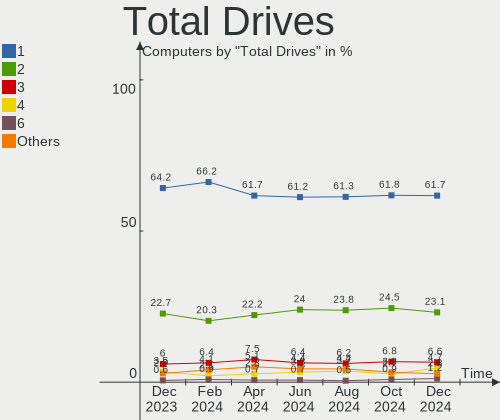
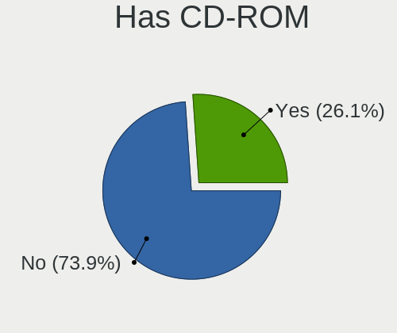
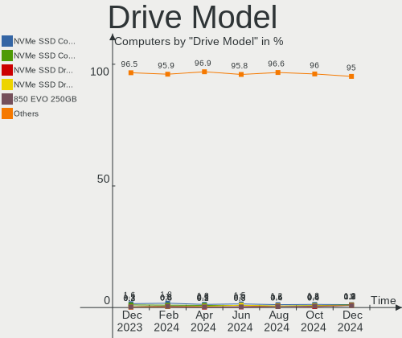
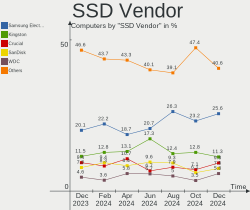
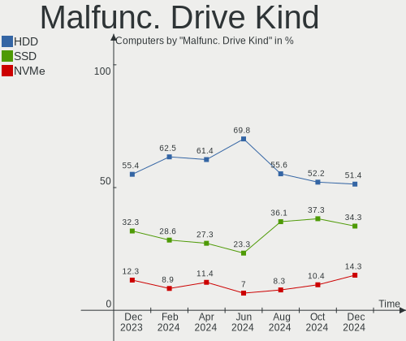
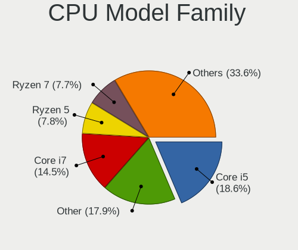
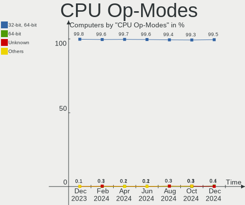
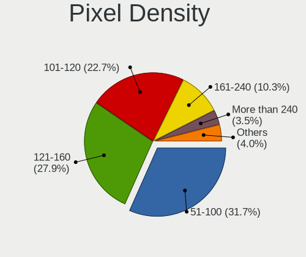
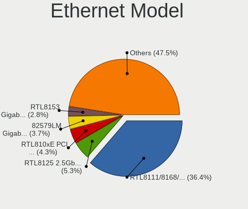
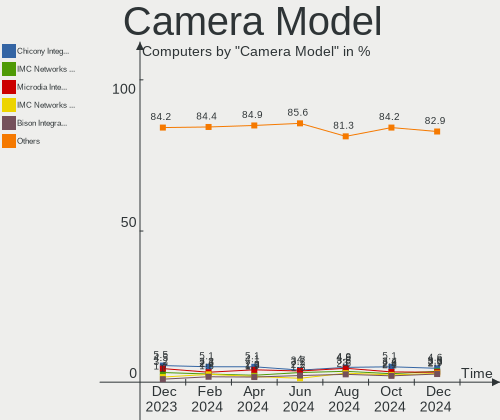

Ubuntu - Hardware Trends
------------------------

A project to identify most popular hardware characteristics and track their change
over time based on data collected by Linux users at https://Linux-Hardware.org.

Anyone can contribute to this report by the [hw-probe](https://github.com/linuxhw/hw-probe) tool:

    sudo -E hw-probe -all -upload

This is a report for all computer types. See also reports for [desktops](/Dist/Ubuntu/Desktop/README.md) and [notebooks](/Dist/Ubuntu/Notebook/README.md).

This report is for one last month. Overall report since the beginning of time: [TestCoverage](https://github.com/linuxhw/TestCoverage)

Period: Oct, 2022.

Contents
--------

* [ System ](#system)
  - [ OS                       ](#os)
  - [ OS Family                ](#os-family)
  - [ Kernel                   ](#kernel)
  - [ Kernel Family            ](#kernel-family)
  - [ Kernel Major Ver.        ](#kernel-major-ver)
  - [ Arch                     ](#arch)
  - [ DE                       ](#de)
  - [ Display Server           ](#display-server)
  - [ Display Manager          ](#display-manager)
  - [ OS Lang                  ](#os-lang)
  - [ Boot Mode                ](#boot-mode)
  - [ Filesystem               ](#filesystem)
  - [ Part. scheme             ](#part-scheme)
  - [ Dual Boot with Linux/BSD ](#dual-boot-with-linuxbsd)
  - [ Dual Boot (Win)          ](#dual-boot-win)

* [ Board ](#board)
  - [ Vendor                   ](#vendor)
  - [ Model                    ](#model)
  - [ Model Family             ](#model-family)
  - [ MFG Year                 ](#mfg-year)
  - [ Form Factor              ](#form-factor)
  - [ Secure Boot              ](#secure-boot)
  - [ Coreboot                 ](#coreboot)
  - [ RAM Size                 ](#ram-size)
  - [ RAM Used                 ](#ram-used)
  - [ Total Drives             ](#total-drives)
  - [ Has CD-ROM               ](#has-cd-rom)
  - [ Has Ethernet             ](#has-ethernet)
  - [ Has WiFi                 ](#has-wifi)
  - [ Has Bluetooth            ](#has-bluetooth)

* [ Location ](#location)
  - [ Country                  ](#country)
  - [ City                     ](#city)

* [ Drives ](#drives)
  - [ Drive Vendor             ](#drive-vendor)
  - [ Drive Model              ](#drive-model)
  - [ HDD Vendor               ](#hdd-vendor)
  - [ SSD Vendor               ](#ssd-vendor)
  - [ Drive Kind               ](#drive-kind)
  - [ Drive Connector          ](#drive-connector)
  - [ Drive Size               ](#drive-size)
  - [ Space Total              ](#space-total)
  - [ Space Used               ](#space-used)
  - [ Malfunc. Drives          ](#malfunc-drives)
  - [ Malfunc. Drive Vendor    ](#malfunc-drive-vendor)
  - [ Malfunc. HDD Vendor      ](#malfunc-hdd-vendor)
  - [ Malfunc. Drive Kind      ](#malfunc-drive-kind)
  - [ Failed Drives            ](#failed-drives)
  - [ Failed Drive Vendor      ](#failed-drive-vendor)
  - [ Drive Status             ](#drive-status)

* [ Storage controller ](#storage-controller)
  - [ Storage Vendor           ](#storage-vendor)
  - [ Storage Model            ](#storage-model)
  - [ Storage Kind             ](#storage-kind)

* [ Processor ](#processor)
  - [ CPU Vendor               ](#cpu-vendor)
  - [ CPU Model                ](#cpu-model)
  - [ CPU Model Family         ](#cpu-model-family)
  - [ CPU Cores                ](#cpu-cores)
  - [ CPU Sockets              ](#cpu-sockets)
  - [ CPU Threads              ](#cpu-threads)
  - [ CPU Op-Modes             ](#cpu-op-modes)
  - [ CPU Microcode            ](#cpu-microcode)
  - [ CPU Microarch            ](#cpu-microarch)

* [ Graphics ](#graphics)
  - [ GPU Vendor               ](#gpu-vendor)
  - [ GPU Model                ](#gpu-model)
  - [ GPU Combo                ](#gpu-combo)
  - [ GPU Driver               ](#gpu-driver)
  - [ GPU Memory               ](#gpu-memory)

* [ Monitor ](#monitor)
  - [ Monitor Vendor           ](#monitor-vendor)
  - [ Monitor Model            ](#monitor-model)
  - [ Monitor Resolution       ](#monitor-resolution)
  - [ Monitor Diagonal         ](#monitor-diagonal)
  - [ Monitor Width            ](#monitor-width)
  - [ Aspect Ratio             ](#aspect-ratio)
  - [ Monitor Area             ](#monitor-area)
  - [ Pixel Density            ](#pixel-density)
  - [ Multiple Monitors        ](#multiple-monitors)

* [ Network ](#network)
  - [ Net Controller Vendor    ](#net-controller-vendor)
  - [ Net Controller Model     ](#net-controller-model)
  - [ Wireless Vendor          ](#wireless-vendor)
  - [ Wireless Model           ](#wireless-model)
  - [ Ethernet Vendor          ](#ethernet-vendor)
  - [ Ethernet Model           ](#ethernet-model)
  - [ Net Controller Kind      ](#net-controller-kind)
  - [ Used Controller          ](#used-controller)
  - [ NICs                     ](#nics)
  - [ IPv6                     ](#ipv6)

* [ Bluetooth ](#bluetooth)
  - [ Bluetooth Vendor         ](#bluetooth-vendor)
  - [ Bluetooth Model          ](#bluetooth-model)

* [ Sound ](#sound)
  - [ Sound Vendor             ](#sound-vendor)
  - [ Sound Model              ](#sound-model)

* [ Memory ](#memory)
  - [ Memory Vendor            ](#memory-vendor)
  - [ Memory Model             ](#memory-model)
  - [ Memory Kind              ](#memory-kind)
  - [ Memory Form Factor       ](#memory-form-factor)
  - [ Memory Size              ](#memory-size)
  - [ Memory Speed             ](#memory-speed)

* [ Printers & scanners ](#printers--scanners)
  - [ Printer Vendor           ](#printer-vendor)
  - [ Printer Model            ](#printer-model)
  - [ Scanner Vendor           ](#scanner-vendor)
  - [ Scanner Model            ](#scanner-model)

* [ Camera ](#camera)
  - [ Camera Vendor            ](#camera-vendor)
  - [ Camera Model             ](#camera-model)

* [ Security ](#security)
  - [ Fingerprint Vendor       ](#fingerprint-vendor)
  - [ Fingerprint Model        ](#fingerprint-model)
  - [ Chipcard Vendor          ](#chipcard-vendor)
  - [ Chipcard Model           ](#chipcard-model)

* [ Unsupported ](#unsupported)
  - [ Unsupported Devices      ](#unsupported-devices)
  - [ Unsupported Device Types ](#unsupported-device-types)

System
------

OS
--

Installed operating systems

| Name           | Computers | Percent |
|----------------|-----------|---------|
| Ubuntu 22.04   | 918       | 71.55%  |
| Ubuntu 20.04   | 198       | 15.43%  |
| Ubuntu 22.10   | 115       | 8.96%   |
| Ubuntu 18.04   | 40        | 3.12%   |
| Ubuntu 21.10   | 5         | 0.39%   |
| Ubuntu Core 18 | 2         | 0.16%   |
| Ubuntu Core 22 | 1         | 0.08%   |
| Ubuntu 21.04   | 1         | 0.08%   |
| Ubuntu 20.10   | 1         | 0.08%   |
| Ubuntu 19.04   | 1         | 0.08%   |
| Ubuntu 16.04   | 1         | 0.08%   |

OS Family
---------

OS without a version

| Name   | Computers | Percent |
|--------|-----------|---------|
| Ubuntu | 1283      | 100%    |

Kernel
------

Version of the Linux kernel

| Version               | Computers | Percent |
|-----------------------|-----------|---------|
| 5.15.0-52-generic     | 349       | 27.2%   |
| 5.15.0-48-generic     | 298       | 23.23%  |
| 5.15.0-50-generic     | 262       | 20.42%  |
| 5.19.0-23-generic     | 58        | 4.52%   |
| 5.15.0-43-generic     | 41        | 3.2%    |
| 5.19.0-21-generic     | 29        | 2.26%   |
| 5.4.0-126-generic     | 18        | 1.4%    |
| 5.15.0-46-generic     | 15        | 1.17%   |
| 5.4.0-128-generic     | 14        | 1.09%   |
| 5.15.0-25-generic     | 13        | 1.01%   |
| 5.4.0-131-generic     | 12        | 0.94%   |
| 5.15.0-47-generic     | 11        | 0.86%   |
| 6.0.0-060000-generic  | 9         | 0.7%    |
| 5.19.0-15-generic     | 9         | 0.7%    |
| 5.15.0-41-generic     | 8         | 0.62%   |
| 5.15.0-53-generic     | 6         | 0.47%   |
| 4.15.0-193-generic    | 6         | 0.47%   |
| 5.14.0-1054-oem       | 5         | 0.39%   |
| 5.13.0-39-generic     | 4         | 0.31%   |
| 4.15.0-194-generic    | 4         | 0.31%   |
| 6.0.3-060003-generic  | 3         | 0.23%   |
| 6.0.1-060001-generic  | 3         | 0.23%   |
| 5.17.1-t2             | 3         | 0.23%   |
| 5.13.0-40-generic     | 3         | 0.23%   |
| 5.13.0-30-generic     | 3         | 0.23%   |
| 6.0.5-060005-generic  | 2         | 0.16%   |
| 6.0.0                 | 2         | 0.16%   |
| 5.4.0-90-generic      | 2         | 0.16%   |
| 5.4.0-42-generic      | 2         | 0.16%   |
| 5.19.0-051900-generic | 2         | 0.16%   |
| 5.18.0-051800-generic | 2         | 0.16%   |
| 5.17.0-1020-oem       | 2         | 0.16%   |
| 5.15.0-50-lowlatency  | 2         | 0.16%   |
| 5.15.0-10050-tuxedo   | 2         | 0.16%   |
| 5.14.0-1052-oem       | 2         | 0.16%   |
| 5.13.0-52-generic     | 2         | 0.16%   |
| 5.13.0-51-generic     | 2         | 0.16%   |
| 5.13.0-41-generic     | 2         | 0.16%   |
| 6.1.0-rc2-tkg-cfs-rt  | 1         | 0.08%   |
| 6.0.3-x64v2-xanmod1   | 1         | 0.08%   |

Kernel Family
-------------

Linux kernel without a distro release

| Version | Computers | Percent |
|---------|-----------|---------|
| 5.15.0  | 1017      | 79.27%  |
| 5.19.0  | 104       | 8.11%   |
| 5.4.0   | 57        | 4.44%   |
| 5.13.0  | 20        | 1.56%   |
| 4.15.0  | 14        | 1.09%   |
| 6.0.0   | 12        | 0.94%   |
| 5.14.0  | 10        | 0.78%   |
| 5.17.0  | 8         | 0.62%   |
| 5.11.0  | 6         | 0.47%   |
| 6.0.3   | 5         | 0.39%   |
| 6.0.1   | 3         | 0.23%   |
| 5.18.0  | 3         | 0.23%   |
| 5.17.1  | 3         | 0.23%   |
| 6.0.5   | 2         | 0.16%   |
| 5.15.74 | 2         | 0.16%   |
| 6.1.0   | 1         | 0.08%   |
| 6.0     | 1         | 0.08%   |
| 5.8.0   | 1         | 0.08%   |
| 5.4.219 | 1         | 0.08%   |
| 5.4.209 | 1         | 0.08%   |
| 5.19.5  | 1         | 0.08%   |
| 5.19.13 | 1         | 0.08%   |
| 5.18.8  | 1         | 0.08%   |
| 5.16.0  | 1         | 0.08%   |
| 5.15.73 | 1         | 0.08%   |
| 5.15.60 | 1         | 0.08%   |
| 5.15.46 | 1         | 0.08%   |
| 5.15.13 | 1         | 0.08%   |
| 5.10.60 | 1         | 0.08%   |
| 5.0.0   | 1         | 0.08%   |
| 4.9.0   | 1         | 0.08%   |
| 4.4.0   | 1         | 0.08%   |

Kernel Major Ver.
-----------------

Linux kernel major version

| Version | Computers | Percent |
|---------|-----------|---------|
| 5.15    | 1023      | 79.73%  |
| 5.19    | 106       | 8.26%   |
| 5.4     | 59        | 4.6%    |
| 6.0     | 22        | 1.71%   |
| 5.13    | 20        | 1.56%   |
| 4.15    | 14        | 1.09%   |
| 5.17    | 11        | 0.86%   |
| 5.14    | 10        | 0.78%   |
| 5.11    | 6         | 0.47%   |
| 5.18    | 4         | 0.31%   |
| 6.1     | 1         | 0.08%   |
| 6       | 1         | 0.08%   |
| 5.8     | 1         | 0.08%   |
| 5.16    | 1         | 0.08%   |
| 5.10    | 1         | 0.08%   |
| 5.0     | 1         | 0.08%   |
| 4.9     | 1         | 0.08%   |
| 4.4     | 1         | 0.08%   |

Arch
----

OS architecture (x86_64, i586, etc.)

| Name    | Computers | Percent |
|---------|-----------|---------|
| x86_64  | 1272      | 99.14%  |
| aarch64 | 6         | 0.47%   |
| i686    | 3         | 0.23%   |
| armv7l  | 2         | 0.16%   |

DE
--

Desktop Environment

| Name            | Computers | Percent |
|-----------------|-----------|---------|
| GNOME           | 1179      | 91.89%  |
| Unknown         | 67        | 5.22%   |
| GNOME Flashback | 14        | 1.09%   |
| X-Cinnamon      | 11        | 0.86%   |
| i3              | 3         | 0.23%   |
| Enlightenment   | 3         | 0.23%   |
| awesome         | 3         | 0.23%   |
| openbox         | 1         | 0.08%   |
| DWM             | 1         | 0.08%   |
| Cinnamon        | 1         | 0.08%   |

Display Server
--------------

X11 or Wayland

| Name    | Computers | Percent |
|---------|-----------|---------|
| Wayland | 670       | 52.22%  |
| X11     | 547       | 42.63%  |
| Tty     | 35        | 2.73%   |
| Unknown | 30        | 2.34%   |
| Web     | 1         | 0.08%   |

Display Manager
---------------

SDDM, LightDM, etc.

| Name    | Computers | Percent |
|---------|-----------|---------|
| GDM3    | 1053      | 82.07%  |
| Unknown | 108       | 8.42%   |
| GDM     | 80        | 6.24%   |
| LightDM | 37        | 2.88%   |
| SDDM    | 3         | 0.23%   |
| SLiM    | 1         | 0.08%   |
| LXDM    | 1         | 0.08%   |

OS Lang
-------

Language

| Lang    | Computers | Percent |
|---------|-----------|---------|
| en_US   | 544       | 42.4%   |
| de_DE   | 126       | 9.82%   |
| fr_FR   | 85        | 6.63%   |
| it_IT   | 84        | 6.55%   |
| en_GB   | 60        | 4.68%   |
| ru_RU   | 40        | 3.12%   |
| es_ES   | 33        | 2.57%   |
| en_IN   | 32        | 2.49%   |
| pt_BR   | 30        | 2.34%   |
| en_CA   | 26        | 2.03%   |
| pl_PL   | 24        | 1.87%   |
| en_AU   | 16        | 1.25%   |
| nl_NL   | 14        | 1.09%   |
| zh_CN   | 10        | 0.78%   |
| es_AR   | 10        | 0.78%   |
| en_ZA   | 10        | 0.78%   |
| tr_TR   | 9         | 0.7%    |
| C       | 9         | 0.7%    |
| hu_HU   | 8         | 0.62%   |
| es_MX   | 8         | 0.62%   |
| Unknown | 8         | 0.62%   |
| es_CO   | 6         | 0.47%   |
| de_AT   | 6         | 0.47%   |
| cs_CZ   | 6         | 0.47%   |
| sv_SE   | 5         | 0.39%   |
| fr_BE   | 5         | 0.39%   |
| pt_PT   | 4         | 0.31%   |
| ja_JP   | 4         | 0.31%   |
| en_PH   | 4         | 0.31%   |
| en_NZ   | 4         | 0.31%   |
| el_GR   | 4         | 0.31%   |
| nl_BE   | 3         | 0.23%   |
| nb_NO   | 3         | 0.23%   |
| ko_KR   | 3         | 0.23%   |
| fr_CA   | 3         | 0.23%   |
| sr_RS   | 2         | 0.16%   |
| sk_SK   | 2         | 0.16%   |
| fr_CH   | 2         | 0.16%   |
| fi_FI   | 2         | 0.16%   |
| es_PE   | 2         | 0.16%   |

Boot Mode
---------

EFI or BIOS

| Mode | Computers | Percent |
|------|-----------|---------|
| BIOS | 773       | 60.25%  |
| EFI  | 510       | 39.75%  |

Filesystem
----------

Type of filesystem

| Type          | Computers | Percent |
|---------------|-----------|---------|
| Ext4          | 1201      | 93.61%  |
| Overlay       | 39        | 3.04%   |
| Zfs           | 23        | 1.79%   |
| Btrfs         | 12        | 0.94%   |
| Xfs           | 4         | 0.31%   |
| XXXX          | 1         | 0.08%   |
| XXX4          | 1         | 0.08%   |
| Fuse.snapfuse | 1         | 0.08%   |
| Ext2          | 1         | 0.08%   |

Part. scheme
------------

Scheme of partitioning

| Type    | Computers | Percent |
|---------|-----------|---------|
| GPT     | 1001      | 78.02%  |
| MBR     | 191       | 14.89%  |
| Unknown | 91        | 7.09%   |

Dual Boot with Linux/BSD
------------------------

Hosting more than one Linux/BSD

| Dual boot | Computers | Percent |
|-----------|-----------|---------|
| No        | 1147      | 89.4%   |
| Yes       | 136       | 10.6%   |

Dual Boot (Win)
---------------

Hosting Linux and Windows

| Dual boot | Computers | Percent |
|-----------|-----------|---------|
| No        | 799       | 62.28%  |
| Yes       | 484       | 37.72%  |

Board
-----

Vendor
------

Motherboard manufacturer

| Name                     | Computers | Percent |
|--------------------------|-----------|---------|
| Hewlett-Packard          | 201       | 15.67%  |
| Dell                     | 197       | 15.35%  |
| Lenovo                   | 183       | 14.26%  |
| ASUSTek Computer         | 180       | 14.03%  |
| MSI                      | 83        | 6.47%   |
| Gigabyte Technology      | 63        | 4.91%   |
| Acer                     | 61        | 4.75%   |
| ASRock                   | 33        | 2.57%   |
| Apple                    | 26        | 2.03%   |
| HUAWEI                   | 24        | 1.87%   |
| Intel                    | 22        | 1.71%   |
| Toshiba                  | 17        | 1.33%   |
| Samsung Electronics      | 14        | 1.09%   |
| Unknown                  | 14        | 1.09%   |
| Medion                   | 9         | 0.7%    |
| Sony                     | 8         | 0.62%   |
| Microsoft                | 8         | 0.62%   |
| Fujitsu                  | 8         | 0.62%   |
| Notebook                 | 7         | 0.55%   |
| Alienware                | 7         | 0.55%   |
| Supermicro               | 6         | 0.47%   |
| Packard Bell             | 6         | 0.47%   |
| Raspberry Pi Foundation  | 5         | 0.39%   |
| LG Electronics           | 5         | 0.39%   |
| AZW                      | 5         | 0.39%   |
| TUXEDO                   | 4         | 0.31%   |
| Google                   | 4         | 0.31%   |
| Biostar                  | 4         | 0.31%   |
| Pegatron                 | 3         | 0.23%   |
| GEO                      | 3         | 0.23%   |
| Tactus                   | 2         | 0.16%   |
| Positivo                 | 2         | 0.16%   |
| PC Specialist            | 2         | 0.16%   |
| Oracle                   | 2         | 0.16%   |
| OEM                      | 2         | 0.16%   |
| Monster                  | 2         | 0.16%   |
| K.A.Technologies Limited | 2         | 0.16%   |
| Foxconn                  | 2         | 0.16%   |
| eMachines                | 2         | 0.16%   |
| ECS                      | 2         | 0.16%   |

Model
-----

Motherboard model

| Name                               | Computers | Percent |
|------------------------------------|-----------|---------|
| Unknown                            | 17        | 1.33%   |
| ASUS All Series                    | 9         | 0.7%    |
| Dell OptiPlex 7010                 | 6         | 0.47%   |
| MSI MS-7C91                        | 4         | 0.31%   |
| Microsoft Surface Pro 3            | 4         | 0.31%   |
| HP Pavilion Notebook               | 4         | 0.31%   |
| HP Pavilion dv7                    | 4         | 0.31%   |
| Dell OptiPlex 9020                 | 4         | 0.31%   |
| Dell Latitude E6510                | 4         | 0.31%   |
| Dell Latitude 7480                 | 4         | 0.31%   |
| ASUS ROG STRIX B450-F GAMING       | 4         | 0.31%   |
| Supermicro Super Server            | 3         | 0.23%   |
| RPi Raspberry Pi 4 Model B Rev 1.4 | 3         | 0.23%   |
| MSI MS-7B86                        | 3         | 0.23%   |
| Lenovo Z50-75 80EC                 | 3         | 0.23%   |
| Lenovo ThinkPad SL500 27463ZG      | 3         | 0.23%   |
| HUAWEI BOM-WXX9                    | 3         | 0.23%   |
| HUAWEI BOHK-WAX9X                  | 3         | 0.23%   |
| HP Pavilion dv6                    | 3         | 0.23%   |
| HP EliteBook 8470p                 | 3         | 0.23%   |
| HP Compaq 8200 Elite SFF PC        | 3         | 0.23%   |
| HP 250 G5 Notebook PC              | 3         | 0.23%   |
| Dell XPS 15 9500                   | 3         | 0.23%   |
| Dell XPS 13 9305                   | 3         | 0.23%   |
| Dell Precision M4800               | 3         | 0.23%   |
| Dell OptiPlex 790                  | 3         | 0.23%   |
| Dell OptiPlex 3020                 | 3         | 0.23%   |
| Dell Latitude E6440                | 3         | 0.23%   |
| Dell Latitude 7300                 | 3         | 0.23%   |
| Dell Latitude 5520                 | 3         | 0.23%   |
| Dell Latitude 5420                 | 3         | 0.23%   |
| ASUS TUF Gaming B550M-PLUS         | 3         | 0.23%   |
| ASUS N750JK                        | 3         | 0.23%   |
| Apple MacBookPro15,2               | 3         | 0.23%   |
| Acer Aspire E5-575G                | 3         | 0.23%   |
| Toshiba Satellite L300             | 2         | 0.16%   |
| Oracle SUN SERVER X4-2             | 2         | 0.16%   |
| MSI Stealth GS66 12UGS             | 2         | 0.16%   |
| MSI MS-7C79                        | 2         | 0.16%   |
| MSI MS-7C52                        | 2         | 0.16%   |

Model Family
------------

Motherboard model prefix

| Name                  | Computers | Percent |
|-----------------------|-----------|---------|
| Lenovo ThinkPad       | 89        | 6.94%   |
| Dell Latitude         | 60        | 4.68%   |
| Acer Aspire           | 41        | 3.2%    |
| Dell Inspiron         | 36        | 2.81%   |
| HP Pavilion           | 34        | 2.65%   |
| Dell OptiPlex         | 32        | 2.49%   |
| Lenovo IdeaPad        | 28        | 2.18%   |
| Dell Precision        | 26        | 2.03%   |
| HP EliteBook          | 25        | 1.95%   |
| Dell XPS              | 25        | 1.95%   |
| HP Compaq             | 24        | 1.87%   |
| HP Laptop             | 22        | 1.71%   |
| ASUS VivoBook         | 21        | 1.64%   |
| ASUS PRIME            | 21        | 1.64%   |
| Unknown               | 17        | 1.33%   |
| HP ENVY               | 16        | 1.25%   |
| HP ProBook            | 15        | 1.17%   |
| Toshiba Satellite     | 14        | 1.09%   |
| Lenovo ThinkCentre    | 14        | 1.09%   |
| ASUS ROG              | 14        | 1.09%   |
| ASUS TUF              | 13        | 1.01%   |
| Dell Vostro           | 10        | 0.78%   |
| Lenovo Legion         | 9         | 0.7%    |
| ASUS All              | 9         | 0.7%    |
| Microsoft Surface     | 8         | 0.62%   |
| Lenovo Yoga           | 7         | 0.55%   |
| ASUS ZenBook          | 6         | 0.47%   |
| Acer Swift            | 6         | 0.47%   |
| RPi Raspberry         | 5         | 0.39%   |
| MSI Stealth           | 5         | 0.39%   |
| Lenovo IdeaPadFlex    | 5         | 0.39%   |
| HP ZBook              | 5         | 0.39%   |
| HP OMEN               | 5         | 0.39%   |
| HP EliteDesk          | 5         | 0.39%   |
| Gigabyte X570         | 5         | 0.39%   |
| ASUS ASUS             | 5         | 0.39%   |
| Packard Bell EasyNote | 4         | 0.31%   |
| MSI MS-7C91           | 4         | 0.31%   |
| MSI Modern            | 4         | 0.31%   |
| Lenovo ThinkBook      | 4         | 0.31%   |

MFG Year
--------

Motherboard manufacture year

| Year    | Computers | Percent |
|---------|-----------|---------|
| 2021    | 164       | 12.78%  |
| 2020    | 155       | 12.08%  |
| 2018    | 110       | 8.57%   |
| 2019    | 105       | 8.18%   |
| 2013    | 90        | 7.01%   |
| 2011    | 83        | 6.47%   |
| 2022    | 81        | 6.31%   |
| 2012    | 80        | 6.24%   |
| 2014    | 74        | 5.77%   |
| 2017    | 68        | 5.3%    |
| 2015    | 60        | 4.68%   |
| 2010    | 57        | 4.44%   |
| 2016    | 56        | 4.36%   |
| 2008    | 36        | 2.81%   |
| 2009    | 32        | 2.49%   |
| 2007    | 16        | 1.25%   |
| Unknown | 9         | 0.7%    |
| 2006    | 5         | 0.39%   |
| 2005    | 1         | 0.08%   |
| 2004    | 1         | 0.08%   |

Form Factor
-----------

Physical design of the computer

| Name           | Computers | Percent |
|----------------|-----------|---------|
| Notebook       | 723       | 56.35%  |
| Desktop        | 441       | 34.37%  |
| Convertible    | 36        | 2.81%   |
| Mini pc        | 28        | 2.18%   |
| Tablet         | 17        | 1.33%   |
| Server         | 16        | 1.25%   |
| All in one     | 12        | 0.94%   |
| System on chip | 8         | 0.62%   |
| Other          | 2         | 0.16%   |

Secure Boot
-----------

Enabled or disabled

| State    | Computers | Percent |
|----------|-----------|---------|
| Disabled | 1163      | 90.65%  |
| Enabled  | 120       | 9.35%   |

Coreboot
--------

Have coreboot on board

| Used | Computers | Percent |
|------|-----------|---------|
| No   | 1276      | 99.45%  |
| Yes  | 7         | 0.55%   |

RAM Size
--------

Total RAM memory

| Size in GB      | Computers | Percent |
|-----------------|-----------|---------|
| 4.01-8.0        | 300       | 23.38%  |
| 16.01-24.0      | 298       | 23.23%  |
| 8.01-16.0       | 214       | 16.68%  |
| 3.01-4.0        | 199       | 15.51%  |
| 32.01-64.0      | 146       | 11.38%  |
| 64.01-256.0     | 46        | 3.59%   |
| 1.01-2.0        | 34        | 2.65%   |
| 24.01-32.0      | 30        | 2.34%   |
| 2.01-3.0        | 10        | 0.78%   |
| More than 256.0 | 3         | 0.23%   |
| 0.51-1.0        | 3         | 0.23%   |

RAM Used
--------

Used RAM memory

| Used GB    | Computers | Percent |
|------------|-----------|---------|
| 2.01-3.0   | 398       | 31.02%  |
| 1.01-2.0   | 376       | 29.31%  |
| 4.01-8.0   | 217       | 16.91%  |
| 3.01-4.0   | 185       | 14.42%  |
| 8.01-16.0  | 68        | 5.3%    |
| 0.51-1.0   | 22        | 1.71%   |
| 16.01-24.0 | 10        | 0.78%   |
| 0.01-0.5   | 4         | 0.31%   |
| 24.01-32.0 | 3         | 0.23%   |

Total Drives
------------

Number of drives on board

| Drives | Computers | Percent |
|--------|-----------|---------|
| 1      | 813       | 63.37%  |
| 2      | 299       | 23.3%   |
| 3      | 91        | 7.09%   |
| 4      | 32        | 2.49%   |
| 5      | 18        | 1.4%    |
| 6      | 14        | 1.09%   |
| 0      | 5         | 0.39%   |
| 9      | 3         | 0.23%   |
| 8      | 3         | 0.23%   |
| 7      | 2         | 0.16%   |
| 17     | 1         | 0.08%   |
| 15     | 1         | 0.08%   |
| 11     | 1         | 0.08%   |

Has CD-ROM
----------

Has CD-ROM on board

| Presented | Computers | Percent |
|-----------|-----------|---------|
| No        | 815       | 63.52%  |
| Yes       | 468       | 36.48%  |

Has Ethernet
------------

Has Ethernet on board

| Presented | Computers | Percent |
|-----------|-----------|---------|
| Yes       | 1055      | 82.23%  |
| No        | 228       | 17.77%  |

Has WiFi
--------

Has WiFi module

| Presented | Computers | Percent |
|-----------|-----------|---------|
| Yes       | 1000      | 77.94%  |
| No        | 283       | 22.06%  |

Has Bluetooth
-------------

Has Bluetooth module

| Presented | Computers | Percent |
|-----------|-----------|---------|
| Yes       | 825       | 64.3%   |
| No        | 458       | 35.7%   |

Location
--------

Country
-------

Geographic location (country)

| Country      | Computers | Percent |
|--------------|-----------|---------|
| USA          | 205       | 15.98%  |
| Germany      | 146       | 11.38%  |
| Italy        | 124       | 9.66%   |
| France       | 97        | 7.56%   |
| UK           | 49        | 3.82%   |
| Brazil       | 49        | 3.82%   |
| Russia       | 48        | 3.74%   |
| Spain        | 37        | 2.88%   |
| Netherlands  | 35        | 2.73%   |
| Poland       | 34        | 2.65%   |
| India        | 34        | 2.65%   |
| Canada       | 33        | 2.57%   |
| Belgium      | 19        | 1.48%   |
| Sweden       | 18        | 1.4%    |
| Turkey       | 16        | 1.25%   |
| Hungary      | 16        | 1.25%   |
| Austria      | 16        | 1.25%   |
| Argentina    | 16        | 1.25%   |
| China        | 15        | 1.17%   |
| Australia    | 15        | 1.17%   |
| Mexico       | 14        | 1.09%   |
| Switzerland  | 12        | 0.94%   |
| South Africa | 11        | 0.86%   |
| Czechia      | 11        | 0.86%   |
| Portugal     | 10        | 0.78%   |
| Colombia     | 10        | 0.78%   |
| Greece       | 9         | 0.7%    |
| Romania      | 8         | 0.62%   |
| Japan        | 8         | 0.62%   |
| Finland      | 8         | 0.62%   |
| Indonesia    | 7         | 0.55%   |
| Bulgaria     | 7         | 0.55%   |
| South Korea  | 6         | 0.47%   |
| Serbia       | 6         | 0.47%   |
| Norway       | 6         | 0.47%   |
| Philippines  | 5         | 0.39%   |
| Peru         | 5         | 0.39%   |
| New Zealand  | 5         | 0.39%   |
| Hong Kong    | 5         | 0.39%   |
| Ukraine      | 4         | 0.31%   |

City
----

Geographic location (city)

| City              | Computers | Percent |
|-------------------|-----------|---------|
| Milan             | 23        | 1.79%   |
| Berlin            | 16        | 1.25%   |
| Moscow            | 12        | 0.94%   |
| Warsaw            | 10        | 0.78%   |
| Budapest          | 10        | 0.78%   |
| Vienna            | 9         | 0.7%    |
| St Petersburg     | 9         | 0.7%    |
| Sao Paulo         | 9         | 0.7%    |
| Valenciennes      | 8         | 0.62%   |
| Prague            | 8         | 0.62%   |
| Paris             | 8         | 0.62%   |
| Bengaluru         | 8         | 0.62%   |
| Turin             | 7         | 0.55%   |
| Sydney            | 7         | 0.55%   |
| Madrid            | 7         | 0.55%   |
| Rio de Janeiro    | 6         | 0.47%   |
| Naples            | 6         | 0.47%   |
| Dallas            | 6         | 0.47%   |
| Calgary           | 6         | 0.47%   |
| Bogotá           | 6         | 0.47%   |
| Wroclaw           | 5         | 0.39%   |
| Rome              | 5         | 0.39%   |
| Mexico City       | 5         | 0.39%   |
| Melbourne         | 5         | 0.39%   |
| Los Angeles       | 5         | 0.39%   |
| Lima              | 5         | 0.39%   |
| Frankfurt am Main | 5         | 0.39%   |
| Dresden           | 5         | 0.39%   |
| Cape Town         | 5         | 0.39%   |
| Buenos Aires      | 5         | 0.39%   |
| Shenzhen          | 4         | 0.31%   |
| Padova            | 4         | 0.31%   |
| Oslo              | 4         | 0.31%   |
| Munich            | 4         | 0.31%   |
| London            | 4         | 0.31%   |
| Hamburg           | 4         | 0.31%   |
| Champs-sur-Marne  | 4         | 0.31%   |
| Belgrade          | 4         | 0.31%   |
| Barcelona         | 4         | 0.31%   |
| Athens            | 4         | 0.31%   |

Drives
------

Drive Vendor
------------

Hard drive vendors

| Vendor                      | Computers | Drives | Percent |
|-----------------------------|-----------|--------|---------|
| Samsung Electronics         | 288       | 334    | 15.84%  |
| WDC                         | 245       | 301    | 13.48%  |
| Seagate                     | 229       | 310    | 12.6%   |
| Sandisk                     | 113       | 118    | 6.22%   |
| Toshiba                     | 112       | 119    | 6.16%   |
| Kingston                    | 97        | 103    | 5.34%   |
| Unknown                     | 87        | 103    | 4.79%   |
| Crucial                     | 73        | 76     | 4.02%   |
| SK hynix                    | 59        | 60     | 3.25%   |
| Hitachi                     | 47        | 54     | 2.59%   |
| Intel                       | 41        | 49     | 2.26%   |
| Micron Technology           | 39        | 39     | 2.15%   |
| HGST                        | 28        | 29     | 1.54%   |
| Phison Electronics          | 25        | 31     | 1.38%   |
| A-DATA Technology           | 24        | 27     | 1.32%   |
| KIOXIA                      | 23        | 23     | 1.27%   |
| Intenso                     | 16        | 17     | 0.88%   |
| China                       | 15        | 15     | 0.83%   |
| Apple                       | 14        | 16     | 0.77%   |
| PNY                         | 11        | 11     | 0.61%   |
| Patriot                     | 10        | 10     | 0.55%   |
| Micron/Crucial Technology   | 10        | 10     | 0.55%   |
| Unknown                     | 10        | 10     | 0.55%   |
| Silicon Motion              | 9         | 9      | 0.5%    |
| Kingston Technology Company | 9         | 9      | 0.5%    |
| SPCC                        | 7         | 8      | 0.39%   |
| GOODRAM                     | 7         | 8      | 0.39%   |
| Fujitsu                     | 7         | 7      | 0.39%   |
| Phison                      | 6         | 8      | 0.33%   |
| OCZ                         | 6         | 6      | 0.33%   |
| LITEONIT                    | 6         | 6      | 0.33%   |
| XPG                         | 5         | 6      | 0.28%   |
| UMIS                        | 5         | 5      | 0.28%   |
| Transcend                   | 5         | 5      | 0.28%   |
| JMicron Technology          | 5         | 5      | 0.28%   |
| Gigabyte Technology         | 5         | 5      | 0.28%   |
| Union Memory                | 4         | 4      | 0.22%   |
| SSSTC                       | 4         | 4      | 0.22%   |
| Netac                       | 4         | 4      | 0.22%   |
| LITEON                      | 4         | 4      | 0.22%   |

Drive Model
-----------

Hard drive models

| Model                                                 | Computers | Percent |
|-------------------------------------------------------|-----------|---------|
| Samsung NVMe SSD Controller SM981/PM981/PM983 500GB   | 36        | 1.84%   |
| Kingston SA400S37240G 240GB SSD                       | 19        | 0.97%   |
| Unknown MMC Card  32GB                                | 18        | 0.92%   |
| Sandisk WD Blue SN550 NVMe SSD 1TB                    | 16        | 0.82%   |
| Samsung NVMe SSD Controller PM9A1/PM9A3/980PRO 250GB  | 15        | 0.77%   |
| Kingston SA400S37480G 480GB SSD                       | 15        | 0.77%   |
| Crucial CT500MX500SSD1 500GB                          | 15        | 0.77%   |
| Sandisk WD Black SN750 / PC SN730 NVMe SSD 1TB        | 13        | 0.66%   |
| Samsung SSD 850 EVO 250GB                             | 13        | 0.66%   |
| Unknown MMC Card  64GB                                | 12        | 0.61%   |
| Seagate ST1000DM010-2EP102 1TB                        | 12        | 0.61%   |
| Samsung SSD 860 EVO 500GB                             | 12        | 0.61%   |
| Toshiba MQ04ABF100 1TB                                | 11        | 0.56%   |
| Seagate ST1000LM035-1RK172 1TB                        | 11        | 0.56%   |
| Crucial CT240BX500SSD1 240GB                          | 11        | 0.56%   |
| Unknown SD/MMC/MS PRO 1TB                             | 10        | 0.51%   |
| Toshiba MQ01ABF050 500GB                              | 10        | 0.51%   |
| Seagate ST500DM002-1BD142 500GB                       | 10        | 0.51%   |
| Samsung SSD 980 1TB                                   | 10        | 0.51%   |
| Kingston SV300S37A120G 120GB SSD                      | 10        | 0.51%   |
| Unknown                                               | 10        | 0.51%   |
| Unknown MMC Card  128GB                               | 9         | 0.46%   |
| Seagate ST1000LM024 HN-M101MBB 1TB                    | 9         | 0.46%   |
| Phison PS5013 E13 NVMe Controller 256GB               | 9         | 0.46%   |
| Toshiba XG6 NVMe SSD Controller 512GB                 | 8         | 0.41%   |
| Samsung NVMe SSD Controller SM961/PM961/SM963 250GB   | 8         | 0.41%   |
| Phison E16 PCIe4 NVMe Controller 1TB                  | 8         | 0.41%   |
| WDC WDS240G2G0A-00JH30 240GB SSD                      | 7         | 0.36%   |
| Unknown MMC Card  16GB                                | 7         | 0.36%   |
| Silicon Motion SM2263EN/SM2263XT SSD Controller 256GB | 7         | 0.36%   |
| Seagate ST4000DM004-2CV104 4TB                        | 7         | 0.36%   |
| Seagate ST2000DM008-2FR102 2TB                        | 7         | 0.36%   |
| Samsung SSD 980 PRO 1TB                               | 7         | 0.36%   |
| Samsung SSD 860 EVO 250GB                             | 7         | 0.36%   |
| Samsung SSD 860 EVO 1TB                               | 7         | 0.36%   |
| Phison E12 NVMe Controller 2TB                        | 7         | 0.36%   |
| Micron/Crucial P2 NVMe PCIe SSD 500GB                 | 7         | 0.36%   |
| KIOXIA KBG40ZNV512G 512GB                             | 7         | 0.36%   |
| Kingston Company A2000 NVMe SSD 1TB                   | 7         | 0.36%   |
| Kingston SA400S37120G 120GB SSD                       | 7         | 0.36%   |

HDD Vendor
----------

Hard disk drive vendors

| Vendor              | Computers | Drives | Percent |
|---------------------|-----------|--------|---------|
| Seagate             | 225       | 302    | 36.17%  |
| WDC                 | 191       | 233    | 30.71%  |
| Toshiba             | 72        | 75     | 11.58%  |
| Hitachi             | 47        | 54     | 7.56%   |
| HGST                | 28        | 29     | 4.5%    |
| Samsung Electronics | 27        | 33     | 4.34%   |
| Unknown             | 11        | 11     | 1.77%   |
| Fujitsu             | 7         | 7      | 1.13%   |
| Apple               | 3         | 3      | 0.48%   |
| USB3.0              | 2         | 3      | 0.32%   |
| SABRENT             | 2         | 3      | 0.32%   |
| Maxtor              | 2         | 2      | 0.32%   |
| QUANTUM             | 1         | 1      | 0.16%   |
| Intenso             | 1         | 1      | 0.16%   |
| Inateck             | 1         | 1      | 0.16%   |
| HGST HTS            | 1         | 1      | 0.16%   |
| Hewlett-Packard     | 1         | 8      | 0.16%   |

SSD Vendor
----------

Solid state drive vendors

| Vendor              | Computers | Drives | Percent |
|---------------------|-----------|--------|---------|
| Samsung Electronics | 122       | 134    | 21.63%  |
| Kingston            | 77        | 82     | 13.65%  |
| Crucial             | 69        | 72     | 12.23%  |
| SanDisk             | 48        | 49     | 8.51%   |
| WDC                 | 33        | 40     | 5.85%   |
| SK hynix            | 16        | 16     | 2.84%   |
| China               | 15        | 15     | 2.66%   |
| A-DATA Technology   | 15        | 18     | 2.66%   |
| Micron Technology   | 13        | 13     | 2.3%    |
| PNY                 | 10        | 10     | 1.77%   |
| Patriot             | 10        | 10     | 1.77%   |
| Intel               | 10        | 10     | 1.77%   |
| Intenso             | 9         | 10     | 1.6%    |
| Toshiba             | 8         | 9      | 1.42%   |
| GOODRAM             | 7         | 8      | 1.24%   |
| SPCC                | 6         | 7      | 1.06%   |
| OCZ                 | 6         | 6      | 1.06%   |
| LITEONIT            | 6         | 6      | 1.06%   |
| Transcend           | 5         | 5      | 0.89%   |
| Apple               | 5         | 5      | 0.89%   |
| Netac               | 4         | 4      | 0.71%   |
| Corsair             | 4         | 4      | 0.71%   |
| Unknown             | 4         | 4      | 0.71%   |
| Lexar               | 3         | 4      | 0.53%   |
| KingSpec            | 3         | 3      | 0.53%   |
| Gigabyte Technology | 3         | 3      | 0.53%   |
| ASMT                | 3         | 3      | 0.53%   |
| Super Talent        | 2         | 2      | 0.35%   |
| StoreJet            | 2         | 2      | 0.35%   |
| LITEON              | 2         | 2      | 0.35%   |
| Hewlett-Packard     | 2         | 2      | 0.35%   |
| Emtec               | 2         | 2      | 0.35%   |
| AMD                 | 2         | 2      | 0.35%   |
| VICKTER             | 1         | 1      | 0.18%   |
| Verbatim            | 1         | 1      | 0.18%   |
| Unknown             | 1         | 1      | 0.18%   |
| UNIC2               | 1         | 1      | 0.18%   |
| TYPEC 1T            | 1         | 1      | 0.18%   |
| TwinMOS             | 1         | 1      | 0.18%   |
| tigo                | 1         | 1      | 0.18%   |

Drive Kind
----------

HDD or SSD

| Kind    | Computers | Drives | Percent |
|---------|-----------|--------|---------|
| HDD     | 528       | 767    | 31.58%  |
| NVMe    | 520       | 588    | 31.1%   |
| SSD     | 514       | 600    | 30.74%  |
| MMC     | 78        | 93     | 4.67%   |
| Unknown | 32        | 33     | 1.91%   |

Drive Connector
---------------

SATA, SAS, NVMe, etc.

| Type | Computers | Drives | Percent |
|------|-----------|--------|---------|
| SATA | 852       | 1303   | 55.83%  |
| NVMe | 517       | 582    | 33.88%  |
| SAS  | 79        | 103    | 5.18%   |
| MMC  | 78        | 93     | 5.11%   |

Drive Size
----------

Size of hard drive

| Size in TB | Computers | Drives | Percent |
|------------|-----------|--------|---------|
| 0.01-0.5   | 588       | 711    | 53.41%  |
| 0.51-1.0   | 346       | 412    | 31.43%  |
| 1.01-2.0   | 86        | 109    | 7.81%   |
| 3.01-4.0   | 35        | 44     | 3.18%   |
| 2.01-3.0   | 22        | 42     | 2%      |
| 4.01-10.0  | 17        | 33     | 1.54%   |
| 10.01-20.0 | 7         | 16     | 0.64%   |

Space Total
-----------

Amount of disk space available on the file system

| Size in GB     | Computers | Percent |
|----------------|-----------|---------|
| 101-250        | 353       | 27.51%  |
| 251-500        | 326       | 25.41%  |
| 501-1000       | 214       | 16.68%  |
| 51-100         | 86        | 6.7%    |
| 1001-2000      | 81        | 6.31%   |
| 1-20           | 67        | 5.22%   |
| More than 3000 | 54        | 4.21%   |
| 21-50          | 51        | 3.98%   |
| 2001-3000      | 40        | 3.12%   |
| Unknown        | 11        | 0.86%   |

Space Used
----------

Amount of used disk space

| Used GB        | Computers | Percent |
|----------------|-----------|---------|
| 1-20           | 438       | 34.14%  |
| 21-50          | 243       | 18.94%  |
| 101-250        | 186       | 14.5%   |
| 51-100         | 175       | 13.64%  |
| 251-500        | 106       | 8.26%   |
| 501-1000       | 59        | 4.6%    |
| 1001-2000      | 33        | 2.57%   |
| More than 3000 | 20        | 1.56%   |
| 2001-3000      | 12        | 0.94%   |
| Unknown        | 11        | 0.86%   |

Malfunc. Drives
---------------

Drive models with a malfunction

| Model                                 | Computers | Drives | Percent |
|---------------------------------------|-----------|--------|---------|
| SK hynix BC711 HFM512GD3JX013N 512GB  | 3         | 3      | 4.41%   |
| WDC WD40EFRX-68N32N0 4TB              | 2         | 2      | 2.94%   |
| Seagate ST2000DM001-1CH164 2TB        | 2         | 2      | 2.94%   |
| Seagate ST1000LM035-1RK172 1TB        | 2         | 2      | 2.94%   |
| Kingston SA400S37240G 240GB SSD       | 2         | 2      | 2.94%   |
| WDC WDS240G2G0A-00JH30 240GB SSD      | 1         | 1      | 1.47%   |
| WDC WD5000BEVT-60ZAT1 500GB           | 1         | 1      | 1.47%   |
| WDC WD40EFRX-68WT0N0 4TB              | 1         | 1      | 1.47%   |
| WDC WD3200AAJS-60Z0A0 320GB           | 1         | 1      | 1.47%   |
| WDC WD30EZRX-00MMMB0 3TB              | 1         | 2      | 1.47%   |
| WDC WD10EZEX-22MFCA0 1TB              | 1         | 1      | 1.47%   |
| WDC WD10EZEX-21WN4A0 1TB              | 1         | 1      | 1.47%   |
| WDC WD10EZEX-07M2NA1 1TB              | 1         | 1      | 1.47%   |
| WDC WD10EARX-00N0YB0 1TB              | 1         | 1      | 1.47%   |
| WDC WD10EADS-00M2B0 1TB               | 1         | 1      | 1.47%   |
| Toshiba MQ04ABF100 1TB                | 1         | 1      | 1.47%   |
| Toshiba MQ01ABF050 500GB              | 1         | 1      | 1.47%   |
| Toshiba MQ01ABD032 320GB              | 1         | 1      | 1.47%   |
| Toshiba DT01ACA100 1TB                | 1         | 1      | 1.47%   |
| Toshiba DT01ACA050 500GB              | 1         | 1      | 1.47%   |
| tecmiyo SATA SSD 256GB                | 1         | 1      | 1.47%   |
| SPCC M.2 PCIe SSD 1TB                 | 1         | 1      | 1.47%   |
| SK hynix HFS512G39TND-N210A 512GB SSD | 1         | 1      | 1.47%   |
| SK hynix HFS256G3AMNB-2200A 256GB SSD | 1         | 1      | 1.47%   |
| Seagate ST9640320AS 640GB             | 1         | 1      | 1.47%   |
| Seagate ST9500420AS 500GB             | 1         | 1      | 1.47%   |
| Seagate ST9320423AS 320GB             | 1         | 1      | 1.47%   |
| Seagate ST9250827AS 250GB             | 1         | 1      | 1.47%   |
| Seagate ST500LM021-1KJ152 500GB       | 1         | 1      | 1.47%   |
| Seagate ST500DM002-1BD142 500GB       | 1         | 1      | 1.47%   |
| Seagate ST3360320AS 360GB             | 1         | 1      | 1.47%   |
| Seagate ST3320620AS 320GB             | 1         | 1      | 1.47%   |
| Seagate ST31000528AS 1TB              | 1         | 1      | 1.47%   |
| Seagate ST3000DM001-1ER166 3TB        | 1         | 2      | 1.47%   |
| Seagate ST12000NM0007-2A1101 12TB     | 1         | 1      | 1.47%   |
| Seagate ST1000LM049-2GH172 1TB        | 1         | 1      | 1.47%   |
| Seagate ST1000LM048-2E7172 1TB        | 1         | 1      | 1.47%   |
| Seagate ST1000LM014-1EJ164 1TB        | 1         | 1      | 1.47%   |
| Seagate ST1000DX001-1CM162 1TB        | 1         | 1      | 1.47%   |
| Seagate ST1000DM003-1CH162 1TB        | 1         | 1      | 1.47%   |

Malfunc. Drive Vendor
---------------------

Vendors of faulty drives

| Vendor              | Computers | Drives | Percent |
|---------------------|-----------|--------|---------|
| Seagate             | 19        | 21     | 28.36%  |
| WDC                 | 12        | 13     | 17.91%  |
| Hitachi             | 6         | 6      | 8.96%   |
| Toshiba             | 5         | 5      | 7.46%   |
| SK hynix            | 5         | 5      | 7.46%   |
| Samsung Electronics | 4         | 4      | 5.97%   |
| Kingston            | 4         | 4      | 5.97%   |
| HGST                | 2         | 2      | 2.99%   |
| Crucial             | 2         | 2      | 2.99%   |
| tecmiyo             | 1         | 1      | 1.49%   |
| SPCC                | 1         | 1      | 1.49%   |
| Netac               | 1         | 1      | 1.49%   |
| Neo                 | 1         | 1      | 1.49%   |
| Intel               | 1         | 1      | 1.49%   |
| Fujitsu             | 1         | 1      | 1.49%   |
| Corsair             | 1         | 1      | 1.49%   |
| A-DATA Technology   | 1         | 1      | 1.49%   |

Malfunc. HDD Vendor
-------------------

Vendors of faulty HDD drives

| Vendor              | Computers | Drives | Percent |
|---------------------|-----------|--------|---------|
| Seagate             | 19        | 21     | 42.22%  |
| WDC                 | 11        | 12     | 24.44%  |
| Hitachi             | 6         | 6      | 13.33%  |
| Toshiba             | 5         | 5      | 11.11%  |
| HGST                | 2         | 2      | 4.44%   |
| Samsung Electronics | 1         | 1      | 2.22%   |
| Fujitsu             | 1         | 1      | 2.22%   |

Malfunc. Drive Kind
-------------------

Kinds of faulty drives

| Kind | Computers | Drives | Percent |
|------|-----------|--------|---------|
| HDD  | 44        | 48     | 66.67%  |
| SSD  | 17        | 17     | 25.76%  |
| NVMe | 5         | 5      | 7.58%   |

Failed Drives
-------------

Failed drive models

| Model                             | Computers | Drives | Percent |
|-----------------------------------|-----------|--------|---------|
| Samsung Electronics SSD 980 500GB | 1         | 1      | 50%     |
| Hewlett-Packard EF0450FARMV 450GB | 1         | 4      | 50%     |

Failed Drive Vendor
-------------------

Failed drive vendors

| Vendor              | Computers | Drives | Percent |
|---------------------|-----------|--------|---------|
| Samsung Electronics | 1         | 1      | 50%     |
| Hewlett-Packard     | 1         | 4      | 50%     |

Drive Status
------------

Number of failed and malfunc. drives

| Status   | Computers | Drives | Percent |
|----------|-----------|--------|---------|
| Detected | 841       | 1341   | 61.93%  |
| Works    | 451       | 665    | 33.21%  |
| Malfunc  | 64        | 70     | 4.71%   |
| Failed   | 2         | 5      | 0.15%   |

Storage controller
------------------

Storage Vendor
--------------

Storage controller vendors

| Vendor                               | Computers | Percent |
|--------------------------------------|-----------|---------|
| Intel                                | 829       | 50.06%  |
| AMD                                  | 214       | 12.92%  |
| Samsung Electronics                  | 156       | 9.42%   |
| SanDisk                              | 91        | 5.5%    |
| SK hynix                             | 43        | 2.6%    |
| Phison Electronics                   | 34        | 2.05%   |
| Toshiba America Info Systems         | 32        | 1.93%   |
| Kingston Technology Company          | 31        | 1.87%   |
| Micron Technology                    | 27        | 1.63%   |
| KIOXIA                               | 24        | 1.45%   |
| ASMedia Technology                   | 22        | 1.33%   |
| JMicron Technology                   | 19        | 1.15%   |
| Nvidia                               | 18        | 1.09%   |
| Marvell Technology Group             | 17        | 1.03%   |
| ADATA Technology                     | 16        | 0.97%   |
| Micron/Crucial Technology            | 13        | 0.79%   |
| Union Memory (Shenzhen)              | 9         | 0.54%   |
| Silicon Motion                       | 9         | 0.54%   |
| Solid State Storage Technology       | 6         | 0.36%   |
| Apple                                | 6         | 0.36%   |
| Realtek Semiconductor                | 5         | 0.3%    |
| LSI Logic / Symbios Logic            | 5         | 0.3%    |
| Silicon Image                        | 4         | 0.24%   |
| Lite-On Technology                   | 4         | 0.24%   |
| Broadcom / LSI                       | 4         | 0.24%   |
| Seagate Technology                   | 3         | 0.18%   |
| Hewlett-Packard                      | 2         | 0.12%   |
| Unknown                              | 2         | 0.12%   |
| Zhaoxin                              | 1         | 0.06%   |
| Yangtze Memory Technologies          | 1         | 0.06%   |
| VIA Technologies                     | 1         | 0.06%   |
| Tekram Technology                    | 1         | 0.06%   |
| Shenzhen Longsys Electronics         | 1         | 0.06%   |
| Ramaxel Technology(Shenzhen) Limited | 1         | 0.06%   |
| MAXIO Technology (Hangzhou)          | 1         | 0.06%   |
| Lenovo                               | 1         | 0.06%   |
| Biwin Storage Technology             | 1         | 0.06%   |
| Beijing Starblaze Technology         | 1         | 0.06%   |
| Adaptec                              | 1         | 0.06%   |

Storage Model
-------------

Storage controller models

| Model                                                                          | Computers | Percent |
|--------------------------------------------------------------------------------|-----------|---------|
| AMD FCH SATA Controller [AHCI mode]                                            | 141       | 7.63%   |
| Intel 8 Series/C220 Series Chipset Family 6-port SATA Controller 1 [AHCI mode] | 67        | 3.63%   |
| Samsung NVMe SSD Controller SM981/PM981/PM983                                  | 66        | 3.57%   |
| Intel Volume Management Device NVMe RAID Controller                            | 64        | 3.47%   |
| Intel Sunrise Point-LP SATA Controller [AHCI mode]                             | 58        | 3.14%   |
| Intel 82801 Mobile SATA Controller [RAID mode]                                 | 52        | 2.82%   |
| Intel 7 Series Chipset Family 6-port SATA Controller [AHCI mode]               | 45        | 2.44%   |
| Samsung NVMe SSD Controller 980                                                | 43        | 2.33%   |
| Samsung NVMe SSD Controller PM9A1/PM9A3/980PRO                                 | 31        | 1.68%   |
| Intel SATA Controller [RAID mode]                                              | 31        | 1.68%   |
| Intel Celeron/Pentium Silver Processor SATA Controller                         | 31        | 1.68%   |
| Intel 6 Series/C200 Series Chipset Family 6 port Desktop SATA AHCI Controller  | 31        | 1.68%   |
| AMD 400 Series Chipset SATA Controller                                         | 31        | 1.68%   |
| Intel 6 Series/C200 Series Chipset Family 6 port Mobile SATA AHCI Controller   | 28        | 1.52%   |
| Micron Non-Volatile memory controller                                          | 27        | 1.46%   |
| Intel 8 Series SATA Controller 1 [AHCI mode]                                   | 26        | 1.41%   |
| Intel 7 Series/C210 Series Chipset Family 6-port SATA Controller [AHCI mode]   | 26        | 1.41%   |
| Intel Q170/Q150/B150/H170/H110/Z170/CM236 Chipset SATA Controller [AHCI Mode]  | 25        | 1.35%   |
| SanDisk WD Blue SN550 NVMe SSD                                                 | 24        | 1.3%    |
| AMD 500 Series Chipset SATA Controller                                         | 23        | 1.25%   |
| KIOXIA NVMe SSD Controller BG4                                                 | 22        | 1.19%   |
| Intel 200 Series PCH SATA controller [AHCI mode]                               | 22        | 1.19%   |
| Intel Tiger Lake-LP SATA Controller                                            | 21        | 1.14%   |
| AMD SB7x0/SB8x0/SB9x0 IDE Controller                                           | 21        | 1.14%   |
| SanDisk WD Black SN750 / PC SN730 NVMe SSD                                     | 20        | 1.08%   |
| Intel Wildcat Point-LP SATA Controller [AHCI Mode]                             | 20        | 1.08%   |
| Intel Comet Lake SATA AHCI Controller                                          | 20        | 1.08%   |
| ASMedia ASM1062 Serial ATA Controller                                          | 20        | 1.08%   |
| SK hynix Gold P31 SSD                                                          | 19        | 1.03%   |
| Intel Cannon Lake Mobile PCH SATA AHCI Controller                              | 18        | 0.97%   |
| Intel 82801IBM/IEM (ICH9M/ICH9M-E) 4 port SATA Controller [AHCI mode]          | 18        | 0.97%   |
| Intel 500 Series Chipset Family SATA AHCI Controller                           | 18        | 0.97%   |
| Intel 5 Series/3400 Series Chipset 6 port SATA AHCI Controller                 | 18        | 0.97%   |
| AMD SB7x0/SB8x0/SB9x0 SATA Controller [AHCI mode]                              | 17        | 0.92%   |
| Kingston Company Company Non-Volatile memory controller                        | 16        | 0.87%   |
| AMD SB7x0/SB8x0/SB9x0 SATA Controller [IDE mode]                               | 16        | 0.87%   |
| SK hynix Non-Volatile memory controller                                        | 15        | 0.81%   |
| SanDisk Non-Volatile memory controller                                         | 15        | 0.81%   |
| Intel 5 Series/3400 Series Chipset 4 port SATA AHCI Controller                 | 15        | 0.81%   |
| Intel Non-Volatile memory controller                                           | 14        | 0.76%   |

Storage Kind
------------

Kind of storage controller (IDE, SATA, NVMe, SAS, ...)

| Kind | Computers | Percent |
|------|-----------|---------|
| SATA | 870       | 52.13%  |
| NVMe | 518       | 31.04%  |
| RAID | 162       | 9.71%   |
| IDE  | 111       | 6.65%   |
| SAS  | 7         | 0.42%   |
| SCSI | 1         | 0.06%   |

Processor
---------

CPU Vendor
----------

Processor vendors

| Vendor       | Computers | Percent |
|--------------|-----------|---------|
| Intel        | 988       | 77.01%  |
| AMD          | 286       | 22.29%  |
| ARM          | 8         | 0.62%   |
| CentaurHauls | 1         | 0.08%   |

CPU Model
---------

Processor models

| Model                                         | Computers | Percent |
|-----------------------------------------------|-----------|---------|
| Intel 11th Gen Core i5-1135G7 @ 2.40GHz       | 26        | 2.03%   |
| Intel 11th Gen Core i7-1165G7 @ 2.80GHz       | 22        | 1.71%   |
| Intel Core i7-8550U CPU @ 1.80GHz             | 15        | 1.17%   |
| Intel Core i5-10210U CPU @ 1.60GHz            | 13        | 1.01%   |
| Intel Celeron N4020 CPU @ 1.10GHz             | 13        | 1.01%   |
| Intel Core i7-8565U CPU @ 1.80GHz             | 12        | 0.94%   |
| Intel Core i5-8265U CPU @ 1.60GHz             | 12        | 0.94%   |
| Intel Core i7-3770 CPU @ 3.40GHz              | 11        | 0.86%   |
| Intel 12th Gen Core i7-12700H                 | 11        | 0.86%   |
| AMD Ryzen 7 5700U with Radeon Graphics        | 11        | 0.86%   |
| Intel Core i5-8250U CPU @ 1.60GHz             | 10        | 0.78%   |
| Intel 11th Gen Core i7-11800H @ 2.30GHz       | 10        | 0.78%   |
| AMD Ryzen 7 5800H with Radeon Graphics        | 9         | 0.7%    |
| AMD Ryzen 5 5600X 6-Core Processor            | 9         | 0.7%    |
| AMD Ryzen 5 5500U with Radeon Graphics        | 9         | 0.7%    |
| AMD Ryzen 5 3600 6-Core Processor             | 9         | 0.7%    |
| Intel Core i7-2600 CPU @ 3.40GHz              | 8         | 0.62%   |
| Intel Core i5-7200U CPU @ 2.50GHz             | 8         | 0.62%   |
| Intel Core i5-3470 CPU @ 3.20GHz              | 8         | 0.62%   |
| Intel Core i5-3210M CPU @ 2.50GHz             | 8         | 0.62%   |
| Intel 11th Gen Core i7-1185G7 @ 3.00GHz       | 8         | 0.62%   |
| Intel 11th Gen Core i3-1115G4 @ 3.00GHz       | 8         | 0.62%   |
| AMD Ryzen 7 4800H with Radeon Graphics        | 8         | 0.62%   |
| AMD Ryzen 5 3500U with Radeon Vega Mobile Gfx | 8         | 0.62%   |
| Intel Core i7-10510U CPU @ 1.80GHz            | 7         | 0.55%   |
| Intel Core i7 CPU M 620 @ 2.67GHz             | 7         | 0.55%   |
| Intel Core i5-6300U CPU @ 2.40GHz             | 7         | 0.55%   |
| Intel Core i5-2400 CPU @ 3.10GHz              | 7         | 0.55%   |
| Intel Celeron N4000 CPU @ 1.10GHz             | 7         | 0.55%   |
| Intel 12th Gen Core i7-1260P                  | 7         | 0.55%   |
| Intel Core i7-8750H CPU @ 2.20GHz             | 6         | 0.47%   |
| Intel Core i7-8665U CPU @ 1.90GHz             | 6         | 0.47%   |
| Intel Core i7-7700HQ CPU @ 2.80GHz            | 6         | 0.47%   |
| Intel Core i5-6200U CPU @ 2.30GHz             | 6         | 0.47%   |
| Intel Core i5-2410M CPU @ 2.30GHz             | 6         | 0.47%   |
| Intel Core i5 CPU 650 @ 3.20GHz               | 6         | 0.47%   |
| Intel Core 2 Duo CPU E7500 @ 2.93GHz          | 6         | 0.47%   |
| Intel Celeron CPU N3060 @ 1.60GHz             | 6         | 0.47%   |
| Intel Atom x5-Z8350 CPU @ 1.44GHz             | 6         | 0.47%   |
| ARM Processor                                 | 6         | 0.47%   |

CPU Model Family
----------------

Processor model prefix

| Model                   | Computers | Percent |
|-------------------------|-----------|---------|
| Intel Core i5           | 260       | 20.27%  |
| Intel Core i7           | 257       | 20.03%  |
| Other                   | 160       | 12.47%  |
| Intel Core i3           | 96        | 7.48%   |
| AMD Ryzen 5             | 74        | 5.77%   |
| Intel Celeron           | 65        | 5.07%   |
| AMD Ryzen 7             | 63        | 4.91%   |
| Intel Core 2 Duo        | 39        | 3.04%   |
| Intel Xeon              | 35        | 2.73%   |
| AMD Ryzen 9             | 19        | 1.48%   |
| AMD FX                  | 19        | 1.48%   |
| Intel Atom              | 17        | 1.33%   |
| AMD Ryzen 3             | 15        | 1.17%   |
| Intel Pentium Dual-Core | 14        | 1.09%   |
| Intel Pentium           | 14        | 1.09%   |
| AMD A8                  | 14        | 1.09%   |
| Intel Core i9           | 12        | 0.94%   |
| AMD A10                 | 9         | 0.7%    |
| AMD Phenom II X4        | 7         | 0.55%   |
| AMD A6                  | 7         | 0.55%   |
| AMD A4                  | 6         | 0.47%   |
| Intel Pentium Silver    | 5         | 0.39%   |
| Intel Core 2            | 5         | 0.39%   |
| AMD Ryzen 7 PRO         | 5         | 0.39%   |
| AMD E1                  | 5         | 0.39%   |
| Intel Core 2 Quad       | 4         | 0.31%   |
| Intel Xeon Silver       | 3         | 0.23%   |
| Intel Pentium Dual      | 3         | 0.23%   |
| AMD Turion 64 X2 Mobile | 3         | 0.23%   |
| AMD Ryzen Threadripper  | 3         | 0.23%   |
| AMD E2                  | 3         | 0.23%   |
| AMD Athlon II X2        | 3         | 0.23%   |
| AMD Athlon 64 X2        | 3         | 0.23%   |
| AMD Athlon              | 3         | 0.23%   |
| Intel Genuine           | 2         | 0.16%   |
| Intel Core m3           | 2         | 0.16%   |
| AMD Sempron             | 2         | 0.16%   |
| AMD Ryzen 5 PRO         | 2         | 0.16%   |
| AMD Opteron             | 2         | 0.16%   |
| AMD E                   | 2         | 0.16%   |

CPU Cores
---------

Number of processor cores

| Number  | Computers | Percent |
|---------|-----------|---------|
| 4       | 491       | 38.27%  |
| 2       | 451       | 35.15%  |
| 8       | 120       | 9.35%   |
| 6       | 114       | 8.89%   |
| 12      | 24        | 1.87%   |
| 16      | 18        | 1.4%    |
| 14      | 17        | 1.33%   |
| 10      | 13        | 1.01%   |
| 3       | 13        | 1.01%   |
| 1       | 10        | 0.78%   |
| 20      | 4         | 0.31%   |
| Unknown | 4         | 0.31%   |
| 104     | 1         | 0.08%   |
| 32      | 1         | 0.08%   |
| 24      | 1         | 0.08%   |
| 18      | 1         | 0.08%   |

CPU Sockets
-----------

Number of sockets

| Number  | Computers | Percent |
|---------|-----------|---------|
| 1       | 1262      | 98.36%  |
| 2       | 17        | 1.33%   |
| Unknown | 4         | 0.31%   |

CPU Threads
-----------

Threads per core (Hyper-Threading)

| Number  | Computers | Percent |
|---------|-----------|---------|
| 2       | 912       | 71.08%  |
| 1       | 367       | 28.6%   |
| Unknown | 4         | 0.31%   |

CPU Op-Modes
------------

CPU Operation Modes (32-bit, 64-bit)

| Op mode        | Computers | Percent |
|----------------|-----------|---------|
| 32-bit, 64-bit | 1279      | 99.69%  |
| Unknown        | 3         | 0.23%   |
| 32-bit         | 1         | 0.08%   |

CPU Microcode
-------------

Microcode number

| Number     | Computers | Percent |
|------------|-----------|---------|
| Unknown    | 619       | 48.25%  |
| 0x806c1    | 53        | 4.13%   |
| 0x306c3    | 40        | 3.12%   |
| 0x306a9    | 39        | 3.04%   |
| 0x806ec    | 32        | 2.49%   |
| 0x206a7    | 23        | 1.79%   |
| 0x0a50000c | 23        | 1.79%   |
| 0x906a3    | 21        | 1.64%   |
| 0x906ea    | 20        | 1.56%   |
| 0x806ea    | 20        | 1.56%   |
| 0x506e3    | 19        | 1.48%   |
| 0x1067a    | 16        | 1.25%   |
| 0x406e3    | 15        | 1.17%   |
| 0x08608103 | 15        | 1.17%   |
| 0x306d4    | 14        | 1.09%   |
| 0x806e9    | 13        | 1.01%   |
| 0x706a8    | 13        | 1.01%   |
| 0x20655    | 13        | 1.01%   |
| 0x08108109 | 13        | 1.01%   |
| 0x906e9    | 12        | 0.94%   |
| 0x40651    | 12        | 0.94%   |
| 0x706e5    | 11        | 0.86%   |
| 0x906a4    | 10        | 0.78%   |
| 0xa0652    | 9         | 0.7%    |
| 0x08701021 | 9         | 0.7%    |
| 0x806d1    | 8         | 0.62%   |
| 0x706a1    | 8         | 0.62%   |
| 0x08600106 | 8         | 0.62%   |
| 0xa0653    | 7         | 0.55%   |
| 0x0800820d | 7         | 0.55%   |
| 0x906ed    | 6         | 0.47%   |
| 0x10676    | 6         | 0.47%   |
| 0xa0671    | 5         | 0.39%   |
| 0x806eb    | 5         | 0.39%   |
| 0x406c4    | 5         | 0.39%   |
| 0x20652    | 5         | 0.39%   |
| 0x106e5    | 5         | 0.39%   |
| 0x08600104 | 5         | 0.39%   |
| 0xa0655    | 4         | 0.31%   |
| 0x906c0    | 4         | 0.31%   |

CPU Microarch
-------------

Microarchitecture

| Name             | Computers | Percent |
|------------------|-----------|---------|
| KabyLake         | 197       | 15.35%  |
| Haswell          | 122       | 9.51%   |
| IvyBridge        | 89        | 6.94%   |
| TigerLake        | 77        | 6%      |
| Skylake          | 76        | 5.92%   |
| SandyBridge      | 73        | 5.69%   |
| Unknown          | 65        | 5.07%   |
| Zen 3            | 61        | 4.75%   |
| Penryn           | 52        | 4.05%   |
| Zen 2            | 48        | 3.74%   |
| Westmere         | 45        | 3.51%   |
| Zen+             | 42        | 3.27%   |
| Alderlake Hybrid | 36        | 2.81%   |
| CometLake        | 34        | 2.65%   |
| Goldmont plus    | 32        | 2.49%   |
| IceLake          | 28        | 2.18%   |
| Broadwell        | 27        | 2.1%    |
| Silvermont       | 26        | 2.03%   |
| Piledriver       | 25        | 1.95%   |
| K10              | 19        | 1.48%   |
| Core             | 19        | 1.48%   |
| Excavator        | 12        | 0.94%   |
| Puma             | 10        | 0.78%   |
| Nehalem          | 10        | 0.78%   |
| Steamroller      | 9         | 0.7%    |
| Zen              | 8         | 0.62%   |
| K8 Hammer        | 8         | 0.62%   |
| Jaguar           | 7         | 0.55%   |
| Goldmont         | 6         | 0.47%   |
| Tremont          | 5         | 0.39%   |
| Bulldozer        | 5         | 0.39%   |
| Bonnell          | 3         | 0.23%   |
| NetBurst         | 2         | 0.16%   |
| K10 Llano        | 2         | 0.16%   |
| Bobcat           | 2         | 0.16%   |
| Sapphire Rapids  | 1         | 0.08%   |

Graphics
--------

GPU Vendor
----------

Vendors of graphics cards

| Vendor                     | Computers | Percent |
|----------------------------|-----------|---------|
| Intel                      | 782       | 51.58%  |
| Nvidia                     | 407       | 26.85%  |
| AMD                        | 309       | 20.38%  |
| ASPEED Technology          | 8         | 0.53%   |
| Matrox Electronics Systems | 7         | 0.46%   |
| Zhaoxin                    | 1         | 0.07%   |
| Moore Threads Technology   | 1         | 0.07%   |
| ATI Technologies           | 1         | 0.07%   |

GPU Model
---------

Graphics card models

| Model                                                                                    | Computers | Percent |
|------------------------------------------------------------------------------------------|-----------|---------|
| Intel TigerLake-LP GT2 [Iris Xe Graphics]                                                | 65        | 4.22%   |
| Intel 2nd Generation Core Processor Family Integrated Graphics Controller                | 51        | 3.31%   |
| Intel 3rd Gen Core processor Graphics Controller                                         | 44        | 2.86%   |
| Intel UHD Graphics 620                                                                   | 35        | 2.27%   |
| Intel 4th Gen Core Processor Integrated Graphics Controller                              | 34        | 2.21%   |
| Intel WhiskeyLake-U GT2 [UHD Graphics 620]                                               | 31        | 2.01%   |
| AMD Cezanne                                                                              | 31        | 2.01%   |
| Intel Haswell-ULT Integrated Graphics Controller                                         | 28        | 1.82%   |
| Intel GeminiLake [UHD Graphics 600]                                                      | 28        | 1.82%   |
| Intel Alder Lake-P Integrated Graphics Controller                                        | 28        | 1.82%   |
| AMD Picasso/Raven 2 [Radeon Vega Series / Radeon Vega Mobile Series]                     | 28        | 1.82%   |
| Intel CometLake-U GT2 [UHD Graphics]                                                     | 26        | 1.69%   |
| Intel Xeon E3-1200 v3/4th Gen Core Processor Integrated Graphics Controller              | 25        | 1.62%   |
| Intel Skylake GT2 [HD Graphics 520]                                                      | 25        | 1.62%   |
| Intel Core Processor Integrated Graphics Controller                                      | 24        | 1.56%   |
| AMD Renoir                                                                               | 24        | 1.56%   |
| AMD Lucienne                                                                             | 22        | 1.43%   |
| Intel HD Graphics 620                                                                    | 21        | 1.36%   |
| Intel CoffeeLake-H GT2 [UHD Graphics 630]                                                | 21        | 1.36%   |
| Intel HD Graphics 5500                                                                   | 20        | 1.3%    |
| Intel HD Graphics 530                                                                    | 19        | 1.23%   |
| Intel Mobile 4 Series Chipset Integrated Graphics Controller                             | 17        | 1.1%    |
| Intel TigerLake-H GT1 [UHD Graphics]                                                     | 16        | 1.04%   |
| Intel Atom/Celeron/Pentium Processor x5-E8000/J3xxx/N3xxx Integrated Graphics Controller | 16        | 1.04%   |
| Nvidia GA106M [GeForce RTX 3060 Mobile / Max-Q]                                          | 14        | 0.91%   |
| Intel HD Graphics 630                                                                    | 14        | 0.91%   |
| AMD Ellesmere [Radeon RX 470/480/570/570X/580/580X/590]                                  | 13        | 0.84%   |
| Intel CometLake-H GT2 [UHD Graphics]                                                     | 12        | 0.78%   |
| Nvidia GP106 [GeForce GTX 1060 6GB]                                                      | 11        | 0.71%   |
| Nvidia GA107M [GeForce RTX 3050 Mobile]                                                  | 11        | 0.71%   |
| Intel IvyBridge GT2 [HD Graphics 4000]                                                   | 11        | 0.71%   |
| Intel CometLake-S GT2 [UHD Graphics 630]                                                 | 11        | 0.71%   |
| Intel Xeon E3-1200 v2/3rd Gen Core processor Graphics Controller                         | 10        | 0.65%   |
| Intel VGA compatible controller                                                          | 10        | 0.65%   |
| Intel Tiger Lake UHD Graphics                                                            | 10        | 0.65%   |
| Intel Atom Processor Z36xxx/Z37xxx Series Graphics & Display                             | 10        | 0.65%   |
| Intel 4 Series Chipset Integrated Graphics Controller                                    | 10        | 0.65%   |
| Nvidia GP108 [GeForce GT 1030]                                                           | 9         | 0.58%   |
| Intel Iris Plus Graphics G1 (Ice Lake)                                                   | 9         | 0.58%   |
| Intel 4th Generation Core Processor Family Integrated Graphics Controller                | 9         | 0.58%   |

GPU Combo
---------

Combinations of graphics cards

| Name                         | Computers | Percent |
|------------------------------|-----------|---------|
| 1 x Intel                    | 564       | 43.96%  |
| 1 x AMD                      | 245       | 19.1%   |
| 1 x Nvidia                   | 218       | 16.99%  |
| Intel + Nvidia               | 163       | 12.7%   |
| Intel + AMD                  | 31        | 2.42%   |
| AMD + Nvidia                 | 21        | 1.64%   |
| 2 x AMD                      | 12        | 0.94%   |
| Other                        | 9         | 0.7%    |
| 1 x Matrox                   | 7         | 0.55%   |
| 1 x ASPEED                   | 6         | 0.47%   |
| 2 x Nvidia                   | 2         | 0.16%   |
| 2 x Intel                    | 1         | 0.08%   |
| 1 x Zhaoxin                  | 1         | 0.08%   |
| Nvidia + ASPEED              | 1         | 0.08%   |
| 1 x Moore Threads Technology | 1         | 0.08%   |
| AMD + ASPEED                 | 1         | 0.08%   |

GPU Driver
----------

Free vs proprietary

| Driver      | Computers | Percent |
|-------------|-----------|---------|
| Free        | 1017      | 79.27%  |
| Proprietary | 216       | 16.84%  |
| Unknown     | 50        | 3.9%    |

GPU Memory
----------

Total video memory

| Size in GB | Computers | Percent |
|------------|-----------|---------|
| Unknown    | 997       | 77.71%  |
| 1.01-2.0   | 70        | 5.46%   |
| 0.01-0.5   | 69        | 5.38%   |
| 0.51-1.0   | 58        | 4.52%   |
| 3.01-4.0   | 44        | 3.43%   |
| 7.01-8.0   | 25        | 1.95%   |
| 5.01-6.0   | 9         | 0.7%    |
| 8.01-16.0  | 8         | 0.62%   |
| 2.01-3.0   | 3         | 0.23%   |

Monitor
-------

Monitor Vendor
--------------

Monitor vendors

| Vendor                  | Computers | Percent |
|-------------------------|-----------|---------|
| AU Optronics            | 175       | 12.38%  |
| Samsung Electronics     | 160       | 11.32%  |
| BOE                     | 152       | 10.76%  |
| Chimei Innolux          | 114       | 8.07%   |
| LG Display              | 107       | 7.57%   |
| Dell                    | 91        | 6.44%   |
| Goldstar                | 72        | 5.1%    |
| Hewlett-Packard         | 53        | 3.75%   |
| Acer                    | 49        | 3.47%   |
| Lenovo                  | 39        | 2.76%   |
| Sharp                   | 32        | 2.26%   |
| Ancor Communications    | 30        | 2.12%   |
| Philips                 | 29        | 2.05%   |
| BenQ                    | 28        | 1.98%   |
| AOC                     | 27        | 1.91%   |
| Apple                   | 21        | 1.49%   |
| Chi Mei Optoelectronics | 18        | 1.27%   |
| ASUSTek Computer        | 15        | 1.06%   |
| ViewSonic               | 13        | 0.92%   |
| Iiyama                  | 12        | 0.85%   |
| MSI                     | 10        | 0.71%   |
| PANDA                   | 9         | 0.64%   |
| Vizio                   | 7         | 0.5%    |
| Sony                    | 7         | 0.5%    |
| InfoVision              | 7         | 0.5%    |
| HannStar                | 7         | 0.5%    |
| CSO                     | 7         | 0.5%    |
| Fujitsu Siemens         | 6         | 0.42%   |
| Panasonic               | 5         | 0.35%   |
| Toshiba                 | 4         | 0.28%   |
| Sceptre Tech            | 4         | 0.28%   |
| NEC Computers           | 4         | 0.28%   |
| Medion                  | 4         | 0.28%   |
| LG Philips              | 4         | 0.28%   |
| AGO                     | 4         | 0.28%   |
| RTK                     | 3         | 0.21%   |
| HKC                     | 3         | 0.21%   |
| Gigabyte Technology     | 3         | 0.21%   |
| Eizo                    | 3         | 0.21%   |
| Vestel Elektronik       | 2         | 0.14%   |

Monitor Model
-------------

Monitor models

| Model                                                                     | Computers | Percent |
|---------------------------------------------------------------------------|-----------|---------|
| Chimei Innolux LCD Monitor CMN14D4 1920x1080 309x173mm 13.9-inch          | 8         | 0.55%   |
| Chi Mei Optoelectronics LCD Monitor CMO1720 1920x1080 382x215mm 17.3-inch | 8         | 0.55%   |
| Samsung Electronics LCD Monitor SEC5441 1366x768 344x194mm 15.5-inch      | 7         | 0.49%   |
| BOE LCD Monitor BOE0872 1920x1080 344x194mm 15.5-inch                     | 7         | 0.49%   |
| LG Display LCD Monitor LGD02DC 1366x768 344x194mm 15.5-inch               | 6         | 0.42%   |
| AU Optronics LCD Monitor AUO38ED 1920x1080 344x193mm 15.5-inch            | 6         | 0.42%   |
| Samsung Electronics S24F350 SAM0D20 1920x1080 521x293mm 23.5-inch         | 5         | 0.35%   |
| Dell P2419H DELD0DA 1920x1080 527x296mm 23.8-inch                         | 5         | 0.35%   |
| Chimei Innolux LCD Monitor CMN15E6 1366x768 344x193mm 15.5-inch           | 5         | 0.35%   |
| Chimei Innolux LCD Monitor CMN14C3 1366x768 309x173mm 13.9-inch           | 5         | 0.35%   |
| BOE LCD Monitor BOE0893 2160x1440 296x197mm 14.0-inch                     | 5         | 0.35%   |
| AU Optronics LCD Monitor AUO313C 1366x768 309x173mm 13.9-inch             | 5         | 0.35%   |
| AU Optronics LCD Monitor AUO21ED 1920x1080 344x193mm 15.5-inch            | 5         | 0.35%   |
| Sharp LCD Monitor SHP149A 1920x1080 344x194mm 15.5-inch                   | 4         | 0.28%   |
| Samsung Electronics LCD Monitor SEC3542 2160x1440 254x169mm 12.0-inch     | 4         | 0.28%   |
| Samsung Electronics C27F390 SAM0D32 1920x1080 598x336mm 27.0-inch         | 4         | 0.28%   |
| Samsung Electronics C24F390 SAM0D2C 1920x1080 520x290mm 23.4-inch         | 4         | 0.28%   |
| LG Display LCD Monitor LGD033A 1366x768 344x194mm 15.5-inch               | 4         | 0.28%   |
| Lenovo LCD Monitor LEN4050 1280x800 331x207mm 15.4-inch                   | 4         | 0.28%   |
| Goldstar Ultra HD GSM5B09 3840x2160 600x340mm 27.2-inch                   | 4         | 0.28%   |
| Goldstar IPS FULLHD GSM5AB8 1920x1080 480x270mm 21.7-inch                 | 4         | 0.28%   |
| Goldstar FULL HD GSM5B55 1920x1080 480x270mm 21.7-inch                    | 4         | 0.28%   |
| Chimei Innolux LCD Monitor CMN1735 1920x1080 382x215mm 17.3-inch          | 4         | 0.28%   |
| Chimei Innolux LCD Monitor CMN15DB 1366x768 344x193mm 15.5-inch           | 4         | 0.28%   |
| BOE LCD Monitor BOE0928 1920x1080 344x194mm 15.5-inch                     | 4         | 0.28%   |
| BOE LCD Monitor BOE0700 1920x1080 344x194mm 15.5-inch                     | 4         | 0.28%   |
| AU Optronics LCD Monitor AUOAF90 1920x1080 344x193mm 15.5-inch            | 4         | 0.28%   |
| AU Optronics LCD Monitor AUO5B2D 1920x1080 293x162mm 13.2-inch            | 4         | 0.28%   |
| AU Optronics LCD Monitor AUO403D 1920x1080 309x173mm 13.9-inch            | 4         | 0.28%   |
| Philips PHL 276E8V PHLC18F 3840x2160 597x336mm 27.0-inch                  | 3         | 0.21%   |
| Philips PHL 241B8Q PHL0929 1920x1080 527x296mm 23.8-inch                  | 3         | 0.21%   |
| PANDA LCD Monitor NCP004D 1920x1080 344x194mm 15.5-inch                   | 3         | 0.21%   |
| PANDA LCD Monitor NCP0040 1920x1080 344x194mm 15.5-inch                   | 3         | 0.21%   |
| LG Display LCD Monitor LGD05E5 1920x1080 344x194mm 15.5-inch              | 3         | 0.21%   |
| Lenovo LCD Monitor LEN40BA 1920x1080 344x194mm 15.5-inch                  | 3         | 0.21%   |
| Goldstar ULTRAWIDE GSM59F1 2560x1080 798x334mm 34.1-inch                  | 3         | 0.21%   |
| Dell U2415 DELA0BA 1920x1200 518x324mm 24.1-inch                          | 3         | 0.21%   |
| Chimei Innolux LCD Monitor CMN15C4 1920x1080 344x193mm 15.5-inch          | 3         | 0.21%   |
| Chi Mei Optoelectronics LCD Monitor CMO15A7 1366x768 344x193mm 15.5-inch  | 3         | 0.21%   |
| BOE LCD Monitor BOE091D 1920x1080 309x174mm 14.0-inch                     | 3         | 0.21%   |

Monitor Resolution
------------------

Monitor screen resolution

| Resolution         | Computers | Percent |
|--------------------|-----------|---------|
| 1920x1080 (FHD)    | 652       | 49.06%  |
| 1366x768 (WXGA)    | 201       | 15.12%  |
| 3840x2160 (4K)     | 87        | 6.55%   |
| 2560x1440 (QHD)    | 61        | 4.59%   |
| 1600x900 (HD+)     | 61        | 4.59%   |
| 1920x1200 (WUXGA)  | 41        | 3.09%   |
| 1280x1024 (SXGA)   | 36        | 2.71%   |
| 1680x1050 (WSXGA+) | 23        | 1.73%   |
| 1280x800 (WXGA)    | 22        | 1.66%   |
| 2560x1600          | 20        | 1.5%    |
| 1440x900 (WXGA+)   | 19        | 1.43%   |
| 3440x1440          | 15        | 1.13%   |
| 2560x1080          | 12        | 0.9%    |
| 2160x1440          | 10        | 0.75%   |
| 1360x768           | 8         | 0.6%    |
| 2880x1800          | 7         | 0.53%   |
| 1024x768 (XGA)     | 7         | 0.53%   |
| 1920x540           | 6         | 0.45%   |
| 3840x2400          | 5         | 0.38%   |
| 2048x1152          | 4         | 0.3%    |
| Unknown            | 4         | 0.3%    |
| 3840x1080          | 3         | 0.23%   |
| 3072x1920          | 3         | 0.23%   |
| 2520x1680          | 3         | 0.23%   |
| 2736x1824          | 2         | 0.15%   |
| 1280x720 (HD)      | 2         | 0.15%   |
| 800x1280           | 1         | 0.08%   |
| 4480x1440          | 1         | 0.08%   |
| 3840x1600          | 1         | 0.08%   |
| 3600x1080          | 1         | 0.08%   |
| 3456x2160          | 1         | 0.08%   |
| 3200x1800 (QHD+)   | 1         | 0.08%   |
| 2288x1287          | 1         | 0.08%   |
| 2240x1400          | 1         | 0.08%   |
| 2160x1350          | 1         | 0.08%   |
| 1920x1280          | 1         | 0.08%   |
| 1600x1200          | 1         | 0.08%   |
| 1440x960           | 1         | 0.08%   |
| 1400x1050          | 1         | 0.08%   |
| 1280x960           | 1         | 0.08%   |

Monitor Diagonal
----------------

Diagonal size in inches

| Inches  | Computers | Percent |
|---------|-----------|---------|
| 15      | 364       | 25.91%  |
| 13      | 134       | 9.54%   |
| 27      | 124       | 8.83%   |
| 23      | 112       | 7.97%   |
| 24      | 107       | 7.62%   |
| 14      | 106       | 7.54%   |
| 17      | 87        | 6.19%   |
| 21      | 70        | 4.98%   |
| 19      | 35        | 2.49%   |
| 31      | 32        | 2.28%   |
| Unknown | 27        | 1.92%   |
| 34      | 24        | 1.71%   |
| 16      | 24        | 1.71%   |
| 12      | 19        | 1.35%   |
| 20      | 18        | 1.28%   |
| 11      | 18        | 1.28%   |
| 18      | 15        | 1.07%   |
| 22      | 14        | 1%      |
| 32      | 7         | 0.5%    |
| 84      | 6         | 0.43%   |
| 40      | 6         | 0.43%   |
| 26      | 5         | 0.36%   |
| 25      | 5         | 0.36%   |
| 10      | 5         | 0.36%   |
| 29      | 4         | 0.28%   |
| 28      | 4         | 0.28%   |
| 72      | 3         | 0.21%   |
| 69      | 3         | 0.21%   |
| 65      | 3         | 0.21%   |
| 54      | 3         | 0.21%   |
| 42      | 3         | 0.21%   |
| 48      | 2         | 0.14%   |
| 46      | 2         | 0.14%   |
| 39      | 2         | 0.14%   |
| 33      | 2         | 0.14%   |
| 74      | 1         | 0.07%   |
| 52      | 1         | 0.07%   |
| 50      | 1         | 0.07%   |
| 49      | 1         | 0.07%   |
| 44      | 1         | 0.07%   |

Monitor Width
-------------

Physical width

| Width in mm | Computers | Percent |
|-------------|-----------|---------|
| 301-350     | 552       | 39.94%  |
| 501-600     | 320       | 23.15%  |
| 401-500     | 128       | 9.26%   |
| 201-300     | 114       | 8.25%   |
| 351-400     | 111       | 8.03%   |
| 601-700     | 54        | 3.91%   |
| 701-800     | 33        | 2.39%   |
| Unknown     | 27        | 1.95%   |
| 1501-2000   | 13        | 0.94%   |
| 1001-1500   | 13        | 0.94%   |
| 801-900     | 11        | 0.8%    |
| 901-1000    | 6         | 0.43%   |

Aspect Ratio
------------

Proportional relationship between the width and the height

| Ratio   | Computers | Percent |
|---------|-----------|---------|
| 16/9    | 988       | 78.29%  |
| 16/10   | 156       | 12.36%  |
| 5/4     | 33        | 2.61%   |
| 21/9    | 30        | 2.38%   |
| Unknown | 19        | 1.51%   |
| 4/3     | 16        | 1.27%   |
| 3/2     | 14        | 1.11%   |
| 32/9    | 2         | 0.16%   |
| 6/5     | 1         | 0.08%   |
| 2.12    | 1         | 0.08%   |
| 1.96    | 1         | 0.08%   |
| 0.62    | 1         | 0.08%   |

Monitor Area
------------

Area in inch²

| Area in inch² | Computers | Percent |
|----------------|-----------|---------|
| 101-110        | 365       | 26.2%   |
| 201-250        | 225       | 16.15%  |
| 81-90          | 181       | 12.99%  |
| 301-350        | 129       | 9.26%   |
| 151-200        | 85        | 6.1%    |
| 351-500        | 71        | 5.1%    |
| 121-130        | 68        | 4.88%   |
| 71-80          | 60        | 4.31%   |
| 251-300        | 48        | 3.45%   |
| Unknown        | 27        | 1.94%   |
| 141-150        | 23        | 1.65%   |
| More than 1000 | 22        | 1.58%   |
| 111-120        | 22        | 1.58%   |
| 51-60          | 19        | 1.36%   |
| 501-1000       | 19        | 1.36%   |
| 61-70          | 15        | 1.08%   |
| 131-140        | 6         | 0.43%   |
| 41-50          | 4         | 0.29%   |
| 91-100         | 4         | 0.29%   |

Pixel Density
-------------

Pixels per inch

| Density       | Computers | Percent |
|---------------|-----------|---------|
| 51-100        | 442       | 32.52%  |
| 121-160       | 402       | 29.58%  |
| 101-120       | 319       | 23.47%  |
| 161-240       | 110       | 8.09%   |
| More than 240 | 33        | 2.43%   |
| Unknown       | 27        | 1.99%   |
| 1-50          | 26        | 1.91%   |

Multiple Monitors
-----------------

Total monitors connected

| Total | Computers | Percent |
|-------|-----------|---------|
| 1     | 977       | 76.15%  |
| 2     | 208       | 16.21%  |
| 0     | 72        | 5.61%   |
| 3     | 21        | 1.64%   |
| 4     | 5         | 0.39%   |

Network
-------

Net Controller Vendor
---------------------

Controller vendors

| Vendor                            | Computers | Percent |
|-----------------------------------|-----------|---------|
| Intel                             | 696       | 36.71%  |
| Realtek Semiconductor             | 666       | 35.13%  |
| Qualcomm Atheros                  | 168       | 8.86%   |
| Broadcom                          | 91        | 4.8%    |
| MediaTek                          | 29        | 1.53%   |
| Ralink Technology                 | 25        | 1.32%   |
| Marvell Technology Group          | 20        | 1.05%   |
| Broadcom Limited                  | 20        | 1.05%   |
| TP-Link                           | 19        | 1%      |
| Nvidia                            | 18        | 0.95%   |
| Ralink                            | 17        | 0.9%    |
| ASIX Electronics                  | 16        | 0.84%   |
| Dell                              | 11        | 0.58%   |
| DisplayLink                       | 10        | 0.53%   |
| Samsung Electronics               | 7         | 0.37%   |
| NetGear                           | 7         | 0.37%   |
| D-Link                            | 6         | 0.32%   |
| Aquantia                          | 6         | 0.32%   |
| Sierra Wireless                   | 4         | 0.21%   |
| OPPO Electronics                  | 4         | 0.21%   |
| Lenovo                            | 4         | 0.21%   |
| D-Link System                     | 4         | 0.21%   |
| Qualcomm Atheros Communications   | 3         | 0.16%   |
| Qualcomm                          | 3         | 0.16%   |
| Microsoft                         | 3         | 0.16%   |
| Hewlett-Packard                   | 3         | 0.16%   |
| FIBOCOM                           | 3         | 0.16%   |
| Ericsson Business Mobile Networks | 3         | 0.16%   |
| Linksys                           | 2         | 0.11%   |
| IMC Networks                      | 2         | 0.11%   |
| Huawei Technologies               | 2         | 0.11%   |
| ASUSTek Computer                  | 2         | 0.11%   |
| Arduino SA                        | 2         | 0.11%   |
| ZyDAS                             | 1         | 0.05%   |
| ZTE WCDMA Technologies MSM        | 1         | 0.05%   |
| Xiaomi                            | 1         | 0.05%   |
| Wilocity                          | 1         | 0.05%   |
| VIA Technologies                  | 1         | 0.05%   |
| Toshiba                           | 1         | 0.05%   |
| Tehuti Networks                   | 1         | 0.05%   |

Net Controller Model
--------------------

Controller models

| Model                                                             | Computers | Percent |
|-------------------------------------------------------------------|-----------|---------|
| Realtek RTL8111/8168/8411 PCI Express Gigabit Ethernet Controller | 424       | 19%     |
| Intel Wi-Fi 6 AX200                                               | 71        | 3.18%   |
| Intel Wi-Fi 6 AX201                                               | 61        | 2.73%   |
| Realtek RTL810xE PCI Express Fast Ethernet controller             | 58        | 2.6%    |
| Realtek RTL8153 Gigabit Ethernet Adapter                          | 51        | 2.29%   |
| Intel 82579LM Gigabit Network Connection (Lewisville)             | 48        | 2.15%   |
| Realtek RTL8125 2.5GbE Controller                                 | 41        | 1.84%   |
| Intel Wireless 8265 / 8275                                        | 40        | 1.79%   |
| Realtek RTL8821CE 802.11ac PCIe Wireless Network Adapter          | 33        | 1.48%   |
| Qualcomm Atheros QCA9377 802.11ac Wireless Network Adapter        | 33        | 1.48%   |
| Intel Alder Lake-P PCH CNVi WiFi                                  | 33        | 1.48%   |
| Realtek RTL8822CE 802.11ac PCIe Wireless Network Adapter          | 31        | 1.39%   |
| Intel Ethernet Connection I217-LM                                 | 27        | 1.21%   |
| Intel Wireless 7265                                               | 26        | 1.17%   |
| Intel I211 Gigabit Network Connection                             | 24        | 1.08%   |
| Intel Comet Lake PCH-LP CNVi WiFi                                 | 24        | 1.08%   |
| Qualcomm Atheros QCA9565 / AR9565 Wireless Network Adapter        | 23        | 1.03%   |
| Intel Wireless 7260                                               | 22        | 0.99%   |
| Qualcomm Atheros AR9485 Wireless Network Adapter                  | 21        | 0.94%   |
| Intel Wireless 3165                                               | 20        | 0.9%    |
| Intel Cannon Point-LP CNVi [Wireless-AC]                          | 20        | 0.9%    |
| Intel Ethernet Controller I225-V                                  | 18        | 0.81%   |
| Intel 82577LM Gigabit Network Connection                          | 17        | 0.76%   |
| Qualcomm Atheros QCA6174 802.11ac Wireless Network Adapter        | 16        | 0.72%   |
| Qualcomm Atheros AR9285 Wireless Network Adapter (PCI-Express)    | 16        | 0.72%   |
| Intel Wireless 8260                                               | 16        | 0.72%   |
| Intel Wi-Fi 6 AX210/AX211/AX411 160MHz                            | 16        | 0.72%   |
| Intel Ethernet Connection (4) I219-LM                             | 16        | 0.72%   |
| Intel Cannon Lake PCH CNVi WiFi                                   | 16        | 0.72%   |
| MediaTek MT7921 802.11ax PCI Express Wireless Network Adapter     | 15        | 0.67%   |
| Intel Ethernet Connection (2) I219-V                              | 15        | 0.67%   |
| Intel Comet Lake PCH CNVi WiFi                                    | 15        | 0.67%   |
| ASIX AX88179 Gigabit Ethernet                                     | 13        | 0.58%   |
| Realtek 802.11ac NIC                                              | 12        | 0.54%   |
| Intel Wireless-AC 9260                                            | 12        | 0.54%   |
| Intel Tiger Lake PCH CNVi WiFi                                    | 12        | 0.54%   |
| Intel Ethernet Connection I217-V                                  | 12        | 0.54%   |
| Intel 82579V Gigabit Network Connection                           | 12        | 0.54%   |
| Broadcom BCM43142 802.11b/g/n                                     | 12        | 0.54%   |
| Realtek RTL8852AE 802.11ax PCIe Wireless Network Adapter          | 11        | 0.49%   |

Wireless Vendor
---------------

Wireless vendors

| Vendor                          | Computers | Percent |
|---------------------------------|-----------|---------|
| Intel                           | 518       | 49.24%  |
| Realtek Semiconductor           | 171       | 16.25%  |
| Qualcomm Atheros                | 145       | 13.78%  |
| Broadcom                        | 62        | 5.89%   |
| MediaTek                        | 28        | 2.66%   |
| Ralink Technology               | 25        | 2.38%   |
| TP-Link                         | 19        | 1.81%   |
| Ralink                          | 17        | 1.62%   |
| Broadcom Limited                | 12        | 1.14%   |
| Dell                            | 8         | 0.76%   |
| NetGear                         | 7         | 0.67%   |
| Marvell Technology Group        | 6         | 0.57%   |
| D-Link                          | 5         | 0.48%   |
| Sierra Wireless                 | 4         | 0.38%   |
| Qualcomm Atheros Communications | 3         | 0.29%   |
| Qualcomm                        | 3         | 0.29%   |
| FIBOCOM                         | 3         | 0.29%   |
| D-Link System                   | 3         | 0.29%   |
| Microsoft                       | 2         | 0.19%   |
| Linksys                         | 2         | 0.19%   |
| IMC Networks                    | 2         | 0.19%   |
| ASUSTek Computer                | 2         | 0.19%   |
| ZyDAS                           | 1         | 0.1%    |
| Wilocity                        | 1         | 0.1%    |
| Sitecom Europe                  | 1         | 0.1%    |
| Hewlett-Packard                 | 1         | 0.1%    |
| Edimax Technology               | 1         | 0.1%    |

Wireless Model
--------------

Wireless models

| Model                                                          | Computers | Percent |
|----------------------------------------------------------------|-----------|---------|
| Intel Wi-Fi 6 AX200                                            | 71        | 6.69%   |
| Intel Wi-Fi 6 AX201                                            | 61        | 5.74%   |
| Intel Wireless 8265 / 8275                                     | 40        | 3.77%   |
| Realtek RTL8821CE 802.11ac PCIe Wireless Network Adapter       | 33        | 3.11%   |
| Qualcomm Atheros QCA9377 802.11ac Wireless Network Adapter     | 33        | 3.11%   |
| Intel Alder Lake-P PCH CNVi WiFi                               | 33        | 3.11%   |
| Realtek RTL8822CE 802.11ac PCIe Wireless Network Adapter       | 31        | 2.92%   |
| Intel Wireless 7265                                            | 26        | 2.45%   |
| Intel Comet Lake PCH-LP CNVi WiFi                              | 24        | 2.26%   |
| Qualcomm Atheros QCA9565 / AR9565 Wireless Network Adapter     | 23        | 2.17%   |
| Intel Wireless 7260                                            | 22        | 2.07%   |
| Qualcomm Atheros AR9485 Wireless Network Adapter               | 21        | 1.98%   |
| Intel Wireless 3165                                            | 20        | 1.88%   |
| Intel Cannon Point-LP CNVi [Wireless-AC]                       | 20        | 1.88%   |
| Qualcomm Atheros QCA6174 802.11ac Wireless Network Adapter     | 16        | 1.51%   |
| Qualcomm Atheros AR9285 Wireless Network Adapter (PCI-Express) | 16        | 1.51%   |
| Intel Wireless 8260                                            | 16        | 1.51%   |
| Intel Wi-Fi 6 AX210/AX211/AX411 160MHz                         | 16        | 1.51%   |
| Intel Cannon Lake PCH CNVi WiFi                                | 16        | 1.51%   |
| MediaTek MT7921 802.11ax PCI Express Wireless Network Adapter  | 15        | 1.41%   |
| Intel Comet Lake PCH CNVi WiFi                                 | 15        | 1.41%   |
| Realtek 802.11ac NIC                                           | 12        | 1.13%   |
| Intel Wireless-AC 9260                                         | 12        | 1.13%   |
| Intel Tiger Lake PCH CNVi WiFi                                 | 12        | 1.13%   |
| Broadcom BCM43142 802.11b/g/n                                  | 12        | 1.13%   |
| Realtek RTL8852AE 802.11ax PCIe Wireless Network Adapter       | 11        | 1.04%   |
| Realtek RTL8723BE PCIe Wireless Network Adapter                | 11        | 1.04%   |
| Ralink MT7601U Wireless Adapter                                | 11        | 1.04%   |
| Intel Dual Band Wireless-AC 3168NGW [Stone Peak]               | 11        | 1.04%   |
| Intel Centrino Ultimate-N 6300                                 | 11        | 1.04%   |
| Realtek RTL8188EUS 802.11n Wireless Network Adapter            | 10        | 0.94%   |
| Intel Wireless 3160                                            | 10        | 0.94%   |
| Qualcomm Atheros AR9287 Wireless Network Adapter (PCI-Express) | 9         | 0.85%   |
| Intel Centrino Advanced-N 6205 [Taylor Peak]                   | 9         | 0.85%   |
| Intel Centrino Advanced-N 6200                                 | 9         | 0.85%   |
| Realtek RTL8188CE 802.11b/g/n WiFi Adapter                     | 8         | 0.75%   |
| Realtek Realtek Network controller                             | 8         | 0.75%   |
| Ralink RT5370 Wireless Adapter                                 | 8         | 0.75%   |
| Intel Ice Lake-LP PCH CNVi WiFi                                | 8         | 0.75%   |
| Intel Centrino Advanced-N 6235                                 | 8         | 0.75%   |

Ethernet Vendor
---------------

Ethernet vendors

| Vendor                     | Computers | Percent |
|----------------------------|-----------|---------|
| Realtek Semiconductor      | 582       | 52.06%  |
| Intel                      | 353       | 31.57%  |
| Qualcomm Atheros           | 45        | 4.03%   |
| Broadcom                   | 36        | 3.22%   |
| Nvidia                     | 18        | 1.61%   |
| ASIX Electronics           | 16        | 1.43%   |
| Marvell Technology Group   | 14        | 1.25%   |
| DisplayLink                | 10        | 0.89%   |
| Broadcom Limited           | 8         | 0.72%   |
| Samsung Electronics        | 7         | 0.63%   |
| Aquantia                   | 6         | 0.54%   |
| OPPO Electronics           | 4         | 0.36%   |
| Lenovo                     | 4         | 0.36%   |
| ZTE WCDMA Technologies MSM | 1         | 0.09%   |
| Xiaomi                     | 1         | 0.09%   |
| VIA Technologies           | 1         | 0.09%   |
| Tehuti Networks            | 1         | 0.09%   |
| OnePlus                    | 1         | 0.09%   |
| Microchip Technology       | 1         | 0.09%   |
| MediaTek                   | 1         | 0.09%   |
| JMicron Technology         | 1         | 0.09%   |
| ICS Advent                 | 1         | 0.09%   |
| Huawei Technologies        | 1         | 0.09%   |
| Hewlett-Packard            | 1         | 0.09%   |
| Google                     | 1         | 0.09%   |
| D-Link System              | 1         | 0.09%   |
| D-Link                     | 1         | 0.09%   |
| Apple                      | 1         | 0.09%   |

Ethernet Model
--------------

Ethernet models

| Model                                                             | Computers | Percent |
|-------------------------------------------------------------------|-----------|---------|
| Realtek RTL8111/8168/8411 PCI Express Gigabit Ethernet Controller | 424       | 36.81%  |
| Realtek RTL810xE PCI Express Fast Ethernet controller             | 58        | 5.03%   |
| Realtek RTL8153 Gigabit Ethernet Adapter                          | 51        | 4.43%   |
| Intel 82579LM Gigabit Network Connection (Lewisville)             | 48        | 4.17%   |
| Realtek RTL8125 2.5GbE Controller                                 | 41        | 3.56%   |
| Intel Ethernet Connection I217-LM                                 | 27        | 2.34%   |
| Intel I211 Gigabit Network Connection                             | 24        | 2.08%   |
| Intel Ethernet Controller I225-V                                  | 18        | 1.56%   |
| Intel 82577LM Gigabit Network Connection                          | 17        | 1.48%   |
| Intel Ethernet Connection (4) I219-LM                             | 16        | 1.39%   |
| Intel Ethernet Connection (2) I219-V                              | 15        | 1.3%    |
| ASIX AX88179 Gigabit Ethernet                                     | 13        | 1.13%   |
| Intel Ethernet Connection I217-V                                  | 12        | 1.04%   |
| Intel 82579V Gigabit Network Connection                           | 12        | 1.04%   |
| Realtek RTL8152 Fast Ethernet Adapter                             | 10        | 0.87%   |
| Intel Ethernet Connection I219-LM                                 | 10        | 0.87%   |
| Intel Ethernet Connection (2) I219-LM                             | 10        | 0.87%   |
| Nvidia MCP61 Ethernet                                             | 9         | 0.78%   |
| Intel Ethernet Connection (6) I219-V                              | 9         | 0.78%   |
| Intel Ethernet Connection (4) I219-V                              | 9         | 0.78%   |
| Qualcomm Atheros AR8151 v2.0 Gigabit Ethernet                     | 8         | 0.69%   |
| Intel I210 Gigabit Network Connection                             | 8         | 0.69%   |
| Intel Ethernet Connection (7) I219-LM                             | 8         | 0.69%   |
| Intel 82567LM-3 Gigabit Network Connection                        | 8         | 0.69%   |
| Realtek Killer E3000 2.5GbE Controller                            | 7         | 0.61%   |
| Intel Ethernet Connection (7) I219-V                              | 7         | 0.61%   |
| Qualcomm Atheros QCA8172 Fast Ethernet                            | 6         | 0.52%   |
| Qualcomm Atheros QCA8171 Gigabit Ethernet                         | 6         | 0.52%   |
| Qualcomm Atheros Killer E220x Gigabit Ethernet Controller         | 6         | 0.52%   |
| Intel Ethernet Connection (2) I218-V                              | 6         | 0.52%   |
| Broadcom NetLink BCM57780 Gigabit Ethernet PCIe                   | 6         | 0.52%   |
| Samsung Galaxy series, misc. (tethering mode)                     | 5         | 0.43%   |
| Realtek Killer E2600 Gigabit Ethernet Controller                  | 5         | 0.43%   |
| Marvell Group 88E8056 PCI-E Gigabit Ethernet Controller           | 5         | 0.43%   |
| Intel Ethernet Connection I218-LM                                 | 5         | 0.43%   |
| Intel Ethernet Connection (5) I219-LM                             | 5         | 0.43%   |
| Intel Ethernet Connection (3) I218-LM                             | 5         | 0.43%   |
| Intel Ethernet Connection (13) I219-V                             | 5         | 0.43%   |
| Intel Ethernet Connection (13) I219-LM                            | 5         | 0.43%   |
| Intel 82578DM Gigabit Network Connection                          | 5         | 0.43%   |

Net Controller Kind
-------------------

Ethernet, WiFi or modem

| Kind     | Computers | Percent |
|----------|-----------|---------|
| Ethernet | 1052      | 50.87%  |
| WiFi     | 1000      | 48.36%  |
| Modem    | 14        | 0.68%   |
| Unknown  | 2         | 0.1%    |

Used Controller
---------------

Currently used network controller

| Kind     | Computers | Percent |
|----------|-----------|---------|
| WiFi     | 787       | 59.71%  |
| Ethernet | 531       | 40.29%  |

NICs
----

Total network controllers on board

| Total | Computers | Percent |
|-------|-----------|---------|
| 2     | 663       | 51.68%  |
| 1     | 548       | 42.71%  |
| 3     | 31        | 2.42%   |
| 0     | 30        | 2.34%   |
| 4     | 9         | 0.7%    |
| 6     | 1         | 0.08%   |
| 5     | 1         | 0.08%   |

IPv6
----

IPv6 vs IPv4

| Used | Computers | Percent |
|------|-----------|---------|
| No   | 909       | 70.85%  |
| Yes  | 374       | 29.15%  |

Bluetooth
---------

Bluetooth Vendor
----------------

Controller vendors

| Vendor                          | Computers | Percent |
|---------------------------------|-----------|---------|
| Intel                           | 440       | 52.57%  |
| Realtek Semiconductor           | 87        | 10.39%  |
| Qualcomm Atheros Communications | 52        | 6.21%   |
| Cambridge Silicon Radio         | 41        | 4.9%    |
| Broadcom                        | 37        | 4.42%   |
| IMC Networks                    | 34        | 4.06%   |
| Foxconn / Hon Hai               | 24        | 2.87%   |
| Lite-On Technology              | 20        | 2.39%   |
| Apple                           | 19        | 2.27%   |
| Realtek                         | 15        | 1.79%   |
| ASUSTek Computer                | 14        | 1.67%   |
| Dell                            | 13        | 1.55%   |
| Marvell Semiconductor           | 6         | 0.72%   |
| Toshiba                         | 5         | 0.6%    |
| TP-Link                         | 4         | 0.48%   |
| MediaTek                        | 4         | 0.48%   |
| Hewlett-Packard                 | 4         | 0.48%   |
| Ralink                          | 3         | 0.36%   |
| Alps Electric                   | 3         | 0.36%   |
| Ralink Technology               | 2         | 0.24%   |
| Micro Star International        | 2         | 0.24%   |
| Integrated System Solution      | 2         | 0.24%   |
| Foxconn International           | 2         | 0.24%   |
| Logitech                        | 1         | 0.12%   |
| Edimax Technology               | 1         | 0.12%   |
| D-Link System                   | 1         | 0.12%   |
| Askey Computer                  | 1         | 0.12%   |

Bluetooth Model
---------------

Controller models

| Model                                               | Computers | Percent |
|-----------------------------------------------------|-----------|---------|
| Intel Bluetooth wireless interface                  | 128       | 15.27%  |
| Intel AX201 Bluetooth                               | 106       | 12.65%  |
| Intel AX200 Bluetooth                               | 67        | 8%      |
| Realtek Bluetooth Radio                             | 62        | 7.4%    |
| Intel Bluetooth 9460/9560 Jefferson Peak (JfP)      | 56        | 6.68%   |
| Cambridge Silicon Radio Bluetooth Dongle (HCI mode) | 41        | 4.89%   |
| Intel Bluetooth Device                              | 28        | 3.34%   |
| Qualcomm Atheros  Bluetooth Device                  | 27        | 3.22%   |
| Realtek  Bluetooth 4.2 Adapter                      | 17        | 2.03%   |
| Intel AX210 Bluetooth                               | 17        | 2.03%   |
| Realtek Bluetooth Radio                             | 15        | 1.79%   |
| Intel Centrino Bluetooth Wireless Transceiver       | 15        | 1.79%   |
| Intel Wireless-AC 3168 Bluetooth                    | 12        | 1.43%   |
| IMC Networks Bluetooth Device                       | 12        | 1.43%   |
| Intel Wireless-AC 9260 Bluetooth Adapter            | 11        | 1.31%   |
| IMC Networks Bluetooth Radio                        | 11        | 1.31%   |
| Qualcomm Atheros AR3012 Bluetooth 4.0               | 8         | 0.95%   |
| IMC Networks Wireless_Device                        | 8         | 0.95%   |
| Apple Bluetooth USB Host Controller                 | 8         | 0.95%   |
| Lite-On Qualcomm Atheros QCA9377 Bluetooth          | 7         | 0.84%   |
| Foxconn / Hon Hai Wireless_Device                   | 7         | 0.84%   |
| Qualcomm Atheros QCA61x4 Bluetooth 4.0              | 6         | 0.72%   |
| Apple Bluetooth Host Controller                     | 6         | 0.72%   |
| Realtek RTL8723B Bluetooth                          | 5         | 0.6%    |
| Qualcomm Atheros AR9462 Bluetooth                   | 5         | 0.6%    |
| Foxconn / Hon Hai Bluetooth Device                  | 5         | 0.6%    |
| Dell DW375 Bluetooth Module                         | 5         | 0.6%    |
| Broadcom BCM20702A0 Bluetooth 4.0                   | 5         | 0.6%    |
| Broadcom BCM2045B (BDC-2.1) [Bluetooth Controller]  | 5         | 0.6%    |
| Broadcom BCM2045B (BDC-2.1)                         | 5         | 0.6%    |
| TP-Link TPuLink UB500 Adapter                       | 4         | 0.48%   |
| Qualcomm Atheros AR3011 Bluetooth                   | 4         | 0.48%   |
| MediaTek Wireless_Device                            | 4         | 0.48%   |
| Marvell Bluetooth and Wireless LAN Composite Device | 4         | 0.48%   |
| Lite-On Wireless_Device                             | 4         | 0.48%   |
| Lite-On Bluetooth Device                            | 4         | 0.48%   |
| ASUS Broadcom BCM20702A0 Bluetooth                  | 4         | 0.48%   |
| Ralink RT3290 Bluetooth                             | 3         | 0.36%   |
| HP Broadcom 2070 Bluetooth Combo                    | 3         | 0.36%   |
| Dell BCM20702A0 Bluetooth Module                    | 3         | 0.36%   |

Sound
-----

Sound Vendor
------------

Sound card vendors

| Vendor                    | Computers | Percent |
|---------------------------|-----------|---------|
| Intel                     | 950       | 54.95%  |
| AMD                       | 332       | 19.2%   |
| Nvidia                    | 306       | 17.7%   |
| C-Media Electronics       | 20        | 1.16%   |
| Logitech                  | 14        | 0.81%   |
| Realtek Semiconductor     | 11        | 0.64%   |
| GN Netcom                 | 9         | 0.52%   |
| Generalplus Technology    | 5         | 0.29%   |
| Apple                     | 5         | 0.29%   |
| Micro Star International  | 4         | 0.23%   |
| Lenovo                    | 4         | 0.23%   |
| Kingston Technology       | 4         | 0.23%   |
| Creative Labs             | 4         | 0.23%   |
| Texas Instruments         | 3         | 0.17%   |
| Huawei Technologies       | 3         | 0.17%   |
| Hewlett-Packard           | 3         | 0.17%   |
| Creative Technology       | 3         | 0.17%   |
| Corsair                   | 3         | 0.17%   |
| VIA Technologies          | 2         | 0.12%   |
| Tenx Technology           | 2         | 0.12%   |
| SteelSeries ApS           | 2         | 0.12%   |
| Sennheiser Communications | 2         | 0.12%   |
| Razer USA                 | 2         | 0.12%   |
| Plantronics               | 2         | 0.12%   |
| Dell                      | 2         | 0.12%   |
| Conexant Systems          | 2         | 0.12%   |
| ASUSTek Computer          | 2         | 0.12%   |
| Zhaoxin                   | 1         | 0.06%   |
| YZ Technology             | 1         | 0.06%   |
| XMOS                      | 1         | 0.06%   |
| Winbond Electronics       | 1         | 0.06%   |
| Thomann                   | 1         | 0.06%   |
| TerraTec Electronic       | 1         | 0.06%   |
| Sony                      | 1         | 0.06%   |
| SAVITECH                  | 1         | 0.06%   |
| Samson Technologies       | 1         | 0.06%   |
| RODE Microphones          | 1         | 0.06%   |
| OPPO Electronics          | 1         | 0.06%   |
| Native Instruments        | 1         | 0.06%   |
| Moore Threads Technology  | 1         | 0.06%   |

Sound Model
-----------

Sound card models

| Model                                                                      | Computers | Percent |
|----------------------------------------------------------------------------|-----------|---------|
| AMD Family 17h/19h HD Audio Controller                                     | 115       | 5.62%   |
| Intel Sunrise Point-LP HD Audio                                            | 94        | 4.59%   |
| Intel 7 Series/C216 Chipset Family High Definition Audio Controller        | 82        | 4.01%   |
| Intel 8 Series/C220 Series Chipset High Definition Audio Controller        | 80        | 3.91%   |
| Intel Tiger Lake-LP Smart Sound Technology Audio Controller                | 76        | 3.71%   |
| AMD Renoir Radeon High Definition Audio Controller                         | 76        | 3.71%   |
| Intel 6 Series/C200 Series Chipset Family High Definition Audio Controller | 70        | 3.42%   |
| Intel Xeon E3-1200 v3/4th Gen Core Processor HD Audio Controller           | 61        | 2.98%   |
| Intel 5 Series/3400 Series Chipset High Definition Audio                   | 49        | 2.39%   |
| AMD Starship/Matisse HD Audio Controller                                   | 45        | 2.2%    |
| Intel Cannon Lake PCH cAVS                                                 | 42        | 2.05%   |
| AMD FCH Azalia Controller                                                  | 40        | 1.95%   |
| Intel Alder Lake PCH-P High Definition Audio Controller                    | 38        | 1.86%   |
| Intel Cannon Point-LP High Definition Audio Controller                     | 35        | 1.71%   |
| Intel Celeron/Pentium Silver Processor High Definition Audio               | 32        | 1.56%   |
| Intel 100 Series/C230 Series Chipset Family HD Audio Controller            | 32        | 1.56%   |
| AMD SBx00 Azalia (Intel HDA)                                               | 32        | 1.56%   |
| AMD Raven/Raven2/Fenghuang HDMI/DP Audio Controller                        | 31        | 1.51%   |
| Intel Haswell-ULT HD Audio Controller                                      | 28        | 1.37%   |
| Intel 8 Series HD Audio Controller                                         | 28        | 1.37%   |
| Intel Comet Lake PCH-LP cAVS                                               | 27        | 1.32%   |
| Intel 82801I (ICH9 Family) HD Audio Controller                             | 26        | 1.27%   |
| Intel 200 Series PCH HD Audio                                              | 26        | 1.27%   |
| Intel Broadwell-U Audio Controller                                         | 25        | 1.22%   |
| Nvidia GP107GL High Definition Audio Controller                            | 23        | 1.12%   |
| Nvidia GF108 High Definition Audio Controller                              | 22        | 1.07%   |
| Intel Wildcat Point-LP High Definition Audio Controller                    | 22        | 1.07%   |
| Intel Tiger Lake-H HD Audio Controller                                     | 22        | 1.07%   |
| Nvidia GA106 High Definition Audio Controller                              | 21        | 1.03%   |
| Intel Comet Lake PCH cAVS                                                  | 21        | 1.03%   |
| Nvidia GA104 High Definition Audio Controller                              | 20        | 0.98%   |
| AMD Kabini HDMI/DP Audio                                                   | 20        | 0.98%   |
| Nvidia TU106 High Definition Audio Controller                              | 19        | 0.93%   |
| Nvidia High Definition Audio Controller                                    | 18        | 0.88%   |
| AMD Family 17h (Models 00h-0fh) HD Audio Controller                        | 18        | 0.88%   |
| Nvidia GP106 High Definition Audio Controller                              | 15        | 0.73%   |
| Nvidia GK208 HDMI/DP Audio Controller                                      | 15        | 0.73%   |
| Intel NM10/ICH7 Family High Definition Audio Controller                    | 15        | 0.73%   |
| Intel Ice Lake-LP Smart Sound Technology Audio Controller                  | 15        | 0.73%   |
| Nvidia TU107 GeForce GTX 1650 High Definition Audio Controller             | 14        | 0.68%   |

Memory
------

Memory Vendor
-------------

Memory module vendors

| Vendor                       | Computers | Percent |
|------------------------------|-----------|---------|
| Samsung Electronics          | 201       | 26.45%  |
| SK hynix                     | 152       | 20%     |
| Micron Technology            | 75        | 9.87%   |
| Kingston                     | 70        | 9.21%   |
| Crucial                      | 42        | 5.53%   |
| Unknown                      | 40        | 5.26%   |
| Corsair                      | 31        | 4.08%   |
| G.Skill                      | 23        | 3.03%   |
| Ramaxel Technology           | 15        | 1.97%   |
| A-DATA Technology            | 15        | 1.97%   |
| Unknown (ABCD)               | 14        | 1.84%   |
| Nanya Technology             | 13        | 1.71%   |
| Unknown                      | 9         | 1.18%   |
| Transcend                    | 7         | 0.92%   |
| Smart                        | 7         | 0.92%   |
| Team                         | 5         | 0.66%   |
| Patriot                      | 4         | 0.53%   |
| Elpida                       | 4         | 0.53%   |
| GeIL                         | 3         | 0.39%   |
| Timetec                      | 2         | 0.26%   |
| Hikvision                    | 2         | 0.26%   |
| GOODRAM                      | 2         | 0.26%   |
| Goldkey                      | 2         | 0.26%   |
| Apacer                       | 2         | 0.26%   |
| Wilk                         | 1         | 0.13%   |
| Unknown (0x0080)             | 1         | 0.13%   |
| Unknown (01F3)               | 1         | 0.13%   |
| Teikon                       | 1         | 0.13%   |
| Smart Brazil                 | 1         | 0.13%   |
| Shenzhen WODPOSIT            | 1         | 0.13%   |
| SHARETRONIC                  | 1         | 0.13%   |
| Qumo                         | 1         | 0.13%   |
| Qimonda                      | 1         | 0.13%   |
| Patriot Memory (PDP Systems) | 1         | 0.13%   |
| Melco                        | 1         | 0.13%   |
| Lexar                        | 1         | 0.13%   |
| KLEVV                        | 1         | 0.13%   |
| Hewlett-Packard              | 1         | 0.13%   |
| fef5                         | 1         | 0.13%   |
| ChangXin Memory              | 1         | 0.13%   |

Memory Model
------------

Memory module models

| Model                                                               | Computers | Percent |
|---------------------------------------------------------------------|-----------|---------|
| Samsung RAM M471A1G44AB0-CWE 8GB SODIMM DDR4 3200MT/s               | 11        | 1.38%   |
| Unknown (ABCD) RAM 123456789012345678 2GB SODIMM LPDDR4 2400MT/s    | 10        | 1.25%   |
| SK hynix RAM HMA81GS6AFR8N-UH 8GB SODIMM DDR4 2667MT/s              | 10        | 1.25%   |
| Samsung RAM M471A1G44AB0-CWE 8GB Row Of Chips DDR4 3200MT/s         | 9         | 1.13%   |
| Unknown                                                             | 9         | 1.13%   |
| Samsung RAM M471B5173DB0-YK0 4GB SODIMM DDR3 1600MT/s               | 8         | 1%      |
| Samsung RAM M471A1K43EB1-CWE 8GB SODIMM DDR4 3200MT/s               | 7         | 0.88%   |
| SK hynix RAM HMA81GS6DJR8N-XN 8GB SODIMM DDR4 3200MT/s              | 6         | 0.75%   |
| Samsung RAM M471A2K43DB1-CWE 16GB SODIMM DDR4 3200MT/s              | 6         | 0.75%   |
| Samsung RAM M471A1K43DB1-CWE 8GB SODIMM DDR4 3200MT/s               | 6         | 0.75%   |
| Samsung RAM M471A1K43CB1-CRC 8GB SODIMM DDR4 2667MT/s               | 6         | 0.75%   |
| SK hynix RAM HMT451S6AFR8A-PB 4GB SODIMM DDR3 1600MT/s              | 5         | 0.63%   |
| SK hynix RAM HMCG78MEBSA095N 16GB SODIMM DDR5 4800MT/s              | 5         | 0.63%   |
| SK hynix RAM HMAA2GS6CJR8N-XN 16GB SODIMM DDR4 3200MT/s             | 5         | 0.63%   |
| SK hynix RAM HMAA1GS6CJR6N-XN 8192MB SODIMM DDR4 3200MT/s           | 5         | 0.63%   |
| Samsung RAM M471B5173QH0-YK0 4GB SODIMM DDR3 1600MT/s               | 5         | 0.63%   |
| Samsung RAM M471B5173EB0-YK0 4GB SODIMM DDR3 1600MT/s               | 5         | 0.63%   |
| Samsung RAM M471A5244CB0-CTD 4GB Row Of Chips DDR4 2667MT/s         | 5         | 0.63%   |
| Samsung RAM M471A1K43BB1-CRC 8GB SODIMM DDR4 2667MT/s               | 5         | 0.63%   |
| Samsung RAM M471A1G44BB0-CWE 8GB SODIMM DDR4 3200MT/s               | 5         | 0.63%   |
| Corsair RAM CMK16GX4M2B3200C16 8192MB DIMM DDR4 3600MT/s            | 5         | 0.63%   |
| Unknown (ABCD) RAM 123456789012345678 8GB DIMM DDR4 2400MT/s        | 4         | 0.5%    |
| SK hynix RAM HMAA2GS6AJR8N-XN 16384MB SODIMM DDR4 3200MT/s          | 4         | 0.5%    |
| SK hynix RAM HMA851S6CJR6N-XN 4GB SODIMM DDR4 3200MT/s              | 4         | 0.5%    |
| SK hynix RAM HMA81GS6JJR8N-VK 8GB SODIMM DDR4 2667MT/s              | 4         | 0.5%    |
| SK hynix RAM HMA81GS6CJR8N-VK 8GB SODIMM DDR4 2667MT/s              | 4         | 0.5%    |
| Samsung RAM M471B1G73QH0-YK0 8GB SODIMM DDR3 1600MT/s               | 4         | 0.5%    |
| Samsung RAM M471A5244CB0-CWE 4GB SODIMM DDR4 3200MT/s               | 4         | 0.5%    |
| Samsung RAM M471A5244CB0-CTD 4GB SODIMM DDR4 3266MT/s               | 4         | 0.5%    |
| Samsung RAM M471A2K43EB1-CWE 16GB SODIMM DDR4 3200MT/s              | 4         | 0.5%    |
| Samsung RAM M471A1K43DB1-CTD 8GB SODIMM DDR4 2667MT/s               | 4         | 0.5%    |
| Samsung RAM M471A1K43BB1-CTD 8GB SODIMM DDR4 2667MT/s               | 4         | 0.5%    |
| Samsung RAM M425R1GB4BB0-CQKOL 8GB SODIMM DDR5 4800MT/s             | 4         | 0.5%    |
| Micron RAM 4ATF1G64HZ-3G2E1 8GB SODIMM DDR4 3200MT/s                | 4         | 0.5%    |
| SK hynix RAM HMT41GS6BFR8A-PB 8GB SODIMM DDR3 1600MT/s              | 3         | 0.38%   |
| SK hynix RAM HMT41GS6AFR8A-PB 8GB SODIMM DDR3 1600MT/s              | 3         | 0.38%   |
| SK hynix RAM HMT351S6EFR8A-PB 4GB SODIMM DDR3 1600MT/s              | 3         | 0.38%   |
| SK hynix RAM HMAA1GS6CJR6N-XN 8GB SODIMM DDR4 3200MT/s              | 3         | 0.38%   |
| SK hynix RAM HMA82GS6CJR8N-VK 16GB SODIMM DDR4 2667MT/s             | 3         | 0.38%   |
| SK hynix RAM H9CCNNNCLGALAR-NVD 8192MB Row Of Chips LPDDR3 2133MT/s | 3         | 0.38%   |

Memory Kind
-----------

Memory module kinds

| Kind    | Computers | Percent |
|---------|-----------|---------|
| DDR4    | 352       | 53.5%   |
| DDR3    | 186       | 28.27%  |
| LPDDR4  | 43        | 6.53%   |
| LPDDR3  | 21        | 3.19%   |
| DDR5    | 21        | 3.19%   |
| DDR2    | 12        | 1.82%   |
| SDRAM   | 8         | 1.22%   |
| Unknown | 8         | 1.22%   |
| LPDDR5  | 5         | 0.76%   |
| DDR     | 2         | 0.3%    |

Memory Form Factor
------------------

Physical design of the memory module

| Name         | Computers | Percent |
|--------------|-----------|---------|
| SODIMM       | 386       | 58.84%  |
| DIMM         | 187       | 28.51%  |
| Row Of Chips | 77        | 11.74%  |
| Chip         | 5         | 0.76%   |
| Unknown      | 1         | 0.15%   |

Memory Size
-----------

Memory module size

| Size  | Computers | Percent |
|-------|-----------|---------|
| 8192  | 280       | 40.4%   |
| 4096  | 179       | 25.83%  |
| 16384 | 137       | 19.77%  |
| 2048  | 51        | 7.36%   |
| 32768 | 24        | 3.46%   |
| 1024  | 19        | 2.74%   |
| 65536 | 2         | 0.29%   |
| 512   | 1         | 0.14%   |

Memory Speed
------------

Memory module speed

| Speed   | Computers | Percent |
|---------|-----------|---------|
| 3200    | 158       | 22.57%  |
| 1600    | 128       | 18.29%  |
| 2667    | 119       | 17%     |
| 2400    | 59        | 8.43%   |
| 2133    | 35        | 5%      |
| 1333    | 28        | 4%      |
| 4800    | 20        | 2.86%   |
| 4267    | 20        | 2.86%   |
| 1334    | 18        | 2.57%   |
| 3600    | 14        | 2%      |
| 667     | 9         | 1.29%   |
| 1867    | 8         | 1.14%   |
| 800     | 8         | 1.14%   |
| 2666    | 7         | 1%      |
| 1067    | 7         | 1%      |
| 6400    | 5         | 0.71%   |
| 3266    | 5         | 0.71%   |
| 4266    | 4         | 0.57%   |
| 2933    | 4         | 0.57%   |
| Unknown | 4         | 0.57%   |
| 8400    | 3         | 0.43%   |
| 4199    | 3         | 0.43%   |
| 3466    | 3         | 0.43%   |
| 3000    | 3         | 0.43%   |
| 1800    | 3         | 0.43%   |
| 1066    | 3         | 0.43%   |
| 4000    | 2         | 0.29%   |
| 3800    | 2         | 0.29%   |
| 3733    | 2         | 0.29%   |
| 2465    | 2         | 0.29%   |
| 1866    | 2         | 0.29%   |
| 533     | 2         | 0.29%   |
| 333     | 2         | 0.29%   |
| 4400    | 1         | 0.14%   |
| 3866    | 1         | 0.14%   |
| 3400    | 1         | 0.14%   |
| 3100    | 1         | 0.14%   |
| 2866    | 1         | 0.14%   |
| 2800    | 1         | 0.14%   |
| 1776    | 1         | 0.14%   |

Printers & scanners
-------------------

Printer Vendor
--------------

Printer device vendors

| Vendor              | Computers | Percent |
|---------------------|-----------|---------|
| Brother Industries  | 11        | 32.35%  |
| Hewlett-Packard     | 9         | 26.47%  |
| Canon               | 7         | 20.59%  |
| Seiko Epson         | 2         | 5.88%   |
| Samsung Electronics | 2         | 5.88%   |
| Prolific Technology | 1         | 2.94%   |
| Pantum              | 1         | 2.94%   |
| Dymo-CoStar         | 1         | 2.94%   |

Printer Model
-------------

Printer device models

| Model                                                      | Computers | Percent |
|------------------------------------------------------------|-----------|---------|
| HP DeskJet 4100 series                                     | 2         | 5.88%   |
| Canon LBP2900                                              | 2         | 5.88%   |
| Brother HL-L2350DW series                                  | 2         | 5.88%   |
| Brother HL-2130 series                                     | 2         | 5.88%   |
| Seiko Epson TM-T20                                         | 1         | 2.94%   |
| Seiko Epson ET-4750 [WorkForce ET-4750 EcoTank All-in-One] | 1         | 2.94%   |
| Samsung ML-1740 Printer                                    | 1         | 2.94%   |
| Samsung M283x Series                                       | 1         | 2.94%   |
| Prolific PL2305 Parallel Port                              | 1         | 2.94%   |
| Pantum M6500W-series                                       | 1         | 2.94%   |
| HP Smart Install                                           | 1         | 2.94%   |
| HP Officejet Pro 8100                                      | 1         | 2.94%   |
| HP Officejet 4500 G510a-f                                  | 1         | 2.94%   |
| HP LaserJet 4250                                           | 1         | 2.94%   |
| HP DeskJet 2620 All-in-One Printer                         | 1         | 2.94%   |
| HP DeskJet 2300 series                                     | 1         | 2.94%   |
| HP DeskJet 2130 series                                     | 1         | 2.94%   |
| Dymo-CoStar LabelWriter 450                                | 1         | 2.94%   |
| Canon TS700 series                                         | 1         | 2.94%   |
| Canon TS5100 series                                        | 1         | 2.94%   |
| Canon MF633C/635C                                          | 1         | 2.94%   |
| Canon MB5100 series                                        | 1         | 2.94%   |
| Canon CanoScan LiDE 300                                    | 1         | 2.94%   |
| Brother MFC-L2710DW series                                 | 1         | 2.94%   |
| Brother MFC-J6930DW                                        | 1         | 2.94%   |
| Brother HL-1440 Laser Printer                              | 1         | 2.94%   |
| Brother FAX-2920 Printer                                   | 1         | 2.94%   |
| Brother DCP-J152W                                          | 1         | 2.94%   |
| Brother DCP-7040                                           | 1         | 2.94%   |
| Brother DCP-1610W                                          | 1         | 2.94%   |

Scanner Vendor
--------------

Scanner device vendors

| Vendor          | Computers | Percent |
|-----------------|-----------|---------|
| Canon           | 6         | 85.71%  |
| Hewlett-Packard | 1         | 14.29%  |

Scanner Model
-------------

Scanner device models

| Model                         | Computers | Percent |
|-------------------------------|-----------|---------|
| Canon CanoScan LIDE 25        | 2         | 28.57%  |
| Canon CanoScan LiDE 120       | 2         | 28.57%  |
| HP ScanJet 4850C/4890C        | 1         | 14.29%  |
| Canon CanoScan N1240U/LiDE 30 | 1         | 14.29%  |
| Canon CanoScan LiDE 110       | 1         | 14.29%  |

Camera
------

Camera Vendor
-------------

Camera device vendors

| Vendor                                 | Computers | Percent |
|----------------------------------------|-----------|---------|
| Chicony Electronics                    | 147       | 18.54%  |
| Microdia                               | 79        | 9.96%   |
| Acer                                   | 73        | 9.21%   |
| IMC Networks                           | 70        | 8.83%   |
| Realtek Semiconductor                  | 64        | 8.07%   |
| Quanta                                 | 49        | 6.18%   |
| Logitech                               | 46        | 5.8%    |
| Sunplus Innovation Technology          | 40        | 5.04%   |
| Cheng Uei Precision Industry (Foxlink) | 30        | 3.78%   |
| Syntek                                 | 22        | 2.77%   |
| Suyin                                  | 19        | 2.4%    |
| Apple                                  | 19        | 2.4%    |
| Luxvisions Innotech Limited            | 15        | 1.89%   |
| Lite-On Technology                     | 13        | 1.64%   |
| Silicon Motion                         | 9         | 1.13%   |
| Ricoh                                  | 9         | 1.13%   |
| Microsoft                              | 9         | 1.13%   |
| Lenovo                                 | 9         | 1.13%   |
| Alcor Micro                            | 7         | 0.88%   |
| Z-Star Microelectronics                | 6         | 0.76%   |
| Samsung Electronics                    | 6         | 0.76%   |
| SunplusIT                              | 5         | 0.63%   |
| Primax Electronics                     | 4         | 0.5%    |
| Generalplus Technology                 | 4         | 0.5%    |
| GEMBIRD                                | 4         | 0.5%    |
| Sonix Technology                       | 3         | 0.38%   |
| Importek                               | 3         | 0.38%   |
| ALi                                    | 3         | 0.38%   |
| Unknown                                | 3         | 0.38%   |
| Y Media                                | 2         | 0.25%   |
| Sunplus Technology                     | 2         | 0.25%   |
| LG Electronics                         | 2         | 0.25%   |
| Unknown                                | 1         | 0.13%   |
| Trust                                  | 1         | 0.13%   |
| Tripath Technology                     | 1         | 0.13%   |
| ShineTech                              | 1         | 0.13%   |
| Philips (or NXP)                       | 1         | 0.13%   |
| Linux Foundation                       | 1         | 0.13%   |
| KYE Systems (Mouse Systems)            | 1         | 0.13%   |
| icSpring                               | 1         | 0.13%   |

Camera Model
------------

Camera device models

| Model                                                           | Computers | Percent |
|-----------------------------------------------------------------|-----------|---------|
| Chicony Integrated Camera                                       | 34        | 4.24%   |
| Microdia Integrated_Webcam_HD                                   | 31        | 3.87%   |
| Realtek Integrated_Webcam_HD                                    | 27        | 3.37%   |
| Acer Integrated Camera                                          | 23        | 2.87%   |
| IMC Networks USB2.0 HD UVC WebCam                               | 21        | 2.62%   |
| Syntek Integrated Camera                                        | 18        | 2.25%   |
| IMC Networks Integrated Camera                                  | 16        | 2%      |
| Sunplus Integrated_Webcam_HD                                    | 15        | 1.87%   |
| Logitech Webcam C270                                            | 12        | 1.5%    |
| Chicony HD Webcam                                               | 12        | 1.5%    |
| Acer HD Webcam                                                  | 12        | 1.5%    |
| Quanta HD User Facing                                           | 11        | 1.37%   |
| IMC Networks USB2.0 VGA UVC WebCam                              | 10        | 1.25%   |
| Apple iPhone 5/5C/5S/6/SE                                       | 9         | 1.12%   |
| Chicony HP Wide Vision HD Camera                                | 8         | 1%      |
| Chicony Integrated Camera (1280x720@30)                         | 7         | 0.87%   |
| Chicony HP Truevision HD camera                                 | 7         | 0.87%   |
| Chicony HP HD Camera                                            | 7         | 0.87%   |
| Samsung Galaxy series, misc. (MTP mode)                         | 6         | 0.75%   |
| Quanta HP Wide Vision HD Camera                                 | 6         | 0.75%   |
| Microdia Webcam Vitade AF                                       | 6         | 0.75%   |
| Microdia Integrated Webcam                                      | 6         | 0.75%   |
| Luxvisions Innotech Limited HP TrueVision HD Camera             | 6         | 0.75%   |
| Chicony HP Webcam                                               | 6         | 0.75%   |
| Acer Lenovo EasyCamera                                          | 6         | 0.75%   |
| Sunplus HD WebCam                                               | 5         | 0.62%   |
| Ricoh HD Webcam                                                 | 5         | 0.62%   |
| Realtek USB Camera                                              | 5         | 0.62%   |
| Quanta HP TrueVision HD Camera                                  | 5         | 0.62%   |
| Quanta HP HD Camera                                             | 5         | 0.62%   |
| Quanta HD Camera                                                | 5         | 0.62%   |
| Microdia Sonix USB 2.0 Camera                                   | 5         | 0.62%   |
| Microdia Integrated_Webcam_FHD                                  | 5         | 0.62%   |
| Logitech HD Pro Webcam C920                                     | 5         | 0.62%   |
| Logitech C920 PRO HD Webcam                                     | 5         | 0.62%   |
| IMC Networks ov9734_azurewave_camera                            | 5         | 0.62%   |
| Chicony USB2.0 HD UVC WebCam                                    | 5         | 0.62%   |
| Chicony USB 2.0 Camera                                          | 5         | 0.62%   |
| Chicony HD User Facing                                          | 5         | 0.62%   |
| Cheng Uei Precision Industry (Foxlink) HP Wide Vision HD Camera | 5         | 0.62%   |

Security
--------

Fingerprint Vendor
------------------

Fingerprint sensor vendors

| Vendor                             | Computers | Percent |
|------------------------------------|-----------|---------|
| Synaptics                          | 47        | 27.98%  |
| Shenzhen Goodix Technology         | 45        | 26.79%  |
| Validity Sensors                   | 43        | 25.6%   |
| Elan Microelectronics              | 15        | 8.93%   |
| Upek                               | 9         | 5.36%   |
| AuthenTec                          | 4         | 2.38%   |
| LighTuning Technology              | 3         | 1.79%   |
| STMicroelectronics                 | 1         | 0.6%    |
| Realtek USB2.0 Finger Print Bridge | 1         | 0.6%    |

Fingerprint Model
-----------------

Fingerprint sensor models

| Model                                                           | Computers | Percent |
|-----------------------------------------------------------------|-----------|---------|
| Shenzhen Goodix  FingerPrint Device                             | 32        | 19.05%  |
| Synaptics Prometheus MIS Touch Fingerprint Reader               | 14        | 8.33%   |
| Unknown                                                         | 14        | 8.33%   |
| Elan ELAN:ARM-M4                                                | 11        | 6.55%   |
| Validity Sensors VFS495 Fingerprint Reader                      | 10        | 5.95%   |
| Synaptics Metallica MIS Touch Fingerprint Reader                | 10        | 5.95%   |
| Upek Biometric Touchchip/Touchstrip Fingerprint Sensor          | 8         | 4.76%   |
| Shenzhen Goodix Fingerprint Reader                              | 7         | 4.17%   |
| Shenzhen Goodix FingerPrint                                     | 6         | 3.57%   |
| Validity Sensors VFS 5011 fingerprint sensor                    | 5         | 2.98%   |
| Synaptics  FS7604 Touch Fingerprint Sensor with PurePrint       | 5         | 2.98%   |
| Validity Sensors VFS5011 Fingerprint Reader                     | 4         | 2.38%   |
| Validity Sensors VFS491                                         | 4         | 2.38%   |
| Validity Sensors Swipe Fingerprint Sensor                       | 4         | 2.38%   |
| Elan ELAN:Fingerprint                                           | 4         | 2.38%   |
| Validity Sensors Fingerprint scanner                            | 3         | 1.79%   |
| AuthenTec AES2810                                               | 3         | 1.79%   |
| Validity Sensors VFS7500 Touch Fingerprint Sensor               | 2         | 1.19%   |
| Validity Sensors VFS471 Fingerprint Reader                      | 2         | 1.19%   |
| Validity Sensors VFS451 Fingerprint Reader                      | 2         | 1.19%   |
| Validity Sensors VFS Fingerprint sensor                         | 2         | 1.19%   |
| Validity Sensors Synaptics WBDI                                 | 2         | 1.19%   |
| Validity Sensors Synaptics VFS7552 Touch Fingerprint Sensor     | 2         | 1.19%   |
| Synaptics  VFS7552 Touch Fingerprint Sensor with PurePrint      | 2         | 1.19%   |
| LighTuning Fingerprint Sensor                                   | 2         | 1.19%   |
| Validity Sensors VFS301 Fingerprint Reader                      | 1         | 0.6%    |
| Upek TCS5B Fingerprint sensor                                   | 1         | 0.6%    |
| Synaptics  WBDI                                                 | 1         | 0.6%    |
| Synaptics Metallica MOH Touch Fingerprint Reader                | 1         | 0.6%    |
| STMicroelectronics Fingerprint Reader                           | 1         | 0.6%    |
| Realtek USB2.0 Finger Print Bridge FocalTech Fingerprint Device | 1         | 0.6%    |
| LighTuning Fingerprint Reader                                   | 1         | 0.6%    |
| AuthenTec Fingerprint Sensor                                    | 1         | 0.6%    |

Chipcard Vendor
---------------

Chipcard module vendors

| Vendor                    | Computers | Percent |
|---------------------------|-----------|---------|
| Broadcom                  | 46        | 55.42%  |
| Alcor Micro               | 22        | 26.51%  |
| Upek                      | 3         | 3.61%   |
| SCM Microsystems          | 2         | 2.41%   |
| Lenovo                    | 2         | 2.41%   |
| Gemalto (was Gemplus)     | 2         | 2.41%   |
| Reiner SCT Kartensysteme  | 1         | 1.2%    |
| O2 Micro                  | 1         | 1.2%    |
| C3PO                      | 1         | 1.2%    |
| Aladdin Knowledge Systems | 1         | 1.2%    |
| Aktiv                     | 1         | 1.2%    |
| Advanced Card Systems     | 1         | 1.2%    |

Chipcard Model
--------------

Chipcard module models

| Model                                                                        | Computers | Percent |
|------------------------------------------------------------------------------|-----------|---------|
| Alcor Micro AU9540 Smartcard Reader                                          | 22        | 26.51%  |
| Broadcom BCM5880 Secure Applications Processor                               | 16        | 19.28%  |
| Broadcom 58200                                                               | 16        | 19.28%  |
| Broadcom 5880                                                                | 9         | 10.84%  |
| Broadcom BCM5880 Secure Applications Processor with fingerprint swipe sensor | 5         | 6.02%   |
| Upek TouchChip Fingerprint Coprocessor (WBF advanced mode)                   | 3         | 3.61%   |
| Gemalto (was Gemplus) GemPC Twin SmartCard Reader                            | 2         | 2.41%   |
| SCM Microsystems SCR335 SmartCard Reader                                     | 1         | 1.2%    |
| SCM Microsystems SCR331-LC1 / SCR3310 SmartCard Reader                       | 1         | 1.2%    |
| Reiner SCT Kartensysteme cyberJack RFID basis contactless smartcard reader   | 1         | 1.2%    |
| O2 Micro OZ776 CCID Smartcard Reader                                         | 1         | 1.2%    |
| Lenovo Smartcard Keyboard                                                    | 1         | 1.2%    |
| Lenovo Integrated Smart Card Reader                                          | 1         | 1.2%    |
| C3PO LTC31v2                                                                 | 1         | 1.2%    |
| Aladdin Knowledge Systems Token JC                                           | 1         | 1.2%    |
| Aktiv Rutoken lite                                                           | 1         | 1.2%    |
| Advanced Card Systems ACR39U                                                 | 1         | 1.2%    |

Unsupported
-----------

Unsupported Devices
-------------------

Total unsupported devices on board

| Total | Computers | Percent |
|-------|-----------|---------|
| 0     | 866       | 67.5%   |
| 1     | 327       | 25.49%  |
| 2     | 74        | 5.77%   |
| 3     | 7         | 0.55%   |
| 5     | 4         | 0.31%   |
| 4     | 3         | 0.23%   |
| 7     | 1         | 0.08%   |
| 6     | 1         | 0.08%   |

Unsupported Device Types
------------------------

Types of unsupported devices

| Type                     | Computers | Percent |
|--------------------------|-----------|---------|
| Fingerprint reader       | 163       | 31.47%  |
| Graphics card            | 110       | 21.24%  |
| Chipcard                 | 78        | 15.06%  |
| Net/wireless             | 65        | 12.55%  |
| Camera                   | 19        | 3.67%   |
| Communication controller | 18        | 3.47%   |
| Multimedia controller    | 14        | 2.7%    |
| Unassigned class         | 12        | 2.32%   |
| Net/ethernet             | 11        | 2.12%   |
| Sound                    | 9         | 1.74%   |
| Bluetooth                | 9         | 1.74%   |
| Storage                  | 5         | 0.97%   |
| Storage/raid             | 1         | 0.19%   |
| Storage/nvme             | 1         | 0.19%   |
| Storage/ata              | 1         | 0.19%   |
| Network                  | 1         | 0.19%   |
| Dvb card                 | 1         | 0.19%   |

