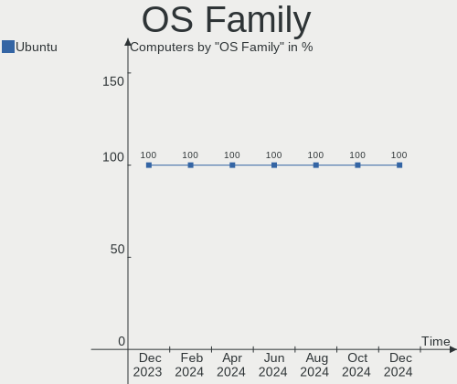
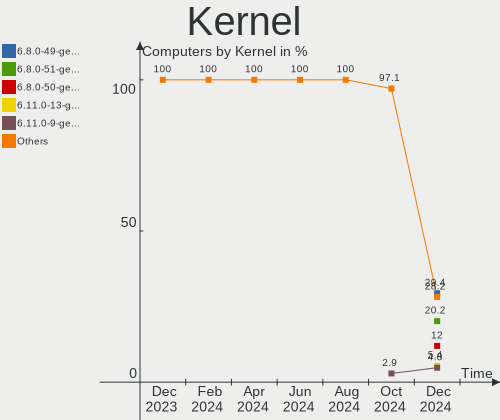
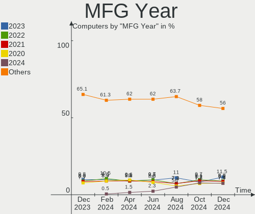

Ubuntu - Hardware Trends
------------------------

A project to identify most popular hardware characteristics and track their change
over time based on data collected by Linux users at https://Linux-Hardware.org.

Anyone can contribute to this report by the [hw-probe](https://github.com/linuxhw/hw-probe) tool:

    sudo -E hw-probe -all -upload

This is a report for all computer types. See also reports for [desktops](/Dist/Ubuntu/Desktop/README.md) and [notebooks](/Dist/Ubuntu/Notebook/README.md).

This report is for one last month. Overall report since the beginning of time: [TestDays](https://github.com/linuxhw/TestDays)

Period: Apr, 2024.

Contents
--------

* [ System ](#system)
  - [ OS                       ](#os)
  - [ OS Family                ](#os-family)
  - [ Kernel                   ](#kernel)
  - [ Kernel Family            ](#kernel-family)
  - [ Kernel Major Ver.        ](#kernel-major-ver)
  - [ Arch                     ](#arch)
  - [ DE                       ](#de)
  - [ Display Server           ](#display-server)
  - [ Display Manager          ](#display-manager)
  - [ OS Lang                  ](#os-lang)
  - [ Boot Mode                ](#boot-mode)
  - [ Filesystem               ](#filesystem)
  - [ Part. scheme             ](#part-scheme)
  - [ Dual Boot with Linux/BSD ](#dual-boot-with-linuxbsd)
  - [ Dual Boot (Win)          ](#dual-boot-win)

* [ Board ](#board)
  - [ Vendor                   ](#vendor)
  - [ Model                    ](#model)
  - [ Model Family             ](#model-family)
  - [ MFG Year                 ](#mfg-year)
  - [ Form Factor              ](#form-factor)
  - [ Secure Boot              ](#secure-boot)
  - [ Coreboot                 ](#coreboot)
  - [ RAM Size                 ](#ram-size)
  - [ RAM Used                 ](#ram-used)
  - [ Total Drives             ](#total-drives)
  - [ Has CD-ROM               ](#has-cd-rom)
  - [ Has Ethernet             ](#has-ethernet)
  - [ Has WiFi                 ](#has-wifi)
  - [ Has Bluetooth            ](#has-bluetooth)

* [ Location ](#location)
  - [ Country                  ](#country)
  - [ City                     ](#city)

* [ Drives ](#drives)
  - [ Drive Vendor             ](#drive-vendor)
  - [ Drive Model              ](#drive-model)
  - [ HDD Vendor               ](#hdd-vendor)
  - [ SSD Vendor               ](#ssd-vendor)
  - [ Drive Kind               ](#drive-kind)
  - [ Drive Connector          ](#drive-connector)
  - [ Drive Size               ](#drive-size)
  - [ Space Total              ](#space-total)
  - [ Space Used               ](#space-used)
  - [ Malfunc. Drives          ](#malfunc-drives)
  - [ Malfunc. Drive Vendor    ](#malfunc-drive-vendor)
  - [ Malfunc. HDD Vendor      ](#malfunc-hdd-vendor)
  - [ Malfunc. Drive Kind      ](#malfunc-drive-kind)
  - [ Failed Drives            ](#failed-drives)
  - [ Failed Drive Vendor      ](#failed-drive-vendor)
  - [ Drive Status             ](#drive-status)

* [ Storage controller ](#storage-controller)
  - [ Storage Vendor           ](#storage-vendor)
  - [ Storage Model            ](#storage-model)
  - [ Storage Kind             ](#storage-kind)

* [ Processor ](#processor)
  - [ CPU Vendor               ](#cpu-vendor)
  - [ CPU Model                ](#cpu-model)
  - [ CPU Model Family         ](#cpu-model-family)
  - [ CPU Cores                ](#cpu-cores)
  - [ CPU Sockets              ](#cpu-sockets)
  - [ CPU Threads              ](#cpu-threads)
  - [ CPU Op-Modes             ](#cpu-op-modes)
  - [ CPU Microcode            ](#cpu-microcode)
  - [ CPU Microarch            ](#cpu-microarch)

* [ Graphics ](#graphics)
  - [ GPU Vendor               ](#gpu-vendor)
  - [ GPU Model                ](#gpu-model)
  - [ GPU Combo                ](#gpu-combo)
  - [ GPU Driver               ](#gpu-driver)
  - [ GPU Memory               ](#gpu-memory)

* [ Monitor ](#monitor)
  - [ Monitor Vendor           ](#monitor-vendor)
  - [ Monitor Model            ](#monitor-model)
  - [ Monitor Resolution       ](#monitor-resolution)
  - [ Monitor Diagonal         ](#monitor-diagonal)
  - [ Monitor Width            ](#monitor-width)
  - [ Aspect Ratio             ](#aspect-ratio)
  - [ Monitor Area             ](#monitor-area)
  - [ Pixel Density            ](#pixel-density)
  - [ Multiple Monitors        ](#multiple-monitors)

* [ Network ](#network)
  - [ Net Controller Vendor    ](#net-controller-vendor)
  - [ Net Controller Model     ](#net-controller-model)
  - [ Wireless Vendor          ](#wireless-vendor)
  - [ Wireless Model           ](#wireless-model)
  - [ Ethernet Vendor          ](#ethernet-vendor)
  - [ Ethernet Model           ](#ethernet-model)
  - [ Net Controller Kind      ](#net-controller-kind)
  - [ Used Controller          ](#used-controller)
  - [ NICs                     ](#nics)
  - [ IPv6                     ](#ipv6)

* [ Bluetooth ](#bluetooth)
  - [ Bluetooth Vendor         ](#bluetooth-vendor)
  - [ Bluetooth Model          ](#bluetooth-model)

* [ Sound ](#sound)
  - [ Sound Vendor             ](#sound-vendor)
  - [ Sound Model              ](#sound-model)

* [ Memory ](#memory)
  - [ Memory Vendor            ](#memory-vendor)
  - [ Memory Model             ](#memory-model)
  - [ Memory Kind              ](#memory-kind)
  - [ Memory Form Factor       ](#memory-form-factor)
  - [ Memory Size              ](#memory-size)
  - [ Memory Speed             ](#memory-speed)

* [ Printers & scanners ](#printers--scanners)
  - [ Printer Vendor           ](#printer-vendor)
  - [ Printer Model            ](#printer-model)
  - [ Scanner Vendor           ](#scanner-vendor)
  - [ Scanner Model            ](#scanner-model)

* [ Camera ](#camera)
  - [ Camera Vendor            ](#camera-vendor)
  - [ Camera Model             ](#camera-model)

* [ Security ](#security)
  - [ Fingerprint Vendor       ](#fingerprint-vendor)
  - [ Fingerprint Model        ](#fingerprint-model)
  - [ Chipcard Vendor          ](#chipcard-vendor)
  - [ Chipcard Model           ](#chipcard-model)

* [ Unsupported ](#unsupported)
  - [ Unsupported Devices      ](#unsupported-devices)
  - [ Unsupported Device Types ](#unsupported-device-types)

System
------

OS
--

Installed operating systems

| Name           | Computers | Percent |
|----------------|-----------|---------|
| Ubuntu 22.04   | 723       | 63.81%  |
| Ubuntu 23.10   | 184       | 16.24%  |
| Ubuntu 24.04   | 119       | 10.5%   |
| Ubuntu 20.04   | 82        | 7.24%   |
| Ubuntu 23.04   | 9         | 0.79%   |
| Ubuntu 22.10   | 4         | 0.35%   |
| Ubuntu 18.04   | 4         | 0.35%   |
| Ubuntu 21.04   | 2         | 0.18%   |
| Ubuntu 20.10   | 2         | 0.18%   |
| Ubuntu Core 22 | 1         | 0.09%   |
| Ubuntu 21.10   | 1         | 0.09%   |
| Ubuntu 19.10   | 1         | 0.09%   |
| Ubuntu 16.04   | 1         | 0.09%   |

OS Family
---------

OS without a version

| Name   | Computers | Percent |
|--------|-----------|---------|
| Ubuntu | 1133      | 100%    |

Kernel
------

Version of the Linux kernel

| Version              | Computers | Percent |
|----------------------|-----------|---------|
| 6.5.0-27-generic     | 235       | 20.74%  |
| 6.5.0-26-generic     | 235       | 20.74%  |
| 6.5.0-28-generic     | 186       | 16.42%  |
| 6.8.0-31-generic     | 87        | 7.68%   |
| 5.15.0-97-generic    | 63        | 5.56%   |
| 5.15.0-101-generic   | 35        | 3.09%   |
| 5.15.0-105-generic   | 27        | 2.38%   |
| 5.15.0-102-generic   | 26        | 2.29%   |
| 6.5.0-18-generic     | 21        | 1.85%   |
| 6.8.0-22-generic     | 17        | 1.5%    |
| 6.2.0-39-generic     | 12        | 1.06%   |
| 6.5.0-9-generic      | 11        | 0.97%   |
| 6.5.0-25-generic     | 9         | 0.79%   |
| 6.5.0-21-generic     | 9         | 0.79%   |
| 6.5.0-17-generic     | 7         | 0.62%   |
| 6.5.0-1019-oem       | 7         | 0.62%   |
| 5.15.0-100-generic   | 7         | 0.62%   |
| 6.5.0-1020-oem       | 6         | 0.53%   |
| 6.8.0-11-generic     | 5         | 0.44%   |
| 6.5.0-34-generic     | 5         | 0.44%   |
| 5.4.0-177-generic    | 5         | 0.44%   |
| 5.19.0-46-generic    | 5         | 0.44%   |
| 6.5.0-15-generic     | 4         | 0.35%   |
| 5.19.0-32-generic    | 4         | 0.35%   |
| 5.15.0-94-generic    | 4         | 0.35%   |
| 6.2.0-26-generic     | 3         | 0.26%   |
| 6.2.0-20-generic     | 3         | 0.26%   |
| 5.4.0-173-generic    | 3         | 0.26%   |
| 5.15.0-91-generic    | 3         | 0.26%   |
| 5.15.0-104-generic   | 3         | 0.26%   |
| 6.8.6-060806-generic | 2         | 0.18%   |
| 6.8.0-28-generic     | 2         | 0.18%   |
| 6.7.0-060700-generic | 2         | 0.18%   |
| 6.2.0-37-generic     | 2         | 0.18%   |
| 6.2.0-36-generic     | 2         | 0.18%   |
| 6.2.0-35-generic     | 2         | 0.18%   |
| 5.4.0-150-generic    | 2         | 0.18%   |
| 5.15.0-92-generic    | 2         | 0.18%   |
| 5.15.0-78-generic    | 2         | 0.18%   |
| 5.15.0-73-generic    | 2         | 0.18%   |

Kernel Family
-------------

Linux kernel without a distro release

| Version  | Computers | Percent |
|----------|-----------|---------|
| 6.5.0    | 739       | 65.23%  |
| 5.15.0   | 189       | 16.68%  |
| 6.8.0    | 115       | 10.15%  |
| 6.2.0    | 24        | 2.12%   |
| 5.4.0    | 16        | 1.41%   |
| 5.19.0   | 12        | 1.06%   |
| 5.11.0   | 4         | 0.35%   |
| 4.15.0   | 4         | 0.35%   |
| 6.8.7    | 3         | 0.26%   |
| 6.8.6    | 3         | 0.26%   |
| 6.9.0    | 2         | 0.18%   |
| 6.8.4    | 2         | 0.18%   |
| 6.7.0    | 2         | 0.18%   |
| 5.8.0    | 2         | 0.18%   |
| 5.13.0   | 2         | 0.18%   |
| 6.8.5    | 1         | 0.09%   |
| 6.8.2    | 1         | 0.09%   |
| 6.8.1    | 1         | 0.09%   |
| 6.7.12   | 1         | 0.09%   |
| 6.7.1    | 1         | 0.09%   |
| 6.5.11   | 1         | 0.09%   |
| 6.1.0    | 1         | 0.09%   |
| 5.3.0    | 1         | 0.09%   |
| 5.15.23  | 1         | 0.09%   |
| 5.14.21  | 1         | 0.09%   |
| 5.10.35  | 1         | 0.09%   |
| 5.10.160 | 1         | 0.09%   |
| 5.10.0   | 1         | 0.09%   |
| 4.9.337  | 1         | 0.09%   |

Kernel Major Ver.
-----------------

Linux kernel major version

| Version | Computers | Percent |
|---------|-----------|---------|
| 6.5     | 740       | 65.31%  |
| 5.15    | 190       | 16.77%  |
| 6.8     | 126       | 11.12%  |
| 6.2     | 24        | 2.12%   |
| 5.4     | 16        | 1.41%   |
| 5.19    | 12        | 1.06%   |
| 6.7     | 4         | 0.35%   |
| 5.11    | 4         | 0.35%   |
| 4.15    | 4         | 0.35%   |
| 5.10    | 3         | 0.26%   |
| 6.9     | 2         | 0.18%   |
| 5.8     | 2         | 0.18%   |
| 5.13    | 2         | 0.18%   |
| 6.1     | 1         | 0.09%   |
| 5.3     | 1         | 0.09%   |
| 5.14    | 1         | 0.09%   |
| 4.9     | 1         | 0.09%   |

Arch
----

OS architecture (x86_64, i586, etc.)

| Name    | Computers | Percent |
|---------|-----------|---------|
| x86_64  | 1125      | 99.29%  |
| aarch64 | 6         | 0.53%   |
| i686    | 2         | 0.18%   |

DE
--

Desktop Environment

| Name            | Computers | Percent |
|-----------------|-----------|---------|
| GNOME           | 977       | 86.23%  |
| Unknown         | 134       | 11.83%  |
| X-Cinnamon      | 8         | 0.71%   |
| GNOME Flashback | 6         | 0.53%   |
| i3              | 2         | 0.18%   |
| GNOME Classic   | 2         | 0.18%   |
| ubuntu          | 1         | 0.09%   |
| Pantheon        | 1         | 0.09%   |
| Enlightenment   | 1         | 0.09%   |
| Cinnamon        | 1         | 0.09%   |

Display Server
--------------

X11 or Wayland

| Name    | Computers | Percent |
|---------|-----------|---------|
| Wayland | 608       | 53.66%  |
| X11     | 389       | 34.33%  |
| Unknown | 92        | 8.12%   |
| Tty     | 44        | 3.88%   |

Display Manager
---------------

SDDM, LightDM, etc.

| Name    | Computers | Percent |
|---------|-----------|---------|
| GDM3    | 892       | 78.73%  |
| Unknown | 193       | 17.03%  |
| GDM     | 28        | 2.47%   |
| LightDM | 13        | 1.15%   |
| SDDM    | 5         | 0.44%   |
| SLiM    | 1         | 0.09%   |
| LXDM    | 1         | 0.09%   |

OS Lang
-------

Language

| Lang    | Computers | Percent |
|---------|-----------|---------|
| en_US   | 496       | 43.78%  |
| C       | 94        | 8.3%    |
| de_DE   | 90        | 7.94%   |
| fr_FR   | 72        | 6.35%   |
| pt_BR   | 38        | 3.35%   |
| es_ES   | 36        | 3.18%   |
| en_GB   | 34        | 3%      |
| ru_RU   | 28        | 2.47%   |
| it_IT   | 28        | 2.47%   |
| pl_PL   | 25        | 2.21%   |
| en_CA   | 23        | 2.03%   |
| en_IN   | 21        | 1.85%   |
| Unknown | 18        | 1.59%   |
| zh_CN   | 9         | 0.79%   |
| nl_NL   | 9         | 0.79%   |
| tr_TR   | 8         | 0.71%   |
| hu_HU   | 8         | 0.71%   |
| en_AU   | 8         | 0.71%   |
| en_ZA   | 7         | 0.62%   |
| es_AR   | 6         | 0.53%   |
| cs_CZ   | 6         | 0.53%   |
| ja_JP   | 5         | 0.44%   |
| en_NZ   | 5         | 0.44%   |
| el_GR   | 5         | 0.44%   |
| bg_BG   | 5         | 0.44%   |
| sv_SE   | 4         | 0.35%   |
| en_IL   | 4         | 0.35%   |
| pt_PT   | 3         | 0.26%   |
| zh_TW   | 2         | 0.18%   |
| nl_BE   | 2         | 0.18%   |
| nb_NO   | 2         | 0.18%   |
| ko_KR   | 2         | 0.18%   |
| fr_CH   | 2         | 0.18%   |
| fi_FI   | 2         | 0.18%   |
| es_MX   | 2         | 0.18%   |
| es_CO   | 2         | 0.18%   |
| es_CL   | 2         | 0.18%   |
| en_PH   | 2         | 0.18%   |
| en_IE   | 2         | 0.18%   |
| de_CH   | 2         | 0.18%   |

Boot Mode
---------

EFI or BIOS

| Mode | Computers | Percent |
|------|-----------|---------|
| BIOS | 677       | 59.75%  |
| EFI  | 456       | 40.25%  |

Filesystem
----------

Type of filesystem

| Type    | Computers | Percent |
|---------|-----------|---------|
| Tmpfs   | 572       | 50.49%  |
| Ext4    | 465       | 41.04%  |
| Overlay | 78        | 6.88%   |
| Btrfs   | 10        | 0.88%   |
| Zfs     | 6         | 0.53%   |
| Xfs     | 2         | 0.18%   |

Part. scheme
------------

Scheme of partitioning

| Type    | Computers | Percent |
|---------|-----------|---------|
| GPT     | 903       | 79.7%   |
| Unknown | 140       | 12.36%  |
| MBR     | 90        | 7.94%   |

Dual Boot with Linux/BSD
------------------------

Hosting more than one Linux/BSD

| Dual boot | Computers | Percent |
|-----------|-----------|---------|
| No        | 970       | 85.61%  |
| Yes       | 163       | 14.39%  |

Dual Boot (Win)
---------------

Hosting Linux and Windows

| Dual boot | Computers | Percent |
|-----------|-----------|---------|
| No        | 749       | 66.11%  |
| Yes       | 384       | 33.89%  |

Board
-----

Vendor
------

Motherboard manufacturer

| Name                    | Computers | Percent |
|-------------------------|-----------|---------|
| ASUSTek Computer        | 169       | 14.92%  |
| Dell                    | 154       | 13.59%  |
| Lenovo                  | 152       | 13.42%  |
| Hewlett-Packard         | 152       | 13.42%  |
| Gigabyte Technology     | 64        | 5.65%   |
| MSI                     | 57        | 5.03%   |
| Acer                    | 54        | 4.77%   |
| Supermicro              | 42        | 3.71%   |
| Apple                   | 42        | 3.71%   |
| ASRock                  | 31        | 2.74%   |
| HUAWEI                  | 18        | 1.59%   |
| Unknown                 | 18        | 1.59%   |
| Intel                   | 17        | 1.5%    |
| Toshiba                 | 16        | 1.41%   |
| ETegro Technologies     | 16        | 1.41%   |
| AZW                     | 10        | 0.88%   |
| Samsung Electronics     | 8         | 0.71%   |
| Fujitsu                 | 7         | 0.62%   |
| Notebook                | 6         | 0.53%   |
| Microsoft               | 5         | 0.44%   |
| Medion                  | 5         | 0.44%   |
| Google                  | 4         | 0.35%   |
| Alienware               | 4         | 0.35%   |
| Pegatron                | 3         | 0.26%   |
| Packard Bell            | 3         | 0.26%   |
| eMachines               | 3         | 0.26%   |
| Semp Toshiba            | 2         | 0.18%   |
| Raspberry Pi Foundation | 2         | 0.18%   |
| Positivo                | 2         | 0.18%   |
| Monster                 | 2         | 0.18%   |
| Minix                   | 2         | 0.18%   |
| Getac                   | 2         | 0.18%   |
| Framework               | 2         | 0.18%   |
| Foxconn                 | 2         | 0.18%   |
| ASRockRack              | 2         | 0.18%   |
| ZOTAC                   | 1         | 0.09%   |
| XIAOMI                  | 1         | 0.09%   |
| Wings Mobile            | 1         | 0.09%   |
| Vizio                   | 1         | 0.09%   |
| VALE                    | 1         | 0.09%   |

Model
-----

Motherboard model

| Name                                  | Computers | Percent |
|---------------------------------------|-----------|---------|
| Unknown                               | 22        | 1.94%   |
| Supermicro X9DRW                      | 16        | 1.41%   |
| ETegro Hyperion RS125 G4              | 16        | 1.41%   |
| ASUS All Series                       | 8         | 0.71%   |
| Gigabyte TRX40 AORUS MASTER           | 6         | 0.53%   |
| Dell OptiPlex 7010                    | 6         | 0.53%   |
| ASRock TRX40 Creator                  | 6         | 0.53%   |
| Supermicro X8DTU                      | 5         | 0.44%   |
| Supermicro SYS-6018R-TDW              | 5         | 0.44%   |
| AZW MINI S                            | 5         | 0.44%   |
| HP ProLiant DL360 Gen9                | 4         | 0.35%   |
| Apple iMac10,1                        | 4         | 0.35%   |
| MSI MS-7C37                           | 3         | 0.26%   |
| HUAWEI HVY-WXX9                       | 3         | 0.26%   |
| HP Notebook                           | 3         | 0.26%   |
| HP EliteBook 850 G5                   | 3         | 0.26%   |
| Gigabyte B75M-D3H                     | 3         | 0.26%   |
| Gigabyte B550M DS3H                   | 3         | 0.26%   |
| Dell Latitude E6420                   | 3         | 0.26%   |
| Dell Latitude E5470                   | 3         | 0.26%   |
| Dell Latitude 7490                    | 3         | 0.26%   |
| ASUS M5A97 R2.0                       | 3         | 0.26%   |
| Apple MacBookPro11,3                  | 3         | 0.26%   |
| Apple MacBookPro11,1                  | 3         | 0.26%   |
| Apple MacBookAir6,2                   | 3         | 0.26%   |
| Supermicro SYS-6018R-MTR              | 2         | 0.18%   |
| Supermicro Super Server               | 2         | 0.18%   |
| Supermicro SSG-2028R-E1CR24L          | 2         | 0.18%   |
| Samsung 750XED                        | 2         | 0.18%   |
| MSI MS-7E26                           | 2         | 0.18%   |
| MSI MS-7D91                           | 2         | 0.18%   |
| MSI MS-7D67                           | 2         | 0.18%   |
| MSI MS-7C95                           | 2         | 0.18%   |
| MSI MS-7B98                           | 2         | 0.18%   |
| MSI MS-7823                           | 2         | 0.18%   |
| MSI MS-7816                           | 2         | 0.18%   |
| Lenovo ThinkPad P16s Gen 2 21K9CTO1WW | 2         | 0.18%   |
| Lenovo ThinkBook 15 G3 ACL 21A4       | 2         | 0.18%   |
| Lenovo MIIX 320-10ICR 80XF            | 2         | 0.18%   |
| Lenovo Legion Slim 5 16APH8 82Y9      | 2         | 0.18%   |

Model Family
------------

Motherboard model prefix

| Name                     | Computers | Percent |
|--------------------------|-----------|---------|
| Lenovo ThinkPad          | 51        | 4.5%    |
| Dell Latitude            | 40        | 3.53%   |
| Lenovo IdeaPad           | 33        | 2.91%   |
| Acer Aspire              | 32        | 2.82%   |
| Dell Inspiron            | 28        | 2.47%   |
| Dell OptiPlex            | 26        | 2.29%   |
| ASUS ROG                 | 24        | 2.12%   |
| HP EliteBook             | 22        | 1.94%   |
| Unknown                  | 22        | 1.94%   |
| ASUS PRIME               | 21        | 1.85%   |
| ASUS VivoBook            | 20        | 1.77%   |
| ASUS TUF                 | 20        | 1.77%   |
| Dell Precision           | 19        | 1.68%   |
| HP ProBook               | 18        | 1.59%   |
| HP Laptop                | 18        | 1.59%   |
| HP Pavilion              | 17        | 1.5%    |
| Toshiba Satellite        | 16        | 1.41%   |
| Supermicro X9DRW         | 16        | 1.41%   |
| ETegro Hyperion          | 16        | 1.41%   |
| Dell XPS                 | 16        | 1.41%   |
| HP ZBook                 | 14        | 1.24%   |
| Lenovo Yoga              | 12        | 1.06%   |
| HP Compaq                | 10        | 0.88%   |
| Lenovo Legion            | 8         | 0.71%   |
| HP ProLiant              | 8         | 0.71%   |
| HP EliteDesk             | 8         | 0.71%   |
| ASUS All                 | 8         | 0.71%   |
| Lenovo ThinkCentre       | 7         | 0.62%   |
| Lenovo ThinkBook         | 7         | 0.62%   |
| Lenovo IdeaPadFlex       | 7         | 0.62%   |
| Dell Vostro              | 7         | 0.62%   |
| Apple MacBookPro11       | 7         | 0.62%   |
| HP ENVY                  | 6         | 0.53%   |
| Gigabyte TRX40           | 6         | 0.53%   |
| ASUS ZenBook             | 6         | 0.53%   |
| ASUS Pro                 | 6         | 0.53%   |
| ASRock TRX40             | 6         | 0.53%   |
| Supermicro X8DTU         | 5         | 0.44%   |
| Supermicro SYS-6018R-TDW | 5         | 0.44%   |
| Microsoft Surface        | 5         | 0.44%   |

MFG Year
--------

Motherboard manufacture year

| Year    | Computers | Percent |
|---------|-----------|---------|
| 2020    | 111       | 9.8%    |
| 2023    | 106       | 9.36%   |
| 2021    | 100       | 8.83%   |
| 2022    | 97        | 8.56%   |
| 2013    | 95        | 8.38%   |
| 2018    | 80        | 7.06%   |
| 2012    | 78        | 6.88%   |
| 2019    | 77        | 6.8%    |
| 2017    | 65        | 5.74%   |
| 2014    | 52        | 4.59%   |
| 2016    | 50        | 4.41%   |
| 2011    | 48        | 4.24%   |
| 2015    | 46        | 4.06%   |
| 2009    | 44        | 3.88%   |
| 2010    | 34        | 3%      |
| 2024    | 20        | 1.77%   |
| 2008    | 16        | 1.41%   |
| Unknown | 7         | 0.62%   |
| 2007    | 4         | 0.35%   |
| 2006    | 2         | 0.18%   |
| 2004    | 1         | 0.09%   |

Form Factor
-----------

Physical design of the computer

| Name           | Computers | Percent |
|----------------|-----------|---------|
| Notebook       | 556       | 49.07%  |
| Desktop        | 414       | 36.54%  |
| Server         | 66        | 5.83%   |
| Convertible    | 38        | 3.35%   |
| Mini pc        | 24        | 2.12%   |
| All in one     | 17        | 1.5%    |
| Tablet         | 11        | 0.97%   |
| System on chip | 7         | 0.62%   |

Secure Boot
-----------

Enabled or disabled

| State    | Computers | Percent |
|----------|-----------|---------|
| Disabled | 1022      | 90.2%   |
| Enabled  | 111       | 9.8%    |

Coreboot
--------

Have coreboot on board

| Used | Computers | Percent |
|------|-----------|---------|
| No   | 1128      | 99.56%  |
| Yes  | 5         | 0.44%   |

RAM Size
--------

Total RAM memory

| Size in GB      | Computers | Percent |
|-----------------|-----------|---------|
| 16.01-24.0      | 253       | 22.33%  |
| 4.01-8.0        | 233       | 20.56%  |
| 8.01-16.0       | 181       | 15.98%  |
| 32.01-64.0      | 167       | 14.74%  |
| 3.01-4.0        | 144       | 12.71%  |
| 64.01-256.0     | 89        | 7.86%   |
| More than 256.0 | 25        | 2.21%   |
| 24.01-32.0      | 25        | 2.21%   |
| 2.01-3.0        | 8         | 0.71%   |
| 1.01-2.0        | 8         | 0.71%   |

RAM Used
--------

Used RAM memory

| Used GB         | Computers | Percent |
|-----------------|-----------|---------|
| 2.01-3.0        | 347       | 30.63%  |
| 1.01-2.0        | 286       | 25.24%  |
| 4.01-8.0        | 208       | 18.36%  |
| 3.01-4.0        | 167       | 14.74%  |
| 8.01-16.0       | 72        | 6.35%   |
| 0.51-1.0        | 16        | 1.41%   |
| 64.01-256.0     | 15        | 1.32%   |
| 16.01-24.0      | 10        | 0.88%   |
| 32.01-64.0      | 5         | 0.44%   |
| 24.01-32.0      | 5         | 0.44%   |
| More than 256.0 | 1         | 0.09%   |
| 0.01-0.5        | 1         | 0.09%   |

Total Drives
------------

Number of drives on board

| Drives | Computers | Percent |
|--------|-----------|---------|
| 1      | 699       | 61.69%  |
| 2      | 251       | 22.15%  |
| 3      | 85        | 7.5%    |
| 4      | 32        | 2.82%   |
| 5      | 21        | 1.85%   |
| 6      | 8         | 0.71%   |
| 13     | 6         | 0.53%   |
| 9      | 6         | 0.53%   |
| 8      | 6         | 0.53%   |
| 7      | 6         | 0.53%   |
| 0      | 5         | 0.44%   |
| 11     | 3         | 0.26%   |
| 35     | 1         | 0.09%   |
| 24     | 1         | 0.09%   |
| 21     | 1         | 0.09%   |
| 14     | 1         | 0.09%   |
| 10     | 1         | 0.09%   |

Has CD-ROM
----------

Has CD-ROM on board

| Presented | Computers | Percent |
|-----------|-----------|---------|
| No        | 837       | 73.87%  |
| Yes       | 296       | 26.13%  |

Has Ethernet
------------

Has Ethernet on board

| Presented | Computers | Percent |
|-----------|-----------|---------|
| Yes       | 938       | 82.79%  |
| No        | 195       | 17.21%  |

Has WiFi
--------

Has WiFi module

| Presented | Computers | Percent |
|-----------|-----------|---------|
| Yes       | 843       | 74.4%   |
| No        | 290       | 25.6%   |

Has Bluetooth
-------------

Has Bluetooth module

| Presented | Computers | Percent |
|-----------|-----------|---------|
| Yes       | 722       | 63.72%  |
| No        | 411       | 36.28%  |

Location
--------

Country
-------

Geographic location (country)

| Country      | Computers | Percent |
|--------------|-----------|---------|
| USA          | 199       | 17.56%  |
| Germany      | 116       | 10.24%  |
| Russia       | 104       | 9.18%   |
| France       | 80        | 7.06%   |
| Brazil       | 52        | 4.59%   |
| Spain        | 49        | 4.32%   |
| UK           | 41        | 3.62%   |
| Italy        | 38        | 3.35%   |
| Canada       | 36        | 3.18%   |
| Poland       | 34        | 3%      |
| India        | 31        | 2.74%   |
| Netherlands  | 25        | 2.21%   |
| Sweden       | 16        | 1.41%   |
| Turkey       | 13        | 1.15%   |
| Norway       | 13        | 1.15%   |
| Australia    | 13        | 1.15%   |
| Hungary      | 12        | 1.06%   |
| Argentina    | 12        | 1.06%   |
| Mexico       | 11        | 0.97%   |
| Greece       | 11        | 0.97%   |
| Switzerland  | 10        | 0.88%   |
| Chile        | 10        | 0.88%   |
| Bulgaria     | 10        | 0.88%   |
| Austria      | 10        | 0.88%   |
| South Africa | 9         | 0.79%   |
| Portugal     | 9         | 0.79%   |
| Czechia      | 9         | 0.79%   |
| China        | 9         | 0.79%   |
| Vietnam      | 7         | 0.62%   |
| Serbia       | 7         | 0.62%   |
| New Zealand  | 7         | 0.62%   |
| Japan        | 7         | 0.62%   |
| Belgium      | 7         | 0.62%   |
| Romania      | 6         | 0.53%   |
| Israel       | 6         | 0.53%   |
| Finland      | 6         | 0.53%   |
| Denmark      | 6         | 0.53%   |
| Iran         | 5         | 0.44%   |
| Colombia     | 5         | 0.44%   |
| Taiwan       | 4         | 0.35%   |

City
----

Geographic location (city)

| City             | Computers | Percent |
|------------------|-----------|---------|
| Moscow           | 73        | 6.44%   |
| Terrassa         | 15        | 1.32%   |
| Los Angeles      | 9         | 0.79%   |
| Istanbul         | 9         | 0.79%   |
| Berlin           | 9         | 0.79%   |
| Warsaw           | 7         | 0.62%   |
| Paris            | 7         | 0.62%   |
| Madrid           | 7         | 0.62%   |
| Athens           | 7         | 0.62%   |
| Vienna           | 5         | 0.44%   |
| St Petersburg    | 5         | 0.44%   |
| Sofia            | 5         | 0.44%   |
| Sao Paulo        | 5         | 0.44%   |
| Santiago         | 5         | 0.44%   |
| Poznan           | 5         | 0.44%   |
| Gothenburg       | 5         | 0.44%   |
| Budapest         | 5         | 0.44%   |
| Amsterdam        | 5         | 0.44%   |
| Sydney           | 4         | 0.35%   |
| Stockholm        | 4         | 0.35%   |
| Portland         | 4         | 0.35%   |
| Perth            | 4         | 0.35%   |
| Montreal         | 4         | 0.35%   |
| Milan            | 4         | 0.35%   |
| Le Haillan       | 4         | 0.35%   |
| Ho Chi Minh City | 4         | 0.35%   |
| Hamburg          | 4         | 0.35%   |
| Belgrade         | 4         | 0.35%   |
| Barcelona        | 4         | 0.35%   |
| Washington       | 3         | 0.26%   |
| Turin            | 3         | 0.26%   |
| Tucson           | 3         | 0.26%   |
| Toronto          | 3         | 0.26%   |
| Tokyo            | 3         | 0.26%   |
| The Hague        | 3         | 0.26%   |
| Tel Aviv         | 3         | 0.26%   |
| Taipei           | 3         | 0.26%   |
| Surat            | 3         | 0.26%   |
| Seattle          | 3         | 0.26%   |
| San Francisco    | 3         | 0.26%   |

Drives
------

Drive Vendor
------------

Hard drive vendors

| Vendor                         | Computers | Drives | Percent |
|--------------------------------|-----------|--------|---------|
| Samsung Electronics            | 249       | 309    | 15.65%  |
| WDC                            | 182       | 238    | 11.44%  |
| Seagate                        | 165       | 247    | 10.37%  |
| Sandisk                        | 87        | 94     | 5.47%   |
| Toshiba                        | 81        | 108    | 5.09%   |
| Kingston                       | 78        | 86     | 4.9%    |
| Crucial                        | 69        | 120    | 4.34%   |
| SK hynix                       | 59        | 59     | 3.71%   |
| Unknown                        | 56        | 72     | 3.52%   |
| Intel                          | 54        | 69     | 3.39%   |
| Micron Technology              | 47        | 52     | 2.95%   |
| Fujitsu                        | 35        | 76     | 2.2%    |
| Hitachi                        | 29        | 39     | 1.82%   |
| KIOXIA                         | 25        | 25     | 1.57%   |
| Apple                          | 25        | 27     | 1.57%   |
| Phison Electronics             | 21        | 23     | 1.32%   |
| PNY                            | 19        | 23     | 1.19%   |
| Phison                         | 17        | 60     | 1.07%   |
| HGST                           | 16        | 25     | 1.01%   |
| A-DATA Technology              | 15        | 17     | 0.94%   |
| China                          | 14        | 14     | 0.88%   |
| MAXIO Technology (Hangzhou)    | 13        | 13     | 0.82%   |
| Kingston Technology Company    | 12        | 12     | 0.75%   |
| Hewlett-Packard                | 12        | 23     | 0.75%   |
| Silicon Motion                 | 11        | 11     | 0.69%   |
| Netac                          | 9         | 9      | 0.57%   |
| Unknown                        | 9         | 9      | 0.57%   |
| SPCC                           | 8         | 8      | 0.5%    |
| LITEON                         | 8         | 9      | 0.5%    |
| Lexar                          | 8         | 8      | 0.5%    |
| Shenzhen Longsys Electronics   | 7         | 7      | 0.44%   |
| Micron/Crucial Technology      | 6         | 6      | 0.38%   |
| Intenso                        | 6         | 6      | 0.38%   |
| Team                           | 5         | 5      | 0.31%   |
| OCZ                            | 5         | 6      | 0.31%   |
| ADATA Technology               | 5         | 6      | 0.31%   |
| Solid State Storage Technology | 4         | 4      | 0.25%   |
| Realtek Semiconductor          | 4         | 5      | 0.25%   |
| Lite-On Technology             | 4         | 4      | 0.25%   |
| JMicron Technology             | 4         | 4      | 0.25%   |

Drive Model
-----------

Hard drive models

| Model                                                 | Computers | Percent |
|-------------------------------------------------------|-----------|---------|
| Samsung NVMe SSD Controller SM981/PM981/PM983 1TB     | 23        | 1.33%   |
| Kingston SA400S37240G 240GB SSD                       | 19        | 1.1%    |
| Samsung NVMe SSD Controller PM9A1/PM9A3/980PRO 1TB    | 15        | 0.87%   |
| Seagate ST500DM002-1BD142 500GB                       | 13        | 0.75%   |
| PNY CS3030 250GB SSD                                  | 12        | 0.7%    |
| Fujitsu MBA3147RC 147GB                               | 12        | 0.7%    |
| Crucial CT500MX500SSD1 500GB                          | 12        | 0.7%    |
| Unknown MMC Card  64GB                                | 11        | 0.64%   |
| Samsung SSD 850 EVO 500GB                             | 11        | 0.64%   |
| Crucial CT1000MX500SSD1 1TB                           | 11        | 0.64%   |
| Phison Sabrent Rocket Q 8TB                           | 10        | 0.58%   |
| MAXIO (Hangzhou) NVMe SSD Controller MAP1202 256GB    | 10        | 0.58%   |
| Fujitsu MBE2147RC 147GB                               | 10        | 0.58%   |
| WDC WD10EZEX-08WN4A0 1TB                              | 9         | 0.52%   |
| Toshiba MQ01ABF050 500GB                              | 9         | 0.52%   |
| Seagate ST1000DM010-2EP102 1TB                        | 9         | 0.52%   |
| Samsung NVMe SSD Controller SM961/PM961/SM963 1TB     | 9         | 0.52%   |
| Kingston SA400S37480G 480GB SSD                       | 9         | 0.52%   |
| Unknown                                               | 9         | 0.52%   |
| Unknown SD/MMC/MS PRO 128GB                           | 8         | 0.46%   |
| Unknown MMC Card  32GB                                | 8         | 0.46%   |
| SanDisk NVMe SSD Drive 1TB                            | 8         | 0.46%   |
| Samsung SSD 860 EVO 500GB                             | 8         | 0.46%   |
| Seagate ST1000LM035-1RK172 1TB                        | 7         | 0.41%   |
| Samsung SSD 990 PRO 2TB                               | 7         | 0.41%   |
| Kingston SA400S37120G 120GB SSD                       | 7         | 0.41%   |
| Fujitsu MAX3147RC 147GB                               | 7         | 0.41%   |
| Crucial CT4000P3SSD8 4TB                              | 7         | 0.41%   |
| Toshiba MK0502TSKB 500GB                              | 6         | 0.35%   |
| Silicon Motion SM2263EN/SM2263XT SSD Controller 256GB | 6         | 0.35%   |
| Seagate ST2000DM008-2FR102 2TB                        | 6         | 0.35%   |
| Samsung SSD 970 EVO Plus 2TB                          | 6         | 0.35%   |
| Samsung MZVL4512HBLU-00BTW 512GB                      | 6         | 0.35%   |
| Micron/Crucial P2 NVMe PCIe SSD 4TB                   | 6         | 0.35%   |
| Kingston SV300S37A120G 120GB SSD                      | 6         | 0.35%   |
| WDC WDS100T2B0C-00PXH0 1TB                            | 5         | 0.29%   |
| WDC WD20EZRZ-00Z5HB0 2TB                              | 5         | 0.29%   |
| Unknown Compact Flash 977MB                           | 5         | 0.29%   |
| Toshiba MQ01ABD100 1TB                                | 5         | 0.29%   |
| Toshiba DT01ACA050 500GB                              | 5         | 0.29%   |

HDD Vendor
----------

Hard disk drive vendors

| Vendor              | Computers | Drives | Percent |
|---------------------|-----------|--------|---------|
| Seagate             | 162       | 241    | 32.79%  |
| WDC                 | 139       | 186    | 28.14%  |
| Toshiba             | 63        | 90     | 12.75%  |
| Fujitsu             | 35        | 76     | 7.09%   |
| Hitachi             | 29        | 39     | 5.87%   |
| Samsung Electronics | 16        | 16     | 3.24%   |
| HGST                | 16        | 25     | 3.24%   |
| Unknown             | 9         | 9      | 1.82%   |
| Apple               | 7         | 7      | 1.42%   |
| Hewlett-Packard     | 4         | 11     | 0.81%   |
| Maxtor              | 3         | 3      | 0.61%   |
| JMicron Technology  | 3         | 3      | 0.61%   |
| TO Exter            | 1         | 1      | 0.2%    |
| SABRENT             | 1         | 1      | 0.2%    |
| QUANTUM             | 1         | 1      | 0.2%    |
| Lenovo              | 1         | 2      | 0.2%    |
| Intenso             | 1         | 1      | 0.2%    |
| HPE                 | 1         | 1      | 0.2%    |
| Config              | 1         | 1      | 0.2%    |
| ASMT                | 1         | 1      | 0.2%    |

SSD Vendor
----------

Solid state drive vendors

| Vendor              | Computers | Drives | Percent |
|---------------------|-----------|--------|---------|
| Samsung Electronics | 88        | 98     | 18.88%  |
| Kingston            | 61        | 67     | 13.09%  |
| Crucial             | 50        | 58     | 10.73%  |
| SanDisk             | 39        | 42     | 8.37%   |
| Intel               | 30        | 39     | 6.44%   |
| WDC                 | 27        | 31     | 5.79%   |
| Micron Technology   | 14        | 19     | 3%      |
| China               | 14        | 14     | 3%      |
| Apple               | 14        | 14     | 3%      |
| A-DATA Technology   | 12        | 13     | 2.58%   |
| SK hynix            | 8         | 8      | 1.72%   |
| Netac               | 8         | 8      | 1.72%   |
| LITEON              | 8         | 9      | 1.72%   |
| PNY                 | 6         | 7      | 1.29%   |
| Lexar               | 6         | 6      | 1.29%   |
| Hewlett-Packard     | 6         | 10     | 1.29%   |
| SPCC                | 5         | 5      | 1.07%   |
| OCZ                 | 5         | 6      | 1.07%   |
| Toshiba             | 4         | 4      | 0.86%   |
| GOODRAM             | 4         | 6      | 0.86%   |
| Patriot             | 3         | 3      | 0.64%   |
| Intenso             | 3         | 3      | 0.64%   |
| Transcend           | 2         | 2      | 0.43%   |
| Team                | 2         | 2      | 0.43%   |
| KingSpec            | 2         | 2      | 0.43%   |
| Gigabyte Technology | 2         | 2      | 0.43%   |
| FORESEE             | 2         | 2      | 0.43%   |
| Fanxiang            | 2         | 2      | 0.43%   |
| Corsair             | 2         | 2      | 0.43%   |
| AMD                 | 2         | 2      | 0.43%   |
| Unknown             | 2         | 2      | 0.43%   |
| Zheino              | 1         | 1      | 0.21%   |
| Wibtek              | 1         | 1      | 0.21%   |
| WDC WDS             | 1         | 1      | 0.21%   |
| WALRAM              | 1         | 1      | 0.21%   |
| Verbatim            | 1         | 1      | 0.21%   |
| Vaseky              | 1         | 1      | 0.21%   |
| USB3.0              | 1         | 1      | 0.21%   |
| Timetec             | 1         | 1      | 0.21%   |
| SPCC Sol            | 1         | 1      | 0.21%   |

Drive Kind
----------

HDD or SSD

| Kind    | Computers | Drives | Percent |
|---------|-----------|--------|---------|
| NVMe    | 530       | 731    | 37.14%  |
| SSD     | 419       | 523    | 29.36%  |
| HDD     | 409       | 715    | 28.66%  |
| MMC     | 40        | 46     | 2.8%    |
| Unknown | 29        | 41     | 2.03%   |

Drive Connector
---------------

SATA, SAS, NVMe, etc.

| Type | Computers | Drives | Percent |
|------|-----------|--------|---------|
| SATA | 676       | 1115   | 50.52%  |
| NVMe | 530       | 730    | 39.61%  |
| SAS  | 92        | 165    | 6.88%   |
| MMC  | 40        | 46     | 2.99%   |

Drive Size
----------

Size of hard drive

| Size in TB | Computers | Drives | Percent |
|------------|-----------|--------|---------|
| 0.01-0.5   | 498       | 697    | 57.77%  |
| 0.51-1.0   | 240       | 321    | 27.84%  |
| 1.01-2.0   | 59        | 82     | 6.84%   |
| 3.01-4.0   | 24        | 47     | 2.78%   |
| 4.01-10.0  | 16        | 45     | 1.86%   |
| 2.01-3.0   | 14        | 20     | 1.62%   |
| 10.01-20.0 | 10        | 23     | 1.16%   |
| 20.01-50.0 | 1         | 3      | 0.12%   |

Space Total
-----------

Amount of disk space available on the file system

| Size in GB     | Computers | Percent |
|----------------|-----------|---------|
| 101-250        | 295       | 26.04%  |
| 251-500        | 267       | 23.57%  |
| 501-1000       | 185       | 16.33%  |
| 1001-2000      | 99        | 8.74%   |
| Unknown        | 84        | 7.41%   |
| 51-100         | 63        | 5.56%   |
| 1-20           | 46        | 4.06%   |
| More than 3000 | 41        | 3.62%   |
| 21-50          | 29        | 2.56%   |
| 2001-3000      | 24        | 2.12%   |

Space Used
----------

Amount of used disk space

| Used GB        | Computers | Percent |
|----------------|-----------|---------|
| 1-20           | 317       | 27.98%  |
| 21-50          | 267       | 23.57%  |
| 101-250        | 163       | 14.39%  |
| 51-100         | 115       | 10.15%  |
| 251-500        | 84        | 7.41%   |
| Unknown        | 84        | 7.41%   |
| 501-1000       | 51        | 4.5%    |
| 1001-2000      | 25        | 2.21%   |
| More than 3000 | 21        | 1.85%   |
| 2001-3000      | 6         | 0.53%   |

Malfunc. Drives
---------------

Drive models with a malfunction

| Model                                      | Computers | Drives | Percent |
|--------------------------------------------|-----------|--------|---------|
| Toshiba MQ01ABD100 1TB                     | 2         | 2      | 4%      |
| Seagate ST500DM002-1BD142 500GB            | 2         | 2      | 4%      |
| WDC WDS100T2B0C-00PXH0 1TB                 | 1         | 1      | 2%      |
| WDC WD60PURZ-85ZUFY1 6TB                   | 1         | 1      | 2%      |
| WDC WD5002ABYS-02B1B0 500GB                | 1         | 2      | 2%      |
| WDC WD5000AAKX-60U6AA0 500GB               | 1         | 3      | 2%      |
| WDC WD50 00LPLX-08ZNTT0 500GB              | 1         | 1      | 2%      |
| WDC WD20EZRX-00DC0B0 2TB                   | 1         | 1      | 2%      |
| WDC WD15EARS-00Z5B1 1TB                    | 1         | 1      | 2%      |
| WDC WD10JPVX-75JC3T0 1TB                   | 1         | 1      | 2%      |
| WDC WD10EZEX-00WN4A0 1TB                   | 1         | 1      | 2%      |
| WDC WD Green 2.5 240GB                     | 1         | 1      | 2%      |
| Toshiba MQ01ABF050 500GB                   | 1         | 1      | 2%      |
| Toshiba MQ01ABD050 500GB                   | 1         | 1      | 2%      |
| Toshiba MK0502TSKB 500GB                   | 1         | 2      | 2%      |
| Toshiba HDWE160 6TB                        | 1         | 1      | 2%      |
| Toshiba DT01ACA300 3TB                     | 1         | 1      | 2%      |
| SK hynix BC711 HFM512GD3JX013N 512GB       | 1         | 1      | 2%      |
| SK hynix BC711 HFM256GD3JX013N 256GB       | 1         | 1      | 2%      |
| Seagate ST9500325AS 500GB                  | 1         | 1      | 2%      |
| Seagate ST9250315AS 250GB                  | 1         | 6      | 2%      |
| Seagate ST500DM002-1BC142 500GB            | 1         | 1      | 2%      |
| Seagate ST3500418AS 500GB                  | 1         | 1      | 2%      |
| Seagate ST2000DX002-2DV164 2TB             | 1         | 1      | 2%      |
| Seagate ST2000DM001-9YN164 2TB             | 1         | 2      | 2%      |
| Seagate ST2000DL003-9VT166 2TB             | 1         | 1      | 2%      |
| Seagate ST14000NM0018-2H4101 14TB          | 1         | 1      | 2%      |
| Seagate ST1000LM014-SSHD-8GB               | 1         | 1      | 2%      |
| Seagate ST1000DX001-1NS162 1TB             | 1         | 1      | 2%      |
| Seagate ST1000DM010-2EP102 1TB             | 1         | 1      | 2%      |
| Seagate ST1000DM003-1CH162 1TB             | 1         | 1      | 2%      |
| SanDisk SSD U110 16GB                      | 1         | 1      | 2%      |
| SanDisk SD7SB2Q512G1001 512GB SSD          | 1         | 1      | 2%      |
| Samsung Electronics SSD 870 EVO 2TB        | 1         | 1      | 2%      |
| Samsung Electronics PM9A1 NVMe 2048GB      | 1         | 1      | 2%      |
| Samsung Electronics HD103SI 1TB            | 1         | 1      | 2%      |
| Micron Technology C400 RealSSD mSATA 128GB | 1         | 1      | 2%      |
| Kingston SKC600512G 512GB SSD              | 1         | 1      | 2%      |
| Kingston RBUSNS8180S3256GJ 256GB SSD       | 1         | 1      | 2%      |
| Intel SSDSC2KW240H6 240GB                  | 1         | 1      | 2%      |

Malfunc. Drive Vendor
---------------------

Vendors of faulty drives

| Vendor              | Computers | Drives | Percent |
|---------------------|-----------|--------|---------|
| Seagate             | 13        | 20     | 27.08%  |
| WDC                 | 10        | 13     | 20.83%  |
| Toshiba             | 7         | 8      | 14.58%  |
| Intel               | 4         | 8      | 8.33%   |
| Samsung Electronics | 3         | 3      | 6.25%   |
| SK hynix            | 2         | 2      | 4.17%   |
| SanDisk             | 2         | 2      | 4.17%   |
| Kingston            | 2         | 2      | 4.17%   |
| Micron Technology   | 1         | 1      | 2.08%   |
| Hitachi             | 1         | 1      | 2.08%   |
| HGST                | 1         | 1      | 2.08%   |
| Gigabyte Technology | 1         | 1      | 2.08%   |
| Crucial             | 1         | 1      | 2.08%   |

Malfunc. HDD Vendor
-------------------

Vendors of faulty HDD drives

| Vendor              | Computers | Drives | Percent |
|---------------------|-----------|--------|---------|
| Seagate             | 13        | 20     | 41.94%  |
| WDC                 | 8         | 11     | 25.81%  |
| Toshiba             | 7         | 8      | 22.58%  |
| Samsung Electronics | 1         | 1      | 3.23%   |
| Hitachi             | 1         | 1      | 3.23%   |
| HGST                | 1         | 1      | 3.23%   |

Malfunc. Drive Kind
-------------------

Kinds of faulty drives

| Kind | Computers | Drives | Percent |
|------|-----------|--------|---------|
| HDD  | 27        | 42     | 61.36%  |
| SSD  | 12        | 16     | 27.27%  |
| NVMe | 5         | 5      | 11.36%  |

Failed Drives
-------------

Failed drive models

| Model                       | Computers | Drives | Percent |
|-----------------------------|-----------|--------|---------|
| WDC WD3200AAJS-60Z0A0 320GB | 1         | 3      | 100%    |

Failed Drive Vendor
-------------------

Failed drive vendors

| Vendor | Computers | Drives | Percent |
|--------|-----------|--------|---------|
| WDC    | 1         | 3      | 100%    |

Drive Status
------------

Number of failed and malfunc. drives

| Status   | Computers | Drives | Percent |
|----------|-----------|--------|---------|
| Detected | 725       | 1132   | 59.92%  |
| Works    | 442       | 858    | 36.53%  |
| Malfunc  | 42        | 63     | 3.47%   |
| Failed   | 1         | 3      | 0.08%   |

Storage controller
------------------

Storage Vendor
--------------

Storage controller vendors

| Vendor                                  | Computers | Percent |
|-----------------------------------------|-----------|---------|
| Intel                                   | 722       | 45.87%  |
| Samsung Electronics                     | 170       | 10.8%   |
| AMD                                     | 163       | 10.36%  |
| SanDisk                                 | 68        | 4.32%   |
| SK hynix                                | 51        | 3.24%   |
| Phison Electronics                      | 48        | 3.05%   |
| Micron Technology                       | 34        | 2.16%   |
| LSI Logic / Symbios Logic               | 31        | 1.97%   |
| Kingston Technology Company             | 30        | 1.91%   |
| ASMedia Technology                      | 29        | 1.84%   |
| Micron/Crucial Technology               | 24        | 1.52%   |
| KIOXIA                                  | 21        | 1.33%   |
| Toshiba America Info Systems            | 17        | 1.08%   |
| Nvidia                                  | 17        | 1.08%   |
| MAXIO Technology (Hangzhou)             | 17        | 1.08%   |
| Silicon Motion                          | 16        | 1.02%   |
| Marvell Technology Group                | 13        | 0.83%   |
| Broadcom / LSI                          | 12        | 0.76%   |
| Realtek Semiconductor                   | 9         | 0.57%   |
| ADATA Technology                        | 9         | 0.57%   |
| Shenzhen Longsys Electronics            | 8         | 0.51%   |
| Solid State Storage Technology          | 7         | 0.44%   |
| Hewlett-Packard                         | 7         | 0.44%   |
| Adaptec                                 | 7         | 0.44%   |
| Solidigm                                | 6         | 0.38%   |
| JMicron Technology                      | 6         | 0.38%   |
| HighPoint Technologies                  | 6         | 0.38%   |
| Lite-On Technology                      | 4         | 0.25%   |
| Apple                                   | 4         | 0.25%   |
| Union Memory (Shenzhen)                 | 3         | 0.19%   |
| Hosin Global Electronics                | 3         | 0.19%   |
| VIA Technologies                        | 2         | 0.13%   |
| Seagate Technology                      | 2         | 0.13%   |
| Yangtze Memory Technologies             | 1         | 0.06%   |
| Transcend                               | 1         | 0.06%   |
| Silicon Image                           | 1         | 0.06%   |
| Shenzhen Unionmemory Information System | 1         | 0.06%   |
| Shenzhen Shichuangyi Electronics        | 1         | 0.06%   |
| Ramaxel Technology(Shenzhen) Limited    | 1         | 0.06%   |
| Biwin Storage Technology                | 1         | 0.06%   |

Storage Model
-------------

Storage controller models

| Model                                                                          | Computers | Percent |
|--------------------------------------------------------------------------------|-----------|---------|
| AMD FCH SATA Controller [AHCI mode]                                            | 95        | 5.36%   |
| Intel Volume Management Device NVMe RAID Controller                            | 54        | 3.05%   |
| Samsung NVMe SSD Controller SM981/PM981/PM983                                  | 48        | 2.71%   |
| Samsung NVMe SSD Controller PM9A1/PM9A3/980PRO                                 | 42        | 2.37%   |
| Intel Sunrise Point-LP SATA Controller [AHCI mode]                             | 42        | 2.37%   |
| Intel 8 Series/C220 Series Chipset Family 6-port SATA Controller 1 [AHCI mode] | 40        | 2.26%   |
| Samsung NVMe SSD Controller 980 (DRAM-less)                                    | 31        | 1.75%   |
| Intel C600/X79 series chipset 6-Port SATA AHCI Controller                      | 31        | 1.75%   |
| Intel C602 chipset 4-Port SATA Storage Control Unit                            | 30        | 1.69%   |
| Intel 82801 Mobile SATA Controller [RAID mode]                                 | 30        | 1.69%   |
| Intel 7 Series Chipset Family 6-port SATA Controller [AHCI mode]               | 27        | 1.52%   |
| Intel Volume Management Device NVMe RAID Controller Intel Corporation          | 26        | 1.47%   |
| ASMedia ASM1061/ASM1062 Serial ATA Controller                                  | 26        | 1.47%   |
| Intel C610/X99 series chipset sSATA Controller [AHCI mode]                     | 25        | 1.41%   |
| Phison E12 NVMe Controller                                                     | 24        | 1.36%   |
| Intel SATA Controller [RAID mode]                                              | 24        | 1.36%   |
| Intel Q170/Q150/B150/H170/H110/Z170/CM236 Chipset SATA Controller [AHCI Mode]  | 24        | 1.36%   |
| Intel C610/X99 series chipset 6-Port SATA Controller [AHCI mode]               | 24        | 1.36%   |
| Intel 8 Series SATA Controller 1 [AHCI mode]                                   | 23        | 1.3%    |
| Intel 6 Series/C200 Series Chipset Family 6 port Desktop SATA AHCI Controller  | 23        | 1.3%    |
| Intel Raptor Lake SATA AHCI Controller                                         | 22        | 1.24%   |
| Micron/Crucial P2 [Nick P2] / P3 / P3 Plus NVMe PCIe SSD (DRAM-less)           | 21        | 1.19%   |
| Intel Celeron/Pentium Silver Processor SATA Controller                         | 21        | 1.19%   |
| Intel 6 Series/C200 Series Chipset Family 6 port Mobile SATA AHCI Controller   | 21        | 1.19%   |
| Intel 7 Series/C210 Series Chipset Family 6-port SATA Controller [AHCI mode]   | 20        | 1.13%   |
| AMD 500 Series Chipset SATA Controller                                         | 20        | 1.13%   |
| SK hynix Gold P31/BC711/PC711 NVMe Solid State Drive                           | 19        | 1.07%   |
| Intel Cannon Lake PCH SATA AHCI Controller                                     | 18        | 1.02%   |
| AMD 400 Series Chipset SATA Controller                                         | 18        | 1.02%   |
| Intel Cannon Lake Mobile PCH SATA AHCI Controller                              | 17        | 0.96%   |
| Intel Tiger Lake-LP SATA Controller                                            | 16        | 0.9%    |
| Intel 200 Series PCH SATA controller [AHCI mode]                               | 16        | 0.9%    |
| AMD 600 Series Chipset SATA Controller                                         | 16        | 0.9%    |
| MAXIO (Hangzhou) NVMe SSD Controller MAP1202 (DRAM-less)                       | 15        | 0.85%   |
| SK hynix Platinum P41/PC801 NVMe Solid State Drive                             | 13        | 0.73%   |
| Samsung NVMe SSD Controller SM961/PM961/SM963                                  | 13        | 0.73%   |
| Samsung NVMe SSD Controller S4LV008[Pascal]                                    | 13        | 0.73%   |
| Intel Comet Lake SATA AHCI Controller                                          | 13        | 0.73%   |
| Intel Alder Lake-S PCH SATA Controller [AHCI Mode]                             | 13        | 0.73%   |
| Intel 5 Series/3400 Series Chipset 6 port SATA AHCI Controller                 | 12        | 0.68%   |

Storage Kind
------------

Kind of storage controller (IDE, SATA, NVMe, SAS, ...)

| Kind | Computers | Percent |
|------|-----------|---------|
| SATA | 747       | 47.34%  |
| NVMe | 528       | 33.46%  |
| RAID | 174       | 11.03%  |
| IDE  | 74        | 4.69%   |
| SAS  | 51        | 3.23%   |
| SCSI | 4         | 0.25%   |

Processor
---------

CPU Vendor
----------

Processor vendors

| Vendor       | Computers | Percent |
|--------------|-----------|---------|
| Intel        | 889       | 78.46%  |
| AMD          | 237       | 20.92%  |
| ARM          | 6         | 0.53%   |
| CentaurHauls | 1         | 0.09%   |

CPU Model
---------

Processor models

| Model                                          | Computers | Percent |
|------------------------------------------------|-----------|---------|
| Intel Xeon CPU E5-2680 v2 @ 2.80GHz            | 20        | 1.77%   |
| Intel 11th Gen Core i5-1135G7 @ 2.40GHz        | 17        | 1.5%    |
| Intel Xeon CPU E5-2680 v4 @ 2.40GHz            | 14        | 1.24%   |
| AMD Ryzen Threadripper 3990X 64-Core Processor | 13        | 1.15%   |
| Intel Core i7-8550U CPU @ 1.80GHz              | 10        | 0.88%   |
| Intel Core i5-6200U CPU @ 2.30GHz              | 10        | 0.88%   |
| Intel Core i5-3470 CPU @ 3.20GHz               | 10        | 0.88%   |
| Intel 11th Gen Core i7-1165G7 @ 2.80GHz        | 10        | 0.88%   |
| AMD Ryzen 5 5500U with Radeon Graphics         | 10        | 0.88%   |
| Intel 13th Gen Core i7-13700H                  | 9         | 0.79%   |
| AMD Ryzen 5 3600 6-Core Processor              | 8         | 0.71%   |
| Intel N100                                     | 7         | 0.62%   |
| Intel Core i7-9750H CPU @ 2.60GHz              | 7         | 0.62%   |
| Intel Core i7-8565U CPU @ 1.80GHz              | 7         | 0.62%   |
| Intel Core i7-7500U CPU @ 2.70GHz              | 7         | 0.62%   |
| Intel Atom x5-Z8350 CPU @ 1.44GHz              | 7         | 0.62%   |
| Intel Xeon CPU E5-2620 v2 @ 2.10GHz            | 6         | 0.53%   |
| Intel Core Ultra 7 155H                        | 6         | 0.53%   |
| Intel Core i7-8650U CPU @ 1.90GHz              | 6         | 0.53%   |
| Intel Core i7-3770 CPU @ 3.40GHz               | 6         | 0.53%   |
| Intel Core i5-8250U CPU @ 1.60GHz              | 6         | 0.53%   |
| Intel Core i5-6300U CPU @ 2.40GHz              | 6         | 0.53%   |
| Intel Core i5-4590 CPU @ 3.30GHz               | 6         | 0.53%   |
| Intel Core i5-4570 CPU @ 3.20GHz               | 6         | 0.53%   |
| Intel Core i5-4460 CPU @ 3.20GHz               | 6         | 0.53%   |
| Intel Core i5-4200U CPU @ 1.60GHz              | 6         | 0.53%   |
| Intel Celeron J4125 CPU @ 2.00GHz              | 6         | 0.53%   |
| Intel 12th Gen Core i7-1260P                   | 6         | 0.53%   |
| ARM Processor                                  | 6         | 0.53%   |
| AMD Ryzen 7 7840HS w/ Radeon 780M Graphics     | 6         | 0.53%   |
| Intel Core i7-8750H CPU @ 2.20GHz              | 5         | 0.44%   |
| Intel Core i7-8700 CPU @ 3.20GHz               | 5         | 0.44%   |
| Intel Core i7-6700 CPU @ 3.40GHz               | 5         | 0.44%   |
| Intel Core i7-1065G7 CPU @ 1.30GHz             | 5         | 0.44%   |
| Intel Core i7-10610U CPU @ 1.80GHz             | 5         | 0.44%   |
| Intel Core i5-8350U CPU @ 1.70GHz              | 5         | 0.44%   |
| Intel Core i5-4300U CPU @ 1.90GHz              | 5         | 0.44%   |
| Intel Core i5-2520M CPU @ 2.50GHz              | 5         | 0.44%   |
| Intel Core i5-10210U CPU @ 1.60GHz             | 5         | 0.44%   |
| Intel Core i3-6006U CPU @ 2.00GHz              | 5         | 0.44%   |

CPU Model Family
----------------

Processor model prefix

| Model                   | Computers | Percent |
|-------------------------|-----------|---------|
| Intel Core i5           | 201       | 17.74%  |
| Other                   | 188       | 16.59%  |
| Intel Core i7           | 182       | 16.06%  |
| Intel Xeon              | 95        | 8.38%   |
| Intel Core i3           | 71        | 6.27%   |
| AMD Ryzen 5             | 67        | 5.91%   |
| AMD Ryzen 7             | 62        | 5.47%   |
| Intel Celeron           | 44        | 3.88%   |
| Intel Pentium           | 26        | 2.29%   |
| Intel Core 2 Duo        | 24        | 2.12%   |
| AMD Ryzen 9             | 18        | 1.59%   |
| AMD Ryzen Threadripper  | 17        | 1.5%    |
| Intel Core i9           | 13        | 1.15%   |
| Intel Atom              | 13        | 1.15%   |
| AMD Ryzen 3             | 11        | 0.97%   |
| Intel Pentium Dual-Core | 10        | 0.88%   |
| AMD A8                  | 8         | 0.71%   |
| Intel Core 2 Quad       | 7         | 0.62%   |
| AMD Ryzen 7 PRO         | 7         | 0.62%   |
| AMD FX                  | 7         | 0.62%   |
| AMD A6                  | 7         | 0.62%   |
| Intel Core              | 6         | 0.53%   |
| AMD Phenom II X4        | 6         | 0.53%   |
| Intel Pentium Silver    | 5         | 0.44%   |
| AMD EPYC                | 4         | 0.35%   |
| AMD A4                  | 4         | 0.35%   |
| Intel Pentium Dual      | 3         | 0.26%   |
| AMD Athlon II X2        | 3         | 0.26%   |
| Intel Pentium Gold      | 2         | 0.18%   |
| Intel Genuine           | 2         | 0.18%   |
| AMD Ryzen 5 PRO         | 2         | 0.18%   |
| AMD A10                 | 2         | 0.18%   |
| Intel Xeon Silver       | 1         | 0.09%   |
| Intel Xeon Gold         | 1         | 0.09%   |
| Intel Pentium D         | 1         | 0.09%   |
| Intel Pentium 4         | 1         | 0.09%   |
| Intel Core m3           | 1         | 0.09%   |
| Intel Core 2 Extreme    | 1         | 0.09%   |
| Intel Core 2            | 1         | 0.09%   |
| AMD Sempron X2          | 1         | 0.09%   |

CPU Cores
---------

Number of processor cores

| Number  | Computers | Percent |
|---------|-----------|---------|
| 4       | 362       | 31.95%  |
| 2       | 301       | 26.57%  |
| 6       | 130       | 11.47%  |
| 8       | 104       | 9.18%   |
| 12      | 51        | 4.5%    |
| 10      | 33        | 2.91%   |
| 16      | 32        | 2.82%   |
| 14      | 29        | 2.56%   |
| 20      | 22        | 1.94%   |
| 24      | 20        | 1.77%   |
| 64      | 14        | 1.24%   |
| 28      | 13        | 1.15%   |
| 1       | 9         | 0.79%   |
| 18      | 4         | 0.35%   |
| 3       | 3         | 0.26%   |
| 48      | 2         | 0.18%   |
| 32      | 2         | 0.18%   |
| Unknown | 2         | 0.18%   |

CPU Sockets
-----------

Number of sockets

| Number  | Computers | Percent |
|---------|-----------|---------|
| 1       | 1059      | 93.47%  |
| 2       | 72        | 6.35%   |
| Unknown | 2         | 0.18%   |

CPU Threads
-----------

Threads per core (Hyper-Threading)

| Number  | Computers | Percent |
|---------|-----------|---------|
| 2       | 803       | 70.87%  |
| 1       | 328       | 28.95%  |
| Unknown | 2         | 0.18%   |

CPU Op-Modes
------------

CPU Operation Modes (32-bit, 64-bit)

| Op mode        | Computers | Percent |
|----------------|-----------|---------|
| 32-bit, 64-bit | 1130      | 99.74%  |
| 64-bit         | 2         | 0.18%   |
| 32-bit         | 1         | 0.09%   |

CPU Microcode
-------------

Microcode number

| Number     | Computers | Percent |
|------------|-----------|---------|
| Unknown    | 876       | 77.32%  |
| 0x306e4    | 32        | 2.82%   |
| 0x406f1    | 18        | 1.59%   |
| 0x0830107a | 13        | 1.15%   |
| 0x306a9    | 8         | 0.71%   |
| 0x206a7    | 8         | 0.71%   |
| 0x08608103 | 7         | 0.62%   |
| 0x906e9    | 6         | 0.53%   |
| 0x206c2    | 6         | 0.53%   |
| 0x0a601206 | 6         | 0.53%   |
| 0x0a50000c | 6         | 0.53%   |
| 0x0a404102 | 6         | 0.53%   |
| 0x08701021 | 5         | 0.44%   |
| 0x1067a    | 4         | 0.35%   |
| 0x08600106 | 4         | 0.35%   |
| 0xb0671    | 3         | 0.26%   |
| 0xa0652    | 3         | 0.26%   |
| 0x906ea    | 3         | 0.26%   |
| 0x906c0    | 3         | 0.26%   |
| 0x906a3    | 3         | 0.26%   |
| 0x806ec    | 3         | 0.26%   |
| 0x806ea    | 3         | 0.26%   |
| 0x806d1    | 3         | 0.26%   |
| 0x806c1    | 3         | 0.26%   |
| 0x406e3    | 3         | 0.26%   |
| 0x306f2    | 3         | 0.26%   |
| 0x306c3    | 3         | 0.26%   |
| 0x30678    | 3         | 0.26%   |
| 0x206d7    | 3         | 0.26%   |
| 0x0a704104 | 3         | 0.26%   |
| 0x0a704103 | 3         | 0.26%   |
| 0x0a50000d | 3         | 0.26%   |
| 0x0a20120a | 3         | 0.26%   |
| 0x0a201009 | 3         | 0.26%   |
| 0x06001119 | 3         | 0.26%   |
| 0x010000c8 | 3         | 0.26%   |
| 0xa0653    | 2         | 0.18%   |
| 0x90675    | 2         | 0.18%   |
| 0x90672    | 2         | 0.18%   |
| 0x806e9    | 2         | 0.18%   |

CPU Microarch
-------------

Microarchitecture

| Name              | Computers | Percent |
|-------------------|-----------|---------|
| KabyLake          | 145       | 12.8%   |
| Unknown           | 134       | 11.83%  |
| Haswell           | 98        | 8.65%   |
| IvyBridge         | 92        | 8.12%   |
| Alderlake Hybrid  | 68        | 6%      |
| Skylake           | 66        | 5.83%   |
| SandyBridge       | 59        | 5.21%   |
| Zen 3             | 52        | 4.59%   |
| TigerLake         | 47        | 4.15%   |
| Zen 2             | 44        | 3.88%   |
| Penryn            | 39        | 3.44%   |
| Broadwell         | 39        | 3.44%   |
| Westmere          | 28        | 2.47%   |
| CometLake         | 27        | 2.38%   |
| Silvermont        | 26        | 2.29%   |
| Goldmont plus     | 22        | 1.94%   |
| Icelake           | 18        | 1.59%   |
| Zen+              | 15        | 1.32%   |
| Piledriver        | 14        | 1.24%   |
| Nehalem           | 13        | 1.15%   |
| K10               | 13        | 1.15%   |
| Core              | 12        | 1.06%   |
| Zen               | 10        | 0.88%   |
| Goldmont          | 10        | 0.88%   |
| Gracemont         | 7         | 0.62%   |
| Excavator         | 7         | 0.62%   |
| Puma              | 6         | 0.53%   |
| Meteorlake Hybrid | 5         | 0.44%   |
| Tremont           | 4         | 0.35%   |
| Jaguar            | 3         | 0.26%   |
| Steamroller       | 2         | 0.18%   |
| NetBurst          | 2         | 0.18%   |
| K10 Llano         | 2         | 0.18%   |
| Bonnell           | 2         | 0.18%   |
| Sapphire Rapids   | 1         | 0.09%   |
| K8 Hammer         | 1         | 0.09%   |

Graphics
--------

GPU Vendor
----------

Vendors of graphics cards

| Vendor                     | Computers | Percent |
|----------------------------|-----------|---------|
| Intel                      | 634       | 47.99%  |
| Nvidia                     | 348       | 26.34%  |
| AMD                        | 258       | 19.53%  |
| Matrox Electronics Systems | 39        | 2.95%   |
| ASPEED Technology          | 38        | 2.88%   |
| Huawei Technologies        | 3         | 0.23%   |
| Zhaoxin                    | 1         | 0.08%   |

GPU Model
---------

Graphics card models

| Model                                                                                    | Computers | Percent |
|------------------------------------------------------------------------------------------|-----------|---------|
| Intel 2nd Generation Core Processor Family Integrated Graphics Controller                | 42        | 3.13%   |
| Intel TigerLake-LP GT2 [Iris Xe Graphics]                                                | 41        | 3.05%   |
| ASPEED Technology ASPEED Graphics Family                                                 | 38        | 2.83%   |
| Intel Haswell-ULT Integrated Graphics Controller                                         | 31        | 2.31%   |
| Intel UHD Graphics 620                                                                   | 27        | 2.01%   |
| Intel Skylake GT2 [HD Graphics 520]                                                      | 25        | 1.86%   |
| Intel 3rd Gen Core processor Graphics Controller                                         | 25        | 1.86%   |
| Intel Raptor Lake-P [Iris Xe Graphics]                                                   | 23        | 1.71%   |
| Nvidia GK208B [GeForce GT 710]                                                           | 19        | 1.41%   |
| Matrox Electronics Systems G200eR2                                                       | 18        | 1.34%   |
| Intel HD Graphics 620                                                                    | 18        | 1.34%   |
| Intel GeminiLake [UHD Graphics 600]                                                      | 17        | 1.27%   |
| Intel CoffeeLake-H GT2 [UHD Graphics 630]                                                | 17        | 1.27%   |
| Intel Alder Lake-P GT2 [Iris Xe Graphics]                                                | 17        | 1.27%   |
| AMD Lucienne                                                                             | 17        | 1.27%   |
| Intel Xeon E3-1200 v3/4th Gen Core Processor Integrated Graphics Controller              | 16        | 1.19%   |
| Intel Atom/Celeron/Pentium Processor x5-E8000/J3xxx/N3xxx Integrated Graphics Controller | 16        | 1.19%   |
| Intel HD Graphics 530                                                                    | 15        | 1.12%   |
| Intel CometLake-U GT2 [UHD Graphics]                                                     | 15        | 1.12%   |
| Nvidia AD102 [GeForce RTX 4090]                                                          | 14        | 1.04%   |
| Intel WhiskeyLake-U GT2 [UHD Graphics 620]                                               | 14        | 1.04%   |
| Intel CoffeeLake-S GT2 [UHD Graphics 630]                                                | 13        | 0.97%   |
| AMD Renoir [Radeon RX Vega 6 (Ryzen 4000/5000 Mobile Series)]                            | 13        | 0.97%   |
| AMD Phoenix1                                                                             | 13        | 0.97%   |
| AMD Cezanne [Radeon Vega Series / Radeon Vega Mobile Series]                             | 13        | 0.97%   |
| AMD Barcelo                                                                              | 13        | 0.97%   |
| Nvidia TU117M [GeForce GTX 1650 Mobile / Max-Q]                                          | 12        | 0.89%   |
| Intel Core Processor Integrated Graphics Controller                                      | 12        | 0.89%   |
| Intel Alder Lake-N [UHD Graphics]                                                        | 12        | 0.89%   |
| AMD Rembrandt [Radeon 680M]                                                              | 12        | 0.89%   |
| Nvidia AD107M [GeForce RTX 4060 Max-Q / Mobile]                                          | 11        | 0.82%   |
| Matrox Electronics Systems MGA G200eW WPCM450                                            | 11        | 0.82%   |
| Intel HD Graphics 5500                                                                   | 11        | 0.82%   |
| Intel CometLake-H GT2 [UHD Graphics]                                                     | 11        | 0.82%   |
| Intel Alder Lake-UP3 GT2 [Iris Xe Graphics]                                              | 11        | 0.82%   |
| AMD Raphael                                                                              | 11        | 0.82%   |
| Intel Xeon E3-1200 v2/3rd Gen Core processor Graphics Controller                         | 10        | 0.74%   |
| Intel TigerLake-H GT1 [UHD Graphics]                                                     | 10        | 0.74%   |
| Intel HD Graphics 630                                                                    | 10        | 0.74%   |
| Intel Atom Processor Z36xxx/Z37xxx Series Graphics & Display                             | 10        | 0.74%   |

GPU Combo
---------

Combinations of graphics cards

| Name                     | Computers | Percent |
|--------------------------|-----------|---------|
| 1 x Intel                | 467       | 41.22%  |
| 1 x AMD                  | 195       | 17.21%  |
| 1 x Nvidia               | 188       | 16.59%  |
| Intel + Nvidia           | 125       | 11.03%  |
| 1 x Matrox               | 36        | 3.18%   |
| 1 x ASPEED               | 35        | 3.09%   |
| Intel + AMD              | 27        | 2.38%   |
| AMD + Nvidia             | 23        | 2.03%   |
| 2 x AMD                  | 11        | 0.97%   |
| Other                    | 8         | 0.71%   |
| 2 x Nvidia               | 3         | 0.26%   |
| Nvidia + Matrox          | 3         | 0.26%   |
| Nvidia + ASPEED          | 3         | 0.26%   |
| 1 x Huawei Technologies  | 3         | 0.26%   |
| 2 x Intel                | 2         | 0.18%   |
| 1 x Zhaoxin              | 1         | 0.09%   |
| Intel + 2 x Nvidia       | 1         | 0.09%   |
| Intel + AMD + 1 x Nvidia | 1         | 0.09%   |
| AMD + 2 x Nvidia         | 1         | 0.09%   |

GPU Driver
----------

Free vs proprietary

| Driver      | Computers | Percent |
|-------------|-----------|---------|
| Free        | 814       | 71.84%  |
| Proprietary | 191       | 16.86%  |
| Unknown     | 128       | 11.3%   |

GPU Memory
----------

Total video memory

| Size in GB | Computers | Percent |
|------------|-----------|---------|
| Unknown    | 924       | 81.55%  |
| 0.01-0.5   | 54        | 4.77%   |
| 1.01-2.0   | 41        | 3.62%   |
| 0.51-1.0   | 37        | 3.27%   |
| 3.01-4.0   | 19        | 1.68%   |
| 7.01-8.0   | 16        | 1.41%   |
| 8.01-16.0  | 16        | 1.41%   |
| 16.01-24.0 | 12        | 1.06%   |
| 5.01-6.0   | 11        | 0.97%   |
| 2.01-3.0   | 3         | 0.26%   |

Monitor
-------

Monitor Vendor
--------------

Monitor vendors

| Vendor                  | Computers | Percent |
|-------------------------|-----------|---------|
| Samsung Electronics     | 134       | 11.92%  |
| AU Optronics            | 133       | 11.83%  |
| BOE                     | 121       | 10.77%  |
| Chimei Innolux          | 91        | 8.1%    |
| LG Display              | 80        | 7.12%   |
| Dell                    | 71        | 6.32%   |
| Goldstar                | 58        | 5.16%   |
| Hewlett-Packard         | 37        | 3.29%   |
| Acer                    | 34        | 3.02%   |
| Apple                   | 33        | 2.94%   |
| Philips                 | 26        | 2.31%   |
| AOC                     | 25        | 2.22%   |
| Lenovo                  | 21        | 1.87%   |
| Sharp                   | 18        | 1.6%    |
| BenQ                    | 18        | 1.6%    |
| Iiyama                  | 15        | 1.33%   |
| ASUSTek Computer        | 15        | 1.33%   |
| Ancor Communications    | 14        | 1.25%   |
| InfoVision              | 12        | 1.07%   |
| Chi Mei Optoelectronics | 9         | 0.8%    |
| MSI                     | 7         | 0.62%   |
| CSO                     | 7         | 0.62%   |
| Sony                    | 5         | 0.44%   |
| PANDA                   | 5         | 0.44%   |
| NEC Computers           | 5         | 0.44%   |
| Hitachi                 | 5         | 0.44%   |
| Fujitsu Siemens         | 5         | 0.44%   |
| Sceptre Tech            | 4         | 0.36%   |
| Panasonic               | 4         | 0.36%   |
| Mi                      | 4         | 0.36%   |
| Medion                  | 4         | 0.36%   |
| Denver                  | 4         | 0.36%   |
| Unknown                 | 4         | 0.36%   |
| ViewSonic               | 3         | 0.27%   |
| Unknown                 | 3         | 0.27%   |
| LG Philips              | 3         | 0.27%   |
| LG Electronics          | 3         | 0.27%   |
| HKC                     | 3         | 0.27%   |
| Eizo                    | 3         | 0.27%   |
| ___                     | 2         | 0.18%   |

Monitor Model
-------------

Monitor models

| Model                                                                 | Computers | Percent |
|-----------------------------------------------------------------------|-----------|---------|
| Chimei Innolux LCD Monitor CMN15F5 1920x1080 344x193mm 15.5-inch      | 6         | 0.52%   |
| Chimei Innolux LCD Monitor CMN15E7 1920x1080 344x193mm 15.5-inch      | 6         | 0.52%   |
| Chimei Innolux LCD Monitor CMN14D4 1920x1080 309x173mm 13.9-inch      | 6         | 0.52%   |
| Samsung Electronics LCD Monitor SEC544B 1600x900 310x174mm 14.0-inch  | 5         | 0.43%   |
| BOE LCD Monitor BOE0872 1920x1080 344x194mm 15.5-inch                 | 5         | 0.43%   |
| AU Optronics LCD Monitor AUO21ED 1920x1080 344x193mm 15.5-inch        | 5         | 0.43%   |
| Samsung Electronics LCD Monitor SEC5441 1366x768 344x194mm 15.5-inch  | 4         | 0.35%   |
| LG Display LCD Monitor LGD046F 1920x1080 340x190mm 15.3-inch          | 4         | 0.35%   |
| Goldstar FULL HD GSM5B55 1920x1080 480x270mm 21.7-inch                | 4         | 0.35%   |
| Dell U2412M DELA07B 1920x1200 518x324mm 24.1-inch                     | 4         | 0.35%   |
| BOE LCD Monitor BOE0812 1920x1080 344x194mm 15.5-inch                 | 4         | 0.35%   |
| AU Optronics LCD Monitor AUO71EC 1366x768 344x193mm 15.5-inch         | 4         | 0.35%   |
| AU Optronics LCD Monitor AUO38ED 1920x1080 344x193mm 15.5-inch        | 4         | 0.35%   |
| Apple Color LCD APP9CDF 1440x900 286x179mm 13.3-inch                  | 4         | 0.35%   |
| Unknown                                                               | 4         | 0.35%   |
| Samsung Electronics LCD Monitor SDC4158 1920x1080 294x165mm 13.3-inch | 3         | 0.26%   |
| Samsung Electronics C27F390 SAM0D32 1920x1080 598x336mm 27.0-inch     | 3         | 0.26%   |
| Samsung Electronics C24F390 SAM0D2C 1920x1080 521x293mm 23.5-inch     | 3         | 0.26%   |
| LG Display LCD Monitor LGD046D 1920x1080 309x174mm 14.0-inch          | 3         | 0.26%   |
| LG Display LCD Monitor LGD033A 1366x768 344x194mm 15.5-inch           | 3         | 0.26%   |
| LG Display LCD Monitor LGD02F2 1366x768 344x194mm 15.5-inch           | 3         | 0.26%   |
| Hitachi HISENSE HEC002F 3840x2160 1872x1053mm 84.6-inch               | 3         | 0.26%   |
| Goldstar HDR 4K GSM7706 3840x2160 600x340mm 27.2-inch                 | 3         | 0.26%   |
| Dell P2419H DELD0DA 1920x1080 527x296mm 23.8-inch                     | 3         | 0.26%   |
| Chimei Innolux LCD Monitor CMN1618 1920x1200 344x215mm 16.0-inch      | 3         | 0.26%   |
| Chimei Innolux LCD Monitor CMN15DB 1366x768 344x193mm 15.5-inch       | 3         | 0.26%   |
| Chimei Innolux LCD Monitor CMN1521 1920x1080 344x193mm 15.5-inch      | 3         | 0.26%   |
| Chimei Innolux LCD Monitor CMN143F 1920x1200 301x188mm 14.0-inch      | 3         | 0.26%   |
| BOE LCD Monitor BOE0A56 1920x1080 344x194mm 15.5-inch                 | 3         | 0.26%   |
| BOE LCD Monitor BOE0991 1920x1080 344x194mm 15.5-inch                 | 3         | 0.26%   |
| BOE LCD Monitor BOE0878 1920x1080 355x200mm 16.0-inch                 | 3         | 0.26%   |
| BOE LCD Monitor BOE0877 1920x1080 309x173mm 13.9-inch                 | 3         | 0.26%   |
| BOE LCD Monitor BOE084E 1920x1080 382x215mm 17.3-inch                 | 3         | 0.26%   |
| BOE LCD Monitor BOE0729 1920x1080 344x193mm 15.5-inch                 | 3         | 0.26%   |
| BOE LCD Monitor BOE0685 1600x900 382x215mm 17.3-inch                  | 3         | 0.26%   |
| AU Optronics LCD Monitor AUOC48A 1920x1080 344x194mm 15.5-inch        | 3         | 0.26%   |
| AU Optronics LCD Monitor AUO61ED 1920x1080 344x194mm 15.5-inch        | 3         | 0.26%   |
| AU Optronics LCD Monitor AUO45EC 1366x768 344x193mm 15.5-inch         | 3         | 0.26%   |
| AU Optronics LCD Monitor AUO2E3C 1366x768 309x173mm 13.9-inch         | 3         | 0.26%   |
| AU Optronics LCD Monitor AUO243D 1920x1080 309x173mm 13.9-inch        | 3         | 0.26%   |

Monitor Resolution
------------------

Monitor screen resolution

| Resolution         | Computers | Percent |
|--------------------|-----------|---------|
| 1920x1080 (FHD)    | 499       | 46.29%  |
| 1366x768 (WXGA)    | 151       | 14.01%  |
| 3840x2160 (4K)     | 90        | 8.35%   |
| 2560x1440 (QHD)    | 57        | 5.29%   |
| 1920x1200 (WUXGA)  | 48        | 4.45%   |
| 1600x900 (HD+)     | 42        | 3.9%    |
| 1440x900 (WXGA+)   | 29        | 2.69%   |
| 2560x1600          | 25        | 2.32%   |
| 1280x1024 (SXGA)   | 24        | 2.23%   |
| 2880x1800          | 17        | 1.58%   |
| 1680x1050 (WSXGA+) | 14        | 1.3%    |
| 3440x1440          | 12        | 1.11%   |
| 1280x800 (WXGA)    | 12        | 1.11%   |
| 3840x2400          | 6         | 0.56%   |
| 3840x1080          | 6         | 0.56%   |
| 1360x768           | 6         | 0.56%   |
| 2560x1080          | 5         | 0.46%   |
| 2160x1440          | 4         | 0.37%   |
| 1920x1280          | 4         | 0.37%   |
| Unknown            | 4         | 0.37%   |
| 3840x1600          | 2         | 0.19%   |
| 2736x1824          | 2         | 0.19%   |
| 2288x1287          | 2         | 0.19%   |
| 2256x1504          | 2         | 0.19%   |
| 1920x540           | 2         | 0.19%   |
| 1600x1200          | 2         | 0.19%   |
| 1024x768 (XGA)     | 2         | 0.19%   |
| 3200x2000          | 1         | 0.09%   |
| 3200x1800 (QHD+)   | 1         | 0.09%   |
| 2944x1840          | 1         | 0.09%   |
| 2880x1920          | 1         | 0.09%   |
| 2880x1620          | 1         | 0.09%   |
| 2240x1400          | 1         | 0.09%   |
| 2048x1152          | 1         | 0.09%   |
| 1600x2560          | 1         | 0.09%   |
| 1280x960           | 1         | 0.09%   |

Monitor Diagonal
----------------

Diagonal size in inches

| Inches  | Computers | Percent |
|---------|-----------|---------|
| 15      | 260       | 23.17%  |
| 27      | 102       | 9.09%   |
| 14      | 101       | 9%      |
| 13      | 100       | 8.91%   |
| 24      | 96        | 8.56%   |
| 23      | 64        | 5.7%    |
| 17      | 61        | 5.44%   |
| 21      | 52        | 4.63%   |
| 16      | 38        | 3.39%   |
| 31      | 35        | 3.12%   |
| 19      | 35        | 3.12%   |
| 18      | 20        | 1.78%   |
| Unknown | 19        | 1.69%   |
| 84      | 15        | 1.34%   |
| 34      | 15        | 1.34%   |
| 11      | 14        | 1.25%   |
| 12      | 12        | 1.07%   |
| 20      | 10        | 0.89%   |
| 22      | 9         | 0.8%    |
| 72      | 7         | 0.62%   |
| 54      | 7         | 0.62%   |
| 32      | 7         | 0.62%   |
| 48      | 5         | 0.45%   |
| 40      | 5         | 0.45%   |
| 52      | 4         | 0.36%   |
| 26      | 4         | 0.36%   |
| 25      | 4         | 0.36%   |
| 49      | 3         | 0.27%   |
| 28      | 3         | 0.27%   |
| 47      | 2         | 0.18%   |
| 38      | 2         | 0.18%   |
| 36      | 2         | 0.18%   |
| 142     | 1         | 0.09%   |
| 69      | 1         | 0.09%   |
| 65      | 1         | 0.09%   |
| 57      | 1         | 0.09%   |
| 50      | 1         | 0.09%   |
| 43      | 1         | 0.09%   |
| 37      | 1         | 0.09%   |
| 35      | 1         | 0.09%   |

Monitor Width
-------------

Physical width

| Width in mm    | Computers | Percent |
|----------------|-----------|---------|
| 301-350        | 438       | 39.5%   |
| 501-600        | 247       | 22.27%  |
| 401-500        | 114       | 10.28%  |
| 201-300        | 86        | 7.75%   |
| 351-400        | 74        | 6.67%   |
| 601-700        | 50        | 4.51%   |
| 1001-1500      | 24        | 2.16%   |
| 701-800        | 23        | 2.07%   |
| 1501-2000      | 23        | 2.07%   |
| Unknown        | 19        | 1.71%   |
| 801-900        | 10        | 0.9%    |
| More than 2000 | 1         | 0.09%   |

Aspect Ratio
------------

Proportional relationship between the width and the height

| Ratio   | Computers | Percent |
|---------|-----------|---------|
| 16/9    | 776       | 75.86%  |
| 16/10   | 164       | 16.03%  |
| 5/4     | 25        | 2.44%   |
| 21/9    | 18        | 1.76%   |
| Unknown | 13        | 1.27%   |
| 3/2     | 12        | 1.17%   |
| 32/9    | 8         | 0.78%   |
| 4/3     | 6         | 0.59%   |
| 1.00    | 1         | 0.1%    |

Monitor Area
------------

Area in inch

| Area in inch | Computers | Percent |
|----------------|-----------|---------|
| 101-110        | 262       | 23.43%  |
| 201-250        | 175       | 15.65%  |
| 81-90          | 151       | 13.51%  |
| 301-350        | 107       | 9.57%   |
| 351-500        | 62        | 5.55%   |
| 151-200        | 58        | 5.19%   |
| 71-80          | 49        | 4.38%   |
| 121-130        | 47        | 4.2%    |
| More than 1000 | 39        | 3.49%   |
| 251-300        | 37        | 3.31%   |
| 111-120        | 37        | 3.31%   |
| 141-150        | 28        | 2.5%    |
| Unknown        | 19        | 1.7%    |
| 501-1000       | 18        | 1.61%   |
| 51-60          | 14        | 1.25%   |
| 61-70          | 8         | 0.72%   |
| 91-100         | 4         | 0.36%   |
| 131-140        | 3         | 0.27%   |

Pixel Density
-------------

Pixels per inch

| Density       | Computers | Percent |
|---------------|-----------|---------|
| 51-100        | 368       | 33.45%  |
| 121-160       | 330       | 30%     |
| 101-120       | 231       | 21%     |
| 161-240       | 92        | 8.36%   |
| More than 240 | 36        | 3.27%   |
| 1-50          | 24        | 2.18%   |
| Unknown       | 19        | 1.73%   |

Multiple Monitors
-----------------

Total monitors connected

| Total | Computers | Percent |
|-------|-----------|---------|
| 1     | 820       | 72.37%  |
| 2     | 156       | 13.77%  |
| 0     | 135       | 11.92%  |
| 3     | 19        | 1.68%   |
| 4     | 3         | 0.26%   |

Network
-------

Net Controller Vendor
---------------------

Controller vendors

| Vendor                                 | Computers | Percent |
|----------------------------------------|-----------|---------|
| Intel                                  | 604       | 36.67%  |
| Realtek Semiconductor                  | 589       | 35.76%  |
| Qualcomm Atheros                       | 116       | 7.04%   |
| Broadcom                               | 88        | 5.34%   |
| MediaTek                               | 64        | 3.89%   |
| TP-Link                                | 19        | 1.15%   |
| Aquantia                               | 19        | 1.15%   |
| Broadcom Limited                       | 18        | 1.09%   |
| Ralink Technology                      | 13        | 0.79%   |
| Nvidia                                 | 12        | 0.73%   |
| Ralink                                 | 8         | 0.49%   |
| Marvell Technology Group               | 8         | 0.49%   |
| ASIX Electronics                       | 8         | 0.49%   |
| Sierra Wireless                        | 6         | 0.36%   |
| Samsung Electronics                    | 5         | 0.3%    |
| Hewlett-Packard                        | 5         | 0.3%    |
| NetGear                                | 4         | 0.24%   |
| Qualcomm                               | 3         | 0.18%   |
| DisplayLink                            | 3         | 0.18%   |
| Dell                                   | 3         | 0.18%   |
| D-Link                                 | 3         | 0.18%   |
| ASUSTek Computer                       | 3         | 0.18%   |
| American Megatrends                    | 3         | 0.18%   |
| Xiaomi                                 | 2         | 0.12%   |
| Qualcomm Atheros Communications        | 2         | 0.12%   |
| QinHeng Electronics                    | 2         | 0.12%   |
| Microsoft                              | 2         | 0.12%   |
| Mellanox Technologies                  | 2         | 0.12%   |
| Huawei Technologies                    | 2         | 0.12%   |
| Google                                 | 2         | 0.12%   |
| Ericsson Business Mobile Networks      | 2         | 0.12%   |
| Edimax Technology                      | 2         | 0.12%   |
| D-Link System                          | 2         | 0.12%   |
| AVM                                    | 2         | 0.12%   |
| ZyXEL Communications                   | 1         | 0.06%   |
| ZTopInc                                | 1         | 0.06%   |
| TMS                                    | 1         | 0.06%   |
| Texas Instruments                      | 1         | 0.06%   |
| Tehuti Networks                        | 1         | 0.06%   |
| Suzhou Motorcomm Electronic Technology | 1         | 0.06%   |

Net Controller Model
--------------------

Controller models

| Model                                                                          | Computers | Percent |
|--------------------------------------------------------------------------------|-----------|---------|
| Realtek RTL8111/8168/8211/8411 PCI Express Gigabit Ethernet Controller         | 354       | 18.26%  |
| Realtek RTL8125 2.5GbE Controller                                              | 49        | 2.53%   |
| Realtek RTL8153 Gigabit Ethernet Adapter                                       | 45        | 2.32%   |
| Realtek RTL810xE PCI Express Fast Ethernet controller                          | 42        | 2.17%   |
| Intel I350 Gigabit Network Connection                                          | 41        | 2.11%   |
| Intel Wi-Fi 6 AX201                                                            | 36        | 1.86%   |
| Intel Wi-Fi 6 AX200                                                            | 36        | 1.86%   |
| Intel Wireless 8265 / 8275                                                     | 34        | 1.75%   |
| Realtek RTL8821CE 802.11ac PCIe Wireless Network Adapter                       | 33        | 1.7%    |
| Intel Alder Lake-P PCH CNVi WiFi                                               | 32        | 1.65%   |
| Intel 82579LM Gigabit Network Connection (Lewisville)                          | 31        | 1.6%    |
| Intel Wi-Fi 6E(802.11ax) AX210/AX1675* 2x2 [Typhoon Peak]                      | 24        | 1.24%   |
| MediaTek MT7922 802.11ax PCI Express Wireless Network Adapter                  | 22        | 1.13%   |
| Qualcomm Atheros QCA9565 / AR9565 Wireless Network Adapter                     | 20        | 1.03%   |
| Realtek RTL8852BE PCIe 802.11ax Wireless Network Controller                    | 19        | 0.98%   |
| Intel Wireless 7265                                                            | 19        | 0.98%   |
| Intel I211 Gigabit Network Connection                                          | 19        | 0.98%   |
| Realtek RTL8822CE 802.11ac PCIe Wireless Network Adapter                       | 18        | 0.93%   |
| Intel Wireless 8260                                                            | 18        | 0.93%   |
| MediaTek MT7921 802.11ax PCI Express Wireless Network Adapter                  | 17        | 0.88%   |
| Intel Ethernet Controller I225-V                                               | 17        | 0.88%   |
| Intel Raptor Lake-S PCH CNVi WiFi                                              | 16        | 0.83%   |
| Intel Raptor Lake PCH CNVi WiFi                                                | 16        | 0.83%   |
| Intel Comet Lake PCH-LP CNVi WiFi                                              | 16        | 0.83%   |
| Qualcomm Atheros AR9485 Wireless Network Adapter                               | 15        | 0.77%   |
| Intel Wireless 7260                                                            | 15        | 0.77%   |
| Intel Cannon Lake PCH CNVi WiFi                                                | 15        | 0.77%   |
| Qualcomm Atheros QCA6174 802.11ac Wireless Network Adapter                     | 14        | 0.72%   |
| MediaTek Wi-Fi 6E MT7902 Wireless Network Adapter                              | 14        | 0.72%   |
| Intel Ethernet Connection (2) I219-LM                                          | 14        | 0.72%   |
| Aquantia AQtion AQC107 NBase-T/IEEE 802.3an Ethernet Controller [Atlantic 10G] | 14        | 0.72%   |
| Realtek 802.11ac NIC                                                           | 13        | 0.67%   |
| Qualcomm Atheros QCA9377 802.11ac Wireless Network Adapter                     | 12        | 0.62%   |
| Intel Wireless 3165                                                            | 12        | 0.62%   |
| Intel Ethernet Connection (4) I219-LM                                          | 12        | 0.62%   |
| Intel Comet Lake PCH CNVi WiFi                                                 | 12        | 0.62%   |
| Realtek RTL8188EUS 802.11n Wireless Network Adapter                            | 11        | 0.57%   |
| Intel Tiger Lake PCH CNVi WiFi                                                 | 11        | 0.57%   |
| Intel I210 Gigabit Network Connection                                          | 11        | 0.57%   |
| Intel Ethernet Controller I226-V                                               | 11        | 0.57%   |

Wireless Vendor
---------------

Wireless vendors

| Vendor                          | Computers | Percent |
|---------------------------------|-----------|---------|
| Intel                           | 412       | 46.71%  |
| Realtek Semiconductor           | 167       | 18.93%  |
| Qualcomm Atheros                | 94        | 10.66%  |
| MediaTek                        | 63        | 7.14%   |
| Broadcom                        | 53        | 6.01%   |
| TP-Link                         | 17        | 1.93%   |
| Broadcom Limited                | 16        | 1.81%   |
| Ralink Technology               | 13        | 1.47%   |
| Ralink                          | 8         | 0.91%   |
| Sierra Wireless                 | 6         | 0.68%   |
| NetGear                         | 4         | 0.45%   |
| Qualcomm                        | 3         | 0.34%   |
| Marvell Technology Group        | 3         | 0.34%   |
| D-Link                          | 3         | 0.34%   |
| Qualcomm Atheros Communications | 2         | 0.23%   |
| Hewlett-Packard                 | 2         | 0.23%   |
| Edimax Technology               | 2         | 0.23%   |
| D-Link System                   | 2         | 0.23%   |
| AVM                             | 2         | 0.23%   |
| ASUSTek Computer                | 2         | 0.23%   |
| ZyXEL Communications            | 1         | 0.11%   |
| ZTopInc                         | 1         | 0.11%   |
| Qualcomm Technologies           | 1         | 0.11%   |
| Microsoft                       | 1         | 0.11%   |
| Mercucys                        | 1         | 0.11%   |
| IMC Networks                    | 1         | 0.11%   |
| Dell                            | 1         | 0.11%   |
| Unknown                         | 1         | 0.11%   |

Wireless Model
--------------

Wireless models

| Model                                                                | Computers | Percent |
|----------------------------------------------------------------------|-----------|---------|
| Intel Wi-Fi 6 AX201                                                  | 36        | 4.05%   |
| Intel Wi-Fi 6 AX200                                                  | 36        | 4.05%   |
| Intel Wireless 8265 / 8275                                           | 34        | 3.83%   |
| Realtek RTL8821CE 802.11ac PCIe Wireless Network Adapter             | 33        | 3.72%   |
| Intel Alder Lake-P PCH CNVi WiFi                                     | 32        | 3.6%    |
| Intel Wi-Fi 6E(802.11ax) AX210/AX1675* 2x2 [Typhoon Peak]            | 24        | 2.7%    |
| MediaTek MT7922 802.11ax PCI Express Wireless Network Adapter        | 22        | 2.48%   |
| Qualcomm Atheros QCA9565 / AR9565 Wireless Network Adapter           | 20        | 2.25%   |
| Realtek RTL8852BE PCIe 802.11ax Wireless Network Controller          | 19        | 2.14%   |
| Intel Wireless 7265                                                  | 19        | 2.14%   |
| Realtek RTL8822CE 802.11ac PCIe Wireless Network Adapter             | 18        | 2.03%   |
| Intel Wireless 8260                                                  | 18        | 2.03%   |
| MediaTek MT7921 802.11ax PCI Express Wireless Network Adapter        | 17        | 1.91%   |
| Intel Raptor Lake-S PCH CNVi WiFi                                    | 16        | 1.8%    |
| Intel Raptor Lake PCH CNVi WiFi                                      | 16        | 1.8%    |
| Intel Comet Lake PCH-LP CNVi WiFi                                    | 16        | 1.8%    |
| Qualcomm Atheros AR9485 Wireless Network Adapter                     | 15        | 1.69%   |
| Intel Wireless 7260                                                  | 15        | 1.69%   |
| Intel Cannon Lake PCH CNVi WiFi                                      | 15        | 1.69%   |
| Qualcomm Atheros QCA6174 802.11ac Wireless Network Adapter           | 14        | 1.58%   |
| MediaTek Wi-Fi 6E MT7902 Wireless Network Adapter                    | 14        | 1.58%   |
| Realtek 802.11ac NIC                                                 | 13        | 1.46%   |
| Qualcomm Atheros QCA9377 802.11ac Wireless Network Adapter           | 12        | 1.35%   |
| Intel Wireless 3165                                                  | 12        | 1.35%   |
| Intel Comet Lake PCH CNVi WiFi                                       | 12        | 1.35%   |
| Realtek RTL8188EUS 802.11n Wireless Network Adapter                  | 11        | 1.24%   |
| Intel Tiger Lake PCH CNVi WiFi                                       | 11        | 1.24%   |
| Intel Dual Band Wireless-AC 3168NGW [Stone Peak]                     | 11        | 1.24%   |
| Broadcom Limited BCM4360 802.11ac Dual Band Wireless Network Adapter | 11        | 1.24%   |
| Qualcomm Atheros AR9285 Wireless Network Adapter (PCI-Express)       | 10        | 1.13%   |
| Broadcom BCM43142 802.11b/g/n                                        | 10        | 1.13%   |
| Qualcomm Atheros AR928X Wireless Network Adapter (PCI-Express)       | 9         | 1.01%   |
| Intel Dual Band Wireless-AC 3165 Plus Bluetooth                      | 9         | 1.01%   |
| Intel Cannon Point-LP CNVi [Wireless-AC]                             | 9         | 1.01%   |
| Intel Ice Lake-LP PCH CNVi WiFi                                      | 8         | 0.9%    |
| Intel Centrino Advanced-N 6205 [Taylor Peak]                         | 8         | 0.9%    |
| Realtek RTL88x2bu [AC1200 Techkey]                                   | 7         | 0.79%   |
| Qualcomm Atheros AR9462 Wireless Network Adapter                     | 7         | 0.79%   |
| Broadcom BCM4360 802.11ac Dual Band Wireless Network Adapter         | 7         | 0.79%   |
| Broadcom BCM4331 802.11a/b/g/n                                       | 7         | 0.79%   |

Ethernet Vendor
---------------

Ethernet vendors

| Vendor                                 | Computers | Percent |
|----------------------------------------|-----------|---------|
| Realtek Semiconductor                  | 504       | 50.35%  |
| Intel                                  | 335       | 33.47%  |
| Broadcom                               | 50        | 5%      |
| Qualcomm Atheros                       | 31        | 3.1%    |
| Aquantia                               | 19        | 1.9%    |
| Nvidia                                 | 12        | 1.2%    |
| ASIX Electronics                       | 8         | 0.8%    |
| Samsung Electronics                    | 5         | 0.5%    |
| Marvell Technology Group               | 5         | 0.5%    |
| DisplayLink                            | 3         | 0.3%    |
| American Megatrends                    | 3         | 0.3%    |
| Xiaomi                                 | 2         | 0.2%    |
| TP-Link                                | 2         | 0.2%    |
| Mellanox Technologies                  | 2         | 0.2%    |
| Hewlett-Packard                        | 2         | 0.2%    |
| Google                                 | 2         | 0.2%    |
| Broadcom Limited                       | 2         | 0.2%    |
| Tehuti Networks                        | 1         | 0.1%    |
| Suzhou Motorcomm Electronic Technology | 1         | 0.1%    |
| Raspberry Pi                           | 1         | 0.1%    |
| QLogic                                 | 1         | 0.1%    |
| Picocom Technology                     | 1         | 0.1%    |
| Netchip Technology                     | 1         | 0.1%    |
| Microsoft                              | 1         | 0.1%    |
| MediaTek                               | 1         | 0.1%    |
| Lenovo                                 | 1         | 0.1%    |
| JMicron Technology                     | 1         | 0.1%    |
| Huawei Technologies                    | 1         | 0.1%    |
| Dell                                   | 1         | 0.1%    |
| ASUSTek Computer                       | 1         | 0.1%    |
| Accton Technology                      | 1         | 0.1%    |

Ethernet Model
--------------

Ethernet models

| Model                                                                          | Computers | Percent |
|--------------------------------------------------------------------------------|-----------|---------|
| Realtek RTL8111/8168/8211/8411 PCI Express Gigabit Ethernet Controller         | 354       | 34.1%   |
| Realtek RTL8125 2.5GbE Controller                                              | 49        | 4.72%   |
| Realtek RTL8153 Gigabit Ethernet Adapter                                       | 45        | 4.34%   |
| Realtek RTL810xE PCI Express Fast Ethernet controller                          | 42        | 4.05%   |
| Intel I350 Gigabit Network Connection                                          | 41        | 3.95%   |
| Intel 82579LM Gigabit Network Connection (Lewisville)                          | 31        | 2.99%   |
| Intel I211 Gigabit Network Connection                                          | 19        | 1.83%   |
| Intel Ethernet Controller I225-V                                               | 17        | 1.64%   |
| Intel Ethernet Connection (2) I219-LM                                          | 14        | 1.35%   |
| Aquantia AQtion AQC107 NBase-T/IEEE 802.3an Ethernet Controller [Atlantic 10G] | 14        | 1.35%   |
| Intel Ethernet Connection (4) I219-LM                                          | 12        | 1.16%   |
| Intel I210 Gigabit Network Connection                                          | 11        | 1.06%   |
| Intel Ethernet Controller I226-V                                               | 11        | 1.06%   |
| Intel Ethernet Connection (7) I219-LM                                          | 11        | 1.06%   |
| Intel Ethernet Connection I217-LM                                              | 10        | 0.96%   |
| Intel Ethernet Connection (7) I219-V                                           | 10        | 0.96%   |
| Realtek RTL8152 Fast Ethernet Adapter                                          | 9         | 0.87%   |
| Intel Ethernet Connection (6) I219-V                                           | 8         | 0.77%   |
| Intel Ethernet Connection (2) I219-V                                           | 8         | 0.77%   |
| Intel 82576 Gigabit Network Connection                                         | 8         | 0.77%   |
| ASIX AX88179 Gigabit Ethernet                                                  | 8         | 0.77%   |
| Realtek Killer E2600 GbE Controller                                            | 7         | 0.67%   |
| Intel Ethernet Controller 10-Gigabit X540-AT2                                  | 7         | 0.67%   |
| Intel Ethernet Connection I217-V                                               | 7         | 0.67%   |
| Intel Ethernet Connection (5) I219-LM                                          | 7         | 0.67%   |
| Broadcom NetXtreme BCM57765 Gigabit Ethernet PCIe                              | 7         | 0.67%   |
| Intel Ethernet Connection I219-LM                                              | 6         | 0.58%   |
| Intel Ethernet Connection I218-LM                                              | 6         | 0.58%   |
| Intel Ethernet Connection (4) I219-V                                           | 6         | 0.58%   |
| Intel Ethernet Connection (2) I218-V                                           | 6         | 0.58%   |
| Intel 82567LM-3 Gigabit Network Connection                                     | 6         | 0.58%   |
| Broadcom NetXtreme BCM57766 Gigabit Ethernet PCIe                              | 6         | 0.58%   |
| Broadcom NetXtreme BCM5720 Gigabit Ethernet PCIe                               | 6         | 0.58%   |
| Broadcom NetLink BCM57780 Gigabit Ethernet PCIe                                | 6         | 0.58%   |
| Aquantia AQC111 NBase-T/IEEE 802.3bz Ethernet Controller [AQtion]              | 6         | 0.58%   |
| Realtek RTL8169 PCI Gigabit Ethernet Controller                                | 5         | 0.48%   |
| Realtek Killer E3000 2.5GbE Controller                                         | 5         | 0.48%   |
| Qualcomm Atheros Killer E220x Gigabit Ethernet Controller                      | 5         | 0.48%   |
| Nvidia MCP79 Ethernet                                                          | 5         | 0.48%   |
| Intel 82579V Gigabit Network Connection                                        | 5         | 0.48%   |

Net Controller Kind
-------------------

Ethernet, WiFi or modem

| Kind     | Computers | Percent |
|----------|-----------|---------|
| Ethernet | 934       | 52.18%  |
| WiFi     | 843       | 47.09%  |
| Modem    | 11        | 0.61%   |
| Unknown  | 2         | 0.11%   |

Used Controller
---------------

Currently used network controller

| Kind     | Computers | Percent |
|----------|-----------|---------|
| WiFi     | 634       | 56.21%  |
| Ethernet | 494       | 43.79%  |

NICs
----

Total network controllers on board

| Total | Computers | Percent |
|-------|-----------|---------|
| 2     | 577       | 50.93%  |
| 1     | 477       | 42.1%   |
| 3     | 40        | 3.53%   |
| 4     | 18        | 1.59%   |
| 0     | 14        | 1.24%   |
| 8     | 4         | 0.35%   |
| 7     | 1         | 0.09%   |
| 6     | 1         | 0.09%   |
| 5     | 1         | 0.09%   |

IPv6
----

IPv6 vs IPv4

| Used | Computers | Percent |
|------|-----------|---------|
| No   | 780       | 68.84%  |
| Yes  | 353       | 31.16%  |

Bluetooth
---------

Bluetooth Vendor
----------------

Controller vendors

| Vendor                          | Computers | Percent |
|---------------------------------|-----------|---------|
| Intel                           | 373       | 50.89%  |
| Realtek Semiconductor           | 83        | 11.32%  |
| Qualcomm Atheros Communications | 43        | 5.87%   |
| Apple                           | 38        | 5.18%   |
| IMC Networks                    | 37        | 5.05%   |
| Foxconn / Hon Hai               | 26        | 3.55%   |
| Cambridge Silicon Radio         | 24        | 3.27%   |
| Broadcom                        | 20        | 2.73%   |
| MediaTek                        | 16        | 2.18%   |
| Lite-On Technology              | 16        | 2.18%   |
| ASUSTek Computer                | 14        | 1.91%   |
| Dell                            | 9         | 1.23%   |
| TP-Link                         | 5         | 0.68%   |
| Realtek                         | 5         | 0.68%   |
| Toshiba                         | 4         | 0.55%   |
| Hewlett-Packard                 | 4         | 0.55%   |
| USI                             | 3         | 0.41%   |
| Marvell Semiconductor           | 3         | 0.41%   |
| Ralink                          | 2         | 0.27%   |
| Taiyo Yuden                     | 1         | 0.14%   |
| Ralink Technology               | 1         | 0.14%   |
| National Semiconductor          | 1         | 0.14%   |
| Logitech                        | 1         | 0.14%   |
| Integrated System Solution      | 1         | 0.14%   |
| Foxconn International           | 1         | 0.14%   |
| Chicony Electronics             | 1         | 0.14%   |
| Actions                         | 1         | 0.14%   |

Bluetooth Model
---------------

Controller models

| Model                                               | Computers | Percent |
|-----------------------------------------------------|-----------|---------|
| Intel AX201 Bluetooth                               | 86        | 11.73%  |
| Realtek Bluetooth Radio                             | 59        | 8.05%   |
| Intel AX211 Bluetooth                               | 57        | 7.78%   |
| Intel Bluetooth wireless interface                  | 56        | 7.64%   |
| Intel Bluetooth Device                              | 49        | 6.68%   |
| Intel Bluetooth 9460/9560 Jefferson Peak (JfP)      | 42        | 5.73%   |
| Intel AX200 Bluetooth                               | 36        | 4.91%   |
| IMC Networks Wireless_Device                        | 25        | 3.41%   |
| Cambridge Silicon Radio Bluetooth Dongle (HCI mode) | 24        | 3.27%   |
| Intel AX210 Bluetooth                               | 23        | 3.14%   |
| Apple Bluetooth Host Controller                     | 17        | 2.32%   |
| Qualcomm Atheros  Bluetooth Device                  | 16        | 2.18%   |
| MediaTek Wireless_Device                            | 16        | 2.18%   |
| Apple Bluetooth USB Host Controller                 | 12        | 1.64%   |
| Intel Wireless-AC 3168 Bluetooth                    | 11        | 1.5%    |
| Foxconn / Hon Hai Wireless_Device                   | 11        | 1.5%    |
| Realtek  Bluetooth 4.2 Adapter                      | 10        | 1.36%   |
| IMC Networks Bluetooth Radio                        | 10        | 1.36%   |
| Realtek 802.11ac WLAN Adapter                       | 8         | 1.09%   |
| Apple Built-in Bluetooth 2.0+EDR HCI                | 8         | 1.09%   |
| Qualcomm Atheros QCA61x4 Bluetooth 4.0              | 7         | 0.95%   |
| Qualcomm Atheros AR3011 Bluetooth                   | 6         | 0.82%   |
| Intel Centrino Bluetooth Wireless Transceiver       | 6         | 0.82%   |
| Foxconn / Hon Hai MediaTek Bluetooth Adapter        | 6         | 0.82%   |
| TP-Link UB500 Adapter                               | 5         | 0.68%   |
| Realtek Bluetooth Radio                             | 5         | 0.68%   |
| Qualcomm Atheros AR3012 Bluetooth 4.0               | 5         | 0.68%   |
| Lite-On Qualcomm Atheros QCA9377 Bluetooth          | 5         | 0.68%   |
| Intel Wireless-AC 9260 Bluetooth Adapter            | 5         | 0.68%   |
| Realtek RTL8821A Bluetooth                          | 4         | 0.55%   |
| Qualcomm Atheros AR9462 Bluetooth                   | 4         | 0.55%   |
| HP Broadcom 2070 Bluetooth Combo                    | 4         | 0.55%   |
| Foxconn / Hon Hai Bluetooth Device                  | 4         | 0.55%   |
| Dell Wireless 365 Bluetooth                         | 4         | 0.55%   |
| Broadcom BCM2045B (BDC-2.1)                         | 4         | 0.55%   |
| ASUS Broadcom BCM20702A0 Bluetooth                  | 4         | 0.55%   |
| USI Bluetooth Device                                | 3         | 0.41%   |
| Lite-On Wireless_Device                             | 3         | 0.41%   |
| Lite-On Atheros AR3012 Bluetooth                    | 3         | 0.41%   |
| Broadcom BCM43142A0 Bluetooth Device                | 3         | 0.41%   |

Sound
-----

Sound Vendor
------------

Sound card vendors

| Vendor                                       | Computers | Percent |
|----------------------------------------------|-----------|---------|
| Intel                                        | 786       | 51.68%  |
| AMD                                          | 290       | 19.07%  |
| Nvidia                                       | 289       | 19%     |
| C-Media Electronics                          | 21        | 1.38%   |
| Logitech                                     | 10        | 0.66%   |
| Plantronics                                  | 7         | 0.46%   |
| Hewlett-Packard                              | 7         | 0.46%   |
| ASUSTek Computer                             | 7         | 0.46%   |
| Micro Star International                     | 6         | 0.39%   |
| Giga-Byte Technology                         | 6         | 0.39%   |
| Creative Labs                                | 6         | 0.39%   |
| ASRock                                       | 6         | 0.39%   |
| JMTek                                        | 5         | 0.33%   |
| Realtek Semiconductor                        | 4         | 0.26%   |
| Generalplus Technology                       | 4         | 0.26%   |
| Ensoniq                                      | 4         | 0.26%   |
| Creative Technology                          | 4         | 0.26%   |
| Corsair                                      | 4         | 0.26%   |
| Zoran Co. Personal Media Division (Nogatech) | 3         | 0.2%    |
| Texas Instruments                            | 3         | 0.2%    |
| Lenovo                                       | 3         | 0.2%    |
| KTMicro                                      | 3         | 0.2%    |
| GN Netcom                                    | 3         | 0.2%    |
| Sony                                         | 2         | 0.13%   |
| Razer USA                                    | 2         | 0.13%   |
| Microsoft                                    | 2         | 0.13%   |
| Bose                                         | 2         | 0.13%   |
| Apple                                        | 2         | 0.13%   |
| Zhaoxin                                      | 1         | 0.07%   |
| TX                                           | 1         | 0.07%   |
| Thesycon Systemsoftware & Consulting         | 1         | 0.07%   |
| Tenx Technology                              | 1         | 0.07%   |
| SteelSeries ApS                              | 1         | 0.07%   |
| Silicon Motion                               | 1         | 0.07%   |
| Sennheiser Communications                    | 1         | 0.07%   |
| Samson Technologies                          | 1         | 0.07%   |
| RODE Microphones                             | 1         | 0.07%   |
| ROCCAT                                       | 1         | 0.07%   |
| QinHeng Electronics                          | 1         | 0.07%   |
| Philips (or NXP)                             | 1         | 0.07%   |

Sound Model
-----------

Sound card models

| Model                                                                      | Computers | Percent |
|----------------------------------------------------------------------------|-----------|---------|
| AMD Family 17h/19h HD Audio Controller                                     | 112       | 6.34%   |
| Intel Sunrise Point-LP HD Audio                                            | 79        | 4.47%   |
| AMD Renoir Radeon High Definition Audio Controller                         | 60        | 3.4%    |
| Intel 7 Series/C216 Chipset Family High Definition Audio Controller        | 57        | 3.23%   |
| Intel 6 Series/C200 Series Chipset Family High Definition Audio Controller | 51        | 2.89%   |
| Intel 8 Series/C220 Series Chipset High Definition Audio Controller        | 50        | 2.83%   |
| AMD Starship/Matisse HD Audio Controller                                   | 48        | 2.72%   |
| Intel Tiger Lake-LP Smart Sound Technology Audio Controller                | 47        | 2.66%   |
| Intel Alder Lake PCH-P High Definition Audio Controller                    | 41        | 2.32%   |
| AMD Rembrandt Radeon High Definition Audio Controller                      | 41        | 2.32%   |
| Intel Cannon Lake PCH cAVS                                                 | 40        | 2.26%   |
| Nvidia Audio device                                                        | 36        | 2.04%   |
| Intel Xeon E3-1200 v3/4th Gen Core Processor HD Audio Controller           | 31        | 1.75%   |
| Intel 8 Series HD Audio Controller                                         | 31        | 1.75%   |
| Intel Haswell-ULT HD Audio Controller                                      | 30        | 1.7%    |
| Intel Raptor Lake High Definition Audio Controller                         | 28        | 1.58%   |
| Intel 100 Series/C230 Series Chipset Family HD Audio Controller            | 28        | 1.58%   |
| Intel 5 Series/3400 Series Chipset High Definition Audio                   | 27        | 1.53%   |
| Nvidia GK208 HDMI/DP Audio Controller                                      | 26        | 1.47%   |
| Intel Raptor Lake-P/U/H cAVS                                               | 26        | 1.47%   |
| Intel Celeron/Pentium Silver Processor High Definition Audio               | 22        | 1.25%   |
| Intel 200 Series PCH HD Audio                                              | 21        | 1.19%   |
| AMD FCH Azalia Controller                                                  | 19        | 1.08%   |
| Intel Cannon Point-LP High Definition Audio Controller                     | 18        | 1.02%   |
| Intel Comet Lake PCH-LP cAVS                                               | 17        | 0.96%   |
| AMD SBx00 Azalia (Intel HDA)                                               | 17        | 0.96%   |
| Nvidia TU107 GeForce GTX 1650 High Definition Audio Controller             | 16        | 0.91%   |
| Nvidia GA106 High Definition Audio Controller                              | 16        | 0.91%   |
| Intel Tiger Lake-H HD Audio Controller                                     | 16        | 0.91%   |
| Intel Comet Lake PCH cAVS                                                  | 16        | 0.91%   |
| Intel 82801I (ICH9 Family) HD Audio Controller                             | 16        | 0.91%   |
| Nvidia TU106 High Definition Audio Controller                              | 15        | 0.85%   |
| Nvidia GP107GL High Definition Audio Controller                            | 15        | 0.85%   |
| Nvidia GM107 High Definition Audio Controller [GeForce 940MX]              | 15        | 0.85%   |
| Nvidia AD102 High Definition Audio Controller                              | 15        | 0.85%   |
| Intel Broadwell-U Audio Controller                                         | 15        | 0.85%   |
| Nvidia GA104 High Definition Audio Controller                              | 14        | 0.79%   |
| Intel Wildcat Point-LP High Definition Audio Controller                    | 14        | 0.79%   |
| AMD Navi 21/23 HDMI/DP Audio Controller                                    | 14        | 0.79%   |
| Intel Alder Lake-S HD Audio Controller                                     | 13        | 0.74%   |

Memory
------

Memory Vendor
-------------

Memory module vendors

| Vendor                     | Computers | Percent |
|----------------------------|-----------|---------|
| Samsung Electronics        | 160       | 23.39%  |
| SK hynix                   | 104       | 15.2%   |
| Micron Technology          | 103       | 15.06%  |
| Kingston                   | 86        | 12.57%  |
| Corsair                    | 44        | 6.43%   |
| Crucial                    | 28        | 4.09%   |
| Unknown                    | 27        | 3.95%   |
| G.Skill                    | 17        | 2.49%   |
| A-DATA Technology          | 16        | 2.34%   |
| Unknown                    | 15        | 2.19%   |
| Unknown (ABCD)             | 13        | 1.9%    |
| Transcend                  | 9         | 1.32%   |
| Elpida                     | 7         | 1.02%   |
| Ramaxel Technology         | 6         | 0.88%   |
| Nanya Technology           | 5         | 0.73%   |
| Hewlett-Packard            | 5         | 0.73%   |
| AMD                        | 5         | 0.73%   |
| Team                       | 3         | 0.44%   |
| Smart                      | 3         | 0.44%   |
| Unknown (0x0B45)           | 2         | 0.29%   |
| ChangXin Memory            | 2         | 0.29%   |
| Xi'an UniIC Semiconductors | 1         | 0.15%   |
| Unknown (D386)             | 1         | 0.15%   |
| Unknown (8AF1)             | 1         | 0.15%   |
| Unknown (0x0E9D)           | 1         | 0.15%   |
| Unknown (0x0DD5)           | 1         | 0.15%   |
| Unknown (0x0C97)           | 1         | 0.15%   |
| Unknown (0x0080)           | 1         | 0.15%   |
| Unknown (0000000080CE)     | 1         | 0.15%   |
| Timetec                    | 1         | 0.15%   |
| Teikon                     | 1         | 0.15%   |
| Smart Brazil               | 1         | 0.15%   |
| Qumo                       | 1         | 0.15%   |
| Patriot                    | 1         | 0.15%   |
| Panram                     | 1         | 0.15%   |
| Netac                      | 1         | 0.15%   |
| Neo Forza                  | 1         | 0.15%   |
| Kllisre                    | 1         | 0.15%   |
| Kimtigo                    | 1         | 0.15%   |
| Hikvision                  | 1         | 0.15%   |

Memory Model
------------

Memory module models

| Model                                                            | Computers | Percent |
|------------------------------------------------------------------|-----------|---------|
| Unknown                                                          | 15        | 2.03%   |
| Corsair RAM CMK64GX4M2E3200C16 32GB DIMM DDR4 3600MT/s           | 10        | 1.35%   |
| Samsung RAM M471A1G44AB0-CWE 8192MB SODIMM DDR4 3200MT/s         | 8         | 1.08%   |
| Unknown (ABCD) RAM 123456789012345678 2GB SODIMM LPDDR4 2400MT/s | 7         | 0.95%   |
| Samsung RAM M471A1K43EB1-CWE 8GB SODIMM DDR4 3200MT/s            | 7         | 0.95%   |
| Micron RAM 4ATF1G64HZ-3G2E1 8GB Row Of Chips DDR4 3200MT/s       | 7         | 0.95%   |
| Unknown (ABCD) RAM 123456789012345678 4GB DIMM DDR4 2400MT/s     | 6         | 0.81%   |
| Transcend RAM TS512MKR72W6H 4GB DIMM DDR3 1600MT/s               | 6         | 0.81%   |
| Micron RAM 4ATF1G64HZ-3G2F1 8GB SODIMM DDR4 3200MT/s             | 6         | 0.81%   |
| Samsung RAM M471B5173QH0-YK0 4GB SODIMM DDR3 1600MT/s            | 5         | 0.68%   |
| Samsung RAM M471A1G44BB0-CWE 8GB SODIMM DDR4 3200MT/s            | 5         | 0.68%   |
| SK hynix RAM HMT451S6AFR8A-PB 4096MB SODIMM DDR3 1600MT/s        | 4         | 0.54%   |
| SK hynix RAM HMAA1GS6CJR6N-XN 8GB SODIMM DDR4 3200MT/s           | 4         | 0.54%   |
| SK hynix RAM HMA81GS6DJR8N-XN 8192MB SODIMM DDR4 3200MT/s        | 4         | 0.54%   |
| Samsung RAM M393B2G70QH0-CMA 16GB DIMM DDR3 1867MT/s             | 4         | 0.54%   |
| Samsung RAM M386B4G70DM0-CMA3 32GB DIMM DDR3 1867MT/s            | 4         | 0.54%   |
| Micron RAM MT62F1G32D4DR-031 2GB Row Of Chips LPDDR5 6400MT/s    | 4         | 0.54%   |
| Micron RAM Module 16GB SODIMM DDR4 3200MT/s                      | 4         | 0.54%   |
| Micron RAM 36KDZS2G72PZ-1G4D 16GB DIMM DDR3 1333MT/s             | 4         | 0.54%   |
| Kingston RAM 9965439-127.A00LF 4GB DIMM DDR3 1600MT/s            | 4         | 0.54%   |
| Crucial RAM CT102464BF160B.C16 8GB SODIMM DDR3 1600MT/s          | 4         | 0.54%   |
| Unknown RAM Module 8GB DIMM DDR4 2133MT/s                        | 3         | 0.41%   |
| Unknown RAM Module 8GB DIMM DDR3 1600MT/s                        | 3         | 0.41%   |
| SK hynix RAM HMT451S6BFR8A-PB 4GB SODIMM DDR3 1600MT/s           | 3         | 0.41%   |
| SK hynix RAM HMT41GS6BFR8A-PB 8GB SODIMM DDR3 1600MT/s           | 3         | 0.41%   |
| Samsung RAM Module 8GB SODIMM DDR4 2133MT/s                      | 3         | 0.41%   |
| Samsung RAM M471B5273CH0-CH9 4GB SODIMM DDR3 1334MT/s            | 3         | 0.41%   |
| Samsung RAM M471B5173DB0-YK0 4GB SODIMM DDR3 1600MT/s            | 3         | 0.41%   |
| Samsung RAM M471A2G43AB2-CWE 16GB SODIMM DDR4 3200MT/s           | 3         | 0.41%   |
| Samsung RAM M471A1K43DB1-CWE 8GB SODIMM DDR4 3200MT/s            | 3         | 0.41%   |
| Samsung RAM M425R1GB4BB0-CQKOL 8GB SODIMM 4800MT/s               | 3         | 0.41%   |
| Samsung RAM M425R1GB4BB0-CQKOD 8GB SODIMM DDR5 4800MT/s          | 3         | 0.41%   |
| Samsung RAM M392B2G70AM0-YH9 16GB DIMM DDR3 1333MT/s             | 3         | 0.41%   |
| Micron RAM Module 2GB DIMM DDR3 1333MT/s                         | 3         | 0.41%   |
| Micron RAM 9ASF51272PZ-2G3B1 4GB DIMM DRAM 2400MT/s              | 3         | 0.41%   |
| Micron RAM 8ATF1G64HZ-3G2R1 8GB SODIMM DDR4 3200MT/s             | 3         | 0.41%   |
| Micron RAM 4ATF1G64HZ-3G2E1 8GB SODIMM DDR4 3200MT/s             | 3         | 0.41%   |
| Micron RAM 36ASF4G72PZ-2G3B1 32GB DIMM DDR4 2400MT/s             | 3         | 0.41%   |
| Micron RAM 36ASF2G72PZ-2G3B1 16GB DIMM DDR4 2400MT/s             | 3         | 0.41%   |
| Kingston RAM KHX3200C16D4/16GX 16GB DIMM DDR4 3600MT/s           | 3         | 0.41%   |

Memory Kind
-----------

Memory module kinds

| Kind    | Computers | Percent |
|---------|-----------|---------|
| DDR4    | 277       | 46.4%   |
| DDR3    | 151       | 25.29%  |
| DDR5    | 65        | 10.89%  |
| LPDDR4  | 31        | 5.19%   |
| LPDDR5  | 30        | 5.03%   |
| LPDDR3  | 13        | 2.18%   |
| Unknown | 11        | 1.84%   |
| DRAM    | 9         | 1.51%   |
| SDRAM   | 4         | 0.67%   |
| DDR2    | 4         | 0.67%   |
| DDR     | 2         | 0.34%   |

Memory Form Factor
------------------

Physical design of the memory module

| Name            | Computers | Percent |
|-----------------|-----------|---------|
| SODIMM          | 286       | 47.59%  |
| DIMM            | 237       | 39.43%  |
| Row Of Chips    | 74        | 12.31%  |
| RIMM            | 1         | 0.17%   |
| Proprietary Car | 1         | 0.17%   |
| Chip            | 1         | 0.17%   |
| Unknown         | 1         | 0.17%   |

Memory Size
-----------

Memory module size

| Size  | Computers | Percent |
|-------|-----------|---------|
| 8192  | 231       | 36.04%  |
| 16384 | 155       | 24.18%  |
| 4096  | 136       | 21.22%  |
| 32768 | 66        | 10.3%   |
| 2048  | 45        | 7.02%   |
| 49152 | 3         | 0.47%   |
| 1024  | 3         | 0.47%   |
| 65536 | 1         | 0.16%   |
| 3072  | 1         | 0.16%   |

Memory Speed
------------

Memory module speed

| Speed   | Computers | Percent |
|---------|-----------|---------|
| 3200    | 129       | 20.25%  |
| 1600    | 88        | 13.81%  |
| 2667    | 57        | 8.95%   |
| 2400    | 52        | 8.16%   |
| 1333    | 43        | 6.75%   |
| 2133    | 39        | 6.12%   |
| 4800    | 34        | 5.34%   |
| 6400    | 23        | 3.61%   |
| 5600    | 22        | 3.45%   |
| 3600    | 22        | 3.45%   |
| 1867    | 15        | 2.35%   |
| 4267    | 13        | 2.04%   |
| 1334    | 11        | 1.73%   |
| 3000    | 9         | 1.41%   |
| 1866    | 7         | 1.1%    |
| 6000    | 6         | 0.94%   |
| 3733    | 6         | 0.94%   |
| 1067    | 6         | 0.94%   |
| 7467    | 5         | 0.78%   |
| 5200    | 4         | 0.63%   |
| 3800    | 4         | 0.63%   |
| 2933    | 4         | 0.63%   |
| 2666    | 3         | 0.47%   |
| 1066    | 3         | 0.47%   |
| 800     | 3         | 0.47%   |
| 667     | 3         | 0.47%   |
| Unknown | 3         | 0.47%   |
| 8400    | 2         | 0.31%   |
| 7500    | 2         | 0.31%   |
| 4266    | 2         | 0.31%   |
| 4199    | 2         | 0.31%   |
| 3933    | 2         | 0.31%   |
| 3866    | 2         | 0.31%   |
| 7000    | 1         | 0.16%   |
| 5808    | 1         | 0.16%   |
| 5500    | 1         | 0.16%   |
| 3666    | 1         | 0.16%   |
| 3500    | 1         | 0.16%   |
| 3467    | 1         | 0.16%   |
| 3466    | 1         | 0.16%   |

Printers & scanners
-------------------

Printer Vendor
--------------

Printer device vendors

| Vendor              | Computers | Percent |
|---------------------|-----------|---------|
| Hewlett-Packard     | 10        | 38.46%  |
| Samsung Electronics | 6         | 23.08%  |
| Brother Industries  | 6         | 23.08%  |
| Canon               | 3         | 11.54%  |
| Prolific Technology | 1         | 3.85%   |

Printer Model
-------------

Printer device models

| Model                            | Computers | Percent |
|----------------------------------|-----------|---------|
| Samsung SCX-3200 Series          | 1         | 3.85%   |
| Samsung ML-1670 Series           | 1         | 3.85%   |
| Samsung M2070 Series             | 1         | 3.85%   |
| Samsung M2020 Series             | 1         | 3.85%   |
| Samsung C43x Series              | 1         | 3.85%   |
| Samsung C1860 Series             | 1         | 3.85%   |
| Prolific PL2305 Parallel Port    | 1         | 3.85%   |
| HP Smart Tank 580-590 series     | 1         | 3.85%   |
| HP Printing Support              | 1         | 3.85%   |
| HP OfficeJet 5200 series         | 1         | 3.85%   |
| HP OfficeJet 3830 series         | 1         | 3.85%   |
| HP LaserJet P1102                | 1         | 3.85%   |
| HP LaserJet M203-M206            | 1         | 3.85%   |
| HP LaserJet M109-M112            | 1         | 3.85%   |
| HP LaserJet 1018                 | 1         | 3.85%   |
| HP Deskjet 3050A                 | 1         | 3.85%   |
| HP DeskJet 2700 series           | 1         | 3.85%   |
| Canon TS5100 series              | 1         | 3.85%   |
| Canon TS3400 series              | 1         | 3.85%   |
| Canon LiDE 400                   | 1         | 3.85%   |
| Brother MFC-L2710DW series       | 1         | 3.85%   |
| Brother HL-L2360D series         | 1         | 3.85%   |
| Brother HL-3142CW series         | 1         | 3.85%   |
| Brother HL-1440 Laser Printer    | 1         | 3.85%   |
| Brother DCP-9020CDW              | 1         | 3.85%   |
| Brother DCP-7055 scanner/printer | 1         | 3.85%   |

Scanner Vendor
--------------

Scanner device vendors

| Vendor          | Computers | Percent |
|-----------------|-----------|---------|
| Canon           | 7         | 70%     |
| Seiko Epson     | 2         | 20%     |
| Hewlett-Packard | 1         | 10%     |

Scanner Model
-------------

Scanner device models

| Model                                                   | Computers | Percent |
|---------------------------------------------------------|-----------|---------|
| Canon CanoScan LiDE 120                                 | 3         | 30%     |
| Seiko Epson GT-F730 [GT-S630/Perfection V33/V330 Photo] | 1         | 10%     |
| Seiko Epson GT-8400UF [Perfection 1670/1670 PHOTO]      | 1         | 10%     |
| HP Scanjet Professional 1000 Mobile Scanner             | 1         | 10%     |
| Canon CanoScan LiDE 500F                                | 1         | 10%     |
| Canon CanoScan LiDE 220                                 | 1         | 10%     |
| Canon CanoScan LiDE 210                                 | 1         | 10%     |
| Canon CanoScan LiDE 110                                 | 1         | 10%     |

Camera
------

Camera Vendor
-------------

Camera device vendors

| Vendor                                 | Computers | Percent |
|----------------------------------------|-----------|---------|
| Chicony Electronics                    | 130       | 20.41%  |
| Microdia                               | 56        | 8.79%   |
| IMC Networks                           | 45        | 7.06%   |
| Realtek Semiconductor                  | 41        | 6.44%   |
| Quanta                                 | 40        | 6.28%   |
| Luxvisions Innotech Limited            | 34        | 5.34%   |
| Logitech                               | 31        | 4.87%   |
| Bison Electronics                      | 31        | 4.87%   |
| Sunplus Innovation Technology          | 27        | 4.24%   |
| Apple                                  | 25        | 3.92%   |
| Suyin                                  | 19        | 2.98%   |
| Cheng Uei Precision Industry (Foxlink) | 19        | 2.98%   |
| Lite-On Technology                     | 17        | 2.67%   |
| Syntek                                 | 12        | 1.88%   |
| Acer                                   | 12        | 1.88%   |
| Microsoft                              | 10        | 1.57%   |
| Alcor Micro                            | 9         | 1.41%   |
| Shinetech                              | 6         | 0.94%   |
| Sonix Technology                       | 5         | 0.78%   |
| Generalplus Technology                 | 5         | 0.78%   |
| SunplusIT                              | 4         | 0.63%   |
| Samsung Electronics                    | 4         | 0.63%   |
| icSpring                               | 4         | 0.63%   |
| ARC International                      | 4         | 0.63%   |
| Silicon Motion                         | 3         | 0.47%   |
| Ricoh                                  | 3         | 0.47%   |
| Importek                               | 3         | 0.47%   |
| Z-Star Microelectronics                | 2         | 0.31%   |
| Sunplus Technology                     | 2         | 0.31%   |
| Primax Electronics                     | 2         | 0.31%   |
| OYT Tech                               | 2         | 0.31%   |
| KYE Systems (Mouse Systems)            | 2         | 0.31%   |
| 2M UVC CAMERA                          | 2         | 0.31%   |
| Xiongmai                               | 1         | 0.16%   |
| WaveRider Communications               | 1         | 0.16%   |
| vivo                                   | 1         | 0.16%   |
| ValueHD                                | 1         | 0.16%   |
| Unknown                                | 1         | 0.16%   |
| Speed Tech                             | 1         | 0.16%   |
| Shine-optics                           | 1         | 0.16%   |

Camera Model
------------

Camera device models

| Model                                                | Computers | Percent |
|------------------------------------------------------|-----------|---------|
| Chicony Integrated Camera                            | 33        | 5.15%   |
| Microdia Integrated_Webcam_HD                        | 26        | 4.06%   |
| Chicony HP HD Camera                                 | 16        | 2.5%    |
| IMC Networks USB2.0 HD UVC WebCam                    | 15        | 2.34%   |
| Luxvisions Innotech Limited Integrated Camera        | 12        | 1.87%   |
| IMC Networks Integrated Camera                       | 12        | 1.87%   |
| Realtek Integrated_Webcam_HD                         | 11        | 1.72%   |
| Chicony HD WebCam                                    | 10        | 1.56%   |
| Bison Integrated Camera                              | 9         | 1.4%    |
| Syntek Integrated Camera                             | 8         | 1.25%   |
| Sunplus Integrated_Webcam_HD                         | 8         | 1.25%   |
| Quanta USB2.0 HD UVC WebCam                          | 8         | 1.25%   |
| Logitech Webcam C270                                 | 8         | 1.25%   |
| Quanta ACER HD User Facing                           | 7         | 1.09%   |
| Luxvisions Innotech Limited HP HD Camera             | 7         | 1.09%   |
| Chicony EasyCamera                                   | 7         | 1.09%   |
| Apple Built-in iSight                                | 7         | 1.09%   |
| Acer Integrated Camera                               | 7         | 1.09%   |
| Microdia Integrated_Webcam_FHD                       | 6         | 0.94%   |
| IMC Networks HD Camera                               | 6         | 0.94%   |
| Apple iPhone 5/5C/5S/6/SE/7/8/X                      | 6         | 0.94%   |
| Apple FaceTime HD Camera (Built-in)                  | 6         | 0.94%   |
| Apple FaceTime HD Camera                             | 6         | 0.94%   |
| ShineTech USB2.0 HD UVC WebCam                       | 5         | 0.78%   |
| Realtek Integrated Webcam                            | 5         | 0.78%   |
| Quanta HD User Facing                                | 5         | 0.78%   |
| Microdia Webcam Vitade AF                            | 5         | 0.78%   |
| Luxvisions Innotech Limited Integrated RGB Camera    | 5         | 0.78%   |
| Luxvisions Innotech Limited HP TrueVision HD Camera  | 5         | 0.78%   |
| Lite-On HP HD Camera                                 | 5         | 0.78%   |
| Chicony TOSHIBA Web Camera - HD                      | 5         | 0.78%   |
| Suyin HP Truevision HD                               | 4         | 0.62%   |
| Sonix USB2.0 FHD UVC WebCam                          | 4         | 0.62%   |
| Samsung Galaxy series, misc. (MTP mode)              | 4         | 0.62%   |
| Quanta ov9734_techfront_camera                       | 4         | 0.62%   |
| Microdia Laptop_Integrated_Webcam_HD                 | 4         | 0.62%   |
| Luxvisions Innotech Limited HP Wide Vision HD Camera | 4         | 0.62%   |
| icSpring camera                                      | 4         | 0.62%   |
| Chicony HP TrueVision HD Camera                      | 4         | 0.62%   |
| Chicony ACER HD User Facing                          | 4         | 0.62%   |

Security
--------

Fingerprint Vendor
------------------

Fingerprint sensor vendors

| Vendor                             | Computers | Percent |
|------------------------------------|-----------|---------|
| Validity Sensors                   | 42        | 32.56%  |
| Synaptics                          | 36        | 27.91%  |
| Shenzhen Goodix Technology         | 27        | 20.93%  |
| Elan Microelectronics              | 7         | 5.43%   |
| Upek                               | 6         | 4.65%   |
| LighTuning Technology              | 3         | 2.33%   |
| Focal-systems.Corp                 | 3         | 2.33%   |
| AuthenTec                          | 3         | 2.33%   |
| STMicroelectronics                 | 1         | 0.78%   |
| Realtek USB2.0 Finger Print Bridge | 1         | 0.78%   |

Fingerprint Model
-----------------

Fingerprint sensor models

| Model                                                                      | Computers | Percent |
|----------------------------------------------------------------------------|-----------|---------|
| Shenzhen Goodix  Fingerprint Device                                        | 19        | 14.73%  |
| Validity Sensors VFS495 Fingerprint Reader                                 | 12        | 9.3%    |
| Synaptics Prometheus MIS Touch Fingerprint Reader                          | 9         | 6.98%   |
| Validity Sensors Synaptics VFS7552 Touch Fingerprint Sensor with PurePrint | 8         | 6.2%    |
| Synaptics FS7604 Touch Fingerprint Sensor with PurePrint                   | 8         | 6.2%    |
| Upek Biometric Touchchip/Touchstrip Fingerprint Sensor                     | 6         | 4.65%   |
| Shenzhen Goodix Fingerprint Reader                                         | 6         | 4.65%   |
| Elan ELAN:ARM-M4                                                           | 5         | 3.88%   |
| Validity Sensors Synaptics WBDI                                            | 4         | 3.1%    |
| Synaptics  WBDI                                                            | 4         | 3.1%    |
| Validity Sensors VFS451 Fingerprint Reader                                 | 3         | 2.33%   |
| Validity Sensors VFS 5011 fingerprint sensor                               | 3         | 2.33%   |
| Synaptics UWP WBDI Device                                                  | 3         | 2.33%   |
| Synaptics  FS7604 Touch Fingerprint Sensor with PurePrint                  | 3         | 2.33%   |
| Focal-systems.Corp FT9201Fingerprint.                                      | 3         | 2.33%   |
| Validity Sensors VFS491                                                    | 2         | 1.55%   |
| Validity Sensors VFS471 Fingerprint Reader                                 | 2         | 1.55%   |
| Validity Sensors Swipe Fingerprint Sensor                                  | 2         | 1.55%   |
| Validity Sensors Fingerprint scanner                                       | 2         | 1.55%   |
| Synaptics UWP WBDI                                                         | 2         | 1.55%   |
| Synaptics Metallica MOH Touch Fingerprint Reader                           | 2         | 1.55%   |
| Synaptics Metallica MIS Touch Fingerprint Reader                           | 2         | 1.55%   |
| Shenzhen Goodix FingerPrint                                                | 2         | 1.55%   |
| LighTuning ES603 Swipe Fingerprint Sensor                                  | 2         | 1.55%   |
| Elan ELAN:Fingerprint                                                      | 2         | 1.55%   |
| Validity Sensors VFS7552 Touch Fingerprint Sensor                          | 1         | 0.78%   |
| Validity Sensors VFS5011 Fingerprint Reader                                | 1         | 0.78%   |
| Validity Sensors VFS301 Fingerprint Reader                                 | 1         | 0.78%   |
| Validity Sensors Synaptics VFS7552 Touch Fingerprint Sensor                | 1         | 0.78%   |
| Synaptics WBDI Device                                                      | 1         | 0.78%   |
| Synaptics WBDI                                                             | 1         | 0.78%   |
| Synaptics Fingerprint reader [HP G6]                                       | 1         | 0.78%   |
| STMicroelectronics Fingerprint Reader                                      | 1         | 0.78%   |
| Realtek USB2.0 Finger Print Bridge FocalTech Fingerprint Device            | 1         | 0.78%   |
| LighTuning EgisTec Touch Fingerprint Sensor                                | 1         | 0.78%   |
| AuthenTec AES2810                                                          | 1         | 0.78%   |
| AuthenTec AES2550 Fingerprint Sensor                                       | 1         | 0.78%   |
| AuthenTec AES1600                                                          | 1         | 0.78%   |

Chipcard Vendor
---------------

Chipcard module vendors

| Vendor                    | Computers | Percent |
|---------------------------|-----------|---------|
| Broadcom                  | 25        | 54.35%  |
| Alcor Micro               | 13        | 28.26%  |
| SCM Microsystems          | 2         | 4.35%   |
| O2 Micro                  | 2         | 4.35%   |
| Chicony Electronics       | 2         | 4.35%   |
| Gemalto (was Gemplus)     | 1         | 2.17%   |
| Aladdin Knowledge Systems | 1         | 2.17%   |

Chipcard Model
--------------

Chipcard module models

| Model                                                                        | Computers | Percent |
|------------------------------------------------------------------------------|-----------|---------|
| Alcor Micro AU9540 Smartcard Reader                                          | 13        | 28.26%  |
| Broadcom 58200                                                               | 8         | 17.39%  |
| Broadcom 5880                                                                | 7         | 15.22%  |
| Broadcom BCM5880 Secure Applications Processor                               | 6         | 13.04%  |
| Broadcom BCM5880 Secure Applications Processor with fingerprint swipe sensor | 4         | 8.7%    |
| Chicony Electronics HP Skylab USB Smartcard Keyboard                         | 2         | 4.35%   |
| SCM Microsystems uTrust FIDO2 Security Key                                   | 1         | 2.17%   |
| SCM Microsystems SCR331-LC1 / SCR3310 SmartCard Reader                       | 1         | 2.17%   |
| O2 Micro Oz776 SmartCard Reader                                              | 1         | 2.17%   |
| O2 Micro OZ776 CCID Smartcard Reader                                         | 1         | 2.17%   |
| Gemalto (was Gemplus) GemPC Key SmartCard Reader                             | 1         | 2.17%   |
| Aladdin Knowledge Systems Token JC                                           | 1         | 2.17%   |

Unsupported
-----------

Unsupported Devices
-------------------

Total unsupported devices on board

| Total | Computers | Percent |
|-------|-----------|---------|
| 0     | 711       | 62.75%  |
| 1     | 300       | 26.48%  |
| 2     | 65        | 5.74%   |
| 3     | 32        | 2.82%   |
| 4     | 20        | 1.77%   |
| 6     | 2         | 0.18%   |
| 9     | 1         | 0.09%   |
| 8     | 1         | 0.09%   |
| 5     | 1         | 0.09%   |

Unsupported Device Types
------------------------

Types of unsupported devices

| Type                     | Computers | Percent |
|--------------------------|-----------|---------|
| Graphics card            | 163       | 28.25%  |
| Fingerprint reader       | 129       | 22.36%  |
| Communication controller | 63        | 10.92%  |
| Net/wireless             | 45        | 7.8%    |
| Chipcard                 | 40        | 6.93%   |
| Unassigned class         | 38        | 6.59%   |
| Multimedia controller    | 31        | 5.37%   |
| Camera                   | 20        | 3.47%   |
| Sound                    | 14        | 2.43%   |
| Bluetooth                | 13        | 2.25%   |
| Storage/raid             | 10        | 1.73%   |
| Storage                  | 4         | 0.69%   |
| Net/ethernet             | 3         | 0.52%   |
| Card reader              | 3         | 0.52%   |
| Dvb card                 | 1         | 0.17%   |

