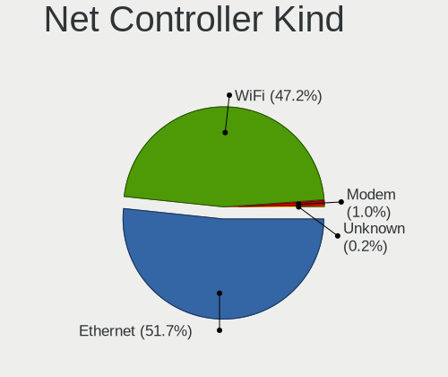
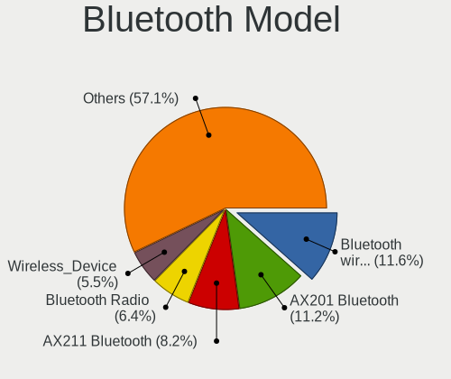

Ubuntu - Hardware Trends
------------------------

A project to identify most popular hardware characteristics and track their change
over time based on data collected by Linux users at https://Linux-Hardware.org.

Anyone can contribute to this report by the [hw-probe](https://github.com/linuxhw/hw-probe) tool:

    sudo -E hw-probe -all -upload

This is a report for all computer types. See also reports for [desktops](/Dist/Ubuntu/Desktop/README.md) and [notebooks](/Dist/Ubuntu/Notebook/README.md).

This report is for one last month. Overall report since the beginning of time: [TestDays](https://github.com/linuxhw/TestDays)

Period: Feb, 2023.

Contents
--------

* [ System ](#system)
  - [ OS                       ](#os)
  - [ OS Family                ](#os-family)
  - [ Kernel                   ](#kernel)
  - [ Kernel Family            ](#kernel-family)
  - [ Kernel Major Ver.        ](#kernel-major-ver)
  - [ Arch                     ](#arch)
  - [ DE                       ](#de)
  - [ Display Server           ](#display-server)
  - [ Display Manager          ](#display-manager)
  - [ OS Lang                  ](#os-lang)
  - [ Boot Mode                ](#boot-mode)
  - [ Filesystem               ](#filesystem)
  - [ Part. scheme             ](#part-scheme)
  - [ Dual Boot with Linux/BSD ](#dual-boot-with-linuxbsd)
  - [ Dual Boot (Win)          ](#dual-boot-win)

* [ Board ](#board)
  - [ Vendor                   ](#vendor)
  - [ Model                    ](#model)
  - [ Model Family             ](#model-family)
  - [ MFG Year                 ](#mfg-year)
  - [ Form Factor              ](#form-factor)
  - [ Secure Boot              ](#secure-boot)
  - [ Coreboot                 ](#coreboot)
  - [ RAM Size                 ](#ram-size)
  - [ RAM Used                 ](#ram-used)
  - [ Total Drives             ](#total-drives)
  - [ Has CD-ROM               ](#has-cd-rom)
  - [ Has Ethernet             ](#has-ethernet)
  - [ Has WiFi                 ](#has-wifi)
  - [ Has Bluetooth            ](#has-bluetooth)

* [ Location ](#location)
  - [ Country                  ](#country)
  - [ City                     ](#city)

* [ Drives ](#drives)
  - [ Drive Vendor             ](#drive-vendor)
  - [ Drive Model              ](#drive-model)
  - [ HDD Vendor               ](#hdd-vendor)
  - [ SSD Vendor               ](#ssd-vendor)
  - [ Drive Kind               ](#drive-kind)
  - [ Drive Connector          ](#drive-connector)
  - [ Drive Size               ](#drive-size)
  - [ Space Total              ](#space-total)
  - [ Space Used               ](#space-used)
  - [ Malfunc. Drives          ](#malfunc-drives)
  - [ Malfunc. Drive Vendor    ](#malfunc-drive-vendor)
  - [ Malfunc. HDD Vendor      ](#malfunc-hdd-vendor)
  - [ Malfunc. Drive Kind      ](#malfunc-drive-kind)
  - [ Failed Drives            ](#failed-drives)
  - [ Failed Drive Vendor      ](#failed-drive-vendor)
  - [ Drive Status             ](#drive-status)

* [ Storage controller ](#storage-controller)
  - [ Storage Vendor           ](#storage-vendor)
  - [ Storage Model            ](#storage-model)
  - [ Storage Kind             ](#storage-kind)

* [ Processor ](#processor)
  - [ CPU Vendor               ](#cpu-vendor)
  - [ CPU Model                ](#cpu-model)
  - [ CPU Model Family         ](#cpu-model-family)
  - [ CPU Cores                ](#cpu-cores)
  - [ CPU Sockets              ](#cpu-sockets)
  - [ CPU Threads              ](#cpu-threads)
  - [ CPU Op-Modes             ](#cpu-op-modes)
  - [ CPU Microcode            ](#cpu-microcode)
  - [ CPU Microarch            ](#cpu-microarch)

* [ Graphics ](#graphics)
  - [ GPU Vendor               ](#gpu-vendor)
  - [ GPU Model                ](#gpu-model)
  - [ GPU Combo                ](#gpu-combo)
  - [ GPU Driver               ](#gpu-driver)
  - [ GPU Memory               ](#gpu-memory)

* [ Monitor ](#monitor)
  - [ Monitor Vendor           ](#monitor-vendor)
  - [ Monitor Model            ](#monitor-model)
  - [ Monitor Resolution       ](#monitor-resolution)
  - [ Monitor Diagonal         ](#monitor-diagonal)
  - [ Monitor Width            ](#monitor-width)
  - [ Aspect Ratio             ](#aspect-ratio)
  - [ Monitor Area             ](#monitor-area)
  - [ Pixel Density            ](#pixel-density)
  - [ Multiple Monitors        ](#multiple-monitors)

* [ Network ](#network)
  - [ Net Controller Vendor    ](#net-controller-vendor)
  - [ Net Controller Model     ](#net-controller-model)
  - [ Wireless Vendor          ](#wireless-vendor)
  - [ Wireless Model           ](#wireless-model)
  - [ Ethernet Vendor          ](#ethernet-vendor)
  - [ Ethernet Model           ](#ethernet-model)
  - [ Net Controller Kind      ](#net-controller-kind)
  - [ Used Controller          ](#used-controller)
  - [ NICs                     ](#nics)
  - [ IPv6                     ](#ipv6)

* [ Bluetooth ](#bluetooth)
  - [ Bluetooth Vendor         ](#bluetooth-vendor)
  - [ Bluetooth Model          ](#bluetooth-model)

* [ Sound ](#sound)
  - [ Sound Vendor             ](#sound-vendor)
  - [ Sound Model              ](#sound-model)

* [ Memory ](#memory)
  - [ Memory Vendor            ](#memory-vendor)
  - [ Memory Model             ](#memory-model)
  - [ Memory Kind              ](#memory-kind)
  - [ Memory Form Factor       ](#memory-form-factor)
  - [ Memory Size              ](#memory-size)
  - [ Memory Speed             ](#memory-speed)

* [ Printers & scanners ](#printers--scanners)
  - [ Printer Vendor           ](#printer-vendor)
  - [ Printer Model            ](#printer-model)
  - [ Scanner Vendor           ](#scanner-vendor)
  - [ Scanner Model            ](#scanner-model)

* [ Camera ](#camera)
  - [ Camera Vendor            ](#camera-vendor)
  - [ Camera Model             ](#camera-model)

* [ Security ](#security)
  - [ Fingerprint Vendor       ](#fingerprint-vendor)
  - [ Fingerprint Model        ](#fingerprint-model)
  - [ Chipcard Vendor          ](#chipcard-vendor)
  - [ Chipcard Model           ](#chipcard-model)

* [ Unsupported ](#unsupported)
  - [ Unsupported Devices      ](#unsupported-devices)
  - [ Unsupported Device Types ](#unsupported-device-types)

System
------

OS
--

Installed operating systems

| Name           | Computers | Percent |
|----------------|-----------|---------|
| Ubuntu 22.04   | 846       | 61.66%  |
| Ubuntu 22.10   | 244       | 17.78%  |
| Ubuntu 20.04   | 154       | 11.22%  |
| Ubuntu 16.04   | 55        | 4.01%   |
| Ubuntu 18.04   | 47        | 3.43%   |
| Ubuntu 23.04   | 18        | 1.31%   |
| Ubuntu 21.10   | 3         | 0.22%   |
| Ubuntu 21.04   | 2         | 0.15%   |
| Ubuntu 20.10   | 2         | 0.15%   |
| Ubuntu Core 18 | 1         | 0.07%   |

OS Family
---------

OS without a version

| Name   | Computers | Percent |
|--------|-----------|---------|
| Ubuntu | 1372      | 100%    |

Kernel
------

Version of the Linux kernel

| Version               | Computers | Percent |
|-----------------------|-----------|---------|
| 5.19.0-32-generic     | 280       | 20.41%  |
| 5.15.0-58-generic     | 271       | 19.75%  |
| 5.15.0-60-generic     | 259       | 18.88%  |
| 5.19.0-31-generic     | 132       | 9.62%   |
| 5.19.0-29-generic     | 60        | 4.37%   |
| 4.15.0-142-generic    | 50        | 3.64%   |
| 5.15.0-43-generic     | 47        | 3.43%   |
| 5.19.0-21-generic     | 23        | 1.68%   |
| 5.19.0-35-generic     | 19        | 1.38%   |
| 5.4.0-137-generic     | 17        | 1.24%   |
| 5.4.0-139-generic     | 15        | 1.09%   |
| 5.15.0-56-generic     | 8         | 0.58%   |
| 5.15.0-25-generic     | 7         | 0.51%   |
| 4.15.0-175-generic    | 7         | 0.51%   |
| 5.4.0-136-generic     | 6         | 0.44%   |
| 5.4.0-107-generic     | 6         | 0.44%   |
| 5.15.0-57-generic     | 6         | 0.44%   |
| 5.17.0-1020-oem       | 5         | 0.36%   |
| 5.13.0-52-generic     | 5         | 0.36%   |
| 6.1.9-060109-generic  | 4         | 0.29%   |
| 5.4.0-87-generic      | 4         | 0.29%   |
| 5.19.0-28-generic     | 4         | 0.29%   |
| 5.15.0-66-generic     | 4         | 0.29%   |
| 5.15.0-46-generic     | 4         | 0.29%   |
| 5.14.0-1056-oem       | 4         | 0.29%   |
| 4.15.0-202-generic    | 4         | 0.29%   |
| 6.2.1-060201-generic  | 3         | 0.22%   |
| 6.2.0-060200-generic  | 3         | 0.22%   |
| 6.1.8-060108-generic  | 3         | 0.22%   |
| 6.1.7-060107-generic  | 3         | 0.22%   |
| 6.1.12-060112-generic | 3         | 0.22%   |
| 5.8.0-43-generic      | 3         | 0.22%   |
| 5.4.0-132-generic     | 3         | 0.22%   |
| 5.4.0-131-generic     | 3         | 0.22%   |
| 5.15.0-53-generic     | 3         | 0.22%   |
| 5.15.0-52-generic     | 3         | 0.22%   |
| 5.14.0-1057-oem       | 3         | 0.22%   |
| 5.14.0-1054-oem       | 3         | 0.22%   |
| 4.15.0-204-generic    | 3         | 0.22%   |
| 6.1.11-060111-generic | 2         | 0.15%   |

Kernel Family
-------------

Linux kernel without a distro release

| Version | Computers | Percent |
|---------|-----------|---------|
| 5.15.0  | 630       | 45.92%  |
| 5.19.0  | 520       | 37.9%   |
| 4.15.0  | 70        | 5.1%    |
| 5.4.0   | 66        | 4.81%   |
| 5.14.0  | 11        | 0.8%    |
| 5.13.0  | 11        | 0.8%    |
| 5.17.0  | 7         | 0.51%   |
| 6.0.0   | 6         | 0.44%   |
| 5.8.0   | 6         | 0.44%   |
| 6.1.12  | 5         | 0.36%   |
| 6.2.0   | 4         | 0.29%   |
| 6.1.9   | 4         | 0.29%   |
| 5.11.0  | 4         | 0.29%   |
| 6.2.1   | 3         | 0.22%   |
| 6.1.8   | 3         | 0.22%   |
| 6.1.7   | 3         | 0.22%   |
| 6.1.0   | 3         | 0.22%   |
| 6.1.11  | 2         | 0.15%   |
| 5.19.5  | 2         | 0.15%   |
| 4.4.0   | 2         | 0.15%   |
| 6.1.6   | 1         | 0.07%   |
| 6.1.4   | 1         | 0.07%   |
| 6.1.13  | 1         | 0.07%   |
| 6.1.10  | 1         | 0.07%   |
| 6.0.12  | 1         | 0.07%   |
| 5.19.17 | 1         | 0.07%   |
| 5.17.1  | 1         | 0.07%   |
| 5.0.0   | 1         | 0.07%   |
| 4.15.18 | 1         | 0.07%   |
| Unknown | 1         | 0.07%   |

Kernel Major Ver.
-----------------

Linux kernel major version

| Version | Computers | Percent |
|---------|-----------|---------|
| 5.15    | 630       | 45.92%  |
| 5.19    | 523       | 38.12%  |
| 4.15    | 71        | 5.17%   |
| 5.4     | 66        | 4.81%   |
| 6.1     | 24        | 1.75%   |
| 5.14    | 11        | 0.8%    |
| 5.13    | 11        | 0.8%    |
| 5.17    | 8         | 0.58%   |
| 6.2     | 7         | 0.51%   |
| 6.0     | 7         | 0.51%   |
| 5.8     | 6         | 0.44%   |
| 5.11    | 4         | 0.29%   |
| 4.4     | 2         | 0.15%   |
| 5.0     | 1         | 0.07%   |
| Unknown | 1         | 0.07%   |

Arch
----

OS architecture (x86_64, i586, etc.)

| Name    | Computers | Percent |
|---------|-----------|---------|
| x86_64  | 1364      | 99.42%  |
| i686    | 4         | 0.29%   |
| aarch64 | 2         | 0.15%   |
| riscv64 | 1         | 0.07%   |
| Unknown | 1         | 0.07%   |

DE
--

Desktop Environment

| Name            | Computers | Percent |
|-----------------|-----------|---------|
| GNOME           | 1219      | 88.85%  |
| Unknown         | 127       | 9.26%   |
| X-Cinnamon      | 11        | 0.8%    |
| GNOME Flashback | 8         | 0.58%   |
| sway            | 2         | 0.15%   |
| i3              | 2         | 0.15%   |
| Cinnamon        | 2         | 0.15%   |
| Enlightenment   | 1         | 0.07%   |

Display Server
--------------

X11 or Wayland

| Name    | Computers | Percent |
|---------|-----------|---------|
| Wayland | 726       | 52.92%  |
| X11     | 559       | 40.74%  |
| Unknown | 62        | 4.52%   |
| Tty     | 25        | 1.82%   |

Display Manager
---------------

SDDM, LightDM, etc.

| Name    | Computers | Percent |
|---------|-----------|---------|
| GDM3    | 1078      | 78.57%  |
| Unknown | 193       | 14.07%  |
| GDM     | 72        | 5.25%   |
| LightDM | 25        | 1.82%   |
| SDDM    | 2         | 0.15%   |
| SLiM    | 1         | 0.07%   |
| GREETD  | 1         | 0.07%   |

OS Lang
-------

Language

| Lang    | Computers | Percent |
|---------|-----------|---------|
| en_US   | 603       | 43.95%  |
| de_DE   | 135       | 9.84%   |
| Unknown | 97        | 7.07%   |
| fr_FR   | 72        | 5.25%   |
| en_GB   | 58        | 4.23%   |
| pt_BR   | 43        | 3.13%   |
| it_IT   | 43        | 3.13%   |
| ru_RU   | 35        | 2.55%   |
| en_CA   | 34        | 2.48%   |
| es_ES   | 33        | 2.41%   |
| en_IN   | 29        | 2.11%   |
| pl_PL   | 27        | 1.97%   |
| en_AU   | 15        | 1.09%   |
| C       | 15        | 1.09%   |
| nl_NL   | 10        | 0.73%   |
| cs_CZ   | 10        | 0.73%   |
| hu_HU   | 9         | 0.66%   |
| de_AT   | 8         | 0.58%   |
| es_MX   | 7         | 0.51%   |
| es_AR   | 7         | 0.51%   |
| sv_SE   | 6         | 0.44%   |
| fi_FI   | 6         | 0.44%   |
| en_NZ   | 5         | 0.36%   |
| de_CH   | 5         | 0.36%   |
| zh_CN   | 4         | 0.29%   |
| ja_JP   | 4         | 0.29%   |
| pt_PT   | 3         | 0.22%   |
| fr_CA   | 3         | 0.22%   |
| fr_BE   | 3         | 0.22%   |
| en_ZA   | 3         | 0.22%   |
| en_PH   | 3         | 0.22%   |
| da_DK   | 3         | 0.22%   |
| zh_TW   | 2         | 0.15%   |
| tr_TR   | 2         | 0.15%   |
| nb_NO   | 2         | 0.15%   |
| ko_KR   | 2         | 0.15%   |
| fr_CH   | 2         | 0.15%   |
| es_UY   | 2         | 0.15%   |
| es_SV   | 2         | 0.15%   |
| es_PE   | 2         | 0.15%   |

Boot Mode
---------

EFI or BIOS

| Mode | Computers | Percent |
|------|-----------|---------|
| BIOS | 805       | 58.67%  |
| EFI  | 567       | 41.33%  |

Filesystem
----------

Type of filesystem

| Type    | Computers | Percent |
|---------|-----------|---------|
| Ext4    | 1270      | 92.57%  |
| Zfs     | 31        | 2.26%   |
| Overlay | 28        | 2.04%   |
| Btrfs   | 26        | 1.9%    |
| Xfs     | 10        | 0.73%   |
| Tmpfs   | 2         | 0.15%   |
| Ext3    | 2         | 0.15%   |
| Ext2    | 2         | 0.15%   |
| Jfs     | 1         | 0.07%   |

Part. scheme
------------

Scheme of partitioning

| Type    | Computers | Percent |
|---------|-----------|---------|
| GPT     | 1122      | 81.78%  |
| MBR     | 169       | 12.32%  |
| Unknown | 81        | 5.9%    |

Dual Boot with Linux/BSD
------------------------

Hosting more than one Linux/BSD

| Dual boot | Computers | Percent |
|-----------|-----------|---------|
| No        | 1141      | 83.16%  |
| Yes       | 231       | 16.84%  |

Dual Boot (Win)
---------------

Hosting Linux and Windows

| Dual boot | Computers | Percent |
|-----------|-----------|---------|
| No        | 894       | 65.16%  |
| Yes       | 478       | 34.84%  |

Board
-----

Vendor
------

Motherboard manufacturer

| Name                        | Computers | Percent |
|-----------------------------|-----------|---------|
| ASUSTek Computer            | 243       | 17.71%  |
| Lenovo                      | 207       | 15.09%  |
| Dell                        | 200       | 14.58%  |
| Hewlett-Packard             | 184       | 13.41%  |
| Gigabyte Technology         | 83        | 6.05%   |
| MSI                         | 73        | 5.32%   |
| Acer                        | 62        | 4.52%   |
| ASRock                      | 48        | 3.5%    |
| Apple                       | 34        | 2.48%   |
| Fujitsu                     | 19        | 1.38%   |
| Toshiba                     | 17        | 1.24%   |
| Intel                       | 16        | 1.17%   |
| Unknown                     | 15        | 1.09%   |
| HUAWEI                      | 14        | 1.02%   |
| Samsung Electronics         | 13        | 0.95%   |
| Timi                        | 9         | 0.66%   |
| Sony                        | 8         | 0.58%   |
| Alienware                   | 7         | 0.51%   |
| Google                      | 6         | 0.44%   |
| AZW                         | 6         | 0.44%   |
| Notebook                    | 5         | 0.36%   |
| Biostar                     | 5         | 0.36%   |
| Supermicro                  | 4         | 0.29%   |
| Pegatron                    | 4         | 0.29%   |
| Foxconn                     | 4         | 0.29%   |
| TUXEDO                      | 3         | 0.22%   |
| Packard Bell                | 3         | 0.22%   |
| Microsoft                   | 3         | 0.22%   |
| Medion                      | 3         | 0.22%   |
| Inspur                      | 3         | 0.22%   |
| Gateway                     | 3         | 0.22%   |
| Chuwi                       | 3         | 0.22%   |
| Shenzhen Wangang Technology | 2         | 0.15%   |
| Raspberry Pi Foundation     | 2         | 0.15%   |
| Quanta                      | 2         | 0.15%   |
| HPE                         | 2         | 0.15%   |
| ECS                         | 2         | 0.15%   |
| Cisco Systems               | 2         | 0.15%   |
| BESSTAR Tech                | 2         | 0.15%   |
| ATOPNUC                     | 2         | 0.15%   |

Model
-----

Motherboard model

| Name                                    | Computers | Percent |
|-----------------------------------------|-----------|---------|
| ASUS ROG STRIX X299-E GAMING            | 40        | 2.92%   |
| Unknown                                 | 17        | 1.24%   |
| ASUS All Series                         | 12        | 0.87%   |
| ASUS PRIME TRX40-PRO                    | 9         | 0.66%   |
| Dell OptiPlex 3020                      | 7         | 0.51%   |
| ASUS TUF X299 MARK 2                    | 7         | 0.51%   |
| Gigabyte X299 UD4 Pro                   | 6         | 0.44%   |
| Gigabyte X299 AORUS Gaming 7            | 6         | 0.44%   |
| HP Notebook                             | 5         | 0.36%   |
| Dell PowerEdge R740                     | 5         | 0.36%   |
| HP 15 Notebook PC                       | 4         | 0.29%   |
| Dell OptiPlex 7050                      | 4         | 0.29%   |
| Dell Latitude E6320                     | 4         | 0.29%   |
| MSI MS-7C56                             | 3         | 0.22%   |
| MSI MS-7C37                             | 3         | 0.22%   |
| MSI MS-7C02                             | 3         | 0.22%   |
| Lenovo IdeaPad 5 Pro 16ACH6 82L5        | 3         | 0.22%   |
| Inspur NF5280M6                         | 3         | 0.22%   |
| HP Pavilion dv7                         | 3         | 0.22%   |
| HP ENVY 17                              | 3         | 0.22%   |
| HP EliteBook 840 14 inch G9 Notebook PC | 3         | 0.22%   |
| HP 15                                   | 3         | 0.22%   |
| Gigabyte X299 AORUS Gaming 3            | 3         | 0.22%   |
| Fujitsu ESPRIMO Q920                    | 3         | 0.22%   |
| Dell XPS 13 9370                        | 3         | 0.22%   |
| Dell OptiPlex 780                       | 3         | 0.22%   |
| Dell OptiPlex 7040                      | 3         | 0.22%   |
| AZW GTR                                 | 3         | 0.22%   |
| ASUS TUF Gaming X570-PLUS               | 3         | 0.22%   |
| ASUS M5A97 LE R2.0                      | 3         | 0.22%   |
| ASRock X570 Phantom Gaming 4            | 3         | 0.22%   |
| Timi TM1701                             | 2         | 0.15%   |
| Samsung 530U3C/530U4C/532U3C            | 2         | 0.15%   |
| RPi Raspberry Pi 4 Model B Rev 1.5      | 2         | 0.15%   |
| Notebook NL5xNU                         | 2         | 0.15%   |
| MSI MS-7D31                             | 2         | 0.15%   |
| MSI MS-7C09                             | 2         | 0.15%   |
| MSI MS-7B17                             | 2         | 0.15%   |
| MSI MS-7977                             | 2         | 0.15%   |
| MSI MS-7917                             | 2         | 0.15%   |

Model Family
------------

Motherboard model prefix

| Name               | Computers | Percent |
|--------------------|-----------|---------|
| Lenovo ThinkPad    | 95        | 6.92%   |
| ASUS ROG           | 61        | 4.45%   |
| Dell Latitude      | 47        | 3.43%   |
| Acer Aspire        | 46        | 3.35%   |
| Dell OptiPlex      | 38        | 2.77%   |
| Lenovo IdeaPad     | 36        | 2.62%   |
| Dell Inspiron      | 36        | 2.62%   |
| ASUS PRIME         | 34        | 2.48%   |
| HP Pavilion        | 31        | 2.26%   |
| HP EliteBook       | 26        | 1.9%    |
| Dell XPS           | 21        | 1.53%   |
| ASUS TUF           | 21        | 1.53%   |
| HP Laptop          | 19        | 1.38%   |
| Dell Precision     | 18        | 1.31%   |
| Lenovo ThinkCentre | 17        | 1.24%   |
| HP ProBook         | 17        | 1.24%   |
| ASUS VivoBook      | 17        | 1.24%   |
| Unknown            | 17        | 1.24%   |
| Toshiba Satellite  | 16        | 1.17%   |
| Gigabyte X299      | 16        | 1.17%   |
| HP ENVY            | 14        | 1.02%   |
| Dell Vostro        | 13        | 0.95%   |
| ASUS ZenBook       | 13        | 0.95%   |
| HP Compaq          | 12        | 0.87%   |
| ASUS All           | 12        | 0.87%   |
| Lenovo Yoga        | 9         | 0.66%   |
| Fujitsu ESPRIMO    | 9         | 0.66%   |
| Dell PowerEdge     | 9         | 0.66%   |
| Fujitsu LIFEBOOK   | 8         | 0.58%   |
| Lenovo ThinkBook   | 7         | 0.51%   |
| Lenovo Legion      | 7         | 0.51%   |
| Lenovo IdeaCentre  | 7         | 0.51%   |
| HP 15              | 7         | 0.51%   |
| HP OMEN            | 6         | 0.44%   |
| HP EliteDesk       | 6         | 0.44%   |
| HP ZBook           | 5         | 0.36%   |
| HP Notebook        | 5         | 0.36%   |
| Dell G15           | 5         | 0.36%   |
| Acer Swift         | 5         | 0.36%   |
| HP 250             | 4         | 0.29%   |

MFG Year
--------

Motherboard manufacture year

| Year    | Computers | Percent |
|---------|-----------|---------|
| 2021    | 166       | 12.1%   |
| 2017    | 141       | 10.28%  |
| 2020    | 114       | 8.31%   |
| 2019    | 114       | 8.31%   |
| 2022    | 106       | 7.73%   |
| 2018    | 106       | 7.73%   |
| 2012    | 92        | 6.71%   |
| 2013    | 86        | 6.27%   |
| 2011    | 81        | 5.9%    |
| 2014    | 75        | 5.47%   |
| 2016    | 74        | 5.39%   |
| 2015    | 60        | 4.37%   |
| 2010    | 60        | 4.37%   |
| 2009    | 40        | 2.92%   |
| 2008    | 26        | 1.9%    |
| 2007    | 17        | 1.24%   |
| 2023    | 4         | 0.29%   |
| 2006    | 4         | 0.29%   |
| Unknown | 3         | 0.22%   |
| 2005    | 2         | 0.15%   |
| 2004    | 1         | 0.07%   |

Form Factor
-----------

Physical design of the computer

| Name           | Computers | Percent |
|----------------|-----------|---------|
| Notebook       | 709       | 51.68%  |
| Desktop        | 546       | 39.8%   |
| Convertible    | 45        | 3.28%   |
| Mini pc        | 25        | 1.82%   |
| Server         | 21        | 1.53%   |
| All in one     | 16        | 1.17%   |
| Tablet         | 7         | 0.51%   |
| System on chip | 3         | 0.22%   |

Secure Boot
-----------

Enabled or disabled

| State    | Computers | Percent |
|----------|-----------|---------|
| Disabled | 1261      | 91.91%  |
| Enabled  | 111       | 8.09%   |

Coreboot
--------

Have coreboot on board

| Used | Computers | Percent |
|------|-----------|---------|
| No   | 1365      | 99.49%  |
| Yes  | 7         | 0.51%   |

RAM Size
--------

Total RAM memory

| Size in GB      | Computers | Percent |
|-----------------|-----------|---------|
| 4.01-8.0        | 327       | 23.83%  |
| 16.01-24.0      | 306       | 22.3%   |
| 8.01-16.0       | 216       | 15.74%  |
| 3.01-4.0        | 181       | 13.19%  |
| 32.01-64.0      | 137       | 9.99%   |
| 64.01-256.0     | 116       | 8.45%   |
| 24.01-32.0      | 28        | 2.04%   |
| 1.01-2.0        | 28        | 2.04%   |
| More than 256.0 | 20        | 1.46%   |
| 2.01-3.0        | 12        | 0.87%   |
| Unknown         | 1         | 0.07%   |

RAM Used
--------

Used RAM memory

| Used GB     | Computers | Percent |
|-------------|-----------|---------|
| 1.01-2.0    | 414       | 30.17%  |
| 2.01-3.0    | 396       | 28.86%  |
| 4.01-8.0    | 244       | 17.78%  |
| 3.01-4.0    | 183       | 13.34%  |
| 8.01-16.0   | 64        | 4.66%   |
| 32.01-64.0  | 21        | 1.53%   |
| 0.51-1.0    | 20        | 1.46%   |
| 16.01-24.0  | 15        | 1.09%   |
| 64.01-256.0 | 9         | 0.66%   |
| 24.01-32.0  | 5         | 0.36%   |
| Unknown     | 1         | 0.07%   |

Total Drives
------------

Number of drives on board

| Drives | Computers | Percent |
|--------|-----------|---------|
| 1      | 836       | 60.93%  |
| 2      | 307       | 22.38%  |
| 3      | 119       | 8.67%   |
| 4      | 55        | 4.01%   |
| 5      | 22        | 1.6%    |
| 0      | 13        | 0.95%   |
| 6      | 5         | 0.36%   |
| 7      | 4         | 0.29%   |
| 10     | 2         | 0.15%   |
| 8      | 2         | 0.15%   |
| 38     | 1         | 0.07%   |
| 36     | 1         | 0.07%   |
| 21     | 1         | 0.07%   |
| 20     | 1         | 0.07%   |
| 18     | 1         | 0.07%   |
| 11     | 1         | 0.07%   |
| 9      | 1         | 0.07%   |

Has CD-ROM
----------

Has CD-ROM on board

| Presented | Computers | Percent |
|-----------|-----------|---------|
| No        | 913       | 66.55%  |
| Yes       | 459       | 33.45%  |

Has Ethernet
------------

Has Ethernet on board

| Presented | Computers | Percent |
|-----------|-----------|---------|
| Yes       | 1172      | 85.42%  |
| No        | 200       | 14.58%  |

Has WiFi
--------

Has WiFi module

| Presented | Computers | Percent |
|-----------|-----------|---------|
| Yes       | 1054      | 76.82%  |
| No        | 318       | 23.18%  |

Has Bluetooth
-------------

Has Bluetooth module

| Presented | Computers | Percent |
|-----------|-----------|---------|
| Yes       | 855       | 62.32%  |
| No        | 517       | 37.68%  |

Location
--------

Country
-------

Geographic location (country)

| Country      | Computers | Percent |
|--------------|-----------|---------|
| USA          | 281       | 20.48%  |
| Germany      | 166       | 12.1%   |
| France       | 83        | 6.05%   |
| Unknown      | 74        | 5.39%   |
| Brazil       | 60        | 4.37%   |
| Italy        | 56        | 4.08%   |
| UK           | 48        | 3.5%    |
| Poland       | 45        | 3.28%   |
| Canada       | 43        | 3.13%   |
| Russia       | 41        | 2.99%   |
| Spain        | 36        | 2.62%   |
| Netherlands  | 31        | 2.26%   |
| India        | 30        | 2.19%   |
| Mexico       | 20        | 1.46%   |
| Turkey       | 16        | 1.17%   |
| China        | 16        | 1.17%   |
| Australia    | 16        | 1.17%   |
| Switzerland  | 15        | 1.09%   |
| Sweden       | 14        | 1.02%   |
| Argentina    | 13        | 0.95%   |
| Hungary      | 12        | 0.87%   |
| Czechia      | 12        | 0.87%   |
| Austria      | 12        | 0.87%   |
| Romania      | 11        | 0.8%    |
| Belgium      | 11        | 0.8%    |
| Japan        | 9         | 0.66%   |
| Finland      | 9         | 0.66%   |
| Denmark      | 9         | 0.66%   |
| Indonesia    | 8         | 0.58%   |
| Greece       | 8         | 0.58%   |
| Chile        | 8         | 0.58%   |
| Norway       | 7         | 0.51%   |
| Ireland      | 7         | 0.51%   |
| Portugal     | 6         | 0.44%   |
| Belarus      | 6         | 0.44%   |
| South Africa | 5         | 0.36%   |
| Pakistan     | 5         | 0.36%   |
| New Zealand  | 5         | 0.36%   |
| Hong Kong    | 5         | 0.36%   |
| Colombia     | 5         | 0.36%   |

City
----

Geographic location (city)

| City              | Computers | Percent |
|-------------------|-----------|---------|
| Unknown           | 74        | 5.39%   |
| Berlin            | 18        | 1.31%   |
| Warsaw            | 12        | 0.87%   |
| Milan             | 11        | 0.8%    |
| Hangzhou          | 11        | 0.8%    |
| St Petersburg     | 10        | 0.73%   |
| Paris             | 10        | 0.73%   |
| Moscow            | 10        | 0.73%   |
| Vienna            | 9         | 0.66%   |
| Munich            | 9         | 0.66%   |
| Amsterdam         | 9         | 0.66%   |
| Rio de Janeiro    | 7         | 0.51%   |
| London            | 7         | 0.51%   |
| Istanbul          | 7         | 0.51%   |
| Dublin            | 7         | 0.51%   |
| Denver            | 7         | 0.51%   |
| Barcelona         | 7         | 0.51%   |
| Toronto           | 6         | 0.44%   |
| Sao Paulo         | 6         | 0.44%   |
| San Jose          | 6         | 0.44%   |
| Madrid            | 6         | 0.44%   |
| Bengaluru         | 6         | 0.44%   |
| Zurich            | 5         | 0.36%   |
| Vancouver         | 5         | 0.36%   |
| Sydney            | 5         | 0.36%   |
| Rome              | 5         | 0.36%   |
| Mexico City       | 5         | 0.36%   |
| Helsinki          | 5         | 0.36%   |
| Hamburg           | 5         | 0.36%   |
| Dallas            | 5         | 0.36%   |
| Cologne           | 5         | 0.36%   |
| Stuttgart         | 4         | 0.29%   |
| Seattle           | 4         | 0.29%   |
| Portland          | 4         | 0.29%   |
| Philadelphia      | 4         | 0.29%   |
| Nairobi           | 4         | 0.29%   |
| Melbourne         | 4         | 0.29%   |
| Houston           | 4         | 0.29%   |
| Ghent             | 4         | 0.29%   |
| Frankfurt am Main | 4         | 0.29%   |

Drives
------

Drive Vendor
------------

Hard drive vendors

| Vendor                      | Computers | Drives | Percent |
|-----------------------------|-----------|--------|---------|
| Samsung Electronics         | 347       | 403    | 17.61%  |
| Seagate                     | 315       | 477    | 15.99%  |
| WDC                         | 266       | 361    | 13.5%   |
| Kingston                    | 126       | 129    | 6.4%    |
| Toshiba                     | 102       | 122    | 5.18%   |
| Sandisk                     | 98        | 107    | 4.97%   |
| Unknown                     | 62        | 67     | 3.15%   |
| Crucial                     | 61        | 69     | 3.1%    |
| Intel                       | 57        | 62     | 2.89%   |
| SK hynix                    | 52        | 55     | 2.64%   |
| Hitachi                     | 44        | 46     | 2.23%   |
| Micron Technology           | 43        | 43     | 2.18%   |
| China                       | 28        | 29     | 1.42%   |
| Silicon Motion              | 23        | 23     | 1.17%   |
| KIOXIA                      | 23        | 23     | 1.17%   |
| HGST                        | 23        | 38     | 1.17%   |
| A-DATA Technology           | 19        | 19     | 0.96%   |
| SPCC                        | 15        | 17     | 0.76%   |
| Apple                       | 15        | 15     | 0.76%   |
| Phison Electronics          | 13        | 14     | 0.66%   |
| Intenso                     | 12        | 12     | 0.61%   |
| Kingston Technology Company | 11        | 11     | 0.56%   |
| Micron/Crucial Technology   | 9         | 9      | 0.46%   |
| Unknown                     | 8         | 8      | 0.41%   |
| PNY                         | 7         | 7      | 0.36%   |
| Phison                      | 7         | 7      | 0.36%   |
| LITEON                      | 7         | 7      | 0.36%   |
| GOODRAM                     | 7         | 8      | 0.36%   |
| Corsair                     | 7         | 7      | 0.36%   |
| Netac                       | 6         | 7      | 0.3%    |
| Fujitsu                     | 6         | 7      | 0.3%    |
| ASMT                        | 6         | 9      | 0.3%    |
| Transcend                   | 5         | 5      | 0.25%   |
| Team                        | 5         | 6      | 0.25%   |
| Patriot                     | 5         | 5      | 0.25%   |
| LITEONIT                    | 5         | 5      | 0.25%   |
| Lexar                       | 5         | 5      | 0.25%   |
| Hewlett-Packard             | 5         | 8      | 0.25%   |
| Dogfish                     | 5         | 5      | 0.25%   |
| Apacer                      | 5         | 5      | 0.25%   |

Drive Model
-----------

Hard drive models

| Model                                                | Computers | Percent |
|------------------------------------------------------|-----------|---------|
| Seagate ST6000NM0115-1YZ110 6TB                      | 56        | 2.58%   |
| Samsung SSD 860 EVO 500GB                            | 50        | 2.31%   |
| Samsung NVMe SSD Controller SM981/PM981/PM983 250GB  | 38        | 1.75%   |
| Kingston SA400S37480G 480GB SSD                      | 32        | 1.48%   |
| Kingston SA400S37240G 240GB SSD                      | 30        | 1.38%   |
| Seagate ST1000LM035-1RK172 1TB                       | 16        | 0.74%   |
| Samsung SSD 850 EVO 500GB                            | 16        | 0.74%   |
| WDC WD10EZEX-08WN4A0 1TB                             | 15        | 0.69%   |
| Toshiba MQ01ABD100 1TB                               | 14        | 0.65%   |
| Unknown MMC Card  64GB                               | 12        | 0.55%   |
| Silicon Motion Asgard AN3 2TNVMe-M.2-80 2TB          | 12        | 0.55%   |
| Seagate ST12000NM0007-2A1101 12TB                    | 12        | 0.55%   |
| Samsung SSD 980 1TB                                  | 12        | 0.55%   |
| Sandisk WD Blue SN550 NVMe SSD 1TB                   | 11        | 0.51%   |
| Samsung NVMe SSD Controller SM961/PM961/SM963 512GB  | 11        | 0.51%   |
| Samsung NVMe SSD Controller PM9A1/PM9A3/980PRO 960GB | 11        | 0.51%   |
| Seagate ST16000NM001G-2KK103 16TB                    | 10        | 0.46%   |
| Samsung SSD 870 EVO 500GB                            | 10        | 0.46%   |
| Crucial CT240BX500SSD1 240GB                         | 10        | 0.46%   |
| Unknown MMC Card  128GB                              | 9         | 0.42%   |
| Seagate ST500DM002-1BD142 500GB                      | 9         | 0.42%   |
| Seagate ST4000DM004-2CV104 4TB                       | 9         | 0.42%   |
| Seagate ST1000LM024 HN-M101MBB 1TB                   | 9         | 0.42%   |
| Sandisk WD Black SN750 / PC SN730 NVMe SSD 512GB     | 9         | 0.42%   |
| Samsung SSD 850 EVO 250GB                            | 9         | 0.42%   |
| Kingston SNVS500G 500GB                              | 9         | 0.42%   |
| Crucial CT500MX500SSD1 500GB                         | 9         | 0.42%   |
| Crucial CT1000MX500SSD1 1TB                          | 9         | 0.42%   |
| Unknown MMC Card  32GB                               | 8         | 0.37%   |
| Toshiba MQ01ABF050 500GB                             | 8         | 0.37%   |
| Seagate ST500LM021-1KJ152 500GB                      | 8         | 0.37%   |
| Seagate ST10000NM0016-1TT101 10TB                    | 8         | 0.37%   |
| Intel SSD 660P Series 1024GB                         | 8         | 0.37%   |
| HGST HTS545050A7E680 500GB                           | 8         | 0.37%   |
| Unknown                                              | 8         | 0.37%   |
| Unknown SD/MMC/MS PRO 16GB                           | 7         | 0.32%   |
| SPCC Solid State Disk 256GB                          | 7         | 0.32%   |
| Seagate ST1000DM010-2EP102 1TB                       | 7         | 0.32%   |
| Samsung SSD 980 PRO 1TB                              | 7         | 0.32%   |
| WDC WD20EZRZ-00Z5HB0 2TB                             | 6         | 0.28%   |

HDD Vendor
----------

Hard disk drive vendors

| Vendor              | Computers | Drives | Percent |
|---------------------|-----------|--------|---------|
| Seagate             | 311       | 471    | 42.37%  |
| WDC                 | 217       | 300    | 29.56%  |
| Toshiba             | 76        | 96     | 10.35%  |
| Hitachi             | 44        | 46     | 5.99%   |
| Samsung Electronics | 27        | 29     | 3.68%   |
| HGST                | 23        | 38     | 3.13%   |
| Unknown             | 7         | 7      | 0.95%   |
| Fujitsu             | 6         | 7      | 0.82%   |
| ASMT                | 4         | 7      | 0.54%   |
| Maxtor              | 3         | 3      | 0.41%   |
| Intenso             | 3         | 3      | 0.41%   |
| JMicron Technology  | 2         | 2      | 0.27%   |
| Hewlett-Packard     | 2         | 5      | 0.27%   |
| Apple               | 2         | 2      | 0.27%   |
| WD MediaMax         | 1         | 1      | 0.14%   |
| SABRENT             | 1         | 1      | 0.14%   |
| PHD 3.0             | 1         | 1      | 0.14%   |
| MARVELL             | 1         | 1      | 0.14%   |
| LaCie               | 1         | 1      | 0.14%   |
| HPE                 | 1         | 2      | 0.14%   |
| DELLBOSS            | 1         | 1      | 0.14%   |

SSD Vendor
----------

Solid state drive vendors

| Vendor              | Computers | Drives | Percent |
|---------------------|-----------|--------|---------|
| Samsung Electronics | 168       | 184    | 26.54%  |
| Kingston            | 100       | 102    | 15.8%   |
| Crucial             | 55        | 62     | 8.69%   |
| SanDisk             | 53        | 56     | 8.37%   |
| WDC                 | 34        | 35     | 5.37%   |
| China               | 28        | 29     | 4.42%   |
| Intel               | 17        | 19     | 2.69%   |
| A-DATA Technology   | 14        | 14     | 2.21%   |
| SPCC                | 13        | 15     | 2.05%   |
| Micron Technology   | 13        | 13     | 2.05%   |
| SK hynix            | 9         | 10     | 1.42%   |
| PNY                 | 7         | 7      | 1.11%   |
| LITEON              | 7         | 7      | 1.11%   |
| Netac               | 6         | 6      | 0.95%   |
| Intenso             | 6         | 6      | 0.95%   |
| GOODRAM             | 6         | 7      | 0.95%   |
| Transcend           | 5         | 5      | 0.79%   |
| Team                | 5         | 6      | 0.79%   |
| Patriot             | 5         | 5      | 0.79%   |
| LITEONIT            | 5         | 5      | 0.79%   |
| Dogfish             | 5         | 5      | 0.79%   |
| Toshiba             | 4         | 4      | 0.63%   |
| Corsair             | 4         | 4      | 0.63%   |
| Apple               | 4         | 4      | 0.63%   |
| Apacer              | 4         | 4      | 0.63%   |
| Hewlett-Packard     | 3         | 3      | 0.47%   |
| T-FORCE             | 2         | 2      | 0.32%   |
| Seagate             | 2         | 2      | 0.32%   |
| SCY                 | 2         | 2      | 0.32%   |
| Leven               | 2         | 2      | 0.32%   |
| LDLC                | 2         | 2      | 0.32%   |
| KingSpec            | 2         | 2      | 0.32%   |
| KingFast            | 2         | 2      | 0.32%   |
| HS-SSD-E100         | 2         | 2      | 0.32%   |
| Gigabyte Technology | 2         | 2      | 0.32%   |
| EVM                 | 2         | 2      | 0.32%   |
| ZOTAC               | 1         | 1      | 0.16%   |
| XPG                 | 1         | 1      | 0.16%   |
| Verbatim            | 1         | 1      | 0.16%   |
| TO Exter            | 1         | 1      | 0.16%   |

Drive Kind
----------

HDD or SSD

| Kind    | Computers | Drives | Percent |
|---------|-----------|--------|---------|
| HDD     | 624       | 1024   | 34.63%  |
| SSD     | 574       | 670    | 31.85%  |
| NVMe    | 517       | 583    | 28.69%  |
| MMC     | 59        | 63     | 3.27%   |
| Unknown | 28        | 31     | 1.55%   |

Drive Connector
---------------

SATA, SAS, NVMe, etc.

| Type | Computers | Drives | Percent |
|------|-----------|--------|---------|
| SATA | 942       | 1649   | 59.47%  |
| NVMe | 517       | 583    | 32.64%  |
| SAS  | 66        | 76     | 4.17%   |
| MMC  | 59        | 63     | 3.72%   |

Drive Size
----------

Size of hard drive

| Size in TB      | Computers | Drives | Percent |
|-----------------|-----------|--------|---------|
| 0.01-0.5        | 669       | 801    | 51.7%   |
| 0.51-1.0        | 334       | 385    | 25.81%  |
| 1.01-2.0        | 101       | 131    | 7.81%   |
| 4.01-10.0       | 97        | 232    | 7.5%    |
| 10.01-20.0      | 38        | 79     | 2.94%   |
| 3.01-4.0        | 28        | 34     | 2.16%   |
| 2.01-3.0        | 26        | 31     | 2.01%   |
| More than 100.0 | 1         | 1      | 0.08%   |

Space Total
-----------

Amount of disk space available on the file system

| Size in GB     | Computers | Percent |
|----------------|-----------|---------|
| 101-250        | 357       | 26.02%  |
| 251-500        | 312       | 22.74%  |
| 501-1000       | 243       | 17.71%  |
| Unknown        | 103       | 7.51%   |
| 1001-2000      | 80        | 5.83%   |
| 51-100         | 74        | 5.39%   |
| More than 3000 | 71        | 5.17%   |
| 1-20           | 52        | 3.79%   |
| 21-50          | 47        | 3.43%   |
| 2001-3000      | 33        | 2.41%   |

Space Used
----------

Amount of used disk space

| Used GB        | Computers | Percent |
|----------------|-----------|---------|
| 1-20           | 416       | 30.32%  |
| 21-50          | 282       | 20.55%  |
| 101-250        | 168       | 12.24%  |
| 51-100         | 160       | 11.66%  |
| Unknown        | 103       | 7.51%   |
| 251-500        | 102       | 7.43%   |
| 501-1000       | 70        | 5.1%    |
| 1001-2000      | 30        | 2.19%   |
| More than 3000 | 27        | 1.97%   |
| 2001-3000      | 14        | 1.02%   |

Malfunc. Drives
---------------

Drive models with a malfunction

| Model                                        | Computers | Drives | Percent |
|----------------------------------------------|-----------|--------|---------|
| Samsung Electronics SSD 870 EVO 2TB          | 3         | 10     | 3.26%   |
| Kingston SA400S37240G 240GB SSD              | 3         | 3      | 3.26%   |
| Seagate ST500LM021-1KJ152 500GB              | 2         | 2      | 2.17%   |
| Seagate ST1000LX015-1U7172 1TB               | 2         | 2      | 2.17%   |
| Seagate ST1000LM035-1RK172 1TB               | 2         | 2      | 2.17%   |
| Samsung Electronics SSD 870 EVO 500GB        | 2         | 2      | 2.17%   |
| Kingston SA400S37480G 480GB SSD              | 2         | 2      | 2.17%   |
| Hitachi HTS543232A7A384 320GB                | 2         | 2      | 2.17%   |
| Yangtze Memory Technologies YMTC PC005 256GB | 1         | 1      | 1.09%   |
| WDC WDS240G2G0A-00JH30 240GB SSD             | 1         | 1      | 1.09%   |
| WDC WDS200T2G0A-00JH30 2TB SSD               | 1         | 1      | 1.09%   |
| WDC WD7500BPVT-24HXZT3 752GB                 | 1         | 1      | 1.09%   |
| WDC WD5001FZWX-00ZHUA0 5TB                   | 1         | 1      | 1.09%   |
| WDC WD5000AAKX-08ANVA0 500GB                 | 1         | 1      | 1.09%   |
| WDC WD5000AAKS-00UU3A0 500GB                 | 1         | 1      | 1.09%   |
| WDC WD5000AADS-00S9B0 500GB                  | 1         | 1      | 1.09%   |
| WDC WD5000AADS-00M2B0 500GB                  | 1         | 1      | 1.09%   |
| WDC WD3200BEVT-08A23T1 320GB                 | 1         | 1      | 1.09%   |
| WDC WD3200BEKT-60PVMT0 320GB                 | 1         | 1      | 1.09%   |
| WDC WD30EZRX-00MMMB0 3TB                     | 1         | 2      | 1.09%   |
| WDC WD2003FYYS-02W0B1 2TB                    | 1         | 1      | 1.09%   |
| WDC WD15EARS-00MVWB0 1TB                     | 1         | 1      | 1.09%   |
| WDC WD10SPZX-60Z10T0 1TB                     | 1         | 1      | 1.09%   |
| WDC WD10EZRZ-00HTKB0 1TB                     | 1         | 2      | 1.09%   |
| WDC WD10EZEX-60ZF5A0 1TB                     | 1         | 1      | 1.09%   |
| WDC WD10EZEX-08M2NA0 1TB                     | 1         | 1      | 1.09%   |
| WDC WD10EURX-61UY4Y0 1TB                     | 1         | 1      | 1.09%   |
| WDC WD10EAVS-00D7B1 1TB                      | 1         | 1      | 1.09%   |
| WDC WD10EARS-00Y5B1 1TB                      | 1         | 1      | 1.09%   |
| WDC WD10EALX-009BA0 1TB                      | 1         | 1      | 1.09%   |
| WDC WD10EADS-22M2B0 1TB                      | 1         | 1      | 1.09%   |
| WDC WD10EACS-00D6B0 1TB                      | 1         | 1      | 1.09%   |
| WDC WD1002FAEX-00Z3A0 1TB                    | 1         | 1      | 1.09%   |
| Toshiba MQ04ABF100 1TB                       | 1         | 1      | 1.09%   |
| Toshiba MQ01ABD050 500GB                     | 1         | 1      | 1.09%   |
| Toshiba MQ01ABC150 1TB                       | 1         | 1      | 1.09%   |
| Toshiba MK7575GSX 752GB                      | 1         | 1      | 1.09%   |
| Toshiba MK7559GSXP 752GB                     | 1         | 1      | 1.09%   |
| Toshiba DT01ACA100 1TB                       | 1         | 1      | 1.09%   |
| SK hynix SC210 2.5 7MM 256GB SSD             | 1         | 1      | 1.09%   |

Malfunc. Drive Vendor
---------------------

Vendors of faulty drives

| Vendor                      | Computers | Drives | Percent |
|-----------------------------|-----------|--------|---------|
| WDC                         | 23        | 26     | 25.56%  |
| Seagate                     | 20        | 21     | 22.22%  |
| Samsung Electronics         | 10        | 18     | 11.11%  |
| Kingston                    | 8         | 8      | 8.89%   |
| Toshiba                     | 6         | 6      | 6.67%   |
| SK hynix                    | 5         | 5      | 5.56%   |
| Intel                       | 3         | 3      | 3.33%   |
| Hitachi                     | 3         | 3      | 3.33%   |
| Micron Technology           | 2         | 2      | 2.22%   |
| Crucial                     | 2         | 2      | 2.22%   |
| A-DATA Technology           | 2         | 2      | 2.22%   |
| Yangtze Memory Technologies | 1         | 1      | 1.11%   |
| SanDisk                     | 1         | 1      | 1.11%   |
| Maxtor                      | 1         | 1      | 1.11%   |
| KingSpec                    | 1         | 1      | 1.11%   |
| HS-SSD-E100                 | 1         | 1      | 1.11%   |
| China                       | 1         | 1      | 1.11%   |

Malfunc. HDD Vendor
-------------------

Vendors of faulty HDD drives

| Vendor              | Computers | Drives | Percent |
|---------------------|-----------|--------|---------|
| WDC                 | 21        | 24     | 38.89%  |
| Seagate             | 20        | 21     | 37.04%  |
| Toshiba             | 6         | 6      | 11.11%  |
| Samsung Electronics | 3         | 3      | 5.56%   |
| Hitachi             | 3         | 3      | 5.56%   |
| Maxtor              | 1         | 1      | 1.85%   |

Malfunc. Drive Kind
-------------------

Kinds of faulty drives

| Kind | Computers | Drives | Percent |
|------|-----------|--------|---------|
| HDD  | 54        | 58     | 60%     |
| SSD  | 30        | 37     | 33.33%  |
| NVMe | 6         | 7      | 6.67%   |

Failed Drives
-------------

Failed drive models

| Model                        | Computers | Drives | Percent |
|------------------------------|-----------|--------|---------|
| Seagate ST3300657SS 304GB    | 1         | 2      | 50%     |
| Crucial M4-CT256M4SSD3 256GB | 1         | 1      | 50%     |

Failed Drive Vendor
-------------------

Failed drive vendors

| Vendor  | Computers | Drives | Percent |
|---------|-----------|--------|---------|
| Seagate | 1         | 2      | 50%     |
| Crucial | 1         | 1      | 50%     |

Drive Status
------------

Number of failed and malfunc. drives

| Status   | Computers | Drives | Percent |
|----------|-----------|--------|---------|
| Detected | 831       | 1298   | 57.63%  |
| Works    | 522       | 968    | 36.2%   |
| Malfunc  | 87        | 102    | 6.03%   |
| Failed   | 2         | 3      | 0.14%   |

Storage controller
------------------

Storage Vendor
--------------

Storage controller vendors

| Vendor                           | Computers | Percent |
|----------------------------------|-----------|---------|
| Intel                            | 931       | 52.19%  |
| AMD                              | 236       | 13.23%  |
| Samsung Electronics              | 172       | 9.64%   |
| SanDisk                          | 68        | 3.81%   |
| SK hynix                         | 43        | 2.41%   |
| Kingston Technology Company      | 37        | 2.07%   |
| Micron Technology                | 30        | 1.68%   |
| Silicon Motion                   | 29        | 1.63%   |
| ASMedia Technology               | 26        | 1.46%   |
| KIOXIA                           | 25        | 1.4%    |
| Phison Electronics               | 24        | 1.35%   |
| Nvidia                           | 21        | 1.18%   |
| Toshiba America Info Systems     | 20        | 1.12%   |
| Marvell Technology Group         | 20        | 1.12%   |
| Micron/Crucial Technology        | 16        | 0.9%    |
| JMicron Technology               | 15        | 0.84%   |
| ADATA Technology                 | 13        | 0.73%   |
| LSI Logic / Symbios Logic        | 9         | 0.5%    |
| Broadcom / LSI                   | 8         | 0.45%   |
| Apple                            | 7         | 0.39%   |
| Solid State Storage Technology   | 5         | 0.28%   |
| Shenzhen Longsys Electronics     | 5         | 0.28%   |
| Silicon Image                    | 3         | 0.17%   |
| Realtek Semiconductor            | 2         | 0.11%   |
| MAXIO Technology (Hangzhou)      | 2         | 0.11%   |
| Integrated Technology Express    | 2         | 0.11%   |
| Adaptec                          | 2         | 0.11%   |
| Yangtze Memory Technologies      | 1         | 0.06%   |
| Western Digital                  | 1         | 0.06%   |
| VIA Technologies                 | 1         | 0.06%   |
| Union Memory (Shenzhen)          | 1         | 0.06%   |
| Silicon Integrated Systems [SiS] | 1         | 0.06%   |
| Seagate Technology               | 1         | 0.06%   |
| Netac Technology                 | 1         | 0.06%   |
| Lite-On Technology               | 1         | 0.06%   |
| INNOGRIT                         | 1         | 0.06%   |
| Hewlett-Packard                  | 1         | 0.06%   |
| Biwin Storage Technology         | 1         | 0.06%   |
| Areca Technology                 | 1         | 0.06%   |
| Unknown                          | 1         | 0.06%   |

Storage Model
-------------

Storage controller models

| Model                                                                          | Computers | Percent |
|--------------------------------------------------------------------------------|-----------|---------|
| AMD FCH SATA Controller [AHCI mode]                                            | 169       | 8.5%    |
| Intel 200 Series PCH SATA controller [AHCI mode]                               | 91        | 4.58%   |
| Samsung NVMe SSD Controller SM981/PM981/PM983                                  | 70        | 3.52%   |
| Intel Sunrise Point-LP SATA Controller [AHCI mode]                             | 67        | 3.37%   |
| Intel 8 Series/C220 Series Chipset Family 6-port SATA Controller 1 [AHCI mode] | 61        | 3.07%   |
| Intel Volume Management Device NVMe RAID Controller                            | 54        | 2.71%   |
| Intel 82801 Mobile SATA Controller [RAID mode]                                 | 47        | 2.36%   |
| Samsung NVMe SSD Controller 980                                                | 40        | 2.01%   |
| Intel 7 Series Chipset Family 6-port SATA Controller [AHCI mode]               | 40        | 2.01%   |
| Samsung NVMe SSD Controller PM9A1/PM9A3/980PRO                                 | 39        | 1.96%   |
| Intel 6 Series/C200 Series Chipset Family 6 port Mobile SATA AHCI Controller   | 37        | 1.86%   |
| Intel 8 Series SATA Controller 1 [AHCI mode]                                   | 34        | 1.71%   |
| Intel Q170/Q150/B150/H170/H110/Z170/CM236 Chipset SATA Controller [AHCI Mode]  | 32        | 1.61%   |
| Intel 6 Series/C200 Series Chipset Family 6 port Desktop SATA AHCI Controller  | 31        | 1.56%   |
| Micron Non-Volatile memory controller                                          | 30        | 1.51%   |
| Intel SATA Controller [RAID mode]                                              | 28        | 1.41%   |
| ASMedia ASM1062 Serial ATA Controller                                          | 25        | 1.26%   |
| SK hynix Gold P31/PC711 NVMe Solid State Drive                                 | 24        | 1.21%   |
| SanDisk Non-Volatile memory controller                                         | 23        | 1.16%   |
| Intel Cannon Lake PCH SATA AHCI Controller                                     | 21        | 1.06%   |
| AMD SB7x0/SB8x0/SB9x0 SATA Controller [AHCI mode]                              | 21        | 1.06%   |
| AMD 500 Series Chipset SATA Controller                                         | 21        | 1.06%   |
| AMD 400 Series Chipset SATA Controller                                         | 21        | 1.06%   |
| Samsung NVMe SSD Controller SM961/PM961/SM963                                  | 20        | 1.01%   |
| Kingston Company Company Non-Volatile memory controller                        | 20        | 1.01%   |
| Intel Comet Lake SATA AHCI Controller                                          | 20        | 1.01%   |
| SanDisk WD Black SN750 / PC SN730 NVMe SSD                                     | 19        | 0.96%   |
| AMD SB7x0/SB8x0/SB9x0 IDE Controller                                           | 19        | 0.96%   |
| Intel 7 Series/C210 Series Chipset Family 6-port SATA Controller [AHCI mode]   | 18        | 0.9%    |
| Intel Wildcat Point-LP SATA Controller [AHCI Mode]                             | 17        | 0.85%   |
| Intel Tiger Lake-LP SATA Controller                                            | 17        | 0.85%   |
| KIOXIA NVMe SSD Controller BG4                                                 | 16        | 0.8%    |
| Intel SSD 660P Series                                                          | 16        | 0.8%    |
| Intel Celeron/Pentium Silver Processor SATA Controller                         | 16        | 0.8%    |
| Intel 82801IBM/IEM (ICH9M/ICH9M-E) 4 port SATA Controller [AHCI mode]          | 16        | 0.8%    |
| Intel 500 Series Chipset Family SATA AHCI Controller                           | 16        | 0.8%    |
| Silicon Motion SM2262/SM2262EN SSD Controller                                  | 15        | 0.75%   |
| Intel 5 Series/3400 Series Chipset 4 port SATA AHCI Controller                 | 15        | 0.75%   |
| Intel Atom Processor E3800 Series SATA AHCI Controller                         | 14        | 0.7%    |
| Intel 5 Series/3400 Series Chipset 6 port SATA AHCI Controller                 | 14        | 0.7%    |

Storage Kind
------------

Kind of storage controller (IDE, SATA, NVMe, SAS, ...)

| Kind | Computers | Percent |
|------|-----------|---------|
| SATA | 977       | 54.67%  |
| NVMe | 517       | 28.93%  |
| RAID | 156       | 8.73%   |
| IDE  | 124       | 6.94%   |
| SAS  | 11        | 0.62%   |
| SCSI | 2         | 0.11%   |

Processor
---------

CPU Vendor
----------

Processor vendors

| Vendor        | Computers | Percent |
|---------------|-----------|---------|
| Intel         | 1067      | 77.77%  |
| AMD           | 302       | 22.01%  |
| ARM           | 2         | 0.15%   |
| sifive,u74-mc | 1         | 0.07%   |

CPU Model
---------

Processor models

| Model                                          | Computers | Percent |
|------------------------------------------------|-----------|---------|
| Intel Core i7-7800X CPU @ 3.50GHz              | 55        | 4.01%   |
| Intel 11th Gen Core i5-1135G7 @ 2.40GHz        | 23        | 1.68%   |
| Intel 11th Gen Core i7-1165G7 @ 2.80GHz        | 19        | 1.38%   |
| Intel Core i5-7200U CPU @ 2.50GHz              | 15        | 1.09%   |
| Intel Core i7-8565U CPU @ 1.80GHz              | 14        | 1.02%   |
| Intel Core i7-8550U CPU @ 1.80GHz              | 13        | 0.95%   |
| AMD Ryzen 7 5700U with Radeon Graphics         | 12        | 0.87%   |
| Intel Core i5-8265U CPU @ 1.60GHz              | 11        | 0.8%    |
| Intel 12th Gen Core i7-1260P                   | 11        | 0.8%    |
| AMD Ryzen 5 3500U with Radeon Vega Mobile Gfx  | 11        | 0.8%    |
| Intel Core i7-8750H CPU @ 2.20GHz              | 10        | 0.73%   |
| Intel Core i5-6300U CPU @ 2.40GHz              | 10        | 0.73%   |
| Intel Celeron N4020 CPU @ 1.10GHz              | 10        | 0.73%   |
| AMD Ryzen Threadripper 3960X 24-Core Processor | 10        | 0.73%   |
| AMD Ryzen 7 5800H with Radeon Graphics         | 10        | 0.73%   |
| AMD Ryzen 5 5500U with Radeon Graphics         | 10        | 0.73%   |
| Intel Core i7-7820X CPU @ 3.60GHz              | 9         | 0.66%   |
| Intel Core i7-6700HQ CPU @ 2.60GHz             | 9         | 0.66%   |
| Intel Core i5-6200U CPU @ 2.30GHz              | 9         | 0.66%   |
| Intel Core i5-2520M CPU @ 2.50GHz              | 9         | 0.66%   |
| Intel Celeron CPU N3350 @ 1.10GHz              | 9         | 0.66%   |
| Intel Core i7-4770 CPU @ 3.40GHz               | 8         | 0.58%   |
| Intel Core i5-4200U CPU @ 1.60GHz              | 8         | 0.58%   |
| Intel Core i5-1035G1 CPU @ 1.00GHz             | 8         | 0.58%   |
| Intel Core i5-10210U CPU @ 1.60GHz             | 8         | 0.58%   |
| AMD Ryzen 9 5900HX with Radeon Graphics        | 8         | 0.58%   |
| AMD Ryzen 5 3600 6-Core Processor              | 8         | 0.58%   |
| Intel Core i7-6700 CPU @ 3.40GHz               | 7         | 0.51%   |
| Intel Core i7-6600U CPU @ 2.60GHz              | 7         | 0.51%   |
| Intel Core i7-1065G7 CPU @ 1.30GHz             | 7         | 0.51%   |
| Intel Core i5-8250U CPU @ 1.60GHz              | 7         | 0.51%   |
| Intel Core i5-4590 CPU @ 3.30GHz               | 7         | 0.51%   |
| Intel Core i5-3470 CPU @ 3.20GHz               | 7         | 0.51%   |
| AMD Ryzen 7 3700X 8-Core Processor             | 7         | 0.51%   |
| Intel Core i7-7500U CPU @ 2.70GHz              | 6         | 0.44%   |
| Intel Core i7-10750H CPU @ 2.60GHz             | 6         | 0.44%   |
| Intel Core i5-6500 CPU @ 3.20GHz               | 6         | 0.44%   |
| Intel Core i5-3210M CPU @ 2.50GHz              | 6         | 0.44%   |
| Intel Core i5-2400 CPU @ 3.10GHz               | 6         | 0.44%   |
| Intel 12th Gen Core i7-12700H                  | 6         | 0.44%   |

CPU Model Family
----------------

Processor model prefix

| Model                   | Computers | Percent |
|-------------------------|-----------|---------|
| Intel Core i7           | 313       | 22.81%  |
| Intel Core i5           | 274       | 19.97%  |
| Other                   | 154       | 11.22%  |
| Intel Core i3           | 89        | 6.49%   |
| Intel Celeron           | 73        | 5.32%   |
| AMD Ryzen 5             | 73        | 5.32%   |
| AMD Ryzen 7             | 66        | 4.81%   |
| Intel Core 2 Duo        | 39        | 2.84%   |
| Intel Xeon              | 37        | 2.7%    |
| AMD Ryzen 9             | 31        | 2.26%   |
| Intel Pentium           | 30        | 2.19%   |
| AMD FX                  | 15        | 1.09%   |
| AMD Ryzen Threadripper  | 14        | 1.02%   |
| Intel Pentium Dual-Core | 11        | 0.8%    |
| AMD Ryzen 3             | 11        | 0.8%    |
| AMD A4                  | 11        | 0.8%    |
| Intel Core i9           | 10        | 0.73%   |
| Intel Atom              | 10        | 0.73%   |
| Intel Core 2 Quad       | 8         | 0.58%   |
| AMD A8                  | 8         | 0.58%   |
| AMD A6                  | 8         | 0.58%   |
| Intel Xeon Gold         | 7         | 0.51%   |
| Intel Core 2            | 7         | 0.51%   |
| AMD Athlon II X2        | 7         | 0.51%   |
| Intel Pentium Dual      | 5         | 0.36%   |
| AMD Ryzen 7 PRO         | 5         | 0.36%   |
| AMD Phenom II X6        | 5         | 0.36%   |
| AMD E1                  | 5         | 0.36%   |
| Intel Xeon Silver       | 4         | 0.29%   |
| AMD E                   | 4         | 0.29%   |
| AMD Ryzen 3 PRO         | 3         | 0.22%   |
| AMD Phenom II X4        | 3         | 0.22%   |
| AMD A10                 | 3         | 0.22%   |
| Intel Core M            | 2         | 0.15%   |
| AMD Sempron             | 2         | 0.15%   |
| AMD Ryzen 5 PRO         | 2         | 0.15%   |
| AMD E2                  | 2         | 0.15%   |
| AMD Athlon X4           | 2         | 0.15%   |
| AMD Athlon II X4        | 2         | 0.15%   |
| AMD Athlon 64 X2        | 2         | 0.15%   |

CPU Cores
---------

Number of processor cores

| Number  | Computers | Percent |
|---------|-----------|---------|
| 4       | 478       | 34.84%  |
| 2       | 451       | 32.87%  |
| 6       | 186       | 13.56%  |
| 8       | 121       | 8.82%   |
| 12      | 27        | 1.97%   |
| 10      | 21        | 1.53%   |
| 1       | 18        | 1.31%   |
| 24      | 16        | 1.17%   |
| 16      | 16        | 1.17%   |
| 14      | 14        | 1.02%   |
| 3       | 9         | 0.66%   |
| 48      | 3         | 0.22%   |
| 40      | 3         | 0.22%   |
| 20      | 3         | 0.22%   |
| Unknown | 3         | 0.22%   |
| 32      | 1         | 0.07%   |
| 28      | 1         | 0.07%   |
| 26      | 1         | 0.07%   |

CPU Sockets
-----------

Number of sockets

| Number  | Computers | Percent |
|---------|-----------|---------|
| 1       | 1348      | 98.25%  |
| 2       | 21        | 1.53%   |
| Unknown | 3         | 0.22%   |

CPU Threads
-----------

Threads per core (Hyper-Threading)

| Number  | Computers | Percent |
|---------|-----------|---------|
| 2       | 969       | 70.63%  |
| 1       | 400       | 29.15%  |
| Unknown | 3         | 0.22%   |

CPU Op-Modes
------------

CPU Operation Modes (32-bit, 64-bit)

| Op mode        | Computers | Percent |
|----------------|-----------|---------|
| 32-bit, 64-bit | 1368      | 99.71%  |
| 32-bit         | 2         | 0.15%   |
| Unknown        | 2         | 0.15%   |

CPU Microcode
-------------

Microcode number

| Number     | Computers | Percent |
|------------|-----------|---------|
| Unknown    | 697       | 50.8%   |
| 0x50654    | 55        | 4.01%   |
| 0x806c1    | 39        | 2.84%   |
| 0x306a9    | 35        | 2.55%   |
| 0x306c3    | 30        | 2.19%   |
| 0x806ec    | 27        | 1.97%   |
| 0x506e3    | 26        | 1.9%    |
| 0x206a7    | 26        | 1.9%    |
| 0x906ea    | 21        | 1.53%   |
| 0x1067a    | 21        | 1.53%   |
| 0x0a50000c | 20        | 1.46%   |
| 0x806ea    | 19        | 1.38%   |
| 0x906a3    | 17        | 1.24%   |
| 0x40651    | 17        | 1.24%   |
| 0x806e9    | 14        | 1.02%   |
| 0x08608103 | 13        | 0.95%   |
| 0x406e3    | 12        | 0.87%   |
| 0x906a4    | 11        | 0.8%    |
| 0x08108109 | 11        | 0.8%    |
| 0x706e5    | 10        | 0.73%   |
| 0x706a8    | 10        | 0.73%   |
| 0x306d4    | 10        | 0.73%   |
| 0x08301025 | 10        | 0.73%   |
| 0xa0652    | 9         | 0.66%   |
| 0x50657    | 9         | 0.66%   |
| 0x906e9    | 8         | 0.58%   |
| 0x806d1    | 8         | 0.58%   |
| 0x20655    | 8         | 0.58%   |
| 0x506c9    | 7         | 0.51%   |
| 0x30678    | 7         | 0.51%   |
| 0x806eb    | 6         | 0.44%   |
| 0x0a201016 | 6         | 0.44%   |
| 0x08701021 | 6         | 0.44%   |
| 0x906ed    | 5         | 0.36%   |
| 0x306f2    | 5         | 0.36%   |
| 0x0a404101 | 5         | 0.36%   |
| 0xa0655    | 4         | 0.29%   |
| 0x806c2    | 4         | 0.29%   |
| 0x0a50000d | 4         | 0.29%   |
| 0x08600106 | 4         | 0.29%   |

CPU Microarch
-------------

Microarchitecture

| Name             | Computers | Percent |
|------------------|-----------|---------|
| KabyLake         | 197       | 14.36%  |
| Skylake          | 158       | 11.52%  |
| Haswell          | 119       | 8.67%   |
| SandyBridge      | 87        | 6.34%   |
| IvyBridge        | 81        | 5.9%    |
| Unknown          | 80        | 5.83%   |
| Zen 3            | 68        | 4.96%   |
| TigerLake        | 67        | 4.88%   |
| Zen 2            | 51        | 3.72%   |
| Penryn           | 51        | 3.72%   |
| Zen+             | 36        | 2.62%   |
| Westmere         | 36        | 2.62%   |
| Silvermont       | 33        | 2.41%   |
| IceLake          | 33        | 2.41%   |
| CometLake        | 32        | 2.33%   |
| Alderlake Hybrid | 32        | 2.33%   |
| Core             | 26        | 1.9%    |
| Piledriver       | 25        | 1.82%   |
| K10              | 21        | 1.53%   |
| Broadwell        | 20        | 1.46%   |
| Goldmont plus    | 19        | 1.38%   |
| Zen              | 18        | 1.31%   |
| Goldmont         | 14        | 1.02%   |
| Excavator        | 13        | 0.95%   |
| Nehalem          | 12        | 0.87%   |
| Puma             | 10        | 0.73%   |
| Jaguar           | 7         | 0.51%   |
| Bobcat           | 6         | 0.44%   |
| K8 Hammer        | 4         | 0.29%   |
| Bulldozer        | 4         | 0.29%   |
| Tremont          | 3         | 0.22%   |
| NetBurst         | 2         | 0.15%   |
| K10 Llano        | 2         | 0.15%   |
| Bonnell          | 2         | 0.15%   |
| Steamroller      | 1         | 0.07%   |
| P6               | 1         | 0.07%   |
| K6               | 1         | 0.07%   |

Graphics
--------

GPU Vendor
----------

Vendors of graphics cards

| Vendor                                       | Computers | Percent |
|----------------------------------------------|-----------|---------|
| Intel                                        | 775       | 48.05%  |
| Nvidia                                       | 470       | 29.14%  |
| AMD                                          | 341       | 21.14%  |
| Matrox Electronics Systems                   | 16        | 0.99%   |
| ASPEED Technology                            | 8         | 0.5%    |
| XGI Technology (eXtreme Graphics Innovation) | 1         | 0.06%   |
| Silicon Integrated Systems [SiS]             | 1         | 0.06%   |
| ATI Technologies                             | 1         | 0.06%   |

GPU Model
---------

Graphics card models

| Model                                                                                    | Computers | Percent |
|------------------------------------------------------------------------------------------|-----------|---------|
| Intel 2nd Generation Core Processor Family Integrated Graphics Controller                | 66        | 4.03%   |
| Intel TigerLake-LP GT2 [Iris Xe Graphics]                                                | 59        | 3.6%    |
| Nvidia GK208B [GeForce GT 710]                                                           | 54        | 3.3%    |
| Intel 3rd Gen Core processor Graphics Controller                                         | 38        | 2.32%   |
| AMD Cezanne [Radeon Vega Series / Radeon Vega Mobile Series]                             | 38        | 2.32%   |
| Intel Skylake GT2 [HD Graphics 520]                                                      | 36        | 2.2%    |
| Intel Haswell-ULT Integrated Graphics Controller                                         | 36        | 2.2%    |
| Intel HD Graphics 620                                                                    | 32        | 1.95%   |
| Intel HD Graphics 530                                                                    | 31        | 1.89%   |
| Intel WhiskeyLake-U GT2 [UHD Graphics 620]                                               | 29        | 1.77%   |
| AMD Caicos [Radeon HD 6450/7450/8450 / R5 230 OEM]                                       | 29        | 1.77%   |
| Intel Alder Lake-P Integrated Graphics Controller                                        | 27        | 1.65%   |
| Intel Xeon E3-1200 v3/4th Gen Core Processor Integrated Graphics Controller              | 26        | 1.59%   |
| Intel UHD Graphics 620                                                                   | 26        | 1.59%   |
| AMD Picasso/Raven 2 [Radeon Vega Series / Radeon Vega Mobile Series]                     | 26        | 1.59%   |
| AMD Lucienne                                                                             | 24        | 1.47%   |
| Intel Core Processor Integrated Graphics Controller                                      | 22        | 1.34%   |
| Intel GeminiLake [UHD Graphics 600]                                                      | 19        | 1.16%   |
| Intel CometLake-U GT2 [UHD Graphics]                                                     | 19        | 1.16%   |
| Intel CoffeeLake-H GT2 [UHD Graphics 630]                                                | 19        | 1.16%   |
| Intel Atom/Celeron/Pentium Processor x5-E8000/J3xxx/N3xxx Integrated Graphics Controller | 18        | 1.1%    |
| AMD Renoir                                                                               | 17        | 1.04%   |
| Intel HD Graphics 5500                                                                   | 16        | 0.98%   |
| Intel CometLake-H GT2 [UHD Graphics]                                                     | 15        | 0.92%   |
| Intel Atom Processor Z36xxx/Z37xxx Series Graphics & Display                             | 15        | 0.92%   |
| Intel Xeon E3-1200 v2/3rd Gen Core processor Graphics Controller                         | 14        | 0.86%   |
| Intel 4th Gen Core Processor Integrated Graphics Controller                              | 14        | 0.86%   |
| AMD Ellesmere [Radeon RX 470/480/570/570X/580/580X/590]                                  | 14        | 0.86%   |
| Intel HD Graphics 630                                                                    | 13        | 0.79%   |
| Intel HD Graphics 500                                                                    | 13        | 0.79%   |
| Intel Mobile 4 Series Chipset Integrated Graphics Controller                             | 12        | 0.73%   |
| Intel CoffeeLake-S GT2 [UHD Graphics 630]                                                | 12        | 0.73%   |
| Nvidia GP107 [GeForce GTX 1050 Ti]                                                       | 11        | 0.67%   |
| Intel Iris Plus Graphics G1 (Ice Lake)                                                   | 11        | 0.67%   |
| Nvidia GA106M [GeForce RTX 3060 Mobile / Max-Q]                                          | 10        | 0.61%   |
| Intel TigerLake-H GT1 [UHD Graphics]                                                     | 10        | 0.61%   |
| AMD Rembrandt [Radeon 680M]                                                              | 10        | 0.61%   |
| Nvidia GM206 [GeForce GTX 960]                                                           | 9         | 0.55%   |
| Nvidia GM108M [GeForce 940MX]                                                            | 9         | 0.55%   |
| Intel JasperLake [UHD Graphics]                                                          | 9         | 0.55%   |

GPU Combo
---------

Combinations of graphics cards

| Name            | Computers | Percent |
|-----------------|-----------|---------|
| 1 x Intel       | 564       | 41.11%  |
| 1 x Nvidia      | 272       | 19.83%  |
| 1 x AMD         | 272       | 19.83%  |
| Intel + Nvidia  | 158       | 11.52%  |
| AMD + Nvidia    | 30        | 2.19%   |
| Intel + AMD     | 29        | 2.11%   |
| 1 x Matrox      | 12        | 0.87%   |
| 2 x AMD         | 8         | 0.58%   |
| 1 x ASPEED      | 7         | 0.51%   |
| Other           | 6         | 0.44%   |
| 2 x Nvidia      | 6         | 0.44%   |
| Nvidia + Matrox | 3         | 0.22%   |
| 2 x Intel       | 1         | 0.07%   |
| 1 x XGI         | 1         | 0.07%   |
| 1 x SiS         | 1         | 0.07%   |
| AMD + Matrox    | 1         | 0.07%   |
| AMD + ASPEED    | 1         | 0.07%   |

GPU Driver
----------

Free vs proprietary

| Driver      | Computers | Percent |
|-------------|-----------|---------|
| Free        | 1070      | 77.99%  |
| Proprietary | 244       | 17.78%  |
| Unknown     | 58        | 4.23%   |

GPU Memory
----------

Total video memory

| Size in GB | Computers | Percent |
|------------|-----------|---------|
| Unknown    | 1042      | 75.95%  |
| 0.51-1.0   | 99        | 7.22%   |
| 1.01-2.0   | 82        | 5.98%   |
| 0.01-0.5   | 67        | 4.88%   |
| 3.01-4.0   | 39        | 2.84%   |
| 7.01-8.0   | 15        | 1.09%   |
| 8.01-16.0  | 13        | 0.95%   |
| 5.01-6.0   | 12        | 0.87%   |
| 2.01-3.0   | 3         | 0.22%   |

Monitor
-------

Monitor Vendor
--------------

Monitor vendors

| Vendor                  | Computers | Percent |
|-------------------------|-----------|---------|
| Samsung Electronics     | 165       | 12.55%  |
| AU Optronics            | 155       | 11.79%  |
| BOE                     | 134       | 10.19%  |
| LG Display              | 121       | 9.2%    |
| Chimei Innolux          | 106       | 8.06%   |
| Dell                    | 85        | 6.46%   |
| Hewlett-Packard         | 54        | 4.11%   |
| Goldstar                | 44        | 3.35%   |
| Acer                    | 42        | 3.19%   |
| Apple                   | 30        | 2.28%   |
| AOC                     | 30        | 2.28%   |
| Ancor Communications    | 28        | 2.13%   |
| Sharp                   | 23        | 1.75%   |
| Lenovo                  | 23        | 1.75%   |
| Philips                 | 19        | 1.44%   |
| PANDA                   | 18        | 1.37%   |
| BenQ                    | 18        | 1.37%   |
| Iiyama                  | 13        | 0.99%   |
| CSO                     | 13        | 0.99%   |
| Sony                    | 11        | 0.84%   |
| Chi Mei Optoelectronics | 11        | 0.84%   |
| InfoVision              | 10        | 0.76%   |
| ASUSTek Computer        | 10        | 0.76%   |
| ViewSonic               | 9         | 0.68%   |
| Vizio                   | 8         | 0.61%   |
| Panasonic               | 7         | 0.53%   |
| LG Electronics          | 6         | 0.46%   |
| Sceptre Tech            | 5         | 0.38%   |
| Eizo                    | 5         | 0.38%   |
| TMX                     | 4         | 0.3%    |
| Medion                  | 4         | 0.3%    |
| LG Philips              | 4         | 0.3%    |
| HannStar                | 4         | 0.3%    |
| Gigabyte Technology     | 4         | 0.3%    |
| Fujitsu Siemens         | 4         | 0.3%    |
| Unknown                 | 4         | 0.3%    |
| HUAWEI                  | 3         | 0.23%   |
| HJW                     | 3         | 0.23%   |
| Denver                  | 3         | 0.23%   |
| Vestel Elektronik       | 2         | 0.15%   |

Monitor Model
-------------

Monitor models

| Model                                                                    | Computers | Percent |
|--------------------------------------------------------------------------|-----------|---------|
| Samsung Electronics LCD Monitor SEC5441 1366x768 293x165mm 13.2-inch     | 7         | 0.52%   |
| AOC 24B2W1G5 AOC2402 1920x1080 527x296mm 23.8-inch                       | 7         | 0.52%   |
| Chimei Innolux LCD Monitor CMN15F5 1920x1080 344x193mm 15.5-inch         | 6         | 0.44%   |
| BOE LCD Monitor BOE0872 1920x1080 344x194mm 15.5-inch                    | 6         | 0.44%   |
| AU Optronics LCD Monitor AUO38ED 1920x1080 344x193mm 15.5-inch           | 6         | 0.44%   |
| Samsung Electronics C27F390 SAM0D32 1920x1080 598x336mm 27.0-inch        | 5         | 0.37%   |
| BOE LCD Monitor BOE0700 1920x1080 344x194mm 15.5-inch                    | 5         | 0.37%   |
| Samsung Electronics C24F390 SAM0D2C 1920x1080 521x293mm 23.5-inch        | 4         | 0.3%    |
| PANDA LCD Monitor NCP0035 1920x1080 344x194mm 15.5-inch                  | 4         | 0.3%    |
| LG Display LCD Monitor LGD02DC 1366x768 344x194mm 15.5-inch              | 4         | 0.3%    |
| Goldstar Ultra HD GSM5B09 3840x2160 600x340mm 27.2-inch                  | 4         | 0.3%    |
| Chimei Innolux LCD Monitor CMN15E7 1920x1080 344x193mm 15.5-inch         | 4         | 0.3%    |
| Chimei Innolux LCD Monitor CMN14D4 1920x1080 309x173mm 13.9-inch         | 4         | 0.3%    |
| Chimei Innolux LCD Monitor CMN1490 1366x768 309x173mm 13.9-inch          | 4         | 0.3%    |
| Chimei Innolux LCD Monitor CMN140A 1920x1080 309x173mm 13.9-inch         | 4         | 0.3%    |
| Chi Mei Optoelectronics LCD Monitor CMO15A7 1366x768 344x193mm 15.5-inch | 4         | 0.3%    |
| AU Optronics LCD Monitor AUO61ED 1920x1080 344x193mm 15.5-inch           | 4         | 0.3%    |
| AU Optronics LCD Monitor AUO403D 1920x1080 309x173mm 13.9-inch           | 4         | 0.3%    |
| AU Optronics LCD Monitor AUO2E3C 1366x768 309x173mm 13.9-inch            | 4         | 0.3%    |
| AU Optronics LCD Monitor AUO243D 1920x1080 309x173mm 13.9-inch           | 4         | 0.3%    |
| AU Optronics LCD Monitor AUO21ED 1920x1080 344x193mm 15.5-inch           | 4         | 0.3%    |
| AU Optronics LCD Monitor AUO123D 1920x1080 309x173mm 13.9-inch           | 4         | 0.3%    |
| Unknown                                                                  | 4         | 0.3%    |
| Samsung Electronics LCD Monitor SEC544B 1600x900 382x214mm 17.2-inch     | 3         | 0.22%   |
| Panasonic VVX14P048M00 MEI96A2 3000x2000 285x190mm 13.5-inch             | 3         | 0.22%   |
| LG Display LCD Monitor LGD0465 1366x768 344x194mm 15.5-inch              | 3         | 0.22%   |
| LG Display LCD Monitor LGD0456 1366x768 344x194mm 15.5-inch              | 3         | 0.22%   |
| LG Display LCD Monitor LGD033A 1366x768 344x194mm 15.5-inch              | 3         | 0.22%   |
| LG Display LCD Monitor LGD02D8 1366x768 277x156mm 12.5-inch              | 3         | 0.22%   |
| LG Display LCD Monitor LGD027A 1600x900 382x215mm 17.3-inch              | 3         | 0.22%   |
| LG Display LCD Monitor LGD01E9 1920x1080 345x194mm 15.6-inch             | 3         | 0.22%   |
| InfoVision LCD Monitor IVO057D 1920x1080 309x174mm 14.0-inch             | 3         | 0.22%   |
| Dell U2412M DELA07A 1920x1200 518x324mm 24.1-inch                        | 3         | 0.22%   |
| Dell P2212H DELA07F 1920x1080 531x299mm 24.0-inch                        | 3         | 0.22%   |
| Chimei Innolux LCD Monitor CMN15E6 1366x768 344x193mm 15.5-inch          | 3         | 0.22%   |
| Chimei Innolux LCD Monitor CMN15DC 1366x768 344x193mm 15.5-inch          | 3         | 0.22%   |
| Chimei Innolux LCD Monitor CMN14D5 1920x1080 309x173mm 13.9-inch         | 3         | 0.22%   |
| BOE LCD Monitor BOE0893 2160x1440 296x197mm 14.0-inch                    | 3         | 0.22%   |
| BOE LCD Monitor BOE07C9 1920x1080 309x173mm 13.9-inch                    | 3         | 0.22%   |
| BOE LCD Monitor BOE0742 1920x1080 309x173mm 13.9-inch                    | 3         | 0.22%   |

Monitor Resolution
------------------

Monitor screen resolution

| Resolution         | Computers | Percent |
|--------------------|-----------|---------|
| 1920x1080 (FHD)    | 607       | 47.61%  |
| 1366x768 (WXGA)    | 202       | 15.84%  |
| 3840x2160 (4K)     | 86        | 6.75%   |
| 2560x1440 (QHD)    | 65        | 5.1%    |
| 1600x900 (HD+)     | 54        | 4.24%   |
| 1920x1200 (WUXGA)  | 36        | 2.82%   |
| 1680x1050 (WSXGA+) | 28        | 2.2%    |
| 1280x1024 (SXGA)   | 28        | 2.2%    |
| 2560x1600          | 23        | 1.8%    |
| 1440x900 (WXGA+)   | 20        | 1.57%   |
| 1280x800 (WXGA)    | 19        | 1.49%   |
| Unknown            | 12        | 0.94%   |
| 3440x1440          | 11        | 0.86%   |
| 2880x1800          | 11        | 0.86%   |
| 1360x768           | 10        | 0.78%   |
| 3840x1080          | 6         | 0.47%   |
| 2560x1080          | 6         | 0.47%   |
| 3840x2400          | 5         | 0.39%   |
| 2160x1440          | 5         | 0.39%   |
| 3840x1600          | 4         | 0.31%   |
| 1920x540           | 4         | 0.31%   |
| 1400x1050          | 3         | 0.24%   |
| 1280x960           | 3         | 0.24%   |
| 1024x768 (XGA)     | 3         | 0.24%   |
| 3456x2160          | 2         | 0.16%   |
| 3360x1050          | 2         | 0.16%   |
| 3072x1920          | 2         | 0.16%   |
| 2880x1620          | 2         | 0.16%   |
| 1280x720 (HD)      | 2         | 0.16%   |
| 4480x1440          | 1         | 0.08%   |
| 3926x1080          | 1         | 0.08%   |
| 3520x1200          | 1         | 0.08%   |
| 3520x1080          | 1         | 0.08%   |
| 3300x2200          | 1         | 0.08%   |
| 3200x900           | 1         | 0.08%   |
| 3200x2000          | 1         | 0.08%   |
| 3200x1800 (QHD+)   | 1         | 0.08%   |
| 3120x2080          | 1         | 0.08%   |
| 2560x1700          | 1         | 0.08%   |
| 2520x1680          | 1         | 0.08%   |

Monitor Diagonal
----------------

Diagonal size in inches

| Inches  | Computers | Percent |
|---------|-----------|---------|
| 15      | 328       | 24.96%  |
| 13      | 142       | 10.81%  |
| 14      | 116       | 8.83%   |
| 27      | 99        | 7.53%   |
| 23      | 87        | 6.62%   |
| 24      | 84        | 6.39%   |
| 17      | 81        | 6.16%   |
| 21      | 74        | 5.63%   |
| Unknown | 44        | 3.35%   |
| 31      | 33        | 2.51%   |
| 20      | 27        | 2.05%   |
| 19      | 23        | 1.75%   |
| 12      | 22        | 1.67%   |
| 16      | 18        | 1.37%   |
| 34      | 17        | 1.29%   |
| 18      | 17        | 1.29%   |
| 22      | 16        | 1.22%   |
| 84      | 11        | 0.84%   |
| 11      | 11        | 0.84%   |
| 72      | 8         | 0.61%   |
| 40      | 8         | 0.61%   |
| 32      | 8         | 0.61%   |
| 54      | 7         | 0.53%   |
| 25      | 6         | 0.46%   |
| 43      | 4         | 0.3%    |
| 37      | 3         | 0.23%   |
| 65      | 2         | 0.15%   |
| 48      | 2         | 0.15%   |
| 46      | 2         | 0.15%   |
| 28      | 2         | 0.15%   |
| 74      | 1         | 0.08%   |
| 69      | 1         | 0.08%   |
| 60      | 1         | 0.08%   |
| 58      | 1         | 0.08%   |
| 57      | 1         | 0.08%   |
| 55      | 1         | 0.08%   |
| 41      | 1         | 0.08%   |
| 39      | 1         | 0.08%   |
| 38      | 1         | 0.08%   |
| 36      | 1         | 0.08%   |

Monitor Width
-------------

Physical width

| Width in mm | Computers | Percent |
|-------------|-----------|---------|
| 301-350     | 526       | 40.52%  |
| 501-600     | 249       | 19.18%  |
| 401-500     | 142       | 10.94%  |
| 201-300     | 115       | 8.86%   |
| 351-400     | 91        | 7.01%   |
| 601-700     | 49        | 3.78%   |
| Unknown     | 44        | 3.39%   |
| 701-800     | 27        | 2.08%   |
| 1501-2000   | 21        | 1.62%   |
| 1001-1500   | 15        | 1.16%   |
| 801-900     | 14        | 1.08%   |
| 901-1000    | 5         | 0.39%   |

Aspect Ratio
------------

Proportional relationship between the width and the height

| Ratio   | Computers | Percent |
|---------|-----------|---------|
| 16/9    | 940       | 77.94%  |
| 16/10   | 158       | 13.1%   |
| Unknown | 36        | 2.99%   |
| 5/4     | 27        | 2.24%   |
| 21/9    | 20        | 1.66%   |
| 4/3     | 10        | 0.83%   |
| 3/2     | 9         | 0.75%   |
| 32/9    | 3         | 0.25%   |
| 6/5     | 1         | 0.08%   |
| 1.00    | 1         | 0.08%   |
| 0.56    | 1         | 0.08%   |

Monitor Area
------------

Area in inch

| Area in inch | Computers | Percent |
|----------------|-----------|---------|
| 101-110        | 331       | 25.27%  |
| 201-250        | 207       | 15.8%   |
| 81-90          | 190       | 14.5%   |
| 301-350        | 99        | 7.56%   |
| 151-200        | 76        | 5.8%    |
| 71-80          | 67        | 5.11%   |
| 351-500        | 59        | 4.5%    |
| 121-130        | 55        | 4.2%    |
| Unknown        | 44        | 3.36%   |
| 251-300        | 35        | 2.67%   |
| More than 1000 | 33        | 2.52%   |
| 141-150        | 31        | 2.37%   |
| 501-1000       | 24        | 1.83%   |
| 61-70          | 20        | 1.53%   |
| 111-120        | 15        | 1.15%   |
| 51-60          | 11        | 0.84%   |
| 131-140        | 9         | 0.69%   |
| 91-100         | 3         | 0.23%   |
| 41-50          | 1         | 0.08%   |

Pixel Density
-------------

Pixels per inch

| Density       | Computers | Percent |
|---------------|-----------|---------|
| 51-100        | 394       | 30.76%  |
| 121-160       | 374       | 29.2%   |
| 101-120       | 299       | 23.34%  |
| 161-240       | 105       | 8.2%    |
| Unknown       | 44        | 3.43%   |
| More than 240 | 38        | 2.97%   |
| 1-50          | 27        | 2.11%   |

Multiple Monitors
-----------------

Total monitors connected

| Total | Computers | Percent |
|-------|-----------|---------|
| 1     | 1034      | 75.36%  |
| 2     | 165       | 12.03%  |
| 0     | 150       | 10.93%  |
| 3     | 23        | 1.68%   |

Network
-------

Net Controller Vendor
---------------------

Controller vendors

| Vendor                            | Computers | Percent |
|-----------------------------------|-----------|---------|
| Intel                             | 757       | 37.11%  |
| Realtek Semiconductor             | 718       | 35.2%   |
| Qualcomm Atheros                  | 183       | 8.97%   |
| Broadcom                          | 98        | 4.8%    |
| MediaTek                          | 25        | 1.23%   |
| TP-Link                           | 24        | 1.18%   |
| Ralink Technology                 | 21        | 1.03%   |
| Broadcom Limited                  | 20        | 0.98%   |
| ASIX Electronics                  | 20        | 0.98%   |
| Ralink                            | 19        | 0.93%   |
| Nvidia                            | 18        | 0.88%   |
| Samsung Electronics               | 14        | 0.69%   |
| Marvell Technology Group          | 14        | 0.69%   |
| Sierra Wireless                   | 8         | 0.39%   |
| Qualcomm Atheros Communications   | 7         | 0.34%   |
| Dell                              | 7         | 0.34%   |
| Ericsson Business Mobile Networks | 5         | 0.25%   |
| DisplayLink                       | 5         | 0.25%   |
| D-Link                            | 5         | 0.25%   |
| Xiaomi                            | 4         | 0.2%    |
| Microsoft                         | 4         | 0.2%    |
| Lenovo                            | 3         | 0.15%   |
| Fibocom                           | 3         | 0.15%   |
| Raspberry Pi                      | 2         | 0.1%    |
| Qualcomm                          | 2         | 0.1%    |
| OPPO                              | 2         | 0.1%    |
| NetGear                           | 2         | 0.1%    |
| Linksys                           | 2         | 0.1%    |
| JMicron Technology                | 2         | 0.1%    |
| ICS Advent                        | 2         | 0.1%    |
| Huawei Technologies               | 2         | 0.1%    |
| HMD Global                        | 2         | 0.1%    |
| Hewlett-Packard                   | 2         | 0.1%    |
| Google                            | 2         | 0.1%    |
| Edimax Technology                 | 2         | 0.1%    |
| D-Link System                     | 2         | 0.1%    |
| Belkin Components                 | 2         | 0.1%    |
| Aquantia                          | 2         | 0.1%    |
| Apple                             | 2         | 0.1%    |
| ZyXEL Communications              | 1         | 0.05%   |

Net Controller Model
--------------------

Controller models

| Model                                                             | Computers | Percent |
|-------------------------------------------------------------------|-----------|---------|
| Realtek RTL8111/8168/8411 PCI Express Gigabit Ethernet Controller | 428       | 17.77%  |
| Intel Ethernet Connection (2) I219-V                              | 84        | 3.49%   |
| Realtek RTL810xE PCI Express Fast Ethernet controller             | 71        | 2.95%   |
| Intel Wi-Fi 6 AX200                                               | 53        | 2.2%    |
| Intel Wi-Fi 6 AX201                                               | 49        | 2.03%   |
| Intel 82579LM Gigabit Network Connection (Lewisville)             | 48        | 1.99%   |
| Realtek RTL8822BE 802.11a/b/g/n/ac WiFi adapter                   | 46        | 1.91%   |
| Intel Wireless 8265 / 8275                                        | 42        | 1.74%   |
| Intel Alder Lake-P PCH CNVi WiFi                                  | 39        | 1.62%   |
| Realtek RTL8153 Gigabit Ethernet Adapter                          | 38        | 1.58%   |
| Realtek RTL8125 2.5GbE Controller                                 | 37        | 1.54%   |
| Intel I211 Gigabit Network Connection                             | 34        | 1.41%   |
| Realtek RTL8821CE 802.11ac PCIe Wireless Network Adapter          | 33        | 1.37%   |
| Realtek RTL8822CE 802.11ac PCIe Wireless Network Adapter          | 31        | 1.29%   |
| Qualcomm Atheros QCA6174 802.11ac Wireless Network Adapter        | 31        | 1.29%   |
| Qualcomm Atheros QCA9565 / AR9565 Wireless Network Adapter        | 29        | 1.2%    |
| Intel Wireless 7265                                               | 27        | 1.12%   |
| Intel Ethernet Connection I217-LM                                 | 27        | 1.12%   |
| Intel Wireless 8260                                               | 24        | 1%      |
| Qualcomm Atheros QCA9377 802.11ac Wireless Network Adapter        | 22        | 0.91%   |
| Qualcomm Atheros AR9285 Wireless Network Adapter (PCI-Express)    | 22        | 0.91%   |
| Intel Ethernet Controller I225-V                                  | 22        | 0.91%   |
| Intel Cannon Point-LP CNVi [Wireless-AC]                          | 22        | 0.91%   |
| Intel Centrino Advanced-N 6205 [Taylor Peak]                      | 21        | 0.87%   |
| Qualcomm Atheros AR9485 Wireless Network Adapter                  | 20        | 0.83%   |
| ASIX AX88179 Gigabit Ethernet                                     | 20        | 0.83%   |
| Intel Wireless 7260                                               | 18        | 0.75%   |
| Intel Comet Lake PCH-LP CNVi WiFi                                 | 18        | 0.75%   |
| Intel Comet Lake PCH CNVi WiFi                                    | 17        | 0.71%   |
| Intel Cannon Lake PCH CNVi WiFi                                   | 17        | 0.71%   |
| Realtek RTL88x2bu [AC1200 Techkey]                                | 16        | 0.66%   |
| Intel Ethernet Connection (2) I219-LM                             | 16        | 0.66%   |
| Intel 82579V Gigabit Network Connection                           | 16        | 0.66%   |
| Intel Ethernet Connection I219-LM                                 | 15        | 0.62%   |
| Intel Ethernet Connection (4) I219-LM                             | 15        | 0.62%   |
| Intel Wireless-AC 9260                                            | 14        | 0.58%   |
| Intel Wireless 3165                                               | 14        | 0.58%   |
| Intel Dual Band Wireless-AC 3168NGW [Stone Peak]                  | 14        | 0.58%   |
| Realtek RTL8852AE 802.11ax PCIe Wireless Network Adapter          | 13        | 0.54%   |
| Realtek Realtek Network controller                                | 13        | 0.54%   |

Wireless Vendor
---------------

Wireless vendors

| Vendor                                | Computers | Percent |
|---------------------------------------|-----------|---------|
| Intel                                 | 504       | 45.74%  |
| Realtek Semiconductor                 | 245       | 22.23%  |
| Qualcomm Atheros                      | 152       | 13.79%  |
| Broadcom                              | 54        | 4.9%    |
| TP-Link                               | 23        | 2.09%   |
| MediaTek                              | 22        | 2%      |
| Ralink Technology                     | 21        | 1.91%   |
| Ralink                                | 19        | 1.72%   |
| Broadcom Limited                      | 10        | 0.91%   |
| Sierra Wireless                       | 8         | 0.73%   |
| Qualcomm Atheros Communications       | 7         | 0.64%   |
| Dell                                  | 5         | 0.45%   |
| D-Link                                | 5         | 0.45%   |
| Microsoft                             | 3         | 0.27%   |
| Fibocom                               | 3         | 0.27%   |
| NetGear                               | 2         | 0.18%   |
| Marvell Technology Group              | 2         | 0.18%   |
| Linksys                               | 2         | 0.18%   |
| Ericsson Business Mobile Networks     | 2         | 0.18%   |
| Edimax Technology                     | 2         | 0.18%   |
| Belkin Components                     | 2         | 0.18%   |
| ZyXEL Communications                  | 1         | 0.09%   |
| ZyDAS                                 | 1         | 0.09%   |
| Z-Com                                 | 1         | 0.09%   |
| Micro Star International              | 1         | 0.09%   |
| Mercucys                              | 1         | 0.09%   |
| D-Link System                         | 1         | 0.09%   |
| AVM                                   | 1         | 0.09%   |
| ASUSTek Computer                      | 1         | 0.09%   |
| 802.11g Adapter [Linksys WUSB54GC v3] | 1         | 0.09%   |

Wireless Model
--------------

Wireless models

| Model                                                          | Computers | Percent |
|----------------------------------------------------------------|-----------|---------|
| Intel Wi-Fi 6 AX200                                            | 53        | 4.77%   |
| Intel Wi-Fi 6 AX201                                            | 49        | 4.41%   |
| Realtek RTL8822BE 802.11a/b/g/n/ac WiFi adapter                | 46        | 4.14%   |
| Intel Wireless 8265 / 8275                                     | 42        | 3.78%   |
| Intel Alder Lake-P PCH CNVi WiFi                               | 39        | 3.51%   |
| Realtek RTL8821CE 802.11ac PCIe Wireless Network Adapter       | 33        | 2.97%   |
| Realtek RTL8822CE 802.11ac PCIe Wireless Network Adapter       | 31        | 2.79%   |
| Qualcomm Atheros QCA6174 802.11ac Wireless Network Adapter     | 31        | 2.79%   |
| Qualcomm Atheros QCA9565 / AR9565 Wireless Network Adapter     | 29        | 2.61%   |
| Intel Wireless 7265                                            | 27        | 2.43%   |
| Intel Wireless 8260                                            | 24        | 2.16%   |
| Qualcomm Atheros QCA9377 802.11ac Wireless Network Adapter     | 22        | 1.98%   |
| Qualcomm Atheros AR9285 Wireless Network Adapter (PCI-Express) | 22        | 1.98%   |
| Intel Cannon Point-LP CNVi [Wireless-AC]                       | 22        | 1.98%   |
| Intel Centrino Advanced-N 6205 [Taylor Peak]                   | 21        | 1.89%   |
| Qualcomm Atheros AR9485 Wireless Network Adapter               | 20        | 1.8%    |
| Intel Wireless 7260                                            | 18        | 1.62%   |
| Intel Comet Lake PCH-LP CNVi WiFi                              | 18        | 1.62%   |
| Intel Comet Lake PCH CNVi WiFi                                 | 17        | 1.53%   |
| Intel Cannon Lake PCH CNVi WiFi                                | 17        | 1.53%   |
| Realtek RTL88x2bu [AC1200 Techkey]                             | 16        | 1.44%   |
| Intel Wireless-AC 9260                                         | 14        | 1.26%   |
| Intel Wireless 3165                                            | 14        | 1.26%   |
| Intel Dual Band Wireless-AC 3168NGW [Stone Peak]               | 14        | 1.26%   |
| Realtek RTL8852AE 802.11ax PCIe Wireless Network Adapter       | 13        | 1.17%   |
| Realtek Realtek Network controller                             | 13        | 1.17%   |
| Intel Wi-Fi 6 AX210/AX211/AX411 160MHz                         | 12        | 1.08%   |
| Broadcom BCM43142 802.11b/g/n                                  | 12        | 1.08%   |
| Realtek RTL8188EUS 802.11n Wireless Network Adapter            | 11        | 0.99%   |
| Realtek 802.11ac NIC                                           | 11        | 0.99%   |
| Qualcomm Atheros AR9462 Wireless Network Adapter               | 11        | 0.99%   |
| MediaTek MT7921 802.11ax PCI Express Wireless Network Adapter  | 11        | 0.99%   |
| Intel Tiger Lake PCH CNVi WiFi                                 | 10        | 0.9%    |
| Broadcom BCM4313 802.11bgn Wireless Network Adapter            | 9         | 0.81%   |
| Ralink MT7601U Wireless Adapter                                | 8         | 0.72%   |
| Intel Wireless 3160                                            | 8         | 0.72%   |
| Intel Ice Lake-LP PCH CNVi WiFi                                | 8         | 0.72%   |
| Intel Dual Band Wireless-AC 3165 Plus Bluetooth                | 8         | 0.72%   |
| Intel Centrino Ultimate-N 6300                                 | 8         | 0.72%   |
| Realtek RTL8191SEvB Wireless LAN Controller                    | 7         | 0.63%   |

Ethernet Vendor
---------------

Ethernet vendors

| Vendor                           | Computers | Percent |
|----------------------------------|-----------|---------|
| Realtek Semiconductor            | 583       | 46.68%  |
| Intel                            | 440       | 35.23%  |
| Broadcom                         | 56        | 4.48%   |
| Qualcomm Atheros                 | 52        | 4.16%   |
| ASIX Electronics                 | 20        | 1.6%    |
| Nvidia                           | 18        | 1.44%   |
| Samsung Electronics              | 14        | 1.12%   |
| Marvell Technology Group         | 12        | 0.96%   |
| Broadcom Limited                 | 11        | 0.88%   |
| DisplayLink                      | 5         | 0.4%    |
| Xiaomi                           | 4         | 0.32%   |
| MediaTek                         | 3         | 0.24%   |
| Lenovo                           | 3         | 0.24%   |
| Qualcomm                         | 2         | 0.16%   |
| OPPO                             | 2         | 0.16%   |
| JMicron Technology               | 2         | 0.16%   |
| ICS Advent                       | 2         | 0.16%   |
| HMD Global                       | 2         | 0.16%   |
| Google                           | 2         | 0.16%   |
| Aquantia                         | 2         | 0.16%   |
| Apple                            | 2         | 0.16%   |
| TP-Link                          | 1         | 0.08%   |
| Tehuti Networks                  | 1         | 0.08%   |
| Silicon Integrated Systems [SiS] | 1         | 0.08%   |
| Prolific Technology              | 1         | 0.08%   |
| OnePlus Technology (Shenzhen)    | 1         | 0.08%   |
| Netchip Technology               | 1         | 0.08%   |
| Motorola PCS                     | 1         | 0.08%   |
| Microsoft                        | 1         | 0.08%   |
| Huawei Technologies              | 1         | 0.08%   |
| D-Link System                    | 1         | 0.08%   |
| Chelsio Communications           | 1         | 0.08%   |
| American Megatrends              | 1         | 0.08%   |

Ethernet Model
--------------

Ethernet models

| Model                                                             | Computers | Percent |
|-------------------------------------------------------------------|-----------|---------|
| Realtek RTL8111/8168/8411 PCI Express Gigabit Ethernet Controller | 428       | 33.57%  |
| Intel Ethernet Connection (2) I219-V                              | 84        | 6.59%   |
| Realtek RTL810xE PCI Express Fast Ethernet controller             | 71        | 5.57%   |
| Intel 82579LM Gigabit Network Connection (Lewisville)             | 48        | 3.76%   |
| Realtek RTL8153 Gigabit Ethernet Adapter                          | 38        | 2.98%   |
| Realtek RTL8125 2.5GbE Controller                                 | 37        | 2.9%    |
| Intel I211 Gigabit Network Connection                             | 34        | 2.67%   |
| Intel Ethernet Connection I217-LM                                 | 27        | 2.12%   |
| Intel Ethernet Controller I225-V                                  | 22        | 1.73%   |
| ASIX AX88179 Gigabit Ethernet                                     | 20        | 1.57%   |
| Intel Ethernet Connection (2) I219-LM                             | 16        | 1.25%   |
| Intel 82579V Gigabit Network Connection                           | 16        | 1.25%   |
| Intel Ethernet Connection I219-LM                                 | 15        | 1.18%   |
| Intel Ethernet Connection (4) I219-LM                             | 15        | 1.18%   |
| Samsung Galaxy series, misc. (tethering mode)                     | 11        | 0.86%   |
| Intel Ethernet Connection (7) I219-V                              | 11        | 0.86%   |
| Qualcomm Atheros AR8151 v2.0 Gigabit Ethernet                     | 9         | 0.71%   |
| Nvidia MCP79 Ethernet                                             | 9         | 0.71%   |
| Intel Ethernet Connection (5) I219-LM                             | 9         | 0.71%   |
| Intel Ethernet Connection (4) I219-V                              | 9         | 0.71%   |
| Intel Ethernet Connection (7) I219-LM                             | 8         | 0.63%   |
| Intel Ethernet Connection (6) I219-V                              | 8         | 0.63%   |
| Intel Ethernet Connection (2) I218-V                              | 8         | 0.63%   |
| Intel 82577LM Gigabit Network Connection                          | 8         | 0.63%   |
| Qualcomm Atheros Killer E2400 Gigabit Ethernet Controller         | 7         | 0.55%   |
| Intel Ethernet Connection (13) I219-V                             | 7         | 0.55%   |
| Intel 82574L Gigabit Network Connection                           | 7         | 0.55%   |
| Broadcom NetXtreme BCM5720 Gigabit Ethernet PCIe                  | 7         | 0.55%   |
| Qualcomm Atheros Killer E2500 Gigabit Ethernet Controller         | 6         | 0.47%   |
| Qualcomm Atheros Killer E220x Gigabit Ethernet Controller         | 6         | 0.47%   |
| Qualcomm Atheros AR8161 Gigabit Ethernet                          | 6         | 0.47%   |
| Intel Ethernet Controller I226-V                                  | 6         | 0.47%   |
| Intel Ethernet Connection (10) I219-V                             | 6         | 0.47%   |
| Broadcom NetXtreme BCM57786 Gigabit Ethernet PCIe                 | 6         | 0.47%   |
| Broadcom NetXtreme BCM57765 Gigabit Ethernet PCIe                 | 6         | 0.47%   |
| Intel I350 Gigabit Network Connection                             | 5         | 0.39%   |
| Broadcom NetLink BCM57785 Gigabit Ethernet PCIe                   | 5         | 0.39%   |
| Realtek Killer E3000 2.5GbE Controller                            | 4         | 0.31%   |
| Qualcomm Atheros QCA8171 Gigabit Ethernet                         | 4         | 0.31%   |
| Qualcomm Atheros AR8152 v2.0 Fast Ethernet                        | 4         | 0.31%   |

Net Controller Kind
-------------------

Ethernet, WiFi or modem

| Kind     | Computers | Percent |
|----------|-----------|---------|
| Ethernet | 1169      | 52.12%  |
| WiFi     | 1053      | 46.95%  |
| Modem    | 19        | 0.85%   |
| Unknown  | 2         | 0.09%   |

Used Controller
---------------

Currently used network controller

| Kind     | Computers | Percent |
|----------|-----------|---------|
| WiFi     | 788       | 55.49%  |
| Ethernet | 632       | 44.51%  |

NICs
----

Total network controllers on board

| Total | Computers | Percent |
|-------|-----------|---------|
| 2     | 724       | 52.77%  |
| 1     | 578       | 42.13%  |
| 3     | 37        | 2.7%    |
| 0     | 19        | 1.38%   |
| 4     | 10        | 0.73%   |
| 6     | 2         | 0.15%   |
| 7     | 1         | 0.07%   |
| 5     | 1         | 0.07%   |

IPv6
----

IPv6 vs IPv4

| Used | Computers | Percent |
|------|-----------|---------|
| No   | 954       | 69.53%  |
| Yes  | 418       | 30.47%  |

Bluetooth
---------

Bluetooth Vendor
----------------

Controller vendors

| Vendor                          | Computers | Percent |
|---------------------------------|-----------|---------|
| Intel                           | 421       | 48.95%  |
| Realtek Semiconductor           | 95        | 11.05%  |
| Qualcomm Atheros Communications | 60        | 6.98%   |
| ASUSTek Computer                | 52        | 6.05%   |
| Broadcom                        | 36        | 4.19%   |
| Cambridge Silicon Radio         | 31        | 3.6%    |
| Foxconn / Hon Hai               | 29        | 3.37%   |
| Lite-On Technology              | 28        | 3.26%   |
| IMC Networks                    | 28        | 3.26%   |
| Apple                           | 24        | 2.79%   |
| Dell                            | 18        | 2.09%   |
| Realtek                         | 9         | 1.05%   |
| MediaTek                        | 6         | 0.7%    |
| Toshiba                         | 3         | 0.35%   |
| Ralink                          | 3         | 0.35%   |
| TP-Link                         | 2         | 0.23%   |
| Marvell Semiconductor           | 2         | 0.23%   |
| Hewlett-Packard                 | 2         | 0.23%   |
| Alps Electric                   | 2         | 0.23%   |
| Ralink Technology               | 1         | 0.12%   |
| Opticis                         | 1         | 0.12%   |
| Micro Star International        | 1         | 0.12%   |
| Logitech                        | 1         | 0.12%   |
| Foxconn International           | 1         | 0.12%   |
| Edimax Technology               | 1         | 0.12%   |
| Conwise Technology              | 1         | 0.12%   |
| Belkin Components               | 1         | 0.12%   |
| Askey Computer                  | 1         | 0.12%   |

Bluetooth Model
---------------

Controller models

| Model                                               | Computers | Percent |
|-----------------------------------------------------|-----------|---------|
| Intel Bluetooth wireless interface                  | 130       | 15.1%   |
| Intel AX201 Bluetooth                               | 100       | 11.61%  |
| Realtek Bluetooth Radio                             | 72        | 8.36%   |
| Intel AX200 Bluetooth                               | 52        | 6.04%   |
| Intel Bluetooth 9460/9560 Jefferson Peak (JfP)      | 51        | 5.92%   |
| ASUS Bluetooth Radio                                | 40        | 4.65%   |
| Intel Bluetooth Device                              | 36        | 4.18%   |
| Cambridge Silicon Radio Bluetooth Dongle (HCI mode) | 31        | 3.6%    |
| Qualcomm Atheros  Bluetooth Device                  | 28        | 3.25%   |
| Realtek  Bluetooth 4.2 Adapter                      | 17        | 1.97%   |
| Qualcomm Atheros QCA61x4 Bluetooth 4.0              | 14        | 1.63%   |
| Intel Wireless-AC 3168 Bluetooth                    | 14        | 1.63%   |
| Intel Wireless-AC 9260 Bluetooth Adapter            | 13        | 1.51%   |
| Intel AX210 Bluetooth                               | 13        | 1.51%   |
| Lite-On Atheros AR3012 Bluetooth                    | 11        | 1.28%   |
| IMC Networks Wireless_Device                        | 10        | 1.16%   |
| Foxconn / Hon Hai Bluetooth Device                  | 10        | 1.16%   |
| Apple Bluetooth Host Controller                     | 10        | 1.16%   |
| Realtek 802.11ac WLAN Adapter                       | 8         | 0.93%   |
| Qualcomm Atheros AR3011 Bluetooth                   | 8         | 0.93%   |
| Lite-On Qualcomm Atheros QCA9377 Bluetooth          | 8         | 0.93%   |
| Intel Centrino Bluetooth Wireless Transceiver       | 8         | 0.93%   |
| IMC Networks Bluetooth Radio                        | 7         | 0.81%   |
| Dell DW375 Bluetooth Module                         | 7         | 0.81%   |
| Broadcom BCM2045B (BDC-2.1)                         | 7         | 0.81%   |
| Apple Built-in Bluetooth 2.0+EDR HCI                | 7         | 0.81%   |
| MediaTek Wireless_Device                            | 6         | 0.7%    |
| Lite-On Bluetooth Device                            | 6         | 0.7%    |
| Apple Bluetooth USB Host Controller                 | 6         | 0.7%    |
| Qualcomm Atheros AR3012 Bluetooth 4.0               | 5         | 0.58%   |
| Intel Centrino Advanced-N 6230 Bluetooth adapter    | 5         | 0.58%   |
| IMC Networks Bluetooth Device                       | 5         | 0.58%   |
| Foxconn / Hon Hai Wireless_Device                   | 5         | 0.58%   |
| Broadcom BCM43142A0 Bluetooth Device                | 5         | 0.58%   |
| ASUS Broadcom BCM20702A0 Bluetooth                  | 5         | 0.58%   |
| ASUS ASUS USB-BT500                                 | 5         | 0.58%   |
| Dell Wireless 355 Bluetooth                         | 4         | 0.46%   |
| Broadcom HP Portable SoftSailing                    | 4         | 0.46%   |
| Broadcom BCM20702 Bluetooth 4.0 [ThinkPad]          | 4         | 0.46%   |
| Realtek RTL8822BE Bluetooth 4.2 Adapter             | 3         | 0.35%   |

Sound
-----

Sound Vendor
------------

Sound card vendors

| Vendor                                       | Computers | Percent |
|----------------------------------------------|-----------|---------|
| Intel                                        | 1015      | 52.19%  |
| AMD                                          | 376       | 19.33%  |
| Nvidia                                       | 365       | 18.77%  |
| C-Media Electronics                          | 27        | 1.39%   |
| Logitech                                     | 13        | 0.67%   |
| ASUSTek Computer                             | 12        | 0.62%   |
| Apple                                        | 9         | 0.46%   |
| Texas Instruments                            | 8         | 0.41%   |
| Realtek Semiconductor                        | 8         | 0.41%   |
| Plantronics                                  | 8         | 0.41%   |
| Generalplus Technology                       | 8         | 0.41%   |
| Creative Labs                                | 8         | 0.41%   |
| Creative Technology                          | 6         | 0.31%   |
| Micro Star International                     | 5         | 0.26%   |
| Lenovo                                       | 5         | 0.26%   |
| Hewlett-Packard                              | 5         | 0.26%   |
| GN Netcom                                    | 5         | 0.26%   |
| Tenx Technology                              | 4         | 0.21%   |
| SteelSeries ApS                              | 4         | 0.21%   |
| Kingston Technology                          | 4         | 0.21%   |
| Focusrite-Novation                           | 4         | 0.21%   |
| Corsair                                      | 4         | 0.21%   |
| DSEA A/S                                     | 3         | 0.15%   |
| KTMicro                                      | 2         | 0.1%    |
| Jieli Technology                             | 2         | 0.1%    |
| Giga-Byte Technology                         | 2         | 0.1%    |
| Elgato Systems                               | 2         | 0.1%    |
| DCMT Technology                              | 2         | 0.1%    |
| Audio-Technica                               | 2         | 0.1%    |
| ATI Technologies                             | 2         | 0.1%    |
| Zoran Co. Personal Media Division (Nogatech) | 1         | 0.05%   |
| Yamaha                                       | 1         | 0.05%   |
| Unknown                                      | 1         | 0.05%   |
| Turtle Beach                                 | 1         | 0.05%   |
| Syntek                                       | 1         | 0.05%   |
| Sterling                                     | 1         | 0.05%   |
| Sony                                         | 1         | 0.05%   |
| Solid State Logic                            | 1         | 0.05%   |
| SM900 Microphon                              | 1         | 0.05%   |
| Silicon Integrated Systems [SiS]             | 1         | 0.05%   |

Sound Model
-----------

Sound card models

| Model                                                                             | Computers | Percent |
|-----------------------------------------------------------------------------------|-----------|---------|
| AMD Family 17h/19h HD Audio Controller                                            | 134       | 5.93%   |
| Intel Sunrise Point-LP HD Audio                                                   | 98        | 4.33%   |
| Intel 200 Series PCH HD Audio                                                     | 98        | 4.33%   |
| AMD Renoir Radeon High Definition Audio Controller                                | 82        | 3.63%   |
| Intel 6 Series/C200 Series Chipset Family High Definition Audio Controller        | 78        | 3.45%   |
| Intel 7 Series/C216 Chipset Family High Definition Audio Controller               | 76        | 3.36%   |
| Intel Tiger Lake-LP Smart Sound Technology Audio Controller                       | 67        | 2.96%   |
| Intel 8 Series/C220 Series Chipset High Definition Audio Controller               | 64        | 2.83%   |
| Nvidia GK208 HDMI/DP Audio Controller                                             | 63        | 2.79%   |
| AMD Starship/Matisse HD Audio Controller                                          | 52        | 2.3%    |
| Intel Xeon E3-1200 v3/4th Gen Core Processor HD Audio Controller                  | 49        | 2.17%   |
| Intel 100 Series/C230 Series Chipset Family HD Audio Controller                   | 44        | 1.95%   |
| Intel Cannon Lake PCH cAVS                                                        | 42        | 1.86%   |
| Intel Alder Lake PCH-P High Definition Audio Controller                           | 41        | 1.81%   |
| Intel 5 Series/3400 Series Chipset High Definition Audio                          | 38        | 1.68%   |
| AMD SBx00 Azalia (Intel HDA)                                                      | 37        | 1.64%   |
| Intel Haswell-ULT HD Audio Controller                                             | 36        | 1.59%   |
| Intel 8 Series HD Audio Controller                                                | 36        | 1.59%   |
| AMD FCH Azalia Controller                                                         | 35        | 1.55%   |
| Intel Cannon Point-LP High Definition Audio Controller                            | 34        | 1.5%    |
| Nvidia GP107GL High Definition Audio Controller                                   | 30        | 1.33%   |
| AMD Raven/Raven2/Fenghuang HDMI/DP Audio Controller                               | 30        | 1.33%   |
| AMD Caicos HDMI Audio [Radeon HD 6450 / 7450/8450/8490 OEM / R5 230/235/235X OEM] | 30        | 1.33%   |
| Intel 82801I (ICH9 Family) HD Audio Controller                                    | 23        | 1.02%   |
| Nvidia GA104 High Definition Audio Controller                                     | 21        | 0.93%   |
| Intel Comet Lake PCH-LP cAVS                                                      | 21        | 0.93%   |
| Intel Comet Lake PCH cAVS                                                         | 21        | 0.93%   |
| Nvidia TU107 GeForce GTX 1650 High Definition Audio Controller                    | 20        | 0.88%   |
| Intel Celeron/Pentium Silver Processor High Definition Audio                      | 19        | 0.84%   |
| AMD Kabini HDMI/DP Audio                                                          | 19        | 0.84%   |
| AMD Family 17h (Models 00h-0fh) HD Audio Controller                               | 19        | 0.84%   |
| Nvidia High Definition Audio Controller                                           | 18        | 0.8%    |
| Intel Ice Lake-LP Smart Sound Technology Audio Controller                         | 18        | 0.8%    |
| Intel Broadwell-U Audio Controller                                                | 18        | 0.8%    |
| Nvidia TU106 High Definition Audio Controller                                     | 17        | 0.75%   |
| Nvidia GF108 High Definition Audio Controller                                     | 17        | 0.75%   |
| AMD Ellesmere HDMI Audio [Radeon RX 470/480 / 570/580/590]                        | 16        | 0.71%   |
| Nvidia GP104 High Definition Audio Controller                                     | 15        | 0.66%   |
| Nvidia GA106 High Definition Audio Controller                                     | 15        | 0.66%   |
| Intel Wildcat Point-LP High Definition Audio Controller                           | 15        | 0.66%   |

Memory
------

Memory Vendor
-------------

Memory module vendors

| Vendor                             | Computers | Percent |
|------------------------------------|-----------|---------|
| Samsung Electronics                | 189       | 24.02%  |
| SK hynix                           | 125       | 15.88%  |
| Micron Technology                  | 90        | 11.44%  |
| Kingston                           | 87        | 11.05%  |
| Corsair                            | 78        | 9.91%   |
| Unknown                            | 56        | 7.12%   |
| Crucial                            | 46        | 5.84%   |
| Ramaxel Technology                 | 17        | 2.16%   |
| A-DATA Technology                  | 17        | 2.16%   |
| G.Skill                            | 16        | 2.03%   |
| Unknown                            | 12        | 1.52%   |
| Unknown (ABCD)                     | 10        | 1.27%   |
| Elpida                             | 4         | 0.51%   |
| Nanya Technology                   | 3         | 0.38%   |
| Transcend                          | 2         | 0.25%   |
| Team                               | 2         | 0.25%   |
| Smart                              | 2         | 0.25%   |
| PNY                                | 2         | 0.25%   |
| Lexar                              | 2         | 0.25%   |
| GOODRAM                            | 2         | 0.25%   |
| ChangXin Memory                    | 2         | 0.25%   |
| Unknown (8AD6)                     | 1         | 0.13%   |
| Unknown (0B38)                     | 1         | 0.13%   |
| Unknown (000000008A91)             | 1         | 0.13%   |
| Unifosa                            | 1         | 0.13%   |
| Toshiba                            | 1         | 0.13%   |
| Teikon                             | 1         | 0.13%   |
| Strontium                          | 1         | 0.13%   |
| Silicon Power                      | 1         | 0.13%   |
| SHARETRONIC                        | 1         | 0.13%   |
| PUSKILL                            | 1         | 0.13%   |
| Patriot                            | 1         | 0.13%   |
| Neo Forza                          | 1         | 0.13%   |
| MAXSUN                             | 1         | 0.13%   |
| Kimtigo Semiconductor (HK) Limited | 1         | 0.13%   |
| Hewlett-Packard                    | 1         | 0.13%   |
| Goldkey                            | 1         | 0.13%   |
| GIGA-BYTE                          | 1         | 0.13%   |
| GeIL                               | 1         | 0.13%   |
| ff                                 | 1         | 0.13%   |

Memory Model
------------

Memory module models

| Model                                                            | Computers | Percent |
|------------------------------------------------------------------|-----------|---------|
| Corsair RAM Module 16GB DIMM DDR4 2133MT/s                       | 42        | 5.05%   |
| Unknown RAM Module 16GB DIMM DDR4 2133MT/s                       | 17        | 2.04%   |
| Unknown                                                          | 12        | 1.44%   |
| Kingston RAM KHX3200C16D4/32GX 32GB DIMM DDR4 3200MT/s           | 11        | 1.32%   |
| Samsung RAM M471A1G44AB0-CWE 8GB SODIMM DDR4 3200MT/s            | 9         | 1.08%   |
| Unknown (ABCD) RAM 123456789012345678 2GB SODIMM LPDDR4 2400MT/s | 8         | 0.96%   |
| SK hynix RAM HMA81GS6DJR8N-XN 8GB SODIMM DDR4 3200MT/s           | 8         | 0.96%   |
| Samsung RAM M471A1K43DB1-CWE 8GB SODIMM DDR4 3200MT/s            | 8         | 0.96%   |
| Samsung RAM M471A1K43DB1-CTD 8GB SODIMM DDR4 2667MT/s            | 7         | 0.84%   |
| SK hynix RAM HMAA1GS6CJR6N-XN 8GB Row Of Chips DDR4 3200MT/s     | 6         | 0.72%   |
| SK hynix RAM HMA81GS6AFR8N-UH 8GB SODIMM DDR4 2667MT/s           | 6         | 0.72%   |
| Samsung RAM M471A5244CB0-CTD 4GB SODIMM DDR4 3266MT/s            | 6         | 0.72%   |
| SK hynix RAM HMA84GR7CJR4N-XN 32GB DIMM DDR4 3200MT/s            | 5         | 0.6%    |
| Samsung RAM M471B5173DB0-YK0 4GB SODIMM DDR3 1600MT/s            | 5         | 0.6%    |
| Samsung RAM M471A5244CB0-CWE 4GB SODIMM DDR4 3200MT/s            | 5         | 0.6%    |
| Samsung RAM M471A1K43BB1-CRC 8GB SODIMM DDR4 2667MT/s            | 5         | 0.6%    |
| Samsung RAM M471A1G44BB0-CWE 8GB SODIMM DDR4 3200MT/s            | 5         | 0.6%    |
| Samsung RAM M471A1G44AB0-CWE 8GB Row Of Chips DDR4 3200MT/s      | 5         | 0.6%    |
| Crucial RAM CT102464BF160B.C16 8192MB SODIMM DDR3 1600MT/s       | 5         | 0.6%    |
| SK hynix RAM Module 8GB SODIMM DDR3 1600MT/s                     | 4         | 0.48%   |
| SK hynix RAM HMT451S6BFR8A-PB 4GB SODIMM DDR3 1600MT/s           | 4         | 0.48%   |
| SK hynix RAM HMT351S6CFR8C-PB 4GB SODIMM DDR3 1600MT/s           | 4         | 0.48%   |
| SK hynix RAM HMAA1GS6CJR6N-XN 8192MB SODIMM DDR4 3200MT/s        | 4         | 0.48%   |
| Samsung RAM Module 8GB SODIMM DDR4 2400MT/s                      | 4         | 0.48%   |
| Samsung RAM M471B5273CH0-CH9 4GB SODIMM DDR3 1334MT/s            | 4         | 0.48%   |
| Samsung RAM M471A2G44AM0-CWE 16GB SODIMM DDR4 3200MT/s           | 4         | 0.48%   |
| Samsung RAM M471A2G43AB2-CWE 16GB SODIMM DDR4 3200MT/s           | 4         | 0.48%   |
| Samsung RAM M471A1K43CB1-CRC 8GB SODIMM DDR4 2667MT/s            | 4         | 0.48%   |
| Samsung RAM M471A1K43BB0-CPB 8192MB SODIMM DDR4 2133MT/s         | 4         | 0.48%   |
| Samsung RAM M425R2GA3BB0-CQKOL 16GB SODIMM DDR5 4800MT/s         | 4         | 0.48%   |
| Micron RAM 8ATF1G64HZ-3G2J1 8GB SODIMM DDR4 3200MT/s             | 4         | 0.48%   |
| Micron RAM 4ATF1G64HZ-3G2E2 8GB SODIMM DDR4 3200MT/s             | 4         | 0.48%   |
| SK hynix RAM HMT451S6AFR8C-PB 4GB SODIMM DDR3 1600MT/s           | 3         | 0.36%   |
| SK hynix RAM HMA81GS6CJR8N-VK 8GB SODIMM DDR4 2667MT/s           | 3         | 0.36%   |
| SK hynix RAM HMA41GS6AFR8N-TF 8GB SODIMM DDR4 2667MT/s           | 3         | 0.36%   |
| Samsung RAM U6E3S4AA-MGCR 1GB Row Of Chips LPDDR4 4267MT/s       | 3         | 0.36%   |
| Samsung RAM M471B5273DH0-CK0 4GB SODIMM DDR3 1600MT/s            | 3         | 0.36%   |
| Samsung RAM M471A4G43AB1-CWE 32GB SODIMM DDR4 3200MT/s           | 3         | 0.36%   |
| Samsung RAM M471A2K43CB1-CTD 16GB SODIMM DDR4 8400MT/s           | 3         | 0.36%   |
| Samsung RAM M471A2K43BB1-CPB 16GB SODIMM DDR4 2133MT/s           | 3         | 0.36%   |

Memory Kind
-----------

Memory module kinds

| Kind    | Computers | Percent |
|---------|-----------|---------|
| DDR4    | 414       | 59.83%  |
| DDR3    | 148       | 21.39%  |
| LPDDR4  | 45        | 6.5%    |
| DDR5    | 19        | 2.75%   |
| LPDDR3  | 17        | 2.46%   |
| Unknown | 17        | 2.46%   |
| LPDDR5  | 12        | 1.73%   |
| DDR2    | 11        | 1.59%   |
| SDRAM   | 8         | 1.16%   |
| DDR     | 1         | 0.14%   |

Memory Form Factor
------------------

Physical design of the memory module

| Name         | Computers | Percent |
|--------------|-----------|---------|
| SODIMM       | 348       | 50.29%  |
| DIMM         | 260       | 37.57%  |
| Row Of Chips | 77        | 11.13%  |
| Unknown      | 4         | 0.58%   |
| Chip         | 3         | 0.43%   |

Memory Size
-----------

Memory module size

| Size  | Computers | Percent |
|-------|-----------|---------|
| 8192  | 283       | 38.4%   |
| 16384 | 177       | 24.02%  |
| 4096  | 156       | 21.17%  |
| 2048  | 59        | 8.01%   |
| 32768 | 47        | 6.38%   |
| 1024  | 14        | 1.9%    |
| 1536  | 1         | 0.14%   |

Memory Speed
------------

Memory module speed

| Speed   | Computers | Percent |
|---------|-----------|---------|
| 3200    | 168       | 23.05%  |
| 1600    | 106       | 14.54%  |
| 2133    | 101       | 13.85%  |
| 2667    | 82        | 11.25%  |
| 2400    | 66        | 9.05%   |
| 1333    | 33        | 4.53%   |
| 4267    | 18        | 2.47%   |
| 4800    | 17        | 2.33%   |
| 6400    | 14        | 1.92%   |
| 3600    | 13        | 1.78%   |
| 1334    | 9         | 1.23%   |
| 1067    | 9         | 1.23%   |
| 1867    | 8         | 1.1%    |
| 3266    | 7         | 0.96%   |
| 3733    | 6         | 0.82%   |
| 800     | 6         | 0.82%   |
| 3466    | 5         | 0.69%   |
| 2666    | 5         | 0.69%   |
| 667     | 5         | 0.69%   |
| Unknown | 5         | 0.69%   |
| 4266    | 4         | 0.55%   |
| 3400    | 4         | 0.55%   |
| 1066    | 4         | 0.55%   |
| 8400    | 3         | 0.41%   |
| 3800    | 3         | 0.41%   |
| 2800    | 2         | 0.27%   |
| 1800    | 2         | 0.27%   |
| 400     | 2         | 0.27%   |
| 333     | 2         | 0.27%   |
| 6000    | 1         | 0.14%   |
| 5808    | 1         | 0.14%   |
| 5200    | 1         | 0.14%   |
| 4333    | 1         | 0.14%   |
| 4199    | 1         | 0.14%   |
| 3866    | 1         | 0.14%   |
| 3534    | 1         | 0.14%   |
| 3500    | 1         | 0.14%   |
| 3334    | 1         | 0.14%   |
| 3333    | 1         | 0.14%   |
| 3100    | 1         | 0.14%   |

Printers & scanners
-------------------

Printer Vendor
--------------

Printer device vendors

| Vendor              | Computers | Percent |
|---------------------|-----------|---------|
| Hewlett-Packard     | 13        | 36.11%  |
| Canon               | 6         | 16.67%  |
| Brother Industries  | 6         | 16.67%  |
| Samsung Electronics | 4         | 11.11%  |
| Seiko Epson         | 2         | 5.56%   |
| Prolific Technology | 2         | 5.56%   |
| QinHeng Electronics | 1         | 2.78%   |
| Dymo-CoStar         | 1         | 2.78%   |
| BESTEASY            | 1         | 2.78%   |

Printer Model
-------------

Printer device models

| Model                                | Computers | Percent |
|--------------------------------------|-----------|---------|
| Prolific PL2305 Parallel Port        | 2         | 5.41%   |
| Seiko Epson XP-2100 Series           | 1         | 2.7%    |
| Seiko Epson ET-2720 Series           | 1         | 2.7%    |
| Samsung ML-216x Series Laser Printer | 1         | 2.7%    |
| Samsung M288x Series                 | 1         | 2.7%    |
| Samsung CLP-310 Color Laser Printer  | 1         | 2.7%    |
| Samsung C460 Series                  | 1         | 2.7%    |
| QinHeng CH340S                       | 1         | 2.7%    |
| HP OfficeJet Pro 9020 series         | 1         | 2.7%    |
| HP OfficeJet Pro 8020 series         | 1         | 2.7%    |
| HP OfficeJet Pro 7740 series         | 1         | 2.7%    |
| HP OfficeJet 5200 series             | 1         | 2.7%    |
| HP Officejet 4500 G510n-z            | 1         | 2.7%    |
| HP LaserJet P1005                    | 1         | 2.7%    |
| HP LaserJet 4250                     | 1         | 2.7%    |
| HP LaserJet 1012                     | 1         | 2.7%    |
| HP EWS UPD                           | 1         | 2.7%    |
| HP ENVY Inspire 7900 series          | 1         | 2.7%    |
| HP ENVY Inspire 7200 series          | 1         | 2.7%    |
| HP DeskJet 2130 series               | 1         | 2.7%    |
| HP Color LaserJet CP1215             | 1         | 2.7%    |
| HP color LaserJet 5550               | 1         | 2.7%    |
| Dymo-CoStar LabelWriter 400          | 1         | 2.7%    |
| Canon TS5100 series                  | 1         | 2.7%    |
| Canon TR4500 series                  | 1         | 2.7%    |
| Canon PIXMA MX920 Series             | 1         | 2.7%    |
| Canon PIXMA iP3000x Printer          | 1         | 2.7%    |
| Canon MG2100 series                  | 1         | 2.7%    |
| Canon GX6000 series                  | 1         | 2.7%    |
| Brother Printer                      | 1         | 2.7%    |
| Brother MFC-J1010DW                  | 1         | 2.7%    |
| Brother HL-3150CDN series            | 1         | 2.7%    |
| Brother HL-2270DW Laser Printer      | 1         | 2.7%    |
| Brother HL-1440 Laser Printer        | 1         | 2.7%    |
| Brother DCP-L2540DW                  | 1         | 2.7%    |
| BESTEASY BE-G42S                     | 1         | 2.7%    |

Scanner Vendor
--------------

Scanner device vendors

| Vendor          | Computers | Percent |
|-----------------|-----------|---------|
| Canon           | 5         | 71.43%  |
| Seiko Epson     | 1         | 14.29%  |
| Hewlett-Packard | 1         | 14.29%  |

Scanner Model
-------------

Scanner device models

| Model                                         | Computers | Percent |
|-----------------------------------------------|-----------|---------|
| Seiko Epson GT-9300UF [Perfection 2400 PHOTO] | 1         | 14.29%  |
| HP Scanjet 300                                | 1         | 14.29%  |
| Canon CanoScan LIDE 25                        | 1         | 14.29%  |
| Canon CanoScan LiDE 200                       | 1         | 14.29%  |
| Canon CanoScan LiDE 120                       | 1         | 14.29%  |
| Canon CanoScan LiDE 110                       | 1         | 14.29%  |
| Canon CanoScan 1220U                          | 1         | 14.29%  |

Camera
------

Camera Vendor
-------------

Camera device vendors

| Vendor                                 | Computers | Percent |
|----------------------------------------|-----------|---------|
| Chicony Electronics                    | 165       | 20.94%  |
| IMC Networks                           | 76        | 9.64%   |
| Microdia                               | 70        | 8.88%   |
| Realtek Semiconductor                  | 57        | 7.23%   |
| Sunplus Innovation Technology          | 49        | 6.22%   |
| Quanta                                 | 46        | 5.84%   |
| Logitech                               | 44        | 5.58%   |
| Acer                                   | 44        | 5.58%   |
| Apple                                  | 32        | 4.06%   |
| Cheng Uei Precision Industry (Foxlink) | 30        | 3.81%   |
| Suyin                                  | 24        | 3.05%   |
| Luxvisions Innotech Limited            | 24        | 3.05%   |
| Lite-On Technology                     | 13        | 1.65%   |
| Syntek                                 | 12        | 1.52%   |
| Ricoh                                  | 9         | 1.14%   |
| Microsoft                              | 8         | 1.02%   |
| Alcor Micro                            | 8         | 1.02%   |
| Silicon Motion                         | 7         | 0.89%   |
| icSpring                               | 7         | 0.89%   |
| Sonix Technology                       | 5         | 0.63%   |
| Samsung Electronics                    | 5         | 0.63%   |
| Lenovo                                 | 5         | 0.63%   |
| Z-Star Microelectronics                | 4         | 0.51%   |
| Primax Electronics                     | 4         | 0.51%   |
| SunplusIT                              | 2         | 0.25%   |
| OPPO Electronics                       | 2         | 0.25%   |
| OmniVision Technologies                | 2         | 0.25%   |
| KYE Systems (Mouse Systems)            | 2         | 0.25%   |
| DLEQNA19IFK6G2                         | 2         | 0.25%   |
| Bison Electronics                      | 2         | 0.25%   |
| Aveo Technology                        | 2         | 0.25%   |
| ARC International                      | 2         | 0.25%   |
| ALi                                    | 2         | 0.25%   |
| 2M UVC CAMERA                          | 2         | 0.25%   |
| Xiongmai                               | 1         | 0.13%   |
| WaveRider Communications               | 1         | 0.13%   |
| USB Camera CS                          | 1         | 0.13%   |
| Sony Ericsson Mobile Communications AB | 1         | 0.13%   |
| SMaL Camera Technologies               | 1         | 0.13%   |
| ShineTech                              | 1         | 0.13%   |

Camera Model
------------

Camera device models

| Model                                               | Computers | Percent |
|-----------------------------------------------------|-----------|---------|
| Chicony Integrated Camera                           | 46        | 5.79%   |
| Microdia Integrated_Webcam_HD                       | 34        | 4.28%   |
| IMC Networks Integrated Camera                      | 28        | 3.52%   |
| Realtek Integrated_Webcam_HD                        | 24        | 3.02%   |
| IMC Networks USB2.0 HD UVC WebCam                   | 19        | 2.39%   |
| Chicony HD WebCam                                   | 19        | 2.39%   |
| Acer Integrated Camera                              | 15        | 1.89%   |
| Logitech Webcam C270                                | 11        | 1.38%   |
| Syntek Integrated Camera                            | 10        | 1.26%   |
| Sunplus Integrated_Webcam_HD                        | 10        | 1.26%   |
| Sunplus HD WebCam                                   | 10        | 1.26%   |
| Quanta HP Wide Vision HD Camera                     | 9         | 1.13%   |
| Cheng Uei Precision Industry (Foxlink) HP Webcam    | 9         | 1.13%   |
| Apple iPhone 5/5C/5S/6/SE                           | 9         | 1.13%   |
| Apple Built-in iSight                               | 9         | 1.13%   |
| Chicony HP HD Camera                                | 8         | 1.01%   |
| Quanta HP HD Camera                                 | 7         | 0.88%   |
| icSpring camera                                     | 7         | 0.88%   |
| Chicony HP Wide Vision HD Camera                    | 7         | 0.88%   |
| Suyin HP Truevision HD                              | 6         | 0.75%   |
| Quanta HD User Facing                               | 6         | 0.75%   |
| Microdia Webcam Vitade AF                           | 6         | 0.75%   |
| Luxvisions Innotech Limited HP TrueVision HD Camera | 6         | 0.75%   |
| IMC Networks HD Camera                              | 6         | 0.75%   |
| Chicony USB2.0 VGA UVC WebCam                       | 6         | 0.75%   |
| Chicony HP Truevision HD                            | 6         | 0.75%   |
| Apple FaceTime HD Camera (Built-in)                 | 6         | 0.75%   |
| Samsung Galaxy A5 (MTP)                             | 5         | 0.63%   |
| Quanta USB2.0 HD UVC WebCam                         | 5         | 0.63%   |
| Quanta HP TrueVision HD Camera                      | 5         | 0.63%   |
| Microdia Integrated Webcam                          | 5         | 0.63%   |
| Luxvisions Innotech Limited Integrated RGB Camera   | 5         | 0.63%   |
| Luxvisions Innotech Limited HP HD Camera            | 5         | 0.63%   |
| IMC Networks USB2.0 HD IR UVC WebCam                | 5         | 0.63%   |
| Chicony Lenovo Integrated Camera (0.3MP)            | 5         | 0.63%   |
| Chicony FJ Camera                                   | 5         | 0.63%   |
| Acer SunplusIT Integrated Camera                    | 5         | 0.63%   |
| Sonix USB2.0 HD UVC WebCam                          | 4         | 0.5%    |
| Realtek USB2.0 VGA UVC WebCam                       | 4         | 0.5%    |
| Realtek Integrated Webcam HD                        | 4         | 0.5%    |

Security
--------

Fingerprint Vendor
------------------

Fingerprint sensor vendors

| Vendor                             | Computers | Percent |
|------------------------------------|-----------|---------|
| Synaptics                          | 53        | 33.13%  |
| Validity Sensors                   | 44        | 27.5%   |
| Shenzhen Goodix Technology         | 26        | 16.25%  |
| Elan Microelectronics              | 13        | 8.13%   |
| Upek                               | 7         | 4.38%   |
| LighTuning Technology              | 7         | 4.38%   |
| AuthenTec                          | 6         | 3.75%   |
| Realtek USB2.0 Finger Print Bridge | 2         | 1.25%   |
| STMicroelectronics                 | 1         | 0.63%   |
| Microsoft                          | 1         | 0.63%   |

Fingerprint Model
-----------------

Fingerprint sensor models

| Model                                                                      | Computers | Percent |
|----------------------------------------------------------------------------|-----------|---------|
| Shenzhen Goodix  Fingerprint Device                                        | 21        | 13.13%  |
| Unknown                                                                    | 20        | 12.5%   |
| Synaptics Prometheus MIS Touch Fingerprint Reader                          | 18        | 11.25%  |
| Validity Sensors VFS495 Fingerprint Reader                                 | 9         | 5.63%   |
| Elan ELAN:ARM-M4                                                           | 8         | 5%      |
| Validity Sensors Swipe Fingerprint Sensor                                  | 7         | 4.38%   |
| Synaptics Metallica MIS Touch Fingerprint Reader                           | 7         | 4.38%   |
| Upek Biometric Touchchip/Touchstrip Fingerprint Sensor                     | 6         | 3.75%   |
| Validity Sensors VFS5011 Fingerprint Reader                                | 5         | 3.13%   |
| Synaptics Metallica MOH Touch Fingerprint Reader                           | 5         | 3.13%   |
| Elan ELAN:Fingerprint                                                      | 5         | 3.13%   |
| Validity Sensors VFS7500 Touch Fingerprint Sensor                          | 4         | 2.5%    |
| Validity Sensors VFS491                                                    | 4         | 2.5%    |
| Validity Sensors Synaptics VFS7552 Touch Fingerprint Sensor with PurePrint | 4         | 2.5%    |
| Validity Sensors Synaptics WBDI                                            | 3         | 1.88%   |
| Shenzhen Goodix Fingerprint Reader                                         | 3         | 1.88%   |
| LighTuning Fingerprint Sensor                                              | 3         | 1.88%   |
| Validity Sensors VFS 5011 fingerprint sensor                               | 2         | 1.25%   |
| Validity Sensors Fingerprint scanner                                       | 2         | 1.25%   |
| Synaptics  FS7604 Touch Fingerprint Sensor with PurePrint                  | 2         | 1.25%   |
| Shenzhen Goodix FingerPrint                                                | 2         | 1.25%   |
| Realtek USB2.0 Finger Print Bridge FocalTech Fingerprint Device            | 2         | 1.25%   |
| LighTuning Fingerprint Reader                                              | 2         | 1.25%   |
| AuthenTec Fingerprint Sensor                                               | 2         | 1.25%   |
| AuthenTec AES2810                                                          | 2         | 1.25%   |
| Validity Sensors VFS471 Fingerprint Reader                                 | 1         | 0.63%   |
| Validity Sensors VFS451 Fingerprint Reader                                 | 1         | 0.63%   |
| Validity Sensors VFS301 Fingerprint Reader                                 | 1         | 0.63%   |
| Validity Sensors VFS300 Fingerprint Reader                                 | 1         | 0.63%   |
| Upek TCS5B Fingerprint sensor                                              | 1         | 0.63%   |
| Synaptics  WBDI                                                            | 1         | 0.63%   |
| STMicroelectronics Fingerprint Reader                                      | 1         | 0.63%   |
| Microsoft Fingerprint Reader                                               | 1         | 0.63%   |
| LighTuning ES603 Swipe Fingerprint Sensor                                  | 1         | 0.63%   |
| LighTuning EgisTec Touch Fingerprint Sensor                                | 1         | 0.63%   |
| AuthenTec AES2501 Fingerprint Sensor                                       | 1         | 0.63%   |
| AuthenTec AES1600                                                          | 1         | 0.63%   |

Chipcard Vendor
---------------

Chipcard module vendors

| Vendor                    | Computers | Percent |
|---------------------------|-----------|---------|
| Broadcom                  | 38        | 42.7%   |
| Alcor Micro               | 29        | 32.58%  |
| Lenovo                    | 5         | 5.62%   |
| Upek                      | 3         | 3.37%   |
| O2 Micro                  | 3         | 3.37%   |
| SCM Microsystems          | 2         | 2.25%   |
| Chicony Electronics       | 2         | 2.25%   |
| Aladdin Knowledge Systems | 2         | 2.25%   |
| Advanced Card Systems     | 2         | 2.25%   |
| Watchdata                 | 1         | 1.12%   |
| Gemalto (was Gemplus)     | 1         | 1.12%   |
| Cherry                    | 1         | 1.12%   |

Chipcard Model
--------------

Chipcard module models

| Model                                                                        | Computers | Percent |
|------------------------------------------------------------------------------|-----------|---------|
| Alcor Micro AU9540 Smartcard Reader                                          | 28        | 31.46%  |
| Broadcom BCM5880 Secure Applications Processor                               | 14        | 15.73%  |
| Broadcom 58200                                                               | 11        | 12.36%  |
| Broadcom 5880                                                                | 9         | 10.11%  |
| Lenovo Integrated Smart Card Reader                                          | 5         | 5.62%   |
| Broadcom BCM5880 Secure Applications Processor with fingerprint swipe sensor | 4         | 4.49%   |
| Upek TouchChip Fingerprint Coprocessor (WBF advanced mode)                   | 3         | 3.37%   |
| SCM Microsystems SCR331-LC1 / SCR3310 SmartCard Reader                       | 2         | 2.25%   |
| O2 Micro OZ776 CCID Smartcard Reader                                         | 2         | 2.25%   |
| Chicony Electronics HP Skylab USB Smartcard Keyboard                         | 2         | 2.25%   |
| Aladdin Knowledge Systems Token JC                                           | 2         | 2.25%   |
| Watchdata USB Key                                                            | 1         | 1.12%   |
| O2 Micro Oz776 SmartCard Reader                                              | 1         | 1.12%   |
| Gemalto (was Gemplus) Compact Smart Card Reader Writer                       | 1         | 1.12%   |
| Cherry SmartCard Reader Keyboard KC 1000 SC                                  | 1         | 1.12%   |
| Alcor Micro Watchdata W 1981                                                 | 1         | 1.12%   |
| Advanced Card Systems ACR38 SmartCard Reader                                 | 1         | 1.12%   |
| Advanced Card Systems ACR122U                                                | 1         | 1.12%   |

Unsupported
-----------

Unsupported Devices
-------------------

Total unsupported devices on board

| Total | Computers | Percent |
|-------|-----------|---------|
| 0     | 897       | 65.38%  |
| 1     | 371       | 27.04%  |
| 2     | 77        | 5.61%   |
| 3     | 19        | 1.38%   |
| 4     | 5         | 0.36%   |
| 9     | 1         | 0.07%   |
| 6     | 1         | 0.07%   |
| 5     | 1         | 0.07%   |

Unsupported Device Types
------------------------

Types of unsupported devices

| Type                     | Computers | Percent |
|--------------------------|-----------|---------|
| Fingerprint reader       | 160       | 26.76%  |
| Graphics card            | 143       | 23.91%  |
| Chipcard                 | 78        | 13.04%  |
| Net/wireless             | 65        | 10.87%  |
| Communication controller | 27        | 4.52%   |
| Camera                   | 23        | 3.85%   |
| Unassigned class         | 22        | 3.68%   |
| Multimedia controller    | 21        | 3.51%   |
| Sound                    | 15        | 2.51%   |
| Bluetooth                | 10        | 1.67%   |
| Storage                  | 9         | 1.51%   |
| Network                  | 8         | 1.34%   |
| Net/ethernet             | 7         | 1.17%   |
| Card reader              | 5         | 0.84%   |
| Storage/raid             | 2         | 0.33%   |
| Wireless                 | 1         | 0.17%   |
| Storage/nvme             | 1         | 0.17%   |
| Dvb card                 | 1         | 0.17%   |

