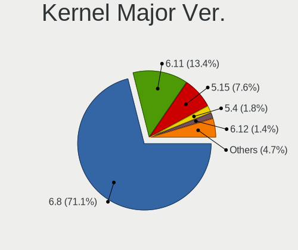
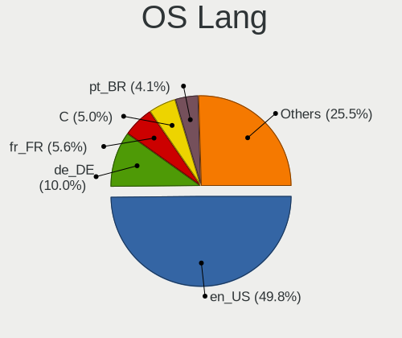
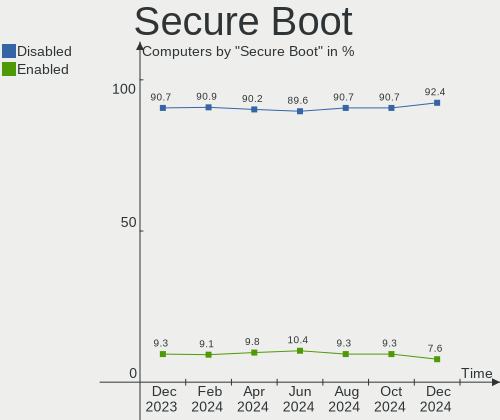
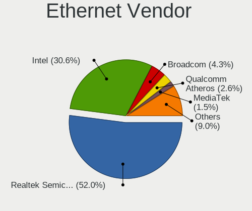
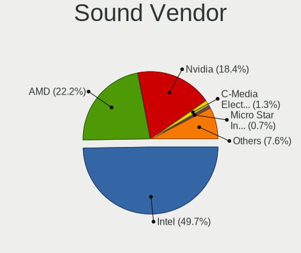
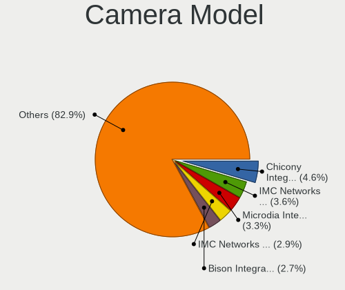

Ubuntu Hardware Trends
----------------------

A project to identify most popular hardware characteristics and track their change
over time based on data collected by Ubuntu users at https://Linux-Hardware.org.

Anyone can contribute to the study by uploading probes of their computers by
the [hw-probe](https://github.com/linuxhw/hw-probe) tool:

    sudo -E hw-probe -all -upload

This is a report for all computer types. See also reports for [desktops](/Dist/Ubuntu/Desktop/README.md) and [notebooks](/Dist/Ubuntu/Notebook/README.md).

Full-feature report is available here: https://linux-hardware.org/?view=trends

Period: Oct, 2020.

Contents
--------

- [ OS                       ](#os)
- [ OS Family                ](#os-family)
- [ Kernel                   ](#kernel)
- [ Kernel Family            ](#kernel-family)
- [ Kernel Major Ver.        ](#kernel-major-ver)
- [ Arch                     ](#arch)
- [ DE                       ](#de)
- [ Display Server           ](#display-server)
- [ Display Manager          ](#display-manager)
- [ OS Lang                  ](#os-lang)
- [ Boot Mode                ](#boot-mode)
- [ Filesystem               ](#filesystem)
- [ Part. scheme             ](#part-scheme)
- [ Dual Boot with Linux/BSD ](#dual-boot-with-linux/bsd)
- [ Dual Boot (Win)          ](#dual-boot-win)
- [ Country                  ](#country)
- [ City                     ](#city)
- [ Vendor                   ](#vendor)
- [ Model                    ](#model)
- [ Model Family             ](#model-family)
- [ MFG Year                 ](#mfg-year)
- [ Form Factor              ](#form-factor)
- [ Secure Boot              ](#secure-boot)
- [ Coreboot                 ](#coreboot)
- [ RAM Size                 ](#ram-size)
- [ RAM Used                 ](#ram-used)
- [ Has CD-ROM               ](#has-cd-rom)
- [ Total Drives             ](#total-drives)
- [ Has Ethernet             ](#has-ethernet)
- [ Drive Vendor             ](#drive-vendor)
- [ HDD Vendor               ](#hdd-vendor)
- [ SSD Vendor               ](#ssd-vendor)
- [ Drive Model              ](#drive-model)
- [ Drive Kind               ](#drive-kind)
- [ Drive Connector          ](#drive-connector)
- [ Drive Size               ](#drive-size)
- [ Space Total              ](#space-total)
- [ Space Used               ](#space-used)
- [ Malfunc. Drives          ](#malfunc-drives)
- [ Malfunc. Drive Vendor    ](#malfunc-drive-vendor)
- [ Malfunc. HDD Vendor      ](#malfunc-hdd-vendor)
- [ Malfunc. Drive Kind      ](#malfunc-drive-kind)
- [ Failed Drives            ](#failed-drives)
- [ Failed Drive Vendor      ](#failed-drive-vendor)
- [ Drive Status             ](#drive-status)
- [ Storage Vendor           ](#storage-vendor)
- [ Storage Model            ](#storage-model)
- [ Storage Kind             ](#storage-kind)
- [ CPU Vendor               ](#cpu-vendor)
- [ CPU Model                ](#cpu-model)
- [ CPU Model Family         ](#cpu-model-family)
- [ CPU Cores                ](#cpu-cores)
- [ CPU Sockets              ](#cpu-sockets)
- [ CPU Threads              ](#cpu-threads)
- [ CPU Op-Modes             ](#cpu-op-modes)
- [ CPU Microcode            ](#cpu-microcode)
- [ CPU Microarch            ](#cpu-microarch)
- [ GPU Vendor               ](#gpu-vendor)
- [ GPU Model                ](#gpu-model)
- [ GPU Combo                ](#gpu-combo)
- [ GPU Driver               ](#gpu-driver)
- [ GPU Memory               ](#gpu-memory)
- [ Monitor Vendor           ](#monitor-vendor)
- [ Monitor Model            ](#monitor-model)
- [ Monitor Resolution       ](#monitor-resolution)
- [ Monitor Diagonal         ](#monitor-diagonal)
- [ Monitor Width            ](#monitor-width)
- [ Aspect Ratio             ](#aspect-ratio)
- [ Monitor Area             ](#monitor-area)
- [ Pixel Density            ](#pixel-density)
- [ Multiple Monitors        ](#multiple-monitors)
- [ Net Controller Vendor    ](#net-controller-vendor)
- [ Net Controller Model     ](#net-controller-model)
- [ Wireless Vendor          ](#wireless-vendor)
- [ Wireless Model           ](#wireless-model)
- [ Ethernet Vendor          ](#ethernet-vendor)
- [ Ethernet Model           ](#ethernet-model)
- [ Net Controller Kind      ](#net-controller-kind)
- [ Used Controller          ](#used-controller)
- [ NICs                     ](#nics)
- [ Memory Vendor            ](#memory-vendor)
- [ Memory Model             ](#memory-model)
- [ Memory Kind              ](#memory-kind)
- [ Memory Form Factor       ](#memory-form-factor)
- [ Memory Size              ](#memory-size)
- [ Memory Speed             ](#memory-speed)
- [ Sound Vendor             ](#sound-vendor)
- [ Sound Model              ](#sound-model)
- [ Camera Vendor            ](#camera-vendor)
- [ Camera Model             ](#camera-model)
- [ Fingerprint Vendor       ](#fingerprint-vendor)
- [ Fingerprint Model        ](#fingerprint-model)
- [ Chipcard Vendor          ](#chipcard-vendor)
- [ Chipcard Model           ](#chipcard-model)
- [ Printer Vendor           ](#printer-vendor)
- [ Printer Model            ](#printer-model)
- [ Scanner Vendor           ](#scanner-vendor)
- [ Scanner Model            ](#scanner-model)
- [ Bluetooth Vendor         ](#bluetooth-vendor)
- [ Bluetooth Model          ](#bluetooth-model)
- [ Unsupported Devices      ](#unsupported-devices)
- [ Unsupported Device Types ](#unsupported-device-types)

OS
--

Installed operating systems

| Name           | Computers | Percent |
|----------------|-----------|---------|
| Ubuntu 20.04   | 1832      | 75.92%  |
| Ubuntu 18.04   | 317       | 13.14%  |
| Ubuntu 20.10   | 189       | 7.83%   |
| Ubuntu 16.04   | 38        | 1.57%   |
| Ubuntu 19.10   | 27        | 1.12%   |
| Ubuntu 19.04   | 4         | 0.17%   |
| Ubuntu 17.10   | 2         | 0.08%   |
| Ubuntu Core 16 | 1         | 0.04%   |
| Ubuntu 2020    | 1         | 0.04%   |
| Ubuntu 18.10   | 1         | 0.04%   |
| Ubuntu         | 1         | 0.04%   |

OS Family
---------

OS without a version

| Name   | Computers | Percent |
|--------|-----------|---------|
| Ubuntu | 2413      | 100%    |

Kernel
------

Version of the Linux kernel

| Version                   | Computers | Percent |
|---------------------------|-----------|---------|
| 5.4.0-48-generic          | 818       | 33.9%   |
| 5.4.0-52-generic          | 571       | 23.66%  |
| 5.4.0-51-generic          | 229       | 9.49%   |
| 5.4.0-42-generic          | 110       | 4.56%   |
| 5.8.0-25-generic          | 81        | 3.36%   |
| 5.4.0-49-generic          | 64        | 2.65%   |
| 4.15.0-118-generic        | 60        | 2.49%   |
| 5.8.0-26-generic          | 41        | 1.7%    |
| 4.15.0-122-generic        | 34        | 1.41%   |
| 5.4.0-26-generic          | 27        | 1.12%   |
| 5.4.0-47-generic          | 20        | 0.83%   |
| 5.3.0-64-generic          | 18        | 0.75%   |
| 5.8.0-1006-raspi          | 17        | 0.7%    |
| 5.4.0-48-lowlatency       | 16        | 0.66%   |
| 4.15.0-121-generic        | 16        | 0.66%   |
| 5.8.0-20-generic          | 12        | 0.5%    |
| 5.4.0-52-lowlatency       | 11        | 0.46%   |
| 5.8.0-23-generic          | 10        | 0.41%   |
| 5.9.0-050900-generic      | 9         | 0.37%   |
| 5.8.14-050814-generic     | 6         | 0.25%   |
| 5.6.0-1028-oem            | 6         | 0.25%   |
| 5.4.0-1019-raspi          | 6         | 0.25%   |
| 5.3.0-28-generic          | 6         | 0.25%   |
| 4.15.0-112-generic        | 6         | 0.25%   |
| 5.8.13-050813-generic     | 5         | 0.21%   |
| 5.8.0-22-generic          | 5         | 0.21%   |
| 4.15.0-119-generic        | 5         | 0.21%   |
| 5.9.1-050901-generic      | 4         | 0.17%   |
| 5.8.0-21-generic          | 4         | 0.17%   |
| 5.0.0-38-generic          | 4         | 0.17%   |
| 4.9.140-tegra             | 4         | 0.17%   |
| 4.4.0-193-generic         | 4         | 0.17%   |
| 4.15.0-20-generic         | 4         | 0.17%   |
| 4.15.0-118-lowlatency     | 4         | 0.17%   |
| 5.8.1-050801-generic      | 3         | 0.12%   |
| 5.8.0-050800-generic      | 3         | 0.12%   |
| 5.4.0-51-lowlatency       | 3         | 0.12%   |
| 5.4.0-49-lowlatency       | 3         | 0.12%   |
| 5.4.0-40-generic          | 3         | 0.12%   |
| 5.4.0-33-generic          | 3         | 0.12%   |
| 5.4.0-29-generic          | 3         | 0.12%   |
| 5.4.0-1022-raspi          | 3         | 0.12%   |
| 5.3.0-26-generic          | 3         | 0.12%   |
| 5.3.0-24-generic          | 3         | 0.12%   |
| 5.0.0-23-generic          | 3         | 0.12%   |
| 4.15.0-99-generic         | 3         | 0.12%   |
| 4.15.0-33-generic         | 3         | 0.12%   |
| 4.15.0-120-generic        | 3         | 0.12%   |
| 5.9.0-050900rc8-generic   | 2         | 0.08%   |
| 5.8.16-xanmod1            | 2         | 0.08%   |
| 5.8.12-050812-generic     | 2         | 0.08%   |
| 5.8.0-18-generic          | 2         | 0.08%   |
| 5.8.0-13.1-liquorix-amd64 | 2         | 0.08%   |
| 5.7.19-050719-generic     | 2         | 0.08%   |
| 5.7.1-050701-generic      | 2         | 0.08%   |
| 5.4.0-47-lowlatency       | 2         | 0.08%   |
| 5.4.0-45-generic          | 2         | 0.08%   |
| 5.4.0-39-generic          | 2         | 0.08%   |
| 5.4.0-37-generic          | 2         | 0.08%   |
| 5.4.0-1025-gcp            | 2         | 0.08%   |

Kernel Family
-------------

Linux kernel without a distro release

| Version  | Computers | Percent |
|----------|-----------|---------|
| 5.4.0    | 1911      | 79.2%   |
| 5.8.0    | 182       | 7.54%   |
| 4.15.0   | 158       | 6.55%   |
| 5.3.0    | 45        | 1.86%   |
| 5.9.0    | 15        | 0.62%   |
| 5.6.0    | 10        | 0.41%   |
| 5.0.0    | 10        | 0.41%   |
| 4.4.0    | 9         | 0.37%   |
| 5.8.13   | 8         | 0.33%   |
| 5.8.14   | 7         | 0.29%   |
| 5.9.1    | 6         | 0.25%   |
| 4.9.140  | 4         | 0.17%   |
| 4.13.0   | 4         | 0.17%   |
| 5.8.16   | 3         | 0.12%   |
| 5.8.12   | 3         | 0.12%   |
| 5.8.1    | 3         | 0.12%   |
| 5.7.19   | 2         | 0.08%   |
| 5.7.1    | 2         | 0.08%   |
| 5.7.0    | 2         | 0.08%   |
| 4.18.0   | 2         | 0.08%   |
| 5.9.2    | 1         | 0.04%   |
| 5.8.7    | 1         | 0.04%   |
| 5.8.2    | 1         | 0.04%   |
| 5.8.15   | 1         | 0.04%   |
| 5.7.6    | 1         | 0.04%   |
| 5.7.15   | 1         | 0.04%   |
| 5.6.7    | 1         | 0.04%   |
| 5.6.6    | 1         | 0.04%   |
| 5.6.4    | 1         | 0.04%   |
| 5.6.17   | 1         | 0.04%   |
| 5.6.11   | 1         | 0.04%   |
| 5.6.1    | 1         | 0.04%   |
| 5.5.7    | 1         | 0.04%   |
| 5.4.72   | 1         | 0.04%   |
| 5.4.70   | 1         | 0.04%   |
| 5.4.65   | 1         | 0.04%   |
| 5.4.63   | 1         | 0.04%   |
| 5.4.42   | 1         | 0.04%   |
| 5.4.19   | 1         | 0.04%   |
| 5.10.0   | 1         | 0.04%   |
| 4.4.194  | 1         | 0.04%   |
| 4.19.5   | 1         | 0.04%   |
| 4.19.15  | 1         | 0.04%   |
| 4.19.105 | 1         | 0.04%   |
| 4.17.3   | 1         | 0.04%   |
| 4.14.58  | 1         | 0.04%   |
| 4.10.0   | 1         | 0.04%   |

Kernel Major Ver.
-----------------

Linux kernel major version

| Version | Computers | Percent |
|---------|-----------|---------|
| 5.4     | 1917      | 79.44%  |
| 5.8     | 209       | 8.66%   |
| 4.15    | 158       | 6.55%   |
| 5.3     | 45        | 1.86%   |
| 5.9     | 22        | 0.91%   |
| 5.6     | 16        | 0.66%   |
| 5.0     | 10        | 0.41%   |
| 4.4     | 10        | 0.41%   |
| 5.7     | 8         | 0.33%   |
| 4.9     | 4         | 0.17%   |
| 4.13    | 4         | 0.17%   |
| 4.19    | 3         | 0.12%   |
| 4.18    | 2         | 0.08%   |
| 5.5     | 1         | 0.04%   |
| 5.10    | 1         | 0.04%   |
| 4.17    | 1         | 0.04%   |
| 4.14    | 1         | 0.04%   |
| 4.10    | 1         | 0.04%   |

Arch
----

OS architecture (x86_64, i586, etc.)

| Name    | Computers | Percent |
|---------|-----------|---------|
| x86_64  | 2311      | 95.77%  |
| i686    | 65        | 2.69%   |
| aarch64 | 33        | 1.37%   |
| armv7l  | 4         | 0.17%   |

DE
--

Desktop Environment

| Name            | Computers | Percent |
|-----------------|-----------|---------|
| GNOME           | 1751      | 72.57%  |
| XFCE            | 167       | 6.92%   |
| Unknown         | 108       | 4.48%   |
| MATE            | 79        | 3.27%   |
| KDE             | 75        | 3.11%   |
| Unity           | 55        | 2.28%   |
| KDE5            | 48        | 1.99%   |
| LXQt            | 34        | 1.41%   |
| Budgie          | 29        | 1.2%    |
| GNOME Flashback | 20        | 0.83%   |
| Cinnamon        | 15        | 0.62%   |
| X-Cinnamon      | 13        | 0.54%   |
| LXDE            | 10        | 0.41%   |
| Deepin          | 3         | 0.12%   |
| GNOME Classic   | 2         | 0.08%   |
| awesome         | 2         | 0.08%   |
| GNUstep         | 1         | 0.04%   |
| enlightenment   | 1         | 0.04%   |

Display Server
--------------

X11 or Wayland

| Name    | Computers | Percent |
|---------|-----------|---------|
| X11     | 2245      | 93.04%  |
| Wayland | 78        | 3.23%   |
| Unknown | 55        | 2.28%   |
| Tty     | 34        | 1.41%   |
| Web     | 1         | 0.04%   |

Display Manager
---------------

SDDM, LightDM, etc.

| Name    | Computers | Percent |
|---------|-----------|---------|
| Unknown | 1890      | 78.33%  |
| GDM     | 350       | 14.5%   |
| TDM     | 108       | 4.48%   |
| SDDM    | 60        | 2.49%   |
| GDM3    | 4         | 0.17%   |
| LightDM | 1         | 0.04%   |

OS Lang
-------

Language

| Lang    | Computers | Percent |
|---------|-----------|---------|
| en_US   | 862       | 35.72%  |
| de_DE   | 245       | 10.15%  |
| pt_BR   | 164       | 6.8%    |
| en_GB   | 149       | 6.17%   |
| fr_FR   | 101       | 4.19%   |
| it_IT   | 76        | 3.15%   |
| es_ES   | 73        | 3.03%   |
| ru_RU   | 71        | 2.94%   |
| en_IN   | 64        | 2.65%   |
| en_CA   | 64        | 2.65%   |
| C       | 43        | 1.78%   |
| en_AU   | 41        | 1.7%    |
| pl_PL   | 39        | 1.62%   |
| hu_HU   | 32        | 1.33%   |
| nl_NL   | 30        | 1.24%   |
| cs_CZ   | 26        | 1.08%   |
| fi_FI   | 20        | 0.83%   |
| es_AR   | 20        | 0.83%   |
| de_CH   | 20        | 0.83%   |
| ja_JP   | 19        | 0.79%   |
| Unknown | 16        | 0.66%   |
| es_MX   | 15        | 0.62%   |
| tr_TR   | 13        | 0.54%   |
| sv_SE   | 13        | 0.54%   |
| de_AT   | 13        | 0.54%   |
| pt_PT   | 11        | 0.46%   |
| es_CO   | 11        | 0.46%   |
| uk_UA   | 9         | 0.37%   |
| nl_BE   | 9         | 0.37%   |
| fr_CA   | 9         | 0.37%   |
| en_ZA   | 9         | 0.37%   |
| el_GR   | 9         | 0.37%   |
| en_NZ   | 8         | 0.33%   |
| en_IL   | 8         | 0.33%   |
| en_IE   | 8         | 0.33%   |
| en_PH   | 7         | 0.29%   |
| da_DK   | 6         | 0.25%   |
| zh_CN   | 5         | 0.21%   |
| sk_SK   | 5         | 0.21%   |
| zh_TW   | 4         | 0.17%   |
| ru_UA   | 4         | 0.17%   |
| ro_RO   | 4         | 0.17%   |
| nb_NO   | 4         | 0.17%   |
| fr_BE   | 4         | 0.17%   |
| sl_SI   | 3         | 0.12%   |
| ko_KR   | 3         | 0.12%   |
| es_CR   | 3         | 0.12%   |
| es_CL   | 3         | 0.12%   |
| ca_ES   | 3         | 0.12%   |
| id_ID   | 2         | 0.08%   |
| he_IL   | 2         | 0.08%   |
| es_EC   | 2         | 0.08%   |
| es_DO   | 2         | 0.08%   |
| en_SG   | 2         | 0.08%   |
| bg_BG   | 2         | 0.08%   |
| sr_RS   | 1         | 0.04%   |
| my_MM   | 1         | 0.04%   |
| lv_LV   | 1         | 0.04%   |
| hr_HR   | 1         | 0.04%   |
| fr_CH   | 1         | 0.04%   |

Boot Mode
---------

EFI or BIOS

| Mode | Computers | Percent |
|------|-----------|---------|
| BIOS | 1379      | 57.15%  |
| EFI  | 1034      | 42.85%  |

Filesystem
----------

Type of filesystem

| Type    | Computers | Percent |
|---------|-----------|---------|
| Ext4    | 2247      | 93.12%  |
| Overlay | 64        | 2.65%   |
| Btrfs   | 40        | 1.66%   |
| Zfs     | 32        | 1.33%   |
| Xfs     | 11        | 0.46%   |
| Ext2    | 7         | 0.29%   |
| Ext3    | 6         | 0.25%   |
| Aufs    | 4         | 0.17%   |
| Jfs     | 1         | 0.04%   |
| Unknown | 1         | 0.04%   |

Part. scheme
------------

Scheme of partitioning

| Type    | Computers | Percent |
|---------|-----------|---------|
| Unknown | 1884      | 78.08%  |
| GPT     | 381       | 15.79%  |
| MBR     | 148       | 6.13%   |

Dual Boot with Linux/BSD
------------------------

Hosting more than one Linux/BSD

| Dual boot | Computers | Percent |
|-----------|-----------|---------|
| No        | 2114      | 87.61%  |
| Yes       | 299       | 12.39%  |

Dual Boot (Win)
---------------

Hosting Linux and Windows

| Dual boot | Computers | Percent |
|-----------|-----------|---------|
| No        | 1526      | 63.24%  |
| Yes       | 887       | 36.76%  |

Country
-------

Geographic location (country)

| Country            | Computers | Percent |
|--------------------|-----------|---------|
| USA                | 385       | 15.96%  |
| Germany            | 284       | 11.77%  |
| Brazil             | 187       | 7.75%   |
| UK                 | 128       | 5.3%    |
| France             | 112       | 4.64%   |
| Russia             | 94        | 3.9%    |
| Italy              | 89        | 3.69%   |
| Canada             | 84        | 3.48%   |
| Spain              | 76        | 3.15%   |
| India              | 72        | 2.98%   |
| Netherlands        | 69        | 2.86%   |
| Poland             | 55        | 2.28%   |
| Switzerland        | 41        | 1.7%    |
| Australia          | 41        | 1.7%    |
| Hungary            | 40        | 1.66%   |
| Finland            | 36        | 1.49%   |
| Ukraine            | 35        | 1.45%   |
| Argentina          | 32        | 1.33%   |
| Czech Republic     | 27        | 1.12%   |
| Mexico             | 26        | 1.08%   |
| Belgium            | 25        | 1.04%   |
| Austria            | 25        | 1.04%   |
| Japan              | 24        | 0.99%   |
| Sweden             | 23        | 0.95%   |
| Turkey             | 21        | 0.87%   |
| Portugal           | 21        | 0.87%   |
| Greece             | 18        | 0.75%   |
| Romania            | 16        | 0.66%   |
| Israel             | 16        | 0.66%   |
| Denmark            | 15        | 0.62%   |
| Colombia           | 13        | 0.54%   |
| Norway             | 12        | 0.5%    |
| Ireland            | 11        | 0.46%   |
| South Africa       | 10        | 0.41%   |
| Philippines        | 10        | 0.41%   |
| Iran               | 10        | 0.41%   |
| China              | 10        | 0.41%   |
| Belarus            | 9         | 0.37%   |
| Vietnam            | 8         | 0.33%   |
| New Zealand        | 8         | 0.33%   |
| Indonesia          | 8         | 0.33%   |
| Egypt              | 8         | 0.33%   |
| Slovenia           | 7         | 0.29%   |
| Slovakia           | 7         | 0.29%   |
| Taiwan             | 6         | 0.25%   |
| Pakistan           | 6         | 0.25%   |
| Morocco            | 6         | 0.25%   |
| Malaysia           | 6         | 0.25%   |
| Korea, Republic of | 6         | 0.25%   |
| Dominican Republic | 6         | 0.25%   |
| Bulgaria           | 6         | 0.25%   |
| Algeria            | 6         | 0.25%   |
| Singapore          | 5         | 0.21%   |
| Serbia             | 5         | 0.21%   |
| Luxembourg         | 5         | 0.21%   |
| Croatia            | 5         | 0.21%   |
| Sri Lanka          | 4         | 0.17%   |
| Myanmar            | 4         | 0.17%   |
| Latvia             | 4         | 0.17%   |
| Ecuador            | 4         | 0.17%   |

City
----

Geographic location (city)

| City           | Computers | Percent |
|----------------|-----------|---------|
| São Paulo     | 39        | 1.62%   |
| Berlin         | 21        | 0.87%   |
| Moscow         | 18        | 0.75%   |
| Budapest       | 17        | 0.7%    |
| Vienna         | 16        | 0.66%   |
| Prague         | 16        | 0.66%   |
| Stuttgart      | 15        | 0.62%   |
| Madrid         | 15        | 0.62%   |
| Kyiv           | 14        | 0.58%   |
| Helsinki       | 14        | 0.58%   |
| St Petersburg  | 13        | 0.54%   |
| Rome           | 12        | 0.5%    |
| Munich         | 12        | 0.5%    |
| Paris          | 11        | 0.46%   |
| Buenos Aires   | 11        | 0.46%   |
| Athens         | 11        | 0.46%   |
| Warsaw         | 10        | 0.41%   |
| Toronto        | 10        | 0.41%   |
| Rio de Janeiro | 9         | 0.37%   |
| Chennai        | 9         | 0.37%   |
| Bengaluru      | 9         | 0.37%   |
| Zurich         | 8         | 0.33%   |
| Milan          | 8         | 0.33%   |
| Istanbul       | 8         | 0.33%   |
| Chicago        | 8         | 0.33%   |
| Barcelona      | 8         | 0.33%   |
| Tel Aviv       | 7         | 0.29%   |
| Tehran         | 7         | 0.29%   |
| Sydney         | 7         | 0.29%   |
| London         | 7         | 0.29%   |
| Dublin         | 7         | 0.29%   |
| Dresden        | 7         | 0.29%   |
| Curitiba       | 7         | 0.29%   |
| Amsterdam      | 7         | 0.29%   |
| Adelaide       | 7         | 0.29%   |
| San Jose       | 6         | 0.25%   |
| Montreal       | 6         | 0.25%   |
| Mexico City    | 6         | 0.25%   |
| Melbourne      | 6         | 0.25%   |
| Lisbon         | 6         | 0.25%   |
| Leipzig        | 6         | 0.25%   |
| Krakow         | 6         | 0.25%   |
| Kazan’       | 6         | 0.25%   |
| Karlsruhe      | 6         | 0.25%   |
| Hamburg        | 6         | 0.25%   |
| Genoa          | 6         | 0.25%   |
| Espoo          | 6         | 0.25%   |
| Cologne        | 6         | 0.25%   |
| Bucharest      | 6         | 0.25%   |
| Brasília      | 6         | 0.25%   |
| Austin         | 6         | 0.25%   |
| Thun           | 5         | 0.21%   |
| The Hague      | 5         | 0.21%   |
| Saint Paul     | 5         | 0.21%   |
| Porto          | 5         | 0.21%   |
| New Delhi      | 5         | 0.21%   |
| Mumbai         | 5         | 0.21%   |
| Minsk          | 5         | 0.21%   |
| Jundiaí       | 5         | 0.21%   |
| Hagetmau       | 5         | 0.21%   |

Vendor
------

Motherboard manufacturer

| Name                    | Computers | Percent |
|-------------------------|-----------|---------|
| Hewlett-Packard         | 372       | 15.42%  |
| Dell                    | 372       | 15.42%  |
| ASUSTek Computer        | 355       | 14.71%  |
| Lenovo                  | 317       | 13.14%  |
| Gigabyte Technology     | 153       | 6.34%   |
| Acer                    | 129       | 5.35%   |
| MSI                     | 106       | 4.39%   |
| ASRock                  | 96        | 3.98%   |
| Intel                   | 57        | 2.36%   |
| Toshiba                 | 54        | 2.24%   |
| Apple                   | 42        | 1.74%   |
| Unknown                 | 26        | 1.08%   |
| Samsung Electronics     | 22        | 0.91%   |
| Sony                    | 20        | 0.83%   |
| Raspberry Pi Foundation | 20        | 0.83%   |
| Fujitsu                 | 20        | 0.83%   |
| Foxconn                 | 17        | 0.7%    |
| Pegatron                | 16        | 0.66%   |
| HUAWEI                  | 16        | 0.66%   |
| Packard Bell            | 14        | 0.58%   |
| Medion                  | 13        | 0.54%   |
| Fujitsu Siemens         | 12        | 0.5%    |
| Positivo                | 10        | 0.41%   |
| Notebook                | 10        | 0.41%   |
| ECS                     | 8         | 0.33%   |
| LG Electronics          | 7         | 0.29%   |
| Biostar                 | 7         | 0.29%   |
| TUXEDO                  | 6         | 0.25%   |
| Supermicro              | 6         | 0.25%   |
| Clevo                   | 5         | 0.21%   |
| BANGHO                  | 5         | 0.21%   |
| Panasonic               | 4         | 0.17%   |
| Nvidia                  | 4         | 0.17%   |
| Gateway                 | 4         | 0.17%   |
| AMI                     | 4         | 0.17%   |
| Alienware               | 4         | 0.17%   |
| ZOTAC                   | 3         | 0.12%   |
| Timi                    | 3         | 0.12%   |
| Microsoft               | 3         | 0.12%   |
| Itautec                 | 3         | 0.12%   |
| Google                  | 3         | 0.12%   |
| eMachines               | 3         | 0.12%   |
| Xplore                  | 2         | 0.08%   |
| Teclast                 | 2         | 0.08%   |
| System76                | 2         | 0.08%   |
| Quanta                  | 2         | 0.08%   |
| PC Specialist           | 2         | 0.08%   |
| NEC Computers           | 2         | 0.08%   |
| Huanan                  | 2         | 0.08%   |
| EVGA                    | 2         | 0.08%   |
| Complet                 | 2         | 0.08%   |
| Chuwi                   | 2         | 0.08%   |
| Avell High Performance  | 2         | 0.08%   |
| Xunlong                 | 1         | 0.04%   |
| Wistron                 | 1         | 0.04%   |
| WeiBu                   | 1         | 0.04%   |
| VS Company              | 1         | 0.04%   |
| Vestel                  | 1         | 0.04%   |
| UNITCOM                 | 1         | 0.04%   |
| sunxi                   | 1         | 0.04%   |

Model
-----

Motherboard model

| Name                               | Computers | Percent |
|------------------------------------|-----------|---------|
| Unknown                            | 30        | 1.24%   |
| ASUS All Series                    | 29        | 1.2%    |
| HP Pavilion dv6                    | 9         | 0.37%   |
| HP Notebook                        | 9         | 0.37%   |
| HP Compaq 6005 Pro SFF PC          | 9         | 0.37%   |
| RPi Raspberry Pi 4 Model B Rev 1.4 | 8         | 0.33%   |
| HP Pavilion dv7                    | 7         | 0.29%   |
| Dell OptiPlex 7010                 | 7         | 0.29%   |
| ASUS TUF GAMING X570-PLUS          | 7         | 0.29%   |
| HP Pavilion g6                     | 6         | 0.25%   |
| Gigabyte 970A-DS3P                 | 6         | 0.25%   |
| Dell XPS 13 9360                   | 6         | 0.25%   |
| Dell Inspiron N5110                | 6         | 0.25%   |
| RPi Raspberry Pi 4 Model B Rev 1.2 | 5         | 0.21%   |
| RPi Raspberry Pi 4 Model B Rev 1.1 | 5         | 0.21%   |
| Lenovo Legion Y530-15ICH 81FV      | 5         | 0.21%   |
| HP Pavilion g4                     | 5         | 0.21%   |
| HP G62                             | 5         | 0.21%   |
| HP EliteBook 840 G3                | 5         | 0.21%   |
| HP Compaq Elite 8300 SFF           | 5         | 0.21%   |
| HP 255 G7 Notebook PC              | 5         | 0.21%   |
| HP 15                              | 5         | 0.21%   |
| Dell XPS 15 7590                   | 5         | 0.21%   |
| Dell XPS 13 7390                   | 5         | 0.21%   |
| Dell OptiPlex 9020                 | 5         | 0.21%   |
| Dell OptiPlex 380                  | 5         | 0.21%   |
| Dell Latitude E6430                | 5         | 0.21%   |
| Dell Inspiron 5570                 | 5         | 0.21%   |
| Dell G3 3590                       | 5         | 0.21%   |
| ASUS ROG STRIX B450-F GAMING       | 5         | 0.21%   |
| ASUS M5A78L-M PLUS/USB3            | 5         | 0.21%   |
| ASRock N68C-S UCC                  | 5         | 0.21%   |
| Nvidia Tegra                       | 4         | 0.17%   |
| Lenovo IdeaPad Flex 5 14ARE05 81X2 | 4         | 0.17%   |
| HUAWEI NBLK-WAX9X                  | 4         | 0.17%   |
| HP ProDesk 600 G1 SFF              | 4         | 0.17%   |
| HP ProBook 450 G7                  | 4         | 0.17%   |
| HP Pavilion g7                     | 4         | 0.17%   |
| HP EliteBook 840 G5                | 4         | 0.17%   |
| Dell XPS 8920                      | 4         | 0.17%   |
| Dell XPS 15 9560                   | 4         | 0.17%   |
| Dell XPS 13 9380                   | 4         | 0.17%   |
| Dell OptiPlex 790                  | 4         | 0.17%   |
| Dell OptiPlex 3010                 | 4         | 0.17%   |
| Dell Latitude E6540                | 4         | 0.17%   |
| Dell Latitude E6410                | 4         | 0.17%   |
| Dell Latitude E6400                | 4         | 0.17%   |
| Dell Inspiron 15-3567              | 4         | 0.17%   |
| ASUS PRIME A320M-K                 | 4         | 0.17%   |
| AMI Aptio CRB                      | 4         | 0.17%   |
| MSI MS-7C84                        | 3         | 0.12%   |
| MSI MS-7A38                        | 3         | 0.12%   |
| MSI MS-7798                        | 3         | 0.12%   |
| Lenovo IdeaPad Flex 5 14IIL05 81X1 | 3         | 0.12%   |
| Lenovo IdeaPad 530S-14IKB 81EU     | 3         | 0.12%   |
| Intel NUC8i7HVK                    | 3         | 0.12%   |
| Intel H55                          | 3         | 0.12%   |
| HP ZBook 15 G2                     | 3         | 0.12%   |
| HP Pavilion dv6700                 | 3         | 0.12%   |
| HP EliteDesk 800 G1 SFF            | 3         | 0.12%   |

Model Family
------------

Motherboard model prefix

| Name                   | Computers | Percent |
|------------------------|-----------|---------|
| Lenovo ThinkPad        | 140       | 5.8%    |
| Acer Aspire            | 93        | 3.85%   |
| Dell Inspiron          | 89        | 3.69%   |
| Dell Latitude          | 84        | 3.48%   |
| HP Compaq              | 70        | 2.9%    |
| HP Pavilion            | 64        | 2.65%   |
| Lenovo IdeaPad         | 61        | 2.53%   |
| Dell OptiPlex          | 59        | 2.45%   |
| Toshiba Satellite      | 50        | 2.07%   |
| Dell XPS               | 44        | 1.82%   |
| HP ProBook             | 39        | 1.62%   |
| HP EliteBook           | 37        | 1.53%   |
| Dell Precision         | 35        | 1.45%   |
| ASUS PRIME             | 30        | 1.24%   |
| Unknown                | 30        | 1.24%   |
| ASUS All               | 29        | 1.2%    |
| Dell Vostro            | 26        | 1.08%   |
| HP Laptop              | 24        | 0.99%   |
| ASUS ROG               | 24        | 0.99%   |
| RPi Raspberry          | 20        | 0.83%   |
| Lenovo ThinkCentre     | 20        | 0.83%   |
| ASUS TUF               | 20        | 0.83%   |
| HP ZBook               | 16        | 0.66%   |
| HP ENVY                | 15        | 0.62%   |
| ASUS VivoBook          | 15        | 0.62%   |
| ASUS M5A78L-M          | 13        | 0.54%   |
| Dell PowerEdge         | 12        | 0.5%    |
| Gigabyte X570          | 11        | 0.46%   |
| Lenovo Legion          | 10        | 0.41%   |
| Fujitsu LIFEBOOK       | 10        | 0.41%   |
| Lenovo Yoga            | 9         | 0.37%   |
| HP Notebook            | 9         | 0.37%   |
| Packard Bell EasyNote  | 8         | 0.33%   |
| HP ProDesk             | 8         | 0.33%   |
| HP 255                 | 8         | 0.33%   |
| HP EliteDesk           | 7         | 0.29%   |
| HP 250                 | 7         | 0.29%   |
| Gigabyte 970A-DS3P     | 7         | 0.29%   |
| Fujitsu ESPRIMO        | 7         | 0.29%   |
| Dell G3                | 7         | 0.29%   |
| ASRock 970             | 7         | 0.29%   |
| Lenovo ThinkBook       | 6         | 0.25%   |
| Dell Studio            | 6         | 0.25%   |
| ASUS ZenBook           | 6         | 0.25%   |
| Acer Swift             | 6         | 0.25%   |
| Lenovo IdeaCentre      | 5         | 0.21%   |
| HP ProLiant            | 5         | 0.21%   |
| HP OMEN                | 5         | 0.21%   |
| HP G62                 | 5         | 0.21%   |
| HP 15                  | 5         | 0.21%   |
| Gigabyte GA-78LMT-USB3 | 5         | 0.21%   |
| ASUS P8Z77-V           | 5         | 0.21%   |
| ASRock X570            | 5         | 0.21%   |
| ASRock N68C-S          | 5         | 0.21%   |
| Acer Veriton           | 5         | 0.21%   |
| Acer Extensa           | 5         | 0.21%   |
| Nvidia Tegra           | 4         | 0.17%   |
| HUAWEI NBLK-WAX9X      | 4         | 0.17%   |
| HP Spectre             | 4         | 0.17%   |
| Gigabyte B450M         | 4         | 0.17%   |

MFG Year
--------

Motherboard manufacture year

| Year    | Computers | Percent |
|---------|-----------|---------|
| 2020    | 397       | 16.45%  |
| 2019    | 328       | 13.59%  |
| 2018    | 245       | 10.15%  |
| 2011    | 162       | 6.71%   |
| 2013    | 160       | 6.63%   |
| 2012    | 157       | 6.51%   |
| 2014    | 152       | 6.3%    |
| 2010    | 147       | 6.09%   |
| 2015    | 126       | 5.22%   |
| 2009    | 124       | 5.14%   |
| 2017    | 115       | 4.77%   |
| 2016    | 97        | 4.02%   |
| 2008    | 77        | 3.19%   |
| 2007    | 49        | 2.03%   |
| Unknown | 40        | 1.66%   |
| 2006    | 24        | 0.99%   |
| 2005    | 12        | 0.5%    |
| 2004    | 1         | 0.04%   |

Form Factor
-----------

Physical design of the computer

| Name           | Computers | Percent |
|----------------|-----------|---------|
| Notebook       | 1253      | 51.93%  |
| Desktop        | 974       | 40.36%  |
| Convertible    | 45        | 1.86%   |
| System on chip | 36        | 1.49%   |
| All in one     | 30        | 1.24%   |
| Server         | 27        | 1.12%   |
| Mini pc        | 26        | 1.08%   |
| Tablet         | 21        | 0.87%   |
| Stick pc       | 1         | 0.04%   |

Secure Boot
-----------

Enabled or disabled

| State    | Computers | Percent |
|----------|-----------|---------|
| Disabled | 2217      | 91.88%  |
| Enabled  | 196       | 8.12%   |

Coreboot
--------

Have coreboot on board

| Used | Computers | Percent |
|------|-----------|---------|
| No   | 2410      | 99.88%  |
| Yes  | 3         | 0.12%   |

RAM Size
--------

Total RAM memory

| Size in GB      | Computers | Percent |
|-----------------|-----------|---------|
| 3.01-4.0        | 569       | 23.58%  |
| 4.01-8.0        | 512       | 21.22%  |
| 16.01-24.0      | 451       | 18.69%  |
| 8.01-16.0       | 448       | 18.57%  |
| 32.01-64.0      | 182       | 7.54%   |
| 1.01-2.0        | 104       | 4.31%   |
| 64.01-256.0     | 55        | 2.28%   |
| 24.01-32.0      | 35        | 1.45%   |
| 2.01-3.0        | 31        | 1.28%   |
| 0.01-1.0        | 25        | 1.04%   |
| More than 256.0 | 1         | 0.04%   |

RAM Used
--------

Used RAM memory

| Used GB     | Computers | Percent |
|-------------|-----------|---------|
| 1.01-2.0    | 1020      | 42.27%  |
| 2.01-3.0    | 543       | 22.5%   |
| 4.01-8.0    | 293       | 12.14%  |
| 3.01-4.0    | 283       | 11.73%  |
| 0.01-1.0    | 163       | 6.76%   |
| 8.01-16.0   | 95        | 3.94%   |
| 16.01-24.0  | 10        | 0.41%   |
| 24.01-32.0  | 3         | 0.12%   |
| 32.01-64.0  | 2         | 0.08%   |
| 64.01-256.0 | 1         | 0.04%   |

Has CD-ROM
----------

Has CD-ROM on board

| Presented | Computers | Percent |
|-----------|-----------|---------|
| No        | 1254      | 51.97%  |
| Yes       | 1159      | 48.03%  |

Total Drives
------------

Number of drives on board

| Drives | Computers | Percent |
|--------|-----------|---------|
| 1      | 1414      | 58.6%   |
| 2      | 633       | 26.23%  |
| 3      | 172       | 7.13%   |
| 4      | 94        | 3.9%    |
| 5      | 49        | 2.03%   |
| 0      | 26        | 1.08%   |
| 6      | 13        | 0.54%   |
| 7      | 5         | 0.21%   |
| 9      | 4         | 0.17%   |
| 8      | 2         | 0.08%   |
| 20     | 1         | 0.04%   |

Has Ethernet
------------

Has Ethernet on board

| Presented | Computers | Percent |
|-----------|-----------|---------|
| Yes       | 2162      | 89.6%   |
| No        | 251       | 10.4%   |

Drive Vendor
------------

Hard drive vendors

| Vendor                    | Computers | Drives | Percent |
|---------------------------|-----------|--------|---------|
| WDC                       | 601       | 748    | 17.82%  |
| Seagate                   | 585       | 725    | 17.35%  |
| Samsung Electronics       | 507       | 601    | 15.04%  |
| Toshiba                   | 252       | 269    | 7.47%   |
| Kingston                  | 164       | 179    | 4.86%   |
| Unknown                   | 157       | 167    | 4.66%   |
| SanDisk                   | 137       | 146    | 4.06%   |
| Hitachi                   | 130       | 137    | 3.86%   |
| Crucial                   | 89        | 97     | 2.64%   |
| Intel                     | 68        | 77     | 2.02%   |
| SK Hynix                  | 67        | 68     | 1.99%   |
| HGST                      | 67        | 70     | 1.99%   |
| Micron Technology         | 48        | 48     | 1.42%   |
| A-DATA Technology         | 47        | 47     | 1.39%   |
| Phison                    | 35        | 38     | 1.04%   |
| LITEON                    | 22        | 22     | 0.65%   |
| Fujitsu                   | 22        | 23     | 0.65%   |
| China                     | 22        | 22     | 0.65%   |
| PNY                       | 20        | 21     | 0.59%   |
| Maxtor                    | 20        | 20     | 0.59%   |
| SPCC                      | 16        | 16     | 0.47%   |
| OCZ                       | 15        | 16     | 0.44%   |
| Apple                     | 14        | 15     | 0.42%   |
| Intenso                   | 13        | 13     | 0.39%   |
| Hewlett-Packard           | 13        | 13     | 0.39%   |
| GOODRAM                   | 13        | 13     | 0.39%   |
| Corsair                   | 13        | 14     | 0.39%   |
| ASMT                      | 13        | 18     | 0.39%   |
| Silicon Motion            | 12        | 12     | 0.36%   |
| Patriot                   | 12        | 12     | 0.36%   |
| LITEONIT                  | 10        | 10     | 0.3%    |
| KingSpec                  | 10        | 11     | 0.3%    |
| Transcend                 | 9         | 9      | 0.27%   |
| Realtek Semiconductor     | 8         | 8      | 0.24%   |
| Micron/Crucial Technology | 7         | 7      | 0.21%   |
| JMicron                   | 7         | 7      | 0.21%   |
| KingDian                  | 6         | 6      | 0.18%   |
| Team                      | 5         | 5      | 0.15%   |
| Lenovo                    | 5         | 5      | 0.15%   |
| PLEXTOR                   | 4         | 4      | 0.12%   |
| KIOXIA                    | 4         | 4      | 0.12%   |
| Apacer                    | 4         | 4      | 0.12%   |
| Lexar                     | 3         | 3      | 0.09%   |
| LaCie                     | 3         | 4      | 0.09%   |
| KingFast                  | 3         | 3      | 0.09%   |
| Zheino                    | 2         | 4      | 0.06%   |
| XPG                       | 2         | 3      | 0.06%   |
| USB3.0                    | 2         | 3      | 0.06%   |
| Union Memory              | 2         | 2      | 0.06%   |
| TO Exter                  | 2         | 2      | 0.06%   |
| Smartbuy                  | 2         | 2      | 0.06%   |
| SABRENT                   | 2         | 2      | 0.06%   |
| Netac                     | 2         | 2      | 0.06%   |
| Lite-On                   | 2         | 2      | 0.06%   |
| LDLC                      | 2         | 2      | 0.06%   |
| INNOVATION IT             | 2         | 2      | 0.06%   |
| Gigabyte Technology       | 2         | 2      | 0.06%   |
| FORESEE                   | 2         | 2      | 0.06%   |
| Drevo                     | 2         | 2      | 0.06%   |
| Dell                      | 2         | 2      | 0.06%   |

HDD Vendor
----------

Hard disk drive vendors

| Vendor              | Computers | Drives | Percent |
|---------------------|-----------|--------|---------|
| Seagate             | 576       | 710    | 34.85%  |
| WDC                 | 531       | 655    | 32.12%  |
| Toshiba             | 188       | 201    | 11.37%  |
| Hitachi             | 130       | 137    | 7.86%   |
| Samsung Electronics | 91        | 101    | 5.51%   |
| HGST                | 67        | 70     | 4.05%   |
| Fujitsu             | 22        | 23     | 1.33%   |
| Maxtor              | 19        | 19     | 1.15%   |
| Apple               | 6         | 6      | 0.36%   |
| Intenso             | 3         | 3      | 0.18%   |
| Hewlett-Packard     | 3         | 3      | 0.18%   |
| ASMT                | 3         | 5      | 0.18%   |
| TO Exter            | 2         | 2      | 0.12%   |
| LaCie               | 2         | 3      | 0.12%   |
| ASMT109x            | 2         | 3      | 0.12%   |
| USB3.0              | 1         | 1      | 0.06%   |
| Maxone              | 1         | 1      | 0.06%   |
| KESU                | 1         | 1      | 0.06%   |
| JMicron             | 1         | 1      | 0.06%   |
| Inateck             | 1         | 1      | 0.06%   |
| IET                 | 1         | 2      | 0.06%   |
| IBM/Hitachi         | 1         | 1      | 0.06%   |
| ExcelStor           | 1         | 1      | 0.06%   |

SSD Vendor
----------

Solid state drive vendors

| Vendor              | Computers | Drives | Percent |
|---------------------|-----------|--------|---------|
| Samsung Electronics | 269       | 304    | 25.31%  |
| Kingston            | 149       | 161    | 14.02%  |
| SanDisk             | 95        | 100    | 8.94%   |
| Crucial             | 88        | 95     | 8.28%   |
| WDC                 | 60        | 63     | 5.64%   |
| A-DATA Technology   | 42        | 42     | 3.95%   |
| Micron Technology   | 34        | 34     | 3.2%    |
| Intel               | 27        | 30     | 2.54%   |
| China               | 22        | 22     | 2.07%   |
| Toshiba             | 21        | 22     | 1.98%   |
| LITEON              | 21        | 21     | 1.98%   |
| SK Hynix            | 20        | 20     | 1.88%   |
| PNY                 | 20        | 21     | 1.88%   |
| OCZ                 | 15        | 16     | 1.41%   |
| SPCC                | 14        | 14     | 1.32%   |
| GOODRAM             | 13        | 13     | 1.22%   |
| Patriot             | 12        | 12     | 1.13%   |
| LITEONIT            | 10        | 10     | 0.94%   |
| Corsair             | 10        | 11     | 0.94%   |
| Transcend           | 9         | 9      | 0.85%   |
| KingSpec            | 9         | 10     | 0.85%   |
| Apple               | 9         | 9      | 0.85%   |
| Hewlett-Packard     | 7         | 7      | 0.66%   |
| ASMT                | 7         | 7      | 0.66%   |
| KingDian            | 6         | 6      | 0.56%   |
| Team                | 5         | 5      | 0.47%   |
| Intenso             | 5         | 5      | 0.47%   |
| PLEXTOR             | 4         | 4      | 0.38%   |
| JMicron             | 4         | 4      | 0.38%   |
| Apacer              | 4         | 4      | 0.38%   |
| Seagate             | 3         | 3      | 0.28%   |
| Lexar               | 3         | 3      | 0.28%   |
| Smartbuy            | 2         | 2      | 0.19%   |
| SABRENT             | 2         | 2      | 0.19%   |
| Netac               | 2         | 2      | 0.19%   |
| LDLC                | 2         | 2      | 0.19%   |
| INNOVATION IT       | 2         | 2      | 0.19%   |
| Gigabyte Technology | 2         | 2      | 0.19%   |
| FORESEE             | 2         | 2      | 0.19%   |
| Drevo               | 2         | 2      | 0.19%   |
| BHT                 | 2         | 2      | 0.19%   |
| Zheino              | 1         | 2      | 0.09%   |
| Unknown             | 1         | 1      | 0.09%   |
| THU                 | 1         | 1      | 0.09%   |
| SUNEAST             | 1         | 1      | 0.09%   |
| SPCC Sol            | 1         | 1      | 0.09%   |
| SandForce           | 1         | 1      | 0.09%   |
| Ramsta              | 1         | 1      | 0.09%   |
| PNY USB             | 1         | 1      | 0.09%   |
| ORTIAL              | 1         | 3      | 0.09%   |
| Mushkin             | 1         | 1      | 0.09%   |
| MENGMI              | 1         | 1      | 0.09%   |
| Maxtor              | 1         | 1      | 0.09%   |
| lntenso             | 1         | 1      | 0.09%   |
| Leven               | 1         | 1      | 0.09%   |
| KIOXIA-EXCERIA      | 1         | 1      | 0.09%   |
| Kingmax             | 1         | 1      | 0.09%   |
| Integral            | 1         | 1      | 0.09%   |
| Innodisk            | 1         | 1      | 0.09%   |
| Hoodisk             | 1         | 1      | 0.09%   |

Drive Model
-----------

Hard drive models

| Model                        | Computers | Percent |
|------------------------------|-----------|---------|
| NVMe SSD Drive 512GB         | 107       | 2.9%    |
| NVMe SSD Drive 256GB         | 70        | 1.89%   |
| MMC Card  32GB               | 41        | 1.11%   |
| ST1000LM035-1RK172 1TB       | 40        | 1.08%   |
| NVMe SSD Drive 1TB           | 37        | 1%      |
| NVMe SSD Drive 500GB         | 35        | 0.95%   |
| ST500DM002-1BD142 500GB      | 34        | 0.92%   |
| SSD 860 EVO 500GB            | 33        | 0.89%   |
| SA400S37240G 240GB SSD       | 33        | 0.89%   |
| SSD 850 EVO 250GB            | 29        | 0.78%   |
| SA400S37120G 120GB SSD       | 28        | 0.76%   |
| SA400S37480G 480GB SSD       | 27        | 0.73%   |
| ST1000DM010-2EP102 1TB       | 25        | 0.68%   |
| DT01ACA100 1TB               | 25        | 0.68%   |
| ST2000DM008-2FR102 2TB       | 24        | 0.65%   |
| MQ01ABF050 500GB             | 23        | 0.62%   |
| NVMe SSD Drive 1024GB        | 22        | 0.6%    |
| MQ01ABD100 1TB               | 22        | 0.6%    |
| ST500LT012-1DG142 500GB      | 21        | 0.57%   |
| ST1000LM024 HN-M101MBB 1TB   | 21        | 0.57%   |
| SSD 850 EVO 500GB            | 20        | 0.54%   |
| SSD 860 EVO 1TB              | 18        | 0.49%   |
| HTS721010A9E630 1TB          | 18        | 0.49%   |
| WD10EZEX-08WN4A0 1TB         | 17        | 0.46%   |
| SV300S37A120G 120GB SSD      | 17        | 0.46%   |
| ST3500418AS 500GB            | 17        | 0.46%   |
| ST1000DM003-1CH162 1TB       | 17        | 0.46%   |
| MMC Card  64GB               | 17        | 0.46%   |
| SSD 840 EVO 250GB            | 16        | 0.43%   |
| NVMe SSD Drive 250GB         | 15        | 0.41%   |
| Expansion 4TB                | 15        | 0.41%   |
| ST31000528AS 1TB             | 14        | 0.38%   |
| SSD 860 EVO 250GB            | 14        | 0.38%   |
| MMC Card  128GB              | 14        | 0.38%   |
| ST9500325AS 500GB            | 13        | 0.35%   |
| WD20EZRZ-00Z5HB0 2TB         | 12        | 0.32%   |
| CT240BX500SSD1 240GB         | 12        | 0.32%   |
| ST2000DM001-1CH164 2TB       | 11        | 0.3%    |
| ST1000LM048-2E7172 1TB       | 11        | 0.3%    |
| MQ04ABF100 1TB               | 11        | 0.3%    |
| Expansion Desk 3TB           | 11        | 0.3%    |
| WD20EZRX-00D8PB0 2TB         | 10        | 0.27%   |
| ST1000LM049-2GH172 1TB       | 10        | 0.27%   |
| ST1000DM003-1ER162 1TB       | 10        | 0.27%   |
| SD/MMC/MS PRO 32GB           | 10        | 0.27%   |
| HTS725050A7E630 500GB        | 10        | 0.27%   |
| HTS545050A7E380 500GB        | 10        | 0.27%   |
| HDWD110 1TB                  | 10        | 0.27%   |
| WDS240G2G0A-00JH30 240GB SSD | 9         | 0.24%   |
| WDS120G2G0A-00JH30 120GB SSD | 9         | 0.24%   |
| WD10SPZX-21Z10T0 1TB         | 9         | 0.24%   |
| WD10JPVX-22JC3T0 1TB         | 9         | 0.24%   |
| WD10EZEX-00WN4A0 1TB         | 9         | 0.24%   |
| ST2000DM006-2DM164 2TB       | 9         | 0.24%   |
| SSD PLUS 240GB               | 9         | 0.24%   |
| HTS545050A7E680 500GB        | 9         | 0.24%   |
| HDWD120 2TB                  | 9         | 0.24%   |
| HD103SJ 1TB                  | 9         | 0.24%   |
| WD5000AAKX-003CA0 500GB      | 8         | 0.22%   |
| WD20EARX-00PASB0 2TB         | 8         | 0.22%   |

Drive Kind
----------

HDD or SSD

| Kind    | Computers | Drives | Percent |
|---------|-----------|--------|---------|
| HDD     | 1421      | 1950   | 46.17%  |
| SSD     | 960       | 1137   | 31.19%  |
| NVMe    | 505       | 559    | 16.41%  |
| MMC     | 123       | 134    | 4%      |
| Unknown | 69        | 76     | 2.24%   |

Drive Connector
---------------

SATA, SAS, NVMe, etc.

| Type | Computers | Drives | Percent |
|------|-----------|--------|---------|
| SATA | 1996      | 3017   | 72.71%  |
| NVMe | 505       | 559    | 18.4%   |
| MMC  | 123       | 134    | 4.48%   |
| SAS  | 121       | 146    | 4.41%   |

Drive Size
----------

Size of hard drive

| Size in TB | Computers | Drives | Percent |
|------------|-----------|--------|---------|
| 0.01-0.5   | 1469      | 1819   | 59%     |
| 0.51-1.0   | 695       | 816    | 27.91%  |
| 1.01-2.0   | 190       | 236    | 7.63%   |
| 3.01-4.0   | 55        | 75     | 2.21%   |
| 2.01-3.0   | 55        | 82     | 2.21%   |
| 4.01-10.0  | 21        | 53     | 0.84%   |
| 10.01-20.0 | 5         | 6      | 0.2%    |

Space Total
-----------

Amount of disk space available on the file system

| Size in GB     | Computers | Percent |
|----------------|-----------|---------|
| 101-250        | 699       | 28.97%  |
| 251-500        | 630       | 26.11%  |
| 501-1000       | 378       | 15.67%  |
| 51-100         | 167       | 6.92%   |
| 1001-2000      | 159       | 6.59%   |
| More than 3000 | 110       | 4.56%   |
| 21-50          | 100       | 4.14%   |
| 1-20           | 85        | 3.52%   |
| 2001-3000      | 59        | 2.45%   |
| Unknown        | 26        | 1.08%   |

Space Used
----------

Amount of used disk space

| Used GB        | Computers | Percent |
|----------------|-----------|---------|
| 1-20           | 951       | 39.41%  |
| 21-50          | 435       | 18.03%  |
| 101-250        | 307       | 12.72%  |
| 51-100         | 284       | 11.77%  |
| 251-500        | 159       | 6.59%   |
| 501-1000       | 115       | 4.77%   |
| 1001-2000      | 68        | 2.82%   |
| More than 3000 | 40        | 1.66%   |
| 2001-3000      | 28        | 1.16%   |
| Unknown        | 26        | 1.08%   |

Malfunc. Drives
---------------

Drive models with a malfunction

| Model                      | Computers | Drives | Percent |
|----------------------------|-----------|--------|---------|
| ST500DM002-1BD142 500GB    | 5         | 5      | 4.2%    |
| WD5000AAKX-083CA1 500GB    | 3         | 3      | 2.52%   |
| WD5000AAKX-003CA0 500GB    | 3         | 3      | 2.52%   |
| WD5000AAKX-00ERMA0 500GB   | 2         | 2      | 1.68%   |
| WD30EZRX-00DC0B0 3TB       | 2         | 4      | 1.68%   |
| ST9500420AS 500GB          | 2         | 2      | 1.68%   |
| ST500LT012-9WS142 500GB    | 2         | 2      | 1.68%   |
| ST31000528AS 1TB           | 2         | 2      | 1.68%   |
| ST1000LM024 HN-M101MBB 1TB | 2         | 2      | 1.68%   |
| ST1000DM003-1CH162 1TB     | 2         | 2      | 1.68%   |
| HTS725050A7E630 500GB      | 2         | 2      | 1.68%   |
| HD502HJ 500GB              | 2         | 2      | 1.68%   |
| X1 120GB SSD               | 1         | 1      | 0.84%   |
| WDS100T2B0A 1TB SSD        | 1         | 1      | 0.84%   |
| WD7500BPVT-24HXZT1 752GB   | 1         | 1      | 0.84%   |
| WD5000LPVT-08G33T1 500GB   | 1         | 1      | 0.84%   |
| WD5000BPKT-75PK4T0 500GB   | 1         | 1      | 0.84%   |
| WD5000AAKX-75U6AA0 500GB   | 1         | 1      | 0.84%   |
| WD5000AAKS-60WWPA0 500GB   | 1         | 1      | 0.84%   |
| WD5000AAKS-00UU3A0 500GB   | 1         | 1      | 0.84%   |
| WD3200BEVT-08A23T1 320GB   | 1         | 1      | 0.84%   |
| WD3200AAKX-001CA0 320GB    | 1         | 1      | 0.84%   |
| WD30EFRX-68EUZN0 3TB       | 1         | 1      | 0.84%   |
| WD25EZRS-00J99B0 2TB       | 1         | 1      | 0.84%   |
| WD2500BEVT-22ZCT0 250GB    | 1         | 1      | 0.84%   |
| WD1600AAJS-75M0A0 160GB    | 1         | 1      | 0.84%   |
| WD15EARS-00Z5B1 1TB        | 1         | 1      | 0.84%   |
| WD10SPZX-24Z10T0 1TB       | 1         | 1      | 0.84%   |
| WD10SPCX-24HWST0 1TB       | 1         | 1      | 0.84%   |
| WD10EZRX-00L4HB0 1TB       | 1         | 1      | 0.84%   |
| WD10EZEX-00WN4A0 1TB       | 1         | 1      | 0.84%   |
| WD10EARS-22Y5B1 1TB        | 1         | 1      | 0.84%   |
| WD10EADX-22TDHB0 1TB       | 1         | 1      | 0.84%   |
| VERTEX4 128GB SSD          | 1         | 1      | 0.84%   |
| TR150 480GB SSD            | 1         | 1      | 0.84%   |
| TM4PS5128G 128GB SSD       | 1         | 1      | 0.84%   |
| SU800 512GB SSD            | 1         | 1      | 0.84%   |
| ST960813AS 64GB            | 1         | 1      | 0.84%   |
| ST9320423AS 320GB          | 1         | 1      | 0.84%   |
| ST8000VN0022-2EL112 8TB    | 1         | 2      | 0.84%   |
| ST8000AS0002-1NA17Z 8TB    | 1         | 1      | 0.84%   |
| ST500LT012-1DG142 500GB    | 1         | 1      | 0.84%   |
| ST500DM002-1BC142 500GB    | 1         | 1      | 0.84%   |
| ST3250410AS 250GB          | 1         | 1      | 0.84%   |
| ST3250318AS 250GB          | 1         | 1      | 0.84%   |
| ST3250310AS 250GB          | 1         | 1      | 0.84%   |
| ST320LT007-9ZV142 320GB    | 1         | 1      | 0.84%   |
| ST3160812AS 160GB          | 1         | 1      | 0.84%   |
| ST2000DX001-1NS164 2TB     | 1         | 1      | 0.84%   |
| ST2000DL003-9VT166 2TB     | 1         | 1      | 0.84%   |
| ST1000LM035-1RK172 1TB     | 1         | 1      | 0.84%   |
| SSDSCKKF512H6 SATA 512GB   | 1         | 1      | 0.84%   |
| SSDSC2BW240A4 240GB        | 1         | 1      | 0.84%   |
| SSDSC2BW120A4 120GB        | 1         | 1      | 0.84%   |
| SSDSC2BF180A5H SED 180GB   | 1         | 1      | 0.84%   |
| SSDSC2BA400G3T 400GB       | 1         | 1      | 0.84%   |
| SSDPEMKF010T8 NVMe 1024GB  | 1         | 1      | 0.84%   |
| SSD EX920 256GB            | 1         | 1      | 0.84%   |
| SSD EX900 500GB            | 1         | 1      | 0.84%   |
| SSD DP900 128GB-DL3        | 1         | 1      | 0.84%   |

Malfunc. Drive Vendor
---------------------

Vendors of faulty drives

| Vendor              | Computers | Drives | Percent |
|---------------------|-----------|--------|---------|
| WDC                 | 30        | 32     | 25.86%  |
| Seagate             | 27        | 30     | 23.28%  |
| Toshiba             | 10        | 11     | 8.62%   |
| Samsung Electronics | 6         | 6      | 5.17%   |
| Intel               | 6         | 6      | 5.17%   |
| Hitachi             | 6         | 6      | 5.17%   |
| Kingston            | 4         | 5      | 3.45%   |
| SK Hynix            | 3         | 3      | 2.59%   |
| HGST                | 3         | 3      | 2.59%   |
| A-DATA Technology   | 3         | 3      | 2.59%   |
| Micron Technology   | 2         | 2      | 1.72%   |
| Hewlett-Packard     | 2         | 2      | 1.72%   |
| Fujitsu             | 2         | 2      | 1.72%   |
| Crucial             | 2         | 2      | 1.72%   |
| Corsair             | 2         | 3      | 1.72%   |
| Zheino              | 1         | 2      | 0.86%   |
| Team                | 1         | 1      | 0.86%   |
| SanDisk             | 1         | 1      | 0.86%   |
| OCZ                 | 1         | 1      | 0.86%   |
| LITEON              | 1         | 1      | 0.86%   |
| LDLC                | 1         | 1      | 0.86%   |
| KingSpec            | 1         | 1      | 0.86%   |
| Drevo               | 1         | 1      | 0.86%   |

Malfunc. HDD Vendor
-------------------

Vendors of faulty HDD drives

| Vendor              | Computers | Drives | Percent |
|---------------------|-----------|--------|---------|
| WDC                 | 29        | 31     | 35.8%   |
| Seagate             | 27        | 30     | 33.33%  |
| Toshiba             | 9         | 10     | 11.11%  |
| Hitachi             | 6         | 6      | 7.41%   |
| Samsung Electronics | 5         | 5      | 6.17%   |
| HGST                | 3         | 3      | 3.7%    |
| Fujitsu             | 2         | 2      | 2.47%   |

Malfunc. Drive Kind
-------------------

Kinds of faulty drives

| Kind | Computers | Drives | Percent |
|------|-----------|--------|---------|
| HDD  | 77        | 87     | 68.75%  |
| SSD  | 31        | 34     | 27.68%  |
| NVMe | 4         | 4      | 3.57%   |

Failed Drives
-------------

Failed drive models

| Model                    | Computers | Drives | Percent |
|--------------------------|-----------|--------|---------|
| WD3200BEKT-60PVMT0 320GB | 1         | 1      | 50%     |
| VERTEX460A 480GB SSD     | 1         | 1      | 50%     |

Failed Drive Vendor
-------------------

Failed drive vendors

| Vendor | Computers | Drives | Percent |
|--------|-----------|--------|---------|
| WDC    | 1         | 1      | 50%     |
| OCZ    | 1         | 1      | 50%     |

Drive Status
------------

Number of failed and malfunc. drives

| Status   | Computers | Drives | Percent |
|----------|-----------|--------|---------|
| Detected | 1861      | 2929   | 75.04%  |
| Works    | 507       | 800    | 20.44%  |
| Malfunc  | 110       | 125    | 4.44%   |
| Failed   | 2         | 2      | 0.08%   |

Storage Vendor
--------------

Storage controller vendors

| Vendor                           | Computers | Percent |
|----------------------------------|-----------|---------|
| Intel                            | 1698      | 59.73%  |
| AMD                              | 437       | 15.37%  |
| Samsung Electronics              | 181       | 6.37%   |
| Sandisk                          | 69        | 2.43%   |
| Nvidia                           | 51        | 1.79%   |
| SK Hynix                         | 47        | 1.65%   |
| ASMedia Technology               | 45        | 1.58%   |
| Toshiba America Info Systems     | 40        | 1.41%   |
| Phison Electronics               | 39        | 1.37%   |
| Marvell Technology Group         | 38        | 1.34%   |
| JMicron Technology               | 34        | 1.2%    |
| Silicon Motion                   | 17        | 0.6%    |
| Kingston Technology Company      | 17        | 0.6%    |
| Micron Technology                | 14        | 0.49%   |
| KIOXIA                           | 14        | 0.49%   |
| VIA Technologies                 | 12        | 0.42%   |
| Realtek Semiconductor            | 12        | 0.42%   |
| Silicon Integrated Systems [SiS] | 11        | 0.39%   |
| Micron/Crucial Technology        | 9         | 0.32%   |
| LSI Logic / Symbios Logic        | 9         | 0.32%   |
| ADATA Technology                 | 9         | 0.32%   |
| Broadcom / LSI                   | 6         | 0.21%   |
| Lenovo                           | 5         | 0.18%   |
| Seagate Technology               | 4         | 0.14%   |
| Adaptec                          | 4         | 0.14%   |
| Union Memory (Shenzhen)          | 3         | 0.11%   |
| Lite-On Technology               | 3         | 0.11%   |
| Hewlett-Packard                  | 3         | 0.11%   |
| Solid State Storage Technology   | 2         | 0.07%   |
| Silicon Image                    | 2         | 0.07%   |
| Dell                             | 2         | 0.07%   |
| ULi Electronics                  | 1         | 0.04%   |
| OCZ Technology Group             | 1         | 0.04%   |
| Lite-On IT Corp. / Plextor       | 1         | 0.04%   |
| Integrated Technology Express    | 1         | 0.04%   |
| Areca Technology                 | 1         | 0.04%   |
| Apple                            | 1         | 0.04%   |

Storage Model
-------------

Storage controller models

| Model                                                                             | Computers | Percent |
|-----------------------------------------------------------------------------------|-----------|---------|
| FCH SATA Controller [AHCI mode]                                                   | 274       | 8.06%   |
| Sunrise Point-LP SATA Controller [AHCI mode]                                      | 140       | 4.12%   |
| 8 Series/C220 Series Chipset Family 6-port SATA Controller 1 [AHCI mode]          | 127       | 3.74%   |
| NVMe SSD Controller SM981/PM981/PM983                                             | 121       | 3.56%   |
| Non-Volatile memory controller                                                    | 104       | 3.06%   |
| 7 Series Chipset Family 6-port SATA Controller [AHCI mode]                        | 97        | 2.85%   |
| 6 Series/C200 Series Chipset Family 6 port Mobile SATA AHCI Controller            | 96        | 2.82%   |
| 82801 Mobile SATA Controller [RAID mode]                                          | 91        | 2.68%   |
| SB7x0/SB8x0/SB9x0 IDE Controller                                                  | 76        | 2.24%   |
| SB7x0/SB8x0/SB9x0 SATA Controller [AHCI mode]                                     | 73        | 2.15%   |
| NM10/ICH7 Family SATA Controller [IDE mode]                                       | 70        | 2.06%   |
| 6 Series/C200 Series Chipset Family 6 port Desktop SATA AHCI Controller           | 68        | 2%      |
| 82801G (ICH7 Family) IDE Controller                                               | 67        | 1.97%   |
| 7 Series/C210 Series Chipset Family 6-port SATA Controller [AHCI mode]            | 55        | 1.62%   |
| SB7x0/SB8x0/SB9x0 SATA Controller [IDE mode]                                      | 53        | 1.56%   |
| 82801IBM/IEM (ICH9M/ICH9M-E) 4 port SATA Controller [AHCI mode]                   | 53        | 1.56%   |
| 8 Series SATA Controller 1 [AHCI mode]                                            | 51        | 1.5%    |
| 5 Series/3400 Series Chipset 4 port SATA AHCI Controller                          | 50        | 1.47%   |
| Cannon Lake Mobile PCH SATA AHCI Controller                                       | 49        | 1.44%   |
| Wildcat Point-LP SATA Controller [AHCI Mode]                                      | 48        | 1.41%   |
| 400 Series Chipset SATA Controller                                                | 47        | 1.38%   |
| SATA Controller [RAID mode]                                                       | 46        | 1.35%   |
| Q170/Q150/B150/H170/H110/Z170/CM236 Chipset SATA Controller [AHCI Mode]           | 46        | 1.35%   |
| ASM1062 Serial ATA Controller                                                     | 40        | 1.18%   |
| 82801HM/HEM (ICH8M/ICH8M-E) IDE Controller                                        | 39        | 1.15%   |
| 200 Series PCH SATA controller [AHCI mode]                                        | 38        | 1.12%   |
| 5 Series/3400 Series Chipset 6 port SATA AHCI Controller                          | 37        | 1.09%   |
| Cannon Lake PCH SATA AHCI Controller                                              | 34        | 1%      |
| 82801HM/HEM (ICH8M/ICH8M-E) SATA Controller [AHCI mode]                           | 32        | 0.94%   |
| NVMe SSD Controller SM961/PM961                                                   | 29        | 0.85%   |
| Comet Lake SATA AHCI Controller                                                   | 29        | 0.85%   |
| Atom Processor E3800 Series SATA AHCI Controller                                  | 29        | 0.85%   |
| Cannon Point-LP SATA Controller [AHCI Mode]                                       | 28        | 0.82%   |
| 6 Series/C200 Series Chipset Family Desktop SATA Controller (IDE mode, ports 4-5) | 27        | 0.79%   |
| 6 Series/C200 Series Chipset Family Desktop SATA Controller (IDE mode, ports 0-3) | 27        | 0.79%   |
| Toshiba America Info Non-Volatile memory controller                               | 25        | 0.74%   |
| HM170/QM170 Chipset SATA Controller [AHCI Mode]                                   | 25        | 0.74%   |
| MCP61 SATA Controller                                                             | 24        | 0.71%   |
| JMB363 SATA/IDE Controller                                                        | 24        | 0.71%   |
| SSD 660P Series                                                                   | 23        | 0.68%   |
| SATA controller                                                                   | 21        | 0.62%   |
| MCP61 IDE                                                                         | 21        | 0.62%   |
| E12 NVMe Controller                                                               | 21        | 0.62%   |
| 82801JI (ICH10 Family) 4 port SATA IDE Controller #1                              | 21        | 0.62%   |
| WD Black 2019/PC SN750 NVMe SSD                                                   | 20        | 0.59%   |
| Electronics Non-Volatile memory controller                                        | 20        | 0.59%   |
| 82801JI (ICH10 Family) SATA AHCI Controller                                       | 20        | 0.59%   |
| FCH SATA Controller D                                                             | 19        | 0.56%   |
| BC501 NVMe Solid State Drive 512GB                                                | 19        | 0.56%   |
| Atom/Celeron/Pentium Processor x5-E8000/J3xxx/N3xxx Series SATA Controller        | 19        | 0.56%   |
| Celeron N3350/Pentium N4200/Atom E3900 Series SATA AHCI Controller                | 17        | 0.5%    |
| 82801JI (ICH10 Family) 2 port SATA IDE Controller #2                              | 17        | 0.5%    |
| 400 Series Chipset Family SATA AHCI Controller                                    | 17        | 0.5%    |
| 4 Series Chipset PT IDER Controller                                               | 17        | 0.5%    |
| 82801GBM/GHM (ICH7-M Family) SATA Controller [IDE mode]                           | 16        | 0.47%   |
| 300 Series Chipset SATA Controller                                                | 16        | 0.47%   |
| 82801JD/DO (ICH10 Family) SATA AHCI Controller                                    | 15        | 0.44%   |
| 5 Series/3400 Series Chipset 4 port SATA IDE Controller                           | 15        | 0.44%   |
| 5 Series/3400 Series Chipset 2 port SATA IDE Controller                           | 15        | 0.44%   |
| WD Black 2018 / PC SN720 NVMe SSD                                                 | 14        | 0.41%   |

Storage Kind
------------

Kind of storage controller (IDE, SATA, NVMe, SAS, ...)

| Kind | Computers | Percent |
|------|-----------|---------|
| SATA | 1751      | 59.74%  |
| NVMe | 505       | 17.23%  |
| IDE  | 482       | 16.44%  |
| RAID | 175       | 5.97%   |
| SAS  | 11        | 0.38%   |
| SCSI | 7         | 0.24%   |

CPU Vendor
----------

Processor vendors

| Vendor  | Computers | Percent |
|---------|-----------|---------|
| Intel   | 1875      | 77.7%   |
| AMD     | 501       | 20.76%  |
| ARM     | 36        | 1.49%   |
| Unknown | 1         | 0.04%   |

CPU Model
---------

Processor models

| Model                                         | Computers | Percent |
|-----------------------------------------------|-----------|---------|
| Intel Core i7-8550U CPU @ 1.80GHz             | 35        | 1.45%   |
| ARM Processor                                 | 32        | 1.33%   |
| Intel Core i5-8250U CPU @ 1.60GHz             | 31        | 1.28%   |
| Intel Core i7-8565U CPU @ 1.80GHz             | 27        | 1.12%   |
| Intel Core i5-7200U CPU @ 2.50GHz             | 26        | 1.08%   |
| Intel Core i7-9750H CPU @ 2.60GHz             | 25        | 1.04%   |
| Intel Core i5-8265U CPU @ 1.60GHz             | 24        | 0.99%   |
| Intel Core i5-10210U CPU @ 1.60GHz            | 24        | 0.99%   |
| Intel Core i7-10510U CPU @ 1.80GHz            | 21        | 0.87%   |
| Intel Core i5-5200U CPU @ 2.20GHz             | 20        | 0.83%   |
| Intel Core 2 Duo CPU E8400 @ 3.00GHz          | 20        | 0.83%   |
| Intel Core i5-3470 CPU @ 3.20GHz              | 18        | 0.75%   |
| Intel Core i5-2450M CPU @ 2.50GHz             | 18        | 0.75%   |
| AMD Ryzen 5 3500U with Radeon Vega Mobile Gfx | 18        | 0.75%   |
| Intel Core i7-8750H CPU @ 2.20GHz             | 17        | 0.7%    |
| Intel Core i7-7500U CPU @ 2.70GHz             | 17        | 0.7%    |
| Intel Core i7-3770 CPU @ 3.40GHz              | 17        | 0.7%    |
| Intel Core i5-2400 CPU @ 3.10GHz              | 17        | 0.7%    |
| Intel Core i5-1035G1 CPU @ 1.00GHz            | 16        | 0.66%   |
| AMD FX-6300 Six-Core Processor                | 16        | 0.66%   |
| Intel Core i7-6500U CPU @ 2.50GHz             | 15        | 0.62%   |
| AMD Ryzen 7 3700X 8-Core Processor            | 15        | 0.62%   |
| Intel Core i7-7700HQ CPU @ 2.80GHz            | 14        | 0.58%   |
| Intel Core i5-3320M CPU @ 2.60GHz             | 14        | 0.58%   |
| Intel Core i3-2100 CPU @ 3.10GHz              | 14        | 0.58%   |
| AMD Ryzen 9 3900X 12-Core Processor           | 14        | 0.58%   |
| Intel Core i7-2600 CPU @ 3.40GHz              | 13        | 0.54%   |
| Intel Core i5-6200U CPU @ 2.30GHz             | 13        | 0.54%   |
| Intel Core i5-2520M CPU @ 2.50GHz             | 13        | 0.54%   |
| Intel Core i5-2410M CPU @ 2.30GHz             | 13        | 0.54%   |
| Intel Core 2 Duo CPU E7500 @ 2.93GHz          | 13        | 0.54%   |
| AMD Ryzen 5 3600 6-Core Processor             | 13        | 0.54%   |
| Intel Core i5-2430M CPU @ 2.40GHz             | 12        | 0.5%    |
| Intel Core 2 Duo CPU P8600 @ 2.40GHz          | 12        | 0.5%    |
| AMD Ryzen 5 3400G with Radeon Vega Graphics   | 12        | 0.5%    |
| AMD Ryzen 5 2600 Six-Core Processor           | 12        | 0.5%    |
| AMD FX-8350 Eight-Core Processor              | 12        | 0.5%    |
| Intel Core i7-8650U CPU @ 1.90GHz             | 11        | 0.46%   |
| Intel Core i7-1065G7 CPU @ 1.30GHz            | 11        | 0.46%   |
| Intel Core i3-6006U CPU @ 2.00GHz             | 11        | 0.46%   |
| Intel Core i3-3110M CPU @ 2.40GHz             | 11        | 0.46%   |
| Intel Core i7-4790 CPU @ 3.60GHz              | 10        | 0.41%   |
| Intel Core i5-6300U CPU @ 2.40GHz             | 10        | 0.41%   |
| Intel Core i3-5005U CPU @ 2.00GHz             | 10        | 0.41%   |
| AMD Ryzen 5 4500U with Radeon Graphics        | 10        | 0.41%   |
| Intel Core i7-2670QM CPU @ 2.20GHz            | 9         | 0.37%   |
| Intel Core i5-8300H CPU @ 2.30GHz             | 9         | 0.37%   |
| Intel Core i5-5300U CPU @ 2.30GHz             | 9         | 0.37%   |
| Intel Core i5-4460 CPU @ 3.20GHz              | 9         | 0.37%   |
| Intel Core i5-3210M CPU @ 2.50GHz             | 9         | 0.37%   |
| Intel Core i3 CPU M 350 @ 2.27GHz             | 9         | 0.37%   |
| Intel Core i7-9850H CPU @ 2.60GHz             | 8         | 0.33%   |
| Intel Core i7-8700 CPU @ 3.20GHz              | 8         | 0.33%   |
| Intel Core i7-6700HQ CPU @ 2.60GHz            | 8         | 0.33%   |
| Intel Core i7-6700 CPU @ 3.40GHz              | 8         | 0.33%   |
| Intel Core i5-2500 CPU @ 3.30GHz              | 8         | 0.33%   |
| Intel Celeron CPU N3060 @ 1.60GHz             | 8         | 0.33%   |
| Intel Atom x5-Z8350 CPU @ 1.44GHz             | 8         | 0.33%   |
| AMD Ryzen 7 2700X Eight-Core Processor        | 8         | 0.33%   |
| Intel Pentium Dual-Core CPU T4200 @ 2.00GHz   | 7         | 0.29%   |

CPU Model Family
----------------

Processor model prefix

| Model                   | Computers | Percent |
|-------------------------|-----------|---------|
| Intel Core i5           | 548       | 22.71%  |
| Intel Core i7           | 525       | 21.76%  |
| Intel Core i3           | 211       | 8.74%   |
| Intel Core 2 Duo        | 140       | 5.8%    |
| AMD Ryzen 5             | 101       | 4.19%   |
| Intel Celeron           | 87        | 3.61%   |
| Intel Pentium           | 83        | 3.44%   |
| Intel Xeon              | 74        | 3.07%   |
| AMD Ryzen 7             | 58        | 2.4%    |
| AMD FX                  | 53        | 2.2%    |
| Intel Pentium Dual-Core | 41        | 1.7%    |
| Other                   | 40        | 1.66%   |
| Intel Atom              | 37        | 1.53%   |
| Intel Core 2 Quad       | 23        | 0.95%   |
| AMD A6                  | 22        | 0.91%   |
| AMD Phenom II X4        | 21        | 0.87%   |
| AMD A8                  | 21        | 0.87%   |
| AMD Ryzen 9             | 20        | 0.83%   |
| AMD Athlon 64 X2        | 20        | 0.83%   |
| AMD A4                  | 20        | 0.83%   |
| AMD Ryzen 3             | 19        | 0.79%   |
| Intel Pentium Dual      | 18        | 0.75%   |
| AMD Athlon II X2        | 18        | 0.75%   |
| AMD A10                 | 18        | 0.75%   |
| Intel Core i9           | 17        | 0.7%    |
| Intel Core 2            | 16        | 0.66%   |
| Intel Genuine           | 14        | 0.58%   |
| Intel Pentium 4         | 11        | 0.46%   |
| Intel Pentium D         | 10        | 0.41%   |
| AMD E                   | 10        | 0.41%   |
| AMD Athlon II X4        | 10        | 0.41%   |
| AMD Ryzen 7 PRO         | 8         | 0.33%   |
| AMD E1                  | 8         | 0.33%   |
| AMD Athlon              | 8         | 0.33%   |
| AMD Phenom II X6        | 6         | 0.25%   |
| AMD Turion 64 X2 Mobile | 5         | 0.21%   |
| AMD Sempron             | 5         | 0.21%   |
| AMD Phenom              | 5         | 0.21%   |
| AMD E2                  | 5         | 0.21%   |
| Intel Celeron M         | 4         | 0.17%   |
| AMD Ryzen Threadripper  | 4         | 0.17%   |
| AMD Phenom II X2        | 4         | 0.17%   |
| Intel Pentium Silver    | 3         | 0.12%   |
| AMD Athlon 64           | 3         | 0.12%   |
| Intel Xeon Silver       | 2         | 0.08%   |
| Intel Xeon Gold         | 2         | 0.08%   |
| Intel Pentium M         | 2         | 0.08%   |
| Intel Core m3           | 2         | 0.08%   |
| Intel Core Duo          | 2         | 0.08%   |
| ARM Allwinner           | 2         | 0.08%   |
| AMD Phenom II           | 2         | 0.08%   |
| AMD C-50                | 2         | 0.08%   |
| AMD Athlon X4           | 2         | 0.08%   |
| AMD Athlon X2           | 2         | 0.08%   |
| AMD Athlon II           | 2         | 0.08%   |
| AMD Athlon Dual Core    | 2         | 0.08%   |
| AMD A12                 | 2         | 0.08%   |
| Intel Core m5           | 1         | 0.04%   |
| ARM BCM                 | 1         | 0.04%   |
| AMD V160                | 1         | 0.04%   |

CPU Cores
---------

Number of processor cores

| Number | Computers | Percent |
|--------|-----------|---------|
| 2      | 1078      | 44.67%  |
| 4      | 908       | 37.63%  |
| 6      | 179       | 7.42%   |
| 8      | 104       | 4.31%   |
| 1      | 69        | 2.86%   |
| 3      | 26        | 1.08%   |
| 12     | 24        | 0.99%   |
| 10     | 8         | 0.33%   |
| 16     | 7         | 0.29%   |
| 24     | 4         | 0.17%   |
| 18     | 2         | 0.08%   |
| 48     | 1         | 0.04%   |
| 36     | 1         | 0.04%   |
| 32     | 1         | 0.04%   |
| 20     | 1         | 0.04%   |

CPU Sockets
-----------

Number of sockets

| Number | Computers | Percent |
|--------|-----------|---------|
| 1      | 2384      | 98.8%   |
| 2      | 27        | 1.12%   |
| 4      | 1         | 0.04%   |
| 3      | 1         | 0.04%   |

CPU Threads
-----------

Threads per core (Hyper-Threading)

| Number | Computers | Percent |
|--------|-----------|---------|
| 2      | 1471      | 60.96%  |
| 1      | 942       | 39.04%  |

CPU Op-Modes
------------

CPU Operation Modes (32-bit, 64-bit)

| Op mode        | Computers | Percent |
|----------------|-----------|---------|
| 32-bit, 64-bit | 2356      | 97.64%  |
| Unknown        | 35        | 1.45%   |
| 32-bit         | 22        | 0.91%   |

CPU Microcode
-------------

Microcode number

| Number     | Computers | Percent |
|------------|-----------|---------|
| Unknown    | 379       | 15.71%  |
| 0x206a7    | 181       | 7.5%    |
| 0x306a9    | 156       | 6.46%   |
| 0x306c3    | 130       | 5.39%   |
| 0x1067a    | 115       | 4.77%   |
| 0x806ec    | 78        | 3.23%   |
| 0x906ea    | 77        | 3.19%   |
| 0x806ea    | 71        | 2.94%   |
| 0x406e3    | 56        | 2.32%   |
| 0x806e9    | 55        | 2.28%   |
| 0x506e3    | 54        | 2.24%   |
| 0x40651    | 49        | 2.03%   |
| 0x20655    | 45        | 1.86%   |
| 0x6fd      | 44        | 1.82%   |
| 0x906e9    | 42        | 1.74%   |
| 0x010000c8 | 42        | 1.74%   |
| 0x306d4    | 39        | 1.62%   |
| 0x06000852 | 39        | 1.62%   |
| 0x08701021 | 35        | 1.45%   |
| 0x20652    | 33        | 1.37%   |
| 0x10676    | 32        | 1.33%   |
| 0x30678    | 29        | 1.2%    |
| 0x706e5    | 27        | 1.12%   |
| 0x08108109 | 26        | 1.08%   |
| 0x906ed    | 23        | 0.95%   |
| 0x6fb      | 23        | 0.95%   |
| 0x06001119 | 23        | 0.95%   |
| 0x0800820d | 21        | 0.87%   |
| 0x08108102 | 20        | 0.83%   |
| 0x106e5    | 19        | 0.79%   |
| 0x806eb    | 18        | 0.75%   |
| 0x6f6      | 17        | 0.7%    |
| 0x406c4    | 17        | 0.7%    |
| 0x506c9    | 16        | 0.66%   |
| 0x206c2    | 15        | 0.62%   |
| 0x406c3    | 13        | 0.54%   |
| 0x0700010f | 13        | 0.54%   |
| 0x08701013 | 12        | 0.5%    |
| 0x706a1    | 11        | 0.46%   |
| 0x08600104 | 11        | 0.46%   |
| 0x06006705 | 11        | 0.46%   |
| 0x05000119 | 11        | 0.46%   |
| 0xa0652    | 10        | 0.41%   |
| 0x07030105 | 10        | 0.41%   |
| 0x03000027 | 9         | 0.37%   |
| 0x010000db | 9         | 0.37%   |
| 0x6e8      | 8         | 0.33%   |
| 0x306f2    | 8         | 0.33%   |
| 0x08001137 | 8         | 0.33%   |
| 0xa0655    | 7         | 0.29%   |
| 0x306e4    | 7         | 0.29%   |
| 0x08101016 | 7         | 0.29%   |
| 0x0600063e | 7         | 0.29%   |
| 0x206d7    | 6         | 0.25%   |
| 0x106ca    | 6         | 0.25%   |
| 0x08600103 | 6         | 0.25%   |
| 0x08600102 | 6         | 0.25%   |
| 0x0810100b | 6         | 0.25%   |
| 0xf43      | 5         | 0.21%   |
| 0xa0660    | 5         | 0.21%   |

CPU Microarch
-------------

Microarchitecture

| Name            | Computers | Percent |
|-----------------|-----------|---------|
| KabyLake        | 440       | 18.23%  |
| Haswell         | 215       | 8.91%   |
| SandyBridge     | 214       | 8.87%   |
| IvyBridge       | 188       | 7.79%   |
| Penryn          | 172       | 7.13%   |
| Skylake         | 132       | 5.47%   |
| Westmere        | 104       | 4.31%   |
| Core            | 101       | 4.19%   |
| Zen 2           | 94        | 3.9%    |
| K10             | 79        | 3.27%   |
| Zen+            | 76        | 3.15%   |
| Silvermont      | 74        | 3.07%   |
| Piledriver      | 72        | 2.98%   |
| Broadwell       | 56        | 2.32%   |
| Zen             | 45        | 1.86%   |
| Unknown         | 37        | 1.53%   |
| K8 Hammer       | 34        | 1.41%   |
| IceLake         | 31        | 1.28%   |
| Nehalem         | 30        | 1.24%   |
| CometLake       | 30        | 1.24%   |
| Excavator       | 25        | 1.04%   |
| NetBurst        | 24        | 0.99%   |
| Goldmont        | 18        | 0.75%   |
| Puma            | 16        | 0.66%   |
| Bonnell         | 16        | 0.66%   |
| Bobcat          | 16        | 0.66%   |
| Jaguar          | 15        | 0.62%   |
| Goldmont plus   | 15        | 0.62%   |
| P6              | 14        | 0.58%   |
| K10 Llano       | 11        | 0.46%   |
| Steamroller     | 7         | 0.29%   |
| Bulldozer       | 7         | 0.29%   |
| K8 & K10 hybrid | 4         | 0.17%   |
| TigerLake       | 1         | 0.04%   |

GPU Vendor
----------

Vendors of graphics cards

| Vendor                           | Computers | Percent |
|----------------------------------|-----------|---------|
| Intel                            | 1400      | 50.22%  |
| Nvidia                           | 734       | 26.33%  |
| AMD                              | 626       | 22.45%  |
| Matrox Electronics Systems       | 11        | 0.39%   |
| Silicon Integrated Systems [SiS] | 7         | 0.25%   |
| VIA Technologies                 | 4         | 0.14%   |
| ASPEED Technology                | 4         | 0.14%   |
| ATI Technologies                 | 2         | 0.07%   |

GPU Model
---------

Graphics card models

| Model                                                                              | Computers | Percent |
|------------------------------------------------------------------------------------|-----------|---------|
| 2nd Generation Core Processor Family Integrated Graphics Controller                | 162       | 5.64%   |
| 3rd Gen Core processor Graphics Controller                                         | 92        | 3.2%    |
| UHD Graphics 620                                                                   | 84        | 2.92%   |
| UHD Graphics                                                                       | 75        | 2.61%   |
| UHD Graphics 630 (Mobile)                                                          | 62        | 2.16%   |
| UHD Graphics 620 (Whiskey Lake)                                                    | 60        | 2.09%   |
| Core Processor Integrated Graphics Controller                                      | 60        | 2.09%   |
| HD Graphics 620                                                                    | 55        | 1.91%   |
| Haswell-ULT Integrated Graphics Controller                                         | 55        | 1.91%   |
| Skylake GT2 [HD Graphics 520]                                                      | 53        | 1.84%   |
| HD Graphics 5500                                                                   | 49        | 1.7%    |
| Xeon E3-1200 v3/4th Gen Core Processor Integrated Graphics Controller              | 48        | 1.67%   |
| Xeon E3-1200 v2/3rd Gen Core processor Graphics Controller                         | 48        | 1.67%   |
| Picasso                                                                            | 46        | 1.6%    |
| Mobile 4 Series Chipset Integrated Graphics Controller                             | 43        | 1.5%    |
| Ellesmere [Radeon RX 470/480/570/570X/580/580X/590]                                | 43        | 1.5%    |
| 4th Gen Core Processor Integrated Graphics Controller                              | 42        | 1.46%   |
| 4 Series Chipset Integrated Graphics Controller                                    | 41        | 1.43%   |
| Atom/Celeron/Pentium Processor x5-E8000/J3xxx/N3xxx Integrated Graphics Controller | 38        | 1.32%   |
| Atom Processor Z36xxx/Z37xxx Series Graphics & Display                             | 36        | 1.25%   |
| Renoir                                                                             | 35        | 1.22%   |
| HD Graphics 630                                                                    | 32        | 1.11%   |
| GK208B [GeForce GT 710]                                                            | 31        | 1.08%   |
| HD Graphics 530                                                                    | 29        | 1.01%   |
| Mobile GM965/GL960 Integrated Graphics Controller (secondary)                      | 26        | 0.9%    |
| Mobile GM965/GL960 Integrated Graphics Controller (primary)                        | 26        | 0.9%    |
| GT218 [GeForce 210]                                                                | 24        | 0.84%   |
| GP107 [GeForce GTX 1050 Ti]                                                        | 23        | 0.8%    |
| Raven Ridge [Radeon Vega Series / Radeon Vega Mobile Series]                       | 19        | 0.66%   |
| Iris Plus Graphics G1 (Ice Lake)                                                   | 19        | 0.66%   |
| Mobile 945GM/GMS/GME, 943/940GML Express Integrated Graphics Controller            | 18        | 0.63%   |
| RS880 [Radeon HD 4200]                                                             | 17        | 0.59%   |
| GP108M [GeForce MX150]                                                             | 17        | 0.59%   |
| Topaz XT [Radeon R7 M260/M265 / M340/M360 / M440/M445 / 530/535 / 620/625 Mobile]  | 16        | 0.56%   |
| GP107M [GeForce GTX 1050 Ti Mobile]                                                | 16        | 0.56%   |
| GP107M [GeForce GTX 1050 Mobile]                                                   | 16        | 0.56%   |
| UHD Graphics 605                                                                   | 15        | 0.52%   |
| Sun XT [Radeon HD 8670A/8670M/8690M / R5 M330 / M430 / Radeon 520 Mobile]          | 15        | 0.52%   |
| GP106 [GeForce GTX 1060 6GB]                                                       | 15        | 0.52%   |
| Caicos [Radeon HD 6450/7450/8450 / R5 230 OEM]                                     | 15        | 0.52%   |
| 82G33/G31 Express Integrated Graphics Controller                                   | 15        | 0.52%   |
| 4th Generation Core Processor Family Integrated Graphics Controller                | 15        | 0.52%   |
| Stoney [Radeon R2/R3/R4/R5 Graphics]                                               | 14        | 0.49%   |
| Mobile 945GM/GMS, 943/940GML Express Integrated Graphics Controller                | 14        | 0.49%   |
| GP104 [GeForce GTX 1080]                                                           | 14        | 0.49%   |
| UHD Graphics 630 (Desktop)                                                         | 12        | 0.42%   |
| TU117M [GeForce GTX 1650 Mobile / Max-Q]                                           | 12        | 0.42%   |
| Thames [Radeon HD 7500M/7600M Series]                                              | 12        | 0.42%   |
| HD Graphics 500                                                                    | 12        | 0.42%   |
| GF117M [GeForce 610M/710M/810M/820M / GT 620M/625M/630M/720M]                      | 12        | 0.42%   |
| Baffin [Radeon RX 460/560D / Pro 450/455/460/555/555X/560/560X]                    | 12        | 0.42%   |
| Wani [Radeon R5/R6/R7 Graphics]                                                    | 11        | 0.38%   |
| TU106M [GeForce RTX 2060 Mobile]                                                   | 11        | 0.38%   |
| Seymour [Radeon HD 6400M/7400M Series]                                             | 11        | 0.38%   |
| RS780L [Radeon 3000]                                                               | 11        | 0.38%   |
| Mullins [Radeon R4/R5 Graphics]                                                    | 11        | 0.38%   |
| Iris Plus Graphics G7                                                              | 11        | 0.38%   |
| GP108M [GeForce MX250]                                                             | 11        | 0.38%   |
| Navi 10 [Radeon RX 5600 OEM/5600 XT / 5700/5700 XT]                                | 10        | 0.35%   |
| GP108 [GeForce GT 1030]                                                            | 10        | 0.35%   |

GPU Combo
---------

Combinations of graphics cards

| Name            | Computers | Percent |
|-----------------|-----------|---------|
| 1 x Intel       | 1010      | 41.86%  |
| 1 x AMD         | 489       | 20.27%  |
| 1 x Nvidia      | 433       | 17.94%  |
| Intel + Nvidia  | 269       | 11.15%  |
| Intel + AMD     | 94        | 3.9%    |
| Other           | 38        | 1.57%   |
| 2 x AMD         | 28        | 1.16%   |
| AMD + Nvidia    | 15        | 0.62%   |
| 2 x Nvidia      | 11        | 0.46%   |
| 1 x Matrox      | 8         | 0.33%   |
| 1 x SiS         | 7         | 0.29%   |
| 1 x VIA         | 4         | 0.17%   |
| 1 x ASPEED      | 3         | 0.12%   |
| Nvidia + Matrox | 2         | 0.08%   |
| Nvidia + ASPEED | 1         | 0.04%   |
| AMD + Matrox    | 1         | 0.04%   |

GPU Driver
----------

Free vs proprietary

| Driver      | Computers | Percent |
|-------------|-----------|---------|
| Free        | 1864      | 77.25%  |
| Proprietary | 446       | 18.48%  |
| Unknown     | 103       | 4.27%   |

GPU Memory
----------

Total video memory

| Size in GB | Computers | Percent |
|------------|-----------|---------|
| Unknown    | 1205      | 49.94%  |
| 1.01-2.0   | 318       | 13.18%  |
| 0.01-0.5   | 291       | 12.06%  |
| 0.51-1.0   | 228       | 9.45%   |
| 3.01-4.0   | 191       | 7.92%   |
| 7.01-8.0   | 103       | 4.27%   |
| 5.01-6.0   | 59        | 2.45%   |
| 2.01-3.0   | 10        | 0.41%   |
| 8.01-16.0  | 5         | 0.21%   |
| 16.01-24.0 | 2         | 0.08%   |
| 4.01-5.0   | 1         | 0.04%   |

Monitor Vendor
--------------

Monitor vendors

| Vendor                  | Computers | Percent |
|-------------------------|-----------|---------|
| Samsung Electronics     | 361       | 14.09%  |
| AU Optronics            | 301       | 11.75%  |
| LG Display              | 248       | 9.68%   |
| Chimei Innolux          | 194       | 7.57%   |
| Dell                    | 176       | 6.87%   |
| BOE                     | 155       | 6.05%   |
| Goldstar                | 125       | 4.88%   |
| Acer                    | 94        | 3.67%   |
| Hewlett-Packard         | 92        | 3.59%   |
| BenQ                    | 64        | 2.5%    |
| Philips                 | 61        | 2.38%   |
| Ancor Communications    | 57        | 2.22%   |
| AOC                     | 54        | 2.11%   |
| Sharp                   | 42        | 1.64%   |
| LG Electronics          | 39        | 1.52%   |
| Lenovo                  | 39        | 1.52%   |
| Chi Mei Optoelectronics | 38        | 1.48%   |
| Unknown                 | 36        | 1.41%   |
| Apple                   | 35        | 1.37%   |
| Iiyama                  | 31        | 1.21%   |
| LG Philips              | 21        | 0.82%   |
| ViewSonic               | 20        | 0.78%   |
| Sony                    | 15        | 0.59%   |
| NEC Computers           | 13        | 0.51%   |
| PANDA                   | 12        | 0.47%   |
| InfoVision              | 12        | 0.47%   |
| Panasonic               | 11        | 0.43%   |
| Toshiba                 | 9         | 0.35%   |
| HannStar                | 9         | 0.35%   |
| Fujitsu Siemens         | 9         | 0.35%   |
| ASUSTek Computer        | 9         | 0.35%   |
| Vizio                   | 8         | 0.31%   |
| Medion                  | 8         | 0.31%   |
| Lenovo Group Limited    | 8         | 0.31%   |
| Eizo                    | 8         | 0.31%   |
| Idek Iiyama             | 6         | 0.23%   |
| Sceptre Tech            | 5         | 0.2%    |
| Packard Bell            | 5         | 0.2%    |
| HPN                     | 5         | 0.2%    |
| Tech Concepts           | 4         | 0.16%   |
| Seiko/Epson             | 4         | 0.16%   |
| FUS                     | 4         | 0.16%   |
| AUS                     | 4         | 0.16%   |
| MStar                   | 3         | 0.12%   |
| LGD                     | 3         | 0.12%   |
| Gateway                 | 3         | 0.12%   |
| Element                 | 3         | 0.12%   |
| ___                     | 2         | 0.08%   |
| TXD                     | 2         | 0.08%   |
| Sun                     | 2         | 0.08%   |
| SLD                     | 2         | 0.08%   |
| Seiki                   | 2         | 0.08%   |
| S2-Tek                  | 2         | 0.08%   |
| RTK                     | 2         | 0.08%   |
| Pixio                   | 2         | 0.08%   |
| ONN                     | 2         | 0.08%   |
| Nvidia                  | 2         | 0.08%   |
| MiTAC                   | 2         | 0.08%   |
| JDI                     | 2         | 0.08%   |
| Insignia                | 2         | 0.08%   |

Monitor Model
-------------

Monitor models

| Model                                              | Computers | Percent |
|----------------------------------------------------|-----------|---------|
| LCD Monitor SEC5441 1366x768 344x194mm 15.5-inch   | 17        | 0.65%   |
| LCD Monitor LGD02DC 1366x768 344x194mm 15.5-inch   | 15        | 0.57%   |
| LCD Monitor CMN14D4 1920x1080 309x173mm 13.9-inch  | 14        | 0.53%   |
| LCD Monitor AUO38ED 1920x1080 340x190mm 15.3-inch  | 14        | 0.53%   |
| LCD Monitor AUO21ED 1920x1080 344x194mm 15.5-inch  | 12        | 0.46%   |
| 1708FP DEL4023 1280x1024 338x270mm 17.0-inch       | 12        | 0.46%   |
| LCD Monitor CMN15DB 1366x768 344x193mm 15.5-inch   | 11        | 0.42%   |
| LCD Monitor AUO61ED 1920x1080 340x190mm 15.3-inch  | 11        | 0.42%   |
| LCD Monitor AUO22EC 1366x768 344x193mm 15.5-inch   | 11        | 0.42%   |
| LCD Monitor LGD033A 1366x768 340x190mm 15.3-inch   | 10        | 0.38%   |
| LCD Monitor CMN15DC 1366x768 344x193mm 15.5-inch   | 9         | 0.34%   |
| FULL HD GSM5B55 1920x1080 480x270mm 21.7-inch      | 9         | 0.34%   |
| LCD Monitor CMN15CA 1366x768 340x190mm 15.3-inch   | 8         | 0.3%    |
| LCD Monitor AUO403D 1920x1080 309x173mm 13.9-inch  | 8         | 0.3%    |
| IPS FULLHD GSM5AB8 1920x1080 480x270mm 21.7-inch   | 8         | 0.3%    |
| LCD Monitor CMO15A3 1366x768 344x193mm 15.5-inch   | 7         | 0.27%   |
| LCD Monitor AUO26EC 1366x768 344x193mm 15.5-inch   | 7         | 0.27%   |
| LCD Monitor AUO106C 1366x768 277x156mm 12.5-inch   | 7         | 0.27%   |
| LCD Monitor LGD05E5 1920x1080 344x194mm 15.5-inch  | 6         | 0.23%   |
| LCD Monitor LGD02E9 1366x768 309x174mm 14.0-inch   | 6         | 0.23%   |
| LCD Monitor LG ULTRAWIDE 2560x1080                 | 6         | 0.23%   |
| LCD Monitor LEN40B0 1366x768 344x194mm 15.5-inch   | 6         | 0.23%   |
| LCD Monitor CMN15F5 1920x1080 344x193mm 15.5-inch  | 6         | 0.23%   |
| LCD Monitor CMN15D5 1920x1080 340x190mm 15.3-inch  | 6         | 0.23%   |
| LCD Monitor CMN15BC 1366x768 350x190mm 15.7-inch   | 6         | 0.23%   |
| LCD Monitor AUO183C 1366x768 309x173mm 13.9-inch   | 6         | 0.23%   |
| LCD Monitor 1920x1080                              | 6         | 0.23%   |
| LCD Monitor 1440x900                               | 6         | 0.23%   |
| SyncMaster SAM011E 1280x1024 338x270mm 17.0-inch   | 5         | 0.19%   |
| SE2416H DELD082 1920x1080 527x296mm 23.8-inch      | 5         | 0.19%   |
| LG ULTRAWIDE GSM59F1 1920x1080 580x240mm 24.7-inch | 5         | 0.19%   |
| LCD Monitor SDC4C48 1920x1080 409x230mm 18.5-inch  | 5         | 0.19%   |
| LCD Monitor LGD0456 1366x768 344x194mm 15.5-inch   | 5         | 0.19%   |
| LCD Monitor LGD0395 1366x768 344x194mm 15.5-inch   | 5         | 0.19%   |
| LCD Monitor LGD02E3 1366x768 344x194mm 15.5-inch   | 5         | 0.19%   |
| LCD Monitor CMO15A7 1366x768 350x190mm 15.7-inch   | 5         | 0.19%   |
| LCD Monitor CMN15E7 1920x1080 344x193mm 15.5-inch  | 5         | 0.19%   |
| LCD Monitor CMN14D2 1920x1080 309x173mm 13.9-inch  | 5         | 0.19%   |
| LCD Monitor CMN14C9 1920x1080 309x173mm 13.9-inch  | 5         | 0.19%   |
| LCD Monitor BOE0852 1920x1080 344x194mm 15.5-inch  | 5         | 0.19%   |
| LCD Monitor BOE06A5 1366x768 344x194mm 15.5-inch   | 5         | 0.19%   |
| LCD Monitor BOE0687 1920x1080 344x193mm 15.5-inch  | 5         | 0.19%   |
| LCD Monitor AUO8174 1280x800 331x207mm 15.4-inch   | 5         | 0.19%   |
| LCD Monitor AUO71EC 1366x768 340x190mm 15.3-inch   | 5         | 0.19%   |
| LCD Monitor AUO2E3C 1366x768 309x173mm 13.9-inch   | 5         | 0.19%   |
| LCD Monitor AUO23ED 1920x1080 344x193mm 15.5-inch  | 5         | 0.19%   |
| LCD Monitor AUO10EC 1366x768 340x190mm 15.3-inch   | 5         | 0.19%   |
| LCD Monitor AUO109D 1920x1080 381x214mm 17.2-inch  | 5         | 0.19%   |
| LCD Monitor 1600x900                               | 5         | 0.19%   |
| G610HDA BNQ7819 1366x768 344x194mm 15.5-inch       | 5         | 0.19%   |
| C27F390 SAM0D32 1920x1080 600x340mm 27.2-inch      | 5         | 0.19%   |
| VS248 ACI2498 1920x1080 531x299mm 24.0-inch        | 4         | 0.15%   |
| Ultra HD GSM5B09 3840x2160 600x340mm 27.2-inch     | 4         | 0.15%   |
| SE2719H DELF10D 1920x1080 598x336mm 27.0-inch      | 4         | 0.15%   |
| PHL 243V5 PHLC0D1 1920x1080 521x293mm 23.5-inch    | 4         | 0.15%   |
| P130ZDZ-EF1 CMN8201 2160x1440 275x183mm 13.0-inch  | 4         | 0.15%   |
| LCD Monitor SyncMaster 1680x1050                   | 4         | 0.15%   |
| LCD Monitor SHP1476 3840x2160 346x194mm 15.6-inch  | 4         | 0.15%   |
| LCD Monitor SHP1449 1920x1080 294x165mm 13.3-inch  | 4         | 0.15%   |
| LCD Monitor SEC3030 1024x600 223x125mm 10.1-inch   | 4         | 0.15%   |

Monitor Resolution
------------------

Monitor screen resolution

| Resolution         | Computers | Percent |
|--------------------|-----------|---------|
| 1920x1080 (FHD)    | 1040      | 42.24%  |
| 1366x768 (WXGA)    | 523       | 21.24%  |
| 1600x900 (HD+)     | 114       | 4.63%   |
| 1280x1024 (SXGA)   | 104       | 4.22%   |
| 3840x2160 (4K)     | 101       | 4.1%    |
| 1680x1050 (WSXGA+) | 85        | 3.45%   |
| 1280x800 (WXGA)    | 72        | 2.92%   |
| 1440x900 (WXGA+)   | 71        | 2.88%   |
| 2560x1440 (QHD)    | 61        | 2.48%   |
| Unknown            | 54        | 2.19%   |
| 1920x1200 (WUXGA)  | 45        | 1.83%   |
| 1360x768           | 32        | 1.3%    |
| 2560x1080          | 16        | 0.65%   |
| 1024x768 (XGA)     | 15        | 0.61%   |
| 3840x1080          | 14        | 0.57%   |
| 3440x1440          | 13        | 0.53%   |
| 1920x540           | 9         | 0.37%   |
| 1024x600           | 7         | 0.28%   |
| 2160x1440          | 6         | 0.24%   |
| 1600x1200          | 6         | 0.24%   |
| 2560x1600          | 5         | 0.2%    |
| 1280x720 (HD)      | 5         | 0.2%    |
| 5760x2160          | 3         | 0.12%   |
| 4480x1440          | 3         | 0.12%   |
| 4480x1080          | 3         | 0.12%   |
| 3840x1200          | 3         | 0.12%   |
| 3600x1080          | 3         | 0.12%   |
| 3200x1800 (QHD+)   | 3         | 0.12%   |
| 3200x1080          | 3         | 0.12%   |
| 2048x1152          | 3         | 0.12%   |
| 1680x945           | 3         | 0.12%   |
| 1400x1050          | 3         | 0.12%   |
| 3840x2400          | 2         | 0.08%   |
| 3000x2000          | 2         | 0.08%   |
| 1920x1280          | 2         | 0.08%   |
| 8960x2160          | 1         | 0.04%   |
| 7680x2160          | 1         | 0.04%   |
| 5760x1080          | 1         | 0.04%   |
| 5360x1440          | 1         | 0.04%   |
| 5120x1440          | 1         | 0.04%   |
| 5040x1050          | 1         | 0.04%   |
| 4000x1440          | 1         | 0.04%   |
| 3840x1600          | 1         | 0.04%   |
| 3840x1440          | 1         | 0.04%   |
| 3840x1303          | 1         | 0.04%   |
| 3520x1080          | 1         | 0.04%   |
| 3286x1080          | 1         | 0.04%   |
| 3000x1920          | 1         | 0.04%   |
| 2880x1800          | 1         | 0.04%   |
| 2880x1440          | 1         | 0.04%   |
| 2736x1824          | 1         | 0.04%   |
| 2704x1050          | 1         | 0.04%   |
| 2640x768           | 1         | 0.04%   |
| 2560x1700          | 1         | 0.04%   |
| 2560x1024          | 1         | 0.04%   |
| 2390x768           | 1         | 0.04%   |
| 1872x1053          | 1         | 0.04%   |
| 1834x1031          | 1         | 0.04%   |
| 1800x1200          | 1         | 0.04%   |
| 1440x1668          | 1         | 0.04%   |

Monitor Diagonal
----------------

Diagonal size in inches

| Inches  | Computers | Percent |
|---------|-----------|---------|
| 15      | 661       | 26.15%  |
| Unknown | 264       | 10.44%  |
| 13      | 205       | 8.11%   |
| 17      | 172       | 6.8%    |
| 14      | 170       | 6.72%   |
| 23      | 159       | 6.29%   |
| 21      | 149       | 5.89%   |
| 27      | 137       | 5.42%   |
| 24      | 137       | 5.42%   |
| 19      | 73        | 2.89%   |
| 18      | 59        | 2.33%   |
| 31      | 49        | 1.94%   |
| 22      | 49        | 1.94%   |
| 12      | 40        | 1.58%   |
| 20      | 37        | 1.46%   |
| 10      | 16        | 0.63%   |
| 34      | 15        | 0.59%   |
| 11      | 15        | 0.59%   |
| 84      | 14        | 0.55%   |
| 54      | 13        | 0.51%   |
| 72      | 12        | 0.47%   |
| 32      | 11        | 0.44%   |
| 25      | 11        | 0.44%   |
| 40      | 7         | 0.28%   |
| 52      | 5         | 0.2%    |
| 42      | 5         | 0.2%    |
| 26      | 5         | 0.2%    |
| 28      | 4         | 0.16%   |
| 74      | 3         | 0.12%   |
| 46      | 3         | 0.12%   |
| 16      | 3         | 0.12%   |
| 65      | 2         | 0.08%   |
| 55      | 2         | 0.08%   |
| 50      | 2         | 0.08%   |
| 48      | 2         | 0.08%   |
| 43      | 2         | 0.08%   |
| 37      | 2         | 0.08%   |
| 33      | 2         | 0.08%   |
| 30      | 2         | 0.08%   |
| 29      | 2         | 0.08%   |
| 58      | 1         | 0.04%   |
| 47      | 1         | 0.04%   |
| 44      | 1         | 0.04%   |
| 39      | 1         | 0.04%   |
| 36      | 1         | 0.04%   |
| 7       | 1         | 0.04%   |
| 3       | 1         | 0.04%   |

Monitor Width
-------------

Physical width

| Width in mm | Computers | Percent |
|-------------|-----------|---------|
| 301-350     | 968       | 38.83%  |
| 501-600     | 407       | 16.33%  |
| 401-500     | 319       | 12.8%   |
| Unknown     | 264       | 10.59%  |
| 351-400     | 195       | 7.82%   |
| 201-300     | 161       | 6.46%   |
| 601-700     | 71        | 2.85%   |
| 1001-1500   | 32        | 1.28%   |
| 1501-2000   | 29        | 1.16%   |
| 701-800     | 28        | 1.12%   |
| 801-900     | 10        | 0.4%    |
| 901-1000    | 7         | 0.28%   |
| 101-200     | 1         | 0.04%   |
| 1-100       | 1         | 0.04%   |

Aspect Ratio
------------

Proportional relationship between the width and the height

| Ratio   | Computers | Percent |
|---------|-----------|---------|
| 16/9    | 1650      | 71.06%  |
| 16/10   | 256       | 11.02%  |
| Unknown | 241       | 10.38%  |
| 5/4     | 94        | 4.05%   |
| 4/3     | 29        | 1.25%   |
| 3/2     | 25        | 1.08%   |
| 21/9    | 18        | 0.78%   |
| 32/9    | 5         | 0.22%   |
| 6/5     | 3         | 0.13%   |
| 3.20    | 1         | 0.04%   |

Monitor Area
------------

Area in inch²

| Area in inch² | Computers | Percent |
|----------------|-----------|---------|
| 101-110        | 653       | 26.05%  |
| 201-250        | 380       | 15.16%  |
| 81-90          | 297       | 11.85%  |
| Unknown        | 264       | 10.53%  |
| 151-200        | 170       | 6.78%   |
| 301-350        | 141       | 5.62%   |
| 121-130        | 99        | 3.95%   |
| 141-150        | 94        | 3.75%   |
| 351-500        | 82        | 3.27%   |
| 71-80          | 78        | 3.11%   |
| 251-300        | 63        | 2.51%   |
| More than 1000 | 54        | 2.15%   |
| 61-70          | 37        | 1.48%   |
| 131-140        | 24        | 0.96%   |
| 501-1000       | 24        | 0.96%   |
| 41-50          | 16        | 0.64%   |
| 51-60          | 15        | 0.6%    |
| 111-120        | 8         | 0.32%   |
| 91-100         | 6         | 0.24%   |
| 1-40           | 2         | 0.08%   |

Pixel Density
-------------

Pixels per inch

| Density       | Computers | Percent |
|---------------|-----------|---------|
| 51-100        | 804       | 32.64%  |
| 101-120       | 660       | 26.8%   |
| 121-160       | 540       | 21.92%  |
| Unknown       | 264       | 10.72%  |
| 161-240       | 94        | 3.82%   |
| 1-50          | 63        | 2.56%   |
| More than 240 | 38        | 1.54%   |

Multiple Monitors
-----------------

Total monitors connected

| Total | Computers | Percent |
|-------|-----------|---------|
| 1     | 1938      | 80.31%  |
| 2     | 341       | 14.13%  |
| 0     | 93        | 3.85%   |
| 3     | 40        | 1.66%   |
| 4     | 1         | 0.04%   |

Net Controller Vendor
---------------------

Controller vendors

| Vendor                            | Computers | Percent |
|-----------------------------------|-----------|---------|
| Realtek Semiconductor             | 1306      | 36.16%  |
| Intel                             | 1069      | 29.6%   |
| Qualcomm Atheros                  | 469       | 12.98%  |
| Broadcom Inc. and subsidiaries    | 211       | 5.84%   |
| Ralink Technology                 | 55        | 1.52%   |
| Ralink                            | 51        | 1.41%   |
| Broadcom Limited                  | 48        | 1.33%   |
| Nvidia                            | 43        | 1.19%   |
| Marvell Technology Group          | 43        | 1.19%   |
| TP-Link                           | 40        | 1.11%   |
| Broadcom                          | 16        | 0.44%   |
| Sierra Wireless                   | 15        | 0.42%   |
| Huawei Technologies               | 15        | 0.42%   |
| Samsung Electronics               | 14        | 0.39%   |
| Dell                              | 14        | 0.39%   |
| NetGear                           | 11        | 0.3%    |
| Silicon Integrated Systems [SiS]  | 10        | 0.28%   |
| Qualcomm Atheros Communications   | 9         | 0.25%   |
| Ericsson Business Mobile Networks | 9         | 0.25%   |
| ASUSTek Computer                  | 9         | 0.25%   |
| VIA Technologies                  | 8         | 0.22%   |
| MediaTek                          | 8         | 0.22%   |
| Hewlett-Packard                   | 8         | 0.22%   |
| D-Link                            | 8         | 0.22%   |
| ASIX Electronics                  | 8         | 0.22%   |
| Xiaomi                            | 6         | 0.17%   |
| Lenovo                            | 6         | 0.17%   |
| JMicron Technology                | 6         | 0.17%   |
| DisplayLink                       | 5         | 0.14%   |
| Belkin Components                 | 5         | 0.14%   |
| Aquantia                          | 5         | 0.14%   |
| U-Blox                            | 4         | 0.11%   |
| Microsoft                         | 4         | 0.11%   |
| Fibocom                           | 4         | 0.11%   |
| Edimax Technology                 | 4         | 0.11%   |
| D-Link System                     | 4         | 0.11%   |
| AVM                               | 4         | 0.11%   |
| Qualcomm                          | 3         | 0.08%   |
| Motorola                          | 3         | 0.08%   |
| Microchip Technology              | 3         | 0.08%   |
| Linksys                           | 3         | 0.08%   |
| IMC Networks                      | 3         | 0.08%   |
| Arduino SA                        | 3         | 0.08%   |
| ULi Electronics                   | 2         | 0.06%   |
| Motorola PCS                      | 2         | 0.06%   |
| Foxconn / Hon Hai                 | 2         | 0.06%   |
| Apple                             | 2         | 0.06%   |
| AMD                               | 2         | 0.06%   |
| 3Com                              | 2         | 0.06%   |
| ZyXEL Communications              | 1         | 0.03%   |
| ZyDAS                             | 1         | 0.03%   |
| ZTE WCDMA Technologies MSM        | 1         | 0.03%   |
| Wilocity                          | 1         | 0.03%   |
| Van Ooijen Technische Informatica | 1         | 0.03%   |
| U.S. Robotics                     | 1         | 0.03%   |
| Toshiba                           | 1         | 0.03%   |
| ThingMagic                        | 1         | 0.03%   |
| Texas Instruments                 | 1         | 0.03%   |
| STMicroelectronics                | 1         | 0.03%   |
| Spreadtrum Communications         | 1         | 0.03%   |

Net Controller Model
--------------------

Controller models

| Model                                                           | Computers | Percent |
|-----------------------------------------------------------------|-----------|---------|
| RTL8111/8168/8411 PCI Express Gigabit Ethernet Controller       | 894       | 21.14%  |
| RTL810xE PCI Express Fast Ethernet controller                   | 213       | 5.04%   |
| 82579LM Gigabit Network Connection (Lewisville)                 | 106       | 2.51%   |
| Wi-Fi 6 AX200                                                   | 78        | 1.84%   |
| QCA9377 802.11ac Wireless Network Adapter                       | 77        | 1.82%   |
| Wireless 8265 / 8275                                            | 76        | 1.8%    |
| QCA9565 / AR9565 Wireless Network Adapter                       | 62        | 1.47%   |
| AR9485 Wireless Network Adapter                                 | 54        | 1.28%   |
| I211 Gigabit Network Connection                                 | 53        | 1.25%   |
| Wireless 7260                                                   | 52        | 1.23%   |
| AR9285 Wireless Network Adapter (PCI-Express)                   | 52        | 1.23%   |
| Wireless 7265                                                   | 48        | 1.14%   |
| RTL8153 Gigabit Ethernet Adapter                                | 45        | 1.06%   |
| QCA6174 802.11ac Wireless Network Adapter                       | 44        | 1.04%   |
| RTL8822CE 802.11ac PCIe Wireless Network Adapter                | 40        | 0.95%   |
| Wireless-AC 9560 [Jefferson Peak]                               | 39        | 0.92%   |
| Wireless 3165                                                   | 39        | 0.92%   |
| Comet Lake PCH-LP CNVi WiFi                                     | 39        | 0.92%   |
| Centrino Advanced-N 6205 [Taylor Peak]                          | 39        | 0.92%   |
| Cannon Point-LP CNVi [Wireless-AC]                              | 39        | 0.92%   |
| Wireless 8260                                                   | 38        | 0.9%    |
| Ethernet Connection I217-LM                                     | 36        | 0.85%   |
| BCM4313 802.11bgn Wireless Network Adapter                      | 36        | 0.85%   |
| Ethernet Connection (2) I219-V                                  | 31        | 0.73%   |
| RTL8821CE 802.11ac PCIe Wireless Network Adapter                | 30        | 0.71%   |
| 82579V Gigabit Network Connection                               | 30        | 0.71%   |
| 802.11ac NIC                                                    | 30        | 0.71%   |
| Wireless-AC 9260                                                | 26        | 0.61%   |
| Wireless 3160                                                   | 24        | 0.57%   |
| MT7601U Wireless Adapter                                        | 24        | 0.57%   |
| Dual Band Wireless-AC 3168NGW [Stone Peak]                      | 24        | 0.57%   |
| AR242x / AR542x Wireless Network Adapter (PCI-Express)          | 24        | 0.57%   |
| RTL8822BE 802.11a/b/g/n/ac WiFi adapter                         | 22        | 0.52%   |
| Ethernet Connection (4) I219-V                                  | 22        | 0.52%   |
| AR9462 Wireless Network Adapter                                 | 22        | 0.52%   |
| AR8151 v2.0 Gigabit Ethernet                                    | 22        | 0.52%   |
| WiFi Link 5100                                                  | 21        | 0.5%    |
| RTL8723BE PCIe Wireless Network Adapter                         | 21        | 0.5%    |
| MCP61 Ethernet                                                  | 21        | 0.5%    |
| Ethernet Connection (7) I219-LM                                 | 21        | 0.5%    |
| NetLink BCM57780 Gigabit Ethernet PCIe                          | 20        | 0.47%   |
| Killer Wi-Fi 6 AX1650i 160MHz Wireless Network Adapter (201NGW) | 20        | 0.47%   |
| I210 Gigabit Network Connection                                 | 20        | 0.47%   |
| Centrino Ultimate-N 6300                                        | 20        | 0.47%   |
| AR928X Wireless Network Adapter (PCI-Express)                   | 20        | 0.47%   |
| RTL8188EUS 802.11n Wireless Network Adapter                     | 19        | 0.45%   |
| RTL8188CE 802.11b/g/n WiFi Adapter                              | 19        | 0.45%   |
| NetXtreme BCM5761 Gigabit Ethernet PCIe                         | 19        | 0.45%   |
| RTL-8100/8101L/8139 PCI Fast Ethernet Adapter                   | 18        | 0.43%   |
| Ethernet Connection I218-LM                                     | 18        | 0.43%   |
| 82577LM Gigabit Network Connection                              | 18        | 0.43%   |
| 82567LM-3 Gigabit Network Connection                            | 18        | 0.43%   |
| PRO/Wireless 3945ABG [Golan] Network Connection                 | 17        | 0.4%    |
| Ethernet Connection (4) I219-LM                                 | 17        | 0.4%    |
| Dual Band Wireless-AC 3165 Plus Bluetooth                       | 17        | 0.4%    |
| Ethernet Connection (2) I219-LM                                 | 16        | 0.38%   |
| AR8161 Gigabit Ethernet                                         | 16        | 0.38%   |
| Ethernet Connection I219-LM                                     | 15        | 0.35%   |
| Ethernet Connection I217-V                                      | 15        | 0.35%   |
| Ethernet Connection (7) I219-V                                  | 15        | 0.35%   |

Wireless Vendor
---------------

Wireless vendors

| Vendor                          | Computers | Percent |
|---------------------------------|-----------|---------|
| Intel                           | 770       | 41.92%  |
| Qualcomm Atheros                | 386       | 21.01%  |
| Realtek Semiconductor           | 294       | 16%     |
| Broadcom Inc. and subsidiaries  | 121       | 6.59%   |
| Ralink Technology               | 55        | 2.99%   |
| Ralink                          | 51        | 2.78%   |
| TP-Link                         | 34        | 1.85%   |
| Broadcom Limited                | 21        | 1.14%   |
| Sierra Wireless                 | 15        | 0.82%   |
| NetGear                         | 11        | 0.6%    |
| Qualcomm Atheros Communications | 9         | 0.49%   |
| ASUSTek Computer                | 9         | 0.49%   |
| D-Link                          | 7         | 0.38%   |
| MEDIATEK                        | 5         | 0.27%   |
| Dell                            | 5         | 0.27%   |
| Belkin Components               | 5         | 0.27%   |
| Fibocom                         | 4         | 0.22%   |
| Edimax Technology               | 4         | 0.22%   |
| D-Link System                   | 4         | 0.22%   |
| AVM                             | 4         | 0.22%   |
| Microsoft                       | 3         | 0.16%   |
| Linksys                         | 3         | 0.16%   |
| IMC Networks                    | 3         | 0.16%   |
| Hewlett-Packard                 | 2         | 0.11%   |
| Broadcom                        | 2         | 0.11%   |
| ZyXEL Communications            | 1         | 0.05%   |
| ZyDAS                           | 1         | 0.05%   |
| Wilocity                        | 1         | 0.05%   |
| Toshiba                         | 1         | 0.05%   |
| Sitecom Europe                  | 1         | 0.05%   |
| Realtek                         | 1         | 0.05%   |
| Philips (or NXP)                | 1         | 0.05%   |
| Panasonic (Matsushita)          | 1         | 0.05%   |
| Marvell Technology Group        | 1         | 0.05%   |
| Accton Technology               | 1         | 0.05%   |

Wireless Model
--------------

Wireless models

| Model                                                           | Computers | Percent |
|-----------------------------------------------------------------|-----------|---------|
| Wi-Fi 6 AX200                                                   | 78        | 4.21%   |
| QCA9377 802.11ac Wireless Network Adapter                       | 77        | 4.16%   |
| Wireless 8265 / 8275                                            | 76        | 4.11%   |
| QCA9565 / AR9565 Wireless Network Adapter                       | 62        | 3.35%   |
| AR9485 Wireless Network Adapter                                 | 54        | 2.92%   |
| Wireless 7260                                                   | 52        | 2.81%   |
| AR9285 Wireless Network Adapter (PCI-Express)                   | 52        | 2.81%   |
| Wireless 7265                                                   | 48        | 2.59%   |
| QCA6174 802.11ac Wireless Network Adapter                       | 44        | 2.38%   |
| RTL8822CE 802.11ac PCIe Wireless Network Adapter                | 40        | 2.16%   |
| Wireless-AC 9560 [Jefferson Peak]                               | 39        | 2.11%   |
| Wireless 3165                                                   | 39        | 2.11%   |
| Comet Lake PCH-LP CNVi WiFi                                     | 39        | 2.11%   |
| Centrino Advanced-N 6205 [Taylor Peak]                          | 39        | 2.11%   |
| Cannon Point-LP CNVi [Wireless-AC]                              | 39        | 2.11%   |
| Wireless 8260                                                   | 38        | 2.05%   |
| BCM4313 802.11bgn Wireless Network Adapter                      | 36        | 1.94%   |
| RTL8821CE 802.11ac PCIe Wireless Network Adapter                | 30        | 1.62%   |
| 802.11ac NIC                                                    | 30        | 1.62%   |
| Wireless-AC 9260                                                | 26        | 1.4%    |
| Wireless 3160                                                   | 24        | 1.3%    |
| MT7601U Wireless Adapter                                        | 24        | 1.3%    |
| Dual Band Wireless-AC 3168NGW [Stone Peak]                      | 24        | 1.3%    |
| AR242x / AR542x Wireless Network Adapter (PCI-Express)          | 24        | 1.3%    |
| RTL8822BE 802.11a/b/g/n/ac WiFi adapter                         | 22        | 1.19%   |
| AR9462 Wireless Network Adapter                                 | 22        | 1.19%   |
| WiFi Link 5100                                                  | 21        | 1.13%   |
| RTL8723BE PCIe Wireless Network Adapter                         | 21        | 1.13%   |
| Killer Wi-Fi 6 AX1650i 160MHz Wireless Network Adapter (201NGW) | 20        | 1.08%   |
| Centrino Ultimate-N 6300                                        | 20        | 1.08%   |
| AR928X Wireless Network Adapter (PCI-Express)                   | 20        | 1.08%   |
| RTL8188EUS 802.11n Wireless Network Adapter                     | 19        | 1.03%   |
| RTL8188CE 802.11b/g/n WiFi Adapter                              | 19        | 1.03%   |
| PRO/Wireless 3945ABG [Golan] Network Connection                 | 17        | 0.92%   |
| Dual Band Wireless-AC 3165 Plus Bluetooth                       | 17        | 0.92%   |
| RT3090 Wireless 802.11n 1T/1R PCIe                              | 14        | 0.76%   |
| RT5370 Wireless Adapter                                         | 13        | 0.7%    |
| RT3290 Wireless 802.11n 1T/1R PCIe                              | 13        | 0.7%    |
| BCM43142 802.11b/g/n                                            | 13        | 0.7%    |
| BCM4312 802.11b/g LP-PHY                                        | 13        | 0.7%    |
| RTL8188EE Wireless Network Adapter                              | 12        | 0.65%   |
| Comet Lake PCH CNVi WiFi                                        | 12        | 0.65%   |
| AR93xx Wireless Network Adapter                                 | 12        | 0.65%   |
| TL-WN823N v2/v3 [Realtek RTL8192EU]                             | 11        | 0.59%   |
| Centrino Wireless-N 2230                                        | 11        | 0.59%   |
| Centrino Wireless-N 1000 [Condor Peak]                          | 11        | 0.59%   |
| Centrino Advanced-N 6200                                        | 11        | 0.59%   |
| BCM43225 802.11b/g/n                                            | 11        | 0.59%   |
| Centrino Wireless-N 1030 [Rainbow Peak]                         | 10        | 0.54%   |
| Centrino Advanced-N 6235                                        | 10        | 0.54%   |
| BCM4360 802.11ac Wireless Network Adapter                       | 10        | 0.54%   |
| 802.11ac WLAN Adapter                                           | 10        | 0.54%   |
| RTL8821AE 802.11ac PCIe Wireless Network Adapter                | 9         | 0.49%   |
| PRO/Wireless 5100 AGN [Shiloh] Network Connection               | 9         | 0.49%   |
| AR9287 Wireless Network Adapter (PCI-Express)                   | 9         | 0.49%   |
| Ultimate N WiFi Link 5300                                       | 8         | 0.43%   |
| RTL8723DE Wireless Network Adapter                              | 8         | 0.43%   |
| RTL8723BU 802.11b/g/n WLAN Adapter                              | 8         | 0.43%   |
| RTL8192EU 802.11b/g/n WLAN Adapter                              | 8         | 0.43%   |
| RTL8192CU 802.11n WLAN Adapter                                  | 8         | 0.43%   |

Ethernet Vendor
---------------

Ethernet vendors

| Vendor                           | Computers | Percent |
|----------------------------------|-----------|---------|
| Realtek Semiconductor            | 1181      | 51.71%  |
| Intel                            | 609       | 26.66%  |
| Qualcomm Atheros                 | 133       | 5.82%   |
| Broadcom Inc. and subsidiaries   | 114       | 4.99%   |
| Nvidia                           | 43        | 1.88%   |
| Marvell Technology Group         | 42        | 1.84%   |
| Broadcom Limited                 | 27        | 1.18%   |
| Samsung Electronics              | 14        | 0.61%   |
| Huawei Technologies              | 14        | 0.61%   |
| Broadcom                         | 14        | 0.61%   |
| Silicon Integrated Systems [SiS] | 10        | 0.44%   |
| VIA Technologies                 | 8         | 0.35%   |
| ASIX Electronics                 | 8         | 0.35%   |
| Xiaomi                           | 6         | 0.26%   |
| TP-Link                          | 6         | 0.26%   |
| JMicron Technology               | 6         | 0.26%   |
| Lenovo                           | 5         | 0.22%   |
| Hewlett-Packard                  | 5         | 0.22%   |
| DisplayLink                      | 5         | 0.22%   |
| Aquantia                         | 5         | 0.22%   |
| Qualcomm                         | 3         | 0.13%   |
| MediaTek                         | 3         | 0.13%   |
| ULi Electronics                  | 2         | 0.09%   |
| Motorola PCS                     | 2         | 0.09%   |
| Microchip Technology             | 2         | 0.09%   |
| Apple                            | 2         | 0.09%   |
| 3Com                             | 2         | 0.09%   |
| ZTE WCDMA Technologies MSM       | 1         | 0.04%   |
| Spreadtrum Communications        | 1         | 0.04%   |
| OPPO Electronics                 | 1         | 0.04%   |
| NetXen Incorporated              | 1         | 0.04%   |
| National Semiconductor           | 1         | 0.04%   |
| Microsoft                        | 1         | 0.04%   |
| LG Electronics                   | 1         | 0.04%   |
| IBM                              | 1         | 0.04%   |
| HTC (High Tech Computer)         | 1         | 0.04%   |
| Foxconn / Hon Hai                | 1         | 0.04%   |
| Davicom Semiconductor            | 1         | 0.04%   |
| D-Link                           | 1         | 0.04%   |
| ADMtek                           | 1         | 0.04%   |

Ethernet Model
--------------

Ethernet models

| Model                                                     | Computers | Percent |
|-----------------------------------------------------------|-----------|---------|
| RTL8111/8168/8411 PCI Express Gigabit Ethernet Controller | 894       | 38.4%   |
| RTL810xE PCI Express Fast Ethernet controller             | 213       | 9.15%   |
| 82579LM Gigabit Network Connection (Lewisville)           | 106       | 4.55%   |
| I211 Gigabit Network Connection                           | 53        | 2.28%   |
| RTL8153 Gigabit Ethernet Adapter                          | 45        | 1.93%   |
| Ethernet Connection I217-LM                               | 36        | 1.55%   |
| Ethernet Connection (2) I219-V                            | 31        | 1.33%   |
| 82579V Gigabit Network Connection                         | 30        | 1.29%   |
| Ethernet Connection (4) I219-V                            | 22        | 0.95%   |
| AR8151 v2.0 Gigabit Ethernet                              | 22        | 0.95%   |
| MCP61 Ethernet                                            | 21        | 0.9%    |
| Ethernet Connection (7) I219-LM                           | 21        | 0.9%    |
| NetLink BCM57780 Gigabit Ethernet PCIe                    | 20        | 0.86%   |
| I210 Gigabit Network Connection                           | 20        | 0.86%   |
| NetXtreme BCM5761 Gigabit Ethernet PCIe                   | 19        | 0.82%   |
| RTL-8100/8101L/8139 PCI Fast Ethernet Adapter             | 18        | 0.77%   |
| Ethernet Connection I218-LM                               | 18        | 0.77%   |
| 82577LM Gigabit Network Connection                        | 18        | 0.77%   |
| 82567LM-3 Gigabit Network Connection                      | 18        | 0.77%   |
| Ethernet Connection (4) I219-LM                           | 17        | 0.73%   |
| Ethernet Connection (2) I219-LM                           | 16        | 0.69%   |
| AR8161 Gigabit Ethernet                                   | 16        | 0.69%   |
| Ethernet Connection I219-LM                               | 15        | 0.64%   |
| Ethernet Connection I217-V                                | 15        | 0.64%   |
| Ethernet Connection (7) I219-V                            | 15        | 0.64%   |
| NetLink BCM57785 Gigabit Ethernet PCIe                    | 14        | 0.6%    |
| Killer E2500 Gigabit Ethernet Controller                  | 13        | 0.56%   |
| Ethernet Connection (6) I219-V                            | 13        | 0.56%   |
| Ethernet Connection (3) I218-LM                           | 13        | 0.56%   |
| QCA8171 Gigabit Ethernet                                  | 12        | 0.52%   |
| Ethernet Connection I219-V                                | 12        | 0.52%   |
| 82574L Gigabit Network Connection                         | 12        | 0.52%   |
| 82567LM Gigabit Network Connection                        | 12        | 0.52%   |
| Galaxy series, misc. (tethering mode)                     | 11        | 0.47%   |
| AR8152 v2.0 Fast Ethernet                                 | 11        | 0.47%   |
| QCA8172 Fast Ethernet                                     | 10        | 0.43%   |
| AR8131 Gigabit Ethernet                                   | 10        | 0.43%   |
| 191 Gigabit Ethernet Adapter                              | 9         | 0.39%   |
| RTL8169 PCI Gigabit Ethernet Controller                   | 8         | 0.34%   |
| NetXtreme BCM5754 Gigabit Ethernet PCI Express            | 8         | 0.34%   |
| Killer E2400 Gigabit Ethernet Controller                  | 8         | 0.34%   |
| Ethernet Connection (5) I219-LM                           | 8         | 0.34%   |
| AR8121/AR8113/AR8114 Gigabit or Fast Ethernet             | 8         | 0.34%   |
| VNS-L21                                                   | 7         | 0.3%    |
| NetXtreme BCM57766 Gigabit Ethernet PCIe                  | 7         | 0.3%    |
| NetXtreme BCM57765 Gigabit Ethernet PCIe                  | 7         | 0.3%    |
| NetLink BCM5787M Gigabit Ethernet PCI Express             | 7         | 0.3%    |
| NetLink BCM5784M Gigabit Ethernet PCIe                    | 7         | 0.3%    |
| Ethernet Connection (2) I218-V                            | 7         | 0.3%    |
| AX88179 Gigabit Ethernet                                  | 7         | 0.3%    |
| AR8162 Fast Ethernet                                      | 7         | 0.3%    |
| VT6102/VT6103 [Rhine-II]                                  | 6         | 0.26%   |
| RTL8125 2.5GbE Controller                                 | 6         | 0.26%   |
| PRO/100 VE Network Connection                             | 6         | 0.26%   |
| NetXtreme BCM5764M Gigabit Ethernet PCIe                  | 6         | 0.26%   |
| Mi/Redmi series (RNDIS)                                   | 6         | 0.26%   |
| MCP79 Ethernet                                            | 6         | 0.26%   |
| Ethernet Controller I225-V                                | 6         | 0.26%   |
| E353/E3131                                                | 6         | 0.26%   |
| 88E8056 PCI-E Gigabit Ethernet Controller                 | 6         | 0.26%   |

Net Controller Kind
-------------------

Ethernet, WiFi or modem

| Kind     | Computers | Percent |
|----------|-----------|---------|
| Ethernet | 2162      | 54.75%  |
| WiFi     | 1738      | 44.01%  |
| Modem    | 43        | 1.09%   |
| Unknown  | 6         | 0.15%   |

Used Controller
---------------

Currently used network controller

| Kind     | Computers | Percent |
|----------|-----------|---------|
| WiFi     | 1425      | 52.47%  |
| Ethernet | 1287      | 47.39%  |
| Unknown  | 3         | 0.11%   |
| Modem    | 1         | 0.04%   |

NICs
----

Total network controllers on board

| Total | Computers | Percent |
|-------|-----------|---------|
| 2     | 1338      | 55.45%  |
| 1     | 953       | 39.49%  |
| 0     | 63        | 2.61%   |
| 3     | 43        | 1.78%   |
| 4     | 10        | 0.41%   |
| 6     | 3         | 0.12%   |
| 17    | 1         | 0.04%   |
| 8     | 1         | 0.04%   |
| 5     | 1         | 0.04%   |

Memory Vendor
-------------

Memory module vendors

| Vendor                     | Computers | Percent |
|----------------------------|-----------|---------|
| Samsung Electronics        | 214       | 22.25%  |
| SK Hynix                   | 172       | 17.88%  |
| Kingston                   | 135       | 14.03%  |
| Unknown                    | 108       | 11.23%  |
| Micron Technology          | 88        | 9.15%   |
| Corsair                    | 56        | 5.82%   |
| Crucial                    | 51        | 5.3%    |
| G.Skill                    | 30        | 3.12%   |
| A-DATA Technology          | 16        | 1.66%   |
| Ramaxel Technology         | 15        | 1.56%   |
| Elpida                     | 11        | 1.14%   |
| Transcend                  | 7         | 0.73%   |
| Nanya Technology           | 7         | 0.73%   |
| Teikon                     | 6         | 0.62%   |
| Team                       | 5         | 0.52%   |
| Smart                      | 5         | 0.52%   |
| Patriot                    | 5         | 0.52%   |
| Unknown (ABCD)             | 4         | 0.42%   |
| GOODRAM                    | 3         | 0.31%   |
| Apacer                     | 3         | 0.31%   |
| Avant                      | 2         | 0.21%   |
| 48spaces                   | 2         | 0.21%   |
| V-Color                    | 1         | 0.1%    |
| Unknown (E)                | 1         | 0.1%    |
| Unknown (7FE0)             | 1         | 0.1%    |
| Unknown (7F7F7F8300000000) | 1         | 0.1%    |
| Unifosa                    | 1         | 0.1%    |
| Sesame                     | 1         | 0.1%    |
| Saikano                    | 1         | 0.1%    |
| S                          | 1         | 0.1%    |
| PNY                        | 1         | 0.1%    |
| Netlist                    | 1         | 0.1%    |
| Mircon                     | 1         | 0.1%    |
| High Bridge                | 1         | 0.1%    |
| Hewlett-Packard            | 1         | 0.1%    |
| Golden Empire              | 1         | 0.1%    |
| Gloway                     | 1         | 0.1%    |
| Gigabyte Technology        | 1         | 0.1%    |
| AMD                        | 1         | 0.1%    |

Memory Model
------------

Memory module models

| Model                                                      | Computers | Percent |
|------------------------------------------------------------|-----------|---------|
| RAM M471B5173DB0-YK0 4096MB SODIMM DDR3 1600MT/s           | 12        | 1.16%   |
| RAM HMA81GS6AFR8N-UH 8GB SODIMM DDR4 2667MT/s              | 12        | 1.16%   |
| RAM Module 16384MB SODIMM DDR4 2667MT/s                    | 10        | 0.96%   |
| RAM M471B5273CH0-CH9 4096MB SODIMM DDR3 1334MT/s           | 10        | 0.96%   |
| RAM HMA851S6AFR6N-UH 4096MB SODIMM DDR4 2667MT/s           | 10        | 0.96%   |
| RAM Module 4096MB DIMM DDR3 1333MT/s                       | 9         | 0.87%   |
| RAM M471A1K43CB1-CTD 8GB SODIMM DDR4 2667MT/s              | 9         | 0.87%   |
| RAM Module 8192MB SODIMM DDR4 2133MT/s                     | 8         | 0.77%   |
| RAM M471B5173QH0-YK0 4096MB SODIMM DDR3 1600MT/s           | 8         | 0.77%   |
| RAM M471A5244CB0-CTD 4096MB SODIMM DDR4 2667MT/s           | 8         | 0.77%   |
| RAM M471A1K43CB1-CRC 8GB SODIMM DDR4 2667MT/s              | 7         | 0.67%   |
| RAM H9CCNNNCLGALAR-NVD 8192MB Row Of Chips LPDDR3 2133MT/s | 7         | 0.67%   |
| RAM Module 2048MB SODIMM DDR3 1600MT/s                     | 6         | 0.58%   |
| RAM Module 16384MB SODIMM DDR4 3200MT/s                    | 6         | 0.58%   |
| RAM M471B5273DH0-CH9 4GB SODIMM DDR3 1334MT/s              | 6         | 0.58%   |
| RAM M471B1G73DB0-YK0 8192MB SODIMM DDR3 1600MT/s           | 6         | 0.58%   |
| RAM M471A5244CB0-CRC 4GB SODIMM DDR4 2667MT/s              | 6         | 0.58%   |
| RAM HMT451S6BFR8A-PB 4GB SODIMM DDR3 1600MT/s              | 6         | 0.58%   |
| RAM HMA82GS6JJR8N-VK 16384MB SODIMM DDR4 2667MT/s          | 6         | 0.58%   |
| RAM HMA81GS6CJR8N-VK 8GB SODIMM DDR4 2667MT/s              | 6         | 0.58%   |
| RAM CMK16GX4M2B3200C16 8192MB DIMM DDR4 3266MT/s           | 6         | 0.58%   |
| RAM 8ATF1G64HZ-3G2J1 8192MB SODIMM DDR4 3200MT/s           | 6         | 0.58%   |
| RAM MT52L1G32D4PG-093 8GB Row Of Chips LPDDR3 2133MT/s     | 5         | 0.48%   |
| RAM Module 8192MB SODIMM DDR4 2667MT/s                     | 5         | 0.48%   |
| RAM Module 4096MB DIMM DDR3 1600MT/s                       | 5         | 0.48%   |
| RAM M471B1G73QH0-YK0 8GB SODIMM DDR3 1600MT/s              | 5         | 0.48%   |
| RAM M471A2K43CB1-CTD 16384MB SODIMM DDR4 2667MT/s          | 5         | 0.48%   |
| RAM M471A1K43DB1-CTD 8GB SODIMM DDR4 2667MT/s              | 5         | 0.48%   |
| RAM KHX1866C10D3/8G 8GB DIMM DDR3 1904MT/s                 | 5         | 0.48%   |
| RAM HMT451S6AFR8A-PB 4GB SODIMM DDR3 1600MT/s              | 5         | 0.48%   |
| RAM HMT351S6CFR8C-PB 4GB SODIMM DDR3 1600MT/s              | 5         | 0.48%   |
| RAM RMSA3300ME78HBF-2666 16384MB SODIMM DDR4 2667MT/s      | 4         | 0.39%   |
| RAM Module 4096MB SODIMM DDR3 1600MT/s                     | 4         | 0.39%   |
| RAM Module 4096MB DIMM 1333MT/s                            | 4         | 0.39%   |
| RAM Module 2048MB DIMM SDRAM                               | 4         | 0.39%   |
| RAM Module 2048MB DIMM DDR2 667MT/s                        | 4         | 0.39%   |
| RAM Module 2048MB DIMM 800MT/s                             | 4         | 0.39%   |
| RAM M471B1G73EB0-YK0 8GB SODIMM DDR3 1600MT/s              | 4         | 0.39%   |
| RAM M471A4G43MB1-CTD 32GB SODIMM DDR4 2667MT/s             | 4         | 0.39%   |
| RAM M471A2K43DB1-CTD 16GB SODIMM DDR4 2667MT/s             | 4         | 0.39%   |
| RAM M471A2K43CB1-CRC 16384MB SODIMM DDR4 2667MT/s          | 4         | 0.39%   |
| RAM M471A1K43BB1-CRC 8GB SODIMM DDR4 2667MT/s              | 4         | 0.39%   |
| RAM M471A1G44AB0-CWE 8192MB SODIMM DDR4 3200MT/s           | 4         | 0.39%   |
| RAM HMA82GS6CJR8N-VK 16GB SODIMM DDR4 2667MT/s             | 4         | 0.39%   |
| RAM HMA81GS6JJR8N-VK 8192MB SODIMM DDR4 2667MT/s           | 4         | 0.39%   |
| RAM CT16G4SFD824A.M16FE 16GB SODIMM DDR4 2400MT/s          | 4         | 0.39%   |
| RAM CMW32GX4M2C3200C16 16384MB DIMM DDR4 3200MT/s          | 4         | 0.39%   |
| RAM CMK32GX4M2B3200C16 16GB DIMM DDR4 3400MT/s             | 4         | 0.39%   |
| RAM 99U5428-018.A00LF 8192MB SODIMM DDR3 1600MT/s          | 4         | 0.39%   |
| RAM 4ATF51264HZ-2G6E1 4GB SODIMM DDR4 2667MT/s             | 4         | 0.39%   |
| RAM 16ATF2G64HZ-2G6E1 16GB SODIMM DDR4 2667MT/s            | 4         | 0.39%   |
| RAM RMSA3260MD78HAF-2666 8192MB SODIMM DDR4 2667MT/s       | 3         | 0.29%   |
| RAM Module 8192MB SODIMM DDR4 2400MT/s                     | 3         | 0.29%   |
| RAM Module 8192MB SODIMM DDR3 1600MT/s                     | 3         | 0.29%   |
| RAM Module 8192MB DIMM DDR3 1333MT/s                       | 3         | 0.29%   |
| RAM Module 4096MB SODIMM DDR3 1333MT/s                     | 3         | 0.29%   |
| RAM Module 4096MB DIMM SDRAM                               | 3         | 0.29%   |
| RAM Module 2GB DIMM DDR2 800MT/s                           | 3         | 0.29%   |
| RAM Module 2048MB SODIMM DDR2 667MT/s                      | 3         | 0.29%   |
| RAM Module 2048MB SODIMM DDR2                              | 3         | 0.29%   |

Memory Kind
-----------

Memory module kinds

| Kind    | Computers | Percent |
|---------|-----------|---------|
| DDR4    | 393       | 45.91%  |
| DDR3    | 299       | 34.93%  |
| DDR2    | 53        | 6.19%   |
| LPDDR3  | 36        | 4.21%   |
| Unknown | 26        | 3.04%   |
| LPDDR4  | 22        | 2.57%   |
| SDRAM   | 18        | 2.1%    |
| DDR     | 6         | 0.7%    |
| DRAM    | 3         | 0.35%   |

Memory Form Factor
------------------

Physical design of the memory module

| Name         | Computers | Percent |
|--------------|-----------|---------|
| SODIMM       | 486       | 57.31%  |
| DIMM         | 303       | 35.73%  |
| Row Of Chips | 48        | 5.66%   |
| FB-DIMM      | 5         | 0.59%   |
| Chip         | 3         | 0.35%   |
| Unknown      | 2         | 0.24%   |
| RIMM         | 1         | 0.12%   |

Memory Size
-----------

Memory module size

| Size  | Computers | Percent |
|-------|-----------|---------|
| 8192  | 318       | 34.42%  |
| 4096  | 262       | 28.35%  |
| 16384 | 157       | 16.99%  |
| 2048  | 135       | 14.61%  |
| 1024  | 32        | 3.46%   |
| 32768 | 16        | 1.73%   |
| 512   | 4         | 0.43%   |

Memory Speed
------------

Memory module speed

| Speed   | Computers | Percent |
|---------|-----------|---------|
| 2667    | 183       | 20.15%  |
| 1600    | 181       | 19.93%  |
| 2133    | 81        | 8.92%   |
| 2400    | 76        | 8.37%   |
| 1333    | 75        | 8.26%   |
| 3200    | 72        | 7.93%   |
| 667     | 33        | 3.63%   |
| 1334    | 30        | 3.3%    |
| 800     | 28        | 3.08%   |
| Unknown | 26        | 2.86%   |
| 1867    | 18        | 1.98%   |
| 3600    | 9         | 0.99%   |
| 2666    | 9         | 0.99%   |
| 1067    | 9         | 0.99%   |
| 1066    | 9         | 0.99%   |
| 3266    | 6         | 0.66%   |
| 3400    | 5         | 0.55%   |
| 3000    | 5         | 0.55%   |
| 2933    | 5         | 0.55%   |
| 2800    | 5         | 0.55%   |
| 4267    | 4         | 0.44%   |
| 4199    | 4         | 0.44%   |
| 1866    | 4         | 0.44%   |
| 533     | 4         | 0.44%   |
| 3066    | 3         | 0.33%   |
| 1800    | 3         | 0.33%   |
| 975     | 3         | 0.33%   |
| 3466    | 2         | 0.22%   |
| 3333    | 2         | 0.22%   |
| 400     | 2         | 0.22%   |
| 65535   | 1         | 0.11%   |
| 4266    | 1         | 0.11%   |
| 4000    | 1         | 0.11%   |
| 3867    | 1         | 0.11%   |
| 3500    | 1         | 0.11%   |
| 3100    | 1         | 0.11%   |
| 2200    | 1         | 0.11%   |
| 2134    | 1         | 0.11%   |
| 2048    | 1         | 0.11%   |
| 2000    | 1         | 0.11%   |
| 333     | 1         | 0.11%   |
| 133     | 1         | 0.11%   |

Sound Vendor
------------

Sound card vendors

| Vendor                           | Computers | Percent |
|----------------------------------|-----------|---------|
| Intel                            | 1777      | 54.85%  |
| AMD                              | 644       | 19.88%  |
| Nvidia                           | 536       | 16.54%  |
| C-Media Electronics              | 47        | 1.45%   |
| Creative Labs                    | 32        | 0.99%   |
| Logitech                         | 17        | 0.52%   |
| Realtek Semiconductor            | 14        | 0.43%   |
| VIA Technologies                 | 12        | 0.37%   |
| GN Netcom                        | 12        | 0.37%   |
| Silicon Integrated Systems [SiS] | 11        | 0.34%   |
| JMTek                            | 11        | 0.34%   |
| Creative Technology              | 11        | 0.34%   |
| Texas Instruments                | 8         | 0.25%   |
| Plantronics                      | 6         | 0.19%   |
| Lenovo                           | 6         | 0.19%   |
| Tenx Technology                  | 5         | 0.15%   |
| Sennheiser Communications        | 4         | 0.12%   |
| RODE Microphones                 | 4         | 0.12%   |
| Generalplus Technology           | 4         | 0.12%   |
| Focusrite-Novation               | 4         | 0.12%   |
| M-Audio                          | 3         | 0.09%   |
| Kingston Technology              | 3         | 0.09%   |
| Hewlett-Packard                  | 3         | 0.09%   |
| EGO SYStems                      | 3         | 0.09%   |
| BEHRINGER International          | 3         | 0.09%   |
| Asahi Kasei Microsystems         | 3         | 0.09%   |
| Yamaha                           | 2         | 0.06%   |
| ULi Electronics                  | 2         | 0.06%   |
| Turtle Beach                     | 2         | 0.06%   |
| Syntek                           | 2         | 0.06%   |
| Samson Technologies              | 2         | 0.06%   |
| PreSonus Audio Electronics       | 2         | 0.06%   |
| No brand                         | 2         | 0.06%   |
| Microsoft                        | 2         | 0.06%   |
| Magic Control Technology         | 2         | 0.06%   |
| GYROCOM C&C                      | 2         | 0.06%   |
| Giga-Byte Technology             | 2         | 0.06%   |
| ESS Technology                   | 2         | 0.06%   |
| ATI Technologies                 | 2         | 0.06%   |
| ASUSTek Computer                 | 2         | 0.06%   |
| AKAI Professional M.I.           | 2         | 0.06%   |
| Yealink Network Technology       | 1         | 0.03%   |
| Textech International            | 1         | 0.03%   |
| TerraTec Electronic              | 1         | 0.03%   |
| Sony                             | 1         | 0.03%   |
| Sonicstar                        | 1         | 0.03%   |
| Roland                           | 1         | 0.03%   |
| Razer USA                        | 1         | 0.03%   |
| Pyle USB Microphone              | 1         | 0.03%   |
| Philips (or NXP)                 | 1         | 0.03%   |
| OPPO Electronics                 | 1         | 0.03%   |
| Native Instruments               | 1         | 0.03%   |
| Microchip Technology             | 1         | 0.03%   |
| Micro Star International         | 1         | 0.03%   |
| LG Electronics                   | 1         | 0.03%   |
| KEF                              | 1         | 0.03%   |
| Holtek Semiconductor             | 1         | 0.03%   |
| Harman                           | 1         | 0.03%   |
| Hangzhou Worlde                  | 1         | 0.03%   |
| DigiTech                         | 1         | 0.03%   |

Sound Model
-----------

Sound card models

| Model                                                                                       | Computers | Percent |
|---------------------------------------------------------------------------------------------|-----------|---------|
| Sunrise Point-LP HD Audio                                                                   | 209       | 5.54%   |
| 6 Series/C200 Series Chipset Family High Definition Audio Controller                        | 201       | 5.33%   |
| 7 Series/C216 Chipset Family High Definition Audio Controller                               | 181       | 4.8%    |
| 8 Series/C220 Series Chipset High Definition Audio Controller                               | 137       | 3.63%   |
| SBx00 Azalia (Intel HDA)                                                                    | 133       | 3.52%   |
| Family 17h (Models 10h-1fh) HD Audio Controller                                             | 107       | 2.84%   |
| Cannon Lake PCH cAVS                                                                        | 107       | 2.84%   |
| 5 Series/3400 Series Chipset High Definition Audio                                          | 107       | 2.84%   |
| NM10/ICH7 Family High Definition Audio Controller                                           | 101       | 2.68%   |
| Xeon E3-1200 v3/4th Gen Core Processor HD Audio Controller                                  | 99        | 2.62%   |
| FCH Azalia Controller                                                                       | 82        | 2.17%   |
| 82801I (ICH9 Family) HD Audio Controller                                                    | 77        | 2.04%   |
| Cannon Point-LP High Definition Audio Controller                                            | 66        | 1.75%   |
| Raven/Raven2/Fenghuang HDMI/DP Audio Controller                                             | 64        | 1.7%    |
| 100 Series/C230 Series Chipset Family HD Audio Controller                                   | 62        | 1.64%   |
| Starship/Matisse HD Audio Controller                                                        | 58        | 1.54%   |
| Comet Lake PCH-LP cAVS                                                                      | 58        | 1.54%   |
| Haswell-ULT HD Audio Controller                                                             | 57        | 1.51%   |
| 8 Series HD Audio Controller                                                                | 56        | 1.48%   |
| High Definition Audio Controller                                                            | 55        | 1.46%   |
| Broadwell-U Audio Controller                                                                | 53        | 1.4%    |
| GP107GL High Definition Audio Controller                                                    | 51        | 1.35%   |
| Wildcat Point-LP High Definition Audio Controller                                           | 50        | 1.32%   |
| Family 17h (Models 00h-0fh) HD Audio Controller                                             | 50        | 1.32%   |
| GK208 HDMI/DP Audio Controller                                                              | 47        | 1.25%   |
| 82801H (ICH8 Family) HD Audio Controller                                                    | 45        | 1.19%   |
| Ellesmere HDMI Audio [Radeon RX 470/480 / 570/580/590]                                      | 43        | 1.14%   |
| Kabini HDMI/DP Audio                                                                        | 42        | 1.11%   |
| 200 Series PCH HD Audio                                                                     | 42        | 1.11%   |
| 82801JI (ICH10 Family) HD Audio Controller                                                  | 36        | 0.95%   |
| Renoir Radeon High Definition Audio Controller                                              | 34        | 0.9%    |
| GP104 High Definition Audio Controller                                                      | 33        | 0.87%   |
| Smart Sound Technology Audio Controller                                                     | 31        | 0.82%   |
| Atom Processor Z36xxx/Z37xxx Series High Definition Audio Controller                        | 31        | 0.82%   |
| TU116 High Definition Audio Controller                                                      | 30        | 0.79%   |
| TU106 High Definition Audio Controller                                                      | 29        | 0.77%   |
| GF108 High Definition Audio Controller                                                      | 29        | 0.77%   |
| GP106 High Definition Audio Controller                                                      | 28        | 0.74%   |
| GK107 HDMI Audio Controller                                                                 | 28        | 0.74%   |
| RV710/730 HDMI Audio [Radeon HD 4000 series]                                                | 25        | 0.66%   |
| Cedar HDMI Audio [Radeon HD 5400/6300/7300 Series]                                          | 25        | 0.66%   |
| Oland/Hainan/Cape Verde/Pitcairn HDMI Audio [Radeon HD 7000 Series]                         | 24        | 0.64%   |
| Family 15h (Models 60h-6fh) Audio Controller                                                | 24        | 0.64%   |
| USB Audio                                                                                   | 23        | 0.61%   |
| TU104 HD Audio Controller                                                                   | 23        | 0.61%   |
| CM238 HD Audio Controller                                                                   | 23        | 0.61%   |
| MCP61 High Definition Audio                                                                 | 22        | 0.58%   |
| Caicos HDMI Audio [Radeon HD 6450 / 7450/8450/8490 OEM / R5 230/235/235X OEM]               | 22        | 0.58%   |
| Trinity HDMI Audio Controller                                                               | 21        | 0.56%   |
| Baffin HDMI/DP Audio [Radeon RX 550 640SP / RX 560/560X]                                    | 21        | 0.56%   |
| Atom/Celeron/Pentium Processor x5-E8000/J3xxx/N3xxx Series High Definition Audio Controller | 21        | 0.56%   |
| 82801JD/DO (ICH10 Family) HD Audio Controller                                               | 21        | 0.56%   |
| TU107 GeForce GTX 1650 High Definition Audio Controller                                     | 20        | 0.53%   |
| GF119 HDMI Audio Controller                                                                 | 20        | 0.53%   |
| GT216 HDMI Audio Controller                                                                 | 19        | 0.5%    |
| Comet Lake PCH cAVS                                                                         | 18        | 0.48%   |
| Celeron N3350/Pentium N4200/Atom E3900 Series Audio Cluster                                 | 18        | 0.48%   |
| Redwood HDMI Audio [Radeon HD 5000 Series]                                                  | 16        | 0.42%   |
| GM107 High Definition Audio Controller [GeForce 940MX]                                      | 16        | 0.42%   |
| GM204 High Definition Audio Controller                                                      | 15        | 0.4%    |

Camera Vendor
-------------

Camera device vendors

| Vendor                                 | Computers | Percent |
|----------------------------------------|-----------|---------|
| Chicony Electronics                    | 298       | 21.58%  |
| Microdia                               | 129       | 9.34%   |
| Realtek Semiconductor                  | 128       | 9.27%   |
| IMC Networks                           | 99        | 7.17%   |
| Acer                                   | 97        | 7.02%   |
| Logitech                               | 80        | 5.79%   |
| Sunplus Innovation Technology          | 76        | 5.5%    |
| Suyin                                  | 59        | 4.27%   |
| Cheng Uei Precision Industry (Foxlink) | 59        | 4.27%   |
| Quanta                                 | 48        | 3.48%   |
| Apple                                  | 38        | 2.75%   |
| Lite-On Technology                     | 34        | 2.46%   |
| Syntek                                 | 32        | 2.32%   |
| Silicon Motion                         | 22        | 1.59%   |
| Samsung Electronics                    | 19        | 1.38%   |
| Alcor Micro                            | 19        | 1.38%   |
| Ricoh                                  | 18        | 1.3%    |
| Microsoft                              | 14        | 1.01%   |
| Z-Star Microelectronics                | 12        | 0.87%   |
| Lenovo                                 | 11        | 0.8%    |
| Importek                               | 7         | 0.51%   |
| GEMBIRD                                | 6         | 0.43%   |
| OmniVision Technologies                | 5         | 0.36%   |
| Creative Technology                    | 5         | 0.36%   |
| Aveo Technology                        | 4         | 0.29%   |
| ALi                                    | 4         | 0.29%   |
| Trust                                  | 3         | 0.22%   |
| Philips (or NXP)                       | 3         | 0.22%   |
| MacroSilicon                           | 3         | 0.22%   |
| Luxvisions Innotech Limited            | 3         | 0.22%   |
| LG Electronics                         | 3         | 0.22%   |
| KYE Systems (Mouse Systems)            | 3         | 0.22%   |
| Jieli Technology                       | 3         | 0.22%   |
| Intel                                  | 3         | 0.22%   |
| Huawei Technologies                    | 3         | 0.22%   |
| Genesys Logic                          | 3         | 0.22%   |
| Generalplus Technology                 | 3         | 0.22%   |
| Cubeternet                             | 3         | 0.22%   |
| Sunplus Technology                     | 2         | 0.14%   |
| Razer USA                              | 2         | 0.14%   |
| Hewlett-Packard                        | 2         | 0.14%   |
| ARC International                      | 2         | 0.14%   |
| Y Media                                | 1         | 0.07%   |
| Unknown                                | 1         | 0.07%   |
| Tobii Technology AB                    | 1         | 0.07%   |
| Technologies                           | 1         | 0.07%   |
| Sonix Technology                       | 1         | 0.07%   |
| Primax Electronics                     | 1         | 0.07%   |
| MACROSIL                               | 1         | 0.07%   |
| Leap Motion                            | 1         | 0.07%   |
| kingcome                               | 1         | 0.07%   |
| DJKCVA1G4DRJFS                         | 1         | 0.07%   |
| DigiTech                               | 1         | 0.07%   |
| Canon                                  | 1         | 0.07%   |
| Arkmicro Technologies                  | 1         | 0.07%   |
| Alpha Imaging Technology               | 1         | 0.07%   |

Camera Model
------------

Camera device models

| Model                                                 | Computers | Percent |
|-------------------------------------------------------|-----------|---------|
| Integrated Camera                                     | 131       | 9.41%   |
| Integrated_Webcam_HD                                  | 129       | 9.27%   |
| HD WebCam                                             | 53        | 3.81%   |
| Lenovo EasyCamera                                     | 43        | 3.09%   |
| HP HD Camera                                          | 39        | 2.8%    |
| HP Webcam                                             | 37        | 2.66%   |
| HP Truevision HD                                      | 34        | 2.44%   |
| USB2.0 VGA UVC WebCam                                 | 29        | 2.08%   |
| USB2.0 HD UVC WebCam                                  | 28        | 2.01%   |
| USB2.0 Camera                                         | 28        | 2.01%   |
| EasyCamera                                            | 27        | 1.94%   |
| USB 2.0 Camera                                        | 26        | 1.87%   |
| HP Truevision HD camera                               | 23        | 1.65%   |
| TOSHIBA Web Camera - HD                               | 22        | 1.58%   |
| USB Camera                                            | 21        | 1.51%   |
| Webcam C270                                           | 20        | 1.44%   |
| Integrated Webcam                                     | 20        | 1.44%   |
| HP Wide Vision HD Camera                              | 19        | 1.36%   |
| Galaxy series, misc. (MTP mode)                       | 19        | 1.36%   |
| HP HD Webcam                                          | 16        | 1.15%   |
| Webcam                                                | 15        | 1.08%   |
| HD Pro Webcam C920                                    | 15        | 1.08%   |
| VGA Webcam                                            | 14        | 1.01%   |
| Integrated Camera (1280x720@30)                       | 13        | 0.93%   |
| Laptop_Integrated_Webcam_HD                           | 12        | 0.86%   |
| Integrated Webcam HD                                  | 12        | 0.86%   |
| Built-in iSight                                       | 12        | 0.86%   |
| iPhone 5/5C/5S/6/SE                                   | 11        | 0.79%   |
| BisonCam, NB Pro                                      | 11        | 0.79%   |
| SunplusIT Integrated Camera                           | 9         | 0.65%   |
| LifeCam HD-3000                                       | 9         | 0.65%   |
| HD Camera                                             | 9         | 0.65%   |
| FaceTime HD Camera (Built-in)                         | 9         | 0.65%   |
| 1.3M HD WebCam                                        | 9         | 0.65%   |
| Webcam Vitade AF                                      | 8         | 0.57%   |
| Integrated Webcam [R5U877]                            | 8         | 0.57%   |
| HD User Facing                                        | 8         | 0.57%   |
| HP Wide Vision HD Integrated Webcam                   | 7         | 0.5%    |
| USB2.0 PC CAMERA                                      | 6         | 0.43%   |
| USB 2.0 PC Camera                                     | 6         | 0.43%   |
| ov9734_azurewave_camera                               | 6         | 0.43%   |
| Laptop_Integrated_Webcam_FHD                          | 6         | 0.43%   |
| HP Webcam-101                                         | 6         | 0.43%   |
| HP TrueVision HD Integrated Webcam                    | 6         | 0.43%   |
| HD Webcam C525                                        | 6         | 0.43%   |
| FJ Camera                                             | 6         | 0.43%   |
| Dell Integrated HD Webcam                             | 6         | 0.43%   |
| Asus Webcam                                           | 6         | 0.43%   |
| Acer/HP Integrated Webcam [CN0314]                    | 6         | 0.43%   |
| 1.3M WebCam (notebook emachines E730, Acer sub-brand) | 6         | 0.43%   |
| USB2.0 UVC HD Webcam                                  | 5         | 0.36%   |
| Lenovo Integrated Webcam                              | 5         | 0.36%   |
| HP HD Webcam [Fixed]                                  | 5         | 0.36%   |
| FaceTime HD Camera                                    | 5         | 0.36%   |
| Camera                                                | 5         | 0.36%   |
| Webcam C310                                           | 4         | 0.29%   |
| Webcam C170                                           | 4         | 0.29%   |
| USB2.0 HD IR UVC WebCam                               | 4         | 0.29%   |
| Sonix USB 2.0 Camera                                  | 4         | 0.29%   |
| QuickCam Pro 9000                                     | 4         | 0.29%   |

Fingerprint Vendor
------------------

Fingerprint sensor vendors

| Vendor                     | Computers | Percent |
|----------------------------|-----------|---------|
| Validity Sensors           | 109       | 37.85%  |
| Synaptics                  | 80        | 27.78%  |
| Shenzhen Goodix Technology | 33        | 11.46%  |
| AuthenTec                  | 23        | 7.99%   |
| Upek                       | 21        | 7.29%   |
| LighTuning Technology      | 11        | 3.82%   |
| Elan Microelectronics      | 5         | 1.74%   |
| STMicroelectronics         | 4         | 1.39%   |
| Futronic Technology        | 1         | 0.35%   |
| Focal-systems.Corp         | 1         | 0.35%   |

Fingerprint Model
-----------------

Fingerprint sensor models

| Model                                                     | Computers | Percent |
|-----------------------------------------------------------|-----------|---------|
| VFS495 Fingerprint Reader                                 | 32        | 11.11%  |
| Unknown                                                   | 25        | 8.68%   |
| Fingerprint Reader                                        | 22        | 7.64%   |
| Synaptics VFS7552 Touch Fingerprint Sensor with PurePrint | 20        | 6.94%   |
| Metallica MIS Touch Fingerprint Reader                    | 19        | 6.6%    |
| Biometric Touchchip/Touchstrip Fingerprint Sensor         | 19        | 6.6%    |
| Synaptics WBDI                                            | 16        | 5.56%   |
| Goodix FingerPrint Device                                 | 16        | 5.56%   |
| Prometheus MIS Touch Fingerprint Reader                   | 11        | 3.82%   |
| VFS 5011 fingerprint sensor                               | 9         | 3.13%   |
| VFS5011 Fingerprint Reader                                | 8         | 2.78%   |
| Fingerprint scanner                                       | 8         | 2.78%   |
| AES2501 Fingerprint Sensor                                | 8         | 2.78%   |
| Swipe Fingerprint Sensor                                  | 7         | 2.43%   |
| EgisTec Touch Fingerprint Sensor                          | 7         | 2.43%   |
| VFS7500 Touch Fingerprint Sensor                          | 6         | 2.08%   |
| VFS471 Fingerprint Reader                                 | 6         | 2.08%   |
| ELAN:Fingerprint                                          | 5         | 1.74%   |
| AES2810                                                   | 5         | 1.74%   |
| AES1600                                                   | 5         | 1.74%   |
| WBDI Device                                               | 4         | 1.39%   |
| VFS451 Fingerprint Reader                                 | 4         | 1.39%   |
| VFS7552 Touch Fingerprint Sensor                          | 3         | 1.04%   |
| VFS491                                                    | 3         | 1.04%   |
| VFS301 Fingerprint Reader                                 | 3         | 1.04%   |
| ES603 Swipe Fingerprint Sensor                            | 3         | 1.04%   |
| Metallica MOH Touch Fingerprint Reader                    | 2         | 0.69%   |
| AES1660 Fingerprint Sensor                                | 2         | 0.69%   |
| VFS300 Fingerprint Reader                                 | 1         | 0.35%   |
| VFS101 Fingerprint Reader                                 | 1         | 0.35%   |
| TCS5B Fingerprint sensor                                  | 1         | 0.35%   |
| TCS1C EIM/STM32 Fingerprint sensor                        | 1         | 0.35%   |
| Synaptics VFS7552 Touch Fingerprint Sensor                | 1         | 0.35%   |
| FT9201Fingerprint.                                        | 1         | 0.35%   |
| FS81 Fingerprint Scanner Module                           | 1         | 0.35%   |
| Fingerprint Sensor                                        | 1         | 0.35%   |
| AES3500 TruePrint Sensor                                  | 1         | 0.35%   |
| AES2550 Fingerprint Sensor                                | 1         | 0.35%   |

Chipcard Vendor
---------------

Chipcard module vendors

| Vendor                     | Computers | Percent |
|----------------------------|-----------|---------|
| Broadcom                   | 58        | 45.67%  |
| Alcor Micro                | 42        | 33.07%  |
| O2 Micro                   | 9         | 7.09%   |
| Lenovo                     | 7         | 5.51%   |
| Gemalto (was Gemplus)      | 4         | 3.15%   |
| Upek                       | 3         | 2.36%   |
| SpringCard                 | 1         | 0.79%   |
| BIT4ID                     | 1         | 0.79%   |
| Athena Smartcard Solutions | 1         | 0.79%   |
| Advanced Card Systems      | 1         | 0.79%   |

Chipcard Model
--------------

Chipcard module models

| Model                                                               | Computers | Percent |
|---------------------------------------------------------------------|-----------|---------|
| AU9540 Smartcard Reader                                             | 39        | 30.71%  |
| BCM5880 Secure Applications Processor                               | 16        | 12.6%   |
| BCM5880 Secure Applications Processor with fingerprint swipe sensor | 14        | 11.02%  |
| 58200                                                               | 14        | 11.02%  |
| 5880                                                                | 13        | 10.24%  |
| OZ776 CCID Smartcard Reader                                         | 7         | 5.51%   |
| Integrated Smart Card Reader                                        | 7         | 5.51%   |
| Watchdata W 1981                                                    | 3         | 2.36%   |
| TouchChip Fingerprint Coprocessor (WBF advanced mode)               | 3         | 2.36%   |
| GemPC Twin SmartCard Reader                                         | 3         | 2.36%   |
| Oz776 SmartCard Reader                                              | 2         | 1.57%   |
| Two                                                                 | 1         | 0.79%   |
| miniLector EVO                                                      | 1         | 0.79%   |
| Compact Smart Card Reader Writer                                    | 1         | 0.79%   |
| BCM5880 Secure Applications Processor with fingerprint touch sensor | 1         | 0.79%   |
| ASEDrive CCID                                                       | 1         | 0.79%   |
| ACR39U                                                              | 1         | 0.79%   |

Printer Vendor
--------------

Printer device vendors

| Vendor              | Computers | Percent |
|---------------------|-----------|---------|
| Hewlett-Packard     | 38        | 40.86%  |
| Brother Industries  | 17        | 18.28%  |
| Canon               | 14        | 15.05%  |
| Samsung Electronics | 13        | 13.98%  |
| Seiko Epson         | 5         | 5.38%   |
| QinHeng Electronics | 2         | 2.15%   |
| Prolific Technology | 2         | 2.15%   |
| Oki Data            | 2         | 2.15%   |

Printer Model
-------------

Printer device models

| Model                                                     | Computers | Percent |
|-----------------------------------------------------------|-----------|---------|
| DeskJet 2620 All-in-One Printer                           | 5         | 5.26%   |
| USB Device                                                | 2         | 2.11%   |
| Printer                                                   | 2         | 2.11%   |
| PL2305 Parallel Port                                      | 2         | 2.11%   |
| PIXMA MG5600 Series                                       | 2         | 2.11%   |
| ML-216x Series Laser Printer                              | 2         | 2.11%   |
| MFC-J480DW                                                | 2         | 2.11%   |
| M267x 287x Series                                         | 2         | 2.11%   |
| M2020 Series                                              | 2         | 2.11%   |
| LaserJet P2015 series                                     | 2         | 2.11%   |
| LaserJet 1020                                             | 2         | 2.11%   |
| LaserJet 1000                                             | 2         | 2.11%   |
| HL-L2320D series                                          | 2         | 2.11%   |
| Deskjet F4400 series                                      | 2         | 2.11%   |
| Deskjet 2540 series                                       | 2         | 2.11%   |
| CH340S                                                    | 2         | 2.11%   |
| XP-243 245 247 Series                                     | 1         | 1.05%   |
| XP-2100 Series                                            | 1         | 1.05%   |
| TS5100 series                                             | 1         | 1.05%   |
| SCX-4623 Series                                           | 1         | 1.05%   |
| SCX-4300 Series                                           | 1         | 1.05%   |
| SCX-4200 series                                           | 1         | 1.05%   |
| SCX-4100 Scanner                                          | 1         | 1.05%   |
| PSC 1500 series                                           | 1         | 1.05%   |
| PIXMA MX490 Series                                        | 1         | 1.05%   |
| PIXMA MX340                                               | 1         | 1.05%   |
| PIXMA MP240                                               | 1         | 1.05%   |
| PIXMA MG3000 series                                       | 1         | 1.05%   |
| PIXMA iP5300 Printer                                      | 1         | 1.05%   |
| OfficeJet Pro 9020 series                                 | 1         | 1.05%   |
| OfficeJet Pro 7730 series                                 | 1         | 1.05%   |
| Officejet J4500 series                                    | 1         | 1.05%   |
| OfficeJet 5200 series                                     | 1         | 1.05%   |
| Officejet 4630 series                                     | 1         | 1.05%   |
| ML-2010P Mono Laser Printer                               | 1         | 1.05%   |
| MG2400 series                                             | 1         | 1.05%   |
| MG2100 series                                             | 1         | 1.05%   |
| MFC-L2740DW                                               | 1         | 1.05%   |
| MFC-J491DW                                                | 1         | 1.05%   |
| MFC-J485DW                                                | 1         | 1.05%   |
| MFC Composite Device                                      | 1         | 1.05%   |
| MF230 Series UFRII LT                                     | 1         | 1.05%   |
| ME OFFICE 620F Series/Stylus Office BX305F/BX305FW/TX320F | 1         | 1.05%   |
| LiDE 400                                                  | 1         | 1.05%   |
| LiDE 300                                                  | 1         | 1.05%   |
| LaserJet Professional P 1102w                             | 1         | 1.05%   |
| LaserJet Pro M148f-M149f                                  | 1         | 1.05%   |
| LaserJet P2014                                            | 1         | 1.05%   |
| LaserJet P1505                                            | 1         | 1.05%   |
| LaserJet M101-M106                                        | 1         | 1.05%   |
| LaserJet 200 color M251nw                                 | 1         | 1.05%   |
| LaserJet 1320                                             | 1         | 1.05%   |
| L555 Series                                               | 1         | 1.05%   |
| L365 Series                                               | 1         | 1.05%   |
| HL-L3230CDW series                                        | 1         | 1.05%   |
| HL-L2380DW                                                | 1         | 1.05%   |
| HL-L2340D series                                          | 1         | 1.05%   |
| HL-5370DW series                                          | 1         | 1.05%   |
| HL-5340 series                                            | 1         | 1.05%   |
| HL-3170CDW series                                         | 1         | 1.05%   |

Scanner Vendor
--------------

Scanner device vendors

| Vendor          | Computers | Percent |
|-----------------|-----------|---------|
| Canon           | 21        | 75%     |
| Seiko Epson     | 3         | 10.71%  |
| Hewlett-Packard | 2         | 7.14%   |
| Mustek Systems  | 1         | 3.57%   |
| AGFA-Gevaert NV | 1         | 3.57%   |

Scanner Model
-------------

Scanner device models

| Model                                        | Computers | Percent |
|----------------------------------------------|-----------|---------|
| CanoScan LiDE 210                            | 5         | 17.86%  |
| CanoScan LiDE 110                            | 3         | 10.71%  |
| CanoScan LiDE 220                            | 2         | 7.14%   |
| CanoScan LiDE 120                            | 2         | 7.14%   |
| CanoScan LiDE 100                            | 2         | 7.14%   |
| SNAPSCAN e22                                 | 1         | 3.57%   |
| SnapScan 1212U (?)                           | 1         | 3.57%   |
| Scanner                                      | 1         | 3.57%   |
| PSC 1200                                     | 1         | 3.57%   |
| HP4470C                                      | 1         | 3.57%   |
| GT-F500/GT-F550 [Perfection 2480/2580 PHOTO] | 1         | 3.57%   |
| GT-9300UF [Perfection 2400 PHOTO]            | 1         | 3.57%   |
| CanoScan N670U/N676U/LiDE 20                 | 1         | 3.57%   |
| CanoScan N1240U/LiDE 30                      | 1         | 3.57%   |
| CanoScan LiDE 90                             | 1         | 3.57%   |
| CanoScan LiDE 50/LiDE 35/LiDE 40             | 1         | 3.57%   |
| CanoScan LIDE 25                             | 1         | 3.57%   |
| CanoScan LiDE 200                            | 1         | 3.57%   |
| CanoScan FB630U                              | 1         | 3.57%   |

Bluetooth Vendor
----------------

Controller vendors

| Vendor                          | Computers | Percent |
|---------------------------------|-----------|---------|
| Intel                           | 554       | 45.63%  |
| Qualcomm Atheros Communications | 148       | 12.19%  |
| Realtek Semiconductor           | 94        | 7.74%   |
| Cambridge Silicon Radio         | 72        | 5.93%   |
| Broadcom                        | 54        | 4.45%   |
| Lite-On Technology              | 45        | 3.71%   |
| IMC Networks                    | 43        | 3.54%   |
| Apple                           | 36        | 2.97%   |
| Foxconn / Hon Hai               | 32        | 2.64%   |
| Dell                            | 30        | 2.47%   |
| Hewlett-Packard                 | 17        | 1.4%    |
| ASUSTek Computer                | 15        | 1.24%   |
| Ralink                          | 13        | 1.07%   |
| Realtek                         | 12        | 0.99%   |
| Toshiba                         | 8         | 0.66%   |
| Alps Electric                   | 6         | 0.49%   |
| Foxconn International           | 5         | 0.41%   |
| Ralink Technology               | 4         | 0.33%   |
| Integrated System Solution      | 4         | 0.33%   |
| Belkin Components               | 3         | 0.25%   |
| Askey Computer                  | 3         | 0.25%   |
| Qcom                            | 2         | 0.16%   |
| MediaTek                        | 2         | 0.16%   |
| Marvell Semiconductor           | 2         | 0.16%   |
| Dynex                           | 2         | 0.16%   |
| Chicony Electronics             | 2         | 0.16%   |
| Unknown                         | 1         | 0.08%   |
| Roper                           | 1         | 0.08%   |
| Logitech                        | 1         | 0.08%   |
| HTC (High Tech Computer)        | 1         | 0.08%   |
| D-Link                          | 1         | 0.08%   |
| Conwise Technology              | 1         | 0.08%   |

Bluetooth Model
---------------

Controller models

| Model                                                             | Computers | Percent |
|-------------------------------------------------------------------|-----------|---------|
| Bluetooth wireless interface                                      | 254       | 20.96%  |
| Bluetooth Device                                                  | 129       | 10.64%  |
| Bluetooth 9460/9560 Jefferson Peak (JfP)                          | 96        | 7.92%   |
| Qualcomm Atheros Bluetooth Device                                 | 81        | 6.68%   |
| AX200 Bluetooth                                                   | 74        | 6.11%   |
| Bluetooth Dongle (HCI mode)                                       | 72        | 5.94%   |
| Bluetooth Radio                                                   | 68        | 5.61%   |
| Realtek Bluetooth 4.2 Adapter                                     | 34        | 2.81%   |
| Wireless-AC 3168 Bluetooth                                        | 23        | 1.9%    |
| AR3012 Bluetooth 4.0                                              | 23        | 1.9%    |
| Bluetooth USB Host Controller                                     | 22        | 1.82%   |
| Centrino Bluetooth Wireless Transceiver                           | 20        | 1.65%   |
| AR3011 Bluetooth                                                  | 20        | 1.65%   |
| Qualcomm Atheros QCA9377 Bluetooth                                | 18        | 1.49%   |
| QCA61x4 Bluetooth 4.0                                             | 15        | 1.24%   |
| Centrino Advanced-N 6230 Bluetooth adapter                        | 14        | 1.16%   |
| BCM2045B (BDC-2.1)                                                | 14        | 1.16%   |
| RT3290 Bluetooth                                                  | 13        | 1.07%   |
| Atheros AR3012 Bluetooth                                          | 13        | 1.07%   |
| RTL8822BE Bluetooth 4.2 Adapter                                   | 12        | 0.99%   |
| Bluetooth 2.0 Interface [Broadcom BCM2045]                        | 10        | 0.83%   |
| BCM20702A0                                                        | 10        | 0.83%   |
| DW375 Bluetooth Module                                            | 9         | 0.74%   |
| Built-in Bluetooth 2.0+EDR HCI                                    | 9         | 0.74%   |
| Bluetooth Host Controller                                         | 9         | 0.74%   |
| Bluetooth HCI                                                     | 9         | 0.74%   |
| BCM20702A0 Bluetooth Module                                       | 7         | 0.58%   |
| Wireless 370 Bluetooth Mini-card                                  | 5         | 0.41%   |
| RTL8821A Bluetooth                                                | 5         | 0.41%   |
| RTL8723B Bluetooth                                                | 5         | 0.41%   |
| Broadcom 2070 Bluetooth Combo                                     | 5         | 0.41%   |
| BCM43142A0 Bluetooth module                                       | 5         | 0.41%   |
| BCM20702A0 Bluetooth 4.0                                          | 5         | 0.41%   |
| BCM20702 Bluetooth 4.0 [ThinkPad]                                 | 5         | 0.41%   |
| BCM2046 Bluetooth Device                                          | 5         | 0.41%   |
| Broadcom Bluetooth 2.1 Device                                     | 4         | 0.33%   |
| Bluetooth                                                         | 4         | 0.33%   |
| BCM2045 Bluetooth                                                 | 4         | 0.33%   |
| Wireless 365 Bluetooth                                            | 3         | 0.25%   |
| Wireless 355 Bluetooth                                            | 3         | 0.25%   |
| Qualcomm Atheros Bluetooth                                        | 3         | 0.25%   |
| Motorola BC4 Bluetooth 3.0+HS Adapter                             | 3         | 0.25%   |
| KY-BT100 Bluetooth Adapter                                        | 3         | 0.25%   |
| Broadcom BCM20702A0 Bluetooth                                     | 3         | 0.25%   |
| BCM2070 Bluetooth 2.1 + EDR                                       | 3         | 0.25%   |
| BCM2045B (BDC-2) [Bluetooth Controller]                           | 3         | 0.25%   |
| Acer Bluetooth module                                             | 3         | 0.25%   |
| Qualcomm Bluetooth 4.1                                            | 2         | 0.17%   |
| HP Portable SoftSailing                                           | 2         | 0.17%   |
| HP Portable Bumble Bee                                            | 2         | 0.17%   |
| Foxconn T77H114 BCM2070 [Single-Chip Bluetooth 2.1 + EDR Adapter] | 2         | 0.17%   |
| F8T065BF Mini Bluetooth 4.0 Adapter                               | 2         | 0.17%   |
| BT-253 Bluetooth Adapter                                          | 2         | 0.17%   |
| BT                                                                | 2         | 0.17%   |
| Broadcom Bluetooth USB                                            | 2         | 0.17%   |
| Bluetooth Module                                                  | 2         | 0.17%   |
| Bluetooth 4.0 Adapter [Broadcom, 1.12, BCM20702A0]                | 2         | 0.17%   |
| Bluetooth 1.2 Interface [Broadcom BCM2035]                        | 2         | 0.17%   |
| Bluetooth (RTL8723BE)                                             | 2         | 0.17%   |
| BCM43142A0 Bluetooth 4.0                                          | 2         | 0.17%   |

Unsupported Devices
-------------------

Total unsupported devices on board

| Total | Computers | Percent |
|-------|-----------|---------|
| 0     | 1748      | 72.44%  |
| 1     | 527       | 21.84%  |
| 2     | 118       | 4.89%   |
| 3     | 13        | 0.54%   |
| 6     | 2         | 0.08%   |
| 4     | 2         | 0.08%   |
| 8     | 1         | 0.04%   |
| 7     | 1         | 0.04%   |
| 5     | 1         | 0.04%   |

Unsupported Device Types
------------------------

Types of unsupported devices

| Type                     | Computers | Percent |
|--------------------------|-----------|---------|
| Fingerprint reader       | 286       | 35.01%  |
| Graphics card            | 156       | 19.09%  |
| Chipcard                 | 120       | 14.69%  |
| Net/wireless             | 92        | 11.26%  |
| Communication controller | 31        | 3.79%   |
| Bluetooth                | 21        | 2.57%   |
| Unassigned class         | 19        | 2.33%   |
| Storage                  | 18        | 2.2%    |
| Multimedia controller    | 17        | 2.08%   |
| Card reader              | 12        | 1.47%   |
| Camera                   | 10        | 1.22%   |
| Sound                    | 8         | 0.98%   |
| Net/ethernet             | 8         | 0.98%   |
| Modem                    | 7         | 0.86%   |
| Storage/raid             | 3         | 0.37%   |
| Flash memory             | 3         | 0.37%   |
| Storage/ata              | 2         | 0.24%   |
| Network                  | 2         | 0.24%   |
| Video                    | 1         | 0.12%   |
| Tv card                  | 1         | 0.12%   |

