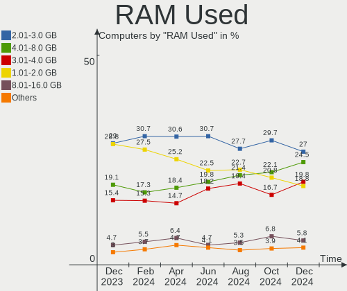
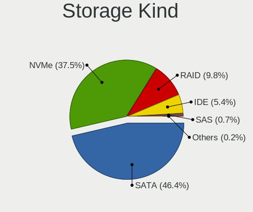
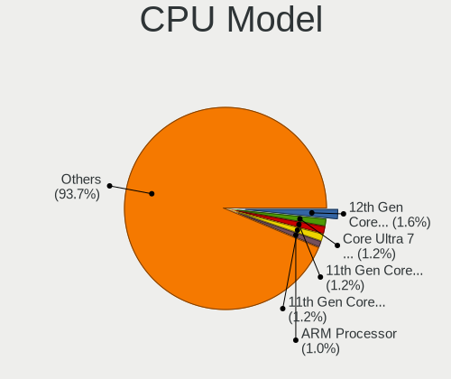
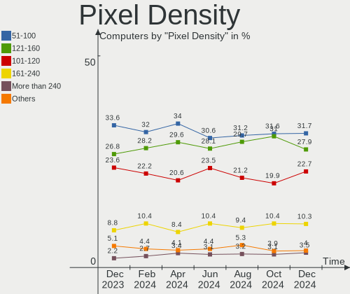

Ubuntu Hardware Trends
----------------------

A project to identify most popular hardware characteristics and track their change
over time based on data collected by Ubuntu users at https://Linux-Hardware.org.

Anyone can contribute to the study by uploading probes of their computers by
the [hw-probe](https://github.com/linuxhw/hw-probe) tool:

    sudo -E hw-probe -all -upload

This is a report for all computer types. See also reports for [desktops](/Dist/Ubuntu/Desktop/README.md) and [notebooks](/Dist/Ubuntu/Notebook/README.md).

Full-feature report is available here: https://linux-hardware.org/?view=trends

Period: Apr, 2021.

Contents
--------

- [ OS                       ](#os)
- [ OS Family                ](#os-family)
- [ Kernel                   ](#kernel)
- [ Kernel Family            ](#kernel-family)
- [ Kernel Major Ver.        ](#kernel-major-ver)
- [ Arch                     ](#arch)
- [ DE                       ](#de)
- [ Display Server           ](#display-server)
- [ Display Manager          ](#display-manager)
- [ OS Lang                  ](#os-lang)
- [ Boot Mode                ](#boot-mode)
- [ Filesystem               ](#filesystem)
- [ Part. scheme             ](#part-scheme)
- [ Dual Boot with Linux/BSD ](#dual-boot-with-linux/bsd)
- [ Dual Boot (Win)          ](#dual-boot-win)
- [ Country                  ](#country)
- [ City                     ](#city)
- [ Vendor                   ](#vendor)
- [ Model                    ](#model)
- [ Model Family             ](#model-family)
- [ MFG Year                 ](#mfg-year)
- [ Form Factor              ](#form-factor)
- [ Secure Boot              ](#secure-boot)
- [ Coreboot                 ](#coreboot)
- [ RAM Size                 ](#ram-size)
- [ RAM Used                 ](#ram-used)
- [ Has CD-ROM               ](#has-cd-rom)
- [ Total Drives             ](#total-drives)
- [ Has Ethernet             ](#has-ethernet)
- [ Has WiFi                 ](#has-wifi)
- [ Has Bluetooth            ](#has-bluetooth)
- [ Drive Vendor             ](#drive-vendor)
- [ Drive Model              ](#drive-model)
- [ HDD Vendor               ](#hdd-vendor)
- [ SSD Vendor               ](#ssd-vendor)
- [ Drive Kind               ](#drive-kind)
- [ Drive Connector          ](#drive-connector)
- [ Drive Size               ](#drive-size)
- [ Space Total              ](#space-total)
- [ Space Used               ](#space-used)
- [ Malfunc. Drives          ](#malfunc-drives)
- [ Malfunc. Drive Vendor    ](#malfunc-drive-vendor)
- [ Malfunc. HDD Vendor      ](#malfunc-hdd-vendor)
- [ Malfunc. Drive Kind      ](#malfunc-drive-kind)
- [ Failed Drives            ](#failed-drives)
- [ Failed Drive Vendor      ](#failed-drive-vendor)
- [ Drive Status             ](#drive-status)
- [ Storage Vendor           ](#storage-vendor)
- [ Storage Model            ](#storage-model)
- [ Storage Kind             ](#storage-kind)
- [ CPU Vendor               ](#cpu-vendor)
- [ CPU Model                ](#cpu-model)
- [ CPU Model Family         ](#cpu-model-family)
- [ CPU Cores                ](#cpu-cores)
- [ CPU Sockets              ](#cpu-sockets)
- [ CPU Threads              ](#cpu-threads)
- [ CPU Op-Modes             ](#cpu-op-modes)
- [ CPU Microcode            ](#cpu-microcode)
- [ CPU Microarch            ](#cpu-microarch)
- [ GPU Vendor               ](#gpu-vendor)
- [ GPU Model                ](#gpu-model)
- [ GPU Combo                ](#gpu-combo)
- [ GPU Driver               ](#gpu-driver)
- [ GPU Memory               ](#gpu-memory)
- [ Monitor Vendor           ](#monitor-vendor)
- [ Monitor Model            ](#monitor-model)
- [ Monitor Resolution       ](#monitor-resolution)
- [ Monitor Diagonal         ](#monitor-diagonal)
- [ Monitor Width            ](#monitor-width)
- [ Aspect Ratio             ](#aspect-ratio)
- [ Monitor Area             ](#monitor-area)
- [ Pixel Density            ](#pixel-density)
- [ Multiple Monitors        ](#multiple-monitors)
- [ Net Controller Vendor    ](#net-controller-vendor)
- [ Net Controller Model     ](#net-controller-model)
- [ Wireless Vendor          ](#wireless-vendor)
- [ Wireless Model           ](#wireless-model)
- [ Ethernet Vendor          ](#ethernet-vendor)
- [ Ethernet Model           ](#ethernet-model)
- [ Net Controller Kind      ](#net-controller-kind)
- [ Used Controller          ](#used-controller)
- [ NICs                     ](#nics)
- [ IPv6                     ](#ipv6)
- [ Memory Vendor            ](#memory-vendor)
- [ Memory Model             ](#memory-model)
- [ Memory Kind              ](#memory-kind)
- [ Memory Form Factor       ](#memory-form-factor)
- [ Memory Size              ](#memory-size)
- [ Memory Speed             ](#memory-speed)
- [ Sound Vendor             ](#sound-vendor)
- [ Sound Model              ](#sound-model)
- [ Camera Vendor            ](#camera-vendor)
- [ Camera Model             ](#camera-model)
- [ Fingerprint Vendor       ](#fingerprint-vendor)
- [ Fingerprint Model        ](#fingerprint-model)
- [ Chipcard Vendor          ](#chipcard-vendor)
- [ Chipcard Model           ](#chipcard-model)
- [ Printer Vendor           ](#printer-vendor)
- [ Printer Model            ](#printer-model)
- [ Scanner Vendor           ](#scanner-vendor)
- [ Scanner Model            ](#scanner-model)
- [ Bluetooth Vendor         ](#bluetooth-vendor)
- [ Bluetooth Model          ](#bluetooth-model)
- [ Unsupported Devices      ](#unsupported-devices)
- [ Unsupported Device Types ](#unsupported-device-types)

OS
--

Installed operating systems

| Name           | Computers | Percent |
|----------------|-----------|---------|
| Ubuntu 20.04   | 995       | 67%     |
| Ubuntu 20.10   | 263       | 17.71%  |
| Ubuntu 18.04   | 127       | 8.55%   |
| Ubuntu 21.04   | 81        | 5.45%   |
| Ubuntu 16.04   | 6         | 0.4%    |
| Ubuntu 2020    | 3         | 0.2%    |
| Ubuntu 19.04   | 2         | 0.13%   |
| Ubuntu 10      | 2         | 0.13%   |
| Ubuntu         | 2         | 0.13%   |
| Ubuntu Core 18 | 1         | 0.07%   |
| Ubuntu Core 16 | 1         | 0.07%   |
| Ubuntu 19.10   | 1         | 0.07%   |
| Ubuntu 18.10   | 1         | 0.07%   |

OS Family
---------

OS without a version

| Name   | Computers | Percent |
|--------|-----------|---------|
| Ubuntu | 1485      | 100%    |

Kernel
------

Version of the Linux kernel

| Version                | Computers | Percent |
|------------------------|-----------|---------|
| 5.8.0-48-generic       | 403       | 27.14%  |
| 5.8.0-50-generic       | 348       | 23.43%  |
| 5.8.0-49-generic       | 125       | 8.42%   |
| 5.4.0-70-generic       | 111       | 7.47%   |
| 5.4.0-72-generic       | 85        | 5.72%   |
| 5.11.0-16-generic      | 53        | 3.57%   |
| 5.8.0-43-generic       | 45        | 3.03%   |
| 5.4.0-71-generic       | 26        | 1.75%   |
| 4.15.0-142-generic     | 19        | 1.28%   |
| 5.8.0-25-generic       | 14        | 0.94%   |
| 4.15.0-140-generic     | 13        | 0.88%   |
| 5.8.0-44-generic       | 12        | 0.81%   |
| 5.4.0-42-generic       | 12        | 0.81%   |
| 5.11.0-13-generic      | 12        | 0.81%   |
| 5.8.0-45-generic       | 11        | 0.74%   |
| 5.8.0-1021-raspi       | 11        | 0.74%   |
| 5.8.0-1019-raspi       | 8         | 0.54%   |
| 5.4.0-26-generic       | 8         | 0.54%   |
| 5.8.0-51-generic       | 7         | 0.47%   |
| 5.8.0-41-generic       | 7         | 0.47%   |
| 5.4.0-67-generic       | 6         | 0.4%    |
| 5.11.0-14-generic      | 6         | 0.4%    |
| 5.4.0-65-generic       | 5         | 0.34%   |
| 5.11.0-051100-generic  | 5         | 0.34%   |
| 5.6.0-1052-oem         | 4         | 0.27%   |
| 5.4.0-70-lowlatency    | 4         | 0.27%   |
| 4.15.0-141-generic     | 4         | 0.27%   |
| 5.8.0-48-lowlatency    | 3         | 0.2%    |
| 5.8.0-38-generic       | 3         | 0.2%    |
| 5.4.0-73-generic       | 3         | 0.2%    |
| 5.4.0-66-generic       | 3         | 0.2%    |
| 5.4.0-48-generic       | 3         | 0.2%    |
| 5.11.11-051111-generic | 3         | 0.2%    |
| 5.11.0-1007-raspi      | 3         | 0.2%    |
| 5.9.0-050900-generic   | 2         | 0.13%   |
| 5.8.0-42-generic       | 2         | 0.13%   |
| 5.8.0-1020-raspi       | 2         | 0.13%   |
| 5.8.0-1006-raspi       | 2         | 0.13%   |
| 5.4.0-58-generic       | 2         | 0.13%   |
| 5.3.0-28-generic       | 2         | 0.13%   |
| 5.11.15-051115-generic | 2         | 0.13%   |
| 5.11.12-051112-generic | 2         | 0.13%   |
| 5.11.10-051110-generic | 2         | 0.13%   |
| 5.10.0-1023-oem        | 2         | 0.13%   |
| 4.9.140-tegra          | 2         | 0.13%   |
| 4.15.0-20-generic      | 2         | 0.13%   |
| 4.15.0-139-generic     | 2         | 0.13%   |
| 5.8.5-050805-generic   | 1         | 0.07%   |
| 5.8.14-amd64-desktop   | 1         | 0.07%   |
| 5.8.0-50-lowlatency    | 1         | 0.07%   |
| 5.8.0-40-generic       | 1         | 0.07%   |
| 5.8.0-36-generic       | 1         | 0.07%   |
| 5.8.0-33-generic       | 1         | 0.07%   |
| 5.8.0-29-generic       | 1         | 0.07%   |
| 5.8.0-1028-gcp         | 1         | 0.07%   |
| 5.8.0-1016-raspi       | 1         | 0.07%   |
| 5.8.0                  | 1         | 0.07%   |
| 5.7.9-mbp              | 1         | 0.07%   |
| 5.7.15-050715-generic  | 1         | 0.07%   |
| 5.6.18-050618-generic  | 1         | 0.07%   |

Kernel Family
-------------

Linux kernel without a distro release

| Version | Computers | Percent |
|---------|-----------|---------|
| 5.8.0   | 1011      | 68.08%  |
| 5.4.0   | 283       | 19.06%  |
| 5.11.0  | 82        | 5.52%   |
| 4.15.0  | 49        | 3.3%    |
| 5.12.0  | 7         | 0.47%   |
| 5.10.0  | 6         | 0.4%    |
| 5.6.0   | 4         | 0.27%   |
| 5.3.0   | 4         | 0.27%   |
| 5.11.11 | 3         | 0.2%    |
| 5.0.0   | 3         | 0.2%    |
| 5.9.0   | 2         | 0.13%   |
| 5.11.15 | 2         | 0.13%   |
| 5.11.12 | 2         | 0.13%   |
| 5.11.10 | 2         | 0.13%   |
| 4.9.140 | 2         | 0.13%   |
| 4.18.0  | 2         | 0.13%   |
| 5.8.5   | 1         | 0.07%   |
| 5.8.14  | 1         | 0.07%   |
| 5.7.9   | 1         | 0.07%   |
| 5.7.15  | 1         | 0.07%   |
| 5.6.18  | 1         | 0.07%   |
| 5.6.10  | 1         | 0.07%   |
| 5.4.73  | 1         | 0.07%   |
| 5.2.21  | 1         | 0.07%   |
| 5.11.8  | 1         | 0.07%   |
| 5.11.6  | 1         | 0.07%   |
| 5.11.16 | 1         | 0.07%   |
| 5.11.13 | 1         | 0.07%   |
| 5.10.32 | 1         | 0.07%   |
| 5.10.26 | 1         | 0.07%   |
| 5.10.13 | 1         | 0.07%   |
| 4.9.201 | 1         | 0.07%   |
| 4.4.0   | 1         | 0.07%   |
| 4.2.8   | 1         | 0.07%   |
| 4.17.3  | 1         | 0.07%   |
| 4.16.18 | 1         | 0.07%   |
| Unknown | 1         | 0.07%   |

Kernel Major Ver.
-----------------

Linux kernel major version

| Version | Computers | Percent |
|---------|-----------|---------|
| 5.8     | 1013      | 68.22%  |
| 5.4     | 284       | 19.12%  |
| 5.11    | 95        | 6.4%    |
| 4.15    | 49        | 3.3%    |
| 5.10    | 9         | 0.61%   |
| 5.12    | 7         | 0.47%   |
| 5.6     | 6         | 0.4%    |
| 5.3     | 4         | 0.27%   |
| 5.0     | 3         | 0.2%    |
| 4.9     | 3         | 0.2%    |
| 5.9     | 2         | 0.13%   |
| 5.7     | 2         | 0.13%   |
| 4.18    | 2         | 0.13%   |
| 5.2     | 1         | 0.07%   |
| 4.4     | 1         | 0.07%   |
| 4.2     | 1         | 0.07%   |
| 4.17    | 1         | 0.07%   |
| 4.16    | 1         | 0.07%   |
| Unknown | 1         | 0.07%   |

Arch
----

OS architecture (x86_64, i586, etc.)

| Name    | Computers | Percent |
|---------|-----------|---------|
| x86_64  | 1434      | 96.57%  |
| aarch64 | 36        | 2.42%   |
| i686    | 14        | 0.94%   |
| Unknown | 1         | 0.07%   |

DE
--

Desktop Environment

| Name                | Computers | Percent |
|---------------------|-----------|---------|
| GNOME               | 1263      | 85.05%  |
| Unknown             | 164       | 11.04%  |
| Unity               | 18        | 1.21%   |
| X-Cinnamon          | 16        | 1.08%   |
| GNOME Flashback     | 8         | 0.54%   |
| i3                  | 4         | 0.27%   |
| Cinnamon            | 4         | 0.27%   |
| Deepin              | 3         | 0.2%    |
| GNUstep             | 2         | 0.13%   |
| xmonad              | 1         | 0.07%   |
| enlightenment       | 1         | 0.07%   |
| /usr/bin/startxfce4 | 1         | 0.07%   |

Display Server
--------------

X11 or Wayland

| Name    | Computers | Percent |
|---------|-----------|---------|
| X11     | 1276      | 85.93%  |
| Wayland | 97        | 6.53%   |
| Unknown | 85        | 5.72%   |
| Tty     | 27        | 1.82%   |

Display Manager
---------------

SDDM, LightDM, etc.

| Name    | Computers | Percent |
|---------|-----------|---------|
| Unknown | 1155      | 77.78%  |
| GDM     | 309       | 20.81%  |
| TDM     | 17        | 1.14%   |
| LightDM | 2         | 0.13%   |
| XDM     | 1         | 0.07%   |
| GDM3    | 1         | 0.07%   |

OS Lang
-------

Language

| Lang    | Computers | Percent |
|---------|-----------|---------|
| en_US   | 568       | 38.25%  |
| de_DE   | 141       | 9.49%   |
| fr_FR   | 99        | 6.67%   |
| en_GB   | 81        | 5.45%   |
| pt_BR   | 72        | 4.85%   |
| it_IT   | 51        | 3.43%   |
| ru_RU   | 44        | 2.96%   |
| es_ES   | 44        | 2.96%   |
| en_IN   | 40        | 2.69%   |
| en_CA   | 31        | 2.09%   |
| pl_PL   | 27        | 1.82%   |
| C       | 21        | 1.41%   |
| en_AU   | 20        | 1.35%   |
| Unknown | 19        | 1.28%   |
| nl_NL   | 15        | 1.01%   |
| ja_JP   | 12        | 0.81%   |
| hu_HU   | 12        | 0.81%   |
| cs_CZ   | 11        | 0.74%   |
| sv_SE   | 10        | 0.67%   |
| de_CH   | 10        | 0.67%   |
| pt_PT   | 9         | 0.61%   |
| fr_BE   | 9         | 0.61%   |
| ro_RO   | 7         | 0.47%   |
| fi_FI   | 7         | 0.47%   |
| es_MX   | 7         | 0.47%   |
| en_ZA   | 7         | 0.47%   |
| zh_CN   | 6         | 0.4%    |
| es_CL   | 6         | 0.4%    |
| es_AR   | 6         | 0.4%    |
| de_AT   | 6         | 0.4%    |
| ca_ES   | 6         | 0.4%    |
| uk_UA   | 5         | 0.34%   |
| es_UY   | 5         | 0.34%   |
| zh_TW   | 4         | 0.27%   |
| tr_TR   | 4         | 0.27%   |
| ru_UA   | 4         | 0.27%   |
| nl_BE   | 4         | 0.27%   |
| nb_NO   | 4         | 0.27%   |
| ko_KR   | 4         | 0.27%   |
| hr_HR   | 4         | 0.27%   |
| fr_CA   | 4         | 0.27%   |
| en_IL   | 4         | 0.27%   |
| sl_SI   | 3         | 0.2%    |
| es_CO   | 3         | 0.2%    |
| en_SG   | 3         | 0.2%    |
| el_GR   | 3         | 0.2%    |
| da_DK   | 3         | 0.2%    |
| sk_SK   | 2         | 0.13%   |
| es_PE   | 2         | 0.13%   |
| en_NZ   | 2         | 0.13%   |
| en_NG   | 2         | 0.13%   |
| vi_VN   | 1         | 0.07%   |
| nn_NO   | 1         | 0.07%   |
| lt_LT   | 1         | 0.07%   |
| id_ID   | 1         | 0.07%   |
| gl_ES   | 1         | 0.07%   |
| fr_CH   | 1         | 0.07%   |
| es_SV   | 1         | 0.07%   |
| es_PA   | 1         | 0.07%   |
| es_EC   | 1         | 0.07%   |

Boot Mode
---------

EFI or BIOS

| Mode | Computers | Percent |
|------|-----------|---------|
| BIOS | 829       | 55.82%  |
| EFI  | 656       | 44.18%  |

Filesystem
----------

Type of filesystem

| Type    | Computers | Percent |
|---------|-----------|---------|
| Ext4    | 1401      | 94.34%  |
| Overlay | 40        | 2.69%   |
| Zfs     | 27        | 1.82%   |
| Btrfs   | 8         | 0.54%   |
| Ext3    | 4         | 0.27%   |
| Xfs     | 2         | 0.13%   |
| Ext2    | 2         | 0.13%   |
| Unknown | 1         | 0.07%   |

Part. scheme
------------

Scheme of partitioning

| Type    | Computers | Percent |
|---------|-----------|---------|
| Unknown | 1135      | 76.43%  |
| GPT     | 285       | 19.19%  |
| MBR     | 65        | 4.38%   |

Dual Boot with Linux/BSD
------------------------

Hosting more than one Linux/BSD

| Dual boot | Computers | Percent |
|-----------|-----------|---------|
| No        | 1296      | 87.27%  |
| Yes       | 189       | 12.73%  |

Dual Boot (Win)
---------------

Hosting Linux and Windows

| Dual boot | Computers | Percent |
|-----------|-----------|---------|
| No        | 942       | 63.43%  |
| Yes       | 543       | 36.57%  |

Country
-------

Geographic location (country)

| Country      | Computers | Percent |
|--------------|-----------|---------|
| USA          | 247       | 16.63%  |
| Germany      | 168       | 11.31%  |
| France       | 106       | 7.14%   |
| Brazil       | 101       | 6.8%    |
| UK           | 74        | 4.98%   |
| Italy        | 65        | 4.38%   |
| Russia       | 59        | 3.97%   |
| Spain        | 54        | 3.64%   |
| India        | 47        | 3.16%   |
| Netherlands  | 43        | 2.9%    |
| Canada       | 39        | 2.63%   |
| Poland       | 28        | 1.89%   |
| Ukraine      | 25        | 1.68%   |
| Switzerland  | 21        | 1.41%   |
| Sweden       | 21        | 1.41%   |
| Belgium      | 21        | 1.41%   |
| Australia    | 21        | 1.41%   |
| Czechia      | 18        | 1.21%   |
| Turkey       | 17        | 1.14%   |
| Japan        | 15        | 1.01%   |
| Norway       | 14        | 0.94%   |
| Mexico       | 14        | 0.94%   |
| Romania      | 13        | 0.88%   |
| Portugal     | 13        | 0.88%   |
| Hungary      | 13        | 0.88%   |
| Finland      | 13        | 0.88%   |
| Austria      | 13        | 0.88%   |
| Greece       | 11        | 0.74%   |
| China        | 10        | 0.67%   |
| Chile        | 10        | 0.67%   |
| Indonesia    | 9         | 0.61%   |
| Argentina    | 9         | 0.61%   |
| Israel       | 8         | 0.54%   |
| South Africa | 7         | 0.47%   |
| Iran         | 7         | 0.47%   |
| Vietnam      | 6         | 0.4%    |
| Slovakia     | 6         | 0.4%    |
| Denmark      | 6         | 0.4%    |
| Colombia     | 6         | 0.4%    |
| Uruguay      | 5         | 0.34%   |
| Taiwan       | 5         | 0.34%   |
| New Zealand  | 5         | 0.34%   |
| Croatia      | 5         | 0.34%   |
| Algeria      | 5         | 0.34%   |
| South Korea  | 4         | 0.27%   |
| Slovenia     | 4         | 0.27%   |
| Singapore    | 4         | 0.27%   |
| Bulgaria     | 4         | 0.27%   |
| Belarus      | 4         | 0.27%   |
| Egypt        | 3         | 0.2%    |
| Costa Rica   | 3         | 0.2%    |
| Peru         | 2         | 0.13%   |
| Panama       | 2         | 0.13%   |
| Pakistan     | 2         | 0.13%   |
| Nigeria      | 2         | 0.13%   |
| Morocco      | 2         | 0.13%   |
| Malaysia     | 2         | 0.13%   |
| Lithuania    | 2         | 0.13%   |
| Latvia       | 2         | 0.13%   |
| Kenya        | 2         | 0.13%   |

City
----

Geographic location (city)

| City              | Computers | Percent |
|-------------------|-----------|---------|
| Moscow            | 17        | 1.14%   |
| Berlin            | 15        | 1.01%   |
| São Paulo        | 14        | 0.94%   |
| Hamburg           | 13        | 0.88%   |
| Rome              | 11        | 0.74%   |
| Milan             | 10        | 0.67%   |
| London            | 10        | 0.67%   |
| Prague            | 9         | 0.61%   |
| Barcelona         | 9         | 0.61%   |
| Vienna            | 8         | 0.54%   |
| Paris             | 8         | 0.54%   |
| Montreal          | 7         | 0.47%   |
| Kyiv              | 7         | 0.47%   |
| Athens            | 7         | 0.47%   |
| Tehran            | 6         | 0.4%    |
| Munich            | 6         | 0.4%    |
| Madrid            | 6         | 0.4%    |
| Lisbon            | 6         | 0.4%    |
| Stuttgart         | 5         | 0.34%   |
| St Petersburg     | 5         | 0.34%   |
| Rio de Janeiro    | 5         | 0.34%   |
| Recife            | 5         | 0.34%   |
| Oslo              | 5         | 0.34%   |
| Mumbai            | 5         | 0.34%   |
| Istanbul          | 5         | 0.34%   |
| Curitiba          | 5         | 0.34%   |
| Cologne           | 5         | 0.34%   |
| Budapest          | 5         | 0.34%   |
| Ankara            | 5         | 0.34%   |
| Zurich            | 4         | 0.27%   |
| Zagreb            | 4         | 0.27%   |
| Valencia          | 4         | 0.27%   |
| Tel Aviv          | 4         | 0.27%   |
| Sydney            | 4         | 0.27%   |
| Singapore         | 4         | 0.27%   |
| Santo André      | 4         | 0.27%   |
| Santiago          | 4         | 0.27%   |
| New York          | 4         | 0.27%   |
| New Delhi         | 4         | 0.27%   |
| Montevideo        | 4         | 0.27%   |
| Leipzig           | 4         | 0.27%   |
| Kolkata           | 4         | 0.27%   |
| Frankfurt am Main | 4         | 0.27%   |
| Delhi             | 4         | 0.27%   |
| Campinas          | 4         | 0.27%   |
| Bucharest         | 4         | 0.27%   |
| Brussels          | 4         | 0.27%   |
| Brooklyn          | 4         | 0.27%   |
| Brisbane          | 4         | 0.27%   |
| Belo Horizonte    | 4         | 0.27%   |
| Atlanta           | 4         | 0.27%   |
| Amsterdam         | 4         | 0.27%   |
| Ahmedabad         | 4         | 0.27%   |
| Yokohama          | 3         | 0.2%    |
| Warsaw            | 3         | 0.2%    |
| Toulouse          | 3         | 0.2%    |
| Stockholm         | 3         | 0.2%    |
| Seattle           | 3         | 0.2%    |
| Rotterdam         | 3         | 0.2%    |
| Rochester         | 3         | 0.2%    |

Vendor
------

Motherboard manufacturer

| Name                                   | Computers | Percent |
|----------------------------------------|-----------|---------|
| Dell                                   | 259       | 17.44%  |
| Hewlett-Packard                        | 217       | 14.61%  |
| ASUSTek Computer                       | 212       | 14.28%  |
| Lenovo                                 | 195       | 13.13%  |
| Gigabyte Technology                    | 104       | 7%      |
| MSI                                    | 79        | 5.32%   |
| Acer                                   | 70        | 4.71%   |
| ASRock                                 | 58        | 3.91%   |
| Intel                                  | 30        | 2.02%   |
| Unknown                                | 30        | 2.02%   |
| Apple                                  | 27        | 1.82%   |
| Toshiba                                | 23        | 1.55%   |
| Samsung Electronics                    | 17        | 1.14%   |
| Raspberry Pi Foundation                | 13        | 0.88%   |
| Medion                                 | 11        | 0.74%   |
| Fujitsu                                | 10        | 0.67%   |
| Sony                                   | 9         | 0.61%   |
| Notebook                               | 7         | 0.47%   |
| Pegatron                               | 6         | 0.4%    |
| Packard Bell                           | 6         | 0.4%    |
| HUAWEI                                 | 6         | 0.4%    |
| ECS                                    | 6         | 0.4%    |
| System76                               | 5         | 0.34%   |
| LG Electronics                         | 5         | 0.34%   |
| TUXEDO                                 | 4         | 0.27%   |
| Alienware                              | 4         | 0.27%   |
| Positivo                               | 3         | 0.2%    |
| Panasonic                              | 3         | 0.2%    |
| Nvidia                                 | 3         | 0.2%    |
| Fujitsu Siemens                        | 3         | 0.2%    |
| Biostar                                | 3         | 0.2%    |
| whyopencomputing                       | 2         | 0.13%   |
| Semp Toshiba                           | 2         | 0.13%   |
| Radxa                                  | 2         | 0.13%   |
| NEC Computers                          | 2         | 0.13%   |
| Microsoft                              | 2         | 0.13%   |
| IBM                                    | 2         | 0.13%   |
| Gateway                                | 2         | 0.13%   |
| Foxconn                                | 2         | 0.13%   |
| eMachines                              | 2         | 0.13%   |
| Desenvolvido para Positivo Informatica | 2         | 0.13%   |
| Chuwi                                  | 2         | 0.13%   |
| AMI                                    | 2         | 0.13%   |
| Wistron                                | 1         | 0.07%   |
| Varian Medical Systems                 | 1         | 0.07%   |
| TrekStor                               | 1         | 0.07%   |
| Timi                                   | 1         | 0.07%   |
| Thomson                                | 1         | 0.07%   |
| Supermicro                             | 1         | 0.07%   |
| SLIMBOOK                               | 1         | 0.07%   |
| Shuttle                                | 1         | 0.07%   |
| Schenker                               | 1         | 0.07%   |
| SANTECH                                | 1         | 0.07%   |
| PCWare                                 | 1         | 0.07%   |
| PC Specialist                          | 1         | 0.07%   |
| OEM_MB                                 | 1         | 0.07%   |
| MiTAC                                  | 1         | 0.07%   |
| MECHREVO                               | 1         | 0.07%   |
| LDLC                                   | 1         | 0.07%   |
| LattePanda                             | 1         | 0.07%   |

Model
-----

Motherboard model

| Name                               | Computers | Percent |
|------------------------------------|-----------|---------|
| Unknown                            | 36        | 2.42%   |
| ASUS All Series                    | 12        | 0.81%   |
| HP Notebook                        | 7         | 0.47%   |
| Dell OptiPlex 790                  | 6         | 0.4%    |
| RPi Raspberry Pi 4 Model B Rev 1.4 | 5         | 0.34%   |
| HP Pavilion g6                     | 5         | 0.34%   |
| Dell XPS 13 7390                   | 5         | 0.34%   |
| Dell OptiPlex 7010                 | 5         | 0.34%   |
| HP ProBook 650 G1                  | 4         | 0.27%   |
| Gigabyte GA-78LMT-USB3 6.0         | 4         | 0.27%   |
| Dell XPS 15 7590                   | 4         | 0.27%   |
| Dell XPS 13 9360                   | 4         | 0.27%   |
| Dell Latitude 5410                 | 4         | 0.27%   |
| Dell Inspiron 5406 2n1             | 4         | 0.27%   |
| Dell Inspiron 15-3567              | 4         | 0.27%   |
| Nvidia Tegra                       | 3         | 0.2%    |
| MSI MS-7C35                        | 3         | 0.2%    |
| MSI MS-7C02                        | 3         | 0.2%    |
| MSI MS-7A34                        | 3         | 0.2%    |
| Lenovo IdeaPad Flex 5 14IIL05 81X1 | 3         | 0.2%    |
| Lenovo IdeaPad 520-15IKB 81BF      | 3         | 0.2%    |
| HP Z400 Workstation                | 3         | 0.2%    |
| HP ProBook 450 G7                  | 3         | 0.2%    |
| HP ProBook 445 G7                  | 3         | 0.2%    |
| HP Pavilion g7                     | 3         | 0.2%    |
| HP Laptop 15-dw1xxx                | 3         | 0.2%    |
| HP Laptop 15-da0xxx                | 3         | 0.2%    |
| HP EliteBook Folio 9470m           | 3         | 0.2%    |
| HP EliteBook 850 G7 Notebook PC    | 3         | 0.2%    |
| HP EliteBook 8470p                 | 3         | 0.2%    |
| HP EliteBook 8440p                 | 3         | 0.2%    |
| HP EliteBook 840 G2                | 3         | 0.2%    |
| HP Compaq 8200 Elite CMT PC        | 3         | 0.2%    |
| HP 250 G6 Notebook PC              | 3         | 0.2%    |
| Gigabyte X399 AORUS PRO            | 3         | 0.2%    |
| Gigabyte 990FXA-UD3                | 3         | 0.2%    |
| Dell XPS 15 9570                   | 3         | 0.2%    |
| Dell XPS 15 9560                   | 3         | 0.2%    |
| Dell Precision 5530                | 3         | 0.2%    |
| Dell OptiPlex 990                  | 3         | 0.2%    |
| Dell OptiPlex 9010                 | 3         | 0.2%    |
| Dell OptiPlex 780                  | 3         | 0.2%    |
| Dell Latitude E7440                | 3         | 0.2%    |
| Dell Latitude E6540                | 3         | 0.2%    |
| Dell Latitude E6430                | 3         | 0.2%    |
| Dell Latitude E6420                | 3         | 0.2%    |
| Dell Latitude E6410                | 3         | 0.2%    |
| Dell Latitude E6400                | 3         | 0.2%    |
| Dell Inspiron 3421                 | 3         | 0.2%    |
| Dell G3 3579                       | 3         | 0.2%    |
| ASUS M4N68T-M-LE-V2                | 3         | 0.2%    |
| ASRock AB350 Pro4                  | 3         | 0.2%    |
| ASRock A320M-HDV R4.0              | 3         | 0.2%    |
| Apple iMac19,1                     | 3         | 0.2%    |
| Apple iMac12,1                     | 3         | 0.2%    |
| Toshiba Satellite A505             | 2         | 0.13%   |
| Toshiba Satellite A350             | 2         | 0.13%   |
| Toshiba Satellite A300             | 2         | 0.13%   |
| System76 Lemur Pro                 | 2         | 0.13%   |
| System76 Gazelle                   | 2         | 0.13%   |

Model Family
------------

Motherboard model prefix

| Name                   | Computers | Percent |
|------------------------|-----------|---------|
| Lenovo ThinkPad        | 79        | 5.32%   |
| Dell Inspiron          | 61        | 4.11%   |
| Dell Latitude          | 60        | 4.04%   |
| Acer Aspire            | 46        | 3.1%    |
| Dell OptiPlex          | 44        | 2.96%   |
| Lenovo IdeaPad         | 38        | 2.56%   |
| HP EliteBook           | 36        | 2.42%   |
| Dell XPS               | 36        | 2.42%   |
| Unknown                | 36        | 2.42%   |
| HP Pavilion            | 35        | 2.36%   |
| HP ProBook             | 24        | 1.62%   |
| Dell Precision         | 24        | 1.62%   |
| HP Compaq              | 23        | 1.55%   |
| Toshiba Satellite      | 21        | 1.41%   |
| ASUS PRIME             | 21        | 1.41%   |
| Lenovo ThinkCentre     | 19        | 1.28%   |
| ASUS ROG               | 16        | 1.08%   |
| HP Laptop              | 15        | 1.01%   |
| Dell Vostro            | 15        | 1.01%   |
| ASUS VivoBook          | 14        | 0.94%   |
| RPi Raspberry          | 13        | 0.88%   |
| ASUS TUF               | 12        | 0.81%   |
| ASUS All               | 12        | 0.81%   |
| HP ENVY                | 8         | 0.54%   |
| Acer Swift             | 8         | 0.54%   |
| Lenovo Yoga            | 7         | 0.47%   |
| HP Spectre             | 7         | 0.47%   |
| HP Notebook            | 7         | 0.47%   |
| Dell PowerEdge         | 7         | 0.47%   |
| Lenovo ThinkBook       | 6         | 0.4%    |
| Lenovo Legion          | 6         | 0.4%    |
| HP ZBook               | 6         | 0.4%    |
| Gigabyte GA-78LMT-USB3 | 6         | 0.4%    |
| Fujitsu ESPRIMO        | 6         | 0.4%    |
| Packard Bell EasyNote  | 5         | 0.34%   |
| HP ProLiant            | 5         | 0.34%   |
| HP 250                 | 5         | 0.34%   |
| Dell G3                | 5         | 0.34%   |
| Gigabyte A320M-S2H     | 4         | 0.27%   |
| Gigabyte 990FXA-UD3    | 4         | 0.27%   |
| ASUS M5A97             | 4         | 0.27%   |
| ASRock B550            | 4         | 0.27%   |
| ASRock AB350           | 4         | 0.27%   |
| Apple iMac12           | 4         | 0.27%   |
| Acer Nitro             | 4         | 0.27%   |
| Nvidia Tegra           | 3         | 0.2%    |
| MSI Prestige           | 3         | 0.2%    |
| MSI MS-7C35            | 3         | 0.2%    |
| MSI MS-7C02            | 3         | 0.2%    |
| MSI MS-7A34            | 3         | 0.2%    |
| Lenovo IdeaCentre      | 3         | 0.2%    |
| HP Z400                | 3         | 0.2%    |
| HP ProDesk             | 3         | 0.2%    |
| HP OMEN                | 3         | 0.2%    |
| HP 255                 | 3         | 0.2%    |
| HP 15                  | 3         | 0.2%    |
| Gigabyte X399          | 3         | 0.2%    |
| Gigabyte B550          | 3         | 0.2%    |
| Gigabyte B450          | 3         | 0.2%    |
| Dell Studio            | 3         | 0.2%    |

MFG Year
--------

Motherboard manufacture year

| Year    | Computers | Percent |
|---------|-----------|---------|
| 2020    | 302       | 20.34%  |
| 2019    | 158       | 10.64%  |
| 2018    | 141       | 9.49%   |
| 2013    | 110       | 7.41%   |
| 2012    | 87        | 5.86%   |
| 2014    | 86        | 5.79%   |
| 2021    | 84        | 5.66%   |
| 2011    | 77        | 5.19%   |
| 2015    | 75        | 5.05%   |
| 2017    | 67        | 4.51%   |
| 2010    | 67        | 4.51%   |
| 2016    | 64        | 4.31%   |
| 2009    | 54        | 3.64%   |
| 2008    | 39        | 2.63%   |
| Unknown | 37        | 2.49%   |
| 2007    | 26        | 1.75%   |
| 2006    | 8         | 0.54%   |
| 2005    | 3         | 0.2%    |

Form Factor
-----------

Physical design of the computer

| Name           | Computers | Percent |
|----------------|-----------|---------|
| Notebook       | 770       | 51.85%  |
| Desktop        | 578       | 38.92%  |
| Convertible    | 40        | 2.69%   |
| System on chip | 36        | 2.42%   |
| All in one     | 32        | 2.15%   |
| Mini pc        | 14        | 0.94%   |
| Server         | 10        | 0.67%   |
| Tablet         | 5         | 0.34%   |

Secure Boot
-----------

Enabled or disabled

| State    | Computers | Percent |
|----------|-----------|---------|
| Disabled | 1336      | 89.97%  |
| Enabled  | 149       | 10.03%  |

Coreboot
--------

Have coreboot on board

| Used | Computers | Percent |
|------|-----------|---------|
| No   | 1482      | 99.8%   |
| Yes  | 3         | 0.2%    |

RAM Size
--------

Total RAM memory

| Size in GB      | Computers | Percent |
|-----------------|-----------|---------|
| 4.01-8.0        | 359       | 24.18%  |
| 3.01-4.0        | 318       | 21.41%  |
| 16.01-24.0      | 298       | 20.07%  |
| 8.01-16.0       | 250       | 16.84%  |
| 32.01-64.0      | 119       | 8.01%   |
| 1.01-2.0        | 46        | 3.1%    |
| 64.01-256.0     | 39        | 2.63%   |
| 24.01-32.0      | 24        | 1.62%   |
| 2.01-3.0        | 20        | 1.35%   |
| 0.51-1.0        | 8         | 0.54%   |
| More than 256.0 | 3         | 0.2%    |
| Unknown         | 1         | 0.07%   |

RAM Used
--------

Used RAM memory

| Used GB    | Computers | Percent |
|------------|-----------|---------|
| 1.01-2.0   | 566       | 38.11%  |
| 2.01-3.0   | 395       | 26.6%   |
| 4.01-8.0   | 219       | 14.75%  |
| 3.01-4.0   | 189       | 12.73%  |
| 8.01-16.0  | 54        | 3.64%   |
| 0.51-1.0   | 40        | 2.69%   |
| 16.01-24.0 | 10        | 0.67%   |
| 0.01-0.5   | 7         | 0.47%   |
| 32.01-64.0 | 2         | 0.13%   |
| 24.01-32.0 | 2         | 0.13%   |
| Unknown    | 1         | 0.07%   |

Has CD-ROM
----------

Has CD-ROM on board

| Presented | Computers | Percent |
|-----------|-----------|---------|
| No        | 841       | 56.63%  |
| Yes       | 644       | 43.37%  |

Total Drives
------------

Number of drives on board

| Drives | Computers | Percent |
|--------|-----------|---------|
| 1      | 924       | 62.22%  |
| 2      | 351       | 23.64%  |
| 3      | 99        | 6.67%   |
| 4      | 54        | 3.64%   |
| 5      | 20        | 1.35%   |
| 0      | 18        | 1.21%   |
| 6      | 12        | 0.81%   |
| 7      | 5         | 0.34%   |
| 16     | 1         | 0.07%   |
| 8      | 1         | 0.07%   |

Has Ethernet
------------

Has Ethernet on board

| Presented | Computers | Percent |
|-----------|-----------|---------|
| Yes       | 1321      | 88.96%  |
| No        | 164       | 11.04%  |

Has WiFi
--------

Has WiFi module

| Presented | Computers | Percent |
|-----------|-----------|---------|
| Yes       | 1098      | 73.94%  |
| No        | 387       | 26.06%  |

Has Bluetooth
-------------

Has Bluetooth module

| Presented | Computers | Percent |
|-----------|-----------|---------|
| Yes       | 820       | 55.22%  |
| No        | 665       | 44.78%  |

Drive Vendor
------------

Hard drive vendors

| Vendor                    | Computers | Drives | Percent |
|---------------------------|-----------|--------|---------|
| WDC                       | 339       | 408    | 16.75%  |
| Seagate                   | 326       | 396    | 16.11%  |
| Samsung Electronics       | 302       | 361    | 14.92%  |
| Toshiba                   | 159       | 169    | 7.86%   |
| Kingston                  | 114       | 124    | 5.63%   |
| Unknown                   | 90        | 99     | 4.45%   |
| Sandisk                   | 88        | 95     | 4.35%   |
| Hitachi                   | 73        | 78     | 3.61%   |
| Crucial                   | 61        | 65     | 3.01%   |
| SK Hynix                  | 52        | 53     | 2.57%   |
| Intel                     | 50        | 62     | 2.47%   |
| HGST                      | 37        | 37     | 1.83%   |
| Micron Technology         | 30        | 30     | 1.48%   |
| Maxtor                    | 18        | 20     | 0.89%   |
| A-DATA Technology         | 17        | 19     | 0.84%   |
| China                     | 15        | 15     | 0.74%   |
| PNY                       | 14        | 16     | 0.69%   |
| Phison                    | 13        | 14     | 0.64%   |
| LITEON                    | 13        | 13     | 0.64%   |
| KIOXIA                    | 13        | 13     | 0.64%   |
| Transcend                 | 11        | 11     | 0.54%   |
| SPCC                      | 11        | 11     | 0.54%   |
| Micron/Crucial Technology | 10        | 11     | 0.49%   |
| XPG                       | 8         | 8      | 0.4%    |
| GOODRAM                   | 8         | 8      | 0.4%    |
| Fujitsu                   | 8         | 8      | 0.4%    |
| Apple                     | 8         | 11     | 0.4%    |
| Silicon Motion            | 7         | 7      | 0.35%   |
| Corsair                   | 6         | 6      | 0.3%    |
| ASMT                      | 6         | 9      | 0.3%    |
| PLEXTOR                   | 5         | 6      | 0.25%   |
| LITEONIT                  | 5         | 5      | 0.25%   |
| Intenso                   | 5         | 5      | 0.25%   |
| Hewlett-Packard           | 5         | 5      | 0.25%   |
| Team                      | 4         | 5      | 0.2%    |
| JMicron                   | 4         | 5      | 0.2%    |
| Apacer                    | 4         | 4      | 0.2%    |
| Realtek Semiconductor     | 3         | 3      | 0.15%   |
| Patriot                   | 3         | 3      | 0.15%   |
| Mushkin                   | 3         | 3      | 0.15%   |
| LaCie                     | 3         | 3      | 0.15%   |
| KingSpec                  | 3         | 3      | 0.15%   |
| ExcelStor                 | 3         | 3      | 0.15%   |
| ASMedia                   | 3         | 3      | 0.15%   |
| SABRENT                   | 2         | 2      | 0.1%    |
| PNY USB                   | 2         | 2      | 0.1%    |
| OWC                       | 2         | 2      | 0.1%    |
| OCZ                       | 2         | 2      | 0.1%    |
| Netac                     | 2         | 2      | 0.1%    |
| Lexar                     | 2         | 2      | 0.1%    |
| KIOXIA-EXCERIA            | 2         | 2      | 0.1%    |
| Integral                  | 2         | 2      | 0.1%    |
| Hoodisk                   | 2         | 2      | 0.1%    |
| Gigabyte Technology       | 2         | 2      | 0.1%    |
| FORESEE                   | 2         | 2      | 0.1%    |
| EMTEC                     | 2         | 2      | 0.1%    |
| BHT                       | 2         | 2      | 0.1%    |
| Argon                     | 2         | 2      | 0.1%    |
| ADATA Technology          | 2         | 2      | 0.1%    |
| ZTE                       | 1         | 1      | 0.05%   |

Drive Model
-----------

Hard drive models

| Model                               | Computers | Percent |
|-------------------------------------|-----------|---------|
| Kingston SA400S37240G 240GB SSD     | 28        | 1.27%   |
| Samsung SSD 860 EVO 500GB           | 25        | 1.13%   |
| Seagate ST1000LM035-1RK172 1TB      | 24        | 1.09%   |
| Seagate ST1000LM024 HN-M101MBB 1TB  | 23        | 1.04%   |
| Seagate ST1000DM010-2EP102 1TB      | 20        | 0.9%    |
| Samsung NVMe SSD Drive 512GB        | 19        | 0.86%   |
| Unknown MMC Card  32GB              | 18        | 0.81%   |
| Toshiba MQ01ABD100 1TB              | 17        | 0.77%   |
| Seagate ST500DM002-1BD142 500GB     | 17        | 0.77%   |
| Toshiba DT01ACA100 1TB              | 16        | 0.72%   |
| Samsung SSD 850 EVO 250GB           | 16        | 0.72%   |
| Kingston SA400S37120G 120GB SSD     | 16        | 0.72%   |
| Samsung NVMe SSD Drive 1024GB       | 14        | 0.63%   |
| Unknown MMC Card  64GB              | 13        | 0.59%   |
| Seagate ST2000DM008-2FR102 2TB      | 13        | 0.59%   |
| Samsung NVMe SSD Drive 250GB        | 13        | 0.59%   |
| Toshiba MQ04ABF100 1TB              | 12        | 0.54%   |
| Samsung NVMe SSD Drive 500GB        | 12        | 0.54%   |
| Crucial CT240BX500SSD1 240GB        | 12        | 0.54%   |
| Unknown MMC Card  16GB              | 10        | 0.45%   |
| Toshiba MQ01ABF050 500GB            | 10        | 0.45%   |
| Toshiba HDWD110 1TB                 | 10        | 0.45%   |
| SK Hynix NVMe SSD Drive 512GB       | 10        | 0.45%   |
| Seagate ST1000DM003-1CH162 1TB      | 10        | 0.45%   |
| Sandisk NVMe SSD Drive 512GB        | 10        | 0.45%   |
| Samsung SSD 850 EVO 500GB           | 10        | 0.45%   |
| Samsung NVMe SSD Drive 256GB        | 10        | 0.45%   |
| Kingston SV300S37A120G 120GB SSD    | 10        | 0.45%   |
| Kingston SA400S37480G 480GB SSD     | 10        | 0.45%   |
| Intel NVMe SSD Drive 512GB          | 10        | 0.45%   |
| WDC WDS120G2G0A-00JH30 120GB SSD    | 9         | 0.41%   |
| WDC WD10EZEX-08WN4A0 1TB            | 9         | 0.41%   |
| Unknown MMC Card  128GB             | 9         | 0.41%   |
| Toshiba NVMe SSD Drive 512GB        | 9         | 0.41%   |
| Seagate ST500LM012 HN-M500MBB 500GB | 9         | 0.41%   |
| Seagate Expansion 4TB               | 9         | 0.41%   |
| Samsung SSD 860 EVO 250GB           | 9         | 0.41%   |
| Samsung SSD 860 EVO 1TB             | 9         | 0.41%   |
| HGST HTS721010A9E630 1TB            | 9         | 0.41%   |
| Seagate ST9500325AS 500GB           | 8         | 0.36%   |
| Seagate ST1000DM003-1ER162 1TB      | 8         | 0.36%   |
| Kingston SV300S37A240G 240GB SSD    | 8         | 0.36%   |
| Kingston SUV400S37240G 240GB SSD    | 8         | 0.36%   |
| SK Hynix NVMe SSD Drive 256GB       | 7         | 0.32%   |
| Seagate ST500LT012-1DG142 500GB     | 7         | 0.32%   |
| Seagate ST3500418AS 500GB           | 7         | 0.32%   |
| Samsung SSD 970 EVO Plus 1TB        | 7         | 0.32%   |
| HGST HTS541010A9E680 1TB            | 7         | 0.32%   |
| WDC WDS500G2B0A-00SM50 500GB SSD    | 6         | 0.27%   |
| WDC WDS240G2G0A-00JH30 240GB SSD    | 6         | 0.27%   |
| Seagate ST250DM000-1BD141 250GB     | 6         | 0.27%   |
| Seagate ST2000DM001-1CH164 2TB      | 6         | 0.27%   |
| Seagate ST1000LX015-1U7172 1TB      | 6         | 0.27%   |
| Sandisk NVMe SSD Drive 500GB        | 6         | 0.27%   |
| Samsung NVMe SSD Drive 1TB          | 6         | 0.27%   |
| Micron/Crucial NVMe SSD Drive 500GB | 6         | 0.27%   |
| Intel NVMe SSD Drive 1024GB         | 6         | 0.27%   |
| Crucial CT480BX500SSD1 480GB        | 6         | 0.27%   |
| WDC WD10JPVX-22JC3T0 1TB            | 5         | 0.23%   |
| WDC WD10EZEX-00BN5A0 1TB            | 5         | 0.23%   |

HDD Vendor
----------

Hard disk drive vendors

| Vendor              | Computers | Drives | Percent |
|---------------------|-----------|--------|---------|
| Seagate             | 322       | 391    | 36.02%  |
| WDC                 | 270       | 323    | 30.2%   |
| Toshiba             | 120       | 125    | 13.42%  |
| Hitachi             | 73        | 78     | 8.17%   |
| HGST                | 37        | 37     | 4.14%   |
| Samsung Electronics | 28        | 37     | 3.13%   |
| Maxtor              | 16        | 18     | 1.79%   |
| Fujitsu             | 8         | 8      | 0.89%   |
| ASMT                | 6         | 9      | 0.67%   |
| Apple               | 5         | 5      | 0.56%   |
| ExcelStor           | 2         | 2      | 0.22%   |
| Asmedia             | 2         | 2      | 0.22%   |
| Unknown             | 1         | 1      | 0.11%   |
| TO Exter            | 1         | 1      | 0.11%   |
| Sabrent             | 1         | 1      | 0.11%   |
| Intenso             | 1         | 1      | 0.11%   |
| Generic-            | 1         | 1      | 0.11%   |

SSD Vendor
----------

Solid state drive vendors

| Vendor              | Computers | Drives | Percent |
|---------------------|-----------|--------|---------|
| Samsung Electronics | 157       | 173    | 24.27%  |
| Kingston            | 99        | 108    | 15.3%   |
| SanDisk             | 59        | 60     | 9.12%   |
| Crucial             | 59        | 63     | 9.12%   |
| WDC                 | 44        | 46     | 6.8%    |
| Intel               | 19        | 21     | 2.94%   |
| Micron Technology   | 15        | 15     | 2.32%   |
| China               | 15        | 15     | 2.32%   |
| A-DATA Technology   | 14        | 15     | 2.16%   |
| SK Hynix            | 13        | 13     | 2.01%   |
| PNY                 | 13        | 15     | 2.01%   |
| Toshiba             | 12        | 13     | 1.85%   |
| SPCC                | 11        | 11     | 1.7%    |
| LITEON              | 11        | 11     | 1.7%    |
| Transcend           | 10        | 10     | 1.55%   |
| GOODRAM             | 8         | 8      | 1.24%   |
| Unknown             | 7         | 8      | 1.08%   |
| PLEXTOR             | 5         | 6      | 0.77%   |
| LITEONIT            | 5         | 5      | 0.77%   |
| Corsair             | 4         | 4      | 0.62%   |
| Apacer              | 4         | 4      | 0.62%   |
| Team                | 3         | 4      | 0.46%   |
| Patriot             | 3         | 3      | 0.46%   |
| Mushkin             | 3         | 3      | 0.46%   |
| JMicron             | 3         | 4      | 0.46%   |
| Hewlett-Packard     | 3         | 3      | 0.46%   |
| PNY USB             | 2         | 2      | 0.31%   |
| OWC                 | 2         | 2      | 0.31%   |
| OCZ                 | 2         | 2      | 0.31%   |
| Netac               | 2         | 2      | 0.31%   |
| Maxtor              | 2         | 2      | 0.31%   |
| Lexar               | 2         | 2      | 0.31%   |
| KIOXIA-EXCERIA      | 2         | 2      | 0.31%   |
| Intenso             | 2         | 2      | 0.31%   |
| Hoodisk             | 2         | 2      | 0.31%   |
| Gigabyte Technology | 2         | 2      | 0.31%   |
| FORESEE             | 2         | 2      | 0.31%   |
| Argon               | 2         | 2      | 0.31%   |
| WDC WDS             | 1         | 1      | 0.15%   |
| Verbatim            | 1         | 1      | 0.15%   |
| Teclast             | 1         | 1      | 0.15%   |
| Smartbuy            | 1         | 1      | 0.15%   |
| Seagate             | 1         | 1      | 0.15%   |
| SABRENT             | 1         | 1      | 0.15%   |
| ROG                 | 1         | 1      | 0.15%   |
| OCZ-REVODRIVE       | 1         | 4      | 0.15%   |
| MyDigitalSSD        | 1         | 1      | 0.15%   |
| Leven               | 1         | 1      | 0.15%   |
| KLEVV               | 1         | 1      | 0.15%   |
| KingSpec            | 1         | 1      | 0.15%   |
| KingDian            | 1         | 1      | 0.15%   |
| KINGBANK            | 1         | 1      | 0.15%   |
| Integral            | 1         | 1      | 0.15%   |
| External            | 1         | 1      | 0.15%   |
| EK                  | 1         | 1      | 0.15%   |
| DREVO               | 1         | 1      | 0.15%   |
| BHT                 | 1         | 1      | 0.15%   |
| BAITITON            | 1         | 1      | 0.15%   |
| ASMedia             | 1         | 1      | 0.15%   |
| Apple               | 1         | 1      | 0.15%   |

Drive Kind
----------

HDD or SSD

| Kind    | Computers | Drives | Percent |
|---------|-----------|--------|---------|
| HDD     | 777       | 1040   | 41.84%  |
| SSD     | 579       | 692    | 31.18%  |
| NVMe    | 395       | 454    | 21.27%  |
| MMC     | 73        | 78     | 3.93%   |
| Unknown | 33        | 36     | 1.78%   |

Drive Connector
---------------

SATA, SAS, NVMe, etc.

| Type | Computers | Drives | Percent |
|------|-----------|--------|---------|
| SATA | 1121      | 1667   | 67.37%  |
| NVMe | 395       | 454    | 23.74%  |
| SAS  | 75        | 101    | 4.51%   |
| MMC  | 73        | 78     | 4.39%   |

Drive Size
----------

Size of hard drive

| Size in TB | Computers | Drives | Percent |
|------------|-----------|--------|---------|
| 0.01-0.5   | 818       | 1036   | 58.81%  |
| 0.51-1.0   | 417       | 490    | 29.98%  |
| 1.01-2.0   | 88        | 114    | 6.33%   |
| 3.01-4.0   | 30        | 35     | 2.16%   |
| 2.01-3.0   | 20        | 26     | 1.44%   |
| 4.01-10.0  | 18        | 31     | 1.29%   |

Space Total
-----------

Amount of disk space available on the file system

| Size in GB     | Computers | Percent |
|----------------|-----------|---------|
| 101-250        | 464       | 31.25%  |
| 251-500        | 370       | 24.92%  |
| 501-1000       | 232       | 15.62%  |
| 51-100         | 95        | 6.4%    |
| 1001-2000      | 86        | 5.79%   |
| 1-20           | 65        | 4.38%   |
| More than 3000 | 61        | 4.11%   |
| 21-50          | 49        | 3.3%    |
| 2001-3000      | 38        | 2.56%   |
| Unknown        | 25        | 1.68%   |

Space Used
----------

Amount of used disk space

| Used GB        | Computers | Percent |
|----------------|-----------|---------|
| 1-20           | 612       | 41.21%  |
| 21-50          | 251       | 16.9%   |
| 101-250        | 194       | 13.06%  |
| 51-100         | 173       | 11.65%  |
| 251-500        | 104       | 7%      |
| 501-1000       | 59        | 3.97%   |
| 1001-2000      | 38        | 2.56%   |
| Unknown        | 25        | 1.68%   |
| More than 3000 | 16        | 1.08%   |
| 2001-3000      | 13        | 0.88%   |

Malfunc. Drives
---------------

Drive models with a malfunction

| Model                                               | Computers | Drives | Percent |
|-----------------------------------------------------|-----------|--------|---------|
| Toshiba MQ01ABD100 1TB                              | 2         | 2      | 2.9%    |
| Seagate ST500DM002-1BD142 500GB                     | 2         | 2      | 2.9%    |
| Seagate ST320LT007-9ZV142 320GB                     | 2         | 2      | 2.9%    |
| Seagate ST1000LM024 HN-M101MBB 1TB                  | 2         | 2      | 2.9%    |
| HGST HTS721010A9E630 1TB                            | 2         | 2      | 2.9%    |
| WDC WD800JD-00HKA0 80GB                             | 1         | 1      | 1.45%   |
| WDC WD7500BPVX-75JC3T0 752GB                        | 1         | 1      | 1.45%   |
| WDC WD6400BPVT-60HXZT1 640GB                        | 1         | 1      | 1.45%   |
| WDC WD60EFRX-68L0BN1 6TB                            | 1         | 1      | 1.45%   |
| WDC WD5000LPLX-60ZNTT1 500GB                        | 1         | 1      | 1.45%   |
| WDC WD5000AZRZ-00HTKB0 500GB                        | 1         | 1      | 1.45%   |
| WDC WD5000AVCS-632DY1 500GB                         | 1         | 1      | 1.45%   |
| WDC WD5000AAKX-08ANVA0 500GB                        | 1         | 1      | 1.45%   |
| WDC WD2500YS-01SHB1 256GB                           | 1         | 1      | 1.45%   |
| WDC WD2500BPVT-75JJ5T0 250GB                        | 1         | 1      | 1.45%   |
| WDC WD1200JD-00HBB0 120GB                           | 1         | 1      | 1.45%   |
| WDC WD10EZEX-60ZF5A0 1TB                            | 1         | 1      | 1.45%   |
| WDC WD10EAVS-00D7B0 1TB                             | 1         | 1      | 1.45%   |
| WDC WD10EARS-00Y5B1 1TB                             | 1         | 1      | 1.45%   |
| WDC WD10EADS-00M2B0 1TB                             | 1         | 1      | 1.45%   |
| Unknown MM0500EBKAE 500GB                           | 1         | 1      | 1.45%   |
| Unknown External 480GB SSD                          | 1         | 1      | 1.45%   |
| Toshiba MQ01ABF050 500GB                            | 1         | 1      | 1.45%   |
| Toshiba MQ01ABD075 752GB                            | 1         | 1      | 1.45%   |
| Toshiba MK6465GSXN 640GB                            | 1         | 1      | 1.45%   |
| Toshiba MK6459GSXP 640GB                            | 1         | 1      | 1.45%   |
| Toshiba MK3261GSYN 320GB                            | 1         | 1      | 1.45%   |
| Seagate ST95005620AS 500GB                          | 1         | 1      | 1.45%   |
| Seagate ST9320423AS 320GB                           | 1         | 1      | 1.45%   |
| Seagate ST9250421AS 250GB                           | 1         | 1      | 1.45%   |
| Seagate ST9120822AS 120GB                           | 1         | 1      | 1.45%   |
| Seagate ST500NM0011 81Y9787 500GB                   | 1         | 2      | 1.45%   |
| Seagate ST500LT012-1DG142 500GB                     | 1         | 1      | 1.45%   |
| Seagate ST4000LM024-2AN17V 4TB                      | 1         | 1      | 1.45%   |
| Seagate ST3750330NS 752GB                           | 1         | 1      | 1.45%   |
| Seagate ST3500320AS 500GB                           | 1         | 1      | 1.45%   |
| Seagate ST3250824AS 250GB                           | 1         | 1      | 1.45%   |
| Seagate ST3160815AS 160GB                           | 1         | 1      | 1.45%   |
| Seagate ST31500341AS 1TB                            | 1         | 1      | 1.45%   |
| Seagate ST250DM000-1BD141 250GB                     | 1         | 1      | 1.45%   |
| Seagate ST1000LM035-1RK172 1TB                      | 1         | 1      | 1.45%   |
| SanDisk SSD PLUS 480GB                              | 1         | 1      | 1.45%   |
| Samsung Electronics SSD SM841 SED mSATA 256GB       | 1         | 1      | 1.45%   |
| Samsung Electronics HD103SJ 1TB                     | 1         | 1      | 1.45%   |
| Micron Technology MTFDDAT256MAM-1K2 256GB SSD       | 1         | 1      | 1.45%   |
| Micron Technology MTFDDAK256MAY-1AH1ZABHA 256GB SSD | 1         | 1      | 1.45%   |
| Micron Technology C400-MTFDDAK256MAM 256GB SSD      | 1         | 1      | 1.45%   |
| Micron Technology 1100 SATA 256GB SSD               | 1         | 1      | 1.45%   |
| MAXTOR STM3320820AS 320GB                           | 1         | 1      | 1.45%   |
| MAXTOR STM3320613AS 320GB                           | 1         | 1      | 1.45%   |
| Kingston SUV400S37240G 240GB SSD                    | 1         | 1      | 1.45%   |
| Kingston SA400S37480G 480GB SSD                     | 1         | 1      | 1.45%   |
| Kingston SA400S37240G 240GB SSD                     | 1         | 1      | 1.45%   |
| Kingston RBUSNS8180DS3256GJ 256GB SSD               | 1         | 1      | 1.45%   |
| Hitachi HUA723020ALA641 2TB                         | 1         | 1      | 1.45%   |
| Hitachi HTS727550A9E364 500GB                       | 1         | 1      | 1.45%   |
| Hitachi HTS547550A9E384 500GB                       | 1         | 1      | 1.45%   |
| Hitachi HTS543232A7A384 320GB                       | 1         | 1      | 1.45%   |
| HGST HTS541010A9E680 1TB                            | 1         | 1      | 1.45%   |
| Fujitsu MJA2250BH G2 250GB                          | 1         | 1      | 1.45%   |

Malfunc. Drive Vendor
---------------------

Vendors of faulty drives

| Vendor              | Computers | Drives | Percent |
|---------------------|-----------|--------|---------|
| Seagate             | 20        | 21     | 29.41%  |
| WDC                 | 14        | 15     | 20.59%  |
| Toshiba             | 7         | 7      | 10.29%  |
| Micron Technology   | 4         | 4      | 5.88%   |
| Kingston            | 4         | 4      | 5.88%   |
| Hitachi             | 4         | 4      | 5.88%   |
| HGST                | 3         | 3      | 4.41%   |
| Fujitsu             | 3         | 3      | 4.41%   |
| Unknown             | 2         | 2      | 2.94%   |
| Samsung Electronics | 2         | 2      | 2.94%   |
| MAXTOR              | 2         | 2      | 2.94%   |
| SanDisk             | 1         | 1      | 1.47%   |
| Crucial             | 1         | 1      | 1.47%   |
| A-DATA Technology   | 1         | 1      | 1.47%   |

Malfunc. HDD Vendor
-------------------

Vendors of faulty HDD drives

| Vendor              | Computers | Drives | Percent |
|---------------------|-----------|--------|---------|
| Seagate             | 20        | 21     | 36.36%  |
| WDC                 | 14        | 15     | 25.45%  |
| Toshiba             | 7         | 7      | 12.73%  |
| Hitachi             | 4         | 4      | 7.27%   |
| HGST                | 3         | 3      | 5.45%   |
| Fujitsu             | 3         | 3      | 5.45%   |
| MAXTOR              | 2         | 2      | 3.64%   |
| Unknown             | 1         | 1      | 1.82%   |
| Samsung Electronics | 1         | 1      | 1.82%   |

Malfunc. Drive Kind
-------------------

Kinds of faulty drives

| Kind | Computers | Drives | Percent |
|------|-----------|--------|---------|
| HDD  | 52        | 57     | 80%     |
| SSD  | 13        | 13     | 20%     |

Failed Drives
-------------

Failed drive models

Zero info for selected period =(

Failed Drive Vendor
-------------------

Failed drive vendors

Zero info for selected period =(

Drive Status
------------

Number of failed and malfunc. drives

| Status   | Computers | Drives | Percent |
|----------|-----------|--------|---------|
| Detected | 1094      | 1705   | 72.02%  |
| Works    | 360       | 525    | 23.7%   |
| Malfunc  | 65        | 70     | 4.28%   |

Storage Vendor
--------------

Storage controller vendors

| Vendor                           | Computers | Percent |
|----------------------------------|-----------|---------|
| Intel                            | 1017      | 57.26%  |
| AMD                              | 251       | 14.13%  |
| Samsung Electronics              | 134       | 7.55%   |
| Sandisk                          | 64        | 3.6%    |
| SK Hynix                         | 38        | 2.14%   |
| Nvidia                           | 33        | 1.86%   |
| Toshiba America Info Systems     | 29        | 1.63%   |
| Marvell Technology Group         | 23        | 1.3%    |
| ASMedia Technology               | 23        | 1.3%    |
| Phison Electronics               | 18        | 1.01%   |
| JMicron Technology               | 18        | 1.01%   |
| Micron Technology                | 15        | 0.84%   |
| KIOXIA                           | 15        | 0.84%   |
| Kingston Technology Company      | 15        | 0.84%   |
| Micron/Crucial Technology        | 12        | 0.68%   |
| ADATA Technology                 | 12        | 0.68%   |
| Silicon Motion                   | 10        | 0.56%   |
| Broadcom / LSI                   | 9         | 0.51%   |
| LSI Logic / Symbios Logic        | 6         | 0.34%   |
| VIA Technologies                 | 4         | 0.23%   |
| Solid State Storage Technology   | 4         | 0.23%   |
| Silicon Integrated Systems [SiS] | 4         | 0.23%   |
| Realtek Semiconductor            | 4         | 0.23%   |
| Hewlett-Packard                  | 4         | 0.23%   |
| Lite-On Technology               | 3         | 0.17%   |
| Union Memory (Shenzhen)          | 2         | 0.11%   |
| Silicon Image                    | 2         | 0.11%   |
| Seagate Technology               | 2         | 0.11%   |
| Apple                            | 2         | 0.11%   |
| Shenzhen Longsys Electronics     | 1         | 0.06%   |
| Integrated Technology Express    | 1         | 0.06%   |
| Areca Technology                 | 1         | 0.06%   |

Storage Model
-------------

Storage controller models

| Model                                                                                   | Computers | Percent |
|-----------------------------------------------------------------------------------------|-----------|---------|
| AMD FCH SATA Controller [AHCI mode]                                                     | 165       | 8.01%   |
| Samsung NVMe SSD Controller SM981/PM981/PM983                                           | 89        | 4.32%   |
| Intel 8 Series/C220 Series Chipset Family 6-port SATA Controller 1 [AHCI mode]          | 78        | 3.78%   |
| Intel Sunrise Point-LP SATA Controller [AHCI mode]                                      | 73        | 3.54%   |
| Intel 82801 Mobile SATA Controller [RAID mode]                                          | 70        | 3.4%    |
| Intel 7 Series Chipset Family 6-port SATA Controller [AHCI mode]                        | 63        | 3.06%   |
| Intel 6 Series/C200 Series Chipset Family 6 port Mobile SATA AHCI Controller            | 49        | 2.38%   |
| Intel 6 Series/C200 Series Chipset Family 6 port Desktop SATA AHCI Controller           | 46        | 2.23%   |
| AMD SB7x0/SB8x0/SB9x0 SATA Controller [AHCI mode]                                       | 37        | 1.8%    |
| AMD 400 Series Chipset SATA Controller                                                  | 37        | 1.8%    |
| Intel NM10/ICH7 Family SATA Controller [IDE mode]                                       | 34        | 1.65%   |
| Intel 8 Series SATA Controller 1 [AHCI mode]                                            | 34        | 1.65%   |
| Intel Comet Lake SATA AHCI Controller                                                   | 32        | 1.55%   |
| AMD SB7x0/SB8x0/SB9x0 IDE Controller                                                    | 32        | 1.55%   |
| Intel SATA Controller [RAID mode]                                                       | 31        | 1.5%    |
| Intel Cannon Lake Mobile PCH SATA AHCI Controller                                       | 31        | 1.5%    |
| Intel 200 Series PCH SATA controller [AHCI mode]                                        | 31        | 1.5%    |
| Intel 7 Series/C210 Series Chipset Family 6-port SATA Controller [AHCI mode]            | 29        | 1.41%   |
| Intel Cannon Lake PCH SATA AHCI Controller                                              | 27        | 1.31%   |
| Intel 82801IBM/IEM (ICH9M/ICH9M-E) 4 port SATA Controller [AHCI mode]                   | 27        | 1.31%   |
| Intel 82801G (ICH7 Family) IDE Controller                                               | 27        | 1.31%   |
| Intel Wildcat Point-LP SATA Controller [AHCI Mode]                                      | 25        | 1.21%   |
| Intel Q170/Q150/B150/H170/H110/Z170/CM236 Chipset SATA Controller [AHCI Mode]           | 23        | 1.12%   |
| Intel 5 Series/3400 Series Chipset 4 port SATA AHCI Controller                          | 23        | 1.12%   |
| ASMedia ASM1062 Serial ATA Controller                                                   | 22        | 1.07%   |
| Sandisk WD Black SN750 / PC SN730 NVMe SSD                                              | 21        | 1.02%   |
| Intel 5 Series/3400 Series Chipset 6 port SATA AHCI Controller                          | 21        | 1.02%   |
| Intel Volume Management Device NVMe RAID Controller                                     | 20        | 0.97%   |
| Intel 400 Series Chipset Family SATA AHCI Controller                                    | 19        | 0.92%   |
| Samsung NVMe SSD Controller SM961/PM961/SM963                                           | 18        | 0.87%   |
| Intel HM170/QM170 Chipset SATA Controller [AHCI Mode]                                   | 18        | 0.87%   |
| AMD Starship/Matisse Chipset SATA Controller [AHCI mode]                                | 18        | 0.87%   |
| AMD SB7x0/SB8x0/SB9x0 SATA Controller [IDE mode]                                        | 18        | 0.87%   |
| AMD 300 Series Chipset SATA Controller                                                  | 17        | 0.82%   |
| SK Hynix BC511                                                                          | 16        | 0.78%   |
| Samsung NVMe Controller                                                                 | 15        | 0.73%   |
| Micron Non-Volatile memory controller                                                   | 15        | 0.73%   |
| KIOXIA Non-Volatile memory controller                                                   | 15        | 0.73%   |
| Intel Cannon Point-LP SATA Controller [AHCI Mode]                                       | 15        | 0.73%   |
| Intel SSD 660P Series                                                                   | 14        | 0.68%   |
| Sandisk WD Blue SN550 NVMe SSD                                                          | 12        | 0.58%   |
| Sandisk WD Blue SN500 / PC SN520 NVMe SSD                                               | 12        | 0.58%   |
| Nvidia MCP61 SATA Controller                                                            | 12        | 0.58%   |
| Intel Celeron N3350/Pentium N4200/Atom E3900 Series SATA AHCI Controller                | 12        | 0.58%   |
| Intel Atom Processor E3800 Series SATA AHCI Controller                                  | 12        | 0.58%   |
| Intel 9 Series Chipset Family SATA Controller [AHCI Mode]                               | 12        | 0.58%   |
| Intel 82801JI (ICH10 Family) 4 port SATA IDE Controller #1                              | 12        | 0.58%   |
| Intel 82801JI (ICH10 Family) 2 port SATA IDE Controller #2                              | 12        | 0.58%   |
| Toshiba America Info Systems XG6 NVMe SSD Controller                                    | 11        | 0.53%   |
| Nvidia MCP61 IDE                                                                        | 11        | 0.53%   |
| Intel Celeron/Pentium Silver Processor SATA Controller                                  | 11        | 0.53%   |
| Intel 82801HM/HEM (ICH8M/ICH8M-E) SATA Controller [AHCI mode]                           | 11        | 0.53%   |
| Intel 82801HM/HEM (ICH8M/ICH8M-E) IDE Controller                                        | 11        | 0.53%   |
| Intel 6 Series/C200 Series Chipset Family Desktop SATA Controller (IDE mode, ports 4-5) | 11        | 0.53%   |
| Intel 6 Series/C200 Series Chipset Family Desktop SATA Controller (IDE mode, ports 0-3) | 11        | 0.53%   |
| Intel C600/X79 series chipset 6-Port SATA AHCI Controller                               | 10        | 0.49%   |
| Intel Atom/Celeron/Pentium Processor x5-E8000/J3xxx/N3xxx Series SATA Controller        | 10        | 0.49%   |
| AMD FCH SATA Controller D                                                               | 10        | 0.49%   |
| SK Hynix Non-Volatile memory controller                                                 | 9         | 0.44%   |
| Sandisk Non-Volatile memory controller                                                  | 9         | 0.44%   |

Storage Kind
------------

Kind of storage controller (IDE, SATA, NVMe, SAS, ...)

| Kind | Computers | Percent |
|------|-----------|---------|
| SATA | 1040      | 57.84%  |
| NVMe | 393       | 21.86%  |
| IDE  | 209       | 11.62%  |
| RAID | 144       | 8.01%   |
| SAS  | 8         | 0.44%   |
| SCSI | 4         | 0.22%   |

CPU Vendor
----------

Processor vendors

| Vendor  | Computers | Percent |
|---------|-----------|---------|
| Intel   | 1139      | 76.7%   |
| AMD     | 310       | 20.88%  |
| ARM     | 33        | 2.22%   |
| Unknown | 3         | 0.2%    |

CPU Model
---------

Processor models

| Model                                         | Computers | Percent |
|-----------------------------------------------|-----------|---------|
| ARM Processor                                 | 33        | 2.22%   |
| Intel Core i7-8550U CPU @ 1.80GHz             | 23        | 1.55%   |
| Intel Core i7-10510U CPU @ 1.80GHz            | 21        | 1.41%   |
| Intel Core i7-8565U CPU @ 1.80GHz             | 20        | 1.35%   |
| Intel Core i5-8250U CPU @ 1.60GHz             | 20        | 1.35%   |
| Intel Core i5-7200U CPU @ 2.50GHz             | 18        | 1.21%   |
| Intel 11th Gen Core i7-1165G7 @ 2.80GHz       | 18        | 1.21%   |
| AMD Ryzen 5 3600 6-Core Processor             | 17        | 1.14%   |
| Intel Core i5-10210U CPU @ 1.60GHz            | 16        | 1.08%   |
| Intel Core i7-2600 CPU @ 3.40GHz              | 14        | 0.94%   |
| Intel Core i7-9750H CPU @ 2.60GHz             | 13        | 0.88%   |
| AMD FX-8350 Eight-Core Processor              | 13        | 0.88%   |
| Intel Core i7-7700HQ CPU @ 2.80GHz            | 12        | 0.81%   |
| Intel Core i7-10750H CPU @ 2.60GHz            | 12        | 0.81%   |
| Intel Core i5-3320M CPU @ 2.60GHz             | 11        | 0.74%   |
| Intel Core i5-2520M CPU @ 2.50GHz             | 11        | 0.74%   |
| Intel Core i5-2400 CPU @ 3.10GHz              | 11        | 0.74%   |
| Intel Core 2 Quad CPU Q6600 @ 2.40GHz         | 10        | 0.67%   |
| Intel Core 2 Duo CPU E8400 @ 3.00GHz          | 10        | 0.67%   |
| AMD Ryzen 5 3500U with Radeon Vega Mobile Gfx | 10        | 0.67%   |
| Intel Core i7-4790 CPU @ 3.60GHz              | 9         | 0.61%   |
| Intel Core i5-6200U CPU @ 2.30GHz             | 9         | 0.61%   |
| AMD Ryzen 7 4700U with Radeon Graphics        | 9         | 0.61%   |
| Intel Core i7-1065G7 CPU @ 1.30GHz            | 8         | 0.54%   |
| Intel Core i5-3470 CPU @ 3.20GHz              | 8         | 0.54%   |
| Intel Core i7-5500U CPU @ 2.40GHz             | 7         | 0.47%   |
| Intel Core i7-3770 CPU @ 3.40GHz              | 7         | 0.47%   |
| Intel Core i7-3630QM CPU @ 2.40GHz            | 7         | 0.47%   |
| Intel Core i5-8265U CPU @ 1.60GHz             | 7         | 0.47%   |
| Intel Core i5-5200U CPU @ 2.20GHz             | 7         | 0.47%   |
| Intel Core i5-3570 CPU @ 3.40GHz              | 7         | 0.47%   |
| Intel Core i5 CPU 650 @ 3.20GHz               | 7         | 0.47%   |
| Intel Core i3 CPU M 330 @ 2.13GHz             | 7         | 0.47%   |
| Intel 11th Gen Core i5-1135G7 @ 2.40GHz       | 7         | 0.47%   |
| AMD Ryzen 7 PRO 4750U with Radeon Graphics    | 7         | 0.47%   |
| AMD Ryzen 7 3700X 8-Core Processor            | 7         | 0.47%   |
| AMD Ryzen 5 4500U with Radeon Graphics        | 7         | 0.47%   |
| Intel Core i7-6600U CPU @ 2.60GHz             | 6         | 0.4%    |
| Intel Core i7-10870H CPU @ 2.20GHz            | 6         | 0.4%    |
| Intel Core i5-8300H CPU @ 2.30GHz             | 6         | 0.4%    |
| Intel Core i5-4590 CPU @ 3.30GHz              | 6         | 0.4%    |
| Intel Core i5-2450M CPU @ 2.50GHz             | 6         | 0.4%    |
| Intel Core i3-7020U CPU @ 2.30GHz             | 6         | 0.4%    |
| Intel Core i3-3110M CPU @ 2.40GHz             | 6         | 0.4%    |
| Intel 11th Gen Core i7-1185G7 @ 3.00GHz       | 6         | 0.4%    |
| AMD Ryzen 9 3900X 12-Core Processor           | 6         | 0.4%    |
| AMD Ryzen 5 2600 Six-Core Processor           | 6         | 0.4%    |
| AMD Ryzen 5 2400G with Radeon Vega Graphics   | 6         | 0.4%    |
| Intel Pentium CPU N4200 @ 1.10GHz             | 5         | 0.34%   |
| Intel Core i7-8750H CPU @ 2.20GHz             | 5         | 0.34%   |
| Intel Core i7-6700HQ CPU @ 2.60GHz            | 5         | 0.34%   |
| Intel Core i7-6500U CPU @ 2.50GHz             | 5         | 0.34%   |
| Intel Core i7-4702MQ CPU @ 2.20GHz            | 5         | 0.34%   |
| Intel Core i7-10610U CPU @ 1.80GHz            | 5         | 0.34%   |
| Intel Core i5-7400 CPU @ 3.00GHz              | 5         | 0.34%   |
| Intel Core i5-3337U CPU @ 1.80GHz             | 5         | 0.34%   |
| Intel Core i5-3210M CPU @ 2.50GHz             | 5         | 0.34%   |
| Intel Core i5-2500 CPU @ 3.30GHz              | 5         | 0.34%   |
| Intel Core i5-2410M CPU @ 2.30GHz             | 5         | 0.34%   |
| Intel Core i5-2400S CPU @ 2.50GHz             | 5         | 0.34%   |

CPU Model Family
----------------

Processor model prefix

| Model                          | Computers | Percent |
|--------------------------------|-----------|---------|
| Intel Core i5                  | 347       | 23.37%  |
| Intel Core i7                  | 340       | 22.9%   |
| Intel Core i3                  | 127       | 8.55%   |
| AMD Ryzen 5                    | 81        | 5.45%   |
| Other                          | 75        | 5.05%   |
| Intel Core 2 Duo               | 64        | 4.31%   |
| Intel Pentium                  | 43        | 2.9%    |
| Intel Xeon                     | 41        | 2.76%   |
| Intel Celeron                  | 41        | 2.76%   |
| AMD Ryzen 7                    | 41        | 2.76%   |
| AMD FX                         | 32        | 2.15%   |
| Intel Core 2 Quad              | 22        | 1.48%   |
| Intel Pentium Dual-Core        | 13        | 0.88%   |
| Intel Atom                     | 12        | 0.81%   |
| AMD Ryzen 3                    | 12        | 0.81%   |
| AMD A6                         | 12        | 0.81%   |
| AMD A10                        | 12        | 0.81%   |
| AMD Ryzen 9                    | 11        | 0.74%   |
| AMD Athlon II X2               | 11        | 0.74%   |
| AMD A4                         | 11        | 0.74%   |
| Intel Pentium Dual             | 10        | 0.67%   |
| Intel Core i9                  | 9         | 0.61%   |
| AMD Ryzen 7 PRO                | 9         | 0.61%   |
| AMD Athlon 64 X2               | 9         | 0.61%   |
| Intel Pentium 4                | 7         | 0.47%   |
| Intel Core 2                   | 7         | 0.47%   |
| AMD E1                         | 6         | 0.4%    |
| AMD E                          | 6         | 0.4%    |
| AMD A8                         | 6         | 0.4%    |
| Intel Pentium Silver           | 5         | 0.34%   |
| AMD E2                         | 5         | 0.34%   |
| AMD Ryzen Threadripper         | 4         | 0.27%   |
| AMD Phenom                     | 4         | 0.27%   |
| AMD Athlon                     | 4         | 0.27%   |
| AMD Turion X2 Dual-Core Mobile | 3         | 0.2%    |
| AMD Sempron                    | 3         | 0.2%    |
| AMD Phenom II X4               | 3         | 0.2%    |
| AMD Athlon II X4               | 3         | 0.2%    |
| Intel Pentium Gold             | 2         | 0.13%   |
| Intel Pentium D                | 2         | 0.13%   |
| Intel Genuine                  | 2         | 0.13%   |
| Intel Core m3                  | 2         | 0.13%   |
| Intel Celeron M                | 2         | 0.13%   |
| Intel Celeron Dual-Core        | 2         | 0.13%   |
| AMD Turion 64 X2 Mobile        | 2         | 0.13%   |
| AMD Ryzen 5 PRO                | 2         | 0.13%   |
| AMD Phenom II                  | 2         | 0.13%   |
| AMD EPYC                       | 2         | 0.13%   |
| AMD Athlon II X3               | 2         | 0.13%   |
| AMD A12                        | 2         | 0.13%   |
| Intel Xeon Gold                | 1         | 0.07%   |
| Intel Xeon Bronze              | 1         | 0.07%   |
| Intel Core m7                  | 1         | 0.07%   |
| Intel Core 2 Extreme           | 1         | 0.07%   |
| AMD Turion II Dual-Core        | 1         | 0.07%   |
| AMD PRO A10                    | 1         | 0.07%   |
| AMD Phenom II X6               | 1         | 0.07%   |
| AMD Embedded                   | 1         | 0.07%   |
| AMD Athlon II                  | 1         | 0.07%   |
| AMD Athlon 64                  | 1         | 0.07%   |

CPU Cores
---------

Number of processor cores

| Number  | Computers | Percent |
|---------|-----------|---------|
| 4       | 612       | 41.21%  |
| 2       | 580       | 39.06%  |
| 6       | 142       | 9.56%   |
| 8       | 85        | 5.72%   |
| 1       | 30        | 2.02%   |
| 12      | 14        | 0.94%   |
| 3       | 10        | 0.67%   |
| 16      | 4         | 0.27%   |
| 10      | 3         | 0.2%    |
| 40      | 2         | 0.13%   |
| 128     | 1         | 0.07%   |
| 24      | 1         | 0.07%   |
| Unknown | 1         | 0.07%   |

CPU Sockets
-----------

Number of sockets

| Number  | Computers | Percent |
|---------|-----------|---------|
| 1       | 1468      | 98.86%  |
| 2       | 14        | 0.94%   |
| 4       | 1         | 0.07%   |
| 3       | 1         | 0.07%   |
| Unknown | 1         | 0.07%   |

CPU Threads
-----------

Threads per core (Hyper-Threading)

| Number  | Computers | Percent |
|---------|-----------|---------|
| 2       | 971       | 65.39%  |
| 1       | 513       | 34.55%  |
| Unknown | 1         | 0.07%   |

CPU Op-Modes
------------

CPU Operation Modes (32-bit, 64-bit)

| Op mode        | Computers | Percent |
|----------------|-----------|---------|
| 32-bit, 64-bit | 1448      | 97.51%  |
| Unknown        | 31        | 2.09%   |
| 32-bit         | 5         | 0.34%   |
| 64-bit         | 1         | 0.07%   |

CPU Microcode
-------------

Microcode number

| Number     | Computers | Percent |
|------------|-----------|---------|
| Unknown    | 359       | 24.18%  |
| 0x306a9    | 89        | 5.99%   |
| 0x206a7    | 89        | 5.99%   |
| 0x306c3    | 81        | 5.45%   |
| 0x806ec    | 61        | 4.11%   |
| 0x1067a    | 51        | 3.43%   |
| 0x906ea    | 46        | 3.1%    |
| 0x906e9    | 31        | 2.09%   |
| 0x806e9    | 31        | 2.09%   |
| 0x806ea    | 30        | 2.02%   |
| 0x40651    | 30        | 2.02%   |
| 0x806c1    | 28        | 1.89%   |
| 0x06000852 | 26        | 1.75%   |
| 0x506e3    | 24        | 1.62%   |
| 0x406e3    | 22        | 1.48%   |
| 0x306d4    | 22        | 1.48%   |
| 0x20655    | 22        | 1.48%   |
| 0x06001119 | 22        | 1.48%   |
| 0x08701021 | 21        | 1.41%   |
| 0xa0652    | 20        | 1.35%   |
| 0x08600106 | 18        | 1.21%   |
| 0x08108109 | 18        | 1.21%   |
| 0x6fd      | 16        | 1.08%   |
| 0x10676    | 16        | 1.08%   |
| 0x010000c8 | 16        | 1.08%   |
| 0x6fb      | 14        | 0.94%   |
| 0x906ed    | 13        | 0.88%   |
| 0x506c9    | 12        | 0.81%   |
| 0x30678    | 12        | 0.81%   |
| 0x20652    | 12        | 0.81%   |
| 0x806eb    | 10        | 0.67%   |
| 0x406c4    | 10        | 0.67%   |
| 0x106a5    | 10        | 0.67%   |
| 0x706e5    | 9         | 0.61%   |
| 0x08600103 | 9         | 0.61%   |
| 0x0800820d | 9         | 0.61%   |
| 0x05000119 | 9         | 0.61%   |
| 0x106e5    | 8         | 0.54%   |
| 0x08001137 | 8         | 0.54%   |
| 0xa0655    | 7         | 0.47%   |
| 0x206d7    | 7         | 0.47%   |
| 0x08001138 | 6         | 0.4%    |
| 0x906eb    | 5         | 0.34%   |
| 0x6f6      | 5         | 0.34%   |
| 0x206c2    | 5         | 0.34%   |
| 0x08108102 | 5         | 0.34%   |
| 0x706a8    | 4         | 0.27%   |
| 0x706a1    | 4         | 0.27%   |
| 0x0a201009 | 4         | 0.27%   |
| 0x08701013 | 4         | 0.27%   |
| 0x08600104 | 4         | 0.27%   |
| 0x02000057 | 4         | 0.27%   |
| 0xa0653    | 3         | 0.2%    |
| 0x906ec    | 3         | 0.2%    |
| 0x406c3    | 3         | 0.2%    |
| 0x306f2    | 3         | 0.2%    |
| 0x306e4    | 3         | 0.2%    |
| 0x07030105 | 3         | 0.2%    |
| 0x06006705 | 3         | 0.2%    |
| 0x06003106 | 3         | 0.2%    |

CPU Microarch
-------------

Microarchitecture

| Name            | Computers | Percent |
|-----------------|-----------|---------|
| KabyLake        | 295       | 19.87%  |
| Haswell         | 141       | 9.49%   |
| SandyBridge     | 126       | 8.48%   |
| IvyBridge       | 117       | 7.88%   |
| Penryn          | 80        | 5.39%   |
| Zen 2           | 79        | 5.32%   |
| Skylake         | 61        | 4.11%   |
| Westmere        | 54        | 3.64%   |
| Piledriver      | 52        | 3.5%    |
| CometLake       | 47        | 3.16%   |
| Core            | 46        | 3.1%    |
| Zen+            | 44        | 2.96%   |
| Unknown         | 39        | 2.63%   |
| Zen             | 33        | 2.22%   |
| TigerLake       | 32        | 2.15%   |
| Silvermont      | 31        | 2.09%   |
| Broadwell       | 30        | 2.02%   |
| K10             | 29        | 1.95%   |
| Nehalem         | 21        | 1.41%   |
| IceLake         | 15        | 1.01%   |
| K8 Hammer       | 13        | 0.88%   |
| Goldmont        | 13        | 0.88%   |
| Excavator       | 12        | 0.81%   |
| Bobcat          | 12        | 0.81%   |
| Zen 3           | 11        | 0.74%   |
| Goldmont plus   | 11        | 0.74%   |
| Puma            | 9         | 0.61%   |
| NetBurst        | 9         | 0.61%   |
| K8 & K10 hybrid | 5         | 0.34%   |
| Steamroller     | 4         | 0.27%   |
| K10 Llano       | 4         | 0.27%   |
| Bonnell         | 4         | 0.27%   |
| P6              | 3         | 0.2%    |
| Jaguar          | 2         | 0.13%   |
| Bulldozer       | 1         | 0.07%   |

GPU Vendor
----------

Vendors of graphics cards

| Vendor                           | Computers | Percent |
|----------------------------------|-----------|---------|
| Intel                            | 884       | 51.16%  |
| Nvidia                           | 471       | 27.26%  |
| AMD                              | 359       | 20.78%  |
| Matrox Electronics Systems       | 6         | 0.35%   |
| Silicon Integrated Systems [SiS] | 4         | 0.23%   |
| ASPEED Technology                | 4         | 0.23%   |

GPU Model
---------

Graphics card models

| Model                                                                                    | Computers | Percent |
|------------------------------------------------------------------------------------------|-----------|---------|
| Intel 2nd Generation Core Processor Family Integrated Graphics Controller                | 94        | 5.33%   |
| Intel 3rd Gen Core processor Graphics Controller                                         | 66        | 3.74%   |
| Intel CometLake-U GT2 [UHD Graphics]                                                     | 48        | 2.72%   |
| Intel UHD Graphics 620                                                                   | 46        | 2.61%   |
| Intel WhiskeyLake-U GT2 [UHD Graphics 620]                                               | 38        | 2.16%   |
| Intel Xeon E3-1200 v3/4th Gen Core Processor Integrated Graphics Controller              | 37        | 2.1%    |
| Intel Haswell-ULT Integrated Graphics Controller                                         | 37        | 2.1%    |
| AMD Renoir                                                                               | 36        | 2.04%   |
| Intel Core Processor Integrated Graphics Controller                                      | 33        | 1.87%   |
| Intel CoffeeLake-H GT2 [UHD Graphics 630]                                                | 33        | 1.87%   |
| Intel TigerLake-LP GT2 [Iris Xe Graphics]                                                | 32        | 1.82%   |
| Intel 4th Gen Core Processor Integrated Graphics Controller                              | 32        | 1.82%   |
| AMD Picasso                                                                              | 31        | 1.76%   |
| AMD Ellesmere [Radeon RX 470/480/570/570X/580/580X/590]                                  | 30        | 1.7%    |
| Intel HD Graphics 630                                                                    | 29        | 1.64%   |
| Intel Xeon E3-1200 v2/3rd Gen Core processor Graphics Controller                         | 28        | 1.59%   |
| Intel HD Graphics 620                                                                    | 28        | 1.59%   |
| Intel CometLake-H GT2 [UHD Graphics]                                                     | 27        | 1.53%   |
| Intel Skylake GT2 [HD Graphics 520]                                                      | 24        | 1.36%   |
| Intel HD Graphics 5500                                                                   | 24        | 1.36%   |
| Intel CometLake-S GT2 [UHD Graphics 630]                                                 | 21        | 1.19%   |
| Nvidia GK208B [GeForce GT 710]                                                           | 20        | 1.13%   |
| Nvidia GP107 [GeForce GTX 1050 Ti]                                                       | 17        | 0.96%   |
| Intel Atom/Celeron/Pentium Processor x5-E8000/J3xxx/N3xxx Integrated Graphics Controller | 17        | 0.96%   |
| Intel Mobile 4 Series Chipset Integrated Graphics Controller                             | 16        | 0.91%   |
| Nvidia GP107M [GeForce GTX 1050 Mobile]                                                  | 15        | 0.85%   |
| Intel Atom Processor Z36xxx/Z37xxx Series Graphics & Display                             | 14        | 0.79%   |
| Intel HD Graphics 530                                                                    | 13        | 0.74%   |
| Intel 4 Series Chipset Integrated Graphics Controller                                    | 13        | 0.74%   |
| Nvidia TU117M [GeForce GTX 1650 Mobile / Max-Q]                                          | 12        | 0.68%   |
| Intel CoffeeLake-S GT2 [UHD Graphics 630]                                                | 11        | 0.62%   |
| AMD Raven Ridge [Radeon Vega Series / Radeon Vega Mobile Series]                         | 11        | 0.62%   |
| Nvidia TU116M [GeForce GTX 1660 Ti Mobile]                                               | 10        | 0.57%   |
| Nvidia GT218 [GeForce 210]                                                               | 10        | 0.57%   |
| Nvidia GF117M [GeForce 610M/710M/810M/820M / GT 620M/625M/630M/720M]                     | 10        | 0.57%   |
| AMD Lexa PRO [Radeon 540/540X/550/550X / RX 540X/550/550X]                               | 10        | 0.57%   |
| Nvidia GP108 [GeForce GT 1030]                                                           | 9         | 0.51%   |
| AMD Sun XT [Radeon HD 8670A/8670M/8690M / R5 M330 / M430 / Radeon 520 Mobile]            | 9         | 0.51%   |
| AMD Cedar [Radeon HD 5000/6000/7350/8350 Series]                                         | 9         | 0.51%   |
| Nvidia GP108M [GeForce MX150]                                                            | 8         | 0.45%   |
| Nvidia GP107M [GeForce GTX 1050 Ti Mobile]                                               | 8         | 0.45%   |
| Nvidia GP106 [GeForce GTX 1060 6GB]                                                      | 8         | 0.45%   |
| Intel Iris Plus Graphics G7                                                              | 8         | 0.45%   |
| Intel HD Graphics 500                                                                    | 8         | 0.45%   |
| Intel 4th Generation Core Processor Family Integrated Graphics Controller                | 8         | 0.45%   |
| AMD RS780L [Radeon 3000]                                                                 | 8         | 0.45%   |
| AMD Jet PRO [Radeon R5 M230 / R7 M260DX / Radeon 520 Mobile]                             | 8         | 0.45%   |
| Nvidia GP108M [GeForce MX250]                                                            | 7         | 0.4%    |
| Intel 82G33/G31 Express Integrated Graphics Controller                                   | 7         | 0.4%    |
| AMD Topaz XT [Radeon R7 M260/M265 / M340/M360 / M440/M445 / 530/535 / 620/625 Mobile]    | 7         | 0.4%    |
| AMD Baffin [Radeon RX 460/560D / Pro 450/455/460/555/555X/560/560X]                      | 7         | 0.4%    |
| Nvidia TU117M [GeForce GTX 1650 Ti Mobile]                                               | 6         | 0.34%   |
| Nvidia TU117M                                                                            | 6         | 0.34%   |
| Nvidia GM108M [GeForce MX110]                                                            | 6         | 0.34%   |
| Nvidia GF119 [GeForce GT 610]                                                            | 6         | 0.34%   |
| Intel Iris Plus Graphics G1 (Ice Lake)                                                   | 6         | 0.34%   |
| Intel GeminiLake [UHD Graphics 600]                                                      | 6         | 0.34%   |
| AMD Stoney [Radeon R2/R3/R4/R5 Graphics]                                                 | 6         | 0.34%   |
| AMD Mullins [Radeon R4/R5 Graphics]                                                      | 6         | 0.34%   |
| AMD Caicos [Radeon HD 6450/7450/8450 / R5 230 OEM]                                       | 6         | 0.34%   |

GPU Combo
---------

Combinations of graphics cards

| Name               | Computers | Percent |
|--------------------|-----------|---------|
| 1 x Intel          | 624       | 42.02%  |
| 1 x AMD            | 277       | 18.65%  |
| 1 x Nvidia         | 252       | 16.97%  |
| Intel + Nvidia     | 192       | 12.93%  |
| Intel + AMD        | 46        | 3.1%    |
| Other              | 38        | 2.56%   |
| 2 x AMD            | 19        | 1.28%   |
| AMD + Nvidia       | 16        | 1.08%   |
| 1 x Matrox         | 6         | 0.4%    |
| 2 x Nvidia         | 5         | 0.34%   |
| 1 x SiS            | 4         | 0.27%   |
| Nvidia + ASPEED    | 2         | 0.13%   |
| 1 x ASPEED         | 2         | 0.13%   |
| Intel + 2 x Nvidia | 1         | 0.07%   |
| AMD + 2 x Nvidia   | 1         | 0.07%   |

GPU Driver
----------

Free vs proprietary

| Driver      | Computers | Percent |
|-------------|-----------|---------|
| Free        | 1112      | 74.88%  |
| Proprietary | 282       | 18.99%  |
| Unknown     | 91        | 6.13%   |

GPU Memory
----------

Total video memory

| Size in GB | Computers | Percent |
|------------|-----------|---------|
| Unknown    | 900       | 60.61%  |
| 1.01-2.0   | 149       | 10.03%  |
| 0.01-0.5   | 138       | 9.29%   |
| 0.51-1.0   | 118       | 7.95%   |
| 3.01-4.0   | 94        | 6.33%   |
| 7.01-8.0   | 44        | 2.96%   |
| 5.01-6.0   | 27        | 1.82%   |
| 2.01-3.0   | 7         | 0.47%   |
| 8.01-16.0  | 7         | 0.47%   |
| 16.01-24.0 | 1         | 0.07%   |

Monitor Vendor
--------------

Monitor vendors

| Vendor                  | Computers | Percent |
|-------------------------|-----------|---------|
| Samsung Electronics     | 199       | 12.66%  |
| AU Optronics            | 187       | 11.9%   |
| LG Display              | 133       | 8.46%   |
| Chimei Innolux          | 130       | 8.27%   |
| BOE                     | 115       | 7.32%   |
| Dell                    | 92        | 5.85%   |
| Goldstar                | 76        | 4.83%   |
| Hewlett-Packard         | 66        | 4.2%    |
| Acer                    | 52        | 3.31%   |
| Sharp                   | 44        | 2.8%    |
| AOC                     | 44        | 2.8%    |
| Philips                 | 38        | 2.42%   |
| Ancor Communications    | 34        | 2.16%   |
| Lenovo                  | 28        | 1.78%   |
| BenQ                    | 25        | 1.59%   |
| Chi Mei Optoelectronics | 24        | 1.53%   |
| Apple                   | 24        | 1.53%   |
| Iiyama                  | 17        | 1.08%   |
| Sony                    | 16        | 1.02%   |
| LG Electronics          | 15        | 0.95%   |
| Unknown                 | 14        | 0.89%   |
| PANDA                   | 13        | 0.83%   |
| ASUSTek Computer        | 12        | 0.76%   |
| ViewSonic               | 9         | 0.57%   |
| InfoVision              | 8         | 0.51%   |
| HannStar                | 8         | 0.51%   |
| NEC Computers           | 7         | 0.45%   |
| MSI                     | 7         | 0.45%   |
| LG Philips              | 7         | 0.45%   |
| Eizo                    | 7         | 0.45%   |
| Toshiba                 | 5         | 0.32%   |
| Panasonic               | 5         | 0.32%   |
| Hitachi                 | 5         | 0.32%   |
| Vizio                   | 4         | 0.25%   |
| Sceptre Tech            | 4         | 0.25%   |
| Lenovo Group Limited    | 4         | 0.25%   |
| Packard Bell            | 3         | 0.19%   |
| Idek Iiyama             | 3         | 0.19%   |
| Fujitsu Siemens         | 3         | 0.19%   |
| Vestel Elektronik       | 2         | 0.13%   |
| RTK                     | 2         | 0.13%   |
| QUS                     | 2         | 0.13%   |
| ONN                     | 2         | 0.13%   |
| Nvidia                  | 2         | 0.13%   |
| MiTAC                   | 2         | 0.13%   |
| Microstep               | 2         | 0.13%   |
| Medion                  | 2         | 0.13%   |
| JVC                     | 2         | 0.13%   |
| HPN                     | 2         | 0.13%   |
| eMachines               | 2         | 0.13%   |
| CSO                     | 2         | 0.13%   |
| CPT                     | 2         | 0.13%   |
| Belinea                 | 2         | 0.13%   |
| ___                     | 1         | 0.06%   |
| Westinghouse            | 1         | 0.06%   |
| VST                     | 1         | 0.06%   |
| Viotek                  | 1         | 0.06%   |
| UTV                     | 1         | 0.06%   |
| Unknown (CEA)           | 1         | 0.06%   |
| Unknown (AAA)           | 1         | 0.06%   |

Monitor Model
-------------

Monitor models

| Model                                                                    | Computers | Percent |
|--------------------------------------------------------------------------|-----------|---------|
| AU Optronics LCD Monitor AUO313C 1366x768 310x170mm 13.9-inch            | 8         | 0.5%    |
| Chimei Innolux LCD Monitor CMN15DB 1366x768 344x193mm 15.5-inch          | 7         | 0.43%   |
| Chi Mei Optoelectronics LCD Monitor CMO15A3 1366x768 344x193mm 15.5-inch | 7         | 0.43%   |
| AU Optronics LCD Monitor AUO403D 1920x1080 309x173mm 13.9-inch           | 7         | 0.43%   |
| Samsung Electronics LCD Monitor SEC5441 1366x768 344x194mm 15.5-inch     | 6         | 0.37%   |
| LG Display LCD Monitor LGD02DC 1366x768 344x194mm 15.5-inch              | 6         | 0.37%   |
| Goldstar FULL HD GSM5B55 1920x1080 480x270mm 21.7-inch                   | 6         | 0.37%   |
| Chimei Innolux LCD Monitor CMN14D4 1920x1080 309x173mm 13.9-inch         | 6         | 0.37%   |
| AU Optronics LCD Monitor AUO71EC 1366x768 340x190mm 15.3-inch            | 6         | 0.37%   |
| AU Optronics LCD Monitor AUO61ED 1920x1080 340x190mm 15.3-inch           | 6         | 0.37%   |
| AU Optronics LCD Monitor AUO5B2D 1920x1080 293x162mm 13.2-inch           | 6         | 0.37%   |
| AU Optronics LCD Monitor AUO22EC 1366x768 344x193mm 15.5-inch            | 6         | 0.37%   |
| Samsung Electronics S24F350 SAM0D20 1920x1080 521x293mm 23.5-inch        | 5         | 0.31%   |
| LG Display LCD Monitor LGD046F 1920x1080 344x194mm 15.5-inch             | 5         | 0.31%   |
| Goldstar LG ULTRAWIDE GSM59F1 1920x1080 580x240mm 24.7-inch              | 5         | 0.31%   |
| Goldstar HDR WFHD GSM7714 2560x1080 798x334mm 34.1-inch                  | 5         | 0.31%   |
| Chimei Innolux LCD Monitor CMN15F5 1920x1080 344x193mm 15.5-inch         | 5         | 0.31%   |
| AU Optronics LCD Monitor AUO38ED 1920x1080 340x190mm 15.3-inch           | 5         | 0.31%   |
| AU Optronics LCD Monitor AUO21ED 1920x1080 344x194mm 15.5-inch           | 5         | 0.31%   |
| Sharp LCD Monitor SHP14BA 1920x1080 344x194mm 15.5-inch                  | 4         | 0.25%   |
| Samsung Electronics LCD Monitor SEC3642 1366x768 344x194mm 15.5-inch     | 4         | 0.25%   |
| Samsung Electronics LCD Monitor SEC3041 1366x768 353x198mm 15.9-inch     | 4         | 0.25%   |
| Samsung Electronics LCD Monitor SAM0C39 1920x1080 1050x590mm 47.4-inch   | 4         | 0.25%   |
| LG Display LCD Monitor LGD0563 1920x1080 344x194mm 15.5-inch             | 4         | 0.25%   |
| LG Display LCD Monitor LGD053F 1920x1080 344x194mm 15.5-inch             | 4         | 0.25%   |
| LG Display LCD Monitor LGD0456 1366x768 344x194mm 15.5-inch              | 4         | 0.25%   |
| LG Display LCD Monitor LGD033A 1366x768 340x190mm 15.3-inch              | 4         | 0.25%   |
| Hewlett-Packard 27fw HPN354A 1920x1080 598x336mm 27.0-inch               | 4         | 0.25%   |
| Chimei Innolux LCD Monitor CMN15E8 1920x1080 344x193mm 15.5-inch         | 4         | 0.25%   |
| Chimei Innolux LCD Monitor CMN15DC 1366x768 344x193mm 15.5-inch          | 4         | 0.25%   |
| Chimei Innolux LCD Monitor CMN15D5 1920x1080 340x190mm 15.3-inch         | 4         | 0.25%   |
| Chimei Innolux LCD Monitor CMN14D5 1920x1080 309x173mm 13.9-inch         | 4         | 0.25%   |
| Chi Mei Optoelectronics LCD Monitor CMO15A7 1366x768 350x190mm 15.7-inch | 4         | 0.25%   |
| BOE LCD Monitor BOE0674 1366x768 344x194mm 15.5-inch                     | 4         | 0.25%   |
| Sony Nvidia Defaul SNY05FA 1366x768 290x170mm 13.2-inch                  | 3         | 0.19%   |
| Sharp LCD Monitor SHP149A 1920x1080 344x194mm 15.5-inch                  | 3         | 0.19%   |
| Sharp LCD Monitor SHP148D 3840x2160 344x194mm 15.5-inch                  | 3         | 0.19%   |
| Sharp LCD Monitor SHP1453 1920x1080 346x194mm 15.6-inch                  | 3         | 0.19%   |
| Sharp LCD Monitor SHP144A 3200x1800 294x165mm 13.3-inch                  | 3         | 0.19%   |
| Samsung Electronics SyncMaster SAM03E4 1680x1050 474x296mm 22.0-inch     | 3         | 0.19%   |
| Samsung Electronics S24D330 SAM0D92 1920x1080 531x299mm 24.0-inch        | 3         | 0.19%   |
| Samsung Electronics LCD Monitor SDC5441 1366x768 340x190mm 15.3-inch     | 3         | 0.19%   |
| Samsung Electronics Color LCD SDCA029 2160x1440 252x168mm 11.9-inch      | 3         | 0.19%   |
| Samsung Electronics C27F390 SAM0D32 1920x1080 600x340mm 27.2-inch        | 3         | 0.19%   |
| PANDA LCD Monitor NCP004D 1920x1080 344x194mm 15.5-inch                  | 3         | 0.19%   |
| Panasonic TV MEIA296 1920x1080 1280x720mm 57.8-inch                      | 3         | 0.19%   |
| LG Display LCD Monitor LGD0512 3200x1800 293x165mm 13.2-inch             | 3         | 0.19%   |
| LG Display LCD Monitor LGD0372 1600x900 382x215mm 17.3-inch              | 3         | 0.19%   |
| LG Display LCD Monitor LGD02DA 1920x1080 380x220mm 17.3-inch             | 3         | 0.19%   |
| LG Display LCD Monitor LGD02D3 1366x768 277x156mm 12.5-inch              | 3         | 0.19%   |
| Lenovo LCD Monitor LEN2000 1920x1080 480x270mm 21.7-inch                 | 3         | 0.19%   |
| Hewlett-Packard w1907 HWP26A2 1440x900 408x255mm 18.9-inch               | 3         | 0.19%   |
| Goldstar Ultra HD GSM5B08 3840x2160 600x340mm 27.2-inch                  | 3         | 0.19%   |
| Goldstar E2210 GSM57FB 1680x1050 474x296mm 22.0-inch                     | 3         | 0.19%   |
| Dell P1914S DELF04B 1280x1024 376x301mm 19.0-inch                        | 3         | 0.19%   |
| Dell 1708FP DEL4023 1280x1024 338x270mm 17.0-inch                        | 3         | 0.19%   |
| Chimei Innolux LCD Monitor CMN1735 1920x1080 382x215mm 17.3-inch         | 3         | 0.19%   |
| Chimei Innolux LCD Monitor CMN15E6 1366x768 344x193mm 15.5-inch          | 3         | 0.19%   |
| Chimei Innolux LCD Monitor CMN15CB 1920x1080 344x193mm 15.5-inch         | 3         | 0.19%   |
| Chimei Innolux LCD Monitor CMN15CA 1366x768 340x190mm 15.3-inch          | 3         | 0.19%   |

Monitor Resolution
------------------

Monitor screen resolution

| Resolution         | Computers | Percent |
|--------------------|-----------|---------|
| 1920x1080 (FHD)    | 666       | 43.93%  |
| 1366x768 (WXGA)    | 306       | 20.18%  |
| 3840x2160 (4K)     | 80        | 5.28%   |
| 1600x900 (HD+)     | 69        | 4.55%   |
| 1280x1024 (SXGA)   | 60        | 3.96%   |
| 2560x1440 (QHD)    | 48        | 3.17%   |
| 1440x900 (WXGA+)   | 44        | 2.9%    |
| 1680x1050 (WSXGA+) | 41        | 2.7%    |
| 1920x1200 (WUXGA)  | 30        | 1.98%   |
| 1280x800 (WXGA)    | 28        | 1.85%   |
| Unknown            | 25        | 1.65%   |
| 2560x1080          | 15        | 0.99%   |
| 1360x768           | 10        | 0.66%   |
| 3440x1440          | 8         | 0.53%   |
| 3200x1800 (QHD+)   | 8         | 0.53%   |
| 1920x540           | 7         | 0.46%   |
| 1280x720 (HD)      | 7         | 0.46%   |
| 3840x2400          | 5         | 0.33%   |
| 3000x2000          | 4         | 0.26%   |
| 3840x1080          | 3         | 0.2%    |
| 2880x1800          | 3         | 0.2%    |
| 2160x1440          | 3         | 0.2%    |
| 1600x1200          | 3         | 0.2%    |
| 1400x1050          | 3         | 0.2%    |
| 1024x768 (XGA)     | 3         | 0.2%    |
| 1024x600           | 3         | 0.2%    |
| 7680x2160          | 2         | 0.13%   |
| 3840x1600          | 2         | 0.13%   |
| 3520x1080          | 2         | 0.13%   |
| 2560x1600          | 2         | 0.13%   |
| 2256x1504          | 2         | 0.13%   |
| 1920x1280          | 2         | 0.13%   |
| 1080x2160          | 2         | 0.13%   |
| 8246x2160          | 1         | 0.07%   |
| 800x480            | 1         | 0.07%   |
| 7920x1440          | 1         | 0.07%   |
| 6400x2160          | 1         | 0.07%   |
| 5760x2160          | 1         | 0.07%   |
| 5760x1200          | 1         | 0.07%   |
| 5760x1080          | 1         | 0.07%   |
| 4480x1440          | 1         | 0.07%   |
| 4240x1440          | 1         | 0.07%   |
| 3920x1440          | 1         | 0.07%   |
| 3840x1024          | 1         | 0.07%   |
| 3600x1080          | 1         | 0.07%   |
| 3200x1080          | 1         | 0.07%   |
| 3072x1920          | 1         | 0.07%   |
| 2646x1024          | 1         | 0.07%   |
| 2288x1287          | 1         | 0.07%   |
| 2160x1350          | 1         | 0.07%   |
| 2048x1080          | 1         | 0.07%   |
| 1820x1023          | 1         | 0.07%   |
| 1280x960           | 1         | 0.07%   |

Monitor Diagonal
----------------

Diagonal size in inches

| Inches  | Computers | Percent |
|---------|-----------|---------|
| 15      | 407       | 26.07%  |
| 13      | 145       | 9.29%   |
| 14      | 119       | 7.62%   |
| Unknown | 105       | 6.73%   |
| 23      | 102       | 6.53%   |
| 17      | 98        | 6.28%   |
| 27      | 94        | 6.02%   |
| 21      | 90        | 5.77%   |
| 24      | 89        | 5.7%    |
| 19      | 60        | 3.84%   |
| 18      | 30        | 1.92%   |
| 31      | 29        | 1.86%   |
| 22      | 27        | 1.73%   |
| 20      | 27        | 1.73%   |
| 12      | 21        | 1.35%   |
| 34      | 19        | 1.22%   |
| 84      | 11        | 0.7%    |
| 72      | 8         | 0.51%   |
| 26      | 8         | 0.51%   |
| 54      | 7         | 0.45%   |
| 40      | 7         | 0.45%   |
| 32      | 7         | 0.45%   |
| 11      | 6         | 0.38%   |
| 37      | 5         | 0.32%   |
| 47      | 4         | 0.26%   |
| 43      | 4         | 0.26%   |
| 25      | 4         | 0.26%   |
| 52      | 3         | 0.19%   |
| 33      | 3         | 0.19%   |
| 49      | 2         | 0.13%   |
| 36      | 2         | 0.13%   |
| 28      | 2         | 0.13%   |
| 16      | 2         | 0.13%   |
| 10      | 2         | 0.13%   |
| 5       | 2         | 0.13%   |
| 69      | 1         | 0.06%   |
| 65      | 1         | 0.06%   |
| 55      | 1         | 0.06%   |
| 50      | 1         | 0.06%   |
| 48      | 1         | 0.06%   |
| 44      | 1         | 0.06%   |
| 41      | 1         | 0.06%   |
| 35      | 1         | 0.06%   |
| 29      | 1         | 0.06%   |
| 8       | 1         | 0.06%   |

Monitor Width
-------------

Physical width

| Width in mm | Computers | Percent |
|-------------|-----------|---------|
| 301-350     | 613       | 39.6%   |
| 501-600     | 275       | 17.76%  |
| 401-500     | 199       | 12.86%  |
| 351-400     | 117       | 7.56%   |
| Unknown     | 105       | 6.78%   |
| 201-300     | 102       | 6.59%   |
| 601-700     | 44        | 2.84%   |
| 701-800     | 31        | 2%      |
| 1001-1500   | 21        | 1.36%   |
| 1501-2000   | 20        | 1.29%   |
| 801-900     | 13        | 0.84%   |
| 901-1000    | 5         | 0.32%   |
| 1-100       | 2         | 0.13%   |
| 101-200     | 1         | 0.06%   |

Aspect Ratio
------------

Proportional relationship between the width and the height

| Ratio   | Computers | Percent |
|---------|-----------|---------|
| 16/9    | 1070      | 75.3%   |
| 16/10   | 147       | 10.34%  |
| Unknown | 92        | 6.47%   |
| 5/4     | 57        | 4.01%   |
| 21/9    | 21        | 1.48%   |
| 4/3     | 13        | 0.91%   |
| 3/2     | 12        | 0.84%   |
| 32/9    | 3         | 0.21%   |
| 0.46    | 2         | 0.14%   |
| 6/5     | 1         | 0.07%   |
| 3.76    | 1         | 0.07%   |
| 1.96    | 1         | 0.07%   |
| 1.00    | 1         | 0.07%   |

Monitor Area
------------

Area in inch²

| Area in inch² | Computers | Percent |
|----------------|-----------|---------|
| 101-110        | 400       | 25.76%  |
| 201-250        | 244       | 15.71%  |
| 81-90          | 201       | 12.94%  |
| 151-200        | 121       | 7.79%   |
| Unknown        | 105       | 6.76%   |
| 301-350        | 99        | 6.37%   |
| 121-130        | 65        | 4.19%   |
| 351-500        | 63        | 4.06%   |
| 71-80          | 60        | 3.86%   |
| 141-150        | 48        | 3.09%   |
| More than 1000 | 35        | 2.25%   |
| 251-300        | 35        | 2.25%   |
| 501-1000       | 25        | 1.61%   |
| 61-70          | 19        | 1.22%   |
| 131-140        | 11        | 0.71%   |
| 91-100         | 8         | 0.52%   |
| 51-60          | 6         | 0.39%   |
| 1-40           | 3         | 0.19%   |
| 111-120        | 3         | 0.19%   |
| 41-50          | 2         | 0.13%   |

Pixel Density
-------------

Pixels per inch

| Density       | Computers | Percent |
|---------------|-----------|---------|
| 51-100        | 507       | 33.22%  |
| 101-120       | 402       | 26.34%  |
| 121-160       | 376       | 24.64%  |
| Unknown       | 105       | 6.88%   |
| 161-240       | 59        | 3.87%   |
| More than 240 | 40        | 2.62%   |
| 1-50          | 37        | 2.42%   |

Multiple Monitors
-----------------

Total monitors connected

| Total | Computers | Percent |
|-------|-----------|---------|
| 1     | 1195      | 80.47%  |
| 2     | 212       | 14.28%  |
| 0     | 57        | 3.84%   |
| 3     | 19        | 1.28%   |
| 4     | 2         | 0.13%   |

Net Controller Vendor
---------------------

Controller vendors

| Vendor                            | Computers | Percent |
|-----------------------------------|-----------|---------|
| Realtek Semiconductor             | 795       | 36.01%  |
| Intel                             | 699       | 31.66%  |
| Qualcomm Atheros                  | 293       | 13.27%  |
| Broadcom                          | 115       | 5.21%   |
| Ralink Technology                 | 30        | 1.36%   |
| Nvidia                            | 30        | 1.36%   |
| Marvell Technology Group          | 25        | 1.13%   |
| Broadcom Limited                  | 24        | 1.09%   |
| Ralink                            | 23        | 1.04%   |
| TP-Link                           | 16        | 0.72%   |
| NetGear                           | 10        | 0.45%   |
| Dell                              | 10        | 0.45%   |
| D-Link                            | 10        | 0.45%   |
| ASIX Electronics                  | 8         | 0.36%   |
| Ericsson Business Mobile Networks | 7         | 0.32%   |
| Samsung Electronics               | 6         | 0.27%   |
| MediaTek                          | 6         | 0.27%   |
| Huawei Technologies               | 6         | 0.27%   |
| DisplayLink                       | 6         | 0.27%   |
| Qualcomm Atheros Communications   | 5         | 0.23%   |
| Microchip Technology              | 5         | 0.23%   |
| Silicon Integrated Systems [SiS]  | 4         | 0.18%   |
| Microsoft                         | 4         | 0.18%   |
| Xiaomi                            | 3         | 0.14%   |
| VIA Technologies                  | 3         | 0.14%   |
| Qualcomm                          | 3         | 0.14%   |
| Lenovo                            | 3         | 0.14%   |
| JMicron Technology                | 3         | 0.14%   |
| Hewlett-Packard                   | 3         | 0.14%   |
| Edimax Technology                 | 3         | 0.14%   |
| Sundance Technology Inc / IC Plus | 2         | 0.09%   |
| Sierra Wireless                   | 2         | 0.09%   |
| OPPO Electronics                  | 2         | 0.09%   |
| NetXen Incorporated               | 2         | 0.09%   |
| Motorola PCS                      | 2         | 0.09%   |
| Linksys                           | 2         | 0.09%   |
| IMC Networks                      | 2         | 0.09%   |
| ICS Advent                        | 2         | 0.09%   |
| Fibocom                           | 2         | 0.09%   |
| D-Link System                     | 2         | 0.09%   |
| ASUSTek Computer                  | 2         | 0.09%   |
| Aquantia                          | 2         | 0.09%   |
| Apple                             | 2         | 0.09%   |
| ZyXEL Communications              | 1         | 0.05%   |
| ZTE WCDMA Technologies MSM        | 1         | 0.05%   |
| Wacom                             | 1         | 0.05%   |
| Texas Instruments                 | 1         | 0.05%   |
| Tehuti Networks                   | 1         | 0.05%   |
| Smart Link                        | 1         | 0.05%   |
| Sitecom Europe                    | 1         | 0.05%   |
| Sigma Designs                     | 1         | 0.05%   |
| SEGGER                            | 1         | 0.05%   |
| Pulse-Eight                       | 1         | 0.05%   |
| PLANEX                            | 1         | 0.05%   |
| Motorola                          | 1         | 0.05%   |
| Micro Star International          | 1         | 0.05%   |
| Mercucys                          | 1         | 0.05%   |
| LSI                               | 1         | 0.05%   |
| HTC (High Tech Computer)          | 1         | 0.05%   |
| HMD Global                        | 1         | 0.05%   |

Net Controller Model
--------------------

Controller models

| Model                                                                   | Computers | Percent |
|-------------------------------------------------------------------------|-----------|---------|
| Realtek RTL8111/8168/8411 PCI Express Gigabit Ethernet Controller       | 543       | 20.94%  |
| Realtek RTL810xE PCI Express Fast Ethernet controller                   | 116       | 4.47%   |
| Intel 82579LM Gigabit Network Connection (Lewisville)                   | 85        | 3.28%   |
| Intel Wi-Fi 6 AX200                                                     | 84        | 3.24%   |
| Realtek RTL8153 Gigabit Ethernet Adapter                                | 43        | 1.66%   |
| Qualcomm Atheros QCA9377 802.11ac Wireless Network Adapter              | 43        | 1.66%   |
| Qualcomm Atheros QCA6174 802.11ac Wireless Network Adapter              | 42        | 1.62%   |
| Qualcomm Atheros AR9485 Wireless Network Adapter                        | 39        | 1.5%    |
| Qualcomm Atheros QCA9565 / AR9565 Wireless Network Adapter              | 37        | 1.43%   |
| Intel Wireless 8265 / 8275                                              | 36        | 1.39%   |
| Intel Wireless 7260                                                     | 32        | 1.23%   |
| Intel Comet Lake PCH-LP CNVi WiFi                                       | 32        | 1.23%   |
| Intel Wi-Fi 6 AX201                                                     | 28        | 1.08%   |
| Intel Centrino Advanced-N 6205 [Taylor Peak]                            | 28        | 1.08%   |
| Qualcomm Atheros AR9285 Wireless Network Adapter (PCI-Express)          | 27        | 1.04%   |
| Intel Comet Lake PCH CNVi WiFi                                          | 27        | 1.04%   |
| Realtek RTL8821CE 802.11ac PCIe Wireless Network Adapter                | 26        | 1%      |
| Intel I211 Gigabit Network Connection                                   | 25        | 0.96%   |
| Intel Ethernet Connection I217-LM                                       | 23        | 0.89%   |
| Intel Wireless 7265                                                     | 22        | 0.85%   |
| Realtek RTL8125 2.5GbE Controller                                       | 20        | 0.77%   |
| Intel Wireless 8260                                                     | 20        | 0.77%   |
| Intel Cannon Point-LP CNVi [Wireless-AC]                                | 20        | 0.77%   |
| Realtek RTL8723BE PCIe Wireless Network Adapter                         | 19        | 0.73%   |
| Intel Wireless-AC 9560 [Jefferson Peak]                                 | 19        | 0.73%   |
| Intel Ethernet Connection (2) I219-V                                    | 19        | 0.73%   |
| Realtek RTL8822CE 802.11ac PCIe Wireless Network Adapter                | 18        | 0.69%   |
| Intel 82579V Gigabit Network Connection                                 | 16        | 0.62%   |
| Broadcom BCM4313 802.11bgn Wireless Network Adapter                     | 16        | 0.62%   |
| Intel Wireless 3165                                                     | 15        | 0.58%   |
| Intel Dual Band Wireless-AC 3168NGW [Stone Peak]                        | 15        | 0.58%   |
| Realtek RTL8188EUS 802.11n Wireless Network Adapter                     | 14        | 0.54%   |
| Intel Wireless-AC 9260                                                  | 14        | 0.54%   |
| Intel Wireless 3160                                                     | 14        | 0.54%   |
| Intel Centrino Advanced-N 6235                                          | 14        | 0.54%   |
| Realtek RTL8822BE 802.11a/b/g/n/ac WiFi adapter                         | 13        | 0.5%    |
| Intel Ethernet Connection (7) I219-V                                    | 12        | 0.46%   |
| Intel 82577LM Gigabit Network Connection                                | 12        | 0.46%   |
| Qualcomm Atheros AR928X Wireless Network Adapter (PCI-Express)          | 11        | 0.42%   |
| Qualcomm Atheros AR8151 v2.0 Gigabit Ethernet                           | 11        | 0.42%   |
| Nvidia MCP61 Ethernet                                                   | 11        | 0.42%   |
| Intel Killer Wi-Fi 6 AX1650i 160MHz Wireless Network Adapter (201NGW)   | 11        | 0.42%   |
| Intel Ethernet Connection I217-V                                        | 11        | 0.42%   |
| Intel Ethernet Connection (7) I219-LM                                   | 11        | 0.42%   |
| Realtek RTL-8100/8101L/8139 PCI Fast Ethernet Adapter                   | 10        | 0.39%   |
| Qualcomm Atheros AR9462 Wireless Network Adapter                        | 10        | 0.39%   |
| Qualcomm Atheros AR9287 Wireless Network Adapter (PCI-Express)          | 10        | 0.39%   |
| Intel Ethernet Connection (4) I219-V                                    | 10        | 0.39%   |
| Intel Ethernet Connection (2) I219-LM                                   | 10        | 0.39%   |
| Intel Dual Band Wireless-AC 3165 Plus Bluetooth                         | 10        | 0.39%   |
| Intel Centrino Advanced-N 6200                                          | 10        | 0.39%   |
| Realtek RTL88x2bu [AC1200 Techkey]                                      | 9         | 0.35%   |
| Realtek RTL8188EE Wireless Network Adapter                              | 9         | 0.35%   |
| Ralink MT7601U Wireless Adapter                                         | 9         | 0.35%   |
| Qualcomm Atheros Killer E220x Gigabit Ethernet Controller               | 9         | 0.35%   |
| Qualcomm Atheros AR8161 Gigabit Ethernet                                | 9         | 0.35%   |
| Qualcomm Atheros AR8131 Gigabit Ethernet                                | 9         | 0.35%   |
| Qualcomm Atheros AR242x / AR542x Wireless Network Adapter (PCI-Express) | 9         | 0.35%   |
| Intel Centrino Ultimate-N 6300                                          | 9         | 0.35%   |
| Realtek RTL8188CE 802.11b/g/n WiFi Adapter                              | 8         | 0.31%   |

Wireless Vendor
---------------

Wireless vendors

| Vendor                          | Computers | Percent |
|---------------------------------|-----------|---------|
| Intel                           | 506       | 44.31%  |
| Qualcomm Atheros                | 242       | 21.19%  |
| Realtek Semiconductor           | 183       | 16.02%  |
| Broadcom                        | 66        | 5.78%   |
| Ralink Technology               | 30        | 2.63%   |
| Ralink                          | 23        | 2.01%   |
| TP-Link                         | 14        | 1.23%   |
| Broadcom Limited                | 14        | 1.23%   |
| NetGear                         | 10        | 0.88%   |
| D-Link                          | 10        | 0.88%   |
| Qualcomm Atheros Communications | 5         | 0.44%   |
| Dell                            | 5         | 0.44%   |
| MediaTek                        | 4         | 0.35%   |
| Microsoft                       | 3         | 0.26%   |
| Edimax Technology               | 3         | 0.26%   |
| Sierra Wireless                 | 2         | 0.18%   |
| Marvell Technology Group        | 2         | 0.18%   |
| Linksys                         | 2         | 0.18%   |
| IMC Networks                    | 2         | 0.18%   |
| Fibocom                         | 2         | 0.18%   |
| ASUSTek Computer                | 2         | 0.18%   |
| ZyXEL Communications            | 1         | 0.09%   |
| Wacom                           | 1         | 0.09%   |
| Texas Instruments               | 1         | 0.09%   |
| Sitecom Europe                  | 1         | 0.09%   |
| PLANEX                          | 1         | 0.09%   |
| Micro Star International        | 1         | 0.09%   |
| Mercucys                        | 1         | 0.09%   |
| Hewlett-Packard                 | 1         | 0.09%   |
| D-Link System                   | 1         | 0.09%   |
| Belkin Components               | 1         | 0.09%   |
| AVM                             | 1         | 0.09%   |
| Accton Technology               | 1         | 0.09%   |

Wireless Model
--------------

Wireless models

| Model                                                                   | Computers | Percent |
|-------------------------------------------------------------------------|-----------|---------|
| Intel Wi-Fi 6 AX200                                                     | 84        | 7.29%   |
| Qualcomm Atheros QCA9377 802.11ac Wireless Network Adapter              | 43        | 3.73%   |
| Qualcomm Atheros QCA6174 802.11ac Wireless Network Adapter              | 42        | 3.65%   |
| Qualcomm Atheros AR9485 Wireless Network Adapter                        | 39        | 3.39%   |
| Qualcomm Atheros QCA9565 / AR9565 Wireless Network Adapter              | 37        | 3.21%   |
| Intel Wireless 8265 / 8275                                              | 36        | 3.13%   |
| Intel Wireless 7260                                                     | 32        | 2.78%   |
| Intel Comet Lake PCH-LP CNVi WiFi                                       | 32        | 2.78%   |
| Intel Wi-Fi 6 AX201                                                     | 28        | 2.43%   |
| Intel Centrino Advanced-N 6205 [Taylor Peak]                            | 28        | 2.43%   |
| Qualcomm Atheros AR9285 Wireless Network Adapter (PCI-Express)          | 27        | 2.34%   |
| Intel Comet Lake PCH CNVi WiFi                                          | 27        | 2.34%   |
| Realtek RTL8821CE 802.11ac PCIe Wireless Network Adapter                | 26        | 2.26%   |
| Intel Wireless 7265                                                     | 22        | 1.91%   |
| Intel Wireless 8260                                                     | 20        | 1.74%   |
| Intel Cannon Point-LP CNVi [Wireless-AC]                                | 20        | 1.74%   |
| Realtek RTL8723BE PCIe Wireless Network Adapter                         | 19        | 1.65%   |
| Intel Wireless-AC 9560 [Jefferson Peak]                                 | 19        | 1.65%   |
| Realtek RTL8822CE 802.11ac PCIe Wireless Network Adapter                | 18        | 1.56%   |
| Broadcom BCM4313 802.11bgn Wireless Network Adapter                     | 16        | 1.39%   |
| Intel Wireless 3165                                                     | 15        | 1.3%    |
| Intel Dual Band Wireless-AC 3168NGW [Stone Peak]                        | 15        | 1.3%    |
| Realtek RTL8188EUS 802.11n Wireless Network Adapter                     | 14        | 1.22%   |
| Intel Wireless-AC 9260                                                  | 14        | 1.22%   |
| Intel Wireless 3160                                                     | 14        | 1.22%   |
| Intel Centrino Advanced-N 6235                                          | 14        | 1.22%   |
| Realtek RTL8822BE 802.11a/b/g/n/ac WiFi adapter                         | 13        | 1.13%   |
| Qualcomm Atheros AR928X Wireless Network Adapter (PCI-Express)          | 11        | 0.95%   |
| Intel Killer Wi-Fi 6 AX1650i 160MHz Wireless Network Adapter (201NGW)   | 11        | 0.95%   |
| Qualcomm Atheros AR9462 Wireless Network Adapter                        | 10        | 0.87%   |
| Qualcomm Atheros AR9287 Wireless Network Adapter (PCI-Express)          | 10        | 0.87%   |
| Intel Dual Band Wireless-AC 3165 Plus Bluetooth                         | 10        | 0.87%   |
| Intel Centrino Advanced-N 6200                                          | 10        | 0.87%   |
| Realtek RTL88x2bu [AC1200 Techkey]                                      | 9         | 0.78%   |
| Realtek RTL8188EE Wireless Network Adapter                              | 9         | 0.78%   |
| Ralink MT7601U Wireless Adapter                                         | 9         | 0.78%   |
| Qualcomm Atheros AR242x / AR542x Wireless Network Adapter (PCI-Express) | 9         | 0.78%   |
| Intel Centrino Ultimate-N 6300                                          | 9         | 0.78%   |
| Realtek RTL8188CE 802.11b/g/n WiFi Adapter                              | 8         | 0.69%   |
| Realtek 802.11ac NIC                                                    | 8         | 0.69%   |
| Ralink RT2870/RT3070 Wireless Adapter                                   | 8         | 0.69%   |
| Intel WiFi Link 5100                                                    | 8         | 0.69%   |
| Realtek RTL8191SEvB Wireless LAN Controller                             | 7         | 0.61%   |
| Ralink RT5370 Wireless Adapter                                          | 7         | 0.61%   |
| Qualcomm Atheros AR93xx Wireless Network Adapter                        | 7         | 0.61%   |
| Intel Centrino Wireless-N 1030 [Rainbow Peak]                           | 7         | 0.61%   |
| Broadcom BCM43228 802.11a/b/g/n                                         | 7         | 0.61%   |
| Realtek RTL8192CU 802.11n WLAN Adapter                                  | 6         | 0.52%   |
| Realtek RTL8188FTV 802.11b/g/n 1T1R 2.4G WLAN Adapter                   | 6         | 0.52%   |
| Ralink RT5390 Wireless 802.11n 1T/1R PCIe                               | 6         | 0.52%   |
| Ralink RT3290 Wireless 802.11n 1T/1R PCIe                               | 6         | 0.52%   |
| Intel PRO/Wireless 5100 AGN [Shiloh] Network Connection                 | 6         | 0.52%   |
| Broadcom BCM43142 802.11b/g/n                                           | 6         | 0.52%   |
| Realtek RTL8192EU 802.11b/g/n WLAN Adapter                              | 5         | 0.43%   |
| Intel PRO/Wireless 3945ABG [Golan] Network Connection                   | 5         | 0.43%   |
| Broadcom BCM4360 802.11ac Wireless Network Adapter                      | 5         | 0.43%   |
| Broadcom BCM4322 802.11a/b/g/n Wireless LAN Controller                  | 5         | 0.43%   |
| Broadcom BCM4321 802.11a/b/g/n                                          | 5         | 0.43%   |
| Realtek RTL8821AE 802.11ac PCIe Wireless Network Adapter                | 4         | 0.35%   |
| Realtek RTL8723BU 802.11b/g/n WLAN Adapter                              | 4         | 0.35%   |

Ethernet Vendor
---------------

Ethernet vendors

| Vendor                            | Computers | Percent |
|-----------------------------------|-----------|---------|
| Realtek Semiconductor             | 740       | 53.35%  |
| Intel                             | 374       | 26.96%  |
| Qualcomm Atheros                  | 78        | 5.62%   |
| Broadcom                          | 62        | 4.47%   |
| Nvidia                            | 30        | 2.16%   |
| Marvell Technology Group          | 23        | 1.66%   |
| Broadcom Limited                  | 10        | 0.72%   |
| ASIX Electronics                  | 8         | 0.58%   |
| Samsung Electronics               | 6         | 0.43%   |
| DisplayLink                       | 6         | 0.43%   |
| Huawei Technologies               | 5         | 0.36%   |
| Silicon Integrated Systems [SiS]  | 4         | 0.29%   |
| Microchip Technology              | 4         | 0.29%   |
| Xiaomi                            | 3         | 0.22%   |
| VIA Technologies                  | 3         | 0.22%   |
| Qualcomm                          | 3         | 0.22%   |
| JMicron Technology                | 3         | 0.22%   |
| TP-Link                           | 2         | 0.14%   |
| Sundance Technology Inc / IC Plus | 2         | 0.14%   |
| OPPO Electronics                  | 2         | 0.14%   |
| NetXen Incorporated               | 2         | 0.14%   |
| MediaTek                          | 2         | 0.14%   |
| Lenovo                            | 2         | 0.14%   |
| ICS Advent                        | 2         | 0.14%   |
| Aquantia                          | 2         | 0.14%   |
| Apple                             | 2         | 0.14%   |
| Tehuti Networks                   | 1         | 0.07%   |
| Microsoft                         | 1         | 0.07%   |
| LSI                               | 1         | 0.07%   |
| HTC (High Tech Computer)          | 1         | 0.07%   |
| HMD Global                        | 1         | 0.07%   |
| D-Link System                     | 1         | 0.07%   |
| American Megatrends               | 1         | 0.07%   |

Ethernet Model
--------------

Ethernet models

| Model                                                             | Computers | Percent |
|-------------------------------------------------------------------|-----------|---------|
| Realtek RTL8111/8168/8411 PCI Express Gigabit Ethernet Controller | 543       | 38.43%  |
| Realtek RTL810xE PCI Express Fast Ethernet controller             | 116       | 8.21%   |
| Intel 82579LM Gigabit Network Connection (Lewisville)             | 85        | 6.02%   |
| Realtek RTL8153 Gigabit Ethernet Adapter                          | 43        | 3.04%   |
| Intel I211 Gigabit Network Connection                             | 25        | 1.77%   |
| Intel Ethernet Connection I217-LM                                 | 23        | 1.63%   |
| Realtek RTL8125 2.5GbE Controller                                 | 20        | 1.42%   |
| Intel Ethernet Connection (2) I219-V                              | 19        | 1.34%   |
| Intel 82579V Gigabit Network Connection                           | 16        | 1.13%   |
| Intel Ethernet Connection (7) I219-V                              | 12        | 0.85%   |
| Intel 82577LM Gigabit Network Connection                          | 12        | 0.85%   |
| Qualcomm Atheros AR8151 v2.0 Gigabit Ethernet                     | 11        | 0.78%   |
| Nvidia MCP61 Ethernet                                             | 11        | 0.78%   |
| Intel Ethernet Connection I217-V                                  | 11        | 0.78%   |
| Intel Ethernet Connection (7) I219-LM                             | 11        | 0.78%   |
| Realtek RTL-8100/8101L/8139 PCI Fast Ethernet Adapter             | 10        | 0.71%   |
| Intel Ethernet Connection (4) I219-V                              | 10        | 0.71%   |
| Intel Ethernet Connection (2) I219-LM                             | 10        | 0.71%   |
| Qualcomm Atheros Killer E220x Gigabit Ethernet Controller         | 9         | 0.64%   |
| Qualcomm Atheros AR8161 Gigabit Ethernet                          | 9         | 0.64%   |
| Qualcomm Atheros AR8131 Gigabit Ethernet                          | 9         | 0.64%   |
| Qualcomm Atheros QCA8172 Fast Ethernet                            | 8         | 0.57%   |
| Intel I210 Gigabit Network Connection                             | 8         | 0.57%   |
| Intel Ethernet Connection (6) I219-V                              | 8         | 0.57%   |
| Intel 82567LM-3 Gigabit Network Connection                        | 8         | 0.57%   |
| Broadcom NetXtreme BCM57765 Gigabit Ethernet PCIe                 | 8         | 0.57%   |
| Qualcomm Atheros QCA8171 Gigabit Ethernet                         | 7         | 0.5%    |
| Qualcomm Atheros AR8121/AR8113/AR8114 Gigabit or Fast Ethernet    | 7         | 0.5%    |
| Intel Ethernet Connection (4) I219-LM                             | 7         | 0.5%    |
| Intel 82567LM Gigabit Network Connection                          | 7         | 0.5%    |
| Intel 82566DM-2 Gigabit Network Connection                        | 7         | 0.5%    |
| Broadcom NetLink BCM57785 Gigabit Ethernet PCIe                   | 7         | 0.5%    |
| Realtek RTL8169 PCI Gigabit Ethernet Controller                   | 6         | 0.42%   |
| Nvidia MCP77 Ethernet                                             | 6         | 0.42%   |
| Marvell Group 88E8056 PCI-E Gigabit Ethernet Controller           | 6         | 0.42%   |
| Intel Ethernet Connection I219-LM                                 | 6         | 0.42%   |
| Intel Ethernet Connection I218-LM                                 | 6         | 0.42%   |
| Intel Ethernet Connection (6) I219-LM                             | 6         | 0.42%   |
| Intel Ethernet Connection (11) I219-LM                            | 6         | 0.42%   |
| Broadcom NetXtreme BCM5764M Gigabit Ethernet PCIe                 | 6         | 0.42%   |
| Broadcom NetXtreme BCM5761 Gigabit Ethernet PCIe                  | 6         | 0.42%   |
| ASIX AX88179 Gigabit Ethernet                                     | 6         | 0.42%   |
| Qualcomm Atheros AR8152 v2.0 Fast Ethernet                        | 5         | 0.35%   |
| Nvidia MCP79 Ethernet                                             | 5         | 0.35%   |
| Intel Ethernet Controller I225-V                                  | 5         | 0.35%   |
| Intel Ethernet Connection I219-V                                  | 5         | 0.35%   |
| Intel Ethernet Connection (3) I218-LM                             | 5         | 0.35%   |
| Intel Ethernet Connection (10) I219-LM                            | 5         | 0.35%   |
| Intel 82578DM Gigabit Network Connection                          | 5         | 0.35%   |
| Intel 82574L Gigabit Network Connection                           | 5         | 0.35%   |
| Silicon Integrated Systems [SiS] 191 Gigabit Ethernet Adapter     | 4         | 0.28%   |
| Samsung Galaxy series, misc. (tethering mode)                     | 4         | 0.28%   |
| Marvell Group 88E8058 PCI-E Gigabit Ethernet Controller           | 4         | 0.28%   |
| Intel Ethernet controller                                         | 4         | 0.28%   |
| Intel Ethernet Connection (2) I218-V                              | 4         | 0.28%   |
| Huawei MAR-LX1M                                                   | 4         | 0.28%   |
| Broadcom NetXtreme BCM57766 Gigabit Ethernet PCIe                 | 4         | 0.28%   |
| Xiaomi Mi/Redmi series (RNDIS)                                    | 3         | 0.21%   |
| Realtek RTL-8110SC/8169SC Gigabit Ethernet                        | 3         | 0.21%   |
| Realtek Killer E3000 2.5GbE Controller                            | 3         | 0.21%   |

Net Controller Kind
-------------------

Ethernet, WiFi or modem

| Kind     | Computers | Percent |
|----------|-----------|---------|
| Ethernet | 1318      | 53.93%  |
| WiFi     | 1098      | 44.93%  |
| Modem    | 24        | 0.98%   |
| Unknown  | 4         | 0.16%   |

Used Controller
---------------

Currently used network controller

| Kind     | Computers | Percent |
|----------|-----------|---------|
| WiFi     | 886       | 53.28%  |
| Ethernet | 776       | 46.66%  |
| Modem    | 1         | 0.06%   |

NICs
----

Total network controllers on board

| Total | Computers | Percent |
|-------|-----------|---------|
| 2     | 817       | 55.02%  |
| 1     | 578       | 38.92%  |
| 0     | 50        | 3.37%   |
| 3     | 27        | 1.82%   |
| 4     | 10        | 0.67%   |
| 5     | 2         | 0.13%   |
| 6     | 1         | 0.07%   |

IPv6
----

IPv6 vs IPv4

| Used | Computers | Percent |
|------|-----------|---------|
| No   | 1081      | 72.79%  |
| Yes  | 404       | 27.21%  |

Memory Vendor
-------------

Memory module vendors

| Vendor                     | Computers | Percent |
|----------------------------|-----------|---------|
| Samsung Electronics        | 146       | 22.15%  |
| SK Hynix                   | 127       | 19.27%  |
| Kingston                   | 81        | 12.29%  |
| Unknown                    | 65        | 9.86%   |
| Micron Technology          | 64        | 9.71%   |
| Crucial                    | 43        | 6.53%   |
| Corsair                    | 37        | 5.61%   |
| G.Skill                    | 19        | 2.88%   |
| A-DATA Technology          | 16        | 2.43%   |
| Ramaxel Technology         | 11        | 1.67%   |
| Patriot                    | 7         | 1.06%   |
| Elpida                     | 7         | 1.06%   |
| Team                       | 6         | 0.91%   |
| Nanya Technology           | 4         | 0.61%   |
| Unknown (ABCD)             | 2         | 0.3%    |
| Transcend                  | 2         | 0.3%    |
| Teikon                     | 2         | 0.3%    |
| Smart                      | 2         | 0.3%    |
| Avant                      | 2         | 0.3%    |
| Unknown (0x8C26)           | 1         | 0.15%   |
| Unknown (0x8551)           | 1         | 0.15%   |
| Unknown (08AE)             | 1         | 0.15%   |
| Unknown (000000000000947F) | 1         | 0.15%   |
| Toshiba                    | 1         | 0.15%   |
| Swissbit                   | 1         | 0.15%   |
| SMART Brazil               | 1         | 0.15%   |
| Qimonda                    | 1         | 0.15%   |
| Neo Forza                  | 1         | 0.15%   |
| Multilaser                 | 1         | 0.15%   |
| Klevv                      | 1         | 0.15%   |
| Kingmax Semiconductor      | 1         | 0.15%   |
| High Bridge                | 1         | 0.15%   |
| Dynet                      | 1         | 0.15%   |
| Apacer                     | 1         | 0.15%   |
| AMD                        | 1         | 0.15%   |

Memory Model
------------

Memory module models

| Model                                                            | Computers | Percent |
|------------------------------------------------------------------|-----------|---------|
| Samsung RAM M471A1K43DB1-CWE 8192MB SODIMM DDR4 3200MT/s         | 9         | 1.27%   |
| SK Hynix RAM HMT451S6BFR8A-PB 4096MB SODIMM DDR3 1600MT/s        | 7         | 0.99%   |
| SK Hynix RAM HMA81GS6DJR8N-XN 8GB SODIMM DDR4 3200MT/s           | 6         | 0.85%   |
| SK Hynix RAM HMA81GS6AFR8N-UH 8192MB SODIMM DDR4 2667MT/s        | 6         | 0.85%   |
| Samsung RAM M471A5244CB0-CTD 4GB SODIMM DDR4 2667MT/s            | 6         | 0.85%   |
| Samsung RAM M471A1K43CB1-CTD 8192MB SODIMM DDR4 2667MT/s         | 6         | 0.85%   |
| SK Hynix RAM HMT451S6AFR8A-PB 4GB SODIMM DDR3 1600MT/s           | 5         | 0.7%    |
| SK Hynix RAM HMA851S6CJR6N-VK 4096MB SODIMM DDR4 2667MT/s        | 5         | 0.7%    |
| SK Hynix RAM HMA81GS6CJR8N-VK 8192MB SODIMM DDR4 2667MT/s        | 5         | 0.7%    |
| Samsung RAM M471B5173DB0-YK0 4GB SODIMM DDR3 1600MT/s            | 5         | 0.7%    |
| Samsung RAM M471A5244CB0-CRC 4096MB SODIMM DDR4 2667MT/s         | 5         | 0.7%    |
| Samsung RAM M471A1G44AB0-CWE 8GB SODIMM DDR4 3200MT/s            | 5         | 0.7%    |
| Crucial RAM CT102464BF160B.C16 8GB SODIMM DDR3 1600MT/s          | 5         | 0.7%    |
| Unknown RAM Module 4GB DIMM DDR3 1333MT/s                        | 4         | 0.56%   |
| SK Hynix RAM HMA851S6AFR6N-UH 4GB SODIMM DDR4 2667MT/s           | 4         | 0.56%   |
| SK Hynix RAM HMA82GS6DJR8N-XN 16384MB SODIMM DDR4 3200MT/s       | 4         | 0.56%   |
| SK Hynix RAM HMA82GS6AFR8N-UH 16GB SODIMM DDR4 2400MT/s          | 4         | 0.56%   |
| Samsung RAM M471B5273DH0-CH9 4GB SODIMM DDR3 1334MT/s            | 4         | 0.56%   |
| Samsung RAM M471B5173QH0-YK0 4096MB SODIMM DDR3 1600MT/s         | 4         | 0.56%   |
| Samsung RAM M471B1G73DB0-YK0 8192MB SODIMM DDR3 1600MT/s         | 4         | 0.56%   |
| Samsung RAM M471A4G43MB1-CTD 32GB SODIMM DDR4 2667MT/s           | 4         | 0.56%   |
| Samsung RAM K4EBE304EC-EGCG 8192MB Row Of Chips LPDDR3 2133MT/s  | 4         | 0.56%   |
| Micron RAM 4ATF51264HZ-3G2J1 4096MB SODIMM DDR4 3200MT/s         | 4         | 0.56%   |
| Micron RAM 4ATF51264HZ-2G6E1 4096MB SODIMM DDR4 2667MT/s         | 4         | 0.56%   |
| Corsair RAM CMK16GX4M2B3200C16 8GB DIMM DDR4 3266MT/s            | 4         | 0.56%   |
| Unknown RAM Module 2GB DIMM 1333MT/s                             | 3         | 0.42%   |
| Unknown RAM Module 2048MB DIMM DDR2 800MT/s                      | 3         | 0.42%   |
| SK Hynix RAM HMA82GS6JJR8N-VK 16384MB SODIMM DDR4 2667MT/s       | 3         | 0.42%   |
| SK Hynix RAM HMA81GS6JJR8N-VK 8GB SODIMM DDR4 2667MT/s           | 3         | 0.42%   |
| SK Hynix RAM HMA41GS6AFR8N-TF 8192MB SODIMM DDR4 2133MT/s        | 3         | 0.42%   |
| SK Hynix RAM H9CCNNNCLGALAR-NVD 8GB Row Of Chips LPDDR3 2133MT/s | 3         | 0.42%   |
| Samsung RAM M471B5273CH0-CH9 4GB SODIMM DDR3 1334MT/s            | 3         | 0.42%   |
| Samsung RAM M471B5173EB0-YK0 4GB SODIMM DDR3 1600MT/s            | 3         | 0.42%   |
| Samsung RAM M471A2K43DB1-CWE 16384MB SODIMM DDR4 3200MT/s        | 3         | 0.42%   |
| Samsung RAM M471A2K43DB1-CTD 16384MB SODIMM DDR4 2667MT/s        | 3         | 0.42%   |
| Samsung RAM M471A1K43DB1-CTD 8GB SODIMM DDR4 2667MT/s            | 3         | 0.42%   |
| Samsung RAM M471A1G44AB0-CWE 8GB Row Of Chips DDR4 3200MT/s      | 3         | 0.42%   |
| Micron RAM 8ATF1G64HZ-2G6E1 8GB SODIMM DDR4 2667MT/s             | 3         | 0.42%   |
| Micron RAM 4ATF1G64HZ-3G2E2 8GB SODIMM DDR4 3200MT/s             | 3         | 0.42%   |
| Micron RAM 16ATF2G64HZ-3G2J1 16384MB SODIMM DDR4 3200MT/s        | 3         | 0.42%   |
| Kingston RAM KHX1600C9S3L/8G 8GB SODIMM DDR3 1600MT/s            | 3         | 0.42%   |
| Kingston RAM ACR26D4S9S8ME-8 8192MB SODIMM DDR4 2667MT/s         | 3         | 0.42%   |
| Corsair RAM CMK16GX4M2B3000C15 8192MB DIMM DDR4 3466MT/s         | 3         | 0.42%   |
| Unknown RAM Module 8GB SODIMM DDR3 1333MT/s                      | 2         | 0.28%   |
| Unknown RAM Module 4096MB Row Of Chips LPDDR4 4267MT/s           | 2         | 0.28%   |
| Unknown RAM Module 2GB SODIMM DDR2                               | 2         | 0.28%   |
| Unknown RAM Module 2GB DIMM DDR2 800MT/s                         | 2         | 0.28%   |
| Unknown RAM Module 2GB DIMM 800MT/s                              | 2         | 0.28%   |
| Unknown RAM Module 2048MB SODIMM DDR2 667MT/s                    | 2         | 0.28%   |
| Unknown (ABCD) RAM 123456789012345678 2GB SODIMM LPDDR4 2400MT/s | 2         | 0.28%   |
| Team RAM TEAMGROUP-UD4-3200 8GB DIMM DDR4 3200MT/s               | 2         | 0.28%   |
| Team RAM TEAMGROUP-SD4-3200 16GB SODIMM DDR4 3200MT/s            | 2         | 0.28%   |
| SK Hynix RAM Module 16GB SODIMM DDR4 3200MT/s                    | 2         | 0.28%   |
| SK Hynix RAM HMT41GS6MFR8C-PB 8192MB SODIMM DDR3 1600MT/s        | 2         | 0.28%   |
| SK Hynix RAM HMT41GS6BFR8A-PB 8GB SODIMM DDR3 1600MT/s           | 2         | 0.28%   |
| SK Hynix RAM HMT351S6CFR8C-PB 4096MB SODIMM DDR3 1600MT/s        | 2         | 0.28%   |
| SK Hynix RAM HMT351S6BFR8C-H9 4GB SODIMM DDR3 1333MT/s           | 2         | 0.28%   |
| SK Hynix RAM HMAA2GS6CJR8N-XN 16384MB SODIMM DDR4 3200MT/s       | 2         | 0.28%   |
| SK Hynix RAM HMAA1GS6CJR6N-XN 8192MB SODIMM DDR4 3200MT/s        | 2         | 0.28%   |
| SK Hynix RAM HMA851S6CJR6N-VK 4GB Row Of Chips DDR4 2667MT/s     | 2         | 0.28%   |

Memory Kind
-----------

Memory module kinds

| Kind    | Computers | Percent |
|---------|-----------|---------|
| DDR4    | 309       | 53%     |
| DDR3    | 186       | 31.9%   |
| DDR2    | 28        | 4.8%    |
| LPDDR3  | 21        | 3.6%    |
| LPDDR4  | 16        | 2.74%   |
| Unknown | 12        | 2.06%   |
| SDRAM   | 8         | 1.37%   |
| DDR     | 2         | 0.34%   |
| DRAM    | 1         | 0.17%   |

Memory Form Factor
------------------

Physical design of the memory module

| Name         | Computers | Percent |
|--------------|-----------|---------|
| SODIMM       | 351       | 60.41%  |
| DIMM         | 193       | 33.22%  |
| Row Of Chips | 35        | 6.02%   |
| FB-DIMM      | 1         | 0.17%   |
| Unknown      | 1         | 0.17%   |

Memory Size
-----------

Memory module size

| Size  | Computers | Percent |
|-------|-----------|---------|
| 8192  | 255       | 40.61%  |
| 4096  | 166       | 26.43%  |
| 16384 | 92        | 14.65%  |
| 2048  | 75        | 11.94%  |
| 32768 | 21        | 3.34%   |
| 1024  | 16        | 2.55%   |
| 65536 | 1         | 0.16%   |
| 512   | 1         | 0.16%   |
| 256   | 1         | 0.16%   |

Memory Speed
------------

Memory module speed

| Speed   | Computers | Percent |
|---------|-----------|---------|
| 1600    | 127       | 20.22%  |
| 3200    | 111       | 17.68%  |
| 2667    | 107       | 17.04%  |
| 2400    | 61        | 9.71%   |
| 1333    | 43        | 6.85%   |
| 2133    | 39        | 6.21%   |
| 800     | 16        | 2.55%   |
| 667     | 13        | 2.07%   |
| 3600    | 12        | 1.91%   |
| 1334    | 12        | 1.91%   |
| 1867    | 11        | 1.75%   |
| Unknown | 8         | 1.27%   |
| 4267    | 7         | 1.11%   |
| 2933    | 7         | 1.11%   |
| 1067    | 7         | 1.11%   |
| 3266    | 4         | 0.64%   |
| 2666    | 4         | 0.64%   |
| 2048    | 4         | 0.64%   |
| 1866    | 4         | 0.64%   |
| 1066    | 4         | 0.64%   |
| 3466    | 3         | 0.48%   |
| 4199    | 2         | 0.32%   |
| 3000    | 2         | 0.32%   |
| 2465    | 2         | 0.32%   |
| 3800    | 1         | 0.16%   |
| 3533    | 1         | 0.16%   |
| 3500    | 1         | 0.16%   |
| 3400    | 1         | 0.16%   |
| 3333    | 1         | 0.16%   |
| 3066    | 1         | 0.16%   |
| 2802    | 1         | 0.16%   |
| 2800    | 1         | 0.16%   |
| 2200    | 1         | 0.16%   |
| 2134    | 1         | 0.16%   |
| 2000    | 1         | 0.16%   |
| 1800    | 1         | 0.16%   |
| 1777    | 1         | 0.16%   |
| 1400    | 1         | 0.16%   |
| 975     | 1         | 0.16%   |
| 533     | 1         | 0.16%   |
| 333     | 1         | 0.16%   |
| 200     | 1         | 0.16%   |

Sound Vendor
------------

Sound card vendors

| Vendor                               | Computers | Percent |
|--------------------------------------|-----------|---------|
| Intel                                | 1093      | 56.28%  |
| AMD                                  | 375       | 19.31%  |
| Nvidia                               | 327       | 16.84%  |
| C-Media Electronics                  | 27        | 1.39%   |
| Creative Labs                        | 15        | 0.77%   |
| Logitech                             | 11        | 0.57%   |
| Plantronics                          | 8         | 0.41%   |
| Texas Instruments                    | 7         | 0.36%   |
| Realtek Semiconductor                | 6         | 0.31%   |
| JMTek                                | 4         | 0.21%   |
| Dell                                 | 4         | 0.21%   |
| Creative Technology                  | 4         | 0.21%   |
| Silicon Integrated Systems [SiS]     | 3         | 0.15%   |
| Lenovo                               | 3         | 0.15%   |
| Kingston Technology                  | 3         | 0.15%   |
| GN Netcom                            | 3         | 0.15%   |
| Generalplus Technology               | 3         | 0.15%   |
| Focusrite-Novation                   | 3         | 0.15%   |
| Sennheiser Communications            | 2         | 0.1%    |
| Samson Technologies                  | 2         | 0.1%    |
| Panasonic (Matsushita)               | 2         | 0.1%    |
| ONN                                  | 2         | 0.1%    |
| M-Audio                              | 2         | 0.1%    |
| Apple                                | 2         | 0.1%    |
| Alesis                               | 2         | 0.1%    |
| Yamaha                               | 1         | 0.05%   |
| VIA Technologies                     | 1         | 0.05%   |
| Thesycon Systemsoftware & Consulting | 1         | 0.05%   |
| Tenx Technology                      | 1         | 0.05%   |
| SteelSeries ApS                      | 1         | 0.05%   |
| Shenzhen Riitek Technology           | 1         | 0.05%   |
| Schiit Audio                         | 1         | 0.05%   |
| Razer USA                            | 1         | 0.05%   |
| PLEXTOR                              | 1         | 0.05%   |
| No brand                             | 1         | 0.05%   |
| Microdia                             | 1         | 0.05%   |
| Holtek Semiconductor                 | 1         | 0.05%   |
| Hewlett-Packard                      | 1         | 0.05%   |
| GYROCOM C&C                          | 1         | 0.05%   |
| Griffin Technology                   | 1         | 0.05%   |
| Fujitsu                              | 1         | 0.05%   |
| Fry's Electronics                    | 1         | 0.05%   |
| DigiTech                             | 1         | 0.05%   |
| Costar Electronics                   | 1         | 0.05%   |
| Conexant Systems                     | 1         | 0.05%   |
| Compal Electronics                   | 1         | 0.05%   |
| CMX Systems                          | 1         | 0.05%   |
| Bose                                 | 1         | 0.05%   |
| BEHRINGER International              | 1         | 0.05%   |
| Audio-Technica                       | 1         | 0.05%   |
| Astro Gaming                         | 1         | 0.05%   |
| AST Research                         | 1         | 0.05%   |
| Asahi Kasei Microsystems             | 1         | 0.05%   |
| AKAI Professional M.I.               | 1         | 0.05%   |

Sound Model
-----------

Sound card models

| Model                                                                                             | Computers | Percent |
|---------------------------------------------------------------------------------------------------|-----------|---------|
| Intel Sunrise Point-LP HD Audio                                                                   | 116       | 5.07%   |
| Intel 7 Series/C216 Chipset Family High Definition Audio Controller                               | 115       | 5.02%   |
| Intel 6 Series/C200 Series Chipset Family High Definition Audio Controller                        | 114       | 4.98%   |
| Intel 8 Series/C220 Series Chipset High Definition Audio Controller                               | 87        | 3.8%    |
| AMD Family 17h (Models 10h-1fh) HD Audio Controller                                               | 81        | 3.54%   |
| Intel Xeon E3-1200 v3/4th Gen Core Processor HD Audio Controller                                  | 71        | 3.1%    |
| Intel Cannon Lake PCH cAVS                                                                        | 63        | 2.75%   |
| AMD SBx00 Azalia (Intel HDA)                                                                      | 57        | 2.49%   |
| Intel 5 Series/3400 Series Chipset High Definition Audio                                          | 55        | 2.4%    |
| Intel Comet Lake PCH-LP cAVS                                                                      | 51        | 2.23%   |
| AMD Starship/Matisse HD Audio Controller                                                          | 49        | 2.14%   |
| Intel 82801I (ICH9 Family) HD Audio Controller                                                    | 46        | 2.01%   |
| AMD FCH Azalia Controller                                                                         | 46        | 2.01%   |
| Intel Cannon Point-LP High Definition Audio Controller                                            | 40        | 1.75%   |
| Intel NM10/ICH7 Family High Definition Audio Controller                                           | 39        | 1.7%    |
| AMD Raven/Raven2/Fenghuang HDMI/DP Audio Controller                                               | 39        | 1.7%    |
| Intel Haswell-ULT HD Audio Controller                                                             | 38        | 1.66%   |
| Intel 8 Series HD Audio Controller                                                                | 38        | 1.66%   |
| Intel Comet Lake PCH cAVS                                                                         | 37        | 1.62%   |
| AMD Renoir Radeon High Definition Audio Controller                                                | 34        | 1.48%   |
| Intel Tiger Lake-LP Smart Sound Technology Audio Controller                                       | 32        | 1.4%    |
| Intel 200 Series PCH HD Audio                                                                     | 32        | 1.4%    |
| Nvidia GP107GL High Definition Audio Controller                                                   | 31        | 1.35%   |
| Intel 100 Series/C230 Series Chipset Family HD Audio Controller                                   | 31        | 1.35%   |
| AMD Family 17h (Models 00h-0fh) HD Audio Controller                                               | 31        | 1.35%   |
| AMD Ellesmere HDMI Audio [Radeon RX 470/480 / 570/580/590]                                        | 30        | 1.31%   |
| Nvidia GK208 HDMI/DP Audio Controller                                                             | 28        | 1.22%   |
| Intel Wildcat Point-LP High Definition Audio Controller                                           | 28        | 1.22%   |
| Intel Broadwell-U Audio Controller                                                                | 28        | 1.22%   |
| AMD Oland/Hainan/Cape Verde/Pitcairn HDMI Audio [Radeon HD 7000 Series]                           | 24        | 1.05%   |
| Nvidia GF108 High Definition Audio Controller                                                     | 23        | 1%      |
| Intel 82801JI (ICH10 Family) HD Audio Controller                                                  | 22        | 0.96%   |
| Nvidia TU116 High Definition Audio Controller                                                     | 21        | 0.92%   |
| Nvidia TU106 High Definition Audio Controller                                                     | 19        | 0.83%   |
| Intel CM238 HD Audio Controller                                                                   | 19        | 0.83%   |
| Nvidia TU107 GeForce GTX 1650 High Definition Audio Controller                                    | 18        | 0.79%   |
| Nvidia High Definition Audio Controller                                                           | 18        | 0.79%   |
| Nvidia GP106 High Definition Audio Controller                                                     | 16        | 0.7%    |
| Intel 82801H (ICH8 Family) HD Audio Controller                                                    | 16        | 0.7%    |
| AMD Trinity HDMI Audio Controller                                                                 | 16        | 0.7%    |
| AMD Kabini HDMI/DP Audio                                                                          | 16        | 0.7%    |
| Nvidia GK107 HDMI Audio Controller                                                                | 15        | 0.66%   |
| Intel Ice Lake-LP Smart Sound Technology Audio Controller                                         | 14        | 0.61%   |
| AMD Cedar HDMI Audio [Radeon HD 5400/6300/7300 Series]                                            | 14        | 0.61%   |
| Nvidia GP104 High Definition Audio Controller                                                     | 13        | 0.57%   |
| AMD Caicos HDMI Audio [Radeon HD 6450 / 7450/8450/8490 OEM / R5 230/235/235X OEM]                 | 13        | 0.57%   |
| Nvidia MCP61 High Definition Audio                                                                | 12        | 0.52%   |
| Intel Celeron N3350/Pentium N4200/Atom E3900 Series Audio Cluster                                 | 12        | 0.52%   |
| Intel Atom Processor Z36xxx/Z37xxx Series High Definition Audio Controller                        | 12        | 0.52%   |
| Intel 9 Series Chipset Family HD Audio Controller                                                 | 12        | 0.52%   |
| AMD Family 15h (Models 60h-6fh) Audio Controller                                                  | 12        | 0.52%   |
| AMD Baffin HDMI/DP Audio [Radeon RX 550 640SP / RX 560/560X]                                      | 12        | 0.52%   |
| Nvidia GM107 High Definition Audio Controller [GeForce 940MX]                                     | 11        | 0.48%   |
| Intel Celeron/Pentium Silver Processor High Definition Audio                                      | 11        | 0.48%   |
| Intel Atom/Celeron/Pentium Processor x5-E8000/J3xxx/N3xxx Series High Definition Audio Controller | 11        | 0.48%   |
| Nvidia GF119 HDMI Audio Controller                                                                | 10        | 0.44%   |
| AMD RS780 HDMI Audio [Radeon 3000/3100 / HD 3200/3300]                                            | 10        | 0.44%   |
| Nvidia TU104 HD Audio Controller                                                                  | 9         | 0.39%   |
| Nvidia GP108 High Definition Audio Controller                                                     | 9         | 0.39%   |
| Nvidia GK104 HDMI Audio Controller                                                                | 9         | 0.39%   |

Camera Vendor
-------------

Camera device vendors

| Vendor                                 | Computers | Percent |
|----------------------------------------|-----------|---------|
| Chicony Electronics                    | 184       | 21%     |
| Microdia                               | 101       | 11.53%  |
| Realtek Semiconductor                  | 90        | 10.27%  |
| IMC Networks                           | 65        | 7.42%   |
| Acer                                   | 60        | 6.85%   |
| Logitech                               | 50        | 5.71%   |
| Sunplus Innovation Technology          | 47        | 5.37%   |
| Cheng Uei Precision Industry (Foxlink) | 39        | 4.45%   |
| Apple                                  | 27        | 3.08%   |
| Syntek                                 | 23        | 2.63%   |
| Quanta                                 | 23        | 2.63%   |
| Suyin                                  | 20        | 2.28%   |
| Lite-On Technology                     | 20        | 2.28%   |
| Alcor Micro                            | 15        | 1.71%   |
| Ricoh                                  | 12        | 1.37%   |
| Microsoft                              | 11        | 1.26%   |
| Silicon Motion                         | 10        | 1.14%   |
| Z-Star Microelectronics                | 9         | 1.03%   |
| Samsung Electronics                    | 6         | 0.68%   |
| Primax Electronics                     | 5         | 0.57%   |
| Luxvisions Innotech Limited            | 5         | 0.57%   |
| Generalplus Technology                 | 5         | 0.57%   |
| Sonix Technology                       | 4         | 0.46%   |
| Lenovo                                 | 4         | 0.46%   |
| KYE Systems (Mouse Systems)            | 4         | 0.46%   |
| ARC International                      | 4         | 0.46%   |
| Arkmicro Technologies                  | 3         | 0.34%   |
| Unknown                                | 2         | 0.23%   |
| Trust                                  | 2         | 0.23%   |
| Pixart Imaging                         | 2         | 0.23%   |
| Jieli Technology                       | 2         | 0.23%   |
| Importek                               | 2         | 0.23%   |
| DJHAAA29IE6391                         | 2         | 0.23%   |
| DigiTech                               | 2         | 0.23%   |
| Creative Technology                    | 2         | 0.23%   |
| Y Media                                | 1         | 0.11%   |
| WCM_USB                                | 1         | 0.11%   |
| Omnivision                             | 1         | 0.11%   |
| MacroSilicon                           | 1         | 0.11%   |
| Leap Motion                            | 1         | 0.11%   |
| kingcome                               | 1         | 0.11%   |
| Intel                                  | 1         | 0.11%   |
| HD WEBCAM                              | 1         | 0.11%   |
| Genesys Logic                          | 1         | 0.11%   |
| GEMBIRD                                | 1         | 0.11%   |
| Dynex                                  | 1         | 0.11%   |
| DJKANA1BIELDCG                         | 1         | 0.11%   |
| Cubeternet                             | 1         | 0.11%   |
| AVerMedia Technologies                 | 1         | 0.11%   |

Camera Model
------------

Camera device models

| Model                                                          | Computers | Percent |
|----------------------------------------------------------------|-----------|---------|
| Realtek Integrated_Webcam_HD                                   | 49        | 5.56%   |
| Microdia Integrated_Webcam_HD                                  | 47        | 5.33%   |
| Chicony Integrated Camera                                      | 29        | 3.29%   |
| Chicony HD WebCam                                              | 19        | 2.15%   |
| IMC Networks USB2.0 HD UVC WebCam                              | 15        | 1.7%    |
| IMC Networks Integrated Camera                                 | 15        | 1.7%    |
| Sunplus Integrated_Webcam_HD                                   | 14        | 1.59%   |
| Acer Integrated Camera                                         | 14        | 1.59%   |
| IMC Networks USB2.0 VGA UVC WebCam                             | 13        | 1.47%   |
| Microdia Integrated Webcam                                     | 12        | 1.36%   |
| Chicony USB2.0 Camera                                          | 12        | 1.36%   |
| Acer Lenovo EasyCamera                                         | 12        | 1.36%   |
| Syntek Integrated Camera                                       | 11        | 1.25%   |
| Logitech Webcam C270                                           | 10        | 1.13%   |
| Chicony USB2.0 VGA UVC WebCam                                  | 10        | 1.13%   |
| Chicony HP HD Camera                                           | 10        | 1.13%   |
| Apple FaceTime HD Camera (Built-in)                            | 9         | 1.02%   |
| Chicony USB 2.0 Camera                                         | 8         | 0.91%   |
| Chicony HP Webcam                                              | 8         | 0.91%   |
| Syntek EasyCamera                                              | 7         | 0.79%   |
| Realtek USB Camera                                             | 7         | 0.79%   |
| Microdia Laptop_Integrated_Webcam_HD                           | 7         | 0.79%   |
| Logitech Webcam C310                                           | 7         | 0.79%   |
| Lite-On HP HD Camera                                           | 7         | 0.79%   |
| Chicony EasyCamera                                             | 7         | 0.79%   |
| Apple iPhone 5/5C/5S/6/SE                                      | 7         | 0.79%   |
| Acer SunplusIT Integrated Camera                               | 7         | 0.79%   |
| Samsung Galaxy A5 (MTP)                                        | 6         | 0.68%   |
| Chicony Integrated Camera (1280x720@30)                        | 6         | 0.68%   |
| Acer EasyCamera                                                | 6         | 0.68%   |
| Quanta HP HD Camera                                            | 5         | 0.57%   |
| Microdia Webcam Vitade AF                                      | 5         | 0.57%   |
| Lite-On HP Wide Vision HD Camera                               | 5         | 0.57%   |
| Generalplus GENERAL WEBCAM                                     | 5         | 0.57%   |
| Chicony USB2.0 HD UVC WebCam                                   | 5         | 0.57%   |
| Chicony HP TrueVision HD                                       | 5         | 0.57%   |
| Chicony HP HD Webcam [Fixed]                                   | 5         | 0.57%   |
| Chicony HD User Facing                                         | 5         | 0.57%   |
| Cheng Uei Precision Industry (Foxlink) HP TrueVision HD Camera | 5         | 0.57%   |
| Cheng Uei Precision Industry (Foxlink) HP Truevision HD        | 5         | 0.57%   |
| Apple Built-in iSight                                          | 5         | 0.57%   |
| Syntek Lenovo EasyCamera                                       | 4         | 0.45%   |
| Sunplus HP HD Webcam [Fixed]                                   | 4         | 0.45%   |
| Sunplus HD WebCam                                              | 4         | 0.45%   |
| Ricoh Integrated Webcam                                        | 4         | 0.45%   |
| Realtek Integrated Webcam                                      | 4         | 0.45%   |
| Realtek FULL HD 1080P Webcam                                   | 4         | 0.45%   |
| Quanta HP TrueVision HD Camera                                 | 4         | 0.45%   |
| Quanta HD Webcam                                               | 4         | 0.45%   |
| Primax HP HD Webcam [Fixed]                                    | 4         | 0.45%   |
| Microdia Integrated Webcam HD                                  | 4         | 0.45%   |
| Logitech HD Webcam C525                                        | 4         | 0.45%   |
| Logitech HD Pro Webcam C920                                    | 4         | 0.45%   |
| IMC Networks HP TrueVision HD Camera                           | 4         | 0.45%   |
| Chicony VGA WebCam                                             | 4         | 0.45%   |
| Chicony Lenovo Integrated Camera (0.3MP)                       | 4         | 0.45%   |
| Chicony HP Webcam [2 MP Macro]                                 | 4         | 0.45%   |
| Cheng Uei Precision Industry (Foxlink) Webcam                  | 4         | 0.45%   |
| Cheng Uei Precision Industry (Foxlink) HP HD Webcam            | 4         | 0.45%   |
| ARC International Camera                                       | 4         | 0.45%   |

Fingerprint Vendor
------------------

Fingerprint sensor vendors

| Vendor                     | Computers | Percent |
|----------------------------|-----------|---------|
| Synaptics                  | 62        | 36.05%  |
| Validity Sensors           | 60        | 34.88%  |
| Shenzhen Goodix Technology | 22        | 12.79%  |
| LighTuning Technology      | 10        | 5.81%   |
| Upek                       | 8         | 4.65%   |
| AuthenTec                  | 5         | 2.91%   |
| STMicroelectronics         | 2         | 1.16%   |
| Elan Microelectronics      | 2         | 1.16%   |
| Focal-systems.Corp         | 1         | 0.58%   |

Fingerprint Model
-----------------

Fingerprint sensor models

| Model                                                                      | Computers | Percent |
|----------------------------------------------------------------------------|-----------|---------|
| Validity Sensors VFS495 Fingerprint Reader                                 | 16        | 9.3%    |
| Unknown                                                                    | 15        | 8.72%   |
| Synaptics  FS7604 Touch Fingerprint Sensor with PurePrint                  | 11        | 6.4%    |
| Shenzhen Goodix  FingerPrint Device                                        | 11        | 6.4%    |
| Synaptics Prometheus MIS Touch Fingerprint Reader                          | 10        | 5.81%   |
| LighTuning EgisTec Touch Fingerprint Sensor                                | 8         | 4.65%   |
| Upek Biometric Touchchip/Touchstrip Fingerprint Sensor                     | 7         | 4.07%   |
| Synaptics Metallica MOH Touch Fingerprint Reader                           | 7         | 4.07%   |
| Validity Sensors VFS5011 Fingerprint Reader                                | 6         | 3.49%   |
| Validity Sensors VFS 5011 fingerprint sensor                               | 6         | 3.49%   |
| Synaptics Metallica MIS Touch Fingerprint Reader                           | 6         | 3.49%   |
| Shenzhen Goodix FingerPrint                                                | 6         | 3.49%   |
| Validity Sensors VFS451 Fingerprint Reader                                 | 5         | 2.91%   |
| Synaptics  WBDI                                                            | 5         | 2.91%   |
| Shenzhen Goodix Fingerprint Reader                                         | 5         | 2.91%   |
| Validity Sensors VFS7552 Touch Fingerprint Sensor                          | 4         | 2.33%   |
| Validity Sensors VFS491                                                    | 4         | 2.33%   |
| Validity Sensors Synaptics WBDI                                            | 4         | 2.33%   |
| Synaptics  VFS7552 Touch Fingerprint Sensor with PurePrint                 | 4         | 2.33%   |
| Validity Sensors VFS101 Fingerprint Reader                                 | 3         | 1.74%   |
| Synaptics WBDI Device                                                      | 3         | 1.74%   |
| Validity Sensors VFS7500 Touch Fingerprint Sensor                          | 2         | 1.16%   |
| Validity Sensors VFS471 Fingerprint Reader                                 | 2         | 1.16%   |
| Validity Sensors Swipe Fingerprint Sensor                                  | 2         | 1.16%   |
| Validity Sensors Fingerprint scanner                                       | 2         | 1.16%   |
| STMicroelectronics Fingerprint Reader                                      | 2         | 1.16%   |
| Elan ELAN:Fingerprint                                                      | 2         | 1.16%   |
| AuthenTec AES2810                                                          | 2         | 1.16%   |
| AuthenTec AES2501 Fingerprint Sensor                                       | 2         | 1.16%   |
| Validity Sensors VFS301 Fingerprint Reader                                 | 1         | 0.58%   |
| Validity Sensors VFS Fingerprint sensor                                    | 1         | 0.58%   |
| Validity Sensors Synaptics VFS7552 Touch Fingerprint Sensor with PurePrint | 1         | 0.58%   |
| Validity Sensors Synaptics VFS7552 Touch Fingerprint Sensor                | 1         | 0.58%   |
| Upek TCS5B Fingerprint sensor                                              | 1         | 0.58%   |
| Synaptics  WBDI Fingerprint Reader - USB 052                               | 1         | 0.58%   |
| LighTuning Fingerprint Reader                                              | 1         | 0.58%   |
| LighTuning ES603 Swipe Fingerprint Sensor                                  | 1         | 0.58%   |
| Focal-systems.Corp FT9201Fingerprint.                                      | 1         | 0.58%   |
| AuthenTec Fingerprint Sensor                                               | 1         | 0.58%   |

Chipcard Vendor
---------------

Chipcard module vendors

| Vendor                | Computers | Percent |
|-----------------------|-----------|---------|
| Broadcom              | 40        | 57.97%  |
| Alcor Micro           | 12        | 17.39%  |
| Upek                  | 5         | 7.25%   |
| Lenovo                | 4         | 5.8%    |
| Advanced Card Systems | 3         | 4.35%   |
| O2 Micro              | 2         | 2.9%    |
| OmniKey               | 1         | 1.45%   |
| NXP Semiconductors    | 1         | 1.45%   |
| Cherry                | 1         | 1.45%   |

Chipcard Model
--------------

Chipcard module models

| Model                                                                        | Computers | Percent |
|------------------------------------------------------------------------------|-----------|---------|
| Broadcom BCM5880 Secure Applications Processor                               | 15        | 21.74%  |
| Broadcom 58200                                                               | 13        | 18.84%  |
| Alcor Micro AU9540 Smartcard Reader                                          | 12        | 17.39%  |
| Broadcom 5880                                                                | 7         | 10.14%  |
| Upek TouchChip Fingerprint Coprocessor (WBF advanced mode)                   | 5         | 7.25%   |
| Broadcom BCM5880 Secure Applications Processor with fingerprint swipe sensor | 5         | 7.25%   |
| Lenovo Integrated Smart Card Reader                                          | 4         | 5.8%    |
| O2 Micro OZ776 CCID Smartcard Reader                                         | 2         | 2.9%    |
| Advanced Card Systems ACR38 SmartCard Reader                                 | 2         | 2.9%    |
| OmniKey CardMan 3021 / 3121                                                  | 1         | 1.45%   |
| NXP Semiconductors PR533                                                     | 1         | 1.45%   |
| Cherry SmartTerminal XX1X                                                    | 1         | 1.45%   |
| Advanced Card Systems ACR122U                                                | 1         | 1.45%   |

Printer Vendor
--------------

Printer device vendors

| Vendor                 | Computers | Percent |
|------------------------|-----------|---------|
| Hewlett-Packard        | 19        | 40.43%  |
| Brother Industries     | 9         | 19.15%  |
| Canon                  | 6         | 12.77%  |
| Samsung Electronics    | 5         | 10.64%  |
| Seiko Epson            | 2         | 4.26%   |
| TSC Auto ID Technology | 1         | 2.13%   |
| STMicroelectronics     | 1         | 2.13%   |
| Ricoh                  | 1         | 2.13%   |
| Lexmark International  | 1         | 2.13%   |
| GODEX INTERNATIONAL    | 1         | 2.13%   |
| Apple                  | 1         | 2.13%   |

Printer Model
-------------

Printer device models

| Model                                                     | Computers | Percent |
|-----------------------------------------------------------|-----------|---------|
| Samsung M2020 Series                                      | 2         | 4.26%   |
| HP LaserJet 1020                                          | 2         | 4.26%   |
| HP ENVY 4520 series                                       | 2         | 4.26%   |
| Canon PIXMA MG3600 Series                                 | 2         | 4.26%   |
| Brother Printer                                           | 2         | 4.26%   |
| TSC Auto ID Printer                                       | 1         | 2.13%   |
| STMicroelectronics LED badge -- mini LED display -- 11x44 | 1         | 2.13%   |
| Seiko Epson Printer                                       | 1         | 2.13%   |
| Seiko Epson ET-3750 Series                                | 1         | 2.13%   |
| Samsung SCX-4623 Series                                   | 1         | 2.13%   |
| Samsung SCX-4200 series                                   | 1         | 2.13%   |
| Samsung M267x 287x Series                                 | 1         | 2.13%   |
| Ricoh SP 150w                                             | 1         | 2.13%   |
| Lexmark International InkJet Color Printer                | 1         | 2.13%   |
| HP OfficeJet 6960                                         | 1         | 2.13%   |
| HP OfficeJet 6950                                         | 1         | 2.13%   |
| HP OfficeJet 5200 series                                  | 1         | 2.13%   |
| HP Officejet 4630 series                                  | 1         | 2.13%   |
| HP LaserJet Professional P1566                            | 1         | 2.13%   |
| HP LaserJet P1005                                         | 1         | 2.13%   |
| HP LaserJet M14-M17                                       | 1         | 2.13%   |
| HP LaserJet CP 1025                                       | 1         | 2.13%   |
| HP LaserJet 1300                                          | 1         | 2.13%   |
| HP LaserJet 1010                                          | 1         | 2.13%   |
| HP DeskJet Plus 4100 series                               | 1         | 2.13%   |
| HP DeskJet 5550                                           | 1         | 2.13%   |
| HP DeskJet 3700 series                                    | 1         | 2.13%   |
| HP Deskjet 3050 J610 series                               | 1         | 2.13%   |
| HP DeskJet 2130 series                                    | 1         | 2.13%   |
| GODEX INTERNATIONAL EZ520                                 | 1         | 2.13%   |
| Canon TS3100 series                                       | 1         | 2.13%   |
| Canon PIXMA MX490 Series                                  | 1         | 2.13%   |
| Canon PIXMA MP270 All-In-One Printer                      | 1         | 2.13%   |
| Canon PIXMA MG5500 Series                                 | 1         | 2.13%   |
| Brother QL-550 printer                                    | 1         | 2.13%   |
| Brother MFC-L2710DW series                                | 1         | 2.13%   |
| Brother MFC-J485DW                                        | 1         | 2.13%   |
| Brother MFC-9142CDN                                       | 1         | 2.13%   |
| Brother HL-5250DN Printer                                 | 1         | 2.13%   |
| Brother HL-2270DW Laser Printer                           | 1         | 2.13%   |
| Brother HL-2130 series                                    | 1         | 2.13%   |
| Apple Gamesir-G3v 1.00                                    | 1         | 2.13%   |

Scanner Vendor
--------------

Scanner device vendors

| Vendor          | Computers | Percent |
|-----------------|-----------|---------|
| Canon           | 7         | 77.78%  |
| Seiko Epson     | 1         | 11.11%  |
| Hewlett-Packard | 1         | 11.11%  |

Scanner Model
-------------

Scanner device models

| Model                                               | Computers | Percent |
|-----------------------------------------------------|-----------|---------|
| Seiko Epson GT-F520/GT-F570 [Perfection 3590 PHOTO] | 1         | 11.11%  |
| HP ScanJet G4050                                    | 1         | 11.11%  |
| Canon CanoScan N670U/N676U/LiDE 20                  | 1         | 11.11%  |
| Canon CanoScan N1240U/LiDE 30                       | 1         | 11.11%  |
| Canon CanoScan LiDE 700F                            | 1         | 11.11%  |
| Canon CanoScan LiDE 600F                            | 1         | 11.11%  |
| Canon CanoScan LiDE 60                              | 1         | 11.11%  |
| Canon CanoScan LiDE 210                             | 1         | 11.11%  |
| Canon CanoScan LiDE 100                             | 1         | 11.11%  |

Bluetooth Vendor
----------------

Controller vendors

| Vendor                          | Computers | Percent |
|---------------------------------|-----------|---------|
| Intel                           | 409       | 49.22%  |
| Qualcomm Atheros Communications | 105       | 12.64%  |
| Realtek Semiconductor           | 73        | 8.78%   |
| Cambridge Silicon Radio         | 55        | 6.62%   |
| Broadcom                        | 39        | 4.69%   |
| IMC Networks                    | 29        | 3.49%   |
| Lite-On Technology              | 28        | 3.37%   |
| Apple                           | 23        | 2.77%   |
| Foxconn / Hon Hai               | 12        | 1.44%   |
| ASUSTek Computer                | 10        | 1.2%    |
| Dell                            | 9         | 1.08%   |
| Ralink                          | 6         | 0.72%   |
| Hewlett-Packard                 | 6         | 0.72%   |
| Alps Electric                   | 5         | 0.6%    |
| Realtek                         | 3         | 0.36%   |
| Foxconn International           | 3         | 0.36%   |
| Toshiba                         | 2         | 0.24%   |
| Ralink Technology               | 2         | 0.24%   |
| Qcom                            | 2         | 0.24%   |
| Micro Star International        | 2         | 0.24%   |
| Marvell Semiconductor           | 2         | 0.24%   |
| Belkin Components               | 2         | 0.24%   |
| Integrated System Solution      | 1         | 0.12%   |
| HTC (High Tech Computer)        | 1         | 0.12%   |
| Dynex                           | 1         | 0.12%   |
| Chicony Electronics             | 1         | 0.12%   |

Bluetooth Model
---------------

Controller models

| Model                                                                               | Computers | Percent |
|-------------------------------------------------------------------------------------|-----------|---------|
| Intel Bluetooth Device                                                              | 269       | 32.37%  |
| Qualcomm Atheros  Bluetooth Device                                                  | 62        | 7.46%   |
| Intel Bluetooth 9460/9560 Jefferson Peak (JfP)                                      | 57        | 6.86%   |
| Cambridge Silicon Radio Bluetooth Dongle (HCI mode)                                 | 55        | 6.62%   |
| Intel Bluetooth wireless interface                                                  | 46        | 5.54%   |
| Realtek Bluetooth Radio                                                             | 41        | 4.93%   |
| Realtek  Bluetooth 4.2 Adapter                                                      | 23        | 2.77%   |
| Qualcomm Atheros AR3012 Bluetooth 4.0                                               | 15        | 1.81%   |
| Intel Wireless-AC 3168 Bluetooth                                                    | 15        | 1.81%   |
| Lite-On Bluetooth Device                                                            | 14        | 1.68%   |
| Qualcomm Atheros QCA61x4 Bluetooth 4.0                                              | 13        | 1.56%   |
| Intel Wireless-AC 9260 Bluetooth Adapter                                            | 13        | 1.56%   |
| IMC Networks Bluetooth Radio                                                        | 10        | 1.2%    |
| IMC Networks Bluetooth Device                                                       | 10        | 1.2%    |
| Qualcomm Atheros AR3011 Bluetooth                                                   | 9         | 1.08%   |
| Intel Centrino Advanced-N 6230 Bluetooth adapter                                    | 9         | 1.08%   |
| Lite-On Qualcomm Atheros QCA9377 Bluetooth                                          | 8         | 0.96%   |
| Broadcom BCM2045B (BDC-2.1)                                                         | 8         | 0.96%   |
| Apple Bluetooth Host Controller                                                     | 7         | 0.84%   |
| Ralink RT3290 Bluetooth                                                             | 6         | 0.72%   |
| Foxconn / Hon Hai Bluetooth Device                                                  | 6         | 0.72%   |
| Broadcom HP Portable Bumble Bee                                                     | 6         | 0.72%   |
| Apple Bluetooth USB Host Controller                                                 | 6         | 0.72%   |
| Apple Bluetooth HCI                                                                 | 6         | 0.72%   |
| Broadcom HP Portable SoftSailing                                                    | 5         | 0.6%    |
| Realtek RTL8723B Bluetooth                                                          | 4         | 0.48%   |
| Qualcomm Atheros Bluetooth USB Host Controller                                      | 4         | 0.48%   |
| IMC Networks Atheros AR3012 Bluetooth 4.0 Adapter                                   | 4         | 0.48%   |
| HP Bluetooth 2.0 Interface [Broadcom BCM2045]                                       | 4         | 0.48%   |
| Broadcom BCM20702 Bluetooth 4.0 [ThinkPad]                                          | 4         | 0.48%   |
| ASUS Broadcom BCM20702A0 Bluetooth                                                  | 4         | 0.48%   |
| Apple Built-in Bluetooth 2.0+EDR HCI                                                | 4         | 0.48%   |
| Realtek RTL8821A Bluetooth                                                          | 3         | 0.36%   |
| Realtek Bluetooth Radio                                                             | 3         | 0.36%   |
| Lite-On Atheros AR3012 Bluetooth                                                    | 3         | 0.36%   |
| Foxconn International BCM43142A0 Bluetooth module                                   | 3         | 0.36%   |
| Dell DW375 Bluetooth Module                                                         | 3         | 0.36%   |
| Dell BCM20702A0 Bluetooth Module                                                    | 3         | 0.36%   |
| Broadcom BCM20702A0 Bluetooth 4.0                                                   | 3         | 0.36%   |
| Toshiba RT Bluetooth Radio                                                          | 2         | 0.24%   |
| Realtek RTL8723A Bluetooth                                                          | 2         | 0.24%   |
| Ralink CSR BS8510                                                                   | 2         | 0.24%   |
| Qcom Broadcom Bluetooth USB                                                         | 2         | 0.24%   |
| Micro Star International Bluetooth Device                                           | 2         | 0.24%   |
| Marvell Bluetooth and Wireless LAN Composite Device                                 | 2         | 0.24%   |
| IMC Networks Bluetooth Module                                                       | 2         | 0.24%   |
| IMC Networks BCM20702A0                                                             | 2         | 0.24%   |
| HP Broadcom 2070 Bluetooth Combo                                                    | 2         | 0.24%   |
| Foxconn / Hon Hai Foxconn T77H114 BCM2070 [Single-Chip Bluetooth 2.1 + EDR Adapter] | 2         | 0.24%   |
| Dell Wireless 370 Bluetooth Mini-card                                               | 2         | 0.24%   |
| Broadcom BCM43142 Bluetooth 4.0                                                     | 2         | 0.24%   |
| Broadcom BCM20702A0                                                                 | 2         | 0.24%   |
| Broadcom BCM2045 Bluetooth                                                          | 2         | 0.24%   |
| ASUS BT-270 Bluetooth Adapter                                                       | 2         | 0.24%   |
| Qualcomm Atheros Bluetooth                                                          | 1         | 0.12%   |
| Qualcomm Atheros AR3012 Bluetooth                                                   | 1         | 0.12%   |
| Lite-On Qualcomm Atheros Bluetooth                                                  | 1         | 0.12%   |
| Lite-On Bluetooth USB Host Controller                                               | 1         | 0.12%   |
| Lite-On Bluetooth Radio                                                             | 1         | 0.12%   |
| Integrated System Solution Bluetooth Device                                         | 1         | 0.12%   |

Unsupported Devices
-------------------

Total unsupported devices on board

| Total | Computers | Percent |
|-------|-----------|---------|
| 0     | 1087      | 73.2%   |
| 1     | 330       | 22.22%  |
| 2     | 60        | 4.04%   |
| 3     | 4         | 0.27%   |
| 7     | 2         | 0.13%   |
| 9     | 1         | 0.07%   |
| 4     | 1         | 0.07%   |

Unsupported Device Types
------------------------

Types of unsupported devices

| Type                     | Computers | Percent |
|--------------------------|-----------|---------|
| Fingerprint reader       | 165       | 34.81%  |
| Graphics card            | 103       | 21.73%  |
| Chipcard                 | 63        | 13.29%  |
| Net/wireless             | 60        | 12.66%  |
| Communication controller | 16        | 3.38%   |
| Multimedia controller    | 13        | 2.74%   |
| Bluetooth                | 10        | 2.11%   |
| Storage                  | 9         | 1.9%    |
| Unassigned class         | 7         | 1.48%   |
| Sound                    | 7         | 1.48%   |
| Dvb card                 | 5         | 1.05%   |
| Net/ethernet             | 4         | 0.84%   |
| Card reader              | 4         | 0.84%   |
| Camera                   | 3         | 0.63%   |
| Network                  | 2         | 0.42%   |
| Modem                    | 2         | 0.42%   |
| Flash memory             | 1         | 0.21%   |

