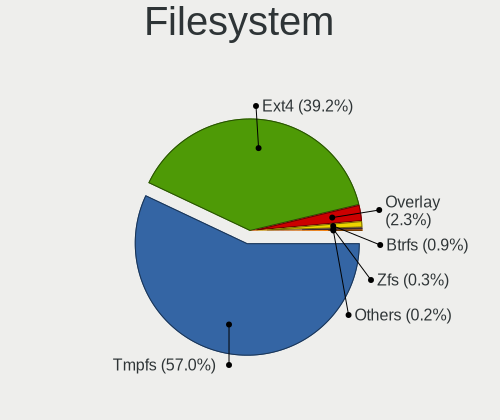
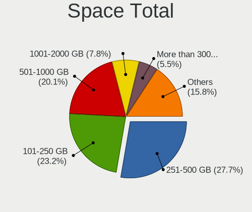

Ubuntu Hardware Trends
----------------------

A project to identify most popular hardware characteristics and track their change
over time based on data collected by Ubuntu users at https://Linux-Hardware.org.

Anyone can contribute to the study by uploading probes of their computers by
the [hw-probe](https://github.com/linuxhw/hw-probe) tool:

    sudo hw-probe -all -upload

This is a report for all computer types. See also reports for [desktops](/Dist/Ubuntu/Desktop/README.md) and [notebooks](/Dist/Ubuntu/Notebook/README.md).

Full-feature report is available here: https://linux-hardware.org/?view=trends

Period: Apr, 2020.

Contents
--------

- [ OS                       ](#os)
- [ OS Family                ](#os-family)
- [ Kernel                   ](#kernel)
- [ Kernel Family            ](#kernel-family)
- [ Kernel Major Ver.        ](#kernel-major-ver)
- [ Arch                     ](#arch)
- [ DE                       ](#de)
- [ Display Server           ](#display-server)
- [ Display Manager          ](#display-manager)
- [ OS Lang                  ](#os-lang)
- [ Boot Mode                ](#boot-mode)
- [ Filesystem               ](#filesystem)
- [ Dual Boot with Linux/BSD ](#dual-boot-with-linux/bsd)
- [ Dual Boot (Win)          ](#dual-boot-win)
- [ Country                  ](#country)
- [ City                     ](#city)
- [ Vendor                   ](#vendor)
- [ Model                    ](#model)
- [ Model Family             ](#model-family)
- [ MFG Year                 ](#mfg-year)
- [ Form Factor              ](#form-factor)
- [ Secure Boot              ](#secure-boot)
- [ Coreboot                 ](#coreboot)
- [ RAM Size                 ](#ram-size)
- [ RAM Used                 ](#ram-used)
- [ Drive Vendor             ](#drive-vendor)
- [ Drive Model              ](#drive-model)
- [ Drive Kind               ](#drive-kind)
- [ Drive Connector          ](#drive-connector)
- [ Drive Size               ](#drive-size)
- [ Space Total              ](#space-total)
- [ Space Used               ](#space-used)
- [ Malfunc. Drives          ](#malfunc-drives)
- [ Malfunc. Drive Vendor    ](#malfunc-drive-vendor)
- [ Malfunc. Drive Kind      ](#malfunc-drive-kind)
- [ Failed Drives            ](#failed-drives)
- [ Failed Drive Vendor      ](#failed-drive-vendor)
- [ Drive Status             ](#drive-status)
- [ Storage Vendor           ](#storage-vendor)
- [ Storage Model            ](#storage-model)
- [ Storage Kind             ](#storage-kind)
- [ CPU Vendor               ](#cpu-vendor)
- [ CPU Model                ](#cpu-model)
- [ CPU Model Family         ](#cpu-model-family)
- [ CPU Cores                ](#cpu-cores)
- [ CPU Sockets              ](#cpu-sockets)
- [ CPU Threads              ](#cpu-threads)
- [ CPU Op-Modes             ](#cpu-op-modes)
- [ CPU Microarch            ](#cpu-microarch)
- [ CPU Microcode            ](#cpu-microcode)
- [ GPU Vendor               ](#gpu-vendor)
- [ GPU Model                ](#gpu-model)
- [ GPU Combo                ](#gpu-combo)
- [ GPU Driver               ](#gpu-driver)
- [ GPU Memory               ](#gpu-memory)
- [ Monitor Vendor           ](#monitor-vendor)
- [ Monitor Model            ](#monitor-model)
- [ Monitor Resolution       ](#monitor-resolution)
- [ Monitor Diagonal         ](#monitor-diagonal)
- [ Monitor Width            ](#monitor-width)
- [ Aspect Ratio             ](#aspect-ratio)
- [ Monitor Area             ](#monitor-area)
- [ Pixel Density            ](#pixel-density)
- [ Multiple Monitors        ](#multiple-monitors)
- [ Net Controller Vendor    ](#net-controller-vendor)
- [ Net Controller Model     ](#net-controller-model)
- [ Net Controller Kind      ](#net-controller-kind)
- [ Used Controller          ](#used-controller)
- [ NICs                     ](#nics)
- [ Unsupported Devices      ](#unsupported-devices)
- [ Unsupported Device Types ](#unsupported-device-types)

OS
--

Installed operating systems

| Name         | Computers | Percent |
|--------------|-----------|---------|
| Ubuntu 18.04 | 1295      | 47.82%  |
| Ubuntu 20.04 | 804       | 29.69%  |
| Ubuntu 19.10 | 498       | 18.39%  |
| Ubuntu 16.04 | 87        | 3.21%   |
| Ubuntu 19.04 | 16        | 0.59%   |
| Ubuntu 18.10 | 4         | 0.15%   |
| Ubuntu       | 3         | 0.11%   |
| Ubuntu 17.10 | 1         | 0.04%   |

OS Family
---------

OS without a version

| Name   | Computers | Percent |
|--------|-----------|---------|
| Ubuntu | 2708      | 100%    |

Kernel
------

Version of the Linux kernel

| Version               | Computers | Percent |
|-----------------------|-----------|---------|
| 5.3.0-46-generic      | 674       | 24.89%  |
| 5.4.0-26-generic      | 435       | 16.06%  |
| 5.3.0-45-generic      | 279       | 10.3%   |
| 4.15.0-96-generic     | 224       | 8.27%   |
| 5.4.0-21-generic      | 129       | 4.76%   |
| 4.15.0-91-generic     | 118       | 4.36%   |
| 5.4.0-28-generic      | 111       | 4.1%    |
| 5.3.0-28-generic      | 90        | 3.32%   |
| 5.4.0-24-generic      | 58        | 2.14%   |
| 5.3.0-42-generic      | 53        | 1.96%   |
| 4.15.0-88-generic     | 52        | 1.92%   |
| 5.3.0-18-generic      | 32        | 1.18%   |
| 5.3.0-47-generic      | 27        | 1%      |
| 5.3.0-40-generic      | 22        | 0.81%   |
| 5.4.0-25-generic      | 19        | 0.7%    |
| 5.3.0-51-generic      | 18        | 0.66%   |
| 4.4.0-177-generic     | 18        | 0.66%   |
| 5.3.0-48-generic      | 17        | 0.63%   |
| 5.3.0-46-lowlatency   | 16        | 0.59%   |
| 5.0.0-23-generic      | 14        | 0.52%   |
| 4.15.0-99-generic     | 12        | 0.44%   |
| 5.0.0-38-generic      | 11        | 0.41%   |
| 4.18.0-15-generic     | 11        | 0.41%   |
| 4.15.0-72-generic     | 9         | 0.33%   |
| 4.15.0-70-generic     | 9         | 0.33%   |
| 5.4.0-26-lowlatency   | 8         | 0.3%    |
| 5.0.0-37-generic      | 8         | 0.3%    |
| 4.15.0-76-generic     | 8         | 0.3%    |
| 5.4.0-21-lowlatency   | 7         | 0.26%   |
| 5.3.0-18-lowlatency   | 7         | 0.26%   |
| 4.15.0-97-generic     | 7         | 0.26%   |
| 4.15.0-20-generic     | 7         | 0.26%   |
| 5.4.0-23-generic      | 6         | 0.22%   |
| 4.18.0-25-generic     | 6         | 0.22%   |
| 4.15.0-96-lowlatency  | 6         | 0.22%   |
| 4.15.0-94-generic     | 6         | 0.22%   |
| 4.15.0-29-generic     | 6         | 0.22%   |
| 4.15.0-91-lowlatency  | 5         | 0.18%   |
| 5.6.4-050604-generic  | 4         | 0.15%   |
| 5.4.0-24-lowlatency   | 4         | 0.15%   |
| 5.4.0-18-generic      | 4         | 0.15%   |
| 5.3.0-050300-generic  | 4         | 0.15%   |
| 4.4.0-176-generic     | 4         | 0.15%   |
| 4.15.0-69-generic     | 4         | 0.15%   |
| 4.15.0-65-generic     | 4         | 0.15%   |
| 4.15.0-1079-oem       | 4         | 0.15%   |
| 5.6.2-050602-generic  | 3         | 0.11%   |
| 5.5.13-050513-generic | 3         | 0.11%   |
| 5.4.0-28-lowlatency   | 3         | 0.11%   |
| 5.4.0-22-generic      | 3         | 0.11%   |
| 5.3.0-7642-generic    | 3         | 0.11%   |
| 5.3.0-1022-raspi2     | 3         | 0.11%   |
| 5.0.0-1047-oem-osp1   | 3         | 0.11%   |
| 4.15.0-74-generic     | 3         | 0.11%   |
| 4.15.0-64-generic     | 3         | 0.11%   |
| 4.15.0-54-generic     | 3         | 0.11%   |
| 4.15.0-45-generic     | 3         | 0.11%   |
| 5.6.3-050603-generic  | 2         | 0.07%   |
| 5.6.0-050600-generic  | 2         | 0.07%   |
| 5.4.0-12-generic      | 2         | 0.07%   |

Kernel Family
-------------

Linux kernel without a distro release

| Version  | Computers | Percent |
|----------|-----------|---------|
| 5.3.0    | 1266      | 46.75%  |
| 5.4.0    | 790       | 29.17%  |
| 4.15.0   | 507       | 18.72%  |
| 5.0.0    | 53        | 1.96%   |
| 4.4.0    | 32        | 1.18%   |
| 4.18.0   | 19        | 0.7%    |
| 5.6.4    | 4         | 0.15%   |
| 5.5.13   | 4         | 0.15%   |
| 5.6.2    | 3         | 0.11%   |
| 5.6.0    | 3         | 0.11%   |
| 4.13.0   | 3         | 0.11%   |
| 5.7.0    | 2         | 0.07%   |
| 5.6.3    | 2         | 0.07%   |
| 4.9.140  | 2         | 0.07%   |
| 5.6.7    | 1         | 0.04%   |
| 5.6.6    | 1         | 0.04%   |
| 5.6.5    | 1         | 0.04%   |
| 5.6.1    | 1         | 0.04%   |
| 5.5.6    | 1         | 0.04%   |
| 5.5.3    | 1         | 0.04%   |
| 5.4.2    | 1         | 0.04%   |
| 5.3.18   | 1         | 0.04%   |
| 5.1.0    | 1         | 0.04%   |
| 4.8.0    | 1         | 0.04%   |
| 4.20.0   | 1         | 0.04%   |
| 4.19.97  | 1         | 0.04%   |
| 4.19.55  | 1         | 0.04%   |
| 4.19.105 | 1         | 0.04%   |
| 4.14.0   | 1         | 0.04%   |
| 4.13.9   | 1         | 0.04%   |
| 4.10.0   | 1         | 0.04%   |
| 3.13.0   | 1         | 0.04%   |

Kernel Major Ver.
-----------------

Linux kernel major version

| Version | Computers | Percent |
|---------|-----------|---------|
| 5.3     | 1267      | 46.79%  |
| 5.4     | 791       | 29.21%  |
| 4.15    | 507       | 18.72%  |
| 5.0     | 53        | 1.96%   |
| 4.4     | 32        | 1.18%   |
| 4.18    | 19        | 0.7%    |
| 5.6     | 16        | 0.59%   |
| 5.5     | 6         | 0.22%   |
| 4.13    | 4         | 0.15%   |
| 4.19    | 3         | 0.11%   |
| 5.7     | 2         | 0.07%   |
| 4.9     | 2         | 0.07%   |
| 5.1     | 1         | 0.04%   |
| 4.8     | 1         | 0.04%   |
| 4.20    | 1         | 0.04%   |
| 4.14    | 1         | 0.04%   |
| 4.10    | 1         | 0.04%   |
| 3.13    | 1         | 0.04%   |

Arch
----

OS architecture (x86_64, i586, etc.)

| Name    | Computers | Percent |
|---------|-----------|---------|
| x86_64  | 2558      | 94.46%  |
| i686    | 138       | 5.1%    |
| aarch64 | 12        | 0.44%   |

DE
--

Desktop Environment

| Name            | Computers | Percent |
|-----------------|-----------|---------|
| GNOME           | 1957      | 72.27%  |
| XFCE            | 214       | 7.9%    |
| Unknown         | 144       | 5.32%   |
| GNUstep         | 109       | 4.03%   |
| Unity           | 74        | 2.73%   |
| KDE             | 51        | 1.88%   |
| MATE            | 44        | 1.62%   |
| KDE5            | 20        | 0.74%   |
| LXQt            | 18        | 0.66%   |
| X-Cinnamon      | 17        | 0.63%   |
| LXDE            | 15        | 0.55%   |
| Budgie          | 15        | 0.55%   |
| GNOME Flashback | 13        | 0.48%   |
| Deepin          | 7         | 0.26%   |
| Cinnamon        | 6         | 0.22%   |
| GNOME Classic   | 2         | 0.07%   |
| xubuntu         | 1         | 0.04%   |
| fluxbox         | 1         | 0.04%   |

Display Server
--------------

X11 or Wayland

| Name    | Computers | Percent |
|---------|-----------|---------|
| X11     | 2561      | 94.57%  |
| Unknown | 69        | 2.55%   |
| Wayland | 67        | 2.47%   |
| Tty     | 11        | 0.41%   |

Display Manager
---------------

SDDM, LightDM, etc.

| Name    | Computers | Percent |
|---------|-----------|---------|
| Unknown | 2365      | 87.33%  |
| LightDM | 163       | 6.02%   |
| GDM     | 148       | 5.47%   |
| SDDM    | 21        | 0.78%   |
| GDM3    | 11        | 0.41%   |

OS Lang
-------

Language

| Lang    | Computers | Percent |
|---------|-----------|---------|
| en_US   | 906       | 33.46%  |
| de_DE   | 213       | 7.87%   |
| it_IT   | 163       | 6.02%   |
| en_GB   | 146       | 5.39%   |
| pt_BR   | 134       | 4.95%   |
| Unknown | 121       | 4.47%   |
| fr_FR   | 111       | 4.1%    |
| es_ES   | 98        | 3.62%   |
| C       | 80        | 2.95%   |
| ru_RU   | 77        | 2.84%   |
| en_CA   | 70        | 2.58%   |
| en_AU   | 58        | 2.14%   |
| pl_PL   | 51        | 1.88%   |
| en_IN   | 44        | 1.62%   |
| nl_NL   | 28        | 1.03%   |
| es_AR   | 27        | 1%      |
| pt_PT   | 24        | 0.89%   |
| cs_CZ   | 23        | 0.85%   |
| hu_HU   | 22        | 0.81%   |
| es_MX   | 17        | 0.63%   |
| tr_TR   | 16        | 0.59%   |
| el_GR   | 15        | 0.55%   |
| de_CH   | 14        | 0.52%   |
| es_CL   | 13        | 0.48%   |
| en_ZA   | 13        | 0.48%   |
| ja_JP   | 12        | 0.44%   |
| sv_SE   | 11        | 0.41%   |
| ru_UA   | 10        | 0.37%   |
| fr_CA   | 10        | 0.37%   |
| en_IE   | 10        | 0.37%   |
| ro_RO   | 9         | 0.33%   |
| fi_FI   | 9         | 0.33%   |
| de_AT   | 9         | 0.33%   |
| uk_UA   | 7         | 0.26%   |
| ko_KR   | 7         | 0.26%   |
| es_CO   | 7         | 0.26%   |
| da_DK   | 7         | 0.26%   |
| ca_ES   | 7         | 0.26%   |
| sk_SK   | 6         | 0.22%   |
| fr_BE   | 6         | 0.22%   |
| en_NZ   | 6         | 0.22%   |
| en_HK   | 6         | 0.22%   |
| nl_BE   | 5         | 0.18%   |
| es_PE   | 5         | 0.18%   |
| en_PH   | 5         | 0.18%   |
| zh_TW   | 4         | 0.15%   |
| zh_CN   | 4         | 0.15%   |
| nb_NO   | 4         | 0.15%   |
| en_US   | 4         | 0.15%   |
| en_SG   | 4         | 0.15%   |
| en_IL   | 4         | 0.15%   |
| bg_BG   | 4         | 0.15%   |
| lt_LT   | 3         | 0.11%   |
| es_VE   | 3         | 0.11%   |
| zh_HK   | 2         | 0.07%   |
| hr_HR   | 2         | 0.07%   |
| fr_CH   | 2         | 0.07%   |
| eu_ES   | 2         | 0.07%   |
| et_EE   | 2         | 0.07%   |
| es_UY   | 2         | 0.07%   |

Boot Mode
---------

EFI or BIOS

| Mode | Computers | Percent |
|------|-----------|---------|
| BIOS | 1692      | 62.48%  |
| EFI  | 1016      | 37.52%  |

Filesystem
----------

Type of filesystem

| Type    | Computers | Percent |
|---------|-----------|---------|
| Ext4    | 2528      | 93.35%  |
| Overlay | 92        | 3.4%    |
| Zfs     | 40        | 1.48%   |
| Btrfs   | 30        | 1.11%   |
| Ext2    | 9         | 0.33%   |
| Xfs     | 4         | 0.15%   |
| Ext3    | 3         | 0.11%   |
| Aufs    | 2         | 0.07%   |

Dual Boot with Linux/BSD
------------------------

Hosting more than one Linux/BSD

| Dual boot | Computers | Percent |
|-----------|-----------|---------|
| No        | 2351      | 86.82%  |
| Yes       | 357       | 13.18%  |

Dual Boot (Win)
---------------

Hosting Linux and Windows

| Dual boot | Computers | Percent |
|-----------|-----------|---------|
| No        | 1682      | 62.11%  |
| Yes       | 1026      | 37.89%  |

Country
-------

Geographic location (country)

| Country            | Computers | Percent |
|--------------------|-----------|---------|
| USA                | 447       | 16.51%  |
| Germany            | 251       | 9.27%   |
| Italy              | 181       | 6.68%   |
| Brazil             | 164       | 6.06%   |
| Switzerland        | 142       | 5.24%   |
| France             | 128       | 4.73%   |
| UK                 | 122       | 4.51%   |
| Spain              | 109       | 4.03%   |
| Russia             | 95        | 3.51%   |
| Canada             | 84        | 3.1%    |
| Australia          | 65        | 2.4%    |
| Poland             | 64        | 2.36%   |
| Netherlands        | 60        | 2.22%   |
| India              | 56        | 2.07%   |
| Argentina          | 43        | 1.59%   |
| Ukraine            | 32        | 1.18%   |
| Mexico             | 32        | 1.18%   |
| Portugal           | 29        | 1.07%   |
| Austria            | 29        | 1.07%   |
| Greece             | 27        | 1%      |
| Czech Republic     | 27        | 1%      |
| Turkey             | 26        | 0.96%   |
| Hungary            | 26        | 0.96%   |
| Belgium            | 24        | 0.89%   |
| Romania            | 22        | 0.81%   |
| Sweden             | 21        | 0.78%   |
| Norway             | 19        | 0.7%    |
| Indonesia          | 17        | 0.63%   |
| Bulgaria           | 17        | 0.63%   |
| Finland            | 16        | 0.59%   |
| Colombia           | 16        | 0.59%   |
| Chile              | 16        | 0.59%   |
| Ireland            | 15        | 0.55%   |
| Denmark            | 15        | 0.55%   |
| South Africa       | 14        | 0.52%   |
| Kyrgyzstan         | 11        | 0.41%   |
| Japan              | 11        | 0.41%   |
| China              | 11        | 0.41%   |
| New Zealand        | 10        | 0.37%   |
| Iran               | 10        | 0.37%   |
| Slovakia           | 9         | 0.33%   |
| Vietnam            | 8         | 0.3%    |
| Serbia             | 8         | 0.3%    |
| Korea, Republic of | 8         | 0.3%    |
| Taiwan             | 7         | 0.26%   |
| Kenya              | 7         | 0.26%   |
| Israel             | 7         | 0.26%   |
| Hong Kong          | 7         | 0.26%   |
| Egypt              | 7         | 0.26%   |
| Singapore          | 6         | 0.22%   |
| Peru               | 6         | 0.22%   |
| Costa Rica         | 6         | 0.22%   |
| UAE                | 5         | 0.18%   |
| Philippines        | 5         | 0.18%   |
| Lithuania          | 5         | 0.18%   |
| Algeria            | 5         | 0.18%   |
| Venezuela          | 4         | 0.15%   |
| Tunisia            | 4         | 0.15%   |
| Latvia             | 4         | 0.15%   |
| Thailand           | 3         | 0.11%   |

City
----

Geographic location (city)

| City              | Computers | Percent |
|-------------------|-----------|---------|
| Zurich            | 63        | 2.33%   |
| Oberglatt         | 56        | 2.07%   |
| Moscow            | 32        | 1.18%   |
| Berlin            | 25        | 0.92%   |
| São Paulo        | 24        | 0.89%   |
| Warsaw            | 21        | 0.78%   |
| Melbourne         | 21        | 0.78%   |
| Rome              | 19        | 0.7%    |
| Vienna            | 18        | 0.66%   |
| Paris             | 18        | 0.66%   |
| Milan             | 18        | 0.66%   |
| Madrid            | 18        | 0.66%   |
| Buenos Aires      | 18        | 0.66%   |
| Hamburg           | 16        | 0.59%   |
| St Petersburg     | 15        | 0.55%   |
| Kyiv              | 15        | 0.55%   |
| Athens            | 14        | 0.52%   |
| Bishkek           | 11        | 0.41%   |
| Sydney            | 10        | 0.37%   |
| Munich            | 10        | 0.37%   |
| Cologne           | 10        | 0.37%   |
| Bogotá           | 10        | 0.37%   |
| Toronto           | 9         | 0.33%   |
| Stuttgart         | 9         | 0.33%   |
| Prague            | 9         | 0.33%   |
| Montreal          | 9         | 0.33%   |
| Leipzig           | 9         | 0.33%   |
| Dublin            | 9         | 0.33%   |
| Budapest          | 9         | 0.33%   |
| Barcelona         | 9         | 0.33%   |
| Sofia             | 8         | 0.3%    |
| Santiago          | 8         | 0.3%    |
| Rio de Janeiro    | 8         | 0.3%    |
| Helsinki          | 8         | 0.3%    |
| Bucharest         | 8         | 0.3%    |
| Brasília         | 8         | 0.3%    |
| Bengaluru         | 8         | 0.3%    |
| Miami             | 7         | 0.26%   |
| Lima              | 7         | 0.26%   |
| Istanbul          | 7         | 0.26%   |
| Hyderabad         | 7         | 0.26%   |
| Frankfurt am Main | 7         | 0.26%   |
| Delhi             | 7         | 0.26%   |
| Curitiba          | 7         | 0.26%   |
| Cape Town         | 7         | 0.26%   |
| Seattle           | 6         | 0.22%   |
| Los Angeles       | 6         | 0.22%   |
| Izmir             | 6         | 0.22%   |
| Dortmund          | 6         | 0.22%   |
| Denver            | 6         | 0.22%   |
| Chicago           | 6         | 0.22%   |
| Central           | 6         | 0.22%   |
| Brisbane          | 6         | 0.22%   |
| Birmingham        | 6         | 0.22%   |
| Amsterdam         | 6         | 0.22%   |
| Wrocław          | 5         | 0.18%   |
| Vitória          | 5         | 0.18%   |
| Vancouver         | 5         | 0.18%   |
| Turin             | 5         | 0.18%   |
| Tehran            | 5         | 0.18%   |

Vendor
------

Motherboard manufacturer

| Name                    | Computers | Percent |
|-------------------------|-----------|---------|
| ASUSTek Computer        | 446       | 16.47%  |
| Hewlett-Packard         | 420       | 15.51%  |
| Dell                    | 359       | 13.26%  |
| Lenovo                  | 303       | 11.19%  |
| Gigabyte Technology     | 167       | 6.17%   |
| Acer                    | 166       | 6.13%   |
| MSI                     | 121       | 4.47%   |
| ASRock                  | 77        | 2.84%   |
| Toshiba                 | 73        | 2.7%    |
| Intel                   | 69        | 2.55%   |
| Apple                   | 63        | 2.33%   |
| Fujitsu                 | 42        | 1.55%   |
| Sony                    | 39        | 1.44%   |
| Samsung Electronics     | 35        | 1.29%   |
| Medion                  | 21        | 0.78%   |
| Unknown                 | 20        | 0.74%   |
| Packard Bell            | 15        | 0.55%   |
| Biostar                 | 15        | 0.55%   |
| Pegatron                | 12        | 0.44%   |
| Foxconn                 | 12        | 0.44%   |
| Fujitsu Siemens         | 11        | 0.41%   |
| Supermicro              | 10        | 0.37%   |
| HUAWEI                  | 10        | 0.37%   |
| Raspberry Pi Foundation | 9         | 0.33%   |
| Positivo                | 8         | 0.3%    |
| Google                  | 8         | 0.3%    |
| ECS                     | 8         | 0.3%    |
| Notebook                | 7         | 0.26%   |
| Gateway                 | 7         | 0.26%   |
| eMachines               | 7         | 0.26%   |
| Microsoft               | 6         | 0.22%   |
| DALCO AG Switzerland    | 6         | 0.22%   |
| Chuwi                   | 6         | 0.22%   |
| ZOTAC                   | 5         | 0.18%   |
| Clevo                   | 5         | 0.18%   |
| Thomson                 | 4         | 0.15%   |
| Compal                  | 4         | 0.15%   |
| AMI                     | 4         | 0.15%   |
| VIT                     | 3         | 0.11%   |
| PCWare                  | 3         | 0.11%   |
| Nvidia                  | 3         | 0.11%   |
| LG Electronics          | 3         | 0.11%   |
| EVGA                    | 3         | 0.11%   |
| Alienware               | 3         | 0.11%   |
| TYAN Computer           | 2         | 0.07%   |
| TUXEDO                  | 2         | 0.07%   |
| SLIMBOOK                | 2         | 0.07%   |
| Semp Toshiba            | 2         | 0.07%   |
| Panasonic               | 2         | 0.07%   |
| Multilaser              | 2         | 0.07%   |
| Monster                 | 2         | 0.07%   |
| IBM                     | 2         | 0.07%   |
| Hampoo                  | 2         | 0.07%   |
| Digibras                | 2         | 0.07%   |
| YJKC                    | 1         | 0.04%   |
| YASHI                   | 1         | 0.04%   |
| Xplore Tech             | 1         | 0.04%   |
| Xplore                  | 1         | 0.04%   |
| XMG                     | 1         | 0.04%   |
| XFX                     | 1         | 0.04%   |

Model
-----

Motherboard model

| Name                                                    | Computers | Percent |
|---------------------------------------------------------|-----------|---------|
| ASUS All Series                                         | 38        | 1.4%    |
| Unknown                                                 | 27        | 1%      |
| HP Notebook                                             | 17        | 0.63%   |
| HP Pavilion dv6                                         | 13        | 0.48%   |
| HP Pavilion dv7                                         | 12        | 0.44%   |
| Fujitsu CELSIUS_W550                                    | 12        | 0.44%   |
| HP Pavilion g6                                          | 11        | 0.41%   |
| Dell G3 3590                                            | 9         | 0.33%   |
| Dell OptiPlex 780                                       | 8         | 0.3%    |
| HP EliteBook 8470p                                      | 7         | 0.26%   |
| Dell Inspiron 1545                                      | 7         | 0.26%   |
| RPi Raspberry Pi 4 Model B Rev 1.1                      | 6         | 0.22%   |
| Gigabyte B450M DS3H                                     | 6         | 0.22%   |
| Dell OptiPlex 9020                                      | 6         | 0.22%   |
| Dell OptiPlex 3010                                      | 6         | 0.22%   |
| DALCO AG Switzerland +41 44 908 38 38                   | 6         | 0.22%   |
| ASUS P9X79 WS                                           | 6         | 0.22%   |
| MSI MS-7C37                                             | 5         | 0.18%   |
| MSI MS-7B79                                             | 5         | 0.18%   |
| Intel DP67BA AAG10219-303                               | 5         | 0.18%   |
| HP Presario CQ57                                        | 5         | 0.18%   |
| HP Laptop 15-bs0xx                                      | 5         | 0.18%   |
| HP G62                                                  | 5         | 0.18%   |
| Dell OptiPlex 990                                       | 5         | 0.18%   |
| Dell OptiPlex 745                                       | 5         | 0.18%   |
| Dell Latitude E6410                                     | 5         | 0.18%   |
| Dell Latitude D630                                      | 5         | 0.18%   |
| Dell Inspiron 15-3567                                   | 5         | 0.18%   |
| ASUS PRIME X370-PRO                                     | 5         | 0.18%   |
| ASUS PRIME A320M-K                                      | 5         | 0.18%   |
| ASUS H110I-PLUS                                         | 5         | 0.18%   |
| ASUS B75M-A                                             | 5         | 0.18%   |
| MSI MS-7C02                                             | 4         | 0.15%   |
| Lenovo IdeaPad S145-15AST 81N3                          | 4         | 0.15%   |
| Lenovo G580 20150                                       | 4         | 0.15%   |
| Intel S4600LH                                           | 4         | 0.15%   |
| Intel DP55WB AAE64798-207                               | 4         | 0.15%   |
| HP Spectre x360 Convertible 13-aw0xxx                   | 4         | 0.15%   |
| HP Pavilion x2 Detachable                               | 4         | 0.15%   |
| HP Pavilion g7                                          | 4         | 0.15%   |
| HP Pavilion dv4                                         | 4         | 0.15%   |
| HP Laptop 15-da0xxx                                     | 4         | 0.15%   |
| HP EliteBook 840 G5                                     | 4         | 0.15%   |
| HP EliteBook 6930p                                      | 4         | 0.15%   |
| HP 250 G7 Notebook PC                                   | 4         | 0.15%   |
| HP 15                                                   | 4         | 0.15%   |
| Gigabyte X470 AORUS ULTRA GAMING                        | 4         | 0.15%   |
| Gigabyte B75M-D3H                                       | 4         | 0.15%   |
| Fujitsu CELSIUS W570                                    | 4         | 0.15%   |
| Dell XPS 13 7390                                        | 4         | 0.15%   |
| Dell Inspiron 530                                       | 4         | 0.15%   |
| Dell Inspiron 3583                                      | 4         | 0.15%   |
| Dell Inspiron 3576                                      | 4         | 0.15%   |
| Dell Inspiron 1525                                      | 4         | 0.15%   |
| ASUS PRIME Z370-A II                                    | 4         | 0.15%   |
| ASUS M5A78L-M/USB3                                      | 4         | 0.15%   |
| Apple MacBookPro8,1                                     | 4         | 0.15%   |
| Toshiba Satellite L755                                  | 3         | 0.11%   |
| Toshiba Satellite A300                                  | 3         | 0.11%   |
| Samsung Electronics RV411/RV511/E3511/S3511/RV711/E3411 | 3         | 0.11%   |

Model Family
------------

Motherboard model prefix

| Name                     | Computers | Percent |
|--------------------------|-----------|---------|
| Lenovo ThinkPad          | 133       | 4.91%   |
| Acer Aspire              | 131       | 4.84%   |
| Dell Inspiron            | 119       | 4.39%   |
| HP Pavilion              | 97        | 3.58%   |
| Dell Latitude            | 69        | 2.55%   |
| Lenovo IdeaPad           | 64        | 2.36%   |
| Toshiba Satellite        | 58        | 2.14%   |
| Dell OptiPlex            | 56        | 2.07%   |
| HP EliteBook             | 53        | 1.96%   |
| HP Compaq                | 44        | 1.62%   |
| ASUS All                 | 38        | 1.4%    |
| ASUS PRIME               | 34        | 1.26%   |
| HP Laptop                | 32        | 1.18%   |
| Dell XPS                 | 32        | 1.18%   |
| HP ProBook               | 28        | 1.03%   |
| Fujitsu CELSIUS          | 27        | 1%      |
| Unknown                  | 27        | 1%      |
| Dell Vostro              | 25        | 0.92%   |
| Dell Precision           | 25        | 0.92%   |
| HP ENVY                  | 19        | 0.7%    |
| Lenovo ThinkCentre       | 18        | 0.66%   |
| HP Notebook              | 17        | 0.63%   |
| Lenovo Yoga              | 15        | 0.55%   |
| ASUS VivoBook            | 15        | 0.55%   |
| ASUS ROG                 | 15        | 0.55%   |
| ASUS TUF                 | 13        | 0.48%   |
| ASUS M5A78L-M            | 13        | 0.48%   |
| HP Spectre               | 12        | 0.44%   |
| Packard Bell EasyNote    | 11        | 0.41%   |
| Dell G3                  | 10        | 0.37%   |
| RPi Raspberry            | 9         | 0.33%   |
| HP 250                   | 9         | 0.33%   |
| Gigabyte Z390            | 9         | 0.33%   |
| Fujitsu LIFEBOOK         | 9         | 0.33%   |
| Acer Swift               | 9         | 0.33%   |
| ASUS ZenBook             | 8         | 0.3%    |
| Acer Extensa             | 8         | 0.3%    |
| Lenovo IdeaCentre        | 7         | 0.26%   |
| HP ZBook                 | 7         | 0.26%   |
| HP Presario              | 7         | 0.26%   |
| Dell Studio              | 7         | 0.26%   |
| ASUS STRIX               | 7         | 0.26%   |
| ASUS M5A97               | 7         | 0.26%   |
| Microsoft Surface        | 6         | 0.22%   |
| Intel DP55WB             | 6         | 0.22%   |
| HP ProLiant              | 6         | 0.22%   |
| HP 255                   | 6         | 0.22%   |
| Gigabyte B450M           | 6         | 0.22%   |
| DALCO AG Switzerland +41 | 6         | 0.22%   |
| ASUS P9X79               | 6         | 0.22%   |
| Toshiba PORTEGE          | 5         | 0.18%   |
| MSI MS-7C37              | 5         | 0.18%   |
| MSI MS-7B79              | 5         | 0.18%   |
| Lenovo ThinkStation      | 5         | 0.18%   |
| Intel DP67BA             | 5         | 0.18%   |
| HP ProDesk               | 5         | 0.18%   |
| HP G62                   | 5         | 0.18%   |
| HP 15                    | 5         | 0.18%   |
| Gigabyte X470            | 5         | 0.18%   |
| Gigabyte GA-78LMT-USB3   | 5         | 0.18%   |

MFG Year
--------

Motherboard manufacture year

| Year    | Computers | Percent |
|---------|-----------|---------|
| 2019    | 521       | 19.24%  |
| 2018    | 257       | 9.49%   |
| 2011    | 212       | 7.83%   |
| 2013    | 199       | 7.35%   |
| 2012    | 198       | 7.31%   |
| 2010    | 194       | 7.16%   |
| 2014    | 175       | 6.46%   |
| 2015    | 168       | 6.2%    |
| 2009    | 159       | 5.87%   |
| 2008    | 136       | 5.02%   |
| 2016    | 132       | 4.87%   |
| 2017    | 116       | 4.28%   |
| 2007    | 91        | 3.36%   |
| 2020    | 79        | 2.92%   |
| 2006    | 37        | 1.37%   |
| Unknown | 16        | 0.59%   |
| 2005    | 11        | 0.41%   |
| 2003    | 3         | 0.11%   |
| 2004    | 2         | 0.07%   |
| 2002    | 1         | 0.04%   |
| 2001    | 1         | 0.04%   |

Form Factor
-----------

Physical design of the computer

| Name           | Computers | Percent |
|----------------|-----------|---------|
| Notebook       | 1459      | 53.88%  |
| Desktop        | 1052      | 38.85%  |
| Convertible    | 53        | 1.96%   |
| All in one     | 41        | 1.51%   |
| Server         | 34        | 1.26%   |
| Mini pc        | 27        | 1%      |
| Tablet         | 26        | 0.96%   |
| System on chip | 12        | 0.44%   |
| Other          | 4         | 0.15%   |

Secure Boot
-----------

Enabled or disabled

| State    | Computers | Percent |
|----------|-----------|---------|
| Disabled | 2517      | 92.95%  |
| Enabled  | 191       | 7.05%   |

Coreboot
--------

Have coreboot on board

| Used | Computers | Percent |
|------|-----------|---------|
| No   | 2699      | 99.67%  |
| Yes  | 9         | 0.33%   |

RAM Size
--------

Total RAM memory

| Size in GB      | Computers | Percent |
|-----------------|-----------|---------|
| 3.01-4.0        | 707       | 26.11%  |
| 4.01-8.0        | 596       | 22.01%  |
| 8.01-16.0       | 470       | 17.36%  |
| 16.01-24.0      | 433       | 15.99%  |
| 1.01-2.0        | 177       | 6.54%   |
| 32.01-64.0      | 132       | 4.87%   |
| 2.01-3.0        | 67        | 2.47%   |
| 64.01-256.0     | 53        | 1.96%   |
| 0.01-1.0        | 34        | 1.26%   |
| 24.01-32.0      | 25        | 0.92%   |
| More than 256.0 | 14        | 0.52%   |

RAM Used
--------

Used RAM memory

| Used GB         | Computers | Percent |
|-----------------|-----------|---------|
| 1.01-2.0        | 1249      | 46.12%  |
| 2.01-3.0        | 692       | 25.55%  |
| 0.01-1.0        | 250       | 9.23%   |
| 3.01-4.0        | 246       | 9.08%   |
| 4.01-8.0        | 206       | 7.61%   |
| 8.01-16.0       | 52        | 1.92%   |
| 16.01-24.0      | 4         | 0.15%   |
| 64.01-256.0     | 3         | 0.11%   |
| 32.01-64.0      | 2         | 0.07%   |
| 24.01-32.0      | 2         | 0.07%   |
| More than 256.0 | 1         | 0.04%   |
| Unknown         | 1         | 0.04%   |

Drive Vendor
------------

Hard drive vendors

| Vendor              | Computers | Drives | Percent |
|---------------------|-----------|--------|---------|
| Seagate             | 669       | 771    | 20.14%  |
| WDC                 | 639       | 715    | 19.24%  |
| Samsung Electronics | 406       | 460    | 12.22%  |
| Toshiba             | 284       | 292    | 8.55%   |
| Kingston            | 181       | 191    | 5.45%   |
| Hitachi             | 168       | 175    | 5.06%   |
| Unknown             | 143       | 167    | 4.3%    |
| Crucial             | 107       | 112    | 3.22%   |
| SanDisk             | 103       | 108    | 3.1%    |
| Intel               | 77        | 81     | 2.32%   |
| HGST                | 73        | 73     | 2.2%    |
| A-DATA Technology   | 40        | 41     | 1.2%    |
| Fujitsu             | 33        | 33     | 0.99%   |
| Micron Technology   | 28        | 28     | 0.84%   |
| SK Hynix            | 25        | 25     | 0.75%   |
| MAXTOR              | 23        | 26     | 0.69%   |
| OCZ                 | 20        | 20     | 0.6%    |
| HL-DT-ST            | 20        | 18     | 0.6%    |
| Generic             | 18        | 18     | 0.54%   |
| Apple               | 17        | 20     | 0.51%   |
| Transcend           | 16        | 16     | 0.48%   |
| Patriot             | 15        | 16     | 0.45%   |
| SPCC                | 13        | 13     | 0.39%   |
| PNY                 | 13        | 13     | 0.39%   |
| China               | 12        | 12     | 0.36%   |
| Corsair             | 11        | 12     | 0.33%   |
| LITEONIT            | 10        | 10     | 0.3%    |
| LITEON              | 10        | 10     | 0.3%    |
| Intenso             | 10        | 11     | 0.3%    |
| Hewlett-Packard     | 10        | 13     | 0.3%    |
| JMicron             | 8         | 8      | 0.24%   |
| GOODRAM             | 7         | 7      | 0.21%   |
| KingSpec            | 6         | 6      | 0.18%   |
| Dogfish             | 6         | 6      | 0.18%   |
| PLEXTOR             | 5         | 5      | 0.15%   |
| KingDian            | 5         | 5      | 0.15%   |
| Zheino              | 4         | 4      | 0.12%   |
| Team                | 4         | 4      | 0.12%   |
| ASMT                | 4         | 4      | 0.12%   |
| Vaseky              | 3         | 3      | 0.09%   |
| SABRENT             | 3         | 3      | 0.09%   |
| PHISON              | 3         | 4      | 0.09%   |
| FORESEE             | 3         | 3      | 0.09%   |
| Union Memory        | 2         | 2      | 0.06%   |
| TO Exter            | 2         | 2      | 0.06%   |
| TCSUNBOW            | 2         | 2      | 0.06%   |
| OWC                 | 2         | 2      | 0.06%   |
| OCZ-VERTEX2         | 2         | 2      | 0.06%   |
| Mushkin             | 2         | 2      | 0.06%   |
| Lenovo              | 2         | 2      | 0.06%   |
| LaCie               | 2         | 2      | 0.06%   |
| KINGMAX             | 2         | 2      | 0.06%   |
| KingFast            | 2         | 2      | 0.06%   |
| HPE                 | 2         | 3      | 0.06%   |
| Dell                | 2         | 2      | 0.06%   |
| Biostar             | 2         | 2      | 0.06%   |
| Apacer              | 2         | 2      | 0.06%   |
| WDC WD50            | 1         | 1      | 0.03%   |
| WDC WD32            | 1         | 1      | 0.03%   |
| WD MediaMax         | 1         | 1      | 0.03%   |

Drive Model
-----------

Hard drive models

| Model                       | Computers | Percent |
|-----------------------------|-----------|---------|
| MMC Card  32GB              | 55        | 1.52%   |
| SA400S37120G 120GB SSD      | 37        | 1.02%   |
| MMC Card  64GB              | 36        | 1%      |
| MQ01ABD100 1TB              | 35        | 0.97%   |
| SSD 850 EVO 250GB           | 32        | 0.89%   |
| SA400S37240G 240GB SSD      | 32        | 0.89%   |
| ST1000LM024 HN-M101MBB 1TB  | 31        | 0.86%   |
| SSD 860 EVO 500GB           | 29        | 0.8%    |
| SV300S37A120G 120GB SSD     | 28        | 0.78%   |
| ST1000LM035-1RK172 1TB      | 27        | 0.75%   |
| ST500DM002-1BD142 500GB     | 24        | 0.66%   |
| MQ01ABF050 500GB            | 22        | 0.61%   |
| ST500LT012-1DG142 500GB     | 21        | 0.58%   |
| MQ04ABF100 1TB              | 21        | 0.58%   |
| MMC Card  128GB             | 21        | 0.58%   |
| ST31000528AS 1TB            | 20        | 0.55%   |
| ST2000DM006-2DM164 2TB      | 19        | 0.53%   |
| ST1000DM003-1CH162 1TB      | 19        | 0.53%   |
| DT01ACA100 1TB              | 19        | 0.53%   |
| ST1000DM003-1ER162 1TB      | 18        | 0.5%    |
| ST9500325AS 500GB           | 17        | 0.47%   |
| ST3500418AS 500GB           | 17        | 0.47%   |
| SSD 860 EVO 250GB           | 17        | 0.47%   |
| SSD 860 EVO 1TB             | 17        | 0.47%   |
| SD/MMC/MS PRO 64GB          | 17        | 0.47%   |
| SA400S37480G 480GB SSD      | 17        | 0.47%   |
| MMC Card  16GB              | 17        | 0.47%   |
| ST2000DM008-2FR102 2TB      | 16        | 0.44%   |
| HTS545050A7E680 500GB       | 16        | 0.44%   |
| ST2000DM001-1ER164 2TB      | 15        | 0.42%   |
| HTS541010A9E680 1TB         | 15        | 0.42%   |
| DT01ACA200 2TB              | 15        | 0.42%   |
| SSD 850 EVO 500GB           | 14        | 0.39%   |
| ST500LT012-9WS142 500GB     | 13        | 0.36%   |
| SDSSDA240G 240GB            | 13        | 0.36%   |
| CT240BX500SSD1 240GB        | 13        | 0.36%   |
| ST1000DM010-2EP102 1TB      | 12        | 0.33%   |
| DVDRAM GUE1N 3GB            | 12        | 0.33%   |
| WD5000AAKX-001CA0 500GB     | 11        | 0.3%    |
| ST9320325AS 320GB           | 11        | 0.3%    |
| ST500LM012 HN-M500MBB 500GB | 11        | 0.3%    |
| ST2000LM007-1R8174 2TB      | 11        | 0.3%    |
| ST1000LX015-1U7172 1TB      | 11        | 0.3%    |
| SSD PLUS 240GB              | 11        | 0.3%    |
| HTS725050A7E630 500GB       | 11        | 0.3%    |
| HTS545050A7E380 500GB       | 11        | 0.3%    |
| CT250MX500SSD1 250GB        | 11        | 0.3%    |
| WD10SPZX-24Z10 1TB          | 10        | 0.28%   |
| ST500LM000-1EJ162 500GB     | 10        | 0.28%   |
| ST3000DM001-1ER166 3TB      | 10        | 0.28%   |
| ST3000DM001-1CH166 3TB      | 10        | 0.28%   |
| SSD 840 EVO 250GB           | 10        | 0.28%   |
| HTS721010A9E630 1TB         | 10        | 0.28%   |
| HD103SJ 1TB                 | 10        | 0.28%   |
| Expansion 1TB               | 10        | 0.28%   |
| WD10EZEX-00BN5A0 1TB        | 9         | 0.25%   |
| SV300S37A240G 240GB SSD     | 9         | 0.25%   |
| ST1000DM003-9YN162 1TB      | 9         | 0.25%   |
| DT01ACA050 500GB            | 9         | 0.25%   |
| CT120BX500SSD1 120GB        | 9         | 0.25%   |

Drive Kind
----------

HDD or SSD

| Kind    | Computers | Drives | Percent |
|---------|-----------|--------|---------|
| HDD     | 1703      | 2134   | 56.24%  |
| SSD     | 1006      | 1149   | 33.22%  |
| MMC     | 140       | 163    | 4.62%   |
| Unknown | 94        | 98     | 3.1%    |
| NVMe    | 85        | 88     | 2.81%   |

Drive Connector
---------------

SATA, SAS, NVMe, etc.

| Type | Computers | Drives | Percent |
|------|-----------|--------|---------|
| SATA | 2328      | 3246   | 86.9%   |
| MMC  | 140       | 163    | 5.23%   |
| SAS  | 126       | 135    | 4.7%    |
| NVMe | 85        | 88     | 3.17%   |

Drive Size
----------

Size of hard drive

| Size in TB | Computers | Drives | Percent |
|------------|-----------|--------|---------|
| 0.01-0.5   | 1935      | 2409   | 63.8%   |
| 0.51-1.0   | 755       | 831    | 24.89%  |
| 1.01-2.0   | 214       | 239    | 7.06%   |
| 2.01-3.0   | 57        | 69     | 1.88%   |
| 3.01-4.0   | 38        | 44     | 1.25%   |
| 4.01-10.0  | 28        | 34     | 0.92%   |
| 10.01-20.0 | 4         | 4      | 0.13%   |
| 0          | 1         | 1      | 0.03%   |
| Unknown    | 1         | 1      | 0.03%   |

Space Total
-----------

Amount of disk space available on the file system

| Size in GB     | Computers | Percent |
|----------------|-----------|---------|
| 101-250        | 857       | 31.65%  |
| 251-500        | 596       | 22.01%  |
| 501-1000       | 347       | 12.81%  |
| 51-100         | 259       | 9.56%   |
| 1001-2000      | 171       | 6.31%   |
| 21-50          | 157       | 5.8%    |
| 1-20           | 121       | 4.47%   |
| More than 3000 | 88        | 3.25%   |
| 2001-3000      | 79        | 2.92%   |
| Unknown        | 33        | 1.22%   |

Space Used
----------

Amount of used disk space

| Used GB        | Computers | Percent |
|----------------|-----------|---------|
| 1-20           | 1342      | 49.56%  |
| 21-50          | 391       | 14.44%  |
| 51-100         | 285       | 10.52%  |
| 101-250        | 265       | 9.79%   |
| 251-500        | 142       | 5.24%   |
| 501-1000       | 126       | 4.65%   |
| 1001-2000      | 68        | 2.51%   |
| More than 3000 | 34        | 1.26%   |
| Unknown        | 33        | 1.22%   |
| 2001-3000      | 22        | 0.81%   |

Malfunc. Drives
---------------

Drive models with a malfunction

| Model                          | Computers | Drives | Percent |
|--------------------------------|-----------|--------|---------|
| ST500LT012-1DG142 500GB        | 4         | 4      | 6.06%   |
| ST500LT012-9WS142 500GB        | 2         | 2      | 3.03%   |
| ST500LM000-1EJ162 500GB        | 2         | 2      | 3.03%   |
| HUA722020ALA330 2TB            | 2         | 2      | 3.03%   |
| WD6400AADS-00M2B0 640GB        | 1         | 1      | 1.52%   |
| WD5000BEVT-75A0RT0 500GB       | 1         | 1      | 1.52%   |
| WD5000AAKX-001CA0 500GB        | 1         | 1      | 1.52%   |
| WD3200BEVT-75ZCT0 320GB        | 1         | 1      | 1.52%   |
| WD3200AAJS-00L7A0 320GB        | 1         | 1      | 1.52%   |
| WD2502ABYS-01B7A0 256GB        | 1         | 1      | 1.52%   |
| WD2500AAJS-00B4A0 250GB        | 1         | 1      | 1.52%   |
| WD20EZRX-00DC0B0 2TB           | 1         | 1      | 1.52%   |
| WD10EZEX-60ZF5A0 1TB           | 1         | 1      | 1.52%   |
| WD10EARX-00N0YB0 1TB           | 1         | 1      | 1.52%   |
| WD10EARS-00Y5B1 1TB            | 1         | 1      | 1.52%   |
| WD10EADS-00L5B1 1TB            | 1         | 1      | 1.52%   |
| TRION100 240GB SSD             | 1         | 1      | 1.52%   |
| THNSNK128GCS8 SATA 128GB SSD   | 1         | 1      | 1.52%   |
| SX8200NP 240GB                 | 1         | 1      | 1.52%   |
| SV300S37A120G 120GB SSD        | 1         | 1      | 1.52%   |
| STM3250310AS 250GB             | 1         | 1      | 1.52%   |
| STM3160215AS 160GB             | 1         | 1      | 1.52%   |
| ST9320325AS 320GB              | 1         | 1      | 1.52%   |
| ST9160310AS 160GB              | 1         | 1      | 1.52%   |
| ST5000DM000-1FK178 5TB         | 1         | 1      | 1.52%   |
| ST480HM000-1G5162 480GB        | 1         | 1      | 1.52%   |
| ST3500413AS 500GB              | 1         | 1      | 1.52%   |
| ST3500320AS 500GB              | 1         | 1      | 1.52%   |
| ST3320418AS 320GB              | 1         | 1      | 1.52%   |
| ST1000LM048-2E7172 1TB         | 1         | 1      | 1.52%   |
| ST1000LM024 HN-M101MBB 1TB     | 1         | 1      | 1.52%   |
| ST1000DM003-1CH162 1TB         | 1         | 1      | 1.52%   |
| SSDSC2KG400G7M 118000654 400GB | 1         | 1      | 1.52%   |
| SSDSA2M160G2GN 160GB           | 1         | 1      | 1.52%   |
| SSDSA2M080G2GC 80GB            | 1         | 1      | 1.52%   |
| SSD 970 EVO 500GB              | 1         | 1      | 1.52%   |
| SSD 960 PRO 2TB                | 1         | 1      | 1.52%   |
| SP900 128GB SSD                | 1         | 1      | 1.52%   |
| SA400S37120G 120GB SSD         | 1         | 1      | 1.52%   |
| MK5065GSX 500GB                | 1         | 1      | 1.52%   |
| MK3276GSX -63 320GB            | 1         | 1      | 1.52%   |
| MK2552GSX 250GB                | 1         | 1      | 1.52%   |
| M4-CT512M4SSD2 512GB           | 1         | 1      | 1.52%   |
| iSSD P4 8GB                    | 1         | 1      | 1.52%   |
| HTS725050A7E630 500GB          | 1         | 1      | 1.52%   |
| HTS547564A9E384 640GB          | 1         | 1      | 1.52%   |
| HTS545050B9A300 500GB          | 1         | 1      | 1.52%   |
| HTS545050A7E380 500GB          | 1         | 1      | 1.52%   |
| HTS541010A9E680 1TB            | 1         | 1      | 1.52%   |
| HTS541010A7E630 1TB            | 1         | 1      | 1.52%   |
| HTS421280H9AT00 80GB           | 1         | 1      | 1.52%   |
| HDT721050SLA360 500GB          | 1         | 1      | 1.52%   |
| HDS721050DLE630 500GB          | 1         | 1      | 1.52%   |
| DT01ACA100 1TB                 | 1         | 1      | 1.52%   |
| CT525MX300SSD1 528GB           | 1         | 1      | 1.52%   |
| CT500P1SSD8 500GB              | 1         | 1      | 1.52%   |
| CT480M500SSD3 480GB            | 1         | 1      | 1.52%   |
| CT480M500SSD1 480GB            | 1         | 1      | 1.52%   |
| CT1050MX300SSD1 1TB            | 1         | 1      | 1.52%   |
| 1100_MTFDDAV256TBN 256GB SSD   | 1         | 1      | 1.52%   |

Malfunc. Drive Vendor
---------------------

Vendors of faulty drives

| Vendor              | Computers | Drives | Percent |
|---------------------|-----------|--------|---------|
| Seagate             | 18        | 18     | 28.13%  |
| WDC                 | 11        | 12     | 17.19%  |
| Hitachi             | 7         | 7      | 10.94%  |
| Toshiba             | 5         | 5      | 7.81%   |
| Crucial             | 5         | 6      | 7.81%   |
| HGST                | 4         | 4      | 6.25%   |
| Intel               | 3         | 3      | 4.69%   |
| Samsung Electronics | 2         | 2      | 3.13%   |
| MAXTOR              | 2         | 2      | 3.13%   |
| Kingston            | 2         | 2      | 3.13%   |
| A-DATA Technology   | 2         | 2      | 3.13%   |
| SanDisk             | 1         | 1      | 1.56%   |
| OCZ                 | 1         | 1      | 1.56%   |
| Micron Technology   | 1         | 1      | 1.56%   |

Malfunc. Drive Kind
-------------------

Kinds of faulty drives

| Kind | Computers | Drives | Percent |
|------|-----------|--------|---------|
| HDD  | 44        | 47     | 70.97%  |
| SSD  | 14        | 15     | 22.58%  |
| NVMe | 4         | 4      | 6.45%   |

Failed Drives
-------------

Failed drive models

| Model             | Computers | Drives | Percent |
|-------------------|-----------|--------|---------|
| ST9500420AS 500GB | 1         | 1      | 50%     |
| MK5065GSXN 500GB  | 1         | 1      | 50%     |

Failed Drive Vendor
-------------------

Failed drive vendors

| Vendor  | Computers | Drives | Percent |
|---------|-----------|--------|---------|
| Toshiba | 1         | 1      | 50%     |
| Seagate | 1         | 1      | 50%     |

Drive Status
------------

Number of failed and malfunc. drives

| Status   | Computers | Drives | Percent |
|----------|-----------|--------|---------|
| Detected | 2142      | 3101   | 84.53%  |
| Works    | 331       | 463    | 13.06%  |
| Malfunc  | 59        | 66     | 2.33%   |
| Failed   | 2         | 2      | 0.08%   |

Storage Vendor
--------------

Storage controller vendors

| Vendor                           | Computers | Percent |
|----------------------------------|-----------|---------|
| Intel                            | 1960      | 62.64%  |
| AMD                              | 441       | 14.09%  |
| Samsung Electronics              | 151       | 4.83%   |
| Nvidia                           | 101       | 3.23%   |
| JMicron Technology               | 62        | 1.98%   |
| Marvell Technology Group         | 58        | 1.85%   |
| Sandisk                          | 50        | 1.6%    |
| ASMedia Technology               | 49        | 1.57%   |
| SK Hynix                         | 43        | 1.37%   |
| Toshiba America Info Systems     | 27        | 0.86%   |
| VIA Technologies                 | 19        | 0.61%   |
| Silicon Motion                   | 14        | 0.45%   |
| Silicon Integrated Systems [SiS] | 14        | 0.45%   |
| Phison Electronics               | 14        | 0.45%   |
| Micron/Crucial Technology        | 13        | 0.42%   |
| Kingston Technology Company      | 12        | 0.38%   |
| Broadcom / LSI                   | 11        | 0.35%   |
| Areca Technology                 | 11        | 0.35%   |
| LSI Logic / Symbios Logic        | 10        | 0.32%   |
| ADATA Technology                 | 10        | 0.32%   |
| KIOXIA                           | 9         | 0.29%   |
| Adaptec                          | 6         | 0.19%   |
| Union Memory (Shenzhen)          | 5         | 0.16%   |
| Silicon Image                    | 5         | 0.16%   |
| Lenovo                           | 5         | 0.16%   |
| Hewlett-Packard                  | 5         | 0.16%   |
| Realtek Semiconductor            | 4         | 0.13%   |
| Micron Technology                | 4         | 0.13%   |
| Lite-On Technology               | 3         | 0.1%    |
| Integrated Technology Express    | 3         | 0.1%    |
| Apple                            | 3         | 0.1%    |
| Unknown                          | 1         | 0.03%   |
| ULi Electronics                  | 1         | 0.03%   |
| Tekram Technology                | 1         | 0.03%   |
| Promise Technology               | 1         | 0.03%   |
| HighPoint Technologies           | 1         | 0.03%   |
| Broadcom                         | 1         | 0.03%   |
| Advanced System Products         | 1         | 0.03%   |

Storage Model
-------------

Storage controller models

| Model                                                                             | Computers | Percent |
|-----------------------------------------------------------------------------------|-----------|---------|
| FCH SATA Controller [AHCI mode]                                                   | 258       | 6.74%   |
| 7 Series Chipset Family 6-port SATA Controller [AHCI mode]                        | 149       | 3.89%   |
| Sunrise Point-LP SATA Controller [AHCI mode]                                      | 133       | 3.47%   |
| 6 Series/C200 Series Chipset Family 6 port Mobile SATA AHCI Controller            | 119       | 3.11%   |
| 8 Series/C220 Series Chipset Family 6-port SATA Controller 1 [AHCI mode]          | 117       | 3.06%   |
| NVMe SSD Controller SM981/PM981/PM983                                             | 102       | 2.66%   |
| 82801 Mobile SATA Controller [RAID mode]                                          | 102       | 2.66%   |
| Non-Volatile memory controller                                                    | 91        | 2.38%   |
| SB7x0/SB8x0/SB9x0 SATA Controller [AHCI mode]                                     | 90        | 2.35%   |
| 82801IBM/IEM (ICH9M/ICH9M-E) 4 port SATA Controller [AHCI mode]                   | 87        | 2.27%   |
| SB7x0/SB8x0/SB9x0 IDE Controller                                                  | 83        | 2.17%   |
| NM10/ICH7 Family SATA Controller [IDE mode]                                       | 78        | 2.04%   |
| 82801G (ICH7 Family) IDE Controller                                               | 71        | 1.85%   |
| 8 Series SATA Controller 1 [AHCI mode]                                            | 65        | 1.7%    |
| Q170/Q150/B150/H170/H110/Z170/CM236 Chipset SATA Controller [AHCI Mode]           | 64        | 1.67%   |
| 82801HM/HEM (ICH8M/ICH8M-E) IDE Controller                                        | 64        | 1.67%   |
| 6 Series/C200 Series Chipset Family 6 port Desktop SATA AHCI Controller           | 62        | 1.62%   |
| 82801HM/HEM (ICH8M/ICH8M-E) SATA Controller [AHCI mode]                           | 57        | 1.49%   |
| Cannon Lake Mobile PCH SATA AHCI Controller                                       | 55        | 1.44%   |
| 400 Series Chipset SATA Controller                                                | 54        | 1.41%   |
| 5 Series/3400 Series Chipset 6 port SATA AHCI Controller                          | 53        | 1.38%   |
| SB7x0/SB8x0/SB9x0 SATA Controller [IDE mode]                                      | 52        | 1.36%   |
| 5 Series/3400 Series Chipset 4 port SATA AHCI Controller                          | 52        | 1.36%   |
| 7 Series/C210 Series Chipset Family 6-port SATA Controller [AHCI mode]            | 48        | 1.25%   |
| ASM1062 Serial ATA Controller                                                     | 47        | 1.23%   |
| Wildcat Point-LP SATA Controller [AHCI Mode]                                      | 45        | 1.18%   |
| Cannon Lake PCH SATA AHCI Controller                                              | 44        | 1.15%   |
| Atom Processor E3800 Series SATA AHCI Controller                                  | 41        | 1.07%   |
| 200 Series PCH SATA controller [AHCI mode]                                        | 41        | 1.07%   |
| SATA Controller [RAID mode]                                                       | 35        | 0.91%   |
| Cannon Point-LP SATA Controller [AHCI Mode]                                       | 35        | 0.91%   |
| NVMe SSD Controller SM961/PM961                                                   | 28        | 0.73%   |
| 6 Series/C200 Series Chipset Family Desktop SATA Controller (IDE mode, ports 4-5) | 28        | 0.73%   |
| 6 Series/C200 Series Chipset Family Desktop SATA Controller (IDE mode, ports 0-3) | 28        | 0.73%   |
| C610/X99 series chipset 6-Port SATA Controller [AHCI mode]                        | 27        | 0.71%   |
| BC501 NVMe Solid State Drive 512GB                                                | 27        | 0.71%   |
| 82801I (ICH9 Family) 2 port SATA Controller [IDE mode]                            | 26        | 0.68%   |
| 82801GBM/GHM (ICH7-M Family) SATA Controller [IDE mode]                           | 25        | 0.65%   |
| MCP61 SATA Controller                                                             | 24        | 0.63%   |
| Atom/Celeron/Pentium Processor x5-E8000/J3xxx/N3xxx Series SATA Controller        | 24        | 0.63%   |
| 9 Series Chipset Family SATA Controller [AHCI Mode]                               | 24        | 0.63%   |
| 5 Series/3400 Series Chipset 4 port SATA IDE Controller                           | 24        | 0.63%   |
| SSD 660P Series                                                                   | 23        | 0.6%    |
| JMB363 SATA/IDE Controller                                                        | 23        | 0.6%    |
| C600/X79 series chipset 6-Port SATA AHCI Controller                               | 23        | 0.6%    |
| 5 Series/3400 Series Chipset 2 port SATA IDE Controller                           | 22        | 0.57%   |
| SATA controller                                                                   | 20        | 0.52%   |
| JMB368 IDE controller                                                             | 20        | 0.52%   |
| 82801JI (ICH10 Family) SATA AHCI Controller                                       | 20        | 0.52%   |
| MCP61 IDE                                                                         | 19        | 0.5%    |
| C610/X99 series chipset sSATA Controller [AHCI mode]                              | 19        | 0.5%    |
| WD Black 2018/PC SN520 NVMe SSD                                                   | 18        | 0.47%   |
| 82801JI (ICH10 Family) 4 port SATA IDE Controller #1                              | 18        | 0.47%   |
| 82801JI (ICH10 Family) 2 port SATA IDE Controller #2                              | 18        | 0.47%   |
| MCP79 AHCI Controller                                                             | 17        | 0.44%   |
| HM170/QM170 Chipset SATA Controller [AHCI Mode]                                   | 17        | 0.44%   |
| 82801IR/IO/IH (ICH9R/DO/DH) 4 port SATA Controller [IDE mode]                     | 17        | 0.44%   |
| Toshiba America Info Non-Volatile memory controller                               | 16        | 0.42%   |
| SB600 Non-Raid-5 SATA                                                             | 16        | 0.42%   |
| SB600 IDE                                                                         | 16        | 0.42%   |

Storage Kind
------------

Kind of storage controller (IDE, SATA, NVMe, SAS, ...)

| Kind | Computers | Percent |
|------|-----------|---------|
| SATA | 1995      | 61.46%  |
| IDE  | 630       | 19.41%  |
| NVMe | 403       | 12.42%  |
| RAID | 189       | 5.82%   |
| SAS  | 20        | 0.62%   |
| SCSI | 9         | 0.28%   |

CPU Vendor
----------

Processor vendors

| Vendor | Computers | Percent |
|--------|-----------|---------|
| Intel  | 2167      | 80.02%  |
| AMD    | 529       | 19.53%  |
| ARM    | 12        | 0.44%   |

CPU Model
---------

Processor models

| Model                                         | Computers | Percent |
|-----------------------------------------------|-----------|---------|
| Intel Core i5-8265U CPU @ 1.60GHz             | 37        | 1.37%   |
| Intel Core i7-8565U CPU @ 1.80GHz             | 29        | 1.07%   |
| Intel Core i5-7200U CPU @ 2.50GHz             | 28        | 1.03%   |
| Intel Core i7-8550U CPU @ 1.80GHz             | 27        | 1%      |
| Intel Core i7-8750H CPU @ 2.20GHz             | 23        | 0.85%   |
| Intel Core i5-2430M CPU @ 2.40GHz             | 23        | 0.85%   |
| Intel Core i7-9750H CPU @ 2.60GHz             | 22        | 0.81%   |
| Intel Core i5-8250U CPU @ 1.60GHz             | 21        | 0.78%   |
| Intel Atom x5-Z8350 CPU @ 1.44GHz             | 21        | 0.78%   |
| Intel Core i7-7500U CPU @ 2.70GHz             | 19        | 0.7%    |
| Intel Core i7-6700 CPU @ 3.40GHz              | 19        | 0.7%    |
| Intel Core i7-3770 CPU @ 3.40GHz              | 19        | 0.7%    |
| Intel Core i5 CPU M 520 @ 2.40GHz             | 19        | 0.7%    |
| Intel Core i7-6500U CPU @ 2.50GHz             | 18        | 0.66%   |
| Intel Core i7-4790 CPU @ 3.60GHz              | 18        | 0.66%   |
| Intel Core i7-2670QM CPU @ 2.20GHz            | 18        | 0.66%   |
| Intel Core i7-2600 CPU @ 3.40GHz              | 18        | 0.66%   |
| Intel Core 2 Quad CPU Q6600 @ 2.40GHz         | 16        | 0.59%   |
| Intel Core 2 Duo CPU E8400 @ 3.00GHz          | 16        | 0.59%   |
| Intel Celeron CPU N3060 @ 1.60GHz             | 16        | 0.59%   |
| Intel Celeron CPU N2840 @ 2.16GHz             | 16        | 0.59%   |
| AMD Ryzen 5 3500U with Radeon Vega Mobile Gfx | 16        | 0.59%   |
| Intel Core i5-3210M CPU @ 2.50GHz             | 15        | 0.55%   |
| Intel Core i5-2520M CPU @ 2.50GHz             | 15        | 0.55%   |
| Intel Core i7-10510U CPU @ 1.80GHz            | 14        | 0.52%   |
| Intel Core i5-3320M CPU @ 2.60GHz             | 14        | 0.52%   |
| Intel Core i5-2410M CPU @ 2.30GHz             | 14        | 0.52%   |
| Intel Core 2 Duo CPU P8600 @ 2.40GHz          | 14        | 0.52%   |
| AMD Ryzen 5 3600 6-Core Processor             | 14        | 0.52%   |
| Intel Core i5-4210U CPU @ 1.70GHz             | 13        | 0.48%   |
| Intel Core i5-2400 CPU @ 3.10GHz              | 13        | 0.48%   |
| Intel Core i5-5200U CPU @ 2.20GHz             | 12        | 0.44%   |
| Intel Core i5-4200U CPU @ 1.60GHz             | 12        | 0.44%   |
| Intel Core i5-3470 CPU @ 3.20GHz              | 12        | 0.44%   |
| ARM Processor                                 | 12        | 0.44%   |
| Intel Pentium Dual-Core CPU T4200 @ 2.00GHz   | 11        | 0.41%   |
| Intel Core i5-4590 CPU @ 3.30GHz              | 11        | 0.41%   |
| Intel Core i5-3317U CPU @ 1.70GHz             | 11        | 0.41%   |
| Intel Core i3-3110M CPU @ 2.40GHz             | 11        | 0.41%   |
| Intel Core i5-6400 CPU @ 2.70GHz              | 10        | 0.37%   |
| Intel Core i5-6200U CPU @ 2.30GHz             | 10        | 0.37%   |
| Intel Core i5-2450M CPU @ 2.50GHz             | 10        | 0.37%   |
| Intel Core i3-3217U CPU @ 1.80GHz             | 10        | 0.37%   |
| Intel Core i3 CPU M 370 @ 2.40GHz             | 10        | 0.37%   |
| Intel Core 2 Duo CPU P8700 @ 2.53GHz          | 10        | 0.37%   |
| Intel Core 2 Duo CPU E7500 @ 2.93GHz          | 10        | 0.37%   |
| Intel Pentium Dual-Core CPU T4500 @ 2.30GHz   | 9         | 0.33%   |
| Intel Core i7-9700K CPU @ 3.60GHz             | 9         | 0.33%   |
| Intel Core i7-7700K CPU @ 4.20GHz             | 9         | 0.33%   |
| Intel Core i7-5500U CPU @ 2.40GHz             | 9         | 0.33%   |
| Intel Core i7-1065G7 CPU @ 1.30GHz            | 9         | 0.33%   |
| Intel Core i5-9300H CPU @ 2.40GHz             | 9         | 0.33%   |
| Intel Core i5-6300U CPU @ 2.40GHz             | 9         | 0.33%   |
| Intel Core i5-4460 CPU @ 3.20GHz              | 9         | 0.33%   |
| Intel Core i5-4300U CPU @ 1.90GHz             | 9         | 0.33%   |
| Intel Core i3-6006U CPU @ 2.00GHz             | 9         | 0.33%   |
| Intel Celeron N4000 CPU @ 1.10GHz             | 9         | 0.33%   |
| AMD Ryzen 5 2600 Six-Core Processor           | 9         | 0.33%   |
| AMD FX-6300 Six-Core Processor                | 9         | 0.33%   |
| AMD A9-9425 RADEON R5, 5 COMPUTE CORES 2C+3G  | 9         | 0.33%   |

CPU Model Family
----------------

Processor model prefix

| Model                          | Computers | Percent |
|--------------------------------|-----------|---------|
| Intel Core i5                  | 603       | 22.27%  |
| Intel Core i7                  | 558       | 20.61%  |
| Intel Core 2 Duo               | 196       | 7.24%   |
| Intel Core i3                  | 188       | 6.94%   |
| Intel Celeron                  | 147       | 5.43%   |
| Intel Xeon                     | 85        | 3.14%   |
| AMD Ryzen 5                    | 79        | 2.92%   |
| Intel Atom                     | 74        | 2.73%   |
| Intel Pentium                  | 65        | 2.4%    |
| Intel Pentium Dual-Core        | 53        | 1.96%   |
| AMD FX                         | 53        | 1.96%   |
| Intel Core 2 Quad              | 49        | 1.81%   |
| AMD Ryzen 7                    | 37        | 1.37%   |
| Intel Core 2                   | 33        | 1.22%   |
| Intel Pentium Dual             | 27        | 1%      |
| Other                          | 26        | 0.96%   |
| AMD A6                         | 26        | 0.96%   |
| AMD A8                         | 22        | 0.81%   |
| AMD A10                        | 22        | 0.81%   |
| AMD Ryzen 3                    | 21        | 0.78%   |
| AMD Phenom II X4               | 21        | 0.78%   |
| AMD Athlon 64 X2               | 20        | 0.74%   |
| Intel Genuine                  | 18        | 0.66%   |
| Intel Pentium 4                | 16        | 0.59%   |
| AMD E                          | 15        | 0.55%   |
| AMD A4                         | 15        | 0.55%   |
| AMD Phenom II X6               | 14        | 0.52%   |
| AMD E1                         | 14        | 0.52%   |
| AMD Athlon II X2               | 13        | 0.48%   |
| AMD E2                         | 12        | 0.44%   |
| Intel Pentium D                | 11        | 0.41%   |
| Intel Core i9                  | 10        | 0.37%   |
| AMD Turion 64 X2 Mobile        | 10        | 0.37%   |
| AMD Ryzen 9                    | 10        | 0.37%   |
| AMD Athlon II X4               | 10        | 0.37%   |
| AMD Quad-Core Opteron          | 9         | 0.33%   |
| AMD Athlon 64                  | 9         | 0.33%   |
| AMD Athlon                     | 9         | 0.33%   |
| AMD Sempron                    | 7         | 0.26%   |
| Intel Xeon Gold                | 6         | 0.22%   |
| Intel Pentium M                | 6         | 0.22%   |
| AMD Phenom                     | 6         | 0.22%   |
| AMD A12                        | 6         | 0.22%   |
| AMD Athlon II                  | 5         | 0.18%   |
| Intel Pentium Silver           | 4         | 0.15%   |
| Intel Celeron M                | 4         | 0.15%   |
| AMD Turion II                  | 4         | 0.15%   |
| AMD Ryzen Threadripper         | 4         | 0.15%   |
| AMD Phenom II X2               | 4         | 0.15%   |
| AMD C-50                       | 4         | 0.15%   |
| Intel Celeron Dual-Core        | 3         | 0.11%   |
| AMD Turion II Dual-Core        | 3         | 0.11%   |
| AMD Mobile Sempron             | 3         | 0.11%   |
| AMD Athlon Dual Core           | 3         | 0.11%   |
| Intel Core m5                  | 2         | 0.07%   |
| Intel Core m3                  | 2         | 0.07%   |
| Intel Core Duo                 | 2         | 0.07%   |
| AMD Turion X2 Dual-Core Mobile | 2         | 0.07%   |
| AMD Phenom II                  | 2         | 0.07%   |
| AMD Opteron                    | 2         | 0.07%   |

CPU Cores
---------

Number of processor cores

| Number | Computers | Percent |
|--------|-----------|---------|
| 2      | 1327      | 49%     |
| 4      | 951       | 35.12%  |
| 6      | 181       | 6.68%   |
| 1      | 101       | 3.73%   |
| 8      | 76        | 2.81%   |
| 12     | 23        | 0.85%   |
| 3      | 18        | 0.66%   |
| 24     | 7         | 0.26%   |
| 16     | 6         | 0.22%   |
| 10     | 6         | 0.22%   |
| 40     | 4         | 0.15%   |
| 48     | 3         | 0.11%   |
| 32     | 2         | 0.07%   |
| 20     | 2         | 0.07%   |
| 128    | 1         | 0.04%   |

CPU Sockets
-----------

Number of sockets

| Number | Computers | Percent |
|--------|-----------|---------|
| 1      | 2658      | 98.15%  |
| 2      | 41        | 1.51%   |
| 4      | 9         | 0.33%   |

CPU Threads
-----------

Threads per core (Hyper-Threading)

| Number | Computers | Percent |
|--------|-----------|---------|
| 2      | 1506      | 55.61%  |
| 1      | 1202      | 44.39%  |

CPU Op-Modes
------------

CPU Operation Modes (32-bit, 64-bit)

| Op mode        | Computers | Percent |
|----------------|-----------|---------|
| 32-bit, 64-bit | 2654      | 98.01%  |
| 32-bit         | 42        | 1.55%   |
| Unknown        | 12        | 0.44%   |

CPU Microarch
-------------

Microarchitecture

| Name            | Computers | Percent |
|-----------------|-----------|---------|
| Skylake         | 497       | 18.35%  |
| Core            | 369       | 13.63%  |
| SandyBridge     | 250       | 9.23%   |
| Haswell         | 249       | 9.19%   |
| IvyBridge       | 227       | 8.38%   |
| Silvermont      | 128       | 4.73%   |
| Westmere        | 126       | 4.65%   |
| K10             | 98        | 3.62%   |
| Zen+            | 76        | 2.81%   |
| Piledriver      | 65        | 2.4%    |
| KabyLake        | 61        | 2.25%   |
| Broadwell       | 57        | 2.1%    |
| K8 Hammer       | 55        | 2.03%   |
| Zen             | 47        | 1.74%   |
| Excavator       | 47        | 1.74%   |
| Nehalem         | 38        | 1.4%    |
| Zen 2           | 36        | 1.33%   |
| NetBurst        | 31        | 1.14%   |
| Bonnell         | 29        | 1.07%   |
| Penryn          | 25        | 0.92%   |
| P6              | 24        | 0.89%   |
| Bobcat          | 24        | 0.89%   |
| Goldmont plus   | 20        | 0.74%   |
| Puma            | 16        | 0.59%   |
| K10 Llano       | 16        | 0.59%   |
| Icelake         | 16        | 0.59%   |
| Goldmont        | 16        | 0.59%   |
| Jaguar          | 14        | 0.52%   |
| Unknown         | 14        | 0.52%   |
| Steamroller     | 13        | 0.48%   |
| Bulldozer       | 12        | 0.44%   |
| K8 & K10 hybrid | 9         | 0.33%   |
| CometLake       | 2         | 0.07%   |
| K6              | 1         | 0.04%   |

CPU Microcode
-------------

Microcode number

| Number     | Computers | Percent |
|------------|-----------|---------|
| Unknown    | 270       | 9.97%   |
| 0x206a7    | 218       | 8.05%   |
| 0x306a9    | 206       | 7.61%   |
| 0x1067a    | 162       | 5.98%   |
| 0x306c3    | 145       | 5.35%   |
| 0x906ea    | 89        | 3.29%   |
| 0x20655    | 83        | 3.06%   |
| 0x6fd      | 68        | 2.51%   |
| 0x40651    | 68        | 2.51%   |
| 0x806ec    | 63        | 2.33%   |
| 0x806e9    | 62        | 2.29%   |
| 0x806ea    | 57        | 2.1%    |
| 0x506e3    | 56        | 2.07%   |
| 0x406e3    | 50        | 1.85%   |
| 0x10676    | 49        | 1.81%   |
| 0x30678    | 47        | 1.74%   |
| 0x306d4    | 44        | 1.62%   |
| 0x406c4    | 42        | 1.55%   |
| 0x010000c8 | 42        | 1.55%   |
| 0x906e9    | 35        | 1.29%   |
| 0x06000852 | 33        | 1.22%   |
| 0x6fb      | 31        | 1.14%   |
| 0x08701013 | 31        | 1.14%   |
| 0x806eb    | 29        | 1.07%   |
| 0x08108102 | 29        | 1.07%   |
| 0x06001119 | 27        | 1%      |
| 0x20652    | 25        | 0.92%   |
| 0x106e5    | 24        | 0.89%   |
| 0x06006705 | 24        | 0.89%   |
| 0x0800820d | 23        | 0.85%   |
| 0x6f6      | 22        | 0.81%   |
| 0x906ed    | 21        | 0.78%   |
| 0x406c3    | 21        | 0.78%   |
| 0x306f2    | 19        | 0.7%    |
| 0x706a1    | 18        | 0.66%   |
| 0x706e5    | 17        | 0.63%   |
| 0x05000119 | 17        | 0.63%   |
| 0x0810100b | 16        | 0.59%   |
| 0x03000027 | 16        | 0.59%   |
| 0x010000db | 16        | 0.59%   |
| 0x506c9    | 15        | 0.55%   |
| 0x010000dc | 15        | 0.55%   |
| 0x206d7    | 13        | 0.48%   |
| 0x106ca    | 13        | 0.48%   |
| 0x106c2    | 12        | 0.44%   |
| 0x08108109 | 12        | 0.44%   |
| 0x0600063e | 12        | 0.44%   |
| 0x906ec    | 11        | 0.41%   |
| 0x206c2    | 11        | 0.41%   |
| 0x07030105 | 11        | 0.41%   |
| 0x0700010f | 11        | 0.41%   |
| 0x6f2      | 10        | 0.37%   |
| 0x10677    | 10        | 0.37%   |
| 0x01000083 | 10        | 0.37%   |
| 0x106a5    | 9         | 0.33%   |
| 0x06003106 | 9         | 0.33%   |
| 0x6fa      | 8         | 0.3%    |
| 0x50654    | 8         | 0.3%    |
| 0x306e4    | 8         | 0.3%    |
| 0x10661    | 8         | 0.3%    |

GPU Vendor
----------

Vendors of graphics cards

| Vendor                                       | Computers | Percent |
|----------------------------------------------|-----------|---------|
| Intel                                        | 1504      | 48.41%  |
| Nvidia                                       | 867       | 27.9%   |
| AMD                                          | 679       | 21.85%  |
| Matrox Electronics Systems                   | 18        | 0.58%   |
| ASPEED Technology                            | 12        | 0.39%   |
| Silicon Integrated Systems [SiS]             | 11        | 0.35%   |
| XGI Technology (eXtreme Graphics Innovation) | 10        | 0.32%   |
| VIA Technologies                             | 6         | 0.19%   |

GPU Model
---------

Graphics card models

| Model                                                                              | Computers | Percent |
|------------------------------------------------------------------------------------|-----------|---------|
| 2nd Generation Core Processor Family Integrated Graphics Controller                | 177       | 5.48%   |
| 3rd Gen Core processor Graphics Controller                                         | 122       | 3.78%   |
| UHD Graphics 620 (Whiskey Lake)                                                    | 78        | 2.41%   |
| Core Processor Integrated Graphics Controller                                      | 76        | 2.35%   |
| Haswell-ULT Integrated Graphics Controller                                         | 70        | 2.17%   |
| Mobile 4 Series Chipset Integrated Graphics Controller                             | 69        | 2.14%   |
| Atom/Celeron/Pentium Processor x5-E8000/J3xxx/N3xxx Integrated Graphics Controller | 69        | 2.14%   |
| UHD Graphics 630 (Mobile)                                                          | 62        | 1.92%   |
| HD Graphics 620                                                                    | 60        | 1.86%   |
| UHD Graphics 620                                                                   | 58        | 1.8%    |
| Atom Processor Z36xxx/Z37xxx Series Graphics & Display                             | 58        | 1.8%    |
| Skylake GT2 [HD Graphics 520]                                                      | 51        | 1.58%   |
| Xeon E3-1200 v2/3rd Gen Core processor Graphics Controller                         | 50        | 1.55%   |
| Xeon E3-1200 v3/4th Gen Core Processor Integrated Graphics Controller              | 44        | 1.36%   |
| Picasso                                                                            | 43        | 1.33%   |
| 4th Gen Core Processor Integrated Graphics Controller                              | 42        | 1.3%    |
| Ellesmere [Radeon RX 470/480/570/570X/580/580X/590]                                | 41        | 1.27%   |
| Mobile GM965/GL960 Integrated Graphics Controller (secondary)                      | 39        | 1.21%   |
| Mobile GM965/GL960 Integrated Graphics Controller (primary)                        | 39        | 1.21%   |
| HD Graphics 5500                                                                   | 37        | 1.15%   |
| Stoney [Radeon R2/R3/R4/R5 Graphics]                                               | 32        | 0.99%   |
| UHD Graphics                                                                       | 29        | 0.9%    |
| HD Graphics 530                                                                    | 29        | 0.9%    |
| Raven Ridge [Radeon Vega Series / Radeon Vega Mobile Series]                       | 28        | 0.87%   |
| Mobile 945GM/GMS/GME, 943/940GML Express Integrated Graphics Controller            | 26        | 0.8%    |
| 4 Series Chipset Integrated Graphics Controller                                    | 26        | 0.8%    |
| GT218 [GeForce 210]                                                                | 23        | 0.71%   |
| GF117M [GeForce 610M/710M/810M/820M / GT 620M/625M/630M/720M]                      | 21        | 0.65%   |
| UHD Graphics 605                                                                   | 20        | 0.62%   |
| HD Graphics 630                                                                    | 20        | 0.62%   |
| Seymour [Radeon HD 6400M/7400M Series]                                             | 19        | 0.59%   |
| Mobile 945GM/GMS, 943/940GML Express Integrated Graphics Controller                | 18        | 0.56%   |
| GP107M [GeForce GTX 1050 Mobile]                                                   | 18        | 0.56%   |
| GK208B [GeForce GT 710]                                                            | 18        | 0.56%   |
| TU117M [GeForce GTX 1650 Mobile / Max-Q]                                           | 17        | 0.53%   |
| GP107 [GeForce GTX 1050 Ti]                                                        | 17        | 0.53%   |
| GK107GL [Quadro K420]                                                              | 17        | 0.53%   |
| 82G33/G31 Express Integrated Graphics Controller                                   | 17        | 0.53%   |
| Sun XT [Radeon HD 8670A/8670M/8690M / R5 M330 / M430 / Radeon 520 Mobile]          | 16        | 0.5%    |
| GP102 [GeForce GTX 1080 Ti]                                                        | 16        | 0.5%    |
| UHD Graphics 630 (Desktop)                                                         | 15        | 0.46%   |
| HD Graphics 500                                                                    | 15        | 0.46%   |
| Caicos [Radeon HD 6450/7450/8450 / R5 230 OEM]                                     | 15        | 0.46%   |
| Whistler [Radeon HD 6630M/6650M/6750M/7670M/7690M]                                 | 14        | 0.43%   |
| Wani [Radeon R5/R6/R7 Graphics]                                                    | 14        | 0.43%   |
| GP108M [GeForce MX250]                                                             | 14        | 0.43%   |
| Topaz XT [Radeon R7 M260/M265 / M340/M360 / M440/M445 / 530/535 / 620/625 Mobile]  | 13        | 0.4%    |
| RS880M [Mobility Radeon HD 4225/4250]                                              | 13        | 0.4%    |
| GF119 [GeForce GT 610]                                                             | 13        | 0.4%    |
| GF108M [GeForce GT 540M]                                                           | 13        | 0.4%    |
| G96C [GeForce 9500 GT]                                                             | 13        | 0.4%    |
| Thames [Radeon HD 7550M/7570M/7650M]                                               | 12        | 0.37%   |
| Park [Mobility Radeon HD 5430/5450/5470]                                           | 12        | 0.37%   |
| Navi 10 [Radeon RX 5600 OEM/5600 XT / 5700/5700 XT]                                | 12        | 0.37%   |
| GP104 [GeForce GTX 1070]                                                           | 12        | 0.37%   |
| Cape Verde XT [Radeon HD 7770/8760 / R7 250X]                                      | 12        | 0.37%   |
| ASPEED Graphics Family                                                             | 12        | 0.37%   |
| GP107 [GeForce GTX 1050]                                                           | 11        | 0.34%   |
| GK208B [GeForce GT 730]                                                            | 11        | 0.34%   |
| GF119 [GeForce GT 520]                                                             | 11        | 0.34%   |

GPU Combo
---------

Combinations of graphics cards

| Name                                             | Computers | Percent |
|--------------------------------------------------|-----------|---------|
| 1 x Intel                                        | 1111      | 41.03%  |
| 1 x Nvidia                                       | 573       | 21.16%  |
| 1 x AMD                                          | 521       | 19.24%  |
| Intel + Nvidia                                   | 267       | 9.86%   |
| Intel + AMD                                      | 100       | 3.69%   |
| 2 x AMD                                          | 48        | 1.77%   |
| 1 x Matrox                                       | 18        | 0.66%   |
| Other                                            | 13        | 0.48%   |
| 2 x Nvidia                                       | 10        | 0.37%   |
| 1 x XGI Technology (eXtreme Graphics Innovation) | 10        | 0.37%   |
| 1 x SiS                                          | 10        | 0.37%   |
| 1 x ASPEED                                       | 7         | 0.26%   |
| 1 x VIA                                          | 6         | 0.22%   |
| AMD + Nvidia                                     | 6         | 0.22%   |
| Nvidia + ASPEED                                  | 5         | 0.18%   |
| Intel + 2 x Nvidia                               | 1         | 0.04%   |
| Intel + 2 x AMD                                  | 1         | 0.04%   |
| AMD + SiS                                        | 1         | 0.04%   |

GPU Driver
----------

Free vs proprietary

| Driver      | Computers | Percent |
|-------------|-----------|---------|
| Free        | 2115      | 78.1%   |
| Proprietary | 501       | 18.5%   |
| Unknown     | 92        | 3.4%    |

GPU Memory
----------

Total video memory

| Size in GB | Computers | Percent |
|------------|-----------|---------|
| Unknown    | 1156      | 42.69%  |
| 1.01-2.0   | 444       | 16.4%   |
| 0.01-0.5   | 437       | 16.14%  |
| 0.51-1.0   | 338       | 12.48%  |
| 3.01-4.0   | 176       | 6.5%    |
| 7.01-8.0   | 78        | 2.88%   |
| 5.01-6.0   | 33        | 1.22%   |
| 8.01-16.0  | 26        | 0.96%   |
| 2.01-3.0   | 17        | 0.63%   |
| 16.01-24.0 | 3         | 0.11%   |

Monitor Vendor
--------------

Monitor vendors

| Vendor                  | Computers | Percent |
|-------------------------|-----------|---------|
| Samsung Electronics     | 414       | 15.12%  |
| AU Optronics            | 334       | 12.2%   |
| LG Display              | 278       | 10.15%  |
| BOE                     | 184       | 6.72%   |
| Chimei Innolux          | 176       | 6.43%   |
| Dell                    | 141       | 5.15%   |
| Goldstar                | 115       | 4.2%    |
| Hewlett-Packard         | 96        | 3.51%   |
| Acer                    | 86        | 3.14%   |
| Philips                 | 78        | 2.85%   |
| Apple                   | 66        | 2.41%   |
| Chi Mei Optoelectronics | 63        | 2.3%    |
| AOC                     | 60        | 2.19%   |
| Ancor Communications    | 57        | 2.08%   |
| BenQ                    | 50        | 1.83%   |
| Lenovo                  | 49        | 1.79%   |
| Unknown                 | 39        | 1.42%   |
| Sony                    | 34        | 1.24%   |
| Sharp                   | 31        | 1.13%   |
| LG Philips              | 30        | 1.1%    |
| LG Electronics          | 26        | 0.95%   |
| ViewSonic               | 24        | 0.88%   |
| InfoVision              | 21        | 0.77%   |
| Iiyama                  | 21        | 0.77%   |
| NEC Computers           | 12        | 0.44%   |
| HannStar                | 12        | 0.44%   |
| Eizo                    | 12        | 0.44%   |
| Panasonic               | 10        | 0.37%   |
| Toshiba                 | 9         | 0.33%   |
| PANDA                   | 9         | 0.33%   |
| Medion                  | 9         | 0.33%   |
| Fujitsu Siemens         | 9         | 0.33%   |
| Vizio                   | 8         | 0.29%   |
| LGD                     | 8         | 0.29%   |
| Vestel Elektronik       | 6         | 0.22%   |
| Sceptre Tech            | 6         | 0.22%   |
| Seiko/Epson             | 5         | 0.18%   |
| Lenovo Group Limited    | 5         | 0.18%   |
| Idek Iiyama             | 5         | 0.18%   |
| CPT                     | 5         | 0.18%   |
| ___                     | 4         | 0.15%   |
| Quanta Display          | 4         | 0.15%   |
| Packard Bell            | 4         | 0.15%   |
| MStar                   | 4         | 0.15%   |
| KDC                     | 4         | 0.15%   |
| Insignia                | 4         | 0.15%   |
| InnoLux Display         | 4         | 0.15%   |
| ASUSTek Computer        | 4         | 0.15%   |
| Mitac                   | 3         | 0.11%   |
| KTC                     | 3         | 0.11%   |
| HPN                     | 3         | 0.11%   |
| Element                 | 3         | 0.11%   |
| DSGR                    | 3         | 0.11%   |
| DENON                   | 3         | 0.11%   |
| CVT                     | 3         | 0.11%   |
| CMN                     | 3         | 0.11%   |
| Belinea                 | 3         | 0.11%   |
| Tech Concepts           | 2         | 0.07%   |
| RTK                     | 2         | 0.07%   |
| Plain Tree Systems      | 2         | 0.07%   |

Monitor Model
-------------

Monitor models

| Model                                                | Computers | Percent |
|------------------------------------------------------|-----------|---------|
| LCD Monitor SEC5441 1366x768 344x194mm 15.5-inch     | 17        | 0.61%   |
| LCD Monitor AUO38ED 1920x1080 340x190mm 15.3-inch    | 16        | 0.57%   |
| LCD Monitor LGD02DC 1366x768 344x194mm 15.5-inch     | 14        | 0.5%    |
| LCD Monitor CMN15DB 1366x768 344x193mm 15.5-inch     | 12        | 0.43%   |
| LCD Monitor CMN14D4 1920x1080 309x173mm 13.9-inch    | 12        | 0.43%   |
| LCD Monitor CMO15A7 1366x768 350x190mm 15.7-inch     | 10        | 0.36%   |
| LCD Monitor AUO22EC 1366x768 344x193mm 15.5-inch     | 10        | 0.36%   |
| S27D590 SAM0B48 1920x1080 598x336mm 27.0-inch        | 9         | 0.32%   |
| LCD Monitor CMN15CA 1366x768 340x190mm 15.3-inch     | 9         | 0.32%   |
| LCD Monitor BOE06A5 1366x768 344x194mm 15.5-inch     | 9         | 0.32%   |
| LCD Monitor AUO26EC 1366x768 344x193mm 15.5-inch     | 9         | 0.32%   |
| LCD Monitor AUO21ED 1920x1080 344x194mm 15.5-inch    | 9         | 0.32%   |
| LCD Monitor SyncMaster 1920x1200                     | 8         | 0.29%   |
| LCD Monitor LGD033A 1366x768 340x190mm 15.3-inch     | 8         | 0.29%   |
| LCD Monitor AUO71EC 1366x768 340x190mm 15.3-inch     | 8         | 0.29%   |
| LCD Monitor 1920x1080                                | 8         | 0.29%   |
| LCD Monitor SEC544B 1600x900 382x214mm 17.2-inch     | 7         | 0.25%   |
| LCD Monitor SEC4251 1366x768 344x194mm 15.5-inch     | 7         | 0.25%   |
| LCD Monitor LGD0563 1920x1080 344x194mm 15.5-inch    | 7         | 0.25%   |
| LCD Monitor BOE0819 1920x1080 344x194mm 15.5-inch    | 7         | 0.25%   |
| LCD Monitor BOE06A4 1366x768 344x194mm 15.5-inch     | 7         | 0.25%   |
| LCD Monitor AUO2E3C 1366x768 309x173mm 13.9-inch     | 7         | 0.25%   |
| LCD Monitor AUO139E 1600x900 382x214mm 17.2-inch     | 7         | 0.25%   |
| LCD Monitor 1366x768                                 | 7         | 0.25%   |
| ASUS VS247 ACI249A 1920x1080 521x293mm 23.5-inch     | 7         | 0.25%   |
| U2412M DELA07A 1920x1200 518x324mm 24.1-inch         | 6         | 0.21%   |
| LCD Monitor SyncMaster 1920x1080                     | 6         | 0.21%   |
| LCD Monitor PHL 272S4L 2560x1440                     | 6         | 0.21%   |
| LCD Monitor LGD053F 1920x1080 344x194mm 15.5-inch    | 6         | 0.21%   |
| LCD Monitor LGD038E 1366x768 340x190mm 15.3-inch     | 6         | 0.21%   |
| LCD Monitor LGD02F2 1366x768 344x194mm 15.5-inch     | 6         | 0.21%   |
| LCD Monitor LEN4036 1440x900 304x190mm 14.1-inch     | 6         | 0.21%   |
| LCD Monitor CMN15E6 1366x768 344x193mm 15.5-inch     | 6         | 0.21%   |
| LCD Monitor BOE0696 1366x768 309x173mm 13.9-inch     | 6         | 0.21%   |
| LCD Monitor AUO61ED 1920x1080 340x190mm 15.3-inch    | 6         | 0.21%   |
| LCD Monitor AUO403D 1920x1080 309x173mm 13.9-inch    | 6         | 0.21%   |
| LCD Monitor AUO21EC 1366x768 340x190mm 15.3-inch     | 6         | 0.21%   |
| LCD Monitor AUO18D4 1280x800 216x135mm 10.0-inch     | 6         | 0.21%   |
| LCD Monitor AUO119E 1600x900 382x214mm 17.2-inch     | 6         | 0.21%   |
| LCD Monitor 1600x900                                 | 6         | 0.21%   |
| 50UHD_LCD_TV VES3700 3840x2160 1872x1053mm 84.6-inch | 6         | 0.21%   |
| LCD Monitor SyncMaster                               | 5         | 0.18%   |
| LCD Monitor LGD0456 1366x768 344x194mm 15.5-inch     | 5         | 0.18%   |
| LCD Monitor LGD039F 1366x768 345x194mm 15.6-inch     | 5         | 0.18%   |
| LCD Monitor LGD02D8 1366x768 277x156mm 12.5-inch     | 5         | 0.18%   |
| LCD Monitor LEN4031 1280x800 303x190mm 14.1-inch     | 5         | 0.18%   |
| LCD Monitor CMO1719 1600x900 382x215mm 17.3-inch     | 5         | 0.18%   |
| LCD Monitor CMO1592 1366x768 344x193mm 15.5-inch     | 5         | 0.18%   |
| LCD Monitor CMN1728 1600x900 382x215mm 17.3-inch     | 5         | 0.18%   |
| LCD Monitor CMN15F5 1920x1080 344x193mm 15.5-inch    | 5         | 0.18%   |
| LCD Monitor BOE0697 1366x768 309x173mm 13.9-inch     | 5         | 0.18%   |
| LCD Monitor AUO323D 1920x1080 309x174mm 14.0-inch    | 5         | 0.18%   |
| LCD Monitor AUO219D 1920x1080 381x214mm 17.2-inch    | 5         | 0.18%   |
| LCD Monitor AUO10EC 1366x768 340x190mm 15.3-inch     | 5         | 0.18%   |
| IPS FULLHD GSM5AB8 1920x1080 480x270mm 21.7-inch     | 5         | 0.18%   |
| iMac APPA00C 1920x1080 480x270mm 21.7-inch           | 5         | 0.18%   |
| Color LCD APP9CC7 1280x800 290x180mm 13.4-inch       | 5         | 0.18%   |
| C24F390 SAM0D2C 1920x1080 520x290mm 23.4-inch        | 5         | 0.18%   |
| TV MEIA296 1920x1080 1280x720mm 57.8-inch            | 4         | 0.14%   |
| PHL 276E8V PHLC18F 3840x2160 597x336mm 27.0-inch     | 4         | 0.14%   |

Monitor Resolution
------------------

Monitor screen resolution

| Resolution         | Computers | Percent |
|--------------------|-----------|---------|
| 1920x1080 (FHD)    | 942       | 35.35%  |
| 1366x768 (WXGA)    | 634       | 23.79%  |
| 1600x900 (HD+)     | 151       | 5.67%   |
| 1280x800 (WXGA)    | 146       | 5.48%   |
| 1280x1024 (SXGA)   | 100       | 3.75%   |
| 1680x1050 (WSXGA+) | 90        | 3.38%   |
| 3840x2160 (4K)     | 86        | 3.23%   |
| 1440x900 (WXGA+)   | 83        | 3.11%   |
| 1920x1200 (WUXGA)  | 68        | 2.55%   |
| Unknown            | 68        | 2.55%   |
| 2560x1440 (QHD)    | 62        | 2.33%   |
| 1360x768           | 50        | 1.88%   |
| 1024x768 (XGA)     | 26        | 0.98%   |
| 3840x1080          | 20        | 0.75%   |
| 1600x1200          | 17        | 0.64%   |
| 1024x600           | 15        | 0.56%   |
| 2560x1080          | 12        | 0.45%   |
| 1920x540           | 8         | 0.3%    |
| 3200x1800 (QHD+)   | 6         | 0.23%   |
| 3840x1200          | 5         | 0.19%   |
| 2880x1800          | 4         | 0.15%   |
| 2560x1600          | 4         | 0.15%   |
| 1280x720 (HD)      | 4         | 0.15%   |
| 5120x1440          | 3         | 0.11%   |
| 4480x1440          | 3         | 0.11%   |
| 3520x1200          | 3         | 0.11%   |
| 3440x1440          | 3         | 0.11%   |
| 2736x1824          | 3         | 0.11%   |
| 2160x1440          | 3         | 0.11%   |
| 2048x1152          | 3         | 0.11%   |
| 5760x2160          | 2         | 0.08%   |
| 3360x1050          | 2         | 0.08%   |
| 3200x1080          | 2         | 0.08%   |
| 3000x2000          | 2         | 0.08%   |
| 2880x1920          | 2         | 0.08%   |
| 2646x1024          | 2         | 0.08%   |
| 1920x1280          | 2         | 0.08%   |
| 1680x945           | 2         | 0.08%   |
| 6400x2160          | 1         | 0.04%   |
| 6320x1800          | 1         | 0.04%   |
| 6000x1440          | 1         | 0.04%   |
| 5760x1440          | 1         | 0.04%   |
| 5760x1080          | 1         | 0.04%   |
| 5520x1080          | 1         | 0.04%   |
| 5280x1080          | 1         | 0.04%   |
| 4800x1800          | 1         | 0.04%   |
| 3840x2400          | 1         | 0.04%   |
| 3600x1200          | 1         | 0.04%   |
| 3286x1080          | 1         | 0.04%   |
| 3200x1200          | 1         | 0.04%   |
| 3120x1050          | 1         | 0.04%   |
| 3046x1050          | 1         | 0.04%   |
| 3000x1920          | 1         | 0.04%   |
| 2960x1050          | 1         | 0.04%   |
| 2800x900           | 1         | 0.04%   |
| 2732x768           | 1         | 0.04%   |
| 2400x1600          | 1         | 0.04%   |
| 2256x1504          | 1         | 0.04%   |
| 2160x1200          | 1         | 0.04%   |
| 2048x1536          | 1         | 0.04%   |

Monitor Diagonal
----------------

Diagonal size in inches

| Inches  | Computers | Percent |
|---------|-----------|---------|
| 15      | 689       | 25.42%  |
| Unknown | 319       | 11.77%  |
| 13      | 263       | 9.7%    |
| 14      | 201       | 7.42%   |
| 17      | 175       | 6.46%   |
| 23      | 157       | 5.79%   |
| 27      | 142       | 5.24%   |
| 21      | 131       | 4.83%   |
| 24      | 109       | 4.02%   |
| 19      | 73        | 2.69%   |
| 18      | 70        | 2.58%   |
| 12      | 57        | 2.1%    |
| 22      | 52        | 1.92%   |
| 20      | 41        | 1.51%   |
| 31      | 35        | 1.29%   |
| 11      | 30        | 1.11%   |
| 10      | 28        | 1.03%   |
| 32      | 22        | 0.81%   |
| 72      | 20        | 0.74%   |
| 40      | 12        | 0.44%   |
| 25      | 12        | 0.44%   |
| 28      | 8         | 0.3%    |
| 26      | 7         | 0.26%   |
| 84      | 6         | 0.22%   |
| 46      | 6         | 0.22%   |
| 43      | 6         | 0.22%   |
| 54      | 5         | 0.18%   |
| 16      | 5         | 0.18%   |
| 29      | 4         | 0.15%   |
| 48      | 3         | 0.11%   |
| 34      | 3         | 0.11%   |
| 42      | 2         | 0.07%   |
| 33      | 2         | 0.07%   |
| 74      | 1         | 0.04%   |
| 65      | 1         | 0.04%   |
| 63      | 1         | 0.04%   |
| 61      | 1         | 0.04%   |
| 59      | 1         | 0.04%   |
| 57      | 1         | 0.04%   |
| 55      | 1         | 0.04%   |
| 50      | 1         | 0.04%   |
| 49      | 1         | 0.04%   |
| 44      | 1         | 0.04%   |
| 39      | 1         | 0.04%   |
| 37      | 1         | 0.04%   |
| 35      | 1         | 0.04%   |
| 9       | 1         | 0.04%   |
| 5       | 1         | 0.04%   |

Monitor Width
-------------

Physical width

| Width in mm | Computers | Percent |
|-------------|-----------|---------|
| 301-350     | 1072      | 39.94%  |
| 501-600     | 396       | 14.75%  |
| 401-500     | 320       | 11.92%  |
| Unknown     | 319       | 11.89%  |
| 201-300     | 240       | 8.94%   |
| 351-400     | 173       | 6.45%   |
| 601-700     | 63        | 2.35%   |
| 701-800     | 27        | 1.01%   |
| 1501-2000   | 27        | 1.01%   |
| 1001-1500   | 22        | 0.82%   |
| 801-900     | 15        | 0.56%   |
| 901-1000    | 9         | 0.34%   |
| 1-100       | 1         | 0.04%   |

Aspect Ratio
------------

Proportional relationship between the width and the height

| Ratio   | Computers | Percent |
|---------|-----------|---------|
| 16/9    | 1713      | 67.65%  |
| 16/10   | 358       | 14.14%  |
| Unknown | 296       | 11.69%  |
| 5/4     | 87        | 3.44%   |
| 4/3     | 44        | 1.74%   |
| 3/2     | 16        | 0.63%   |
| 21/9    | 10        | 0.39%   |
| 32/9    | 4         | 0.16%   |
| 6/5     | 2         | 0.08%   |
| 0.56    | 1         | 0.04%   |
| 0.50    | 1         | 0.04%   |

Monitor Area
------------

Area in inch²

| Area in inch² | Computers | Percent |
|----------------|-----------|---------|
| 101-110        | 685       | 25.45%  |
| 81-90          | 345       | 12.82%  |
| Unknown        | 319       | 11.85%  |
| 201-250        | 299       | 11.11%  |
| 151-200        | 223       | 8.28%   |
| 301-350        | 144       | 5.35%   |
| 71-80          | 122       | 4.53%   |
| 121-130        | 108       | 4.01%   |
| 141-150        | 101       | 3.75%   |
| 251-300        | 70        | 2.6%    |
| 351-500        | 68        | 2.53%   |
| 61-70          | 50        | 1.86%   |
| More than 1000 | 43        | 1.6%    |
| 51-60          | 31        | 1.15%   |
| 41-50          | 28        | 1.04%   |
| 501-1000       | 28        | 1.04%   |
| 131-140        | 14        | 0.52%   |
| 91-100         | 10        | 0.37%   |
| 111-120        | 3         | 0.11%   |
| 1-40           | 1         | 0.04%   |

Pixel Density
-------------

Pixels per inch

| Density       | Computers | Percent |
|---------------|-----------|---------|
| 101-120       | 848       | 32.01%  |
| 51-100        | 782       | 29.52%  |
| 121-160       | 500       | 18.88%  |
| Unknown       | 319       | 12.04%  |
| 161-240       | 107       | 4.04%   |
| 1-50          | 51        | 1.93%   |
| More than 240 | 42        | 1.59%   |

Multiple Monitors
-----------------

Total monitors connected

| Total | Computers | Percent |
|-------|-----------|---------|
| 1     | 2249      | 83.05%  |
| 2     | 304       | 11.23%  |
| 0     | 123       | 4.54%   |
| 3     | 31        | 1.14%   |
| 4     | 1         | 0.04%   |

Net Controller Vendor
---------------------

Controller vendors

| Vendor                                            | Computers | Percent |
|---------------------------------------------------|-----------|---------|
| Intel                                             | 424       | 58.48%  |
| Realtek Semiconductor                             | 76        | 10.48%  |
| Nvidia                                            | 47        | 6.48%   |
| Samsung Electronics                               | 14        | 1.93%   |
| Huawei Technologies                               | 13        | 1.79%   |
| VIA Technologies                                  | 10        | 1.38%   |
| Dell                                              | 10        | 1.38%   |
| Sierra Wireless                                   | 9         | 1.24%   |
| Broadcom Inc. and subsidiaries                    | 9         | 1.24%   |
| MediaTek                                          | 7         | 0.97%   |
| Hewlett-Packard                                   | 7         | 0.97%   |
| ASIX Electronics                                  | 7         | 0.97%   |
| Android                                           | 7         | 0.97%   |
| Motorola PCS                                      | 6         | 0.83%   |
| DisplayLink                                       | 6         | 0.83%   |
| TP-Link                                           | 5         | 0.69%   |
| Edimax Technology                                 | 5         | 0.69%   |
| NetGear                                           | 4         | 0.55%   |
| Ericsson Business Mobile Networks                 | 4         | 0.55%   |
| D-Link System                                     | 4         | 0.55%   |
| Arduino SA                                        | 4         | 0.55%   |
| OnePlus                                           | 3         | 0.41%   |
| Google                                            | 3         | 0.41%   |
| FIBOCOM                                           | 3         | 0.41%   |
| Unknown                                           | 2         | 0.28%   |
| T & A Mobile Phones                               | 2         | 0.28%   |
| Standard Microsystems                             | 2         | 0.28%   |
| Qualcomm                                          | 2         | 0.28%   |
| Mellanox Technologies                             | 2         | 0.28%   |
| Broadcom Limited                                  | 2         | 0.28%   |
| AMD                                               | 2         | 0.28%   |
| 3Com                                              | 2         | 0.28%   |
| ULi Electronics                                   | 1         | 0.14%   |
| U-Blox                                            | 1         | 0.14%   |
| STMicroelectronics                                | 1         | 0.14%   |
| Spreadtrum Communications                         | 1         | 0.14%   |
| PLANEX                                            | 1         | 0.14%   |
| MosChip Semiconductor                             | 1         | 0.14%   |
| Microsoft                                         | 1         | 0.14%   |
| Microchip Technology                              | 1         | 0.14%   |
| Lenovo                                            | 1         | 0.14%   |
| Kyocera                                           | 1         | 0.14%   |
| Kontron (Industrial Computer Source / ICS Advent) | 1         | 0.14%   |
| HTC (High Tech Computer)                          | 1         | 0.14%   |
| Foxconn / Hon Hai                                 | 1         | 0.14%   |
| Emulex                                            | 1         | 0.14%   |
| D-Link                                            | 1         | 0.14%   |
| Cypress Semiconductor                             | 1         | 0.14%   |
| Compal Electronics                                | 1         | 0.14%   |
| BUFFALO                                           | 1         | 0.14%   |
| Broadcom                                          | 1         | 0.14%   |
| Belkin Components                                 | 1         | 0.14%   |
| Atmel                                             | 1         | 0.14%   |
| Apple                                             | 1         | 0.14%   |

Net Controller Model
--------------------

Controller models

| Model                                                              | Computers | Percent |
|--------------------------------------------------------------------|-----------|---------|
| 82579LM Gigabit Network Connection (Lewisville)                    | 98        | 11.86%  |
| I211 Gigabit Network Connection                                    | 52        | 6.3%    |
| Centrino Advanced-N 6205 [Taylor Peak]                             | 42        | 5.08%   |
| 82579V Gigabit Network Connection                                  | 39        | 4.72%   |
| RTL8153 Gigabit Ethernet Adapter                                   | 34        | 4.12%   |
| 82577LM Gigabit Network Connection                                 | 31        | 3.75%   |
| Wi-Fi 6 AX200                                                      | 30        | 3.63%   |
| Centrino Advanced-N 6200                                           | 27        | 3.27%   |
| 82574L Gigabit Network Connection                                  | 25        | 3.03%   |
| Centrino Advanced-N 6235                                           | 24        | 2.91%   |
| RTL8723DE Wireless Network Adapter                                 | 23        | 2.78%   |
| MCP61 Ethernet                                                     | 22        | 2.66%   |
| Centrino Ultimate-N 6300                                           | 22        | 2.66%   |
| 82567LM-3 Gigabit Network Connection                               | 15        | 1.82%   |
| 82567LM Gigabit Network Connection                                 | 15        | 1.82%   |
| Wireless 8265 / 8275                                               | 14        | 1.69%   |
| BCM4401-B0 100Base-TX                                              | 11        | 1.33%   |
| VT6102/VT6103 [Rhine-II]                                           | 9         | 1.09%   |
| MCP55 Ethernet                                                     | 9         | 1.09%   |
| GT-I9500 [Galaxy S4] / GT-I9250 [Galaxy Nexus] (network tethering) | 9         | 1.09%   |
| RTL8723BU 802.11n WLAN Adapter                                     | 8         | 0.97%   |
| MCP51 Ethernet Controller                                          | 8         | 0.97%   |
| I350 Gigabit Network Connection                                    | 8         | 0.97%   |
| I210 Gigabit Network Connection                                    | 8         | 0.97%   |
| 82566MM Gigabit Network Connection                                 | 8         | 0.97%   |
| 82562V-2 10/100 Network Connection                                 | 8         | 0.97%   |
| SDM636-MTP _SN:5F93851E                                            | 7         | 0.85%   |
| DLI-TL20                                                           | 7         | 0.85%   |
| 82578DM Gigabit Network Connection                                 | 7         | 0.85%   |
| Moto G (4)                                                         | 6         | 0.73%   |
| CK804 Ethernet Controller                                          | 6         | 0.73%   |
| 82576 Gigabit Network Connection                                   | 6         | 0.73%   |
| 82566DM-2 Gigabit Network Connection                               | 6         | 0.73%   |
| RTL8153 TP-Link UE300 USB 10/100/1000 LAN                          | 5         | 0.61%   |
| DW5811e Snapdragon X7 LTE                                          | 5         | 0.61%   |
| 82566DC-2 Gigabit Network Connection                               | 5         | 0.61%   |
| RTL8811AU AC600 USB                                                | 4         | 0.48%   |
| RTL8152 Fast Ethernet Adapter                                      | 4         | 0.48%   |
| Power Ice Evo                                                      | 4         | 0.48%   |
| GT-I9070 (network tethering, USB debugging enabled)                | 4         | 0.48%   |
| EM7345 4G LTE                                                      | 4         | 0.48%   |
| DWA-140 RangeBooster N Adapter(rev.B2) [Ralink RT3072]             | 4         | 0.48%   |
| Centrino Advanced-N 6230 [Rainbow Peak]                            | 4         | 0.48%   |
| AX88179 Gigabit Ethernet                                           | 4         | 0.48%   |
| Uno R3 (CDC ACM)                                                   | 3         | 0.36%   |
| RTL8187 Wireless LAN Adapter                                       | 3         | 0.36%   |
| PRO/100 VE Network Connection                                      | 3         | 0.36%   |
| OnePlus                                                            | 3         | 0.36%   |
| Nexus 4/5/7/10 (tether)                                            | 3         | 0.36%   |
| H5321 gw Mobile Broadband Driver                                   | 3         | 0.36%   |
| F3607gw v2 Mobile Broadband Module                                 | 3         | 0.36%   |
| Centrino Advanced-N + WiMAX 6250 [Kilmer Peak]                     | 3         | 0.36%   |
| A6210                                                              | 3         | 0.36%   |
| 82578DC Gigabit Network Connection                                 | 3         | 0.36%   |
| Wireless-AC 9462                                                   | 2         | 0.24%   |
| SMSC9512/9514 Fast Ethernet Adapter                                | 2         | 0.24%   |
| RTL8125 2.5GbE Controller                                          | 2         | 0.24%   |
| NM10/ICH7 Family LAN Controller                                    | 2         | 0.24%   |
| Network controller                                                 | 2         | 0.24%   |
| lt4120 Snapdragon X5 LTE                                           | 2         | 0.24%   |

Net Controller Kind
-------------------

Ethernet, WiFi or modem

| Kind     | Computers | Percent |
|----------|-----------|---------|
| Ethernet | 519       | 65.28%  |
| WiFi     | 235       | 29.56%  |
| Modem    | 34        | 4.28%   |
| Unknown  | 7         | 0.88%   |

Used Controller
---------------

Currently used network controller

| Kind     | Computers | Percent |
|----------|-----------|---------|
| Ethernet | 282       | 64.09%  |
| WiFi     | 158       | 35.91%  |

NICs
----

Total network controllers on board

| Total | Computers | Percent |
|-------|-----------|---------|
| 2     | 1559      | 57.57%  |
| 1     | 1028      | 37.96%  |
| 0     | 63        | 2.33%   |
| 3     | 37        | 1.37%   |
| 4     | 12        | 0.44%   |
| 6     | 7         | 0.26%   |
| 5     | 2         | 0.07%   |

Unsupported Devices
-------------------

Total unsupported devices on board

| Total | Computers | Percent |
|-------|-----------|---------|
| 0     | 1964      | 72.53%  |
| 1     | 623       | 23.01%  |
| 2     | 98        | 3.62%   |
| 4     | 11        | 0.41%   |
| 3     | 9         | 0.33%   |
| 5     | 3         | 0.11%   |

Unsupported Device Types
------------------------

Types of unsupported devices

| Type                     | Computers | Percent |
|--------------------------|-----------|---------|
| Fingerprint reader       | 289       | 33.29%  |
| Graphics card            | 143       | 16.47%  |
| Net/wireless             | 98        | 11.29%  |
| Chipcard                 | 95        | 10.94%  |
| Communication controller | 51        | 5.88%   |
| Unassigned class         | 39        | 4.49%   |
| Multimedia controller    | 30        | 3.46%   |
| Network                  | 24        | 2.76%   |
| Bluetooth                | 21        | 2.42%   |
| Camera                   | 17        | 1.96%   |
| Sound                    | 15        | 1.73%   |
| Storage                  | 12        | 1.38%   |
| Flash memory             | 9         | 1.04%   |
| Net/ethernet             | 8         | 0.92%   |
| Modem                    | 7         | 0.81%   |
| Card reader              | 4         | 0.46%   |
| Storage/raid             | 3         | 0.35%   |
| Video                    | 1         | 0.12%   |
| Storage/nvme             | 1         | 0.12%   |
| Dvb card                 | 1         | 0.12%   |

