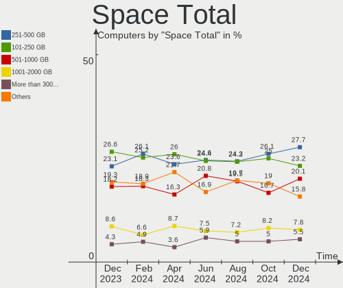
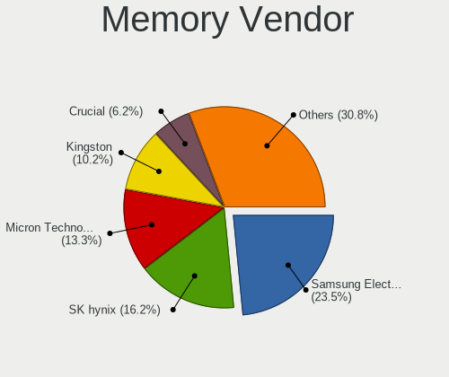

Ubuntu - Hardware Trends
------------------------

A project to identify most popular hardware characteristics and track their change
over time based on data collected by Linux users at https://Linux-Hardware.org.

Anyone can contribute to this report by the [hw-probe](https://github.com/linuxhw/hw-probe) tool:

    sudo -E hw-probe -all -upload

This is a report for all computer types. See also reports for [desktops](/Dist/Ubuntu/Desktop/README.md) and [notebooks](/Dist/Ubuntu/Notebook/README.md).

This report is for one last month. Overall report since the beginning of time: [TestCoverage](https://github.com/linuxhw/TestCoverage)

Period: May, 2022.

Contents
--------

* [ System ](#system)
  - [ OS                       ](#os)
  - [ OS Family                ](#os-family)
  - [ Kernel                   ](#kernel)
  - [ Kernel Family            ](#kernel-family)
  - [ Kernel Major Ver.        ](#kernel-major-ver)
  - [ Arch                     ](#arch)
  - [ DE                       ](#de)
  - [ Display Server           ](#display-server)
  - [ Display Manager          ](#display-manager)
  - [ OS Lang                  ](#os-lang)
  - [ Boot Mode                ](#boot-mode)
  - [ Filesystem               ](#filesystem)
  - [ Part. scheme             ](#part-scheme)
  - [ Dual Boot with Linux/BSD ](#dual-boot-with-linuxbsd)
  - [ Dual Boot (Win)          ](#dual-boot-win)

* [ Board ](#board)
  - [ Vendor                   ](#vendor)
  - [ Model                    ](#model)
  - [ Model Family             ](#model-family)
  - [ MFG Year                 ](#mfg-year)
  - [ Form Factor              ](#form-factor)
  - [ Secure Boot              ](#secure-boot)
  - [ Coreboot                 ](#coreboot)
  - [ RAM Size                 ](#ram-size)
  - [ RAM Used                 ](#ram-used)
  - [ Total Drives             ](#total-drives)
  - [ Has CD-ROM               ](#has-cd-rom)
  - [ Has Ethernet             ](#has-ethernet)
  - [ Has WiFi                 ](#has-wifi)
  - [ Has Bluetooth            ](#has-bluetooth)

* [ Location ](#location)
  - [ Country                  ](#country)
  - [ City                     ](#city)

* [ Drives ](#drives)
  - [ Drive Vendor             ](#drive-vendor)
  - [ Drive Model              ](#drive-model)
  - [ HDD Vendor               ](#hdd-vendor)
  - [ SSD Vendor               ](#ssd-vendor)
  - [ Drive Kind               ](#drive-kind)
  - [ Drive Connector          ](#drive-connector)
  - [ Drive Size               ](#drive-size)
  - [ Space Total              ](#space-total)
  - [ Space Used               ](#space-used)
  - [ Malfunc. Drives          ](#malfunc-drives)
  - [ Malfunc. Drive Vendor    ](#malfunc-drive-vendor)
  - [ Malfunc. HDD Vendor      ](#malfunc-hdd-vendor)
  - [ Malfunc. Drive Kind      ](#malfunc-drive-kind)
  - [ Failed Drives            ](#failed-drives)
  - [ Failed Drive Vendor      ](#failed-drive-vendor)
  - [ Drive Status             ](#drive-status)

* [ Storage controller ](#storage-controller)
  - [ Storage Vendor           ](#storage-vendor)
  - [ Storage Model            ](#storage-model)
  - [ Storage Kind             ](#storage-kind)

* [ Processor ](#processor)
  - [ CPU Vendor               ](#cpu-vendor)
  - [ CPU Model                ](#cpu-model)
  - [ CPU Model Family         ](#cpu-model-family)
  - [ CPU Cores                ](#cpu-cores)
  - [ CPU Sockets              ](#cpu-sockets)
  - [ CPU Threads              ](#cpu-threads)
  - [ CPU Op-Modes             ](#cpu-op-modes)
  - [ CPU Microcode            ](#cpu-microcode)
  - [ CPU Microarch            ](#cpu-microarch)

* [ Graphics ](#graphics)
  - [ GPU Vendor               ](#gpu-vendor)
  - [ GPU Model                ](#gpu-model)
  - [ GPU Combo                ](#gpu-combo)
  - [ GPU Driver               ](#gpu-driver)
  - [ GPU Memory               ](#gpu-memory)

* [ Monitor ](#monitor)
  - [ Monitor Vendor           ](#monitor-vendor)
  - [ Monitor Model            ](#monitor-model)
  - [ Monitor Resolution       ](#monitor-resolution)
  - [ Monitor Diagonal         ](#monitor-diagonal)
  - [ Monitor Width            ](#monitor-width)
  - [ Aspect Ratio             ](#aspect-ratio)
  - [ Monitor Area             ](#monitor-area)
  - [ Pixel Density            ](#pixel-density)
  - [ Multiple Monitors        ](#multiple-monitors)

* [ Network ](#network)
  - [ Net Controller Vendor    ](#net-controller-vendor)
  - [ Net Controller Model     ](#net-controller-model)
  - [ Wireless Vendor          ](#wireless-vendor)
  - [ Wireless Model           ](#wireless-model)
  - [ Ethernet Vendor          ](#ethernet-vendor)
  - [ Ethernet Model           ](#ethernet-model)
  - [ Net Controller Kind      ](#net-controller-kind)
  - [ Used Controller          ](#used-controller)
  - [ NICs                     ](#nics)
  - [ IPv6                     ](#ipv6)

* [ Bluetooth ](#bluetooth)
  - [ Bluetooth Vendor         ](#bluetooth-vendor)
  - [ Bluetooth Model          ](#bluetooth-model)

* [ Sound ](#sound)
  - [ Sound Vendor             ](#sound-vendor)
  - [ Sound Model              ](#sound-model)

* [ Memory ](#memory)
  - [ Memory Vendor            ](#memory-vendor)
  - [ Memory Model             ](#memory-model)
  - [ Memory Kind              ](#memory-kind)
  - [ Memory Form Factor       ](#memory-form-factor)
  - [ Memory Size              ](#memory-size)
  - [ Memory Speed             ](#memory-speed)

* [ Printers & scanners ](#printers--scanners)
  - [ Printer Vendor           ](#printer-vendor)
  - [ Printer Model            ](#printer-model)
  - [ Scanner Vendor           ](#scanner-vendor)
  - [ Scanner Model            ](#scanner-model)

* [ Camera ](#camera)
  - [ Camera Vendor            ](#camera-vendor)
  - [ Camera Model             ](#camera-model)

* [ Security ](#security)
  - [ Fingerprint Vendor       ](#fingerprint-vendor)
  - [ Fingerprint Model        ](#fingerprint-model)
  - [ Chipcard Vendor          ](#chipcard-vendor)
  - [ Chipcard Model           ](#chipcard-model)

* [ Unsupported ](#unsupported)
  - [ Unsupported Devices      ](#unsupported-devices)
  - [ Unsupported Device Types ](#unsupported-device-types)

System
------

OS
--

Installed operating systems

| Name           | Computers | Percent |
|----------------|-----------|---------|
| Ubuntu 22.04   | 634       | 54.47%  |
| Ubuntu 20.04   | 415       | 35.65%  |
| Ubuntu 21.10   | 51        | 4.38%   |
| Ubuntu 18.04   | 34        | 2.92%   |
| Ubuntu 16.04   | 13        | 1.12%   |
| Ubuntu 21.04   | 6         | 0.52%   |
| Ubuntu Core 18 | 3         | 0.26%   |
| Ubuntu 20.10   | 3         | 0.26%   |
| Ubuntu 14.04   | 2         | 0.17%   |
| Ubuntu Core 20 | 1         | 0.09%   |
| Ubuntu 21.12   | 1         | 0.09%   |
| Ubuntu 10.04   | 1         | 0.09%   |

OS Family
---------

OS without a version

| Name   | Computers | Percent |
|--------|-----------|---------|
| Ubuntu | 1164      | 100%    |

Kernel
------

Version of the Linux kernel

| Version               | Computers | Percent |
|-----------------------|-----------|---------|
| 5.15.0-27-generic     | 225       | 19.33%  |
| 5.15.0-30-generic     | 153       | 13.14%  |
| 5.13.0-40-generic     | 135       | 11.6%   |
| 5.15.0-33-generic     | 119       | 10.22%  |
| 5.13.0-41-generic     | 108       | 9.28%   |
| 5.13.0-44-generic     | 57        | 4.9%    |
| 5.15.0-25-generic     | 40        | 3.44%   |
| 5.4.0-110-generic     | 32        | 2.75%   |
| 5.4.0-109-generic     | 32        | 2.75%   |
| 5.4.0-113-generic     | 16        | 1.37%   |
| 5.15.0-1006-raspi     | 15        | 1.29%   |
| 5.15.0-28-generic     | 12        | 1.03%   |
| 5.15.0-32-generic     | 11        | 0.95%   |
| 5.13.0-39-generic     | 9         | 0.77%   |
| 4.15.0-177-generic    | 7         | 0.6%    |
| 5.11.0-27-generic     | 6         | 0.52%   |
| 5.15.0-35-generic     | 5         | 0.43%   |
| 5.14.0-1036-oem       | 5         | 0.43%   |
| 5.13.0-30-generic     | 5         | 0.43%   |
| 5.11.0-49-generic     | 5         | 0.43%   |
| 4.15.0-176-generic    | 5         | 0.43%   |
| 4.15.0-142-generic    | 5         | 0.43%   |
| 5.4.0-84-generic      | 4         | 0.34%   |
| 5.17.9-051709-generic | 4         | 0.34%   |
| 5.15.0-1005-raspi     | 4         | 0.34%   |
| 5.14.0-1034-oem       | 4         | 0.34%   |
| 5.8.0-63-generic      | 3         | 0.26%   |
| 5.18.0-051800-generic | 3         | 0.26%   |
| 5.17.8-051708-generic | 3         | 0.26%   |
| 5.17.6-051706-generic | 3         | 0.26%   |
| 5.14.0-1038-oem       | 3         | 0.26%   |
| 5.13.0-28-generic     | 3         | 0.26%   |
| 5.13.0-27-generic     | 3         | 0.26%   |
| 4.4.0-210-generic     | 3         | 0.26%   |
| 5.8.0-43-generic      | 2         | 0.17%   |
| 5.4.0-99-generic      | 2         | 0.17%   |
| 5.4.0-81-generic      | 2         | 0.17%   |
| 5.4.0-42-generic      | 2         | 0.17%   |
| 5.4.0-104-generic     | 2         | 0.17%   |
| 5.17.5-051705-generic | 2         | 0.17%   |
| 5.17.0-1004-oem       | 2         | 0.17%   |
| 5.17.0-1003-oem       | 2         | 0.17%   |
| 5.17.0-051700-generic | 2         | 0.17%   |
| 5.15.0-23-generic     | 2         | 0.17%   |
| 5.15.0-10025-tuxedo   | 2         | 0.17%   |
| 5.14.0-1033-oem       | 2         | 0.17%   |
| 5.13.0-43-generic     | 2         | 0.17%   |
| 5.13.0-37-generic     | 2         | 0.17%   |
| 5.13.0-35-generic     | 2         | 0.17%   |
| 5.13.0-19-generic     | 2         | 0.17%   |
| 5.13.0-1011-intel     | 2         | 0.17%   |
| 5.11.0-43-generic     | 2         | 0.17%   |
| 5.11.0-41-generic     | 2         | 0.17%   |
| 4.19.219-odroid-arm64 | 2         | 0.17%   |
| 5.8.0-55-generic      | 1         | 0.09%   |
| 5.8.0-50-generic      | 1         | 0.09%   |
| 5.8.0-33-generic      | 1         | 0.09%   |
| 5.6.0-1036-oem        | 1         | 0.09%   |
| 5.6.0-050600-generic  | 1         | 0.09%   |
| 5.4.0-92-generic      | 1         | 0.09%   |

Kernel Family
-------------

Linux kernel without a distro release

| Version  | Computers | Percent |
|----------|-----------|---------|
| 5.15.0   | 596       | 51.2%   |
| 5.13.0   | 340       | 29.21%  |
| 5.4.0    | 103       | 8.85%   |
| 4.15.0   | 23        | 1.98%   |
| 5.11.0   | 21        | 1.8%    |
| 5.14.0   | 17        | 1.46%   |
| 5.17.0   | 11        | 0.95%   |
| 5.8.0    | 8         | 0.69%   |
| 5.18.0   | 5         | 0.43%   |
| 5.17.9   | 5         | 0.43%   |
| 5.17.8   | 4         | 0.34%   |
| 5.17.5   | 4         | 0.34%   |
| 4.4.0    | 4         | 0.34%   |
| 5.17.6   | 3         | 0.26%   |
| 5.6.0    | 2         | 0.17%   |
| 5.17.7   | 2         | 0.17%   |
| 4.19.219 | 2         | 0.17%   |
| 5.17.2   | 1         | 0.09%   |
| 5.17.1   | 1         | 0.09%   |
| 5.16.9   | 1         | 0.09%   |
| 5.16.4   | 1         | 0.09%   |
| 5.16.2   | 1         | 0.09%   |
| 5.15.39  | 1         | 0.09%   |
| 5.15.13  | 1         | 0.09%   |
| 5.13.19  | 1         | 0.09%   |
| 5.11.20  | 1         | 0.09%   |
| 5.10.0   | 1         | 0.09%   |
| 4.4.178  | 1         | 0.09%   |
| 4.10.0   | 1         | 0.09%   |
| 3.13.0   | 1         | 0.09%   |
| 2.6.32   | 1         | 0.09%   |

Kernel Major Ver.
-----------------

Linux kernel major version

| Version | Computers | Percent |
|---------|-----------|---------|
| 5.15    | 598       | 51.37%  |
| 5.13    | 341       | 29.3%   |
| 5.4     | 103       | 8.85%   |
| 5.17    | 31        | 2.66%   |
| 4.15    | 23        | 1.98%   |
| 5.11    | 22        | 1.89%   |
| 5.14    | 17        | 1.46%   |
| 5.8     | 8         | 0.69%   |
| 5.18    | 5         | 0.43%   |
| 4.4     | 5         | 0.43%   |
| 5.16    | 3         | 0.26%   |
| 5.6     | 2         | 0.17%   |
| 4.19    | 2         | 0.17%   |
| 5.10    | 1         | 0.09%   |
| 4.10    | 1         | 0.09%   |
| 3.13    | 1         | 0.09%   |
| 2.6     | 1         | 0.09%   |

Arch
----

OS architecture (x86_64, i586, etc.)

| Name    | Computers | Percent |
|---------|-----------|---------|
| x86_64  | 1126      | 96.74%  |
| aarch64 | 26        | 2.23%   |
| i686    | 12        | 1.03%   |

DE
--

Desktop Environment

| Name            | Computers | Percent |
|-----------------|-----------|---------|
| GNOME           | 1068      | 91.75%  |
| Unknown         | 52        | 4.47%   |
| Unity           | 18        | 1.55%   |
| X-Cinnamon      | 10        | 0.86%   |
| GNOME Flashback | 7         | 0.6%    |
| i3              | 4         | 0.34%   |
| awesome         | 3         | 0.26%   |
| GNOME Classic   | 1         | 0.09%   |
| Cinnamon        | 1         | 0.09%   |

Display Server
--------------

X11 or Wayland

| Name    | Computers | Percent |
|---------|-----------|---------|
| X11     | 657       | 56.44%  |
| Wayland | 461       | 39.6%   |
| Unknown | 24        | 2.06%   |
| Tty     | 22        | 1.89%   |

Display Manager
---------------

SDDM, LightDM, etc.

| Name    | Computers | Percent |
|---------|-----------|---------|
| GDM3    | 864       | 74.23%  |
| GDM     | 164       | 14.09%  |
| Unknown | 99        | 8.51%   |
| LightDM | 32        | 2.75%   |
| SDDM    | 4         | 0.34%   |
| XDM     | 1         | 0.09%   |

OS Lang
-------

Language

| Lang    | Computers | Percent |
|---------|-----------|---------|
| en_US   | 511       | 43.9%   |
| de_DE   | 98        | 8.42%   |
| fr_FR   | 69        | 5.93%   |
| en_GB   | 51        | 4.38%   |
| es_ES   | 42        | 3.61%   |
| pt_BR   | 36        | 3.09%   |
| en_IN   | 32        | 2.75%   |
| en_CA   | 30        | 2.58%   |
| ru_RU   | 28        | 2.41%   |
| it_IT   | 24        | 2.06%   |
| pl_PL   | 19        | 1.63%   |
| en_AU   | 18        | 1.55%   |
| nl_NL   | 16        | 1.37%   |
| zh_CN   | 13        | 1.12%   |
| Unknown | 13        | 1.12%   |
| cs_CZ   | 11        | 0.95%   |
| C       | 11        | 0.95%   |
| ja_JP   | 9         | 0.77%   |
| de_CH   | 9         | 0.77%   |
| sv_SE   | 7         | 0.6%    |
| es_AR   | 7         | 0.6%    |
| tr_TR   | 6         | 0.52%   |
| pt_PT   | 6         | 0.52%   |
| hu_HU   | 6         | 0.52%   |
| es_MX   | 6         | 0.52%   |
| ko_KR   | 5         | 0.43%   |
| de_AT   | 5         | 0.43%   |
| da_DK   | 5         | 0.43%   |
| bg_BG   | 5         | 0.43%   |
| fi_FI   | 4         | 0.34%   |
| es_CO   | 4         | 0.34%   |
| en_ZA   | 4         | 0.34%   |
| en_NZ   | 4         | 0.34%   |
| en_IL   | 4         | 0.34%   |
| nl_BE   | 3         | 0.26%   |
| fr_BE   | 3         | 0.26%   |
| es_PE   | 3         | 0.26%   |
| es_EC   | 3         | 0.26%   |
| en_PH   | 3         | 0.26%   |
| el_GR   | 3         | 0.26%   |
| zh_TW   | 2         | 0.17%   |
| sl_SI   | 2         | 0.17%   |
| sk_SK   | 2         | 0.17%   |
| ru_UA   | 2         | 0.17%   |
| nb_NO   | 2         | 0.17%   |
| fr_CH   | 2         | 0.17%   |
| es_CL   | 2         | 0.17%   |
| ca_ES   | 2         | 0.17%   |
| uk_UA   | 1         | 0.09%   |
| ro_RO   | 1         | 0.09%   |
| hr_HR   | 1         | 0.09%   |
| eu_ES   | 1         | 0.09%   |
| es_SV   | 1         | 0.09%   |
| es_DO   | 1         | 0.09%   |
| es_CU   | 1         | 0.09%   |
| es_CR   | 1         | 0.09%   |
| en_ZW   | 1         | 0.09%   |
| en_IE   | 1         | 0.09%   |
| en_HK   | 1         | 0.09%   |
| de_BE   | 1         | 0.09%   |

Boot Mode
---------

EFI or BIOS

| Mode | Computers | Percent |
|------|-----------|---------|
| BIOS | 658       | 56.53%  |
| EFI  | 506       | 43.47%  |

Filesystem
----------

Type of filesystem

| Type    | Computers | Percent |
|---------|-----------|---------|
| Ext4    | 1096      | 94.16%  |
| Overlay | 25        | 2.15%   |
| Zfs     | 24        | 2.06%   |
| Btrfs   | 10        | 0.86%   |
| Xfs     | 4         | 0.34%   |
| Ext2    | 4         | 0.34%   |
| Ext3    | 1         | 0.09%   |

Part. scheme
------------

Scheme of partitioning

| Type    | Computers | Percent |
|---------|-----------|---------|
| Unknown | 736       | 63.23%  |
| GPT     | 376       | 32.3%   |
| MBR     | 52        | 4.47%   |

Dual Boot with Linux/BSD
------------------------

Hosting more than one Linux/BSD

| Dual boot | Computers | Percent |
|-----------|-----------|---------|
| No        | 1035      | 88.92%  |
| Yes       | 129       | 11.08%  |

Dual Boot (Win)
---------------

Hosting Linux and Windows

| Dual boot | Computers | Percent |
|-----------|-----------|---------|
| No        | 724       | 62.2%   |
| Yes       | 440       | 37.8%   |

Board
-----

Vendor
------

Motherboard manufacturer

| Name                    | Computers | Percent |
|-------------------------|-----------|---------|
| ASUSTek Computer        | 185       | 15.89%  |
| Hewlett-Packard         | 178       | 15.29%  |
| Dell                    | 168       | 14.43%  |
| Lenovo                  | 157       | 13.49%  |
| MSI                     | 68        | 5.84%   |
| Acer                    | 64        | 5.5%    |
| Gigabyte Technology     | 57        | 4.9%    |
| ASRock                  | 27        | 2.32%   |
| Toshiba                 | 23        | 1.98%   |
| Intel                   | 23        | 1.98%   |
| Raspberry Pi Foundation | 22        | 1.89%   |
| Apple                   | 19        | 1.63%   |
| HUAWEI                  | 12        | 1.03%   |
| Unknown                 | 10        | 0.86%   |
| Samsung Electronics     | 9         | 0.77%   |
| Medion                  | 9         | 0.77%   |
| Pegatron                | 8         | 0.69%   |
| Alienware               | 8         | 0.69%   |
| Supermicro              | 7         | 0.6%    |
| Shuttle                 | 7         | 0.6%    |
| Fujitsu                 | 6         | 0.52%   |
| Sony                    | 5         | 0.43%   |
| Notebook                | 5         | 0.43%   |
| Google                  | 5         | 0.43%   |
| Foxconn                 | 5         | 0.43%   |
| ECS                     | 5         | 0.43%   |
| Chuwi                   | 5         | 0.43%   |
| Microsoft               | 4         | 0.34%   |
| TUXEDO                  | 3         | 0.26%   |
| Positivo                | 3         | 0.26%   |
| Packard Bell            | 3         | 0.26%   |
| LG Electronics          | 3         | 0.26%   |
| Gateway                 | 3         | 0.26%   |
| AMI                     | 3         | 0.26%   |
| PC Specialist           | 2         | 0.17%   |
| MouseComputer           | 2         | 0.17%   |
| Lex                     | 2         | 0.17%   |
| IBM                     | 2         | 0.17%   |
| Hardkernel              | 2         | 0.17%   |
| Fujitsu Siemens         | 2         | 0.17%   |
| Entroware               | 2         | 0.17%   |
| Avell High Performance  | 2         | 0.17%   |
| Vestel                  | 1         | 0.09%   |
| Teclast                 | 1         | 0.09%   |
| SZMZ                    | 1         | 0.09%   |
| SLIMBOOK                | 1         | 0.09%   |
| Seeed Studio            | 1         | 0.09%   |
| SANTECH                 | 1         | 0.09%   |
| Pepper Jobs             | 1         | 0.09%   |
| Panasonic               | 1         | 0.09%   |
| Otazak                  | 1         | 0.09%   |
| MW                      | 1         | 0.09%   |
| Mustek6376 mst6376      | 1         | 0.09%   |
| mPTech                  | 1         | 0.09%   |
| Minix                   | 1         | 0.09%   |
| Microtech               | 1         | 0.09%   |
| Maibenben               | 1         | 0.09%   |
| KLLISRE                 | 1         | 0.09%   |
| Khadas                  | 1         | 0.09%   |
| Inventec                | 1         | 0.09%   |

Model
-----

Motherboard model

| Name                                  | Computers | Percent |
|---------------------------------------|-----------|---------|
| RPi Raspberry Pi                      | 15        | 1.29%   |
| ASUS All Series                       | 12        | 1.03%   |
| Unknown                               | 11        | 0.95%   |
| MSI MS-7C52                           | 4         | 0.34%   |
| HP Pavilion g6                        | 4         | 0.34%   |
| HP Notebook                           | 4         | 0.34%   |
| HP Compaq 8200 Elite SFF PC           | 4         | 0.34%   |
| ASUS ROG Zephyrus G14 GA401QM_GA401QM | 4         | 0.34%   |
| RPi Raspberry Pi 4 Model B Rev 1.4    | 3         | 0.26%   |
| MSI MS-7C92                           | 3         | 0.26%   |
| MSI MS-7C37                           | 3         | 0.26%   |
| MSI MS-7C02                           | 3         | 0.26%   |
| Lenovo Z50-75 80EC                    | 3         | 0.26%   |
| Lenovo ThinkBook 14-IML 20RV          | 3         | 0.26%   |
| HP ProLiant DL380p Gen8               | 3         | 0.26%   |
| HP Pavilion dv6                       | 3         | 0.26%   |
| HP Laptop 15-bs0xx                    | 3         | 0.26%   |
| HP 15                                 | 3         | 0.26%   |
| Gigabyte X570 AORUS MASTER            | 3         | 0.26%   |
| Dell XPS 15 9570                      | 3         | 0.26%   |
| Dell Vostro 3500                      | 3         | 0.26%   |
| Dell OptiPlex 7010                    | 3         | 0.26%   |
| Dell Latitude 7420                    | 3         | 0.26%   |
| Dell Latitude 5420                    | 3         | 0.26%   |
| ASUS ZenBook UX325EA_UX325EA          | 3         | 0.26%   |
| ASUS TUF Gaming B450-PLUS II          | 3         | 0.26%   |
| ASUS N550JV                           | 3         | 0.26%   |
| Alienware x17 R2                      | 3         | 0.26%   |
| RPi Raspberry Pi 4 Model B Rev 1.5    | 2         | 0.17%   |
| RPi Raspberry Pi 4 Model B Rev 1.2    | 2         | 0.17%   |
| Notebook NS50_70MU                    | 2         | 0.17%   |
| MSI MS-7D54                           | 2         | 0.17%   |
| MSI MS-7C91                           | 2         | 0.17%   |
| MSI MS-7B86                           | 2         | 0.17%   |
| MSI MS-7A38                           | 2         | 0.17%   |
| Lex 3I610DW                           | 2         | 0.17%   |
| Lenovo Yoga 530-14ARR 81H9            | 2         | 0.17%   |
| Lenovo ThinkPad E595 20NFA000AU       | 2         | 0.17%   |
| Lenovo IdeaPad Flex-14IWL 81SQ        | 2         | 0.17%   |
| Lenovo IdeaPad 320-15IKB 80XL         | 2         | 0.17%   |
| Intel H55                             | 2         | 0.17%   |
| HUAWEI HVY-WXX9                       | 2         | 0.17%   |
| HUAWEI BOM-WXX9                       | 2         | 0.17%   |
| HUAWEI BOHK-WAX9X                     | 2         | 0.17%   |
| HP ZBook 15 G6                        | 2         | 0.17%   |
| HP ZBook 15 G5                        | 2         | 0.17%   |
| HP ProDesk 490 G3 MT Business PC      | 2         | 0.17%   |
| HP ProBook 650 G2                     | 2         | 0.17%   |
| HP ProBook 650 G1                     | 2         | 0.17%   |
| HP ProBook 470 G1                     | 2         | 0.17%   |
| HP ProBook 455 G8 Notebook PC         | 2         | 0.17%   |
| HP ProBook 4520s                      | 2         | 0.17%   |
| HP ProBook 450 G8 Notebook PC         | 2         | 0.17%   |
| HP ProBook 430 G1                     | 2         | 0.17%   |
| HP Pavilion Notebook                  | 2         | 0.17%   |
| HP Pavilion Aero Laptop 13-be0xxx     | 2         | 0.17%   |
| HP Pavilion 14                        | 2         | 0.17%   |
| HP Laptop 15-dw3xxx                   | 2         | 0.17%   |
| HP Laptop 15-da0xxx                   | 2         | 0.17%   |
| HP EliteBook 850 G6                   | 2         | 0.17%   |

Model Family
------------

Motherboard model prefix

| Name                  | Computers | Percent |
|-----------------------|-----------|---------|
| Lenovo ThinkPad       | 64        | 5.5%    |
| Dell Inspiron         | 44        | 3.78%   |
| Dell Latitude         | 37        | 3.18%   |
| Acer Aspire           | 37        | 3.18%   |
| HP Pavilion           | 35        | 3.01%   |
| Lenovo IdeaPad        | 27        | 2.32%   |
| HP ProBook            | 26        | 2.23%   |
| Dell Precision        | 23        | 1.98%   |
| RPi Raspberry         | 22        | 1.89%   |
| HP Laptop             | 22        | 1.89%   |
| Toshiba Satellite     | 21        | 1.8%    |
| ASUS VivoBook         | 21        | 1.8%    |
| ASUS PRIME            | 21        | 1.8%    |
| HP EliteBook          | 19        | 1.63%   |
| Dell OptiPlex         | 18        | 1.55%   |
| ASUS ROG              | 17        | 1.46%   |
| Dell XPS              | 16        | 1.37%   |
| Lenovo Yoga           | 15        | 1.29%   |
| HP Compaq             | 15        | 1.29%   |
| Dell Vostro           | 14        | 1.2%    |
| ASUS All              | 12        | 1.03%   |
| Unknown               | 11        | 0.95%   |
| HP ZBook              | 10        | 0.86%   |
| ASUS TUF              | 9         | 0.77%   |
| Acer Swift            | 9         | 0.77%   |
| Lenovo ThinkCentre    | 7         | 0.6%    |
| Lenovo ThinkBook      | 7         | 0.6%    |
| Lenovo Legion         | 7         | 0.6%    |
| ASUS ZenBook          | 6         | 0.52%   |
| Dell PowerEdge        | 5         | 0.43%   |
| Acer TravelMate       | 5         | 0.43%   |
| Acer Nitro            | 5         | 0.43%   |
| MSI MS-7C52           | 4         | 0.34%   |
| Microsoft Surface     | 4         | 0.34%   |
| HP Spectre            | 4         | 0.34%   |
| HP ProLiant           | 4         | 0.34%   |
| HP Notebook           | 4         | 0.34%   |
| HP EliteDesk          | 4         | 0.34%   |
| Gigabyte X570         | 4         | 0.34%   |
| ASUS ASUS             | 4         | 0.34%   |
| MSI MS-7C92           | 3         | 0.26%   |
| MSI MS-7C37           | 3         | 0.26%   |
| MSI MS-7C02           | 3         | 0.26%   |
| Lenovo Z50-75         | 3         | 0.26%   |
| Lenovo IdeaPadFlex    | 3         | 0.26%   |
| HP ProDesk            | 3         | 0.26%   |
| HP 250                | 3         | 0.26%   |
| HP 15                 | 3         | 0.26%   |
| Dell Studio           | 3         | 0.26%   |
| Dell G3               | 3         | 0.26%   |
| ASUS PRO              | 3         | 0.26%   |
| ASUS N550JV           | 3         | 0.26%   |
| Alienware x17         | 3         | 0.26%   |
| Packard Bell EasyNote | 2         | 0.17%   |
| Notebook NS50         | 2         | 0.17%   |
| MSI Stealth           | 2         | 0.17%   |
| MSI Prestige          | 2         | 0.17%   |
| MSI MS-7D54           | 2         | 0.17%   |
| MSI MS-7C91           | 2         | 0.17%   |
| MSI MS-7B86           | 2         | 0.17%   |

MFG Year
--------

Motherboard manufacture year

| Year    | Computers | Percent |
|---------|-----------|---------|
| 2021    | 142       | 12.2%   |
| 2020    | 134       | 11.51%  |
| 2019    | 107       | 9.19%   |
| 2018    | 99        | 8.51%   |
| 2012    | 82        | 7.04%   |
| 2011    | 73        | 6.27%   |
| 2014    | 70        | 6.01%   |
| 2013    | 69        | 5.93%   |
| 2010    | 69        | 5.93%   |
| 2017    | 62        | 5.33%   |
| 2016    | 58        | 4.98%   |
| 2015    | 45        | 3.87%   |
| 2009    | 38        | 3.26%   |
| 2022    | 34        | 2.92%   |
| 2008    | 30        | 2.58%   |
| Unknown | 25        | 2.15%   |
| 2007    | 16        | 1.37%   |
| 2006    | 8         | 0.69%   |
| 2005    | 3         | 0.26%   |

Form Factor
-----------

Physical design of the computer

| Name           | Computers | Percent |
|----------------|-----------|---------|
| Notebook       | 629       | 54.04%  |
| Desktop        | 406       | 34.88%  |
| Convertible    | 38        | 3.26%   |
| System on chip | 26        | 2.23%   |
| Server         | 21        | 1.8%    |
| Mini pc        | 20        | 1.72%   |
| All in one     | 15        | 1.29%   |
| Tablet         | 9         | 0.77%   |

Secure Boot
-----------

Enabled or disabled

| State    | Computers | Percent |
|----------|-----------|---------|
| Disabled | 1041      | 89.43%  |
| Enabled  | 123       | 10.57%  |

Coreboot
--------

Have coreboot on board

| Used | Computers | Percent |
|------|-----------|---------|
| No   | 1159      | 99.57%  |
| Yes  | 5         | 0.43%   |

RAM Size
--------

Total RAM memory

| Size in GB      | Computers | Percent |
|-----------------|-----------|---------|
| 4.01-8.0        | 299       | 25.69%  |
| 16.01-24.0      | 236       | 20.27%  |
| 8.01-16.0       | 215       | 18.47%  |
| 3.01-4.0        | 177       | 15.21%  |
| 32.01-64.0      | 132       | 11.34%  |
| 64.01-256.0     | 44        | 3.78%   |
| 1.01-2.0        | 24        | 2.06%   |
| 24.01-32.0      | 22        | 1.89%   |
| 2.01-3.0        | 12        | 1.03%   |
| 0.51-1.0        | 2         | 0.17%   |
| More than 256.0 | 1         | 0.09%   |

RAM Used
--------

Used RAM memory

| Used GB     | Computers | Percent |
|-------------|-----------|---------|
| 1.01-2.0    | 393       | 33.76%  |
| 2.01-3.0    | 316       | 27.15%  |
| 4.01-8.0    | 191       | 16.41%  |
| 3.01-4.0    | 162       | 13.92%  |
| 8.01-16.0   | 64        | 5.5%    |
| 0.51-1.0    | 19        | 1.63%   |
| 16.01-24.0  | 5         | 0.43%   |
| 32.01-64.0  | 4         | 0.34%   |
| 0.01-0.5    | 4         | 0.34%   |
| 24.01-32.0  | 3         | 0.26%   |
| Unknown     | 2         | 0.17%   |
| 64.01-256.0 | 1         | 0.09%   |

Total Drives
------------

Number of drives on board

| Drives | Computers | Percent |
|--------|-----------|---------|
| 1      | 710       | 61%     |
| 2      | 271       | 23.28%  |
| 3      | 84        | 7.22%   |
| 4      | 36        | 3.09%   |
| 0      | 22        | 1.89%   |
| 5      | 21        | 1.8%    |
| 6      | 8         | 0.69%   |
| 13     | 3         | 0.26%   |
| 10     | 3         | 0.26%   |
| 7      | 3         | 0.26%   |
| 9      | 2         | 0.17%   |
| 8      | 1         | 0.09%   |

Has CD-ROM
----------

Has CD-ROM on board

| Presented | Computers | Percent |
|-----------|-----------|---------|
| No        | 730       | 62.71%  |
| Yes       | 434       | 37.29%  |

Has Ethernet
------------

Has Ethernet on board

| Presented | Computers | Percent |
|-----------|-----------|---------|
| Yes       | 972       | 83.51%  |
| No        | 192       | 16.49%  |

Has WiFi
--------

Has WiFi module

| Presented | Computers | Percent |
|-----------|-----------|---------|
| Yes       | 862       | 74.05%  |
| No        | 302       | 25.95%  |

Has Bluetooth
-------------

Has Bluetooth module

| Presented | Computers | Percent |
|-----------|-----------|---------|
| Yes       | 706       | 60.65%  |
| No        | 458       | 39.35%  |

Location
--------

Country
-------

Geographic location (country)

| Country      | Computers | Percent |
|--------------|-----------|---------|
| USA          | 209       | 17.96%  |
| Germany      | 122       | 10.48%  |
| France       | 78        | 6.7%    |
| Brazil       | 48        | 4.12%   |
| UK           | 47        | 4.04%   |
| Russia       | 39        | 3.35%   |
| Spain        | 38        | 3.26%   |
| Netherlands  | 38        | 3.26%   |
| Poland       | 37        | 3.18%   |
| Italy        | 36        | 3.09%   |
| India        | 35        | 3.01%   |
| Canada       | 32        | 2.75%   |
| Australia    | 20        | 1.72%   |
| Switzerland  | 18        | 1.55%   |
| Sweden       | 18        | 1.55%   |
| Mexico       | 16        | 1.37%   |
| Czechia      | 15        | 1.29%   |
| China        | 15        | 1.29%   |
| Argentina    | 15        | 1.29%   |
| Finland      | 14        | 1.2%    |
| Belgium      | 14        | 1.2%    |
| Portugal     | 13        | 1.12%   |
| Turkey       | 12        | 1.03%   |
| Japan        | 12        | 1.03%   |
| Austria      | 12        | 1.03%   |
| Denmark      | 11        | 0.95%   |
| Romania      | 10        | 0.86%   |
| Bulgaria     | 10        | 0.86%   |
| Indonesia    | 9         | 0.77%   |
| Hungary      | 8         | 0.69%   |
| Colombia     | 8         | 0.69%   |
| Taiwan       | 7         | 0.6%    |
| South Korea  | 7         | 0.6%    |
| Norway       | 7         | 0.6%    |
| Iran         | 7         | 0.6%    |
| Peru         | 6         | 0.52%   |
| Ukraine      | 5         | 0.43%   |
| Thailand     | 5         | 0.43%   |
| Slovakia     | 5         | 0.43%   |
| Serbia       | 5         | 0.43%   |
| New Zealand  | 5         | 0.43%   |
| Israel       | 5         | 0.43%   |
| Greece       | 5         | 0.43%   |
| South Africa | 4         | 0.34%   |
| Singapore    | 4         | 0.34%   |
| Ecuador      | 4         | 0.34%   |
| Croatia      | 4         | 0.34%   |
| Bangladesh   | 4         | 0.34%   |
| Philippines  | 3         | 0.26%   |
| Pakistan     | 3         | 0.26%   |
| Ivory Coast  | 3         | 0.26%   |
| Estonia      | 3         | 0.26%   |
| Armenia      | 3         | 0.26%   |
| Uruguay      | 2         | 0.17%   |
| Slovenia     | 2         | 0.17%   |
| Saudi Arabia | 2         | 0.17%   |
| Nigeria      | 2         | 0.17%   |
| Nepal        | 2         | 0.17%   |
| Morocco      | 2         | 0.17%   |
| Lithuania    | 2         | 0.17%   |

City
----

Geographic location (city)

| City              | Computers | Percent |
|-------------------|-----------|---------|
| Moscow            | 14        | 1.2%    |
| Berlin            | 14        | 1.2%    |
| Paris             | 12        | 1.03%   |
| Sao Paulo         | 9         | 0.77%   |
| Milan             | 9         | 0.77%   |
| Sydney            | 8         | 0.69%   |
| St Petersburg     | 8         | 0.69%   |
| Madrid            | 8         | 0.69%   |
| Helsinki          | 8         | 0.69%   |
| Hamburg           | 8         | 0.69%   |
| Debica            | 7         | 0.6%    |
| Dallas            | 7         | 0.6%    |
| Buenos Aires      | 7         | 0.6%    |
| Barcelona         | 7         | 0.6%    |
| Amsterdam         | 7         | 0.6%    |
| Bucharest         | 6         | 0.52%   |
| Vienna            | 5         | 0.43%   |
| Tehran            | 5         | 0.43%   |
| San Jose          | 5         | 0.43%   |
| Rome              | 5         | 0.43%   |
| London            | 5         | 0.43%   |
| Jakarta           | 5         | 0.43%   |
| Beijing           | 5         | 0.43%   |
| Zurich            | 4         | 0.34%   |
| Zagreb            | 4         | 0.34%   |
| Wroclaw           | 4         | 0.34%   |
| Sofia             | 4         | 0.34%   |
| Singapore         | 4         | 0.34%   |
| San Francisco     | 4         | 0.34%   |
| Istanbul          | 4         | 0.34%   |
| Hyderabad         | 4         | 0.34%   |
| Houston           | 4         | 0.34%   |
| Gdansk            | 4         | 0.34%   |
| Copenhagen        | 4         | 0.34%   |
| Chicago           | 4         | 0.34%   |
| Chennai           | 4         | 0.34%   |
| Budapest          | 4         | 0.34%   |
| Yerevan           | 3         | 0.26%   |
| Warsaw            | 3         | 0.26%   |
| Vancouver         | 3         | 0.26%   |
| Toronto           | 3         | 0.26%   |
| The Hague         | 3         | 0.26%   |
| Stuttgart         | 3         | 0.26%   |
| Seattle           | 3         | 0.26%   |
| Poznan            | 3         | 0.26%   |
| New York          | 3         | 0.26%   |
| New Taipei        | 3         | 0.26%   |
| Munich            | 3         | 0.26%   |
| Mumbai            | 3         | 0.26%   |
| Mexico City       | 3         | 0.26%   |
| Leipzig           | 3         | 0.26%   |
| Gothenburg        | 3         | 0.26%   |
| Frankfurt am Main | 3         | 0.26%   |
| Damwald           | 3         | 0.26%   |
| Châtillon        | 3         | 0.26%   |
| Charlestown       | 3         | 0.26%   |
| Calgary           | 3         | 0.26%   |
| Bogotá           | 3         | 0.26%   |
| Atlanta           | 3         | 0.26%   |
| Athens            | 3         | 0.26%   |

Drives
------

Drive Vendor
------------

Hard drive vendors

| Vendor                         | Computers | Drives | Percent |
|--------------------------------|-----------|--------|---------|
| WDC                            | 255       | 343    | 16%     |
| Samsung Electronics            | 246       | 309    | 15.43%  |
| Seagate                        | 215       | 269    | 13.49%  |
| Toshiba                        | 100       | 113    | 6.27%   |
| SanDisk                        | 85        | 92     | 5.33%   |
| Kingston                       | 85        | 91     | 5.33%   |
| Unknown                        | 67        | 74     | 4.2%    |
| SK Hynix                       | 60        | 61     | 3.76%   |
| Crucial                        | 57        | 60     | 3.58%   |
| Intel                          | 42        | 49     | 2.63%   |
| Hitachi                        | 39        | 51     | 2.45%   |
| Micron Technology              | 35        | 36     | 2.2%    |
| HGST                           | 27        | 29     | 1.69%   |
| A-DATA Technology              | 22        | 24     | 1.38%   |
| Phison                         | 19        | 20     | 1.19%   |
| KIOXIA                         | 18        | 19     | 1.13%   |
| Unknown                        | 15        | 15     | 0.94%   |
| Silicon Motion                 | 9         | 9      | 0.56%   |
| Hewlett-Packard                | 9         | 27     | 0.56%   |
| Apple                          | 9         | 11     | 0.56%   |
| PNY                            | 8         | 8      | 0.5%    |
| OCZ                            | 7         | 8      | 0.44%   |
| Netac                          | 7         | 7      | 0.44%   |
| China                          | 7         | 7      | 0.44%   |
| MAXTOR                         | 6         | 7      | 0.38%   |
| GOODRAM                        | 6         | 6      | 0.38%   |
| Patriot                        | 5         | 5      | 0.31%   |
| Micron/Crucial Technology      | 5         | 5      | 0.31%   |
| Lexar                          | 5         | 5      | 0.31%   |
| Intenso                        | 5         | 9      | 0.31%   |
| Corsair                        | 5         | 5      | 0.31%   |
| Transcend                      | 4         | 4      | 0.25%   |
| LITEON                         | 4         | 4      | 0.25%   |
| KingSpec                       | 4         | 4      | 0.25%   |
| Gigabyte Technology            | 4         | 4      | 0.25%   |
| Team                           | 3         | 4      | 0.19%   |
| Solid State Storage Technology | 3         | 3      | 0.19%   |
| Lenovo                         | 3         | 3      | 0.19%   |
| KIOXIA-EXCERIA                 | 3         | 3      | 0.19%   |
| JMicron                        | 3         | 3      | 0.19%   |
| Fujitsu                        | 3         | 3      | 0.19%   |
| ASMT                           | 3         | 3      | 0.19%   |
| ADATA Technology               | 3         | 3      | 0.19%   |
| XPG                            | 2         | 2      | 0.13%   |
| walram                         | 2         | 2      | 0.13%   |
| Teclast                        | 2         | 2      | 0.13%   |
| SPCC                           | 2         | 2      | 0.13%   |
| S3+                            | 2         | 2      | 0.13%   |
| PLEXTOR                        | 2         | 2      | 0.13%   |
| LITEONIT                       | 2         | 2      | 0.13%   |
| KLEVV                          | 2         | 2      | 0.13%   |
| KingFast                       | 2         | 2      | 0.13%   |
| HGST HTS                       | 2         | 2      | 0.13%   |
| FORESEE                        | 2         | 2      | 0.13%   |
| Dogfish                        | 2         | 2      | 0.13%   |
| BHT                            | 2         | 2      | 0.13%   |
| Apacer                         | 2         | 2      | 0.13%   |
| YMTC                           | 1         | 1      | 0.06%   |
| XrayDisk                       | 1         | 1      | 0.06%   |
| W800S                          | 1         | 1      | 0.06%   |

Drive Model
-----------

Hard drive models

| Model                               | Computers | Percent |
|-------------------------------------|-----------|---------|
| Toshiba MQ01ABD100 1TB              | 16        | 0.9%    |
| Kingston SA400S37240G 240GB SSD     | 16        | 0.9%    |
| Unknown                             | 15        | 0.84%   |
| Seagate ST1000LM035-1RK172 1TB      | 13        | 0.73%   |
| Samsung NVMe SSD Drive 512GB        | 13        | 0.73%   |
| Seagate ST1000LM024 HN-M101MBB 1TB  | 12        | 0.68%   |
| Sandisk NVMe SSD Drive 1TB          | 12        | 0.68%   |
| Unknown SD/MMC/MS PRO 999GB         | 10        | 0.56%   |
| Samsung SSD 860 EVO 500GB           | 10        | 0.56%   |
| Samsung SSD 850 EVO 250GB           | 10        | 0.56%   |
| Samsung NVMe SSD Drive 1TB          | 10        | 0.56%   |
| Kingston SA400S37480G 480GB SSD     | 10        | 0.56%   |
| Seagate ST500DM002-1BD142 500GB     | 9         | 0.51%   |
| Seagate ST2000DM008-2FR102 2TB      | 9         | 0.51%   |
| Samsung SSD 970 EVO Plus 500GB      | 9         | 0.51%   |
| Samsung NVMe SSD Drive 256GB        | 9         | 0.51%   |
| Micron NVMe SSD Drive 512GB         | 9         | 0.51%   |
| Crucial CT500MX500SSD1 500GB        | 9         | 0.51%   |
| WDC WD10EZEX-08WN4A0 1TB            | 8         | 0.45%   |
| Unknown MMC Card  64GB              | 8         | 0.45%   |
| Toshiba MQ04ABF100 1TB              | 8         | 0.45%   |
| Samsung NVMe SSD Drive 500GB        | 8         | 0.45%   |
| Crucial CT1000MX500SSD1 1TB         | 8         | 0.45%   |
| Seagate ST2000LM007-1R8174 2TB      | 7         | 0.39%   |
| Seagate ST2000DM001-1CH164 2TB      | 7         | 0.39%   |
| Seagate ST1000DM003-1ER162 1TB      | 7         | 0.39%   |
| Sandisk NVMe SSD Drive 500GB        | 7         | 0.39%   |
| Samsung SSD 860 EVO 1TB             | 7         | 0.39%   |
| Intel NVMe SSD Drive 512GB          | 7         | 0.39%   |
| WDC WDS500G2B0A-00SM50 500GB SSD    | 6         | 0.34%   |
| Toshiba NVMe SSD Drive 512GB        | 6         | 0.34%   |
| Seagate ST500LT012-1DG142 500GB     | 6         | 0.34%   |
| Seagate ST31000524AS 1TB            | 6         | 0.34%   |
| Seagate ST1000DM010-2EP102 1TB      | 6         | 0.34%   |
| Samsung NVMe SSD Drive 1024GB       | 6         | 0.34%   |
| Samsung MZVLB512HBJQ-000L2 512GB    | 6         | 0.34%   |
| Kingston SV300S37A120G 120GB SSD    | 6         | 0.34%   |
| Intel SSDPEKNW512G8 512GB           | 6         | 0.34%   |
| HGST HTS545050A7E680 500GB          | 6         | 0.34%   |
| Crucial CT240BX500SSD1 240GB        | 6         | 0.34%   |
| WDC WDS120G2G0A-00JH30 120GB SSD    | 5         | 0.28%   |
| Unknown MMC Card  32GB              | 5         | 0.28%   |
| Toshiba MQ01ABF050 500GB            | 5         | 0.28%   |
| Toshiba KBG30ZMS128G 128GB NVMe SSD | 5         | 0.28%   |
| Toshiba HDWD110 1TB                 | 5         | 0.28%   |
| SK Hynix NVMe SSD Drive 256GB       | 5         | 0.28%   |
| Seagate ST1000DM003-1CH162 1TB      | 5         | 0.28%   |
| Seagate Expansion Desk 10TB         | 5         | 0.28%   |
| Sandisk NVMe SSD Drive 512GB        | 5         | 0.28%   |
| Sandisk NVMe SSD Drive 256GB        | 5         | 0.28%   |
| Samsung SSD 970 EVO Plus 1TB        | 5         | 0.28%   |
| Samsung SSD 870 QVO 1TB             | 5         | 0.28%   |
| Samsung SSD 860 EVO 250GB           | 5         | 0.28%   |
| Samsung SSD 850 PRO 256GB           | 5         | 0.28%   |
| Samsung SSD 850 EVO 500GB           | 5         | 0.28%   |
| Phison NVMe SSD Drive 2TB           | 5         | 0.28%   |
| Kingston NVMe SSD Drive 500GB       | 5         | 0.28%   |
| HGST HTS541010A9E680 1TB            | 5         | 0.28%   |
| Crucial CT1000P2SSD8 1TB            | 5         | 0.28%   |
| WDC WDBNCE5000PNC 500GB SSD         | 4         | 0.23%   |

HDD Vendor
----------

Hard disk drive vendors

| Vendor              | Computers | Drives | Percent |
|---------------------|-----------|--------|---------|
| Seagate             | 209       | 262    | 34.72%  |
| WDC                 | 195       | 263    | 32.39%  |
| Toshiba             | 75        | 86     | 12.46%  |
| Hitachi             | 38        | 50     | 6.31%   |
| HGST                | 27        | 29     | 4.49%   |
| Samsung Electronics | 24        | 26     | 3.99%   |
| Unknown             | 10        | 10     | 1.66%   |
| Apple               | 7         | 8      | 1.16%   |
| MAXTOR              | 3         | 4      | 0.5%    |
| Fujitsu             | 3         | 3      | 0.5%    |
| Hewlett-Packard     | 2         | 20     | 0.33%   |
| ASMT                | 2         | 2      | 0.33%   |
| USB                 | 1         | 1      | 0.17%   |
| StoreJet            | 1         | 1      | 0.17%   |
| SABRENT             | 1         | 1      | 0.17%   |
| pqi                 | 1         | 1      | 0.17%   |
| Intenso             | 1         | 1      | 0.17%   |
| HGST HTS            | 1         | 1      | 0.17%   |
| DELLBOSS            | 1         | 1      | 0.17%   |

SSD Vendor
----------

Solid state drive vendors

| Vendor              | Computers | Drives | Percent |
|---------------------|-----------|--------|---------|
| Samsung Electronics | 105       | 122    | 21.34%  |
| Kingston            | 66        | 72     | 13.41%  |
| Crucial             | 49        | 52     | 9.96%   |
| SanDisk             | 44        | 46     | 8.94%   |
| WDC                 | 41        | 42     | 8.33%   |
| A-DATA Technology   | 16        | 17     | 3.25%   |
| SK Hynix            | 13        | 13     | 2.64%   |
| Intel               | 11        | 12     | 2.24%   |
| Micron Technology   | 10        | 11     | 2.03%   |
| PNY                 | 8         | 8      | 1.63%   |
| Unknown             | 8         | 8      | 1.63%   |
| Toshiba             | 7         | 7      | 1.42%   |
| China               | 7         | 7      | 1.42%   |
| OCZ                 | 6         | 6      | 1.22%   |
| Netac               | 6         | 6      | 1.22%   |
| GOODRAM             | 6         | 6      | 1.22%   |
| Patriot             | 5         | 5      | 1.02%   |
| Lexar               | 5         | 5      | 1.02%   |
| Hewlett-Packard     | 5         | 5      | 1.02%   |
| LITEON              | 4         | 4      | 0.81%   |
| KingSpec            | 4         | 4      | 0.81%   |
| Corsair             | 4         | 4      | 0.81%   |
| Transcend           | 3         | 3      | 0.61%   |
| MAXTOR              | 3         | 3      | 0.61%   |
| Teclast             | 2         | 2      | 0.41%   |
| SPCC                | 2         | 2      | 0.41%   |
| Seagate             | 2         | 2      | 0.41%   |
| S3+                 | 2         | 2      | 0.41%   |
| PLEXTOR             | 2         | 2      | 0.41%   |
| LITEONIT            | 2         | 2      | 0.41%   |
| KLEVV               | 2         | 2      | 0.41%   |
| KIOXIA-EXCERIA      | 2         | 2      | 0.41%   |
| Gigabyte Technology | 2         | 2      | 0.41%   |
| FORESEE             | 2         | 2      | 0.41%   |
| Dogfish             | 2         | 2      | 0.41%   |
| BHT                 | 2         | 2      | 0.41%   |
| W800S               | 1         | 1      | 0.2%    |
| ViperTeq            | 1         | 1      | 0.2%    |
| Verbatim            | 1         | 1      | 0.2%    |
| Vaseky              | 1         | 1      | 0.2%    |
| USB3.0              | 1         | 1      | 0.2%    |
| TYPEC 2T            | 1         | 1      | 0.2%    |
| Team                | 1         | 1      | 0.2%    |
| TCSUNBOW-X5         | 1         | 1      | 0.2%    |
| TAMMUZ              | 1         | 1      | 0.2%    |
| Smartbuy            | 1         | 1      | 0.2%    |
| Phison              | 1         | 1      | 0.2%    |
| Mushkin             | 1         | 1      | 0.2%    |
| MidasForce          | 1         | 1      | 0.2%    |
| LONDISK             | 1         | 1      | 0.2%    |
| Lenovo              | 1         | 1      | 0.2%    |
| LDLC                | 1         | 1      | 0.2%    |
| JMicron             | 1         | 1      | 0.2%    |
| Intenso             | 1         | 2      | 0.2%    |
| Hoodisk             | 1         | 1      | 0.2%    |
| Hitachi             | 1         | 1      | 0.2%    |
| EMTEC               | 1         | 1      | 0.2%    |
| EAGET               | 1         | 1      | 0.2%    |
| E535N               | 1         | 1      | 0.2%    |
| Dell                | 1         | 1      | 0.2%    |

Drive Kind
----------

HDD or SSD

| Kind    | Computers | Drives | Percent |
|---------|-----------|--------|---------|
| HDD     | 521       | 770    | 35.71%  |
| SSD     | 428       | 525    | 29.34%  |
| NVMe    | 409       | 482    | 28.03%  |
| MMC     | 69        | 74     | 4.73%   |
| Unknown | 32        | 38     | 2.19%   |

Drive Connector
---------------

SATA, SAS, NVMe, etc.

| Type | Computers | Drives | Percent |
|------|-----------|--------|---------|
| SATA | 781       | 1252   | 58.94%  |
| NVMe | 408       | 481    | 30.79%  |
| MMC  | 69        | 74     | 5.21%   |
| SAS  | 67        | 82     | 5.06%   |

Drive Size
----------

Size of hard drive

| Size in TB | Computers | Drives | Percent |
|------------|-----------|--------|---------|
| 0.01-0.5   | 535       | 655    | 53.45%  |
| 0.51-1.0   | 312       | 386    | 31.17%  |
| 1.01-2.0   | 87        | 135    | 8.69%   |
| 3.01-4.0   | 25        | 38     | 2.5%    |
| 4.01-10.0  | 24        | 50     | 2.4%    |
| 2.01-3.0   | 12        | 23     | 1.2%    |
| 10.01-20.0 | 6         | 8      | 0.6%    |

Space Total
-----------

Amount of disk space available on the file system

| Size in GB     | Computers | Percent |
|----------------|-----------|---------|
| 101-250        | 349       | 29.98%  |
| 251-500        | 299       | 25.69%  |
| 501-1000       | 175       | 15.03%  |
| 51-100         | 79        | 6.79%   |
| 1001-2000      | 78        | 6.7%    |
| More than 3000 | 64        | 5.5%    |
| 1-20           | 42        | 3.61%   |
| 21-50          | 36        | 3.09%   |
| 2001-3000      | 29        | 2.49%   |
| Unknown        | 13        | 1.12%   |

Space Used
----------

Amount of used disk space

| Used GB        | Computers | Percent |
|----------------|-----------|---------|
| 1-20           | 420       | 36.08%  |
| 21-50          | 231       | 19.85%  |
| 101-250        | 161       | 13.83%  |
| 51-100         | 148       | 12.71%  |
| 251-500        | 86        | 7.39%   |
| 501-1000       | 41        | 3.52%   |
| 1001-2000      | 30        | 2.58%   |
| More than 3000 | 25        | 2.15%   |
| Unknown        | 13        | 1.12%   |
| 2001-3000      | 9         | 0.77%   |

Malfunc. Drives
---------------

Drive models with a malfunction

| Model                                        | Computers | Drives | Percent |
|----------------------------------------------|-----------|--------|---------|
| WDC WD10EALX-009BA0 1TB                      | 3         | 3      | 4.84%   |
| WDC WD20EARS-00MVWB0 2TB                     | 2         | 2      | 3.23%   |
| Toshiba MQ01ABD100 1TB                       | 2         | 2      | 3.23%   |
| Seagate ST1000LM035-1RK172 1TB               | 2         | 2      | 3.23%   |
| Seagate ST1000LM024 HN-M101MBB 1TB           | 2         | 2      | 3.23%   |
| HGST HTS541010A9E680 1TB                     | 2         | 2      | 3.23%   |
| WDC WDS240G2G0A-00JH30 240GB SSD             | 1         | 1      | 1.61%   |
| WDC WD7500AACS-00D6B0 752GB                  | 1         | 1      | 1.61%   |
| WDC WD5003ABYX-01WERA1 500GB                 | 1         | 2      | 1.61%   |
| WDC WD5000LPLX-60ZNTT1 500GB                 | 1         | 1      | 1.61%   |
| WDC WD5000LPCX-60VHAT0 500GB                 | 1         | 1      | 1.61%   |
| WDC WD5000BEVT-00A0RT0 500GB                 | 1         | 1      | 1.61%   |
| WDC WD5000AAKX-08ERMA0 500GB                 | 1         | 1      | 1.61%   |
| WDC WD5000AAKS-65V0A0 500GB                  | 1         | 1      | 1.61%   |
| WDC WD40EFRX-68N32N0 4TB                     | 1         | 1      | 1.61%   |
| WDC WD2500JS-40TGB0 250GB                    | 1         | 1      | 1.61%   |
| WDC WD20EARX-008FB0 2TB                      | 1         | 2      | 1.61%   |
| WDC WD10JPVX-00JC3T0 1TB                     | 1         | 1      | 1.61%   |
| WDC WD10EZEX-22MFCA0 1TB                     | 1         | 1      | 1.61%   |
| WDC WD10EFRX-68FYTN0 1TB                     | 1         | 1      | 1.61%   |
| WDC WD1003FBYX-01Y7B1 1TB                    | 1         | 1      | 1.61%   |
| Toshiba MQ04ABF100 1TB                       | 1         | 1      | 1.61%   |
| Toshiba MQ01ABD075 752GB                     | 1         | 1      | 1.61%   |
| Toshiba MK5065GSX 500GB                      | 1         | 1      | 1.61%   |
| Toshiba MK3263GSX 320GB                      | 1         | 1      | 1.61%   |
| Toshiba MK3256GSY 320GB                      | 1         | 1      | 1.61%   |
| SK Hynix SC210 2.5 7MM 128GB SSD             | 1         | 1      | 1.61%   |
| SK Hynix HFS512GD9TNG-62A0A 512GB            | 1         | 1      | 1.61%   |
| Seagate ST9500325AS 500GB                    | 1         | 1      | 1.61%   |
| Seagate ST750LX003-1AC15 752GB               | 1         | 1      | 1.61%   |
| Seagate ST500LT012-1DG142 500GB              | 1         | 1      | 1.61%   |
| Seagate ST320LT020-9YG142 320GB              | 1         | 1      | 1.61%   |
| Seagate ST250LT007-9ZV14C 250GB              | 1         | 1      | 1.61%   |
| Seagate ST2000DX002-2DV164 2TB               | 1         | 1      | 1.61%   |
| Seagate ST2000DL003-9VT166 2TB               | 1         | 1      | 1.61%   |
| Seagate ST1500DM003-9YN16G 1TB               | 1         | 1      | 1.61%   |
| Seagate ST1000LM014-SSHD-8GB                 | 1         | 1      | 1.61%   |
| SanDisk SD8SBAT256G1122 256GB SSD            | 1         | 1      | 1.61%   |
| Samsung Electronics SSD SM871 2.5 7mm 256GB  | 1         | 1      | 1.61%   |
| Samsung Electronics SSD 980 1TB              | 1         | 1      | 1.61%   |
| Samsung Electronics SSD 970 EVO 500GB        | 1         | 1      | 1.61%   |
| Samsung Electronics SSD 870 EVO 1TB          | 1         | 1      | 1.61%   |
| Samsung Electronics SSD 830 Series 512GB     | 1         | 1      | 1.61%   |
| Samsung Electronics HD250HJ 250GB            | 1         | 1      | 1.61%   |
| Samsung Electronics HD080HJ 80GB             | 1         | 1      | 1.61%   |
| Micron Technology MTFDDAT064MAM-1J2 64GB SSD | 1         | 1      | 1.61%   |
| Kingston SV300S37A60G 64GB SSD               | 1         | 1      | 1.61%   |
| Kingston SA400S37240G 240GB SSD              | 1         | 1      | 1.61%   |
| Intel SSDSC2KF512H6 SATA 512GB               | 1         | 2      | 1.61%   |
| Intel SSDSA2M160G2LE 160GB                   | 1         | 1      | 1.61%   |
| Hitachi HDS721010CLA332 1TB                  | 1         | 1      | 1.61%   |
| Hitachi HDP725016GLA380 160GB                | 1         | 1      | 1.61%   |
| HGST HTS545050A7E680 500GB                   | 1         | 1      | 1.61%   |
| Apple HDD ST1000LM024 1TB                    | 1         | 2      | 1.61%   |
| Unknown                                      | 1         | 1      | 1.61%   |

Malfunc. Drive Vendor
---------------------

Vendors of faulty drives

| Vendor              | Computers | Drives | Percent |
|---------------------|-----------|--------|---------|
| WDC                 | 20        | 22     | 32.26%  |
| Seagate             | 13        | 13     | 20.97%  |
| Toshiba             | 7         | 7      | 11.29%  |
| Samsung Electronics | 7         | 7      | 11.29%  |
| HGST                | 3         | 3      | 4.84%   |
| SK Hynix            | 2         | 2      | 3.23%   |
| Kingston            | 2         | 2      | 3.23%   |
| Intel               | 2         | 3      | 3.23%   |
| Hitachi             | 2         | 2      | 3.23%   |
| SanDisk             | 1         | 1      | 1.61%   |
| Micron Technology   | 1         | 1      | 1.61%   |
| Apple               | 1         | 2      | 1.61%   |
| Unknown             | 1         | 1      | 1.61%   |

Malfunc. HDD Vendor
-------------------

Vendors of faulty HDD drives

| Vendor              | Computers | Drives | Percent |
|---------------------|-----------|--------|---------|
| WDC                 | 19        | 21     | 40.43%  |
| Seagate             | 13        | 13     | 27.66%  |
| Toshiba             | 7         | 7      | 14.89%  |
| HGST                | 3         | 3      | 6.38%   |
| Samsung Electronics | 2         | 2      | 4.26%   |
| Hitachi             | 2         | 2      | 4.26%   |
| Apple               | 1         | 2      | 2.13%   |

Malfunc. Drive Kind
-------------------

Kinds of faulty drives

| Kind | Computers | Drives | Percent |
|------|-----------|--------|---------|
| HDD  | 45        | 50     | 75%     |
| SSD  | 12        | 13     | 20%     |
| NVMe | 3         | 3      | 5%      |

Failed Drives
-------------

Failed drive models

| Model                          | Computers | Drives | Percent |
|--------------------------------|-----------|--------|---------|
| Seagate ST2000DM001-1CH164 2TB | 1         | 1      | 100%    |

Failed Drive Vendor
-------------------

Failed drive vendors

| Vendor  | Computers | Drives | Percent |
|---------|-----------|--------|---------|
| Seagate | 1         | 1      | 100%    |

Drive Status
------------

Number of failed and malfunc. drives

| Status   | Computers | Drives | Percent |
|----------|-----------|--------|---------|
| Detected | 744       | 1218   | 61.79%  |
| Works    | 399       | 604    | 33.14%  |
| Malfunc  | 60        | 66     | 4.98%   |
| Failed   | 1         | 1      | 0.08%   |

Storage controller
------------------

Storage Vendor
--------------

Storage controller vendors

| Vendor                         | Computers | Percent |
|--------------------------------|-----------|---------|
| Intel                          | 782       | 52.98%  |
| AMD                            | 186       | 12.6%   |
| Samsung Electronics            | 136       | 9.21%   |
| Sandisk                        | 65        | 4.4%    |
| SK Hynix                       | 46        | 3.12%   |
| Micron Technology              | 25        | 1.69%   |
| Toshiba America Info Systems   | 22        | 1.49%   |
| Phison Electronics             | 22        | 1.49%   |
| ASMedia Technology             | 22        | 1.49%   |
| Nvidia                         | 20        | 1.36%   |
| Marvell Technology Group       | 19        | 1.29%   |
| Kingston Technology Company    | 19        | 1.29%   |
| KIOXIA                         | 17        | 1.15%   |
| JMicron Technology             | 16        | 1.08%   |
| Silicon Motion                 | 13        | 0.88%   |
| Micron/Crucial Technology      | 13        | 0.88%   |
| LSI Logic / Symbios Logic      | 12        | 0.81%   |
| ADATA Technology               | 8         | 0.54%   |
| VIA Technologies               | 6         | 0.41%   |
| Hewlett-Packard                | 4         | 0.27%   |
| Solid State Storage Technology | 3         | 0.2%    |
| Realtek Semiconductor          | 3         | 0.2%    |
| Union Memory (Shenzhen)        | 2         | 0.14%   |
| Silicon Image                  | 2         | 0.14%   |
| Lenovo                         | 2         | 0.14%   |
| Integrated Technology Express  | 2         | 0.14%   |
| Broadcom / LSI                 | 2         | 0.14%   |
| Yangtze Memory Technologies    | 1         | 0.07%   |
| Unknown                        | 1         | 0.07%   |
| ULi Electronics                | 1         | 0.07%   |
| Seagate Technology             | 1         | 0.07%   |
| OCZ Technology Group           | 1         | 0.07%   |
| MAXIO Technology (Hangzhou)    | 1         | 0.07%   |
| Chelsio Communications         | 1         | 0.07%   |

Storage Model
-------------

Storage controller models

| Model                                                                          | Computers | Percent |
|--------------------------------------------------------------------------------|-----------|---------|
| AMD FCH SATA Controller [AHCI mode]                                            | 134       | 8.02%   |
| Samsung NVMe SSD Controller SM981/PM981/PM983                                  | 71        | 4.25%   |
| Intel Sunrise Point-LP SATA Controller [AHCI mode]                             | 59        | 3.53%   |
| Intel Volume Management Device NVMe RAID Controller                            | 49        | 2.93%   |
| Intel 8 Series/C220 Series Chipset Family 6-port SATA Controller 1 [AHCI mode] | 44        | 2.63%   |
| Intel 82801 Mobile SATA Controller [RAID mode]                                 | 38        | 2.27%   |
| Intel 6 Series/C200 Series Chipset Family 6 port Desktop SATA AHCI Controller  | 38        | 2.27%   |
| Samsung NVMe SSD Controller 980                                                | 36        | 2.15%   |
| Intel 7 Series Chipset Family 6-port SATA Controller [AHCI mode]               | 36        | 2.15%   |
| Intel 6 Series/C200 Series Chipset Family 6 port Mobile SATA AHCI Controller   | 33        | 1.97%   |
| Intel Q170/Q150/B150/H170/H110/Z170/CM236 Chipset SATA Controller [AHCI Mode]  | 32        | 1.92%   |
| Intel Celeron/Pentium Silver Processor SATA Controller                         | 30        | 1.8%    |
| Intel Cannon Lake Mobile PCH SATA AHCI Controller                              | 26        | 1.56%   |
| Micron Non-Volatile memory controller                                          | 25        | 1.5%    |
| Intel 8 Series SATA Controller 1 [AHCI mode]                                   | 25        | 1.5%    |
| SK Hynix Gold P31 SSD                                                          | 24        | 1.44%   |
| AMD SB7x0/SB8x0/SB9x0 IDE Controller                                           | 23        | 1.38%   |
| AMD 400 Series Chipset SATA Controller                                         | 22        | 1.32%   |
| Intel SATA Controller [RAID mode]                                              | 21        | 1.26%   |
| AMD SB7x0/SB8x0/SB9x0 SATA Controller [AHCI mode]                              | 21        | 1.26%   |
| Intel Cannon Point-LP SATA Controller [AHCI Mode]                              | 19        | 1.14%   |
| ASMedia ASM1062 Serial ATA Controller                                          | 19        | 1.14%   |
| Intel Tiger Lake-LP SATA Controller [AHCI mode]                                | 17        | 1.02%   |
| Intel SSD 660P Series                                                          | 17        | 1.02%   |
| Intel Comet Lake SATA AHCI Controller                                          | 17        | 1.02%   |
| Intel 82801IBM/IEM (ICH9M/ICH9M-E) 4 port SATA Controller [AHCI mode]          | 17        | 1.02%   |
| Samsung NVMe SSD Controller PM9A1/PM9A3/980PRO                                 | 16        | 0.96%   |
| KIOXIA Non-Volatile memory controller                                          | 16        | 0.96%   |
| Intel 9 Series Chipset Family SATA Controller [AHCI Mode]                      | 15        | 0.9%    |
| Intel 7 Series/C210 Series Chipset Family 6-port SATA Controller [AHCI mode]   | 15        | 0.9%    |
| Sandisk WD Blue SN550 NVMe SSD                                                 | 14        | 0.84%   |
| Sandisk Non-Volatile memory controller                                         | 14        | 0.84%   |
| Intel Wildcat Point-LP SATA Controller [AHCI Mode]                             | 14        | 0.84%   |
| Intel NM10/ICH7 Family SATA Controller [IDE mode]                              | 14        | 0.84%   |
| Intel 500 Series Chipset Family SATA AHCI Controller                           | 14        | 0.84%   |
| AMD SB7x0/SB8x0/SB9x0 SATA Controller [IDE mode]                               | 14        | 0.84%   |
| Intel 5 Series/3400 Series Chipset 6 port SATA AHCI Controller                 | 13        | 0.78%   |
| Intel 5 Series/3400 Series Chipset 4 port SATA AHCI Controller                 | 13        | 0.78%   |
| Silicon Motion SM2263EN/SM2263XT SSD Controller                                | 12        | 0.72%   |
| Intel Alder Lake-S PCH SATA Controller [AHCI Mode]                             | 12        | 0.72%   |
| Intel 200 Series PCH SATA controller [AHCI mode]                               | 12        | 0.72%   |
| AMD 500 Series Chipset SATA Controller                                         | 12        | 0.72%   |
| Sandisk WD PC SN810 / Black SN850 NVMe SSD                                     | 11        | 0.66%   |
| Samsung NVMe SSD Controller SM961/PM961/SM963                                  | 11        | 0.66%   |
| Intel 82801JI (ICH10 Family) 4 port SATA IDE Controller #1                     | 11        | 0.66%   |
| Intel 82801HM/HEM (ICH8M/ICH8M-E) IDE Controller                               | 11        | 0.66%   |
| Intel 82801G (ICH7 Family) IDE Controller                                      | 11        | 0.66%   |
| Intel 5 Series/3400 Series Chipset 4 port SATA IDE Controller                  | 11        | 0.66%   |
| Intel 5 Series/3400 Series Chipset 2 port SATA IDE Controller                  | 11        | 0.66%   |
| Intel Cannon Lake PCH SATA AHCI Controller                                     | 10        | 0.6%    |
| Intel Atom Processor E3800 Series SATA AHCI Controller                         | 10        | 0.6%    |
| Intel 82801JI (ICH10 Family) SATA AHCI Controller                              | 10        | 0.6%    |
| Toshiba America Info Systems XG6 NVMe SSD Controller                           | 9         | 0.54%   |
| Sandisk WD Black SN750 / PC SN730 NVMe SSD                                     | 9         | 0.54%   |
| Phison PS5013 E13 NVMe Controller                                              | 9         | 0.54%   |
| Micron/Crucial P2 NVMe PCIe SSD                                                | 9         | 0.54%   |
| JMicron JMB363 SATA/IDE Controller                                             | 9         | 0.54%   |
| Intel HM170/QM170 Chipset SATA Controller [AHCI Mode]                          | 9         | 0.54%   |
| Phison E16 PCIe4 NVMe Controller                                               | 8         | 0.48%   |
| Intel C600/X79 series chipset 6-Port SATA AHCI Controller                      | 8         | 0.48%   |

Storage Kind
------------

Kind of storage controller (IDE, SATA, NVMe, SAS, ...)

| Kind | Computers | Percent |
|------|-----------|---------|
| SATA | 791       | 53.45%  |
| NVMe | 407       | 27.5%   |
| IDE  | 143       | 9.66%   |
| RAID | 127       | 8.58%   |
| SAS  | 8         | 0.54%   |
| SCSI | 4         | 0.27%   |

Processor
---------

CPU Vendor
----------

Processor vendors

| Vendor       | Computers | Percent |
|--------------|-----------|---------|
| Intel        | 885       | 76.03%  |
| AMD          | 252       | 21.65%  |
| ARM          | 26        | 2.23%   |
| CentaurHauls | 1         | 0.09%   |

CPU Model
---------

Processor models

| Model                                         | Computers | Percent |
|-----------------------------------------------|-----------|---------|
| Intel 11th Gen Core i7-1165G7 @ 2.80GHz       | 26        | 2.23%   |
| ARM Processor                                 | 26        | 2.23%   |
| Intel Core i5-8265U CPU @ 1.60GHz             | 18        | 1.55%   |
| Intel Core i5-7200U CPU @ 2.50GHz             | 16        | 1.37%   |
| Intel 11th Gen Core i5-1135G7 @ 2.40GHz       | 15        | 1.29%   |
| Intel Core i5-8250U CPU @ 1.60GHz             | 14        | 1.2%    |
| Intel Celeron N4020 CPU @ 1.10GHz             | 11        | 0.95%   |
| Intel 11th Gen Core i7-1185G7 @ 3.00GHz       | 11        | 0.95%   |
| AMD Ryzen 5 3600 6-Core Processor             | 11        | 0.95%   |
| Intel Core i7-8750H CPU @ 2.20GHz             | 10        | 0.86%   |
| Intel Core i7-8550U CPU @ 1.80GHz             | 10        | 0.86%   |
| AMD Ryzen 5 3500U with Radeon Vega Mobile Gfx | 9         | 0.77%   |
| Intel Core i5-1035G1 CPU @ 1.00GHz            | 8         | 0.69%   |
| AMD Ryzen 7 5800H with Radeon Graphics        | 8         | 0.69%   |
| Intel Core i7-7700HQ CPU @ 2.80GHz            | 7         | 0.6%    |
| Intel Core i7-1065G7 CPU @ 1.30GHz            | 7         | 0.6%    |
| Intel Core i7-10510U CPU @ 1.80GHz            | 7         | 0.6%    |
| Intel Core i5-9300H CPU @ 2.40GHz             | 7         | 0.6%    |
| Intel Core i5-2520M CPU @ 2.50GHz             | 7         | 0.6%    |
| Intel Core i5-2400 CPU @ 3.10GHz              | 7         | 0.6%    |
| Intel Core i5-10210U CPU @ 1.60GHz            | 7         | 0.6%    |
| Intel Core i3-2120 CPU @ 3.30GHz              | 7         | 0.6%    |
| Intel Celeron J4125 CPU @ 2.00GHz             | 7         | 0.6%    |
| AMD Ryzen 7 5700U with Radeon Graphics        | 7         | 0.6%    |
| Intel Core i7-9750H CPU @ 2.60GHz             | 6         | 0.52%   |
| Intel Core i7-8565U CPU @ 1.80GHz             | 6         | 0.52%   |
| Intel Core i7-6700 CPU @ 3.40GHz              | 6         | 0.52%   |
| Intel Core i7-2600 CPU @ 3.40GHz              | 6         | 0.52%   |
| Intel Core i5-6200U CPU @ 2.30GHz             | 6         | 0.52%   |
| Intel Core i5-3230M CPU @ 2.60GHz             | 6         | 0.52%   |
| Intel Core i5-3210M CPU @ 2.50GHz             | 6         | 0.52%   |
| Intel Core i5-2500 CPU @ 3.30GHz              | 6         | 0.52%   |
| AMD Ryzen 5 5500U with Radeon Graphics        | 6         | 0.52%   |
| AMD Ryzen 5 4600H with Radeon Graphics        | 6         | 0.52%   |
| Intel Core i7-6700HQ CPU @ 2.60GHz            | 5         | 0.43%   |
| Intel Core i7-4790 CPU @ 3.60GHz              | 5         | 0.43%   |
| Intel Core i5-6300U CPU @ 2.40GHz             | 5         | 0.43%   |
| Intel Core i5-5200U CPU @ 2.20GHz             | 5         | 0.43%   |
| Intel Core i3-6100 CPU @ 3.70GHz              | 5         | 0.43%   |
| Intel 11th Gen Core i7-11800H @ 2.30GHz       | 5         | 0.43%   |
| AMD Ryzen 7 3700X 8-Core Processor            | 5         | 0.43%   |
| AMD Ryzen 5 4500U with Radeon Graphics        | 5         | 0.43%   |
| AMD Ryzen 5 2600 Six-Core Processor           | 5         | 0.43%   |
| AMD FX-8350 Eight-Core Processor              | 5         | 0.43%   |
| Intel Core i7-7700K CPU @ 4.20GHz             | 4         | 0.34%   |
| Intel Core i7-7700 CPU @ 3.60GHz              | 4         | 0.34%   |
| Intel Core i7-7500U CPU @ 2.70GHz             | 4         | 0.34%   |
| Intel Core i7-6700K CPU @ 4.00GHz             | 4         | 0.34%   |
| Intel Core i7-4790K CPU @ 4.00GHz             | 4         | 0.34%   |
| Intel Core i7-10750H CPU @ 2.60GHz            | 4         | 0.34%   |
| Intel Core i5-8350U CPU @ 1.70GHz             | 4         | 0.34%   |
| Intel Core i5-4590 CPU @ 3.30GHz              | 4         | 0.34%   |
| Intel Core i5-4210U CPU @ 1.70GHz             | 4         | 0.34%   |
| Intel Core i5-4200U CPU @ 1.60GHz             | 4         | 0.34%   |
| Intel Core i5-4200M CPU @ 2.50GHz             | 4         | 0.34%   |
| Intel Core i5-2410M CPU @ 2.30GHz             | 4         | 0.34%   |
| Intel Core i5-10300H CPU @ 2.50GHz            | 4         | 0.34%   |
| Intel Core i3-6006U CPU @ 2.00GHz             | 4         | 0.34%   |
| Intel Core i3-5005U CPU @ 2.00GHz             | 4         | 0.34%   |
| Intel Core i3-10110U CPU @ 2.10GHz            | 4         | 0.34%   |

CPU Model Family
----------------

Processor model prefix

| Model                          | Computers | Percent |
|--------------------------------|-----------|---------|
| Intel Core i5                  | 255       | 21.91%  |
| Intel Core i7                  | 207       | 17.78%  |
| Other                          | 137       | 11.77%  |
| Intel Core i3                  | 85        | 7.3%    |
| AMD Ryzen 5                    | 63        | 5.41%   |
| Intel Celeron                  | 58        | 4.98%   |
| AMD Ryzen 7                    | 52        | 4.47%   |
| Intel Xeon                     | 50        | 4.3%    |
| Intel Core 2 Duo               | 37        | 3.18%   |
| Intel Pentium                  | 21        | 1.8%    |
| AMD Ryzen 9                    | 15        | 1.29%   |
| AMD A6                         | 15        | 1.29%   |
| AMD FX                         | 13        | 1.12%   |
| Intel Core 2 Quad              | 12        | 1.03%   |
| AMD A10                        | 12        | 1.03%   |
| Intel Atom                     | 10        | 0.86%   |
| AMD Ryzen 3                    | 10        | 0.86%   |
| Intel Pentium Dual-Core        | 9         | 0.77%   |
| AMD A8                         | 9         | 0.77%   |
| Intel Core i9                  | 8         | 0.69%   |
| AMD Phenom II X4               | 7         | 0.6%    |
| Intel Pentium Silver           | 6         | 0.52%   |
| AMD A4                         | 6         | 0.52%   |
| Intel Pentium Dual             | 5         | 0.43%   |
| Intel Core 2                   | 5         | 0.43%   |
| AMD Athlon                     | 5         | 0.43%   |
| AMD Ryzen 7 PRO                | 4         | 0.34%   |
| AMD Phenom II X6               | 4         | 0.34%   |
| AMD Athlon 64 X2               | 4         | 0.34%   |
| AMD Athlon II X2               | 3         | 0.26%   |
| Intel Pentium 4                | 2         | 0.17%   |
| AMD Turion X2 Dual-Core Mobile | 2         | 0.17%   |
| AMD Ryzen 5 PRO                | 2         | 0.17%   |
| AMD Phenom                     | 2         | 0.17%   |
| AMD E2                         | 2         | 0.17%   |
| AMD E1                         | 2         | 0.17%   |
| AMD E                          | 2         | 0.17%   |
| AMD Athlon II X3               | 2         | 0.17%   |
| Intel Xeon Gold                | 1         | 0.09%   |
| Intel Pentium Gold             | 1         | 0.09%   |
| Intel Genuine                  | 1         | 0.09%   |
| Intel Core m3                  | 1         | 0.09%   |
| Intel Core M                   | 1         | 0.09%   |
| Intel Core 2 Extreme           | 1         | 0.09%   |
| Intel Core                     | 1         | 0.09%   |
| Intel Celeron D                | 1         | 0.09%   |
| CentaurHauls VIA Eden          | 1         | 0.09%   |
| AMD Turion 64 X2 Mobile        | 1         | 0.09%   |
| AMD Ryzen Threadripper         | 1         | 0.09%   |
| AMD Phenom II X2               | 1         | 0.09%   |
| AMD Phenom II                  | 1         | 0.09%   |
| AMD Mobile Sempron             | 1         | 0.09%   |
| AMD GX                         | 1         | 0.09%   |
| AMD C-50                       | 1         | 0.09%   |
| AMD Athlon X4                  | 1         | 0.09%   |
| AMD Athlon Neo X2              | 1         | 0.09%   |
| AMD Athlon II X4               | 1         | 0.09%   |
| AMD Athlon II                  | 1         | 0.09%   |
| AMD Athlon 64                  | 1         | 0.09%   |

CPU Cores
---------

Number of processor cores

| Number  | Computers | Percent |
|---------|-----------|---------|
| 4       | 479       | 41.15%  |
| 2       | 397       | 34.11%  |
| 6       | 115       | 9.88%   |
| 8       | 99        | 8.51%   |
| 12      | 16        | 1.37%   |
| 1       | 13        | 1.12%   |
| 16      | 10        | 0.86%   |
| 14      | 9         | 0.77%   |
| 10      | 9         | 0.77%   |
| 3       | 6         | 0.52%   |
| 28      | 3         | 0.26%   |
| 20      | 3         | 0.26%   |
| Unknown | 3         | 0.26%   |
| 64      | 1         | 0.09%   |
| 24      | 1         | 0.09%   |

CPU Sockets
-----------

Number of sockets

| Number  | Computers | Percent |
|---------|-----------|---------|
| 1       | 1137      | 97.68%  |
| 2       | 24        | 2.06%   |
| Unknown | 3         | 0.26%   |

CPU Threads
-----------

Threads per core (Hyper-Threading)

| Number  | Computers | Percent |
|---------|-----------|---------|
| 2       | 790       | 67.87%  |
| 1       | 371       | 31.87%  |
| Unknown | 3         | 0.26%   |

CPU Op-Modes
------------

CPU Operation Modes (32-bit, 64-bit)

| Op mode        | Computers | Percent |
|----------------|-----------|---------|
| 32-bit, 64-bit | 1142      | 98.11%  |
| Unknown        | 19        | 1.63%   |
| 32-bit         | 3         | 0.26%   |

CPU Microcode
-------------

Microcode number

| Number     | Computers | Percent |
|------------|-----------|---------|
| Unknown    | 473       | 40.64%  |
| 0x206a7    | 50        | 4.3%    |
| 0x806c1    | 46        | 3.95%   |
| 0x306a9    | 39        | 3.35%   |
| 0x306c3    | 36        | 3.09%   |
| 0x806ec    | 27        | 2.32%   |
| 0x906ea    | 26        | 2.23%   |
| 0x806ea    | 25        | 2.15%   |
| 0x0a50000c | 24        | 2.06%   |
| 0x906e9    | 21        | 1.8%    |
| 0x1067a    | 21        | 1.8%    |
| 0x506e3    | 19        | 1.63%   |
| 0x806e9    | 17        | 1.46%   |
| 0x706a8    | 17        | 1.46%   |
| 0x40651    | 15        | 1.29%   |
| 0x706e5    | 13        | 1.12%   |
| 0x20655    | 12        | 1.03%   |
| 0x806eb    | 11        | 0.95%   |
| 0x406e3    | 11        | 0.95%   |
| 0x306d4    | 11        | 0.95%   |
| 0x06001119 | 11        | 0.95%   |
| 0x6fd      | 10        | 0.86%   |
| 0x08108109 | 10        | 0.86%   |
| 0x906a3    | 9         | 0.77%   |
| 0x08701021 | 9         | 0.77%   |
| 0x08600106 | 9         | 0.77%   |
| 0x906ed    | 8         | 0.69%   |
| 0x806d1    | 7         | 0.6%    |
| 0x010000c8 | 7         | 0.6%    |
| 0xa0655    | 6         | 0.52%   |
| 0x90672    | 6         | 0.52%   |
| 0x206c2    | 6         | 0.52%   |
| 0x08608103 | 6         | 0.52%   |
| 0x0800820d | 6         | 0.52%   |
| 0x06000852 | 6         | 0.52%   |
| 0xa0652    | 5         | 0.43%   |
| 0x706a1    | 5         | 0.43%   |
| 0x306e4    | 5         | 0.43%   |
| 0x20652    | 5         | 0.43%   |
| 0x08600104 | 5         | 0.43%   |
| 0x08108102 | 5         | 0.43%   |
| 0x90675    | 4         | 0.34%   |
| 0x30678    | 4         | 0.34%   |
| 0x106a5    | 4         | 0.34%   |
| 0x10676    | 4         | 0.34%   |
| 0x0a201016 | 4         | 0.34%   |
| 0x08600103 | 4         | 0.34%   |
| 0x07030105 | 4         | 0.34%   |
| 0x0700010f | 4         | 0.34%   |
| 0x03000027 | 4         | 0.34%   |
| 0xa0671    | 3         | 0.26%   |
| 0xa0653    | 3         | 0.26%   |
| 0x906c0    | 3         | 0.26%   |
| 0x506c9    | 3         | 0.26%   |
| 0x406c3    | 3         | 0.26%   |
| 0x106e5    | 3         | 0.26%   |
| 0x08701013 | 3         | 0.26%   |
| 0x406f1    | 2         | 0.17%   |
| 0x406c4    | 2         | 0.17%   |
| 0x306f2    | 2         | 0.17%   |

CPU Microarch
-------------

Microarchitecture

| Name             | Computers | Percent |
|------------------|-----------|---------|
| KabyLake         | 194       | 16.67%  |
| Haswell          | 100       | 8.59%   |
| SandyBridge      | 80        | 6.87%   |
| IvyBridge        | 72        | 6.19%   |
| TigerLake        | 63        | 5.41%   |
| Unknown          | 59        | 5.07%   |
| Skylake          | 58        | 4.98%   |
| Penryn           | 51        | 4.38%   |
| Zen 2            | 48        | 4.12%   |
| Zen 3            | 47        | 4.04%   |
| Westmere         | 40        | 3.44%   |
| Goldmont plus    | 33        | 2.84%   |
| Zen+             | 32        | 2.75%   |
| IceLake          | 30        | 2.58%   |
| CometLake        | 26        | 2.23%   |
| Piledriver       | 25        | 2.15%   |
| Core             | 25        | 2.15%   |
| Silvermont       | 23        | 1.98%   |
| K10              | 22        | 1.89%   |
| Broadwell        | 22        | 1.89%   |
| Nehalem          | 18        | 1.55%   |
| Alderlake Hybrid | 17        | 1.46%   |
| Zen              | 13        | 1.12%   |
| Excavator        | 12        | 1.03%   |
| Puma             | 10        | 0.86%   |
| K8 Hammer        | 8         | 0.69%   |
| K10 Llano        | 7         | 0.6%    |
| Jaguar           | 5         | 0.43%   |
| Goldmont         | 5         | 0.43%   |
| Steamroller      | 4         | 0.34%   |
| Bobcat           | 4         | 0.34%   |
| Tremont          | 3         | 0.26%   |
| NetBurst         | 3         | 0.26%   |
| Bonnell          | 3         | 0.26%   |
| K8 & K10 hybrid  | 2         | 0.17%   |

Graphics
--------

GPU Vendor
----------

Vendors of graphics cards

| Vendor                     | Computers | Percent |
|----------------------------|-----------|---------|
| Intel                      | 666       | 49.78%  |
| Nvidia                     | 362       | 27.06%  |
| AMD                        | 291       | 21.75%  |
| Matrox Electronics Systems | 15        | 1.12%   |
| ASPEED Technology          | 3         | 0.22%   |
| VIA Technologies           | 1         | 0.07%   |

GPU Model
---------

Graphics card models

| Model                                                                                    | Computers | Percent |
|------------------------------------------------------------------------------------------|-----------|---------|
| Intel TigerLake-LP GT2 [Iris Xe Graphics]                                                | 59        | 4.31%   |
| Intel 2nd Generation Core Processor Family Integrated Graphics Controller                | 55        | 4.02%   |
| Intel 3rd Gen Core processor Graphics Controller                                         | 36        | 2.63%   |
| Intel UHD Graphics 620                                                                   | 32        | 2.34%   |
| Intel WhiskeyLake-U GT2 [UHD Graphics 620]                                               | 30        | 2.19%   |
| AMD Cezanne                                                                              | 29        | 2.12%   |
| Intel GeminiLake [UHD Graphics 600]                                                      | 28        | 2.05%   |
| Intel CoffeeLake-H GT2 [UHD Graphics 630]                                                | 27        | 1.97%   |
| Intel Haswell-ULT Integrated Graphics Controller                                         | 26        | 1.9%    |
| Intel Xeon E3-1200 v3/4th Gen Core Processor Integrated Graphics Controller              | 25        | 1.83%   |
| Intel HD Graphics 620                                                                    | 25        | 1.83%   |
| Intel Core Processor Integrated Graphics Controller                                      | 23        | 1.68%   |
| AMD Renoir                                                                               | 23        | 1.68%   |
| AMD Picasso/Raven 2 [Radeon Vega Series / Radeon Vega Mobile Series]                     | 23        | 1.68%   |
| Intel CometLake-U GT2 [UHD Graphics]                                                     | 20        | 1.46%   |
| Intel 4th Gen Core Processor Integrated Graphics Controller                              | 19        | 1.39%   |
| Intel Skylake GT2 [HD Graphics 520]                                                      | 16        | 1.17%   |
| Intel HD Graphics 630                                                                    | 16        | 1.17%   |
| Intel TigerLake-H GT1 [UHD Graphics]                                                     | 15        | 1.1%    |
| Intel Mobile 4 Series Chipset Integrated Graphics Controller                             | 14        | 1.02%   |
| Intel HD Graphics 5500                                                                   | 14        | 1.02%   |
| Intel HD Graphics 530                                                                    | 14        | 1.02%   |
| AMD Lucienne                                                                             | 13        | 0.95%   |
| AMD Ellesmere [Radeon RX 470/480/570/570X/580/580X/590]                                  | 13        | 0.95%   |
| Nvidia GA106M [GeForce RTX 3060 Mobile / Max-Q]                                          | 12        | 0.88%   |
| Intel Iris Plus Graphics G1 (Ice Lake)                                                   | 12        | 0.88%   |
| Intel Atom/Celeron/Pentium Processor x5-E8000/J3xxx/N3xxx Integrated Graphics Controller | 12        | 0.88%   |
| Intel Atom Processor Z36xxx/Z37xxx Series Graphics & Display                             | 11        | 0.8%    |
| Intel Alder Lake-P Integrated Graphics Controller                                        | 11        | 0.8%    |
| AMD Cedar [Radeon HD 5000/6000/7350/8350 Series]                                         | 11        | 0.8%    |
| Intel Xeon E3-1200 v2/3rd Gen Core processor Graphics Controller                         | 10        | 0.73%   |
| Intel CometLake-H GT2 [UHD Graphics]                                                     | 10        | 0.73%   |
| Nvidia GP107M [GeForce GTX 1050 Mobile]                                                  | 8         | 0.58%   |
| Nvidia GK208B [GeForce GT 710]                                                           | 8         | 0.58%   |
| Intel Iris Plus Graphics G7                                                              | 8         | 0.58%   |
| Nvidia GM204 [GeForce GTX 970]                                                           | 7         | 0.51%   |
| Matrox Electronics Systems MGA G200eW WPCM450                                            | 7         | 0.51%   |
| Intel 4 Series Chipset Integrated Graphics Controller                                    | 7         | 0.51%   |
| AMD Topaz XT [Radeon R7 M260/M265 / M340/M360 / M440/M445 / 530/535 / 620/625 Mobile]    | 7         | 0.51%   |
| AMD Stoney [Radeon R2/R3/R4/R5 Graphics]                                                 | 7         | 0.51%   |
| AMD Mullins [Radeon R4/R5 Graphics]                                                      | 7         | 0.51%   |
| Nvidia TU117M [GeForce GTX 1650 Ti Mobile]                                               | 6         | 0.44%   |
| Nvidia TU116M [GeForce GTX 1660 Ti Mobile]                                               | 6         | 0.44%   |
| Nvidia GT218 [GeForce 210]                                                               | 6         | 0.44%   |
| Nvidia GM108M [GeForce MX130]                                                            | 6         | 0.44%   |
| Nvidia GA107M [GeForce RTX 3050 Mobile]                                                  | 6         | 0.44%   |
| Nvidia GA104 [GeForce RTX 3060 Ti Lite Hash Rate]                                        | 6         | 0.44%   |
| Intel Mobile GM965/GL960 Integrated Graphics Controller (secondary)                      | 6         | 0.44%   |
| Intel Mobile GM965/GL960 Integrated Graphics Controller (primary)                        | 6         | 0.44%   |
| Intel CometLake-S GT2 [UHD Graphics 630]                                                 | 6         | 0.44%   |
| Intel CoffeeLake-S GT2 [UHD Graphics 630]                                                | 6         | 0.44%   |
| AMD Navi 10 [Radeon RX 5600 OEM/5600 XT / 5700/5700 XT]                                  | 6         | 0.44%   |
| AMD Mars [Radeon HD 8670A/8670M/8750M / R7 M370]                                         | 6         | 0.44%   |
| Nvidia TU117M                                                                            | 5         | 0.37%   |
| Nvidia GP108 [GeForce GT 1030]                                                           | 5         | 0.37%   |
| Nvidia GP107M [GeForce GTX 1050 Ti Mobile]                                               | 5         | 0.37%   |
| Nvidia GP107 [GeForce GTX 1050 Ti]                                                       | 5         | 0.37%   |
| Nvidia GP106 [GeForce GTX 1060 6GB]                                                      | 5         | 0.37%   |
| Nvidia GP104 [GeForce GTX 1070]                                                          | 5         | 0.37%   |
| Nvidia GM206 [GeForce GTX 960]                                                           | 5         | 0.37%   |

GPU Combo
---------

Combinations of graphics cards

| Name                     | Computers | Percent |
|--------------------------|-----------|---------|
| 1 x Intel                | 488       | 41.92%  |
| 1 x AMD                  | 220       | 18.9%   |
| 1 x Nvidia               | 202       | 17.35%  |
| Intel + Nvidia           | 133       | 11.43%  |
| Intel + AMD              | 31        | 2.66%   |
| Other                    | 29        | 2.49%   |
| AMD + Nvidia             | 22        | 1.89%   |
| 2 x AMD                  | 16        | 1.37%   |
| 1 x Matrox               | 13        | 1.12%   |
| 1 x ASPEED               | 3         | 0.26%   |
| 2 x Nvidia               | 2         | 0.17%   |
| 2 x Intel                | 1         | 0.09%   |
| 1 x VIA                  | 1         | 0.09%   |
| Nvidia + Matrox          | 1         | 0.09%   |
| Intel + AMD + 1 x Nvidia | 1         | 0.09%   |
| AMD + Matrox             | 1         | 0.09%   |

GPU Driver
----------

Free vs proprietary

| Driver      | Computers | Percent |
|-------------|-----------|---------|
| Free        | 883       | 75.86%  |
| Proprietary | 201       | 17.27%  |
| Unknown     | 80        | 6.87%   |

GPU Memory
----------

Total video memory

| Size in GB | Computers | Percent |
|------------|-----------|---------|
| Unknown    | 836       | 71.82%  |
| 0.01-0.5   | 84        | 7.22%   |
| 1.01-2.0   | 77        | 6.62%   |
| 0.51-1.0   | 68        | 5.84%   |
| 3.01-4.0   | 45        | 3.87%   |
| 7.01-8.0   | 19        | 1.63%   |
| 5.01-6.0   | 16        | 1.37%   |
| 8.01-16.0  | 11        | 0.95%   |
| 2.01-3.0   | 7         | 0.6%    |
| 4.01-5.0   | 1         | 0.09%   |

Monitor
-------

Monitor Vendor
--------------

Monitor vendors

| Vendor                  | Computers | Percent |
|-------------------------|-----------|---------|
| Samsung Electronics     | 177       | 14.24%  |
| AU Optronics            | 148       | 11.91%  |
| BOE                     | 125       | 10.06%  |
| LG Display              | 99        | 7.96%   |
| Chimei Innolux          | 92        | 7.4%    |
| Dell                    | 64        | 5.15%   |
| Goldstar                | 58        | 4.67%   |
| Hewlett-Packard         | 51        | 4.1%    |
| Acer                    | 43        | 3.46%   |
| Lenovo                  | 31        | 2.49%   |
| AOC                     | 29        | 2.33%   |
| Philips                 | 26        | 2.09%   |
| BenQ                    | 24        | 1.93%   |
| Sharp                   | 23        | 1.85%   |
| Ancor Communications    | 23        | 1.85%   |
| ASUSTek Computer        | 16        | 1.29%   |
| Apple                   | 14        | 1.13%   |
| PANDA                   | 13        | 1.05%   |
| ViewSonic               | 12        | 0.97%   |
| Sony                    | 12        | 0.97%   |
| InfoVision              | 11        | 0.88%   |
| Iiyama                  | 11        | 0.88%   |
| Chi Mei Optoelectronics | 9         | 0.72%   |
| Unknown                 | 7         | 0.56%   |
| HannStar                | 7         | 0.56%   |
| Toshiba                 | 6         | 0.48%   |
| MSI                     | 5         | 0.4%    |
| LG Electronics          | 5         | 0.4%    |
| Unknown (XXX)           | 4         | 0.32%   |
| Medion                  | 4         | 0.32%   |
| Plain Tree Systems      | 3         | 0.24%   |
| Panasonic               | 3         | 0.24%   |
| Onkyo                   | 3         | 0.24%   |
| NEC Computers           | 3         | 0.24%   |
| LG Philips              | 3         | 0.24%   |
| Denver                  | 3         | 0.24%   |
| Unknown                 | 3         | 0.24%   |
| Vizio                   | 2         | 0.16%   |
| RTK                     | 2         | 0.16%   |
| Pixio                   | 2         | 0.16%   |
| OEM                     | 2         | 0.16%   |
| MStar                   | 2         | 0.16%   |
| Microstep               | 2         | 0.16%   |
| InnoLux Display         | 2         | 0.16%   |
| Idek Iiyama             | 2         | 0.16%   |
| Fujitsu Siemens         | 2         | 0.16%   |
| CSO                     | 2         | 0.16%   |
| CPT                     | 2         | 0.16%   |
| ___                     | 1         | 0.08%   |
| WST                     | 1         | 0.08%   |
| Viotek                  | 1         | 0.08%   |
| Vestel Elektronik       | 1         | 0.08%   |
| UpStar                  | 1         | 0.08%   |
| TMX                     | 1         | 0.08%   |
| TCT                     | 1         | 0.08%   |
| TCL                     | 1         | 0.08%   |
| Sunplus                 | 1         | 0.08%   |
| Sun                     | 1         | 0.08%   |
| SPU                     | 1         | 0.08%   |
| SLD                     | 1         | 0.08%   |

Monitor Model
-------------

Monitor models

| Model                                                                 | Computers | Percent |
|-----------------------------------------------------------------------|-----------|---------|
| Samsung Electronics LCD Monitor SEC5441 1366x768 309x174mm 14.0-inch  | 8         | 0.63%   |
| AU Optronics LCD Monitor AUO26EC 1366x768 344x193mm 15.5-inch         | 8         | 0.63%   |
| Chimei Innolux LCD Monitor CMN15F5 1920x1080 344x193mm 15.5-inch      | 7         | 0.55%   |
| Chimei Innolux LCD Monitor CMN14D4 1920x1080 309x173mm 13.9-inch      | 7         | 0.55%   |
| Lenovo LCD Monitor LEN40BA 1920x1080 344x194mm 15.5-inch              | 5         | 0.39%   |
| Goldstar FULL HD GSM5B55 1920x1080 480x270mm 21.7-inch                | 5         | 0.39%   |
| AU Optronics LCD Monitor AUO21ED 1920x1080 344x194mm 15.5-inch        | 5         | 0.39%   |
| AOC 24G1WG4 AOC2401 1920x1080 521x293mm 23.5-inch                     | 5         | 0.39%   |
| Samsung Electronics LCD Monitor SDC4852 1366x768 344x194mm 15.5-inch  | 4         | 0.32%   |
| Philips PHL 223V5 PHLC0CF 1920x1080 480x270mm 21.7-inch               | 4         | 0.32%   |
| PANDA LCD Monitor NCP004D 1920x1080 344x194mm 15.5-inch               | 4         | 0.32%   |
| LG Display LCD Monitor LGD02DC 1366x768 344x194mm 15.5-inch           | 4         | 0.32%   |
| Goldstar IPS FULLHD GSM5AB8 1920x1080 480x270mm 21.7-inch             | 4         | 0.32%   |
| Chimei Innolux LCD Monitor CMN140A 1920x1080 309x173mm 13.9-inch      | 4         | 0.32%   |
| BOE LCD Monitor BOE091D 1920x1080 309x174mm 14.0-inch                 | 4         | 0.32%   |
| BOE LCD Monitor BOE0872 1920x1080 344x194mm 15.5-inch                 | 4         | 0.32%   |
| BOE LCD Monitor BOE06A4 1366x768 344x194mm 15.5-inch                  | 4         | 0.32%   |
| AU Optronics LCD Monitor AUO45EC 1366x768 344x193mm 15.5-inch         | 4         | 0.32%   |
| Samsung Electronics LCD Monitor SEC544B 1600x900 310x174mm 14.0-inch  | 3         | 0.24%   |
| Samsung Electronics LCD Monitor SEC304C 1366x768 350x200mm 15.9-inch  | 3         | 0.24%   |
| Samsung Electronics LCD Monitor SDC4171 2880x1800 302x189mm 14.0-inch | 3         | 0.24%   |
| Philips PHL 288P6L PHL08F2 3840x2160 621x341mm 27.9-inch              | 3         | 0.24%   |
| LG Display LCD Monitor LGD0521 1920x1080 309x174mm 14.0-inch          | 3         | 0.24%   |
| LG Display LCD Monitor LGD0465 1366x768 344x194mm 15.5-inch           | 3         | 0.24%   |
| LG Display LCD Monitor LGD0456 1366x768 344x194mm 15.5-inch           | 3         | 0.24%   |
| LG Display LCD Monitor LGD033A 1366x768 344x194mm 15.5-inch           | 3         | 0.24%   |
| Hewlett-Packard E232 HWP327A 1920x1080 509x286mm 23.0-inch            | 3         | 0.24%   |
| Hewlett-Packard 24f HPN3545 1920x1080 527x296mm 23.8-inch             | 3         | 0.24%   |
| Goldstar E2240 GSM57A3 1920x1080 477x268mm 21.5-inch                  | 3         | 0.24%   |
| Dell U2412M DELA07B 1920x1200 518x324mm 24.1-inch                     | 3         | 0.24%   |
| Chimei Innolux LCD Monitor CMN15DB 1366x768 344x193mm 15.5-inch       | 3         | 0.24%   |
| Chimei Innolux LCD Monitor CMN15CC 1366x768 344x193mm 15.5-inch       | 3         | 0.24%   |
| Chimei Innolux LCD Monitor CMN1526 1920x1080 344x193mm 15.5-inch      | 3         | 0.24%   |
| BOE LCD Monitor BOE097D 1920x1080 344x194mm 15.5-inch                 | 3         | 0.24%   |
| BOE LCD Monitor BOE0812 1920x1080 344x194mm 15.5-inch                 | 3         | 0.24%   |
| BOE LCD Monitor BOE06F2 1920x1080 309x173mm 13.9-inch                 | 3         | 0.24%   |
| AU Optronics LCD Monitor AUO70EC 1366x768 344x193mm 15.5-inch         | 3         | 0.24%   |
| AU Optronics LCD Monitor AUO46EC 1366x768 344x193mm 15.5-inch         | 3         | 0.24%   |
| AU Optronics LCD Monitor AUO38ED 1920x1080 344x193mm 15.5-inch        | 3         | 0.24%   |
| AU Optronics LCD Monitor AUO229E 1600x900 382x214mm 17.2-inch         | 3         | 0.24%   |
| ASUSTek Computer VG245 AUS24A1 1920x1080 531x299mm 24.0-inch          | 3         | 0.24%   |
| AOC 24B2W1G5 AOC2402 1920x1080 527x296mm 23.8-inch                    | 3         | 0.24%   |
| Ancor Communications VE248 ACI2494 1920x1080 531x299mm 24.0-inch      | 3         | 0.24%   |
| Ancor Communications ASUS VE278 ACI27F6 1920x1080 598x336mm 27.0-inch | 3         | 0.24%   |
| Unknown                                                               | 3         | 0.24%   |
| Unknown (XXX) SMART TV XXX2851 3840x2160                              | 2         | 0.16%   |
| Sony TV SNYDC02 1920x1080 930x523mm 42.0-inch                         | 2         | 0.16%   |
| Sharp LCD Monitor SHP1515 1920x1200 340x210mm 15.7-inch               | 2         | 0.16%   |
| Sharp LCD Monitor SHP149A 1920x1080 344x194mm 15.5-inch               | 2         | 0.16%   |
| Sharp LCD Monitor SHP1453 1920x1080 346x194mm 15.6-inch               | 2         | 0.16%   |
| Samsung Electronics U32R59x SAM0F94 3840x2160 697x392mm 31.5-inch     | 2         | 0.16%   |
| Samsung Electronics U32J59x SAM0F35 3840x2160 697x392mm 31.5-inch     | 2         | 0.16%   |
| Samsung Electronics U28E590 SAM0C4D 3840x2160 607x345mm 27.5-inch     | 2         | 0.16%   |
| Samsung Electronics SyncMaster SAM037C 1680x1050 474x296mm 22.0-inch  | 2         | 0.16%   |
| Samsung Electronics SyncMaster SAM010B 1280x1024 338x270mm 17.0-inch  | 2         | 0.16%   |
| Samsung Electronics S24F350 SAM0D21 1920x1080 521x293mm 23.5-inch     | 2         | 0.16%   |
| Samsung Electronics S22B150 SAM08A3 1920x1080 477x268mm 21.5-inch     | 2         | 0.16%   |
| Samsung Electronics LCD Monitor SEC5541 1366x768 344x193mm 15.5-inch  | 2         | 0.16%   |
| Samsung Electronics LCD Monitor SEC444E 1600x900 310x174mm 14.0-inch  | 2         | 0.16%   |
| Samsung Electronics LCD Monitor SEC324C 1600x900 310x174mm 14.0-inch  | 2         | 0.16%   |

Monitor Resolution
------------------

Monitor screen resolution

| Resolution         | Computers | Percent |
|--------------------|-----------|---------|
| 1920x1080 (FHD)    | 570       | 48.55%  |
| 1366x768 (WXGA)    | 202       | 17.21%  |
| 3840x2160 (4K)     | 93        | 7.92%   |
| 1600x900 (HD+)     | 53        | 4.51%   |
| 2560x1440 (QHD)    | 47        | 4%      |
| 1280x1024 (SXGA)   | 32        | 2.73%   |
| 1680x1050 (WSXGA+) | 29        | 2.47%   |
| 1920x1200 (WUXGA)  | 25        | 2.13%   |
| 1440x900 (WXGA+)   | 19        | 1.62%   |
| 1280x800 (WXGA)    | 17        | 1.45%   |
| 3440x1440          | 13        | 1.11%   |
| Unknown            | 9         | 0.77%   |
| 1360x768           | 7         | 0.6%    |
| 2880x1800          | 6         | 0.51%   |
| 2560x1080          | 6         | 0.51%   |
| 2560x1600          | 5         | 0.43%   |
| 2160x1440          | 4         | 0.34%   |
| 3840x2400          | 3         | 0.26%   |
| 1600x1200          | 3         | 0.26%   |
| 3840x1080          | 2         | 0.17%   |
| 2736x1824          | 2         | 0.17%   |
| 2256x1504          | 2         | 0.17%   |
| 1920x540           | 2         | 0.17%   |
| 1024x768 (XGA)     | 2         | 0.17%   |
| 7680x2160          | 1         | 0.09%   |
| 5760x2160          | 1         | 0.09%   |
| 5760x1080          | 1         | 0.09%   |
| 4480x1440          | 1         | 0.09%   |
| 4096x1152          | 1         | 0.09%   |
| 3840x1600          | 1         | 0.09%   |
| 3840x1200          | 1         | 0.09%   |
| 3456x2160          | 1         | 0.09%   |
| 3360x1080          | 1         | 0.09%   |
| 3240x2160          | 1         | 0.09%   |
| 3000x2000          | 1         | 0.09%   |
| 2520x1680          | 1         | 0.09%   |
| 2464x900           | 1         | 0.09%   |
| 2160x1350          | 1         | 0.09%   |
| 2048x1536          | 1         | 0.09%   |
| 2048x1152          | 1         | 0.09%   |
| 1680x945           | 1         | 0.09%   |
| 1280x768           | 1         | 0.09%   |
| 1080x1920          | 1         | 0.09%   |
| 1024x600           | 1         | 0.09%   |
| 1024x576           | 1         | 0.09%   |

Monitor Diagonal
----------------

Diagonal size in inches

| Inches  | Computers | Percent |
|---------|-----------|---------|
| 15      | 336       | 27.16%  |
| 14      | 111       | 8.97%   |
| 13      | 108       | 8.73%   |
| 23      | 97        | 7.84%   |
| 24      | 89        | 7.19%   |
| 27      | 79        | 6.39%   |
| 21      | 72        | 5.82%   |
| 17      | 69        | 5.58%   |
| Unknown | 49        | 3.96%   |
| 31      | 22        | 1.78%   |
| 22      | 20        | 1.62%   |
| 20      | 20        | 1.62%   |
| 18      | 20        | 1.62%   |
| 19      | 18        | 1.46%   |
| 34      | 16        | 1.29%   |
| 12      | 14        | 1.13%   |
| 84      | 12        | 0.97%   |
| 32      | 11        | 0.89%   |
| 11      | 11        | 0.89%   |
| 72      | 8         | 0.65%   |
| 54      | 7         | 0.57%   |
| 16      | 6         | 0.49%   |
| 46      | 4         | 0.32%   |
| 26      | 4         | 0.32%   |
| 25      | 4         | 0.32%   |
| 57      | 3         | 0.24%   |
| 29      | 3         | 0.24%   |
| 86      | 2         | 0.16%   |
| 52      | 2         | 0.16%   |
| 48      | 2         | 0.16%   |
| 43      | 2         | 0.16%   |
| 42      | 2         | 0.16%   |
| 39      | 2         | 0.16%   |
| 37      | 2         | 0.16%   |
| 10      | 2         | 0.16%   |
| 74      | 1         | 0.08%   |
| 69      | 1         | 0.08%   |
| 65      | 1         | 0.08%   |
| 55      | 1         | 0.08%   |
| 47      | 1         | 0.08%   |
| 40      | 1         | 0.08%   |
| 35      | 1         | 0.08%   |
| 28      | 1         | 0.08%   |

Monitor Width
-------------

Physical width

| Width in mm | Computers | Percent |
|-------------|-----------|---------|
| 301-350     | 504       | 41.24%  |
| 501-600     | 246       | 20.13%  |
| 401-500     | 138       | 11.29%  |
| 201-300     | 83        | 6.79%   |
| 351-400     | 78        | 6.38%   |
| Unknown     | 49        | 4.01%   |
| 601-700     | 42        | 3.44%   |
| 701-800     | 27        | 2.21%   |
| 1501-2000   | 24        | 1.96%   |
| 1001-1500   | 21        | 1.72%   |
| 801-900     | 6         | 0.49%   |
| 901-1000    | 4         | 0.33%   |

Aspect Ratio
------------

Proportional relationship between the width and the height

| Ratio   | Computers | Percent |
|---------|-----------|---------|
| 16/9    | 874       | 79.82%  |
| 16/10   | 114       | 10.41%  |
| Unknown | 37        | 3.38%   |
| 5/4     | 24        | 2.19%   |
| 21/9    | 19        | 1.74%   |
| 3/2     | 12        | 1.1%    |
| 4/3     | 11        | 1%      |
| 6/5     | 2         | 0.18%   |
| 32/9    | 2         | 0.18%   |

Monitor Area
------------

Area in inch²

| Area in inch² | Computers | Percent |
|----------------|-----------|---------|
| 101-110        | 333       | 27.14%  |
| 201-250        | 226       | 18.42%  |
| 81-90          | 173       | 14.1%   |
| 301-350        | 85        | 6.93%   |
| 151-200        | 61        | 4.97%   |
| 351-500        | 51        | 4.16%   |
| Unknown        | 49        | 3.99%   |
| 71-80          | 45        | 3.67%   |
| 121-130        | 43        | 3.5%    |
| More than 1000 | 37        | 3.02%   |
| 251-300        | 31        | 2.53%   |
| 141-150        | 31        | 2.53%   |
| 501-1000       | 17        | 1.39%   |
| 61-70          | 14        | 1.14%   |
| 51-60          | 11        | 0.9%    |
| 131-140        | 8         | 0.65%   |
| 111-120        | 7         | 0.57%   |
| 91-100         | 3         | 0.24%   |
| 41-50          | 2         | 0.16%   |

Pixel Density
-------------

Pixels per inch

| Density       | Computers | Percent |
|---------------|-----------|---------|
| 51-100        | 368       | 30.79%  |
| 121-160       | 348       | 29.12%  |
| 101-120       | 306       | 25.61%  |
| 161-240       | 66        | 5.52%   |
| Unknown       | 49        | 4.1%    |
| More than 240 | 29        | 2.43%   |
| 1-50          | 29        | 2.43%   |

Multiple Monitors
-----------------

Total monitors connected

| Total | Computers | Percent |
|-------|-----------|---------|
| 1     | 882       | 75.77%  |
| 2     | 197       | 16.92%  |
| 0     | 71        | 6.1%    |
| 3     | 11        | 0.95%   |
| 4     | 3         | 0.26%   |

Network
-------

Net Controller Vendor
---------------------

Controller vendors

| Vendor                                 | Computers | Percent |
|----------------------------------------|-----------|---------|
| Realtek Semiconductor                  | 642       | 38.19%  |
| Intel                                  | 556       | 33.08%  |
| Qualcomm Atheros                       | 172       | 10.23%  |
| Broadcom                               | 80        | 4.76%   |
| Broadcom Limited                       | 25        | 1.49%   |
| MEDIATEK                               | 21        | 1.25%   |
| Nvidia                                 | 19        | 1.13%   |
| Marvell Technology Group               | 18        | 1.07%   |
| Ralink                                 | 15        | 0.89%   |
| TP-Link                                | 14        | 0.83%   |
| Ralink Technology                      | 13        | 0.77%   |
| ASIX Electronics                       | 8         | 0.48%   |
| DisplayLink                            | 6         | 0.36%   |
| ASUSTek Computer                       | 6         | 0.36%   |
| Samsung Electronics                    | 5         | 0.3%    |
| NetGear                                | 5         | 0.3%    |
| Lenovo                                 | 5         | 0.3%    |
| Microsoft                              | 4         | 0.24%   |
| Ericsson Business Mobile Networks      | 4         | 0.24%   |
| D-Link                                 | 4         | 0.24%   |
| Qualcomm Atheros Communications        | 3         | 0.18%   |
| OPPO Electronics                       | 3         | 0.18%   |
| D-Link System                          | 3         | 0.18%   |
| Belkin Components                      | 3         | 0.18%   |
| Xiaomi                                 | 2         | 0.12%   |
| U-Blox                                 | 2         | 0.12%   |
| Sierra Wireless                        | 2         | 0.12%   |
| Qualcomm                               | 2         | 0.12%   |
| IBM                                    | 2         | 0.12%   |
| Huawei Technologies                    | 2         | 0.12%   |
| Fibocom                                | 2         | 0.12%   |
| Aquantia                               | 2         | 0.12%   |
| ZyXEL Communications                   | 1         | 0.06%   |
| Wilocity                               | 1         | 0.06%   |
| VeriFone                               | 1         | 0.06%   |
| ULi Electronics                        | 1         | 0.06%   |
| U.S. Robotics                          | 1         | 0.06%   |
| Sony Ericsson Mobile Communications AB | 1         | 0.06%   |
| SEGGER                                 | 1         | 0.06%   |
| Seeed Technology                       | 1         | 0.06%   |
| Prolific Technology                    | 1         | 0.06%   |
| OnePlus Technology (Shenzhen)          | 1         | 0.06%   |
| NetXen Incorporated                    | 1         | 0.06%   |
| Motorola PCS                           | 1         | 0.06%   |
| Motorola                               | 1         | 0.06%   |
| Microchip Technology                   | 1         | 0.06%   |
| Micro Star International               | 1         | 0.06%   |
| Mellanox Technologies                  | 1         | 0.06%   |
| Lego Group                             | 1         | 0.06%   |
| Lab126                                 | 1         | 0.06%   |
| JMicron Technology                     | 1         | 0.06%   |
| IMC Networks                           | 1         | 0.06%   |
| ICS Advent                             | 1         | 0.06%   |
| HMD Global                             | 1         | 0.06%   |
| Hewlett-Packard                        | 1         | 0.06%   |
| Gemalto M2M                            | 1         | 0.06%   |
| Fargo                                  | 1         | 0.06%   |
| Dell                                   | 1         | 0.06%   |
| Compal Electronics                     | 1         | 0.06%   |
| Chelsio Communications                 | 1         | 0.06%   |

Net Controller Model
--------------------

Controller models

| Model                                                             | Computers | Percent |
|-------------------------------------------------------------------|-----------|---------|
| Realtek RTL8111/8168/8411 PCI Express Gigabit Ethernet Controller | 414       | 20.77%  |
| Realtek RTL810xE PCI Express Fast Ethernet controller             | 69        | 3.46%   |
| Intel Wi-Fi 6 AX200                                               | 53        | 2.66%   |
| Intel Wi-Fi 6 AX201                                               | 51        | 2.56%   |
| Intel 82579LM Gigabit Network Connection (Lewisville)             | 39        | 1.96%   |
| Realtek RTL8153 Gigabit Ethernet Adapter                          | 37        | 1.86%   |
| Realtek RTL8822CE 802.11ac PCIe Wireless Network Adapter          | 33        | 1.66%   |
| Realtek RTL8821CE 802.11ac PCIe Wireless Network Adapter          | 33        | 1.66%   |
| Qualcomm Atheros QCA9565 / AR9565 Wireless Network Adapter        | 32        | 1.61%   |
| Realtek RTL8125 2.5GbE Controller                                 | 30        | 1.51%   |
| Intel Wireless 8265 / 8275                                        | 26        | 1.3%    |
| Qualcomm Atheros QCA6174 802.11ac Wireless Network Adapter        | 25        | 1.25%   |
| Intel I211 Gigabit Network Connection                             | 25        | 1.25%   |
| Qualcomm Atheros QCA9377 802.11ac Wireless Network Adapter        | 22        | 1.1%    |
| Qualcomm Atheros AR9485 Wireless Network Adapter                  | 20        | 1%      |
| Intel Wireless 7260                                               | 20        | 1%      |
| Intel Cannon Point-LP CNVi [Wireless-AC]                          | 19        | 0.95%   |
| Intel Wireless 7265                                               | 18        | 0.9%    |
| MEDIATEK MT7921 802.11ax PCI Express Wireless Network Adapter     | 17        | 0.85%   |
| Qualcomm Atheros AR9285 Wireless Network Adapter (PCI-Express)    | 16        | 0.8%    |
| Intel Wi-Fi 6 AX210/AX211/AX411 160MHz                            | 16        | 0.8%    |
| Intel Ethernet Connection (2) I219-V                              | 16        | 0.8%    |
| Intel Wireless-AC 9260                                            | 15        | 0.75%   |
| Intel Wireless 3165                                               | 15        | 0.75%   |
| Intel Cannon Lake PCH CNVi WiFi                                   | 15        | 0.75%   |
| Realtek RTL8723BE PCIe Wireless Network Adapter                   | 14        | 0.7%    |
| Intel Wireless 8260                                               | 14        | 0.7%    |
| Intel Tiger Lake PCH CNVi WiFi                                    | 14        | 0.7%    |
| Intel Ice Lake-LP PCH CNVi WiFi                                   | 14        | 0.7%    |
| Intel Ethernet Connection I217-LM                                 | 14        | 0.7%    |
| Realtek RTL8188EUS 802.11n Wireless Network Adapter               | 13        | 0.65%   |
| Intel Comet Lake PCH CNVi WiFi                                    | 13        | 0.65%   |
| Intel Alder Lake-P PCH CNVi WiFi                                  | 13        | 0.65%   |
| Intel Centrino Advanced-N 6205 [Taylor Peak]                      | 12        | 0.6%    |
| Broadcom BCM4313 802.11bgn Wireless Network Adapter               | 12        | 0.6%    |
| Realtek RTL8188CE 802.11b/g/n WiFi Adapter                        | 11        | 0.55%   |
| Intel Ethernet Controller I225-V                                  | 11        | 0.55%   |
| Intel Ethernet Connection I217-V                                  | 11        | 0.55%   |
| Intel Ethernet Connection (6) I219-V                              | 11        | 0.55%   |
| Realtek RTL8852AE 802.11ax PCIe Wireless Network Adapter          | 10        | 0.5%    |
| Intel Comet Lake PCH-LP CNVi WiFi                                 | 10        | 0.5%    |
| Intel 82579V Gigabit Network Connection                           | 10        | 0.5%    |
| Intel 82574L Gigabit Network Connection                           | 10        | 0.5%    |
| Realtek RTL88x2bu [AC1200 Techkey]                                | 9         | 0.45%   |
| Realtek RTL8822BE 802.11a/b/g/n/ac WiFi adapter                   | 8         | 0.4%    |
| Realtek Killer E3000 2.5GbE Controller                            | 8         | 0.4%    |
| Intel Ethernet Connection (7) I219-V                              | 8         | 0.4%    |
| Intel Ethernet Connection (7) I219-LM                             | 8         | 0.4%    |
| Intel Ethernet Connection (4) I219-LM                             | 8         | 0.4%    |
| Intel Dual Band Wireless-AC 3165 Plus Bluetooth                   | 8         | 0.4%    |
| Qualcomm Atheros AR9462 Wireless Network Adapter                  | 7         | 0.35%   |
| Qualcomm Atheros AR8151 v2.0 Gigabit Ethernet                     | 7         | 0.35%   |
| Intel Ethernet Connection I218-LM                                 | 7         | 0.35%   |
| Intel Ethernet Connection (2) I219-LM                             | 7         | 0.35%   |
| Intel Ethernet Connection (2) I218-V                              | 7         | 0.35%   |
| Intel Centrino Ultimate-N 6300                                    | 7         | 0.35%   |
| Intel Centrino Advanced-N 6235                                    | 7         | 0.35%   |
| Broadcom BCM43142 802.11b/g/n                                     | 7         | 0.35%   |
| Realtek Killer E2600 Gigabit Ethernet Controller                  | 6         | 0.3%    |
| Ralink MT7601U Wireless Adapter                                   | 6         | 0.3%    |

Wireless Vendor
---------------

Wireless vendors

| Vendor                          | Computers | Percent |
|---------------------------------|-----------|---------|
| Intel                           | 424       | 47.11%  |
| Realtek Semiconductor           | 177       | 19.67%  |
| Qualcomm Atheros                | 138       | 15.33%  |
| Broadcom                        | 49        | 5.44%   |
| MEDIATEK                        | 20        | 2.22%   |
| Ralink                          | 15        | 1.67%   |
| Ralink Technology               | 13        | 1.44%   |
| Broadcom Limited                | 13        | 1.44%   |
| TP-Link                         | 12        | 1.33%   |
| ASUSTek Computer                | 6         | 0.67%   |
| NetGear                         | 5         | 0.56%   |
| D-Link                          | 4         | 0.44%   |
| Qualcomm Atheros Communications | 3         | 0.33%   |
| Microsoft                       | 3         | 0.33%   |
| Belkin Components               | 3         | 0.33%   |
| Sierra Wireless                 | 2         | 0.22%   |
| Marvell Technology Group        | 2         | 0.22%   |
| Fibocom                         | 2         | 0.22%   |
| ZyXEL Communications            | 1         | 0.11%   |
| Wilocity                        | 1         | 0.11%   |
| U.S. Robotics                   | 1         | 0.11%   |
| Qualcomm                        | 1         | 0.11%   |
| Micro Star International        | 1         | 0.11%   |
| IMC Networks                    | 1         | 0.11%   |
| Dell                            | 1         | 0.11%   |
| D-Link System                   | 1         | 0.11%   |
| AVM                             | 1         | 0.11%   |

Wireless Model
--------------

Wireless models

| Model                                                          | Computers | Percent |
|----------------------------------------------------------------|-----------|---------|
| Intel Wi-Fi 6 AX200                                            | 53        | 5.85%   |
| Intel Wi-Fi 6 AX201                                            | 51        | 5.63%   |
| Realtek RTL8822CE 802.11ac PCIe Wireless Network Adapter       | 33        | 3.64%   |
| Realtek RTL8821CE 802.11ac PCIe Wireless Network Adapter       | 33        | 3.64%   |
| Qualcomm Atheros QCA9565 / AR9565 Wireless Network Adapter     | 32        | 3.53%   |
| Intel Wireless 8265 / 8275                                     | 26        | 2.87%   |
| Qualcomm Atheros QCA6174 802.11ac Wireless Network Adapter     | 25        | 2.76%   |
| Qualcomm Atheros QCA9377 802.11ac Wireless Network Adapter     | 22        | 2.43%   |
| Qualcomm Atheros AR9485 Wireless Network Adapter               | 20        | 2.21%   |
| Intel Wireless 7260                                            | 20        | 2.21%   |
| Intel Cannon Point-LP CNVi [Wireless-AC]                       | 19        | 2.1%    |
| Intel Wireless 7265                                            | 18        | 1.99%   |
| MEDIATEK MT7921 802.11ax PCI Express Wireless Network Adapter  | 17        | 1.88%   |
| Qualcomm Atheros AR9285 Wireless Network Adapter (PCI-Express) | 16        | 1.77%   |
| Intel Wi-Fi 6 AX210/AX211/AX411 160MHz                         | 16        | 1.77%   |
| Intel Wireless-AC 9260                                         | 15        | 1.66%   |
| Intel Wireless 3165                                            | 15        | 1.66%   |
| Intel Cannon Lake PCH CNVi WiFi                                | 15        | 1.66%   |
| Realtek RTL8723BE PCIe Wireless Network Adapter                | 14        | 1.55%   |
| Intel Wireless 8260                                            | 14        | 1.55%   |
| Intel Tiger Lake PCH CNVi WiFi                                 | 14        | 1.55%   |
| Intel Ice Lake-LP PCH CNVi WiFi                                | 14        | 1.55%   |
| Realtek RTL8188EUS 802.11n Wireless Network Adapter            | 13        | 1.43%   |
| Intel Comet Lake PCH CNVi WiFi                                 | 13        | 1.43%   |
| Intel Alder Lake-P PCH CNVi WiFi                               | 13        | 1.43%   |
| Intel Centrino Advanced-N 6205 [Taylor Peak]                   | 12        | 1.32%   |
| Broadcom BCM4313 802.11bgn Wireless Network Adapter            | 12        | 1.32%   |
| Realtek RTL8188CE 802.11b/g/n WiFi Adapter                     | 11        | 1.21%   |
| Realtek RTL8852AE 802.11ax PCIe Wireless Network Adapter       | 10        | 1.1%    |
| Intel Comet Lake PCH-LP CNVi WiFi                              | 10        | 1.1%    |
| Realtek RTL88x2bu [AC1200 Techkey]                             | 9         | 0.99%   |
| Realtek RTL8822BE 802.11a/b/g/n/ac WiFi adapter                | 8         | 0.88%   |
| Intel Dual Band Wireless-AC 3165 Plus Bluetooth                | 8         | 0.88%   |
| Qualcomm Atheros AR9462 Wireless Network Adapter               | 7         | 0.77%   |
| Intel Centrino Ultimate-N 6300                                 | 7         | 0.77%   |
| Intel Centrino Advanced-N 6235                                 | 7         | 0.77%   |
| Broadcom BCM43142 802.11b/g/n                                  | 7         | 0.77%   |
| Ralink MT7601U Wireless Adapter                                | 6         | 0.66%   |
| Ralink RT3290 Wireless 802.11n 1T/1R PCIe                      | 6         | 0.66%   |
| Intel Gemini Lake PCH CNVi WiFi                                | 6         | 0.66%   |
| Intel Alder Lake-S PCH CNVi WiFi                               | 6         | 0.66%   |
| Broadcom BCM4360 802.11ac Wireless Network Adapter             | 6         | 0.66%   |
| Realtek RTL8821AE 802.11ac PCIe Wireless Network Adapter       | 5         | 0.55%   |
| Realtek RTL8192EU 802.11b/g/n WLAN Adapter                     | 5         | 0.55%   |
| Qualcomm Atheros AR9287 Wireless Network Adapter (PCI-Express) | 5         | 0.55%   |
| Intel Wireless 3160                                            | 5         | 0.55%   |
| Intel WiFi Link 5100                                           | 5         | 0.55%   |
| Intel PRO/Wireless 4965 AG or AGN [Kedron] Network Connection  | 5         | 0.55%   |
| Intel PRO/Wireless 3945ABG [Golan] Network Connection          | 5         | 0.55%   |
| Intel Centrino Advanced-N 6200                                 | 5         | 0.55%   |
| Realtek RTL8723DE Wireless Network Adapter                     | 4         | 0.44%   |
| Realtek RTL8723BU 802.11b/g/n WLAN Adapter                     | 4         | 0.44%   |
| Realtek 802.11ac NIC                                           | 4         | 0.44%   |
| Ralink RT5390 Wireless 802.11n 1T/1R PCIe                      | 4         | 0.44%   |
| Qualcomm Atheros AR928X Wireless Network Adapter (PCI-Express) | 4         | 0.44%   |
| Intel PRO/Wireless 5100 AGN [Shiloh] Network Connection        | 4         | 0.44%   |
| Intel Dual Band Wireless-AC 3168NGW [Stone Peak]               | 4         | 0.44%   |
| Intel Centrino Wireless-N 2230                                 | 4         | 0.44%   |
| Broadcom Limited BCM4312 802.11b/g LP-PHY                      | 4         | 0.44%   |
| Broadcom BCM43225 802.11b/g/n                                  | 4         | 0.44%   |

Ethernet Vendor
---------------

Ethernet vendors

| Vendor                                 | Computers | Percent |
|----------------------------------------|-----------|---------|
| Realtek Semiconductor                  | 565       | 54.59%  |
| Intel                                  | 275       | 26.57%  |
| Qualcomm Atheros                       | 52        | 5.02%   |
| Broadcom                               | 43        | 4.15%   |
| Nvidia                                 | 19        | 1.84%   |
| Marvell Technology Group               | 16        | 1.55%   |
| Broadcom Limited                       | 14        | 1.35%   |
| ASIX Electronics                       | 8         | 0.77%   |
| DisplayLink                            | 6         | 0.58%   |
| Samsung Electronics                    | 5         | 0.48%   |
| Lenovo                                 | 5         | 0.48%   |
| OPPO Electronics                       | 3         | 0.29%   |
| Xiaomi                                 | 2         | 0.19%   |
| TP-Link                                | 2         | 0.19%   |
| IBM                                    | 2         | 0.19%   |
| D-Link System                          | 2         | 0.19%   |
| Aquantia                               | 2         | 0.19%   |
| ULi Electronics                        | 1         | 0.1%    |
| Sony Ericsson Mobile Communications AB | 1         | 0.1%    |
| Qualcomm                               | 1         | 0.1%    |
| OnePlus Technology (Shenzhen)          | 1         | 0.1%    |
| NetXen Incorporated                    | 1         | 0.1%    |
| Microsoft                              | 1         | 0.1%    |
| Mellanox Technologies                  | 1         | 0.1%    |
| Lab126                                 | 1         | 0.1%    |
| JMicron Technology                     | 1         | 0.1%    |
| ICS Advent                             | 1         | 0.1%    |
| Huawei Technologies                    | 1         | 0.1%    |
| HMD Global                             | 1         | 0.1%    |
| Hewlett-Packard                        | 1         | 0.1%    |
| Chelsio Communications                 | 1         | 0.1%    |

Ethernet Model
--------------

Ethernet models

| Model                                                                         | Computers | Percent |
|-------------------------------------------------------------------------------|-----------|---------|
| Realtek RTL8111/8168/8411 PCI Express Gigabit Ethernet Controller             | 414       | 38.87%  |
| Realtek RTL810xE PCI Express Fast Ethernet controller                         | 69        | 6.48%   |
| Intel 82579LM Gigabit Network Connection (Lewisville)                         | 39        | 3.66%   |
| Realtek RTL8153 Gigabit Ethernet Adapter                                      | 37        | 3.47%   |
| Realtek RTL8125 2.5GbE Controller                                             | 30        | 2.82%   |
| Intel I211 Gigabit Network Connection                                         | 25        | 2.35%   |
| Intel Ethernet Connection (2) I219-V                                          | 16        | 1.5%    |
| Intel Ethernet Connection I217-LM                                             | 14        | 1.31%   |
| Intel Ethernet Controller I225-V                                              | 11        | 1.03%   |
| Intel Ethernet Connection I217-V                                              | 11        | 1.03%   |
| Intel Ethernet Connection (6) I219-V                                          | 11        | 1.03%   |
| Intel 82579V Gigabit Network Connection                                       | 10        | 0.94%   |
| Intel 82574L Gigabit Network Connection                                       | 10        | 0.94%   |
| Realtek Killer E3000 2.5GbE Controller                                        | 8         | 0.75%   |
| Intel Ethernet Connection (7) I219-V                                          | 8         | 0.75%   |
| Intel Ethernet Connection (7) I219-LM                                         | 8         | 0.75%   |
| Intel Ethernet Connection (4) I219-LM                                         | 8         | 0.75%   |
| Qualcomm Atheros AR8151 v2.0 Gigabit Ethernet                                 | 7         | 0.66%   |
| Intel Ethernet Connection I218-LM                                             | 7         | 0.66%   |
| Intel Ethernet Connection (2) I219-LM                                         | 7         | 0.66%   |
| Intel Ethernet Connection (2) I218-V                                          | 7         | 0.66%   |
| Realtek Killer E2600 Gigabit Ethernet Controller                              | 6         | 0.56%   |
| Qualcomm Atheros Killer E220x Gigabit Ethernet Controller                     | 6         | 0.56%   |
| Qualcomm Atheros AR8161 Gigabit Ethernet                                      | 6         | 0.56%   |
| Qualcomm Atheros AR8152 v2.0 Fast Ethernet                                    | 6         | 0.56%   |
| Nvidia MCP79 Ethernet                                                         | 6         | 0.56%   |
| Intel Ethernet Connection I219-V                                              | 6         | 0.56%   |
| Intel Ethernet Connection (4) I219-V                                          | 6         | 0.56%   |
| Intel Ethernet Connection (13) I219-LM                                        | 6         | 0.56%   |
| Broadcom NetXtreme BCM57766 Gigabit Ethernet PCIe                             | 6         | 0.56%   |
| Realtek RTL8152 Fast Ethernet Adapter                                         | 5         | 0.47%   |
| Qualcomm Atheros AR8131 Gigabit Ethernet                                      | 5         | 0.47%   |
| Intel I210 Gigabit Network Connection                                         | 5         | 0.47%   |
| Intel Ethernet Connection I219-LM                                             | 5         | 0.47%   |
| ASIX AX88179 Gigabit Ethernet                                                 | 5         | 0.47%   |
| Samsung Galaxy series, misc. (tethering mode)                                 | 4         | 0.38%   |
| Intel Ethernet Connection (6) I219-LM                                         | 4         | 0.38%   |
| Intel Ethernet Connection (14) I219-LM                                        | 4         | 0.38%   |
| Intel 82577LM Gigabit Network Connection                                      | 4         | 0.38%   |
| Intel 82571EB/82571GB Gigabit Ethernet Controller D0/D1 (copper applications) | 4         | 0.38%   |
| Broadcom NetXtreme II BCM5709 Gigabit Ethernet                                | 4         | 0.38%   |
| Broadcom NetLink BCM57785 Gigabit Ethernet PCIe                               | 4         | 0.38%   |
| Broadcom NetLink BCM57780 Gigabit Ethernet PCIe                               | 4         | 0.38%   |
| Qualcomm Atheros QCA8171 Gigabit Ethernet                                     | 3         | 0.28%   |
| Qualcomm Atheros Killer E2500 Gigabit Ethernet Controller                     | 3         | 0.28%   |
| Qualcomm Atheros AR8162 Fast Ethernet                                         | 3         | 0.28%   |
| Qualcomm Atheros AR8152 v1.1 Fast Ethernet                                    | 3         | 0.28%   |
| Qualcomm Atheros AR8132 Fast Ethernet                                         | 3         | 0.28%   |
| Qualcomm Atheros AR8121/AR8113/AR8114 Gigabit or Fast Ethernet                | 3         | 0.28%   |
| OPPO realme X50 5G                                                            | 3         | 0.28%   |
| Nvidia MCP77 Ethernet                                                         | 3         | 0.28%   |
| Nvidia MCP61 Ethernet                                                         | 3         | 0.28%   |
| Intel I350 Gigabit Network Connection                                         | 3         | 0.28%   |
| Intel Ethernet Controller X550                                                | 3         | 0.28%   |
| Intel Ethernet Connection (3) I218-LM                                         | 3         | 0.28%   |
| Intel Ethernet Connection (17) I219-V                                         | 3         | 0.28%   |
| Intel Ethernet Connection (14) I219-V                                         | 3         | 0.28%   |
| Intel Ethernet Connection (11) I219-LM                                        | 3         | 0.28%   |
| Intel Ethernet Connection (10) I219-V                                         | 3         | 0.28%   |
| Intel Ethernet Connection (10) I219-LM                                        | 3         | 0.28%   |

Net Controller Kind
-------------------

Ethernet, WiFi or modem

| Kind     | Computers | Percent |
|----------|-----------|---------|
| Ethernet | 967       | 52.27%  |
| WiFi     | 861       | 46.54%  |
| Modem    | 17        | 0.92%   |
| Unknown  | 5         | 0.27%   |

Used Controller
---------------

Currently used network controller

| Kind     | Computers | Percent |
|----------|-----------|---------|
| WiFi     | 661       | 55.41%  |
| Ethernet | 530       | 44.43%  |
| Unknown  | 2         | 0.17%   |

NICs
----

Total network controllers on board

| Total | Computers | Percent |
|-------|-----------|---------|
| 2     | 607       | 52.15%  |
| 1     | 481       | 41.32%  |
| 0     | 36        | 3.09%   |
| 3     | 21        | 1.8%    |
| 4     | 14        | 1.2%    |
| 5     | 3         | 0.26%   |
| 8     | 2         | 0.17%   |

IPv6
----

IPv6 vs IPv4

| Used | Computers | Percent |
|------|-----------|---------|
| No   | 809       | 69.5%   |
| Yes  | 355       | 30.5%   |

Bluetooth
---------

Bluetooth Vendor
----------------

Controller vendors

| Vendor                          | Computers | Percent |
|---------------------------------|-----------|---------|
| Intel                           | 341       | 47.63%  |
| Realtek Semiconductor           | 83        | 11.59%  |
| Qualcomm Atheros Communications | 61        | 8.52%   |
| Cambridge Silicon Radio         | 44        | 6.15%   |
| IMC Networks                    | 40        | 5.59%   |
| Broadcom                        | 34        | 4.75%   |
| Lite-On Technology              | 20        | 2.79%   |
| Apple                           | 17        | 2.37%   |
| Foxconn / Hon Hai               | 14        | 1.96%   |
| Dell                            | 13        | 1.82%   |
| ASUSTek Computer                | 11        | 1.54%   |
| Realtek                         | 10        | 1.4%    |
| Toshiba                         | 9         | 1.26%   |
| Ralink                          | 6         | 0.84%   |
| Hewlett-Packard                 | 4         | 0.56%   |
| Marvell Semiconductor           | 2         | 0.28%   |
| TRENDnet                        | 1         | 0.14%   |
| TP-Link                         | 1         | 0.14%   |
| Micro Star International        | 1         | 0.14%   |
| Integrated System Solution      | 1         | 0.14%   |
| Belkin Components               | 1         | 0.14%   |
| Alps Electric                   | 1         | 0.14%   |
| Unknown                         | 1         | 0.14%   |

Bluetooth Model
---------------

Controller models

| Model                                               | Computers | Percent |
|-----------------------------------------------------|-----------|---------|
| Intel Bluetooth wireless interface                  | 93        | 12.97%  |
| Intel AX201 Bluetooth                               | 86        | 11.99%  |
| Intel Bluetooth 9460/9560 Jefferson Peak (JfP)      | 54        | 7.53%   |
| Realtek Bluetooth Radio                             | 51        | 7.11%   |
| Intel AX200 Bluetooth                               | 48        | 6.69%   |
| Cambridge Silicon Radio Bluetooth Dongle (HCI mode) | 43        | 6%      |
| Qualcomm Atheros  Bluetooth Device                  | 28        | 3.91%   |
| Realtek  Bluetooth 4.2 Adapter                      | 15        | 2.09%   |
| Intel AX210 Bluetooth                               | 15        | 2.09%   |
| IMC Networks Bluetooth Radio                        | 15        | 2.09%   |
| Intel Wireless-AC 9260 Bluetooth Adapter            | 14        | 1.95%   |
| Realtek 802.11ac WLAN Adapter                       | 13        | 1.81%   |
| Intel Bluetooth Device                              | 13        | 1.81%   |
| IMC Networks Wireless_Device                        | 13        | 1.81%   |
| Qualcomm Atheros QCA61x4 Bluetooth 4.0              | 12        | 1.67%   |
| Intel Centrino Bluetooth Wireless Transceiver       | 11        | 1.53%   |
| Realtek Bluetooth Radio                             | 10        | 1.39%   |
| Lite-On Qualcomm Atheros QCA9377 Bluetooth          | 9         | 1.26%   |
| Apple Bluetooth Host Controller                     | 9         | 1.26%   |
| Qualcomm Atheros AR3012 Bluetooth 4.0               | 8         | 1.12%   |
| IMC Networks Bluetooth Device                       | 8         | 1.12%   |
| Qualcomm Atheros AR3011 Bluetooth                   | 7         | 0.98%   |
| Foxconn / Hon Hai Bluetooth Device                  | 7         | 0.98%   |
| Broadcom BCM20702A0 Bluetooth 4.0                   | 7         | 0.98%   |
| Ralink RT3290 Bluetooth                             | 6         | 0.84%   |
| Broadcom BCM2070 Bluetooth 2.1 + EDR                | 5         | 0.7%    |
| Toshiba Bluetooth Device                            | 4         | 0.56%   |
| Toshiba BCM43142A0                                  | 4         | 0.56%   |
| Intel Wireless-AC 3168 Bluetooth                    | 4         | 0.56%   |
| Dell Wireless 365 Bluetooth                         | 4         | 0.56%   |
| Broadcom BCM20702 Bluetooth 4.0 [ThinkPad]          | 4         | 0.56%   |
| ASUS ASUS USB-BT500                                 | 4         | 0.56%   |
| Apple Built-in Bluetooth 2.0+EDR HCI                | 4         | 0.56%   |
| Apple Bluetooth USB Host Controller                 | 4         | 0.56%   |
| Realtek RTL8822BE Bluetooth 4.2 Adapter             | 3         | 0.42%   |
| Lite-On Bluetooth Device                            | 3         | 0.42%   |
| Lite-On Atheros AR3012 Bluetooth                    | 3         | 0.42%   |
| Intel Centrino Advanced-N 6230 Bluetooth adapter    | 3         | 0.42%   |
| IMC Networks Bluetooth USB Host Controller          | 3         | 0.42%   |
| HP Broadcom 2070 Bluetooth Combo                    | 3         | 0.42%   |
| Foxconn / Hon Hai Wireless_Device                   | 3         | 0.42%   |
| Dell DW375 Bluetooth Module                         | 3         | 0.42%   |
| Broadcom BCM2045B (BDC-2.1)                         | 3         | 0.42%   |
| Realtek RTL8723B Bluetooth                          | 2         | 0.28%   |
| Qualcomm Atheros Bluetooth USB Host Controller      | 2         | 0.28%   |
| Qualcomm Atheros AR3012 Bluetooth                   | 2         | 0.28%   |
| Marvell Bluetooth and Wireless LAN Composite        | 2         | 0.28%   |
| Lite-On Wireless_Device                             | 2         | 0.28%   |
| Lite-On Qualcomm Atheros Bluetooth                  | 2         | 0.28%   |
| Foxconn / Hon Hai Broadcom BCM20702 Bluetooth       | 2         | 0.28%   |
| Dell Wireless 355 Bluetooth                         | 2         | 0.28%   |
| Dell BCM20702A0 Bluetooth Module                    | 2         | 0.28%   |
| Broadcom HP Portable Bumble Bee                     | 2         | 0.28%   |
| Broadcom BCM2070 Bluetooth Device                   | 2         | 0.28%   |
| ASUS Broadcom BCM20702A0 Bluetooth                  | 2         | 0.28%   |
| TRENDnet TBW-108UB USB Adapter                      | 1         | 0.14%   |
| TP-Link UB500 Adapter                               | 1         | 0.14%   |
| Toshiba Integrated Bluetooth HCI                    | 1         | 0.14%   |
| Qualcomm Atheros Bluetooth (AR3011)                 | 1         | 0.14%   |
| Qualcomm Atheros Bluetooth                          | 1         | 0.14%   |

Sound
-----

Sound Vendor
------------

Sound card vendors

| Vendor                                          | Computers | Percent |
|-------------------------------------------------|-----------|---------|
| Intel                                           | 838       | 54.52%  |
| AMD                                             | 302       | 19.65%  |
| Nvidia                                          | 271       | 17.63%  |
| C-Media Electronics                             | 18        | 1.17%   |
| Logitech                                        | 15        | 0.98%   |
| Creative Labs                                   | 8         | 0.52%   |
| GN Netcom                                       | 6         | 0.39%   |
| Generalplus Technology                          | 6         | 0.39%   |
| Kingston Technology                             | 5         | 0.33%   |
| Creative Technology                             | 5         | 0.33%   |
| Realtek Semiconductor                           | 4         | 0.26%   |
| Plantronics                                     | 4         | 0.26%   |
| Corsair                                         | 4         | 0.26%   |
| Texas Instruments                               | 3         | 0.2%    |
| SteelSeries ApS                                 | 3         | 0.2%    |
| Razer USA                                       | 3         | 0.2%    |
| Micro Star International                        | 3         | 0.2%    |
| Lenovo                                          | 3         | 0.2%    |
| VIA Technologies                                | 2         | 0.13%   |
| Sennheiser Communications                       | 2         | 0.13%   |
| JMTek                                           | 2         | 0.13%   |
| ASUSTek Computer                                | 2         | 0.13%   |
| Zoran Co. Personal Media Division (Nogatech)    | 1         | 0.07%   |
| ULi Electronics                                 | 1         | 0.07%   |
| Thesycon Systemsoftware & Consulting            | 1         | 0.07%   |
| Syntek                                          | 1         | 0.07%   |
| PreSonus Audio Electronics                      | 1         | 0.07%   |
| Polycom                                         | 1         | 0.07%   |
| Nektar                                          | 1         | 0.07%   |
| Nam Tai E&E Products                            | 1         | 0.07%   |
| Medeli Electronics                              | 1         | 0.07%   |
| Mackie Designs                                  | 1         | 0.07%   |
| Licensed by Sony Computer Entertainment America | 1         | 0.07%   |
| Jieli Technology                                | 1         | 0.07%   |
| Huawei Technologies                             | 1         | 0.07%   |
| Hewlett-Packard                                 | 1         | 0.07%   |
| Goldvish                                        | 1         | 0.07%   |
| Giga-Byte Technology                            | 1         | 0.07%   |
| Focusrite-Novation                              | 1         | 0.07%   |
| Ensoniq                                         | 1         | 0.07%   |
| Elite Silicon                                   | 1         | 0.07%   |
| Elgato Systems                                  | 1         | 0.07%   |
| EGO SYStems                                     | 1         | 0.07%   |
| Dell                                            | 1         | 0.07%   |
| Conexant Systems                                | 1         | 0.07%   |
| Cambridge Silicon Radio                         | 1         | 0.07%   |
| Bose                                            | 1         | 0.07%   |
| BEHRINGER International                         | 1         | 0.07%   |
| Astro Gaming                                    | 1         | 0.07%   |
| Arturia                                         | 1         | 0.07%   |

Sound Model
-----------

Sound card models

| Model                                                                             | Computers | Percent |
|-----------------------------------------------------------------------------------|-----------|---------|
| AMD Family 17h/19h HD Audio Controller                                            | 94        | 5.21%   |
| Intel Sunrise Point-LP HD Audio                                                   | 86        | 4.77%   |
| Intel 6 Series/C200 Series Chipset Family High Definition Audio Controller        | 79        | 4.38%   |
| Intel Tiger Lake-LP Smart Sound Technology Audio Controller                       | 63        | 3.49%   |
| AMD Renoir Radeon High Definition Audio Controller                                | 63        | 3.49%   |
| Intel 7 Series/C216 Chipset Family High Definition Audio Controller               | 59        | 3.27%   |
| Intel 8 Series/C220 Series Chipset High Definition Audio Controller               | 53        | 2.94%   |
| Intel Cannon Lake PCH cAVS                                                        | 46        | 2.55%   |
| Intel Xeon E3-1200 v3/4th Gen Core Processor HD Audio Controller                  | 45        | 2.49%   |
| AMD FCH Azalia Controller                                                         | 41        | 2.27%   |
| AMD Starship/Matisse HD Audio Controller                                          | 38        | 2.11%   |
| Intel 100 Series/C230 Series Chipset Family HD Audio Controller                   | 35        | 1.94%   |
| AMD SBx00 Azalia (Intel HDA)                                                      | 35        | 1.94%   |
| Intel Cannon Point-LP High Definition Audio Controller                            | 34        | 1.88%   |
| Intel Celeron/Pentium Silver Processor High Definition Audio                      | 33        | 1.83%   |
| Intel 5 Series/3400 Series Chipset High Definition Audio                          | 33        | 1.83%   |
| AMD Raven/Raven2/Fenghuang HDMI/DP Audio Controller                               | 28        | 1.55%   |
| Intel Haswell-ULT HD Audio Controller                                             | 27        | 1.5%    |
| Intel 8 Series HD Audio Controller                                                | 27        | 1.5%    |
| Nvidia Audio device                                                               | 24        | 1.33%   |
| Intel 82801I (ICH9 Family) HD Audio Controller                                    | 23        | 1.27%   |
| Intel Tiger Lake-H HD Audio Controller                                            | 20        | 1.11%   |
| Intel Ice Lake-LP Smart Sound Technology Audio Controller                         | 20        | 1.11%   |
| Intel Comet Lake PCH-LP cAVS                                                      | 20        | 1.11%   |
| AMD Kabini HDMI/DP Audio                                                          | 19        | 1.05%   |
| Nvidia GF108 High Definition Audio Controller                                     | 18        | 1%      |
| Intel Comet Lake PCH cAVS                                                         | 18        | 1%      |
| Intel Broadwell-U Audio Controller                                                | 18        | 1%      |
| Nvidia TU107 GeForce GTX 1650 High Definition Audio Controller                    | 17        | 0.94%   |
| Nvidia GP107GL High Definition Audio Controller                                   | 17        | 0.94%   |
| Intel 82801JI (ICH10 Family) HD Audio Controller                                  | 17        | 0.94%   |
| Intel 82801H (ICH8 Family) HD Audio Controller                                    | 17        | 0.94%   |
| Intel Wildcat Point-LP High Definition Audio Controller                           | 16        | 0.89%   |
| Intel NM10/ICH7 Family High Definition Audio Controller                           | 16        | 0.89%   |
| Intel 200 Series PCH HD Audio                                                     | 16        | 0.89%   |
| Intel 9 Series Chipset Family HD Audio Controller                                 | 15        | 0.83%   |
| Nvidia GP104 High Definition Audio Controller                                     | 14        | 0.78%   |
| Nvidia GK208 HDMI/DP Audio Controller                                             | 14        | 0.78%   |
| AMD Family 17h (Models 00h-0fh) HD Audio Controller                               | 14        | 0.78%   |
| AMD Ellesmere HDMI Audio [Radeon RX 470/480 / 570/580/590]                        | 14        | 0.78%   |
| AMD Cedar HDMI Audio [Radeon HD 5400/6300/7300 Series]                            | 14        | 0.78%   |
| Nvidia High Definition Audio Controller                                           | 13        | 0.72%   |
| Intel Alder Lake PCH-P High Definition Audio Controller                           | 13        | 0.72%   |
| Nvidia TU116 High Definition Audio Controller                                     | 12        | 0.67%   |
| Nvidia GA104 High Definition Audio Controller                                     | 12        | 0.67%   |
| Nvidia TU106 High Definition Audio Controller                                     | 11        | 0.61%   |
| Nvidia GP106 High Definition Audio Controller                                     | 11        | 0.61%   |
| Intel CM238 HD Audio Controller                                                   | 11        | 0.61%   |
| Intel Alder Lake-S HD Audio Controller                                            | 11        | 0.61%   |
| AMD Trinity HDMI Audio Controller                                                 | 11        | 0.61%   |
| AMD Family 15h (Models 60h-6fh) Audio Controller                                  | 11        | 0.61%   |
| Nvidia GM107 High Definition Audio Controller [GeForce 940MX]                     | 10        | 0.55%   |
| Nvidia GF119 HDMI Audio Controller                                                | 10        | 0.55%   |
| Intel Atom Processor Z36xxx/Z37xxx Series High Definition Audio Controller        | 10        | 0.55%   |
| Intel C610/X99 series chipset HD Audio Controller                                 | 9         | 0.5%    |
| AMD Turks HDMI Audio [Radeon HD 6500/6600 / 6700M Series]                         | 9         | 0.5%    |
| AMD Caicos HDMI Audio [Radeon HD 6450 / 7450/8450/8490 OEM / R5 230/235/235X OEM] | 9         | 0.5%    |
| AMD Navi 10 HDMI Audio                                                            | 8         | 0.44%   |
| Nvidia GM206 High Definition Audio Controller                                     | 7         | 0.39%   |
| Nvidia GM204 High Definition Audio Controller                                     | 7         | 0.39%   |

Memory
------

Memory Vendor
-------------

Memory module vendors

| Vendor                       | Computers | Percent |
|------------------------------|-----------|---------|
| Samsung Electronics          | 158       | 25.36%  |
| SK Hynix                     | 114       | 18.3%   |
| Micron Technology            | 70        | 11.24%  |
| Kingston                     | 68        | 10.91%  |
| Crucial                      | 41        | 6.58%   |
| Corsair                      | 31        | 4.98%   |
| Unknown                      | 25        | 4.01%   |
| G.Skill                      | 23        | 3.69%   |
| Ramaxel Technology           | 11        | 1.77%   |
| A-DATA Technology            | 11        | 1.77%   |
| Unknown (ABCD)               | 10        | 1.61%   |
| Team                         | 8         | 1.28%   |
| Unknown                      | 5         | 0.8%    |
| Patriot                      | 4         | 0.64%   |
| Nanya Technology             | 4         | 0.64%   |
| Elpida                       | 4         | 0.64%   |
| Smart                        | 3         | 0.48%   |
| Hewlett-Packard              | 3         | 0.48%   |
| AMD                          | 3         | 0.48%   |
| Wilk                         | 2         | 0.32%   |
| Transcend                    | 2         | 0.32%   |
| Silicon Power                | 2         | 0.32%   |
| GOODRAM                      | 2         | 0.32%   |
| G-Alantic                    | 2         | 0.32%   |
| Apacer                       | 2         | 0.32%   |
| V-Color                      | 1         | 0.16%   |
| Unknown (8AD3)               | 1         | 0.16%   |
| Unknown (7F7F7F94FFFFFFFF)   | 1         | 0.16%   |
| Unifosa                      | 1         | 0.16%   |
| SanMax                       | 1         | 0.16%   |
| Puskill                      | 1         | 0.16%   |
| PNY                          | 1         | 0.16%   |
| Patriot Memory (PDP Systems) | 1         | 0.16%   |
| Lexar                        | 1         | 0.16%   |
| Kllisre                      | 1         | 0.16%   |
| Kingmax                      | 1         | 0.16%   |
| Innodisk                     | 1         | 0.16%   |
| GeIL                         | 1         | 0.16%   |
| fef5                         | 1         | 0.16%   |
| A-TECH                       | 1         | 0.16%   |

Memory Model
------------

Memory module models

| Model                                                          | Computers | Percent |
|----------------------------------------------------------------|-----------|---------|
| Samsung RAM M471A1G44AB0-CWE 8GB SODIMM DDR4 3200MT/s          | 12        | 1.8%    |
| Unknown (ABCD) RAM 123456789012345678 2GB SODIMM DDR4 2400MT/s | 9         | 1.35%   |
| Micron RAM 4ATF1G64HZ-3G2E1 8GB SODIMM DDR4 3200MT/s           | 7         | 1.05%   |
| Samsung RAM M471A5244CB0-CTD 4GB SODIMM DDR4 3266MT/s          | 6         | 0.9%    |
| Samsung RAM M471A1K43EB1-CWE 8GB SODIMM DDR4 3200MT/s          | 6         | 0.9%    |
| SK Hynix RAM HMA851S6CJR6N-VK 4GB SODIMM DDR4 2667MT/s         | 5         | 0.75%   |
| SK Hynix RAM HMA81GS6CJR8N-VK 8192MB SODIMM DDR4 2667MT/s      | 5         | 0.75%   |
| SK Hynix RAM HMA81GS6AFR8N-UH 8GB SODIMM DDR4 2667MT/s         | 5         | 0.75%   |
| Samsung RAM M471B5173QH0-YK0 4GB SODIMM DDR3 1600MT/s          | 5         | 0.75%   |
| Micron RAM 4ATF1G64HZ-3G2E1 8192MB Row Of Chips DDR4 3200MT/s  | 5         | 0.75%   |
| Unknown                                                        | 5         | 0.75%   |
| SK Hynix RAM HMT351S6CFR8C-PB 4GB SODIMM DDR3 1600MT/s         | 4         | 0.6%    |
| SK Hynix RAM HMAA2GS6CJR8N-XN 16384MB SODIMM DDR4 3200MT/s     | 4         | 0.6%    |
| SK Hynix RAM HMAA1GS6CJR6N-XN 8GB SODIMM DDR4 3200MT/s         | 4         | 0.6%    |
| SK Hynix RAM HMA851S6AFR6N-UH 4GB SODIMM DDR4 2667MT/s         | 4         | 0.6%    |
| Samsung RAM M471B5273DH0-CH9 4GB SODIMM DDR3 1334MT/s          | 4         | 0.6%    |
| Samsung RAM M471B5173EB0-YK0 4GB SODIMM DDR3 1600MT/s          | 4         | 0.6%    |
| Samsung RAM M471B5173DB0-YK0 4GB SODIMM DDR3 1600MT/s          | 4         | 0.6%    |
| Samsung RAM M471A5244CB0-CRC 4GB SODIMM DDR4 2667MT/s          | 4         | 0.6%    |
| Samsung RAM M471A2G43BB2-CWE 16384MB SODIMM DDR4 3200MT/s      | 4         | 0.6%    |
| Samsung RAM M471A1K43CB1-CRC 8GB SODIMM DDR4 2667MT/s          | 4         | 0.6%    |
| Kingston RAM KHX1600C10D3/8G 4096MB DIMM DDR3 1600MT/s         | 4         | 0.6%    |
| Unknown RAM Module 8192MB DIMM DDR3 1600MT/s                   | 3         | 0.45%   |
| SK Hynix RAM HMT451S6BFR8A-PB 4GB SODIMM DDR3 1600MT/s         | 3         | 0.45%   |
| SK Hynix RAM HMT41GS6BFR8A-PB 8GB SODIMM DDR3 1600MT/s         | 3         | 0.45%   |
| SK Hynix RAM HMA851S6DJR6N-XN 4GB SODIMM DDR4 3200MT/s         | 3         | 0.45%   |
| SK Hynix RAM HMA81GS6DJR8N-XN 8GB SODIMM DDR4 3200MT/s         | 3         | 0.45%   |
| Samsung RAM Module 16GB SODIMM DDR4 2667MT/s                   | 3         | 0.45%   |
| Samsung RAM M471B5273CH0-CH9 4GB SODIMM DDR3 1334MT/s          | 3         | 0.45%   |
| Samsung RAM M471B1G73DB0-YK0 8192MB SODIMM DDR3 1600MT/s       | 3         | 0.45%   |
| Samsung RAM M471A5244CB0-CWE 4GB SODIMM DDR4 3200MT/s          | 3         | 0.45%   |
| Samsung RAM M471A2G43AB2-CWE 16GB SODIMM DDR4 3200MT/s         | 3         | 0.45%   |
| Samsung RAM M471A1K43DB1-CWE 8GB SODIMM DDR4 3200MT/s          | 3         | 0.45%   |
| Samsung RAM M471A1K43CB1-CTD 8GB SODIMM DDR4 2667MT/s          | 3         | 0.45%   |
| Samsung RAM M471A1G44BB0-CWE 8192MB SODIMM DDR4 3200MT/s       | 3         | 0.45%   |
| Samsung RAM M425R4GA3BB0-CQKOD 32GB SODIMM 4800MT/s            | 3         | 0.45%   |
| Samsung RAM K4A8G165WC-BCTD 4GB Row Of Chips DDR4 2667MT/s     | 3         | 0.45%   |
| Micron RAM 8ATF1G64HZ-2G6E1 8GB SODIMM DDR4 2667MT/s           | 3         | 0.45%   |
| Micron RAM 4ATS1G64HZ-2G6E1 8192MB SODIMM DDR4 2667MT/s        | 3         | 0.45%   |
| Micron RAM 4ATF51264HZ-2G6E1 4GB SODIMM DDR4 2667MT/s          | 3         | 0.45%   |
| Micron RAM 4ATF51264HZ-2G3B1 4GB SODIMM DDR4 2400MT/s          | 3         | 0.45%   |
| Micron RAM 16KTF1G64HZ-1G6E1 8192MB SODIMM DDR3 1600MT/s       | 3         | 0.45%   |
| Wilk RAM GR3200S464L22S/8G 8192MB SODIMM DDR4 3200MT/s         | 2         | 0.3%    |
| Unknown RAM Module 8192MB DIMM DDR3 1333MT/s                   | 2         | 0.3%    |
| Unknown RAM Module 4GB SODIMM DDR3                             | 2         | 0.3%    |
| Unknown RAM Module 4GB DIMM 1333MT/s                           | 2         | 0.3%    |
| Unknown RAM Module 2GB SODIMM DDR3                             | 2         | 0.3%    |
| Unknown RAM Module 2GB SODIMM DDR2 533MT/s                     | 2         | 0.3%    |
| Unknown RAM Module 2GB Row Of Chips LPDDR4 4267MT/s            | 2         | 0.3%    |
| Team RAM TEAMGROUP-UD4-2400 16GB DIMM DDR4 2400MT/s            | 2         | 0.3%    |
| Team RAM TEAMGROUP-SD4-3200 16GB SODIMM DDR4 3200MT/s          | 2         | 0.3%    |
| SK Hynix RAM Module 8GB SODIMM DDR4 2133MT/s                   | 2         | 0.3%    |
| SK Hynix RAM Module 8GB SODIMM DDR3 1600MT/s                   | 2         | 0.3%    |
| SK Hynix RAM Module 2GB DIMM DDR3 1333MT/s                     | 2         | 0.3%    |
| SK Hynix RAM HMT41GS6AFR8A-PB 8GB SODIMM DDR3 1600MT/s         | 2         | 0.3%    |
| SK Hynix RAM HMT325S6CFR8C-PB 2GB SODIMM DDR3 1600MT/s         | 2         | 0.3%    |
| SK Hynix RAM HMAA4GS6AJR8N-XN 32GB SODIMM DDR4 3200MT/s        | 2         | 0.3%    |
| SK Hynix RAM HMA851S6CJR6N-XN 4GB Row Of Chips DDR4 3200MT/s   | 2         | 0.3%    |
| SK Hynix RAM HMA851S6AFR6N-UH 4GB SODIMM DDR4 2400MT/s         | 2         | 0.3%    |
| SK Hynix RAM HMA82GS6DJR8N-VK 16384MB SODIMM DDR4 2667MT/s     | 2         | 0.3%    |

Memory Kind
-----------

Memory module kinds

| Kind    | Computers | Percent |
|---------|-----------|---------|
| DDR4    | 325       | 59.41%  |
| DDR3    | 139       | 25.41%  |
| LPDDR4  | 35        | 6.4%    |
| Unknown | 18        | 3.29%   |
| LPDDR3  | 11        | 2.01%   |
| SDRAM   | 9         | 1.65%   |
| DDR2    | 7         | 1.28%   |
| DDR     | 2         | 0.37%   |
| EEPROM  | 1         | 0.18%   |

Memory Form Factor
------------------

Physical design of the memory module

| Name         | Computers | Percent |
|--------------|-----------|---------|
| SODIMM       | 332       | 60.58%  |
| DIMM         | 162       | 29.56%  |
| Row Of Chips | 48        | 8.76%   |
| Unknown      | 3         | 0.55%   |
| Chip         | 2         | 0.36%   |
| FB-DIMM      | 1         | 0.18%   |

Memory Size
-----------

Memory module size

| Size  | Computers | Percent |
|-------|-----------|---------|
| 8192  | 255       | 42.86%  |
| 4096  | 158       | 26.55%  |
| 16384 | 100       | 16.81%  |
| 2048  | 45        | 7.56%   |
| 32768 | 27        | 4.54%   |
| 1024  | 6         | 1.01%   |
| 65536 | 1         | 0.17%   |
| 6144  | 1         | 0.17%   |
| 256   | 1         | 0.17%   |
| 1     | 1         | 0.17%   |

Memory Speed
------------

Memory module speed

| Speed   | Computers | Percent |
|---------|-----------|---------|
| 3200    | 131       | 22.55%  |
| 2667    | 112       | 19.28%  |
| 1600    | 100       | 17.21%  |
| 2400    | 56        | 9.64%   |
| 2133    | 38        | 6.54%   |
| 1333    | 21        | 3.61%   |
| 4267    | 15        | 2.58%   |
| 1334    | 13        | 2.24%   |
| 3600    | 11        | 1.89%   |
| 4800    | 10        | 1.72%   |
| 1867    | 10        | 1.72%   |
| 2933    | 7         | 1.2%    |
| 3266    | 6         | 1.03%   |
| 3466    | 5         | 0.86%   |
| Unknown | 5         | 0.86%   |
| 3000    | 4         | 0.69%   |
| 800     | 4         | 0.69%   |
| 4199    | 3         | 0.52%   |
| 2666    | 3         | 0.52%   |
| 1067    | 3         | 0.52%   |
| 533     | 3         | 0.52%   |
| 4266    | 2         | 0.34%   |
| 1866    | 2         | 0.34%   |
| 667     | 2         | 0.34%   |
| 4600    | 1         | 0.17%   |
| 4000    | 1         | 0.17%   |
| 3866    | 1         | 0.17%   |
| 3533    | 1         | 0.17%   |
| 3400    | 1         | 0.17%   |
| 3100    | 1         | 0.17%   |
| 2800    | 1         | 0.17%   |
| 2473    | 1         | 0.17%   |
| 2448    | 1         | 0.17%   |
| 1800    | 1         | 0.17%   |
| 1066    | 1         | 0.17%   |
| 975     | 1         | 0.17%   |
| 400     | 1         | 0.17%   |
| 333     | 1         | 0.17%   |
| 33      | 1         | 0.17%   |

Printers & scanners
-------------------

Printer Vendor
--------------

Printer device vendors

| Vendor                | Computers | Percent |
|-----------------------|-----------|---------|
| Hewlett-Packard       | 11        | 30.56%  |
| Canon                 | 7         | 19.44%  |
| Samsung Electronics   | 6         | 16.67%  |
| Brother Industries    | 5         | 13.89%  |
| Dymo-CoStar           | 2         | 5.56%   |
| Seiko Epson           | 1         | 2.78%   |
| QinHeng Electronics   | 1         | 2.78%   |
| Prolific Technology   | 1         | 2.78%   |
| Pantum                | 1         | 2.78%   |
| Lexmark International | 1         | 2.78%   |

Printer Model
-------------

Printer device models

| Model                                                      | Computers | Percent |
|------------------------------------------------------------|-----------|---------|
| HP LaserJet M14-M17                                        | 3         | 8.33%   |
| Seiko Epson ET-4750 [WorkForce ET-4750 EcoTank All-in-One] | 1         | 2.78%   |
| Samsung SCX-4600 Series                                    | 1         | 2.78%   |
| Samsung ML-216x Series Laser Printer                       | 1         | 2.78%   |
| Samsung M2020 Series                                       | 1         | 2.78%   |
| Samsung Composite Device                                   | 1         | 2.78%   |
| Samsung C48x Series Color Laser Multifunction Printer      | 1         | 2.78%   |
| Samsung C43x Series                                        | 1         | 2.78%   |
| QinHeng CH340S                                             | 1         | 2.78%   |
| Prolific PL2305 Parallel Port                              | 1         | 2.78%   |
| Pantum P2500W series                                       | 1         | 2.78%   |
| Lexmark International B2442dw                              | 1         | 2.78%   |
| HP OfficeJet Pro 7740 series                               | 1         | 2.78%   |
| HP OfficeJet 5500 series                                   | 1         | 2.78%   |
| HP OfficeJet 5200 series                                   | 1         | 2.78%   |
| HP ENVY 6000 series                                        | 1         | 2.78%   |
| HP Deskjet D1500 series                                    | 1         | 2.78%   |
| HP DeskJet 5550                                            | 1         | 2.78%   |
| HP DeskJet 2700 series                                     | 1         | 2.78%   |
| HP DeskJet 1110 series                                     | 1         | 2.78%   |
| Dymo-CoStar LabelWriter 450                                | 1         | 2.78%   |
| Dymo-CoStar LabelWriter 400 Turbo                          | 1         | 2.78%   |
| Canon PIXMA MP270 All-In-One Printer                       | 1         | 2.78%   |
| Canon PIXMA iP3000x Printer                                | 1         | 2.78%   |
| Canon MF4700 Series                                        | 1         | 2.78%   |
| Canon MF3110                                               | 1         | 2.78%   |
| Canon iR2004/2204 UFRII LT                                 | 1         | 2.78%   |
| Canon iP7200 series                                        | 1         | 2.78%   |
| Canon iP1700                                               | 1         | 2.78%   |
| Brother MFC-L2710DW series                                 | 1         | 2.78%   |
| Brother MFC-7360N                                          | 1         | 2.78%   |
| Brother HL-3170CDW series                                  | 1         | 2.78%   |
| Brother HL-1440 Laser Printer                              | 1         | 2.78%   |
| Brother DCP-1510                                           | 1         | 2.78%   |

Scanner Vendor
--------------

Scanner device vendors

| Vendor | Computers | Percent |
|--------|-----------|---------|
| Canon  | 4         | 100%    |

Scanner Model
-------------

Scanner device models

| Model                   | Computers | Percent |
|-------------------------|-----------|---------|
| Canon CanoScan LiDE 220 | 1         | 25%     |
| Canon CanoScan LiDE 200 | 1         | 25%     |
| Canon CanoScan LiDE 120 | 1         | 25%     |
| Canon CanoScan LiDE 100 | 1         | 25%     |

Camera
------

Camera Vendor
-------------

Camera device vendors

| Vendor                                 | Computers | Percent |
|----------------------------------------|-----------|---------|
| Chicony Electronics                    | 134       | 17.91%  |
| Microdia                               | 74        | 9.89%   |
| IMC Networks                           | 74        | 9.89%   |
| Realtek Semiconductor                  | 59        | 7.89%   |
| Logitech                               | 56        | 7.49%   |
| Acer                                   | 56        | 7.49%   |
| Sunplus Innovation Technology          | 45        | 6.02%   |
| Quanta                                 | 35        | 4.68%   |
| Syntek                                 | 26        | 3.48%   |
| Cheng Uei Precision Industry (Foxlink) | 25        | 3.34%   |
| Suyin                                  | 21        | 2.81%   |
| Apple                                  | 19        | 2.54%   |
| Lite-On Technology                     | 18        | 2.41%   |
| Luxvisions Innotech Limited            | 15        | 2.01%   |
| Silicon Motion                         | 9         | 1.2%    |
| Microsoft                              | 9         | 1.2%    |
| Samsung Electronics                    | 8         | 1.07%   |
| Ricoh                                  | 8         | 1.07%   |
| Alcor Micro                            | 5         | 0.67%   |
| Sonix Technology                       | 3         | 0.4%    |
| KYE Systems (Mouse Systems)            | 3         | 0.4%    |
| Jieli Technology                       | 3         | 0.4%    |
| Importek                               | 3         | 0.4%    |
| Generalplus Technology                 | 3         | 0.4%    |
| Unknown                                | 3         | 0.4%    |
| USB Camera                             | 2         | 0.27%   |
| Pixart Imaging                         | 2         | 0.27%   |
| Lenovo                                 | 2         | 0.27%   |
| Guillemot                              | 2         | 0.27%   |
| Creative Technology                    | 2         | 0.27%   |
| Z-Star Microelectronics                | 1         | 0.13%   |
| WCM_USB                                | 1         | 0.13%   |
| WaveRider Communications               | 1         | 0.13%   |
| Unknown                                | 1         | 0.13%   |
| Trust                                  | 1         | 0.13%   |
| Technologies                           | 1         | 0.13%   |
| SunplusIT                              | 1         | 0.13%   |
| ShineTech                              | 1         | 0.13%   |
| Razer USA                              | 1         | 0.13%   |
| Primax Electronics                     | 1         | 0.13%   |
| OmniVision Technologies                | 1         | 0.13%   |
| Novatek Microelectronics               | 1         | 0.13%   |
| MacroSilicon                           | 1         | 0.13%   |
| lihappe8                               | 1         | 0.13%   |
| Google                                 | 1         | 0.13%   |
| GEMBIRD                                | 1         | 0.13%   |
| EMEET                                  | 1         | 0.13%   |
| DLUPCA1RSFZKI5                         | 1         | 0.13%   |
| Cubeternet                             | 1         | 0.13%   |
| Arkmicro Technologies                  | 1         | 0.13%   |
| ARC International                      | 1         | 0.13%   |
| ALi                                    | 1         | 0.13%   |
| Alcorlink                              | 1         | 0.13%   |
| 2M UVC CAMERA                          | 1         | 0.13%   |

Camera Model
------------

Camera device models

| Model                                                | Computers | Percent |
|------------------------------------------------------|-----------|---------|
| Microdia Integrated_Webcam_HD                        | 37        | 4.92%   |
| Chicony Integrated Camera                            | 30        | 3.99%   |
| IMC Networks Integrated Camera                       | 21        | 2.79%   |
| Realtek Integrated_Webcam_HD                         | 19        | 2.53%   |
| IMC Networks USB2.0 HD UVC WebCam                    | 18        | 2.39%   |
| Logitech HD Pro Webcam C920                          | 16        | 2.13%   |
| Acer Integrated Camera                               | 16        | 2.13%   |
| Sunplus Integrated_Webcam_HD                         | 14        | 1.86%   |
| Syntek Integrated Camera                             | 12        | 1.6%    |
| Chicony HD WebCam                                    | 11        | 1.46%   |
| Sunplus HK 1080P K20Pro                              | 10        | 1.33%   |
| Chicony TOSHIBA Web Camera - HD                      | 10        | 1.33%   |
| IMC Networks USB2.0 VGA UVC WebCam                   | 9         | 1.2%    |
| Samsung Galaxy A5 (MTP)                              | 8         | 1.06%   |
| Chicony HP HD Camera                                 | 8         | 1.06%   |
| Apple iPhone 5/5C/5S/6/SE                            | 8         | 1.06%   |
| Realtek USB Camera                                   | 7         | 0.93%   |
| Realtek HD WebCam                                    | 7         | 0.93%   |
| Quanta HP HD Camera                                  | 7         | 0.93%   |
| Logitech Webcam C270                                 | 7         | 0.93%   |
| Logitech HD Webcam C525                              | 7         | 0.93%   |
| IMC Networks HP TrueVision HD Camera                 | 7         | 0.93%   |
| Syntek EasyCamera                                    | 6         | 0.8%    |
| Realtek Integrated Webcam                            | 6         | 0.8%    |
| Quanta HD User Facing                                | 6         | 0.8%    |
| Microdia Integrated Webcam                           | 6         | 0.8%    |
| Logitech C922 Pro Stream Webcam                      | 6         | 0.8%    |
| Lite-On HP HD Camera                                 | 6         | 0.8%    |
| IMC Networks HD Camera                               | 6         | 0.8%    |
| Chicony Lenovo EasyCamera                            | 6         | 0.8%    |
| Chicony HP TrueVision HD Camera                      | 6         | 0.8%    |
| Cheng Uei Precision Industry (Foxlink) Webcam        | 6         | 0.8%    |
| Acer BisonCam,NB Pro                                 | 6         | 0.8%    |
| Syntek Lenovo EasyCamera                             | 5         | 0.66%   |
| Sunplus HD WebCam                                    | 5         | 0.66%   |
| Quanta HP Wide Vision HD Camera                      | 5         | 0.66%   |
| Luxvisions Innotech Limited Integrated Camera        | 5         | 0.66%   |
| Lite-On Integrated Camera                            | 5         | 0.66%   |
| Chicony HP HD Webcam                                 | 5         | 0.66%   |
| Chicony HD User Facing                               | 5         | 0.66%   |
| Apple Built-in iSight                                | 5         | 0.66%   |
| Suyin HP TrueVision HD                               | 4         | 0.53%   |
| Quanta HP TrueVision HD Camera                       | 4         | 0.53%   |
| Microdia Webcam Vitade AF                            | 4         | 0.53%   |
| Microdia Sonix USB 2.0 Camera                        | 4         | 0.53%   |
| Luxvisions Innotech Limited HP Wide Vision HD Camera | 4         | 0.53%   |
| Luxvisions Innotech Limited HP HD Camera             | 4         | 0.53%   |
| IMC Networks ov9734_azurewave_camera                 | 4         | 0.53%   |
| Chicony USB2.0 HD UVC WebCam                         | 4         | 0.53%   |
| Chicony USB2.0 Camera                                | 4         | 0.53%   |
| Chicony USB 2.0 Camera                               | 4         | 0.53%   |
| Chicony ThinkPad T490 Webcam                         | 4         | 0.53%   |
| Apple FaceTime HD Camera (Built-in)                  | 4         | 0.53%   |
| Acer Lenovo EasyCamera                               | 4         | 0.53%   |
| Suyin Acer/HP Integrated Webcam [CN0314]             | 3         | 0.4%    |
| Sunplus Laptop_Integrated_Webcam_FHD                 | 3         | 0.4%    |
| Ricoh HD Webcam                                      | 3         | 0.4%    |
| Realtek HP Webcam                                    | 3         | 0.4%    |
| Quanta HP Webcam                                     | 3         | 0.4%    |
| Microdia Dell Laptop Integrated Webcam HD            | 3         | 0.4%    |

Security
--------

Fingerprint Vendor
------------------

Fingerprint sensor vendors

| Vendor                     | Computers | Percent |
|----------------------------|-----------|---------|
| Synaptics                  | 57        | 32.76%  |
| Validity Sensors           | 41        | 23.56%  |
| Shenzhen Goodix Technology | 38        | 21.84%  |
| Elan Microelectronics      | 13        | 7.47%   |
| LighTuning Technology      | 8         | 4.6%    |
| Upek                       | 7         | 4.02%   |
| AuthenTec                  | 7         | 4.02%   |
| STMicroelectronics         | 1         | 0.57%   |
| Focal-systems.Corp         | 1         | 0.57%   |
| Dell                       | 1         | 0.57%   |

Fingerprint Model
-----------------

Fingerprint sensor models

| Model                                                                      | Computers | Percent |
|----------------------------------------------------------------------------|-----------|---------|
| Shenzhen Goodix  Fingerprint Device                                        | 26        | 14.94%  |
| Unknown                                                                    | 24        | 13.79%  |
| Validity Sensors VFS495 Fingerprint Reader                                 | 14        | 8.05%   |
| Synaptics Prometheus MIS Touch Fingerprint Reader                          | 12        | 6.9%    |
| Shenzhen Goodix Fingerprint Reader                                         | 10        | 5.75%   |
| Elan ELAN:ARM-M4                                                           | 10        | 5.75%   |
| Upek Biometric Touchchip/Touchstrip Fingerprint Sensor                     | 6         | 3.45%   |
| Synaptics  WBDI                                                            | 6         | 3.45%   |
| LighTuning EgisTec Touch Fingerprint Sensor                                | 6         | 3.45%   |
| Validity Sensors VFS 5011 fingerprint sensor                               | 5         | 2.87%   |
| Synaptics  VFS7552 Touch Fingerprint Sensor with PurePrint                 | 5         | 2.87%   |
| Synaptics Metallica MIS Touch Fingerprint Reader                           | 5         | 2.87%   |
| Validity Sensors Synaptics VFS7552 Touch Fingerprint Sensor with PurePrint | 4         | 2.3%    |
| Validity Sensors VFS471 Fingerprint Reader                                 | 3         | 1.72%   |
| Validity Sensors Fingerprint scanner                                       | 3         | 1.72%   |
| AuthenTec Fingerprint Sensor                                               | 3         | 1.72%   |
| Validity Sensors VFS7500 Touch Fingerprint Sensor                          | 2         | 1.15%   |
| Validity Sensors VFS5011 Fingerprint Reader                                | 2         | 1.15%   |
| Validity Sensors VFS451 Fingerprint Reader                                 | 2         | 1.15%   |
| Validity Sensors Synaptics WBDI                                            | 2         | 1.15%   |
| Validity Sensors Synaptics VFS7552 Touch Fingerprint Sensor                | 2         | 1.15%   |
| Synaptics  FS7604 Touch Fingerprint Sensor with PurePrint                  | 2         | 1.15%   |
| Synaptics Metallica MOH Touch Fingerprint Reader                           | 2         | 1.15%   |
| Shenzhen Goodix FingerPrint                                                | 2         | 1.15%   |
| Elan ELAN:Fingerprint                                                      | 2         | 1.15%   |
| AuthenTec AES2810                                                          | 2         | 1.15%   |
| Validity Sensors VFS491                                                    | 1         | 0.57%   |
| Validity Sensors VFS301 Fingerprint Reader                                 | 1         | 0.57%   |
| Upek TCS5B Fingerprint sensor                                              | 1         | 0.57%   |
| Synaptics WBDI Device                                                      | 1         | 0.57%   |
| STMicroelectronics Fingerprint Reader                                      | 1         | 0.57%   |
| LighTuning Fingerprint Reader                                              | 1         | 0.57%   |
| LighTuning ES603 Swipe Fingerprint Sensor                                  | 1         | 0.57%   |
| Focal-systems.Corp FT9201Fingerprint.                                      | 1         | 0.57%   |
| Elan fingerprint sensor [FeinTech FPS00200]                                | 1         | 0.57%   |
| Dell MS819 Wired Mouse With Fingerprint Reader                             | 1         | 0.57%   |
| AuthenTec AES2501 Fingerprint Sensor                                       | 1         | 0.57%   |
| AuthenTec AES1600                                                          | 1         | 0.57%   |

Chipcard Vendor
---------------

Chipcard module vendors

| Vendor                | Computers | Percent |
|-----------------------|-----------|---------|
| Broadcom              | 26        | 52%     |
| Alcor Micro           | 14        | 28%     |
| Upek                  | 2         | 4%      |
| OmniKey               | 2         | 4%      |
| O2 Micro              | 2         | 4%      |
| SCM Microsystems      | 1         | 2%      |
| Realtek Semiconductor | 1         | 2%      |
| NXP Semiconductors    | 1         | 2%      |
| Lenovo                | 1         | 2%      |

Chipcard Model
--------------

Chipcard module models

| Model                                                                        | Computers | Percent |
|------------------------------------------------------------------------------|-----------|---------|
| Alcor Micro AU9540 Smartcard Reader                                          | 14        | 28%     |
| Broadcom BCM5880 Secure Applications Processor                               | 10        | 20%     |
| Broadcom 58200                                                               | 7         | 14%     |
| Broadcom 5880                                                                | 5         | 10%     |
| Broadcom BCM5880 Secure Applications Processor with fingerprint swipe sensor | 4         | 8%      |
| Upek TouchChip Fingerprint Coprocessor (WBF advanced mode)                   | 2         | 4%      |
| O2 Micro OZ776 CCID Smartcard Reader                                         | 2         | 4%      |
| SCM Microsystems SCR335 SmartCard Reader                                     | 1         | 2%      |
| Realtek Semiconductor Smart Card Reader Interface                            | 1         | 2%      |
| OmniKey CardMan 3021 / 3121                                                  | 1         | 2%      |
| OmniKey 3x21 Smart Card Reader                                               | 1         | 2%      |
| NXP Semiconductors PR533                                                     | 1         | 2%      |
| Lenovo Integrated Smart Card Reader                                          | 1         | 2%      |

Unsupported
-----------

Unsupported Devices
-------------------

Total unsupported devices on board

| Total | Computers | Percent |
|-------|-----------|---------|
| 0     | 778       | 66.84%  |
| 1     | 315       | 27.06%  |
| 2     | 53        | 4.55%   |
| 3     | 14        | 1.2%    |
| 5     | 2         | 0.17%   |
| 8     | 1         | 0.09%   |
| 7     | 1         | 0.09%   |

Unsupported Device Types
------------------------

Types of unsupported devices

| Type                     | Computers | Percent |
|--------------------------|-----------|---------|
| Fingerprint reader       | 170       | 36.4%   |
| Graphics card            | 106       | 22.7%   |
| Chipcard                 | 44        | 9.42%   |
| Net/wireless             | 38        | 8.14%   |
| Bluetooth                | 19        | 4.07%   |
| Multimedia controller    | 15        | 3.21%   |
| Communication controller | 15        | 3.21%   |
| Unassigned class         | 12        | 2.57%   |
| Storage                  | 12        | 2.57%   |
| Sound                    | 12        | 2.57%   |
| Camera                   | 9         | 1.93%   |
| Card reader              | 6         | 1.28%   |
| Net/ethernet             | 5         | 1.07%   |
| Network                  | 2         | 0.43%   |
| Storage/ide              | 1         | 0.21%   |
| Modem                    | 1         | 0.21%   |

