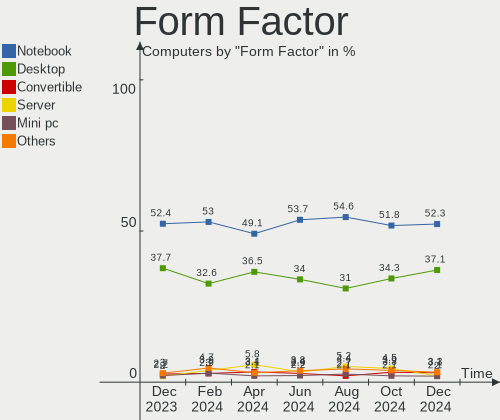

Ubuntu Hardware Trends
----------------------

A project to identify most popular hardware characteristics and track their change
over time based on data collected by Ubuntu users at https://Linux-Hardware.org.

Anyone can contribute to the study by uploading probes of their computers by
the [hw-probe](https://github.com/linuxhw/hw-probe) tool:

    sudo -E hw-probe -all -upload

This is a report for all computer types. See also reports for [desktops](/Dist/Ubuntu/Desktop/README.md) and [notebooks](/Dist/Ubuntu/Notebook/README.md).

Full-feature report is available here: https://linux-hardware.org/?view=trends

Period: May, 2020.

Contents
--------

- [ OS                       ](#os)
- [ OS Family                ](#os-family)
- [ Kernel                   ](#kernel)
- [ Kernel Family            ](#kernel-family)
- [ Kernel Major Ver.        ](#kernel-major-ver)
- [ Arch                     ](#arch)
- [ DE                       ](#de)
- [ Display Server           ](#display-server)
- [ Display Manager          ](#display-manager)
- [ OS Lang                  ](#os-lang)
- [ Boot Mode                ](#boot-mode)
- [ Filesystem               ](#filesystem)
- [ Part. scheme             ](#part-scheme)
- [ Dual Boot with Linux/BSD ](#dual-boot-with-linux/bsd)
- [ Dual Boot (Win)          ](#dual-boot-win)
- [ Country                  ](#country)
- [ City                     ](#city)
- [ Vendor                   ](#vendor)
- [ Model                    ](#model)
- [ Model Family             ](#model-family)
- [ MFG Year                 ](#mfg-year)
- [ Form Factor              ](#form-factor)
- [ Secure Boot              ](#secure-boot)
- [ Coreboot                 ](#coreboot)
- [ RAM Size                 ](#ram-size)
- [ RAM Used                 ](#ram-used)
- [ Drive Vendor             ](#drive-vendor)
- [ Drive Model              ](#drive-model)
- [ Drive Kind               ](#drive-kind)
- [ Drive Connector          ](#drive-connector)
- [ Drive Size               ](#drive-size)
- [ Space Total              ](#space-total)
- [ Space Used               ](#space-used)
- [ Malfunc. Drives          ](#malfunc-drives)
- [ Malfunc. Drive Vendor    ](#malfunc-drive-vendor)
- [ Malfunc. HDD Vendor      ](#malfunc-hdd-vendor)
- [ Malfunc. Drive Kind      ](#malfunc-drive-kind)
- [ Failed Drives            ](#failed-drives)
- [ Failed Drive Vendor      ](#failed-drive-vendor)
- [ Drive Status             ](#drive-status)
- [ Storage Vendor           ](#storage-vendor)
- [ Storage Model            ](#storage-model)
- [ Storage Kind             ](#storage-kind)
- [ CPU Vendor               ](#cpu-vendor)
- [ CPU Model                ](#cpu-model)
- [ CPU Model Family         ](#cpu-model-family)
- [ CPU Cores                ](#cpu-cores)
- [ CPU Sockets              ](#cpu-sockets)
- [ CPU Threads              ](#cpu-threads)
- [ CPU Op-Modes             ](#cpu-op-modes)
- [ CPU Microcode            ](#cpu-microcode)
- [ CPU Microarch            ](#cpu-microarch)
- [ GPU Vendor               ](#gpu-vendor)
- [ GPU Model                ](#gpu-model)
- [ GPU Combo                ](#gpu-combo)
- [ GPU Driver               ](#gpu-driver)
- [ GPU Memory               ](#gpu-memory)
- [ Monitor Vendor           ](#monitor-vendor)
- [ Monitor Model            ](#monitor-model)
- [ Monitor Resolution       ](#monitor-resolution)
- [ Monitor Diagonal         ](#monitor-diagonal)
- [ Monitor Width            ](#monitor-width)
- [ Aspect Ratio             ](#aspect-ratio)
- [ Monitor Area             ](#monitor-area)
- [ Pixel Density            ](#pixel-density)
- [ Multiple Monitors        ](#multiple-monitors)
- [ Net Controller Vendor    ](#net-controller-vendor)
- [ Net Controller Model     ](#net-controller-model)
- [ Wireless Vendor          ](#wireless-vendor)
- [ Wireless Model           ](#wireless-model)
- [ Ethernet Vendor          ](#ethernet-vendor)
- [ Ethernet Model           ](#ethernet-model)
- [ Net Controller Kind      ](#net-controller-kind)
- [ Used Controller          ](#used-controller)
- [ NICs                     ](#nics)
- [ Bluetooth Vendor         ](#bluetooth-vendor)
- [ Bluetooth Model          ](#bluetooth-model)
- [ Unsupported Devices      ](#unsupported-devices)
- [ Unsupported Device Types ](#unsupported-device-types)

OS
--

Installed operating systems

| Name         | Computers | Percent |
|--------------|-----------|---------|
| Ubuntu 20.04 | 2595      | 73.93%  |
| Ubuntu 18.04 | 658       | 18.75%  |
| Ubuntu 19.10 | 149       | 4.25%   |
| Ubuntu 16.04 | 69        | 1.97%   |
| Ubuntu 19.04 | 15        | 0.43%   |
| Ubuntu 20.10 | 9         | 0.26%   |
| Ubuntu       | 6         | 0.17%   |
| Ubuntu 18.10 | 5         | 0.14%   |
| Ubuntu 16.10 | 2         | 0.06%   |
| Ubuntu 17.04 | 1         | 0.03%   |
| Ubuntu 14.04 | 1         | 0.03%   |

OS Family
---------

OS without a version

| Name   | Computers | Percent |
|--------|-----------|---------|
| Ubuntu | 3510      | 100%    |

Kernel
------

Version of the Linux kernel

| Version                 | Computers | Percent |
|-------------------------|-----------|---------|
| 5.4.0-29-generic        | 1086      | 30.94%  |
| 5.4.0-31-generic        | 607       | 17.29%  |
| 5.4.0-28-generic        | 366       | 10.43%  |
| 5.3.0-51-generic        | 320       | 9.12%   |
| 5.4.0-26-generic        | 205       | 5.84%   |
| 5.4.0-33-generic        | 180       | 5.13%   |
| 4.15.0-99-generic       | 170       | 4.84%   |
| 5.3.0-53-generic        | 99        | 2.82%   |
| 4.15.0-101-generic      | 47        | 1.34%   |
| 5.3.0-46-generic        | 34        | 0.97%   |
| 5.4.0-29-lowlatency     | 32        | 0.91%   |
| 5.3.0-28-generic        | 26        | 0.74%   |
| 5.4.0-32-generic        | 17        | 0.48%   |
| 5.4.0-31-lowlatency     | 16        | 0.46%   |
| 4.15.0-96-generic       | 15        | 0.43%   |
| 5.4.0-1008-raspi        | 12        | 0.34%   |
| 5.3.0-55-generic        | 12        | 0.34%   |
| 5.4.0-30-generic        | 11        | 0.31%   |
| 4.4.0-178-generic       | 11        | 0.31%   |
| 5.4.0-34-generic        | 9         | 0.26%   |
| 5.4.0-28-lowlatency     | 8         | 0.23%   |
| 5.3.0-51-lowlatency     | 7         | 0.2%    |
| 4.15.0-91-generic       | 7         | 0.2%    |
| 4.15.0-45-generic       | 7         | 0.2%    |
| 4.15.0-29-generic       | 7         | 0.2%    |
| 5.6.0-1010-oem          | 6         | 0.17%   |
| 5.3.0-42-generic        | 6         | 0.17%   |
| 5.3.0-18-generic        | 6         | 0.17%   |
| 4.15.0-100-generic      | 6         | 0.17%   |
| 5.3.0-26-generic        | 5         | 0.14%   |
| 5.0.0-38-generic        | 5         | 0.14%   |
| 5.0.0-23-generic        | 5         | 0.14%   |
| 5.0.0-13-generic        | 5         | 0.14%   |
| 4.4.0-177-generic       | 5         | 0.14%   |
| 5.6.14-050614-generic   | 4         | 0.11%   |
| 5.4.0-21-generic        | 4         | 0.11%   |
| 5.3.0-52-generic        | 4         | 0.11%   |
| 5.3.0-40-generic        | 4         | 0.11%   |
| 4.4.0-179-generic       | 4         | 0.11%   |
| 4.15.0-99-lowlatency    | 4         | 0.11%   |
| 4.15.0-88-generic       | 4         | 0.11%   |
| 5.6.11-050611-generic   | 3         | 0.09%   |
| 5.4.0-26-lowlatency     | 3         | 0.09%   |
| 5.3.0-56-generic        | 3         | 0.09%   |
| 5.0.0-37-generic        | 3         | 0.09%   |
| 5.0.0-32-generic        | 3         | 0.09%   |
| 4.9.140-tegra           | 3         | 0.09%   |
| 4.18.0-15-generic       | 3         | 0.09%   |
| 4.18.0-10-generic       | 3         | 0.09%   |
| 4.15.0-72-generic       | 3         | 0.09%   |
| 4.15.0-58-generic       | 3         | 0.09%   |
| 4.15.0-50-generic       | 3         | 0.09%   |
| 4.15.0-20-generic       | 3         | 0.09%   |
| 4.15.0-1080-oem         | 3         | 0.09%   |
| 5.7.0-050700rc5-generic | 2         | 0.06%   |
| 5.6.7-050607-lowlatency | 2         | 0.06%   |
| 5.6.13-050613-generic   | 2         | 0.06%   |
| 5.4.0-7626-generic      | 2         | 0.06%   |
| 5.4.0-24-generic        | 2         | 0.06%   |
| 5.3.0-45-generic        | 2         | 0.06%   |

Kernel Family
-------------

Linux kernel without a distro release

| Version  | Computers | Percent |
|----------|-----------|---------|
| 5.4.0    | 2563      | 73.02%  |
| 5.3.0    | 535       | 15.24%  |
| 4.15.0   | 303       | 8.63%   |
| 5.0.0    | 29        | 0.83%   |
| 4.4.0    | 22        | 0.63%   |
| 5.6.0    | 10        | 0.28%   |
| 4.18.0   | 10        | 0.28%   |
| 5.7.0    | 4         | 0.11%   |
| 5.6.14   | 4         | 0.11%   |
| 5.6.11   | 3         | 0.09%   |
| 4.9.140  | 3         | 0.09%   |
| 5.6.7    | 2         | 0.06%   |
| 5.6.13   | 2         | 0.06%   |
| 5.5.0    | 2         | 0.06%   |
| 4.8.0    | 2         | 0.06%   |
| 4.19.105 | 2         | 0.06%   |
| 5.6.3    | 1         | 0.03%   |
| 5.5.19   | 1         | 0.03%   |
| 5.5.11   | 1         | 0.03%   |
| 5.4.42   | 1         | 0.03%   |
| 5.4.28   | 1         | 0.03%   |
| 5.4.10   | 1         | 0.03%   |
| 5.1.14   | 1         | 0.03%   |
| 5.1.1    | 1         | 0.03%   |
| 4.19.89  | 1         | 0.03%   |
| 4.19.104 | 1         | 0.03%   |
| 4.16.5   | 1         | 0.03%   |
| 4.16.0   | 1         | 0.03%   |
| 4.15.18  | 1         | 0.03%   |
| 4.10.0   | 1         | 0.03%   |

Kernel Major Ver.
-----------------

Linux kernel major version

| Version | Computers | Percent |
|---------|-----------|---------|
| 5.4     | 2566      | 73.11%  |
| 5.3     | 535       | 15.24%  |
| 4.15    | 304       | 8.66%   |
| 5.0     | 29        | 0.83%   |
| 5.6     | 22        | 0.63%   |
| 4.4     | 22        | 0.63%   |
| 4.18    | 10        | 0.28%   |
| 5.7     | 4         | 0.11%   |
| 5.5     | 4         | 0.11%   |
| 4.19    | 4         | 0.11%   |
| 4.9     | 3         | 0.09%   |
| 5.1     | 2         | 0.06%   |
| 4.8     | 2         | 0.06%   |
| 4.16    | 2         | 0.06%   |
| 4.10    | 1         | 0.03%   |

Arch
----

OS architecture (x86_64, i586, etc.)

| Name    | Computers | Percent |
|---------|-----------|---------|
| x86_64  | 3383      | 96.38%  |
| i686    | 106       | 3.02%   |
| aarch64 | 21        | 0.6%    |

DE
--

Desktop Environment

| Name            | Computers | Percent |
|-----------------|-----------|---------|
| GNOME           | 2726      | 77.66%  |
| XFCE            | 244       | 6.95%   |
| Unknown         | 158       | 4.5%    |
| KDE             | 76        | 2.17%   |
| Unity           | 68        | 1.94%   |
| MATE            | 48        | 1.37%   |
| KDE5            | 34        | 0.97%   |
| LXQt            | 30        | 0.85%   |
| Budgie          | 30        | 0.85%   |
| X-Cinnamon      | 23        | 0.66%   |
| GNOME Flashback | 21        | 0.6%    |
| Deepin          | 21        | 0.6%    |
| LXDE            | 19        | 0.54%   |
| Cinnamon        | 4         | 0.11%   |
| GNOME Classic   | 3         | 0.09%   |
| xubuntu         | 1         | 0.03%   |
| Openbox         | 1         | 0.03%   |
| i3              | 1         | 0.03%   |
| GNUstep         | 1         | 0.03%   |
| Core            | 1         | 0.03%   |

Display Server
--------------

X11 or Wayland

| Name    | Computers | Percent |
|---------|-----------|---------|
| X11     | 3348      | 95.38%  |
| Unknown | 84        | 2.39%   |
| Wayland | 68        | 1.94%   |
| Tty     | 10        | 0.28%   |

Display Manager
---------------

SDDM, LightDM, etc.

| Name    | Computers | Percent |
|---------|-----------|---------|
| Unknown | 3222      | 91.79%  |
| GDM     | 180       | 5.13%   |
| LightDM | 71        | 2.02%   |
| SDDM    | 36        | 1.03%   |
| NODM    | 1         | 0.03%   |

OS Lang
-------

Language

| Lang    | Computers | Percent |
|---------|-----------|---------|
| en_US   | 1292      | 36.81%  |
| de_DE   | 320       | 9.12%   |
| en_GB   | 223       | 6.35%   |
| it_IT   | 176       | 5.01%   |
| fr_FR   | 175       | 4.99%   |
| pt_BR   | 170       | 4.84%   |
| ru_RU   | 114       | 3.25%   |
| es_ES   | 104       | 2.96%   |
| en_CA   | 101       | 2.88%   |
| en_IN   | 92        | 2.62%   |
| pl_PL   | 64        | 1.82%   |
| en_AU   | 56        | 1.6%    |
| C       | 55        | 1.57%   |
| nl_NL   | 44        | 1.25%   |
| es_AR   | 32        | 0.91%   |
| ja_JP   | 30        | 0.85%   |
| pt_PT   | 23        | 0.66%   |
| hu_HU   | 22        | 0.63%   |
| en_ZA   | 22        | 0.63%   |
| cs_CZ   | 22        | 0.63%   |
| de_AT   | 18        | 0.51%   |
| tr_TR   | 17        | 0.48%   |
| es_MX   | 16        | 0.46%   |
| el_GR   | 16        | 0.46%   |
| zh_CN   | 15        | 0.43%   |
| ru_UA   | 15        | 0.43%   |
| es_CL   | 15        | 0.43%   |
| Unknown | 15        | 0.43%   |
| ca_ES   | 14        | 0.4%    |
| de_CH   | 13        | 0.37%   |
| sv_SE   | 12        | 0.34%   |
| ko_KR   | 12        | 0.34%   |
| fr_BE   | 12        | 0.34%   |
| uk_UA   | 10        | 0.28%   |
| es_PE   | 10        | 0.28%   |
| es_CO   | 10        | 0.28%   |
| en_NZ   | 10        | 0.28%   |
| ro_RO   | 9         | 0.26%   |
| fr_CA   | 9         | 0.26%   |
| nb_NO   | 7         | 0.2%    |
| en_SG   | 7         | 0.2%    |
| en_PH   | 7         | 0.2%    |
| en_IE   | 6         | 0.17%   |
| zh_TW   | 5         | 0.14%   |
| sl_SI   | 5         | 0.14%   |
| nl_BE   | 5         | 0.14%   |
| es_UY   | 5         | 0.14%   |
| en_IL   | 5         | 0.14%   |
| en_HK   | 5         | 0.14%   |
| da_DK   | 5         | 0.14%   |
| bg_BG   | 5         | 0.14%   |
| id_ID   | 4         | 0.11%   |
| fi_FI   | 4         | 0.11%   |
| es_VE   | 4         | 0.11%   |
| es_EC   | 4         | 0.11%   |
| hr_HR   | 3         | 0.09%   |
| es_DO   | 3         | 0.09%   |
| ar_EG   | 3         | 0.09%   |
| sr_RS   | 2         | 0.06%   |
| fr_CH   | 2         | 0.06%   |

Boot Mode
---------

EFI or BIOS

| Mode | Computers | Percent |
|------|-----------|---------|
| BIOS | 2133      | 60.77%  |
| EFI  | 1377      | 39.23%  |

Filesystem
----------

Type of filesystem

| Type     | Computers | Percent |
|----------|-----------|---------|
| Ext4     | 3285      | 93.59%  |
| Overlay  | 115       | 3.28%   |
| Zfs      | 56        | 1.6%    |
| Btrfs    | 19        | 0.54%   |
| Ext2     | 11        | 0.31%   |
| Xfs      | 10        | 0.28%   |
| Ext3     | 9         | 0.26%   |
| Aufs     | 3         | 0.09%   |
| SquasXfs | 1         | 0.03%   |
| Reiserfs | 1         | 0.03%   |

Part. scheme
------------

Scheme of partitioning

| Type    | Computers | Percent |
|---------|-----------|---------|
| Unknown | 3388      | 96.52%  |
| GPT     | 81        | 2.31%   |
| MBR     | 41        | 1.17%   |

Dual Boot with Linux/BSD
------------------------

Hosting more than one Linux/BSD

| Dual boot | Computers | Percent |
|-----------|-----------|---------|
| No        | 3078      | 87.69%  |
| Yes       | 432       | 12.31%  |

Dual Boot (Win)
---------------

Hosting Linux and Windows

| Dual boot | Computers | Percent |
|-----------|-----------|---------|
| No        | 2095      | 59.69%  |
| Yes       | 1415      | 40.31%  |

Country
-------

Geographic location (country)

| Country            | Computers | Percent |
|--------------------|-----------|---------|
| USA                | 644       | 18.35%  |
| Germany            | 382       | 10.88%  |
| Brazil             | 214       | 6.1%    |
| UK                 | 201       | 5.73%   |
| Italy              | 198       | 5.64%   |
| France             | 190       | 5.41%   |
| Spain              | 127       | 3.62%   |
| Russia             | 127       | 3.62%   |
| Canada             | 118       | 3.36%   |
| India              | 100       | 2.85%   |
| Poland             | 82        | 2.34%   |
| Netherlands        | 70        | 1.99%   |
| Australia          | 61        | 1.74%   |
| Ukraine            | 53        | 1.51%   |
| Argentina          | 47        | 1.34%   |
| Greece             | 41        | 1.17%   |
| Austria            | 36        | 1.03%   |
| Portugal           | 35        | 1%      |
| Japan              | 33        | 0.94%   |
| Romania            | 32        | 0.91%   |
| Czech Republic     | 32        | 0.91%   |
| Switzerland        | 31        | 0.88%   |
| Belgium            | 30        | 0.85%   |
| Turkey             | 29        | 0.83%   |
| Sweden             | 29        | 0.83%   |
| Hungary            | 29        | 0.83%   |
| South Africa       | 27        | 0.77%   |
| Mexico             | 26        | 0.74%   |
| Chile              | 20        | 0.57%   |
| Colombia           | 19        | 0.54%   |
| Serbia             | 18        | 0.51%   |
| China              | 18        | 0.51%   |
| Bulgaria           | 18        | 0.51%   |
| Norway             | 17        | 0.48%   |
| Indonesia          | 16        | 0.46%   |
| Korea, Republic of | 15        | 0.43%   |
| Peru               | 14        | 0.4%    |
| Egypt              | 14        | 0.4%    |
| Denmark            | 13        | 0.37%   |
| New Zealand        | 11        | 0.31%   |
| Ireland            | 11        | 0.31%   |
| Iran               | 11        | 0.31%   |
| Croatia            | 11        | 0.31%   |
| Thailand           | 9         | 0.26%   |
| Taiwan             | 9         | 0.26%   |
| Slovenia           | 9         | 0.26%   |
| Singapore          | 9         | 0.26%   |
| Israel             | 9         | 0.26%   |
| Uruguay            | 8         | 0.23%   |
| Finland            | 8         | 0.23%   |
| UAE                | 7         | 0.2%    |
| Philippines        | 7         | 0.2%    |
| Pakistan           | 7         | 0.2%    |
| Kenya              | 7         | 0.2%    |
| Hong Kong          | 7         | 0.2%    |
| Bangladesh         | 7         | 0.2%    |
| Algeria            | 7         | 0.2%    |
| Venezuela          | 6         | 0.17%   |
| Slovakia           | 6         | 0.17%   |
| Morocco            | 6         | 0.17%   |

City
----

Geographic location (city)

| City              | Computers | Percent |
|-------------------|-----------|---------|
| Moscow            | 38        | 1.08%   |
| Berlin            | 35        | 1%      |
| Rome              | 29        | 0.83%   |
| São Paulo        | 27        | 0.77%   |
| Paris             | 27        | 0.77%   |
| Rio de Janeiro    | 24        | 0.68%   |
| Madrid            | 24        | 0.68%   |
| Hamburg           | 23        | 0.66%   |
| Barcelona         | 22        | 0.63%   |
| Vienna            | 21        | 0.6%    |
| Athens            | 21        | 0.6%    |
| Warsaw            | 19        | 0.54%   |
| Budapest          | 18        | 0.51%   |
| Sydney            | 17        | 0.48%   |
| Kyiv              | 17        | 0.48%   |
| Toronto           | 16        | 0.46%   |
| Milan             | 16        | 0.46%   |
| Prague            | 15        | 0.43%   |
| Munich            | 13        | 0.37%   |
| Buenos Aires      | 13        | 0.37%   |
| Sofia             | 12        | 0.34%   |
| Santiago          | 12        | 0.34%   |
| Montreal          | 12        | 0.34%   |
| London            | 12        | 0.34%   |
| Turin             | 11        | 0.31%   |
| Leipzig           | 11        | 0.31%   |
| Chennai           | 11        | 0.31%   |
| Bengaluru         | 11        | 0.31%   |
| Pune              | 10        | 0.28%   |
| Lima              | 10        | 0.28%   |
| Chicago           | 10        | 0.28%   |
| Belo Horizonte    | 10        | 0.28%   |
| St Petersburg     | 9         | 0.26%   |
| Lisbon            | 9         | 0.26%   |
| Frankfurt am Main | 9         | 0.26%   |
| Dallas            | 9         | 0.26%   |
| Cairo             | 9         | 0.26%   |
| Stuttgart         | 8         | 0.23%   |
| Nuremberg         | 8         | 0.23%   |
| Johannesburg      | 8         | 0.23%   |
| Curitiba          | 8         | 0.23%   |
| Calgary           | 8         | 0.23%   |
| Brisbane          | 8         | 0.23%   |
| Atlanta           | 8         | 0.23%   |
| Tucson            | 7         | 0.2%    |
| San Jose          | 7         | 0.2%    |
| Phoenix           | 7         | 0.2%    |
| New Delhi         | 7         | 0.2%    |
| Miami             | 7         | 0.2%    |
| Dublin            | 7         | 0.2%    |
| Denver            | 7         | 0.2%    |
| Bucharest         | 7         | 0.2%    |
| Brasília         | 7         | 0.2%    |
| Bogotá           | 7         | 0.2%    |
| Belgrade          | 7         | 0.2%    |
| Amsterdam         | 7         | 0.2%    |
| Zagreb            | 6         | 0.17%   |
| York              | 6         | 0.17%   |
| Thessaloniki      | 6         | 0.17%   |
| Samara            | 6         | 0.17%   |

Vendor
------

Motherboard manufacturer

| Name                           | Computers | Percent |
|--------------------------------|-----------|---------|
| ASUSTek Computer               | 609       | 17.35%  |
| Hewlett-Packard                | 549       | 15.64%  |
| Dell                           | 488       | 13.9%   |
| Lenovo                         | 416       | 11.85%  |
| Gigabyte Technology            | 248       | 7.07%   |
| Acer                           | 182       | 5.19%   |
| MSI                            | 172       | 4.9%    |
| ASRock                         | 101       | 2.88%   |
| Toshiba                        | 85        | 2.42%   |
| Apple                          | 85        | 2.42%   |
| Intel                          | 70        | 1.99%   |
| Samsung Electronics            | 58        | 1.65%   |
| Sony                           | 43        | 1.23%   |
| Fujitsu                        | 33        | 0.94%   |
| Packard Bell                   | 21        | 0.6%    |
| Unknown                        | 19        | 0.54%   |
| Raspberry Pi Foundation        | 17        | 0.48%   |
| Positivo                       | 17        | 0.48%   |
| Medion                         | 17        | 0.48%   |
| Foxconn                        | 17        | 0.48%   |
| Fujitsu Siemens                | 16        | 0.46%   |
| Biostar                        | 16        | 0.46%   |
| ECS                            | 14        | 0.4%    |
| HUAWEI                         | 12        | 0.34%   |
| Supermicro                     | 11        | 0.31%   |
| Pegatron                       | 11        | 0.31%   |
| Notebook                       | 8         | 0.23%   |
| Microsoft                      | 8         | 0.23%   |
| Gateway                        | 8         | 0.23%   |
| Clevo                          | 7         | 0.2%    |
| eMachines                      | 6         | 0.17%   |
| AMI                            | 6         | 0.17%   |
| Alienware                      | 6         | 0.17%   |
| Timi                           | 5         | 0.14%   |
| Semp Toshiba                   | 5         | 0.14%   |
| LG Electronics                 | 5         | 0.14%   |
| Google                         | 5         | 0.14%   |
| Chuwi                          | 5         | 0.14%   |
| ZOTAC                          | 4         | 0.11%   |
| Nvidia                         | 4         | 0.11%   |
| IBM                            | 4         | 0.11%   |
| Exo                            | 4         | 0.11%   |
| EVGA                           | 4         | 0.11%   |
| Shuttle                        | 3         | 0.09%   |
| PCWare                         | 3         | 0.09%   |
| Panasonic                      | 3         | 0.09%   |
| Itautec                        | 3         | 0.09%   |
| Huanan                         | 3         | 0.09%   |
| TUXEDO                         | 2         | 0.06%   |
| Teclast                        | 2         | 0.06%   |
| System76                       | 2         | 0.06%   |
| Standard                       | 2         | 0.06%   |
| Razer                          | 2         | 0.06%   |
| NEC Computers                  | 2         | 0.06%   |
| Mediacom                       | 2         | 0.06%   |
| Matsushita Electric Industrial | 2         | 0.06%   |
| Linx                           | 2         | 0.06%   |
| GPD                            | 2         | 0.06%   |
| Dixonsxp                       | 2         | 0.06%   |
| AOpen                          | 2         | 0.06%   |

Model
-----

Motherboard model

| Name                               | Computers | Percent |
|------------------------------------|-----------|---------|
| Unknown                            | 38        | 1.08%   |
| ASUS All Series                    | 28        | 0.8%    |
| HP Notebook                        | 20        | 0.57%   |
| HP Pavilion dv6                    | 17        | 0.48%   |
| HP Pavilion g6                     | 15        | 0.43%   |
| RPi Raspberry Pi 4 Model B Rev 1.1 | 13        | 0.37%   |
| Dell XPS 15 7590                   | 12        | 0.34%   |
| HP Pavilion 15                     | 11        | 0.31%   |
| HP Pavilion dv7                    | 8         | 0.23%   |
| Gigabyte B450M DS3H                | 8         | 0.23%   |
| Dell XPS 13 9360                   | 8         | 0.23%   |
| Dell OptiPlex 7010                 | 8         | 0.23%   |
| ASUS PRIME A320M-K                 | 8         | 0.23%   |
| MSI MS-7C02                        | 7         | 0.2%    |
| HP Compaq Elite 8300 SFF           | 7         | 0.2%    |
| Dell OptiPlex 780                  | 7         | 0.2%    |
| Dell Latitude E6420                | 7         | 0.2%    |
| Dell Latitude E6410                | 7         | 0.2%    |
| Dell Inspiron 5570                 | 7         | 0.2%    |
| ASUS M5A78L-M/USB3                 | 7         | 0.2%    |
| Lenovo V330-15IKB 81AX             | 6         | 0.17%   |
| Lenovo IdeaPad 330-15IKB 81DE      | 6         | 0.17%   |
| HP Presario CQ57                   | 6         | 0.17%   |
| HP Laptop 15-da0xxx                | 6         | 0.17%   |
| HP EliteBook 8460p                 | 6         | 0.17%   |
| HP EliteBook 840 G2                | 6         | 0.17%   |
| HP 2000                            | 6         | 0.17%   |
| Gigabyte GA-78LMT-USB3 6.0         | 6         | 0.17%   |
| Gigabyte A320M-S2H                 | 6         | 0.17%   |
| Dell OptiPlex 9020                 | 6         | 0.17%   |
| Dell OptiPlex 9010                 | 6         | 0.17%   |
| Dell Latitude E7450                | 6         | 0.17%   |
| Dell Inspiron 3521                 | 6         | 0.17%   |
| ASRock B450M Pro4                  | 6         | 0.17%   |
| Apple MacBookPro8,2                | 6         | 0.17%   |
| Toshiba Satellite L500             | 5         | 0.14%   |
| Supermicro Super Server            | 5         | 0.14%   |
| MSI MS-7A36                        | 5         | 0.14%   |
| MSI MS-7850                        | 5         | 0.14%   |
| MSI MS-7693                        | 5         | 0.14%   |
| Intel NUC8i3BEH                    | 5         | 0.14%   |
| HP Pavilion Notebook               | 5         | 0.14%   |
| HP Pavilion dv4                    | 5         | 0.14%   |
| HP Laptop 15-bw0xx                 | 5         | 0.14%   |
| HP EliteBook 8570w                 | 5         | 0.14%   |
| HP Compaq 8200 Elite SFF PC        | 5         | 0.14%   |
| HP 15 Notebook PC                  | 5         | 0.14%   |
| HP 15                              | 5         | 0.14%   |
| Gigabyte X470 AORUS ULTRA GAMING   | 5         | 0.14%   |
| Dell XPS 15 9570                   | 5         | 0.14%   |
| Dell OptiPlex 760                  | 5         | 0.14%   |
| Dell OptiPlex 755                  | 5         | 0.14%   |
| Dell Latitude 5400                 | 5         | 0.14%   |
| Dell Inspiron 5567                 | 5         | 0.14%   |
| Dell G3 3579                       | 5         | 0.14%   |
| ASUS X541SA                        | 5         | 0.14%   |
| ASUS M5A78L-M PLUS/USB3            | 5         | 0.14%   |
| Toshiba Satellite A200             | 4         | 0.11%   |
| RPi Raspberry Pi 4 Model B Rev 1.2 | 4         | 0.11%   |
| Positivo MOBILE                    | 4         | 0.11%   |

Model Family
------------

Motherboard model prefix

| Name                   | Computers | Percent |
|------------------------|-----------|---------|
| Lenovo ThinkPad        | 190       | 5.41%   |
| Dell Inspiron          | 144       | 4.1%    |
| Acer Aspire            | 128       | 3.65%   |
| Dell Latitude          | 118       | 3.36%   |
| HP Pavilion            | 109       | 3.11%   |
| Lenovo IdeaPad         | 76        | 2.17%   |
| HP EliteBook           | 74        | 2.11%   |
| Dell OptiPlex          | 74        | 2.11%   |
| Toshiba Satellite      | 69        | 1.97%   |
| HP ProBook             | 66        | 1.88%   |
| HP Compaq              | 62        | 1.77%   |
| Dell XPS               | 52        | 1.48%   |
| ASUS PRIME             | 52        | 1.48%   |
| Unknown                | 38        | 1.08%   |
| Dell Precision         | 36        | 1.03%   |
| HP Laptop              | 34        | 0.97%   |
| Dell Vostro            | 31        | 0.88%   |
| ASUS All               | 28        | 0.8%    |
| ASUS VivoBook          | 25        | 0.71%   |
| Lenovo ThinkCentre     | 23        | 0.66%   |
| HP ENVY                | 21        | 0.6%    |
| HP Notebook            | 20        | 0.57%   |
| ASUS TUF               | 19        | 0.54%   |
| ASUS ROG               | 18        | 0.51%   |
| ASUS M5A78L-M          | 18        | 0.51%   |
| RPi Raspberry          | 17        | 0.48%   |
| Lenovo Yoga            | 17        | 0.48%   |
| ASUS P8H61-M           | 15        | 0.43%   |
| Fujitsu ESPRIMO        | 14        | 0.4%    |
| Acer Swift             | 14        | 0.4%    |
| HP Presario            | 12        | 0.34%   |
| Gigabyte B450          | 12        | 0.34%   |
| HP 15                  | 11        | 0.31%   |
| Gigabyte B450M         | 11        | 0.31%   |
| Apple MacBookPro8      | 11        | 0.31%   |
| Packard Bell EasyNote  | 10        | 0.28%   |
| HP 250                 | 10        | 0.28%   |
| Fujitsu LIFEBOOK       | 10        | 0.28%   |
| HP Spectre             | 9         | 0.26%   |
| Gigabyte GA-78LMT-USB3 | 9         | 0.26%   |
| ASUS P8Z77-V           | 9         | 0.26%   |
| Microsoft Surface      | 8         | 0.23%   |
| Lenovo IdeaCentre      | 8         | 0.23%   |
| HP 255                 | 8         | 0.23%   |
| Dell Studio            | 8         | 0.23%   |
| Dell PowerEdge         | 8         | 0.23%   |
| ASUS ZenBook           | 8         | 0.23%   |
| ASUS SABERTOOTH        | 8         | 0.23%   |
| ASUS P8Z68-V           | 8         | 0.23%   |
| ASRock Z77             | 8         | 0.23%   |
| Acer Nitro             | 8         | 0.23%   |
| MSI MS-7C02            | 7         | 0.2%    |
| HP ZBook               | 7         | 0.2%    |
| Dell G3                | 7         | 0.2%    |
| ASUS Maximus           | 7         | 0.2%    |
| ASRock B450M           | 7         | 0.2%    |
| Acer TravelMate        | 7         | 0.2%    |
| Medion AKOYA           | 6         | 0.17%   |
| Lenovo V330-15IKB      | 6         | 0.17%   |
| Lenovo ThinkBook       | 6         | 0.17%   |

MFG Year
--------

Motherboard manufacture year

| Year    | Computers | Percent |
|---------|-----------|---------|
| 2019    | 668       | 19.03%  |
| 2018    | 351       | 10%     |
| 2013    | 283       | 8.06%   |
| 2012    | 280       | 7.98%   |
| 2011    | 250       | 7.12%   |
| 2010    | 217       | 6.18%   |
| 2014    | 206       | 5.87%   |
| 2016    | 200       | 5.7%    |
| 2015    | 198       | 5.64%   |
| 2009    | 185       | 5.27%   |
| 2020    | 182       | 5.19%   |
| 2017    | 177       | 5.04%   |
| 2008    | 134       | 3.82%   |
| 2007    | 90        | 2.56%   |
| 2006    | 35        | 1%      |
| Unknown | 27        | 0.77%   |
| 2005    | 19        | 0.54%   |
| 2002    | 3         | 0.09%   |
| 2004    | 2         | 0.06%   |
| 2003    | 2         | 0.06%   |
| 2001    | 1         | 0.03%   |

Form Factor
-----------

Physical design of the computer

| Name           | Computers | Percent |
|----------------|-----------|---------|
| Notebook       | 1931      | 55.01%  |
| Desktop        | 1353      | 38.55%  |
| Mini pc        | 52        | 1.48%   |
| Convertible    | 51        | 1.45%   |
| All in one     | 47        | 1.34%   |
| Server         | 28        | 0.8%    |
| Tablet         | 27        | 0.77%   |
| System on chip | 21        | 0.6%    |

Secure Boot
-----------

Enabled or disabled

| State    | Computers | Percent |
|----------|-----------|---------|
| Disabled | 3187      | 90.8%   |
| Enabled  | 323       | 9.2%    |

Coreboot
--------

Have coreboot on board

| Used | Computers | Percent |
|------|-----------|---------|
| No   | 3503      | 99.8%   |
| Yes  | 7         | 0.2%    |

RAM Size
--------

Total RAM memory

| Size in GB      | Computers | Percent |
|-----------------|-----------|---------|
| 3.01-4.0        | 885       | 25.21%  |
| 4.01-8.0        | 854       | 24.33%  |
| 8.01-16.0       | 617       | 17.58%  |
| 16.01-24.0      | 594       | 16.92%  |
| 1.01-2.0        | 208       | 5.93%   |
| 32.01-64.0      | 184       | 5.24%   |
| 2.01-3.0        | 60        | 1.71%   |
| 64.01-256.0     | 39        | 1.11%   |
| 24.01-32.0      | 34        | 0.97%   |
| 0.01-1.0        | 34        | 0.97%   |
| More than 256.0 | 1         | 0.03%   |

RAM Used
--------

Used RAM memory

| Used GB     | Computers | Percent |
|-------------|-----------|---------|
| 1.01-2.0    | 1630      | 46.44%  |
| 2.01-3.0    | 926       | 26.38%  |
| 3.01-4.0    | 352       | 10.03%  |
| 4.01-8.0    | 340       | 9.69%   |
| 0.01-1.0    | 180       | 5.13%   |
| 8.01-16.0   | 75        | 2.14%   |
| 16.01-24.0  | 4         | 0.11%   |
| 32.01-64.0  | 1         | 0.03%   |
| 24.01-32.0  | 1         | 0.03%   |
| 64.01-256.0 | 1         | 0.03%   |

Drive Vendor
------------

Hard drive vendors

| Vendor              | Computers | Drives | Percent |
|---------------------|-----------|--------|---------|
| Seagate             | 878       | 1017   | 19.73%  |
| WDC                 | 836       | 1000   | 18.78%  |
| Samsung Electronics | 553       | 596    | 12.42%  |
| Toshiba             | 374       | 381    | 8.4%    |
| Hitachi             | 238       | 252    | 5.35%   |
| Kingston            | 199       | 210    | 4.47%   |
| Unknown             | 188       | 211    | 4.22%   |
| SanDisk             | 179       | 185    | 4.02%   |
| Crucial             | 162       | 170    | 3.64%   |
| HGST                | 119       | 119    | 2.67%   |
| Intel               | 64        | 68     | 1.44%   |
| A-DATA Technology   | 58        | 59     | 1.3%    |
| MAXTOR              | 40        | 42     | 0.9%    |
| Micron Technology   | 36        | 36     | 0.81%   |
| SK Hynix            | 34        | 34     | 0.76%   |
| HL-DT-ST            | 33        | 29     | 0.74%   |
| Fujitsu             | 31        | 31     | 0.7%    |
| China               | 30        | 30     | 0.67%   |
| OCZ                 | 25        | 25     | 0.56%   |
| Intenso             | 21        | 22     | 0.47%   |
| Apple               | 21        | 21     | 0.47%   |
| PNY                 | 20        | 20     | 0.45%   |
| SPCC                | 18        | 18     | 0.4%    |
| PATRIOT             | 18        | 20     | 0.4%    |
| LITEON              | 18        | 18     | 0.4%    |
| Transcend           | 17        | 17     | 0.38%   |
| LITEONIT            | 14        | 15     | 0.31%   |
| JMicron             | 13        | 13     | 0.29%   |
| GOODRAM             | 13        | 13     | 0.29%   |
| Generic             | 11        | 11     | 0.25%   |
| Apacer              | 11        | 11     | 0.25%   |
| Corsair             | 10        | 10     | 0.22%   |
| ASMT                | 10        | 11     | 0.22%   |
| Hewlett-Packard     | 9         | 10     | 0.2%    |
| PLEXTOR             | 8         | 8      | 0.18%   |
| KingSpec            | 6         | 6      | 0.13%   |
| Team                | 5         | 5      | 0.11%   |
| SABRENT             | 5         | 6      | 0.11%   |
| Phison              | 5         | 5      | 0.11%   |
| KingDian            | 5         | 5      | 0.11%   |
| TO Exter            | 4         | 4      | 0.09%   |
| Mushkin             | 4         | 4      | 0.09%   |
| LaCie               | 4         | 6      | 0.09%   |
| Gigabyte Technology | 4         | 4      | 0.09%   |
| FORESEE             | 4         | 4      | 0.09%   |
| Vaseky              | 3         | 3      | 0.07%   |
| Netac               | 3         | 3      | 0.07%   |
| Lexar               | 3         | 3      | 0.07%   |
| IBM/Hitachi         | 3         | 3      | 0.07%   |
| DREVO               | 3         | 3      | 0.07%   |
| Dogfish             | 3         | 3      | 0.07%   |
| TCSUNBOW            | 2         | 2      | 0.04%   |
| StoreJet            | 2         | 2      | 0.04%   |
| sobetter            | 2         | 2      | 0.04%   |
| Smartbuy            | 2         | 2      | 0.04%   |
| OCZ-VERTEX2         | 2         | 2      | 0.04%   |
| MicroData           | 2         | 2      | 0.04%   |
| MARVELL             | 2         | 2      | 0.04%   |
| HyperX              | 2         | 2      | 0.04%   |
| HUAWEI              | 2         | 2      | 0.04%   |

Drive Model
-----------

Hard drive models

| Model                        | Computers | Percent |
|------------------------------|-----------|---------|
| ST500DM002-1BD142 500GB      | 59        | 1.21%   |
| MMC Card  32GB               | 58        | 1.19%   |
| ST1000LM035-1RK172 1TB       | 54        | 1.11%   |
| MQ01ABF050 500GB             | 51        | 1.05%   |
| ST1000LM024 HN-M101MBB 1TB   | 49        | 1%      |
| SSD 850 EVO 250GB            | 49        | 1%      |
| SA400S37240G 240GB SSD       | 46        | 0.94%   |
| MQ01ABD100 1TB               | 40        | 0.82%   |
| MMC Card  64GB               | 38        | 0.78%   |
| DT01ACA100 1TB               | 37        | 0.76%   |
| ST9500325AS 500GB            | 34        | 0.7%    |
| SSD 860 EVO 500GB            | 34        | 0.7%    |
| SV300S37A120G 120GB SSD      | 31        | 0.64%   |
| SSD 850 EVO 500GB            | 31        | 0.64%   |
| MQ04ABF100 1TB               | 31        | 0.64%   |
| CT500MX500SSD1 500GB         | 29        | 0.59%   |
| ST1000DM010-2EP102 1TB       | 28        | 0.57%   |
| ST500LT012-1DG142 500GB      | 27        | 0.55%   |
| SA400S37120G 120GB SSD       | 26        | 0.53%   |
| DVDRAM GUE1N 3GB             | 26        | 0.53%   |
| HTS545050A7E380 500GB        | 25        | 0.51%   |
| ST2000DM008-2FR102 2TB       | 24        | 0.49%   |
| HTS721010A9E630 1TB          | 24        | 0.49%   |
| HTS541010A9E680 1TB          | 22        | 0.45%   |
| SA400S37480G 480GB SSD       | 21        | 0.43%   |
| SSD 860 EVO 1TB              | 20        | 0.41%   |
| SD/MMC/MS PRO 32GB           | 20        | 0.41%   |
| MMC Card  128GB              | 20        | 0.41%   |
| SSD 840 EVO 250GB            | 19        | 0.39%   |
| WD10EZEX-00BN5A0 1TB         | 18        | 0.37%   |
| ST1000DM003-1CH162 1TB       | 18        | 0.37%   |
| HTS725050A7E630 500GB        | 18        | 0.37%   |
| ST3500418AS 500GB            | 17        | 0.35%   |
| SSD 860 EVO 250GB            | 17        | 0.35%   |
| CT240BX500SSD1 240GB         | 17        | 0.35%   |
| WD10EZEX-08WN4A0 1TB         | 16        | 0.33%   |
| ST2000DM001-1ER164 2TB       | 16        | 0.33%   |
| SDSSDA120G 120GB             | 16        | 0.33%   |
| HTS547575A9E384 752GB        | 16        | 0.33%   |
| ST500LM012 HN-M500MBB 500GB  | 15        | 0.31%   |
| SSD PLUS 240GB               | 15        | 0.31%   |
| MMC Card  16GB               | 15        | 0.31%   |
| Expansion 2TB                | 15        | 0.31%   |
| ST31000528AS 1TB             | 14        | 0.29%   |
| HTS545050A7E680 500GB        | 14        | 0.29%   |
| HM321HI 320GB                | 14        | 0.29%   |
| DT01ACA200 2TB               | 14        | 0.29%   |
| WDS120G2G0A-00JH30 120GB SSD | 13        | 0.27%   |
| ST1000DM003-1ER162 1TB       | 13        | 0.27%   |
| SSD 850 PRO 256GB            | 13        | 0.27%   |
| SV300S37A240G 240GB SSD      | 12        | 0.25%   |
| ST9500420AS 500GB            | 12        | 0.25%   |
| ST500LT012-9WS142 500GB      | 12        | 0.25%   |
| ST500LM021-1KJ152 500GB      | 12        | 0.25%   |
| ST3160815AS 160GB            | 12        | 0.25%   |
| ST2000DM006-2DM164 2TB       | 12        | 0.25%   |
| ST2000DM001-1CH164 2TB       | 12        | 0.25%   |
| ST1000LM048-2E7172 1TB       | 12        | 0.25%   |
| ST1000DM003-9YN162 1TB       | 12        | 0.25%   |
| SSD 860 QVO 1TB              | 12        | 0.25%   |

Drive Kind
----------

HDD or SSD

| Kind    | Computers | Drives | Percent |
|---------|-----------|--------|---------|
| HDD     | 2230      | 2864   | 55.72%  |
| SSD     | 1378      | 1592   | 34.43%  |
| MMC     | 157       | 177    | 3.92%   |
| Unknown | 146       | 154    | 3.65%   |
| NVMe    | 91        | 95     | 2.27%   |

Drive Connector
---------------

SATA, SAS, NVMe, etc.

| Type | Computers | Drives | Percent |
|------|-----------|--------|---------|
| SATA | 3059      | 4386   | 87.13%  |
| SAS  | 204       | 224    | 5.81%   |
| MMC  | 157       | 177    | 4.47%   |
| NVMe | 91        | 95     | 2.59%   |

Drive Size
----------

Size of hard drive

| Size in TB | Computers | Drives | Percent |
|------------|-----------|--------|---------|
| 0.01-0.5   | 2517      | 3197   | 62.39%  |
| 0.51-1.0   | 1071      | 1168   | 26.55%  |
| 1.01-2.0   | 271       | 310    | 6.72%   |
| 2.01-3.0   | 73        | 85     | 1.81%   |
| 3.01-4.0   | 56        | 68     | 1.39%   |
| 4.01-10.0  | 40        | 48     | 0.99%   |
| 10.01-20.0 | 3         | 3      | 0.07%   |
| Unknown    | 2         | 2      | 0.05%   |
| 0          | 1         | 1      | 0.02%   |

Space Total
-----------

Amount of disk space available on the file system

| Size in GB     | Computers | Percent |
|----------------|-----------|---------|
| 101-250        | 1062      | 30.26%  |
| 251-500        | 888       | 25.3%   |
| 501-1000       | 495       | 14.1%   |
| 51-100         | 296       | 8.43%   |
| 1001-2000      | 211       | 6.01%   |
| 21-50          | 179       | 5.1%    |
| 1-20           | 168       | 4.79%   |
| More than 3000 | 111       | 3.16%   |
| 2001-3000      | 73        | 2.08%   |
| Unknown        | 27        | 0.77%   |

Space Used
----------

Amount of used disk space

| Used GB        | Computers | Percent |
|----------------|-----------|---------|
| 1-20           | 1756      | 50.03%  |
| 21-50          | 551       | 15.7%   |
| 101-250        | 344       | 9.8%    |
| 51-100         | 344       | 9.8%    |
| 251-500        | 201       | 5.73%   |
| 501-1000       | 147       | 4.19%   |
| 1001-2000      | 71        | 2.02%   |
| More than 3000 | 45        | 1.28%   |
| Unknown        | 27        | 0.77%   |
| 2001-3000      | 24        | 0.68%   |

Malfunc. Drives
---------------

Drive models with a malfunction

| Model                             | Computers | Drives | Percent |
|-----------------------------------|-----------|--------|---------|
| ST9500325AS 500GB                 | 3         | 3      | 3.9%    |
| ST500DM002-1BD142 500GB           | 2         | 2      | 2.6%    |
| SSD 970 EVO 2TB                   | 2         | 2      | 2.6%    |
| SA400S37120G 120GB SSD            | 2         | 2      | 2.6%    |
| MQ01ABD100 1TB                    | 2         | 2      | 2.6%    |
| HTS721010A9E630 1TB               | 2         | 2      | 2.6%    |
| HTS547575A9E384 752GB             | 2         | 2      | 2.6%    |
| HTS542516K9SA00 160GB             | 2         | 2      | 2.6%    |
| WDS240G2G0A-00JH30 240GB SSD      | 1         | 1      | 1.3%    |
| WD7500BPKT-75PK4T0 752GB          | 1         | 1      | 1.3%    |
| WD5000LPVX-08V0TT5 500GB          | 1         | 1      | 1.3%    |
| WD5000AAKX-221CA0 500GB           | 1         | 1      | 1.3%    |
| WD5000AAKX-00U6AA0 500GB          | 1         | 1      | 1.3%    |
| WD5000AAKX-001CA0 500GB           | 1         | 1      | 1.3%    |
| WD5000AADS-00M2B0 500GB           | 1         | 1      | 1.3%    |
| WD2502ABYS-18B7A0 250GB           | 1         | 1      | 1.3%    |
| WD2500HHTZ-04N21V0 250GB          | 1         | 1      | 1.3%    |
| WD2500BEKT-75PVMT0 250GB          | 1         | 1      | 1.3%    |
| WD1200JB-00CRA1 120GB             | 1         | 1      | 1.3%    |
| WD1001FALS-41Y6A0 1TB             | 1         | 1      | 1.3%    |
| SU900 1TB SSD                     | 1         | 1      | 1.3%    |
| ST9750420AS 752GB                 | 1         | 1      | 1.3%    |
| ST9500325ASG 500GB                | 1         | 1      | 1.3%    |
| ST9250315AS 250GB                 | 1         | 1      | 1.3%    |
| ST9120822AS 120GB                 | 1         | 1      | 1.3%    |
| ST500LM021-1KJ152 500GB           | 1         | 1      | 1.3%    |
| ST500LM000-1EJ162 500GB           | 1         | 1      | 1.3%    |
| ST3320418AS 320GB                 | 1         | 1      | 1.3%    |
| ST320LT007-9ZV142 320GB           | 1         | 1      | 1.3%    |
| ST31000333AS 1TB                  | 1         | 1      | 1.3%    |
| ST3000DM001-9YN166 3TB            | 1         | 1      | 1.3%    |
| ST1000LM024 HN-M101MBB 1TB        | 1         | 1      | 1.3%    |
| SSDSA2M080G2GC 80GB               | 1         | 1      | 1.3%    |
| SSD DP900 512GB-DL3               | 1         | 1      | 1.3%    |
| SSD 960 PRO 512GB                 | 1         | 1      | 1.3%    |
| SSD 480GB                         | 1         | 1      | 1.3%    |
| SP920SS 128GB SSD                 | 1         | 1      | 1.3%    |
| SDSSDXPS480G 480GB                | 1         | 1      | 1.3%    |
| SDSSDP128G 128GB                  | 1         | 1      | 1.3%    |
| SC210 2.5 7MM 256GB SSD           | 1         | 1      | 1.3%    |
| SA400S37480G 480GB SSD            | 1         | 1      | 1.3%    |
| MZVLW512HMJP-000L7 512GB          | 1         | 1      | 1.3%    |
| MTFDDAV256TBN-1AR15ABHA 256GB SSD | 1         | 1      | 1.3%    |
| MQ04ABF100 1TB                    | 1         | 1      | 1.3%    |
| MQ01ABF050 500GB                  | 1         | 1      | 1.3%    |
| MKNSSDCR120GB                     | 1         | 1      | 1.3%    |
| MK3276GSX -63 320GB               | 1         | 1      | 1.3%    |
| MK3265GSX 320GB                   | 1         | 1      | 1.3%    |
| MK1652GSX 160GB                   | 1         | 1      | 1.3%    |
| HUS726060ALE614 6TB               | 1         | 1      | 1.3%    |
| HTS727575A9E364 752GB             | 1         | 1      | 1.3%    |
| HTS725050A9A362 500GB             | 1         | 1      | 1.3%    |
| HTS725050A7E630 500GB             | 1         | 1      | 1.3%    |
| HTS547564A9E384 640GB             | 1         | 1      | 1.3%    |
| HTS545050A7E680 500GB             | 1         | 1      | 1.3%    |
| HTS545050A7E380 500GB             | 1         | 1      | 1.3%    |
| HTS545032A7E380 320GB             | 1         | 1      | 1.3%    |
| HTS545025B9A300 250GB             | 1         | 1      | 1.3%    |
| HTS541010A9E680 1TB               | 1         | 1      | 1.3%    |
| HFS128G39TND-N210A 128GB SSD      | 1         | 1      | 1.3%    |

Malfunc. Drive Vendor
---------------------

Vendors of faulty drives

| Vendor              | Computers | Drives | Percent |
|---------------------|-----------|--------|---------|
| Seagate             | 16        | 16     | 21.05%  |
| WDC                 | 11        | 12     | 14.47%  |
| Hitachi             | 9         | 9      | 11.84%  |
| HGST                | 8         | 8      | 10.53%  |
| Toshiba             | 7         | 7      | 9.21%   |
| Samsung Electronics | 5         | 5      | 6.58%   |
| Kingston            | 3         | 3      | 3.95%   |
| A-DATA Technology   | 3         | 3      | 3.95%   |
| SK Hynix            | 2         | 2      | 2.63%   |
| SanDisk             | 2         | 2      | 2.63%   |
| Maxtor              | 2         | 2      | 2.63%   |
| Mushkin             | 1         | 1      | 1.32%   |
| Micron Technology   | 1         | 1      | 1.32%   |
| LDLC                | 1         | 1      | 1.32%   |
| Intel               | 1         | 1      | 1.32%   |
| Crucial             | 1         | 1      | 1.32%   |
| ASMT                | 1         | 1      | 1.32%   |
| Apple               | 1         | 1      | 1.32%   |
| Apacer              | 1         | 1      | 1.32%   |

Malfunc. HDD Vendor
-------------------

Vendors of faulty HDD drives

| Vendor              | Computers | Drives | Percent |
|---------------------|-----------|--------|---------|
| Seagate             | 16        | 16     | 29.09%  |
| WDC                 | 10        | 11     | 18.18%  |
| Hitachi             | 9         | 9      | 16.36%  |
| HGST                | 8         | 8      | 14.55%  |
| Toshiba             | 7         | 7      | 12.73%  |
| Maxtor              | 2         | 2      | 3.64%   |
| Samsung Electronics | 1         | 1      | 1.82%   |
| ASMT                | 1         | 1      | 1.82%   |
| Apple               | 1         | 1      | 1.82%   |

Malfunc. Drive Kind
-------------------

Kinds of faulty drives

| Kind | Computers | Drives | Percent |
|------|-----------|--------|---------|
| HDD  | 53        | 56     | 71.62%  |
| SSD  | 17        | 17     | 22.97%  |
| NVMe | 4         | 4      | 5.41%   |

Failed Drives
-------------

Failed drive models

| Model             | Computers | Drives | Percent |
|-------------------|-----------|--------|---------|
| ST9500325AS 500GB | 1         | 1      | 100%    |

Failed Drive Vendor
-------------------

Failed drive vendors

| Vendor  | Computers | Drives | Percent |
|---------|-----------|--------|---------|
| Seagate | 1         | 1      | 100%    |

Drive Status
------------

Number of failed and malfunc. drives

| Status   | Computers | Drives | Percent |
|----------|-----------|--------|---------|
| Detected | 2903      | 4375   | 88.24%  |
| Works    | 313       | 429    | 9.51%   |
| Malfunc  | 73        | 77     | 2.22%   |
| Failed   | 1         | 1      | 0.03%   |

Storage Vendor
--------------

Storage controller vendors

| Vendor                           | Computers | Percent |
|----------------------------------|-----------|---------|
| Intel                            | 2542      | 62.61%  |
| AMD                              | 625       | 15.39%  |
| Samsung Electronics              | 201       | 4.95%   |
| Nvidia                           | 86        | 2.12%   |
| Marvell Technology Group         | 81        | 2%      |
| JMicron Technology               | 76        | 1.87%   |
| Sandisk                          | 74        | 1.82%   |
| ASMedia Technology               | 66        | 1.63%   |
| SK Hynix                         | 44        | 1.08%   |
| Toshiba America Info Systems     | 40        | 0.99%   |
| Phison Electronics               | 34        | 0.84%   |
| VIA Technologies                 | 26        | 0.64%   |
| Kingston Technology Company      | 23        | 0.57%   |
| Silicon Motion                   | 18        | 0.44%   |
| ADATA Technology                 | 14        | 0.34%   |
| Silicon Integrated Systems [SiS] | 12        | 0.3%    |
| Broadcom / LSI                   | 12        | 0.3%    |
| Micron/Crucial Technology        | 11        | 0.27%   |
| Silicon Image                    | 9         | 0.22%   |
| Realtek Semiconductor            | 8         | 0.2%    |
| LSI Logic / Symbios Logic        | 8         | 0.2%    |
| Integrated Technology Express    | 7         | 0.17%   |
| KIOXIA                           | 6         | 0.15%   |
| Micron Technology                | 5         | 0.12%   |
| Lenovo                           | 5         | 0.12%   |
| Adaptec                          | 5         | 0.12%   |
| Union Memory (Shenzhen)          | 4         | 0.1%    |
| Lite-On Technology               | 4         | 0.1%    |
| Apple                            | 4         | 0.1%    |
| Hewlett-Packard                  | 3         | 0.07%   |
| Shenzhen Longsys Electronics     | 2         | 0.05%   |
| OCZ Technology Group             | 2         | 0.05%   |
| ULi Electronics                  | 1         | 0.02%   |
| Seagate Technology               | 1         | 0.02%   |
| HighPoint Technologies           | 1         | 0.02%   |

Storage Model
-------------

Storage controller models

| Model                                                                             | Computers | Percent |
|-----------------------------------------------------------------------------------|-----------|---------|
| FCH SATA Controller [AHCI mode]                                                   | 404       | 8.2%    |
| Sunrise Point-LP SATA Controller [AHCI mode]                                      | 206       | 4.18%   |
| 7 Series Chipset Family 6-port SATA Controller [AHCI mode]                        | 196       | 3.98%   |
| 6 Series/C200 Series Chipset Family 6 port Mobile SATA AHCI Controller            | 174       | 3.53%   |
| 8 Series/C220 Series Chipset Family 6-port SATA Controller 1 [AHCI mode]          | 154       | 3.13%   |
| 82801 Mobile SATA Controller [RAID mode]                                          | 146       | 2.97%   |
| NVMe SSD Controller SM981/PM981/PM983                                             | 141       | 2.86%   |
| Non-Volatile memory controller                                                    | 123       | 2.5%    |
| SB7x0/SB8x0/SB9x0 IDE Controller                                                  | 112       | 2.27%   |
| NM10/ICH7 Family SATA Controller [IDE mode]                                       | 101       | 2.05%   |
| 82801G (ICH7 Family) IDE Controller                                               | 98        | 1.99%   |
| SB7x0/SB8x0/SB9x0 SATA Controller [IDE mode]                                      | 89        | 1.81%   |
| 82801IBM/IEM (ICH9M/ICH9M-E) 4 port SATA Controller [AHCI mode]                   | 88        | 1.79%   |
| 8 Series SATA Controller 1 [AHCI mode]                                            | 87        | 1.77%   |
| SB7x0/SB8x0/SB9x0 SATA Controller [AHCI mode]                                     | 86        | 1.75%   |
| Wildcat Point-LP SATA Controller [AHCI Mode]                                      | 75        | 1.52%   |
| 6 Series/C200 Series Chipset Family 6 port Desktop SATA AHCI Controller           | 75        | 1.52%   |
| 400 Series Chipset SATA Controller                                                | 75        | 1.52%   |
| Q170/Q150/B150/H170/H110/Z170/CM236 Chipset SATA Controller [AHCI Mode]           | 72        | 1.46%   |
| 5 Series/3400 Series Chipset 6 port SATA AHCI Controller                          | 72        | 1.46%   |
| 7 Series/C210 Series Chipset Family 6-port SATA Controller [AHCI mode]            | 68        | 1.38%   |
| 82801HM/HEM (ICH8M/ICH8M-E) IDE Controller                                        | 66        | 1.34%   |
| 5 Series/3400 Series Chipset 4 port SATA AHCI Controller                          | 66        | 1.34%   |
| ASM1062 Serial ATA Controller                                                     | 63        | 1.28%   |
| SATA Controller [RAID mode]                                                       | 61        | 1.24%   |
| Cannon Point-LP SATA Controller [AHCI Mode]                                       | 59        | 1.2%    |
| Cannon Lake Mobile PCH SATA AHCI Controller                                       | 58        | 1.18%   |
| 200 Series PCH SATA controller [AHCI mode]                                        | 58        | 1.18%   |
| 82801HM/HEM (ICH8M/ICH8M-E) SATA Controller [AHCI mode]                           | 56        | 1.14%   |
| Atom/Celeron/Pentium Processor x5-E8000/J3xxx/N3xxx Series SATA Controller        | 43        | 0.87%   |
| 6 Series/C200 Series Chipset Family Desktop SATA Controller (IDE mode, ports 4-5) | 43        | 0.87%   |
| 6 Series/C200 Series Chipset Family Desktop SATA Controller (IDE mode, ports 0-3) | 43        | 0.87%   |
| JMB363 SATA/IDE Controller                                                        | 42        | 0.85%   |
| Cannon Lake PCH SATA AHCI Controller                                              | 42        | 0.85%   |
| Atom Processor E3800 Series SATA AHCI Controller                                  | 35        | 0.71%   |
| NVMe SSD Controller SM961/PM961                                                   | 34        | 0.69%   |
| 5 Series/3400 Series Chipset 4 port SATA IDE Controller                           | 33        | 0.67%   |
| 5 Series/3400 Series Chipset 2 port SATA IDE Controller                           | 33        | 0.67%   |
| FCH SATA Controller D                                                             | 31        | 0.63%   |
| 82801JI (ICH10 Family) 4 port SATA IDE Controller #1                              | 31        | 0.63%   |
| HM170/QM170 Chipset SATA Controller [AHCI Mode]                                   | 30        | 0.61%   |
| 82801JI (ICH10 Family) 2 port SATA IDE Controller #2                              | 29        | 0.59%   |
| 9 Series Chipset Family SATA Controller [AHCI Mode]                               | 28        | 0.57%   |
| 82801I (ICH9 Family) 2 port SATA Controller [IDE mode]                            | 27        | 0.55%   |
| MCP61 SATA Controller                                                             | 26        | 0.53%   |
| 7 Series/C210 Series Chipset Family 4-port SATA Controller [IDE mode]             | 26        | 0.53%   |
| 7 Series/C210 Series Chipset Family 2-port SATA Controller [IDE mode]             | 26        | 0.53%   |
| SSD 660P Series                                                                   | 24        | 0.49%   |
| E12 NVMe Controller                                                               | 24        | 0.49%   |
| C600/X79 series chipset 6-Port SATA AHCI Controller                               | 23        | 0.47%   |
| 82801GBM/GHM (ICH7-M Family) SATA Controller [IDE mode]                           | 23        | 0.47%   |
| 4 Series Chipset PT IDER Controller                                               | 23        | 0.47%   |
| Comet Lake SATA AHCI Controller                                                   | 21        | 0.43%   |
| 82801IR/IO/IH (ICH9R/DO/DH) 4 port SATA Controller [IDE mode]                     | 21        | 0.43%   |
| 300 Series Chipset SATA Controller                                                | 21        | 0.43%   |
| Toshiba America Info Non-Volatile memory controller                               | 20        | 0.41%   |
| NM10/ICH7 Family SATA Controller [AHCI mode]                                      | 20        | 0.41%   |
| 82801JI (ICH10 Family) SATA AHCI Controller                                       | 20        | 0.41%   |
| WD Black 2018/PC SN720 NVMe SSD                                                   | 19        | 0.39%   |
| SATA controller                                                                   | 19        | 0.39%   |

Storage Kind
------------

Kind of storage controller (IDE, SATA, NVMe, SAS, ...)

| Kind | Computers | Percent |
|------|-----------|---------|
| SATA | 2589      | 62.09%  |
| IDE  | 778       | 18.66%  |
| NVMe | 522       | 12.52%  |
| RAID | 258       | 6.19%   |
| SAS  | 16        | 0.38%   |
| SCSI | 7         | 0.17%   |

CPU Vendor
----------

Processor vendors

| Vendor       | Computers | Percent |
|--------------|-----------|---------|
| Intel        | 2787      | 79.4%   |
| AMD          | 700       | 19.94%  |
| ARM          | 21        | 0.6%    |
| CentaurHauls | 2         | 0.06%   |

CPU Model
---------

Processor models

| Model                                         | Computers | Percent |
|-----------------------------------------------|-----------|---------|
| Intel Core i7-8550U CPU @ 1.80GHz             | 53        | 1.51%   |
| Intel Core i5-8250U CPU @ 1.60GHz             | 48        | 1.37%   |
| Intel Core i7-8565U CPU @ 1.80GHz             | 41        | 1.17%   |
| Intel Core i5-8265U CPU @ 1.60GHz             | 41        | 1.17%   |
| Intel Core i5-7200U CPU @ 2.50GHz             | 40        | 1.14%   |
| Intel Core i7-9750H CPU @ 2.60GHz             | 33        | 0.94%   |
| Intel Core i7-7500U CPU @ 2.70GHz             | 28        | 0.8%    |
| Intel Core i7-8750H CPU @ 2.20GHz             | 26        | 0.74%   |
| Intel Core i5-3470 CPU @ 3.20GHz              | 24        | 0.68%   |
| Intel Core i5-3320M CPU @ 2.60GHz             | 24        | 0.68%   |
| Intel Core i5-2520M CPU @ 2.50GHz             | 24        | 0.68%   |
| Intel Core 2 Duo CPU E8400 @ 3.00GHz          | 24        | 0.68%   |
| Intel Core i5-2410M CPU @ 2.30GHz             | 21        | 0.6%    |
| ARM Processor                                 | 21        | 0.6%    |
| AMD FX-8350 Eight-Core Processor              | 20        | 0.57%   |
| Intel Core i7-2600 CPU @ 3.40GHz              | 19        | 0.54%   |
| Intel Core i5-2450M CPU @ 2.50GHz             | 19        | 0.54%   |
| Intel Core 2 Quad CPU Q6600 @ 2.40GHz         | 19        | 0.54%   |
| Intel Core i7-2630QM CPU @ 2.00GHz            | 18        | 0.51%   |
| Intel Core i5-5200U CPU @ 2.20GHz             | 18        | 0.51%   |
| Intel Core i5-3210M CPU @ 2.50GHz             | 18        | 0.51%   |
| Intel Core i7-5500U CPU @ 2.40GHz             | 17        | 0.48%   |
| Intel Core i7-4790K CPU @ 4.00GHz             | 17        | 0.48%   |
| Intel Core i3-5005U CPU @ 2.00GHz             | 17        | 0.48%   |
| Intel Atom x5-Z8350 CPU @ 1.44GHz             | 17        | 0.48%   |
| Intel Core i7-6500U CPU @ 2.50GHz             | 16        | 0.46%   |
| Intel Core i7-4790 CPU @ 3.60GHz              | 16        | 0.46%   |
| Intel Core i7-3770 CPU @ 3.40GHz              | 16        | 0.46%   |
| Intel Core i7-10510U CPU @ 1.80GHz            | 16        | 0.46%   |
| Intel Core i5-6300U CPU @ 2.40GHz             | 16        | 0.46%   |
| AMD Ryzen 5 3600 6-Core Processor             | 16        | 0.46%   |
| Intel Core i7-8700 CPU @ 3.20GHz              | 15        | 0.43%   |
| Intel Core i7-6700HQ CPU @ 2.60GHz            | 15        | 0.43%   |
| Intel Core i5-6200U CPU @ 2.30GHz             | 15        | 0.43%   |
| Intel Core i3-3110M CPU @ 2.40GHz             | 15        | 0.43%   |
| Intel Core i5-3230M CPU @ 2.60GHz             | 14        | 0.4%    |
| Intel Core i3 CPU M 370 @ 2.40GHz             | 14        | 0.4%    |
| Intel Core 2 Duo CPU P8600 @ 2.40GHz          | 14        | 0.4%    |
| AMD Ryzen 5 3500U with Radeon Vega Mobile Gfx | 14        | 0.4%    |
| Intel Core i7-6700 CPU @ 3.40GHz              | 13        | 0.37%   |
| Intel Core i7-2600K CPU @ 3.40GHz             | 13        | 0.37%   |
| Intel Core i5-4210U CPU @ 1.70GHz             | 13        | 0.37%   |
| Intel Core i5-4200M CPU @ 2.50GHz             | 13        | 0.37%   |
| Intel Core i3-3220 CPU @ 3.30GHz              | 13        | 0.37%   |
| AMD A8-7410 APU with AMD Radeon R5 Graphics   | 13        | 0.37%   |
| Intel Core i7-7700HQ CPU @ 2.80GHz            | 12        | 0.34%   |
| Intel Core i5-5300U CPU @ 2.30GHz             | 12        | 0.34%   |
| Intel Core i5-4200U CPU @ 1.60GHz             | 12        | 0.34%   |
| Intel Core i5-2400 CPU @ 3.10GHz              | 12        | 0.34%   |
| Intel Core i3-3217U CPU @ 1.80GHz             | 12        | 0.34%   |
| Intel Core i3-2350M CPU @ 2.30GHz             | 12        | 0.34%   |
| Intel Celeron CPU N3060 @ 1.60GHz             | 12        | 0.34%   |
| Intel Celeron CPU N3050 @ 1.60GHz             | 12        | 0.34%   |
| AMD Ryzen 5 2600 Six-Core Processor           | 12        | 0.34%   |
| AMD FX-6300 Six-Core Processor                | 12        | 0.34%   |
| Intel Pentium Dual-Core CPU T4500 @ 2.30GHz   | 11        | 0.31%   |
| Intel Pentium Dual-Core CPU T4200 @ 2.00GHz   | 11        | 0.31%   |
| Intel Core i7-3610QM CPU @ 2.30GHz            | 11        | 0.31%   |
| Intel Core i5-7400 CPU @ 3.00GHz              | 11        | 0.31%   |
| Intel Core i5-3317U CPU @ 1.70GHz             | 11        | 0.31%   |

CPU Model Family
----------------

Processor model prefix

| Model                          | Computers | Percent |
|--------------------------------|-----------|---------|
| Intel Core i5                  | 803       | 22.88%  |
| Intel Core i7                  | 753       | 21.45%  |
| Intel Core i3                  | 307       | 8.75%   |
| Intel Core 2 Duo               | 214       | 6.1%    |
| Intel Celeron                  | 151       | 4.3%    |
| Intel Pentium                  | 110       | 3.13%   |
| AMD Ryzen 5                    | 104       | 2.96%   |
| Intel Xeon                     | 81        | 2.31%   |
| AMD FX                         | 80        | 2.28%   |
| Intel Pentium Dual-Core        | 76        | 2.17%   |
| Intel Atom                     | 72        | 2.05%   |
| AMD Ryzen 7                    | 53        | 1.51%   |
| AMD A6                         | 49        | 1.4%    |
| Intel Core 2 Quad              | 46        | 1.31%   |
| AMD A8                         | 43        | 1.23%   |
| AMD A10                        | 42        | 1.2%    |
| Intel Core 2                   | 38        | 1.08%   |
| Intel Pentium Dual             | 36        | 1.03%   |
| Other                          | 32        | 0.91%   |
| AMD Ryzen 3                    | 31        | 0.88%   |
| AMD A4                         | 29        | 0.83%   |
| AMD Athlon 64 X2               | 25        | 0.71%   |
| AMD Phenom II X4               | 22        | 0.63%   |
| AMD Athlon II X2               | 20        | 0.57%   |
| AMD E2                         | 19        | 0.54%   |
| Intel Pentium 4                | 17        | 0.48%   |
| Intel Genuine                  | 17        | 0.48%   |
| AMD E1                         | 16        | 0.46%   |
| AMD Athlon                     | 14        | 0.4%    |
| Intel Core i9                  | 13        | 0.37%   |
| AMD E                          | 12        | 0.34%   |
| Intel Pentium Silver           | 11        | 0.31%   |
| Intel Pentium D                | 10        | 0.28%   |
| AMD Turion 64 X2 Mobile        | 9         | 0.26%   |
| AMD Ryzen 9                    | 9         | 0.26%   |
| AMD Phenom II X6               | 9         | 0.26%   |
| AMD Phenom                     | 9         | 0.26%   |
| AMD Athlon II X4               | 9         | 0.26%   |
| Intel Celeron M                | 7         | 0.2%    |
| Intel Core m3                  | 5         | 0.14%   |
| AMD Turion 64 Mobile           | 5         | 0.14%   |
| AMD Sempron                    | 5         | 0.14%   |
| AMD Ryzen Threadripper         | 5         | 0.14%   |
| AMD Athlon X2                  | 5         | 0.14%   |
| Intel Pentium M                | 4         | 0.11%   |
| AMD Turion X2 Dual-Core Mobile | 4         | 0.11%   |
| AMD Athlon II X3               | 4         | 0.11%   |
| AMD Athlon 64                  | 4         | 0.11%   |
| AMD A12                        | 4         | 0.11%   |
| Intel Pentium Gold             | 3         | 0.09%   |
| Intel Celeron Dual-Core        | 3         | 0.09%   |
| AMD Ryzen 7 PRO                | 3         | 0.09%   |
| AMD C-60                       | 3         | 0.09%   |
| AMD C-50                       | 3         | 0.09%   |
| AMD Athlon II Dual-Core        | 3         | 0.09%   |
| AMD Athlon II                  | 3         | 0.09%   |
| Intel Mobile Pentium 4         | 2         | 0.06%   |
| Intel Core m5                  | 2         | 0.06%   |
| Intel Core Duo                 | 2         | 0.06%   |
| CentaurHauls VIA Nano          | 2         | 0.06%   |

CPU Cores
---------

Number of processor cores

| Number | Computers | Percent |
|--------|-----------|---------|
| 2      | 1758      | 50.09%  |
| 4      | 1269      | 36.15%  |
| 6      | 202       | 5.75%   |
| 1      | 132       | 3.76%   |
| 8      | 78        | 2.22%   |
| 3      | 29        | 0.83%   |
| 12     | 22        | 0.63%   |
| 16     | 11        | 0.31%   |
| 24     | 4         | 0.11%   |
| 10     | 2         | 0.06%   |
| 40     | 1         | 0.03%   |
| 32     | 1         | 0.03%   |
| 20     | 1         | 0.03%   |

CPU Sockets
-----------

Number of sockets

| Number | Computers | Percent |
|--------|-----------|---------|
| 1      | 3480      | 99.15%  |
| 2      | 29        | 0.83%   |
| 4      | 1         | 0.03%   |

CPU Threads
-----------

Threads per core (Hyper-Threading)

| Number | Computers | Percent |
|--------|-----------|---------|
| 2      | 2127      | 60.6%   |
| 1      | 1383      | 39.4%   |

CPU Op-Modes
------------

CPU Operation Modes (32-bit, 64-bit)

| Op mode        | Computers | Percent |
|----------------|-----------|---------|
| 32-bit, 64-bit | 3446      | 98.18%  |
| 32-bit         | 44        | 1.25%   |
| Unknown        | 20        | 0.57%   |

CPU Microcode
-------------

Microcode number

| Number     | Computers | Percent |
|------------|-----------|---------|
| Unknown    | 391       | 11.14%  |
| 0x206a7    | 312       | 8.89%   |
| 0x306a9    | 283       | 8.06%   |
| 0x306c3    | 179       | 5.1%    |
| 0x1067a    | 176       | 5.01%   |
| 0x806ea    | 120       | 3.42%   |
| 0x906ea    | 115       | 3.28%   |
| 0x806e9    | 96        | 2.74%   |
| 0x40651    | 91        | 2.59%   |
| 0x20655    | 84        | 2.39%   |
| 0x306d4    | 81        | 2.31%   |
| 0x506e3    | 80        | 2.28%   |
| 0x806ec    | 77        | 2.19%   |
| 0x6fd      | 75        | 2.14%   |
| 0x406e3    | 68        | 1.94%   |
| 0x10676    | 54        | 1.54%   |
| 0x906e9    | 52        | 1.48%   |
| 0x6fb      | 48        | 1.37%   |
| 0x06000852 | 46        | 1.31%   |
| 0x06001119 | 44        | 1.25%   |
| 0x010000c8 | 43        | 1.23%   |
| 0x30678    | 42        | 1.2%    |
| 0x406c4    | 41        | 1.17%   |
| 0x20652    | 41        | 1.17%   |
| 0x106e5    | 41        | 1.17%   |
| 0x806eb    | 36        | 1.03%   |
| 0x08108102 | 35        | 1%      |
| 0x0800820d | 33        | 0.94%   |
| 0x406c3    | 30        | 0.85%   |
| 0x08701013 | 30        | 0.85%   |
| 0x07030105 | 30        | 0.85%   |
| 0x6f6      | 27        | 0.77%   |
| 0x08108109 | 25        | 0.71%   |
| 0x906ed    | 24        | 0.68%   |
| 0x0810100b | 22        | 0.63%   |
| 0x05000119 | 22        | 0.63%   |
| 0x06006705 | 20        | 0.57%   |
| 0x0600063e | 20        | 0.57%   |
| 0x706a1    | 19        | 0.54%   |
| 0x0700010f | 19        | 0.54%   |
| 0x06003106 | 19        | 0.54%   |
| 0x706e5    | 18        | 0.51%   |
| 0x506c9    | 18        | 0.51%   |
| 0x106ca    | 16        | 0.46%   |
| 0x03000027 | 16        | 0.46%   |
| 0x6f2      | 13        | 0.37%   |
| 0x206d7    | 13        | 0.37%   |
| 0x106a5    | 13        | 0.37%   |
| 0x010000db | 13        | 0.37%   |
| 0x306e4    | 12        | 0.34%   |
| 0x206c2    | 11        | 0.31%   |
| 0x08001138 | 11        | 0.31%   |
| 0x6e8      | 10        | 0.28%   |
| 0x106c2    | 10        | 0.28%   |
| 0x0600611a | 10        | 0.28%   |
| 0x10661    | 9         | 0.26%   |
| 0x010000dc | 9         | 0.26%   |
| 0xf43      | 8         | 0.23%   |
| 0x906eb    | 8         | 0.23%   |
| 0x306f2    | 8         | 0.23%   |

CPU Microarch
-------------

Microarchitecture

| Name            | Computers | Percent |
|-----------------|-----------|---------|
| Skylake         | 679       | 19.34%  |
| Core            | 412       | 11.74%  |
| SandyBridge     | 352       | 10.03%  |
| IvyBridge       | 324       | 9.23%   |
| Haswell         | 310       | 8.83%   |
| Westmere        | 151       | 4.3%    |
| Silvermont      | 122       | 3.48%   |
| Piledriver      | 112       | 3.19%   |
| Zen+            | 104       | 2.96%   |
| K10             | 101       | 2.88%   |
| KabyLake        | 96        | 2.74%   |
| Broadwell       | 90        | 2.56%   |
| Zen             | 66        | 1.88%   |
| Nehalem         | 60        | 1.71%   |
| K8 Hammer       | 53        | 1.51%   |
| Excavator       | 51        | 1.45%   |
| Zen 2           | 42        | 1.2%    |
| Puma            | 42        | 1.2%    |
| Penryn          | 39        | 1.11%   |
| Bonnell         | 35        | 1%      |
| NetBurst        | 34        | 0.97%   |
| Unknown         | 32        | 0.91%   |
| Bobcat          | 31        | 0.88%   |
| Steamroller     | 23        | 0.66%   |
| Jaguar          | 22        | 0.63%   |
| Bulldozer       | 22        | 0.63%   |
| P6              | 21        | 0.6%    |
| Goldmont plus   | 21        | 0.6%    |
| Icelake         | 18        | 0.51%   |
| Goldmont        | 18        | 0.51%   |
| K10 Llano       | 17        | 0.48%   |
| K8 & K10 hybrid | 7         | 0.2%    |
| K6              | 2         | 0.06%   |
| CometLake       | 1         | 0.03%   |

GPU Vendor
----------

Vendors of graphics cards

| Vendor                           | Computers | Percent |
|----------------------------------|-----------|---------|
| Intel                            | 2025      | 50%     |
| Nvidia                           | 1080      | 26.67%  |
| AMD                              | 906       | 22.37%  |
| VIA Technologies                 | 10        | 0.25%   |
| Matrox Electronics Systems       | 10        | 0.25%   |
| ASPEED Technology                | 9         | 0.22%   |
| Silicon Integrated Systems [SiS] | 8         | 0.2%    |
| ATI Technologies                 | 2         | 0.05%   |

GPU Model
---------

Graphics card models

| Model                                                                              | Computers | Percent |
|------------------------------------------------------------------------------------|-----------|---------|
| 2nd Generation Core Processor Family Integrated Graphics Controller                | 253       | 6.04%   |
| 3rd Gen Core processor Graphics Controller                                         | 180       | 4.29%   |
| UHD Graphics 620                                                                   | 114       | 2.72%   |
| UHD Graphics 620 (Whiskey Lake)                                                    | 102       | 2.43%   |
| HD Graphics 620                                                                    | 97        | 2.31%   |
| Haswell-ULT Integrated Graphics Controller                                         | 95        | 2.27%   |
| Core Processor Integrated Graphics Controller                                      | 87        | 2.08%   |
| Mobile 4 Series Chipset Integrated Graphics Controller                             | 82        | 1.96%   |
| UHD Graphics 630 (Mobile)                                                          | 80        | 1.91%   |
| HD Graphics 5500                                                                   | 76        | 1.81%   |
| Atom/Celeron/Pentium Processor x5-E8000/J3xxx/N3xxx Integrated Graphics Controller | 76        | 1.81%   |
| 4th Gen Core Processor Integrated Graphics Controller                              | 73        | 1.74%   |
| Skylake GT2 [HD Graphics 520]                                                      | 63        | 1.5%    |
| Xeon E3-1200 v3/4th Gen Core Processor Integrated Graphics Controller              | 61        | 1.46%   |
| Picasso                                                                            | 61        | 1.46%   |
| Ellesmere [Radeon RX 470/480/570/570X/580/580X/590]                                | 60        | 1.43%   |
| Xeon E3-1200 v2/3rd Gen Core processor Graphics Controller                         | 57        | 1.36%   |
| HD Graphics 530                                                                    | 45        | 1.07%   |
| Atom Processor Z36xxx/Z37xxx Series Graphics & Display                             | 45        | 1.07%   |
| 4 Series Chipset Integrated Graphics Controller                                    | 42        | 1%      |
| Mobile GM965/GL960 Integrated Graphics Controller (secondary)                      | 40        | 0.95%   |
| Mobile GM965/GL960 Integrated Graphics Controller (primary)                        | 40        | 0.95%   |
| GK208B [GeForce GT 710]                                                            | 39        | 0.93%   |
| UHD Graphics                                                                       | 35        | 0.83%   |
| HD Graphics 630                                                                    | 35        | 0.83%   |
| TU117M [GeForce GTX 1650 Mobile / Max-Q]                                           | 31        | 0.74%   |
| Mobile 945GM/GMS/GME, 943/940GML Express Integrated Graphics Controller            | 28        | 0.67%   |
| Stoney [Radeon R2/R3/R4/R5 Graphics]                                               | 27        | 0.64%   |
| Raven Ridge [Radeon Vega Series / Radeon Vega Mobile Series]                       | 27        | 0.64%   |
| Seymour [Radeon HD 6400M/7400M Series]                                             | 26        | 0.62%   |
| GP107M [GeForce GTX 1050 Mobile]                                                   | 26        | 0.62%   |
| Mullins [Radeon R4/R5 Graphics]                                                    | 25        | 0.6%    |
| GT218 [GeForce 210]                                                                | 24        | 0.57%   |
| GP107 [GeForce GTX 1050 Ti]                                                        | 23        | 0.55%   |
| Cedar [Radeon HD 5000/6000/7350/8350 Series]                                       | 23        | 0.55%   |
| UHD Graphics 605                                                                   | 21        | 0.5%    |
| Topaz XT [Radeon R7 M260/M265 / M340/M360 / M440/M445 / 530/535 / 620/625 Mobile]  | 21        | 0.5%    |
| GP108M [GeForce MX150]                                                             | 21        | 0.5%    |
| GP106 [GeForce GTX 1060 6GB]                                                       | 21        | 0.5%    |
| GF119 [GeForce GT 610]                                                             | 21        | 0.5%    |
| Wani [Radeon R5/R6/R7 Graphics]                                                    | 20        | 0.48%   |
| Mobile 945GM/GMS, 943/940GML Express Integrated Graphics Controller                | 20        | 0.48%   |
| UHD Graphics 630 (Desktop)                                                         | 19        | 0.45%   |
| Sun XT [Radeon HD 8670A/8670M/8690M / R5 M330 / M430 / Radeon 520 Mobile]          | 18        | 0.43%   |
| 82G33/G31 Express Integrated Graphics Controller                                   | 18        | 0.43%   |
| GF117M [GeForce 610M/710M/810M/820M / GT 620M/625M/630M/720M]                      | 17        | 0.41%   |
| RS780L [Radeon 3000]                                                               | 16        | 0.38%   |
| GM206 [GeForce GTX 960]                                                            | 16        | 0.38%   |
| GM204 [GeForce GTX 970]                                                            | 16        | 0.38%   |
| Thames [Radeon HD 7500M/7600M Series]                                              | 15        | 0.36%   |
| GP108M [GeForce MX250]                                                             | 15        | 0.36%   |
| GP107M [GeForce GTX 1050 Ti Mobile]                                                | 15        | 0.36%   |
| G96C [GeForce 9500 GT]                                                             | 15        | 0.36%   |
| HD Graphics 500                                                                    | 14        | 0.33%   |
| GP104 [GeForce GTX 1070]                                                           | 14        | 0.33%   |
| GM108M [GeForce 940MX]                                                             | 14        | 0.33%   |
| Caicos [Radeon HD 6450/7450/8450 / R5 230 OEM]                                     | 14        | 0.33%   |
| Atom Processor D4xx/D5xx/N4xx/N5xx Integrated Graphics Controller                  | 14        | 0.33%   |
| Park [Mobility Radeon HD 5430/5450/5470]                                           | 13        | 0.31%   |
| HD Graphics 510                                                                    | 13        | 0.31%   |

GPU Combo
---------

Combinations of graphics cards

| Name            | Computers | Percent |
|-----------------|-----------|---------|
| 1 x Intel       | 1476      | 42.05%  |
| 1 x AMD         | 714       | 20.34%  |
| 1 x Nvidia      | 644       | 18.35%  |
| Intel + Nvidia  | 404       | 11.51%  |
| Intel + AMD     | 122       | 3.48%   |
| 2 x AMD         | 56        | 1.6%    |
| AMD + Nvidia    | 23        | 0.66%   |
| Other           | 22        | 0.63%   |
| 2 x Nvidia      | 12        | 0.34%   |
| 1 x VIA         | 10        | 0.28%   |
| 1 x SiS         | 8         | 0.23%   |
| 1 x Matrox      | 7         | 0.2%    |
| 1 x ASPEED      | 5         | 0.14%   |
| Nvidia + ASPEED | 3         | 0.09%   |
| Nvidia + Matrox | 2         | 0.06%   |
| AMD + Matrox    | 1         | 0.03%   |
| AMD + ASPEED    | 1         | 0.03%   |

GPU Driver
----------

Free vs proprietary

| Driver      | Computers | Percent |
|-------------|-----------|---------|
| Free        | 2716      | 77.38%  |
| Proprietary | 674       | 19.2%   |
| Unknown     | 120       | 3.42%   |

GPU Memory
----------

Total video memory

| Size in GB | Computers | Percent |
|------------|-----------|---------|
| Unknown    | 1671      | 47.61%  |
| 1.01-2.0   | 518       | 14.76%  |
| 0.01-0.5   | 511       | 14.56%  |
| 0.51-1.0   | 400       | 11.4%   |
| 3.01-4.0   | 208       | 5.93%   |
| 7.01-8.0   | 96        | 2.74%   |
| 5.01-6.0   | 59        | 1.68%   |
| 2.01-3.0   | 33        | 0.94%   |
| 8.01-16.0  | 11        | 0.31%   |
| 4.01-5.0   | 2         | 0.06%   |
| 16.01-24.0 | 1         | 0.03%   |

Monitor Vendor
--------------

Monitor vendors

| Vendor                  | Computers | Percent |
|-------------------------|-----------|---------|
| Samsung Electronics     | 519       | 14.46%  |
| AU Optronics            | 419       | 11.68%  |
| LG Display              | 402       | 11.2%   |
| Chimei Innolux          | 225       | 6.27%   |
| BOE                     | 225       | 6.27%   |
| Dell                    | 193       | 5.38%   |
| Goldstar                | 152       | 4.24%   |
| Hewlett-Packard         | 128       | 3.57%   |
| Acer                    | 121       | 3.37%   |
| Ancor Communications    | 87        | 2.42%   |
| BenQ                    | 80        | 2.23%   |
| Chi Mei Optoelectronics | 73        | 2.03%   |
| Philips                 | 70        | 1.95%   |
| Apple                   | 70        | 1.95%   |
| AOC                     | 69        | 1.92%   |
| Sharp                   | 63        | 1.76%   |
| Lenovo                  | 59        | 1.64%   |
| LG Electronics          | 57        | 1.59%   |
| Unknown                 | 43        | 1.2%    |
| Iiyama                  | 36        | 1%      |
| ViewSonic               | 30        | 0.84%   |
| Sony                    | 29        | 0.81%   |
| LG Philips              | 24        | 0.67%   |
| InfoVision              | 24        | 0.67%   |
| HannStar                | 22        | 0.61%   |
| Panasonic               | 19        | 0.53%   |
| Toshiba                 | 18        | 0.5%    |
| Medion                  | 18        | 0.5%    |
| PANDA                   | 17        | 0.47%   |
| Eizo                    | 13        | 0.36%   |
| NEC Computers           | 12        | 0.33%   |
| LGD                     | 12        | 0.33%   |
| Fujitsu Siemens         | 12        | 0.33%   |
| Vizio                   | 10        | 0.28%   |
| Seiko/Epson             | 9         | 0.25%   |
| CPT                     | 9         | 0.25%   |
| Idek Iiyama             | 8         | 0.22%   |
| ASUSTek Computer        | 8         | 0.22%   |
| Vestel Elektronik       | 7         | 0.2%    |
| InnoLux Display         | 7         | 0.2%    |
| ___                     | 5         | 0.14%   |
| Lenovo Group Limited    | 5         | 0.14%   |
| Sceptre Tech            | 4         | 0.11%   |
| Sanyo                   | 4         | 0.11%   |
| Quanta Display          | 4         | 0.11%   |
| Packard Bell            | 4         | 0.11%   |
| Microstep               | 4         | 0.11%   |
| Hyundai ImageQuest      | 4         | 0.11%   |
| HannStar Display        | 4         | 0.11%   |
| Envision                | 4         | 0.11%   |
| AUS                     | 4         | 0.11%   |
| Westinghouse            | 3         | 0.08%   |
| SAC                     | 3         | 0.08%   |
| Planar                  | 3         | 0.08%   |
| ONKYO                   | 3         | 0.08%   |
| Nvidia                  | 3         | 0.08%   |
| MSI                     | 3         | 0.08%   |
| Mitsubishi              | 3         | 0.08%   |
| JDI                     | 3         | 0.08%   |
| Gateway                 | 3         | 0.08%   |

Monitor Model
-------------

Monitor models

| Model                                                | Computers | Percent |
|------------------------------------------------------|-----------|---------|
| LCD Monitor AUO38ED 1920x1080 340x190mm 15.3-inch    | 27        | 0.74%   |
| LCD Monitor SEC5441 1366x768 344x194mm 15.5-inch     | 21        | 0.57%   |
| LCD Monitor LGD02DC 1366x768 344x194mm 15.5-inch     | 20        | 0.55%   |
| LCD Monitor AUO22EC 1366x768 344x193mm 15.5-inch     | 20        | 0.55%   |
| LCD Monitor LGD033A 1366x768 340x190mm 15.3-inch     | 19        | 0.52%   |
| LCD Monitor CMN15DB 1366x768 344x193mm 15.5-inch     | 13        | 0.35%   |
| LCD Monitor AUO26EC 1366x768 344x193mm 15.5-inch     | 13        | 0.35%   |
| LCD Monitor AUO10EC 1366x768 340x190mm 15.3-inch     | 12        | 0.33%   |
| LCD Monitor 1920x1080                                | 12        | 0.33%   |
| LCD Monitor 1366x768                                 | 12        | 0.33%   |
| LCD Monitor CMN15CA 1366x768 340x190mm 15.3-inch     | 11        | 0.3%    |
| LCD Monitor CMN14D4 1920x1080 309x173mm 13.9-inch    | 11        | 0.3%    |
| LCD Monitor BOE06A5 1366x768 344x194mm 15.5-inch     | 11        | 0.3%    |
| LCD Monitor AUO45EC 1366x768 340x190mm 15.3-inch     | 11        | 0.3%    |
| LG ULTRAWIDE GSM59F1 1920x1080 580x240mm 24.7-inch   | 10        | 0.27%   |
| LCD Monitor SEC4251 1366x768 344x194mm 15.5-inch     | 10        | 0.27%   |
| LCD Monitor BOE06A9 1920x1080 344x193mm 15.5-inch    | 10        | 0.27%   |
| LCD Monitor BOE0687 1920x1080 344x193mm 15.5-inch    | 10        | 0.27%   |
| TV MEIA296 1920x1080 1280x720mm 57.8-inch            | 9         | 0.25%   |
| LCD Monitor HSD03E9 1024x600 220x129mm 10.0-inch     | 9         | 0.25%   |
| LCD Monitor CMN15F5 1920x1080 344x193mm 15.5-inch    | 9         | 0.25%   |
| U2412M DELA07A 1920x1200 518x324mm 24.1-inch         | 8         | 0.22%   |
| LCD Monitor SyncMaster                               | 8         | 0.22%   |
| LCD Monitor SHP14BA 1920x1080 344x194mm 15.5-inch    | 8         | 0.22%   |
| LCD Monitor SAMSUNG 1920x1080                        | 8         | 0.22%   |
| LCD Monitor CMN15E8 1920x1080 344x193mm 15.5-inch    | 8         | 0.22%   |
| LCD Monitor CMN15DC 1366x768 344x193mm 15.5-inch     | 8         | 0.22%   |
| LCD Monitor CMN15D5 1920x1080 340x190mm 15.3-inch    | 8         | 0.22%   |
| LCD Monitor CMN15AB 1366x768 350x190mm 15.7-inch     | 8         | 0.22%   |
| LCD Monitor CMN14C3 1366x768 309x173mm 13.9-inch     | 8         | 0.22%   |
| LCD Monitor AUO70EC 1366x768 340x190mm 15.3-inch     | 8         | 0.22%   |
| LCD Monitor AUO21ED 1920x1080 344x194mm 15.5-inch    | 8         | 0.22%   |
| LCD Monitor AUO21EC 1366x768 340x190mm 15.3-inch     | 8         | 0.22%   |
| LCD Monitor AUO139E 1600x900 382x214mm 17.2-inch     | 8         | 0.22%   |
| IPS FULLHD GSM5AB8 1920x1080 480x270mm 21.7-inch     | 8         | 0.22%   |
| LCD Monitor LGD02F2 1366x768 344x194mm 15.5-inch     | 7         | 0.19%   |
| LCD Monitor LGD02E9 1366x768 309x174mm 14.0-inch     | 7         | 0.19%   |
| LCD Monitor CMO15A7 1366x768 350x190mm 15.7-inch     | 7         | 0.19%   |
| LCD Monitor AUO46EC 1366x768 344x193mm 15.5-inch     | 7         | 0.19%   |
| FULL HD GSM5B55 1920x1080 480x270mm 21.7-inch        | 7         | 0.19%   |
| 50UHD_LCD_TV VES3700 3840x2160 1872x1053mm 84.6-inch | 7         | 0.19%   |
| PLT1931 IVM483F 1280x1024 376x301mm 19.0-inch        | 6         | 0.16%   |
| LCD Monitor SyncMaster 1280x1024                     | 6         | 0.16%   |
| LCD Monitor NCP0036 1920x1080 344x194mm 15.5-inch    | 6         | 0.16%   |
| LCD Monitor LGD0590 1920x1080 344x194mm 15.5-inch    | 6         | 0.16%   |
| LCD Monitor LGD0563 1920x1080 344x194mm 15.5-inch    | 6         | 0.16%   |
| LCD Monitor LGD046D 1920x1080 309x174mm 14.0-inch    | 6         | 0.16%   |
| LCD Monitor LGD0465 1366x768 344x194mm 15.5-inch     | 6         | 0.16%   |
| LCD Monitor LGD039F 1366x768 345x194mm 15.6-inch     | 6         | 0.16%   |
| LCD Monitor LGD02D8 1366x768 277x156mm 12.5-inch     | 6         | 0.16%   |
| LCD Monitor LEN4011 1280x800 261x163mm 12.1-inch     | 6         | 0.16%   |
| LCD Monitor CMN15C9 1366x768 344x193mm 15.5-inch     | 6         | 0.16%   |
| LCD Monitor BOE07BB 1920x1080 309x173mm 13.9-inch    | 6         | 0.16%   |
| LCD Monitor AUO313C 1366x768 310x170mm 13.9-inch     | 6         | 0.16%   |
| LCD Monitor AUO303C 1366x768 309x173mm 13.9-inch     | 6         | 0.16%   |
| LCD Monitor AUO133D 1920x1080 309x173mm 13.9-inch    | 6         | 0.16%   |
| LCD Monitor AUO106C 1366x768 277x156mm 12.5-inch     | 6         | 0.16%   |
| LCD Monitor 1440x900                                 | 6         | 0.16%   |
| C24F390 SAM0D2C 1920x1080 520x290mm 23.4-inch        | 6         | 0.16%   |
| w2207 HWP26A9 1680x1050 473x296mm 22.0-inch          | 5         | 0.14%   |

Monitor Resolution
------------------

Monitor screen resolution

| Resolution         | Computers | Percent |
|--------------------|-----------|---------|
| 1920x1080 (FHD)    | 1360      | 38.87%  |
| 1366x768 (WXGA)    | 865       | 24.72%  |
| 1600x900 (HD+)     | 188       | 5.37%   |
| 1280x1024 (SXGA)   | 159       | 4.54%   |
| 1280x800 (WXGA)    | 135       | 3.86%   |
| 1680x1050 (WSXGA+) | 119       | 3.4%    |
| 3840x2160 (4K)     | 108       | 3.09%   |
| 1440x900 (WXGA+)   | 98        | 2.8%    |
| Unknown            | 70        | 2%      |
| 2560x1440 (QHD)    | 57        | 1.63%   |
| 1920x1200 (WUXGA)  | 57        | 1.63%   |
| 1360x768           | 52        | 1.49%   |
| 1024x600           | 25        | 0.71%   |
| 2560x1080          | 22        | 0.63%   |
| 1920x540           | 19        | 0.54%   |
| 1024x768 (XGA)     | 18        | 0.51%   |
| 3840x1080          | 14        | 0.4%    |
| 3440x1440          | 12        | 0.34%   |
| 3200x1800 (QHD+)   | 11        | 0.31%   |
| 1600x1200          | 11        | 0.31%   |
| 3000x2000          | 8         | 0.23%   |
| 2560x1600          | 8         | 0.23%   |
| 2880x1800          | 6         | 0.17%   |
| 1280x720 (HD)      | 6         | 0.17%   |
| 1680x945           | 5         | 0.14%   |
| 5760x1080          | 4         | 0.11%   |
| 2736x1824          | 4         | 0.11%   |
| 2160x1440          | 4         | 0.11%   |
| 2048x1152          | 4         | 0.11%   |
| 3600x1080          | 3         | 0.09%   |
| 2960x1050          | 3         | 0.09%   |
| 1920x1280          | 3         | 0.09%   |
| 7680x2160          | 2         | 0.06%   |
| 3840x1600          | 2         | 0.06%   |
| 3840x1200          | 2         | 0.06%   |
| 3200x1080          | 2         | 0.06%   |
| 2806x900           | 2         | 0.06%   |
| 5760x1440          | 1         | 0.03%   |
| 5520x1080          | 1         | 0.03%   |
| 5504x1440          | 1         | 0.03%   |
| 5120x1440          | 1         | 0.03%   |
| 4640x1050          | 1         | 0.03%   |
| 4480x1440          | 1         | 0.03%   |
| 4240x1050          | 1         | 0.03%   |
| 3840x2400          | 1         | 0.03%   |
| 3520x1080          | 1         | 0.03%   |
| 3360x1200          | 1         | 0.03%   |
| 3360x1080          | 1         | 0.03%   |
| 3286x1080          | 1         | 0.03%   |
| 3280x1080          | 1         | 0.03%   |
| 3240x2160          | 1         | 0.03%   |
| 3200x900           | 1         | 0.03%   |
| 3046x1050          | 1         | 0.03%   |
| 2944x1080          | 1         | 0.03%   |
| 2880x900           | 1         | 0.03%   |
| 2624x900           | 1         | 0.03%   |
| 2560x1024          | 1         | 0.03%   |
| 2464x900           | 1         | 0.03%   |
| 2400x1600          | 1         | 0.03%   |
| 2304x768           | 1         | 0.03%   |

Monitor Diagonal
----------------

Diagonal size in inches

| Inches  | Computers | Percent |
|---------|-----------|---------|
| 15      | 977       | 27.43%  |
| Unknown | 391       | 10.98%  |
| 13      | 321       | 9.01%   |
| 14      | 245       | 6.88%   |
| 23      | 222       | 6.23%   |
| 17      | 202       | 5.67%   |
| 21      | 190       | 5.33%   |
| 27      | 164       | 4.6%    |
| 24      | 129       | 3.62%   |
| 18      | 111       | 3.12%   |
| 19      | 106       | 2.98%   |
| 12      | 80        | 2.25%   |
| 31      | 71        | 1.99%   |
| 22      | 68        | 1.91%   |
| 20      | 62        | 1.74%   |
| 11      | 34        | 0.95%   |
| 10      | 29        | 0.81%   |
| 72      | 20        | 0.56%   |
| 32      | 17        | 0.48%   |
| 34      | 13        | 0.36%   |
| 37      | 12        | 0.34%   |
| 28      | 12        | 0.34%   |
| 26      | 11        | 0.31%   |
| 40      | 10        | 0.28%   |
| 25      | 10        | 0.28%   |
| 84      | 9         | 0.25%   |
| 16      | 9         | 0.25%   |
| 54      | 6         | 0.17%   |
| 33      | 5         | 0.14%   |
| 48      | 4         | 0.11%   |
| 43      | 3         | 0.08%   |
| 29      | 3         | 0.08%   |
| 65      | 2         | 0.06%   |
| 52      | 2         | 0.06%   |
| 49      | 2         | 0.06%   |
| 61      | 1         | 0.03%   |
| 55      | 1         | 0.03%   |
| 50      | 1         | 0.03%   |
| 46      | 1         | 0.03%   |
| 42      | 1         | 0.03%   |
| 39      | 1         | 0.03%   |
| 36      | 1         | 0.03%   |
| 35      | 1         | 0.03%   |
| 8       | 1         | 0.03%   |
| 5       | 1         | 0.03%   |

Monitor Width
-------------

Physical width

| Width in mm | Computers | Percent |
|-------------|-----------|---------|
| 301-350     | 1444      | 40.88%  |
| 501-600     | 490       | 13.87%  |
| 401-500     | 451       | 12.77%  |
| Unknown     | 391       | 11.07%  |
| 201-300     | 298       | 8.44%   |
| 351-400     | 229       | 6.48%   |
| 601-700     | 114       | 3.23%   |
| 701-800     | 36        | 1.02%   |
| 1501-2000   | 29        | 0.82%   |
| 801-900     | 24        | 0.68%   |
| 1001-1500   | 20        | 0.57%   |
| 901-1000    | 4         | 0.11%   |
| 101-200     | 1         | 0.03%   |
| 1-100       | 1         | 0.03%   |

Aspect Ratio
------------

Proportional relationship between the width and the height

| Ratio   | Computers | Percent |
|---------|-----------|---------|
| 16/9    | 2325      | 70.03%  |
| 16/10   | 382       | 11.51%  |
| Unknown | 363       | 10.93%  |
| 5/4     | 132       | 3.98%   |
| 4/3     | 39        | 1.17%   |
| 21/9    | 27        | 0.81%   |
| 3/2     | 26        | 0.78%   |
| 32/9    | 16        | 0.48%   |
| 6/5     | 9         | 0.27%   |
| 0.50    | 1         | 0.03%   |

Monitor Area
------------

Area in inch²

| Area in inch² | Computers | Percent |
|----------------|-----------|---------|
| 101-110        | 966       | 27.23%  |
| 81-90          | 423       | 11.93%  |
| 201-250        | 408       | 11.5%   |
| Unknown        | 391       | 11.02%  |
| 151-200        | 349       | 9.84%   |
| 301-350        | 169       | 4.76%   |
| 71-80          | 145       | 4.09%   |
| 121-130        | 129       | 3.64%   |
| 141-150        | 122       | 3.44%   |
| 351-500        | 110       | 3.1%    |
| 251-300        | 81        | 2.28%   |
| 61-70          | 73        | 2.06%   |
| More than 1000 | 48        | 1.35%   |
| 51-60          | 34        | 0.96%   |
| 501-1000       | 30        | 0.85%   |
| 41-50          | 29        | 0.82%   |
| 91-100         | 18        | 0.51%   |
| 131-140        | 17        | 0.48%   |
| 111-120        | 3         | 0.08%   |
| 1-40           | 2         | 0.06%   |

Pixel Density
-------------

Pixels per inch

| Density       | Computers | Percent |
|---------------|-----------|---------|
| 101-120       | 1141      | 32.91%  |
| 51-100        | 991       | 28.58%  |
| 121-160       | 710       | 20.48%  |
| Unknown       | 391       | 11.28%  |
| 161-240       | 127       | 3.66%   |
| 1-50          | 56        | 1.62%   |
| More than 240 | 51        | 1.47%   |

Multiple Monitors
-----------------

Total monitors connected

| Total | Computers | Percent |
|-------|-----------|---------|
| 1     | 2907      | 82.82%  |
| 2     | 424       | 12.08%  |
| 0     | 135       | 3.85%   |
| 3     | 42        | 1.2%    |
| 4     | 2         | 0.06%   |

Net Controller Vendor
---------------------

Controller vendors

| Vendor                            | Computers | Percent |
|-----------------------------------|-----------|---------|
| Realtek Semiconductor             | 1867      | 35.26%  |
| Intel                             | 1502      | 28.37%  |
| Qualcomm Atheros                  | 728       | 13.75%  |
| Broadcom Inc. and subsidiaries    | 362       | 6.84%   |
| Marvell Technology Group          | 92        | 1.74%   |
| Ralink Technology                 | 91        | 1.72%   |
| Broadcom Limited                  | 83        | 1.57%   |
| Nvidia                            | 72        | 1.36%   |
| Ralink                            | 70        | 1.32%   |
| TP-Link                           | 55        | 1.04%   |
| Samsung Electronics               | 19        | 0.36%   |
| MediaTek                          | 18        | 0.34%   |
| ASUSTek Computer                  | 17        | 0.32%   |
| D-Link                            | 16        | 0.3%    |
| VIA Technologies                  | 15        | 0.28%   |
| DisplayLink                       | 15        | 0.28%   |
| Dell                              | 15        | 0.28%   |
| ASIX Electronics                  | 15        | 0.28%   |
| Huawei Technologies               | 14        | 0.26%   |
| Hewlett-Packard                   | 14        | 0.26%   |
| Ericsson Business Mobile Networks | 14        | 0.26%   |
| Qualcomm Atheros Communications   | 13        | 0.25%   |
| NetGear                           | 12        | 0.23%   |
| D-Link System                     | 12        | 0.23%   |
| Xiaomi                            | 10        | 0.19%   |
| Silicon Integrated Systems [SiS]  | 10        | 0.19%   |
| JMicron Technology                | 10        | 0.19%   |
| Microsoft                         | 9         | 0.17%   |
| Linksys                           | 9         | 0.17%   |
| Broadcom                          | 9         | 0.17%   |
| Edimax Technology                 | 8         | 0.15%   |
| Sierra Wireless                   | 7         | 0.13%   |
| Belkin Components                 | 6         | 0.11%   |
| Attansic Technology               | 6         | 0.11%   |
| Aquantia                          | 6         | 0.11%   |
| 3Com                              | 5         | 0.09%   |
| ZTE WCDMA Technologies MSM        | 4         | 0.08%   |
| Qualcomm                          | 4         | 0.08%   |
| FIBOCOM                           | 4         | 0.08%   |
| AVM                               | 4         | 0.08%   |
| ZyDAS                             | 3         | 0.06%   |
| Motorola PCS                      | 3         | 0.06%   |
| Gemtek                            | 3         | 0.06%   |
| Sitecom Europe                    | 2         | 0.04%   |
| Sigma Designs                     | 2         | 0.04%   |
| Realtek                           | 2         | 0.04%   |
| Motorola                          | 2         | 0.04%   |
| Mellanox Technologies             | 2         | 0.04%   |
| Lenovo                            | 2         | 0.04%   |
| IBM                               | 2         | 0.04%   |
| Apple                             | 2         | 0.04%   |
| ULi Electronics                   | 1         | 0.02%   |
| U-Blox                            | 1         | 0.02%   |
| Toshiba                           | 1         | 0.02%   |
| T & A Mobile Phones               | 1         | 0.02%   |
| Sundance Technology Inc / IC Plus | 1         | 0.02%   |
| STMicroelectronics                | 1         | 0.02%   |
| Spreadtrum Communications         | 1         | 0.02%   |
| QLogic                            | 1         | 0.02%   |
| Qcom                              | 1         | 0.02%   |

Net Controller Model
--------------------

Controller models

| Model                                                     | Computers | Percent |
|-----------------------------------------------------------|-----------|---------|
| RTL8111/8168/8411 PCI Express Gigabit Ethernet Controller | 1323      | 21.41%  |
| RTL810xE PCI Express Fast Ethernet controller             | 309       | 5%      |
| 82579LM Gigabit Network Connection (Lewisville)           | 176       | 2.85%   |
| AR9485 Wireless Network Adapter                           | 121       | 1.96%   |
| Wireless 8265 / 8275                                      | 103       | 1.67%   |
| QCA9565 / AR9565 Wireless Network Adapter                 | 92        | 1.49%   |
| Wireless 7260                                             | 89        | 1.44%   |
| AR9285 Wireless Network Adapter (PCI-Express)             | 87        | 1.41%   |
| Wireless 7265                                             | 81        | 1.31%   |
| QCA9377 802.11ac Wireless Network Adapter                 | 81        | 1.31%   |
| Cannon Point-LP CNVi [Wireless-AC]                        | 78        | 1.26%   |
| Centrino Advanced-N 6205 [Taylor Peak]                    | 74        | 1.2%    |
| Wireless 3165                                             | 60        | 0.97%   |
| I211 Gigabit Network Connection                           | 59        | 0.95%   |
| Wireless-AC 9560 [Jefferson Peak]                         | 57        | 0.92%   |
| BCM4313 802.11bgn Wireless Network Adapter                | 56        | 0.91%   |
| Wi-Fi 6 AX200                                             | 55        | 0.89%   |
| Wireless 8260                                             | 50        | 0.81%   |
| QCA6174 802.11ac Wireless Network Adapter                 | 50        | 0.81%   |
| Ethernet Connection (2) I219-V                            | 50        | 0.81%   |
| RTL8821CE 802.11ac PCIe Wireless Network Adapter          | 49        | 0.79%   |
| AR8151 v2.0 Gigabit Ethernet                              | 49        | 0.79%   |
| BCM43142 802.11b/g/n                                      | 47        | 0.76%   |
| 82579V Gigabit Network Connection                         | 44        | 0.71%   |
| RTL8153 Gigabit Ethernet Adapter                          | 42        | 0.68%   |
| Ethernet Connection I217-LM                               | 42        | 0.68%   |
| RTL8723BE PCIe Wireless Network Adapter                   | 40        | 0.65%   |
| Dual Band Wireless-AC 3168NGW [Stone Peak]                | 40        | 0.65%   |
| RTL-8100/8101L/8139 PCI Fast Ethernet Adapter             | 37        | 0.6%    |
| PRO/Wireless 3945ABG [Golan] Network Connection           | 34        | 0.55%   |
| MT7601U Wireless Adapter                                  | 34        | 0.55%   |
| Wireless 3160                                             | 33        | 0.53%   |
| RTL8188CE 802.11b/g/n WiFi Adapter                        | 33        | 0.53%   |
| Centrino Ultimate-N 6300                                  | 33        | 0.53%   |
| Ethernet Connection (7) I219-V                            | 32        | 0.52%   |
| NetLink BCM57780 Gigabit Ethernet PCIe                    | 31        | 0.5%    |
| 82577LM Gigabit Network Connection                        | 31        | 0.5%    |
| RTL8188EE Wireless Network Adapter                        | 29        | 0.47%   |
| BCM4312 802.11b/g LP-PHY                                  | 29        | 0.47%   |
| Wireless-AC 9260                                          | 28        | 0.45%   |
| Ethernet Connection (3) I218-LM                           | 28        | 0.45%   |
| Dual Band Wireless-AC 3165 Plus Bluetooth                 | 28        | 0.45%   |
| 82567LM-3 Gigabit Network Connection                      | 28        | 0.45%   |
| Wireless-AC 9462                                          | 27        | 0.44%   |
| AR8131 Gigabit Ethernet                                   | 27        | 0.44%   |
| Ethernet Connection I218-LM                               | 26        | 0.42%   |
| Ethernet Connection (6) I219-V                            | 26        | 0.42%   |
| AR242x / AR542x Wireless Network Adapter (PCI-Express)    | 26        | 0.42%   |
| RTL8822BE 802.11a/b/g/n/ac WiFi adapter                   | 25        | 0.4%    |
| Ethernet Connection (4) I219-V                            | 25        | 0.4%    |
| AR9462 Wireless Network Adapter                           | 25        | 0.4%    |
| Centrino Advanced-N 6200                                  | 24        | 0.39%   |
| NetXtreme BCM57765 Gigabit Ethernet PCIe                  | 23        | 0.37%   |
| AR8161 Gigabit Ethernet                                   | 23        | 0.37%   |
| WiFi Link 5100                                            | 22        | 0.36%   |
| RT2870/RT3070 Wireless Adapter                            | 22        | 0.36%   |
| Centrino Wireless-N 1000 [Condor Peak]                    | 22        | 0.36%   |
| AR928X Wireless Network Adapter (PCI-Express)             | 22        | 0.36%   |
| MCP61 Ethernet                                            | 21        | 0.34%   |
| Ethernet Connection I217-V                                | 21        | 0.34%   |

Wireless Vendor
---------------

Wireless vendors

| Vendor                          | Computers | Percent |
|---------------------------------|-----------|---------|
| Intel                           | 1095      | 40.39%  |
| Qualcomm Atheros                | 562       | 20.73%  |
| Realtek Semiconductor           | 401       | 14.79%  |
| Broadcom Inc. and subsidiaries  | 232       | 8.56%   |
| Ralink Technology               | 91        | 3.36%   |
| Ralink                          | 70        | 2.58%   |
| Broadcom Limited                | 54        | 1.99%   |
| TP-Link                         | 51        | 1.88%   |
| ASUSTek Computer                | 16        | 0.59%   |
| D-Link                          | 15        | 0.55%   |
| Qualcomm Atheros Communications | 13        | 0.48%   |
| MEDIATEK                        | 12        | 0.44%   |
| NetGear                         | 11        | 0.41%   |
| Microsoft                       | 8         | 0.3%    |
| Linksys                         | 8         | 0.3%    |
| Hewlett-Packard                 | 8         | 0.3%    |
| Edimax Technology               | 8         | 0.3%    |
| Sierra Wireless                 | 7         | 0.26%   |
| Dell                            | 6         | 0.22%   |
| D-Link System                   | 6         | 0.22%   |
| Belkin Components               | 6         | 0.22%   |
| FIBOCOM                         | 4         | 0.15%   |
| Broadcom                        | 4         | 0.15%   |
| AVM                             | 4         | 0.15%   |
| ZyDAS                           | 3         | 0.11%   |
| Marvell Technology Group        | 3         | 0.11%   |
| Sitecom Europe                  | 2         | 0.07%   |
| Realtek                         | 2         | 0.07%   |
| Gemtek                          | 2         | 0.07%   |
| Qcom                            | 1         | 0.04%   |
| Micro Star International        | 1         | 0.04%   |
| IMC Networks                    | 1         | 0.04%   |
| Fiberline                       | 1         | 0.04%   |
| BUFFALO                         | 1         | 0.04%   |
| Belkin                          | 1         | 0.04%   |
| 3Com                            | 1         | 0.04%   |

Wireless Model
--------------

Wireless models

| Model                                                           | Computers | Percent |
|-----------------------------------------------------------------|-----------|---------|
| AR9485 Wireless Network Adapter                                 | 121       | 4.45%   |
| Wireless 8265 / 8275                                            | 103       | 3.79%   |
| QCA9565 / AR9565 Wireless Network Adapter                       | 92        | 3.38%   |
| Wireless 7260                                                   | 89        | 3.27%   |
| AR9285 Wireless Network Adapter (PCI-Express)                   | 87        | 3.2%    |
| Wireless 7265                                                   | 81        | 2.98%   |
| QCA9377 802.11ac Wireless Network Adapter                       | 81        | 2.98%   |
| Cannon Point-LP CNVi [Wireless-AC]                              | 78        | 2.87%   |
| Centrino Advanced-N 6205 [Taylor Peak]                          | 74        | 2.72%   |
| Wireless 3165                                                   | 60        | 2.21%   |
| Wireless-AC 9560 [Jefferson Peak]                               | 57        | 2.1%    |
| BCM4313 802.11bgn Wireless Network Adapter                      | 56        | 2.06%   |
| Wi-Fi 6 AX200                                                   | 55        | 2.02%   |
| Wireless 8260                                                   | 50        | 1.84%   |
| QCA6174 802.11ac Wireless Network Adapter                       | 50        | 1.84%   |
| RTL8821CE 802.11ac PCIe Wireless Network Adapter                | 49        | 1.8%    |
| BCM43142 802.11b/g/n                                            | 47        | 1.73%   |
| RTL8723BE PCIe Wireless Network Adapter                         | 40        | 1.47%   |
| Dual Band Wireless-AC 3168NGW [Stone Peak]                      | 40        | 1.47%   |
| PRO/Wireless 3945ABG [Golan] Network Connection                 | 34        | 1.25%   |
| MT7601U Wireless Adapter                                        | 34        | 1.25%   |
| Wireless 3160                                                   | 33        | 1.21%   |
| RTL8188CE 802.11b/g/n WiFi Adapter                              | 33        | 1.21%   |
| Centrino Ultimate-N 6300                                        | 33        | 1.21%   |
| RTL8188EE Wireless Network Adapter                              | 29        | 1.07%   |
| BCM4312 802.11b/g LP-PHY                                        | 29        | 1.07%   |
| Wireless-AC 9260                                                | 28        | 1.03%   |
| Dual Band Wireless-AC 3165 Plus Bluetooth                       | 28        | 1.03%   |
| Wireless-AC 9462                                                | 27        | 0.99%   |
| AR242x / AR542x Wireless Network Adapter (PCI-Express)          | 26        | 0.96%   |
| RTL8822BE 802.11a/b/g/n/ac WiFi adapter                         | 25        | 0.92%   |
| AR9462 Wireless Network Adapter                                 | 25        | 0.92%   |
| Centrino Advanced-N 6200                                        | 24        | 0.88%   |
| WiFi Link 5100                                                  | 22        | 0.81%   |
| RT2870/RT3070 Wireless Adapter                                  | 22        | 0.81%   |
| Centrino Wireless-N 1000 [Condor Peak]                          | 22        | 0.81%   |
| AR928X Wireless Network Adapter (PCI-Express)                   | 22        | 0.81%   |
| BCM4331 802.11a/b/g/n                                           | 21        | 0.77%   |
| RTL8191SEvB Wireless LAN Controller                             | 20        | 0.74%   |
| BCM4360 802.11ac Wireless Network Adapter                       | 20        | 0.74%   |
| RTL8723DE Wireless Network Adapter                              | 19        | 0.7%    |
| RTL8188EUS 802.11n Wireless Network Adapter                     | 19        | 0.7%    |
| PRO/Wireless 4965 AG or AGN [Kedron] Network Connection         | 19        | 0.7%    |
| Centrino Advanced-N 6235                                        | 19        | 0.7%    |
| 802.11ac WLAN Adapter                                           | 19        | 0.7%    |
| USB3.0 802.11ac 1200M Adapter                                   | 18        | 0.66%   |
| RT3290 Wireless 802.11n 1T/1R PCIe                              | 18        | 0.66%   |
| PRO/Wireless 5100 AGN [Shiloh] Network Connection               | 18        | 0.66%   |
| BCM43225 802.11b/g/n                                            | 18        | 0.66%   |
| RTL8822CE 802.11ac PCIe Wireless Network Adapter                | 17        | 0.63%   |
| BCM4321 802.11a/b/g/n                                           | 17        | 0.63%   |
| 802.11ac NIC                                                    | 17        | 0.63%   |
| Centrino Wireless-N 2230                                        | 16        | 0.59%   |
| BCM43228 802.11a/b/g/n                                          | 16        | 0.59%   |
| Killer Wi-Fi 6 AX1650i 160MHz Wireless Network Adapter (201NGW) | 15        | 0.55%   |
| BCM4322 802.11a/b/g/n Wireless LAN Controller                   | 15        | 0.55%   |
| RTL8188CUS 802.11n WLAN Adapter                                 | 14        | 0.51%   |
| RT3090 Wireless 802.11n 1T/1R PCIe                              | 14        | 0.51%   |
| AR9287 Wireless Network Adapter (PCI-Express)                   | 14        | 0.51%   |
| TL WN823N RTL8192EU                                             | 13        | 0.48%   |

Ethernet Vendor
---------------

Ethernet vendors

| Vendor                            | Computers | Percent |
|-----------------------------------|-----------|---------|
| Realtek Semiconductor             | 1732      | 51.98%  |
| Intel                             | 832       | 24.97%  |
| Qualcomm Atheros                  | 245       | 7.35%   |
| Broadcom Inc. and subsidiaries    | 168       | 5.04%   |
| Marvell Technology Group          | 88        | 2.64%   |
| Nvidia                            | 72        | 2.16%   |
| Broadcom Limited                  | 29        | 0.87%   |
| Samsung Electronics               | 19        | 0.57%   |
| DisplayLink                       | 15        | 0.45%   |
| ASIX Electronics                  | 15        | 0.45%   |
| VIA Technologies                  | 14        | 0.42%   |
| Xiaomi                            | 10        | 0.3%    |
| JMicron Technology                | 10        | 0.3%    |
| Huawei Technologies               | 9         | 0.27%   |
| Silicon Integrated Systems [SiS]  | 8         | 0.24%   |
| D-Link System                     | 6         | 0.18%   |
| Attansic Technology               | 6         | 0.18%   |
| Aquantia                          | 6         | 0.18%   |
| Broadcom                          | 5         | 0.15%   |
| ZTE WCDMA Technologies MSM        | 4         | 0.12%   |
| TP-Link                           | 4         | 0.12%   |
| MediaTek                          | 4         | 0.12%   |
| 3Com                              | 4         | 0.12%   |
| Qualcomm                          | 3         | 0.09%   |
| Motorola PCS                      | 3         | 0.09%   |
| Lenovo                            | 2         | 0.06%   |
| IBM                               | 2         | 0.06%   |
| Apple                             | 2         | 0.06%   |
| T & A Mobile Phones               | 1         | 0.03%   |
| Sundance Technology Inc / IC Plus | 1         | 0.03%   |
| Spreadtrum Communications         | 1         | 0.03%   |
| QLogic                            | 1         | 0.03%   |
| Novatel Wireless                  | 1         | 0.03%   |
| Microsoft                         | 1         | 0.03%   |
| Mellanox Technologies             | 1         | 0.03%   |
| Lite-On Communications            | 1         | 0.03%   |
| LG Electronics                    | 1         | 0.03%   |
| ICS Advent                        | 1         | 0.03%   |
| HTC (High Tech Computer)          | 1         | 0.03%   |
| Hewlett-Packard                   | 1         | 0.03%   |
| D-Link                            | 1         | 0.03%   |
| ASUSTek Computer                  | 1         | 0.03%   |
| American Megatrends               | 1         | 0.03%   |

Ethernet Model
--------------

Ethernet models

| Model                                                     | Computers | Percent |
|-----------------------------------------------------------|-----------|---------|
| RTL8111/8168/8411 PCI Express Gigabit Ethernet Controller | 1323      | 39.06%  |
| RTL810xE PCI Express Fast Ethernet controller             | 309       | 9.12%   |
| 82579LM Gigabit Network Connection (Lewisville)           | 176       | 5.2%    |
| I211 Gigabit Network Connection                           | 59        | 1.74%   |
| Ethernet Connection (2) I219-V                            | 50        | 1.48%   |
| AR8151 v2.0 Gigabit Ethernet                              | 49        | 1.45%   |
| 82579V Gigabit Network Connection                         | 44        | 1.3%    |
| RTL8153 Gigabit Ethernet Adapter                          | 42        | 1.24%   |
| Ethernet Connection I217-LM                               | 42        | 1.24%   |
| RTL-8100/8101L/8139 PCI Fast Ethernet Adapter             | 37        | 1.09%   |
| Ethernet Connection (7) I219-V                            | 32        | 0.94%   |
| NetLink BCM57780 Gigabit Ethernet PCIe                    | 31        | 0.92%   |
| 82577LM Gigabit Network Connection                        | 31        | 0.92%   |
| Ethernet Connection (3) I218-LM                           | 28        | 0.83%   |
| 82567LM-3 Gigabit Network Connection                      | 28        | 0.83%   |
| AR8131 Gigabit Ethernet                                   | 27        | 0.8%    |
| Ethernet Connection I218-LM                               | 26        | 0.77%   |
| Ethernet Connection (6) I219-V                            | 26        | 0.77%   |
| Ethernet Connection (4) I219-V                            | 25        | 0.74%   |
| NetXtreme BCM57765 Gigabit Ethernet PCIe                  | 23        | 0.68%   |
| AR8161 Gigabit Ethernet                                   | 23        | 0.68%   |
| MCP61 Ethernet                                            | 21        | 0.62%   |
| Ethernet Connection I217-V                                | 21        | 0.62%   |
| Killer E220x Gigabit Ethernet Controller                  | 20        | 0.59%   |
| Ethernet Connection I219-LM                               | 20        | 0.59%   |
| AR8152 v2.0 Fast Ethernet                                 | 20        | 0.59%   |
| 82567LM Gigabit Network Connection                        | 20        | 0.59%   |
| NetXtreme BCM5761 Gigabit Ethernet PCIe                   | 18        | 0.53%   |
| NetLink BCM57785 Gigabit Ethernet PCIe                    | 18        | 0.53%   |
| I210 Gigabit Network Connection                           | 17        | 0.5%    |
| Ethernet Connection (2) I219-LM                           | 17        | 0.5%    |
| 82574L Gigabit Network Connection                         | 17        | 0.5%    |
| QCA8171 Gigabit Ethernet                                  | 16        | 0.47%   |
| Ethernet Connection (4) I219-LM                           | 16        | 0.47%   |
| 88E8040 PCI-E Fast Ethernet Controller                    | 16        | 0.47%   |
| QCA8172 Fast Ethernet                                     | 15        | 0.44%   |
| 82566DM-2 Gigabit Network Connection                      | 15        | 0.44%   |
| MCP79 Ethernet                                            | 14        | 0.41%   |
| Galaxy series, misc. (tethering mode)                     | 14        | 0.41%   |
| MCP51 Ethernet Controller                                 | 13        | 0.38%   |
| Ethernet Connection (7) I219-LM                           | 13        | 0.38%   |
| Ethernet Connection (2) I218-V                            | 13        | 0.38%   |
| AR8121/AR8113/AR8114 Gigabit or Fast Ethernet             | 13        | 0.38%   |
| RTL-8110SC/8169SC Gigabit Ethernet                        | 12        | 0.35%   |
| NetXtreme BCM5764M Gigabit Ethernet PCIe                  | 12        | 0.35%   |
| AX88179 Gigabit Ethernet                                  | 12        | 0.35%   |
| AR8162 Fast Ethernet                                      | 12        | 0.35%   |
| AR8132 Fast Ethernet                                      | 12        | 0.35%   |
| VT6102/VT6103 [Rhine-II]                                  | 11        | 0.32%   |
| RTL8169 PCI Gigabit Ethernet Controller                   | 11        | 0.32%   |
| Attansic L1 Gigabit Ethernet                              | 11        | 0.32%   |
| 88E8056 PCI-E Gigabit Ethernet Controller                 | 11        | 0.32%   |
| 88E8053 PCI-E Gigabit Ethernet Controller                 | 11        | 0.32%   |
| NetLink BCM57781 Gigabit Ethernet PCIe                    | 10        | 0.3%    |
| Killer E2400 Gigabit Ethernet Controller                  | 10        | 0.3%    |
| 88E8058 PCI-E Gigabit Ethernet Controller                 | 10        | 0.3%    |
| 88E8055 PCI-E Gigabit Ethernet Controller                 | 10        | 0.3%    |
| NetLink BCM5787M Gigabit Ethernet PCI Express             | 9         | 0.27%   |
| Mi/Redmi series (RNDIS)                                   | 9         | 0.27%   |
| NetXtreme BCM5752 Gigabit Ethernet PCI Express            | 8         | 0.24%   |

Net Controller Kind
-------------------

Ethernet, WiFi or modem

| Kind     | Computers | Percent |
|----------|-----------|---------|
| Ethernet | 3182      | 54.48%  |
| WiFi     | 2587      | 44.29%  |
| Modem    | 57        | 0.98%   |
| Unknown  | 15        | 0.26%   |

Used Controller
---------------

Currently used network controller

| Kind     | Computers | Percent |
|----------|-----------|---------|
| WiFi     | 2074      | 57.71%  |
| Ethernet | 1518      | 42.24%  |
| Unknown  | 2         | 0.06%   |

NICs
----

Total network controllers on board

| Total | Computers | Percent |
|-------|-----------|---------|
| 2     | 2042      | 58.18%  |
| 1     | 1344      | 38.29%  |
| 0     | 58        | 1.65%   |
| 3     | 49        | 1.4%    |
| 4     | 12        | 0.34%   |
| 6     | 2         | 0.06%   |
| 5     | 2         | 0.06%   |
| 8     | 1         | 0.03%   |

Bluetooth Vendor
----------------

Controller vendors

| Vendor                          | Computers | Percent |
|---------------------------------|-----------|---------|
| Intel                           | 755       | 41.67%  |
| Qualcomm Atheros Communications | 193       | 10.65%  |
| Broadcom                        | 139       | 7.67%   |
| Cambridge Silicon Radio         | 125       | 6.9%    |
| Realtek Semiconductor           | 124       | 6.84%   |
| Apple                           | 82        | 4.53%   |
| IMC Networks                    | 70        | 3.86%   |
| Lite-On Technology              | 52        | 2.87%   |
| Dell                            | 51        | 2.81%   |
| Foxconn / Hon Hai               | 40        | 2.21%   |
| Hewlett-Packard                 | 38        | 2.1%    |
| ASUSTek Computer                | 28        | 1.55%   |
| Toshiba                         | 23        | 1.27%   |
| Ralink                          | 18        | 0.99%   |
| Qualcomm Atheros                | 12        | 0.66%   |
| Foxconn International           | 10        | 0.55%   |
| Realtek                         | 9         | 0.5%    |
| MediaTek                        | 6         | 0.33%   |
| Alps Electric                   | 6         | 0.33%   |
| Integrated System Solution      | 4         | 0.22%   |
| Askey Computer                  | 4         | 0.22%   |
| USI                             | 3         | 0.17%   |
| Micro Star International        | 3         | 0.17%   |
| Marvell Semiconductor           | 3         | 0.17%   |
| Taiyo Yuden                     | 2         | 0.11%   |
| Ralink Technology               | 2         | 0.11%   |
| Unknown                         | 1         | 0.06%   |
| TRENDnet                        | 1         | 0.06%   |
| Syntek                          | 1         | 0.06%   |
| Qcom                            | 1         | 0.06%   |
| Primax Electronics              | 1         | 0.06%   |
| HTC (High Tech Computer)        | 1         | 0.06%   |
| D-Link System                   | 1         | 0.06%   |
| Conwise Technology              | 1         | 0.06%   |
| Chicony Electronics             | 1         | 0.06%   |
| Belkin Components               | 1         | 0.06%   |

Bluetooth Model
---------------

Controller models

| Model                                                             | Computers | Percent |
|-------------------------------------------------------------------|-----------|---------|
| Bluetooth Device                                                  | 848       | 46.8%   |
| Bluetooth Radio                                                   | 137       | 7.56%   |
| Bluetooth Dongle (HCI mode)                                       | 125       | 6.9%    |
| Qualcomm Atheros Bluetooth Device                                 | 121       | 6.68%   |
| Bluetooth USB Host Controller                                     | 43        | 2.37%   |
| AR3012 Bluetooth 4.0                                              | 37        | 2.04%   |
| AR3011 Bluetooth                                                  | 29        | 1.6%    |
| Bluetooth Host Controller                                         | 27        | 1.49%   |
| BCM20702A0                                                        | 24        | 1.32%   |
| Broadcom 2070 Bluetooth Combo                                     | 22        | 1.21%   |
| DW375 Bluetooth Module                                            | 20        | 1.1%    |
| Bluetooth HCI                                                     | 20        | 1.1%    |
| RT3290 Bluetooth                                                  | 18        | 0.99%   |
| BCM20702A0 Bluetooth 4.0                                          | 18        | 0.99%   |
| 802.11n WLAN Adapter                                              | 18        | 0.99%   |
| Built-in Bluetooth 2.0+EDR HCI                                    | 16        | 0.88%   |
| BCM2045B (BDC-2.1)                                                | 16        | 0.88%   |
| Bluetooth 2.0 Interface [Broadcom BCM2045]                        | 15        | 0.83%   |
| BCM20702 Bluetooth 4.0 [ThinkPad]                                 | 13        | 0.72%   |
| Atheros AR3012 Bluetooth                                          | 13        | 0.72%   |
| HP Portable SoftSailing                                           | 12        | 0.66%   |
| Atheros AR3012 Bluetooth 4.0 Adapter                              | 11        | 0.61%   |
| BCM43142A0 Bluetooth module                                       | 10        | 0.55%   |
| BCM43142A0 Bluetooth 4.0                                          | 10        | 0.55%   |
| Wireless 365 Bluetooth                                            | 8         | 0.44%   |
| Foxconn T77H114 BCM2070 [Single-Chip Bluetooth 2.1 + EDR Adapter] | 8         | 0.44%   |
| BCM43142A0                                                        | 8         | 0.44%   |
| HP Portable Bumble Bee                                            | 7         | 0.39%   |
| BCM2070 Bluetooth Device                                          | 7         | 0.39%   |
| BCM43142 Bluetooth 4.0                                            | 6         | 0.33%   |
| BCM2070 Bluetooth 2.1 + EDR                                       | 6         | 0.33%   |
| BCM2045 Bluetooth                                                 | 6         | 0.33%   |
| RT Bluetooth Radio                                                | 5         | 0.28%   |
| Integrated Bluetooth HCI                                          | 5         | 0.28%   |
| Broadcom BCM20702A0 Bluetooth                                     | 5         | 0.28%   |
| BCM43142A0 Bluetooth Device                                       | 5         | 0.28%   |
| BCM2045B (BDC-2.1) [Bluetooth Controller]                         | 5         | 0.28%   |
| MT7630e Bluetooth Adapter                                         | 4         | 0.22%   |
| HP Portable Valentine                                             | 4         | 0.22%   |
| Broadcom BCM43142A0 Bluetooth Device                              | 4         | 0.22%   |
| Bluetooth                                                         | 4         | 0.22%   |
| Wireless 360 Bluetooth                                            | 3         | 0.17%   |
| Wireless 355 Bluetooth                                            | 3         | 0.17%   |
| Qualcomm Bluetooth 4.1                                            | 3         | 0.17%   |
| BT                                                                | 3         | 0.17%   |
| Bluetooth module                                                  | 3         | 0.17%   |
| Bluetooth and Wireless LAN Composite Device                       | 3         | 0.17%   |
| Bluetooth Adapter                                                 | 3         | 0.17%   |
| Bluetooth 3.0 Device                                              | 3         | 0.17%   |
| BCM2035 Bluetooth dongle                                          | 3         | 0.17%   |
| Wireless 370 Bluetooth Mini-card                                  | 2         | 0.11%   |
| Wireless 350 Bluetooth                                            | 2         | 0.11%   |
| UGTZ4 Bluetooth                                                   | 2         | 0.11%   |
| Motorola BC4 Bluetooth 3.0+HS Adapter                             | 2         | 0.11%   |
| KY-BT100 Bluetooth Adapter                                        | 2         | 0.11%   |
| BT-270 Bluetooth Adapter                                          | 2         | 0.11%   |
| BT-253 Bluetooth Adapter                                          | 2         | 0.11%   |
| BT-183 Bluetooth 2.0+EDR adapter                                  | 2         | 0.11%   |
| BT Mini-Receiver                                                  | 2         | 0.11%   |
| Broadcom Bluetooth 2.1 Device                                     | 2         | 0.11%   |

Unsupported Devices
-------------------

Total unsupported devices on board

| Total | Computers | Percent |
|-------|-----------|---------|
| 0     | 2620      | 74.64%  |
| 1     | 744       | 21.2%   |
| 2     | 134       | 3.82%   |
| 3     | 6         | 0.17%   |
| 4     | 3         | 0.09%   |
| 6     | 2         | 0.06%   |
| 8     | 1         | 0.03%   |

Unsupported Device Types
------------------------

Types of unsupported devices

| Type                     | Computers | Percent |
|--------------------------|-----------|---------|
| Fingerprint reader       | 390       | 38.05%  |
| Graphics card            | 174       | 16.98%  |
| Chipcard                 | 154       | 15.02%  |
| Net/wireless             | 109       | 10.63%  |
| Communication controller | 42        | 4.1%    |
| Storage                  | 32        | 3.12%   |
| Bluetooth                | 27        | 2.63%   |
| Multimedia controller    | 19        | 1.85%   |
| Unassigned class         | 17        | 1.66%   |
| Camera                   | 17        | 1.66%   |
| Modem                    | 10        | 0.98%   |
| Sound                    | 9         | 0.88%   |
| Network                  | 6         | 0.59%   |
| Flash memory             | 6         | 0.59%   |
| Card reader              | 5         | 0.49%   |
| Storage/raid             | 3         | 0.29%   |
| Net/ethernet             | 3         | 0.29%   |
| Storage/nvme             | 1         | 0.1%    |
| Dvb card                 | 1         | 0.1%    |

