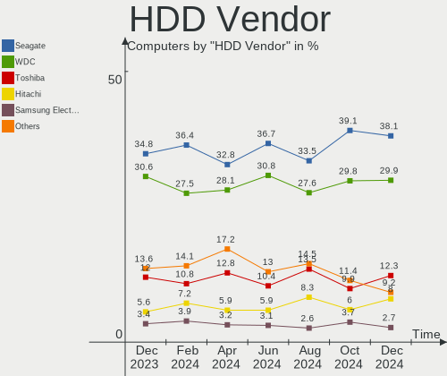
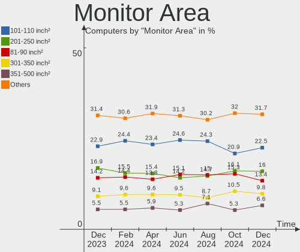
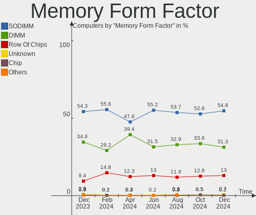
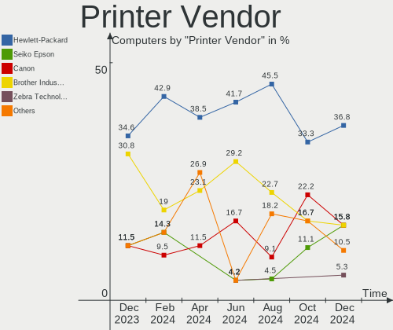

Ubuntu Hardware Trends
----------------------

A project to identify most popular hardware characteristics and track their change
over time based on data collected by Ubuntu users at https://Linux-Hardware.org.

Anyone can contribute to this report by the [hw-probe](https://github.com/linuxhw/hw-probe) tool:

    sudo -E hw-probe -all -upload

This is a report for all computer types. See also reports for [desktops](/Dist/Ubuntu/Desktop/README.md) and [notebooks](/Dist/Ubuntu/Notebook/README.md).

Full-feature report is available here: https://linux-hardware.org/?view=trends

Period: Feb, 2022.

Contents
--------

* [ System ](#system)
  - [ OS                       ](#os)
  - [ OS Family                ](#os-family)
  - [ Kernel                   ](#kernel)
  - [ Kernel Family            ](#kernel-family)
  - [ Kernel Major Ver.        ](#kernel-major-ver)
  - [ Arch                     ](#arch)
  - [ DE                       ](#de)
  - [ Display Server           ](#display-server)
  - [ Display Manager          ](#display-manager)
  - [ OS Lang                  ](#os-lang)
  - [ Boot Mode                ](#boot-mode)
  - [ Filesystem               ](#filesystem)
  - [ Part. scheme             ](#part-scheme)
  - [ Dual Boot with Linux/BSD ](#dual-boot-with-linuxbsd)
  - [ Dual Boot (Win)          ](#dual-boot-win)

* [ Board ](#board)
  - [ Vendor                   ](#vendor)
  - [ Model                    ](#model)
  - [ Model Family             ](#model-family)
  - [ MFG Year                 ](#mfg-year)
  - [ Form Factor              ](#form-factor)
  - [ Secure Boot              ](#secure-boot)
  - [ Coreboot                 ](#coreboot)
  - [ RAM Size                 ](#ram-size)
  - [ RAM Used                 ](#ram-used)
  - [ Total Drives             ](#total-drives)
  - [ Has CD-ROM               ](#has-cd-rom)
  - [ Has Ethernet             ](#has-ethernet)
  - [ Has WiFi                 ](#has-wifi)
  - [ Has Bluetooth            ](#has-bluetooth)

* [ Location ](#location)
  - [ Country                  ](#country)
  - [ City                     ](#city)

* [ Drives ](#drives)
  - [ Drive Vendor             ](#drive-vendor)
  - [ Drive Model              ](#drive-model)
  - [ HDD Vendor               ](#hdd-vendor)
  - [ SSD Vendor               ](#ssd-vendor)
  - [ Drive Kind               ](#drive-kind)
  - [ Drive Connector          ](#drive-connector)
  - [ Drive Size               ](#drive-size)
  - [ Space Total              ](#space-total)
  - [ Space Used               ](#space-used)
  - [ Malfunc. Drives          ](#malfunc-drives)
  - [ Malfunc. Drive Vendor    ](#malfunc-drive-vendor)
  - [ Malfunc. HDD Vendor      ](#malfunc-hdd-vendor)
  - [ Malfunc. Drive Kind      ](#malfunc-drive-kind)
  - [ Failed Drives            ](#failed-drives)
  - [ Failed Drive Vendor      ](#failed-drive-vendor)
  - [ Drive Status             ](#drive-status)

* [ Storage controller ](#storage-controller)
  - [ Storage Vendor           ](#storage-vendor)
  - [ Storage Model            ](#storage-model)
  - [ Storage Kind             ](#storage-kind)

* [ Processor ](#processor)
  - [ CPU Vendor               ](#cpu-vendor)
  - [ CPU Model                ](#cpu-model)
  - [ CPU Model Family         ](#cpu-model-family)
  - [ CPU Cores                ](#cpu-cores)
  - [ CPU Sockets              ](#cpu-sockets)
  - [ CPU Threads              ](#cpu-threads)
  - [ CPU Op-Modes             ](#cpu-op-modes)
  - [ CPU Microcode            ](#cpu-microcode)
  - [ CPU Microarch            ](#cpu-microarch)

* [ Graphics ](#graphics)
  - [ GPU Vendor               ](#gpu-vendor)
  - [ GPU Model                ](#gpu-model)
  - [ GPU Combo                ](#gpu-combo)
  - [ GPU Driver               ](#gpu-driver)
  - [ GPU Memory               ](#gpu-memory)

* [ Monitor ](#monitor)
  - [ Monitor Vendor           ](#monitor-vendor)
  - [ Monitor Model            ](#monitor-model)
  - [ Monitor Resolution       ](#monitor-resolution)
  - [ Monitor Diagonal         ](#monitor-diagonal)
  - [ Monitor Width            ](#monitor-width)
  - [ Aspect Ratio             ](#aspect-ratio)
  - [ Monitor Area             ](#monitor-area)
  - [ Pixel Density            ](#pixel-density)
  - [ Multiple Monitors        ](#multiple-monitors)

* [ Network ](#network)
  - [ Net Controller Vendor    ](#net-controller-vendor)
  - [ Net Controller Model     ](#net-controller-model)
  - [ Wireless Vendor          ](#wireless-vendor)
  - [ Wireless Model           ](#wireless-model)
  - [ Ethernet Vendor          ](#ethernet-vendor)
  - [ Ethernet Model           ](#ethernet-model)
  - [ Net Controller Kind      ](#net-controller-kind)
  - [ Used Controller          ](#used-controller)
  - [ NICs                     ](#nics)
  - [ IPv6                     ](#ipv6)

* [ Bluetooth ](#bluetooth)
  - [ Bluetooth Vendor         ](#bluetooth-vendor)
  - [ Bluetooth Model          ](#bluetooth-model)

* [ Sound ](#sound)
  - [ Sound Vendor             ](#sound-vendor)
  - [ Sound Model              ](#sound-model)

* [ Memory ](#memory)
  - [ Memory Vendor            ](#memory-vendor)
  - [ Memory Model             ](#memory-model)
  - [ Memory Kind              ](#memory-kind)
  - [ Memory Form Factor       ](#memory-form-factor)
  - [ Memory Size              ](#memory-size)
  - [ Memory Speed             ](#memory-speed)

* [ Printers & scanners ](#printers--scanners)
  - [ Printer Vendor           ](#printer-vendor)
  - [ Printer Model            ](#printer-model)
  - [ Scanner Vendor           ](#scanner-vendor)
  - [ Scanner Model            ](#scanner-model)

* [ Camera ](#camera)
  - [ Camera Vendor            ](#camera-vendor)
  - [ Camera Model             ](#camera-model)

* [ Security ](#security)
  - [ Fingerprint Vendor       ](#fingerprint-vendor)
  - [ Fingerprint Model        ](#fingerprint-model)
  - [ Chipcard Vendor          ](#chipcard-vendor)
  - [ Chipcard Model           ](#chipcard-model)

* [ Unsupported ](#unsupported)
  - [ Unsupported Devices      ](#unsupported-devices)
  - [ Unsupported Device Types ](#unsupported-device-types)

System
------

OS
--

Installed operating systems

| Name           | Computers | Percent |
|----------------|-----------|---------|
| Ubuntu 20.04   | 637       | 61.96%  |
| Ubuntu 21.10   | 269       | 26.17%  |
| Ubuntu 18.04   | 60        | 5.84%   |
| Ubuntu 21.04   | 24        | 2.33%   |
| Ubuntu 22.04   | 22        | 2.14%   |
| Ubuntu 20.10   | 7         | 0.68%   |
| Ubuntu 16.04   | 7         | 0.68%   |
| Ubuntu Core 18 | 1         | 0.1%    |
| Ubuntu 6.1     | 1         | 0.1%    |

OS Family
---------

OS without a version

| Name   | Computers | Percent |
|--------|-----------|---------|
| Ubuntu | 1028      | 100%    |

Kernel
------

Version of the Linux kernel

| Version                  | Computers | Percent |
|--------------------------|-----------|---------|
| 5.13.0-28-generic        | 402       | 39.11%  |
| 5.13.0-30-generic        | 210       | 20.43%  |
| 5.13.0-27-generic        | 54        | 5.25%   |
| 5.4.0-99-generic         | 38        | 3.7%    |
| 5.4.0-97-generic         | 28        | 2.72%   |
| 5.4.0-100-generic        | 26        | 2.53%   |
| 5.11.0-27-generic        | 20        | 1.95%   |
| 5.4.0-96-generic         | 18        | 1.75%   |
| 5.15.0-18-generic        | 17        | 1.65%   |
| 5.11.0-49-generic        | 17        | 1.65%   |
| 5.13.0-19-generic        | 16        | 1.56%   |
| 5.13.0-29-generic        | 11        | 1.07%   |
| 4.15.0-167-generic       | 11        | 1.07%   |
| 5.13.0-1016-raspi        | 9         | 0.88%   |
| 5.11.0-46-generic        | 7         | 0.68%   |
| 5.10.0-1057-oem          | 7         | 0.68%   |
| 5.14.0-1024-oem          | 6         | 0.58%   |
| 5.13.0-1017-raspi        | 6         | 0.58%   |
| 4.4.0-210-generic        | 6         | 0.58%   |
| 5.8.0-63-generic         | 4         | 0.39%   |
| 5.13.0-32-generic        | 4         | 0.39%   |
| 5.11.0-43-generic        | 4         | 0.39%   |
| 4.9.253-tegra            | 4         | 0.39%   |
| 4.15.0-169-generic       | 4         | 0.39%   |
| 5.8.0-43-generic         | 3         | 0.29%   |
| 5.4.0-84-generic         | 3         | 0.29%   |
| 5.16.9-051609-generic    | 3         | 0.29%   |
| 5.14.0-1020-oem          | 3         | 0.29%   |
| 5.11.0-41-generic        | 3         | 0.29%   |
| 5.11.0-40-generic        | 3         | 0.29%   |
| 5.11.0-38-generic        | 3         | 0.29%   |
| 4.15.0-166-generic       | 3         | 0.29%   |
| 5.8.0-25-generic         | 2         | 0.19%   |
| 5.16.5-051605-generic    | 2         | 0.19%   |
| 5.16.1-051601-generic    | 2         | 0.19%   |
| 5.15.15-76051515-generic | 2         | 0.19%   |
| 5.15.0-17-generic        | 2         | 0.19%   |
| 5.13.0-28-lowlatency     | 2         | 0.19%   |
| 5.13.0-25-generic        | 2         | 0.19%   |
| 5.13.0-21-generic        | 2         | 0.19%   |
| 5.11.0-44-generic        | 2         | 0.19%   |
| 5.11.0-37-generic        | 2         | 0.19%   |
| 5.11.0-16-generic        | 2         | 0.19%   |
| 4.15.0-168-generic       | 2         | 0.19%   |
| 5.9.6-050906-generic     | 1         | 0.1%    |
| 5.8.0-55-generic         | 1         | 0.1%    |
| 5.8.0-53-generic         | 1         | 0.1%    |
| 5.6.0-1036-oem           | 1         | 0.1%    |
| 5.6.0-1032-oem           | 1         | 0.1%    |
| 5.5.19-bp0               | 1         | 0.1%    |
| 5.4.0-92-generic         | 1         | 0.1%    |
| 5.4.0-91-generic         | 1         | 0.1%    |
| 5.4.0-90-generic         | 1         | 0.1%    |
| 5.4.0-88-generic         | 1         | 0.1%    |
| 5.4.0-72-generic         | 1         | 0.1%    |
| 5.4.0-58-generic         | 1         | 0.1%    |
| 5.4.0-52-generic         | 1         | 0.1%    |
| 5.4.0-42-generic         | 1         | 0.1%    |
| 5.4.0-41-generic         | 1         | 0.1%    |
| 5.4.0-28-generic         | 1         | 0.1%    |

Kernel Family
-------------

Linux kernel without a distro release

| Version | Computers | Percent |
|---------|-----------|---------|
| 5.13.0  | 724       | 70.43%  |
| 5.4.0   | 126       | 12.26%  |
| 5.11.0  | 64        | 6.23%   |
| 4.15.0  | 25        | 2.43%   |
| 5.15.0  | 19        | 1.85%   |
| 5.8.0   | 11        | 1.07%   |
| 5.14.0  | 9         | 0.88%   |
| 5.10.0  | 7         | 0.68%   |
| 4.4.0   | 6         | 0.58%   |
| 4.9.253 | 4         | 0.39%   |
| 5.16.9  | 3         | 0.29%   |
| 5.16.5  | 3         | 0.29%   |
| 5.6.0   | 2         | 0.19%   |
| 5.16.7  | 2         | 0.19%   |
| 5.16.1  | 2         | 0.19%   |
| 5.16.0  | 2         | 0.19%   |
| 5.15.15 | 2         | 0.19%   |
| 5.0.0   | 2         | 0.19%   |
| 5.9.6   | 1         | 0.1%    |
| 5.5.19  | 1         | 0.1%    |
| 5.17.0  | 1         | 0.1%    |
| 5.16.8  | 1         | 0.1%    |
| 5.16.3  | 1         | 0.1%    |
| 5.16.10 | 1         | 0.1%    |
| 5.15.22 | 1         | 0.1%    |
| 5.15.19 | 1         | 0.1%    |
| 5.15.18 | 1         | 0.1%    |
| 5.15.13 | 1         | 0.1%    |
| 5.15.11 | 1         | 0.1%    |
| 5.13.19 | 1         | 0.1%    |
| 5.10.7  | 1         | 0.1%    |
| 5.10.60 | 1         | 0.1%    |
| 4.18.0  | 1         | 0.1%    |

Kernel Major Ver.
-----------------

Linux kernel major version

| Version | Computers | Percent |
|---------|-----------|---------|
| 5.13    | 725       | 70.53%  |
| 5.4     | 126       | 12.26%  |
| 5.11    | 64        | 6.23%   |
| 5.15    | 26        | 2.53%   |
| 4.15    | 25        | 2.43%   |
| 5.16    | 15        | 1.46%   |
| 5.8     | 11        | 1.07%   |
| 5.14    | 9         | 0.88%   |
| 5.10    | 9         | 0.88%   |
| 4.4     | 6         | 0.58%   |
| 4.9     | 4         | 0.39%   |
| 5.6     | 2         | 0.19%   |
| 5.0     | 2         | 0.19%   |
| 5.9     | 1         | 0.1%    |
| 5.5     | 1         | 0.1%    |
| 5.17    | 1         | 0.1%    |
| 4.18    | 1         | 0.1%    |

Arch
----

OS architecture (x86_64, i586, etc.)

| Name    | Computers | Percent |
|---------|-----------|---------|
| x86_64  | 991       | 96.4%   |
| aarch64 | 23        | 2.24%   |
| i686    | 14        | 1.36%   |

DE
--

Desktop Environment

| Name              | Computers | Percent |
|-------------------|-----------|---------|
| GNOME             | 922       | 89.69%  |
| Unknown           | 64        | 6.23%   |
| Unity             | 16        | 1.56%   |
| X-Cinnamon        | 8         | 0.78%   |
| GNOME Flashback   | 5         | 0.49%   |
| Cinnamon          | 5         | 0.49%   |
| Yaru:ubuntu:GNOME | 1         | 0.1%    |
| xubuntu           | 1         | 0.1%    |
| Pantheon          | 1         | 0.1%    |
| i3                | 1         | 0.1%    |
| GNUstep           | 1         | 0.1%    |
| GNOME Classic     | 1         | 0.1%    |
| Enlightenment     | 1         | 0.1%    |
| Cutefish          | 1         | 0.1%    |

Display Server
--------------

X11 or Wayland

| Name    | Computers | Percent |
|---------|-----------|---------|
| X11     | 764       | 74.32%  |
| Wayland | 207       | 20.14%  |
| Tty     | 33        | 3.21%   |
| Unknown | 24        | 2.33%   |

Display Manager
---------------

SDDM, LightDM, etc.

| Name    | Computers | Percent |
|---------|-----------|---------|
| GDM3    | 617       | 60.02%  |
| GDM     | 303       | 29.47%  |
| Unknown | 65        | 6.32%   |
| LightDM | 38        | 3.7%    |
| SDDM    | 5         | 0.49%   |

OS Lang
-------

Language

| Lang    | Computers | Percent |
|---------|-----------|---------|
| en_US   | 436       | 42.41%  |
| de_DE   | 125       | 12.16%  |
| fr_FR   | 56        | 5.45%   |
| en_GB   | 55        | 5.35%   |
| en_CA   | 32        | 3.11%   |
| it_IT   | 31        | 3.02%   |
| en_IN   | 28        | 2.72%   |
| ru_RU   | 27        | 2.63%   |
| pt_BR   | 23        | 2.24%   |
| es_ES   | 21        | 2.04%   |
| C       | 17        | 1.65%   |
| en_AU   | 13        | 1.26%   |
| nl_NL   | 12        | 1.17%   |
| de_AT   | 11        | 1.07%   |
| pl_PL   | 9         | 0.88%   |
| es_MX   | 9         | 0.88%   |
| es_AR   | 9         | 0.88%   |
| tr_TR   | 7         | 0.68%   |
| ja_JP   | 7         | 0.68%   |
| en_ZA   | 7         | 0.68%   |
| Unknown | 7         | 0.68%   |
| cs_CZ   | 6         | 0.58%   |
| zh_CN   | 5         | 0.49%   |
| sk_SK   | 5         | 0.49%   |
| hu_HU   | 5         | 0.49%   |
| da_DK   | 5         | 0.49%   |
| sv_SE   | 4         | 0.39%   |
| pt_PT   | 4         | 0.39%   |
| fr_BE   | 4         | 0.39%   |
| el_GR   | 4         | 0.39%   |
| de_CH   | 4         | 0.39%   |
| en_IL   | 3         | 0.29%   |
| ru_UA   | 2         | 0.19%   |
| ro_RO   | 2         | 0.19%   |
| nl_BE   | 2         | 0.19%   |
| nb_NO   | 2         | 0.19%   |
| ko_KR   | 2         | 0.19%   |
| fr_CA   | 2         | 0.19%   |
| fi_FI   | 2         | 0.19%   |
| es_CL   | 2         | 0.19%   |
| en_SG   | 2         | 0.19%   |
| en_PH   | 2         | 0.19%   |
| en_NG   | 2         | 0.19%   |
| bg_BG   | 2         | 0.19%   |
| zh_TW   | 1         | 0.1%    |
| uk_UA   | 1         | 0.1%    |
| sl_SI   | 1         | 0.1%    |
| lv_LV   | 1         | 0.1%    |
| hr_HR   | 1         | 0.1%    |
| fr_CH   | 1         | 0.1%    |
| es_US   | 1         | 0.1%    |
| es_EC   | 1         | 0.1%    |
| es_CR   | 1         | 0.1%    |
| en_NZ   | 1         | 0.1%    |
| en_HK   | 1         | 0.1%    |
| ar_SA   | 1         | 0.1%    |
| ar_EG   | 1         | 0.1%    |

Boot Mode
---------

EFI or BIOS

| Mode | Computers | Percent |
|------|-----------|---------|
| EFI  | 520       | 50.58%  |
| BIOS | 508       | 49.42%  |

Filesystem
----------

Type of filesystem

| Type    | Computers | Percent |
|---------|-----------|---------|
| Ext4    | 959       | 93.29%  |
| Overlay | 23        | 2.24%   |
| Zfs     | 19        | 1.85%   |
| Btrfs   | 13        | 1.26%   |
| Xfs     | 5         | 0.49%   |
| Ext3    | 4         | 0.39%   |
| Ext2    | 3         | 0.29%   |
| Jfs     | 1         | 0.1%    |
| Unknown | 1         | 0.1%    |

Part. scheme
------------

Scheme of partitioning

| Type    | Computers | Percent |
|---------|-----------|---------|
| Unknown | 672       | 65.37%  |
| GPT     | 308       | 29.96%  |
| MBR     | 48        | 4.67%   |

Dual Boot with Linux/BSD
------------------------

Hosting more than one Linux/BSD

| Dual boot | Computers | Percent |
|-----------|-----------|---------|
| No        | 912       | 88.72%  |
| Yes       | 116       | 11.28%  |

Dual Boot (Win)
---------------

Hosting Linux and Windows

| Dual boot | Computers | Percent |
|-----------|-----------|---------|
| No        | 647       | 62.94%  |
| Yes       | 381       | 37.06%  |

Board
-----

Vendor
------

Motherboard manufacturer

| Name                                         | Computers | Percent |
|----------------------------------------------|-----------|---------|
| ASUSTek Computer                             | 167       | 16.25%  |
| Dell                                         | 161       | 15.66%  |
| Hewlett-Packard                              | 147       | 14.3%   |
| Lenovo                                       | 142       | 13.81%  |
| Gigabyte Technology                          | 53        | 5.16%   |
| Acer                                         | 53        | 5.16%   |
| ASRock                                       | 44        | 4.28%   |
| MSI                                          | 40        | 3.89%   |
| Apple                                        | 22        | 2.14%   |
| Raspberry Pi Foundation                      | 17        | 1.65%   |
| Toshiba                                      | 14        | 1.36%   |
| Fujitsu                                      | 14        | 1.36%   |
| Samsung Electronics                          | 11        | 1.07%   |
| Packard Bell                                 | 10        | 0.97%   |
| Intel                                        | 10        | 0.97%   |
| Medion                                       | 8         | 0.78%   |
| Unknown                                      | 8         | 0.78%   |
| Supermicro                                   | 6         | 0.58%   |
| HUAWEI                                       | 6         | 0.58%   |
| Sony                                         | 5         | 0.49%   |
| Timi                                         | 4         | 0.39%   |
| Nvidia                                       | 4         | 0.39%   |
| Google                                       | 4         | 0.39%   |
| Alienware                                    | 4         | 0.39%   |
| Positivo                                     | 3         | 0.29%   |
| Notebook                                     | 3         | 0.29%   |
| Foxconn                                      | 3         | 0.29%   |
| TYAN Computer                                | 2         | 0.19%   |
| TUXEDO                                       | 2         | 0.19%   |
| Microsoft                                    | 2         | 0.19%   |
| LG Electronics                               | 2         | 0.19%   |
| EVGA                                         | 2         | 0.19%   |
| ECS                                          | 2         | 0.19%   |
| CHUWI Innovation And Technology(ShenZhen)c0. | 2         | 0.19%   |
| Chuwi                                        | 2         | 0.19%   |
| BESSTAR Tech                                 | 2         | 0.19%   |
| Wortmann AG                                  | 1         | 0.1%    |
| whyopencomputing                             | 1         | 0.1%    |
| TongFang                                     | 1         | 0.1%    |
| Teclast                                      | 1         | 0.1%    |
| System76                                     | 1         | 0.1%    |
| sunxi                                        | 1         | 0.1%    |
| Sophos                                       | 1         | 0.1%    |
| SLIMBOOK                                     | 1         | 0.1%    |
| Shanghai Zhaoxin Semiconductor               | 1         | 0.1%    |
| SeeedStudio                                  | 1         | 0.1%    |
| Seco                                         | 1         | 0.1%    |
| Schenker                                     | 1         | 0.1%    |
| Razer                                        | 1         | 0.1%    |
| Prestigio                                    | 1         | 0.1%    |
| Pegatron                                     | 1         | 0.1%    |
| PCChips                                      | 1         | 0.1%    |
| PC Engines                                   | 1         | 0.1%    |
| Panasonic                                    | 1         | 0.1%    |
| Minix                                        | 1         | 0.1%    |
| Microtech                                    | 1         | 0.1%    |
| MeLE                                         | 1         | 0.1%    |
| MAXDATA                                      | 1         | 0.1%    |
| Lex BayTrail                                 | 1         | 0.1%    |
| Lanix                                        | 1         | 0.1%    |

Model
-----

Motherboard model

| Name                                              | Computers | Percent |
|---------------------------------------------------|-----------|---------|
| RPi Raspberry Pi                                  | 17        | 1.65%   |
| ASUS All Series                                   | 15        | 1.46%   |
| Unknown                                           | 10        | 0.97%   |
| Dell OptiPlex 7010                                | 6         | 0.58%   |
| Nvidia Tegra                                      | 4         | 0.39%   |
| ASUS PRIME X570-PRO                               | 4         | 0.39%   |
| MSI MS-7B86                                       | 3         | 0.29%   |
| HP ProDesk 600 G1 SFF                             | 3         | 0.29%   |
| HP ProBook 4730s                                  | 3         | 0.29%   |
| HP Pavilion Notebook                              | 3         | 0.29%   |
| HP Pavilion 15                                    | 3         | 0.29%   |
| HP 15 Notebook PC                                 | 3         | 0.29%   |
| Dell XPS 15 9570                                  | 3         | 0.29%   |
| Dell XPS 15 9500                                  | 3         | 0.29%   |
| Dell XPS 15 7590                                  | 3         | 0.29%   |
| Dell XPS 13 9305                                  | 3         | 0.29%   |
| Dell OptiPlex 790                                 | 3         | 0.29%   |
| Dell OptiPlex 7440 AIO                            | 3         | 0.29%   |
| ASRock B450M Steel Legend                         | 3         | 0.29%   |
| Toshiba PORTEGE Z30-C                             | 2         | 0.19%   |
| MSI MS-7C92                                       | 2         | 0.19%   |
| MSI MS-7B61                                       | 2         | 0.19%   |
| MSI MS-7996                                       | 2         | 0.19%   |
| MSI MS-7817                                       | 2         | 0.19%   |
| Lenovo ThinkCentre M910q 10MUS3JC00               | 2         | 0.19%   |
| Lenovo ThinkBook 15 G2 ARE 20VG                   | 2         | 0.19%   |
| Lenovo MIIX 320-10ICR 80XF                        | 2         | 0.19%   |
| Lenovo IdeaPad Gaming 3 15IMH05 81Y4              | 2         | 0.19%   |
| Lenovo IdeaPad 5 14ITL05 82FE                     | 2         | 0.19%   |
| Lenovo IdeaPad 330-15IGM 81D1                     | 2         | 0.19%   |
| Lenovo IdeaPad 320-15ABR 80XS                     | 2         | 0.19%   |
| Intel AB2L                                        | 2         | 0.19%   |
| HP ZBook Firefly 15 inch G8 Mobile Workstation PC | 2         | 0.19%   |
| HP Z600 Workstation                               | 2         | 0.19%   |
| HP Z440 Workstation                               | 2         | 0.19%   |
| HP ProBook 450 G4                                 | 2         | 0.19%   |
| HP ProBook 440 G8 Notebook PC                     | 2         | 0.19%   |
| HP Pavilion g7                                    | 2         | 0.19%   |
| HP Pavilion dv7                                   | 2         | 0.19%   |
| HP Pavilion dv6                                   | 2         | 0.19%   |
| HP Pavilion Aero Laptop 13-be0xxx                 | 2         | 0.19%   |
| HP Notebook                                       | 2         | 0.19%   |
| HP G60                                            | 2         | 0.19%   |
| HP ENVY x360 Convertible 15-eu0xxx                | 2         | 0.19%   |
| HP EliteBook 830 G6                               | 2         | 0.19%   |
| HP Compaq Elite 8300 SFF                          | 2         | 0.19%   |
| HP 255 G6 Notebook PC                             | 2         | 0.19%   |
| HP 15                                             | 2         | 0.19%   |
| Gigabyte Z68MX-UD2H-B3                            | 2         | 0.19%   |
| Gigabyte X58A-UD3R                                | 2         | 0.19%   |
| Gigabyte B450M DS3H                               | 2         | 0.19%   |
| Gigabyte A320M-S2H                                | 2         | 0.19%   |
| Dell XPS 8500                                     | 2         | 0.19%   |
| Dell XPS 13 9370                                  | 2         | 0.19%   |
| Dell XPS 13 9310                                  | 2         | 0.19%   |
| Dell Precision 5530                               | 2         | 0.19%   |
| Dell OptiPlex GX520                               | 2         | 0.19%   |
| Dell OptiPlex 7050                                | 2         | 0.19%   |
| Dell Latitude E6440                               | 2         | 0.19%   |
| Dell Latitude E6420                               | 2         | 0.19%   |

Model Family
------------

Motherboard model prefix

| Name                  | Computers | Percent |
|-----------------------|-----------|---------|
| Lenovo ThinkPad       | 59        | 5.74%   |
| Dell Inspiron         | 42        | 4.09%   |
| Dell Latitude         | 40        | 3.89%   |
| Acer Aspire           | 35        | 3.4%    |
| Lenovo IdeaPad        | 30        | 2.92%   |
| HP Pavilion           | 29        | 2.82%   |
| Dell XPS              | 25        | 2.43%   |
| Dell OptiPlex         | 24        | 2.33%   |
| ASUS ROG              | 21        | 2.04%   |
| HP ProBook            | 19        | 1.85%   |
| ASUS PRIME            | 19        | 1.85%   |
| RPi Raspberry         | 17        | 1.65%   |
| ASUS VivoBook         | 17        | 1.65%   |
| HP EliteBook          | 16        | 1.56%   |
| Dell Precision        | 16        | 1.56%   |
| ASUS All              | 15        | 1.46%   |
| Lenovo ThinkCentre    | 11        | 1.07%   |
| HP ENVY               | 11        | 1.07%   |
| HP Compaq             | 11        | 1.07%   |
| Unknown               | 10        | 0.97%   |
| Toshiba Satellite     | 9         | 0.88%   |
| Acer Swift            | 7         | 0.68%   |
| Lenovo Legion         | 6         | 0.58%   |
| HP Spectre            | 6         | 0.58%   |
| Fujitsu LIFEBOOK      | 6         | 0.58%   |
| ASUS P8H61-M          | 6         | 0.58%   |
| ASUS M5A78L-M         | 6         | 0.58%   |
| Packard Bell EasyNote | 5         | 0.49%   |
| Lenovo Yoga           | 5         | 0.49%   |
| Lenovo ThinkBook      | 5         | 0.49%   |
| HP ProDesk            | 5         | 0.49%   |
| HP 15                 | 5         | 0.49%   |
| ASUS TUF              | 5         | 0.49%   |
| ASRock B450M          | 5         | 0.49%   |
| Toshiba PORTEGE       | 4         | 0.39%   |
| Nvidia Tegra          | 4         | 0.39%   |
| HP ZBook              | 4         | 0.39%   |
| ASUS ZenBook          | 4         | 0.39%   |
| Acer TravelMate       | 4         | 0.39%   |
| MSI MS-7B86           | 3         | 0.29%   |
| HP Presario           | 3         | 0.29%   |
| HP OMEN               | 3         | 0.29%   |
| HP Laptop             | 3         | 0.29%   |
| HP 255                | 3         | 0.29%   |
| Gigabyte H310M        | 3         | 0.29%   |
| Gigabyte B450M        | 3         | 0.29%   |
| Fujitsu ESPRIMO       | 3         | 0.29%   |
| Fujitsu CELSIUS       | 3         | 0.29%   |
| Dell Vostro           | 3         | 0.29%   |
| Dell PowerEdge        | 3         | 0.29%   |
| ASUS ASUS             | 3         | 0.29%   |
| ASRock Z370           | 3         | 0.29%   |
| Apple MacBookPro11    | 3         | 0.29%   |
| Timi RedmiBook        | 2         | 0.19%   |
| MSI MS-7C92           | 2         | 0.19%   |
| MSI MS-7B61           | 2         | 0.19%   |
| MSI MS-7996           | 2         | 0.19%   |
| MSI MS-7817           | 2         | 0.19%   |
| Microsoft Surface     | 2         | 0.19%   |
| Medion Akoya          | 2         | 0.19%   |

MFG Year
--------

Motherboard manufacture year

| Year    | Computers | Percent |
|---------|-----------|---------|
| 2021    | 126       | 12.26%  |
| 2020    | 121       | 11.77%  |
| 2019    | 82        | 7.98%   |
| 2018    | 80        | 7.78%   |
| 2017    | 72        | 7%      |
| 2013    | 72        | 7%      |
| 2012    | 66        | 6.42%   |
| 2011    | 60        | 5.84%   |
| 2014    | 59        | 5.74%   |
| 2015    | 58        | 5.64%   |
| 2016    | 52        | 5.06%   |
| 2010    | 51        | 4.96%   |
| 2009    | 38        | 3.7%    |
| 2008    | 36        | 3.5%    |
| Unknown | 23        | 2.24%   |
| 2007    | 17        | 1.65%   |
| 2006    | 8         | 0.78%   |
| 2022    | 4         | 0.39%   |
| 2005    | 3         | 0.29%   |

Form Factor
-----------

Physical design of the computer

| Name           | Computers | Percent |
|----------------|-----------|---------|
| Notebook       | 551       | 53.6%   |
| Desktop        | 377       | 36.67%  |
| Convertible    | 26        | 2.53%   |
| System on chip | 23        | 2.24%   |
| All in one     | 23        | 2.24%   |
| Mini pc        | 13        | 1.26%   |
| Server         | 8         | 0.78%   |
| Tablet         | 6         | 0.58%   |
| Firewall       | 1         | 0.1%    |

Secure Boot
-----------

Enabled or disabled

| State    | Computers | Percent |
|----------|-----------|---------|
| Disabled | 903       | 87.84%  |
| Enabled  | 125       | 12.16%  |

Coreboot
--------

Have coreboot on board

| Used | Computers | Percent |
|------|-----------|---------|
| No   | 1022      | 99.42%  |
| Yes  | 6         | 0.58%   |

RAM Size
--------

Total RAM memory

| Size in GB      | Computers | Percent |
|-----------------|-----------|---------|
| 4.01-8.0        | 247       | 24.03%  |
| 16.01-24.0      | 217       | 21.11%  |
| 3.01-4.0        | 179       | 17.41%  |
| 8.01-16.0       | 175       | 17.02%  |
| 32.01-64.0      | 117       | 11.38%  |
| 64.01-256.0     | 33        | 3.21%   |
| 1.01-2.0        | 33        | 3.21%   |
| 24.01-32.0      | 13        | 1.26%   |
| 2.01-3.0        | 12        | 1.17%   |
| More than 256.0 | 1         | 0.1%    |
| 0.51-1.0        | 1         | 0.1%    |

RAM Used
--------

Used RAM memory

| Used GB    | Computers | Percent |
|------------|-----------|---------|
| 1.01-2.0   | 372       | 36.19%  |
| 2.01-3.0   | 271       | 26.36%  |
| 4.01-8.0   | 158       | 15.37%  |
| 3.01-4.0   | 140       | 13.62%  |
| 8.01-16.0  | 45        | 4.38%   |
| 0.51-1.0   | 24        | 2.33%   |
| 0.01-0.5   | 9         | 0.88%   |
| 16.01-24.0 | 6         | 0.58%   |
| 32.01-64.0 | 2         | 0.19%   |
| 24.01-32.0 | 1         | 0.1%    |

Total Drives
------------

Number of drives on board

| Drives | Computers | Percent |
|--------|-----------|---------|
| 1      | 609       | 59.24%  |
| 2      | 287       | 27.92%  |
| 3      | 77        | 7.49%   |
| 4      | 25        | 2.43%   |
| 5      | 13        | 1.26%   |
| 0      | 8         | 0.78%   |
| 7      | 3         | 0.29%   |
| 6      | 3         | 0.29%   |
| 9      | 2         | 0.19%   |
| 8      | 1         | 0.1%    |

Has CD-ROM
----------

Has CD-ROM on board

| Presented | Computers | Percent |
|-----------|-----------|---------|
| No        | 639       | 62.16%  |
| Yes       | 389       | 37.84%  |

Has Ethernet
------------

Has Ethernet on board

| Presented | Computers | Percent |
|-----------|-----------|---------|
| Yes       | 867       | 84.34%  |
| No        | 161       | 15.66%  |

Has WiFi
--------

Has WiFi module

| Presented | Computers | Percent |
|-----------|-----------|---------|
| Yes       | 785       | 76.36%  |
| No        | 243       | 23.64%  |

Has Bluetooth
-------------

Has Bluetooth module

| Presented | Computers | Percent |
|-----------|-----------|---------|
| Yes       | 601       | 58.46%  |
| No        | 427       | 41.54%  |

Location
--------

Country
-------

Geographic location (country)

| Country      | Computers | Percent |
|--------------|-----------|---------|
| USA          | 183       | 17.8%   |
| Germany      | 154       | 14.98%  |
| France       | 73        | 7.1%    |
| UK           | 47        | 4.57%   |
| Canada       | 40        | 3.89%   |
| Italy        | 35        | 3.4%    |
| Russia       | 33        | 3.21%   |
| Netherlands  | 33        | 3.21%   |
| India        | 32        | 3.11%   |
| Brazil       | 28        | 2.72%   |
| Spain        | 27        | 2.63%   |
| Poland       | 27        | 2.63%   |
| Sweden       | 16        | 1.56%   |
| Austria      | 16        | 1.56%   |
| Hungary      | 15        | 1.46%   |
| Argentina    | 15        | 1.46%   |
| Turkey       | 14        | 1.36%   |
| Belgium      | 14        | 1.36%   |
| Australia    | 12        | 1.17%   |
| Switzerland  | 11        | 1.07%   |
| Czechia      | 11        | 1.07%   |
| Ukraine      | 10        | 0.97%   |
| Portugal     | 10        | 0.97%   |
| Mexico       | 10        | 0.97%   |
| Romania      | 9         | 0.88%   |
| China        | 9         | 0.88%   |
| South Africa | 8         | 0.78%   |
| Japan        | 7         | 0.68%   |
| Denmark      | 7         | 0.68%   |
| Slovakia     | 6         | 0.58%   |
| Greece       | 6         | 0.58%   |
| Taiwan       | 5         | 0.49%   |
| Norway       | 5         | 0.49%   |
| Israel       | 5         | 0.49%   |
| Finland      | 5         | 0.49%   |
| Tunisia      | 4         | 0.39%   |
| Singapore    | 4         | 0.39%   |
| Serbia       | 4         | 0.39%   |
| Pakistan     | 4         | 0.39%   |
| Chile        | 4         | 0.39%   |
| South Korea  | 3         | 0.29%   |
| Slovenia     | 3         | 0.29%   |
| Philippines  | 3         | 0.29%   |
| Latvia       | 3         | 0.29%   |
| Indonesia    | 3         | 0.29%   |
| Croatia      | 3         | 0.29%   |
| Bulgaria     | 3         | 0.29%   |
| Bangladesh   | 3         | 0.29%   |
| Vietnam      | 2         | 0.19%   |
| Uzbekistan   | 2         | 0.19%   |
| Thailand     | 2         | 0.19%   |
| Nigeria      | 2         | 0.19%   |
| New Zealand  | 2         | 0.19%   |
| Kenya        | 2         | 0.19%   |
| Ireland      | 2         | 0.19%   |
| Egypt        | 2         | 0.19%   |
| Ecuador      | 2         | 0.19%   |
| Cyprus       | 2         | 0.19%   |
| Costa Rica   | 2         | 0.19%   |
| Belarus      | 2         | 0.19%   |

City
----

Geographic location (city)

| City              | Computers | Percent |
|-------------------|-----------|---------|
| Berlin            | 14        | 1.36%   |
| Moscow            | 13        | 1.26%   |
| Paris             | 11        | 1.07%   |
| Sheffield         | 9         | 0.88%   |
| Vienna            | 8         | 0.78%   |
| Istanbul          | 7         | 0.68%   |
| Frankfurt am Main | 7         | 0.68%   |
| Budapest          | 7         | 0.68%   |
| Warsaw            | 6         | 0.58%   |
| São Paulo      | 6         | 0.58%   |
| Munich            | 6         | 0.58%   |
| Milan             | 6         | 0.58%   |
| Krakow            | 6         | 0.58%   |
| Toronto           | 5         | 0.49%   |
| Stockholm         | 5         | 0.49%   |
| Prague            | 5         | 0.49%   |
| Portland          | 5         | 0.49%   |
| London            | 5         | 0.49%   |
| Gothenburg        | 5         | 0.49%   |
| Bengaluru         | 5         | 0.49%   |
| Wijchen           | 4         | 0.39%   |
| Singapore         | 4         | 0.39%   |
| San Jose          | 4         | 0.39%   |
| Rome              | 4         | 0.39%   |
| Mumbai            | 4         | 0.39%   |
| Montreal          | 4         | 0.39%   |
| Mexico City       | 4         | 0.39%   |
| Manchester        | 4         | 0.39%   |
| Madrid            | 4         | 0.39%   |
| Houston           | 4         | 0.39%   |
| Cleveland         | 4         | 0.39%   |
| Córdoba        | 4         | 0.39%   |
| Ankara            | 4         | 0.39%   |
| Amsterdam         | 4         | 0.39%   |
| Wuppertal         | 3         | 0.29%   |
| Vancouver         | 3         | 0.29%   |
| Tucson            | 3         | 0.29%   |
| Sydney            | 3         | 0.29%   |
| St Petersburg     | 3         | 0.29%   |
| Sofia             | 3         | 0.29%   |
| Riga              | 3         | 0.29%   |
| Pretoria          | 3         | 0.29%   |
| Johannesburg      | 3         | 0.29%   |
| Helsinki          | 3         | 0.29%   |
| Hamburg           | 3         | 0.29%   |
| Denver            | 3         | 0.29%   |
| Chicago           | 3         | 0.29%   |
| Bratislava        | 3         | 0.29%   |
| Belgrade          | 3         | 0.29%   |
| Barcelona         | 3         | 0.29%   |
| Athens            | 3         | 0.29%   |
| Zurich            | 2         | 0.19%   |
| Zirndorf          | 2         | 0.19%   |
| Zaporizhzhya      | 2         | 0.19%   |
| York              | 2         | 0.19%   |
| Wroclaw           | 2         | 0.19%   |
| Wolfsburg         | 2         | 0.19%   |
| Washington        | 2         | 0.19%   |
| Villeurbanne      | 2         | 0.19%   |
| Turin             | 2         | 0.19%   |

Drives
------

Drive Vendor
------------

Hard drive vendors

| Vendor                         | Computers | Drives | Percent |
|--------------------------------|-----------|--------|---------|
| Samsung Electronics            | 250       | 291    | 17.59%  |
| WDC                            | 219       | 265    | 15.41%  |
| Seagate                        | 202       | 245    | 14.22%  |
| Toshiba                        | 85        | 90     | 5.98%   |
| Kingston                       | 78        | 78     | 5.49%   |
| Unknown                        | 66        | 71     | 4.64%   |
| Sandisk                        | 66        | 73     | 4.64%   |
| Crucial                        | 50        | 56     | 3.52%   |
| SK Hynix                       | 49        | 49     | 3.45%   |
| Intel                          | 46        | 52     | 3.24%   |
| Hitachi                        | 35        | 36     | 2.46%   |
| Micron Technology              | 26        | 28     | 1.83%   |
| HGST                           | 20        | 21     | 1.41%   |
| KIOXIA                         | 19        | 23     | 1.34%   |
| Apple                          | 16        | 19     | 1.13%   |
| A-DATA Technology              | 16        | 17     | 1.13%   |
| Phison                         | 15        | 18     | 1.06%   |
| Silicon Motion                 | 10        | 10     | 0.7%    |
| Unknown                        | 9         | 10     | 0.63%   |
| PNY                            | 8         | 8      | 0.56%   |
| LITEON                         | 7         | 7      | 0.49%   |
| Intenso                        | 7         | 7      | 0.49%   |
| Corsair                        | 7         | 8      | 0.49%   |
| OCZ                            | 6         | 7      | 0.42%   |
| China                          | 6         | 6      | 0.42%   |
| Transcend                      | 5         | 5      | 0.35%   |
| SPCC                           | 5         | 5      | 0.35%   |
| Micron/Crucial Technology      | 5         | 5      | 0.35%   |
| MAXTOR                         | 5         | 5      | 0.35%   |
| Gigabyte Technology            | 5         | 5      | 0.35%   |
| Patriot                        | 4         | 4      | 0.28%   |
| TO Exter                       | 3         | 3      | 0.21%   |
| Netac                          | 3         | 3      | 0.21%   |
| KingDian                       | 3         | 3      | 0.21%   |
| Fujitsu                        | 3         | 3      | 0.21%   |
| ASMT                           | 3         | 3      | 0.21%   |
| Vaseky                         | 2         | 2      | 0.14%   |
| UMIS                           | 2         | 2      | 0.14%   |
| Team                           | 2         | 3      | 0.14%   |
| SSSTC                          | 2         | 2      | 0.14%   |
| Mushkin                        | 2         | 2      | 0.14%   |
| Leven                          | 2         | 2      | 0.14%   |
| KingSpec                       | 2         | 2      | 0.14%   |
| Hewlett-Packard                | 2         | 2      | 0.14%   |
| GOODRAM                        | 2         | 2      | 0.14%   |
| EMTEC                          | 2         | 2      | 0.14%   |
| USB3.1                         | 1         | 1      | 0.07%   |
| USB 3.0                        | 1         | 1      | 0.07%   |
| Teclast                        | 1         | 1      | 0.07%   |
| StoreJet                       | 1         | 1      | 0.07%   |
| Solid State Storage Technology | 1         | 1      | 0.07%   |
| Smartbuy                       | 1         | 2      | 0.07%   |
| SABRENT                        | 1         | 1      | 0.07%   |
| Realtek Semiconductor          | 1         | 1      | 0.07%   |
| PNY USB                        | 1         | 1      | 0.07%   |
| PLEXTOR                        | 1         | 1      | 0.07%   |
| OSCOO                          | 1         | 1      | 0.07%   |
| ORTIAL                         | 1         | 1      | 0.07%   |
| OEM                            | 1         | 1      | 0.07%   |
| OCZ-AGIL                       | 1         | 1      | 0.07%   |

Drive Model
-----------

Hard drive models

| Model                                  | Computers | Percent |
|----------------------------------------|-----------|---------|
| Unknown MMC Card  64GB                 | 22        | 1.43%   |
| Samsung NVMe SSD Drive 512GB           | 15        | 0.98%   |
| Kingston SA400S37240G 240GB SSD        | 15        | 0.98%   |
| Kingston SA400S37120G 120GB SSD        | 13        | 0.85%   |
| Unknown MMC Card  32GB                 | 12        | 0.78%   |
| Unknown MMC Card  128GB                | 12        | 0.78%   |
| Seagate ST1000LM024 HN-M101MBB 1TB     | 12        | 0.78%   |
| Samsung SSD 850 EVO 250GB              | 12        | 0.78%   |
| Seagate ST1000DM010-2EP102 1TB         | 11        | 0.72%   |
| Samsung SSD 860 EVO 500GB              | 11        | 0.72%   |
| Samsung NVMe SSD Drive 1TB             | 10        | 0.65%   |
| Crucial CT500MX500SSD1 500GB           | 10        | 0.65%   |
| Toshiba MQ01ABD100 1TB                 | 9         | 0.59%   |
| Seagate ST500DM002-1BD142 500GB        | 9         | 0.59%   |
| Sandisk NVMe SSD Drive 500GB           | 9         | 0.59%   |
| Intel NVMe SSD Drive 512GB             | 9         | 0.59%   |
| Unknown                                | 9         | 0.59%   |
| WDC WD10EZEX-08WN4A0 1TB               | 8         | 0.52%   |
| Seagate ST1000LM035-1RK172 1TB         | 8         | 0.52%   |
| Seagate ST2000DM008-2FR102 2TB         | 7         | 0.46%   |
| Samsung SSD 980 1TB                    | 7         | 0.46%   |
| Samsung SSD 970 EVO Plus 1TB           | 7         | 0.46%   |
| Samsung SSD 860 EVO 250GB              | 7         | 0.46%   |
| Samsung SSD 850 EVO 500GB              | 7         | 0.46%   |
| Samsung NVMe SSD Drive 500GB           | 7         | 0.46%   |
| Samsung MZVLW256HEHP-000L7 256GB       | 7         | 0.46%   |
| Kingston SA400S37480G 480GB SSD        | 7         | 0.46%   |
| Toshiba MQ04ABF100 1TB                 | 6         | 0.39%   |
| Toshiba DT01ACA100 1TB                 | 6         | 0.39%   |
| Seagate ST3500418AS 500GB              | 6         | 0.39%   |
| Seagate ST3500413AS 500GB              | 6         | 0.39%   |
| Seagate ST1000LM048-2E7172 1TB         | 6         | 0.39%   |
| Seagate ST1000DM003-1CH162 1TB         | 6         | 0.39%   |
| Samsung SSD 870 EVO 500GB              | 6         | 0.39%   |
| Samsung SM963 2.5" NVMe PCIe SSD 256GB | 6         | 0.39%   |
| Toshiba KBG30ZMS128G 128GB NVMe SSD    | 5         | 0.33%   |
| SK Hynix NVMe SSD Drive 512GB          | 5         | 0.33%   |
| Seagate ST500LT012-1DG142 500GB        | 5         | 0.33%   |
| Seagate ST2000DM001-1CH164 2TB         | 5         | 0.33%   |
| Seagate ST1000DM003-1SB102 1TB         | 5         | 0.33%   |
| Seagate ST1000DM003-1ER162 1TB         | 5         | 0.33%   |
| Samsung SSD 970 EVO Plus 500GB         | 5         | 0.33%   |
| Samsung SSD 970 EVO 500GB              | 5         | 0.33%   |
| Samsung SSD 860 QVO 1TB                | 5         | 0.33%   |
| Samsung NVMe SSD Drive 250GB           | 5         | 0.33%   |
| Kingston NVMe SSD Drive 500GB          | 5         | 0.33%   |
| Hitachi HTS543232A7A384 320GB          | 5         | 0.33%   |
| HGST HTS545050A7E680 500GB             | 5         | 0.33%   |
| WDC WDS500G2B0A-00SM50 500GB SSD       | 4         | 0.26%   |
| WDC WD20EARX-00PASB0 2TB               | 4         | 0.26%   |
| WDC WD10SPZX-24Z10 1TB                 | 4         | 0.26%   |
| WDC WD10EZEX-00WN4A0 1TB               | 4         | 0.26%   |
| Toshiba HDWD130 3TB                    | 4         | 0.26%   |
| Seagate ST9500325AS 500GB              | 4         | 0.26%   |
| Seagate ST2000DM006-2DM164 2TB         | 4         | 0.26%   |
| Seagate Expansion+ 2TB                 | 4         | 0.26%   |
| SanDisk SDSSDH3 1T00 1TB               | 4         | 0.26%   |
| Sandisk NVMe SSD Drive 512GB           | 4         | 0.26%   |
| Sandisk NVMe SSD Drive 1TB             | 4         | 0.26%   |
| Samsung SSD 980 PRO 1TB                | 4         | 0.26%   |

HDD Vendor
----------

Hard disk drive vendors

| Vendor              | Computers | Drives | Percent |
|---------------------|-----------|--------|---------|
| Seagate             | 198       | 239    | 37.36%  |
| WDC                 | 172       | 210    | 32.45%  |
| Toshiba             | 57        | 60     | 10.75%  |
| Hitachi             | 35        | 36     | 6.6%    |
| Samsung Electronics | 24        | 26     | 4.53%   |
| HGST                | 20        | 21     | 3.77%   |
| Apple               | 8         | 8      | 1.51%   |
| MAXTOR              | 4         | 4      | 0.75%   |
| Unknown             | 3         | 3      | 0.57%   |
| Fujitsu             | 3         | 3      | 0.57%   |
| Intenso             | 2         | 2      | 0.38%   |
| USB 3.0             | 1         | 1      | 0.19%   |
| StoreJet            | 1         | 1      | 0.19%   |
| SABRENT             | 1         | 1      | 0.19%   |
| ASMT                | 1         | 1      | 0.19%   |

SSD Vendor
----------

Solid state drive vendors

| Vendor              | Computers | Drives | Percent |
|---------------------|-----------|--------|---------|
| Samsung Electronics | 108       | 120    | 24.49%  |
| Kingston            | 58        | 58     | 13.15%  |
| Crucial             | 46        | 52     | 10.43%  |
| SanDisk             | 38        | 44     | 8.62%   |
| WDC                 | 30        | 30     | 6.8%    |
| Intel               | 17        | 17     | 3.85%   |
| Micron Technology   | 15        | 16     | 3.4%    |
| A-DATA Technology   | 13        | 14     | 2.95%   |
| Toshiba             | 7         | 7      | 1.59%   |
| PNY                 | 7         | 7      | 1.59%   |
| LITEON              | 7         | 7      | 1.59%   |
| China               | 6         | 6      | 1.36%   |
| Transcend           | 5         | 5      | 1.13%   |
| SK Hynix            | 5         | 5      | 1.13%   |
| OCZ                 | 5         | 5      | 1.13%   |
| Intenso             | 5         | 5      | 1.13%   |
| Gigabyte Technology | 5         | 5      | 1.13%   |
| Corsair             | 5         | 5      | 1.13%   |
| Patriot             | 4         | 4      | 0.91%   |
| Apple               | 4         | 4      | 0.91%   |
| Unknown             | 4         | 4      | 0.91%   |
| TO Exter            | 3         | 3      | 0.68%   |
| SPCC                | 3         | 3      | 0.68%   |
| Netac               | 3         | 3      | 0.68%   |
| KingDian            | 3         | 3      | 0.68%   |
| Vaseky              | 2         | 2      | 0.45%   |
| Team                | 2         | 3      | 0.45%   |
| PHISON              | 2         | 2      | 0.45%   |
| KingSpec            | 2         | 2      | 0.45%   |
| Hewlett-Packard     | 2         | 2      | 0.45%   |
| GOODRAM             | 2         | 2      | 0.45%   |
| EMTEC               | 2         | 2      | 0.45%   |
| Teclast             | 1         | 1      | 0.23%   |
| Smartbuy            | 1         | 2      | 0.23%   |
| PNY USB             | 1         | 1      | 0.23%   |
| PLEXTOR             | 1         | 1      | 0.23%   |
| OSCOO               | 1         | 1      | 0.23%   |
| ORTIAL              | 1         | 1      | 0.23%   |
| OCZ-AGIL            | 1         | 1      | 0.23%   |
| Mushkin             | 1         | 1      | 0.23%   |
| MidasForce          | 1         | 1      | 0.23%   |
| Memory              | 1         | 1      | 0.23%   |
| MAXTOR              | 1         | 1      | 0.23%   |
| LITEONIT            | 1         | 1      | 0.23%   |
| Lite-On             | 1         | 1      | 0.23%   |
| Leven               | 1         | 1      | 0.23%   |
| kimtigo             | 1         | 1      | 0.23%   |
| INNOVATION IT       | 1         | 1      | 0.23%   |
| EDGE                | 1         | 1      | 0.23%   |
| Dogfish             | 1         | 1      | 0.23%   |
| Dell                | 1         | 1      | 0.23%   |
| Advantech           | 1         | 1      | 0.23%   |
| addlink             | 1         | 1      | 0.23%   |

Drive Kind
----------

HDD or SSD

| Kind    | Computers | Drives | Percent |
|---------|-----------|--------|---------|
| HDD     | 470       | 616    | 35.82%  |
| SSD     | 393       | 469    | 29.95%  |
| NVMe    | 361       | 418    | 27.52%  |
| MMC     | 67        | 74     | 5.11%   |
| Unknown | 21        | 23     | 1.6%    |

Drive Connector
---------------

SATA, SAS, NVMe, etc.

| Type | Computers | Drives | Percent |
|------|-----------|--------|---------|
| SATA | 712       | 1045   | 59.93%  |
| NVMe | 359       | 416    | 30.22%  |
| MMC  | 67        | 74     | 5.64%   |
| SAS  | 50        | 65     | 4.21%   |

Drive Size
----------

Size of hard drive

| Size in TB | Computers | Drives | Percent |
|------------|-----------|--------|---------|
| 0.01-0.5   | 505       | 631    | 56.74%  |
| 0.51-1.0   | 268       | 303    | 30.11%  |
| 1.01-2.0   | 64        | 79     | 7.19%   |
| 3.01-4.0   | 19        | 29     | 2.13%   |
| 2.01-3.0   | 17        | 21     | 1.91%   |
| 4.01-10.0  | 16        | 18     | 1.8%    |
| 10.01-20.0 | 1         | 4      | 0.11%   |

Space Total
-----------

Amount of disk space available on the file system

| Size in GB     | Computers | Percent |
|----------------|-----------|---------|
| 101-250        | 297       | 28.89%  |
| 251-500        | 279       | 27.14%  |
| 501-1000       | 168       | 16.34%  |
| 1001-2000      | 73        | 7.1%    |
| 51-100         | 62        | 6.03%   |
| More than 3000 | 43        | 4.18%   |
| 1-20           | 41        | 3.99%   |
| 21-50          | 38        | 3.7%    |
| 2001-3000      | 17        | 1.65%   |
| Unknown        | 10        | 0.97%   |

Space Used
----------

Amount of used disk space

| Used GB        | Computers | Percent |
|----------------|-----------|---------|
| 1-20           | 396       | 38.52%  |
| 21-50          | 199       | 19.36%  |
| 101-250        | 134       | 13.04%  |
| 51-100         | 123       | 11.96%  |
| 251-500        | 80        | 7.78%   |
| 501-1000       | 40        | 3.89%   |
| 1001-2000      | 18        | 1.75%   |
| More than 3000 | 17        | 1.65%   |
| 2001-3000      | 11        | 1.07%   |
| Unknown        | 10        | 0.97%   |

Malfunc. Drives
---------------

Drive models with a malfunction

| Model                                      | Computers | Drives | Percent |
|--------------------------------------------|-----------|--------|---------|
| Samsung Electronics SSD 870 EVO 500GB      | 3         | 3      | 5.26%   |
| Hitachi HTS543232A7A384 320GB              | 2         | 2      | 3.51%   |
| WDC WDS240G2G0B-00EPW0 240GB SSD           | 1         | 1      | 1.75%   |
| WDC WDS240G2G0A-00JH30 240GB SSD           | 1         | 1      | 1.75%   |
| WDC WD800JD-60LSA0 80GB                    | 1         | 1      | 1.75%   |
| WDC WD5001AALS-00E3A0 500GB                | 1         | 1      | 1.75%   |
| WDC WD3200BPVT-22ZEST0 320GB               | 1         | 1      | 1.75%   |
| WDC WD30EFRX-68EUZN0 3TB                   | 1         | 1      | 1.75%   |
| WDC WD3000HLFS-75G6U1 304GB                | 1         | 2      | 1.75%   |
| WDC WD20EZRX-00DC0B0 2TB                   | 1         | 1      | 1.75%   |
| WDC WD10JPVT-24A1YT0 1TB                   | 1         | 1      | 1.75%   |
| WDC WD10EADX-22TDHB0 1TB                   | 1         | 1      | 1.75%   |
| Transcend TS16GCF170 16GB SSD              | 1         | 1      | 1.75%   |
| Toshiba MQ01ABD100 1TB                     | 1         | 1      | 1.75%   |
| Toshiba MK3252GSX 320GB                    | 1         | 1      | 1.75%   |
| SK Hynix HFS512G39TND-N210A 512GB SSD      | 1         | 1      | 1.75%   |
| SK Hynix BC711 HFM512GD3JX013N 512GB       | 1         | 1      | 1.75%   |
| Seagate ST9500325AS 500GB                  | 1         | 1      | 1.75%   |
| Seagate ST9320423AS 320GB                  | 1         | 1      | 1.75%   |
| Seagate ST9320325AS 320GB                  | 1         | 1      | 1.75%   |
| Seagate ST320LT007-9ZV142 320GB            | 1         | 1      | 1.75%   |
| Seagate ST31000528AS 1TB                   | 1         | 1      | 1.75%   |
| Seagate ST3000DM008-2DM166 3TB             | 1         | 1      | 1.75%   |
| Seagate ST3000DM001-9YN166 3TB             | 1         | 1      | 1.75%   |
| Seagate ST2000LM003 HN-M201RAD 2TB         | 1         | 1      | 1.75%   |
| Seagate ST2000DX001-1CM164 2TB             | 1         | 1      | 1.75%   |
| Seagate ST1000LM024 HN-M101MBB 1TB         | 1         | 1      | 1.75%   |
| Seagate ST1000DX001-1NS162 1TB             | 1         | 1      | 1.75%   |
| Seagate ST1000DM003-1SB102 1TB             | 1         | 1      | 1.75%   |
| SanDisk SSD U100 24GB                      | 1         | 1      | 1.75%   |
| Samsung Electronics SSD 980 1TB            | 1         | 1      | 1.75%   |
| Samsung Electronics MZVLB1T0HALR-00000 1TB | 1         | 2      | 1.75%   |
| Samsung Electronics HD502HJ 500GB          | 1         | 1      | 1.75%   |
| Patriot Pyro m3 240GB SSD                  | 1         | 1      | 1.75%   |
| OCZ-AGIL ITY3 120GB SSD                    | 1         | 1      | 1.75%   |
| MAXTOR 6B200P0 208GB                       | 1         | 1      | 1.75%   |
| Kingston SV300S37A60G 64GB SSD             | 1         | 1      | 1.75%   |
| Kingston SUV400S37240G 240GB SSD           | 1         | 1      | 1.75%   |
| Intenso SSD 120GB                          | 1         | 1      | 1.75%   |
| Intel SSDSC2KW480H6 480GB                  | 1         | 1      | 1.75%   |
| INDMEM SSD DMPG3N 1TB                      | 1         | 1      | 1.75%   |
| Hitachi HUA722010CLA330 1TB                | 1         | 1      | 1.75%   |
| Hitachi HTS723232A7A364 320GB              | 1         | 1      | 1.75%   |
| Hitachi HTS545032B9A302 320GB              | 1         | 1      | 1.75%   |
| Hitachi HTS545032B9A300 320GB              | 1         | 1      | 1.75%   |
| Hitachi HTS543225L9A300 250GB              | 1         | 1      | 1.75%   |
| Hitachi HTS542512K9SA00 120GB              | 1         | 1      | 1.75%   |
| Hitachi HDS722020ALA330 2TB                | 1         | 1      | 1.75%   |
| HGST HTS541010A7E630 1TB                   | 1         | 1      | 1.75%   |
| Crucial CT256M550SSD1 256GB                | 1         | 2      | 1.75%   |
| Crucial CT240M500SSD1 240GB                | 1         | 1      | 1.75%   |
| Crucial C300-CTFDDAC064MAG 64GB SSD        | 1         | 1      | 1.75%   |
| Apple HDD HTS541010A9E632 1TB              | 1         | 1      | 1.75%   |
| A-DATA Technology SU800 128GB SSD          | 1         | 1      | 1.75%   |

Malfunc. Drive Vendor
---------------------

Vendors of faulty drives

| Vendor              | Computers | Drives | Percent |
|---------------------|-----------|--------|---------|
| Seagate             | 12        | 12     | 21.05%  |
| WDC                 | 10        | 11     | 17.54%  |
| Hitachi             | 9         | 9      | 15.79%  |
| Samsung Electronics | 6         | 7      | 10.53%  |
| Crucial             | 3         | 4      | 5.26%   |
| Toshiba             | 2         | 2      | 3.51%   |
| SK Hynix            | 2         | 2      | 3.51%   |
| Kingston            | 2         | 2      | 3.51%   |
| Transcend           | 1         | 1      | 1.75%   |
| SanDisk             | 1         | 1      | 1.75%   |
| Patriot             | 1         | 1      | 1.75%   |
| OCZ-AGIL            | 1         | 1      | 1.75%   |
| MAXTOR              | 1         | 1      | 1.75%   |
| Intenso             | 1         | 1      | 1.75%   |
| Intel               | 1         | 1      | 1.75%   |
| INDMEM              | 1         | 1      | 1.75%   |
| HGST                | 1         | 1      | 1.75%   |
| Apple               | 1         | 1      | 1.75%   |
| A-DATA Technology   | 1         | 1      | 1.75%   |

Malfunc. HDD Vendor
-------------------

Vendors of faulty HDD drives

| Vendor              | Computers | Drives | Percent |
|---------------------|-----------|--------|---------|
| Seagate             | 12        | 12     | 34.29%  |
| Hitachi             | 9         | 9      | 25.71%  |
| WDC                 | 8         | 9      | 22.86%  |
| Toshiba             | 2         | 2      | 5.71%   |
| Samsung Electronics | 1         | 1      | 2.86%   |
| MAXTOR              | 1         | 1      | 2.86%   |
| HGST                | 1         | 1      | 2.86%   |
| Apple               | 1         | 1      | 2.86%   |

Malfunc. Drive Kind
-------------------

Kinds of faulty drives

| Kind | Computers | Drives | Percent |
|------|-----------|--------|---------|
| HDD  | 32        | 36     | 59.26%  |
| SSD  | 18        | 19     | 33.33%  |
| NVMe | 4         | 5      | 7.41%   |

Failed Drives
-------------

Failed drive models

Zero info for selected period =(

Failed Drive Vendor
-------------------

Failed drive vendors

Zero info for selected period =(

Drive Status
------------

Number of failed and malfunc. drives

| Status   | Computers | Drives | Percent |
|----------|-----------|--------|---------|
| Detected | 688       | 1073   | 63.94%  |
| Works    | 337       | 467    | 31.32%  |
| Malfunc  | 51        | 60     | 4.74%   |

Storage controller
------------------

Storage Vendor
--------------

Storage controller vendors

| Vendor                         | Computers | Percent |
|--------------------------------|-----------|---------|
| Intel                          | 691       | 53.36%  |
| AMD                            | 181       | 13.98%  |
| Samsung Electronics            | 139       | 10.73%  |
| Sandisk                        | 48        | 3.71%   |
| SK Hynix                       | 44        | 3.4%    |
| Toshiba America Info Systems   | 28        | 2.16%   |
| Kingston Technology Company    | 20        | 1.54%   |
| Phison Electronics             | 19        | 1.47%   |
| ASMedia Technology             | 19        | 1.47%   |
| JMicron Technology             | 14        | 1.08%   |
| Micron Technology              | 12        | 0.93%   |
| Marvell Technology Group       | 12        | 0.93%   |
| KIOXIA                         | 12        | 0.93%   |
| Silicon Motion                 | 11        | 0.85%   |
| Nvidia                         | 9         | 0.69%   |
| Micron/Crucial Technology      | 8         | 0.62%   |
| LSI Logic / Symbios Logic      | 4         | 0.31%   |
| Solid State Storage Technology | 3         | 0.23%   |
| Apple                          | 3         | 0.23%   |
| ADATA Technology               | 3         | 0.23%   |
| VIA Technologies               | 2         | 0.15%   |
| Union Memory (Shenzhen)        | 2         | 0.15%   |
| Silicon Image                  | 2         | 0.15%   |
| Zhaoxin                        | 1         | 0.08%   |
| Shenzhen Longsys Electronics   | 1         | 0.08%   |
| Seagate Technology             | 1         | 0.08%   |
| Realtek Semiconductor          | 1         | 0.08%   |
| OCZ Technology Group           | 1         | 0.08%   |
| MAXIO Technology (Hangzhou)    | 1         | 0.08%   |
| Broadcom / LSI                 | 1         | 0.08%   |
| Biwin Storage Technology       | 1         | 0.08%   |
| Adaptec                        | 1         | 0.08%   |

Storage Model
-------------

Storage controller models

| Model                                                                            | Computers | Percent |
|----------------------------------------------------------------------------------|-----------|---------|
| AMD FCH SATA Controller [AHCI mode]                                              | 118       | 8.01%   |
| Samsung NVMe SSD Controller SM981/PM981/PM983                                    | 63        | 4.28%   |
| Intel 8 Series/C220 Series Chipset Family 6-port SATA Controller 1 [AHCI mode]   | 46        | 3.12%   |
| Intel Volume Management Device NVMe RAID Controller                              | 45        | 3.05%   |
| Intel Sunrise Point-LP SATA Controller [AHCI mode]                               | 45        | 3.05%   |
| Samsung NVMe SSD Controller 980                                                  | 39        | 2.65%   |
| Intel 82801 Mobile SATA Controller [RAID mode]                                   | 35        | 2.38%   |
| Intel 7 Series Chipset Family 6-port SATA Controller [AHCI mode]                 | 30        | 2.04%   |
| AMD SB7x0/SB8x0/SB9x0 IDE Controller                                             | 28        | 1.9%    |
| Intel 8 Series SATA Controller 1 [AHCI mode]                                     | 27        | 1.83%   |
| Intel 6 Series/C200 Series Chipset Family 6 port Desktop SATA AHCI Controller    | 27        | 1.83%   |
| Intel Q170/Q150/B150/H170/H110/Z170/CM236 Chipset SATA Controller [AHCI Mode]    | 25        | 1.7%    |
| SK Hynix Gold P31 SSD                                                            | 24        | 1.63%   |
| Intel 6 Series/C200 Series Chipset Family 6 port Mobile SATA AHCI Controller     | 23        | 1.56%   |
| Intel 200 Series PCH SATA controller [AHCI mode]                                 | 22        | 1.49%   |
| Intel NM10/ICH7 Family SATA Controller [IDE mode]                                | 21        | 1.43%   |
| Intel 82801IBM/IEM (ICH9M/ICH9M-E) 4 port SATA Controller [AHCI mode]            | 21        | 1.43%   |
| AMD 400 Series Chipset SATA Controller                                           | 21        | 1.43%   |
| AMD SB7x0/SB8x0/SB9x0 SATA Controller [IDE mode]                                 | 20        | 1.36%   |
| Intel Tiger Lake-LP SATA Controller [AHCI mode]                                  | 19        | 1.29%   |
| Intel SATA Controller [RAID mode]                                                | 19        | 1.29%   |
| Intel 7 Series/C210 Series Chipset Family 6-port SATA Controller [AHCI mode]     | 19        | 1.29%   |
| Samsung NVMe SSD Controller SM961/PM961/SM963                                    | 18        | 1.22%   |
| Intel Cannon Lake PCH SATA AHCI Controller                                       | 18        | 1.22%   |
| Intel 82801G (ICH7 Family) IDE Controller                                        | 18        | 1.22%   |
| AMD SB7x0/SB8x0/SB9x0 SATA Controller [AHCI mode]                                | 18        | 1.22%   |
| Intel Celeron/Pentium Silver Processor SATA Controller                           | 17        | 1.15%   |
| Intel Cannon Lake Mobile PCH SATA AHCI Controller                                | 17        | 1.15%   |
| ASMedia ASM1062 Serial ATA Controller                                            | 17        | 1.15%   |
| Toshiba America Info Systems XG6 NVMe SSD Controller                             | 16        | 1.09%   |
| Sandisk WD Black SN750 / PC SN730 NVMe SSD                                       | 16        | 1.09%   |
| Intel Comet Lake SATA AHCI Controller                                            | 16        | 1.09%   |
| Intel 5 Series/3400 Series Chipset 4 port SATA AHCI Controller                   | 16        | 1.09%   |
| Intel Wildcat Point-LP SATA Controller [AHCI Mode]                               | 14        | 0.95%   |
| AMD Starship/Matisse Chipset SATA Controller [AHCI mode]                         | 14        | 0.95%   |
| Intel Non-Volatile memory controller                                             | 13        | 0.88%   |
| Intel 400 Series Chipset Family SATA AHCI Controller                             | 13        | 0.88%   |
| Samsung NVMe SSD Controller PM9A1/PM9A3/980PRO                                   | 12        | 0.81%   |
| Micron Non-Volatile memory controller                                            | 12        | 0.81%   |
| SK Hynix Non-Volatile memory controller                                          | 11        | 0.75%   |
| KIOXIA Non-Volatile memory controller                                            | 10        | 0.68%   |
| Intel HM170/QM170 Chipset SATA Controller [AHCI Mode]                            | 10        | 0.68%   |
| Intel 9 Series Chipset Family SATA Controller [AHCI Mode]                        | 10        | 0.68%   |
| Intel 5 Series/3400 Series Chipset 6 port SATA AHCI Controller                   | 10        | 0.68%   |
| Toshiba America Info Systems Toshiba America Info Non-Volatile memory controller | 9         | 0.61%   |
| Silicon Motion SM2263EN/SM2263XT SSD Controller                                  | 9         | 0.61%   |
| Sandisk WD Blue SN550 NVMe SSD                                                   | 9         | 0.61%   |
| Phison E12 NVMe Controller                                                       | 9         | 0.61%   |
| Intel SSD 660P Series                                                            | 9         | 0.61%   |
| Intel Atom Processor E3800 Series SATA AHCI Controller                           | 9         | 0.61%   |
| JMicron JMB363 SATA/IDE Controller                                               | 8         | 0.54%   |
| Intel Celeron N3350/Pentium N4200/Atom E3900 Series SATA AHCI Controller         | 8         | 0.54%   |
| Intel 82801JI (ICH10 Family) SATA AHCI Controller                                | 8         | 0.54%   |
| Intel 82801HM/HEM (ICH8M/ICH8M-E) SATA Controller [AHCI mode]                    | 8         | 0.54%   |
| Intel 82801HM/HEM (ICH8M/ICH8M-E) IDE Controller                                 | 8         | 0.54%   |
| Intel 500 Series Chipset Family SATA AHCI Controller                             | 8         | 0.54%   |
| Sandisk Non-Volatile memory controller                                           | 7         | 0.48%   |
| Nvidia MCP61 SATA Controller                                                     | 7         | 0.48%   |
| Phison E16 PCIe4 NVMe Controller                                                 | 6         | 0.41%   |
| Nvidia MCP61 IDE                                                                 | 6         | 0.41%   |

Storage Kind
------------

Kind of storage controller (IDE, SATA, NVMe, SAS, ...)

| Kind | Computers | Percent |
|------|-----------|---------|
| SATA | 711       | 53.66%  |
| NVMe | 361       | 27.25%  |
| IDE  | 134       | 10.11%  |
| RAID | 114       | 8.6%    |
| SAS  | 4         | 0.3%    |
| SCSI | 1         | 0.08%   |

Processor
---------

CPU Vendor
----------

Processor vendors

| Vendor       | Computers | Percent |
|--------------|-----------|---------|
| Intel        | 783       | 76.17%  |
| AMD          | 221       | 21.5%   |
| ARM          | 22        | 2.14%   |
| CentaurHauls | 1         | 0.1%    |
| Unknown      | 1         | 0.1%    |

CPU Model
---------

Processor models

| Model                                         | Computers | Percent |
|-----------------------------------------------|-----------|---------|
| Intel 11th Gen Core i7-1165G7 @ 2.80GHz       | 29        | 2.82%   |
| Intel 11th Gen Core i5-1135G7 @ 2.40GHz       | 25        | 2.43%   |
| ARM Processor                                 | 21        | 2.04%   |
| Intel Core i7-8550U CPU @ 1.80GHz             | 13        | 1.26%   |
| Intel Core i7-10750H CPU @ 2.60GHz            | 11        | 1.07%   |
| Intel Core i5-8250U CPU @ 1.60GHz             | 10        | 0.97%   |
| Intel Core i7-6700HQ CPU @ 2.60GHz            | 8         | 0.78%   |
| Intel Core i7-3770 CPU @ 3.40GHz              | 7         | 0.68%   |
| Intel Core i7-10510U CPU @ 1.80GHz            | 7         | 0.68%   |
| Intel Core i5-6300U CPU @ 2.40GHz             | 7         | 0.68%   |
| Intel Core i5-5200U CPU @ 2.20GHz             | 7         | 0.68%   |
| Intel Core i5-3470 CPU @ 3.20GHz              | 7         | 0.68%   |
| Intel Core i5-2520M CPU @ 2.50GHz             | 7         | 0.68%   |
| Intel Core i5-10210U CPU @ 1.60GHz            | 7         | 0.68%   |
| Intel 11th Gen Core i7-1185G7 @ 3.00GHz       | 7         | 0.68%   |
| Intel 11th Gen Core i7-11800H @ 2.30GHz       | 7         | 0.68%   |
| AMD Ryzen 9 3900X 12-Core Processor           | 7         | 0.68%   |
| AMD Ryzen 7 5700U with Radeon Graphics        | 7         | 0.68%   |
| AMD Ryzen 7 3700X 8-Core Processor            | 7         | 0.68%   |
| Intel Core i7-9750H CPU @ 2.60GHz             | 6         | 0.58%   |
| Intel Core i7-7500U CPU @ 2.70GHz             | 6         | 0.58%   |
| Intel Core i7-1065G7 CPU @ 1.30GHz            | 6         | 0.58%   |
| Intel Core i5-7200U CPU @ 2.50GHz             | 6         | 0.58%   |
| Intel Core i5-2450M CPU @ 2.50GHz             | 6         | 0.58%   |
| Intel Celeron N4020 CPU @ 1.10GHz             | 6         | 0.58%   |
| Intel Core i7-8750H CPU @ 2.20GHz             | 5         | 0.49%   |
| Intel Core i7-8700 CPU @ 3.20GHz              | 5         | 0.49%   |
| Intel Core i7-8665U CPU @ 1.90GHz             | 5         | 0.49%   |
| Intel Core i7-8565U CPU @ 1.80GHz             | 5         | 0.49%   |
| Intel Core i7-4790 CPU @ 3.60GHz              | 5         | 0.49%   |
| Intel Core i7-4500U CPU @ 1.80GHz             | 5         | 0.49%   |
| Intel Core i5-7300U CPU @ 2.60GHz             | 5         | 0.49%   |
| Intel Core i5-6500T CPU @ 2.50GHz             | 5         | 0.49%   |
| Intel Core i5-6500 CPU @ 3.20GHz              | 5         | 0.49%   |
| Intel Core i5-6200U CPU @ 2.30GHz             | 5         | 0.49%   |
| Intel Core i5-4460 CPU @ 3.20GHz              | 5         | 0.49%   |
| Intel Core i5-4210U CPU @ 1.70GHz             | 5         | 0.49%   |
| Intel Core i5-4200M CPU @ 2.50GHz             | 5         | 0.49%   |
| Intel Core i5-2400 CPU @ 3.10GHz              | 5         | 0.49%   |
| Intel Celeron CPU N3350 @ 1.10GHz             | 5         | 0.49%   |
| AMD Ryzen 7 5700G with Radeon Graphics        | 5         | 0.49%   |
| AMD Ryzen 7 4800H with Radeon Graphics        | 5         | 0.49%   |
| AMD Ryzen 7 4700U with Radeon Graphics        | 5         | 0.49%   |
| AMD Ryzen 5 5500U with Radeon Graphics        | 5         | 0.49%   |
| AMD Ryzen 5 3600 6-Core Processor             | 5         | 0.49%   |
| AMD Ryzen 5 3500U with Radeon Vega Mobile Gfx | 5         | 0.49%   |
| Intel Pentium CPU N3540 @ 2.16GHz             | 4         | 0.39%   |
| Intel Core i7-8700K CPU @ 3.70GHz             | 4         | 0.39%   |
| Intel Core i7-7700 CPU @ 3.60GHz              | 4         | 0.39%   |
| Intel Core i7-6700 CPU @ 3.40GHz              | 4         | 0.39%   |
| Intel Core i7-6500U CPU @ 2.50GHz             | 4         | 0.39%   |
| Intel Core i7-4790K CPU @ 4.00GHz             | 4         | 0.39%   |
| Intel Core i7-4770 CPU @ 3.40GHz              | 4         | 0.39%   |
| Intel Core i7 CPU 920 @ 2.67GHz               | 4         | 0.39%   |
| Intel Core i5-8265U CPU @ 1.60GHz             | 4         | 0.39%   |
| Intel Core i5-2430M CPU @ 2.40GHz             | 4         | 0.39%   |
| Intel Core i3-7020U CPU @ 2.30GHz             | 4         | 0.39%   |
| Intel Core i3-6006U CPU @ 2.00GHz             | 4         | 0.39%   |
| Intel Core i3-2100 CPU @ 3.10GHz              | 4         | 0.39%   |
| Intel Core i3 CPU M 370 @ 2.40GHz             | 4         | 0.39%   |

CPU Model Family
----------------

Processor model prefix

| Model                          | Computers | Percent |
|--------------------------------|-----------|---------|
| Intel Core i5                  | 220       | 21.4%   |
| Intel Core i7                  | 206       | 20.04%  |
| Other                          | 115       | 11.19%  |
| Intel Core i3                  | 76        | 7.39%   |
| AMD Ryzen 7                    | 48        | 4.67%   |
| Intel Celeron                  | 43        | 4.18%   |
| AMD Ryzen 5                    | 43        | 4.18%   |
| Intel Core 2 Duo               | 39        | 3.79%   |
| Intel Xeon                     | 34        | 3.31%   |
| AMD Ryzen 9                    | 16        | 1.56%   |
| Intel Atom                     | 14        | 1.36%   |
| Intel Pentium Dual-Core        | 13        | 1.26%   |
| Intel Pentium                  | 13        | 1.26%   |
| AMD Ryzen 3                    | 12        | 1.17%   |
| AMD A8                         | 11        | 1.07%   |
| AMD A10                        | 11        | 1.07%   |
| AMD Phenom II X4               | 8         | 0.78%   |
| AMD FX                         | 8         | 0.78%   |
| AMD Athlon II X2               | 8         | 0.78%   |
| Intel Core 2 Quad              | 7         | 0.68%   |
| AMD A6                         | 7         | 0.68%   |
| Intel Core i9                  | 6         | 0.58%   |
| AMD A4                         | 6         | 0.58%   |
| Intel Pentium 4                | 4         | 0.39%   |
| Intel Core 2                   | 4         | 0.39%   |
| Intel Pentium D                | 3         | 0.29%   |
| Intel Core m3                  | 3         | 0.29%   |
| AMD Ryzen 7 PRO                | 3         | 0.29%   |
| AMD Ryzen 5 PRO                | 3         | 0.29%   |
| AMD E                          | 3         | 0.29%   |
| AMD Athlon 64 X2               | 3         | 0.29%   |
| Intel Pentium Silver           | 2         | 0.19%   |
| Intel Genuine                  | 2         | 0.19%   |
| AMD V140                       | 2         | 0.19%   |
| AMD Phenom II X6               | 2         | 0.19%   |
| AMD Embedded                   | 2         | 0.19%   |
| AMD E2                         | 2         | 0.19%   |
| AMD E1                         | 2         | 0.19%   |
| AMD Athlon II X4               | 2         | 0.19%   |
| AMD Athlon                     | 2         | 0.19%   |
| AMD A12                        | 2         | 0.19%   |
| Intel Xeon Gold                | 1         | 0.1%    |
| Intel Pentium Dual             | 1         | 0.1%    |
| ARM AArch64                    | 1         | 0.1%    |
| AMD Turion X2 Dual-Core Mobile | 1         | 0.1%    |
| AMD Turion 64 X2 Mobile        | 1         | 0.1%    |
| AMD Turion 64 Mobile           | 1         | 0.1%    |
| AMD Ryzen Embedded             | 1         | 0.1%    |
| AMD Quad-Core Opteron          | 1         | 0.1%    |
| AMD PRO A10                    | 1         | 0.1%    |
| AMD Phenom II X2               | 1         | 0.1%    |
| AMD Phenom II                  | 1         | 0.1%    |
| AMD Phenom                     | 1         | 0.1%    |
| AMD Opteron                    | 1         | 0.1%    |
| AMD GX                         | 1         | 0.1%    |
| AMD G                          | 1         | 0.1%    |
| AMD Athlon II X3               | 1         | 0.1%    |
| AMD Athlon II Dual-Core        | 1         | 0.1%    |
| AMD Athlon Dual Core           | 1         | 0.1%    |

CPU Cores
---------

Number of processor cores

| Number | Computers | Percent |
|--------|-----------|---------|
| 4      | 429       | 41.73%  |
| 2      | 375       | 36.48%  |
| 6      | 91        | 8.85%   |
| 8      | 87        | 8.46%   |
| 12     | 15        | 1.46%   |
| 1      | 12        | 1.17%   |
| 16     | 6         | 0.58%   |
| 3      | 5         | 0.49%   |
| 10     | 4         | 0.39%   |
| 14     | 2         | 0.19%   |
| 48     | 1         | 0.1%    |
| 18     | 1         | 0.1%    |

CPU Sockets
-----------

Number of sockets

| Number | Computers | Percent |
|--------|-----------|---------|
| 1      | 1018      | 99.03%  |
| 2      | 9         | 0.88%   |
| 3      | 1         | 0.1%    |

CPU Threads
-----------

Threads per core (Hyper-Threading)

| Number | Computers | Percent |
|--------|-----------|---------|
| 2      | 686       | 66.73%  |
| 1      | 342       | 33.27%  |

CPU Op-Modes
------------

CPU Operation Modes (32-bit, 64-bit)

| Op mode        | Computers | Percent |
|----------------|-----------|---------|
| 32-bit, 64-bit | 1007      | 97.96%  |
| Unknown        | 17        | 1.65%   |
| 32-bit         | 3         | 0.29%   |
| 64-bit         | 1         | 0.1%    |

CPU Microcode
-------------

Microcode number

| Number     | Computers | Percent |
|------------|-----------|---------|
| Unknown    | 267       | 25.97%  |
| 0x806c1    | 53        | 5.16%   |
| 0x306c3    | 45        | 4.38%   |
| 0x306a9    | 44        | 4.28%   |
| 0x206a7    | 44        | 4.28%   |
| 0x1067a    | 30        | 2.92%   |
| 0x506e3    | 29        | 2.82%   |
| 0x906ea    | 26        | 2.53%   |
| 0x0a50000c | 21        | 2.04%   |
| 0x40651    | 20        | 1.95%   |
| 0x806e9    | 19        | 1.85%   |
| 0x806ec    | 18        | 1.75%   |
| 0x806ea    | 17        | 1.65%   |
| 0xa0652    | 16        | 1.56%   |
| 0x906e9    | 16        | 1.56%   |
| 0x406e3    | 16        | 1.56%   |
| 0x20655    | 14        | 1.36%   |
| 0x10676    | 14        | 1.36%   |
| 0x08701021 | 14        | 1.36%   |
| 0x08108109 | 14        | 1.36%   |
| 0x30678    | 11        | 1.07%   |
| 0x08600106 | 11        | 1.07%   |
| 0x706a8    | 10        | 0.97%   |
| 0x306d4    | 10        | 0.97%   |
| 0x06001119 | 10        | 0.97%   |
| 0x08608103 | 9         | 0.88%   |
| 0xa0671    | 8         | 0.78%   |
| 0x906ed    | 7         | 0.68%   |
| 0x806d1    | 7         | 0.68%   |
| 0x010000c8 | 7         | 0.68%   |
| 0x906eb    | 6         | 0.58%   |
| 0x6fb      | 6         | 0.58%   |
| 0x506c9    | 6         | 0.58%   |
| 0x20652    | 6         | 0.58%   |
| 0x08108102 | 6         | 0.58%   |
| 0x07030105 | 6         | 0.58%   |
| 0x90672    | 5         | 0.49%   |
| 0x406c4    | 5         | 0.49%   |
| 0x206d7    | 5         | 0.49%   |
| 0x206c2    | 5         | 0.49%   |
| 0x106e5    | 5         | 0.49%   |
| 0x106a5    | 5         | 0.49%   |
| 0x0800820d | 5         | 0.49%   |
| 0x010000db | 5         | 0.49%   |
| 0xa0655    | 4         | 0.39%   |
| 0xa0653    | 4         | 0.39%   |
| 0x706e5    | 4         | 0.39%   |
| 0x706a1    | 4         | 0.39%   |
| 0x6fd      | 4         | 0.39%   |
| 0x306f2    | 4         | 0.39%   |
| 0x0a201016 | 4         | 0.39%   |
| 0x0700010f | 4         | 0.39%   |
| 0x06000852 | 4         | 0.39%   |
| 0x05000119 | 4         | 0.39%   |
| 0xf47      | 3         | 0.29%   |
| 0x806eb    | 3         | 0.29%   |
| 0x406c3    | 3         | 0.29%   |
| 0x0a201009 | 3         | 0.29%   |
| 0x08701013 | 3         | 0.29%   |
| 0x08600104 | 3         | 0.29%   |

CPU Microarch
-------------

Microarchitecture

| Name             | Computers | Percent |
|------------------|-----------|---------|
| KabyLake         | 156       | 15.18%  |
| Haswell          | 98        | 9.53%   |
| TigerLake        | 69        | 6.71%   |
| Skylake          | 68        | 6.61%   |
| SandyBridge      | 66        | 6.42%   |
| IvyBridge        | 64        | 6.23%   |
| Penryn           | 54        | 5.25%   |
| Unknown          | 43        | 4.18%   |
| Zen 2            | 41        | 3.99%   |
| Zen 3            | 35        | 3.4%    |
| Westmere         | 31        | 3.02%   |
| Zen+             | 30        | 2.92%   |
| CometLake        | 30        | 2.92%   |
| K10              | 29        | 2.82%   |
| Silvermont       | 25        | 2.43%   |
| Piledriver       | 20        | 1.95%   |
| IceLake          | 20        | 1.95%   |
| Goldmont plus    | 18        | 1.75%   |
| Core             | 18        | 1.75%   |
| Broadwell        | 17        | 1.65%   |
| Nehalem          | 15        | 1.46%   |
| Excavator        | 13        | 1.26%   |
| Zen              | 9         | 0.88%   |
| Puma             | 9         | 0.88%   |
| NetBurst         | 8         | 0.78%   |
| Goldmont         | 8         | 0.78%   |
| K8 Hammer        | 7         | 0.68%   |
| Jaguar           | 6         | 0.58%   |
| Bobcat           | 5         | 0.49%   |
| Alderlake Hybrid | 5         | 0.49%   |
| Bonnell          | 3         | 0.29%   |
| Tremont          | 2         | 0.19%   |
| K10 Llano        | 2         | 0.19%   |
| Steamroller      | 1         | 0.1%    |
| P6               | 1         | 0.1%    |
| K8 & K10 hybrid  | 1         | 0.1%    |
| Bulldozer        | 1         | 0.1%    |

Graphics
--------

GPU Vendor
----------

Vendors of graphics cards

| Vendor                                       | Computers | Percent |
|----------------------------------------------|-----------|---------|
| Intel                                        | 596       | 49.96%  |
| Nvidia                                       | 320       | 26.82%  |
| AMD                                          | 264       | 22.13%  |
| Matrox Electronics Systems                   | 6         | 0.5%    |
| ASPEED Technology                            | 5         | 0.42%   |
| Zhaoxin                                      | 1         | 0.08%   |
| XGI Technology (eXtreme Graphics Innovation) | 1         | 0.08%   |

GPU Model
---------

Graphics card models

| Model                                                                                    | Computers | Percent |
|------------------------------------------------------------------------------------------|-----------|---------|
| Intel TigerLake-LP GT2 [Iris Xe Graphics]                                                | 66        | 5.44%   |
| Intel 2nd Generation Core Processor Family Integrated Graphics Controller                | 45        | 3.71%   |
| Intel Haswell-ULT Integrated Graphics Controller                                         | 29        | 2.39%   |
| Intel 3rd Gen Core processor Graphics Controller                                         | 29        | 2.39%   |
| Intel HD Graphics 530                                                                    | 28        | 2.31%   |
| Intel UHD Graphics 620                                                                   | 27        | 2.23%   |
| Intel HD Graphics 620                                                                    | 23        | 1.9%    |
| AMD Picasso/Raven 2 [Radeon Vega Series / Radeon Vega Mobile Series]                     | 23        | 1.9%    |
| Intel Skylake GT2 [HD Graphics 520]                                                      | 22        | 1.81%   |
| AMD Cezanne                                                                              | 22        | 1.81%   |
| Intel Xeon E3-1200 v3/4th Gen Core Processor Integrated Graphics Controller              | 20        | 1.65%   |
| Intel CometLake-H GT2 [UHD Graphics]                                                     | 19        | 1.57%   |
| Intel 4th Gen Core Processor Integrated Graphics Controller                              | 19        | 1.57%   |
| Intel Mobile 4 Series Chipset Integrated Graphics Controller                             | 17        | 1.4%    |
| Intel CoffeeLake-H GT2 [UHD Graphics 630]                                                | 17        | 1.4%    |
| Intel WhiskeyLake-U GT2 [UHD Graphics 620]                                               | 16        | 1.32%   |
| Intel GeminiLake [UHD Graphics 600]                                                      | 16        | 1.32%   |
| Intel CometLake-U GT2 [UHD Graphics]                                                     | 16        | 1.32%   |
| AMD Renoir                                                                               | 16        | 1.32%   |
| Intel Xeon E3-1200 v2/3rd Gen Core processor Graphics Controller                         | 15        | 1.24%   |
| Intel Core Processor Integrated Graphics Controller                                      | 15        | 1.24%   |
| Intel HD Graphics 5500                                                                   | 14        | 1.15%   |
| Intel Atom Processor Z36xxx/Z37xxx Series Graphics & Display                             | 13        | 1.07%   |
| Intel CoffeeLake-S GT2 [UHD Graphics 630]                                                | 12        | 0.99%   |
| AMD Lucienne                                                                             | 12        | 0.99%   |
| Intel HD Graphics 630                                                                    | 11        | 0.91%   |
| Intel Atom/Celeron/Pentium Processor x5-E8000/J3xxx/N3xxx Integrated Graphics Controller | 11        | 0.91%   |
| AMD Cedar [Radeon HD 5000/6000/7350/8350 Series]                                         | 11        | 0.91%   |
| Nvidia GP108 [GeForce GT 1030]                                                           | 9         | 0.74%   |
| Nvidia GA107M [GeForce RTX 3050 Mobile]                                                  | 8         | 0.66%   |
| Intel TigerLake-H GT1 [UHD Graphics]                                                     | 8         | 0.66%   |
| Nvidia TU117M [GeForce GTX 1650 Mobile / Max-Q]                                          | 7         | 0.58%   |
| Nvidia TU117M                                                                            | 7         | 0.58%   |
| Nvidia GP107 [GeForce GTX 1050 Ti]                                                       | 7         | 0.58%   |
| Nvidia GK208B [GeForce GT 730]                                                           | 7         | 0.58%   |
| Intel HD Graphics 500                                                                    | 7         | 0.58%   |
| Intel 4 Series Chipset Integrated Graphics Controller                                    | 7         | 0.58%   |
| AMD Wani [Radeon R5/R6/R7 Graphics]                                                      | 7         | 0.58%   |
| AMD Seymour [Radeon HD 6400M/7400M Series]                                               | 7         | 0.58%   |
| Nvidia GP108M [GeForce MX330]                                                            | 6         | 0.49%   |
| Nvidia GK208B [GeForce GT 710]                                                           | 6         | 0.49%   |
| Nvidia GF117M [GeForce 610M/710M/810M/820M / GT 620M/625M/630M/720M]                     | 6         | 0.49%   |
| Intel Iris Plus Graphics G7                                                              | 6         | 0.49%   |
| Intel CometLake-S GT2 [UHD Graphics 630]                                                 | 6         | 0.49%   |
| AMD Topaz XT [Radeon R7 M260/M265 / M340/M360 / M440/M445 / 530/535 / 620/625 Mobile]    | 6         | 0.49%   |
| AMD Stoney [Radeon R2/R3/R4/R5 Graphics]                                                 | 6         | 0.49%   |
| AMD Raven Ridge [Radeon Vega Series / Radeon Vega Mobile Series]                         | 6         | 0.49%   |
| AMD Ellesmere [Radeon RX 470/480/570/570X/580/580X/590]                                  | 6         | 0.49%   |
| Nvidia TU117M [GeForce GTX 1650 Ti Mobile]                                               | 5         | 0.41%   |
| Nvidia GP108M [GeForce MX250]                                                            | 5         | 0.41%   |
| Nvidia GF119 [GeForce GT 610]                                                            | 5         | 0.41%   |
| Intel Mobile GM965/GL960 Integrated Graphics Controller (secondary)                      | 5         | 0.41%   |
| Intel Mobile GM965/GL960 Integrated Graphics Controller (primary)                        | 5         | 0.41%   |
| ASPEED Technology ASPEED Graphics Family                                                 | 5         | 0.41%   |
| AMD RS880M [Mobility Radeon HD 4225/4250]                                                | 5         | 0.41%   |
| AMD Mullins [Radeon R4/R5 Graphics]                                                      | 5         | 0.41%   |
| Nvidia TU106M [GeForce RTX 2060 Mobile]                                                  | 4         | 0.33%   |
| Nvidia TU106 [GeForce RTX 2060 Rev. A]                                                   | 4         | 0.33%   |
| Nvidia TU102 [GeForce RTX 2080 Ti Rev. A]                                                | 4         | 0.33%   |
| Nvidia GP108M [GeForce MX150]                                                            | 4         | 0.33%   |

GPU Combo
---------

Combinations of graphics cards

| Name           | Computers | Percent |
|----------------|-----------|---------|
| 1 x Intel      | 425       | 41.34%  |
| 1 x AMD        | 208       | 20.23%  |
| 1 x Nvidia     | 171       | 16.63%  |
| Intel + Nvidia | 128       | 12.45%  |
| Intel + AMD    | 29        | 2.82%   |
| Other          | 24        | 2.33%   |
| AMD + Nvidia   | 18        | 1.75%   |
| 2 x AMD        | 9         | 0.88%   |
| 1 x Matrox     | 6         | 0.58%   |
| 1 x ASPEED     | 5         | 0.49%   |
| 2 x Nvidia     | 2         | 0.19%   |
| 2 x Intel      | 1         | 0.1%    |
| 1 x Zhaoxin    | 1         | 0.1%    |
| 1 x XGI        | 1         | 0.1%    |

GPU Driver
----------

Free vs proprietary

| Driver      | Computers | Percent |
|-------------|-----------|---------|
| Free        | 804       | 78.21%  |
| Proprietary | 165       | 16.05%  |
| Unknown     | 59        | 5.74%   |

GPU Memory
----------

Total video memory

| Size in GB | Computers | Percent |
|------------|-----------|---------|
| Unknown    | 619       | 60.21%  |
| 1.01-2.0   | 123       | 11.96%  |
| 0.01-0.5   | 102       | 9.92%   |
| 0.51-1.0   | 73        | 7.1%    |
| 3.01-4.0   | 56        | 5.45%   |
| 7.01-8.0   | 25        | 2.43%   |
| 5.01-6.0   | 16        | 1.56%   |
| 8.01-16.0  | 10        | 0.97%   |
| 2.01-3.0   | 2         | 0.19%   |
| 16.01-24.0 | 2         | 0.19%   |

Monitor
-------

Monitor Vendor
--------------

Monitor vendors

| Vendor                  | Computers | Percent |
|-------------------------|-----------|---------|
| Samsung Electronics     | 131       | 12.07%  |
| AU Optronics            | 120       | 11.06%  |
| LG Display              | 117       | 10.78%  |
| Chimei Innolux          | 91        | 8.39%   |
| BOE                     | 84        | 7.74%   |
| Dell                    | 65        | 5.99%   |
| Goldstar                | 48        | 4.42%   |
| Acer                    | 39        | 3.59%   |
| Hewlett-Packard         | 37        | 3.41%   |
| Sharp                   | 29        | 2.67%   |
| Philips                 | 24        | 2.21%   |
| BenQ                    | 20        | 1.84%   |
| Apple                   | 19        | 1.75%   |
| AOC                     | 19        | 1.75%   |
| Ancor Communications    | 17        | 1.57%   |
| ViewSonic               | 16        | 1.47%   |
| Lenovo                  | 15        | 1.38%   |
| Chi Mei Optoelectronics | 13        | 1.2%    |
| PANDA                   | 11        | 1.01%   |
| InfoVision              | 11        | 1.01%   |
| Iiyama                  | 11        | 1.01%   |
| ASUSTek Computer        | 11        | 1.01%   |
| Sony                    | 10        | 0.92%   |
| LG Electronics          | 9         | 0.83%   |
| Vizio                   | 7         | 0.65%   |
| Panasonic               | 7         | 0.65%   |
| GNR                     | 6         | 0.55%   |
| CSO                     | 6         | 0.55%   |
| Eizo                    | 5         | 0.46%   |
| Unknown                 | 4         | 0.37%   |
| Toshiba                 | 4         | 0.37%   |
| RTK                     | 4         | 0.37%   |
| Vestel Elektronik       | 3         | 0.28%   |
| Marantz                 | 3         | 0.28%   |
| KDC                     | 3         | 0.28%   |
| HannStar                | 3         | 0.28%   |
| SKY                     | 2         | 0.18%   |
| Sceptre Tech            | 2         | 0.18%   |
| Quanta Display          | 2         | 0.18%   |
| Onkyo                   | 2         | 0.18%   |
| OEM                     | 2         | 0.18%   |
| NEC Computers           | 2         | 0.18%   |
| Mi                      | 2         | 0.18%   |
| Lenovo Group Limited    | 2         | 0.18%   |
| HUAWEI                  | 2         | 0.18%   |
| HPN                     | 2         | 0.18%   |
| Gateway                 | 2         | 0.18%   |
| CPT                     | 2         | 0.18%   |
| Compal                  | 2         | 0.18%   |
| CHR                     | 2         | 0.18%   |
| AGO                     | 2         | 0.18%   |
| UGD                     | 1         | 0.09%   |
| TMX                     | 1         | 0.09%   |
| TCL                     | 1         | 0.09%   |
| SKK                     | 1         | 0.09%   |
| SIM                     | 1         | 0.09%   |
| PLN                     | 1         | 0.09%   |
| Plain Tree Systems      | 1         | 0.09%   |
| Packard Bell            | 1         | 0.09%   |
| ONN                     | 1         | 0.09%   |

Monitor Model
-------------

Monitor models

| Model                                                                 | Computers | Percent |
|-----------------------------------------------------------------------|-----------|---------|
| Samsung Electronics LCD Monitor SEC5441 1366x768 344x194mm 15.5-inch  | 9         | 0.81%   |
| Goldstar LG FULL HD GSM5B55 1920x1080 480x270mm 21.7-inch             | 7         | 0.63%   |
| LG Display LCD Monitor LGD0493 1366x768 344x194mm 15.5-inch           | 6         | 0.54%   |
| GNR TG700H PGE1704 1280x1024 338x270mm 17.0-inch                      | 6         | 0.54%   |
| LG Display LCD Monitor LGD039F 1366x768 345x194mm 15.6-inch           | 5         | 0.45%   |
| Chimei Innolux LCD Monitor CMN15DB 1366x768 344x193mm 15.5-inch       | 5         | 0.45%   |
| Chimei Innolux LCD Monitor CMN15AB 1366x768 344x193mm 15.5-inch       | 5         | 0.45%   |
| AU Optronics LCD Monitor AUO21ED 1920x1080 344x194mm 15.5-inch        | 5         | 0.45%   |
| Samsung Electronics U28E590 SAM0C4C 3840x2160 608x345mm 27.5-inch     | 4         | 0.36%   |
| LG Display LCD Monitor LGD02DC 1366x768 344x194mm 15.5-inch           | 4         | 0.36%   |
| Chimei Innolux LCD Monitor CMN15E7 1920x1080 344x193mm 15.5-inch      | 4         | 0.36%   |
| AU Optronics LCD Monitor AUO219D 1920x1080 381x214mm 17.2-inch        | 4         | 0.36%   |
| Acer K242HL ACR03E3 1920x1080 531x299mm 24.0-inch                     | 4         | 0.36%   |
| ViewSonic VA2246 SERIES VSC6F2E 1920x1080 477x268mm 21.5-inch         | 3         | 0.27%   |
| Vestel Elektronik 50UHD_LCD_TV VES3700 3840x2160 1100x620mm 49.7-inch | 3         | 0.27%   |
| Sharp LCD Monitor SHP14D1 1920x1200 336x210mm 15.6-inch               | 3         | 0.27%   |
| Sharp LCD Monitor SHP14BA 1920x1080 344x194mm 15.5-inch               | 3         | 0.27%   |
| Sharp LCD Monitor SHP149A 1920x1080 344x194mm 15.5-inch               | 3         | 0.27%   |
| Samsung Electronics S24F350 SAM0D20 1920x1080 521x293mm 23.5-inch     | 3         | 0.27%   |
| Samsung Electronics LCD Monitor SEC544B 1600x900 382x214mm 17.2-inch  | 3         | 0.27%   |
| Samsung Electronics LCD Monitor SDC4161 1920x1080 344x194mm 15.5-inch | 3         | 0.27%   |
| Samsung Electronics LCD Monitor SDC4158 1920x1080 294x165mm 13.3-inch | 3         | 0.27%   |
| Samsung Electronics LCD Monitor SAM0B60 1920x1080 887x500mm 40.1-inch | 3         | 0.27%   |
| Samsung Electronics C27F390 SAM0D32 1920x1080 598x336mm 27.0-inch     | 3         | 0.27%   |
| Samsung Electronics C24F390 SAM0D2C 1920x1080 521x293mm 23.5-inch     | 3         | 0.27%   |
| Marantz AVR MJI0019 1920x540 800x450mm 36.1-inch                      | 3         | 0.27%   |
| LG Display LCD Monitor LGD060F 1920x1080 309x174mm 14.0-inch          | 3         | 0.27%   |
| LG Display LCD Monitor LGD05F2 1920x1080 344x194mm 15.5-inch          | 3         | 0.27%   |
| LG Display LCD Monitor LGD033A 1366x768 344x194mm 15.5-inch           | 3         | 0.27%   |
| Hewlett-Packard 24f HPN3545 1920x1080 527x296mm 23.8-inch             | 3         | 0.27%   |
| Dell U3417W DELA0DE 3440x1440 800x330mm 34.1-inch                     | 3         | 0.27%   |
| Dell OptiPlex 7440 DEL93EC 1920x1080 510x287mm 23.0-inch              | 3         | 0.27%   |
| Chimei Innolux P140ZKA-BZ1 CMN8C02 2160x1440 296x197mm 14.0-inch      | 3         | 0.27%   |
| Chimei Innolux LCD Monitor CMN1735 1920x1080 382x215mm 17.3-inch      | 3         | 0.27%   |
| Chimei Innolux LCD Monitor CMN15C3 1920x1080 344x193mm 15.5-inch      | 3         | 0.27%   |
| Chimei Innolux LCD Monitor CMN140A 1920x1080 309x173mm 13.9-inch      | 3         | 0.27%   |
| BOE LCD Monitor BOE07F1 1920x1080 344x193mm 15.5-inch                 | 3         | 0.27%   |
| BOE LCD Monitor BOE06A4 1366x768 344x194mm 15.5-inch                  | 3         | 0.27%   |
| AU Optronics LCD Monitor AUO403D 1920x1080 309x174mm 14.0-inch        | 3         | 0.27%   |
| AU Optronics LCD Monitor AUO22EC 1366x768 344x193mm 15.5-inch         | 3         | 0.27%   |
| AU Optronics LCD Monitor AUO213D 1920x1080 309x173mm 13.9-inch        | 3         | 0.27%   |
| AU Optronics LCD Monitor AUO10EC 1366x768 344x193mm 15.5-inch         | 3         | 0.27%   |
| Apple iMac APPAE19 3840x2160 475x267mm 21.5-inch                      | 3         | 0.27%   |
| ViewSonic PF790-2 VSC4500 1600x1200 353x265mm 17.4-inch               | 2         | 0.18%   |
| Unknown SMART TV 0563 1920x1080 1209x680mm 54.6-inch                  | 2         | 0.18%   |
| Toshiba TV TSB0108 1920x1080 700x390mm 31.5-inch                      | 2         | 0.18%   |
| Toshiba LCD Monitor LCD2207 1280x800 287x180mm 13.3-inch              | 2         | 0.18%   |
| Sony LCD Monitor MS_0025 1920x1080 340x190mm 15.3-inch                | 2         | 0.18%   |
| Sharp LCD Monitor SHP1515 1920x1200 336x210mm 15.6-inch               | 2         | 0.18%   |
| Sharp LCD Monitor SHP14AE 1920x1080 294x165mm 13.3-inch               | 2         | 0.18%   |
| Samsung Electronics S24E450 SAM0C9B 1920x1080 521x293mm 23.5-inch     | 2         | 0.18%   |
| Samsung Electronics S24D330 SAM0D92 1920x1080 531x299mm 24.0-inch     | 2         | 0.18%   |
| Samsung Electronics LCD Monitor SEC3645 1280x800 331x207mm 15.4-inch  | 2         | 0.18%   |
| Samsung Electronics LCD Monitor SDC5441 1366x768 344x194mm 15.5-inch  | 2         | 0.18%   |
| PANDA LCD Monitor NCP004D 1920x1080 344x194mm 15.5-inch               | 2         | 0.18%   |
| PANDA LCD Monitor NCP0046 1920x1080 344x194mm 15.5-inch               | 2         | 0.18%   |
| Panasonic TV MEIA296 1920x1080 698x392mm 31.5-inch                    | 2         | 0.18%   |
| OEM 22_LCD_TV OEM3700 1920x540                                        | 2         | 0.18%   |
| Mi Monitor XMI3444 3440x1440 797x334mm 34.0-inch                      | 2         | 0.18%   |
| LG Display LP156WH1-TLA3 LGD01C2 1366x768 344x194mm 15.5-inch         | 2         | 0.18%   |

Monitor Resolution
------------------

Monitor screen resolution

| Resolution         | Computers | Percent |
|--------------------|-----------|---------|
| 1920x1080 (FHD)    | 478       | 45.57%  |
| 1366x768 (WXGA)    | 180       | 17.16%  |
| 3840x2160 (4K)     | 72        | 6.86%   |
| 1600x900 (HD+)     | 51        | 4.86%   |
| 2560x1440 (QHD)    | 50        | 4.77%   |
| 1280x1024 (SXGA)   | 29        | 2.76%   |
| 1680x1050 (WSXGA+) | 25        | 2.38%   |
| 1440x900 (WXGA+)   | 22        | 2.1%    |
| 3440x1440          | 18        | 1.72%   |
| 1920x1200 (WUXGA)  | 18        | 1.72%   |
| 1280x800 (WXGA)    | 16        | 1.53%   |
| Unknown            | 13        | 1.24%   |
| 2560x1600          | 9         | 0.86%   |
| 2560x1080          | 8         | 0.76%   |
| 1920x540           | 8         | 0.76%   |
| 1360x768           | 6         | 0.57%   |
| 3840x1080          | 5         | 0.48%   |
| 3840x2400          | 4         | 0.38%   |
| 2160x1440          | 4         | 0.38%   |
| 2880x1800          | 3         | 0.29%   |
| 1400x1050          | 3         | 0.29%   |
| 1024x768 (XGA)     | 3         | 0.29%   |
| 4480x1440          | 2         | 0.19%   |
| 3200x1800 (QHD+)   | 2         | 0.19%   |
| 3072x1920          | 2         | 0.19%   |
| 2736x1824          | 2         | 0.19%   |
| 1280x720 (HD)      | 2         | 0.19%   |
| 1024x600           | 2         | 0.19%   |
| 5440x1800          | 1         | 0.1%    |
| 5200x2160          | 1         | 0.1%    |
| 3840x2560          | 1         | 0.1%    |
| 3456x2160          | 1         | 0.1%    |
| 3360x1200          | 1         | 0.1%    |
| 3200x900           | 1         | 0.1%    |
| 3120x1050          | 1         | 0.1%    |
| 2304x1440          | 1         | 0.1%    |
| 2240x1400          | 1         | 0.1%    |
| 1920x1280          | 1         | 0.1%    |
| 1800x1012          | 1         | 0.1%    |
| 1280x960           | 1         | 0.1%    |

Monitor Diagonal
----------------

Diagonal size in inches

| Inches  | Computers | Percent |
|---------|-----------|---------|
| 15      | 284       | 26.15%  |
| 13      | 91        | 8.38%   |
| 14      | 87        | 8.01%   |
| 17      | 76        | 7%      |
| 27      | 75        | 6.91%   |
| 23      | 69        | 6.35%   |
| 24      | 68        | 6.26%   |
| 21      | 66        | 6.08%   |
| Unknown | 46        | 4.24%   |
| 19      | 24        | 2.21%   |
| 18      | 22        | 2.03%   |
| 34      | 21        | 1.93%   |
| 31      | 18        | 1.66%   |
| 12      | 17        | 1.57%   |
| 22      | 16        | 1.47%   |
| 20      | 14        | 1.29%   |
| 16      | 12        | 1.1%    |
| 84      | 10        | 0.92%   |
| 32      | 10        | 0.92%   |
| 11      | 9         | 0.83%   |
| 54      | 8         | 0.74%   |
| 72      | 7         | 0.64%   |
| 36      | 4         | 0.37%   |
| 10      | 4         | 0.37%   |
| 33      | 3         | 0.28%   |
| 28      | 3         | 0.28%   |
| 60      | 2         | 0.18%   |
| 40      | 2         | 0.18%   |
| 26      | 2         | 0.18%   |
| 25      | 2         | 0.18%   |
| 69      | 1         | 0.09%   |
| 64      | 1         | 0.09%   |
| 55      | 1         | 0.09%   |
| 52      | 1         | 0.09%   |
| 49      | 1         | 0.09%   |
| 48      | 1         | 0.09%   |
| 46      | 1         | 0.09%   |
| 44      | 1         | 0.09%   |
| 41      | 1         | 0.09%   |
| 38      | 1         | 0.09%   |
| 37      | 1         | 0.09%   |
| 35      | 1         | 0.09%   |
| 30      | 1         | 0.09%   |
| 29      | 1         | 0.09%   |

Monitor Width
-------------

Physical width

| Width in mm | Computers | Percent |
|-------------|-----------|---------|
| 301-350     | 418       | 39.21%  |
| 501-600     | 196       | 18.39%  |
| 401-500     | 132       | 12.38%  |
| 201-300     | 85        | 7.97%   |
| 351-400     | 83        | 7.79%   |
| Unknown     | 46        | 4.32%   |
| 701-800     | 35        | 3.28%   |
| 601-700     | 31        | 2.91%   |
| 1501-2000   | 17        | 1.59%   |
| 1001-1500   | 16        | 1.5%    |
| 801-900     | 5         | 0.47%   |
| 901-1000    | 2         | 0.19%   |

Aspect Ratio
------------

Proportional relationship between the width and the height

| Ratio   | Computers | Percent |
|---------|-----------|---------|
| 16/9    | 765       | 78.7%   |
| 16/10   | 97        | 9.98%   |
| Unknown | 39        | 4.01%   |
| 5/4     | 26        | 2.67%   |
| 21/9    | 23        | 2.37%   |
| 4/3     | 10        | 1.03%   |
| 3/2     | 9         | 0.93%   |
| 32/9    | 3         | 0.31%   |

Monitor Area
------------

Area in inch²

| Area in inch² | Computers | Percent |
|----------------|-----------|---------|
| 101-110        | 284       | 26.3%   |
| 201-250        | 182       | 16.85%  |
| 81-90          | 127       | 11.76%  |
| 301-350        | 76        | 7.04%   |
| 151-200        | 63        | 5.83%   |
| 351-500        | 57        | 5.28%   |
| 71-80          | 54        | 5%      |
| 121-130        | 54        | 5%      |
| Unknown        | 46        | 4.26%   |
| 141-150        | 37        | 3.43%   |
| More than 1000 | 29        | 2.69%   |
| 251-300        | 17        | 1.57%   |
| 61-70          | 13        | 1.2%    |
| 501-1000       | 13        | 1.2%    |
| 51-60          | 9         | 0.83%   |
| 111-120        | 6         | 0.56%   |
| 91-100         | 6         | 0.56%   |
| 41-50          | 4         | 0.37%   |
| 131-140        | 3         | 0.28%   |

Pixel Density
-------------

Pixels per inch

| Density       | Computers | Percent |
|---------------|-----------|---------|
| 51-100        | 335       | 31.84%  |
| 121-160       | 272       | 25.86%  |
| 101-120       | 268       | 25.48%  |
| 161-240       | 75        | 7.13%   |
| Unknown       | 46        | 4.37%   |
| More than 240 | 29        | 2.76%   |
| 1-50          | 27        | 2.57%   |

Multiple Monitors
-----------------

Total monitors connected

| Total | Computers | Percent |
|-------|-----------|---------|
| 1     | 799       | 77.72%  |
| 2     | 159       | 15.47%  |
| 0     | 56        | 5.45%   |
| 3     | 14        | 1.36%   |

Network
-------

Net Controller Vendor
---------------------

Controller vendors

| Vendor                            | Computers | Percent |
|-----------------------------------|-----------|---------|
| Realtek Semiconductor             | 538       | 35.46%  |
| Intel                             | 521       | 34.34%  |
| Qualcomm Atheros                  | 164       | 10.81%  |
| Broadcom                          | 72        | 4.75%   |
| TP-Link                           | 24        | 1.58%   |
| MEDIATEK                          | 20        | 1.32%   |
| Marvell Technology Group          | 18        | 1.19%   |
| Ralink Technology                 | 14        | 0.92%   |
| Broadcom Limited                  | 14        | 0.92%   |
| Ralink                            | 13        | 0.86%   |
| DisplayLink                       | 12        | 0.79%   |
| Nvidia                            | 8         | 0.53%   |
| Dell                              | 7         | 0.46%   |
| D-Link                            | 7         | 0.46%   |
| Sierra Wireless                   | 5         | 0.33%   |
| Samsung Electronics               | 5         | 0.33%   |
| ASUSTek Computer                  | 5         | 0.33%   |
| ASIX Electronics                  | 5         | 0.33%   |
| NetGear                           | 4         | 0.26%   |
| JMicron Technology                | 4         | 0.26%   |
| Edimax Technology                 | 4         | 0.26%   |
| Arduino SA                        | 4         | 0.26%   |
| Qualcomm Atheros Communications   | 3         | 0.2%    |
| Microsoft                         | 3         | 0.2%    |
| Linksys                           | 3         | 0.2%    |
| Lenovo                            | 3         | 0.2%    |
| D-Link System                     | 3         | 0.2%    |
| Xiaomi                            | 2         | 0.13%   |
| Qualcomm                          | 2         | 0.13%   |
| Motorola PCS                      | 2         | 0.13%   |
| ICS Advent                        | 2         | 0.13%   |
| Google                            | 2         | 0.13%   |
| Fibocom                           | 2         | 0.13%   |
| Ericsson Business Mobile Networks | 2         | 0.13%   |
| Belkin Components                 | 2         | 0.13%   |
| AVM                               | 2         | 0.13%   |
| Toshiba                           | 1         | 0.07%   |
| Seeed Technology                  | 1         | 0.07%   |
| OPPO Electronics                  | 1         | 0.07%   |
| OnePlus                           | 1         | 0.07%   |
| Montage                           | 1         | 0.07%   |
| Mellanox Technologies             | 1         | 0.07%   |
| LG Electronics                    | 1         | 0.07%   |
| IMC Networks                      | 1         | 0.07%   |
| Huawei Technologies               | 1         | 0.07%   |
| Hewlett-Packard                   | 1         | 0.07%   |
| Compal Electronics                | 1         | 0.07%   |
| Apple                             | 1         | 0.07%   |
| American Megatrends               | 1         | 0.07%   |
| Allwinner Technology              | 1         | 0.07%   |
| ADMtek                            | 1         | 0.07%   |
| 3Com                              | 1         | 0.07%   |

Net Controller Model
--------------------

Controller models

| Model                                                                   | Computers | Percent |
|-------------------------------------------------------------------------|-----------|---------|
| Realtek RTL8111/8168/8411 PCI Express Gigabit Ethernet Controller       | 368       | 20.52%  |
| Realtek RTL810xE PCI Express Fast Ethernet controller                   | 71        | 3.96%   |
| Intel Wi-Fi 6 AX200                                                     | 54        | 3.01%   |
| Intel Wi-Fi 6 AX201                                                     | 53        | 2.96%   |
| Intel 82579LM Gigabit Network Connection (Lewisville)                   | 42        | 2.34%   |
| Intel Wireless 8265 / 8275                                              | 33        | 1.84%   |
| Realtek RTL8153 Gigabit Ethernet Adapter                                | 30        | 1.67%   |
| Qualcomm Atheros AR9485 Wireless Network Adapter                        | 28        | 1.56%   |
| Qualcomm Atheros QCA9377 802.11ac Wireless Network Adapter              | 24        | 1.34%   |
| Intel Wireless 7260                                                     | 24        | 1.34%   |
| Intel Wireless 8260                                                     | 23        | 1.28%   |
| Qualcomm Atheros AR9285 Wireless Network Adapter (PCI-Express)          | 22        | 1.23%   |
| Qualcomm Atheros QCA9565 / AR9565 Wireless Network Adapter              | 21        | 1.17%   |
| Intel I211 Gigabit Network Connection                                   | 21        | 1.17%   |
| Intel Wireless 7265                                                     | 20        | 1.12%   |
| Intel Comet Lake PCH CNVi WiFi                                          | 19        | 1.06%   |
| Realtek RTL8822CE 802.11ac PCIe Wireless Network Adapter                | 17        | 0.95%   |
| Qualcomm Atheros QCA6174 802.11ac Wireless Network Adapter              | 17        | 0.95%   |
| Intel Ethernet Connection I217-LM                                       | 17        | 0.95%   |
| Realtek RTL8821CE 802.11ac PCIe Wireless Network Adapter                | 16        | 0.89%   |
| MEDIATEK MT7921 802.11ax PCI Express Wireless Network Adapter           | 16        | 0.89%   |
| Realtek RTL8723BE PCIe Wireless Network Adapter                         | 15        | 0.84%   |
| Realtek RTL8125 2.5GbE Controller                                       | 14        | 0.78%   |
| Intel Centrino Advanced-N 6205 [Taylor Peak]                            | 14        | 0.78%   |
| Intel Wireless 3165                                                     | 13        | 0.73%   |
| Intel Ethernet Connection (2) I219-V                                    | 13        | 0.73%   |
| Intel Ethernet Connection (2) I219-LM                                   | 13        | 0.73%   |
| Intel WiFi Link 5100                                                    | 12        | 0.67%   |
| Intel Comet Lake PCH-LP CNVi WiFi                                       | 12        | 0.67%   |
| Realtek RTL8188EE Wireless Network Adapter                              | 10        | 0.56%   |
| Qualcomm Atheros AR8161 Gigabit Ethernet                                | 10        | 0.56%   |
| Intel Ethernet Controller I225-V                                        | 10        | 0.56%   |
| Intel Ethernet Connection (4) I219-LM                                   | 9         | 0.5%    |
| Intel Dual Band Wireless-AC 3168NGW [Stone Peak]                        | 9         | 0.5%    |
| Intel Cannon Lake PCH CNVi WiFi                                         | 9         | 0.5%    |
| Broadcom BCM4313 802.11bgn Wireless Network Adapter                     | 9         | 0.5%    |
| Realtek RTL88x2bu [AC1200 Techkey]                                      | 8         | 0.45%   |
| Realtek RTL8852AE 802.11ax PCIe Wireless Network Adapter                | 8         | 0.45%   |
| Realtek RTL8188EUS 802.11n Wireless Network Adapter                     | 8         | 0.45%   |
| Realtek 802.11ac NIC                                                    | 8         | 0.45%   |
| Intel Wireless-AC 9260                                                  | 8         | 0.45%   |
| Intel Wi-Fi 6 AX210/AX211/AX411 160MHz                                  | 8         | 0.45%   |
| Intel Tiger Lake PCH CNVi WiFi                                          | 8         | 0.45%   |
| Intel Ethernet Connection I219-V                                        | 8         | 0.45%   |
| Intel Ethernet Connection (2) I218-V                                    | 8         | 0.45%   |
| Intel Cannon Point-LP CNVi [Wireless-AC]                                | 8         | 0.45%   |
| Intel 82574L Gigabit Network Connection                                 | 8         | 0.45%   |
| Realtek 802.11n WLAN Adapter                                            | 7         | 0.39%   |
| Intel PRO/Wireless 3945ABG [Golan] Network Connection                   | 7         | 0.39%   |
| Intel Ethernet Connection I219-LM                                       | 7         | 0.39%   |
| Intel Ethernet Connection I218-LM                                       | 7         | 0.39%   |
| Intel Ethernet Connection (7) I219-V                                    | 7         | 0.39%   |
| Intel Dual Band Wireless-AC 3165 Plus Bluetooth                         | 7         | 0.39%   |
| Intel Centrino Wireless-N 2230                                          | 7         | 0.39%   |
| Intel 82577LM Gigabit Network Connection                                | 7         | 0.39%   |
| Intel 82567LM Gigabit Network Connection                                | 7         | 0.39%   |
| Broadcom BCM43142 802.11b/g/n                                           | 7         | 0.39%   |
| Qualcomm Atheros AR242x / AR542x Wireless Network Adapter (PCI-Express) | 6         | 0.33%   |
| Intel Ice Lake-LP PCH CNVi WiFi                                         | 6         | 0.33%   |
| Intel Ethernet Connection (6) I219-LM                                   | 6         | 0.33%   |

Wireless Vendor
---------------

Wireless vendors

| Vendor                          | Computers | Percent |
|---------------------------------|-----------|---------|
| Intel                           | 387       | 46.85%  |
| Qualcomm Atheros                | 140       | 16.95%  |
| Realtek Semiconductor           | 128       | 15.5%   |
| Broadcom                        | 45        | 5.45%   |
| TP-Link                         | 22        | 2.66%   |
| MEDIATEK                        | 19        | 2.3%    |
| Ralink Technology               | 14        | 1.69%   |
| Ralink                          | 13        | 1.57%   |
| Broadcom Limited                | 8         | 0.97%   |
| D-Link                          | 7         | 0.85%   |
| Sierra Wireless                 | 5         | 0.61%   |
| ASUSTek Computer                | 5         | 0.61%   |
| NetGear                         | 4         | 0.48%   |
| Edimax Technology               | 4         | 0.48%   |
| Qualcomm Atheros Communications | 3         | 0.36%   |
| Microsoft                       | 3         | 0.36%   |
| Marvell Technology Group        | 3         | 0.36%   |
| Linksys                         | 3         | 0.36%   |
| Dell                            | 3         | 0.36%   |
| D-Link System                   | 3         | 0.36%   |
| Fibocom                         | 2         | 0.24%   |
| AVM                             | 2         | 0.24%   |
| Qualcomm                        | 1         | 0.12%   |
| IMC Networks                    | 1         | 0.12%   |
| Belkin Components               | 1         | 0.12%   |

Wireless Model
--------------

Wireless models

| Model                                                                   | Computers | Percent |
|-------------------------------------------------------------------------|-----------|---------|
| Intel Wi-Fi 6 AX200                                                     | 54        | 6.48%   |
| Intel Wi-Fi 6 AX201                                                     | 53        | 6.36%   |
| Intel Wireless 8265 / 8275                                              | 33        | 3.96%   |
| Qualcomm Atheros AR9485 Wireless Network Adapter                        | 28        | 3.36%   |
| Qualcomm Atheros QCA9377 802.11ac Wireless Network Adapter              | 24        | 2.88%   |
| Intel Wireless 7260                                                     | 24        | 2.88%   |
| Intel Wireless 8260                                                     | 23        | 2.76%   |
| Qualcomm Atheros AR9285 Wireless Network Adapter (PCI-Express)          | 22        | 2.64%   |
| Qualcomm Atheros QCA9565 / AR9565 Wireless Network Adapter              | 21        | 2.52%   |
| Intel Wireless 7265                                                     | 20        | 2.4%    |
| Intel Comet Lake PCH CNVi WiFi                                          | 19        | 2.28%   |
| Realtek RTL8822CE 802.11ac PCIe Wireless Network Adapter                | 17        | 2.04%   |
| Qualcomm Atheros QCA6174 802.11ac Wireless Network Adapter              | 17        | 2.04%   |
| Realtek RTL8821CE 802.11ac PCIe Wireless Network Adapter                | 16        | 1.92%   |
| MEDIATEK MT7921 802.11ax PCI Express Wireless Network Adapter           | 16        | 1.92%   |
| Realtek RTL8723BE PCIe Wireless Network Adapter                         | 15        | 1.8%    |
| Intel Centrino Advanced-N 6205 [Taylor Peak]                            | 14        | 1.68%   |
| Intel Wireless 3165                                                     | 13        | 1.56%   |
| Intel WiFi Link 5100                                                    | 12        | 1.44%   |
| Intel Comet Lake PCH-LP CNVi WiFi                                       | 12        | 1.44%   |
| Realtek RTL8188EE Wireless Network Adapter                              | 10        | 1.2%    |
| Intel Dual Band Wireless-AC 3168NGW [Stone Peak]                        | 9         | 1.08%   |
| Intel Cannon Lake PCH CNVi WiFi                                         | 9         | 1.08%   |
| Broadcom BCM4313 802.11bgn Wireless Network Adapter                     | 9         | 1.08%   |
| Realtek RTL88x2bu [AC1200 Techkey]                                      | 8         | 0.96%   |
| Realtek RTL8852AE 802.11ax PCIe Wireless Network Adapter                | 8         | 0.96%   |
| Realtek RTL8188EUS 802.11n Wireless Network Adapter                     | 8         | 0.96%   |
| Realtek 802.11ac NIC                                                    | 8         | 0.96%   |
| Intel Wireless-AC 9260                                                  | 8         | 0.96%   |
| Intel Wi-Fi 6 AX210/AX211/AX411 160MHz                                  | 8         | 0.96%   |
| Intel Tiger Lake PCH CNVi WiFi                                          | 8         | 0.96%   |
| Intel Cannon Point-LP CNVi [Wireless-AC]                                | 8         | 0.96%   |
| Realtek 802.11n WLAN Adapter                                            | 7         | 0.84%   |
| Intel PRO/Wireless 3945ABG [Golan] Network Connection                   | 7         | 0.84%   |
| Intel Dual Band Wireless-AC 3165 Plus Bluetooth                         | 7         | 0.84%   |
| Intel Centrino Wireless-N 2230                                          | 7         | 0.84%   |
| Broadcom BCM43142 802.11b/g/n                                           | 7         | 0.84%   |
| Qualcomm Atheros AR242x / AR542x Wireless Network Adapter (PCI-Express) | 6         | 0.72%   |
| Intel Ice Lake-LP PCH CNVi WiFi                                         | 6         | 0.72%   |
| Broadcom BCM4360 802.11ac Wireless Network Adapter                      | 6         | 0.72%   |
| Qualcomm Atheros AR928X Wireless Network Adapter (PCI-Express)          | 5         | 0.6%    |
| Qualcomm Atheros AR9287 Wireless Network Adapter (PCI-Express)          | 5         | 0.6%    |
| Intel Centrino Ultimate-N 6300                                          | 5         | 0.6%    |
| Broadcom BCM43228 802.11a/b/g/n                                         | 5         | 0.6%    |
| TP-Link TL WN823N RTL8192EU                                             | 4         | 0.48%   |
| TP-Link AC600 wireless Realtek RTL8811AU [Archer T2U Nano]              | 4         | 0.48%   |
| Realtek RTL8188FTV 802.11b/g/n 1T1R 2.4G WLAN Adapter                   | 4         | 0.48%   |
| Ralink MT7601U Wireless Adapter                                         | 4         | 0.48%   |
| Qualcomm Atheros AR93xx Wireless Network Adapter                        | 4         | 0.48%   |
| Intel Wireless 3160                                                     | 4         | 0.48%   |
| Intel Centrino Advanced-N 6235                                          | 4         | 0.48%   |
| Intel Centrino Advanced-N 6200                                          | 4         | 0.48%   |
| Broadcom Limited BCM4312 802.11b/g LP-PHY                               | 4         | 0.48%   |
| Broadcom BCM4322 802.11a/b/g/n Wireless LAN Controller                  | 4         | 0.48%   |
| TP-Link Archer T4U v2 [Realtek RTL8812AU]                               | 3         | 0.36%   |
| TP-Link 802.11ac WLAN Adapter                                           | 3         | 0.36%   |
| Realtek RTL8822BE 802.11a/b/g/n/ac WiFi adapter                         | 3         | 0.36%   |
| Realtek RTL8192CU 802.11n WLAN Adapter                                  | 3         | 0.36%   |
| Realtek RTL8192CE PCIe Wireless Network Adapter                         | 3         | 0.36%   |
| Ralink RT5572 Wireless Adapter                                          | 3         | 0.36%   |

Ethernet Vendor
---------------

Ethernet vendors

| Vendor                   | Computers | Percent |
|--------------------------|-----------|---------|
| Realtek Semiconductor    | 492       | 53.65%  |
| Intel                    | 268       | 29.23%  |
| Broadcom                 | 40        | 4.36%   |
| Qualcomm Atheros         | 38        | 4.14%   |
| Marvell Technology Group | 15        | 1.64%   |
| DisplayLink              | 12        | 1.31%   |
| Nvidia                   | 8         | 0.87%   |
| Broadcom Limited         | 6         | 0.65%   |
| Samsung Electronics      | 5         | 0.55%   |
| ASIX Electronics         | 5         | 0.55%   |
| JMicron Technology       | 4         | 0.44%   |
| Lenovo                   | 3         | 0.33%   |
| Xiaomi                   | 2         | 0.22%   |
| ICS Advent               | 2         | 0.22%   |
| Google                   | 2         | 0.22%   |
| TP-Link                  | 1         | 0.11%   |
| Qualcomm                 | 1         | 0.11%   |
| OPPO Electronics         | 1         | 0.11%   |
| OnePlus                  | 1         | 0.11%   |
| Motorola PCS             | 1         | 0.11%   |
| Mellanox Technologies    | 1         | 0.11%   |
| MediaTek                 | 1         | 0.11%   |
| LG Electronics           | 1         | 0.11%   |
| Huawei Technologies      | 1         | 0.11%   |
| Hewlett-Packard          | 1         | 0.11%   |
| Belkin Components        | 1         | 0.11%   |
| Apple                    | 1         | 0.11%   |
| American Megatrends      | 1         | 0.11%   |
| ADMtek                   | 1         | 0.11%   |
| 3Com                     | 1         | 0.11%   |

Ethernet Model
--------------

Ethernet models

| Model                                                             | Computers | Percent |
|-------------------------------------------------------------------|-----------|---------|
| Realtek RTL8111/8168/8411 PCI Express Gigabit Ethernet Controller | 368       | 39.15%  |
| Realtek RTL810xE PCI Express Fast Ethernet controller             | 71        | 7.55%   |
| Intel 82579LM Gigabit Network Connection (Lewisville)             | 42        | 4.47%   |
| Realtek RTL8153 Gigabit Ethernet Adapter                          | 30        | 3.19%   |
| Intel I211 Gigabit Network Connection                             | 21        | 2.23%   |
| Intel Ethernet Connection I217-LM                                 | 17        | 1.81%   |
| Realtek RTL8125 2.5GbE Controller                                 | 14        | 1.49%   |
| Intel Ethernet Connection (2) I219-V                              | 13        | 1.38%   |
| Intel Ethernet Connection (2) I219-LM                             | 13        | 1.38%   |
| Qualcomm Atheros AR8161 Gigabit Ethernet                          | 10        | 1.06%   |
| Intel Ethernet Controller I225-V                                  | 10        | 1.06%   |
| Intel Ethernet Connection (4) I219-LM                             | 9         | 0.96%   |
| Intel Ethernet Connection I219-V                                  | 8         | 0.85%   |
| Intel Ethernet Connection (2) I218-V                              | 8         | 0.85%   |
| Intel 82574L Gigabit Network Connection                           | 8         | 0.85%   |
| Intel Ethernet Connection I219-LM                                 | 7         | 0.74%   |
| Intel Ethernet Connection I218-LM                                 | 7         | 0.74%   |
| Intel Ethernet Connection (7) I219-V                              | 7         | 0.74%   |
| Intel 82577LM Gigabit Network Connection                          | 7         | 0.74%   |
| Intel 82567LM Gigabit Network Connection                          | 7         | 0.74%   |
| Intel Ethernet Connection (6) I219-LM                             | 6         | 0.64%   |
| Intel Ethernet Connection (4) I219-V                              | 6         | 0.64%   |
| Intel Ethernet Connection (13) I219-LM                            | 6         | 0.64%   |
| Broadcom NetXtreme BCM57766 Gigabit Ethernet PCIe                 | 6         | 0.64%   |
| Broadcom NetXtreme BCM5764M Gigabit Ethernet PCIe                 | 6         | 0.64%   |
| Qualcomm Atheros QCA8172 Fast Ethernet                            | 5         | 0.53%   |
| Qualcomm Atheros QCA8171 Gigabit Ethernet                         | 5         | 0.53%   |
| Nvidia MCP61 Ethernet                                             | 5         | 0.53%   |
| Intel I210 Gigabit Network Connection                             | 5         | 0.53%   |
| Intel Ethernet Connection (7) I219-LM                             | 5         | 0.53%   |
| Samsung Galaxy series, misc. (tethering mode)                     | 4         | 0.43%   |
| Realtek RTL-8100/8101L/8139 PCI Fast Ethernet Adapter             | 4         | 0.43%   |
| Qualcomm Atheros AR8151 v2.0 Gigabit Ethernet                     | 4         | 0.43%   |
| Qualcomm Atheros AR8121/AR8113/AR8114 Gigabit or Fast Ethernet    | 4         | 0.43%   |
| Marvell Group 88E8056 PCI-E Gigabit Ethernet Controller           | 4         | 0.43%   |
| Intel Ethernet Connection I217-V                                  | 4         | 0.43%   |
| Intel Ethernet Connection (13) I219-V                             | 4         | 0.43%   |
| Intel 82579V Gigabit Network Connection                           | 4         | 0.43%   |
| Broadcom NetLink BCM57785 Gigabit Ethernet PCIe                   | 4         | 0.43%   |
| Realtek RTL8152 Fast Ethernet Adapter                             | 3         | 0.32%   |
| Realtek Killer E3000 2.5GbE Controller                            | 3         | 0.32%   |
| Qualcomm Atheros Killer E2400 Gigabit Ethernet Controller         | 3         | 0.32%   |
| JMicron JMC250 PCI Express Gigabit Ethernet Controller            | 3         | 0.32%   |
| Intel Ethernet Connection (5) I219-LM                             | 3         | 0.32%   |
| Intel Ethernet Connection (3) I218-V                              | 3         | 0.32%   |
| Intel Ethernet Connection (3) I218-LM                             | 3         | 0.32%   |
| Intel Ethernet Connection (14) I219-V                             | 3         | 0.32%   |
| Intel Ethernet Connection (11) I219-LM                            | 3         | 0.32%   |
| Intel 82576 Gigabit Network Connection                            | 3         | 0.32%   |
| Intel 82566DC-2 Gigabit Network Connection                        | 3         | 0.32%   |
| DisplayLink Dell Universal Dock D6000                             | 3         | 0.32%   |
| Broadcom NetXtreme BCM57765 Gigabit Ethernet PCIe                 | 3         | 0.32%   |
| Broadcom NetXtreme BCM5751 Gigabit Ethernet PCI Express           | 3         | 0.32%   |
| ASIX AX88179 Gigabit Ethernet                                     | 3         | 0.32%   |
| Xiaomi Mi/Redmi series (RNDIS)                                    | 2         | 0.21%   |
| Realtek Killer E2500 Gigabit Ethernet Controller                  | 2         | 0.21%   |
| Qualcomm Atheros AR8131 Gigabit Ethernet                          | 2         | 0.21%   |
| Marvell Group 88E8058 PCI-E Gigabit Ethernet Controller           | 2         | 0.21%   |
| Marvell Group 88E8057 PCI-E Gigabit Ethernet Controller           | 2         | 0.21%   |
| Marvell Group 88E8055 PCI-E Gigabit Ethernet Controller           | 2         | 0.21%   |

Net Controller Kind
-------------------

Ethernet, WiFi or modem

| Kind     | Computers | Percent |
|----------|-----------|---------|
| Ethernet | 865       | 51.92%  |
| WiFi     | 783       | 47%     |
| Modem    | 13        | 0.78%   |
| Unknown  | 5         | 0.3%    |

Used Controller
---------------

Currently used network controller

| Kind     | Computers | Percent |
|----------|-----------|---------|
| Ethernet | 787       | 51.91%  |
| WiFi     | 723       | 47.69%  |
| Modem    | 4         | 0.26%   |
| Unknown  | 2         | 0.13%   |

NICs
----

Total network controllers on board

| Total | Computers | Percent |
|-------|-----------|---------|
| 2     | 544       | 52.92%  |
| 1     | 428       | 41.63%  |
| 0     | 29        | 2.82%   |
| 3     | 20        | 1.95%   |
| 4     | 4         | 0.39%   |
| 8     | 2         | 0.19%   |
| 5     | 1         | 0.1%    |

IPv6
----

IPv6 vs IPv4

| Used | Computers | Percent |
|------|-----------|---------|
| No   | 698       | 67.9%   |
| Yes  | 330       | 32.1%   |

Bluetooth
---------

Bluetooth Vendor
----------------

Controller vendors

| Vendor                          | Computers | Percent |
|---------------------------------|-----------|---------|
| Intel                           | 318       | 52.39%  |
| Realtek Semiconductor           | 54        | 8.9%    |
| Qualcomm Atheros Communications | 49        | 8.07%   |
| IMC Networks                    | 31        | 5.11%   |
| Cambridge Silicon Radio         | 31        | 5.11%   |
| Broadcom                        | 23        | 3.79%   |
| Lite-On Technology              | 16        | 2.64%   |
| Apple                           | 16        | 2.64%   |
| Foxconn / Hon Hai               | 11        | 1.81%   |
| Qualcomm Atheros                | 8         | 1.32%   |
| Hewlett-Packard                 | 8         | 1.32%   |
| Dell                            | 8         | 1.32%   |
| ASUSTek Computer                | 8         | 1.32%   |
| Realtek                         | 6         | 0.99%   |
| Toshiba                         | 5         | 0.82%   |
| Marvell Semiconductor           | 2         | 0.33%   |
| Foxconn International           | 2         | 0.33%   |
| Edimax Technology               | 2         | 0.33%   |
| TP-Link                         | 1         | 0.16%   |
| Sitecom Europe                  | 1         | 0.16%   |
| Ralink Technology               | 1         | 0.16%   |
| Ralink                          | 1         | 0.16%   |
| Integrated System Solution      | 1         | 0.16%   |
| HTC (High Tech Computer)        | 1         | 0.16%   |
| D-Link System                   | 1         | 0.16%   |
| Chicony Electronics             | 1         | 0.16%   |
| Alps Electric                   | 1         | 0.16%   |

Bluetooth Model
---------------

Controller models

| Model                                                                               | Computers | Percent |
|-------------------------------------------------------------------------------------|-----------|---------|
| Intel Bluetooth Device                                                              | 93        | 15.32%  |
| Intel AX201 Bluetooth                                                               | 83        | 13.67%  |
| Intel Bluetooth wireless interface                                                  | 66        | 10.87%  |
| Intel AX200 Bluetooth                                                               | 51        | 8.4%    |
| Realtek Bluetooth Radio                                                             | 44        | 7.25%   |
| Qualcomm Atheros  Bluetooth Device                                                  | 31        | 5.11%   |
| Cambridge Silicon Radio Bluetooth Dongle (HCI mode)                                 | 31        | 5.11%   |
| Lite-On Bluetooth Device                                                            | 12        | 1.98%   |
| IMC Networks Wireless_Device                                                        | 12        | 1.98%   |
| Intel Centrino Bluetooth Wireless Transceiver                                       | 10        | 1.65%   |
| Qualcomm Atheros AR3012 Bluetooth 4.0                                               | 8         | 1.32%   |
| Intel Wireless-AC 3168 Bluetooth                                                    | 8         | 1.32%   |
| IMC Networks Bluetooth Radio                                                        | 8         | 1.32%   |
| Realtek  Bluetooth 4.2 Adapter                                                      | 7         | 1.15%   |
| Intel Wireless-AC 9260 Bluetooth Adapter                                            | 7         | 1.15%   |
| Realtek Bluetooth Radio                                                             | 6         | 0.99%   |
| Qualcomm Atheros Bluetooth USB Host Controller                                      | 6         | 0.99%   |
| Qualcomm Atheros AR9462 Bluetooth                                                   | 6         | 0.99%   |
| Qualcomm Atheros AR3011 Bluetooth                                                   | 6         | 0.99%   |
| HP Broadcom 2070 Bluetooth Combo                                                    | 6         | 0.99%   |
| Apple Built-in Bluetooth 2.0+EDR HCI                                                | 6         | 0.99%   |
| IMC Networks Bluetooth Device                                                       | 5         | 0.82%   |
| Dell DW375 Bluetooth Module                                                         | 4         | 0.66%   |
| Broadcom BCM2045 Bluetooth                                                          | 4         | 0.66%   |
| ASUS Broadcom BCM20702A0 Bluetooth                                                  | 4         | 0.66%   |
| Apple Bluetooth USB Host Controller                                                 | 4         | 0.66%   |
| Apple Bluetooth Host Controller                                                     | 4         | 0.66%   |
| Toshiba Integrated Bluetooth HCI                                                    | 3         | 0.49%   |
| Lite-On Atheros AR3012 Bluetooth                                                    | 3         | 0.49%   |
| IMC Networks Atheros AR3012 Bluetooth 4.0 Adapter                                   | 3         | 0.49%   |
| Foxconn / Hon Hai Wireless_Device                                                   | 3         | 0.49%   |
| Foxconn / Hon Hai BCM20702A0                                                        | 3         | 0.49%   |
| Broadcom BCM20702 Bluetooth 4.0 [ThinkPad]                                          | 3         | 0.49%   |
| Realtek RTL8821A Bluetooth                                                          | 2         | 0.33%   |
| Marvell Bluetooth and Wireless LAN Composite                                        | 2         | 0.33%   |
| HP Bluetooth 2.0 Interface [Broadcom BCM2045]                                       | 2         | 0.33%   |
| Foxconn International BCM43142A0 Bluetooth module                                   | 2         | 0.33%   |
| Foxconn / Hon Hai BT                                                                | 2         | 0.33%   |
| Edimax Bluetooth Adapter                                                            | 2         | 0.33%   |
| Broadcom HP Portable Bumble Bee                                                     | 2         | 0.33%   |
| Broadcom BCM43142A0 Bluetooth Device                                                | 2         | 0.33%   |
| Broadcom BCM2070 Bluetooth 2.1 + EDR                                                | 2         | 0.33%   |
| Broadcom BCM2045B (BDC-2.1)                                                         | 2         | 0.33%   |
| ASUS Bluetooth Radio                                                                | 2         | 0.33%   |
| Apple Bluetooth HCI                                                                 | 2         | 0.33%   |
| TP-Link UB500 Adapter                                                               | 1         | 0.16%   |
| Toshiba RT Bluetooth Radio                                                          | 1         | 0.16%   |
| Toshiba Bluetooth Device                                                            | 1         | 0.16%   |
| Sitecom Europe Bluetooth 2.0 USB adapter 100m                                       | 1         | 0.16%   |
| Realtek RTL8723B Bluetooth                                                          | 1         | 0.16%   |
| Ralink Motorola BC4 Bluetooth 3.0+HS Adapter                                        | 1         | 0.16%   |
| Ralink RT3290 Bluetooth                                                             | 1         | 0.16%   |
| Lite-On Wireless_Device                                                             | 1         | 0.16%   |
| Integrated System Solution Bluetooth Device                                         | 1         | 0.16%   |
| IMC Networks Bluetooth USB Host Controller                                          | 1         | 0.16%   |
| IMC Networks Bluetooth                                                              | 1         | 0.16%   |
| IMC Networks BCM20702A0                                                             | 1         | 0.16%   |
| HTC (High Tech Computer) BCM920703 Bluetooth 4.1                                    | 1         | 0.16%   |
| Foxconn / Hon Hai Foxconn T77H114 BCM2070 [Single-Chip Bluetooth 2.1 + EDR Adapter] | 1         | 0.16%   |
| Foxconn / Hon Hai Bluetooth Device                                                  | 1         | 0.16%   |

Sound
-----

Sound Vendor
------------

Sound card vendors

| Vendor                                          | Computers | Percent |
|-------------------------------------------------|-----------|---------|
| Intel                                           | 745       | 54.74%  |
| AMD                                             | 274       | 20.13%  |
| Nvidia                                          | 222       | 16.31%  |
| C-Media Electronics                             | 23        | 1.69%   |
| Logitech                                        | 10        | 0.73%   |
| Creative Labs                                   | 10        | 0.73%   |
| Realtek Semiconductor                           | 6         | 0.44%   |
| Plantronics                                     | 6         | 0.44%   |
| SteelSeries ApS                                 | 5         | 0.37%   |
| GN Netcom                                       | 4         | 0.29%   |
| VIA Technologies                                | 3         | 0.22%   |
| Texas Instruments                               | 3         | 0.22%   |
| Lenovo                                          | 3         | 0.22%   |
| Dell                                            | 3         | 0.22%   |
| Creative Technology                             | 3         | 0.22%   |
| Apple                                           | 3         | 0.22%   |
| TerraTec Electronic                             | 2         | 0.15%   |
| Tenx Technology                                 | 2         | 0.15%   |
| Kingston Technology                             | 2         | 0.15%   |
| Hewlett-Packard                                 | 2         | 0.15%   |
| Focusrite-Novation                              | 2         | 0.15%   |
| Audio-Technica                                  | 2         | 0.15%   |
| ASUSTek Computer                                | 2         | 0.15%   |
| Zhaoxin                                         | 1         | 0.07%   |
| XMOS                                            | 1         | 0.07%   |
| Trust                                           | 1         | 0.07%   |
| Razer USA                                       | 1         | 0.07%   |
| Philips (or NXP)                                | 1         | 0.07%   |
| Native Instruments                              | 1         | 0.07%   |
| Licensed by Sony Computer Entertainment America | 1         | 0.07%   |
| KYE Systems (Mouse Systems)                     | 1         | 0.07%   |
| JMTek                                           | 1         | 0.07%   |
| Huawei Technologies                             | 1         | 0.07%   |
| Guillemot                                       | 1         | 0.07%   |
| Giga-Byte Technology                            | 1         | 0.07%   |
| Generalplus Technology                          | 1         | 0.07%   |
| Ensoniq                                         | 1         | 0.07%   |
| EGO SYStems                                     | 1         | 0.07%   |
| Corsair                                         | 1         | 0.07%   |
| Conexant Systems                                | 1         | 0.07%   |
| Bose                                            | 1         | 0.07%   |
| Blue Microphones                                | 1         | 0.07%   |
| Best Buy                                        | 1         | 0.07%   |
| BEHRINGER International                         | 1         | 0.07%   |
| Altec Lansing Technologies                      | 1         | 0.07%   |
| Alesis                                          | 1         | 0.07%   |
| AKAI Professional M.I.                          | 1         | 0.07%   |

Sound Model
-----------

Sound card models

| Model                                                                      | Computers | Percent |
|----------------------------------------------------------------------------|-----------|---------|
| AMD Family 17h/19h HD Audio Controller                                     | 82        | 5.11%   |
| Intel Sunrise Point-LP HD Audio                                            | 81        | 5.05%   |
| Intel Tiger Lake-LP Smart Sound Technology Audio Controller                | 69        | 4.3%    |
| Intel 7 Series/C216 Chipset Family High Definition Audio Controller        | 63        | 3.93%   |
| Intel 6 Series/C200 Series Chipset Family High Definition Audio Controller | 58        | 3.62%   |
| Intel 8 Series/C220 Series Chipset High Definition Audio Controller        | 53        | 3.3%    |
| AMD Renoir Radeon High Definition Audio Controller                         | 45        | 2.81%   |
| Intel Xeon E3-1200 v3/4th Gen Core Processor HD Audio Controller           | 40        | 2.49%   |
| AMD SBx00 Azalia (Intel HDA)                                               | 37        | 2.31%   |
| Intel Cannon Lake PCH cAVS                                                 | 36        | 2.24%   |
| Intel 82801I (ICH9 Family) HD Audio Controller                             | 36        | 2.24%   |
| Intel 100 Series/C230 Series Chipset Family HD Audio Controller            | 36        | 2.24%   |
| AMD Starship/Matisse HD Audio Controller                                   | 33        | 2.06%   |
| Intel 5 Series/3400 Series Chipset High Definition Audio                   | 32        | 2%      |
| AMD FCH Azalia Controller                                                  | 32        | 2%      |
| Intel Haswell-ULT HD Audio Controller                                      | 30        | 1.87%   |
| Intel 8 Series HD Audio Controller                                         | 30        | 1.87%   |
| AMD Raven/Raven2/Fenghuang HDMI/DP Audio Controller                        | 29        | 1.81%   |
| Intel Comet Lake PCH cAVS                                                  | 25        | 1.56%   |
| Intel NM10/ICH7 Family High Definition Audio Controller                    | 23        | 1.43%   |
| AMD Kabini HDMI/DP Audio                                                   | 20        | 1.25%   |
| Intel Celeron/Pentium Silver Processor High Definition Audio               | 18        | 1.12%   |
| AMD Cedar HDMI Audio [Radeon HD 5400/6300/7300 Series]                     | 18        | 1.12%   |
| Intel Comet Lake PCH-LP cAVS                                               | 17        | 1.06%   |
| Intel Cannon Point-LP High Definition Audio Controller                     | 17        | 1.06%   |
| Intel 200 Series PCH HD Audio                                              | 17        | 1.06%   |
| Nvidia GP107GL High Definition Audio Controller                            | 16        | 1%      |
| Nvidia GK107 HDMI Audio Controller                                         | 16        | 1%      |
| Intel Broadwell-U Audio Controller                                         | 15        | 0.94%   |
| Nvidia TU107 GeForce GTX 1650 High Definition Audio Controller             | 14        | 0.87%   |
| Intel Wildcat Point-LP High Definition Audio Controller                    | 14        | 0.87%   |
| AMD Oland/Hainan/Cape Verde/Pitcairn HDMI Audio [Radeon HD 7000 Series]    | 14        | 0.87%   |
| Nvidia GK208 HDMI/DP Audio Controller                                      | 13        | 0.81%   |
| Intel Tiger Lake-H HD Audio Controller                                     | 13        | 0.81%   |
| AMD Family 15h (Models 60h-6fh) Audio Controller                           | 13        | 0.81%   |
| Nvidia TU106 High Definition Audio Controller                              | 12        | 0.75%   |
| Intel 82801JI (ICH10 Family) HD Audio Controller                           | 12        | 0.75%   |
| Nvidia TU116 High Definition Audio Controller                              | 11        | 0.69%   |
| Nvidia GF108 High Definition Audio Controller                              | 11        | 0.69%   |
| Intel Atom Processor Z36xxx/Z37xxx Series High Definition Audio Controller | 11        | 0.69%   |
| Intel 9 Series Chipset Family HD Audio Controller                          | 11        | 0.69%   |
| Intel 82801H (ICH8 Family) HD Audio Controller                             | 11        | 0.69%   |
| Nvidia High Definition Audio Controller                                    | 10        | 0.62%   |
| Nvidia Audio device                                                        | 10        | 0.62%   |
| Nvidia GP108 High Definition Audio Controller                              | 9         | 0.56%   |
| Nvidia GP106 High Definition Audio Controller                              | 9         | 0.56%   |
| Nvidia GM107 High Definition Audio Controller [GeForce 940MX]              | 9         | 0.56%   |
| Nvidia GF119 HDMI Audio Controller                                         | 9         | 0.56%   |
| AMD RV710/730 HDMI Audio [Radeon HD 4000 series]                           | 9         | 0.56%   |
| AMD Baffin HDMI/DP Audio [Radeon RX 550 640SP / RX 560/560X]               | 9         | 0.56%   |
| Nvidia GP104 High Definition Audio Controller                              | 8         | 0.5%    |
| Nvidia GA104 High Definition Audio Controller                              | 8         | 0.5%    |
| Intel Ice Lake-LP Smart Sound Technology Audio Controller                  | 8         | 0.5%    |
| Intel Celeron N3350/Pentium N4200/Atom E3900 Series Audio Cluster          | 8         | 0.5%    |
| AMD Navi 10 HDMI Audio                                                     | 8         | 0.5%    |
| AMD Family 17h (Models 00h-0fh) HD Audio Controller                        | 8         | 0.5%    |
| Nvidia MCP61 High Definition Audio                                         | 7         | 0.44%   |
| Intel C600/X79 series chipset High Definition Audio Controller             | 7         | 0.44%   |
| Realtek Semiconductor USB Audio                                            | 6         | 0.37%   |
| Nvidia GT216 HDMI Audio Controller                                         | 6         | 0.37%   |

Memory
------

Memory Vendor
-------------

Memory module vendors

| Vendor              | Computers | Percent |
|---------------------|-----------|---------|
| Samsung Electronics | 119       | 21.29%  |
| SK Hynix            | 114       | 20.39%  |
| Kingston            | 67        | 11.99%  |
| Micron Technology   | 57        | 10.2%   |
| Unknown             | 46        | 8.23%   |
| Crucial             | 34        | 6.08%   |
| Corsair             | 22        | 3.94%   |
| G.Skill             | 18        | 3.22%   |
| Ramaxel Technology  | 11        | 1.97%   |
| A-DATA Technology   | 9         | 1.61%   |
| Unknown (ABCD)      | 7         | 1.25%   |
| Team                | 7         | 1.25%   |
| Elpida              | 7         | 1.25%   |
| Unknown             | 6         | 1.07%   |
| Patriot             | 4         | 0.72%   |
| Nanya Technology    | 4         | 0.72%   |
| Transcend           | 3         | 0.54%   |
| GOODRAM             | 3         | 0.54%   |
| ASint Technology    | 2         | 0.36%   |
| Apacer              | 2         | 0.36%   |
| Unknown (C289)      | 1         | 0.18%   |
| Unknown (0x198)     | 1         | 0.18%   |
| Unifosa             | 1         | 0.18%   |
| Teikon              | 1         | 0.18%   |
| SMART Brazil        | 1         | 0.18%   |
| Silicon Power       | 1         | 0.18%   |
| Shenzhen WODPOSIT   | 1         | 0.18%   |
| Kllisre             | 1         | 0.18%   |
| InnoDisk            | 1         | 0.18%   |
| HT Micron           | 1         | 0.18%   |
| HMD                 | 1         | 0.18%   |
| Goldkey             | 1         | 0.18%   |
| Golden Empire       | 1         | 0.18%   |
| Gold Key            | 1         | 0.18%   |
| GeIL                | 1         | 0.18%   |
| Essencore Limited   | 1         | 0.18%   |
| A-TECH              | 1         | 0.18%   |

Memory Model
------------

Memory module models

| Model                                                               | Computers | Percent |
|---------------------------------------------------------------------|-----------|---------|
| Samsung RAM M471A1G44AB0-CWE 8GB SODIMM DDR4 3200MT/s               | 14        | 2.39%   |
| SK Hynix RAM HMAA1GS6CJR6N-XN 8GB SODIMM DDR4 3200MT/s              | 7         | 1.2%    |
| Samsung RAM M471A5244CB0-CTD 4096MB SODIMM DDR4 3266MT/s            | 7         | 1.2%    |
| SK Hynix RAM HMA81GS6AFR8N-UH 8192MB SODIMM DDR4 2667MT/s           | 6         | 1.03%   |
| Unknown                                                             | 6         | 1.03%   |
| SK Hynix RAM HMAA2GS6CJR8N-XN 16384MB SODIMM DDR4 3200MT/s          | 5         | 0.85%   |
| SK Hynix RAM HMA41GS6AFR8N-TF 8GB SODIMM DDR4 2667MT/s              | 5         | 0.85%   |
| Unknown (ABCD) RAM 123456789012345678 4GB DIMM DDR4 2400MT/s        | 4         | 0.68%   |
| SK Hynix RAM HMT451S6BFR8A-PB 4096MB SODIMM DDR3 1600MT/s           | 4         | 0.68%   |
| Samsung RAM UBE3D4AA-MGCR 2GB Row Of Chips LPDDR4 4267MT/s          | 4         | 0.68%   |
| Samsung RAM M471B1G73DB0-YK0 8GB SODIMM DDR3 1600MT/s               | 4         | 0.68%   |
| Samsung RAM M471A1K43DB1-CWE 8GB SODIMM DDR4 3200MT/s               | 4         | 0.68%   |
| Unknown RAM Module 2GB DIMM DDR2 800MT/s                            | 3         | 0.51%   |
| Unknown (ABCD) RAM 123456789012345678 2GB SODIMM LPDDR4 2400MT/s    | 3         | 0.51%   |
| SK Hynix RAM HMAB2GS6AMR6N-XN 16GB SODIMM DDR4 3200MT/s             | 3         | 0.51%   |
| SK Hynix RAM HMA82GS6DJR8N-XN 16GB SODIMM DDR4 3200MT/s             | 3         | 0.51%   |
| SK Hynix RAM HMA82GS6CJR8N-VK 16GB SODIMM DDR4 2667MT/s             | 3         | 0.51%   |
| SK Hynix RAM HMA81GS6DJR8N-VK 8GB SODIMM DDR4 2667MT/s              | 3         | 0.51%   |
| SK Hynix RAM HMA81GS6CJR8N-VK 8GB SODIMM DDR4 2667MT/s              | 3         | 0.51%   |
| Samsung RAM M471B5173EB0-YK0 4GB SODIMM DDR3 1600MT/s               | 3         | 0.51%   |
| Samsung RAM M471B1G73QH0-YK0 8GB SODIMM DDR3 2667MT/s               | 3         | 0.51%   |
| Samsung RAM M471A2K43DB1-CWE 16GB SODIMM DDR4 3200MT/s              | 3         | 0.51%   |
| Samsung RAM M471A2K43CB1-CRC 16GB SODIMM DDR4 2667MT/s              | 3         | 0.51%   |
| Samsung RAM M471A2G44AM0-CWE 16GB SODIMM DDR4 3200MT/s              | 3         | 0.51%   |
| Samsung RAM M471A1K43EB1-CWE 8GB SODIMM DDR4 3200MT/s               | 3         | 0.51%   |
| Samsung RAM M471A1K43CB1-CRC 8192MB SODIMM DDR4 2667MT/s            | 3         | 0.51%   |
| Samsung RAM M471A1K43BB1-CRC 8192MB SODIMM DDR4 2667MT/s            | 3         | 0.51%   |
| Micron RAM 8ATF1G64HZ-3G2J1 8192MB SODIMM DDR4 3200MT/s             | 3         | 0.51%   |
| Micron RAM 4ATF1G64HZ-3G2E1 8192MB SODIMM DDR4 3200MT/s             | 3         | 0.51%   |
| Crucial RAM BLS8G3D1609DS1S00. 8192MB DIMM DDR3 1600MT/s            | 3         | 0.51%   |
| Corsair RAM CMK16GX4M2B3200C16 8192MB DIMM DDR4 3600MT/s            | 3         | 0.51%   |
| Unknown RAM Module 4GB DIMM 1333MT/s                                | 2         | 0.34%   |
| Unknown RAM Module 4096MB SODIMM DDR3                               | 2         | 0.34%   |
| Unknown RAM Module 2GB Row Of Chips LPDDR4 4267MT/s                 | 2         | 0.34%   |
| Unknown RAM Module 2GB DIMM 400MT/s                                 | 2         | 0.34%   |
| Unknown RAM Module 2048MB Row Of Chips LPDDR4 4267MT/s              | 2         | 0.34%   |
| Unknown RAM Module 2048MB DIMM DDR2 667MT/s                         | 2         | 0.34%   |
| Team RAM TEAMGROUP-UD4-3200 16GB DIMM DDR4 3200MT/s                 | 2         | 0.34%   |
| Team RAM TEAMGROUP-SD4-3200 8GB SODIMM DDR4 3200MT/s                | 2         | 0.34%   |
| SK Hynix RAM Module 8192MB SODIMM DDR4 2133MT/s                     | 2         | 0.34%   |
| SK Hynix RAM Module 4096MB SODIMM DDR3 1600MT/s                     | 2         | 0.34%   |
| SK Hynix RAM HMT41GS6BFR8A-PB 8192MB SODIMM DDR3 1600MT/s           | 2         | 0.34%   |
| SK Hynix RAM HMAA1GS6CJR6N-XN 8192MB Row Of Chips DDR4 3200MT/s     | 2         | 0.34%   |
| SK Hynix RAM HMA851S6DJR6N-XN 4GB SODIMM DDR4 3200MT/s              | 2         | 0.34%   |
| SK Hynix RAM HMA851S6CJR6N-UH 4GB SODIMM DDR4 2400MT/s              | 2         | 0.34%   |
| SK Hynix RAM H9CCNNNCLGALAR-NVD 8192MB Row Of Chips LPDDR3 2133MT/s | 2         | 0.34%   |
| Samsung RAM Module 16384MB SODIMM DDR4 3200MT/s                     | 2         | 0.34%   |
| Samsung RAM M471B5273DH0-CH9 4GB SODIMM DDR3 1334MT/s               | 2         | 0.34%   |
| Samsung RAM M471B5173DB0-YK0 4GB SODIMM DDR3 1600MT/s               | 2         | 0.34%   |
| Samsung RAM M471A5244CB0-CWE 4GB SODIMM DDR4 3200MT/s               | 2         | 0.34%   |
| Samsung RAM M471A5244CB0-CRC 4096MB SODIMM DDR4 2667MT/s            | 2         | 0.34%   |
| Samsung RAM M471A2G43AB2-CWE 16GB SODIMM DDR4 3200MT/s              | 2         | 0.34%   |
| Samsung RAM M471A1K43DB1-CTD 8GB SODIMM DDR4 2667MT/s               | 2         | 0.34%   |
| Samsung RAM M471A1K43BB0-CPB 8192MB SODIMM DDR4 2133MT/s            | 2         | 0.34%   |
| Samsung RAM K4F8E304HB-MGCj 4GB SODIMM DDR4 2400MT/s                | 2         | 0.34%   |
| Samsung RAM K4EBE304EB-EGCG 8192MB Row Of Chips LPDDR3 2133MT/s     | 2         | 0.34%   |
| Micron RAM MT8KTF51264HZ-1G6 4GB SODIMM DDR3 1600MT/s               | 2         | 0.34%   |
| Micron RAM 8KTF51264HZ-1G6E1 4GB SODIMM DDR3 1600MT/s               | 2         | 0.34%   |
| Micron RAM 8ATF1G64HZ-2G3E1 8GB SODIMM DDR4 2400MT/s                | 2         | 0.34%   |
| Micron RAM 8ATF1G64HZ-2G3B1 8192MB SODIMM DDR4 2400MT/s             | 2         | 0.34%   |

Memory Kind
-----------

Memory module kinds

| Kind    | Computers | Percent |
|---------|-----------|---------|
| DDR4    | 276       | 57.62%  |
| DDR3    | 121       | 25.26%  |
| LPDDR4  | 31        | 6.47%   |
| DDR2    | 18        | 3.76%   |
| LPDDR3  | 15        | 3.13%   |
| Unknown | 12        | 2.51%   |
| SDRAM   | 3         | 0.63%   |
| DDR     | 3         | 0.63%   |

Memory Form Factor
------------------

Physical design of the memory module

| Name         | Computers | Percent |
|--------------|-----------|---------|
| SODIMM       | 275       | 57.41%  |
| DIMM         | 154       | 32.15%  |
| Row Of Chips | 47        | 9.81%   |
| Unknown      | 2         | 0.42%   |
| Chip         | 1         | 0.21%   |

Memory Size
-----------

Memory module size

| Size  | Computers | Percent |
|-------|-----------|---------|
| 8192  | 209       | 40.04%  |
| 4096  | 126       | 24.14%  |
| 16384 | 102       | 19.54%  |
| 2048  | 51        | 9.77%   |
| 32768 | 25        | 4.79%   |
| 1024  | 7         | 1.34%   |
| 65536 | 1         | 0.19%   |
| 512   | 1         | 0.19%   |

Memory Speed
------------

Memory module speed

| Speed   | Computers | Percent |
|---------|-----------|---------|
| 3200    | 120       | 23.26%  |
| 2667    | 90        | 17.44%  |
| 1600    | 79        | 15.31%  |
| 2400    | 44        | 8.53%   |
| 2133    | 28        | 5.43%   |
| 1333    | 25        | 4.84%   |
| 3600    | 16        | 3.1%    |
| 4267    | 14        | 2.71%   |
| 1334    | 12        | 2.33%   |
| 1867    | 10        | 1.94%   |
| 800     | 9         | 1.74%   |
| Unknown | 8         | 1.55%   |
| 3266    | 7         | 1.36%   |
| 667     | 7         | 1.36%   |
| 2666    | 5         | 0.97%   |
| 1067    | 4         | 0.78%   |
| 4800    | 3         | 0.58%   |
| 3733    | 3         | 0.58%   |
| 2933    | 3         | 0.58%   |
| 1866    | 3         | 0.58%   |
| 1066    | 3         | 0.58%   |
| 3466    | 2         | 0.39%   |
| 3000    | 2         | 0.39%   |
| 975     | 2         | 0.39%   |
| 400     | 2         | 0.39%   |
| 8400    | 1         | 0.19%   |
| 8192    | 1         | 0.19%   |
| 4333    | 1         | 0.19%   |
| 4266    | 1         | 0.19%   |
| 4199    | 1         | 0.19%   |
| 3666    | 1         | 0.19%   |
| 3400    | 1         | 0.19%   |
| 3334    | 1         | 0.19%   |
| 3333    | 1         | 0.19%   |
| 2733    | 1         | 0.19%   |
| 2465    | 1         | 0.19%   |
| 2200    | 1         | 0.19%   |
| 1800    | 1         | 0.19%   |
| 1639    | 1         | 0.19%   |
| 533     | 1         | 0.19%   |

Printers & scanners
-------------------

Printer Vendor
--------------

Printer device vendors

| Vendor                   | Computers | Percent |
|--------------------------|-----------|---------|
| Hewlett-Packard          | 11        | 37.93%  |
| Brother Industries       | 4         | 13.79%  |
| Seiko Epson              | 3         | 10.34%  |
| Samsung Electronics      | 3         | 10.34%  |
| Canon                    | 3         | 10.34%  |
| QinHeng Electronics      | 2         | 6.9%    |
| Zhuhai Poskey Technology | 1         | 3.45%   |
| Prolific Technology      | 1         | 3.45%   |
| Coopaty                  | 1         | 3.45%   |

Printer Model
-------------

Printer device models

| Model                                | Computers | Percent |
|--------------------------------------|-----------|---------|
| QinHeng CH340S                       | 2         | 6.9%    |
| Zhuhai Poskey Printer                | 1         | 3.45%   |
| Seiko Epson TM-T20II                 | 1         | 3.45%   |
| Seiko Epson M100 Series              | 1         | 3.45%   |
| Seiko Epson ET-2720 Series           | 1         | 3.45%   |
| Samsung ML-1640 Series Laser Printer | 1         | 3.45%   |
| Samsung M267x 287x Series            | 1         | 3.45%   |
| Samsung CLX-3180 Series              | 1         | 3.45%   |
| Prolific PL2305 Parallel Port        | 1         | 3.45%   |
| HP Officejet J4500 series            | 1         | 3.45%   |
| HP OfficeJet 6950                    | 1         | 3.45%   |
| HP OfficeJet 4650 series             | 1         | 3.45%   |
| HP OfficeJet 3830 series             | 1         | 3.45%   |
| HP Officejet 2620 series             | 1         | 3.45%   |
| HP LaserJet M14-M17                  | 1         | 3.45%   |
| HP ENVY 6000 series                  | 1         | 3.45%   |
| HP ENVY 5000 series                  | 1         | 3.45%   |
| HP DeskJet 5940                      | 1         | 3.45%   |
| HP DeskJet 2620 All-in-One Printer   | 1         | 3.45%   |
| HP designjet 30/130 series           | 1         | 3.45%   |
| Coopaty C30S                         | 1         | 3.45%   |
| Canon PIXMA MG3600 Series            | 1         | 3.45%   |
| Canon MF3110                         | 1         | 3.45%   |
| Canon G2060 series                   | 1         | 3.45%   |
| Brother HL-L2380DW                   | 1         | 3.45%   |
| Brother HL-3040CN series             | 1         | 3.45%   |
| Brother HL-2130 series               | 1         | 3.45%   |
| Brother HL-2030 Laser Printer        | 1         | 3.45%   |

Scanner Vendor
--------------

Scanner device vendors

| Vendor          | Computers | Percent |
|-----------------|-----------|---------|
| Canon           | 4         | 36.36%  |
| Seiko Epson     | 3         | 27.27%  |
| Hewlett-Packard | 2         | 18.18%  |
| Mustek Systems  | 1         | 9.09%   |
| Minolta         | 1         | 9.09%   |

Scanner Model
-------------

Scanner device models

| Model                                               | Computers | Percent |
|-----------------------------------------------------|-----------|---------|
| Canon CanoScan LiDE 220                             | 2         | 18.18%  |
| Seiko Epson GT-X820 [Perfection V600 Photo]         | 1         | 9.09%   |
| Seiko Epson GT-F520/GT-F570 [Perfection 3590 PHOTO] | 1         | 9.09%   |
| Seiko Epson GT-8400UF [Perfection 1670/1670 PHOTO]  | 1         | 9.09%   |
| Mustek Systems SNAPSCAN e22                         | 1         | 9.09%   |
| Minolta Dimage Scan Dual III AF-2840 (2889)         | 1         | 9.09%   |
| HP ScanJet 3970c                                    | 1         | 9.09%   |
| HP ScanJet 3300c                                    | 1         | 9.09%   |
| Canon CanoScan LiDE 50/LiDE 35/LiDE 40              | 1         | 9.09%   |
| Canon CanoScan LiDE 100                             | 1         | 9.09%   |

Camera
------

Camera Vendor
-------------

Camera device vendors

| Vendor                                 | Computers | Percent |
|----------------------------------------|-----------|---------|
| Chicony Electronics                    | 122       | 19.24%  |
| Microdia                               | 67        | 10.57%  |
| IMC Networks                           | 66        | 10.41%  |
| Realtek Semiconductor                  | 50        | 7.89%   |
| Acer                                   | 44        | 6.94%   |
| Sunplus Innovation Technology          | 37        | 5.84%   |
| Logitech                               | 31        | 4.89%   |
| Quanta                                 | 26        | 4.1%    |
| Suyin                                  | 24        | 3.79%   |
| Syntek                                 | 23        | 3.63%   |
| Apple                                  | 21        | 3.31%   |
| Cheng Uei Precision Industry (Foxlink) | 20        | 3.15%   |
| Lite-On Technology                     | 17        | 2.68%   |
| Silicon Motion                         | 12        | 1.89%   |
| Samsung Electronics                    | 5         | 0.79%   |
| Microsoft                              | 5         | 0.79%   |
| Generalplus Technology                 | 5         | 0.79%   |
| Z-Star Microelectronics                | 4         | 0.63%   |
| Alcor Micro                            | 4         | 0.63%   |
| Ricoh                                  | 3         | 0.47%   |
| Razer USA                              | 3         | 0.47%   |
| Primax Electronics                     | 3         | 0.47%   |
| Luxvisions Innotech Limited            | 3         | 0.47%   |
| Lenovo                                 | 3         | 0.47%   |
| GEMBIRD                                | 3         | 0.47%   |
| ARC International                      | 3         | 0.47%   |
| Sonix Technology                       | 2         | 0.32%   |
| KYE Systems (Mouse Systems)            | 2         | 0.32%   |
| Importek                               | 2         | 0.32%   |
| HD 2MP WEBCAM                          | 2         | 0.32%   |
| Creative Technology                    | 2         | 0.32%   |
| A4Tech                                 | 2         | 0.32%   |
| 8SSC20F27145V1SR18P0H10                | 2         | 0.32%   |
| Unknown                                | 1         | 0.16%   |
| Teslong Camera                         | 1         | 0.16%   |
| SunplusIT                              | 1         | 0.16%   |
| Nintendo                               | 1         | 0.16%   |
| Jieli Technology                       | 1         | 0.16%   |
| Hewlett-Packard                        | 1         | 0.16%   |
| Guillemot                              | 1         | 0.16%   |
| Genesys Logic                          | 1         | 0.16%   |
| DJKANA1BIF866I                         | 1         | 0.16%   |
| DigiTech                               | 1         | 0.16%   |
| Cubeternet                             | 1         | 0.16%   |
| Asuscom Network                        | 1         | 0.16%   |
| Arkmicro Technologies                  | 1         | 0.16%   |
| ALi                                    | 1         | 0.16%   |
| 8SSC20F27114V1SR0C91796                | 1         | 0.16%   |
| Unknown                                | 1         | 0.16%   |

Camera Model
------------

Camera device models

| Model                                                           | Computers | Percent |
|-----------------------------------------------------------------|-----------|---------|
| Microdia Integrated_Webcam_HD                                   | 35        | 5.49%   |
| Realtek Integrated_Webcam_HD                                    | 26        | 4.08%   |
| IMC Networks Integrated Camera                                  | 23        | 3.61%   |
| Chicony Integrated Camera                                       | 22        | 3.45%   |
| IMC Networks USB2.0 HD UVC WebCam                               | 13        | 2.04%   |
| Acer Integrated Camera                                          | 13        | 2.04%   |
| IMC Networks USB2.0 VGA UVC WebCam                              | 12        | 1.88%   |
| Syntek Integrated Camera                                        | 11        | 1.72%   |
| Chicony HD WebCam                                               | 11        | 1.72%   |
| Apple FaceTime HD Camera (Built-in)                             | 9         | 1.41%   |
| Microdia Webcam Vitade AF                                       | 8         | 1.25%   |
| Sunplus Integrated_Webcam_HD                                    | 7         | 1.1%    |
| Microdia Integrated Webcam                                      | 7         | 1.1%    |
| Lite-On HP HD Camera                                            | 7         | 1.1%    |
| Chicony USB 2.0 camera                                          | 7         | 1.1%    |
| Sunplus HD WebCam                                               | 6         | 0.94%   |
| Chicony HP Wide Vision HD Camera                                | 6         | 0.94%   |
| Chicony HP HD Camera                                            | 6         | 0.94%   |
| Acer BisonCam, NB Pro                                           | 6         | 0.94%   |
| Sunplus WebCamera                                               | 5         | 0.78%   |
| Samsung Galaxy A5 (MTP)                                         | 5         | 0.78%   |
| Quanta HP HD Camera                                             | 5         | 0.78%   |
| Quanta HD User Facing                                           | 5         | 0.78%   |
| Lite-On Integrated Camera                                       | 5         | 0.78%   |
| Cheng Uei Precision Industry (Foxlink) Webcam                   | 5         | 0.78%   |
| Apple iPhone 5/5C/5S/6/SE                                       | 5         | 0.78%   |
| Syntek Lenovo EasyCamera                                        | 4         | 0.63%   |
| Syntek EasyCamera                                               | 4         | 0.63%   |
| Suyin HP Truevision HD                                          | 4         | 0.63%   |
| Logitech Webcam C270                                            | 4         | 0.63%   |
| Logitech HD Pro Webcam C920                                     | 4         | 0.63%   |
| Generalplus GENERAL WEBCAM                                      | 4         | 0.63%   |
| Chicony USB2.0 HD UVC WebCam                                    | 4         | 0.63%   |
| Chicony USB2.0 Camera                                           | 4         | 0.63%   |
| Chicony TOSHIBA Web Camera - HD                                 | 4         | 0.63%   |
| Chicony HP Webcam                                               | 4         | 0.63%   |
| Chicony HP Truevision HD camera                                 | 4         | 0.63%   |
| Chicony HD WebCam (Asus N-series)                               | 4         | 0.63%   |
| Apple Built-in iSight                                           | 4         | 0.63%   |
| Acer EasyCamera                                                 | 4         | 0.63%   |
| Suyin Acer/HP Integrated Webcam [CN0314]                        | 3         | 0.47%   |
| Sunplus HP HD Webcam [Fixed]                                    | 3         | 0.47%   |
| Sunplus Asus Webcam                                             | 3         | 0.47%   |
| Silicon Motion 300k Pixel Camera                                | 3         | 0.47%   |
| Realtek Integrated Webcam_HD                                    | 3         | 0.47%   |
| Razer USA Gaming Webcam [Kiyo]                                  | 3         | 0.47%   |
| Quanta ov9734_techfront_camera                                  | 3         | 0.47%   |
| Microdia Dell Laptop Integrated Webcam HD                       | 3         | 0.47%   |
| Luxvisions Innotech Limited HP HD Camera                        | 3         | 0.47%   |
| Logitech Webcam C310                                            | 3         | 0.47%   |
| Logitech QuickCam Pro 9000                                      | 3         | 0.47%   |
| IMC Networks USB Camera                                         | 3         | 0.47%   |
| IMC Networks HD Camera                                          | 3         | 0.47%   |
| IMC Networks EasyCamera                                         | 3         | 0.47%   |
| Chicony VGA Webcam                                              | 3         | 0.47%   |
| Chicony HP Webcam [2 MP Macro]                                  | 3         | 0.47%   |
| Chicony HP HD Webcam                                            | 3         | 0.47%   |
| Chicony HD User Facing                                          | 3         | 0.47%   |
| Chicony FJ Camera                                               | 3         | 0.47%   |
| Cheng Uei Precision Industry (Foxlink) HP Wide Vision HD Camera | 3         | 0.47%   |

Security
--------

Fingerprint Vendor
------------------

Fingerprint sensor vendors

| Vendor                     | Computers | Percent |
|----------------------------|-----------|---------|
| Validity Sensors           | 46        | 33.82%  |
| Synaptics                  | 33        | 24.26%  |
| Shenzhen Goodix Technology | 31        | 22.79%  |
| LighTuning Technology      | 10        | 7.35%   |
| AuthenTec                  | 8         | 5.88%   |
| Upek                       | 4         | 2.94%   |
| Elan Microelectronics      | 3         | 2.21%   |
| Samsung Electronics        | 1         | 0.74%   |

Fingerprint Model
-----------------

Fingerprint sensor models

| Model                                                      | Computers | Percent |
|------------------------------------------------------------|-----------|---------|
| Shenzhen Goodix  FingerPrint Device                        | 17        | 12.5%   |
| Validity Sensors VFS495 Fingerprint Reader                 | 13        | 9.56%   |
| Unknown                                                    | 12        | 8.82%   |
| Synaptics Prometheus MIS Touch Fingerprint Reader          | 9         | 6.62%   |
| Validity Sensors VFS 5011 fingerprint sensor               | 7         | 5.15%   |
| Shenzhen Goodix Fingerprint Reader                         | 7         | 5.15%   |
| Shenzhen Goodix FingerPrint                                | 7         | 5.15%   |
| Validity Sensors Synaptics WBDI                            | 6         | 4.41%   |
| LighTuning EgisTec Touch Fingerprint Sensor                | 6         | 4.41%   |
| Upek Biometric Touchchip/Touchstrip Fingerprint Sensor     | 4         | 2.94%   |
| Synaptics  VFS7552 Touch Fingerprint Sensor with PurePrint | 4         | 2.94%   |
| Synaptics Metallica MIS Touch Fingerprint Reader           | 4         | 2.94%   |
| AuthenTec AES1600                                          | 4         | 2.94%   |
| Validity Sensors VFS471 Fingerprint Reader                 | 3         | 2.21%   |
| Synaptics Metallica MOH Touch Fingerprint Reader           | 3         | 2.21%   |
| LighTuning ES603 Swipe Fingerprint Sensor                  | 3         | 2.21%   |
| Validity Sensors VFS7500 Touch Fingerprint Sensor          | 2         | 1.47%   |
| Validity Sensors VFS5011 Fingerprint Reader                | 2         | 1.47%   |
| Validity Sensors VFS491                                    | 2         | 1.47%   |
| Validity Sensors VFS451 Fingerprint Reader                 | 2         | 1.47%   |
| Validity Sensors VFS301 Fingerprint Reader                 | 2         | 1.47%   |
| Validity Sensors VFS Fingerprint sensor                    | 2         | 1.47%   |
| Validity Sensors Swipe Fingerprint Sensor                  | 2         | 1.47%   |
| Validity Sensors Fingerprint scanner                       | 2         | 1.47%   |
| Elan ELAN:Fingerprint                                      | 2         | 1.47%   |
| AuthenTec Fingerprint Sensor                               | 2         | 1.47%   |
| Validity Sensors VFS101 Fingerprint Reader                 | 1         | 0.74%   |
| Synaptics  FS7604 Touch Fingerprint Sensor with PurePrint  | 1         | 0.74%   |
| Samsung Fingerprint Sensor Device - 730B                   | 1         | 0.74%   |
| LighTuning Fingerprint Reader                              | 1         | 0.74%   |
| Elan fingerprint sensor [FeinTech FPS00200]                | 1         | 0.74%   |
| AuthenTec AES2810                                          | 1         | 0.74%   |
| AuthenTec AES2501 Fingerprint Sensor                       | 1         | 0.74%   |

Chipcard Vendor
---------------

Chipcard module vendors

| Vendor                | Computers | Percent |
|-----------------------|-----------|---------|
| Broadcom              | 31        | 59.62%  |
| Alcor Micro           | 14        | 26.92%  |
| O2 Micro              | 3         | 5.77%   |
| Upek                  | 1         | 1.92%   |
| OmniKey               | 1         | 1.92%   |
| Lenovo                | 1         | 1.92%   |
| Advanced Card Systems | 1         | 1.92%   |

Chipcard Model
--------------

Chipcard module models

| Model                                                                        | Computers | Percent |
|------------------------------------------------------------------------------|-----------|---------|
| Broadcom BCM5880 Secure Applications Processor                               | 15        | 28.85%  |
| Alcor Micro AU9540 Smartcard Reader                                          | 14        | 26.92%  |
| Broadcom 58200                                                               | 9         | 17.31%  |
| Broadcom 5880                                                                | 4         | 7.69%   |
| O2 Micro OZ776 CCID Smartcard Reader                                         | 3         | 5.77%   |
| Broadcom BCM5880 Secure Applications Processor with fingerprint swipe sensor | 3         | 5.77%   |
| Upek TouchChip Fingerprint Coprocessor (WBF advanced mode)                   | 1         | 1.92%   |
| OmniKey 3x21 Smart Card Reader                                               | 1         | 1.92%   |
| Lenovo Integrated Smart Card Reader                                          | 1         | 1.92%   |
| Advanced Card Systems ACR38 SmartCard Reader                                 | 1         | 1.92%   |

Unsupported
-----------

Unsupported Devices
-------------------

Total unsupported devices on board

| Total | Computers | Percent |
|-------|-----------|---------|
| 0     | 716       | 69.65%  |
| 1     | 251       | 24.42%  |
| 2     | 47        | 4.57%   |
| 3     | 8         | 0.78%   |
| 4     | 4         | 0.39%   |
| 5     | 2         | 0.19%   |

Unsupported Device Types
------------------------

Types of unsupported devices

| Type                     | Computers | Percent |
|--------------------------|-----------|---------|
| Fingerprint reader       | 132       | 35.01%  |
| Graphics card            | 84        | 22.28%  |
| Chipcard                 | 50        | 13.26%  |
| Net/wireless             | 47        | 12.47%  |
| Communication controller | 12        | 3.18%   |
| Unassigned class         | 10        | 2.65%   |
| Storage                  | 8         | 2.12%   |
| Multimedia controller    | 8         | 2.12%   |
| Sound                    | 6         | 1.59%   |
| Card reader              | 6         | 1.59%   |
| Net/ethernet             | 3         | 0.8%    |
| Bluetooth                | 3         | 0.8%    |
| Camera                   | 2         | 0.53%   |
| Storage/ide              | 1         | 0.27%   |
| Network                  | 1         | 0.27%   |
| Modem                    | 1         | 0.27%   |
| Flash memory             | 1         | 0.27%   |
| Firewire controller      | 1         | 0.27%   |
| Dvb card                 | 1         | 0.27%   |

