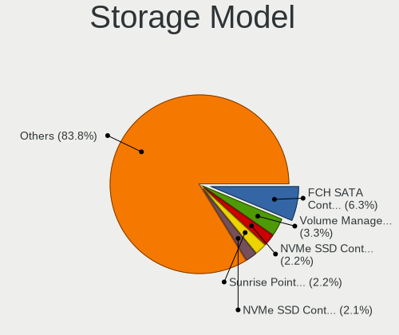
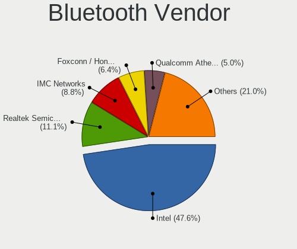
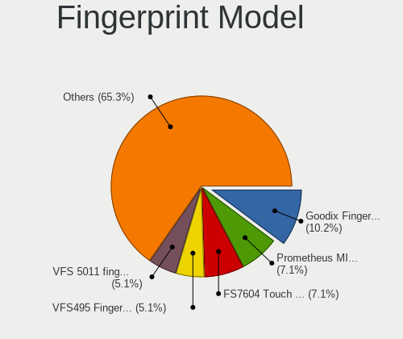
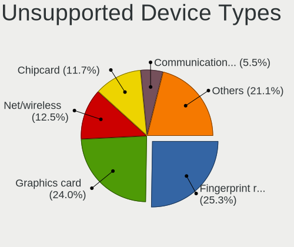

Ubuntu - Hardware Trends
------------------------

A project to identify most popular hardware characteristics and track their change
over time based on data collected by Linux users at https://Linux-Hardware.org.

Anyone can contribute to this report by the [hw-probe](https://github.com/linuxhw/hw-probe) tool:

    sudo -E hw-probe -all -upload

This is a report for all computer types. See also reports for [desktops](/Dist/Ubuntu/Desktop/README.md) and [notebooks](/Dist/Ubuntu/Notebook/README.md).

This report is for one last month. Overall report since the beginning of time: [TestCoverage](https://github.com/linuxhw/TestCoverage)

Period: Nov, 2022.

Contents
--------

* [ System ](#system)
  - [ OS                       ](#os)
  - [ OS Family                ](#os-family)
  - [ Kernel                   ](#kernel)
  - [ Kernel Family            ](#kernel-family)
  - [ Kernel Major Ver.        ](#kernel-major-ver)
  - [ Arch                     ](#arch)
  - [ DE                       ](#de)
  - [ Display Server           ](#display-server)
  - [ Display Manager          ](#display-manager)
  - [ OS Lang                  ](#os-lang)
  - [ Boot Mode                ](#boot-mode)
  - [ Filesystem               ](#filesystem)
  - [ Part. scheme             ](#part-scheme)
  - [ Dual Boot with Linux/BSD ](#dual-boot-with-linuxbsd)
  - [ Dual Boot (Win)          ](#dual-boot-win)

* [ Board ](#board)
  - [ Vendor                   ](#vendor)
  - [ Model                    ](#model)
  - [ Model Family             ](#model-family)
  - [ MFG Year                 ](#mfg-year)
  - [ Form Factor              ](#form-factor)
  - [ Secure Boot              ](#secure-boot)
  - [ Coreboot                 ](#coreboot)
  - [ RAM Size                 ](#ram-size)
  - [ RAM Used                 ](#ram-used)
  - [ Total Drives             ](#total-drives)
  - [ Has CD-ROM               ](#has-cd-rom)
  - [ Has Ethernet             ](#has-ethernet)
  - [ Has WiFi                 ](#has-wifi)
  - [ Has Bluetooth            ](#has-bluetooth)

* [ Location ](#location)
  - [ Country                  ](#country)
  - [ City                     ](#city)

* [ Drives ](#drives)
  - [ Drive Vendor             ](#drive-vendor)
  - [ Drive Model              ](#drive-model)
  - [ HDD Vendor               ](#hdd-vendor)
  - [ SSD Vendor               ](#ssd-vendor)
  - [ Drive Kind               ](#drive-kind)
  - [ Drive Connector          ](#drive-connector)
  - [ Drive Size               ](#drive-size)
  - [ Space Total              ](#space-total)
  - [ Space Used               ](#space-used)
  - [ Malfunc. Drives          ](#malfunc-drives)
  - [ Malfunc. Drive Vendor    ](#malfunc-drive-vendor)
  - [ Malfunc. HDD Vendor      ](#malfunc-hdd-vendor)
  - [ Malfunc. Drive Kind      ](#malfunc-drive-kind)
  - [ Failed Drives            ](#failed-drives)
  - [ Failed Drive Vendor      ](#failed-drive-vendor)
  - [ Drive Status             ](#drive-status)

* [ Storage controller ](#storage-controller)
  - [ Storage Vendor           ](#storage-vendor)
  - [ Storage Model            ](#storage-model)
  - [ Storage Kind             ](#storage-kind)

* [ Processor ](#processor)
  - [ CPU Vendor               ](#cpu-vendor)
  - [ CPU Model                ](#cpu-model)
  - [ CPU Model Family         ](#cpu-model-family)
  - [ CPU Cores                ](#cpu-cores)
  - [ CPU Sockets              ](#cpu-sockets)
  - [ CPU Threads              ](#cpu-threads)
  - [ CPU Op-Modes             ](#cpu-op-modes)
  - [ CPU Microcode            ](#cpu-microcode)
  - [ CPU Microarch            ](#cpu-microarch)

* [ Graphics ](#graphics)
  - [ GPU Vendor               ](#gpu-vendor)
  - [ GPU Model                ](#gpu-model)
  - [ GPU Combo                ](#gpu-combo)
  - [ GPU Driver               ](#gpu-driver)
  - [ GPU Memory               ](#gpu-memory)

* [ Monitor ](#monitor)
  - [ Monitor Vendor           ](#monitor-vendor)
  - [ Monitor Model            ](#monitor-model)
  - [ Monitor Resolution       ](#monitor-resolution)
  - [ Monitor Diagonal         ](#monitor-diagonal)
  - [ Monitor Width            ](#monitor-width)
  - [ Aspect Ratio             ](#aspect-ratio)
  - [ Monitor Area             ](#monitor-area)
  - [ Pixel Density            ](#pixel-density)
  - [ Multiple Monitors        ](#multiple-monitors)

* [ Network ](#network)
  - [ Net Controller Vendor    ](#net-controller-vendor)
  - [ Net Controller Model     ](#net-controller-model)
  - [ Wireless Vendor          ](#wireless-vendor)
  - [ Wireless Model           ](#wireless-model)
  - [ Ethernet Vendor          ](#ethernet-vendor)
  - [ Ethernet Model           ](#ethernet-model)
  - [ Net Controller Kind      ](#net-controller-kind)
  - [ Used Controller          ](#used-controller)
  - [ NICs                     ](#nics)
  - [ IPv6                     ](#ipv6)

* [ Bluetooth ](#bluetooth)
  - [ Bluetooth Vendor         ](#bluetooth-vendor)
  - [ Bluetooth Model          ](#bluetooth-model)

* [ Sound ](#sound)
  - [ Sound Vendor             ](#sound-vendor)
  - [ Sound Model              ](#sound-model)

* [ Memory ](#memory)
  - [ Memory Vendor            ](#memory-vendor)
  - [ Memory Model             ](#memory-model)
  - [ Memory Kind              ](#memory-kind)
  - [ Memory Form Factor       ](#memory-form-factor)
  - [ Memory Size              ](#memory-size)
  - [ Memory Speed             ](#memory-speed)

* [ Printers & scanners ](#printers--scanners)
  - [ Printer Vendor           ](#printer-vendor)
  - [ Printer Model            ](#printer-model)
  - [ Scanner Vendor           ](#scanner-vendor)
  - [ Scanner Model            ](#scanner-model)

* [ Camera ](#camera)
  - [ Camera Vendor            ](#camera-vendor)
  - [ Camera Model             ](#camera-model)

* [ Security ](#security)
  - [ Fingerprint Vendor       ](#fingerprint-vendor)
  - [ Fingerprint Model        ](#fingerprint-model)
  - [ Chipcard Vendor          ](#chipcard-vendor)
  - [ Chipcard Model           ](#chipcard-model)

* [ Unsupported ](#unsupported)
  - [ Unsupported Devices      ](#unsupported-devices)
  - [ Unsupported Device Types ](#unsupported-device-types)

System
------

OS
--

Installed operating systems

| Name           | Computers | Percent |
|----------------|-----------|---------|
| Ubuntu 22.04   | 815       | 59.36%  |
| Ubuntu 22.10   | 234       | 17.04%  |
| Ubuntu 20.04   | 190       | 13.84%  |
| Ubuntu 18.04   | 65        | 4.73%   |
| Ubuntu 16.04   | 49        | 3.57%   |
| Ubuntu 21.10   | 9         | 0.66%   |
| Ubuntu 23.04   | 3         | 0.22%   |
| Ubuntu 21.04   | 3         | 0.22%   |
| Ubuntu Core 18 | 2         | 0.15%   |
| Ubuntu 20.10   | 1         | 0.07%   |
| Ubuntu 17.10   | 1         | 0.07%   |
| Ubuntu 14.04   | 1         | 0.07%   |

OS Family
---------

OS without a version

| Name   | Computers | Percent |
|--------|-----------|---------|
| Ubuntu | 1373      | 100%    |

Kernel
------

Version of the Linux kernel

| Version              | Computers | Percent |
|----------------------|-----------|---------|
| 5.15.0-52-generic    | 412       | 30.01%  |
| 5.15.0-53-generic    | 379       | 27.6%   |
| 5.19.0-23-generic    | 185       | 13.47%  |
| 4.15.0-142-generic   | 46        | 3.35%   |
| 5.15.0-43-generic    | 41        | 2.99%   |
| 5.19.0-21-generic    | 25        | 1.82%   |
| 5.4.0-131-generic    | 21        | 1.53%   |
| 5.4.0-132-generic    | 17        | 1.24%   |
| 5.19.0-24-generic    | 12        | 0.87%   |
| 5.15.0-50-generic    | 12        | 0.87%   |
| 5.15.0-46-generic    | 12        | 0.87%   |
| 5.15.0-54-generic    | 11        | 0.8%    |
| 5.15.0-48-generic    | 11        | 0.8%    |
| 5.15.0-25-generic    | 10        | 0.73%   |
| 5.14.0-1054-oem      | 9         | 0.66%   |
| 4.15.0-196-generic   | 8         | 0.58%   |
| 4.15.0-197-generic   | 7         | 0.51%   |
| 4.15.0-175-generic   | 7         | 0.51%   |
| 5.4.0-107-generic    | 6         | 0.44%   |
| 5.4.0-126-generic    | 5         | 0.36%   |
| 5.4.0-128-generic    | 4         | 0.29%   |
| 5.17.0-1021-oem      | 4         | 0.29%   |
| 5.15.0-10052-tuxedo  | 4         | 0.29%   |
| 5.13.0-52-generic    | 4         | 0.29%   |
| 5.11.0-27-generic    | 4         | 0.29%   |
| 6.0.8-060008-generic | 3         | 0.22%   |
| 5.4.0-87-generic     | 3         | 0.22%   |
| 5.4.0-84-generic     | 3         | 0.22%   |
| 5.17.0-1020-oem      | 3         | 0.22%   |
| 5.13.0-39-generic    | 3         | 0.22%   |
| 5.13.0-30-generic    | 3         | 0.22%   |
| 5.11.0-49-generic    | 3         | 0.22%   |
| 6.0.9-060009-generic | 2         | 0.15%   |
| 6.0.8-surface        | 2         | 0.15%   |
| 6.0.7-060007-generic | 2         | 0.15%   |
| 6.0.6-060006-generic | 2         | 0.15%   |
| 6.0.3-060003-generic | 2         | 0.15%   |
| 5.17.0-1019-oem      | 2         | 0.15%   |
| 5.15.0-35-generic    | 2         | 0.15%   |
| 5.14.0-1047-oem      | 2         | 0.15%   |

Kernel Family
-------------

Linux kernel without a distro release

| Version  | Computers | Percent |
|----------|-----------|---------|
| 5.15.0   | 900       | 65.55%  |
| 5.19.0   | 225       | 16.39%  |
| 5.4.0    | 75        | 5.46%   |
| 4.15.0   | 74        | 5.39%   |
| 5.13.0   | 16        | 1.17%   |
| 5.17.0   | 12        | 0.87%   |
| 5.14.0   | 12        | 0.87%   |
| 5.11.0   | 9         | 0.66%   |
| 6.0.8    | 5         | 0.36%   |
| 5.8.0    | 5         | 0.36%   |
| 6.1.0    | 3         | 0.22%   |
| 6.0.6    | 3         | 0.22%   |
| 6.0.9    | 2         | 0.15%   |
| 6.0.7    | 2         | 0.15%   |
| 6.0.3    | 2         | 0.15%   |
| 5.5.19   | 2         | 0.15%   |
| 5.10.60  | 2         | 0.15%   |
| 4.4.0    | 2         | 0.15%   |
| 4.15.18  | 2         | 0.15%   |
| 4.13.0   | 2         | 0.15%   |
| 6.0.2    | 1         | 0.07%   |
| 6.0.1    | 1         | 0.07%   |
| 6.0.0    | 1         | 0.07%   |
| 5.9.1    | 1         | 0.07%   |
| 5.7.1    | 1         | 0.07%   |
| 5.3.0    | 1         | 0.07%   |
| 5.19.5   | 1         | 0.07%   |
| 5.18.8   | 1         | 0.07%   |
| 5.18.19  | 1         | 0.07%   |
| 5.18.16  | 1         | 0.07%   |
| 5.17.5   | 1         | 0.07%   |
| 5.17.15  | 1         | 0.07%   |
| 5.16.19  | 1         | 0.07%   |
| 5.15.78  | 1         | 0.07%   |
| 5.10.66  | 1         | 0.07%   |
| 5.10.110 | 1         | 0.07%   |
| 4.9.312  | 1         | 0.07%   |
| 4.9.253  | 1         | 0.07%   |

Kernel Major Ver.
-----------------

Linux kernel major version

| Version | Computers | Percent |
|---------|-----------|---------|
| 5.15    | 901       | 65.62%  |
| 5.19    | 226       | 16.46%  |
| 4.15    | 76        | 5.54%   |
| 5.4     | 75        | 5.46%   |
| 6.0     | 17        | 1.24%   |
| 5.13    | 16        | 1.17%   |
| 5.17    | 14        | 1.02%   |
| 5.14    | 12        | 0.87%   |
| 5.11    | 9         | 0.66%   |
| 5.8     | 5         | 0.36%   |
| 5.10    | 4         | 0.29%   |
| 6.1     | 3         | 0.22%   |
| 5.18    | 3         | 0.22%   |
| 5.5     | 2         | 0.15%   |
| 4.9     | 2         | 0.15%   |
| 4.4     | 2         | 0.15%   |
| 4.13    | 2         | 0.15%   |
| 5.9     | 1         | 0.07%   |
| 5.7     | 1         | 0.07%   |
| 5.3     | 1         | 0.07%   |
| 5.16    | 1         | 0.07%   |

Arch
----

OS architecture (x86_64, i586, etc.)

| Name    | Computers | Percent |
|---------|-----------|---------|
| x86_64  | 1359      | 98.98%  |
| i686    | 7         | 0.51%   |
| aarch64 | 6         | 0.44%   |
| riscv64 | 1         | 0.07%   |

DE
--

Desktop Environment

| Name              | Computers | Percent |
|-------------------|-----------|---------|
| GNOME             | 1197      | 87.18%  |
| Unknown           | 137       | 9.98%   |
| X-Cinnamon        | 11        | 0.8%    |
| GNOME Flashback   | 11        | 0.8%    |
| i3                | 3         | 0.22%   |
| GNOME Classic     | 3         | 0.22%   |
| Enlightenment     | 2         | 0.15%   |
| Cinnamon          | 2         | 0.15%   |
| awesome           | 2         | 0.15%   |
| Yaru:ubuntu:GNOME | 1         | 0.07%   |
| ubuntu=GNOME      | 1         | 0.07%   |
| ubuntu            | 1         | 0.07%   |
| openbox           | 1         | 0.07%   |
| i3-with-shmlog    | 1         | 0.07%   |

Display Server
--------------

X11 or Wayland

| Name    | Computers | Percent |
|---------|-----------|---------|
| Wayland | 696       | 50.69%  |
| X11     | 584       | 42.53%  |
| Unknown | 59        | 4.3%    |
| Tty     | 33        | 2.4%    |
| Web     | 1         | 0.07%   |

Display Manager
---------------

SDDM, LightDM, etc.

| Name    | Computers | Percent |
|---------|-----------|---------|
| GDM3    | 1080      | 78.66%  |
| Unknown | 177       | 12.89%  |
| GDM     | 84        | 6.12%   |
| LightDM | 29        | 2.11%   |
| SDDM    | 3         | 0.22%   |

OS Lang
-------

Language

| Lang    | Computers | Percent |
|---------|-----------|---------|
| en_US   | 595       | 43.34%  |
| de_DE   | 121       | 8.81%   |
| fr_FR   | 85        | 6.19%   |
| Unknown | 81        | 5.9%    |
| it_IT   | 67        | 4.88%   |
| en_GB   | 61        | 4.44%   |
| pt_BR   | 40        | 2.91%   |
| es_ES   | 29        | 2.11%   |
| en_CA   | 29        | 2.11%   |
| ru_RU   | 25        | 1.82%   |
| en_IN   | 23        | 1.68%   |
| nl_NL   | 17        | 1.24%   |
| C       | 17        | 1.24%   |
| pl_PL   | 16        | 1.17%   |
| en_AU   | 14        | 1.02%   |
| cs_CZ   | 11        | 0.8%    |
| es_MX   | 9         | 0.66%   |
| zh_CN   | 8         | 0.58%   |
| sv_SE   | 7         | 0.51%   |
| fr_CA   | 6         | 0.44%   |
| en_ZA   | 6         | 0.44%   |
| de_CH   | 6         | 0.44%   |
| ko_KR   | 5         | 0.36%   |
| ja_JP   | 5         | 0.36%   |
| hu_HU   | 5         | 0.36%   |
| es_AR   | 5         | 0.36%   |
| el_GR   | 5         | 0.36%   |
| pt_PT   | 4         | 0.29%   |
| es_VE   | 4         | 0.29%   |
| es_CO   | 4         | 0.29%   |
| en_PH   | 4         | 0.29%   |
| en_NZ   | 4         | 0.29%   |
| en_IL   | 4         | 0.29%   |
| de_AT   | 4         | 0.29%   |
| uk_UA   | 3         | 0.22%   |
| nl_BE   | 3         | 0.22%   |
| nb_NO   | 3         | 0.22%   |
| en_HK   | 3         | 0.22%   |
| bg_BG   | 3         | 0.22%   |
| fr_CH   | 2         | 0.15%   |

Boot Mode
---------

EFI or BIOS

| Mode | Computers | Percent |
|------|-----------|---------|
| BIOS | 761       | 55.43%  |
| EFI  | 612       | 44.57%  |

Filesystem
----------

Type of filesystem

| Type          | Computers | Percent |
|---------------|-----------|---------|
| Ext4          | 1274      | 92.79%  |
| Zfs           | 36        | 2.62%   |
| Overlay       | 36        | 2.62%   |
| Btrfs         | 18        | 1.31%   |
| Ext2          | 3         | 0.22%   |
| Xfs           | 2         | 0.15%   |
| Ext3          | 2         | 0.15%   |
| Jfs           | 1         | 0.07%   |
| Fuse.snapfuse | 1         | 0.07%   |

Part. scheme
------------

Scheme of partitioning

| Type    | Computers | Percent |
|---------|-----------|---------|
| GPT     | 1123      | 81.79%  |
| MBR     | 171       | 12.45%  |
| Unknown | 79        | 5.75%   |

Dual Boot with Linux/BSD
------------------------

Hosting more than one Linux/BSD

| Dual boot | Computers | Percent |
|-----------|-----------|---------|
| No        | 1137      | 82.81%  |
| Yes       | 236       | 17.19%  |

Dual Boot (Win)
---------------

Hosting Linux and Windows

| Dual boot | Computers | Percent |
|-----------|-----------|---------|
| No        | 882       | 64.24%  |
| Yes       | 491       | 35.76%  |

Board
-----

Vendor
------

Motherboard manufacturer

| Name                           | Computers | Percent |
|--------------------------------|-----------|---------|
| ASUSTek Computer               | 236       | 17.19%  |
| Dell                           | 208       | 15.15%  |
| Hewlett-Packard                | 194       | 14.13%  |
| Lenovo                         | 180       | 13.11%  |
| Gigabyte Technology            | 79        | 5.75%   |
| Acer                           | 71        | 5.17%   |
| MSI                            | 64        | 4.66%   |
| Apple                          | 46        | 3.35%   |
| ASRock                         | 32        | 2.33%   |
| HUAWEI                         | 25        | 1.82%   |
| Samsung Electronics            | 20        | 1.46%   |
| Intel                          | 18        | 1.31%   |
| Fujitsu                        | 16        | 1.17%   |
| Unknown                        | 14        | 1.02%   |
| Sony                           | 12        | 0.87%   |
| Toshiba                        | 9         | 0.66%   |
| Microsoft                      | 8         | 0.58%   |
| Medion                         | 6         | 0.44%   |
| Google                         | 6         | 0.44%   |
| Notebook                       | 5         | 0.36%   |
| Chuwi                          | 5         | 0.36%   |
| Biostar                        | 5         | 0.36%   |
| TUXEDO                         | 4         | 0.29%   |
| Pegatron                       | 4         | 0.29%   |
| Packard Bell                   | 4         | 0.29%   |
| AZW                            | 4         | 0.29%   |
| Alienware                      | 4         | 0.29%   |
| Timi                           | 3         | 0.22%   |
| System76                       | 3         | 0.22%   |
| Shanghai Zhaoxin Semiconductor | 3         | 0.22%   |
| Positivo                       | 3         | 0.22%   |
| LG Electronics                 | 3         | 0.22%   |
| Gateway                        | 3         | 0.22%   |
| Foxconn                        | 3         | 0.22%   |
| BESSTAR Tech                   | 3         | 0.22%   |
| Supermicro                     | 2         | 0.15%   |
| Shuttle                        | 2         | 0.15%   |
| Semp Toshiba                   | 2         | 0.15%   |
| Radxa                          | 2         | 0.15%   |
| PCWare                         | 2         | 0.15%   |

Model
-----

Motherboard model

| Name                                   | Computers | Percent |
|----------------------------------------|-----------|---------|
| ASUS ROG STRIX X299-E GAMING           | 38        | 2.77%   |
| Unknown                                | 18        | 1.31%   |
| ASUS All Series                        | 16        | 1.17%   |
| ASUS PRIME TRX40-PRO                   | 9         | 0.66%   |
| ASUS TUF X299 MARK 2                   | 7         | 0.51%   |
| Dell OptiPlex 990                      | 6         | 0.44%   |
| ASUS PRIME A320M-K                     | 6         | 0.44%   |
| Gigabyte X299 UD4 Pro                  | 5         | 0.36%   |
| Dell XPS 15 7590                       | 5         | 0.36%   |
| Dell OptiPlex 7010                     | 5         | 0.36%   |
| MSI MS-7C37                            | 4         | 0.29%   |
| HUAWEI HVY-WXX9                        | 4         | 0.29%   |
| HP Z440 Workstation                    | 4         | 0.29%   |
| Gigabyte B450M DS3H                    | 4         | 0.29%   |
| Dell OptiPlex 3020                     | 4         | 0.29%   |
| ASUS TUF Gaming X570-PLUS              | 4         | 0.29%   |
| TUXEDO Pulse 15 Gen1                   | 3         | 0.22%   |
| MSI MS-7978                            | 3         | 0.22%   |
| Lenovo ThinkSystem SR550 -[7X04CTO1WW] | 3         | 0.22%   |
| Lenovo ThinkPad W541 20EGS1PL00        | 3         | 0.22%   |
| Lenovo ThinkPad P70 20ESS04S00         | 3         | 0.22%   |
| Intel H61                              | 3         | 0.22%   |
| HUAWEI NBLK-WAX9X                      | 3         | 0.22%   |
| HUAWEI CREM-WXX9                       | 3         | 0.22%   |
| HUAWEI BOD-WXX9                        | 3         | 0.22%   |
| HP Stream Laptop 14-cb1xxx             | 3         | 0.22%   |
| HP ProBook 6470b                       | 3         | 0.22%   |
| HP ProBook 450 G8 Notebook PC          | 3         | 0.22%   |
| HP Pavilion g7                         | 3         | 0.22%   |
| HP Pavilion dv6                        | 3         | 0.22%   |
| HP Notebook                            | 3         | 0.22%   |
| HP Compaq 8200 Elite SFF PC            | 3         | 0.22%   |
| Gigabyte X299 AORUS Gaming 7           | 3         | 0.22%   |
| Gigabyte X299 AORUS Gaming 3           | 3         | 0.22%   |
| Dell XPS 9320                          | 3         | 0.22%   |
| Dell XPS 13 7390                       | 3         | 0.22%   |
| Dell Latitude 7310                     | 3         | 0.22%   |
| Dell Latitude 5420                     | 3         | 0.22%   |
| Dell G5 5587                           | 3         | 0.22%   |
| Dell G15 5511                          | 3         | 0.22%   |

Model Family
------------

Motherboard model prefix

| Name               | Computers | Percent |
|--------------------|-----------|---------|
| Lenovo ThinkPad    | 71        | 5.17%   |
| ASUS ROG           | 53        | 3.86%   |
| Dell Latitude      | 50        | 3.64%   |
| Acer Aspire        | 49        | 3.57%   |
| Lenovo IdeaPad     | 40        | 2.91%   |
| Dell Inspiron      | 40        | 2.91%   |
| HP EliteBook       | 37        | 2.69%   |
| HP Pavilion        | 35        | 2.55%   |
| Dell OptiPlex      | 34        | 2.48%   |
| ASUS PRIME         | 34        | 2.48%   |
| Dell Precision     | 27        | 1.97%   |
| Dell XPS           | 23        | 1.68%   |
| ASUS VivoBook      | 20        | 1.46%   |
| Unknown            | 18        | 1.31%   |
| Lenovo ThinkCentre | 16        | 1.17%   |
| HP Compaq          | 16        | 1.17%   |
| ASUS TUF           | 16        | 1.17%   |
| ASUS All           | 16        | 1.17%   |
| HP ProBook         | 15        | 1.09%   |
| HP Laptop          | 13        | 0.95%   |
| Gigabyte X299      | 12        | 0.87%   |
| Dell Vostro        | 10        | 0.73%   |
| ASUS Zenbook       | 9         | 0.66%   |
| Microsoft Surface  | 8         | 0.58%   |
| HP ENVY            | 8         | 0.58%   |
| Lenovo Yoga        | 7         | 0.51%   |
| Lenovo Legion      | 7         | 0.51%   |
| HP ZBook           | 7         | 0.51%   |
| HP EliteDesk       | 7         | 0.51%   |
| Acer Swift         | 7         | 0.51%   |
| Lenovo ThinkSystem | 6         | 0.44%   |
| Lenovo ThinkBook   | 6         | 0.44%   |
| Dell PowerEdge     | 6         | 0.44%   |
| Toshiba Satellite  | 5         | 0.36%   |
| Lenovo IdeaCentre  | 5         | 0.36%   |
| Gigabyte B450M     | 5         | 0.36%   |
| Fujitsu LIFEBOOK   | 5         | 0.36%   |
| Fujitsu ESPRIMO    | 5         | 0.36%   |
| ASUS M5A78L-M      | 5         | 0.36%   |
| Apple MacBookPro11 | 5         | 0.36%   |

MFG Year
--------

Motherboard manufacture year

| Year    | Computers | Percent |
|---------|-----------|---------|
| 2021    | 157       | 11.43%  |
| 2017    | 138       | 10.05%  |
| 2020    | 129       | 9.4%    |
| 2019    | 129       | 9.4%    |
| 2018    | 105       | 7.65%   |
| 2022    | 102       | 7.43%   |
| 2013    | 87        | 6.34%   |
| 2012    | 87        | 6.34%   |
| 2015    | 81        | 5.9%    |
| 2014    | 74        | 5.39%   |
| 2011    | 73        | 5.32%   |
| 2016    | 59        | 4.3%    |
| 2010    | 50        | 3.64%   |
| 2009    | 37        | 2.69%   |
| 2008    | 30        | 2.18%   |
| 2007    | 21        | 1.53%   |
| Unknown | 7         | 0.51%   |
| 2006    | 4         | 0.29%   |
| 2005    | 3         | 0.22%   |

Form Factor
-----------

Physical design of the computer

| Name           | Computers | Percent |
|----------------|-----------|---------|
| Notebook       | 728       | 53.02%  |
| Desktop        | 521       | 37.95%  |
| Convertible    | 39        | 2.84%   |
| Mini pc        | 24        | 1.75%   |
| All in one     | 21        | 1.53%   |
| Server         | 20        | 1.46%   |
| Tablet         | 14        | 1.02%   |
| System on chip | 5         | 0.36%   |
| Other          | 1         | 0.07%   |

Secure Boot
-----------

Enabled or disabled

| State    | Computers | Percent |
|----------|-----------|---------|
| Disabled | 1231      | 89.66%  |
| Enabled  | 142       | 10.34%  |

Coreboot
--------

Have coreboot on board

| Used | Computers | Percent |
|------|-----------|---------|
| No   | 1365      | 99.42%  |
| Yes  | 8         | 0.58%   |

RAM Size
--------

Total RAM memory

| Size in GB      | Computers | Percent |
|-----------------|-----------|---------|
| 4.01-8.0        | 324       | 23.6%   |
| 16.01-24.0      | 312       | 22.72%  |
| 3.01-4.0        | 210       | 15.29%  |
| 8.01-16.0       | 203       | 14.79%  |
| 32.01-64.0      | 157       | 11.43%  |
| 64.01-256.0     | 96        | 6.99%   |
| 24.01-32.0      | 24        | 1.75%   |
| 1.01-2.0        | 19        | 1.38%   |
| More than 256.0 | 15        | 1.09%   |
| 2.01-3.0        | 13        | 0.95%   |

RAM Used
--------

Used RAM memory

| Used GB     | Computers | Percent |
|-------------|-----------|---------|
| 1.01-2.0    | 397       | 28.91%  |
| 2.01-3.0    | 380       | 27.68%  |
| 4.01-8.0    | 229       | 16.68%  |
| 3.01-4.0    | 211       | 15.37%  |
| 8.01-16.0   | 69        | 5.03%   |
| 32.01-64.0  | 34        | 2.48%   |
| 0.51-1.0    | 19        | 1.38%   |
| 16.01-24.0  | 12        | 0.87%   |
| 64.01-256.0 | 9         | 0.66%   |
| 0.01-0.5    | 9         | 0.66%   |
| 24.01-32.0  | 4         | 0.29%   |

Total Drives
------------

Number of drives on board

| Drives | Computers | Percent |
|--------|-----------|---------|
| 1      | 852       | 62.05%  |
| 2      | 315       | 22.94%  |
| 3      | 119       | 8.67%   |
| 4      | 43        | 3.13%   |
| 5      | 18        | 1.31%   |
| 0      | 10        | 0.73%   |
| 6      | 7         | 0.51%   |
| 7      | 4         | 0.29%   |
| 32     | 1         | 0.07%   |
| 12     | 1         | 0.07%   |
| 10     | 1         | 0.07%   |
| 9      | 1         | 0.07%   |
| 8      | 1         | 0.07%   |

Has CD-ROM
----------

Has CD-ROM on board

| Presented | Computers | Percent |
|-----------|-----------|---------|
| No        | 930       | 67.73%  |
| Yes       | 443       | 32.27%  |

Has Ethernet
------------

Has Ethernet on board

| Presented | Computers | Percent |
|-----------|-----------|---------|
| Yes       | 1140      | 83.03%  |
| No        | 233       | 16.97%  |

Has WiFi
--------

Has WiFi module

| Presented | Computers | Percent |
|-----------|-----------|---------|
| Yes       | 1040      | 75.75%  |
| No        | 333       | 24.25%  |

Has Bluetooth
-------------

Has Bluetooth module

| Presented | Computers | Percent |
|-----------|-----------|---------|
| Yes       | 821       | 59.8%   |
| No        | 552       | 40.2%   |

Location
--------

Country
-------

Geographic location (country)

| Country      | Computers | Percent |
|--------------|-----------|---------|
| USA          | 224       | 16.31%  |
| Germany      | 149       | 10.85%  |
| France       | 98        | 7.14%   |
| Italy        | 92        | 6.7%    |
| Unknown      | 66        | 4.81%   |
| Brazil       | 58        | 4.22%   |
| UK           | 55        | 4.01%   |
| Canada       | 40        | 2.91%   |
| Russia       | 37        | 2.69%   |
| Spain        | 32        | 2.33%   |
| Poland       | 32        | 2.33%   |
| Netherlands  | 27        | 1.97%   |
| India        | 27        | 1.97%   |
| China        | 21        | 1.53%   |
| Switzerland  | 20        | 1.46%   |
| Sweden       | 19        | 1.38%   |
| Mexico       | 18        | 1.31%   |
| Indonesia    | 17        | 1.24%   |
| Czechia      | 17        | 1.24%   |
| Greece       | 16        | 1.17%   |
| Australia    | 16        | 1.17%   |
| Austria      | 14        | 1.02%   |
| Turkey       | 12        | 0.87%   |
| Portugal     | 11        | 0.8%    |
| Denmark      | 11        | 0.8%    |
| Belgium      | 10        | 0.73%   |
| Romania      | 9         | 0.66%   |
| Finland      | 9         | 0.66%   |
| Bulgaria     | 9         | 0.66%   |
| South Africa | 8         | 0.58%   |
| Serbia       | 8         | 0.58%   |
| Japan        | 8         | 0.58%   |
| Hungary      | 8         | 0.58%   |
| Taiwan       | 7         | 0.51%   |
| Colombia     | 7         | 0.51%   |
| Argentina    | 7         | 0.51%   |
| UAE          | 6         | 0.44%   |
| South Korea  | 6         | 0.44%   |
| Israel       | 6         | 0.44%   |
| Egypt        | 6         | 0.44%   |

City
----

Geographic location (city)

| City              | Computers | Percent |
|-------------------|-----------|---------|
| Unknown           | 66        | 4.81%   |
| Berlin            | 14        | 1.02%   |
| Rome              | 12        | 0.87%   |
| Paris             | 12        | 0.87%   |
| Milan             | 11        | 0.8%    |
| Champs-sur-Marne  | 9         | 0.66%   |
| St Petersburg     | 8         | 0.58%   |
| South Tangerang   | 8         | 0.58%   |
| San Diego         | 8         | 0.58%   |
| Rio de Janeiro    | 8         | 0.58%   |
| London            | 8         | 0.58%   |
| Frankfurt am Main | 7         | 0.51%   |
| Athens            | 7         | 0.51%   |
| Zurich            | 6         | 0.44%   |
| Stockholm         | 6         | 0.44%   |
| Moscow            | 6         | 0.44%   |
| Madrid            | 6         | 0.44%   |
| Istanbul          | 6         | 0.44%   |
| Hamburg           | 6         | 0.44%   |
| Beijing           | 6         | 0.44%   |
| Vienna            | 5         | 0.36%   |
| Sofia             | 5         | 0.36%   |
| Sao Paulo         | 5         | 0.36%   |
| Prague            | 5         | 0.36%   |
| Helsinki          | 5         | 0.36%   |
| Hangzhou          | 5         | 0.36%   |
| Cologne           | 5         | 0.36%   |
| Bucharest         | 5         | 0.36%   |
| Belgrade          | 5         | 0.36%   |
| Amsterdam         | 5         | 0.36%   |
| Valenciennes      | 4         | 0.29%   |
| Seattle           | 4         | 0.29%   |
| Portland          | 4         | 0.29%   |
| Philadelphia      | 4         | 0.29%   |
| Perth             | 4         | 0.29%   |
| Oslo              | 4         | 0.29%   |
| Munich            | 4         | 0.29%   |
| Melbourne         | 4         | 0.29%   |
| Los Angeles       | 4         | 0.29%   |
| Liverpool         | 4         | 0.29%   |

Drives
------

Drive Vendor
------------

Hard drive vendors

| Vendor                      | Computers | Drives | Percent |
|-----------------------------|-----------|--------|---------|
| Samsung Electronics         | 346       | 393    | 17.69%  |
| Seagate                     | 301       | 409    | 15.39%  |
| WDC                         | 241       | 287    | 12.32%  |
| Toshiba                     | 113       | 126    | 5.78%   |
| Kingston                    | 113       | 119    | 5.78%   |
| Sandisk                     | 107       | 113    | 5.47%   |
| Unknown                     | 67        | 70     | 3.43%   |
| Crucial                     | 63        | 68     | 3.22%   |
| SK hynix                    | 58        | 58     | 2.97%   |
| Intel                       | 49        | 57     | 2.51%   |
| Hitachi                     | 46        | 48     | 2.35%   |
| Micron Technology           | 38        | 39     | 1.94%   |
| HGST                        | 35        | 41     | 1.79%   |
| Silicon Motion              | 28        | 28     | 1.43%   |
| KIOXIA                      | 27        | 28     | 1.38%   |
| Apple                       | 26        | 30     | 1.33%   |
| China                       | 24        | 24     | 1.23%   |
| A-DATA Technology           | 16        | 19     | 0.82%   |
| Phison Electronics          | 15        | 17     | 0.77%   |
| LITEON                      | 14        | 14     | 0.72%   |
| Phison                      | 10        | 11     | 0.51%   |
| Kingston Technology Company | 10        | 10     | 0.51%   |
| Intenso                     | 10        | 10     | 0.51%   |
| SPCC                        | 8         | 9      | 0.41%   |
| Patriot                     | 8         | 8      | 0.41%   |
| Micron/Crucial Technology   | 8         | 8      | 0.41%   |
| Transcend                   | 7         | 7      | 0.36%   |
| PNY                         | 7         | 7      | 0.36%   |
| Unknown                     | 7         | 7      | 0.36%   |
| Solid State Storage         | 6         | 6      | 0.31%   |
| Maxtor                      | 6         | 7      | 0.31%   |
| SABRENT                     | 5         | 5      | 0.26%   |
| Lexar                       | 5         | 5      | 0.26%   |
| KingSpec                    | 5         | 5      | 0.26%   |
| GOODRAM                     | 5         | 5      | 0.26%   |
| ADATA Technology            | 5         | 5      | 0.26%   |
| UMIS                        | 4         | 4      | 0.2%    |
| OCZ                         | 4         | 4      | 0.2%    |
| LITEONIT                    | 4         | 4      | 0.2%    |
| JMicron Technology          | 4         | 4      | 0.2%    |

Drive Model
-----------

Hard drive models

| Model                                                | Computers | Percent |
|------------------------------------------------------|-----------|---------|
| Seagate ST6000NM0115-1YZ110 6TB                      | 54        | 2.54%   |
| Samsung SSD 860 EVO 500GB                            | 46        | 2.16%   |
| Kingston SA400S37480G 480GB SSD                      | 29        | 1.36%   |
| Kingston SA400S37240G 240GB SSD                      | 29        | 1.36%   |
| Samsung NVMe SSD Controller SM981/PM981/PM983 1TB    | 27        | 1.27%   |
| Samsung NVMe SSD Controller PM9A1/PM9A3/980PRO 250GB | 19        | 0.89%   |
| WDC WD10EZEX-08WN4A0 1TB                             | 17        | 0.8%    |
| Unknown MMC Card  32GB                               | 16        | 0.75%   |
| Unknown MMC Card  64GB                               | 15        | 0.71%   |
| Seagate ST1000LM035-1RK172 1TB                       | 14        | 0.66%   |
| Toshiba MQ01ABD100 1TB                               | 13        | 0.61%   |
| Toshiba DT01ACA100 1TB                               | 12        | 0.56%   |
| Silicon Motion Asgard AN3 2TNVMe-M.2-80 2TB          | 12        | 0.56%   |
| Seagate ST12000NM0007-2A1101 12TB                    | 12        | 0.56%   |
| Seagate ST1000DM010-2EP102 1TB                       | 12        | 0.56%   |
| Samsung SSD 870 QVO 1TB                              | 12        | 0.56%   |
| Seagate ST500DM002-1BD142 500GB                      | 11        | 0.52%   |
| Seagate ST2000DM008-2FR102 2TB                       | 11        | 0.52%   |
| Crucial CT1000MX500SSD1 1TB                          | 11        | 0.52%   |
| Seagate ST16000NM001G-2KK103 16TB                    | 10        | 0.47%   |
| Seagate ST1000LM024 HN-M101MBB 1TB                   | 10        | 0.47%   |
| Sandisk WD Blue SN550 NVMe SSD 1TB                   | 10        | 0.47%   |
| Samsung SSD 850 EVO 500GB                            | 10        | 0.47%   |
| HGST HTS721010A9E630 1TB                             | 10        | 0.47%   |
| Toshiba MQ01ABF050 500GB                             | 9         | 0.42%   |
| Sandisk WD Black SN750 / PC SN730 NVMe SSD 1024GB    | 9         | 0.42%   |
| Samsung SSD 850 EVO 250GB                            | 9         | 0.42%   |
| Samsung NVMe SSD Controller SM961/PM961/SM963 250GB  | 9         | 0.42%   |
| KIOXIA KBG40ZNS512G NVMe 512GB                       | 9         | 0.42%   |
| Toshiba HDWD110 1TB                                  | 8         | 0.38%   |
| Seagate ST10000NM0016-1TT101 10TB                    | 8         | 0.38%   |
| Samsung SSD 870 EVO 500GB                            | 8         | 0.38%   |
| Kingston SA400S37120G 120GB SSD                      | 8         | 0.38%   |
| Crucial CT500MX500SSD1 500GB                         | 8         | 0.38%   |
| Seagate ST500LT012-1DG142 500GB                      | 7         | 0.33%   |
| Seagate ST2000DM006-2DM164 2TB                       | 7         | 0.33%   |
| Seagate ST1000DM003-1ER162 1TB                       | 7         | 0.33%   |
| Samsung SSD 860 EVO 1TB                              | 7         | 0.33%   |
| Phison E12 NVMe Controller 2TB                       | 7         | 0.33%   |
| Unknown                                              | 7         | 0.33%   |

HDD Vendor
----------

Hard disk drive vendors

| Vendor              | Computers | Drives | Percent |
|---------------------|-----------|--------|---------|
| Seagate             | 291       | 397    | 41.45%  |
| WDC                 | 193       | 234    | 27.49%  |
| Toshiba             | 83        | 93     | 11.82%  |
| Hitachi             | 46        | 48     | 6.55%   |
| HGST                | 35        | 41     | 4.99%   |
| Samsung Electronics | 31        | 35     | 4.42%   |
| Apple               | 6         | 6      | 0.85%   |
| Unknown             | 5         | 5      | 0.71%   |
| Maxtor              | 3         | 4      | 0.43%   |
| Fujitsu             | 2         | 2      | 0.28%   |
| ASMedia             | 2         | 2      | 0.28%   |
| USB3.0              | 1         | 1      | 0.14%   |
| USB                 | 1         | 1      | 0.14%   |
| Intenso             | 1         | 1      | 0.14%   |
| Hewlett-Packard     | 1         | 1      | 0.14%   |
| External            | 1         | 1      | 0.14%   |

SSD Vendor
----------

Solid state drive vendors

| Vendor              | Computers | Drives | Percent |
|---------------------|-----------|--------|---------|
| Samsung Electronics | 179       | 202    | 27.75%  |
| Kingston            | 98        | 102    | 15.19%  |
| Crucial             | 55        | 58     | 8.53%   |
| SanDisk             | 54        | 59     | 8.37%   |
| WDC                 | 27        | 27     | 4.19%   |
| China               | 23        | 23     | 3.57%   |
| Apple               | 17        | 17     | 2.64%   |
| Intel               | 14        | 15     | 2.17%   |
| SK hynix            | 12        | 12     | 1.86%   |
| LITEON              | 12        | 12     | 1.86%   |
| A-DATA Technology   | 12        | 14     | 1.86%   |
| Micron Technology   | 10        | 11     | 1.55%   |
| SPCC                | 8         | 9      | 1.24%   |
| Patriot             | 8         | 8      | 1.24%   |
| Toshiba             | 7         | 8      | 1.09%   |
| PNY                 | 7         | 7      | 1.09%   |
| Transcend           | 5         | 5      | 0.78%   |
| KingSpec            | 5         | 5      | 0.78%   |
| Intenso             | 5         | 5      | 0.78%   |
| GOODRAM             | 5         | 5      | 0.78%   |
| OCZ                 | 4         | 4      | 0.62%   |
| LITEONIT            | 4         | 4      | 0.62%   |
| Lexar               | 4         | 4      | 0.62%   |
| Gigabyte Technology | 4         | 4      | 0.62%   |
| Team                | 3         | 3      | 0.47%   |
| Netac               | 3         | 3      | 0.47%   |
| Maxtor              | 3         | 3      | 0.47%   |
| JMicron Technology  | 3         | 3      | 0.47%   |
| ASMT                | 3         | 3      | 0.47%   |
| Seagate             | 2         | 2      | 0.31%   |
| Hewlett-Packard     | 2         | 2      | 0.31%   |
| FORESEE             | 2         | 2      | 0.31%   |
| BIWIN               | 2         | 2      | 0.31%   |
| Unknown             | 2         | 2      | 0.31%   |
| WALRAM              | 1         | 1      | 0.16%   |
| W800SH              | 1         | 1      | 0.16%   |
| Vaseky              | 1         | 1      | 0.16%   |
| Value               | 1         | 1      | 0.16%   |
| UNIC2               | 1         | 1      | 0.16%   |
| Super Talent        | 1         | 1      | 0.16%   |

Drive Kind
----------

HDD or SSD

| Kind    | Computers | Drives | Percent |
|---------|-----------|--------|---------|
| HDD     | 603       | 872    | 33.5%   |
| SSD     | 590       | 687    | 32.78%  |
| NVMe    | 512       | 564    | 28.44%  |
| MMC     | 64        | 67     | 3.56%   |
| Unknown | 31        | 31     | 1.72%   |

Drive Connector
---------------

SATA, SAS, NVMe, etc.

| Type | Computers | Drives | Percent |
|------|-----------|--------|---------|
| SATA | 930       | 1517   | 59.24%  |
| NVMe | 507       | 554    | 32.29%  |
| SAS  | 69        | 83     | 4.39%   |
| MMC  | 64        | 67     | 4.08%   |

Drive Size
----------

Size of hard drive

| Size in TB | Computers | Drives | Percent |
|------------|-----------|--------|---------|
| 0.01-0.5   | 669       | 805    | 53.1%   |
| 0.51-1.0   | 349       | 412    | 27.7%   |
| 1.01-2.0   | 85        | 112    | 6.75%   |
| 4.01-10.0  | 77        | 130    | 6.11%   |
| 10.01-20.0 | 31        | 34     | 2.46%   |
| 3.01-4.0   | 27        | 38     | 2.14%   |
| 2.01-3.0   | 22        | 28     | 1.75%   |

Space Total
-----------

Amount of disk space available on the file system

| Size in GB     | Computers | Percent |
|----------------|-----------|---------|
| 101-250        | 374       | 27.24%  |
| 251-500        | 309       | 22.51%  |
| 501-1000       | 219       | 15.95%  |
| 1001-2000      | 100       | 7.28%   |
| Unknown        | 84        | 6.12%   |
| 51-100         | 78        | 5.68%   |
| 1-20           | 64        | 4.66%   |
| More than 3000 | 61        | 4.44%   |
| 21-50          | 46        | 3.35%   |
| 2001-3000      | 38        | 2.77%   |

Space Used
----------

Amount of used disk space

| Used GB        | Computers | Percent |
|----------------|-----------|---------|
| 1-20           | 448       | 32.63%  |
| 21-50          | 266       | 19.37%  |
| 101-250        | 176       | 12.82%  |
| 51-100         | 165       | 12.02%  |
| 251-500        | 95        | 6.92%   |
| Unknown        | 84        | 6.12%   |
| 501-1000       | 64        | 4.66%   |
| 1001-2000      | 40        | 2.91%   |
| More than 3000 | 26        | 1.89%   |
| 2001-3000      | 9         | 0.66%   |

Malfunc. Drives
---------------

Drive models with a malfunction

| Model                                 | Computers | Drives | Percent |
|---------------------------------------|-----------|--------|---------|
| Seagate ST2000DM006-2DM164 2TB        | 3         | 3      | 3.9%    |
| Kingston SA400S37480G 480GB SSD       | 3         | 3      | 3.9%    |
| HGST HTS541010A9E680 1TB              | 3         | 3      | 3.9%    |
| WDC WD6400AAKS-65A7B0 640GB           | 2         | 2      | 2.6%    |
| Toshiba MQ01ABD075 752GB              | 2         | 2      | 2.6%    |
| SK hynix BC711 HFM512GD3JX013N 512GB  | 2         | 2      | 2.6%    |
| SanDisk SD8TN8U-256G-1006 256GB SSD   | 2         | 2      | 2.6%    |
| HGST HTS721010A9E630 1TB              | 2         | 2      | 2.6%    |
| HGST HTS541010A7E630 1TB              | 2         | 3      | 2.6%    |
| WDC WD40EZRZ-00GXCB0 4TB              | 1         | 1      | 1.3%    |
| WDC WD40EFRX-68WT0N0 4TB              | 1         | 1      | 1.3%    |
| WDC WD3200AAJS-08L7A0 320GB           | 1         | 1      | 1.3%    |
| WDC WD30 EFRX-68EUZN0 3TB             | 1         | 1      | 1.3%    |
| WDC WD2500AAKX-603CA0 250GB           | 1         | 1      | 1.3%    |
| WDC WD20EFRX-68AX9N0 2TB              | 1         | 2      | 1.3%    |
| WDC WD2000FYYZ-01UL1B0 2TB            | 1         | 1      | 1.3%    |
| WDC WD10SPZX-22Z10T0 1TB              | 1         | 1      | 1.3%    |
| WDC WD10JPVX-60JC3T0 1TB              | 1         | 1      | 1.3%    |
| WDC WD10EZEX-60WN4A1 1TB              | 1         | 1      | 1.3%    |
| WDC WD10EZEX-00WN4A0 1TB              | 1         | 1      | 1.3%    |
| WALRAM SSD 256GB                      | 1         | 1      | 1.3%    |
| Toshiba MQ01ABD100 1TB                | 1         | 1      | 1.3%    |
| Toshiba MK5065GSXF 500GB              | 1         | 1      | 1.3%    |
| Toshiba MK3256GSY 320GB               | 1         | 1      | 1.3%    |
| Toshiba MK2555GSX 250GB               | 1         | 1      | 1.3%    |
| Super Talent FTM56N325H 256GB SSD     | 1         | 1      | 1.3%    |
| SPCC Solid State Disk 1TB             | 1         | 1      | 1.3%    |
| SK hynix HFS256G32MND-2200A 256GB SSD | 1         | 1      | 1.3%    |
| SK hynix HFS128G32TND-N210A 128GB SSD | 1         | 1      | 1.3%    |
| Seagate ST9320423AS 320GB             | 1         | 1      | 1.3%    |
| Seagate ST500LT012-9WS142 500GB       | 1         | 1      | 1.3%    |
| Seagate ST500LT012-1DG142 500GB       | 1         | 1      | 1.3%    |
| Seagate ST3750528AS 752GB             | 1         | 1      | 1.3%    |
| Seagate ST3500418AS 500GB             | 1         | 1      | 1.3%    |
| Seagate ST3360320AS 360GB             | 1         | 1      | 1.3%    |
| Seagate ST2000DM001-1CH164 2TB        | 1         | 1      | 1.3%    |
| Seagate ST2000DL003-9VT166 2TB        | 1         | 1      | 1.3%    |
| Seagate ST12000NM0008-2H3101 12TB     | 1         | 1      | 1.3%    |
| Seagate ST1000LM035-1RK172 1TB        | 1         | 1      | 1.3%    |
| Seagate ST1000LM024 HN-M101MBB 1TB    | 1         | 1      | 1.3%    |

Malfunc. Drive Vendor
---------------------

Vendors of faulty drives

| Vendor              | Computers | Drives | Percent |
|---------------------|-----------|--------|---------|
| Seagate             | 15        | 15     | 19.74%  |
| WDC                 | 12        | 14     | 15.79%  |
| HGST                | 8         | 9      | 10.53%  |
| Samsung Electronics | 7         | 10     | 9.21%   |
| Toshiba             | 6         | 6      | 7.89%   |
| SK hynix            | 4         | 4      | 5.26%   |
| SanDisk             | 4         | 4      | 5.26%   |
| Kingston            | 4         | 4      | 5.26%   |
| Hitachi             | 3         | 3      | 3.95%   |
| LITEON              | 2         | 2      | 2.63%   |
| WALRAM              | 1         | 1      | 1.32%   |
| Super Talent        | 1         | 1      | 1.32%   |
| SPCC                | 1         | 1      | 1.32%   |
| LITEONIT            | 1         | 1      | 1.32%   |
| Intenso             | 1         | 1      | 1.32%   |
| Intel               | 1         | 1      | 1.32%   |
| EGON                | 1         | 1      | 1.32%   |
| China               | 1         | 1      | 1.32%   |
| Apple               | 1         | 1      | 1.32%   |
| A-DATA Technology   | 1         | 1      | 1.32%   |
| Unknown             | 1         | 1      | 1.32%   |

Malfunc. HDD Vendor
-------------------

Vendors of faulty HDD drives

| Vendor              | Computers | Drives | Percent |
|---------------------|-----------|--------|---------|
| Seagate             | 15        | 15     | 31.91%  |
| WDC                 | 12        | 14     | 25.53%  |
| HGST                | 8         | 9      | 17.02%  |
| Toshiba             | 6         | 6      | 12.77%  |
| Hitachi             | 3         | 3      | 6.38%   |
| Samsung Electronics | 2         | 2      | 4.26%   |
| Apple               | 1         | 1      | 2.13%   |

Malfunc. Drive Kind
-------------------

Kinds of faulty drives

| Kind | Computers | Drives | Percent |
|------|-----------|--------|---------|
| HDD  | 47        | 50     | 61.84%  |
| SSD  | 22        | 25     | 28.95%  |
| NVMe | 7         | 7      | 9.21%   |

Failed Drives
-------------

Failed drive models

| Model                                                           | Computers | Drives | Percent |
|-----------------------------------------------------------------|-----------|--------|---------|
| WDC WD5000BEVT-22A0RT0 500GB                                    | 1         | 1      | 33.33%  |
| Samsung Electronics NVMe SSD Controller SM961/PM961/SM963 250GB | 1         | 1      | 33.33%  |
| HGST HTS721010A9E630 1TB                                        | 1         | 1      | 33.33%  |

Failed Drive Vendor
-------------------

Failed drive vendors

| Vendor              | Computers | Drives | Percent |
|---------------------|-----------|--------|---------|
| WDC                 | 1         | 1      | 33.33%  |
| Samsung Electronics | 1         | 1      | 33.33%  |
| HGST                | 1         | 1      | 33.33%  |

Drive Status
------------

Number of failed and malfunc. drives

| Status   | Computers | Drives | Percent |
|----------|-----------|--------|---------|
| Detected | 822       | 1264   | 57.48%  |
| Works    | 532       | 872    | 37.2%   |
| Malfunc  | 73        | 82     | 5.1%    |
| Failed   | 3         | 3      | 0.21%   |

Storage controller
------------------

Storage Vendor
--------------

Storage controller vendors

| Vendor                           | Computers | Percent |
|----------------------------------|-----------|---------|
| Intel                            | 904       | 51.81%  |
| AMD                              | 232       | 13.3%   |
| Samsung Electronics              | 160       | 9.17%   |
| SanDisk                          | 77        | 4.41%   |
| SK hynix                         | 46        | 2.64%   |
| Silicon Motion                   | 32        | 1.83%   |
| Micron Technology                | 29        | 1.66%   |
| ASMedia Technology               | 29        | 1.66%   |
| Toshiba America Info Systems     | 28        | 1.6%    |
| Phison Electronics               | 26        | 1.49%   |
| Kingston Technology Company      | 26        | 1.49%   |
| KIOXIA                           | 25        | 1.43%   |
| Micron/Crucial Technology        | 17        | 0.97%   |
| Marvell Technology Group         | 15        | 0.86%   |
| Nvidia                           | 14        | 0.8%    |
| ADATA Technology                 | 11        | 0.63%   |
| Solid State Storage Technology   | 9         | 0.52%   |
| JMicron Technology               | 9         | 0.52%   |
| Broadcom / LSI                   | 8         | 0.46%   |
| LSI Logic / Symbios Logic        | 7         | 0.4%    |
| Union Memory (Shenzhen)          | 5         | 0.29%   |
| Realtek Semiconductor            | 5         | 0.29%   |
| Apple                            | 5         | 0.29%   |
| Zhaoxin                          | 3         | 0.17%   |
| VIA Technologies                 | 3         | 0.17%   |
| MAXIO Technology (Hangzhou)      | 3         | 0.17%   |
| Lite-On Technology               | 3         | 0.17%   |
| Silicon Integrated Systems [SiS] | 2         | 0.11%   |
| Silicon Image                    | 2         | 0.11%   |
| Seagate Technology               | 2         | 0.11%   |
| Biwin Storage Technology         | 2         | 0.11%   |
| Adaptec                          | 2         | 0.11%   |
| Transcend                        | 1         | 0.06%   |
| Shenzhen Shichuangyi Electronics | 1         | 0.06%   |
| HighPoint Technologies           | 1         | 0.06%   |
| Hewlett-Packard                  | 1         | 0.06%   |

Storage Model
-------------

Storage controller models

| Model                                                                          | Computers | Percent |
|--------------------------------------------------------------------------------|-----------|---------|
| AMD FCH SATA Controller [AHCI mode]                                            | 166       | 8.5%    |
| Intel 200 Series PCH SATA controller [AHCI mode]                               | 73        | 3.74%   |
| Samsung NVMe SSD Controller SM981/PM981/PM983                                  | 68        | 3.48%   |
| Intel Volume Management Device NVMe RAID Controller                            | 68        | 3.48%   |
| Intel 8 Series/C220 Series Chipset Family 6-port SATA Controller 1 [AHCI mode] | 62        | 3.17%   |
| Intel Sunrise Point-LP SATA Controller [AHCI mode]                             | 55        | 2.81%   |
| Intel 7 Series Chipset Family 6-port SATA Controller [AHCI mode]               | 45        | 2.3%    |
| Samsung NVMe SSD Controller PM9A1/PM9A3/980PRO                                 | 40        | 2.05%   |
| Intel Q170/Q150/B150/H170/H110/Z170/CM236 Chipset SATA Controller [AHCI Mode]  | 39        | 2%      |
| Intel 82801 Mobile SATA Controller [RAID mode]                                 | 39        | 2%      |
| Intel 8 Series SATA Controller 1 [AHCI mode]                                   | 33        | 1.69%   |
| Intel 6 Series/C200 Series Chipset Family 6 port Mobile SATA AHCI Controller   | 33        | 1.69%   |
| Micron Non-Volatile memory controller                                          | 29        | 1.48%   |
| Samsung NVMe SSD Controller 980                                                | 27        | 1.38%   |
| Intel SATA Controller [RAID mode]                                              | 27        | 1.38%   |
| Intel Celeron/Pentium Silver Processor SATA Controller                         | 27        | 1.38%   |
| ASMedia ASM1062 Serial ATA Controller                                          | 27        | 1.38%   |
| AMD 400 Series Chipset SATA Controller                                         | 26        | 1.33%   |
| Intel 6 Series/C200 Series Chipset Family 6 port Desktop SATA AHCI Controller  | 24        | 1.23%   |
| SK hynix Gold P31/PC711 NVMe Solid State Drive                                 | 23        | 1.18%   |
| Intel Non-Volatile memory controller                                           | 22        | 1.13%   |
| Intel 500 Series Chipset Family SATA AHCI Controller                           | 22        | 1.13%   |
| Intel Wildcat Point-LP SATA Controller [AHCI Mode]                             | 21        | 1.07%   |
| Intel 7 Series/C210 Series Chipset Family 6-port SATA Controller [AHCI mode]   | 21        | 1.07%   |
| KIOXIA NVMe SSD Controller BG4                                                 | 20        | 1.02%   |
| Intel Tiger Lake-LP SATA Controller                                            | 20        | 1.02%   |
| Intel Cannon Lake Mobile PCH SATA AHCI Controller                              | 20        | 1.02%   |
| Intel 5 Series/3400 Series Chipset 6 port SATA AHCI Controller                 | 20        | 1.02%   |
| AMD SB7x0/SB8x0/SB9x0 SATA Controller [AHCI mode]                              | 20        | 1.02%   |
| Intel Cannon Lake PCH SATA AHCI Controller                                     | 18        | 0.92%   |
| AMD SB7x0/SB8x0/SB9x0 IDE Controller                                           | 18        | 0.92%   |
| SanDisk WD Blue SN550 NVMe SSD                                                 | 17        | 0.87%   |
| SanDisk WD Black SN750 / PC SN730 NVMe SSD                                     | 17        | 0.87%   |
| Intel Atom Processor E3800 Series SATA AHCI Controller                         | 17        | 0.87%   |
| AMD 500 Series Chipset SATA Controller                                         | 17        | 0.87%   |
| Silicon Motion SM2262/SM2262EN SSD Controller                                  | 16        | 0.82%   |
| SanDisk Non-Volatile memory controller                                         | 15        | 0.77%   |
| Intel Comet Lake SATA AHCI Controller                                          | 15        | 0.77%   |
| Intel 5 Series/3400 Series Chipset 4 port SATA AHCI Controller                 | 14        | 0.72%   |
| AMD SB7x0/SB8x0/SB9x0 SATA Controller [IDE mode]                               | 14        | 0.72%   |

Storage Kind
------------

Kind of storage controller (IDE, SATA, NVMe, SAS, ...)

| Kind | Computers | Percent |
|------|-----------|---------|
| SATA | 960       | 54.51%  |
| NVMe | 508       | 28.85%  |
| RAID | 164       | 9.31%   |
| IDE  | 122       | 6.93%   |
| SAS  | 5         | 0.28%   |
| SCSI | 2         | 0.11%   |

Processor
---------

CPU Vendor
----------

Processor vendors

| Vendor        | Computers | Percent |
|---------------|-----------|---------|
| Intel         | 1067      | 77.71%  |
| AMD           | 296       | 21.56%  |
| ARM           | 4         | 0.29%   |
| CentaurHauls  | 3         | 0.22%   |
| sifive,u74-mc | 1         | 0.07%   |
| Phytium       | 1         | 0.07%   |
| Unknown       | 1         | 0.07%   |

CPU Model
---------

Processor models

| Model                                          | Computers | Percent |
|------------------------------------------------|-----------|---------|
| Intel Core i7-7800X CPU @ 3.50GHz              | 48        | 3.5%    |
| Intel 11th Gen Core i7-1165G7 @ 2.80GHz        | 25        | 1.82%   |
| Intel 11th Gen Core i5-1135G7 @ 2.40GHz        | 21        | 1.53%   |
| Intel Core i7-8550U CPU @ 1.80GHz              | 12        | 0.87%   |
| Intel Core i5-10210U CPU @ 1.60GHz             | 11        | 0.8%    |
| Intel Celeron N4020 CPU @ 1.10GHz              | 11        | 0.8%    |
| Intel 11th Gen Core i7-11800H @ 2.30GHz        | 11        | 0.8%    |
| AMD Ryzen Threadripper 3960X 24-Core Processor | 11        | 0.8%    |
| AMD Ryzen 7 5700U with Radeon Graphics         | 11        | 0.8%    |
| Intel Core i7-8565U CPU @ 1.80GHz              | 10        | 0.73%   |
| Intel Core i5-8250U CPU @ 1.60GHz              | 10        | 0.73%   |
| AMD Ryzen 7 4800H with Radeon Graphics         | 10        | 0.73%   |
| AMD Ryzen 5 3500U with Radeon Vega Mobile Gfx  | 10        | 0.73%   |
| Intel Core i7-7820X CPU @ 3.60GHz              | 9         | 0.66%   |
| Intel Core i5-7300U CPU @ 2.60GHz              | 9         | 0.66%   |
| Intel Core i5-6300U CPU @ 2.40GHz              | 9         | 0.66%   |
| Intel Atom x5-Z8350 CPU @ 1.44GHz              | 9         | 0.66%   |
| AMD Ryzen 7 3700X 8-Core Processor             | 9         | 0.66%   |
| AMD Ryzen 5 5500U with Radeon Graphics         | 9         | 0.66%   |
| Intel Core i7-9750H CPU @ 2.60GHz              | 8         | 0.58%   |
| Intel Core i7-8750H CPU @ 2.20GHz              | 8         | 0.58%   |
| Intel Core i7-6600U CPU @ 2.60GHz              | 8         | 0.58%   |
| Intel Core i7-10510U CPU @ 1.80GHz             | 8         | 0.58%   |
| Intel Core i5-7200U CPU @ 2.50GHz              | 8         | 0.58%   |
| Intel Core i5-3470 CPU @ 3.20GHz               | 8         | 0.58%   |
| Intel Core i5-3210M CPU @ 2.50GHz              | 8         | 0.58%   |
| Intel 12th Gen Core i7-12700H                  | 8         | 0.58%   |
| Intel 12th Gen Core i7-1260P                   | 8         | 0.58%   |
| Intel 11th Gen Core i3-1115G4 @ 3.00GHz        | 8         | 0.58%   |
| Intel Core i5-6500 CPU @ 3.20GHz               | 7         | 0.51%   |
| Intel Core i5-4210U CPU @ 1.70GHz              | 7         | 0.51%   |
| Intel Core i5-2520M CPU @ 2.50GHz              | 7         | 0.51%   |
| Intel Celeron N4000 CPU @ 1.10GHz              | 7         | 0.51%   |
| AMD Ryzen 5 4600H with Radeon Graphics         | 7         | 0.51%   |
| Intel Core i7-5820K CPU @ 3.30GHz              | 6         | 0.44%   |
| Intel Core i7-2600 CPU @ 3.40GHz               | 6         | 0.44%   |
| Intel Core i7-10750H CPU @ 2.60GHz             | 6         | 0.44%   |
| Intel Core i5-8265U CPU @ 1.60GHz              | 6         | 0.44%   |
| Intel Core i5-5200U CPU @ 2.20GHz              | 6         | 0.44%   |
| Intel Core i5-4570 CPU @ 3.20GHz               | 6         | 0.44%   |

CPU Model Family
----------------

Processor model prefix

| Model                   | Computers | Percent |
|-------------------------|-----------|---------|
| Intel Core i5           | 290       | 21.12%  |
| Intel Core i7           | 288       | 20.98%  |
| Other                   | 169       | 12.31%  |
| Intel Core i3           | 75        | 5.46%   |
| AMD Ryzen 5             | 71        | 5.17%   |
| Intel Celeron           | 67        | 4.88%   |
| AMD Ryzen 7             | 63        | 4.59%   |
| Intel Xeon              | 50        | 3.64%   |
| Intel Core 2 Duo        | 40        | 2.91%   |
| Intel Pentium           | 26        | 1.89%   |
| AMD Ryzen 3             | 24        | 1.75%   |
| AMD Ryzen 9             | 21        | 1.53%   |
| AMD FX                  | 17        | 1.24%   |
| AMD A6                  | 17        | 1.24%   |
| Intel Atom              | 14        | 1.02%   |
| AMD Ryzen Threadripper  | 12        | 0.87%   |
| Intel Core i9           | 11        | 0.8%    |
| Intel Core 2 Quad       | 10        | 0.73%   |
| AMD A8                  | 10        | 0.73%   |
| AMD A10                 | 8         | 0.58%   |
| Intel Pentium Dual-Core | 6         | 0.44%   |
| AMD A4                  | 6         | 0.44%   |
| Intel Pentium Silver    | 5         | 0.36%   |
| Intel Pentium Dual      | 5         | 0.36%   |
| AMD Ryzen 7 PRO         | 5         | 0.36%   |
| Intel Xeon Bronze       | 4         | 0.29%   |
| Intel Core 2            | 4         | 0.29%   |
| AMD E2                  | 4         | 0.29%   |
| AMD Athlon II X2        | 4         | 0.29%   |
| Intel Core m3           | 3         | 0.22%   |
| AMD E1                  | 3         | 0.22%   |
| AMD Athlon              | 3         | 0.22%   |
| Intel Xeon Silver       | 2         | 0.15%   |
| Intel Xeon Gold         | 2         | 0.15%   |
| Intel Pentium Gold      | 2         | 0.15%   |
| Intel Pentium D         | 2         | 0.15%   |
| Intel Genuine           | 2         | 0.15%   |
| Intel Core M            | 2         | 0.15%   |
| AMD V140                | 2         | 0.15%   |
| AMD Ryzen 5 PRO         | 2         | 0.15%   |

CPU Cores
---------

Number of processor cores

| Number  | Computers | Percent |
|---------|-----------|---------|
| 4       | 489       | 35.62%  |
| 2       | 445       | 32.41%  |
| 6       | 175       | 12.75%  |
| 8       | 135       | 9.83%   |
| 12      | 35        | 2.55%   |
| 10      | 20        | 1.46%   |
| 1       | 19        | 1.38%   |
| 14      | 15        | 1.09%   |
| 16      | 13        | 0.95%   |
| 24      | 12        | 0.87%   |
| 3       | 7         | 0.51%   |
| 32      | 2         | 0.15%   |
| 20      | 2         | 0.15%   |
| Unknown | 2         | 0.15%   |
| 40      | 1         | 0.07%   |
| 5       | 1         | 0.07%   |

CPU Sockets
-----------

Number of sockets

| Number  | Computers | Percent |
|---------|-----------|---------|
| 1       | 1349      | 98.25%  |
| 2       | 18        | 1.31%   |
| 3       | 3         | 0.22%   |
| Unknown | 2         | 0.15%   |
| 4       | 1         | 0.07%   |

CPU Threads
-----------

Threads per core (Hyper-Threading)

| Number  | Computers | Percent |
|---------|-----------|---------|
| 2       | 955       | 69.56%  |
| 1       | 416       | 30.3%   |
| Unknown | 2         | 0.15%   |

CPU Op-Modes
------------

CPU Operation Modes (32-bit, 64-bit)

| Op mode        | Computers | Percent |
|----------------|-----------|---------|
| 32-bit, 64-bit | 1369      | 99.71%  |
| 32-bit         | 3         | 0.22%   |
| Unknown        | 1         | 0.07%   |

CPU Microcode
-------------

Microcode number

| Number     | Computers | Percent |
|------------|-----------|---------|
| Unknown    | 647       | 47.12%  |
| 0x50654    | 55        | 4.01%   |
| 0x806c1    | 41        | 2.99%   |
| 0x306c3    | 39        | 2.84%   |
| 0x206a7    | 36        | 2.62%   |
| 0x806ec    | 31        | 2.26%   |
| 0x906a3    | 29        | 2.11%   |
| 0x306a9    | 29        | 2.11%   |
| 0x506e3    | 28        | 2.04%   |
| 0x906ea    | 23        | 1.68%   |
| 0x806e9    | 18        | 1.31%   |
| 0x306d4    | 17        | 1.24%   |
| 0x0a50000c | 16        | 1.17%   |
| 0x08608103 | 16        | 1.17%   |
| 0x806ea    | 14        | 1.02%   |
| 0x806d1    | 14        | 1.02%   |
| 0x706a8    | 14        | 1.02%   |
| 0x40651    | 13        | 0.95%   |
| 0xa0652    | 12        | 0.87%   |
| 0x306f2    | 11        | 0.8%    |
| 0x1067a    | 11        | 0.8%    |
| 0x906a4    | 10        | 0.73%   |
| 0x20655    | 10        | 0.73%   |
| 0x08600106 | 10        | 0.73%   |
| 0x08301025 | 10        | 0.73%   |
| 0x08108109 | 9         | 0.66%   |
| 0x906ed    | 8         | 0.58%   |
| 0x406e3    | 8         | 0.58%   |
| 0x30678    | 8         | 0.58%   |
| 0x08701021 | 8         | 0.58%   |
| 0x906e9    | 6         | 0.44%   |
| 0x406c4    | 6         | 0.44%   |
| 0x0a404102 | 6         | 0.44%   |
| 0xa0671    | 5         | 0.36%   |
| 0x906c0    | 5         | 0.36%   |
| 0x706e5    | 5         | 0.36%   |
| 0x706a1    | 5         | 0.36%   |
| 0x206c2    | 5         | 0.36%   |
| 0x10676    | 5         | 0.36%   |
| 0x0a201016 | 5         | 0.36%   |

CPU Microarch
-------------

Microarchitecture

| Name             | Computers | Percent |
|------------------|-----------|---------|
| KabyLake         | 195       | 14.2%   |
| Skylake          | 136       | 9.91%   |
| Haswell          | 127       | 9.25%   |
| IvyBridge        | 86        | 6.26%   |
| SandyBridge      | 80        | 5.83%   |
| Unknown          | 79        | 5.75%   |
| TigerLake        | 68        | 4.95%   |
| Zen 2            | 61        | 4.44%   |
| Zen 3            | 49        | 3.57%   |
| Westmere         | 44        | 3.2%    |
| Penryn           | 43        | 3.13%   |
| Alderlake Hybrid | 41        | 2.99%   |
| Zen+             | 37        | 2.69%   |
| Silvermont       | 37        | 2.69%   |
| Broadwell        | 33        | 2.4%    |
| Goldmont plus    | 32        | 2.33%   |
| Core             | 28        | 2.04%   |
| CometLake        | 28        | 2.04%   |
| Icelake          | 25        | 1.82%   |
| Piledriver       | 24        | 1.75%   |
| Excavator        | 21        | 1.53%   |
| Zen              | 19        | 1.38%   |
| K10              | 17        | 1.24%   |
| Nehalem          | 15        | 1.09%   |
| Puma             | 9         | 0.66%   |
| Steamroller      | 7         | 0.51%   |
| Goldmont         | 6         | 0.44%   |
| K8 Hammer        | 4         | 0.29%   |
| K10 Llano        | 4         | 0.29%   |
| Bobcat           | 4         | 0.29%   |
| Tremont          | 3         | 0.22%   |
| NetBurst         | 3         | 0.22%   |
| Jaguar           | 3         | 0.22%   |
| Bulldozer        | 2         | 0.15%   |
| P6               | 1         | 0.07%   |
| K8 & K10 hybrid  | 1         | 0.07%   |
| Bonnell          | 1         | 0.07%   |

Graphics
--------

GPU Vendor
----------

Vendors of graphics cards

| Vendor                           | Computers | Percent |
|----------------------------------|-----------|---------|
| Intel                            | 779       | 48.51%  |
| Nvidia                           | 453       | 28.21%  |
| AMD                              | 348       | 21.67%  |
| Matrox Electronics Systems       | 15        | 0.93%   |
| ASPEED Technology                | 4         | 0.25%   |
| Zhaoxin                          | 3         | 0.19%   |
| Silicon Integrated Systems [SiS] | 2         | 0.12%   |
| VIA Technologies                 | 1         | 0.06%   |
| Silicon Motion                   | 1         | 0.06%   |

GPU Model
---------

Graphics card models

| Model                                                                                    | Computers | Percent |
|------------------------------------------------------------------------------------------|-----------|---------|
| Intel 2nd Generation Core Processor Family Integrated Graphics Controller                | 62        | 3.78%   |
| Nvidia GK208B [GeForce GT 710]                                                           | 59        | 3.6%    |
| Intel TigerLake-LP GT2 [Iris Xe Graphics]                                                | 59        | 3.6%    |
| Intel 3rd Gen Core processor Graphics Controller                                         | 40        | 2.44%   |
| Intel Haswell-ULT Integrated Graphics Controller                                         | 34        | 2.07%   |
| Intel Alder Lake-P Integrated Graphics Controller                                        | 33        | 2.01%   |
| Intel UHD Graphics 620                                                                   | 32        | 1.95%   |
| Intel GeminiLake [UHD Graphics 600]                                                      | 30        | 1.83%   |
| Intel Xeon E3-1200 v3/4th Gen Core Processor Integrated Graphics Controller              | 29        | 1.77%   |
| AMD Caicos [Radeon HD 6450/7450/8450 / R5 230 OEM]                                       | 28        | 1.71%   |
| Intel CometLake-U GT2 [UHD Graphics]                                                     | 27        | 1.65%   |
| AMD Picasso/Raven 2 [Radeon Vega Series / Radeon Vega Mobile Series]                     | 27        | 1.65%   |
| AMD Cezanne [Radeon Vega Series / Radeon Vega Mobile Series]                             | 27        | 1.65%   |
| Intel Skylake GT2 [HD Graphics 520]                                                      | 26        | 1.59%   |
| Intel HD Graphics 620                                                                    | 26        | 1.59%   |
| Intel CoffeeLake-H GT2 [UHD Graphics 630]                                                | 26        | 1.59%   |
| AMD Renoir                                                                               | 26        | 1.59%   |
| Intel WhiskeyLake-U GT2 [UHD Graphics 620]                                               | 22        | 1.34%   |
| Intel HD Graphics 530                                                                    | 22        | 1.34%   |
| Intel Core Processor Integrated Graphics Controller                                      | 22        | 1.34%   |
| AMD Lucienne                                                                             | 22        | 1.34%   |
| Intel 4th Gen Core Processor Integrated Graphics Controller                              | 21        | 1.28%   |
| AMD Ellesmere [Radeon RX 470/480/570/570X/580/580X/590]                                  | 21        | 1.28%   |
| Intel HD Graphics 5500                                                                   | 20        | 1.22%   |
| Intel Atom Processor Z36xxx/Z37xxx Series Graphics & Display                             | 20        | 1.22%   |
| Intel Xeon E3-1200 v2/3rd Gen Core processor Graphics Controller                         | 18        | 1.1%    |
| Intel TigerLake-H GT1 [UHD Graphics]                                                     | 18        | 1.1%    |
| Intel HD Graphics 630                                                                    | 17        | 1.04%   |
| Intel Atom/Celeron/Pentium Processor x5-E8000/J3xxx/N3xxx Integrated Graphics Controller | 17        | 1.04%   |
| Nvidia GT218 [GeForce 210]                                                               | 14        | 0.85%   |
| AMD Stoney [Radeon R2/R3/R4/R5 Graphics]                                                 | 13        | 0.79%   |
| AMD Raven Ridge [Radeon Vega Series / Radeon Vega Mobile Series]                         | 13        | 0.79%   |
| Intel CoffeeLake-S GT2 [UHD Graphics 630]                                                | 12        | 0.73%   |
| Nvidia GA107M [GeForce RTX 3050 Ti Mobile]                                               | 11        | 0.67%   |
| Nvidia GA107M [GeForce RTX 3050 Mobile]                                                  | 11        | 0.67%   |
| Nvidia TU117M [GeForce GTX 1650 Mobile / Max-Q]                                          | 10        | 0.61%   |
| Nvidia GP108 [GeForce GT 1030]                                                           | 10        | 0.61%   |
| Intel Mobile 4 Series Chipset Integrated Graphics Controller                             | 10        | 0.61%   |
| Intel CometLake-H GT2 [UHD Graphics]                                                     | 10        | 0.61%   |
| Nvidia GP107 [GeForce GTX 1050 Ti]                                                       | 9         | 0.55%   |

GPU Combo
---------

Combinations of graphics cards

| Name               | Computers | Percent |
|--------------------|-----------|---------|
| 1 x Intel          | 563       | 41.01%  |
| 1 x AMD            | 286       | 20.83%  |
| 1 x Nvidia         | 252       | 18.35%  |
| Intel + Nvidia     | 168       | 12.24%  |
| Intel + AMD        | 26        | 1.89%   |
| AMD + Nvidia       | 21        | 1.53%   |
| 2 x AMD            | 13        | 0.95%   |
| 1 x Matrox         | 13        | 0.95%   |
| Other              | 8         | 0.58%   |
| 2 x Nvidia         | 5         | 0.36%   |
| 2 x Intel          | 3         | 0.22%   |
| 1 x Zhaoxin        | 3         | 0.22%   |
| 1 x ASPEED         | 3         | 0.22%   |
| 1 x SiS            | 2         | 0.15%   |
| 3 x AMD            | 1         | 0.07%   |
| 1 x VIA            | 1         | 0.07%   |
| 1 x Silicon Motion | 1         | 0.07%   |
| Nvidia + Matrox    | 1         | 0.07%   |
| Nvidia + ASPEED    | 1         | 0.07%   |
| Intel + 2 x Nvidia | 1         | 0.07%   |
| AMD + Matrox       | 1         | 0.07%   |

GPU Driver
----------

Free vs proprietary

| Driver      | Computers | Percent |
|-------------|-----------|---------|
| Free        | 1071      | 78%     |
| Proprietary | 230       | 16.75%  |
| Unknown     | 72        | 5.24%   |

GPU Memory
----------

Total video memory

| Size in GB | Computers | Percent |
|------------|-----------|---------|
| Unknown    | 1009      | 73.49%  |
| 0.51-1.0   | 105       | 7.65%   |
| 1.01-2.0   | 87        | 6.34%   |
| 0.01-0.5   | 72        | 5.24%   |
| 3.01-4.0   | 45        | 3.28%   |
| 7.01-8.0   | 23        | 1.68%   |
| 5.01-6.0   | 15        | 1.09%   |
| 8.01-16.0  | 9         | 0.66%   |
| 2.01-3.0   | 5         | 0.36%   |
| 16.01-24.0 | 3         | 0.22%   |

Monitor
-------

Monitor Vendor
--------------

Monitor vendors

| Vendor                  | Computers | Percent |
|-------------------------|-----------|---------|
| Samsung Electronics     | 154       | 10.77%  |
| AU Optronics            | 154       | 10.77%  |
| Chimei Innolux          | 139       | 9.72%   |
| BOE                     | 137       | 9.58%   |
| LG Display              | 103       | 7.2%    |
| Dell                    | 92        | 6.43%   |
| Goldstar                | 72        | 5.03%   |
| Hewlett-Packard         | 51        | 3.57%   |
| Acer                    | 50        | 3.5%    |
| Sharp                   | 40        | 2.8%    |
| Apple                   | 38        | 2.66%   |
| AOC                     | 35        | 2.45%   |
| Ancor Communications    | 32        | 2.24%   |
| Philips                 | 28        | 1.96%   |
| BenQ                    | 25        | 1.75%   |
| Lenovo                  | 23        | 1.61%   |
| Iiyama                  | 22        | 1.54%   |
| Chi Mei Optoelectronics | 21        | 1.47%   |
| InfoVision              | 17        | 1.19%   |
| ViewSonic               | 15        | 1.05%   |
| ASUSTek Computer        | 15        | 1.05%   |
| Sony                    | 11        | 0.77%   |
| Fujitsu Siemens         | 9         | 0.63%   |
| PANDA                   | 8         | 0.56%   |
| Panasonic               | 8         | 0.56%   |
| CSO                     | 8         | 0.56%   |
| Medion                  | 6         | 0.42%   |
| Toshiba                 | 5         | 0.35%   |
| Plain Tree Systems      | 5         | 0.35%   |
| MSI                     | 5         | 0.35%   |
| HKC                     | 5         | 0.35%   |
| Sceptre Tech            | 4         | 0.28%   |
| Mi                      | 4         | 0.28%   |
| LG Philips              | 4         | 0.28%   |
| LG Electronics          | 4         | 0.28%   |
| HannStar                | 4         | 0.28%   |
| Gateway                 | 4         | 0.28%   |
| Eizo                    | 4         | 0.28%   |
| Vizio                   | 3         | 0.21%   |
| Unknown                 | 3         | 0.21%   |

Monitor Model
-------------

Monitor models

| Model                                                                 | Computers | Percent |
|-----------------------------------------------------------------------|-----------|---------|
| Chimei Innolux LCD Monitor CMN14D4 1920x1080 309x173mm 13.9-inch      | 10        | 0.68%   |
| Chimei Innolux LCD Monitor CMN15F5 1920x1080 344x193mm 15.5-inch      | 9         | 0.61%   |
| AOC 24V2W1G5 AOC2402 1920x1080 527x296mm 23.8-inch                    | 7         | 0.48%   |
| Goldstar LG ULTRAWIDE GSM59F1 2560x1080 670x280mm 28.6-inch           | 6         | 0.41%   |
| Chimei Innolux LCD Monitor CMN1490 1366x768 309x173mm 13.9-inch       | 6         | 0.41%   |
| BOE LCD Monitor BOE0872 1920x1080 344x194mm 15.5-inch                 | 6         | 0.41%   |
| Samsung Electronics LCD Monitor SDC415D 3840x2400 344x215mm 16.0-inch | 5         | 0.34%   |
| Panasonic LCD Monitor MEI96A2 2560x1440 309x173mm 13.9-inch           | 5         | 0.34%   |
| Dell U2412M DELA07A 1920x1200 518x324mm 24.1-inch                     | 5         | 0.34%   |
| Chimei Innolux LCD Monitor CMN15E7 1920x1080 344x193mm 15.5-inch      | 5         | 0.34%   |
| Chimei Innolux LCD Monitor CMN15E6 1366x768 344x193mm 15.5-inch       | 5         | 0.34%   |
| Chimei Innolux LCD Monitor CMN15C3 1920x1080 344x193mm 15.5-inch      | 5         | 0.34%   |
| BOE LCD Monitor BOE0878 1920x1080 355x200mm 16.0-inch                 | 5         | 0.34%   |
| AU Optronics LCD Monitor AUO403D 1920x1080 309x173mm 13.9-inch        | 5         | 0.34%   |
| AU Optronics LCD Monitor AUO38ED 1920x1080 344x193mm 15.5-inch        | 5         | 0.34%   |
| Sharp LCD Monitor SHP1453 1920x1080 346x194mm 15.6-inch               | 4         | 0.27%   |
| Samsung Electronics C24F390 SAM0D2C 1920x1080 520x290mm 23.4-inch     | 4         | 0.27%   |
| LG Display LCD Monitor LGD046F 1920x1080 345x194mm 15.6-inch          | 4         | 0.27%   |
| InfoVision LCD Monitor IVO061F 1920x1080 344x194mm 15.5-inch          | 4         | 0.27%   |
| Goldstar IPS FULLHD GSM5AB8 1920x1080 480x270mm 21.7-inch             | 4         | 0.27%   |
| Goldstar HDR WFHD GSM7714 2560x1080 798x334mm 34.1-inch               | 4         | 0.27%   |
| Goldstar FULL HD GSM5B55 1920x1080 480x270mm 21.7-inch                | 4         | 0.27%   |
| Dell U2412M DELA07B 1920x1200 518x324mm 24.1-inch                     | 4         | 0.27%   |
| Chimei Innolux LCD Monitor CMN15DB 1366x768 344x193mm 15.5-inch       | 4         | 0.27%   |
| Chimei Innolux LCD Monitor CMN15CA 1366x768 344x193mm 15.5-inch       | 4         | 0.27%   |
| Chimei Innolux LCD Monitor CMN1406 1920x1080 309x173mm 13.9-inch      | 4         | 0.27%   |
| BOE LCD Monitor BOE0802 1920x1080 344x193mm 15.5-inch                 | 4         | 0.27%   |
| AU Optronics LCD Monitor AUO21ED 1920x1080 344x193mm 15.5-inch        | 4         | 0.27%   |
| Apple Color LCD APPA02E 2880x1800 331x207mm 15.4-inch                 | 4         | 0.27%   |
| AOC 24B2W1 AOC2402 1920x1080 530x300mm 24.0-inch                      | 4         | 0.27%   |
| Sharp LQ156M1JW01 SHP14C3 1920x1080 344x194mm 15.5-inch               | 3         | 0.2%    |
| Sharp LCD Monitor SHP14D0 3840x2400 336x210mm 15.6-inch               | 3         | 0.2%    |
| Sharp LCD Monitor SHP14BA 1920x1080 344x194mm 15.5-inch               | 3         | 0.2%    |
| Samsung Electronics LCD Monitor SEC5441 1366x768 344x194mm 15.5-inch  | 3         | 0.2%    |
| Samsung Electronics LCD Monitor SDC3256 1920x1080 382x215mm 17.3-inch | 3         | 0.2%    |
| Philips PHL 273V7 PHLC156 1920x1080 598x336mm 27.0-inch               | 3         | 0.2%    |
| LG Display LCD Monitor LGD0555 2736x1824 260x173mm 12.3-inch          | 3         | 0.2%    |
| LG Display LCD Monitor LGD053F 1920x1080 344x194mm 15.5-inch          | 3         | 0.2%    |
| LG Display LCD Monitor LGD02DC 1366x768 344x194mm 15.5-inch           | 3         | 0.2%    |
| Dell P2417H DELA0DC 1920x1080 527x296mm 23.8-inch                     | 3         | 0.2%    |

Monitor Resolution
------------------

Monitor screen resolution

| Resolution         | Computers | Percent |
|--------------------|-----------|---------|
| 1920x1080 (FHD)    | 622       | 45.43%  |
| 1366x768 (WXGA)    | 215       | 15.7%   |
| 3840x2160 (4K)     | 78        | 5.7%    |
| 2560x1440 (QHD)    | 71        | 5.19%   |
| 1600x900 (HD+)     | 57        | 4.16%   |
| 1920x1200 (WUXGA)  | 45        | 3.29%   |
| 1280x1024 (SXGA)   | 40        | 2.92%   |
| 1680x1050 (WSXGA+) | 38        | 2.78%   |
| 1440x900 (WXGA+)   | 34        | 2.48%   |
| 3440x1440          | 22        | 1.61%   |
| 1280x800 (WXGA)    | 21        | 1.53%   |
| 2560x1080          | 15        | 1.1%    |
| 2880x1800          | 14        | 1.02%   |
| 3840x2400          | 13        | 0.95%   |
| 2560x1600          | 11        | 0.8%    |
| 1920x540           | 8         | 0.58%   |
| 1360x768           | 8         | 0.58%   |
| 2160x1440          | 6         | 0.44%   |
| 1024x768 (XGA)     | 5         | 0.37%   |
| Unknown            | 5         | 0.37%   |
| 2736x1824          | 4         | 0.29%   |
| 2520x1680          | 4         | 0.29%   |
| 1280x720 (HD)      | 4         | 0.29%   |
| 3840x1080          | 3         | 0.22%   |
| 3200x1800 (QHD+)   | 3         | 0.22%   |
| 3000x2000          | 3         | 0.22%   |
| 2256x1504          | 2         | 0.15%   |
| 2048x1152          | 2         | 0.15%   |
| 4480x1440          | 1         | 0.07%   |
| 3840x1600          | 1         | 0.07%   |
| 3600x1080          | 1         | 0.07%   |
| 3456x2160          | 1         | 0.07%   |
| 2880x1920          | 1         | 0.07%   |
| 2880x1620          | 1         | 0.07%   |
| 2288x1287          | 1         | 0.07%   |
| 2240x1400          | 1         | 0.07%   |
| 2160x1350          | 1         | 0.07%   |
| 1920x515           | 1         | 0.07%   |
| 1920x2520          | 1         | 0.07%   |
| 1920x1280          | 1         | 0.07%   |

Monitor Diagonal
----------------

Diagonal size in inches

| Inches  | Computers | Percent |
|---------|-----------|---------|
| 15      | 335       | 23.38%  |
| 13      | 143       | 9.98%   |
| 14      | 115       | 8.03%   |
| 27      | 106       | 7.4%    |
| 24      | 105       | 7.33%   |
| 23      | 94        | 6.56%   |
| 17      | 94        | 6.56%   |
| 21      | 74        | 5.16%   |
| Unknown | 42        | 2.93%   |
| 19      | 40        | 2.79%   |
| 31      | 37        | 2.58%   |
| 34      | 33        | 2.3%    |
| 18      | 30        | 2.09%   |
| 16      | 29        | 2.02%   |
| 22      | 25        | 1.74%   |
| 12      | 19        | 1.33%   |
| 11      | 19        | 1.33%   |
| 20      | 18        | 1.26%   |
| 84      | 13        | 0.91%   |
| 32      | 10        | 0.7%    |
| 72      | 9         | 0.63%   |
| 40      | 5         | 0.35%   |
| 25      | 5         | 0.35%   |
| 54      | 3         | 0.21%   |
| 48      | 3         | 0.21%   |
| 36      | 3         | 0.21%   |
| 28      | 3         | 0.21%   |
| 26      | 3         | 0.21%   |
| 52      | 2         | 0.14%   |
| 50      | 2         | 0.14%   |
| 43      | 2         | 0.14%   |
| 37      | 2         | 0.14%   |
| 142     | 1         | 0.07%   |
| 65      | 1         | 0.07%   |
| 60      | 1         | 0.07%   |
| 58      | 1         | 0.07%   |
| 49      | 1         | 0.07%   |
| 41      | 1         | 0.07%   |
| 39      | 1         | 0.07%   |
| 38      | 1         | 0.07%   |

Monitor Width
-------------

Physical width

| Width in mm    | Computers | Percent |
|----------------|-----------|---------|
| 301-350        | 545       | 38.71%  |
| 501-600        | 284       | 20.17%  |
| 401-500        | 164       | 11.65%  |
| 201-300        | 123       | 8.74%   |
| 351-400        | 105       | 7.46%   |
| 601-700        | 50        | 3.55%   |
| 701-800        | 46        | 3.27%   |
| Unknown        | 42        | 2.98%   |
| 1501-2000      | 22        | 1.56%   |
| 1001-1500      | 14        | 0.99%   |
| 801-900        | 9         | 0.64%   |
| 901-1000       | 3         | 0.21%   |
| More than 2000 | 1         | 0.07%   |

Aspect Ratio
------------

Proportional relationship between the width and the height

| Ratio   | Computers | Percent |
|---------|-----------|---------|
| 16/9    | 964       | 74.73%  |
| 16/10   | 178       | 13.8%   |
| 21/9    | 36        | 2.79%   |
| 5/4     | 35        | 2.71%   |
| Unknown | 33        | 2.56%   |
| 3/2     | 27        | 2.09%   |
| 4/3     | 7         | 0.54%   |
| 32/9    | 5         | 0.39%   |
| 6/5     | 3         | 0.23%   |
| 3.73    | 1         | 0.08%   |
| 1.00    | 1         | 0.08%   |

Monitor Area
------------

Area in inch

| Area in inch | Computers | Percent |
|----------------|-----------|---------|
| 101-110        | 333       | 23.38%  |
| 201-250        | 241       | 16.92%  |
| 81-90          | 192       | 13.48%  |
| 301-350        | 108       | 7.58%   |
| 351-500        | 83        | 5.83%   |
| 151-200        | 77        | 5.41%   |
| 71-80          | 68        | 4.78%   |
| 121-130        | 68        | 4.78%   |
| 141-150        | 43        | 3.02%   |
| 251-300        | 42        | 2.95%   |
| Unknown        | 42        | 2.95%   |
| More than 1000 | 34        | 2.39%   |
| 111-120        | 29        | 2.04%   |
| 51-60          | 19        | 1.33%   |
| 501-1000       | 17        | 1.19%   |
| 61-70          | 14        | 0.98%   |
| 131-140        | 9         | 0.63%   |
| 91-100         | 4         | 0.28%   |
| 41-50          | 1         | 0.07%   |

Pixel Density
-------------

Pixels per inch

| Density       | Computers | Percent |
|---------------|-----------|---------|
| 51-100        | 448       | 32.63%  |
| 121-160       | 372       | 27.09%  |
| 101-120       | 325       | 23.67%  |
| 161-240       | 108       | 7.87%   |
| More than 240 | 49        | 3.57%   |
| Unknown       | 42        | 3.06%   |
| 1-50          | 29        | 2.11%   |

Multiple Monitors
-----------------

Total monitors connected

| Total | Computers | Percent |
|-------|-----------|---------|
| 1     | 986       | 71.81%  |
| 2     | 216       | 15.73%  |
| 0     | 141       | 10.27%  |
| 3     | 26        | 1.89%   |
| 4     | 3         | 0.22%   |
| 6     | 1         | 0.07%   |

Network
-------

Net Controller Vendor
---------------------

Controller vendors

| Vendor                            | Computers | Percent |
|-----------------------------------|-----------|---------|
| Intel                             | 741       | 36.23%  |
| Realtek Semiconductor             | 701       | 34.28%  |
| Qualcomm Atheros                  | 197       | 9.63%   |
| Broadcom                          | 117       | 5.72%   |
| MediaTek                          | 36        | 1.76%   |
| TP-Link                           | 28        | 1.37%   |
| Broadcom Limited                  | 27        | 1.32%   |
| Ralink Technology                 | 20        | 0.98%   |
| ASIX Electronics                  | 17        | 0.83%   |
| Marvell Technology Group          | 15        | 0.73%   |
| Ralink                            | 12        | 0.59%   |
| Nvidia                            | 10        | 0.49%   |
| NetGear                           | 10        | 0.49%   |
| Samsung Electronics               | 8         | 0.39%   |
| IBM                               | 7         | 0.34%   |
| Qualcomm                          | 6         | 0.29%   |
| Aquantia                          | 6         | 0.29%   |
| Qualcomm Atheros Communications   | 5         | 0.24%   |
| DisplayLink                       | 5         | 0.24%   |
| D-Link System                     | 5         | 0.24%   |
| D-Link                            | 5         | 0.24%   |
| Hewlett-Packard                   | 4         | 0.2%    |
| Ericsson Business Mobile Networks | 4         | 0.2%    |
| Dell                              | 4         | 0.2%    |
| Xiaomi                            | 3         | 0.15%   |
| Sierra Wireless                   | 3         | 0.15%   |
| Microsoft                         | 3         | 0.15%   |
| Lenovo                            | 3         | 0.15%   |
| Edimax Technology                 | 3         | 0.15%   |
| U-Blox                            | 2         | 0.1%    |
| Silicon Integrated Systems [SiS]  | 2         | 0.1%    |
| OPPO Electronics                  | 2         | 0.1%    |
| OnePlus Technology (Shenzhen)     | 2         | 0.1%    |
| Linksys                           | 2         | 0.1%    |
| Huawei Technologies               | 2         | 0.1%    |
| Apple                             | 2         | 0.1%    |
| ZyDAS                             | 1         | 0.05%   |
| ZTE WCDMA Technologies MSM        | 1         | 0.05%   |
| Wilocity                          | 1         | 0.05%   |
| VIA Technologies                  | 1         | 0.05%   |

Net Controller Model
--------------------

Controller models

| Model                                                             | Computers | Percent |
|-------------------------------------------------------------------|-----------|---------|
| Realtek RTL8111/8168/8411 PCI Express Gigabit Ethernet Controller | 422       | 17.84%  |
| Intel Ethernet Connection (2) I219-V                              | 70        | 2.96%   |
| Realtek RTL810xE PCI Express Fast Ethernet controller             | 64        | 2.71%   |
| Intel Wi-Fi 6 AX200                                               | 62        | 2.62%   |
| Realtek RTL8153 Gigabit Ethernet Adapter                          | 52        | 2.2%    |
| Intel 82579LM Gigabit Network Connection (Lewisville)             | 51        | 2.16%   |
| Intel Wi-Fi 6 AX201                                               | 49        | 2.07%   |
| Realtek RTL8822BE 802.11a/b/g/n/ac WiFi adapter                   | 47        | 1.99%   |
| Qualcomm Atheros QCA9377 802.11ac Wireless Network Adapter        | 40        | 1.69%   |
| Intel Wireless 8265 / 8275                                        | 40        | 1.69%   |
| Intel Alder Lake-P PCH CNVi WiFi                                  | 39        | 1.65%   |
| Realtek RTL8125 2.5GbE Controller                                 | 38        | 1.61%   |
| Intel I211 Gigabit Network Connection                             | 35        | 1.48%   |
| Realtek RTL8822CE 802.11ac PCIe Wireless Network Adapter          | 29        | 1.23%   |
| Intel Wireless 7265                                               | 29        | 1.23%   |
| Intel Wireless 8260                                               | 28        | 1.18%   |
| Intel Ethernet Connection I217-LM                                 | 27        | 1.14%   |
| Realtek RTL8821CE 802.11ac PCIe Wireless Network Adapter          | 26        | 1.1%    |
| Qualcomm Atheros QCA9565 / AR9565 Wireless Network Adapter        | 26        | 1.1%    |
| Qualcomm Atheros QCA6174 802.11ac Wireless Network Adapter        | 25        | 1.06%   |
| Qualcomm Atheros AR9485 Wireless Network Adapter                  | 25        | 1.06%   |
| MediaTek MT7921 802.11ax PCI Express Wireless Network Adapter     | 23        | 0.97%   |
| Intel Wireless 7260                                               | 23        | 0.97%   |
| Intel Comet Lake PCH-LP CNVi WiFi                                 | 21        | 0.89%   |
| Intel Wireless-AC 9260                                            | 16        | 0.68%   |
| Intel Ethernet Connection I219-LM                                 | 16        | 0.68%   |
| Intel Ethernet Connection (4) I219-LM                             | 16        | 0.68%   |
| ASIX AX88179 Gigabit Ethernet                                     | 16        | 0.68%   |
| Intel Tiger Lake PCH CNVi WiFi                                    | 15        | 0.63%   |
| Realtek 802.11ac NIC                                              | 14        | 0.59%   |
| Qualcomm Atheros AR928X Wireless Network Adapter (PCI-Express)    | 14        | 0.59%   |
| Intel Ethernet Controller I225-V                                  | 14        | 0.59%   |
| Intel Dual Band Wireless-AC 3168NGW [Stone Peak]                  | 14        | 0.59%   |
| Intel Comet Lake PCH CNVi WiFi                                    | 14        | 0.59%   |
| Intel Cannon Lake PCH CNVi WiFi                                   | 14        | 0.59%   |
| Intel Wireless 3165                                               | 13        | 0.55%   |
| Intel Centrino Advanced-N 6205 [Taylor Peak]                      | 13        | 0.55%   |
| Intel Wi-Fi 6 AX210/AX211/AX411 160MHz                            | 12        | 0.51%   |
| Intel Ethernet Connection (2) I219-LM                             | 12        | 0.51%   |
| Intel 82579V Gigabit Network Connection                           | 12        | 0.51%   |

Wireless Vendor
---------------

Wireless vendors

| Vendor                          | Computers | Percent |
|---------------------------------|-----------|---------|
| Intel                           | 497       | 45.85%  |
| Realtek Semiconductor           | 189       | 17.44%  |
| Qualcomm Atheros                | 157       | 14.48%  |
| Broadcom                        | 81        | 7.47%   |
| MediaTek                        | 35        | 3.23%   |
| TP-Link                         | 23        | 2.12%   |
| Ralink Technology               | 20        | 1.85%   |
| Broadcom Limited                | 14        | 1.29%   |
| Ralink                          | 12        | 1.11%   |
| NetGear                         | 10        | 0.92%   |
| Qualcomm Atheros Communications | 5         | 0.46%   |
| D-Link                          | 5         | 0.46%   |
| Marvell Technology Group        | 4         | 0.37%   |
| D-Link System                   | 4         | 0.37%   |
| Sierra Wireless                 | 3         | 0.28%   |
| Qualcomm                        | 3         | 0.28%   |
| Microsoft                       | 3         | 0.28%   |
| Edimax Technology               | 3         | 0.28%   |
| Dell                            | 3         | 0.28%   |
| Linksys                         | 2         | 0.18%   |
| Hewlett-Packard                 | 2         | 0.18%   |
| ZyDAS                           | 1         | 0.09%   |
| Wilocity                        | 1         | 0.09%   |
| Sitecom Europe                  | 1         | 0.09%   |
| PLANEX                          | 1         | 0.09%   |
| Micro Star International        | 1         | 0.09%   |
| IMC Networks                    | 1         | 0.09%   |
| Fibocom                         | 1         | 0.09%   |
| Belkin Components               | 1         | 0.09%   |
| AVM                             | 1         | 0.09%   |

Wireless Model
--------------

Wireless models

| Model                                                          | Computers | Percent |
|----------------------------------------------------------------|-----------|---------|
| Intel Wi-Fi 6 AX200                                            | 62        | 5.68%   |
| Intel Wi-Fi 6 AX201                                            | 49        | 4.49%   |
| Realtek RTL8822BE 802.11a/b/g/n/ac WiFi adapter                | 47        | 4.31%   |
| Qualcomm Atheros QCA9377 802.11ac Wireless Network Adapter     | 40        | 3.67%   |
| Intel Wireless 8265 / 8275                                     | 40        | 3.67%   |
| Intel Alder Lake-P PCH CNVi WiFi                               | 39        | 3.57%   |
| Realtek RTL8822CE 802.11ac PCIe Wireless Network Adapter       | 29        | 2.66%   |
| Intel Wireless 7265                                            | 29        | 2.66%   |
| Intel Wireless 8260                                            | 28        | 2.57%   |
| Realtek RTL8821CE 802.11ac PCIe Wireless Network Adapter       | 26        | 2.38%   |
| Qualcomm Atheros QCA9565 / AR9565 Wireless Network Adapter     | 26        | 2.38%   |
| Qualcomm Atheros QCA6174 802.11ac Wireless Network Adapter     | 25        | 2.29%   |
| Qualcomm Atheros AR9485 Wireless Network Adapter               | 25        | 2.29%   |
| MediaTek MT7921 802.11ax PCI Express Wireless Network Adapter  | 23        | 2.11%   |
| Intel Wireless 7260                                            | 23        | 2.11%   |
| Intel Comet Lake PCH-LP CNVi WiFi                              | 21        | 1.92%   |
| Intel Wireless-AC 9260                                         | 16        | 1.47%   |
| Intel Tiger Lake PCH CNVi WiFi                                 | 15        | 1.37%   |
| Realtek 802.11ac NIC                                           | 14        | 1.28%   |
| Qualcomm Atheros AR928X Wireless Network Adapter (PCI-Express) | 14        | 1.28%   |
| Intel Dual Band Wireless-AC 3168NGW [Stone Peak]               | 14        | 1.28%   |
| Intel Comet Lake PCH CNVi WiFi                                 | 14        | 1.28%   |
| Intel Cannon Lake PCH CNVi WiFi                                | 14        | 1.28%   |
| Intel Wireless 3165                                            | 13        | 1.19%   |
| Intel Centrino Advanced-N 6205 [Taylor Peak]                   | 13        | 1.19%   |
| Intel Wi-Fi 6 AX210/AX211/AX411 160MHz                         | 12        | 1.1%    |
| Ralink MT7601U Wireless Adapter                                | 11        | 1.01%   |
| Intel Gemini Lake PCH CNVi WiFi                                | 11        | 1.01%   |
| Broadcom BCM4313 802.11bgn Wireless Network Adapter            | 11        | 1.01%   |
| Realtek RTL8852AE 802.11ax PCIe Wireless Network Adapter       | 10        | 0.92%   |
| Qualcomm Atheros AR9285 Wireless Network Adapter (PCI-Express) | 10        | 0.92%   |
| Intel Cannon Point-LP CNVi [Wireless-AC]                       | 10        | 0.92%   |
| Broadcom BCM43602 802.11ac Wireless LAN SoC                    | 9         | 0.82%   |
| Broadcom BCM4331 802.11a/b/g/n                                 | 9         | 0.82%   |
| Broadcom BCM43228 802.11a/b/g/n                                | 9         | 0.82%   |
| Broadcom BCM43142 802.11b/g/n                                  | 9         | 0.82%   |
| Intel Dual Band Wireless-AC 3165 Plus Bluetooth                | 8         | 0.73%   |
| Intel Centrino Ultimate-N 6300                                 | 8         | 0.73%   |
| Intel Centrino Advanced-N 6235                                 | 8         | 0.73%   |
| TP-Link TL-WN823N v2/v3 [Realtek RTL8192EU]                    | 7         | 0.64%   |

Ethernet Vendor
---------------

Ethernet vendors

| Vendor                            | Computers | Percent |
|-----------------------------------|-----------|---------|
| Realtek Semiconductor             | 590       | 48.76%  |
| Intel                             | 406       | 33.55%  |
| Qualcomm Atheros                  | 55        | 4.55%   |
| Broadcom                          | 53        | 4.38%   |
| ASIX Electronics                  | 17        | 1.4%    |
| Broadcom Limited                  | 13        | 1.07%   |
| Marvell Technology Group          | 11        | 0.91%   |
| Nvidia                            | 10        | 0.83%   |
| Samsung Electronics               | 8         | 0.66%   |
| IBM                               | 7         | 0.58%   |
| Aquantia                          | 6         | 0.5%    |
| TP-Link                           | 5         | 0.41%   |
| DisplayLink                       | 5         | 0.41%   |
| Xiaomi                            | 3         | 0.25%   |
| Lenovo                            | 3         | 0.25%   |
| Silicon Integrated Systems [SiS]  | 2         | 0.17%   |
| Qualcomm                          | 2         | 0.17%   |
| OPPO Electronics                  | 2         | 0.17%   |
| OnePlus Technology (Shenzhen)     | 2         | 0.17%   |
| Apple                             | 2         | 0.17%   |
| ZTE WCDMA Technologies MSM        | 1         | 0.08%   |
| VIA Technologies                  | 1         | 0.08%   |
| Sundance Technology Inc / IC Plus | 1         | 0.08%   |
| Spreadtrum Communications         | 1         | 0.08%   |
| Motorola PCS                      | 1         | 0.08%   |
| MediaTek                          | 1         | 0.08%   |
| Databook                          | 1         | 0.08%   |
| D-Link System                     | 1         | 0.08%   |

Ethernet Model
--------------

Ethernet models

| Model                                                             | Computers | Percent |
|-------------------------------------------------------------------|-----------|---------|
| Realtek RTL8111/8168/8411 PCI Express Gigabit Ethernet Controller | 422       | 33.76%  |
| Intel Ethernet Connection (2) I219-V                              | 70        | 5.6%    |
| Realtek RTL810xE PCI Express Fast Ethernet controller             | 64        | 5.12%   |
| Realtek RTL8153 Gigabit Ethernet Adapter                          | 52        | 4.16%   |
| Intel 82579LM Gigabit Network Connection (Lewisville)             | 51        | 4.08%   |
| Realtek RTL8125 2.5GbE Controller                                 | 38        | 3.04%   |
| Intel I211 Gigabit Network Connection                             | 35        | 2.8%    |
| Intel Ethernet Connection I217-LM                                 | 27        | 2.16%   |
| Intel Ethernet Connection I219-LM                                 | 16        | 1.28%   |
| Intel Ethernet Connection (4) I219-LM                             | 16        | 1.28%   |
| ASIX AX88179 Gigabit Ethernet                                     | 16        | 1.28%   |
| Intel Ethernet Controller I225-V                                  | 14        | 1.12%   |
| Intel Ethernet Connection (2) I219-LM                             | 12        | 0.96%   |
| Intel 82579V Gigabit Network Connection                           | 12        | 0.96%   |
| Qualcomm Atheros AR8151 v2.0 Gigabit Ethernet                     | 11        | 0.88%   |
| Intel Ethernet Connection (7) I219-LM                             | 10        | 0.8%    |
| Intel Ethernet Connection (3) I218-LM                             | 9         | 0.72%   |
| Intel Ethernet Connection (2) I218-V                              | 9         | 0.72%   |
| Broadcom NetXtreme BCM57766 Gigabit Ethernet PCIe                 | 9         | 0.72%   |
| Intel I210 Gigabit Network Connection                             | 8         | 0.64%   |
| Intel Ethernet Connection I218-LM                                 | 8         | 0.64%   |
| Intel Ethernet Connection (7) I219-V                              | 8         | 0.64%   |
| Samsung Galaxy series, misc. (tethering mode)                     | 7         | 0.56%   |
| Realtek RTL8152 Fast Ethernet Adapter                             | 7         | 0.56%   |
| Qualcomm Atheros Killer E2400 Gigabit Ethernet Controller         | 7         | 0.56%   |
| Intel Ethernet Connection (4) I219-V                              | 7         | 0.56%   |
| IBM XClarity Controller                                           | 7         | 0.56%   |
| Broadcom NetXtreme BCM57765 Gigabit Ethernet PCIe                 | 7         | 0.56%   |
| Broadcom NetXtreme BCM5764M Gigabit Ethernet PCIe                 | 7         | 0.56%   |
| Qualcomm Atheros AR8161 Gigabit Ethernet                          | 6         | 0.48%   |
| Nvidia MCP79 Ethernet                                             | 6         | 0.48%   |
| Intel Ethernet Connection I217-V                                  | 6         | 0.48%   |
| Intel 82574L Gigabit Network Connection                           | 6         | 0.48%   |
| Intel 82566DM-2 Gigabit Network Connection                        | 6         | 0.48%   |
| Qualcomm Atheros QCA8171 Gigabit Ethernet                         | 5         | 0.4%    |
| Qualcomm Atheros Killer E2500 Gigabit Ethernet Controller         | 5         | 0.4%    |
| Qualcomm Atheros Killer E220x Gigabit Ethernet Controller         | 5         | 0.4%    |
| Intel Ethernet Connection (2) I218-LM                             | 5         | 0.4%    |
| Intel Ethernet Connection (14) I219-V                             | 5         | 0.4%    |
| Intel Ethernet Connection (13) I219-LM                            | 5         | 0.4%    |

Net Controller Kind
-------------------

Ethernet, WiFi or modem

| Kind     | Computers | Percent |
|----------|-----------|---------|
| Ethernet | 1135      | 51.61%  |
| WiFi     | 1041      | 47.34%  |
| Modem    | 18        | 0.82%   |
| Unknown  | 5         | 0.23%   |

Used Controller
---------------

Currently used network controller

| Kind     | Computers | Percent |
|----------|-----------|---------|
| WiFi     | 782       | 54.53%  |
| Ethernet | 651       | 45.4%   |
| Unknown  | 1         | 0.07%   |

NICs
----

Total network controllers on board

| Total | Computers | Percent |
|-------|-----------|---------|
| 2     | 686       | 49.96%  |
| 1     | 620       | 45.16%  |
| 3     | 31        | 2.26%   |
| 0     | 24        | 1.75%   |
| 4     | 6         | 0.44%   |
| 5     | 2         | 0.15%   |
| 12    | 1         | 0.07%   |
| 10    | 1         | 0.07%   |
| 8     | 1         | 0.07%   |
| 6     | 1         | 0.07%   |

IPv6
----

IPv6 vs IPv4

| Used | Computers | Percent |
|------|-----------|---------|
| No   | 975       | 71.01%  |
| Yes  | 398       | 28.99%  |

Bluetooth
---------

Bluetooth Vendor
----------------

Controller vendors

| Vendor                          | Computers | Percent |
|---------------------------------|-----------|---------|
| Intel                           | 420       | 50.36%  |
| Realtek Semiconductor           | 75        | 8.99%   |
| Qualcomm Atheros Communications | 68        | 8.15%   |
| Broadcom                        | 39        | 4.68%   |
| Apple                           | 38        | 4.56%   |
| IMC Networks                    | 33        | 3.96%   |
| Foxconn / Hon Hai               | 30        | 3.6%    |
| Lite-On Technology              | 27        | 3.24%   |
| Cambridge Silicon Radio         | 27        | 3.24%   |
| ASUSTek Computer                | 21        | 2.52%   |
| Realtek                         | 17        | 2.04%   |
| Dell                            | 7         | 0.84%   |
| Ralink                          | 6         | 0.72%   |
| Hewlett-Packard                 | 5         | 0.6%    |
| MediaTek                        | 4         | 0.48%   |
| Marvell Semiconductor           | 4         | 0.48%   |
| Alps Electric                   | 3         | 0.36%   |
| TP-Link                         | 2         | 0.24%   |
| Toshiba                         | 2         | 0.24%   |
| USI                             | 1         | 0.12%   |
| Ralink Technology               | 1         | 0.12%   |
| Micro Star International        | 1         | 0.12%   |
| Foxconn International           | 1         | 0.12%   |
| Edimax Technology               | 1         | 0.12%   |
| Conwise Technology              | 1         | 0.12%   |

Bluetooth Model
---------------

Controller models

| Model                                               | Computers | Percent |
|-----------------------------------------------------|-----------|---------|
| Intel Bluetooth wireless interface                  | 129       | 15.47%  |
| Intel AX201 Bluetooth                               | 103       | 12.35%  |
| Intel AX200 Bluetooth                               | 55        | 6.59%   |
| Realtek Bluetooth Radio                             | 53        | 6.35%   |
| Intel Bluetooth 9460/9560 Jefferson Peak (JfP)      | 47        | 5.64%   |
| Qualcomm Atheros  Bluetooth Device                  | 34        | 4.08%   |
| Intel Bluetooth Device                              | 28        | 3.36%   |
| Cambridge Silicon Radio Bluetooth Dongle (HCI mode) | 27        | 3.24%   |
| Realtek  Bluetooth 4.2 Adapter                      | 17        | 2.04%   |
| Realtek Bluetooth Radio                             | 17        | 2.04%   |
| Intel Wireless-AC 9260 Bluetooth Adapter            | 16        | 1.92%   |
| Apple Bluetooth Host Controller                     | 15        | 1.8%    |
| Intel Wireless-AC 3168 Bluetooth                    | 14        | 1.68%   |
| Apple Bluetooth USB Host Controller                 | 14        | 1.68%   |
| Intel Centrino Bluetooth Wireless Transceiver       | 13        | 1.56%   |
| IMC Networks Wireless_Device                        | 13        | 1.56%   |
| Intel AX210 Bluetooth                               | 12        | 1.44%   |
| Foxconn / Hon Hai Wireless_Device                   | 11        | 1.32%   |
| Foxconn / Hon Hai Bluetooth Device                  | 11        | 1.32%   |
| Qualcomm Atheros QCA61x4 Bluetooth 4.0              | 10        | 1.2%    |
| Qualcomm Atheros AR3012 Bluetooth 4.0               | 10        | 1.2%    |
| Lite-On Qualcomm Atheros QCA9377 Bluetooth          | 10        | 1.2%    |
| IMC Networks Bluetooth Radio                        | 9         | 1.08%   |
| ASUS Bluetooth Radio                                | 8         | 0.96%   |
| Apple Built-in Bluetooth 2.0+EDR HCI                | 7         | 0.84%   |
| Ralink RT3290 Bluetooth                             | 6         | 0.72%   |
| Lite-On Wireless_Device                             | 6         | 0.72%   |
| Lite-On Bluetooth Device                            | 6         | 0.72%   |
| Qualcomm Atheros AR9462 Bluetooth                   | 5         | 0.6%    |
| IMC Networks Bluetooth Device                       | 5         | 0.6%    |
| Broadcom BCM20702A0 Bluetooth 4.0                   | 5         | 0.6%    |
| ASUS ASUS USB-BT500                                 | 5         | 0.6%    |
| Qualcomm Atheros AR3011 Bluetooth                   | 4         | 0.48%   |
| MediaTek Wireless_Device                            | 4         | 0.48%   |
| Marvell Bluetooth and Wireless LAN Composite        | 4         | 0.48%   |
| Broadcom HP Portable SoftSailing                    | 4         | 0.48%   |
| Broadcom BCM43142A0 Bluetooth 4.0                   | 4         | 0.48%   |
| Qualcomm Atheros Bluetooth USB Host Controller      | 3         | 0.36%   |
| Lite-On Atheros AR3012 Bluetooth                    | 3         | 0.36%   |
| Intel Centrino Advanced-N 6230 Bluetooth adapter    | 3         | 0.36%   |

Sound
-----

Sound Vendor
------------

Sound card vendors

| Vendor                                       | Computers | Percent |
|----------------------------------------------|-----------|---------|
| Intel                                        | 1006      | 52.86%  |
| AMD                                          | 381       | 20.02%  |
| Nvidia                                       | 349       | 18.34%  |
| C-Media Electronics                          | 20        | 1.05%   |
| Realtek Semiconductor                        | 16        | 0.84%   |
| Logitech                                     | 16        | 0.84%   |
| ASUSTek Computer                             | 13        | 0.68%   |
| Creative Labs                                | 10        | 0.53%   |
| JMTek                                        | 6         | 0.32%   |
| Plantronics                                  | 5         | 0.26%   |
| GN Netcom                                    | 5         | 0.26%   |
| Generalplus Technology                       | 5         | 0.26%   |
| Focusrite-Novation                           | 5         | 0.26%   |
| Corsair                                      | 5         | 0.26%   |
| Micro Star International                     | 4         | 0.21%   |
| Creative Technology                          | 4         | 0.21%   |
| Apple                                        | 4         | 0.21%   |
| Zhaoxin                                      | 3         | 0.16%   |
| WL80                                         | 3         | 0.16%   |
| Lenovo                                       | 3         | 0.16%   |
| Giga-Byte Technology                         | 3         | 0.16%   |
| VIA Technologies                             | 2         | 0.11%   |
| SteelSeries ApS                              | 2         | 0.11%   |
| Silicon Integrated Systems [SiS]             | 2         | 0.11%   |
| Sennheiser Communications                    | 2         | 0.11%   |
| Kingston Technology                          | 2         | 0.11%   |
| Zoran Co. Personal Media Division (Nogatech) | 1         | 0.05%   |
| XMOS                                         | 1         | 0.05%   |
| Xiamen VBeT Electronics                      | 1         | 0.05%   |
| Valve Software                               | 1         | 0.05%   |
| Thesycon Systemsoftware & Consulting         | 1         | 0.05%   |
| Texas Instruments                            | 1         | 0.05%   |
| Tenx Technology                              | 1         | 0.05%   |
| Syntek                                       | 1         | 0.05%   |
| Shenzhen Rapoo Technology                    | 1         | 0.05%   |
| Samson Technologies                          | 1         | 0.05%   |
| RODE Microphones                             | 1         | 0.05%   |
| Microsoft                                    | 1         | 0.05%   |
| Meridian                                     | 1         | 0.05%   |
| Megawin Technology                           | 1         | 0.05%   |

Sound Model
-----------

Sound card models

| Model                                                                             | Computers | Percent |
|-----------------------------------------------------------------------------------|-----------|---------|
| AMD Family 17h/19h HD Audio Controller                                            | 124       | 5.55%   |
| Intel Sunrise Point-LP HD Audio                                                   | 90        | 4.03%   |
| Intel 7 Series/C216 Chipset Family High Definition Audio Controller               | 81        | 3.63%   |
| Intel 200 Series PCH HD Audio                                                     | 76        | 3.4%    |
| AMD Renoir Radeon High Definition Audio Controller                                | 75        | 3.36%   |
| Intel 8 Series/C220 Series Chipset High Definition Audio Controller               | 72        | 3.22%   |
| Intel 6 Series/C200 Series Chipset Family High Definition Audio Controller        | 72        | 3.22%   |
| Nvidia GK208 HDMI/DP Audio Controller                                             | 68        | 3.04%   |
| Intel Tiger Lake-LP Smart Sound Technology Audio Controller                       | 68        | 3.04%   |
| AMD Starship/Matisse HD Audio Controller                                          | 51        | 2.28%   |
| Intel Xeon E3-1200 v3/4th Gen Core Processor HD Audio Controller                  | 50        | 2.24%   |
| Intel Cannon Lake PCH cAVS                                                        | 47        | 2.1%    |
| Intel Alder Lake PCH-P High Definition Audio Controller                           | 47        | 2.1%    |
| Intel 5 Series/3400 Series Chipset High Definition Audio                          | 46        | 2.06%   |
| AMD Raven/Raven2/Fenghuang HDMI/DP Audio Controller                               | 40        | 1.79%   |
| Intel 100 Series/C230 Series Chipset Family HD Audio Controller                   | 39        | 1.75%   |
| Intel Haswell-ULT HD Audio Controller                                             | 36        | 1.61%   |
| Intel 8 Series HD Audio Controller                                                | 36        | 1.61%   |
| AMD FCH Azalia Controller                                                         | 36        | 1.61%   |
| AMD SBx00 Azalia (Intel HDA)                                                      | 35        | 1.57%   |
| Intel Celeron/Pentium Silver Processor High Definition Audio                      | 32        | 1.43%   |
| AMD Caicos HDMI Audio [Radeon HD 6450 / 7450/8450/8490 OEM / R5 230/235/235X OEM] | 32        | 1.43%   |
| Intel Tiger Lake-H HD Audio Controller                                            | 28        | 1.25%   |
| Intel Comet Lake PCH-LP cAVS                                                      | 28        | 1.25%   |
| Intel Broadwell-U Audio Controller                                                | 27        | 1.21%   |
| Intel Wildcat Point-LP High Definition Audio Controller                           | 25        | 1.12%   |
| Intel Cannon Point-LP High Definition Audio Controller                            | 24        | 1.07%   |
| Intel 82801I (ICH9 Family) HD Audio Controller                                    | 24        | 1.07%   |
| Nvidia GP107GL High Definition Audio Controller                                   | 23        | 1.03%   |
| AMD Ellesmere HDMI Audio [Radeon RX 470/480 / 570/580/590]                        | 21        | 0.94%   |
| Nvidia TU106 High Definition Audio Controller                                     | 19        | 0.85%   |
| AMD Family 15h (Models 60h-6fh) Audio Controller                                  | 19        | 0.85%   |
| Nvidia GF108 High Definition Audio Controller                                     | 18        | 0.81%   |
| Intel Comet Lake PCH cAVS                                                         | 18        | 0.81%   |
| Intel Atom Processor Z36xxx/Z37xxx Series High Definition Audio Controller        | 18        | 0.81%   |
| Nvidia High Definition Audio Controller                                           | 17        | 0.76%   |
| Nvidia Audio device                                                               | 17        | 0.76%   |
| AMD Kabini HDMI/DP Audio                                                          | 17        | 0.76%   |
| Realtek Semiconductor USB Audio                                                   | 16        | 0.72%   |
| Nvidia TU116 High Definition Audio Controller                                     | 15        | 0.67%   |

Memory
------

Memory Vendor
-------------

Memory module vendors

| Vendor                       | Computers | Percent |
|------------------------------|-----------|---------|
| Samsung Electronics          | 200       | 24.88%  |
| SK hynix                     | 165       | 20.52%  |
| Kingston                     | 86        | 10.7%   |
| Micron Technology            | 79        | 9.83%   |
| Corsair                      | 67        | 8.33%   |
| Unknown                      | 47        | 5.85%   |
| Crucial                      | 29        | 3.61%   |
| Unknown                      | 18        | 2.24%   |
| G.Skill                      | 17        | 2.11%   |
| A-DATA Technology            | 12        | 1.49%   |
| Unknown (ABCD)               | 10        | 1.24%   |
| Nanya Technology             | 10        | 1.24%   |
| Ramaxel Technology           | 7         | 0.87%   |
| Elpida                       | 7         | 0.87%   |
| Team                         | 4         | 0.5%    |
| Smart                        | 4         | 0.5%    |
| Transcend                    | 3         | 0.37%   |
| Smart Brazil                 | 3         | 0.37%   |
| Shenzhen WODPOSIT            | 2         | 0.25%   |
| Qimonda                      | 2         | 0.25%   |
| Patriot                      | 2         | 0.25%   |
| Neo Forza                    | 2         | 0.25%   |
| GOODRAM                      | 2         | 0.25%   |
| ChangXin Memory              | 2         | 0.25%   |
| Atermiter                    | 2         | 0.25%   |
| Wilk                         | 1         | 0.12%   |
| Unknown (CB83)               | 1         | 0.12%   |
| Unknown (8CAB)               | 1         | 0.12%   |
| Unknown (8A5D)               | 1         | 0.12%   |
| Unknown (0x7F7FB5FFFFFFFFFF) | 1         | 0.12%   |
| Unknown (08C8)               | 1         | 0.12%   |
| Teikon                       | 1         | 0.12%   |
| Strontium                    | 1         | 0.12%   |
| Silicon Power                | 1         | 0.12%   |
| Ramsta                       | 1         | 0.12%   |
| Princeton                    | 1         | 0.12%   |
| OLOY                         | 1         | 0.12%   |
| Mircon                       | 1         | 0.12%   |
| Melco                        | 1         | 0.12%   |
| Lexar                        | 1         | 0.12%   |

Memory Model
------------

Memory module models

| Model                                                            | Computers | Percent |
|------------------------------------------------------------------|-----------|---------|
| Corsair RAM Module 16GB DIMM DDR4 2133MT/s                       | 39        | 4.64%   |
| Unknown                                                          | 18        | 2.14%   |
| Samsung RAM M471A1G44AB0-CWE 8GB SODIMM DDR4 3200MT/s            | 15        | 1.79%   |
| Unknown RAM Module 16GB DIMM DDR4 2133MT/s                       | 14        | 1.67%   |
| Kingston RAM KHX3200C16D4/32GX 32GB DIMM DDR4 3200MT/s           | 11        | 1.31%   |
| SK hynix RAM HMAA1GS6CJR6N-XN 8GB SODIMM DDR4 3200MT/s           | 9         | 1.07%   |
| Micron RAM 4ATF1G64HZ-3G2E1 8GB Row Of Chips DDR4 3200MT/s       | 8         | 0.95%   |
| Samsung RAM M471A5244CB0-CWE 4096MB SODIMM DDR4 3200MT/s         | 7         | 0.83%   |
| SK hynix RAM HMT451S6AFR8A-PB 4GB SODIMM DDR3 1600MT/s           | 6         | 0.71%   |
| SK hynix RAM HMA81GS6AFR8N-UH 8GB SODIMM DDR4 2667MT/s           | 6         | 0.71%   |
| Samsung RAM M471B5173QH0-YK0 4GB SODIMM DDR3 1600MT/s            | 6         | 0.71%   |
| Samsung RAM M471B1G73DB0-YK0 8GB SODIMM DDR3 1600MT/s            | 6         | 0.71%   |
| Samsung RAM M471A5244CB0-CTD 4GB SODIMM DDR4 3266MT/s            | 6         | 0.71%   |
| Unknown (ABCD) RAM 123456789012345678 4GB DIMM DDR4 2400MT/s     | 5         | 0.6%    |
| Unknown (ABCD) RAM 123456789012345678 2GB SODIMM LPDDR4 2400MT/s | 5         | 0.6%    |
| SK hynix RAM HMT451S6BFR8A-PB 4GB SODIMM DDR3 1600MT/s           | 5         | 0.6%    |
| Samsung RAM M471B5173DB0-YK0 4096MB SODIMM DDR3 1600MT/s         | 5         | 0.6%    |
| Samsung RAM M471A5244CB0-CWE 4GB Row Of Chips DDR4 3200MT/s      | 5         | 0.6%    |
| Samsung RAM M471A5244CB0-CTD 4GB Row Of Chips DDR4 2667MT/s      | 5         | 0.6%    |
| Samsung RAM M471A1G44BB0-CWE 8GB SODIMM DDR4 3200MT/s            | 5         | 0.6%    |
| SK hynix RAM HMT451U6AFR8C-PB 4GB DIMM DDR3 1600MT/s             | 4         | 0.48%   |
| SK hynix RAM HMA81GS6CJR8N-VK 8GB SODIMM DDR4 2667MT/s           | 4         | 0.48%   |
| SK hynix RAM H9HCNNNCPMMLXR-NEE 2GB Row Of Chips LPDDR4 4267MT/s | 4         | 0.48%   |
| Samsung RAM Module 8GB SODIMM DDR4 2133MT/s                      | 4         | 0.48%   |
| Samsung RAM M471B5173EB0-YK0 4GB SODIMM DDR3 1600MT/s            | 4         | 0.48%   |
| Samsung RAM M471B1G73EB0-YK0 8GB SODIMM DDR3 1600MT/s            | 4         | 0.48%   |
| Samsung RAM M471A1K43EB1-CWE 8GB SODIMM DDR4 3200MT/s            | 4         | 0.48%   |
| Micron RAM 8KTF51264HZ-1G6E1 4GB SODIMM DDR3 1600MT/s            | 4         | 0.48%   |
| Kingston RAM Module 16GB DIMM DDR4 2400MT/s                      | 4         | 0.48%   |
| SK hynix RAM Module 8GB SODIMM DDR3 1600MT/s                     | 3         | 0.36%   |
| SK hynix RAM Module 4GB SODIMM DDR3 1600MT/s                     | 3         | 0.36%   |
| SK hynix RAM HMT351S6CFR8C-PB 4GB SODIMM DDR3 1600MT/s           | 3         | 0.36%   |
| SK hynix RAM HMAA2GS6AJR8N-XN 16GB SODIMM DDR4 3200MT/s          | 3         | 0.36%   |
| SK hynix RAM HMAA1GS6CJR6N-XN 8GB Row Of Chips DDR4 3200MT/s     | 3         | 0.36%   |
| SK hynix RAM HMA851S6CJR6N-XN 4GB Row Of Chips DDR4 3200MT/s     | 3         | 0.36%   |
| SK hynix RAM HMA851S6CJR6N-VK 4GB SODIMM DDR4 2667MT/s           | 3         | 0.36%   |
| SK hynix RAM HMA851S6AFR6N-UH 4GB SODIMM DDR4 2400MT/s           | 3         | 0.36%   |
| SK hynix RAM HMA82GS6JJR8N-VK 16GB SODIMM DDR4 2667MT/s          | 3         | 0.36%   |
| SK hynix RAM HMA81GS6JJR8N-VK 8GB SODIMM DDR4 2667MT/s           | 3         | 0.36%   |
| SK hynix RAM HMA81GS6DJR8N-XN 8GB SODIMM DDR4 3200MT/s           | 3         | 0.36%   |

Memory Kind
-----------

Memory module kinds

| Kind    | Computers | Percent |
|---------|-----------|---------|
| DDR4    | 394       | 56.37%  |
| DDR3    | 170       | 24.32%  |
| LPDDR4  | 48        | 6.87%   |
| LPDDR3  | 21        | 3%      |
| DDR5    | 17        | 2.43%   |
| DDR2    | 14        | 2%      |
| SDRAM   | 13        | 1.86%   |
| LPDDR5  | 11        | 1.57%   |
| Unknown | 9         | 1.29%   |
| DRAM    | 1         | 0.14%   |
| DDR     | 1         | 0.14%   |

Memory Form Factor
------------------

Physical design of the memory module

| Name         | Computers | Percent |
|--------------|-----------|---------|
| SODIMM       | 361       | 51.42%  |
| DIMM         | 244       | 34.76%  |
| Row Of Chips | 91        | 12.96%  |
| Unknown      | 4         | 0.57%   |
| RIMM         | 2         | 0.28%   |

Memory Size
-----------

Memory module size

| Size  | Computers | Percent |
|-------|-----------|---------|
| 8192  | 274       | 36.83%  |
| 16384 | 184       | 24.73%  |
| 4096  | 167       | 22.45%  |
| 2048  | 75        | 10.08%  |
| 32768 | 33        | 4.44%   |
| 1024  | 9         | 1.21%   |
| 65536 | 2         | 0.27%   |

Memory Speed
------------

Memory module speed

| Speed   | Computers | Percent |
|---------|-----------|---------|
| 3200    | 149       | 20.19%  |
| 1600    | 113       | 15.31%  |
| 2133    | 96        | 13.01%  |
| 2667    | 93        | 12.6%   |
| 2400    | 56        | 7.59%   |
| 1333    | 30        | 4.07%   |
| 4267    | 22        | 2.98%   |
| 1867    | 18        | 2.44%   |
| 4800    | 17        | 2.3%    |
| 1334    | 17        | 2.3%    |
| 6400    | 12        | 1.63%   |
| 3600    | 11        | 1.49%   |
| 667     | 11        | 1.49%   |
| 2666    | 10        | 1.36%   |
| 3733    | 8         | 1.08%   |
| 1066    | 7         | 0.95%   |
| 800     | 7         | 0.95%   |
| 3266    | 6         | 0.81%   |
| 1067    | 5         | 0.68%   |
| Unknown | 5         | 0.68%   |
| 4266    | 4         | 0.54%   |
| 3000    | 4         | 0.54%   |
| 2933    | 4         | 0.54%   |
| 2048    | 3         | 0.41%   |
| 1866    | 3         | 0.41%   |
| 4199    | 2         | 0.27%   |
| 3466    | 2         | 0.27%   |
| 1800    | 2         | 0.27%   |
| 52217   | 1         | 0.14%   |
| 49926   | 1         | 0.14%   |
| 8400    | 1         | 0.14%   |
| 6000    | 1         | 0.14%   |
| 4333    | 1         | 0.14%   |
| 4000    | 1         | 0.14%   |
| 3866    | 1         | 0.14%   |
| 3666    | 1         | 0.14%   |
| 3500    | 1         | 0.14%   |
| 3400    | 1         | 0.14%   |
| 3334    | 1         | 0.14%   |
| 3333    | 1         | 0.14%   |

Printers & scanners
-------------------

Printer Vendor
--------------

Printer device vendors

| Vendor                | Computers | Percent |
|-----------------------|-----------|---------|
| Hewlett-Packard       | 12        | 34.29%  |
| Brother Industries    | 9         | 25.71%  |
| Samsung Electronics   | 5         | 14.29%  |
| Seiko Epson           | 3         | 8.57%   |
| Lexmark International | 2         | 5.71%   |
| Pantum                | 1         | 2.86%   |
| Canon                 | 1         | 2.86%   |
| Apple                 | 1         | 2.86%   |
| Unknown               | 1         | 2.86%   |

Printer Model
-------------

Printer device models

| Model                              | Computers | Percent |
|------------------------------------|-----------|---------|
| Samsung M2070 Series               | 2         | 5.71%   |
| HP OfficeJet 3830 series           | 2         | 5.71%   |
| Seiko Epson WF-2840 Series         | 1         | 2.86%   |
| Seiko Epson WF-2510 Series         | 1         | 2.86%   |
| Seiko Epson ET-2600 Series         | 1         | 2.86%   |
| Samsung SCX-472x Series            | 1         | 2.86%   |
| Samsung ML-1610 Mono Laser Printer | 1         | 2.86%   |
| Samsung C1860 Series               | 1         | 2.86%   |
| Pantum P2000                       | 1         | 2.86%   |
| Lexmark International C3224dw      | 1         | 2.86%   |
| Lexmark International 640 Series   | 1         | 2.86%   |
| HP Photosmart B010 series          | 1         | 2.86%   |
| HP OfficeJet 4650 series           | 1         | 2.86%   |
| HP LaserJet P1006                  | 1         | 2.86%   |
| HP LaserJet M14-M17                | 1         | 2.86%   |
| HP LaserJet 1320                   | 1         | 2.86%   |
| HP Laser 107a                      | 1         | 2.86%   |
| HP ENVY 5000 series                | 1         | 2.86%   |
| HP DeskJet F2100 Printer series    | 1         | 2.86%   |
| HP DeskJet 2700 series             | 1         | 2.86%   |
| HP DeskJet 2620 All-in-One Printer | 1         | 2.86%   |
| Canon MF4800 Series                | 1         | 2.86%   |
| Brother Printer                    | 1         | 2.86%   |
| Brother MFC-J6930DW                | 1         | 2.86%   |
| Brother MFC-J245                   | 1         | 2.86%   |
| Brother HL-L2390DW                 | 1         | 2.86%   |
| Brother HL-L2350DW series          | 1         | 2.86%   |
| Brother HL-2270DW Laser Printer    | 1         | 2.86%   |
| Brother DCP-L2510D series          | 1         | 2.86%   |
| Brother DCP-J132W                  | 1         | 2.86%   |
| Brother DCP-7055 scanner/printer   | 1         | 2.86%   |
| Apple Gamesir-G3s 2.15             | 1         | 2.86%   |
| Unknown                            | 1         | 2.86%   |

Scanner Vendor
--------------

Scanner device vendors

| Vendor      | Computers | Percent |
|-------------|-----------|---------|
| Seiko Epson | 3         | 100%    |

Scanner Model
-------------

Scanner device models

| Model                                   | Computers | Percent |
|-----------------------------------------|-----------|---------|
| Seiko Epson GT-7700U [Perfection 1240U] | 2         | 66.67%  |
| Seiko Epson ES-D200 [GT-S50]            | 1         | 33.33%  |

Camera
------

Camera Vendor
-------------

Camera device vendors

| Vendor                                 | Computers | Percent |
|----------------------------------------|-----------|---------|
| Chicony Electronics                    | 147       | 18.54%  |
| Microdia                               | 88        | 11.1%   |
| IMC Networks                           | 78        | 9.84%   |
| Realtek Semiconductor                  | 54        | 6.81%   |
| Acer                                   | 54        | 6.81%   |
| Sunplus Innovation Technology          | 51        | 6.43%   |
| Quanta                                 | 41        | 5.17%   |
| Logitech                               | 40        | 5.04%   |
| Cheng Uei Precision Industry (Foxlink) | 40        | 5.04%   |
| Apple                                  | 30        | 3.78%   |
| Suyin                                  | 24        | 3.03%   |
| Lite-On Technology                     | 17        | 2.14%   |
| Syntek                                 | 16        | 2.02%   |
| Luxvisions Innotech Limited            | 12        | 1.51%   |
| Z-Star Microelectronics                | 10        | 1.26%   |
| Samsung Electronics                    | 9         | 1.13%   |
| Microsoft                              | 9         | 1.13%   |
| Silicon Motion                         | 8         | 1.01%   |
| Ricoh                                  | 8         | 1.01%   |
| USB Camera                             | 5         | 0.63%   |
| Sonix Technology                       | 5         | 0.63%   |
| Unknown                                | 4         | 0.5%    |
| Alcor Micro                            | 4         | 0.5%    |
| Lenovo                                 | 3         | 0.38%   |
| Y Media                                | 2         | 0.25%   |
| SunplusIT                              | 2         | 0.25%   |
| Primax Electronics                     | 2         | 0.25%   |
| GEMBIRD                                | 2         | 0.25%   |
| Creative Technology                    | 2         | 0.25%   |
| ANYKA                                  | 2         | 0.25%   |
| ALi                                    | 2         | 0.25%   |
| Unknown                                | 2         | 0.25%   |
| ViewSonic                              | 1         | 0.13%   |
| Valve Software                         | 1         | 0.13%   |
| Unknown (3730304231393931415053)       | 1         | 0.13%   |
| Trust                                  | 1         | 0.13%   |
| Sunplus Technology                     | 1         | 0.13%   |
| Smartronix                             | 1         | 0.13%   |
| ShineTech                              | 1         | 0.13%   |
| S1F0009330LB620L4100030N               | 1         | 0.13%   |

Camera Model
------------

Camera device models

| Model                                               | Computers | Percent |
|-----------------------------------------------------|-----------|---------|
| Microdia Integrated_Webcam_HD                       | 46        | 5.7%    |
| Chicony Integrated Camera                           | 27        | 3.35%   |
| Acer Integrated Camera                              | 24        | 2.97%   |
| Realtek Integrated_Webcam_HD                        | 23        | 2.85%   |
| IMC Networks USB2.0 HD UVC WebCam                   | 23        | 2.85%   |
| IMC Networks Integrated Camera                      | 21        | 2.6%    |
| Chicony HD Webcam                                   | 20        | 2.48%   |
| Sunplus Integrated_Webcam_HD                        | 19        | 2.35%   |
| Syntek Integrated Camera                            | 11        | 1.36%   |
| Apple Built-in iSight                               | 10        | 1.24%   |
| Samsung Galaxy series, misc. (MTP mode)             | 9         | 1.12%   |
| Logitech Webcam C270                                | 9         | 1.12%   |
| IMC Networks HD Camera                              | 9         | 1.12%   |
| Quanta HP HD Camera                                 | 8         | 0.99%   |
| Realtek USB Camera                                  | 7         | 0.87%   |
| Microdia USB 2.0 Camera                             | 7         | 0.87%   |
| Lite-On Integrated Camera                           | 7         | 0.87%   |
| Apple FaceTime HD Camera (Built-in)                 | 7         | 0.87%   |
| Microdia Webcam Vitade AF                           | 6         | 0.74%   |
| Logitech HD Pro Webcam C920                         | 6         | 0.74%   |
| IMC Networks USB2.0 VGA UVC WebCam                  | 6         | 0.74%   |
| Chicony USB2.0 Camera                               | 6         | 0.74%   |
| Chicony HP Truevision HD camera                     | 6         | 0.74%   |
| Chicony HP HD Camera                                | 6         | 0.74%   |
| Cheng Uei Precision Industry (Foxlink) HP HD Camera | 6         | 0.74%   |
| Cheng Uei Precision Industry (Foxlink) HD Camera    | 6         | 0.74%   |
| Apple iPhone 5/5C/5S/6/SE                           | 6         | 0.74%   |
| Acer Lenovo EasyCamera                              | 6         | 0.74%   |
| USB Camera USB Camera                               | 5         | 0.62%   |
| Sunplus HD WebCam                                   | 5         | 0.62%   |
| Quanta HP Wide Vision HD Camera                     | 5         | 0.62%   |
| Quanta HD User Facing                               | 5         | 0.62%   |
| Luxvisions Innotech Limited HP HD Camera            | 5         | 0.62%   |
| Logitech C922 Pro Stream Webcam                     | 5         | 0.62%   |
| IMC Networks ov9734_azurewave_camera                | 5         | 0.62%   |
| Chicony VGA WebCam                                  | 5         | 0.62%   |
| Chicony HP Wide Vision HD Camera                    | 5         | 0.62%   |
| Chicony HD User Facing                              | 5         | 0.62%   |
| Apple FaceTime HD Camera                            | 5         | 0.62%   |
| Sunplus Laptop Integrated Webcam HD                 | 4         | 0.5%    |

Security
--------

Fingerprint Vendor
------------------

Fingerprint sensor vendors

| Vendor                             | Computers | Percent |
|------------------------------------|-----------|---------|
| Validity Sensors                   | 54        | 31.4%   |
| Shenzhen Goodix Technology         | 44        | 25.58%  |
| Synaptics                          | 41        | 23.84%  |
| Elan Microelectronics              | 14        | 8.14%   |
| AuthenTec                          | 6         | 3.49%   |
| Upek                               | 4         | 2.33%   |
| LighTuning Technology              | 3         | 1.74%   |
| Realtek USB2.0 Finger Print Bridge | 2         | 1.16%   |
| Focal-systems.Corp                 | 2         | 1.16%   |
| STMicroelectronics                 | 1         | 0.58%   |
| Samsung Electronics                | 1         | 0.58%   |

Fingerprint Model
-----------------

Fingerprint sensor models

| Model                                                                      | Computers | Percent |
|----------------------------------------------------------------------------|-----------|---------|
| Shenzhen Goodix  Fingerprint Device                                        | 31        | 18.02%  |
| Validity Sensors VFS495 Fingerprint Reader                                 | 20        | 11.63%  |
| Unknown                                                                    | 11        | 6.4%    |
| Elan ELAN:ARM-M4                                                           | 9         | 5.23%   |
| Synaptics Prometheus MIS Touch Fingerprint Reader                          | 8         | 4.65%   |
| Synaptics Metallica MIS Touch Fingerprint Reader                           | 8         | 4.65%   |
| Shenzhen Goodix Fingerprint Reader                                         | 8         | 4.65%   |
| Validity Sensors VFS5011 Fingerprint Reader                                | 6         | 3.49%   |
| Validity Sensors VFS 5011 fingerprint sensor                               | 5         | 2.91%   |
| Validity Sensors Synaptics WBDI                                            | 5         | 2.91%   |
| Synaptics  FS7604 Touch Fingerprint Sensor with PurePrint                  | 5         | 2.91%   |
| Shenzhen Goodix FingerPrint                                                | 5         | 2.91%   |
| Elan ELAN:Fingerprint                                                      | 5         | 2.91%   |
| Upek Biometric Touchchip/Touchstrip Fingerprint Sensor                     | 4         | 2.33%   |
| Synaptics  VFS7552 Touch Fingerprint Sensor with PurePrint                 | 4         | 2.33%   |
| Validity Sensors VFS7500 Touch Fingerprint Sensor                          | 3         | 1.74%   |
| Validity Sensors VFS471 Fingerprint Reader                                 | 3         | 1.74%   |
| Validity Sensors Synaptics VFS7552 Touch Fingerprint Sensor with PurePrint | 3         | 1.74%   |
| Validity Sensors Fingerprint scanner                                       | 3         | 1.74%   |
| Synaptics  WBDI                                                            | 3         | 1.74%   |
| Validity Sensors Swipe Fingerprint Sensor                                  | 2         | 1.16%   |
| Synaptics Metallica MOH Touch Fingerprint Reader                           | 2         | 1.16%   |
| Realtek USB2.0 Finger Print Bridge FocalTech Fingerprint Device            | 2         | 1.16%   |
| LighTuning EgisTec Touch Fingerprint Sensor                                | 2         | 1.16%   |
| Focal-systems.Corp FT9201Fingerprint.                                      | 2         | 1.16%   |
| AuthenTec Fingerprint Sensor                                               | 2         | 1.16%   |
| AuthenTec AES2810                                                          | 2         | 1.16%   |
| AuthenTec AES1600                                                          | 2         | 1.16%   |
| Validity Sensors VFS491                                                    | 1         | 0.58%   |
| Validity Sensors VFS451 Fingerprint Reader                                 | 1         | 0.58%   |
| Validity Sensors VFS301 Fingerprint Reader                                 | 1         | 0.58%   |
| Validity Sensors Synaptics VFS7552 Touch Fingerprint Sensor                | 1         | 0.58%   |
| STMicroelectronics Fingerprint Reader                                      | 1         | 0.58%   |
| Samsung Fingerprint Sensor Device - 730B                                   | 1         | 0.58%   |
| LighTuning Fingerprint Sensor                                              | 1         | 0.58%   |

Chipcard Vendor
---------------

Chipcard module vendors

| Vendor                | Computers | Percent |
|-----------------------|-----------|---------|
| Broadcom              | 28        | 48.28%  |
| Alcor Micro           | 21        | 36.21%  |
| O2 Micro              | 3         | 5.17%   |
| Gemalto (was Gemplus) | 3         | 5.17%   |
| Lenovo                | 2         | 3.45%   |
| Upek                  | 1         | 1.72%   |

Chipcard Model
--------------

Chipcard module models

| Model                                                                        | Computers | Percent |
|------------------------------------------------------------------------------|-----------|---------|
| Alcor Micro AU9540 Smartcard Reader                                          | 21        | 36.21%  |
| Broadcom BCM5880 Secure Applications Processor                               | 8         | 13.79%  |
| Broadcom 58200                                                               | 8         | 13.79%  |
| Broadcom 5880                                                                | 6         | 10.34%  |
| Broadcom BCM5880 Secure Applications Processor with fingerprint swipe sensor | 5         | 8.62%   |
| O2 Micro OZ776 CCID Smartcard Reader                                         | 3         | 5.17%   |
| Lenovo Integrated Smart Card Reader                                          | 2         | 3.45%   |
| Gemalto (was Gemplus) GemPC Twin SmartCard Reader                            | 2         | 3.45%   |
| Upek TouchChip Fingerprint Coprocessor (WBF advanced mode)                   | 1         | 1.72%   |
| Gemalto (was Gemplus) GemPC Key SmartCard Reader                             | 1         | 1.72%   |
| Broadcom BCM5880 Secure Applications Processor with fingerprint touch sensor | 1         | 1.72%   |

Unsupported
-----------

Unsupported Devices
-------------------

Total unsupported devices on board

| Total | Computers | Percent |
|-------|-----------|---------|
| 0     | 922       | 67.15%  |
| 1     | 349       | 25.42%  |
| 2     | 80        | 5.83%   |
| 3     | 11        | 0.8%    |
| 4     | 6         | 0.44%   |
| 5     | 3         | 0.22%   |
| 8     | 1         | 0.07%   |
| 6     | 1         | 0.07%   |

Unsupported Device Types
------------------------

Types of unsupported devices

| Type                     | Computers | Percent |
|--------------------------|-----------|---------|
| Fingerprint reader       | 167       | 28.99%  |
| Graphics card            | 156       | 27.08%  |
| Chipcard                 | 53        | 9.2%    |
| Net/wireless             | 48        | 8.33%   |
| Communication controller | 31        | 5.38%   |
| Unassigned class         | 24        | 4.17%   |
| Multimedia controller    | 24        | 4.17%   |
| Bluetooth                | 16        | 2.78%   |
| Sound                    | 15        | 2.6%    |
| Camera                   | 15        | 2.6%    |
| Net/ethernet             | 11        | 1.91%   |
| Storage                  | 5         | 0.87%   |
| Network                  | 3         | 0.52%   |
| Storage/raid             | 2         | 0.35%   |
| Modem                    | 2         | 0.35%   |
| Card reader              | 2         | 0.35%   |
| Wireless                 | 1         | 0.17%   |
| Dvb card                 | 1         | 0.17%   |

