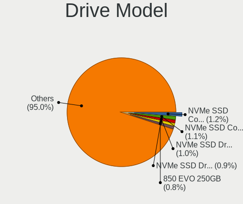
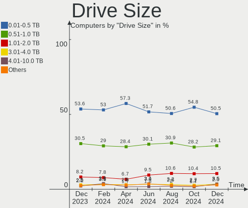
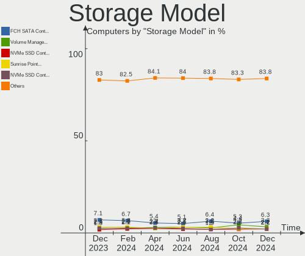
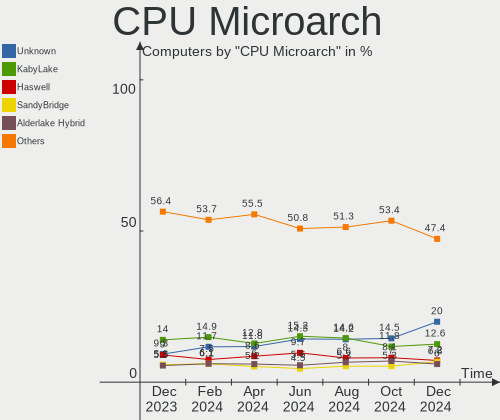
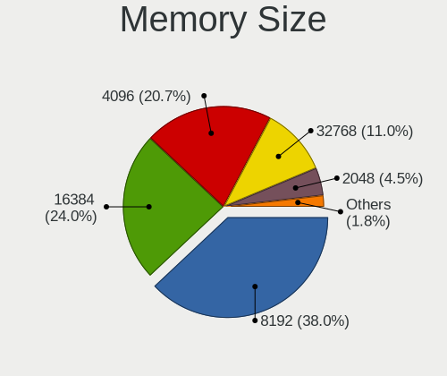

Ubuntu Hardware Trends
----------------------

A project to identify most popular hardware characteristics and track their change
over time based on data collected by Ubuntu users at https://Linux-Hardware.org.

Anyone can contribute to the study by uploading probes of their computers by
the [hw-probe](https://github.com/linuxhw/hw-probe) tool:

    sudo -E hw-probe -all -upload

This is a report for all computer types. See also reports for [desktops](/Dist/Ubuntu/Desktop/README.md) and [notebooks](/Dist/Ubuntu/Notebook/README.md).

Full-feature report is available here: https://linux-hardware.org/?view=trends

Period: Nov, 2020.

Contents
--------

- [ OS                       ](#os)
- [ OS Family                ](#os-family)
- [ Kernel                   ](#kernel)
- [ Kernel Family            ](#kernel-family)
- [ Kernel Major Ver.        ](#kernel-major-ver)
- [ Arch                     ](#arch)
- [ DE                       ](#de)
- [ Display Server           ](#display-server)
- [ Display Manager          ](#display-manager)
- [ OS Lang                  ](#os-lang)
- [ Boot Mode                ](#boot-mode)
- [ Filesystem               ](#filesystem)
- [ Part. scheme             ](#part-scheme)
- [ Dual Boot with Linux/BSD ](#dual-boot-with-linux/bsd)
- [ Dual Boot (Win)          ](#dual-boot-win)
- [ Country                  ](#country)
- [ City                     ](#city)
- [ Vendor                   ](#vendor)
- [ Model                    ](#model)
- [ Model Family             ](#model-family)
- [ MFG Year                 ](#mfg-year)
- [ Form Factor              ](#form-factor)
- [ Secure Boot              ](#secure-boot)
- [ Coreboot                 ](#coreboot)
- [ RAM Size                 ](#ram-size)
- [ RAM Used                 ](#ram-used)
- [ Has CD-ROM               ](#has-cd-rom)
- [ Total Drives             ](#total-drives)
- [ Has Ethernet             ](#has-ethernet)
- [ Drive Vendor             ](#drive-vendor)
- [ Drive Model              ](#drive-model)
- [ HDD Vendor               ](#hdd-vendor)
- [ SSD Vendor               ](#ssd-vendor)
- [ Drive Kind               ](#drive-kind)
- [ Drive Connector          ](#drive-connector)
- [ Drive Size               ](#drive-size)
- [ Space Total              ](#space-total)
- [ Space Used               ](#space-used)
- [ Malfunc. Drives          ](#malfunc-drives)
- [ Malfunc. Drive Vendor    ](#malfunc-drive-vendor)
- [ Malfunc. HDD Vendor      ](#malfunc-hdd-vendor)
- [ Malfunc. Drive Kind      ](#malfunc-drive-kind)
- [ Failed Drives            ](#failed-drives)
- [ Failed Drive Vendor      ](#failed-drive-vendor)
- [ Drive Status             ](#drive-status)
- [ Storage Vendor           ](#storage-vendor)
- [ Storage Model            ](#storage-model)
- [ Storage Kind             ](#storage-kind)
- [ CPU Vendor               ](#cpu-vendor)
- [ CPU Model                ](#cpu-model)
- [ CPU Model Family         ](#cpu-model-family)
- [ CPU Cores                ](#cpu-cores)
- [ CPU Sockets              ](#cpu-sockets)
- [ CPU Threads              ](#cpu-threads)
- [ CPU Op-Modes             ](#cpu-op-modes)
- [ CPU Microcode            ](#cpu-microcode)
- [ CPU Microarch            ](#cpu-microarch)
- [ GPU Vendor               ](#gpu-vendor)
- [ GPU Model                ](#gpu-model)
- [ GPU Combo                ](#gpu-combo)
- [ GPU Driver               ](#gpu-driver)
- [ GPU Memory               ](#gpu-memory)
- [ Monitor Vendor           ](#monitor-vendor)
- [ Monitor Model            ](#monitor-model)
- [ Monitor Resolution       ](#monitor-resolution)
- [ Monitor Diagonal         ](#monitor-diagonal)
- [ Monitor Width            ](#monitor-width)
- [ Aspect Ratio             ](#aspect-ratio)
- [ Monitor Area             ](#monitor-area)
- [ Pixel Density            ](#pixel-density)
- [ Multiple Monitors        ](#multiple-monitors)
- [ Net Controller Vendor    ](#net-controller-vendor)
- [ Net Controller Model     ](#net-controller-model)
- [ Wireless Vendor          ](#wireless-vendor)
- [ Wireless Model           ](#wireless-model)
- [ Ethernet Vendor          ](#ethernet-vendor)
- [ Ethernet Model           ](#ethernet-model)
- [ Net Controller Kind      ](#net-controller-kind)
- [ Used Controller          ](#used-controller)
- [ NICs                     ](#nics)
- [ Memory Vendor            ](#memory-vendor)
- [ Memory Model             ](#memory-model)
- [ Memory Kind              ](#memory-kind)
- [ Memory Form Factor       ](#memory-form-factor)
- [ Memory Size              ](#memory-size)
- [ Memory Speed             ](#memory-speed)
- [ Sound Vendor             ](#sound-vendor)
- [ Sound Model              ](#sound-model)
- [ Camera Vendor            ](#camera-vendor)
- [ Camera Model             ](#camera-model)
- [ Fingerprint Vendor       ](#fingerprint-vendor)
- [ Fingerprint Model        ](#fingerprint-model)
- [ Chipcard Vendor          ](#chipcard-vendor)
- [ Chipcard Model           ](#chipcard-model)
- [ Printer Vendor           ](#printer-vendor)
- [ Printer Model            ](#printer-model)
- [ Scanner Vendor           ](#scanner-vendor)
- [ Scanner Model            ](#scanner-model)
- [ Bluetooth Vendor         ](#bluetooth-vendor)
- [ Bluetooth Model          ](#bluetooth-model)
- [ Unsupported Devices      ](#unsupported-devices)
- [ Unsupported Device Types ](#unsupported-device-types)

OS
--

Installed operating systems

| Name           | Computers | Percent |
|----------------|-----------|---------|
| Ubuntu 20.04   | 1678      | 66.3%   |
| Ubuntu 20.10   | 471       | 18.61%  |
| Ubuntu 18.04   | 302       | 11.93%  |
| Ubuntu 16.04   | 38        | 1.5%    |
| Ubuntu 19.10   | 17        | 0.67%   |
| Ubuntu 21.04   | 7         | 0.28%   |
| Ubuntu 18.10   | 5         | 0.2%    |
| Ubuntu 19.04   | 4         | 0.16%   |
| Ubuntu         | 4         | 0.16%   |
| Ubuntu Core 18 | 1         | 0.04%   |
| Ubuntu Core 16 | 1         | 0.04%   |
| Ubuntu 2020    | 1         | 0.04%   |
| Ubuntu 17.10   | 1         | 0.04%   |
| Ubuntu 14.04   | 1         | 0.04%   |

OS Family
---------

OS without a version

| Name   | Computers | Percent |
|--------|-----------|---------|
| Ubuntu | 2531      | 100%    |

Kernel
------

Version of the Linux kernel

| Version                    | Computers | Percent |
|----------------------------|-----------|---------|
| 5.4.0-52-generic           | 631       | 24.93%  |
| 5.4.0-54-generic           | 577       | 22.8%   |
| 5.4.0-53-generic           | 314       | 12.41%  |
| 5.8.0-29-generic           | 158       | 6.24%   |
| 5.8.0-26-generic           | 138       | 5.45%   |
| 5.4.0-42-generic           | 108       | 4.27%   |
| 5.8.0-28-generic           | 65        | 2.57%   |
| 4.15.0-122-generic         | 42        | 1.66%   |
| 5.8.0-25-generic           | 35        | 1.38%   |
| 4.15.0-124-generic         | 26        | 1.03%   |
| 5.4.0-26-generic           | 25        | 0.99%   |
| 4.15.0-123-generic         | 25        | 0.99%   |
| 5.8.0-1006-raspi           | 24        | 0.95%   |
| 5.4.0-52-lowlatency        | 22        | 0.87%   |
| 5.4.0-48-generic           | 21        | 0.83%   |
| 5.8.0-1007-raspi           | 19        | 0.75%   |
| 5.8.0-30-generic           | 13        | 0.51%   |
| 5.4.0-55-generic           | 12        | 0.47%   |
| 5.4.0-54-lowlatency        | 11        | 0.43%   |
| 5.4.0-53-lowlatency        | 11        | 0.43%   |
| 5.4.0-51-generic           | 11        | 0.43%   |
| 5.3.0-64-generic           | 11        | 0.43%   |
| 5.9.6-050906-generic       | 6         | 0.24%   |
| 5.4.0-56-generic           | 6         | 0.24%   |
| 5.4.0-47-generic           | 6         | 0.24%   |
| 5.8.0-29-lowlatency        | 5         | 0.2%    |
| 5.4.0-49-generic           | 5         | 0.2%    |
| 5.0.0-23-generic           | 5         | 0.2%    |
| 4.4.0-194-generic          | 5         | 0.2%    |
| 5.9.3-050903-generic       | 4         | 0.16%   |
| 5.8.0-7630-generic         | 4         | 0.16%   |
| 5.8.0-31-generic           | 4         | 0.16%   |
| 5.8.0-26-lowlatency        | 4         | 0.16%   |
| 5.8.0-050800-generic       | 4         | 0.16%   |
| 5.0.0-32-generic           | 4         | 0.16%   |
| 4.4.0-193-generic          | 4         | 0.16%   |
| 4.15.0-122-lowlatency      | 4         | 0.16%   |
| 5.9.10-050910-generic      | 3         | 0.12%   |
| 5.9.0-050900-generic       | 3         | 0.12%   |
| 5.8.0-28-lowlatency        | 3         | 0.12%   |
| 5.6.0-1034-oem             | 3         | 0.12%   |
| 5.4.0-42-lowlatency        | 3         | 0.12%   |
| 5.4.0-1022-raspi           | 3         | 0.12%   |
| 5.3.0-46-generic           | 3         | 0.12%   |
| 5.3.0-28-generic           | 3         | 0.12%   |
| 4.18.0-25-generic          | 3         | 0.12%   |
| 4.18.0-10-generic          | 3         | 0.12%   |
| 4.15.0-45-generic          | 3         | 0.12%   |
| 4.15.0-29-generic          | 3         | 0.12%   |
| 4.15.0-125-generic         | 3         | 0.12%   |
| 4.15.0-118-generic         | 3         | 0.12%   |
| 4.15.0-1102-oem            | 3         | 0.12%   |
| 5.9.8-050908-generic       | 2         | 0.08%   |
| 5.9.1-050901-generic       | 2         | 0.08%   |
| 5.8.0-14-generic           | 2         | 0.08%   |
| 5.4.61-050461-generic      | 2         | 0.08%   |
| 5.4.0-512010201020-generic | 2         | 0.08%   |
| 5.4.0-47-lowlatency        | 2         | 0.08%   |
| 5.4.0-45-generic           | 2         | 0.08%   |
| 5.4.0-40-generic           | 2         | 0.08%   |

Kernel Family
-------------

Linux kernel without a distro release

| Version  | Computers | Percent |
|----------|-----------|---------|
| 5.4.0    | 1778      | 70.25%  |
| 5.8.0    | 484       | 19.12%  |
| 4.15.0   | 139       | 5.49%   |
| 5.3.0    | 29        | 1.15%   |
| 4.4.0    | 18        | 0.71%   |
| 5.0.0    | 15        | 0.59%   |
| 5.9.6    | 6         | 0.24%   |
| 5.6.0    | 6         | 0.24%   |
| 4.18.0   | 6         | 0.24%   |
| 5.9.8    | 4         | 0.16%   |
| 5.9.3    | 4         | 0.16%   |
| 5.9.10   | 4         | 0.16%   |
| 5.10.0   | 4         | 0.16%   |
| 5.9.1    | 3         | 0.12%   |
| 5.9.0    | 3         | 0.12%   |
| 5.8.17   | 2         | 0.08%   |
| 5.4.61   | 2         | 0.08%   |
| 4.9.140  | 2         | 0.08%   |
| 5.9.7    | 1         | 0.04%   |
| 5.8.5    | 1         | 0.04%   |
| 5.8.18   | 1         | 0.04%   |
| 5.8.16   | 1         | 0.04%   |
| 5.8.15   | 1         | 0.04%   |
| 5.8.10   | 1         | 0.04%   |
| 5.8.1    | 1         | 0.04%   |
| 5.7.15   | 1         | 0.04%   |
| 5.7.1    | 1         | 0.04%   |
| 5.7.0    | 1         | 0.04%   |
| 5.6.10   | 1         | 0.04%   |
| 5.5.4    | 1         | 0.04%   |
| 5.4.2    | 1         | 0.04%   |
| 4.8.17   | 1         | 0.04%   |
| 4.2.8    | 1         | 0.04%   |
| 4.19.5   | 1         | 0.04%   |
| 4.19.128 | 1         | 0.04%   |
| 4.19.104 | 1         | 0.04%   |
| 4.14.41  | 1         | 0.04%   |
| 4.13.0   | 1         | 0.04%   |
| 4.10.0   | 1         | 0.04%   |
| 3.13.0   | 1         | 0.04%   |

Kernel Major Ver.
-----------------

Linux kernel major version

| Version | Computers | Percent |
|---------|-----------|---------|
| 5.4     | 1781      | 70.37%  |
| 5.8     | 492       | 19.44%  |
| 4.15    | 139       | 5.49%   |
| 5.3     | 29        | 1.15%   |
| 5.9     | 25        | 0.99%   |
| 4.4     | 18        | 0.71%   |
| 5.0     | 15        | 0.59%   |
| 5.6     | 7         | 0.28%   |
| 4.18    | 6         | 0.24%   |
| 5.10    | 4         | 0.16%   |
| 5.7     | 3         | 0.12%   |
| 4.19    | 3         | 0.12%   |
| 4.9     | 2         | 0.08%   |
| 5.5     | 1         | 0.04%   |
| 4.8     | 1         | 0.04%   |
| 4.2     | 1         | 0.04%   |
| 4.14    | 1         | 0.04%   |
| 4.13    | 1         | 0.04%   |
| 4.10    | 1         | 0.04%   |
| 3.13    | 1         | 0.04%   |

Arch
----

OS architecture (x86_64, i586, etc.)

| Name    | Computers | Percent |
|---------|-----------|---------|
| x86_64  | 2408      | 95.14%  |
| i686    | 71        | 2.81%   |
| aarch64 | 51        | 2.02%   |
| armv7l  | 1         | 0.04%   |

DE
--

Desktop Environment

| Name            | Computers | Percent |
|-----------------|-----------|---------|
| GNOME           | 1885      | 74.48%  |
| XFCE            | 177       | 6.99%   |
| Unknown         | 145       | 5.73%   |
| KDE             | 64        | 2.53%   |
| KDE5            | 57        | 2.25%   |
| MATE            | 50        | 1.98%   |
| Unity           | 44        | 1.74%   |
| LXQt            | 27        | 1.07%   |
| Budgie          | 18        | 0.71%   |
| GNOME Flashback | 17        | 0.67%   |
| X-Cinnamon      | 16        | 0.63%   |
| LXDE            | 11        | 0.43%   |
| Cinnamon        | 9         | 0.36%   |
| Deepin          | 4         | 0.16%   |
| GNOME Classic   | 3         | 0.12%   |
| i3              | 2         | 0.08%   |
| xubuntu         | 1         | 0.04%   |
| awesome         | 1         | 0.04%   |

Display Server
--------------

X11 or Wayland

| Name    | Computers | Percent |
|---------|-----------|---------|
| X11     | 2350      | 92.85%  |
| Wayland | 74        | 2.92%   |
| Unknown | 73        | 2.88%   |
| Tty     | 31        | 1.22%   |
| Web     | 3         | 0.12%   |

Display Manager
---------------

SDDM, LightDM, etc.

| Name    | Computers | Percent |
|---------|-----------|---------|
| Unknown | 2034      | 80.36%  |
| GDM     | 331       | 13.08%  |
| TDM     | 87        | 3.44%   |
| SDDM    | 67        | 2.65%   |
| LightDM | 9         | 0.36%   |
| XDM     | 2         | 0.08%   |
| NODM    | 1         | 0.04%   |

OS Lang
-------

Language

| Lang       | Computers | Percent |
|------------|-----------|---------|
| en_US      | 992       | 39.19%  |
| de_DE      | 239       | 9.44%   |
| fr_FR      | 140       | 5.53%   |
| en_GB      | 139       | 5.49%   |
| it_IT      | 120       | 4.74%   |
| pt_BR      | 93        | 3.67%   |
| ru_RU      | 80        | 3.16%   |
| es_ES      | 72        | 2.84%   |
| en_IN      | 66        | 2.61%   |
| en_CA      | 57        | 2.25%   |
| pl_PL      | 51        | 2.02%   |
| C          | 37        | 1.46%   |
| en_AU      | 32        | 1.26%   |
| cs_CZ      | 31        | 1.22%   |
| nl_NL      | 26        | 1.03%   |
| hu_HU      | 25        | 0.99%   |
| en_ZA      | 20        | 0.79%   |
| ja_JP      | 19        | 0.75%   |
| es_AR      | 18        | 0.71%   |
| tr_TR      | 13        | 0.51%   |
| sv_SE      | 13        | 0.51%   |
| fi_FI      | 13        | 0.51%   |
| es_MX      | 13        | 0.51%   |
| de_AT      | 13        | 0.51%   |
| Unknown    | 13        | 0.51%   |
| ru_UA      | 11        | 0.43%   |
| de_CH      | 10        | 0.4%    |
| zh_TW      | 9         | 0.36%   |
| ro_RO      | 9         | 0.36%   |
| es_CO      | 9         | 0.36%   |
| zh_CN      | 8         | 0.32%   |
| nl_BE      | 8         | 0.32%   |
| fr_CA      | 8         | 0.32%   |
| el_GR      | 8         | 0.32%   |
| sk_SK      | 7         | 0.28%   |
| pt_PT      | 7         | 0.28%   |
| da_DK      | 7         | 0.28%   |
| es_CL      | 6         | 0.24%   |
| en_NZ      | 6         | 0.24%   |
| en_IL      | 6         | 0.24%   |
| nb_NO      | 5         | 0.2%    |
| ko_KR      | 5         | 0.2%    |
| en_IE      | 5         | 0.2%    |
| sl_SI      | 4         | 0.16%   |
| fr_BE      | 4         | 0.16%   |
| es_EC      | 4         | 0.16%   |
| en_HK      | 4         | 0.16%   |
| he_IL      | 3         | 0.12%   |
| en_SG      | 3         | 0.12%   |
| en_PH      | 3         | 0.12%   |
| bg_BG      | 3         | 0.12%   |
| uk_UA      | 2         | 0.08%   |
| sr_RS      | 2         | 0.08%   |
| es_PE      | 2         | 0.08%   |
| en_ZW      | 2         | 0.08%   |
| en_US.utf8 | 2         | 0.08%   |
| ca_ES      | 2         | 0.08%   |
| ar_EG      | 2         | 0.08%   |
| lv_LV      | 1         | 0.04%   |
| lt_LT      | 1         | 0.04%   |

Boot Mode
---------

EFI or BIOS

| Mode | Computers | Percent |
|------|-----------|---------|
| BIOS | 1518      | 59.98%  |
| EFI  | 1013      | 40.02%  |

Filesystem
----------

Type of filesystem

| Type    | Computers | Percent |
|---------|-----------|---------|
| Ext4    | 2374      | 93.8%   |
| Overlay | 84        | 3.32%   |
| Zfs     | 35        | 1.38%   |
| Btrfs   | 19        | 0.75%   |
| Xfs     | 8         | 0.32%   |
| Ext2    | 6         | 0.24%   |
| Ext3    | 3         | 0.12%   |
| Aufs    | 1         | 0.04%   |
| Unknown | 1         | 0.04%   |

Part. scheme
------------

Scheme of partitioning

| Type    | Computers | Percent |
|---------|-----------|---------|
| Unknown | 2020      | 79.81%  |
| GPT     | 393       | 15.53%  |
| MBR     | 118       | 4.66%   |

Dual Boot with Linux/BSD
------------------------

Hosting more than one Linux/BSD

| Dual boot | Computers | Percent |
|-----------|-----------|---------|
| No        | 2218      | 87.63%  |
| Yes       | 313       | 12.37%  |

Dual Boot (Win)
---------------

Hosting Linux and Windows

| Dual boot | Computers | Percent |
|-----------|-----------|---------|
| No        | 1602      | 63.3%   |
| Yes       | 929       | 36.7%   |

Country
-------

Geographic location (country)

| Country                | Computers | Percent |
|------------------------|-----------|---------|
| USA                    | 418       | 16.52%  |
| Germany                | 296       | 11.69%  |
| France                 | 161       | 6.36%   |
| Italy                  | 152       | 6.01%   |
| Brazil                 | 124       | 4.9%    |
| UK                     | 111       | 4.39%   |
| Russia                 | 90        | 3.56%   |
| Spain                  | 85        | 3.36%   |
| Canada                 | 74        | 2.92%   |
| India                  | 71        | 2.81%   |
| Poland                 | 69        | 2.73%   |
| Netherlands            | 62        | 2.45%   |
| Czech Republic         | 44        | 1.74%   |
| Hungary                | 35        | 1.38%   |
| Ukraine                | 34        | 1.34%   |
| Belgium                | 34        | 1.34%   |
| Australia              | 33        | 1.3%    |
| Mexico                 | 29        | 1.15%   |
| South Africa           | 27        | 1.07%   |
| Romania                | 27        | 1.07%   |
| Greece                 | 27        | 1.07%   |
| Switzerland            | 26        | 1.03%   |
| Finland                | 26        | 1.03%   |
| Austria                | 25        | 0.99%   |
| Argentina              | 25        | 0.99%   |
| Sweden                 | 24        | 0.95%   |
| Indonesia              | 22        | 0.87%   |
| Turkey                 | 21        | 0.83%   |
| Japan                  | 21        | 0.83%   |
| Denmark                | 18        | 0.71%   |
| Israel                 | 17        | 0.67%   |
| Portugal               | 16        | 0.63%   |
| Norway                 | 13        | 0.51%   |
| Slovenia               | 12        | 0.47%   |
| New Zealand            | 12        | 0.47%   |
| Serbia                 | 11        | 0.43%   |
| Colombia               | 11        | 0.43%   |
| Slovakia               | 10        | 0.4%    |
| Ireland                | 10        | 0.4%    |
| Iran                   | 10        | 0.4%    |
| Egypt                  | 10        | 0.4%    |
| Taiwan                 | 9         | 0.36%   |
| China                  | 9         | 0.36%   |
| Latvia                 | 8         | 0.32%   |
| Chile                  | 8         | 0.32%   |
| Bulgaria               | 8         | 0.32%   |
| Vietnam                | 7         | 0.28%   |
| Pakistan               | 6         | 0.24%   |
| Korea, Republic of     | 6         | 0.24%   |
| Hong Kong              | 6         | 0.24%   |
| Ecuador                | 6         | 0.24%   |
| Singapore              | 5         | 0.2%    |
| Kenya                  | 5         | 0.2%    |
| Bosnia and Herzegovina | 5         | 0.2%    |
| Belarus                | 5         | 0.2%    |
| Malaysia               | 4         | 0.16%   |
| Lithuania              | 4         | 0.16%   |
| Bangladesh             | 4         | 0.16%   |
| Algeria                | 4         | 0.16%   |
| Tunisia                | 3         | 0.12%   |

City
----

Geographic location (city)

| City              | Computers | Percent |
|-------------------|-----------|---------|
| São Paulo        | 21        | 0.83%   |
| Paris             | 20        | 0.79%   |
| Moscow            | 19        | 0.75%   |
| Berlin            | 19        | 0.75%   |
| Prague            | 17        | 0.67%   |
| Parabiago         | 16        | 0.63%   |
| Rome              | 15        | 0.59%   |
| Athens            | 15        | 0.59%   |
| Milan             | 14        | 0.55%   |
| Madrid            | 14        | 0.55%   |
| Warsaw            | 13        | 0.51%   |
| Vienna            | 13        | 0.51%   |
| Johannesburg      | 13        | 0.51%   |
| Helsinki          | 12        | 0.47%   |
| Budapest          | 12        | 0.47%   |
| St Petersburg     | 11        | 0.43%   |
| Munich            | 11        | 0.43%   |
| Bucharest         | 11        | 0.43%   |
| Düsseldorf       | 9         | 0.36%   |
| Buenos Aires      | 9         | 0.36%   |
| Toronto           | 8         | 0.32%   |
| Rio de Janeiro    | 8         | 0.32%   |
| Karlsruhe         | 8         | 0.32%   |
| Genoa             | 8         | 0.32%   |
| Cairo             | 8         | 0.32%   |
| Amsterdam         | 8         | 0.32%   |
| Łódź           | 7         | 0.28%   |
| Thessaloniki      | 7         | 0.28%   |
| Mexico City       | 7         | 0.28%   |
| Melbourne         | 7         | 0.28%   |
| Krakow            | 7         | 0.28%   |
| Jakarta           | 7         | 0.28%   |
| Frankfurt am Main | 7         | 0.28%   |
| Dallas            | 7         | 0.28%   |
| Bengaluru         | 7         | 0.28%   |
| Tehran            | 6         | 0.24%   |
| Stuttgart         | 6         | 0.24%   |
| Rotterdam         | 6         | 0.24%   |
| Riga              | 6         | 0.24%   |
| Novosibirsk       | 6         | 0.24%   |
| Mumbai            | 6         | 0.24%   |
| Leipzig           | 6         | 0.24%   |
| Kyiv              | 6         | 0.24%   |
| Istanbul          | 6         | 0.24%   |
| Hamburg           | 6         | 0.24%   |
| Dublin            | 6         | 0.24%   |
| Chicago           | 6         | 0.24%   |
| Bogotá           | 6         | 0.24%   |
| Austin            | 6         | 0.24%   |
| Vancouver         | 5         | 0.2%    |
| Tel Aviv          | 5         | 0.2%    |
| Sofia             | 5         | 0.2%    |
| Singapore         | 5         | 0.2%    |
| Seattle           | 5         | 0.2%    |
| San Antonio       | 5         | 0.2%    |
| Pune              | 5         | 0.2%    |
| Ottawa            | 5         | 0.2%    |
| Norwich           | 5         | 0.2%    |
| New York          | 5         | 0.2%    |
| Nairobi           | 5         | 0.2%    |

Vendor
------

Motherboard manufacturer

| Name                              | Computers | Percent |
|-----------------------------------|-----------|---------|
| Dell                              | 385       | 15.21%  |
| Hewlett-Packard                   | 372       | 14.7%   |
| ASUSTek Computer                  | 363       | 14.34%  |
| Lenovo                            | 314       | 12.41%  |
| Gigabyte Technology               | 184       | 7.27%   |
| Acer                              | 152       | 6.01%   |
| MSI                               | 129       | 5.1%    |
| ASRock                            | 73        | 2.88%   |
| Toshiba                           | 65        | 2.57%   |
| Intel                             | 48        | 1.9%    |
| Apple                             | 48        | 1.9%    |
| Unknown                           | 39        | 1.54%   |
| Raspberry Pi Foundation           | 33        | 1.3%    |
| Sony                              | 29        | 1.15%   |
| Fujitsu                           | 28        | 1.11%   |
| Samsung Electronics               | 27        | 1.07%   |
| Medion                            | 22        | 0.87%   |
| Supermicro                        | 16        | 0.63%   |
| Pegatron                          | 16        | 0.63%   |
| HUAWEI                            | 13        | 0.51%   |
| Fujitsu Siemens                   | 13        | 0.51%   |
| Foxconn                           | 10        | 0.4%    |
| Positivo                          | 8         | 0.32%   |
| Gateway                           | 8         | 0.32%   |
| ECS                               | 8         | 0.32%   |
| Packard Bell                      | 7         | 0.28%   |
| Microsoft                         | 7         | 0.28%   |
| eMachines                         | 7         | 0.28%   |
| Biostar                           | 7         | 0.28%   |
| Alienware                         | 6         | 0.24%   |
| TYAN Computer                     | 5         | 0.2%    |
| System76                          | 5         | 0.2%    |
| Google                            | 5         | 0.2%    |
| TUXEDO                            | 4         | 0.16%   |
| Notebook                          | 4         | 0.16%   |
| AMI                               | 4         | 0.16%   |
| ZOTAC                             | 3         | 0.12%   |
| NEC Computers                     | 3         | 0.12%   |
| Wistron                           | 2         | 0.08%   |
| LG Electronics                    | 2         | 0.08%   |
| I-Life Digital Technologies       | 2         | 0.08%   |
| Huanan                            | 2         | 0.08%   |
| EUROCOM                           | 2         | 0.08%   |
| BANGHO                            | 2         | 0.08%   |
| Advent                            | 2         | 0.08%   |
| YJKC                              | 1         | 0.04%   |
| U Leader Design                   | 1         | 0.04%   |
| Timi                              | 1         | 0.04%   |
| SiComputer                        | 1         | 0.04%   |
| SCHNEIDER                         | 1         | 0.04%   |
| Schenker                          | 1         | 0.04%   |
| Rockwell Automation/Allen-Bradley | 1         | 0.04%   |
| Razer                             | 1         | 0.04%   |
| Quanta                            | 1         | 0.04%   |
| Prestigio                         | 1         | 0.04%   |
| Pine Microsystems                 | 1         | 0.04%   |
| PCChips                           | 1         | 0.04%   |
| PC Specialist                     | 1         | 0.04%   |
| PC Partner Limited                | 1         | 0.04%   |
| Panasonic                         | 1         | 0.04%   |

Model
-----

Motherboard model

| Name                               | Computers | Percent |
|------------------------------------|-----------|---------|
| Unknown                            | 49        | 1.94%   |
| ASUS All Series                    | 25        | 0.99%   |
| RPi Raspberry Pi 4 Model B Rev 1.4 | 12        | 0.47%   |
| HP Notebook                        | 11        | 0.43%   |
| HP EliteDesk 800 G1 SFF            | 11        | 0.43%   |
| RPi Raspberry Pi 4 Model B Rev 1.2 | 9         | 0.36%   |
| RPi Raspberry Pi 4 Model B Rev 1.1 | 8         | 0.32%   |
| Supermicro H8DM8-2                 | 7         | 0.28%   |
| Dell XPS 15 9570                   | 7         | 0.28%   |
| Dell Latitude E6430                | 7         | 0.28%   |
| ASUS M5A78L-M/USB3                 | 7         | 0.28%   |
| MSI MS-7B86                        | 6         | 0.24%   |
| HP ProBook 450 G7                  | 6         | 0.24%   |
| HP Pavilion g6                     | 6         | 0.24%   |
| Dell XPS 13 7390                   | 6         | 0.24%   |
| Dell Latitude E6410                | 6         | 0.24%   |
| Dell Inspiron 5570                 | 6         | 0.24%   |
| MSI MS-7817                        | 5         | 0.2%    |
| HP Pavilion dv7                    | 5         | 0.2%    |
| HP Compaq Elite 8300 SFF           | 5         | 0.2%    |
| HP 15                              | 5         | 0.2%    |
| Gigabyte 970A-DS3P                 | 5         | 0.2%    |
| Dell XPS 15 9560                   | 5         | 0.2%    |
| Dell XPS 15 9500                   | 5         | 0.2%    |
| Dell XPS 15 7590                   | 5         | 0.2%    |
| Dell OptiPlex 755                  | 5         | 0.2%    |
| Dell Latitude E6540                | 5         | 0.2%    |
| Dell Latitude E6420                | 5         | 0.2%    |
| Dell Inspiron 3542                 | 5         | 0.2%    |
| Apple MacBookAir5,2                | 5         | 0.2%    |
| MSI MS-7C91                        | 4         | 0.16%   |
| MSI MS-7A38                        | 4         | 0.16%   |
| Lenovo G50-45 80E3                 | 4         | 0.16%   |
| HUAWEI NBLK-WAX9X                  | 4         | 0.16%   |
| HP Laptop 15-db0xxx                | 4         | 0.16%   |
| HP EliteBook 8560w                 | 4         | 0.16%   |
| HP EliteBook 8460p                 | 4         | 0.16%   |
| HP EliteBook 840 G6                | 4         | 0.16%   |
| HP Compaq 8100 Elite SFF PC        | 4         | 0.16%   |
| Gigabyte X570 AORUS ELITE          | 4         | 0.16%   |
| Gigabyte A320M-S2H                 | 4         | 0.16%   |
| Dell XPS 13 9380                   | 4         | 0.16%   |
| Dell Vostro 200                    | 4         | 0.16%   |
| Dell Precision T1700               | 4         | 0.16%   |
| Dell OptiPlex 7010                 | 4         | 0.16%   |
| Dell Latitude E7270                | 4         | 0.16%   |
| Dell Inspiron 15-3567              | 4         | 0.16%   |
| ASUS ROG STRIX X570-E GAMING       | 4         | 0.16%   |
| ASUS PRIME B450M-A                 | 4         | 0.16%   |
| ASUS PRIME A320M-K                 | 4         | 0.16%   |
| ASUS M5A97 R2.0                    | 4         | 0.16%   |
| TYAN S3992-E                       | 3         | 0.12%   |
| Toshiba Satellite C55-C            | 3         | 0.12%   |
| Toshiba Satellite A200             | 3         | 0.12%   |
| RPi Raspberry Pi 400 Rev 1.0       | 3         | 0.12%   |
| MSI MS-7C35                        | 3         | 0.12%   |
| MSI MS-7996                        | 3         | 0.12%   |
| MSI MS-7793                        | 3         | 0.12%   |
| MSI MS-7693                        | 3         | 0.12%   |
| MSI MS-7680                        | 3         | 0.12%   |

Model Family
------------

Motherboard model prefix

| Name                    | Computers | Percent |
|-------------------------|-----------|---------|
| Lenovo ThinkPad         | 138       | 5.45%   |
| Acer Aspire             | 104       | 4.11%   |
| Dell Inspiron           | 103       | 4.07%   |
| Dell Latitude           | 102       | 4.03%   |
| Lenovo IdeaPad          | 69        | 2.73%   |
| Dell XPS                | 57        | 2.25%   |
| Toshiba Satellite       | 56        | 2.21%   |
| HP EliteBook            | 54        | 2.13%   |
| HP ProBook              | 51        | 2.02%   |
| HP Pavilion             | 51        | 2.02%   |
| Unknown                 | 49        | 1.94%   |
| HP Compaq               | 43        | 1.7%    |
| Dell OptiPlex           | 41        | 1.62%   |
| HP Laptop               | 34        | 1.34%   |
| RPi Raspberry           | 33        | 1.3%    |
| ASUS PRIME              | 32        | 1.26%   |
| Dell Precision          | 31        | 1.22%   |
| Dell Vostro             | 28        | 1.11%   |
| Lenovo ThinkCentre      | 27        | 1.07%   |
| ASUS All                | 25        | 0.99%   |
| ASUS VivoBook           | 20        | 0.79%   |
| ASUS ROG                | 19        | 0.75%   |
| Fujitsu LIFEBOOK        | 14        | 0.55%   |
| ASUS TUF                | 14        | 0.55%   |
| HP ENVY                 | 13        | 0.51%   |
| HP EliteDesk            | 13        | 0.51%   |
| ASUS M5A78L-M           | 13        | 0.51%   |
| HP Notebook             | 11        | 0.43%   |
| Lenovo Legion           | 10        | 0.4%    |
| Acer Swift              | 10        | 0.4%    |
| HP ZBook                | 9         | 0.36%   |
| Fujitsu ESPRIMO         | 9         | 0.36%   |
| Dell PowerEdge          | 9         | 0.36%   |
| Acer Veriton            | 9         | 0.36%   |
| HP 250                  | 8         | 0.32%   |
| ASUS SABERTOOTH         | 8         | 0.32%   |
| Supermicro H8DM8-2      | 7         | 0.28%   |
| Microsoft Surface       | 7         | 0.28%   |
| Lenovo Yoga             | 7         | 0.28%   |
| Gigabyte X570           | 7         | 0.28%   |
| Fujitsu Siemens ESPRIMO | 7         | 0.28%   |
| MSI MS-7B86             | 6         | 0.24%   |
| HP ProDesk              | 6         | 0.24%   |
| Gigabyte A320M-S2H      | 6         | 0.24%   |
| Gigabyte 970A-DS3P      | 6         | 0.24%   |
| ASUS M5A97              | 6         | 0.24%   |
| Acer TravelMate         | 6         | 0.24%   |
| Acer Nitro              | 6         | 0.24%   |
| MSI MS-7817             | 5         | 0.2%    |
| Lenovo ThinkBook        | 5         | 0.2%    |
| Lenovo IdeaCentre       | 5         | 0.2%    |
| HP Spectre              | 5         | 0.2%    |
| HP 15                   | 5         | 0.2%    |
| Gigabyte GA-78LMT-USB3  | 5         | 0.2%    |
| ASRock X99              | 5         | 0.2%    |
| ASRock B450M            | 5         | 0.2%    |
| Apple MacBookAir5       | 5         | 0.2%    |
| Packard Bell EasyNote   | 4         | 0.16%   |
| MSI MS-7C91             | 4         | 0.16%   |
| MSI MS-7A38             | 4         | 0.16%   |

MFG Year
--------

Motherboard manufacture year

| Year    | Computers | Percent |
|---------|-----------|---------|
| 2020    | 450       | 17.78%  |
| 2019    | 323       | 12.76%  |
| 2018    | 210       | 8.3%    |
| 2013    | 178       | 7.03%   |
| 2014    | 159       | 6.28%   |
| 2011    | 159       | 6.28%   |
| 2012    | 153       | 6.05%   |
| 2010    | 146       | 5.77%   |
| 2015    | 139       | 5.49%   |
| 2009    | 134       | 5.29%   |
| 2016    | 117       | 4.62%   |
| 2017    | 111       | 4.39%   |
| 2008    | 100       | 3.95%   |
| 2007    | 58        | 2.29%   |
| Unknown | 56        | 2.21%   |
| 2006    | 20        | 0.79%   |
| 2005    | 15        | 0.59%   |
| 2004    | 2         | 0.08%   |
| 2001    | 1         | 0.04%   |

Form Factor
-----------

Physical design of the computer

| Name           | Computers | Percent |
|----------------|-----------|---------|
| Notebook       | 1346      | 53.18%  |
| Desktop        | 989       | 39.08%  |
| System on chip | 51        | 2.02%   |
| Convertible    | 44        | 1.74%   |
| All in one     | 36        | 1.42%   |
| Mini pc        | 31        | 1.22%   |
| Server         | 17        | 0.67%   |
| Tablet         | 15        | 0.59%   |
| Other          | 2         | 0.08%   |

Secure Boot
-----------

Enabled or disabled

| State    | Computers | Percent |
|----------|-----------|---------|
| Disabled | 2328      | 91.98%  |
| Enabled  | 203       | 8.02%   |

Coreboot
--------

Have coreboot on board

| Used | Computers | Percent |
|------|-----------|---------|
| No   | 2523      | 99.68%  |
| Yes  | 8         | 0.32%   |

RAM Size
--------

Total RAM memory

| Size in GB      | Computers | Percent |
|-----------------|-----------|---------|
| 3.01-4.0        | 601       | 23.75%  |
| 4.01-8.0        | 551       | 21.77%  |
| 16.01-24.0      | 473       | 18.69%  |
| 8.01-16.0       | 434       | 17.15%  |
| 32.01-64.0      | 165       | 6.52%   |
| 1.01-2.0        | 137       | 5.41%   |
| 64.01-256.0     | 73        | 2.88%   |
| 2.01-3.0        | 46        | 1.82%   |
| 24.01-32.0      | 31        | 1.22%   |
| 0.01-1.0        | 19        | 0.75%   |
| More than 256.0 | 1         | 0.04%   |

RAM Used
--------

Used RAM memory

| Used GB    | Computers | Percent |
|------------|-----------|---------|
| 1.01-2.0   | 1075      | 42.47%  |
| 2.01-3.0   | 622       | 24.58%  |
| 4.01-8.0   | 303       | 11.97%  |
| 3.01-4.0   | 275       | 10.87%  |
| 0.01-1.0   | 157       | 6.2%    |
| 8.01-16.0  | 78        | 3.08%   |
| 24.01-32.0 | 8         | 0.32%   |
| 16.01-24.0 | 8         | 0.32%   |
| 32.01-64.0 | 4         | 0.16%   |
| Unknown    | 1         | 0.04%   |

Has CD-ROM
----------

Has CD-ROM on board

| Presented | Computers | Percent |
|-----------|-----------|---------|
| No        | 1316      | 52%     |
| Yes       | 1215      | 48%     |

Total Drives
------------

Number of drives on board

| Drives | Computers | Percent |
|--------|-----------|---------|
| 1      | 1536      | 60.69%  |
| 2      | 639       | 25.25%  |
| 3      | 179       | 7.07%   |
| 4      | 65        | 2.57%   |
| 5      | 43        | 1.7%    |
| 0      | 33        | 1.3%    |
| 6      | 20        | 0.79%   |
| 7      | 11        | 0.43%   |
| 9      | 2         | 0.08%   |
| 8      | 2         | 0.08%   |
| 11     | 1         | 0.04%   |

Has Ethernet
------------

Has Ethernet on board

| Presented | Computers | Percent |
|-----------|-----------|---------|
| Yes       | 2245      | 88.7%   |
| No        | 286       | 11.3%   |

Drive Vendor
------------

Hard drive vendors

| Vendor                    | Computers | Drives | Percent |
|---------------------------|-----------|--------|---------|
| Seagate                   | 639       | 778    | 18.1%   |
| WDC                       | 566       | 672    | 16.03%  |
| Samsung Electronics       | 512       | 580    | 14.5%   |
| Toshiba                   | 271       | 285    | 7.68%   |
| Kingston                  | 187       | 196    | 5.3%    |
| Unknown                   | 165       | 181    | 4.67%   |
| Sandisk                   | 156       | 163    | 4.42%   |
| Hitachi                   | 156       | 163    | 4.42%   |
| Crucial                   | 99        | 101    | 2.8%    |
| SK Hynix                  | 86        | 87     | 2.44%   |
| Intel                     | 84        | 95     | 2.38%   |
| HGST                      | 72        | 76     | 2.04%   |
| A-DATA Technology         | 41        | 43     | 1.16%   |
| Micron Technology         | 38        | 38     | 1.08%   |
| Phison                    | 32        | 35     | 0.91%   |
| Patriot                   | 26        | 26     | 0.74%   |
| OCZ                       | 24        | 24     | 0.68%   |
| Intenso                   | 22        | 24     | 0.62%   |
| Apple                     | 22        | 24     | 0.62%   |
| MAXTOR                    | 19        | 20     | 0.54%   |
| Corsair                   | 19        | 19     | 0.54%   |
| China                     | 18        | 18     | 0.51%   |
| Transcend                 | 16        | 16     | 0.45%   |
| Fujitsu                   | 16        | 16     | 0.45%   |
| SPCC                      | 14        | 16     | 0.4%    |
| PNY                       | 13        | 13     | 0.37%   |
| LITEON                    | 13        | 14     | 0.37%   |
| GOODRAM                   | 13        | 13     | 0.37%   |
| LITEONIT                  | 12        | 13     | 0.34%   |
| Silicon Motion            | 11        | 11     | 0.31%   |
| KIOXIA                    | 10        | 10     | 0.28%   |
| Micron/Crucial Technology | 9         | 9      | 0.25%   |
| ASMT                      | 9         | 11     | 0.25%   |
| PLEXTOR                   | 8         | 8      | 0.23%   |
| JMicron                   | 7         | 7      | 0.2%    |
| KingDian                  | 6         | 6      | 0.17%   |
| XPG                       | 5         | 5      | 0.14%   |
| SABRENT                   | 5         | 5      | 0.14%   |
| Hewlett-Packard           | 5         | 5      | 0.14%   |
| Apacer                    | 5         | 5      | 0.14%   |
| Team                      | 4         | 4      | 0.11%   |
| Realtek Semiconductor     | 4         | 4      | 0.11%   |
| Lite-On                   | 4         | 4      | 0.11%   |
| KingSpec                  | 4         | 5      | 0.11%   |
| Gigabyte Technology       | 4         | 4      | 0.11%   |
| Netac                     | 3         | 3      | 0.08%   |
| ASMT109x                  | 3         | 3      | 0.08%   |
| Union Memory              | 2         | 2      | 0.06%   |
| TCSUNBOW                  | 2         | 2      | 0.06%   |
| Phison Electronics        | 2         | 2      | 0.06%   |
| Mushkin                   | 2         | 2      | 0.06%   |
| Msft                      | 2         | 4      | 0.06%   |
| MARVELL                   | 2         | 2      | 0.06%   |
| Lexar                     | 2         | 2      | 0.06%   |
| KingFast                  | 2         | 2      | 0.06%   |
| InnoLite                  | 2         | 2      | 0.06%   |
| HUAWEI                    | 2         | 2      | 0.06%   |
| External                  | 2         | 2      | 0.06%   |
| BHT                       | 2         | 2      | 0.06%   |
| ADATA Technology          | 2         | 2      | 0.06%   |

Drive Model
-----------

Hard drive models

| Model                              | Computers | Percent |
|------------------------------------|-----------|---------|
| Kingston SA400S37240G 240GB SSD    | 40        | 1.04%   |
| Unknown MMC Card  32GB             | 36        | 0.93%   |
| Seagate ST500DM002-1BD142 500GB    | 36        | 0.93%   |
| Seagate ST1000LM035-1RK172 1TB     | 35        | 0.91%   |
| Unknown MMC Card  64GB             | 32        | 0.83%   |
| Samsung SSD 860 EVO 500GB          | 31        | 0.8%    |
| Seagate ST1000LM024 HN-M101MBB 1TB | 29        | 0.75%   |
| Seagate ST1000DM010-2EP102 1TB     | 29        | 0.75%   |
| Samsung NVMe SSD Drive 500GB       | 29        | 0.75%   |
| Samsung SSD 850 EVO 250GB          | 28        | 0.73%   |
| Kingston SA400S37120G 120GB SSD    | 26        | 0.67%   |
| Toshiba MQ01ABD100 1TB             | 25        | 0.65%   |
| Kingston SA400S37480G 480GB SSD    | 25        | 0.65%   |
| Seagate ST500LT012-1DG142 500GB    | 22        | 0.57%   |
| Kingston SV300S37A120G 120GB SSD   | 22        | 0.57%   |
| Unknown SD/MMC/MS PRO 128GB        | 21        | 0.54%   |
| Samsung SSD 860 EVO 1TB            | 21        | 0.54%   |
| Samsung NVMe SSD Drive 512GB       | 21        | 0.54%   |
| Samsung NVMe SSD Drive 256GB       | 20        | 0.52%   |
| WDC WD10EZEX-08WN4A0 1TB           | 19        | 0.49%   |
| Toshiba MQ01ABF050 500GB           | 19        | 0.49%   |
| Seagate ST1000DM003-1CH162 1TB     | 19        | 0.49%   |
| Sandisk NVMe SSD Drive 512GB       | 19        | 0.49%   |
| Samsung SSD 850 EVO 500GB          | 19        | 0.49%   |
| Intel NVMe SSD Drive 512GB         | 19        | 0.49%   |
| Seagate ST9500325AS 500GB          | 17        | 0.44%   |
| Seagate ST3500418AS 500GB          | 17        | 0.44%   |
| Seagate ST2000DM008-2FR102 2TB     | 17        | 0.44%   |
| Seagate ST2000DM006-2DM164 2TB     | 17        | 0.44%   |
| Samsung SSD 860 EVO 250GB          | 17        | 0.44%   |
| Unknown MMC Card  16GB             | 16        | 0.41%   |
| Toshiba DT01ACA100 1TB             | 16        | 0.41%   |
| Seagate ST31000528AS 1TB           | 16        | 0.41%   |
| Toshiba MQ04ABF100 1TB             | 15        | 0.39%   |
| Unknown MMC Card  128GB            | 14        | 0.36%   |
| SK Hynix NVMe SSD Drive 512GB      | 14        | 0.36%   |
| WDC WDS240G2G0A-00JH30 240GB SSD   | 13        | 0.34%   |
| SK Hynix NVMe SSD Drive 256GB      | 13        | 0.34%   |
| HGST HTS721010A9E630 1TB           | 13        | 0.34%   |
| Seagate ST8000AS0002-1NA17Z 8TB    | 12        | 0.31%   |
| Seagate ST1000LM049-2GH172 1TB     | 12        | 0.31%   |
| Seagate ST1000DM003-1ER162 1TB     | 12        | 0.31%   |
| Samsung SSD 840 EVO 250GB          | 12        | 0.31%   |
| Samsung NVMe SSD Drive 1TB         | 12        | 0.31%   |
| WDC WD10JPVX-22JC3T0 1TB           | 11        | 0.29%   |
| Toshiba DT01ACA200 2TB             | 11        | 0.29%   |
| Seagate ST2000DM001-1ER164 2TB     | 11        | 0.29%   |
| Seagate Expansion 1TB              | 11        | 0.29%   |
| Samsung NVMe SSD Drive 1024GB      | 11        | 0.29%   |
| HGST HTS725050A7E630 500GB         | 11        | 0.29%   |
| HGST HTS541010A9E680 1TB           | 11        | 0.29%   |
| Crucial CT500MX500SSD1 500GB       | 11        | 0.29%   |
| WDC WD10SPZX-21Z10T0 1TB           | 10        | 0.26%   |
| Toshiba NVMe SSD Drive 256GB       | 10        | 0.26%   |
| Toshiba DT01ACA050 500GB           | 10        | 0.26%   |
| Seagate ST2000DM001-1CH164 2TB     | 10        | 0.26%   |
| Seagate ST1000DM003-1SB102 1TB     | 10        | 0.26%   |
| Sandisk NVMe SSD Drive 500GB       | 10        | 0.26%   |
| Sandisk NVMe SSD Drive 256GB       | 10        | 0.26%   |
| Samsung SSD 970 EVO Plus 500GB     | 10        | 0.26%   |

HDD Vendor
----------

Hard disk drive vendors

| Vendor              | Computers | Drives | Percent |
|---------------------|-----------|--------|---------|
| Seagate             | 628       | 759    | 37.4%   |
| WDC                 | 482       | 572    | 28.71%  |
| Toshiba             | 210       | 219    | 12.51%  |
| Hitachi             | 156       | 163    | 9.29%   |
| Samsung Electronics | 74        | 76     | 4.41%   |
| HGST                | 72        | 76     | 4.29%   |
| Maxtor              | 17        | 18     | 1.01%   |
| Fujitsu             | 15        | 15     | 0.89%   |
| Apple               | 7         | 7      | 0.42%   |
| Unknown             | 6         | 6      | 0.36%   |
| Intenso             | 3         | 3      | 0.18%   |
| ASMT109x            | 3         | 3      | 0.18%   |
| Msft                | 2         | 4      | 0.12%   |
| ASMT                | 2         | 3      | 0.12%   |
| TO Exter            | 1         | 1      | 0.06%   |
| Hewlett-Packard     | 1         | 1      | 0.06%   |

SSD Vendor
----------

Solid state drive vendors

| Vendor              | Computers | Drives | Percent |
|---------------------|-----------|--------|---------|
| Samsung Electronics | 290       | 313    | 25.22%  |
| Kingston            | 166       | 173    | 14.43%  |
| SanDisk             | 104       | 109    | 9.04%   |
| Crucial             | 95        | 97     | 8.26%   |
| WDC                 | 66        | 66     | 5.74%   |
| Intel               | 36        | 40     | 3.13%   |
| A-DATA Technology   | 35        | 37     | 3.04%   |
| Micron Technology   | 27        | 27     | 2.35%   |
| Toshiba             | 26        | 26     | 2.26%   |
| SK Hynix            | 25        | 25     | 2.17%   |
| Patriot             | 24        | 24     | 2.09%   |
| OCZ                 | 24        | 24     | 2.09%   |
| China               | 17        | 17     | 1.48%   |
| Intenso             | 16        | 16     | 1.39%   |
| Corsair             | 16        | 16     | 1.39%   |
| Apple               | 14        | 14     | 1.22%   |
| Transcend           | 13        | 13     | 1.13%   |
| SPCC                | 13        | 14     | 1.13%   |
| GOODRAM             | 13        | 13     | 1.13%   |
| PNY                 | 12        | 12     | 1.04%   |
| LITEONIT            | 12        | 13     | 1.04%   |
| LITEON              | 12        | 13     | 1.04%   |
| PLEXTOR             | 8         | 8      | 0.7%    |
| Seagate             | 7         | 7      | 0.61%   |
| KingDian            | 6         | 6      | 0.52%   |
| ASMT                | 6         | 6      | 0.52%   |
| SABRENT             | 5         | 5      | 0.43%   |
| Apacer              | 5         | 5      | 0.43%   |
| Unknown             | 4         | 4      | 0.35%   |
| Team                | 4         | 4      | 0.35%   |
| KingSpec            | 4         | 5      | 0.35%   |
| Hewlett-Packard     | 4         | 4      | 0.35%   |
| Netac               | 3         | 3      | 0.26%   |
| Gigabyte Technology | 3         | 3      | 0.26%   |
| Mushkin             | 2         | 2      | 0.17%   |
| Maxtor              | 2         | 2      | 0.17%   |
| Lexar               | 2         | 2      | 0.17%   |
| InnoLite            | 2         | 2      | 0.17%   |
| BHT                 | 2         | 2      | 0.17%   |
| Vaseky              | 1         | 1      | 0.09%   |
| V7                  | 1         | 1      | 0.09%   |
| Teclast             | 1         | 1      | 0.09%   |
| TCSUNBOW            | 1         | 1      | 0.09%   |
| SUNEAST             | 1         | 1      | 0.09%   |
| SMI                 | 1         | 1      | 0.09%   |
| QNIX                | 1         | 1      | 0.09%   |
| OCZ-VERTEX2         | 1         | 1      | 0.09%   |
| MG                  | 1         | 1      | 0.09%   |
| LONDISK             | 1         | 1      | 0.09%   |
| LDLC                | 1         | 1      | 0.09%   |
| Kingmax             | 1         | 1      | 0.09%   |
| Hypertec            | 1         | 1      | 0.09%   |
| Hoodisk             | 1         | 1      | 0.09%   |
| Fujitsu             | 1         | 1      | 0.09%   |
| External            | 1         | 1      | 0.09%   |
| DREVO               | 1         | 1      | 0.09%   |
| CT480BX5            | 1         | 1      | 0.09%   |
| CT240BX5            | 1         | 1      | 0.09%   |
| CT1000MX            | 1         | 1      | 0.09%   |
| BLUERAY             | 1         | 1      | 0.09%   |

Drive Kind
----------

HDD or SSD

| Kind    | Computers | Drives | Percent |
|---------|-----------|--------|---------|
| HDD     | 1434      | 1926   | 45.05%  |
| SSD     | 1016      | 1197   | 31.92%  |
| NVMe    | 526       | 583    | 16.53%  |
| MMC     | 125       | 141    | 3.93%   |
| Unknown | 82        | 87     | 2.58%   |

Drive Connector
---------------

SATA, SAS, NVMe, etc.

| Type | Computers | Drives | Percent |
|------|-----------|--------|---------|
| SATA | 2053      | 3050   | 72.39%  |
| NVMe | 523       | 579    | 18.44%  |
| SAS  | 135       | 164    | 4.76%   |
| MMC  | 125       | 141    | 4.41%   |

Drive Size
----------

Size of hard drive

| Size in TB | Computers | Drives | Percent |
|------------|-----------|--------|---------|
| 0.01-0.5   | 1584      | 1928   | 60.64%  |
| 0.51-1.0   | 712       | 799    | 27.26%  |
| 1.01-2.0   | 178       | 222    | 6.81%   |
| 3.01-4.0   | 56        | 68     | 2.14%   |
| 4.01-10.0  | 41        | 55     | 1.57%   |
| 2.01-3.0   | 36        | 45     | 1.38%   |
| 10.01-20.0 | 5         | 6      | 0.19%   |

Space Total
-----------

Amount of disk space available on the file system

| Size in GB     | Computers | Percent |
|----------------|-----------|---------|
| 101-250        | 742       | 29.32%  |
| 251-500        | 616       | 24.34%  |
| 501-1000       | 366       | 14.46%  |
| 51-100         | 204       | 8.06%   |
| 1001-2000      | 168       | 6.64%   |
| 21-50          | 123       | 4.86%   |
| 1-20           | 119       | 4.7%    |
| More than 3000 | 108       | 4.27%   |
| 2001-3000      | 56        | 2.21%   |
| Unknown        | 29        | 1.15%   |

Space Used
----------

Amount of used disk space

| Used GB        | Computers | Percent |
|----------------|-----------|---------|
| 1-20           | 1087      | 42.95%  |
| 21-50          | 431       | 17.03%  |
| 51-100         | 292       | 11.54%  |
| 101-250        | 289       | 11.42%  |
| 251-500        | 158       | 6.24%   |
| 501-1000       | 105       | 4.15%   |
| 1001-2000      | 71        | 2.81%   |
| More than 3000 | 49        | 1.94%   |
| Unknown        | 29        | 1.15%   |
| 2001-3000      | 20        | 0.79%   |

Malfunc. Drives
---------------

Drive models with a malfunction

| Model                                   | Computers | Drives | Percent |
|-----------------------------------------|-----------|--------|---------|
| Seagate ST31000528AS 1TB                | 6         | 6      | 4.23%   |
| Seagate ST1000LM035-1RK172 1TB          | 5         | 5      | 3.52%   |
| Unknown MM0500EANCR 500GB               | 4         | 4      | 2.82%   |
| Seagate ST9500325AS 500GB               | 4         | 4      | 2.82%   |
| Seagate ST3500418AS 500GB               | 4         | 4      | 2.82%   |
| WDC WD5000AAKX-001CA0 500GB             | 2         | 2      | 1.41%   |
| WDC WD10EADS-00L5B1 1TB                 | 2         | 2      | 1.41%   |
| Toshiba MK6475GSX 640GB                 | 2         | 2      | 1.41%   |
| Toshiba MK1652GSX 160GB                 | 2         | 2      | 1.41%   |
| Seagate ST9500530NS 500GB               | 2         | 2      | 1.41%   |
| Seagate ST3320813AS 320GB               | 2         | 2      | 1.41%   |
| Seagate ST320LT020-9YG142 320GB         | 2         | 2      | 1.41%   |
| Seagate ST31000524AS 1TB                | 2         | 2      | 1.41%   |
| Seagate ST1000LX015-1U7172 1TB          | 2         | 2      | 1.41%   |
| Seagate ST1000LM049-2GH172 1TB          | 2         | 2      | 1.41%   |
| Seagate ST1000DM003-1ER162 1TB          | 2         | 2      | 1.41%   |
| OCZ VERTEX450 128GB SSD                 | 2         | 2      | 1.41%   |
| Kingston SHFS37A120G 120GB SSD          | 2         | 2      | 1.41%   |
| Kingston SA400S37120G 120GB SSD         | 2         | 2      | 1.41%   |
| Hitachi HTS547575A9E384 752GB           | 2         | 2      | 1.41%   |
| HGST HTS721010A9E630 1TB                | 2         | 2      | 1.41%   |
| Crucial CT275MX300SSD1 275GB            | 2         | 2      | 1.41%   |
| WDC WDS480G2G0A-00JH30 480GB SSD        | 1         | 1      | 0.7%    |
| WDC WD5001AALS-00LWTA0 500GB            | 1         | 1      | 0.7%    |
| WDC WD5000LPVX-75V0TT0 500GB            | 1         | 1      | 0.7%    |
| WDC WD5000BPKT-75PK4T0 500GB            | 1         | 1      | 0.7%    |
| WDC WD5000AZRX-00A8LB0 500GB            | 1         | 1      | 0.7%    |
| WDC WD4000FYYZ-01UL1B1 4TB              | 1         | 2      | 0.7%    |
| WDC WD3200AAKS-75L9A0 320GB             | 1         | 1      | 0.7%    |
| WDC WD30EFRX-68EUZN0 3TB                | 1         | 1      | 0.7%    |
| WDC WD2500AAKX-753CA1 250GB             | 1         | 1      | 0.7%    |
| WDC WD2500AAJS-00VTA0 250GB             | 1         | 1      | 0.7%    |
| WDC WD15EADS-00P8B0 1TB                 | 1         | 1      | 0.7%    |
| WDC WD153AA-53BAA0 16GB                 | 1         | 1      | 0.7%    |
| WDC WD10JPVX-22JC3T0 1TB                | 1         | 1      | 0.7%    |
| WDC WD10JPCX-24UE4T0 1TB                | 1         | 1      | 0.7%    |
| WDC WD10EZEX-00BN5A0 1TB                | 1         | 1      | 0.7%    |
| WDC WD10EFRX-68FYTN0 1TB                | 1         | 1      | 0.7%    |
| WDC WD10EADS-67M2B0 1TB                 | 1         | 1      | 0.7%    |
| Unknown PSSBN016GA27MC0 16GB SSD        | 1         | 1      | 0.7%    |
| Toshiba MQ04ABF100 1TB                  | 1         | 1      | 0.7%    |
| Toshiba MK5076GSX 500GB                 | 1         | 1      | 0.7%    |
| Toshiba MK3259GSXP 320GB                | 1         | 1      | 0.7%    |
| Toshiba MK2561GSYN 250GB                | 1         | 1      | 0.7%    |
| Toshiba DT01ACA200 2TB                  | 1         | 1      | 0.7%    |
| Toshiba DT01ACA050 500GB                | 1         | 1      | 0.7%    |
| SPCC M.2 SSD 1TB                        | 1         | 1      | 0.7%    |
| SK Hynix HFS512G39TND-N210A 512GB SSD   | 1         | 1      | 0.7%    |
| SK Hynix HFS128G39TND-N210A 128GB SSD   | 1         | 1      | 0.7%    |
| SK Hynix BC501 HFM512GDJTNG-8310A 512GB | 1         | 1      | 0.7%    |
| SK Hynix BC501 HFM256GDJTNG-8310A 256GB | 1         | 1      | 0.7%    |
| Seagate ST6000AS0002-1N917X 6TB         | 1         | 1      | 0.7%    |
| Seagate ST500LT012-1DG142 500GB         | 1         | 1      | 0.7%    |
| Seagate ST500LM012 HN-M500MBB 500GB     | 1         | 1      | 0.7%    |
| Seagate ST4000DM005-2DP166 4TB          | 1         | 1      | 0.7%    |
| Seagate ST4000DM000-1F2168 4TB          | 1         | 1      | 0.7%    |
| Seagate ST3750330NS 752GB               | 1         | 1      | 0.7%    |
| Seagate ST3500620AS 500GB               | 1         | 1      | 0.7%    |
| Seagate ST3500410AS 500GB               | 1         | 1      | 0.7%    |
| Seagate ST3500320AS 500GB               | 1         | 1      | 0.7%    |

Malfunc. Drive Vendor
---------------------

Vendors of faulty drives

| Vendor              | Computers | Drives | Percent |
|---------------------|-----------|--------|---------|
| Seagate             | 50        | 56     | 36.5%   |
| WDC                 | 21        | 22     | 15.33%  |
| Toshiba             | 10        | 10     | 7.3%    |
| Hitachi             | 9         | 9      | 6.57%   |
| Unknown             | 5         | 5      | 3.65%   |
| Samsung Electronics | 5         | 5      | 3.65%   |
| HGST                | 5         | 5      | 3.65%   |
| SK Hynix            | 4         | 4      | 2.92%   |
| Kingston            | 4         | 4      | 2.92%   |
| Crucial             | 4         | 4      | 2.92%   |
| Intel               | 3         | 3      | 2.19%   |
| A-DATA Technology   | 3         | 3      | 2.19%   |
| SanDisk             | 2         | 2      | 1.46%   |
| OCZ                 | 2         | 2      | 1.46%   |
| Fujitsu             | 2         | 2      | 1.46%   |
| SPCC                | 1         | 1      | 0.73%   |
| Micron Technology   | 1         | 1      | 0.73%   |
| LITEONIT            | 1         | 1      | 0.73%   |
| KingSpec            | 1         | 1      | 0.73%   |
| Intenso             | 1         | 1      | 0.73%   |
| Corsair             | 1         | 1      | 0.73%   |
| ASMT                | 1         | 1      | 0.73%   |
| Apple               | 1         | 1      | 0.73%   |

Malfunc. HDD Vendor
-------------------

Vendors of faulty HDD drives

| Vendor              | Computers | Drives | Percent |
|---------------------|-----------|--------|---------|
| Seagate             | 50        | 56     | 48.54%  |
| WDC                 | 20        | 21     | 19.42%  |
| Toshiba             | 10        | 10     | 9.71%   |
| Hitachi             | 9         | 9      | 8.74%   |
| HGST                | 5         | 5      | 4.85%   |
| Unknown             | 4         | 4      | 3.88%   |
| Samsung Electronics | 2         | 2      | 1.94%   |
| Fujitsu             | 2         | 2      | 1.94%   |
| ASMT                | 1         | 1      | 0.97%   |

Malfunc. Drive Kind
-------------------

Kinds of faulty drives

| Kind | Computers | Drives | Percent |
|------|-----------|--------|---------|
| HDD  | 96        | 110    | 73.85%  |
| SSD  | 31        | 31     | 23.85%  |
| NVMe | 3         | 3      | 2.31%   |

Failed Drives
-------------

Failed drive models

| Model                             | Computers | Drives | Percent |
|-----------------------------------|-----------|--------|---------|
| WDC WD10SPZX-21Z10T0 1TB          | 1         | 1      | 33.33%  |
| Samsung Electronics HD502HJ 500GB | 1         | 1      | 33.33%  |
| Crucial CT500P2SSD8 500GB         | 1         | 1      | 33.33%  |

Failed Drive Vendor
-------------------

Failed drive vendors

| Vendor              | Computers | Drives | Percent |
|---------------------|-----------|--------|---------|
| WDC                 | 1         | 1      | 33.33%  |
| Samsung Electronics | 1         | 1      | 33.33%  |
| Crucial             | 1         | 1      | 33.33%  |

Drive Status
------------

Number of failed and malfunc. drives

| Status   | Computers | Drives | Percent |
|----------|-----------|--------|---------|
| Detected | 1980      | 3044   | 76.01%  |
| Works    | 496       | 743    | 19.04%  |
| Malfunc  | 126       | 144    | 4.84%   |
| Failed   | 3         | 3      | 0.12%   |

Storage Vendor
--------------

Storage controller vendors

| Vendor                           | Computers | Percent |
|----------------------------------|-----------|---------|
| Intel                            | 1751      | 58.37%  |
| AMD                              | 472       | 15.73%  |
| Samsung Electronics              | 180       | 6%      |
| Sandisk                          | 78        | 2.6%    |
| Nvidia                           | 65        | 2.17%   |
| SK Hynix                         | 61        | 2.03%   |
| JMicron Technology               | 58        | 1.93%   |
| Marvell Technology Group         | 50        | 1.67%   |
| ASMedia Technology               | 44        | 1.47%   |
| Phison Electronics               | 40        | 1.33%   |
| Toshiba America Info Systems     | 36        | 1.2%    |
| Kingston Technology Company      | 21        | 0.7%    |
| Silicon Motion                   | 17        | 0.57%   |
| KIOXIA                           | 13        | 0.43%   |
| Micron/Crucial Technology        | 12        | 0.4%    |
| Broadcom / LSI                   | 12        | 0.4%    |
| Micron Technology                | 11        | 0.37%   |
| Adaptec                          | 11        | 0.37%   |
| VIA Technologies                 | 10        | 0.33%   |
| ADATA Technology                 | 9         | 0.3%    |
| Silicon Image                    | 7         | 0.23%   |
| Silicon Integrated Systems [SiS] | 6         | 0.2%    |
| Realtek Semiconductor            | 6         | 0.2%    |
| LSI Logic / Symbios Logic        | 6         | 0.2%    |
| Lite-On Technology               | 4         | 0.13%   |
| Hewlett-Packard                  | 4         | 0.13%   |
| Union Memory (Shenzhen)          | 3         | 0.1%    |
| Broadcom                         | 3         | 0.1%    |
| Seagate Technology               | 2         | 0.07%   |
| Promise Technology               | 2         | 0.07%   |
| Integrated Technology Express    | 2         | 0.07%   |
| Apple                            | 2         | 0.07%   |
| Solid State Storage Technology   | 1         | 0.03%   |
| Lenovo                           | 1         | 0.03%   |

Storage Model
-------------

Storage controller models

| Model                                                                                   | Computers | Percent |
|-----------------------------------------------------------------------------------------|-----------|---------|
| AMD FCH SATA Controller [AHCI mode]                                                     | 293       | 8.21%   |
| Intel Sunrise Point-LP SATA Controller [AHCI mode]                                      | 144       | 4.03%   |
| Intel 7 Series Chipset Family 6-port SATA Controller [AHCI mode]                        | 129       | 3.61%   |
| Samsung Electronics NVMe SSD Controller SM981/PM981/PM983                               | 125       | 3.5%    |
| Intel 8 Series/C220 Series Chipset Family 6-port SATA Controller 1 [AHCI mode]          | 122       | 3.42%   |
| Intel 82801 Mobile SATA Controller [RAID mode]                                          | 120       | 3.36%   |
| Intel 6 Series/C200 Series Chipset Family 6 port Mobile SATA AHCI Controller            | 88        | 2.46%   |
| AMD SB7x0/SB8x0/SB9x0 SATA Controller [AHCI mode]                                       | 82        | 2.3%    |
| AMD SB7x0/SB8x0/SB9x0 IDE Controller                                                    | 75        | 2.1%    |
| Intel 8 Series SATA Controller 1 [AHCI mode]                                            | 60        | 1.68%   |
| Intel 82801IBM/IEM (ICH9M/ICH9M-E) 4 port SATA Controller [AHCI mode]                   | 59        | 1.65%   |
| Intel 6 Series/C200 Series Chipset Family 6 port Desktop SATA AHCI Controller           | 59        | 1.65%   |
| Intel NM10/ICH7 Family SATA Controller [IDE mode]                                       | 58        | 1.62%   |
| Intel Q170/Q150/B150/H170/H110/Z170/CM236 Chipset SATA Controller [AHCI Mode]           | 56        | 1.57%   |
| Intel 82801G (ICH7 Family) IDE Controller                                               | 56        | 1.57%   |
| AMD 400 Series Chipset SATA Controller                                                  | 55        | 1.54%   |
| AMD SB7x0/SB8x0/SB9x0 SATA Controller [IDE mode]                                        | 51        | 1.43%   |
| Intel Wildcat Point-LP SATA Controller [AHCI Mode]                                      | 46        | 1.29%   |
| Intel 82801HM/HEM (ICH8M/ICH8M-E) IDE Controller                                        | 46        | 1.29%   |
| Intel Cannon Lake Mobile PCH SATA AHCI Controller                                       | 45        | 1.26%   |
| Intel 7 Series/C210 Series Chipset Family 6-port SATA Controller [AHCI mode]            | 43        | 1.2%    |
| Intel 5 Series/3400 Series Chipset 6 port SATA AHCI Controller                          | 43        | 1.2%    |
| Intel 82801HM/HEM (ICH8M/ICH8M-E) SATA Controller [AHCI mode]                           | 41        | 1.15%   |
| Intel SATA Controller [RAID mode]                                                       | 39        | 1.09%   |
| SK Hynix Non-Volatile memory controller                                                 | 38        | 1.06%   |
| Intel 5 Series/3400 Series Chipset 4 port SATA AHCI Controller                          | 38        | 1.06%   |
| ASMedia Technology ASM1062 Serial ATA Controller                                        | 38        | 1.06%   |
| Intel Comet Lake SATA AHCI Controller                                                   | 36        | 1.01%   |
| JMicron Technology JMB363 SATA/IDE Controller                                           | 34        | 0.95%   |
| Intel Cannon Point-LP SATA Controller [AHCI Mode]                                       | 30        | 0.84%   |
| Intel Cannon Lake PCH SATA AHCI Controller                                              | 29        | 0.81%   |
| Intel 200 Series PCH SATA controller [AHCI mode]                                        | 29        | 0.81%   |
| Intel 6 Series/C200 Series Chipset Family Desktop SATA Controller (IDE mode, ports 4-5) | 28        | 0.78%   |
| Intel 6 Series/C200 Series Chipset Family Desktop SATA Controller (IDE mode, ports 0-3) | 28        | 0.78%   |
| Sandisk WD Black 2019/PC SN750 NVMe SSD                                                 | 27        | 0.76%   |
| Samsung Electronics NVMe SSD Controller SM961/PM961                                     | 26        | 0.73%   |
| Intel SSD 660P Series                                                                   | 26        | 0.73%   |
| Intel HM170/QM170 Chipset SATA Controller [AHCI Mode]                                   | 26        | 0.73%   |
| Nvidia MCP61 SATA Controller                                                            | 25        | 0.7%    |
| Intel 82801I (ICH9 Family) 2 port SATA Controller [IDE mode]                            | 25        | 0.7%    |
| Intel Atom Processor E3800 Series SATA AHCI Controller                                  | 22        | 0.62%   |
| Toshiba America Info Systems Toshiba America Info Non-Volatile memory controller        | 20        | 0.56%   |
| SK Hynix BC501 NVMe Solid State Drive 512GB                                             | 20        | 0.56%   |
| Samsung Electronics Electronics Non-Volatile memory controller                          | 20        | 0.56%   |
| Intel 82801IR/IO/IH (ICH9R/DO/DH) 4 port SATA Controller [IDE mode]                     | 20        | 0.56%   |
| Intel 5 Series/3400 Series Chipset 4 port SATA IDE Controller                           | 20        | 0.56%   |
| Intel Celeron N3350/Pentium N4200/Atom E3900 Series SATA AHCI Controller                | 19        | 0.53%   |
| Intel 5 Series/3400 Series Chipset 2 port SATA IDE Controller                           | 19        | 0.53%   |
| Intel 400 Series Chipset Family SATA AHCI Controller                                    | 19        | 0.53%   |
| Phison Electronics E12 NVMe Controller                                                  | 18        | 0.5%    |
| Sandisk WD Black 2018 / PC SN720 NVMe SSD                                               | 17        | 0.48%   |
| Phison Electronics E16 PCIe4 NVMe Controller                                            | 17        | 0.48%   |
| Nvidia MCP61 IDE                                                                        | 17        | 0.48%   |
| Intel SATA controller                                                                   | 17        | 0.48%   |
| Intel 9 Series Chipset Family SATA Controller [AHCI Mode]                               | 17        | 0.48%   |
| AMD SATA controller                                                                     | 17        | 0.48%   |
| Intel C600/X79 series chipset 6-Port SATA AHCI Controller                               | 16        | 0.45%   |
| Intel 82801JI (ICH10 Family) SATA AHCI Controller                                       | 16        | 0.45%   |
| Intel 82801JI (ICH10 Family) 4 port SATA IDE Controller #1                              | 16        | 0.45%   |
| AMD FCH SATA Controller D                                                               | 16        | 0.45%   |

Storage Kind
------------

Kind of storage controller (IDE, SATA, NVMe, SAS, ...)

| Kind | Computers | Percent |
|------|-----------|---------|
| SATA | 1822      | 59.19%  |
| NVMe | 520       | 16.89%  |
| IDE  | 501       | 16.28%  |
| RAID | 219       | 7.12%   |
| SAS  | 10        | 0.32%   |
| SCSI | 6         | 0.19%   |

CPU Vendor
----------

Processor vendors

| Vendor | Computers | Percent |
|--------|-----------|---------|
| Intel  | 1919      | 75.82%  |
| AMD    | 560       | 22.13%  |
| ARM    | 52        | 2.05%   |

CPU Model
---------

Processor models

| Model                                         | Computers | Percent |
|-----------------------------------------------|-----------|---------|
| ARM Processor                                 | 51        | 2.02%   |
| Intel Core i5-8250U CPU @ 1.60GHz             | 39        | 1.54%   |
| Intel Core i5-8265U CPU @ 1.60GHz             | 29        | 1.15%   |
| Intel Core i7-10510U CPU @ 1.80GHz            | 28        | 1.11%   |
| Intel Core i7-8550U CPU @ 1.80GHz             | 26        | 1.03%   |
| Intel Core i7-8750H CPU @ 2.20GHz             | 24        | 0.95%   |
| Intel Core i5-6200U CPU @ 2.30GHz             | 24        | 0.95%   |
| Intel Core i5-5200U CPU @ 2.20GHz             | 23        | 0.91%   |
| Intel Core i5-2520M CPU @ 2.50GHz             | 23        | 0.91%   |
| Intel Core i7-8565U CPU @ 1.80GHz             | 22        | 0.87%   |
| Intel Core i7-7500U CPU @ 2.70GHz             | 22        | 0.87%   |
| Intel Core i7-9750H CPU @ 2.60GHz             | 21        | 0.83%   |
| Intel Core i5-7200U CPU @ 2.50GHz             | 21        | 0.83%   |
| Intel Core i5-3320M CPU @ 2.60GHz             | 20        | 0.79%   |
| Intel Core i5-10210U CPU @ 1.60GHz            | 20        | 0.79%   |
| AMD Ryzen 5 3600 6-Core Processor             | 18        | 0.71%   |
| Intel Core i7-7700HQ CPU @ 2.80GHz            | 17        | 0.67%   |
| AMD Ryzen 5 3500U with Radeon Vega Mobile Gfx | 17        | 0.67%   |
| Intel Core i7-10750H CPU @ 2.60GHz            | 16        | 0.63%   |
| Intel Core i5-2400 CPU @ 3.10GHz              | 15        | 0.59%   |
| Intel Core i5-1035G1 CPU @ 1.00GHz            | 15        | 0.59%   |
| Intel Core i3-3110M CPU @ 2.40GHz             | 15        | 0.59%   |
| AMD FX-8350 Eight-Core Processor              | 15        | 0.59%   |
| Intel Core i7-4790 CPU @ 3.60GHz              | 14        | 0.55%   |
| Intel Core i7-6700HQ CPU @ 2.60GHz            | 13        | 0.51%   |
| Intel Core i7-4770 CPU @ 3.40GHz              | 13        | 0.51%   |
| Intel Core i7-2600 CPU @ 3.40GHz              | 13        | 0.51%   |
| Intel Core i5-4570 CPU @ 3.20GHz              | 13        | 0.51%   |
| AMD Ryzen 9 3900X 12-Core Processor           | 13        | 0.51%   |
| Intel Core i7-1065G7 CPU @ 1.30GHz            | 12        | 0.47%   |
| Intel Core i5-4300U CPU @ 1.90GHz             | 12        | 0.47%   |
| Intel Core i5-3210M CPU @ 2.50GHz             | 12        | 0.47%   |
| Intel Core i3 CPU M 370 @ 2.40GHz             | 12        | 0.47%   |
| AMD Ryzen 5 3400G with Radeon Vega Graphics   | 12        | 0.47%   |
| AMD Ryzen 5 2600 Six-Core Processor           | 12        | 0.47%   |
| Intel Core i5-6300U CPU @ 2.40GHz             | 11        | 0.43%   |
| Intel Core i5-4200U CPU @ 1.60GHz             | 11        | 0.43%   |
| Intel Core i5-3470 CPU @ 3.20GHz              | 11        | 0.43%   |
| Intel Core i5-3230M CPU @ 2.60GHz             | 11        | 0.43%   |
| Intel Core i3-2120 CPU @ 3.30GHz              | 11        | 0.43%   |
| AMD Six-Core Opteron Processor 8435           | 11        | 0.43%   |
| AMD Ryzen 7 3700X 8-Core Processor            | 11        | 0.43%   |
| AMD Ryzen 5 4500U with Radeon Graphics        | 11        | 0.43%   |
| Intel Core i7-3770 CPU @ 3.40GHz              | 10        | 0.4%    |
| Intel Core i3-6006U CPU @ 2.00GHz             | 10        | 0.4%    |
| Intel Core 2 Duo CPU E8400 @ 3.00GHz          | 10        | 0.4%    |
| Intel Core i7-6600U CPU @ 2.60GHz             | 9         | 0.36%   |
| Intel Core i5-2450M CPU @ 2.50GHz             | 9         | 0.36%   |
| Intel Core i3-8130U CPU @ 2.20GHz             | 9         | 0.36%   |
| Intel Core 2 Quad CPU Q6600 @ 2.40GHz         | 9         | 0.36%   |
| AMD Ryzen 7 PRO 4750U with Radeon Graphics    | 9         | 0.36%   |
| AMD Ryzen 7 2700X Eight-Core Processor        | 9         | 0.36%   |
| AMD Ryzen 5 2500U with Radeon Vega Mobile Gfx | 9         | 0.36%   |
| AMD FX-6300 Six-Core Processor                | 9         | 0.36%   |
| Intel Pentium Dual-Core CPU E5300 @ 2.60GHz   | 8         | 0.32%   |
| Intel Pentium CPU 2020M @ 2.40GHz             | 8         | 0.32%   |
| Intel Core i7-4700MQ CPU @ 2.40GHz            | 8         | 0.32%   |
| Intel Core i7-3630QM CPU @ 2.40GHz            | 8         | 0.32%   |
| Intel Core i7-2670QM CPU @ 2.20GHz            | 8         | 0.32%   |
| Intel Core i7 CPU 860 @ 2.80GHz               | 8         | 0.32%   |

CPU Model Family
----------------

Processor model prefix

| Model                   | Computers | Percent |
|-------------------------|-----------|---------|
| Intel Core i5           | 590       | 23.31%  |
| Intel Core i7           | 511       | 20.19%  |
| Intel Core i3           | 224       | 8.85%   |
| Intel Core 2 Duo        | 138       | 5.45%   |
| AMD Ryzen 5             | 118       | 4.66%   |
| Intel Celeron           | 83        | 3.28%   |
| Intel Pentium           | 73        | 2.88%   |
| Other                   | 68        | 2.69%   |
| Intel Xeon              | 67        | 2.65%   |
| Intel Pentium Dual-Core | 55        | 2.17%   |
| AMD Ryzen 7             | 49        | 1.94%   |
| AMD FX                  | 47        | 1.86%   |
| Intel Atom              | 33        | 1.3%    |
| Intel Core 2 Quad       | 28        | 1.11%   |
| Intel Core 2            | 25        | 0.99%   |
| AMD A6                  | 23        | 0.91%   |
| AMD A8                  | 22        | 0.87%   |
| AMD A10                 | 21        | 0.83%   |
| AMD Ryzen 3             | 20        | 0.79%   |
| AMD Athlon II X2        | 20        | 0.79%   |
| AMD Ryzen 9             | 18        | 0.71%   |
| AMD Phenom II X4        | 18        | 0.71%   |
| AMD Athlon 64 X2        | 17        | 0.67%   |
| Intel Pentium 4         | 16        | 0.63%   |
| AMD A4                  | 16        | 0.63%   |
| Intel Pentium Dual      | 15        | 0.59%   |
| Intel Core i9           | 14        | 0.55%   |
| AMD E2                  | 12        | 0.47%   |
| AMD Six-Core Opteron    | 11        | 0.43%   |
| AMD Ryzen 7 PRO         | 11        | 0.43%   |
| AMD Phenom II X6        | 11        | 0.43%   |
| AMD E1                  | 9         | 0.36%   |
| AMD Athlon II X4        | 9         | 0.36%   |
| Intel Pentium D         | 8         | 0.32%   |
| AMD Athlon II X3        | 8         | 0.32%   |
| Intel Genuine           | 6         | 0.24%   |
| AMD E                   | 6         | 0.24%   |
| AMD Athlon II           | 6         | 0.24%   |
| Intel Pentium Silver    | 5         | 0.2%    |
| AMD Sempron             | 5         | 0.2%    |
| AMD Ryzen Threadripper  | 5         | 0.2%    |
| AMD Ryzen 5 PRO         | 5         | 0.2%    |
| AMD Phenom              | 5         | 0.2%    |
| Intel Celeron M         | 4         | 0.16%   |
| AMD Athlon              | 4         | 0.16%   |
| Intel Pentium M         | 3         | 0.12%   |
| Intel Core M            | 3         | 0.12%   |
| AMD Turion 64 X2 Mobile | 3         | 0.12%   |
| AMD Turion 64 Mobile    | 3         | 0.12%   |
| AMD Quad-Core Opteron   | 3         | 0.12%   |
| AMD Opteron             | 3         | 0.12%   |
| AMD Athlon X4           | 3         | 0.12%   |
| AMD Athlon 64           | 3         | 0.12%   |
| Intel Xeon Gold         | 2         | 0.08%   |
| Intel Core m3           | 2         | 0.08%   |
| Intel Celeron Dual-Core | 2         | 0.08%   |
| AMD V160                | 2         | 0.08%   |
| AMD Phenom II X3        | 2         | 0.08%   |
| AMD Phenom II X2        | 2         | 0.08%   |
| AMD GX                  | 2         | 0.08%   |

CPU Cores
---------

Number of processor cores

| Number | Computers | Percent |
|--------|-----------|---------|
| 2      | 1140      | 45.04%  |
| 4      | 939       | 37.1%   |
| 6      | 204       | 8.06%   |
| 8      | 90        | 3.56%   |
| 1      | 78        | 3.08%   |
| 12     | 33        | 1.3%    |
| 3      | 22        | 0.87%   |
| 16     | 13        | 0.51%   |
| 10     | 5         | 0.2%    |
| 24     | 4         | 0.16%   |
| 32     | 1         | 0.04%   |
| 28     | 1         | 0.04%   |
| 20     | 1         | 0.04%   |

CPU Sockets
-----------

Number of sockets

| Number | Computers | Percent |
|--------|-----------|---------|
| 1      | 2490      | 98.38%  |
| 2      | 40        | 1.58%   |
| 4      | 1         | 0.04%   |

CPU Threads
-----------

Threads per core (Hyper-Threading)

| Number | Computers | Percent |
|--------|-----------|---------|
| 2      | 1547      | 61.12%  |
| 1      | 984       | 38.88%  |

CPU Op-Modes
------------

CPU Operation Modes (32-bit, 64-bit)

| Op mode        | Computers | Percent |
|----------------|-----------|---------|
| 32-bit, 64-bit | 2462      | 97.27%  |
| Unknown        | 48        | 1.9%    |
| 32-bit         | 18        | 0.71%   |
| 64-bit         | 3         | 0.12%   |

CPU Microcode
-------------

Microcode number

| Number     | Computers | Percent |
|------------|-----------|---------|
| Unknown    | 577       | 22.8%   |
| 0x306a9    | 163       | 6.44%   |
| 0x206a7    | 152       | 6.01%   |
| 0x306c3    | 123       | 4.86%   |
| 0x1067a    | 108       | 4.27%   |
| 0x806ec    | 83        | 3.28%   |
| 0x806ea    | 73        | 2.88%   |
| 0x906ea    | 66        | 2.61%   |
| 0x20655    | 55        | 2.17%   |
| 0x406e3    | 47        | 1.86%   |
| 0x40651    | 47        | 1.86%   |
| 0x806e9    | 46        | 1.82%   |
| 0x506e3    | 46        | 1.82%   |
| 0x306d4    | 43        | 1.7%    |
| 0x906e9    | 41        | 1.62%   |
| 0x6fd      | 41        | 1.62%   |
| 0x010000c8 | 38        | 1.5%    |
| 0x08108109 | 32        | 1.26%   |
| 0x10676    | 27        | 1.07%   |
| 0x08701021 | 27        | 1.07%   |
| 0x06000852 | 27        | 1.07%   |
| 0x0800820d | 26        | 1.03%   |
| 0x6fb      | 25        | 0.99%   |
| 0x706e5    | 24        | 0.95%   |
| 0x806eb    | 22        | 0.87%   |
| 0x06001119 | 22        | 0.87%   |
| 0x106e5    | 21        | 0.83%   |
| 0xa0652    | 20        | 0.79%   |
| 0x30678    | 20        | 0.79%   |
| 0x506c9    | 18        | 0.71%   |
| 0x20652    | 18        | 0.71%   |
| 0x6f6      | 16        | 0.63%   |
| 0x07030105 | 16        | 0.63%   |
| 0x906ed    | 15        | 0.59%   |
| 0x06006705 | 14        | 0.55%   |
| 0x08701013 | 13        | 0.51%   |
| 0x08108102 | 13        | 0.51%   |
| 0x406c4    | 12        | 0.47%   |
| 0x08600104 | 12        | 0.47%   |
| 0x706a1    | 11        | 0.43%   |
| 0x106ca    | 11        | 0.43%   |
| 0x106a5    | 11        | 0.43%   |
| 0x05000119 | 11        | 0.43%   |
| 0x206d7    | 10        | 0.4%    |
| 0x010000dc | 10        | 0.4%    |
| 0x010000db | 10        | 0.4%    |
| 0x406c3    | 9         | 0.36%   |
| 0x306f2    | 9         | 0.36%   |
| 0x10661    | 9         | 0.36%   |
| 0x08600103 | 9         | 0.36%   |
| 0x0700010f | 9         | 0.36%   |
| 0x08600106 | 8         | 0.32%   |
| 0x0810100b | 8         | 0.32%   |
| 0x206c2    | 7         | 0.28%   |
| 0x08101016 | 7         | 0.28%   |
| 0x010000da | 7         | 0.28%   |
| 0x806c1    | 6         | 0.24%   |
| 0x08600102 | 6         | 0.24%   |
| 0x06003106 | 6         | 0.24%   |
| 0x03000027 | 6         | 0.24%   |

CPU Microarch
-------------

Microarchitecture

| Name            | Computers | Percent |
|-----------------|-----------|---------|
| KabyLake        | 439       | 17.34%  |
| Haswell         | 236       | 9.32%   |
| IvyBridge       | 209       | 8.26%   |
| SandyBridge     | 196       | 7.74%   |
| Penryn          | 171       | 6.76%   |
| Skylake         | 132       | 5.22%   |
| Core            | 115       | 4.54%   |
| K10             | 111       | 4.39%   |
| Zen 2           | 103       | 4.07%   |
| Westmere        | 97        | 3.83%   |
| Zen+            | 84        | 3.32%   |
| Piledriver      | 67        | 2.65%   |
| Silvermont      | 58        | 2.29%   |
| Broadwell       | 58        | 2.29%   |
| Unknown         | 53        | 2.09%   |
| Zen             | 42        | 1.66%   |
| CometLake       | 40        | 1.58%   |
| Nehalem         | 38        | 1.5%    |
| Excavator       | 38        | 1.5%    |
| K8 Hammer       | 33        | 1.3%    |
| IceLake         | 33        | 1.3%    |
| NetBurst        | 29        | 1.15%   |
| Puma            | 26        | 1.03%   |
| Goldmont        | 19        | 0.75%   |
| Goldmont plus   | 18        | 0.71%   |
| Bobcat          | 17        | 0.67%   |
| Bonnell         | 14        | 0.55%   |
| Jaguar          | 12        | 0.47%   |
| Steamroller     | 11        | 0.43%   |
| P6              | 11        | 0.43%   |
| TigerLake       | 6         | 0.24%   |
| K10 Llano       | 6         | 0.24%   |
| Bulldozer       | 5         | 0.2%    |
| K8 & K10 hybrid | 4         | 0.16%   |

GPU Vendor
----------

Vendors of graphics cards

| Vendor                                       | Computers | Percent |
|----------------------------------------------|-----------|---------|
| Intel                                        | 1417      | 48.74%  |
| Nvidia                                       | 803       | 27.62%  |
| AMD                                          | 654       | 22.5%   |
| Matrox Electronics Systems                   | 9         | 0.31%   |
| ASPEED Technology                            | 9         | 0.31%   |
| Silicon Integrated Systems [SiS]             | 7         | 0.24%   |
| XGI Technology (eXtreme Graphics Innovation) | 4         | 0.14%   |
| ATI Technologies                             | 3         | 0.1%    |
| VIA Technologies                             | 1         | 0.03%   |

GPU Model
---------

Graphics card models

| Model                                                                                    | Computers | Percent |
|------------------------------------------------------------------------------------------|-----------|---------|
| Intel 2nd Generation Core Processor Family Integrated Graphics Controller                | 135       | 4.52%   |
| Intel 3rd Gen Core processor Graphics Controller                                         | 126       | 4.21%   |
| Intel UHD Graphics                                                                       | 86        | 2.88%   |
| Intel UHD Graphics 620                                                                   | 82        | 2.74%   |
| Intel UHD Graphics 620 (Whiskey Lake)                                                    | 66        | 2.21%   |
| Intel Skylake GT2 [HD Graphics 520]                                                      | 64        | 2.14%   |
| Intel Haswell-ULT Integrated Graphics Controller                                         | 62        | 2.07%   |
| Intel UHD Graphics 630 (Mobile)                                                          | 59        | 1.97%   |
| Intel Xeon E3-1200 v3/4th Gen Core Processor Integrated Graphics Controller              | 57        | 1.91%   |
| Intel HD Graphics 620                                                                    | 56        | 1.87%   |
| Intel Core Processor Integrated Graphics Controller                                      | 55        | 1.84%   |
| Intel Mobile 4 Series Chipset Integrated Graphics Controller                             | 54        | 1.81%   |
| AMD Picasso                                                                              | 49        | 1.64%   |
| Intel HD Graphics 5500                                                                   | 45        | 1.51%   |
| AMD Renoir                                                                               | 43        | 1.44%   |
| Intel Xeon E3-1200 v2/3rd Gen Core processor Graphics Controller                         | 41        | 1.37%   |
| AMD Ellesmere [Radeon RX 470/480/570/570X/580/580X/590]                                  | 37        | 1.24%   |
| Intel HD Graphics 630                                                                    | 36        | 1.2%    |
| Intel HD Graphics 530                                                                    | 36        | 1.2%    |
| Intel 4th Gen Core Processor Integrated Graphics Controller                              | 36        | 1.2%    |
| Intel 4 Series Chipset Integrated Graphics Controller                                    | 33        | 1.1%    |
| Intel Atom/Celeron/Pentium Processor x5-E8000/J3xxx/N3xxx Integrated Graphics Controller | 32        | 1.07%   |
| Nvidia GK208B [GeForce GT 710]                                                           | 28        | 0.94%   |
| Intel Atom Processor Z36xxx/Z37xxx Series Graphics & Display                             | 26        | 0.87%   |
| Intel Mobile GM965/GL960 Integrated Graphics Controller (secondary)                      | 24        | 0.8%    |
| Intel Mobile GM965/GL960 Integrated Graphics Controller (primary)                        | 24        | 0.8%    |
| Nvidia GP107M [GeForce GTX 1050 Ti Mobile]                                               | 22        | 0.74%   |
| AMD Stoney [Radeon R2/R3/R4/R5 Graphics]                                                 | 22        | 0.74%   |
| Nvidia GT218 [GeForce 210]                                                               | 21        | 0.7%    |
| Nvidia GP107M [GeForce GTX 1050 Mobile]                                                  | 21        | 0.7%    |
| Intel Iris Plus Graphics G1 (Ice Lake)                                                   | 21        | 0.7%    |
| AMD Raven Ridge [Radeon Vega Series / Radeon Vega Mobile Series]                         | 20        | 0.67%   |
| Nvidia GP108 [GeForce GT 1030]                                                           | 18        | 0.6%    |
| Intel UHD Graphics 605                                                                   | 18        | 0.6%    |
| AMD Topaz XT [Radeon R7 M260/M265 / M340/M360 / M440/M445 / 530/535 / 620/625 Mobile]    | 18        | 0.6%    |
| Nvidia GP107 [GeForce GTX 1050 Ti]                                                       | 17        | 0.57%   |
| Nvidia GP106 [GeForce GTX 1060 6GB]                                                      | 16        | 0.54%   |
| Intel Mobile 945GM/GMS/GME, 943/940GML Express Integrated Graphics Controller            | 16        | 0.54%   |
| AMD Mullins [Radeon R4/R5 Graphics]                                                      | 16        | 0.54%   |
| AMD Caicos [Radeon HD 6450/7450/8450 / R5 230 OEM]                                       | 15        | 0.5%    |
| Nvidia TU117M [GeForce GTX 1650 Mobile / Max-Q]                                          | 14        | 0.47%   |
| Intel 82G33/G31 Express Integrated Graphics Controller                                   | 14        | 0.47%   |
| AMD Cedar [Radeon HD 5000/6000/7350/8350 Series]                                         | 14        | 0.47%   |
| AMD Baffin [Radeon RX 460/560D / Pro 450/455/460/555/555X/560/560X]                      | 14        | 0.47%   |
| Intel HD Graphics 500                                                                    | 13        | 0.43%   |
| AMD ES1000                                                                               | 13        | 0.43%   |
| Nvidia TU117M [GeForce GTX 1650 Ti Mobile]                                               | 12        | 0.4%    |
| Nvidia GP108M [GeForce MX250]                                                            | 12        | 0.4%    |
| Nvidia GP108M [GeForce MX150]                                                            | 12        | 0.4%    |
| Nvidia GF117M [GeForce 610M/710M/810M/820M / GT 620M/625M/630M/720M]                     | 12        | 0.4%    |
| Intel Iris Plus Graphics G7                                                              | 12        | 0.4%    |
| AMD Wani [Radeon R5/R6/R7 Graphics]                                                      | 12        | 0.4%    |
| AMD RS780L [Radeon 3000]                                                                 | 12        | 0.4%    |
| Nvidia GP106 [GeForce GTX 1060 3GB]                                                      | 11        | 0.37%   |
| Nvidia GM108M [GeForce MX130]                                                            | 11        | 0.37%   |
| Nvidia GM107 [GeForce GTX 750 Ti]                                                        | 11        | 0.37%   |
| Intel Mobile 945GM/GMS, 943/940GML Express Integrated Graphics Controller                | 11        | 0.37%   |
| Intel Atom Processor D4xx/D5xx/N4xx/N5xx Integrated Graphics Controller                  | 11        | 0.37%   |
| Intel 4th Generation Core Processor Family Integrated Graphics Controller                | 11        | 0.37%   |
| AMD Seymour [Radeon HD 6400M/7400M Series]                                               | 11        | 0.37%   |

GPU Combo
---------

Combinations of graphics cards

| Name            | Computers | Percent |
|-----------------|-----------|---------|
| 1 x Intel       | 1010      | 39.91%  |
| 1 x AMD         | 528       | 20.86%  |
| 1 x Nvidia      | 468       | 18.49%  |
| Intel + Nvidia  | 308       | 12.17%  |
| Intel + AMD     | 77        | 3.04%   |
| Other           | 56        | 2.21%   |
| 2 x AMD         | 35        | 1.38%   |
| AMD + Nvidia    | 15        | 0.59%   |
| 1 x ASPEED      | 7         | 0.28%   |
| 1 x SiS         | 6         | 0.24%   |
| 1 x Matrox      | 5         | 0.2%    |
| 1 x XGI         | 4         | 0.16%   |
| Nvidia + Matrox | 4         | 0.16%   |
| 2 x Nvidia      | 3         | 0.12%   |
| Nvidia + ASPEED | 2         | 0.08%   |
| 2 x Intel       | 1         | 0.04%   |
| 1 x VIA         | 1         | 0.04%   |
| Intel + 2 x AMD | 1         | 0.04%   |

GPU Driver
----------

Free vs proprietary

| Driver      | Computers | Percent |
|-------------|-----------|---------|
| Free        | 1964      | 77.6%   |
| Proprietary | 431       | 17.03%  |
| Unknown     | 136       | 5.37%   |

GPU Memory
----------

Total video memory

| Size in GB | Computers | Percent |
|------------|-----------|---------|
| Unknown    | 1403      | 55.43%  |
| 1.01-2.0   | 316       | 12.49%  |
| 0.01-0.5   | 306       | 12.09%  |
| 0.51-1.0   | 216       | 8.53%   |
| 3.01-4.0   | 157       | 6.2%    |
| 7.01-8.0   | 55        | 2.17%   |
| 5.01-6.0   | 46        | 1.82%   |
| 2.01-3.0   | 16        | 0.63%   |
| 8.01-16.0  | 12        | 0.47%   |
| 4.01-5.0   | 3         | 0.12%   |
| 16.01-24.0 | 1         | 0.04%   |

Monitor Vendor
--------------

Monitor vendors

| Vendor                  | Computers | Percent |
|-------------------------|-----------|---------|
| Samsung Electronics     | 361       | 13.57%  |
| AU Optronics            | 352       | 13.23%  |
| LG Display              | 241       | 9.06%   |
| Chimei Innolux          | 196       | 7.37%   |
| BOE                     | 173       | 6.5%    |
| Dell                    | 154       | 5.79%   |
| Goldstar                | 138       | 5.19%   |
| Acer                    | 94        | 3.53%   |
| Hewlett-Packard         | 90        | 3.38%   |
| Philips                 | 63        | 2.37%   |
| BenQ                    | 57        | 2.14%   |
| AOC                     | 56        | 2.11%   |
| Sharp                   | 54        | 2.03%   |
| Chi Mei Optoelectronics | 48        | 1.8%    |
| Ancor Communications    | 47        | 1.77%   |
| Lenovo                  | 45        | 1.69%   |
| Apple                   | 37        | 1.39%   |
| Unknown                 | 28        | 1.05%   |
| Iiyama                  | 28        | 1.05%   |
| Sony                    | 27        | 1.02%   |
| LG Electronics          | 26        | 0.98%   |
| ViewSonic               | 25        | 0.94%   |
| LG Philips              | 18        | 0.68%   |
| ASUSTek Computer        | 16        | 0.6%    |
| PANDA                   | 15        | 0.56%   |
| HannStar                | 14        | 0.53%   |
| Fujitsu Siemens         | 12        | 0.45%   |
| Vizio                   | 11        | 0.41%   |
| Panasonic               | 11        | 0.41%   |
| Idek Iiyama             | 8         | 0.3%    |
| Seiko/Epson             | 7         | 0.26%   |
| NEC Computers           | 7         | 0.26%   |
| InfoVision              | 7         | 0.26%   |
| Belinea                 | 7         | 0.26%   |
| Toshiba                 | 6         | 0.23%   |
| Insignia                | 6         | 0.23%   |
| Vestel Elektronik       | 5         | 0.19%   |
| HPN                     | 5         | 0.19%   |
| Eizo                    | 5         | 0.19%   |
| RTK                     | 4         | 0.15%   |
| NCS                     | 4         | 0.15%   |
| Medion                  | 4         | 0.15%   |
| LGD                     | 4         | 0.15%   |
| IOD                     | 4         | 0.15%   |
| Grundig                 | 4         | 0.15%   |
| Sceptre Tech            | 3         | 0.11%   |
| Quanta Display          | 3         | 0.11%   |
| Packard Bell            | 3         | 0.11%   |
| Onkyo                   | 3         | 0.11%   |
| MSI                     | 3         | 0.11%   |
| MiTAC                   | 3         | 0.11%   |
| Lenovo Group Limited    | 3         | 0.11%   |
| InnoLux Display         | 3         | 0.11%   |
| GDH                     | 3         | 0.11%   |
| CHR                     | 3         | 0.11%   |
| Westinghouse            | 2         | 0.08%   |
| VIZ                     | 2         | 0.08%   |
| TCL                     | 2         | 0.08%   |
| ONN                     | 2         | 0.08%   |
| Nvidia                  | 2         | 0.08%   |

Monitor Model
-------------

Monitor models

| Model                                                                    | Computers | Percent |
|--------------------------------------------------------------------------|-----------|---------|
| Chimei Innolux LCD Monitor CMN15DB 1366x768 344x193mm 15.5-inch          | 15        | 0.55%   |
| AU Optronics LCD Monitor AUO38ED 1920x1080 340x190mm 15.3-inch           | 12        | 0.44%   |
| AU Optronics LCD Monitor AUO21ED 1920x1080 344x194mm 15.5-inch           | 12        | 0.44%   |
| Samsung Electronics LCD Monitor SEC5441 1366x768 344x194mm 15.5-inch     | 10        | 0.37%   |
| Chimei Innolux LCD Monitor CMN15E8 1920x1080 344x193mm 15.5-inch         | 10        | 0.37%   |
| AU Optronics LCD Monitor AUO61ED 1920x1080 340x190mm 15.3-inch           | 10        | 0.37%   |
| AU Optronics LCD Monitor AUO20EC 1366x768 344x193mm 15.5-inch            | 10        | 0.37%   |
| LG Display LCD Monitor LGD05E5 1920x1080 344x194mm 15.5-inch             | 9         | 0.33%   |
| BOE LCD Monitor BOE0687 1920x1080 344x193mm 15.5-inch                    | 9         | 0.33%   |
| AU Optronics LCD Monitor AUO22EC 1366x768 344x193mm 15.5-inch            | 9         | 0.33%   |
| AU Optronics LCD Monitor AUO123D 1920x1080 309x173mm 13.9-inch           | 9         | 0.33%   |
| Dell U2412M DELA07A 1920x1200 518x324mm 24.1-inch                        | 8         | 0.29%   |
| Chimei Innolux LCD Monitor CMN15D5 1920x1080 340x190mm 15.3-inch         | 8         | 0.29%   |
| LG Display LCD Monitor LGD033A 1366x768 340x190mm 15.3-inch              | 7         | 0.26%   |
| LG Display LCD Monitor LGD02D8 1366x768 277x156mm 12.5-inch              | 7         | 0.26%   |
| Goldstar IPS FULLHD GSM5AB8 1920x1080 480x270mm 21.7-inch                | 7         | 0.26%   |
| BOE LCD Monitor BOE0852 1920x1080 344x194mm 15.5-inch                    | 7         | 0.26%   |
| BOE LCD Monitor BOE06A4 1366x768 344x194mm 15.5-inch                     | 7         | 0.26%   |
| AU Optronics LCD Monitor AUO5B2D 1920x1080 293x162mm 13.2-inch           | 7         | 0.26%   |
| AU Optronics LCD Monitor AUO40EC 1366x768 340x190mm 15.3-inch            | 7         | 0.26%   |
| AU Optronics LCD Monitor AUO213E 1600x900 309x174mm 14.0-inch            | 7         | 0.26%   |
| Samsung Electronics S24F350 SAM0D20 1920x1080 521x293mm 23.5-inch        | 6         | 0.22%   |
| LG Display LCD Monitor LGD02DC 1366x768 344x194mm 15.5-inch              | 6         | 0.22%   |
| Goldstar LG ULTRAWIDE GSM59F1 1920x1080 580x240mm 24.7-inch              | 6         | 0.22%   |
| Chimei Innolux LCD Monitor CMN15DC 1366x768 344x193mm 15.5-inch          | 6         | 0.22%   |
| Chimei Innolux LCD Monitor CMN15C4 1920x1080 344x193mm 15.5-inch         | 6         | 0.22%   |
| Chimei Innolux LCD Monitor CMN14D4 1920x1080 309x173mm 13.9-inch         | 6         | 0.22%   |
| BOE LCD Monitor BOE0700 1920x1080 344x194mm 15.5-inch                    | 6         | 0.22%   |
| AU Optronics LCD Monitor AUO71EC 1366x768 340x190mm 15.3-inch            | 6         | 0.22%   |
| AU Optronics LCD Monitor AUO45EC 1366x768 340x190mm 15.3-inch            | 6         | 0.22%   |
| AU Optronics LCD Monitor AUO403D 1920x1080 309x173mm 13.9-inch           | 6         | 0.22%   |
| Vestel Elektronik 50UHD_LCD_TV VES3700 3840x2160 1872x1053mm 84.6-inch   | 5         | 0.18%   |
| Sharp LCD Monitor SHP14BA 1920x1080 344x194mm 15.5-inch                  | 5         | 0.18%   |
| Sharp LCD Monitor SHP148D 3840x2160 344x194mm 15.5-inch                  | 5         | 0.18%   |
| Samsung Electronics LCD Monitor SEC325A 1366x768 344x194mm 15.5-inch     | 5         | 0.18%   |
| Samsung Electronics C27F390 SAM0D32 1920x1080 600x340mm 27.2-inch        | 5         | 0.18%   |
| LG Electronics LCD Monitor LG TV 1920x1080                               | 5         | 0.18%   |
| LG Display LCD Monitor LGD03ED 1366x768 277x156mm 12.5-inch              | 5         | 0.18%   |
| Goldstar HDR 4K GSM7707 3840x2160 600x340mm 27.2-inch                    | 5         | 0.18%   |
| Chimei Innolux LCD Monitor CMN15E7 1920x1080 344x193mm 15.5-inch         | 5         | 0.18%   |
| Chi Mei Optoelectronics LCD Monitor CMO15A7 1366x768 350x190mm 15.7-inch | 5         | 0.18%   |
| AU Optronics LCD Monitor AUO573D 1920x1080 309x174mm 14.0-inch           | 5         | 0.18%   |
| AU Optronics LCD Monitor AUO2E3C 1366x768 309x173mm 13.9-inch            | 5         | 0.18%   |
| AU Optronics LCD Monitor AUO193C 1366x768 309x173mm 13.9-inch            | 5         | 0.18%   |
| AU Optronics LCD Monitor AUO109D 1920x1080 381x214mm 17.2-inch           | 5         | 0.18%   |
| Unknown LCD Monitor SAMSUNG                                              | 4         | 0.15%   |
| Sharp LCD Monitor SHP1453 1920x1080 346x194mm 15.6-inch                  | 4         | 0.15%   |
| Seiko/Epson LCD Monitor 1366x768                                         | 4         | 0.15%   |
| Samsung Electronics LCD Monitor SEC5541 1366x768 344x193mm 15.5-inch     | 4         | 0.15%   |
| Samsung Electronics LCD Monitor SEC5442 1440x900 367x230mm 17.1-inch     | 4         | 0.15%   |
| Samsung Electronics LCD Monitor SEC4252 1366x768 344x194mm 15.5-inch     | 4         | 0.15%   |
| Samsung Electronics C32F391 SAM0D34 1920x1080 698x393mm 31.5-inch        | 4         | 0.15%   |
| Philips PHL 223V5 PHLC0CF 1920x1080 480x270mm 21.7-inch                  | 4         | 0.15%   |
| Philips FTV PHL01EA 1920x1080 1440x810mm 65.0-inch                       | 4         | 0.15%   |
| Panasonic VVX13F009G00 MEI96A2 1920x1080 290x170mm 13.2-inch             | 4         | 0.15%   |
| NCS LCD Monitor NCS2275 1920x1080 256x192mm 12.6-inch                    | 4         | 0.15%   |
| LGD LCD Monitor 1920x1080                                                | 4         | 0.15%   |
| LG Display LCD Monitor LGD062E 1920x1080 344x194mm 15.5-inch             | 4         | 0.15%   |
| LG Display LCD Monitor LGD0563 1920x1080 344x194mm 15.5-inch             | 4         | 0.15%   |
| LG Display LCD Monitor LGD053F 1920x1080 344x194mm 15.5-inch             | 4         | 0.15%   |

Monitor Resolution
------------------

Monitor screen resolution

| Resolution         | Computers | Percent |
|--------------------|-----------|---------|
| 1920x1080 (FHD)    | 1063      | 41.33%  |
| 1366x768 (WXGA)    | 538       | 20.92%  |
| 1600x900 (HD+)     | 159       | 6.18%   |
| 3840x2160 (4K)     | 116       | 4.51%   |
| 1280x1024 (SXGA)   | 108       | 4.2%    |
| 1680x1050 (WSXGA+) | 96        | 3.73%   |
| 1440x900 (WXGA+)   | 93        | 3.62%   |
| 2560x1440 (QHD)    | 67        | 2.6%    |
| 1280x800 (WXGA)    | 63        | 2.45%   |
| 1920x1200 (WUXGA)  | 53        | 2.06%   |
| Unknown            | 39        | 1.52%   |
| 1360x768           | 26        | 1.01%   |
| 1024x768 (XGA)     | 15        | 0.58%   |
| 3840x1080          | 14        | 0.54%   |
| 2560x1080          | 13        | 0.51%   |
| 3440x1440          | 11        | 0.43%   |
| 1024x600           | 11        | 0.43%   |
| 3200x1800 (QHD+)   | 8         | 0.31%   |
| 2160x1440          | 7         | 0.27%   |
| 1600x1200          | 7         | 0.27%   |
| 2560x1600          | 5         | 0.19%   |
| 1920x540           | 5         | 0.19%   |
| 3200x1080          | 4         | 0.16%   |
| 3840x2400          | 3         | 0.12%   |
| 3000x2000          | 3         | 0.12%   |
| 1400x1050          | 3         | 0.12%   |
| 1280x720 (HD)      | 3         | 0.12%   |
| 5760x2160          | 2         | 0.08%   |
| 4480x1440          | 2         | 0.08%   |
| 3840x1200          | 2         | 0.08%   |
| 3600x1080          | 2         | 0.08%   |
| 2880x1800          | 2         | 0.08%   |
| 2048x1152          | 2         | 0.08%   |
| 1680x945           | 2         | 0.08%   |
| 1280x960           | 2         | 0.08%   |
| 8960x2160          | 1         | 0.04%   |
| 800x480            | 1         | 0.04%   |
| 7680x2160          | 1         | 0.04%   |
| 640x480            | 1         | 0.04%   |
| 5760x1080          | 1         | 0.04%   |
| 5520x2160          | 1         | 0.04%   |
| 5440x1080          | 1         | 0.04%   |
| 5360x1440          | 1         | 0.04%   |
| 5120x1080          | 1         | 0.04%   |
| 3840x1600          | 1         | 0.04%   |
| 3360x1080          | 1         | 0.04%   |
| 3286x1080          | 1         | 0.04%   |
| 3280x1200          | 1         | 0.04%   |
| 3200x1200          | 1         | 0.04%   |
| 3040x900           | 1         | 0.04%   |
| 2944x1080          | 1         | 0.04%   |
| 2880x1920          | 1         | 0.04%   |
| 2736x1824          | 1         | 0.04%   |
| 2732x768           | 1         | 0.04%   |
| 2304x1024          | 1         | 0.04%   |
| 1920x1280          | 1         | 0.04%   |
| 1820x1023          | 1         | 0.04%   |
| 1152x864           | 1         | 0.04%   |

Monitor Diagonal
----------------

Diagonal size in inches

| Inches  | Computers | Percent |
|---------|-----------|---------|
| 15      | 699       | 26.54%  |
| 13      | 222       | 8.43%   |
| Unknown | 199       | 7.56%   |
| 17      | 174       | 6.61%   |
| 14      | 166       | 6.3%    |
| 23      | 163       | 6.19%   |
| 27      | 141       | 5.35%   |
| 24      | 138       | 5.24%   |
| 21      | 138       | 5.24%   |
| 19      | 98        | 3.72%   |
| 20      | 70        | 2.66%   |
| 18      | 61        | 2.32%   |
| 12      | 56        | 2.13%   |
| 22      | 54        | 2.05%   |
| 31      | 47        | 1.78%   |
| 11      | 27        | 1.03%   |
| 34      | 20        | 0.76%   |
| 84      | 18        | 0.68%   |
| 72      | 14        | 0.53%   |
| 32      | 14        | 0.53%   |
| 10      | 13        | 0.49%   |
| 40      | 12        | 0.46%   |
| 25      | 12        | 0.46%   |
| 54      | 9         | 0.34%   |
| 65      | 7         | 0.27%   |
| 37      | 6         | 0.23%   |
| 16      | 6         | 0.23%   |
| 48      | 5         | 0.19%   |
| 49      | 4         | 0.15%   |
| 28      | 4         | 0.15%   |
| 52      | 3         | 0.11%   |
| 47      | 3         | 0.11%   |
| 46      | 3         | 0.11%   |
| 43      | 3         | 0.11%   |
| 42      | 3         | 0.11%   |
| 33      | 3         | 0.11%   |
| 29      | 3         | 0.11%   |
| 26      | 3         | 0.11%   |
| 55      | 2         | 0.08%   |
| 41      | 2         | 0.08%   |
| 39      | 2         | 0.08%   |
| 99      | 1         | 0.04%   |
| 74      | 1         | 0.04%   |
| 57      | 1         | 0.04%   |
| 50      | 1         | 0.04%   |
| 38      | 1         | 0.04%   |
| 36      | 1         | 0.04%   |
| 30      | 1         | 0.04%   |

Monitor Width
-------------

Physical width

| Width in mm    | Computers | Percent |
|----------------|-----------|---------|
| 301-350        | 1011      | 38.72%  |
| 501-600        | 422       | 16.16%  |
| 401-500        | 365       | 13.98%  |
| 201-300        | 205       | 7.85%   |
| 351-400        | 200       | 7.66%   |
| Unknown        | 199       | 7.62%   |
| 601-700        | 70        | 2.68%   |
| 701-800        | 38        | 1.46%   |
| 1001-1500      | 38        | 1.46%   |
| 1501-2000      | 33        | 1.26%   |
| 801-900        | 21        | 0.8%    |
| 901-1000       | 8         | 0.31%   |
| More than 2000 | 1         | 0.04%   |

Aspect Ratio
------------

Proportional relationship between the width and the height

| Ratio   | Computers | Percent |
|---------|-----------|---------|
| 16/9    | 1772      | 73.07%  |
| 16/10   | 282       | 11.63%  |
| Unknown | 185       | 7.63%   |
| 5/4     | 97        | 4%      |
| 4/3     | 35        | 1.44%   |
| 3/2     | 22        | 0.91%   |
| 21/9    | 22        | 0.91%   |
| 6/5     | 4         | 0.16%   |
| 32/9    | 2         | 0.08%   |
| 11/10   | 2         | 0.08%   |
| 1.96    | 1         | 0.04%   |
| 1.00    | 1         | 0.04%   |

Monitor Area
------------

Area in inch²

| Area in inch² | Computers | Percent |
|----------------|-----------|---------|
| 101-110        | 695       | 26.45%  |
| 201-250        | 384       | 14.61%  |
| 81-90          | 295       | 11.23%  |
| 151-200        | 239       | 9.09%   |
| Unknown        | 199       | 7.57%   |
| 301-350        | 143       | 5.44%   |
| 71-80          | 98        | 3.73%   |
| 121-130        | 97        | 3.69%   |
| 351-500        | 89        | 3.39%   |
| 141-150        | 89        | 3.39%   |
| More than 1000 | 64        | 2.44%   |
| 251-300        | 64        | 2.44%   |
| 61-70          | 50        | 1.9%    |
| 501-1000       | 39        | 1.48%   |
| 131-140        | 31        | 1.18%   |
| 51-60          | 27        | 1.03%   |
| 41-50          | 13        | 0.49%   |
| 111-120        | 6         | 0.23%   |
| 91-100         | 6         | 0.23%   |

Pixel Density
-------------

Pixels per inch

| Density       | Computers | Percent |
|---------------|-----------|---------|
| 51-100        | 879       | 34.22%  |
| 101-120       | 685       | 26.66%  |
| 121-160       | 590       | 22.97%  |
| Unknown       | 199       | 7.75%   |
| 161-240       | 100       | 3.89%   |
| 1-50          | 68        | 2.65%   |
| More than 240 | 48        | 1.87%   |

Multiple Monitors
-----------------

Total monitors connected

| Total | Computers | Percent |
|-------|-----------|---------|
| 1     | 2077      | 82.06%  |
| 2     | 320       | 12.64%  |
| 0     | 100       | 3.95%   |
| 3     | 32        | 1.26%   |
| 4     | 2         | 0.08%   |

Net Controller Vendor
---------------------

Controller vendors

| Vendor                            | Computers | Percent |
|-----------------------------------|-----------|---------|
| Realtek Semiconductor             | 1332      | 35.6%   |
| Intel                             | 1098      | 29.34%  |
| Qualcomm Atheros                  | 504       | 13.47%  |
| Broadcom Inc. and subsidiaries    | 229       | 6.12%   |
| Marvell Technology Group          | 63        | 1.68%   |
| Nvidia                            | 53        | 1.42%   |
| Broadcom Limited                  | 52        | 1.39%   |
| Ralink                            | 49        | 1.31%   |
| Ralink Technology                 | 42        | 1.12%   |
| TP-Link                           | 41        | 1.1%    |
| Qualcomm Atheros Communications   | 22        | 0.59%   |
| Samsung Electronics               | 18        | 0.48%   |
| Dell                              | 13        | 0.35%   |
| NetGear                           | 12        | 0.32%   |
| Ericsson Business Mobile Networks | 12        | 0.32%   |
| D-Link System                     | 12        | 0.32%   |
| DisplayLink                       | 11        | 0.29%   |
| D-Link                            | 10        | 0.27%   |
| VIA Technologies                  | 9         | 0.24%   |
| ASIX Electronics                  | 9         | 0.24%   |
| Xiaomi                            | 8         | 0.21%   |
| Sierra Wireless                   | 8         | 0.21%   |
| Silicon Integrated Systems [SiS]  | 7         | 0.19%   |
| JMicron Technology                | 7         | 0.19%   |
| Broadcom                          | 7         | 0.19%   |
| Huawei Technologies               | 6         | 0.16%   |
| Hewlett-Packard                   | 6         | 0.16%   |
| ASUSTek Computer                  | 6         | 0.16%   |
| Belkin Components                 | 5         | 0.13%   |
| MEDIATEK                          | 4         | 0.11%   |
| Lenovo                            | 4         | 0.11%   |
| ZyDAS                             | 3         | 0.08%   |
| ZTE WCDMA Technologies MSM        | 3         | 0.08%   |
| Motorola PCS                      | 3         | 0.08%   |
| Linksys                           | 3         | 0.08%   |
| Gemtek                            | 3         | 0.08%   |
| Edimax Technology                 | 3         | 0.08%   |
| AVM                               | 3         | 0.08%   |
| Attansic Technology               | 3         | 0.08%   |
| Aquantia                          | 3         | 0.08%   |
| AMD                               | 3         | 0.08%   |
| 3Com                              | 3         | 0.08%   |
| U.S. Robotics                     | 2         | 0.05%   |
| OPPO Electronics                  | 2         | 0.05%   |
| Microsoft                         | 2         | 0.05%   |
| Microchip Technology              | 2         | 0.05%   |
| IMC Networks                      | 2         | 0.05%   |
| ICS Advent                        | 2         | 0.05%   |
| Accton Technology                 | 2         | 0.05%   |
| ZyXEL Communications              | 1         | 0.03%   |
| Wilocity                          | 1         | 0.03%   |
| Wacom                             | 1         | 0.03%   |
| Uniden                            | 1         | 0.03%   |
| U-Blox                            | 1         | 0.03%   |
| Toshiba                           | 1         | 0.03%   |
| Texas Instruments                 | 1         | 0.03%   |
| Tehuti Networks                   | 1         | 0.03%   |
| T & A Mobile Phones               | 1         | 0.03%   |
| Sundance Technology Inc / IC Plus | 1         | 0.03%   |
| Spreadtrum Communications         | 1         | 0.03%   |

Net Controller Model
--------------------

Controller models

| Model                                                                     | Computers | Percent |
|---------------------------------------------------------------------------|-----------|---------|
| Realtek RTL8111/8168/8411 PCI Express Gigabit Ethernet Controller         | 923       | 21.08%  |
| Realtek RTL810xE PCI Express Fast Ethernet controller                     | 193       | 4.41%   |
| Intel 82579LM Gigabit Network Connection (Lewisville)                     | 120       | 2.74%   |
| Intel Wi-Fi 6 AX200                                                       | 96        | 2.19%   |
| Qualcomm Atheros QCA9377 802.11ac Wireless Network Adapter                | 80        | 1.83%   |
| Qualcomm Atheros AR9285 Wireless Network Adapter (PCI-Express)            | 65        | 1.48%   |
| Qualcomm Atheros AR9485 Wireless Network Adapter                          | 60        | 1.37%   |
| Intel Wireless 8265 / 8275                                                | 58        | 1.32%   |
| Qualcomm Atheros QCA9565 / AR9565 Wireless Network Adapter                | 56        | 1.28%   |
| Qualcomm Atheros QCA6174 802.11ac Wireless Network Adapter                | 55        | 1.26%   |
| Intel Wireless 7265                                                       | 53        | 1.21%   |
| Intel Ethernet Connection I217-LM                                         | 48        | 1.1%    |
| Intel Centrino Advanced-N 6205 [Taylor Peak]                              | 48        | 1.1%    |
| Realtek RTL8153 Gigabit Ethernet Adapter                                  | 46        | 1.05%   |
| Intel Wireless 7260                                                       | 46        | 1.05%   |
| Intel Cannon Point-LP CNVi [Wireless-AC]                                  | 45        | 1.03%   |
| Intel I211 Gigabit Network Connection                                     | 44        | 1.01%   |
| Realtek RTL8821CE 802.11ac PCIe Wireless Network Adapter                  | 42        | 0.96%   |
| Intel Wireless 8260                                                       | 42        | 0.96%   |
| Intel Comet Lake PCH-LP CNVi WiFi                                         | 40        | 0.91%   |
| Broadcom Inc. and subsidiaries BCM4313 802.11bgn Wireless Network Adapter | 37        | 0.85%   |
| Intel Wireless-AC 9560 [Jefferson Peak]                                   | 35        | 0.8%    |
| Intel Wireless 3165                                                       | 31        | 0.71%   |
| Realtek RTL8723BE PCIe Wireless Network Adapter                           | 29        | 0.66%   |
| Intel Ethernet Connection (2) I219-V                                      | 29        | 0.66%   |
| Qualcomm Atheros AR8151 v2.0 Gigabit Ethernet                             | 28        | 0.64%   |
| Realtek RTL8822CE 802.11ac PCIe Wireless Network Adapter                  | 26        | 0.59%   |
| Intel Comet Lake PCH CNVi WiFi                                            | 24        | 0.55%   |
| Intel 82579V Gigabit Network Connection                                   | 24        | 0.55%   |
| Realtek RTL8188EUS 802.11n Wireless Network Adapter                       | 23        | 0.53%   |
| Realtek RTL8125 2.5GbE Controller                                         | 23        | 0.53%   |
| Realtek RTL-8100/8101L/8139 PCI Fast Ethernet Adapter                     | 23        | 0.53%   |
| Nvidia MCP61 Ethernet                                                     | 23        | 0.53%   |
| Intel PRO/Wireless 3945ABG [Golan] Network Connection                     | 22        | 0.5%    |
| Intel Dual Band Wireless-AC 3168NGW [Stone Peak]                          | 22        | 0.5%    |
| Ralink MT7601U Wireless Adapter                                           | 20        | 0.46%   |
| Qualcomm Atheros AR9271 802.11n                                           | 20        | 0.46%   |
| Qualcomm Atheros AR242x / AR542x Wireless Network Adapter (PCI-Express)   | 20        | 0.46%   |
| Intel Wireless-AC 9260                                                    | 20        | 0.46%   |
| Intel PRO/Wireless 4965 AG or AGN [Kedron] Network Connection             | 20        | 0.46%   |
| Intel Ethernet Connection I218-LM                                         | 20        | 0.46%   |
| Intel Ethernet Connection (6) I219-V                                      | 20        | 0.46%   |
| Realtek RTL8822BE 802.11a/b/g/n/ac WiFi adapter                           | 19        | 0.43%   |
| Qualcomm Atheros AR9462 Wireless Network Adapter                          | 19        | 0.43%   |
| Ralink RT3290 Wireless 802.11n 1T/1R PCIe                                 | 18        | 0.41%   |
| Intel Wireless 3160                                                       | 18        | 0.41%   |
| Intel Killer Wi-Fi 6 AX1650i 160MHz Wireless Network Adapter (201NGW)     | 18        | 0.41%   |
| Intel Dual Band Wireless-AC 3165 Plus Bluetooth                           | 18        | 0.41%   |
| Intel 82577LM Gigabit Network Connection                                  | 18        | 0.41%   |
| Realtek RTL8188CE 802.11b/g/n WiFi Adapter                                | 17        | 0.39%   |
| Qualcomm Atheros AR8131 Gigabit Ethernet                                  | 17        | 0.39%   |
| Intel Ethernet Connection (7) I219-V                                      | 17        | 0.39%   |
| TP-Link 802.11ac WLAN Adapter                                             | 16        | 0.37%   |
| Qualcomm Atheros Killer E220x Gigabit Ethernet Controller                 | 16        | 0.37%   |
| Intel Ethernet Connection I219-LM                                         | 16        | 0.37%   |
| Intel Centrino Ultimate-N 6300                                            | 16        | 0.37%   |
| Intel Centrino Advanced-N 6235                                            | 16        | 0.37%   |
| Intel 82574L Gigabit Network Connection                                   | 16        | 0.37%   |
| Intel 82567LM Gigabit Network Connection                                  | 16        | 0.37%   |
| Broadcom Inc. and subsidiaries BCM43142 802.11b/g/n                       | 15        | 0.34%   |

Wireless Vendor
---------------

Wireless vendors

| Vendor                          | Computers | Percent |
|---------------------------------|-----------|---------|
| Intel                           | 783       | 41.28%  |
| Qualcomm Atheros                | 400       | 21.09%  |
| Realtek Semiconductor           | 300       | 15.81%  |
| Broadcom Inc. and subsidiaries  | 137       | 7.22%   |
| Ralink                          | 49        | 2.58%   |
| Ralink Technology               | 42        | 2.21%   |
| TP-Link                         | 39        | 2.06%   |
| Broadcom Limited                | 30        | 1.58%   |
| Qualcomm Atheros Communications | 22        | 1.16%   |
| NetGear                         | 12        | 0.63%   |
| D-Link                          | 10        | 0.53%   |
| Sierra Wireless                 | 8         | 0.42%   |
| Dell                            | 7         | 0.37%   |
| Marvell Technology Group        | 6         | 0.32%   |
| D-Link System                   | 6         | 0.32%   |
| ASUSTek Computer                | 6         | 0.32%   |
| Belkin Components               | 5         | 0.26%   |
| ZyDAS                           | 3         | 0.16%   |
| MediaTek                        | 3         | 0.16%   |
| Linksys                         | 3         | 0.16%   |
| Gemtek                          | 3         | 0.16%   |
| Edimax Technology               | 3         | 0.16%   |
| Broadcom                        | 3         | 0.16%   |
| AVM                             | 3         | 0.16%   |
| IMC Networks                    | 2         | 0.11%   |
| ZyXEL Communications            | 1         | 0.05%   |
| Wilocity                        | 1         | 0.05%   |
| Wacom                           | 1         | 0.05%   |
| U.S. Robotics                   | 1         | 0.05%   |
| Sitecom Europe                  | 1         | 0.05%   |
| Philips (or NXP)                | 1         | 0.05%   |
| Microsoft                       | 1         | 0.05%   |
| Hewlett-Packard                 | 1         | 0.05%   |
| Hawking Technologies            | 1         | 0.05%   |
| Fibocom                         | 1         | 0.05%   |
| Chu Yuen Enterprise             | 1         | 0.05%   |
| Accton Technology               | 1         | 0.05%   |

Wireless Model
--------------

Wireless models

| Model                                                                        | Computers | Percent |
|------------------------------------------------------------------------------|-----------|---------|
| Intel Wi-Fi 6 AX200                                                          | 96        | 5.02%   |
| Qualcomm Atheros QCA9377 802.11ac Wireless Network Adapter                   | 80        | 4.19%   |
| Qualcomm Atheros AR9285 Wireless Network Adapter (PCI-Express)               | 65        | 3.4%    |
| Qualcomm Atheros AR9485 Wireless Network Adapter                             | 60        | 3.14%   |
| Intel Wireless 8265 / 8275                                                   | 58        | 3.04%   |
| Qualcomm Atheros QCA9565 / AR9565 Wireless Network Adapter                   | 56        | 2.93%   |
| Qualcomm Atheros QCA6174 802.11ac Wireless Network Adapter                   | 55        | 2.88%   |
| Intel Wireless 7265                                                          | 53        | 2.77%   |
| Intel Centrino Advanced-N 6205 [Taylor Peak]                                 | 48        | 2.51%   |
| Intel Wireless 7260                                                          | 46        | 2.41%   |
| Intel Cannon Point-LP CNVi [Wireless-AC]                                     | 45        | 2.35%   |
| Realtek RTL8821CE 802.11ac PCIe Wireless Network Adapter                     | 42        | 2.2%    |
| Intel Wireless 8260                                                          | 42        | 2.2%    |
| Intel Comet Lake PCH-LP CNVi WiFi                                            | 40        | 2.09%   |
| Broadcom Inc. and subsidiaries BCM4313 802.11bgn Wireless Network Adapter    | 37        | 1.94%   |
| Intel Wireless-AC 9560 [Jefferson Peak]                                      | 35        | 1.83%   |
| Intel Wireless 3165                                                          | 31        | 1.62%   |
| Realtek RTL8723BE PCIe Wireless Network Adapter                              | 29        | 1.52%   |
| Realtek RTL8822CE 802.11ac PCIe Wireless Network Adapter                     | 26        | 1.36%   |
| Intel Comet Lake PCH CNVi WiFi                                               | 24        | 1.26%   |
| Realtek RTL8188EUS 802.11n Wireless Network Adapter                          | 23        | 1.2%    |
| Intel PRO/Wireless 3945ABG [Golan] Network Connection                        | 22        | 1.15%   |
| Intel Dual Band Wireless-AC 3168NGW [Stone Peak]                             | 22        | 1.15%   |
| Ralink MT7601U Wireless Adapter                                              | 20        | 1.05%   |
| Qualcomm Atheros AR9271 802.11n                                              | 20        | 1.05%   |
| Qualcomm Atheros AR242x / AR542x Wireless Network Adapter (PCI-Express)      | 20        | 1.05%   |
| Intel Wireless-AC 9260                                                       | 20        | 1.05%   |
| Intel PRO/Wireless 4965 AG or AGN [Kedron] Network Connection                | 20        | 1.05%   |
| Realtek RTL8822BE 802.11a/b/g/n/ac WiFi adapter                              | 19        | 0.99%   |
| Qualcomm Atheros AR9462 Wireless Network Adapter                             | 19        | 0.99%   |
| Ralink RT3290 Wireless 802.11n 1T/1R PCIe                                    | 18        | 0.94%   |
| Intel Wireless 3160                                                          | 18        | 0.94%   |
| Intel Killer Wi-Fi 6 AX1650i 160MHz Wireless Network Adapter (201NGW)        | 18        | 0.94%   |
| Intel Dual Band Wireless-AC 3165 Plus Bluetooth                              | 18        | 0.94%   |
| Realtek RTL8188CE 802.11b/g/n WiFi Adapter                                   | 17        | 0.89%   |
| TP-Link 802.11ac WLAN Adapter                                                | 16        | 0.84%   |
| Intel Centrino Ultimate-N 6300                                               | 16        | 0.84%   |
| Intel Centrino Advanced-N 6235                                               | 16        | 0.84%   |
| Broadcom Inc. and subsidiaries BCM43142 802.11b/g/n                          | 15        | 0.78%   |
| Realtek RTL88x2bu [AC1200 Techkey]                                           | 14        | 0.73%   |
| Qualcomm Atheros AR9287 Wireless Network Adapter (PCI-Express)               | 14        | 0.73%   |
| Realtek RTL8723DE Wireless Network Adapter                                   | 13        | 0.68%   |
| Realtek RTL8188EE Wireless Network Adapter                                   | 13        | 0.68%   |
| Intel WiFi Link 5100                                                         | 13        | 0.68%   |
| Broadcom Inc. and subsidiaries BCM43228 802.11a/b/g/n                        | 13        | 0.68%   |
| TP-Link TL-WN823N v2/v3 [Realtek RTL8192EU]                                  | 12        | 0.63%   |
| Realtek RTL8821AE 802.11ac PCIe Wireless Network Adapter                     | 12        | 0.63%   |
| Intel Centrino Advanced-N 6200                                               | 12        | 0.63%   |
| Qualcomm Atheros AR928X Wireless Network Adapter (PCI-Express)               | 11        | 0.58%   |
| Broadcom Inc. and subsidiaries BCM4322 802.11a/b/g/n Wireless LAN Controller | 11        | 0.58%   |
| Realtek RTL8191SEvB Wireless LAN Controller                                  | 9         | 0.47%   |
| Realtek 802.11ac NIC                                                         | 9         | 0.47%   |
| Intel Ultimate N WiFi Link 5300                                              | 9         | 0.47%   |
| Intel PRO/Wireless 5100 AGN [Shiloh] Network Connection                      | 9         | 0.47%   |
| Intel Centrino Wireless-N 2230                                               | 9         | 0.47%   |
| Broadcom Inc. and subsidiaries BCM43224 802.11a/b/g/n                        | 9         | 0.47%   |
| Realtek RTL8192CU 802.11n WLAN Adapter                                       | 8         | 0.42%   |
| Realtek RTL8188CUS 802.11n WLAN Adapter                                      | 8         | 0.42%   |
| Broadcom Inc. and subsidiaries BCM4312 802.11b/g LP-PHY                      | 8         | 0.42%   |
| Realtek RTL8723BU 802.11b/g/n WLAN Adapter                                   | 7         | 0.37%   |

Ethernet Vendor
---------------

Ethernet vendors

| Vendor                            | Computers | Percent |
|-----------------------------------|-----------|---------|
| Realtek Semiconductor             | 1215      | 51.24%  |
| Intel                             | 625       | 26.36%  |
| Qualcomm Atheros                  | 157       | 6.62%   |
| Broadcom Inc. and subsidiaries    | 114       | 4.81%   |
| Marvell Technology Group          | 57        | 2.4%    |
| Nvidia                            | 53        | 2.24%   |
| Broadcom Limited                  | 23        | 0.97%   |
| Samsung Electronics               | 18        | 0.76%   |
| DisplayLink                       | 11        | 0.46%   |
| VIA Technologies                  | 9         | 0.38%   |
| ASIX Electronics                  | 9         | 0.38%   |
| Xiaomi                            | 8         | 0.34%   |
| Silicon Integrated Systems [SiS]  | 7         | 0.3%    |
| JMicron Technology                | 7         | 0.3%    |
| D-Link System                     | 6         | 0.25%   |
| Lenovo                            | 4         | 0.17%   |
| Huawei Technologies               | 4         | 0.17%   |
| Broadcom                          | 4         | 0.17%   |
| Motorola PCS                      | 3         | 0.13%   |
| Hewlett-Packard                   | 3         | 0.13%   |
| Attansic Technology               | 3         | 0.13%   |
| Aquantia                          | 3         | 0.13%   |
| 3Com                              | 3         | 0.13%   |
| ZTE WCDMA Technologies MSM        | 2         | 0.08%   |
| TP-Link                           | 2         | 0.08%   |
| OPPO Electronics                  | 2         | 0.08%   |
| Microchip Technology              | 2         | 0.08%   |
| ICS Advent                        | 2         | 0.08%   |
| Tehuti Networks                   | 1         | 0.04%   |
| T & A Mobile Phones               | 1         | 0.04%   |
| Sundance Technology Inc / IC Plus | 1         | 0.04%   |
| Spreadtrum Communications         | 1         | 0.04%   |
| Qualcomm                          | 1         | 0.04%   |
| QLogic                            | 1         | 0.04%   |
| Netchip Technology                | 1         | 0.04%   |
| Microsoft                         | 1         | 0.04%   |
| Mellanox Technologies             | 1         | 0.04%   |
| MediaTek                          | 1         | 0.04%   |
| HMD Global                        | 1         | 0.04%   |
| Google                            | 1         | 0.04%   |
| Compex                            | 1         | 0.04%   |
| Apple                             | 1         | 0.04%   |
| Accton Technology                 | 1         | 0.04%   |

Ethernet Model
--------------

Ethernet models

| Model                                                                   | Computers | Percent |
|-------------------------------------------------------------------------|-----------|---------|
| Realtek RTL8111/8168/8411 PCI Express Gigabit Ethernet Controller       | 923       | 38.17%  |
| Realtek RTL810xE PCI Express Fast Ethernet controller                   | 193       | 7.98%   |
| Intel 82579LM Gigabit Network Connection (Lewisville)                   | 120       | 4.96%   |
| Intel Ethernet Connection I217-LM                                       | 48        | 1.99%   |
| Realtek RTL8153 Gigabit Ethernet Adapter                                | 46        | 1.9%    |
| Intel I211 Gigabit Network Connection                                   | 44        | 1.82%   |
| Intel Ethernet Connection (2) I219-V                                    | 29        | 1.2%    |
| Qualcomm Atheros AR8151 v2.0 Gigabit Ethernet                           | 28        | 1.16%   |
| Intel 82579V Gigabit Network Connection                                 | 24        | 0.99%   |
| Realtek RTL-8100/8101L/8139 PCI Fast Ethernet Adapter                   | 23        | 0.95%   |
| Nvidia MCP61 Ethernet                                                   | 23        | 0.95%   |
| Realtek RTL8125 2.5GbE Controller                                       | 22        | 0.91%   |
| Intel Ethernet Connection I218-LM                                       | 20        | 0.83%   |
| Intel Ethernet Connection (6) I219-V                                    | 20        | 0.83%   |
| Intel 82577LM Gigabit Network Connection                                | 18        | 0.74%   |
| Qualcomm Atheros AR8131 Gigabit Ethernet                                | 17        | 0.7%    |
| Intel Ethernet Connection (7) I219-V                                    | 17        | 0.7%    |
| Qualcomm Atheros Killer E220x Gigabit Ethernet Controller               | 16        | 0.66%   |
| Intel Ethernet Connection I219-LM                                       | 16        | 0.66%   |
| Intel 82574L Gigabit Network Connection                                 | 16        | 0.66%   |
| Intel 82567LM Gigabit Network Connection                                | 16        | 0.66%   |
| Samsung Galaxy series, misc. (tethering mode)                           | 14        | 0.58%   |
| Qualcomm Atheros AR8161 Gigabit Ethernet                                | 14        | 0.58%   |
| Intel Ethernet Connection I217-V                                        | 14        | 0.58%   |
| Intel Ethernet Connection (3) I218-LM                                   | 14        | 0.58%   |
| Intel Ethernet Connection (2) I218-V                                    | 14        | 0.58%   |
| Intel 82567LM-3 Gigabit Network Connection                              | 14        | 0.58%   |
| Qualcomm Atheros QCA8171 Gigabit Ethernet                               | 13        | 0.54%   |
| Qualcomm Atheros AR8162 Fast Ethernet                                   | 13        | 0.54%   |
| Qualcomm Atheros AR8121/AR8113/AR8114 Gigabit or Fast Ethernet          | 12        | 0.5%    |
| Marvell Group 88E8040 PCI-E Fast Ethernet Controller                    | 11        | 0.45%   |
| Intel I210 Gigabit Network Connection                                   | 11        | 0.45%   |
| Intel Ethernet Connection I219-V                                        | 11        | 0.45%   |
| Intel Ethernet Connection (7) I219-LM                                   | 11        | 0.45%   |
| Intel Ethernet Connection (4) I219-LM                                   | 11        | 0.45%   |
| Intel Ethernet Connection (10) I219-V                                   | 11        | 0.45%   |
| Intel Ethernet Connection (4) I219-V                                    | 10        | 0.41%   |
| Intel 82566DM-2 Gigabit Network Connection                              | 10        | 0.41%   |
| Broadcom Inc. and subsidiaries NetLink BCM57785 Gigabit Ethernet PCIe   | 10        | 0.41%   |
| Intel Ethernet Connection (2) I219-LM                                   | 9         | 0.37%   |
| Intel 82578DM Gigabit Network Connection                                | 9         | 0.37%   |
| Broadcom Inc. and subsidiaries NetXtreme BCM5761 Gigabit Ethernet PCIe  | 9         | 0.37%   |
| Xiaomi Mi A3                                                            | 8         | 0.33%   |
| Realtek RTL8169 PCI Gigabit Ethernet Controller                         | 8         | 0.33%   |
| Qualcomm Atheros AR8152 v2.0 Fast Ethernet                              | 8         | 0.33%   |
| Qualcomm Atheros AR8132 Fast Ethernet                                   | 8         | 0.33%   |
| Nvidia MCP77 Ethernet                                                   | 8         | 0.33%   |
| Nvidia MCP55 Ethernet                                                   | 8         | 0.33%   |
| Broadcom Inc. and subsidiaries NetXtreme BCM57766 Gigabit Ethernet PCIe | 8         | 0.33%   |
| Broadcom Inc. and subsidiaries NetXtreme BCM5764M Gigabit Ethernet PCIe | 8         | 0.33%   |
| Broadcom Inc. and subsidiaries NetLink BCM57780 Gigabit Ethernet PCIe   | 8         | 0.33%   |
| VIA VT6102/VT6103 [Rhine-II]                                            | 7         | 0.29%   |
| Realtek RTL8152 Fast Ethernet Adapter                                   | 7         | 0.29%   |
| Marvell Group 88E8056 PCI-E Gigabit Ethernet Controller                 | 7         | 0.29%   |
| Intel Ethernet Connection (6) I219-LM                                   | 7         | 0.29%   |
| Intel 82562V-2 10/100 Network Connection                                | 7         | 0.29%   |
| Broadcom Inc. and subsidiaries NetXtreme BCM57765 Gigabit Ethernet PCIe | 7         | 0.29%   |
| Qualcomm Atheros Killer E2500 Gigabit Ethernet Controller               | 6         | 0.25%   |
| Qualcomm Atheros AR8152 v1.1 Fast Ethernet                              | 6         | 0.25%   |
| Marvell Group 88E8055 PCI-E Gigabit Ethernet Controller                 | 6         | 0.25%   |

Net Controller Kind
-------------------

Ethernet, WiFi or modem

| Kind     | Computers | Percent |
|----------|-----------|---------|
| Ethernet | 2246      | 54.58%  |
| WiFi     | 1820      | 44.23%  |
| Modem    | 43        | 1.04%   |
| Unknown  | 6         | 0.15%   |

Used Controller
---------------

Currently used network controller

| Kind     | Computers | Percent |
|----------|-----------|---------|
| WiFi     | 1534      | 54.79%  |
| Ethernet | 1263      | 45.11%  |
| Unknown  | 2         | 0.07%   |
| Modem    | 1         | 0.04%   |

NICs
----

Total network controllers on board

| Total | Computers | Percent |
|-------|-----------|---------|
| 2     | 1404      | 55.47%  |
| 1     | 977       | 38.6%   |
| 0     | 81        | 3.2%    |
| 3     | 54        | 2.13%   |
| 4     | 12        | 0.47%   |
| 8     | 1         | 0.04%   |
| 6     | 1         | 0.04%   |
| 5     | 1         | 0.04%   |

Memory Vendor
-------------

Memory module vendors

| Vendor              | Computers | Percent |
|---------------------|-----------|---------|
| Samsung Electronics | 213       | 21.28%  |
| SK Hynix            | 195       | 19.48%  |
| Kingston            | 133       | 13.29%  |
| Unknown             | 111       | 11.09%  |
| Micron Technology   | 91        | 9.09%   |
| Crucial             | 58        | 5.79%   |
| Corsair             | 40        | 4%      |
| A-DATA Technology   | 34        | 3.4%    |
| G.Skill             | 27        | 2.7%    |
| Elpida              | 18        | 1.8%    |
| Ramaxel Technology  | 16        | 1.6%    |
| Unknown (ABCD)      | 7         | 0.7%    |
| Team                | 6         | 0.6%    |
| Transcend           | 5         | 0.5%    |
| Silicon Power       | 5         | 0.5%    |
| GOODRAM             | 5         | 0.5%    |
| Smart               | 4         | 0.4%    |
| Patriot             | 4         | 0.4%    |
| Nanya Technology    | 4         | 0.4%    |
| Avant               | 3         | 0.3%    |
| SMART Brazil        | 2         | 0.2%    |
| Apacer              | 2         | 0.2%    |
| Unknown (0x0702)    | 1         | 0.1%    |
| Unknown (0x0194)    | 1         | 0.1%    |
| Unifosa             | 1         | 0.1%    |
| TwinMOS             | 1         | 0.1%    |
| Teikon              | 1         | 0.1%    |
| SanMax              | 1         | 0.1%    |
| Qimonda             | 1         | 0.1%    |
| Multilaser          | 1         | 0.1%    |
| Memox               | 1         | 0.1%    |
| Magnum Tech         | 1         | 0.1%    |
| Kreton              | 1         | 0.1%    |
| KLEVV               | 1         | 0.1%    |
| High Bridge         | 1         | 0.1%    |
| Golden Empire       | 1         | 0.1%    |
| GeIL                | 1         | 0.1%    |
| AXIOM               | 1         | 0.1%    |
| ASint Technology    | 1         | 0.1%    |
| 48spaces            | 1         | 0.1%    |

Memory Model
------------

Memory module models

| Model                                                             | Computers | Percent |
|-------------------------------------------------------------------|-----------|---------|
| Unknown RAM Module 4096MB DIMM DDR2 266MT/s                       | 13        | 1.22%   |
| Samsung RAM M471A5244CB0-CTD 4GB SODIMM DDR4 2667MT/s             | 12        | 1.13%   |
| SK Hynix RAM HMT451S6BFR8A-PB 4GB SODIMM DDR3 1600MT/s            | 11        | 1.03%   |
| Samsung RAM M471A5244CB0-CRC 4GB SODIMM DDR4 2667MT/s             | 9         | 0.84%   |
| Micron RAM 4ATF51264HZ-2G6E1 4096MB SODIMM DDR4 2667MT/s          | 9         | 0.84%   |
| SK Hynix RAM HMA81GS6AFR8N-UH 8192MB SODIMM DDR4 2667MT/s         | 8         | 0.75%   |
| Unknown (ABCD) RAM 123456789012345678 1536MB SODIMM DDR3 2400MT/s | 7         | 0.66%   |
| SK Hynix RAM HMT351S6CFR8C-PB 4096MB SODIMM DDR3 1600MT/s         | 7         | 0.66%   |
| SK Hynix RAM H9CCNNNCLGALAR-NVD 8GB Row Of Chips LPDDR3 2133MT/s  | 7         | 0.66%   |
| SK Hynix RAM HMT351S6EFR8A-PB 4096MB SODIMM DDR3 1600MT/s         | 6         | 0.56%   |
| SK Hynix RAM HMA41GS6AFR8N-TF 8192MB SODIMM DDR4 2133MT/s         | 6         | 0.56%   |
| Samsung RAM M471B5273DH0-CH9 4096MB SODIMM DDR3 1334MT/s          | 6         | 0.56%   |
| Samsung RAM M471B5173EB0-YK0 4096MB SODIMM DDR3 1600MT/s          | 6         | 0.56%   |
| Samsung RAM M471A2K43DB1-CWE 16384MB SODIMM DDR4 3200MT/s         | 6         | 0.56%   |
| Ramaxel RAM RMSA3270ME86H9F-2666 4GB SODIMM DDR4 2667MT/s         | 6         | 0.56%   |
| Unknown RAM Module 4096MB DIMM 1333MT/s                           | 5         | 0.47%   |
| Unknown RAM Module 2GB SODIMM DDR2                                | 5         | 0.47%   |
| Unknown RAM Module 2048MB DIMM 1333MT/s                           | 5         | 0.47%   |
| SK Hynix RAM HMT41GS6BFR8A-PB 8192MB SODIMM DDR3 1600MT/s         | 5         | 0.47%   |
| SK Hynix RAM HMA851S6CJR6N-VK 4GB Row Of Chips DDR4 2667MT/s      | 5         | 0.47%   |
| SK Hynix RAM HMA82GS6JJR8N-VK 16GB SODIMM DDR4 2667MT/s           | 5         | 0.47%   |
| Samsung RAM M471B5773DH0-CH9 2048MB SODIMM DDR3 1600MT/s          | 5         | 0.47%   |
| Samsung RAM M471B5273CH0-CH9 4GB SODIMM DDR3 1334MT/s             | 5         | 0.47%   |
| Samsung RAM M471B5173QH0-YK0 4GB SODIMM DDR3 1600MT/s             | 5         | 0.47%   |
| Samsung RAM M471B5173DB0-YK0 4096MB SODIMM DDR3 1600MT/s          | 5         | 0.47%   |
| Samsung RAM M471B1G73DB0-YK0 8GB SODIMM DDR3 1600MT/s             | 5         | 0.47%   |
| Samsung RAM M471A2K43CB1-CTD 16GB SODIMM DDR4 2667MT/s            | 5         | 0.47%   |
| Samsung RAM M471A1K43DB1-CTD 8192MB SODIMM DDR4 2667MT/s          | 5         | 0.47%   |
| Samsung RAM M471A1K43CB1-CTD 8192MB SODIMM DDR4 2667MT/s          | 5         | 0.47%   |
| Samsung RAM M471A1K43CB1-CRC 8GB SODIMM DDR4 2667MT/s             | 5         | 0.47%   |
| Micron RAM Module 16384MB SODIMM DDR4 3200MT/s                    | 5         | 0.47%   |
| Unknown RAM Module 4GB SODIMM DDR3 1600MT/s                       | 4         | 0.38%   |
| SK Hynix RAM HMT451S6AFR8A-PB 4096MB SODIMM DDR3 1600MT/s         | 4         | 0.38%   |
| SK Hynix RAM HMA82GS6DJR8N-XN 16384MB SODIMM DDR4 3200MT/s        | 4         | 0.38%   |
| SK Hynix RAM HMA81GS6JJR8N-VK 8GB SODIMM DDR4 2667MT/s            | 4         | 0.38%   |
| SK Hynix RAM HMA81GS6CJR8N-VK 8192MB SODIMM DDR4 2667MT/s         | 4         | 0.38%   |
| Samsung RAM Module 16384MB SODIMM DDR4 2667MT/s                   | 4         | 0.38%   |
| Samsung RAM M471B5673FH0-CH9 2GB SODIMM DDR3 1333MT/s             | 4         | 0.38%   |
| Samsung RAM M471A2K43CB1-CRC 16384MB SODIMM DDR4 2667MT/s         | 4         | 0.38%   |
| Samsung RAM M471A2G44AM0-CWE 16384MB SODIMM DDR4 3200MT/s         | 4         | 0.38%   |
| Samsung RAM K4EBE304EB-EGCG 8192MB Row Of Chips LPDDR3 2133MT/s   | 4         | 0.38%   |
| Micron RAM 4ATS2G64HZ-3G2B1 16384MB SODIMM DDR4 3200MT/s          | 4         | 0.38%   |
| Micron RAM 4ATF51264HZ-2G3B1 4GB SODIMM DDR4 2400MT/s             | 4         | 0.38%   |
| Kingston RAM KHX1866C10D3/8G 8GB DIMM DDR3 1904MT/s               | 4         | 0.38%   |
| G.Skill RAM F4-3200C16-16GVK 16384MB DIMM DDR4 3600MT/s           | 4         | 0.38%   |
| Unknown RAM Module 2GB SODIMM DDR2 667MT/s                        | 3         | 0.28%   |
| SK Hynix RAM Module 8192MB Row Of Chips LPDDR3 2133MT/s           | 3         | 0.28%   |
| SK Hynix RAM HYMP125U64CP8-S6 2048MB DIMM DDR2 49926MT/s          | 3         | 0.28%   |
| SK Hynix RAM HMT351S6CFR8C-H9 4GB SODIMM DDR3 1333MT/s            | 3         | 0.28%   |
| SK Hynix RAM HMA82GS6CJR8N-VK 16GB SODIMM DDR4 2667MT/s           | 3         | 0.28%   |
| SK Hynix RAM HMA81GS6DJR8N-XN 8GB SODIMM DDR4 3200MT/s            | 3         | 0.28%   |
| Samsung RAM M471B1G73QH0-YK0 8192MB SODIMM DDR3 1600MT/s          | 3         | 0.28%   |
| Samsung RAM M471A1K43DB1-CWE 8192MB SODIMM DDR4 3200MT/s          | 3         | 0.28%   |
| Samsung RAM M471A1K43BB1-CRC 8192MB SODIMM DDR4 2667MT/s          | 3         | 0.28%   |
| Samsung RAM M471A1G44AB0-CWE 8GB SODIMM DDR4 3200MT/s             | 3         | 0.28%   |
| Samsung RAM M378B5273CH0-CH9 4GB DIMM DDR3 1867MT/s               | 3         | 0.28%   |
| Samsung RAM K4E6E304EC-EGCG 4096MB Row Of Chips LPDDR3 2133MT/s   | 3         | 0.28%   |
| Micron RAM 8KTF51264HZ-1G6E1 4096MB SODIMM DDR3 1600MT/s          | 3         | 0.28%   |
| Micron RAM 16ATF2G64HZ-2G6E1 16GB SODIMM DDR4 2667MT/s            | 3         | 0.28%   |
| Kingston RAM KHX2666C16/16G 16384MB DIMM DDR4 3200MT/s            | 3         | 0.28%   |

Memory Kind
-----------

Memory module kinds

| Kind    | Computers | Percent |
|---------|-----------|---------|
| DDR4    | 414       | 47.53%  |
| DDR3    | 297       | 34.1%   |
| DDR2    | 59        | 6.77%   |
| LPDDR3  | 37        | 4.25%   |
| Unknown | 26        | 2.99%   |
| LPDDR4  | 18        | 2.07%   |
| SDRAM   | 13        | 1.49%   |
| DDR     | 6         | 0.69%   |
| DRAM    | 1         | 0.11%   |

Memory Form Factor
------------------

Physical design of the memory module

| Name         | Computers | Percent |
|--------------|-----------|---------|
| SODIMM       | 518       | 59.4%   |
| DIMM         | 293       | 33.6%   |
| Row Of Chips | 50        | 5.73%   |
| Chip         | 6         | 0.69%   |
| Unknown      | 3         | 0.34%   |
| RIMM         | 1         | 0.11%   |
| FB-DIMM      | 1         | 0.11%   |

Memory Size
-----------

Memory module size

| Size  | Computers | Percent |
|-------|-----------|---------|
| 8192  | 318       | 34.05%  |
| 4096  | 292       | 31.26%  |
| 16384 | 137       | 14.67%  |
| 2048  | 132       | 14.13%  |
| 1024  | 27        | 2.89%   |
| 32768 | 22        | 2.36%   |
| 512   | 3         | 0.32%   |
| 1536  | 2         | 0.21%   |
| 32    | 1         | 0.11%   |

Memory Speed
------------

Memory module speed

| Speed   | Computers | Percent |
|---------|-----------|---------|
| 1600    | 193       | 20.6%   |
| 2667    | 174       | 18.57%  |
| 2400    | 102       | 10.89%  |
| 3200    | 81        | 8.64%   |
| 2133    | 78        | 8.32%   |
| 1333    | 75        | 8%      |
| 1334    | 23        | 2.45%   |
| Unknown | 22        | 2.35%   |
| 800     | 21        | 2.24%   |
| 667     | 21        | 2.24%   |
| 1867    | 17        | 1.81%   |
| 266     | 14        | 1.49%   |
| 1067    | 12        | 1.28%   |
| 3600    | 10        | 1.07%   |
| 3000    | 9         | 0.96%   |
| 1066    | 9         | 0.96%   |
| 2666    | 8         | 0.85%   |
| 1866    | 8         | 0.85%   |
| 4267    | 6         | 0.64%   |
| 975     | 5         | 0.53%   |
| 533     | 5         | 0.53%   |
| 49926   | 3         | 0.32%   |
| 4266    | 3         | 0.32%   |
| 3400    | 3         | 0.32%   |
| 3266    | 3         | 0.32%   |
| 3066    | 3         | 0.32%   |
| 2933    | 3         | 0.32%   |
| 2800    | 3         | 0.32%   |
| 1800    | 3         | 0.32%   |
| 400     | 3         | 0.32%   |
| 3533    | 2         | 0.21%   |
| 3466    | 2         | 0.21%   |
| 2134    | 2         | 0.21%   |
| 2000    | 2         | 0.21%   |
| 4199    | 1         | 0.11%   |
| 4133    | 1         | 0.11%   |
| 3733    | 1         | 0.11%   |
| 3500    | 1         | 0.11%   |
| 2465    | 1         | 0.11%   |
| 2048    | 1         | 0.11%   |
| 1639    | 1         | 0.11%   |
| 1332    | 1         | 0.11%   |
| 333     | 1         | 0.11%   |

Sound Vendor
------------

Sound card vendors

| Vendor                                          | Computers | Percent |
|-------------------------------------------------|-----------|---------|
| Intel                                           | 1840      | 54.96%  |
| AMD                                             | 668       | 19.95%  |
| Nvidia                                          | 567       | 16.94%  |
| C-Media Electronics                             | 51        | 1.52%   |
| Creative Labs                                   | 22        | 0.66%   |
| Logitech                                        | 16        | 0.48%   |
| Realtek Semiconductor                           | 12        | 0.36%   |
| Creative Technology                             | 12        | 0.36%   |
| GN Netcom                                       | 11        | 0.33%   |
| VIA Technologies                                | 9         | 0.27%   |
| Texas Instruments                               | 9         | 0.27%   |
| Plantronics                                     | 9         | 0.27%   |
| Silicon Integrated Systems [SiS]                | 7         | 0.21%   |
| Generalplus Technology                          | 7         | 0.21%   |
| JMTek                                           | 6         | 0.18%   |
| Focusrite-Novation                              | 6         | 0.18%   |
| Tenx Technology                                 | 5         | 0.15%   |
| M-Audio                                         | 5         | 0.15%   |
| Lenovo                                          | 5         | 0.15%   |
| Hewlett-Packard                                 | 5         | 0.15%   |
| ASUSTek Computer                                | 5         | 0.15%   |
| Sennheiser Communications                       | 4         | 0.12%   |
| XMOS                                            | 3         | 0.09%   |
| Dell                                            | 3         | 0.09%   |
| TerraTec Electronic                             | 2         | 0.06%   |
| Syntek                                          | 2         | 0.06%   |
| SteelSeries ApS                                 | 2         | 0.06%   |
| RODE Microphones                                | 2         | 0.06%   |
| Razer USA                                       | 2         | 0.06%   |
| Microsoft                                       | 2         | 0.06%   |
| GYROCOM C&C                                     | 2         | 0.06%   |
| Corsair                                         | 2         | 0.06%   |
| CMX Systems                                     | 2         | 0.06%   |
| BEHRINGER International                         | 2         | 0.06%   |
| ATI Technologies                                | 2         | 0.06%   |
| Apple                                           | 2         | 0.06%   |
| ZOOM                                            | 1         | 0.03%   |
| Veho                                            | 1         | 0.03%   |
| Turtle Beach                                    | 1         | 0.03%   |
| Thesycon Systemsoftware & Consulting            | 1         | 0.03%   |
| TEAC                                            | 1         | 0.03%   |
| SZSanJing                                       | 1         | 0.03%   |
| STUDIOLOGIC                                     | 1         | 0.03%   |
| Shenzhen Rapoo Technology                       | 1         | 0.03%   |
| SAVITECH                                        | 1         | 0.03%   |
| Samsung Electronics                             | 1         | 0.03%   |
| ROCCAT                                          | 1         | 0.03%   |
| Pro-Ject                                        | 1         | 0.03%   |
| PreSonus Audio Electronics                      | 1         | 0.03%   |
| Plustek                                         | 1         | 0.03%   |
| Philips (or NXP)                                | 1         | 0.03%   |
| Onkyo                                           | 1         | 0.03%   |
| miniDSP                                         | 1         | 0.03%   |
| Line6                                           | 1         | 0.03%   |
| Licensed by Sony Computer Entertainment America | 1         | 0.03%   |
| Kingston Technology                             | 1         | 0.03%   |
| iCreate Technologies                            | 1         | 0.03%   |
| iCON                                            | 1         | 0.03%   |
| Harman                                          | 1         | 0.03%   |
| Giga-Byte Technology                            | 1         | 0.03%   |

Sound Model
-----------

Sound card models

| Model                                                                                             | Computers | Percent |
|---------------------------------------------------------------------------------------------------|-----------|---------|
| Intel Sunrise Point-LP HD Audio                                                                   | 210       | 5.38%   |
| Intel 7 Series/C216 Chipset Family High Definition Audio Controller                               | 197       | 5.05%   |
| Intel 6 Series/C200 Series Chipset Family High Definition Audio Controller                        | 184       | 4.72%   |
| AMD SBx00 Azalia (Intel HDA)                                                                      | 139       | 3.56%   |
| Intel 8 Series/C220 Series Chipset High Definition Audio Controller                               | 138       | 3.54%   |
| AMD Family 17h (Models 10h-1fh) HD Audio Controller                                               | 118       | 3.02%   |
| Intel 82801I (ICH9 Family) HD Audio Controller                                                    | 109       | 2.79%   |
| Intel 5 Series/3400 Series Chipset High Definition Audio                                          | 108       | 2.77%   |
| Intel Xeon E3-1200 v3/4th Gen Core Processor HD Audio Controller                                  | 97        | 2.49%   |
| Intel Cannon Lake PCH cAVS                                                                        | 93        | 2.38%   |
| Intel NM10/ICH7 Family High Definition Audio Controller                                           | 87        | 2.23%   |
| AMD FCH Azalia Controller                                                                         | 86        | 2.2%    |
| Intel Cannon Point-LP High Definition Audio Controller                                            | 76        | 1.95%   |
| Intel 100 Series/C230 Series Chipset Family HD Audio Controller                                   | 69        | 1.77%   |
| AMD Raven/Raven2/Fenghuang HDMI/DP Audio Controller                                               | 69        | 1.77%   |
| Intel 8 Series HD Audio Controller                                                                | 63        | 1.61%   |
| Intel Haswell-ULT HD Audio Controller                                                             | 62        | 1.59%   |
| Intel Comet Lake PCH-LP cAVS                                                                      | 61        | 1.56%   |
| Intel 82801H (ICH8 Family) HD Audio Controller                                                    | 61        | 1.56%   |
| AMD Starship/Matisse HD Audio Controller                                                          | 59        | 1.51%   |
| Nvidia GF108 High Definition Audio Controller                                                     | 53        | 1.36%   |
| Intel Wildcat Point-LP High Definition Audio Controller                                           | 53        | 1.36%   |
| Intel Broadwell-U Audio Controller                                                                | 53        | 1.36%   |
| AMD Kabini HDMI/DP Audio                                                                          | 50        | 1.28%   |
| AMD Family 17h (Models 00h-0fh) HD Audio Controller                                               | 48        | 1.23%   |
| Nvidia GK208 HDMI/DP Audio Controller                                                             | 46        | 1.18%   |
| Nvidia High Definition Audio Controller                                                           | 44        | 1.13%   |
| Nvidia GP107GL High Definition Audio Controller                                                   | 40        | 1.03%   |
| AMD Family 15h (Models 60h-6fh) Audio Controller                                                  | 37        | 0.95%   |
| AMD Ellesmere HDMI Audio [Radeon RX 470/480 / 570/580/590]                                        | 37        | 0.95%   |
| Nvidia GP106 High Definition Audio Controller                                                     | 36        | 0.92%   |
| AMD Renoir Radeon High Definition Audio Controller                                                | 36        | 0.92%   |
| Intel Smart Sound Technology Audio Controller                                                     | 33        | 0.85%   |
| Intel 82801JI (ICH10 Family) HD Audio Controller                                                  | 33        | 0.85%   |
| Intel 200 Series PCH HD Audio                                                                     | 33        | 0.85%   |
| Intel Comet Lake PCH cAVS                                                                         | 29        | 0.74%   |
| Intel CM238 HD Audio Controller                                                                   | 29        | 0.74%   |
| AMD Oland/Hainan/Cape Verde/Pitcairn HDMI Audio [Radeon HD 7000 Series]                           | 29        | 0.74%   |
| AMD Cedar HDMI Audio [Radeon HD 5400/6300/7300 Series]                                            | 28        | 0.72%   |
| Nvidia GK107 HDMI Audio Controller                                                                | 27        | 0.69%   |
| Nvidia GM107 High Definition Audio Controller [GeForce 940MX]                                     | 26        | 0.67%   |
| Nvidia MCP61 High Definition Audio                                                                | 25        | 0.64%   |
| AMD Turks HDMI Audio [Radeon HD 6500/6600 / 6700M Series]                                         | 25        | 0.64%   |
| Nvidia TU116 High Definition Audio Controller                                                     | 24        | 0.62%   |
| Nvidia TU107 GeForce GTX 1650 High Definition Audio Controller                                    | 24        | 0.62%   |
| AMD Caicos HDMI Audio [Radeon HD 6450 / 7450/8450/8490 OEM / R5 230/235/235X OEM]                 | 23        | 0.59%   |
| Intel Atom Processor Z36xxx/Z37xxx Series High Definition Audio Controller                        | 22        | 0.56%   |
| AMD High Definition Audio Controller                                                              | 22        | 0.56%   |
| AMD Baffin HDMI/DP Audio [Radeon RX 550 640SP / RX 560/560X]                                      | 21        | 0.54%   |
| Nvidia GF119 HDMI Audio Controller                                                                | 20        | 0.51%   |
| AMD RV710/730 HDMI Audio [Radeon HD 4000 series]                                                  | 20        | 0.51%   |
| Intel Celeron N3350/Pentium N4200/Atom E3900 Series Audio Cluster                                 | 19        | 0.49%   |
| Nvidia GP108 High Definition Audio Controller                                                     | 18        | 0.46%   |
| Intel Celeron/Pentium Silver Processor High Definition Audio                                      | 18        | 0.46%   |
| Intel Atom/Celeron/Pentium Processor x5-E8000/J3xxx/N3xxx Series High Definition Audio Controller | 18        | 0.46%   |
| Intel 9 Series Chipset Family HD Audio Controller                                                 | 18        | 0.46%   |
| AMD Trinity HDMI Audio Controller                                                                 | 18        | 0.46%   |
| Nvidia TU104 HD Audio Controller                                                                  | 17        | 0.44%   |
| AMD Navi 10 HDMI Audio                                                                            | 17        | 0.44%   |
| Nvidia TU106 High Definition Audio Controller                                                     | 16        | 0.41%   |

Camera Vendor
-------------

Camera device vendors

| Vendor                                 | Computers | Percent |
|----------------------------------------|-----------|---------|
| Chicony Electronics                    | 345       | 23.97%  |
| Realtek Semiconductor                  | 145       | 10.08%  |
| Microdia                               | 139       | 9.66%   |
| IMC Networks                           | 107       | 7.44%   |
| Acer                                   | 82        | 5.7%    |
| Sunplus Innovation Technology          | 80        | 5.56%   |
| Logitech                               | 66        | 4.59%   |
| Cheng Uei Precision Industry (Foxlink) | 63        | 4.38%   |
| Quanta                                 | 52        | 3.61%   |
| Apple                                  | 43        | 2.99%   |
| Suyin                                  | 42        | 2.92%   |
| Lite-On Technology                     | 38        | 2.64%   |
| Syntek                                 | 27        | 1.88%   |
| Ricoh                                  | 23        | 1.6%    |
| Silicon Motion                         | 20        | 1.39%   |
| Samsung Electronics                    | 17        | 1.18%   |
| Microsoft                              | 15        | 1.04%   |
| Alcor Micro                            | 15        | 1.04%   |
| Luxvisions Innotech Limited            | 9         | 0.63%   |
| Importek                               | 9         | 0.63%   |
| Z-Star Microelectronics                | 8         | 0.56%   |
| Lenovo                                 | 8         | 0.56%   |
| ALi                                    | 8         | 0.56%   |
| Primax Electronics                     | 6         | 0.42%   |
| Generalplus Technology                 | 6         | 0.42%   |
| Cubeternet                             | 6         | 0.42%   |
| Creative Technology                    | 5         | 0.35%   |
| ARC International                      | 5         | 0.35%   |
| Jieli Technology                       | 4         | 0.28%   |
| Intel                                  | 4         | 0.28%   |
| DigiTech                               | 3         | 0.21%   |
| Sunplus Technology                     | 2         | 0.14%   |
| Sunplus IT                             | 2         | 0.14%   |
| Pixart Imaging                         | 2         | 0.14%   |
| Philips (or NXP)                       | 2         | 0.14%   |
| OmniVision Technologies                | 2         | 0.14%   |
| Novatek Microelectronics               | 2         | 0.14%   |
| Huawei Technologies                    | 2         | 0.14%   |
| GEMBIRD                                | 2         | 0.14%   |
| YJXU502S                               | 1         | 0.07%   |
| WaveRider Communications               | 1         | 0.07%   |
| USB3.0 HD Audio Capture                | 1         | 0.07%   |
| Trust                                  | 1         | 0.07%   |
| TANDBERG                               | 1         | 0.07%   |
| Sweex                                  | 1         | 0.07%   |
| SunplusIT                              | 1         | 0.07%   |
| Speed Tech                             | 1         | 0.07%   |
| SiGma Micro                            | 1         | 0.07%   |
| Ruision                                | 1         | 0.07%   |
| Razer USA                              | 1         | 0.07%   |
| Omnivision                             | 1         | 0.07%   |
| MacroSilicon                           | 1         | 0.07%   |
| KYE Systems (Mouse Systems)            | 1         | 0.07%   |
| Hewlett-Packard                        | 1         | 0.07%   |
| Guillemot                              | 1         | 0.07%   |
| Google                                 | 1         | 0.07%   |
| eMPIA Technology                       | 1         | 0.07%   |
| DJJHFA19IDXEOQ                         | 1         | 0.07%   |
| Denron                                 | 1         | 0.07%   |
| Aveo Technology                        | 1         | 0.07%   |

Camera Model
------------

Camera device models

| Model                                                                      | Computers | Percent |
|----------------------------------------------------------------------------|-----------|---------|
| Microdia Integrated_Webcam_HD                                              | 62        | 4.29%   |
| Realtek Integrated_Webcam_HD                                               | 56        | 3.87%   |
| Chicony Integrated Camera                                                  | 46        | 3.18%   |
| IMC Networks Integrated Camera                                             | 30        | 2.07%   |
| Chicony HD Webcam                                                          | 25        | 1.73%   |
| Sunplus Integrated_Webcam_HD                                               | 23        | 1.59%   |
| IMC Networks USB2.0 HD UVC WebCam                                          | 23        | 1.59%   |
| Acer Integrated Camera                                                     | 20        | 1.38%   |
| Chicony HP HD Camera                                                       | 19        | 1.31%   |
| Samsung Galaxy A5 (MTP)                                                    | 17        | 1.18%   |
| Chicony EasyCamera                                                         | 16        | 1.11%   |
| Lite-On HP HD Camera                                                       | 15        | 1.04%   |
| Apple FaceTime HD Camera (Built-in)                                        | 15        | 1.04%   |
| Syntek Integrated Camera                                                   | 14        | 0.97%   |
| Sunplus HD WebCam                                                          | 14        | 0.97%   |
| Realtek Integrated Webcam                                                  | 14        | 0.97%   |
| IMC Networks USB2.0 VGA UVC WebCam                                         | 14        | 0.97%   |
| Chicony FJ Camera                                                          | 14        | 0.97%   |
| Acer Lenovo EasyCamera                                                     | 13        | 0.9%    |
| Chicony HP TrueVision HD                                                   | 12        | 0.83%   |
| Apple iPhone 5/5C/5S/6/SE                                                  | 12        | 0.83%   |
| Apple Built-in iSight                                                      | 12        | 0.83%   |
| Realtek USB2.0 VGA UVC WebCam                                              | 11        | 0.76%   |
| Microdia Integrated Webcam                                                 | 11        | 0.76%   |
| Chicony TOSHIBA Web Camera - HD                                            | 11        | 0.76%   |
| Microdia Laptop_Integrated_Webcam_HD                                       | 10        | 0.69%   |
| Logitech Webcam C270                                                       | 10        | 0.69%   |
| Lite-On Integrated Camera                                                  | 10        | 0.69%   |
| Chicony VGA WebCam                                                         | 10        | 0.69%   |
| Chicony USB2.0 Camera                                                      | 10        | 0.69%   |
| Chicony USB 2.0 Camera                                                     | 10        | 0.69%   |
| Chicony Integrated Camera (1280x720@30)                                    | 10        | 0.69%   |
| Chicony USB2.0 VGA UVC WebCam                                              | 9         | 0.62%   |
| Cheng Uei Precision Industry (Foxlink) HP Webcam                           | 9         | 0.62%   |
| Cheng Uei Precision Industry (Foxlink) HP HD Webcam                        | 9         | 0.62%   |
| Realtek USB Camera                                                         | 8         | 0.55%   |
| Realtek HD WebCam                                                          | 8         | 0.55%   |
| Quanta VGA WebCam                                                          | 8         | 0.55%   |
| Quanta HP Webcam                                                           | 8         | 0.55%   |
| Logitech HD Pro Webcam C920                                                | 8         | 0.55%   |
| Chicony USB2.0 HD UVC WebCam                                               | 8         | 0.55%   |
| Cheng Uei Precision Industry (Foxlink) HP Wide Vision HD integrated webcam | 8         | 0.55%   |
| Syntek EasyCamera                                                          | 7         | 0.48%   |
| Sunplus Laptop_Integrated_Webcam_FHD                                       | 7         | 0.48%   |
| Realtek USB2.0 HD UVC WebCam                                               | 7         | 0.48%   |
| Quanta HD Webcam                                                           | 7         | 0.48%   |
| Quanta HD User Facing                                                      | 7         | 0.48%   |
| Microdia Laptop_Integrated_Webcam_E4HD                                     | 7         | 0.48%   |
| IMC Networks VGA UVC WebCam                                                | 7         | 0.48%   |
| Chicony Lenovo EasyCamera                                                  | 7         | 0.48%   |
| Chicony Integrated HP HD Webcam                                            | 7         | 0.48%   |
| Chicony HP Wide Vision HD Camera                                           | 7         | 0.48%   |
| Chicony HP Truevision HD camera                                            | 7         | 0.48%   |
| Chicony HP HD Webcam                                                       | 7         | 0.48%   |
| Cheng Uei Precision Industry (Foxlink) HP TrueVision HD Camera             | 7         | 0.48%   |
| Cheng Uei Precision Industry (Foxlink) HP TrueVision HD                    | 7         | 0.48%   |
| Suyin HP Truevision HD                                                     | 6         | 0.41%   |
| Realtek Lenovo EasyCamera                                                  | 6         | 0.41%   |
| Luxvisions Innotech Limited HP TrueVision HD Camera                        | 6         | 0.41%   |
| Logitech Webcam C310                                                       | 6         | 0.41%   |

Fingerprint Vendor
------------------

Fingerprint sensor vendors

| Vendor                     | Computers | Percent |
|----------------------------|-----------|---------|
| Validity Sensors           | 113       | 38.83%  |
| Synaptics                  | 78        | 26.8%   |
| Shenzhen Goodix Technology | 27        | 9.28%   |
| Upek                       | 19        | 6.53%   |
| LighTuning Technology      | 19        | 6.53%   |
| AuthenTec                  | 18        | 6.19%   |
| Elan Microelectronics      | 12        | 4.12%   |
| STMicroelectronics         | 5         | 1.72%   |

Fingerprint Model
-----------------

Fingerprint sensor models

| Model                                                                      | Computers | Percent |
|----------------------------------------------------------------------------|-----------|---------|
| Synaptics Prometheus MIS Touch Fingerprint Reader                          | 27        | 9.28%   |
| Validity Sensors VFS495 Fingerprint Reader                                 | 25        | 8.59%   |
| Unknown                                                                    | 25        | 8.59%   |
| Upek Biometric Touchchip/Touchstrip Fingerprint Sensor                     | 16        | 5.5%    |
| Shenzhen Goodix  FingerPrint Device                                        | 16        | 5.5%    |
| Elan ELAN:Fingerprint                                                      | 12        | 4.12%   |
| Validity Sensors VFS491                                                    | 11        | 3.78%   |
| Validity Sensors VFS471 Fingerprint Reader                                 | 11        | 3.78%   |
| Validity Sensors VFS 5011 fingerprint sensor                               | 11        | 3.78%   |
| Shenzhen Goodix Fingerprint Reader                                         | 11        | 3.78%   |
| Validity Sensors VFS7500 Touch Fingerprint Sensor                          | 9         | 3.09%   |
| LighTuning EgisTec Touch Fingerprint Sensor                                | 9         | 3.09%   |
| Validity Sensors VFS5011 Fingerprint Reader                                | 8         | 2.75%   |
| Validity Sensors VFS451 Fingerprint Reader                                 | 8         | 2.75%   |
| Synaptics Metallica MOH Touch Fingerprint Reader                           | 8         | 2.75%   |
| Validity Sensors Swipe Fingerprint Sensor                                  | 7         | 2.41%   |
| Synaptics  WBDI                                                            | 7         | 2.41%   |
| Validity Sensors Synaptics WBDI                                            | 6         | 2.06%   |
| AuthenTec AES2810                                                          | 6         | 2.06%   |
| AuthenTec AES2501 Fingerprint Sensor                                       | 6         | 2.06%   |
| Synaptics  VFS7552 Touch Fingerprint Sensor with PurePrint                 | 5         | 1.72%   |
| Synaptics Metallica MIS Touch Fingerprint Reader                           | 5         | 1.72%   |
| STMicroelectronics Fingerprint Reader                                      | 5         | 1.72%   |
| LighTuning Fingerprint Reader                                              | 5         | 1.72%   |
| LighTuning ES603 Swipe Fingerprint Sensor                                  | 5         | 1.72%   |
| Validity Sensors VFS Fingerprint sensor                                    | 4         | 1.37%   |
| Validity Sensors Synaptics VFS7552 Touch Fingerprint Sensor with PurePrint | 4         | 1.37%   |
| AuthenTec AES1600                                                          | 4         | 1.37%   |
| Validity Sensors VFS101 Fingerprint Reader                                 | 3         | 1.03%   |
| Validity Sensors VFS7552 Touch Fingerprint Sensor                          | 2         | 0.69%   |
| Validity Sensors Fingerprint scanner                                       | 2         | 0.69%   |
| Upek TCS5B Fingerprint sensor                                              | 2         | 0.69%   |
| Validity Sensors VFS301 Fingerprint Reader                                 | 1         | 0.34%   |
| Validity Sensors Synaptics VFS7552 Touch Fingerprint Sensor                | 1         | 0.34%   |
| Upek TCS1C EIM/STM32 Fingerprint sensor                                    | 1         | 0.34%   |
| Synaptics  WBDI Fingerprint Reader - USB 052                               | 1         | 0.34%   |
| AuthenTec Fingerprint Sensor                                               | 1         | 0.34%   |
| AuthenTec AES1660 Fingerprint Sensor                                       | 1         | 0.34%   |

Chipcard Vendor
---------------

Chipcard module vendors

| Vendor                    | Computers | Percent |
|---------------------------|-----------|---------|
| Broadcom                  | 61        | 48.41%  |
| Alcor Micro               | 22        | 17.46%  |
| Upek                      | 11        | 8.73%   |
| O2 Micro                  | 11        | 8.73%   |
| Lenovo                    | 6         | 4.76%   |
| Gemalto (was Gemplus)     | 3         | 2.38%   |
| Yubico.com                | 2         | 1.59%   |
| Advanced Card Systems     | 2         | 1.59%   |
| SCM Microsystems          | 1         | 0.79%   |
| Reiner SCT Kartensysteme  | 1         | 0.79%   |
| OmniKey                   | 1         | 0.79%   |
| Fujitsu Siemens Computers | 1         | 0.79%   |
| Clay Logic                | 1         | 0.79%   |
| Chicony Electronics       | 1         | 0.79%   |
| Cherry                    | 1         | 0.79%   |
| BIT4ID                    | 1         | 0.79%   |

Chipcard Model
--------------

Chipcard module models

| Model                                                                        | Computers | Percent |
|------------------------------------------------------------------------------|-----------|---------|
| Broadcom BCM5880 Secure Applications Processor                               | 24        | 19.05%  |
| Alcor Micro AU9540 Smartcard Reader                                          | 22        | 17.46%  |
| Broadcom 5880                                                                | 15        | 11.9%   |
| Broadcom BCM5880 Secure Applications Processor with fingerprint swipe sensor | 12        | 9.52%   |
| Upek TouchChip Fingerprint Coprocessor (WBF advanced mode)                   | 11        | 8.73%   |
| O2 Micro OZ776 CCID Smartcard Reader                                         | 10        | 7.94%   |
| Broadcom 58200                                                               | 10        | 7.94%   |
| Lenovo Integrated Smart Card Reader                                          | 6         | 4.76%   |
| Yubico.com Yubikey 4/5 U2F+CCID                                              | 2         | 1.59%   |
| SCM Microsystems SCR335 SmartCard Reader                                     | 1         | 0.79%   |
| Reiner SCT Kartensysteme tanJack USB                                         | 1         | 0.79%   |
| OmniKey CardMan 1021                                                         | 1         | 0.79%   |
| O2 Micro Oz776 SmartCard Reader                                              | 1         | 0.79%   |
| Gemalto (was Gemplus) GemPC Twin SmartCard Reader                            | 1         | 0.79%   |
| Gemalto (was Gemplus) GemPC Key SmartCard Reader                             | 1         | 0.79%   |
| Gemalto (was Gemplus) Compact Smart Card Reader Writer                       | 1         | 0.79%   |
| Fujitsu Siemens Computers SmartCard Reader 2A                                | 1         | 0.79%   |
| Clay Logic Nitrokey Pro                                                      | 1         | 0.79%   |
| Chicony Electronics HP Skylab USB Smartcard Keyboard                         | 1         | 0.79%   |
| Cherry SmartTerminal XX44                                                    | 1         | 0.79%   |
| BIT4ID miniLector EVO                                                        | 1         | 0.79%   |
| Advanced Card Systems ACR38 SmartCard Reader                                 | 1         | 0.79%   |
| Advanced Card Systems ACR122U                                                | 1         | 0.79%   |

Printer Vendor
--------------

Printer device vendors

| Vendor              | Computers | Percent |
|---------------------|-----------|---------|
| Hewlett-Packard     | 30        | 36.59%  |
| Brother Industries  | 15        | 18.29%  |
| Canon               | 12        | 14.63%  |
| Samsung Electronics | 11        | 13.41%  |
| Seiko Epson         | 7         | 8.54%   |
| Prolific Technology | 2         | 2.44%   |
| Xerox               | 1         | 1.22%   |
| QinHeng Electronics | 1         | 1.22%   |
| Oki Data            | 1         | 1.22%   |
| Kyocera             | 1         | 1.22%   |
| Dymo-CoStar         | 1         | 1.22%   |

Printer Model
-------------

Printer device models

| Model                                                      | Computers | Percent |
|------------------------------------------------------------|-----------|---------|
| Samsung M2070 Series                                       | 2         | 2.41%   |
| Samsung M2020 Series                                       | 2         | 2.41%   |
| Prolific PL2305 Parallel Port                              | 2         | 2.41%   |
| HP OfficeJet 3830 series                                   | 2         | 2.41%   |
| HP Deskjet F4500 series                                    | 2         | 2.41%   |
| HP Deskjet 3520 series                                     | 2         | 2.41%   |
| Canon TS5100 series                                        | 2         | 2.41%   |
| Canon LiDE 300                                             | 2         | 2.41%   |
| Brother HL-L2340D series                                   | 2         | 2.41%   |
| Xerox Phaser 3140 and 3155                                 | 1         | 1.2%    |
| Seiko Epson XP-225 Series                                  | 1         | 1.2%    |
| Seiko Epson Printer                                        | 1         | 1.2%    |
| Seiko Epson ME Office 600F/Stylus Office BX300F/TX300F     | 1         | 1.2%    |
| Seiko Epson L555 Series                                    | 1         | 1.2%    |
| Seiko Epson L120 Series                                    | 1         | 1.2%    |
| Seiko Epson ET-4750 [WorkForce ET-4750 EcoTank All-in-One] | 1         | 1.2%    |
| Seiko Epson AcuLaser CX17NF                                | 1         | 1.2%    |
| Samsung SCX-4200 series                                    | 1         | 1.2%    |
| Samsung ML-331x Series Laser Printer                       | 1         | 1.2%    |
| Samsung M262x/M282x Xpress Series Laser Printer            | 1         | 1.2%    |
| Samsung Composite Device                                   | 1         | 1.2%    |
| Samsung CLX-8380 Series                                    | 1         | 1.2%    |
| Samsung C48x Series                                        | 1         | 1.2%    |
| Samsung C43x Series                                        | 1         | 1.2%    |
| QinHeng CH340S                                             | 1         | 1.2%    |
| Oki Data USB Device                                        | 1         | 1.2%    |
| Kyocera FS-1370DN                                          | 1         | 1.2%    |
| HP OfficeJet Pro 9020 series                               | 1         | 1.2%    |
| HP OfficeJet Pro 9010 series                               | 1         | 1.2%    |
| HP OfficeJet Pro 8020 series                               | 1         | 1.2%    |
| HP OfficeJet Pro 69                                        | 1         | 1.2%    |
| HP OfficeJet 6950                                          | 1         | 1.2%    |
| HP Officejet 6600                                          | 1         | 1.2%    |
| HP OfficeJet 5600 (USBHUB)                                 | 1         | 1.2%    |
| HP Officejet 4630 series                                   | 1         | 1.2%    |
| HP LaserJet Pro M12a                                       | 1         | 1.2%    |
| HP LaserJet P1005                                          | 1         | 1.2%    |
| HP LaserJet 3030                                           | 1         | 1.2%    |
| HP LaserJet 200 colorMFP M276n                             | 1         | 1.2%    |
| HP LaserJet 1320                                           | 1         | 1.2%    |
| HP LaserJet 1022                                           | 1         | 1.2%    |
| HP LaserJet 1020                                           | 1         | 1.2%    |
| HP LaserJet 1010                                           | 1         | 1.2%    |
| HP ENVY 5000 series                                        | 1         | 1.2%    |
| HP DeskJet Plus 4100 series                                | 1         | 1.2%    |
| HP Deskjet F4400 series                                    | 1         | 1.2%    |
| HP DeskJet 880c/970c                                       | 1         | 1.2%    |
| HP DeskJet 3700 series                                     | 1         | 1.2%    |
| HP Deskjet 3050A                                           | 1         | 1.2%    |
| HP Deskjet 3050 J610 series                                | 1         | 1.2%    |
| HP DeskJet 2600 series                                     | 1         | 1.2%    |
| Dymo-CoStar LabelWriter 450                                | 1         | 1.2%    |
| Canon Pro9000II series                                     | 1         | 1.2%    |
| Canon PIXMA TS6250                                         | 1         | 1.2%    |
| Canon PIXMA MX340                                          | 1         | 1.2%    |
| Canon PIXMA MX320 series                                   | 1         | 1.2%    |
| Canon PIXMA MG3200 Series                                  | 1         | 1.2%    |
| Canon MG5700 series                                        | 1         | 1.2%    |
| Canon LiDE 400                                             | 1         | 1.2%    |
| Canon G3010 series                                         | 1         | 1.2%    |

Scanner Vendor
--------------

Scanner device vendors

| Vendor          | Computers | Percent |
|-----------------|-----------|---------|
| Canon           | 17        | 77.27%  |
| Seiko Epson     | 4         | 18.18%  |
| Hewlett-Packard | 1         | 4.55%   |

Scanner Model
-------------

Scanner device models

| Model                                                       | Computers | Percent |
|-------------------------------------------------------------|-----------|---------|
| Canon CanoScan LiDE 110                                     | 4         | 18.18%  |
| Canon CanoScan N1240U/LiDE 30                               | 2         | 9.09%   |
| Canon CanoScan LIDE 25                                      | 2         | 9.09%   |
| Seiko Epson GT-F720 [GT-S620/Perfection V30/V300 Photo]     | 1         | 4.55%   |
| Seiko Epson GT-F500/GT-F550 [Perfection 2480/2580 PHOTO]    | 1         | 4.55%   |
| Seiko Epson GT-8200U/GT-8200UF [Perfection 1650/1650 PHOTO] | 1         | 4.55%   |
| Seiko Epson GT-6600U [Perfection 610]                       | 1         | 4.55%   |
| HP ScanJet 3400cse                                          | 1         | 4.55%   |
| Canon CanoScan N650U/N656U                                  | 1         | 4.55%   |
| Canon CanoScan LiDE 90                                      | 1         | 4.55%   |
| Canon CanoScan LiDE 50/LiDE 35/LiDE 40                      | 1         | 4.55%   |
| Canon CanoScan LiDE 220                                     | 1         | 4.55%   |
| Canon CanoScan LiDE 210                                     | 1         | 4.55%   |
| Canon CanoScan LiDE 120                                     | 1         | 4.55%   |
| Canon CanoScan 9000F Mark II                                | 1         | 4.55%   |
| Canon CanoScan 4400F                                        | 1         | 4.55%   |
| Canon CanoScan 4200F                                        | 1         | 4.55%   |

Bluetooth Vendor
----------------

Controller vendors

| Vendor                          | Computers | Percent |
|---------------------------------|-----------|---------|
| Intel                           | 563       | 43.58%  |
| Qualcomm Atheros Communications | 144       | 11.15%  |
| Realtek Semiconductor           | 109       | 8.44%   |
| Cambridge Silicon Radio         | 83        | 6.42%   |
| Broadcom                        | 79        | 6.11%   |
| Lite-On Technology              | 52        | 4.02%   |
| IMC Networks                    | 44        | 3.41%   |
| Apple                           | 44        | 3.41%   |
| Foxconn / Hon Hai               | 36        | 2.79%   |
| Dell                            | 27        | 2.09%   |
| Ralink                          | 18        | 1.39%   |
| Toshiba                         | 16        | 1.24%   |
| Hewlett-Packard                 | 14        | 1.08%   |
| Realtek                         | 10        | 0.77%   |
| ASUSTek Computer                | 9         | 0.7%    |
| Alps Electric                   | 8         | 0.62%   |
| Marvell Semiconductor           | 7         | 0.54%   |
| Taiyo Yuden                     | 4         | 0.31%   |
| Ralink Technology               | 4         | 0.31%   |
| Foxconn International           | 4         | 0.31%   |
| Logitech                        | 3         | 0.23%   |
| Integrated System Solution      | 3         | 0.23%   |
| Bluetooth Device                | 2         | 0.15%   |
| Askey Computer                  | 2         | 0.15%   |
| Unknown                         | 1         | 0.08%   |
| Qcom                            | 1         | 0.08%   |
| MediaTek                        | 1         | 0.08%   |
| Kensington                      | 1         | 0.08%   |
| Dynex                           | 1         | 0.08%   |
| Conwise Technology              | 1         | 0.08%   |
| Chicony Electronics             | 1         | 0.08%   |

Bluetooth Model
---------------

Controller models

| Model                                                                               | Computers | Percent |
|-------------------------------------------------------------------------------------|-----------|---------|
| Intel Bluetooth wireless interface                                                  | 240       | 18.58%  |
| Intel Bluetooth 9460/9560 Jefferson Peak (JfP)                                      | 106       | 8.2%    |
| Intel AX200 Bluetooth                                                               | 90        | 6.97%   |
| Qualcomm Atheros  Bluetooth Device                                                  | 84        | 6.5%    |
| Cambridge Silicon Radio Bluetooth Dongle (HCI mode)                                 | 83        | 6.42%   |
| Intel Bluetooth Device                                                              | 59        | 4.57%   |
| Realtek  Bluetooth 4.2 Adapter                                                      | 45        | 3.48%   |
| Realtek Bluetooth Radio                                                             | 44        | 3.41%   |
| Lite-On Bluetooth Device                                                            | 35        | 2.71%   |
| Qualcomm Atheros AR3011 Bluetooth                                                   | 23        | 1.78%   |
| Intel Centrino Bluetooth Wireless Transceiver                                       | 23        | 1.78%   |
| IMC Networks Bluetooth Device                                                       | 21        | 1.63%   |
| Intel Wireless-AC 3168 Bluetooth                                                    | 20        | 1.55%   |
| Foxconn / Hon Hai Bluetooth Device                                                  | 19        | 1.47%   |
| Ralink RT3290 Bluetooth                                                             | 18        | 1.39%   |
| Intel Wireless-AC 9260 Bluetooth Adapter                                            | 17        | 1.32%   |
| Qualcomm Atheros AR9462 Bluetooth                                                   | 15        | 1.16%   |
| IMC Networks Bluetooth Radio                                                        | 14        | 1.08%   |
| Apple Built-in Bluetooth 2.0+EDR HCI                                                | 14        | 1.08%   |
| Lite-On Atheros AR3012 Bluetooth                                                    | 12        | 0.93%   |
| Qualcomm Atheros AR3012 Bluetooth 4.0                                               | 11        | 0.85%   |
| Apple Bluetooth Host Controller                                                     | 11        | 0.85%   |
| Realtek Bluetooth Radio                                                             | 10        | 0.77%   |
| Broadcom BCM2045B (BDC-2.1)                                                         | 10        | 0.77%   |
| Apple Bluetooth HCI                                                                 | 10        | 0.77%   |
| Qualcomm Atheros Bluetooth USB Host Controller                                      | 9         | 0.7%    |
| Broadcom HP Portable SoftSailing                                                    | 9         | 0.7%    |
| Apple Bluetooth USB Host Controller                                                 | 9         | 0.7%    |
| Realtek RTL8821A Bluetooth                                                          | 8         | 0.62%   |
| Realtek RTL8723B Bluetooth                                                          | 8         | 0.62%   |
| Intel Centrino Advanced-N 6230 Bluetooth adapter                                    | 8         | 0.62%   |
| Dell DW375 Bluetooth Module                                                         | 8         | 0.62%   |
| Dell BCM20702A0 Bluetooth Module                                                    | 8         | 0.62%   |
| Broadcom BCM20702A0 Bluetooth 4.0                                                   | 8         | 0.62%   |
| HP Broadcom 2070 Bluetooth Combo                                                    | 7         | 0.54%   |
| HP Bluetooth 2.0 Interface [Broadcom BCM2045]                                       | 7         | 0.54%   |
| Broadcom BCM20702 Bluetooth 4.0 [ThinkPad]                                          | 7         | 0.54%   |
| Broadcom BCM2070 Bluetooth 2.1 + EDR                                                | 7         | 0.54%   |
| Broadcom BCM2045B (BDC-2.1) [Bluetooth Controller]                                  | 6         | 0.46%   |
| Foxconn / Hon Hai Bluetooth USB Host Controller                                     | 5         | 0.39%   |
| Broadcom BCM2045 Bluetooth                                                          | 5         | 0.39%   |
| Realtek RTL8822BE Bluetooth 4.2 Adapter                                             | 4         | 0.31%   |
| Marvell Bluetooth and Wireless LAN Composite                                        | 4         | 0.31%   |
| Foxconn International BCM43142A0 Bluetooth module                                   | 4         | 0.31%   |
| Foxconn / Hon Hai Foxconn T77H114 BCM2070 [Single-Chip Bluetooth 2.1 + EDR Adapter] | 4         | 0.31%   |
| Foxconn / Hon Hai BCM20702A0                                                        | 4         | 0.31%   |
| Broadcom HP Portable Bumble Bee                                                     | 4         | 0.31%   |
| Broadcom BCM20702A0                                                                 | 4         | 0.31%   |
| Toshiba RT Bluetooth Radio                                                          | 3         | 0.23%   |
| Toshiba Integrated Bluetooth HCI                                                    | 3         | 0.23%   |
| Ralink Motorola BC4 Bluetooth 3.0+HS Adapter                                        | 3         | 0.23%   |
| Marvell Bluetooth and Wireless LAN Composite Device                                 | 3         | 0.23%   |
| Logitech BT Mini-Receiver (HCI mode)                                                | 3         | 0.23%   |
| IMC Networks Atheros AR3012 Bluetooth 4.0 Adapter                                   | 3         | 0.23%   |
| Dell Wireless 360 Bluetooth                                                         | 3         | 0.23%   |
| Dell Wireless 355 Bluetooth                                                         | 3         | 0.23%   |
| Broadcom HP Portable Valentine                                                      | 3         | 0.23%   |
| Alps Electric Bluetooth Adapter                                                     | 3         | 0.23%   |
| Toshiba Bluetooth USB Host Controller                                               | 2         | 0.15%   |
| Toshiba BCM43142A0                                                                  | 2         | 0.15%   |

Unsupported Devices
-------------------

Total unsupported devices on board

| Total | Computers | Percent |
|-------|-----------|---------|
| 0     | 1816      | 71.75%  |
| 1     | 594       | 23.47%  |
| 2     | 106       | 4.19%   |
| 3     | 9         | 0.36%   |
| 4     | 4         | 0.16%   |
| 8     | 1         | 0.04%   |
| 5     | 1         | 0.04%   |

Unsupported Device Types
------------------------

Types of unsupported devices

| Type                     | Computers | Percent |
|--------------------------|-----------|---------|
| Fingerprint reader       | 287       | 34.29%  |
| Graphics card            | 173       | 20.67%  |
| Chipcard                 | 115       | 13.74%  |
| Net/wireless             | 93        | 11.11%  |
| Communication controller | 29        | 3.46%   |
| Storage                  | 25        | 2.99%   |
| Multimedia controller    | 25        | 2.99%   |
| Unassigned class         | 24        | 2.87%   |
| Bluetooth                | 20        | 2.39%   |
| Sound                    | 9         | 1.08%   |
| Net/ethernet             | 7         | 0.84%   |
| Card reader              | 6         | 0.72%   |
| Camera                   | 6         | 0.72%   |
| Modem                    | 5         | 0.6%    |
| Network                  | 3         | 0.36%   |
| Flash memory             | 2         | 0.24%   |
| Firewire controller      | 2         | 0.24%   |
| Tv card                  | 1         | 0.12%   |
| Storage/raid             | 1         | 0.12%   |
| Storage/nvme             | 1         | 0.12%   |
| Storage/ide              | 1         | 0.12%   |
| Storage/ata              | 1         | 0.12%   |
| Dvb card                 | 1         | 0.12%   |

