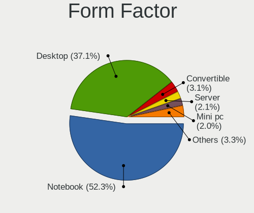
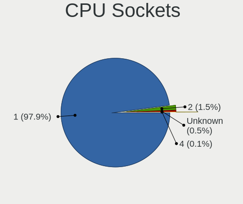
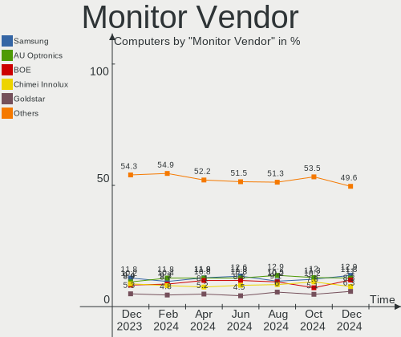

Ubuntu - Hardware Trends
------------------------

A project to identify most popular hardware characteristics and track their change
over time based on data collected by Linux users at https://Linux-Hardware.org.

Anyone can contribute to this report by the [hw-probe](https://github.com/linuxhw/hw-probe) tool:

    sudo -E hw-probe -all -upload

This is a report for all computer types. See also reports for [desktops](/Dist/Ubuntu/Desktop/README.md) and [notebooks](/Dist/Ubuntu/Notebook/README.md).

This report is for one last month. Overall report since the beginning of time: [TestCoverage](https://github.com/linuxhw/TestCoverage)

Period: Jan, 2023.

Contents
--------

* [ System ](#system)
  - [ OS                       ](#os)
  - [ OS Family                ](#os-family)
  - [ Kernel                   ](#kernel)
  - [ Kernel Family            ](#kernel-family)
  - [ Kernel Major Ver.        ](#kernel-major-ver)
  - [ Arch                     ](#arch)
  - [ DE                       ](#de)
  - [ Display Server           ](#display-server)
  - [ Display Manager          ](#display-manager)
  - [ OS Lang                  ](#os-lang)
  - [ Boot Mode                ](#boot-mode)
  - [ Filesystem               ](#filesystem)
  - [ Part. scheme             ](#part-scheme)
  - [ Dual Boot with Linux/BSD ](#dual-boot-with-linuxbsd)
  - [ Dual Boot (Win)          ](#dual-boot-win)

* [ Board ](#board)
  - [ Vendor                   ](#vendor)
  - [ Model                    ](#model)
  - [ Model Family             ](#model-family)
  - [ MFG Year                 ](#mfg-year)
  - [ Form Factor              ](#form-factor)
  - [ Secure Boot              ](#secure-boot)
  - [ Coreboot                 ](#coreboot)
  - [ RAM Size                 ](#ram-size)
  - [ RAM Used                 ](#ram-used)
  - [ Total Drives             ](#total-drives)
  - [ Has CD-ROM               ](#has-cd-rom)
  - [ Has Ethernet             ](#has-ethernet)
  - [ Has WiFi                 ](#has-wifi)
  - [ Has Bluetooth            ](#has-bluetooth)

* [ Location ](#location)
  - [ Country                  ](#country)
  - [ City                     ](#city)

* [ Drives ](#drives)
  - [ Drive Vendor             ](#drive-vendor)
  - [ Drive Model              ](#drive-model)
  - [ HDD Vendor               ](#hdd-vendor)
  - [ SSD Vendor               ](#ssd-vendor)
  - [ Drive Kind               ](#drive-kind)
  - [ Drive Connector          ](#drive-connector)
  - [ Drive Size               ](#drive-size)
  - [ Space Total              ](#space-total)
  - [ Space Used               ](#space-used)
  - [ Malfunc. Drives          ](#malfunc-drives)
  - [ Malfunc. Drive Vendor    ](#malfunc-drive-vendor)
  - [ Malfunc. HDD Vendor      ](#malfunc-hdd-vendor)
  - [ Malfunc. Drive Kind      ](#malfunc-drive-kind)
  - [ Failed Drives            ](#failed-drives)
  - [ Failed Drive Vendor      ](#failed-drive-vendor)
  - [ Drive Status             ](#drive-status)

* [ Storage controller ](#storage-controller)
  - [ Storage Vendor           ](#storage-vendor)
  - [ Storage Model            ](#storage-model)
  - [ Storage Kind             ](#storage-kind)

* [ Processor ](#processor)
  - [ CPU Vendor               ](#cpu-vendor)
  - [ CPU Model                ](#cpu-model)
  - [ CPU Model Family         ](#cpu-model-family)
  - [ CPU Cores                ](#cpu-cores)
  - [ CPU Sockets              ](#cpu-sockets)
  - [ CPU Threads              ](#cpu-threads)
  - [ CPU Op-Modes             ](#cpu-op-modes)
  - [ CPU Microcode            ](#cpu-microcode)
  - [ CPU Microarch            ](#cpu-microarch)

* [ Graphics ](#graphics)
  - [ GPU Vendor               ](#gpu-vendor)
  - [ GPU Model                ](#gpu-model)
  - [ GPU Combo                ](#gpu-combo)
  - [ GPU Driver               ](#gpu-driver)
  - [ GPU Memory               ](#gpu-memory)

* [ Monitor ](#monitor)
  - [ Monitor Vendor           ](#monitor-vendor)
  - [ Monitor Model            ](#monitor-model)
  - [ Monitor Resolution       ](#monitor-resolution)
  - [ Monitor Diagonal         ](#monitor-diagonal)
  - [ Monitor Width            ](#monitor-width)
  - [ Aspect Ratio             ](#aspect-ratio)
  - [ Monitor Area             ](#monitor-area)
  - [ Pixel Density            ](#pixel-density)
  - [ Multiple Monitors        ](#multiple-monitors)

* [ Network ](#network)
  - [ Net Controller Vendor    ](#net-controller-vendor)
  - [ Net Controller Model     ](#net-controller-model)
  - [ Wireless Vendor          ](#wireless-vendor)
  - [ Wireless Model           ](#wireless-model)
  - [ Ethernet Vendor          ](#ethernet-vendor)
  - [ Ethernet Model           ](#ethernet-model)
  - [ Net Controller Kind      ](#net-controller-kind)
  - [ Used Controller          ](#used-controller)
  - [ NICs                     ](#nics)
  - [ IPv6                     ](#ipv6)

* [ Bluetooth ](#bluetooth)
  - [ Bluetooth Vendor         ](#bluetooth-vendor)
  - [ Bluetooth Model          ](#bluetooth-model)

* [ Sound ](#sound)
  - [ Sound Vendor             ](#sound-vendor)
  - [ Sound Model              ](#sound-model)

* [ Memory ](#memory)
  - [ Memory Vendor            ](#memory-vendor)
  - [ Memory Model             ](#memory-model)
  - [ Memory Kind              ](#memory-kind)
  - [ Memory Form Factor       ](#memory-form-factor)
  - [ Memory Size              ](#memory-size)
  - [ Memory Speed             ](#memory-speed)

* [ Printers & scanners ](#printers--scanners)
  - [ Printer Vendor           ](#printer-vendor)
  - [ Printer Model            ](#printer-model)
  - [ Scanner Vendor           ](#scanner-vendor)
  - [ Scanner Model            ](#scanner-model)

* [ Camera ](#camera)
  - [ Camera Vendor            ](#camera-vendor)
  - [ Camera Model             ](#camera-model)

* [ Security ](#security)
  - [ Fingerprint Vendor       ](#fingerprint-vendor)
  - [ Fingerprint Model        ](#fingerprint-model)
  - [ Chipcard Vendor          ](#chipcard-vendor)
  - [ Chipcard Model           ](#chipcard-model)

* [ Unsupported ](#unsupported)
  - [ Unsupported Devices      ](#unsupported-devices)
  - [ Unsupported Device Types ](#unsupported-device-types)

System
------

OS
--

Installed operating systems

| Name         | Computers | Percent |
|--------------|-----------|---------|
| Ubuntu 22.04 | 835       | 61.31%  |
| Ubuntu 22.10 | 297       | 21.81%  |
| Ubuntu 20.04 | 164       | 12.04%  |
| Ubuntu 18.04 | 57        | 4.19%   |
| Ubuntu 23.04 | 3         | 0.22%   |
| Ubuntu 16.04 | 2         | 0.15%   |
| Ubuntu 21.10 | 1         | 0.07%   |
| Ubuntu 20.10 | 1         | 0.07%   |
| Ubuntu 19.10 | 1         | 0.07%   |
| Ubuntu 14.04 | 1         | 0.07%   |

OS Family
---------

OS without a version

| Name   | Computers | Percent |
|--------|-----------|---------|
| Ubuntu | 1362      | 100%    |

Kernel
------

Version of the Linux kernel

| Version                  | Computers | Percent |
|--------------------------|-----------|---------|
| 5.15.0-58-generic        | 421       | 30.91%  |
| 5.15.0-56-generic        | 189       | 13.88%  |
| 5.15.0-57-generic        | 167       | 12.26%  |
| 5.19.0-29-generic        | 131       | 9.62%   |
| 5.15.0-43-generic        | 48        | 3.52%   |
| 5.19.0-28-generic        | 47        | 3.45%   |
| 5.19.0-26-generic        | 44        | 3.23%   |
| 5.4.0-137-generic        | 35        | 2.57%   |
| 5.19.0-21-generic        | 26        | 1.91%   |
| 5.4.0-136-generic        | 19        | 1.4%    |
| 5.19.0-30-generic        | 16        | 1.17%   |
| 5.15.0-59-generic        | 14        | 1.03%   |
| 5.4.0-135-generic        | 11        | 0.81%   |
| 5.15.0-53-generic        | 9         | 0.66%   |
| 5.15.0-52-generic        | 8         | 0.59%   |
| 6.0.9-060009-generic     | 7         | 0.51%   |
| 5.19.0-31-generic        | 7         | 0.51%   |
| 4.15.0-202-generic       | 7         | 0.51%   |
| 5.15.0-60-generic        | 5         | 0.37%   |
| 5.15.0-25-generic        | 5         | 0.37%   |
| 4.15.0-201-generic       | 5         | 0.37%   |
| 5.15.0-46-generic        | 4         | 0.29%   |
| 6.1.8-060108-generic     | 3         | 0.22%   |
| 5.4.0-84-generic         | 3         | 0.22%   |
| 5.4.0-131-generic        | 3         | 0.22%   |
| 5.4.0-128-generic        | 3         | 0.22%   |
| 5.19.17-051917-generic   | 3         | 0.22%   |
| 5.15.0-41-generic        | 3         | 0.22%   |
| 5.14.0-1056-oem          | 3         | 0.22%   |
| 5.14.0-1054-oem          | 3         | 0.22%   |
| 4.15.0-200-generic       | 3         | 0.22%   |
| 6.1.4-060104-generic     | 2         | 0.15%   |
| 6.1.0-1004-oem           | 2         | 0.15%   |
| 5.4.0-70-generic         | 2         | 0.15%   |
| 5.4.0-52-generic         | 2         | 0.15%   |
| 5.4.0-42-generic         | 2         | 0.15%   |
| 5.4.0-132-generic        | 2         | 0.15%   |
| 5.19.5-051905-generic    | 2         | 0.15%   |
| 5.18.10-76051810-generic | 2         | 0.15%   |
| 5.17.0-1025-oem          | 2         | 0.15%   |

Kernel Family
-------------

Linux kernel without a distro release

| Version  | Computers | Percent |
|----------|-----------|---------|
| 5.15.0   | 889       | 65.27%  |
| 5.19.0   | 276       | 20.26%  |
| 5.4.0    | 89        | 6.53%   |
| 4.15.0   | 20        | 1.47%   |
| 5.14.0   | 10        | 0.73%   |
| 5.13.0   | 8         | 0.59%   |
| 6.0.9    | 7         | 0.51%   |
| 5.17.0   | 7         | 0.51%   |
| 5.8.0    | 5         | 0.37%   |
| 6.0.0    | 4         | 0.29%   |
| 6.1.8    | 3         | 0.22%   |
| 6.1.4    | 3         | 0.22%   |
| 6.1.0    | 3         | 0.22%   |
| 5.19.5   | 3         | 0.22%   |
| 5.19.17  | 3         | 0.22%   |
| 5.11.0   | 3         | 0.22%   |
| 6.1.6    | 2         | 0.15%   |
| 6.1.3    | 2         | 0.15%   |
| 6.1.2    | 2         | 0.15%   |
| 5.18.10  | 2         | 0.15%   |
| 6.2.0    | 1         | 0.07%   |
| 6.1.7    | 1         | 0.07%   |
| 6.1.5    | 1         | 0.07%   |
| 6.1.1    | 1         | 0.07%   |
| 6.0.8    | 1         | 0.07%   |
| 6.0.7    | 1         | 0.07%   |
| 6.0.6    | 1         | 0.07%   |
| 6.0.12   | 1         | 0.07%   |
| 5.4.25   | 1         | 0.07%   |
| 5.4.227  | 1         | 0.07%   |
| 5.3.0    | 1         | 0.07%   |
| 5.19.1   | 1         | 0.07%   |
| 5.17.5   | 1         | 0.07%   |
| 5.17.1   | 1         | 0.07%   |
| 5.15.80  | 1         | 0.07%   |
| 5.12.0   | 1         | 0.07%   |
| 5.10.110 | 1         | 0.07%   |
| 5.10.0   | 1         | 0.07%   |
| 4.9.140  | 1         | 0.07%   |
| 4.4.0    | 1         | 0.07%   |

Kernel Major Ver.
-----------------

Linux kernel major version

| Version | Computers | Percent |
|---------|-----------|---------|
| 5.15    | 890       | 65.35%  |
| 5.19    | 283       | 20.78%  |
| 5.4     | 91        | 6.68%   |
| 4.15    | 20        | 1.47%   |
| 6.1     | 18        | 1.32%   |
| 6.0     | 15        | 1.1%    |
| 5.14    | 10        | 0.73%   |
| 5.17    | 9         | 0.66%   |
| 5.13    | 8         | 0.59%   |
| 5.8     | 5         | 0.37%   |
| 5.11    | 3         | 0.22%   |
| 5.18    | 2         | 0.15%   |
| 5.10    | 2         | 0.15%   |
| 6.2     | 1         | 0.07%   |
| 5.3     | 1         | 0.07%   |
| 5.12    | 1         | 0.07%   |
| 4.9     | 1         | 0.07%   |
| 4.4     | 1         | 0.07%   |
| 4.10    | 1         | 0.07%   |

Arch
----

OS architecture (x86_64, i586, etc.)

| Name    | Computers | Percent |
|---------|-----------|---------|
| x86_64  | 1341      | 98.46%  |
| i686    | 12        | 0.88%   |
| aarch64 | 5         | 0.37%   |
| armv7l  | 3         | 0.22%   |
| riscv64 | 1         | 0.07%   |

DE
--

Desktop Environment

| Name            | Computers | Percent |
|-----------------|-----------|---------|
| GNOME           | 1268      | 93.1%   |
| Unknown         | 62        | 4.55%   |
| GNOME Flashback | 11        | 0.81%   |
| X-Cinnamon      | 9         | 0.66%   |
| Pantheon        | 2         | 0.15%   |
| Enlightenment   | 2         | 0.15%   |
| Cinnamon        | 2         | 0.15%   |
| openbox         | 1         | 0.07%   |
| Lubuntu         | 1         | 0.07%   |
| i3              | 1         | 0.07%   |
| GNOME Classic   | 1         | 0.07%   |
| fluxbox         | 1         | 0.07%   |
| dwm             | 1         | 0.07%   |

Display Server
--------------

X11 or Wayland

| Name    | Computers | Percent |
|---------|-----------|---------|
| Wayland | 757       | 55.58%  |
| X11     | 532       | 39.06%  |
| Tty     | 41        | 3.01%   |
| Unknown | 32        | 2.35%   |

Display Manager
---------------

SDDM, LightDM, etc.

| Name    | Computers | Percent |
|---------|-----------|---------|
| GDM3    | 1168      | 85.76%  |
| Unknown | 113       | 8.3%    |
| GDM     | 50        | 3.67%   |
| LightDM | 27        | 1.98%   |
| SDDM    | 3         | 0.22%   |
| SLiM    | 1         | 0.07%   |

OS Lang
-------

Language

| Lang    | Computers | Percent |
|---------|-----------|---------|
| en_US   | 610       | 44.79%  |
| de_DE   | 121       | 8.88%   |
| fr_FR   | 85        | 6.24%   |
| en_GB   | 69        | 5.07%   |
| it_IT   | 58        | 4.26%   |
| ru_RU   | 45        | 3.3%    |
| pt_BR   | 39        | 2.86%   |
| en_CA   | 37        | 2.72%   |
| es_ES   | 27        | 1.98%   |
| pl_PL   | 25        | 1.84%   |
| en_IN   | 22        | 1.62%   |
| nl_NL   | 21        | 1.54%   |
| en_AU   | 18        | 1.32%   |
| Unknown | 17        | 1.25%   |
| C       | 16        | 1.17%   |
| de_CH   | 11        | 0.81%   |
| cs_CZ   | 11        | 0.81%   |
| hu_HU   | 10        | 0.73%   |
| en_ZA   | 9         | 0.66%   |
| sv_SE   | 8         | 0.59%   |
| es_MX   | 8         | 0.59%   |
| zh_CN   | 7         | 0.51%   |
| es_CO   | 6         | 0.44%   |
| fr_CA   | 5         | 0.37%   |
| de_AT   | 5         | 0.37%   |
| fr_BE   | 4         | 0.29%   |
| en_SG   | 4         | 0.29%   |
| en_IL   | 4         | 0.29%   |
| en_IE   | 4         | 0.29%   |
| el_GR   | 4         | 0.29%   |
| tr_TR   | 3         | 0.22%   |
| nb_NO   | 3         | 0.22%   |
| lv_LV   | 3         | 0.22%   |
| fi_FI   | 3         | 0.22%   |
| es_AR   | 3         | 0.22%   |
| en_NZ   | 3         | 0.22%   |
| ca_ES   | 3         | 0.22%   |
| ro_RO   | 2         | 0.15%   |
| pt_PT   | 2         | 0.15%   |
| nl_BE   | 2         | 0.15%   |

Boot Mode
---------

EFI or BIOS

| Mode | Computers | Percent |
|------|-----------|---------|
| BIOS | 826       | 60.65%  |
| EFI  | 536       | 39.35%  |

Filesystem
----------

Type of filesystem

| Type    | Computers | Percent |
|---------|-----------|---------|
| Ext4    | 1255      | 92.14%  |
| Btrfs   | 39        | 2.86%   |
| Overlay | 32        | 2.35%   |
| Zfs     | 26        | 1.91%   |
| Xfs     | 3         | 0.22%   |
| Ext2    | 3         | 0.22%   |
| Tmpfs   | 2         | 0.15%   |
| Jfs     | 1         | 0.07%   |
| Ext3    | 1         | 0.07%   |

Part. scheme
------------

Scheme of partitioning

| Type    | Computers | Percent |
|---------|-----------|---------|
| GPT     | 1084      | 79.59%  |
| MBR     | 196       | 14.39%  |
| Unknown | 82        | 6.02%   |

Dual Boot with Linux/BSD
------------------------

Hosting more than one Linux/BSD

| Dual boot | Computers | Percent |
|-----------|-----------|---------|
| No        | 1186      | 87.08%  |
| Yes       | 176       | 12.92%  |

Dual Boot (Win)
---------------

Hosting Linux and Windows

| Dual boot | Computers | Percent |
|-----------|-----------|---------|
| No        | 861       | 63.22%  |
| Yes       | 501       | 36.78%  |

Board
-----

Vendor
------

Motherboard manufacturer

| Name                    | Computers | Percent |
|-------------------------|-----------|---------|
| ASUSTek Computer        | 212       | 15.57%  |
| Dell                    | 208       | 15.27%  |
| Lenovo                  | 195       | 14.32%  |
| Hewlett-Packard         | 190       | 13.95%  |
| Gigabyte Technology     | 87        | 6.39%   |
| MSI                     | 85        | 6.24%   |
| Acer                    | 74        | 5.43%   |
| Apple                   | 50        | 3.67%   |
| ASRock                  | 35        | 2.57%   |
| Intel                   | 24        | 1.76%   |
| Samsung Electronics     | 15        | 1.1%    |
| Toshiba                 | 14        | 1.03%   |
| Unknown                 | 14        | 1.03%   |
| HUAWEI                  | 10        | 0.73%   |
| Google                  | 9         | 0.66%   |
| Timi                    | 8         | 0.59%   |
| Medion                  | 8         | 0.59%   |
| Sony                    | 7         | 0.51%   |
| Fujitsu                 | 7         | 0.51%   |
| Microsoft               | 6         | 0.44%   |
| System76                | 5         | 0.37%   |
| Notebook                | 5         | 0.37%   |
| Foxconn                 | 5         | 0.37%   |
| Alienware               | 5         | 0.37%   |
| Raspberry Pi Foundation | 4         | 0.29%   |
| LG Electronics          | 4         | 0.29%   |
| Gateway                 | 4         | 0.29%   |
| AZW                     | 4         | 0.29%   |
| Supermicro              | 3         | 0.22%   |
| Packard Bell            | 3         | 0.22%   |
| Chuwi                   | 3         | 0.22%   |
| ASRockRack              | 3         | 0.22%   |
| TUXEDO                  | 2         | 0.15%   |
| Schenker                | 2         | 0.15%   |
| Rockchip                | 2         | 0.15%   |
| Pegatron                | 2         | 0.15%   |
| Neousys Technology      | 2         | 0.15%   |
| ITI LIMITED             | 2         | 0.15%   |
| Inspur                  | 2         | 0.15%   |
| HONOR                   | 2         | 0.15%   |

Model
-----

Motherboard model

| Name                                 | Computers | Percent |
|--------------------------------------|-----------|---------|
| Unknown                              | 19        | 1.4%    |
| ASUS All Series                      | 15        | 1.1%    |
| HP Notebook                          | 6         | 0.44%   |
| Apple MacBookPro8,1                  | 6         | 0.44%   |
| HP Laptop 17-cp0xxx                  | 5         | 0.37%   |
| MSI MS-7C91                          | 4         | 0.29%   |
| HP EliteBook 8460p                   | 4         | 0.29%   |
| Dell OptiPlex 7050                   | 4         | 0.29%   |
| Dell OptiPlex 7010                   | 4         | 0.29%   |
| Dell Latitude E6420                  | 4         | 0.29%   |
| ASUS PRIME A320M-K                   | 4         | 0.29%   |
| MSI MS-7C51                          | 3         | 0.22%   |
| MSI MS-7C37                          | 3         | 0.22%   |
| MSI MS-7693                          | 3         | 0.22%   |
| Lenovo Yoga 6 13ALC7 82UD            | 3         | 0.22%   |
| HP Pavilion g7                       | 3         | 0.22%   |
| HP Pavilion dv7                      | 3         | 0.22%   |
| HP ENVY x360 2-in-1 Laptop 15-ew0xxx | 3         | 0.22%   |
| HP EliteBook 840 G3                  | 3         | 0.22%   |
| Gigabyte B450M DS3H                  | 3         | 0.22%   |
| Dell XPS 13 9380                     | 3         | 0.22%   |
| Dell G15 5510                        | 3         | 0.22%   |
| ASUS Zenbook UM3402YA_UM3402YA       | 3         | 0.22%   |
| ASUS M5A78L-M/USB3                   | 3         | 0.22%   |
| Apple Macmini8,1                     | 3         | 0.22%   |
| Apple MacBookPro8,2                  | 3         | 0.22%   |
| Apple MacBookPro5,5                  | 3         | 0.22%   |
| Acer Aspire V3-772G                  | 3         | 0.22%   |
| Timi TM1701                          | 2         | 0.15%   |
| Supermicro Super Server              | 2         | 0.15%   |
| Samsung 350V5C/351V5C/3540VC/3440VC  | 2         | 0.15%   |
| RPi Raspberry Pi 4 Model B Rev 1.1   | 2         | 0.15%   |
| MSI MS-7C02                          | 2         | 0.15%   |
| MSI MS-7B86                          | 2         | 0.15%   |
| MSI MS-7B79                          | 2         | 0.15%   |
| MSI MS-7B17                          | 2         | 0.15%   |
| MSI MS-7A39                          | 2         | 0.15%   |
| MSI MS-7A33                          | 2         | 0.15%   |
| Microsoft Surface Go                 | 2         | 0.15%   |
| Lenovo Yoga 920-13IKB 80Y7           | 2         | 0.15%   |

Model Family
------------

Motherboard model prefix

| Name                | Computers | Percent |
|---------------------|-----------|---------|
| Lenovo ThinkPad     | 84        | 6.17%   |
| Dell Latitude       | 56        | 4.11%   |
| Acer Aspire         | 50        | 3.67%   |
| Dell Inspiron       | 38        | 2.79%   |
| Lenovo IdeaPad      | 35        | 2.57%   |
| HP Pavilion         | 35        | 2.57%   |
| Dell OptiPlex       | 34        | 2.5%    |
| HP EliteBook        | 30        | 2.2%    |
| Dell XPS            | 28        | 2.06%   |
| ASUS PRIME          | 26        | 1.91%   |
| Dell Precision      | 23        | 1.69%   |
| ASUS ROG            | 22        | 1.62%   |
| HP Laptop           | 21        | 1.54%   |
| Unknown             | 19        | 1.4%    |
| HP ProBook          | 18        | 1.32%   |
| ASUS VivoBook       | 16        | 1.17%   |
| ASUS All            | 15        | 1.1%    |
| HP ENVY             | 14        | 1.03%   |
| ASUS TUF            | 13        | 0.95%   |
| Toshiba Satellite   | 11        | 0.81%   |
| Lenovo ThinkCentre  | 11        | 0.81%   |
| Lenovo ThinkStation | 10        | 0.73%   |
| Dell Vostro         | 10        | 0.73%   |
| Lenovo Yoga         | 9         | 0.66%   |
| Lenovo ThinkBook    | 9         | 0.66%   |
| Lenovo Legion       | 9         | 0.66%   |
| HP ZBook            | 9         | 0.66%   |
| Dell PowerEdge      | 9         | 0.66%   |
| Apple MacBookPro8   | 9         | 0.66%   |
| HP Compaq           | 8         | 0.59%   |
| Acer Swift          | 8         | 0.59%   |
| Lenovo IdeaPadFlex  | 7         | 0.51%   |
| Microsoft Surface   | 6         | 0.44%   |
| HP Notebook         | 6         | 0.44%   |
| ASUS Zenbook        | 6         | 0.44%   |
| ASUS ASUS           | 6         | 0.44%   |
| Apple MacBookPro5   | 6         | 0.44%   |
| Lenovo IdeaCentre   | 5         | 0.37%   |
| HP ProLiant         | 5         | 0.37%   |
| HP EliteDesk        | 5         | 0.37%   |

MFG Year
--------

Motherboard manufacture year

| Year    | Computers | Percent |
|---------|-----------|---------|
| 2021    | 155       | 11.38%  |
| 2020    | 143       | 10.5%   |
| 2022    | 125       | 9.18%   |
| 2019    | 107       | 7.86%   |
| 2012    | 107       | 7.86%   |
| 2017    | 98        | 7.2%    |
| 2011    | 95        | 6.98%   |
| 2018    | 87        | 6.39%   |
| 2013    | 82        | 6.02%   |
| 2014    | 74        | 5.43%   |
| 2016    | 66        | 4.85%   |
| 2015    | 65        | 4.77%   |
| 2010    | 50        | 3.67%   |
| 2009    | 45        | 3.3%    |
| 2008    | 28        | 2.06%   |
| 2007    | 17        | 1.25%   |
| Unknown | 9         | 0.66%   |
| 2005    | 5         | 0.37%   |
| 2006    | 3         | 0.22%   |
| 2004    | 1         | 0.07%   |

Form Factor
-----------

Physical design of the computer

| Name           | Computers | Percent |
|----------------|-----------|---------|
| Notebook       | 729       | 53.52%  |
| Desktop        | 486       | 35.68%  |
| Convertible    | 52        | 3.82%   |
| Mini pc        | 33        | 2.42%   |
| Server         | 23        | 1.69%   |
| All in one     | 17        | 1.25%   |
| Tablet         | 14        | 1.03%   |
| System on chip | 8         | 0.59%   |

Secure Boot
-----------

Enabled or disabled

| State    | Computers | Percent |
|----------|-----------|---------|
| Disabled | 1229      | 90.23%  |
| Enabled  | 133       | 9.77%   |

Coreboot
--------

Have coreboot on board

| Used | Computers | Percent |
|------|-----------|---------|
| No   | 1350      | 99.12%  |
| Yes  | 12        | 0.88%   |

RAM Size
--------

Total RAM memory

| Size in GB      | Computers | Percent |
|-----------------|-----------|---------|
| 4.01-8.0        | 329       | 24.16%  |
| 16.01-24.0      | 305       | 22.39%  |
| 3.01-4.0        | 217       | 15.93%  |
| 8.01-16.0       | 208       | 15.27%  |
| 32.01-64.0      | 189       | 13.88%  |
| 64.01-256.0     | 53        | 3.89%   |
| 1.01-2.0        | 23        | 1.69%   |
| 24.01-32.0      | 18        | 1.32%   |
| 2.01-3.0        | 12        | 0.88%   |
| More than 256.0 | 6         | 0.44%   |
| 0.51-1.0        | 2         | 0.15%   |

RAM Used
--------

Used RAM memory

| Used GB     | Computers | Percent |
|-------------|-----------|---------|
| 2.01-3.0    | 419       | 30.76%  |
| 1.01-2.0    | 399       | 29.3%   |
| 4.01-8.0    | 240       | 17.62%  |
| 3.01-4.0    | 175       | 12.85%  |
| 8.01-16.0   | 78        | 5.73%   |
| 0.51-1.0    | 29        | 2.13%   |
| 16.01-24.0  | 9         | 0.66%   |
| 0.01-0.5    | 6         | 0.44%   |
| 24.01-32.0  | 3         | 0.22%   |
| 32.01-64.0  | 2         | 0.15%   |
| 64.01-256.0 | 2         | 0.15%   |

Total Drives
------------

Number of drives on board

| Drives | Computers | Percent |
|--------|-----------|---------|
| 1      | 884       | 64.9%   |
| 2      | 301       | 22.1%   |
| 3      | 92        | 6.75%   |
| 4      | 32        | 2.35%   |
| 5      | 19        | 1.4%    |
| 6      | 10        | 0.73%   |
| 0      | 10        | 0.73%   |
| 7      | 8         | 0.59%   |
| 10     | 2         | 0.15%   |
| 8      | 2         | 0.15%   |
| 26     | 1         | 0.07%   |
| 9      | 1         | 0.07%   |

Has CD-ROM
----------

Has CD-ROM on board

| Presented | Computers | Percent |
|-----------|-----------|---------|
| No        | 889       | 65.27%  |
| Yes       | 473       | 34.73%  |

Has Ethernet
------------

Has Ethernet on board

| Presented | Computers | Percent |
|-----------|-----------|---------|
| Yes       | 1142      | 83.85%  |
| No        | 220       | 16.15%  |

Has WiFi
--------

Has WiFi module

| Presented | Computers | Percent |
|-----------|-----------|---------|
| Yes       | 1063      | 78.05%  |
| No        | 299       | 21.95%  |

Has Bluetooth
-------------

Has Bluetooth module

| Presented | Computers | Percent |
|-----------|-----------|---------|
| Yes       | 852       | 62.56%  |
| No        | 510       | 37.44%  |

Location
--------

Country
-------

Geographic location (country)

| Country      | Computers | Percent |
|--------------|-----------|---------|
| USA          | 285       | 20.93%  |
| Germany      | 155       | 11.38%  |
| France       | 97        | 7.12%   |
| Italy        | 72        | 5.29%   |
| UK           | 61        | 4.48%   |
| Russia       | 54        | 3.96%   |
| Canada       | 50        | 3.67%   |
| Brazil       | 50        | 3.67%   |
| Netherlands  | 42        | 3.08%   |
| Spain        | 37        | 2.72%   |
| Poland       | 31        | 2.28%   |
| India        | 25        | 1.84%   |
| Switzerland  | 21        | 1.54%   |
| Australia    | 21        | 1.54%   |
| Czechia      | 16        | 1.17%   |
| Turkey       | 14        | 1.03%   |
| Mexico       | 14        | 1.03%   |
| Sweden       | 13        | 0.95%   |
| Greece       | 13        | 0.95%   |
| Belgium      | 13        | 0.95%   |
| Hungary      | 12        | 0.88%   |
| Romania      | 11        | 0.81%   |
| Portugal     | 11        | 0.81%   |
| Austria      | 11        | 0.81%   |
| South Africa | 10        | 0.73%   |
| Denmark      | 10        | 0.73%   |
| Norway       | 9         | 0.66%   |
| Finland      | 9         | 0.66%   |
| China        | 9         | 0.66%   |
| Ireland      | 8         | 0.59%   |
| Indonesia    | 8         | 0.59%   |
| Colombia     | 8         | 0.59%   |
| Argentina    | 8         | 0.59%   |
| Serbia       | 7         | 0.51%   |
| Slovakia     | 6         | 0.44%   |
| New Zealand  | 6         | 0.44%   |
| Kenya        | 6         | 0.44%   |
| Ukraine      | 5         | 0.37%   |
| Taiwan       | 5         | 0.37%   |
| Slovenia     | 5         | 0.37%   |

City
----

Geographic location (city)

| City              | Computers | Percent |
|-------------------|-----------|---------|
| Moscow            | 13        | 0.95%   |
| Milan             | 11        | 0.81%   |
| Rome              | 10        | 0.73%   |
| Paris             | 10        | 0.73%   |
| New York          | 9         | 0.66%   |
| Madrid            | 9         | 0.66%   |
| London            | 9         | 0.66%   |
| Vienna            | 8         | 0.59%   |
| Hamburg           | 8         | 0.59%   |
| Warsaw            | 7         | 0.51%   |
| Toronto           | 7         | 0.51%   |
| Sydney            | 7         | 0.51%   |
| St Petersburg     | 7         | 0.51%   |
| San Jose          | 7         | 0.51%   |
| Berlin            | 7         | 0.51%   |
| Prague            | 6         | 0.44%   |
| Nairobi           | 6         | 0.44%   |
| Istanbul          | 6         | 0.44%   |
| Helsinki          | 6         | 0.44%   |
| Frankfurt am Main | 6         | 0.44%   |
| Dublin            | 6         | 0.44%   |
| Belgrade          | 6         | 0.44%   |
| Athens            | 6         | 0.44%   |
| Wroclaw           | 5         | 0.37%   |
| Singapore         | 5         | 0.37%   |
| Philadelphia      | 5         | 0.37%   |
| Munich            | 5         | 0.37%   |
| Denver            | 5         | 0.37%   |
| Chicago           | 5         | 0.37%   |
| Budapest          | 5         | 0.37%   |
| Barcelona         | 5         | 0.37%   |
| Auckland          | 5         | 0.37%   |
| Unknown           | 5         | 0.37%   |
| Sao Paulo         | 4         | 0.29%   |
| Ottawa            | 4         | 0.29%   |
| Milwaukee         | 4         | 0.29%   |
| Miami             | 4         | 0.29%   |
| Hanover           | 4         | 0.29%   |
| Bucharest         | 4         | 0.29%   |
| Brisbane          | 4         | 0.29%   |

Drives
------

Drive Vendor
------------

Hard drive vendors

| Vendor                      | Computers | Drives | Percent |
|-----------------------------|-----------|--------|---------|
| Samsung Electronics         | 315       | 381    | 16.68%  |
| WDC                         | 258       | 315    | 13.67%  |
| Seagate                     | 232       | 294    | 12.29%  |
| Sandisk                     | 109       | 117    | 5.77%   |
| Toshiba                     | 104       | 110    | 5.51%   |
| Kingston                    | 102       | 104    | 5.4%    |
| Unknown                     | 89        | 106    | 4.71%   |
| Crucial                     | 76        | 84     | 4.03%   |
| Intel                       | 65        | 67     | 3.44%   |
| SK hynix                    | 58        | 58     | 3.07%   |
| Hitachi                     | 56        | 58     | 2.97%   |
| Micron Technology           | 39        | 46     | 2.07%   |
| KIOXIA                      | 33        | 35     | 1.75%   |
| Phison Electronics          | 23        | 24     | 1.22%   |
| HGST                        | 23        | 26     | 1.22%   |
| A-DATA Technology           | 23        | 23     | 1.22%   |
| SPCC                        | 18        | 20     | 0.95%   |
| Apple                       | 18        | 23     | 0.95%   |
| China                       | 17        | 17     | 0.9%    |
| Intenso                     | 13        | 17     | 0.69%   |
| Maxtor                      | 12        | 13     | 0.64%   |
| LITEON                      | 12        | 12     | 0.64%   |
| Silicon Motion              | 11        | 11     | 0.58%   |
| Kingston Technology Company | 11        | 11     | 0.58%   |
| ADATA Technology            | 8         | 9      | 0.42%   |
| PNY                         | 7         | 7      | 0.37%   |
| Phison                      | 7         | 7      | 0.37%   |
| Micron/Crucial Technology   | 7         | 7      | 0.37%   |
| Unknown                     | 7         | 7      | 0.37%   |
| Transcend                   | 6         | 6      | 0.32%   |
| OCZ                         | 5         | 5      | 0.26%   |
| Netac                       | 5         | 5      | 0.26%   |
| TO Exter                    | 4         | 4      | 0.21%   |
| Team                        | 4         | 4      | 0.21%   |
| Patriot                     | 4         | 4      | 0.21%   |
| ASMT                        | 4         | 6      | 0.21%   |
| Apacer                      | 4         | 4      | 0.21%   |
| SSSTC                       | 3         | 4      | 0.16%   |
| Solid State Storage         | 3         | 3      | 0.16%   |
| Plextor                     | 3         | 3      | 0.16%   |

Drive Model
-----------

Hard drive models

| Model                                                 | Computers | Percent |
|-------------------------------------------------------|-----------|---------|
| Samsung NVMe SSD Controller SM981/PM981/PM983 500GB   | 42        | 2.06%   |
| Kingston SA400S37240G 240GB SSD                       | 23        | 1.13%   |
| Unknown MMC Card  64GB                                | 21        | 1.03%   |
| Seagate ST1000DM010-2EP102 1TB                        | 19        | 0.93%   |
| Samsung SSD 850 EVO 250GB                             | 18        | 0.88%   |
| Kingston SA400S37480G 480GB SSD                       | 18        | 0.88%   |
| Seagate ST2000DM008-2FR102 2TB                        | 13        | 0.64%   |
| Samsung NVMe SSD Controller PM9A1/PM9A3/980PRO 512GB  | 13        | 0.64%   |
| Unknown MMC Card  32GB                                | 12        | 0.59%   |
| Intel SSD 660P Series 512GB                           | 12        | 0.59%   |
| Crucial CT240BX500SSD1 240GB                          | 12        | 0.59%   |
| Seagate ST1000LM035-1RK172 1TB                        | 11        | 0.54%   |
| Sandisk WD Black SN750 / PC SN730 NVMe SSD 1TB        | 11        | 0.54%   |
| Unknown SD/MMC/MS PRO 2GB                             | 10        | 0.49%   |
| Seagate ST500DM002-1BD142 500GB                       | 10        | 0.49%   |
| Samsung SSD 860 EVO 250GB                             | 10        | 0.49%   |
| Samsung SSD 850 EVO 500GB                             | 10        | 0.49%   |
| Unknown MMC Card  128GB                               | 9         | 0.44%   |
| Toshiba MQ04ABF100 1TB                                | 9         | 0.44%   |
| Seagate ST1000LM024 HN-M101MBB 1TB                    | 9         | 0.44%   |
| Samsung SSD 970 EVO Plus 500GB                        | 9         | 0.44%   |
| Samsung SSD 860 EVO 500GB                             | 9         | 0.44%   |
| Kingston SV300S37A120G 120GB SSD                      | 9         | 0.44%   |
| Intel SSDPEKNU512GZ 512GB                             | 9         | 0.44%   |
| Toshiba MQ01ABF050 500GB                              | 8         | 0.39%   |
| Toshiba MQ01ABD100 1TB                                | 8         | 0.39%   |
| Toshiba HDWD110 1TB                                   | 8         | 0.39%   |
| Phison PS5013 E13 NVMe Controller 256GB               | 8         | 0.39%   |
| Crucial CT500MX500SSD1 500GB                          | 8         | 0.39%   |
| WDC WD10JPVX-22JC3T0 1TB                              | 7         | 0.34%   |
| WDC WD10EZEX-08WN4A0 1TB                              | 7         | 0.34%   |
| Toshiba DT01ACA100 1TB                                | 7         | 0.34%   |
| Silicon Motion SM2263EN/SM2263XT SSD Controller 512GB | 7         | 0.34%   |
| Seagate ST9500325AS 500GB                             | 7         | 0.34%   |
| Seagate ST1000DM003-1CH162 1TB                        | 7         | 0.34%   |
| Sandisk WD Black SN850 2TB                            | 7         | 0.34%   |
| Samsung SSD 970 EVO Plus 1TB                          | 7         | 0.34%   |
| Samsung SSD 870 EVO 500GB                             | 7         | 0.34%   |
| KIOXIA KBG40ZNS512G NVMe 512GB                        | 7         | 0.34%   |
| Unknown                                               | 7         | 0.34%   |

HDD Vendor
----------

Hard disk drive vendors

| Vendor              | Computers | Drives | Percent |
|---------------------|-----------|--------|---------|
| Seagate             | 226       | 284    | 35.48%  |
| WDC                 | 189       | 237    | 29.67%  |
| Toshiba             | 76        | 82     | 11.93%  |
| Hitachi             | 56        | 58     | 8.79%   |
| Samsung Electronics | 29        | 33     | 4.55%   |
| HGST                | 23        | 26     | 3.61%   |
| Unknown             | 12        | 13     | 1.88%   |
| Maxtor              | 8         | 9      | 1.26%   |
| Apple               | 6         | 6      | 0.94%   |
| Intenso             | 2         | 2      | 0.31%   |
| Fujitsu             | 2         | 2      | 0.31%   |
| ASMT                | 2         | 3      | 0.31%   |
| USB                 | 1         | 1      | 0.16%   |
| SABRENT             | 1         | 1      | 0.16%   |
| Phison              | 1         | 1      | 0.16%   |
| JMicron Technology  | 1         | 1      | 0.16%   |
| HPE                 | 1         | 1      | 0.16%   |
| HGST HTS            | 1         | 1      | 0.16%   |

SSD Vendor
----------

Solid state drive vendors

| Vendor              | Computers | Drives | Percent |
|---------------------|-----------|--------|---------|
| Samsung Electronics | 139       | 157    | 22.98%  |
| Kingston            | 81        | 82     | 13.39%  |
| Crucial             | 65        | 72     | 10.74%  |
| SanDisk             | 57        | 62     | 9.42%   |
| WDC                 | 41        | 42     | 6.78%   |
| SPCC                | 18        | 20     | 2.98%   |
| Intel               | 17        | 17     | 2.81%   |
| China               | 17        | 17     | 2.81%   |
| A-DATA Technology   | 17        | 17     | 2.81%   |
| Micron Technology   | 12        | 19     | 1.98%   |
| LITEON              | 12        | 12     | 1.98%   |
| Toshiba             | 9         | 9      | 1.49%   |
| SK hynix            | 8         | 8      | 1.32%   |
| Apple               | 8         | 8      | 1.32%   |
| PNY                 | 7         | 7      | 1.16%   |
| Intenso             | 7         | 11     | 1.16%   |
| Transcend           | 6         | 6      | 0.99%   |
| OCZ                 | 5         | 5      | 0.83%   |
| Netac               | 5         | 5      | 0.83%   |
| TO Exter            | 4         | 4      | 0.66%   |
| Patriot             | 4         | 4      | 0.66%   |
| Maxtor              | 4         | 4      | 0.66%   |
| Apacer              | 4         | 4      | 0.66%   |
| Unknown             | 4         | 4      | 0.66%   |
| Team                | 3         | 3      | 0.5%    |
| Seagate             | 3         | 3      | 0.5%    |
| Plextor             | 3         | 3      | 0.5%    |
| Hewlett-Packard     | 3         | 3      | 0.5%    |
| GOODRAM             | 3         | 4      | 0.5%    |
| OWC                 | 2         | 2      | 0.33%   |
| Lexar               | 2         | 2      | 0.33%   |
| KingDian            | 2         | 2      | 0.33%   |
| Emtec               | 2         | 2      | 0.33%   |
| Corsair             | 2         | 2      | 0.33%   |
| 2.5"                | 2         | 3      | 0.33%   |
| Zheino              | 1         | 1      | 0.17%   |
| Wibtek              | 1         | 1      | 0.17%   |
| WDC WDS2            | 1         | 1      | 0.17%   |
| VICKTER             | 1         | 1      | 0.17%   |
| SCY                 | 1         | 1      | 0.17%   |

Drive Kind
----------

HDD or SSD

| Kind    | Computers | Drives | Percent |
|---------|-----------|--------|---------|
| NVMe    | 548       | 611    | 31.66%  |
| SSD     | 538       | 652    | 31.08%  |
| HDD     | 537       | 761    | 31.02%  |
| MMC     | 71        | 79     | 4.1%    |
| Unknown | 37        | 45     | 2.14%   |

Drive Connector
---------------

SATA, SAS, NVMe, etc.

| Type | Computers | Drives | Percent |
|------|-----------|--------|---------|
| SATA | 891       | 1367   | 56.11%  |
| NVMe | 548       | 609    | 34.51%  |
| SAS  | 78        | 93     | 4.91%   |
| MMC  | 71        | 79     | 4.47%   |

Drive Size
----------

Size of hard drive

| Size in TB | Computers | Drives | Percent |
|------------|-----------|--------|---------|
| 0.01-0.5   | 623       | 773    | 55.48%  |
| 0.51-1.0   | 346       | 420    | 30.81%  |
| 1.01-2.0   | 90        | 111    | 8.01%   |
| 3.01-4.0   | 30        | 44     | 2.67%   |
| 2.01-3.0   | 15        | 19     | 1.34%   |
| 4.01-10.0  | 15        | 39     | 1.34%   |
| 10.01-20.0 | 3         | 6      | 0.27%   |
| 0          | 1         | 1      | 0.09%   |

Space Total
-----------

Amount of disk space available on the file system

| Size in GB     | Computers | Percent |
|----------------|-----------|---------|
| 101-250        | 391       | 28.71%  |
| 251-500        | 343       | 25.18%  |
| 501-1000       | 238       | 17.47%  |
| 1001-2000      | 111       | 8.15%   |
| 51-100         | 87        | 6.39%   |
| 1-20           | 59        | 4.33%   |
| More than 3000 | 44        | 3.23%   |
| 21-50          | 36        | 2.64%   |
| 2001-3000      | 33        | 2.42%   |
| Unknown        | 20        | 1.47%   |

Space Used
----------

Amount of used disk space

| Used GB        | Computers | Percent |
|----------------|-----------|---------|
| 1-20           | 473       | 34.73%  |
| 21-50          | 285       | 20.93%  |
| 101-250        | 200       | 14.68%  |
| 51-100         | 153       | 11.23%  |
| 251-500        | 97        | 7.12%   |
| 501-1000       | 78        | 5.73%   |
| 1001-2000      | 32        | 2.35%   |
| Unknown        | 20        | 1.47%   |
| More than 3000 | 16        | 1.17%   |
| 2001-3000      | 8         | 0.59%   |

Malfunc. Drives
---------------

Drive models with a malfunction

| Model                                       | Computers | Drives | Percent |
|---------------------------------------------|-----------|--------|---------|
| SK hynix BC711 HFM512GD3JX013N 512GB        | 3         | 3      | 4.76%   |
| Crucial CT275MX300SSD4 275GB                | 2         | 2      | 3.17%   |
| XPG SPECTRIX S40G 1TB                       | 1         | 1      | 1.59%   |
| Wibtek W800S 512GB                          | 1         | 1      | 1.59%   |
| WDC WDS480G2G0A-00JH30 480GB SSD            | 1         | 1      | 1.59%   |
| WDC WDS240G2G0B-00EPW0 240GB SSD            | 1         | 1      | 1.59%   |
| WDC WDS120G2G0B-00EPW0 120GB SSD            | 1         | 1      | 1.59%   |
| WDC WD360GD-00FNA0 37GB                     | 1         | 1      | 1.59%   |
| WDC WD30EZRX-00D8PB0 3TB                    | 1         | 1      | 1.59%   |
| WDC WD20EADS-00S2B0 2TB                     | 1         | 1      | 1.59%   |
| WDC WD15EADS-65R2B0 1TB                     | 1         | 1      | 1.59%   |
| WDC WD10JPVX-60JC3T0 1TB                    | 1         | 1      | 1.59%   |
| WDC WD10EZRX-00D8PB0 1TB                    | 1         | 1      | 1.59%   |
| WDC WD10EZEX-60ZF5A0 1TB                    | 1         | 1      | 1.59%   |
| WDC WD10EARS-00Y5B1 1TB                     | 1         | 1      | 1.59%   |
| WDC WD1001FALS-00J7B1 1TB                   | 1         | 1      | 1.59%   |
| WDC WD Green M.2 2280 240GB SSD             | 1         | 1      | 1.59%   |
| Toshiba MQ04ABF100 1TB                      | 1         | 1      | 1.59%   |
| Toshiba MQ01ABD100 1TB                      | 1         | 1      | 1.59%   |
| Toshiba MQ01ABD050 500GB                    | 1         | 1      | 1.59%   |
| Toshiba MK3261GSYN 320GB                    | 1         | 1      | 1.59%   |
| Toshiba MK3256GSY 320GB                     | 1         | 1      | 1.59%   |
| SK hynix HFS256G39TND-N210A 256GB SSD       | 1         | 1      | 1.59%   |
| Seagate ST9500325AS 500GB                   | 1         | 1      | 1.59%   |
| Seagate ST9250410AS 250GB                   | 1         | 1      | 1.59%   |
| Seagate ST500LM012 HN-M500MBB 500GB         | 1         | 1      | 1.59%   |
| Seagate ST500DM002-1BC142 500GB             | 1         | 1      | 1.59%   |
| Seagate ST3750528AS 752GB                   | 1         | 1      | 1.59%   |
| Seagate ST3500418AS 500GB                   | 1         | 1      | 1.59%   |
| Seagate ST320LT007-9ZV142 320GB             | 1         | 1      | 1.59%   |
| Seagate ST31000524AS 1TB                    | 1         | 1      | 1.59%   |
| Seagate ST3000DM008-2DM166 3TB              | 1         | 2      | 1.59%   |
| Seagate ST2000DM008-2FR102 2TB              | 1         | 1      | 1.59%   |
| Seagate ST1000LM024 HN-M101MBB 1TB          | 1         | 1      | 1.59%   |
| Seagate ST1000LM 035-1RK172 1TB             | 1         | 1      | 1.59%   |
| Seagate ST1000DM010-2EP102 1TB              | 1         | 1      | 1.59%   |
| Seagate ST1000DM003-9YN162 1TB              | 1         | 1      | 1.59%   |
| SanDisk SSD PLUS 480GB                      | 1         | 1      | 1.59%   |
| SanDisk SSD PLUS 1000GB                     | 1         | 1      | 1.59%   |
| Samsung Electronics SSD PM830 2.5 7mm 256GB | 1         | 1      | 1.59%   |

Malfunc. Drive Vendor
---------------------

Vendors of faulty drives

| Vendor              | Computers | Drives | Percent |
|---------------------|-----------|--------|---------|
| Seagate             | 14        | 15     | 22.95%  |
| WDC                 | 11        | 13     | 18.03%  |
| Samsung Electronics | 7         | 7      | 11.48%  |
| Toshiba             | 5         | 5      | 8.2%    |
| SK hynix            | 4         | 4      | 6.56%   |
| Kingston            | 4         | 4      | 6.56%   |
| Hitachi             | 4         | 4      | 6.56%   |
| SanDisk             | 2         | 2      | 3.28%   |
| Intel               | 2         | 2      | 3.28%   |
| Crucial             | 2         | 2      | 3.28%   |
| XPG                 | 1         | 1      | 1.64%   |
| Wibtek              | 1         | 1      | 1.64%   |
| Netac               | 1         | 1      | 1.64%   |
| Micron Technology   | 1         | 7      | 1.64%   |
| Maxtor              | 1         | 1      | 1.64%   |
| LDLC                | 1         | 1      | 1.64%   |

Malfunc. HDD Vendor
-------------------

Vendors of faulty HDD drives

| Vendor              | Computers | Drives | Percent |
|---------------------|-----------|--------|---------|
| Seagate             | 14        | 15     | 40%     |
| WDC                 | 8         | 9      | 22.86%  |
| Toshiba             | 5         | 5      | 14.29%  |
| Hitachi             | 4         | 4      | 11.43%  |
| Samsung Electronics | 3         | 3      | 8.57%   |
| Maxtor              | 1         | 1      | 2.86%   |

Malfunc. Drive Kind
-------------------

Kinds of faulty drives

| Kind | Computers | Drives | Percent |
|------|-----------|--------|---------|
| HDD  | 34        | 37     | 55.74%  |
| SSD  | 21        | 27     | 34.43%  |
| NVMe | 6         | 6      | 9.84%   |

Failed Drives
-------------

Failed drive models

| Model                     | Computers | Drives | Percent |
|---------------------------|-----------|--------|---------|
| Intel SSDPEKKW256G7 256GB | 1         | 1      | 100%    |

Failed Drive Vendor
-------------------

Failed drive vendors

| Vendor | Computers | Drives | Percent |
|--------|-----------|--------|---------|
| Intel  | 1         | 1      | 100%    |

Drive Status
------------

Number of failed and malfunc. drives

| Status   | Computers | Drives | Percent |
|----------|-----------|--------|---------|
| Detected | 910       | 1388   | 63.5%   |
| Works    | 463       | 689    | 32.31%  |
| Malfunc  | 59        | 70     | 4.12%   |
| Failed   | 1         | 1      | 0.07%   |

Storage controller
------------------

Storage Vendor
--------------

Storage controller vendors

| Vendor                           | Computers | Percent |
|----------------------------------|-----------|---------|
| Intel                            | 891       | 50.63%  |
| AMD                              | 227       | 12.9%   |
| Samsung Electronics              | 173       | 9.83%   |
| SanDisk                          | 86        | 4.89%   |
| SK hynix                         | 50        | 2.84%   |
| KIOXIA                           | 36        | 2.05%   |
| Kingston Technology Company      | 33        | 1.88%   |
| Phison Electronics               | 29        | 1.65%   |
| Nvidia                           | 27        | 1.53%   |
| Micron Technology                | 27        | 1.53%   |
| ASMedia Technology               | 27        | 1.53%   |
| Micron/Crucial Technology        | 19        | 1.08%   |
| Toshiba America Info Systems     | 18        | 1.02%   |
| Marvell Technology Group         | 14        | 0.8%    |
| JMicron Technology               | 14        | 0.8%    |
| Silicon Motion                   | 13        | 0.74%   |
| ADATA Technology                 | 13        | 0.74%   |
| LSI Logic / Symbios Logic        | 10        | 0.57%   |
| Solid State Storage Technology   | 7         | 0.4%    |
| Apple                            | 6         | 0.34%   |
| Broadcom / LSI                   | 5         | 0.28%   |
| MAXIO Technology (Hangzhou)      | 4         | 0.23%   |
| Union Memory (Shenzhen)          | 3         | 0.17%   |
| Silicon Image                    | 3         | 0.17%   |
| Seagate Technology               | 3         | 0.17%   |
| Lite-On Technology               | 3         | 0.17%   |
| Hewlett-Packard                  | 3         | 0.17%   |
| VIA Technologies                 | 2         | 0.11%   |
| Tekram Technology                | 2         | 0.11%   |
| Silicon Integrated Systems [SiS] | 2         | 0.11%   |
| Shenzhen Longsys Electronics     | 2         | 0.11%   |
| Adaptec                          | 2         | 0.11%   |
| Solidigm                         | 1         | 0.06%   |
| Realtek Semiconductor            | 1         | 0.06%   |
| Lite-On IT Corp. / Plextor       | 1         | 0.06%   |
| Integrated Technology Express    | 1         | 0.06%   |
| Biwin Storage Technology         | 1         | 0.06%   |
| 3ware                            | 1         | 0.06%   |

Storage Model
-------------

Storage controller models

| Model                                                                          | Computers | Percent |
|--------------------------------------------------------------------------------|-----------|---------|
| AMD FCH SATA Controller [AHCI mode]                                            | 147       | 7.33%   |
| Samsung NVMe SSD Controller SM981/PM981/PM983                                  | 78        | 3.89%   |
| Intel Volume Management Device NVMe RAID Controller                            | 70        | 3.49%   |
| Intel 8 Series/C220 Series Chipset Family 6-port SATA Controller 1 [AHCI mode] | 59        | 2.94%   |
| Intel 82801 Mobile SATA Controller [RAID mode]                                 | 50        | 2.49%   |
| Intel 7 Series Chipset Family 6-port SATA Controller [AHCI mode]               | 50        | 2.49%   |
| Intel 6 Series/C200 Series Chipset Family 6 port Mobile SATA AHCI Controller   | 50        | 2.49%   |
| Intel Sunrise Point-LP SATA Controller [AHCI mode]                             | 49        | 2.44%   |
| Samsung NVMe SSD Controller 980                                                | 41        | 2.04%   |
| Intel Q170/Q150/B150/H170/H110/Z170/CM236 Chipset SATA Controller [AHCI Mode]  | 39        | 1.94%   |
| Intel Cannon Lake PCH SATA AHCI Controller                                     | 32        | 1.6%    |
| Samsung NVMe SSD Controller PM9A1/PM9A3/980PRO                                 | 31        | 1.55%   |
| Intel 7 Series/C210 Series Chipset Family 6-port SATA Controller [AHCI mode]   | 28        | 1.4%    |
| Micron Non-Volatile memory controller                                          | 27        | 1.35%   |
| Intel 200 Series PCH SATA controller [AHCI mode]                               | 27        | 1.35%   |
| ASMedia ASM1062 Serial ATA Controller                                          | 27        | 1.35%   |
| SK hynix Gold P31/PC711 NVMe Solid State Drive                                 | 26        | 1.3%    |
| Sandisk Non-Volatile memory controller                                         | 26        | 1.3%    |
| KIOXIA NVMe SSD Controller BG4                                                 | 25        | 1.25%   |
| Intel SATA Controller [RAID mode]                                              | 23        | 1.15%   |
| Intel 500 Series Chipset Family SATA AHCI Controller                           | 22        | 1.1%    |
| SanDisk WD Black SN750 / PC SN730 NVMe SSD                                     | 21        | 1.05%   |
| Intel Celeron/Pentium Silver Processor SATA Controller                         | 21        | 1.05%   |
| Intel 6 Series/C200 Series Chipset Family 6 port Desktop SATA AHCI Controller  | 21        | 1.05%   |
| AMD SB7x0/SB8x0/SB9x0 IDE Controller                                           | 21        | 1.05%   |
| AMD 500 Series Chipset SATA Controller                                         | 21        | 1.05%   |
| Intel Alder Lake-S PCH SATA Controller [AHCI Mode]                             | 20        | 1%      |
| AMD SB7x0/SB8x0/SB9x0 SATA Controller [AHCI mode]                              | 20        | 1%      |
| AMD 400 Series Chipset SATA Controller                                         | 20        | 1%      |
| Intel 8 Series SATA Controller 1 [AHCI mode]                                   | 19        | 0.95%   |
| Samsung NVMe SSD Controller SM961/PM961/SM963                                  | 18        | 0.9%    |
| Intel Tiger Lake-LP SATA Controller                                            | 18        | 0.9%    |
| Kingston Company Company Non-Volatile memory controller                        | 17        | 0.85%   |
| Intel Wildcat Point-LP SATA Controller [AHCI Mode]                             | 17        | 0.85%   |
| Intel Comet Lake SATA AHCI Controller                                          | 17        | 0.85%   |
| AMD SB7x0/SB8x0/SB9x0 SATA Controller [IDE mode]                               | 17        | 0.85%   |
| Micron/Crucial P2 NVMe PCIe SSD                                                | 16        | 0.8%    |
| Intel Non-Volatile memory controller                                           | 16        | 0.8%    |
| Intel HM170/QM170 Chipset SATA Controller [AHCI Mode]                          | 15        | 0.75%   |
| Intel SSD 660P Series                                                          | 14        | 0.7%    |

Storage Kind
------------

Kind of storage controller (IDE, SATA, NVMe, SAS, ...)

| Kind | Computers | Percent |
|------|-----------|---------|
| SATA | 921       | 51.17%  |
| NVMe | 548       | 30.44%  |
| RAID | 167       | 9.28%   |
| IDE  | 144       | 8%      |
| SAS  | 14        | 0.78%   |
| SCSI | 6         | 0.33%   |

Processor
---------

CPU Vendor
----------

Processor vendors

| Vendor        | Computers | Percent |
|---------------|-----------|---------|
| Intel         | 1062      | 77.97%  |
| AMD           | 291       | 21.37%  |
| ARM           | 8         | 0.59%   |
| sifive,u74-mc | 1         | 0.07%   |

CPU Model
---------

Processor models

| Model                                   | Computers | Percent |
|-----------------------------------------|-----------|---------|
| Intel 11th Gen Core i7-1165G7 @ 2.80GHz | 22        | 1.62%   |
| Intel 11th Gen Core i5-1135G7 @ 2.40GHz | 21        | 1.54%   |
| Intel Core i5-8250U CPU @ 1.60GHz       | 15        | 1.1%    |
| Intel 12th Gen Core i7-12700H           | 14        | 1.03%   |
| AMD Ryzen 5 5500U with Radeon Graphics  | 14        | 1.03%   |
| AMD Ryzen 5 3600 6-Core Processor       | 14        | 1.03%   |
| Intel Core i7-8550U CPU @ 1.80GHz       | 12        | 0.88%   |
| Intel Core i5-3470 CPU @ 3.20GHz        | 11        | 0.81%   |
| Intel Core i5-2520M CPU @ 2.50GHz       | 11        | 0.81%   |
| Intel Core i7-6700HQ CPU @ 2.60GHz      | 10        | 0.73%   |
| Intel Core i5-8265U CPU @ 1.60GHz       | 10        | 0.73%   |
| Intel Core i5-10210U CPU @ 1.60GHz      | 10        | 0.73%   |
| Intel 11th Gen Core i7-1185G7 @ 3.00GHz | 10        | 0.73%   |
| AMD Ryzen 7 5700U with Radeon Graphics  | 10        | 0.73%   |
| Intel Core i5-7200U CPU @ 2.50GHz       | 9         | 0.66%   |
| Intel Core i5-6200U CPU @ 2.30GHz       | 9         | 0.66%   |
| Intel 11th Gen Core i7-11800H @ 2.30GHz | 9         | 0.66%   |
| Intel Core i7-8700 CPU @ 3.20GHz        | 8         | 0.59%   |
| Intel Core i7-8565U CPU @ 1.80GHz       | 8         | 0.59%   |
| Intel Core i7-7700HQ CPU @ 2.80GHz      | 8         | 0.59%   |
| Intel Core i7-3770 CPU @ 3.40GHz        | 8         | 0.59%   |
| Intel Core i7-1065G7 CPU @ 1.30GHz      | 8         | 0.59%   |
| Intel 11th Gen Core i3-1115G4 @ 3.00GHz | 8         | 0.59%   |
| Intel Core i7-7500U CPU @ 2.70GHz       | 7         | 0.51%   |
| Intel Core i7-10750H CPU @ 2.60GHz      | 7         | 0.51%   |
| Intel Core i7-10510U CPU @ 1.80GHz      | 7         | 0.51%   |
| Intel Core i5-6300U CPU @ 2.40GHz       | 7         | 0.51%   |
| Intel 12th Gen Core i7-1260P            | 7         | 0.51%   |
| Intel Core i7-9750H CPU @ 2.60GHz       | 6         | 0.44%   |
| Intel Core i7-6700 CPU @ 3.40GHz        | 6         | 0.44%   |
| Intel Core i7-4790 CPU @ 3.60GHz        | 6         | 0.44%   |
| Intel Core i5-8350U CPU @ 1.70GHz       | 6         | 0.44%   |
| Intel Core i5-6500 CPU @ 3.20GHz        | 6         | 0.44%   |
| Intel Core i5-2540M CPU @ 2.60GHz       | 6         | 0.44%   |
| Intel Core i5-1035G1 CPU @ 1.00GHz      | 6         | 0.44%   |
| Intel Celeron J4125 CPU @ 2.00GHz       | 6         | 0.44%   |
| Intel Celeron CPU N3350 @ 1.10GHz       | 6         | 0.44%   |
| Intel 12th Gen Core i9-12900K           | 6         | 0.44%   |
| Intel 12th Gen Core i5-1240P            | 6         | 0.44%   |
| AMD Ryzen 7 5800X 8-Core Processor      | 6         | 0.44%   |

CPU Model Family
----------------

Processor model prefix

| Model                   | Computers | Percent |
|-------------------------|-----------|---------|
| Intel Core i5           | 300       | 22.03%  |
| Intel Core i7           | 245       | 17.99%  |
| Other                   | 195       | 14.32%  |
| Intel Core i3           | 102       | 7.49%   |
| AMD Ryzen 5             | 77        | 5.65%   |
| Intel Celeron           | 59        | 4.33%   |
| AMD Ryzen 7             | 51        | 3.74%   |
| Intel Xeon              | 46        | 3.38%   |
| Intel Core 2 Duo        | 38        | 2.79%   |
| Intel Pentium           | 24        | 1.76%   |
| AMD Ryzen 9             | 21        | 1.54%   |
| AMD FX                  | 16        | 1.17%   |
| Intel Atom              | 13        | 0.95%   |
| Intel Pentium Dual-Core | 12        | 0.88%   |
| AMD A10                 | 12        | 0.88%   |
| AMD A6                  | 10        | 0.73%   |
| Intel Core i9           | 9         | 0.66%   |
| AMD A8                  | 9         | 0.66%   |
| Intel Core 2 Quad       | 8         | 0.59%   |
| AMD Ryzen 3             | 8         | 0.59%   |
| AMD Athlon 64 X2        | 8         | 0.59%   |
| AMD E1                  | 7         | 0.51%   |
| Intel Pentium Silver    | 6         | 0.44%   |
| AMD Phenom II X4        | 6         | 0.44%   |
| AMD Phenom II X6        | 5         | 0.37%   |
| AMD Athlon II X2        | 5         | 0.37%   |
| AMD A4                  | 5         | 0.37%   |
| Intel Xeon Gold         | 4         | 0.29%   |
| AMD Ryzen 7 PRO         | 4         | 0.29%   |
| AMD Ryzen 5 PRO         | 4         | 0.29%   |
| AMD Athlon X4           | 4         | 0.29%   |
| AMD Athlon              | 4         | 0.29%   |
| Intel Pentium M         | 3         | 0.22%   |
| AMD Ryzen Threadripper  | 3         | 0.22%   |
| AMD Phenom II X2        | 3         | 0.22%   |
| AMD EPYC                | 3         | 0.22%   |
| AMD E2                  | 3         | 0.22%   |
| Intel Xeon Silver       | 2         | 0.15%   |
| Intel Pentium Gold      | 2         | 0.15%   |
| Intel Core M            | 2         | 0.15%   |

CPU Cores
---------

Number of processor cores

| Number  | Computers | Percent |
|---------|-----------|---------|
| 4       | 485       | 35.61%  |
| 2       | 479       | 35.17%  |
| 6       | 159       | 11.67%  |
| 8       | 107       | 7.86%   |
| 12      | 40        | 2.94%   |
| 14      | 20        | 1.47%   |
| 10      | 20        | 1.47%   |
| 16      | 16        | 1.17%   |
| 1       | 13        | 0.95%   |
| 3       | 7         | 0.51%   |
| 20      | 4         | 0.29%   |
| Unknown | 4         | 0.29%   |
| 48      | 3         | 0.22%   |
| 32      | 2         | 0.15%   |
| 24      | 2         | 0.15%   |
| 18      | 1         | 0.07%   |

CPU Sockets
-----------

Number of sockets

| Number  | Computers | Percent |
|---------|-----------|---------|
| 1       | 1337      | 98.16%  |
| 2       | 21        | 1.54%   |
| Unknown | 4         | 0.29%   |

CPU Threads
-----------

Threads per core (Hyper-Threading)

| Number  | Computers | Percent |
|---------|-----------|---------|
| 2       | 949       | 69.68%  |
| 1       | 409       | 30.03%  |
| Unknown | 4         | 0.29%   |

CPU Op-Modes
------------

CPU Operation Modes (32-bit, 64-bit)

| Op mode        | Computers | Percent |
|----------------|-----------|---------|
| 32-bit, 64-bit | 1354      | 99.41%  |
| 32-bit         | 4         | 0.29%   |
| Unknown        | 4         | 0.29%   |

CPU Microcode
-------------

Microcode number

| Number     | Computers | Percent |
|------------|-----------|---------|
| Unknown    | 704       | 51.69%  |
| 0x806c1    | 47        | 3.45%   |
| 0x306a9    | 42        | 3.08%   |
| 0x206a7    | 37        | 2.72%   |
| 0x906ea    | 32        | 2.35%   |
| 0x506e3    | 26        | 1.91%   |
| 0x306c3    | 24        | 1.76%   |
| 0x906a3    | 22        | 1.62%   |
| 0x806ec    | 19        | 1.4%    |
| 0x806ea    | 19        | 1.4%    |
| 0x1067a    | 18        | 1.32%   |
| 0x906e9    | 17        | 1.25%   |
| 0xa0652    | 16        | 1.17%   |
| 0x806e9    | 14        | 1.03%   |
| 0x806d1    | 13        | 0.95%   |
| 0x08608103 | 12        | 0.88%   |
| 0x406e3    | 11        | 0.81%   |
| 0x906a4    | 10        | 0.73%   |
| 0x706e5    | 10        | 0.73%   |
| 0x306d4    | 10        | 0.73%   |
| 0x20655    | 10        | 0.73%   |
| 0x0a50000c | 10        | 0.73%   |
| 0x08701021 | 10        | 0.73%   |
| 0x90672    | 8         | 0.59%   |
| 0x40651    | 8         | 0.59%   |
| 0x08108109 | 8         | 0.59%   |
| 0x806eb    | 7         | 0.51%   |
| 0x706a8    | 7         | 0.51%   |
| 0xa0671    | 6         | 0.44%   |
| 0xa0653    | 6         | 0.44%   |
| 0x0a50000d | 6         | 0.44%   |
| 0x0a20120a | 6         | 0.44%   |
| 0x0800820d | 6         | 0.44%   |
| 0x010000c8 | 6         | 0.44%   |
| 0x906ed    | 5         | 0.37%   |
| 0x506c9    | 5         | 0.37%   |
| 0x406c3    | 5         | 0.37%   |
| 0x06000852 | 5         | 0.37%   |
| 0x6fb      | 4         | 0.29%   |
| 0x306f2    | 4         | 0.29%   |

CPU Microarch
-------------

Microarchitecture

| Name             | Computers | Percent |
|------------------|-----------|---------|
| KabyLake         | 213       | 15.64%  |
| Haswell          | 108       | 7.93%   |
| IvyBridge        | 101       | 7.42%   |
| SandyBridge      | 100       | 7.34%   |
| Unknown          | 96        | 7.05%   |
| Skylake          | 83        | 6.09%   |
| TigerLake        | 72        | 5.29%   |
| Penryn           | 48        | 3.52%   |
| Zen 3            | 46        | 3.38%   |
| Zen 2            | 44        | 3.23%   |
| Alderlake Hybrid | 43        | 3.16%   |
| Westmere         | 40        | 2.94%   |
| CometLake        | 39        | 2.86%   |
| IceLake          | 38        | 2.79%   |
| Zen+             | 34        | 2.5%    |
| Silvermont       | 27        | 1.98%   |
| Broadwell        | 25        | 1.84%   |
| K10              | 23        | 1.69%   |
| Goldmont plus    | 23        | 1.69%   |
| Piledriver       | 22        | 1.62%   |
| Zen              | 16        | 1.17%   |
| Core             | 16        | 1.17%   |
| Excavator        | 15        | 1.1%    |
| Goldmont         | 13        | 0.95%   |
| K8 Hammer        | 12        | 0.88%   |
| Steamroller      | 10        | 0.73%   |
| Nehalem          | 8         | 0.59%   |
| Jaguar           | 8         | 0.59%   |
| Bobcat           | 7         | 0.51%   |
| Puma             | 6         | 0.44%   |
| K10 Llano        | 6         | 0.44%   |
| Bulldozer        | 5         | 0.37%   |
| Tremont          | 4         | 0.29%   |
| Bonnell          | 4         | 0.29%   |
| P6               | 3         | 0.22%   |
| NetBurst         | 2         | 0.15%   |
| K8 & K10 hybrid  | 1         | 0.07%   |
| K6               | 1         | 0.07%   |

Graphics
--------

GPU Vendor
----------

Vendors of graphics cards

| Vendor                           | Computers | Percent |
|----------------------------------|-----------|---------|
| Intel                            | 847       | 52.19%  |
| Nvidia                           | 445       | 27.42%  |
| AMD                              | 308       | 18.98%  |
| Matrox Electronics Systems       | 16        | 0.99%   |
| ASPEED Technology                | 5         | 0.31%   |
| Silicon Integrated Systems [SiS] | 2         | 0.12%   |

GPU Model
---------

Graphics card models

| Model                                                                                    | Computers | Percent |
|------------------------------------------------------------------------------------------|-----------|---------|
| Intel 2nd Generation Core Processor Family Integrated Graphics Controller                | 85        | 5.13%   |
| Intel TigerLake-LP GT2 [Iris Xe Graphics]                                                | 63        | 3.8%    |
| Intel 3rd Gen Core processor Graphics Controller                                         | 48        | 2.9%    |
| Intel HD Graphics 530                                                                    | 38        | 2.29%   |
| Intel UHD Graphics 620                                                                   | 37        | 2.23%   |
| Intel Alder Lake-P Integrated Graphics Controller                                        | 34        | 2.05%   |
| Intel Xeon E3-1200 v3/4th Gen Core Processor Integrated Graphics Controller              | 31        | 1.87%   |
| Intel CometLake-U GT2 [UHD Graphics]                                                     | 27        | 1.63%   |
| Intel CoffeeLake-S GT2 [UHD Graphics 630]                                                | 27        | 1.63%   |
| Intel 4th Gen Core Processor Integrated Graphics Controller                              | 27        | 1.63%   |
| Intel HD Graphics 620                                                                    | 26        | 1.57%   |
| AMD Lucienne                                                                             | 25        | 1.51%   |
| Intel Skylake GT2 [HD Graphics 520]                                                      | 24        | 1.45%   |
| Intel Core Processor Integrated Graphics Controller                                      | 24        | 1.45%   |
| AMD Ellesmere [Radeon RX 470/480/570/570X/580/580X/590]                                  | 24        | 1.45%   |
| Intel Haswell-ULT Integrated Graphics Controller                                         | 23        | 1.39%   |
| Intel Xeon E3-1200 v2/3rd Gen Core processor Graphics Controller                         | 22        | 1.33%   |
| AMD Picasso/Raven 2 [Radeon Vega Series / Radeon Vega Mobile Series]                     | 22        | 1.33%   |
| Intel WhiskeyLake-U GT2 [UHD Graphics 620]                                               | 21        | 1.27%   |
| Intel CometLake-H GT2 [UHD Graphics]                                                     | 21        | 1.27%   |
| Intel TigerLake-H GT1 [UHD Graphics]                                                     | 19        | 1.15%   |
| Intel GeminiLake [UHD Graphics 600]                                                      | 19        | 1.15%   |
| Intel Atom/Celeron/Pentium Processor x5-E8000/J3xxx/N3xxx Integrated Graphics Controller | 19        | 1.15%   |
| AMD Cezanne [Radeon Vega Series / Radeon Vega Mobile Series]                             | 19        | 1.15%   |
| Intel HD Graphics 630                                                                    | 17        | 1.03%   |
| Intel HD Graphics 5500                                                                   | 17        | 1.03%   |
| Intel CoffeeLake-H GT2 [UHD Graphics 630]                                                | 15        | 0.9%    |
| AMD Renoir                                                                               | 15        | 0.9%    |
| Nvidia GA106M [GeForce RTX 3060 Mobile / Max-Q]                                          | 14        | 0.84%   |
| Nvidia GP107 [GeForce GTX 1050 Ti]                                                       | 12        | 0.72%   |
| Nvidia GK208B [GeForce GT 710]                                                           | 11        | 0.66%   |
| Intel HD Graphics 500                                                                    | 11        | 0.66%   |
| Intel Mobile 4 Series Chipset Integrated Graphics Controller                             | 10        | 0.6%    |
| Intel Alder Lake-UP3 GT2 [Iris Xe Graphics]                                              | 10        | 0.6%    |
| Nvidia GP106 [GeForce GTX 1060 6GB]                                                      | 9         | 0.54%   |
| Intel Tiger Lake-LP GT2 [UHD Graphics G4]                                                | 9         | 0.54%   |
| Intel Iris Plus Graphics G1 (Ice Lake)                                                   | 9         | 0.54%   |
| Intel AlderLake-S GT1                                                                    | 9         | 0.54%   |
| AMD Seymour [Radeon HD 6400M/7400M Series]                                               | 9         | 0.54%   |
| Nvidia GF117M [GeForce 610M/710M/810M/820M / GT 620M/625M/630M/720M]                     | 8         | 0.48%   |

GPU Combo
---------

Combinations of graphics cards

| Name            | Computers | Percent |
|-----------------|-----------|---------|
| 1 x Intel       | 600       | 44.05%  |
| 1 x AMD         | 236       | 17.33%  |
| 1 x Nvidia      | 217       | 15.93%  |
| Intel + Nvidia  | 193       | 14.17%  |
| Intel + AMD     | 31        | 2.28%   |
| 2 x AMD         | 20        | 1.47%   |
| AMD + Nvidia    | 19        | 1.4%    |
| 1 x Matrox      | 14        | 1.03%   |
| Other           | 11        | 0.81%   |
| 2 x Nvidia      | 10        | 0.73%   |
| 1 x ASPEED      | 3         | 0.22%   |
| 1 x SiS         | 2         | 0.15%   |
| Nvidia + Matrox | 2         | 0.15%   |
| 4 x Nvidia      | 1         | 0.07%   |
| 2 x Intel       | 1         | 0.07%   |
| Nvidia + ASPEED | 1         | 0.07%   |
| AMD + ASPEED    | 1         | 0.07%   |

GPU Driver
----------

Free vs proprietary

| Driver      | Computers | Percent |
|-------------|-----------|---------|
| Free        | 1084      | 79.59%  |
| Proprietary | 231       | 16.96%  |
| Unknown     | 47        | 3.45%   |

GPU Memory
----------

Total video memory

| Size in GB | Computers | Percent |
|------------|-----------|---------|
| Unknown    | 1074      | 78.85%  |
| 0.01-0.5   | 74        | 5.43%   |
| 1.01-2.0   | 70        | 5.14%   |
| 0.51-1.0   | 46        | 3.38%   |
| 3.01-4.0   | 35        | 2.57%   |
| 7.01-8.0   | 23        | 1.69%   |
| 8.01-16.0  | 15        | 1.1%    |
| 5.01-6.0   | 14        | 1.03%   |
| 2.01-3.0   | 6         | 0.44%   |
| 16.01-24.0 | 4         | 0.29%   |
| 4.01-5.0   | 1         | 0.07%   |

Monitor
-------

Monitor Vendor
--------------

Monitor vendors

| Vendor                  | Computers | Percent |
|-------------------------|-----------|---------|
| Samsung Electronics     | 187       | 12.53%  |
| AU Optronics            | 161       | 10.79%  |
| BOE                     | 141       | 9.45%   |
| LG Display              | 138       | 9.25%   |
| Chimei Innolux          | 110       | 7.37%   |
| Dell                    | 100       | 6.7%    |
| Goldstar                | 71        | 4.76%   |
| Hewlett-Packard         | 50        | 3.35%   |
| Acer                    | 41        | 2.75%   |
| Sharp                   | 39        | 2.61%   |
| Apple                   | 38        | 2.55%   |
| Ancor Communications    | 36        | 2.41%   |
| Lenovo                  | 25        | 1.68%   |
| AOC                     | 25        | 1.68%   |
| ASUSTek Computer        | 24        | 1.61%   |
| Philips                 | 23        | 1.54%   |
| ViewSonic               | 21        | 1.41%   |
| BenQ                    | 21        | 1.41%   |
| Iiyama                  | 20        | 1.34%   |
| PANDA                   | 18        | 1.21%   |
| Chi Mei Optoelectronics | 15        | 1.01%   |
| Sony                    | 11        | 0.74%   |
| InfoVision              | 11        | 0.74%   |
| CSO                     | 9         | 0.6%    |
| Vizio                   | 8         | 0.54%   |
| HannStar                | 8         | 0.54%   |
| Eizo                    | 8         | 0.54%   |
| Toshiba                 | 7         | 0.47%   |
| NEC Computers           | 6         | 0.4%    |
| Fujitsu Siemens         | 6         | 0.4%    |
| Unknown                 | 5         | 0.34%   |
| Panasonic               | 4         | 0.27%   |
| MSI                     | 4         | 0.27%   |
| Mi                      | 4         | 0.27%   |
| Unknown                 | 3         | 0.2%    |
| TMX                     | 3         | 0.2%    |
| RTK                     | 3         | 0.2%    |
| Plain Tree Systems      | 3         | 0.2%    |
| LG Philips              | 3         | 0.2%    |
| Insignia                | 3         | 0.2%    |

Monitor Model
-------------

Monitor models

| Model                                                                    | Computers | Percent |
|--------------------------------------------------------------------------|-----------|---------|
| Samsung Electronics LCD Monitor SEC5441 1366x768 344x194mm 15.5-inch     | 9         | 0.59%   |
| Chimei Innolux LCD Monitor CMN14D4 1920x1080 309x173mm 13.9-inch         | 8         | 0.52%   |
| AU Optronics LCD Monitor AUO38ED 1920x1080 344x193mm 15.5-inch           | 7         | 0.46%   |
| Samsung Electronics LCD Monitor SDC4171 2880x1800 302x189mm 14.0-inch    | 6         | 0.39%   |
| Chimei Innolux LCD Monitor CMN1406 1920x1080 309x173mm 13.9-inch         | 6         | 0.39%   |
| PANDA LCD Monitor NCP004D 1920x1080 344x194mm 15.5-inch                  | 5         | 0.33%   |
| LG Display LCD Monitor LGD02DC 1366x768 344x194mm 15.5-inch              | 5         | 0.33%   |
| AOC 24G2W1G4 AOC2402 1920x1080 527x296mm 23.8-inch                       | 5         | 0.33%   |
| Unknown                                                                  | 5         | 0.33%   |
| Samsung Electronics U28E590 SAM0C4D 3840x2160 607x345mm 27.5-inch        | 4         | 0.26%   |
| LG Display LCD Monitor LGD05E5 1920x1080 344x194mm 15.5-inch             | 4         | 0.26%   |
| LG Display LCD Monitor LGD046F 1920x1080 344x194mm 15.5-inch             | 4         | 0.26%   |
| LG Display LCD Monitor LGD027A 1600x900 382x215mm 17.3-inch              | 4         | 0.26%   |
| Lenovo LCD Monitor LEN40BA 1920x1080 344x194mm 15.5-inch                 | 4         | 0.26%   |
| Goldstar IPS FULLHD GSM5AB8 1920x1080 480x270mm 21.7-inch                | 4         | 0.26%   |
| Chimei Innolux LCD Monitor CMN15E7 1920x1080 344x193mm 15.5-inch         | 4         | 0.26%   |
| Chi Mei Optoelectronics LCD Monitor CMO15A7 1366x768 344x193mm 15.5-inch | 4         | 0.26%   |
| BOE LCD Monitor BOE0747 1920x1080 344x194mm 15.5-inch                    | 4         | 0.26%   |
| AU Optronics LCD Monitor AUO22EC 1366x768 344x193mm 15.5-inch            | 4         | 0.26%   |
| AU Optronics LCD Monitor AUO223E 1600x900 309x174mm 14.0-inch            | 4         | 0.26%   |
| Apple LCD Monitor APP9CC5 1280x800 286x179mm 13.3-inch                   | 4         | 0.26%   |
| ViewSonic VA2055 Series VSC3C31 1920x1080 435x239mm 19.5-inch            | 3         | 0.2%    |
| Toshiba TV TSB0108 1440x900 700x390mm 31.5-inch                          | 3         | 0.2%    |
| Sharp LCD Monitor SHP1515 1920x1200 336x210mm 15.6-inch                  | 3         | 0.2%    |
| Samsung Electronics S24D330 SAM0D92 1920x1080 531x299mm 24.0-inch        | 3         | 0.2%    |
| Samsung Electronics LF24T35 SAM707D 1920x1080 528x297mm 23.9-inch        | 3         | 0.2%    |
| Samsung Electronics LCD Monitor SEC544B 1600x900 310x174mm 14.0-inch     | 3         | 0.2%    |
| Samsung Electronics LCD Monitor SDC4154 2880x1800 302x189mm 14.0-inch    | 3         | 0.2%    |
| Philips PHL 276E8V PHLC18F 3840x2160 597x336mm 27.0-inch                 | 3         | 0.2%    |
| PANDA LCD Monitor NCP0040 1920x1080 344x194mm 15.5-inch                  | 3         | 0.2%    |
| Panasonic TV MEIA296 1920x1080 1280x720mm 57.8-inch                      | 3         | 0.2%    |
| LG Display LCD Monitor LGD40A0 1366x768 310x174mm 14.0-inch              | 3         | 0.2%    |
| LG Display LCD Monitor LGD0521 1920x1080 309x174mm 14.0-inch             | 3         | 0.2%    |
| LG Display LCD Monitor LGD0335 1366x768 310x174mm 14.0-inch              | 3         | 0.2%    |
| Lenovo LCD Monitor LEN40B1 1600x900 344x193mm 15.5-inch                  | 3         | 0.2%    |
| Goldstar Ultra HD GSM5B09 3840x2160 600x340mm 27.2-inch                  | 3         | 0.2%    |
| Chimei Innolux LCD Monitor CMN1735 1920x1080 382x215mm 17.3-inch         | 3         | 0.2%    |
| Chimei Innolux LCD Monitor CMN15F5 1920x1080 344x193mm 15.5-inch         | 3         | 0.2%    |
| Chimei Innolux LCD Monitor CMN15BF 1366x768 344x194mm 15.5-inch          | 3         | 0.2%    |
| Chimei Innolux LCD Monitor CMN14D6 1366x768 309x173mm 13.9-inch          | 3         | 0.2%    |

Monitor Resolution
------------------

Monitor screen resolution

| Resolution         | Computers | Percent |
|--------------------|-----------|---------|
| 1920x1080 (FHD)    | 646       | 45.43%  |
| 1366x768 (WXGA)    | 220       | 15.47%  |
| 3840x2160 (4K)     | 91        | 6.4%    |
| 2560x1440 (QHD)    | 76        | 5.34%   |
| 1600x900 (HD+)     | 65        | 4.57%   |
| 1680x1050 (WSXGA+) | 42        | 2.95%   |
| 1280x1024 (SXGA)   | 41        | 2.88%   |
| 1920x1200 (WUXGA)  | 37        | 2.6%    |
| 1440x900 (WXGA+)   | 35        | 2.46%   |
| 1280x800 (WXGA)    | 25        | 1.76%   |
| 2560x1600          | 23        | 1.62%   |
| 3440x1440          | 15        | 1.05%   |
| 3840x2400          | 11        | 0.77%   |
| 2880x1800          | 11        | 0.77%   |
| 2560x1080          | 11        | 0.77%   |
| 1360x768           | 11        | 0.77%   |
| 1024x768 (XGA)     | 7         | 0.49%   |
| 1920x540           | 5         | 0.35%   |
| 3840x1080          | 4         | 0.28%   |
| 2160x1440          | 4         | 0.28%   |
| 1280x720 (HD)      | 4         | 0.28%   |
| Unknown            | 4         | 0.28%   |
| 1600x1200          | 3         | 0.21%   |
| 3840x1600          | 2         | 0.14%   |
| 3456x2160          | 2         | 0.14%   |
| 3200x2000          | 2         | 0.14%   |
| 2288x1287          | 2         | 0.14%   |
| 2256x1504          | 2         | 0.14%   |
| 1920x1280          | 2         | 0.14%   |
| 1800x1200          | 2         | 0.14%   |
| 1024x600           | 2         | 0.14%   |
| 3840x1200          | 1         | 0.07%   |
| 3600x1080          | 1         | 0.07%   |
| 3360x1080          | 1         | 0.07%   |
| 3240x2160          | 1         | 0.07%   |
| 3200x1800 (QHD+)   | 1         | 0.07%   |
| 3000x2000          | 1         | 0.07%   |
| 2880x1920          | 1         | 0.07%   |
| 2880x1620          | 1         | 0.07%   |
| 2736x1824          | 1         | 0.07%   |

Monitor Diagonal
----------------

Diagonal size in inches

| Inches  | Computers | Percent |
|---------|-----------|---------|
| 15      | 357       | 24.04%  |
| 13      | 158       | 10.64%  |
| 27      | 124       | 8.35%   |
| 14      | 120       | 8.08%   |
| 24      | 104       | 7%      |
| 23      | 84        | 5.66%   |
| 17      | 82        | 5.52%   |
| 21      | 72        | 4.85%   |
| 19      | 48        | 3.23%   |
| 31      | 35        | 2.36%   |
| Unknown | 30        | 2.02%   |
| 22      | 27        | 1.82%   |
| 18      | 24        | 1.62%   |
| 16      | 24        | 1.62%   |
| 20      | 23        | 1.55%   |
| 34      | 21        | 1.41%   |
| 84      | 14        | 0.94%   |
| 11      | 14        | 0.94%   |
| 12      | 13        | 0.88%   |
| 72      | 12        | 0.81%   |
| 40      | 10        | 0.67%   |
| 10      | 10        | 0.67%   |
| 32      | 9         | 0.61%   |
| 25      | 8         | 0.54%   |
| 54      | 7         | 0.47%   |
| 29      | 6         | 0.4%    |
| 49      | 5         | 0.34%   |
| 28      | 5         | 0.34%   |
| 46      | 4         | 0.27%   |
| 38      | 4         | 0.27%   |
| 37      | 4         | 0.27%   |
| 52      | 3         | 0.2%    |
| 26      | 3         | 0.2%    |
| 60      | 2         | 0.13%   |
| 57      | 2         | 0.13%   |
| 48      | 2         | 0.13%   |
| 47      | 2         | 0.13%   |
| 36      | 2         | 0.13%   |
| 35      | 2         | 0.13%   |
| 142     | 1         | 0.07%   |

Monitor Width
-------------

Physical width

| Width in mm    | Computers | Percent |
|----------------|-----------|---------|
| 301-350        | 567       | 38.65%  |
| 501-600        | 294       | 20.04%  |
| 401-500        | 170       | 11.59%  |
| 201-300        | 124       | 8.45%   |
| 351-400        | 108       | 7.36%   |
| 601-700        | 60        | 4.09%   |
| 701-800        | 32        | 2.18%   |
| Unknown        | 30        | 2.04%   |
| 1001-1500      | 29        | 1.98%   |
| 1501-2000      | 26        | 1.77%   |
| 801-900        | 22        | 1.5%    |
| 901-1000       | 3         | 0.2%    |
| More than 2000 | 1         | 0.07%   |
| 101-200        | 1         | 0.07%   |

Aspect Ratio
------------

Proportional relationship between the width and the height

| Ratio   | Computers | Percent |
|---------|-----------|---------|
| 16/9    | 1027      | 75.74%  |
| 16/10   | 198       | 14.6%   |
| 5/4     | 38        | 2.8%    |
| 21/9    | 30        | 2.21%   |
| Unknown | 21        | 1.55%   |
| 3/2     | 17        | 1.25%   |
| 4/3     | 12        | 0.88%   |
| 32/9    | 6         | 0.44%   |
| 6/5     | 3         | 0.22%   |
| 1.00    | 1         | 0.07%   |
| 0.89    | 1         | 0.07%   |
| 0.62    | 1         | 0.07%   |
| 0.56    | 1         | 0.07%   |

Monitor Area
------------

Area in inch

| Area in inch | Computers | Percent |
|----------------|-----------|---------|
| 101-110        | 356       | 24.1%   |
| 201-250        | 221       | 14.96%  |
| 81-90          | 208       | 14.08%  |
| 301-350        | 128       | 8.67%   |
| 151-200        | 88        | 5.96%   |
| 351-500        | 73        | 4.94%   |
| 71-80          | 71        | 4.81%   |
| 121-130        | 64        | 4.33%   |
| 251-300        | 53        | 3.59%   |
| More than 1000 | 47        | 3.18%   |
| 141-150        | 39        | 2.64%   |
| 501-1000       | 34        | 2.3%    |
| Unknown        | 30        | 2.03%   |
| 111-120        | 24        | 1.62%   |
| 51-60          | 16        | 1.08%   |
| 61-70          | 9         | 0.61%   |
| 41-50          | 8         | 0.54%   |
| 131-140        | 5         | 0.34%   |
| 91-100         | 2         | 0.14%   |
| 1-40           | 1         | 0.07%   |

Pixel Density
-------------

Pixels per inch

| Density       | Computers | Percent |
|---------------|-----------|---------|
| 51-100        | 463       | 32.13%  |
| 121-160       | 390       | 27.06%  |
| 101-120       | 354       | 24.57%  |
| 161-240       | 108       | 7.49%   |
| More than 240 | 53        | 3.68%   |
| 1-50          | 43        | 2.98%   |
| Unknown       | 30        | 2.08%   |

Multiple Monitors
-----------------

Total monitors connected

| Total | Computers | Percent |
|-------|-----------|---------|
| 1     | 1060      | 77.83%  |
| 2     | 206       | 15.12%  |
| 0     | 67        | 4.92%   |
| 3     | 26        | 1.91%   |
| 5     | 2         | 0.15%   |
| 4     | 1         | 0.07%   |

Network
-------

Net Controller Vendor
---------------------

Controller vendors

| Vendor                           | Computers | Percent |
|----------------------------------|-----------|---------|
| Intel                            | 713       | 35.49%  |
| Realtek Semiconductor            | 699       | 34.79%  |
| Qualcomm Atheros                 | 177       | 8.81%   |
| Broadcom                         | 131       | 6.52%   |
| MediaTek                         | 37        | 1.84%   |
| Nvidia                           | 23        | 1.14%   |
| TP-Link                          | 21        | 1.05%   |
| Ralink                           | 20        | 1%      |
| Ralink Technology                | 19        | 0.95%   |
| Broadcom Limited                 | 18        | 0.9%    |
| ASIX Electronics                 | 14        | 0.7%    |
| Marvell Technology Group         | 12        | 0.6%    |
| Samsung Electronics              | 8         | 0.4%    |
| Qualcomm Atheros Communications  | 8         | 0.4%    |
| Xiaomi                           | 7         | 0.35%   |
| NetGear                          | 7         | 0.35%   |
| Dell                             | 6         | 0.3%    |
| Aquantia                         | 6         | 0.3%    |
| Qualcomm                         | 5         | 0.25%   |
| DisplayLink                      | 5         | 0.25%   |
| Apple                            | 5         | 0.25%   |
| Sierra Wireless                  | 4         | 0.2%    |
| OPPO Electronics                 | 4         | 0.2%    |
| Lenovo                           | 4         | 0.2%    |
| Edimax Technology                | 4         | 0.2%    |
| D-Link                           | 4         | 0.2%    |
| Linksys                          | 3         | 0.15%   |
| Hewlett-Packard                  | 3         | 0.15%   |
| Google                           | 3         | 0.15%   |
| Silicon Integrated Systems [SiS] | 2         | 0.1%    |
| Microsoft                        | 2         | 0.1%    |
| ICS Advent                       | 2         | 0.1%    |
| Gemtek                           | 2         | 0.1%    |
| D-Link System                    | 2         | 0.1%    |
| AVM                              | 2         | 0.1%    |
| American Megatrends              | 2         | 0.1%    |
| ZyDAS                            | 1         | 0.05%   |
| ULi Electronics                  | 1         | 0.05%   |
| U-Blox                           | 1         | 0.05%   |
| Texas Instruments                | 1         | 0.05%   |

Net Controller Model
--------------------

Controller models

| Model                                                             | Computers | Percent |
|-------------------------------------------------------------------|-----------|---------|
| Realtek RTL8111/8168/8411 PCI Express Gigabit Ethernet Controller | 456       | 19.07%  |
| Realtek RTL810xE PCI Express Fast Ethernet controller             | 68        | 2.84%   |
| Intel Wi-Fi 6 AX201                                               | 54        | 2.26%   |
| Intel Wireless 8265 / 8275                                        | 51        | 2.13%   |
| Intel 82579LM Gigabit Network Connection (Lewisville)             | 51        | 2.13%   |
| Realtek RTL8153 Gigabit Ethernet Adapter                          | 50        | 2.09%   |
| Intel Wi-Fi 6 AX200                                               | 44        | 1.84%   |
| Intel Alder Lake-P PCH CNVi WiFi                                  | 43        | 1.8%    |
| Realtek RTL8125 2.5GbE Controller                                 | 30        | 1.25%   |
| Qualcomm Atheros QCA6174 802.11ac Wireless Network Adapter        | 28        | 1.17%   |
| Intel Wireless 7265                                               | 28        | 1.17%   |
| Intel Wireless 8260                                               | 26        | 1.09%   |
| Qualcomm Atheros AR9485 Wireless Network Adapter                  | 25        | 1.05%   |
| Intel Wireless 7260                                               | 25        | 1.05%   |
| Intel Ethernet Controller I225-V                                  | 24        | 1%      |
| Realtek RTL8822CE 802.11ac PCIe Wireless Network Adapter          | 23        | 0.96%   |
| Realtek RTL8821CE 802.11ac PCIe Wireless Network Adapter          | 23        | 0.96%   |
| Qualcomm Atheros QCA9565 / AR9565 Wireless Network Adapter        | 23        | 0.96%   |
| Intel Ethernet Connection I217-LM                                 | 23        | 0.96%   |
| Intel Comet Lake PCH-LP CNVi WiFi                                 | 23        | 0.96%   |
| Intel Comet Lake PCH CNVi WiFi                                    | 21        | 0.88%   |
| Qualcomm Atheros QCA9377 802.11ac Wireless Network Adapter        | 20        | 0.84%   |
| Intel Wi-Fi 6 AX210/AX211/AX411 160MHz                            | 20        | 0.84%   |
| Intel I211 Gigabit Network Connection                             | 20        | 0.84%   |
| Intel Ethernet Connection (7) I219-V                              | 20        | 0.84%   |
| Qualcomm Atheros AR9285 Wireless Network Adapter (PCI-Express)    | 19        | 0.79%   |
| Intel Ethernet Connection (2) I219-LM                             | 19        | 0.79%   |
| MediaTek MT7921 802.11ax PCI Express Wireless Network Adapter     | 18        | 0.75%   |
| Broadcom BCM4313 802.11bgn Wireless Network Adapter               | 18        | 0.75%   |
| Intel Centrino Advanced-N 6205 [Taylor Peak]                      | 17        | 0.71%   |
| Intel Cannon Lake PCH CNVi WiFi                                   | 17        | 0.71%   |
| Intel Ethernet Connection (4) I219-LM                             | 16        | 0.67%   |
| Intel Ethernet Connection (2) I219-V                              | 16        | 0.67%   |
| Intel Wireless-AC 9260                                            | 15        | 0.63%   |
| Intel Wireless 3165                                               | 15        | 0.63%   |
| Realtek 802.11ac NIC                                              | 14        | 0.59%   |
| Intel Ice Lake-LP PCH CNVi WiFi                                   | 13        | 0.54%   |
| Intel Dual Band Wireless-AC 3168NGW [Stone Peak]                  | 13        | 0.54%   |
| Realtek RTL8188EUS 802.11n Wireless Network Adapter               | 12        | 0.5%    |
| Intel Tiger Lake PCH CNVi WiFi                                    | 12        | 0.5%    |

Wireless Vendor
---------------

Wireless vendors

| Vendor                          | Computers | Percent |
|---------------------------------|-----------|---------|
| Intel                           | 541       | 48.69%  |
| Realtek Semiconductor           | 180       | 16.2%   |
| Qualcomm Atheros                | 142       | 12.78%  |
| Broadcom                        | 93        | 8.37%   |
| MediaTek                        | 36        | 3.24%   |
| TP-Link                         | 20        | 1.8%    |
| Ralink                          | 20        | 1.8%    |
| Ralink Technology               | 19        | 1.71%   |
| Broadcom Limited                | 11        | 0.99%   |
| Qualcomm Atheros Communications | 8         | 0.72%   |
| NetGear                         | 7         | 0.63%   |
| Sierra Wireless                 | 4         | 0.36%   |
| Qualcomm                        | 4         | 0.36%   |
| Edimax Technology               | 4         | 0.36%   |
| D-Link                          | 4         | 0.36%   |
| Linksys                         | 3         | 0.27%   |
| Dell                            | 2         | 0.18%   |
| AVM                             | 2         | 0.18%   |
| ZyDAS                           | 1         | 0.09%   |
| Sitecom Europe                  | 1         | 0.09%   |
| Microsoft                       | 1         | 0.09%   |
| Mercucys                        | 1         | 0.09%   |
| LSI                             | 1         | 0.09%   |
| IMC Networks                    | 1         | 0.09%   |
| Gemtek                          | 1         | 0.09%   |
| Fibocom                         | 1         | 0.09%   |
| D-Link System                   | 1         | 0.09%   |
| Belkin Components               | 1         | 0.09%   |
| ASUSTek Computer                | 1         | 0.09%   |

Wireless Model
--------------

Wireless models

| Model                                                          | Computers | Percent |
|----------------------------------------------------------------|-----------|---------|
| Intel Wi-Fi 6 AX201                                            | 54        | 4.81%   |
| Intel Wireless 8265 / 8275                                     | 51        | 4.55%   |
| Intel Wi-Fi 6 AX200                                            | 44        | 3.92%   |
| Intel Alder Lake-P PCH CNVi WiFi                               | 43        | 3.83%   |
| Qualcomm Atheros QCA6174 802.11ac Wireless Network Adapter     | 28        | 2.5%    |
| Intel Wireless 7265                                            | 28        | 2.5%    |
| Intel Wireless 8260                                            | 26        | 2.32%   |
| Qualcomm Atheros AR9485 Wireless Network Adapter               | 25        | 2.23%   |
| Intel Wireless 7260                                            | 25        | 2.23%   |
| Realtek RTL8822CE 802.11ac PCIe Wireless Network Adapter       | 23        | 2.05%   |
| Realtek RTL8821CE 802.11ac PCIe Wireless Network Adapter       | 23        | 2.05%   |
| Qualcomm Atheros QCA9565 / AR9565 Wireless Network Adapter     | 23        | 2.05%   |
| Intel Comet Lake PCH-LP CNVi WiFi                              | 23        | 2.05%   |
| Intel Comet Lake PCH CNVi WiFi                                 | 21        | 1.87%   |
| Qualcomm Atheros QCA9377 802.11ac Wireless Network Adapter     | 20        | 1.78%   |
| Intel Wi-Fi 6 AX210/AX211/AX411 160MHz                         | 20        | 1.78%   |
| Qualcomm Atheros AR9285 Wireless Network Adapter (PCI-Express) | 19        | 1.69%   |
| MediaTek MT7921 802.11ax PCI Express Wireless Network Adapter  | 18        | 1.6%    |
| Broadcom BCM4313 802.11bgn Wireless Network Adapter            | 18        | 1.6%    |
| Intel Centrino Advanced-N 6205 [Taylor Peak]                   | 17        | 1.52%   |
| Intel Cannon Lake PCH CNVi WiFi                                | 17        | 1.52%   |
| Intel Wireless-AC 9260                                         | 15        | 1.34%   |
| Intel Wireless 3165                                            | 15        | 1.34%   |
| Realtek 802.11ac NIC                                           | 14        | 1.25%   |
| Intel Ice Lake-LP PCH CNVi WiFi                                | 13        | 1.16%   |
| Intel Dual Band Wireless-AC 3168NGW [Stone Peak]               | 13        | 1.16%   |
| Realtek RTL8188EUS 802.11n Wireless Network Adapter            | 12        | 1.07%   |
| Intel Tiger Lake PCH CNVi WiFi                                 | 12        | 1.07%   |
| Intel Cannon Point-LP CNVi [Wireless-AC]                       | 12        | 1.07%   |
| Intel Alder Lake-S PCH CNVi WiFi                               | 12        | 1.07%   |
| Broadcom BCM4331 802.11a/b/g/n                                 | 12        | 1.07%   |
| Realtek RTL8852AE 802.11ax PCIe Wireless Network Adapter       | 11        | 0.98%   |
| Realtek Realtek Network controller                             | 11        | 0.98%   |
| Broadcom BCM43228 802.11a/b/g/n                                | 11        | 0.98%   |
| Broadcom BCM4322 802.11a/b/g/n Wireless LAN Controller         | 11        | 0.98%   |
| Realtek RTL8723BE PCIe Wireless Network Adapter                | 10        | 0.89%   |
| Ralink MT7601U Wireless Adapter                                | 10        | 0.89%   |
| Realtek RTL8188CE 802.11b/g/n WiFi Adapter                     | 9         | 0.8%    |
| Intel Centrino Wireless-N 2230                                 | 9         | 0.8%    |
| Realtek RTL88x2bu [AC1200 Techkey]                             | 8         | 0.71%   |

Ethernet Vendor
---------------

Ethernet vendors

| Vendor                           | Computers | Percent |
|----------------------------------|-----------|---------|
| Realtek Semiconductor            | 618       | 50.82%  |
| Intel                            | 356       | 29.28%  |
| Broadcom                         | 68        | 5.59%   |
| Qualcomm Atheros                 | 53        | 4.36%   |
| Nvidia                           | 23        | 1.89%   |
| ASIX Electronics                 | 14        | 1.15%   |
| Marvell Technology Group         | 12        | 0.99%   |
| Xiaomi                           | 7         | 0.58%   |
| Samsung Electronics              | 7         | 0.58%   |
| Broadcom Limited                 | 7         | 0.58%   |
| Aquantia                         | 6         | 0.49%   |
| DisplayLink                      | 5         | 0.41%   |
| Apple                            | 5         | 0.41%   |
| OPPO Electronics                 | 4         | 0.33%   |
| Lenovo                           | 4         | 0.33%   |
| Hewlett-Packard                  | 3         | 0.25%   |
| Google                           | 3         | 0.25%   |
| Silicon Integrated Systems [SiS] | 2         | 0.16%   |
| ICS Advent                       | 2         | 0.16%   |
| American Megatrends              | 2         | 0.16%   |
| TP-Link                          | 1         | 0.08%   |
| Qualcomm                         | 1         | 0.08%   |
| OnePlus Technology (Shenzhen)    | 1         | 0.08%   |
| Microsoft                        | 1         | 0.08%   |
| Microchip Technology             | 1         | 0.08%   |
| MediaTek                         | 1         | 0.08%   |
| LG Electronics                   | 1         | 0.08%   |
| JMicron Technology               | 1         | 0.08%   |
| Insyde Software                  | 1         | 0.08%   |
| Huawei Technologies              | 1         | 0.08%   |
| Gemtek                           | 1         | 0.08%   |
| Dell                             | 1         | 0.08%   |
| D-Link System                    | 1         | 0.08%   |
| Chelsio Communications           | 1         | 0.08%   |
| Attansic Technology              | 1         | 0.08%   |

Ethernet Model
--------------

Ethernet models

| Model                                                             | Computers | Percent |
|-------------------------------------------------------------------|-----------|---------|
| Realtek RTL8111/8168/8411 PCI Express Gigabit Ethernet Controller | 456       | 36.33%  |
| Realtek RTL810xE PCI Express Fast Ethernet controller             | 68        | 5.42%   |
| Intel 82579LM Gigabit Network Connection (Lewisville)             | 51        | 4.06%   |
| Realtek RTL8153 Gigabit Ethernet Adapter                          | 50        | 3.98%   |
| Realtek RTL8125 2.5GbE Controller                                 | 30        | 2.39%   |
| Intel Ethernet Controller I225-V                                  | 24        | 1.91%   |
| Intel Ethernet Connection I217-LM                                 | 23        | 1.83%   |
| Intel I211 Gigabit Network Connection                             | 20        | 1.59%   |
| Intel Ethernet Connection (7) I219-V                              | 20        | 1.59%   |
| Intel Ethernet Connection (2) I219-LM                             | 19        | 1.51%   |
| Intel Ethernet Connection (4) I219-LM                             | 16        | 1.27%   |
| Intel Ethernet Connection (2) I219-V                              | 16        | 1.27%   |
| Intel I210 Gigabit Network Connection                             | 12        | 0.96%   |
| Broadcom NetXtreme BCM57765 Gigabit Ethernet PCIe                 | 12        | 0.96%   |
| ASIX AX88179 Gigabit Ethernet                                     | 12        | 0.96%   |
| Qualcomm Atheros AR8151 v2.0 Gigabit Ethernet                     | 11        | 0.88%   |
| Intel 82579V Gigabit Network Connection                           | 11        | 0.88%   |
| Intel Ethernet Connection I219-LM                                 | 10        | 0.8%    |
| Intel Ethernet Connection (2) I218-V                              | 10        | 0.8%    |
| Nvidia MCP79 Ethernet                                             | 9         | 0.72%   |
| Broadcom NetXtreme BCM57766 Gigabit Ethernet PCIe                 | 9         | 0.72%   |
| Intel Ethernet Connection I217-V                                  | 8         | 0.64%   |
| Intel Ethernet Connection (7) I219-LM                             | 8         | 0.64%   |
| Intel Ethernet Connection (4) I219-V                              | 8         | 0.64%   |
| Intel 82577LM Gigabit Network Connection                          | 8         | 0.64%   |
| Intel 82574L Gigabit Network Connection                           | 8         | 0.64%   |
| Realtek Killer E3000 2.5GbE Controller                            | 7         | 0.56%   |
| Qualcomm Atheros QCA8171 Gigabit Ethernet                         | 7         | 0.56%   |
| Intel Ethernet Connection (5) I219-LM                             | 7         | 0.56%   |
| Broadcom NetXtreme BCM5720 Gigabit Ethernet PCIe                  | 7         | 0.56%   |
| Xiaomi Mi/Redmi series (RNDIS)                                    | 6         | 0.48%   |
| Samsung Galaxy series, misc. (tethering mode)                     | 6         | 0.48%   |
| Qualcomm Atheros Killer E220x Gigabit Ethernet Controller         | 6         | 0.48%   |
| Nvidia MCP61 Ethernet                                             | 6         | 0.48%   |
| Intel Ethernet Connection I218-LM                                 | 6         | 0.48%   |
| Intel Ethernet Connection (10) I219-V                             | 6         | 0.48%   |
| Qualcomm Atheros Killer E2400 Gigabit Ethernet Controller         | 5         | 0.4%    |
| Qualcomm Atheros AR8161 Gigabit Ethernet                          | 5         | 0.4%    |
| Intel I350 Gigabit Network Connection                             | 5         | 0.4%    |
| Intel Ethernet Connection (6) I219-V                              | 5         | 0.4%    |

Net Controller Kind
-------------------

Ethernet, WiFi or modem

| Kind     | Computers | Percent |
|----------|-----------|---------|
| Ethernet | 1140      | 51.37%  |
| WiFi     | 1065      | 47.99%  |
| Modem    | 10        | 0.45%   |
| Unknown  | 4         | 0.18%   |

Used Controller
---------------

Currently used network controller

| Kind     | Computers | Percent |
|----------|-----------|---------|
| WiFi     | 809       | 57.01%  |
| Ethernet | 609       | 42.92%  |
| Unknown  | 1         | 0.07%   |

NICs
----

Total network controllers on board

| Total | Computers | Percent |
|-------|-----------|---------|
| 2     | 702       | 51.54%  |
| 1     | 580       | 42.58%  |
| 3     | 37        | 2.72%   |
| 0     | 20        | 1.47%   |
| 4     | 18        | 1.32%   |
| 6     | 3         | 0.22%   |
| 7     | 1         | 0.07%   |
| 5     | 1         | 0.07%   |

IPv6
----

IPv6 vs IPv4

| Used | Computers | Percent |
|------|-----------|---------|
| No   | 945       | 69.38%  |
| Yes  | 417       | 30.62%  |

Bluetooth
---------

Bluetooth Vendor
----------------

Controller vendors

| Vendor                          | Computers | Percent |
|---------------------------------|-----------|---------|
| Intel                           | 465       | 53.94%  |
| Realtek Semiconductor           | 83        | 9.63%   |
| Qualcomm Atheros Communications | 49        | 5.68%   |
| Apple                           | 45        | 5.22%   |
| IMC Networks                    | 43        | 4.99%   |
| Cambridge Silicon Radio         | 39        | 4.52%   |
| Lite-On Technology              | 28        | 3.25%   |
| Foxconn / Hon Hai               | 24        | 2.78%   |
| Broadcom                        | 22        | 2.55%   |
| Hewlett-Packard                 | 11        | 1.28%   |
| ASUSTek Computer                | 10        | 1.16%   |
| Dell                            | 7         | 0.81%   |
| Toshiba                         | 6         | 0.7%    |
| Ralink                          | 5         | 0.58%   |
| MediaTek                        | 5         | 0.58%   |
| Realtek                         | 4         | 0.46%   |
| TP-Link                         | 3         | 0.35%   |
| Opticis                         | 2         | 0.23%   |
| Dynex                           | 2         | 0.23%   |
| Alps Electric                   | 2         | 0.23%   |
| USI                             | 1         | 0.12%   |
| Ralink Technology               | 1         | 0.12%   |
| Nintendo                        | 1         | 0.12%   |
| Foxconn International           | 1         | 0.12%   |
| Creative Technology             | 1         | 0.12%   |
| Belkin Components               | 1         | 0.12%   |
| Askey Computer                  | 1         | 0.12%   |

Bluetooth Model
---------------

Controller models

| Model                                               | Computers | Percent |
|-----------------------------------------------------|-----------|---------|
| Intel Bluetooth Device                              | 166       | 19.21%  |
| Intel Bluetooth wireless interface                  | 145       | 16.78%  |
| Realtek Bluetooth Radio                             | 58        | 6.71%   |
| Intel Bluetooth 9460/9560 Jefferson Peak (JfP)      | 49        | 5.67%   |
| Intel AX200 Bluetooth                               | 39        | 4.51%   |
| Cambridge Silicon Radio Bluetooth Dongle (HCI mode) | 39        | 4.51%   |
| Qualcomm Atheros  Bluetooth Device                  | 23        | 2.66%   |
| Apple Bluetooth Host Controller                     | 20        | 2.31%   |
| Intel AX210 Bluetooth                               | 19        | 2.2%    |
| Intel Centrino Bluetooth Wireless Transceiver       | 16        | 1.85%   |
| Intel Wireless-AC 9260 Bluetooth Adapter            | 15        | 1.74%   |
| IMC Networks Wireless_Device                        | 15        | 1.74%   |
| Realtek  Bluetooth 4.2 Adapter                      | 14        | 1.62%   |
| Lite-On Bluetooth Device                            | 14        | 1.62%   |
| IMC Networks Bluetooth Radio                        | 14        | 1.62%   |
| Apple Bluetooth USB Host Controller                 | 14        | 1.62%   |
| Intel Wireless-AC 3168 Bluetooth                    | 13        | 1.5%    |
| Qualcomm Atheros QCA61x4 Bluetooth 4.0              | 11        | 1.27%   |
| IMC Networks Bluetooth Device                       | 8         | 0.93%   |
| HP Broadcom 2070 Bluetooth Combo                    | 8         | 0.93%   |
| Foxconn / Hon Hai Wireless_Device                   | 8         | 0.93%   |
| Foxconn / Hon Hai Bluetooth Device                  | 8         | 0.93%   |
| Lite-On Atheros AR3012 Bluetooth                    | 7         | 0.81%   |
| Apple Built-in Bluetooth 2.0+EDR HCI                | 6         | 0.69%   |
| Ralink RT3290 Bluetooth                             | 5         | 0.58%   |
| Qualcomm Atheros AR3011 Bluetooth                   | 5         | 0.58%   |
| MediaTek Wireless_Device                            | 5         | 0.58%   |
| Intel Centrino Advanced-N 6230 Bluetooth adapter    | 5         | 0.58%   |
| Dell DW375 Bluetooth Module                         | 5         | 0.58%   |
| Broadcom BCM20702A0 Bluetooth 4.0                   | 5         | 0.58%   |
| Apple Bluetooth HCI                                 | 5         | 0.58%   |
| Toshiba BCM43142A0                                  | 4         | 0.46%   |
| Realtek RTL8822BE Bluetooth 4.2 Adapter             | 4         | 0.46%   |
| Realtek RTL8821A Bluetooth                          | 4         | 0.46%   |
| Realtek Bluetooth Radio                             | 4         | 0.46%   |
| Foxconn / Hon Hai BCM20702A0                        | 4         | 0.46%   |
| Broadcom HP Portable Bumble Bee                     | 4         | 0.46%   |
| TP-Link TPuLink UB500 Adapter                       | 3         | 0.35%   |
| Realtek RTL8723B Bluetooth                          | 3         | 0.35%   |
| Qualcomm Atheros Bluetooth USB Host Controller      | 3         | 0.35%   |

Sound
-----

Sound Vendor
------------

Sound card vendors

| Vendor                                       | Computers | Percent |
|----------------------------------------------|-----------|---------|
| Intel                                        | 1012      | 54.82%  |
| AMD                                          | 338       | 18.31%  |
| Nvidia                                       | 326       | 17.66%  |
| C-Media Electronics                          | 27        | 1.46%   |
| Logitech                                     | 17        | 0.92%   |
| GN Netcom                                    | 13        | 0.7%    |
| Generalplus Technology                       | 9         | 0.49%   |
| Plantronics                                  | 8         | 0.43%   |
| ASUSTek Computer                             | 8         | 0.43%   |
| Realtek Semiconductor                        | 7         | 0.38%   |
| Kingston Technology                          | 7         | 0.38%   |
| Creative Labs                                | 7         | 0.38%   |
| Lenovo                                       | 6         | 0.33%   |
| Razer USA                                    | 4         | 0.22%   |
| Micro Star International                     | 4         | 0.22%   |
| JMTek                                        | 4         | 0.22%   |
| Creative Technology                          | 4         | 0.22%   |
| Apple                                        | 4         | 0.22%   |
| Zoran Co. Personal Media Division (Nogatech) | 3         | 0.16%   |
| Hewlett-Packard                              | 3         | 0.16%   |
| Texas Instruments                            | 2         | 0.11%   |
| Tenx Technology                              | 2         | 0.11%   |
| Silicon Integrated Systems [SiS]             | 2         | 0.11%   |
| Sennheiser Communications                    | 2         | 0.11%   |
| RME                                          | 2         | 0.11%   |
| Focusrite-Novation                           | 2         | 0.11%   |
| BEHRINGER International                      | 2         | 0.11%   |
| SteelSeries ApS                              | 1         | 0.05%   |
| Sony                                         | 1         | 0.05%   |
| RODE Microphones                             | 1         | 0.05%   |
| QSC                                          | 1         | 0.05%   |
| M-Audio                                      | 1         | 0.05%   |
| KTMicro                                      | 1         | 0.05%   |
| JBL                                          | 1         | 0.05%   |
| Giga-Byte Technology                         | 1         | 0.05%   |
| Elitegroup Computer Systems (ECS)            | 1         | 0.05%   |
| Edifier Technology                           | 1         | 0.05%   |
| DSEA A/S                                     | 1         | 0.05%   |
| Dell                                         | 1         | 0.05%   |
| Corsair                                      | 1         | 0.05%   |

Sound Model
-----------

Sound card models

| Model                                                                      | Computers | Percent |
|----------------------------------------------------------------------------|-----------|---------|
| AMD Family 17h/19h HD Audio Controller                                     | 99        | 4.61%   |
| Intel 7 Series/C216 Chipset Family High Definition Audio Controller        | 97        | 4.51%   |
| Intel Sunrise Point-LP HD Audio                                            | 95        | 4.42%   |
| Intel 6 Series/C200 Series Chipset Family High Definition Audio Controller | 88        | 4.09%   |
| Intel Tiger Lake-LP Smart Sound Technology Audio Controller                | 71        | 3.3%    |
| Intel 8 Series/C220 Series Chipset High Definition Audio Controller        | 67        | 3.12%   |
| AMD Renoir Radeon High Definition Audio Controller                         | 62        | 2.89%   |
| Intel Xeon E3-1200 v3/4th Gen Core Processor HD Audio Controller           | 57        | 2.65%   |
| Intel Cannon Lake PCH cAVS                                                 | 53        | 2.47%   |
| Intel 100 Series/C230 Series Chipset Family HD Audio Controller            | 50        | 2.33%   |
| Intel Alder Lake PCH-P High Definition Audio Controller                    | 48        | 2.23%   |
| AMD Starship/Matisse HD Audio Controller                                   | 45        | 2.09%   |
| AMD SBx00 Azalia (Intel HDA)                                               | 43        | 2%      |
| AMD FCH Azalia Controller                                                  | 41        | 1.91%   |
| Intel 5 Series/3400 Series Chipset High Definition Audio                   | 36        | 1.68%   |
| Intel Tiger Lake-H HD Audio Controller                                     | 31        | 1.44%   |
| Intel Comet Lake PCH-LP cAVS                                               | 30        | 1.4%    |
| Intel 200 Series PCH HD Audio                                              | 29        | 1.35%   |
| AMD Raven/Raven2/Fenghuang HDMI/DP Audio Controller                        | 26        | 1.21%   |
| Nvidia GA104 High Definition Audio Controller                              | 25        | 1.16%   |
| Intel Comet Lake PCH cAVS                                                  | 25        | 1.16%   |
| Intel Cannon Point-LP High Definition Audio Controller                     | 24        | 1.12%   |
| Intel 82801I (ICH9 Family) HD Audio Controller                             | 24        | 1.12%   |
| AMD Ellesmere HDMI Audio [Radeon RX 470/480 / 570/580/590]                 | 24        | 1.12%   |
| Nvidia GA106 High Definition Audio Controller                              | 23        | 1.07%   |
| Intel Haswell-ULT HD Audio Controller                                      | 23        | 1.07%   |
| Intel Celeron/Pentium Silver Processor High Definition Audio               | 23        | 1.07%   |
| Intel 8 Series HD Audio Controller                                         | 23        | 1.07%   |
| Intel Alder Lake-S HD Audio Controller                                     | 22        | 1.02%   |
| Nvidia TU107 GeForce GTX 1650 High Definition Audio Controller             | 21        | 0.98%   |
| Nvidia GK208 HDMI/DP Audio Controller                                      | 21        | 0.98%   |
| Intel Broadwell-U Audio Controller                                         | 21        | 0.98%   |
| AMD Family 17h (Models 00h-0fh) HD Audio Controller                        | 21        | 0.98%   |
| Nvidia GK107 HDMI Audio Controller                                         | 19        | 0.88%   |
| Intel Wildcat Point-LP High Definition Audio Controller                    | 19        | 0.88%   |
| AMD Kabini HDMI/DP Audio                                                   | 19        | 0.88%   |
| Nvidia TU106 High Definition Audio Controller                              | 18        | 0.84%   |
| Nvidia GP107GL High Definition Audio Controller                            | 17        | 0.79%   |
| Intel Ice Lake-LP Smart Sound Technology Audio Controller                  | 17        | 0.79%   |
| Nvidia GP106 High Definition Audio Controller                              | 16        | 0.74%   |

Memory
------

Memory Vendor
-------------

Memory module vendors

| Vendor                       | Computers | Percent |
|------------------------------|-----------|---------|
| Samsung Electronics          | 181       | 25.28%  |
| SK hynix                     | 134       | 18.72%  |
| Micron Technology            | 86        | 12.01%  |
| Kingston                     | 65        | 9.08%   |
| Unknown                      | 47        | 6.56%   |
| Corsair                      | 42        | 5.87%   |
| Crucial                      | 34        | 4.75%   |
| G.Skill                      | 26        | 3.63%   |
| A-DATA Technology            | 13        | 1.82%   |
| Nanya Technology             | 12        | 1.68%   |
| Unknown                      | 12        | 1.68%   |
| Unknown (ABCD)               | 7         | 0.98%   |
| Elpida                       | 7         | 0.98%   |
| Patriot                      | 5         | 0.7%    |
| Team                         | 4         | 0.56%   |
| Smart                        | 4         | 0.56%   |
| Transcend                    | 3         | 0.42%   |
| Ramaxel Technology           | 3         | 0.42%   |
| Wilk                         | 2         | 0.28%   |
| Smart Brazil                 | 2         | 0.28%   |
| Silicon Power                | 2         | 0.28%   |
| Goldkey                      | 2         | 0.28%   |
| V-GeN                        | 1         | 0.14%   |
| Unknown (82B5)               | 1         | 0.14%   |
| Unknown (0x29E)              | 1         | 0.14%   |
| Unknown (0x0DCE)             | 1         | 0.14%   |
| Unknown (0x0C97)             | 1         | 0.14%   |
| Unknown (0x0B5E)             | 1         | 0.14%   |
| Unknown (0x0194)             | 1         | 0.14%   |
| Timetec                      | 1         | 0.14%   |
| Super Talent                 | 1         | 0.14%   |
| PUSKILL                      | 1         | 0.14%   |
| Patriot Memory (PDP Systems) | 1         | 0.14%   |
| Patriot Memory               | 1         | 0.14%   |
| OM Nanotech                  | 1         | 0.14%   |
| Lexar                        | 1         | 0.14%   |
| KLEVV                        | 1         | 0.14%   |
| Innodisk                     | 1         | 0.14%   |
| GOODRAM                      | 1         | 0.14%   |
| G-Alantic                    | 1         | 0.14%   |

Memory Model
------------

Memory module models

| Model                                                            | Computers | Percent |
|------------------------------------------------------------------|-----------|---------|
| Unknown                                                          | 12        | 1.59%   |
| SK hynix RAM HMA81GS6AFR8N-UH 8192MB SODIMM DDR4 2667MT/s        | 7         | 0.93%   |
| Samsung RAM M471B5273DH0-CH9 4GB SODIMM DDR3 1334MT/s            | 7         | 0.93%   |
| Samsung RAM M471B5173QH0-YK0 4GB SODIMM DDR3 1600MT/s            | 7         | 0.93%   |
| Samsung RAM M471A5244CB0-CWE 4GB SODIMM DDR4 3200MT/s            | 7         | 0.93%   |
| Samsung RAM M471A5244CB0-CTD 4GB SODIMM DDR4 3266MT/s            | 7         | 0.93%   |
| Samsung RAM M471A1G44AB0-CWE 8GB SODIMM DDR4 3200MT/s            | 7         | 0.93%   |
| Samsung RAM M471A2K43CB1-CRC 16GB SODIMM DDR4 2667MT/s           | 6         | 0.79%   |
| Samsung RAM M471A2G43AB2-CWE 16GB SODIMM DDR4 3200MT/s           | 6         | 0.79%   |
| Samsung RAM M471A1K43EB1-CWE 8GB SODIMM DDR4 3200MT/s            | 6         | 0.79%   |
| Micron RAM 8ATF1G64HZ-3G2R1 8192MB SODIMM DDR4 3200MT/s          | 6         | 0.79%   |
| Micron RAM 4ATF1G64HZ-3G2E2 8GB SODIMM DDR4 3200MT/s             | 6         | 0.79%   |
| Corsair RAM CMK16GX4M2B3000C15 8GB DIMM DDR4 3200MT/s            | 6         | 0.79%   |
| SK hynix RAM HMA81GS6DJR8N-XN 8GB SODIMM DDR4 3200MT/s           | 5         | 0.66%   |
| Samsung RAM M471B1G73DB0-YK0 8GB SODIMM DDR3 1600MT/s            | 5         | 0.66%   |
| Unknown (ABCD) RAM 123456789012345678 2GB SODIMM LPDDR4 2400MT/s | 4         | 0.53%   |
| SK hynix RAM Module 4GB SODIMM DDR3 1600MT/s                     | 4         | 0.53%   |
| SK hynix RAM H9CCNNNCLGALAR-NVD 8GB Row Of Chips LPDDR3 2133MT/s | 4         | 0.53%   |
| Samsung RAM M471B5173EB0-YK0 4GB SODIMM DDR3 1600MT/s            | 4         | 0.53%   |
| Samsung RAM M471A5244CB0-CWE 4GB Row Of Chips DDR4 3200MT/s      | 4         | 0.53%   |
| Samsung RAM M471A2K43DB1-CWE 16GB SODIMM DDR4 3200MT/s           | 4         | 0.53%   |
| Samsung RAM M471A2G44AM0-CWE 16GB SODIMM DDR4 3200MT/s           | 4         | 0.53%   |
| Samsung RAM M471A1K43DB1-CWE 8GB SODIMM DDR4 3200MT/s            | 4         | 0.53%   |
| Samsung RAM M471A1K43DB1-CTD 8GB SODIMM DDR4 2667MT/s            | 4         | 0.53%   |
| Samsung RAM M471A1K43BB1-CRC 8GB SODIMM DDR4 2667MT/s            | 4         | 0.53%   |
| Samsung RAM M471A1G44BB0-CWE 8GB SODIMM DDR4 3200MT/s            | 4         | 0.53%   |
| Samsung RAM M471A1G44AB0-CWE 8GB Row Of Chips DDR4 3200MT/s      | 4         | 0.53%   |
| Micron RAM 4ATF51264HZ-2G6E1 4GB SODIMM DDR4 2667MT/s            | 4         | 0.53%   |
| Micron RAM 4ATF1G64HZ-3G2E1 8GB SODIMM DDR4 3200MT/s             | 4         | 0.53%   |
| Micron RAM 4ATF1G64HZ-3G2E1 8GB Row Of Chips DDR4 3200MT/s       | 4         | 0.53%   |
| G.Skill RAM F4-3200C16-16GVK 16GB DIMM DDR4 3600MT/s             | 4         | 0.53%   |
| Unknown RAM Module 8GB DIMM DDR3 1600MT/s                        | 3         | 0.4%    |
| Unknown RAM Module 8GB DIMM 1600MT/s                             | 3         | 0.4%    |
| Unknown RAM Module 2GB DIMM DDR2 800MT/s                         | 3         | 0.4%    |
| Unknown (ABCD) RAM 123456789012345678 4GB DIMM DDR4 2400MT/s     | 3         | 0.4%    |
| SK hynix RAM HMT451U6AFR8C-PB 4GB DIMM DDR3 1600MT/s             | 3         | 0.4%    |
| SK hynix RAM HMCG78MEBSA092N 16GB SODIMM DDR5 4800MT/s           | 3         | 0.4%    |
| SK hynix RAM HMAA1GS6CJR6N-XN 8GB SODIMM DDR4 3200MT/s           | 3         | 0.4%    |
| SK hynix RAM HMA41GS6AFR8N-TF 8GB SODIMM DDR4 2667MT/s           | 3         | 0.4%    |
| Samsung RAM M471A2K43EB1-CWE 16GB SODIMM DDR4 3200MT/s           | 3         | 0.4%    |

Memory Kind
-----------

Memory module kinds

| Kind    | Computers | Percent |
|---------|-----------|---------|
| DDR4    | 355       | 55.64%  |
| DDR3    | 159       | 24.92%  |
| LPDDR4  | 41        | 6.43%   |
| DDR5    | 20        | 3.13%   |
| LPDDR3  | 16        | 2.51%   |
| Unknown | 14        | 2.19%   |
| DDR2    | 13        | 2.04%   |
| SDRAM   | 10        | 1.57%   |
| LPDDR5  | 10        | 1.57%   |

Memory Form Factor
------------------

Physical design of the memory module

| Name         | Computers | Percent |
|--------------|-----------|---------|
| SODIMM       | 362       | 56.47%  |
| DIMM         | 196       | 30.58%  |
| Row Of Chips | 75        | 11.7%   |
| Chip         | 3         | 0.47%   |
| Unknown      | 3         | 0.47%   |
| RIMM         | 1         | 0.16%   |
| FB-DIMM      | 1         | 0.16%   |

Memory Size
-----------

Memory module size

| Size  | Computers | Percent |
|-------|-----------|---------|
| 8192  | 274       | 40.23%  |
| 4096  | 160       | 23.49%  |
| 16384 | 136       | 19.97%  |
| 2048  | 61        | 8.96%   |
| 32768 | 38        | 5.58%   |
| 1024  | 11        | 1.62%   |
| 512   | 1         | 0.15%   |

Memory Speed
------------

Memory module speed

| Speed   | Computers | Percent |
|---------|-----------|---------|
| 3200    | 157       | 23.19%  |
| 1600    | 106       | 15.66%  |
| 2667    | 94        | 13.88%  |
| 2400    | 61        | 9.01%   |
| 2133    | 36        | 5.32%   |
| 1333    | 35        | 5.17%   |
| 3600    | 22        | 3.25%   |
| 4800    | 19        | 2.81%   |
| 4267    | 17        | 2.51%   |
| 1334    | 14        | 2.07%   |
| 6400    | 10        | 1.48%   |
| 1867    | 8         | 1.18%   |
| 3266    | 7         | 1.03%   |
| 800     | 7         | 1.03%   |
| Unknown | 7         | 1.03%   |
| 4266    | 6         | 0.89%   |
| 3466    | 6         | 0.89%   |
| 1067    | 6         | 0.89%   |
| 3400    | 5         | 0.74%   |
| 3000    | 5         | 0.74%   |
| 2933    | 5         | 0.74%   |
| 2666    | 5         | 0.74%   |
| 1866    | 4         | 0.59%   |
| 3866    | 3         | 0.44%   |
| 2048    | 3         | 0.44%   |
| 667     | 3         | 0.44%   |
| 400     | 3         | 0.44%   |
| 5808    | 2         | 0.3%    |
| 4199    | 2         | 0.3%    |
| 3800    | 2         | 0.3%    |
| 2800    | 2         | 0.3%    |
| 2000    | 2         | 0.3%    |
| 1639    | 2         | 0.3%    |
| 1066    | 2         | 0.3%    |
| 975     | 2         | 0.3%    |
| 8400    | 1         | 0.15%   |
| 5800    | 1         | 0.15%   |
| 4200    | 1         | 0.15%   |
| 3733    | 1         | 0.15%   |
| 1800    | 1         | 0.15%   |

Printers & scanners
-------------------

Printer Vendor
--------------

Printer device vendors

| Vendor              | Computers | Percent |
|---------------------|-----------|---------|
| Hewlett-Packard     | 15        | 45.45%  |
| Canon               | 6         | 18.18%  |
| Seiko Epson         | 3         | 9.09%   |
| Samsung Electronics | 3         | 9.09%   |
| Brother Industries  | 3         | 9.09%   |
| Zebra               | 1         | 3.03%   |
| Prolific Technology | 1         | 3.03%   |
| Oki Data            | 1         | 3.03%   |

Printer Model
-------------

Printer device models

| Model                         | Computers | Percent |
|-------------------------------|-----------|---------|
| HP LaserJet 1018              | 2         | 6.06%   |
| HP ENVY 5000 series           | 2         | 6.06%   |
| Canon PIXMA MG2500 Series     | 2         | 6.06%   |
| Zebra ZP 450 Printer          | 1         | 3.03%   |
| Seiko Epson WF-3520 Series    | 1         | 3.03%   |
| Seiko Epson L396 Series       | 1         | 3.03%   |
| Seiko Epson L310 Series       | 1         | 3.03%   |
| Samsung SCX-472x Series       | 1         | 3.03%   |
| Samsung SCX-4623FW Series     | 1         | 3.03%   |
| Samsung M2070 Series          | 1         | 3.03%   |
| Prolific PL2305 Parallel Port | 1         | 3.03%   |
| Oki Data USB Device           | 1         | 3.03%   |
| HP LaserJet P1005             | 1         | 3.03%   |
| HP LaserJet 1320              | 1         | 3.03%   |
| HP LaserJet 1020              | 1         | 3.03%   |
| HP EWS UPD                    | 1         | 3.03%   |
| HP ENVY Photo 7800 series     | 1         | 3.03%   |
| HP DeskJet F2492 All-in-One   | 1         | 3.03%   |
| HP Deskjet F2280 series       | 1         | 3.03%   |
| HP DeskJet 5150c              | 1         | 3.03%   |
| HP DeskJet 3700 series        | 1         | 3.03%   |
| HP Deskjet 3520 series        | 1         | 3.03%   |
| HP DeskJet 2300 series        | 1         | 3.03%   |
| Canon SELPHY CP400            | 1         | 3.03%   |
| Canon PIXMA MP280             | 1         | 3.03%   |
| Canon MF4100 series           | 1         | 3.03%   |
| Canon LBP6000                 | 1         | 3.03%   |
| Brother MFC-9320CW            | 1         | 3.03%   |
| Brother DCP-L2530DW series    | 1         | 3.03%   |
| Brother DCP-J105              | 1         | 3.03%   |

Scanner Vendor
--------------

Scanner device vendors

| Vendor          | Computers | Percent |
|-----------------|-----------|---------|
| Hewlett-Packard | 3         | 50%     |
| Canon           | 2         | 33.33%  |
| Seiko Epson     | 1         | 16.67%  |

Scanner Model
-------------

Scanner device models

| Model                                             | Computers | Percent |
|---------------------------------------------------|-----------|---------|
| Seiko Epson GT-7300U [Perfection 1260/1260 PHOTO] | 1         | 16.67%  |
| HP Scanjet N6010                                  | 1         | 16.67%  |
| HP ScanJet G4010                                  | 1         | 16.67%  |
| HP ScanJet 3400cse                                | 1         | 16.67%  |
| Canon CanoScan LiDE 50/LiDE 35/LiDE 40            | 1         | 16.67%  |
| Canon CanoScan LiDE 110                           | 1         | 16.67%  |

Camera
------

Camera Vendor
-------------

Camera device vendors

| Vendor                                 | Computers | Percent |
|----------------------------------------|-----------|---------|
| Chicony Electronics                    | 168       | 20.02%  |
| Microdia                               | 86        | 10.25%  |
| IMC Networks                           | 76        | 9.06%   |
| Acer                                   | 54        | 6.44%   |
| Realtek Semiconductor                  | 51        | 6.08%   |
| Logitech                               | 43        | 5.13%   |
| Apple                                  | 43        | 5.13%   |
| Sunplus Innovation Technology          | 41        | 4.89%   |
| Quanta                                 | 39        | 4.65%   |
| Cheng Uei Precision Industry (Foxlink) | 31        | 3.69%   |
| Syntek                                 | 26        | 3.1%    |
| Lite-On Technology                     | 24        | 2.86%   |
| Luxvisions Innotech Limited            | 19        | 2.26%   |
| Suyin                                  | 15        | 1.79%   |
| Silicon Motion                         | 12        | 1.43%   |
| Microsoft                              | 10        | 1.19%   |
| Alcor Micro                            | 9         | 1.07%   |
| Ricoh                                  | 8         | 0.95%   |
| Sonix Technology                       | 6         | 0.72%   |
| Primax Electronics                     | 6         | 0.72%   |
| Generalplus Technology                 | 6         | 0.72%   |
| Samsung Electronics                    | 5         | 0.6%    |
| Z-Star Microelectronics                | 4         | 0.48%   |
| icSpring                               | 4         | 0.48%   |
| WaveRider Communications               | 3         | 0.36%   |
| Trust                                  | 3         | 0.36%   |
| SunplusIT                              | 3         | 0.36%   |
| Lenovo                                 | 3         | 0.36%   |
| Importek                               | 3         | 0.36%   |
| ARC International                      | 3         | 0.36%   |
| Xiaomi                                 | 2         | 0.24%   |
| Tripath Technology                     | 2         | 0.24%   |
| SN0002                                 | 2         | 0.24%   |
| Philips (or NXP)                       | 2         | 0.24%   |
| Asuscom Network                        | 2         | 0.24%   |
| ALi                                    | 2         | 0.24%   |
| Yealink Network Technology             | 1         | 0.12%   |
| Y Media                                | 1         | 0.12%   |
| Sunplus Technology                     | 1         | 0.12%   |
| Sunplus IT                             | 1         | 0.12%   |

Camera Model
------------

Camera device models

| Model                                                | Computers | Percent |
|------------------------------------------------------|-----------|---------|
| Microdia Integrated_Webcam_HD                        | 50        | 5.91%   |
| Chicony Integrated Camera                            | 37        | 4.37%   |
| IMC Networks USB2.0 HD UVC WebCam                    | 24        | 2.84%   |
| Syntek Integrated Camera                             | 22        | 2.6%    |
| IMC Networks Integrated Camera                       | 20        | 2.36%   |
| Chicony HD WebCam                                    | 20        | 2.36%   |
| Realtek Integrated_Webcam_HD                         | 18        | 2.13%   |
| Acer Integrated Camera                               | 16        | 1.89%   |
| Apple Built-in iSight                                | 15        | 1.77%   |
| Sunplus Integrated_Webcam_HD                         | 14        | 1.65%   |
| Apple FaceTime HD Camera                             | 11        | 1.3%    |
| Logitech Webcam C270                                 | 8         | 0.95%   |
| Lite-On HP HD Camera                                 | 8         | 0.95%   |
| Chicony HP Wide Vision HD Camera                     | 8         | 0.95%   |
| Chicony HP Webcam                                    | 8         | 0.95%   |
| Apple FaceTime HD Camera (Built-in)                  | 8         | 0.95%   |
| Sunplus HD WebCam                                    | 7         | 0.83%   |
| Microdia Integrated_Webcam_FHD                       | 7         | 0.83%   |
| Logitech HD Pro Webcam C920                          | 7         | 0.83%   |
| Chicony HP HD Camera                                 | 7         | 0.83%   |
| Apple iPhone 5/5C/5S/6/SE                            | 7         | 0.83%   |
| Quanta HP Wide Vision HD Camera                      | 6         | 0.71%   |
| Quanta HD User Facing                                | 6         | 0.71%   |
| Luxvisions Innotech Limited HP Wide Vision HD Camera | 6         | 0.71%   |
| Lite-On HP HD Webcam                                 | 6         | 0.71%   |
| IMC Networks USB2.0 VGA UVC WebCam                   | 6         | 0.71%   |
| Generalplus GENERAL WEBCAM                           | 6         | 0.71%   |
| Chicony USB2.0 Camera                                | 6         | 0.71%   |
| Chicony Integrated Camera (1280x720@30)              | 6         | 0.71%   |
| Chicony HP TrueVision HD                             | 6         | 0.71%   |
| Acer EasyCamera                                      | 6         | 0.71%   |
| Samsung Galaxy A5 (MTP)                              | 5         | 0.59%   |
| Realtek USB Camera                                   | 5         | 0.59%   |
| Quanta HD Camera                                     | 5         | 0.59%   |
| Microdia Webcam Vitade AF                            | 5         | 0.59%   |
| Microdia USB 2.0 Camera                              | 5         | 0.59%   |
| Luxvisions Innotech Limited HP TrueVision HD Camera  | 5         | 0.59%   |
| Lite-On Integrated Camera                            | 5         | 0.59%   |
| Chicony USB2.0 VGA UVC WebCam                        | 5         | 0.59%   |
| Chicony USB 2.0 Camera                               | 5         | 0.59%   |

Security
--------

Fingerprint Vendor
------------------

Fingerprint sensor vendors

| Vendor                             | Computers | Percent |
|------------------------------------|-----------|---------|
| Validity Sensors                   | 54        | 28.57%  |
| Synaptics                          | 52        | 27.51%  |
| Shenzhen Goodix Technology         | 33        | 17.46%  |
| Elan Microelectronics              | 26        | 13.76%  |
| LighTuning Technology              | 9         | 4.76%   |
| Upek                               | 6         | 3.17%   |
| AuthenTec                          | 5         | 2.65%   |
| Realtek USB2.0 Finger Print Bridge | 2         | 1.06%   |
| Samsung Electronics                | 1         | 0.53%   |
| HOLTEK                             | 1         | 0.53%   |

Fingerprint Model
-----------------

Fingerprint sensor models

| Model                                                                      | Computers | Percent |
|----------------------------------------------------------------------------|-----------|---------|
| Unknown                                                                    | 23        | 12.17%  |
| Elan ELAN:ARM-M4                                                           | 19        | 10.05%  |
| Shenzhen Goodix  Fingerprint Device                                        | 18        | 9.52%   |
| Validity Sensors VFS495 Fingerprint Reader                                 | 15        | 7.94%   |
| Synaptics Prometheus MIS Touch Fingerprint Reader                          | 9         | 4.76%   |
| Shenzhen Goodix Fingerprint Reader                                         | 9         | 4.76%   |
| Validity Sensors VFS471 Fingerprint Reader                                 | 7         | 3.7%    |
| Elan ELAN:Fingerprint                                                      | 7         | 3.7%    |
| Validity Sensors Synaptics WBDI                                            | 6         | 3.17%   |
| Upek Biometric Touchchip/Touchstrip Fingerprint Sensor                     | 6         | 3.17%   |
| Synaptics Metallica MIS Touch Fingerprint Reader                           | 6         | 3.17%   |
| Shenzhen Goodix FingerPrint                                                | 6         | 3.17%   |
| Validity Sensors VFS 5011 fingerprint sensor                               | 5         | 2.65%   |
| LighTuning EgisTec Touch Fingerprint Sensor                                | 5         | 2.65%   |
| Validity Sensors VFS7500 Touch Fingerprint Sensor                          | 4         | 2.12%   |
| Validity Sensors VFS5011 Fingerprint Reader                                | 4         | 2.12%   |
| Validity Sensors Synaptics VFS7552 Touch Fingerprint Sensor with PurePrint | 4         | 2.12%   |
| Validity Sensors Fingerprint scanner                                       | 4         | 2.12%   |
| Synaptics Metallica MOH Touch Fingerprint Reader                           | 4         | 2.12%   |
| Synaptics  WBDI                                                            | 3         | 1.59%   |
| Synaptics  FS7604 Touch Fingerprint Sensor with PurePrint                  | 3         | 1.59%   |
| Validity Sensors Synaptics VFS7552 Touch Fingerprint Sensor                | 2         | 1.06%   |
| Synaptics  VFS7552 Touch Fingerprint Sensor with PurePrint                 | 2         | 1.06%   |
| Realtek USB2.0 Finger Print Bridge FocalTech Fingerprint Device            | 2         | 1.06%   |
| LighTuning ES603 Swipe Fingerprint Sensor                                  | 2         | 1.06%   |
| AuthenTec Fingerprint Sensor                                               | 2         | 1.06%   |
| AuthenTec AES2810                                                          | 2         | 1.06%   |
| Validity Sensors VFS491                                                    | 1         | 0.53%   |
| Validity Sensors VFS301 Fingerprint Reader                                 | 1         | 0.53%   |
| Validity Sensors VFS Fingerprint sensor                                    | 1         | 0.53%   |
| Synaptics WBDI Device                                                      | 1         | 0.53%   |
| Synaptics  WBDI Fingerprint Reader - USB 052                               | 1         | 0.53%   |
| Samsung Fingerprint Device                                                 | 1         | 0.53%   |
| LighTuning Fingerprint Sensor                                              | 1         | 0.53%   |
| LighTuning Fingerprint Reader                                              | 1         | 0.53%   |
| HOLTEK FocalTech Fingerprint Device                                        | 1         | 0.53%   |
| AuthenTec AES2550 Fingerprint Sensor                                       | 1         | 0.53%   |

Chipcard Vendor
---------------

Chipcard module vendors

| Vendor                    | Computers | Percent |
|---------------------------|-----------|---------|
| Broadcom                  | 36        | 52.94%  |
| Alcor Micro               | 19        | 27.94%  |
| O2 Micro                  | 4         | 5.88%   |
| Reiner SCT Kartensysteme  | 2         | 2.94%   |
| Upek                      | 1         | 1.47%   |
| SCM Microsystems          | 1         | 1.47%   |
| Lenovo                    | 1         | 1.47%   |
| Gemalto (was Gemplus)     | 1         | 1.47%   |
| Fujitsu Siemens Computers | 1         | 1.47%   |
| Chicony Electronics       | 1         | 1.47%   |
| Aladdin Knowledge Systems | 1         | 1.47%   |

Chipcard Model
--------------

Chipcard module models

| Model                                                                        | Computers | Percent |
|------------------------------------------------------------------------------|-----------|---------|
| Alcor Micro AU9540 Smartcard Reader                                          | 19        | 27.94%  |
| Broadcom 58200                                                               | 15        | 22.06%  |
| Broadcom BCM5880 Secure Applications Processor                               | 8         | 11.76%  |
| Broadcom 5880                                                                | 8         | 11.76%  |
| Broadcom BCM5880 Secure Applications Processor with fingerprint swipe sensor | 5         | 7.35%   |
| O2 Micro OZ776 CCID Smartcard Reader                                         | 4         | 5.88%   |
| Upek TouchChip Fingerprint Coprocessor (WBF advanced mode)                   | 1         | 1.47%   |
| SCM Microsystems SCR331-LC1 / SCR3310 SmartCard Reader                       | 1         | 1.47%   |
| Reiner SCT Kartensysteme cyberJack RFID basis contactless smartcard reader   | 1         | 1.47%   |
| Reiner SCT Kartensysteme cyberJack one                                       | 1         | 1.47%   |
| Lenovo Integrated Smart Card Reader                                          | 1         | 1.47%   |
| Gemalto (was Gemplus) GemPC Twin SmartCard Reader                            | 1         | 1.47%   |
| Fujitsu Siemens Computers Keyboard KB SCR                                    | 1         | 1.47%   |
| Chicony Electronics HP Skylab USB Smartcard Keyboard                         | 1         | 1.47%   |
| Aladdin Knowledge Systems Token JC                                           | 1         | 1.47%   |

Unsupported
-----------

Unsupported Devices
-------------------

Total unsupported devices on board

| Total | Computers | Percent |
|-------|-----------|---------|
| 0     | 912       | 66.96%  |
| 1     | 341       | 25.04%  |
| 2     | 85        | 6.24%   |
| 3     | 16        | 1.17%   |
| 4     | 4         | 0.29%   |
| 5     | 2         | 0.15%   |
| 9     | 1         | 0.07%   |
| 6     | 1         | 0.07%   |

Unsupported Device Types
------------------------

Types of unsupported devices

| Type                     | Computers | Percent |
|--------------------------|-----------|---------|
| Fingerprint reader       | 187       | 32.13%  |
| Graphics card            | 134       | 23.02%  |
| Chipcard                 | 63        | 10.82%  |
| Net/wireless             | 57        | 9.79%   |
| Camera                   | 26        | 4.47%   |
| Communication controller | 23        | 3.95%   |
| Multimedia controller    | 22        | 3.78%   |
| Unassigned class         | 16        | 2.75%   |
| Sound                    | 13        | 2.23%   |
| Bluetooth                | 12        | 2.06%   |
| Storage                  | 9         | 1.55%   |
| Card reader              | 6         | 1.03%   |
| Net/ethernet             | 5         | 0.86%   |
| Tv card                  | 2         | 0.34%   |
| Storage/raid             | 2         | 0.34%   |
| Network                  | 2         | 0.34%   |
| Wireless                 | 1         | 0.17%   |
| Modem                    | 1         | 0.17%   |
| Dvb card                 | 1         | 0.17%   |

