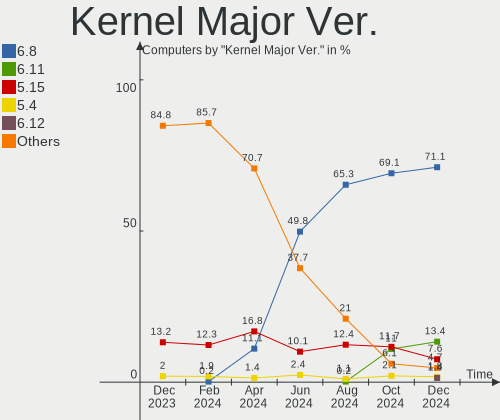
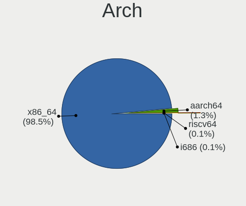
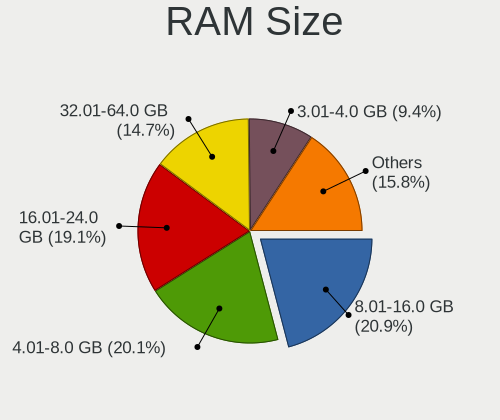
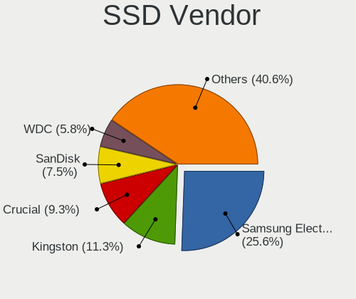
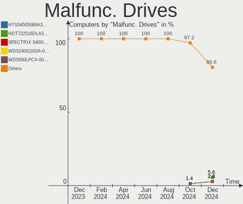
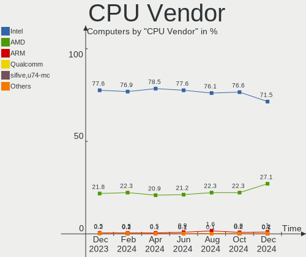
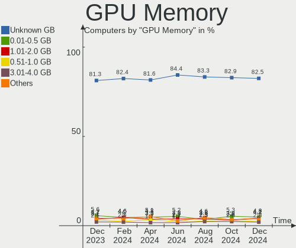

Ubuntu - Hardware Trends
------------------------

A project to identify most popular hardware characteristics and track their change
over time based on data collected by Linux users at https://Linux-Hardware.org.

Anyone can contribute to this report by the [hw-probe](https://github.com/linuxhw/hw-probe) tool:

    sudo -E hw-probe -all -upload

This is a report for all computer types. See also reports for [desktops](/Dist/Ubuntu/Desktop/README.md) and [notebooks](/Dist/Ubuntu/Notebook/README.md).

This report is for one last month. Overall report since the beginning of time: [TestDays](https://github.com/linuxhw/TestDays)

Period: Jun, 2023.

Contents
--------

* [ System ](#system)
  - [ OS                       ](#os)
  - [ OS Family                ](#os-family)
  - [ Kernel                   ](#kernel)
  - [ Kernel Family            ](#kernel-family)
  - [ Kernel Major Ver.        ](#kernel-major-ver)
  - [ Arch                     ](#arch)
  - [ DE                       ](#de)
  - [ Display Server           ](#display-server)
  - [ Display Manager          ](#display-manager)
  - [ OS Lang                  ](#os-lang)
  - [ Boot Mode                ](#boot-mode)
  - [ Filesystem               ](#filesystem)
  - [ Part. scheme             ](#part-scheme)
  - [ Dual Boot with Linux/BSD ](#dual-boot-with-linuxbsd)
  - [ Dual Boot (Win)          ](#dual-boot-win)

* [ Board ](#board)
  - [ Vendor                   ](#vendor)
  - [ Model                    ](#model)
  - [ Model Family             ](#model-family)
  - [ MFG Year                 ](#mfg-year)
  - [ Form Factor              ](#form-factor)
  - [ Secure Boot              ](#secure-boot)
  - [ Coreboot                 ](#coreboot)
  - [ RAM Size                 ](#ram-size)
  - [ RAM Used                 ](#ram-used)
  - [ Total Drives             ](#total-drives)
  - [ Has CD-ROM               ](#has-cd-rom)
  - [ Has Ethernet             ](#has-ethernet)
  - [ Has WiFi                 ](#has-wifi)
  - [ Has Bluetooth            ](#has-bluetooth)

* [ Location ](#location)
  - [ Country                  ](#country)
  - [ City                     ](#city)

* [ Drives ](#drives)
  - [ Drive Vendor             ](#drive-vendor)
  - [ Drive Model              ](#drive-model)
  - [ HDD Vendor               ](#hdd-vendor)
  - [ SSD Vendor               ](#ssd-vendor)
  - [ Drive Kind               ](#drive-kind)
  - [ Drive Connector          ](#drive-connector)
  - [ Drive Size               ](#drive-size)
  - [ Space Total              ](#space-total)
  - [ Space Used               ](#space-used)
  - [ Malfunc. Drives          ](#malfunc-drives)
  - [ Malfunc. Drive Vendor    ](#malfunc-drive-vendor)
  - [ Malfunc. HDD Vendor      ](#malfunc-hdd-vendor)
  - [ Malfunc. Drive Kind      ](#malfunc-drive-kind)
  - [ Failed Drives            ](#failed-drives)
  - [ Failed Drive Vendor      ](#failed-drive-vendor)
  - [ Drive Status             ](#drive-status)

* [ Storage controller ](#storage-controller)
  - [ Storage Vendor           ](#storage-vendor)
  - [ Storage Model            ](#storage-model)
  - [ Storage Kind             ](#storage-kind)

* [ Processor ](#processor)
  - [ CPU Vendor               ](#cpu-vendor)
  - [ CPU Model                ](#cpu-model)
  - [ CPU Model Family         ](#cpu-model-family)
  - [ CPU Cores                ](#cpu-cores)
  - [ CPU Sockets              ](#cpu-sockets)
  - [ CPU Threads              ](#cpu-threads)
  - [ CPU Op-Modes             ](#cpu-op-modes)
  - [ CPU Microcode            ](#cpu-microcode)
  - [ CPU Microarch            ](#cpu-microarch)

* [ Graphics ](#graphics)
  - [ GPU Vendor               ](#gpu-vendor)
  - [ GPU Model                ](#gpu-model)
  - [ GPU Combo                ](#gpu-combo)
  - [ GPU Driver               ](#gpu-driver)
  - [ GPU Memory               ](#gpu-memory)

* [ Monitor ](#monitor)
  - [ Monitor Vendor           ](#monitor-vendor)
  - [ Monitor Model            ](#monitor-model)
  - [ Monitor Resolution       ](#monitor-resolution)
  - [ Monitor Diagonal         ](#monitor-diagonal)
  - [ Monitor Width            ](#monitor-width)
  - [ Aspect Ratio             ](#aspect-ratio)
  - [ Monitor Area             ](#monitor-area)
  - [ Pixel Density            ](#pixel-density)
  - [ Multiple Monitors        ](#multiple-monitors)

* [ Network ](#network)
  - [ Net Controller Vendor    ](#net-controller-vendor)
  - [ Net Controller Model     ](#net-controller-model)
  - [ Wireless Vendor          ](#wireless-vendor)
  - [ Wireless Model           ](#wireless-model)
  - [ Ethernet Vendor          ](#ethernet-vendor)
  - [ Ethernet Model           ](#ethernet-model)
  - [ Net Controller Kind      ](#net-controller-kind)
  - [ Used Controller          ](#used-controller)
  - [ NICs                     ](#nics)
  - [ IPv6                     ](#ipv6)

* [ Bluetooth ](#bluetooth)
  - [ Bluetooth Vendor         ](#bluetooth-vendor)
  - [ Bluetooth Model          ](#bluetooth-model)

* [ Sound ](#sound)
  - [ Sound Vendor             ](#sound-vendor)
  - [ Sound Model              ](#sound-model)

* [ Memory ](#memory)
  - [ Memory Vendor            ](#memory-vendor)
  - [ Memory Model             ](#memory-model)
  - [ Memory Kind              ](#memory-kind)
  - [ Memory Form Factor       ](#memory-form-factor)
  - [ Memory Size              ](#memory-size)
  - [ Memory Speed             ](#memory-speed)

* [ Printers & scanners ](#printers--scanners)
  - [ Printer Vendor           ](#printer-vendor)
  - [ Printer Model            ](#printer-model)
  - [ Scanner Vendor           ](#scanner-vendor)
  - [ Scanner Model            ](#scanner-model)

* [ Camera ](#camera)
  - [ Camera Vendor            ](#camera-vendor)
  - [ Camera Model             ](#camera-model)

* [ Security ](#security)
  - [ Fingerprint Vendor       ](#fingerprint-vendor)
  - [ Fingerprint Model        ](#fingerprint-model)
  - [ Chipcard Vendor          ](#chipcard-vendor)
  - [ Chipcard Model           ](#chipcard-model)

* [ Unsupported ](#unsupported)
  - [ Unsupported Devices      ](#unsupported-devices)
  - [ Unsupported Device Types ](#unsupported-device-types)

System
------

OS
--

Installed operating systems

| Name           | Computers | Percent |
|----------------|-----------|---------|
| Ubuntu 22.04   | 687       | 61.45%  |
| Ubuntu 23.04   | 248       | 22.18%  |
| Ubuntu 20.04   | 103       | 9.21%   |
| Ubuntu 22.10   | 53        | 4.74%   |
| Ubuntu 18.04   | 21        | 1.88%   |
| Ubuntu Core 22 | 2         | 0.18%   |
| Ubuntu 23.10   | 1         | 0.09%   |
| Ubuntu 21.10   | 1         | 0.09%   |
| Ubuntu 20.10   | 1         | 0.09%   |
| Ubuntu 16.04   | 1         | 0.09%   |

OS Family
---------

OS without a version

| Name   | Computers | Percent |
|--------|-----------|---------|
| Ubuntu | 1118      | 100%    |

Kernel
------

Version of the Linux kernel

| Version                | Computers | Percent |
|------------------------|-----------|---------|
| 5.19.0-43-generic      | 305       | 27.28%  |
| 5.19.0-45-generic      | 192       | 17.17%  |
| 6.2.0-20-generic       | 136       | 12.16%  |
| 6.2.0-23-generic       | 76        | 6.8%    |
| 5.15.0-73-generic      | 57        | 5.1%    |
| 5.15.0-75-generic      | 46        | 4.11%   |
| 5.15.0-69-generic      | 37        | 3.31%   |
| 5.19.0-46-generic      | 30        | 2.68%   |
| 5.19.0-32-generic      | 26        | 2.33%   |
| 5.19.0-42-generic      | 22        | 1.97%   |
| 6.2.0-24-generic       | 15        | 1.34%   |
| 5.4.0-150-generic      | 15        | 1.34%   |
| 5.15.0-72-generic      | 9         | 0.81%   |
| 5.19.0-44-generic      | 8         | 0.72%   |
| 5.4.0-152-generic      | 5         | 0.45%   |
| 5.19.0-41-generic      | 5         | 0.45%   |
| 5.15.0-76-generic      | 5         | 0.45%   |
| 5.15.0-43-generic      | 5         | 0.45%   |
| 5.4.0-148-generic      | 4         | 0.36%   |
| 5.19.0-40-generic      | 4         | 0.36%   |
| 5.19.0-38-generic      | 4         | 0.36%   |
| 4.15.0-212-generic     | 4         | 0.36%   |
| 6.4.0-060400-generic   | 3         | 0.27%   |
| 6.3.4-060304-generic   | 3         | 0.27%   |
| 5.15.0-71-generic      | 3         | 0.27%   |
| 5.14.0-1059-oem        | 3         | 0.27%   |
| 6.3.7-060307-generic   | 2         | 0.18%   |
| 6.3.6-060306-generic   | 2         | 0.18%   |
| 6.3.5-060305-generic   | 2         | 0.18%   |
| 6.2.6-76060206-generic | 2         | 0.18%   |
| 5.4.0-42-generic       | 2         | 0.18%   |
| 5.4.0-149-generic      | 2         | 0.18%   |
| 5.4.0-113-generic      | 2         | 0.18%   |
| 5.15.0-74-generic      | 2         | 0.18%   |
| 5.15.0-67-generic      | 2         | 0.18%   |
| 5.15.0-60-generic      | 2         | 0.18%   |
| 5.15.0-56-generic      | 2         | 0.18%   |
| 5.15.0-52-generic      | 2         | 0.18%   |
| 5.15.0-25-generic      | 2         | 0.18%   |
| 5.14.0-1054-oem        | 2         | 0.18%   |

Kernel Family
-------------

Linux kernel without a distro release

| Version  | Computers | Percent |
|----------|-----------|---------|
| 5.19.0   | 603       | 53.94%  |
| 6.2.0    | 232       | 20.75%  |
| 5.15.0   | 184       | 16.46%  |
| 5.4.0    | 38        | 3.4%    |
| 5.14.0   | 8         | 0.72%   |
| 4.15.0   | 8         | 0.72%   |
| 5.13.0   | 5         | 0.45%   |
| 6.4.0    | 4         | 0.36%   |
| 6.3.7    | 3         | 0.27%   |
| 6.3.5    | 3         | 0.27%   |
| 6.3.4    | 3         | 0.27%   |
| 5.17.0   | 3         | 0.27%   |
| 6.3.6    | 2         | 0.18%   |
| 6.2.6    | 2         | 0.18%   |
| 5.8.0    | 2         | 0.18%   |
| 5.10.60  | 2         | 0.18%   |
| 6.3.8    | 1         | 0.09%   |
| 6.3.3    | 1         | 0.09%   |
| 6.3.2    | 1         | 0.09%   |
| 6.2.11   | 1         | 0.09%   |
| 6.2.10   | 1         | 0.09%   |
| 6.1.7    | 1         | 0.09%   |
| 6.1.32   | 1         | 0.09%   |
| 6.0.7    | 1         | 0.09%   |
| 6.0.0    | 1         | 0.09%   |
| 5.3.0    | 1         | 0.09%   |
| 5.11.0   | 1         | 0.09%   |
| 5.10.73  | 1         | 0.09%   |
| 5.10.168 | 1         | 0.09%   |
| 5.10.160 | 1         | 0.09%   |
| 5.10.110 | 1         | 0.09%   |
| 4.4.0    | 1         | 0.09%   |

Kernel Major Ver.
-----------------

Linux kernel major version

| Version | Computers | Percent |
|---------|-----------|---------|
| 5.19    | 603       | 53.94%  |
| 6.2     | 236       | 21.11%  |
| 5.15    | 184       | 16.46%  |
| 5.4     | 38        | 3.4%    |
| 6.3     | 14        | 1.25%   |
| 5.14    | 8         | 0.72%   |
| 4.15    | 8         | 0.72%   |
| 5.10    | 6         | 0.54%   |
| 5.13    | 5         | 0.45%   |
| 6.4     | 4         | 0.36%   |
| 5.17    | 3         | 0.27%   |
| 6.1     | 2         | 0.18%   |
| 6.0     | 2         | 0.18%   |
| 5.8     | 2         | 0.18%   |
| 5.3     | 1         | 0.09%   |
| 5.11    | 1         | 0.09%   |
| 4.4     | 1         | 0.09%   |

Arch
----

OS architecture (x86_64, i586, etc.)

| Name    | Computers | Percent |
|---------|-----------|---------|
| x86_64  | 1107      | 99.02%  |
| i686    | 6         | 0.54%   |
| aarch64 | 4         | 0.36%   |
| armv7l  | 1         | 0.09%   |

DE
--

Desktop Environment

| Name            | Computers | Percent |
|-----------------|-----------|---------|
| GNOME           | 1014      | 90.7%   |
| Unknown         | 80        | 7.16%   |
| X-Cinnamon      | 12        | 1.07%   |
| GNOME Classic   | 5         | 0.45%   |
| i3              | 2         | 0.18%   |
| GNOME Flashback | 2         | 0.18%   |
| Cinnamon        | 2         | 0.18%   |
| Enlightenment   | 1         | 0.09%   |

Display Server
--------------

X11 or Wayland

| Name    | Computers | Percent |
|---------|-----------|---------|
| Wayland | 644       | 57.6%   |
| X11     | 384       | 34.35%  |
| Unknown | 55        | 4.92%   |
| Tty     | 35        | 3.13%   |

Display Manager
---------------

SDDM, LightDM, etc.

| Name    | Computers | Percent |
|---------|-----------|---------|
| GDM3    | 893       | 79.87%  |
| Unknown | 162       | 14.49%  |
| GDM     | 42        | 3.76%   |
| LightDM | 17        | 1.52%   |
| SDDM    | 3         | 0.27%   |
| SLiM    | 1         | 0.09%   |

OS Lang
-------

Language

| Lang    | Computers | Percent |
|---------|-----------|---------|
| en_US   | 527       | 47.14%  |
| fr_FR   | 83        | 7.42%   |
| de_DE   | 81        | 7.25%   |
| C       | 49        | 4.38%   |
| en_GB   | 48        | 4.29%   |
| it_IT   | 34        | 3.04%   |
| pt_BR   | 33        | 2.95%   |
| es_ES   | 31        | 2.77%   |
| en_IN   | 28        | 2.5%    |
| en_CA   | 22        | 1.97%   |
| ru_RU   | 21        | 1.88%   |
| en_AU   | 19        | 1.7%    |
| nl_NL   | 17        | 1.52%   |
| pl_PL   | 12        | 1.07%   |
| Unknown | 11        | 0.98%   |
| es_MX   | 9         | 0.81%   |
| fi_FI   | 7         | 0.63%   |
| cs_CZ   | 6         | 0.54%   |
| pt_PT   | 5         | 0.45%   |
| ja_JP   | 5         | 0.45%   |
| hu_HU   | 5         | 0.45%   |
| es_AR   | 5         | 0.45%   |
| sv_SE   | 4         | 0.36%   |
| sk_SK   | 4         | 0.36%   |
| ko_KR   | 4         | 0.36%   |
| en_IE   | 4         | 0.36%   |
| es_CL   | 3         | 0.27%   |
| en_IL   | 3         | 0.27%   |
| de_AT   | 3         | 0.27%   |
| zh_TW   | 2         | 0.18%   |
| zh_CN   | 2         | 0.18%   |
| tr_TR   | 2         | 0.18%   |
| nb_NO   | 2         | 0.18%   |
| fr_BE   | 2         | 0.18%   |
| es_EC   | 2         | 0.18%   |
| es_CO   | 2         | 0.18%   |
| en_ZA   | 2         | 0.18%   |
| en_HK   | 2         | 0.18%   |
| el_GR   | 2         | 0.18%   |
| da_DK   | 2         | 0.18%   |

Boot Mode
---------

EFI or BIOS

| Mode | Computers | Percent |
|------|-----------|---------|
| BIOS | 720       | 64.4%   |
| EFI  | 398       | 35.6%   |

Filesystem
----------

Type of filesystem

| Type    | Computers | Percent |
|---------|-----------|---------|
| Tmpfs   | 544       | 48.66%  |
| Ext4    | 470       | 42.04%  |
| Overlay | 53        | 4.74%   |
| Btrfs   | 36        | 3.22%   |
| Zfs     | 9         | 0.81%   |
| Xfs     | 5         | 0.45%   |
| Ext2    | 1         | 0.09%   |

Part. scheme
------------

Scheme of partitioning

| Type    | Computers | Percent |
|---------|-----------|---------|
| GPT     | 872       | 78%     |
| Unknown | 126       | 11.27%  |
| MBR     | 120       | 10.73%  |

Dual Boot with Linux/BSD
------------------------

Hosting more than one Linux/BSD

| Dual boot | Computers | Percent |
|-----------|-----------|---------|
| No        | 952       | 85.15%  |
| Yes       | 166       | 14.85%  |

Dual Boot (Win)
---------------

Hosting Linux and Windows

| Dual boot | Computers | Percent |
|-----------|-----------|---------|
| No        | 764       | 68.34%  |
| Yes       | 354       | 31.66%  |

Board
-----

Vendor
------

Motherboard manufacturer

| Name                                 | Computers | Percent |
|--------------------------------------|-----------|---------|
| Dell                                 | 164       | 14.67%  |
| ASUSTek Computer                     | 151       | 13.51%  |
| Lenovo                               | 149       | 13.33%  |
| Hewlett-Packard                      | 145       | 12.97%  |
| Gigabyte Technology                  | 60        | 5.37%   |
| MSI                                  | 57        | 5.1%    |
| Acer                                 | 54        | 4.83%   |
| Apple                                | 39        | 3.49%   |
| ASRock                               | 34        | 3.04%   |
| Supermicro                           | 33        | 2.95%   |
| Intel                                | 22        | 1.97%   |
| Unknown                              | 22        | 1.97%   |
| Samsung Electronics                  | 17        | 1.52%   |
| Toshiba                              | 14        | 1.25%   |
| HUAWEI                               | 14        | 1.25%   |
| Sony                                 | 8         | 0.72%   |
| Fujitsu                              | 8         | 0.72%   |
| Timi                                 | 6         | 0.54%   |
| Pegatron                             | 6         | 0.54%   |
| Notebook                             | 6         | 0.54%   |
| Medion                               | 6         | 0.54%   |
| AZW                                  | 6         | 0.54%   |
| ETegro Technologies                  | 5         | 0.45%   |
| Google                               | 4         | 0.36%   |
| Gateway                              | 4         | 0.36%   |
| Foxconn                              | 4         | 0.36%   |
| Biostar                              | 4         | 0.36%   |
| Alienware                            | 4         | 0.36%   |
| Razer                                | 3         | 0.27%   |
| Raspberry Pi Foundation              | 3         | 0.27%   |
| Packard Bell                         | 3         | 0.27%   |
| Microsoft                            | 3         | 0.27%   |
| Chuwi                                | 3         | 0.27%   |
| ZOTAC                                | 2         | 0.18%   |
| System76                             | 2         | 0.18%   |
| Shenzhen Meigao Electronic Equipment | 2         | 0.18%   |
| Huanan                               | 2         | 0.18%   |
| ECS                                  | 2         | 0.18%   |
| ASRockRack                           | 2         | 0.18%   |
| AMI                                  | 2         | 0.18%   |

Model
-----

Motherboard model

| Name                                       | Computers | Percent |
|--------------------------------------------|-----------|---------|
| Unknown                                    | 24        | 2.15%   |
| Supermicro Super Server                    | 11        | 0.98%   |
| Supermicro X8DTU                           | 10        | 0.89%   |
| Supermicro X9DRW                           | 7         | 0.63%   |
| ETegro Hyperion RS125 G4                   | 5         | 0.45%   |
| Dell XPS 9320                              | 5         | 0.45%   |
| HP Pavilion dv6                            | 4         | 0.36%   |
| Dell OptiPlex 7010                         | 4         | 0.36%   |
| HUAWEI BOHB-WAX9                           | 3         | 0.27%   |
| HP Pavilion Notebook                       | 3         | 0.27%   |
| HP Notebook                                | 3         | 0.27%   |
| HP Laptop 15s-eq2xxx                       | 3         | 0.27%   |
| Dell XPS 15 9570                           | 3         | 0.27%   |
| Dell OptiPlex 9020                         | 3         | 0.27%   |
| Dell OptiPlex 755                          | 3         | 0.27%   |
| ASUS ROG STRIX B650E-I GAMING WIFI         | 3         | 0.27%   |
| ASUS All Series                            | 3         | 0.27%   |
| Apple MacBookPro8,2                        | 3         | 0.27%   |
| Apple MacBookPro5,5                        | 3         | 0.27%   |
| Toshiba Satellite Pro C70-B                | 2         | 0.18%   |
| Timi Redmi Book Pro 14 2022                | 2         | 0.18%   |
| Shenzhen Meigao Electronic Equipment UM690 | 2         | 0.18%   |
| Samsung 950QED                             | 2         | 0.18%   |
| Razer Blade 16 - RZ09-0483                 | 2         | 0.18%   |
| RPi Raspberry Pi                           | 2         | 0.18%   |
| MSI Stealth 15M B12UE                      | 2         | 0.18%   |
| MSI MS-7C95                                | 2         | 0.18%   |
| MSI MS-7C91                                | 2         | 0.18%   |
| MSI MS-7C56                                | 2         | 0.18%   |
| MSI MS-7A71                                | 2         | 0.18%   |
| MSI MS-7596                                | 2         | 0.18%   |
| MSI Modern 14 B5M                          | 2         | 0.18%   |
| Lenovo Legion 5 15ACH6H 82JU               | 2         | 0.18%   |
| Lenovo Legion 5 15ACH6 82JW                | 2         | 0.18%   |
| Lenovo IdeaPad Gaming 3 16IAH7 82SA        | 2         | 0.18%   |
| Lenovo IdeaPad 5 14ALC05 82LM              | 2         | 0.18%   |
| Lenovo IdeaPad 3 15IGL05 81WQ              | 2         | 0.18%   |
| Lenovo IdeaPad 3 14ITL6 82H7               | 2         | 0.18%   |
| HUAWEI NBLB-WAX9N                          | 2         | 0.18%   |
| HUAWEI HVY-WXX9                            | 2         | 0.18%   |

Model Family
------------

Motherboard model prefix

| Name               | Computers | Percent |
|--------------------|-----------|---------|
| Lenovo ThinkPad    | 66        | 5.9%    |
| Dell Latitude      | 41        | 3.67%   |
| Acer Aspire        | 39        | 3.49%   |
| Dell Inspiron      | 32        | 2.86%   |
| Lenovo IdeaPad     | 27        | 2.42%   |
| Dell OptiPlex      | 27        | 2.42%   |
| Dell XPS           | 25        | 2.24%   |
| Unknown            | 24        | 2.15%   |
| HP Pavilion        | 22        | 1.97%   |
| HP Laptop          | 21        | 1.88%   |
| ASUS VivoBook      | 21        | 1.88%   |
| ASUS PRIME         | 21        | 1.88%   |
| ASUS ROG           | 20        | 1.79%   |
| HP EliteBook       | 19        | 1.7%    |
| Dell Precision     | 17        | 1.52%   |
| HP Compaq          | 14        | 1.25%   |
| Lenovo ThinkCentre | 12        | 1.07%   |
| HP ProBook         | 12        | 1.07%   |
| Supermicro Super   | 11        | 0.98%   |
| Lenovo Yoga        | 11        | 0.98%   |
| Supermicro X8DTU   | 10        | 0.89%   |
| Dell Vostro        | 10        | 0.89%   |
| ASUS TUF           | 10        | 0.89%   |
| Toshiba Satellite  | 9         | 0.81%   |
| Lenovo Legion      | 9         | 0.81%   |
| HP ENVY            | 8         | 0.72%   |
| Supermicro X9DRW   | 7         | 0.63%   |
| Dell PowerEdge     | 7         | 0.63%   |
| HP ProLiant        | 6         | 0.54%   |
| HP EliteDesk       | 6         | 0.54%   |
| ASUS ZenBook       | 6         | 0.54%   |
| Lenovo ThinkBook   | 5         | 0.45%   |
| HP ProDesk         | 5         | 0.45%   |
| Gigabyte B450M     | 5         | 0.45%   |
| ETegro Hyperion    | 5         | 0.45%   |
| ASRock X570        | 5         | 0.45%   |
| Lenovo IdeaCentre  | 4         | 0.36%   |
| HP ZBook           | 4         | 0.36%   |
| Gigabyte B550M     | 4         | 0.36%   |
| Fujitsu ESPRIMO    | 4         | 0.36%   |

MFG Year
--------

Motherboard manufacture year

| Year    | Computers | Percent |
|---------|-----------|---------|
| 2022    | 150       | 13.42%  |
| 2021    | 120       | 10.73%  |
| 2020    | 94        | 8.41%   |
| 2019    | 80        | 7.16%   |
| 2018    | 78        | 6.98%   |
| 2011    | 77        | 6.89%   |
| 2013    | 67        | 5.99%   |
| 2012    | 67        | 5.99%   |
| 2017    | 61        | 5.46%   |
| 2010    | 58        | 5.19%   |
| 2015    | 51        | 4.56%   |
| 2016    | 49        | 4.38%   |
| 2014    | 49        | 4.38%   |
| 2009    | 37        | 3.31%   |
| 2008    | 33        | 2.95%   |
| 2023    | 29        | 2.59%   |
| 2007    | 9         | 0.81%   |
| Unknown | 7         | 0.63%   |
| 2006    | 1         | 0.09%   |
| 2005    | 1         | 0.09%   |

Form Factor
-----------

Physical design of the computer

| Name           | Computers | Percent |
|----------------|-----------|---------|
| Notebook       | 557       | 49.82%  |
| Desktop        | 405       | 36.23%  |
| Server         | 57        | 5.1%    |
| Convertible    | 35        | 3.13%   |
| Mini pc        | 25        | 2.24%   |
| All in one     | 22        | 1.97%   |
| Tablet         | 12        | 1.07%   |
| System on chip | 5         | 0.45%   |

Secure Boot
-----------

Enabled or disabled

| State    | Computers | Percent |
|----------|-----------|---------|
| Disabled | 1028      | 91.95%  |
| Enabled  | 90        | 8.05%   |

Coreboot
--------

Have coreboot on board

| Used | Computers | Percent |
|------|-----------|---------|
| No   | 1114      | 99.64%  |
| Yes  | 4         | 0.36%   |

RAM Size
--------

Total RAM memory

| Size in GB      | Computers | Percent |
|-----------------|-----------|---------|
| 4.01-8.0        | 263       | 23.52%  |
| 16.01-24.0      | 227       | 20.3%   |
| 8.01-16.0       | 186       | 16.64%  |
| 32.01-64.0      | 169       | 15.12%  |
| 3.01-4.0        | 153       | 13.69%  |
| 64.01-256.0     | 69        | 6.17%   |
| 24.01-32.0      | 23        | 2.06%   |
| 2.01-3.0        | 13        | 1.16%   |
| 1.01-2.0        | 10        | 0.89%   |
| More than 256.0 | 4         | 0.36%   |
| 0.51-1.0        | 1         | 0.09%   |

RAM Used
--------

Used RAM memory

| Used GB    | Computers | Percent |
|------------|-----------|---------|
| 2.01-3.0   | 327       | 29.25%  |
| 1.01-2.0   | 313       | 28%     |
| 4.01-8.0   | 218       | 19.5%   |
| 3.01-4.0   | 159       | 14.22%  |
| 8.01-16.0  | 60        | 5.37%   |
| 0.51-1.0   | 21        | 1.88%   |
| 16.01-24.0 | 8         | 0.72%   |
| 32.01-64.0 | 4         | 0.36%   |
| 0.01-0.5   | 4         | 0.36%   |
| 24.01-32.0 | 3         | 0.27%   |
| 0          | 1         | 0.09%   |

Total Drives
------------

Number of drives on board

| Drives | Computers | Percent |
|--------|-----------|---------|
| 1      | 709       | 63.42%  |
| 2      | 236       | 21.11%  |
| 3      | 84        | 7.51%   |
| 4      | 41        | 3.67%   |
| 6      | 14        | 1.25%   |
| 5      | 13        | 1.16%   |
| 0      | 10        | 0.89%   |
| 7      | 5         | 0.45%   |
| 11     | 2         | 0.18%   |
| 27     | 1         | 0.09%   |
| 12     | 1         | 0.09%   |
| 10     | 1         | 0.09%   |
| 8      | 1         | 0.09%   |

Has CD-ROM
----------

Has CD-ROM on board

| Presented | Computers | Percent |
|-----------|-----------|---------|
| No        | 788       | 70.48%  |
| Yes       | 330       | 29.52%  |

Has Ethernet
------------

Has Ethernet on board

| Presented | Computers | Percent |
|-----------|-----------|---------|
| Yes       | 921       | 82.38%  |
| No        | 197       | 17.62%  |

Has WiFi
--------

Has WiFi module

| Presented | Computers | Percent |
|-----------|-----------|---------|
| Yes       | 855       | 76.48%  |
| No        | 263       | 23.52%  |

Has Bluetooth
-------------

Has Bluetooth module

| Presented | Computers | Percent |
|-----------|-----------|---------|
| Yes       | 698       | 62.43%  |
| No        | 420       | 37.57%  |

Location
--------

Country
-------

Geographic location (country)

| Country     | Computers | Percent |
|-------------|-----------|---------|
| USA         | 212       | 18.96%  |
| Germany     | 109       | 9.75%   |
| France      | 90        | 8.05%   |
| Russia      | 68        | 6.08%   |
| Brazil      | 52        | 4.65%   |
| Italy       | 47        | 4.2%    |
| UK          | 42        | 3.76%   |
| Canada      | 36        | 3.22%   |
| India       | 33        | 2.95%   |
| Spain       | 31        | 2.77%   |
| Netherlands | 30        | 2.68%   |
| Australia   | 23        | 2.06%   |
| Poland      | 22        | 1.97%   |
| Switzerland | 16        | 1.43%   |
| Mexico      | 16        | 1.43%   |
| Sweden      | 14        | 1.25%   |
| Portugal    | 13        | 1.16%   |
| Argentina   | 13        | 1.16%   |
| Finland     | 10        | 0.89%   |
| Czechia     | 10        | 0.89%   |
| China       | 10        | 0.89%   |
| Turkey      | 9         | 0.81%   |
| Romania     | 8         | 0.72%   |
| Norway      | 8         | 0.72%   |
| Hungary     | 8         | 0.72%   |
| Greece      | 8         | 0.72%   |
| Bulgaria    | 8         | 0.72%   |
| South Korea | 7         | 0.63%   |
| Pakistan    | 7         | 0.63%   |
| Austria     | 7         | 0.63%   |
| Japan       | 6         | 0.54%   |
| Israel      | 6         | 0.54%   |
| Indonesia   | 6         | 0.54%   |
| Chile       | 6         | 0.54%   |
| Belgium     | 6         | 0.54%   |
| Slovakia    | 5         | 0.45%   |
| Ireland     | 5         | 0.45%   |
| Hong Kong   | 5         | 0.45%   |
| Egypt       | 5         | 0.45%   |
| Ukraine     | 4         | 0.36%   |

City
----

Geographic location (city)

| City          | Computers | Percent |
|---------------|-----------|---------|
| Moscow        | 43        | 3.85%   |
| Sao Paulo     | 13        | 1.16%   |
| Melbourne     | 11        | 0.98%   |
| St Petersburg | 10        | 0.89%   |
| Paris         | 10        | 0.89%   |
| Milan         | 10        | 0.89%   |
| Berlin        | 10        | 0.89%   |
| New York      | 8         | 0.72%   |
| Helsinki      | 8         | 0.72%   |
| Zurich        | 6         | 0.54%   |
| Madrid        | 6         | 0.54%   |
| Istanbul      | 6         | 0.54%   |
| Cologne       | 6         | 0.54%   |
| Athens        | 6         | 0.54%   |
| Amsterdam     | 6         | 0.54%   |
| Munich        | 5         | 0.45%   |
| Montreal      | 5         | 0.45%   |
| Milano        | 5         | 0.45%   |
| Manchester    | 5         | 0.45%   |
| Gdansk        | 5         | 0.45%   |
| Budapest      | 5         | 0.45%   |
| Vancouver     | 4         | 0.36%   |
| Toronto       | 4         | 0.36%   |
| Tel Aviv      | 4         | 0.36%   |
| Sofia         | 4         | 0.36%   |
| Seattle       | 4         | 0.36%   |
| Rome          | 4         | 0.36%   |
| Mumbai        | 4         | 0.36%   |
| Lisbon        | 4         | 0.36%   |
| Leipzig       | 4         | 0.36%   |
| Chennai       | 4         | 0.36%   |
| Buenos Aires  | 4         | 0.36%   |
| Belgrade      | 4         | 0.36%   |
| Warsaw        | 3         | 0.27%   |
| Valencia      | 3         | 0.27%   |
| Toulouse      | 3         | 0.27%   |
| Tehran        | 3         | 0.27%   |
| Sydney        | 3         | 0.27%   |
| Surrey        | 3         | 0.27%   |
| Stuttgart     | 3         | 0.27%   |

Drives
------

Drive Vendor
------------

Hard drive vendors

| Vendor                      | Computers | Drives | Percent |
|-----------------------------|-----------|--------|---------|
| Samsung Electronics         | 246       | 294    | 15.73%  |
| WDC                         | 190       | 252    | 12.15%  |
| Seagate                     | 176       | 223    | 11.25%  |
| Kingston                    | 86        | 89     | 5.5%    |
| SanDisk                     | 83        | 86     | 5.31%   |
| Toshiba                     | 68        | 79     | 4.35%   |
| SK hynix                    | 67        | 71     | 4.28%   |
| Crucial                     | 65        | 74     | 4.16%   |
| Unknown                     | 49        | 52     | 3.13%   |
| Micron Technology           | 48        | 53     | 3.07%   |
| Intel                       | 46        | 59     | 2.94%   |
| Hitachi                     | 42        | 49     | 2.69%   |
| KIOXIA                      | 24        | 25     | 1.53%   |
| HGST                        | 19        | 25     | 1.21%   |
| China                       | 19        | 20     | 1.21%   |
| A-DATA Technology           | 19        | 21     | 1.21%   |
| Kingston Technology Company | 18        | 18     | 1.15%   |
| Fujitsu                     | 18        | 33     | 1.15%   |
| Phison Electronics          | 15        | 15     | 0.96%   |
| Apple                       | 15        | 17     | 0.96%   |
| SPCC                        | 14        | 15     | 0.9%    |
| Micron/Crucial Technology   | 14        | 16     | 0.9%    |
| Silicon Motion              | 12        | 12     | 0.77%   |
| PNY                         | 9         | 10     | 0.58%   |
| Transcend                   | 8         | 8      | 0.51%   |
| Unknown                     | 8         | 8      | 0.51%   |
| Phison                      | 7         | 8      | 0.45%   |
| LITEON                      | 7         | 7      | 0.45%   |
| JMicron Technology          | 7         | 7      | 0.45%   |
| Intenso                     | 7         | 7      | 0.45%   |
| OCZ                         | 6         | 6      | 0.38%   |
| LITEONIT                    | 6         | 6      | 0.38%   |
| Hewlett-Packard             | 6         | 20     | 0.38%   |
| Gigabyte Technology         | 6         | 6      | 0.38%   |
| Team                        | 5         | 5      | 0.32%   |
| Patriot                     | 5         | 5      | 0.32%   |
| Netac                       | 5         | 5      | 0.32%   |
| FORESEE                     | 5         | 5      | 0.32%   |
| SABRENT                     | 4         | 4      | 0.26%   |
| Plextor                     | 4         | 4      | 0.26%   |

Drive Model
-----------

Hard drive models

| Model                                                 | Computers | Percent |
|-------------------------------------------------------|-----------|---------|
| Samsung NVMe SSD Controller SM981/PM981/PM983 250GB   | 30        | 1.78%   |
| Samsung NVMe SSD Controller PM9A1/PM9A3/980PRO 2TB    | 21        | 1.25%   |
| Kingston SA400S37240G 240GB SSD                       | 15        | 0.89%   |
| Micron/Crucial P2 NVMe PCIe SSD 4TB                   | 13        | 0.77%   |
| Kingston SA400S37480G 480GB SSD                       | 13        | 0.77%   |
| Crucial CT500MX500SSD1 500GB                          | 12        | 0.71%   |
| Samsung SSD 860 EVO 500GB                             | 11        | 0.65%   |
| Unknown MMC Card  64GB                                | 10        | 0.59%   |
| Seagate ST1000DM010-2EP102 1TB                        | 10        | 0.59%   |
| Samsung SSD 980 1TB                                   | 10        | 0.59%   |
| WDC WD10EZEX-08WN4A0 1TB                              | 9         | 0.54%   |
| Seagate ST2000DM008-2FR102 2TB                        | 9         | 0.54%   |
| Sandisk WD Black SN750 / PC SN730 NVMe SSD 500GB      | 9         | 0.54%   |
| SanDisk NVMe SSD Drive 1TB                            | 9         | 0.54%   |
| Samsung SSD 850 EVO 250GB                             | 9         | 0.54%   |
| Samsung NVMe SSD Controller SM961/PM961/SM963 256GB   | 9         | 0.54%   |
| Kingston SA400S37120G 120GB SSD                       | 9         | 0.54%   |
| Fujitsu MBE2147RC 147GB                               | 9         | 0.54%   |
| Silicon Motion SM2263EN/SM2263XT SSD Controller 256GB | 8         | 0.48%   |
| Seagate ST500LT012-1DG142 500GB                       | 8         | 0.48%   |
| Seagate ST1000DM003-1CH162 1TB                        | 8         | 0.48%   |
| Samsung SSD 870 EVO 500GB                             | 8         | 0.48%   |
| Crucial CT240BX500SSD1 240GB                          | 8         | 0.48%   |
| Crucial CT1000MX500SSD1 1TB                           | 8         | 0.48%   |
| Unknown                                               | 8         | 0.48%   |
| Unknown SD/MMC/MS PRO 250GB                           | 7         | 0.42%   |
| Seagate ST4000DM004-2CV104 4TB                        | 7         | 0.42%   |
| Seagate ST1000DM003-1ER162 1TB                        | 7         | 0.42%   |
| Samsung SSD 850 EVO 500GB                             | 7         | 0.42%   |
| Unknown MMC Card  128GB                               | 6         | 0.36%   |
| Toshiba MQ04ABF100 1TB                                | 6         | 0.36%   |
| SK hynix PC801 NVMe 1TB                               | 6         | 0.36%   |
| Seagate ST500DM002-1BD142 500GB                       | 6         | 0.36%   |
| Seagate ST3500418AS 500GB                             | 6         | 0.36%   |
| Seagate ST2000DM001-1ER164 2TB                        | 6         | 0.36%   |
| Kingston Company SNV2S1000G 1TB                       | 6         | 0.36%   |
| Kingston SA400S37960G 960GB SSD                       | 6         | 0.36%   |
| Intel SSD 660P Series 512GB                           | 6         | 0.36%   |
| Crucial CT480BX500SSD1 480GB                          | 6         | 0.36%   |
| WDC WDS500G2B0A-00SM50 500GB SSD                      | 5         | 0.3%    |

HDD Vendor
----------

Hard disk drive vendors

| Vendor              | Computers | Drives | Percent |
|---------------------|-----------|--------|---------|
| Seagate             | 172       | 219    | 34.75%  |
| WDC                 | 155       | 210    | 31.31%  |
| Toshiba             | 50        | 59     | 10.1%   |
| Hitachi             | 42        | 49     | 8.48%   |
| HGST                | 19        | 25     | 3.84%   |
| Samsung Electronics | 18        | 18     | 3.64%   |
| Fujitsu             | 18        | 33     | 3.64%   |
| Unknown             | 7         | 7      | 1.41%   |
| Maxtor              | 4         | 4      | 0.81%   |
| ASMT                | 4         | 7      | 0.81%   |
| Apple               | 4         | 4      | 0.81%   |
| Intenso             | 1         | 1      | 0.2%    |
| Hewlett-Packard     | 1         | 4      | 0.2%    |

SSD Vendor
----------

Solid state drive vendors

| Vendor              | Computers | Drives | Percent |
|---------------------|-----------|--------|---------|
| Samsung Electronics | 99        | 116    | 20.41%  |
| Kingston            | 67        | 70     | 13.81%  |
| Crucial             | 58        | 65     | 11.96%  |
| SanDisk             | 36        | 36     | 7.42%   |
| WDC                 | 19        | 20     | 3.92%   |
| Intel               | 19        | 30     | 3.92%   |
| China               | 18        | 19     | 3.71%   |
| A-DATA Technology   | 16        | 18     | 3.3%    |
| SPCC                | 14        | 15     | 2.89%   |
| SK hynix            | 9         | 10     | 1.86%   |
| Toshiba             | 8         | 9      | 1.65%   |
| Micron Technology   | 8         | 12     | 1.65%   |
| PNY                 | 7         | 7      | 1.44%   |
| OCZ                 | 6         | 6      | 1.24%   |
| LITEONIT            | 6         | 6      | 1.24%   |
| LITEON              | 6         | 6      | 1.24%   |
| Transcend           | 5         | 5      | 1.03%   |
| Intenso             | 5         | 5      | 1.03%   |
| Apple               | 5         | 5      | 1.03%   |
| Team                | 4         | 4      | 0.82%   |
| Plextor             | 4         | 4      | 0.82%   |
| Patriot             | 4         | 4      | 0.82%   |
| Netac               | 4         | 4      | 0.82%   |
| Gigabyte Technology | 4         | 4      | 0.82%   |
| KingSpec            | 3         | 3      | 0.62%   |
| Hewlett-Packard     | 3         | 6      | 0.62%   |
| FORESEE             | 3         | 3      | 0.62%   |
| Phison              | 2         | 2      | 0.41%   |
| GOODRAM             | 2         | 2      | 0.41%   |
| Gigastone           | 2         | 2      | 0.41%   |
| Emtec               | 2         | 2      | 0.41%   |
| Unknown             | 2         | 2      | 0.41%   |
| Zebronics           | 1         | 1      | 0.21%   |
| Verbatim            | 1         | 1      | 0.21%   |
| Vaseky              | 1         | 1      | 0.21%   |
| USB                 | 1         | 1      | 0.21%   |
| TYPEC 1T            | 1         | 1      | 0.21%   |
| TO Exter            | 1         | 1      | 0.21%   |
| TEXTORM             | 1         | 1      | 0.21%   |
| Teclast             | 1         | 1      | 0.21%   |

Drive Kind
----------

HDD or SSD

| Kind    | Computers | Drives | Percent |
|---------|-----------|--------|---------|
| NVMe    | 473       | 570    | 33.59%  |
| SSD     | 438       | 539    | 31.11%  |
| HDD     | 427       | 640    | 30.33%  |
| MMC     | 41        | 45     | 2.91%   |
| Unknown | 29        | 41     | 2.06%   |

Drive Connector
---------------

SATA, SAS, NVMe, etc.

| Type | Computers | Drives | Percent |
|------|-----------|--------|---------|
| SATA | 707       | 1119   | 54.47%  |
| NVMe | 471       | 558    | 36.29%  |
| SAS  | 79        | 113    | 6.09%   |
| MMC  | 41        | 45     | 3.16%   |

Drive Size
----------

Size of hard drive

| Size in TB | Computers | Drives | Percent |
|------------|-----------|--------|---------|
| 0.01-0.5   | 511       | 653    | 56.46%  |
| 0.51-1.0   | 255       | 319    | 28.18%  |
| 1.01-2.0   | 91        | 130    | 10.06%  |
| 3.01-4.0   | 22        | 32     | 2.43%   |
| 4.01-10.0  | 15        | 33     | 1.66%   |
| 2.01-3.0   | 8         | 8      | 0.88%   |
| 10.01-20.0 | 3         | 4      | 0.33%   |

Space Total
-----------

Amount of disk space available on the file system

| Size in GB     | Computers | Percent |
|----------------|-----------|---------|
| 251-500        | 297       | 26.57%  |
| 101-250        | 288       | 25.76%  |
| 501-1000       | 187       | 16.73%  |
| 1001-2000      | 81        | 7.25%   |
| More than 3000 | 59        | 5.28%   |
| 51-100         | 58        | 5.19%   |
| Unknown        | 46        | 4.11%   |
| 1-20           | 44        | 3.94%   |
| 2001-3000      | 34        | 3.04%   |
| 21-50          | 24        | 2.15%   |

Space Used
----------

Amount of used disk space

| Used GB        | Computers | Percent |
|----------------|-----------|---------|
| 1-20           | 332       | 29.7%   |
| 21-50          | 258       | 23.08%  |
| 101-250        | 146       | 13.06%  |
| 51-100         | 143       | 12.79%  |
| 251-500        | 86        | 7.69%   |
| Unknown        | 46        | 4.11%   |
| 501-1000       | 45        | 4.03%   |
| 1001-2000      | 36        | 3.22%   |
| More than 3000 | 20        | 1.79%   |
| 2001-3000      | 6         | 0.54%   |

Malfunc. Drives
---------------

Drive models with a malfunction

| Model                                    | Computers | Drives | Percent |
|------------------------------------------|-----------|--------|---------|
| Kingston SV300S37A120G 120GB SSD         | 2         | 2      | 3.17%   |
| HGST HTS541010A9E680 1TB                 | 2         | 2      | 3.17%   |
| WDC WDS120G2G0A-00JH30 128GB SSD         | 1         | 1      | 1.59%   |
| WDC WD5000AZLX-22JKKA0 500GB             | 1         | 1      | 1.59%   |
| WDC WD5000AAKX-08ERMA0 500GB             | 1         | 1      | 1.59%   |
| WDC WD5000AAKX-001CA0 500GB              | 1         | 1      | 1.59%   |
| WDC WD5000AAKS-75A7B2 500GB              | 1         | 1      | 1.59%   |
| WDC WD5000AAKS-00UU3A0 500GB             | 1         | 1      | 1.59%   |
| WDC WD2500KS-00MJB0 250GB                | 1         | 1      | 1.59%   |
| WDC WD15EARS-00MVWB0 1TB                 | 1         | 1      | 1.59%   |
| WDC WD10SPZX-21Z10T0 1TB                 | 1         | 1      | 1.59%   |
| WDC WD10EZEX-60WN4A0 1TB                 | 1         | 1      | 1.59%   |
| WDC WD10EZEX-00WN4A0 1TB                 | 1         | 1      | 1.59%   |
| WDC WD10EADS-00M2B0 1TB                  | 1         | 1      | 1.59%   |
| WDC WD Green M.2 2280 240GB SSD          | 1         | 1      | 1.59%   |
| Toshiba THNSN51T02DUK NVMe 1024GB        | 1         | 1      | 1.59%   |
| Toshiba MK0502TSKB 500GB                 | 1         | 2      | 1.59%   |
| Toshiba DT01ACA200 2TB                   | 1         | 1      | 1.59%   |
| SK hynix HFS256G39TND-N210A 256GB SSD    | 1         | 1      | 1.59%   |
| SK hynix BC711 HFM256GD3JX013N 256GB     | 1         | 1      | 1.59%   |
| Seagate ST9320320AS 320GB                | 1         | 1      | 1.59%   |
| Seagate ST8000DM004-2CX188 8TB           | 1         | 2      | 1.59%   |
| Seagate ST500LM021-1KJ152 500GB          | 1         | 1      | 1.59%   |
| Seagate ST2000LX001-1RG174 2TB           | 1         | 1      | 1.59%   |
| Seagate ST2000DM001-1CH164 2TB           | 1         | 1      | 1.59%   |
| Seagate ST1000LX015-1U7172 1TB           | 1         | 1      | 1.59%   |
| Seagate ST1000LM 024 HN-M101MBB 1TB      | 1         | 1      | 1.59%   |
| SanDisk SD9SN8W-128G-1006 128GB SSD      | 1         | 1      | 1.59%   |
| SanDisk SD7SB3Q128G1001 128GB SSD        | 1         | 1      | 1.59%   |
| Samsung Electronics SSD 870 EVO 500GB    | 1         | 1      | 1.59%   |
| Samsung Electronics SSD 870 EVO 1TB      | 1         | 1      | 1.59%   |
| Samsung Electronics SSD 850 EVO 1TB      | 1         | 1      | 1.59%   |
| Samsung Electronics HD502HJ 500GB        | 1         | 1      | 1.59%   |
| Samsung Electronics HD161GJ 160GB        | 1         | 1      | 1.59%   |
| Samsung Electronics HD103UJ 1TB          | 1         | 1      | 1.59%   |
| Ramsta SSD S300 240GB                    | 1         | 1      | 1.59%   |
| LITEONIT LCT-256M3S-41 7mm 256GB FDE SSD | 1         | 1      | 1.59%   |
| LITEON CV8-8E128-HP 128GB SSD            | 1         | 1      | 1.59%   |
| LITEON CA5-8D256 256GB                   | 1         | 1      | 1.59%   |
| Kingston SUV400S37240G 240GB SSD         | 1         | 1      | 1.59%   |

Malfunc. Drive Vendor
---------------------

Vendors of faulty drives

| Vendor              | Computers | Drives | Percent |
|---------------------|-----------|--------|---------|
| WDC                 | 13        | 13     | 20.97%  |
| Seagate             | 7         | 8      | 11.29%  |
| Intel               | 7         | 11     | 11.29%  |
| Samsung Electronics | 6         | 6      | 9.68%   |
| Hitachi             | 6         | 6      | 9.68%   |
| HGST                | 4         | 4      | 6.45%   |
| Toshiba             | 3         | 4      | 4.84%   |
| Kingston            | 3         | 3      | 4.84%   |
| SK hynix            | 2         | 2      | 3.23%   |
| SanDisk             | 2         | 2      | 3.23%   |
| LITEON              | 2         | 2      | 3.23%   |
| Crucial             | 2         | 3      | 3.23%   |
| Ramsta              | 1         | 1      | 1.61%   |
| LITEONIT            | 1         | 1      | 1.61%   |
| Fujitsu             | 1         | 1      | 1.61%   |
| ASMT                | 1         | 1      | 1.61%   |
| 2.5"                | 1         | 1      | 1.61%   |

Malfunc. HDD Vendor
-------------------

Vendors of faulty HDD drives

| Vendor              | Computers | Drives | Percent |
|---------------------|-----------|--------|---------|
| WDC                 | 11        | 11     | 31.43%  |
| Seagate             | 7         | 8      | 20%     |
| Hitachi             | 6         | 6      | 17.14%  |
| HGST                | 4         | 4      | 11.43%  |
| Samsung Electronics | 3         | 3      | 8.57%   |
| Toshiba             | 2         | 3      | 5.71%   |
| Fujitsu             | 1         | 1      | 2.86%   |
| ASMT                | 1         | 1      | 2.86%   |

Malfunc. Drive Kind
-------------------

Kinds of faulty drives

| Kind | Computers | Drives | Percent |
|------|-----------|--------|---------|
| HDD  | 33        | 37     | 55%     |
| SSD  | 24        | 29     | 40%     |
| NVMe | 3         | 3      | 5%      |

Failed Drives
-------------

Failed drive models

| Model                   | Computers | Drives | Percent |
|-------------------------|-----------|--------|---------|
| WDC WD800BB-00FJA0 80GB | 1         | 1      | 100%    |

Failed Drive Vendor
-------------------

Failed drive vendors

| Vendor | Computers | Drives | Percent |
|--------|-----------|--------|---------|
| WDC    | 1         | 1      | 100%    |

Drive Status
------------

Number of failed and malfunc. drives

| Status   | Computers | Drives | Percent |
|----------|-----------|--------|---------|
| Detected | 743       | 1177   | 63.4%   |
| Works    | 371       | 588    | 31.66%  |
| Malfunc  | 57        | 69     | 4.86%   |
| Failed   | 1         | 1      | 0.09%   |

Storage controller
------------------

Storage Vendor
--------------

Storage controller vendors

| Vendor                                  | Computers | Percent |
|-----------------------------------------|-----------|---------|
| Intel                                   | 747       | 49.11%  |
| AMD                                     | 187       | 12.29%  |
| Samsung Electronics                     | 142       | 9.34%   |
| SanDisk                                 | 70        | 4.6%    |
| SK hynix                                | 58        | 3.81%   |
| Micron Technology                       | 40        | 2.63%   |
| Kingston Technology Company             | 35        | 2.3%    |
| Phison Electronics                      | 27        | 1.78%   |
| KIOXIA                                  | 25        | 1.64%   |
| ASMedia Technology                      | 22        | 1.45%   |
| Micron/Crucial Technology               | 20        | 1.31%   |
| LSI Logic / Symbios Logic               | 19        | 1.25%   |
| Silicon Motion                          | 14        | 0.92%   |
| Marvell Technology Group                | 14        | 0.92%   |
| Nvidia                                  | 13        | 0.85%   |
| Toshiba America Info Systems            | 10        | 0.66%   |
| JMicron Technology                      | 8         | 0.53%   |
| Solid State Storage Technology          | 7         | 0.46%   |
| MAXIO Technology (Hangzhou)             | 7         | 0.46%   |
| Broadcom / LSI                          | 7         | 0.46%   |
| ADATA Technology                        | 6         | 0.39%   |
| Union Memory (Shenzhen)                 | 5         | 0.33%   |
| Hewlett-Packard                         | 5         | 0.33%   |
| Apple                                   | 5         | 0.33%   |
| Adaptec                                 | 5         | 0.33%   |
| Transcend                               | 4         | 0.26%   |
| Solidigm                                | 2         | 0.13%   |
| Shenzhen Longsys Electronics            | 2         | 0.13%   |
| Realtek Semiconductor                   | 2         | 0.13%   |
| Lite-On Technology                      | 2         | 0.13%   |
| INNOGRIT                                | 2         | 0.13%   |
| Yangtze Memory Technologies             | 1         | 0.07%   |
| VIA Technologies                        | 1         | 0.07%   |
| Silicon Integrated Systems [SiS]        | 1         | 0.07%   |
| Shenzhen Unionmemory Information System | 1         | 0.07%   |
| Netac Technology                        | 1         | 0.07%   |
| Lenovo                                  | 1         | 0.07%   |
| HighPoint Technologies                  | 1         | 0.07%   |
| Biwin Storage Technology                | 1         | 0.07%   |
| Unknown                                 | 1         | 0.07%   |

Storage Model
-------------

Storage controller models

| Model                                                                          | Computers | Percent |
|--------------------------------------------------------------------------------|-----------|---------|
| AMD FCH SATA Controller [AHCI mode]                                            | 127       | 7.41%   |
| Samsung NVMe SSD Controller SM981/PM981/PM983                                  | 53        | 3.09%   |
| Intel Volume Management Device NVMe RAID Controller                            | 47        | 2.74%   |
| Intel Sunrise Point-LP SATA Controller [AHCI mode]                             | 45        | 2.63%   |
| Intel 8 Series/C220 Series Chipset Family 6-port SATA Controller 1 [AHCI mode] | 38        | 2.22%   |
| Samsung NVMe SSD Controller PM9A1/PM9A3/980PRO                                 | 37        | 2.16%   |
| Intel 6 Series/C200 Series Chipset Family 6 port Mobile SATA AHCI Controller   | 32        | 1.87%   |
| Samsung NVMe SSD Controller 980                                                | 29        | 1.69%   |
| Intel 82801 Mobile SATA Controller [RAID mode]                                 | 28        | 1.63%   |
| Intel 6 Series/C200 Series Chipset Family 6 port Desktop SATA AHCI Controller  | 28        | 1.63%   |
| SK hynix Gold P31/BC711/PC711 NVMe Solid State Drive                           | 25        | 1.46%   |
| Intel 7 Series Chipset Family 6-port SATA Controller [AHCI mode]               | 25        | 1.46%   |
| Intel Q170/Q150/B150/H170/H110/Z170/CM236 Chipset SATA Controller [AHCI Mode]  | 24        | 1.4%    |
| Intel Celeron/Pentium Silver Processor SATA Controller                         | 22        | 1.28%   |
| Intel 8 Series SATA Controller 1 [AHCI mode]                                   | 22        | 1.28%   |
| Intel 200 Series PCH SATA controller [AHCI mode]                               | 22        | 1.28%   |
| AMD 500 Series Chipset SATA Controller                                         | 22        | 1.28%   |
| Intel 5 Series/3400 Series Chipset 6 port SATA AHCI Controller                 | 19        | 1.11%   |
| Micron NVMe Storage Controller                                                 | 18        | 1.05%   |
| Intel Wildcat Point-LP SATA Controller [AHCI Mode]                             | 18        | 1.05%   |
| Intel SATA Controller [RAID mode]                                              | 18        | 1.05%   |
| Intel 7 Series/C210 Series Chipset Family 6-port SATA Controller [AHCI mode]   | 18        | 1.05%   |
| ASMedia ASM1062 Serial ATA Controller                                          | 18        | 1.05%   |
| AMD 400 Series Chipset SATA Controller                                         | 18        | 1.05%   |
| Micron/Crucial P2 NVMe PCIe SSD                                                | 17        | 0.99%   |
| Kingston Company Company Non-Volatile memory controller                        | 17        | 0.99%   |
| Intel Comet Lake SATA AHCI Controller                                          | 17        | 0.99%   |
| AMD SB7x0/SB8x0/SB9x0 SATA Controller [AHCI mode]                              | 17        | 0.99%   |
| SanDisk WD Black SN750 / PC SN730 NVMe SSD                                     | 16        | 0.93%   |
| Intel Cannon Lake PCH SATA AHCI Controller                                     | 16        | 0.93%   |
| AMD SB7x0/SB8x0/SB9x0 IDE Controller                                           | 16        | 0.93%   |
| Micron 2450 NVMe SSD (DRAM-less)                                               | 14        | 0.82%   |
| Intel C610/X99 series chipset sSATA Controller [AHCI mode]                     | 14        | 0.82%   |
| Intel C610/X99 series chipset 6-Port SATA Controller [AHCI mode]               | 14        | 0.82%   |
| Intel 500 Series Chipset Family SATA AHCI Controller                           | 14        | 0.82%   |
| Samsung NVMe SSD Controller SM961/PM961/SM963                                  | 13        | 0.76%   |
| KIOXIA NVMe SSD Controller BG4                                                 | 13        | 0.76%   |
| Intel Volume Management Device NVMe RAID Controller Intel Corporation          | 13        | 0.76%   |
| Intel Tiger Lake-LP SATA Controller                                            | 13        | 0.76%   |
| Intel Celeron N3350/Pentium N4200/Atom E3900 Series SATA AHCI Controller       | 13        | 0.76%   |

Storage Kind
------------

Kind of storage controller (IDE, SATA, NVMe, SAS, ...)

| Kind | Computers | Percent |
|------|-----------|---------|
| SATA | 772       | 50.99%  |
| NVMe | 471       | 31.11%  |
| RAID | 128       | 8.45%   |
| IDE  | 115       | 7.6%    |
| SAS  | 19        | 1.25%   |
| SCSI | 9         | 0.59%   |

Processor
---------

CPU Vendor
----------

Processor vendors

| Vendor | Computers | Percent |
|--------|-----------|---------|
| Intel  | 868       | 77.64%  |
| AMD    | 245       | 21.91%  |
| ARM    | 5         | 0.45%   |

CPU Model
---------

Processor models

| Model                                   | Computers | Percent |
|-----------------------------------------|-----------|---------|
| Intel Core i5-7200U CPU @ 2.50GHz       | 11        | 0.98%   |
| Intel 12th Gen Core i7-1260P            | 11        | 0.98%   |
| AMD Ryzen 7 5700U with Radeon Graphics  | 11        | 0.98%   |
| Intel Core i5-8265U CPU @ 1.60GHz       | 10        | 0.89%   |
| Intel 11th Gen Core i5-1135G7 @ 2.40GHz | 10        | 0.89%   |
| Intel Xeon CPU E5-2620 v2 @ 2.10GHz     | 9         | 0.81%   |
| Intel Core i5-5300U CPU @ 2.30GHz       | 9         | 0.81%   |
| Intel Core i7-3770 CPU @ 3.40GHz        | 8         | 0.72%   |
| Intel 12th Gen Core i7-12700H           | 8         | 0.72%   |
| Intel 12th Gen Core i5-1235U            | 8         | 0.72%   |
| Intel 11th Gen Core i7-1165G7 @ 2.80GHz | 8         | 0.72%   |
| AMD Ryzen 5 5600H with Radeon Graphics  | 8         | 0.72%   |
| Intel Xeon CPU E5-2680 v4 @ 2.40GHz     | 7         | 0.63%   |
| Intel Core i7-8750H CPU @ 2.20GHz       | 7         | 0.63%   |
| Intel Core i7-8550U CPU @ 1.80GHz       | 7         | 0.63%   |
| Intel Core i7-7700HQ CPU @ 2.80GHz      | 7         | 0.63%   |
| Intel Core i5-7300U CPU @ 2.60GHz       | 7         | 0.63%   |
| Intel Core i5-6300U CPU @ 2.40GHz       | 7         | 0.63%   |
| Intel Core i5-4210U CPU @ 1.70GHz       | 7         | 0.63%   |
| Intel Core i5-2400 CPU @ 3.10GHz        | 7         | 0.63%   |
| Intel Core i3-2120 CPU @ 3.30GHz        | 7         | 0.63%   |
| Intel Celeron N4020 CPU @ 1.10GHz       | 7         | 0.63%   |
| Intel Celeron CPU N3350 @ 1.10GHz       | 7         | 0.63%   |
| Intel 12th Gen Core i7-1255U            | 7         | 0.63%   |
| Intel Core i7-9750H CPU @ 2.60GHz       | 6         | 0.54%   |
| Intel Core i7-4790 CPU @ 3.60GHz        | 6         | 0.54%   |
| Intel Core i7-10750H CPU @ 2.60GHz      | 6         | 0.54%   |
| Intel Core i5-6200U CPU @ 2.30GHz       | 6         | 0.54%   |
| Intel Core i5-10210U CPU @ 1.60GHz      | 6         | 0.54%   |
| Intel Core i3-10110U CPU @ 2.10GHz      | 6         | 0.54%   |
| Intel Celeron J4125 CPU @ 2.00GHz       | 6         | 0.54%   |
| Intel 13th Gen Core i9-13900K           | 6         | 0.54%   |
| AMD Ryzen 9 5900X 12-Core Processor     | 6         | 0.54%   |
| AMD Ryzen 7 5800H with Radeon Graphics  | 6         | 0.54%   |
| AMD Ryzen 7 4700U with Radeon Graphics  | 6         | 0.54%   |
| AMD Ryzen 5 5500U with Radeon Graphics  | 6         | 0.54%   |
| Intel Core i7-6700HQ CPU @ 2.60GHz      | 5         | 0.45%   |
| Intel Core i7-2670QM CPU @ 2.20GHz      | 5         | 0.45%   |
| Intel Core i7-10510U CPU @ 1.80GHz      | 5         | 0.45%   |
| Intel Core i5-9400F CPU @ 2.90GHz       | 5         | 0.45%   |

CPU Model Family
----------------

Processor model prefix

| Model                   | Computers | Percent |
|-------------------------|-----------|---------|
| Intel Core i5           | 220       | 19.68%  |
| Intel Core i7           | 184       | 16.46%  |
| Other                   | 163       | 14.58%  |
| Intel Core i3           | 86        | 7.69%   |
| Intel Xeon              | 72        | 6.44%   |
| AMD Ryzen 7             | 59        | 5.28%   |
| AMD Ryzen 5             | 58        | 5.19%   |
| Intel Celeron           | 53        | 4.74%   |
| Intel Core 2 Duo        | 41        | 3.67%   |
| AMD Ryzen 9             | 24        | 2.15%   |
| Intel Pentium           | 19        | 1.7%    |
| AMD FX                  | 14        | 1.25%   |
| AMD A10                 | 11        | 0.98%   |
| AMD Ryzen 3             | 10        | 0.89%   |
| Intel Core 2 Quad       | 7         | 0.63%   |
| Intel Pentium Dual-Core | 6         | 0.54%   |
| Intel Core i9           | 6         | 0.54%   |
| AMD Ryzen 7 PRO         | 6         | 0.54%   |
| AMD A8                  | 6         | 0.54%   |
| Intel Pentium Silver    | 5         | 0.45%   |
| AMD A6                  | 5         | 0.45%   |
| AMD Ryzen Threadripper  | 4         | 0.36%   |
| AMD EPYC                | 4         | 0.36%   |
| AMD E2                  | 4         | 0.36%   |
| AMD E1                  | 4         | 0.36%   |
| Intel Genuine           | 3         | 0.27%   |
| Intel Atom              | 3         | 0.27%   |
| AMD Ryzen 5 PRO         | 3         | 0.27%   |
| AMD Phenom              | 3         | 0.27%   |
| AMD A4                  | 3         | 0.27%   |
| Intel Xeon Silver       | 2         | 0.18%   |
| AMD Phenom II X6        | 2         | 0.18%   |
| AMD Phenom II X4        | 2         | 0.18%   |
| AMD Athlon II X4        | 2         | 0.18%   |
| AMD Athlon II X3        | 2         | 0.18%   |
| AMD Athlon II X2        | 2         | 0.18%   |
| AMD Athlon              | 2         | 0.18%   |
| Intel Xeon Gold         | 1         | 0.09%   |
| Intel Pentium Gold      | 1         | 0.09%   |
| Intel Pentium Dual      | 1         | 0.09%   |

CPU Cores
---------

Number of processor cores

| Number  | Computers | Percent |
|---------|-----------|---------|
| 2       | 358       | 32.02%  |
| 4       | 342       | 30.59%  |
| 6       | 123       | 11%     |
| 8       | 109       | 9.75%   |
| 12      | 62        | 5.55%   |
| 10      | 33        | 2.95%   |
| 16      | 26        | 2.33%   |
| 14      | 21        | 1.88%   |
| 24      | 14        | 1.25%   |
| 3       | 10        | 0.89%   |
| 28      | 7         | 0.63%   |
| 1       | 6         | 0.54%   |
| Unknown | 2         | 0.18%   |
| 128     | 1         | 0.09%   |
| 36      | 1         | 0.09%   |
| 32      | 1         | 0.09%   |
| 20      | 1         | 0.09%   |
| 7       | 1         | 0.09%   |

CPU Sockets
-----------

Number of sockets

| Number  | Computers | Percent |
|---------|-----------|---------|
| 1       | 1064      | 95.17%  |
| 2       | 51        | 4.56%   |
| Unknown | 2         | 0.18%   |
| 4       | 1         | 0.09%   |

CPU Threads
-----------

Threads per core (Hyper-Threading)

| Number  | Computers | Percent |
|---------|-----------|---------|
| 2       | 773       | 69.14%  |
| 1       | 343       | 30.68%  |
| Unknown | 2         | 0.18%   |

CPU Op-Modes
------------

CPU Operation Modes (32-bit, 64-bit)

| Op mode        | Computers | Percent |
|----------------|-----------|---------|
| 32-bit, 64-bit | 1115      | 99.73%  |
| 64-bit         | 1         | 0.09%   |
| 32-bit         | 1         | 0.09%   |
| Unknown        | 1         | 0.09%   |

CPU Microcode
-------------

Microcode number

| Number     | Computers | Percent |
|------------|-----------|---------|
| Unknown    | 660       | 59.03%  |
| 0x906a3    | 24        | 2.15%   |
| 0x206a7    | 23        | 2.06%   |
| 0x806c1    | 18        | 1.61%   |
| 0x806ec    | 17        | 1.52%   |
| 0x906ea    | 15        | 1.34%   |
| 0x306c3    | 15        | 1.34%   |
| 0x506e3    | 14        | 1.25%   |
| 0x306a9    | 14        | 1.25%   |
| 0x306e4    | 13        | 1.16%   |
| 0x08600106 | 13        | 1.16%   |
| 0x906a4    | 11        | 0.98%   |
| 0x20655    | 11        | 0.98%   |
| 0x0a50000d | 11        | 0.98%   |
| 0x40651    | 10        | 0.89%   |
| 0x206c2    | 10        | 0.89%   |
| 0x806e9    | 9         | 0.81%   |
| 0x08608103 | 9         | 0.81%   |
| 0xb0671    | 8         | 0.72%   |
| 0x906e9    | 8         | 0.72%   |
| 0x706a8    | 8         | 0.72%   |
| 0x406f1    | 8         | 0.72%   |
| 0x406e3    | 8         | 0.72%   |
| 0x1067a    | 8         | 0.72%   |
| 0x0a601203 | 8         | 0.72%   |
| 0x0a20120a | 7         | 0.63%   |
| 0x106a5    | 6         | 0.54%   |
| 0xa0652    | 5         | 0.45%   |
| 0x906ed    | 5         | 0.45%   |
| 0x806ea    | 5         | 0.45%   |
| 0x806d1    | 5         | 0.45%   |
| 0x706e5    | 5         | 0.45%   |
| 0x306d4    | 5         | 0.45%   |
| 0x206d7    | 5         | 0.45%   |
| 0x0a50000c | 5         | 0.45%   |
| 0x08108109 | 4         | 0.36%   |
| 0xa0671    | 3         | 0.27%   |
| 0xa0655    | 3         | 0.27%   |
| 0xa0653    | 3         | 0.27%   |
| 0x90672    | 3         | 0.27%   |

CPU Microarch
-------------

Microarchitecture

| Name             | Computers | Percent |
|------------------|-----------|---------|
| KabyLake         | 160       | 14.31%  |
| Unknown          | 107       | 9.57%   |
| SandyBridge      | 83        | 7.42%   |
| Haswell          | 83        | 7.42%   |
| IvyBridge        | 72        | 6.44%   |
| Skylake          | 60        | 5.37%   |
| Alderlake Hybrid | 60        | 5.37%   |
| Zen 3            | 58        | 5.19%   |
| Westmere         | 43        | 3.85%   |
| Penryn           | 42        | 3.76%   |
| TigerLake        | 37        | 3.31%   |
| Zen 2            | 36        | 3.22%   |
| Broadwell        | 32        | 2.86%   |
| CometLake        | 27        | 2.42%   |
| Goldmont plus    | 23        | 2.06%   |
| Zen+             | 20        | 1.79%   |
| Nehalem          | 20        | 1.79%   |
| Core             | 20        | 1.79%   |
| Piledriver       | 18        | 1.61%   |
| K10              | 18        | 1.61%   |
| Icelake          | 16        | 1.43%   |
| Silvermont       | 15        | 1.34%   |
| Excavator        | 15        | 1.34%   |
| Goldmont         | 13        | 1.16%   |
| Zen              | 12        | 1.07%   |
| Steamroller      | 5         | 0.45%   |
| Puma             | 5         | 0.45%   |
| Bulldozer        | 4         | 0.36%   |
| Jaguar           | 3         | 0.27%   |
| Bobcat           | 3         | 0.27%   |
| Tremont          | 2         | 0.18%   |
| K10 Llano        | 2         | 0.18%   |
| NetBurst         | 1         | 0.09%   |
| K8 & K10 hybrid  | 1         | 0.09%   |
| Gracemont        | 1         | 0.09%   |
| Bonnell          | 1         | 0.09%   |

Graphics
--------

GPU Vendor
----------

Vendors of graphics cards

| Vendor                     | Computers | Percent |
|----------------------------|-----------|---------|
| Intel                      | 639       | 48.48%  |
| Nvidia                     | 345       | 26.18%  |
| AMD                        | 277       | 21.02%  |
| Matrox Electronics Systems | 33        | 2.5%    |
| ASPEED Technology          | 22        | 1.67%   |
| Huawei Technologies        | 1         | 0.08%   |
| ATI Technologies           | 1         | 0.08%   |

GPU Model
---------

Graphics card models

| Model                                                                       | Computers | Percent |
|-----------------------------------------------------------------------------|-----------|---------|
| Intel 2nd Generation Core Processor Family Integrated Graphics Controller   | 63        | 4.68%   |
| Intel Alder Lake-P Integrated Graphics Controller                           | 34        | 2.53%   |
| Intel HD Graphics 620                                                       | 29        | 2.15%   |
| Intel TigerLake-LP GT2 [Iris Xe Graphics]                                   | 28        | 2.08%   |
| Intel Haswell-ULT Integrated Graphics Controller                            | 23        | 1.71%   |
| Intel 3rd Gen Core processor Graphics Controller                            | 22        | 1.63%   |
| ASPEED Technology ASPEED Graphics Family                                    | 22        | 1.63%   |
| Intel Xeon E3-1200 v3/4th Gen Core Processor Integrated Graphics Controller | 21        | 1.56%   |
| Intel CometLake-U GT2 [UHD Graphics]                                        | 20        | 1.49%   |
| AMD Renoir                                                                  | 20        | 1.49%   |
| Intel Skylake GT2 [HD Graphics 520]                                         | 19        | 1.41%   |
| Intel GeminiLake [UHD Graphics 600]                                         | 19        | 1.41%   |
| AMD Cezanne [Radeon Vega Series / Radeon Vega Mobile Series]                | 19        | 1.41%   |
| Intel HD Graphics 5500                                                      | 18        | 1.34%   |
| AMD Lucienne                                                                | 18        | 1.34%   |
| Intel Core Processor Integrated Graphics Controller                         | 17        | 1.26%   |
| Intel CoffeeLake-H GT2 [UHD Graphics 630]                                   | 17        | 1.26%   |
| Matrox Electronics Systems MGA G200eW WPCM450                               | 16        | 1.19%   |
| Intel HD Graphics 630                                                       | 16        | 1.19%   |
| Intel HD Graphics 530                                                       | 16        | 1.19%   |
| Intel CoffeeLake-S GT2 [UHD Graphics 630]                                   | 16        | 1.19%   |
| Intel WhiskeyLake-U GT2 [UHD Graphics 620]                                  | 15        | 1.11%   |
| Intel UHD Graphics 620                                                      | 15        | 1.11%   |
| Nvidia GA106M [GeForce RTX 3060 Mobile / Max-Q]                             | 14        | 1.04%   |
| Intel Xeon E3-1200 v2/3rd Gen Core processor Graphics Controller            | 14        | 1.04%   |
| Intel Alder Lake-UP3 GT2 [Iris Xe Graphics]                                 | 14        | 1.04%   |
| Intel Mobile 4 Series Chipset Integrated Graphics Controller                | 13        | 0.97%   |
| AMD Raphael                                                                 | 13        | 0.97%   |
| AMD Ellesmere [Radeon RX 470/480/570/570X/580/580X/590]                     | 13        | 0.97%   |
| Nvidia GK208B [GeForce GT 710]                                              | 12        | 0.89%   |
| Intel CometLake-H GT2 [UHD Graphics]                                        | 12        | 0.89%   |
| AMD Picasso/Raven 2 [Radeon Vega Series / Radeon Vega Mobile Series]        | 12        | 0.89%   |
| AMD Barcelo                                                                 | 12        | 0.89%   |
| Nvidia TU117M [GeForce GTX 1650 Mobile / Max-Q]                             | 11        | 0.82%   |
| Matrox Electronics Systems G200eR2                                          | 11        | 0.82%   |
| Intel HD Graphics 500                                                       | 11        | 0.82%   |
| Intel 4th Gen Core Processor Integrated Graphics Controller                 | 11        | 0.82%   |
| Intel Atom Processor Z36xxx/Z37xxx Series Graphics & Display                | 10        | 0.74%   |
| AMD Rembrandt [Radeon 680M]                                                 | 10        | 0.74%   |
| AMD Stoney [Radeon R2/R3/R4/R5 Graphics]                                    | 9         | 0.67%   |

GPU Combo
---------

Combinations of graphics cards

| Name                      | Computers | Percent |
|---------------------------|-----------|---------|
| 1 x Intel                 | 452       | 40.43%  |
| 1 x AMD                   | 224       | 20.04%  |
| 1 x Nvidia                | 181       | 16.19%  |
| Intel + Nvidia            | 139       | 12.43%  |
| 1 x Matrox                | 32        | 2.86%   |
| Intel + AMD               | 21        | 1.88%   |
| 1 x ASPEED                | 21        | 1.88%   |
| AMD + Nvidia              | 18        | 1.61%   |
| 2 x AMD                   | 12        | 1.07%   |
| Other                     | 6         | 0.54%   |
| 2 x Intel                 | 3         | 0.27%   |
| 2 x Nvidia                | 2         | 0.18%   |
| 3 x Nvidia + 1 x ASPEED   | 1         | 0.09%   |
| 2 x Intel + 1 x AMD       | 1         | 0.09%   |
| 1 x Intel + 3 x Nvidia    | 1         | 0.09%   |
| Intel + 2 x Nvidia        | 1         | 0.09%   |
| Intel + AMD + 1 x Nvidia  | 1         | 0.09%   |
| 1 x Huawei Technologies   | 1         | 0.09%   |
| AMD + Nvidia + 1 x Matrox | 1         | 0.09%   |

GPU Driver
----------

Free vs proprietary

| Driver      | Computers | Percent |
|-------------|-----------|---------|
| Free        | 846       | 75.67%  |
| Proprietary | 194       | 17.35%  |
| Unknown     | 78        | 6.98%   |

GPU Memory
----------

Total video memory

| Size in GB | Computers | Percent |
|------------|-----------|---------|
| Unknown    | 909       | 81.31%  |
| 0.01-0.5   | 66        | 5.9%    |
| 1.01-2.0   | 35        | 3.13%   |
| 3.01-4.0   | 33        | 2.95%   |
| 0.51-1.0   | 28        | 2.5%    |
| 7.01-8.0   | 20        | 1.79%   |
| 8.01-16.0  | 13        | 1.16%   |
| 5.01-6.0   | 7         | 0.63%   |
| 16.01-24.0 | 4         | 0.36%   |
| 2.01-3.0   | 2         | 0.18%   |
| 4.01-5.0   | 1         | 0.09%   |

Monitor
-------

Monitor Vendor
--------------

Monitor vendors

| Vendor                  | Computers | Percent |
|-------------------------|-----------|---------|
| Samsung Electronics     | 139       | 11.84%  |
| AU Optronics            | 127       | 10.82%  |
| BOE                     | 111       | 9.45%   |
| Chimei Innolux          | 101       | 8.6%    |
| LG Display              | 84        | 7.16%   |
| Dell                    | 74        | 6.3%    |
| Goldstar                | 58        | 4.94%   |
| AOC                     | 43        | 3.66%   |
| Hewlett-Packard         | 40        | 3.41%   |
| Acer                    | 37        | 3.15%   |
| Apple                   | 31        | 2.64%   |
| Sharp                   | 29        | 2.47%   |
| Ancor Communications    | 27        | 2.3%    |
| BenQ                    | 21        | 1.79%   |
| Iiyama                  | 18        | 1.53%   |
| Philips                 | 17        | 1.45%   |
| Lenovo                  | 16        | 1.36%   |
| ASUSTek Computer        | 15        | 1.28%   |
| Chi Mei Optoelectronics | 12        | 1.02%   |
| Sony                    | 9         | 0.77%   |
| CSO                     | 9         | 0.77%   |
| InfoVision              | 8         | 0.68%   |
| Eizo                    | 8         | 0.68%   |
| Panasonic               | 7         | 0.6%    |
| MSI                     | 7         | 0.6%    |
| ViewSonic               | 6         | 0.51%   |
| Vestel Elektronik       | 5         | 0.43%   |
| PANDA                   | 5         | 0.43%   |
| LG Philips              | 5         | 0.43%   |
| Sceptre Tech            | 4         | 0.34%   |
| Unknown                 | 3         | 0.26%   |
| Toshiba                 | 3         | 0.26%   |
| NEC Computers           | 3         | 0.26%   |
| Mi                      | 3         | 0.26%   |
| Hitachi                 | 3         | 0.26%   |
| HannStar                | 3         | 0.26%   |
| ___                     | 2         | 0.17%   |
| Wacom                   | 2         | 0.17%   |
| Vizio                   | 2         | 0.17%   |
| Unknown (XXX)           | 2         | 0.17%   |

Monitor Model
-------------

Monitor models

| Model                                                                 | Computers | Percent |
|-----------------------------------------------------------------------|-----------|---------|
| Chimei Innolux LCD Monitor CMN15E7 1920x1080 344x193mm 15.5-inch      | 8         | 0.66%   |
| AOC 24P1W1 AOC2401 1920x1080 527x296mm 23.8-inch                      | 6         | 0.5%    |
| Vestel Elektronik 32FHD_LCD_TV VES3700 1920x1080 700x400mm 31.7-inch  | 5         | 0.41%   |
| LG Display LCD Monitor LGD02DC 1366x768 344x194mm 15.5-inch           | 5         | 0.41%   |
| Goldstar HDR 4K GSM7706 3840x2160 600x340mm 27.2-inch                 | 5         | 0.41%   |
| Chimei Innolux LCD Monitor CMN15E6 1366x768 344x193mm 15.5-inch       | 5         | 0.41%   |
| BOE LCD Monitor BOE0872 1920x1080 344x194mm 15.5-inch                 | 5         | 0.41%   |
| AU Optronics LCD Monitor AUO61ED 1920x1080 344x194mm 15.5-inch        | 5         | 0.41%   |
| Goldstar FULL HD GSM5B55 1920x1080 480x270mm 21.7-inch                | 4         | 0.33%   |
| Chimei Innolux LCD Monitor CMN14D6 1366x768 309x173mm 13.9-inch       | 4         | 0.33%   |
| Samsung Electronics S24F350 SAM0D20 1920x1080 521x293mm 23.5-inch     | 3         | 0.25%   |
| Samsung Electronics LF24T35 SAM707D 1920x1080 530x300mm 24.0-inch     | 3         | 0.25%   |
| Samsung Electronics LCD Monitor SEC5441 1366x768 293x165mm 13.2-inch  | 3         | 0.25%   |
| Samsung Electronics LCD Monitor SDC4C48 1920x1080 409x230mm 18.5-inch | 3         | 0.25%   |
| Samsung Electronics LCD Monitor SDC4161 1920x1080 344x194mm 15.5-inch | 3         | 0.25%   |
| Samsung Electronics LCD Monitor SDC4159 1920x1080 344x194mm 15.5-inch | 3         | 0.25%   |
| Samsung Electronics C24F390 SAM0D2C 1920x1080 521x293mm 23.5-inch     | 3         | 0.25%   |
| Philips PHL 243V7 PHLC155 1920x1080 527x296mm 23.8-inch               | 3         | 0.25%   |
| LG Display LCD Monitor LGD06B3 1920x1200 336x210mm 15.6-inch          | 3         | 0.25%   |
| LG Display LCD Monitor LGD053B 1920x1080 294x165mm 13.3-inch          | 3         | 0.25%   |
| LG Display LCD Monitor LGD02DF 1600x900 310x174mm 14.0-inch           | 3         | 0.25%   |
| Goldstar FULL HD GSM5B54 1920x1080 480x270mm 21.7-inch                | 3         | 0.25%   |
| Dell SE198WFP DELF003 1440x900 408x255mm 18.9-inch                    | 3         | 0.25%   |
| Chimei Innolux LCD Monitor CMN15DB 1366x768 344x193mm 15.5-inch       | 3         | 0.25%   |
| Chimei Innolux LCD Monitor CMN15C4 1920x1080 344x193mm 15.5-inch      | 3         | 0.25%   |
| Chimei Innolux LCD Monitor CMN14D4 1920x1080 309x173mm 13.9-inch      | 3         | 0.25%   |
| BOE LCD Monitor BOE0A2A 1920x1200 302x188mm 14.0-inch                 | 3         | 0.25%   |
| BOE LCD Monitor BOE08E2 1920x1080 344x194mm 15.5-inch                 | 3         | 0.25%   |
| AU Optronics LCD Monitor AUO403D 1920x1080 309x174mm 14.0-inch        | 3         | 0.25%   |
| AU Optronics LCD Monitor AUO2E3C 1366x768 309x173mm 13.9-inch         | 3         | 0.25%   |
| AU Optronics LCD Monitor AUO243D 1920x1080 309x173mm 13.9-inch        | 3         | 0.25%   |
| AU Optronics LCD Monitor AUO219D 1920x1080 381x214mm 17.2-inch        | 3         | 0.25%   |
| AU Optronics LCD Monitor AUO149E 1600x900 382x214mm 17.2-inch         | 3         | 0.25%   |
| AU Optronics LCD Monitor AUO10EC 1366x768 344x193mm 15.5-inch         | 3         | 0.25%   |
| AU Optronics LCD Monitor AUO106C 1366x768 277x156mm 12.5-inch         | 3         | 0.25%   |
| AOC 2790 AOC2790 1920x1080 598x336mm 27.0-inch                        | 3         | 0.25%   |
| AOC 24B2W1G5 AOC2402 1920x1080 527x296mm 23.8-inch                    | 3         | 0.25%   |
| ___ LCDTV16 ___0101 1920x1080                                         | 2         | 0.17%   |
| Wacom Cintiq 13HD WAC1040 1920x1080 293x165mm 13.2-inch               | 2         | 0.17%   |
| Unknown LCDTV16 0101 1920x1080 1600x900mm 72.3-inch                   | 2         | 0.17%   |

Monitor Resolution
------------------

Monitor screen resolution

| Resolution         | Computers | Percent |
|--------------------|-----------|---------|
| 1920x1080 (FHD)    | 512       | 45.92%  |
| 1366x768 (WXGA)    | 171       | 15.34%  |
| 3840x2160 (4K)     | 81        | 7.26%   |
| 2560x1440 (QHD)    | 63        | 5.65%   |
| 1600x900 (HD+)     | 45        | 4.04%   |
| 1920x1200 (WUXGA)  | 32        | 2.87%   |
| 1280x1024 (SXGA)   | 30        | 2.69%   |
| 1440x900 (WXGA+)   | 29        | 2.6%    |
| 1680x1050 (WSXGA+) | 20        | 1.79%   |
| 3440x1440          | 19        | 1.7%    |
| 2560x1600          | 17        | 1.52%   |
| 1280x800 (WXGA)    | 16        | 1.43%   |
| 2560x1080          | 11        | 0.99%   |
| 3840x2400          | 9         | 0.81%   |
| 2880x1800          | 9         | 0.81%   |
| 1600x1200          | 5         | 0.45%   |
| 1360x768           | 5         | 0.45%   |
| Unknown            | 5         | 0.45%   |
| 3840x1600          | 4         | 0.36%   |
| 3000x2000          | 3         | 0.27%   |
| 1024x768 (XGA)     | 3         | 0.27%   |
| 3840x1080          | 2         | 0.18%   |
| 3456x2160          | 2         | 0.18%   |
| 2880x1920          | 2         | 0.18%   |
| 2880x1620          | 2         | 0.18%   |
| 2520x1680          | 2         | 0.18%   |
| 2256x1504          | 2         | 0.18%   |
| 2160x1440          | 2         | 0.18%   |
| 1920x540           | 2         | 0.18%   |
| 1280x720 (HD)      | 2         | 0.18%   |
| 5760x2160          | 1         | 0.09%   |
| 5760x1080          | 1         | 0.09%   |
| 2400x1600          | 1         | 0.09%   |
| 2240x1400          | 1         | 0.09%   |
| 1920x1280          | 1         | 0.09%   |
| 1280x960           | 1         | 0.09%   |
| 1128x1504          | 1         | 0.09%   |
| 1024x600           | 1         | 0.09%   |

Monitor Diagonal
----------------

Diagonal size in inches

| Inches  | Computers | Percent |
|---------|-----------|---------|
| 15      | 282       | 24%     |
| 13      | 106       | 9.02%   |
| 27      | 102       | 8.68%   |
| 14      | 93        | 7.91%   |
| 23      | 85        | 7.23%   |
| 24      | 82        | 6.98%   |
| 21      | 70        | 5.96%   |
| 17      | 63        | 5.36%   |
| 19      | 40        | 3.4%    |
| 34      | 26        | 2.21%   |
| 31      | 24        | 2.04%   |
| 18      | 22        | 1.87%   |
| 16      | 21        | 1.79%   |
| Unknown | 19        | 1.62%   |
| 12      | 18        | 1.53%   |
| 20      | 15        | 1.28%   |
| 22      | 13        | 1.11%   |
| 84      | 11        | 0.94%   |
| 11      | 11        | 0.94%   |
| 32      | 8         | 0.68%   |
| 26      | 6         | 0.51%   |
| 72      | 5         | 0.43%   |
| 40      | 5         | 0.43%   |
| 42      | 4         | 0.34%   |
| 37      | 4         | 0.34%   |
| 28      | 4         | 0.34%   |
| 25      | 4         | 0.34%   |
| 47      | 3         | 0.26%   |
| 46      | 3         | 0.26%   |
| 43      | 3         | 0.26%   |
| 35      | 3         | 0.26%   |
| 60      | 2         | 0.17%   |
| 54      | 2         | 0.17%   |
| 52      | 2         | 0.17%   |
| 38      | 2         | 0.17%   |
| 33      | 2         | 0.17%   |
| 75      | 1         | 0.09%   |
| 65      | 1         | 0.09%   |
| 61      | 1         | 0.09%   |
| 57      | 1         | 0.09%   |

Monitor Width
-------------

Physical width

| Width in mm | Computers | Percent |
|-------------|-----------|---------|
| 301-350     | 434       | 37.51%  |
| 501-600     | 256       | 22.13%  |
| 401-500     | 138       | 11.93%  |
| 201-300     | 98        | 8.47%   |
| 351-400     | 80        | 6.91%   |
| 701-800     | 38        | 3.28%   |
| 601-700     | 38        | 3.28%   |
| Unknown     | 19        | 1.64%   |
| 1501-2000   | 17        | 1.47%   |
| 1001-1500   | 16        | 1.38%   |
| 801-900     | 14        | 1.21%   |
| 901-1000    | 8         | 0.69%   |
| 101-200     | 1         | 0.09%   |

Aspect Ratio
------------

Proportional relationship between the width and the height

| Ratio   | Computers | Percent |
|---------|-----------|---------|
| 16/9    | 801       | 75.85%  |
| 16/10   | 146       | 13.83%  |
| 21/9    | 33        | 3.13%   |
| 5/4     | 32        | 3.03%   |
| 3/2     | 15        | 1.42%   |
| Unknown | 12        | 1.14%   |
| 4/3     | 11        | 1.04%   |
| 32/9    | 3         | 0.28%   |
| 6/5     | 2         | 0.19%   |
| 0.56    | 1         | 0.09%   |

Monitor Area
------------

Area in inch

| Area in inch | Computers | Percent |
|----------------|-----------|---------|
| 101-110        | 285       | 24.4%   |
| 201-250        | 204       | 17.47%  |
| 81-90          | 143       | 12.24%  |
| 301-350        | 107       | 9.16%   |
| 151-200        | 73        | 6.25%   |
| 351-500        | 69        | 5.91%   |
| 71-80          | 52        | 4.45%   |
| 121-130        | 39        | 3.34%   |
| 141-150        | 32        | 2.74%   |
| 251-300        | 31        | 2.65%   |
| More than 1000 | 27        | 2.31%   |
| 501-1000       | 25        | 2.14%   |
| Unknown        | 19        | 1.63%   |
| 111-120        | 18        | 1.54%   |
| 61-70          | 17        | 1.46%   |
| 51-60          | 11        | 0.94%   |
| 131-140        | 11        | 0.94%   |
| 91-100         | 4         | 0.34%   |
| 1-40           | 1         | 0.09%   |

Pixel Density
-------------

Pixels per inch

| Density       | Computers | Percent |
|---------------|-----------|---------|
| 51-100        | 378       | 33.33%  |
| 121-160       | 301       | 26.54%  |
| 101-120       | 285       | 25.13%  |
| 161-240       | 95        | 8.38%   |
| More than 240 | 33        | 2.91%   |
| 1-50          | 23        | 2.03%   |
| Unknown       | 19        | 1.68%   |

Multiple Monitors
-----------------

Total monitors connected

| Total | Computers | Percent |
|-------|-----------|---------|
| 1     | 837       | 74.87%  |
| 2     | 164       | 14.67%  |
| 0     | 95        | 8.5%    |
| 3     | 18        | 1.61%   |
| 4     | 4         | 0.36%   |

Network
-------

Net Controller Vendor
---------------------

Controller vendors

| Vendor                            | Computers | Percent |
|-----------------------------------|-----------|---------|
| Intel                             | 595       | 35.89%  |
| Realtek Semiconductor             | 543       | 32.75%  |
| Qualcomm Atheros                  | 145       | 8.75%   |
| Broadcom                          | 103       | 6.21%   |
| MediaTek                          | 48        | 2.9%    |
| TP-Link                           | 24        | 1.45%   |
| Ralink Technology                 | 20        | 1.21%   |
| Marvell Technology Group          | 16        | 0.97%   |
| Broadcom Limited                  | 14        | 0.84%   |
| ASIX Electronics                  | 13        | 0.78%   |
| Nvidia                            | 10        | 0.6%    |
| Ralink                            | 9         | 0.54%   |
| Samsung Electronics               | 8         | 0.48%   |
| NetGear                           | 8         | 0.48%   |
| Sierra Wireless                   | 7         | 0.42%   |
| DisplayLink                       | 7         | 0.42%   |
| Aquantia                          | 7         | 0.42%   |
| Microsoft                         | 6         | 0.36%   |
| Qualcomm                          | 5         | 0.3%    |
| Dell                              | 5         | 0.3%    |
| Xiaomi                            | 4         | 0.24%   |
| Mellanox Technologies             | 4         | 0.24%   |
| Huawei Technologies               | 4         | 0.24%   |
| OPPO Electronics                  | 3         | 0.18%   |
| Lenovo                            | 3         | 0.18%   |
| Ericsson Business Mobile Networks | 3         | 0.18%   |
| Edimax Technology                 | 3         | 0.18%   |
| D-Link System                     | 3         | 0.18%   |
| STMicroelectronics                | 2         | 0.12%   |
| Qualcomm Atheros Communications   | 2         | 0.12%   |
| Microchip Technology              | 2         | 0.12%   |
| JMicron Technology                | 2         | 0.12%   |
| ICS Advent                        | 2         | 0.12%   |
| Hewlett-Packard                   | 2         | 0.12%   |
| Google                            | 2         | 0.12%   |
| D-Link                            | 2         | 0.12%   |
| ASUSTek Computer                  | 2         | 0.12%   |
| Apple                             | 2         | 0.12%   |
| ZyDAS                             | 1         | 0.06%   |
| Wilocity                          | 1         | 0.06%   |

Net Controller Model
--------------------

Controller models

| Model                                                             | Computers | Percent |
|-------------------------------------------------------------------|-----------|---------|
| Realtek RTL8111/8168/8411 PCI Express Gigabit Ethernet Controller | 351       | 18.14%  |
| Intel Alder Lake-P PCH CNVi WiFi                                  | 47        | 2.43%   |
| Realtek RTL810xE PCI Express Fast Ethernet controller             | 39        | 2.02%   |
| Realtek RTL8125 2.5GbE Controller                                 | 37        | 1.91%   |
| Intel Wi-Fi 6 AX200                                               | 37        | 1.91%   |
| Intel 82579LM Gigabit Network Connection (Lewisville)             | 33        | 1.71%   |
| Realtek RTL8153 Gigabit Ethernet Adapter                          | 30        | 1.55%   |
| Realtek RTL8821CE 802.11ac PCIe Wireless Network Adapter          | 29        | 1.5%    |
| Intel Wi-Fi 6 AX210/AX211/AX411 160MHz                            | 29        | 1.5%    |
| Intel Wireless 8265 / 8275                                        | 28        | 1.45%   |
| Intel Wireless 7265                                               | 26        | 1.34%   |
| Intel Wi-Fi 6 AX201                                               | 26        | 1.34%   |
| Qualcomm Atheros QCA9377 802.11ac Wireless Network Adapter        | 24        | 1.24%   |
| MediaTek MT7921 802.11ax PCI Express Wireless Network Adapter     | 23        | 1.19%   |
| Intel I350 Gigabit Network Connection                             | 21        | 1.09%   |
| Intel Comet Lake PCH-LP CNVi WiFi                                 | 21        | 1.09%   |
| Qualcomm Atheros QCA6174 802.11ac Wireless Network Adapter        | 20        | 1.03%   |
| Intel Ethernet Controller I225-V                                  | 20        | 1.03%   |
| Realtek RTL8822CE 802.11ac PCIe Wireless Network Adapter          | 19        | 0.98%   |
| Realtek RTL8852BE PCIe 802.11ax Wireless Network Controller       | 18        | 0.93%   |
| Qualcomm Atheros AR9285 Wireless Network Adapter (PCI-Express)    | 17        | 0.88%   |
| Intel Wireless 3165                                               | 17        | 0.88%   |
| Intel I211 Gigabit Network Connection                             | 16        | 0.83%   |
| Intel Ethernet Connection I217-LM                                 | 16        | 0.83%   |
| MediaTek MT7922 802.11ax PCI Express Wireless Network Adapter     | 15        | 0.78%   |
| Intel Comet Lake PCH CNVi WiFi                                    | 15        | 0.78%   |
| Intel Cannon Lake PCH CNVi WiFi                                   | 14        | 0.72%   |
| Qualcomm Atheros AR9485 Wireless Network Adapter                  | 13        | 0.67%   |
| Intel Wireless 8260                                               | 13        | 0.67%   |
| Intel I210 Gigabit Network Connection                             | 13        | 0.67%   |
| Intel Tiger Lake PCH CNVi WiFi                                    | 12        | 0.62%   |
| Intel Ethernet Connection (6) I219-V                              | 12        | 0.62%   |
| Intel Ethernet Connection (2) I219-V                              | 12        | 0.62%   |
| Intel Centrino Advanced-N 6205 [Taylor Peak]                      | 12        | 0.62%   |
| ASIX AX88179 Gigabit Ethernet                                     | 12        | 0.62%   |
| Realtek 802.11ac NIC                                              | 11        | 0.57%   |
| Qualcomm Atheros QCA9565 / AR9565 Wireless Network Adapter        | 11        | 0.57%   |
| Qualcomm Atheros AR8151 v2.0 Gigabit Ethernet                     | 11        | 0.57%   |
| Intel 82579V Gigabit Network Connection                           | 11        | 0.57%   |
| Intel 82576 Gigabit Network Connection                            | 11        | 0.57%   |

Wireless Vendor
---------------

Wireless vendors

| Vendor                          | Computers | Percent |
|---------------------------------|-----------|---------|
| Intel                           | 421       | 46.47%  |
| Realtek Semiconductor           | 156       | 17.22%  |
| Qualcomm Atheros                | 116       | 12.8%   |
| Broadcom                        | 62        | 6.84%   |
| MediaTek                        | 47        | 5.19%   |
| TP-Link                         | 23        | 2.54%   |
| Ralink Technology               | 20        | 2.21%   |
| Broadcom Limited                | 10        | 1.1%    |
| Ralink                          | 9         | 0.99%   |
| NetGear                         | 8         | 0.88%   |
| Sierra Wireless                 | 7         | 0.77%   |
| Microsoft                       | 6         | 0.66%   |
| Qualcomm                        | 3         | 0.33%   |
| Edimax Technology               | 3         | 0.33%   |
| Qualcomm Atheros Communications | 2         | 0.22%   |
| Dell                            | 2         | 0.22%   |
| D-Link                          | 2         | 0.22%   |
| ASUSTek Computer                | 2         | 0.22%   |
| ZyDAS                           | 1         | 0.11%   |
| Wilocity                        | 1         | 0.11%   |
| Wacom                           | 1         | 0.11%   |
| Marvell Technology Group        | 1         | 0.11%   |
| Guillemot                       | 1         | 0.11%   |
| D-Link System                   | 1         | 0.11%   |
| AVM                             | 1         | 0.11%   |

Wireless Model
--------------

Wireless models

| Model                                                          | Computers | Percent |
|----------------------------------------------------------------|-----------|---------|
| Intel Alder Lake-P PCH CNVi WiFi                               | 47        | 5.16%   |
| Intel Wi-Fi 6 AX200                                            | 37        | 4.06%   |
| Realtek RTL8821CE 802.11ac PCIe Wireless Network Adapter       | 29        | 3.18%   |
| Intel Wi-Fi 6 AX210/AX211/AX411 160MHz                         | 29        | 3.18%   |
| Intel Wireless 8265 / 8275                                     | 28        | 3.07%   |
| Intel Wireless 7265                                            | 26        | 2.85%   |
| Intel Wi-Fi 6 AX201                                            | 26        | 2.85%   |
| Qualcomm Atheros QCA9377 802.11ac Wireless Network Adapter     | 24        | 2.63%   |
| MediaTek MT7921 802.11ax PCI Express Wireless Network Adapter  | 23        | 2.52%   |
| Intel Comet Lake PCH-LP CNVi WiFi                              | 21        | 2.31%   |
| Qualcomm Atheros QCA6174 802.11ac Wireless Network Adapter     | 20        | 2.2%    |
| Realtek RTL8822CE 802.11ac PCIe Wireless Network Adapter       | 19        | 2.09%   |
| Realtek RTL8852BE PCIe 802.11ax Wireless Network Controller    | 18        | 1.98%   |
| Qualcomm Atheros AR9285 Wireless Network Adapter (PCI-Express) | 17        | 1.87%   |
| Intel Wireless 3165                                            | 17        | 1.87%   |
| MediaTek MT7922 802.11ax PCI Express Wireless Network Adapter  | 15        | 1.65%   |
| Intel Comet Lake PCH CNVi WiFi                                 | 15        | 1.65%   |
| Intel Cannon Lake PCH CNVi WiFi                                | 14        | 1.54%   |
| Qualcomm Atheros AR9485 Wireless Network Adapter               | 13        | 1.43%   |
| Intel Wireless 8260                                            | 13        | 1.43%   |
| Intel Tiger Lake PCH CNVi WiFi                                 | 12        | 1.32%   |
| Intel Centrino Advanced-N 6205 [Taylor Peak]                   | 12        | 1.32%   |
| Realtek 802.11ac NIC                                           | 11        | 1.21%   |
| Qualcomm Atheros QCA9565 / AR9565 Wireless Network Adapter     | 11        | 1.21%   |
| Broadcom BCM43142 802.11b/g/n                                  | 11        | 1.21%   |
| Broadcom BCM4313 802.11bgn Wireless Network Adapter            | 11        | 1.21%   |
| Intel Wireless 7260                                            | 10        | 1.1%    |
| Ralink MT7601U Wireless Adapter                                | 9         | 0.99%   |
| Qualcomm Atheros AR9462 Wireless Network Adapter               | 9         | 0.99%   |
| Intel Wireless 3160                                            | 9         | 0.99%   |
| Intel Cannon Point-LP CNVi [Wireless-AC]                       | 9         | 0.99%   |
| Intel 700 Series Chipset Family Wi-Fi                          | 9         | 0.99%   |
| Realtek RTL8852AE 802.11ax PCIe Wireless Network Adapter       | 8         | 0.88%   |
| Qualcomm Atheros AR928X Wireless Network Adapter (PCI-Express) | 8         | 0.88%   |
| Intel Alder Lake-S PCH CNVi WiFi                               | 8         | 0.88%   |
| TP-Link TL-WN823N v2/v3 [Realtek RTL8192EU]                    | 7         | 0.77%   |
| Realtek RTL8188EUS 802.11n Wireless Network Adapter            | 7         | 0.77%   |
| Qualcomm Atheros AR93xx Wireless Network Adapter               | 7         | 0.77%   |
| Intel Centrino Advanced-N 6200                                 | 7         | 0.77%   |
| Intel Alder Lake-U CNVi: Wireless-AC                           | 7         | 0.77%   |

Ethernet Vendor
---------------

Ethernet vendors

| Vendor                           | Computers | Percent |
|----------------------------------|-----------|---------|
| Realtek Semiconductor            | 465       | 47.11%  |
| Intel                            | 320       | 32.42%  |
| Broadcom                         | 56        | 5.67%   |
| Qualcomm Atheros                 | 41        | 4.15%   |
| Marvell Technology Group         | 15        | 1.52%   |
| ASIX Electronics                 | 13        | 1.32%   |
| Nvidia                           | 10        | 1.01%   |
| Samsung Electronics              | 8         | 0.81%   |
| DisplayLink                      | 7         | 0.71%   |
| Aquantia                         | 7         | 0.71%   |
| Xiaomi                           | 4         | 0.41%   |
| Mellanox Technologies            | 4         | 0.41%   |
| Broadcom Limited                 | 4         | 0.41%   |
| OPPO Electronics                 | 3         | 0.3%    |
| Lenovo                           | 3         | 0.3%    |
| Huawei Technologies              | 3         | 0.3%    |
| Qualcomm                         | 2         | 0.2%    |
| JMicron Technology               | 2         | 0.2%    |
| ICS Advent                       | 2         | 0.2%    |
| Google                           | 2         | 0.2%    |
| Dell                             | 2         | 0.2%    |
| D-Link System                    | 2         | 0.2%    |
| TP-Link                          | 1         | 0.1%    |
| Silicon Integrated Systems [SiS] | 1         | 0.1%    |
| Realtek                          | 1         | 0.1%    |
| Microchip Technology             | 1         | 0.1%    |
| MediaTek                         | 1         | 0.1%    |
| Insyde Software                  | 1         | 0.1%    |
| IBM                              | 1         | 0.1%    |
| Hewlett-Packard                  | 1         | 0.1%    |
| Davicom Semiconductor            | 1         | 0.1%    |
| Compal Electronics               | 1         | 0.1%    |
| Apple                            | 1         | 0.1%    |
| American Megatrends              | 1         | 0.1%    |

Ethernet Model
--------------

Ethernet models

| Model                                                             | Computers | Percent |
|-------------------------------------------------------------------|-----------|---------|
| Realtek RTL8111/8168/8411 PCI Express Gigabit Ethernet Controller | 351       | 34.86%  |
| Realtek RTL810xE PCI Express Fast Ethernet controller             | 39        | 3.87%   |
| Realtek RTL8125 2.5GbE Controller                                 | 37        | 3.67%   |
| Intel 82579LM Gigabit Network Connection (Lewisville)             | 33        | 3.28%   |
| Realtek RTL8153 Gigabit Ethernet Adapter                          | 30        | 2.98%   |
| Intel I350 Gigabit Network Connection                             | 21        | 2.09%   |
| Intel Ethernet Controller I225-V                                  | 20        | 1.99%   |
| Intel I211 Gigabit Network Connection                             | 16        | 1.59%   |
| Intel Ethernet Connection I217-LM                                 | 16        | 1.59%   |
| Intel I210 Gigabit Network Connection                             | 13        | 1.29%   |
| Intel Ethernet Connection (6) I219-V                              | 12        | 1.19%   |
| Intel Ethernet Connection (2) I219-V                              | 12        | 1.19%   |
| ASIX AX88179 Gigabit Ethernet                                     | 12        | 1.19%   |
| Qualcomm Atheros AR8151 v2.0 Gigabit Ethernet                     | 11        | 1.09%   |
| Intel 82579V Gigabit Network Connection                           | 11        | 1.09%   |
| Intel 82576 Gigabit Network Connection                            | 11        | 1.09%   |
| Intel Ethernet Connection (3) I218-LM                             | 10        | 0.99%   |
| Intel Ethernet Connection (16) I219-V                             | 10        | 0.99%   |
| Broadcom NetXtreme BCM57765 Gigabit Ethernet PCIe                 | 10        | 0.99%   |
| Samsung Galaxy series, misc. (tethering mode)                     | 8         | 0.79%   |
| Intel Ethernet Connection I219-LM                                 | 8         | 0.79%   |
| Intel Ethernet Connection (7) I219-V                              | 8         | 0.79%   |
| Intel Ethernet Connection (4) I219-LM                             | 8         | 0.79%   |
| Intel Ethernet Connection I218-LM                                 | 7         | 0.7%    |
| Intel Ethernet Connection (7) I219-LM                             | 7         | 0.7%    |
| Intel Ethernet Connection (2) I219-LM                             | 7         | 0.7%    |
| Broadcom NetXtreme BCM5761 Gigabit Ethernet PCIe                  | 7         | 0.7%    |
| Qualcomm Atheros Killer E220x Gigabit Ethernet Controller         | 6         | 0.6%    |
| Intel Ethernet Controller 10-Gigabit X540-AT2                     | 6         | 0.6%    |
| Intel 82577LM Gigabit Network Connection                          | 6         | 0.6%    |
| Broadcom NetXtreme BCM5764M Gigabit Ethernet PCIe                 | 6         | 0.6%    |
| Realtek Killer E3000 2.5GbE Controller                            | 5         | 0.5%    |
| Realtek Killer E2600 Gigabit Ethernet Controller                  | 5         | 0.5%    |
| Qualcomm Atheros QCA8171 Gigabit Ethernet                         | 5         | 0.5%    |
| Nvidia MCP79 Ethernet                                             | 5         | 0.5%    |
| Intel Ethernet Controller I226-V                                  | 5         | 0.5%    |
| Intel Ethernet Connection (4) I219-V                              | 5         | 0.5%    |
| Intel 82578DC Gigabit Network Connection                          | 5         | 0.5%    |
| Intel 82566DM-2 Gigabit Network Connection                        | 5         | 0.5%    |
| Broadcom NetXtreme BCM57766 Gigabit Ethernet PCIe                 | 5         | 0.5%    |

Net Controller Kind
-------------------

Ethernet, WiFi or modem

| Kind     | Computers | Percent |
|----------|-----------|---------|
| Ethernet | 917       | 51.26%  |
| WiFi     | 855       | 47.79%  |
| Modem    | 15        | 0.84%   |
| Unknown  | 2         | 0.11%   |

Used Controller
---------------

Currently used network controller

| Kind     | Computers | Percent |
|----------|-----------|---------|
| WiFi     | 642       | 56.71%  |
| Ethernet | 490       | 43.29%  |

NICs
----

Total network controllers on board

| Total | Computers | Percent |
|-------|-----------|---------|
| 2     | 583       | 52.15%  |
| 1     | 467       | 41.77%  |
| 3     | 26        | 2.33%   |
| 0     | 18        | 1.61%   |
| 4     | 17        | 1.52%   |
| 6     | 4         | 0.36%   |
| 8     | 2         | 0.18%   |
| 5     | 1         | 0.09%   |

IPv6
----

IPv6 vs IPv4

| Used | Computers | Percent |
|------|-----------|---------|
| No   | 768       | 68.69%  |
| Yes  | 350       | 31.31%  |

Bluetooth
---------

Bluetooth Vendor
----------------

Controller vendors

| Vendor                          | Computers | Percent |
|---------------------------------|-----------|---------|
| Intel                           | 366       | 52.21%  |
| Realtek Semiconductor           | 82        | 11.7%   |
| Qualcomm Atheros Communications | 38        | 5.42%   |
| Apple                           | 30        | 4.28%   |
| Cambridge Silicon Radio         | 29        | 4.14%   |
| IMC Networks                    | 28        | 3.99%   |
| Lite-On Technology              | 27        | 3.85%   |
| Broadcom                        | 25        | 3.57%   |
| Foxconn / Hon Hai               | 24        | 3.42%   |
| Dell                            | 8         | 1.14%   |
| MediaTek                        | 7         | 1%      |
| Hewlett-Packard                 | 7         | 1%      |
| ASUSTek Computer                | 7         | 1%      |
| Toshiba                         | 5         | 0.71%   |
| Realtek                         | 4         | 0.57%   |
| TP-Link                         | 3         | 0.43%   |
| Marvell Semiconductor           | 2         | 0.29%   |
| Taiyo Yuden                     | 1         | 0.14%   |
| Ralink Technology               | 1         | 0.14%   |
| Ralink                          | 1         | 0.14%   |
| Opticis                         | 1         | 0.14%   |
| Integrated System Solution      | 1         | 0.14%   |
| Fujitsu                         | 1         | 0.14%   |
| Belkin Components               | 1         | 0.14%   |
| Alps Electric                   | 1         | 0.14%   |
| Actions                         | 1         | 0.14%   |

Bluetooth Model
---------------

Controller models

| Model                                               | Computers | Percent |
|-----------------------------------------------------|-----------|---------|
| Intel Bluetooth wireless interface                  | 107       | 15.24%  |
| Intel AX201 Bluetooth                               | 73        | 10.4%   |
| Realtek Bluetooth Radio                             | 63        | 8.97%   |
| Intel Bluetooth 9460/9560 Jefferson Peak (JfP)      | 54        | 7.69%   |
| Intel Bluetooth Device                              | 51        | 7.26%   |
| Intel AX200 Bluetooth                               | 35        | 4.99%   |
| Cambridge Silicon Radio Bluetooth Dongle (HCI mode) | 29        | 4.13%   |
| Intel AX210 Bluetooth                               | 27        | 3.85%   |
| Qualcomm Atheros  Bluetooth Device                  | 18        | 2.56%   |
| Realtek  Bluetooth 4.2 Adapter                      | 16        | 2.28%   |
| IMC Networks Wireless_Device                        | 13        | 1.85%   |
| Lite-On Qualcomm Atheros QCA9377 Bluetooth          | 12        | 1.71%   |
| Apple Bluetooth Host Controller                     | 11        | 1.57%   |
| IMC Networks Bluetooth Radio                        | 10        | 1.42%   |
| Apple Built-in Bluetooth 2.0+EDR HCI                | 10        | 1.42%   |
| Qualcomm Atheros QCA61x4 Bluetooth 4.0              | 9         | 1.28%   |
| Foxconn / Hon Hai Wireless_Device                   | 8         | 1.14%   |
| MediaTek Wireless_Device                            | 7         | 1%      |
| Intel Centrino Bluetooth Wireless Transceiver       | 7         | 1%      |
| Qualcomm Atheros AR3011 Bluetooth                   | 6         | 0.85%   |
| Lite-On Wireless_Device                             | 6         | 0.85%   |
| Intel Wireless-AC 9260 Bluetooth Adapter            | 6         | 0.85%   |
| HP Broadcom 2070 Bluetooth Combo                    | 6         | 0.85%   |
| Foxconn / Hon Hai MediaTek Bluetooth Adapter        | 6         | 0.85%   |
| Apple Bluetooth USB Host Controller                 | 6         | 0.85%   |
| Intel Wireless-AC 3168 Bluetooth                    | 5         | 0.71%   |
| Foxconn / Hon Hai Bluetooth Device                  | 5         | 0.71%   |
| Realtek Bluetooth Radio                             | 4         | 0.57%   |
| Lite-On Bluetooth Device                            | 4         | 0.57%   |
| Lite-On Atheros AR3012 Bluetooth                    | 4         | 0.57%   |
| Broadcom BCM43142A0 Bluetooth 4.0                   | 4         | 0.57%   |
| TP-Link UB500 Adapter                               | 3         | 0.43%   |
| IMC Networks Bluetooth Device                       | 3         | 0.43%   |
| Dell DW375 Bluetooth Module                         | 3         | 0.43%   |
| Broadcom BCM43142A0 Bluetooth Device                | 3         | 0.43%   |
| ASUS ASUS USB-BT500                                 | 3         | 0.43%   |
| Apple Bluetooth HCI                                 | 3         | 0.43%   |
| Toshiba Integrated Bluetooth HCI                    | 2         | 0.28%   |
| Qualcomm Atheros AR9462 Bluetooth                   | 2         | 0.28%   |
| Qualcomm Atheros AR3012 Bluetooth 4.0               | 2         | 0.28%   |

Sound
-----

Sound Vendor
------------

Sound card vendors

| Vendor                                       | Computers | Percent |
|----------------------------------------------|-----------|---------|
| Intel                                        | 801       | 52.77%  |
| AMD                                          | 300       | 19.76%  |
| Nvidia                                       | 262       | 17.26%  |
| C-Media Electronics                          | 26        | 1.71%   |
| Logitech                                     | 13        | 0.86%   |
| GN Netcom                                    | 12        | 0.79%   |
| ASUSTek Computer                             | 10        | 0.66%   |
| Generalplus Technology                       | 9         | 0.59%   |
| JMTek                                        | 5         | 0.33%   |
| Razer USA                                    | 4         | 0.26%   |
| Creative Technology                          | 4         | 0.26%   |
| Creative Labs                                | 4         | 0.26%   |
| SteelSeries ApS                              | 3         | 0.2%    |
| Realtek Semiconductor                        | 3         | 0.2%    |
| Micro Star International                     | 3         | 0.2%    |
| KTMicro                                      | 3         | 0.2%    |
| Jieli Technology                             | 3         | 0.2%    |
| Hewlett-Packard                              | 3         | 0.2%    |
| Apple                                        | 3         | 0.2%    |
| VIA Technologies                             | 2         | 0.13%   |
| Texas Instruments                            | 2         | 0.13%   |
| Tenx Technology                              | 2         | 0.13%   |
| Sennheiser Communications                    | 2         | 0.13%   |
| M-Audio                                      | 2         | 0.13%   |
| Lenovo                                       | 2         | 0.13%   |
| KORG                                         | 2         | 0.13%   |
| Giga-Byte Technology                         | 2         | 0.13%   |
| Focusrite-Novation                           | 2         | 0.13%   |
| Zoran Co. Personal Media Division (Nogatech) | 1         | 0.07%   |
| XMOS                                         | 1         | 0.07%   |
| Weltrend Semiconductor                       | 1         | 0.07%   |
| Trust                                        | 1         | 0.07%   |
| Textech International                        | 1         | 0.07%   |
| Silicon Labs                                 | 1         | 0.07%   |
| Silicon Integrated Systems [SiS]             | 1         | 0.07%   |
| Samson Technologies                          | 1         | 0.07%   |
| Plantronics                                  | 1         | 0.07%   |
| Native Instruments                           | 1         | 0.07%   |
| Microsoft                                    | 1         | 0.07%   |
| Megawin Technology                           | 1         | 0.07%   |

Sound Model
-----------

Sound card models

| Model                                                                      | Computers | Percent |
|----------------------------------------------------------------------------|-----------|---------|
| AMD Family 17h/19h HD Audio Controller                                     | 106       | 5.93%   |
| Intel 6 Series/C200 Series Chipset Family High Definition Audio Controller | 79        | 4.42%   |
| Intel Sunrise Point-LP HD Audio                                            | 67        | 3.75%   |
| AMD Renoir Radeon High Definition Audio Controller                         | 66        | 3.69%   |
| Intel Alder Lake PCH-P High Definition Audio Controller                    | 59        | 3.3%    |
| Intel 7 Series/C216 Chipset Family High Definition Audio Controller        | 52        | 2.91%   |
| Intel 8 Series/C220 Series Chipset High Definition Audio Controller        | 45        | 2.52%   |
| Intel 5 Series/3400 Series Chipset High Definition Audio                   | 41        | 2.29%   |
| Intel Tiger Lake-LP Smart Sound Technology Audio Controller                | 37        | 2.07%   |
| Intel Cannon Lake PCH cAVS                                                 | 37        | 2.07%   |
| AMD Starship/Matisse HD Audio Controller                                   | 37        | 2.07%   |
| Intel Xeon E3-1200 v3/4th Gen Core Processor HD Audio Controller           | 36        | 2.01%   |
| Intel 100 Series/C230 Series Chipset Family HD Audio Controller            | 30        | 1.68%   |
| AMD SBx00 Azalia (Intel HDA)                                               | 27        | 1.51%   |
| Intel 200 Series PCH HD Audio                                              | 25        | 1.4%    |
| AMD FCH Azalia Controller                                                  | 25        | 1.4%    |
| Intel 82801I (ICH9 Family) HD Audio Controller                             | 24        | 1.34%   |
| AMD Rembrandt Radeon High Definition Audio Controller                      | 24        | 1.34%   |
| Intel Haswell-ULT HD Audio Controller                                      | 23        | 1.29%   |
| Intel Celeron/Pentium Silver Processor High Definition Audio               | 23        | 1.29%   |
| Intel Broadwell-U Audio Controller                                         | 23        | 1.29%   |
| Intel 8 Series HD Audio Controller                                         | 23        | 1.29%   |
| Nvidia GA106 High Definition Audio Controller                              | 22        | 1.23%   |
| Intel Comet Lake PCH-LP cAVS                                               | 21        | 1.17%   |
| Intel Cannon Point-LP High Definition Audio Controller                     | 21        | 1.17%   |
| Nvidia TU106 High Definition Audio Controller                              | 20        | 1.12%   |
| Nvidia Audio device                                                        | 20        | 1.12%   |
| Intel Wildcat Point-LP High Definition Audio Controller                    | 20        | 1.12%   |
| Intel Comet Lake PCH cAVS                                                  | 20        | 1.12%   |
| Nvidia GK208 HDMI/DP Audio Controller                                      | 19        | 1.06%   |
| Intel Tiger Lake-H HD Audio Controller                                     | 19        | 1.06%   |
| Nvidia High Definition Audio Controller                                    | 17        | 0.95%   |
| Nvidia GP107GL High Definition Audio Controller                            | 16        | 0.89%   |
| Intel Alder Lake-S HD Audio Controller                                     | 16        | 0.89%   |
| AMD Raven/Raven2/Fenghuang HDMI/DP Audio Controller                        | 15        | 0.84%   |
| AMD Oland/Hainan/Cape Verde/Pitcairn HDMI Audio [Radeon HD 7000 Series]    | 14        | 0.78%   |
| AMD Kabini HDMI/DP Audio                                                   | 14        | 0.78%   |
| AMD Family 17h (Models 00h-0fh) HD Audio Controller                        | 14        | 0.78%   |
| AMD Family 15h (Models 60h-6fh) Audio Controller                           | 14        | 0.78%   |
| AMD Ellesmere HDMI Audio [Radeon RX 470/480 / 570/580/590]                 | 14        | 0.78%   |

Memory
------

Memory Vendor
-------------

Memory module vendors

| Vendor                               | Computers | Percent |
|--------------------------------------|-----------|---------|
| Samsung Electronics                  | 135       | 21.99%  |
| SK hynix                             | 108       | 17.59%  |
| Micron Technology                    | 87        | 14.17%  |
| Kingston                             | 81        | 13.19%  |
| Unknown                              | 30        | 4.89%   |
| Corsair                              | 30        | 4.89%   |
| G.Skill                              | 22        | 3.58%   |
| Crucial                              | 21        | 3.42%   |
| Unknown (ABCD)                       | 13        | 2.12%   |
| A-DATA Technology                    | 12        | 1.95%   |
| Transcend                            | 9         | 1.47%   |
| Ramaxel Technology                   | 9         | 1.47%   |
| Unknown                              | 9         | 1.47%   |
| Nanya Technology                     | 6         | 0.98%   |
| Team                                 | 5         | 0.81%   |
| Elpida                               | 5         | 0.81%   |
| Hewlett-Packard                      | 3         | 0.49%   |
| Timetec                              | 2         | 0.33%   |
| Patriot                              | 2         | 0.33%   |
| GOODRAM                              | 2         | 0.33%   |
| Apacer                               | 2         | 0.33%   |
| Wilk                                 | 1         | 0.16%   |
| Unknown (0x8325)                     | 1         | 0.16%   |
| Unknown (08B5)                       | 1         | 0.16%   |
| Smart Brazil                         | 1         | 0.16%   |
| Smart                                | 1         | 0.16%   |
| Saikano                              | 1         | 0.16%   |
| Ramsta                               | 1         | 0.16%   |
| PNY                                  | 1         | 0.16%   |
| Patriot Memory                       | 1         | 0.16%   |
| Netac                                | 1         | 0.16%   |
| Neo Forza                            | 1         | 0.16%   |
| KLEVV                                | 1         | 0.16%   |
| Kingmax                              | 1         | 0.16%   |
| Juhor                                | 1         | 0.16%   |
| EVGA                                 | 1         | 0.16%   |
| CSX                                  | 1         | 0.16%   |
| Chun Well Technology Holding Limited | 1         | 0.16%   |
| ChangXin Memory                      | 1         | 0.16%   |
| Avant                                | 1         | 0.16%   |

Memory Model
------------

Memory module models

| Model                                                            | Computers | Percent |
|------------------------------------------------------------------|-----------|---------|
| Unknown                                                          | 9         | 1.38%   |
| Samsung RAM M471A1G44AB0-CWE 8GB SODIMM DDR4 3200MT/s            | 8         | 1.23%   |
| Unknown (ABCD) RAM 123456789012345678 3GB SODIMM LPDDR4 2400MT/s | 7         | 1.08%   |
| SK hynix RAM HMAA1GS6CJR6N-XN 8GB SODIMM DDR4 3200MT/s           | 7         | 1.08%   |
| Unknown (ABCD) RAM 123456789012345678 2GB DIMM LPDDR4 2400MT/s   | 6         | 0.92%   |
| SK hynix RAM HMT451S6BFR8A-PB 4GB SODIMM DDR3 1600MT/s           | 6         | 0.92%   |
| Samsung RAM M471A1K43EB1-CWE 8GB SODIMM DDR4 3200MT/s            | 5         | 0.77%   |
| Micron RAM 4ATF1G64HZ-3G2E1 8GB Row Of Chips DDR4 3200MT/s       | 5         | 0.77%   |
| Transcend RAM TS512MKR72W6H 4GB DIMM DDR3 1333MT/s               | 4         | 0.62%   |
| SK hynix RAM H9JCNNNFA5MLYR-N6E 4GB Row Of Chips LPDDR5 6400MT/s | 4         | 0.62%   |
| Samsung RAM M471B5273CH0-CH9 4GB SODIMM DDR3 1334MT/s            | 4         | 0.62%   |
| Samsung RAM M471B5173DB0-YK0 4GB SODIMM DDR3 1600MT/s            | 4         | 0.62%   |
| Samsung RAM M471B1G73DB0-YK0 8GB SODIMM DDR3 1600MT/s            | 4         | 0.62%   |
| Samsung RAM M471A5244CB0-CWE 4GB Row Of Chips DDR4 3200MT/s      | 4         | 0.62%   |
| Samsung RAM M393B1K70CH0-CH9 8GB DIMM 1333MT/s                   | 4         | 0.62%   |
| Samsung RAM K3LKBKB@BM-MGCP 2GB Row Of Chips LPDDR5 6400MT/s     | 4         | 0.62%   |
| Unknown RAM Module 2GB SODIMM DDR2 667MT/s                       | 3         | 0.46%   |
| SK hynix RAM HMT41GS6BFR8A-PB 8GB SODIMM DDR3 1600MT/s           | 3         | 0.46%   |
| SK hynix RAM HMT151R7BFR4C-H9 4GB DIMM 1333MT/s                  | 3         | 0.46%   |
| SK hynix RAM HMAA2GS6CJR8N-XN 16GB SODIMM DDR4 3200MT/s          | 3         | 0.46%   |
| SK hynix RAM HMA82GS6AFR8N-UH 16GB SODIMM DDR4 2667MT/s          | 3         | 0.46%   |
| SK hynix RAM HMA81GS6DJR8N-XN 8GB SODIMM DDR4 3200MT/s           | 3         | 0.46%   |
| SK hynix RAM HMA81GS6AFR8N-UH 8GB SODIMM DDR4 2667MT/s           | 3         | 0.46%   |
| Samsung RAM Module 8GB SODIMM DDR4 2133MT/s                      | 3         | 0.46%   |
| Samsung RAM M471B5173EB0-YK0 4096MB SODIMM DDR3 1600MT/s         | 3         | 0.46%   |
| Samsung RAM M471A2K43DB1-CWE 16GB SODIMM DDR4 3200MT/s           | 3         | 0.46%   |
| Samsung RAM M471A1K43BB1-CTD 8192MB SODIMM DDR4 2667MT/s         | 3         | 0.46%   |
| Micron RAM MTC4C10163S1SC48BA1 8GB SODIMM DDR5 4800MT/s          | 3         | 0.46%   |
| Micron RAM 8ATF1G64HZ-3G2R1 8GB SODIMM DDR4 3200MT/s             | 3         | 0.46%   |
| Micron RAM 4ATF51264HZ-2G6E1 4GB SODIMM DDR4 2667MT/s            | 3         | 0.46%   |
| Micron RAM 4ATF1G64HZ-3G2E1 8GB SODIMM DDR4 3200MT/s             | 3         | 0.46%   |
| Micron RAM 16ATF2G64HZ-2G6E1 16GB SODIMM DDR4 2667MT/s           | 3         | 0.46%   |
| Kingston RAM 9965439-127.A00LF 4GB DIMM DDR3 1600MT/s            | 3         | 0.46%   |
| Kingston RAM 9965439-018.A00LF 1GB DIMM 1333MT/s                 | 3         | 0.46%   |
| Corsair RAM CMK32GX4M2D3600C18 16GB DIMM DDR4 3800MT/s           | 3         | 0.46%   |
| Unknown RAM Module 8GB DIMM 1333MT/s                             | 2         | 0.31%   |
| Unknown RAM Module 4GB DIMM 1333MT/s                             | 2         | 0.31%   |
| Unknown RAM Module 2GB Row Of Chips LPDDR4 4267MT/s              | 2         | 0.31%   |
| Unknown RAM Module 2GB DIMM SDRAM                                | 2         | 0.31%   |
| Unknown RAM Module 1GB DIMM DDR2 800MT/s                         | 2         | 0.31%   |

Memory Kind
-----------

Memory module kinds

| Kind    | Computers | Percent |
|---------|-----------|---------|
| DDR4    | 266       | 49.08%  |
| DDR3    | 139       | 25.65%  |
| LPDDR4  | 34        | 6.27%   |
| DDR5    | 32        | 5.9%    |
| LPDDR5  | 20        | 3.69%   |
| SDRAM   | 17        | 3.14%   |
| Unknown | 14        | 2.58%   |
| LPDDR3  | 10        | 1.85%   |
| DDR2    | 10        | 1.85%   |

Memory Form Factor
------------------

Physical design of the memory module

| Name         | Computers | Percent |
|--------------|-----------|---------|
| SODIMM       | 270       | 50.28%  |
| DIMM         | 199       | 37.06%  |
| Row Of Chips | 61        | 11.36%  |
| Chip         | 4         | 0.74%   |
| Unknown      | 3         | 0.56%   |

Memory Size
-----------

Memory module size

| Size  | Computers | Percent |
|-------|-----------|---------|
| 8192  | 217       | 37.54%  |
| 4096  | 136       | 23.53%  |
| 16384 | 128       | 22.15%  |
| 2048  | 45        | 7.79%   |
| 32768 | 40        | 6.92%   |
| 1024  | 10        | 1.73%   |
| 65536 | 1         | 0.17%   |
| 1536  | 1         | 0.17%   |

Memory Speed
------------

Memory module speed

| Speed   | Computers | Percent |
|---------|-----------|---------|
| 3200    | 120       | 21.31%  |
| 1600    | 78        | 13.85%  |
| 2667    | 64        | 11.37%  |
| 1333    | 52        | 9.24%   |
| 2400    | 51        | 9.06%   |
| 2133    | 23        | 4.09%   |
| 6400    | 20        | 3.55%   |
| 4800    | 19        | 3.37%   |
| 4267    | 12        | 2.13%   |
| 1334    | 12        | 2.13%   |
| 3600    | 10        | 1.78%   |
| 3733    | 8         | 1.42%   |
| 1867    | 8         | 1.42%   |
| 5200    | 6         | 1.07%   |
| 667     | 6         | 1.07%   |
| 5600    | 5         | 0.89%   |
| 4266    | 5         | 0.89%   |
| 3800    | 5         | 0.89%   |
| 800     | 5         | 0.89%   |
| Unknown | 5         | 0.89%   |
| 3266    | 4         | 0.71%   |
| 2933    | 4         | 0.71%   |
| 1067    | 4         | 0.71%   |
| 4199    | 3         | 0.53%   |
| 2666    | 3         | 0.53%   |
| 2048    | 3         | 0.53%   |
| 8400    | 2         | 0.36%   |
| 6000    | 2         | 0.36%   |
| 3933    | 2         | 0.36%   |
| 3866    | 2         | 0.36%   |
| 3466    | 2         | 0.36%   |
| 3400    | 2         | 0.36%   |
| 400     | 2         | 0.36%   |
| 52028   | 1         | 0.18%   |
| 5808    | 1         | 0.18%   |
| 5500    | 1         | 0.18%   |
| 3534    | 1         | 0.18%   |
| 3533    | 1         | 0.18%   |
| 3500    | 1         | 0.18%   |
| 3333    | 1         | 0.18%   |

Printers & scanners
-------------------

Printer Vendor
--------------

Printer device vendors

| Vendor              | Computers | Percent |
|---------------------|-----------|---------|
| Hewlett-Packard     | 11        | 39.29%  |
| Brother Industries  | 9         | 32.14%  |
| Canon               | 4         | 14.29%  |
| Samsung Electronics | 2         | 7.14%   |
| Seiko Epson         | 1         | 3.57%   |
| Kyocera             | 1         | 3.57%   |

Printer Model
-------------

Printer device models

| Model                                        | Computers | Percent |
|----------------------------------------------|-----------|---------|
| HP OfficeJet 5600 (USBHUB)                   | 2         | 7.14%   |
| HP DeskJet 3700 series                       | 2         | 7.14%   |
| Seiko Epson ME 320/330 Series [Stylus SX125] | 1         | 3.57%   |
| Samsung SCX-4623 Series                      | 1         | 3.57%   |
| Samsung C1860 Series                         | 1         | 3.57%   |
| Kyocera PA2001                               | 1         | 3.57%   |
| HP Officejet 4500 G510n-z                    | 1         | 3.57%   |
| HP LaserJet Pro M12w                         | 1         | 3.57%   |
| HP LaserJet P2055 series                     | 1         | 3.57%   |
| HP LaserJet 1320                             | 1         | 3.57%   |
| HP LaserJet 1020                             | 1         | 3.57%   |
| HP ENVY 5000 series                          | 1         | 3.57%   |
| HP DeskJet F4200 series                      | 1         | 3.57%   |
| Canon TS3100 series                          | 1         | 3.57%   |
| Canon TR4500 series                          | 1         | 3.57%   |
| Canon S200 Printer                           | 1         | 3.57%   |
| Canon G4010 series                           | 1         | 3.57%   |
| Brother MFC-9330CDW                          | 1         | 3.57%   |
| Brother MFC-7340                             | 1         | 3.57%   |
| Brother HL-L2380DW                           | 1         | 3.57%   |
| Brother HL-L2375DW series                    | 1         | 3.57%   |
| Brother HL-2030 Laser Printer                | 1         | 3.57%   |
| Brother HL-1210W series                      | 1         | 3.57%   |
| Brother DCP-L3550CDW                         | 1         | 3.57%   |
| Brother DCP-L2520DW                          | 1         | 3.57%   |
| Brother DCP-1610W                            | 1         | 3.57%   |

Scanner Vendor
--------------

Scanner device vendors

| Vendor          | Computers | Percent |
|-----------------|-----------|---------|
| Seiko Epson     | 2         | 40%     |
| Mustek Systems  | 1         | 20%     |
| Canon           | 1         | 20%     |
| AGFA-Gevaert NV | 1         | 20%     |

Scanner Model
-------------

Scanner device models

| Model                                               | Computers | Percent |
|-----------------------------------------------------|-----------|---------|
| Seiko Epson GT-F520/GT-F570 [Perfection 3590 PHOTO] | 1         | 20%     |
| Seiko Epson GT-8300UF [Perfection 1660 PHOTO]       | 1         | 20%     |
| Mustek Systems BearPaw 2448 CU Pro                  | 1         | 20%     |
| Canon CanoScan LiDE 120                             | 1         | 20%     |
| AGFA-Gevaert NV SnapScan 1212U (?)                  | 1         | 20%     |

Camera
------

Camera Vendor
-------------

Camera device vendors

| Vendor                                 | Computers | Percent |
|----------------------------------------|-----------|---------|
| Chicony Electronics                    | 114       | 17.22%  |
| Microdia                               | 68        | 10.27%  |
| IMC Networks                           | 64        | 9.67%   |
| Realtek Semiconductor                  | 45        | 6.8%    |
| Logitech                               | 40        | 6.04%   |
| Sunplus Innovation Technology          | 36        | 5.44%   |
| Apple                                  | 36        | 5.44%   |
| Quanta                                 | 34        | 5.14%   |
| Luxvisions Innotech Limited            | 24        | 3.63%   |
| Bison Electronics                      | 23        | 3.47%   |
| Suyin                                  | 17        | 2.57%   |
| Cheng Uei Precision Industry (Foxlink) | 17        | 2.57%   |
| Acer                                   | 17        | 2.57%   |
| Lite-On Technology                     | 15        | 2.27%   |
| Syntek                                 | 13        | 1.96%   |
| Samsung Electronics                    | 9         | 1.36%   |
| Alcor Micro                            | 8         | 1.21%   |
| Silicon Motion                         | 7         | 1.06%   |
| Microsoft                              | 6         | 0.91%   |
| SunplusIT                              | 5         | 0.76%   |
| Sonix Technology                       | 5         | 0.76%   |
| Ricoh                                  | 5         | 0.76%   |
| Importek                               | 5         | 0.76%   |
| ARC International                      | 4         | 0.6%    |
| Z-Star Microelectronics                | 3         | 0.45%   |
| Y Media                                | 3         | 0.45%   |
| Trust                                  | 3         | 0.45%   |
| Lenovo                                 | 3         | 0.45%   |
| Jieli Technology                       | 3         | 0.45%   |
| Generalplus Technology                 | 3         | 0.45%   |
| Unknown (3730304231385631394831)       | 2         | 0.3%    |
| KYE Systems (Mouse Systems)            | 2         | 0.3%    |
| DigiTech                               | 2         | 0.3%    |
| USB Camera                             | 1         | 0.15%   |
| Sunplus Technology                     | 1         | 0.15%   |
| Sony Ericsson Mobile Communications AB | 1         | 0.15%   |
| Shine-optics                           | 1         | 0.15%   |
| Shenzhen Kingcome Optoelectronic       | 1         | 0.15%   |
| SHENZHEN AONI ELECTRONIC               | 1         | 0.15%   |
| Primax Electronics                     | 1         | 0.15%   |

Camera Model
------------

Camera device models

| Model                                               | Computers | Percent |
|-----------------------------------------------------|-----------|---------|
| Microdia Integrated_Webcam_HD                       | 34        | 5.07%   |
| Chicony Integrated Camera                           | 25        | 3.73%   |
| IMC Networks USB2.0 HD UVC WebCam                   | 22        | 3.28%   |
| IMC Networks Integrated Camera                      | 17        | 2.54%   |
| Apple iPhone 5/5C/5S/6/SE/7/8/X                     | 13        | 1.94%   |
| Syntek Integrated Camera                            | 12        | 1.79%   |
| Luxvisions Innotech Limited Integrated Camera       | 11        | 1.64%   |
| Logitech Webcam C270                                | 11        | 1.64%   |
| Realtek Integrated_Webcam_HD                        | 10        | 1.49%   |
| Apple Built-in iSight                               | 10        | 1.49%   |
| Sunplus Integrated_Webcam_HD                        | 9         | 1.34%   |
| Lite-On Integrated Camera                           | 9         | 1.34%   |
| Apple FaceTime HD Camera (Built-in)                 | 9         | 1.34%   |
| Samsung Galaxy A5 (MTP)                             | 8         | 1.19%   |
| Microdia Integrated Webcam                          | 8         | 1.19%   |
| Acer Integrated Camera                              | 8         | 1.19%   |
| Realtek USB Camera                                  | 7         | 1.04%   |
| Quanta ACER HD User Facing                          | 7         | 1.04%   |
| IMC Networks HD Camera                              | 7         | 1.04%   |
| Chicony VGA Webcam                                  | 7         | 1.04%   |
| Chicony HP Truevision HD                            | 7         | 1.04%   |
| Chicony HP HD Camera                                | 7         | 1.04%   |
| Bison Integrated Camera                             | 7         | 1.04%   |
| Quanta HP TrueVision HD Camera                      | 6         | 0.9%    |
| Microdia Integrated_Webcam_FHD                      | 6         | 0.9%    |
| Luxvisions Innotech Limited HP TrueVision HD Camera | 6         | 0.9%    |
| Logitech HD Pro Webcam C920                         | 6         | 0.9%    |
| Chicony HD WebCam                                   | 6         | 0.9%    |
| Sunplus FHD Camera Microphone                       | 5         | 0.75%   |
| Quanta HP HD Camera                                 | 5         | 0.75%   |
| Chicony USB2.0 HD UVC WebCam                        | 5         | 0.75%   |
| Chicony HP Truevision HD camera                     | 5         | 0.75%   |
| Bison BisonCam,NB Pro                               | 5         | 0.75%   |
| Acer HD Webcam                                      | 5         | 0.75%   |
| Suyin HP Truevision HD                              | 4         | 0.6%    |
| Sonix USB2.0 FHD UVC WebCam                         | 4         | 0.6%    |
| Quanta HD User Facing                               | 4         | 0.6%    |
| Microdia Webcam Vitade AF                           | 4         | 0.6%    |
| Microdia Sonix USB 2.0 Camera                       | 4         | 0.6%    |
| Chicony TOSHIBA Web Camera - HD                     | 4         | 0.6%    |

Security
--------

Fingerprint Vendor
------------------

Fingerprint sensor vendors

| Vendor                             | Computers | Percent |
|------------------------------------|-----------|---------|
| Validity Sensors                   | 38        | 33.63%  |
| Synaptics                          | 35        | 30.97%  |
| Shenzhen Goodix Technology         | 19        | 16.81%  |
| Upek                               | 5         | 4.42%   |
| Elan Microelectronics              | 5         | 4.42%   |
| AuthenTec                          | 4         | 3.54%   |
| Realtek USB2.0 Finger Print Bridge | 3         | 2.65%   |
| STMicroelectronics                 | 2         | 1.77%   |
| Samsung Electronics                | 1         | 0.88%   |
| LighTuning Technology              | 1         | 0.88%   |

Fingerprint Model
-----------------

Fingerprint sensor models

| Model                                                           | Computers | Percent |
|-----------------------------------------------------------------|-----------|---------|
| Shenzhen Goodix  FingerPrint Device                             | 16        | 14.16%  |
| Synaptics Prometheus MIS Touch Fingerprint Reader               | 10        | 8.85%   |
| Validity Sensors VFS495 Fingerprint Reader                      | 7         | 6.19%   |
| Validity Sensors VFS7500 Touch Fingerprint Sensor               | 5         | 4.42%   |
| Upek Biometric Touchchip/Touchstrip Fingerprint Sensor          | 5         | 4.42%   |
| Synaptics Metallica MIS Touch Fingerprint Reader                | 5         | 4.42%   |
| Validity Sensors VFS471 Fingerprint Reader                      | 4         | 3.54%   |
| Validity Sensors Synaptics WBDI                                 | 4         | 3.54%   |
| Validity Sensors Swipe Fingerprint Sensor                       | 4         | 3.54%   |
| Validity Sensors VFS451 Fingerprint Reader                      | 3         | 2.65%   |
| Validity Sensors VFS 5011 fingerprint sensor                    | 3         | 2.65%   |
| Validity Sensors Fingerprint scanner                            | 3         | 2.65%   |
| Synaptics WBDI                                                  | 3         | 2.65%   |
| Synaptics  WBDI                                                 | 3         | 2.65%   |
| Synaptics  VFS7552 Touch Fingerprint Sensor with PurePrint      | 3         | 2.65%   |
| Synaptics  FS7604 Touch Fingerprint Sensor with PurePrint       | 3         | 2.65%   |
| Synaptics Metallica MOH Touch Fingerprint Reader                | 3         | 2.65%   |
| Shenzhen Goodix FingerPrint                                     | 3         | 2.65%   |
| Realtek USB2.0 Finger Print Bridge FocalTech Fingerprint Device | 3         | 2.65%   |
| Elan ELAN:ARM-M4                                                | 3         | 2.65%   |
| Validity Sensors VFS5011 Fingerprint Reader                     | 2         | 1.77%   |
| Validity Sensors Synaptics VFS7552 Touch Fingerprint Sensor     | 2         | 1.77%   |
| Synaptics UWP WBDI Device                                       | 2         | 1.77%   |
| STMicroelectronics Fingerprint Reader                           | 2         | 1.77%   |
| Elan ELAN:Fingerprint                                           | 2         | 1.77%   |
| AuthenTec Fingerprint Sensor                                    | 2         | 1.77%   |
| Validity Sensors VFS301 Fingerprint Reader                      | 1         | 0.88%   |
| Synaptics WBDI Fingerprint Reader USB 086                       | 1         | 0.88%   |
| Synaptics UWP WBDI                                              | 1         | 0.88%   |
| Synaptics FS7604 Touch Fingerprint Sensor with PurePrint        | 1         | 0.88%   |
| Samsung Fingerprint Sensor Device - 730B                        | 1         | 0.88%   |
| LighTuning ES603 Swipe Fingerprint Sensor                       | 1         | 0.88%   |
| AuthenTec AES2550 Fingerprint Sensor                            | 1         | 0.88%   |
| AuthenTec AES1600                                               | 1         | 0.88%   |

Chipcard Vendor
---------------

Chipcard module vendors

| Vendor      | Computers | Percent |
|-------------|-----------|---------|
| Broadcom    | 27        | 72.97%  |
| Alcor Micro | 6         | 16.22%  |
| Upek        | 3         | 8.11%   |
| O2 Micro    | 1         | 2.7%    |

Chipcard Model
--------------

Chipcard module models

| Model                                                                        | Computers | Percent |
|------------------------------------------------------------------------------|-----------|---------|
| Broadcom BCM5880 Secure Applications Processor                               | 9         | 24.32%  |
| Broadcom 58200                                                               | 9         | 24.32%  |
| Alcor Micro AU9540 Smartcard Reader                                          | 6         | 16.22%  |
| Broadcom BCM5880 Secure Applications Processor with fingerprint swipe sensor | 5         | 13.51%  |
| Broadcom 5880                                                                | 4         | 10.81%  |
| Upek TouchChip Fingerprint Coprocessor (WBF advanced mode)                   | 3         | 8.11%   |
| O2 Micro OZ776 CCID Smartcard Reader                                         | 1         | 2.7%    |

Unsupported
-----------

Unsupported Devices
-------------------

Total unsupported devices on board

| Total | Computers | Percent |
|-------|-----------|---------|
| 0     | 760       | 67.98%  |
| 1     | 275       | 24.6%   |
| 2     | 46        | 4.11%   |
| 3     | 18        | 1.61%   |
| 4     | 17        | 1.52%   |
| 8     | 1         | 0.09%   |
| 6     | 1         | 0.09%   |

Unsupported Device Types
------------------------

Types of unsupported devices

| Type                     | Computers | Percent |
|--------------------------|-----------|---------|
| Graphics card            | 134       | 28.94%  |
| Fingerprint reader       | 109       | 23.54%  |
| Net/wireless             | 44        | 9.5%    |
| Communication controller | 39        | 8.42%   |
| Chipcard                 | 37        | 7.99%   |
| Camera                   | 26        | 5.62%   |
| Unassigned class         | 23        | 4.97%   |
| Multimedia controller    | 18        | 3.89%   |
| Sound                    | 8         | 1.73%   |
| Storage                  | 7         | 1.51%   |
| Bluetooth                | 5         | 1.08%   |
| Net/ethernet             | 4         | 0.86%   |
| Card reader              | 3         | 0.65%   |
| Storage/raid             | 2         | 0.43%   |
| Network                  | 2         | 0.43%   |
| Storage/ide              | 1         | 0.22%   |
| Dvb card                 | 1         | 0.22%   |

