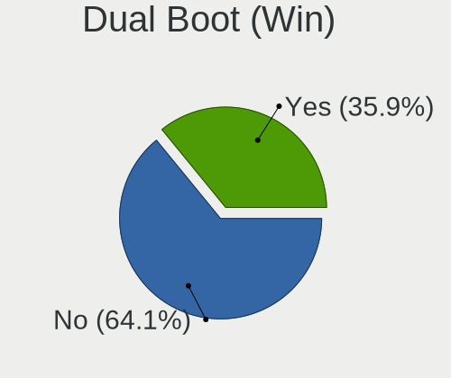
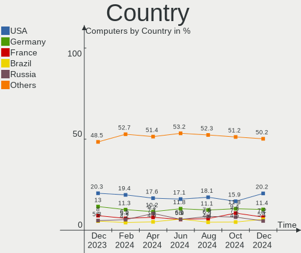
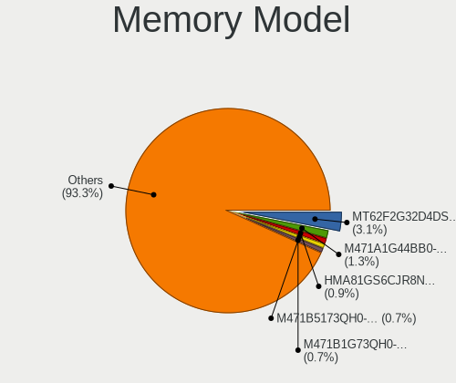

Ubuntu - Hardware Trends
------------------------

A project to identify most popular hardware characteristics and track their change
over time based on data collected by Linux users at https://Linux-Hardware.org.

Anyone can contribute to this report by the [hw-probe](https://github.com/linuxhw/hw-probe) tool:

    sudo -E hw-probe -all -upload

This is a report for all computer types. See also reports for [desktops](/Dist/Ubuntu/Desktop/README.md) and [notebooks](/Dist/Ubuntu/Notebook/README.md).

This report is for one last month. Overall report since the beginning of time: [TestCoverage](https://github.com/linuxhw/TestCoverage)

Period: Sep, 2022.

Contents
--------

* [ System ](#system)
  - [ OS                       ](#os)
  - [ OS Family                ](#os-family)
  - [ Kernel                   ](#kernel)
  - [ Kernel Family            ](#kernel-family)
  - [ Kernel Major Ver.        ](#kernel-major-ver)
  - [ Arch                     ](#arch)
  - [ DE                       ](#de)
  - [ Display Server           ](#display-server)
  - [ Display Manager          ](#display-manager)
  - [ OS Lang                  ](#os-lang)
  - [ Boot Mode                ](#boot-mode)
  - [ Filesystem               ](#filesystem)
  - [ Part. scheme             ](#part-scheme)
  - [ Dual Boot with Linux/BSD ](#dual-boot-with-linuxbsd)
  - [ Dual Boot (Win)          ](#dual-boot-win)

* [ Board ](#board)
  - [ Vendor                   ](#vendor)
  - [ Model                    ](#model)
  - [ Model Family             ](#model-family)
  - [ MFG Year                 ](#mfg-year)
  - [ Form Factor              ](#form-factor)
  - [ Secure Boot              ](#secure-boot)
  - [ Coreboot                 ](#coreboot)
  - [ RAM Size                 ](#ram-size)
  - [ RAM Used                 ](#ram-used)
  - [ Total Drives             ](#total-drives)
  - [ Has CD-ROM               ](#has-cd-rom)
  - [ Has Ethernet             ](#has-ethernet)
  - [ Has WiFi                 ](#has-wifi)
  - [ Has Bluetooth            ](#has-bluetooth)

* [ Location ](#location)
  - [ Country                  ](#country)
  - [ City                     ](#city)

* [ Drives ](#drives)
  - [ Drive Vendor             ](#drive-vendor)
  - [ Drive Model              ](#drive-model)
  - [ HDD Vendor               ](#hdd-vendor)
  - [ SSD Vendor               ](#ssd-vendor)
  - [ Drive Kind               ](#drive-kind)
  - [ Drive Connector          ](#drive-connector)
  - [ Drive Size               ](#drive-size)
  - [ Space Total              ](#space-total)
  - [ Space Used               ](#space-used)
  - [ Malfunc. Drives          ](#malfunc-drives)
  - [ Malfunc. Drive Vendor    ](#malfunc-drive-vendor)
  - [ Malfunc. HDD Vendor      ](#malfunc-hdd-vendor)
  - [ Malfunc. Drive Kind      ](#malfunc-drive-kind)
  - [ Failed Drives            ](#failed-drives)
  - [ Failed Drive Vendor      ](#failed-drive-vendor)
  - [ Drive Status             ](#drive-status)

* [ Storage controller ](#storage-controller)
  - [ Storage Vendor           ](#storage-vendor)
  - [ Storage Model            ](#storage-model)
  - [ Storage Kind             ](#storage-kind)

* [ Processor ](#processor)
  - [ CPU Vendor               ](#cpu-vendor)
  - [ CPU Model                ](#cpu-model)
  - [ CPU Model Family         ](#cpu-model-family)
  - [ CPU Cores                ](#cpu-cores)
  - [ CPU Sockets              ](#cpu-sockets)
  - [ CPU Threads              ](#cpu-threads)
  - [ CPU Op-Modes             ](#cpu-op-modes)
  - [ CPU Microcode            ](#cpu-microcode)
  - [ CPU Microarch            ](#cpu-microarch)

* [ Graphics ](#graphics)
  - [ GPU Vendor               ](#gpu-vendor)
  - [ GPU Model                ](#gpu-model)
  - [ GPU Combo                ](#gpu-combo)
  - [ GPU Driver               ](#gpu-driver)
  - [ GPU Memory               ](#gpu-memory)

* [ Monitor ](#monitor)
  - [ Monitor Vendor           ](#monitor-vendor)
  - [ Monitor Model            ](#monitor-model)
  - [ Monitor Resolution       ](#monitor-resolution)
  - [ Monitor Diagonal         ](#monitor-diagonal)
  - [ Monitor Width            ](#monitor-width)
  - [ Aspect Ratio             ](#aspect-ratio)
  - [ Monitor Area             ](#monitor-area)
  - [ Pixel Density            ](#pixel-density)
  - [ Multiple Monitors        ](#multiple-monitors)

* [ Network ](#network)
  - [ Net Controller Vendor    ](#net-controller-vendor)
  - [ Net Controller Model     ](#net-controller-model)
  - [ Wireless Vendor          ](#wireless-vendor)
  - [ Wireless Model           ](#wireless-model)
  - [ Ethernet Vendor          ](#ethernet-vendor)
  - [ Ethernet Model           ](#ethernet-model)
  - [ Net Controller Kind      ](#net-controller-kind)
  - [ Used Controller          ](#used-controller)
  - [ NICs                     ](#nics)
  - [ IPv6                     ](#ipv6)

* [ Bluetooth ](#bluetooth)
  - [ Bluetooth Vendor         ](#bluetooth-vendor)
  - [ Bluetooth Model          ](#bluetooth-model)

* [ Sound ](#sound)
  - [ Sound Vendor             ](#sound-vendor)
  - [ Sound Model              ](#sound-model)

* [ Memory ](#memory)
  - [ Memory Vendor            ](#memory-vendor)
  - [ Memory Model             ](#memory-model)
  - [ Memory Kind              ](#memory-kind)
  - [ Memory Form Factor       ](#memory-form-factor)
  - [ Memory Size              ](#memory-size)
  - [ Memory Speed             ](#memory-speed)

* [ Printers & scanners ](#printers--scanners)
  - [ Printer Vendor           ](#printer-vendor)
  - [ Printer Model            ](#printer-model)
  - [ Scanner Vendor           ](#scanner-vendor)
  - [ Scanner Model            ](#scanner-model)

* [ Camera ](#camera)
  - [ Camera Vendor            ](#camera-vendor)
  - [ Camera Model             ](#camera-model)

* [ Security ](#security)
  - [ Fingerprint Vendor       ](#fingerprint-vendor)
  - [ Fingerprint Model        ](#fingerprint-model)
  - [ Chipcard Vendor          ](#chipcard-vendor)
  - [ Chipcard Model           ](#chipcard-model)

* [ Unsupported ](#unsupported)
  - [ Unsupported Devices      ](#unsupported-devices)
  - [ Unsupported Device Types ](#unsupported-device-types)

System
------

OS
--

Installed operating systems

| Name           | Computers | Percent |
|----------------|-----------|---------|
| Ubuntu 22.04   | 880       | 76.72%  |
| Ubuntu 20.04   | 214       | 18.66%  |
| Ubuntu 18.04   | 28        | 2.44%   |
| Ubuntu 22.10   | 14        | 1.22%   |
| Ubuntu 21.10   | 5         | 0.44%   |
| Ubuntu 20.10   | 4         | 0.35%   |
| Ubuntu Core 18 | 2         | 0.17%   |

OS Family
---------

OS without a version

| Name   | Computers | Percent |
|--------|-----------|---------|
| Ubuntu | 1147      | 100%    |

Kernel
------

Version of the Linux kernel

| Version                              | Computers | Percent |
|--------------------------------------|-----------|---------|
| 5.15.0-47-generic                    | 453       | 39.49%  |
| 5.15.0-48-generic                    | 291       | 25.37%  |
| 5.15.0-46-generic                    | 119       | 10.37%  |
| 5.15.0-43-generic                    | 51        | 4.45%   |
| 5.4.0-125-generic                    | 27        | 2.35%   |
| 5.4.0-126-generic                    | 17        | 1.48%   |
| 5.15.0-50-generic                    | 11        | 0.96%   |
| 5.14.0-1051-oem                      | 8         | 0.7%    |
| 5.4.0-124-generic                    | 7         | 0.61%   |
| 5.19.0-15-generic                    | 7         | 0.61%   |
| 5.15.0-25-generic                    | 7         | 0.61%   |
| 5.19.5-051905-generic                | 6         | 0.52%   |
| 5.13.0-52-generic                    | 6         | 0.52%   |
| 5.4.0-122-generic                    | 5         | 0.44%   |
| 5.15.0-1014-raspi                    | 5         | 0.44%   |
| 5.13.0-30-generic                    | 5         | 0.44%   |
| 5.8.0-43-generic                     | 4         | 0.35%   |
| 5.17.0-1016-oem                      | 4         | 0.35%   |
| 5.15.0-1013-raspi                    | 4         | 0.35%   |
| 5.13.0-40-generic                    | 3         | 0.26%   |
| 5.13.0-19-generic                    | 3         | 0.26%   |
| 5.11.0-27-generic                    | 3         | 0.26%   |
| 4.15.0-192-generic                   | 3         | 0.26%   |
| 6.0.0-060000rc3-generic              | 2         | 0.17%   |
| 5.8.0-50-generic                     | 2         | 0.17%   |
| 5.8.0-25-generic                     | 2         | 0.17%   |
| 5.4.0-72-generic                     | 2         | 0.17%   |
| 5.19.11-051911-generic               | 2         | 0.17%   |
| 5.19.0-18-generic                    | 2         | 0.17%   |
| 5.19.0-051900-generic                | 2         | 0.17%   |
| 5.17.0-1018-oem                      | 2         | 0.17%   |
| 5.15.0-41-generic                    | 2         | 0.17%   |
| 5.14.0-1052-oem                      | 2         | 0.17%   |
| 5.13.0-51-generic                    | 2         | 0.17%   |
| 5.13.0-27-generic                    | 2         | 0.17%   |
| 5.11.0-43-generic                    | 2         | 0.17%   |
| 6.0.0-rc5                            | 1         | 0.09%   |
| 6.0.0-rc3-lemon                      | 1         | 0.09%   |
| 6.0.0-060000rc7-generic              | 1         | 0.09%   |
| 6.0.0-060000rc5daily20220913-generic | 1         | 0.09%   |

Kernel Family
-------------

Linux kernel without a distro release

| Version | Computers | Percent |
|---------|-----------|---------|
| 5.15.0  | 953       | 83.09%  |
| 5.4.0   | 72        | 6.28%   |
| 5.13.0  | 22        | 1.92%   |
| 5.19.0  | 14        | 1.22%   |
| 5.14.0  | 14        | 1.22%   |
| 5.17.0  | 12        | 1.05%   |
| 5.8.0   | 11        | 0.96%   |
| 5.11.0  | 7         | 0.61%   |
| 6.0.0   | 6         | 0.52%   |
| 5.19.5  | 6         | 0.52%   |
| 4.15.0  | 4         | 0.35%   |
| 5.19.6  | 2         | 0.17%   |
| 5.19.11 | 2         | 0.17%   |
| 5.19.10 | 2         | 0.17%   |
| 5.18.10 | 2         | 0.17%   |
| 5.9.1   | 1         | 0.09%   |
| 5.4.196 | 1         | 0.09%   |
| 5.19.2  | 1         | 0.09%   |
| 5.19.1  | 1         | 0.09%   |
| 5.18.8  | 1         | 0.09%   |
| 5.18.0  | 1         | 0.09%   |
| 5.17.7  | 1         | 0.09%   |
| 5.16.19 | 1         | 0.09%   |
| 5.16.0  | 1         | 0.09%   |
| 5.15.70 | 1         | 0.09%   |
| 5.15.67 | 1         | 0.09%   |
| 5.15.64 | 1         | 0.09%   |
| 5.15.2  | 1         | 0.09%   |
| 5.15.10 | 1         | 0.09%   |
| 5.13.19 | 1         | 0.09%   |
| 5.13.11 | 1         | 0.09%   |
| 5.10.35 | 1         | 0.09%   |
| 4.9.241 | 1         | 0.09%   |

Kernel Major Ver.
-----------------

Linux kernel major version

| Version | Computers | Percent |
|---------|-----------|---------|
| 5.15    | 958       | 83.52%  |
| 5.4     | 73        | 6.36%   |
| 5.19    | 28        | 2.44%   |
| 5.13    | 24        | 2.09%   |
| 5.14    | 14        | 1.22%   |
| 5.17    | 13        | 1.13%   |
| 5.8     | 11        | 0.96%   |
| 5.11    | 7         | 0.61%   |
| 6.0     | 6         | 0.52%   |
| 5.18    | 4         | 0.35%   |
| 4.15    | 4         | 0.35%   |
| 5.16    | 2         | 0.17%   |
| 5.9     | 1         | 0.09%   |
| 5.10    | 1         | 0.09%   |
| 4.9     | 1         | 0.09%   |

Arch
----

OS architecture (x86_64, i586, etc.)

| Name    | Computers | Percent |
|---------|-----------|---------|
| x86_64  | 1126      | 98.17%  |
| aarch64 | 14        | 1.22%   |
| i686    | 3         | 0.26%   |
| armv7l  | 2         | 0.17%   |
| s390x   | 1         | 0.09%   |
| riscv64 | 1         | 0.09%   |

DE
--

Desktop Environment

| Name            | Computers | Percent |
|-----------------|-----------|---------|
| GNOME           | 1061      | 92.5%   |
| Unknown         | 59        | 5.14%   |
| GNOME Flashback | 11        | 0.96%   |
| X-Cinnamon      | 8         | 0.7%    |
| i3              | 4         | 0.35%   |
| Enlightenment   | 2         | 0.17%   |
| GNOME Classic   | 1         | 0.09%   |
| dwm             | 1         | 0.09%   |

Display Server
--------------

X11 or Wayland

| Name    | Computers | Percent |
|---------|-----------|---------|
| Wayland | 584       | 50.92%  |
| X11     | 514       | 44.81%  |
| Tty     | 30        | 2.62%   |
| Unknown | 19        | 1.66%   |

Display Manager
---------------

SDDM, LightDM, etc.

| Name    | Computers | Percent |
|---------|-----------|---------|
| GDM3    | 920       | 80.21%  |
| Unknown | 114       | 9.94%   |
| GDM     | 82        | 7.15%   |
| LightDM | 26        | 2.27%   |
| SDDM    | 4         | 0.35%   |
| LXDM    | 1         | 0.09%   |

OS Lang
-------

Language

| Lang    | Computers | Percent |
|---------|-----------|---------|
| en_US   | 488       | 42.55%  |
| de_DE   | 122       | 10.64%  |
| fr_FR   | 63        | 5.49%   |
| it_IT   | 52        | 4.53%   |
| en_GB   | 52        | 4.53%   |
| pt_BR   | 49        | 4.27%   |
| en_CA   | 31        | 2.7%    |
| en_IN   | 29        | 2.53%   |
| es_ES   | 28        | 2.44%   |
| ru_RU   | 22        | 1.92%   |
| pl_PL   | 20        | 1.74%   |
| en_AU   | 17        | 1.48%   |
| C       | 15        | 1.31%   |
| Unknown | 12        | 1.05%   |
| es_MX   | 11        | 0.96%   |
| nl_NL   | 9         | 0.78%   |
| hu_HU   | 8         | 0.7%    |
| de_AT   | 8         | 0.7%    |
| zh_CN   | 7         | 0.61%   |
| cs_CZ   | 7         | 0.61%   |
| sv_SE   | 6         | 0.52%   |
| tr_TR   | 5         | 0.44%   |
| ja_JP   | 5         | 0.44%   |
| fr_BE   | 5         | 0.44%   |
| es_AR   | 5         | 0.44%   |
| en_ZA   | 5         | 0.44%   |
| ro_RO   | 4         | 0.35%   |
| pt_PT   | 4         | 0.35%   |
| en_PH   | 4         | 0.35%   |
| de_CH   | 4         | 0.35%   |
| fr_CA   | 3         | 0.26%   |
| es_VE   | 3         | 0.26%   |
| es_CL   | 3         | 0.26%   |
| en_SG   | 3         | 0.26%   |
| en_HK   | 3         | 0.26%   |
| el_GR   | 3         | 0.26%   |
| da_DK   | 3         | 0.26%   |
| nb_NO   | 2         | 0.17%   |
| it_CH   | 2         | 0.17%   |
| en_NG   | 2         | 0.17%   |

Boot Mode
---------

EFI or BIOS

| Mode | Computers | Percent |
|------|-----------|---------|
| BIOS | 692       | 60.33%  |
| EFI  | 455       | 39.67%  |

Filesystem
----------

Type of filesystem

| Type     | Computers | Percent |
|----------|-----------|---------|
| Ext4     | 1076      | 93.81%  |
| Overlay  | 31        | 2.7%    |
| Zfs      | 18        | 1.57%   |
| Btrfs    | 10        | 0.87%   |
| Xfs      | 6         | 0.52%   |
| Ext2     | 3         | 0.26%   |
| Ext3     | 2         | 0.17%   |
| Reiserfs | 1         | 0.09%   |

Part. scheme
------------

Scheme of partitioning

| Type    | Computers | Percent |
|---------|-----------|---------|
| Unknown | 738       | 64.34%  |
| GPT     | 369       | 32.17%  |
| MBR     | 40        | 3.49%   |

Dual Boot with Linux/BSD
------------------------

Hosting more than one Linux/BSD

| Dual boot | Computers | Percent |
|-----------|-----------|---------|
| No        | 1010      | 88.06%  |
| Yes       | 137       | 11.94%  |

Dual Boot (Win)
---------------

Hosting Linux and Windows

| Dual boot | Computers | Percent |
|-----------|-----------|---------|
| No        | 709       | 61.81%  |
| Yes       | 438       | 38.19%  |

Board
-----

Vendor
------

Motherboard manufacturer

| Name                    | Computers | Percent |
|-------------------------|-----------|---------|
| Hewlett-Packard         | 183       | 15.95%  |
| Dell                    | 172       | 15%     |
| ASUSTek Computer        | 172       | 15%     |
| Lenovo                  | 145       | 12.64%  |
| Gigabyte Technology     | 74        | 6.45%   |
| Acer                    | 65        | 5.67%   |
| MSI                     | 55        | 4.8%    |
| ASRock                  | 35        | 3.05%   |
| Apple                   | 26        | 2.27%   |
| Toshiba                 | 14        | 1.22%   |
| Raspberry Pi Foundation | 13        | 1.13%   |
| Samsung Electronics     | 12        | 1.05%   |
| Intel                   | 12        | 1.05%   |
| HUAWEI                  | 12        | 1.05%   |
| Medion                  | 10        | 0.87%   |
| Unknown                 | 9         | 0.78%   |
| Fujitsu                 | 8         | 0.7%    |
| Chuwi                   | 7         | 0.61%   |
| Supermicro              | 5         | 0.44%   |
| Positivo                | 5         | 0.44%   |
| Pegatron                | 5         | 0.44%   |
| AMI                     | 5         | 0.44%   |
| Alienware               | 5         | 0.44%   |
| Timi                    | 4         | 0.35%   |
| Notebook                | 4         | 0.35%   |
| System76                | 3         | 0.26%   |
| Sony                    | 3         | 0.26%   |
| Packard Bell            | 3         | 0.26%   |
| Google                  | 3         | 0.26%   |
| Foxconn                 | 3         | 0.26%   |
| Biostar                 | 3         | 0.26%   |
| BESSTAR Tech            | 3         | 0.26%   |
| AZW                     | 3         | 0.26%   |
| Avell High Performance  | 3         | 0.26%   |
| Razer                   | 2         | 0.17%   |
| OEM                     | 2         | 0.17%   |
| NEC Computers           | 2         | 0.17%   |
| Microsoft               | 2         | 0.17%   |
| LG Electronics          | 2         | 0.17%   |
| HONOR                   | 2         | 0.17%   |

Model
-----

Motherboard model

| Name                                  | Computers | Percent |
|---------------------------------------|-----------|---------|
| Unknown                               | 15        | 1.31%   |
| ASUS All Series                       | 11        | 0.96%   |
| RPi Raspberry Pi                      | 8         | 0.7%    |
| MSI MS-7C37                           | 6         | 0.52%   |
| MSI MS-7721                           | 4         | 0.35%   |
| Dell OptiPlex 9020                    | 4         | 0.35%   |
| ASUS TUF Gaming X570-PLUS             | 4         | 0.35%   |
| ASUS PRIME A320M-K                    | 4         | 0.35%   |
| Timi TM1701                           | 3         | 0.26%   |
| HUAWEI HVY-WXX9                       | 3         | 0.26%   |
| HP ProBook 6560b                      | 3         | 0.26%   |
| HP Laptop 15-db0xxx                   | 3         | 0.26%   |
| HP EliteBook 850 G3                   | 3         | 0.26%   |
| HP EliteBook 840 G3                   | 3         | 0.26%   |
| Dell XPS 15 9500                      | 3         | 0.26%   |
| Dell Precision WorkStation T5500      | 3         | 0.26%   |
| Dell OptiPlex 7010                    | 3         | 0.26%   |
| Dell Latitude 7420                    | 3         | 0.26%   |
| Dell Inspiron N5050                   | 3         | 0.26%   |
| ASUS X553MA                           | 3         | 0.26%   |
| ASUS ROG STRIX B450-F GAMING          | 3         | 0.26%   |
| ASRock B450M Pro4                     | 3         | 0.26%   |
| Samsung 730QED                        | 2         | 0.17%   |
| RPi Raspberry Pi 4 Model B Rev 1.4    | 2         | 0.17%   |
| RPi Raspberry Pi 4 Model B Rev 1.1    | 2         | 0.17%   |
| MSI MS-7C91                           | 2         | 0.17%   |
| MSI MS-7B48                           | 2         | 0.17%   |
| MSI MS-7817                           | 2         | 0.17%   |
| MSI Modern 14 A10M                    | 2         | 0.17%   |
| Medion MS-7707                        | 2         | 0.17%   |
| Lenovo ThinkStation P910 30B8S0EN00   | 2         | 0.17%   |
| Lenovo ThinkPad P14s Gen 1 20Y1000AGE | 2         | 0.17%   |
| Lenovo ThinkBook 15-IIL 20SM          | 2         | 0.17%   |
| Lenovo ThinkBook 15 G2 ITL 20VE       | 2         | 0.17%   |
| Lenovo ThinkBook 14 G2 ITL 20VD       | 2         | 0.17%   |
| Lenovo IdeaPadFlex 5 14ITL05 82HS     | 2         | 0.17%   |
| Lenovo IdeaPad 330-15AST 81D6         | 2         | 0.17%   |
| Lenovo IdeaPad 3 15ALC6 82MF          | 2         | 0.17%   |
| Lenovo G50-80 80E5                    | 2         | 0.17%   |
| Lenovo E50-80 80J2                    | 2         | 0.17%   |

Model Family
------------

Motherboard model prefix

| Name                | Computers | Percent |
|---------------------|-----------|---------|
| Lenovo ThinkPad     | 54        | 4.71%   |
| Dell Latitude       | 48        | 4.18%   |
| Acer Aspire         | 48        | 4.18%   |
| HP Pavilion         | 31        | 2.7%    |
| Dell Inspiron       | 30        | 2.62%   |
| Lenovo IdeaPad      | 27        | 2.35%   |
| HP EliteBook        | 27        | 2.35%   |
| HP ProBook          | 26        | 2.27%   |
| Dell OptiPlex       | 25        | 2.18%   |
| Dell Precision      | 23        | 2.01%   |
| ASUS PRIME          | 22        | 1.92%   |
| Dell XPS            | 21        | 1.83%   |
| HP Laptop           | 18        | 1.57%   |
| HP Compaq           | 17        | 1.48%   |
| ASUS ROG            | 15        | 1.31%   |
| Unknown             | 15        | 1.31%   |
| ASUS TUF            | 14        | 1.22%   |
| Toshiba Satellite   | 13        | 1.13%   |
| RPi Raspberry       | 13        | 1.13%   |
| ASUS VivoBook       | 13        | 1.13%   |
| Lenovo ThinkBook    | 11        | 0.96%   |
| HP ENVY             | 11        | 0.96%   |
| ASUS All            | 11        | 0.96%   |
| Dell Vostro         | 10        | 0.87%   |
| ASUS Zenbook        | 9         | 0.78%   |
| Lenovo Yoga         | 7         | 0.61%   |
| Lenovo ThinkStation | 7         | 0.61%   |
| Lenovo ThinkCentre  | 7         | 0.61%   |
| MSI MS-7C37         | 6         | 0.52%   |
| Lenovo Legion       | 5         | 0.44%   |
| HP OMEN             | 5         | 0.44%   |
| Dell PowerEdge      | 5         | 0.44%   |
| Acer Swift          | 5         | 0.44%   |
| MSI MS-7721         | 4         | 0.35%   |
| Lenovo IdeaPadFlex  | 4         | 0.35%   |
| HP Spectre          | 4         | 0.35%   |
| HP EliteDesk        | 4         | 0.35%   |
| HP 255              | 4         | 0.35%   |
| Gigabyte B450       | 4         | 0.35%   |
| Fujitsu ESPRIMO     | 4         | 0.35%   |

MFG Year
--------

Motherboard manufacture year

| Year    | Computers | Percent |
|---------|-----------|---------|
| 2021    | 141       | 12.29%  |
| 2020    | 117       | 10.2%   |
| 2018    | 111       | 9.68%   |
| 2019    | 91        | 7.93%   |
| 2011    | 85        | 7.41%   |
| 2012    | 76        | 6.63%   |
| 2013    | 73        | 6.36%   |
| 2014    | 65        | 5.67%   |
| 2022    | 64        | 5.58%   |
| 2017    | 62        | 5.41%   |
| 2015    | 62        | 5.41%   |
| 2016    | 47        | 4.1%    |
| 2010    | 44        | 3.84%   |
| 2008    | 37        | 3.23%   |
| 2009    | 27        | 2.35%   |
| Unknown | 19        | 1.66%   |
| 2007    | 16        | 1.39%   |
| 2006    | 8         | 0.7%    |
| 2005    | 2         | 0.17%   |

Form Factor
-----------

Physical design of the computer

| Name           | Computers | Percent |
|----------------|-----------|---------|
| Notebook       | 606       | 52.83%  |
| Desktop        | 428       | 37.31%  |
| Convertible    | 36        | 3.14%   |
| Mini pc        | 19        | 1.66%   |
| System on chip | 16        | 1.39%   |
| All in one     | 16        | 1.39%   |
| Server         | 15        | 1.31%   |
| Tablet         | 10        | 0.87%   |
| Other          | 1         | 0.09%   |

Secure Boot
-----------

Enabled or disabled

| State    | Computers | Percent |
|----------|-----------|---------|
| Disabled | 1043      | 90.93%  |
| Enabled  | 104       | 9.07%   |

Coreboot
--------

Have coreboot on board

| Used | Computers | Percent |
|------|-----------|---------|
| No   | 1140      | 99.39%  |
| Yes  | 7         | 0.61%   |

RAM Size
--------

Total RAM memory

| Size in GB      | Computers | Percent |
|-----------------|-----------|---------|
| 4.01-8.0        | 279       | 24.32%  |
| 16.01-24.0      | 257       | 22.41%  |
| 3.01-4.0        | 187       | 16.3%   |
| 8.01-16.0       | 186       | 16.22%  |
| 32.01-64.0      | 139       | 12.12%  |
| 1.01-2.0        | 33        | 2.88%   |
| 64.01-256.0     | 31        | 2.7%    |
| 24.01-32.0      | 21        | 1.83%   |
| 2.01-3.0        | 6         | 0.52%   |
| More than 256.0 | 4         | 0.35%   |
| 0.51-1.0        | 4         | 0.35%   |

RAM Used
--------

Used RAM memory

| Used GB     | Computers | Percent |
|-------------|-----------|---------|
| 1.01-2.0    | 353       | 30.78%  |
| 2.01-3.0    | 328       | 28.6%   |
| 4.01-8.0    | 196       | 17.09%  |
| 3.01-4.0    | 169       | 14.73%  |
| 8.01-16.0   | 61        | 5.32%   |
| 0.51-1.0    | 23        | 2.01%   |
| 16.01-24.0  | 7         | 0.61%   |
| 0.01-0.5    | 7         | 0.61%   |
| 24.01-32.0  | 2         | 0.17%   |
| 64.01-256.0 | 1         | 0.09%   |

Total Drives
------------

Number of drives on board

| Drives | Computers | Percent |
|--------|-----------|---------|
| 1      | 696       | 60.68%  |
| 2      | 298       | 25.98%  |
| 3      | 79        | 6.89%   |
| 4      | 31        | 2.7%    |
| 5      | 15        | 1.31%   |
| 0      | 15        | 1.31%   |
| 6      | 6         | 0.52%   |
| 7      | 5         | 0.44%   |
| 13     | 1         | 0.09%   |
| 8      | 1         | 0.09%   |

Has CD-ROM
----------

Has CD-ROM on board

| Presented | Computers | Percent |
|-----------|-----------|---------|
| No        | 739       | 64.43%  |
| Yes       | 408       | 35.57%  |

Has Ethernet
------------

Has Ethernet on board

| Presented | Computers | Percent |
|-----------|-----------|---------|
| Yes       | 954       | 83.17%  |
| No        | 193       | 16.83%  |

Has WiFi
--------

Has WiFi module

| Presented | Computers | Percent |
|-----------|-----------|---------|
| Yes       | 872       | 76.02%  |
| No        | 275       | 23.98%  |

Has Bluetooth
-------------

Has Bluetooth module

| Presented | Computers | Percent |
|-----------|-----------|---------|
| Yes       | 686       | 59.81%  |
| No        | 461       | 40.19%  |

Location
--------

Country
-------

Geographic location (country)

| Country      | Computers | Percent |
|--------------|-----------|---------|
| USA          | 200       | 17.44%  |
| Germany      | 137       | 11.94%  |
| Italy        | 76        | 6.63%   |
| France       | 72        | 6.28%   |
| Brazil       | 59        | 5.14%   |
| UK           | 47        | 4.1%    |
| Russia       | 39        | 3.4%    |
| Canada       | 38        | 3.31%   |
| Spain        | 36        | 3.14%   |
| Poland       | 31        | 2.7%    |
| India        | 31        | 2.7%    |
| Netherlands  | 23        | 2.01%   |
| Sweden       | 16        | 1.39%   |
| Mexico       | 15        | 1.31%   |
| Australia    | 15        | 1.31%   |
| Hungary      | 14        | 1.22%   |
| China        | 14        | 1.22%   |
| Portugal     | 13        | 1.13%   |
| Belgium      | 13        | 1.13%   |
| Austria      | 13        | 1.13%   |
| Switzerland  | 12        | 1.05%   |
| Iran         | 10        | 0.87%   |
| Czechia      | 10        | 0.87%   |
| Argentina    | 10        | 0.87%   |
| Turkey       | 9         | 0.78%   |
| Slovakia     | 9         | 0.78%   |
| Pakistan     | 9         | 0.78%   |
| Japan        | 9         | 0.78%   |
| Romania      | 8         | 0.7%    |
| South Africa | 7         | 0.61%   |
| Singapore    | 7         | 0.61%   |
| Greece       | 7         | 0.61%   |
| Vietnam      | 6         | 0.52%   |
| Egypt        | 6         | 0.52%   |
| Chile        | 6         | 0.52%   |
| Serbia       | 5         | 0.44%   |
| Norway       | 5         | 0.44%   |
| Israel       | 5         | 0.44%   |
| Indonesia    | 5         | 0.44%   |
| Hong Kong    | 5         | 0.44%   |

City
----

Geographic location (city)

| City           | Computers | Percent |
|----------------|-----------|---------|
| Moscow         | 13        | 1.13%   |
| Milan          | 13        | 1.13%   |
| Rome           | 9         | 0.78%   |
| Paris          | 9         | 0.78%   |
| Warsaw         | 8         | 0.7%    |
| Vienna         | 8         | 0.7%    |
| Madrid         | 8         | 0.7%    |
| St Petersburg  | 7         | 0.61%   |
| Singapore      | 7         | 0.61%   |
| Košice        | 7         | 0.61%   |
| Budapest       | 7         | 0.61%   |
| Lisbon         | 6         | 0.52%   |
| Hamburg        | 6         | 0.52%   |
| Berlin         | 6         | 0.52%   |
| Bengaluru      | 6         | 0.52%   |
| Toronto        | 5         | 0.44%   |
| Tehran         | 5         | 0.44%   |
| Sydney         | 5         | 0.44%   |
| Rio de Janeiro | 5         | 0.44%   |
| Munich         | 5         | 0.44%   |
| Mexico City    | 5         | 0.44%   |
| Krakow         | 5         | 0.44%   |
| Kolkata        | 5         | 0.44%   |
| Istanbul       | 5         | 0.44%   |
| Belgrade       | 5         | 0.44%   |
| Amsterdam      | 5         | 0.44%   |
| Sao Paulo      | 4         | 0.35%   |
| San Francisco  | 4         | 0.35%   |
| Rho            | 4         | 0.35%   |
| Prague         | 4         | 0.35%   |
| Porto          | 4         | 0.35%   |
| Mumbai         | 4         | 0.35%   |
| Montreal       | 4         | 0.35%   |
| Mirpur         | 4         | 0.35%   |
| London         | 4         | 0.35%   |
| Dublin         | 4         | 0.35%   |
| Denver         | 4         | 0.35%   |
| Cairo          | 4         | 0.35%   |
| Belo Horizonte | 4         | 0.35%   |
| Beijing        | 4         | 0.35%   |

Drives
------

Drive Vendor
------------

Hard drive vendors

| Vendor                      | Computers | Drives | Percent |
|-----------------------------|-----------|--------|---------|
| Samsung Electronics         | 254       | 311    | 15.94%  |
| WDC                         | 249       | 303    | 15.63%  |
| Seagate                     | 200       | 241    | 12.55%  |
| Toshiba                     | 102       | 110    | 6.4%    |
| Kingston                    | 95        | 101    | 5.96%   |
| Sandisk                     | 85        | 91     | 5.34%   |
| Unknown                     | 60        | 73     | 3.77%   |
| Crucial                     | 59        | 65     | 3.7%    |
| SK hynix                    | 43        | 44     | 2.7%    |
| Intel                       | 35        | 43     | 2.2%    |
| HGST                        | 33        | 37     | 2.07%   |
| Hitachi                     | 32        | 34     | 2.01%   |
| Micron Technology           | 29        | 30     | 1.82%   |
| KIOXIA                      | 23        | 24     | 1.44%   |
| A-DATA Technology           | 23        | 25     | 1.44%   |
| PNY                         | 13        | 13     | 0.82%   |
| Apple                       | 13        | 14     | 0.82%   |
| China                       | 11        | 11     | 0.69%   |
| Phison                      | 10        | 11     | 0.63%   |
| Intenso                     | 10        | 10     | 0.63%   |
| Unknown                     | 10        | 11     | 0.63%   |
| Phison Electronics          | 9         | 10     | 0.56%   |
| LITEON                      | 8         | 8      | 0.5%    |
| Transcend                   | 7         | 7      | 0.44%   |
| SPCC                        | 7         | 8      | 0.44%   |
| Silicon Motion              | 7         | 7      | 0.44%   |
| Netac                       | 7         | 7      | 0.44%   |
| Maxtor                      | 7         | 8      | 0.44%   |
| Patriot                     | 5         | 5      | 0.31%   |
| Micron/Crucial Technology   | 5         | 5      | 0.31%   |
| Kingston Technology Company | 5         | 5      | 0.31%   |
| Hewlett-Packard             | 5         | 5      | 0.31%   |
| GOODRAM                     | 5         | 5      | 0.31%   |
| Corsair                     | 5         | 5      | 0.31%   |
| Team                        | 4         | 4      | 0.25%   |
| Realtek Semiconductor       | 4         | 4      | 0.25%   |
| KingFast                    | 4         | 4      | 0.25%   |
| Apacer                      | 4         | 4      | 0.25%   |
| Teclast                     | 3         | 3      | 0.19%   |
| SSK                         | 3         | 3      | 0.19%   |

Drive Model
-----------

Hard drive models

| Model                                               | Computers | Percent |
|-----------------------------------------------------|-----------|---------|
| Samsung NVMe SSD Controller SM981/PM981/PM983 256GB | 19        | 1.09%   |
| Samsung SSD 860 EVO 500GB                           | 17        | 0.97%   |
| Kingston SA400S37240G 240GB SSD                     | 17        | 0.97%   |
| Toshiba MQ01ABD100 1TB                              | 16        | 0.91%   |
| Seagate ST500DM002-1BD142 500GB                     | 15        | 0.86%   |
| Seagate ST1000LM035-1RK172 1TB                      | 12        | 0.69%   |
| Samsung NVMe SSD Drive 512GB                        | 12        | 0.69%   |
| Kingston SA400S37120G 120GB SSD                     | 11        | 0.63%   |
| Samsung SSD 850 EVO 250GB                           | 10        | 0.57%   |
| Kingston SA400S37480G 480GB SSD                     | 10        | 0.57%   |
| Crucial CT240BX500SSD1 240GB                        | 10        | 0.57%   |
| Unknown                                             | 10        | 0.57%   |
| Unknown SD/MMC/MS PRO 2GB                           | 9         | 0.51%   |
| Seagate ST1000LM024 HN-M101MBB 1TB                  | 9         | 0.51%   |
| Seagate ST1000DM010-2EP102 1TB                      | 9         | 0.51%   |
| Seagate ST1000DM003-1CH162 1TB                      | 9         | 0.51%   |
| Toshiba DT01ACA100 1TB                              | 8         | 0.46%   |
| Seagate ST9500325AS 500GB                           | 8         | 0.46%   |
| Samsung SSD 980 PRO 1TB                             | 8         | 0.46%   |
| Samsung SSD 970 EVO Plus 1TB                        | 8         | 0.46%   |
| Samsung SSD 850 EVO 500GB                           | 8         | 0.46%   |
| Crucial CT500MX500SSD1 500GB                        | 8         | 0.46%   |
| WDC WDS500G2B0A-00SM50 500GB SSD                    | 7         | 0.4%    |
| Unknown MMC Card  32GB                              | 7         | 0.4%    |
| Seagate ST2000DM008-2FR102 2TB                      | 7         | 0.4%    |
| Seagate ST1000DM003-1SB102 1TB                      | 7         | 0.4%    |
| SanDisk NVMe SSD Drive 512GB                        | 7         | 0.4%    |
| SanDisk NVMe SSD Drive 1TB                          | 7         | 0.4%    |
| Samsung NVMe SSD Drive 256GB                        | 7         | 0.4%    |
| Crucial CT480BX500SSD1 480GB                        | 7         | 0.4%    |
| Toshiba MQ04ABF100 1TB                              | 6         | 0.34%   |
| Samsung SSD 970 EVO Plus 500GB                      | 6         | 0.34%   |
| Samsung MZALQ512HALU-000L2 512GB                    | 6         | 0.34%   |
| HGST HTS545050A7E680 500GB                          | 6         | 0.34%   |
| Crucial CT1000MX500SSD1 1TB                         | 6         | 0.34%   |
| WDC WD10EZEX-00WN4A0 1TB                            | 5         | 0.29%   |
| Unknown MMC Card  64GB                              | 5         | 0.29%   |
| Unknown MMC Card  16GB                              | 5         | 0.29%   |
| Toshiba MQ01ABD050 500GB                            | 5         | 0.29%   |
| SK hynix NVMe SSD Drive 512GB                       | 5         | 0.29%   |

HDD Vendor
----------

Hard disk drive vendors

| Vendor              | Computers | Drives | Percent |
|---------------------|-----------|--------|---------|
| WDC                 | 196       | 239    | 33.05%  |
| Seagate             | 194       | 232    | 32.72%  |
| Toshiba             | 83        | 91     | 14%     |
| HGST                | 33        | 37     | 5.56%   |
| Hitachi             | 32        | 34     | 5.4%    |
| Samsung Electronics | 25        | 29     | 4.22%   |
| Unknown             | 10        | 10     | 1.69%   |
| Maxtor              | 6         | 7      | 1.01%   |
| Apple               | 6         | 6      | 1.01%   |
| Fujitsu             | 2         | 2      | 0.34%   |
| WD MediaMax         | 1         | 1      | 0.17%   |
| Intenso             | 1         | 1      | 0.17%   |
| ExcelStor           | 1         | 1      | 0.17%   |
| ASMT                | 1         | 2      | 0.17%   |
| ASMedia             | 1         | 1      | 0.17%   |
| Unknown             | 1         | 2      | 0.17%   |

SSD Vendor
----------

Solid state drive vendors

| Vendor              | Computers | Drives | Percent |
|---------------------|-----------|--------|---------|
| Samsung Electronics | 92        | 107    | 19.33%  |
| Kingston            | 67        | 71     | 14.08%  |
| Crucial             | 48        | 54     | 10.08%  |
| SanDisk             | 44        | 48     | 9.24%   |
| WDC                 | 32        | 33     | 6.72%   |
| PNY                 | 13        | 13     | 2.73%   |
| Micron Technology   | 13        | 13     | 2.73%   |
| A-DATA Technology   | 13        | 14     | 2.73%   |
| SK hynix            | 11        | 12     | 2.31%   |
| China               | 11        | 11     | 2.31%   |
| Intel               | 9         | 9      | 1.89%   |
| LITEON              | 8         | 8      | 1.68%   |
| Intenso             | 8         | 8      | 1.68%   |
| Transcend           | 6         | 6      | 1.26%   |
| SPCC                | 6         | 6      | 1.26%   |
| Netac               | 6         | 6      | 1.26%   |
| Toshiba             | 5         | 5      | 1.05%   |
| Patriot             | 5         | 5      | 1.05%   |
| GOODRAM             | 5         | 5      | 1.05%   |
| Team                | 4         | 4      | 0.84%   |
| Corsair             | 4         | 4      | 0.84%   |
| Teclast             | 3         | 3      | 0.63%   |
| LITEONIT            | 3         | 3      | 0.63%   |
| Lexar               | 3         | 3      | 0.63%   |
| Integral            | 3         | 3      | 0.63%   |
| Hewlett-Packard     | 3         | 3      | 0.63%   |
| Gigabyte Technology | 3         | 3      | 0.63%   |
| Apacer              | 3         | 3      | 0.63%   |
| Verbatim            | 2         | 2      | 0.42%   |
| Dogfish             | 2         | 2      | 0.42%   |
| YS                  | 1         | 1      | 0.21%   |
| WALRAM              | 1         | 1      | 0.21%   |
| VISIPRO             | 1         | 1      | 0.21%   |
| Vaseky              | 1         | 1      | 0.21%   |
| V-GeN               | 1         | 1      | 0.21%   |
| Unknown             | 1         | 1      | 0.21%   |
| TwinMOS             | 1         | 1      | 0.21%   |
| TrekStor            | 1         | 1      | 0.21%   |
| TO Exter            | 1         | 1      | 0.21%   |
| TCSUNBOW            | 1         | 1      | 0.21%   |

Drive Kind
----------

HDD or SSD

| Kind    | Computers | Drives | Percent |
|---------|-----------|--------|---------|
| HDD     | 499       | 695    | 34.2%   |
| NVMe    | 436       | 502    | 29.88%  |
| SSD     | 430       | 508    | 29.47%  |
| MMC     | 53        | 62     | 3.63%   |
| Unknown | 41        | 49     | 2.81%   |

Drive Connector
---------------

SATA, SAS, NVMe, etc.

| Type | Computers | Drives | Percent |
|------|-----------|--------|---------|
| SATA | 770       | 1175   | 58.33%  |
| NVMe | 435       | 499    | 32.95%  |
| SAS  | 62        | 80     | 4.7%    |
| MMC  | 53        | 62     | 4.02%   |

Drive Size
----------

Size of hard drive

| Size in TB | Computers | Drives | Percent |
|------------|-----------|--------|---------|
| 0.01-0.5   | 535       | 686    | 55.67%  |
| 0.51-1.0   | 294       | 345    | 30.59%  |
| 1.01-2.0   | 71        | 84     | 7.39%   |
| 3.01-4.0   | 23        | 28     | 2.39%   |
| 4.01-10.0  | 17        | 22     | 1.77%   |
| 2.01-3.0   | 14        | 22     | 1.46%   |
| 10.01-20.0 | 7         | 16     | 0.73%   |

Space Total
-----------

Amount of disk space available on the file system

| Size in GB     | Computers | Percent |
|----------------|-----------|---------|
| 101-250        | 334       | 29.12%  |
| 251-500        | 276       | 24.06%  |
| 501-1000       | 204       | 17.79%  |
| 51-100         | 71        | 6.19%   |
| 1001-2000      | 67        | 5.84%   |
| More than 3000 | 54        | 4.71%   |
| 1-20           | 51        | 4.45%   |
| 21-50          | 48        | 4.18%   |
| 2001-3000      | 21        | 1.83%   |
| Unknown        | 21        | 1.83%   |

Space Used
----------

Amount of used disk space

| Used GB        | Computers | Percent |
|----------------|-----------|---------|
| 1-20           | 382       | 33.3%   |
| 21-50          | 232       | 20.23%  |
| 101-250        | 164       | 14.3%   |
| 51-100         | 147       | 12.82%  |
| 251-500        | 84        | 7.32%   |
| 501-1000       | 68        | 5.93%   |
| More than 3000 | 21        | 1.83%   |
| 1001-2000      | 21        | 1.83%   |
| Unknown        | 21        | 1.83%   |
| 2001-3000      | 7         | 0.61%   |

Malfunc. Drives
---------------

Drive models with a malfunction

| Model                                   | Computers | Drives | Percent |
|-----------------------------------------|-----------|--------|---------|
| Toshiba MQ01ABD100 1TB                  | 3         | 3      | 4%      |
| Seagate ST1000LM035-1RK172 1TB          | 3         | 3      | 4%      |
| WDC WD5000AAKX-00ERMA0 500GB            | 2         | 2      | 2.67%   |
| Seagate ST9500325AS 500GB               | 2         | 2      | 2.67%   |
| Seagate ST500DM002-1BD142 500GB         | 2         | 2      | 2.67%   |
| YS SSD 128GB                            | 1         | 1      | 1.33%   |
| WDC WDS240G2G0A-00JH30 240GB SSD        | 1         | 1      | 1.33%   |
| WDC WD6400AAKS-00A7B2 640GB             | 1         | 1      | 1.33%   |
| WDC WD5000AZLX-60K2TA0 500GB            | 1         | 1      | 1.33%   |
| WDC WD5000AAKX-603CA0 500GB             | 1         | 1      | 1.33%   |
| WDC WD5000AAKX-003CA0 500GB             | 1         | 1      | 1.33%   |
| WDC WD3200AAJS-00L7A0 320GB             | 1         | 1      | 1.33%   |
| WDC WD2500BEKT-75A25T0 250GB            | 1         | 1      | 1.33%   |
| WDC WD2003FYYS-02W0B1 2TB               | 1         | 1      | 1.33%   |
| WDC WD2003FYYS-02W0B0 2TB               | 1         | 2      | 1.33%   |
| WDC WD10SPZX-24Z10 1TB                  | 1         | 1      | 1.33%   |
| WDC WD10JPCX-24UE4T0 1TB                | 1         | 1      | 1.33%   |
| WDC WD10EZRZ-00Z5HB0 1TB                | 1         | 1      | 1.33%   |
| WDC WD10EZRX-00L4HB0 1TB                | 1         | 1      | 1.33%   |
| WDC WD10EZEX-22BN5A0 1TB                | 1         | 1      | 1.33%   |
| WDC WD10EZEX-21M2NA0 1TB                | 1         | 1      | 1.33%   |
| WDC WD10EUCX-73YZ1Y0 1TB                | 1         | 1      | 1.33%   |
| WDC WD10EFRX-68JCSN0 1TB                | 1         | 1      | 1.33%   |
| WD MediaMax WL2000GSA6454G 2TB          | 1         | 1      | 1.33%   |
| VISIPRO SSD 256GB                       | 1         | 1      | 1.33%   |
| Toshiba MQ04ABF100 1TB                  | 1         | 1      | 1.33%   |
| Toshiba MQ01ABD050 500GB                | 1         | 1      | 1.33%   |
| Toshiba MK5065GSXN 500GB                | 1         | 1      | 1.33%   |
| Toshiba KSG60ZMV256G M.2 2280 256GB SSD | 1         | 1      | 1.33%   |
| Toshiba DT01ACA050 500GB                | 1         | 1      | 1.33%   |
| SK hynix HFS256GD9TNG-62A0A 256GB       | 1         | 1      | 1.33%   |
| SK hynix HFS128G3AMNB-2200A 128GB SSD   | 1         | 1      | 1.33%   |
| SK hynix HFS128G32MND-2200A 128GB SSD   | 1         | 1      | 1.33%   |
| Seagate ST3500418AS 500GB               | 1         | 1      | 1.33%   |
| Seagate ST3320620AS 320GB               | 1         | 1      | 1.33%   |
| Seagate ST3250310AS 250GB               | 1         | 1      | 1.33%   |
| Seagate ST3160815AS 160GB               | 1         | 1      | 1.33%   |
| Seagate ST1000LM014-SSHD-8GB            | 1         | 1      | 1.33%   |
| Seagate ST1000LM014-1EJ164 1TB          | 1         | 1      | 1.33%   |
| SanDisk SSD PLUS 1000GB                 | 1         | 1      | 1.33%   |

Malfunc. Drive Vendor
---------------------

Vendors of faulty drives

| Vendor              | Computers | Drives | Percent |
|---------------------|-----------|--------|---------|
| WDC                 | 19        | 20     | 25.33%  |
| Seagate             | 13        | 13     | 17.33%  |
| Toshiba             | 8         | 8      | 10.67%  |
| Hitachi             | 6         | 6      | 8%      |
| Samsung Electronics | 4         | 4      | 5.33%   |
| SK hynix            | 3         | 3      | 4%      |
| HGST                | 3         | 3      | 4%      |
| Micron Technology   | 2         | 2      | 2.67%   |
| LITEON              | 2         | 2      | 2.67%   |
| Intel               | 2         | 2      | 2.67%   |
| Crucial             | 2         | 3      | 2.67%   |
| A-DATA Technology   | 2         | 2      | 2.67%   |
| YS                  | 1         | 1      | 1.33%   |
| WD MediaMax         | 1         | 1      | 1.33%   |
| VISIPRO             | 1         | 1      | 1.33%   |
| SanDisk             | 1         | 1      | 1.33%   |
| Maxtor              | 1         | 2      | 1.33%   |
| Kingston            | 1         | 1      | 1.33%   |
| Intenso             | 1         | 1      | 1.33%   |
| Innodisk            | 1         | 1      | 1.33%   |
| Apple               | 1         | 1      | 1.33%   |

Malfunc. HDD Vendor
-------------------

Vendors of faulty HDD drives

| Vendor              | Computers | Drives | Percent |
|---------------------|-----------|--------|---------|
| WDC                 | 18        | 19     | 35.29%  |
| Seagate             | 13        | 13     | 25.49%  |
| Toshiba             | 7         | 7      | 13.73%  |
| Hitachi             | 6         | 6      | 11.76%  |
| HGST                | 3         | 3      | 5.88%   |
| WD MediaMax         | 1         | 1      | 1.96%   |
| Samsung Electronics | 1         | 1      | 1.96%   |
| Maxtor              | 1         | 2      | 1.96%   |
| Apple               | 1         | 1      | 1.96%   |

Malfunc. Drive Kind
-------------------

Kinds of faulty drives

| Kind | Computers | Drives | Percent |
|------|-----------|--------|---------|
| HDD  | 48        | 53     | 66.67%  |
| SSD  | 20        | 21     | 27.78%  |
| NVMe | 4         | 4      | 5.56%   |

Failed Drives
-------------

Failed drive models

Zero info for selected period =(

Failed Drive Vendor
-------------------

Failed drive vendors

Zero info for selected period =(

Drive Status
------------

Number of failed and malfunc. drives

| Status   | Computers | Drives | Percent |
|----------|-----------|--------|---------|
| Detected | 757       | 1196   | 63.14%  |
| Works    | 373       | 542    | 31.11%  |
| Malfunc  | 69        | 78     | 5.75%   |

Storage controller
------------------

Storage Vendor
--------------

Storage controller vendors

| Vendor                         | Computers | Percent |
|--------------------------------|-----------|---------|
| Intel                          | 742       | 50.82%  |
| AMD                            | 198       | 13.56%  |
| Samsung Electronics            | 152       | 10.41%  |
| SanDisk                        | 69        | 4.73%   |
| Kingston Technology Company    | 34        | 2.33%   |
| SK hynix                       | 32        | 2.19%   |
| ASMedia Technology             | 27        | 1.85%   |
| Phison Electronics             | 22        | 1.51%   |
| KIOXIA                         | 20        | 1.37%   |
| Toshiba America Info Systems   | 18        | 1.23%   |
| JMicron Technology             | 18        | 1.23%   |
| Nvidia                         | 16        | 1.1%    |
| Micron/Crucial Technology      | 16        | 1.1%    |
| Micron Technology              | 16        | 1.1%    |
| Marvell Technology Group       | 14        | 0.96%   |
| Silicon Motion                 | 11        | 0.75%   |
| ADATA Technology               | 10        | 0.68%   |
| Solid State Storage Technology | 8         | 0.55%   |
| Apple                          | 6         | 0.41%   |
| Realtek Semiconductor          | 5         | 0.34%   |
| Lite-On Technology             | 5         | 0.34%   |
| Silicon Image                  | 4         | 0.27%   |
| LSI Logic / Symbios Logic      | 4         | 0.27%   |
| Seagate Technology             | 2         | 0.14%   |
| Adaptec                        | 2         | 0.14%   |
| Zhaoxin                        | 1         | 0.07%   |
| Yangtze Memory Technologies    | 1         | 0.07%   |
| VIA Technologies               | 1         | 0.07%   |
| Union Memory (Shenzhen)        | 1         | 0.07%   |
| Shenzhen Longsys Electronics   | 1         | 0.07%   |
| HighPoint Technologies         | 1         | 0.07%   |
| Hewlett-Packard                | 1         | 0.07%   |
| Broadcom / LSI                 | 1         | 0.07%   |
| 3ware                          | 1         | 0.07%   |

Storage Model
-------------

Storage controller models

| Model                                                                          | Computers | Percent |
|--------------------------------------------------------------------------------|-----------|---------|
| AMD FCH SATA Controller [AHCI mode]                                            | 138       | 8.33%   |
| Samsung NVMe SSD Controller SM981/PM981/PM983                                  | 73        | 4.41%   |
| Intel Volume Management Device NVMe RAID Controller                            | 55        | 3.32%   |
| Intel Sunrise Point-LP SATA Controller [AHCI mode]                             | 54        | 3.26%   |
| Samsung NVMe SSD Controller 980                                                | 42        | 2.54%   |
| Intel 82801 Mobile SATA Controller [RAID mode]                                 | 41        | 2.48%   |
| Intel 8 Series/C220 Series Chipset Family 6-port SATA Controller 1 [AHCI mode] | 38        | 2.29%   |
| Intel 7 Series Chipset Family 6-port SATA Controller [AHCI mode]               | 36        | 2.17%   |
| Intel 6 Series/C200 Series Chipset Family 6 port Mobile SATA AHCI Controller   | 33        | 1.99%   |
| Intel SATA Controller [RAID mode]                                              | 30        | 1.81%   |
| AMD SB7x0/SB8x0/SB9x0 SATA Controller [AHCI mode]                              | 28        | 1.69%   |
| Samsung NVMe SSD Controller PM9A1/PM9A3/980PRO                                 | 27        | 1.63%   |
| Intel Wildcat Point-LP SATA Controller [AHCI Mode]                             | 27        | 1.63%   |
| ASMedia ASM1062 Serial ATA Controller                                          | 27        | 1.63%   |
| Intel 6 Series/C200 Series Chipset Family 6 port Desktop SATA AHCI Controller  | 26        | 1.57%   |
| Intel Q170/Q150/B150/H170/H110/Z170/CM236 Chipset SATA Controller [AHCI Mode]  | 25        | 1.51%   |
| AMD 400 Series Chipset SATA Controller                                         | 25        | 1.51%   |
| Intel 7 Series/C210 Series Chipset Family 6-port SATA Controller [AHCI mode]   | 23        | 1.39%   |
| Intel 500 Series Chipset Family SATA AHCI Controller                           | 21        | 1.27%   |
| Intel Atom Processor E3800 Series SATA AHCI Controller                         | 20        | 1.21%   |
| Intel 8 Series SATA Controller 1 [AHCI mode]                                   | 19        | 1.15%   |
| AMD SB7x0/SB8x0/SB9x0 IDE Controller                                           | 19        | 1.15%   |
| Intel 82801IBM/IEM (ICH9M/ICH9M-E) 4 port SATA Controller [AHCI mode]          | 18        | 1.09%   |
| SanDisk WD Blue SN550 NVMe SSD                                                 | 17        | 1.03%   |
| Intel 200 Series PCH SATA controller [AHCI mode]                               | 17        | 1.03%   |
| Micron Non-Volatile memory controller                                          | 16        | 0.97%   |
| KIOXIA NVMe SSD Controller BG4                                                 | 16        | 0.97%   |
| Intel Comet Lake SATA AHCI Controller                                          | 16        | 0.97%   |
| Samsung NVMe SSD Controller SM961/PM961/SM963                                  | 15        | 0.91%   |
| Intel NM10/ICH7 Family SATA Controller [IDE mode]                              | 15        | 0.91%   |
| Intel Cannon Lake PCH SATA AHCI Controller                                     | 15        | 0.91%   |
| SanDisk WD Black SN750 / PC SN730 NVMe SSD                                     | 14        | 0.85%   |
| SanDisk Non-Volatile memory controller                                         | 14        | 0.85%   |
| Kingston Company Company Non-Volatile memory controller                        | 14        | 0.85%   |
| Intel Tiger Lake-LP SATA Controller                                            | 14        | 0.85%   |
| Intel Celeron/Pentium Silver Processor SATA Controller                         | 14        | 0.85%   |
| AMD 500 Series Chipset SATA Controller                                         | 12        | 0.72%   |
| SK hynix Non-Volatile memory controller                                        | 11        | 0.66%   |
| SK hynix Gold P31 SSD                                                          | 11        | 0.66%   |
| Phison PS5013 E13 NVMe Controller                                              | 11        | 0.66%   |

Storage Kind
------------

Kind of storage controller (IDE, SATA, NVMe, SAS, ...)

| Kind | Computers | Percent |
|------|-----------|---------|
| SATA | 769       | 51.92%  |
| NVMe | 436       | 29.44%  |
| RAID | 146       | 9.86%   |
| IDE  | 123       | 8.31%   |
| SAS  | 6         | 0.41%   |
| SCSI | 1         | 0.07%   |

Processor
---------

CPU Vendor
----------

Processor vendors

| Vendor        | Computers | Percent |
|---------------|-----------|---------|
| Intel         | 874       | 76.2%   |
| AMD           | 254       | 22.14%  |
| ARM           | 16        | 1.39%   |
| sifive,u74-mc | 1         | 0.09%   |
| IBM/S390      | 1         | 0.09%   |
| CentaurHauls  | 1         | 0.09%   |

CPU Model
---------

Processor models

| Model                                         | Computers | Percent |
|-----------------------------------------------|-----------|---------|
| Intel 11th Gen Core i5-1135G7 @ 2.40GHz       | 17        | 1.48%   |
| Intel 11th Gen Core i7-1165G7 @ 2.80GHz       | 16        | 1.39%   |
| ARM Processor                                 | 14        | 1.22%   |
| Intel Core i5-8250U CPU @ 1.60GHz             | 12        | 1.05%   |
| Intel Core i7-10510U CPU @ 1.80GHz            | 11        | 0.96%   |
| Intel Core i5-8265U CPU @ 1.60GHz             | 11        | 0.96%   |
| Intel 11th Gen Core i7-11800H @ 2.30GHz       | 10        | 0.87%   |
| AMD Ryzen 7 5700U with Radeon Graphics        | 10        | 0.87%   |
| Intel Core i7-8550U CPU @ 1.80GHz             | 9         | 0.78%   |
| Intel Core i5-7200U CPU @ 2.50GHz             | 9         | 0.78%   |
| Intel Core i5-6200U CPU @ 2.30GHz             | 9         | 0.78%   |
| Intel Core i5-5200U CPU @ 2.20GHz             | 9         | 0.78%   |
| Intel Core i5-3470 CPU @ 3.20GHz              | 9         | 0.78%   |
| Intel Core i5-1035G1 CPU @ 1.00GHz            | 9         | 0.78%   |
| Intel Core i5-10210U CPU @ 1.60GHz            | 9         | 0.78%   |
| AMD Ryzen 5 3600 6-Core Processor             | 9         | 0.78%   |
| Intel Core i7-8650U CPU @ 1.90GHz             | 8         | 0.7%    |
| Intel Core i7-8565U CPU @ 1.80GHz             | 8         | 0.7%    |
| Intel Core i7-10750H CPU @ 2.60GHz            | 8         | 0.7%    |
| Intel Core i3-5005U CPU @ 2.00GHz             | 8         | 0.7%    |
| Intel 12th Gen Core i7-12700H                 | 8         | 0.7%    |
| AMD Ryzen 7 5800H with Radeon Graphics        | 8         | 0.7%    |
| AMD Ryzen 5 5500U with Radeon Graphics        | 8         | 0.7%    |
| AMD Ryzen 5 3500U with Radeon Vega Mobile Gfx | 8         | 0.7%    |
| Intel Celeron CPU N3350 @ 1.10GHz             | 7         | 0.61%   |
| Intel 11th Gen Core i7-1185G7 @ 3.00GHz       | 7         | 0.61%   |
| AMD Ryzen 7 3700X 8-Core Processor            | 7         | 0.61%   |
| Intel Core i7-9750H CPU @ 2.60GHz             | 6         | 0.52%   |
| Intel Core i7-8700 CPU @ 3.20GHz              | 6         | 0.52%   |
| Intel Core i7-6600U CPU @ 2.60GHz             | 6         | 0.52%   |
| Intel Core i7-4770 CPU @ 3.40GHz              | 6         | 0.52%   |
| Intel Core i5-4200U CPU @ 1.60GHz             | 6         | 0.52%   |
| Intel Core i5-2520M CPU @ 2.50GHz             | 6         | 0.52%   |
| Intel Core i5-2430M CPU @ 2.40GHz             | 6         | 0.52%   |
| Intel Core i3-3110M CPU @ 2.40GHz             | 6         | 0.52%   |
| Intel 12th Gen Core i7-1260P                  | 6         | 0.52%   |
| AMD Ryzen 9 5900X 12-Core Processor           | 6         | 0.52%   |
| AMD Ryzen 9 5900HX with Radeon Graphics       | 6         | 0.52%   |
| AMD Ryzen 7 2700X Eight-Core Processor        | 6         | 0.52%   |
| AMD FX-8350 Eight-Core Processor              | 6         | 0.52%   |

CPU Model Family
----------------

Processor model prefix

| Model                   | Computers | Percent |
|-------------------------|-----------|---------|
| Intel Core i5           | 244       | 21.27%  |
| Intel Core i7           | 192       | 16.74%  |
| Other                   | 145       | 12.64%  |
| Intel Core i3           | 91        | 7.93%   |
| AMD Ryzen 7             | 58        | 5.06%   |
| AMD Ryzen 5             | 58        | 5.06%   |
| Intel Celeron           | 52        | 4.53%   |
| Intel Xeon              | 39        | 3.4%    |
| Intel Core 2 Duo        | 39        | 3.4%    |
| Intel Pentium           | 28        | 2.44%   |
| AMD FX                  | 18        | 1.57%   |
| AMD Ryzen 9             | 17        | 1.48%   |
| Intel Atom              | 13        | 1.13%   |
| Intel Core i9           | 11        | 0.96%   |
| Intel Pentium Dual-Core | 10        | 0.87%   |
| AMD Ryzen 3             | 10        | 0.87%   |
| AMD A6                  | 9         | 0.78%   |
| AMD A10                 | 8         | 0.7%    |
| Intel Core 2 Quad       | 7         | 0.61%   |
| AMD A8                  | 7         | 0.61%   |
| Intel Pentium Dual      | 6         | 0.52%   |
| AMD Ryzen 7 PRO         | 6         | 0.52%   |
| AMD A4                  | 6         | 0.52%   |
| Intel Core 2            | 5         | 0.44%   |
| AMD E2                  | 5         | 0.44%   |
| AMD Athlon II X2        | 5         | 0.44%   |
| AMD Ryzen 5 PRO         | 4         | 0.35%   |
| Intel Pentium Silver    | 3         | 0.26%   |
| Intel Pentium Gold      | 3         | 0.26%   |
| Intel Pentium 4         | 3         | 0.26%   |
| Intel Genuine           | 3         | 0.26%   |
| AMD Ryzen Threadripper  | 3         | 0.26%   |
| AMD Phenom II X4        | 3         | 0.26%   |
| AMD Athlon II X4        | 3         | 0.26%   |
| Intel Core m3           | 2         | 0.17%   |
| AMD Turion 64 X2 Mobile | 2         | 0.17%   |
| AMD Phenom II X6        | 2         | 0.17%   |
| AMD EPYC                | 2         | 0.17%   |
| AMD E1                  | 2         | 0.17%   |
| AMD E                   | 2         | 0.17%   |

CPU Cores
---------

Number of processor cores

| Number  | Computers | Percent |
|---------|-----------|---------|
| 4       | 428       | 37.31%  |
| 2       | 402       | 35.05%  |
| 6       | 115       | 10.03%  |
| 8       | 107       | 9.33%   |
| 12      | 30        | 2.62%   |
| 1       | 19        | 1.66%   |
| 14      | 11        | 0.96%   |
| 10      | 11        | 0.96%   |
| 16      | 6         | 0.52%   |
| 3       | 6         | 0.52%   |
| Unknown | 4         | 0.35%   |
| 32      | 3         | 0.26%   |
| 64      | 2         | 0.17%   |
| 20      | 2         | 0.17%   |
| 18      | 1         | 0.09%   |

CPU Sockets
-----------

Number of sockets

| Number  | Computers | Percent |
|---------|-----------|---------|
| 1       | 1126      | 98.17%  |
| 2       | 17        | 1.48%   |
| Unknown | 4         | 0.35%   |

CPU Threads
-----------

Threads per core (Hyper-Threading)

| Number  | Computers | Percent |
|---------|-----------|---------|
| 2       | 778       | 67.83%  |
| 1       | 365       | 31.82%  |
| Unknown | 4         | 0.35%   |

CPU Op-Modes
------------

CPU Operation Modes (32-bit, 64-bit)

| Op mode        | Computers | Percent |
|----------------|-----------|---------|
| 32-bit, 64-bit | 1133      | 98.78%  |
| Unknown        | 12        | 1.05%   |
| 32-bit         | 2         | 0.17%   |

CPU Microcode
-------------

Microcode number

| Number     | Computers | Percent |
|------------|-----------|---------|
| Unknown    | 565       | 49.26%  |
| 0x206a7    | 39        | 3.4%    |
| 0x806c1    | 36        | 3.14%   |
| 0x306a9    | 31        | 2.7%    |
| 0x806ea    | 28        | 2.44%   |
| 0x806ec    | 24        | 2.09%   |
| 0x306c3    | 24        | 2.09%   |
| 0x906ea    | 20        | 1.74%   |
| 0x406e3    | 18        | 1.57%   |
| 0xa0652    | 14        | 1.22%   |
| 0x0a50000c | 14        | 1.22%   |
| 0x306d4    | 13        | 1.13%   |
| 0x806d1    | 12        | 1.05%   |
| 0x706e5    | 12        | 1.05%   |
| 0x506e3    | 12        | 1.05%   |
| 0x1067a    | 12        | 1.05%   |
| 0x30678    | 11        | 0.96%   |
| 0x906a3    | 10        | 0.87%   |
| 0x40651    | 10        | 0.87%   |
| 0x08608103 | 10        | 0.87%   |
| 0x08701021 | 9         | 0.78%   |
| 0x906ed    | 8         | 0.7%    |
| 0x906e9    | 8         | 0.7%    |
| 0x806e9    | 8         | 0.7%    |
| 0xa0653    | 7         | 0.61%   |
| 0x906a4    | 7         | 0.61%   |
| 0x08600106 | 7         | 0.61%   |
| 0x010000c8 | 7         | 0.61%   |
| 0x206d7    | 6         | 0.52%   |
| 0x0800820d | 6         | 0.52%   |
| 0x06000852 | 6         | 0.52%   |
| 0x706a8    | 5         | 0.44%   |
| 0x20655    | 5         | 0.44%   |
| 0x106e5    | 5         | 0.44%   |
| 0x10676    | 5         | 0.44%   |
| 0x08600104 | 5         | 0.44%   |
| 0x08108109 | 5         | 0.44%   |
| 0x06001119 | 5         | 0.44%   |
| 0x806c2    | 4         | 0.35%   |
| 0x6fd      | 4         | 0.35%   |

CPU Microarch
-------------

Microarchitecture

| Name             | Computers | Percent |
|------------------|-----------|---------|
| KabyLake         | 168       | 14.65%  |
| SandyBridge      | 89        | 7.76%   |
| Haswell          | 83        | 7.24%   |
| Unknown          | 76        | 6.63%   |
| IvyBridge        | 70        | 6.1%    |
| Skylake          | 64        | 5.58%   |
| TigerLake        | 60        | 5.23%   |
| Penryn           | 51        | 4.45%   |
| Zen 2            | 49        | 4.27%   |
| Zen 3            | 44        | 3.84%   |
| Silvermont       | 38        | 3.31%   |
| Broadwell        | 38        | 3.31%   |
| CometLake        | 36        | 3.14%   |
| Icelake          | 33        | 2.88%   |
| Westmere         | 31        | 2.7%    |
| Piledriver       | 28        | 2.44%   |
| Zen+             | 27        | 2.35%   |
| K10              | 22        | 1.92%   |
| Core             | 22        | 1.92%   |
| Alderlake Hybrid | 17        | 1.48%   |
| Excavator        | 16        | 1.39%   |
| Goldmont plus    | 14        | 1.22%   |
| Zen              | 13        | 1.13%   |
| Goldmont         | 12        | 1.05%   |
| Nehalem          | 9         | 0.78%   |
| Puma             | 8         | 0.7%    |
| NetBurst         | 5         | 0.44%   |
| K8 Hammer        | 5         | 0.44%   |
| Steamroller      | 4         | 0.35%   |
| Jaguar           | 3         | 0.26%   |
| Bonnell          | 3         | 0.26%   |
| Bobcat           | 3         | 0.26%   |
| K10 Llano        | 2         | 0.17%   |
| Bulldozer        | 2         | 0.17%   |
| Tremont          | 1         | 0.09%   |
| P6               | 1         | 0.09%   |

Graphics
--------

GPU Vendor
----------

Vendors of graphics cards

| Vendor                     | Computers | Percent |
|----------------------------|-----------|---------|
| Intel                      | 674       | 50.94%  |
| Nvidia                     | 363       | 27.44%  |
| AMD                        | 269       | 20.33%  |
| Matrox Electronics Systems | 10        | 0.76%   |
| ASPEED Technology          | 6         | 0.45%   |
| Zhaoxin                    | 1         | 0.08%   |

GPU Model
---------

Graphics card models

| Model                                                                                    | Computers | Percent |
|------------------------------------------------------------------------------------------|-----------|---------|
| Intel 2nd Generation Core Processor Family Integrated Graphics Controller                | 59        | 4.38%   |
| Intel TigerLake-LP GT2 [Iris Xe Graphics]                                                | 54        | 4.01%   |
| Intel UHD Graphics 620                                                                   | 33        | 2.45%   |
| Intel 3rd Gen Core processor Graphics Controller                                         | 31        | 2.3%    |
| Intel HD Graphics 5500                                                                   | 30        | 2.23%   |
| Intel Skylake GT2 [HD Graphics 520]                                                      | 27        | 2%      |
| Intel Xeon E3-1200 v3/4th Gen Core Processor Integrated Graphics Controller              | 24        | 1.78%   |
| Intel Atom Processor Z36xxx/Z37xxx Series Graphics & Display                             | 24        | 1.78%   |
| AMD Cezanne                                                                              | 24        | 1.78%   |
| Intel WhiskeyLake-U GT2 [UHD Graphics 620]                                               | 23        | 1.71%   |
| Intel CometLake-U GT2 [UHD Graphics]                                                     | 21        | 1.56%   |
| Intel Alder Lake-P Integrated Graphics Controller                                        | 21        | 1.56%   |
| AMD Renoir                                                                               | 21        | 1.56%   |
| AMD Lucienne                                                                             | 21        | 1.56%   |
| Intel HD Graphics 620                                                                    | 20        | 1.48%   |
| Intel Haswell-ULT Integrated Graphics Controller                                         | 20        | 1.48%   |
| AMD Ellesmere [Radeon RX 470/480/570/570X/580/580X/590]                                  | 20        | 1.48%   |
| AMD Picasso/Raven 2 [Radeon Vega Series / Radeon Vega Mobile Series]                     | 17        | 1.26%   |
| Intel CometLake-H GT2 [UHD Graphics]                                                     | 16        | 1.19%   |
| Intel CoffeeLake-H GT2 [UHD Graphics 630]                                                | 16        | 1.19%   |
| Intel HD Graphics 530                                                                    | 15        | 1.11%   |
| Intel CoffeeLake-S GT2 [UHD Graphics 630]                                                | 15        | 1.11%   |
| Intel TigerLake-H GT1 [UHD Graphics]                                                     | 14        | 1.04%   |
| Intel Core Processor Integrated Graphics Controller                                      | 14        | 1.04%   |
| Intel Atom/Celeron/Pentium Processor x5-E8000/J3xxx/N3xxx Integrated Graphics Controller | 14        | 1.04%   |
| Intel Mobile 4 Series Chipset Integrated Graphics Controller                             | 13        | 0.96%   |
| Intel Iris Plus Graphics G1 (Ice Lake)                                                   | 13        | 0.96%   |
| Intel 4th Gen Core Processor Integrated Graphics Controller                              | 13        | 0.96%   |
| Intel Xeon E3-1200 v2/3rd Gen Core processor Graphics Controller                         | 12        | 0.89%   |
| Intel VGA compatible controller                                                          | 11        | 0.82%   |
| Intel HD Graphics 630                                                                    | 11        | 0.82%   |
| Intel GeminiLake [UHD Graphics 600]                                                      | 11        | 0.82%   |
| AMD Stoney [Radeon R2/R3/R4/R5 Graphics]                                                 | 11        | 0.82%   |
| Nvidia GK208B [GeForce GT 710]                                                           | 10        | 0.74%   |
| Nvidia GA106M [GeForce RTX 3060 Mobile / Max-Q]                                          | 10        | 0.74%   |
| Intel CometLake-S GT2 [UHD Graphics 630]                                                 | 10        | 0.74%   |
| Intel 4 Series Chipset Integrated Graphics Controller                                    | 10        | 0.74%   |
| Nvidia GP108M [GeForce MX150]                                                            | 9         | 0.67%   |
| Intel HD Graphics 500                                                                    | 9         | 0.67%   |
| Nvidia GT218 [GeForce 210]                                                               | 8         | 0.59%   |

GPU Combo
---------

Combinations of graphics cards

| Name            | Computers | Percent |
|-----------------|-----------|---------|
| 1 x Intel       | 502       | 43.77%  |
| 1 x AMD         | 210       | 18.31%  |
| 1 x Nvidia      | 204       | 17.79%  |
| Intel + Nvidia  | 133       | 11.6%   |
| Intel + AMD     | 27        | 2.35%   |
| Other           | 18        | 1.57%   |
| AMD + Nvidia    | 16        | 1.39%   |
| 2 x AMD         | 12        | 1.05%   |
| 1 x Matrox      | 8         | 0.7%    |
| 2 x Nvidia      | 6         | 0.52%   |
| 1 x ASPEED      | 3         | 0.26%   |
| Nvidia + ASPEED | 2         | 0.17%   |
| 3 x AMD         | 1         | 0.09%   |
| 2 x Intel       | 1         | 0.09%   |
| 1 x Zhaoxin     | 1         | 0.09%   |
| Nvidia + Matrox | 1         | 0.09%   |
| AMD + Matrox    | 1         | 0.09%   |
| AMD + ASPEED    | 1         | 0.09%   |

GPU Driver
----------

Free vs proprietary

| Driver      | Computers | Percent |
|-------------|-----------|---------|
| Free        | 886       | 77.24%  |
| Proprietary | 212       | 18.48%  |
| Unknown     | 49        | 4.27%   |

GPU Memory
----------

Total video memory

| Size in GB | Computers | Percent |
|------------|-----------|---------|
| Unknown    | 872       | 76.02%  |
| 1.01-2.0   | 74        | 6.45%   |
| 0.01-0.5   | 69        | 6.02%   |
| 0.51-1.0   | 44        | 3.84%   |
| 3.01-4.0   | 35        | 3.05%   |
| 7.01-8.0   | 18        | 1.57%   |
| 5.01-6.0   | 12        | 1.05%   |
| 8.01-16.0  | 11        | 0.96%   |
| 2.01-3.0   | 8         | 0.7%    |
| 4.01-5.0   | 2         | 0.17%   |
| 16.01-24.0 | 2         | 0.17%   |

Monitor
-------

Monitor Vendor
--------------

Monitor vendors

| Vendor                  | Computers | Percent |
|-------------------------|-----------|---------|
| Samsung Electronics     | 158       | 12.62%  |
| AU Optronics            | 141       | 11.26%  |
| BOE                     | 121       | 9.66%   |
| LG Display              | 107       | 8.55%   |
| Chimei Innolux          | 97        | 7.75%   |
| Dell                    | 78        | 6.23%   |
| Goldstar                | 64        | 5.11%   |
| Hewlett-Packard         | 47        | 3.75%   |
| Acer                    | 37        | 2.96%   |
| Philips                 | 29        | 2.32%   |
| Sharp                   | 28        | 2.24%   |
| AOC                     | 26        | 2.08%   |
| Lenovo                  | 25        | 2%      |
| BenQ                    | 24        | 1.92%   |
| Apple                   | 24        | 1.92%   |
| Ancor Communications    | 24        | 1.92%   |
| Chi Mei Optoelectronics | 18        | 1.44%   |
| ViewSonic               | 12        | 0.96%   |
| Iiyama                  | 12        | 0.96%   |
| ASUSTek Computer        | 12        | 0.96%   |
| InfoVision              | 10        | 0.8%    |
| Sony                    | 9         | 0.72%   |
| CSO                     | 8         | 0.64%   |
| Vizio                   | 6         | 0.48%   |
| PANDA                   | 6         | 0.48%   |
| Fujitsu Siemens         | 6         | 0.48%   |
| Unknown                 | 6         | 0.48%   |
| RTK                     | 5         | 0.4%    |
| NEC Computers           | 5         | 0.4%    |
| Medion                  | 4         | 0.32%   |
| LG Electronics          | 4         | 0.32%   |
| Hitachi                 | 4         | 0.32%   |
| Eizo                    | 4         | 0.32%   |
| OEM                     | 3         | 0.24%   |
| LGD                     | 3         | 0.24%   |
| HUAWEI                  | 3         | 0.24%   |
| HannStar                | 3         | 0.24%   |
| ___                     | 2         | 0.16%   |
| WYT                     | 2         | 0.16%   |
| Unknown                 | 2         | 0.16%   |

Monitor Model
-------------

Monitor models

| Model                                                                    | Computers | Percent |
|--------------------------------------------------------------------------|-----------|---------|
| Samsung Electronics LCD Monitor SEC5441 1366x768 353x198mm 15.9-inch     | 8         | 0.63%   |
| Dell U2412M DELA07A 1920x1200 518x324mm 24.1-inch                        | 8         | 0.63%   |
| Goldstar FULL HD GSM5B55 1920x1080 480x270mm 21.7-inch                   | 7         | 0.55%   |
| LG Display LCD Monitor LGD02DC 1366x768 344x194mm 15.5-inch              | 6         | 0.47%   |
| Chimei Innolux LCD Monitor CMN15F5 1920x1080 344x193mm 15.5-inch         | 6         | 0.47%   |
| Unknown                                                                  | 6         | 0.47%   |
| Chimei Innolux LCD Monitor CMN15DC 1366x768 344x193mm 15.5-inch          | 5         | 0.39%   |
| Chimei Innolux LCD Monitor CMN15DB 1366x768 344x193mm 15.5-inch          | 5         | 0.39%   |
| Chimei Innolux LCD Monitor CMN14D5 1920x1080 309x173mm 13.9-inch         | 5         | 0.39%   |
| AU Optronics LCD Monitor AUO403D 1920x1080 309x174mm 14.0-inch           | 5         | 0.39%   |
| LG Display LCD Monitor LGD02F1 1366x768 344x194mm 15.5-inch              | 4         | 0.31%   |
| Lenovo LCD Monitor LEN40BA 1920x1080 344x194mm 15.5-inch                 | 4         | 0.31%   |
| Dell U2412M DELA07B 1920x1200 518x324mm 24.1-inch                        | 4         | 0.31%   |
| Chimei Innolux LCD Monitor CMN14D4 1920x1080 309x173mm 13.9-inch         | 4         | 0.31%   |
| BOE LCD Monitor BOE0878 1920x1080 355x200mm 16.0-inch                    | 4         | 0.31%   |
| AU Optronics LCD Monitor AUO21ED 1920x1080 344x193mm 15.5-inch           | 4         | 0.31%   |
| Sharp LCD Monitor SHP14D0 3840x2400 336x210mm 15.6-inch                  | 3         | 0.23%   |
| Samsung Electronics S24D330 SAM0D92 1920x1080 531x299mm 24.0-inch        | 3         | 0.23%   |
| Philips PHL 241V8 PHLC212 1920x1080 527x296mm 23.8-inch                  | 3         | 0.23%   |
| OEM 19W_LCD_TV OEM3700 1920x540                                          | 3         | 0.23%   |
| InfoVision LCD Monitor IVO057D 1920x1080 309x174mm 14.0-inch             | 3         | 0.23%   |
| Goldstar ULTRAWIDE GSM59F1 2560x1080 673x284mm 28.8-inch                 | 3         | 0.23%   |
| Goldstar Ultra HD GSM5B08 3840x2160 600x340mm 27.2-inch                  | 3         | 0.23%   |
| Goldstar 20M35 GSM4EED 1600x900 433x236mm 19.4-inch                      | 3         | 0.23%   |
| Dell P2419H DELD0DA 1920x1080 527x296mm 23.8-inch                        | 3         | 0.23%   |
| Dell P2417H DELA0DB 1920x1080 527x296mm 23.8-inch                        | 3         | 0.23%   |
| Chimei Innolux LCD Monitor CMN15D5 1920x1080 344x193mm 15.5-inch         | 3         | 0.23%   |
| Chimei Innolux LCD Monitor CMN1406 1920x1080 309x173mm 13.9-inch         | 3         | 0.23%   |
| Chi Mei Optoelectronics LCD Monitor CMO15A7 1366x768 344x193mm 15.5-inch | 3         | 0.23%   |
| Chi Mei Optoelectronics LCD Monitor CMO1592 1366x768 344x193mm 15.5-inch | 3         | 0.23%   |
| BOE LCD Monitor BOE0747 1920x1080 344x194mm 15.5-inch                    | 3         | 0.23%   |
| AU Optronics LCD Monitor AUO61ED 1920x1080 344x194mm 15.5-inch           | 3         | 0.23%   |
| AU Optronics LCD Monitor AUO4599 1920x1080 344x194mm 15.5-inch           | 3         | 0.23%   |
| AU Optronics LCD Monitor AUO40EC 1366x768 344x193mm 15.5-inch            | 3         | 0.23%   |
| AU Optronics LCD Monitor AUO408D 1920x1080 309x174mm 14.0-inch           | 3         | 0.23%   |
| AU Optronics LCD Monitor AUO35ED 1920x1080 344x193mm 15.5-inch           | 3         | 0.23%   |
| AU Optronics LCD Monitor AUO305C 1366x768 256x144mm 11.6-inch            | 3         | 0.23%   |
| AU Optronics LCD Monitor AUO23ED 1920x1080 344x194mm 15.5-inch           | 3         | 0.23%   |
| AU Optronics LCD Monitor AUO22EC 1366x768 344x193mm 15.5-inch            | 3         | 0.23%   |
| AOC 2460G5 AOC246A 1920x1080 531x299mm 24.0-inch                         | 3         | 0.23%   |

Monitor Resolution
------------------

Monitor screen resolution

| Resolution         | Computers | Percent |
|--------------------|-----------|---------|
| 1920x1080 (FHD)    | 542       | 45.24%  |
| 1366x768 (WXGA)    | 204       | 17.03%  |
| 3840x2160 (4K)     | 80        | 6.68%   |
| 1600x900 (HD+)     | 50        | 4.17%   |
| 1920x1200 (WUXGA)  | 48        | 4.01%   |
| 2560x1440 (QHD)    | 47        | 3.92%   |
| 1280x1024 (SXGA)   | 36        | 3.01%   |
| 1680x1050 (WSXGA+) | 30        | 2.5%    |
| 1440x900 (WXGA+)   | 26        | 2.17%   |
| 1280x800 (WXGA)    | 21        | 1.75%   |
| 2560x1600          | 16        | 1.34%   |
| 2560x1080          | 10        | 0.83%   |
| 3440x1440          | 9         | 0.75%   |
| 2160x1440          | 9         | 0.75%   |
| Unknown            | 8         | 0.67%   |
| 3840x2400          | 6         | 0.5%    |
| 2880x1800          | 6         | 0.5%    |
| 1920x540           | 5         | 0.42%   |
| 1360x768           | 5         | 0.42%   |
| 3840x1080          | 4         | 0.33%   |
| 1280x720 (HD)      | 4         | 0.33%   |
| 3072x1920          | 3         | 0.25%   |
| 2288x1287          | 3         | 0.25%   |
| 1280x960           | 3         | 0.25%   |
| 1024x600           | 3         | 0.25%   |
| 3600x1080          | 2         | 0.17%   |
| 3000x2000          | 2         | 0.17%   |
| 1920x1280          | 2         | 0.17%   |
| 800x480            | 1         | 0.08%   |
| 3840x1600          | 1         | 0.08%   |
| 3840x1200          | 1         | 0.08%   |
| 3520x1200          | 1         | 0.08%   |
| 3200x2000          | 1         | 0.08%   |
| 3200x1800 (QHD+)   | 1         | 0.08%   |
| 2944x1080          | 1         | 0.08%   |
| 2720x900           | 1         | 0.08%   |
| 2520x1680          | 1         | 0.08%   |
| 2304x1440          | 1         | 0.08%   |
| 1920x515           | 1         | 0.08%   |
| 1600x1200          | 1         | 0.08%   |

Monitor Diagonal
----------------

Diagonal size in inches

| Inches  | Computers | Percent |
|---------|-----------|---------|
| 15      | 310       | 24.84%  |
| 24      | 120       | 9.62%   |
| 13      | 105       | 8.41%   |
| 14      | 104       | 8.33%   |
| 27      | 84        | 6.73%   |
| 23      | 75        | 6.01%   |
| 21      | 59        | 4.73%   |
| 17      | 59        | 4.73%   |
| Unknown | 49        | 3.93%   |
| 19      | 42        | 3.37%   |
| 31      | 32        | 2.56%   |
| 20      | 21        | 1.68%   |
| 18      | 20        | 1.6%    |
| 22      | 18        | 1.44%   |
| 16      | 18        | 1.44%   |
| 12      | 18        | 1.44%   |
| 11      | 18        | 1.44%   |
| 34      | 15        | 1.2%    |
| 84      | 11        | 0.88%   |
| 54      | 6         | 0.48%   |
| 26      | 6         | 0.48%   |
| 72      | 5         | 0.4%    |
| 32      | 4         | 0.32%   |
| 28      | 4         | 0.32%   |
| 10      | 4         | 0.32%   |
| 49      | 3         | 0.24%   |
| 47      | 3         | 0.24%   |
| 37      | 3         | 0.24%   |
| 29      | 3         | 0.24%   |
| 25      | 3         | 0.24%   |
| 8       | 3         | 0.24%   |
| 65      | 2         | 0.16%   |
| 64      | 2         | 0.16%   |
| 46      | 2         | 0.16%   |
| 43      | 2         | 0.16%   |
| 42      | 2         | 0.16%   |
| 40      | 2         | 0.16%   |
| 39      | 2         | 0.16%   |
| 36      | 2         | 0.16%   |
| 142     | 1         | 0.08%   |

Monitor Width
-------------

Physical width

| Width in mm    | Computers | Percent |
|----------------|-----------|---------|
| 301-350        | 471       | 38.29%  |
| 501-600        | 263       | 21.38%  |
| 401-500        | 133       | 10.81%  |
| 201-300        | 102       | 8.29%   |
| 351-400        | 86        | 6.99%   |
| 601-700        | 50        | 4.07%   |
| Unknown        | 49        | 3.98%   |
| 701-800        | 22        | 1.79%   |
| 1001-1500      | 21        | 1.71%   |
| 1501-2000      | 17        | 1.38%   |
| 801-900        | 8         | 0.65%   |
| 901-1000       | 4         | 0.33%   |
| 101-200        | 3         | 0.24%   |
| More than 2000 | 1         | 0.08%   |

Aspect Ratio
------------

Proportional relationship between the width and the height

| Ratio   | Computers | Percent |
|---------|-----------|---------|
| 16/9    | 848       | 75.31%  |
| 16/10   | 157       | 13.94%  |
| Unknown | 37        | 3.29%   |
| 5/4     | 33        | 2.93%   |
| 21/9    | 19        | 1.69%   |
| 3/2     | 16        | 1.42%   |
| 6/5     | 5         | 0.44%   |
| 4/3     | 4         | 0.36%   |
| 32/9    | 3         | 0.27%   |
| 3.73    | 1         | 0.09%   |
| 3.20    | 1         | 0.09%   |
| 1.00    | 1         | 0.09%   |
| 0.62    | 1         | 0.09%   |

Monitor Area
------------

Area in inch²

| Area in inch² | Computers | Percent |
|----------------|-----------|---------|
| 101-110        | 309       | 24.96%  |
| 201-250        | 209       | 16.88%  |
| 81-90          | 157       | 12.68%  |
| 301-350        | 88        | 7.11%   |
| 151-200        | 84        | 6.79%   |
| 351-500        | 58        | 4.68%   |
| 71-80          | 53        | 4.28%   |
| Unknown        | 49        | 3.96%   |
| 251-300        | 44        | 3.55%   |
| 121-130        | 39        | 3.15%   |
| More than 1000 | 31        | 2.5%    |
| 141-150        | 28        | 2.26%   |
| 501-1000       | 21        | 1.7%    |
| 51-60          | 18        | 1.45%   |
| 111-120        | 17        | 1.37%   |
| 61-70          | 16        | 1.29%   |
| 131-140        | 8         | 0.65%   |
| 41-50          | 4         | 0.32%   |
| 1-40           | 3         | 0.24%   |
| 91-100         | 2         | 0.16%   |

Pixel Density
-------------

Pixels per inch

| Density       | Computers | Percent |
|---------------|-----------|---------|
| 51-100        | 430       | 35.68%  |
| 121-160       | 332       | 27.55%  |
| 101-120       | 255       | 21.16%  |
| 161-240       | 82        | 6.8%    |
| Unknown       | 49        | 4.07%   |
| More than 240 | 33        | 2.74%   |
| 1-50          | 24        | 1.99%   |

Multiple Monitors
-----------------

Total monitors connected

| Total | Computers | Percent |
|-------|-----------|---------|
| 1     | 889       | 77.51%  |
| 2     | 179       | 15.61%  |
| 0     | 56        | 4.88%   |
| 3     | 21        | 1.83%   |
| 6     | 1         | 0.09%   |
| 4     | 1         | 0.09%   |

Network
-------

Net Controller Vendor
---------------------

Controller vendors

| Vendor                          | Computers | Percent |
|---------------------------------|-----------|---------|
| Realtek Semiconductor           | 627       | 37.19%  |
| Intel                           | 568       | 33.69%  |
| Qualcomm Atheros                | 146       | 8.66%   |
| Broadcom                        | 99        | 5.87%   |
| Ralink Technology               | 27        | 1.6%    |
| TP-Link                         | 22        | 1.3%    |
| MediaTek                        | 20        | 1.19%   |
| Broadcom Limited                | 20        | 1.19%   |
| Nvidia                          | 15        | 0.89%   |
| Marvell Technology Group        | 13        | 0.77%   |
| NetGear                         | 11        | 0.65%   |
| ASIX Electronics                | 10        | 0.59%   |
| Ralink                          | 9         | 0.53%   |
| Dell                            | 9         | 0.53%   |
| Samsung Electronics             | 7         | 0.42%   |
| Qualcomm Atheros Communications | 6         | 0.36%   |
| Qualcomm                        | 6         | 0.36%   |
| IMC Networks                    | 5         | 0.3%    |
| Hewlett-Packard                 | 5         | 0.3%    |
| DisplayLink                     | 5         | 0.3%    |
| D-Link System                   | 5         | 0.3%    |
| Xiaomi                          | 4         | 0.24%   |
| Microsoft                       | 4         | 0.24%   |
| D-Link                          | 4         | 0.24%   |
| Apple                           | 4         | 0.24%   |
| Lenovo                          | 3         | 0.18%   |
| U-Blox                          | 2         | 0.12%   |
| Google                          | 2         | 0.12%   |
| Edimax Technology               | 2         | 0.12%   |
| Dresden Elektronik              | 2         | 0.12%   |
| ASUSTek Computer                | 2         | 0.12%   |
| Aquantia                        | 2         | 0.12%   |
| ZyDAS                           | 1         | 0.06%   |
| VIA Technologies                | 1         | 0.06%   |
| TRENDnet                        | 1         | 0.06%   |
| Sitecom Europe                  | 1         | 0.06%   |
| Sierra Wireless                 | 1         | 0.06%   |
| QLogic                          | 1         | 0.06%   |
| OnePlus Technology (Shenzhen)   | 1         | 0.06%   |
| Motorola PCS                    | 1         | 0.06%   |

Net Controller Model
--------------------

Controller models

| Model                                                             | Computers | Percent |
|-------------------------------------------------------------------|-----------|---------|
| Realtek RTL8111/8168/8411 PCI Express Gigabit Ethernet Controller | 395       | 19.98%  |
| Realtek RTL810xE PCI Express Fast Ethernet controller             | 66        | 3.34%   |
| Intel Wi-Fi 6 AX200                                               | 48        | 2.43%   |
| Realtek RTL8153 Gigabit Ethernet Adapter                          | 46        | 2.33%   |
| Intel Wi-Fi 6 AX201                                               | 45        | 2.28%   |
| Intel 82579LM Gigabit Network Connection (Lewisville)             | 41        | 2.07%   |
| Realtek RTL8821CE 802.11ac PCIe Wireless Network Adapter          | 35        | 1.77%   |
| Intel Wireless 8265 / 8275                                        | 33        | 1.67%   |
| Intel Wireless 7265                                               | 33        | 1.67%   |
| Realtek RTL8125 2.5GbE Controller                                 | 31        | 1.57%   |
| Intel Alder Lake-P PCH CNVi WiFi                                  | 27        | 1.37%   |
| Qualcomm Atheros AR9485 Wireless Network Adapter                  | 26        | 1.32%   |
| Intel I211 Gigabit Network Connection                             | 23        | 1.16%   |
| Qualcomm Atheros QCA9565 / AR9565 Wireless Network Adapter        | 22        | 1.11%   |
| Intel Wireless 8260                                               | 22        | 1.11%   |
| Realtek RTL8822CE 802.11ac PCIe Wireless Network Adapter          | 21        | 1.06%   |
| Realtek 802.11ac NIC                                              | 19        | 0.96%   |
| Qualcomm Atheros QCA9377 802.11ac Wireless Network Adapter        | 18        | 0.91%   |
| Intel Comet Lake PCH-LP CNVi WiFi                                 | 18        | 0.91%   |
| Qualcomm Atheros AR9285 Wireless Network Adapter (PCI-Express)    | 17        | 0.86%   |
| Intel Wireless 7260                                               | 16        | 0.81%   |
| Intel Comet Lake PCH CNVi WiFi                                    | 16        | 0.81%   |
| Intel Tiger Lake PCH CNVi WiFi                                    | 15        | 0.76%   |
| Intel Ethernet Connection I217-LM                                 | 15        | 0.76%   |
| Intel I210 Gigabit Network Connection                             | 14        | 0.71%   |
| Intel Cannon Point-LP CNVi [Wireless-AC]                          | 14        | 0.71%   |
| Broadcom BCM4313 802.11bgn Wireless Network Adapter               | 14        | 0.71%   |
| Intel Wi-Fi 6 AX210/AX211/AX411 160MHz                            | 13        | 0.66%   |
| Intel Ethernet Connection (4) I219-LM                             | 13        | 0.66%   |
| Realtek RTL8852AE 802.11ax PCIe Wireless Network Adapter          | 12        | 0.61%   |
| Realtek RTL8723BE PCIe Wireless Network Adapter                   | 12        | 0.61%   |
| Intel Ethernet Connection I219-LM                                 | 12        | 0.61%   |
| Intel 82579V Gigabit Network Connection                           | 12        | 0.61%   |
| Broadcom NetLink BCM57785 Gigabit Ethernet PCIe                   | 12        | 0.61%   |
| Ralink MT7601U Wireless Adapter                                   | 11        | 0.56%   |
| Intel Wireless-AC 9260                                            | 11        | 0.56%   |
| Intel Wireless 3160                                               | 11        | 0.56%   |
| Intel Ice Lake-LP PCH CNVi WiFi                                   | 11        | 0.56%   |
| Realtek RTL8188EUS 802.11n Wireless Network Adapter               | 10        | 0.51%   |
| Qualcomm Atheros QCA6174 802.11ac Wireless Network Adapter        | 10        | 0.51%   |

Wireless Vendor
---------------

Wireless vendors

| Vendor                          | Computers | Percent |
|---------------------------------|-----------|---------|
| Intel                           | 415       | 45.81%  |
| Realtek Semiconductor           | 171       | 18.87%  |
| Qualcomm Atheros                | 118       | 13.02%  |
| Broadcom                        | 62        | 6.84%   |
| Ralink Technology               | 27        | 2.98%   |
| TP-Link                         | 18        | 1.99%   |
| MediaTek                        | 18        | 1.99%   |
| Broadcom Limited                | 14        | 1.55%   |
| NetGear                         | 10        | 1.1%    |
| Ralink                          | 9         | 0.99%   |
| Qualcomm Atheros Communications | 6         | 0.66%   |
| IMC Networks                    | 5         | 0.55%   |
| Qualcomm                        | 4         | 0.44%   |
| Dell                            | 4         | 0.44%   |
| D-Link System                   | 4         | 0.44%   |
| D-Link                          | 4         | 0.44%   |
| Microsoft                       | 3         | 0.33%   |
| Hewlett-Packard                 | 2         | 0.22%   |
| Edimax Technology               | 2         | 0.22%   |
| ASUSTek Computer                | 2         | 0.22%   |
| ZyDAS                           | 1         | 0.11%   |
| TRENDnet                        | 1         | 0.11%   |
| Sitecom Europe                  | 1         | 0.11%   |
| Sierra Wireless                 | 1         | 0.11%   |
| Marvell Technology Group        | 1         | 0.11%   |
| Linksys                         | 1         | 0.11%   |
| BUFFALO                         | 1         | 0.11%   |
| Belkin Components               | 1         | 0.11%   |

Wireless Model
--------------

Wireless models

| Model                                                          | Computers | Percent |
|----------------------------------------------------------------|-----------|---------|
| Intel Wi-Fi 6 AX200                                            | 48        | 5.26%   |
| Intel Wi-Fi 6 AX201                                            | 45        | 4.93%   |
| Realtek RTL8821CE 802.11ac PCIe Wireless Network Adapter       | 35        | 3.84%   |
| Intel Wireless 8265 / 8275                                     | 33        | 3.62%   |
| Intel Wireless 7265                                            | 33        | 3.62%   |
| Intel Alder Lake-P PCH CNVi WiFi                               | 27        | 2.96%   |
| Qualcomm Atheros AR9485 Wireless Network Adapter               | 26        | 2.85%   |
| Qualcomm Atheros QCA9565 / AR9565 Wireless Network Adapter     | 22        | 2.41%   |
| Intel Wireless 8260                                            | 22        | 2.41%   |
| Realtek RTL8822CE 802.11ac PCIe Wireless Network Adapter       | 21        | 2.3%    |
| Realtek 802.11ac NIC                                           | 19        | 2.08%   |
| Qualcomm Atheros QCA9377 802.11ac Wireless Network Adapter     | 18        | 1.97%   |
| Intel Comet Lake PCH-LP CNVi WiFi                              | 18        | 1.97%   |
| Qualcomm Atheros AR9285 Wireless Network Adapter (PCI-Express) | 17        | 1.86%   |
| Intel Wireless 7260                                            | 16        | 1.75%   |
| Intel Comet Lake PCH CNVi WiFi                                 | 16        | 1.75%   |
| Intel Tiger Lake PCH CNVi WiFi                                 | 15        | 1.64%   |
| Intel Cannon Point-LP CNVi [Wireless-AC]                       | 14        | 1.54%   |
| Broadcom BCM4313 802.11bgn Wireless Network Adapter            | 14        | 1.54%   |
| Intel Wi-Fi 6 AX210/AX211/AX411 160MHz                         | 13        | 1.43%   |
| Realtek RTL8852AE 802.11ax PCIe Wireless Network Adapter       | 12        | 1.32%   |
| Realtek RTL8723BE PCIe Wireless Network Adapter                | 12        | 1.32%   |
| Ralink MT7601U Wireless Adapter                                | 11        | 1.21%   |
| Intel Wireless-AC 9260                                         | 11        | 1.21%   |
| Intel Wireless 3160                                            | 11        | 1.21%   |
| Intel Ice Lake-LP PCH CNVi WiFi                                | 11        | 1.21%   |
| Realtek RTL8188EUS 802.11n Wireless Network Adapter            | 10        | 1.1%    |
| Qualcomm Atheros QCA6174 802.11ac Wireless Network Adapter     | 10        | 1.1%    |
| Intel Centrino Advanced-N 6205 [Taylor Peak]                   | 9         | 0.99%   |
| Intel Cannon Lake PCH CNVi WiFi                                | 9         | 0.99%   |
| Realtek RTL8822BE 802.11a/b/g/n/ac WiFi adapter                | 8         | 0.88%   |
| MediaTek MT7921 802.11ax PCI Express Wireless Network Adapter  | 8         | 0.88%   |
| Intel Wireless 3165                                            | 8         | 0.88%   |
| Intel Dual Band Wireless-AC 3165 Plus Bluetooth                | 8         | 0.88%   |
| Intel Centrino Ultimate-N 6300                                 | 8         | 0.88%   |
| Qualcomm Atheros AR93xx Wireless Network Adapter               | 7         | 0.77%   |
| Realtek RTL8188EE Wireless Network Adapter                     | 6         | 0.66%   |
| Realtek Realtek Network controller                             | 6         | 0.66%   |
| Qualcomm Atheros AR9271 802.11n                                | 6         | 0.66%   |
| Qualcomm Atheros AR9462 Wireless Network Adapter               | 6         | 0.66%   |

Ethernet Vendor
---------------

Ethernet vendors

| Vendor                        | Computers | Percent |
|-------------------------------|-----------|---------|
| Realtek Semiconductor         | 542       | 53.4%   |
| Intel                         | 289       | 28.47%  |
| Broadcom                      | 55        | 5.42%   |
| Qualcomm Atheros              | 39        | 3.84%   |
| Nvidia                        | 14        | 1.38%   |
| Marvell Technology Group      | 12        | 1.18%   |
| ASIX Electronics              | 10        | 0.99%   |
| Samsung Electronics           | 7         | 0.69%   |
| Broadcom Limited              | 7         | 0.69%   |
| DisplayLink                   | 5         | 0.49%   |
| Xiaomi                        | 4         | 0.39%   |
| TP-Link                       | 4         | 0.39%   |
| Apple                         | 4         | 0.39%   |
| Lenovo                        | 3         | 0.3%    |
| Qualcomm                      | 2         | 0.2%    |
| Google                        | 2         | 0.2%    |
| Aquantia                      | 2         | 0.2%    |
| VIA Technologies              | 1         | 0.1%    |
| QLogic                        | 1         | 0.1%    |
| OnePlus Technology (Shenzhen) | 1         | 0.1%    |
| NetGear                       | 1         | 0.1%    |
| Motorola PCS                  | 1         | 0.1%    |
| Microsoft                     | 1         | 0.1%    |
| Microchip Technology          | 1         | 0.1%    |
| Mellanox Technologies         | 1         | 0.1%    |
| JMicron Technology            | 1         | 0.1%    |
| IBM                           | 1         | 0.1%    |
| Huawei Technologies           | 1         | 0.1%    |
| Hewlett-Packard               | 1         | 0.1%    |
| D-Link System                 | 1         | 0.1%    |
| American Megatrends           | 1         | 0.1%    |

Ethernet Model
--------------

Ethernet models

| Model                                                             | Computers | Percent |
|-------------------------------------------------------------------|-----------|---------|
| Realtek RTL8111/8168/8411 PCI Express Gigabit Ethernet Controller | 395       | 37.69%  |
| Realtek RTL810xE PCI Express Fast Ethernet controller             | 66        | 6.3%    |
| Realtek RTL8153 Gigabit Ethernet Adapter                          | 46        | 4.39%   |
| Intel 82579LM Gigabit Network Connection (Lewisville)             | 41        | 3.91%   |
| Realtek RTL8125 2.5GbE Controller                                 | 31        | 2.96%   |
| Intel I211 Gigabit Network Connection                             | 23        | 2.19%   |
| Intel Ethernet Connection I217-LM                                 | 15        | 1.43%   |
| Intel I210 Gigabit Network Connection                             | 14        | 1.34%   |
| Intel Ethernet Connection (4) I219-LM                             | 13        | 1.24%   |
| Intel Ethernet Connection I219-LM                                 | 12        | 1.15%   |
| Intel 82579V Gigabit Network Connection                           | 12        | 1.15%   |
| Broadcom NetLink BCM57785 Gigabit Ethernet PCIe                   | 12        | 1.15%   |
| Intel Ethernet Connection (7) I219-LM                             | 10        | 0.95%   |
| Intel Ethernet Connection (2) I219-V                              | 10        | 0.95%   |
| Intel Ethernet Connection (2) I219-LM                             | 10        | 0.95%   |
| Intel Ethernet Controller I225-V                                  | 9         | 0.86%   |
| Intel Ethernet Connection (3) I218-LM                             | 8         | 0.76%   |
| Intel 82567LM-3 Gigabit Network Connection                        | 8         | 0.76%   |
| ASIX AX88179 Gigabit Ethernet                                     | 8         | 0.76%   |
| Intel 82577LM Gigabit Network Connection                          | 7         | 0.67%   |
| Broadcom NetXtreme BCM57766 Gigabit Ethernet PCIe                 | 7         | 0.67%   |
| Intel Ethernet Connection I218-LM                                 | 6         | 0.57%   |
| Intel Ethernet Connection (6) I219-V                              | 6         | 0.57%   |
| Intel Ethernet Connection (2) I218-V                              | 6         | 0.57%   |
| Intel Ethernet Connection (2) I218-LM                             | 6         | 0.57%   |
| Intel Ethernet Connection (11) I219-V                             | 6         | 0.57%   |
| Intel 82574L Gigabit Network Connection                           | 6         | 0.57%   |
| Samsung Galaxy series, misc. (tethering mode)                     | 5         | 0.48%   |
| Qualcomm Atheros Killer E2400 Gigabit Ethernet Controller         | 5         | 0.48%   |
| Qualcomm Atheros AR8151 v2.0 Gigabit Ethernet                     | 5         | 0.48%   |
| Marvell Group 88E8056 PCI-E Gigabit Ethernet Controller           | 5         | 0.48%   |
| Intel Ethernet Connection I217-V                                  | 5         | 0.48%   |
| Intel Ethernet Connection (14) I219-V                             | 5         | 0.48%   |
| Intel Ethernet Connection (13) I219-LM                            | 5         | 0.48%   |
| Intel Ethernet Connection (11) I219-LM                            | 5         | 0.48%   |
| Intel 82567LM Gigabit Network Connection                          | 5         | 0.48%   |
| Qualcomm Atheros AR8161 Gigabit Ethernet                          | 4         | 0.38%   |
| Qualcomm Atheros AR8131 Gigabit Ethernet                          | 4         | 0.38%   |
| Nvidia MCP79 Ethernet                                             | 4         | 0.38%   |
| Intel Ethernet Connection (7) I219-V                              | 4         | 0.38%   |

Net Controller Kind
-------------------

Ethernet, WiFi or modem

| Kind     | Computers | Percent |
|----------|-----------|---------|
| Ethernet | 951       | 51.74%  |
| WiFi     | 871       | 47.39%  |
| Modem    | 15        | 0.82%   |
| Unknown  | 1         | 0.05%   |

Used Controller
---------------

Currently used network controller

| Kind     | Computers | Percent |
|----------|-----------|---------|
| WiFi     | 672       | 57.05%  |
| Ethernet | 505       | 42.87%  |
| Unknown  | 1         | 0.08%   |

NICs
----

Total network controllers on board

| Total | Computers | Percent |
|-------|-----------|---------|
| 2     | 585       | 51%     |
| 1     | 497       | 43.33%  |
| 0     | 36        | 3.14%   |
| 3     | 20        | 1.74%   |
| 4     | 6         | 0.52%   |
| 7     | 1         | 0.09%   |
| 6     | 1         | 0.09%   |
| 5     | 1         | 0.09%   |

IPv6
----

IPv6 vs IPv4

| Used | Computers | Percent |
|------|-----------|---------|
| No   | 801       | 69.83%  |
| Yes  | 346       | 30.17%  |

Bluetooth
---------

Bluetooth Vendor
----------------

Controller vendors

| Vendor                          | Computers | Percent |
|---------------------------------|-----------|---------|
| Intel                           | 359       | 51.51%  |
| Realtek Semiconductor           | 87        | 12.48%  |
| Qualcomm Atheros Communications | 37        | 5.31%   |
| Cambridge Silicon Radio         | 35        | 5.02%   |
| Broadcom                        | 28        | 4.02%   |
| Lite-On Technology              | 27        | 3.87%   |
| Apple                           | 21        | 3.01%   |
| IMC Networks                    | 20        | 2.87%   |
| Foxconn / Hon Hai               | 15        | 2.15%   |
| Dell                            | 13        | 1.87%   |
| ASUSTek Computer                | 10        | 1.43%   |
| Hewlett-Packard                 | 9         | 1.29%   |
| Realtek                         | 8         | 1.15%   |
| Toshiba                         | 7         | 1%      |
| MediaTek                        | 5         | 0.72%   |
| Ralink                          | 4         | 0.57%   |
| TP-Link                         | 3         | 0.43%   |
| Marvell Semiconductor           | 2         | 0.29%   |
| Integrated System Solution      | 2         | 0.29%   |
| USI                             | 1         | 0.14%   |
| Ralink Technology               | 1         | 0.14%   |
| Edimax Technology               | 1         | 0.14%   |
| D-Link System                   | 1         | 0.14%   |
| Askey Computer                  | 1         | 0.14%   |

Bluetooth Model
---------------

Controller models

| Model                                               | Computers | Percent |
|-----------------------------------------------------|-----------|---------|
| Intel Bluetooth wireless interface                  | 124       | 17.79%  |
| Intel AX201 Bluetooth                               | 94        | 13.49%  |
| Realtek Bluetooth Radio                             | 57        | 8.18%   |
| Intel AX200 Bluetooth                               | 44        | 6.31%   |
| Intel Bluetooth 9460/9560 Jefferson Peak (JfP)      | 36        | 5.16%   |
| Cambridge Silicon Radio Bluetooth Dongle (HCI mode) | 35        | 5.02%   |
| Realtek  Bluetooth 4.2 Adapter                      | 23        | 3.3%    |
| Intel Bluetooth Device                              | 22        | 3.16%   |
| Intel AX210 Bluetooth                               | 14        | 2.01%   |
| Qualcomm Atheros  Bluetooth Device                  | 13        | 1.87%   |
| Apple Bluetooth USB Host Controller                 | 12        | 1.72%   |
| Intel Wireless-AC 9260 Bluetooth Adapter            | 11        | 1.58%   |
| Qualcomm Atheros AR3011 Bluetooth                   | 10        | 1.43%   |
| Realtek Bluetooth Radio                             | 8         | 1.15%   |
| Lite-On Qualcomm Atheros QCA9377 Bluetooth          | 8         | 1.15%   |
| Lite-On Bluetooth Device                            | 8         | 1.15%   |
| Intel Centrino Bluetooth Wireless Transceiver       | 7         | 1%      |
| HP Broadcom 2070 Bluetooth Combo                    | 7         | 1%      |
| IMC Networks Wireless_Device                        | 6         | 0.86%   |
| IMC Networks Bluetooth Radio                        | 6         | 0.86%   |
| Foxconn / Hon Hai Bluetooth Device                  | 6         | 0.86%   |
| ASUS Broadcom BCM20702A0 Bluetooth                  | 6         | 0.86%   |
| Realtek RTL8723B Bluetooth                          | 5         | 0.72%   |
| Qualcomm Atheros AR3012 Bluetooth 4.0               | 5         | 0.72%   |
| MediaTek Wireless_Device                            | 5         | 0.72%   |
| Lite-On Atheros AR3012 Bluetooth                    | 5         | 0.72%   |
| IMC Networks Bluetooth Device                       | 5         | 0.72%   |
| Foxconn / Hon Hai Wireless_Device                   | 5         | 0.72%   |
| Dell DW375 Bluetooth Module                         | 5         | 0.72%   |
| Broadcom BCM20702A0 Bluetooth 4.0                   | 5         | 0.72%   |
| Ralink RT3290 Bluetooth                             | 4         | 0.57%   |
| Qualcomm Atheros QCA61x4 Bluetooth 4.0              | 4         | 0.57%   |
| Intel Wireless-AC 3168 Bluetooth                    | 4         | 0.57%   |
| Dell BCM20702A0 Bluetooth Module                    | 4         | 0.57%   |
| Broadcom BCM2070 Bluetooth 2.1 + EDR                | 4         | 0.57%   |
| Apple Bluetooth HCI                                 | 4         | 0.57%   |
| TP-Link UB500 Adapter                               | 3         | 0.43%   |
| Intel Centrino Advanced-N 6230 Bluetooth adapter    | 3         | 0.43%   |
| Broadcom BCM43142A0 Bluetooth Device                | 3         | 0.43%   |
| Broadcom BCM2045 Bluetooth                          | 3         | 0.43%   |

Sound
-----

Sound Vendor
------------

Sound card vendors

| Vendor                         | Computers | Percent |
|--------------------------------|-----------|---------|
| Intel                          | 833       | 54.27%  |
| AMD                            | 292       | 19.02%  |
| Nvidia                         | 261       | 17%     |
| C-Media Electronics            | 28        | 1.82%   |
| Logitech                       | 11        | 0.72%   |
| Creative Labs                  | 11        | 0.72%   |
| Realtek Semiconductor          | 9         | 0.59%   |
| GN Netcom                      | 8         | 0.52%   |
| Razer USA                      | 6         | 0.39%   |
| Texas Instruments              | 5         | 0.33%   |
| Hewlett-Packard                | 5         | 0.33%   |
| Apple                          | 5         | 0.33%   |
| SteelSeries ApS                | 4         | 0.26%   |
| Plantronics                    | 4         | 0.26%   |
| Kingston Technology            | 4         | 0.26%   |
| Creative Technology            | 4         | 0.26%   |
| VIA Technologies               | 3         | 0.2%    |
| Lenovo                         | 3         | 0.2%    |
| ASUSTek Computer               | 3         | 0.2%    |
| Medeli Electronics             | 2         | 0.13%   |
| JMTek                          | 2         | 0.13%   |
| Corsair                        | 2         | 0.13%   |
| Cooler Master                  | 2         | 0.13%   |
| Cambridge Silicon Radio        | 2         | 0.13%   |
| Zhaoxin                        | 1         | 0.07%   |
| Yamaha                         | 1         | 0.07%   |
| X-TENSIONS                     | 1         | 0.07%   |
| Tenx Technology                | 1         | 0.07%   |
| Sony                           | 1         | 0.07%   |
| Shenzhen Rapoo Technology      | 1         | 0.07%   |
| Sennheiser Communications      | 1         | 0.07%   |
| RODE Microphones               | 1         | 0.07%   |
| Quanta                         | 1         | 0.07%   |
| OPPO Electronics               | 1         | 0.07%   |
| miniDSP                        | 1         | 0.07%   |
| Midiplus                       | 1         | 0.07%   |
| Microsoft                      | 1         | 0.07%   |
| Micro Star International       | 1         | 0.07%   |
| Kawai Musical Instruments Mfg. | 1         | 0.07%   |
| Huawei Technologies            | 1         | 0.07%   |

Sound Model
-----------

Sound card models

| Model                                                                      | Computers | Percent |
|----------------------------------------------------------------------------|-----------|---------|
| AMD Family 17h/19h HD Audio Controller                                     | 92        | 5.12%   |
| Intel Sunrise Point-LP HD Audio                                            | 87        | 4.84%   |
| Intel 6 Series/C200 Series Chipset Family High Definition Audio Controller | 77        | 4.28%   |
| Intel 7 Series/C216 Chipset Family High Definition Audio Controller        | 69        | 3.84%   |
| AMD Renoir Radeon High Definition Audio Controller                         | 65        | 3.62%   |
| Intel Tiger Lake-LP Smart Sound Technology Audio Controller                | 60        | 3.34%   |
| Intel 8 Series/C220 Series Chipset High Definition Audio Controller        | 45        | 2.5%    |
| AMD Starship/Matisse HD Audio Controller                                   | 40        | 2.22%   |
| Intel Xeon E3-1200 v3/4th Gen Core Processor HD Audio Controller           | 39        | 2.17%   |
| AMD SBx00 Azalia (Intel HDA)                                               | 37        | 2.06%   |
| Intel Cannon Lake PCH cAVS                                                 | 34        | 1.89%   |
| Intel Broadwell-U Audio Controller                                         | 32        | 1.78%   |
| Intel 100 Series/C230 Series Chipset Family HD Audio Controller            | 32        | 1.78%   |
| Intel Wildcat Point-LP High Definition Audio Controller                    | 30        | 1.67%   |
| AMD FCH Azalia Controller                                                  | 30        | 1.67%   |
| Intel Cannon Point-LP High Definition Audio Controller                     | 29        | 1.61%   |
| Intel Alder Lake PCH-P High Definition Audio Controller                    | 28        | 1.56%   |
| Intel 82801I (ICH9 Family) HD Audio Controller                             | 27        | 1.5%    |
| Intel 5 Series/3400 Series Chipset High Definition Audio                   | 26        | 1.45%   |
| Intel Tiger Lake-H HD Audio Controller                                     | 24        | 1.33%   |
| Intel Comet Lake PCH-LP cAVS                                               | 24        | 1.33%   |
| Intel Comet Lake PCH cAVS                                                  | 23        | 1.28%   |
| Intel Atom Processor Z36xxx/Z37xxx Series High Definition Audio Controller | 23        | 1.28%   |
| Intel 200 Series PCH HD Audio                                              | 21        | 1.17%   |
| Intel Haswell-ULT HD Audio Controller                                      | 20        | 1.11%   |
| AMD Ellesmere HDMI Audio [Radeon RX 470/480 / 570/580/590]                 | 20        | 1.11%   |
| Intel 8 Series HD Audio Controller                                         | 19        | 1.06%   |
| AMD Raven/Raven2/Fenghuang HDMI/DP Audio Controller                        | 19        | 1.06%   |
| Nvidia GK208 HDMI/DP Audio Controller                                      | 18        | 1%      |
| Nvidia GF108 High Definition Audio Controller                              | 18        | 1%      |
| Intel Ice Lake-LP Smart Sound Technology Audio Controller                  | 18        | 1%      |
| AMD Family 17h (Models 00h-0fh) HD Audio Controller                        | 18        | 1%      |
| Nvidia GA106 High Definition Audio Controller                              | 17        | 0.95%   |
| Intel NM10/ICH7 Family High Definition Audio Controller                    | 17        | 0.95%   |
| AMD Family 15h (Models 60h-6fh) Audio Controller                           | 16        | 0.89%   |
| Nvidia TU107 GeForce GTX 1650 High Definition Audio Controller             | 15        | 0.83%   |
| Nvidia GF119 HDMI Audio Controller                                         | 15        | 0.83%   |
| AMD Kabini HDMI/DP Audio                                                   | 15        | 0.83%   |
| Nvidia High Definition Audio Controller                                    | 14        | 0.78%   |
| Nvidia GP107GL High Definition Audio Controller                            | 14        | 0.78%   |

Memory
------

Memory Vendor
-------------

Memory module vendors

| Vendor                                  | Computers | Percent |
|-----------------------------------------|-----------|---------|
| Samsung Electronics                     | 149       | 23.88%  |
| SK hynix                                | 135       | 21.63%  |
| Micron Technology                       | 60        | 9.62%   |
| Kingston                                | 53        | 8.49%   |
| Crucial                                 | 41        | 6.57%   |
| Unknown                                 | 35        | 5.61%   |
| Corsair                                 | 29        | 4.65%   |
| G.Skill                                 | 17        | 2.72%   |
| A-DATA Technology                       | 14        | 2.24%   |
| Unknown                                 | 11        | 1.76%   |
| Ramaxel Technology                      | 10        | 1.6%    |
| Unknown (ABCD)                          | 9         | 1.44%   |
| Nanya Technology                        | 7         | 1.12%   |
| Team                                    | 6         | 0.96%   |
| PNY                                     | 4         | 0.64%   |
| Elpida                                  | 4         | 0.64%   |
| Transcend                               | 3         | 0.48%   |
| Smart                                   | 3         | 0.48%   |
| Neo Forza                               | 2         | 0.32%   |
| Innodisk                                | 2         | 0.32%   |
| Goldkey                                 | 2         | 0.32%   |
| Avant                                   | 2         | 0.32%   |
| ASint Technology                        | 2         | 0.32%   |
| Wilk Elektronik                         | 1         | 0.16%   |
| Unknown (0A23)                          | 1         | 0.16%   |
| Toshiba                                 | 1         | 0.16%   |
| Timetec                                 | 1         | 0.16%   |
| Super Talent                            | 1         | 0.16%   |
| Smart Brazil                            | 1         | 0.16%   |
| Silicon Power Computer & Communications | 1         | 0.16%   |
| Shenzhen WODPOSIT                       | 1         | 0.16%   |
| Patriot Memory (PDP Systems)            | 1         | 0.16%   |
| Patriot                                 | 1         | 0.16%   |
| Netac                                   | 1         | 0.16%   |
| Memox                                   | 1         | 0.16%   |
| Kllisre                                 | 1         | 0.16%   |
| Kingmax Semiconductor                   | 1         | 0.16%   |
| Kimtigo                                 | 1         | 0.16%   |
| Hikvision                               | 1         | 0.16%   |
| Hewlett-Packard                         | 1         | 0.16%   |

Memory Model
------------

Memory module models

| Model                                                            | Computers | Percent |
|------------------------------------------------------------------|-----------|---------|
| Samsung RAM M471A1G44AB0-CWE 8GB SODIMM DDR4 3200MT/s            | 14        | 2.11%   |
| Unknown                                                          | 11        | 1.66%   |
| SK hynix RAM HMAA1GS6CJR6N-XN 8GB SODIMM DDR4 3200MT/s           | 8         | 1.21%   |
| Unknown (ABCD) RAM 123456789012345678 1GB SODIMM LPDDR4 2400MT/s | 7         | 1.06%   |
| Micron RAM 4ATF1G64HZ-3G2E1 8GB Row Of Chips DDR4 3200MT/s       | 6         | 0.91%   |
| SK hynix RAM HMA851S6AFR6N-UH 4GB SODIMM DDR4 2667MT/s           | 5         | 0.76%   |
| Samsung RAM M471A5244CB0-CWE 4GB SODIMM DDR4 3200MT/s            | 5         | 0.76%   |
| Samsung RAM M471A1K43DB1-CWE 8192MB SODIMM DDR4 3200MT/s         | 5         | 0.76%   |
| Samsung RAM UBE3D4AA-MGCR 2GB Row Of Chips LPDDR4 4267MT/s       | 4         | 0.6%    |
| Samsung RAM M471B5173DB0-YK0 4GB SODIMM DDR3 1600MT/s            | 4         | 0.6%    |
| Samsung RAM M471A5244CB0-CTD 4GB SODIMM DDR4 3266MT/s            | 4         | 0.6%    |
| Samsung RAM M471A2K43DB1-CWE 16GB SODIMM DDR4 3200MT/s           | 4         | 0.6%    |
| Unknown RAM Module 2GB DIMM DDR 1333MT/s                         | 3         | 0.45%   |
| SK hynix RAM HMT451S6BFR8A-PB 4096MB SODIMM DDR3 1600MT/s        | 3         | 0.45%   |
| SK hynix RAM HMT351S6EFR8A-PB 4GB SODIMM DDR3 1600MT/s           | 3         | 0.45%   |
| SK hynix RAM HMT351S6CFR8C-H9 4096MB SODIMM DDR3 1333MT/s        | 3         | 0.45%   |
| SK hynix RAM HMAA1GS6CJR6N-XN 8GB Row Of Chips DDR4 3200MT/s     | 3         | 0.45%   |
| SK hynix RAM HMA851S6CJR6N-VK 4GB SODIMM DDR4 2667MT/s           | 3         | 0.45%   |
| SK hynix RAM HMA81GS6DJR8N-VK 8GB SODIMM DDR4 2667MT/s           | 3         | 0.45%   |
| SK hynix RAM HMA81GS6AFR8N-UH 8192MB SODIMM DDR4 2667MT/s        | 3         | 0.45%   |
| SK hynix RAM HCNNNCPMMLXR-NEE 2GB Row Of Chips LPDDR4 4267MT/s   | 3         | 0.45%   |
| SK hynix RAM H9CCNNNCLGALAR-NVD 8GB Row Of Chips LPDDR3 2133MT/s | 3         | 0.45%   |
| Samsung RAM M471B5273DH0-CH9 4GB SODIMM DDR3 1334MT/s            | 3         | 0.45%   |
| Samsung RAM M471B5173EB0-YK0 4GB SODIMM DDR3 1600MT/s            | 3         | 0.45%   |
| Samsung RAM M471A5244CB0-CRC 4GB SODIMM DDR4 2667MT/s            | 3         | 0.45%   |
| Samsung RAM M471A2G43BB2-CWE 16GB SODIMM DDR4 3200MT/s           | 3         | 0.45%   |
| Samsung RAM M471A1K43EB1-CWE 8GB SODIMM DDR4 3200MT/s            | 3         | 0.45%   |
| Samsung RAM M471A1K43CB1-CTD 8GB SODIMM DDR4 2667MT/s            | 3         | 0.45%   |
| Samsung RAM M471A1K43CB1-CRC 8GB SODIMM DDR4 2667MT/s            | 3         | 0.45%   |
| Samsung RAM M471A1K43BB1-CRC 8GB SODIMM DDR4 2667MT/s            | 3         | 0.45%   |
| Samsung RAM M471A1G44AB0-CWE 8GB Row Of Chips DDR4 3200MT/s      | 3         | 0.45%   |
| Micron RAM 8ATF1G64HZ-3G2J1 8GB SODIMM DDR4 3200MT/s             | 3         | 0.45%   |
| Crucial RAM CT16G4SFRA32A.C16FR 16GB SODIMM DDR4 3200MT/s        | 3         | 0.45%   |
| Unknown RAM Module 8192MB DIMM 1333MT/s                          | 2         | 0.3%    |
| Unknown RAM Module 4GB DIMM DDR 1333MT/s                         | 2         | 0.3%    |
| Unknown RAM Module 2GB SODIMM DDR2 667MT/s                       | 2         | 0.3%    |
| Unknown (ABCD) RAM 123456789012345678 2048MB DIMM DDR3 2133MT/s  | 2         | 0.3%    |
| Team RAM TEAMGROUP-UD4-3200 8GB DIMM DDR4 3200MT/s               | 2         | 0.3%    |
| SK hynix RAM Module 4GB SODIMM DDR3 1600MT/s                     | 2         | 0.3%    |
| SK hynix RAM Module 4GB SODIMM DDR3 1333MT/s                     | 2         | 0.3%    |

Memory Kind
-----------

Memory module kinds

| Kind    | Computers | Percent |
|---------|-----------|---------|
| DDR4    | 286       | 53.06%  |
| DDR3    | 142       | 26.35%  |
| LPDDR4  | 32        | 5.94%   |
| LPDDR3  | 22        | 4.08%   |
| Unknown | 18        | 3.34%   |
| DDR2    | 13        | 2.41%   |
| SDRAM   | 9         | 1.67%   |
| LPDDR5  | 7         | 1.3%    |
| DDR5    | 5         | 0.93%   |
| DDR     | 5         | 0.93%   |

Memory Form Factor
------------------

Physical design of the memory module

| Name         | Computers | Percent |
|--------------|-----------|---------|
| SODIMM       | 296       | 55.02%  |
| DIMM         | 173       | 32.16%  |
| Row Of Chips | 63        | 11.71%  |
| Chip         | 4         | 0.74%   |
| Unknown      | 2         | 0.37%   |

Memory Size
-----------

Memory module size

| Size  | Computers | Percent |
|-------|-----------|---------|
| 8192  | 216       | 37.37%  |
| 4096  | 162       | 28.03%  |
| 16384 | 113       | 19.55%  |
| 2048  | 48        | 8.3%    |
| 32768 | 25        | 4.33%   |
| 1024  | 10        | 1.73%   |
| 65536 | 2         | 0.35%   |
| 512   | 2         | 0.35%   |

Memory Speed
------------

Memory module speed

| Speed   | Computers | Percent |
|---------|-----------|---------|
| 3200    | 133       | 22.97%  |
| 1600    | 97        | 16.75%  |
| 2667    | 80        | 13.82%  |
| 2400    | 50        | 8.64%   |
| 1333    | 36        | 6.22%   |
| 2133    | 30        | 5.18%   |
| 1334    | 16        | 2.76%   |
| 1867    | 14        | 2.42%   |
| 4267    | 13        | 2.25%   |
| 2666    | 11        | 1.9%    |
| 6400    | 10        | 1.73%   |
| 3600    | 10        | 1.73%   |
| 2933    | 9         | 1.55%   |
| 4800    | 7         | 1.21%   |
| 667     | 7         | 1.21%   |
| 1067    | 6         | 1.04%   |
| 1066    | 6         | 1.04%   |
| 800     | 6         | 1.04%   |
| 3266    | 5         | 0.86%   |
| 3000    | 5         | 0.86%   |
| Unknown | 5         | 0.86%   |
| 1866    | 4         | 0.69%   |
| 1800    | 3         | 0.52%   |
| 4266    | 2         | 0.35%   |
| 4199    | 2         | 0.35%   |
| 533     | 2         | 0.35%   |
| 400     | 2         | 0.35%   |
| 5600    | 1         | 0.17%   |
| 3733    | 1         | 0.17%   |
| 3466    | 1         | 0.17%   |
| 3400    | 1         | 0.17%   |
| 2465    | 1         | 0.17%   |
| 975     | 1         | 0.17%   |
| 333     | 1         | 0.17%   |
| 266     | 1         | 0.17%   |

Printers & scanners
-------------------

Printer Vendor
--------------

Printer device vendors

| Vendor              | Computers | Percent |
|---------------------|-----------|---------|
| Hewlett-Packard     | 13        | 39.39%  |
| Canon               | 6         | 18.18%  |
| Brother Industries  | 6         | 18.18%  |
| Seiko Epson         | 5         | 15.15%  |
| Samsung Electronics | 1         | 3.03%   |
| QinHeng Electronics | 1         | 3.03%   |
| GCC                 | 1         | 3.03%   |

Printer Model
-------------

Printer device models

| Model                              | Computers | Percent |
|------------------------------------|-----------|---------|
| Seiko Epson L3250 Series           | 2         | 5.71%   |
| HP LaserJet M14-M17                | 2         | 5.71%   |
| Seiko Epson L3160 Series           | 1         | 2.86%   |
| Seiko Epson L3110 Series           | 1         | 2.86%   |
| Seiko Epson ET-2710 Series         | 1         | 2.86%   |
| Seiko Epson AL-M300                | 1         | 2.86%   |
| Samsung C43x Series                | 1         | 2.86%   |
| QinHeng CH340S                     | 1         | 2.86%   |
| HP Smart Tank 7000 series          | 1         | 2.86%   |
| HP Officejet 4630 series           | 1         | 2.86%   |
| HP OfficeJet 3830 series           | 1         | 2.86%   |
| HP LaserJet 4250                   | 1         | 2.86%   |
| HP LaserJet 1300                   | 1         | 2.86%   |
| HP LaserJet 1020                   | 1         | 2.86%   |
| HP DeskJet 6980 series             | 1         | 2.86%   |
| HP DeskJet 3630 series             | 1         | 2.86%   |
| HP DeskJet 2620 All-in-One Printer | 1         | 2.86%   |
| HP DeskJet 2300 series             | 1         | 2.86%   |
| HP Deskjet 1050 J410               | 1         | 2.86%   |
| GCC USB-PRINTER                    | 1         | 2.86%   |
| Canon PIXMA MX920 Series           | 1         | 2.86%   |
| Canon PIXMA MX330                  | 1         | 2.86%   |
| Canon PIXMA MP240                  | 1         | 2.86%   |
| Canon PIXMA MG3600 Series          | 1         | 2.86%   |
| Canon LBP6030w/6018w               | 1         | 2.86%   |
| Canon iP7200 series                | 1         | 2.86%   |
| Brother MFC-L3750CDW               | 1         | 2.86%   |
| Brother MFC-L2710DN series         | 1         | 2.86%   |
| Brother MFC-L2700DW                | 1         | 2.86%   |
| Brother MFC-J6930DW                | 1         | 2.86%   |
| Brother MFC-J430W                  | 1         | 2.86%   |
| Brother HL-1440 Laser Printer      | 1         | 2.86%   |
| Brother DCP-J105                   | 1         | 2.86%   |

Scanner Vendor
--------------

Scanner device vendors

| Vendor                      | Computers | Percent |
|-----------------------------|-----------|---------|
| Canon                       | 7         | 70%     |
| Seiko Epson                 | 1         | 10%     |
| Hewlett-Packard             | 1         | 10%     |
| Acer Peripherals (now BenQ) | 1         | 10%     |

Scanner Model
-------------

Scanner device models

| Model                                               | Computers | Percent |
|-----------------------------------------------------|-----------|---------|
| Canon CanoScan LIDE 25                              | 2         | 20%     |
| Canon CanoScan LiDE 120                             | 2         | 20%     |
| Seiko Epson GT-F520/GT-F570 [Perfection 3590 PHOTO] | 1         | 10%     |
| HP OfficeJet 6110                                   | 1         | 10%     |
| Canon CanoScan LiDE 220                             | 1         | 10%     |
| Canon CanoScan LiDE 100                             | 1         | 10%     |
| Canon CanoScan 3200F                                | 1         | 10%     |
| Acer Peripherals (now BenQ) Benq 5000               | 1         | 10%     |

Camera
------

Camera Vendor
-------------

Camera device vendors

| Vendor                                 | Computers | Percent |
|----------------------------------------|-----------|---------|
| Chicony Electronics                    | 122       | 17.02%  |
| Microdia                               | 69        | 9.62%   |
| IMC Networks                           | 65        | 9.07%   |
| Sunplus Innovation Technology          | 59        | 8.23%   |
| Realtek Semiconductor                  | 54        | 7.53%   |
| Logitech                               | 47        | 6.56%   |
| Acer                                   | 44        | 6.14%   |
| Quanta                                 | 35        | 4.88%   |
| Cheng Uei Precision Industry (Foxlink) | 31        | 4.32%   |
| Apple                                  | 21        | 2.93%   |
| Suyin                                  | 19        | 2.65%   |
| Luxvisions Innotech Limited            | 19        | 2.65%   |
| Syntek                                 | 14        | 1.95%   |
| Lite-On Technology                     | 14        | 1.95%   |
| Microsoft                              | 11        | 1.53%   |
| Silicon Motion                         | 8         | 1.12%   |
| Alcor Micro                            | 8         | 1.12%   |
| Samsung Electronics                    | 7         | 0.98%   |
| Generalplus Technology                 | 6         | 0.84%   |
| SunplusIT                              | 4         | 0.56%   |
| icSpring                               | 4         | 0.56%   |
| Z-Star Microelectronics                | 3         | 0.42%   |
| Y Media                                | 3         | 0.42%   |
| OmniVision Technologies                | 3         | 0.42%   |
| Lenovo                                 | 3         | 0.42%   |
| ALi                                    | 3         | 0.42%   |
| 2M UVC CAMERA                          | 3         | 0.42%   |
| Xiaomi                                 | 2         | 0.28%   |
| Sunplus Technology                     | 2         | 0.28%   |
| Sonix Technology                       | 2         | 0.28%   |
| Ricoh                                  | 2         | 0.28%   |
| Primax Electronics                     | 2         | 0.28%   |
| Jieli Technology                       | 2         | 0.28%   |
| Intel                                  | 2         | 0.28%   |
| GEMBIRD                                | 2         | 0.28%   |
| Creative Technology                    | 2         | 0.28%   |
| Xiongmai                               | 1         | 0.14%   |
| USB Camera CS                          | 1         | 0.14%   |
| Unknown                                | 1         | 0.14%   |
| Trust                                  | 1         | 0.14%   |

Camera Model
------------

Camera device models

| Model                                               | Computers | Percent |
|-----------------------------------------------------|-----------|---------|
| Microdia Integrated_Webcam_HD                       | 33        | 4.53%   |
| Chicony Integrated Camera                           | 24        | 3.29%   |
| IMC Networks USB2.0 HD UVC WebCam                   | 19        | 2.61%   |
| Chicony HD WebCam                                   | 19        | 2.61%   |
| Acer Integrated Camera                              | 18        | 2.47%   |
| Realtek Integrated_Webcam_HD                        | 17        | 2.33%   |
| IMC Networks Integrated Camera                      | 17        | 2.33%   |
| Sunplus Integrated_Webcam_HD                        | 11        | 1.51%   |
| Chicony HP HD Camera                                | 11        | 1.51%   |
| Apple FaceTime HD Camera (Built-in)                 | 10        | 1.37%   |
| Logitech HD Pro Webcam C920                         | 9         | 1.23%   |
| Syntek Integrated Camera                            | 8         | 1.1%    |
| Luxvisions Innotech Limited HP TrueVision HD Camera | 8         | 1.1%    |
| Logitech Webcam C270                                | 8         | 1.1%    |
| Sunplus Integrated_Webcam_FHD                       | 7         | 0.96%   |
| Sunplus HD WebCam                                   | 7         | 0.96%   |
| Samsung Galaxy A5 (MTP)                             | 7         | 0.96%   |
| Realtek Integrated Webcam                           | 7         | 0.96%   |
| Realtek USB Camera                                  | 6         | 0.82%   |
| Quanta HP TrueVision HD Camera                      | 6         | 0.82%   |
| Microdia Webcam Vitade AF                           | 6         | 0.82%   |
| Microdia Integrated Webcam                          | 6         | 0.82%   |
| Apple iPhone5/5C/5S/6                               | 6         | 0.82%   |
| Sunplus Laptop Integrated WebCam HD                 | 5         | 0.69%   |
| Sunplus HK 1080P K20Pro                             | 5         | 0.69%   |
| Quanta HP Wide Vision HD Camera                     | 5         | 0.69%   |
| Quanta HP HD Camera                                 | 5         | 0.69%   |
| Logitech C922 Pro Stream Webcam                     | 5         | 0.69%   |
| Lite-On HP HD Webcam                                | 5         | 0.69%   |
| IMC Networks USB2.0 VGA UVC WebCam                  | 5         | 0.69%   |
| Generalplus GENERAL WEBCAM                          | 5         | 0.69%   |
| Quanta HD User Facing                               | 4         | 0.55%   |
| Lite-On HP HD Camera                                | 4         | 0.55%   |
| IMC Networks USB2.0 HD IR UVC WebCam                | 4         | 0.55%   |
| IMC Networks HD Camera                              | 4         | 0.55%   |
| icSpring camera                                     | 4         | 0.55%   |
| Chicony VGA WebCam                                  | 4         | 0.55%   |
| Chicony USB2.0 HD UVC WebCam                        | 4         | 0.55%   |
| Chicony USB2.0 Camera                               | 4         | 0.55%   |
| Chicony Integrated IR Camera                        | 4         | 0.55%   |

Security
--------

Fingerprint Vendor
------------------

Fingerprint sensor vendors

| Vendor                     | Computers | Percent |
|----------------------------|-----------|---------|
| Validity Sensors           | 49        | 31.82%  |
| Synaptics                  | 44        | 28.57%  |
| Shenzhen Goodix Technology | 29        | 18.83%  |
| Elan Microelectronics      | 15        | 9.74%   |
| Upek                       | 6         | 3.9%    |
| LighTuning Technology      | 5         | 3.25%   |
| AuthenTec                  | 3         | 1.95%   |
| STMicroelectronics         | 2         | 1.3%    |
| Dell                       | 1         | 0.65%   |

Fingerprint Model
-----------------

Fingerprint sensor models

| Model                                                                      | Computers | Percent |
|----------------------------------------------------------------------------|-----------|---------|
| Unknown                                                                    | 20        | 12.99%  |
| Shenzhen Goodix  Fingerprint Device                                        | 17        | 11.04%  |
| Validity Sensors VFS495 Fingerprint Reader                                 | 16        | 10.39%  |
| Validity Sensors VFS471 Fingerprint Reader                                 | 9         | 5.84%   |
| Synaptics Prometheus MIS Touch Fingerprint Reader                          | 9         | 5.84%   |
| Synaptics Metallica MIS Touch Fingerprint Reader                           | 9         | 5.84%   |
| Shenzhen Goodix Fingerprint Reader                                         | 7         | 4.55%   |
| Elan ELAN:Fingerprint                                                      | 7         | 4.55%   |
| Elan ELAN:ARM-M4                                                           | 7         | 4.55%   |
| Upek Biometric Touchchip/Touchstrip Fingerprint Sensor                     | 6         | 3.9%    |
| Shenzhen Goodix FingerPrint                                                | 5         | 3.25%   |
| Validity Sensors VFS5011 Fingerprint Reader                                | 4         | 2.6%    |
| Validity Sensors VFS491                                                    | 4         | 2.6%    |
| Validity Sensors Synaptics WBDI                                            | 3         | 1.95%   |
| Validity Sensors Synaptics VFS7552 Touch Fingerprint Sensor with PurePrint | 3         | 1.95%   |
| Validity Sensors Fingerprint scanner                                       | 3         | 1.95%   |
| Synaptics  VFS7552 Touch Fingerprint Sensor with PurePrint                 | 3         | 1.95%   |
| Validity Sensors VFS451 Fingerprint Reader                                 | 2         | 1.3%    |
| Synaptics  FS7604 Touch Fingerprint Sensor with PurePrint                  | 2         | 1.3%    |
| STMicroelectronics Fingerprint Reader                                      | 2         | 1.3%    |
| LighTuning ES603 Swipe Fingerprint Sensor                                  | 2         | 1.3%    |
| LighTuning EgisTec Touch Fingerprint Sensor                                | 2         | 1.3%    |
| AuthenTec AES1600                                                          | 2         | 1.3%    |
| Validity Sensors VFS7500 Touch Fingerprint Sensor                          | 1         | 0.65%   |
| Validity Sensors VFS Fingerprint sensor                                    | 1         | 0.65%   |
| Validity Sensors VFS 5011 fingerprint sensor                               | 1         | 0.65%   |
| Validity Sensors Synaptics VFS7552 Touch Fingerprint Sensor                | 1         | 0.65%   |
| Validity Sensors Swipe Fingerprint Sensor                                  | 1         | 0.65%   |
| Synaptics Metallica MOH Touch Fingerprint Reader                           | 1         | 0.65%   |
| LighTuning Fingerprint Sensor                                              | 1         | 0.65%   |
| Elan fingerprint sensor [FeinTech FPS00200]                                | 1         | 0.65%   |
| Dell MS819 Wired Mouse With Fingerprint Reader                             | 1         | 0.65%   |
| AuthenTec AES2501 Fingerprint Sensor                                       | 1         | 0.65%   |

Chipcard Vendor
---------------

Chipcard module vendors

| Vendor                    | Computers | Percent |
|---------------------------|-----------|---------|
| Broadcom                  | 36        | 60%     |
| Alcor Micro               | 12        | 20%     |
| Advanced Card Systems     | 3         | 5%      |
| Yubico.com                | 1         | 1.67%   |
| Watchdata                 | 1         | 1.67%   |
| Upek                      | 1         | 1.67%   |
| SCM Microsystems          | 1         | 1.67%   |
| Realtek Semiconductor     | 1         | 1.67%   |
| Lenovo                    | 1         | 1.67%   |
| Gemalto (was Gemplus)     | 1         | 1.67%   |
| Fujitsu Siemens Computers | 1         | 1.67%   |
| Chicony Electronics       | 1         | 1.67%   |

Chipcard Model
--------------

Chipcard module models

| Model                                                                        | Computers | Percent |
|------------------------------------------------------------------------------|-----------|---------|
| Broadcom 58200                                                               | 14        | 23.33%  |
| Broadcom BCM5880 Secure Applications Processor                               | 12        | 20%     |
| Alcor Micro AU9540 Smartcard Reader                                          | 12        | 20%     |
| Broadcom 5880                                                                | 6         | 10%     |
| Broadcom BCM5880 Secure Applications Processor with fingerprint swipe sensor | 4         | 6.67%   |
| Yubico.com Yubikey 4/5 U2F+CCID                                              | 1         | 1.67%   |
| Watchdata USB Key                                                            | 1         | 1.67%   |
| Upek TouchChip Fingerprint Coprocessor (WBF advanced mode)                   | 1         | 1.67%   |
| SCM Microsystems SCR331-LC1 / SCR3310 SmartCard Reader                       | 1         | 1.67%   |
| Realtek Semiconductor Smart Card Reader Interface                            | 1         | 1.67%   |
| Lenovo Integrated Smart Card Reader                                          | 1         | 1.67%   |
| Gemalto (was Gemplus) Compact Smart Card Reader Writer                       | 1         | 1.67%   |
| Fujitsu Siemens Computers SmartCard Reader 2A                                | 1         | 1.67%   |
| Chicony Electronics HP Skylab USB Smartcard Keyboard                         | 1         | 1.67%   |
| Advanced Card Systems ACR39U                                                 | 1         | 1.67%   |
| Advanced Card Systems ACR1281 1S Dual Reader                                 | 1         | 1.67%   |
| Advanced Card Systems ACR122U                                                | 1         | 1.67%   |

Unsupported
-----------

Unsupported Devices
-------------------

Total unsupported devices on board

| Total | Computers | Percent |
|-------|-----------|---------|
| 0     | 781       | 68.09%  |
| 1     | 304       | 26.5%   |
| 2     | 55        | 4.8%    |
| 3     | 4         | 0.35%   |
| 5     | 3         | 0.26%   |

Unsupported Device Types
------------------------

Types of unsupported devices

| Type                     | Computers | Percent |
|--------------------------|-----------|---------|
| Fingerprint reader       | 151       | 34.63%  |
| Graphics card            | 86        | 19.72%  |
| Chipcard                 | 54        | 12.39%  |
| Net/wireless             | 51        | 11.7%   |
| Camera                   | 18        | 4.13%   |
| Communication controller | 16        | 3.67%   |
| Sound                    | 12        | 2.75%   |
| Unassigned class         | 11        | 2.52%   |
| Bluetooth                | 9         | 2.06%   |
| Multimedia controller    | 8         | 1.83%   |
| Net/ethernet             | 6         | 1.38%   |
| Card reader              | 6         | 1.38%   |
| Storage                  | 5         | 1.15%   |
| Storage/raid             | 2         | 0.46%   |
| Dvb card                 | 1         | 0.23%   |

