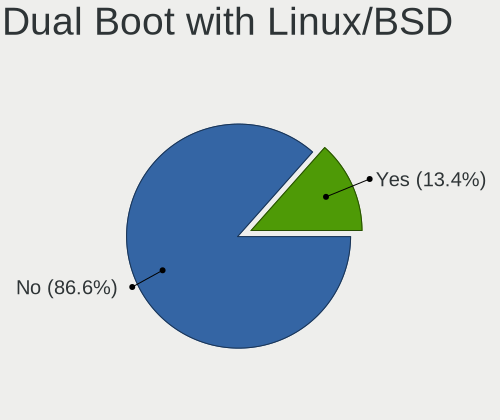
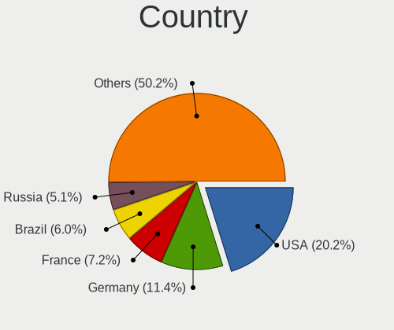
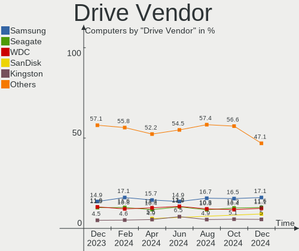
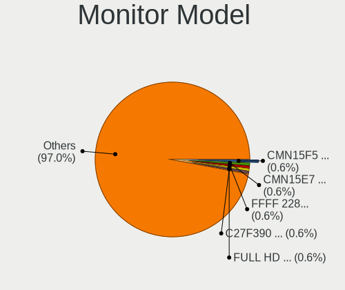

Ubuntu - Hardware Trends
------------------------

A project to identify most popular hardware characteristics and track their change
over time based on data collected by Linux users at https://Linux-Hardware.org.

Anyone can contribute to this report by the [hw-probe](https://github.com/linuxhw/hw-probe) tool:

    sudo -E hw-probe -all -upload

This is a report for all computer types. See also reports for [desktops](/Dist/Ubuntu/Desktop/README.md) and [notebooks](/Dist/Ubuntu/Notebook/README.md).

This report is for one last month. Overall report since the beginning of time: [TestCoverage](https://github.com/linuxhw/TestCoverage)

Period: Dec, 2022.

Contents
--------

* [ System ](#system)
  - [ OS                       ](#os)
  - [ OS Family                ](#os-family)
  - [ Kernel                   ](#kernel)
  - [ Kernel Family            ](#kernel-family)
  - [ Kernel Major Ver.        ](#kernel-major-ver)
  - [ Arch                     ](#arch)
  - [ DE                       ](#de)
  - [ Display Server           ](#display-server)
  - [ Display Manager          ](#display-manager)
  - [ OS Lang                  ](#os-lang)
  - [ Boot Mode                ](#boot-mode)
  - [ Filesystem               ](#filesystem)
  - [ Part. scheme             ](#part-scheme)
  - [ Dual Boot with Linux/BSD ](#dual-boot-with-linuxbsd)
  - [ Dual Boot (Win)          ](#dual-boot-win)

* [ Board ](#board)
  - [ Vendor                   ](#vendor)
  - [ Model                    ](#model)
  - [ Model Family             ](#model-family)
  - [ MFG Year                 ](#mfg-year)
  - [ Form Factor              ](#form-factor)
  - [ Secure Boot              ](#secure-boot)
  - [ Coreboot                 ](#coreboot)
  - [ RAM Size                 ](#ram-size)
  - [ RAM Used                 ](#ram-used)
  - [ Total Drives             ](#total-drives)
  - [ Has CD-ROM               ](#has-cd-rom)
  - [ Has Ethernet             ](#has-ethernet)
  - [ Has WiFi                 ](#has-wifi)
  - [ Has Bluetooth            ](#has-bluetooth)

* [ Location ](#location)
  - [ Country                  ](#country)
  - [ City                     ](#city)

* [ Drives ](#drives)
  - [ Drive Vendor             ](#drive-vendor)
  - [ Drive Model              ](#drive-model)
  - [ HDD Vendor               ](#hdd-vendor)
  - [ SSD Vendor               ](#ssd-vendor)
  - [ Drive Kind               ](#drive-kind)
  - [ Drive Connector          ](#drive-connector)
  - [ Drive Size               ](#drive-size)
  - [ Space Total              ](#space-total)
  - [ Space Used               ](#space-used)
  - [ Malfunc. Drives          ](#malfunc-drives)
  - [ Malfunc. Drive Vendor    ](#malfunc-drive-vendor)
  - [ Malfunc. HDD Vendor      ](#malfunc-hdd-vendor)
  - [ Malfunc. Drive Kind      ](#malfunc-drive-kind)
  - [ Failed Drives            ](#failed-drives)
  - [ Failed Drive Vendor      ](#failed-drive-vendor)
  - [ Drive Status             ](#drive-status)

* [ Storage controller ](#storage-controller)
  - [ Storage Vendor           ](#storage-vendor)
  - [ Storage Model            ](#storage-model)
  - [ Storage Kind             ](#storage-kind)

* [ Processor ](#processor)
  - [ CPU Vendor               ](#cpu-vendor)
  - [ CPU Model                ](#cpu-model)
  - [ CPU Model Family         ](#cpu-model-family)
  - [ CPU Cores                ](#cpu-cores)
  - [ CPU Sockets              ](#cpu-sockets)
  - [ CPU Threads              ](#cpu-threads)
  - [ CPU Op-Modes             ](#cpu-op-modes)
  - [ CPU Microcode            ](#cpu-microcode)
  - [ CPU Microarch            ](#cpu-microarch)

* [ Graphics ](#graphics)
  - [ GPU Vendor               ](#gpu-vendor)
  - [ GPU Model                ](#gpu-model)
  - [ GPU Combo                ](#gpu-combo)
  - [ GPU Driver               ](#gpu-driver)
  - [ GPU Memory               ](#gpu-memory)

* [ Monitor ](#monitor)
  - [ Monitor Vendor           ](#monitor-vendor)
  - [ Monitor Model            ](#monitor-model)
  - [ Monitor Resolution       ](#monitor-resolution)
  - [ Monitor Diagonal         ](#monitor-diagonal)
  - [ Monitor Width            ](#monitor-width)
  - [ Aspect Ratio             ](#aspect-ratio)
  - [ Monitor Area             ](#monitor-area)
  - [ Pixel Density            ](#pixel-density)
  - [ Multiple Monitors        ](#multiple-monitors)

* [ Network ](#network)
  - [ Net Controller Vendor    ](#net-controller-vendor)
  - [ Net Controller Model     ](#net-controller-model)
  - [ Wireless Vendor          ](#wireless-vendor)
  - [ Wireless Model           ](#wireless-model)
  - [ Ethernet Vendor          ](#ethernet-vendor)
  - [ Ethernet Model           ](#ethernet-model)
  - [ Net Controller Kind      ](#net-controller-kind)
  - [ Used Controller          ](#used-controller)
  - [ NICs                     ](#nics)
  - [ IPv6                     ](#ipv6)

* [ Bluetooth ](#bluetooth)
  - [ Bluetooth Vendor         ](#bluetooth-vendor)
  - [ Bluetooth Model          ](#bluetooth-model)

* [ Sound ](#sound)
  - [ Sound Vendor             ](#sound-vendor)
  - [ Sound Model              ](#sound-model)

* [ Memory ](#memory)
  - [ Memory Vendor            ](#memory-vendor)
  - [ Memory Model             ](#memory-model)
  - [ Memory Kind              ](#memory-kind)
  - [ Memory Form Factor       ](#memory-form-factor)
  - [ Memory Size              ](#memory-size)
  - [ Memory Speed             ](#memory-speed)

* [ Printers & scanners ](#printers--scanners)
  - [ Printer Vendor           ](#printer-vendor)
  - [ Printer Model            ](#printer-model)
  - [ Scanner Vendor           ](#scanner-vendor)
  - [ Scanner Model            ](#scanner-model)

* [ Camera ](#camera)
  - [ Camera Vendor            ](#camera-vendor)
  - [ Camera Model             ](#camera-model)

* [ Security ](#security)
  - [ Fingerprint Vendor       ](#fingerprint-vendor)
  - [ Fingerprint Model        ](#fingerprint-model)
  - [ Chipcard Vendor          ](#chipcard-vendor)
  - [ Chipcard Model           ](#chipcard-model)

* [ Unsupported ](#unsupported)
  - [ Unsupported Devices      ](#unsupported-devices)
  - [ Unsupported Device Types ](#unsupported-device-types)

System
------

OS
--

Installed operating systems

| Name           | Computers | Percent |
|----------------|-----------|---------|
| Ubuntu 22.04   | 836       | 64.76%  |
| Ubuntu 22.10   | 230       | 17.82%  |
| Ubuntu 20.04   | 171       | 13.25%  |
| Ubuntu 18.04   | 35        | 2.71%   |
| Ubuntu 23.04   | 8         | 0.62%   |
| Ubuntu 20.10   | 4         | 0.31%   |
| Ubuntu 16.04   | 4         | 0.31%   |
| Ubuntu Core 18 | 2         | 0.15%   |
| Ubuntu 21.04   | 1         | 0.08%   |

OS Family
---------

OS without a version

| Name   | Computers | Percent |
|--------|-----------|---------|
| Ubuntu | 1291      | 100%    |

Kernel
------

Version of the Linux kernel

| Version                  | Computers | Percent |
|--------------------------|-----------|---------|
| 5.15.0-56-generic        | 715       | 55.38%  |
| 5.19.0-26-generic        | 161       | 12.47%  |
| 5.15.0-53-generic        | 59        | 4.57%   |
| 5.15.0-43-generic        | 50        | 3.87%   |
| 5.15.0-57-generic        | 49        | 3.8%    |
| 5.4.0-135-generic        | 24        | 1.86%   |
| 5.19.0-21-generic        | 17        | 1.32%   |
| 5.19.0-23-generic        | 15        | 1.16%   |
| 6.0.9-060009-generic     | 14        | 1.08%   |
| 5.19.0-27-generic        | 13        | 1.01%   |
| 5.15.0-52-generic        | 13        | 1.01%   |
| 4.15.0-200-generic       | 12        | 0.93%   |
| 5.19.0-28-generic        | 11        | 0.85%   |
| 5.14.0-1054-oem          | 9         | 0.7%    |
| 5.15.0-46-generic        | 6         | 0.46%   |
| 5.4.0-132-generic        | 5         | 0.39%   |
| 5.15.0-48-generic        | 5         | 0.39%   |
| 5.17.0-1019-oem          | 4         | 0.31%   |
| 4.15.0-142-generic       | 4         | 0.31%   |
| 6.0.0-060000-generic     | 3         | 0.23%   |
| 5.8.0-25-generic         | 3         | 0.23%   |
| 5.19.0-1009-raspi        | 3         | 0.23%   |
| 5.15.0-54-generic        | 3         | 0.23%   |
| 4.15.0-197-generic       | 3         | 0.23%   |
| 5.8.0-43-generic         | 2         | 0.15%   |
| 5.4.0-86-generic         | 2         | 0.15%   |
| 5.4.0-52-generic         | 2         | 0.15%   |
| 5.4.0-107-generic        | 2         | 0.15%   |
| 5.19.0-24-generic        | 2         | 0.15%   |
| 5.18.10-76051810-generic | 2         | 0.15%   |
| 5.17.0-1020-oem          | 2         | 0.15%   |
| 5.15.0-1025-oracle       | 2         | 0.15%   |
| 5.15.0-051500-generic    | 2         | 0.15%   |
| 5.13.0-51-generic        | 2         | 0.15%   |
| 5.13.0-30-generic        | 2         | 0.15%   |
| 5.13.0-28-generic        | 2         | 0.15%   |
| 5.11.0-27-generic        | 2         | 0.15%   |
| 4.15.0-201-generic       | 2         | 0.15%   |
| 6.1.0-daily-20221223     | 1         | 0.08%   |
| 6.0.6-76060006-generic   | 1         | 0.08%   |

Kernel Family
-------------

Linux kernel without a distro release

| Version  | Computers | Percent |
|----------|-----------|---------|
| 5.15.0   | 917       | 71.03%  |
| 5.19.0   | 224       | 17.35%  |
| 5.4.0    | 43        | 3.33%   |
| 4.15.0   | 24        | 1.86%   |
| 6.0.9    | 14        | 1.08%   |
| 5.14.0   | 12        | 0.93%   |
| 5.13.0   | 11        | 0.85%   |
| 5.8.0    | 8         | 0.62%   |
| 5.17.0   | 7         | 0.54%   |
| 6.0.0    | 5         | 0.39%   |
| 5.11.0   | 5         | 0.39%   |
| 5.18.10  | 3         | 0.23%   |
| 6.1.0    | 1         | 0.08%   |
| 6.0.6    | 1         | 0.08%   |
| 6.0.15   | 1         | 0.08%   |
| 6.0.13   | 1         | 0.08%   |
| 6.0.12   | 1         | 0.08%   |
| 6.0.11   | 1         | 0.08%   |
| 6.0.1    | 1         | 0.08%   |
| 5.19.5   | 1         | 0.08%   |
| 5.19.17  | 1         | 0.08%   |
| 5.18.19  | 1         | 0.08%   |
| 5.17.15  | 1         | 0.08%   |
| 5.15.80  | 1         | 0.08%   |
| 5.15.45  | 1         | 0.08%   |
| 5.13.19  | 1         | 0.08%   |
| 5.10.104 | 1         | 0.08%   |
| 4.4.194  | 1         | 0.08%   |
| 4.18.0   | 1         | 0.08%   |
| 3.16.85  | 1         | 0.08%   |

Kernel Major Ver.
-----------------

Linux kernel major version

| Version | Computers | Percent |
|---------|-----------|---------|
| 5.15    | 919       | 71.19%  |
| 5.19    | 226       | 17.51%  |
| 5.4     | 43        | 3.33%   |
| 6.0     | 25        | 1.94%   |
| 4.15    | 24        | 1.86%   |
| 5.14    | 12        | 0.93%   |
| 5.13    | 12        | 0.93%   |
| 5.8     | 8         | 0.62%   |
| 5.17    | 8         | 0.62%   |
| 5.11    | 5         | 0.39%   |
| 5.18    | 4         | 0.31%   |
| 6.1     | 1         | 0.08%   |
| 5.10    | 1         | 0.08%   |
| 4.4     | 1         | 0.08%   |
| 4.18    | 1         | 0.08%   |
| 3.16    | 1         | 0.08%   |

Arch
----

OS architecture (x86_64, i586, etc.)

| Name    | Computers | Percent |
|---------|-----------|---------|
| x86_64  | 1274      | 98.68%  |
| aarch64 | 10        | 0.77%   |
| i686    | 6         | 0.46%   |
| armv7l  | 1         | 0.08%   |

DE
--

Desktop Environment

| Name            | Computers | Percent |
|-----------------|-----------|---------|
| GNOME           | 1207      | 93.49%  |
| Unknown         | 59        | 4.57%   |
| X-Cinnamon      | 12        | 0.93%   |
| GNOME Flashback | 4         | 0.31%   |
| Enlightenment   | 3         | 0.23%   |
| GNOME Classic   | 2         | 0.15%   |
| sway            | 1         | 0.08%   |
| i3              | 1         | 0.08%   |
| Cinnamon        | 1         | 0.08%   |
| awesome         | 1         | 0.08%   |

Display Server
--------------

X11 or Wayland

| Name    | Computers | Percent |
|---------|-----------|---------|
| Wayland | 705       | 54.61%  |
| X11     | 513       | 39.74%  |
| Tty     | 41        | 3.18%   |
| Unknown | 32        | 2.48%   |

Display Manager
---------------

SDDM, LightDM, etc.

| Name    | Computers | Percent |
|---------|-----------|---------|
| GDM3    | 1095      | 84.82%  |
| Unknown | 104       | 8.06%   |
| GDM     | 73        | 5.65%   |
| LightDM | 14        | 1.08%   |
| SDDM    | 3         | 0.23%   |
| SLiM    | 2         | 0.15%   |

OS Lang
-------

Language

| Lang    | Computers | Percent |
|---------|-----------|---------|
| en_US   | 586       | 45.39%  |
| de_DE   | 121       | 9.37%   |
| fr_FR   | 73        | 5.65%   |
| en_GB   | 52        | 4.03%   |
| ru_RU   | 50        | 3.87%   |
| pt_BR   | 47        | 3.64%   |
| it_IT   | 44        | 3.41%   |
| en_IN   | 36        | 2.79%   |
| en_CA   | 30        | 2.32%   |
| es_ES   | 24        | 1.86%   |
| pl_PL   | 18        | 1.39%   |
| C       | 17        | 1.32%   |
| Unknown | 16        | 1.24%   |
| en_AU   | 15        | 1.16%   |
| nl_NL   | 13        | 1.01%   |
| cs_CZ   | 11        | 0.85%   |
| zh_CN   | 9         | 0.7%    |
| en_ZA   | 9         | 0.7%    |
| de_CH   | 9         | 0.7%    |
| ja_JP   | 7         | 0.54%   |
| de_AT   | 7         | 0.54%   |
| pt_PT   | 6         | 0.46%   |
| ko_KR   | 5         | 0.39%   |
| en_NZ   | 5         | 0.39%   |
| tr_TR   | 4         | 0.31%   |
| sv_SE   | 4         | 0.31%   |
| nl_BE   | 4         | 0.31%   |
| es_BO   | 4         | 0.31%   |
| es_AR   | 4         | 0.31%   |
| bg_BG   | 4         | 0.31%   |
| hu_HU   | 3         | 0.23%   |
| fr_CA   | 3         | 0.23%   |
| fr_BE   | 3         | 0.23%   |
| es_US   | 3         | 0.23%   |
| es_MX   | 3         | 0.23%   |
| es_CL   | 3         | 0.23%   |
| en_SG   | 3         | 0.23%   |
| en_PH   | 3         | 0.23%   |
| el_GR   | 3         | 0.23%   |
| ro_RO   | 2         | 0.15%   |

Boot Mode
---------

EFI or BIOS

| Mode | Computers | Percent |
|------|-----------|---------|
| BIOS | 791       | 61.27%  |
| EFI  | 500       | 38.73%  |

Filesystem
----------

Type of filesystem

| Type    | Computers | Percent |
|---------|-----------|---------|
| Ext4    | 1202      | 93.11%  |
| Zfs     | 33        | 2.56%   |
| Overlay | 31        | 2.4%    |
| Btrfs   | 19        | 1.47%   |
| Ext3    | 3         | 0.23%   |
| Xfs     | 2         | 0.15%   |
| F2fs    | 1         | 0.08%   |

Part. scheme
------------

Scheme of partitioning

| Type    | Computers | Percent |
|---------|-----------|---------|
| GPT     | 1048      | 81.18%  |
| MBR     | 187       | 14.48%  |
| Unknown | 56        | 4.34%   |

Dual Boot with Linux/BSD
------------------------

Hosting more than one Linux/BSD

| Dual boot | Computers | Percent |
|-----------|-----------|---------|
| No        | 1140      | 88.3%   |
| Yes       | 151       | 11.7%   |

Dual Boot (Win)
---------------

Hosting Linux and Windows

| Dual boot | Computers | Percent |
|-----------|-----------|---------|
| No        | 790       | 61.19%  |
| Yes       | 501       | 38.81%  |

Board
-----

Vendor
------

Motherboard manufacturer

| Name                           | Computers | Percent |
|--------------------------------|-----------|---------|
| ASUSTek Computer               | 201       | 15.57%  |
| Hewlett-Packard                | 196       | 15.18%  |
| Dell                           | 186       | 14.41%  |
| Lenovo                         | 172       | 13.32%  |
| MSI                            | 79        | 6.12%   |
| Gigabyte Technology            | 71        | 5.5%    |
| Acer                           | 70        | 5.42%   |
| ASRock                         | 42        | 3.25%   |
| Apple                          | 24        | 1.86%   |
| Intel                          | 22        | 1.7%    |
| Toshiba                        | 16        | 1.24%   |
| Samsung Electronics            | 15        | 1.16%   |
| HUAWEI                         | 14        | 1.08%   |
| Unknown                        | 14        | 1.08%   |
| Fujitsu                        | 13        | 1.01%   |
| Medion                         | 9         | 0.7%    |
| Alienware                      | 8         | 0.62%   |
| Notebook                       | 7         | 0.54%   |
| Microsoft                      | 6         | 0.46%   |
| LG Electronics                 | 6         | 0.46%   |
| Timi                           | 5         | 0.39%   |
| System76                       | 5         | 0.39%   |
| Supermicro                     | 5         | 0.39%   |
| Raspberry Pi Foundation        | 5         | 0.39%   |
| Google                         | 5         | 0.39%   |
| BESSTAR Tech                   | 5         | 0.39%   |
| Razer                          | 4         | 0.31%   |
| Pegatron                       | 4         | 0.31%   |
| Gateway                        | 4         | 0.31%   |
| Foxconn                        | 4         | 0.31%   |
| Teclast                        | 3         | 0.23%   |
| Sony                           | 3         | 0.23%   |
| Shanghai Zhaoxin Semiconductor | 3         | 0.23%   |
| Packard Bell                   | 3         | 0.23%   |
| GPU Company                    | 3         | 0.23%   |
| AZW                            | 3         | 0.23%   |
| ZOTAC                          | 2         | 0.15%   |
| Schenker                       | 2         | 0.15%   |
| Positivo Bahia - VAIO          | 2         | 0.15%   |
| Positivo                       | 2         | 0.15%   |

Model
-----

Motherboard model

| Name                               | Computers | Percent |
|------------------------------------|-----------|---------|
| Unknown                            | 18        | 1.39%   |
| ASUS All Series                    | 11        | 0.85%   |
| ASUS TUF Gaming X570-PLUS          | 6         | 0.46%   |
| ASUS PRIME A320M-K                 | 5         | 0.39%   |
| MSI MS-7B86                        | 4         | 0.31%   |
| HP OMEN by Laptop 16-c0xxx         | 4         | 0.31%   |
| HP EliteBook 8470p                 | 4         | 0.31%   |
| Gigabyte B75M-D3H                  | 4         | 0.31%   |
| Dell Vostro 3500                   | 4         | 0.31%   |
| Dell OptiPlex 7010                 | 4         | 0.31%   |
| Razer Blade 17 (2022) - RZ09-0423  | 3         | 0.23%   |
| HUAWEI BOHB-WAX9                   | 3         | 0.23%   |
| HP ProBook 440 G8 Notebook PC      | 3         | 0.23%   |
| HP Pavilion dv6                    | 3         | 0.23%   |
| HP EliteBook 840 G8 Notebook PC    | 3         | 0.23%   |
| HP 255 G8 Notebook PC              | 3         | 0.23%   |
| Gigabyte B450M DS3H                | 3         | 0.23%   |
| Gigabyte 970A-UD3P                 | 3         | 0.23%   |
| Dell XPS 15 9520                   | 3         | 0.23%   |
| Dell XPS 13 9365                   | 3         | 0.23%   |
| Dell Vostro 5490                   | 3         | 0.23%   |
| Dell Precision T3600               | 3         | 0.23%   |
| Dell OptiPlex 990                  | 3         | 0.23%   |
| Dell OptiPlex 790                  | 3         | 0.23%   |
| Dell OptiPlex 3020                 | 3         | 0.23%   |
| ASUS PRIME B450M-GAMING/BR         | 3         | 0.23%   |
| ASUS M5A78L-M/USB3                 | 3         | 0.23%   |
| Timi TM1701                        | 2         | 0.15%   |
| System76 Oryx Pro                  | 2         | 0.15%   |
| Shanghai Zhaoxin ZXE CRB           | 2         | 0.15%   |
| Schenker VISION 15 (SVS15E21)      | 2         | 0.15%   |
| Samsung 530U3C/530U4C/532U3C       | 2         | 0.15%   |
| RPi Raspberry Pi 4 Model B Rev 1.4 | 2         | 0.15%   |
| MSI MS-7D46                        | 2         | 0.15%   |
| MSI MS-7C80                        | 2         | 0.15%   |
| MSI MS-7C56                        | 2         | 0.15%   |
| MSI MS-7C09                        | 2         | 0.15%   |
| MSI MS-7B49                        | 2         | 0.15%   |
| MSI MS-7B09                        | 2         | 0.15%   |
| MSI MS-7A70                        | 2         | 0.15%   |

Model Family
------------

Motherboard model prefix

| Name               | Computers | Percent |
|--------------------|-----------|---------|
| Lenovo ThinkPad    | 70        | 5.42%   |
| Acer Aspire        | 42        | 3.25%   |
| Dell Latitude      | 40        | 3.1%    |
| Dell Inspiron      | 40        | 3.1%    |
| HP EliteBook       | 36        | 2.79%   |
| Dell OptiPlex      | 28        | 2.17%   |
| ASUS PRIME         | 27        | 2.09%   |
| HP Pavilion        | 26        | 2.01%   |
| Dell XPS           | 25        | 1.94%   |
| Dell Vostro        | 23        | 1.78%   |
| Lenovo IdeaPad     | 22        | 1.7%    |
| ASUS ROG           | 22        | 1.7%    |
| ASUS VivoBook      | 19        | 1.47%   |
| HP Laptop          | 18        | 1.39%   |
| Unknown            | 18        | 1.39%   |
| Dell Precision     | 17        | 1.32%   |
| ASUS TUF           | 15        | 1.16%   |
| HP ProBook         | 14        | 1.08%   |
| HP Compaq          | 12        | 0.93%   |
| Lenovo ThinkCentre | 11        | 0.85%   |
| ASUS All           | 11        | 0.85%   |
| HP ENVY            | 10        | 0.77%   |
| Toshiba Satellite  | 9         | 0.7%    |
| ASUS ZenBook       | 9         | 0.7%    |
| Acer Swift         | 9         | 0.7%    |
| Lenovo Yoga        | 8         | 0.62%   |
| Lenovo ThinkBook   | 8         | 0.62%   |
| Lenovo Legion      | 7         | 0.54%   |
| HP ProLiant        | 7         | 0.54%   |
| Microsoft Surface  | 6         | 0.46%   |
| Lenovo IdeaPadFlex | 6         | 0.46%   |
| Lenovo IdeaCentre  | 6         | 0.46%   |
| RPi Raspberry      | 5         | 0.39%   |
| HP ZBook           | 5         | 0.39%   |
| HP Stream          | 5         | 0.39%   |
| HP Spectre         | 5         | 0.39%   |
| HP ProDesk         | 5         | 0.39%   |
| HP OMEN            | 5         | 0.39%   |
| Fujitsu LIFEBOOK   | 5         | 0.39%   |
| Dell PowerEdge     | 5         | 0.39%   |

MFG Year
--------

Motherboard manufacture year

| Year    | Computers | Percent |
|---------|-----------|---------|
| 2021    | 160       | 12.39%  |
| 2022    | 117       | 9.06%   |
| 2020    | 115       | 8.91%   |
| 2019    | 107       | 8.29%   |
| 2013    | 97        | 7.51%   |
| 2017    | 90        | 6.97%   |
| 2018    | 88        | 6.82%   |
| 2012    | 86        | 6.66%   |
| 2011    | 76        | 5.89%   |
| 2015    | 70        | 5.42%   |
| 2014    | 68        | 5.27%   |
| 2010    | 57        | 4.42%   |
| 2016    | 56        | 4.34%   |
| 2009    | 43        | 3.33%   |
| 2008    | 28        | 2.17%   |
| 2007    | 14        | 1.08%   |
| Unknown | 9         | 0.7%    |
| 2006    | 7         | 0.54%   |
| 2005    | 2         | 0.15%   |
| 2002    | 1         | 0.08%   |

Form Factor
-----------

Physical design of the computer

| Name           | Computers | Percent |
|----------------|-----------|---------|
| Notebook       | 672       | 52.05%  |
| Desktop        | 490       | 37.96%  |
| Convertible    | 42        | 3.25%   |
| Mini pc        | 27        | 2.09%   |
| All in one     | 22        | 1.7%    |
| Tablet         | 15        | 1.16%   |
| Server         | 12        | 0.93%   |
| System on chip | 11        | 0.85%   |

Secure Boot
-----------

Enabled or disabled

| State    | Computers | Percent |
|----------|-----------|---------|
| Disabled | 1180      | 91.4%   |
| Enabled  | 111       | 8.6%    |

Coreboot
--------

Have coreboot on board

| Used | Computers | Percent |
|------|-----------|---------|
| No   | 1285      | 99.54%  |
| Yes  | 6         | 0.46%   |

RAM Size
--------

Total RAM memory

| Size in GB      | Computers | Percent |
|-----------------|-----------|---------|
| 4.01-8.0        | 305       | 23.63%  |
| 16.01-24.0      | 285       | 22.08%  |
| 3.01-4.0        | 212       | 16.42%  |
| 8.01-16.0       | 209       | 16.19%  |
| 32.01-64.0      | 162       | 12.55%  |
| 64.01-256.0     | 45        | 3.49%   |
| 1.01-2.0        | 28        | 2.17%   |
| 24.01-32.0      | 24        | 1.86%   |
| 2.01-3.0        | 9         | 0.7%    |
| More than 256.0 | 6         | 0.46%   |
| 0.51-1.0        | 5         | 0.39%   |
| 0.01-0.5        | 1         | 0.08%   |

RAM Used
--------

Used RAM memory

| Used GB     | Computers | Percent |
|-------------|-----------|---------|
| 2.01-3.0    | 418       | 32.38%  |
| 1.01-2.0    | 359       | 27.81%  |
| 4.01-8.0    | 218       | 16.89%  |
| 3.01-4.0    | 180       | 13.94%  |
| 8.01-16.0   | 66        | 5.11%   |
| 0.51-1.0    | 26        | 2.01%   |
| 16.01-24.0  | 10        | 0.77%   |
| 0.01-0.5    | 8         | 0.62%   |
| 32.01-64.0  | 3         | 0.23%   |
| 24.01-32.0  | 2         | 0.15%   |
| 64.01-256.0 | 1         | 0.08%   |

Total Drives
------------

Number of drives on board

| Drives | Computers | Percent |
|--------|-----------|---------|
| 1      | 791       | 61.27%  |
| 2      | 317       | 24.55%  |
| 3      | 79        | 6.12%   |
| 4      | 47        | 3.64%   |
| 5      | 23        | 1.78%   |
| 6      | 10        | 0.77%   |
| 7      | 9         | 0.7%    |
| 0      | 4         | 0.31%   |
| 9      | 3         | 0.23%   |
| 11     | 2         | 0.15%   |
| 10     | 2         | 0.15%   |
| 8      | 2         | 0.15%   |
| 32     | 1         | 0.08%   |
| 12     | 1         | 0.08%   |

Has CD-ROM
----------

Has CD-ROM on board

| Presented | Computers | Percent |
|-----------|-----------|---------|
| No        | 832       | 64.45%  |
| Yes       | 459       | 35.55%  |

Has Ethernet
------------

Has Ethernet on board

| Presented | Computers | Percent |
|-----------|-----------|---------|
| Yes       | 1079      | 83.58%  |
| No        | 212       | 16.42%  |

Has WiFi
--------

Has WiFi module

| Presented | Computers | Percent |
|-----------|-----------|---------|
| Yes       | 984       | 76.22%  |
| No        | 307       | 23.78%  |

Has Bluetooth
-------------

Has Bluetooth module

| Presented | Computers | Percent |
|-----------|-----------|---------|
| Yes       | 819       | 63.44%  |
| No        | 472       | 36.56%  |

Location
--------

Country
-------

Geographic location (country)

| Country      | Computers | Percent |
|--------------|-----------|---------|
| USA          | 255       | 19.75%  |
| Germany      | 158       | 12.24%  |
| France       | 89        | 6.89%   |
| Russia       | 62        | 4.8%    |
| Brazil       | 59        | 4.57%   |
| Italy        | 56        | 4.34%   |
| Canada       | 45        | 3.49%   |
| UK           | 44        | 3.41%   |
| India        | 37        | 2.87%   |
| Poland       | 35        | 2.71%   |
| Spain        | 33        | 2.56%   |
| Netherlands  | 25        | 1.94%   |
| China        | 19        | 1.47%   |
| Austria      | 18        | 1.39%   |
| Switzerland  | 17        | 1.32%   |
| Sweden       | 17        | 1.32%   |
| Czechia      | 16        | 1.24%   |
| Australia    | 15        | 1.16%   |
| Belgium      | 14        | 1.08%   |
| Serbia       | 13        | 1.01%   |
| Greece       | 13        | 1.01%   |
| Bulgaria     | 13        | 1.01%   |
| Japan        | 12        | 0.93%   |
| Indonesia    | 12        | 0.93%   |
| South Korea  | 11        | 0.85%   |
| Turkey       | 10        | 0.77%   |
| South Africa | 10        | 0.77%   |
| Portugal     | 10        | 0.77%   |
| Romania      | 8         | 0.62%   |
| New Zealand  | 8         | 0.62%   |
| Mexico       | 8         | 0.62%   |
| Hungary      | 8         | 0.62%   |
| Norway       | 7         | 0.54%   |
| Denmark      | 7         | 0.54%   |
| Iran         | 6         | 0.46%   |
| Argentina    | 6         | 0.46%   |
| Thailand     | 5         | 0.39%   |
| Chile        | 5         | 0.39%   |
| Sri Lanka    | 4         | 0.31%   |
| Pakistan     | 4         | 0.31%   |

City
----

Geographic location (city)

| City          | Computers | Percent |
|---------------|-----------|---------|
| Moscow        | 18        | 1.39%   |
| Vienna        | 12        | 0.93%   |
| Paris         | 12        | 0.93%   |
| Milan         | 12        | 0.93%   |
| Hamburg       | 12        | 0.93%   |
| Berlin        | 12        | 0.93%   |
| Seattle       | 8         | 0.62%   |
| London        | 8         | 0.62%   |
| Madrid        | 7         | 0.54%   |
| Bengaluru     | 7         | 0.54%   |
| Warsaw        | 6         | 0.46%   |
| Stuttgart     | 6         | 0.46%   |
| St Petersburg | 6         | 0.46%   |
| Sofia         | 6         | 0.46%   |
| Rome          | 6         | 0.46%   |
| Novosibirsk   | 6         | 0.46%   |
| New York      | 6         | 0.46%   |
| Munich        | 6         | 0.46%   |
| Belgrade      | 6         | 0.46%   |
| Toronto       | 5         | 0.39%   |
| Tehran        | 5         | 0.39%   |
| Sydney        | 5         | 0.39%   |
| Sao Paulo     | 5         | 0.39%   |
| Chicago       | 5         | 0.39%   |
| Wroclaw       | 4         | 0.31%   |
| Vancouver     | 4         | 0.31%   |
| Uiwang        | 4         | 0.31%   |
| Prague        | 4         | 0.31%   |
| Milwaukee     | 4         | 0.31%   |
| Los Angeles   | 4         | 0.31%   |
| Leipzig       | 4         | 0.31%   |
| Krasnodar     | 4         | 0.31%   |
| Jakarta       | 4         | 0.31%   |
| Chennai       | 4         | 0.31%   |
| Budapest      | 4         | 0.31%   |
| Bogotá       | 4         | 0.31%   |
| Athens        | 4         | 0.31%   |
| Unknown       | 4         | 0.31%   |
| Tampa         | 3         | 0.23%   |
| Syosset       | 3         | 0.23%   |

Drives
------

Drive Vendor
------------

Hard drive vendors

| Vendor                      | Computers | Drives | Percent |
|-----------------------------|-----------|--------|---------|
| Samsung Electronics         | 330       | 393    | 17.7%   |
| WDC                         | 256       | 333    | 13.73%  |
| Seagate                     | 240       | 333    | 12.88%  |
| Toshiba                     | 108       | 125    | 5.79%   |
| SanDisk                     | 91        | 103    | 4.88%   |
| Kingston                    | 89        | 98     | 4.77%   |
| Unknown                     | 71        | 82     | 3.81%   |
| Crucial                     | 68        | 77     | 3.65%   |
| Intel                       | 61        | 71     | 3.27%   |
| Hitachi                     | 52        | 55     | 2.79%   |
| SK hynix                    | 48        | 49     | 2.58%   |
| Micron Technology           | 37        | 38     | 1.98%   |
| A-DATA Technology           | 37        | 40     | 1.98%   |
| HGST                        | 30        | 38     | 1.61%   |
| China                       | 22        | 25     | 1.18%   |
| KIOXIA                      | 20        | 20     | 1.07%   |
| Silicon Motion              | 19        | 19     | 1.02%   |
| Phison Electronics          | 17        | 20     | 0.91%   |
| SPCC                        | 14        | 15     | 0.75%   |
| Apple                       | 14        | 16     | 0.75%   |
| Unknown                     | 13        | 15     | 0.7%    |
| Kingston Technology Company | 12        | 12     | 0.64%   |
| Micron/Crucial Technology   | 11        | 11     | 0.59%   |
| Intenso                     | 11        | 12     | 0.59%   |
| Team                        | 8         | 9      | 0.43%   |
| PNY                         | 8         | 9      | 0.43%   |
| Phison                      | 8         | 10     | 0.43%   |
| LITEON                      | 8         | 8      | 0.43%   |
| Hewlett-Packard             | 8         | 8      | 0.43%   |
| Patriot                     | 7         | 7      | 0.38%   |
| Maxtor                      | 6         | 6      | 0.32%   |
| ADATA Technology            | 6         | 7      | 0.32%   |
| SSSTC                       | 5         | 5      | 0.27%   |
| Lexar                       | 5         | 5      | 0.27%   |
| JMicron Technology          | 5         | 5      | 0.27%   |
| Verbatim                    | 4         | 4      | 0.21%   |
| KingSpec                    | 4         | 4      | 0.21%   |
| GOODRAM                     | 4         | 4      | 0.21%   |
| Corsair                     | 4         | 5      | 0.21%   |
| Apacer                      | 4         | 4      | 0.21%   |

Drive Model
-----------

Hard drive models

| Model                                                  | Computers | Percent |
|--------------------------------------------------------|-----------|---------|
| Samsung NVMe SSD Controller SM981/PM981/PM983 500GB    | 42        | 2.06%   |
| Samsung NVMe SSD Controller PM9A1/PM9A3/980PRO 2TB     | 24        | 1.18%   |
| Kingston SA400S37240G 240GB SSD                        | 21        | 1.03%   |
| Samsung SSD 850 EVO 500GB                              | 19        | 0.93%   |
| Crucial CT240BX500SSD1 240GB                           | 16        | 0.78%   |
| Seagate ST500DM002-1BD142 500GB                        | 15        | 0.74%   |
| Unknown                                                | 13        | 0.64%   |
| Unknown MMC Card  64GB                                 | 12        | 0.59%   |
| Toshiba MQ01ABD100 1TB                                 | 12        | 0.59%   |
| Seagate ST1000DM010-2EP102 1TB                         | 12        | 0.59%   |
| Samsung SSD 860 EVO 500GB                              | 12        | 0.59%   |
| Samsung SSD 850 EVO 250GB                              | 12        | 0.59%   |
| Unknown MMC Card  32GB                                 | 11        | 0.54%   |
| WDC WD10EZEX-08WN4A0 1TB                               | 10        | 0.49%   |
| Toshiba MQ01ABF050 500GB                               | 10        | 0.49%   |
| Silicon Motion SM2263EN/SM2263XT SSD Controller 1024GB | 10        | 0.49%   |
| Seagate ST1000LM035-1RK172 1TB                         | 9         | 0.44%   |
| Kingston SA400S37480G 480GB SSD                        | 9         | 0.44%   |
| Intel SSD 660P Series 1024GB                           | 9         | 0.44%   |
| Unknown SD/MMC/MS PRO 64GB                             | 8         | 0.39%   |
| KIOXIA KBG40ZNS512G NVMe 512GB                         | 8         | 0.39%   |
| Crucial CT1000MX500SSD1 1TB                            | 8         | 0.39%   |
| WDC WDS240G2G0A-00JH30 240GB SSD                       | 7         | 0.34%   |
| Toshiba DT01ACA100 1TB                                 | 7         | 0.34%   |
| Seagate ST4000DM004-2CV104 4TB                         | 7         | 0.34%   |
| Seagate Expansion Desk 5TB                             | 7         | 0.34%   |
| Samsung SSD 980 500GB                                  | 7         | 0.34%   |
| Samsung NVMe SSD Controller SM961/PM961/SM963 256GB    | 7         | 0.34%   |
| Micron/Crucial P2 NVMe PCIe SSD 500GB                  | 7         | 0.34%   |
| HGST HTS541010A9E680 1TB                               | 7         | 0.34%   |
| Crucial CT1000BX500SSD1 1TB                            | 7         | 0.34%   |
| A-DATA SU650 120GB SSD                                 | 7         | 0.34%   |
| WDC WDS500G2B0A-00SM50 500GB SSD                       | 6         | 0.29%   |
| Unknown MMC Card  128GB                                | 6         | 0.29%   |
| Toshiba XG6 NVMe SSD Controller 256GB                  | 6         | 0.29%   |
| Toshiba MQ04ABF100 1TB                                 | 6         | 0.29%   |
| Seagate ST500LT012-1DG142 500GB                        | 6         | 0.29%   |
| Seagate ST500LM012 HN-M500MBB 500GB                    | 6         | 0.29%   |
| Seagate ST1000DM003-1CH162 1TB                         | 6         | 0.29%   |
| Seagate Expansion 4TB                                  | 6         | 0.29%   |

HDD Vendor
----------

Hard disk drive vendors

| Vendor              | Computers | Drives | Percent |
|---------------------|-----------|--------|---------|
| Seagate             | 233       | 321    | 35.09%  |
| WDC                 | 195       | 260    | 29.37%  |
| Toshiba             | 84        | 99     | 12.65%  |
| Hitachi             | 52        | 55     | 7.83%   |
| Samsung Electronics | 36        | 38     | 5.42%   |
| HGST                | 29        | 36     | 4.37%   |
| Unknown             | 9         | 10     | 1.36%   |
| Maxtor              | 6         | 6      | 0.9%    |
| Apple               | 6         | 6      | 0.9%    |
| Hewlett-Packard     | 3         | 3      | 0.45%   |
| ASMT                | 3         | 3      | 0.45%   |
| Intenso             | 2         | 2      | 0.3%    |
| WD MediaMax         | 1         | 1      | 0.15%   |
| MARSHAL             | 1         | 1      | 0.15%   |
| HGST HTS            | 1         | 1      | 0.15%   |
| Fujitsu             | 1         | 1      | 0.15%   |
| ASMedia             | 1         | 1      | 0.15%   |
| Unknown             | 1         | 2      | 0.15%   |

SSD Vendor
----------

Solid state drive vendors

| Vendor              | Computers | Drives | Percent |
|---------------------|-----------|--------|---------|
| Samsung Electronics | 125       | 137    | 21.26%  |
| Kingston            | 69        | 77     | 11.73%  |
| Crucial             | 59        | 66     | 10.03%  |
| SanDisk             | 54        | 60     | 9.18%   |
| WDC                 | 42        | 44     | 7.14%   |
| A-DATA Technology   | 26        | 29     | 4.42%   |
| China               | 22        | 25     | 3.74%   |
| Intel               | 15        | 16     | 2.55%   |
| SPCC                | 13        | 14     | 2.21%   |
| SK hynix            | 11        | 11     | 1.87%   |
| Micron Technology   | 10        | 10     | 1.7%    |
| LITEON              | 8         | 8      | 1.36%   |
| Toshiba             | 7         | 7      | 1.19%   |
| Team                | 7         | 8      | 1.19%   |
| Unknown             | 7         | 7      | 1.19%   |
| PNY                 | 6         | 6      | 1.02%   |
| Patriot             | 6         | 6      | 1.02%   |
| Intenso             | 6         | 6      | 1.02%   |
| Hewlett-Packard     | 5         | 5      | 0.85%   |
| Verbatim            | 4         | 4      | 0.68%   |
| Seagate             | 4         | 4      | 0.68%   |
| KingSpec            | 4         | 4      | 0.68%   |
| JMicron Technology  | 4         | 4      | 0.68%   |
| GOODRAM             | 4         | 4      | 0.68%   |
| Apple               | 4         | 4      | 0.68%   |
| Apacer              | 4         | 4      | 0.68%   |
| Transcend           | 3         | 3      | 0.51%   |
| Teclast             | 3         | 3      | 0.51%   |
| SSSTC               | 3         | 3      | 0.51%   |
| OCZ                 | 3         | 3      | 0.51%   |
| OSCOO               | 2         | 2      | 0.34%   |
| Mushkin             | 2         | 2      | 0.34%   |
| Lexar               | 2         | 2      | 0.34%   |
| KIOXIA-EXCERIA      | 2         | 2      | 0.34%   |
| KingDian            | 2         | 2      | 0.34%   |
| Gigabyte Technology | 2         | 2      | 0.34%   |
| FORESEE             | 2         | 2      | 0.34%   |
| Corsair             | 2         | 2      | 0.34%   |
| BAITITON            | 2         | 2      | 0.34%   |
| W800SH              | 1         | 1      | 0.17%   |

Drive Kind
----------

HDD or SSD

| Kind    | Computers | Drives | Percent |
|---------|-----------|--------|---------|
| HDD     | 546       | 846    | 32.35%  |
| NVMe    | 535       | 614    | 31.69%  |
| SSD     | 516       | 633    | 30.57%  |
| MMC     | 58        | 67     | 3.44%   |
| Unknown | 33        | 41     | 1.95%   |

Drive Connector
---------------

SATA, SAS, NVMe, etc.

| Type | Computers | Drives | Percent |
|------|-----------|--------|---------|
| SATA | 864       | 1409   | 56.14%  |
| NVMe | 533       | 610    | 34.63%  |
| SAS  | 84        | 115    | 5.46%   |
| MMC  | 58        | 67     | 3.77%   |

Drive Size
----------

Size of hard drive

| Size in TB | Computers | Drives | Percent |
|------------|-----------|--------|---------|
| 0.01-0.5   | 619       | 768    | 54.39%  |
| 0.51-1.0   | 319       | 382    | 28.03%  |
| 1.01-2.0   | 94        | 120    | 8.26%   |
| 3.01-4.0   | 54        | 86     | 4.75%   |
| 4.01-10.0  | 26        | 70     | 2.28%   |
| 2.01-3.0   | 16        | 28     | 1.41%   |
| 10.01-20.0 | 10        | 25     | 0.88%   |

Space Total
-----------

Amount of disk space available on the file system

| Size in GB     | Computers | Percent |
|----------------|-----------|---------|
| 101-250        | 361       | 27.96%  |
| 251-500        | 322       | 24.94%  |
| 501-1000       | 214       | 16.58%  |
| 1001-2000      | 93        | 7.2%    |
| 51-100         | 81        | 6.27%   |
| More than 3000 | 70        | 5.42%   |
| 1-20           | 55        | 4.26%   |
| 21-50          | 49        | 3.8%    |
| 2001-3000      | 24        | 1.86%   |
| Unknown        | 22        | 1.7%    |

Space Used
----------

Amount of used disk space

| Used GB        | Computers | Percent |
|----------------|-----------|---------|
| 1-20           | 446       | 34.55%  |
| 21-50          | 246       | 19.05%  |
| 51-100         | 177       | 13.71%  |
| 101-250        | 175       | 13.56%  |
| 251-500        | 91        | 7.05%   |
| 501-1000       | 65        | 5.03%   |
| 1001-2000      | 33        | 2.56%   |
| More than 3000 | 27        | 2.09%   |
| Unknown        | 22        | 1.7%    |
| 2001-3000      | 9         | 0.7%    |

Malfunc. Drives
---------------

Drive models with a malfunction

| Model                                 | Computers | Drives | Percent |
|---------------------------------------|-----------|--------|---------|
| WDC WDS240G2G0A-00JH30 240GB SSD      | 2         | 2      | 2.94%   |
| SanDisk SSD PLUS 480GB                | 2         | 2      | 2.94%   |
| Apple HDD HTS541010A9E662 1TB         | 2         | 2      | 2.94%   |
| WDC WDS480G2G0A-00JH30 480GB SSD      | 1         | 1      | 1.47%   |
| WDC WDS240G2G0B-00EPW0 240GB SSD      | 1         | 1      | 1.47%   |
| WDC WDS120G2G0A-00JH30 120GB SSD      | 1         | 1      | 1.47%   |
| WDC WD5000AAKX-001CA0 500GB           | 1         | 1      | 1.47%   |
| WDC WD40PURX-64GVNY0 4TB              | 1         | 1      | 1.47%   |
| WDC WD40EZRX-00SPEB0 4TB              | 1         | 1      | 1.47%   |
| WDC WD4003FZEX-00Z4SA0 4TB            | 1         | 2      | 1.47%   |
| WDC WD10SPCX-24HWST1 1TB              | 1         | 1      | 1.47%   |
| WDC WD10PURZ-85U8XY0 1TB              | 1         | 1      | 1.47%   |
| WDC WD10EARS-00Y5B1 1TB               | 1         | 2      | 1.47%   |
| WDC WD10EARS-00MVWB0 1TB              | 1         | 1      | 1.47%   |
| WDC WD1002FAEX-00Z3A0 1TB             | 1         | 1      | 1.47%   |
| Toshiba MQ01ABD100 1TB                | 1         | 1      | 1.47%   |
| Toshiba MK8037GSX 80GB                | 1         | 1      | 1.47%   |
| Toshiba MK3275GSX 320GB               | 1         | 1      | 1.47%   |
| Toshiba MK2002TSKB 2TB                | 1         | 6      | 1.47%   |
| Toshiba MK1255GSX H 120GB             | 1         | 1      | 1.47%   |
| SK hynix PC711 HFS512GDE9X073N 512GB  | 1         | 1      | 1.47%   |
| ShiJi 512GB M.2-NVMe                  | 1         | 1      | 1.47%   |
| Seagate ST9500420ASG 500GB            | 1         | 1      | 1.47%   |
| Seagate ST750LM000-1EJ16G 752GB       | 1         | 1      | 1.47%   |
| Seagate ST500LT012-1DG142 500GB       | 1         | 1      | 1.47%   |
| Seagate ST500DM002-1BD142 500GB       | 1         | 1      | 1.47%   |
| Seagate ST4000NM0053 4TB              | 1         | 2      | 1.47%   |
| Seagate ST3250310AS 250GB             | 1         | 1      | 1.47%   |
| Seagate ST32000644NS 2TB              | 1         | 1      | 1.47%   |
| Seagate ST2000LM007-1R8174 2TB        | 1         | 1      | 1.47%   |
| Seagate ST2000LM 007-1R8174 2TB       | 1         | 1      | 1.47%   |
| Seagate ST2000DL001-9VT156 2TB        | 1         | 1      | 1.47%   |
| Seagate ST1000LM014-1EJ164-SSHD 1TB   | 1         | 1      | 1.47%   |
| Seagate ST1000DM010-2EP102 1TB        | 1         | 1      | 1.47%   |
| Seagate ST1000DM003-9YN162 1TB        | 1         | 1      | 1.47%   |
| SanDisk SD9SB8W-256G-1006 256GB SSD   | 1         | 1      | 1.47%   |
| Samsung Electronics SSD 970 EVO 500GB | 1         | 1      | 1.47%   |
| Samsung Electronics SSD 970 EVO 2TB   | 1         | 1      | 1.47%   |
| Samsung Electronics SSD 960 EVO 500GB | 1         | 1      | 1.47%   |
| Samsung Electronics SSD 870 EVO 2TB   | 1         | 4      | 1.47%   |

Malfunc. Drive Vendor
---------------------

Vendors of faulty drives

| Vendor              | Computers | Drives | Percent |
|---------------------|-----------|--------|---------|
| WDC                 | 14        | 16     | 20.59%  |
| Seagate             | 13        | 14     | 19.12%  |
| Samsung Electronics | 9         | 12     | 13.24%  |
| Toshiba             | 5         | 10     | 7.35%   |
| Hitachi             | 5         | 5      | 7.35%   |
| SanDisk             | 3         | 3      | 4.41%   |
| Kingston            | 2         | 2      | 2.94%   |
| Intenso             | 2         | 2      | 2.94%   |
| Intel               | 2         | 2      | 2.94%   |
| HGST                | 2         | 2      | 2.94%   |
| Crucial             | 2         | 2      | 2.94%   |
| Apple               | 2         | 2      | 2.94%   |
| A-DATA Technology   | 2         | 2      | 2.94%   |
| SK hynix            | 1         | 1      | 1.47%   |
| ShiJi               | 1         | 1      | 1.47%   |
| RX7                 | 1         | 1      | 1.47%   |
| Maxtor              | 1         | 1      | 1.47%   |
| Unknown             | 1         | 1      | 1.47%   |

Malfunc. HDD Vendor
-------------------

Vendors of faulty HDD drives

| Vendor              | Computers | Drives | Percent |
|---------------------|-----------|--------|---------|
| Seagate             | 13        | 14     | 32.5%   |
| WDC                 | 9         | 11     | 22.5%   |
| Toshiba             | 5         | 10     | 12.5%   |
| Hitachi             | 5         | 5      | 12.5%   |
| Samsung Electronics | 3         | 3      | 7.5%    |
| HGST                | 2         | 2      | 5%      |
| Apple               | 2         | 2      | 5%      |
| Maxtor              | 1         | 1      | 2.5%    |

Malfunc. Drive Kind
-------------------

Kinds of faulty drives

| Kind | Computers | Drives | Percent |
|------|-----------|--------|---------|
| HDD  | 39        | 48     | 58.21%  |
| SSD  | 21        | 24     | 31.34%  |
| NVMe | 7         | 7      | 10.45%  |

Failed Drives
-------------

Failed drive models

| Model                        | Computers | Drives | Percent |
|------------------------------|-----------|--------|---------|
| WDC WD7500BPVT-22HXZT1 752GB | 1         | 1      | 100%    |

Failed Drive Vendor
-------------------

Failed drive vendors

| Vendor | Computers | Drives | Percent |
|--------|-----------|--------|---------|
| WDC    | 1         | 1      | 100%    |

Drive Status
------------

Number of failed and malfunc. drives

| Status   | Computers | Drives | Percent |
|----------|-----------|--------|---------|
| Detected | 854       | 1432   | 62.38%  |
| Works    | 449       | 689    | 32.8%   |
| Malfunc  | 65        | 79     | 4.75%   |
| Failed   | 1         | 1      | 0.07%   |

Storage controller
------------------

Storage Vendor
--------------

Storage controller vendors

| Vendor                               | Computers | Percent |
|--------------------------------------|-----------|---------|
| Intel                                | 851       | 50.44%  |
| AMD                                  | 224       | 13.28%  |
| Samsung Electronics                  | 192       | 11.38%  |
| Sandisk                              | 65        | 3.85%   |
| SK hynix                             | 36        | 2.13%   |
| Kingston Technology Company          | 32        | 1.9%    |
| Phison Electronics                   | 28        | 1.66%   |
| Micron Technology                    | 28        | 1.66%   |
| ASMedia Technology                   | 26        | 1.54%   |
| Silicon Motion                       | 23        | 1.36%   |
| Micron/Crucial Technology            | 22        | 1.3%    |
| Toshiba America Info Systems         | 20        | 1.19%   |
| KIOXIA                               | 19        | 1.13%   |
| JMicron Technology                   | 19        | 1.13%   |
| Marvell Technology Group             | 17        | 1.01%   |
| Nvidia                               | 15        | 0.89%   |
| ADATA Technology                     | 12        | 0.71%   |
| Solid State Storage Technology       | 10        | 0.59%   |
| LSI Logic / Symbios Logic            | 6         | 0.36%   |
| Broadcom / LSI                       | 5         | 0.3%    |
| VIA Technologies                     | 4         | 0.24%   |
| Silicon Image                        | 4         | 0.24%   |
| Realtek Semiconductor                | 4         | 0.24%   |
| Zhaoxin                              | 3         | 0.18%   |
| Union Memory (Shenzhen)              | 3         | 0.18%   |
| Seagate Technology                   | 3         | 0.18%   |
| Apple                                | 3         | 0.18%   |
| MAXIO Technology (Hangzhou)          | 2         | 0.12%   |
| Hewlett-Packard                      | 2         | 0.12%   |
| Adaptec                              | 2         | 0.12%   |
| Yangtze Memory Technologies          | 1         | 0.06%   |
| Transcend                            | 1         | 0.06%   |
| Silicon Integrated Systems [SiS]     | 1         | 0.06%   |
| Shenzhen Shichuangyi Electronics     | 1         | 0.06%   |
| Shenzhen Longsys Electronics         | 1         | 0.06%   |
| Ramaxel Technology(Shenzhen) Limited | 1         | 0.06%   |
| Lenovo                               | 1         | 0.06%   |

Storage Model
-------------

Storage controller models

| Model                                                                          | Computers | Percent |
|--------------------------------------------------------------------------------|-----------|---------|
| AMD FCH SATA Controller [AHCI mode]                                            | 145       | 7.54%   |
| Samsung NVMe SSD Controller SM981/PM981/PM983                                  | 78        | 4.06%   |
| Intel Volume Management Device NVMe RAID Controller                            | 69        | 3.59%   |
| Intel 8 Series/C220 Series Chipset Family 6-port SATA Controller 1 [AHCI mode] | 57        | 2.97%   |
| Intel 7 Series Chipset Family 6-port SATA Controller [AHCI mode]               | 56        | 2.91%   |
| Intel Sunrise Point-LP SATA Controller [AHCI mode]                             | 54        | 2.81%   |
| Samsung NVMe SSD Controller 980                                                | 48        | 2.5%    |
| Samsung NVMe SSD Controller PM9A1/PM9A3/980PRO                                 | 46        | 2.39%   |
| Intel Q170/Q150/B150/H170/H110/Z170/CM236 Chipset SATA Controller [AHCI Mode]  | 33        | 1.72%   |
| Intel 200 Series PCH SATA controller [AHCI mode]                               | 31        | 1.61%   |
| Intel 82801 Mobile SATA Controller [RAID mode]                                 | 30        | 1.56%   |
| Micron Non-Volatile memory controller                                          | 28        | 1.46%   |
| Intel 6 Series/C200 Series Chipset Family 6 port Mobile SATA AHCI Controller   | 27        | 1.4%    |
| Intel 6 Series/C200 Series Chipset Family 6 port Desktop SATA AHCI Controller  | 27        | 1.4%    |
| AMD SB7x0/SB8x0/SB9x0 IDE Controller                                           | 26        | 1.35%   |
| AMD 400 Series Chipset SATA Controller                                         | 25        | 1.3%    |
| SanDisk Non-Volatile memory controller                                         | 24        | 1.25%   |
| Intel SATA Controller [RAID mode]                                              | 24        | 1.25%   |
| ASMedia ASM1062 Serial ATA Controller                                          | 24        | 1.25%   |
| Intel Tiger Lake-LP SATA Controller                                            | 23        | 1.2%    |
| Intel Celeron/Pentium Silver Processor SATA Controller                         | 23        | 1.2%    |
| AMD SB7x0/SB8x0/SB9x0 SATA Controller [AHCI mode]                              | 23        | 1.2%    |
| Intel Wildcat Point-LP SATA Controller [AHCI Mode]                             | 22        | 1.14%   |
| Intel 8 Series SATA Controller 1 [AHCI mode]                                   | 22        | 1.14%   |
| AMD SB7x0/SB8x0/SB9x0 SATA Controller [IDE mode]                               | 21        | 1.09%   |
| SK hynix Gold P31/PC711 NVMe Solid State Drive                                 | 20        | 1.04%   |
| Intel 7 Series/C210 Series Chipset Family 6-port SATA Controller [AHCI mode]   | 20        | 1.04%   |
| Intel Non-Volatile memory controller                                           | 19        | 0.99%   |
| Intel Alder Lake-S PCH SATA Controller [AHCI Mode]                             | 19        | 0.99%   |
| Intel 500 Series Chipset Family SATA AHCI Controller                           | 19        | 0.99%   |
| Intel Cannon Lake PCH SATA AHCI Controller                                     | 18        | 0.94%   |
| Intel 82801IBM/IEM (ICH9M/ICH9M-E) 4 port SATA Controller [AHCI mode]          | 18        | 0.94%   |
| Intel Comet Lake SATA AHCI Controller                                          | 17        | 0.88%   |
| Intel 5 Series/3400 Series Chipset 4 port SATA AHCI Controller                 | 17        | 0.88%   |
| AMD 500 Series Chipset SATA Controller                                         | 17        | 0.88%   |
| Samsung NVMe SSD Controller SM961/PM961/SM963                                  | 16        | 0.83%   |
| KIOXIA NVMe SSD Controller BG4                                                 | 16        | 0.83%   |
| Intel SSD 660P Series                                                          | 16        | 0.83%   |
| Intel Atom Processor E3800 Series SATA AHCI Controller                         | 16        | 0.83%   |
| Micron/Crucial P2 NVMe PCIe SSD                                                | 15        | 0.78%   |

Storage Kind
------------

Kind of storage controller (IDE, SATA, NVMe, SAS, ...)

| Kind | Computers | Percent |
|------|-----------|---------|
| SATA | 899       | 52.45%  |
| NVMe | 529       | 30.86%  |
| RAID | 145       | 8.46%   |
| IDE  | 130       | 7.58%   |
| SAS  | 9         | 0.53%   |
| SCSI | 2         | 0.12%   |

Processor
---------

CPU Vendor
----------

Processor vendors

| Vendor       | Computers | Percent |
|--------------|-----------|---------|
| Intel        | 990       | 76.68%  |
| AMD          | 287       | 22.23%  |
| ARM          | 10        | 0.77%   |
| CentaurHauls | 3         | 0.23%   |
| Unknown      | 1         | 0.08%   |

CPU Model
---------

Processor models

| Model                                         | Computers | Percent |
|-----------------------------------------------|-----------|---------|
| Intel 11th Gen Core i7-1165G7 @ 2.80GHz       | 31        | 2.4%    |
| Intel 11th Gen Core i5-1135G7 @ 2.40GHz       | 25        | 1.94%   |
| Intel Core i5-7200U CPU @ 2.50GHz             | 13        | 1.01%   |
| Intel 12th Gen Core i7-1260P                  | 12        | 0.93%   |
| AMD Ryzen 5 5500U with Radeon Graphics        | 12        | 0.93%   |
| Intel Core i5-1035G1 CPU @ 1.00GHz            | 11        | 0.85%   |
| Intel Celeron N4020 CPU @ 1.10GHz             | 11        | 0.85%   |
| Intel Core i7-8550U CPU @ 1.80GHz             | 10        | 0.77%   |
| Intel Core i7-10510U CPU @ 1.80GHz            | 10        | 0.77%   |
| AMD Ryzen 7 5700U with Radeon Graphics        | 10        | 0.77%   |
| Intel 12th Gen Core i7-12700H                 | 9         | 0.7%    |
| ARM Processor                                 | 9         | 0.7%    |
| Intel Core i7-8565U CPU @ 1.80GHz             | 8         | 0.62%   |
| Intel Core i7-6700K CPU @ 4.00GHz             | 8         | 0.62%   |
| Intel Core i5-8250U CPU @ 1.60GHz             | 8         | 0.62%   |
| Intel Core i5-2400 CPU @ 3.10GHz              | 8         | 0.62%   |
| Intel 11th Gen Core i7-1185G7 @ 3.00GHz       | 8         | 0.62%   |
| Intel 11th Gen Core i7-11800H @ 2.30GHz       | 8         | 0.62%   |
| AMD Ryzen 7 5800H with Radeon Graphics        | 8         | 0.62%   |
| Intel Core i5-7300U CPU @ 2.60GHz             | 7         | 0.54%   |
| Intel Core i5-4570 CPU @ 3.20GHz              | 7         | 0.54%   |
| Intel Core i5-3320M CPU @ 2.60GHz             | 7         | 0.54%   |
| Intel Core i5-10400 CPU @ 2.90GHz             | 7         | 0.54%   |
| Intel 12th Gen Core i9-12900H                 | 7         | 0.54%   |
| AMD Ryzen 5 5600G with Radeon Graphics        | 7         | 0.54%   |
| AMD Ryzen 5 3500U with Radeon Vega Mobile Gfx | 7         | 0.54%   |
| Intel Core i7-6600U CPU @ 2.60GHz             | 6         | 0.46%   |
| Intel Core i7-1065G7 CPU @ 1.30GHz            | 6         | 0.46%   |
| Intel Core i5-6500 CPU @ 3.20GHz              | 6         | 0.46%   |
| Intel Core i5-3470 CPU @ 3.20GHz              | 6         | 0.46%   |
| Intel Core i5-3210M CPU @ 2.50GHz             | 6         | 0.46%   |
| Intel Core i3-3110M CPU @ 2.40GHz             | 6         | 0.46%   |
| Intel Core i3-2120 CPU @ 3.30GHz              | 6         | 0.46%   |
| Intel Core i3-1005G1 CPU @ 1.20GHz            | 6         | 0.46%   |
| AMD Ryzen 9 5950X 16-Core Processor           | 6         | 0.46%   |
| Intel Pentium CPU B960 @ 2.20GHz              | 5         | 0.39%   |
| Intel Core i7-9750H CPU @ 2.60GHz             | 5         | 0.39%   |
| Intel Core i7-10750H CPU @ 2.60GHz            | 5         | 0.39%   |
| Intel Core i5-6300U CPU @ 2.40GHz             | 5         | 0.39%   |
| Intel Core i5-6200U CPU @ 2.30GHz             | 5         | 0.39%   |

CPU Model Family
----------------

Processor model prefix

| Model                   | Computers | Percent |
|-------------------------|-----------|---------|
| Intel Core i5           | 270       | 20.91%  |
| Intel Core i7           | 204       | 15.8%   |
| Other                   | 194       | 15.03%  |
| Intel Core i3           | 98        | 7.59%   |
| AMD Ryzen 5             | 74        | 5.73%   |
| Intel Celeron           | 68        | 5.27%   |
| AMD Ryzen 7             | 54        | 4.18%   |
| Intel Xeon              | 43        | 3.33%   |
| Intel Pentium           | 36        | 2.79%   |
| Intel Core 2 Duo        | 31        | 2.4%    |
| AMD Ryzen 9             | 20        | 1.55%   |
| AMD Ryzen 3             | 19        | 1.47%   |
| AMD FX                  | 18        | 1.39%   |
| Intel Pentium Dual-Core | 12        | 0.93%   |
| Intel Atom              | 10        | 0.77%   |
| AMD A6                  | 9         | 0.7%    |
| AMD A10                 | 9         | 0.7%    |
| Intel Core i9           | 8         | 0.62%   |
| AMD Ryzen Threadripper  | 8         | 0.62%   |
| AMD Ryzen 7 PRO         | 8         | 0.62%   |
| Intel Core 2            | 7         | 0.54%   |
| AMD A4                  | 7         | 0.54%   |
| AMD Athlon II X4        | 6         | 0.46%   |
| AMD A8                  | 6         | 0.46%   |
| Intel Core 2 Quad       | 5         | 0.39%   |
| Intel Pentium Silver    | 4         | 0.31%   |
| AMD Phenom II X4        | 4         | 0.31%   |
| AMD Athlon II X2        | 4         | 0.31%   |
| AMD Athlon 64 X2        | 4         | 0.31%   |
| Intel Pentium Gold      | 3         | 0.23%   |
| Intel Core M            | 3         | 0.23%   |
| AMD Ryzen 5 PRO         | 3         | 0.23%   |
| AMD Phenom              | 3         | 0.23%   |
| AMD E2                  | 3         | 0.23%   |
| AMD E1                  | 3         | 0.23%   |
| Intel Xeon Silver       | 2         | 0.15%   |
| Intel Pentium Dual      | 2         | 0.15%   |
| Intel Genuine           | 2         | 0.15%   |
| AMD Turion II Dual-Core | 2         | 0.15%   |
| AMD Sempron             | 2         | 0.15%   |

CPU Cores
---------

Number of processor cores

| Number  | Computers | Percent |
|---------|-----------|---------|
| 4       | 485       | 37.57%  |
| 2       | 442       | 34.24%  |
| 8       | 111       | 8.6%    |
| 6       | 111       | 8.6%    |
| 12      | 40        | 3.1%    |
| 14      | 22        | 1.7%    |
| 16      | 20        | 1.55%   |
| 10      | 16        | 1.24%   |
| 1       | 16        | 1.24%   |
| 3       | 10        | 0.77%   |
| 24      | 8         | 0.62%   |
| Unknown | 5         | 0.39%   |
| 32      | 2         | 0.15%   |
| 20      | 2         | 0.15%   |
| 40      | 1         | 0.08%   |

CPU Sockets
-----------

Number of sockets

| Number  | Computers | Percent |
|---------|-----------|---------|
| 1       | 1268      | 98.22%  |
| 2       | 15        | 1.16%   |
| Unknown | 5         | 0.39%   |
| 4       | 2         | 0.15%   |
| 3       | 1         | 0.08%   |

CPU Threads
-----------

Threads per core (Hyper-Threading)

| Number  | Computers | Percent |
|---------|-----------|---------|
| 2       | 867       | 67.16%  |
| 1       | 418       | 32.38%  |
| Unknown | 5         | 0.39%   |
| 6       | 1         | 0.08%   |

CPU Op-Modes
------------

CPU Operation Modes (32-bit, 64-bit)

| Op mode        | Computers | Percent |
|----------------|-----------|---------|
| 32-bit, 64-bit | 1287      | 99.69%  |
| 32-bit         | 2         | 0.15%   |
| 64-bit         | 1         | 0.08%   |
| Unknown        | 1         | 0.08%   |

CPU Microcode
-------------

Microcode number

| Number     | Computers | Percent |
|------------|-----------|---------|
| Unknown    | 664       | 51.43%  |
| 0x806c1    | 46        | 3.56%   |
| 0x306a9    | 37        | 2.87%   |
| 0x906a3    | 30        | 2.32%   |
| 0x206a7    | 27        | 2.09%   |
| 0x306c3    | 25        | 1.94%   |
| 0x806ec    | 19        | 1.47%   |
| 0x806e9    | 19        | 1.47%   |
| 0x806ea    | 18        | 1.39%   |
| 0x506e3    | 18        | 1.39%   |
| 0x906ea    | 16        | 1.24%   |
| 0x906e9    | 14        | 1.08%   |
| 0x406e3    | 13        | 1.01%   |
| 0x306d4    | 13        | 1.01%   |
| 0x1067a    | 13        | 1.01%   |
| 0x08608103 | 13        | 1.01%   |
| 0x0a50000c | 12        | 0.93%   |
| 0x40651    | 11        | 0.85%   |
| 0x706e5    | 10        | 0.77%   |
| 0x20655    | 10        | 0.77%   |
| 0x906ed    | 9         | 0.7%    |
| 0x90672    | 9         | 0.7%    |
| 0x806d1    | 9         | 0.7%    |
| 0x30678    | 9         | 0.7%    |
| 0x08600106 | 9         | 0.7%    |
| 0xa0652    | 8         | 0.62%   |
| 0x906a4    | 8         | 0.62%   |
| 0x0a50000d | 8         | 0.62%   |
| 0x08108109 | 8         | 0.62%   |
| 0x0810100b | 8         | 0.62%   |
| 0x706a8    | 7         | 0.54%   |
| 0x406c4    | 7         | 0.54%   |
| 0x506c9    | 6         | 0.46%   |
| 0x106a5    | 6         | 0.46%   |
| 0x0800820d | 6         | 0.46%   |
| 0x06000852 | 6         | 0.46%   |
| 0x406c3    | 5         | 0.39%   |
| 0x306f2    | 5         | 0.39%   |
| 0x06001119 | 5         | 0.39%   |
| 0xa0653    | 4         | 0.31%   |

CPU Microarch
-------------

Microarchitecture

| Name             | Computers | Percent |
|------------------|-----------|---------|
| KabyLake         | 182       | 14.1%   |
| Haswell          | 110       | 8.52%   |
| Unknown          | 96        | 7.44%   |
| IvyBridge        | 89        | 6.89%   |
| SandyBridge      | 83        | 6.43%   |
| TigerLake        | 80        | 6.2%    |
| Skylake          | 67        | 5.19%   |
| Zen 3            | 49        | 3.8%    |
| Alderlake Hybrid | 49        | 3.8%    |
| Zen 2            | 41        | 3.18%   |
| Westmere         | 41        | 3.18%   |
| Penryn           | 39        | 3.02%   |
| Silvermont       | 36        | 2.79%   |
| Zen+             | 35        | 2.71%   |
| Icelake          | 34        | 2.63%   |
| Piledriver       | 28        | 2.17%   |
| Broadwell        | 28        | 2.17%   |
| Zen              | 27        | 2.09%   |
| CometLake        | 26        | 2.01%   |
| K10              | 25        | 1.94%   |
| Goldmont plus    | 25        | 1.94%   |
| Core             | 22        | 1.7%    |
| Nehalem          | 13        | 1.01%   |
| Goldmont         | 13        | 1.01%   |
| Excavator        | 11        | 0.85%   |
| K8 Hammer        | 7         | 0.54%   |
| Puma             | 6         | 0.46%   |
| Steamroller      | 5         | 0.39%   |
| Bulldozer        | 5         | 0.39%   |
| K10 Llano        | 4         | 0.31%   |
| Bobcat           | 4         | 0.31%   |
| NetBurst         | 3         | 0.23%   |
| Jaguar           | 3         | 0.23%   |
| Tremont          | 2         | 0.15%   |
| P6               | 1         | 0.08%   |
| K8 & K10 hybrid  | 1         | 0.08%   |
| Bonnell          | 1         | 0.08%   |

Graphics
--------

GPU Vendor
----------

Vendors of graphics cards

| Vendor                     | Computers | Percent |
|----------------------------|-----------|---------|
| Intel                      | 780       | 51.38%  |
| Nvidia                     | 391       | 25.76%  |
| AMD                        | 330       | 21.74%  |
| Matrox Electronics Systems | 11        | 0.72%   |
| Zhaoxin                    | 3         | 0.2%    |
| ASPEED Technology          | 2         | 0.13%   |
| ATI Technologies           | 1         | 0.07%   |

GPU Model
---------

Graphics card models

| Model                                                                                    | Computers | Percent |
|------------------------------------------------------------------------------------------|-----------|---------|
| Intel TigerLake-LP GT2 [Iris Xe Graphics]                                                | 74        | 4.79%   |
| Intel 2nd Generation Core Processor Family Integrated Graphics Controller                | 61        | 3.95%   |
| Intel 3rd Gen Core processor Graphics Controller                                         | 49        | 3.17%   |
| Intel Alder Lake-P Integrated Graphics Controller                                        | 41        | 2.65%   |
| Intel Xeon E3-1200 v3/4th Gen Core Processor Integrated Graphics Controller              | 36        | 2.33%   |
| Intel HD Graphics 620                                                                    | 32        | 2.07%   |
| AMD Cezanne [Radeon Vega Series / Radeon Vega Mobile Series]                             | 27        | 1.75%   |
| Intel UHD Graphics 620                                                                   | 25        | 1.62%   |
| Intel Haswell-ULT Integrated Graphics Controller                                         | 25        | 1.62%   |
| AMD Lucienne                                                                             | 25        | 1.62%   |
| Intel Skylake GT2 [HD Graphics 520]                                                      | 24        | 1.55%   |
| Intel Core Processor Integrated Graphics Controller                                      | 24        | 1.55%   |
| Intel GeminiLake [UHD Graphics 600]                                                      | 23        | 1.49%   |
| AMD Picasso/Raven 2 [Radeon Vega Series / Radeon Vega Mobile Series]                     | 22        | 1.42%   |
| Intel CometLake-U GT2 [UHD Graphics]                                                     | 21        | 1.36%   |
| AMD Ellesmere [Radeon RX 470/480/570/570X/580/580X/590]                                  | 21        | 1.36%   |
| Intel HD Graphics 530                                                                    | 19        | 1.23%   |
| Intel Atom Processor Z36xxx/Z37xxx Series Graphics & Display                             | 19        | 1.23%   |
| Intel HD Graphics 630                                                                    | 18        | 1.17%   |
| AMD Renoir                                                                               | 18        | 1.17%   |
| Intel Iris Plus Graphics G1 (Ice Lake)                                                   | 17        | 1.1%    |
| Intel HD Graphics 5500                                                                   | 17        | 1.1%    |
| Intel Atom/Celeron/Pentium Processor x5-E8000/J3xxx/N3xxx Integrated Graphics Controller | 17        | 1.1%    |
| Intel Xeon E3-1200 v2/3rd Gen Core processor Graphics Controller                         | 16        | 1.04%   |
| Intel CoffeeLake-H GT2 [UHD Graphics 630]                                                | 16        | 1.04%   |
| Intel 4th Gen Core Processor Integrated Graphics Controller                              | 16        | 1.04%   |
| Intel WhiskeyLake-U GT2 [UHD Graphics 620]                                               | 15        | 0.97%   |
| Intel TigerLake-H GT1 [UHD Graphics]                                                     | 15        | 0.97%   |
| Intel Mobile 4 Series Chipset Integrated Graphics Controller                             | 14        | 0.91%   |
| AMD Raven Ridge [Radeon Vega Series / Radeon Vega Mobile Series]                         | 14        | 0.91%   |
| AMD Caicos [Radeon HD 6450/7450/8450 / R5 230 OEM]                                       | 14        | 0.91%   |
| Nvidia GA106M [GeForce RTX 3060 Mobile / Max-Q]                                          | 13        | 0.84%   |
| Nvidia GK208B [GeForce GT 710]                                                           | 12        | 0.78%   |
| Nvidia GA107M [GeForce RTX 3050 Mobile]                                                  | 12        | 0.78%   |
| Intel CoffeeLake-S GT2 [UHD Graphics 630]                                                | 12        | 0.78%   |
| Nvidia GF117M [GeForce 610M/710M/810M/820M / GT 620M/625M/630M/720M]                     | 11        | 0.71%   |
| Intel HD Graphics 500                                                                    | 11        | 0.71%   |
| Nvidia GP107 [GeForce GTX 1050 Ti]                                                       | 10        | 0.65%   |
| Intel Alder Lake-UP3 GT2 [Iris Xe Graphics]                                              | 10        | 0.65%   |
| Intel CometLake-S GT2 [UHD Graphics 630]                                                 | 9         | 0.58%   |

GPU Combo
---------

Combinations of graphics cards

| Name                     | Computers | Percent |
|--------------------------|-----------|---------|
| 1 x Intel                | 569       | 44.07%  |
| 1 x AMD                  | 248       | 19.21%  |
| 1 x Nvidia               | 206       | 15.96%  |
| Intel + Nvidia           | 155       | 12.01%  |
| Intel + AMD              | 40        | 3.1%    |
| AMD + Nvidia             | 23        | 1.78%   |
| 2 x AMD                  | 17        | 1.32%   |
| Other                    | 12        | 0.93%   |
| 1 x Matrox               | 8         | 0.62%   |
| 2 x Nvidia               | 3         | 0.23%   |
| 1 x Zhaoxin              | 3         | 0.23%   |
| Nvidia + Matrox          | 2         | 0.15%   |
| 2 x Intel                | 1         | 0.08%   |
| Nvidia + ASPEED          | 1         | 0.08%   |
| Intel + AMD + 1 x Nvidia | 1         | 0.08%   |
| 1 x ASPEED               | 1         | 0.08%   |
| AMD + Matrox             | 1         | 0.08%   |

GPU Driver
----------

Free vs proprietary

| Driver      | Computers | Percent |
|-------------|-----------|---------|
| Free        | 1016      | 78.7%   |
| Proprietary | 220       | 17.04%  |
| Unknown     | 55        | 4.26%   |

GPU Memory
----------

Total video memory

| Size in GB | Computers | Percent |
|------------|-----------|---------|
| Unknown    | 977       | 75.68%  |
| 1.01-2.0   | 93        | 7.2%    |
| 0.01-0.5   | 64        | 4.96%   |
| 0.51-1.0   | 57        | 4.42%   |
| 3.01-4.0   | 44        | 3.41%   |
| 7.01-8.0   | 23        | 1.78%   |
| 8.01-16.0  | 15        | 1.16%   |
| 5.01-6.0   | 9         | 0.7%    |
| 16.01-24.0 | 5         | 0.39%   |
| 2.01-3.0   | 4         | 0.31%   |

Monitor
-------

Monitor Vendor
--------------

Monitor vendors

| Vendor                  | Computers | Percent |
|-------------------------|-----------|---------|
| Samsung Electronics     | 174       | 12.6%   |
| AU Optronics            | 158       | 11.44%  |
| BOE                     | 135       | 9.78%   |
| Chimei Innolux          | 124       | 8.98%   |
| LG Display              | 115       | 8.33%   |
| Dell                    | 85        | 6.15%   |
| Goldstar                | 62        | 4.49%   |
| Hewlett-Packard         | 58        | 4.2%    |
| Acer                    | 44        | 3.19%   |
| BenQ                    | 30        | 2.17%   |
| Philips                 | 29        | 2.1%    |
| Lenovo                  | 29        | 2.1%    |
| Ancor Communications    | 27        | 1.96%   |
| Sharp                   | 26        | 1.88%   |
| AOC                     | 23        | 1.67%   |
| Apple                   | 22        | 1.59%   |
| Iiyama                  | 19        | 1.38%   |
| Chi Mei Optoelectronics | 16        | 1.16%   |
| ViewSonic               | 14        | 1.01%   |
| Sony                    | 14        | 1.01%   |
| InfoVision              | 14        | 1.01%   |
| PANDA                   | 10        | 0.72%   |
| MSI                     | 9         | 0.65%   |
| Vizio                   | 8         | 0.58%   |
| NEC Computers           | 6         | 0.43%   |
| CSO                     | 6         | 0.43%   |
| ASUSTek Computer        | 6         | 0.43%   |
| Vestel Elektronik       | 4         | 0.29%   |
| Sceptre Tech            | 4         | 0.29%   |
| RTK                     | 4         | 0.29%   |
| LG Philips              | 4         | 0.29%   |
| Fujitsu Siemens         | 4         | 0.29%   |
| ___                     | 3         | 0.22%   |
| Unknown                 | 3         | 0.22%   |
| Panasonic               | 3         | 0.22%   |
| Medion                  | 3         | 0.22%   |
| IPS                     | 3         | 0.22%   |
| IBM                     | 3         | 0.22%   |
| SKY                     | 2         | 0.14%   |
| Novatek                 | 2         | 0.14%   |

Monitor Model
-------------

Monitor models

| Model                                                                     | Computers | Percent |
|---------------------------------------------------------------------------|-----------|---------|
| Chimei Innolux LCD Monitor CMN15F5 1920x1080 344x193mm 15.5-inch          | 7         | 0.49%   |
| Chimei Innolux LCD Monitor CMN14D4 1920x1080 309x173mm 13.9-inch          | 6         | 0.42%   |
| AU Optronics LCD Monitor AUO38ED 1920x1080 344x193mm 15.5-inch            | 6         | 0.42%   |
| AU Optronics LCD Monitor AUO21ED 1920x1080 344x193mm 15.5-inch            | 6         | 0.42%   |
| Chimei Innolux LCD Monitor CMN1406 1920x1080 309x173mm 13.9-inch          | 5         | 0.35%   |
| BOE LCD Monitor BOE0872 1920x1080 344x194mm 15.5-inch                     | 5         | 0.35%   |
| AU Optronics LCD Monitor AUO403D 1920x1080 309x173mm 13.9-inch            | 5         | 0.35%   |
| Vestel Elektronik 40UHD_LCD_TV VES3700 3840x2160 890x500mm 40.2-inch      | 4         | 0.28%   |
| Samsung Electronics LCD Monitor SDC4171 2880x1800 302x189mm 14.0-inch     | 4         | 0.28%   |
| LG Display LCD Monitor LGD06B3 1920x1200 336x210mm 15.6-inch              | 4         | 0.28%   |
| Goldstar FULL HD GSM5B55 1920x1080 480x270mm 21.7-inch                    | 4         | 0.28%   |
| Chimei Innolux LCD Monitor CMN1728 1600x900 382x215mm 17.3-inch           | 4         | 0.28%   |
| Chimei Innolux LCD Monitor CMN14D5 1920x1080 309x173mm 13.9-inch          | 4         | 0.28%   |
| BOE LCD Monitor BOE091D 1920x1080 309x174mm 14.0-inch                     | 4         | 0.28%   |
| AU Optronics LCD Monitor AUO71EC 1366x768 344x193mm 15.5-inch             | 4         | 0.28%   |
| AU Optronics LCD Monitor AUO46EC 1366x768 344x193mm 15.5-inch             | 4         | 0.28%   |
| AU Optronics LCD Monitor AUO22EC 1366x768 344x193mm 15.5-inch             | 4         | 0.28%   |
| Vizio E241i-B1 VIZ1005 1920x1080 521x293mm 23.5-inch                      | 3         | 0.21%   |
| Samsung Electronics S24F350 SAM0D20 1920x1080 520x290mm 23.4-inch         | 3         | 0.21%   |
| Samsung Electronics C27F390 SAM0D32 1920x1080 598x336mm 27.0-inch         | 3         | 0.21%   |
| LG Display LCD Monitor LGD062E 1920x1080 344x194mm 15.5-inch              | 3         | 0.21%   |
| LG Display LCD Monitor LGD0555 1536x1024 263x175mm 12.4-inch              | 3         | 0.21%   |
| LG Display LCD Monitor LGD033A 1366x768 344x194mm 15.5-inch               | 3         | 0.21%   |
| LG Display LCD Monitor LGD02DC 1366x768 344x194mm 15.5-inch               | 3         | 0.21%   |
| LG Display LCD Monitor LGD0258 1600x900 345x194mm 15.6-inch               | 3         | 0.21%   |
| Lenovo LCD Monitor LEN40BA 1920x1080 344x194mm 15.5-inch                  | 3         | 0.21%   |
| IBM LCD Monitor IBM2887 1680x1050 331x207mm 15.4-inch                     | 3         | 0.21%   |
| Goldstar ULTRAWIDE GSM59F1 2560x1080 798x334mm 34.1-inch                  | 3         | 0.21%   |
| Goldstar IPS FULLHD GSM5AB8 1920x1080 480x270mm 21.7-inch                 | 3         | 0.21%   |
| Dell U2412M DELA07A 1920x1200 518x324mm 24.1-inch                         | 3         | 0.21%   |
| Dell E1916H DELF064 1366x768 410x230mm 18.5-inch                          | 3         | 0.21%   |
| Chimei Innolux LCD Monitor CMN15E8 1920x1080 344x193mm 15.5-inch          | 3         | 0.21%   |
| Chimei Innolux LCD Monitor CMN15E7 1920x1080 344x193mm 15.5-inch          | 3         | 0.21%   |
| Chimei Innolux LCD Monitor CMN152E 1920x1080 344x193mm 15.5-inch          | 3         | 0.21%   |
| Chimei Innolux LCD Monitor CMN14E5 1920x1080 309x173mm 13.9-inch          | 3         | 0.21%   |
| Chimei Innolux LCD Monitor CMN14C3 1366x768 309x173mm 13.9-inch           | 3         | 0.21%   |
| Chimei Innolux LCD Monitor CMN140A 1920x1080 309x173mm 13.9-inch          | 3         | 0.21%   |
| Chi Mei Optoelectronics LCD Monitor CMO1720 1920x1080 382x215mm 17.3-inch | 3         | 0.21%   |
| Chi Mei Optoelectronics LCD Monitor CMO15A3 1366x768 344x193mm 15.5-inch  | 3         | 0.21%   |
| BOE LCD Monitor BOE0812 1920x1080 344x194mm 15.5-inch                     | 3         | 0.21%   |

Monitor Resolution
------------------

Monitor screen resolution

| Resolution         | Computers | Percent |
|--------------------|-----------|---------|
| 1920x1080 (FHD)    | 620       | 47.62%  |
| 1366x768 (WXGA)    | 202       | 15.51%  |
| 3840x2160 (4K)     | 91        | 6.99%   |
| 1600x900 (HD+)     | 67        | 5.15%   |
| 2560x1440 (QHD)    | 59        | 4.53%   |
| 1920x1200 (WUXGA)  | 41        | 3.15%   |
| 1680x1050 (WSXGA+) | 34        | 2.61%   |
| 1280x1024 (SXGA)   | 32        | 2.46%   |
| 1440x900 (WXGA+)   | 30        | 2.3%    |
| 1280x800 (WXGA)    | 16        | 1.23%   |
| 2560x1600          | 13        | 1%      |
| 3440x1440          | 11        | 0.84%   |
| 2560x1080          | 10        | 0.77%   |
| 1360x768           | 9         | 0.69%   |
| 2880x1800          | 8         | 0.61%   |
| Unknown            | 7         | 0.54%   |
| 3840x2400          | 6         | 0.46%   |
| 2736x1824          | 6         | 0.46%   |
| 1920x540           | 6         | 0.46%   |
| 2160x1440          | 3         | 0.23%   |
| 1600x1200          | 3         | 0.23%   |
| 1024x768 (XGA)     | 3         | 0.23%   |
| 5760x1080          | 2         | 0.15%   |
| 3840x1080          | 2         | 0.15%   |
| 3200x1800 (QHD+)   | 2         | 0.15%   |
| 2520x1680          | 2         | 0.15%   |
| 2240x1400          | 2         | 0.15%   |
| 1280x720 (HD)      | 2         | 0.15%   |
| 5520x1080          | 1         | 0.08%   |
| 4480x1440          | 1         | 0.08%   |
| 3840x1600          | 1         | 0.08%   |
| 3200x1080          | 1         | 0.08%   |
| 3000x2000          | 1         | 0.08%   |
| 2880x1620          | 1         | 0.08%   |
| 2880x1600          | 1         | 0.08%   |
| 2496x1664          | 1         | 0.08%   |
| 2288x1287          | 1         | 0.08%   |
| 2256x1504          | 1         | 0.08%   |
| 2048x1152          | 1         | 0.08%   |
| 1920x1280          | 1         | 0.08%   |

Monitor Diagonal
----------------

Diagonal size in inches

| Inches  | Computers | Percent |
|---------|-----------|---------|
| 15      | 305       | 22.09%  |
| 13      | 137       | 9.92%   |
| 14      | 124       | 8.98%   |
| 27      | 113       | 8.18%   |
| 24      | 95        | 6.88%   |
| 21      | 91        | 6.59%   |
| 23      | 89        | 6.44%   |
| 17      | 86        | 6.23%   |
| 31      | 42        | 3.04%   |
| 19      | 38        | 2.75%   |
| Unknown | 37        | 2.68%   |
| 20      | 27        | 1.96%   |
| 18      | 25        | 1.81%   |
| 11      | 20        | 1.45%   |
| 16      | 19        | 1.38%   |
| 12      | 18        | 1.3%    |
| 22      | 17        | 1.23%   |
| 34      | 16        | 1.16%   |
| 84      | 11        | 0.8%    |
| 72      | 10        | 0.72%   |
| 25      | 10        | 0.72%   |
| 40      | 6         | 0.43%   |
| 28      | 5         | 0.36%   |
| 26      | 5         | 0.36%   |
| 39      | 4         | 0.29%   |
| 32      | 4         | 0.29%   |
| 54      | 3         | 0.22%   |
| 65      | 2         | 0.14%   |
| 60      | 2         | 0.14%   |
| 50      | 2         | 0.14%   |
| 37      | 2         | 0.14%   |
| 36      | 2         | 0.14%   |
| 10      | 2         | 0.14%   |
| 75      | 1         | 0.07%   |
| 69      | 1         | 0.07%   |
| 64      | 1         | 0.07%   |
| 52      | 1         | 0.07%   |
| 47      | 1         | 0.07%   |
| 46      | 1         | 0.07%   |
| 43      | 1         | 0.07%   |

Monitor Width
-------------

Physical width

| Width in mm | Computers | Percent |
|-------------|-----------|---------|
| 301-350     | 529       | 38.84%  |
| 501-600     | 286       | 21%     |
| 401-500     | 178       | 13.07%  |
| 351-400     | 102       | 7.49%   |
| 201-300     | 97        | 7.12%   |
| 601-700     | 59        | 4.33%   |
| Unknown     | 37        | 2.72%   |
| 701-800     | 23        | 1.69%   |
| 1501-2000   | 23        | 1.69%   |
| 801-900     | 13        | 0.95%   |
| 1001-1500   | 13        | 0.95%   |
| 101-200     | 1         | 0.07%   |
| 901-1000    | 1         | 0.07%   |

Aspect Ratio
------------

Proportional relationship between the width and the height

| Ratio   | Computers | Percent |
|---------|-----------|---------|
| 16/9    | 974       | 78.74%  |
| 16/10   | 149       | 12.05%  |
| 5/4     | 33        | 2.67%   |
| 3/2     | 22        | 1.78%   |
| Unknown | 22        | 1.78%   |
| 21/9    | 21        | 1.7%    |
| 4/3     | 9         | 0.73%   |
| 6/5     | 3         | 0.24%   |
| 32/9    | 3         | 0.24%   |
| 2.00    | 1         | 0.08%   |

Monitor Area
------------

Area in inch²

| Area in inch² | Computers | Percent |
|----------------|-----------|---------|
| 101-110        | 308       | 22.5%   |
| 201-250        | 231       | 16.87%  |
| 81-90          | 214       | 15.63%  |
| 301-350        | 117       | 8.55%   |
| 151-200        | 87        | 6.36%   |
| 351-500        | 67        | 4.89%   |
| 121-130        | 62        | 4.53%   |
| 71-80          | 51        | 3.73%   |
| 251-300        | 46        | 3.36%   |
| Unknown        | 37        | 2.7%    |
| 141-150        | 36        | 2.63%   |
| More than 1000 | 34        | 2.48%   |
| 51-60          | 20        | 1.46%   |
| 501-1000       | 17        | 1.24%   |
| 61-70          | 14        | 1.02%   |
| 111-120        | 12        | 0.88%   |
| 131-140        | 10        | 0.73%   |
| 41-50          | 3         | 0.22%   |
| 91-100         | 3         | 0.22%   |

Pixel Density
-------------

Pixels per inch

| Density       | Computers | Percent |
|---------------|-----------|---------|
| 51-100        | 427       | 32.06%  |
| 121-160       | 384       | 28.83%  |
| 101-120       | 322       | 24.17%  |
| 161-240       | 97        | 7.28%   |
| Unknown       | 37        | 2.78%   |
| More than 240 | 36        | 2.7%    |
| 1-50          | 29        | 2.18%   |

Multiple Monitors
-----------------

Total monitors connected

| Total | Computers | Percent |
|-------|-----------|---------|
| 1     | 985       | 76.3%   |
| 2     | 192       | 14.87%  |
| 0     | 82        | 6.35%   |
| 3     | 32        | 2.48%   |

Network
-------

Net Controller Vendor
---------------------

Controller vendors

| Vendor                            | Computers | Percent |
|-----------------------------------|-----------|---------|
| Realtek Semiconductor             | 700       | 36.29%  |
| Intel                             | 681       | 35.3%   |
| Qualcomm Atheros                  | 177       | 9.18%   |
| Broadcom                          | 94        | 4.87%   |
| MediaTek                          | 37        | 1.92%   |
| TP-Link                           | 23        | 1.19%   |
| Ralink                            | 23        | 1.19%   |
| Broadcom Limited                  | 23        | 1.19%   |
| Samsung Electronics               | 13        | 0.67%   |
| Ralink Technology                 | 12        | 0.62%   |
| Nvidia                            | 12        | 0.62%   |
| Marvell Technology Group          | 11        | 0.57%   |
| NetGear                           | 9         | 0.47%   |
| ASIX Electronics                  | 8         | 0.41%   |
| Edimax Technology                 | 7         | 0.36%   |
| DisplayLink                       | 7         | 0.36%   |
| Qualcomm Atheros Communications   | 5         | 0.26%   |
| Lenovo                            | 5         | 0.26%   |
| Ericsson Business Mobile Networks | 5         | 0.26%   |
| Aquantia                          | 5         | 0.26%   |
| Microsoft                         | 4         | 0.21%   |
| Huawei Technologies               | 4         | 0.21%   |
| D-Link System                     | 4         | 0.21%   |
| D-Link                            | 4         | 0.21%   |
| Xiaomi                            | 3         | 0.16%   |
| Sierra Wireless                   | 3         | 0.16%   |
| Qualcomm                          | 3         | 0.16%   |
| Hewlett-Packard                   | 3         | 0.16%   |
| Dell                              | 3         | 0.16%   |
| Motorola PCS                      | 2         | 0.1%    |
| MosChip Semiconductor             | 2         | 0.1%    |
| JMicron Technology                | 2         | 0.1%    |
| ICS Advent                        | 2         | 0.1%    |
| Belkin Components                 | 2         | 0.1%    |
| ASUSTek Computer                  | 2         | 0.1%    |
| ZyXEL Communications              | 1         | 0.05%   |
| VIA Technologies                  | 1         | 0.05%   |
| U-Blox                            | 1         | 0.05%   |
| TRENDnet                          | 1         | 0.05%   |
| Toshiba                           | 1         | 0.05%   |

Net Controller Model
--------------------

Controller models

| Model                                                             | Computers | Percent |
|-------------------------------------------------------------------|-----------|---------|
| Realtek RTL8111/8168/8411 PCI Express Gigabit Ethernet Controller | 470       | 20.9%   |
| Intel Wi-Fi 6 AX201                                               | 70        | 3.11%   |
| Realtek RTL810xE PCI Express Fast Ethernet controller             | 68        | 3.02%   |
| Intel Wi-Fi 6 AX200                                               | 51        | 2.27%   |
| Intel 82579LM Gigabit Network Connection (Lewisville)             | 48        | 2.13%   |
| Realtek RTL8153 Gigabit Ethernet Adapter                          | 45        | 2%      |
| Intel Alder Lake-P PCH CNVi WiFi                                  | 45        | 2%      |
| Qualcomm Atheros QCA9377 802.11ac Wireless Network Adapter        | 39        | 1.73%   |
| Intel Wireless 8265 / 8275                                        | 37        | 1.65%   |
| Realtek RTL8125 2.5GbE Controller                                 | 35        | 1.56%   |
| Intel Wireless 7265                                               | 29        | 1.29%   |
| Realtek RTL8821CE 802.11ac PCIe Wireless Network Adapter          | 27        | 1.2%    |
| Qualcomm Atheros QCA9565 / AR9565 Wireless Network Adapter        | 26        | 1.16%   |
| Intel Ethernet Connection (2) I219-V                              | 26        | 1.16%   |
| Intel Ethernet Connection I217-LM                                 | 24        | 1.07%   |
| Realtek RTL8822CE 802.11ac PCIe Wireless Network Adapter          | 23        | 1.02%   |
| Intel Wireless 7260                                               | 23        | 1.02%   |
| Intel I211 Gigabit Network Connection                             | 23        | 1.02%   |
| Intel Ethernet Controller I225-V                                  | 21        | 0.93%   |
| Qualcomm Atheros AR9485 Wireless Network Adapter                  | 20        | 0.89%   |
| Intel Comet Lake PCH-LP CNVi WiFi                                 | 20        | 0.89%   |
| Qualcomm Atheros QCA6174 802.11ac Wireless Network Adapter        | 19        | 0.84%   |
| MediaTek MT7921 802.11ax PCI Express Wireless Network Adapter     | 19        | 0.84%   |
| Intel Wireless 3165                                               | 18        | 0.8%    |
| Intel Wi-Fi 6 AX210/AX211/AX411 160MHz                            | 18        | 0.8%    |
| Intel Ice Lake-LP PCH CNVi WiFi                                   | 18        | 0.8%    |
| Intel Wireless 8260                                               | 16        | 0.71%   |
| Broadcom BCM43142 802.11b/g/n                                     | 16        | 0.71%   |
| Qualcomm Atheros AR9285 Wireless Network Adapter (PCI-Express)    | 13        | 0.58%   |
| Intel Ethernet Connection (4) I219-LM                             | 13        | 0.58%   |
| Intel Dual Band Wireless-AC 3168NGW [Stone Peak]                  | 13        | 0.58%   |
| Intel Centrino Advanced-N 6205 [Taylor Peak]                      | 13        | 0.58%   |
| Intel Cannon Lake PCH CNVi WiFi                                   | 13        | 0.58%   |
| Realtek RTL8852AE 802.11ax PCIe Wireless Network Adapter          | 12        | 0.53%   |
| Intel Tiger Lake PCH CNVi WiFi                                    | 12        | 0.53%   |
| Realtek RTL8723BE PCIe Wireless Network Adapter                   | 11        | 0.49%   |
| Qualcomm Atheros AR9462 Wireless Network Adapter                  | 11        | 0.49%   |
| Intel Ethernet Connection I219-LM                                 | 11        | 0.49%   |
| Intel Ethernet Connection (7) I219-V                              | 11        | 0.49%   |
| Intel Ethernet Connection (2) I219-LM                             | 11        | 0.49%   |

Wireless Vendor
---------------

Wireless vendors

| Vendor                          | Computers | Percent |
|---------------------------------|-----------|---------|
| Intel                           | 508       | 49.51%  |
| Realtek Semiconductor           | 160       | 15.59%  |
| Qualcomm Atheros                | 143       | 13.94%  |
| Broadcom                        | 57        | 5.56%   |
| MediaTek                        | 35        | 3.41%   |
| Ralink                          | 23        | 2.24%   |
| TP-Link                         | 17        | 1.66%   |
| Broadcom Limited                | 13        | 1.27%   |
| Ralink Technology               | 12        | 1.17%   |
| NetGear                         | 9         | 0.88%   |
| Edimax Technology               | 7         | 0.68%   |
| Qualcomm Atheros Communications | 5         | 0.49%   |
| Microsoft                       | 4         | 0.39%   |
| D-Link                          | 4         | 0.39%   |
| Sierra Wireless                 | 3         | 0.29%   |
| Marvell Technology Group        | 3         | 0.29%   |
| Dell                            | 3         | 0.29%   |
| D-Link System                   | 3         | 0.29%   |
| Qualcomm                        | 2         | 0.19%   |
| Belkin Components               | 2         | 0.19%   |
| ASUSTek Computer                | 2         | 0.19%   |
| ZyXEL Communications            | 1         | 0.1%    |
| TRENDnet                        | 1         | 0.1%    |
| Tenda                           | 1         | 0.1%    |
| Micro Star International        | 1         | 0.1%    |
| Mercucys                        | 1         | 0.1%    |
| LG Electronics                  | 1         | 0.1%    |
| IMC Networks                    | 1         | 0.1%    |
| I-O Data Device                 | 1         | 0.1%    |
| Hewlett-Packard                 | 1         | 0.1%    |
| Elecom                          | 1         | 0.1%    |
| CyberTAN Technology             | 1         | 0.1%    |

Wireless Model
--------------

Wireless models

| Model                                                          | Computers | Percent |
|----------------------------------------------------------------|-----------|---------|
| Intel Wi-Fi 6 AX201                                            | 70        | 6.8%    |
| Intel Wi-Fi 6 AX200                                            | 51        | 4.95%   |
| Intel Alder Lake-P PCH CNVi WiFi                               | 45        | 4.37%   |
| Qualcomm Atheros QCA9377 802.11ac Wireless Network Adapter     | 39        | 3.79%   |
| Intel Wireless 8265 / 8275                                     | 37        | 3.59%   |
| Intel Wireless 7265                                            | 29        | 2.82%   |
| Realtek RTL8821CE 802.11ac PCIe Wireless Network Adapter       | 27        | 2.62%   |
| Qualcomm Atheros QCA9565 / AR9565 Wireless Network Adapter     | 26        | 2.52%   |
| Realtek RTL8822CE 802.11ac PCIe Wireless Network Adapter       | 23        | 2.23%   |
| Intel Wireless 7260                                            | 23        | 2.23%   |
| Qualcomm Atheros AR9485 Wireless Network Adapter               | 20        | 1.94%   |
| Intel Comet Lake PCH-LP CNVi WiFi                              | 20        | 1.94%   |
| Qualcomm Atheros QCA6174 802.11ac Wireless Network Adapter     | 19        | 1.84%   |
| MediaTek MT7921 802.11ax PCI Express Wireless Network Adapter  | 19        | 1.84%   |
| Intel Wireless 3165                                            | 18        | 1.75%   |
| Intel Wi-Fi 6 AX210/AX211/AX411 160MHz                         | 18        | 1.75%   |
| Intel Ice Lake-LP PCH CNVi WiFi                                | 18        | 1.75%   |
| Intel Wireless 8260                                            | 16        | 1.55%   |
| Broadcom BCM43142 802.11b/g/n                                  | 16        | 1.55%   |
| Qualcomm Atheros AR9285 Wireless Network Adapter (PCI-Express) | 13        | 1.26%   |
| Intel Dual Band Wireless-AC 3168NGW [Stone Peak]               | 13        | 1.26%   |
| Intel Centrino Advanced-N 6205 [Taylor Peak]                   | 13        | 1.26%   |
| Intel Cannon Lake PCH CNVi WiFi                                | 13        | 1.26%   |
| Realtek RTL8852AE 802.11ax PCIe Wireless Network Adapter       | 12        | 1.17%   |
| Intel Tiger Lake PCH CNVi WiFi                                 | 12        | 1.17%   |
| Realtek RTL8723BE PCIe Wireless Network Adapter                | 11        | 1.07%   |
| Qualcomm Atheros AR9462 Wireless Network Adapter               | 11        | 1.07%   |
| Realtek 802.11ac NIC                                           | 10        | 0.97%   |
| Intel Wireless-AC 9260                                         | 10        | 0.97%   |
| Realtek RTL8188EUS 802.11n Wireless Network Adapter            | 9         | 0.87%   |
| Ralink MT7601U Wireless Adapter                                | 9         | 0.87%   |
| Intel Wireless 3160                                            | 9         | 0.87%   |
| Intel PRO/Wireless 3945ABG [Golan] Network Connection          | 9         | 0.87%   |
| Intel Comet Lake PCH CNVi WiFi                                 | 9         | 0.87%   |
| Intel Alder Lake-S PCH CNVi WiFi                               | 9         | 0.87%   |
| Intel Cannon Point-LP CNVi [Wireless-AC]                       | 8         | 0.78%   |
| Broadcom BCM4313 802.11bgn Wireless Network Adapter            | 8         | 0.78%   |
| Realtek RTL88x2bu [AC1200 Techkey]                             | 7         | 0.68%   |
| Realtek RTL8188EE Wireless Network Adapter                     | 7         | 0.68%   |
| Intel Centrino Wireless-N 2230                                 | 7         | 0.68%   |

Ethernet Vendor
---------------

Ethernet vendors

| Vendor                        | Computers | Percent |
|-------------------------------|-----------|---------|
| Realtek Semiconductor         | 634       | 54.51%  |
| Intel                         | 330       | 28.37%  |
| Broadcom                      | 53        | 4.56%   |
| Qualcomm Atheros              | 46        | 3.96%   |
| Samsung Electronics           | 13        | 1.12%   |
| Nvidia                        | 12        | 1.03%   |
| Broadcom Limited              | 10        | 0.86%   |
| Marvell Technology Group      | 8         | 0.69%   |
| ASIX Electronics              | 8         | 0.69%   |
| DisplayLink                   | 7         | 0.6%    |
| TP-Link                       | 6         | 0.52%   |
| Lenovo                        | 5         | 0.43%   |
| Aquantia                      | 5         | 0.43%   |
| Xiaomi                        | 3         | 0.26%   |
| Motorola PCS                  | 2         | 0.17%   |
| MosChip Semiconductor         | 2         | 0.17%   |
| JMicron Technology            | 2         | 0.17%   |
| ICS Advent                    | 2         | 0.17%   |
| Huawei Technologies           | 2         | 0.17%   |
| VIA Technologies              | 1         | 0.09%   |
| T & A Mobile Phones           | 1         | 0.09%   |
| Spreadtrum Communications     | 1         | 0.09%   |
| Qualcomm                      | 1         | 0.09%   |
| OPPO Electronics              | 1         | 0.09%   |
| OnePlus Technology (Shenzhen) | 1         | 0.09%   |
| MediaTek                      | 1         | 0.09%   |
| Hewlett-Packard               | 1         | 0.09%   |
| Google                        | 1         | 0.09%   |
| D-Link System                 | 1         | 0.09%   |
| Chelsio Communications        | 1         | 0.09%   |
| Apple                         | 1         | 0.09%   |
| 3Com                          | 1         | 0.09%   |

Ethernet Model
--------------

Ethernet models

| Model                                                             | Computers | Percent |
|-------------------------------------------------------------------|-----------|---------|
| Realtek RTL8111/8168/8411 PCI Express Gigabit Ethernet Controller | 470       | 39.23%  |
| Realtek RTL810xE PCI Express Fast Ethernet controller             | 68        | 5.68%   |
| Intel 82579LM Gigabit Network Connection (Lewisville)             | 48        | 4.01%   |
| Realtek RTL8153 Gigabit Ethernet Adapter                          | 45        | 3.76%   |
| Realtek RTL8125 2.5GbE Controller                                 | 35        | 2.92%   |
| Intel Ethernet Connection (2) I219-V                              | 26        | 2.17%   |
| Intel Ethernet Connection I217-LM                                 | 24        | 2%      |
| Intel I211 Gigabit Network Connection                             | 23        | 1.92%   |
| Intel Ethernet Controller I225-V                                  | 21        | 1.75%   |
| Intel Ethernet Connection (4) I219-LM                             | 13        | 1.09%   |
| Intel Ethernet Connection I219-LM                                 | 11        | 0.92%   |
| Intel Ethernet Connection (7) I219-V                              | 11        | 0.92%   |
| Intel Ethernet Connection (2) I219-LM                             | 11        | 0.92%   |
| Intel 82579V Gigabit Network Connection                           | 11        | 0.92%   |
| Realtek Killer E3000 2.5GbE Controller                            | 9         | 0.75%   |
| Qualcomm Atheros AR8151 v2.0 Gigabit Ethernet                     | 9         | 0.75%   |
| Intel 82574L Gigabit Network Connection                           | 9         | 0.75%   |
| Samsung Galaxy series, misc. (tethering mode)                     | 8         | 0.67%   |
| Intel Ethernet Connection (7) I219-LM                             | 8         | 0.67%   |
| Broadcom NetXtreme BCM57766 Gigabit Ethernet PCIe                 | 8         | 0.67%   |
| Realtek RTL-8100/8101L/8139 PCI Fast Ethernet Adapter             | 7         | 0.58%   |
| Intel Ethernet Connection I218-LM                                 | 7         | 0.58%   |
| Intel Ethernet Connection I217-V                                  | 7         | 0.58%   |
| Broadcom NetXtreme BCM5764M Gigabit Ethernet PCIe                 | 7         | 0.58%   |
| ASIX AX88179 Gigabit Ethernet                                     | 7         | 0.58%   |
| TP-Link UE300 10/100/1000 LAN (ethernet mode) [Realtek RTL8153]   | 6         | 0.5%    |
| Realtek RTL8152 Fast Ethernet Adapter                             | 6         | 0.5%    |
| Realtek Killer E2600 Gigabit Ethernet Controller                  | 6         | 0.5%    |
| Qualcomm Atheros AR8161 Gigabit Ethernet                          | 6         | 0.5%    |
| Intel I350 Gigabit Network Connection                             | 6         | 0.5%    |
| Intel Ethernet Connection (3) I218-LM                             | 6         | 0.5%    |
| Intel 82577LM Gigabit Network Connection                          | 6         | 0.5%    |
| Samsung GT-I9070 (network tethering, USB debugging enabled)       | 5         | 0.42%   |
| Intel I210 Gigabit Network Connection                             | 5         | 0.42%   |
| Intel Ethernet Connection (17) I219-V                             | 5         | 0.42%   |
| Intel Ethernet Connection (10) I219-V                             | 5         | 0.42%   |
| Intel 82567LM Gigabit Network Connection                          | 5         | 0.42%   |
| Qualcomm Atheros Killer E2400 Gigabit Ethernet Controller         | 4         | 0.33%   |
| Qualcomm Atheros Killer E220x Gigabit Ethernet Controller         | 4         | 0.33%   |
| Nvidia MCP61 Ethernet                                             | 4         | 0.33%   |

Net Controller Kind
-------------------

Ethernet, WiFi or modem

| Kind     | Computers | Percent |
|----------|-----------|---------|
| Ethernet | 1075      | 51.76%  |
| WiFi     | 983       | 47.33%  |
| Modem    | 18        | 0.87%   |
| Unknown  | 1         | 0.05%   |

Used Controller
---------------

Currently used network controller

| Kind     | Computers | Percent |
|----------|-----------|---------|
| WiFi     | 745       | 56.4%   |
| Ethernet | 575       | 43.53%  |
| Unknown  | 1         | 0.08%   |

NICs
----

Total network controllers on board

| Total | Computers | Percent |
|-------|-----------|---------|
| 2     | 674       | 52.21%  |
| 1     | 549       | 42.53%  |
| 3     | 33        | 2.56%   |
| 0     | 24        | 1.86%   |
| 4     | 7         | 0.54%   |
| 5     | 3         | 0.23%   |
| 10    | 1         | 0.08%   |

IPv6
----

IPv6 vs IPv4

| Used | Computers | Percent |
|------|-----------|---------|
| No   | 892       | 69.09%  |
| Yes  | 399       | 30.91%  |

Bluetooth
---------

Bluetooth Vendor
----------------

Controller vendors

| Vendor                          | Computers | Percent |
|---------------------------------|-----------|---------|
| Intel                           | 437       | 52.97%  |
| Realtek Semiconductor           | 90        | 10.91%  |
| Qualcomm Atheros Communications | 62        | 7.52%   |
| Cambridge Silicon Radio         | 39        | 4.73%   |
| Broadcom                        | 36        | 4.36%   |
| IMC Networks                    | 29        | 3.52%   |
| Lite-On Technology              | 27        | 3.27%   |
| Foxconn / Hon Hai               | 27        | 3.27%   |
| Apple                           | 20        | 2.42%   |
| ASUSTek Computer                | 11        | 1.33%   |
| Hewlett-Packard                 | 8         | 0.97%   |
| Ralink                          | 6         | 0.73%   |
| MediaTek                        | 4         | 0.48%   |
| Marvell Semiconductor           | 4         | 0.48%   |
| USI                             | 3         | 0.36%   |
| Foxconn International           | 3         | 0.36%   |
| TP-Link                         | 2         | 0.24%   |
| Toshiba                         | 2         | 0.24%   |
| Realtek                         | 2         | 0.24%   |
| Ralink Technology               | 2         | 0.24%   |
| Logitech                        | 2         | 0.24%   |
| Edimax Technology               | 2         | 0.24%   |
| Opticis                         | 1         | 0.12%   |
| Micro Star International        | 1         | 0.12%   |
| HTC (High Tech Computer)        | 1         | 0.12%   |
| Fujitsu Siemens Computers       | 1         | 0.12%   |
| Dell                            | 1         | 0.12%   |
| Alps Electric                   | 1         | 0.12%   |
| Actions                         | 1         | 0.12%   |

Bluetooth Model
---------------

Controller models

| Model                                               | Computers | Percent |
|-----------------------------------------------------|-----------|---------|
| Intel Bluetooth wireless interface                  | 127       | 15.39%  |
| Intel AX201 Bluetooth                               | 110       | 13.33%  |
| Realtek Bluetooth Radio                             | 67        | 8.12%   |
| Intel Bluetooth 9460/9560 Jefferson Peak (JfP)      | 51        | 6.18%   |
| Intel Bluetooth Device                              | 47        | 5.7%    |
| Intel AX200 Bluetooth                               | 47        | 5.7%    |
| Cambridge Silicon Radio Bluetooth Dongle (HCI mode) | 39        | 4.73%   |
| Qualcomm Atheros  Bluetooth Device                  | 35        | 4.24%   |
| Intel AX210 Bluetooth                               | 18        | 2.18%   |
| Realtek  Bluetooth 4.2 Adapter                      | 17        | 2.06%   |
| Intel Centrino Bluetooth Wireless Transceiver       | 13        | 1.58%   |
| IMC Networks Wireless_Device                        | 13        | 1.58%   |
| Qualcomm Atheros AR3012 Bluetooth 4.0               | 12        | 1.45%   |
| Intel Wireless-AC 3168 Bluetooth                    | 12        | 1.45%   |
| Foxconn / Hon Hai Wireless_Device                   | 12        | 1.45%   |
| Intel Wireless-AC 9260 Bluetooth Adapter            | 10        | 1.21%   |
| Apple Bluetooth USB Host Controller                 | 10        | 1.21%   |
| Lite-On Qualcomm Atheros QCA9377 Bluetooth          | 9         | 1.09%   |
| Foxconn / Hon Hai Bluetooth Device                  | 9         | 1.09%   |
| Lite-On Bluetooth Device                            | 8         | 0.97%   |
| IMC Networks Bluetooth Device                       | 7         | 0.85%   |
| Apple Bluetooth Host Controller                     | 7         | 0.85%   |
| Ralink RT3290 Bluetooth                             | 6         | 0.73%   |
| Qualcomm Atheros QCA61x4 Bluetooth 4.0              | 6         | 0.73%   |
| IMC Networks Bluetooth Radio                        | 6         | 0.73%   |
| Broadcom HP Portable SoftSailing                    | 6         | 0.73%   |
| Qualcomm Atheros AR3011 Bluetooth                   | 5         | 0.61%   |
| HP Broadcom 2070 Bluetooth Combo                    | 5         | 0.61%   |
| Broadcom BCM43142A0 Bluetooth Device                | 4         | 0.48%   |
| ASUS Broadcom BCM20702A0 Bluetooth                  | 4         | 0.48%   |
| ASUS Bluetooth Device                               | 4         | 0.48%   |
| Qualcomm Atheros AR9462 Bluetooth                   | 3         | 0.36%   |
| MediaTek Wireless_Device                            | 3         | 0.36%   |
| Marvell Bluetooth and Wireless LAN Composite        | 3         | 0.36%   |
| Lite-On Wireless_Device                             | 3         | 0.36%   |
| Lite-On Atheros AR3012 Bluetooth                    | 3         | 0.36%   |
| HP Bluetooth 2.0 Interface [Broadcom BCM2045]       | 3         | 0.36%   |
| Foxconn International BCM43142A0 Bluetooth module   | 3         | 0.36%   |
| Foxconn / Hon Hai BCM20702A0                        | 3         | 0.36%   |
| Broadcom BCM43142 Bluetooth 4.0                     | 3         | 0.36%   |

Sound
-----

Sound Vendor
------------

Sound card vendors

| Vendor                               | Computers | Percent |
|--------------------------------------|-----------|---------|
| Intel                                | 951       | 53.67%  |
| AMD                                  | 351       | 19.81%  |
| Nvidia                               | 305       | 17.21%  |
| C-Media Electronics                  | 21        | 1.19%   |
| GN Netcom                            | 12        | 0.68%   |
| Creative Labs                        | 11        | 0.62%   |
| Logitech                             | 10        | 0.56%   |
| Realtek Semiconductor                | 9         | 0.51%   |
| Texas Instruments                    | 7         | 0.4%    |
| Lenovo                               | 6         | 0.34%   |
| Kingston Technology                  | 6         | 0.34%   |
| JMTek                                | 6         | 0.34%   |
| Giga-Byte Technology                 | 6         | 0.34%   |
| ASUSTek Computer                     | 6         | 0.34%   |
| Plantronics                          | 5         | 0.28%   |
| Zhaoxin                              | 3         | 0.17%   |
| Hewlett-Packard                      | 3         | 0.17%   |
| Corsair                              | 3         | 0.17%   |
| Thesycon Systemsoftware & Consulting | 2         | 0.11%   |
| Sony                                 | 2         | 0.11%   |
| Sennheiser Communications            | 2         | 0.11%   |
| Razer USA                            | 2         | 0.11%   |
| Microsoft                            | 2         | 0.11%   |
| Micro Star International             | 2         | 0.11%   |
| Generalplus Technology               | 2         | 0.11%   |
| Focusrite-Novation                   | 2         | 0.11%   |
| Apple                                | 2         | 0.11%   |
| VIA Technologies                     | 1         | 0.06%   |
| USB MICROPHONE                       | 1         | 0.06%   |
| Tenx Technology                      | 1         | 0.06%   |
| Silicon Integrated Systems [SiS]     | 1         | 0.06%   |
| SAVITECH                             | 1         | 0.06%   |
| Samsung Electronics                  | 1         | 0.06%   |
| Samson Technologies                  | 1         | 0.06%   |
| Roland                               | 1         | 0.06%   |
| RODE Microphones                     | 1         | 0.06%   |
| ROCCAT                               | 1         | 0.06%   |
| Ploytec                              | 1         | 0.06%   |
| Pioneer DJ                           | 1         | 0.06%   |
| Panasonic (Matsushita)               | 1         | 0.06%   |

Sound Model
-----------

Sound card models

| Model                                                                      | Computers | Percent |
|----------------------------------------------------------------------------|-----------|---------|
| AMD Family 17h/19h HD Audio Controller                                     | 119       | 5.73%   |
| Intel Sunrise Point-LP HD Audio                                            | 92        | 4.43%   |
| Intel 7 Series/C216 Chipset Family High Definition Audio Controller        | 86        | 4.14%   |
| Intel Tiger Lake-LP Smart Sound Technology Audio Controller                | 80        | 3.85%   |
| Intel 6 Series/C200 Series Chipset Family High Definition Audio Controller | 70        | 3.37%   |
| AMD Renoir Radeon High Definition Audio Controller                         | 70        | 3.37%   |
| Intel 8 Series/C220 Series Chipset High Definition Audio Controller        | 65        | 3.13%   |
| Intel Alder Lake PCH-P High Definition Audio Controller                    | 55        | 2.65%   |
| Intel Xeon E3-1200 v3/4th Gen Core Processor HD Audio Controller           | 51        | 2.46%   |
| AMD SBx00 Azalia (Intel HDA)                                               | 42        | 2.02%   |
| Intel 5 Series/3400 Series Chipset High Definition Audio                   | 40        | 1.93%   |
| AMD Starship/Matisse HD Audio Controller                                   | 39        | 1.88%   |
| Intel Cannon Lake PCH cAVS                                                 | 38        | 1.83%   |
| Intel 100 Series/C230 Series Chipset Family HD Audio Controller            | 38        | 1.83%   |
| Intel 200 Series PCH HD Audio                                              | 35        | 1.69%   |
| AMD Raven/Raven2/Fenghuang HDMI/DP Audio Controller                        | 35        | 1.69%   |
| AMD FCH Azalia Controller                                                  | 30        | 1.45%   |
| Intel 82801I (ICH9 Family) HD Audio Controller                             | 29        | 1.4%    |
| Intel Broadwell-U Audio Controller                                         | 26        | 1.25%   |
| Nvidia GA104 High Definition Audio Controller                              | 25        | 1.2%    |
| Intel Haswell-ULT HD Audio Controller                                      | 25        | 1.2%    |
| Intel Celeron/Pentium Silver Processor High Definition Audio               | 25        | 1.2%    |
| Intel 8 Series HD Audio Controller                                         | 25        | 1.2%    |
| Intel Ice Lake-LP Smart Sound Technology Audio Controller                  | 24        | 1.16%   |
| AMD Family 17h (Models 00h-0fh) HD Audio Controller                        | 24        | 1.16%   |
| Intel Wildcat Point-LP High Definition Audio Controller                    | 23        | 1.11%   |
| Nvidia GP107GL High Definition Audio Controller                            | 22        | 1.06%   |
| Nvidia Audio device                                                        | 22        | 1.06%   |
| AMD Ellesmere HDMI Audio [Radeon RX 470/480 / 570/580/590]                 | 22        | 1.06%   |
| Intel Comet Lake PCH-LP cAVS                                               | 21        | 1.01%   |
| Intel Alder Lake-S HD Audio Controller                                     | 20        | 0.96%   |
| Nvidia GA106 High Definition Audio Controller                              | 19        | 0.92%   |
| Intel Tiger Lake-H HD Audio Controller                                     | 19        | 0.92%   |
| Nvidia GK208 HDMI/DP Audio Controller                                      | 18        | 0.87%   |
| Nvidia GF108 High Definition Audio Controller                              | 18        | 0.87%   |
| Intel Cannon Point-LP High Definition Audio Controller                     | 18        | 0.87%   |
| Intel Atom Processor Z36xxx/Z37xxx Series High Definition Audio Controller | 18        | 0.87%   |
| Intel NM10/ICH7 Family High Definition Audio Controller                    | 17        | 0.82%   |
| Nvidia GK107 HDMI Audio Controller                                         | 16        | 0.77%   |
| Nvidia High Definition Audio Controller                                    | 14        | 0.67%   |

Memory
------

Memory Vendor
-------------

Memory module vendors

| Vendor                       | Computers | Percent |
|------------------------------|-----------|---------|
| Samsung Electronics          | 174       | 24.07%  |
| SK hynix                     | 130       | 17.98%  |
| Kingston                     | 88        | 12.17%  |
| Micron Technology            | 72        | 9.96%   |
| Unknown                      | 53        | 7.33%   |
| Crucial                      | 43        | 5.95%   |
| Corsair                      | 40        | 5.53%   |
| G.Skill                      | 12        | 1.66%   |
| Unknown                      | 11        | 1.52%   |
| Unknown (ABCD)               | 10        | 1.38%   |
| Ramaxel Technology           | 10        | 1.38%   |
| Patriot                      | 10        | 1.38%   |
| Elpida                       | 9         | 1.24%   |
| A-DATA Technology            | 9         | 1.24%   |
| Nanya Technology             | 8         | 1.11%   |
| Team                         | 7         | 0.97%   |
| Smart                        | 6         | 0.83%   |
| Transcend                    | 2         | 0.28%   |
| Shenzhen WODPOSIT            | 2         | 0.28%   |
| PNY                          | 2         | 0.28%   |
| Neo Forza                    | 2         | 0.28%   |
| ChangXin Memory              | 2         | 0.28%   |
| Avant                        | 2         | 0.28%   |
| Unknown (D386)               | 1         | 0.14%   |
| Unknown (7F7F7F94FFFFFFFF)   | 1         | 0.14%   |
| Unknown (768A)               | 1         | 0.14%   |
| Toshiba-0098                 | 1         | 0.14%   |
| Teikon                       | 1         | 0.14%   |
| Super Talent                 | 1         | 0.14%   |
| Sesame                       | 1         | 0.14%   |
| Patriot Memory (PDP Systems) | 1         | 0.14%   |
| Netac                        | 1         | 0.14%   |
| Hewlett-Packard              | 1         | 0.14%   |
| GOODRAM                      | 1         | 0.14%   |
| Goldkey                      | 1         | 0.14%   |
| GeIL                         | 1         | 0.14%   |
| Foxline                      | 1         | 0.14%   |
| Atermiter                    | 1         | 0.14%   |
| Asgard                       | 1         | 0.14%   |
| Apacer                       | 1         | 0.14%   |

Memory Model
------------

Memory module models

| Model                                                            | Computers | Percent |
|------------------------------------------------------------------|-----------|---------|
| Unknown                                                          | 11        | 1.43%   |
| Samsung RAM M471A1G44AB0-CWE 8GB SODIMM DDR4 3200MT/s            | 10        | 1.3%    |
| Samsung RAM M471B5173QH0-YK0 4GB SODIMM DDR3 1600MT/s            | 7         | 0.91%   |
| Unknown (ABCD) RAM 123456789012345678 2GB SODIMM LPDDR4 2400MT/s | 6         | 0.78%   |
| Samsung RAM M471A5244CB0-CWE 4GB SODIMM DDR4 3200MT/s            | 6         | 0.78%   |
| Samsung RAM M425R2GA3BB0-CQKOL 16GB SODIMM 4800MT/s              | 6         | 0.78%   |
| SK hynix RAM HMAA1GS6CJR6N-XN 8GB SODIMM DDR4 3200MT/s           | 5         | 0.65%   |
| SK hynix RAM HMA81GS6DJR8N-XN 8GB SODIMM DDR4 3200MT/s           | 5         | 0.65%   |
| SK hynix RAM HMA81GS6AFR8N-UH 8GB SODIMM DDR4 2667MT/s           | 5         | 0.65%   |
| Samsung RAM M471A2K43DB1-CWE 16GB SODIMM DDR4 3200MT/s           | 5         | 0.65%   |
| Samsung RAM M471A1K43DB1-CWE 8GB SODIMM DDR4 3200MT/s            | 5         | 0.65%   |
| Unknown (ABCD) RAM 123456789012345678 4GB DIMM DDR4 2400MT/s     | 4         | 0.52%   |
| SK hynix RAM HMT451S6AFR8A-PB 4GB SODIMM DDR3 1600MT/s           | 4         | 0.52%   |
| SK hynix RAM HMT41GS6BFR8A-PB 8GB SODIMM DDR3 1600MT/s           | 4         | 0.52%   |
| Samsung RAM Module 8GB SODIMM DDR4 2133MT/s                      | 4         | 0.52%   |
| Samsung RAM Module 16GB SODIMM DDR4 2667MT/s                     | 4         | 0.52%   |
| Samsung RAM M471B5273CH0-CH9 4GB SODIMM DDR3 1334MT/s            | 4         | 0.52%   |
| Samsung RAM M471B5173EB0-YK0 4GB SODIMM DDR3 1600MT/s            | 4         | 0.52%   |
| Samsung RAM M471A5244CB0-CTD 4GB SODIMM DDR4 3266MT/s            | 4         | 0.52%   |
| Samsung RAM M471A1K43EB1-CWE 8GB SODIMM DDR4 3200MT/s            | 4         | 0.52%   |
| Samsung RAM M471A1K43CB1-CRC 8GB SODIMM DDR4 2667MT/s            | 4         | 0.52%   |
| Samsung RAM M425R4GA3BB0-CQKOL 32GB SODIMM DDR5 4800MT/s         | 4         | 0.52%   |
| Micron RAM 4ATF1G64HZ-3G2E1 8GB Row Of Chips DDR4 3200MT/s       | 4         | 0.52%   |
| Kingston RAM KHX2666C16/8G 8GB DIMM DDR4 3466MT/s                | 4         | 0.52%   |
| Unknown RAM Module 8GB DIMM DDR3 1333MT/s                        | 3         | 0.39%   |
| Unknown RAM Module 4GB SODIMM DDR3                               | 3         | 0.39%   |
| SK hynix RAM HMT351S6CFR8C-PB 4GB SODIMM DDR3 1600MT/s           | 3         | 0.39%   |
| SK hynix RAM HMCG78MEBSA095N 16GB SODIMM DDR5 4800MT/s           | 3         | 0.39%   |
| SK hynix RAM HMAB2GS6AMR6N-XN 16GB SODIMM DDR4 3200MT/s          | 3         | 0.39%   |
| SK hynix RAM HMAA1GS6CJR6N-XN 8GB Row Of Chips DDR4 3200MT/s     | 3         | 0.39%   |
| SK hynix RAM HMA81GS6CJR8N-VK 8GB SODIMM DDR4 2667MT/s           | 3         | 0.39%   |
| SK hynix RAM H9CCNNNCLGALAR-NVD 8GB Row Of Chips LPDDR3 2133MT/s | 3         | 0.39%   |
| Samsung RAM M471B5273DH0-CH9 4096MB SODIMM DDR3 1334MT/s         | 3         | 0.39%   |
| Samsung RAM M471B1G73QH0-YK0 8192MB SODIMM DDR3 1600MT/s         | 3         | 0.39%   |
| Samsung RAM M471B1G73EB0-YK0 8GB SODIMM DDR3 1600MT/s            | 3         | 0.39%   |
| Samsung RAM M471A5244CB0-CRC 4GB SODIMM DDR4 2667MT/s            | 3         | 0.39%   |
| Samsung RAM M471A1G44BB0-CWE 8GB SODIMM DDR4 3200MT/s            | 3         | 0.39%   |
| Samsung RAM M378A1K43BB2-CRC 8GB DIMM DDR4 3400MT/s              | 3         | 0.39%   |
| Micron RAM 8JTF51264AZ-1G6E1 4GB DIMM DDR3 1600MT/s              | 3         | 0.39%   |
| Micron RAM 53E1G32D2NP-046 2GB Row Of Chips LPDDR4 4267MT/s      | 3         | 0.39%   |

Memory Kind
-----------

Memory module kinds

| Kind    | Computers | Percent |
|---------|-----------|---------|
| DDR4    | 325       | 51.42%  |
| DDR3    | 180       | 28.48%  |
| LPDDR4  | 37        | 5.85%   |
| DDR5    | 31        | 4.91%   |
| LPDDR3  | 19        | 3.01%   |
| DDR2    | 12        | 1.9%    |
| Unknown | 10        | 1.58%   |
| LPDDR5  | 9         | 1.42%   |
| SDRAM   | 4         | 0.63%   |
| DDR     | 4         | 0.63%   |
| DRAM    | 1         | 0.16%   |

Memory Form Factor
------------------

Physical design of the memory module

| Name         | Computers | Percent |
|--------------|-----------|---------|
| SODIMM       | 355       | 55.82%  |
| DIMM         | 207       | 32.55%  |
| Row Of Chips | 68        | 10.69%  |
| Chip         | 3         | 0.47%   |
| RIMM         | 2         | 0.31%   |
| Unknown      | 1         | 0.16%   |

Memory Size
-----------

Memory module size

| Size  | Computers | Percent |
|-------|-----------|---------|
| 8192  | 265       | 38.69%  |
| 4096  | 180       | 26.28%  |
| 16384 | 138       | 20.15%  |
| 2048  | 56        | 8.18%   |
| 32768 | 32        | 4.67%   |
| 1024  | 11        | 1.61%   |
| 512   | 2         | 0.29%   |
| 6144  | 1         | 0.15%   |

Memory Speed
------------

Memory module speed

| Speed   | Computers | Percent |
|---------|-----------|---------|
| 3200    | 147       | 21.75%  |
| 1600    | 123       | 18.2%   |
| 2667    | 94        | 13.91%  |
| 1333    | 41        | 6.07%   |
| 2400    | 39        | 5.77%   |
| 2133    | 31        | 4.59%   |
| 4800    | 29        | 4.29%   |
| 3600    | 19        | 2.81%   |
| 4267    | 18        | 2.66%   |
| 1867    | 14        | 2.07%   |
| 1334    | 12        | 1.78%   |
| 6400    | 9         | 1.33%   |
| 800     | 8         | 1.18%   |
| 3400    | 7         | 1.04%   |
| 2666    | 7         | 1.04%   |
| 3733    | 6         | 0.89%   |
| 3466    | 6         | 0.89%   |
| 1067    | 6         | 0.89%   |
| Unknown | 6         | 0.89%   |
| 3000    | 5         | 0.74%   |
| 667     | 5         | 0.74%   |
| 3266    | 4         | 0.59%   |
| 3334    | 3         | 0.44%   |
| 1866    | 3         | 0.44%   |
| 400     | 3         | 0.44%   |
| 8400    | 2         | 0.3%    |
| 5600    | 2         | 0.3%    |
| 5200    | 2         | 0.3%    |
| 4266    | 2         | 0.3%    |
| 3800    | 2         | 0.3%    |
| 3500    | 2         | 0.3%    |
| 2933    | 2         | 0.3%    |
| 2048    | 2         | 0.3%    |
| 2000    | 2         | 0.3%    |
| 1800    | 2         | 0.3%    |
| 1066    | 2         | 0.3%    |
| 4200    | 1         | 0.15%   |
| 4199    | 1         | 0.15%   |
| 2934    | 1         | 0.15%   |
| 2472    | 1         | 0.15%   |

Printers & scanners
-------------------

Printer Vendor
--------------

Printer device vendors

| Vendor              | Computers | Percent |
|---------------------|-----------|---------|
| Hewlett-Packard     | 12        | 34.29%  |
| Canon               | 7         | 20%     |
| Samsung Electronics | 6         | 17.14%  |
| Brother Industries  | 4         | 11.43%  |
| Seiko Epson         | 3         | 8.57%   |
| Xerox               | 1         | 2.86%   |
| QinHeng Electronics | 1         | 2.86%   |
| Kyocera             | 1         | 2.86%   |

Printer Model
-------------

Printer device models

| Model                                   | Computers | Percent |
|-----------------------------------------|-----------|---------|
| Canon TS3100 series                     | 2         | 5.71%   |
| Xerox Phaser 3260                       | 1         | 2.86%   |
| Seiko Epson XP-4100 Series              | 1         | 2.86%   |
| Seiko Epson L3150 Series                | 1         | 2.86%   |
| Seiko Epson L220 Series                 | 1         | 2.86%   |
| Samsung Xerox Phaser 3117 Laser Printer | 1         | 2.86%   |
| Samsung SCX-3400 Series                 | 1         | 2.86%   |
| Samsung ML-216x Series Laser Printer    | 1         | 2.86%   |
| Samsung ML-191x/ML-252x Laser Printer   | 1         | 2.86%   |
| Samsung M2070 Series                    | 1         | 2.86%   |
| Samsung C460 Series                     | 1         | 2.86%   |
| QinHeng CH340S                          | 1         | 2.86%   |
| Kyocera FS-1116MFP                      | 1         | 2.86%   |
| HP OfficeJet Pro 8020 series            | 1         | 2.86%   |
| HP OfficeJet 8010 series                | 1         | 2.86%   |
| HP LaserJet P2015 series                | 1         | 2.86%   |
| HP LaserJet 1200                        | 1         | 2.86%   |
| HP Laser 107a                           | 1         | 2.86%   |
| HP ENVY 5000 series                     | 1         | 2.86%   |
| HP Deskjet 3050A                        | 1         | 2.86%   |
| HP DeskJet 2700 series                  | 1         | 2.86%   |
| HP Deskjet 2510 series                  | 1         | 2.86%   |
| HP DeskJet 2300 series                  | 1         | 2.86%   |
| HP DeskJet 2130 series                  | 1         | 2.86%   |
| HP Color LaserJet CP1215                | 1         | 2.86%   |
| Canon TS5100 series                     | 1         | 2.86%   |
| Canon PIXMA MP280                       | 1         | 2.86%   |
| Canon MF4800 Series                     | 1         | 2.86%   |
| Canon MF230 Series UFRII LT             | 1         | 2.86%   |
| Canon LBP2900                           | 1         | 2.86%   |
| Brother MFC-J475DW                      | 1         | 2.86%   |
| Brother HL-L2375DW series               | 1         | 2.86%   |
| Brother HL-L2360D series                | 1         | 2.86%   |
| Brother HL-2270DW Laser Printer         | 1         | 2.86%   |

Scanner Vendor
--------------

Scanner device vendors

| Vendor      | Computers | Percent |
|-------------|-----------|---------|
| Canon       | 3         | 75%     |
| Seiko Epson | 1         | 25%     |

Scanner Model
-------------

Scanner device models

| Model                                   | Computers | Percent |
|-----------------------------------------|-----------|---------|
| Canon CanoScan LIDE 25                  | 2         | 50%     |
| Seiko Epson GT-7700U [Perfection 1240U] | 1         | 25%     |
| Canon CanoScan 9000F Mark II            | 1         | 25%     |

Camera
------

Camera Vendor
-------------

Camera device vendors

| Vendor                                 | Computers | Percent |
|----------------------------------------|-----------|---------|
| Chicony Electronics                    | 145       | 19%     |
| Microdia                               | 80        | 10.48%  |
| IMC Networks                           | 71        | 9.31%   |
| Realtek Semiconductor                  | 63        | 8.26%   |
| Quanta                                 | 46        | 6.03%   |
| Acer                                   | 45        | 5.9%    |
| Sunplus Innovation Technology          | 41        | 5.37%   |
| Logitech                               | 33        | 4.33%   |
| Cheng Uei Precision Industry (Foxlink) | 28        | 3.67%   |
| Apple                                  | 26        | 3.41%   |
| Syntek                                 | 22        | 2.88%   |
| Lite-On Technology                     | 21        | 2.75%   |
| Luxvisions Innotech Limited            | 17        | 2.23%   |
| Suyin                                  | 16        | 2.1%    |
| Silicon Motion                         | 10        | 1.31%   |
| Microsoft                              | 8         | 1.05%   |
| Alcor Micro                            | 8         | 1.05%   |
| Samsung Electronics                    | 7         | 0.92%   |
| Sonix Technology                       | 4         | 0.52%   |
| Primax Electronics                     | 4         | 0.52%   |
| Lenovo                                 | 4         | 0.52%   |
| Generalplus Technology                 | 4         | 0.52%   |
| Z-Star Microelectronics                | 3         | 0.39%   |
| USB Camera                             | 3         | 0.39%   |
| KYE Systems (Mouse Systems)            | 3         | 0.39%   |
| DJJHFA1BIF5595                         | 3         | 0.39%   |
| ARC International                      | 3         | 0.39%   |
| Alpha Imaging Technology               | 3         | 0.39%   |
| Unknown                                | 2         | 0.26%   |
| Tripath Technology                     | 2         | 0.26%   |
| SunplusIT                              | 2         | 0.26%   |
| Ricoh                                  | 2         | 0.26%   |
| Jieli Technology                       | 2         | 0.26%   |
| Hewlett-Packard                        | 2         | 0.26%   |
| Cubeternet                             | 2         | 0.26%   |
| ALi                                    | 2         | 0.26%   |
| Unknown                                | 2         | 0.26%   |
| Xiongmai                               | 1         | 0.13%   |
| WaveRider Communications               | 1         | 0.13%   |
| Unknown (3730304231393931415053)       | 1         | 0.13%   |

Camera Model
------------

Camera device models

| Model                                         | Computers | Percent |
|-----------------------------------------------|-----------|---------|
| Microdia Integrated_Webcam_HD                 | 37        | 4.81%   |
| Chicony Integrated Camera                     | 27        | 3.51%   |
| IMC Networks USB2.0 HD UVC WebCam             | 24        | 3.12%   |
| Realtek Integrated_Webcam_HD                  | 22        | 2.86%   |
| IMC Networks Integrated Camera                | 20        | 2.6%    |
| Syntek Integrated Camera                      | 16        | 2.08%   |
| Chicony HD WebCam                             | 16        | 2.08%   |
| Acer Integrated Camera                        | 11        | 1.43%   |
| Apple iPhone5/5C/5S/6                         | 10        | 1.3%    |
| Apple FaceTime HD Camera (Built-in)           | 10        | 1.3%    |
| Microdia Webcam Vitade AF                     | 9         | 1.17%   |
| Chicony HP HD Camera                          | 9         | 1.17%   |
| Sunplus Integrated_Webcam_HD                  | 8         | 1.04%   |
| Lite-On HP HD Camera                          | 8         | 1.04%   |
| Chicony HD User Facing                        | 8         | 1.04%   |
| Acer BisonCam,NB Pro                          | 8         | 1.04%   |
| Samsung Galaxy A5 (MTP)                       | 7         | 0.91%   |
| Quanta HP Wide Vision HD Camera               | 7         | 0.91%   |
| Quanta HD User Facing                         | 7         | 0.91%   |
| Microdia USB 2.0 Camera                       | 7         | 0.91%   |
| Logitech Webcam C270                          | 7         | 0.91%   |
| Lite-On Integrated Camera                     | 7         | 0.91%   |
| IMC Networks USB2.0 VGA UVC WebCam            | 6         | 0.78%   |
| Chicony HP Wide Vision HD Camera              | 6         | 0.78%   |
| Realtek USB Camera                            | 5         | 0.65%   |
| Quanta HP TrueVision HD Camera                | 5         | 0.65%   |
| Microdia Integrated_Webcam_FHD                | 5         | 0.65%   |
| Chicony USB2.0 HD UVC WebCam                  | 5         | 0.65%   |
| Chicony TOSHIBA Web Camera - HD               | 5         | 0.65%   |
| Chicony HP TrueVision HD Camera               | 5         | 0.65%   |
| Chicony EasyCamera                            | 5         | 0.65%   |
| Cheng Uei Precision Industry (Foxlink) Webcam | 5         | 0.65%   |
| Apple Built-in iSight                         | 5         | 0.65%   |
| Acer Lenovo EasyCamera                        | 5         | 0.65%   |
| Syntek Lenovo EasyCamera                      | 4         | 0.52%   |
| Suyin Integrated_Webcam_HD                    | 4         | 0.52%   |
| Sunplus SPCA2650 AV Camera                    | 4         | 0.52%   |
| Sunplus HD WebCam                             | 4         | 0.52%   |
| Realtek Integrated Webcam HD                  | 4         | 0.52%   |
| Realtek Full HD webcam                        | 4         | 0.52%   |

Security
--------

Fingerprint Vendor
------------------

Fingerprint sensor vendors

| Vendor                             | Computers | Percent |
|------------------------------------|-----------|---------|
| Validity Sensors                   | 46        | 31.29%  |
| Synaptics                          | 41        | 27.89%  |
| Shenzhen Goodix Technology         | 24        | 16.33%  |
| Elan Microelectronics              | 10        | 6.8%    |
| AuthenTec                          | 10        | 6.8%    |
| LighTuning Technology              | 5         | 3.4%    |
| STMicroelectronics                 | 4         | 2.72%   |
| Upek                               | 3         | 2.04%   |
| Realtek USB2.0 Finger Print Bridge | 2         | 1.36%   |
| Focal-systems.Corp                 | 2         | 1.36%   |

Fingerprint Model
-----------------

Fingerprint sensor models

| Model                                                                      | Computers | Percent |
|----------------------------------------------------------------------------|-----------|---------|
| Unknown                                                                    | 19        | 12.93%  |
| Shenzhen Goodix  Fingerprint Device                                        | 17        | 11.56%  |
| Validity Sensors VFS495 Fingerprint Reader                                 | 11        | 7.48%   |
| Synaptics Prometheus MIS Touch Fingerprint Reader                          | 9         | 6.12%   |
| Elan ELAN:ARM-M4                                                           | 6         | 4.08%   |
| Validity Sensors VFS5011 Fingerprint Reader                                | 5         | 3.4%    |
| Validity Sensors Synaptics VFS7552 Touch Fingerprint Sensor with PurePrint | 5         | 3.4%    |
| Synaptics Metallica MIS Touch Fingerprint Reader                           | 5         | 3.4%    |
| Shenzhen Goodix Fingerprint Reader                                         | 5         | 3.4%    |
| Validity Sensors VFS491                                                    | 4         | 2.72%   |
| STMicroelectronics Fingerprint Reader                                      | 4         | 2.72%   |
| Elan ELAN:Fingerprint                                                      | 4         | 2.72%   |
| AuthenTec Fingerprint Sensor                                               | 4         | 2.72%   |
| AuthenTec AES2810                                                          | 4         | 2.72%   |
| Validity Sensors VFS7552 Touch Fingerprint Sensor                          | 3         | 2.04%   |
| Validity Sensors VFS451 Fingerprint Reader                                 | 3         | 2.04%   |
| Validity Sensors Synaptics VFS7552 Touch Fingerprint Sensor                | 3         | 2.04%   |
| Validity Sensors Fingerprint scanner                                       | 3         | 2.04%   |
| Upek Biometric Touchchip/Touchstrip Fingerprint Sensor                     | 3         | 2.04%   |
| Synaptics  FS7604 Touch Fingerprint Sensor with PurePrint                  | 3         | 2.04%   |
| LighTuning EgisTec Touch Fingerprint Sensor                                | 3         | 2.04%   |
| Validity Sensors VFS471 Fingerprint Reader                                 | 2         | 1.36%   |
| Validity Sensors Synaptics WBDI                                            | 2         | 1.36%   |
| Validity Sensors Swipe Fingerprint Sensor                                  | 2         | 1.36%   |
| Synaptics  VFS7552 Touch Fingerprint Sensor with PurePrint                 | 2         | 1.36%   |
| Synaptics Metallica MOH Touch Fingerprint Reader                           | 2         | 1.36%   |
| Shenzhen Goodix FingerPrint                                                | 2         | 1.36%   |
| Realtek USB2.0 Finger Print Bridge FocalTech Fingerprint Device            | 2         | 1.36%   |
| Focal-systems.Corp FT9201Fingerprint.                                      | 2         | 1.36%   |
| Validity Sensors VFS7500 Touch Fingerprint Sensor                          | 1         | 0.68%   |
| Validity Sensors VFS Fingerprint sensor                                    | 1         | 0.68%   |
| Validity Sensors VFS 5011 fingerprint sensor                               | 1         | 0.68%   |
| Synaptics  WBDI                                                            | 1         | 0.68%   |
| LighTuning Fingerprint Reader                                              | 1         | 0.68%   |
| LighTuning ES603 Swipe Fingerprint Sensor                                  | 1         | 0.68%   |
| AuthenTec AES2501 Fingerprint Sensor                                       | 1         | 0.68%   |
| AuthenTec AES1600                                                          | 1         | 0.68%   |

Chipcard Vendor
---------------

Chipcard module vendors

| Vendor                | Computers | Percent |
|-----------------------|-----------|---------|
| Broadcom              | 21        | 42%     |
| Alcor Micro           | 14        | 28%     |
| O2 Micro              | 5         | 10%     |
| Upek                  | 2         | 4%      |
| Lenovo                | 2         | 4%      |
| Chicony Electronics   | 2         | 4%      |
| SCM Microsystems      | 1         | 2%      |
| Realtek Semiconductor | 1         | 2%      |
| Gemalto (was Gemplus) | 1         | 2%      |
| Advanced Card Systems | 1         | 2%      |

Chipcard Model
--------------

Chipcard module models

| Model                                                                        | Computers | Percent |
|------------------------------------------------------------------------------|-----------|---------|
| Alcor Micro AU9540 Smartcard Reader                                          | 13        | 26%     |
| Broadcom 58200                                                               | 8         | 16%     |
| Broadcom BCM5880 Secure Applications Processor with fingerprint swipe sensor | 5         | 10%     |
| Broadcom 5880                                                                | 5         | 10%     |
| O2 Micro OZ776 CCID Smartcard Reader                                         | 3         | 6%      |
| Broadcom BCM5880 Secure Applications Processor                               | 3         | 6%      |
| Upek TouchChip Fingerprint Coprocessor (WBF advanced mode)                   | 2         | 4%      |
| O2 Micro Oz776 SmartCard Reader                                              | 2         | 4%      |
| Lenovo Integrated Smart Card Reader                                          | 2         | 4%      |
| Chicony Electronics HP Skylab USB Smartcard Keyboard                         | 2         | 4%      |
| SCM Microsystems SCR331-LC1 / SCR3310 SmartCard Reader                       | 1         | 2%      |
| Realtek Semiconductor Smart Card Reader Interface                            | 1         | 2%      |
| Gemalto (was Gemplus) GemPC Twin SmartCard Reader                            | 1         | 2%      |
| Alcor Micro Watchdata W 1981                                                 | 1         | 2%      |
| Advanced Card Systems ACR38 SmartCard Reader                                 | 1         | 2%      |

Unsupported
-----------

Unsupported Devices
-------------------

Total unsupported devices on board

| Total | Computers | Percent |
|-------|-----------|---------|
| 0     | 895       | 69.33%  |
| 1     | 312       | 24.17%  |
| 2     | 63        | 4.88%   |
| 3     | 16        | 1.24%   |
| 5     | 4         | 0.31%   |
| 7     | 1         | 0.08%   |

Unsupported Device Types
------------------------

Types of unsupported devices

| Type                     | Computers | Percent |
|--------------------------|-----------|---------|
| Fingerprint reader       | 146       | 29.26%  |
| Graphics card            | 133       | 26.65%  |
| Net/wireless             | 55        | 11.02%  |
| Chipcard                 | 47        | 9.42%   |
| Multimedia controller    | 18        | 3.61%   |
| Communication controller | 17        | 3.41%   |
| Camera                   | 14        | 2.81%   |
| Unassigned class         | 13        | 2.61%   |
| Sound                    | 12        | 2.4%    |
| Bluetooth                | 12        | 2.4%    |
| Card reader              | 9         | 1.8%    |
| Storage                  | 5         | 1%      |
| Net/ethernet             | 5         | 1%      |
| Network                  | 4         | 0.8%    |
| Storage/raid             | 3         | 0.6%    |
| Modem                    | 2         | 0.4%    |
| Tv card                  | 1         | 0.2%    |
| Storage/ata              | 1         | 0.2%    |
| Flash memory             | 1         | 0.2%    |
| Dvb card                 | 1         | 0.2%    |

