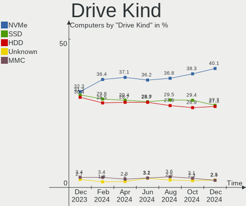

Ubuntu Hardware Trends
----------------------

A project to identify most popular hardware characteristics and track their change
over time based on data collected by Ubuntu users at https://Linux-Hardware.org.

Anyone can contribute to the study by uploading probes of their computers by
the [hw-probe](https://github.com/linuxhw/hw-probe) tool:

    sudo hw-probe -all -upload

This is a report for all computer types. See also reports for [desktops](/Dist/Ubuntu/Desktop/README.md) and [notebooks](/Dist/Ubuntu/Notebook/README.md).

Full-feature report is available here: https://linux-hardware.org/?view=trends

Period: Jan, 2020.

Contents
--------

- [ OS                       ](#os)
- [ OS Family                ](#os-family)
- [ Kernel                   ](#kernel)
- [ Kernel Family            ](#kernel-family)
- [ Kernel Major Ver.        ](#kernel-major-ver)
- [ Arch                     ](#arch)
- [ DE                       ](#de)
- [ Display Server           ](#display-server)
- [ OS Lang                  ](#os-lang)
- [ Boot Mode                ](#boot-mode)
- [ Filesystem               ](#filesystem)
- [ Dual Boot with Linux     ](#dual-boot-with-linux)
- [ Dual Boot (Win)          ](#dual-boot-win)
- [ Country                  ](#country)
- [ City                     ](#city)
- [ Vendor                   ](#vendor)
- [ Model                    ](#model)
- [ Model Family             ](#model-family)
- [ MFG Year                 ](#mfg-year)
- [ Form Factor              ](#form-factor)
- [ Secure Boot              ](#secure-boot)
- [ Coreboot                 ](#coreboot)
- [ RAM Size                 ](#ram-size)
- [ RAM Used                 ](#ram-used)
- [ Drive Vendor             ](#drive-vendor)
- [ Drive Model              ](#drive-model)
- [ Drive Kind               ](#drive-kind)
- [ Drive Connector          ](#drive-connector)
- [ Drive Size               ](#drive-size)
- [ Space Total              ](#space-total)
- [ Space Used               ](#space-used)
- [ Malfunc. Drives          ](#malfunc-drives)
- [ Malfunc. Drive Vendor    ](#malfunc-drive-vendor)
- [ Malfunc. Drive Kind      ](#malfunc-drive-kind)
- [ Failed Drives            ](#failed-drives)
- [ Failed Drive Vendor      ](#failed-drive-vendor)
- [ Drive Status             ](#drive-status)
- [ CPU Vendor               ](#cpu-vendor)
- [ CPU Model                ](#cpu-model)
- [ CPU Model Family         ](#cpu-model-family)
- [ CPU Cores                ](#cpu-cores)
- [ CPU Sockets              ](#cpu-sockets)
- [ CPU Threads              ](#cpu-threads)
- [ CPU Op-Modes             ](#cpu-op-modes)
- [ CPU Microarch            ](#cpu-microarch)
- [ CPU Microcode            ](#cpu-microcode)
- [ GPU Vendor               ](#gpu-vendor)
- [ GPU Model                ](#gpu-model)
- [ GPU Combo                ](#gpu-combo)
- [ GPU Driver               ](#gpu-driver)
- [ GPU Memory               ](#gpu-memory)
- [ Monitor Vendor           ](#monitor-vendor)
- [ Monitor Model            ](#monitor-model)
- [ Monitor Resolution       ](#monitor-resolution)
- [ Monitor Diagonal         ](#monitor-diagonal)
- [ Monitor Width            ](#monitor-width)
- [ Aspect Ratio             ](#aspect-ratio)
- [ Monitor Area             ](#monitor-area)
- [ Pixel Density            ](#pixel-density)
- [ Multiple Monitors        ](#multiple-monitors)
- [ Net Controller Vendor    ](#net-controller-vendor)
- [ Net Controller Model     ](#net-controller-model)
- [ Net Controller Kind      ](#net-controller-kind)
- [ Used Controller          ](#used-controller)
- [ NICs                     ](#nics)
- [ Unsupported Devices      ](#unsupported-devices)
- [ Unsupported Device Types ](#unsupported-device-types)

OS
--

Installed operating systems

| Name           | Computers | Percent |
|----------------|-----------|---------|
| Ubuntu 18.04   | 721       | 59.83%  |
| Ubuntu 19.10   | 383       | 31.78%  |
| Ubuntu 19.04   | 39        | 3.24%   |
| Ubuntu 16.04   | 30        | 2.49%   |
| Ubuntu 20.04   | 18        | 1.49%   |
| Ubuntu 18.10   | 8         | 0.66%   |
| Ubuntu 17.10   | 4         | 0.33%   |
| Ubuntu Core 16 | 2         | 0.17%   |

OS Family
---------

OS without a version

| Name   | Computers | Percent |
|--------|-----------|---------|
| Ubuntu | 1205      | 100%    |

Kernel
------

Version of the Linux kernel

| Version                       | Computers | Percent |
|-------------------------------|-----------|---------|
| 5.3.0-26-generic              | 336       | 27.88%  |
| 5.0.0-37-generic              | 230       | 19.09%  |
| 4.15.0-74-generic             | 123       | 10.21%  |
| 5.3.0-24-generic              | 81        | 6.72%   |
| 4.15.0-72-generic             | 67        | 5.56%   |
| 5.0.0-23-generic              | 41        | 3.4%    |
| 5.3.0-29-generic              | 40        | 3.32%   |
| 5.3.0-28-generic              | 33        | 2.74%   |
| 5.3.0-18-generic              | 32        | 2.66%   |
| 5.0.0-38-generic              | 19        | 1.58%   |
| 4.15.0-76-generic             | 16        | 1.33%   |
| 4.15.0-29-generic             | 10        | 0.83%   |
| 5.3.0-7625-generic            | 9         | 0.75%   |
| 4.15.0-74-lowlatency          | 9         | 0.75%   |
| 4.15.0-66-generic             | 8         | 0.66%   |
| 5.3.0-27-generic              | 7         | 0.58%   |
| 5.3.0-26-lowlatency           | 7         | 0.58%   |
| 4.4.0-171-generic             | 6         | 0.5%    |
| 4.18.0-25-generic             | 6         | 0.5%    |
| 4.15.0-45-generic             | 5         | 0.41%   |
| 5.4.0-9-generic               | 4         | 0.33%   |
| 5.4.0-12-generic              | 4         | 0.33%   |
| 5.3.0-24-lowlatency           | 3         | 0.25%   |
| 5.3.0-18-lowlatency           | 3         | 0.25%   |
| 5.0.0-36-generic              | 3         | 0.25%   |
| 5.0.0-32-generic              | 3         | 0.25%   |
| 4.15.0-70-generic             | 3         | 0.25%   |
| 4.15.0-54-generic             | 3         | 0.25%   |
| 4.15.0-1066-oem               | 3         | 0.25%   |
| 5.4.14-050414-generic         | 2         | 0.17%   |
| 5.4.0-9-lowlatency            | 2         | 0.17%   |
| 5.3.0-25-generic              | 2         | 0.17%   |
| 5.3.0-23-generic              | 2         | 0.17%   |
| 5.3.0-19-generic              | 2         | 0.17%   |
| 5.0.0-37-lowlatency           | 2         | 0.17%   |
| 5.0.0-13-generic              | 2         | 0.17%   |
| 5.0.0-1033-oem-osp1           | 2         | 0.17%   |
| 4.9.140-tegra                 | 2         | 0.17%   |
| 4.18.0-15-generic             | 2         | 0.17%   |
| 4.15.0-76-lowlatency          | 2         | 0.17%   |
| 4.15.0-65-generic             | 2         | 0.17%   |
| 4.15.0-60-generic             | 2         | 0.17%   |
| 4.15.0-50-generic             | 2         | 0.17%   |
| 4.15.0-20-generic             | 2         | 0.17%   |
| 4.13.0-46-generic             | 2         | 0.17%   |
| 5.5.0-mm22                    | 1         | 0.08%   |
| 5.5.0-mm11                    | 1         | 0.08%   |
| 5.5.0-050500rc4-generic       | 1         | 0.08%   |
| 5.5.0-050500-generic          | 1         | 0.08%   |
| 5.4.7-050407-generic          | 1         | 0.08%   |
| 5.4.6-050406-generic          | 1         | 0.08%   |
| 5.4.15-20.01.26.amdgpu.ubuntu | 1         | 0.08%   |
| 5.4.13-050413-generic         | 1         | 0.08%   |
| 5.4.12-xanmod7                | 1         | 0.08%   |
| 5.4.0-surface-devel-191228    | 1         | 0.08%   |
| 5.4.0-11-generic              | 1         | 0.08%   |
| 5.4.0-10.1-liquorix-amd64     | 1         | 0.08%   |
| 5.4.0-050400-generic          | 1         | 0.08%   |
| 5.3.14-050314-generic         | 1         | 0.08%   |
| 5.3.11-050311-generic         | 1         | 0.08%   |

Kernel Family
-------------

Linux kernel without a distro release

| Version  | Computers | Percent |
|----------|-----------|---------|
| 5.3.0    | 563       | 46.72%  |
| 5.0.0    | 309       | 25.64%  |
| 4.15.0   | 273       | 22.66%  |
| 5.4.0    | 14        | 1.16%   |
| 4.18.0   | 11        | 0.91%   |
| 4.4.0    | 9         | 0.75%   |
| 5.5.0    | 4         | 0.33%   |
| 4.13.0   | 4         | 0.33%   |
| 5.4.14   | 2         | 0.17%   |
| 4.9.140  | 2         | 0.17%   |
| 5.4.7    | 1         | 0.08%   |
| 5.4.6    | 1         | 0.08%   |
| 5.4.15   | 1         | 0.08%   |
| 5.4.13   | 1         | 0.08%   |
| 5.4.12   | 1         | 0.08%   |
| 5.3.14   | 1         | 0.08%   |
| 5.3.11   | 1         | 0.08%   |
| 5.1.16   | 1         | 0.08%   |
| 4.20.0   | 1         | 0.08%   |
| 4.19.29  | 1         | 0.08%   |
| 4.18.20  | 1         | 0.08%   |
| 4.16.0   | 1         | 0.08%   |
| 4.14.157 | 1         | 0.08%   |
| 4.10.0   | 1         | 0.08%   |

Kernel Major Ver.
-----------------

Linux kernel major version

| Version | Computers | Percent |
|---------|-----------|---------|
| 5.3     | 565       | 46.89%  |
| 5.0     | 309       | 25.64%  |
| 4.15    | 273       | 22.66%  |
| 5.4     | 21        | 1.74%   |
| 4.18    | 12        | 1%      |
| 4.4     | 9         | 0.75%   |
| 5.5     | 4         | 0.33%   |
| 4.13    | 4         | 0.33%   |
| 4.9     | 2         | 0.17%   |
| 5.1     | 1         | 0.08%   |
| 4.20    | 1         | 0.08%   |
| 4.19    | 1         | 0.08%   |
| 4.16    | 1         | 0.08%   |
| 4.14    | 1         | 0.08%   |
| 4.10    | 1         | 0.08%   |

Arch
----

OS architecture (x86_64, i586, etc.)

| Name    | Computers | Percent |
|---------|-----------|---------|
| x86_64  | 1135      | 94.19%  |
| i686    | 66        | 5.48%   |
| armv7l  | 2         | 0.17%   |
| aarch64 | 2         | 0.17%   |

DE
--

Desktop Environment

| Name                      | Computers | Percent |
|---------------------------|-----------|---------|
| GNOME                     | 734       | 60.91%  |
| Unknown                   | 249       | 20.66%  |
| XFCE                      | 100       | 8.3%    |
| KDE                       | 32        | 2.66%   |
| Unity                     | 30        | 2.49%   |
| MATE                      | 13        | 1.08%   |
| GNOME Flashback           | 11        | 0.91%   |
| Budgie                    | 9         | 0.75%   |
| X-Cinnamon                | 8         | 0.66%   |
| LXQt                      | 7         | 0.58%   |
| LXDE                      | 6         | 0.5%    |
| xubuntu                   | 2         | 0.17%   |
| Cinnamon                  | 2         | 0.17%   |
| Enlightenment             | 1         | 0.08%   |
| communitheme:ubuntu:GNOME | 1         | 0.08%   |

Display Server
--------------

X11 or Wayland

| Name    | Computers | Percent |
|---------|-----------|---------|
| X11     | 862       | 71.54%  |
| Unknown | 320       | 26.56%  |
| Wayland | 18        | 1.49%   |
| Tty     | 5         | 0.41%   |

OS Lang
-------

Language

| Lang    | Computers | Percent |
|---------|-----------|---------|
| en_US   | 430       | 35.68%  |
| de_DE   | 92        | 7.63%   |
| Unknown | 66        | 5.48%   |
| en_GB   | 65        | 5.39%   |
| pt_BR   | 55        | 4.56%   |
| it_IT   | 52        | 4.32%   |
| ru_RU   | 42        | 3.49%   |
| fr_FR   | 41        | 3.4%    |
| es_ES   | 39        | 3.24%   |
| C       | 35        | 2.9%    |
| en_CA   | 25        | 2.07%   |
| en_IN   | 23        | 1.91%   |
| nl_NL   | 22        | 1.83%   |
| hu_HU   | 18        | 1.49%   |
| gl_ES   | 17        | 1.41%   |
| pl_PL   | 16        | 1.33%   |
| en_AU   | 15        | 1.24%   |
| de_AT   | 9         | 0.75%   |
| cs_CZ   | 9         | 0.75%   |
| en_ZA   | 8         | 0.66%   |
| es_MX   | 7         | 0.58%   |
| sk_SK   | 6         | 0.5%    |
| pt_PT   | 6         | 0.5%    |
| ja_JP   | 6         | 0.5%    |
| da_DK   | 6         | 0.5%    |
| ro_RO   | 5         | 0.41%   |
| es_AR   | 5         | 0.41%   |
| el_GR   | 5         | 0.41%   |
| de_CH   | 5         | 0.41%   |
| uk_UA   | 4         | 0.33%   |
| es_CO   | 4         | 0.33%   |
| es_CL   | 4         | 0.33%   |
| en_IL   | 4         | 0.33%   |
| ca_ES   | 4         | 0.33%   |
| zh_CN   | 3         | 0.25%   |
| tr_TR   | 3         | 0.25%   |
| sv_SE   | 3         | 0.25%   |
| fr_CA   | 3         | 0.25%   |
| es_VE   | 3         | 0.25%   |
| en_SG   | 3         | 0.25%   |
| en_NZ   | 3         | 0.25%   |
| zh_TW   | 2         | 0.17%   |
| zh_HK   | 2         | 0.17%   |
| ru_UA   | 2         | 0.17%   |
| hr_HR   | 2         | 0.17%   |
| fr_BE   | 2         | 0.17%   |
| fi_FI   | 2         | 0.17%   |
| es_GT   | 2         | 0.17%   |
| es_CR   | 2         | 0.17%   |
| sv_FI   | 1         | 0.08%   |
| sr_RS   | 1         | 0.08%   |
| sl_SI   | 1         | 0.08%   |
| nl_BE   | 1         | 0.08%   |
| nb_NO   | 1         | 0.08%   |
| mk_MK   | 1         | 0.08%   |
| lt_LT   | 1         | 0.08%   |
| ko_KR   | 1         | 0.08%   |
| he_IL   | 1         | 0.08%   |
| eu_ES   | 1         | 0.08%   |
| es_PY   | 1         | 0.08%   |

Boot Mode
---------

EFI or BIOS

| Mode | Computers | Percent |
|------|-----------|---------|
| BIOS | 685       | 56.85%  |
| EFI  | 520       | 43.15%  |

Filesystem
----------

Type of filesystem

| Type    | Computers | Percent |
|---------|-----------|---------|
| Ext4    | 1106      | 91.78%  |
| Overlay | 43        | 3.57%   |
| Ext3    | 28        | 2.32%   |
| Btrfs   | 9         | 0.75%   |
| Zfs     | 7         | 0.58%   |
| Xfs     | 7         | 0.58%   |
| Ext2    | 2         | 0.17%   |
| Jfs     | 1         | 0.08%   |
| Aufs    | 1         | 0.08%   |
| Unknown | 1         | 0.08%   |

Dual Boot with Linux
--------------------

Hosting more than one Linux

| Dual boot | Computers | Percent |
|-----------|-----------|---------|
| No        | 1073      | 89.05%  |
| Yes       | 132       | 10.95%  |

Dual Boot (Win)
---------------

Hosting Linux and Windows

| Dual boot | Computers | Percent |
|-----------|-----------|---------|
| No        | 731       | 60.66%  |
| Yes       | 474       | 39.34%  |

Country
-------

Geographic location (country)

| Country        | Computers | Percent |
|----------------|-----------|---------|
| USA            | 212       | 17.59%  |
| Germany        | 118       | 9.79%   |
| Brazil         | 69        | 5.73%   |
| Italy          | 66        | 5.48%   |
| Spain          | 63        | 5.23%   |
| UK             | 62        | 5.15%   |
| France         | 48        | 3.98%   |
| Russia         | 45        | 3.73%   |
| Canada         | 39        | 3.24%   |
| Netherlands    | 38        | 3.15%   |
| India          | 26        | 2.16%   |
| Poland         | 25        | 2.07%   |
| Hungary        | 24        | 1.99%   |
| Austria        | 19        | 1.58%   |
| Australia      | 18        | 1.49%   |
| Ukraine        | 17        | 1.41%   |
| Switzerland    | 17        | 1.41%   |
| Czech Republic | 17        | 1.41%   |
| Romania        | 14        | 1.16%   |
| Indonesia      | 14        | 1.16%   |
| Turkey         | 11        | 0.91%   |
| South Africa   | 11        | 0.91%   |
| Denmark        | 11        | 0.91%   |
| Sweden         | 9         | 0.75%   |
| Slovakia       | 9         | 0.75%   |
| Portugal       | 9         | 0.75%   |
| Mexico         | 9         | 0.75%   |
| Greece         | 9         | 0.75%   |
| Serbia         | 8         | 0.66%   |
| Japan          | 8         | 0.66%   |
| Finland        | 8         | 0.66%   |
| Argentina      | 8         | 0.66%   |
| Taiwan         | 7         | 0.58%   |
| Lithuania      | 7         | 0.58%   |
| Israel         | 7         | 0.58%   |
| Bulgaria       | 7         | 0.58%   |
| New Zealand    | 6         | 0.5%    |
| Iran           | 6         | 0.5%    |
| Colombia       | 6         | 0.5%    |
| China          | 6         | 0.5%    |
| Belgium        | 6         | 0.5%    |
| Slovenia       | 5         | 0.41%   |
| Croatia        | 4         | 0.33%   |
| Chile          | 4         | 0.33%   |
| Venezuela      | 3         | 0.25%   |
| Singapore      | 3         | 0.25%   |
| Malaysia       | 3         | 0.25%   |
| Egypt          | 3         | 0.25%   |
| Cyprus         | 3         | 0.25%   |
| Belarus        | 3         | 0.25%   |
| Algeria        | 3         | 0.25%   |
| Vietnam        | 2         | 0.17%   |
| Uzbekistan     | 2         | 0.17%   |
| Saudi Arabia   | 2         | 0.17%   |
| Philippines    | 2         | 0.17%   |
| Peru           | 2         | 0.17%   |
| Paraguay       | 2         | 0.17%   |
| Panama         | 2         | 0.17%   |
| Pakistan       | 2         | 0.17%   |
| New Caledonia  | 2         | 0.17%   |

City
----

Geographic location (city)

| City              | Computers | Percent |
|-------------------|-----------|---------|
| Ourense           | 23        | 1.91%   |
| Berlin            | 12        | 1%      |
| Vienna            | 10        | 0.83%   |
| St Petersburg     | 10        | 0.83%   |
| Moscow            | 9         | 0.75%   |
| Budapest          | 9         | 0.75%   |
| Munich            | 8         | 0.66%   |
| Milan             | 7         | 0.58%   |
| Madrid            | 7         | 0.58%   |
| São Paulo        | 6         | 0.5%    |
| Rome              | 6         | 0.5%    |
| Prague            | 6         | 0.5%    |
| Portland          | 6         | 0.5%    |
| Hamburg           | 6         | 0.5%    |
| Athens            | 6         | 0.5%    |
| Amsterdam         | 6         | 0.5%    |
| Vilnius           | 5         | 0.41%   |
| Paris             | 5         | 0.41%   |
| Johannesburg      | 5         | 0.41%   |
| Chicago           | 5         | 0.41%   |
| Zurich            | 4         | 0.33%   |
| Warsaw            | 4         | 0.33%   |
| Tel Aviv          | 4         | 0.33%   |
| Rio de Janeiro    | 4         | 0.33%   |
| New York          | 4         | 0.33%   |
| Montreal          | 4         | 0.33%   |
| Leipzig           | 4         | 0.33%   |
| Jakarta           | 4         | 0.33%   |
| Fortaleza         | 4         | 0.33%   |
| Cologne           | 4         | 0.33%   |
| Chennai           | 4         | 0.33%   |
| Bratislava        | 4         | 0.33%   |
| Ankara            | 4         | 0.33%   |
| Łódź           | 3         | 0.25%   |
| Turin             | 3         | 0.25%   |
| Trieste           | 3         | 0.25%   |
| Toronto           | 3         | 0.25%   |
| The Hague         | 3         | 0.25%   |
| Taipei            | 3         | 0.25%   |
| Szeged            | 3         | 0.25%   |
| Stockholm         | 3         | 0.25%   |
| Sofia             | 3         | 0.25%   |
| Singapore         | 3         | 0.25%   |
| Seattle           | 3         | 0.25%   |
| Oryol             | 3         | 0.25%   |
| Novosibirsk       | 3         | 0.25%   |
| Mumbai            | 3         | 0.25%   |
| Miami             | 3         | 0.25%   |
| Medellín         | 3         | 0.25%   |
| London            | 3         | 0.25%   |
| Kyiv              | 3         | 0.25%   |
| Kazan’          | 3         | 0.25%   |
| Karlsruhe         | 3         | 0.25%   |
| Helsinki          | 3         | 0.25%   |
| Graz              | 3         | 0.25%   |
| Glasgow           | 3         | 0.25%   |
| Frankfurt am Main | 3         | 0.25%   |
| Edmond            | 3         | 0.25%   |
| Dresden           | 3         | 0.25%   |
| Dallas            | 3         | 0.25%   |

Vendor
------

Motherboard manufacturer

| Name                    | Computers | Percent |
|-------------------------|-----------|---------|
| Lenovo                  | 184       | 15.27%  |
| ASUSTek Computer        | 181       | 15.02%  |
| Hewlett-Packard         | 174       | 14.44%  |
| Dell                    | 172       | 14.27%  |
| Gigabyte Technology     | 87        | 7.22%   |
| Acer                    | 70        | 5.81%   |
| MSI                     | 54        | 4.48%   |
| ASRock                  | 36        | 2.99%   |
| Toshiba                 | 30        | 2.49%   |
| Intel                   | 26        | 2.16%   |
| Apple                   | 14        | 1.16%   |
| Positivo                | 13        | 1.08%   |
| Samsung Electronics     | 12        | 1%      |
| Sony                    | 11        | 0.91%   |
| Supermicro              | 8         | 0.66%   |
| Medion                  | 8         | 0.66%   |
| eMachines               | 8         | 0.66%   |
| Fujitsu                 | 7         | 0.58%   |
| Notebook                | 6         | 0.5%    |
| Foxconn                 | 6         | 0.5%    |
| Unknown                 | 6         | 0.5%    |
| ZOTAC                   | 5         | 0.41%   |
| Pegatron                | 5         | 0.41%   |
| Packard Bell            | 5         | 0.41%   |
| Microsoft               | 5         | 0.41%   |
| Gateway                 | 5         | 0.41%   |
| Biostar                 | 5         | 0.41%   |
| HUAWEI                  | 3         | 0.25%   |
| Fujitsu Siemens         | 3         | 0.25%   |
| AMI                     | 3         | 0.25%   |
| Wistron                 | 2         | 0.17%   |
| TrekStor                | 2         | 0.17%   |
| Nvidia                  | 2         | 0.17%   |
| Itautec                 | 2         | 0.17%   |
| Google                  | 2         | 0.17%   |
| ECS                     | 2         | 0.17%   |
| CCE                     | 2         | 0.17%   |
| AAEON                   | 2         | 0.17%   |
| XMG                     | 1         | 0.08%   |
| XFX                     | 1         | 0.08%   |
| www.51nb.com            | 1         | 0.08%   |
| WinFast                 | 1         | 0.08%   |
| VIT                     | 1         | 0.08%   |
| VERO                    | 1         | 0.08%   |
| TUXEDO                  | 1         | 0.08%   |
| Timi                    | 1         | 0.08%   |
| System76                | 1         | 0.08%   |
| Seco                    | 1         | 0.08%   |
| Sapphire Tech           | 1         | 0.08%   |
| Sapphire                | 1         | 0.08%   |
| RKM                     | 1         | 0.08%   |
| Razer                   | 1         | 0.08%   |
| Raspberry Pi Foundation | 1         | 0.08%   |
| Qilive                  | 1         | 0.08%   |
| PC Specialist           | 1         | 0.08%   |
| Panasonic               | 1         | 0.08%   |
| Onda Technology         | 1         | 0.08%   |
| mp                      | 1         | 0.08%   |
| Monster                 | 1         | 0.08%   |
| Maxtang                 | 1         | 0.08%   |

Model
-----

Motherboard model

| Name                              | Computers | Percent |
|-----------------------------------|-----------|---------|
| ThinkCentre E73 10DR0033SP        | 22        | 1.83%   |
| All Series                        | 15        | 1.24%   |
| Pavilion dv6                      | 11        | 0.91%   |
| Unknown                           | 10        | 0.83%   |
| Pavilion g6                       | 7         | 0.58%   |
| XPS 15 9570                       | 5         | 0.41%   |
| OptiPlex 7010                     | 5         | 0.41%   |
| Notebook                          | 5         | 0.41%   |
| Laptop 15-da0xxx                  | 5         | 0.41%   |
| XPS 15 9560                       | 4         | 0.33%   |
| MOBILE                            | 4         | 0.33%   |
| XPS 8500                          | 3         | 0.25%   |
| ThinkPad X1 Carbon 7th 20QDCTO1WW | 3         | 0.25%   |
| PRIME H310M-R R2.0                | 3         | 0.25%   |
| Precision WorkStation 490         | 3         | 0.25%   |
| OptiPlex 780                      | 3         | 0.25%   |
| MS-7C02                           | 3         | 0.25%   |
| MS-7A38                           | 3         | 0.25%   |
| MS-7693                           | 3         | 0.25%   |
| Latitude E6430                    | 3         | 0.25%   |
| Latitude E6410                    | 3         | 0.25%   |
| Latitude E6230                    | 3         | 0.25%   |
| Laptop 15-db0xxx                  | 3         | 0.25%   |
| Laptop 15-bw0xx                   | 3         | 0.25%   |
| Inspiron 15-3567                  | 3         | 0.25%   |
| EliteBook 840 G3                  | 3         | 0.25%   |
| Z77-DS3H                          | 2         | 0.17%   |
| Z170-A                            | 2         | 0.17%   |
| Z170 PRO GAMING                   | 2         | 0.17%   |
| Yoga S740-14IIL 81RS              | 2         | 0.17%   |
| Yoga 2 Pro 20266                  | 2         | 0.17%   |
| XPS 8930                          | 2         | 0.17%   |
| XPS 15 7590                       | 2         | 0.17%   |
| XPS 13 9380                       | 2         | 0.17%   |
| XPS 13 9370                       | 2         | 0.17%   |
| XPS 13 9360                       | 2         | 0.17%   |
| X79-UD3                           | 2         | 0.17%   |
| X553MA                            | 2         | 0.17%   |
| X550LD                            | 2         | 0.17%   |
| V510-15IKB 80WQ                   | 2         | 0.17%   |
| Tegra                             | 2         | 0.17%   |
| Studio 1558                       | 2         | 0.17%   |
| Satellite A500                    | 2         | 0.17%   |
| Q232A                             | 2         | 0.17%   |
| ProBook 4540s                     | 2         | 0.17%   |
| PRIME Z270-A                      | 2         | 0.17%   |
| PRIME B450M-GAMING/BR             | 2         | 0.17%   |
| PRIME B350-PLUS                   | 2         | 0.17%   |
| Presley                           | 2         | 0.17%   |
| Precision T1700                   | 2         | 0.17%   |
| Precision M6500                   | 2         | 0.17%   |
| Pavilion g4                       | 2         | 0.17%   |
| P8Z68-V                           | 2         | 0.17%   |
| P7P55D                            | 2         | 0.17%   |
| P5QPL-AM                          | 2         | 0.17%   |
| OptiPlex 760                      | 2         | 0.17%   |
| OptiPlex 390                      | 2         | 0.17%   |
| OptiPlex 380                      | 2         | 0.17%   |
| N68C-GS FX                        | 2         | 0.17%   |
| MS-7B79                           | 2         | 0.17%   |

Model Family
------------

Motherboard model prefix

| Name                       | Computers | Percent |
|----------------------------|-----------|---------|
| Lenovo ThinkPad            | 73        | 6.06%   |
| Dell Inspiron              | 53        | 4.4%    |
| Acer Aspire                | 49        | 4.07%   |
| HP Pavilion                | 38        | 3.15%   |
| Lenovo ThinkCentre         | 36        | 2.99%   |
| Lenovo IdeaPad             | 31        | 2.57%   |
| Dell Latitude              | 29        | 2.41%   |
| Toshiba Satellite          | 25        | 2.07%   |
| HP Laptop                  | 24        | 1.99%   |
| Dell XPS                   | 23        | 1.91%   |
| Dell OptiPlex              | 21        | 1.74%   |
| HP EliteBook               | 20        | 1.66%   |
| HP Compaq                  | 18        | 1.49%   |
| ASUS PRIME                 | 16        | 1.33%   |
| Dell Vostro                | 15        | 1.24%   |
| Dell Precision             | 15        | 1.24%   |
| ASUS All                   | 15        | 1.24%   |
| HP ProBook                 | 13        | 1.08%   |
| Unknown                    | 12        | 1%      |
| Lenovo Yoga                | 10        | 0.83%   |
| ASUS TUF                   | 7         | 0.58%   |
| Acer TravelMate            | 7         | 0.58%   |
| ASUS VivoBook              | 6         | 0.5%    |
| Microsoft Surface          | 5         | 0.41%   |
| HP Notebook                | 5         | 0.41%   |
| ASUS ROG                   | 5         | 0.41%   |
| ASUS M5A97                 | 5         | 0.41%   |
| ASUS M5A78L-M              | 5         | 0.41%   |
| Acer Swift                 | 5         | 0.41%   |
| Positivo MOBILE            | 4         | 0.33%   |
| HP ZBook                   | 4         | 0.33%   |
| HP Spectre                 | 4         | 0.33%   |
| HP ENVY                    | 4         | 0.33%   |
| Dell PowerEdge             | 4         | 0.33%   |
| Toshiba PORTEGE            | 3         | 0.25%   |
| MSI MS-7C02                | 3         | 0.25%   |
| MSI MS-7A38                | 3         | 0.25%   |
| MSI MS-7693                | 3         | 0.25%   |
| Lenovo G570                | 3         | 0.25%   |
| HP ProLiant                | 3         | 0.25%   |
| HP ProDesk                 | 3         | 0.25%   |
| Gigabyte Z390              | 3         | 0.25%   |
| Gigabyte GA-78LMT-USB3     | 3         | 0.25%   |
| Gigabyte B450              | 3         | 0.25%   |
| Fujitsu LIFEBOOK           | 3         | 0.25%   |
| Dell Studio                | 3         | 0.25%   |
| Dell G3                    | 3         | 0.25%   |
| ASUS ZenBook               | 3         | 0.25%   |
| ASUS P8Z68-V               | 3         | 0.25%   |
| ASUS Maximus               | 3         | 0.25%   |
| ASRock 970                 | 3         | 0.25%   |
| Wistron ProLiant           | 2         | 0.17%   |
| Samsung Electronics 550P5C | 2         | 0.17%   |
| Positivo Q232A             | 2         | 0.17%   |
| Positivo Presley           | 2         | 0.17%   |
| Positivo H14BU08           | 2         | 0.17%   |
| Packard Bell IMEDIA        | 2         | 0.17%   |
| Nvidia Tegra               | 2         | 0.17%   |
| MSI MS-7B79                | 2         | 0.17%   |
| MSI MS-7B49                | 2         | 0.17%   |

MFG Year
--------

Motherboard manufacture year

| Year    | Computers | Percent |
|---------|-----------|---------|
| 2019    | 264       | 21.91%  |
| 2018    | 135       | 11.2%   |
| 2014    | 98        | 8.13%   |
| 2013    | 97        | 8.05%   |
| 2011    | 88        | 7.3%    |
| 2009    | 84        | 6.97%   |
| 2012    | 78        | 6.47%   |
| 2016    | 67        | 5.56%   |
| 2010    | 67        | 5.56%   |
| 2017    | 64        | 5.31%   |
| 2015    | 64        | 5.31%   |
| 2008    | 40        | 3.32%   |
| 2007    | 27        | 2.24%   |
| 2005    | 13        | 1.08%   |
| 2006    | 12        | 1%      |
| Unknown | 4         | 0.33%   |
| 2020    | 2         | 0.17%   |
| 2001    | 1         | 0.08%   |

Form Factor
-----------

Physical design of the computer

| Name           | Computers | Percent |
|----------------|-----------|---------|
| Notebook       | 659       | 54.69%  |
| Desktop        | 480       | 39.83%  |
| Mini pc        | 17        | 1.41%   |
| Convertible    | 13        | 1.08%   |
| All in one     | 12        | 1%      |
| Server         | 12        | 1%      |
| Tablet         | 8         | 0.66%   |
| System on chip | 4         | 0.33%   |

Secure Boot
-----------

Enabled or disabled

| State    | Computers | Percent |
|----------|-----------|---------|
| Disabled | 740       | 61.41%  |
| Unknown  | 364       | 30.21%  |
| Enabled  | 101       | 8.38%   |

Coreboot
--------

Have coreboot on board

| Used | Computers | Percent |
|------|-----------|---------|
| No   | 1203      | 99.83%  |
| Yes  | 2         | 0.17%   |

RAM Size
--------

Total RAM memory

| Size in GB      | Computers | Percent |
|-----------------|-----------|---------|
| 3.01-4.0        | 297       | 24.65%  |
| 4.01-8.0        | 244       | 20.25%  |
| 16.01-24.0      | 235       | 19.5%   |
| 8.01-16.0       | 206       | 17.1%   |
| 1.01-2.0        | 77        | 6.39%   |
| 32.01-64.0      | 67        | 5.56%   |
| 2.01-3.0        | 26        | 2.16%   |
| 64.01-256.0     | 23        | 1.91%   |
| 0.01-1.0        | 16        | 1.33%   |
| 24.01-32.0      | 11        | 0.91%   |
| More than 256.0 | 2         | 0.17%   |
| Unknown         | 1         | 0.08%   |

RAM Used
--------

Used RAM memory

| Used GB     | Computers | Percent |
|-------------|-----------|---------|
| 1.01-2.0    | 529       | 43.9%   |
| 2.01-3.0    | 328       | 27.22%  |
| 3.01-4.0    | 121       | 10.04%  |
| 4.01-8.0    | 104       | 8.63%   |
| 0.01-1.0    | 86        | 7.14%   |
| 8.01-16.0   | 28        | 2.32%   |
| 32.01-64.0  | 3         | 0.25%   |
| 24.01-32.0  | 2         | 0.17%   |
| 16.01-24.0  | 2         | 0.17%   |
| 64.01-256.0 | 1         | 0.08%   |
| Unknown     | 1         | 0.08%   |

Drive Vendor
------------

Hard drive vendors

| Vendor              | Computers | Drives | Percent |
|---------------------|-----------|--------|---------|
| Seagate             | 321       | 358    | 21.06%  |
| WDC                 | 285       | 327    | 18.7%   |
| Samsung Electronics | 174       | 198    | 11.42%  |
| Toshiba             | 110       | 116    | 7.22%   |
| Kingston            | 85        | 88     | 5.58%   |
| Hitachi             | 69        | 72     | 4.53%   |
| SanDisk             | 57        | 58     | 3.74%   |
| Unknown             | 55        | 62     | 3.61%   |
| Crucial             | 50        | 51     | 3.28%   |
| HGST                | 39        | 39     | 2.56%   |
| Intel               | 36        | 41     | 2.36%   |
| SK Hynix            | 24        | 24     | 1.57%   |
| A-DATA Technology   | 19        | 19     | 1.25%   |
| MAXTOR              | 17        | 19     | 1.12%   |
| Micron Technology   | 13        | 13     | 0.85%   |
| Fujitsu             | 11        | 11     | 0.72%   |
| China               | 11        | 11     | 0.72%   |
| Transcend           | 9         | 9      | 0.59%   |
| OCZ                 | 9         | 9      | 0.59%   |
| Intenso             | 9         | 9      | 0.59%   |
| Generic             | 9         | 9      | 0.59%   |
| KingSpec            | 7         | 7      | 0.46%   |
| PNY                 | 6         | 6      | 0.39%   |
| PLEXTOR             | 6         | 6      | 0.39%   |
| Patriot             | 6         | 7      | 0.39%   |
| LITEON              | 6         | 6      | 0.39%   |
| Apple               | 6         | 6      | 0.39%   |
| LITEONIT            | 5         | 5      | 0.33%   |
| GOODRAM             | 5         | 5      | 0.33%   |
| Corsair             | 5         | 5      | 0.33%   |
| KingDian            | 4         | 4      | 0.26%   |
| Gigabyte Technology | 4         | 4      | 0.26%   |
| SPCC                | 3         | 3      | 0.2%    |
| Hewlett-Packard     | 3         | 3      | 0.2%    |
| ASMT                | 3         | 3      | 0.2%    |
| OWC                 | 2         | 2      | 0.13%   |
| Lexar               | 2         | 2      | 0.13%   |
| HL-DT-ST            | 2         | 2      | 0.13%   |
| DREVO               | 2         | 2      | 0.13%   |
| WDC WD25            | 1         | 1      | 0.07%   |
| USB3.0              | 1         | 1      | 0.07%   |
| USB                 | 1         | 1      | 0.07%   |
| Team                | 1         | 1      | 0.07%   |
| TCSUNBOW            | 1         | 1      | 0.07%   |
| StoreJet            | 1         | 1      | 0.07%   |
| STEC                | 1         | 1      | 0.07%   |
| Sony                | 1         | 1      | 0.07%   |
| SMI                 | 1         | 1      | 0.07%   |
| SABRENT             | 1         | 1      | 0.07%   |
| S3+                 | 1         | 1      | 0.07%   |
| RDM-II              | 1         | 1      | 0.07%   |
| OCZ-VERTEX2         | 1         | 1      | 0.07%   |
| Netac               | 1         | 1      | 0.07%   |
| Mushkin             | 1         | 1      | 0.07%   |
| Morebeck-S100       | 1         | 1      | 0.07%   |
| MemoCom             | 1         | 1      | 0.07%   |
| MARVELL             | 1         | 1      | 0.07%   |
| Kston               | 1         | 1      | 0.07%   |
| KingFast            | 1         | 1      | 0.07%   |
| JMicron             | 1         | 1      | 0.07%   |

Drive Model
-----------

Hard drive models

| Model                        | Computers | Percent |
|------------------------------|-----------|---------|
| ST500DM002-1BD142 500GB      | 40        | 2.42%   |
| MMC Card  31GB               | 24        | 1.45%   |
| SA400S37240G 240GB SSD       | 21        | 1.27%   |
| ST1000LM035-1RK172 1TB       | 20        | 1.21%   |
| WD5000AAKX-08U6AA0 500GB     | 19        | 1.15%   |
| SSD 860 EVO 500GB            | 16        | 0.97%   |
| SSD 850 EVO 500GB            | 15        | 0.91%   |
| WD10EZEX-08WN4A0 1TB         | 13        | 0.79%   |
| SA400S37120G 120GB SSD       | 12        | 0.73%   |
| SV300S37A120G 120GB SSD      | 11        | 0.66%   |
| ST1000LM024 HN-M101MBB 1TB   | 11        | 0.66%   |
| SSD 860 EVO 250GB            | 11        | 0.66%   |
| SSD 850 EVO 250GB            | 11        | 0.66%   |
| MQ01ABD100 1TB               | 11        | 0.66%   |
| ST9500325AS 500GB            | 10        | 0.6%    |
| ST500LT012-1DG142 500GB      | 10        | 0.6%    |
| SSD 860 EVO 1TB              | 10        | 0.6%    |
| HTS545050A7E380 500GB        | 10        | 0.6%    |
| ST3500418AS 500GB            | 9         | 0.54%   |
| ST1000DM010-2EP102 1TB       | 9         | 0.54%   |
| SD/MMC/MS PRO 31GB           | 9         | 0.54%   |
| SA400S37480G 480GB SSD       | 9         | 0.54%   |
| DT01ACA100 1TB               | 9         | 0.54%   |
| MQ01ABF050 500GB             | 8         | 0.48%   |
| HTS721010A9E630 1TB          | 8         | 0.48%   |
| CT250MX500SSD1 250GB         | 8         | 0.48%   |
| ST500LT012-9WS142 500GB      | 7         | 0.42%   |
| ST2000DM001-1CH164 2TB       | 7         | 0.42%   |
| ST1000DM003-1ER162 1TB       | 7         | 0.42%   |
| ST1000DM003-1CH162 1TB       | 7         | 0.42%   |
| SSD 840 Series 250GB         | 7         | 0.42%   |
| HTS725050A7E630 500GB        | 7         | 0.42%   |
| DT01ACA200 2TB               | 7         | 0.42%   |
| WD10EZEX-00BN5A0 1TB         | 6         | 0.36%   |
| SDSSDA120G 120GB             | 6         | 0.36%   |
| HTS545050A7E680 500GB        | 6         | 0.36%   |
| Expansion 1TB                | 6         | 0.36%   |
| CT500MX500SSD1 500GB         | 6         | 0.36%   |
| CT120BX500SSD1 120GB         | 6         | 0.36%   |
| WD10SPZX-21Z10T0 1TB         | 5         | 0.3%    |
| WD10EARS-00Y5B1 1TB          | 5         | 0.3%    |
| SV300S37A240G 240GB SSD      | 5         | 0.3%    |
| ST9320423AS 320GB            | 5         | 0.3%    |
| ST31000524AS 1TB             | 5         | 0.3%    |
| ST1000LM049-2GH172 1TB       | 5         | 0.3%    |
| ST1000DM003-9YN162 1TB       | 5         | 0.3%    |
| SSD PLUS 120GB               | 5         | 0.3%    |
| SSD 850 PRO 256GB            | 5         | 0.3%    |
| SSD 840 PRO Series 256GB     | 5         | 0.3%    |
| MQ04ABF100 1TB               | 5         | 0.3%    |
| HDWD130 3TB                  | 5         | 0.3%    |
| HD322HJ 320GB                | 5         | 0.3%    |
| HD204UI 2TB                  | 5         | 0.3%    |
| HD103SJ 1TB                  | 5         | 0.3%    |
| CT256MX100SSD1 256GB         | 5         | 0.3%    |
| WDS500G2B0A-00SM50 500GB SSD | 4         | 0.24%   |
| WD5000LPVX-22V0TT0 500GB     | 4         | 0.24%   |
| WD5000AADS-00S9B0 500GB      | 4         | 0.24%   |
| WD10JPVX-60JC3T1 1TB         | 4         | 0.24%   |
| TR200 240GB SSD              | 4         | 0.24%   |

Drive Kind
----------

HDD or SSD

| Kind    | Computers | Drives | Percent |
|---------|-----------|--------|---------|
| HDD     | 738       | 953    | 53.99%  |
| SSD     | 489       | 549    | 35.77%  |
| MMC     | 56        | 66     | 4.1%    |
| NVMe    | 42        | 46     | 3.07%   |
| Unknown | 42        | 42     | 3.07%   |

Drive Connector
---------------

SATA, SAS, NVMe, etc.

| Type | Computers | Drives | Percent |
|------|-----------|--------|---------|
| SATA | 1035      | 1490   | 87.34%  |
| MMC  | 56        | 66     | 4.73%   |
| SAS  | 52        | 54     | 4.39%   |
| NVMe | 42        | 46     | 3.54%   |

Drive Size
----------

Size of hard drive

| Size in TB | Computers | Drives | Percent |
|------------|-----------|--------|---------|
| 0.01-0.5   | 852       | 1074   | 62.37%  |
| 0.51-1.0   | 367       | 418    | 26.87%  |
| 1.01-2.0   | 88        | 97     | 6.44%   |
| 2.01-3.0   | 28        | 34     | 2.05%   |
| 3.01-4.0   | 22        | 23     | 1.61%   |
| 4.01-10.0  | 7         | 8      | 0.51%   |
| 0          | 1         | 1      | 0.07%   |
| Unknown    | 1         | 1      | 0.07%   |

Space Total
-----------

Amount of disk space available on the file system

| Size in GB     | Computers | Percent |
|----------------|-----------|---------|
| 101-250        | 360       | 29.88%  |
| 251-500        | 297       | 24.65%  |
| 501-1000       | 158       | 13.11%  |
| 51-100         | 92        | 7.63%   |
| 1001-2000      | 75        | 6.22%   |
| 21-50          | 68        | 5.64%   |
| 1-20           | 54        | 4.48%   |
| More than 3000 | 48        | 3.98%   |
| 2001-3000      | 36        | 2.99%   |
| Unknown        | 17        | 1.41%   |

Space Used
----------

Amount of used disk space

| Used GB        | Computers | Percent |
|----------------|-----------|---------|
| 1-20           | 520       | 43.15%  |
| 21-50          | 207       | 17.18%  |
| 101-250        | 146       | 12.12%  |
| 51-100         | 116       | 9.63%   |
| 251-500        | 83        | 6.89%   |
| 501-1000       | 50        | 4.15%   |
| 1001-2000      | 34        | 2.82%   |
| More than 3000 | 22        | 1.83%   |
| Unknown        | 17        | 1.41%   |
| 2001-3000      | 10        | 0.83%   |

Malfunc. Drives
---------------

Drive models with a malfunction

| Model                          | Computers | Drives | Percent |
|--------------------------------|-----------|--------|---------|
| ST1000DM003-9YN162 1TB         | 2         | 2      | 8.33%   |
| WD7500BPVT-24HXZT1 752GB       | 1         | 1      | 4.17%   |
| WD5000AVVS-63M8B0 500GB        | 1         | 1      | 4.17%   |
| WD5000AAKS-7 500GB             | 1         | 1      | 4.17%   |
| WD15EARS-00Z5B1 1TB            | 1         | 1      | 4.17%   |
| WD10EZEX-60ZF5A0 1TB           | 1         | 1      | 4.17%   |
| WD10EZEX-00RKKA0 1TB           | 1         | 1      | 4.17%   |
| WD10EACS-00D 1TB               | 1         | 1      | 4.17%   |
| STM3500418AS 500GB             | 1         | 1      | 4.17%   |
| ST9500423AS 500GB              | 1         | 1      | 4.17%   |
| ST9500325AS 500GB              | 1         | 1      | 4.17%   |
| ST9250320AS 250GB              | 1         | 1      | 4.17%   |
| ST4000DM000-1F2168 4TB         | 1         | 1      | 4.17%   |
| ST3250310AS 250GB              | 1         | 1      | 4.17%   |
| ST320LT007-9ZV14 320GB         | 1         | 1      | 4.17%   |
| ST2000DM001-1ER164 2TB         | 1         | 1      | 4.17%   |
| ST1000DM003-1CH162 1TB         | 1         | 1      | 4.17%   |
| PA25-128 128GB SSD             | 1         | 1      | 4.17%   |
| HTS721010A9E630 1TB            | 1         | 1      | 4.17%   |
| HTS545050A7E380 500GB          | 1         | 1      | 4.17%   |
| HDT722525DLA380 250GB          | 1         | 1      | 4.17%   |
| HD501LJ 500GB                  | 1         | 1      | 4.17%   |
| BC501 HFM256GDJTNG-8310A 256GB | 1         | 1      | 4.17%   |

Malfunc. Drive Vendor
---------------------

Vendors of faulty drives

| Vendor              | Computers | Drives | Percent |
|---------------------|-----------|--------|---------|
| Seagate             | 10        | 11     | 43.48%  |
| WDC                 | 7         | 7      | 30.43%  |
| Hitachi             | 2         | 2      | 8.7%    |
| SK Hynix            | 1         | 1      | 4.35%   |
| Samsung Electronics | 1         | 1      | 4.35%   |
| KingSpec            | 1         | 1      | 4.35%   |
| HGST                | 1         | 1      | 4.35%   |

Malfunc. Drive Kind
-------------------

Kinds of faulty drives

| Kind | Computers | Drives | Percent |
|------|-----------|--------|---------|
| HDD  | 19        | 22     | 90.48%  |
| NVMe | 1         | 1      | 4.76%   |
| SSD  | 1         | 1      | 4.76%   |

Failed Drives
-------------

Failed drive models

Zero info for selected period =(

Failed Drive Vendor
-------------------

Failed drive vendors

Zero info for selected period =(

Drive Status
------------

Number of failed and malfunc. drives

| Status   | Computers | Drives | Percent |
|----------|-----------|--------|---------|
| Detected | 972       | 1433   | 87.1%   |
| Works    | 123       | 199    | 11.02%  |
| Malfunc  | 21        | 24     | 1.88%   |

CPU Vendor
----------

Processor vendors

| Vendor       | Computers | Percent |
|--------------|-----------|---------|
| Intel        | 986       | 81.83%  |
| AMD          | 214       | 17.76%  |
| ARM          | 4         | 0.33%   |
| CentaurHauls | 1         | 0.08%   |

CPU Model
---------

Processor models

| Model                                         | Computers | Percent |
|-----------------------------------------------|-----------|---------|
| Intel Core i7-8565U CPU @ 1.80GHz             | 23        | 1.91%   |
| Intel Core i3-4150 CPU @ 3.50GHz              | 22        | 1.83%   |
| Intel Core i7-8550U CPU @ 1.80GHz             | 19        | 1.58%   |
| Intel Core i5-8250U CPU @ 1.60GHz             | 18        | 1.49%   |
| Intel Core i7-7700HQ CPU @ 2.80GHz            | 17        | 1.41%   |
| Intel Atom x5-Z8350 CPU @ 1.44GHz             | 15        | 1.24%   |
| Intel Core i5-8265U CPU @ 1.60GHz             | 14        | 1.16%   |
| Intel Core i7-9750H CPU @ 2.60GHz             | 13        | 1.08%   |
| Intel Core i5-7200U CPU @ 2.50GHz             | 13        | 1.08%   |
| Intel Core i7-8750H CPU @ 2.20GHz             | 12        | 1%      |
| Intel Core 2 Duo CPU E8400 @ 3.00GHz          | 11        | 0.91%   |
| Intel Core i5-8300H CPU @ 2.30GHz             | 10        | 0.83%   |
| Intel Core i7-3770 CPU @ 3.40GHz              | 8         | 0.66%   |
| Intel Core i5-3230M CPU @ 2.60GHz             | 8         | 0.66%   |
| Intel Core i3-7100U CPU @ 2.40GHz             | 8         | 0.66%   |
| Intel Core i7-7500U CPU @ 2.70GHz             | 7         | 0.58%   |
| Intel Core i7-4510U CPU @ 2.00GHz             | 7         | 0.58%   |
| Intel Core i7-2630QM CPU @ 2.00GHz            | 7         | 0.58%   |
| Intel Core i7-10510U CPU @ 1.80GHz            | 7         | 0.58%   |
| AMD Ryzen 5 3500U with Radeon Vega Mobile Gfx | 7         | 0.58%   |
| Intel Core i7-2670QM CPU @ 2.20GHz            | 6         | 0.5%    |
| Intel Core i5-4200U CPU @ 1.60GHz             | 6         | 0.5%    |
| Intel Core i5-3470 CPU @ 3.20GHz              | 6         | 0.5%    |
| Intel Core i5-2520M CPU @ 2.50GHz             | 6         | 0.5%    |
| Intel Core i5-2450M CPU @ 2.50GHz             | 6         | 0.5%    |
| Intel Core i3-7020U CPU @ 2.30GHz             | 6         | 0.5%    |
| Intel Core i3-5005U CPU @ 2.00GHz             | 6         | 0.5%    |
| Intel Core i3-2350M CPU @ 2.30GHz             | 6         | 0.5%    |
| Intel Core i3 CPU M 370 @ 2.40GHz             | 6         | 0.5%    |
| Intel Core i3 CPU M 350 @ 2.27GHz             | 6         | 0.5%    |
| Intel Celeron N4000 CPU @ 1.10GHz             | 6         | 0.5%    |
| AMD Ryzen 7 3700X 8-Core Processor            | 6         | 0.5%    |
| AMD Ryzen 5 2600 Six-Core Processor           | 6         | 0.5%    |
| AMD FX-8350 Eight-Core Processor              | 6         | 0.5%    |
| Intel Core i7-6500U CPU @ 2.50GHz             | 5         | 0.41%   |
| Intel Core i7-5500U CPU @ 2.40GHz             | 5         | 0.41%   |
| Intel Core i7-4770K CPU @ 3.50GHz             | 5         | 0.41%   |
| Intel Core i7-2600 CPU @ 3.40GHz              | 5         | 0.41%   |
| Intel Core i7-1065G7 CPU @ 1.30GHz            | 5         | 0.41%   |
| Intel Core i5-6300U CPU @ 2.40GHz             | 5         | 0.41%   |
| Intel Core i5-6200U CPU @ 2.30GHz             | 5         | 0.41%   |
| Intel Core i5-4210U CPU @ 1.70GHz             | 5         | 0.41%   |
| Intel Core i5-3320M CPU @ 2.60GHz             | 5         | 0.41%   |
| Intel Core i5-3210M CPU @ 2.50GHz             | 5         | 0.41%   |
| Intel Core i5-2500 CPU @ 3.30GHz              | 5         | 0.41%   |
| Intel Core i5-2320 CPU @ 3.00GHz              | 5         | 0.41%   |
| Intel Core i5 CPU M 520 @ 2.40GHz             | 5         | 0.41%   |
| Intel Core i5 CPU 750 @ 2.67GHz               | 5         | 0.41%   |
| Intel Core i5 CPU 650 @ 3.20GHz               | 5         | 0.41%   |
| Intel Core i3 CPU 540 @ 3.07GHz               | 5         | 0.41%   |
| Intel Core 2 Duo CPU P8700 @ 2.53GHz          | 5         | 0.41%   |
| Intel Core 2 Duo CPU P8400 @ 2.26GHz          | 5         | 0.41%   |
| Intel Atom CPU N450 @ 1.66GHz                 | 5         | 0.41%   |
| AMD Ryzen 5 2500U with Radeon Vega Mobile Gfx | 5         | 0.41%   |
| AMD Ryzen 5 2400G with Radeon Vega Graphics   | 5         | 0.41%   |
| Intel Pentium Dual-Core CPU E5400 @ 2.70GHz   | 4         | 0.33%   |
| Intel Pentium CPU N3710 @ 1.60GHz             | 4         | 0.33%   |
| Intel Pentium CPU N3700 @ 1.60GHz             | 4         | 0.33%   |
| Intel Pentium CPU G4560 @ 3.50GHz             | 4         | 0.33%   |
| Intel Core i7-8700 CPU @ 3.20GHz              | 4         | 0.33%   |

CPU Model Family
----------------

Processor model prefix

| Model                   | Computers | Percent |
|-------------------------|-----------|---------|
| Intel Core i7           | 262       | 21.74%  |
| Intel Core i5           | 248       | 20.58%  |
| Intel Core i3           | 135       | 11.2%   |
| Intel Core 2 Duo        | 77        | 6.39%   |
| Intel Celeron           | 51        | 4.23%   |
| Intel Pentium           | 47        | 3.9%    |
| AMD Ryzen 5             | 43        | 3.57%   |
| Intel Atom              | 38        | 3.15%   |
| Intel Xeon              | 32        | 2.66%   |
| AMD FX                  | 28        | 2.32%   |
| Intel Pentium Dual-Core | 20        | 1.66%   |
| AMD A8                  | 16        | 1.33%   |
| Intel Core 2 Quad       | 15        | 1.24%   |
| AMD Ryzen 7             | 14        | 1.16%   |
| Intel Pentium Dual      | 10        | 0.83%   |
| Intel Core 2            | 10        | 0.83%   |
| AMD Ryzen 3             | 10        | 0.83%   |
| Intel Core i9           | 9         | 0.75%   |
| AMD A6                  | 9         | 0.75%   |
| AMD A10                 | 8         | 0.66%   |
| Other                   | 7         | 0.58%   |
| AMD Phenom II X4        | 7         | 0.58%   |
| AMD Athlon 64 X2        | 7         | 0.58%   |
| AMD A4                  | 7         | 0.58%   |
| Intel Pentium 4         | 5         | 0.41%   |
| Intel Genuine           | 5         | 0.41%   |
| Intel Celeron M         | 5         | 0.41%   |
| AMD Phenom              | 5         | 0.41%   |
| AMD E                   | 5         | 0.41%   |
| Intel Pentium M         | 4         | 0.33%   |
| AMD Ryzen Threadripper  | 4         | 0.33%   |
| AMD E2                  | 4         | 0.33%   |
| AMD Athlon II X2        | 4         | 0.33%   |
| Intel Pentium Silver    | 3         | 0.25%   |
| Intel Pentium D         | 3         | 0.25%   |
| AMD Sempron             | 3         | 0.25%   |
| AMD Phenom II X2        | 3         | 0.25%   |
| AMD E1                  | 3         | 0.25%   |
| AMD Athlon 64           | 3         | 0.25%   |
| Intel Xeon Silver       | 2         | 0.17%   |
| Intel Core m3           | 2         | 0.17%   |
| AMD Turion 64 X2 Mobile | 2         | 0.17%   |
| AMD Ryzen Embedded      | 2         | 0.17%   |
| AMD Phenom II X6        | 2         | 0.17%   |
| AMD Athlon II X4        | 2         | 0.17%   |
| AMD Athlon II X3        | 2         | 0.17%   |
| AMD Athlon II Dual-Core | 2         | 0.17%   |
| AMD Athlon II           | 2         | 0.17%   |
| AMD A12                 | 2         | 0.17%   |
| Intel Xeon Gold         | 1         | 0.08%   |
| Intel Core m5           | 1         | 0.08%   |
| Intel Celeron Dual-Core | 1         | 0.08%   |
| CentaurHauls VIA C7     | 1         | 0.08%   |
| ARM ODROID              | 1         | 0.08%   |
| ARM BCM                 | 1         | 0.08%   |
| AMD Turion II           | 1         | 0.08%   |
| AMD Turion 64 Mobile    | 1         | 0.08%   |
| AMD Ryzen 9             | 1         | 0.08%   |
| AMD Ryzen 5 PRO         | 1         | 0.08%   |
| AMD Quad-Core           | 1         | 0.08%   |

CPU Cores
---------

Number of processor cores

| Number  | Computers | Percent |
|---------|-----------|---------|
| 2       | 578       | 47.97%  |
| 4       | 455       | 37.76%  |
| 6       | 68        | 5.64%   |
| 1       | 48        | 3.98%   |
| 8       | 29        | 2.41%   |
| 3       | 11        | 0.91%   |
| 12      | 5         | 0.41%   |
| 16      | 4         | 0.33%   |
| 32      | 3         | 0.25%   |
| 48      | 1         | 0.08%   |
| 24      | 1         | 0.08%   |
| 10      | 1         | 0.08%   |
| Unknown | 1         | 0.08%   |

CPU Sockets
-----------

Number of sockets

| Number  | Computers | Percent |
|---------|-----------|---------|
| 1       | 1190      | 98.76%  |
| 2       | 13        | 1.08%   |
| 4       | 1         | 0.08%   |
| Unknown | 1         | 0.08%   |

CPU Threads
-----------

Threads per core (Hyper-Threading)

| Number  | Computers | Percent |
|---------|-----------|---------|
| 2       | 726       | 60.25%  |
| 1       | 478       | 39.67%  |
| Unknown | 1         | 0.08%   |

CPU Op-Modes
------------

CPU Operation Modes (32-bit, 64-bit)

| Op mode        | Computers | Percent |
|----------------|-----------|---------|
| 32-bit, 64-bit | 1180      | 97.93%  |
| 32-bit         | 19        | 1.58%   |
| Unknown        | 6         | 0.5%    |

CPU Microarch
-------------

Microarchitecture

| Name            | Computers | Percent |
|-----------------|-----------|---------|
| Skylake         | 252       | 20.91%  |
| Core            | 144       | 11.95%  |
| Haswell         | 123       | 10.21%  |
| SandyBridge     | 114       | 9.46%   |
| IvyBridge       | 97        | 8.05%   |
| Westmere        | 57        | 4.73%   |
| Silvermont      | 56        | 4.65%   |
| KabyLake        | 36        | 2.99%   |
| Piledriver      | 33        | 2.74%   |
| Zen+            | 32        | 2.66%   |
| K10             | 32        | 2.66%   |
| Zen             | 29        | 2.41%   |
| Broadwell       | 20        | 1.66%   |
| Nehalem         | 19        | 1.58%   |
| K8 Hammer       | 17        | 1.41%   |
| Bonnell         | 17        | 1.41%   |
| Excavator       | 15        | 1.24%   |
| Zen 2           | 14        | 1.16%   |
| P6              | 12        | 1%      |
| Goldmont plus   | 11        | 0.91%   |
| Bobcat          | 11        | 0.91%   |
| NetBurst        | 10        | 0.83%   |
| Penryn          | 9         | 0.75%   |
| Puma            | 8         | 0.66%   |
| Steamroller     | 7         | 0.58%   |
| K10 Llano       | 7         | 0.58%   |
| Bulldozer       | 7         | 0.58%   |
| Unknown         | 7         | 0.58%   |
| Icelake         | 3         | 0.25%   |
| Goldmont        | 3         | 0.25%   |
| K8 & K10 hybrid | 1         | 0.08%   |
| Jaguar          | 1         | 0.08%   |
| CometLake       | 1         | 0.08%   |

CPU Microcode
-------------

Microcode number

| Number     | Computers | Percent |
|------------|-----------|---------|
| Unknown    | 107       | 8.88%   |
| 0x206a7    | 104       | 8.63%   |
| 0x306a9    | 89        | 7.39%   |
| 0x306c3    | 83        | 6.89%   |
| 0x1067a    | 72        | 5.98%   |
| 0x806ea    | 45        | 3.73%   |
| 0x906ea    | 43        | 3.57%   |
| 0x806e9    | 35        | 2.9%    |
| 0x20655    | 34        | 2.82%   |
| 0x906e9    | 32        | 2.66%   |
| 0x806ec    | 32        | 2.66%   |
| 0x40651    | 30        | 2.49%   |
| 0x6fd      | 22        | 1.83%   |
| 0x506e3    | 21        | 1.74%   |
| 0x406e3    | 19        | 1.58%   |
| 0x406c4    | 19        | 1.58%   |
| 0x306d4    | 19        | 1.58%   |
| 0x06000852 | 19        | 1.58%   |
| 0x10676    | 17        | 1.41%   |
| 0x30678    | 15        | 1.24%   |
| 0x106e5    | 15        | 1.24%   |
| 0x08108102 | 15        | 1.24%   |
| 0x6fb      | 14        | 1.16%   |
| 0x010000c8 | 14        | 1.16%   |
| 0x806eb    | 13        | 1.08%   |
| 0x20652    | 13        | 1.08%   |
| 0x06001119 | 13        | 1.08%   |
| 0x08701013 | 12        | 1%      |
| 0x406c3    | 11        | 0.91%   |
| 0x906ed    | 10        | 0.83%   |
| 0x706a1    | 10        | 0.83%   |
| 0x106ca    | 10        | 0.83%   |
| 0x6f6      | 8         | 0.66%   |
| 0x6d8      | 7         | 0.58%   |
| 0x206d7    | 7         | 0.58%   |
| 0x0810100b | 7         | 0.58%   |
| 0x07030105 | 7         | 0.58%   |
| 0x05000119 | 7         | 0.58%   |
| 0x03000027 | 7         | 0.58%   |
| 0x0800820b | 6         | 0.5%    |
| 0x06006705 | 6         | 0.5%    |
| 0x06003106 | 6         | 0.5%    |
| 0x0600063e | 6         | 0.5%    |
| 0x906eb    | 5         | 0.41%   |
| 0x706e5    | 5         | 0.41%   |
| 0x106c2    | 5         | 0.41%   |
| 0x0800820d | 5         | 0.41%   |
| 0x08001137 | 5         | 0.41%   |
| 0x6f2      | 4         | 0.33%   |
| 0x206c2    | 4         | 0.33%   |
| 0x10661    | 4         | 0.33%   |
| 0x08001129 | 4         | 0.33%   |
| 0x06006704 | 4         | 0.33%   |
| 0x6e8      | 3         | 0.25%   |
| 0x50657    | 3         | 0.25%   |
| 0x306e4    | 3         | 0.25%   |
| 0x30673    | 3         | 0.25%   |
| 0x106a5    | 3         | 0.25%   |
| 0x08108109 | 3         | 0.25%   |
| 0x08101007 | 3         | 0.25%   |

GPU Vendor
----------

Vendors of graphics cards

| Vendor                           | Computers | Percent |
|----------------------------------|-----------|---------|
| Intel                            | 732       | 51.84%  |
| Nvidia                           | 342       | 24.22%  |
| AMD                              | 315       | 22.31%  |
| Matrox Electronics Systems       | 11        | 0.78%   |
| Silicon Integrated Systems [SiS] | 6         | 0.42%   |
| ASPEED Technology                | 4         | 0.28%   |
| VIA Technologies                 | 2         | 0.14%   |

GPU Model
---------

Graphics card models

| Model                                                                              | Computers | Percent |
|------------------------------------------------------------------------------------|-----------|---------|
| 2nd Generation Core Processor Family Integrated Graphics Controller                | 78        | 5.32%   |
| 3rd Gen Core processor Graphics Controller                                         | 59        | 4.02%   |
| UHD Graphics 620                                                                   | 42        | 2.86%   |
| UHD Graphics 630 (Mobile)                                                          | 40        | 2.73%   |
| UHD Graphics 620 (Whiskey Lake)                                                    | 39        | 2.66%   |
| Core Processor Integrated Graphics Controller                                      | 38        | 2.59%   |
| Atom/Celeron/Pentium Processor x5-E8000/J3xxx/N3xxx Integrated Graphics Controller | 36        | 2.46%   |
| HD Graphics 620                                                                    | 35        | 2.39%   |
| Haswell-ULT Integrated Graphics Controller                                         | 33        | 2.25%   |
| Mobile 4 Series Chipset Integrated Graphics Controller                             | 27        | 1.84%   |
| 4th Generation Core Processor Family Integrated Graphics Controller                | 25        | 1.71%   |
| HD Graphics 630                                                                    | 23        | 1.57%   |
| Xeon E3-1200 v3/4th Gen Core Processor Integrated Graphics Controller              | 22        | 1.5%    |
| Ellesmere [Radeon RX 470/480/570/570X/580/580X/590]                                | 21        | 1.43%   |
| Skylake GT2 [HD Graphics 520]                                                      | 19        | 1.3%    |
| GP107M [GeForce GTX 1050 Mobile]                                                   | 19        | 1.3%    |
| Picasso                                                                            | 18        | 1.23%   |
| HD Graphics 5500                                                                   | 18        | 1.23%   |
| Atom Processor Z36xxx/Z37xxx Series Graphics & Display                             | 18        | 1.23%   |
| 4th Gen Core Processor Integrated Graphics Controller                              | 18        | 1.23%   |
| Xeon E3-1200 v2/3rd Gen Core processor Graphics Controller                         | 17        | 1.16%   |
| Raven Ridge [Radeon Vega Series / Radeon Vega Mobile Series]                       | 16        | 1.09%   |
| 4 Series Chipset Integrated Graphics Controller                                    | 14        | 0.95%   |
| Mobile GM965/GL960 Integrated Graphics Controller (secondary)                      | 13        | 0.89%   |
| Mobile GM965/GL960 Integrated Graphics Controller (primary)                        | 13        | 0.89%   |
| HD Graphics 530                                                                    | 12        | 0.82%   |
| UHD Graphics 605                                                                   | 11        | 0.75%   |
| Stoney [Radeon R2/R3/R4/R5 Graphics]                                               | 10        | 0.68%   |
| GP108M [GeForce MX150]                                                             | 10        | 0.68%   |
| GP107M [GeForce GTX 1050 Ti Mobile]                                                | 10        | 0.68%   |
| GP107 [GeForce GTX 1050 Ti]                                                        | 10        | 0.68%   |
| Caicos [Radeon HD 6450/7450/8450 / R5 230 OEM]                                     | 10        | 0.68%   |
| UHD Graphics                                                                       | 9         | 0.61%   |
| TU117M [GeForce GTX 1650 Mobile / Max-Q]                                           | 9         | 0.61%   |
| GF117M [GeForce 610M/710M/810M/820M / GT 620M/625M/630M/720M]                      | 9         | 0.61%   |
| Baffin [Radeon RX 460/560D / Pro 450/455/460/555/555X/560/560X]                    | 9         | 0.61%   |
| Atom Processor D4xx/D5xx/N4xx/N5xx Integrated Graphics Controller                  | 9         | 0.61%   |
| UHD Graphics 630 (Desktop)                                                         | 8         | 0.55%   |
| Topaz XT [Radeon R7 M260/M265 / M340/M360 / M440/M445 / 530/535 / 620/625 Mobile]  | 8         | 0.55%   |
| Seymour [Radeon HD 6400M/7400M Series]                                             | 8         | 0.55%   |
| Mobile 945GM/GMS/GME, 943/940GML Express Integrated Graphics Controller            | 8         | 0.55%   |
| GP107 [GeForce GTX 1050]                                                           | 8         | 0.55%   |
| GK208B [GeForce GT 710]                                                            | 8         | 0.55%   |
| Cedar [Radeon HD 5000/6000/7350/8350 Series]                                       | 7         | 0.48%   |
| 82G33/G31 Express Integrated Graphics Controller                                   | 7         | 0.48%   |
| Mullins [Radeon R4/R5 Graphics]                                                    | 6         | 0.41%   |
| Mobile 945GM/GMS, 943/940GML Express Integrated Graphics Controller                | 6         | 0.41%   |
| MGA G200eW WPCM450                                                                 | 6         | 0.41%   |
| Jet PRO [Radeon R5 M230 / R7 M260DX / Radeon 520 Mobile]                           | 6         | 0.41%   |
| GP106M [GeForce GTX 1060 Mobile]                                                   | 6         | 0.41%   |
| Wani [Radeon R5/R6/R7 Graphics]                                                    | 5         | 0.34%   |
| RV710/M92 [Mobility Radeon HD 4530/4570/545v]                                      | 5         | 0.34%   |
| RS880M [Mobility Radeon HD 4225/4250]                                              | 5         | 0.34%   |
| RS780L [Radeon 3000]                                                               | 5         | 0.34%   |
| Madison [Mobility Radeon HD 5650/5750 / 6530M/6550M]                               | 5         | 0.34%   |
| Iris Plus Graphics G7                                                              | 5         | 0.34%   |
| GT218 [GeForce 210]                                                                | 5         | 0.34%   |
| GP108 [GeForce GT 1030]                                                            | 5         | 0.34%   |
| GK106 [GeForce GTX 660]                                                            | 5         | 0.34%   |
| Wrestler [Radeon HD 6310]                                                          | 4         | 0.27%   |

GPU Combo
---------

Combinations of graphics cards

| Name                    | Computers | Percent |
|-------------------------|-----------|---------|
| 1 x Intel               | 531       | 44.07%  |
| 1 x AMD                 | 235       | 19.5%   |
| 1 x Nvidia              | 183       | 15.19%  |
| Intel + Nvidia          | 145       | 12.03%  |
| Intel + AMD             | 46        | 3.82%   |
| 2 x AMD                 | 26        | 2.16%   |
| 1 x Matrox              | 9         | 0.75%   |
| AMD + Nvidia            | 7         | 0.58%   |
| Other                   | 6         | 0.5%    |
| 1 x SiS                 | 6         | 0.5%    |
| 1 x ASPEED              | 3         | 0.25%   |
| 2 x Nvidia              | 2         | 0.17%   |
| 1 x VIA                 | 2         | 0.17%   |
| Nvidia + Matrox         | 2         | 0.17%   |
| 2 x Nvidia + 1 x ASPEED | 1         | 0.08%   |
| 1 x Intel + 3 x Nvidia  | 1         | 0.08%   |

GPU Driver
----------

Free vs proprietary

| Driver      | Computers | Percent |
|-------------|-----------|---------|
| Free        | 978       | 81.16%  |
| Proprietary | 175       | 14.52%  |
| Unknown     | 52        | 4.32%   |

GPU Memory
----------

Total video memory

| Size in GB | Computers | Percent |
|------------|-----------|---------|
| Unknown    | 526       | 43.65%  |
| 1.01-2.0   | 226       | 18.76%  |
| 0.01-0.5   | 166       | 13.78%  |
| 0.51-1.0   | 118       | 9.79%   |
| 3.01-4.0   | 107       | 8.88%   |
| 7.01-8.0   | 32        | 2.66%   |
| 2.01-3.0   | 13        | 1.08%   |
| 5.01-6.0   | 11        | 0.91%   |
| 8.01-16.0  | 6         | 0.5%    |

Monitor Vendor
--------------

Monitor vendors

| Vendor                  | Computers | Percent |
|-------------------------|-----------|---------|
| Samsung Electronics     | 182       | 14.85%  |
| AU Optronics            | 164       | 13.38%  |
| LG Display              | 110       | 8.97%   |
| Chimei Innolux          | 87        | 7.1%    |
| BOE                     | 83        | 6.77%   |
| Dell                    | 73        | 5.95%   |
| Goldstar                | 53        | 4.32%   |
| Hewlett-Packard         | 45        | 3.67%   |
| Acer                    | 44        | 3.59%   |
| BenQ                    | 28        | 2.28%   |
| Chi Mei Optoelectronics | 27        | 2.2%    |
| Lenovo                  | 26        | 2.12%   |
| Sharp                   | 24        | 1.96%   |
| Ancor Communications    | 24        | 1.96%   |
| AOC                     | 23        | 1.88%   |
| Philips                 | 20        | 1.63%   |
| Unknown                 | 16        | 1.31%   |
| ViewSonic               | 15        | 1.22%   |
| Apple                   | 14        | 1.14%   |
| LG Electronics          | 12        | 0.98%   |
| Iiyama                  | 11        | 0.9%    |
| Vizio                   | 7         | 0.57%   |
| LG Philips              | 7         | 0.57%   |
| PANDA                   | 6         | 0.49%   |
| Panasonic               | 6         | 0.49%   |
| Medion                  | 6         | 0.49%   |
| Fujitsu Siemens         | 6         | 0.49%   |
| Eizo                    | 6         | 0.49%   |
| Sony                    | 5         | 0.41%   |
| RTK                     | 4         | 0.33%   |
| MStar                   | 4         | 0.33%   |
| InnoLux Display         | 4         | 0.33%   |
| InfoVision              | 4         | 0.33%   |
| Toshiba                 | 3         | 0.24%   |
| Quanta Display          | 3         | 0.24%   |
| LGD                     | 3         | 0.24%   |
| HannStar                | 3         | 0.24%   |
| ASUSTek Computer        | 3         | 0.24%   |
| Seiko/Epson             | 2         | 0.16%   |
| Sanyo                   | 2         | 0.16%   |
| Plain Tree Systems      | 2         | 0.16%   |
| NEC Computers           | 2         | 0.16%   |
| Lenovo Group Limited    | 2         | 0.16%   |
| Insignia                | 2         | 0.16%   |
| Idek Iiyama             | 2         | 0.16%   |
| FUS                     | 2         | 0.16%   |
| Envision Peripherals    | 2         | 0.16%   |
| Arnos Instruments       | 2         | 0.16%   |
| ZTY                     | 1         | 0.08%   |
| Yuraku                  | 1         | 0.08%   |
| Yakumo                  | 1         | 0.08%   |
| VIZ                     | 1         | 0.08%   |
| Vestel                  | 1         | 0.08%   |
| SMP                     | 1         | 0.08%   |
| SKY                     | 1         | 0.08%   |
| RS                      | 1         | 0.08%   |
| PRI                     | 1         | 0.08%   |
| PLN                     | 1         | 0.08%   |
| Planar                  | 1         | 0.08%   |
| Pioneer                 | 1         | 0.08%   |

Monitor Model
-------------

Monitor models

| Model                                              | Computers | Percent |
|----------------------------------------------------|-----------|---------|
| 2270W AOC2270 1920x1080 477x268mm 21.5-inch        | 10        | 0.8%    |
| LCD Monitor AUO22EC 1366x768 344x193mm 15.5-inch   | 9         | 0.72%   |
| LCD Monitor CMN15DB 1366x768 344x193mm 15.5-inch   | 8         | 0.64%   |
| LCD Monitor AUO38ED 1920x1080 340x190mm 15.3-inch  | 8         | 0.64%   |
| LCD Monitor AUO21ED 1920x1080 344x194mm 15.5-inch  | 6         | 0.48%   |
| SyncMaster SAM03D0 1440x900 410x257mm 19.1-inch    | 5         | 0.4%    |
| LCD Monitor SEC5441 1366x768 344x194mm 15.5-inch   | 5         | 0.4%    |
| LCD Monitor SAMSUNG 1920x1080                      | 5         | 0.4%    |
| LCD Monitor CMO15A2 1366x768 344x193mm 15.5-inch   | 5         | 0.4%    |
| LCD Monitor CMN14D4 1920x1080 309x173mm 13.9-inch  | 5         | 0.4%    |
| LCD Monitor 1366x768                               | 5         | 0.4%    |
| W2071d HWP299E 1600x900 443x249mm 20.0-inch        | 4         | 0.32%   |
| LG ULTRAWIDE GSM59F1 1920x1080 580x240mm 24.7-inch | 4         | 0.32%   |
| LCD Monitor LGD02DC 1366x768 344x194mm 15.5-inch   | 4         | 0.32%   |
| LCD Monitor CMO15A7 1366x768 350x190mm 15.7-inch   | 4         | 0.32%   |
| LCD Monitor CMN15F5 1920x1080 344x193mm 15.5-inch  | 4         | 0.32%   |
| LCD Monitor CMN15E8 1920x1080 344x193mm 15.5-inch  | 4         | 0.32%   |
| LCD Monitor AUO45EC 1366x768 340x190mm 15.3-inch   | 4         | 0.32%   |
| LCD Monitor AUO2E3C 1366x768 309x173mm 13.9-inch   | 4         | 0.32%   |
| LCD Monitor AUO26EC 1366x768 344x193mm 15.5-inch   | 4         | 0.32%   |
| LCD Monitor AUO213E 1600x900 309x174mm 14.0-inch   | 4         | 0.32%   |
| V223HQ ACR0070 1920x1080 477x268mm 21.5-inch       | 3         | 0.24%   |
| U2515H DELD070 2560x1440 553x311mm 25.0-inch       | 3         | 0.24%   |
| TV_MONITOR MST0030 1440x900 1150x650mm 52.0-inch   | 3         | 0.24%   |
| S24F350 SAM0D20 1920x1080 521x293mm 23.5-inch      | 3         | 0.24%   |
| S22D300 SAM0B3E 1920x1080 477x268mm 21.5-inch      | 3         | 0.24%   |
| PL2377 IVM561D 1920x1080 510x287mm 23.0-inch       | 3         | 0.24%   |
| LCD Monitor SHP149A 1920x1080 344x194mm 15.5-inch  | 3         | 0.24%   |
| LCD Monitor SHP148D 3840x2160 344x194mm 15.5-inch  | 3         | 0.24%   |
| LCD Monitor SHP1453 1920x1080 346x194mm 15.6-inch  | 3         | 0.24%   |
| LCD Monitor SEC4251 1366x768 344x194mm 15.5-inch   | 3         | 0.24%   |
| LCD Monitor SDC424A 3200x1800 293x165mm 13.2-inch  | 3         | 0.24%   |
| LCD Monitor NCP0036 1920x1080 344x194mm 15.5-inch  | 3         | 0.24%   |
| LCD Monitor LGD0456 1366x768 344x194mm 15.5-inch   | 3         | 0.24%   |
| LCD Monitor LGD036C 1366x768 277x156mm 12.5-inch   | 3         | 0.24%   |
| LCD Monitor LGD02F2 1366x768 344x194mm 15.5-inch   | 3         | 0.24%   |
| LCD Monitor LGD02E3 1366x768 344x194mm 15.5-inch   | 3         | 0.24%   |
| LCD Monitor CMN15C9 1366x768 344x193mm 15.5-inch   | 3         | 0.24%   |
| LCD Monitor CMN15C6 1366x768 340x190mm 15.3-inch   | 3         | 0.24%   |
| LCD Monitor CMN15AB 1366x768 350x190mm 15.7-inch   | 3         | 0.24%   |
| LCD Monitor BOE06CB 1920x1080 344x194mm 15.5-inch  | 3         | 0.24%   |
| LCD Monitor BOE06A4 1366x768 344x194mm 15.5-inch   | 3         | 0.24%   |
| LCD Monitor BOE0697 1366x768 309x173mm 13.9-inch   | 3         | 0.24%   |
| LCD Monitor BOE0687 1920x1080 344x193mm 15.5-inch  | 3         | 0.24%   |
| LCD Monitor BOE05EC 1366x768 309x173mm 13.9-inch   | 3         | 0.24%   |
| LCD Monitor AUO70EC 1366x768 340x190mm 15.3-inch   | 3         | 0.24%   |
| LCD Monitor AUO413D 1920x1080 309x173mm 13.9-inch  | 3         | 0.24%   |
| LCD Monitor AUO303C 1366x768 309x173mm 13.9-inch   | 3         | 0.24%   |
| LCD Monitor AUO23EC 1366x768 344x193mm 15.5-inch   | 3         | 0.24%   |
| LCD Monitor AUO21EC 1366x768 340x190mm 15.3-inch   | 3         | 0.24%   |
| LCD Monitor AUO20EC 1366x768 344x193mm 15.5-inch   | 3         | 0.24%   |
| LCD Monitor AUO133D 1920x1080 309x173mm 13.9-inch  | 3         | 0.24%   |
| LCD Monitor 1920x1080                              | 3         | 0.24%   |
| IPS FULLHD GSM5AB8 1920x1080 480x270mm 21.7-inch   | 3         | 0.24%   |
| Color LCD SDCA029 2160x1440 252x168mm 11.9-inch    | 3         | 0.24%   |
| X222W ACRAD98 1680x1050 474x296mm 22.0-inch        | 2         | 0.16%   |
| w2207 HWP26A8 1680x1050 473x296mm 22.0-inch        | 2         | 0.16%   |
| W1941 GSM4B91 1360x768 406x229mm 18.4-inch         | 2         | 0.16%   |
| W1934 GSM4B7A 1440x900 410x260mm 19.1-inch         | 2         | 0.16%   |
| V206HQL ACR0334 1280x1024 430x240mm 19.4-inch      | 2         | 0.16%   |

Monitor Resolution
------------------

Monitor screen resolution

| Resolution         | Computers | Percent |
|--------------------|-----------|---------|
| 1920x1080 (FHD)    | 458       | 38.2%   |
| 1366x768 (WXGA)    | 295       | 24.6%   |
| 1600x900 (HD+)     | 68        | 5.67%   |
| 1280x1024 (SXGA)   | 52        | 4.34%   |
| 1680x1050 (WSXGA+) | 42        | 3.5%    |
| 1440x900 (WXGA+)   | 40        | 3.34%   |
| 3840x2160 (4K)     | 39        | 3.25%   |
| 1280x800 (WXGA)    | 33        | 2.75%   |
| 2560x1440 (QHD)    | 26        | 2.17%   |
| Unknown            | 24        | 2%      |
| 1920x1200 (WUXGA)  | 19        | 1.58%   |
| 1360x768           | 16        | 1.33%   |
| 1024x768 (XGA)     | 13        | 1.08%   |
| 1024x600           | 12        | 1%      |
| 1920x540           | 7         | 0.58%   |
| 1280x720 (HD)      | 7         | 0.58%   |
| 3840x1080          | 6         | 0.5%    |
| 2560x1080          | 6         | 0.5%    |
| 3200x1800 (QHD+)   | 4         | 0.33%   |
| 2560x1600          | 3         | 0.25%   |
| 2048x1152          | 3         | 0.25%   |
| 5120x1440          | 2         | 0.17%   |
| 3440x1440          | 2         | 0.17%   |
| 3000x2000          | 2         | 0.17%   |
| 1600x1200          | 2         | 0.17%   |
| 5888x1600          | 1         | 0.08%   |
| 5760x1080          | 1         | 0.08%   |
| 4006x1080          | 1         | 0.08%   |
| 3840x1600          | 1         | 0.08%   |
| 3840x1200          | 1         | 0.08%   |
| 3600x1200          | 1         | 0.08%   |
| 3525x1080          | 1         | 0.08%   |
| 3286x1080          | 1         | 0.08%   |
| 2944x1080          | 1         | 0.08%   |
| 2880x1920          | 1         | 0.08%   |
| 2880x1800          | 1         | 0.08%   |
| 2800x900           | 1         | 0.08%   |
| 2736x1824          | 1         | 0.08%   |
| 2496x1664          | 1         | 0.08%   |
| 2304x1440          | 1         | 0.08%   |
| 2160x1440          | 1         | 0.08%   |
| 1280x960           | 1         | 0.08%   |
| 1080x2160          | 1         | 0.08%   |

Monitor Diagonal
----------------

Diagonal size in inches

| Inches  | Computers | Percent |
|---------|-----------|---------|
| 15      | 329       | 27.01%  |
| 13      | 120       | 9.85%   |
| Unknown | 104       | 8.54%   |
| 21      | 85        | 6.98%   |
| 17      | 81        | 6.65%   |
| 14      | 81        | 6.65%   |
| 23      | 69        | 5.67%   |
| 27      | 52        | 4.27%   |
| 19      | 41        | 3.37%   |
| 24      | 39        | 3.2%    |
| 20      | 32        | 2.63%   |
| 18      | 32        | 2.63%   |
| 22      | 24        | 1.97%   |
| 12      | 22        | 1.81%   |
| 31      | 18        | 1.48%   |
| 11      | 17        | 1.4%    |
| 32      | 12        | 0.99%   |
| 10      | 12        | 0.99%   |
| 46      | 6         | 0.49%   |
| 40      | 6         | 0.49%   |
| 28      | 5         | 0.41%   |
| 25      | 4         | 0.33%   |
| 16      | 3         | 0.25%   |
| 72      | 2         | 0.16%   |
| 65      | 2         | 0.16%   |
| 54      | 2         | 0.16%   |
| 42      | 2         | 0.16%   |
| 41      | 2         | 0.16%   |
| 37      | 2         | 0.16%   |
| 34      | 2         | 0.16%   |
| 33      | 2         | 0.16%   |
| 8       | 2         | 0.16%   |
| 49      | 1         | 0.08%   |
| 43      | 1         | 0.08%   |
| 39      | 1         | 0.08%   |
| 35      | 1         | 0.08%   |
| 29      | 1         | 0.08%   |
| 26      | 1         | 0.08%   |

Monitor Width
-------------

Physical width

| Width in mm | Computers | Percent |
|-------------|-----------|---------|
| 301-350     | 504       | 41.58%  |
| 401-500     | 188       | 15.51%  |
| 501-600     | 158       | 13.04%  |
| Unknown     | 104       | 8.58%   |
| 201-300     | 100       | 8.25%   |
| 351-400     | 83        | 6.85%   |
| 601-700     | 29        | 2.39%   |
| 701-800     | 16        | 1.32%   |
| 1001-1500   | 11        | 0.91%   |
| 801-900     | 10        | 0.83%   |
| 901-1000    | 5         | 0.41%   |
| 1501-2000   | 2         | 0.17%   |
| 101-200     | 2         | 0.17%   |

Aspect Ratio
------------

Proportional relationship between the width and the height

| Ratio   | Computers | Percent |
|---------|-----------|---------|
| 16/9    | 831       | 73.02%  |
| 16/10   | 130       | 11.42%  |
| Unknown | 91        | 8%      |
| 5/4     | 47        | 4.13%   |
| 4/3     | 17        | 1.49%   |
| 3/2     | 9         | 0.79%   |
| 21/9    | 7         | 0.62%   |
| 32/9    | 3         | 0.26%   |
| 6/5     | 2         | 0.18%   |
| 0.50    | 1         | 0.09%   |

Monitor Area
------------

Area in inch²

| Area in inch² | Computers | Percent |
|----------------|-----------|---------|
| 101-110        | 324       | 26.73%  |
| 81-90          | 157       | 12.95%  |
| 151-200        | 141       | 11.63%  |
| 201-250        | 133       | 10.97%  |
| Unknown        | 104       | 8.58%   |
| 141-150        | 53        | 4.37%   |
| 301-350        | 52        | 4.29%   |
| 121-130        | 46        | 3.8%    |
| 71-80          | 45        | 3.71%   |
| 351-500        | 36        | 2.97%   |
| 251-300        | 28        | 2.31%   |
| 501-1000       | 22        | 1.82%   |
| 61-70          | 19        | 1.57%   |
| 51-60          | 17        | 1.4%    |
| 41-50          | 12        | 0.99%   |
| 131-140        | 7         | 0.58%   |
| More than 1000 | 6         | 0.5%    |
| 91-100         | 6         | 0.5%    |
| 1-40           | 2         | 0.17%   |
| 111-120        | 2         | 0.17%   |

Pixel Density
-------------

Pixels per inch

| Density       | Computers | Percent |
|---------------|-----------|---------|
| 101-120       | 388       | 32.61%  |
| 51-100        | 355       | 29.83%  |
| 121-160       | 254       | 21.34%  |
| Unknown       | 104       | 8.74%   |
| 161-240       | 34        | 2.86%   |
| More than 240 | 33        | 2.77%   |
| 1-50          | 22        | 1.85%   |

Multiple Monitors
-----------------

Total monitors connected

| Total | Computers | Percent |
|-------|-----------|---------|
| 1     | 990       | 82.16%  |
| 2     | 148       | 12.28%  |
| 0     | 52        | 4.32%   |
| 3     | 15        | 1.24%   |

Net Controller Vendor
---------------------

Controller vendors

| Vendor                                 | Computers | Percent |
|----------------------------------------|-----------|---------|
| Intel                                  | 204       | 62.96%  |
| Realtek Semiconductor                  | 31        | 9.57%   |
| Nvidia                                 | 14        | 4.32%   |
| Samsung Electronics                    | 7         | 2.16%   |
| Ericsson Business Mobile Networks      | 7         | 2.16%   |
| Huawei Technologies                    | 6         | 1.85%   |
| DisplayLink                            | 6         | 1.85%   |
| ASIX Electronics                       | 6         | 1.85%   |
| Broadcom Limited                       | 4         | 1.23%   |
| Broadcom Inc. and subsidiaries         | 4         | 1.23%   |
| MediaTek                               | 3         | 0.93%   |
| Lenovo                                 | 3         | 0.93%   |
| ZTE WCDMA Technologies MSM             | 2         | 0.62%   |
| VIA Technologies                       | 2         | 0.62%   |
| Linksys                                | 2         | 0.62%   |
| Hewlett-Packard                        | 2         | 0.62%   |
| D-Link                                 | 2         | 0.62%   |
| Toshiba                                | 1         | 0.31%   |
| T & A Mobile Phones                    | 1         | 0.31%   |
| Sony Ericsson Mobile Communications AB | 1         | 0.31%   |
| Silicon Integrated Systems [SiS]       | 1         | 0.31%   |
| Sigma Designs                          | 1         | 0.31%   |
| Sierra Wireless                        | 1         | 0.31%   |
| Qualcomm                               | 1         | 0.31%   |
| Microsoft                              | 1         | 0.31%   |
| Mellanox Technologies                  | 1         | 0.31%   |
| LG Electronics                         | 1         | 0.31%   |
| Google                                 | 1         | 0.31%   |
| FIBOCOM                                | 1         | 0.31%   |
| Exar                                   | 1         | 0.31%   |
| Emulex                                 | 1         | 0.31%   |
| Edimax Technology                      | 1         | 0.31%   |
| Dell                                   | 1         | 0.31%   |
| Arduino SA                             | 1         | 0.31%   |
| Apple                                  | 1         | 0.31%   |
| AMD                                    | 1         | 0.31%   |

Net Controller Model
--------------------

Controller models

| Model                                                              | Computers | Percent |
|--------------------------------------------------------------------|-----------|---------|
| 82579LM Gigabit Network Connection (Lewisville)                    | 60        | 16.35%  |
| Centrino Advanced-N 6205 [Taylor Peak]                             | 22        | 5.99%   |
| I211 Gigabit Network Connection                                    | 20        | 5.45%   |
| Wi-Fi 6 AX200                                                      | 19        | 5.18%   |
| RTL8723DE Wireless Network Adapter                                 | 16        | 4.36%   |
| Wireless 8265 / 8275                                               | 15        | 4.09%   |
| 82579V Gigabit Network Connection                                  | 14        | 3.81%   |
| Centrino Advanced-N 6200                                           | 10        | 2.72%   |
| RTL8153 Gigabit Ethernet Adapter                                   | 9         | 2.45%   |
| MCP61 Ethernet                                                     | 9         | 2.45%   |
| Centrino Ultimate-N 6300                                           | 9         | 2.45%   |
| 82567LM-3 Gigabit Network Connection                               | 9         | 2.45%   |
| 82574L Gigabit Network Connection                                  | 8         | 2.18%   |
| GT-I9500 [Galaxy S4] / GT-I9250 [Galaxy Nexus] (network tethering) | 7         | 1.91%   |
| BCM4401-B0 100Base-TX                                              | 7         | 1.91%   |
| 82577LM Gigabit Network Connection                                 | 7         | 1.91%   |
| 82567LM Gigabit Network Connection                                 | 7         | 1.91%   |
| Centrino Advanced-N 6235                                           | 5         | 1.36%   |
| 82801FB/FBM/FR/FW/FRW (ICH6 Family) AC'97 Modem Controller         | 5         | 1.36%   |
| 82566DM-2 Gigabit Network Connection                               | 5         | 1.36%   |
| RTL8723BU 802.11n WLAN Adapter                                     | 3         | 0.82%   |
| Power Ice Evo                                                      | 3         | 0.82%   |
| I350 Gigabit Network Connection                                    | 3         | 0.82%   |
| DLI-TL20                                                           | 3         | 0.82%   |
| AX88179 Gigabit Ethernet                                           | 3         | 0.82%   |
| 82578DM Gigabit Network Connection                                 | 3         | 0.82%   |
| 82578DC Gigabit Network Connection                                 | 3         | 0.82%   |
| 82566MM Gigabit Network Connection                                 | 3         | 0.82%   |
| USB3.0 Dual Video Dock                                             | 2         | 0.54%   |
| USB 3.0 5K Graphic Docking                                         | 2         | 0.54%   |
| NM10/ICH7 Family LAN Controller                                    | 2         | 0.54%   |
| N5321 gw                                                           | 2         | 0.54%   |
| MCP51 Ethernet Controller                                          | 2         | 0.54%   |
| Gigabit Ethernet Adapter                                           | 2         | 0.54%   |
| F5521gw                                                            | 2         | 0.54%   |
| F3507g Mobile Broadband Module                                     | 2         | 0.54%   |
| CK804 Ethernet Controller                                          | 2         | 0.54%   |
| AX88772B                                                           | 2         | 0.54%   |
| 82577LC Gigabit Network Connection                                 | 2         | 0.54%   |
| 82576 Gigabit Network Connection                                   | 2         | 0.54%   |
| 82567LF Gigabit Network Connection                                 | 2         | 0.54%   |
| 82566DM Gigabit Network Connection                                 | 2         | 0.54%   |
| 82562V-2 10/100 Network Connection                                 | 2         | 0.54%   |
| XR21V1412 USB UART Ch A                                            | 1         | 0.27%   |
| Wireless-AC 9462                                                   | 1         | 0.27%   |
| Wi-Fi                                                              | 1         | 0.27%   |
| VT6105/VT6106S [Rhine-III]                                         | 1         | 0.27%   |
| VT6102/VT6103 [Rhine-II]                                           | 1         | 0.27%   |
| USB-C Dock Ethernet                                                | 1         | 0.27%   |
| Uno (CDC ACM)                                                      | 1         | 0.27%   |
| ThinkPad TBT 3 Dock                                                | 1         | 0.27%   |
| ThinkPad Lan                                                       | 1         | 0.27%   |
| Targus USB3.0 DV Dock with Power                                   | 1         | 0.27%   |
| RTL8187 Wireless LAN Adapter                                       | 1         | 0.27%   |
| RTL8153 GigE [Surface Dock Ethernet]                               | 1         | 0.27%   |
| RTL8125 2.5GbE Controller                                          | 1         | 0.27%   |
| RTL8111/8168/8411 PCI Express Gigabit Ethernet Controller          | 1         | 0.27%   |
| PRODUCT_MODEM                                                      | 1         | 0.27%   |
| PRO/100 VE Network Connection                                      | 1         | 0.27%   |
| OneConnect OCe10100/OCe10102 Series 10 GbE                         | 1         | 0.27%   |

Net Controller Kind
-------------------

Ethernet, WiFi or modem

| Kind     | Computers | Percent |
|----------|-----------|---------|
| Ethernet | 224       | 62.92%  |
| WiFi     | 109       | 30.62%  |
| Modem    | 21        | 5.9%    |
| Unknown  | 2         | 0.56%   |

Used Controller
---------------

Currently used network controller

| Kind     | Computers | Percent |
|----------|-----------|---------|
| Ethernet | 118       | 59.6%   |
| WiFi     | 80        | 40.4%   |

NICs
----

Total network controllers on board

| Total | Computers | Percent |
|-------|-----------|---------|
| 2     | 670       | 55.6%   |
| 1     | 489       | 40.58%  |
| 0     | 21        | 1.74%   |
| 3     | 18        | 1.49%   |
| 4     | 4         | 0.33%   |
| 6     | 2         | 0.17%   |
| 5     | 1         | 0.08%   |

Unsupported Devices
-------------------

Total unsupported devices on board

| Total | Computers | Percent |
|-------|-----------|---------|
| 0     | 868       | 72.03%  |
| 1     | 279       | 23.15%  |
| 2     | 48        | 3.98%   |
| 4     | 4         | 0.33%   |
| 3     | 4         | 0.33%   |
| 7     | 1         | 0.08%   |
| 5     | 1         | 0.08%   |

Unsupported Device Types
------------------------

Types of unsupported devices

| Type                     | Computers | Percent |
|--------------------------|-----------|---------|
| Fingerprint reader       | 129       | 32.58%  |
| Graphics card            | 95        | 23.99%  |
| Chipcard                 | 48        | 12.12%  |
| Net/wireless             | 39        | 9.85%   |
| Network                  | 16        | 4.04%   |
| Communication controller | 14        | 3.54%   |
| Storage                  | 8         | 2.02%   |
| Bluetooth                | 8         | 2.02%   |
| Multimedia controller    | 7         | 1.77%   |
| Modem                    | 7         | 1.77%   |
| Unassigned class         | 6         | 1.52%   |
| Sound                    | 5         | 1.26%   |
| Camera                   | 5         | 1.26%   |
| Flash memory             | 4         | 1.01%   |
| Card reader              | 3         | 0.76%   |
| Video                    | 1         | 0.25%   |
| Dvb card                 | 1         | 0.25%   |

