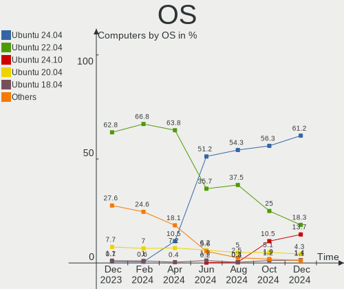
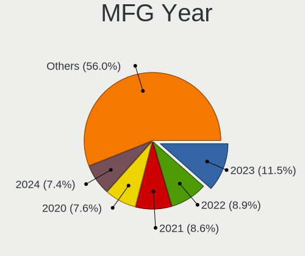
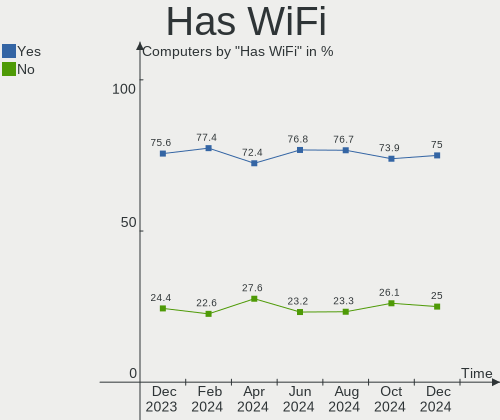
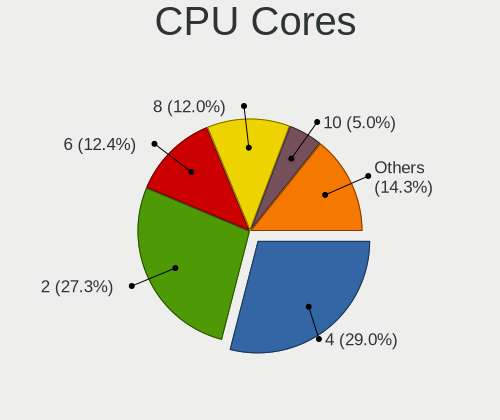
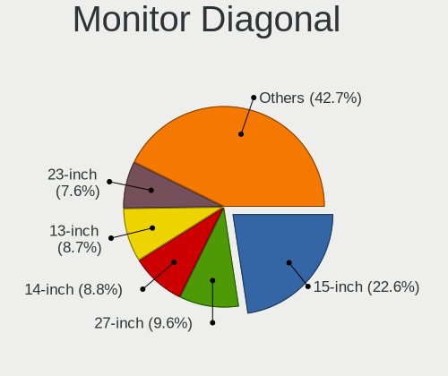
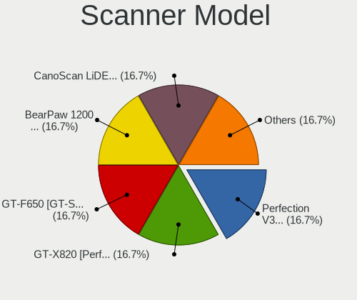

Ubuntu Hardware Trends
----------------------

A project to identify most popular hardware characteristics and track their change
over time based on data collected by Ubuntu users at https://Linux-Hardware.org.

Anyone can contribute to this report by the [hw-probe](https://github.com/linuxhw/hw-probe) tool:

    sudo -E hw-probe -all -upload

This is a report for all computer types. See also reports for [desktops](/Dist/Ubuntu/Desktop/README.md) and [notebooks](/Dist/Ubuntu/Notebook/README.md).

Full-feature report is available here: https://linux-hardware.org/?view=trends

Period: Dec, 2021.

Contents
--------

* [ System ](#system)
  - [ OS                       ](#os)
  - [ OS Family                ](#os-family)
  - [ Kernel                   ](#kernel)
  - [ Kernel Family            ](#kernel-family)
  - [ Kernel Major Ver.        ](#kernel-major-ver)
  - [ Arch                     ](#arch)
  - [ DE                       ](#de)
  - [ Display Server           ](#display-server)
  - [ Display Manager          ](#display-manager)
  - [ OS Lang                  ](#os-lang)
  - [ Boot Mode                ](#boot-mode)
  - [ Filesystem               ](#filesystem)
  - [ Part. scheme             ](#part-scheme)
  - [ Dual Boot with Linux/BSD ](#dual-boot-with-linuxbsd)
  - [ Dual Boot (Win)          ](#dual-boot-win)

* [ Board ](#board)
  - [ Vendor                   ](#vendor)
  - [ Model                    ](#model)
  - [ Model Family             ](#model-family)
  - [ MFG Year                 ](#mfg-year)
  - [ Form Factor              ](#form-factor)
  - [ Secure Boot              ](#secure-boot)
  - [ Coreboot                 ](#coreboot)
  - [ RAM Size                 ](#ram-size)
  - [ RAM Used                 ](#ram-used)
  - [ Total Drives             ](#total-drives)
  - [ Has CD-ROM               ](#has-cd-rom)
  - [ Has Ethernet             ](#has-ethernet)
  - [ Has WiFi                 ](#has-wifi)
  - [ Has Bluetooth            ](#has-bluetooth)

* [ Location ](#location)
  - [ Country                  ](#country)
  - [ City                     ](#city)

* [ Drives ](#drives)
  - [ Drive Vendor             ](#drive-vendor)
  - [ Drive Model              ](#drive-model)
  - [ HDD Vendor               ](#hdd-vendor)
  - [ SSD Vendor               ](#ssd-vendor)
  - [ Drive Kind               ](#drive-kind)
  - [ Drive Connector          ](#drive-connector)
  - [ Drive Size               ](#drive-size)
  - [ Space Total              ](#space-total)
  - [ Space Used               ](#space-used)
  - [ Malfunc. Drives          ](#malfunc-drives)
  - [ Malfunc. Drive Vendor    ](#malfunc-drive-vendor)
  - [ Malfunc. HDD Vendor      ](#malfunc-hdd-vendor)
  - [ Malfunc. Drive Kind      ](#malfunc-drive-kind)
  - [ Failed Drives            ](#failed-drives)
  - [ Failed Drive Vendor      ](#failed-drive-vendor)
  - [ Drive Status             ](#drive-status)

* [ Storage controller ](#storage-controller)
  - [ Storage Vendor           ](#storage-vendor)
  - [ Storage Model            ](#storage-model)
  - [ Storage Kind             ](#storage-kind)

* [ Processor ](#processor)
  - [ CPU Vendor               ](#cpu-vendor)
  - [ CPU Model                ](#cpu-model)
  - [ CPU Model Family         ](#cpu-model-family)
  - [ CPU Cores                ](#cpu-cores)
  - [ CPU Sockets              ](#cpu-sockets)
  - [ CPU Threads              ](#cpu-threads)
  - [ CPU Op-Modes             ](#cpu-op-modes)
  - [ CPU Microcode            ](#cpu-microcode)
  - [ CPU Microarch            ](#cpu-microarch)

* [ Graphics ](#graphics)
  - [ GPU Vendor               ](#gpu-vendor)
  - [ GPU Model                ](#gpu-model)
  - [ GPU Combo                ](#gpu-combo)
  - [ GPU Driver               ](#gpu-driver)
  - [ GPU Memory               ](#gpu-memory)

* [ Monitor ](#monitor)
  - [ Monitor Vendor           ](#monitor-vendor)
  - [ Monitor Model            ](#monitor-model)
  - [ Monitor Resolution       ](#monitor-resolution)
  - [ Monitor Diagonal         ](#monitor-diagonal)
  - [ Monitor Width            ](#monitor-width)
  - [ Aspect Ratio             ](#aspect-ratio)
  - [ Monitor Area             ](#monitor-area)
  - [ Pixel Density            ](#pixel-density)
  - [ Multiple Monitors        ](#multiple-monitors)

* [ Network ](#network)
  - [ Net Controller Vendor    ](#net-controller-vendor)
  - [ Net Controller Model     ](#net-controller-model)
  - [ Wireless Vendor          ](#wireless-vendor)
  - [ Wireless Model           ](#wireless-model)
  - [ Ethernet Vendor          ](#ethernet-vendor)
  - [ Ethernet Model           ](#ethernet-model)
  - [ Net Controller Kind      ](#net-controller-kind)
  - [ Used Controller          ](#used-controller)
  - [ NICs                     ](#nics)
  - [ IPv6                     ](#ipv6)

* [ Bluetooth ](#bluetooth)
  - [ Bluetooth Vendor         ](#bluetooth-vendor)
  - [ Bluetooth Model          ](#bluetooth-model)

* [ Sound ](#sound)
  - [ Sound Vendor             ](#sound-vendor)
  - [ Sound Model              ](#sound-model)

* [ Memory ](#memory)
  - [ Memory Vendor            ](#memory-vendor)
  - [ Memory Model             ](#memory-model)
  - [ Memory Kind              ](#memory-kind)
  - [ Memory Form Factor       ](#memory-form-factor)
  - [ Memory Size              ](#memory-size)
  - [ Memory Speed             ](#memory-speed)

* [ Printers & scanners ](#printers--scanners)
  - [ Printer Vendor           ](#printer-vendor)
  - [ Printer Model            ](#printer-model)
  - [ Scanner Vendor           ](#scanner-vendor)
  - [ Scanner Model            ](#scanner-model)

* [ Camera ](#camera)
  - [ Camera Vendor            ](#camera-vendor)
  - [ Camera Model             ](#camera-model)

* [ Security ](#security)
  - [ Fingerprint Vendor       ](#fingerprint-vendor)
  - [ Fingerprint Model        ](#fingerprint-model)
  - [ Chipcard Vendor          ](#chipcard-vendor)
  - [ Chipcard Model           ](#chipcard-model)

* [ Unsupported ](#unsupported)
  - [ Unsupported Devices      ](#unsupported-devices)
  - [ Unsupported Device Types ](#unsupported-device-types)

System
------

OS
--

Installed operating systems

| Name           | Computers | Percent |
|----------------|-----------|---------|
| Ubuntu 20.04   | 894       | 65.74%  |
| Ubuntu 21.10   | 326       | 23.97%  |
| Ubuntu 18.04   | 62        | 4.56%   |
| Ubuntu 21.04   | 56        | 4.12%   |
| Ubuntu 22.04   | 9         | 0.66%   |
| Ubuntu 20.10   | 6         | 0.44%   |
| Ubuntu 16.04   | 3         | 0.22%   |
| Ubuntu 19.10   | 2         | 0.15%   |
| Ubuntu 20.04.3 | 1         | 0.07%   |
| Ubuntu 14.04   | 1         | 0.07%   |

OS Family
---------

OS without a version

| Name   | Computers | Percent |
|--------|-----------|---------|
| Ubuntu | 1360      | 100%    |

Kernel
------

Version of the Linux kernel

| Version                    | Computers | Percent |
|----------------------------|-----------|---------|
| 5.11.0-41-generic          | 337       | 24.78%  |
| 5.11.0-43-generic          | 291       | 21.4%   |
| 5.13.0-22-generic          | 241       | 17.72%  |
| 5.4.0-91-generic           | 132       | 9.71%   |
| 5.11.0-27-generic          | 46        | 3.38%   |
| 5.13.0-19-generic          | 33        | 2.43%   |
| 5.11.0-40-generic          | 32        | 2.35%   |
| 5.13.0-23-generic          | 21        | 1.54%   |
| 5.11.0-42-generic          | 19        | 1.4%    |
| 5.11.0-44-generic          | 17        | 1.25%   |
| 5.13.0-1011-raspi          | 12        | 0.88%   |
| 4.15.0-163-generic         | 12        | 0.88%   |
| 5.13.0-21-generic          | 11        | 0.81%   |
| 5.4.0-90-generic           | 9         | 0.66%   |
| 5.11.0-38-generic          | 7         | 0.51%   |
| 5.4.0-42-generic           | 5         | 0.37%   |
| 5.10.0-1052-oem            | 5         | 0.37%   |
| 5.8.0-63-generic           | 4         | 0.29%   |
| 5.4.0-92-generic           | 4         | 0.29%   |
| 5.4.0-1047-raspi           | 3         | 0.22%   |
| 5.11.0-36-generic          | 3         | 0.22%   |
| 5.11.0-1007-raspi          | 3         | 0.22%   |
| 4.15.0-142-generic         | 3         | 0.22%   |
| 5.8.0-55-generic           | 2         | 0.15%   |
| 5.8.0-50-generic           | 2         | 0.15%   |
| 5.4.0-84-generic           | 2         | 0.15%   |
| 5.4.0-73-generic           | 2         | 0.15%   |
| 5.4.0-65-generic           | 2         | 0.15%   |
| 5.4.0-56-generic           | 2         | 0.15%   |
| 5.4.0-26-generic           | 2         | 0.15%   |
| 5.16.0-051600rc3-generic   | 2         | 0.15%   |
| 5.15.7-051507-generic      | 2         | 0.15%   |
| 5.15.6-051506-generic      | 2         | 0.15%   |
| 5.15.2-051502-generic      | 2         | 0.15%   |
| 5.14.0-1011-oem            | 2         | 0.15%   |
| 5.13.0-22-lowlatency       | 2         | 0.15%   |
| 5.13.0-20-generic          | 2         | 0.15%   |
| 5.13.0-1020-oem            | 2         | 0.15%   |
| 5.11.0-43-lowlatency       | 2         | 0.15%   |
| 5.11.0-37-generic          | 2         | 0.15%   |
| 5.11.0-25-generic          | 2         | 0.15%   |
| 5.11.0-16-generic          | 2         | 0.15%   |
| 5.11.0-1023-raspi          | 2         | 0.15%   |
| 4.9.201-tegra              | 2         | 0.15%   |
| 4.15.0-166-generic         | 2         | 0.15%   |
| 4.15.0-161-generic         | 2         | 0.15%   |
| 4.15.0-159-generic         | 2         | 0.15%   |
| 5.9.16-050916-generic      | 1         | 0.07%   |
| 5.8.0-59-generic           | 1         | 0.07%   |
| 5.8.0-43-generic           | 1         | 0.07%   |
| 5.8.0-25-generic           | 1         | 0.07%   |
| 5.8.0-1011-raspi           | 1         | 0.07%   |
| 5.6.0-1036-oem             | 1         | 0.07%   |
| 5.5.5-050505-generic       | 1         | 0.07%   |
| 5.4.0-91-lowlatency        | 1         | 0.07%   |
| 5.4.0-902110311031-generic | 1         | 0.07%   |
| 5.4.0-90-lowlatency        | 1         | 0.07%   |
| 5.4.0-89-generic           | 1         | 0.07%   |
| 5.4.0-88-generic           | 1         | 0.07%   |
| 5.4.0-81-lowlatency        | 1         | 0.07%   |

Kernel Family
-------------

Linux kernel without a distro release

| Version | Computers | Percent |
|---------|-----------|---------|
| 5.11.0  | 767       | 56.4%   |
| 5.13.0  | 330       | 24.26%  |
| 5.4.0   | 179       | 13.16%  |
| 4.15.0  | 25        | 1.84%   |
| 5.8.0   | 12        | 0.88%   |
| 5.10.0  | 6         | 0.44%   |
| 5.3.0   | 3         | 0.22%   |
| 5.15.0  | 3         | 0.22%   |
| 5.14.0  | 3         | 0.22%   |
| 5.16.0  | 2         | 0.15%   |
| 5.15.7  | 2         | 0.15%   |
| 5.15.6  | 2         | 0.15%   |
| 5.15.5  | 2         | 0.15%   |
| 5.15.2  | 2         | 0.15%   |
| 5.15.12 | 2         | 0.15%   |
| 5.15.10 | 2         | 0.15%   |
| 4.9.201 | 2         | 0.15%   |
| 5.9.16  | 1         | 0.07%   |
| 5.6.0   | 1         | 0.07%   |
| 5.5.5   | 1         | 0.07%   |
| 5.15.8  | 1         | 0.07%   |
| 5.15.1  | 1         | 0.07%   |
| 5.14.14 | 1         | 0.07%   |
| 5.14.11 | 1         | 0.07%   |
| 5.14.1  | 1         | 0.07%   |
| 5.13.11 | 1         | 0.07%   |
| 5.12.0  | 1         | 0.07%   |
| 5.10.43 | 1         | 0.07%   |
| 5.10.32 | 1         | 0.07%   |
| 5.1.0   | 1         | 0.07%   |
| 4.9.253 | 1         | 0.07%   |
| 4.9.241 | 1         | 0.07%   |
| 4.4.0   | 1         | 0.07%   |

Kernel Major Ver.
-----------------

Linux kernel major version

| Version | Computers | Percent |
|---------|-----------|---------|
| 5.11    | 767       | 56.4%   |
| 5.13    | 331       | 24.34%  |
| 5.4     | 179       | 13.16%  |
| 4.15    | 25        | 1.84%   |
| 5.15    | 17        | 1.25%   |
| 5.8     | 12        | 0.88%   |
| 5.10    | 8         | 0.59%   |
| 5.14    | 6         | 0.44%   |
| 4.9     | 4         | 0.29%   |
| 5.3     | 3         | 0.22%   |
| 5.16    | 2         | 0.15%   |
| 5.9     | 1         | 0.07%   |
| 5.6     | 1         | 0.07%   |
| 5.5     | 1         | 0.07%   |
| 5.12    | 1         | 0.07%   |
| 5.1     | 1         | 0.07%   |
| 4.4     | 1         | 0.07%   |

Arch
----

OS architecture (x86_64, i586, etc.)

| Name    | Computers | Percent |
|---------|-----------|---------|
| x86_64  | 1322      | 97.21%  |
| aarch64 | 26        | 1.91%   |
| i686    | 12        | 0.88%   |

DE
--

Desktop Environment

| Name              | Computers | Percent |
|-------------------|-----------|---------|
| GNOME             | 1261      | 92.72%  |
| Unknown           | 54        | 3.97%   |
| Unity             | 19        | 1.4%    |
| X-Cinnamon        | 13        | 0.96%   |
| GNOME Flashback   | 5         | 0.37%   |
| Cinnamon          | 3         | 0.22%   |
| i3                | 2         | 0.15%   |
| Yaru:ubuntu:GNOME | 1         | 0.07%   |
| Pantheon          | 1         | 0.07%   |
| GNOME Classic     | 1         | 0.07%   |

Display Server
--------------

X11 or Wayland

| Name    | Computers | Percent |
|---------|-----------|---------|
| X11     | 1015      | 74.63%  |
| Wayland | 299       | 21.99%  |
| Tty     | 26        | 1.91%   |
| Unknown | 20        | 1.47%   |

Display Manager
---------------

SDDM, LightDM, etc.

| Name    | Computers | Percent |
|---------|-----------|---------|
| GDM3    | 857       | 63.01%  |
| GDM     | 392       | 28.82%  |
| Unknown | 75        | 5.51%   |
| LightDM | 32        | 2.35%   |
| SLiM    | 2         | 0.15%   |
| SDDM    | 2         | 0.15%   |

OS Lang
-------

Language

| Lang    | Computers | Percent |
|---------|-----------|---------|
| en_US   | 557       | 40.96%  |
| de_DE   | 171       | 12.57%  |
| fr_FR   | 96        | 7.06%   |
| en_GB   | 68        | 5%      |
| en_IN   | 50        | 3.68%   |
| pt_BR   | 40        | 2.94%   |
| ru_RU   | 36        | 2.65%   |
| es_ES   | 36        | 2.65%   |
| en_CA   | 30        | 2.21%   |
| it_IT   | 27        | 1.99%   |
| en_AU   | 24        | 1.76%   |
| C       | 21        | 1.54%   |
| nl_NL   | 19        | 1.4%    |
| pl_PL   | 16        | 1.18%   |
| zh_CN   | 14        | 1.03%   |
| hu_HU   | 14        | 1.03%   |
| de_CH   | 11        | 0.81%   |
| en_ZA   | 9         | 0.66%   |
| Unknown | 9         | 0.66%   |
| zh_TW   | 8         | 0.59%   |
| de_AT   | 8         | 0.59%   |
| sv_SE   | 7         | 0.51%   |
| cs_CZ   | 7         | 0.51%   |
| ja_JP   | 6         | 0.44%   |
| es_MX   | 6         | 0.44%   |
| es_AR   | 6         | 0.44%   |
| da_DK   | 6         | 0.44%   |
| ru_UA   | 5         | 0.37%   |
| fr_BE   | 4         | 0.29%   |
| sk_SK   | 3         | 0.22%   |
| pt_PT   | 3         | 0.22%   |
| nb_NO   | 3         | 0.22%   |
| ko_KR   | 3         | 0.22%   |
| es_CL   | 3         | 0.22%   |
| en_SG   | 3         | 0.22%   |
| tr_TR   | 2         | 0.15%   |
| nl_BE   | 2         | 0.15%   |
| hr_HR   | 2         | 0.15%   |
| fr_CH   | 2         | 0.15%   |
| fi_FI   | 2         | 0.15%   |
| en_IE   | 2         | 0.15%   |
| el_GR   | 2         | 0.15%   |
| vi_VN   | 1         | 0.07%   |
| sr_RS   | 1         | 0.07%   |
| ro_RO   | 1         | 0.07%   |
| fr_CA   | 1         | 0.07%   |
| et_EE   | 1         | 0.07%   |
| es_UY   | 1         | 0.07%   |
| es_US   | 1         | 0.07%   |
| es_PE   | 1         | 0.07%   |
| es_DO   | 1         | 0.07%   |
| es_CO   | 1         | 0.07%   |
| en_PH   | 1         | 0.07%   |
| en_NZ   | 1         | 0.07%   |
| en_NG   | 1         | 0.07%   |
| en_HK   | 1         | 0.07%   |
| en_DE   | 1         | 0.07%   |
| bg_BG   | 1         | 0.07%   |
| ar_EG   | 1         | 0.07%   |

Boot Mode
---------

EFI or BIOS

| Mode | Computers | Percent |
|------|-----------|---------|
| BIOS | 701       | 51.54%  |
| EFI  | 659       | 48.46%  |

Filesystem
----------

Type of filesystem

| Type    | Computers | Percent |
|---------|-----------|---------|
| Ext4    | 1267      | 93.16%  |
| Overlay | 49        | 3.6%    |
| Zfs     | 23        | 1.69%   |
| Ext2    | 8         | 0.59%   |
| Btrfs   | 8         | 0.59%   |
| Xfs     | 2         | 0.15%   |
| Ext3    | 2         | 0.15%   |
| Unknown | 1         | 0.07%   |

Part. scheme
------------

Scheme of partitioning

| Type    | Computers | Percent |
|---------|-----------|---------|
| Unknown | 918       | 67.5%   |
| GPT     | 365       | 26.84%  |
| MBR     | 77        | 5.66%   |

Dual Boot with Linux/BSD
------------------------

Hosting more than one Linux/BSD

| Dual boot | Computers | Percent |
|-----------|-----------|---------|
| No        | 1193      | 87.72%  |
| Yes       | 167       | 12.28%  |

Dual Boot (Win)
---------------

Hosting Linux and Windows

| Dual boot | Computers | Percent |
|-----------|-----------|---------|
| No        | 846       | 62.21%  |
| Yes       | 514       | 37.79%  |

Board
-----

Vendor
------

Motherboard manufacturer

| Name                    | Computers | Percent |
|-------------------------|-----------|---------|
| ASUSTek Computer        | 208       | 15.29%  |
| Dell                    | 204       | 15%     |
| Hewlett-Packard         | 198       | 14.56%  |
| Lenovo                  | 172       | 12.65%  |
| Gigabyte Technology     | 93        | 6.84%   |
| MSI                     | 73        | 5.37%   |
| Acer                    | 73        | 5.37%   |
| ASRock                  | 38        | 2.79%   |
| Apple                   | 33        | 2.43%   |
| Intel                   | 32        | 2.35%   |
| Toshiba                 | 23        | 1.69%   |
| Raspberry Pi Foundation | 22        | 1.62%   |
| Sony                    | 17        | 1.25%   |
| HUAWEI                  | 14        | 1.03%   |
| Samsung Electronics     | 12        | 0.88%   |
| Fujitsu                 | 12        | 0.88%   |
| Unknown                 | 12        | 0.88%   |
| Medion                  | 9         | 0.66%   |
| Pegatron                | 7         | 0.51%   |
| Foxconn                 | 6         | 0.44%   |
| Biostar                 | 6         | 0.44%   |
| Packard Bell            | 5         | 0.37%   |
| Microsoft               | 5         | 0.37%   |
| Fujitsu Siemens         | 4         | 0.29%   |
| Alienware               | 4         | 0.29%   |
| Razer                   | 3         | 0.22%   |
| Nvidia                  | 3         | 0.22%   |
| LG Electronics          | 3         | 0.22%   |
| Huanan                  | 3         | 0.22%   |
| Gateway                 | 3         | 0.22%   |
| Clevo                   | 3         | 0.22%   |
| Chuwi                   | 3         | 0.22%   |
| Avell High Performance  | 3         | 0.22%   |
| ZOTAC                   | 2         | 0.15%   |
| Supermicro              | 2         | 0.15%   |
| Shuttle                 | 2         | 0.15%   |
| OEM                     | 2         | 0.15%   |
| Mediacom                | 2         | 0.15%   |
| HONOR                   | 2         | 0.15%   |
| Google                  | 2         | 0.15%   |
| EVGA                    | 2         | 0.15%   |
| eMachines               | 2         | 0.15%   |
| ASRockRack              | 2         | 0.15%   |
| AMI                     | 2         | 0.15%   |
| YJKC                    | 1         | 0.07%   |
| Wortmann AG             | 1         | 0.07%   |
| UNOWHY                  | 1         | 0.07%   |
| UMAX                    | 1         | 0.07%   |
| TUXEDO                  | 1         | 0.07%   |
| Timi                    | 1         | 0.07%   |
| Sun Microsystems        | 1         | 0.07%   |
| SLIMBOOK                | 1         | 0.07%   |
| Schenker                | 1         | 0.07%   |
| Positivo                | 1         | 0.07%   |
| Panasonic               | 1         | 0.07%   |
| Notebook                | 1         | 0.07%   |
| MiTAC                   | 1         | 0.07%   |
| Login Informatica       | 1         | 0.07%   |
| Khadas                  | 1         | 0.07%   |
| Jooyontech Computer     | 1         | 0.07%   |

Model
-----

Motherboard model

| Name                                                  | Computers | Percent |
|-------------------------------------------------------|-----------|---------|
| RPi Raspberry Pi                                      | 22        | 1.62%   |
| Unknown                                               | 13        | 0.96%   |
| ASUS All Series                                       | 11        | 0.81%   |
| HP Pavilion g6                                        | 5         | 0.37%   |
| HP Notebook                                           | 5         | 0.37%   |
| Dell OptiPlex 7010                                    | 5         | 0.37%   |
| MSI MS-7C37                                           | 4         | 0.29%   |
| HP EliteBook 840 G6                                   | 4         | 0.29%   |
| HP 255 G8 Notebook PC                                 | 4         | 0.29%   |
| ASUS PRIME B450M-A                                    | 4         | 0.29%   |
| Nvidia Tegra                                          | 3         | 0.22%   |
| MSI MS-7C52                                           | 3         | 0.22%   |
| MSI MS-7C02                                           | 3         | 0.22%   |
| HUAWEI BOHK-WAX9X                                     | 3         | 0.22%   |
| HP ProBook 450 G8 Notebook PC                         | 3         | 0.22%   |
| HP Pavilion Notebook                                  | 3         | 0.22%   |
| HP Pavilion dv7                                       | 3         | 0.22%   |
| HP Pavilion dv6                                       | 3         | 0.22%   |
| HP Pavilion 15                                        | 3         | 0.22%   |
| HP EliteBook 840 G2                                   | 3         | 0.22%   |
| Gigabyte X470 AORUS ULTRA GAMING                      | 3         | 0.22%   |
| Gigabyte B550M DS3H                                   | 3         | 0.22%   |
| Gigabyte 970A-DS3P                                    | 3         | 0.22%   |
| Dell Precision 3650 Tower                             | 3         | 0.22%   |
| Dell OptiPlex 9010                                    | 3         | 0.22%   |
| Dell OptiPlex 3020                                    | 3         | 0.22%   |
| Dell OptiPlex 3010                                    | 3         | 0.22%   |
| Dell Latitude E7470                                   | 3         | 0.22%   |
| Dell Latitude E6430                                   | 3         | 0.22%   |
| Dell Latitude E6410                                   | 3         | 0.22%   |
| Dell Latitude E6400                                   | 3         | 0.22%   |
| Dell Inspiron 1545                                    | 3         | 0.22%   |
| ASUS TUF GAMING Z690-PLUS WIFI D4                     | 3         | 0.22%   |
| ASUS PRIME A320M-K                                    | 3         | 0.22%   |
| ASUS P8Z77-V LX                                       | 3         | 0.22%   |
| ASUS CROSSHAIR VI HERO                                | 3         | 0.22%   |
| Apple MacBookPro7,1                                   | 3         | 0.22%   |
| Razer Blade 15 Advanced Model (Early 2020) - RZ09-033 | 2         | 0.15%   |
| MSI MS-7C81                                           | 2         | 0.15%   |
| MSI MS-7C35                                           | 2         | 0.15%   |
| MSI MS-7B79                                           | 2         | 0.15%   |
| MSI MS-7A70                                           | 2         | 0.15%   |
| MSI MS-7978                                           | 2         | 0.15%   |
| MSI MS-7817                                           | 2         | 0.15%   |
| MSI GE66 Raider 10SFS                                 | 2         | 0.15%   |
| Microsoft Surface Pro 4                               | 2         | 0.15%   |
| Mediacom GTZS                                         | 2         | 0.15%   |
| Lenovo ThinkPad W520 42844LG                          | 2         | 0.15%   |
| Lenovo ThinkPad L15 Gen 2 20X3CTO1WW                  | 2         | 0.15%   |
| Lenovo ThinkBook 15 G3 ACL 21A4                       | 2         | 0.15%   |
| Lenovo ThinkBook 14p Gen 2 20YN                       | 2         | 0.15%   |
| Lenovo IdeaPad S145-15IWL 81MV                        | 2         | 0.15%   |
| Lenovo IdeaPad 5 15ITL05 82FG                         | 2         | 0.15%   |
| Lenovo IdeaPad 3 14ALC6 82KT                          | 2         | 0.15%   |
| Intel NUC8i5BEH                                       | 2         | 0.15%   |
| Intel NUC10i7FNH                                      | 2         | 0.15%   |
| Intel H61                                             | 2         | 0.15%   |
| HUAWEI NBLK-WAX9X                                     | 2         | 0.15%   |
| HUAWEI KLVL-WXX9                                      | 2         | 0.15%   |
| HUAWEI HVY-WXX9                                       | 2         | 0.15%   |

Model Family
------------

Motherboard model prefix

| Name                  | Computers | Percent |
|-----------------------|-----------|---------|
| Lenovo ThinkPad       | 73        | 5.37%   |
| Dell Inspiron         | 53        | 3.9%    |
| Dell Latitude         | 51        | 3.75%   |
| Acer Aspire           | 48        | 3.53%   |
| HP Pavilion           | 37        | 2.72%   |
| Lenovo IdeaPad        | 34        | 2.5%    |
| Dell OptiPlex         | 28        | 2.06%   |
| HP EliteBook          | 26        | 1.91%   |
| Dell Precision        | 24        | 1.76%   |
| RPi Raspberry         | 22        | 1.62%   |
| HP ProBook            | 22        | 1.62%   |
| ASUS ROG              | 21        | 1.54%   |
| Dell XPS              | 20        | 1.47%   |
| ASUS PRIME            | 20        | 1.47%   |
| HP Laptop             | 18        | 1.32%   |
| Toshiba Satellite     | 17        | 1.25%   |
| HP Compaq             | 16        | 1.18%   |
| ASUS TUF              | 13        | 0.96%   |
| Unknown               | 13        | 0.96%   |
| HP ENVY               | 12        | 0.88%   |
| ASUS VivoBook         | 12        | 0.88%   |
| ASUS All              | 11        | 0.81%   |
| Acer Swift            | 11        | 0.81%   |
| Lenovo ThinkCentre    | 10        | 0.74%   |
| Gigabyte X570         | 10        | 0.74%   |
| Fujitsu LIFEBOOK      | 10        | 0.74%   |
| Dell Vostro           | 10        | 0.74%   |
| Lenovo ThinkBook      | 8         | 0.59%   |
| HP ZBook              | 8         | 0.59%   |
| ASUS ZenBook          | 6         | 0.44%   |
| Microsoft Surface     | 5         | 0.37%   |
| Lenovo Yoga           | 5         | 0.37%   |
| HP Spectre            | 5         | 0.37%   |
| HP Notebook           | 5         | 0.37%   |
| HP EliteDesk          | 5         | 0.37%   |
| HP 255                | 5         | 0.37%   |
| ASUS P8Z77-V          | 5         | 0.37%   |
| Packard Bell EasyNote | 4         | 0.29%   |
| MSI MS-7C37           | 4         | 0.29%   |
| Lenovo Legion         | 4         | 0.29%   |
| HP ProLiant           | 4         | 0.29%   |
| HP ProDesk            | 4         | 0.29%   |
| Gigabyte 970A-DS3P    | 4         | 0.29%   |
| Dell PowerEdge        | 4         | 0.29%   |
| ASUS M5A97            | 4         | 0.29%   |
| ASUS M5A78L-M         | 4         | 0.29%   |
| ASUS CROSSHAIR        | 4         | 0.29%   |
| ASUS ASUS             | 4         | 0.29%   |
| Toshiba TECRA         | 3         | 0.22%   |
| Razer Blade           | 3         | 0.22%   |
| Nvidia Tegra          | 3         | 0.22%   |
| MSI Prestige          | 3         | 0.22%   |
| MSI MS-7C52           | 3         | 0.22%   |
| MSI MS-7C02           | 3         | 0.22%   |
| MSI GE66              | 3         | 0.22%   |
| HUAWEI BOHK-WAX9X     | 3         | 0.22%   |
| HP 250                | 3         | 0.22%   |
| HP 15                 | 3         | 0.22%   |
| Gigabyte Z390         | 3         | 0.22%   |
| Gigabyte X470         | 3         | 0.22%   |

MFG Year
--------

Motherboard manufacture year

| Year    | Computers | Percent |
|---------|-----------|---------|
| 2021    | 308       | 22.65%  |
| 2020    | 139       | 10.22%  |
| 2019    | 135       | 9.93%   |
| 2018    | 106       | 7.79%   |
| 2011    | 81        | 5.96%   |
| 2012    | 74        | 5.44%   |
| 2014    | 73        | 5.37%   |
| 2013    | 72        | 5.29%   |
| 2010    | 68        | 5%      |
| 2016    | 63        | 4.63%   |
| 2015    | 61        | 4.49%   |
| 2017    | 50        | 3.68%   |
| 2009    | 39        | 2.87%   |
| 2008    | 37        | 2.72%   |
| Unknown | 26        | 1.91%   |
| 2007    | 19        | 1.4%    |
| 2006    | 6         | 0.44%   |
| 2005    | 2         | 0.15%   |
| 1906    | 1         | 0.07%   |

Form Factor
-----------

Physical design of the computer

| Name           | Computers | Percent |
|----------------|-----------|---------|
| Notebook       | 724       | 53.24%  |
| Desktop        | 512       | 37.65%  |
| Convertible    | 35        | 2.57%   |
| System on chip | 26        | 1.91%   |
| Mini pc        | 23        | 1.69%   |
| Server         | 16        | 1.18%   |
| All in one     | 14        | 1.03%   |
| Tablet         | 10        | 0.74%   |

Secure Boot
-----------

Enabled or disabled

| State    | Computers | Percent |
|----------|-----------|---------|
| Disabled | 1193      | 87.72%  |
| Enabled  | 167       | 12.28%  |

Coreboot
--------

Have coreboot on board

| Used | Computers | Percent |
|------|-----------|---------|
| No   | 1358      | 99.85%  |
| Yes  | 2         | 0.15%   |

RAM Size
--------

Total RAM memory

| Size in GB      | Computers | Percent |
|-----------------|-----------|---------|
| 4.01-8.0        | 341       | 25.07%  |
| 3.01-4.0        | 277       | 20.37%  |
| 16.01-24.0      | 263       | 19.34%  |
| 8.01-16.0       | 226       | 16.62%  |
| 32.01-64.0      | 133       | 9.78%   |
| 64.01-256.0     | 43        | 3.16%   |
| 1.01-2.0        | 40        | 2.94%   |
| 2.01-3.0        | 18        | 1.32%   |
| 24.01-32.0      | 12        | 0.88%   |
| More than 256.0 | 3         | 0.22%   |
| 0.51-1.0        | 3         | 0.22%   |
| 0.01-0.5        | 1         | 0.07%   |

RAM Used
--------

Used RAM memory

| Used GB     | Computers | Percent |
|-------------|-----------|---------|
| 1.01-2.0    | 547       | 40.22%  |
| 2.01-3.0    | 371       | 27.28%  |
| 3.01-4.0    | 174       | 12.79%  |
| 4.01-8.0    | 170       | 12.5%   |
| 8.01-16.0   | 59        | 4.34%   |
| 0.51-1.0    | 23        | 1.69%   |
| 16.01-24.0  | 7         | 0.51%   |
| 0.01-0.5    | 6         | 0.44%   |
| 24.01-32.0  | 2         | 0.15%   |
| 64.01-256.0 | 1         | 0.07%   |

Total Drives
------------

Number of drives on board

| Drives | Computers | Percent |
|--------|-----------|---------|
| 1      | 849       | 62.43%  |
| 2      | 326       | 23.97%  |
| 3      | 82        | 6.03%   |
| 4      | 52        | 3.82%   |
| 5      | 20        | 1.47%   |
| 0      | 13        | 0.96%   |
| 6      | 8         | 0.59%   |
| 7      | 6         | 0.44%   |
| 21     | 1         | 0.07%   |
| 10     | 1         | 0.07%   |
| 9      | 1         | 0.07%   |
| 8      | 1         | 0.07%   |

Has CD-ROM
----------

Has CD-ROM on board

| Presented | Computers | Percent |
|-----------|-----------|---------|
| No        | 826       | 60.74%  |
| Yes       | 534       | 39.26%  |

Has Ethernet
------------

Has Ethernet on board

| Presented | Computers | Percent |
|-----------|-----------|---------|
| Yes       | 1152      | 84.71%  |
| No        | 208       | 15.29%  |

Has WiFi
--------

Has WiFi module

| Presented | Computers | Percent |
|-----------|-----------|---------|
| Yes       | 1013      | 74.49%  |
| No        | 347       | 25.51%  |

Has Bluetooth
-------------

Has Bluetooth module

| Presented | Computers | Percent |
|-----------|-----------|---------|
| Yes       | 791       | 58.16%  |
| No        | 569       | 41.84%  |

Location
--------

Country
-------

Geographic location (country)

| Country            | Computers | Percent |
|--------------------|-----------|---------|
| USA                | 256       | 18.82%  |
| Germany            | 189       | 13.9%   |
| France             | 104       | 7.65%   |
| UK                 | 63        | 4.63%   |
| India              | 54        | 3.97%   |
| Brazil             | 54        | 3.97%   |
| Russia             | 48        | 3.53%   |
| Spain              | 42        | 3.09%   |
| Italy              | 40        | 2.94%   |
| Canada             | 34        | 2.5%    |
| Switzerland        | 28        | 2.06%   |
| Poland             | 28        | 2.06%   |
| Australia          | 27        | 1.99%   |
| Netherlands        | 22        | 1.62%   |
| Ukraine            | 17        | 1.25%   |
| Belgium            | 17        | 1.25%   |
| Sweden             | 16        | 1.18%   |
| Denmark            | 15        | 1.1%    |
| China              | 15        | 1.1%    |
| Austria            | 15        | 1.1%    |
| Mexico             | 14        | 1.03%   |
| Hungary            | 14        | 1.03%   |
| Turkey             | 12        | 0.88%   |
| Czechia            | 12        | 0.88%   |
| South Africa       | 11        | 0.81%   |
| Romania            | 11        | 0.81%   |
| Greece             | 11        | 0.81%   |
| Japan              | 10        | 0.74%   |
| Argentina          | 10        | 0.74%   |
| Taiwan             | 9         | 0.66%   |
| Iran               | 9         | 0.66%   |
| Finland            | 8         | 0.59%   |
| Serbia             | 7         | 0.51%   |
| Portugal           | 7         | 0.51%   |
| Bulgaria           | 7         | 0.51%   |
| Croatia            | 6         | 0.44%   |
| Vietnam            | 5         | 0.37%   |
| Israel             | 5         | 0.37%   |
| South Korea        | 4         | 0.29%   |
| Slovenia           | 4         | 0.29%   |
| Slovakia           | 4         | 0.29%   |
| Singapore          | 4         | 0.29%   |
| Pakistan           | 4         | 0.29%   |
| Norway             | 4         | 0.29%   |
| Malaysia           | 4         | 0.29%   |
| Indonesia          | 4         | 0.29%   |
| Hong Kong          | 4         | 0.29%   |
| Egypt              | 4         | 0.29%   |
| Thailand           | 3         | 0.22%   |
| Saudi Arabia       | 3         | 0.22%   |
| Nepal              | 3         | 0.22%   |
| Georgia            | 3         | 0.22%   |
| Dominican Republic | 3         | 0.22%   |
| Colombia           | 3         | 0.22%   |
| Chile              | 3         | 0.22%   |
| Peru               | 2         | 0.15%   |
| Morocco            | 2         | 0.15%   |
| Lebanon            | 2         | 0.15%   |
| Kenya              | 2         | 0.15%   |
| Guadeloupe         | 2         | 0.15%   |

City
----

Geographic location (city)

| City              | Computers | Percent |
|-------------------|-----------|---------|
| Berlin            | 18        | 1.32%   |
| Paris             | 14        | 1.03%   |
| Moscow            | 11        | 0.81%   |
| S??o Paulo        | 10        | 0.74%   |
| Madrid            | 10        | 0.74%   |
| Hamburg           | 9         | 0.66%   |
| Cleveland         | 9         | 0.66%   |
| Sydney            | 8         | 0.59%   |
| Mumbai            | 8         | 0.59%   |
| Milan             | 8         | 0.59%   |
| Chennai           | 8         | 0.59%   |
| Barcelona         | 8         | 0.59%   |
| Vienna            | 7         | 0.51%   |
| St Petersburg     | 7         | 0.51%   |
| Kyiv              | 7         | 0.51%   |
| Athens            | 7         | 0.51%   |
| New York          | 6         | 0.44%   |
| New Delhi         | 6         | 0.44%   |
| Melbourne         | 6         | 0.44%   |
| Istanbul          | 6         | 0.44%   |
| Cape Town         | 6         | 0.44%   |
| Zurich            | 5         | 0.37%   |
| Zagreb            | 5         | 0.37%   |
| Warsaw            | 5         | 0.37%   |
| Tehran            | 5         | 0.37%   |
| Prague            | 5         | 0.37%   |
| Munich            | 5         | 0.37%   |
| London            | 5         | 0.37%   |
| Dudley            | 5         | 0.37%   |
| Budapest          | 5         | 0.37%   |
| Bucharest         | 5         | 0.37%   |
| Augsburg          | 5         | 0.37%   |
| Vlasikha          | 4         | 0.29%   |
| Toronto           | 4         | 0.29%   |
| Stuttgart         | 4         | 0.29%   |
| Singapore         | 4         | 0.29%   |
| Rome              | 4         | 0.29%   |
| Pune              | 4         | 0.29%   |
| Portland          | 4         | 0.29%   |
| Mexico City       | 4         | 0.29%   |
| Mannheim          | 4         | 0.29%   |
| Manchester        | 4         | 0.29%   |
| Landsberg am Lech | 4         | 0.29%   |
| Ho Chi Minh City  | 4         | 0.29%   |
| Gothenburg        | 4         | 0.29%   |
| Frankfurt am Main | 4         | 0.29%   |
| Dnipro            | 4         | 0.29%   |
| Denver            | 4         | 0.29%   |
| Brisbane          | 4         | 0.29%   |
| Beijing           | 4         | 0.29%   |
| Amsterdam         | 4         | 0.29%   |
| Zheleznogorsk     | 3         | 0.22%   |
| Wuhan             | 3         | 0.22%   |
| Wroclaw           | 3         | 0.22%   |
| Tucson            | 3         | 0.22%   |
| Toulouse          | 3         | 0.22%   |
| Springfield       | 3         | 0.22%   |
| Sofia             | 3         | 0.22%   |
| Shenzhen          | 3         | 0.22%   |
| Seattle           | 3         | 0.22%   |

Drives
------

Drive Vendor
------------

Hard drive vendors

| Vendor                         | Computers | Drives | Percent |
|--------------------------------|-----------|--------|---------|
| WDC                            | 331       | 418    | 17.75%  |
| Seagate                        | 263       | 320    | 14.1%   |
| Samsung Electronics            | 255       | 313    | 13.67%  |
| Toshiba                        | 137       | 143    | 7.35%   |
| Kingston                       | 103       | 108    | 5.52%   |
| Sandisk                        | 97        | 106    | 5.2%    |
| Unknown                        | 80        | 93     | 4.29%   |
| SK Hynix                       | 56        | 59     | 3%      |
| Hitachi                        | 56        | 62     | 3%      |
| Crucial                        | 53        | 58     | 2.84%   |
| Intel                          | 43        | 51     | 2.31%   |
| HGST                           | 36        | 40     | 1.93%   |
| Micron Technology              | 26        | 26     | 1.39%   |
| A-DATA Technology              | 24        | 26     | 1.29%   |
| KIOXIA                         | 20        | 20     | 1.07%   |
| Phison                         | 18        | 27     | 0.97%   |
| Apple                          | 15        | 19     | 0.8%    |
| China                          | 11        | 11     | 0.59%   |
| Transcend                      | 10        | 10     | 0.54%   |
| PNY                            | 10        | 10     | 0.54%   |
| OCZ                            | 10        | 10     | 0.54%   |
| MAXTOR                         | 9         | 10     | 0.48%   |
| LITEON                         | 9         | 9      | 0.48%   |
| Fujitsu                        | 9         | 9      | 0.48%   |
| Patriot                        | 8         | 8      | 0.43%   |
| Corsair                        | 8         | 8      | 0.43%   |
| Netac                          | 7         | 7      | 0.38%   |
| Intenso                        | 7         | 7      | 0.38%   |
| Micron/Crucial Technology      | 6         | 6      | 0.32%   |
| Unknown                        | 6         | 6      | 0.32%   |
| SPCC                           | 5         | 5      | 0.27%   |
| Silicon Motion                 | 5         | 5      | 0.27%   |
| JMicron                        | 5         | 5      | 0.27%   |
| Team                           | 4         | 4      | 0.21%   |
| Solid State Storage Technology | 4         | 4      | 0.21%   |
| Phison Electronics             | 4         | 4      | 0.21%   |
| LITEONIT                       | 4         | 4      | 0.21%   |
| Lexar                          | 4         | 4      | 0.21%   |
| Hewlett-Packard                | 4         | 4      | 0.21%   |
| ASMT                           | 4         | 6      | 0.21%   |
| ADATA Technology               | 4         | 4      | 0.21%   |
| Realtek Semiconductor          | 3         | 3      | 0.16%   |
| PLEXTOR                        | 3         | 3      | 0.16%   |
| KingSpec                       | 3         | 3      | 0.16%   |
| GOODRAM                        | 3         | 3      | 0.16%   |
| Gigabyte Technology            | 3         | 3      | 0.16%   |
| YMTC                           | 2         | 2      | 0.11%   |
| XPG                            | 2         | 3      | 0.11%   |
| Verbatim                       | 2         | 2      | 0.11%   |
| UMIS                           | 2         | 2      | 0.11%   |
| TCSUNBOW                       | 2         | 2      | 0.11%   |
| SSSTC                          | 2         | 2      | 0.11%   |
| NGFF                           | 2         | 2      | 0.11%   |
| Mushkin                        | 2         | 2      | 0.11%   |
| Mass                           | 2         | 2      | 0.11%   |
| Leven                          | 2         | 2      | 0.11%   |
| Lenovo                         | 2         | 2      | 0.11%   |
| Kston                          | 2         | 2      | 0.11%   |
| KIOXIA-EXCERIA                 | 2         | 2      | 0.11%   |
| KingFast                       | 2         | 2      | 0.11%   |

Drive Model
-----------

Hard drive models

| Model                               | Computers | Percent |
|-------------------------------------|-----------|---------|
| Seagate ST1000LM035-1RK172 1TB      | 22        | 1.08%   |
| Unknown MMC Card  32GB              | 20        | 0.98%   |
| Toshiba MQ01ABD100 1TB              | 20        | 0.98%   |
| Samsung SSD 850 EVO 250GB           | 20        | 0.98%   |
| Kingston SA400S37240G 240GB SSD     | 17        | 0.83%   |
| Seagate ST500DM002-1BD142 500GB     | 14        | 0.68%   |
| Seagate ST2000DM008-2FR102 2TB      | 14        | 0.68%   |
| Seagate ST1000DM010-2EP102 1TB      | 14        | 0.68%   |
| Samsung NVMe SSD Drive 512GB        | 14        | 0.68%   |
| Samsung NVMe SSD Drive 500GB        | 14        | 0.68%   |
| Kingston SA400S37480G 480GB SSD     | 14        | 0.68%   |
| Toshiba MQ04ABF100 1TB              | 13        | 0.64%   |
| Toshiba MQ01ABF050 500GB            | 13        | 0.64%   |
| Seagate ST9500325AS 500GB           | 13        | 0.64%   |
| Samsung SSD 860 EVO 1TB             | 13        | 0.64%   |
| Unknown MMC Card  64GB              | 12        | 0.59%   |
| Seagate ST1000DM003-1ER162 1TB      | 12        | 0.59%   |
| Samsung NVMe SSD Drive 256GB        | 12        | 0.59%   |
| Samsung SSD 860 EVO 500GB           | 11        | 0.54%   |
| Samsung SSD 850 EVO 500GB           | 11        | 0.54%   |
| Crucial CT240BX500SSD1 240GB        | 11        | 0.54%   |
| Sandisk NVMe SSD Drive 512GB        | 10        | 0.49%   |
| Sandisk NVMe SSD Drive 256GB        | 10        | 0.49%   |
| Kingston SA400S37120G 120GB SSD     | 10        | 0.49%   |
| Unknown MMC Card  128GB             | 9         | 0.44%   |
| Toshiba NVMe SSD Drive 256GB        | 9         | 0.44%   |
| Seagate ST1000LM024 HN-M101MBB 1TB  | 9         | 0.44%   |
| Samsung NVMe SSD Drive 1TB          | 9         | 0.44%   |
| Kingston SV300S37A120G 120GB SSD    | 9         | 0.44%   |
| Crucial CT500MX500SSD1 500GB        | 9         | 0.44%   |
| WDC WDS240G2G0A-00JH30 240GB SSD    | 8         | 0.39%   |
| Seagate ST500LT012-1DG142 500GB     | 8         | 0.39%   |
| Intel NVMe SSD Drive 512GB          | 8         | 0.39%   |
| HGST HTS721010A9E630 1TB            | 8         | 0.39%   |
| Unknown SD/MMC/MS PRO 7GB           | 7         | 0.34%   |
| Unknown MMC Card  16GB              | 7         | 0.34%   |
| Samsung SSD 860 EVO 250GB           | 7         | 0.34%   |
| HGST HTS725050A7E630 500GB          | 7         | 0.34%   |
| Crucial CT1000MX500SSD1 1TB         | 7         | 0.34%   |
| WDC WDS500G2B0A-00SM50 500GB SSD    | 6         | 0.29%   |
| WDC WDS120G2G0A-00JH30 120GB SSD    | 6         | 0.29%   |
| WDC WDS100T2B0A-00SM50 1TB SSD      | 6         | 0.29%   |
| SK Hynix NVMe SSD Drive 512GB       | 6         | 0.29%   |
| Seagate ST1000DM003-1CH162 1TB      | 6         | 0.29%   |
| SanDisk SSD PLUS 240GB              | 6         | 0.29%   |
| SanDisk SD8SN8U-256G-1006 256GB SSD | 6         | 0.29%   |
| Sandisk NVMe SSD Drive 500GB        | 6         | 0.29%   |
| Samsung SSD 970 EVO 500GB           | 6         | 0.29%   |
| Samsung SSD 870 QVO 1TB             | 6         | 0.29%   |
| Samsung NVMe SSD Drive 250GB        | 6         | 0.29%   |
| HGST HTS541010A9E680 1TB            | 6         | 0.29%   |
| Unknown                             | 6         | 0.29%   |
| WDC WD10JPVX-22JC3T0 1TB            | 5         | 0.24%   |
| WDC WD10EZEX-75WN4A1 1TB            | 5         | 0.24%   |
| Toshiba NVMe SSD Drive 512GB        | 5         | 0.24%   |
| SK Hynix PC711 NVMe 1TB             | 5         | 0.24%   |
| SK Hynix NVMe SSD Drive 256GB       | 5         | 0.24%   |
| Seagate ST3500418AS 500GB           | 5         | 0.24%   |
| Seagate ST31000528AS 1TB            | 5         | 0.24%   |
| Sandisk NVMe SSD Drive 1TB          | 5         | 0.24%   |

HDD Vendor
----------

Hard disk drive vendors

| Vendor              | Computers | Drives | Percent |
|---------------------|-----------|--------|---------|
| Seagate             | 257       | 311    | 34.36%  |
| WDC                 | 239       | 313    | 31.95%  |
| Toshiba             | 100       | 103    | 13.37%  |
| Hitachi             | 56        | 62     | 7.49%   |
| HGST                | 36        | 40     | 4.81%   |
| Samsung Electronics | 27        | 29     | 3.61%   |
| Fujitsu             | 9         | 9      | 1.2%    |
| Unknown             | 7         | 7      | 0.94%   |
| MAXTOR              | 6         | 7      | 0.8%    |
| Apple               | 4         | 4      | 0.53%   |
| USB3.0              | 1         | 1      | 0.13%   |
| SABRENT             | 1         | 1      | 0.13%   |
| Maxone              | 1         | 1      | 0.13%   |
| Magnetic Data       | 1         | 1      | 0.13%   |
| IBM-ESXS            | 1         | 3      | 0.13%   |
| ASMT109x            | 1         | 1      | 0.13%   |
| asmedia             | 1         | 2      | 0.13%   |

SSD Vendor
----------

Solid state drive vendors

| Vendor              | Computers | Drives | Percent |
|---------------------|-----------|--------|---------|
| Samsung Electronics | 128       | 148    | 21.4%   |
| Kingston            | 79        | 82     | 13.21%  |
| SanDisk             | 59        | 64     | 9.87%   |
| Crucial             | 50        | 55     | 8.36%   |
| WDC                 | 47        | 47     | 7.86%   |
| Micron Technology   | 18        | 18     | 3.01%   |
| A-DATA Technology   | 16        | 17     | 2.68%   |
| Intel               | 12        | 12     | 2.01%   |
| Toshiba             | 11        | 11     | 1.84%   |
| SK Hynix            | 11        | 11     | 1.84%   |
| China               | 11        | 11     | 1.84%   |
| OCZ                 | 10        | 10     | 1.67%   |
| Transcend           | 9         | 9      | 1.51%   |
| PNY                 | 9         | 9      | 1.51%   |
| LITEON              | 9         | 9      | 1.51%   |
| Patriot             | 7         | 7      | 1.17%   |
| Netac               | 7         | 7      | 1.17%   |
| Intenso             | 6         | 6      | 1%      |
| Apple               | 6         | 6      | 1%      |
| SPCC                | 5         | 5      | 0.84%   |
| JMicron             | 5         | 5      | 0.84%   |
| Team                | 4         | 4      | 0.67%   |
| LITEONIT            | 4         | 4      | 0.67%   |
| Lexar               | 4         | 4      | 0.67%   |
| Hewlett-Packard     | 4         | 4      | 0.67%   |
| ASMT                | 4         | 6      | 0.67%   |
| Seagate             | 3         | 3      | 0.5%    |
| PLEXTOR             | 3         | 3      | 0.5%    |
| MAXTOR              | 3         | 3      | 0.5%    |
| KingSpec            | 3         | 3      | 0.5%    |
| GOODRAM             | 3         | 3      | 0.5%    |
| Corsair             | 3         | 3      | 0.5%    |
| Verbatim            | 2         | 2      | 0.33%   |
| NGFF                | 2         | 2      | 0.33%   |
| Mushkin             | 2         | 2      | 0.33%   |
| KIOXIA-EXCERIA      | 2         | 2      | 0.33%   |
| Indilinx            | 2         | 2      | 0.33%   |
| Gigabyte Technology | 2         | 2      | 0.33%   |
| Dogfish             | 2         | 2      | 0.33%   |
| 2.5"                | 2         | 2      | 0.33%   |
| Unknown             | 2         | 2      | 0.33%   |
| ZHITAI              | 1         | 1      | 0.17%   |
| Vaseky              | 1         | 1      | 0.17%   |
| ValueTech           | 1         | 1      | 0.17%   |
| TCSUNBOW            | 1         | 1      | 0.17%   |
| T-FORCE             | 1         | 1      | 0.17%   |
| SSSTC               | 1         | 1      | 0.17%   |
| ShanDianZhe         | 1         | 1      | 0.17%   |
| ORTIAL              | 1         | 1      | 0.17%   |
| Leven               | 1         | 1      | 0.17%   |
| LDLC                | 1         | 1      | 0.17%   |
| Kston               | 1         | 1      | 0.17%   |
| KLEVV               | 1         | 1      | 0.17%   |
| KINGSTONG           | 1         | 1      | 0.17%   |
| KingDian            | 1         | 1      | 0.17%   |
| KEEPDATA            | 1         | 1      | 0.17%   |
| Green House         | 1         | 1      | 0.17%   |
| FORESEE             | 1         | 1      | 0.17%   |
| Flash               | 1         | 1      | 0.17%   |
| Emtec               | 1         | 1      | 0.17%   |

Drive Kind
----------

HDD or SSD

| Kind    | Computers | Drives | Percent |
|---------|-----------|--------|---------|
| HDD     | 654       | 895    | 38.16%  |
| SSD     | 535       | 634    | 31.21%  |
| NVMe    | 424       | 504    | 24.74%  |
| MMC     | 72        | 81     | 4.2%    |
| Unknown | 29        | 34     | 1.69%   |

Drive Connector
---------------

SATA, SAS, NVMe, etc.

| Type | Computers | Drives | Percent |
|------|-----------|--------|---------|
| SATA | 997       | 1490   | 64.16%  |
| NVMe | 422       | 502    | 27.16%  |
| MMC  | 72        | 81     | 4.63%   |
| SAS  | 63        | 75     | 4.05%   |

Drive Size
----------

Size of hard drive

| Size in TB | Computers | Drives | Percent |
|------------|-----------|--------|---------|
| 0.01-0.5   | 735       | 891    | 59.27%  |
| 0.51-1.0   | 345       | 420    | 27.82%  |
| 1.01-2.0   | 101       | 118    | 8.15%   |
| 3.01-4.0   | 28        | 38     | 2.26%   |
| 2.01-3.0   | 17        | 24     | 1.37%   |
| 4.01-10.0  | 10        | 29     | 0.81%   |
| 10.01-20.0 | 4         | 9      | 0.32%   |

Space Total
-----------

Amount of disk space available on the file system

| Size in GB     | Computers | Percent |
|----------------|-----------|---------|
| 101-250        | 427       | 31.4%   |
| 251-500        | 290       | 21.32%  |
| 501-1000       | 228       | 16.76%  |
| 51-100         | 101       | 7.43%   |
| 1001-2000      | 96        | 7.06%   |
| 21-50          | 70        | 5.15%   |
| 1-20           | 53        | 3.9%    |
| More than 3000 | 42        | 3.09%   |
| 2001-3000      | 38        | 2.79%   |
| Unknown        | 15        | 1.1%    |

Space Used
----------

Amount of used disk space

| Used GB        | Computers | Percent |
|----------------|-----------|---------|
| 1-20           | 543       | 39.93%  |
| 21-50          | 290       | 21.32%  |
| 51-100         | 166       | 12.21%  |
| 101-250        | 153       | 11.25%  |
| 251-500        | 81        | 5.96%   |
| 501-1000       | 57        | 4.19%   |
| 1001-2000      | 31        | 2.28%   |
| Unknown        | 15        | 1.1%    |
| More than 3000 | 12        | 0.88%   |
| 2001-3000      | 12        | 0.88%   |

Malfunc. Drives
---------------

Drive models with a malfunction

| Model                                               | Computers | Drives | Percent |
|-----------------------------------------------------|-----------|--------|---------|
| Seagate ST1000LM035-1RK172 1TB                      | 4         | 4      | 5.13%   |
| Seagate ST31000528AS 1TB                            | 3         | 3      | 3.85%   |
| WDC WD10EARS-00Y5B1 1TB                             | 2         | 2      | 2.56%   |
| Toshiba MQ01ABD100 1TB                              | 2         | 2      | 2.56%   |
| Seagate ST500DM002-1BD142 500GB                     | 2         | 2      | 2.56%   |
| Samsung Electronics HM250HI 250GB                   | 2         | 2      | 2.56%   |
| HGST HTS541010A9E680 1TB                            | 2         | 2      | 2.56%   |
| 2.5" SATA SSD 3TG6-P 4TB                            | 2         | 2      | 2.56%   |
| WDC WD5000LPCX-60VHAT0 500GB                        | 1         | 1      | 1.28%   |
| WDC WD5000BEVT-22A0RT0 500GB                        | 1         | 1      | 1.28%   |
| WDC WD5000AAKX-00ERMA0 500GB                        | 1         | 1      | 1.28%   |
| WDC WD5000AAKS-22V1A0 500GB                         | 1         | 1      | 1.28%   |
| WDC WD5000AADS-00S9B0 500GB                         | 1         | 1      | 1.28%   |
| WDC WD1600AAJS-00L7A0 160GB                         | 1         | 1      | 1.28%   |
| WDC WD10EZEX-60ZF5A0 1TB                            | 1         | 1      | 1.28%   |
| WDC WD10EZEX-00BN5A0 1TB                            | 1         | 1      | 1.28%   |
| WDC WD10EADS-00L5B1 1TB                             | 1         | 1      | 1.28%   |
| WDC WD1002FAEX-00Z3A0 1TB                           | 1         | 1      | 1.28%   |
| WDC WD1001FALS-00J7B1 1TB                           | 1         | 1      | 1.28%   |
| Toshiba THNSNK128GVN8 M.2 2280 128GB SSD            | 1         | 1      | 1.28%   |
| Toshiba MQ04ABF100 1TB                              | 1         | 1      | 1.28%   |
| Toshiba MK6459GSXP 640GB                            | 1         | 1      | 1.28%   |
| Toshiba DT01ACA100 1TB                              | 1         | 1      | 1.28%   |
| SK Hynix PC711 HFS512GDE9X073N 512GB                | 1         | 1      | 1.28%   |
| SK Hynix PC401 NVMe 512GB                           | 1         | 1      | 1.28%   |
| SK Hynix BC501 HFM256GDJTNG-8310A 256GB             | 1         | 1      | 1.28%   |
| Seagate ST9500325AS 500GB                           | 1         | 1      | 1.28%   |
| Seagate ST9320325AS 320GB                           | 1         | 1      | 1.28%   |
| Seagate ST9250410ASG 250GB                          | 1         | 1      | 1.28%   |
| Seagate ST3750528AS 752GB                           | 1         | 1      | 1.28%   |
| Seagate ST3500320AS 500GB                           | 1         | 1      | 1.28%   |
| Seagate ST3250318AS 250GB                           | 1         | 1      | 1.28%   |
| Seagate ST3250312AS 250GB                           | 1         | 1      | 1.28%   |
| Seagate ST320LT020-9YG142 320GB                     | 1         | 1      | 1.28%   |
| Seagate ST31500341AS 1TB                            | 1         | 2      | 1.28%   |
| Seagate ST31000322CS 1TB                            | 1         | 1      | 1.28%   |
| Seagate ST2000LM007-1R8174 2TB                      | 1         | 1      | 1.28%   |
| Seagate ST1000LM024 HN-M101MBB 1TB                  | 1         | 1      | 1.28%   |
| Seagate ST1000DM003-9YN162 1TB                      | 1         | 1      | 1.28%   |
| SanDisk SSD PLUS 480GB                              | 1         | 1      | 1.28%   |
| SanDisk SDSSDX240GG25 240GB                         | 1         | 1      | 1.28%   |
| SanDisk SD9SN8W-256G-1006 256GB SSD                 | 1         | 1      | 1.28%   |
| SanDisk SD7SN3Q-256G-1006 256GB SSD                 | 1         | 1      | 1.28%   |
| Samsung Electronics SSD 980 1TB                     | 1         | 1      | 1.28%   |
| Samsung Electronics SSD 870 EVO 500GB               | 1         | 1      | 1.28%   |
| Samsung Electronics SSD 870 EVO 1TB                 | 1         | 1      | 1.28%   |
| Samsung Electronics SSD 840 EVO 120GB mSATA         | 1         | 1      | 1.28%   |
| Samsung Electronics HM641JI 640GB                   | 1         | 1      | 1.28%   |
| Samsung Electronics HM160HI 160GB                   | 1         | 1      | 1.28%   |
| Samsung Electronics HD642JJ 640GB                   | 1         | 1      | 1.28%   |
| Micron Technology MTFDDAK128MAY-1AH1ZABHA 128GB SSD | 1         | 1      | 1.28%   |
| MAXTOR 6L040J2 40GB                                 | 1         | 1      | 1.28%   |
| Kingston SV300S37A120G 120GB SSD                    | 1         | 1      | 1.28%   |
| Kingston SA400S37240G 240GB SSD                     | 1         | 1      | 1.28%   |
| Kingston SA400S37 120GB SSD                         | 1         | 1      | 1.28%   |
| Kingston RBU-SNS8350DES3128GP 128GB SSD             | 1         | 1      | 1.28%   |
| Intel SSDSC2BW120A4 120GB                           | 1         | 1      | 1.28%   |
| Intel SSDPEKKW512G7 512GB                           | 1         | 1      | 1.28%   |
| Hitachi HUA723030ALA640 3TB                         | 1         | 1      | 1.28%   |
| Hitachi HTS725032A9A364 320GB                       | 1         | 1      | 1.28%   |

Malfunc. Drive Vendor
---------------------

Vendors of faulty drives

| Vendor              | Computers | Drives | Percent |
|---------------------|-----------|--------|---------|
| Seagate             | 21        | 23     | 28%     |
| WDC                 | 12        | 13     | 16%     |
| Samsung Electronics | 8         | 9      | 10.67%  |
| Toshiba             | 6         | 6      | 8%      |
| Hitachi             | 5         | 5      | 6.67%   |
| SanDisk             | 4         | 4      | 5.33%   |
| Kingston            | 4         | 4      | 5.33%   |
| HGST                | 4         | 4      | 5.33%   |
| SK Hynix            | 3         | 3      | 4%      |
| Intel               | 2         | 2      | 2.67%   |
| 2.5"                | 2         | 2      | 2.67%   |
| Micron Technology   | 1         | 1      | 1.33%   |
| MAXTOR              | 1         | 1      | 1.33%   |
| Crucial             | 1         | 1      | 1.33%   |
| A-DATA Technology   | 1         | 1      | 1.33%   |

Malfunc. HDD Vendor
-------------------

Vendors of faulty HDD drives

| Vendor              | Computers | Drives | Percent |
|---------------------|-----------|--------|---------|
| Seagate             | 21        | 23     | 39.62%  |
| WDC                 | 12        | 13     | 22.64%  |
| Toshiba             | 5         | 5      | 9.43%   |
| Samsung Electronics | 5         | 5      | 9.43%   |
| Hitachi             | 5         | 5      | 9.43%   |
| HGST                | 4         | 4      | 7.55%   |
| MAXTOR              | 1         | 1      | 1.89%   |

Malfunc. Drive Kind
-------------------

Kinds of faulty drives

| Kind | Computers | Drives | Percent |
|------|-----------|--------|---------|
| HDD  | 51        | 56     | 69.86%  |
| SSD  | 16        | 17     | 21.92%  |
| NVMe | 6         | 6      | 8.22%   |

Failed Drives
-------------

Failed drive models

Zero info for selected period =(

Failed Drive Vendor
-------------------

Failed drive vendors

Zero info for selected period =(

Drive Status
------------

Number of failed and malfunc. drives

| Status   | Computers | Drives | Percent |
|----------|-----------|--------|---------|
| Detected | 936       | 1479   | 66.01%  |
| Works    | 410       | 590    | 28.91%  |
| Malfunc  | 72        | 79     | 5.08%   |

Storage controller
------------------

Storage Vendor
--------------

Storage controller vendors

| Vendor                         | Computers | Percent |
|--------------------------------|-----------|---------|
| Intel                          | 903       | 53.4%   |
| AMD                            | 248       | 14.67%  |
| Samsung Electronics            | 123       | 7.27%   |
| Sandisk                        | 86        | 5.09%   |
| SK Hynix                       | 47        | 2.78%   |
| Toshiba America Info Systems   | 30        | 1.77%   |
| Phison Electronics             | 28        | 1.66%   |
| Nvidia                         | 26        | 1.54%   |
| ASMedia Technology             | 26        | 1.54%   |
| Kingston Technology Company    | 24        | 1.42%   |
| JMicron Technology             | 22        | 1.3%    |
| Marvell Technology Group       | 21        | 1.24%   |
| KIOXIA                         | 18        | 1.06%   |
| Silicon Motion                 | 10        | 0.59%   |
| ADATA Technology               | 10        | 0.59%   |
| Micron Technology              | 9         | 0.53%   |
| Micron/Crucial Technology      | 8         | 0.47%   |
| LSI Logic / Symbios Logic      | 8         | 0.47%   |
| VIA Technologies               | 5         | 0.3%    |
| Solid State Storage Technology | 5         | 0.3%    |
| Realtek Semiconductor          | 5         | 0.3%    |
| Broadcom / LSI                 | 5         | 0.3%    |
| Hewlett-Packard                | 4         | 0.24%   |
| Silicon Image                  | 3         | 0.18%   |
| Apple                          | 3         | 0.18%   |
| Yangtze Memory Technologies    | 2         | 0.12%   |
| Union Memory (Shenzhen)        | 2         | 0.12%   |
| Innodisk                       | 2         | 0.12%   |
| Unknown                        | 1         | 0.06%   |
| Shenzhen Longsys Electronics   | 1         | 0.06%   |
| Seagate Technology             | 1         | 0.06%   |
| Promise Technology             | 1         | 0.06%   |
| Lite-On Technology             | 1         | 0.06%   |
| Lite-On IT Corp. / Plextor     | 1         | 0.06%   |
| Lenovo                         | 1         | 0.06%   |
| Adaptec                        | 1         | 0.06%   |

Storage Model
-------------

Storage controller models

| Model                                                                                   | Computers | Percent |
|-----------------------------------------------------------------------------------------|-----------|---------|
| AMD FCH SATA Controller [AHCI mode]                                                     | 169       | 8.6%    |
| Intel Sunrise Point-LP SATA Controller [AHCI mode]                                      | 66        | 3.36%   |
| Samsung NVMe SSD Controller SM981/PM981/PM983                                           | 61        | 3.1%    |
| Intel 7 Series Chipset Family 6-port SATA Controller [AHCI mode]                        | 57        | 2.9%    |
| Intel 82801 Mobile SATA Controller [RAID mode]                                          | 54        | 2.75%   |
| Intel 8 Series/C220 Series Chipset Family 6-port SATA Controller 1 [AHCI mode]          | 51        | 2.6%    |
| Intel Volume Management Device NVMe RAID Controller                                     | 45        | 2.29%   |
| Intel 6 Series/C200 Series Chipset Family 6 port Mobile SATA AHCI Controller            | 41        | 2.09%   |
| AMD 400 Series Chipset SATA Controller                                                  | 37        | 1.88%   |
| AMD SB7x0/SB8x0/SB9x0 SATA Controller [AHCI mode]                                       | 33        | 1.68%   |
| Intel 8 Series SATA Controller 1 [AHCI mode]                                            | 32        | 1.63%   |
| Intel Q170/Q150/B150/H170/H110/Z170/CM236 Chipset SATA Controller [AHCI Mode]           | 29        | 1.48%   |
| Intel 6 Series/C200 Series Chipset Family 6 port Desktop SATA AHCI Controller           | 28        | 1.42%   |
| AMD SB7x0/SB8x0/SB9x0 IDE Controller                                                    | 28        | 1.42%   |
| Samsung NVMe SSD Controller 980                                                         | 27        | 1.37%   |
| Intel 82801IBM/IEM (ICH9M/ICH9M-E) 4 port SATA Controller [AHCI mode]                   | 27        | 1.37%   |
| Intel Wildcat Point-LP SATA Controller [AHCI Mode]                                      | 26        | 1.32%   |
| Intel SATA Controller [RAID mode]                                                       | 26        | 1.32%   |
| Intel NM10/ICH7 Family SATA Controller [IDE mode]                                       | 25        | 1.27%   |
| Intel Comet Lake SATA AHCI Controller                                                   | 25        | 1.27%   |
| Sandisk WD Blue SN550 NVMe SSD                                                          | 23        | 1.17%   |
| Sandisk WD Black SN750 / PC SN730 NVMe SSD                                              | 23        | 1.17%   |
| ASMedia ASM1062 Serial ATA Controller                                                   | 23        | 1.17%   |
| SK Hynix Gold P31 SSD                                                                   | 21        | 1.07%   |
| Intel 7 Series/C210 Series Chipset Family 6-port SATA Controller [AHCI mode]            | 21        | 1.07%   |
| Intel 5 Series/3400 Series Chipset 6 port SATA AHCI Controller                          | 20        | 1.02%   |
| Intel 5 Series/3400 Series Chipset 4 port SATA AHCI Controller                          | 20        | 1.02%   |
| Intel 200 Series PCH SATA controller [AHCI mode]                                        | 20        | 1.02%   |
| AMD SB7x0/SB8x0/SB9x0 SATA Controller [IDE mode]                                        | 19        | 0.97%   |
| Intel Cannon Point-LP SATA Controller [AHCI Mode]                                       | 18        | 0.92%   |
| Intel 82801G (ICH7 Family) IDE Controller                                               | 18        | 0.92%   |
| Sandisk Non-Volatile memory controller                                                  | 17        | 0.87%   |
| KIOXIA Non-Volatile memory controller                                                   | 17        | 0.87%   |
| AMD Starship/Matisse Chipset SATA Controller [AHCI mode]                                | 17        | 0.87%   |
| Samsung NVMe SSD Controller SM961/PM961/SM963                                           | 16        | 0.81%   |
| Samsung NVMe SSD Controller PM9A1/PM9A3/980PRO                                          | 16        | 0.81%   |
| Phison E12 NVMe Controller                                                              | 16        | 0.81%   |
| Intel Cannon Lake PCH SATA AHCI Controller                                              | 16        | 0.81%   |
| Intel 82801HM/HEM (ICH8M/ICH8M-E) IDE Controller                                        | 16        | 0.81%   |
| Intel Tiger Lake-LP SATA Controller [AHCI mode]                                         | 14        | 0.71%   |
| Intel SSD 660P Series                                                                   | 14        | 0.71%   |
| Intel Atom Processor E3800 Series SATA AHCI Controller                                  | 14        | 0.71%   |
| Intel 82801HM/HEM (ICH8M/ICH8M-E) SATA Controller [AHCI mode]                           | 13        | 0.66%   |
| Intel 400 Series Chipset Family SATA AHCI Controller                                    | 13        | 0.66%   |
| Intel Celeron/Pentium Silver Processor SATA Controller                                  | 12        | 0.61%   |
| Intel Celeron N3350/Pentium N4200/Atom E3900 Series SATA AHCI Controller                | 12        | 0.61%   |
| Intel 6 Series/C200 Series Chipset Family Desktop SATA Controller (IDE mode, ports 4-5) | 12        | 0.61%   |
| Intel 6 Series/C200 Series Chipset Family Desktop SATA Controller (IDE mode, ports 0-3) | 12        | 0.61%   |
| Toshiba America Info Systems XG6 NVMe SSD Controller                                    | 11        | 0.56%   |
| SK Hynix Non-Volatile memory controller                                                 | 11        | 0.56%   |
| Intel Non-Volatile memory controller                                                    | 11        | 0.56%   |
| Intel HM170/QM170 Chipset SATA Controller [AHCI Mode]                                   | 11        | 0.56%   |
| Intel 9 Series Chipset Family SATA Controller [AHCI Mode]                               | 11        | 0.56%   |
| Intel 500 Series Chipset Family SATA AHCI Controller                                    | 11        | 0.56%   |
| Nvidia MCP61 SATA Controller                                                            | 10        | 0.51%   |
| JMicron JMB363 SATA/IDE Controller                                                      | 10        | 0.51%   |
| Intel Cannon Lake Mobile PCH SATA AHCI Controller                                       | 10        | 0.51%   |
| Intel C600/X79 series chipset 6-Port SATA AHCI Controller                               | 10        | 0.51%   |
| Intel Atom/Celeron/Pentium Processor x5-E8000/J3xxx/N3xxx Series SATA Controller        | 10        | 0.51%   |
| Intel 82801JI (ICH10 Family) 4 port SATA IDE Controller #1                              | 10        | 0.51%   |

Storage Kind
------------

Kind of storage controller (IDE, SATA, NVMe, SAS, ...)

| Kind | Computers | Percent |
|------|-----------|---------|
| SATA | 944       | 54.63%  |
| NVMe | 424       | 24.54%  |
| IDE  | 199       | 11.52%  |
| RAID | 149       | 8.62%   |
| SAS  | 8         | 0.46%   |
| SCSI | 4         | 0.23%   |

Processor
---------

CPU Vendor
----------

Processor vendors

| Vendor  | Computers | Percent |
|---------|-----------|---------|
| Intel   | 1034      | 76.03%  |
| AMD     | 300       | 22.06%  |
| ARM     | 24        | 1.76%   |
| Unknown | 2         | 0.15%   |

CPU Model
---------

Processor models

| Model                                         | Computers | Percent |
|-----------------------------------------------|-----------|---------|
| Intel 11th Gen Core i7-1165G7 @ 2.80GHz       | 33        | 2.43%   |
| ARM Processor                                 | 24        | 1.76%   |
| Intel Core i7-8550U CPU @ 1.80GHz             | 20        | 1.47%   |
| Intel Core i5-8250U CPU @ 1.60GHz             | 18        | 1.32%   |
| Intel 11th Gen Core i5-1135G7 @ 2.40GHz       | 18        | 1.32%   |
| Intel Core i7-8565U CPU @ 1.80GHz             | 14        | 1.03%   |
| Intel Core i7-10510U CPU @ 1.80GHz            | 13        | 0.96%   |
| Intel Core i5-3210M CPU @ 2.50GHz             | 12        | 0.88%   |
| Intel Core i5-7200U CPU @ 2.50GHz             | 11        | 0.81%   |
| Intel Core i5-3470 CPU @ 3.20GHz              | 11        | 0.81%   |
| AMD Ryzen 5 3500U with Radeon Vega Mobile Gfx | 11        | 0.81%   |
| Intel Core i5-10210U CPU @ 1.60GHz            | 10        | 0.74%   |
| AMD Ryzen 7 3700X 8-Core Processor            | 10        | 0.74%   |
| Intel Core i7-4770 CPU @ 3.40GHz              | 9         | 0.66%   |
| AMD Ryzen 5 5500U with Radeon Graphics        | 9         | 0.66%   |
| Intel Core 2 Quad CPU Q6600 @ 2.40GHz         | 8         | 0.59%   |
| Intel 11th Gen Core i7-1185G7 @ 3.00GHz       | 8         | 0.59%   |
| Intel Core i7-10750H CPU @ 2.60GHz            | 7         | 0.51%   |
| Intel Core i7-1065G7 CPU @ 1.30GHz            | 7         | 0.51%   |
| Intel Core i5-6200U CPU @ 2.30GHz             | 7         | 0.51%   |
| Intel Core i5-5200U CPU @ 2.20GHz             | 7         | 0.51%   |
| Intel Core i5-4300U CPU @ 1.90GHz             | 7         | 0.51%   |
| Intel Core i5-2410M CPU @ 2.30GHz             | 7         | 0.51%   |
| Intel Core i3-3220 CPU @ 3.30GHz              | 7         | 0.51%   |
| AMD Ryzen 5 3600 6-Core Processor             | 7         | 0.51%   |
| Intel Core i7-7700K CPU @ 4.20GHz             | 6         | 0.44%   |
| Intel Core i7-6500U CPU @ 2.50GHz             | 6         | 0.44%   |
| Intel Core i7-4510U CPU @ 2.00GHz             | 6         | 0.44%   |
| Intel Core i5-8265U CPU @ 1.60GHz             | 6         | 0.44%   |
| Intel Core i5-5300U CPU @ 2.30GHz             | 6         | 0.44%   |
| Intel Core i5-4590 CPU @ 3.30GHz              | 6         | 0.44%   |
| Intel Core i5-3320M CPU @ 2.60GHz             | 6         | 0.44%   |
| Intel Core i5-2520M CPU @ 2.50GHz             | 6         | 0.44%   |
| Intel Core i5 CPU M 520 @ 2.40GHz             | 6         | 0.44%   |
| Intel Core i3-6006U CPU @ 2.00GHz             | 6         | 0.44%   |
| Intel 11th Gen Core i7-11800H @ 2.30GHz       | 6         | 0.44%   |
| AMD Ryzen 9 3900X 12-Core Processor           | 6         | 0.44%   |
| AMD Ryzen 7 5700U with Radeon Graphics        | 6         | 0.44%   |
| AMD Ryzen 5 2600 Six-Core Processor           | 6         | 0.44%   |
| AMD FX-6300 Six-Core Processor                | 6         | 0.44%   |
| Intel Core i7-6700K CPU @ 4.00GHz             | 5         | 0.37%   |
| Intel Core i7-6700 CPU @ 3.40GHz              | 5         | 0.37%   |
| Intel Core i7-3770 CPU @ 3.40GHz              | 5         | 0.37%   |
| Intel Core i7-3520M CPU @ 2.90GHz             | 5         | 0.37%   |
| Intel Core i5-6300U CPU @ 2.40GHz             | 5         | 0.37%   |
| Intel Core i5-4200U CPU @ 1.60GHz             | 5         | 0.37%   |
| Intel Core i5 CPU M 480 @ 2.67GHz             | 5         | 0.37%   |
| Intel Core i3-2350M CPU @ 2.30GHz             | 5         | 0.37%   |
| Intel Core i3-2310M CPU @ 2.10GHz             | 5         | 0.37%   |
| Intel Core i3-2100 CPU @ 3.10GHz              | 5         | 0.37%   |
| Intel Core i3 CPU M 380 @ 2.53GHz             | 5         | 0.37%   |
| Intel Core i3 CPU M 350 @ 2.27GHz             | 5         | 0.37%   |
| Intel Core 2 Duo CPU P8600 @ 2.40GHz          | 5         | 0.37%   |
| Intel Celeron CPU N3350 @ 1.10GHz             | 5         | 0.37%   |
| AMD Ryzen 7 4800H with Radeon Graphics        | 5         | 0.37%   |
| AMD Ryzen 7 2700X Eight-Core Processor        | 5         | 0.37%   |
| AMD Ryzen 5 4600H with Radeon Graphics        | 5         | 0.37%   |
| AMD Ryzen 5 1600 Six-Core Processor           | 5         | 0.37%   |
| AMD FX-8350 Eight-Core Processor              | 5         | 0.37%   |
| AMD E-350 Processor                           | 5         | 0.37%   |

CPU Model Family
----------------

Processor model prefix

| Model                          | Computers | Percent |
|--------------------------------|-----------|---------|
| Intel Core i5                  | 307       | 22.57%  |
| Intel Core i7                  | 241       | 17.72%  |
| Other                          | 125       | 9.19%   |
| Intel Core i3                  | 114       | 8.38%   |
| AMD Ryzen 5                    | 73        | 5.37%   |
| Intel Core 2 Duo               | 69        | 5.07%   |
| Intel Celeron                  | 60        | 4.41%   |
| AMD Ryzen 7                    | 57        | 4.19%   |
| Intel Xeon                     | 38        | 2.79%   |
| AMD FX                         | 23        | 1.69%   |
| Intel Pentium                  | 22        | 1.62%   |
| AMD Ryzen 9                    | 22        | 1.62%   |
| Intel Core 2 Quad              | 15        | 1.1%    |
| Intel Pentium Dual-Core        | 14        | 1.03%   |
| AMD A6                         | 14        | 1.03%   |
| Intel Atom                     | 13        | 0.96%   |
| AMD Ryzen 3                    | 11        | 0.81%   |
| AMD A8                         | 11        | 0.81%   |
| Intel Core i9                  | 10        | 0.74%   |
| Intel Core 2                   | 9         | 0.66%   |
| AMD Phenom II X4               | 9         | 0.66%   |
| AMD Athlon II X2               | 9         | 0.66%   |
| Intel Pentium Dual             | 7         | 0.51%   |
| AMD A10                        | 6         | 0.44%   |
| Intel Pentium Silver           | 5         | 0.37%   |
| AMD Ryzen Threadripper         | 5         | 0.37%   |
| AMD E                          | 5         | 0.37%   |
| AMD A4                         | 5         | 0.37%   |
| AMD Ryzen 7 PRO                | 4         | 0.29%   |
| AMD Athlon II X4               | 4         | 0.29%   |
| AMD Athlon 64 X2               | 4         | 0.29%   |
| AMD Athlon                     | 4         | 0.29%   |
| Intel Pentium 4                | 3         | 0.22%   |
| Intel Core M                   | 3         | 0.22%   |
| AMD Turion 64 X2 Mobile        | 3         | 0.22%   |
| AMD Ryzen 5 PRO                | 3         | 0.22%   |
| AMD Phenom II X6               | 3         | 0.22%   |
| Intel Pentium Gold             | 2         | 0.15%   |
| Intel Pentium D                | 2         | 0.15%   |
| Intel Core m3                  | 2         | 0.15%   |
| Intel Celeron M                | 2         | 0.15%   |
| AMD Phenom II                  | 2         | 0.15%   |
| AMD E2                         | 2         | 0.15%   |
| AMD E1                         | 2         | 0.15%   |
| Intel Xeon Platinum            | 1         | 0.07%   |
| Intel Xeon Gold                | 1         | 0.07%   |
| Intel Genuine                  | 1         | 0.07%   |
| Intel Core m7                  | 1         | 0.07%   |
| Intel Celeron Dual-Core        | 1         | 0.07%   |
| Intel Celeron D                | 1         | 0.07%   |
| AMD Turion X2 Dual-Core Mobile | 1         | 0.07%   |
| AMD Turion II Dual-Core        | 1         | 0.07%   |
| AMD Sempron                    | 1         | 0.07%   |
| AMD Ryzen 3 PRO                | 1         | 0.07%   |
| AMD PRO A10                    | 1         | 0.07%   |
| AMD GX                         | 1         | 0.07%   |
| AMD EPYC                       | 1         | 0.07%   |
| AMD Athlon II X3               | 1         | 0.07%   |
| AMD Athlon II Dual-Core        | 1         | 0.07%   |
| AMD Athlon II                  | 1         | 0.07%   |

CPU Cores
---------

Number of processor cores

| Number | Computers | Percent |
|--------|-----------|---------|
| 4      | 538       | 39.56%  |
| 2      | 531       | 39.04%  |
| 8      | 110       | 8.09%   |
| 6      | 104       | 7.65%   |
| 12     | 24        | 1.76%   |
| 1      | 20        | 1.47%   |
| 16     | 12        | 0.88%   |
| 3      | 9         | 0.66%   |
| 10     | 4         | 0.29%   |
| 32     | 3         | 0.22%   |
| 24     | 2         | 0.15%   |
| 56     | 1         | 0.07%   |
| 18     | 1         | 0.07%   |
| 14     | 1         | 0.07%   |

CPU Sockets
-----------

Number of sockets

| Number | Computers | Percent |
|--------|-----------|---------|
| 1      | 1335      | 98.16%  |
| 2      | 24        | 1.76%   |
| 3      | 1         | 0.07%   |

CPU Threads
-----------

Threads per core (Hyper-Threading)

| Number | Computers | Percent |
|--------|-----------|---------|
| 2      | 902       | 66.32%  |
| 1      | 458       | 33.68%  |

CPU Op-Modes
------------

CPU Operation Modes (32-bit, 64-bit)

| Op mode        | Computers | Percent |
|----------------|-----------|---------|
| 32-bit, 64-bit | 1337      | 98.31%  |
| Unknown        | 21        | 1.54%   |
| 32-bit         | 2         | 0.15%   |

CPU Microcode
-------------

Microcode number

| Number     | Computers | Percent |
|------------|-----------|---------|
| Unknown    | 345       | 25.37%  |
| 0x306a9    | 70        | 5.15%   |
| 0x206a7    | 61        | 4.49%   |
| 0x806c1    | 56        | 4.12%   |
| 0x1067a    | 51        | 3.75%   |
| 0x306c3    | 46        | 3.38%   |
| 0x806ea    | 39        | 2.87%   |
| 0x806ec    | 35        | 2.57%   |
| 0x406e3    | 28        | 2.06%   |
| 0x806e9    | 25        | 1.84%   |
| 0x40651    | 25        | 1.84%   |
| 0x306d4    | 23        | 1.69%   |
| 0x506e3    | 22        | 1.62%   |
| 0x20655    | 22        | 1.62%   |
| 0x906e9    | 21        | 1.54%   |
| 0xa0652    | 17        | 1.25%   |
| 0x0a50000c | 17        | 1.25%   |
| 0x06000852 | 17        | 1.25%   |
| 0x6fd      | 15        | 1.1%    |
| 0x08600106 | 15        | 1.1%    |
| 0x706e5    | 14        | 1.03%   |
| 0x08108109 | 14        | 1.03%   |
| 0x0800820d | 14        | 1.03%   |
| 0x906ea    | 13        | 0.96%   |
| 0x08608103 | 13        | 0.96%   |
| 0x010000c8 | 13        | 0.96%   |
| 0x30678    | 12        | 0.88%   |
| 0x08701021 | 12        | 0.88%   |
| 0x20652    | 11        | 0.81%   |
| 0x10676    | 11        | 0.81%   |
| 0x906ed    | 10        | 0.74%   |
| 0x6fb      | 10        | 0.74%   |
| 0xa0653    | 9         | 0.66%   |
| 0x806d1    | 9         | 0.66%   |
| 0x406c3    | 9         | 0.66%   |
| 0x506c9    | 8         | 0.59%   |
| 0x406c4    | 8         | 0.59%   |
| 0x306e4    | 8         | 0.59%   |
| 0x106a5    | 8         | 0.59%   |
| 0x08701013 | 8         | 0.59%   |
| 0x06001119 | 8         | 0.59%   |
| 0x806eb    | 7         | 0.51%   |
| 0x106e5    | 7         | 0.51%   |
| 0x906eb    | 6         | 0.44%   |
| 0x706a8    | 6         | 0.44%   |
| 0x0a201016 | 6         | 0.44%   |
| 0x08600104 | 6         | 0.44%   |
| 0x08108102 | 6         | 0.44%   |
| 0x08101016 | 6         | 0.44%   |
| 0xa0655    | 5         | 0.37%   |
| 0x706a1    | 5         | 0.37%   |
| 0x206d7    | 5         | 0.37%   |
| 0x06006705 | 5         | 0.37%   |
| 0x906c0    | 4         | 0.29%   |
| 0x90672    | 4         | 0.29%   |
| 0x6f6      | 4         | 0.29%   |
| 0x206c2    | 4         | 0.29%   |
| 0x0a201009 | 4         | 0.29%   |
| 0x0810100b | 4         | 0.29%   |
| 0x07030105 | 4         | 0.29%   |

CPU Microarch
-------------

Microarchitecture

| Name             | Computers | Percent |
|------------------|-----------|---------|
| KabyLake         | 204       | 15%     |
| Haswell          | 109       | 8.01%   |
| IvyBridge        | 107       | 7.87%   |
| SandyBridge      | 91        | 6.69%   |
| Penryn           | 78        | 5.74%   |
| Skylake          | 70        | 5.15%   |
| TigerLake        | 69        | 5.07%   |
| Zen 2            | 62        | 4.56%   |
| Westmere         | 53        | 3.9%    |
| Unknown          | 52        | 3.82%   |
| Zen+             | 47        | 3.46%   |
| Core             | 45        | 3.31%   |
| CometLake        | 42        | 3.09%   |
| Silvermont       | 36        | 2.65%   |
| Piledriver       | 33        | 2.43%   |
| Broadwell        | 33        | 2.43%   |
| K10              | 31        | 2.28%   |
| Zen 3            | 30        | 2.21%   |
| Zen              | 29        | 2.13%   |
| IceLake          | 26        | 1.91%   |
| Nehalem          | 17        | 1.25%   |
| Goldmont plus    | 14        | 1.03%   |
| Excavator        | 14        | 1.03%   |
| Goldmont         | 12        | 0.88%   |
| Puma             | 10        | 0.74%   |
| K8 Hammer        | 8         | 0.59%   |
| NetBurst         | 7         | 0.51%   |
| Bobcat           | 6         | 0.44%   |
| K10 Llano        | 5         | 0.37%   |
| Jaguar           | 5         | 0.37%   |
| Bonnell          | 4         | 0.29%   |
| Tremont          | 3         | 0.22%   |
| Alderlake Hybrid | 3         | 0.22%   |
| Steamroller      | 2         | 0.15%   |
| P6               | 1         | 0.07%   |
| K8 & K10 hybrid  | 1         | 0.07%   |
| Bulldozer        | 1         | 0.07%   |

Graphics
--------

GPU Vendor
----------

Vendors of graphics cards

| Vendor                     | Computers | Percent |
|----------------------------|-----------|---------|
| Intel                      | 806       | 51.9%   |
| Nvidia                     | 400       | 25.76%  |
| AMD                        | 334       | 21.51%  |
| Matrox Electronics Systems | 9         | 0.58%   |
| ASPEED Technology          | 4         | 0.26%   |

GPU Model
---------

Graphics card models

| Model                                                                                    | Computers | Percent |
|------------------------------------------------------------------------------------------|-----------|---------|
| Intel TigerLake-LP GT2 [Iris Xe Graphics]                                                | 65        | 4.08%   |
| Intel 2nd Generation Core Processor Family Integrated Graphics Controller                | 61        | 3.83%   |
| Intel 3rd Gen Core processor Graphics Controller                                         | 54        | 3.39%   |
| Intel UHD Graphics 620                                                                   | 44        | 2.76%   |
| Intel Haswell-ULT Integrated Graphics Controller                                         | 35        | 2.2%    |
| Intel Xeon E3-1200 v3/4th Gen Core Processor Integrated Graphics Controller              | 32        | 2.01%   |
| Intel Skylake GT2 [HD Graphics 520]                                                      | 30        | 1.88%   |
| Intel CometLake-U GT2 [UHD Graphics]                                                     | 30        | 1.88%   |
| Intel Core Processor Integrated Graphics Controller                                      | 29        | 1.82%   |
| Intel Mobile 4 Series Chipset Integrated Graphics Controller                             | 28        | 1.76%   |
| AMD Renoir                                                                               | 28        | 1.76%   |
| AMD Picasso/Raven 2 [Radeon Vega Series / Radeon Vega Mobile Series]                     | 27        | 1.69%   |
| Intel Xeon E3-1200 v2/3rd Gen Core processor Graphics Controller                         | 26        | 1.63%   |
| Intel WhiskeyLake-U GT2 [UHD Graphics 620]                                               | 23        | 1.44%   |
| Intel HD Graphics 620                                                                    | 23        | 1.44%   |
| Intel HD Graphics 5500                                                                   | 22        | 1.38%   |
| Intel HD Graphics 530                                                                    | 20        | 1.26%   |
| Intel Atom/Celeron/Pentium Processor x5-E8000/J3xxx/N3xxx Integrated Graphics Controller | 20        | 1.26%   |
| Intel CometLake-H GT2 [UHD Graphics]                                                     | 19        | 1.19%   |
| AMD Cezanne                                                                              | 19        | 1.19%   |
| AMD Ellesmere [Radeon RX 470/480/570/570X/580/580X/590]                                  | 18        | 1.13%   |
| Intel HD Graphics 630                                                                    | 17        | 1.07%   |
| Nvidia GK208B [GeForce GT 710]                                                           | 16        | 1%      |
| AMD Lucienne                                                                             | 16        | 1%      |
| Intel Atom Processor Z36xxx/Z37xxx Series Graphics & Display                             | 15        | 0.94%   |
| Intel CoffeeLake-S GT2 [UHD Graphics 630]                                                | 13        | 0.82%   |
| Intel CoffeeLake-H GT2 [UHD Graphics 630]                                                | 13        | 0.82%   |
| Intel 4th Gen Core Processor Integrated Graphics Controller                              | 12        | 0.75%   |
| Intel TigerLake-H GT1 [UHD Graphics]                                                     | 11        | 0.69%   |
| Intel Mobile GM965/GL960 Integrated Graphics Controller (secondary)                      | 11        | 0.69%   |
| Intel Mobile GM965/GL960 Integrated Graphics Controller (primary)                        | 11        | 0.69%   |
| Intel GeminiLake [UHD Graphics 600]                                                      | 11        | 0.69%   |
| Intel CometLake-S GT2 [UHD Graphics 630]                                                 | 11        | 0.69%   |
| AMD Raven Ridge [Radeon Vega Series / Radeon Vega Mobile Series]                         | 11        | 0.69%   |
| AMD Cedar [Radeon HD 5000/6000/7350/8350 Series]                                         | 11        | 0.69%   |
| Nvidia GP108M [GeForce MX150]                                                            | 10        | 0.63%   |
| Intel HD Graphics 500                                                                    | 10        | 0.63%   |
| Intel 4 Series Chipset Integrated Graphics Controller                                    | 10        | 0.63%   |
| AMD Topaz XT [Radeon R7 M260/M265 / M340/M360 / M440/M445 / 530/535 / 620/625 Mobile]    | 10        | 0.63%   |
| Nvidia GP107 [GeForce GTX 1050 Ti]                                                       | 9         | 0.56%   |
| Nvidia GF117M [GeForce 610M/710M/810M/820M / GT 620M/625M/630M/720M]                     | 9         | 0.56%   |
| AMD Stoney [Radeon R2/R3/R4/R5 Graphics]                                                 | 9         | 0.56%   |
| AMD Mullins [Radeon R4/R5 Graphics]                                                      | 9         | 0.56%   |
| Nvidia GP106 [GeForce GTX 1060 6GB]                                                      | 8         | 0.5%    |
| Nvidia GM206 [GeForce GTX 960]                                                           | 8         | 0.5%    |
| Nvidia GA106M [GeForce RTX 3060 Mobile / Max-Q]                                          | 8         | 0.5%    |
| Intel Iris Plus Graphics G1 (Ice Lake)                                                   | 8         | 0.5%    |
| Intel 4th Generation Core Processor Family Integrated Graphics Controller                | 8         | 0.5%    |
| AMD Sun XT [Radeon HD 8670A/8670M/8690M / R5 M330 / M430 / Radeon 520 Mobile]            | 8         | 0.5%    |
| Nvidia TU117M [GeForce GTX 1650 Ti Mobile]                                               | 7         | 0.44%   |
| Nvidia GP108 [GeForce GT 1030]                                                           | 7         | 0.44%   |
| Intel Iris Plus Graphics G7                                                              | 7         | 0.44%   |
| Intel Comet Lake UHD Graphics                                                            | 7         | 0.44%   |
| AMD Seymour [Radeon HD 6400M/7400M Series]                                               | 7         | 0.44%   |
| AMD RS780L [Radeon 3000]                                                                 | 7         | 0.44%   |
| Nvidia TU104 [GeForce RTX 2070 SUPER]                                                    | 6         | 0.38%   |
| Nvidia GF119 [GeForce GT 610]                                                            | 6         | 0.38%   |
| Nvidia GA102 [GeForce RTX 3090]                                                          | 6         | 0.38%   |
| Intel AlderLake-S GT1                                                                    | 6         | 0.38%   |
| Intel 82Q963/Q965 Integrated Graphics Controller                                         | 6         | 0.38%   |

GPU Combo
---------

Combinations of graphics cards

| Name               | Computers | Percent |
|--------------------|-----------|---------|
| 1 x Intel          | 603       | 44.34%  |
| 1 x AMD            | 255       | 18.75%  |
| 1 x Nvidia         | 230       | 16.91%  |
| Intel + Nvidia     | 146       | 10.74%  |
| Intel + AMD        | 40        | 2.94%   |
| Other              | 29        | 2.13%   |
| 2 x AMD            | 22        | 1.62%   |
| AMD + Nvidia       | 16        | 1.18%   |
| 1 x Matrox         | 9         | 0.66%   |
| 2 x Nvidia         | 4         | 0.29%   |
| Nvidia + ASPEED    | 2         | 0.15%   |
| 1 x ASPEED         | 2         | 0.15%   |
| 2 x Intel          | 1         | 0.07%   |
| Intel + 2 x Nvidia | 1         | 0.07%   |

GPU Driver
----------

Free vs proprietary

| Driver      | Computers | Percent |
|-------------|-----------|---------|
| Free        | 1085      | 79.78%  |
| Proprietary | 201       | 14.78%  |
| Unknown     | 74        | 5.44%   |

GPU Memory
----------

Total video memory

| Size in GB | Computers | Percent |
|------------|-----------|---------|
| Unknown    | 883       | 64.93%  |
| 0.01-0.5   | 126       | 9.26%   |
| 1.01-2.0   | 123       | 9.04%   |
| 0.51-1.0   | 98        | 7.21%   |
| 3.01-4.0   | 57        | 4.19%   |
| 7.01-8.0   | 37        | 2.72%   |
| 5.01-6.0   | 21        | 1.54%   |
| 8.01-16.0  | 7         | 0.51%   |
| 2.01-3.0   | 4         | 0.29%   |
| 16.01-24.0 | 3         | 0.22%   |
| 32.01-64.0 | 1         | 0.07%   |

Monitor
-------

Monitor Vendor
--------------

Monitor vendors

| Vendor                  | Computers | Percent |
|-------------------------|-----------|---------|
| AU Optronics            | 186       | 12.94%  |
| Samsung Electronics     | 176       | 12.25%  |
| LG Display              | 127       | 8.84%   |
| BOE                     | 121       | 8.42%   |
| Chimei Innolux          | 114       | 7.93%   |
| Dell                    | 100       | 6.96%   |
| Goldstar                | 63        | 4.38%   |
| Hewlett-Packard         | 45        | 3.13%   |
| Acer                    | 36        | 2.51%   |
| AOC                     | 32        | 2.23%   |
| Sharp                   | 31        | 2.16%   |
| Apple                   | 30        | 2.09%   |
| Lenovo                  | 29        | 2.02%   |
| BenQ                    | 28        | 1.95%   |
| Philips                 | 27        | 1.88%   |
| Ancor Communications    | 27        | 1.88%   |
| Chi Mei Optoelectronics | 20        | 1.39%   |
| Iiyama                  | 18        | 1.25%   |
| ASUSTek Computer        | 18        | 1.25%   |
| ViewSonic               | 16        | 1.11%   |
| Sony                    | 14        | 0.97%   |
| PANDA                   | 13        | 0.9%    |
| InfoVision              | 12        | 0.84%   |
| NEC Computers           | 7         | 0.49%   |
| LG Philips              | 6         | 0.42%   |
| Fujitsu Siemens         | 6         | 0.42%   |
| Vizio                   | 5         | 0.35%   |
| Panasonic               | 5         | 0.35%   |
| Eizo                    | 5         | 0.35%   |
| Unknown                 | 4         | 0.28%   |
| Toshiba                 | 4         | 0.28%   |
| Sceptre Tech            | 4         | 0.28%   |
| Packard Bell            | 4         | 0.28%   |
| Medion                  | 4         | 0.28%   |
| Hitachi                 | 4         | 0.28%   |
| HannStar                | 4         | 0.28%   |
| Xiaomi                  | 3         | 0.21%   |
| MStar                   | 3         | 0.21%   |
| IBM                     | 3         | 0.21%   |
| CSO                     | 3         | 0.21%   |
| CHD                     | 3         | 0.21%   |
| Unknown                 | 3         | 0.21%   |
| Westinghouse            | 2         | 0.14%   |
| SKY                     | 2         | 0.14%   |
| Seiko/Epson             | 2         | 0.14%   |
| RTK                     | 2         | 0.14%   |
| PVT                     | 2         | 0.14%   |
| Plain Tree Systems      | 2         | 0.14%   |
| Orion                   | 2         | 0.14%   |
| MSI                     | 2         | 0.14%   |
| LED                     | 2         | 0.14%   |
| KTC                     | 2         | 0.14%   |
| ITE                     | 2         | 0.14%   |
| InnoLux Display         | 2         | 0.14%   |
| Hyundai ImageQuest      | 2         | 0.14%   |
| HJW                     | 2         | 0.14%   |
| Gigabyte Technology     | 2         | 0.14%   |
| FUS                     | 2         | 0.14%   |
| CVT                     | 2         | 0.14%   |
| CMN                     | 2         | 0.14%   |

Monitor Model
-------------

Monitor models

| Model                                                                    | Computers | Percent |
|--------------------------------------------------------------------------|-----------|---------|
| Chimei Innolux LCD Monitor CMN14D4 1920x1080 309x173mm 13.9-inch         | 11        | 0.75%   |
| Chimei Innolux LCD Monitor CMN15E7 1920x1080 344x193mm 15.5-inch         | 8         | 0.54%   |
| AU Optronics LCD Monitor AUO45EC 1366x768 340x190mm 15.3-inch            | 8         | 0.54%   |
| Samsung Electronics C27F390 SAM0D32 1920x1080 600x340mm 27.2-inch        | 6         | 0.41%   |
| Dell P2419H DELD0DA 1920x1080 527x296mm 23.8-inch                        | 6         | 0.41%   |
| Chi Mei Optoelectronics LCD Monitor CMO15A7 1366x768 350x190mm 15.7-inch | 6         | 0.41%   |
| AU Optronics LCD Monitor AUO21ED 1920x1080 344x194mm 15.5-inch           | 6         | 0.41%   |
| Samsung Electronics LCD Monitor SEC5441 1366x768 344x194mm 15.5-inch     | 5         | 0.34%   |
| Goldstar LG ULTRAWIDE GSM59F1 1920x1080 580x240mm 24.7-inch              | 5         | 0.34%   |
| Goldstar HDR 4K GSM7707 3840x2160 600x340mm 27.2-inch                    | 5         | 0.34%   |
| BOE LCD Monitor BOE0872 1920x1080 344x194mm 15.5-inch                    | 5         | 0.34%   |
| Samsung Electronics S24F350 SAM0D20 1920x1080 521x293mm 23.5-inch        | 4         | 0.27%   |
| LG Display LCD Monitor LGD02DC 1366x768 344x194mm 15.5-inch              | 4         | 0.27%   |
| Goldstar FULL HD GSM5B55 1920x1080 480x270mm 21.7-inch                   | 4         | 0.27%   |
| Chimei Innolux LCD Monitor CMN1735 1920x1080 382x215mm 17.3-inch         | 4         | 0.27%   |
| Chimei Innolux LCD Monitor CMN15C4 1920x1080 344x193mm 15.5-inch         | 4         | 0.27%   |
| Chimei Innolux LCD Monitor CMN15BE 1366x768 340x190mm 15.3-inch          | 4         | 0.27%   |
| Chimei Innolux LCD Monitor CMN1521 1920x1080 344x193mm 15.5-inch         | 4         | 0.27%   |
| BOE LCD Monitor BOE0877 1920x1080 309x173mm 13.9-inch                    | 4         | 0.27%   |
| BOE LCD Monitor BOE06A4 1366x768 344x194mm 15.5-inch                     | 4         | 0.27%   |
| BOE LCD Monitor BOE0687 1920x1080 344x193mm 15.5-inch                    | 4         | 0.27%   |
| AU Optronics LCD Monitor AUO81EC 1366x768 344x193mm 15.5-inch            | 4         | 0.27%   |
| AU Optronics LCD Monitor AUO26EC 1366x768 344x193mm 15.5-inch            | 4         | 0.27%   |
| AU Optronics LCD Monitor AUO22EC 1366x768 344x193mm 15.5-inch            | 4         | 0.27%   |
| AU Optronics LCD Monitor AUO20EC 1366x768 344x193mm 15.5-inch            | 4         | 0.27%   |
| AU Optronics LCD Monitor AUO11ED 1920x1080 344x193mm 15.5-inch           | 4         | 0.27%   |
| Apple LCD Monitor APP9CC5 1280x800 286x179mm 13.3-inch                   | 4         | 0.27%   |
| Sony Nvidia Defaul SNY05FA 1366x768 290x170mm 13.2-inch                  | 3         | 0.2%    |
| Sharp LQ156M1JW03 SHP14C5 1920x1080 344x194mm 15.5-inch                  | 3         | 0.2%    |
| Samsung Electronics S23C350 SAM0A36 1920x1080 510x287mm 23.0-inch        | 3         | 0.2%    |
| Samsung Electronics LCD Monitor SEC3945 1280x800 331x207mm 15.4-inch     | 3         | 0.2%    |
| Samsung Electronics C24F390 SAM0D2C 1920x1080 520x290mm 23.4-inch        | 3         | 0.2%    |
| Philips PHL 243V7 PHLC155 1920x1080 530x300mm 24.0-inch                  | 3         | 0.2%    |
| PANDA LCD Monitor NCP004D 1920x1080 344x194mm 15.5-inch                  | 3         | 0.2%    |
| LG Display LCD Monitor LGD0599 1920x1080 309x174mm 14.0-inch             | 3         | 0.2%    |
| LG Display LCD Monitor LGD046F 1920x1080 344x194mm 15.5-inch             | 3         | 0.2%    |
| LG Display LCD Monitor LGD0395 1366x768 344x194mm 15.5-inch              | 3         | 0.2%    |
| LG Display LCD Monitor LGD033A 1366x768 340x190mm 15.3-inch              | 3         | 0.2%    |
| LG Display LCD Monitor LGD0335 1366x768 310x174mm 14.0-inch              | 3         | 0.2%    |
| LG Display LCD Monitor LGD02E9 1366x768 309x174mm 14.0-inch              | 3         | 0.2%    |
| InfoVision LCD Monitor IVO057D 1920x1080 309x174mm 14.0-inch             | 3         | 0.2%    |
| Goldstar Ultra HD GSM5B09 3840x2160 600x340mm 27.2-inch                  | 3         | 0.2%    |
| Goldstar IPS FULLHD GSM5AB8 1920x1080 480x270mm 21.7-inch                | 3         | 0.2%    |
| Chimei Innolux LCD Monitor CMN15F5 1920x1080 344x193mm 15.5-inch         | 3         | 0.2%    |
| Chimei Innolux LCD Monitor CMN15DB 1366x768 344x193mm 15.5-inch          | 3         | 0.2%    |
| Chimei Innolux LCD Monitor CMN14D5 1920x1080 309x173mm 13.9-inch         | 3         | 0.2%    |
| BOE LCD Monitor BOE08E2 1920x1080 344x194mm 15.5-inch                    | 3         | 0.2%    |
| BOE LCD Monitor BOE0878 1920x1080 355x200mm 16.0-inch                    | 3         | 0.2%    |
| BOE LCD Monitor BOE0868 1920x1080 309x174mm 14.0-inch                    | 3         | 0.2%    |
| BOE LCD Monitor BOE085E 1920x1080 344x194mm 15.5-inch                    | 3         | 0.2%    |
| BOE LCD Monitor BOE06DF 1920x1080 309x173mm 13.9-inch                    | 3         | 0.2%    |
| BOE LCD Monitor BOE0672 1366x768 344x194mm 15.5-inch                     | 3         | 0.2%    |
| BOE LCD Monitor BOE0618 1366x768 277x156mm 12.5-inch                     | 3         | 0.2%    |
| BenQ GL2760 BNQ78D5 1920x1080 600x340mm 27.2-inch                        | 3         | 0.2%    |
| BenQ BL2405 BNQ8016 1920x1080 531x298mm 24.0-inch                        | 3         | 0.2%    |
| AU Optronics LCD Monitor AUO408D 1920x1080 309x174mm 14.0-inch           | 3         | 0.2%    |
| AU Optronics LCD Monitor AUO403D 1920x1080 309x173mm 13.9-inch           | 3         | 0.2%    |
| AU Optronics LCD Monitor AUO38ED 1920x1080 340x190mm 15.3-inch           | 3         | 0.2%    |
| AU Optronics LCD Monitor AUO2E3C 1366x768 309x173mm 13.9-inch            | 3         | 0.2%    |
| AU Optronics LCD Monitor AUO243D 1920x1080 309x173mm 13.9-inch           | 3         | 0.2%    |

Monitor Resolution
------------------

Monitor screen resolution

| Resolution         | Computers | Percent |
|--------------------|-----------|---------|
| 1920x1080 (FHD)    | 611       | 44.31%  |
| 1366x768 (WXGA)    | 256       | 18.56%  |
| 3840x2160 (4K)     | 77        | 5.58%   |
| 1600x900 (HD+)     | 71        | 5.15%   |
| 1280x1024 (SXGA)   | 63        | 4.57%   |
| 2560x1440 (QHD)    | 53        | 3.84%   |
| 1680x1050 (WSXGA+) | 46        | 3.34%   |
| 1440x900 (WXGA+)   | 33        | 2.39%   |
| 1920x1200 (WUXGA)  | 30        | 2.18%   |
| 1280x800 (WXGA)    | 29        | 2.1%    |
| 1360x768           | 14        | 1.02%   |
| Unknown            | 12        | 0.87%   |
| 3440x1440          | 9         | 0.65%   |
| 2560x1600          | 8         | 0.58%   |
| 3840x2400          | 7         | 0.51%   |
| 3840x1080          | 6         | 0.44%   |
| 1024x768 (XGA)     | 6         | 0.44%   |
| 2880x1800          | 5         | 0.36%   |
| 2560x1080          | 5         | 0.36%   |
| 1920x540           | 5         | 0.36%   |
| 1600x1200          | 4         | 0.29%   |
| 2736x1824          | 3         | 0.22%   |
| 1024x600           | 3         | 0.22%   |
| 6400x2160          | 2         | 0.15%   |
| 3840x1600          | 2         | 0.15%   |
| 2240x1400          | 2         | 0.15%   |
| 2160x1440          | 2         | 0.15%   |
| 7680x2160          | 1         | 0.07%   |
| 5040x1050          | 1         | 0.07%   |
| 3240x2160          | 1         | 0.07%   |
| 3200x1800 (QHD+)   | 1         | 0.07%   |
| 3200x1080          | 1         | 0.07%   |
| 3000x2000          | 1         | 0.07%   |
| 2880x1920          | 1         | 0.07%   |
| 2304x1440          | 1         | 0.07%   |
| 2256x1504          | 1         | 0.07%   |
| 2048x1152          | 1         | 0.07%   |
| 1920x515           | 1         | 0.07%   |
| 1680x945           | 1         | 0.07%   |
| 1400x1050          | 1         | 0.07%   |
| 1280x960           | 1         | 0.07%   |
| 1280x720 (HD)      | 1         | 0.07%   |

Monitor Diagonal
----------------

Diagonal size in inches

| Inches  | Computers | Percent |
|---------|-----------|---------|
| 15      | 354       | 24.63%  |
| 13      | 135       | 9.39%   |
| 14      | 122       | 8.49%   |
| 27      | 113       | 7.86%   |
| 24      | 97        | 6.75%   |
| 17      | 97        | 6.75%   |
| 21      | 79        | 5.5%    |
| 23      | 73        | 5.08%   |
| Unknown | 53        | 3.69%   |
| 19      | 48        | 3.34%   |
| 18      | 33        | 2.3%    |
| 22      | 31        | 2.16%   |
| 31      | 28        | 1.95%   |
| 20      | 23        | 1.6%    |
| 12      | 22        | 1.53%   |
| 34      | 14        | 0.97%   |
| 11      | 14        | 0.97%   |
| 32      | 13        | 0.9%    |
| 72      | 10        | 0.7%    |
| 84      | 8         | 0.56%   |
| 40      | 8         | 0.56%   |
| 16      | 8         | 0.56%   |
| 10      | 6         | 0.42%   |
| 26      | 5         | 0.35%   |
| 25      | 4         | 0.28%   |
| 65      | 3         | 0.21%   |
| 54      | 3         | 0.21%   |
| 49      | 3         | 0.21%   |
| 48      | 3         | 0.21%   |
| 39      | 3         | 0.21%   |
| 36      | 3         | 0.21%   |
| 33      | 3         | 0.21%   |
| 52      | 2         | 0.14%   |
| 47      | 2         | 0.14%   |
| 43      | 2         | 0.14%   |
| 37      | 2         | 0.14%   |
| 95      | 1         | 0.07%   |
| 74      | 1         | 0.07%   |
| 69      | 1         | 0.07%   |
| 64      | 1         | 0.07%   |
| 63      | 1         | 0.07%   |
| 60      | 1         | 0.07%   |
| 46      | 1         | 0.07%   |
| 41      | 1         | 0.07%   |
| 28      | 1         | 0.07%   |
| 8       | 1         | 0.07%   |

Monitor Width
-------------

Physical width

| Width in mm | Computers | Percent |
|-------------|-----------|---------|
| 301-350     | 557       | 39.31%  |
| 501-600     | 265       | 18.7%   |
| 401-500     | 181       | 12.77%  |
| 201-300     | 117       | 8.26%   |
| 351-400     | 111       | 7.83%   |
| Unknown     | 53        | 3.74%   |
| 601-700     | 42        | 2.96%   |
| 701-800     | 33        | 2.33%   |
| 1501-2000   | 21        | 1.48%   |
| 1001-1500   | 20        | 1.41%   |
| 801-900     | 13        | 0.92%   |
| 901-1000    | 3         | 0.21%   |
| 101-200     | 1         | 0.07%   |

Aspect Ratio
------------

Proportional relationship between the width and the height

| Ratio   | Computers | Percent |
|---------|-----------|---------|
| 16/9    | 998       | 76.24%  |
| 16/10   | 156       | 11.92%  |
| 5/4     | 58        | 4.43%   |
| Unknown | 45        | 3.44%   |
| 21/9    | 16        | 1.22%   |
| 4/3     | 14        | 1.07%   |
| 3/2     | 14        | 1.07%   |
| 6/5     | 3         | 0.23%   |
| 32/9    | 3         | 0.23%   |
| 3.73    | 1         | 0.08%   |
| 1.00    | 1         | 0.08%   |

Monitor Area
------------

Area in inch

| Area in inch | Computers | Percent |
|----------------|-----------|---------|
| 101-110        | 353       | 24.7%   |
| 201-250        | 232       | 16.24%  |
| 81-90          | 198       | 13.86%  |
| 301-350        | 116       | 8.12%   |
| 151-200        | 101       | 7.07%   |
| 351-500        | 60        | 4.2%    |
| 71-80          | 59        | 4.13%   |
| 121-130        | 57        | 3.99%   |
| Unknown        | 53        | 3.71%   |
| 141-150        | 51        | 3.57%   |
| More than 1000 | 36        | 2.52%   |
| 251-300        | 27        | 1.89%   |
| 501-1000       | 24        | 1.68%   |
| 61-70          | 20        | 1.4%    |
| 51-60          | 14        | 0.98%   |
| 131-140        | 12        | 0.84%   |
| 41-50          | 6         | 0.42%   |
| 111-120        | 5         | 0.35%   |
| 91-100         | 4         | 0.28%   |
| 1-40           | 1         | 0.07%   |

Pixel Density
-------------

Pixels per inch

| Density       | Computers | Percent |
|---------------|-----------|---------|
| 51-100        | 481       | 34.38%  |
| 121-160       | 366       | 26.16%  |
| 101-120       | 352       | 25.16%  |
| 161-240       | 74        | 5.29%   |
| Unknown       | 53        | 3.79%   |
| 1-50          | 38        | 2.72%   |
| More than 240 | 35        | 2.5%    |

Multiple Monitors
-----------------

Total monitors connected

| Total | Computers | Percent |
|-------|-----------|---------|
| 1     | 1093      | 80.37%  |
| 2     | 183       | 13.46%  |
| 0     | 62        | 4.56%   |
| 3     | 20        | 1.47%   |
| 4     | 2         | 0.15%   |

Network
-------

Net Controller Vendor
---------------------

Controller vendors

| Vendor                            | Computers | Percent |
|-----------------------------------|-----------|---------|
| Realtek Semiconductor             | 714       | 36.1%   |
| Intel                             | 634       | 32.05%  |
| Qualcomm Atheros                  | 226       | 11.43%  |
| Broadcom                          | 113       | 5.71%   |
| TP-Link                           | 24        | 1.21%   |
| Broadcom Limited                  | 24        | 1.21%   |
| Marvell Technology Group          | 23        | 1.16%   |
| Ralink                            | 21        | 1.06%   |
| Nvidia                            | 19        | 0.96%   |
| Ralink Technology                 | 16        | 0.81%   |
| MEDIATEK                          | 15        | 0.76%   |
| Dell                              | 11        | 0.56%   |
| Microsoft                         | 9         | 0.46%   |
| Sierra Wireless                   | 8         | 0.4%    |
| Xiaomi                            | 7         | 0.35%   |
| Hewlett-Packard                   | 7         | 0.35%   |
| Qualcomm Atheros Communications   | 6         | 0.3%    |
| NetGear                           | 6         | 0.3%    |
| D-Link                            | 6         | 0.3%    |
| ASIX Electronics                  | 6         | 0.3%    |
| Aquantia                          | 6         | 0.3%    |
| JMicron Technology                | 5         | 0.25%   |
| Ericsson Business Mobile Networks | 5         | 0.25%   |
| ASUSTek Computer                  | 5         | 0.25%   |
| Huawei Technologies               | 4         | 0.2%    |
| Edimax Technology                 | 4         | 0.2%    |
| Belkin Components                 | 4         | 0.2%    |
| U-Blox                            | 3         | 0.15%   |
| Samsung Electronics               | 3         | 0.15%   |
| Qualcomm                          | 3         | 0.15%   |
| Lenovo                            | 3         | 0.15%   |
| VIA Technologies                  | 2         | 0.1%    |
| Toshiba                           | 2         | 0.1%    |
| OPPO Electronics                  | 2         | 0.1%    |
| OnePlus                           | 2         | 0.1%    |
| Microchip Technology              | 2         | 0.1%    |
| Linksys                           | 2         | 0.1%    |
| Google                            | 2         | 0.1%    |
| FIBOCOM                           | 2         | 0.1%    |
| DisplayLink                       | 2         | 0.1%    |
| AVM                               | 2         | 0.1%    |
| Arduino SA                        | 2         | 0.1%    |
| ZyXEL Communications              | 1         | 0.05%   |
| ZTE WCDMA Technologies MSM        | 1         | 0.05%   |
| vivo                              | 1         | 0.05%   |
| Sagem                             | 1         | 0.05%   |
| QLogic                            | 1         | 0.05%   |
| Pioneer DJ                        | 1         | 0.05%   |
| Motorola PCS                      | 1         | 0.05%   |
| LG Electronics                    | 1         | 0.05%   |
| IMC Networks                      | 1         | 0.05%   |
| IBM                               | 1         | 0.05%   |
| HMD Global                        | 1         | 0.05%   |
| Franklin Wireless                 | 1         | 0.05%   |
| Foxconn / Hon Hai                 | 1         | 0.05%   |
| Emulex                            | 1         | 0.05%   |
| Elecom                            | 1         | 0.05%   |
| D-Link System                     | 1         | 0.05%   |

Net Controller Model
--------------------

Controller models

| Model                                                             | Computers | Percent |
|-------------------------------------------------------------------|-----------|---------|
| Realtek RTL8111/8168/8411 PCI Express Gigabit Ethernet Controller | 485       | 20.66%  |
| Realtek RTL810xE PCI Express Fast Ethernet controller             | 95        | 4.05%   |
| Intel Wi-Fi 6 AX200                                               | 61        | 2.6%    |
| Intel Wi-Fi 6 AX201                                               | 55        | 2.34%   |
| Intel 82579LM Gigabit Network Connection (Lewisville)             | 54        | 2.3%    |
| Qualcomm Atheros QCA9377 802.11ac Wireless Network Adapter        | 34        | 1.45%   |
| Intel Wireless 8265 / 8275                                        | 34        | 1.45%   |
| Realtek RTL8821CE 802.11ac PCIe Wireless Network Adapter          | 33        | 1.41%   |
| Intel I211 Gigabit Network Connection                             | 32        | 1.36%   |
| Qualcomm Atheros QCA9565 / AR9565 Wireless Network Adapter        | 31        | 1.32%   |
| Intel Wireless 7260                                               | 31        | 1.32%   |
| Qualcomm Atheros AR9285 Wireless Network Adapter (PCI-Express)    | 30        | 1.28%   |
| Realtek RTL8153 Gigabit Ethernet Adapter                          | 29        | 1.24%   |
| Qualcomm Atheros QCA6174 802.11ac Wireless Network Adapter        | 29        | 1.24%   |
| Intel Comet Lake PCH-LP CNVi WiFi                                 | 27        | 1.15%   |
| Realtek RTL8125 2.5GbE Controller                                 | 26        | 1.11%   |
| Realtek RTL8822CE 802.11ac PCIe Wireless Network Adapter          | 24        | 1.02%   |
| Intel Wireless 7265                                               | 24        | 1.02%   |
| Qualcomm Atheros AR9485 Wireless Network Adapter                  | 23        | 0.98%   |
| Intel Comet Lake PCH CNVi WiFi                                    | 20        | 0.85%   |
| Intel Cannon Point-LP CNVi [Wireless-AC]                          | 20        | 0.85%   |
| Broadcom BCM43142 802.11b/g/n                                     | 18        | 0.77%   |
| Intel Wireless 8260                                               | 17        | 0.72%   |
| Intel Ethernet Connection I217-LM                                 | 17        | 0.72%   |
| Intel Ethernet Connection (2) I219-V                              | 17        | 0.72%   |
| Realtek RTL8723BE PCIe Wireless Network Adapter                   | 16        | 0.68%   |
| Intel Dual Band Wireless-AC 3168NGW [Stone Peak]                  | 16        | 0.68%   |
| Intel Centrino Advanced-N 6205 [Taylor Peak]                      | 15        | 0.64%   |
| Intel Wireless 3165                                               | 14        | 0.6%    |
| Realtek 802.11ac NIC                                              | 13        | 0.55%   |
| Intel Ethernet Connection I218-LM                                 | 13        | 0.55%   |
| Intel Ethernet Connection (6) I219-V                              | 13        | 0.55%   |
| Intel Ethernet Controller I225-V                                  | 12        | 0.51%   |
| Intel Centrino Advanced-N 6200                                    | 12        | 0.51%   |
| Intel 82577LM Gigabit Network Connection                          | 12        | 0.51%   |
| Broadcom BCM4313 802.11bgn Wireless Network Adapter               | 12        | 0.51%   |
| Realtek RTL8188CE 802.11b/g/n WiFi Adapter                        | 11        | 0.47%   |
| Qualcomm Atheros AR8151 v2.0 Gigabit Ethernet                     | 11        | 0.47%   |
| MEDIATEK Network controller                                       | 11        | 0.47%   |
| Intel Tiger Lake PCH CNVi WiFi                                    | 11        | 0.47%   |
| Intel I210 Gigabit Network Connection                             | 11        | 0.47%   |
| Intel Ethernet Connection (2) I219-LM                             | 11        | 0.47%   |
| Qualcomm Atheros AR928X Wireless Network Adapter (PCI-Express)    | 10        | 0.43%   |
| Intel Wireless-AC 9260                                            | 10        | 0.43%   |
| Intel WiFi Link 5100                                              | 10        | 0.43%   |
| Intel Ice Lake-LP PCH CNVi WiFi                                   | 10        | 0.43%   |
| Intel Ethernet Connection (7) I219-V                              | 10        | 0.43%   |
| Intel Ethernet Connection (4) I219-LM                             | 10        | 0.43%   |
| Realtek RTL8852AE 802.11ax PCIe Wireless Network Adapter          | 9         | 0.38%   |
| Realtek RTL8822BE 802.11a/b/g/n/ac WiFi adapter                   | 9         | 0.38%   |
| Realtek RTL8188EUS 802.11n Wireless Network Adapter               | 9         | 0.38%   |
| Nvidia MCP61 Ethernet                                             | 9         | 0.38%   |
| Intel Wi-Fi 6 AX210/AX211/AX411 160MHz                            | 9         | 0.38%   |
| Intel Ethernet Connection (3) I218-LM                             | 9         | 0.38%   |
| Intel Centrino Ultimate-N 6300                                    | 9         | 0.38%   |
| Intel 82579V Gigabit Network Connection                           | 9         | 0.38%   |
| Intel 82567LM Gigabit Network Connection                          | 9         | 0.38%   |
| Realtek RTL8188CUS 802.11n WLAN Adapter                           | 8         | 0.34%   |
| Qualcomm Atheros AR8161 Gigabit Ethernet                          | 8         | 0.34%   |
| Marvell Group 88E8040 PCI-E Fast Ethernet Controller              | 8         | 0.34%   |

Wireless Vendor
---------------

Wireless vendors

| Vendor                          | Computers | Percent |
|---------------------------------|-----------|---------|
| Intel                           | 476       | 44.57%  |
| Realtek Semiconductor           | 180       | 16.85%  |
| Qualcomm Atheros                | 179       | 16.76%  |
| Broadcom                        | 72        | 6.74%   |
| TP-Link                         | 21        | 1.97%   |
| Ralink                          | 21        | 1.97%   |
| Broadcom Limited                | 18        | 1.69%   |
| Ralink Technology               | 16        | 1.5%    |
| MediaTek                        | 15        | 1.4%    |
| Microsoft                       | 7         | 0.66%   |
| Qualcomm Atheros Communications | 6         | 0.56%   |
| NetGear                         | 6         | 0.56%   |
| Dell                            | 6         | 0.56%   |
| Sierra Wireless                 | 5         | 0.47%   |
| Marvell Technology Group        | 5         | 0.47%   |
| D-Link                          | 5         | 0.47%   |
| ASUSTek Computer                | 5         | 0.47%   |
| Hewlett-Packard                 | 4         | 0.37%   |
| Edimax Technology               | 4         | 0.37%   |
| Belkin Components               | 4         | 0.37%   |
| Qualcomm                        | 2         | 0.19%   |
| Linksys                         | 2         | 0.19%   |
| FIBOCOM                         | 2         | 0.19%   |
| AVM                             | 2         | 0.19%   |
| ZyXEL Communications            | 1         | 0.09%   |
| Sagem                           | 1         | 0.09%   |
| IMC Networks                    | 1         | 0.09%   |
| Elecom                          | 1         | 0.09%   |
| D-Link System                   | 1         | 0.09%   |

Wireless Model
--------------

Wireless models

| Model                                                                   | Computers | Percent |
|-------------------------------------------------------------------------|-----------|---------|
| Intel Wi-Fi 6 AX200                                                     | 61        | 5.66%   |
| Intel Wi-Fi 6 AX201                                                     | 55        | 5.11%   |
| Qualcomm Atheros QCA9377 802.11ac Wireless Network Adapter              | 34        | 3.16%   |
| Intel Wireless 8265 / 8275                                              | 34        | 3.16%   |
| Realtek RTL8821CE 802.11ac PCIe Wireless Network Adapter                | 33        | 3.06%   |
| Qualcomm Atheros QCA9565 / AR9565 Wireless Network Adapter              | 31        | 2.88%   |
| Intel Wireless 7260                                                     | 31        | 2.88%   |
| Qualcomm Atheros AR9285 Wireless Network Adapter (PCI-Express)          | 30        | 2.79%   |
| Qualcomm Atheros QCA6174 802.11ac Wireless Network Adapter              | 29        | 2.69%   |
| Intel Comet Lake PCH-LP CNVi WiFi                                       | 27        | 2.51%   |
| Realtek RTL8822CE 802.11ac PCIe Wireless Network Adapter                | 24        | 2.23%   |
| Intel Wireless 7265                                                     | 24        | 2.23%   |
| Qualcomm Atheros AR9485 Wireless Network Adapter                        | 23        | 2.14%   |
| Intel Comet Lake PCH CNVi WiFi                                          | 20        | 1.86%   |
| Intel Cannon Point-LP CNVi [Wireless-AC]                                | 20        | 1.86%   |
| Broadcom BCM43142 802.11b/g/n                                           | 18        | 1.67%   |
| Intel Wireless 8260                                                     | 17        | 1.58%   |
| Realtek RTL8723BE PCIe Wireless Network Adapter                         | 16        | 1.49%   |
| Intel Dual Band Wireless-AC 3168NGW [Stone Peak]                        | 16        | 1.49%   |
| Intel Centrino Advanced-N 6205 [Taylor Peak]                            | 15        | 1.39%   |
| Intel Wireless 3165                                                     | 14        | 1.3%    |
| Realtek 802.11ac NIC                                                    | 13        | 1.21%   |
| Intel Centrino Advanced-N 6200                                          | 12        | 1.11%   |
| Broadcom BCM4313 802.11bgn Wireless Network Adapter                     | 12        | 1.11%   |
| Realtek RTL8188CE 802.11b/g/n WiFi Adapter                              | 11        | 1.02%   |
| MEDIATEK Network controller                                             | 11        | 1.02%   |
| Intel Tiger Lake PCH CNVi WiFi                                          | 11        | 1.02%   |
| Qualcomm Atheros AR928X Wireless Network Adapter (PCI-Express)          | 10        | 0.93%   |
| Intel Wireless-AC 9260                                                  | 10        | 0.93%   |
| Intel WiFi Link 5100                                                    | 10        | 0.93%   |
| Intel Ice Lake-LP PCH CNVi WiFi                                         | 10        | 0.93%   |
| Realtek RTL8852AE 802.11ax PCIe Wireless Network Adapter                | 9         | 0.84%   |
| Realtek RTL8822BE 802.11a/b/g/n/ac WiFi adapter                         | 9         | 0.84%   |
| Realtek RTL8188EUS 802.11n Wireless Network Adapter                     | 9         | 0.84%   |
| Intel Centrino Ultimate-N 6300                                          | 9         | 0.84%   |
| Realtek RTL8188CUS 802.11n WLAN Adapter                                 | 8         | 0.74%   |
| Intel Wi-Fi 6 AX210/AX211/AX411 160MHz                                  | 8         | 0.74%   |
| Intel PRO/Wireless 3945ABG [Golan] Network Connection                   | 8         | 0.74%   |
| Intel Dual Band Wireless-AC 3165 Plus Bluetooth                         | 8         | 0.74%   |
| Intel Cannon Lake PCH CNVi WiFi                                         | 8         | 0.74%   |
| Ralink RT3290 Wireless 802.11n 1T/1R PCIe                               | 7         | 0.65%   |
| Qualcomm Atheros AR242x / AR542x Wireless Network Adapter (PCI-Express) | 7         | 0.65%   |
| Intel Centrino Wireless-N 2230                                          | 7         | 0.65%   |
| TP-Link TL-WN823N v2/v3 [Realtek RTL8192EU]                             | 6         | 0.56%   |
| Realtek RTL8188FTV 802.11b/g/n 1T1R 2.4G WLAN Adapter                   | 6         | 0.56%   |
| Qualcomm Atheros AR9287 Wireless Network Adapter (PCI-Express)          | 6         | 0.56%   |
| Intel Centrino Wireless-N 1030 [Rainbow Peak]                           | 6         | 0.56%   |
| Intel Centrino Advanced-N 6235                                          | 6         | 0.56%   |
| Broadcom BCM4331 802.11a/b/g/n                                          | 6         | 0.56%   |
| TP-Link TL-WN722N v2/v3 [Realtek RTL8188EUS]                            | 5         | 0.46%   |
| Realtek RTL88x2bu [AC1200 Techkey]                                      | 5         | 0.46%   |
| Realtek RTL8821AE 802.11ac PCIe Wireless Network Adapter                | 5         | 0.46%   |
| Realtek RTL8192CU 802.11n WLAN Adapter                                  | 5         | 0.46%   |
| Ralink RT5370 Wireless Adapter                                          | 5         | 0.46%   |
| Qualcomm Atheros AR93xx Wireless Network Adapter                        | 5         | 0.46%   |
| Marvell Group 88W8897 [AVASTAR] 802.11ac Wireless                       | 5         | 0.46%   |
| Intel 600 Series Chipset Family Wireless-AC 9560                        | 5         | 0.46%   |
| Broadcom Limited BCM4312 802.11b/g LP-PHY                               | 5         | 0.46%   |
| Broadcom BCM4322 802.11a/b/g/n Wireless LAN Controller                  | 5         | 0.46%   |
| Broadcom BCM4312 802.11b/g LP-PHY                                       | 5         | 0.46%   |

Ethernet Vendor
---------------

Ethernet vendors

| Vendor                     | Computers | Percent |
|----------------------------|-----------|---------|
| Realtek Semiconductor      | 641       | 52.45%  |
| Intel                      | 356       | 29.13%  |
| Qualcomm Atheros           | 64        | 5.24%   |
| Broadcom                   | 58        | 4.75%   |
| Nvidia                     | 19        | 1.55%   |
| Marvell Technology Group   | 18        | 1.47%   |
| Xiaomi                     | 7         | 0.57%   |
| Broadcom Limited           | 6         | 0.49%   |
| ASIX Electronics           | 6         | 0.49%   |
| Aquantia                   | 6         | 0.49%   |
| JMicron Technology         | 5         | 0.41%   |
| TP-Link                    | 3         | 0.25%   |
| Sierra Wireless            | 3         | 0.25%   |
| Lenovo                     | 3         | 0.25%   |
| Huawei Technologies        | 3         | 0.25%   |
| VIA Technologies           | 2         | 0.16%   |
| Samsung Electronics        | 2         | 0.16%   |
| OPPO Electronics           | 2         | 0.16%   |
| OnePlus                    | 2         | 0.16%   |
| Microsoft                  | 2         | 0.16%   |
| Microchip Technology       | 2         | 0.16%   |
| DisplayLink                | 2         | 0.16%   |
| ZTE WCDMA Technologies MSM | 1         | 0.08%   |
| Qualcomm                   | 1         | 0.08%   |
| QLogic                     | 1         | 0.08%   |
| Pioneer DJ                 | 1         | 0.08%   |
| LG Electronics             | 1         | 0.08%   |
| IBM                        | 1         | 0.08%   |
| HMD Global                 | 1         | 0.08%   |
| Foxconn / Hon Hai          | 1         | 0.08%   |
| Emulex                     | 1         | 0.08%   |
| D-Link                     | 1         | 0.08%   |

Ethernet Model
--------------

Ethernet models

| Model                                                             | Computers | Percent |
|-------------------------------------------------------------------|-----------|---------|
| Realtek RTL8111/8168/8411 PCI Express Gigabit Ethernet Controller | 485       | 38.99%  |
| Realtek RTL810xE PCI Express Fast Ethernet controller             | 95        | 7.64%   |
| Intel 82579LM Gigabit Network Connection (Lewisville)             | 54        | 4.34%   |
| Intel I211 Gigabit Network Connection                             | 32        | 2.57%   |
| Realtek RTL8153 Gigabit Ethernet Adapter                          | 29        | 2.33%   |
| Realtek RTL8125 2.5GbE Controller                                 | 26        | 2.09%   |
| Intel Ethernet Connection I217-LM                                 | 17        | 1.37%   |
| Intel Ethernet Connection (2) I219-V                              | 17        | 1.37%   |
| Intel Ethernet Connection I218-LM                                 | 13        | 1.05%   |
| Intel Ethernet Connection (6) I219-V                              | 13        | 1.05%   |
| Intel Ethernet Controller I225-V                                  | 12        | 0.96%   |
| Intel 82577LM Gigabit Network Connection                          | 12        | 0.96%   |
| Qualcomm Atheros AR8151 v2.0 Gigabit Ethernet                     | 11        | 0.88%   |
| Intel I210 Gigabit Network Connection                             | 11        | 0.88%   |
| Intel Ethernet Connection (2) I219-LM                             | 11        | 0.88%   |
| Intel Ethernet Connection (7) I219-V                              | 10        | 0.8%    |
| Intel Ethernet Connection (4) I219-LM                             | 10        | 0.8%    |
| Nvidia MCP61 Ethernet                                             | 9         | 0.72%   |
| Intel Ethernet Connection (3) I218-LM                             | 9         | 0.72%   |
| Intel 82579V Gigabit Network Connection                           | 9         | 0.72%   |
| Intel 82567LM Gigabit Network Connection                          | 9         | 0.72%   |
| Qualcomm Atheros AR8161 Gigabit Ethernet                          | 8         | 0.64%   |
| Marvell Group 88E8040 PCI-E Fast Ethernet Controller              | 8         | 0.64%   |
| Broadcom NetXtreme BCM5764M Gigabit Ethernet PCIe                 | 8         | 0.64%   |
| Intel Ethernet Connection I219-LM                                 | 7         | 0.56%   |
| Intel Ethernet Connection (4) I219-V                              | 7         | 0.56%   |
| Intel Ethernet Connection (2) I218-V                              | 7         | 0.56%   |
| Intel Ethernet Connection (13) I219-V                             | 7         | 0.56%   |
| Intel 82574L Gigabit Network Connection                           | 7         | 0.56%   |
| Xiaomi Mi/Redmi series (RNDIS)                                    | 6         | 0.48%   |
| Realtek RTL-8100/8101L/8139 PCI Fast Ethernet Adapter             | 6         | 0.48%   |
| Qualcomm Atheros QCA8171 Gigabit Ethernet                         | 6         | 0.48%   |
| Qualcomm Atheros Killer E2400 Gigabit Ethernet Controller         | 6         | 0.48%   |
| Qualcomm Atheros Killer E220x Gigabit Ethernet Controller         | 6         | 0.48%   |
| Intel Ethernet Connection (7) I219-LM                             | 6         | 0.48%   |
| Broadcom NetXtreme BCM57765 Gigabit Ethernet PCIe                 | 6         | 0.48%   |
| JMicron JMC250 PCI Express Gigabit Ethernet Controller            | 5         | 0.4%    |
| Broadcom NetXtreme II BCM5709 Gigabit Ethernet                    | 5         | 0.4%    |
| ASIX AX88179 Gigabit Ethernet                                     | 5         | 0.4%    |
| Qualcomm Atheros QCA8172 Fast Ethernet                            | 4         | 0.32%   |
| Qualcomm Atheros AR8152 v1.1 Fast Ethernet                        | 4         | 0.32%   |
| Qualcomm Atheros AR8132 Fast Ethernet                             | 4         | 0.32%   |
| Qualcomm Atheros AR8131 Gigabit Ethernet                          | 4         | 0.32%   |
| Nvidia MCP79 Ethernet                                             | 4         | 0.32%   |
| Nvidia MCP51 Ethernet Controller                                  | 4         | 0.32%   |
| Marvell Group 88E8056 PCI-E Gigabit Ethernet Controller           | 4         | 0.32%   |
| Intel Ethernet Connection (14) I219-LM                            | 4         | 0.32%   |
| Intel Ethernet Connection (13) I219-LM                            | 4         | 0.32%   |
| Intel Ethernet Connection (10) I219-V                             | 4         | 0.32%   |
| Intel Ethernet Connection (10) I219-LM                            | 4         | 0.32%   |
| Intel 82577LC Gigabit Network Connection                          | 4         | 0.32%   |
| Intel 82566DM-2 Gigabit Network Connection                        | 4         | 0.32%   |
| Broadcom NetXtreme BCM57766 Gigabit Ethernet PCIe                 | 4         | 0.32%   |
| Broadcom NetXtreme BCM5754 Gigabit Ethernet PCI Express           | 4         | 0.32%   |
| Broadcom NetLink BCM5787M Gigabit Ethernet PCI Express            | 4         | 0.32%   |
| Aquantia AQC107 NBase-T/IEEE 802.3bz Ethernet Controller [AQtion] | 4         | 0.32%   |
| TP-Link USB 10/100/1000 LAN                                       | 3         | 0.24%   |
| Sierra Wireless EM7345 4G LTE                                     | 3         | 0.24%   |
| Qualcomm Atheros AR8151 v1.0 Gigabit Ethernet                     | 3         | 0.24%   |
| Qualcomm Atheros AR8121/AR8113/AR8114 Gigabit or Fast Ethernet    | 3         | 0.24%   |

Net Controller Kind
-------------------

Ethernet, WiFi or modem

| Kind     | Computers | Percent |
|----------|-----------|---------|
| Ethernet | 1148      | 52.47%  |
| WiFi     | 1014      | 46.34%  |
| Modem    | 22        | 1.01%   |
| Unknown  | 4         | 0.18%   |

Used Controller
---------------

Currently used network controller

| Kind     | Computers | Percent |
|----------|-----------|---------|
| Ethernet | 1046      | 52.43%  |
| WiFi     | 944       | 47.32%  |
| Unknown  | 3         | 0.15%   |
| Modem    | 2         | 0.1%    |

NICs
----

Total network controllers on board

| Total | Computers | Percent |
|-------|-----------|---------|
| 2     | 714       | 52.5%   |
| 1     | 568       | 41.76%  |
| 0     | 34        | 2.5%    |
| 3     | 30        | 2.21%   |
| 4     | 12        | 0.88%   |
| 8     | 1         | 0.07%   |
| 5     | 1         | 0.07%   |

IPv6
----

IPv6 vs IPv4

| Used | Computers | Percent |
|------|-----------|---------|
| No   | 942       | 69.26%  |
| Yes  | 418       | 30.74%  |

Bluetooth
---------

Bluetooth Vendor
----------------

Controller vendors

| Vendor                          | Computers | Percent |
|---------------------------------|-----------|---------|
| Intel                           | 383       | 48.06%  |
| Realtek Semiconductor           | 78        | 9.79%   |
| Qualcomm Atheros Communications | 69        | 8.66%   |
| Cambridge Silicon Radio         | 48        | 6.02%   |
| Broadcom                        | 36        | 4.52%   |
| IMC Networks                    | 30        | 3.76%   |
| Lite-On Technology              | 28        | 3.51%   |
| Apple                           | 27        | 3.39%   |
| Foxconn / Hon Hai               | 23        | 2.89%   |
| Dell                            | 13        | 1.63%   |
| ASUSTek Computer                | 13        | 1.63%   |
| Realtek                         | 9         | 1.13%   |
| Toshiba                         | 7         | 0.88%   |
| Ralink                          | 7         | 0.88%   |
| Marvell Semiconductor           | 5         | 0.63%   |
| Hewlett-Packard                 | 5         | 0.63%   |
| Edimax Technology               | 3         | 0.38%   |
| Chicony Electronics             | 2         | 0.25%   |
| Askey Computer                  | 2         | 0.25%   |
| Taiyo Yuden                     | 1         | 0.13%   |
| SINO WEALTH                     | 1         | 0.13%   |
| Ralink Technology               | 1         | 0.13%   |
| Integrated System Solution      | 1         | 0.13%   |
| HTC (High Tech Computer)        | 1         | 0.13%   |
| Foxconn International           | 1         | 0.13%   |
| Belkin Components               | 1         | 0.13%   |
| AVM                             | 1         | 0.13%   |
| Alps Electric                   | 1         | 0.13%   |

Bluetooth Model
---------------

Controller models

| Model                                                                               | Computers | Percent |
|-------------------------------------------------------------------------------------|-----------|---------|
| Intel Bluetooth Device                                                              | 210       | 26.35%  |
| Intel Bluetooth wireless interface                                                  | 75        | 9.41%   |
| Intel AX200 Bluetooth                                                               | 52        | 6.52%   |
| Realtek Bluetooth Radio                                                             | 51        | 6.4%    |
| Cambridge Silicon Radio Bluetooth Dongle (HCI mode)                                 | 48        | 6.02%   |
| Qualcomm Atheros  Bluetooth Device                                                  | 44        | 5.52%   |
| Realtek  Bluetooth 4.2 Adapter                                                      | 20        | 2.51%   |
| Intel Wireless-AC 3168 Bluetooth                                                    | 16        | 2.01%   |
| Intel Centrino Bluetooth Wireless Transceiver                                       | 12        | 1.51%   |
| Apple Bluetooth USB Host Controller                                                 | 12        | 1.51%   |
| IMC Networks Bluetooth Device                                                       | 11        | 1.38%   |
| Qualcomm Atheros AR3012 Bluetooth 4.0                                               | 10        | 1.25%   |
| Intel Wireless-AC 9260 Bluetooth Adapter                                            | 10        | 1.25%   |
| IMC Networks Bluetooth Radio                                                        | 10        | 1.25%   |
| Realtek Bluetooth Radio                                                             | 9         | 1.13%   |
| Lite-On Bluetooth Device                                                            | 9         | 1.13%   |
| Broadcom BCM20702A0 Bluetooth 4.0                                                   | 9         | 1.13%   |
| Intel Centrino Advanced-N 6230 Bluetooth adapter                                    | 8         | 1%      |
| Ralink RT3290 Bluetooth                                                             | 7         | 0.88%   |
| Qualcomm Atheros AR3011 Bluetooth                                                   | 7         | 0.88%   |
| Apple Built-in Bluetooth 2.0+EDR HCI                                                | 7         | 0.88%   |
| Apple Bluetooth Host Controller                                                     | 7         | 0.88%   |
| Lite-On Qualcomm Atheros QCA9377 Bluetooth                                          | 6         | 0.75%   |
| Marvell Bluetooth and Wireless LAN Composite                                        | 5         | 0.63%   |
| IMC Networks Wireless_Device                                                        | 5         | 0.63%   |
| Foxconn / Hon Hai Foxconn T77H114 BCM2070 [Single-Chip Bluetooth 2.1 + EDR Adapter] | 5         | 0.63%   |
| Foxconn / Hon Hai Bluetooth Device                                                  | 5         | 0.63%   |
| Dell DW375 Bluetooth Module                                                         | 5         | 0.63%   |
| Broadcom HP Portable SoftSailing                                                    | 5         | 0.63%   |
| Broadcom BCM20702 Bluetooth 4.0 [ThinkPad]                                          | 5         | 0.63%   |
| Qualcomm Atheros AR9462 Bluetooth                                                   | 4         | 0.5%    |
| Lite-On Atheros AR3012 Bluetooth                                                    | 4         | 0.5%    |
| Foxconn / Hon Hai Wireless_Device                                                   | 4         | 0.5%    |
| Broadcom BCM2045B (BDC-2.1)                                                         | 4         | 0.5%    |
| ASUS Broadcom BCM20702A0 Bluetooth                                                  | 4         | 0.5%    |
| Toshiba Integrated Bluetooth HCI                                                    | 3         | 0.38%   |
| Realtek RTL8822BE Bluetooth 4.2 Adapter                                             | 3         | 0.38%   |
| Realtek RTL8723B Bluetooth                                                          | 3         | 0.38%   |
| HP Broadcom 2070 Bluetooth Combo                                                    | 3         | 0.38%   |
| Foxconn / Hon Hai BCM20702A0                                                        | 3         | 0.38%   |
| Dell BCM20702A0 Bluetooth Module                                                    | 3         | 0.38%   |
| Broadcom BCM43142A0 Bluetooth Device                                                | 3         | 0.38%   |
| ASUS Qualcomm Bluetooth 4.1                                                         | 3         | 0.38%   |
| Toshiba BCM43142A0                                                                  | 2         | 0.25%   |
| Toshiba Askey Bluetooth Module                                                      | 2         | 0.25%   |
| Qualcomm Atheros Bluetooth                                                          | 2         | 0.25%   |
| Lite-On Wireless_Device                                                             | 2         | 0.25%   |
| Lite-On Broadcom BCM43142A0 Bluetooth Device                                        | 2         | 0.25%   |
| Lite-On Bluetooth Radio                                                             | 2         | 0.25%   |
| Lite-On BCM43142A0                                                                  | 2         | 0.25%   |
| IMC Networks Bluetooth                                                              | 2         | 0.25%   |
| HP Bluetooth 2.0 Interface [Broadcom BCM2045]                                       | 2         | 0.25%   |
| Foxconn / Hon Hai BCM43142A0                                                        | 2         | 0.25%   |
| Edimax Bluetooth Adapter                                                            | 2         | 0.25%   |
| Chicony Bluetooth (RTL8723BE)                                                       | 2         | 0.25%   |
| Broadcom BCM43142 Bluetooth 4.0                                                     | 2         | 0.25%   |
| Broadcom BCM2070 Bluetooth 2.1 + EDR                                                | 2         | 0.25%   |
| ASUS ASUS USB-BT500                                                                 | 2         | 0.25%   |
| Askey Bluetooth Device                                                              | 2         | 0.25%   |
| Taiyo Yuden Bluetooth Device (V2.1+EDR)                                             | 1         | 0.13%   |

Sound
-----

Sound Vendor
------------

Sound card vendors

| Vendor                                       | Computers | Percent |
|----------------------------------------------|-----------|---------|
| Intel                                        | 985       | 55.46%  |
| AMD                                          | 358       | 20.16%  |
| Nvidia                                       | 302       | 17%     |
| Logitech                                     | 18        | 1.01%   |
| C-Media Electronics                          | 18        | 1.01%   |
| Creative Labs                                | 16        | 0.9%    |
| Realtek Semiconductor                        | 6         | 0.34%   |
| VIA Technologies                             | 5         | 0.28%   |
| GN Netcom                                    | 5         | 0.28%   |
| Texas Instruments                            | 4         | 0.23%   |
| Plantronics                                  | 4         | 0.23%   |
| Lenovo                                       | 4         | 0.23%   |
| Kingston Technology                          | 4         | 0.23%   |
| Corsair                                      | 4         | 0.23%   |
| Generalplus Technology                       | 3         | 0.17%   |
| Focusrite-Novation                           | 3         | 0.17%   |
| Tenx Technology                              | 2         | 0.11%   |
| Sennheiser Communications                    | 2         | 0.11%   |
| Razer USA                                    | 2         | 0.11%   |
| Microsoft                                    | 2         | 0.11%   |
| Dell                                         | 2         | 0.11%   |
| Cambridge Silicon Radio                      | 2         | 0.11%   |
| ASUSTek Computer                             | 2         | 0.11%   |
| Zoran Co. Personal Media Division (Nogatech) | 1         | 0.06%   |
| Yamaha                                       | 1         | 0.06%   |
| XMOS                                         | 1         | 0.06%   |
| Unknown                                      | 1         | 0.06%   |
| TerraTec Electronic                          | 1         | 0.06%   |
| SteelSeries ApS                              | 1         | 0.06%   |
| mvsilicon                                    | 1         | 0.06%   |
| Micro Star International                     | 1         | 0.06%   |
| M-Audio                                      | 1         | 0.06%   |
| JMTek                                        | 1         | 0.06%   |
| Hewlett-Packard                              | 1         | 0.06%   |
| Google                                       | 1         | 0.06%   |
| Giga-Byte Technology                         | 1         | 0.06%   |
| FENDER MUSICAL INSTRUMENTS                   | 1         | 0.06%   |
| Elgato Systems                               | 1         | 0.06%   |
| Digidesign                                   | 1         | 0.06%   |
| DCMT Technology                              | 1         | 0.06%   |
| Creative Technology                          | 1         | 0.06%   |
| Conexant Systems                             | 1         | 0.06%   |
| Blue Microphones                             | 1         | 0.06%   |
| Audio-Technica                               | 1         | 0.06%   |
| Apple                                        | 1         | 0.06%   |
| AlphaTheta                                   | 1         | 0.06%   |

Sound Model
-----------

Sound card models

| Model                                                                                             | Computers | Percent |
|---------------------------------------------------------------------------------------------------|-----------|---------|
| Intel Sunrise Point-LP HD Audio                                                                   | 105       | 5%      |
| AMD Family 17h (Models 10h-1fh) HD Audio Controller                                               | 103       | 4.9%    |
| Intel 7 Series/C216 Chipset Family High Definition Audio Controller                               | 93        | 4.43%   |
| Intel 6 Series/C200 Series Chipset Family High Definition Audio Controller                        | 85        | 4.05%   |
| Intel Tiger Lake-LP Smart Sound Technology Audio Controller                                       | 69        | 3.28%   |
| Intel 8 Series/C220 Series Chipset High Definition Audio Controller                               | 57        | 2.71%   |
| AMD Renoir Radeon High Definition Audio Controller                                                | 57        | 2.71%   |
| Intel 5 Series/3400 Series Chipset High Definition Audio                                          | 54        | 2.57%   |
| Intel Xeon E3-1200 v3/4th Gen Core Processor HD Audio Controller                                  | 51        | 2.43%   |
| AMD SBx00 Azalia (Intel HDA)                                                                      | 51        | 2.43%   |
| Intel 82801I (ICH9 Family) HD Audio Controller                                                    | 49        | 2.33%   |
| AMD Starship/Matisse HD Audio Controller                                                          | 42        | 2%      |
| Intel 100 Series/C230 Series Chipset Family HD Audio Controller                                   | 39        | 1.86%   |
| Intel Haswell-ULT HD Audio Controller                                                             | 38        | 1.81%   |
| Intel 8 Series HD Audio Controller                                                                | 38        | 1.81%   |
| AMD Raven/Raven2/Fenghuang HDMI/DP Audio Controller                                               | 38        | 1.81%   |
| AMD FCH Azalia Controller                                                                         | 35        | 1.67%   |
| Intel Comet Lake PCH-LP cAVS                                                                      | 33        | 1.57%   |
| Intel Cannon Lake PCH cAVS                                                                        | 33        | 1.57%   |
| Intel NM10/ICH7 Family High Definition Audio Controller                                           | 31        | 1.48%   |
| AMD Family 17h (Models 00h-0fh) HD Audio Controller                                               | 31        | 1.48%   |
| Intel Cannon Point-LP High Definition Audio Controller                                            | 30        | 1.43%   |
| Intel Broadwell-U Audio Controller                                                                | 27        | 1.29%   |
| Intel Wildcat Point-LP High Definition Audio Controller                                           | 26        | 1.24%   |
| Intel Comet Lake PCH cAVS                                                                         | 26        | 1.24%   |
| Intel 82801H (ICH8 Family) HD Audio Controller                                                    | 26        | 1.24%   |
| Nvidia GF108 High Definition Audio Controller                                                     | 24        | 1.14%   |
| Nvidia GK208 HDMI/DP Audio Controller                                                             | 21        | 1%      |
| Nvidia TU107 GeForce GTX 1650 High Definition Audio Controller                                    | 20        | 0.95%   |
| Intel 200 Series PCH HD Audio                                                                     | 20        | 0.95%   |
| AMD Kabini HDMI/DP Audio                                                                          | 19        | 0.9%    |
| AMD Ellesmere HDMI Audio [Radeon RX 470/480 / 570/580/590]                                        | 18        | 0.86%   |
| AMD Oland/Hainan/Cape Verde/Pitcairn HDMI Audio [Radeon HD 7000 Series]                           | 17        | 0.81%   |
| Nvidia GM107 High Definition Audio Controller [GeForce 940MX]                                     | 16        | 0.76%   |
| Intel Tiger Lake-H HD Audio Controller                                                            | 16        | 0.76%   |
| Nvidia TU106 High Definition Audio Controller                                                     | 15        | 0.71%   |
| Nvidia GP107GL High Definition Audio Controller                                                   | 15        | 0.71%   |
| Intel Ice Lake-LP Smart Sound Technology Audio Controller                                         | 15        | 0.71%   |
| Intel Atom Processor Z36xxx/Z37xxx Series High Definition Audio Controller                        | 15        | 0.71%   |
| AMD Cedar HDMI Audio [Radeon HD 5400/6300/7300 Series]                                            | 15        | 0.71%   |
| Nvidia TU104 HD Audio Controller                                                                  | 14        | 0.67%   |
| Nvidia Audio device                                                                               | 14        | 0.67%   |
| Intel Celeron/Pentium Silver Processor High Definition Audio                                      | 14        | 0.67%   |
| Intel 82801JI (ICH10 Family) HD Audio Controller                                                  | 14        | 0.67%   |
| AMD Family 15h (Models 60h-6fh) Audio Controller                                                  | 14        | 0.67%   |
| Nvidia High Definition Audio Controller                                                           | 13        | 0.62%   |
| Intel C600/X79 series chipset High Definition Audio Controller                                    | 13        | 0.62%   |
| Nvidia GP106 High Definition Audio Controller                                                     | 12        | 0.57%   |
| Nvidia GK107 HDMI Audio Controller                                                                | 12        | 0.57%   |
| Intel Celeron N3350/Pentium N4200/Atom E3900 Series Audio Cluster                                 | 12        | 0.57%   |
| Intel Atom/Celeron/Pentium Processor x5-E8000/J3xxx/N3xxx Series High Definition Audio Controller | 12        | 0.57%   |
| Intel 9 Series Chipset Family HD Audio Controller                                                 | 12        | 0.57%   |
| Nvidia GP104 High Definition Audio Controller                                                     | 11        | 0.52%   |
| Nvidia GM206 High Definition Audio Controller                                                     | 11        | 0.52%   |
| Nvidia MCP61 High Definition Audio                                                                | 10        | 0.48%   |
| Nvidia GA102 High Definition Audio Controller                                                     | 10        | 0.48%   |
| Intel Comet Lake PCH-V cAVS                                                                       | 10        | 0.48%   |
| AMD RV710/730 HDMI Audio [Radeon HD 4000 series]                                                  | 10        | 0.48%   |
| AMD Navi 10 HDMI Audio                                                                            | 10        | 0.48%   |
| AMD Barts HDMI Audio [Radeon HD 6790/6850/6870 / 7720 OEM]                                        | 10        | 0.48%   |

Memory
------

Memory Vendor
-------------

Memory module vendors

| Vendor              | Computers | Percent |
|---------------------|-----------|---------|
| Samsung Electronics | 143       | 22.03%  |
| SK Hynix            | 125       | 19.26%  |
| Kingston            | 71        | 10.94%  |
| Unknown             | 63        | 9.71%   |
| Micron Technology   | 61        | 9.4%    |
| Crucial             | 41        | 6.32%   |
| Corsair             | 35        | 5.39%   |
| G.Skill             | 22        | 3.39%   |
| A-DATA Technology   | 12        | 1.85%   |
| Ramaxel Technology  | 11        | 1.69%   |
| Unknown (ABCD)      | 6         | 0.92%   |
| Transcend           | 6         | 0.92%   |
| Elpida              | 5         | 0.77%   |
| Patriot             | 4         | 0.62%   |
| Nanya Technology    | 4         | 0.62%   |
| Unknown             | 4         | 0.62%   |
| Team                | 3         | 0.46%   |
| Smart               | 3         | 0.46%   |
| SHARETRONIC         | 2         | 0.31%   |
| Neo Forza           | 2         | 0.31%   |
| GeIL                | 2         | 0.31%   |
| Apacer              | 2         | 0.31%   |
| 48spaces            | 2         | 0.31%   |
| Wilk Elektronik     | 1         | 0.15%   |
| Unknown (768A)      | 1         | 0.15%   |
| UMAX                | 1         | 0.15%   |
| Smart Modular       | 1         | 0.15%   |
| SMART Brazil        | 1         | 0.15%   |
| Silicon Power       | 1         | 0.15%   |
| Sesame              | 1         | 0.15%   |
| Puskill             | 1         | 0.15%   |
| pqi                 | 1         | 0.15%   |
| Kllisre             | 1         | 0.15%   |
| Kingmax             | 1         | 0.15%   |
| Intel               | 1         | 0.15%   |
| Golden Empire       | 1         | 0.15%   |
| EUDAR               | 1         | 0.15%   |
| CSX                 | 1         | 0.15%   |
| CFD                 | 1         | 0.15%   |
| ASint Technology    | 1         | 0.15%   |
| AMD                 | 1         | 0.15%   |
| A-TECH              | 1         | 0.15%   |
| A-DA                | 1         | 0.15%   |

Memory Model
------------

Memory module models

| Model                                                           | Computers | Percent |
|-----------------------------------------------------------------|-----------|---------|
| Samsung RAM M471A1G44AB0-CWE 8GB SODIMM DDR4 3200MT/s           | 11        | 1.57%   |
| SK Hynix RAM HMA81GS6DJR8N-XN 8192MB SODIMM DDR4 3200MT/s       | 7         | 1%      |
| Samsung RAM M471A1K43DB1-CWE 8192MB SODIMM DDR4 3200MT/s        | 7         | 1%      |
| Samsung RAM M471A1G44AB0-CWE 8GB Row Of Chips DDR4 3200MT/s     | 7         | 1%      |
| Samsung RAM M471A5244CB0-CRC 4096MB SODIMM DDR4 2667MT/s        | 6         | 0.86%   |
| Unknown (ABCD) RAM 123456789012345678 4GB DIMM DDR4 2400MT/s    | 5         | 0.72%   |
| SK Hynix RAM HMAA2GS6CJR8N-XN 16384MB SODIMM DDR4 3200MT/s      | 5         | 0.72%   |
| SK Hynix RAM HMA81GS6AFR8N-UH 8GB SODIMM DDR4 2667MT/s          | 5         | 0.72%   |
| Samsung RAM M471B5173QH0-YK0 4GB SODIMM DDR3 1600MT/s           | 5         | 0.72%   |
| Samsung RAM M471B5173EB0-YK0 4GB SODIMM DDR3 1600MT/s           | 5         | 0.72%   |
| Samsung RAM M471A5244CB0-CTD 4GB SODIMM DDR4 3266MT/s           | 5         | 0.72%   |
| Micron RAM 4ATF1G64HZ-3G2E2 8192MB SODIMM DDR4 3200MT/s         | 5         | 0.72%   |
| SK Hynix RAM HMAA1GS6CJR6N-XN 8GB SODIMM DDR4 3200MT/s          | 4         | 0.57%   |
| SK Hynix RAM HMA851S6DJR6N-XN 4096MB SODIMM DDR4 3200MT/s       | 4         | 0.57%   |
| SK Hynix RAM HMA41GS6AFR8N-TF 8GB SODIMM DDR4 2667MT/s          | 4         | 0.57%   |
| Samsung RAM M471B1G73EB0-YK0 8GB SODIMM DDR3 1600MT/s           | 4         | 0.57%   |
| Samsung RAM M471A2K43DB1-CWE 16384MB SODIMM DDR4 3200MT/s       | 4         | 0.57%   |
| Micron RAM 4ATF51264HZ-3G2J1 4096MB SODIMM DDR4 3200MT/s        | 4         | 0.57%   |
| Unknown                                                         | 4         | 0.57%   |
| Unknown RAM Module 4GB DIMM 1333MT/s                            | 3         | 0.43%   |
| SK Hynix RAM Module 4096MB SODIMM DDR3 1600MT/s                 | 3         | 0.43%   |
| SK Hynix RAM HYMP125S64CP8-S6 2048MB SODIMM DDR2 975MT/s        | 3         | 0.43%   |
| SK Hynix RAM HMT41GS6BFR8A-PB 8192MB SODIMM DDR3 1600MT/s       | 3         | 0.43%   |
| SK Hynix RAM HMA81GS6CJR8N-VK 8GB SODIMM DDR4 2667MT/s          | 3         | 0.43%   |
| SK Hynix RAM HCNNNCPMMLXR-NEE 2GB Row Of Chips LPDDR4 4267MT/s  | 3         | 0.43%   |
| Samsung RAM UBE3D4AA-MGCR 2GB Row Of Chips LPDDR4 4267MT/s      | 3         | 0.43%   |
| Samsung RAM M471B5673EH1-CF8 2048MB SODIMM DDR3 4199MT/s        | 3         | 0.43%   |
| Samsung RAM M471A5244CB0-CWE 4GB SODIMM DDR4 3200MT/s           | 3         | 0.43%   |
| Samsung RAM M471A5244CB0-CWE 4GB Row Of Chips DDR4 3200MT/s     | 3         | 0.43%   |
| Samsung RAM M378B5673FH0-CH9 2GB DIMM DDR3 1600MT/s             | 3         | 0.43%   |
| Ramaxel RAM RMSA3320ME88HBF-3200 16384MB SODIMM DDR4 3200MT/s   | 3         | 0.43%   |
| Micron RAM 8ATF1G64HZ-3G2J1 8GB SODIMM DDR4 3200MT/s            | 3         | 0.43%   |
| Micron RAM 4ATF51264HZ-2G3B1 4GB SODIMM DDR4 2400MT/s           | 3         | 0.43%   |
| Micron RAM 4ATF1G64HZ-3G2E1 8GB Row Of Chips DDR4 3200MT/s      | 3         | 0.43%   |
| Kingston RAM KHX2666C16/8G 8GB DIMM DDR4 3200MT/s               | 3         | 0.43%   |
| G.Skill RAM F4-3200C16-8GVKB 8GB DIMM DDR4 3200MT/s             | 3         | 0.43%   |
| G.Skill RAM F4-3200C16-16GVK 16GB DIMM DDR4 3600MT/s            | 3         | 0.43%   |
| Unknown RAM Module 8GB SODIMM DDR4 3200MT/s                     | 2         | 0.29%   |
| Unknown RAM Module 8192MB DIMM DDR3 1600MT/s                    | 2         | 0.29%   |
| Unknown RAM Module 4GB SODIMM DDR3 1333MT/s                     | 2         | 0.29%   |
| Unknown RAM Module 4GB SODIMM DDR3                              | 2         | 0.29%   |
| Unknown RAM Module 4GB DIMM DDR3 1333MT/s                       | 2         | 0.29%   |
| Unknown RAM Module 4096MB SODIMM DDR3                           | 2         | 0.29%   |
| Unknown RAM Module 2GB Row Of Chips LPDDR4 4267MT/s             | 2         | 0.29%   |
| Unknown RAM Module 2GB DIMM 1333MT/s                            | 2         | 0.29%   |
| Unknown RAM Module 2048MB SODIMM DDR2 667MT/s                   | 2         | 0.29%   |
| Unknown RAM Module 2048MB DIMM LPDDR4 1600MT/s                  | 2         | 0.29%   |
| Unknown RAM Module 2048MB DIMM DDR2 800MT/s                     | 2         | 0.29%   |
| Unknown RAM Module 2048MB DIMM 667MT/s                          | 2         | 0.29%   |
| Unknown RAM Module 1024MB SODIMM DDR3 1600MT/s                  | 2         | 0.29%   |
| SK Hynix RAM Module 8192MB SODIMM DDR4 2400MT/s                 | 2         | 0.29%   |
| SK Hynix RAM HMT41GS6AFR8A-PB 8192MB SODIMM DDR3 1600MT/s       | 2         | 0.29%   |
| SK Hynix RAM HMT351S6CFR8C-PB 4GB SODIMM DDR3 1600MT/s          | 2         | 0.29%   |
| SK Hynix RAM HMAA2GS6CJR8N-XN 16GB SODIMM DDR4 3200MT/s         | 2         | 0.29%   |
| SK Hynix RAM HMAA2GS6AJR8N-XN 16GB SODIMM DDR4 3200MT/s         | 2         | 0.29%   |
| SK Hynix RAM HMAA1GS6CMR6N-XN 8192MB Row Of Chips DDR4 3200MT/s | 2         | 0.29%   |
| SK Hynix RAM HMAA1GS6CJR6N-XN 8192MB SODIMM DDR4 3200MT/s       | 2         | 0.29%   |
| SK Hynix RAM HMA851S6DJR6N-XN 4GB Row Of Chips DDR4 3200MT/s    | 2         | 0.29%   |
| SK Hynix RAM HMA851S6CJR6N-VK 4GB SODIMM DDR4 2667MT/s          | 2         | 0.29%   |
| SK Hynix RAM HMA851S6CJR6N-VK 4GB Row Of Chips DDR4 2667MT/s    | 2         | 0.29%   |

Memory Kind
-----------

Memory module kinds

| Kind    | Computers | Percent |
|---------|-----------|---------|
| DDR4    | 316       | 55.63%  |
| DDR3    | 147       | 25.88%  |
| LPDDR4  | 38        | 6.69%   |
| DDR2    | 23        | 4.05%   |
| LPDDR3  | 16        | 2.82%   |
| Unknown | 16        | 2.82%   |
| SDRAM   | 11        | 1.94%   |
| DRAM    | 1         | 0.18%   |

Memory Form Factor
------------------

Physical design of the memory module

| Name         | Computers | Percent |
|--------------|-----------|---------|
| SODIMM       | 308       | 54.04%  |
| DIMM         | 190       | 33.33%  |
| Row Of Chips | 67        | 11.75%  |
| Chip         | 2         | 0.35%   |
| Unknown      | 2         | 0.35%   |
| RIMM         | 1         | 0.18%   |

Memory Size
-----------

Memory module size

| Size   | Computers | Percent |
|--------|-----------|---------|
| 8192   | 238       | 38.7%   |
| 4096   | 164       | 26.67%  |
| 16384  | 101       | 16.42%  |
| 2048   | 80        | 13.01%  |
| 32768  | 14        | 2.28%   |
| 1024   | 14        | 2.28%   |
| 512    | 2         | 0.33%   |
| 129408 | 1         | 0.16%   |
| 64     | 1         | 0.16%   |

Memory Speed
------------

Memory module speed

| Speed   | Computers | Percent |
|---------|-----------|---------|
| 3200    | 141       | 23.23%  |
| 1600    | 94        | 15.49%  |
| 2667    | 85        | 14%     |
| 2400    | 46        | 7.58%   |
| 1333    | 45        | 7.41%   |
| 4267    | 27        | 4.45%   |
| 2133    | 26        | 4.28%   |
| 3600    | 14        | 2.31%   |
| 2666    | 12        | 1.98%   |
| 667     | 12        | 1.98%   |
| 1867    | 11        | 1.81%   |
| 800     | 11        | 1.81%   |
| Unknown | 9         | 1.48%   |
| 3266    | 7         | 1.15%   |
| 2933    | 7         | 1.15%   |
| 1334    | 7         | 1.15%   |
| 1067    | 6         | 0.99%   |
| 1066    | 6         | 0.99%   |
| 4199    | 4         | 0.66%   |
| 4266    | 3         | 0.49%   |
| 3466    | 3         | 0.49%   |
| 3000    | 3         | 0.49%   |
| 1800    | 3         | 0.49%   |
| 975     | 3         | 0.49%   |
| 3733    | 2         | 0.33%   |
| 3533    | 2         | 0.33%   |
| 1866    | 2         | 0.33%   |
| 533     | 2         | 0.33%   |
| 33859   | 1         | 0.16%   |
| 20306   | 1         | 0.16%   |
| 4133    | 1         | 0.16%   |
| 3866    | 1         | 0.16%   |
| 3100    | 1         | 0.16%   |
| 2800    | 1         | 0.16%   |
| 2733    | 1         | 0.16%   |
| 2473    | 1         | 0.16%   |
| 2465    | 1         | 0.16%   |
| 2200    | 1         | 0.16%   |
| 2134    | 1         | 0.16%   |
| 2048    | 1         | 0.16%   |
| 400     | 1         | 0.16%   |
| 333     | 1         | 0.16%   |

Printers & scanners
-------------------

Printer Vendor
--------------

Printer device vendors

| Vendor              | Computers | Percent |
|---------------------|-----------|---------|
| Hewlett-Packard     | 14        | 35%     |
| Canon               | 8         | 20%     |
| Seiko Epson         | 6         | 15%     |
| Samsung Electronics | 6         | 15%     |
| Brother Industries  | 3         | 7.5%    |
| Zebra               | 1         | 2.5%    |
| Ricoh               | 1         | 2.5%    |
| Konica Minolta      | 1         | 2.5%    |

Printer Model
-------------

Printer device models

| Model                                                      | Computers | Percent |
|------------------------------------------------------------|-----------|---------|
| HP OfficeJet 5200 series                                   | 3         | 7.5%    |
| Seiko Epson ET-4750 [WorkForce ET-4750 EcoTank All-in-One] | 2         | 5%      |
| Samsung C48x Series Color Laser Multifunction Printer      | 2         | 5%      |
| Canon TR4500 series                                        | 2         | 5%      |
| Canon iP7200 series                                        | 2         | 5%      |
| Zebra ZTC LP2844-Z-200dpi                                  | 1         | 2.5%    |
| Seiko Epson XP-255 257 Series                              | 1         | 2.5%    |
| Seiko Epson WF-2530 Series                                 | 1         | 2.5%    |
| Seiko Epson Printer                                        | 1         | 2.5%    |
| Seiko Epson L3150 Series                                   | 1         | 2.5%    |
| Samsung SCX-4200 series                                    | 1         | 2.5%    |
| Samsung M332x 382x 402x Series                             | 1         | 2.5%    |
| Samsung M2020 Series                                       | 1         | 2.5%    |
| Samsung CLP-680 Series                                     | 1         | 2.5%    |
| Ricoh SP 111SU                                             | 1         | 2.5%    |
| Konica Minolta Printer                                     | 1         | 2.5%    |
| HP Printing Support                                        | 1         | 2.5%    |
| HP LaserJet P2035                                          | 1         | 2.5%    |
| HP LaserJet M14-M17                                        | 1         | 2.5%    |
| HP LaserJet M101-M106                                      | 1         | 2.5%    |
| HP LaserJet 400 colorMFP M475dn                            | 1         | 2.5%    |
| HP LaserJet 1010                                           | 1         | 2.5%    |
| HP Laser 107a                                              | 1         | 2.5%    |
| HP ENVY Photo 7800 series                                  | 1         | 2.5%    |
| HP DeskJet F2492 All-in-One                                | 1         | 2.5%    |
| HP DeskJet 3700 series                                     | 1         | 2.5%    |
| HP DeskJet 2130 series                                     | 1         | 2.5%    |
| Canon PIXMA MX410                                          | 1         | 2.5%    |
| Canon MG5700 series                                        | 1         | 2.5%    |
| Canon iX6500 series                                        | 1         | 2.5%    |
| Canon G4010 series                                         | 1         | 2.5%    |
| Brother Printer                                            | 1         | 2.5%    |
| Brother HL-2140 series                                     | 1         | 2.5%    |
| Brother DCP-L2540DN                                        | 1         | 2.5%    |

Scanner Vendor
--------------

Scanner device vendors

| Vendor      | Computers | Percent |
|-------------|-----------|---------|
| Canon       | 11        | 68.75%  |
| Seiko Epson | 5         | 31.25%  |

Scanner Model
-------------

Scanner device models

| Model                                                   | Computers | Percent |
|---------------------------------------------------------|-----------|---------|
| Canon CanoScan LiDE 110                                 | 3         | 18.75%  |
| Canon CanoScan 9000F Mark II                            | 2         | 12.5%   |
| Seiko Epson Scanner                                     | 1         | 6.25%   |
| Seiko Epson GT-X770 [Perfection V500]                   | 1         | 6.25%   |
| Seiko Epson GT-F730 [GT-S630/Perfection V33/V330 Photo] | 1         | 6.25%   |
| Seiko Epson GT-F720 [GT-S620/Perfection V30/V300 Photo] | 1         | 6.25%   |
| Seiko Epson GT-8400UF [Perfection 1670/1670 PHOTO]      | 1         | 6.25%   |
| Canon CanoScan N670U/N676U/LiDE 20                      | 1         | 6.25%   |
| Canon CanoScan N1240U/LiDE 30                           | 1         | 6.25%   |
| Canon CanoScan LiDE 60                                  | 1         | 6.25%   |
| Canon CanoScan LIDE 25                                  | 1         | 6.25%   |
| Canon CanoScan LiDE 210                                 | 1         | 6.25%   |
| Canon CanoScan LiDE 100                                 | 1         | 6.25%   |

Camera
------

Camera Vendor
-------------

Camera device vendors

| Vendor                                            | Computers | Percent |
|---------------------------------------------------|-----------|---------|
| Chicony Electronics                               | 156       | 19.8%   |
| Microdia                                          | 80        | 10.15%  |
| IMC Networks                                      | 76        | 9.64%   |
| Realtek Semiconductor                             | 65        | 8.25%   |
| Acer                                              | 57        | 7.23%   |
| Sunplus Innovation Technology                     | 39        | 4.95%   |
| Quanta                                            | 35        | 4.44%   |
| Logitech                                          | 35        | 4.44%   |
| Cheng Uei Precision Industry (Foxlink)            | 32        | 4.06%   |
| Apple                                             | 28        | 3.55%   |
| Suyin                                             | 24        | 3.05%   |
| Lite-On Technology                                | 21        | 2.66%   |
| Syntek                                            | 20        | 2.54%   |
| Microsoft                                         | 9         | 1.14%   |
| Alcor Micro                                       | 9         | 1.14%   |
| Silicon Motion                                    | 8         | 1.02%   |
| Ricoh                                             | 8         | 1.02%   |
| Z-Star Microelectronics                           | 5         | 0.63%   |
| Samsung Electronics                               | 5         | 0.63%   |
| Primax Electronics                                | 5         | 0.63%   |
| Generalplus Technology                            | 5         | 0.63%   |
| DLEQNA1G4FA2WJ                                    | 5         | 0.63%   |
| Luxvisions Innotech Limited                       | 4         | 0.51%   |
| USB Camera                                        | 3         | 0.38%   |
| Lenovo                                            | 3         | 0.38%   |
| Importek                                          | 3         | 0.38%   |
| Cubeternet                                        | 3         | 0.38%   |
| ALi                                               | 3         | 0.38%   |
| Sunplus Technology                                | 2         | 0.25%   |
| Sonix Technology                                  | 2         | 0.25%   |
| OmniVision Technologies                           | 2         | 0.25%   |
| MacroSilicon                                      | 2         | 0.25%   |
| Jieli Technology                                  | 2         | 0.25%   |
| HD WEBCAM                                         | 2         | 0.25%   |
| Genesys Logic                                     | 2         | 0.25%   |
| Creative Technology                               | 2         | 0.25%   |
| ARC International                                 | 2         | 0.25%   |
| Xiaomi                                            | 1         | 0.13%   |
| Unknown                                           | 1         | 0.13%   |
| Trust                                             | 1         | 0.13%   |
| STMicroelectronics Imaging Division (VLSI Vision) | 1         | 0.13%   |
| SN0002                                            | 1         | 0.13%   |
| Mimaki Engineering                                | 1         | 0.13%   |
| LG Electronics                                    | 1         | 0.13%   |
| KYE Systems (Mouse Systems)                       | 1         | 0.13%   |
| Intel                                             | 1         | 0.13%   |
| Huawei Technologies                               | 1         | 0.13%   |
| HopeWin                                           | 1         | 0.13%   |
| HD USB Camera                                     | 1         | 0.13%   |
| Guillemot                                         | 1         | 0.13%   |
| GEMBIRD                                           | 1         | 0.13%   |
| Foxconn / Hon Hai                                 | 1         | 0.13%   |
| DJJHNA29IE9J88                                    | 1         | 0.13%   |
| DigiTech                                          | 1         | 0.13%   |
| AVerMedia Technologies                            | 1         | 0.13%   |
| Aveo Technology                                   | 1         | 0.13%   |
| Anker                                             | 1         | 0.13%   |
| Anchor C&C                                        | 1         | 0.13%   |
| 8SSC21B70095V1SR17900E1                           | 1         | 0.13%   |
| 8SSC20F27114V1SR0CV12SG                           | 1         | 0.13%   |

Camera Model
------------

Camera device models

| Model                                                          | Computers | Percent |
|----------------------------------------------------------------|-----------|---------|
| Microdia Integrated_Webcam_HD                                  | 33        | 4.17%   |
| Chicony Integrated Camera                                      | 32        | 4.04%   |
| Realtek Integrated_Webcam_HD                                   | 27        | 3.41%   |
| IMC Networks Integrated Camera                                 | 27        | 3.41%   |
| Acer Integrated Camera                                         | 25        | 3.16%   |
| IMC Networks USB2.0 HD UVC WebCam                              | 23        | 2.9%    |
| Sunplus Integrated_Webcam_HD                                   | 19        | 2.4%    |
| Chicony HD WebCam                                              | 14        | 1.77%   |
| Microdia USB 2.0 Camera                                        | 11        | 1.39%   |
| Lite-On HP HD Camera                                           | 10        | 1.26%   |
| Quanta HD User Facing                                          | 9         | 1.14%   |
| Logitech Webcam C270                                           | 9         | 1.14%   |
| Syntek Integrated Camera                                       | 8         | 1.01%   |
| Chicony VGA WebCam                                             | 8         | 1.01%   |
| Apple FaceTime HD Camera (Built-in)                            | 8         | 1.01%   |
| Syntek Lenovo EasyCamera                                       | 7         | 0.88%   |
| Quanta HP HD Camera                                            | 7         | 0.88%   |
| IMC Networks HD Camera                                         | 7         | 0.88%   |
| Apple iPhone 5/5C/5S/6/SE                                      | 7         | 0.88%   |
| Apple Built-in iSight                                          | 7         | 0.88%   |
| Microdia Integrated Webcam                                     | 6         | 0.76%   |
| Chicony FJ Camera                                              | 6         | 0.76%   |
| Chicony EasyCamera                                             | 6         | 0.76%   |
| Suyin Acer/HP Integrated Webcam [CN0314]                       | 5         | 0.63%   |
| Samsung Galaxy A5 (MTP)                                        | 5         | 0.63%   |
| DLEQNA1G4FA2WJ HP TrueVision HD Camera                         | 5         | 0.63%   |
| Chicony USB2.0 VGA UVC WebCam                                  | 5         | 0.63%   |
| Chicony TOSHIBA Web Camera - HD                                | 5         | 0.63%   |
| Chicony HP Truevision HD camera                                | 5         | 0.63%   |
| Chicony HP HD Camera                                           | 5         | 0.63%   |
| Cheng Uei Precision Industry (Foxlink) HP Webcam               | 5         | 0.63%   |
| Acer HD Webcam                                                 | 5         | 0.63%   |
| Sunplus Depstech webcam MIC                                    | 4         | 0.51%   |
| Realtek USB2.0 VGA UVC WebCam                                  | 4         | 0.51%   |
| Realtek Integrated Webcam HD                                   | 4         | 0.51%   |
| Realtek Integrated Webcam                                      | 4         | 0.51%   |
| Microdia Sonix USB 2.0 Camera                                  | 4         | 0.51%   |
| Logitech HD Webcam C525                                        | 4         | 0.51%   |
| IMC Networks USB2.0 VGA UVC WebCam                             | 4         | 0.51%   |
| IMC Networks ov9734_azurewave_camera                           | 4         | 0.51%   |
| Chicony HP Webcam                                              | 4         | 0.51%   |
| Chicony HP TrueVision HD                                       | 4         | 0.51%   |
| Chicony HD User Facing                                         | 4         | 0.51%   |
| Cheng Uei Precision Industry (Foxlink) HP TrueVision HD Camera | 4         | 0.51%   |
| Apple FaceTime HD Camera                                       | 4         | 0.51%   |
| Acer Lenovo EasyCamera                                         | 4         | 0.51%   |
| Acer BisonCam, NB Pro                                          | 4         | 0.51%   |
| USB Camera USB Camera                                          | 3         | 0.38%   |
| Syntek EasyCamera                                              | 3         | 0.38%   |
| Suyin HP TrueVision HD Integrated Webcam                       | 3         | 0.38%   |
| Suyin 1.3M WebCam (notebook emachines E730, Acer sub-brand)    | 3         | 0.38%   |
| Sunplus Laptop Integrated WebCam HD                            | 3         | 0.38%   |
| Silicon Motion WebCam SC-13HDL11939N                           | 3         | 0.38%   |
| Ricoh Sony Visual Communication Camera                         | 3         | 0.38%   |
| Realtek USB2.0 HD UVC WebCam                                   | 3         | 0.38%   |
| Realtek USB Camera                                             | 3         | 0.38%   |
| Realtek EasyCamera                                             | 3         | 0.38%   |
| Quanta HP Wide Vision HD Camera                                | 3         | 0.38%   |
| Quanta HP TrueVision HD Camera                                 | 3         | 0.38%   |
| Microsoft LifeCam VX-2000                                      | 3         | 0.38%   |

Security
--------

Fingerprint Vendor
------------------

Fingerprint sensor vendors

| Vendor                     | Computers | Percent |
|----------------------------|-----------|---------|
| Validity Sensors           | 52        | 30.06%  |
| Synaptics                  | 45        | 26.01%  |
| Shenzhen Goodix Technology | 35        | 20.23%  |
| AuthenTec                  | 16        | 9.25%   |
| Upek                       | 9         | 5.2%    |
| LighTuning Technology      | 8         | 4.62%   |
| Elan Microelectronics      | 6         | 3.47%   |
| STMicroelectronics         | 2         | 1.16%   |

Fingerprint Model
-----------------

Fingerprint sensor models

| Model                                                                      | Computers | Percent |
|----------------------------------------------------------------------------|-----------|---------|
| Shenzhen Goodix  FingerPrint Device                                        | 22        | 12.72%  |
| Unknown                                                                    | 20        | 11.56%  |
| Validity Sensors VFS495 Fingerprint Reader                                 | 17        | 9.83%   |
| Synaptics  VFS7552 Touch Fingerprint Sensor with PurePrint                 | 8         | 4.62%   |
| Synaptics Prometheus MIS Touch Fingerprint Reader                          | 8         | 4.62%   |
| Validity Sensors VFS5011 Fingerprint Reader                                | 7         | 4.05%   |
| Shenzhen Goodix Fingerprint Reader                                         | 7         | 4.05%   |
| LighTuning EgisTec Touch Fingerprint Sensor                                | 7         | 4.05%   |
| Upek Biometric Touchchip/Touchstrip Fingerprint Sensor                     | 6         | 3.47%   |
| Shenzhen Goodix FingerPrint                                                | 6         | 3.47%   |
| Elan ELAN:Fingerprint                                                      | 6         | 3.47%   |
| Validity Sensors Synaptics WBDI                                            | 5         | 2.89%   |
| Validity Sensors Synaptics VFS7552 Touch Fingerprint Sensor with PurePrint | 5         | 2.89%   |
| Synaptics  WBDI                                                            | 5         | 2.89%   |
| Validity Sensors VFS491                                                    | 4         | 2.31%   |
| Validity Sensors VFS451 Fingerprint Reader                                 | 4         | 2.31%   |
| AuthenTec Fingerprint Sensor                                               | 4         | 2.31%   |
| AuthenTec AES2810                                                          | 4         | 2.31%   |
| AuthenTec AES1600                                                          | 4         | 2.31%   |
| Validity Sensors VFS 5011 fingerprint sensor                               | 3         | 1.73%   |
| Upek TCS5B Fingerprint sensor                                              | 3         | 1.73%   |
| Validity Sensors Swipe Fingerprint Sensor                                  | 2         | 1.16%   |
| Validity Sensors Fingerprint scanner                                       | 2         | 1.16%   |
| Synaptics Metallica MIS Touch Fingerprint Reader                           | 2         | 1.16%   |
| STMicroelectronics Fingerprint Reader                                      | 2         | 1.16%   |
| AuthenTec AES2501 Fingerprint Sensor                                       | 2         | 1.16%   |
| Validity Sensors VFS7500 Touch Fingerprint Sensor                          | 1         | 0.58%   |
| Validity Sensors VFS471 Fingerprint Reader                                 | 1         | 0.58%   |
| Validity Sensors VFS301 Fingerprint Reader                                 | 1         | 0.58%   |
| Synaptics  FS7604 Touch Fingerprint Sensor with PurePrint                  | 1         | 0.58%   |
| Synaptics Metallica MOH Touch Fingerprint Reader                           | 1         | 0.58%   |
| LighTuning Fingerprint Reader                                              | 1         | 0.58%   |
| AuthenTec AES2550 Fingerprint Sensor                                       | 1         | 0.58%   |
| AuthenTec AES1660 Fingerprint Sensor                                       | 1         | 0.58%   |

Chipcard Vendor
---------------

Chipcard module vendors

| Vendor                    | Computers | Percent |
|---------------------------|-----------|---------|
| Broadcom                  | 35        | 53.03%  |
| O2 Micro                  | 8         | 12.12%  |
| Alcor Micro               | 8         | 12.12%  |
| Lenovo                    | 3         | 4.55%   |
| Upek                      | 2         | 3.03%   |
| SCM Microsystems          | 2         | 3.03%   |
| Gemalto (was Gemplus)     | 2         | 3.03%   |
| Realtek Semiconductor     | 1         | 1.52%   |
| NXP Semiconductors        | 1         | 1.52%   |
| Hewlett-Packard           | 1         | 1.52%   |
| BIT4ID                    | 1         | 1.52%   |
| Aladdin Knowledge Systems | 1         | 1.52%   |
| Advanced Card Systems     | 1         | 1.52%   |

Chipcard Model
--------------

Chipcard module models

| Model                                                                        | Computers | Percent |
|------------------------------------------------------------------------------|-----------|---------|
| Broadcom BCM5880 Secure Applications Processor                               | 13        | 19.7%   |
| Broadcom 5880                                                                | 8         | 12.12%  |
| Broadcom 58200                                                               | 8         | 12.12%  |
| Alcor Micro AU9540 Smartcard Reader                                          | 8         | 12.12%  |
| O2 Micro OZ776 CCID Smartcard Reader                                         | 7         | 10.61%  |
| Broadcom BCM5880 Secure Applications Processor with fingerprint swipe sensor | 6         | 9.09%   |
| Lenovo Integrated Smart Card Reader                                          | 3         | 4.55%   |
| Upek TouchChip Fingerprint Coprocessor (WBF advanced mode)                   | 2         | 3.03%   |
| SCM Microsystems SCR335 SmartCard Reader                                     | 2         | 3.03%   |
| Gemalto (was Gemplus) GemPC Twin SmartCard Reader                            | 2         | 3.03%   |
| Realtek Semiconductor Smart Card Reader Interface                            | 1         | 1.52%   |
| O2 Micro Oz776 SmartCard Reader                                              | 1         | 1.52%   |
| NXP Semiconductors PR533                                                     | 1         | 1.52%   |
| Hewlett-Packard SC Keyboard - Apollo (Liteon)                                | 1         | 1.52%   |
| BIT4ID miniLector EVO                                                        | 1         | 1.52%   |
| Aladdin Knowledge Systems Token JC                                           | 1         | 1.52%   |
| Advanced Card Systems ACR122U                                                | 1         | 1.52%   |

Unsupported
-----------

Unsupported Devices
-------------------

Total unsupported devices on board

| Total | Computers | Percent |
|-------|-----------|---------|
| 0     | 961       | 70.66%  |
| 1     | 331       | 24.34%  |
| 2     | 57        | 4.19%   |
| 3     | 5         | 0.37%   |
| 4     | 3         | 0.22%   |
| 5     | 2         | 0.15%   |
| 6     | 1         | 0.07%   |

Unsupported Device Types
------------------------

Types of unsupported devices

| Type                     | Computers | Percent |
|--------------------------|-----------|---------|
| Fingerprint reader       | 170       | 36.02%  |
| Graphics card            | 98        | 20.76%  |
| Chipcard                 | 62        | 13.14%  |
| Net/wireless             | 55        | 11.65%  |
| Communication controller | 19        | 4.03%   |
| Multimedia controller    | 17        | 3.6%    |
| Bluetooth                | 11        | 2.33%   |
| Unassigned class         | 9         | 1.91%   |
| Sound                    | 7         | 1.48%   |
| Net/ethernet             | 7         | 1.48%   |
| Storage                  | 5         | 1.06%   |
| Card reader              | 3         | 0.64%   |
| Camera                   | 3         | 0.64%   |
| Network                  | 2         | 0.42%   |
| Dvb card                 | 2         | 0.42%   |
| Storage/raid             | 1         | 0.21%   |
| Storage/nvme             | 1         | 0.21%   |

