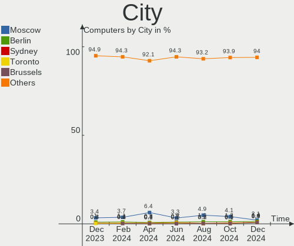
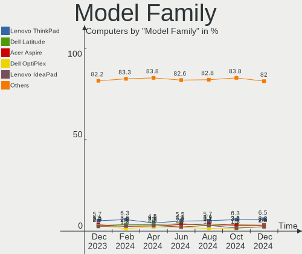
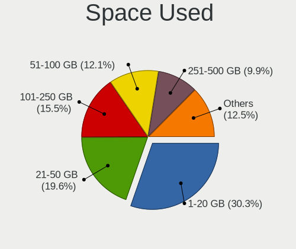
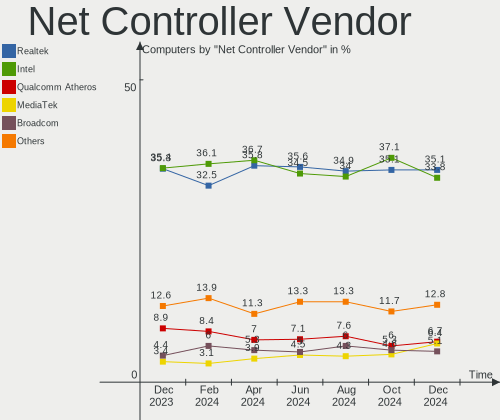
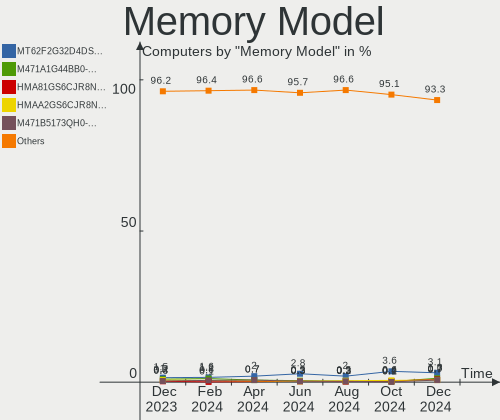
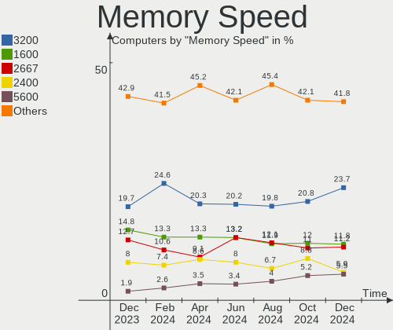
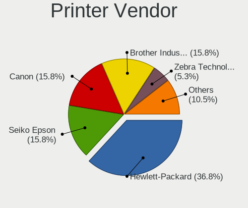

Ubuntu Hardware Trends
----------------------

A project to identify most popular hardware characteristics and track their change
over time based on data collected by Ubuntu users at https://Linux-Hardware.org.

Anyone can contribute to the study by uploading probes of their computers by
the [hw-probe](https://github.com/linuxhw/hw-probe) tool:

    sudo -E hw-probe -all -upload

This is a report for all computer types. See also reports for [desktops](/Dist/Ubuntu/Desktop/README.md) and [notebooks](/Dist/Ubuntu/Notebook/README.md).

Full-feature report is available here: https://linux-hardware.org/?view=trends

Period: Jan, 2021.

Contents
--------

- [ OS                       ](#os)
- [ OS Family                ](#os-family)
- [ Kernel                   ](#kernel)
- [ Kernel Family            ](#kernel-family)
- [ Kernel Major Ver.        ](#kernel-major-ver)
- [ Arch                     ](#arch)
- [ DE                       ](#de)
- [ Display Server           ](#display-server)
- [ Display Manager          ](#display-manager)
- [ OS Lang                  ](#os-lang)
- [ Boot Mode                ](#boot-mode)
- [ Filesystem               ](#filesystem)
- [ Part. scheme             ](#part-scheme)
- [ Dual Boot with Linux/BSD ](#dual-boot-with-linux/bsd)
- [ Dual Boot (Win)          ](#dual-boot-win)
- [ Country                  ](#country)
- [ City                     ](#city)
- [ Vendor                   ](#vendor)
- [ Model                    ](#model)
- [ Model Family             ](#model-family)
- [ MFG Year                 ](#mfg-year)
- [ Form Factor              ](#form-factor)
- [ Secure Boot              ](#secure-boot)
- [ Coreboot                 ](#coreboot)
- [ RAM Size                 ](#ram-size)
- [ RAM Used                 ](#ram-used)
- [ Has CD-ROM               ](#has-cd-rom)
- [ Total Drives             ](#total-drives)
- [ Has Ethernet             ](#has-ethernet)
- [ Drive Vendor             ](#drive-vendor)
- [ Drive Model              ](#drive-model)
- [ HDD Vendor               ](#hdd-vendor)
- [ SSD Vendor               ](#ssd-vendor)
- [ Drive Kind               ](#drive-kind)
- [ Drive Connector          ](#drive-connector)
- [ Drive Size               ](#drive-size)
- [ Space Total              ](#space-total)
- [ Space Used               ](#space-used)
- [ Malfunc. Drives          ](#malfunc-drives)
- [ Malfunc. Drive Vendor    ](#malfunc-drive-vendor)
- [ Malfunc. HDD Vendor      ](#malfunc-hdd-vendor)
- [ Malfunc. Drive Kind      ](#malfunc-drive-kind)
- [ Failed Drives            ](#failed-drives)
- [ Failed Drive Vendor      ](#failed-drive-vendor)
- [ Drive Status             ](#drive-status)
- [ Storage Vendor           ](#storage-vendor)
- [ Storage Model            ](#storage-model)
- [ Storage Kind             ](#storage-kind)
- [ CPU Vendor               ](#cpu-vendor)
- [ CPU Model                ](#cpu-model)
- [ CPU Model Family         ](#cpu-model-family)
- [ CPU Cores                ](#cpu-cores)
- [ CPU Sockets              ](#cpu-sockets)
- [ CPU Threads              ](#cpu-threads)
- [ CPU Op-Modes             ](#cpu-op-modes)
- [ CPU Microcode            ](#cpu-microcode)
- [ CPU Microarch            ](#cpu-microarch)
- [ GPU Vendor               ](#gpu-vendor)
- [ GPU Model                ](#gpu-model)
- [ GPU Combo                ](#gpu-combo)
- [ GPU Driver               ](#gpu-driver)
- [ GPU Memory               ](#gpu-memory)
- [ Monitor Vendor           ](#monitor-vendor)
- [ Monitor Model            ](#monitor-model)
- [ Monitor Resolution       ](#monitor-resolution)
- [ Monitor Diagonal         ](#monitor-diagonal)
- [ Monitor Width            ](#monitor-width)
- [ Aspect Ratio             ](#aspect-ratio)
- [ Monitor Area             ](#monitor-area)
- [ Pixel Density            ](#pixel-density)
- [ Multiple Monitors        ](#multiple-monitors)
- [ Net Controller Vendor    ](#net-controller-vendor)
- [ Net Controller Model     ](#net-controller-model)
- [ Wireless Vendor          ](#wireless-vendor)
- [ Wireless Model           ](#wireless-model)
- [ Ethernet Vendor          ](#ethernet-vendor)
- [ Ethernet Model           ](#ethernet-model)
- [ Net Controller Kind      ](#net-controller-kind)
- [ Used Controller          ](#used-controller)
- [ NICs                     ](#nics)
- [ Memory Vendor            ](#memory-vendor)
- [ Memory Model             ](#memory-model)
- [ Memory Kind              ](#memory-kind)
- [ Memory Form Factor       ](#memory-form-factor)
- [ Memory Size              ](#memory-size)
- [ Memory Speed             ](#memory-speed)
- [ Sound Vendor             ](#sound-vendor)
- [ Sound Model              ](#sound-model)
- [ Camera Vendor            ](#camera-vendor)
- [ Camera Model             ](#camera-model)
- [ Fingerprint Vendor       ](#fingerprint-vendor)
- [ Fingerprint Model        ](#fingerprint-model)
- [ Chipcard Vendor          ](#chipcard-vendor)
- [ Chipcard Model           ](#chipcard-model)
- [ Printer Vendor           ](#printer-vendor)
- [ Printer Model            ](#printer-model)
- [ Scanner Vendor           ](#scanner-vendor)
- [ Scanner Model            ](#scanner-model)
- [ Bluetooth Vendor         ](#bluetooth-vendor)
- [ Bluetooth Model          ](#bluetooth-model)
- [ Unsupported Devices      ](#unsupported-devices)
- [ Unsupported Device Types ](#unsupported-device-types)

OS
--

Installed operating systems

| Name           | Computers | Percent |
|----------------|-----------|---------|
| Ubuntu 20.04   | 1573      | 65.68%  |
| Ubuntu 20.10   | 484       | 20.21%  |
| Ubuntu 18.04   | 264       | 11.02%  |
| Ubuntu 16.04   | 38        | 1.59%   |
| Ubuntu 21.04   | 15        | 0.63%   |
| Ubuntu         | 9         | 0.38%   |
| Ubuntu 19.10   | 3         | 0.13%   |
| Ubuntu 18.10   | 3         | 0.13%   |
| Ubuntu 20.08.3 | 2         | 0.08%   |
| Ubuntu 19.04   | 2         | 0.08%   |
| Ubuntu 17.04   | 1         | 0.04%   |
| Ubuntu 14.04   | 1         | 0.04%   |

OS Family
---------

OS without a version

| Name   | Computers | Percent |
|--------|-----------|---------|
| Ubuntu | 2395      | 100%    |

Kernel
------

Version of the Linux kernel

| Version                     | Computers | Percent |
|-----------------------------|-----------|---------|
| 5.8.0-36-generic            | 274       | 11.44%  |
| 5.4.0-58-generic            | 274       | 11.44%  |
| 5.8.0-38-generic            | 270       | 11.27%  |
| 5.8.0-40-generic            | 211       | 8.81%   |
| 5.8.0-41-generic            | 146       | 6.1%    |
| 5.4.0-59-generic            | 127       | 5.3%    |
| 5.4.0-62-generic            | 126       | 5.26%   |
| 5.4.0-60-generic            | 102       | 4.26%   |
| 5.8.0-34-generic            | 93        | 3.88%   |
| 5.4.0-42-generic            | 89        | 3.72%   |
| 5.8.0-33-generic            | 73        | 3.05%   |
| 5.4.0-64-generic            | 72        | 3.01%   |
| 5.4.0-65-generic            | 46        | 1.92%   |
| 4.15.0-128-generic          | 33        | 1.38%   |
| 5.8.0-25-generic            | 28        | 1.17%   |
| 4.15.0-132-generic          | 20        | 0.84%   |
| 4.15.0-130-generic          | 20        | 0.84%   |
| 5.4.0-52-generic            | 18        | 0.75%   |
| 5.8.0-1011-raspi            | 17        | 0.71%   |
| 5.8.0-37-generic            | 11        | 0.46%   |
| 4.15.0-129-generic          | 11        | 0.46%   |
| 5.8.0-1010-raspi            | 9         | 0.38%   |
| 5.4.0-54-generic            | 9         | 0.38%   |
| 5.4.0-26-generic            | 8         | 0.33%   |
| 4.15.0-135-generic          | 8         | 0.33%   |
| 4.15.0-134-generic          | 8         | 0.33%   |
| 5.10.4-051004-generic       | 7         | 0.29%   |
| 5.7.1-050701-generic        | 6         | 0.25%   |
| 5.4.0-64-lowlatency         | 6         | 0.25%   |
| 5.4.0-58-lowlatency         | 6         | 0.25%   |
| 5.4.0-53-generic            | 6         | 0.25%   |
| 4.19.128-microsoft-standard | 6         | 0.25%   |
| 5.8.0-39-generic            | 5         | 0.21%   |
| 5.8.0-38-lowlatency         | 5         | 0.21%   |
| 5.8.0-1013-raspi            | 5         | 0.21%   |
| 5.4.0-56-generic            | 5         | 0.21%   |
| 5.8.0-14-generic            | 4         | 0.17%   |
| 5.8.0-1006-raspi            | 4         | 0.17%   |
| 5.6.0-1042-oem              | 4         | 0.17%   |
| 5.4.0-65-lowlatency         | 4         | 0.17%   |
| 5.4.0-63-generic            | 4         | 0.17%   |
| 5.4.0-62-lowlatency         | 4         | 0.17%   |
| 5.4.0-60-lowlatency         | 4         | 0.17%   |
| 5.4.0-40-generic            | 4         | 0.17%   |
| 5.10.10-051010-generic      | 4         | 0.17%   |
| 5.9.16-050916-generic       | 3         | 0.13%   |
| 5.8.0-40-lowlatency         | 3         | 0.13%   |
| 5.6.0-1036-oem              | 3         | 0.13%   |
| 5.4.0-63-lowlatency         | 3         | 0.13%   |
| 5.4.0-59-lowlatency         | 3         | 0.13%   |
| 5.4.0-48-generic            | 3         | 0.13%   |
| 5.11.0-051100rc2-generic    | 3         | 0.13%   |
| 5.10.9-051009-generic       | 3         | 0.13%   |
| 5.10.0-12-generic           | 3         | 0.13%   |
| 5.10.0-051000-generic       | 3         | 0.13%   |
| 5.0.0-23-generic            | 3         | 0.13%   |
| 4.9.140-tegra               | 3         | 0.13%   |
| 5.9.8-050908-generic        | 2         | 0.08%   |
| 5.9.0-rc4+                  | 2         | 0.08%   |
| 5.9.0-050900-generic        | 2         | 0.08%   |

Kernel Family
-------------

Linux kernel without a distro release

| Version  | Computers | Percent |
|----------|-----------|---------|
| 5.8.0    | 1178      | 49.19%  |
| 5.4.0    | 942       | 39.33%  |
| 4.15.0   | 128       | 5.34%   |
| 5.3.0    | 13        | 0.54%   |
| 4.4.0    | 13        | 0.54%   |
| 5.10.0   | 12        | 0.5%    |
| 5.10.4   | 11        | 0.46%   |
| 5.6.0    | 10        | 0.42%   |
| 5.0.0    | 9         | 0.38%   |
| 5.7.1    | 6         | 0.25%   |
| 5.11.0   | 6         | 0.25%   |
| 4.19.128 | 6         | 0.25%   |
| 4.18.0   | 6         | 0.25%   |
| 5.10.10  | 5         | 0.21%   |
| 5.9.16   | 4         | 0.17%   |
| 5.9.0    | 4         | 0.17%   |
| 5.10.9   | 4         | 0.17%   |
| 5.10.5   | 3         | 0.13%   |
| 4.9.140  | 3         | 0.13%   |
| 4.16.18  | 3         | 0.13%   |
| 4.10.0   | 3         | 0.13%   |
| 5.9.8    | 2         | 0.08%   |
| 5.8.1    | 2         | 0.08%   |
| 5.10.8   | 2         | 0.08%   |
| 5.10.6   | 2         | 0.08%   |
| 5.10.3   | 2         | 0.08%   |
| 5.9.14   | 1         | 0.04%   |
| 5.9.10   | 1         | 0.04%   |
| 5.8.18   | 1         | 0.04%   |
| 5.8.13   | 1         | 0.04%   |
| 5.8.10   | 1         | 0.04%   |
| 5.7.0    | 1         | 0.04%   |
| 5.6.7    | 1         | 0.04%   |
| 5.5.19   | 1         | 0.04%   |
| 5.4.92   | 1         | 0.04%   |
| 5.4.53   | 1         | 0.04%   |
| 5.10.2   | 1         | 0.04%   |
| 5.10.11  | 1         | 0.04%   |
| 5.10.1   | 1         | 0.04%   |
| 4.8.0    | 1         | 0.04%   |
| 4.14.0   | 1         | 0.04%   |
| 3.14.79  | 1         | 0.04%   |

Kernel Major Ver.
-----------------

Linux kernel major version

| Version | Computers | Percent |
|---------|-----------|---------|
| 5.8     | 1183      | 49.39%  |
| 5.4     | 944       | 39.42%  |
| 4.15    | 128       | 5.34%   |
| 5.10    | 44        | 1.84%   |
| 5.3     | 13        | 0.54%   |
| 4.4     | 13        | 0.54%   |
| 5.9     | 12        | 0.5%    |
| 5.6     | 11        | 0.46%   |
| 5.0     | 9         | 0.38%   |
| 5.7     | 7         | 0.29%   |
| 5.11    | 6         | 0.25%   |
| 4.19    | 6         | 0.25%   |
| 4.18    | 6         | 0.25%   |
| 4.9     | 3         | 0.13%   |
| 4.16    | 3         | 0.13%   |
| 4.10    | 3         | 0.13%   |
| 5.5     | 1         | 0.04%   |
| 4.8     | 1         | 0.04%   |
| 4.14    | 1         | 0.04%   |
| 3.14    | 1         | 0.04%   |

Arch
----

OS architecture (x86_64, i586, etc.)

| Name    | Computers | Percent |
|---------|-----------|---------|
| x86_64  | 2275      | 94.99%  |
| i686    | 75        | 3.13%   |
| aarch64 | 44        | 1.84%   |
| armv7l  | 1         | 0.04%   |

DE
--

Desktop Environment

| Name            | Computers | Percent |
|-----------------|-----------|---------|
| GNOME           | 1762      | 73.57%  |
| XFCE            | 173       | 7.22%   |
| Unknown         | 144       | 6.01%   |
| KDE             | 70        | 2.92%   |
| KDE5            | 58        | 2.42%   |
| MATE            | 46        | 1.92%   |
| Unity           | 43        | 1.8%    |
| X-Cinnamon      | 29        | 1.21%   |
| LXQt            | 25        | 1.04%   |
| Budgie          | 16        | 0.67%   |
| LXDE            | 11        | 0.46%   |
| GNOME Flashback | 8         | 0.33%   |
| i3              | 3         | 0.13%   |
| enlightenment   | 2         | 0.08%   |
| Deepin          | 2         | 0.08%   |
| Cinnamon        | 2         | 0.08%   |
| GNOME Classic   | 1         | 0.04%   |

Display Server
--------------

X11 or Wayland

| Name    | Computers | Percent |
|---------|-----------|---------|
| X11     | 2215      | 92.48%  |
| Unknown | 80        | 3.34%   |
| Wayland | 75        | 3.13%   |
| Tty     | 24        | 1%      |
| Web     | 1         | 0.04%   |

Display Manager
---------------

SDDM, LightDM, etc.

| Name    | Computers | Percent |
|---------|-----------|---------|
| Unknown | 1839      | 76.78%  |
| GDM     | 394       | 16.45%  |
| TDM     | 88        | 3.67%   |
| SDDM    | 67        | 2.8%    |
| LightDM | 4         | 0.17%   |
| XDM     | 2         | 0.08%   |
| GDM3    | 1         | 0.04%   |

OS Lang
-------

Language

| Lang    | Computers | Percent |
|---------|-----------|---------|
| en_US   | 909       | 37.95%  |
| de_DE   | 250       | 10.44%  |
| fr_FR   | 176       | 7.35%   |
| en_GB   | 133       | 5.55%   |
| it_IT   | 99        | 4.13%   |
| pt_BR   | 87        | 3.63%   |
| ru_RU   | 78        | 3.26%   |
| es_ES   | 74        | 3.09%   |
| en_CA   | 69        | 2.88%   |
| en_IN   | 50        | 2.09%   |
| C       | 40        | 1.67%   |
| en_AU   | 38        | 1.59%   |
| pl_PL   | 35        | 1.46%   |
| nl_NL   | 21        | 0.88%   |
| hu_HU   | 19        | 0.79%   |
| es_MX   | 19        | 0.79%   |
| cs_CZ   | 18        | 0.75%   |
| tr_TR   | 16        | 0.67%   |
| ja_JP   | 16        | 0.67%   |
| Unknown | 15        | 0.63%   |
| en_ZA   | 14        | 0.58%   |
| es_AR   | 13        | 0.54%   |
| sv_SE   | 12        | 0.5%    |
| pt_PT   | 12        | 0.5%    |
| el_GR   | 11        | 0.46%   |
| de_CH   | 11        | 0.46%   |
| sk_SK   | 9         | 0.38%   |
| ro_RO   | 9         | 0.38%   |
| zh_CN   | 8         | 0.33%   |
| en_IE   | 8         | 0.33%   |
| es_CO   | 7         | 0.29%   |
| de_AT   | 7         | 0.29%   |
| da_DK   | 7         | 0.29%   |
| fr_CA   | 6         | 0.25%   |
| fi_FI   | 6         | 0.25%   |
| sl_SI   | 5         | 0.21%   |
| ru_UA   | 5         | 0.21%   |
| ko_KR   | 5         | 0.21%   |
| es_CL   | 5         | 0.21%   |
| en_IL   | 5         | 0.21%   |
| ca_ES   | 5         | 0.21%   |
| nl_BE   | 4         | 0.17%   |
| hr_HR   | 4         | 0.17%   |
| he_IL   | 4         | 0.17%   |
| fr_BE   | 4         | 0.17%   |
| es_UY   | 4         | 0.17%   |
| fr_CH   | 3         | 0.13%   |
| en_SG   | 3         | 0.13%   |
| en_PH   | 3         | 0.13%   |
| en_NZ   | 3         | 0.13%   |
| en_NG   | 3         | 0.13%   |
| bg_BG   | 3         | 0.13%   |
| vi_VN   | 2         | 0.08%   |
| nb_NO   | 2         | 0.08%   |
| es_PE   | 2         | 0.08%   |
| es_EC   | 2         | 0.08%   |
| en_HK   | 2         | 0.08%   |
| zh_TW   | 1         | 0.04%   |
| uk_UA   | 1         | 0.04%   |
| th_TH   | 1         | 0.04%   |

Boot Mode
---------

EFI or BIOS

| Mode | Computers | Percent |
|------|-----------|---------|
| BIOS | 1380      | 57.62%  |
| EFI  | 1015      | 42.38%  |

Filesystem
----------

Type of filesystem

| Type    | Computers | Percent |
|---------|-----------|---------|
| Ext4    | 2259      | 94.32%  |
| Overlay | 56        | 2.34%   |
| Zfs     | 35        | 1.46%   |
| Btrfs   | 22        | 0.92%   |
| Xfs     | 9         | 0.38%   |
| Ext2    | 6         | 0.25%   |
| Ext3    | 4         | 0.17%   |
| Unknown | 3         | 0.13%   |
| Aufs    | 1         | 0.04%   |

Part. scheme
------------

Scheme of partitioning

| Type    | Computers | Percent |
|---------|-----------|---------|
| Unknown | 1830      | 76.41%  |
| GPT     | 429       | 17.91%  |
| MBR     | 136       | 5.68%   |

Dual Boot with Linux/BSD
------------------------

Hosting more than one Linux/BSD

| Dual boot | Computers | Percent |
|-----------|-----------|---------|
| No        | 2075      | 86.64%  |
| Yes       | 320       | 13.36%  |

Dual Boot (Win)
---------------

Hosting Linux and Windows

| Dual boot | Computers | Percent |
|-----------|-----------|---------|
| No        | 1486      | 62.05%  |
| Yes       | 909       | 37.95%  |

Country
-------

Geographic location (country)

| Country            | Computers | Percent |
|--------------------|-----------|---------|
| USA                | 394       | 16.45%  |
| Germany            | 318       | 13.28%  |
| France             | 173       | 7.22%   |
| Italy              | 118       | 4.93%   |
| UK                 | 117       | 4.89%   |
| Brazil             | 115       | 4.8%    |
| Russia             | 110       | 4.59%   |
| Spain              | 84        | 3.51%   |
| Canada             | 84        | 3.51%   |
| India              | 56        | 2.34%   |
| Netherlands        | 46        | 1.92%   |
| Poland             | 42        | 1.75%   |
| Australia          | 38        | 1.59%   |
| Mexico             | 33        | 1.38%   |
| Belgium            | 32        | 1.34%   |
| Ukraine            | 29        | 1.21%   |
| Switzerland        | 26        | 1.09%   |
| Sweden             | 26        | 1.09%   |
| Hungary            | 25        | 1.04%   |
| Greece             | 25        | 1.04%   |
| Czech Republic     | 24        | 1%      |
| Austria            | 22        | 0.92%   |
| Argentina          | 21        | 0.88%   |
| Japan              | 20        | 0.84%   |
| Finland            | 20        | 0.84%   |
| Turkey             | 19        | 0.79%   |
| Portugal           | 19        | 0.79%   |
| South Africa       | 18        | 0.75%   |
| Romania            | 18        | 0.75%   |
| Indonesia          | 17        | 0.71%   |
| Israel             | 15        | 0.63%   |
| Denmark            | 14        | 0.58%   |
| Slovakia           | 13        | 0.54%   |
| Colombia           | 13        | 0.54%   |
| China              | 12        | 0.5%    |
| Norway             | 10        | 0.42%   |
| Egypt              | 10        | 0.42%   |
| Chile              | 10        | 0.42%   |
| Bulgaria           | 10        | 0.42%   |
| Tunisia            | 8         | 0.33%   |
| Slovenia           | 8         | 0.33%   |
| Serbia             | 8         | 0.33%   |
| Korea, Republic of | 8         | 0.33%   |
| Singapore          | 7         | 0.29%   |
| Ireland            | 7         | 0.29%   |
| Croatia            | 7         | 0.29%   |
| Uruguay            | 6         | 0.25%   |
| Saudi Arabia       | 6         | 0.25%   |
| New Zealand        | 6         | 0.25%   |
| Vietnam            | 5         | 0.21%   |
| UAE                | 5         | 0.21%   |
| Thailand           | 5         | 0.21%   |
| Taiwan             | 5         | 0.21%   |
| Philippines        | 5         | 0.21%   |
| Pakistan           | 5         | 0.21%   |
| Malaysia           | 5         | 0.21%   |
| Morocco            | 4         | 0.17%   |
| Iran               | 4         | 0.17%   |
| Iceland            | 4         | 0.17%   |
| Hong Kong          | 4         | 0.17%   |

City
----

Geographic location (city)

| City              | Computers | Percent |
|-------------------|-----------|---------|
| Moscow            | 33        | 1.38%   |
| Berlin            | 33        | 1.38%   |
| Paris             | 22        | 0.92%   |
| Rome              | 17        | 0.71%   |
| Athens            | 17        | 0.71%   |
| Hamburg           | 16        | 0.67%   |
| Vienna            | 15        | 0.63%   |
| Munich            | 14        | 0.58%   |
| Madrid            | 14        | 0.58%   |
| Kyiv              | 13        | 0.54%   |
| Budapest          | 12        | 0.5%    |
| São Paulo        | 10        | 0.42%   |
| St Petersburg     | 10        | 0.42%   |
| Milan             | 10        | 0.42%   |
| Frankfurt am Main | 10        | 0.42%   |
| Warsaw            | 9         | 0.38%   |
| Toronto           | 9         | 0.38%   |
| Rio de Janeiro    | 9         | 0.38%   |
| Prague            | 9         | 0.38%   |
| Montreal          | 8         | 0.33%   |
| Helsinki          | 8         | 0.33%   |
| Denver            | 8         | 0.33%   |
| Cologne           | 8         | 0.33%   |
| Chicago           | 8         | 0.33%   |
| Cairo             | 8         | 0.33%   |
| Barcelona         | 8         | 0.33%   |
| Vancouver         | 7         | 0.29%   |
| Stuttgart         | 7         | 0.29%   |
| Singapore         | 7         | 0.29%   |
| Seattle           | 7         | 0.29%   |
| Mumbai            | 7         | 0.29%   |
| Istanbul          | 7         | 0.29%   |
| Düsseldorf       | 7         | 0.29%   |
| Buenos Aires      | 7         | 0.29%   |
| Birmingham        | 7         | 0.29%   |
| Thessaloniki      | 6         | 0.25%   |
| Sydney            | 6         | 0.25%   |
| Nuremberg         | 6         | 0.25%   |
| London            | 6         | 0.25%   |
| Calgary           | 6         | 0.25%   |
| Bucharest         | 6         | 0.25%   |
| Wrocław          | 5         | 0.21%   |
| Toulouse          | 5         | 0.21%   |
| Tel Aviv          | 5         | 0.21%   |
| Stockholm         | 5         | 0.21%   |
| Porto             | 5         | 0.21%   |
| Perth             | 5         | 0.21%   |
| New Delhi         | 5         | 0.21%   |
| Montevideo        | 5         | 0.21%   |
| Mexico City       | 5         | 0.21%   |
| Melbourne         | 5         | 0.21%   |
| Lyon              | 5         | 0.21%   |
| Lisbon            | 5         | 0.21%   |
| Hyderabad         | 5         | 0.21%   |
| Cape Town         | 5         | 0.21%   |
| Bratislava        | 5         | 0.21%   |
| Bogotá           | 5         | 0.21%   |
| Amsterdam         | 5         | 0.21%   |
| Zagreb            | 4         | 0.17%   |
| Tehran            | 4         | 0.17%   |

Vendor
------

Motherboard manufacturer

| Name                    | Computers | Percent |
|-------------------------|-----------|---------|
| Dell                    | 368       | 15.37%  |
| ASUSTek Computer        | 364       | 15.2%   |
| Hewlett-Packard         | 353       | 14.74%  |
| Lenovo                  | 300       | 12.53%  |
| Gigabyte Technology     | 167       | 6.97%   |
| Acer                    | 137       | 5.72%   |
| MSI                     | 126       | 5.26%   |
| ASRock                  | 83        | 3.47%   |
| Unknown                 | 48        | 2%      |
| Apple                   | 46        | 1.92%   |
| Intel                   | 44        | 1.84%   |
| Toshiba                 | 37        | 1.54%   |
| Samsung Electronics     | 29        | 1.21%   |
| Sony                    | 26        | 1.09%   |
| Medion                  | 19        | 0.79%   |
| Fujitsu                 | 18        | 0.75%   |
| HUAWEI                  | 16        | 0.67%   |
| Raspberry Pi Foundation | 15        | 0.63%   |
| Packard Bell            | 14        | 0.58%   |
| Biostar                 | 12        | 0.5%    |
| Pegatron                | 11        | 0.46%   |
| Foxconn                 | 10        | 0.42%   |
| Positivo                | 8         | 0.33%   |
| Fujitsu Siemens         | 8         | 0.33%   |
| Supermicro              | 7         | 0.29%   |
| Notebook                | 7         | 0.29%   |
| ECS                     | 7         | 0.29%   |
| Microsoft               | 6         | 0.25%   |
| eMachines               | 6         | 0.25%   |
| TUXEDO                  | 5         | 0.21%   |
| IBM                     | 5         | 0.21%   |
| NEC Computers           | 4         | 0.17%   |
| Google                  | 4         | 0.17%   |
| AMI                     | 4         | 0.17%   |
| Alienware               | 4         | 0.17%   |
| ZOTAC                   | 3         | 0.13%   |
| Timi                    | 3         | 0.13%   |
| Nvidia                  | 3         | 0.13%   |
| Huanan                  | 3         | 0.13%   |
| whyopencomputing        | 2         | 0.08%   |
| System76                | 2         | 0.08%   |
| Star Labs               | 2         | 0.08%   |
| Shuttle                 | 2         | 0.08%   |
| Schenker                | 2         | 0.08%   |
| LG Electronics          | 2         | 0.08%   |
| Inventec                | 2         | 0.08%   |
| Gateway                 | 2         | 0.08%   |
| Entroware               | 2         | 0.08%   |
| Clevo                   | 2         | 0.08%   |
| AZW                     | 2         | 0.08%   |
| ASL                     | 2         | 0.08%   |
| Wortmann AG             | 1         | 0.04%   |
| Vorke                   | 1         | 0.04%   |
| VIT                     | 1         | 0.04%   |
| Varian Medical Systems  | 1         | 0.04%   |
| UNOWHY                  | 1         | 0.04%   |
| TYAN Computer           | 1         | 0.04%   |
| Trenton Systems         | 1         | 0.04%   |
| TrekStor                | 1         | 0.04%   |
| THUNDEROBOT             | 1         | 0.04%   |

Model
-----

Motherboard model

| Name                               | Computers | Percent |
|------------------------------------|-----------|---------|
| Unknown                            | 55        | 2.3%    |
| ASUS All Series                    | 28        | 1.17%   |
| HP Notebook                        | 12        | 0.5%    |
| Dell XPS 13 7390                   | 11        | 0.46%   |
| HP Pavilion g6                     | 8         | 0.33%   |
| HP Pavilion dv6                    | 8         | 0.33%   |
| HP 255 G7 Notebook PC              | 7         | 0.29%   |
| Gigabyte B450M DS3H                | 7         | 0.29%   |
| Dell OptiPlex 7010                 | 7         | 0.29%   |
| MSI MS-7C02                        | 6         | 0.25%   |
| HP Pavilion Notebook               | 6         | 0.25%   |
| Dell Latitude E6430                | 6         | 0.25%   |
| Dell Inspiron 1545                 | 6         | 0.25%   |
| ASUS M5A78L-M/USB3                 | 6         | 0.25%   |
| RPi Raspberry Pi 4 Model B Rev 1.4 | 5         | 0.21%   |
| Lenovo IdeaPad S145-15IWL 81S9     | 5         | 0.21%   |
| HP ProBook 650 G1                  | 5         | 0.21%   |
| Dell XPS 15 7590                   | 5         | 0.21%   |
| Dell XPS 13 9370                   | 5         | 0.21%   |
| Dell XPS 13 9310                   | 5         | 0.21%   |
| Dell OptiPlex 790                  | 5         | 0.21%   |
| ASUS PRIME A320M-K                 | 5         | 0.21%   |
| MSI MS-7A38                        | 4         | 0.17%   |
| Intel NUC10i7FNH                   | 4         | 0.17%   |
| HUAWEI NBLK-WAX9X                  | 4         | 0.17%   |
| HP Pavilion dv7                    | 4         | 0.17%   |
| HP Pavilion 15                     | 4         | 0.17%   |
| HP Laptop 15-dy1xxx                | 4         | 0.17%   |
| HP EliteBook 840 G5                | 4         | 0.17%   |
| HP Compaq Elite 8300 SFF           | 4         | 0.17%   |
| Gigabyte GA-78LMT-USB3 6.0         | 4         | 0.17%   |
| Gigabyte 970A-DS3P                 | 4         | 0.17%   |
| Dell XPS 17 9700                   | 4         | 0.17%   |
| Dell XPS 13 9380                   | 4         | 0.17%   |
| Dell XPS 13 9360                   | 4         | 0.17%   |
| Dell OptiPlex 990                  | 4         | 0.17%   |
| Dell OptiPlex 9020                 | 4         | 0.17%   |
| Dell OptiPlex 780                  | 4         | 0.17%   |
| Dell Latitude E6540                | 4         | 0.17%   |
| Dell Latitude E6420                | 4         | 0.17%   |
| Dell Latitude E6410                | 4         | 0.17%   |
| Dell Latitude E6400                | 4         | 0.17%   |
| ASUS TUF GAMING X570-PLUS          | 4         | 0.17%   |
| ASUS TUF GAMING B550M-PLUS         | 4         | 0.17%   |
| ASUS ROG STRIX B550-F GAMING       | 4         | 0.17%   |
| Acer ConceptD CN315-71P            | 4         | 0.17%   |
| Samsung 300E4C/300E5C/300E7C       | 3         | 0.13%   |
| RPi Raspberry Pi 4 Model B Rev 1.2 | 3         | 0.13%   |
| RPi Raspberry Pi 4 Model B Rev 1.1 | 3         | 0.13%   |
| Nvidia Tegra                       | 3         | 0.13%   |
| MSI MS-7C37                        | 3         | 0.13%   |
| MSI MS-7816                        | 3         | 0.13%   |
| MSI MS-7758                        | 3         | 0.13%   |
| MSI MS-7693                        | 3         | 0.13%   |
| Lenovo Z50-75 80EC                 | 3         | 0.13%   |
| Lenovo IdeaPad 320-17IKB 80XM      | 3         | 0.13%   |
| Lenovo IdeaPad 100-15IBD 80QQ      | 3         | 0.13%   |
| Lenovo G710 20252                  | 3         | 0.13%   |
| HP ProLiant ML350 G6               | 3         | 0.13%   |
| HP ProBook 6550b                   | 3         | 0.13%   |

Model Family
------------

Motherboard model prefix

| Name                   | Computers | Percent |
|------------------------|-----------|---------|
| Lenovo ThinkPad        | 127       | 5.3%    |
| Dell Inspiron          | 98        | 4.09%   |
| Acer Aspire            | 97        | 4.05%   |
| Dell Latitude          | 79        | 3.3%    |
| HP Pavilion            | 72        | 3.01%   |
| Lenovo IdeaPad         | 69        | 2.88%   |
| Dell XPS               | 61        | 2.55%   |
| Unknown                | 55        | 2.3%    |
| Dell OptiPlex          | 50        | 2.09%   |
| HP ProBook             | 44        | 1.84%   |
| HP EliteBook           | 41        | 1.71%   |
| Dell Precision         | 36        | 1.5%    |
| Toshiba Satellite      | 33        | 1.38%   |
| ASUS PRIME             | 31        | 1.29%   |
| HP Laptop              | 29        | 1.21%   |
| ASUS All               | 28        | 1.17%   |
| ASUS TUF               | 26        | 1.09%   |
| Lenovo ThinkCentre     | 25        | 1.04%   |
| HP Compaq              | 25        | 1.04%   |
| ASUS ROG               | 22        | 0.92%   |
| Dell Vostro            | 20        | 0.84%   |
| HP ENVY                | 19        | 0.79%   |
| ASUS VivoBook          | 19        | 0.79%   |
| RPi Raspberry          | 15        | 0.63%   |
| HP Notebook            | 12        | 0.5%    |
| ASUS M5A78L-M          | 12        | 0.5%    |
| HP ZBook               | 11        | 0.46%   |
| Gigabyte B450M         | 11        | 0.46%   |
| Lenovo Yoga            | 10        | 0.42%   |
| Packard Bell EasyNote  | 9         | 0.38%   |
| HP OMEN                | 9         | 0.38%   |
| Acer TravelMate        | 9         | 0.38%   |
| Acer Swift             | 9         | 0.38%   |
| HP ProLiant            | 8         | 0.33%   |
| HP ProDesk             | 8         | 0.33%   |
| HP 255                 | 8         | 0.33%   |
| Gigabyte GA-78LMT-USB3 | 8         | 0.33%   |
| Dell Studio            | 8         | 0.33%   |
| Lenovo ThinkBook       | 7         | 0.29%   |
| Fujitsu ESPRIMO        | 7         | 0.29%   |
| MSI MS-7C02            | 6         | 0.25%   |
| Microsoft Surface      | 6         | 0.25%   |
| HP 15                  | 6         | 0.25%   |
| Gigabyte X570          | 6         | 0.25%   |
| ASUS ZenBook           | 6         | 0.25%   |
| ASUS P8Z77-V           | 6         | 0.25%   |
| HP Presario            | 5         | 0.21%   |
| HP EliteDesk           | 5         | 0.21%   |
| Gigabyte A320M-S2H     | 5         | 0.21%   |
| Fujitsu LIFEBOOK       | 5         | 0.21%   |
| Dell PowerEdge         | 5         | 0.21%   |
| Dell G3                | 5         | 0.21%   |
| ASUS M5A99X            | 5         | 0.21%   |
| MSI Prestige           | 4         | 0.17%   |
| MSI MS-7A38            | 4         | 0.17%   |
| Lenovo Legion          | 4         | 0.17%   |
| Intel NUC10i7FNH       | 4         | 0.17%   |
| HUAWEI NBLK-WAX9X      | 4         | 0.17%   |
| Gigabyte B450          | 4         | 0.17%   |
| Gigabyte 970A-DS3P     | 4         | 0.17%   |

MFG Year
--------

Motherboard manufacture year

| Year    | Computers | Percent |
|---------|-----------|---------|
| 2020    | 509       | 21.25%  |
| 2019    | 278       | 11.61%  |
| 2018    | 229       | 9.56%   |
| 2013    | 173       | 7.22%   |
| 2014    | 156       | 6.51%   |
| 2012    | 153       | 6.39%   |
| 2011    | 148       | 6.18%   |
| 2010    | 132       | 5.51%   |
| 2015    | 120       | 5.01%   |
| 2016    | 110       | 4.59%   |
| 2009    | 91        | 3.8%    |
| 2008    | 84        | 3.51%   |
| 2017    | 77        | 3.22%   |
| Unknown | 52        | 2.17%   |
| 2007    | 48        | 2%      |
| 2006    | 17        | 0.71%   |
| 2005    | 10        | 0.42%   |
| 2021    | 5         | 0.21%   |
| 2004    | 3         | 0.13%   |

Form Factor
-----------

Physical design of the computer

| Name           | Computers | Percent |
|----------------|-----------|---------|
| Notebook       | 1275      | 53.24%  |
| Desktop        | 944       | 39.42%  |
| System on chip | 43        | 1.8%    |
| Convertible    | 43        | 1.8%    |
| All in one     | 31        | 1.29%   |
| Mini pc        | 28        | 1.17%   |
| Server         | 19        | 0.79%   |
| Tablet         | 11        | 0.46%   |
| Other          | 1         | 0.04%   |

Secure Boot
-----------

Enabled or disabled

| State    | Computers | Percent |
|----------|-----------|---------|
| Disabled | 2191      | 91.48%  |
| Enabled  | 204       | 8.52%   |

Coreboot
--------

Have coreboot on board

| Used | Computers | Percent |
|------|-----------|---------|
| No   | 2391      | 99.83%  |
| Yes  | 4         | 0.17%   |

RAM Size
--------

Total RAM memory

| Size in GB      | Computers | Percent |
|-----------------|-----------|---------|
| 4.01-8.0        | 589       | 24.59%  |
| 3.01-4.0        | 501       | 20.92%  |
| 16.01-24.0      | 444       | 18.54%  |
| 8.01-16.0       | 425       | 17.75%  |
| 32.01-64.0      | 195       | 8.14%   |
| 1.01-2.0        | 98        | 4.09%   |
| 64.01-256.0     | 49        | 2.05%   |
| 2.01-3.0        | 47        | 1.96%   |
| 24.01-32.0      | 31        | 1.29%   |
| 0.51-1.0        | 12        | 0.5%    |
| More than 256.0 | 3         | 0.13%   |
| 0.01-0.5        | 1         | 0.04%   |

RAM Used
--------

Used RAM memory

| Used GB     | Computers | Percent |
|-------------|-----------|---------|
| 1.01-2.0    | 958       | 40%     |
| 2.01-3.0    | 607       | 25.34%  |
| 4.01-8.0    | 311       | 12.99%  |
| 3.01-4.0    | 292       | 12.19%  |
| 0.51-1.0    | 109       | 4.55%   |
| 8.01-16.0   | 78        | 3.26%   |
| 0.01-0.5    | 22        | 0.92%   |
| 16.01-24.0  | 14        | 0.58%   |
| 24.01-32.0  | 2         | 0.08%   |
| 32.01-64.0  | 1         | 0.04%   |
| 64.01-256.0 | 1         | 0.04%   |

Has CD-ROM
----------

Has CD-ROM on board

| Presented | Computers | Percent |
|-----------|-----------|---------|
| No        | 1343      | 56.08%  |
| Yes       | 1052      | 43.92%  |

Total Drives
------------

Number of drives on board

| Drives | Computers | Percent |
|--------|-----------|---------|
| 1      | 1384      | 57.79%  |
| 2      | 646       | 26.97%  |
| 3      | 196       | 8.18%   |
| 4      | 75        | 3.13%   |
| 5      | 34        | 1.42%   |
| 0      | 25        | 1.04%   |
| 6      | 21        | 0.88%   |
| 7      | 8         | 0.33%   |
| 9      | 3         | 0.13%   |
| 12     | 1         | 0.04%   |
| 10     | 1         | 0.04%   |
| 8      | 1         | 0.04%   |

Has Ethernet
------------

Has Ethernet on board

| Presented | Computers | Percent |
|-----------|-----------|---------|
| Yes       | 2085      | 87.06%  |
| No        | 310       | 12.94%  |

Drive Vendor
------------

Hard drive vendors

| Vendor                    | Computers | Drives | Percent |
|---------------------------|-----------|--------|---------|
| WDC                       | 574       | 689    | 16.98%  |
| Seagate                   | 572       | 703    | 16.92%  |
| Samsung Electronics       | 464       | 554    | 13.72%  |
| Toshiba                   | 240       | 254    | 7.1%    |
| Kingston                  | 188       | 194    | 5.56%   |
| Unknown                   | 159       | 168    | 4.7%    |
| SanDisk                   | 148       | 153    | 4.38%   |
| Hitachi                   | 131       | 136    | 3.87%   |
| Crucial                   | 124       | 134    | 3.67%   |
| Intel                     | 88        | 99     | 2.6%    |
| SK Hynix                  | 71        | 71     | 2.1%    |
| HGST                      | 62        | 65     | 1.83%   |
| A-DATA Technology         | 42        | 42     | 1.24%   |
| Micron Technology         | 35        | 35     | 1.04%   |
| China                     | 30        | 31     | 0.89%   |
| Fujitsu                   | 23        | 24     | 0.68%   |
| Phison                    | 22        | 27     | 0.65%   |
| Apple                     | 20        | 22     | 0.59%   |
| SPCC                      | 19        | 20     | 0.56%   |
| Maxtor                    | 19        | 24     | 0.56%   |
| PNY                       | 18        | 19     | 0.53%   |
| OCZ                       | 18        | 18     | 0.53%   |
| KIOXIA                    | 18        | 19     | 0.53%   |
| Transcend                 | 16        | 17     | 0.47%   |
| Silicon Motion            | 14        | 14     | 0.41%   |
| Micron/Crucial Technology | 14        | 15     | 0.41%   |
| LITEON                    | 13        | 13     | 0.38%   |
| ASMT                      | 12        | 17     | 0.35%   |
| Intenso                   | 11        | 12     | 0.33%   |
| Hewlett-Packard           | 11        | 14     | 0.33%   |
| Patriot                   | 9         | 9      | 0.27%   |
| LITEONIT                  | 9         | 10     | 0.27%   |
| Corsair                   | 9         | 9      | 0.27%   |
| XPG                       | 8         | 8      | 0.24%   |
| Apacer                    | 8         | 8      | 0.24%   |
| Realtek Semiconductor     | 6         | 6      | 0.18%   |
| PLEXTOR                   | 6         | 6      | 0.18%   |
| Msft                      | 6         | 10     | 0.18%   |
| KingSpec                  | 6         | 6      | 0.18%   |
| GOODRAM                   | 6         | 7      | 0.18%   |
| Team                      | 4         | 4      | 0.12%   |
| Mushkin                   | 4         | 5      | 0.12%   |
| Lexar                     | 4         | 4      | 0.12%   |
| Kingmax                   | 4         | 4      | 0.12%   |
| JMicron                   | 4         | 5      | 0.12%   |
| External                  | 4         | 4      | 0.12%   |
| ADATA Technology          | 4         | 4      | 0.12%   |
| WD MediaMax               | 3         | 3      | 0.09%   |
| SABRENT                   | 3         | 3      | 0.09%   |
| Netac                     | 3         | 3      | 0.09%   |
| LDLC                      | 3         | 4      | 0.09%   |
| KIOXIA-EXCERIA            | 3         | 3      | 0.09%   |
| KingFast                  | 3         | 3      | 0.09%   |
| V7                        | 2         | 2      | 0.06%   |
| Union Memory (Shenzhen)   | 2         | 2      | 0.06%   |
| Union Memory              | 2         | 2      | 0.06%   |
| TCSUNBOW                  | 2         | 2      | 0.06%   |
| Star                      | 2         | 2      | 0.06%   |
| Pioneer                   | 2         | 2      | 0.06%   |
| Lenovo                    | 2         | 2      | 0.06%   |

Drive Model
-----------

Hard drive models

| Model                               | Computers | Percent |
|-------------------------------------|-----------|---------|
| Unknown MMC Card  32GB              | 43        | 1.17%   |
| Kingston SA400S37240G 240GB SSD     | 33        | 0.9%    |
| Seagate ST500DM002-1BD142 500GB     | 32        | 0.87%   |
| Seagate ST1000LM035-1RK172 1TB      | 31        | 0.84%   |
| Samsung SSD 860 EVO 500GB           | 30        | 0.82%   |
| Kingston SA400S37120G 120GB SSD     | 29        | 0.79%   |
| Unknown MMC Card  64GB              | 28        | 0.76%   |
| Seagate ST1000DM010-2EP102 1TB      | 28        | 0.76%   |
| Samsung SSD 850 EVO 250GB           | 25        | 0.68%   |
| Seagate ST1000LM024 HN-M101MBB 1TB  | 24        | 0.65%   |
| Kingston SA400S37480G 480GB SSD     | 23        | 0.63%   |
| WDC WD10EZEX-08WN4A0 1TB            | 21        | 0.57%   |
| Toshiba MQ04ABF100 1TB              | 21        | 0.57%   |
| Samsung NVMe SSD Drive 512GB        | 21        | 0.57%   |
| Crucial CT500MX500SSD1 500GB        | 21        | 0.57%   |
| Seagate ST9500325AS 500GB           | 19        | 0.52%   |
| Samsung SSD 860 EVO 1TB             | 19        | 0.52%   |
| Samsung NVMe SSD Drive 256GB        | 18        | 0.49%   |
| Toshiba MQ01ABD100 1TB              | 17        | 0.46%   |
| Seagate ST500LT012-1DG142 500GB     | 17        | 0.46%   |
| Seagate ST4000DM004-2CV104 4TB      | 16        | 0.44%   |
| SanDisk SSD PLUS 240GB              | 16        | 0.44%   |
| Samsung NVMe SSD Drive 500GB        | 16        | 0.44%   |
| Intel NVMe SSD Drive 512GB          | 16        | 0.44%   |
| WDC WDS500G2B0A-00SM50 500GB SSD    | 15        | 0.41%   |
| Unknown MMC Card  128GB             | 15        | 0.41%   |
| Seagate ST3500418AS 500GB           | 15        | 0.41%   |
| Seagate ST1000DM003-1CH162 1TB      | 15        | 0.41%   |
| Samsung NVMe SSD Drive 1TB          | 15        | 0.41%   |
| HGST HTS725050A7E630 500GB          | 15        | 0.41%   |
| Unknown SD/MMC/MS PRO 32GB          | 14        | 0.38%   |
| Toshiba NVMe SSD Drive 512GB        | 14        | 0.38%   |
| Toshiba MQ01ABF050 500GB            | 14        | 0.38%   |
| Toshiba DT01ACA100 1TB              | 14        | 0.38%   |
| Samsung SSD 860 EVO 250GB           | 14        | 0.38%   |
| Kingston SV300S37A240G 240GB SSD    | 14        | 0.38%   |
| Toshiba HDWD110 1TB                 | 13        | 0.35%   |
| Seagate ST2000DM008-2FR102 2TB      | 13        | 0.35%   |
| Kingston SV300S37A120G 120GB SSD    | 13        | 0.35%   |
| Crucial CT240BX500SSD1 240GB        | 13        | 0.35%   |
| Seagate ST1000DM003-1ER162 1TB      | 12        | 0.33%   |
| Seagate Expansion Desk 8TB          | 12        | 0.33%   |
| Seagate Expansion 1TB               | 12        | 0.33%   |
| Samsung SSD 850 EVO 500GB           | 12        | 0.33%   |
| Samsung SSD 840 EVO 250GB           | 12        | 0.33%   |
| Samsung SSD 840 EVO 120GB           | 12        | 0.33%   |
| Samsung NVMe SSD Drive 250GB        | 12        | 0.33%   |
| Samsung NVMe SSD Drive 1024GB       | 12        | 0.33%   |
| Crucial CT480BX500SSD1 480GB        | 12        | 0.33%   |
| Crucial CT1000MX500SSD1 1TB         | 12        | 0.33%   |
| WDC WD10SPZX-24Z10 1TB              | 11        | 0.3%    |
| SK Hynix NVMe SSD Drive 256GB       | 11        | 0.3%    |
| Seagate ST500LM012 HN-M500MBB 500GB | 11        | 0.3%    |
| Seagate ST2000DM006-2DM164 2TB      | 11        | 0.3%    |
| Seagate ST2000DM001-1ER164 2TB      | 11        | 0.3%    |
| Sandisk NVMe SSD Drive 512GB        | 11        | 0.3%    |
| Seagate ST2000DM001-1CH164 2TB      | 10        | 0.27%   |
| Sandisk NVMe SSD Drive 256GB        | 10        | 0.27%   |
| HGST HTS541010A9E680 1TB            | 10        | 0.27%   |
| WDC WD5000AADS-00S9B0 500GB         | 9         | 0.24%   |

HDD Vendor
----------

Hard disk drive vendors

| Vendor              | Computers | Drives | Percent |
|---------------------|-----------|--------|---------|
| Seagate             | 561       | 686    | 35.6%   |
| WDC                 | 486       | 580    | 30.84%  |
| Toshiba             | 179       | 189    | 11.36%  |
| Hitachi             | 131       | 136    | 8.31%   |
| Samsung Electronics | 76        | 92     | 4.82%   |
| HGST                | 62        | 65     | 3.93%   |
| Fujitsu             | 22        | 23     | 1.4%    |
| MAXTOR              | 17        | 22     | 1.08%   |
| ASMT                | 9         | 10     | 0.57%   |
| Apple               | 7         | 7      | 0.44%   |
| Msft                | 6         | 10     | 0.38%   |
| Hewlett-Packard     | 5         | 8      | 0.32%   |
| WD MediaMax         | 2         | 2      | 0.13%   |
| asmedia             | 2         | 4      | 0.13%   |
| VBOX                | 1         | 1      | 0.06%   |
| USB3.0              | 1         | 1      | 0.06%   |
| Unknown             | 1         | 1      | 0.06%   |
| Maxone              | 1         | 1      | 0.06%   |
| Intenso             | 1         | 1      | 0.06%   |
| Inateck             | 1         | 1      | 0.06%   |
| IET                 | 1         | 3      | 0.06%   |
| IBM/Hitachi         | 1         | 1      | 0.06%   |
| HGST HTS            | 1         | 1      | 0.06%   |
| Ext Hard            | 1         | 1      | 0.06%   |
| ASMT109x            | 1         | 1      | 0.06%   |

SSD Vendor
----------

Solid state drive vendors

| Vendor              | Computers | Drives | Percent |
|---------------------|-----------|--------|---------|
| Samsung Electronics | 238       | 269    | 21.94%  |
| Kingston            | 161       | 166    | 14.84%  |
| Crucial             | 116       | 125    | 10.69%  |
| SanDisk             | 114       | 116    | 10.51%  |
| WDC                 | 65        | 68     | 5.99%   |
| A-DATA Technology   | 40        | 40     | 3.69%   |
| Intel               | 36        | 40     | 3.32%   |
| China               | 30        | 31     | 2.76%   |
| PNY                 | 18        | 19     | 1.66%   |
| OCZ                 | 18        | 18     | 1.66%   |
| Micron Technology   | 17        | 17     | 1.57%   |
| Toshiba             | 16        | 17     | 1.47%   |
| SPCC                | 16        | 17     | 1.47%   |
| SK Hynix            | 16        | 16     | 1.47%   |
| Transcend           | 14        | 15     | 1.29%   |
| LITEON              | 12        | 12     | 1.11%   |
| Patriot             | 9         | 9      | 0.83%   |
| LITEONIT            | 9         | 10     | 0.83%   |
| Apple               | 9         | 9      | 0.83%   |
| Apacer              | 8         | 8      | 0.74%   |
| Seagate             | 7         | 7      | 0.65%   |
| Unknown             | 6         | 6      | 0.55%   |
| PLEXTOR             | 6         | 6      | 0.55%   |
| Intenso             | 6         | 7      | 0.55%   |
| GOODRAM             | 6         | 7      | 0.55%   |
| KingSpec            | 5         | 5      | 0.46%   |
| Hewlett-Packard     | 5         | 6      | 0.46%   |
| Corsair             | 5         | 5      | 0.46%   |
| Team                | 4         | 4      | 0.37%   |
| Mushkin             | 4         | 5      | 0.37%   |
| Lexar               | 4         | 4      | 0.37%   |
| Kingmax             | 4         | 4      | 0.37%   |
| SABRENT             | 3         | 3      | 0.28%   |
| Netac               | 3         | 3      | 0.28%   |
| V7                  | 2         | 2      | 0.18%   |
| Star                | 2         | 2      | 0.18%   |
| Pioneer             | 2         | 2      | 0.18%   |
| Maxtor              | 2         | 2      | 0.18%   |
| LDLC                | 2         | 2      | 0.18%   |
| KIOXIA-EXCERIA      | 2         | 2      | 0.18%   |
| KingDian            | 2         | 2      | 0.18%   |
| INNOVATION IT       | 2         | 2      | 0.18%   |
| Gigabyte Technology | 2         | 2      | 0.18%   |
| FORESEE             | 2         | 2      | 0.18%   |
| External            | 2         | 2      | 0.18%   |
| AMD                 | 2         | 2      | 0.18%   |
| Zheino              | 1         | 1      | 0.09%   |
| WDC WDS             | 1         | 1      | 0.09%   |
| Verbatim            | 1         | 1      | 0.09%   |
| USB30               | 1         | 1      | 0.09%   |
| TEAM T25            | 1         | 1      | 0.09%   |
| TCSUNBOW            | 1         | 1      | 0.09%   |
| SUNEAST             | 1         | 1      | 0.09%   |
| StoreJet            | 1         | 1      | 0.09%   |
| SBe                 | 1         | 1      | 0.09%   |
| Pichau              | 1         | 1      | 0.09%   |
| PHISON              | 1         | 1      | 0.09%   |
| OWC                 | 1         | 1      | 0.09%   |
| OCZ-VERTEX2         | 1         | 1      | 0.09%   |
| MyDigitalSSD        | 1         | 1      | 0.09%   |

Drive Kind
----------

HDD or SSD

| Kind    | Computers | Drives | Percent |
|---------|-----------|--------|---------|
| HDD     | 1343      | 1847   | 44%     |
| SSD     | 966       | 1149   | 31.65%  |
| NVMe    | 538       | 607    | 17.63%  |
| MMC     | 126       | 135    | 4.13%   |
| Unknown | 79        | 93     | 2.59%   |

Drive Connector
---------------

SATA, SAS, NVMe, etc.

| Type | Computers | Drives | Percent |
|------|-----------|--------|---------|
| SATA | 1917      | 2915   | 70.48%  |
| NVMe | 538       | 607    | 19.78%  |
| SAS  | 139       | 174    | 5.11%   |
| MMC  | 126       | 135    | 4.63%   |

Drive Size
----------

Size of hard drive

| Size in TB | Computers | Drives | Percent |
|------------|-----------|--------|---------|
| 0.01-0.5   | 1418      | 1822   | 58.69%  |
| 0.51-1.0   | 685       | 784    | 28.35%  |
| 1.01-2.0   | 178       | 207    | 7.37%   |
| 3.01-4.0   | 57        | 71     | 2.36%   |
| 2.01-3.0   | 40        | 55     | 1.66%   |
| 4.01-10.0  | 37        | 56     | 1.53%   |
| 0          | 1         | 1      | 0.04%   |

Space Total
-----------

Amount of disk space available on the file system

| Size in GB     | Computers | Percent |
|----------------|-----------|---------|
| 101-250        | 726       | 30.31%  |
| 251-500        | 590       | 24.63%  |
| 501-1000       | 356       | 14.86%  |
| 1001-2000      | 164       | 6.85%   |
| 51-100         | 164       | 6.85%   |
| 21-50          | 102       | 4.26%   |
| More than 3000 | 101       | 4.22%   |
| 1-20           | 97        | 4.05%   |
| 2001-3000      | 72        | 3.01%   |
| Unknown        | 23        | 0.96%   |

Space Used
----------

Amount of used disk space

| Used GB        | Computers | Percent |
|----------------|-----------|---------|
| 1-20           | 958       | 40%     |
| 21-50          | 402       | 16.78%  |
| 51-100         | 297       | 12.4%   |
| 101-250        | 284       | 11.86%  |
| 251-500        | 176       | 7.35%   |
| 501-1000       | 142       | 5.93%   |
| 1001-2000      | 66        | 2.76%   |
| More than 3000 | 25        | 1.04%   |
| Unknown        | 23        | 0.96%   |
| 2001-3000      | 22        | 0.92%   |

Malfunc. Drives
---------------

Drive models with a malfunction

| Model                                 | Computers | Drives | Percent |
|---------------------------------------|-----------|--------|---------|
| Seagate ST500DM002-1BD142 500GB       | 3         | 4      | 2.65%   |
| Kingston SV300S37A120G 120GB SSD      | 3         | 3      | 2.65%   |
| WDC WD20EARS-00MVWB0 2TB              | 2         | 2      | 1.77%   |
| Toshiba MK7575GSX 752GB               | 2         | 2      | 1.77%   |
| Seagate ST9500325AS 500GB             | 2         | 2      | 1.77%   |
| Seagate ST1000LM024 HN-M101MBB 1TB    | 2         | 2      | 1.77%   |
| Samsung Electronics HM250HI 250GB     | 2         | 2      | 1.77%   |
| OCZ VERTEX450 128GB SSD               | 2         | 2      | 1.77%   |
| MAXTOR STM3250310AS 250GB             | 2         | 2      | 1.77%   |
| Intel SSDPEKKW256G7 256GB             | 2         | 2      | 1.77%   |
| HGST HTS721010A9E630 1TB              | 2         | 2      | 1.77%   |
| HGST HTS545050A7E380 500GB            | 2         | 2      | 1.77%   |
| HGST HTS541010A9E680 1TB              | 2         | 2      | 1.77%   |
| WDC WDS240G2G0A-00JH30 240GB SSD      | 1         | 1      | 0.88%   |
| WDC WD800AAJS-00PSA0 80GB             | 1         | 1      | 0.88%   |
| WDC WD6400AAKS-22A7B2 640GB           | 1         | 1      | 0.88%   |
| WDC WD6400AAKS-22A7B0 640GB           | 1         | 1      | 0.88%   |
| WDC WD60EFRX-68L0BN1 6TB              | 1         | 1      | 0.88%   |
| WDC WD5002ABYS-01B1B0 500GB           | 1         | 1      | 0.88%   |
| WDC WD5000AAKX-08U6AA0 500GB          | 1         | 1      | 0.88%   |
| WDC WD5000AAKS-00V1A0 500GB           | 1         | 1      | 0.88%   |
| WDC WD5000AADS-00S9B0 500GB           | 1         | 1      | 0.88%   |
| WDC WD40EFRX-68N32N0 4TB              | 1         | 1      | 0.88%   |
| WDC WD4003FZEX-00Z4SA0 4TB            | 1         | 1      | 0.88%   |
| WDC WD3200AAKX-001CA0 320GB           | 1         | 1      | 0.88%   |
| WDC WD30EFRX-68EUZN0 3TB              | 1         | 1      | 0.88%   |
| WDC WD2500AAKX-753CA1 250GB           | 1         | 1      | 0.88%   |
| WDC WD20EZRX-00D8PB0 2TB              | 1         | 1      | 0.88%   |
| WDC WD20EURX-63T0FY0 2TB              | 1         | 1      | 0.88%   |
| WDC WD1600AAJS-08L7A0 160GB           | 1         | 1      | 0.88%   |
| WDC WD1600AAJS-00L7A0 160GB           | 1         | 1      | 0.88%   |
| WDC WD15EADS-00P8B0 1TB               | 1         | 1      | 0.88%   |
| WDC WD10EZRX-00A8LB0 1TB              | 1         | 1      | 0.88%   |
| WDC WD10EZEX-00RKKA0 1TB              | 1         | 1      | 0.88%   |
| WDC WD10EFRX-68PJCN0 1TB              | 1         | 1      | 0.88%   |
| WDC WD10EADS-67M2B0 1TB               | 1         | 1      | 0.88%   |
| WDC PC SN520 SDAPMUW-512G-1001 512GB  | 1         | 1      | 0.88%   |
| Transcend TS256GSSD230S 256GB         | 1         | 1      | 0.88%   |
| Toshiba THNSNK256GCS8 SATA 256GB SSD  | 1         | 1      | 0.88%   |
| Toshiba MQ04ABF100 1TB                | 1         | 1      | 0.88%   |
| Toshiba MQ01ACF050 500GB              | 1         | 1      | 0.88%   |
| Toshiba MQ01ABD100 1TB                | 1         | 1      | 0.88%   |
| Toshiba MQ01ABD050 500GB              | 1         | 1      | 0.88%   |
| Toshiba MK5076GSX 500GB               | 1         | 1      | 0.88%   |
| Toshiba MK5065GSXN 500GB              | 1         | 1      | 0.88%   |
| Toshiba MK2552GSX 250GB               | 1         | 1      | 0.88%   |
| SK Hynix PC401 NVMe 512GB             | 1         | 1      | 0.88%   |
| SK Hynix HFS256G3AMNB-2200A 256GB SSD | 1         | 1      | 0.88%   |
| Seagate ST9160821AS 160GB             | 1         | 1      | 0.88%   |
| Seagate ST750LM022 HN-M750MBB 752GB   | 1         | 1      | 0.88%   |
| Seagate ST500LM021-1KJ152 500GB       | 1         | 1      | 0.88%   |
| Seagate ST500LM000-SSHD-8GB           | 1         | 1      | 0.88%   |
| Seagate ST5000DM000-1FK178 5TB        | 1         | 1      | 0.88%   |
| Seagate ST3500514NS 500GB             | 1         | 1      | 0.88%   |
| Seagate ST3500418AS 500GB             | 1         | 1      | 0.88%   |
| Seagate ST3500412AS 500GB             | 1         | 1      | 0.88%   |
| Seagate ST3320813AS 320GB             | 1         | 1      | 0.88%   |
| Seagate ST3320418AS 320GB             | 1         | 1      | 0.88%   |
| Seagate ST3250824AS 250GB             | 1         | 1      | 0.88%   |
| Seagate ST320LT020-9YG142 320GB       | 1         | 1      | 0.88%   |

Malfunc. Drive Vendor
---------------------

Vendors of faulty drives

| Vendor              | Computers | Drives | Percent |
|---------------------|-----------|--------|---------|
| WDC                 | 23        | 26     | 21.3%   |
| Seagate             | 23        | 26     | 21.3%   |
| Toshiba             | 10        | 10     | 9.26%   |
| HGST                | 7         | 7      | 6.48%   |
| Samsung Electronics | 6         | 7      | 5.56%   |
| Kingston            | 6         | 6      | 5.56%   |
| Hitachi             | 6         | 6      | 5.56%   |
| MAXTOR              | 4         | 5      | 3.7%    |
| Intel               | 4         | 4      | 3.7%    |
| SK Hynix            | 2         | 2      | 1.85%   |
| OCZ                 | 2         | 2      | 1.85%   |
| Micron Technology   | 2         | 2      | 1.85%   |
| Crucial             | 2         | 2      | 1.85%   |
| A-DATA Technology   | 2         | 2      | 1.85%   |
| Transcend           | 1         | 1      | 0.93%   |
| SanDisk             | 1         | 1      | 0.93%   |
| Mushkin             | 1         | 1      | 0.93%   |
| LITEONIT            | 1         | 2      | 0.93%   |
| LITEON              | 1         | 1      | 0.93%   |
| KingSpec            | 1         | 1      | 0.93%   |
| Fujitsu             | 1         | 1      | 0.93%   |
| ASMT                | 1         | 2      | 0.93%   |
| Asmedia             | 1         | 1      | 0.93%   |

Malfunc. HDD Vendor
-------------------

Vendors of faulty HDD drives

| Vendor              | Computers | Drives | Percent |
|---------------------|-----------|--------|---------|
| Seagate             | 23        | 26     | 29.49%  |
| WDC                 | 21        | 24     | 26.92%  |
| Toshiba             | 9         | 9      | 11.54%  |
| HGST                | 7         | 7      | 8.97%   |
| Hitachi             | 6         | 6      | 7.69%   |
| Samsung Electronics | 5         | 6      | 6.41%   |
| MAXTOR              | 4         | 5      | 5.13%   |
| Fujitsu             | 1         | 1      | 1.28%   |
| ASMT                | 1         | 2      | 1.28%   |
| Asmedia             | 1         | 1      | 1.28%   |

Malfunc. Drive Kind
-------------------

Kinds of faulty drives

| Kind | Computers | Drives | Percent |
|------|-----------|--------|---------|
| HDD  | 71        | 87     | 71%     |
| SSD  | 24        | 26     | 24%     |
| NVMe | 5         | 5      | 5%      |

Failed Drives
-------------

Failed drive models

| Model                             | Computers | Drives | Percent |
|-----------------------------------|-----------|--------|---------|
| WDC WD40EZRZ-00GXCB0 4TB          | 1         | 2      | 33.33%  |
| Seagate ST1000LM048-2E7172 1TB    | 1         | 1      | 33.33%  |
| Samsung Electronics HM320JI 320GB | 1         | 1      | 33.33%  |

Failed Drive Vendor
-------------------

Failed drive vendors

| Vendor              | Computers | Drives | Percent |
|---------------------|-----------|--------|---------|
| WDC                 | 1         | 2      | 33.33%  |
| Seagate             | 1         | 1      | 33.33%  |
| Samsung Electronics | 1         | 1      | 33.33%  |

Drive Status
------------

Number of failed and malfunc. drives

| Status   | Computers | Drives | Percent |
|----------|-----------|--------|---------|
| Detected | 1822      | 2892   | 73.97%  |
| Works    | 545       | 817    | 22.13%  |
| Malfunc  | 93        | 118    | 3.78%   |
| Failed   | 3         | 4      | 0.12%   |

Storage Vendor
--------------

Storage controller vendors

| Vendor                           | Computers | Percent |
|----------------------------------|-----------|---------|
| Intel                            | 1613      | 57.38%  |
| AMD                              | 468       | 16.65%  |
| Samsung Electronics              | 183       | 6.51%   |
| Sandisk                          | 69        | 2.45%   |
| SK Hynix                         | 54        | 1.92%   |
| Nvidia                           | 49        | 1.74%   |
| ASMedia Technology               | 46        | 1.64%   |
| Toshiba America Info Systems     | 44        | 1.57%   |
| JMicron Technology               | 39        | 1.39%   |
| Marvell Technology Group         | 32        | 1.14%   |
| Kingston Technology Company      | 29        | 1.03%   |
| Phison Electronics               | 27        | 0.96%   |
| Micron/Crucial Technology        | 21        | 0.75%   |
| KIOXIA                           | 20        | 0.71%   |
| Micron Technology                | 18        | 0.64%   |
| Silicon Motion                   | 16        | 0.57%   |
| ADATA Technology                 | 14        | 0.5%    |
| VIA Technologies                 | 13        | 0.46%   |
| Broadcom / LSI                   | 9         | 0.32%   |
| Silicon Integrated Systems [SiS] | 8         | 0.28%   |
| LSI Logic / Symbios Logic        | 7         | 0.25%   |
| Realtek Semiconductor            | 6         | 0.21%   |
| Silicon Image                    | 5         | 0.18%   |
| Hewlett-Packard                  | 4         | 0.14%   |
| Union Memory (Shenzhen)          | 3         | 0.11%   |
| ULi Electronics                  | 2         | 0.07%   |
| Solid State Storage Technology   | 2         | 0.07%   |
| Apple                            | 2         | 0.07%   |
| Adaptec                          | 2         | 0.07%   |
| Lite-On Technology               | 1         | 0.04%   |
| Lenovo                           | 1         | 0.04%   |
| Huawei Technologies              | 1         | 0.04%   |
| HighPoint Technologies           | 1         | 0.04%   |
| Beijing Starblaze Technology     | 1         | 0.04%   |
| Advanced System Products         | 1         | 0.04%   |

Storage Model
-------------

Storage controller models

| Model                                                                                   | Computers | Percent |
|-----------------------------------------------------------------------------------------|-----------|---------|
| AMD FCH SATA Controller [AHCI mode]                                                     | 303       | 9.04%   |
| Intel 8 Series/C220 Series Chipset Family 6-port SATA Controller 1 [AHCI mode]          | 114       | 3.4%    |
| Intel Sunrise Point-LP SATA Controller [AHCI mode]                                      | 112       | 3.34%   |
| Samsung NVMe SSD Controller SM981/PM981/PM983                                           | 108       | 3.22%   |
| Intel 82801 Mobile SATA Controller [RAID mode]                                          | 108       | 3.22%   |
| Intel 7 Series Chipset Family 6-port SATA Controller [AHCI mode]                        | 107       | 3.19%   |
| Intel 6 Series/C200 Series Chipset Family 6 port Mobile SATA AHCI Controller            | 89        | 2.66%   |
| AMD SB7x0/SB8x0/SB9x0 IDE Controller                                                    | 77        | 2.3%    |
| Intel 82801IBM/IEM (ICH9M/ICH9M-E) 4 port SATA Controller [AHCI mode]                   | 65        | 1.94%   |
| AMD SB7x0/SB8x0/SB9x0 SATA Controller [AHCI mode]                                       | 63        | 1.88%   |
| Intel Q170/Q150/B150/H170/H110/Z170/CM236 Chipset SATA Controller [AHCI Mode]           | 60        | 1.79%   |
| AMD 400 Series Chipset SATA Controller                                                  | 59        | 1.76%   |
| Intel 8 Series SATA Controller 1 [AHCI mode]                                            | 55        | 1.64%   |
| Intel Wildcat Point-LP SATA Controller [AHCI Mode]                                      | 52        | 1.55%   |
| Intel NM10/ICH7 Family SATA Controller [IDE mode]                                       | 52        | 1.55%   |
| Intel 6 Series/C200 Series Chipset Family 6 port Desktop SATA AHCI Controller           | 51        | 1.52%   |
| Intel 7 Series/C210 Series Chipset Family 6-port SATA Controller [AHCI mode]            | 50        | 1.49%   |
| Intel 82801G (ICH7 Family) IDE Controller                                               | 49        | 1.46%   |
| Intel 200 Series PCH SATA controller [AHCI mode]                                        | 48        | 1.43%   |
| AMD SB7x0/SB8x0/SB9x0 SATA Controller [IDE mode]                                        | 46        | 1.37%   |
| ASMedia ASM1062 Serial ATA Controller                                                   | 44        | 1.31%   |
| Intel 5 Series/3400 Series Chipset 6 port SATA AHCI Controller                          | 43        | 1.28%   |
| Intel 82801HM/HEM (ICH8M/ICH8M-E) IDE Controller                                        | 35        | 1.04%   |
| Intel Comet Lake SATA AHCI Controller                                                   | 34        | 1.01%   |
| Samsung NVMe SSD Controller SM961/PM961/SM963                                           | 32        | 0.95%   |
| Samsung Electronics Non-Volatile memory controller                                      | 32        | 0.95%   |
| Intel SATA Controller [RAID mode]                                                       | 32        | 0.95%   |
| Intel Cannon Lake PCH SATA AHCI Controller                                              | 32        | 0.95%   |
| Intel 5 Series/3400 Series Chipset 4 port SATA AHCI Controller                          | 32        | 0.95%   |
| Intel Cannon Lake Mobile PCH SATA AHCI Controller                                       | 30        | 0.9%    |
| Intel 82801HM/HEM (ICH8M/ICH8M-E) SATA Controller [AHCI mode]                           | 30        | 0.9%    |
| SK Hynix Non-Volatile memory controller                                                 | 28        | 0.84%   |
| Intel Cannon Point-LP SATA Controller [AHCI Mode]                                       | 26        | 0.78%   |
| Intel 400 Series Chipset Family SATA AHCI Controller                                    | 26        | 0.78%   |
| Intel SSD 660P Series                                                                   | 25        | 0.75%   |
| Toshiba America Info Systems XG6 NVMe SSD Controller                                    | 23        | 0.69%   |
| Intel Atom Processor E3800 Series SATA AHCI Controller                                  | 23        | 0.69%   |
| Intel 6 Series/C200 Series Chipset Family Desktop SATA Controller (IDE mode, ports 4-5) | 23        | 0.69%   |
| JMicron JMB363 SATA/IDE Controller                                                      | 22        | 0.66%   |
| Intel 6 Series/C200 Series Chipset Family Desktop SATA Controller (IDE mode, ports 0-3) | 22        | 0.66%   |
| Intel 5 Series/3400 Series Chipset 4 port SATA IDE Controller                           | 22        | 0.66%   |
| AMD SATA controller                                                                     | 22        | 0.66%   |
| KIOXIA Non-Volatile memory controller                                                   | 20        | 0.6%    |
| Sandisk WD Black SN750 / PC SN730 NVMe SSD                                              | 19        | 0.57%   |
| Intel 5 Series/3400 Series Chipset 2 port SATA IDE Controller                           | 19        | 0.57%   |
| Micron Non-Volatile memory controller                                                   | 18        | 0.54%   |
| Intel HM170/QM170 Chipset SATA Controller [AHCI Mode]                                   | 18        | 0.54%   |
| Intel Celeron/Pentium Silver Processor SATA Controller                                  | 18        | 0.54%   |
| AMD FCH IDE Controller                                                                  | 18        | 0.54%   |
| Nvidia MCP61 SATA Controller                                                            | 17        | 0.51%   |
| Nvidia MCP61 IDE                                                                        | 17        | 0.51%   |
| Phison E12 NVMe Controller                                                              | 16        | 0.48%   |
| Intel 82801JI (ICH10 Family) SATA AHCI Controller                                       | 16        | 0.48%   |
| SK Hynix BC501 NVMe Solid State Drive 512GB                                             | 15        | 0.45%   |
| Kingston Company A2000 NVMe SSD                                                         | 15        | 0.45%   |
| Intel 9 Series Chipset Family SATA Controller [AHCI Mode]                               | 15        | 0.45%   |
| AMD FCH SATA Controller D                                                               | 15        | 0.45%   |
| Micron/Crucial P1 NVMe PCIe SSD                                                         | 14        | 0.42%   |
| Intel Celeron N3350/Pentium N4200/Atom E3900 Series SATA AHCI Controller                | 14        | 0.42%   |
| Intel 82801IR/IO/IH (ICH9R/DO/DH) 4 port SATA Controller [IDE mode]                     | 14        | 0.42%   |

Storage Kind
------------

Kind of storage controller (IDE, SATA, NVMe, SAS, ...)

| Kind | Computers | Percent |
|------|-----------|---------|
| SATA | 1728      | 59.26%  |
| NVMe | 537       | 18.42%  |
| IDE  | 438       | 15.02%  |
| RAID | 194       | 6.65%   |
| SAS  | 12        | 0.41%   |
| SCSI | 7         | 0.24%   |

CPU Vendor
----------

Processor vendors

| Vendor  | Computers | Percent |
|---------|-----------|---------|
| Intel   | 1807      | 75.45%  |
| AMD     | 543       | 22.67%  |
| ARM     | 44        | 1.84%   |
| Unknown | 1         | 0.04%   |

CPU Model
---------

Processor models

| Model                                         | Computers | Percent |
|-----------------------------------------------|-----------|---------|
| ARM Processor                                 | 42        | 1.75%   |
| Intel Core i7-8550U CPU @ 1.80GHz             | 39        | 1.63%   |
| Intel Core i5-8250U CPU @ 1.60GHz             | 32        | 1.34%   |
| Intel Core i7-8565U CPU @ 1.80GHz             | 29        | 1.21%   |
| Intel Core i7-10510U CPU @ 1.80GHz            | 29        | 1.21%   |
| Intel Core i5-8265U CPU @ 1.60GHz             | 23        | 0.96%   |
| Intel Core i5-10210U CPU @ 1.60GHz            | 22        | 0.92%   |
| Intel Core i5-7200U CPU @ 2.50GHz             | 21        | 0.88%   |
| AMD Ryzen 5 3500U with Radeon Vega Mobile Gfx | 20        | 0.84%   |
| AMD Ryzen 7 4700U with Radeon Graphics        | 19        | 0.79%   |
| Intel Core i7-9750H CPU @ 2.60GHz             | 17        | 0.71%   |
| Intel Core i7-8750H CPU @ 2.20GHz             | 17        | 0.71%   |
| Intel Core i5-5200U CPU @ 2.20GHz             | 17        | 0.71%   |
| Intel Core i5-6200U CPU @ 2.30GHz             | 16        | 0.67%   |
| Intel Core i7-2670QM CPU @ 2.20GHz            | 14        | 0.58%   |
| Intel Core i7-10710U CPU @ 1.10GHz            | 14        | 0.58%   |
| Intel Core i5-2520M CPU @ 2.50GHz             | 14        | 0.58%   |
| AMD Ryzen 7 3700X 8-Core Processor            | 14        | 0.58%   |
| Intel Core i5-2410M CPU @ 2.30GHz             | 13        | 0.54%   |
| Intel Core 2 Duo CPU E8400 @ 3.00GHz          | 13        | 0.54%   |
| Intel Core i7-7500U CPU @ 2.70GHz             | 12        | 0.5%    |
| Intel Core i7-3770 CPU @ 3.40GHz              | 12        | 0.5%    |
| Intel Core i5-4570 CPU @ 3.20GHz              | 12        | 0.5%    |
| Intel Core i5-4460 CPU @ 3.20GHz              | 12        | 0.5%    |
| Intel Core i5-3210M CPU @ 2.50GHz             | 12        | 0.5%    |
| AMD Ryzen 5 2600 Six-Core Processor           | 12        | 0.5%    |
| Intel Core i7-5500U CPU @ 2.40GHz             | 11        | 0.46%   |
| Intel Core 2 Duo CPU P8600 @ 2.40GHz          | 11        | 0.46%   |
| AMD FX-8350 Eight-Core Processor              | 11        | 0.46%   |
| AMD FX-6300 Six-Core Processor                | 11        | 0.46%   |
| Intel Core i7-2600 CPU @ 3.40GHz              | 10        | 0.42%   |
| Intel Core i7-10750H CPU @ 2.60GHz            | 10        | 0.42%   |
| Intel Core i5-4210U CPU @ 1.70GHz             | 10        | 0.42%   |
| Intel Core i5-4200U CPU @ 1.60GHz             | 10        | 0.42%   |
| Intel Core i5-3470 CPU @ 3.20GHz              | 10        | 0.42%   |
| Intel Core i5-3320M CPU @ 2.60GHz             | 10        | 0.42%   |
| Intel Core i5-3230M CPU @ 2.60GHz             | 10        | 0.42%   |
| Intel Core i5-2450M CPU @ 2.50GHz             | 10        | 0.42%   |
| Intel Core i5-2400 CPU @ 3.10GHz              | 10        | 0.42%   |
| AMD Ryzen 7 2700X Eight-Core Processor        | 10        | 0.42%   |
| Intel Pentium Dual-Core CPU T4400 @ 2.20GHz   | 9         | 0.38%   |
| Intel Core i7-1065G7 CPU @ 1.30GHz            | 9         | 0.38%   |
| Intel Core i3-2100 CPU @ 3.10GHz              | 9         | 0.38%   |
| Intel Core i3 CPU M 370 @ 2.40GHz             | 9         | 0.38%   |
| Intel Atom x5-Z8350 CPU @ 1.44GHz             | 9         | 0.38%   |
| Intel 11th Gen Core i7-1165G7 @ 2.80GHz       | 9         | 0.38%   |
| AMD Ryzen 9 3900X 12-Core Processor           | 9         | 0.38%   |
| AMD Ryzen 5 3400G with Radeon Vega Graphics   | 9         | 0.38%   |
| Intel Core i7-8700K CPU @ 3.70GHz             | 8         | 0.33%   |
| Intel Core i7-8650U CPU @ 1.90GHz             | 8         | 0.33%   |
| Intel Core i7-7700HQ CPU @ 2.80GHz            | 8         | 0.33%   |
| Intel Core i7-7700 CPU @ 3.60GHz              | 8         | 0.33%   |
| Intel Core i7-6700HQ CPU @ 2.60GHz            | 8         | 0.33%   |
| Intel Core i7-6700 CPU @ 3.40GHz              | 8         | 0.33%   |
| Intel Core i7-4790 CPU @ 3.60GHz              | 8         | 0.33%   |
| Intel Core i5-5300U CPU @ 2.30GHz             | 8         | 0.33%   |
| Intel Core i5-1035G1 CPU @ 1.00GHz            | 8         | 0.33%   |
| Intel Core i3-5005U CPU @ 2.00GHz             | 8         | 0.33%   |
| Intel Core i3-3110M CPU @ 2.40GHz             | 8         | 0.33%   |
| Intel Core i3-2120 CPU @ 3.30GHz              | 8         | 0.33%   |

CPU Model Family
----------------

Processor model prefix

| Model                   | Computers | Percent |
|-------------------------|-----------|---------|
| Intel Core i5           | 544       | 22.71%  |
| Intel Core i7           | 517       | 21.59%  |
| Intel Core i3           | 181       | 7.56%   |
| Intel Core 2 Duo        | 118       | 4.93%   |
| AMD Ryzen 5             | 96        | 4.01%   |
| Intel Celeron           | 82        | 3.42%   |
| AMD Ryzen 7             | 80        | 3.34%   |
| Other                   | 74        | 3.09%   |
| Intel Pentium           | 71        | 2.96%   |
| Intel Xeon              | 66        | 2.76%   |
| AMD FX                  | 57        | 2.38%   |
| Intel Pentium Dual-Core | 43        | 1.8%    |
| Intel Atom              | 35        | 1.46%   |
| AMD Athlon 64 X2        | 26        | 1.09%   |
| AMD A8                  | 25        | 1.04%   |
| Intel Core 2            | 22        | 0.92%   |
| AMD A6                  | 22        | 0.92%   |
| Intel Core 2 Quad       | 21        | 0.88%   |
| AMD Ryzen 9             | 21        | 0.88%   |
| AMD A4                  | 21        | 0.88%   |
| AMD A10                 | 20        | 0.84%   |
| AMD Ryzen 3             | 19        | 0.79%   |
| AMD Phenom II X4        | 18        | 0.75%   |
| Intel Core i9           | 16        | 0.67%   |
| Intel Genuine           | 15        | 0.63%   |
| AMD Athlon II X2        | 14        | 0.58%   |
| Intel Pentium Dual      | 12        | 0.5%    |
| Intel Pentium 4         | 11        | 0.46%   |
| AMD Ryzen 7 PRO         | 10        | 0.42%   |
| AMD Athlon              | 10        | 0.42%   |
| AMD E1                  | 9         | 0.38%   |
| AMD E                   | 8         | 0.33%   |
| AMD Phenom II X6        | 7         | 0.29%   |
| Intel Pentium Silver    | 6         | 0.25%   |
| Intel Celeron Dual-Core | 6         | 0.25%   |
| AMD Ryzen 5 PRO         | 6         | 0.25%   |
| Intel Pentium M         | 5         | 0.21%   |
| AMD Ryzen Threadripper  | 5         | 0.21%   |
| AMD E2                  | 5         | 0.21%   |
| AMD Athlon II X4        | 5         | 0.21%   |
| Intel Celeron M         | 4         | 0.17%   |
| AMD Sempron             | 4         | 0.17%   |
| AMD Phenom              | 4         | 0.17%   |
| AMD Athlon X4           | 4         | 0.17%   |
| AMD A12                 | 4         | 0.17%   |
| Intel Pentium D         | 3         | 0.13%   |
| AMD Turion 64 X2 Mobile | 3         | 0.13%   |
| AMD G                   | 3         | 0.13%   |
| AMD C-60                | 3         | 0.13%   |
| Intel Pentium Gold      | 2         | 0.08%   |
| AMD Turion 64 Mobile    | 2         | 0.08%   |
| AMD Phenom II X2        | 2         | 0.08%   |
| AMD Opteron             | 2         | 0.08%   |
| AMD Athlon X2           | 2         | 0.08%   |
| AMD Athlon II X3        | 2         | 0.08%   |
| AMD Athlon II           | 2         | 0.08%   |
| AMD Athlon 64           | 2         | 0.08%   |
| Intel Xeon Silver       | 1         | 0.04%   |
| Intel Xeon Platinum     | 1         | 0.04%   |
| Intel Xeon Gold         | 1         | 0.04%   |

CPU Cores
---------

Number of processor cores

| Number | Computers | Percent |
|--------|-----------|---------|
| 2      | 1024      | 42.76%  |
| 4      | 940       | 39.25%  |
| 6      | 178       | 7.43%   |
| 8      | 116       | 4.84%   |
| 1      | 72        | 3.01%   |
| 12     | 23        | 0.96%   |
| 3      | 15        | 0.63%   |
| 16     | 10        | 0.42%   |
| 10     | 9         | 0.38%   |
| 40     | 2         | 0.08%   |
| 24     | 2         | 0.08%   |
| 96     | 1         | 0.04%   |
| 20     | 1         | 0.04%   |
| 14     | 1         | 0.04%   |
| 5      | 1         | 0.04%   |

CPU Sockets
-----------

Number of sockets

| Number | Computers | Percent |
|--------|-----------|---------|
| 1      | 2372      | 99.04%  |
| 2      | 21        | 0.88%   |
| 4      | 2         | 0.08%   |

CPU Threads
-----------

Threads per core (Hyper-Threading)

| Number | Computers | Percent |
|--------|-----------|---------|
| 2      | 1475      | 61.59%  |
| 1      | 919       | 38.37%  |
| 112    | 1         | 0.04%   |

CPU Op-Modes
------------

CPU Operation Modes (32-bit, 64-bit)

| Op mode        | Computers | Percent |
|----------------|-----------|---------|
| 32-bit, 64-bit | 2329      | 97.24%  |
| Unknown        | 39        | 1.63%   |
| 32-bit         | 25        | 1.04%   |
| 64-bit         | 2         | 0.08%   |

CPU Microcode
-------------

Microcode number

| Number     | Computers | Percent |
|------------|-----------|---------|
| Unknown    | 512       | 21.38%  |
| 0x206a7    | 163       | 6.81%   |
| 0x306a9    | 140       | 5.85%   |
| 0x306c3    | 108       | 4.51%   |
| 0x1067a    | 95        | 3.97%   |
| 0x806ec    | 82        | 3.42%   |
| 0x806ea    | 68        | 2.84%   |
| 0x906ea    | 67        | 2.8%    |
| 0x40651    | 56        | 2.34%   |
| 0x306d4    | 51        | 2.13%   |
| 0x20655    | 47        | 1.96%   |
| 0x506e3    | 44        | 1.84%   |
| 0x406e3    | 43        | 1.8%    |
| 0x806e9    | 41        | 1.71%   |
| 0x10676    | 35        | 1.46%   |
| 0x906e9    | 34        | 1.42%   |
| 0x08108109 | 30        | 1.25%   |
| 0x06000852 | 29        | 1.21%   |
| 0x08701021 | 25        | 1.04%   |
| 0x0800820d | 25        | 1.04%   |
| 0x6fd      | 24        | 1%      |
| 0x06001119 | 24        | 1%      |
| 0x010000c8 | 24        | 1%      |
| 0x20652    | 22        | 0.92%   |
| 0x08108102 | 22        | 0.92%   |
| 0xa0652    | 21        | 0.88%   |
| 0x106e5    | 20        | 0.84%   |
| 0x906ed    | 19        | 0.79%   |
| 0x806eb    | 19        | 0.79%   |
| 0x30678    | 19        | 0.79%   |
| 0x706e5    | 18        | 0.75%   |
| 0x806c1    | 17        | 0.71%   |
| 0x6fb      | 17        | 0.71%   |
| 0x6f6      | 15        | 0.63%   |
| 0x06006705 | 15        | 0.63%   |
| 0xa0660    | 14        | 0.58%   |
| 0x706a1    | 13        | 0.54%   |
| 0x406c4    | 13        | 0.54%   |
| 0x08600104 | 13        | 0.54%   |
| 0x406c3    | 12        | 0.5%    |
| 0x08600103 | 12        | 0.5%    |
| 0x0810100b | 12        | 0.5%    |
| 0x07030105 | 11        | 0.46%   |
| 0x0700010f | 11        | 0.46%   |
| 0x06003106 | 9         | 0.38%   |
| 0x0600063e | 9         | 0.38%   |
| 0xa0655    | 8         | 0.33%   |
| 0xa0653    | 8         | 0.33%   |
| 0x506c9    | 8         | 0.33%   |
| 0x306f2    | 8         | 0.33%   |
| 0x106a5    | 8         | 0.33%   |
| 0x08701013 | 8         | 0.33%   |
| 0x08600106 | 8         | 0.33%   |
| 0x08001138 | 8         | 0.33%   |
| 0x03000027 | 8         | 0.33%   |
| 0x106c2    | 7         | 0.29%   |
| 0x0800820b | 7         | 0.29%   |
| 0x05000119 | 7         | 0.29%   |
| 0x010000dc | 7         | 0.29%   |
| 0x50654    | 6         | 0.25%   |

CPU Microarch
-------------

Microarchitecture

| Name            | Computers | Percent |
|-----------------|-----------|---------|
| KabyLake        | 413       | 17.24%  |
| Haswell         | 222       | 9.27%   |
| SandyBridge     | 196       | 8.18%   |
| IvyBridge       | 172       | 7.18%   |
| Penryn          | 166       | 6.93%   |
| Skylake         | 121       | 5.05%   |
| Zen+            | 97        | 4.05%   |
| Zen 2           | 96        | 4.01%   |
| Westmere        | 90        | 3.76%   |
| Core            | 87        | 3.63%   |
| Piledriver      | 76        | 3.17%   |
| Broadwell       | 65        | 2.71%   |
| CometLake       | 64        | 2.67%   |
| Silvermont      | 60        | 2.51%   |
| K10             | 60        | 2.51%   |
| Unknown         | 54        | 2.25%   |
| Zen             | 43        | 1.8%    |
| K8 Hammer       | 35        | 1.46%   |
| Excavator       | 34        | 1.42%   |
| Nehalem         | 32        | 1.34%   |
| IceLake         | 22        | 0.92%   |
| TigerLake       | 20        | 0.84%   |
| Goldmont plus   | 20        | 0.84%   |
| Puma            | 18        | 0.75%   |
| Bobcat          | 18        | 0.75%   |
| NetBurst        | 16        | 0.67%   |
| Goldmont        | 15        | 0.63%   |
| Steamroller     | 14        | 0.58%   |
| P6              | 14        | 0.58%   |
| Jaguar          | 14        | 0.58%   |
| K10 Llano       | 13        | 0.54%   |
| Bulldozer       | 12        | 0.5%    |
| Bonnell         | 12        | 0.5%    |
| K8 & K10 hybrid | 3         | 0.13%   |
| K6              | 1         | 0.04%   |

GPU Vendor
----------

Vendors of graphics cards

| Vendor                           | Computers | Percent |
|----------------------------------|-----------|---------|
| Intel                            | 1345      | 48.57%  |
| Nvidia                           | 744       | 26.87%  |
| AMD                              | 643       | 23.22%  |
| ASPEED Technology                | 10        | 0.36%   |
| Matrox Electronics Systems       | 9         | 0.33%   |
| Silicon Integrated Systems [SiS] | 7         | 0.25%   |
| VIA Technologies                 | 4         | 0.14%   |
| ATI Technologies                 | 3         | 0.11%   |
| Huawei Technologies              | 2         | 0.07%   |
| VMware                           | 1         | 0.04%   |
| Red Hat                          | 1         | 0.04%   |

GPU Model
---------

Graphics card models

| Model                                                                                    | Computers | Percent |
|------------------------------------------------------------------------------------------|-----------|---------|
| Intel 2nd Generation Core Processor Family Integrated Graphics Controller                | 141       | 4.95%   |
| Intel 3rd Gen Core processor Graphics Controller                                         | 99        | 3.48%   |
| Intel UHD Graphics 620                                                                   | 85        | 2.99%   |
| Intel Haswell-ULT Integrated Graphics Controller                                         | 66        | 2.32%   |
| Intel UHD Graphics 620 (Whiskey Lake)                                                    | 59        | 2.07%   |
| Intel CometLake-U GT2 [UHD Graphics]                                                     | 58        | 2.04%   |
| AMD Picasso                                                                              | 58        | 2.04%   |
| Intel Core Processor Integrated Graphics Controller                                      | 56        | 1.97%   |
| Intel Mobile 4 Series Chipset Integrated Graphics Controller                             | 53        | 1.86%   |
| Intel Xeon E3-1200 v3/4th Gen Core Processor Integrated Graphics Controller              | 51        | 1.79%   |
| Intel HD Graphics 5500                                                                   | 51        | 1.79%   |
| AMD Renoir                                                                               | 45        | 1.58%   |
| Intel UHD Graphics 630 (Mobile)                                                          | 44        | 1.55%   |
| Intel HD Graphics 620                                                                    | 44        | 1.55%   |
| Intel Skylake GT2 [HD Graphics 520]                                                      | 40        | 1.4%    |
| Intel HD Graphics 530                                                                    | 38        | 1.33%   |
| Intel Xeon E3-1200 v2/3rd Gen Core processor Graphics Controller                         | 37        | 1.3%    |
| Intel 4th Gen Core Processor Integrated Graphics Controller                              | 36        | 1.26%   |
| Intel Atom/Celeron/Pentium Processor x5-E8000/J3xxx/N3xxx Integrated Graphics Controller | 31        | 1.09%   |
| AMD Ellesmere [Radeon RX 470/480/570/570X/580/580X/590]                                  | 31        | 1.09%   |
| Intel Atom Processor Z36xxx/Z37xxx Series Graphics & Display                             | 28        | 0.98%   |
| Intel HD Graphics 630                                                                    | 27        | 0.95%   |
| Intel 4 Series Chipset Integrated Graphics Controller                                    | 27        | 0.95%   |
| Nvidia GK208B [GeForce GT 710]                                                           | 26        | 0.91%   |
| Nvidia GP107 [GeForce GTX 1050 Ti]                                                       | 25        | 0.88%   |
| Intel CometLake-H GT2 [UHD Graphics]                                                     | 23        | 0.81%   |
| AMD Raven Ridge [Radeon Vega Series / Radeon Vega Mobile Series]                         | 22        | 0.77%   |
| Intel UHD Graphics 605                                                                   | 20        | 0.7%    |
| Intel TigerLake GT2 [Iris Xe Graphics]                                                   | 20        | 0.7%    |
| Intel UHD Graphics                                                                       | 19        | 0.67%   |
| AMD Stoney [Radeon R2/R3/R4/R5 Graphics]                                                 | 19        | 0.67%   |
| Intel CometLake-S GT2 [UHD Graphics 630]                                                 | 17        | 0.6%    |
| AMD Seymour [Radeon HD 6400M/7400M Series]                                               | 17        | 0.6%    |
| AMD Cedar [Radeon HD 5000/6000/7350/8350 Series]                                         | 17        | 0.6%    |
| Nvidia GP108 [GeForce GT 1030]                                                           | 16        | 0.56%   |
| Nvidia GP107M [GeForce GTX 1050 Mobile]                                                  | 16        | 0.56%   |
| Nvidia GP106 [GeForce GTX 1060 6GB]                                                      | 16        | 0.56%   |
| Intel Mobile GM965/GL960 Integrated Graphics Controller (secondary)                      | 16        | 0.56%   |
| Intel Mobile GM965/GL960 Integrated Graphics Controller (primary)                        | 16        | 0.56%   |
| AMD Topaz XT [Radeon R7 M260/M265 / M340/M360 / M440/M445 / 530/535 / 620/625 Mobile]    | 16        | 0.56%   |
| Nvidia TU117M [GeForce GTX 1650 Mobile / Max-Q]                                          | 15        | 0.53%   |
| Nvidia GT218 [GeForce 210]                                                               | 15        | 0.53%   |
| Nvidia GF117M [GeForce 610M/710M/810M/820M / GT 620M/625M/630M/720M]                     | 15        | 0.53%   |
| Intel UHD Graphics 630 (Desktop)                                                         | 15        | 0.53%   |
| Intel Mobile 945GM/GMS/GME, 943/940GML Express Integrated Graphics Controller            | 14        | 0.49%   |
| Nvidia GP108M [GeForce MX150]                                                            | 13        | 0.46%   |
| Nvidia GM107 [GeForce GTX 750 Ti]                                                        | 12        | 0.42%   |
| Intel Iris Plus Graphics G1 (Ice Lake)                                                   | 12        | 0.42%   |
| Intel Mobile 945GM/GMS, 943/940GML Express Integrated Graphics Controller                | 11        | 0.39%   |
| AMD Wani [Radeon R5/R6/R7 Graphics]                                                      | 11        | 0.39%   |
| AMD Mullins [Radeon R4/R5 Graphics]                                                      | 11        | 0.39%   |
| AMD Lexa PRO [Radeon 540/540X/550/550X / RX 540X/550/550X]                               | 11        | 0.39%   |
| Nvidia GP108M [GeForce MX250]                                                            | 10        | 0.35%   |
| Nvidia GM108M [GeForce MX130]                                                            | 10        | 0.35%   |
| Intel 4th Generation Core Processor Family Integrated Graphics Controller                | 10        | 0.35%   |
| ASPEED Technology ASPEED Graphics Family                                                 | 10        | 0.35%   |
| AMD Sun XT [Radeon HD 8670A/8670M/8690M / R5 M330 / M430 / Radeon 520 Mobile]            | 10        | 0.35%   |
| AMD Baffin [Radeon RX 460/560D / Pro 450/455/460/555/555X/560/560X]                      | 10        | 0.35%   |
| Nvidia GP104 [GeForce GTX 1070]                                                          | 9         | 0.32%   |
| Nvidia GM206 [GeForce GTX 960]                                                           | 9         | 0.32%   |

GPU Combo
---------

Combinations of graphics cards

| Name                     | Computers | Percent |
|--------------------------|-----------|---------|
| 1 x Intel                | 947       | 39.54%  |
| 1 x AMD                  | 487       | 20.33%  |
| 1 x Nvidia               | 434       | 18.12%  |
| Intel + Nvidia           | 278       | 11.61%  |
| Intel + AMD              | 100       | 4.18%   |
| Other                    | 50        | 2.09%   |
| 2 x AMD                  | 38        | 1.59%   |
| AMD + Nvidia             | 17        | 0.71%   |
| 1 x Matrox               | 8         | 0.33%   |
| 1 x ASPEED               | 8         | 0.33%   |
| 1 x SiS                  | 7         | 0.29%   |
| 2 x Nvidia               | 6         | 0.25%   |
| 1 x VIA                  | 4         | 0.17%   |
| Nvidia + ASPEED          | 2         | 0.08%   |
| 1 x Huawei Technologies  | 2         | 0.08%   |
| 3 x Nvidia               | 1         | 0.04%   |
| 1 x VMware               | 1         | 0.04%   |
| 1 x Red Hat              | 1         | 0.04%   |
| Nvidia + Matrox          | 1         | 0.04%   |
| Intel + 2 x Nvidia       | 1         | 0.04%   |
| Intel + 2 x AMD          | 1         | 0.04%   |
| Intel + AMD + 1 x Nvidia | 1         | 0.04%   |

GPU Driver
----------

Free vs proprietary

| Driver      | Computers | Percent |
|-------------|-----------|---------|
| Free        | 1859      | 77.62%  |
| Proprietary | 410       | 17.12%  |
| Unknown     | 126       | 5.26%   |

GPU Memory
----------

Total video memory

| Size in GB | Computers | Percent |
|------------|-----------|---------|
| Unknown    | 1333      | 55.66%  |
| 1.01-2.0   | 303       | 12.65%  |
| 0.01-0.5   | 275       | 11.48%  |
| 0.51-1.0   | 232       | 9.69%   |
| 3.01-4.0   | 132       | 5.51%   |
| 5.01-6.0   | 47        | 1.96%   |
| 7.01-8.0   | 45        | 1.88%   |
| 2.01-3.0   | 15        | 0.63%   |
| 8.01-16.0  | 11        | 0.46%   |
| 4.01-5.0   | 1         | 0.04%   |
| 16.01-24.0 | 1         | 0.04%   |

Monitor Vendor
--------------

Monitor vendors

| Vendor                  | Computers | Percent |
|-------------------------|-----------|---------|
| Samsung Electronics     | 361       | 14.24%  |
| AU Optronics            | 317       | 12.5%   |
| LG Display              | 227       | 8.95%   |
| BOE                     | 174       | 6.86%   |
| Chimei Innolux          | 163       | 6.43%   |
| Dell                    | 142       | 5.6%    |
| Goldstar                | 141       | 5.56%   |
| Acer                    | 98        | 3.87%   |
| Hewlett-Packard         | 94        | 3.71%   |
| Philips                 | 60        | 2.37%   |
| Sharp                   | 54        | 2.13%   |
| AOC                     | 53        | 2.09%   |
| Ancor Communications    | 51        | 2.01%   |
| BenQ                    | 49        | 1.93%   |
| Lenovo                  | 45        | 1.78%   |
| Sony                    | 39        | 1.54%   |
| Chi Mei Optoelectronics | 39        | 1.54%   |
| Apple                   | 37        | 1.46%   |
| Iiyama                  | 29        | 1.14%   |
| ViewSonic               | 26        | 1.03%   |
| Unknown                 | 23        | 0.91%   |
| LG Electronics          | 20        | 0.79%   |
| HannStar                | 16        | 0.63%   |
| LG Philips              | 15        | 0.59%   |
| PANDA                   | 14        | 0.55%   |
| InfoVision              | 12        | 0.47%   |
| Fujitsu Siemens         | 12        | 0.47%   |
| Eizo                    | 12        | 0.47%   |
| NEC Computers           | 10        | 0.39%   |
| Medion                  | 9         | 0.36%   |
| ASUSTek Computer        | 9         | 0.36%   |
| Vizio                   | 8         | 0.32%   |
| Toshiba                 | 7         | 0.28%   |
| Panasonic               | 7         | 0.28%   |
| Vestel Elektronik       | 6         | 0.24%   |
| Packard Bell            | 6         | 0.24%   |
| Hitachi                 | 5         | 0.2%    |
| Sceptre Tech            | 4         | 0.16%   |
| MStar                   | 4         | 0.16%   |
| Insignia                | 4         | 0.16%   |
| Gateway                 | 4         | 0.16%   |
| STD                     | 3         | 0.12%   |
| Seiko/Epson             | 3         | 0.12%   |
| RTK                     | 3         | 0.12%   |
| Microstep               | 3         | 0.12%   |
| LPL                     | 3         | 0.12%   |
| Lenovo Group Limited    | 3         | 0.12%   |
| ITE                     | 3         | 0.12%   |
| InnoLux Display         | 3         | 0.12%   |
| Idek Iiyama             | 3         | 0.12%   |
| CSO                     | 3         | 0.12%   |
| Belinea                 | 3         | 0.12%   |
| Viotek                  | 2         | 0.08%   |
| Targa                   | 2         | 0.08%   |
| SGT                     | 2         | 0.08%   |
| Seiki                   | 2         | 0.08%   |
| Nvidia                  | 2         | 0.08%   |
| MSI                     | 2         | 0.08%   |
| KTC                     | 2         | 0.08%   |
| JDI                     | 2         | 0.08%   |

Monitor Model
-------------

Monitor models

| Model                                                                    | Computers | Percent |
|--------------------------------------------------------------------------|-----------|---------|
| Samsung Electronics LCD Monitor SEC5441 1366x768 344x194mm 15.5-inch     | 15        | 0.58%   |
| LG Display LCD Monitor LGD02DC 1366x768 344x194mm 15.5-inch              | 12        | 0.46%   |
| AU Optronics LCD Monitor AUO21ED 1920x1080 344x194mm 15.5-inch           | 12        | 0.46%   |
| Chimei Innolux LCD Monitor CMN14D4 1920x1080 309x173mm 13.9-inch         | 11        | 0.42%   |
| AU Optronics LCD Monitor AUO61ED 1920x1080 340x190mm 15.3-inch           | 11        | 0.42%   |
| Goldstar FULL HD GSM5B55 1920x1080 480x270mm 21.7-inch                   | 10        | 0.38%   |
| Chimei Innolux LCD Monitor CMN15F5 1920x1080 344x193mm 15.5-inch         | 10        | 0.38%   |
| AU Optronics LCD Monitor AUO23EC 1366x768 344x193mm 15.5-inch            | 10        | 0.38%   |
| Chimei Innolux LCD Monitor CMN15DB 1366x768 344x193mm 15.5-inch          | 9         | 0.35%   |
| AU Optronics LCD Monitor AUO5B2D 1920x1080 293x162mm 13.2-inch           | 9         | 0.35%   |
| AU Optronics LCD Monitor AUO22EC 1366x768 344x193mm 15.5-inch            | 9         | 0.35%   |
| Goldstar IPS FULLHD GSM5AB8 1920x1080 480x270mm 21.7-inch                | 8         | 0.31%   |
| AU Optronics LCD Monitor AUO38ED 1920x1080 340x190mm 15.3-inch           | 8         | 0.31%   |
| AU Optronics LCD Monitor AUO26EC 1366x768 344x193mm 15.5-inch            | 8         | 0.31%   |
| Ancor Communications ASUS VS247 ACI249A 1920x1080 521x293mm 23.5-inch    | 8         | 0.31%   |
| Philips PHL 243V5 PHLC0D1 1920x1080 521x293mm 23.5-inch                  | 7         | 0.27%   |
| Chimei Innolux LCD Monitor CMN15E8 1920x1080 344x193mm 15.5-inch         | 7         | 0.27%   |
| Chimei Innolux LCD Monitor CMN15E6 1366x768 344x193mm 15.5-inch          | 7         | 0.27%   |
| Chi Mei Optoelectronics LCD Monitor CMO15A7 1366x768 350x190mm 15.7-inch | 7         | 0.27%   |
| AU Optronics LCD Monitor AUO403D 1920x1080 309x173mm 13.9-inch           | 7         | 0.27%   |
| AU Optronics LCD Monitor AUO313C 1366x768 310x170mm 13.9-inch            | 7         | 0.27%   |
| AU Optronics LCD Monitor AUO10EC 1366x768 340x190mm 15.3-inch            | 7         | 0.27%   |
| Vestel Elektronik 50UHD_LCD_TV VES3700 3840x2160 1872x1053mm 84.6-inch   | 6         | 0.23%   |
| Samsung Electronics LCD Monitor SEC544B 1600x900 382x214mm 17.2-inch     | 6         | 0.23%   |
| Chimei Innolux LCD Monitor CMN14C9 1920x1080 309x173mm 13.9-inch         | 6         | 0.23%   |
| BOE LCD Monitor BOE0747 1920x1080 344x194mm 15.5-inch                    | 6         | 0.23%   |
| BOE LCD Monitor BOE06A4 1366x768 344x194mm 15.5-inch                     | 6         | 0.23%   |
| AU Optronics LCD Monitor AUO70EC 1366x768 340x190mm 15.3-inch            | 6         | 0.23%   |
| AU Optronics LCD Monitor AUO23ED 1920x1080 344x193mm 15.5-inch           | 6         | 0.23%   |
| AU Optronics LCD Monitor AUO21EC 1366x768 340x190mm 15.3-inch            | 6         | 0.23%   |
| AU Optronics LCD Monitor AUO139E 1600x900 382x214mm 17.2-inch            | 6         | 0.23%   |
| Samsung Electronics LCD Monitor SEC4251 1366x768 344x194mm 15.5-inch     | 5         | 0.19%   |
| Samsung Electronics C27F390 SAM0D32 1920x1080 600x340mm 27.2-inch        | 5         | 0.19%   |
| LG Display LCD Monitor LGD065A 1920x1080 344x194mm 15.5-inch             | 5         | 0.19%   |
| LG Display LCD Monitor LGD033A 1366x768 340x190mm 15.3-inch              | 5         | 0.19%   |
| LG Display LCD Monitor LGD02F2 1366x768 344x194mm 15.5-inch              | 5         | 0.19%   |
| Lenovo LCD Monitor LEN4011 1280x800 261x163mm 12.1-inch                  | 5         | 0.19%   |
| Iiyama PLE2483H IVM6113 1920x1080 531x299mm 24.0-inch                    | 5         | 0.19%   |
| Goldstar LG ULTRAWIDE GSM59F1 1920x1080 580x240mm 24.7-inch              | 5         | 0.19%   |
| Dell U2412M DELA07A 1920x1200 518x324mm 24.1-inch                        | 5         | 0.19%   |
| Chimei Innolux LCD Monitor CMN15D5 1920x1080 340x190mm 15.3-inch         | 5         | 0.19%   |
| BOE LCD Monitor BOE0812 1920x1080 344x194mm 15.5-inch                    | 5         | 0.19%   |
| BOE LCD Monitor BOE0687 1920x1080 344x193mm 15.5-inch                    | 5         | 0.19%   |
| AU Optronics LCD Monitor AUO46EC 1366x768 344x193mm 15.5-inch            | 5         | 0.19%   |
| AU Optronics LCD Monitor AUO45EC 1366x768 340x190mm 15.3-inch            | 5         | 0.19%   |
| AU Optronics LCD Monitor AUO213E 1600x900 309x174mm 14.0-inch            | 5         | 0.19%   |
| AU Optronics LCD Monitor AUO159E 1600x900 380x210mm 17.1-inch            | 5         | 0.19%   |
| Sony Nvidia Defaul t Flat Panel MS_0025 1920x1080 531x299mm 24.0-inch    | 4         | 0.15%   |
| Sharp LCD Monitor SHP14D6 3840x2400 366x229mm 17.0-inch                  | 4         | 0.15%   |
| Sharp LCD Monitor SHP148B 3840x2160 294x165mm 13.3-inch                  | 4         | 0.15%   |
| Samsung Electronics U28E590 SAM0C4D 3840x2160 607x345mm 27.5-inch        | 4         | 0.15%   |
| Samsung Electronics LCD Monitor SEC3245 1366x768 344x194mm 15.5-inch     | 4         | 0.15%   |
| Samsung Electronics LCD Monitor SDC4146 1366x768 344x194mm 15.5-inch     | 4         | 0.15%   |
| Samsung Electronics C32F391 SAM0D34 1920x1080 698x393mm 31.5-inch        | 4         | 0.15%   |
| Samsung Electronics C24F390 SAM0D2C 1920x1080 520x290mm 23.4-inch        | 4         | 0.15%   |
| LG Display LCD Monitor LGD05EC 1920x1080 309x174mm 14.0-inch             | 4         | 0.15%   |
| Goldstar Ultra HD GSM5B09 3840x2160 600x340mm 27.2-inch                  | 4         | 0.15%   |
| Dell U2412M DELA07B 1920x1200 518x324mm 24.1-inch                        | 4         | 0.15%   |
| Dell E2414H DEL4091 1920x1080 530x300mm 24.0-inch                        | 4         | 0.15%   |
| Chimei Innolux LCD Monitor CMN1735 1920x1080 382x215mm 17.3-inch         | 4         | 0.15%   |

Monitor Resolution
------------------

Monitor screen resolution

| Resolution         | Computers | Percent |
|--------------------|-----------|---------|
| 1920x1080 (FHD)    | 1020      | 41.79%  |
| 1366x768 (WXGA)    | 498       | 20.4%   |
| 1600x900 (HD+)     | 136       | 5.57%   |
| 3840x2160 (4K)     | 121       | 4.96%   |
| 1280x1024 (SXGA)   | 110       | 4.51%   |
| 1680x1050 (WSXGA+) | 89        | 3.65%   |
| 1440x900 (WXGA+)   | 71        | 2.91%   |
| 2560x1440 (QHD)    | 64        | 2.62%   |
| 1280x800 (WXGA)    | 61        | 2.5%    |
| 1920x1200 (WUXGA)  | 47        | 1.93%   |
| Unknown            | 38        | 1.56%   |
| 1360x768           | 35        | 1.43%   |
| 3440x1440          | 19        | 0.78%   |
| 2560x1080          | 15        | 0.61%   |
| 3840x1080          | 14        | 0.57%   |
| 1024x768 (XGA)     | 10        | 0.41%   |
| 3840x2400          | 8         | 0.33%   |
| 3200x1800 (QHD+)   | 8         | 0.33%   |
| 1920x540           | 8         | 0.33%   |
| 1600x1200          | 8         | 0.33%   |
| 1024x600           | 6         | 0.25%   |
| 1280x720 (HD)      | 5         | 0.2%    |
| 2736x1824          | 4         | 0.16%   |
| 2160x1440          | 4         | 0.16%   |
| 5760x1080          | 3         | 0.12%   |
| 3200x1080          | 3         | 0.12%   |
| 3000x2000          | 3         | 0.12%   |
| 2048x1152          | 3         | 0.12%   |
| 4480x1440          | 2         | 0.08%   |
| 3600x1080          | 2         | 0.08%   |
| 2880x1800          | 2         | 0.08%   |
| 2560x1600          | 2         | 0.08%   |
| 1400x1050          | 2         | 0.08%   |
| 1080x2160          | 2         | 0.08%   |
| 8320x2160          | 1         | 0.04%   |
| 800x480            | 1         | 0.04%   |
| 7680x2160          | 1         | 0.04%   |
| 6400x2160          | 1         | 0.04%   |
| 5760x2160          | 1         | 0.04%   |
| 5520x1080          | 1         | 0.04%   |
| 5120x1440          | 1         | 0.04%   |
| 4880x1848          | 1         | 0.04%   |
| 4096x1152          | 1         | 0.04%   |
| 3840x1200          | 1         | 0.04%   |
| 3640x1920          | 1         | 0.04%   |
| 3072x1920          | 1         | 0.04%   |
| 2640x1024          | 1         | 0.04%   |
| 2560x1700          | 1         | 0.04%   |
| 2256x1504          | 1         | 0.04%   |
| 1920x1440          | 1         | 0.04%   |
| 1920x1280          | 1         | 0.04%   |
| 1280x960           | 1         | 0.04%   |

Monitor Diagonal
----------------

Diagonal size in inches

| Inches  | Computers | Percent |
|---------|-----------|---------|
| 15      | 682       | 27.02%  |
| 13      | 210       | 8.32%   |
| 23      | 189       | 7.49%   |
| 14      | 176       | 6.97%   |
| 17      | 160       | 6.34%   |
| Unknown | 158       | 6.26%   |
| 27      | 147       | 5.82%   |
| 24      | 138       | 5.47%   |
| 21      | 133       | 5.27%   |
| 19      | 89        | 3.53%   |
| 18      | 59        | 2.34%   |
| 22      | 58        | 2.3%    |
| 20      | 50        | 1.98%   |
| 31      | 46        | 1.82%   |
| 12      | 32        | 1.27%   |
| 34      | 29        | 1.15%   |
| 84      | 20        | 0.79%   |
| 72      | 20        | 0.79%   |
| 32      | 18        | 0.71%   |
| 11      | 17        | 0.67%   |
| 25      | 13        | 0.52%   |
| 10      | 10        | 0.4%    |
| 54      | 9         | 0.36%   |
| 48      | 5         | 0.2%    |
| 52      | 4         | 0.16%   |
| 46      | 4         | 0.16%   |
| 41      | 4         | 0.16%   |
| 40      | 4         | 0.16%   |
| 33      | 4         | 0.16%   |
| 28      | 4         | 0.16%   |
| 26      | 4         | 0.16%   |
| 42      | 3         | 0.12%   |
| 39      | 3         | 0.12%   |
| 29      | 3         | 0.12%   |
| 16      | 3         | 0.12%   |
| 65      | 2         | 0.08%   |
| 47      | 2         | 0.08%   |
| 37      | 2         | 0.08%   |
| 5       | 2         | 0.08%   |
| 74      | 1         | 0.04%   |
| 61      | 1         | 0.04%   |
| 49      | 1         | 0.04%   |
| 44      | 1         | 0.04%   |
| 43      | 1         | 0.04%   |
| 38      | 1         | 0.04%   |
| 36      | 1         | 0.04%   |
| 6       | 1         | 0.04%   |

Monitor Width
-------------

Physical width

| Width in mm | Computers | Percent |
|-------------|-----------|---------|
| 301-350     | 968       | 38.91%  |
| 501-600     | 450       | 18.09%  |
| 401-500     | 326       | 13.1%   |
| 351-400     | 198       | 7.96%   |
| 201-300     | 173       | 6.95%   |
| Unknown     | 158       | 6.35%   |
| 601-700     | 73        | 2.93%   |
| 701-800     | 52        | 2.09%   |
| 1501-2000   | 41        | 1.65%   |
| 1001-1500   | 27        | 1.09%   |
| 801-900     | 10        | 0.4%    |
| 901-1000    | 9         | 0.36%   |
| 1-100       | 2         | 0.08%   |
| 101-200     | 1         | 0.04%   |

Aspect Ratio
------------

Proportional relationship between the width and the height

| Ratio   | Computers | Percent |
|---------|-----------|---------|
| 16/9    | 1709      | 74.24%  |
| 16/10   | 270       | 11.73%  |
| Unknown | 133       | 5.78%   |
| 5/4     | 93        | 4.04%   |
| 21/9    | 32        | 1.39%   |
| 4/3     | 26        | 1.13%   |
| 3/2     | 25        | 1.09%   |
| 32/9    | 5         | 0.22%   |
| 6/5     | 4         | 0.17%   |
| 1.96    | 2         | 0.09%   |
| 0.46    | 2         | 0.09%   |
| 2.00    | 1         | 0.04%   |

Monitor Area
------------

Area in inch²

| Area in inch² | Computers | Percent |
|----------------|-----------|---------|
| 101-110        | 672       | 26.73%  |
| 201-250        | 416       | 16.55%  |
| 81-90          | 285       | 11.34%  |
| 151-200        | 196       | 7.8%    |
| Unknown        | 158       | 6.28%   |
| 301-350        | 151       | 6.01%   |
| 71-80          | 97        | 3.86%   |
| 351-500        | 97        | 3.86%   |
| 121-130        | 97        | 3.86%   |
| 141-150        | 87        | 3.46%   |
| 251-300        | 68        | 2.7%    |
| More than 1000 | 59        | 2.35%   |
| 61-70          | 31        | 1.23%   |
| 501-1000       | 31        | 1.23%   |
| 131-140        | 24        | 0.95%   |
| 51-60          | 17        | 0.68%   |
| 41-50          | 10        | 0.4%    |
| 111-120        | 8         | 0.32%   |
| 91-100         | 7         | 0.28%   |
| 1-40           | 3         | 0.12%   |

Pixel Density
-------------

Pixels per inch

| Density       | Computers | Percent |
|---------------|-----------|---------|
| 51-100        | 846       | 34.76%  |
| 101-120       | 688       | 28.27%  |
| 121-160       | 523       | 21.49%  |
| Unknown       | 158       | 6.49%   |
| 161-240       | 97        | 3.99%   |
| 1-50          | 63        | 2.59%   |
| More than 240 | 59        | 2.42%   |

Multiple Monitors
-----------------

Total monitors connected

| Total | Computers | Percent |
|-------|-----------|---------|
| 1     | 1916      | 80%     |
| 2     | 349       | 14.57%  |
| 0     | 91        | 3.8%    |
| 3     | 36        | 1.5%    |
| 4     | 3         | 0.13%   |

Net Controller Vendor
---------------------

Controller vendors

| Vendor                                 | Computers | Percent |
|----------------------------------------|-----------|---------|
| Realtek Semiconductor                  | 1262      | 35.87%  |
| Intel                                  | 1086      | 30.87%  |
| Qualcomm Atheros                       | 414       | 11.77%  |
| Broadcom Inc. and subsidiaries         | 225       | 6.4%    |
| Marvell Technology Group               | 59        | 1.68%   |
| Broadcom Limited                       | 58        | 1.65%   |
| Ralink Technology                      | 52        | 1.48%   |
| Nvidia                                 | 39        | 1.11%   |
| TP-Link                                | 34        | 0.97%   |
| Ralink                                 | 28        | 0.8%    |
| Samsung Electronics                    | 16        | 0.45%   |
| Qualcomm Atheros Communications        | 13        | 0.37%   |
| Huawei Technologies                    | 13        | 0.37%   |
| NetGear                                | 10        | 0.28%   |
| ASIX Electronics                       | 10        | 0.28%   |
| Xiaomi                                 | 9         | 0.26%   |
| Dell                                   | 9         | 0.26%   |
| D-Link                                 | 9         | 0.26%   |
| Broadcom                               | 9         | 0.26%   |
| Ericsson Business Mobile Networks      | 8         | 0.23%   |
| D-Link System                          | 8         | 0.23%   |
| Silicon Integrated Systems [SiS]       | 7         | 0.2%    |
| Linksys                                | 7         | 0.2%    |
| VIA Technologies                       | 6         | 0.17%   |
| Sierra Wireless                        | 6         | 0.17%   |
| Qualcomm                               | 6         | 0.17%   |
| Lenovo                                 | 6         | 0.17%   |
| JMicron Technology                     | 6         | 0.17%   |
| ASUSTek Computer                       | 6         | 0.17%   |
| Microsoft                              | 5         | 0.14%   |
| MediaTek                               | 5         | 0.14%   |
| DisplayLink                            | 5         | 0.14%   |
| Aquantia                               | 5         | 0.14%   |
| Apple                                  | 5         | 0.14%   |
| ZyDAS                                  | 4         | 0.11%   |
| IMC Networks                           | 4         | 0.11%   |
| Edimax Technology                      | 4         | 0.11%   |
| Mellanox Technologies                  | 3         | 0.09%   |
| Hewlett-Packard                        | 3         | 0.09%   |
| ULi Electronics                        | 2         | 0.06%   |
| Texas Instruments                      | 2         | 0.06%   |
| Realtek                                | 2         | 0.06%   |
| OPPO Electronics                       | 2         | 0.06%   |
| LG Electronics                         | 2         | 0.06%   |
| HMD Global                             | 2         | 0.06%   |
| Gemtek                                 | 2         | 0.06%   |
| Belkin Components                      | 2         | 0.06%   |
| Arduino SA                             | 2         | 0.06%   |
| ZTE WCDMA Technologies MSM             | 1         | 0.03%   |
| TRENDnet                               | 1         | 0.03%   |
| Thales Norway A/S                      | 1         | 0.03%   |
| Sundance Technology Inc / IC Plus      | 1         | 0.03%   |
| STMicroelectronics                     | 1         | 0.03%   |
| Sony Ericsson Mobile Communications AB | 1         | 0.03%   |
| Sitecom Europe                         | 1         | 0.03%   |
| Sigma Designs                          | 1         | 0.03%   |
| Seeed Technology                       | 1         | 0.03%   |
| Sangoma Technologies                   | 1         | 0.03%   |
| QNAP System                            | 1         | 0.03%   |
| QLogic                                 | 1         | 0.03%   |

Net Controller Model
--------------------

Controller models

| Model                                                                     | Computers | Percent |
|---------------------------------------------------------------------------|-----------|---------|
| Realtek RTL8111/8168/8411 PCI Express Gigabit Ethernet Controller         | 930       | 22.66%  |
| Realtek RTL810xE PCI Express Fast Ethernet controller                     | 167       | 4.07%   |
| Intel Wi-Fi 6 AX200                                                       | 109       | 2.66%   |
| Intel 82579LM Gigabit Network Connection (Lewisville)                     | 90        | 2.19%   |
| Intel Wireless 8265 / 8275                                                | 65        | 1.58%   |
| Qualcomm Atheros QCA9377 802.11ac Wireless Network Adapter                | 61        | 1.49%   |
| Qualcomm Atheros QCA9565 / AR9565 Wireless Network Adapter                | 51        | 1.24%   |
| Intel Wireless 7260                                                       | 51        | 1.24%   |
| Qualcomm Atheros AR9485 Wireless Network Adapter                          | 49        | 1.19%   |
| Qualcomm Atheros AR9285 Wireless Network Adapter (PCI-Express)            | 49        | 1.19%   |
| Intel Comet Lake PCH-LP CNVi WiFi                                         | 47        | 1.15%   |
| Intel Wireless 7265                                                       | 45        | 1.1%    |
| Intel I211 Gigabit Network Connection                                     | 43        | 1.05%   |
| Intel Ethernet Connection (2) I219-V                                      | 41        | 1%      |
| Qualcomm Atheros QCA6174 802.11ac Wireless Network Adapter                | 39        | 0.95%   |
| Realtek RTL8821CE 802.11ac PCIe Wireless Network Adapter                  | 38        | 0.93%   |
| Broadcom Inc. and subsidiaries BCM4313 802.11bgn Wireless Network Adapter | 38        | 0.93%   |
| Realtek RTL8153 Gigabit Ethernet Adapter                                  | 35        | 0.85%   |
| Intel Wireless 8260                                                       | 35        | 0.85%   |
| Intel Ethernet Connection I217-LM                                         | 35        | 0.85%   |
| Realtek RTL8822CE 802.11ac PCIe Wireless Network Adapter                  | 30        | 0.73%   |
| Intel Dual Band Wireless-AC 3168NGW [Stone Peak]                          | 30        | 0.73%   |
| Intel Wireless 3165                                                       | 29        | 0.71%   |
| Intel Comet Lake PCH CNVi WiFi                                            | 29        | 0.71%   |
| Realtek RTL8723BE PCIe Wireless Network Adapter                           | 28        | 0.68%   |
| Broadcom Inc. and subsidiaries BCM43142 802.11b/g/n                       | 27        | 0.66%   |
| Intel Centrino Advanced-N 6205 [Taylor Peak]                              | 26        | 0.63%   |
| Intel Wireless-AC 9560 [Jefferson Peak]                                   | 25        | 0.61%   |
| Intel Wireless 3160                                                       | 24        | 0.58%   |
| Intel Ethernet Connection (7) I219-V                                      | 24        | 0.58%   |
| Intel Cannon Point-LP CNVi [Wireless-AC]                                  | 24        | 0.58%   |
| Qualcomm Atheros AR9462 Wireless Network Adapter                          | 23        | 0.56%   |
| Qualcomm Atheros AR8151 v2.0 Gigabit Ethernet                             | 22        | 0.54%   |
| Intel 82579V Gigabit Network Connection                                   | 22        | 0.54%   |
| Realtek RTL8188CE 802.11b/g/n WiFi Adapter                                | 21        | 0.51%   |
| Ralink MT7601U Wireless Adapter                                           | 21        | 0.51%   |
| Intel Ethernet Connection (2) I219-LM                                     | 21        | 0.51%   |
| Intel Dual Band Wireless-AC 3165 Plus Bluetooth                           | 21        | 0.51%   |
| Intel Centrino Advanced-N 6200                                            | 20        | 0.49%   |
| Intel 82577LM Gigabit Network Connection                                  | 20        | 0.49%   |
| Qualcomm Atheros AR9287 Wireless Network Adapter (PCI-Express)            | 19        | 0.46%   |
| Intel Wireless-AC 9260                                                    | 19        | 0.46%   |
| Intel Ethernet Connection (4) I219-LM                                     | 19        | 0.46%   |
| Broadcom Inc. and subsidiaries BCM43228 802.11a/b/g/n                     | 18        | 0.44%   |
| Realtek RTL8125 2.5GbE Controller                                         | 17        | 0.41%   |
| Qualcomm Atheros AR242x / AR542x Wireless Network Adapter (PCI-Express)   | 17        | 0.41%   |
| Intel PRO/Wireless 3945ABG [Golan] Network Connection                     | 17        | 0.41%   |
| Intel Centrino Advanced-N 6235                                            | 17        | 0.41%   |
| Realtek RTL8822BE 802.11a/b/g/n/ac WiFi adapter                           | 16        | 0.39%   |
| Realtek RTL8188EE Wireless Network Adapter                                | 16        | 0.39%   |
| Realtek RTL-8100/8101L/8139 PCI Fast Ethernet Adapter                     | 16        | 0.39%   |
| Qualcomm Atheros AR928X Wireless Network Adapter (PCI-Express)            | 16        | 0.39%   |
| Intel 82567LM-3 Gigabit Network Connection                                | 16        | 0.39%   |
| Intel WiFi Link 5100                                                      | 15        | 0.37%   |
| Realtek RTL8188EUS 802.11n Wireless Network Adapter                       | 14        | 0.34%   |
| Intel Wi-Fi 6 AX201                                                       | 14        | 0.34%   |
| Intel Ethernet Connection I218-LM                                         | 14        | 0.34%   |
| Intel Ethernet Connection I217-V                                          | 14        | 0.34%   |
| Intel Centrino Ultimate-N 6300                                            | 14        | 0.34%   |
| Intel 82574L Gigabit Network Connection                                   | 14        | 0.34%   |

Wireless Vendor
---------------

Wireless vendors

| Vendor                                | Computers | Percent |
|---------------------------------------|-----------|---------|
| Intel                                 | 776       | 42.61%  |
| Qualcomm Atheros                      | 342       | 18.78%  |
| Realtek Semiconductor                 | 289       | 15.87%  |
| Broadcom Inc. and subsidiaries        | 154       | 8.46%   |
| Ralink Technology                     | 52        | 2.86%   |
| Broadcom Limited                      | 40        | 2.2%    |
| TP-Link                               | 32        | 1.76%   |
| Ralink                                | 28        | 1.54%   |
| Qualcomm Atheros Communications       | 13        | 0.71%   |
| NetGear                               | 10        | 0.55%   |
| D-Link                                | 9         | 0.49%   |
| Marvell Technology Group              | 7         | 0.38%   |
| Sierra Wireless                       | 6         | 0.33%   |
| ASUSTek Computer                      | 6         | 0.33%   |
| Linksys                               | 5         | 0.27%   |
| ZyDAS                                 | 4         | 0.22%   |
| Qualcomm                              | 4         | 0.22%   |
| Microsoft                             | 4         | 0.22%   |
| IMC Networks                          | 4         | 0.22%   |
| Edimax Technology                     | 4         | 0.22%   |
| Dell                                  | 4         | 0.22%   |
| Broadcom                              | 4         | 0.22%   |
| Ericsson Business Mobile Networks     | 3         | 0.16%   |
| D-Link System                         | 3         | 0.16%   |
| Realtek                               | 2         | 0.11%   |
| Gemtek                                | 2         | 0.11%   |
| Belkin Components                     | 2         | 0.11%   |
| Xiaomi                                | 1         | 0.05%   |
| TRENDnet                              | 1         | 0.05%   |
| Thales Norway A/S                     | 1         | 0.05%   |
| Texas Instruments                     | 1         | 0.05%   |
| Sitecom Europe                        | 1         | 0.05%   |
| Philips (or NXP)                      | 1         | 0.05%   |
| NEC Computers                         | 1         | 0.05%   |
| Micro Star International              | 1         | 0.05%   |
| MediaTek                              | 1         | 0.05%   |
| Encore Electronics                    | 1         | 0.05%   |
| AVM                                   | 1         | 0.05%   |
| 802.11g Adapter [Linksys WUSB54GC v3] | 1         | 0.05%   |

Wireless Model
--------------

Wireless models

| Model                                                                     | Computers | Percent |
|---------------------------------------------------------------------------|-----------|---------|
| Intel Wi-Fi 6 AX200                                                       | 109       | 5.96%   |
| Intel Wireless 8265 / 8275                                                | 65        | 3.56%   |
| Qualcomm Atheros QCA9377 802.11ac Wireless Network Adapter                | 61        | 3.34%   |
| Qualcomm Atheros QCA9565 / AR9565 Wireless Network Adapter                | 51        | 2.79%   |
| Intel Wireless 7260                                                       | 51        | 2.79%   |
| Qualcomm Atheros AR9485 Wireless Network Adapter                          | 49        | 2.68%   |
| Qualcomm Atheros AR9285 Wireless Network Adapter (PCI-Express)            | 49        | 2.68%   |
| Intel Comet Lake PCH-LP CNVi WiFi                                         | 47        | 2.57%   |
| Intel Wireless 7265                                                       | 45        | 2.46%   |
| Qualcomm Atheros QCA6174 802.11ac Wireless Network Adapter                | 39        | 2.13%   |
| Realtek RTL8821CE 802.11ac PCIe Wireless Network Adapter                  | 38        | 2.08%   |
| Broadcom Inc. and subsidiaries BCM4313 802.11bgn Wireless Network Adapter | 38        | 2.08%   |
| Intel Wireless 8260                                                       | 35        | 1.91%   |
| Realtek RTL8822CE 802.11ac PCIe Wireless Network Adapter                  | 30        | 1.64%   |
| Intel Dual Band Wireless-AC 3168NGW [Stone Peak]                          | 30        | 1.64%   |
| Intel Wireless 3165                                                       | 29        | 1.59%   |
| Intel Comet Lake PCH CNVi WiFi                                            | 29        | 1.59%   |
| Realtek RTL8723BE PCIe Wireless Network Adapter                           | 28        | 1.53%   |
| Broadcom Inc. and subsidiaries BCM43142 802.11b/g/n                       | 27        | 1.48%   |
| Intel Centrino Advanced-N 6205 [Taylor Peak]                              | 26        | 1.42%   |
| Intel Wireless-AC 9560 [Jefferson Peak]                                   | 25        | 1.37%   |
| Intel Wireless 3160                                                       | 24        | 1.31%   |
| Intel Cannon Point-LP CNVi [Wireless-AC]                                  | 24        | 1.31%   |
| Qualcomm Atheros AR9462 Wireless Network Adapter                          | 23        | 1.26%   |
| Realtek RTL8188CE 802.11b/g/n WiFi Adapter                                | 21        | 1.15%   |
| Ralink MT7601U Wireless Adapter                                           | 21        | 1.15%   |
| Intel Dual Band Wireless-AC 3165 Plus Bluetooth                           | 21        | 1.15%   |
| Intel Centrino Advanced-N 6200                                            | 20        | 1.09%   |
| Qualcomm Atheros AR9287 Wireless Network Adapter (PCI-Express)            | 19        | 1.04%   |
| Intel Wireless-AC 9260                                                    | 19        | 1.04%   |
| Broadcom Inc. and subsidiaries BCM43228 802.11a/b/g/n                     | 18        | 0.98%   |
| Qualcomm Atheros AR242x / AR542x Wireless Network Adapter (PCI-Express)   | 17        | 0.93%   |
| Intel PRO/Wireless 3945ABG [Golan] Network Connection                     | 17        | 0.93%   |
| Intel Centrino Advanced-N 6235                                            | 17        | 0.93%   |
| Realtek RTL8822BE 802.11a/b/g/n/ac WiFi adapter                           | 16        | 0.88%   |
| Realtek RTL8188EE Wireless Network Adapter                                | 16        | 0.88%   |
| Qualcomm Atheros AR928X Wireless Network Adapter (PCI-Express)            | 16        | 0.88%   |
| Intel WiFi Link 5100                                                      | 15        | 0.82%   |
| Realtek RTL8188EUS 802.11n Wireless Network Adapter                       | 14        | 0.77%   |
| Intel Wi-Fi 6 AX201                                                       | 14        | 0.77%   |
| Intel Centrino Ultimate-N 6300                                            | 14        | 0.77%   |
| Realtek RTL8821AE 802.11ac PCIe Wireless Network Adapter                  | 13        | 0.71%   |
| Qualcomm Atheros AR9271 802.11n                                           | 13        | 0.71%   |
| Intel PRO/Wireless 4965 AG or AGN [Kedron] Network Connection             | 13        | 0.71%   |
| Intel Killer Wi-Fi 6 AX1650i 160MHz Wireless Network Adapter (201NGW)     | 13        | 0.71%   |
| Broadcom Limited BCM4312 802.11b/g LP-PHY                                 | 13        | 0.71%   |
| Broadcom Inc. and subsidiaries BCM4360 802.11ac Wireless Network Adapter  | 13        | 0.71%   |
| Intel PRO/Wireless 5100 AGN [Shiloh] Network Connection                   | 12        | 0.66%   |
| Intel Centrino Wireless-N 2230                                            | 12        | 0.66%   |
| Realtek 802.11ac NIC                                                      | 11        | 0.6%    |
| Realtek RTL88x2bu [AC1200 Techkey]                                        | 10        | 0.55%   |
| Realtek RTL8723DE Wireless Network Adapter                                | 10        | 0.55%   |
| Broadcom Limited BCM4360 802.11ac Wireless Network Adapter                | 10        | 0.55%   |
| Ralink RT2870/RT3070 Wireless Adapter                                     | 9         | 0.49%   |
| Realtek RTL8192CU 802.11n WLAN Adapter                                    | 8         | 0.44%   |
| Ralink RT5370 Wireless Adapter                                            | 8         | 0.44%   |
| Ralink RT3290 Wireless 802.11n 1T/1R PCIe                                 | 8         | 0.44%   |
| Intel Centrino Wireless-N 1030 [Rainbow Peak]                             | 8         | 0.44%   |
| Intel Centrino Wireless-N 1000 [Condor Peak]                              | 8         | 0.44%   |
| Realtek RTL8192EU 802.11b/g/n WLAN Adapter                                | 7         | 0.38%   |

Ethernet Vendor
---------------

Ethernet vendors

| Vendor                                 | Computers | Percent |
|----------------------------------------|-----------|---------|
| Realtek Semiconductor                  | 1168      | 53.16%  |
| Intel                                  | 577       | 26.26%  |
| Qualcomm Atheros                       | 114       | 5.19%   |
| Broadcom Inc. and subsidiaries         | 97        | 4.42%   |
| Marvell Technology Group               | 52        | 2.37%   |
| Nvidia                                 | 39        | 1.78%   |
| Broadcom Limited                       | 21        | 0.96%   |
| Samsung Electronics                    | 16        | 0.73%   |
| Huawei Technologies                    | 10        | 0.46%   |
| ASIX Electronics                       | 10        | 0.46%   |
| Xiaomi                                 | 8         | 0.36%   |
| Silicon Integrated Systems [SiS]       | 7         | 0.32%   |
| VIA Technologies                       | 6         | 0.27%   |
| Lenovo                                 | 6         | 0.27%   |
| JMicron Technology                     | 6         | 0.27%   |
| DisplayLink                            | 5         | 0.23%   |
| D-Link System                          | 5         | 0.23%   |
| Broadcom                               | 5         | 0.23%   |
| Aquantia                               | 5         | 0.23%   |
| Apple                                  | 4         | 0.18%   |
| Mellanox Technologies                  | 3         | 0.14%   |
| MediaTek                               | 3         | 0.14%   |
| TP-Link                                | 2         | 0.09%   |
| Qualcomm                               | 2         | 0.09%   |
| OPPO Electronics                       | 2         | 0.09%   |
| Linksys                                | 2         | 0.09%   |
| LG Electronics                         | 2         | 0.09%   |
| HMD Global                             | 2         | 0.09%   |
| ZTE WCDMA Technologies MSM             | 1         | 0.05%   |
| ULi Electronics                        | 1         | 0.05%   |
| Sundance Technology Inc / IC Plus      | 1         | 0.05%   |
| Sony Ericsson Mobile Communications AB | 1         | 0.05%   |
| QNAP System                            | 1         | 0.05%   |
| NetXen Incorporated                    | 1         | 0.05%   |
| Microsoft                              | 1         | 0.05%   |
| Microchip Technology                   | 1         | 0.05%   |
| LSI                                    | 1         | 0.05%   |
| IBM                                    | 1         | 0.05%   |
| Hewlett-Packard                        | 1         | 0.05%   |
| Emulex                                 | 1         | 0.05%   |
| Elecom                                 | 1         | 0.05%   |
| Digitech Systems                       | 1         | 0.05%   |
| Attansic Technology                    | 1         | 0.05%   |
| American Megatrends                    | 1         | 0.05%   |
| ADMtek                                 | 1         | 0.05%   |
| 3DSP                                   | 1         | 0.05%   |

Ethernet Model
--------------

Ethernet models

| Model                                                                          | Computers | Percent |
|--------------------------------------------------------------------------------|-----------|---------|
| Realtek RTL8111/8168/8411 PCI Express Gigabit Ethernet Controller              | 930       | 41.55%  |
| Realtek RTL810xE PCI Express Fast Ethernet controller                          | 167       | 7.46%   |
| Intel 82579LM Gigabit Network Connection (Lewisville)                          | 90        | 4.02%   |
| Intel I211 Gigabit Network Connection                                          | 43        | 1.92%   |
| Intel Ethernet Connection (2) I219-V                                           | 41        | 1.83%   |
| Realtek RTL8153 Gigabit Ethernet Adapter                                       | 35        | 1.56%   |
| Intel Ethernet Connection I217-LM                                              | 35        | 1.56%   |
| Intel Ethernet Connection (7) I219-V                                           | 24        | 1.07%   |
| Qualcomm Atheros AR8151 v2.0 Gigabit Ethernet                                  | 22        | 0.98%   |
| Intel 82579V Gigabit Network Connection                                        | 22        | 0.98%   |
| Intel Ethernet Connection (2) I219-LM                                          | 21        | 0.94%   |
| Intel 82577LM Gigabit Network Connection                                       | 20        | 0.89%   |
| Intel Ethernet Connection (4) I219-LM                                          | 19        | 0.85%   |
| Realtek RTL8125 2.5GbE Controller                                              | 16        | 0.71%   |
| Realtek RTL-8100/8101L/8139 PCI Fast Ethernet Adapter                          | 16        | 0.71%   |
| Intel 82567LM-3 Gigabit Network Connection                                     | 16        | 0.71%   |
| Intel Ethernet Connection I218-LM                                              | 14        | 0.63%   |
| Intel Ethernet Connection I217-V                                               | 14        | 0.63%   |
| Intel 82574L Gigabit Network Connection                                        | 14        | 0.63%   |
| Nvidia MCP61 Ethernet                                                          | 13        | 0.58%   |
| Intel I210 Gigabit Network Connection                                          | 13        | 0.58%   |
| Intel Ethernet Connection (2) I218-V                                           | 13        | 0.58%   |
| Intel 82567LM Gigabit Network Connection                                       | 13        | 0.58%   |
| Broadcom Inc. and subsidiaries NetLink BCM57785 Gigabit Ethernet PCIe          | 13        | 0.58%   |
| Qualcomm Atheros Killer E220x Gigabit Ethernet Controller                      | 12        | 0.54%   |
| Marvell Group 88E8040 PCI-E Fast Ethernet Controller                           | 12        | 0.54%   |
| Intel Ethernet Connection I219-LM                                              | 12        | 0.54%   |
| Intel Ethernet Connection (3) I218-LM                                          | 12        | 0.54%   |
| Intel Ethernet Connection (10) I219-V                                          | 12        | 0.54%   |
| Samsung Galaxy series, misc. (tethering mode)                                  | 11        | 0.49%   |
| Qualcomm Atheros AR8161 Gigabit Ethernet                                       | 11        | 0.49%   |
| Broadcom Inc. and subsidiaries NetLink BCM57780 Gigabit Ethernet PCIe          | 11        | 0.49%   |
| Qualcomm Atheros Killer E2400 Gigabit Ethernet Controller                      | 10        | 0.45%   |
| Intel Ethernet Connection I219-V                                               | 10        | 0.45%   |
| ASIX AX88179 Gigabit Ethernet                                                  | 10        | 0.45%   |
| Qualcomm Atheros QCA8172 Fast Ethernet                                         | 9         | 0.4%    |
| Qualcomm Atheros AR8121/AR8113/AR8114 Gigabit or Fast Ethernet                 | 9         | 0.4%    |
| Marvell Group Yukon Optima 88E8059 [PCIe Gigabit Ethernet Controller with AVB] | 9         | 0.4%    |
| Intel Ethernet Connection (6) I219-V                                           | 9         | 0.4%    |
| Qualcomm Atheros AR8132 Fast Ethernet                                          | 8         | 0.36%   |
| Qualcomm Atheros AR8131 Gigabit Ethernet                                       | 8         | 0.36%   |
| Marvell Group 88E8055 PCI-E Gigabit Ethernet Controller                        | 8         | 0.36%   |
| Intel Ethernet Connection (7) I219-LM                                          | 8         | 0.36%   |
| Intel Ethernet Connection (11) I219-LM                                         | 8         | 0.36%   |
| Intel 82566DM-2 Gigabit Network Connection                                     | 8         | 0.36%   |
| Realtek RTL8169 PCI Gigabit Ethernet Controller                                | 7         | 0.31%   |
| Nvidia MCP79 Ethernet                                                          | 7         | 0.31%   |
| Marvell Group 88E8058 PCI-E Gigabit Ethernet Controller                        | 7         | 0.31%   |
| VIA VT6102/VT6103 [Rhine-II]                                                   | 6         | 0.27%   |
| Silicon Integrated Systems [SiS] 191 Gigabit Ethernet Adapter                  | 6         | 0.27%   |
| Qualcomm Atheros QCA8171 Gigabit Ethernet                                      | 6         | 0.27%   |
| Qualcomm Atheros AR8152 v2.0 Fast Ethernet                                     | 6         | 0.27%   |
| Nvidia MCP55 Ethernet                                                          | 6         | 0.27%   |
| Intel Ethernet Controller I225-V                                               | 6         | 0.27%   |
| Intel Ethernet Connection (4) I219-V                                           | 6         | 0.27%   |
| Intel 82578DM Gigabit Network Connection                                       | 6         | 0.27%   |
| Broadcom Inc. and subsidiaries NetXtreme BCM57766 Gigabit Ethernet PCIe        | 6         | 0.27%   |
| Broadcom Inc. and subsidiaries NetXtreme BCM5764M Gigabit Ethernet PCIe        | 6         | 0.27%   |
| Broadcom Inc. and subsidiaries NetXtreme BCM5761 Gigabit Ethernet PCIe         | 6         | 0.27%   |
| Broadcom Inc. and subsidiaries NetLink BCM5787M Gigabit Ethernet PCI Express   | 6         | 0.27%   |

Net Controller Kind
-------------------

Ethernet, WiFi or modem

| Kind     | Computers | Percent |
|----------|-----------|---------|
| Ethernet | 2083      | 53.78%  |
| WiFi     | 1753      | 45.26%  |
| Modem    | 28        | 0.72%   |
| Unknown  | 9         | 0.23%   |

Used Controller
---------------

Currently used network controller

| Kind     | Computers | Percent |
|----------|-----------|---------|
| WiFi     | 1428      | 54.57%  |
| Ethernet | 1187      | 45.36%  |
| Unknown  | 2         | 0.08%   |

NICs
----

Total network controllers on board

| Total | Computers | Percent |
|-------|-----------|---------|
| 2     | 1316      | 54.95%  |
| 1     | 943       | 39.37%  |
| 0     | 78        | 3.26%   |
| 3     | 42        | 1.75%   |
| 4     | 8         | 0.33%   |
| 6     | 3         | 0.13%   |
| 5     | 3         | 0.13%   |
| 8     | 2         | 0.08%   |

Memory Vendor
-------------

Memory module vendors

| Vendor                                           | Computers | Percent |
|--------------------------------------------------|-----------|---------|
| Samsung Electronics                              | 243       | 22.88%  |
| SK Hynix                                         | 198       | 18.64%  |
| Unknown                                          | 116       | 10.92%  |
| Kingston                                         | 110       | 10.36%  |
| Micron Technology                                | 96        | 9.04%   |
| Crucial                                          | 70        | 6.59%   |
| Corsair                                          | 62        | 5.84%   |
| G.Skill                                          | 34        | 3.2%    |
| Ramaxel Technology                               | 21        | 1.98%   |
| ELPIDA                                           | 17        | 1.6%    |
| A-DATA Technology                                | 14        | 1.32%   |
| Nanya Technology                                 | 12        | 1.13%   |
| Transcend                                        | 9         | 0.85%   |
| Team                                             | 8         | 0.75%   |
| Patriot                                          | 7         | 0.66%   |
| Smart                                            | 4         | 0.38%   |
| Unknown (ABCD)                                   | 3         | 0.28%   |
| SMART Brazil                                     | 3         | 0.28%   |
| ASint Technology                                 | 3         | 0.28%   |
| Teikon                                           | 2         | 0.19%   |
| Silicon Power                                    | 2         | 0.19%   |
| GOODRAM                                          | 2         | 0.19%   |
| CSX                                              | 2         | 0.19%   |
| Avant                                            | 2         | 0.19%   |
| Unknown (8A76)                                   | 1         | 0.09%   |
| Unknown (4D41)                                   | 1         | 0.09%   |
| Unknown (0x36345431323830323145444C335342322020) | 1         | 0.09%   |
| Unknown (01F3)                                   | 1         | 0.09%   |
| Unknown (00C2)                                   | 1         | 0.09%   |
| Unifosa                                          | 1         | 0.09%   |
| Qimonda                                          | 1         | 0.09%   |
| PNY                                              | 1         | 0.09%   |
| Kreton                                           | 1         | 0.09%   |
| Infineon                                         | 1         | 0.09%   |
| High Bridge                                      | 1         | 0.09%   |
| Hewlett-Packard                                  | 1         | 0.09%   |
| HBS                                              | 1         | 0.09%   |
| Gloway                                           | 1         | 0.09%   |
| GeIL                                             | 1         | 0.09%   |
| Exceleram                                        | 1         | 0.09%   |
| atermiter                                        | 1         | 0.09%   |
| Apacer                                           | 1         | 0.09%   |
| AMD                                              | 1         | 0.09%   |
| Aeneon                                           | 1         | 0.09%   |
| A Force                                          | 1         | 0.09%   |
| 0194000080CE                                     | 1         | 0.09%   |

Memory Model
------------

Memory module models

| Model                                                               | Computers | Percent |
|---------------------------------------------------------------------|-----------|---------|
| Samsung RAM M471A5244CB0-CTD 4096MB SODIMM DDR4 2667MT/s            | 22        | 1.93%   |
| Samsung RAM M471A2K43DB1-CWE 16GB SODIMM DDR4 3200MT/s              | 15        | 1.32%   |
| SK Hynix RAM H9CCNNNCLGALAR-NVD 8192MB Row Of Chips LPDDR3 2133MT/s | 12        | 1.05%   |
| SK Hynix RAM HMA81GS6AFR8N-UH 8GB SODIMM DDR4 2667MT/s              | 11        | 0.96%   |
| Samsung RAM M471B5273DH0-CH9 4GB SODIMM DDR3 1334MT/s               | 9         | 0.79%   |
| Samsung RAM M471A1K43DB1-CTD 8GB SODIMM DDR4 2667MT/s               | 9         | 0.79%   |
| Samsung RAM M471A1K43CB1-CTD 8GB SODIMM DDR4 2667MT/s               | 9         | 0.79%   |
| Samsung RAM M471B5173QH0-YK0 4096MB SODIMM DDR3 1600MT/s            | 7         | 0.61%   |
| Samsung RAM M471B5173DB0-YK0 4GB SODIMM DDR3 1600MT/s               | 7         | 0.61%   |
| Samsung RAM M471A1K43DB1-CWE 8192MB SODIMM DDR4 3200MT/s            | 7         | 0.61%   |
| Samsung RAM Module 16384MB SODIMM DDR4 2667MT/s                     | 6         | 0.53%   |
| Samsung RAM M471B1G73EB0-YK0 8192MB SODIMM DDR3 1600MT/s            | 6         | 0.53%   |
| Samsung RAM M471B1G73DB0-YK0 8GB SODIMM DDR3 1600MT/s               | 6         | 0.53%   |
| Micron RAM MT52L1G32D4PG-093 8192MB Row Of Chips LPDDR3 2133MT/s    | 6         | 0.53%   |
| Unknown RAM Module 4GB DIMM 1333MT/s                                | 5         | 0.44%   |
| SK Hynix RAM HMT41GS6AFR8A-PB 8192MB SODIMM DDR3 1600MT/s           | 5         | 0.44%   |
| SK Hynix RAM HMA82GS6AFR8N-UH 16GB SODIMM DDR4 2400MT/s             | 5         | 0.44%   |
| Samsung RAM M471A5244CB0-CRC 4096MB SODIMM DDR4 2667MT/s            | 5         | 0.44%   |
| Samsung RAM M471A2K43CB1-CRC 16384MB SODIMM DDR4 2667MT/s           | 5         | 0.44%   |
| Ramaxel RAM RMSA3260ME78HAF-2666 8GB SODIMM DDR4 2667MT/s           | 5         | 0.44%   |
| Micron RAM 4ATF1G64HZ-3G2E1 8192MB SODIMM DDR4 3200MT/s             | 5         | 0.44%   |
| Unknown RAM Module 4096MB Row Of Chips LPDDR4 4267MT/s              | 4         | 0.35%   |
| Unknown RAM Module 4096MB DIMM 1333MT/s                             | 4         | 0.35%   |
| Unknown RAM Module 2GB DIMM 800MT/s                                 | 4         | 0.35%   |
| SK Hynix RAM HMT451S6BFR8A-PB 4GB SODIMM DDR3 1600MT/s              | 4         | 0.35%   |
| SK Hynix RAM HMT451S6BFR8A-PB 4096MB SODIMM DDR3 1600MT/s           | 4         | 0.35%   |
| SK Hynix RAM HMT41GS6BFR8A-PB 8192MB SODIMM DDR3 1600MT/s           | 4         | 0.35%   |
| SK Hynix RAM HMA851S6CJR6N-VK 4096MB SODIMM DDR4 2667MT/s           | 4         | 0.35%   |
| SK Hynix RAM HMA82GS6JJR8N-VK 16GB SODIMM DDR4 2667MT/s             | 4         | 0.35%   |
| SK Hynix RAM HMA82GS6DJR8N-XN 16384MB SODIMM DDR4 3200MT/s          | 4         | 0.35%   |
| SK Hynix RAM HMA81GS6JJR8N-VK 8192MB SODIMM DDR4 2667MT/s           | 4         | 0.35%   |
| SK Hynix RAM HMA81GS6CJR8N-VK 8192MB SODIMM DDR4 2667MT/s           | 4         | 0.35%   |
| SK Hynix RAM HMA41GS6AFR8N-TF 8GB SODIMM DDR4 2133MT/s              | 4         | 0.35%   |
| Samsung RAM M471B5773DH0-CH9 2048MB SODIMM DDR3 1600MT/s            | 4         | 0.35%   |
| Samsung RAM M471B5673FH0-CH9 2048MB SODIMM DDR3 1333MT/s            | 4         | 0.35%   |
| Samsung RAM M471A2K43CB1-CTD 16384MB SODIMM DDR4 2667MT/s           | 4         | 0.35%   |
| Samsung RAM M471A1G44AB0-CWE 8GB SODIMM DDR4 3200MT/s               | 4         | 0.35%   |
| Micron RAM 8ATF1G64HZ-3G2J1 8GB SODIMM DDR4 3200MT/s                | 4         | 0.35%   |
| Micron RAM 8ATF1G64HZ-2G6E1 8GB SODIMM DDR4 2667MT/s                | 4         | 0.35%   |
| Kingston RAM KHX2666C16/8G 8192MB DIMM DDR4 2800MT/s                | 4         | 0.35%   |
| Crucial RAM BLS8G3D1609DS1S00. 8GB DIMM DDR3 1600MT/s               | 4         | 0.35%   |
| Corsair RAM CMW32GX4M2C3200C16 16GB DIMM DDR4 3200MT/s              | 4         | 0.35%   |
| Unknown RAM Module 4GB SODIMM DDR3 1333MT/s                         | 3         | 0.26%   |
| Unknown RAM Module 4096MB SODIMM DDR3                               | 3         | 0.26%   |
| Unknown RAM Module 2GB SODIMM DDR2 667MT/s                          | 3         | 0.26%   |
| Unknown RAM Module 2048MB DIMM 800MT/s                              | 3         | 0.26%   |
| Unknown RAM Module 1024MB DIMM 667MT/s                              | 3         | 0.26%   |
| Transcend RAM JM1333KLN-4G 4096MB DIMM DDR3 1333MT/s                | 3         | 0.26%   |
| Team RAM TEAMGROUP-SD4-2400 16384MB SODIMM DDR4 2400MT/s            | 3         | 0.26%   |
| SMART Brazil RAM SMS4TDC3C0K0446SCG 4GB SODIMM DDR4 2667MT/s        | 3         | 0.26%   |
| SK Hynix RAM Module 8GB SODIMM DDR4 2133MT/s                        | 3         | 0.26%   |
| SK Hynix RAM HMT351S6CFR8C-H9 4096MB SODIMM DDR3 1333MT/s           | 3         | 0.26%   |
| SK Hynix RAM HMAA51S6AMR6N-UH 8192MB SODIMM DDR4 2400MT/s           | 3         | 0.26%   |
| SK Hynix RAM HMA851S6DJR6N-XN 4GB SODIMM DDR4 3200MT/s              | 3         | 0.26%   |
| SK Hynix RAM HMA851S6AFR6N-UH 4GB SODIMM DDR4 2400MT/s              | 3         | 0.26%   |
| SK Hynix RAM HMA82GS6DJR8N-VK 16384MB SODIMM DDR4 2667MT/s          | 3         | 0.26%   |
| SK Hynix RAM HMA82GS6CJR8N-VK 16384MB SODIMM DDR4 2667MT/s          | 3         | 0.26%   |
| SK Hynix RAM HMA81GS6DJR8N-XN 8GB SODIMM DDR4 3200MT/s              | 3         | 0.26%   |
| SK Hynix RAM HMA81GS6CJR8N-XN 8192MB SODIMM DDR4 3200MT/s           | 3         | 0.26%   |
| Samsung RAM Module 8GB SODIMM DDR4 2133MT/s                         | 3         | 0.26%   |

Memory Kind
-----------

Memory module kinds

| Kind    | Computers | Percent |
|---------|-----------|---------|
| DDR4    | 455       | 49.51%  |
| DDR3    | 302       | 32.86%  |
| LPDDR3  | 43        | 4.68%   |
| DDR2    | 43        | 4.68%   |
| Unknown | 31        | 3.37%   |
| LPDDR4  | 16        | 1.74%   |
| SDRAM   | 14        | 1.52%   |
| DDR     | 12        | 1.31%   |
| DRAM    | 3         | 0.33%   |

Memory Form Factor
------------------

Physical design of the memory module

| Name         | Computers | Percent |
|--------------|-----------|---------|
| SODIMM       | 535       | 58.6%   |
| DIMM         | 305       | 33.41%  |
| Row Of Chips | 61        | 6.68%   |
| Chip         | 7         | 0.77%   |
| FB-DIMM      | 3         | 0.33%   |
| RIMM         | 1         | 0.11%   |
| Unknown      | 1         | 0.11%   |

Memory Size
-----------

Memory module size

| Size  | Computers | Percent |
|-------|-----------|---------|
| 8192  | 360       | 35.89%  |
| 4096  | 291       | 29.01%  |
| 16384 | 155       | 15.45%  |
| 2048  | 128       | 12.76%  |
| 1024  | 41        | 4.09%   |
| 32768 | 15        | 1.5%    |
| 512   | 9         | 0.9%    |
| 256   | 3         | 0.3%    |
| 65536 | 1         | 0.1%    |

Memory Speed
------------

Memory module speed

| Speed   | Computers | Percent |
|---------|-----------|---------|
| 2667    | 188       | 19.14%  |
| 1600    | 187       | 19.04%  |
| 3200    | 104       | 10.59%  |
| 2400    | 90        | 9.16%   |
| 2133    | 82        | 8.35%   |
| 1333    | 77        | 7.84%   |
| 1334    | 29        | 2.95%   |
| 800     | 28        | 2.85%   |
| 667     | 26        | 2.65%   |
| Unknown | 19        | 1.93%   |
| 2666    | 13        | 1.32%   |
| 1867    | 13        | 1.32%   |
| 1067    | 13        | 1.32%   |
| 3600    | 12        | 1.22%   |
| 1866    | 10        | 1.02%   |
| 4267    | 9         | 0.92%   |
| 2933    | 8         | 0.81%   |
| 1066    | 7         | 0.71%   |
| 4199    | 6         | 0.61%   |
| 2800    | 6         | 0.61%   |
| 400     | 6         | 0.61%   |
| 3400    | 5         | 0.51%   |
| 533     | 5         | 0.51%   |
| 1800    | 4         | 0.41%   |
| 3533    | 3         | 0.31%   |
| 3466    | 3         | 0.31%   |
| 3266    | 3         | 0.31%   |
| 3100    | 3         | 0.31%   |
| 3000    | 3         | 0.31%   |
| 49926   | 2         | 0.2%    |
| 333     | 2         | 0.2%    |
| 4333    | 1         | 0.1%    |
| 4266    | 1         | 0.1%    |
| 4000    | 1         | 0.1%    |
| 3866    | 1         | 0.1%    |
| 3800    | 1         | 0.1%    |
| 3733    | 1         | 0.1%    |
| 3500    | 1         | 0.1%    |
| 3333    | 1         | 0.1%    |
| 3066    | 1         | 0.1%    |
| 2733    | 1         | 0.1%    |
| 2465    | 1         | 0.1%    |
| 2134    | 1         | 0.1%    |
| 2048    | 1         | 0.1%    |
| 1400    | 1         | 0.1%    |
| 975     | 1         | 0.1%    |
| 266     | 1         | 0.1%    |

Sound Vendor
------------

Sound card vendors

| Vendor                           | Computers | Percent |
|----------------------------------|-----------|---------|
| Intel                            | 1704      | 54.28%  |
| AMD                              | 656       | 20.9%   |
| Nvidia                           | 507       | 16.15%  |
| C-Media Electronics              | 45        | 1.43%   |
| Creative Labs                    | 19        | 0.61%   |
| Logitech                         | 17        | 0.54%   |
| Realtek Semiconductor            | 11        | 0.35%   |
| GN Netcom                        | 11        | 0.35%   |
| Texas Instruments                | 10        | 0.32%   |
| Plantronics                      | 10        | 0.32%   |
| Creative Technology              | 10        | 0.32%   |
| VIA Technologies                 | 8         | 0.25%   |
| Silicon Integrated Systems [SiS] | 8         | 0.25%   |
| Sennheiser Communications        | 8         | 0.25%   |
| Lenovo                           | 7         | 0.22%   |
| Generalplus Technology           | 7         | 0.22%   |
| Focusrite-Novation               | 6         | 0.19%   |
| JMTek                            | 5         | 0.16%   |
| Corsair                          | 5         | 0.16%   |
| GYROCOM C&C                      | 4         | 0.13%   |
| BEHRINGER International          | 4         | 0.13%   |
| AKAI Professional M.I.           | 4         | 0.13%   |
| Samson Technologies              | 3         | 0.1%    |
| Razer USA                        | 3         | 0.1%    |
| Dell                             | 3         | 0.1%    |
| Cambridge Silicon Radio          | 3         | 0.1%    |
| ASUSTek Computer                 | 3         | 0.1%    |
| Unknown                          | 2         | 0.06%   |
| ULi Electronics                  | 2         | 0.06%   |
| Tenx Technology                  | 2         | 0.06%   |
| SteelSeries ApS                  | 2         | 0.06%   |
| Sony                             | 2         | 0.06%   |
| Samsung Electronics              | 2         | 0.06%   |
| Roland                           | 2         | 0.06%   |
| PreSonus Audio Electronics       | 2         | 0.06%   |
| Microsoft                        | 2         | 0.06%   |
| Kingston Technology              | 2         | 0.06%   |
| Harman                           | 2         | 0.06%   |
| Yamaha                           | 1         | 0.03%   |
| VIDBOX                           | 1         | 0.03%   |
| TEAC                             | 1         | 0.03%   |
| Shure                            | 1         | 0.03%   |
| Shenzhen Riitek Technology       | 1         | 0.03%   |
| ROCCAT                           | 1         | 0.03%   |
| QinHeng Electronics              | 1         | 0.03%   |
| Pro-Ject                         | 1         | 0.03%   |
| OPPO Electronics                 | 1         | 0.03%   |
| Onkyo                            | 1         | 0.03%   |
| No brand                         | 1         | 0.03%   |
| Native Instruments               | 1         | 0.03%   |
| Microchip Technology             | 1         | 0.03%   |
| Micro Star International         | 1         | 0.03%   |
| Magic Control Technology         | 1         | 0.03%   |
| M-Audio                          | 1         | 0.03%   |
| JBL                              | 1         | 0.03%   |
| iCreate Technologies             | 1         | 0.03%   |
| iConnectivity                    | 1         | 0.03%   |
| Griffin Technology               | 1         | 0.03%   |
| Goldvish                         | 1         | 0.03%   |
| Giga-Byte Technology             | 1         | 0.03%   |

Sound Model
-----------

Sound card models

| Model                                                                             | Computers | Percent |
|-----------------------------------------------------------------------------------|-----------|---------|
| Intel Sunrise Point-LP HD Audio                                                   | 181       | 4.86%   |
| Intel 7 Series/C216 Chipset Family High Definition Audio Controller               | 179       | 4.8%    |
| Intel 6 Series/C200 Series Chipset Family High Definition Audio Controller        | 170       | 4.56%   |
| Intel 8 Series/C220 Series Chipset High Definition Audio Controller               | 128       | 3.43%   |
| AMD Family 17h (Models 10h-1fh) HD Audio Controller                               | 128       | 3.43%   |
| AMD SBx00 Azalia (Intel HDA)                                                      | 118       | 3.17%   |
| Intel 5 Series/3400 Series Chipset High Definition Audio                          | 104       | 2.79%   |
| Intel 82801I (ICH9 Family) HD Audio Controller                                    | 100       | 2.68%   |
| AMD FCH Azalia Controller                                                         | 98        | 2.63%   |
| Intel Xeon E3-1200 v3/4th Gen Core Processor HD Audio Controller                  | 92        | 2.47%   |
| Intel Cannon Lake PCH cAVS                                                        | 78        | 2.09%   |
| AMD Raven/Raven2/Fenghuang HDMI/DP Audio Controller                               | 78        | 2.09%   |
| Intel NM10/ICH7 Family High Definition Audio Controller                           | 77        | 2.07%   |
| Intel Comet Lake PCH-LP cAVS                                                      | 75        | 2.01%   |
| Intel 100 Series/C230 Series Chipset Family HD Audio Controller                   | 67        | 1.8%    |
| Intel Haswell-ULT HD Audio Controller                                             | 65        | 1.74%   |
| Intel 8 Series HD Audio Controller                                                | 65        | 1.74%   |
| Intel Cannon Point-LP High Definition Audio Controller                            | 60        | 1.61%   |
| Intel Broadwell-U Audio Controller                                                | 60        | 1.61%   |
| Intel Wildcat Point-LP High Definition Audio Controller                           | 59        | 1.58%   |
| AMD Starship/Matisse HD Audio Controller                                          | 56        | 1.5%    |
| AMD Family 17h (Models 00h-0fh) HD Audio Controller                               | 56        | 1.5%    |
| Intel 200 Series PCH HD Audio                                                     | 49        | 1.31%   |
| Nvidia GF108 High Definition Audio Controller                                     | 48        | 1.29%   |
| Nvidia GP107GL High Definition Audio Controller                                   | 47        | 1.26%   |
| Nvidia GK208 HDMI/DP Audio Controller                                             | 42        | 1.13%   |
| Intel 82801H (ICH8 Family) HD Audio Controller                                    | 41        | 1.1%    |
| AMD Renoir Radeon High Definition Audio Controller                                | 40        | 1.07%   |
| AMD Kabini HDMI/DP Audio                                                          | 39        | 1.05%   |
| Nvidia High Definition Audio Controller                                           | 37        | 0.99%   |
| AMD Oland/Hainan/Cape Verde/Pitcairn HDMI Audio [Radeon HD 7000 Series]           | 36        | 0.97%   |
| Intel Comet Lake PCH cAVS                                                         | 33        | 0.89%   |
| AMD Family 15h (Models 60h-6fh) Audio Controller                                  | 31        | 0.83%   |
| AMD Ellesmere HDMI Audio [Radeon RX 470/480 / 570/580/590]                        | 31        | 0.83%   |
| Nvidia GP106 High Definition Audio Controller                                     | 30        | 0.8%    |
| AMD Trinity HDMI Audio Controller                                                 | 28        | 0.75%   |
| Intel Atom Processor Z36xxx/Z37xxx Series High Definition Audio Controller        | 25        | 0.67%   |
| Intel 82801JI (ICH10 Family) HD Audio Controller                                  | 25        | 0.67%   |
| Nvidia GM107 High Definition Audio Controller [GeForce 940MX]                     | 24        | 0.64%   |
| AMD Cedar HDMI Audio [Radeon HD 5400/6300/7300 Series]                            | 24        | 0.64%   |
| Nvidia GP104 High Definition Audio Controller                                     | 23        | 0.62%   |
| AMD Caicos HDMI Audio [Radeon HD 6450 / 7450/8450/8490 OEM / R5 230/235/235X OEM] | 23        | 0.62%   |
| Intel Ice Lake-LP Smart Sound Technology Audio Controller                         | 22        | 0.59%   |
| Nvidia GF119 HDMI Audio Controller                                                | 21        | 0.56%   |
| AMD Baffin HDMI/DP Audio [Radeon RX 550 640SP / RX 560/560X]                      | 21        | 0.56%   |
| Nvidia TU107 GeForce GTX 1650 High Definition Audio Controller                    | 20        | 0.54%   |
| Intel Tiger Lake-LP Smart Sound Technology Audio Controller                       | 20        | 0.54%   |
| Intel Celeron/Pentium Silver Processor High Definition Audio                      | 20        | 0.54%   |
| AMD Turks HDMI Audio [Radeon HD 6500/6600 / 6700M Series]                         | 20        | 0.54%   |
| Nvidia TU116 High Definition Audio Controller                                     | 19        | 0.51%   |
| Nvidia GK107 HDMI Audio Controller                                                | 19        | 0.51%   |
| AMD RV710/730 HDMI Audio [Radeon HD 4000 series]                                  | 19        | 0.51%   |
| AMD High Definition Audio Controller                                              | 19        | 0.51%   |
| Nvidia TU106 High Definition Audio Controller                                     | 18        | 0.48%   |
| Intel CM238 HD Audio Controller                                                   | 18        | 0.48%   |
| Nvidia MCP61 High Definition Audio                                                | 17        | 0.46%   |
| Intel 9 Series Chipset Family HD Audio Controller                                 | 17        | 0.46%   |
| Nvidia GT216 HDMI Audio Controller                                                | 16        | 0.43%   |
| Nvidia GP108 High Definition Audio Controller                                     | 16        | 0.43%   |
| Intel 82801JD/DO (ICH10 Family) HD Audio Controller                               | 16        | 0.43%   |

Camera Vendor
-------------

Camera device vendors

| Vendor                                 | Computers | Percent |
|----------------------------------------|-----------|---------|
| Chicony Electronics                    | 298       | 21.9%   |
| Microdia                               | 146       | 10.73%  |
| Realtek Semiconductor                  | 125       | 9.18%   |
| IMC Networks                           | 97        | 7.13%   |
| Sunplus Innovation Technology          | 85        | 6.25%   |
| Acer                                   | 79        | 5.8%    |
| Logitech                               | 68        | 5%      |
| Cheng Uei Precision Industry (Foxlink) | 68        | 5%      |
| Suyin                                  | 53        | 3.89%   |
| Quanta                                 | 42        | 3.09%   |
| Lite-On Technology                     | 37        | 2.72%   |
| Apple                                  | 30        | 2.2%    |
| Syntek                                 | 27        | 1.98%   |
| Alcor Micro                            | 24        | 1.76%   |
| Silicon Motion                         | 19        | 1.4%    |
| Microsoft                              | 18        | 1.32%   |
| Ricoh                                  | 14        | 1.03%   |
| Samsung Electronics                    | 13        | 0.96%   |
| Z-Star Microelectronics                | 11        | 0.81%   |
| Importek                               | 8         | 0.59%   |
| Lenovo                                 | 7         | 0.51%   |
| Generalplus Technology                 | 6         | 0.44%   |
| Sunplus Technology                     | 5         | 0.37%   |
| Luxvisions Innotech Limited            | 5         | 0.37%   |
| KYE Systems (Mouse Systems)            | 5         | 0.37%   |
| Primax Electronics                     | 4         | 0.29%   |
| MACROSILICON                           | 4         | 0.29%   |
| Jieli Technology                       | 4         | 0.29%   |
| Intel                                  | 4         | 0.29%   |
| GEMBIRD                                | 4         | 0.29%   |
| eMPIA Technology                       | 4         | 0.29%   |
| DigiTech                               | 4         | 0.29%   |
| ARC International                      | 4         | 0.29%   |
| OmniVision Technologies                | 3         | 0.22%   |
| Creative Technology                    | 3         | 0.22%   |
| DJKCVA1G4E5NDI                         | 2         | 0.15%   |
| Cubeternet                             | 2         | 0.15%   |
| Aveo Technology                        | 2         | 0.15%   |
| Arkmicro Technologies                  | 2         | 0.15%   |
| YGTek                                  | 1         | 0.07%   |
| USB3.0 HD Audio Capture                | 1         | 0.07%   |
| Unknown                                | 1         | 0.07%   |
| Trust                                  | 1         | 0.07%   |
| Speed Tech                             | 1         | 0.07%   |
| Sonix Technology                       | 1         | 0.07%   |
| SN0002                                 | 1         | 0.07%   |
| Ruision                                | 1         | 0.07%   |
| Onda (unverified)                      | 1         | 0.07%   |
| Linux Foundation                       | 1         | 0.07%   |
| lihappe8                               | 1         | 0.07%   |
| LG Electronics                         | 1         | 0.07%   |
| Jeilin Technology                      | 1         | 0.07%   |
| Huawei Technologies                    | 1         | 0.07%   |
| HTC (High Tech Computer)               | 1         | 0.07%   |
| Hewlett-Packard                        | 1         | 0.07%   |
| HD 2MP WEBCAM                          | 1         | 0.07%   |
| Goodong Industry                       | 1         | 0.07%   |
| GenesysLogic Technology                | 1         | 0.07%   |
| Genesys Logic                          | 1         | 0.07%   |
| Foxconn / Hon Hai                      | 1         | 0.07%   |

Camera Model
------------

Camera device models

| Model                                                          | Computers | Percent |
|----------------------------------------------------------------|-----------|---------|
| Microdia Integrated_Webcam_HD                                  | 59        | 4.31%   |
| Chicony Integrated Camera                                      | 53        | 3.87%   |
| Realtek Integrated_Webcam_HD                                   | 49        | 3.58%   |
| Acer Integrated Camera                                         | 31        | 2.27%   |
| Chicony HD Webcam                                              | 28        | 2.05%   |
| IMC Networks Integrated Camera                                 | 23        | 1.68%   |
| IMC Networks USB2.0 HD UVC WebCam                              | 19        | 1.39%   |
| Sunplus Integrated_Webcam_HD                                   | 17        | 1.24%   |
| Logitech Webcam C270                                           | 14        | 1.02%   |
| Chicony HD User Facing                                         | 14        | 1.02%   |
| Samsung Galaxy series, misc. (MTP mode)                        | 13        | 0.95%   |
| Lite-On HP HD Camera                                           | 13        | 0.95%   |
| IMC Networks USB2.0 VGA UVC WebCam                             | 13        | 0.95%   |
| Chicony USB2.0 Camera                                          | 13        | 0.95%   |
| Chicony HP HD Camera                                           | 13        | 0.95%   |
| Chicony EasyCamera                                             | 13        | 0.95%   |
| Chicony TOSHIBA Web Camera - HD                                | 12        | 0.88%   |
| Chicony HP Wide Vision HD Camera                               | 12        | 0.88%   |
| Apple Built-in iSight                                          | 12        | 0.88%   |
| Acer Lenovo EasyCamera                                         | 12        | 0.88%   |
| Chicony HP Truevision HD                                       | 11        | 0.8%    |
| Syntek Lenovo EasyCamera                                       | 10        | 0.73%   |
| Sunplus HD WebCam                                              | 10        | 0.73%   |
| Realtek Integrated Webcam                                      | 10        | 0.73%   |
| Quanta HP TrueVision HD Camera                                 | 10        | 0.73%   |
| Microdia Integrated Webcam                                     | 10        | 0.73%   |
| Cheng Uei Precision Industry (Foxlink) Webcam                  | 10        | 0.73%   |
| Cheng Uei Precision Industry (Foxlink) HP Webcam               | 10        | 0.73%   |
| Cheng Uei Precision Industry (Foxlink) HP HD Webcam            | 9         | 0.66%   |
| Suyin HP Truevision HD                                         | 8         | 0.58%   |
| Realtek Lenovo EasyCamera                                      | 8         | 0.58%   |
| Realtek Integrated Webcam HD                                   | 8         | 0.58%   |
| Microdia Sonix USB 2.0 Camera                                  | 8         | 0.58%   |
| Microdia Laptop_Integrated_Webcam_HD                           | 8         | 0.58%   |
| Logitech HD Pro Webcam C920                                    | 8         | 0.58%   |
| Syntek Integrated Camera                                       | 7         | 0.51%   |
| Suyin Acer/HP Integrated Webcam [CN0314]                       | 7         | 0.51%   |
| Realtek USB Camera                                             | 7         | 0.51%   |
| Realtek FULL HD 1080P Webcam                                   | 7         | 0.51%   |
| Quanta VGA WebCam                                              | 7         | 0.51%   |
| Quanta HP Webcam                                               | 7         | 0.51%   |
| Microdia Webcam Vitade AF                                      | 7         | 0.51%   |
| Lite-On Integrated Camera                                      | 7         | 0.51%   |
| Chicony Integrated Camera (1280x720@30)                        | 7         | 0.51%   |
| Chicony HP Webcam                                              | 7         | 0.51%   |
| Cheng Uei Precision Industry (Foxlink) HP TrueVision HD Camera | 7         | 0.51%   |
| Apple iPhone 5/5C/5S/6/SE                                      | 7         | 0.51%   |
| Apple FaceTime HD Camera (Built-in)                            | 7         | 0.51%   |
| Acer EasyCamera                                                | 7         | 0.51%   |
| Sunplus HP HD Webcam [Fixed]                                   | 6         | 0.44%   |
| Sunplus Asus Webcam                                            | 6         | 0.44%   |
| Realtek USB2.0 VGA UVC WebCam                                  | 6         | 0.44%   |
| Microdia Laptop_Integrated_Webcam_2M                           | 6         | 0.44%   |
| Lite-On HP HD Webcam                                           | 6         | 0.44%   |
| IMC Networks VGA UVC WebCam                                    | 6         | 0.44%   |
| IMC Networks ov9734_azurewave_camera                           | 6         | 0.44%   |
| IMC Networks EasyCamera                                        | 6         | 0.44%   |
| Chicony VGA WebCam                                             | 6         | 0.44%   |
| Chicony USB2.0 VGA UVC WebCam                                  | 6         | 0.44%   |
| Chicony Lenovo EasyCamera                                      | 6         | 0.44%   |

Fingerprint Vendor
------------------

Fingerprint sensor vendors

| Vendor                     | Computers | Percent |
|----------------------------|-----------|---------|
| Validity Sensors           | 112       | 36.6%   |
| Synaptics                  | 79        | 25.82%  |
| Shenzhen Goodix Technology | 44        | 14.38%  |
| AuthenTec                  | 22        | 7.19%   |
| LighTuning Technology      | 17        | 5.56%   |
| Upek                       | 16        | 5.23%   |
| Elan Microelectronics      | 10        | 3.27%   |
| STMicroelectronics         | 6         | 1.96%   |

Fingerprint Model
-----------------

Fingerprint sensor models

| Model                                                                      | Computers | Percent |
|----------------------------------------------------------------------------|-----------|---------|
| Validity Sensors VFS495 Fingerprint Reader                                 | 32        | 10.46%  |
| Unknown                                                                    | 24        | 7.84%   |
| Synaptics Prometheus MIS Touch Fingerprint Reader                          | 20        | 6.54%   |
| Shenzhen Goodix  Fingerprint Device                                        | 17        | 5.56%   |
| Shenzhen Goodix FingerPrint                                                | 15        | 4.9%    |
| Upek Biometric Touchchip/Touchstrip Fingerprint Sensor                     | 14        | 4.58%   |
| Shenzhen Goodix Fingerprint Reader                                         | 12        | 3.92%   |
| LighTuning EgisTec Touch Fingerprint Sensor                                | 12        | 3.92%   |
| Validity Sensors VFS 5011 fingerprint sensor                               | 11        | 3.59%   |
| Validity Sensors Fingerprint scanner                                       | 11        | 3.59%   |
| Synaptics  VFS7552 Touch Fingerprint Sensor with PurePrint                 | 11        | 3.59%   |
| Elan ELAN:Fingerprint                                                      | 10        | 3.27%   |
| Validity Sensors VFS471 Fingerprint Reader                                 | 8         | 2.61%   |
| Synaptics Metallica MIS Touch Fingerprint Reader                           | 8         | 2.61%   |
| AuthenTec AES2810                                                          | 8         | 2.61%   |
| Validity Sensors VFS5011 Fingerprint Reader                                | 7         | 2.29%   |
| Validity Sensors VFS491                                                    | 7         | 2.29%   |
| Validity Sensors Synaptics VFS7552 Touch Fingerprint Sensor with PurePrint | 7         | 2.29%   |
| Synaptics  WBDI                                                            | 7         | 2.29%   |
| Validity Sensors Synaptics WBDI                                            | 6         | 1.96%   |
| Synaptics Metallica MOH Touch Fingerprint Reader                           | 6         | 1.96%   |
| STMicroelectronics Fingerprint Reader                                      | 6         | 1.96%   |
| AuthenTec AES2501 Fingerprint Sensor                                       | 5         | 1.63%   |
| Validity Sensors VFS7500 Touch Fingerprint Sensor                          | 4         | 1.31%   |
| Validity Sensors VFS451 Fingerprint Reader                                 | 4         | 1.31%   |
| Validity Sensors Swipe Fingerprint Sensor                                  | 4         | 1.31%   |
| AuthenTec Fingerprint Sensor                                               | 4         | 1.31%   |
| Validity Sensors VFS101 Fingerprint Reader                                 | 3         | 0.98%   |
| Synaptics WBDI Device                                                      | 3         | 0.98%   |
| LighTuning ES603 Swipe Fingerprint Sensor                                  | 3         | 0.98%   |
| AuthenTec AES1660 Fingerprint Sensor                                       | 3         | 0.98%   |
| Validity Sensors VFS301 Fingerprint Reader                                 | 2         | 0.65%   |
| Validity Sensors VFS300 Fingerprint Reader                                 | 2         | 0.65%   |
| Validity Sensors VFS Fingerprint sensor                                    | 2         | 0.65%   |
| Upek TCS5B Fingerprint sensor                                              | 2         | 0.65%   |
| AuthenTec AES1600                                                          | 2         | 0.65%   |
| Validity Sensors VFS7552 Touch Fingerprint Sensor                          | 1         | 0.33%   |
| Validity Sensors Synaptics VFS7552 Touch Fingerprint Sensor                | 1         | 0.33%   |
| LighTuning Fingerprint Sensor                                              | 1         | 0.33%   |
| LighTuning Fingerprint Reader                                              | 1         | 0.33%   |

Chipcard Vendor
---------------

Chipcard module vendors

| Vendor                    | Computers | Percent |
|---------------------------|-----------|---------|
| Broadcom                  | 57        | 44.19%  |
| Alcor Micro               | 35        | 27.13%  |
| O2 Micro                  | 11        | 8.53%   |
| Upek                      | 7         | 5.43%   |
| Lenovo                    | 6         | 4.65%   |
| SCM Microsystems          | 3         | 2.33%   |
| Gemalto (was Gemplus)     | 3         | 2.33%   |
| Advanced Card Systems     | 3         | 2.33%   |
| Fujitsu Siemens Computers | 2         | 1.55%   |
| BIT4ID                    | 1         | 0.78%   |
| Aladdin Knowledge Systems | 1         | 0.78%   |

Chipcard Model
--------------

Chipcard module models

| Model                                                                        | Computers | Percent |
|------------------------------------------------------------------------------|-----------|---------|
| Alcor Micro AU9540 Smartcard Reader                                          | 35        | 26.92%  |
| Broadcom BCM5880 Secure Applications Processor                               | 25        | 19.23%  |
| Broadcom 58200                                                               | 14        | 10.77%  |
| O2 Micro OZ776 CCID Smartcard Reader                                         | 9         | 6.92%   |
| Broadcom 5880                                                                | 9         | 6.92%   |
| Upek TouchChip Fingerprint Coprocessor (WBF advanced mode)                   | 7         | 5.38%   |
| Broadcom BCM5880 Secure Applications Processor with fingerprint swipe sensor | 7         | 5.38%   |
| Lenovo Integrated Smart Card Reader                                          | 5         | 3.85%   |
| Broadcom BCM5880 Secure Applications Processor with fingerprint touch sensor | 3         | 2.31%   |
| Advanced Card Systems ACR38 SmartCard Reader                                 | 3         | 2.31%   |
| O2 Micro Oz776 SmartCard Reader                                              | 2         | 1.54%   |
| Gemalto (was Gemplus) GemPC Twin SmartCard Reader                            | 2         | 1.54%   |
| SCM Microsystems SCR3340 - ExpressCard54 Smart Card Reader                   | 1         | 0.77%   |
| SCM Microsystems SCR331-LC1 / SCR3310 SmartCard Reader                       | 1         | 0.77%   |
| SCM Microsystems SCR331 SmartCard Reader                                     | 1         | 0.77%   |
| Lenovo Smartcard Keyboard                                                    | 1         | 0.77%   |
| Gemalto (was Gemplus) GemPC433-Swap                                          | 1         | 0.77%   |
| Fujitsu Siemens Computers Smartcard Reader D323                              | 1         | 0.77%   |
| Fujitsu Siemens Computers Keyboard KB SCR                                    | 1         | 0.77%   |
| BIT4ID miniLector EVO                                                        | 1         | 0.77%   |
| Aladdin Knowledge Systems Token JC                                           | 1         | 0.77%   |

Printer Vendor
--------------

Printer device vendors

| Vendor              | Computers | Percent |
|---------------------|-----------|---------|
| Hewlett-Packard     | 37        | 39.36%  |
| Brother Industries  | 18        | 19.15%  |
| Canon               | 17        | 18.09%  |
| Samsung Electronics | 11        | 11.7%   |
| Seiko Epson         | 6         | 6.38%   |
| Dymo-CoStar         | 2         | 2.13%   |
| Xerox               | 1         | 1.06%   |
| QinHeng Electronics | 1         | 1.06%   |
| Kyocera             | 1         | 1.06%   |

Printer Model
-------------

Printer device models

| Model                                                                 | Computers | Percent |
|-----------------------------------------------------------------------|-----------|---------|
| HP DeskJet 2620 All-in-One Printer                                    | 3         | 3.16%   |
| Brother Printer                                                       | 3         | 3.16%   |
| Samsung SCX-4200 series                                               | 2         | 2.11%   |
| Samsung SCX-3200 Series                                               | 2         | 2.11%   |
| Samsung C48x Series Color Laser Multifunction Printer                 | 2         | 2.11%   |
| HP Officejet 6600                                                     | 2         | 2.11%   |
| HP LaserJet 1320                                                      | 2         | 2.11%   |
| HP ENVY 5540 series                                                   | 2         | 2.11%   |
| HP ENVY 4520 series                                                   | 2         | 2.11%   |
| HP DeskJet 3700 series                                                | 2         | 2.11%   |
| Canon PIXMA MG2500 Series                                             | 2         | 2.11%   |
| Canon MG5700 series                                                   | 2         | 2.11%   |
| Canon iP7200 series                                                   | 2         | 2.11%   |
| Brother HL-1210W series                                               | 2         | 2.11%   |
| Brother HL-1200 series                                                | 2         | 2.11%   |
| Xerox Phaser 8400N                                                    | 1         | 1.05%   |
| Seiko Epson XP-235 Series                                             | 1         | 1.05%   |
| Seiko Epson WF-2510 Series                                            | 1         | 1.05%   |
| Seiko Epson ME OFFICE 620F Series/Stylus Office BX305F/BX305FW/TX320F | 1         | 1.05%   |
| Seiko Epson LQ-310                                                    | 1         | 1.05%   |
| Seiko Epson ET-3750 Series                                            | 1         | 1.05%   |
| Seiko Epson ET-2720 Series                                            | 1         | 1.05%   |
| Samsung SCX-3400 Series                                               | 1         | 1.05%   |
| Samsung ML-216x Series Laser Printer                                  | 1         | 1.05%   |
| Samsung ML-1660 Series                                                | 1         | 1.05%   |
| Samsung M2070 Series                                                  | 1         | 1.05%   |
| Samsung M2020 Series                                                  | 1         | 1.05%   |
| QinHeng CH340S                                                        | 1         | 1.05%   |
| Kyocera FS-1100                                                       | 1         | 1.05%   |
| HP PSC 1500 series                                                    | 1         | 1.05%   |
| HP OfficeJet 9010 series                                              | 1         | 1.05%   |
| HP OfficeJet 6950                                                     | 1         | 1.05%   |
| HP Officejet 4630 series                                              | 1         | 1.05%   |
| HP Officejet 4500 G510g-m                                             | 1         | 1.05%   |
| HP OfficeJet 3830 series                                              | 1         | 1.05%   |
| HP LaserJet Professional P1566                                        | 1         | 1.05%   |
| HP LaserJet Professional P1102w                                       | 1         | 1.05%   |
| HP LaserJet P3010 Series                                              | 1         | 1.05%   |
| HP LaserJet P1102                                                     | 1         | 1.05%   |
| HP LaserJet 200 colorMFP M276n                                        | 1         | 1.05%   |
| HP LaserJet 1020                                                      | 1         | 1.05%   |
| HP LaserJet 1012                                                      | 1         | 1.05%   |
| HP ENVY Photo 7100 series                                             | 1         | 1.05%   |
| HP Deskjet F4400 series                                               | 1         | 1.05%   |
| HP DeskJet F2100 Printer series                                       | 1         | 1.05%   |
| HP Deskjet D1500 series                                               | 1         | 1.05%   |
| HP DeskJet 5940                                                       | 1         | 1.05%   |
| HP DeskJet 5650c                                                      | 1         | 1.05%   |
| HP DeskJet 4670 series                                                | 1         | 1.05%   |
| HP DeskJet 3940                                                       | 1         | 1.05%   |
| HP Deskjet 2540 series                                                | 1         | 1.05%   |
| HP DeskJet 2130 series                                                | 1         | 1.05%   |
| HP Deskjet 1510                                                       | 1         | 1.05%   |
| Dymo-CoStar LabelWriter 330                                           | 1         | 1.05%   |
| Dymo-CoStar DYMO LabelWriter 320                                      | 1         | 1.05%   |
| Canon TS700 series                                                    | 1         | 1.05%   |
| Canon TS5300 series                                                   | 1         | 1.05%   |
| Canon TS3300 series                                                   | 1         | 1.05%   |
| Canon TR8500 series                                                   | 1         | 1.05%   |
| Canon TR4500 series                                                   | 1         | 1.05%   |

Scanner Vendor
--------------

Scanner device vendors

| Vendor          | Computers | Percent |
|-----------------|-----------|---------|
| Canon           | 12        | 70.59%  |
| Hewlett-Packard | 3         | 17.65%  |
| Seiko Epson     | 2         | 11.76%  |

Scanner Model
-------------

Scanner device models

| Model                                                   | Computers | Percent |
|---------------------------------------------------------|-----------|---------|
| Canon CanoScan LiDE 110                                 | 3         | 17.65%  |
| Canon CanoScan N1240U/LiDE 30                           | 2         | 11.76%  |
| Canon CanoScan LiDE 220                                 | 2         | 11.76%  |
| Seiko Epson GT-F730 [GT-S630/Perfection V33/V330 Photo] | 1         | 5.88%   |
| Seiko Epson GT-8400UF [Perfection 1670/1670 PHOTO]      | 1         | 5.88%   |
| HP ScanJet 5300c/5370c                                  | 1         | 5.88%   |
| HP ScanJet 4570c                                        | 1         | 5.88%   |
| HP ScanJet 4370                                         | 1         | 5.88%   |
| Canon CanoScan N650U/N656U                              | 1         | 5.88%   |
| Canon CanoScan LIDE 25                                  | 1         | 5.88%   |
| Canon CanoScan LiDE 210                                 | 1         | 5.88%   |
| Canon CanoScan 8800F                                    | 1         | 5.88%   |
| Canon CanoScan 4200F                                    | 1         | 5.88%   |

Bluetooth Vendor
----------------

Controller vendors

| Vendor                          | Computers | Percent |
|---------------------------------|-----------|---------|
| Intel                           | 588       | 45.69%  |
| Qualcomm Atheros Communications | 125       | 9.71%   |
| Realtek Semiconductor           | 115       | 8.94%   |
| Broadcom                        | 108       | 8.39%   |
| Cambridge Silicon Radio         | 74        | 5.75%   |
| Lite-On Technology              | 47        | 3.65%   |
| Apple                           | 43        | 3.34%   |
| Foxconn / Hon Hai               | 41        | 3.19%   |
| IMC Networks                    | 33        | 2.56%   |
| Dell                            | 24        | 1.86%   |
| ASUSTek Computer                | 15        | 1.17%   |
| Toshiba                         | 12        | 0.93%   |
| Hewlett-Packard                 | 12        | 0.93%   |
| Realtek                         | 11        | 0.85%   |
| Ralink                          | 8         | 0.62%   |
| Marvell Semiconductor           | 7         | 0.54%   |
| Foxconn International           | 6         | 0.47%   |
| Alps Electric                   | 3         | 0.23%   |
| Ralink Technology               | 2         | 0.16%   |
| Logitech                        | 2         | 0.16%   |
| Chicony Electronics             | 2         | 0.16%   |
| Belkin Components               | 2         | 0.16%   |
| Qcom                            | 1         | 0.08%   |
| Micro Star International        | 1         | 0.08%   |
| Integrated System Solution      | 1         | 0.08%   |
| Dynex                           | 1         | 0.08%   |
| D-Link System                   | 1         | 0.08%   |
| Creative Technology             | 1         | 0.08%   |
| Corsair                         | 1         | 0.08%   |

Bluetooth Model
---------------

Controller models

| Model                                                                               | Computers | Percent |
|-------------------------------------------------------------------------------------|-----------|---------|
| Intel Bluetooth wireless interface                                                  | 248       | 19.25%  |
| Intel Bluetooth Device                                                              | 105       | 8.15%   |
| Intel AX200 Bluetooth                                                               | 103       | 8%      |
| Cambridge Silicon Radio Bluetooth Dongle (HCI mode)                                 | 74        | 5.75%   |
| Intel Bluetooth 9460/9560 Jefferson Peak (JfP)                                      | 73        | 5.67%   |
| Qualcomm Atheros  Bluetooth Device                                                  | 66        | 5.12%   |
| Realtek Bluetooth Radio                                                             | 59        | 4.58%   |
| Realtek  Bluetooth 4.2 Adapter                                                      | 34        | 2.64%   |
| Intel Wireless-AC 3168 Bluetooth                                                    | 30        | 2.33%   |
| Foxconn / Hon Hai Bluetooth Device                                                  | 23        | 1.79%   |
| Broadcom BCM20702A0 Bluetooth 4.0                                                   | 23        | 1.79%   |
| Qualcomm Atheros AR3011 Bluetooth                                                   | 19        | 1.48%   |
| Intel Wireless-AC 9260 Bluetooth Adapter                                            | 17        | 1.32%   |
| Apple Bluetooth USB Host Controller                                                 | 16        | 1.24%   |
| Lite-On Bluetooth Device                                                            | 15        | 1.16%   |
| Qualcomm Atheros AR3012 Bluetooth 4.0                                               | 14        | 1.09%   |
| Lite-On Qualcomm Atheros QCA9377 Bluetooth                                          | 13        | 1.01%   |
| Intel Centrino Advanced-N 6230 Bluetooth adapter                                    | 12        | 0.93%   |
| IMC Networks Bluetooth Device                                                       | 12        | 0.93%   |
| Realtek Bluetooth Radio                                                             | 11        | 0.85%   |
| Lite-On Atheros AR3012 Bluetooth                                                    | 11        | 0.85%   |
| Broadcom BCM20702 Bluetooth 4.0 [ThinkPad]                                          | 11        | 0.85%   |
| Apple Bluetooth Host Controller                                                     | 11        | 0.85%   |
| Qualcomm Atheros AR9462 Bluetooth                                                   | 10        | 0.78%   |
| IMC Networks Bluetooth Radio                                                        | 10        | 0.78%   |
| Realtek RTL8723B Bluetooth                                                          | 9         | 0.7%    |
| Realtek 802.11n WLAN Adapter                                                        | 9         | 0.7%    |
| Broadcom BCM2045B (BDC-2.1)                                                         | 9         | 0.7%    |
| Apple Bluetooth HCI                                                                 | 9         | 0.7%    |
| Ralink RT3290 Bluetooth                                                             | 8         | 0.62%   |
| Qualcomm Atheros QCA61x4 Bluetooth 4.0                                              | 8         | 0.62%   |
| HP Broadcom 2070 Bluetooth Combo                                                    | 8         | 0.62%   |
| Foxconn / Hon Hai Foxconn T77H114 BCM2070 [Single-Chip Bluetooth 2.1 + EDR Adapter] | 8         | 0.62%   |
| Broadcom HP Portable SoftSailing                                                    | 8         | 0.62%   |
| Marvell Bluetooth and Wireless LAN Composite Device                                 | 7         | 0.54%   |
| Dell Wireless 365 Bluetooth                                                         | 7         | 0.54%   |
| Broadcom BCM43142A0 Bluetooth 4.0                                                   | 7         | 0.54%   |
| Broadcom BCM2045 Bluetooth                                                          | 7         | 0.54%   |
| Apple Built-in Bluetooth 2.0+EDR HCI                                                | 7         | 0.54%   |
| Foxconn International BCM43142A0 Bluetooth module                                   | 6         | 0.47%   |
| Dell DW375 Bluetooth Module                                                         | 6         | 0.47%   |
| Broadcom BCM2070 Bluetooth Device                                                   | 6         | 0.47%   |
| Broadcom BCM2070 Bluetooth 2.1 + EDR                                                | 5         | 0.39%   |
| Qualcomm Atheros Bluetooth USB Host Controller                                      | 4         | 0.31%   |
| Qualcomm Atheros Bluetooth                                                          | 4         | 0.31%   |
| HP Bluetooth 2.0 Interface [Broadcom BCM2045]                                       | 4         | 0.31%   |
| Dell Wireless 370 Bluetooth Mini-card                                               | 4         | 0.31%   |
| Dell BCM20702A0 Bluetooth Module                                                    | 4         | 0.31%   |
| Broadcom HP Portable Bumble Bee                                                     | 4         | 0.31%   |
| Broadcom BCM43142A0 Bluetooth Device                                                | 4         | 0.31%   |
| ASUS BT-253 Bluetooth Adapter                                                       | 4         | 0.31%   |
| Toshiba Bluetooth Device                                                            | 3         | 0.23%   |
| Realtek RTL8822BE Bluetooth 4.2 Adapter                                             | 3         | 0.23%   |
| Lite-On Broadcom BCM43142A0 Bluetooth Device                                        | 3         | 0.23%   |
| IMC Networks Atheros AR3012 Bluetooth 4.0 Adapter                                   | 3         | 0.23%   |
| Foxconn / Hon Hai Broadcom Bluetooth 2.1 Device                                     | 3         | 0.23%   |
| Foxconn / Hon Hai BCM20702A0                                                        | 3         | 0.23%   |
| Broadcom HP Portable Valentine                                                      | 3         | 0.23%   |
| Broadcom BCM43142 Bluetooth 4.0                                                     | 3         | 0.23%   |
| Broadcom BCM2045B (BDC-2.1) [Bluetooth Controller]                                  | 3         | 0.23%   |

Unsupported Devices
-------------------

Total unsupported devices on board

| Total | Computers | Percent |
|-------|-----------|---------|
| 0     | 1692      | 70.65%  |
| 1     | 562       | 23.47%  |
| 2     | 107       | 4.47%   |
| 3     | 17        | 0.71%   |
| 4     | 7         | 0.29%   |
| 6     | 5         | 0.21%   |
| 7     | 2         | 0.08%   |
| 10    | 1         | 0.04%   |
| 8     | 1         | 0.04%   |
| 5     | 1         | 0.04%   |

Unsupported Device Types
------------------------

Types of unsupported devices

| Type                     | Computers | Percent |
|--------------------------|-----------|---------|
| Fingerprint reader       | 305       | 34.66%  |
| Graphics card            | 149       | 16.93%  |
| Chipcard                 | 122       | 13.86%  |
| Net/wireless             | 117       | 13.3%   |
| Communication controller | 39        | 4.43%   |
| Sound                    | 24        | 2.73%   |
| Multimedia controller    | 24        | 2.73%   |
| Unassigned class         | 20        | 2.27%   |
| Camera                   | 16        | 1.82%   |
| Bluetooth                | 16        | 1.82%   |
| Storage                  | 15        | 1.7%    |
| Net/ethernet             | 7         | 0.8%    |
| Network                  | 5         | 0.57%   |
| Card reader              | 5         | 0.57%   |
| Storage/raid             | 4         | 0.45%   |
| Modem                    | 4         | 0.45%   |
| Storage/ide              | 2         | 0.23%   |
| Dvb card                 | 2         | 0.23%   |
| Tv card                  | 1         | 0.11%   |
| Storage/ata              | 1         | 0.11%   |
| Flash memory             | 1         | 0.11%   |
| Firewire controller      | 1         | 0.11%   |

