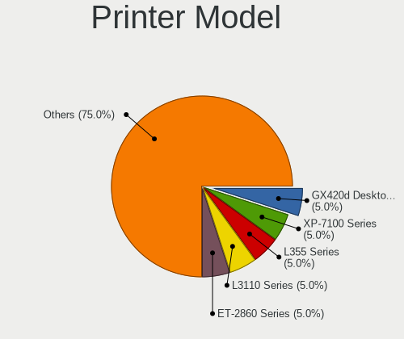

Ubuntu - Hardware Trends
------------------------

A project to identify most popular hardware characteristics and track their change
over time based on data collected by Linux users at https://Linux-Hardware.org.

Anyone can contribute to this report by the [hw-probe](https://github.com/linuxhw/hw-probe) tool:

    sudo -E hw-probe -all -upload

This is a report for all computer types. See also reports for [desktops](/Dist/Ubuntu/Desktop/README.md) and [notebooks](/Dist/Ubuntu/Notebook/README.md).

This report is for one last month. Overall report since the beginning of time: [TestDays](https://github.com/linuxhw/TestDays)

Period: Jul, 2023.

Contents
--------

* [ System ](#system)
  - [ OS                       ](#os)
  - [ OS Family                ](#os-family)
  - [ Kernel                   ](#kernel)
  - [ Kernel Family            ](#kernel-family)
  - [ Kernel Major Ver.        ](#kernel-major-ver)
  - [ Arch                     ](#arch)
  - [ DE                       ](#de)
  - [ Display Server           ](#display-server)
  - [ Display Manager          ](#display-manager)
  - [ OS Lang                  ](#os-lang)
  - [ Boot Mode                ](#boot-mode)
  - [ Filesystem               ](#filesystem)
  - [ Part. scheme             ](#part-scheme)
  - [ Dual Boot with Linux/BSD ](#dual-boot-with-linuxbsd)
  - [ Dual Boot (Win)          ](#dual-boot-win)

* [ Board ](#board)
  - [ Vendor                   ](#vendor)
  - [ Model                    ](#model)
  - [ Model Family             ](#model-family)
  - [ MFG Year                 ](#mfg-year)
  - [ Form Factor              ](#form-factor)
  - [ Secure Boot              ](#secure-boot)
  - [ Coreboot                 ](#coreboot)
  - [ RAM Size                 ](#ram-size)
  - [ RAM Used                 ](#ram-used)
  - [ Total Drives             ](#total-drives)
  - [ Has CD-ROM               ](#has-cd-rom)
  - [ Has Ethernet             ](#has-ethernet)
  - [ Has WiFi                 ](#has-wifi)
  - [ Has Bluetooth            ](#has-bluetooth)

* [ Location ](#location)
  - [ Country                  ](#country)
  - [ City                     ](#city)

* [ Drives ](#drives)
  - [ Drive Vendor             ](#drive-vendor)
  - [ Drive Model              ](#drive-model)
  - [ HDD Vendor               ](#hdd-vendor)
  - [ SSD Vendor               ](#ssd-vendor)
  - [ Drive Kind               ](#drive-kind)
  - [ Drive Connector          ](#drive-connector)
  - [ Drive Size               ](#drive-size)
  - [ Space Total              ](#space-total)
  - [ Space Used               ](#space-used)
  - [ Malfunc. Drives          ](#malfunc-drives)
  - [ Malfunc. Drive Vendor    ](#malfunc-drive-vendor)
  - [ Malfunc. HDD Vendor      ](#malfunc-hdd-vendor)
  - [ Malfunc. Drive Kind      ](#malfunc-drive-kind)
  - [ Failed Drives            ](#failed-drives)
  - [ Failed Drive Vendor      ](#failed-drive-vendor)
  - [ Drive Status             ](#drive-status)

* [ Storage controller ](#storage-controller)
  - [ Storage Vendor           ](#storage-vendor)
  - [ Storage Model            ](#storage-model)
  - [ Storage Kind             ](#storage-kind)

* [ Processor ](#processor)
  - [ CPU Vendor               ](#cpu-vendor)
  - [ CPU Model                ](#cpu-model)
  - [ CPU Model Family         ](#cpu-model-family)
  - [ CPU Cores                ](#cpu-cores)
  - [ CPU Sockets              ](#cpu-sockets)
  - [ CPU Threads              ](#cpu-threads)
  - [ CPU Op-Modes             ](#cpu-op-modes)
  - [ CPU Microcode            ](#cpu-microcode)
  - [ CPU Microarch            ](#cpu-microarch)

* [ Graphics ](#graphics)
  - [ GPU Vendor               ](#gpu-vendor)
  - [ GPU Model                ](#gpu-model)
  - [ GPU Combo                ](#gpu-combo)
  - [ GPU Driver               ](#gpu-driver)
  - [ GPU Memory               ](#gpu-memory)

* [ Monitor ](#monitor)
  - [ Monitor Vendor           ](#monitor-vendor)
  - [ Monitor Model            ](#monitor-model)
  - [ Monitor Resolution       ](#monitor-resolution)
  - [ Monitor Diagonal         ](#monitor-diagonal)
  - [ Monitor Width            ](#monitor-width)
  - [ Aspect Ratio             ](#aspect-ratio)
  - [ Monitor Area             ](#monitor-area)
  - [ Pixel Density            ](#pixel-density)
  - [ Multiple Monitors        ](#multiple-monitors)

* [ Network ](#network)
  - [ Net Controller Vendor    ](#net-controller-vendor)
  - [ Net Controller Model     ](#net-controller-model)
  - [ Wireless Vendor          ](#wireless-vendor)
  - [ Wireless Model           ](#wireless-model)
  - [ Ethernet Vendor          ](#ethernet-vendor)
  - [ Ethernet Model           ](#ethernet-model)
  - [ Net Controller Kind      ](#net-controller-kind)
  - [ Used Controller          ](#used-controller)
  - [ NICs                     ](#nics)
  - [ IPv6                     ](#ipv6)

* [ Bluetooth ](#bluetooth)
  - [ Bluetooth Vendor         ](#bluetooth-vendor)
  - [ Bluetooth Model          ](#bluetooth-model)

* [ Sound ](#sound)
  - [ Sound Vendor             ](#sound-vendor)
  - [ Sound Model              ](#sound-model)

* [ Memory ](#memory)
  - [ Memory Vendor            ](#memory-vendor)
  - [ Memory Model             ](#memory-model)
  - [ Memory Kind              ](#memory-kind)
  - [ Memory Form Factor       ](#memory-form-factor)
  - [ Memory Size              ](#memory-size)
  - [ Memory Speed             ](#memory-speed)

* [ Printers & scanners ](#printers--scanners)
  - [ Printer Vendor           ](#printer-vendor)
  - [ Printer Model            ](#printer-model)
  - [ Scanner Vendor           ](#scanner-vendor)
  - [ Scanner Model            ](#scanner-model)

* [ Camera ](#camera)
  - [ Camera Vendor            ](#camera-vendor)
  - [ Camera Model             ](#camera-model)

* [ Security ](#security)
  - [ Fingerprint Vendor       ](#fingerprint-vendor)
  - [ Fingerprint Model        ](#fingerprint-model)
  - [ Chipcard Vendor          ](#chipcard-vendor)
  - [ Chipcard Model           ](#chipcard-model)

* [ Unsupported ](#unsupported)
  - [ Unsupported Devices      ](#unsupported-devices)
  - [ Unsupported Device Types ](#unsupported-device-types)

System
------

OS
--

Installed operating systems

| Name           | Computers | Percent |
|----------------|-----------|---------|
| Ubuntu 22.04   | 647       | 59.69%  |
| Ubuntu 23.04   | 255       | 23.52%  |
| Ubuntu 20.04   | 107       | 9.87%   |
| Ubuntu 22.10   | 44        | 4.06%   |
| Ubuntu 18.04   | 21        | 1.94%   |
| Ubuntu 23.10   | 3         | 0.28%   |
| Ubuntu 21.04   | 3         | 0.28%   |
| Ubuntu Core 22 | 2         | 0.18%   |
| Ubuntu 21.10   | 1         | 0.09%   |
| Ubuntu 20.10   | 1         | 0.09%   |

OS Family
---------

OS without a version

| Name   | Computers | Percent |
|--------|-----------|---------|
| Ubuntu | 1084      | 100%    |

Kernel
------

Version of the Linux kernel

| Version                 | Computers | Percent |
|-------------------------|-----------|---------|
| 5.19.0-46-generic       | 420       | 38.75%  |
| 5.15.0-76-generic       | 98        | 9.04%   |
| 6.2.0-25-generic        | 97        | 8.95%   |
| 6.2.0-24-generic        | 84        | 7.75%   |
| 5.19.0-50-generic       | 71        | 6.55%   |
| 5.19.0-32-generic       | 39        | 3.6%    |
| 6.2.0-26-generic        | 30        | 2.77%   |
| 5.15.0-78-generic       | 25        | 2.31%   |
| 6.2.0-20-generic        | 17        | 1.57%   |
| 5.19.0-45-generic       | 13        | 1.2%    |
| 6.4.0-060400-generic    | 10        | 0.92%   |
| 5.4.0-153-generic       | 10        | 0.92%   |
| 5.4.0-150-generic       | 10        | 0.92%   |
| 5.19.0-43-generic       | 8         | 0.74%   |
| 6.2.0-23-generic        | 5         | 0.46%   |
| 6.1.0-1015-oem          | 5         | 0.46%   |
| 5.19.0-41-generic       | 5         | 0.46%   |
| 5.15.0-73-generic       | 5         | 0.46%   |
| 5.15.0-69-generic       | 5         | 0.46%   |
| 5.15.0-67-generic       | 5         | 0.46%   |
| 5.15.0-43-generic       | 5         | 0.46%   |
| 6.3.0-7-generic         | 3         | 0.28%   |
| 5.4.0-152-generic       | 3         | 0.28%   |
| 5.19.0-47-generic       | 3         | 0.28%   |
| 5.19.0-42-generic       | 3         | 0.28%   |
| 5.19.0-38-generic       | 3         | 0.28%   |
| 5.15.0-76-lowlatency    | 3         | 0.28%   |
| 5.15.0-75-generic       | 3         | 0.28%   |
| 5.11.0-49-generic       | 3         | 0.28%   |
| 4.15.0-213-generic      | 3         | 0.28%   |
| 6.5.0-060500rc3-generic | 2         | 0.18%   |
| 6.4.6-060406-generic    | 2         | 0.18%   |
| 6.4.3-060403-generic    | 2         | 0.18%   |
| 6.2.16-060216-generic   | 2         | 0.18%   |
| 6.2.0-1008-lowlatency   | 2         | 0.18%   |
| 6.1.0-1016-oem          | 2         | 0.18%   |
| 5.19.0-44-generic       | 2         | 0.18%   |
| 5.15.0-58-generic       | 2         | 0.18%   |
| 5.15.0-56-generic       | 2         | 0.18%   |
| 5.15.0-1041-realtime    | 2         | 0.18%   |

Kernel Family
-------------

Linux kernel without a distro release

| Version  | Computers | Percent |
|----------|-----------|---------|
| 5.19.0   | 572       | 52.77%  |
| 6.2.0    | 239       | 22.05%  |
| 5.15.0   | 166       | 15.31%  |
| 5.4.0    | 33        | 3.04%   |
| 6.4.0    | 10        | 0.92%   |
| 6.1.0    | 9         | 0.83%   |
| 4.15.0   | 7         | 0.65%   |
| 5.11.0   | 5         | 0.46%   |
| 6.4.3    | 4         | 0.37%   |
| 5.13.0   | 4         | 0.37%   |
| 6.3.0    | 3         | 0.28%   |
| 6.5.0    | 2         | 0.18%   |
| 6.4.6    | 2         | 0.18%   |
| 6.4.2    | 2         | 0.18%   |
| 6.2.16   | 2         | 0.18%   |
| 5.8.0    | 2         | 0.18%   |
| 5.14.0   | 2         | 0.18%   |
| 6.4.5    | 1         | 0.09%   |
| 6.4.4    | 1         | 0.09%   |
| 6.3.6    | 1         | 0.09%   |
| 6.3.4    | 1         | 0.09%   |
| 6.3.1    | 1         | 0.09%   |
| 6.2.12   | 1         | 0.09%   |
| 6.2.11   | 1         | 0.09%   |
| 6.2.10   | 1         | 0.09%   |
| 6.1.37   | 1         | 0.09%   |
| 6.1.30   | 1         | 0.09%   |
| 6.1.28   | 1         | 0.09%   |
| 6.0.1    | 1         | 0.09%   |
| 5.19.5   | 1         | 0.09%   |
| 5.17.15  | 1         | 0.09%   |
| 5.15.23  | 1         | 0.09%   |
| 5.10.160 | 1         | 0.09%   |
| 5.10.110 | 1         | 0.09%   |
| 5.10.104 | 1         | 0.09%   |
| 4.4.0    | 1         | 0.09%   |
| 4.14.141 | 1         | 0.09%   |

Kernel Major Ver.
-----------------

Linux kernel major version

| Version | Computers | Percent |
|---------|-----------|---------|
| 5.19    | 573       | 52.86%  |
| 6.2     | 244       | 22.51%  |
| 5.15    | 167       | 15.41%  |
| 5.4     | 33        | 3.04%   |
| 6.4     | 20        | 1.85%   |
| 6.1     | 12        | 1.11%   |
| 4.15    | 7         | 0.65%   |
| 6.3     | 6         | 0.55%   |
| 5.11    | 5         | 0.46%   |
| 5.13    | 4         | 0.37%   |
| 5.10    | 3         | 0.28%   |
| 6.5     | 2         | 0.18%   |
| 5.8     | 2         | 0.18%   |
| 5.14    | 2         | 0.18%   |
| 6.0     | 1         | 0.09%   |
| 5.17    | 1         | 0.09%   |
| 4.4     | 1         | 0.09%   |
| 4.14    | 1         | 0.09%   |

Arch
----

OS architecture (x86_64, i586, etc.)

| Name    | Computers | Percent |
|---------|-----------|---------|
| x86_64  | 1071      | 98.8%   |
| aarch64 | 7         | 0.65%   |
| i686    | 5         | 0.46%   |
| armv7l  | 1         | 0.09%   |

DE
--

Desktop Environment

| Name            | Computers | Percent |
|-----------------|-----------|---------|
| GNOME           | 1014      | 93.54%  |
| Unknown         | 43        | 3.97%   |
| X-Cinnamon      | 15        | 1.38%   |
| GNOME Flashback | 4         | 0.37%   |
| GNOME Classic   | 3         | 0.28%   |
| i3              | 2         | 0.18%   |
| Enlightenment   | 2         | 0.18%   |
| sway            | 1         | 0.09%   |

Display Server
--------------

X11 or Wayland

| Name    | Computers | Percent |
|---------|-----------|---------|
| Wayland | 608       | 56.09%  |
| X11     | 413       | 38.1%   |
| Unknown | 35        | 3.23%   |
| Tty     | 28        | 2.58%   |

Display Manager
---------------

SDDM, LightDM, etc.

| Name    | Computers | Percent |
|---------|-----------|---------|
| GDM3    | 885       | 81.64%  |
| Unknown | 124       | 11.44%  |
| GDM     | 44        | 4.06%   |
| LightDM | 27        | 2.49%   |
| SDDM    | 3         | 0.28%   |
| GREETD  | 1         | 0.09%   |

OS Lang
-------

Language

| Lang    | Computers | Percent |
|---------|-----------|---------|
| en_US   | 505       | 46.59%  |
| de_DE   | 98        | 9.04%   |
| fr_FR   | 61        | 5.63%   |
| pt_BR   | 45        | 4.15%   |
| en_GB   | 37        | 3.41%   |
| it_IT   | 34        | 3.14%   |
| es_ES   | 31        | 2.86%   |
| en_IN   | 31        | 2.86%   |
| C       | 28        | 2.58%   |
| ru_RU   | 25        | 2.31%   |
| en_CA   | 21        | 1.94%   |
| pl_PL   | 17        | 1.57%   |
| en_AU   | 17        | 1.57%   |
| nl_NL   | 12        | 1.11%   |
| zh_CN   | 11        | 1.01%   |
| Unknown | 9         | 0.83%   |
| hu_HU   | 8         | 0.74%   |
| es_MX   | 8         | 0.74%   |
| en_ZA   | 6         | 0.55%   |
| de_AT   | 6         | 0.55%   |
| en_NZ   | 5         | 0.46%   |
| el_GR   | 5         | 0.46%   |
| cs_CZ   | 5         | 0.46%   |
| es_CL   | 4         | 0.37%   |
| es_AR   | 4         | 0.37%   |
| pt_PT   | 3         | 0.28%   |
| nb_NO   | 3         | 0.28%   |
| fr_CH   | 3         | 0.28%   |
| fi_FI   | 3         | 0.28%   |
| bg_BG   | 3         | 0.28%   |
| th_TH   | 2         | 0.18%   |
| sv_SE   | 2         | 0.18%   |
| nl_BE   | 2         | 0.18%   |
| ja_JP   | 2         | 0.18%   |
| es_VE   | 2         | 0.18%   |
| es_DO   | 2         | 0.18%   |
| es_BO   | 2         | 0.18%   |
| en_IL   | 2         | 0.18%   |
| en_HK   | 2         | 0.18%   |
| da_DK   | 2         | 0.18%   |

Boot Mode
---------

EFI or BIOS

| Mode | Computers | Percent |
|------|-----------|---------|
| BIOS | 681       | 62.82%  |
| EFI  | 403       | 37.18%  |

Filesystem
----------

Type of filesystem

| Type    | Computers | Percent |
|---------|-----------|---------|
| Tmpfs   | 568       | 52.4%   |
| Ext4    | 441       | 40.68%  |
| Btrfs   | 38        | 3.51%   |
| Overlay | 27        | 2.49%   |
| Zfs     | 10        | 0.92%   |

Part. scheme
------------

Scheme of partitioning

| Type    | Computers | Percent |
|---------|-----------|---------|
| GPT     | 853       | 78.69%  |
| MBR     | 129       | 11.9%   |
| Unknown | 102       | 9.41%   |

Dual Boot with Linux/BSD
------------------------

Hosting more than one Linux/BSD

| Dual boot | Computers | Percent |
|-----------|-----------|---------|
| No        | 957       | 88.28%  |
| Yes       | 127       | 11.72%  |

Dual Boot (Win)
---------------

Hosting Linux and Windows

| Dual boot | Computers | Percent |
|-----------|-----------|---------|
| No        | 706       | 65.13%  |
| Yes       | 378       | 34.87%  |

Board
-----

Vendor
------

Motherboard manufacturer

| Name                                 | Computers | Percent |
|--------------------------------------|-----------|---------|
| Hewlett-Packard                      | 163       | 15.04%  |
| ASUSTek Computer                     | 161       | 14.85%  |
| Lenovo                               | 153       | 14.11%  |
| Dell                                 | 141       | 13.01%  |
| Gigabyte Technology                  | 65        | 6%      |
| MSI                                  | 62        | 5.72%   |
| Apple                                | 45        | 4.15%   |
| Acer                                 | 45        | 4.15%   |
| ASRock                               | 29        | 2.68%   |
| Intel                                | 24        | 2.21%   |
| Unknown                              | 16        | 1.48%   |
| Samsung Electronics                  | 11        | 1.01%   |
| Fujitsu                              | 11        | 1.01%   |
| HUAWEI                               | 10        | 0.92%   |
| Toshiba                              | 9         | 0.83%   |
| Sony                                 | 9         | 0.83%   |
| Medion                               | 8         | 0.74%   |
| Positivo                             | 7         | 0.65%   |
| Microsoft                            | 7         | 0.65%   |
| Google                               | 7         | 0.65%   |
| Supermicro                           | 6         | 0.55%   |
| Notebook                             | 6         | 0.55%   |
| Timi                                 | 5         | 0.46%   |
| TUXEDO                               | 4         | 0.37%   |
| Pegatron                             | 4         | 0.37%   |
| Chuwi                                | 4         | 0.37%   |
| ATOPNUC                              | 4         | 0.37%   |
| Shenzhen Meigao Electronic Equipment | 3         | 0.28%   |
| Raspberry Pi Foundation              | 3         | 0.28%   |
| Biostar                              | 3         | 0.28%   |
| Alienware                            | 3         | 0.28%   |
| Packard Bell                         | 2         | 0.18%   |
| MECHREVO                             | 2         | 0.18%   |
| Intel Client Systems                 | 2         | 0.18%   |
| GPU Company                          | 2         | 0.18%   |
| Gateway                              | 2         | 0.18%   |
| ECS                                  | 2         | 0.18%   |
| BESSTAR Tech                         | 2         | 0.18%   |
| AZW                                  | 2         | 0.18%   |
| AMI                                  | 2         | 0.18%   |

Model
-----

Motherboard model

| Name                                        | Computers | Percent |
|---------------------------------------------|-----------|---------|
| Unknown                                     | 18        | 1.66%   |
| ASUS All Series                             | 6         | 0.55%   |
| Dell OptiPlex 9020                          | 5         | 0.46%   |
| Supermicro Super Server                     | 4         | 0.37%   |
| Dell Latitude E6410                         | 4         | 0.37%   |
| Apple MacBookPro8,1                         | 4         | 0.37%   |
| Shenzhen Meigao Electronic Equipment UM690  | 3         | 0.28%   |
| HUAWEI BOD-WXX9                             | 3         | 0.28%   |
| HP Pavilion dv6                             | 3         | 0.28%   |
| HP Notebook                                 | 3         | 0.28%   |
| Dell Precision M4800                        | 3         | 0.28%   |
| Dell OptiPlex 380                           | 3         | 0.28%   |
| Dell OptiPlex 3050                          | 3         | 0.28%   |
| ATOPNUC MA90                                | 3         | 0.28%   |
| ASUS ROG STRIX B650E-E GAMING WIFI          | 3         | 0.28%   |
| ASUS PRIME B450M-A                          | 3         | 0.28%   |
| ASUS PRIME A320M-K                          | 3         | 0.28%   |
| Apple MacBookPro11,1                        | 3         | 0.28%   |
| Apple iMac12,1                              | 3         | 0.28%   |
| Timi Mi NoteBook Ultra                      | 2         | 0.18%   |
| Samsung 700T                                | 2         | 0.18%   |
| MSI MS-7D75                                 | 2         | 0.18%   |
| MSI MS-7D67                                 | 2         | 0.18%   |
| MSI MS-7D32                                 | 2         | 0.18%   |
| MSI MS-7C56                                 | 2         | 0.18%   |
| MSI MS-7C37                                 | 2         | 0.18%   |
| MSI MS-7A38                                 | 2         | 0.18%   |
| MSI MS-7817                                 | 2         | 0.18%   |
| MSI MS-7592                                 | 2         | 0.18%   |
| MSI GF63 Thin 11UC                          | 2         | 0.18%   |
| MSI Cyborg 15 A12VF                         | 2         | 0.18%   |
| Lenovo Z50-70 20354                         | 2         | 0.18%   |
| Lenovo Yoga 520-14IKB 80X8                  | 2         | 0.18%   |
| Lenovo ThinkPad X1 Carbon Gen 10 21CBCTO1WW | 2         | 0.18%   |
| Lenovo IdeaPad 520-15IKB 81BF               | 2         | 0.18%   |
| Lenovo IdeaPad 5 15ITL05 82FG               | 2         | 0.18%   |
| Lenovo IdeaPad 5 15ARE05 81YQ               | 2         | 0.18%   |
| Lenovo IdeaPad 3 15ADA05 81W1               | 2         | 0.18%   |
| Lenovo IdeaPad 100-15IBY 80MJ               | 2         | 0.18%   |
| Lenovo H530s 10132                          | 2         | 0.18%   |

Model Family
------------

Motherboard model prefix

| Name               | Computers | Percent |
|--------------------|-----------|---------|
| Lenovo ThinkPad    | 71        | 6.55%   |
| Dell Latitude      | 39        | 3.6%    |
| Dell Inspiron      | 35        | 3.23%   |
| HP Pavilion        | 33        | 3.04%   |
| ASUS ROG           | 29        | 2.68%   |
| ASUS PRIME         | 28        | 2.58%   |
| Acer Aspire        | 26        | 2.4%    |
| Lenovo IdeaPad     | 25        | 2.31%   |
| Dell OptiPlex      | 23        | 2.12%   |
| ASUS VivoBook      | 23        | 2.12%   |
| HP EliteBook       | 18        | 1.66%   |
| HP Compaq          | 18        | 1.66%   |
| Unknown            | 18        | 1.66%   |
| Dell Precision     | 16        | 1.48%   |
| HP Laptop          | 15        | 1.38%   |
| HP ProBook         | 13        | 1.2%    |
| Lenovo ThinkCentre | 12        | 1.11%   |
| Dell XPS           | 12        | 1.11%   |
| Lenovo Legion      | 10        | 0.92%   |
| ASUS ZenBook       | 10        | 0.92%   |
| Lenovo Yoga        | 8         | 0.74%   |
| HP ENVY            | 8         | 0.74%   |
| Microsoft Surface  | 7         | 0.65%   |
| Acer Nitro         | 7         | 0.65%   |
| Toshiba Satellite  | 6         | 0.55%   |
| HP ProDesk         | 6         | 0.55%   |
| ASUS ASUS          | 6         | 0.55%   |
| ASUS All           | 6         | 0.55%   |
| HP ProLiant        | 5         | 0.46%   |
| Dell Vostro        | 5         | 0.46%   |
| ASUS TUF           | 5         | 0.46%   |
| Apple MacBookPro8  | 5         | 0.46%   |
| Supermicro Super   | 4         | 0.37%   |
| Lenovo IdeaPadFlex | 4         | 0.37%   |
| Lenovo IdeaCentre  | 4         | 0.37%   |
| HP EliteDesk       | 4         | 0.37%   |
| HP 250             | 4         | 0.37%   |
| Fujitsu LIFEBOOK   | 4         | 0.37%   |
| Dell PowerEdge     | 4         | 0.37%   |
| Apple MacBookPro11 | 4         | 0.37%   |

MFG Year
--------

Motherboard manufacture year

| Year    | Computers | Percent |
|---------|-----------|---------|
| 2022    | 116       | 10.7%   |
| 2021    | 109       | 10.06%  |
| 2020    | 106       | 9.78%   |
| 2012    | 78        | 7.2%    |
| 2018    | 76        | 7.01%   |
| 2019    | 66        | 6.09%   |
| 2014    | 64        | 5.9%    |
| 2023    | 62        | 5.72%   |
| 2017    | 61        | 5.63%   |
| 2013    | 61        | 5.63%   |
| 2015    | 54        | 4.98%   |
| 2011    | 53        | 4.89%   |
| 2016    | 48        | 4.43%   |
| 2010    | 45        | 4.15%   |
| 2009    | 37        | 3.41%   |
| 2008    | 22        | 2.03%   |
| 2007    | 13        | 1.2%    |
| Unknown | 7         | 0.65%   |
| 2006    | 4         | 0.37%   |
| 2005    | 2         | 0.18%   |

Form Factor
-----------

Physical design of the computer

| Name           | Computers | Percent |
|----------------|-----------|---------|
| Notebook       | 556       | 51.29%  |
| Desktop        | 404       | 37.27%  |
| Convertible    | 40        | 3.69%   |
| All in one     | 23        | 2.12%   |
| Mini pc        | 20        | 1.85%   |
| Server         | 17        | 1.57%   |
| Tablet         | 16        | 1.48%   |
| System on chip | 8         | 0.74%   |

Secure Boot
-----------

Enabled or disabled

| State    | Computers | Percent |
|----------|-----------|---------|
| Disabled | 997       | 91.97%  |
| Enabled  | 87        | 8.03%   |

Coreboot
--------

Have coreboot on board

| Used | Computers | Percent |
|------|-----------|---------|
| No   | 1076      | 99.26%  |
| Yes  | 8         | 0.74%   |

RAM Size
--------

Total RAM memory

| Size in GB      | Computers | Percent |
|-----------------|-----------|---------|
| 4.01-8.0        | 253       | 23.34%  |
| 16.01-24.0      | 229       | 21.13%  |
| 8.01-16.0       | 179       | 16.51%  |
| 3.01-4.0        | 178       | 16.42%  |
| 32.01-64.0      | 133       | 12.27%  |
| 64.01-256.0     | 53        | 4.89%   |
| 24.01-32.0      | 29        | 2.68%   |
| 2.01-3.0        | 14        | 1.29%   |
| More than 256.0 | 8         | 0.74%   |
| 1.01-2.0        | 8         | 0.74%   |

RAM Used
--------

Used RAM memory

| Used GB    | Computers | Percent |
|------------|-----------|---------|
| 2.01-3.0   | 337       | 31.09%  |
| 1.01-2.0   | 306       | 28.23%  |
| 4.01-8.0   | 187       | 17.25%  |
| 3.01-4.0   | 178       | 16.42%  |
| 8.01-16.0  | 48        | 4.43%   |
| 0.51-1.0   | 11        | 1.01%   |
| 16.01-24.0 | 5         | 0.46%   |
| 0.01-0.5   | 5         | 0.46%   |
| 32.01-64.0 | 4         | 0.37%   |
| 24.01-32.0 | 3         | 0.28%   |

Total Drives
------------

Number of drives on board

| Drives | Computers | Percent |
|--------|-----------|---------|
| 1      | 695       | 64.11%  |
| 2      | 249       | 22.97%  |
| 3      | 63        | 5.81%   |
| 4      | 34        | 3.14%   |
| 5      | 17        | 1.57%   |
| 0      | 10        | 0.92%   |
| 6      | 9         | 0.83%   |
| 7      | 3         | 0.28%   |
| 10     | 2         | 0.18%   |
| 11     | 1         | 0.09%   |
| 9      | 1         | 0.09%   |

Has CD-ROM
----------

Has CD-ROM on board

| Presented | Computers | Percent |
|-----------|-----------|---------|
| No        | 752       | 69.37%  |
| Yes       | 332       | 30.63%  |

Has Ethernet
------------

Has Ethernet on board

| Presented | Computers | Percent |
|-----------|-----------|---------|
| Yes       | 905       | 83.49%  |
| No        | 179       | 16.51%  |

Has WiFi
--------

Has WiFi module

| Presented | Computers | Percent |
|-----------|-----------|---------|
| Yes       | 818       | 75.46%  |
| No        | 266       | 24.54%  |

Has Bluetooth
-------------

Has Bluetooth module

| Presented | Computers | Percent |
|-----------|-----------|---------|
| Yes       | 699       | 64.48%  |
| No        | 385       | 35.52%  |

Location
--------

Country
-------

Geographic location (country)

| Country      | Computers | Percent |
|--------------|-----------|---------|
| USA          | 216       | 19.93%  |
| Germany      | 121       | 11.16%  |
| France       | 74        | 6.83%   |
| Brazil       | 63        | 5.81%   |
| Russia       | 44        | 4.06%   |
| UK           | 41        | 3.78%   |
| Italy        | 40        | 3.69%   |
| India        | 40        | 3.69%   |
| Canada       | 33        | 3.04%   |
| Spain        | 26        | 2.4%    |
| Netherlands  | 26        | 2.4%    |
| Australia    | 25        | 2.31%   |
| Poland       | 24        | 2.21%   |
| China        | 13        | 1.2%    |
| Austria      | 13        | 1.2%    |
| Switzerland  | 12        | 1.11%   |
| Mexico       | 12        | 1.11%   |
| Sweden       | 11        | 1.01%   |
| New Zealand  | 10        | 0.92%   |
| Hungary      | 10        | 0.92%   |
| Greece       | 10        | 0.92%   |
| Czechia      | 10        | 0.92%   |
| Belgium      | 10        | 0.92%   |
| Argentina    | 10        | 0.92%   |
| Portugal     | 9         | 0.83%   |
| Chile        | 9         | 0.83%   |
| South Africa | 8         | 0.74%   |
| Norway       | 8         | 0.74%   |
| Malaysia     | 8         | 0.74%   |
| Indonesia    | 8         | 0.74%   |
| Finland      | 8         | 0.74%   |
| Taiwan       | 7         | 0.65%   |
| Romania      | 7         | 0.65%   |
| Japan        | 7         | 0.65%   |
| Turkey       | 6         | 0.55%   |
| Saudi Arabia | 6         | 0.55%   |
| South Korea  | 5         | 0.46%   |
| UAE          | 4         | 0.37%   |
| Thailand     | 4         | 0.37%   |
| Pakistan     | 4         | 0.37%   |

City
----

Geographic location (city)

| City          | Computers | Percent |
|---------------|-----------|---------|
| Moscow        | 15        | 1.38%   |
| Berlin        | 15        | 1.38%   |
| Paris         | 13        | 1.2%    |
| St Petersburg | 12        | 1.11%   |
| Melbourne     | 10        | 0.92%   |
| Madrid        | 9         | 0.83%   |
| Sao Paulo     | 8         | 0.74%   |
| Warsaw        | 7         | 0.65%   |
| Vienna        | 7         | 0.65%   |
| Bengaluru     | 7         | 0.65%   |
| Auckland      | 7         | 0.65%   |
| Toronto       | 6         | 0.55%   |
| Sydney        | 6         | 0.55%   |
| Munich        | 6         | 0.55%   |
| Hamburg       | 6         | 0.55%   |
| Seattle       | 5         | 0.46%   |
| New York      | 5         | 0.46%   |
| Milano        | 5         | 0.46%   |
| Buenos Aires  | 5         | 0.46%   |
| Brasília     | 5         | 0.46%   |
| Stockholm     | 4         | 0.37%   |
| Prague        | 4         | 0.37%   |
| Los Angeles   | 4         | 0.37%   |
| Karlsruhe     | 4         | 0.37%   |
| Florence      | 4         | 0.37%   |
| Delhi         | 4         | 0.37%   |
| Chicago       | 4         | 0.37%   |
| Chennai       | 4         | 0.37%   |
| Bucharest     | 4         | 0.37%   |
| Wroclaw       | 3         | 0.28%   |
| The Hague     | 3         | 0.28%   |
| Surat         | 3         | 0.28%   |
| Surabaya      | 3         | 0.28%   |
| Sofia         | 3         | 0.28%   |
| Singapore     | 3         | 0.28%   |
| Seville       | 3         | 0.28%   |
| Santo André  | 3         | 0.28%   |
| Santiago      | 3         | 0.28%   |
| San José     | 3         | 0.28%   |
| Rotterdam     | 3         | 0.28%   |

Drives
------

Drive Vendor
------------

Hard drive vendors

| Vendor                      | Computers | Drives | Percent |
|-----------------------------|-----------|--------|---------|
| Samsung Electronics         | 262       | 327    | 17.44%  |
| Seagate                     | 190       | 235    | 12.65%  |
| WDC                         | 162       | 200    | 10.79%  |
| Sandisk                     | 104       | 110    | 6.92%   |
| Kingston                    | 78        | 84     | 5.19%   |
| Toshiba                     | 63        | 66     | 4.19%   |
| Crucial                     | 56        | 62     | 3.73%   |
| Intel                       | 53        | 56     | 3.53%   |
| Unknown                     | 43        | 47     | 2.86%   |
| Micron Technology           | 41        | 42     | 2.73%   |
| SK hynix                    | 38        | 38     | 2.53%   |
| Hitachi                     | 35        | 35     | 2.33%   |
| KIOXIA                      | 20        | 20     | 1.33%   |
| Apple                       | 19        | 20     | 1.26%   |
| Micron/Crucial Technology   | 18        | 19     | 1.2%    |
| HGST                        | 18        | 21     | 1.2%    |
| Phison Electronics          | 16        | 16     | 1.07%   |
| China                       | 16        | 17     | 1.07%   |
| A-DATA Technology           | 16        | 18     | 1.07%   |
| Kingston Technology Company | 15        | 16     | 1%      |
| Unknown                     | 15        | 16     | 1%      |
| Silicon Motion              | 14        | 14     | 0.93%   |
| PNY                         | 13        | 13     | 0.87%   |
| Intenso                     | 11        | 12     | 0.73%   |
| Maxtor                      | 9         | 10     | 0.6%    |
| Fujitsu                     | 8         | 12     | 0.53%   |
| LITEON                      | 7         | 8      | 0.47%   |
| GOODRAM                     | 7         | 7      | 0.47%   |
| SPCC                        | 6         | 7      | 0.4%    |
| Phison                      | 6         | 6      | 0.4%    |
| OCZ                         | 6         | 6      | 0.4%    |
| MAXIO Technology (Hangzhou) | 6         | 6      | 0.4%    |
| Transcend                   | 5         | 5      | 0.33%   |
| Team                        | 5         | 5      | 0.33%   |
| Netac                       | 5         | 5      | 0.33%   |
| Gigabyte Technology         | 5         | 6      | 0.33%   |
| Fanxiang                    | 5         | 5      | 0.33%   |
| Corsair                     | 4         | 4      | 0.27%   |
| ASMT                        | 4         | 5      | 0.27%   |
| Union Memory (Shenzhen)     | 3         | 3      | 0.2%    |

Drive Model
-----------

Hard drive models

| Model                                                 | Computers | Percent |
|-------------------------------------------------------|-----------|---------|
| Samsung NVMe SSD Controller SM981/PM981/PM983 500GB   | 29        | 1.79%   |
| Kingston SA400S37240G 240GB SSD                       | 19        | 1.17%   |
| Samsung NVMe SSD Controller PM9A1/PM9A3/980PRO 1TB    | 17        | 1.05%   |
| Micron/Crucial P2 NVMe PCIe SSD 1TB                   | 17        | 1.05%   |
| Unknown                                               | 15        | 0.93%   |
| Kingston SA400S37480G 480GB SSD                       | 14        | 0.86%   |
| Samsung SSD 850 EVO 500GB                             | 13        | 0.8%    |
| Unknown MMC Card  128GB                               | 10        | 0.62%   |
| Samsung SSD 980 1TB                                   | 10        | 0.62%   |
| Crucial CT1000MX500SSD1 1TB                           | 10        | 0.62%   |
| Silicon Motion SM2263EN/SM2263XT SSD Controller 500GB | 9         | 0.56%   |
| Seagate ST1000LM035-1RK172 1TB                        | 9         | 0.56%   |
| Seagate ST1000DM010-2EP102 1TB                        | 9         | 0.56%   |
| Phison PS5013 E13 NVMe Controller 256GB               | 9         | 0.56%   |
| Intel SSD 660P Series 1024GB                          | 9         | 0.56%   |
| Unknown MMC Card  64GB                                | 8         | 0.49%   |
| Unknown MMC Card  32GB                                | 8         | 0.49%   |
| Seagate ST500DM002-1BD142 500GB                       | 8         | 0.49%   |
| Samsung SSD 990 PRO 2TB                               | 8         | 0.49%   |
| Seagate Expansion 1TB                                 | 7         | 0.43%   |
| Sandisk WD Blue SN500 / PC SN520 NVMe SSD 512GB       | 7         | 0.43%   |
| Samsung SSD 870 EVO 1TB                               | 7         | 0.43%   |
| Samsung SSD 850 EVO 250GB                             | 7         | 0.43%   |
| Samsung NVMe SSD Controller SM961/PM961/SM963 256GB   | 7         | 0.43%   |
| Intel SSDPEKNU512GZ 512GB                             | 7         | 0.43%   |
| Seagate ST1000LM024 HN-M101MBB 1TB                    | 6         | 0.37%   |
| Seagate Expansion Desk 8TB                            | 6         | 0.37%   |
| Sandisk WD Blue SN550 NVMe SSD 250GB                  | 6         | 0.37%   |
| Sandisk WD Black SN750 / PC SN730 NVMe SSD 1024GB     | 6         | 0.37%   |
| Samsung SSD 870 QVO 1TB                               | 6         | 0.37%   |
| HGST HTS721010A9E630 1TB                              | 6         | 0.37%   |
| Crucial CT500MX500SSD1 500GB                          | 6         | 0.37%   |
| WDC WDS240G2G0A-00JH30 240GB SSD                      | 5         | 0.31%   |
| WDC WD10EZEX-08WN4A0 1TB                              | 5         | 0.31%   |
| Unknown SD/MMC/MS PRO 128GB                           | 5         | 0.31%   |
| Toshiba MQ01ABD100 1TB                                | 5         | 0.31%   |
| Seagate ST500LT012-1DG142 500GB                       | 5         | 0.31%   |
| Seagate ST3500418AS 500GB                             | 5         | 0.31%   |
| Seagate ST2000LM007-1R8174 2TB                        | 5         | 0.31%   |
| Seagate ST2000DM008-2FR102 2TB                        | 5         | 0.31%   |

HDD Vendor
----------

Hard disk drive vendors

| Vendor              | Computers | Drives | Percent |
|---------------------|-----------|--------|---------|
| Seagate             | 185       | 228    | 38.38%  |
| WDC                 | 128       | 161    | 26.56%  |
| Toshiba             | 45        | 45     | 9.34%   |
| Hitachi             | 35        | 35     | 7.26%   |
| Samsung Electronics | 27        | 31     | 5.6%    |
| HGST                | 18        | 21     | 3.73%   |
| Maxtor              | 9         | 10     | 1.87%   |
| Fujitsu             | 8         | 12     | 1.66%   |
| Unknown             | 6         | 6      | 1.24%   |
| Apple               | 5         | 5      | 1.04%   |
| ASMT                | 4         | 5      | 0.83%   |
| External            | 3         | 4      | 0.62%   |
| LaCie               | 2         | 2      | 0.41%   |
| JMicron Technology  | 2         | 2      | 0.41%   |
| Intenso             | 2         | 2      | 0.41%   |
| StoreJet            | 1         | 1      | 0.21%   |
| SABRENT             | 1         | 1      | 0.21%   |
| QUANTUM             | 1         | 1      | 0.21%   |

SSD Vendor
----------

Solid state drive vendors

| Vendor              | Computers | Drives | Percent |
|---------------------|-----------|--------|---------|
| Samsung Electronics | 110       | 128    | 23.06%  |
| Kingston            | 55        | 59     | 11.53%  |
| SanDisk             | 50        | 54     | 10.48%  |
| Crucial             | 49        | 53     | 10.27%  |
| WDC                 | 22        | 22     | 4.61%   |
| Intel               | 17        | 18     | 3.56%   |
| China               | 16        | 17     | 3.35%   |
| PNY                 | 12        | 12     | 2.52%   |
| A-DATA Technology   | 12        | 14     | 2.52%   |
| Toshiba             | 8         | 8      | 1.68%   |
| Apple               | 8         | 8      | 1.68%   |
| Micron Technology   | 7         | 7      | 1.47%   |
| LITEON              | 7         | 8      | 1.47%   |
| Intenso             | 7         | 8      | 1.47%   |
| SK hynix            | 6         | 6      | 1.26%   |
| OCZ                 | 6         | 6      | 1.26%   |
| GOODRAM             | 6         | 6      | 1.26%   |
| Unknown             | 6         | 6      | 1.26%   |
| Transcend           | 5         | 5      | 1.05%   |
| Team                | 5         | 5      | 1.05%   |
| SPCC                | 4         | 5      | 0.84%   |
| Netac               | 3         | 3      | 0.63%   |
| Gigabyte Technology | 3         | 4      | 0.63%   |
| Fanxiang            | 3         | 3      | 0.63%   |
| Apacer              | 3         | 3      | 0.63%   |
| Verbatim            | 2         | 3      | 0.42%   |
| SCY                 | 2         | 2      | 0.42%   |
| Plextor             | 2         | 2      | 0.42%   |
| Patriot             | 2         | 2      | 0.42%   |
| OWC                 | 2         | 3      | 0.42%   |
| Mushkin             | 2         | 2      | 0.42%   |
| LITEONIT            | 2         | 2      | 0.42%   |
| Leven               | 2         | 2      | 0.42%   |
| KingSpec            | 2         | 2      | 0.42%   |
| Kingchuxing         | 2         | 2      | 0.42%   |
| Hewlett-Packard     | 2         | 4      | 0.42%   |
| XrayDisk            | 1         | 1      | 0.21%   |
| Wodposit            | 1         | 1      | 0.21%   |
| WALRAM              | 1         | 1      | 0.21%   |
| Teclast             | 1         | 1      | 0.21%   |

Drive Kind
----------

HDD or SSD

| Kind    | Computers | Drives | Percent |
|---------|-----------|--------|---------|
| NVMe    | 462       | 536    | 33.65%  |
| SSD     | 433       | 519    | 31.54%  |
| HDD     | 408       | 572    | 29.72%  |
| MMC     | 45        | 51     | 3.28%   |
| Unknown | 25        | 26     | 1.82%   |

Drive Connector
---------------

SATA, SAS, NVMe, etc.

| Type | Computers | Drives | Percent |
|------|-----------|--------|---------|
| SATA | 705       | 1044   | 55.42%  |
| NVMe | 460       | 533    | 36.16%  |
| SAS  | 62        | 76     | 4.87%   |
| MMC  | 45        | 51     | 3.54%   |

Drive Size
----------

Size of hard drive

| Size in TB | Computers | Drives | Percent |
|------------|-----------|--------|---------|
| 0.01-0.5   | 493       | 612    | 55.71%  |
| 0.51-1.0   | 253       | 294    | 28.59%  |
| 1.01-2.0   | 79        | 97     | 8.93%   |
| 4.01-10.0  | 25        | 45     | 2.82%   |
| 3.01-4.0   | 20        | 26     | 2.26%   |
| 2.01-3.0   | 9         | 10     | 1.02%   |
| 10.01-20.0 | 5         | 6      | 0.56%   |
| 0          | 1         | 1      | 0.11%   |

Space Total
-----------

Amount of disk space available on the file system

| Size in GB     | Computers | Percent |
|----------------|-----------|---------|
| 101-250        | 310       | 28.6%   |
| 251-500        | 292       | 26.94%  |
| 501-1000       | 177       | 16.33%  |
| 1001-2000      | 94        | 8.67%   |
| More than 3000 | 56        | 5.17%   |
| 51-100         | 49        | 4.52%   |
| 1-20           | 43        | 3.97%   |
| 21-50          | 25        | 2.31%   |
| 2001-3000      | 24        | 2.21%   |
| Unknown        | 14        | 1.29%   |

Space Used
----------

Amount of used disk space

| Used GB        | Computers | Percent |
|----------------|-----------|---------|
| 1-20           | 312       | 28.78%  |
| 21-50          | 270       | 24.91%  |
| 101-250        | 152       | 14.02%  |
| 51-100         | 150       | 13.84%  |
| 251-500        | 79        | 7.29%   |
| 501-1000       | 52        | 4.8%    |
| 1001-2000      | 27        | 2.49%   |
| More than 3000 | 20        | 1.85%   |
| Unknown        | 14        | 1.29%   |
| 2001-3000      | 8         | 0.74%   |

Malfunc. Drives
---------------

Drive models with a malfunction

| Model                                               | Computers | Drives | Percent |
|-----------------------------------------------------|-----------|--------|---------|
| SanDisk SSD PLUS 240GB                              | 2         | 2      | 3.7%    |
| Samsung Electronics SSD 970 EVO 500GB               | 2         | 2      | 3.7%    |
| WDC WD80EFBX-68AZZN0 8TB                            | 1         | 2      | 1.85%   |
| WDC WD5000LPVT-22G33T0 500GB                        | 1         | 1      | 1.85%   |
| WDC WD5000BEVT-60ZAT1 500GB                         | 1         | 1      | 1.85%   |
| WDC WD5000BEVT-55A0RT0 500GB                        | 1         | 1      | 1.85%   |
| WDC WD5000AAKX-753CA1 500GB                         | 1         | 1      | 1.85%   |
| WDC WD5000AAKX-60U6AA0 500GB                        | 1         | 1      | 1.85%   |
| WDC WD5000AAKX-00ERMA0 500GB                        | 1         | 2      | 1.85%   |
| WDC WD5000AAKS-402AA0 500GB                         | 1         | 1      | 1.85%   |
| WDC WD4500HLHX-01JJPV0 450GB                        | 1         | 1      | 1.85%   |
| WDC WD40EFRX-68WT0N0 4TB                            | 1         | 2      | 1.85%   |
| WDC WD3200BEVT-22ZCT0 320GB                         | 1         | 1      | 1.85%   |
| WDC WD2500AAKX-753CA1 250GB                         | 1         | 1      | 1.85%   |
| WDC WD10JPCX-24UE4T0 1TB                            | 1         | 1      | 1.85%   |
| WDC WD10EZEX-21WN4A0 1TB                            | 1         | 1      | 1.85%   |
| WDC WD10EADS-65L5B1 1TB                             | 1         | 1      | 1.85%   |
| Toshiba MK5065GSXF 500GB                            | 1         | 1      | 1.85%   |
| Toshiba MK3261GSYN 320GB                            | 1         | 1      | 1.85%   |
| Toshiba MK2555GSXF 250GB                            | 1         | 1      | 1.85%   |
| Toshiba MK1234GSX 120GB                             | 1         | 1      | 1.85%   |
| Toshiba MG08ACA16TE 16TB                            | 1         | 1      | 1.85%   |
| Seagate ST8000DM004-2CX188 8TB                      | 1         | 2      | 1.85%   |
| Seagate ST500LM012 HN-M500MBB 500GB                 | 1         | 1      | 1.85%   |
| Seagate ST500LM000-1EJ162-SSHD-8GB                  | 1         | 1      | 1.85%   |
| Seagate ST3500418AS 500GB                           | 1         | 1      | 1.85%   |
| Seagate ST320LT007-9ZV142 320GB                     | 1         | 1      | 1.85%   |
| Seagate ST2000LM007-1R8174 2TB                      | 1         | 1      | 1.85%   |
| Seagate ST14000NM0018-2H4101 14TB                   | 1         | 1      | 1.85%   |
| SanDisk SSD PLUS 120GB                              | 1         | 1      | 1.85%   |
| SanDisk SSD i100 16GB                               | 1         | 1      | 1.85%   |
| SanDisk SDSSDX120GG25 120GB                         | 1         | 1      | 1.85%   |
| SanDisk SDSSDHII120G 120GB                          | 1         | 1      | 1.85%   |
| Samsung Electronics SSD 980 1TB                     | 1         | 1      | 1.85%   |
| Samsung Electronics SSD 870 EVO 500GB               | 1         | 1      | 1.85%   |
| Samsung Electronics SSD 850 EVO 1TB                 | 1         | 1      | 1.85%   |
| Samsung Electronics HD753LJ 752GB                   | 1         | 1      | 1.85%   |
| Samsung Electronics HD501LJ 500GB                   | 1         | 2      | 1.85%   |
| OCZ VERTEX3 90GB SSD                                | 1         | 1      | 1.85%   |
| Micron Technology MTFDDAK512TBN-1AR15ABHA 512GB SSD | 1         | 1      | 1.85%   |

Malfunc. Drive Vendor
---------------------

Vendors of faulty drives

| Vendor              | Computers | Drives | Percent |
|---------------------|-----------|--------|---------|
| WDC                 | 14        | 18     | 26.42%  |
| Seagate             | 7         | 8      | 13.21%  |
| Samsung Electronics | 7         | 8      | 13.21%  |
| SanDisk             | 6         | 6      | 11.32%  |
| Toshiba             | 5         | 5      | 9.43%   |
| Intel               | 3         | 3      | 5.66%   |
| Crucial             | 3         | 3      | 5.66%   |
| Micron Technology   | 2         | 2      | 3.77%   |
| Kingston            | 2         | 2      | 3.77%   |
| Hitachi             | 2         | 2      | 3.77%   |
| OCZ                 | 1         | 1      | 1.89%   |
| Maxtor              | 1         | 1      | 1.89%   |

Malfunc. HDD Vendor
-------------------

Vendors of faulty HDD drives

| Vendor              | Computers | Drives | Percent |
|---------------------|-----------|--------|---------|
| WDC                 | 14        | 18     | 45.16%  |
| Seagate             | 7         | 8      | 22.58%  |
| Toshiba             | 5         | 5      | 16.13%  |
| Samsung Electronics | 2         | 3      | 6.45%   |
| Hitachi             | 2         | 2      | 6.45%   |
| Maxtor              | 1         | 1      | 3.23%   |

Malfunc. Drive Kind
-------------------

Kinds of faulty drives

| Kind | Computers | Drives | Percent |
|------|-----------|--------|---------|
| HDD  | 29        | 37     | 56.86%  |
| SSD  | 17        | 17     | 33.33%  |
| NVMe | 5         | 5      | 9.8%    |

Failed Drives
-------------

Failed drive models

| Model                         | Computers | Drives | Percent |
|-------------------------------|-----------|--------|---------|
| Apple HDD HTS541010A9E662 1TB | 1         | 1      | 100%    |

Failed Drive Vendor
-------------------

Failed drive vendors

| Vendor | Computers | Drives | Percent |
|--------|-----------|--------|---------|
| Apple  | 1         | 1      | 100%    |

Drive Status
------------

Number of failed and malfunc. drives

| Status   | Computers | Drives | Percent |
|----------|-----------|--------|---------|
| Detected | 723       | 1112   | 63.53%  |
| Works    | 365       | 532    | 32.07%  |
| Malfunc  | 49        | 59     | 4.31%   |
| Failed   | 1         | 1      | 0.09%   |

Storage controller
------------------

Storage Vendor
--------------

Storage controller vendors

| Vendor                                  | Computers | Percent |
|-----------------------------------------|-----------|---------|
| Intel                                   | 714       | 49.51%  |
| AMD                                     | 166       | 11.51%  |
| Samsung Electronics                     | 152       | 10.54%  |
| SanDisk                                 | 68        | 4.72%   |
| Kingston Technology Company             | 39        | 2.7%    |
| Micron Technology                       | 35        | 2.43%   |
| SK hynix                                | 31        | 2.15%   |
| Phison Electronics                      | 29        | 2.01%   |
| ASMedia Technology                      | 28        | 1.94%   |
| Micron/Crucial Technology               | 25        | 1.73%   |
| KIOXIA                                  | 20        | 1.39%   |
| Silicon Motion                          | 17        | 1.18%   |
| JMicron Technology                      | 15        | 1.04%   |
| Marvell Technology Group                | 13        | 0.9%    |
| Toshiba America Info Systems            | 12        | 0.83%   |
| Nvidia                                  | 10        | 0.69%   |
| Broadcom / LSI                          | 10        | 0.69%   |
| MAXIO Technology (Hangzhou)             | 6         | 0.42%   |
| Apple                                   | 6         | 0.42%   |
| ADATA Technology                        | 6         | 0.42%   |
| Hewlett-Packard                         | 5         | 0.35%   |
| VIA Technologies                        | 4         | 0.28%   |
| Shenzhen Longsys Electronics            | 4         | 0.28%   |
| Union Memory (Shenzhen)                 | 3         | 0.21%   |
| Solid State Storage Technology          | 3         | 0.21%   |
| Silicon Image                           | 3         | 0.21%   |
| Seagate Technology                      | 3         | 0.21%   |
| Realtek Semiconductor                   | 3         | 0.21%   |
| LSI Logic / Symbios Logic               | 2         | 0.14%   |
| Toshiba                                 | 1         | 0.07%   |
| Silicon Integrated Systems [SiS]        | 1         | 0.07%   |
| Shenzhen Unionmemory Information System | 1         | 0.07%   |
| Lenovo                                  | 1         | 0.07%   |
| Jiangsu Huacun Elec.                    | 1         | 0.07%   |
| INNOGRIT                                | 1         | 0.07%   |
| Enmotus                                 | 1         | 0.07%   |
| Chelsio Communications                  | 1         | 0.07%   |
| Advanced System Products                | 1         | 0.07%   |
| Adaptec                                 | 1         | 0.07%   |

Storage Model
-------------

Storage controller models

| Model                                                                                   | Computers | Percent |
|-----------------------------------------------------------------------------------------|-----------|---------|
| AMD FCH SATA Controller [AHCI mode]                                                     | 111       | 6.87%   |
| Samsung NVMe SSD Controller SM981/PM981/PM983                                           | 55        | 3.41%   |
| Intel Sunrise Point-LP SATA Controller [AHCI mode]                                      | 49        | 3.03%   |
| Intel 8 Series/C220 Series Chipset Family 6-port SATA Controller 1 [AHCI mode]          | 48        | 2.97%   |
| Intel Volume Management Device NVMe RAID Controller                                     | 42        | 2.6%    |
| Intel 82801 Mobile SATA Controller [RAID mode]                                          | 39        | 2.41%   |
| Intel 7 Series Chipset Family 6-port SATA Controller [AHCI mode]                        | 33        | 2.04%   |
| Samsung NVMe SSD Controller 980                                                         | 31        | 1.92%   |
| Samsung NVMe SSD Controller PM9A1/PM9A3/980PRO                                          | 30        | 1.86%   |
| Intel 6 Series/C200 Series Chipset Family 6 port Desktop SATA AHCI Controller           | 26        | 1.61%   |
| ASMedia ASM1062 Serial ATA Controller                                                   | 24        | 1.49%   |
| Micron/Crucial P2 [Nick P2] / P3 / P3 Plus NVMe PCIe SSD (DRAM-less)                    | 23        | 1.42%   |
| Intel Comet Lake SATA AHCI Controller                                                   | 23        | 1.42%   |
| Intel 200 Series PCH SATA controller [AHCI mode]                                        | 22        | 1.36%   |
| Intel 7 Series/C210 Series Chipset Family 6-port SATA Controller [AHCI mode]            | 21        | 1.3%    |
| Intel 6 Series/C200 Series Chipset Family 6 port Mobile SATA AHCI Controller            | 21        | 1.3%    |
| AMD 400 Series Chipset SATA Controller                                                  | 21        | 1.3%    |
| Intel Q170/Q150/B150/H170/H110/Z170/CM236 Chipset SATA Controller [AHCI Mode]           | 20        | 1.24%   |
| Intel 82801IBM/IEM (ICH9M/ICH9M-E) 4 port SATA Controller [AHCI mode]                   | 20        | 1.24%   |
| Intel 8 Series SATA Controller 1 [AHCI mode]                                            | 20        | 1.24%   |
| Intel Celeron/Pentium Silver Processor SATA Controller                                  | 18        | 1.11%   |
| AMD 500 Series Chipset SATA Controller                                                  | 18        | 1.11%   |
| Intel Wildcat Point-LP SATA Controller [AHCI Mode]                                      | 17        | 1.05%   |
| Intel Tiger Lake-LP SATA Controller                                                     | 17        | 1.05%   |
| Intel SATA Controller [RAID mode]                                                       | 17        | 1.05%   |
| Intel Cannon Lake Mobile PCH SATA AHCI Controller                                       | 16        | 0.99%   |
| Intel 5 Series/3400 Series Chipset 6 port SATA AHCI Controller                          | 15        | 0.93%   |
| Intel 5 Series/3400 Series Chipset 4 port SATA AHCI Controller                          | 15        | 0.93%   |
| SK hynix Gold P31/BC711/PC711 NVMe Solid State Drive                                    | 14        | 0.87%   |
| Samsung NVMe SSD Controller SM961/PM961/SM963                                           | 14        | 0.87%   |
| KIOXIA NVMe SSD Controller BG4 (DRAM-less)                                              | 14        | 0.87%   |
| Intel SSD 670p Series [Keystone Harbor]                                                 | 14        | 0.87%   |
| AMD SB7x0/SB8x0/SB9x0 IDE Controller                                                    | 14        | 0.87%   |
| Intel Cannon Lake PCH SATA AHCI Controller                                              | 13        | 0.8%    |
| Silicon Motion SM2263EN/SM2263XT (DRAM-less) NVMe SSD Controllers                       | 12        | 0.74%   |
| Samsung NVMe SSD Controller S4LV008[Pascal]                                             | 12        | 0.74%   |
| Phison PS5013 E13 NVMe Controller                                                       | 12        | 0.74%   |
| Micron 2450 NVMe SSD [HendrixV] (DRAM-less)                                             | 12        | 0.74%   |
| Intel NM10/ICH7 Family SATA Controller [IDE mode]                                       | 12        | 0.74%   |
| Intel 6 Series/C200 Series Chipset Family Desktop SATA Controller (IDE mode, ports 4-5) | 12        | 0.74%   |

Storage Kind
------------

Kind of storage controller (IDE, SATA, NVMe, SAS, ...)

| Kind | Computers | Percent |
|------|-----------|---------|
| SATA | 726       | 50.84%  |
| NVMe | 458       | 32.07%  |
| RAID | 127       | 8.89%   |
| IDE  | 105       | 7.35%   |
| SAS  | 8         | 0.56%   |
| SCSI | 4         | 0.28%   |

Processor
---------

CPU Vendor
----------

Processor vendors

| Vendor  | Computers | Percent |
|---------|-----------|---------|
| Intel   | 828       | 76.38%  |
| AMD     | 248       | 22.88%  |
| ARM     | 7         | 0.65%   |
| Unknown | 1         | 0.09%   |

CPU Model
---------

Processor models

| Model                                   | Computers | Percent |
|-----------------------------------------|-----------|---------|
| Intel 11th Gen Core i7-1165G7 @ 2.80GHz | 15        | 1.38%   |
| Intel Core i5-7200U CPU @ 2.50GHz       | 12        | 1.11%   |
| Intel 11th Gen Core i5-1135G7 @ 2.40GHz | 12        | 1.11%   |
| Intel Core i5-6300U CPU @ 2.40GHz       | 11        | 1.01%   |
| Intel 12th Gen Core i7-12700H           | 11        | 1.01%   |
| AMD Ryzen 7 5700U with Radeon Graphics  | 10        | 0.92%   |
| Intel Core i7-9750H CPU @ 2.60GHz       | 9         | 0.83%   |
| Intel Core i7-10510U CPU @ 1.80GHz      | 9         | 0.83%   |
| Intel Core i7-6500U CPU @ 2.50GHz       | 8         | 0.74%   |
| AMD Ryzen 9 3900X 12-Core Processor     | 8         | 0.74%   |
| AMD Ryzen 5 5500U with Radeon Graphics  | 8         | 0.74%   |
| Intel Core i7-8550U CPU @ 1.80GHz       | 7         | 0.65%   |
| Intel Core i7-3770 CPU @ 3.40GHz        | 7         | 0.65%   |
| Intel Core i5-3470 CPU @ 3.20GHz        | 7         | 0.65%   |
| Intel 11th Gen Core i3-1115G4 @ 3.00GHz | 7         | 0.65%   |
| Intel Core i7-8565U CPU @ 1.80GHz       | 6         | 0.55%   |
| Intel Core i7-7500U CPU @ 2.70GHz       | 6         | 0.55%   |
| Intel Core i7-4790 CPU @ 3.60GHz        | 6         | 0.55%   |
| Intel Core i7-4770 CPU @ 3.40GHz        | 6         | 0.55%   |
| Intel Core i5-8265U CPU @ 1.60GHz       | 6         | 0.55%   |
| Intel Core i5-6500 CPU @ 3.20GHz        | 6         | 0.55%   |
| Intel Core i5-5200U CPU @ 2.20GHz       | 6         | 0.55%   |
| Intel Core i5-4460 CPU @ 3.20GHz        | 6         | 0.55%   |
| Intel Core i5-1035G1 CPU @ 1.00GHz      | 6         | 0.55%   |
| Intel Core i5-10210U CPU @ 1.60GHz      | 6         | 0.55%   |
| Intel Celeron N4020 CPU @ 1.10GHz       | 6         | 0.55%   |
| ARM Processor                           | 6         | 0.55%   |
| AMD Ryzen 9 5900X 12-Core Processor     | 6         | 0.55%   |
| AMD Ryzen 7 5800H with Radeon Graphics  | 6         | 0.55%   |
| AMD Ryzen 5 5600G with Radeon Graphics  | 6         | 0.55%   |
| Intel Xeon CPU E5-2680 v4 @ 2.40GHz     | 5         | 0.46%   |
| Intel Core i7-7700HQ CPU @ 2.80GHz      | 5         | 0.46%   |
| Intel Core i7-6600U CPU @ 2.60GHz       | 5         | 0.46%   |
| Intel Core i7-2600 CPU @ 3.40GHz        | 5         | 0.46%   |
| Intel Core i7-1065G7 CPU @ 1.30GHz      | 5         | 0.46%   |
| Intel Core i5-8250U CPU @ 1.60GHz       | 5         | 0.46%   |
| Intel Core i5-3210M CPU @ 2.50GHz       | 5         | 0.46%   |
| Intel Core i5-2415M CPU @ 2.30GHz       | 5         | 0.46%   |
| Intel Core i3-6100U CPU @ 2.30GHz       | 5         | 0.46%   |
| Intel Core i3-3110M CPU @ 2.40GHz       | 5         | 0.46%   |

CPU Model Family
----------------

Processor model prefix

| Model                   | Computers | Percent |
|-------------------------|-----------|---------|
| Intel Core i5           | 237       | 21.86%  |
| Intel Core i7           | 177       | 16.33%  |
| Other                   | 158       | 14.58%  |
| Intel Core i3           | 82        | 7.56%   |
| AMD Ryzen 7             | 62        | 5.72%   |
| AMD Ryzen 5             | 62        | 5.72%   |
| Intel Celeron           | 48        | 4.43%   |
| Intel Xeon              | 38        | 3.51%   |
| Intel Core 2 Duo        | 37        | 3.41%   |
| AMD Ryzen 9             | 35        | 3.23%   |
| Intel Pentium           | 16        | 1.48%   |
| AMD Ryzen 3             | 12        | 1.11%   |
| Intel Pentium Dual-Core | 9         | 0.83%   |
| AMD FX                  | 9         | 0.83%   |
| AMD A6                  | 9         | 0.83%   |
| Intel Atom              | 8         | 0.74%   |
| AMD Ryzen 5 PRO         | 8         | 0.74%   |
| Intel Core i9           | 7         | 0.65%   |
| AMD A10                 | 6         | 0.55%   |
| Intel Core 2 Quad       | 5         | 0.46%   |
| Intel Core 2            | 5         | 0.46%   |
| Intel Pentium Dual      | 4         | 0.37%   |
| AMD Ryzen 7 PRO         | 4         | 0.37%   |
| AMD Athlon II X2        | 4         | 0.37%   |
| AMD Athlon              | 4         | 0.37%   |
| AMD A8                  | 4         | 0.37%   |
| Intel Core M            | 3         | 0.28%   |
| AMD E2                  | 3         | 0.28%   |
| AMD E1                  | 3         | 0.28%   |
| AMD A4                  | 3         | 0.28%   |
| Intel Xeon Silver       | 2         | 0.18%   |
| Intel Xeon Gold         | 2         | 0.18%   |
| AMD Phenom II X4        | 2         | 0.18%   |
| AMD Phenom II X2        | 2         | 0.18%   |
| AMD Athlon 64           | 2         | 0.18%   |
| Intel Pentium Silver    | 1         | 0.09%   |
| Intel Pentium Gold      | 1         | 0.09%   |
| Intel Pentium D         | 1         | 0.09%   |
| Intel Pentium 4         | 1         | 0.09%   |
| Intel Core m3           | 1         | 0.09%   |

CPU Cores
---------

Number of processor cores

| Number  | Computers | Percent |
|---------|-----------|---------|
| 2       | 372       | 34.32%  |
| 4       | 359       | 33.12%  |
| 6       | 112       | 10.33%  |
| 8       | 104       | 9.59%   |
| 12      | 36        | 3.32%   |
| 10      | 28        | 2.58%   |
| 14      | 24        | 2.21%   |
| 16      | 13        | 1.2%    |
| 1       | 10        | 0.92%   |
| 28      | 6         | 0.55%   |
| 24      | 6         | 0.55%   |
| 32      | 3         | 0.28%   |
| Unknown | 3         | 0.28%   |
| 18      | 2         | 0.18%   |
| 3       | 2         | 0.18%   |
| 48      | 1         | 0.09%   |
| 40      | 1         | 0.09%   |
| 36      | 1         | 0.09%   |
| 20      | 1         | 0.09%   |

CPU Sockets
-----------

Number of sockets

| Number  | Computers | Percent |
|---------|-----------|---------|
| 1       | 1057      | 97.51%  |
| 2       | 22        | 2.03%   |
| Unknown | 3         | 0.28%   |
| 4       | 2         | 0.18%   |

CPU Threads
-----------

Threads per core (Hyper-Threading)

| Number  | Computers | Percent |
|---------|-----------|---------|
| 2       | 761       | 70.2%   |
| 1       | 320       | 29.52%  |
| Unknown | 3         | 0.28%   |

CPU Op-Modes
------------

CPU Operation Modes (32-bit, 64-bit)

| Op mode        | Computers | Percent |
|----------------|-----------|---------|
| 32-bit, 64-bit | 1083      | 99.91%  |
| Unknown        | 1         | 0.09%   |

CPU Microcode
-------------

Microcode number

| Number     | Computers | Percent |
|------------|-----------|---------|
| Unknown    | 676       | 62.36%  |
| 0x206a7    | 21        | 1.94%   |
| 0x306c3    | 19        | 1.75%   |
| 0x806c1    | 17        | 1.57%   |
| 0x306a9    | 17        | 1.57%   |
| 0x806ec    | 16        | 1.48%   |
| 0x1067a    | 14        | 1.29%   |
| 0x906ea    | 13        | 1.2%    |
| 0x0a601203 | 13        | 1.2%    |
| 0x906e9    | 10        | 0.92%   |
| 0x806e9    | 10        | 0.92%   |
| 0x0a50000d | 10        | 0.92%   |
| 0x08608103 | 10        | 0.92%   |
| 0x806ea    | 9         | 0.83%   |
| 0x0a404102 | 9         | 0.83%   |
| 0x906a3    | 8         | 0.74%   |
| 0x0a50000c | 8         | 0.74%   |
| 0xb06a3    | 7         | 0.65%   |
| 0xb0671    | 7         | 0.65%   |
| 0x406e3    | 7         | 0.65%   |
| 0x08701021 | 7         | 0.65%   |
| 0x706e5    | 6         | 0.55%   |
| 0x506e3    | 6         | 0.55%   |
| 0x406f1    | 6         | 0.55%   |
| 0xb06a2    | 5         | 0.46%   |
| 0xa0653    | 5         | 0.46%   |
| 0x806d1    | 5         | 0.46%   |
| 0x306d4    | 5         | 0.46%   |
| 0x20655    | 5         | 0.46%   |
| 0x10676    | 5         | 0.46%   |
| 0x08108109 | 5         | 0.46%   |
| 0xa0652    | 4         | 0.37%   |
| 0x906ed    | 4         | 0.37%   |
| 0x706a1    | 4         | 0.37%   |
| 0x306f2    | 4         | 0.37%   |
| 0x30678    | 4         | 0.37%   |
| 0x106e5    | 4         | 0.37%   |
| 0x0a20120a | 4         | 0.37%   |
| 0x08600106 | 4         | 0.37%   |
| 0xa0655    | 3         | 0.28%   |

CPU Microarch
-------------

Microarchitecture

| Name             | Computers | Percent |
|------------------|-----------|---------|
| KabyLake         | 152       | 14.02%  |
| Unknown          | 124       | 11.44%  |
| Haswell          | 92        | 8.49%   |
| IvyBridge        | 73        | 6.73%   |
| Skylake          | 65        | 6%      |
| SandyBridge      | 56        | 5.17%   |
| Zen 3            | 49        | 4.52%   |
| TigerLake        | 47        | 4.34%   |
| Penryn           | 45        | 4.15%   |
| Westmere         | 37        | 3.41%   |
| Alderlake Hybrid | 37        | 3.41%   |
| Zen 2            | 35        | 3.23%   |
| Broadwell        | 30        | 2.77%   |
| IceLake          | 26        | 2.4%    |
| CometLake        | 24        | 2.21%   |
| Zen+             | 23        | 2.12%   |
| Core             | 22        | 2.03%   |
| Goldmont plus    | 20        | 1.85%   |
| Silvermont       | 19        | 1.75%   |
| Zen              | 17        | 1.57%   |
| Nehalem          | 17        | 1.57%   |
| Piledriver       | 14        | 1.29%   |
| K10              | 10        | 0.92%   |
| Excavator        | 9         | 0.83%   |
| Goldmont         | 7         | 0.65%   |
| Puma             | 5         | 0.46%   |
| K8 Hammer        | 5         | 0.46%   |
| Jaguar           | 4         | 0.37%   |
| Tremont          | 3         | 0.28%   |
| Steamroller      | 3         | 0.28%   |
| Bulldozer        | 3         | 0.28%   |
| Bobcat           | 3         | 0.28%   |
| NetBurst         | 2         | 0.18%   |
| Gracemont        | 2         | 0.18%   |
| Bonnell          | 2         | 0.18%   |
| K8 & K10 hybrid  | 1         | 0.09%   |
| K10 Llano        | 1         | 0.09%   |

Graphics
--------

GPU Vendor
----------

Vendors of graphics cards

| Vendor                     | Computers | Percent |
|----------------------------|-----------|---------|
| Intel                      | 639       | 50.08%  |
| Nvidia                     | 327       | 25.63%  |
| AMD                        | 293       | 22.96%  |
| Matrox Electronics Systems | 9         | 0.71%   |
| ASPEED Technology          | 7         | 0.55%   |
| VIA Technologies           | 1         | 0.08%   |

GPU Model
---------

Graphics card models

| Model                                                                       | Computers | Percent |
|-----------------------------------------------------------------------------|-----------|---------|
| Intel 2nd Generation Core Processor Family Integrated Graphics Controller   | 47        | 3.62%   |
| Intel TigerLake-LP GT2 [Iris Xe Graphics]                                   | 38        | 2.93%   |
| Intel Skylake GT2 [HD Graphics 520]                                         | 33        | 2.54%   |
| Intel 3rd Gen Core processor Graphics Controller                            | 31        | 2.39%   |
| Intel Haswell-ULT Integrated Graphics Controller                            | 26        | 2%      |
| Intel HD Graphics 620                                                       | 24        | 1.85%   |
| Intel Alder Lake-P Integrated Graphics Controller                           | 22        | 1.69%   |
| Intel Xeon E3-1200 v3/4th Gen Core Processor Integrated Graphics Controller | 21        | 1.62%   |
| Intel HD Graphics 530                                                       | 21        | 1.62%   |
| AMD Lucienne                                                                | 21        | 1.62%   |
| Intel HD Graphics 630                                                       | 20        | 1.54%   |
| AMD Raphael                                                                 | 20        | 1.54%   |
| AMD Cezanne [Radeon Vega Series / Radeon Vega Mobile Series]                | 20        | 1.54%   |
| Intel GeminiLake [UHD Graphics 600]                                         | 19        | 1.46%   |
| Intel CometLake-U GT2 [UHD Graphics]                                        | 19        | 1.46%   |
| Intel CoffeeLake-H GT2 [UHD Graphics 630]                                   | 19        | 1.46%   |
| AMD Picasso/Raven 2 [Radeon Vega Series / Radeon Vega Mobile Series]        | 19        | 1.46%   |
| Intel Xeon E3-1200 v2/3rd Gen Core processor Graphics Controller            | 18        | 1.39%   |
| AMD Rembrandt [Radeon 680M]                                                 | 18        | 1.39%   |
| Intel UHD Graphics 620                                                      | 17        | 1.31%   |
| Intel Raptor Lake-P [Iris Xe Graphics]                                      | 17        | 1.31%   |
| Intel WhiskeyLake-U GT2 [UHD Graphics 620]                                  | 16        | 1.23%   |
| Intel Core Processor Integrated Graphics Controller                         | 16        | 1.23%   |
| Intel HD Graphics 5500                                                      | 15        | 1.15%   |
| AMD Renoir                                                                  | 14        | 1.08%   |
| AMD Raven Ridge [Radeon Vega Series / Radeon Vega Mobile Series]            | 13        | 1%      |
| Intel Mobile 4 Series Chipset Integrated Graphics Controller                | 12        | 0.92%   |
| Intel Atom Processor Z36xxx/Z37xxx Series Graphics & Display                | 12        | 0.92%   |
| Intel 4th Gen Core Processor Integrated Graphics Controller                 | 11        | 0.85%   |
| AMD Barcelo                                                                 | 11        | 0.85%   |
| Nvidia GA106M [GeForce RTX 3060 Mobile / Max-Q]                             | 10        | 0.77%   |
| Intel TigerLake-H GT1 [UHD Graphics]                                        | 10        | 0.77%   |
| Intel Tiger Lake-LP GT2 [UHD Graphics G4]                                   | 9         | 0.69%   |
| Intel CoffeeLake-S GT2 [UHD Graphics 630]                                   | 9         | 0.69%   |
| Intel 4 Series Chipset Integrated Graphics Controller                       | 9         | 0.69%   |
| Nvidia TU117M [GeForce GTX 1650 Mobile / Max-Q]                             | 8         | 0.62%   |
| Nvidia GA107M [GeForce RTX 3050 Mobile]                                     | 8         | 0.62%   |
| Intel Iris Plus Graphics G1 (Ice Lake)                                      | 8         | 0.62%   |
| Nvidia AD107M [GeForce RTX 4060 Max-Q / Mobile]                             | 7         | 0.54%   |
| Intel CometLake-S GT2 [UHD Graphics 630]                                    | 7         | 0.54%   |

GPU Combo
---------

Combinations of graphics cards

| Name                     | Computers | Percent |
|--------------------------|-----------|---------|
| 1 x Intel                | 485       | 44.74%  |
| 1 x AMD                  | 216       | 19.93%  |
| 1 x Nvidia               | 163       | 15.04%  |
| Intel + Nvidia           | 113       | 10.42%  |
| AMD + Nvidia             | 40        | 3.69%   |
| Intel + AMD              | 21        | 1.94%   |
| 2 x AMD                  | 13        | 1.2%    |
| Other                    | 9         | 0.83%   |
| 1 x Matrox               | 8         | 0.74%   |
| 2 x Nvidia               | 4         | 0.37%   |
| 1 x ASPEED               | 4         | 0.37%   |
| Nvidia + ASPEED          | 3         | 0.28%   |
| 2 x Intel                | 1         | 0.09%   |
| 1 x VIA                  | 1         | 0.09%   |
| Nvidia + Matrox          | 1         | 0.09%   |
| Intel + 2 x AMD          | 1         | 0.09%   |
| Intel + AMD + 3 x Nvidia | 1         | 0.09%   |

GPU Driver
----------

Free vs proprietary

| Driver      | Computers | Percent |
|-------------|-----------|---------|
| Free        | 840       | 77.49%  |
| Proprietary | 191       | 17.62%  |
| Unknown     | 53        | 4.89%   |

GPU Memory
----------

Total video memory

| Size in GB | Computers | Percent |
|------------|-----------|---------|
| Unknown    | 888       | 81.92%  |
| 0.01-0.5   | 67        | 6.18%   |
| 1.01-2.0   | 32        | 2.95%   |
| 0.51-1.0   | 31        | 2.86%   |
| 7.01-8.0   | 21        | 1.94%   |
| 3.01-4.0   | 21        | 1.94%   |
| 5.01-6.0   | 10        | 0.92%   |
| 8.01-16.0  | 8         | 0.74%   |
| 2.01-3.0   | 4         | 0.37%   |
| 6.01-7.0   | 1         | 0.09%   |
| 16.01-24.0 | 1         | 0.09%   |

Monitor
-------

Monitor Vendor
--------------

Monitor vendors

| Vendor                  | Computers | Percent |
|-------------------------|-----------|---------|
| Samsung Electronics     | 153       | 13.46%  |
| AU Optronics            | 120       | 10.55%  |
| BOE                     | 111       | 9.76%   |
| LG Display              | 85        | 7.48%   |
| Chimei Innolux          | 85        | 7.48%   |
| Dell                    | 69        | 6.07%   |
| Goldstar                | 58        | 5.1%    |
| Hewlett-Packard         | 42        | 3.69%   |
| Apple                   | 41        | 3.61%   |
| Acer                    | 37        | 3.25%   |
| BenQ                    | 26        | 2.29%   |
| AOC                     | 22        | 1.93%   |
| Philips                 | 21        | 1.85%   |
| Lenovo                  | 21        | 1.85%   |
| Ancor Communications    | 20        | 1.76%   |
| Sharp                   | 19        | 1.67%   |
| Iiyama                  | 19        | 1.67%   |
| Sony                    | 16        | 1.41%   |
| InfoVision              | 11        | 0.97%   |
| PANDA                   | 10        | 0.88%   |
| CSO                     | 10        | 0.88%   |
| ViewSonic               | 8         | 0.7%    |
| TMX                     | 8         | 0.7%    |
| Chi Mei Optoelectronics | 8         | 0.7%    |
| ASUSTek Computer        | 8         | 0.7%    |
| RTK                     | 4         | 0.35%   |
| MSI                     | 4         | 0.35%   |
| HannStar                | 4         | 0.35%   |
| Fujitsu Siemens         | 4         | 0.35%   |
| Eizo                    | 4         | 0.35%   |
| Vizio                   | 3         | 0.26%   |
| Vestel Elektronik       | 3         | 0.26%   |
| Sceptre Tech            | 3         | 0.26%   |
| Panasonic               | 3         | 0.26%   |
| HKC                     | 3         | 0.26%   |
| CPT                     | 3         | 0.26%   |
| Unknown                 | 2         | 0.18%   |
| Toshiba                 | 2         | 0.18%   |
| SANYO                   | 2         | 0.18%   |
| Planar                  | 2         | 0.18%   |

Monitor Model
-------------

Monitor models

| Model                                                                 | Computers | Percent |
|-----------------------------------------------------------------------|-----------|---------|
| Chimei Innolux LCD Monitor CMN14D4 1920x1080 309x173mm 13.9-inch      | 8         | 0.69%   |
| Samsung Electronics LCD Monitor SDC4171 2880x1800 302x189mm 14.0-inch | 6         | 0.52%   |
| BOE LCD Monitor BOE0872 1920x1080 344x194mm 15.5-inch                 | 5         | 0.43%   |
| Samsung Electronics S24F350 SAM0D20 1920x1080 521x293mm 23.5-inch     | 4         | 0.34%   |
| Samsung Electronics LCD Monitor SEC5441 1366x768 344x194mm 15.5-inch  | 4         | 0.34%   |
| Samsung Electronics C27F390 SAM0D32 1920x1080 598x336mm 27.0-inch     | 4         | 0.34%   |
| Goldstar ULTRAWIDE GSM76F9 2560x1080 531x298mm 24.0-inch              | 4         | 0.34%   |
| Goldstar HDR 4K GSM7706 3840x2160 600x340mm 27.2-inch                 | 4         | 0.34%   |
| Dell U2412M DELA07A 1920x1200 518x324mm 24.1-inch                     | 4         | 0.34%   |
| Chimei Innolux LCD Monitor CMN15E8 1920x1080 344x193mm 15.5-inch      | 4         | 0.34%   |
| Chimei Innolux LCD Monitor CMN1521 1920x1080 344x193mm 15.5-inch      | 4         | 0.34%   |
| BOE LCD Monitor BOE0672 1366x768 344x194mm 15.5-inch                  | 4         | 0.34%   |
| BenQ GL2450H BNQ78A7 1920x1080 531x298mm 24.0-inch                    | 4         | 0.34%   |
| AU Optronics LCD Monitor AUO21ED 1920x1080 344x194mm 15.5-inch        | 4         | 0.34%   |
| AOC Q27G2SG4 AOC2702 2560x1440 597x336mm 27.0-inch                    | 4         | 0.34%   |
| Vestel Elektronik 42 FHD_LCD-TV VES3700 1920x540                      | 3         | 0.26%   |
| Sony TV SNY3102 1920x1080 708x398mm 32.0-inch                         | 3         | 0.26%   |
| Samsung Electronics C27R50x SAM0F9D 1920x1080 600x340mm 27.2-inch     | 3         | 0.26%   |
| Samsung Electronics C24F390 SAM0D2C 1920x1080 521x293mm 23.5-inch     | 3         | 0.26%   |
| PANDA LCD Monitor NCP004D 1920x1080 344x194mm 15.5-inch               | 3         | 0.26%   |
| LG Display LCD Monitor LGD0555 2736x1824 260x173mm 12.3-inch          | 3         | 0.26%   |
| LG Display LCD Monitor LGD0521 1920x1080 309x174mm 14.0-inch          | 3         | 0.26%   |
| LG Display LCD Monitor LGD046F 1920x1080 344x194mm 15.5-inch          | 3         | 0.26%   |
| Lenovo LEN T24i-10 LEN61CE 1920x1080 527x296mm 23.8-inch              | 3         | 0.26%   |
| Iiyama PL2530H IVM6132 1920x1080 544x303mm 24.5-inch                  | 3         | 0.26%   |
| Goldstar HDR 4K GSM7707 3840x2160 600x340mm 27.2-inch                 | 3         | 0.26%   |
| Goldstar FULL HD GSM5ABB 1920x1080 480x270mm 21.7-inch                | 3         | 0.26%   |
| Dell U2412M DELA07B 1920x1200 518x324mm 24.1-inch                     | 3         | 0.26%   |
| Chimei Innolux LCD Monitor CMN15E7 1920x1080 344x193mm 15.5-inch      | 3         | 0.26%   |
| Chimei Innolux LCD Monitor CMN15DB 1366x768 344x193mm 15.5-inch       | 3         | 0.26%   |
| Chimei Innolux LCD Monitor CMN14E5 1920x1080 309x173mm 13.9-inch      | 3         | 0.26%   |
| BenQ LCD BNQ8024 2560x1440 597x336mm 27.0-inch                        | 3         | 0.26%   |
| AU Optronics LCD Monitor AUO61ED 1920x1080 344x193mm 15.5-inch        | 3         | 0.26%   |
| AU Optronics LCD Monitor AUO243D 1920x1080 309x173mm 13.9-inch        | 3         | 0.26%   |
| AU Optronics LCD Monitor AUO21EC 1366x768 344x193mm 15.5-inch         | 3         | 0.26%   |
| AU Optronics LCD Monitor AUO10EC 1366x768 344x193mm 15.5-inch         | 3         | 0.26%   |
| Apple LCD Monitor APP9CC5 1280x800 286x179mm 13.3-inch                | 3         | 0.26%   |
| Apple iMac APPA00C 1920x1080 475x267mm 21.5-inch                      | 3         | 0.26%   |
| Apple Color LCD APPA020 2560x1600 286x179mm 13.3-inch                 | 3         | 0.26%   |
| TMX TL156MDMP01-0 TMX1560 3200x2000 336x210mm 15.6-inch               | 2         | 0.17%   |

Monitor Resolution
------------------

Monitor screen resolution

| Resolution         | Computers | Percent |
|--------------------|-----------|---------|
| 1920x1080 (FHD)    | 495       | 46.18%  |
| 1366x768 (WXGA)    | 151       | 14.09%  |
| 3840x2160 (4K)     | 90        | 8.4%    |
| 2560x1440 (QHD)    | 51        | 4.76%   |
| 1920x1200 (WUXGA)  | 41        | 3.82%   |
| 1600x900 (HD+)     | 35        | 3.26%   |
| 1440x900 (WXGA+)   | 27        | 2.52%   |
| 2560x1600          | 26        | 2.43%   |
| 1280x1024 (SXGA)   | 25        | 2.33%   |
| 1680x1050 (WSXGA+) | 22        | 2.05%   |
| 1280x800 (WXGA)    | 21        | 1.96%   |
| 2880x1800          | 14        | 1.31%   |
| 3440x1440          | 11        | 1.03%   |
| 2560x1080          | 9         | 0.84%   |
| 1920x540           | 7         | 0.65%   |
| 3840x2400          | 4         | 0.37%   |
| 2736x1824          | 4         | 0.37%   |
| 1360x768           | 4         | 0.37%   |
| 3200x1800 (QHD+)   | 3         | 0.28%   |
| 1920x1280          | 3         | 0.28%   |
| 1024x768 (XGA)     | 3         | 0.28%   |
| Unknown            | 3         | 0.28%   |
| 3840x1600          | 2         | 0.19%   |
| 3200x2000          | 2         | 0.19%   |
| 3000x2000          | 2         | 0.19%   |
| 2880x1920          | 2         | 0.19%   |
| 2160x1440          | 2         | 0.19%   |
| 1600x1200          | 2         | 0.19%   |
| 7680x2160          | 1         | 0.09%   |
| 3840x1200          | 1         | 0.09%   |
| 3600x1080          | 1         | 0.09%   |
| 3456x2160          | 1         | 0.09%   |
| 3072x1920          | 1         | 0.09%   |
| 2880x1620          | 1         | 0.09%   |
| 2520x1680          | 1         | 0.09%   |
| 2304x1440          | 1         | 0.09%   |
| 1680x945           | 1         | 0.09%   |
| 1280x960           | 1         | 0.09%   |
| 1280x720 (HD)      | 1         | 0.09%   |

Monitor Diagonal
----------------

Diagonal size in inches

| Inches  | Computers | Percent |
|---------|-----------|---------|
| 15      | 265       | 23.33%  |
| 13      | 106       | 9.33%   |
| 27      | 103       | 9.07%   |
| 14      | 96        | 8.45%   |
| 24      | 95        | 8.36%   |
| 21      | 65        | 5.72%   |
| 23      | 63        | 5.55%   |
| 17      | 55        | 4.84%   |
| 19      | 32        | 2.82%   |
| 31      | 30        | 2.64%   |
| Unknown | 28        | 2.46%   |
| 16      | 23        | 2.02%   |
| 12      | 20        | 1.76%   |
| 34      | 17        | 1.5%    |
| 18      | 17        | 1.5%    |
| 22      | 15        | 1.32%   |
| 11      | 14        | 1.23%   |
| 84      | 12        | 1.06%   |
| 20      | 12        | 1.06%   |
| 40      | 10        | 0.88%   |
| 72      | 7         | 0.62%   |
| 46      | 5         | 0.44%   |
| 28      | 5         | 0.44%   |
| 52      | 4         | 0.35%   |
| 32      | 4         | 0.35%   |
| 29      | 4         | 0.35%   |
| 65      | 3         | 0.26%   |
| 42      | 3         | 0.26%   |
| 26      | 3         | 0.26%   |
| 25      | 3         | 0.26%   |
| 47      | 2         | 0.18%   |
| 43      | 2         | 0.18%   |
| 38      | 2         | 0.18%   |
| 37      | 2         | 0.18%   |
| 35      | 2         | 0.18%   |
| 10      | 2         | 0.18%   |
| 85      | 1         | 0.09%   |
| 69      | 1         | 0.09%   |
| 55      | 1         | 0.09%   |
| 39      | 1         | 0.09%   |

Monitor Width
-------------

Physical width

| Width in mm | Computers | Percent |
|-------------|-----------|---------|
| 301-350     | 427       | 37.99%  |
| 501-600     | 244       | 21.71%  |
| 401-500     | 126       | 11.21%  |
| 201-300     | 99        | 8.81%   |
| 351-400     | 72        | 6.41%   |
| 601-700     | 48        | 4.27%   |
| Unknown     | 28        | 2.49%   |
| 701-800     | 21        | 1.87%   |
| 1501-2000   | 21        | 1.87%   |
| 801-900     | 17        | 1.51%   |
| 1001-1500   | 16        | 1.42%   |
| 901-1000    | 4         | 0.36%   |
| 101-200     | 1         | 0.09%   |

Aspect Ratio
------------

Proportional relationship between the width and the height

| Ratio   | Computers | Percent |
|---------|-----------|---------|
| 16/9    | 765       | 75%     |
| 16/10   | 164       | 16.08%  |
| 5/4     | 27        | 2.65%   |
| 21/9    | 23        | 2.25%   |
| 3/2     | 13        | 1.27%   |
| Unknown | 13        | 1.27%   |
| 4/3     | 9         | 0.88%   |
| 32/9    | 4         | 0.39%   |
| 6/5     | 1         | 0.1%    |
| 3.20    | 1         | 0.1%    |

Monitor Area
------------

Area in inch²

| Area in inch² | Computers | Percent |
|----------------|-----------|---------|
| 101-110        | 264       | 23.36%  |
| 201-250        | 189       | 16.73%  |
| 81-90          | 151       | 13.36%  |
| 301-350        | 109       | 9.65%   |
| 351-500        | 60        | 5.31%   |
| 151-200        | 60        | 5.31%   |
| 71-80          | 55        | 4.87%   |
| 121-130        | 40        | 3.54%   |
| 251-300        | 35        | 3.1%    |
| More than 1000 | 29        | 2.57%   |
| Unknown        | 28        | 2.48%   |
| 501-1000       | 26        | 2.3%    |
| 141-150        | 23        | 2.04%   |
| 111-120        | 21        | 1.86%   |
| 51-60          | 15        | 1.33%   |
| 61-70          | 13        | 1.15%   |
| 91-100         | 6         | 0.53%   |
| 131-140        | 4         | 0.35%   |
| 41-50          | 1         | 0.09%   |
| 1-40           | 1         | 0.09%   |

Pixel Density
-------------

Pixels per inch

| Density       | Computers | Percent |
|---------------|-----------|---------|
| 51-100        | 361       | 32.73%  |
| 121-160       | 304       | 27.56%  |
| 101-120       | 245       | 22.21%  |
| 161-240       | 108       | 9.79%   |
| More than 240 | 36        | 3.26%   |
| Unknown       | 28        | 2.54%   |
| 1-50          | 21        | 1.9%    |

Multiple Monitors
-----------------

Total monitors connected

| Total | Computers | Percent |
|-------|-----------|---------|
| 1     | 818       | 75.46%  |
| 2     | 166       | 15.31%  |
| 0     | 85        | 7.84%   |
| 3     | 15        | 1.38%   |

Network
-------

Net Controller Vendor
---------------------

Controller vendors

| Vendor                            | Computers | Percent |
|-----------------------------------|-----------|---------|
| Realtek Semiconductor             | 572       | 34.92%  |
| Intel                             | 540       | 32.97%  |
| Qualcomm Atheros                  | 133       | 8.12%   |
| Broadcom                          | 91        | 5.56%   |
| MediaTek                          | 64        | 3.91%   |
| TP-Link                           | 22        | 1.34%   |
| Broadcom Limited                  | 21        | 1.28%   |
| Marvell Technology Group          | 20        | 1.22%   |
| ASIX Electronics                  | 20        | 1.22%   |
| Ralink Technology                 | 11        | 0.67%   |
| Xiaomi                            | 8         | 0.49%   |
| Ralink                            | 8         | 0.49%   |
| NetGear                           | 8         | 0.49%   |
| Sierra Wireless                   | 7         | 0.43%   |
| Nvidia                            | 7         | 0.43%   |
| Samsung Electronics               | 6         | 0.37%   |
| Aquantia                          | 6         | 0.37%   |
| Qualcomm                          | 5         | 0.31%   |
| Microsoft                         | 5         | 0.31%   |
| Apple                             | 5         | 0.31%   |
| Sigma Designs                     | 4         | 0.24%   |
| OPPO Electronics                  | 4         | 0.24%   |
| Linksys                           | 4         | 0.24%   |
| DisplayLink                       | 4         | 0.24%   |
| D-Link System                     | 4         | 0.24%   |
| Qualcomm Atheros Communications   | 3         | 0.18%   |
| Lenovo                            | 3         | 0.18%   |
| Fibocom                           | 3         | 0.18%   |
| Dell                              | 3         | 0.18%   |
| AVM                               | 3         | 0.18%   |
| ASUSTek Computer                  | 3         | 0.18%   |
| VIA Technologies                  | 2         | 0.12%   |
| TRENDnet                          | 2         | 0.12%   |
| Texas Instruments                 | 2         | 0.12%   |
| Motorola PCS                      | 2         | 0.12%   |
| Mellanox Technologies             | 2         | 0.12%   |
| ICS Advent                        | 2         | 0.12%   |
| Huawei Technologies               | 2         | 0.12%   |
| Google                            | 2         | 0.12%   |
| Ericsson Business Mobile Networks | 2         | 0.12%   |

Net Controller Model
--------------------

Controller models

| Model                                                             | Computers | Percent |
|-------------------------------------------------------------------|-----------|---------|
| Realtek RTL8111/8168/8411 PCI Express Gigabit Ethernet Controller | 366       | 19.13%  |
| Realtek RTL810xE PCI Express Fast Ethernet controller             | 51        | 2.67%   |
| Realtek RTL8153 Gigabit Ethernet Adapter                          | 39        | 2.04%   |
| Realtek RTL8125 2.5GbE Controller                                 | 38        | 1.99%   |
| Intel Alder Lake-P PCH CNVi WiFi                                  | 35        | 1.83%   |
| MediaTek MT7922 802.11ax PCI Express Wireless Network Adapter     | 33        | 1.73%   |
| Intel Wi-Fi 6 AX201                                               | 33        | 1.73%   |
| Intel Wi-Fi 6 AX200                                               | 33        | 1.73%   |
| Intel Wireless 8265 / 8275                                        | 32        | 1.67%   |
| Intel 82579LM Gigabit Network Connection (Lewisville)             | 30        | 1.57%   |
| Realtek RTL8822CE 802.11ac PCIe Wireless Network Adapter          | 26        | 1.36%   |
| Realtek RTL8821CE 802.11ac PCIe Wireless Network Adapter          | 25        | 1.31%   |
| Intel Ethernet Controller I225-V                                  | 25        | 1.31%   |
| Qualcomm Atheros QCA9377 802.11ac Wireless Network Adapter        | 20        | 1.05%   |
| Qualcomm Atheros QCA6174 802.11ac Wireless Network Adapter        | 20        | 1.05%   |
| Intel Wireless 8260                                               | 20        | 1.05%   |
| Intel Wireless 7265                                               | 18        | 0.94%   |
| Qualcomm Atheros AR9485 Wireless Network Adapter                  | 17        | 0.89%   |
| Intel Ethernet Connection I217-LM                                 | 17        | 0.89%   |
| ASIX AX88179 Gigabit Ethernet                                     | 17        | 0.89%   |
| Qualcomm Atheros QCA9565 / AR9565 Wireless Network Adapter        | 16        | 0.84%   |
| Intel I211 Gigabit Network Connection                             | 16        | 0.84%   |
| Intel Raptor Lake PCH CNVi WiFi                                   | 15        | 0.78%   |
| Intel Comet Lake PCH-LP CNVi WiFi                                 | 15        | 0.78%   |
| MediaTek MT7921 802.11ax PCI Express Wireless Network Adapter     | 14        | 0.73%   |
| Intel Wi-Fi 6 AX210/AX211/AX411 160MHz                            | 14        | 0.73%   |
| Intel Dual Band Wireless-AC 3168NGW [Stone Peak]                  | 13        | 0.68%   |
| Intel 82579V Gigabit Network Connection                           | 13        | 0.68%   |
| Broadcom NetXtreme BCM57765 Gigabit Ethernet PCIe                 | 13        | 0.68%   |
| Realtek RTL8852BE PCIe 802.11ax Wireless Network Controller       | 12        | 0.63%   |
| Realtek RTL8723BE PCIe Wireless Network Adapter                   | 12        | 0.63%   |
| Realtek 802.11ac NIC                                              | 12        | 0.63%   |
| Intel Wireless 7260                                               | 12        | 0.63%   |
| Intel Centrino Advanced-N 6205 [Taylor Peak]                      | 12        | 0.63%   |
| Qualcomm Atheros AR928X Wireless Network Adapter (PCI-Express)    | 11        | 0.58%   |
| MediaTek MT7921K (RZ608) Wi-Fi 6E 80MHz                           | 11        | 0.58%   |
| Intel Tiger Lake PCH CNVi WiFi                                    | 11        | 0.58%   |
| Intel I210 Gigabit Network Connection                             | 11        | 0.58%   |
| Intel Ethernet Connection (2) I219-V                              | 11        | 0.58%   |
| Intel Ethernet Connection (2) I219-LM                             | 11        | 0.58%   |

Wireless Vendor
---------------

Wireless vendors

| Vendor                          | Computers | Percent |
|---------------------------------|-----------|---------|
| Intel                           | 387       | 44.48%  |
| Realtek Semiconductor           | 146       | 16.78%  |
| Qualcomm Atheros                | 109       | 12.53%  |
| MediaTek                        | 63        | 7.24%   |
| Broadcom                        | 55        | 6.32%   |
| TP-Link                         | 21        | 2.41%   |
| Broadcom Limited                | 18        | 2.07%   |
| Ralink Technology               | 11        | 1.26%   |
| Ralink                          | 8         | 0.92%   |
| NetGear                         | 8         | 0.92%   |
| Sierra Wireless                 | 7         | 0.8%    |
| Microsoft                       | 4         | 0.46%   |
| Marvell Technology Group        | 4         | 0.46%   |
| Linksys                         | 4         | 0.46%   |
| Qualcomm Atheros Communications | 3         | 0.34%   |
| Fibocom                         | 3         | 0.34%   |
| AVM                             | 3         | 0.34%   |
| ASUSTek Computer                | 3         | 0.34%   |
| TRENDnet                        | 2         | 0.23%   |
| Qualcomm                        | 2         | 0.23%   |
| Dell                            | 2         | 0.23%   |
| D-Link                          | 2         | 0.23%   |
| Philips (or NXP)                | 1         | 0.11%   |
| Micro Star International        | 1         | 0.11%   |
| IMC Networks                    | 1         | 0.11%   |
| Guillemot                       | 1         | 0.11%   |
| D-Link System                   | 1         | 0.11%   |

Wireless Model
--------------

Wireless models

| Model                                                          | Computers | Percent |
|----------------------------------------------------------------|-----------|---------|
| Intel Alder Lake-P PCH CNVi WiFi                               | 35        | 4.01%   |
| MediaTek MT7922 802.11ax PCI Express Wireless Network Adapter  | 33        | 3.78%   |
| Intel Wi-Fi 6 AX201                                            | 33        | 3.78%   |
| Intel Wi-Fi 6 AX200                                            | 33        | 3.78%   |
| Intel Wireless 8265 / 8275                                     | 32        | 3.67%   |
| Realtek RTL8822CE 802.11ac PCIe Wireless Network Adapter       | 26        | 2.98%   |
| Realtek RTL8821CE 802.11ac PCIe Wireless Network Adapter       | 25        | 2.87%   |
| Qualcomm Atheros QCA9377 802.11ac Wireless Network Adapter     | 20        | 2.29%   |
| Qualcomm Atheros QCA6174 802.11ac Wireless Network Adapter     | 20        | 2.29%   |
| Intel Wireless 8260                                            | 20        | 2.29%   |
| Intel Wireless 7265                                            | 18        | 2.06%   |
| Qualcomm Atheros AR9485 Wireless Network Adapter               | 17        | 1.95%   |
| Qualcomm Atheros QCA9565 / AR9565 Wireless Network Adapter     | 16        | 1.83%   |
| Intel Raptor Lake PCH CNVi WiFi                                | 15        | 1.72%   |
| Intel Comet Lake PCH-LP CNVi WiFi                              | 15        | 1.72%   |
| MediaTek MT7921 802.11ax PCI Express Wireless Network Adapter  | 14        | 1.61%   |
| Intel Wi-Fi 6 AX210/AX211/AX411 160MHz                         | 14        | 1.61%   |
| Intel Dual Band Wireless-AC 3168NGW [Stone Peak]               | 13        | 1.49%   |
| Realtek RTL8852BE PCIe 802.11ax Wireless Network Controller    | 12        | 1.38%   |
| Realtek RTL8723BE PCIe Wireless Network Adapter                | 12        | 1.38%   |
| Realtek 802.11ac NIC                                           | 12        | 1.38%   |
| Intel Wireless 7260                                            | 12        | 1.38%   |
| Intel Centrino Advanced-N 6205 [Taylor Peak]                   | 12        | 1.38%   |
| Qualcomm Atheros AR928X Wireless Network Adapter (PCI-Express) | 11        | 1.26%   |
| MediaTek MT7921K (RZ608) Wi-Fi 6E 80MHz                        | 11        | 1.26%   |
| Intel Tiger Lake PCH CNVi WiFi                                 | 11        | 1.26%   |
| Intel Comet Lake PCH CNVi WiFi                                 | 11        | 1.26%   |
| Intel Cannon Point-LP CNVi [Wireless-AC]                       | 11        | 1.26%   |
| Realtek RTL88x2bu [AC1200 Techkey]                             | 10        | 1.15%   |
| Intel Wireless 3165                                            | 10        | 1.15%   |
| Intel Cannon Lake PCH CNVi WiFi                                | 10        | 1.15%   |
| Broadcom BCM43142 802.11b/g/n                                  | 9         | 1.03%   |
| Qualcomm Atheros AR9285 Wireless Network Adapter (PCI-Express) | 8         | 0.92%   |
| Intel Wireless-AC 9260                                         | 8         | 0.92%   |
| Intel Ice Lake-LP PCH CNVi WiFi                                | 8         | 0.92%   |
| Intel 700 Series Chipset Family Wi-Fi                          | 8         | 0.92%   |
| Broadcom BCM4331 802.11a/b/g/n                                 | 8         | 0.92%   |
| Realtek RTL8852AE 802.11ax PCIe Wireless Network Adapter       | 7         | 0.8%    |
| Qualcomm Atheros AR9462 Wireless Network Adapter               | 7         | 0.8%    |
| Intel PRO/Wireless 5100 AGN [Shiloh] Network Connection        | 6         | 0.69%   |

Ethernet Vendor
---------------

Ethernet vendors

| Vendor                           | Computers | Percent |
|----------------------------------|-----------|---------|
| Realtek Semiconductor            | 504       | 50.86%  |
| Intel                            | 294       | 29.67%  |
| Broadcom                         | 48        | 4.84%   |
| Qualcomm Atheros                 | 34        | 3.43%   |
| ASIX Electronics                 | 20        | 2.02%   |
| Marvell Technology Group         | 16        | 1.61%   |
| Xiaomi                           | 8         | 0.81%   |
| Nvidia                           | 7         | 0.71%   |
| Aquantia                         | 6         | 0.61%   |
| Samsung Electronics              | 5         | 0.5%    |
| Broadcom Limited                 | 5         | 0.5%    |
| Apple                            | 5         | 0.5%    |
| OPPO Electronics                 | 4         | 0.4%    |
| DisplayLink                      | 4         | 0.4%    |
| Qualcomm                         | 3         | 0.3%    |
| Lenovo                           | 3         | 0.3%    |
| D-Link System                    | 3         | 0.3%    |
| Motorola PCS                     | 2         | 0.2%    |
| Mellanox Technologies            | 2         | 0.2%    |
| ICS Advent                       | 2         | 0.2%    |
| Google                           | 2         | 0.2%    |
| 3Com                             | 2         | 0.2%    |
| VIA Technologies                 | 1         | 0.1%    |
| TP-Link                          | 1         | 0.1%    |
| Toshiba                          | 1         | 0.1%    |
| Tenda                            | 1         | 0.1%    |
| Silicon Integrated Systems [SiS] | 1         | 0.1%    |
| NetXen Incorporated              | 1         | 0.1%    |
| Microsoft                        | 1         | 0.1%    |
| Microchip Technology             | 1         | 0.1%    |
| MediaTek                         | 1         | 0.1%    |
| JMicron Technology               | 1         | 0.1%    |
| Compal Electronics               | 1         | 0.1%    |
| Chelsio Communications           | 1         | 0.1%    |

Ethernet Model
--------------

Ethernet models

| Model                                                             | Computers | Percent |
|-------------------------------------------------------------------|-----------|---------|
| Realtek RTL8111/8168/8411 PCI Express Gigabit Ethernet Controller | 366       | 35.99%  |
| Realtek RTL810xE PCI Express Fast Ethernet controller             | 51        | 5.01%   |
| Realtek RTL8153 Gigabit Ethernet Adapter                          | 39        | 3.83%   |
| Realtek RTL8125 2.5GbE Controller                                 | 38        | 3.74%   |
| Intel 82579LM Gigabit Network Connection (Lewisville)             | 30        | 2.95%   |
| Intel Ethernet Controller I225-V                                  | 25        | 2.46%   |
| Intel Ethernet Connection I217-LM                                 | 17        | 1.67%   |
| ASIX AX88179 Gigabit Ethernet                                     | 17        | 1.67%   |
| Intel I211 Gigabit Network Connection                             | 16        | 1.57%   |
| Intel 82579V Gigabit Network Connection                           | 13        | 1.28%   |
| Broadcom NetXtreme BCM57765 Gigabit Ethernet PCIe                 | 13        | 1.28%   |
| Intel I210 Gigabit Network Connection                             | 11        | 1.08%   |
| Intel Ethernet Connection (2) I219-V                              | 11        | 1.08%   |
| Intel Ethernet Connection (2) I219-LM                             | 11        | 1.08%   |
| Intel Ethernet Connection I219-LM                                 | 10        | 0.98%   |
| Intel Ethernet Connection (4) I219-LM                             | 9         | 0.88%   |
| Realtek Killer E2600 Gigabit Ethernet Controller                  | 8         | 0.79%   |
| Qualcomm Atheros Killer E220x Gigabit Ethernet Controller         | 8         | 0.79%   |
| Intel Ethernet Connection (4) I219-V                              | 8         | 0.79%   |
| Intel Ethernet Connection (7) I219-V                              | 7         | 0.69%   |
| Intel 82577LM Gigabit Network Connection                          | 7         | 0.69%   |
| Qualcomm Atheros AR8151 v2.0 Gigabit Ethernet                     | 6         | 0.59%   |
| Intel Ethernet Controller I226-V                                  | 6         | 0.59%   |
| Intel Ethernet Connection (7) I219-LM                             | 6         | 0.59%   |
| Intel Ethernet Connection (6) I219-V                              | 6         | 0.59%   |
| Intel Ethernet Connection (5) I219-LM                             | 6         | 0.59%   |
| Intel 82567LM Gigabit Network Connection                          | 6         | 0.59%   |
| Aquantia AQC107 NBase-T/IEEE 802.3bz Ethernet Controller [AQtion] | 6         | 0.59%   |
| Xiaomi Mi/Redmi series (RNDIS)                                    | 5         | 0.49%   |
| Samsung Galaxy series, misc. (tethering mode)                     | 5         | 0.49%   |
| Intel Ethernet Controller 10-Gigabit X540-AT2                     | 5         | 0.49%   |
| Broadcom NetXtreme BCM5764M Gigabit Ethernet PCIe                 | 5         | 0.49%   |
| Realtek RTL8152 Fast Ethernet Adapter                             | 4         | 0.39%   |
| Qualcomm Atheros Killer E2400 Gigabit Ethernet Controller         | 4         | 0.39%   |
| Nvidia MCP79 Ethernet                                             | 4         | 0.39%   |
| Intel Ethernet Connection I219-V                                  | 4         | 0.39%   |
| Intel Ethernet Connection I218-LM                                 | 4         | 0.39%   |
| Intel Ethernet Connection I217-V                                  | 4         | 0.39%   |
| Intel Ethernet Connection (3) I218-LM                             | 4         | 0.39%   |
| Intel Ethernet Connection (2) I218-LM                             | 4         | 0.39%   |

Net Controller Kind
-------------------

Ethernet, WiFi or modem

| Kind     | Computers | Percent |
|----------|-----------|---------|
| Ethernet | 904       | 51.89%  |
| WiFi     | 817       | 46.9%   |
| Modem    | 16        | 0.92%   |
| Unknown  | 5         | 0.29%   |

Used Controller
---------------

Currently used network controller

| Kind     | Computers | Percent |
|----------|-----------|---------|
| WiFi     | 616       | 54.71%  |
| Ethernet | 510       | 45.29%  |

NICs
----

Total network controllers on board

| Total | Computers | Percent |
|-------|-----------|---------|
| 2     | 548       | 50.55%  |
| 1     | 472       | 43.54%  |
| 3     | 32        | 2.95%   |
| 0     | 14        | 1.29%   |
| 4     | 11        | 1.01%   |
| 5     | 3         | 0.28%   |
| 10    | 1         | 0.09%   |
| 9     | 1         | 0.09%   |
| 8     | 1         | 0.09%   |
| 6     | 1         | 0.09%   |

IPv6
----

IPv6 vs IPv4

| Used | Computers | Percent |
|------|-----------|---------|
| No   | 715       | 65.96%  |
| Yes  | 369       | 34.04%  |

Bluetooth
---------

Bluetooth Vendor
----------------

Controller vendors

| Vendor                          | Computers | Percent |
|---------------------------------|-----------|---------|
| Intel                           | 335       | 47.18%  |
| Realtek Semiconductor           | 74        | 10.42%  |
| Qualcomm Atheros Communications | 43        | 6.06%   |
| Apple                           | 39        | 5.49%   |
| Foxconn / Hon Hai               | 37        | 5.21%   |
| Cambridge Silicon Radio         | 36        | 5.07%   |
| IMC Networks                    | 28        | 3.94%   |
| Broadcom                        | 26        | 3.66%   |
| Lite-On Technology              | 20        | 2.82%   |
| MediaTek                        | 16        | 2.25%   |
| TP-Link                         | 7         | 0.99%   |
| Hewlett-Packard                 | 7         | 0.99%   |
| Dell                            | 7         | 0.99%   |
| Realtek                         | 6         | 0.85%   |
| ASUSTek Computer                | 5         | 0.7%    |
| Marvell Semiconductor           | 4         | 0.56%   |
| Ralink                          | 3         | 0.42%   |
| Toshiba                         | 2         | 0.28%   |
| Chicony Electronics             | 2         | 0.28%   |
| USI                             | 1         | 0.14%   |
| Smart Modular Technologies      | 1         | 0.14%   |
| Primax Electronics              | 1         | 0.14%   |
| Opticis                         | 1         | 0.14%   |
| Micro Star International        | 1         | 0.14%   |
| Integrated System Solution      | 1         | 0.14%   |
| Fujitsu                         | 1         | 0.14%   |
| Foxconn International           | 1         | 0.14%   |
| Edimax Technology               | 1         | 0.14%   |
| Dynex                           | 1         | 0.14%   |
| Belkin Components               | 1         | 0.14%   |
| Actions                         | 1         | 0.14%   |
| Unknown                         | 1         | 0.14%   |

Bluetooth Model
---------------

Controller models

| Model                                                                               | Computers | Percent |
|-------------------------------------------------------------------------------------|-----------|---------|
| Intel Bluetooth wireless interface                                                  | 93        | 13.1%   |
| Intel AX201 Bluetooth                                                               | 73        | 10.28%  |
| Realtek Bluetooth Radio                                                             | 58        | 8.17%   |
| Intel Bluetooth Device                                                              | 47        | 6.62%   |
| Intel Bluetooth 9460/9560 Jefferson Peak (JfP)                                      | 41        | 5.77%   |
| Cambridge Silicon Radio Bluetooth Dongle (HCI mode)                                 | 36        | 5.07%   |
| Intel AX200 Bluetooth                                                               | 32        | 4.51%   |
| Qualcomm Atheros  Bluetooth Device                                                  | 21        | 2.96%   |
| Foxconn / Hon Hai Wireless_Device                                                   | 20        | 2.82%   |
| MediaTek Wireless_Device                                                            | 16        | 2.25%   |
| Apple Bluetooth Host Controller                                                     | 16        | 2.25%   |
| Intel Wireless-AC 3168 Bluetooth                                                    | 14        | 1.97%   |
| Intel AX210 Bluetooth                                                               | 14        | 1.97%   |
| Realtek  Bluetooth 4.2 Adapter                                                      | 11        | 1.55%   |
| Apple Bluetooth USB Host Controller                                                 | 11        | 1.55%   |
| IMC Networks Wireless_Device                                                        | 10        | 1.41%   |
| IMC Networks Bluetooth Radio                                                        | 10        | 1.41%   |
| Intel Wireless-AC 9260 Bluetooth Adapter                                            | 9         | 1.27%   |
| Qualcomm Atheros QCA61x4 Bluetooth 4.0                                              | 8         | 1.13%   |
| Intel Centrino Bluetooth Wireless Transceiver                                       | 8         | 1.13%   |
| Foxconn / Hon Hai MediaTek Bluetooth Adapter                                        | 8         | 1.13%   |
| TP-Link UB500 Adapter                                                               | 7         | 0.99%   |
| Qualcomm Atheros AR9462 Bluetooth                                                   | 7         | 0.99%   |
| Lite-On Bluetooth Device                                                            | 7         | 0.99%   |
| Apple Built-in Bluetooth 2.0+EDR HCI                                                | 7         | 0.99%   |
| Realtek 802.11ac WLAN Adapter                                                       | 6         | 0.85%   |
| Lite-On Qualcomm Atheros QCA9377 Bluetooth                                          | 6         | 0.85%   |
| Broadcom BCM20702A0 Bluetooth 4.0                                                   | 5         | 0.7%    |
| Apple Bluetooth HCI                                                                 | 5         | 0.7%    |
| Lite-On Wireless_Device                                                             | 4         | 0.56%   |
| Intel Centrino Advanced-N 6230 Bluetooth adapter                                    | 4         | 0.56%   |
| IMC Networks Atheros AR3012 Bluetooth 4.0 Adapter                                   | 4         | 0.56%   |
| Realtek RTL8723B Bluetooth                                                          | 3         | 0.42%   |
| Ralink RT3290 Bluetooth                                                             | 3         | 0.42%   |
| Qualcomm Atheros AR3012 Bluetooth 4.0                                               | 3         | 0.42%   |
| Marvell Bluetooth and Wireless LAN Composite                                        | 3         | 0.42%   |
| IMC Networks Bluetooth Device                                                       | 3         | 0.42%   |
| HP Broadcom 2070 Bluetooth Combo                                                    | 3         | 0.42%   |
| HP Bluetooth 2.0 Interface [Broadcom BCM2045]                                       | 3         | 0.42%   |
| Foxconn / Hon Hai Foxconn T77H114 BCM2070 [Single-Chip Bluetooth 2.1 + EDR Adapter] | 3         | 0.42%   |

Sound
-----

Sound Vendor
------------

Sound card vendors

| Vendor                                       | Computers | Percent |
|----------------------------------------------|-----------|---------|
| Intel                                        | 794       | 52.97%  |
| AMD                                          | 297       | 19.81%  |
| Nvidia                                       | 264       | 17.61%  |
| C-Media Electronics                          | 17        | 1.13%   |
| Logitech                                     | 10        | 0.67%   |
| ASUSTek Computer                             | 8         | 0.53%   |
| Texas Instruments                            | 6         | 0.4%    |
| Micro Star International                     | 6         | 0.4%    |
| Generalplus Technology                       | 6         | 0.4%    |
| Creative Labs                                | 5         | 0.33%   |
| Apple                                        | 5         | 0.33%   |
| Realtek Semiconductor                        | 4         | 0.27%   |
| Kingston Technology                          | 4         | 0.27%   |
| JMTek                                        | 4         | 0.27%   |
| GN Netcom                                    | 4         | 0.27%   |
| Creative Technology                          | 4         | 0.27%   |
| VIA Technologies                             | 3         | 0.2%    |
| Sony                                         | 3         | 0.2%    |
| Plantronics                                  | 3         | 0.2%    |
| Corsair                                      | 3         | 0.2%    |
| Zoran Co. Personal Media Division (Nogatech) | 2         | 0.13%   |
| SteelSeries ApS                              | 2         | 0.13%   |
| SAVITECH                                     | 2         | 0.13%   |
| Razer USA                                    | 2         | 0.13%   |
| Microsoft                                    | 2         | 0.13%   |
| Lenovo                                       | 2         | 0.13%   |
| Jieli Technology                             | 2         | 0.13%   |
| Hewlett-Packard                              | 2         | 0.13%   |
| Conexant Systems                             | 2         | 0.13%   |
| Zeroplus                                     | 1         | 0.07%   |
| Yamaha                                       | 1         | 0.07%   |
| Xilinx                                       | 1         | 0.07%   |
| USB Audio                                    | 1         | 0.07%   |
| Turtle Beach                                 | 1         | 0.07%   |
| Solid State Logic                            | 1         | 0.07%   |
| Silicon Integrated Systems [SiS]             | 1         | 0.07%   |
| Schiit Audio                                 | 1         | 0.07%   |
| Samsung Electronics                          | 1         | 0.07%   |
| PreSonus Audio Electronics                   | 1         | 0.07%   |
| Native Instruments                           | 1         | 0.07%   |

Sound Model
-----------

Sound card models

| Model                                                                      | Computers | Percent |
|----------------------------------------------------------------------------|-----------|---------|
| AMD Family 17h/19h HD Audio Controller                                     | 140       | 7.86%   |
| Intel Sunrise Point-LP HD Audio                                            | 80        | 4.49%   |
| AMD Renoir Radeon High Definition Audio Controller                         | 66        | 3.71%   |
| Intel 6 Series/C200 Series Chipset Family High Definition Audio Controller | 62        | 3.48%   |
| Intel 7 Series/C216 Chipset Family High Definition Audio Controller        | 60        | 3.37%   |
| Intel 8 Series/C220 Series Chipset High Definition Audio Controller        | 52        | 2.92%   |
| Intel Tiger Lake-LP Smart Sound Technology Audio Controller                | 47        | 2.64%   |
| Intel 5 Series/3400 Series Chipset High Definition Audio                   | 41        | 2.3%    |
| AMD Rembrandt Radeon High Definition Audio Controller                      | 39        | 2.19%   |
| Intel Xeon E3-1200 v3/4th Gen Core Processor HD Audio Controller           | 37        | 2.08%   |
| Intel Alder Lake PCH-P High Definition Audio Controller                    | 36        | 2.02%   |
| AMD Starship/Matisse HD Audio Controller                                   | 33        | 1.85%   |
| Intel Cannon Lake PCH cAVS                                                 | 31        | 1.74%   |
| AMD Raven/Raven2/Fenghuang HDMI/DP Audio Controller                        | 31        | 1.74%   |
| Nvidia Audio device                                                        | 29        | 1.63%   |
| Intel 82801I (ICH9 Family) HD Audio Controller                             | 27        | 1.52%   |
| Intel Haswell-ULT HD Audio Controller                                      | 26        | 1.46%   |
| Intel 8 Series HD Audio Controller                                         | 26        | 1.46%   |
| Intel 200 Series PCH HD Audio                                              | 26        | 1.46%   |
| AMD FCH Azalia Controller                                                  | 24        | 1.35%   |
| Intel 100 Series/C230 Series Chipset Family HD Audio Controller            | 23        | 1.29%   |
| Intel Broadwell-U Audio Controller                                         | 21        | 1.18%   |
| Intel Wildcat Point-LP High Definition Audio Controller                    | 20        | 1.12%   |
| Intel Raptor Lake-P/U/H cAVS                                               | 20        | 1.12%   |
| Intel Celeron/Pentium Silver Processor High Definition Audio               | 20        | 1.12%   |
| Intel Cannon Point-LP High Definition Audio Controller                     | 20        | 1.12%   |
| Intel Comet Lake PCH-LP cAVS                                               | 19        | 1.07%   |
| AMD SBx00 Azalia (Intel HDA)                                               | 19        | 1.07%   |
| Nvidia GP107GL High Definition Audio Controller                            | 17        | 0.95%   |
| Nvidia GA106 High Definition Audio Controller                              | 17        | 0.95%   |
| Nvidia GA104 High Definition Audio Controller                              | 17        | 0.95%   |
| Nvidia TU107 GeForce GTX 1650 High Definition Audio Controller             | 16        | 0.9%    |
| Intel Tiger Lake-H HD Audio Controller                                     | 15        | 0.84%   |
| Intel Comet Lake PCH cAVS                                                  | 15        | 0.84%   |
| Nvidia High Definition Audio Controller                                    | 14        | 0.79%   |
| Nvidia GK208 HDMI/DP Audio Controller                                      | 14        | 0.79%   |
| Intel NM10/ICH7 Family High Definition Audio Controller                    | 14        | 0.79%   |
| AMD Oland/Hainan/Cape Verde/Pitcairn HDMI Audio [Radeon HD 7000 Series]    | 14        | 0.79%   |
| Intel Ice Lake-LP Smart Sound Technology Audio Controller                  | 13        | 0.73%   |
| Nvidia GM107 High Definition Audio Controller [GeForce 940MX]              | 12        | 0.67%   |

Memory
------

Memory Vendor
-------------

Memory module vendors

| Vendor                       | Computers | Percent |
|------------------------------|-----------|---------|
| Samsung Electronics          | 148       | 26.43%  |
| SK hynix                     | 89        | 15.89%  |
| Micron Technology            | 65        | 11.61%  |
| Kingston                     | 52        | 9.29%   |
| Crucial                      | 39        | 6.96%   |
| Corsair                      | 37        | 6.61%   |
| Unknown                      | 29        | 5.18%   |
| G.Skill                      | 18        | 3.21%   |
| A-DATA Technology            | 12        | 2.14%   |
| Unknown                      | 10        | 1.79%   |
| Smart                        | 5         | 0.89%   |
| Elpida                       | 5         | 0.89%   |
| Team                         | 4         | 0.71%   |
| Ramaxel Technology           | 4         | 0.71%   |
| Nanya Technology             | 4         | 0.71%   |
| Unknown (ABCD)               | 3         | 0.54%   |
| Patriot                      | 3         | 0.54%   |
| Hewlett-Packard              | 3         | 0.54%   |
| GOODRAM                      | 3         | 0.54%   |
| Teikon                       | 2         | 0.36%   |
| PNY                          | 2         | 0.36%   |
| Innodisk                     | 2         | 0.36%   |
| Avant                        | 2         | 0.36%   |
| Apacer                       | 2         | 0.36%   |
| Wodposit                     | 1         | 0.18%   |
| Unknown (0x7FFF)             | 1         | 0.18%   |
| Unknown (0x0C97)             | 1         | 0.18%   |
| Unknown (0x0B92)             | 1         | 0.18%   |
| Unknown (0B85)               | 1         | 0.18%   |
| Unknown (06CE)               | 1         | 0.18%   |
| Transcend                    | 1         | 0.18%   |
| Smart Brazil                 | 1         | 0.18%   |
| pqi                          | 1         | 0.18%   |
| Patriot Memory (PDP Systems) | 1         | 0.18%   |
| Neo Forza                    | 1         | 0.18%   |
| INNOVATION PC                | 1         | 0.18%   |
| HPE                          | 1         | 0.18%   |
| Goldkey                      | 1         | 0.18%   |
| EVGA                         | 1         | 0.18%   |
| ChangXin Memory              | 1         | 0.18%   |

Memory Model
------------

Memory module models

| Model                                                             | Computers | Percent |
|-------------------------------------------------------------------|-----------|---------|
| Unknown                                                           | 10        | 1.69%   |
| Samsung RAM M471A1K43EB1-CWE 8GB SODIMM DDR4 3200MT/s             | 9         | 1.52%   |
| Samsung RAM M471A5244CB0-CWE 4GB SODIMM DDR4 3200MT/s             | 6         | 1.01%   |
| Samsung RAM M471A1G44BB0-CWE 8GB SODIMM DDR4 3200MT/s             | 6         | 1.01%   |
| SK hynix RAM HMT41GS6BFR8A-PB 8GB SODIMM DDR3 1600MT/s            | 5         | 0.84%   |
| SK hynix RAM HMA851S6DJR6N-XN 4GB SODIMM DDR4 3200MT/s            | 5         | 0.84%   |
| Samsung RAM M471A1K43CB1-CTD 8GB SODIMM DDR4 2667MT/s             | 5         | 0.84%   |
| SK hynix RAM Module 8GB SODIMM DDR4 2133MT/s                      | 4         | 0.67%   |
| SK hynix RAM HMA81GS6DJR8N-XN 8GB SODIMM DDR4 3200MT/s            | 4         | 0.67%   |
| SK hynix RAM H9JCNNNCP3MLYR-N6E 2GB Row Of Chips 6400MT/s         | 4         | 0.67%   |
| Samsung RAM M471B5173QH0-YK0 4096MB SODIMM DDR3 1600MT/s          | 4         | 0.67%   |
| Samsung RAM M471A1K43DB1-CTD 8GB SODIMM DDR4 2667MT/s             | 4         | 0.67%   |
| Samsung RAM M471A1G44AB0-CWE 8GB SODIMM DDR4 3200MT/s             | 4         | 0.67%   |
| Samsung RAM M471A1G44AB0-CWE 8GB Row Of Chips DDR4 3200MT/s       | 4         | 0.67%   |
| Micron RAM 4ATF1G64HZ-3G2E1 8GB Row Of Chips DDR4 3200MT/s        | 4         | 0.67%   |
| SK hynix RAM HMCG78MEBSA092N 16GB SODIMM DDR5 4800MT/s            | 3         | 0.51%   |
| SK hynix RAM HMAA1GS6CJR6N-XN 8GB SODIMM DDR4 3200MT/s            | 3         | 0.51%   |
| SK hynix RAM HMA81GS6AFR8N-UH 8GB SODIMM DDR4 2667MT/s            | 3         | 0.51%   |
| Samsung RAM Module 8GB SODIMM DDR4 2133MT/s                       | 3         | 0.51%   |
| Samsung RAM Module 16GB SODIMM DDR4 3200MT/s                      | 3         | 0.51%   |
| Samsung RAM M471A5244CB0-CTD 4GB SODIMM DDR4 3266MT/s             | 3         | 0.51%   |
| Samsung RAM M471A2K43EB1-CWE 16GB SODIMM DDR4 3200MT/s            | 3         | 0.51%   |
| Samsung RAM M471A2G44AM0-CWE 16GB SODIMM DDR4 3200MT/s            | 3         | 0.51%   |
| Samsung RAM M471A1K43BB1-CRC 8GB SODIMM DDR4 2667MT/s             | 3         | 0.51%   |
| Micron RAM 8KTF51264HZ-1G6E1 4GB SODIMM DDR3 1600MT/s             | 3         | 0.51%   |
| Micron RAM 8ATF1G64HZ-3G2J1 8GB SODIMM DDR4 3200MT/s              | 3         | 0.51%   |
| Micron RAM 4ATF1G64HZ-3G2E1 8GB SODIMM DDR4 3200MT/s              | 3         | 0.51%   |
| Corsair RAM CMK32GX4M2E3200C16 16GB DIMM DDR4 3534MT/s            | 3         | 0.51%   |
| Corsair RAM CMK16GX4M2B3000C15 8GB DIMM DDR4 3533MT/s             | 3         | 0.51%   |
| Unknown RAM Module 2GB DIMM SDRAM 800MT/s                         | 2         | 0.34%   |
| Unknown (ABCD) RAM 123456789012345678 1536MB DIMM LPDDR4 2400MT/s | 2         | 0.34%   |
| SK hynix RAM HMT451S6BFR8A-PB 4GB SODIMM DDR3 1600MT/s            | 2         | 0.34%   |
| SK hynix RAM HMT41GU6MFR8C-PB 8GB DIMM DDR3 1600MT/s              | 2         | 0.34%   |
| SK hynix RAM HMAA51S6AMR6N-UH 8GB SODIMM DDR4 2400MT/s            | 2         | 0.34%   |
| SK hynix RAM HMAA2GS6CJR8N-XN 16GB SODIMM DDR4 3200MT/s           | 2         | 0.34%   |
| SK hynix RAM HMA851S6CJR6N-VK 4GB SODIMM DDR4 2667MT/s            | 2         | 0.34%   |
| SK hynix RAM HMA851S6CJR6N-VK 4GB Row Of Chips DDR4 2667MT/s      | 2         | 0.34%   |
| SK hynix RAM HMA851S6AFR6N-UH 4096MB SODIMM DDR4 2667MT/s         | 2         | 0.34%   |
| SK hynix RAM HMA81GS6JJR8N-VK 8GB SODIMM DDR4 2667MT/s            | 2         | 0.34%   |
| SK hynix RAM H9CCNNNBJTALAR-NVD 4GB Row Of Chips LPDDR3 2133MT/s  | 2         | 0.34%   |

Memory Kind
-----------

Memory module kinds

| Kind    | Computers | Percent |
|---------|-----------|---------|
| DDR4    | 255       | 51%     |
| DDR3    | 115       | 23%     |
| DDR5    | 34        | 6.8%    |
| LPDDR5  | 23        | 4.6%    |
| LPDDR4  | 22        | 4.4%    |
| LPDDR3  | 14        | 2.8%    |
| SDRAM   | 13        | 2.6%    |
| DDR2    | 12        | 2.4%    |
| Unknown | 10        | 2%      |
| DDR     | 2         | 0.4%    |

Memory Form Factor
------------------

Physical design of the memory module

| Name         | Computers | Percent |
|--------------|-----------|---------|
| SODIMM       | 272       | 54.4%   |
| DIMM         | 164       | 32.8%   |
| Row Of Chips | 59        | 11.8%   |
| FB-DIMM      | 2         | 0.4%    |
| Chip         | 2         | 0.4%    |
| Unknown      | 1         | 0.2%    |

Memory Size
-----------

Memory module size

| Size  | Computers | Percent |
|-------|-----------|---------|
| 8192  | 205       | 38.32%  |
| 16384 | 118       | 22.06%  |
| 4096  | 116       | 21.68%  |
| 2048  | 56        | 10.47%  |
| 32768 | 29        | 5.42%   |
| 1024  | 9         | 1.68%   |
| 65536 | 1         | 0.19%   |
| 12288 | 1         | 0.19%   |

Memory Speed
------------

Memory module speed

| Speed   | Computers | Percent |
|---------|-----------|---------|
| 3200    | 120       | 22.64%  |
| 1600    | 78        | 14.72%  |
| 2667    | 66        | 12.45%  |
| 2400    | 41        | 7.74%   |
| 2133    | 26        | 4.91%   |
| 6400    | 25        | 4.72%   |
| 4800    | 24        | 4.53%   |
| 1333    | 23        | 4.34%   |
| 4267    | 10        | 1.89%   |
| 800     | 10        | 1.89%   |
| 3600    | 9         | 1.7%    |
| 1867    | 7         | 1.32%   |
| 1334    | 7         | 1.32%   |
| Unknown | 7         | 1.32%   |
| 3733    | 6         | 1.13%   |
| 3266    | 5         | 0.94%   |
| 2933    | 5         | 0.94%   |
| 667     | 5         | 0.94%   |
| 3533    | 4         | 0.75%   |
| 1067    | 4         | 0.75%   |
| 5600    | 3         | 0.57%   |
| 5200    | 3         | 0.57%   |
| 3534    | 3         | 0.57%   |
| 2800    | 3         | 0.57%   |
| 2666    | 3         | 0.57%   |
| 2048    | 3         | 0.57%   |
| 1866    | 3         | 0.57%   |
| 6000    | 2         | 0.38%   |
| 1800    | 2         | 0.38%   |
| 1639    | 2         | 0.38%   |
| 1066    | 2         | 0.38%   |
| 5808    | 1         | 0.19%   |
| 5500    | 1         | 0.19%   |
| 4199    | 1         | 0.19%   |
| 4000    | 1         | 0.19%   |
| 3866    | 1         | 0.19%   |
| 3800    | 1         | 0.19%   |
| 3500    | 1         | 0.19%   |
| 3466    | 1         | 0.19%   |
| 3400    | 1         | 0.19%   |

Printers & scanners
-------------------

Printer Vendor
--------------

Printer device vendors

| Vendor                | Computers | Percent |
|-----------------------|-----------|---------|
| Hewlett-Packard       | 12        | 42.86%  |
| Canon                 | 7         | 25%     |
| Brother Industries    | 4         | 14.29%  |
| Seiko Epson           | 2         | 7.14%   |
| Samsung Electronics   | 2         | 7.14%   |
| Lexmark International | 1         | 3.57%   |

Printer Model
-------------

Printer device models

| Model                                | Computers | Percent |
|--------------------------------------|-----------|---------|
| HP LaserJet M203-M206                | 2         | 7.14%   |
| HP DeskJet 3700 series               | 2         | 7.14%   |
| HP DeskJet 2130 series               | 2         | 7.14%   |
| Seiko Epson L365 Series              | 1         | 3.57%   |
| Seiko Epson ET-8550 Series           | 1         | 3.57%   |
| Samsung M2020 Series                 | 1         | 3.57%   |
| Samsung C460 Series                  | 1         | 3.57%   |
| Lexmark International MC3326adwe     | 1         | 3.57%   |
| HP Officejet 4500 G510n-z            | 1         | 3.57%   |
| HP LaserJet P2015 series             | 1         | 3.57%   |
| HP LaserJet P1102                    | 1         | 3.57%   |
| HP ENVY 5540 series                  | 1         | 3.57%   |
| HP DeskJet 4100 series               | 1         | 3.57%   |
| HP Deskjet 2540 series               | 1         | 3.57%   |
| Canon TS3400 series                  | 1         | 3.57%   |
| Canon PIXMA MP270 All-In-One Printer | 1         | 3.57%   |
| Canon Pixma iP4500 Printer           | 1         | 3.57%   |
| Canon PIXMA iP3000x Printer          | 1         | 3.57%   |
| Canon MF3110                         | 1         | 3.57%   |
| Canon iP7200 series                  | 1         | 3.57%   |
| Canon G3010 series                   | 1         | 3.57%   |
| Brother HL-L2320D series             | 1         | 3.57%   |
| Brother HL-2250DN Laser Printer      | 1         | 3.57%   |
| Brother DCP-L2520DW                  | 1         | 3.57%   |
| Brother DCP-J1140DW                  | 1         | 3.57%   |

Scanner Vendor
--------------

Scanner device vendors

| Vendor                      | Computers | Percent |
|-----------------------------|-----------|---------|
| Canon                       | 6         | 66.67%  |
| Seiko Epson                 | 1         | 11.11%  |
| Plustek                     | 1         | 11.11%  |
| KYE Systems (Mouse Systems) | 1         | 11.11%  |

Scanner Model
-------------

Scanner device models

| Model                                                    | Computers | Percent |
|----------------------------------------------------------|-----------|---------|
| Canon CanoScan LiDE 50/LiDE 35/LiDE 40                   | 2         | 22.22%  |
| Seiko Epson GT-F500/GT-F550 [Perfection 2480/2580 PHOTO] | 1         | 11.11%  |
| Plustek 600dpi USB Scanner                               | 1         | 11.11%  |
| KYE Systems (Mouse Systems) ColorPage-SF600              | 1         | 11.11%  |
| Canon CanoScan LiDE 120                                  | 1         | 11.11%  |
| Canon CanoScan LiDE 100                                  | 1         | 11.11%  |
| Canon CanoScan 8800F                                     | 1         | 11.11%  |
| Canon CanoScan 3000/3000F/3000ex                         | 1         | 11.11%  |

Camera
------

Camera Vendor
-------------

Camera device vendors

| Vendor                                 | Computers | Percent |
|----------------------------------------|-----------|---------|
| Chicony Electronics                    | 127       | 20.19%  |
| Microdia                               | 61        | 9.7%    |
| IMC Networks                           | 59        | 9.38%   |
| Quanta                                 | 41        | 6.52%   |
| Realtek Semiconductor                  | 36        | 5.72%   |
| Apple                                  | 34        | 5.41%   |
| Sunplus Innovation Technology          | 31        | 4.93%   |
| Bison Electronics                      | 29        | 4.61%   |
| Logitech                               | 28        | 4.45%   |
| Acer                                   | 26        | 4.13%   |
| Cheng Uei Precision Industry (Foxlink) | 21        | 3.34%   |
| Luxvisions Innotech Limited            | 19        | 3.02%   |
| Syntek                                 | 10        | 1.59%   |
| Suyin                                  | 10        | 1.59%   |
| Sonix Technology                       | 10        | 1.59%   |
| Silicon Motion                         | 9         | 1.43%   |
| Lite-On Technology                     | 9         | 1.43%   |
| Samsung Electronics                    | 7         | 1.11%   |
| Microsoft                              | 7         | 1.11%   |
| SunplusIT                              | 6         | 0.95%   |
| Ricoh                                  | 6         | 0.95%   |
| Alcor Micro                            | 4         | 0.64%   |
| ShineTech                              | 3         | 0.48%   |
| Generalplus Technology                 | 3         | 0.48%   |
| DigiTech                               | 3         | 0.48%   |
| Z-Star Microelectronics                | 2         | 0.32%   |
| Novatek Microelectronics               | 2         | 0.32%   |
| MacroSilicon                           | 2         | 0.32%   |
| Lenovo                                 | 2         | 0.32%   |
| WCM_USB                                | 1         | 0.16%   |
| WaveRider Communications               | 1         | 0.16%   |
| Sony Ericsson Mobile Communications AB | 1         | 0.16%   |
| Shine-optics                           | 1         | 0.16%   |
| Razer USA                              | 1         | 0.16%   |
| Primax Electronics                     | 1         | 0.16%   |
| Philips (or NXP)                       | 1         | 0.16%   |
| OPPO Electronics                       | 1         | 0.16%   |
| Linux Foundation                       | 1         | 0.16%   |
| LG Electronics                         | 1         | 0.16%   |
| KYE Systems (Mouse Systems)            | 1         | 0.16%   |

Camera Model
------------

Camera device models

| Model                                               | Computers | Percent |
|-----------------------------------------------------|-----------|---------|
| Chicony Integrated Camera                           | 33        | 5.17%   |
| Microdia Integrated_Webcam_HD                       | 28        | 4.39%   |
| IMC Networks USB2.0 HD UVC WebCam                   | 23        | 3.61%   |
| IMC Networks Integrated Camera                      | 18        | 2.82%   |
| Realtek Integrated_Webcam_HD                        | 13        | 2.04%   |
| Apple Built-in iSight                               | 11        | 1.72%   |
| Logitech Webcam C270                                | 10        | 1.57%   |
| Acer Integrated Camera                              | 10        | 1.57%   |
| Chicony HP Wide Vision HD Camera                    | 9         | 1.41%   |
| Syntek Integrated Camera                            | 8         | 1.25%   |
| Apple iPhone 5/5C/5S/6/SE/7/8/X                     | 8         | 1.25%   |
| Apple FaceTime HD Camera                            | 8         | 1.25%   |
| Samsung Galaxy series, misc. (MTP mode)             | 7         | 1.1%    |
| Quanta HP TrueVision HD Camera                      | 7         | 1.1%    |
| Microdia USB 2.0 Camera                             | 7         | 1.1%    |
| Apple FaceTime HD Camera (Built-in)                 | 7         | 1.1%    |
| Acer BisonCam,NB Pro                                | 7         | 1.1%    |
| Sunplus Integrated_Webcam_HD                        | 6         | 0.94%   |
| Sonix USB2.0 FHD UVC WebCam                         | 6         | 0.94%   |
| Quanta ACER HD User Facing                          | 6         | 0.94%   |
| Lite-On Integrated Camera                           | 6         | 0.94%   |
| Chicony HP HD Camera                                | 6         | 0.94%   |
| Bison Integrated Camera                             | 6         | 0.94%   |
| Sunplus HD WebCam                                   | 5         | 0.78%   |
| Quanta HP HD Camera                                 | 5         | 0.78%   |
| Luxvisions Innotech Limited Integrated Camera       | 5         | 0.78%   |
| Luxvisions Innotech Limited HP TrueVision HD Camera | 5         | 0.78%   |
| IMC Networks USB2.0 VGA UVC WebCam                  | 5         | 0.78%   |
| Chicony HP Truevision HD                            | 5         | 0.78%   |
| Chicony HD User Facing                              | 5         | 0.78%   |
| Sunplus Asus Webcam                                 | 4         | 0.63%   |
| Sonix USB2.0 HD UVC WebCam                          | 4         | 0.63%   |
| Realtek Integrated Webcam HD                        | 4         | 0.63%   |
| Quanta VGA WebCam                                   | 4         | 0.63%   |
| Quanta USB2.0 HD UVC WebCam                         | 4         | 0.63%   |
| Quanta HD User Facing                               | 4         | 0.63%   |
| Microdia Integrated Webcam                          | 4         | 0.63%   |
| Chicony USB2.0 HD UVC WebCam                        | 4         | 0.63%   |
| Chicony USB2.0 Camera                               | 4         | 0.63%   |
| Chicony TOSHIBA Web Camera - HD                     | 4         | 0.63%   |

Security
--------

Fingerprint Vendor
------------------

Fingerprint sensor vendors

| Vendor                             | Computers | Percent |
|------------------------------------|-----------|---------|
| Validity Sensors                   | 43        | 33.59%  |
| Synaptics                          | 30        | 23.44%  |
| Shenzhen Goodix Technology         | 24        | 18.75%  |
| Elan Microelectronics              | 9         | 7.03%   |
| AuthenTec                          | 8         | 6.25%   |
| Realtek USB2.0 Finger Print Bridge | 4         | 3.13%   |
| Upek                               | 3         | 2.34%   |
| Focal-systems.Corp                 | 3         | 2.34%   |
| STMicroelectronics                 | 2         | 1.56%   |
| LighTuning Technology              | 1         | 0.78%   |
| GDMicroelectronics                 | 1         | 0.78%   |

Fingerprint Model
-----------------

Fingerprint sensor models

| Model                                                                      | Computers | Percent |
|----------------------------------------------------------------------------|-----------|---------|
| Shenzhen Goodix  FingerPrint Device                                        | 17        | 13.28%  |
| Validity Sensors VFS495 Fingerprint Reader                                 | 10        | 7.81%   |
| Synaptics Prometheus MIS Touch Fingerprint Reader                          | 9         | 7.03%   |
| Elan ELAN:ARM-M4                                                           | 7         | 5.47%   |
| Shenzhen Goodix Fingerprint Reader                                         | 6         | 4.69%   |
| Validity Sensors VFS 5011 fingerprint sensor                               | 5         | 3.91%   |
| Validity Sensors Synaptics WBDI                                            | 5         | 3.91%   |
| Synaptics FS7604 Touch Fingerprint Sensor with PurePrint                   | 5         | 3.91%   |
| AuthenTec AES2810                                                          | 5         | 3.91%   |
| Validity Sensors Synaptics VFS7552 Touch Fingerprint Sensor with PurePrint | 4         | 3.13%   |
| Validity Sensors Swipe Fingerprint Sensor                                  | 4         | 3.13%   |
| Realtek USB2.0 Finger Print Bridge FocalTech Fingerprint Device            | 4         | 3.13%   |
| Validity Sensors VFS7500 Touch Fingerprint Sensor                          | 3         | 2.34%   |
| Validity Sensors VFS451 Fingerprint Reader                                 | 3         | 2.34%   |
| Upek Biometric Touchchip/Touchstrip Fingerprint Sensor                     | 3         | 2.34%   |
| Synaptics UWP WBDI Device                                                  | 3         | 2.34%   |
| Synaptics Metallica MIS Touch Fingerprint Reader                           | 3         | 2.34%   |
| Focal-systems.Corp FT9201Fingerprint.                                      | 3         | 2.34%   |
| Validity Sensors VFS5011 Fingerprint Reader                                | 2         | 1.56%   |
| Validity Sensors VFS301 Fingerprint Reader                                 | 2         | 1.56%   |
| Validity Sensors Fingerprint scanner                                       | 2         | 1.56%   |
| Synaptics WBDI                                                             | 2         | 1.56%   |
| Synaptics UWP WBDI                                                         | 2         | 1.56%   |
| Synaptics  WBDI                                                            | 2         | 1.56%   |
| STMicroelectronics Fingerprint Reader                                      | 2         | 1.56%   |
| Elan ELAN:Fingerprint                                                      | 2         | 1.56%   |
| AuthenTec AES1660 Fingerprint Sensor                                       | 2         | 1.56%   |
| Unknown                                                                    | 2         | 1.56%   |
| Validity Sensors VFS491                                                    | 1         | 0.78%   |
| Validity Sensors VFS300 Fingerprint Reader                                 | 1         | 0.78%   |
| Validity Sensors VFS101 Fingerprint Reader                                 | 1         | 0.78%   |
| Synaptics WBDI Fingerprint Reader USB 086                                  | 1         | 0.78%   |
| Synaptics Metallica MOH Touch Fingerprint Reader                           | 1         | 0.78%   |
| Shenzhen Goodix FingerPrint                                                | 1         | 0.78%   |
| LighTuning EgisTec Touch Fingerprint Sensor                                | 1         | 0.78%   |
| GDMicroelectronics Touch Fingerprint Sensor                                | 1         | 0.78%   |
| AuthenTec Fingerprint Sensor                                               | 1         | 0.78%   |

Chipcard Vendor
---------------

Chipcard module vendors

| Vendor                | Computers | Percent |
|-----------------------|-----------|---------|
| Broadcom              | 26        | 60.47%  |
| Alcor Micro           | 8         | 18.6%   |
| Upek                  | 2         | 4.65%   |
| SCM Microsystems      | 2         | 4.65%   |
| Realtek Semiconductor | 2         | 4.65%   |
| O2 Micro              | 2         | 4.65%   |
| Lenovo                | 1         | 2.33%   |

Chipcard Model
--------------

Chipcard module models

| Model                                                                        | Computers | Percent |
|------------------------------------------------------------------------------|-----------|---------|
| Broadcom BCM5880 Secure Applications Processor                               | 10        | 23.26%  |
| Broadcom 58200                                                               | 8         | 18.6%   |
| Alcor Micro AU9540 Smartcard Reader                                          | 8         | 18.6%   |
| Broadcom 5880                                                                | 7         | 16.28%  |
| Upek TouchChip Fingerprint Coprocessor (WBF advanced mode)                   | 2         | 4.65%   |
| Realtek Semiconductor Smart Card Reader Interface                            | 2         | 4.65%   |
| SCM Microsystems SCR3340 - ExpressCard54 Smart Card Reader                   | 1         | 2.33%   |
| SCM Microsystems SCR331-LC1 / SCR3310 SmartCard Reader                       | 1         | 2.33%   |
| O2 Micro Oz776 SmartCard Reader                                              | 1         | 2.33%   |
| O2 Micro OZ776 CCID Smartcard Reader                                         | 1         | 2.33%   |
| Lenovo Integrated Smart Card Reader                                          | 1         | 2.33%   |
| Broadcom BCM5880 Secure Applications Processor with fingerprint swipe sensor | 1         | 2.33%   |

Unsupported
-----------

Unsupported Devices
-------------------

Total unsupported devices on board

| Total | Computers | Percent |
|-------|-----------|---------|
| 0     | 738       | 68.08%  |
| 1     | 265       | 24.45%  |
| 2     | 61        | 5.63%   |
| 3     | 10        | 0.92%   |
| 4     | 8         | 0.74%   |
| 5     | 2         | 0.18%   |

Unsupported Device Types
------------------------

Types of unsupported devices

| Type                     | Computers | Percent |
|--------------------------|-----------|---------|
| Fingerprint reader       | 127       | 29.2%   |
| Graphics card            | 106       | 24.37%  |
| Net/wireless             | 46        | 10.57%  |
| Chipcard                 | 42        | 9.66%   |
| Multimedia controller    | 23        | 5.29%   |
| Unassigned class         | 20        | 4.6%    |
| Communication controller | 20        | 4.6%    |
| Camera                   | 17        | 3.91%   |
| Sound                    | 11        | 2.53%   |
| Storage                  | 5         | 1.15%   |
| Bluetooth                | 5         | 1.15%   |
| Net/ethernet             | 4         | 0.92%   |
| Storage/raid             | 2         | 0.46%   |
| Storage/ide              | 2         | 0.46%   |
| Network                  | 2         | 0.46%   |
| Flash memory             | 1         | 0.23%   |
| Dvb card                 | 1         | 0.23%   |
| Card reader              | 1         | 0.23%   |

