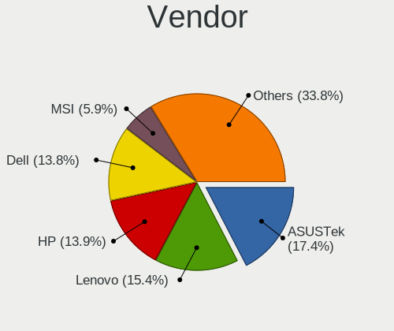
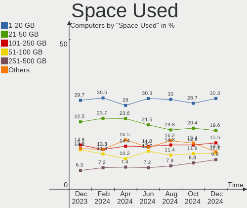
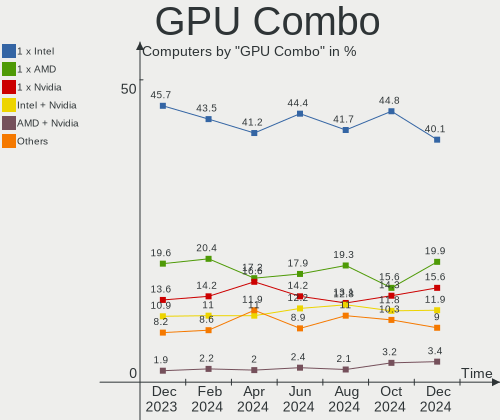
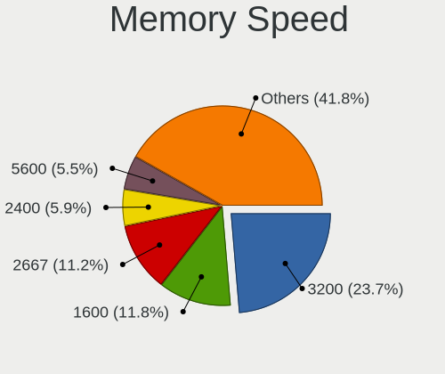

Ubuntu Hardware Trends
----------------------

A project to identify most popular hardware characteristics and track their change
over time based on data collected by Ubuntu users at https://Linux-Hardware.org.

Anyone can contribute to this report by the [hw-probe](https://github.com/linuxhw/hw-probe) tool:

    sudo -E hw-probe -all -upload

This is a report for all computer types. See also reports for [desktops](/Dist/Ubuntu/Desktop/README.md) and [notebooks](/Dist/Ubuntu/Notebook/README.md).

Full-feature report is available here: https://linux-hardware.org/?view=trends

Period: Sep, 2021.

Contents
--------

* [ System ](#system)
  - [ OS                       ](#os)
  - [ OS Family                ](#os-family)
  - [ Kernel                   ](#kernel)
  - [ Kernel Family            ](#kernel-family)
  - [ Kernel Major Ver.        ](#kernel-major-ver)
  - [ Arch                     ](#arch)
  - [ DE                       ](#de)
  - [ Display Server           ](#display-server)
  - [ Display Manager          ](#display-manager)
  - [ OS Lang                  ](#os-lang)
  - [ Boot Mode                ](#boot-mode)
  - [ Filesystem               ](#filesystem)
  - [ Part. scheme             ](#part-scheme)
  - [ Dual Boot with Linux/BSD ](#dual-boot-with-linuxbsd)
  - [ Dual Boot (Win)          ](#dual-boot-win)

* [ Board ](#board)
  - [ Vendor                   ](#vendor)
  - [ Model                    ](#model)
  - [ Model Family             ](#model-family)
  - [ MFG Year                 ](#mfg-year)
  - [ Form Factor              ](#form-factor)
  - [ Secure Boot              ](#secure-boot)
  - [ Coreboot                 ](#coreboot)
  - [ RAM Size                 ](#ram-size)
  - [ RAM Used                 ](#ram-used)
  - [ Total Drives             ](#total-drives)
  - [ Has CD-ROM               ](#has-cd-rom)
  - [ Has Ethernet             ](#has-ethernet)
  - [ Has WiFi                 ](#has-wifi)
  - [ Has Bluetooth            ](#has-bluetooth)

* [ Location ](#location)
  - [ Country                  ](#country)
  - [ City                     ](#city)

* [ Drives ](#drives)
  - [ Drive Vendor             ](#drive-vendor)
  - [ Drive Model              ](#drive-model)
  - [ HDD Vendor               ](#hdd-vendor)
  - [ SSD Vendor               ](#ssd-vendor)
  - [ Drive Kind               ](#drive-kind)
  - [ Drive Connector          ](#drive-connector)
  - [ Drive Size               ](#drive-size)
  - [ Space Total              ](#space-total)
  - [ Space Used               ](#space-used)
  - [ Malfunc. Drives          ](#malfunc-drives)
  - [ Malfunc. Drive Vendor    ](#malfunc-drive-vendor)
  - [ Malfunc. HDD Vendor      ](#malfunc-hdd-vendor)
  - [ Malfunc. Drive Kind      ](#malfunc-drive-kind)
  - [ Failed Drives            ](#failed-drives)
  - [ Failed Drive Vendor      ](#failed-drive-vendor)
  - [ Drive Status             ](#drive-status)

* [ Storage controller ](#storage-controller)
  - [ Storage Vendor           ](#storage-vendor)
  - [ Storage Model            ](#storage-model)
  - [ Storage Kind             ](#storage-kind)

* [ Processor ](#processor)
  - [ CPU Vendor               ](#cpu-vendor)
  - [ CPU Model                ](#cpu-model)
  - [ CPU Model Family         ](#cpu-model-family)
  - [ CPU Cores                ](#cpu-cores)
  - [ CPU Sockets              ](#cpu-sockets)
  - [ CPU Threads              ](#cpu-threads)
  - [ CPU Op-Modes             ](#cpu-op-modes)
  - [ CPU Microcode            ](#cpu-microcode)
  - [ CPU Microarch            ](#cpu-microarch)

* [ Graphics ](#graphics)
  - [ GPU Vendor               ](#gpu-vendor)
  - [ GPU Model                ](#gpu-model)
  - [ GPU Combo                ](#gpu-combo)
  - [ GPU Driver               ](#gpu-driver)
  - [ GPU Memory               ](#gpu-memory)

* [ Monitor ](#monitor)
  - [ Monitor Vendor           ](#monitor-vendor)
  - [ Monitor Model            ](#monitor-model)
  - [ Monitor Resolution       ](#monitor-resolution)
  - [ Monitor Diagonal         ](#monitor-diagonal)
  - [ Monitor Width            ](#monitor-width)
  - [ Aspect Ratio             ](#aspect-ratio)
  - [ Monitor Area             ](#monitor-area)
  - [ Pixel Density            ](#pixel-density)
  - [ Multiple Monitors        ](#multiple-monitors)

* [ Network ](#network)
  - [ Net Controller Vendor    ](#net-controller-vendor)
  - [ Net Controller Model     ](#net-controller-model)
  - [ Wireless Vendor          ](#wireless-vendor)
  - [ Wireless Model           ](#wireless-model)
  - [ Ethernet Vendor          ](#ethernet-vendor)
  - [ Ethernet Model           ](#ethernet-model)
  - [ Net Controller Kind      ](#net-controller-kind)
  - [ Used Controller          ](#used-controller)
  - [ NICs                     ](#nics)
  - [ IPv6                     ](#ipv6)

* [ Bluetooth ](#bluetooth)
  - [ Bluetooth Vendor         ](#bluetooth-vendor)
  - [ Bluetooth Model          ](#bluetooth-model)

* [ Sound ](#sound)
  - [ Sound Vendor             ](#sound-vendor)
  - [ Sound Model              ](#sound-model)

* [ Memory ](#memory)
  - [ Memory Vendor            ](#memory-vendor)
  - [ Memory Model             ](#memory-model)
  - [ Memory Kind              ](#memory-kind)
  - [ Memory Form Factor       ](#memory-form-factor)
  - [ Memory Size              ](#memory-size)
  - [ Memory Speed             ](#memory-speed)

* [ Printers & scanners ](#printers--scanners)
  - [ Printer Vendor           ](#printer-vendor)
  - [ Printer Model            ](#printer-model)
  - [ Scanner Vendor           ](#scanner-vendor)
  - [ Scanner Model            ](#scanner-model)

* [ Camera ](#camera)
  - [ Camera Vendor            ](#camera-vendor)
  - [ Camera Model             ](#camera-model)

* [ Security ](#security)
  - [ Fingerprint Vendor       ](#fingerprint-vendor)
  - [ Fingerprint Model        ](#fingerprint-model)
  - [ Chipcard Vendor          ](#chipcard-vendor)
  - [ Chipcard Model           ](#chipcard-model)

* [ Unsupported ](#unsupported)
  - [ Unsupported Devices      ](#unsupported-devices)
  - [ Unsupported Device Types ](#unsupported-device-types)

System
------

OS
--

Installed operating systems

| Name           | Computers | Percent |
|----------------|-----------|---------|
| Ubuntu 20.04   | 820       | 63.08%  |
| Ubuntu 21.04   | 316       | 24.31%  |
| Ubuntu 18.04   | 80        | 6.15%   |
| Ubuntu 21.10   | 33        | 2.54%   |
| Ubuntu 20.10   | 21        | 1.62%   |
| Ubuntu 16.04   | 16        | 1.23%   |
| Ubuntu         | 5         | 0.38%   |
| Ubuntu 19.04   | 4         | 0.31%   |
| Ubuntu Core 18 | 1         | 0.08%   |
| Ubuntu Core 16 | 1         | 0.08%   |
| Ubuntu 19.10   | 1         | 0.08%   |
| Ubuntu 18.10   | 1         | 0.08%   |
| Ubuntu 17.10   | 1         | 0.08%   |

OS Family
---------

OS without a version

| Name   | Computers | Percent |
|--------|-----------|---------|
| Ubuntu | 1300      | 100%    |

Kernel
------

Version of the Linux kernel

| Version                | Computers | Percent |
|------------------------|-----------|---------|
| 5.11.0-34-generic      | 391       | 30.08%  |
| 5.11.0-27-generic      | 207       | 15.92%  |
| 5.11.0-36-generic      | 147       | 11.31%  |
| 5.11.0-31-generic      | 75        | 5.77%   |
| 5.4.0-81-generic       | 61        | 4.69%   |
| 5.11.0-37-generic      | 61        | 4.69%   |
| 5.4.0-84-generic       | 51        | 3.92%   |
| 5.13.0-16-generic      | 20        | 1.54%   |
| 5.8.0-63-generic       | 18        | 1.38%   |
| 5.4.0-86-generic       | 17        | 1.31%   |
| 5.8.0-43-generic       | 13        | 1%      |
| 5.11.0-16-generic      | 13        | 1%      |
| 5.13.0-14-generic      | 12        | 0.92%   |
| 5.11.0-35-generic      | 10        | 0.77%   |
| 5.4.0-88-generic       | 8         | 0.62%   |
| 4.15.0-142-generic     | 8         | 0.62%   |
| 5.4.0-42-generic       | 7         | 0.54%   |
| 5.11.0-1017-raspi      | 7         | 0.54%   |
| 5.11.0-1016-raspi      | 7         | 0.54%   |
| 5.4.0-80-generic       | 6         | 0.46%   |
| 5.11.0-25-generic      | 6         | 0.46%   |
| 5.10.0-1045-oem        | 6         | 0.46%   |
| 4.15.0-156-generic     | 5         | 0.38%   |
| 4.15.0-154-generic     | 5         | 0.38%   |
| 5.4.0-87-generic       | 4         | 0.31%   |
| 5.11.0-22-generic      | 4         | 0.31%   |
| 5.8.0-59-generic       | 3         | 0.23%   |
| 5.8.0-55-generic       | 3         | 0.23%   |
| 5.8.0-50-generic       | 3         | 0.23%   |
| 5.8.0-25-generic       | 3         | 0.23%   |
| 5.4.0-26-generic       | 3         | 0.23%   |
| 5.14.0-051400-generic  | 3         | 0.23%   |
| 5.11.0-1007-raspi      | 3         | 0.23%   |
| 5.10.0-1044-oem        | 3         | 0.23%   |
| 4.4.0-210-generic      | 3         | 0.23%   |
| 4.15.0-158-generic     | 3         | 0.23%   |
| 5.8.0-53-generic       | 2         | 0.15%   |
| 5.8.0-36-generic       | 2         | 0.15%   |
| 5.8.0-1032-raspi       | 2         | 0.15%   |
| 5.4.0-52-generic       | 2         | 0.15%   |
| 5.4.0-45-generic       | 2         | 0.15%   |
| 5.4.0-1042-raspi       | 2         | 0.15%   |
| 5.3.0-51-generic       | 2         | 0.15%   |
| 5.14.8-051408-generic  | 2         | 0.15%   |
| 5.13.12-051312-generic | 2         | 0.15%   |
| 5.11.0-7620-generic    | 2         | 0.15%   |
| 5.11.0-36-lowlatency   | 2         | 0.15%   |
| 5.11.0-34-lowlatency   | 2         | 0.15%   |
| 5.11.0-1019-raspi      | 2         | 0.15%   |
| 5.0.0-13-generic       | 2         | 0.15%   |
| 4.18.0-15-generic      | 2         | 0.15%   |
| 5.8.18-050818-generic  | 1         | 0.08%   |
| 5.8.0-64-generic       | 1         | 0.08%   |
| 5.8.0-63-lowlatency    | 1         | 0.08%   |
| 5.8.0-56-generic       | 1         | 0.08%   |
| 5.8.0-49-generic       | 1         | 0.08%   |
| 5.8.0-48-generic       | 1         | 0.08%   |
| 5.8.0-45-generic       | 1         | 0.08%   |
| 5.8.0-44-generic       | 1         | 0.08%   |
| 5.8.0-41-generic       | 1         | 0.08%   |

Kernel Family
-------------

Linux kernel without a distro release

| Version | Computers | Percent |
|---------|-----------|---------|
| 5.11.0  | 943       | 72.54%  |
| 5.4.0   | 175       | 13.46%  |
| 5.8.0   | 57        | 4.38%   |
| 5.13.0  | 35        | 2.69%   |
| 4.15.0  | 32        | 2.46%   |
| 5.10.0  | 12        | 0.92%   |
| 5.14.0  | 6         | 0.46%   |
| 5.3.0   | 5         | 0.38%   |
| 5.0.0   | 5         | 0.38%   |
| 4.4.0   | 5         | 0.38%   |
| 4.18.0  | 3         | 0.23%   |
| 5.14.8  | 2         | 0.15%   |
| 5.13.12 | 2         | 0.15%   |
| 5.10.52 | 2         | 0.15%   |
| 5.8.18  | 1         | 0.08%   |
| 5.6.4   | 1         | 0.08%   |
| 5.5.4   | 1         | 0.08%   |
| 5.5.19  | 1         | 0.08%   |
| 5.5.11  | 1         | 0.08%   |
| 5.4.5   | 1         | 0.08%   |
| 5.14.3  | 1         | 0.08%   |
| 5.14.1  | 1         | 0.08%   |
| 5.13.15 | 1         | 0.08%   |
| 5.12.18 | 1         | 0.08%   |
| 5.11.4  | 1         | 0.08%   |
| 5.10.61 | 1         | 0.08%   |
| 4.9.253 | 1         | 0.08%   |
| 4.17.19 | 1         | 0.08%   |
| 4.14.24 | 1         | 0.08%   |
| 4.13.0  | 1         | 0.08%   |

Kernel Major Ver.
-----------------

Linux kernel major version

| Version | Computers | Percent |
|---------|-----------|---------|
| 5.11    | 944       | 72.62%  |
| 5.4     | 176       | 13.54%  |
| 5.8     | 58        | 4.46%   |
| 5.13    | 38        | 2.92%   |
| 4.15    | 32        | 2.46%   |
| 5.10    | 15        | 1.15%   |
| 5.14    | 10        | 0.77%   |
| 5.3     | 5         | 0.38%   |
| 5.0     | 5         | 0.38%   |
| 4.4     | 5         | 0.38%   |
| 5.5     | 3         | 0.23%   |
| 4.18    | 3         | 0.23%   |
| 5.6     | 1         | 0.08%   |
| 5.12    | 1         | 0.08%   |
| 4.9     | 1         | 0.08%   |
| 4.17    | 1         | 0.08%   |
| 4.14    | 1         | 0.08%   |
| 4.13    | 1         | 0.08%   |

Arch
----

OS architecture (x86_64, i586, etc.)

| Name    | Computers | Percent |
|---------|-----------|---------|
| x86_64  | 1269      | 97.62%  |
| aarch64 | 24        | 1.85%   |
| i686    | 7         | 0.54%   |

DE
--

Desktop Environment

| Name              | Computers | Percent |
|-------------------|-----------|---------|
| GNOME             | 1151      | 88.54%  |
| Unknown           | 100       | 7.69%   |
| Unity             | 18        | 1.38%   |
| Cinnamon          | 7         | 0.54%   |
| X-Cinnamon        | 6         | 0.46%   |
| GNOME Flashback   | 6         | 0.46%   |
| Deepin            | 3         | 0.23%   |
| i3                | 2         | 0.15%   |
| GNUstep           | 2         | 0.15%   |
| Yaru:ubuntu:GNOME | 1         | 0.08%   |
| xmonad            | 1         | 0.08%   |
| sway              | 1         | 0.08%   |
| GNOME Classic     | 1         | 0.08%   |
| fvwm              | 1         | 0.08%   |

Display Server
--------------

X11 or Wayland

| Name    | Computers | Percent |
|---------|-----------|---------|
| X11     | 954       | 73.38%  |
| Wayland | 275       | 21.15%  |
| Unknown | 48        | 3.69%   |
| Tty     | 23        | 1.77%   |

Display Manager
---------------

SDDM, LightDM, etc.

| Name    | Computers | Percent |
|---------|-----------|---------|
| Unknown | 686       | 52.77%  |
| GDM     | 386       | 29.69%  |
| GDM3    | 204       | 15.69%  |
| LightDM | 22        | 1.69%   |
| SDDM    | 2         | 0.15%   |

OS Lang
-------

Language

| Lang       | Computers | Percent |
|------------|-----------|---------|
| en_US      | 539       | 41.46%  |
| de_DE      | 132       | 10.15%  |
| fr_FR      | 115       | 8.85%   |
| en_GB      | 55        | 4.23%   |
| en_IN      | 45        | 3.46%   |
| pt_BR      | 35        | 2.69%   |
| it_IT      | 30        | 2.31%   |
| es_ES      | 27        | 2.08%   |
| ru_RU      | 25        | 1.92%   |
| pl_PL      | 24        | 1.85%   |
| en_CA      | 24        | 1.85%   |
| hu_HU      | 22        | 1.69%   |
| C          | 22        | 1.69%   |
| en_AU      | 20        | 1.54%   |
| cs_CZ      | 16        | 1.23%   |
| nl_NL      | 12        | 0.92%   |
| zh_CN      | 9         | 0.69%   |
| es_MX      | 8         | 0.62%   |
| sv_SE      | 7         | 0.54%   |
| nb_NO      | 7         | 0.54%   |
| en_ZA      | 7         | 0.54%   |
| ro_RO      | 6         | 0.46%   |
| pt_PT      | 6         | 0.46%   |
| ja_JP      | 6         | 0.46%   |
| de_AT      | 6         | 0.46%   |
| ru_UA      | 5         | 0.38%   |
| es_CO      | 5         | 0.38%   |
| en_NZ      | 5         | 0.38%   |
| en_IL      | 5         | 0.38%   |
| Unknown    | 5         | 0.38%   |
| ko_KR      | 4         | 0.31%   |
| fr_CA      | 4         | 0.31%   |
| fr_BE      | 4         | 0.31%   |
| es_AR      | 4         | 0.31%   |
| de_CH      | 4         | 0.31%   |
| uk_UA      | 3         | 0.23%   |
| fi_FI      | 3         | 0.23%   |
| es_CL      | 3         | 0.23%   |
| en_SG      | 3         | 0.23%   |
| en_PH      | 3         | 0.23%   |
| en_NG      | 3         | 0.23%   |
| tr_TR      | 2         | 0.15%   |
| sr_RS      | 2         | 0.15%   |
| sk_SK      | 2         | 0.15%   |
| fr_CH      | 2         | 0.15%   |
| da_DK      | 2         | 0.15%   |
| ca_ES      | 2         | 0.15%   |
| bg_BG      | 2         | 0.15%   |
| zh_TW      | 1         | 0.08%   |
| sl_SI      | 1         | 0.08%   |
| nl_BE      | 1         | 0.08%   |
| lt_LT      | 1         | 0.08%   |
| is_IS      | 1         | 0.08%   |
| id_ID      | 1         | 0.08%   |
| hr_HR      | 1         | 0.08%   |
| fr_LU      | 1         | 0.08%   |
| fr_FR.UTF8 | 1         | 0.08%   |
| es_UY      | 1         | 0.08%   |
| es_PR      | 1         | 0.08%   |
| es_PA      | 1         | 0.08%   |

Boot Mode
---------

EFI or BIOS

| Mode | Computers | Percent |
|------|-----------|---------|
| BIOS | 662       | 50.92%  |
| EFI  | 638       | 49.08%  |

Filesystem
----------

Type of filesystem

| Type     | Computers | Percent |
|----------|-----------|---------|
| Ext4     | 1217      | 93.62%  |
| Overlay  | 30        | 2.31%   |
| Zfs      | 18        | 1.38%   |
| Btrfs    | 16        | 1.23%   |
| Ext3     | 7         | 0.54%   |
| Xfs      | 5         | 0.38%   |
| Ext2     | 4         | 0.31%   |
| SquXshfs | 1         | 0.08%   |
| Reiserfs | 1         | 0.08%   |
| Aufs     | 1         | 0.08%   |

Part. scheme
------------

Scheme of partitioning

| Type    | Computers | Percent |
|---------|-----------|---------|
| Unknown | 879       | 67.62%  |
| GPT     | 345       | 26.54%  |
| MBR     | 76        | 5.85%   |

Dual Boot with Linux/BSD
------------------------

Hosting more than one Linux/BSD

| Dual boot | Computers | Percent |
|-----------|-----------|---------|
| No        | 1153      | 88.69%  |
| Yes       | 147       | 11.31%  |

Dual Boot (Win)
---------------

Hosting Linux and Windows

| Dual boot | Computers | Percent |
|-----------|-----------|---------|
| No        | 803       | 61.77%  |
| Yes       | 497       | 38.23%  |

Board
-----

Vendor
------

Motherboard manufacturer

| Name                   | Computers | Percent |
|------------------------|-----------|---------|
| Dell                   | 214       | 16.46%  |
| ASUSTek Computer       | 188       | 14.46%  |
| Hewlett-Packard        | 187       | 14.38%  |
| Lenovo                 | 173       | 13.31%  |
| Acer                   | 85        | 6.54%   |
| Gigabyte Technology    | 77        | 5.92%   |
| MSI                    | 55        | 4.23%   |
| ASRock                 | 42        | 3.23%   |
| Unknown                | 36        | 2.77%   |
| Apple                  | 30        | 2.31%   |
| Intel                  | 28        | 2.15%   |
| Toshiba                | 27        | 2.08%   |
| Fujitsu                | 13        | 1%      |
| Sony                   | 12        | 0.92%   |
| Samsung Electronics    | 8         | 0.62%   |
| TUXEDO                 | 6         | 0.46%   |
| Supermicro             | 6         | 0.46%   |
| Notebook               | 6         | 0.46%   |
| Microsoft              | 6         | 0.46%   |
| Medion                 | 6         | 0.46%   |
| Timi                   | 5         | 0.38%   |
| Foxconn                | 5         | 0.38%   |
| ECS                    | 5         | 0.38%   |
| Pegatron               | 4         | 0.31%   |
| Packard Bell           | 4         | 0.31%   |
| HUAWEI                 | 4         | 0.31%   |
| Positivo               | 3         | 0.23%   |
| HONOR                  | 3         | 0.23%   |
| Google                 | 3         | 0.23%   |
| Clevo                  | 3         | 0.23%   |
| Biostar                | 3         | 0.23%   |
| Alienware              | 3         | 0.23%   |
| PCWare                 | 2         | 0.15%   |
| Panasonic              | 2         | 0.15%   |
| Linx                   | 2         | 0.15%   |
| LG Electronics         | 2         | 0.15%   |
| IP3 Tech               | 2         | 0.15%   |
| Huanan                 | 2         | 0.15%   |
| Gateway                | 2         | 0.15%   |
| EVGA                   | 2         | 0.15%   |
| eMachines              | 2         | 0.15%   |
| AZW                    | 2         | 0.15%   |
| AMI                    | 2         | 0.15%   |
| ZOTAC                  | 1         | 0.08%   |
| Wortmann AG            | 1         | 0.08%   |
| Wistron                | 1         | 0.08%   |
| VIT                    | 1         | 0.08%   |
| TrekStor               | 1         | 0.08%   |
| Thomson                | 1         | 0.08%   |
| Terrans Force          | 1         | 0.08%   |
| Talius Technology      | 1         | 0.08%   |
| System76               | 1         | 0.08%   |
| SLIMBOOK               | 1         | 0.08%   |
| Schenker               | 1         | 0.08%   |
| Quanta                 | 1         | 0.08%   |
| ONE-NETBOOK TECHNOLOGY | 1         | 0.08%   |
| Nvidia                 | 1         | 0.08%   |
| Minix                  | 1         | 0.08%   |
| IBM                    | 1         | 0.08%   |
| HANSUNG COMPUTER       | 1         | 0.08%   |

Model
-----

Motherboard model

| Name                            | Computers | Percent |
|---------------------------------|-----------|---------|
| Unknown                         | 36        | 2.77%   |
| ASUS All Series                 | 7         | 0.54%   |
| Dell OptiPlex 7010              | 6         | 0.46%   |
| Lenovo ThinkPad T400 2768WGB    | 5         | 0.38%   |
| HP Pavilion dv7                 | 5         | 0.38%   |
| Dell OptiPlex 9020              | 5         | 0.38%   |
| ASUS PRIME A320M-K              | 5         | 0.38%   |
| HP EliteBook 845 G7 Notebook PC | 4         | 0.31%   |
| Dell Latitude E6430             | 4         | 0.31%   |
| Notebook W54_55SU1,SUW          | 3         | 0.23%   |
| MSI MS-7C02                     | 3         | 0.23%   |
| MSI MS-7A34                     | 3         | 0.23%   |
| Lenovo IdeaPad 5 15ITL05 82FG   | 3         | 0.23%   |
| HP Z440 Workstation             | 3         | 0.23%   |
| HP ProBook 450 G8 Notebook PC   | 3         | 0.23%   |
| HP Pavilion Laptop 15-eg0xxx    | 3         | 0.23%   |
| HP Pavilion dv6                 | 3         | 0.23%   |
| HP EliteBook 840 G6             | 3         | 0.23%   |
| HP EliteBook 820 G1             | 3         | 0.23%   |
| HP Compaq Pro 6300 SFF          | 3         | 0.23%   |
| HP Compaq Elite 8300 SFF        | 3         | 0.23%   |
| HP 15                           | 3         | 0.23%   |
| Gigabyte X570 AORUS ELITE       | 3         | 0.23%   |
| Gigabyte B450M DS3H             | 3         | 0.23%   |
| Dell XPS 15 9570                | 3         | 0.23%   |
| Dell XPS 15 9510                | 3         | 0.23%   |
| Dell XPS 15 9500                | 3         | 0.23%   |
| Dell XPS 15 7590                | 3         | 0.23%   |
| Dell XPS 13 9370                | 3         | 0.23%   |
| Dell XPS 13 7390                | 3         | 0.23%   |
| Dell OptiPlex 7050              | 3         | 0.23%   |
| Dell Latitude 5520              | 3         | 0.23%   |
| Dell Latitude 5420              | 3         | 0.23%   |
| Dell Inspiron 7506 2n1          | 3         | 0.23%   |
| ASUS U50Vg                      | 3         | 0.23%   |
| Apple MacBookPro12,1            | 3         | 0.23%   |
| Apple MacBook4,1                | 3         | 0.23%   |
| Apple iMac8,1                   | 3         | 0.23%   |
| Acer Nitro AN515-52             | 3         | 0.23%   |
| Toshiba Satellite C55-C         | 2         | 0.15%   |
| Timi TM1613                     | 2         | 0.15%   |
| Supermicro Super Server         | 2         | 0.15%   |
| Notebook NL40_50CU              | 2         | 0.15%   |
| MSI MS-7C37                     | 2         | 0.15%   |
| MSI MS-7C08                     | 2         | 0.15%   |
| Lenovo Yoga 2 11 20332          | 2         | 0.15%   |
| Lenovo V130-15IKB 81HN          | 2         | 0.15%   |
| Lenovo ThinkBook 15 G2 ITL 20VE | 2         | 0.15%   |
| Lenovo ThinkBook 14 G2 ITL 20VD | 2         | 0.15%   |
| Lenovo IdeaPad S145-15IWL 81MV  | 2         | 0.15%   |
| Lenovo IdeaPad 3 14ITL6 82H7    | 2         | 0.15%   |
| Lenovo G500 20236               | 2         | 0.15%   |
| Lenovo G50-80 80E5              | 2         | 0.15%   |
| Intel NUC11PAHi5                | 2         | 0.15%   |
| Intel NUC10i7FNH                | 2         | 0.15%   |
| HUAWEI NBLK-WAX9X               | 2         | 0.15%   |
| HUAWEI MACHC-WAX9               | 2         | 0.15%   |
| HP ZBook 15 G6                  | 2         | 0.15%   |
| HP ProDesk 400 G1 SFF           | 2         | 0.15%   |
| HP ProBook 450 G7               | 2         | 0.15%   |

Model Family
------------

Motherboard model prefix

| Name                  | Computers | Percent |
|-----------------------|-----------|---------|
| Lenovo ThinkPad       | 81        | 6.23%   |
| Dell Latitude         | 64        | 4.92%   |
| Acer Aspire           | 51        | 3.92%   |
| Dell Inspiron         | 44        | 3.38%   |
| Lenovo IdeaPad        | 36        | 2.77%   |
| Unknown               | 36        | 2.77%   |
| HP EliteBook          | 34        | 2.62%   |
| Dell XPS              | 34        | 2.62%   |
| HP Pavilion           | 31        | 2.38%   |
| Dell OptiPlex         | 31        | 2.38%   |
| Toshiba Satellite     | 24        | 1.85%   |
| HP Compaq             | 24        | 1.85%   |
| HP ProBook            | 21        | 1.62%   |
| ASUS PRIME            | 20        | 1.54%   |
| Dell Precision        | 19        | 1.46%   |
| ASUS ROG              | 19        | 1.46%   |
| Lenovo ThinkCentre    | 13        | 1%      |
| HP Laptop             | 13        | 1%      |
| ASUS VivoBook         | 13        | 1%      |
| Acer Swift            | 13        | 1%      |
| Dell Vostro           | 10        | 0.77%   |
| Acer Nitro            | 8         | 0.62%   |
| HP ENVY               | 7         | 0.54%   |
| Gigabyte X570         | 7         | 0.54%   |
| Fujitsu ESPRIMO       | 7         | 0.54%   |
| ASUS All              | 7         | 0.54%   |
| Microsoft Surface     | 6         | 0.46%   |
| Lenovo ThinkBook      | 6         | 0.46%   |
| HP EliteDesk          | 6         | 0.46%   |
| Fujitsu LIFEBOOK      | 6         | 0.46%   |
| Lenovo Yoga           | 5         | 0.38%   |
| HP ZBook              | 5         | 0.38%   |
| HP ProDesk            | 5         | 0.38%   |
| Gigabyte B450M        | 5         | 0.38%   |
| ASUS ZenBook          | 5         | 0.38%   |
| ASUS P8Z77-V          | 5         | 0.38%   |
| Packard Bell EasyNote | 4         | 0.31%   |
| HP ProLiant           | 4         | 0.31%   |
| HP 250                | 4         | 0.31%   |
| Gigabyte B550         | 4         | 0.31%   |
| ASUS TUF              | 4         | 0.31%   |
| ASUS M5A78L-M         | 4         | 0.31%   |
| Notebook W54          | 3         | 0.23%   |
| MSI MS-7C02           | 3         | 0.23%   |
| MSI MS-7A34           | 3         | 0.23%   |
| MSI Modern            | 3         | 0.23%   |
| Lenovo G50-80         | 3         | 0.23%   |
| HP Z440               | 3         | 0.23%   |
| HP 15                 | 3         | 0.23%   |
| Dell G5               | 3         | 0.23%   |
| Dell G3               | 3         | 0.23%   |
| ASUS U50Vg            | 3         | 0.23%   |
| ASUS Maximus          | 3         | 0.23%   |
| ASRock 970            | 3         | 0.23%   |
| Apple MacBookPro16    | 3         | 0.23%   |
| Apple MacBookPro12    | 3         | 0.23%   |
| Apple MacBook4        | 3         | 0.23%   |
| Apple iMac8           | 3         | 0.23%   |
| Acer Extensa          | 3         | 0.23%   |
| Toshiba TECRA         | 2         | 0.15%   |

MFG Year
--------

Motherboard manufacture year

| Year    | Computers | Percent |
|---------|-----------|---------|
| 2021    | 248       | 19.08%  |
| 2020    | 183       | 14.08%  |
| 2018    | 126       | 9.69%   |
| 2019    | 123       | 9.46%   |
| 2012    | 84        | 6.46%   |
| 2015    | 69        | 5.31%   |
| 2013    | 68        | 5.23%   |
| 2014    | 67        | 5.15%   |
| 2011    | 66        | 5.08%   |
| 2016    | 53        | 4.08%   |
| 2009    | 46        | 3.54%   |
| 2010    | 43        | 3.31%   |
| 2017    | 40        | 3.08%   |
| 2008    | 36        | 2.77%   |
| Unknown | 28        | 2.15%   |
| 2007    | 10        | 0.77%   |
| 2006    | 7         | 0.54%   |
| 2005    | 3         | 0.23%   |

Form Factor
-----------

Physical design of the computer

| Name           | Computers | Percent |
|----------------|-----------|---------|
| Notebook       | 729       | 56.08%  |
| Desktop        | 451       | 34.69%  |
| Convertible    | 36        | 2.77%   |
| System on chip | 24        | 1.85%   |
| Mini pc        | 22        | 1.69%   |
| Server         | 16        | 1.23%   |
| Tablet         | 11        | 0.85%   |
| All in one     | 11        | 0.85%   |

Secure Boot
-----------

Enabled or disabled

| State    | Computers | Percent |
|----------|-----------|---------|
| Disabled | 1130      | 86.92%  |
| Enabled  | 170       | 13.08%  |

Coreboot
--------

Have coreboot on board

| Used | Computers | Percent |
|------|-----------|---------|
| No   | 1296      | 99.69%  |
| Yes  | 4         | 0.31%   |

RAM Size
--------

Total RAM memory

| Size in GB      | Computers | Percent |
|-----------------|-----------|---------|
| 4.01-8.0        | 317       | 24.38%  |
| 16.01-24.0      | 281       | 21.62%  |
| 8.01-16.0       | 248       | 19.08%  |
| 3.01-4.0        | 243       | 18.69%  |
| 32.01-64.0      | 104       | 8%      |
| 64.01-256.0     | 39        | 3%      |
| 1.01-2.0        | 36        | 2.77%   |
| 24.01-32.0      | 17        | 1.31%   |
| 2.01-3.0        | 7         | 0.54%   |
| 0.51-1.0        | 5         | 0.38%   |
| More than 256.0 | 3         | 0.23%   |

RAM Used
--------

Used RAM memory

| Used GB     | Computers | Percent |
|-------------|-----------|---------|
| 1.01-2.0    | 505       | 38.85%  |
| 2.01-3.0    | 350       | 26.92%  |
| 4.01-8.0    | 183       | 14.08%  |
| 3.01-4.0    | 157       | 12.08%  |
| 8.01-16.0   | 56        | 4.31%   |
| 0.51-1.0    | 32        | 2.46%   |
| 0.01-0.5    | 7         | 0.54%   |
| 16.01-24.0  | 6         | 0.46%   |
| 32.01-64.0  | 2         | 0.15%   |
| 24.01-32.0  | 1         | 0.08%   |
| 64.01-256.0 | 1         | 0.08%   |

Total Drives
------------

Number of drives on board

| Drives | Computers | Percent |
|--------|-----------|---------|
| 1      | 815       | 62.69%  |
| 2      | 318       | 24.46%  |
| 3      | 76        | 5.85%   |
| 4      | 44        | 3.38%   |
| 5      | 15        | 1.15%   |
| 0      | 14        | 1.08%   |
| 6      | 6         | 0.46%   |
| 7      | 4         | 0.31%   |
| 8      | 3         | 0.23%   |
| 25     | 1         | 0.08%   |
| 16     | 1         | 0.08%   |
| 12     | 1         | 0.08%   |
| 10     | 1         | 0.08%   |
| 9      | 1         | 0.08%   |

Has CD-ROM
----------

Has CD-ROM on board

| Presented | Computers | Percent |
|-----------|-----------|---------|
| No        | 798       | 61.38%  |
| Yes       | 502       | 38.62%  |

Has Ethernet
------------

Has Ethernet on board

| Presented | Computers | Percent |
|-----------|-----------|---------|
| Yes       | 1093      | 84.08%  |
| No        | 207       | 15.92%  |

Has WiFi
--------

Has WiFi module

| Presented | Computers | Percent |
|-----------|-----------|---------|
| Yes       | 963       | 74.08%  |
| No        | 337       | 25.92%  |

Has Bluetooth
-------------

Has Bluetooth module

| Presented | Computers | Percent |
|-----------|-----------|---------|
| Yes       | 791       | 60.85%  |
| No        | 509       | 39.15%  |

Location
--------

Country
-------

Geographic location (country)

| Country      | Computers | Percent |
|--------------|-----------|---------|
| USA          | 244       | 18.77%  |
| Germany      | 153       | 11.77%  |
| France       | 120       | 9.23%   |
| India        | 48        | 3.69%   |
| Brazil       | 47        | 3.62%   |
| UK           | 44        | 3.38%   |
| Italy        | 39        | 3%      |
| Russia       | 38        | 2.92%   |
| Poland       | 35        | 2.69%   |
| Canada       | 35        | 2.69%   |
| Spain        | 29        | 2.23%   |
| Hungary      | 29        | 2.23%   |
| Netherlands  | 25        | 1.92%   |
| Australia    | 25        | 1.92%   |
| Czechia      | 23        | 1.77%   |
| Austria      | 19        | 1.46%   |
| Switzerland  | 17        | 1.31%   |
| Ukraine      | 15        | 1.15%   |
| Sweden       | 15        | 1.15%   |
| Belgium      | 15        | 1.15%   |
| Romania      | 14        | 1.08%   |
| Portugal     | 14        | 1.08%   |
| Mexico       | 13        | 1%      |
| South Africa | 11        | 0.85%   |
| China        | 11        | 0.85%   |
| Norway       | 10        | 0.77%   |
| Japan        | 10        | 0.77%   |
| Finland      | 9         | 0.69%   |
| Israel       | 8         | 0.62%   |
| Indonesia    | 8         | 0.62%   |
| Argentina    | 8         | 0.62%   |
| Turkey       | 7         | 0.54%   |
| South Korea  | 7         | 0.54%   |
| Serbia       | 7         | 0.54%   |
| New Zealand  | 6         | 0.46%   |
| Malaysia     | 6         | 0.46%   |
| Iran         | 6         | 0.46%   |
| Denmark      | 6         | 0.46%   |
| Bulgaria     | 6         | 0.46%   |
| Singapore    | 5         | 0.38%   |
| Colombia     | 5         | 0.38%   |
| Chile        | 5         | 0.38%   |
| Taiwan       | 4         | 0.31%   |
| Philippines  | 4         | 0.31%   |
| Pakistan     | 4         | 0.31%   |
| Nigeria      | 4         | 0.31%   |
| Greece       | 4         | 0.31%   |
| Algeria      | 4         | 0.31%   |
| Uzbekistan   | 3         | 0.23%   |
| Tunisia      | 3         | 0.23%   |
| Puerto Rico  | 3         | 0.23%   |
| Peru         | 3         | 0.23%   |
| Luxembourg   | 3         | 0.23%   |
| Kenya        | 3         | 0.23%   |
| Ireland      | 3         | 0.23%   |
| Cyprus       | 3         | 0.23%   |
| Belarus      | 3         | 0.23%   |
| Venezuela    | 2         | 0.15%   |
| Uruguay      | 2         | 0.15%   |
| Slovakia     | 2         | 0.15%   |

City
----

Geographic location (city)

| City            | Computers | Percent |
|-----------------|-----------|---------|
| Paris           | 20        | 1.54%   |
| Warsaw          | 13        | 1%      |
| Budapest        | 11        | 0.85%   |
| S??o Paulo      | 10        | 0.77%   |
| Prague          | 10        | 0.77%   |
| Munich          | 10        | 0.77%   |
| Tatab??nya      | 9         | 0.69%   |
| Berlin          | 9         | 0.69%   |
| Moscow          | 8         | 0.62%   |
| Vienna          | 7         | 0.54%   |
| St Petersburg   | 7         | 0.54%   |
| St Albans       | 7         | 0.54%   |
| Rennes          | 7         | 0.54%   |
| Los Angeles     | 7         | 0.54%   |
| Wittlich        | 6         | 0.46%   |
| Kyiv            | 6         | 0.46%   |
| Bucharest       | 6         | 0.46%   |
| Aurec-sur-Loire | 6         | 0.46%   |
| Toronto         | 5         | 0.38%   |
| Tehran          | 5         | 0.38%   |
| Sydney          | 5         | 0.38%   |
| Singapore       | 5         | 0.38%   |
| Portland        | 5         | 0.38%   |
| Mumbai          | 5         | 0.38%   |
| Montreal        | 5         | 0.38%   |
| London          | 5         | 0.38%   |
| Hamburg         | 5         | 0.38%   |
| Dallas          | 5         | 0.38%   |
| Amsterdam       | 5         | 0.38%   |
| Sofia           | 4         | 0.31%   |
| Seattle         | 4         | 0.31%   |
| Santiago        | 4         | 0.31%   |
| Oslo            | 4         | 0.31%   |
| Nantes          | 4         | 0.31%   |
| Melbourne       | 4         | 0.31%   |
| Johannesburg    | 4         | 0.31%   |
| Essen           | 4         | 0.31%   |
| Delhi           | 4         | 0.31%   |
| Chicago         | 4         | 0.31%   |
| Brussels        | 4         | 0.31%   |
| Brisbane        | 4         | 0.31%   |
| Belgrade        | 4         | 0.31%   |
| Beijing         | 4         | 0.31%   |
| Barcelona       | 4         | 0.31%   |
| Austin          | 4         | 0.31%   |
| Thrissur        | 3         | 0.23%   |
| Tel Aviv        | 3         | 0.23%   |
| Tashkent        | 3         | 0.23%   |
| San Francisco   | 3         | 0.23%   |
| San Diego       | 3         | 0.23%   |
| Richmond        | 3         | 0.23%   |
| Poznan          | 3         | 0.23%   |
| Perth           | 3         | 0.23%   |
| Oxford          | 3         | 0.23%   |
| Nicosia         | 3         | 0.23%   |
| New Taipei      | 3         | 0.23%   |
| Nairobi         | 3         | 0.23%   |
| Montpellier     | 3         | 0.23%   |
| Miami           | 3         | 0.23%   |
| Madrid          | 3         | 0.23%   |

Drives
------

Drive Vendor
------------

Hard drive vendors

| Vendor                    | Computers | Drives | Percent |
|---------------------------|-----------|--------|---------|
| WDC                       | 271       | 345    | 15.32%  |
| Samsung Electronics       | 261       | 316    | 14.75%  |
| Seagate                   | 249       | 297    | 14.08%  |
| Toshiba                   | 133       | 145    | 7.52%   |
| Kingston                  | 109       | 113    | 6.16%   |
| Unknown                   | 85        | 91     | 4.8%    |
| SanDisk                   | 73        | 76     | 4.13%   |
| Hitachi                   | 64        | 71     | 3.62%   |
| SK Hynix                  | 62        | 64     | 3.5%    |
| Crucial                   | 56        | 64     | 3.17%   |
| Intel                     | 44        | 51     | 2.49%   |
| HGST                      | 40        | 65     | 2.26%   |
| Micron Technology         | 29        | 33     | 1.64%   |
| A-DATA Technology         | 25        | 26     | 1.41%   |
| Phison                    | 20        | 22     | 1.13%   |
| KIOXIA                    | 20        | 23     | 1.13%   |
| Apple                     | 15        | 16     | 0.85%   |
| China                     | 14        | 16     | 0.79%   |
| SPCC                      | 12        | 12     | 0.68%   |
| LITEON                    | 11        | 11     | 0.62%   |
| MAXTOR                    | 10        | 12     | 0.57%   |
| ASMT                      | 10        | 11     | 0.57%   |
| Team                      | 8         | 8      | 0.45%   |
| PNY                       | 8         | 9      | 0.45%   |
| Micron/Crucial Technology | 7         | 7      | 0.4%    |
| JMicron                   | 7         | 9      | 0.4%    |
| Silicon Motion            | 6         | 6      | 0.34%   |
| Intenso                   | 6         | 6      | 0.34%   |
| Corsair                   | 6         | 6      | 0.34%   |
| XPG                       | 5         | 5      | 0.28%   |
| GOODRAM                   | 5         | 6      | 0.28%   |
| Fujitsu                   | 5         | 6      | 0.28%   |
| Transcend                 | 4         | 4      | 0.23%   |
| Realtek Semiconductor     | 4         | 4      | 0.23%   |
| Union Memory              | 3         | 3      | 0.17%   |
| SABRENT                   | 3         | 4      | 0.17%   |
| OCZ                       | 3         | 3      | 0.17%   |
| LITEONIT                  | 3         | 3      | 0.17%   |
| Lite-On                   | 3         | 3      | 0.17%   |
| Hewlett-Packard           | 3         | 3      | 0.17%   |
| Biostar                   | 3         | 3      | 0.17%   |
| Unknown                   | 3         | 3      | 0.17%   |
| Zheino                    | 2         | 2      | 0.11%   |
| TYPEC 1T                  | 2         | 2      | 0.11%   |
| TO Exter                  | 2         | 3      | 0.11%   |
| PLEXTOR                   | 2         | 2      | 0.11%   |
| Patriot                   | 2         | 2      | 0.11%   |
| Mushkin                   | 2         | 2      | 0.11%   |
| Mass                      | 2         | 2      | 0.11%   |
| KIOXIA-EXCERIA            | 2         | 2      | 0.11%   |
| KingSpec                  | 2         | 2      | 0.11%   |
| HGST HTS                  | 2         | 2      | 0.11%   |
| Drevo                     | 2         | 2      | 0.11%   |
| BIWIN                     | 2         | 2      | 0.11%   |
| Apacer                    | 2         | 2      | 0.11%   |
| WD MediaMax               | 1         | 1      | 0.06%   |
| Vaseky                    | 1         | 1      | 0.06%   |
| V-GeN                     | 1         | 1      | 0.06%   |
| Union Memory (Shenzhen)   | 1         | 1      | 0.06%   |
| TwinMOS                   | 1         | 1      | 0.06%   |

Drive Model
-----------

Hard drive models

| Model                               | Computers | Percent |
|-------------------------------------|-----------|---------|
| Unknown MMC Card  32GB              | 23        | 1.2%    |
| Toshiba MQ01ABD100 1TB              | 18        | 0.94%   |
| Samsung NVMe SSD Drive 512GB        | 18        | 0.94%   |
| Kingston SA400S37240G 240GB SSD     | 16        | 0.83%   |
| Seagate ST1000LM035-1RK172 1TB      | 14        | 0.73%   |
| Samsung SSD 860 EVO 500GB           | 13        | 0.68%   |
| Toshiba MQ01ABF050 500GB            | 12        | 0.63%   |
| Toshiba DT01ACA100 1TB              | 12        | 0.63%   |
| Seagate ST500DM002-1BD142 500GB     | 12        | 0.63%   |
| Samsung SSD 850 EVO 250GB           | 12        | 0.63%   |
| Kingston SA400S37120G 120GB SSD     | 12        | 0.63%   |
| Toshiba MQ04ABF100 1TB              | 11        | 0.57%   |
| Seagate ST1000DM010-2EP102 1TB      | 11        | 0.57%   |
| Samsung SSD 850 EVO 500GB           | 11        | 0.57%   |
| HGST HTS721010A9E630 1TB            | 11        | 0.57%   |
| WDC WDS500G2B0A-00SM50 500GB SSD    | 10        | 0.52%   |
| SK Hynix NVMe SSD Drive 512GB       | 10        | 0.52%   |
| Seagate ST500LT012-1DG142 500GB     | 10        | 0.52%   |
| Intel NVMe SSD Drive 512GB          | 10        | 0.52%   |
| Unknown SD/MMC/MS PRO 128GB         | 9         | 0.47%   |
| Unknown MMC Card  64GB              | 9         | 0.47%   |
| Unknown MMC Card  128GB             | 9         | 0.47%   |
| Seagate Expansion 1TB               | 9         | 0.47%   |
| Samsung NVMe SSD Drive 1024GB       | 9         | 0.47%   |
| Crucial CT240BX500SSD1 240GB        | 9         | 0.47%   |
| ASMT 2115 1TB                       | 9         | 0.47%   |
| Seagate ST1000LM024 HN-M101MBB 1TB  | 8         | 0.42%   |
| Seagate ST1000DM003-1CH162 1TB      | 8         | 0.42%   |
| Sandisk NVMe SSD Drive 512GB        | 8         | 0.42%   |
| Samsung NVMe SSD Drive 500GB        | 8         | 0.42%   |
| Samsung NVMe SSD Drive 256GB        | 8         | 0.42%   |
| Kingston SV300S37A120G 120GB SSD    | 8         | 0.42%   |
| Kingston SA400S37480G 480GB SSD     | 8         | 0.42%   |
| WDC WD10EZEX-08WN4A0 1TB            | 7         | 0.36%   |
| Seagate ST9500325AS 500GB           | 7         | 0.36%   |
| Sandisk NVMe SSD Drive 256GB        | 7         | 0.36%   |
| Samsung SSD 860 EVO 250GB           | 7         | 0.36%   |
| Samsung NVMe SSD Drive 1TB          | 7         | 0.36%   |
| HGST HTS545050A7E680 500GB          | 7         | 0.36%   |
| WDC WDS240G2G0A-00JH30 240GB SSD    | 6         | 0.31%   |
| Unknown MMC Card  16GB              | 6         | 0.31%   |
| Toshiba NVMe SSD Drive 512GB        | 6         | 0.31%   |
| Seagate ST500LM021-1KJ152 500GB     | 6         | 0.31%   |
| Seagate ST3500418AS 500GB           | 6         | 0.31%   |
| Seagate ST2000DM008-2FR102 2TB      | 6         | 0.31%   |
| Seagate ST2000DM001-1ER164 2TB      | 6         | 0.31%   |
| Seagate ST2000DM001-1CH164 2TB      | 6         | 0.31%   |
| Samsung SSD 860 EVO 1TB             | 6         | 0.31%   |
| KIOXIA KBG40ZNV512G 512GB           | 6         | 0.31%   |
| HGST HTS725050A7E630 500GB          | 6         | 0.31%   |
| Crucial CT500MX500SSD1 500GB        | 6         | 0.31%   |
| WDC WD10SPZX-21Z10T0 1TB            | 5         | 0.26%   |
| Toshiba KBG30ZMS128G 128GB NVMe SSD | 5         | 0.26%   |
| Seagate ST31000524AS 1TB            | 5         | 0.26%   |
| Seagate ST1000DM003-1ER162 1TB      | 5         | 0.26%   |
| Samsung SSD 870 EVO 250GB           | 5         | 0.26%   |
| Samsung NVMe SSD Drive 250GB        | 5         | 0.26%   |
| Kingston SUV400S37240G 240GB SSD    | 5         | 0.26%   |
| Hitachi HTS547550A9E384 500GB       | 5         | 0.26%   |
| Crucial CT480BX500SSD1 480GB        | 5         | 0.26%   |

HDD Vendor
----------

Hard disk drive vendors

| Vendor              | Computers | Drives | Percent |
|---------------------|-----------|--------|---------|
| Seagate             | 244       | 290    | 34.96%  |
| WDC                 | 198       | 260    | 28.37%  |
| Toshiba             | 94        | 104    | 13.47%  |
| Hitachi             | 64        | 71     | 9.17%   |
| HGST                | 40        | 65     | 5.73%   |
| Samsung Electronics | 24        | 26     | 3.44%   |
| Unknown             | 9         | 9      | 1.29%   |
| MAXTOR              | 8         | 10     | 1.15%   |
| Fujitsu             | 5         | 6      | 0.72%   |
| Apple               | 5         | 5      | 0.72%   |
| TO Exter            | 2         | 3      | 0.29%   |
| WD MediaMax         | 1         | 1      | 0.14%   |
| HGST HTS            | 1         | 1      | 0.14%   |
| Hewlett-Packard     | 1         | 1      | 0.14%   |
| ASMT109x            | 1         | 1      | 0.14%   |
| ASMT                | 1         | 2      | 0.14%   |

SSD Vendor
----------

Solid state drive vendors

| Vendor              | Computers | Drives | Percent |
|---------------------|-----------|--------|---------|
| Samsung Electronics | 123       | 145    | 22.16%  |
| Kingston            | 78        | 82     | 14.05%  |
| Crucial             | 53        | 61     | 9.55%   |
| SanDisk             | 48        | 50     | 8.65%   |
| WDC                 | 36        | 39     | 6.49%   |
| A-DATA Technology   | 20        | 20     | 3.6%    |
| Micron Technology   | 16        | 20     | 2.88%   |
| China               | 14        | 16     | 2.52%   |
| Toshiba             | 12        | 12     | 2.16%   |
| SK Hynix            | 12        | 12     | 2.16%   |
| SPCC                | 11        | 11     | 1.98%   |
| LITEON              | 11        | 11     | 1.98%   |
| Intel               | 11        | 12     | 1.98%   |
| ASMT                | 9         | 9      | 1.62%   |
| Team                | 7         | 7      | 1.26%   |
| PNY                 | 7         | 8      | 1.26%   |
| Unknown             | 6         | 6      | 1.08%   |
| Apple               | 6         | 6      | 1.08%   |
| Intenso             | 5         | 5      | 0.9%    |
| Corsair             | 5         | 5      | 0.9%    |
| GOODRAM             | 4         | 4      | 0.72%   |
| Transcend           | 3         | 3      | 0.54%   |
| Seagate             | 3         | 4      | 0.54%   |
| SABRENT             | 3         | 4      | 0.54%   |
| OCZ                 | 3         | 3      | 0.54%   |
| LITEONIT            | 3         | 3      | 0.54%   |
| TYPEC 1T            | 2         | 2      | 0.36%   |
| PLEXTOR             | 2         | 2      | 0.36%   |
| Patriot             | 2         | 2      | 0.36%   |
| Mushkin             | 2         | 2      | 0.36%   |
| MAXTOR              | 2         | 2      | 0.36%   |
| KIOXIA-EXCERIA      | 2         | 2      | 0.36%   |
| KingSpec            | 2         | 2      | 0.36%   |
| JMicron             | 2         | 3      | 0.36%   |
| BIWIN               | 2         | 2      | 0.36%   |
| Biostar             | 2         | 2      | 0.36%   |
| Apacer              | 2         | 2      | 0.36%   |
| Zheino              | 1         | 1      | 0.18%   |
| Vaseky              | 1         | 1      | 0.18%   |
| TwinMOS             | 1         | 1      | 0.18%   |
| ShanDianZhe         | 1         | 1      | 0.18%   |
| QUMO                | 1         | 1      | 0.18%   |
| Netac               | 1         | 1      | 0.18%   |
| Neo                 | 1         | 1      | 0.18%   |
| MG                  | 1         | 1      | 0.18%   |
| LDLC                | 1         | 1      | 0.18%   |
| KingDian            | 1         | 1      | 0.18%   |
| INNOVATION IT       | 1         | 1      | 0.18%   |
| Hewlett-Packard     | 1         | 1      | 0.18%   |
| GLOWAY              | 1         | 1      | 0.18%   |
| Gigabyte Technology | 1         | 1      | 0.18%   |
| EMTEC               | 1         | 1      | 0.18%   |
| DREVO               | 1         | 1      | 0.18%   |
| DOGFISH             | 1         | 2      | 0.18%   |
| CT1000P1            | 1         | 1      | 0.18%   |
| Colorful            | 1         | 1      | 0.18%   |
| BUFFALO             | 1         | 1      | 0.18%   |
| BRAVEEAGLE          | 1         | 1      | 0.18%   |
| Argon               | 1         | 1      | 0.18%   |
| AMD                 | 1         | 1      | 0.18%   |

Drive Kind
----------

HDD or SSD

| Kind    | Computers | Drives | Percent |
|---------|-----------|--------|---------|
| HDD     | 603       | 855    | 37.31%  |
| SSD     | 501       | 606    | 31%     |
| NVMe    | 423       | 487    | 26.18%  |
| MMC     | 62        | 68     | 3.84%   |
| Unknown | 27        | 36     | 1.67%   |

Drive Connector
---------------

SATA, SAS, NVMe, etc.

| Type | Computers | Drives | Percent |
|------|-----------|--------|---------|
| SATA | 915       | 1375   | 61.99%  |
| NVMe | 423       | 485    | 28.66%  |
| SAS  | 76        | 124    | 5.15%   |
| MMC  | 62        | 68     | 4.2%    |

Drive Size
----------

Size of hard drive

| Size in TB | Computers | Drives | Percent |
|------------|-----------|--------|---------|
| 0.01-0.5   | 677       | 824    | 58.51%  |
| 0.51-1.0   | 343       | 415    | 29.65%  |
| 1.01-2.0   | 77        | 96     | 6.66%   |
| 3.01-4.0   | 21        | 40     | 1.82%   |
| 2.01-3.0   | 18        | 24     | 1.56%   |
| 4.01-10.0  | 16        | 45     | 1.38%   |
| 10.01-20.0 | 5         | 17     | 0.43%   |

Space Total
-----------

Amount of disk space available on the file system

| Size in GB     | Computers | Percent |
|----------------|-----------|---------|
| 101-250        | 371       | 28.54%  |
| 251-500        | 356       | 27.38%  |
| 501-1000       | 191       | 14.69%  |
| 51-100         | 93        | 7.15%   |
| 1001-2000      | 82        | 6.31%   |
| 21-50          | 63        | 4.85%   |
| 1-20           | 58        | 4.46%   |
| More than 3000 | 47        | 3.62%   |
| 2001-3000      | 31        | 2.38%   |
| Unknown        | 8         | 0.62%   |

Space Used
----------

Amount of used disk space

| Used GB        | Computers | Percent |
|----------------|-----------|---------|
| 1-20           | 530       | 40.77%  |
| 21-50          | 232       | 17.85%  |
| 101-250        | 173       | 13.31%  |
| 51-100         | 147       | 11.31%  |
| 251-500        | 88        | 6.77%   |
| 501-1000       | 62        | 4.77%   |
| 1001-2000      | 29        | 2.23%   |
| 2001-3000      | 16        | 1.23%   |
| More than 3000 | 15        | 1.15%   |
| Unknown        | 8         | 0.62%   |

Malfunc. Drives
---------------

Drive models with a malfunction

| Model                                          | Computers | Drives | Percent |
|------------------------------------------------|-----------|--------|---------|
| Seagate ST3500414CS 500GB                      | 2         | 2      | 3.39%   |
| Kingston SH103S3120G 120GB SSD                 | 2         | 2      | 3.39%   |
| WDC WD6000HLHX-01JJPV0 600GB                   | 1         | 2      | 1.69%   |
| WDC WD5000AAKX-001CA0 500GB                    | 1         | 1      | 1.69%   |
| WDC WD5000AADS-00S9B0 500GB                    | 1         | 1      | 1.69%   |
| WDC WD3200BEKT-60PVMT0 320GB                   | 1         | 1      | 1.69%   |
| WDC WD3200AAVS-00ZTB0 320GB                    | 1         | 1      | 1.69%   |
| WDC WD10EZEX-08M2NA0 1TB                       | 1         | 1      | 1.69%   |
| WDC WD10EADS-65M2B1 1TB                        | 1         | 1      | 1.69%   |
| WDC WD10EADS-00L5B1 1TB                        | 1         | 1      | 1.69%   |
| WDC WD1003FZEX-00MK2A0 1TB                     | 1         | 1      | 1.69%   |
| Toshiba MQ01ABF050 500GB                       | 1         | 1      | 1.69%   |
| Toshiba MQ01ABD100 1TB                         | 1         | 1      | 1.69%   |
| Toshiba MK5055GSX 500GB                        | 1         | 1      | 1.69%   |
| Toshiba MK3252GSX 320GB                        | 1         | 1      | 1.69%   |
| Toshiba DT01ACA100 1TB                         | 1         | 1      | 1.69%   |
| SK Hynix HFS256G3AMNB-2200A 256GB SSD          | 1         | 1      | 1.69%   |
| SK Hynix HFS256G39TND-N210A 256GB SSD          | 1         | 1      | 1.69%   |
| Seagate ST9320423AS 320GB                      | 1         | 1      | 1.69%   |
| Seagate ST9250315AS 250GB                      | 1         | 1      | 1.69%   |
| Seagate ST500LM021-1KJ152 500GB                | 1         | 1      | 1.69%   |
| Seagate ST500LM012 HN-M500MBB 500GB            | 1         | 1      | 1.69%   |
| Seagate ST500LM000-1EJ162 500GB                | 1         | 1      | 1.69%   |
| Seagate ST4000DM004-2CV104 4TB                 | 1         | 1      | 1.69%   |
| Seagate ST3320620A 320GB                       | 1         | 1      | 1.69%   |
| Seagate ST31000528AS 1TB                       | 1         | 1      | 1.69%   |
| Seagate ST250DM000-1BD141 250GB                | 1         | 1      | 1.69%   |
| Seagate ST1000LX015-1U7172 1TB                 | 1         | 1      | 1.69%   |
| Seagate ST1000LM035-1RK172 1TB                 | 1         | 1      | 1.69%   |
| Seagate ST1000LM024 HN-M101MBB 1TB             | 1         | 1      | 1.69%   |
| Seagate ST1000DM003-1CH162 1TB                 | 1         | 1      | 1.69%   |
| Seagate ST1000DM 003-1CH162 1TB                | 1         | 1      | 1.69%   |
| SanDisk SDSSDXPS240G 240GB                     | 1         | 1      | 1.69%   |
| SanDisk SDSSDHII960G 960GB                     | 1         | 1      | 1.69%   |
| SanDisk SD7SB3Q128G1002 128GB SSD              | 1         | 1      | 1.69%   |
| Samsung Electronics SSD 840 EVO 500GB          | 1         | 1      | 1.69%   |
| OCZ AGITLITY3 480GB SSD                        | 1         | 1      | 1.69%   |
| Micron Technology MTFDDAK256MAM-1K12 256GB SSD | 1         | 1      | 1.69%   |
| Micron Technology 1100_MTFDDAV256TBN 256GB SSD | 1         | 1      | 1.69%   |
| Micron Technology 1100_MTFDDAK1T0TBN 1TB SSD   | 1         | 3      | 1.69%   |
| MAXTOR 6Y120M0 128GB                           | 1         | 1      | 1.69%   |
| MAXTOR 6Y080M0 80GB                            | 1         | 1      | 1.69%   |
| Kingston SUV500480G 480GB SSD                  | 1         | 1      | 1.69%   |
| Kingston SUV400S37240G 240GB SSD               | 1         | 1      | 1.69%   |
| Intel SSDSC2KF256H6L 256GB                     | 1         | 1      | 1.69%   |
| Intel SSDPEKKF256G7L 256GB                     | 1         | 1      | 1.69%   |
| Hitachi HUA723020ALA641 2TB                    | 1         | 2      | 1.69%   |
| Hitachi HTS547550A9E384 500GB                  | 1         | 1      | 1.69%   |
| Hitachi HTS542516K9SA00 160GB                  | 1         | 1      | 1.69%   |
| Hitachi HDT721016SLA380 160GB                  | 1         | 1      | 1.69%   |
| Hitachi HDS5C3020ALA632 2TB                    | 1         | 1      | 1.69%   |
| HGST HTS545050A7E380 500GB                     | 1         | 1      | 1.69%   |
| HGST HTS541010A9E680 1TB                       | 1         | 1      | 1.69%   |
| Crucial CT525MX300SSD1 528GB                   | 1         | 1      | 1.69%   |
| Corsair Force 3 SSD 120GB                      | 1         | 1      | 1.69%   |
| AMD R3SL60G 64GB SSD                           | 1         | 1      | 1.69%   |
| A-DATA Technology SU800NS38 512GB SSD          | 1         | 1      | 1.69%   |

Malfunc. Drive Vendor
---------------------

Vendors of faulty drives

| Vendor              | Computers | Drives | Percent |
|---------------------|-----------|--------|---------|
| Seagate             | 15        | 16     | 26.32%  |
| WDC                 | 8         | 10     | 14.04%  |
| Toshiba             | 5         | 5      | 8.77%   |
| Hitachi             | 5         | 6      | 8.77%   |
| Kingston            | 4         | 4      | 7.02%   |
| SanDisk             | 3         | 3      | 5.26%   |
| Micron Technology   | 3         | 5      | 5.26%   |
| SK Hynix            | 2         | 2      | 3.51%   |
| MAXTOR              | 2         | 2      | 3.51%   |
| Intel               | 2         | 2      | 3.51%   |
| HGST                | 2         | 2      | 3.51%   |
| Samsung Electronics | 1         | 1      | 1.75%   |
| OCZ                 | 1         | 1      | 1.75%   |
| Crucial             | 1         | 1      | 1.75%   |
| Corsair             | 1         | 1      | 1.75%   |
| AMD                 | 1         | 1      | 1.75%   |
| A-DATA Technology   | 1         | 1      | 1.75%   |

Malfunc. HDD Vendor
-------------------

Vendors of faulty HDD drives

| Vendor  | Computers | Drives | Percent |
|---------|-----------|--------|---------|
| Seagate | 15        | 16     | 40.54%  |
| WDC     | 8         | 10     | 21.62%  |
| Toshiba | 5         | 5      | 13.51%  |
| Hitachi | 5         | 6      | 13.51%  |
| MAXTOR  | 2         | 2      | 5.41%   |
| HGST    | 2         | 2      | 5.41%   |

Malfunc. Drive Kind
-------------------

Kinds of faulty drives

| Kind | Computers | Drives | Percent |
|------|-----------|--------|---------|
| HDD  | 36        | 41     | 64.29%  |
| SSD  | 19        | 21     | 33.93%  |
| NVMe | 1         | 1      | 1.79%   |

Failed Drives
-------------

Failed drive models

Zero info for selected period =(

Failed Drive Vendor
-------------------

Failed drive vendors

Zero info for selected period =(

Drive Status
------------

Number of failed and malfunc. drives

| Status   | Computers | Drives | Percent |
|----------|-----------|--------|---------|
| Detected | 869       | 1355   | 64.28%  |
| Works    | 429       | 634    | 31.73%  |
| Malfunc  | 54        | 63     | 3.99%   |

Storage controller
------------------

Storage Vendor
--------------

Storage controller vendors

| Vendor                         | Computers | Percent |
|--------------------------------|-----------|---------|
| Intel                          | 909       | 56.35%  |
| AMD                            | 199       | 12.34%  |
| Samsung Electronics            | 129       | 8%      |
| Sandisk                        | 69        | 4.28%   |
| SK Hynix                       | 50        | 3.1%    |
| Kingston Technology Company    | 31        | 1.92%   |
| Toshiba America Info Systems   | 27        | 1.67%   |
| Phison Electronics             | 23        | 1.43%   |
| Marvell Technology Group       | 22        | 1.36%   |
| KIOXIA                         | 20        | 1.24%   |
| ASMedia Technology             | 16        | 0.99%   |
| Nvidia                         | 15        | 0.93%   |
| JMicron Technology             | 14        | 0.87%   |
| Micron Technology              | 13        | 0.81%   |
| ADATA Technology               | 12        | 0.74%   |
| Micron/Crucial Technology      | 10        | 0.62%   |
| Silicon Motion                 | 8         | 0.5%    |
| LSI Logic / Symbios Logic      | 6         | 0.37%   |
| Broadcom / LSI                 | 6         | 0.37%   |
| Apple                          | 5         | 0.31%   |
| Union Memory (Shenzhen)        | 4         | 0.25%   |
| Solid State Storage Technology | 4         | 0.25%   |
| Realtek Semiconductor          | 4         | 0.25%   |
| VIA Technologies               | 3         | 0.19%   |
| Lite-On Technology             | 3         | 0.19%   |
| Hewlett-Packard                | 3         | 0.19%   |
| Shenzhen Longsys Electronics   | 2         | 0.12%   |
| Unknown                        | 1         | 0.06%   |
| Toshiba                        | 1         | 0.06%   |
| Seagate Technology             | 1         | 0.06%   |
| Lite-On IT Corp. / Plextor     | 1         | 0.06%   |
| Areca Technology               | 1         | 0.06%   |
| Adaptec                        | 1         | 0.06%   |

Storage Model
-------------

Storage controller models

| Model                                                                          | Computers | Percent |
|--------------------------------------------------------------------------------|-----------|---------|
| AMD FCH SATA Controller [AHCI mode]                                            | 140       | 7.56%   |
| Intel Sunrise Point-LP SATA Controller [AHCI mode]                             | 66        | 3.57%   |
| Samsung NVMe SSD Controller SM981/PM981/PM983                                  | 58        | 3.13%   |
| Intel 82801 Mobile SATA Controller [RAID mode]                                 | 56        | 3.03%   |
| Intel 7 Series Chipset Family 6-port SATA Controller [AHCI mode]               | 56        | 3.03%   |
| Intel 8 Series/C220 Series Chipset Family 6-port SATA Controller 1 [AHCI mode] | 48        | 2.59%   |
| Intel Volume Management Device NVMe RAID Controller                            | 45        | 2.43%   |
| Intel 6 Series/C200 Series Chipset Family 6 port Mobile SATA AHCI Controller   | 42        | 2.27%   |
| Samsung NVMe SSD Controller 980                                                | 37        | 2%      |
| Intel 7 Series/C210 Series Chipset Family 6-port SATA Controller [AHCI mode]   | 37        | 2%      |
| Intel Cannon Lake Mobile PCH SATA AHCI Controller                              | 34        | 1.84%   |
| AMD SB7x0/SB8x0/SB9x0 IDE Controller                                           | 31        | 1.67%   |
| Intel 82801IBM/IEM (ICH9M/ICH9M-E) 4 port SATA Controller [AHCI mode]          | 30        | 1.62%   |
| Intel Q170/Q150/B150/H170/H110/Z170/CM236 Chipset SATA Controller [AHCI Mode]  | 28        | 1.51%   |
| Intel 6 Series/C200 Series Chipset Family 6 port Desktop SATA AHCI Controller  | 28        | 1.51%   |
| Intel Wildcat Point-LP SATA Controller [AHCI Mode]                             | 26        | 1.4%    |
| Intel SATA Controller [RAID mode]                                              | 26        | 1.4%    |
| Intel 8 Series SATA Controller 1 [AHCI mode]                                   | 24        | 1.3%    |
| AMD 400 Series Chipset SATA Controller                                         | 24        | 1.3%    |
| Intel 200 Series PCH SATA controller [AHCI mode]                               | 23        | 1.24%   |
| AMD SB7x0/SB8x0/SB9x0 SATA Controller [IDE mode]                               | 22        | 1.19%   |
| Sandisk WD Black SN750 / PC SN730 NVMe SSD                                     | 21        | 1.13%   |
| Intel Tiger Lake-LP SATA Controller [AHCI mode]                                | 21        | 1.13%   |
| Intel Comet Lake SATA AHCI Controller                                          | 21        | 1.13%   |
| Intel NM10/ICH7 Family SATA Controller [IDE mode]                              | 20        | 1.08%   |
| KIOXIA Non-Volatile memory controller                                          | 19        | 1.03%   |
| Intel Atom Processor E3800 Series SATA AHCI Controller                         | 19        | 1.03%   |
| Intel 82801G (ICH7 Family) IDE Controller                                      | 19        | 1.03%   |
| Intel HM170/QM170 Chipset SATA Controller [AHCI Mode]                          | 18        | 0.97%   |
| AMD SB7x0/SB8x0/SB9x0 SATA Controller [AHCI mode]                              | 18        | 0.97%   |
| Intel SSD 660P Series                                                          | 17        | 0.92%   |
| Intel Cannon Lake PCH SATA AHCI Controller                                     | 16        | 0.86%   |
| Intel 5 Series/3400 Series Chipset 6 port SATA AHCI Controller                 | 16        | 0.86%   |
| Intel 5 Series/3400 Series Chipset 4 port SATA AHCI Controller                 | 16        | 0.86%   |
| Sandisk WD Blue SN550 NVMe SSD                                                 | 15        | 0.81%   |
| Intel 82801HM/HEM (ICH8M/ICH8M-E) IDE Controller                               | 15        | 0.81%   |
| Toshiba America Info Systems XG6 NVMe SSD Controller                           | 14        | 0.76%   |
| SK Hynix BC511                                                                 | 14        | 0.76%   |
| ASMedia ASM1062 Serial ATA Controller                                          | 14        | 0.76%   |
| SK Hynix Gold P31 SSD                                                          | 13        | 0.7%    |
| Samsung NVMe SSD Controller PM9A1/PM9A3/980PRO                                 | 13        | 0.7%    |
| Micron Non-Volatile memory controller                                          | 13        | 0.7%    |
| Intel Cannon Point-LP SATA Controller [AHCI Mode]                              | 13        | 0.7%    |
| Intel 5 Series/3400 Series Chipset 4 port SATA IDE Controller                  | 13        | 0.7%    |
| Samsung NVMe SSD Controller SM961/PM961/SM963                                  | 12        | 0.65%   |
| Phison E12 NVMe Controller                                                     | 12        | 0.65%   |
| Intel 82801HM/HEM (ICH8M/ICH8M-E) SATA Controller [AHCI mode]                  | 12        | 0.65%   |
| Kingston Company U-SNS8154P3 NVMe SSD                                          | 11        | 0.59%   |
| Intel Celeron/Pentium Silver Processor SATA Controller                         | 11        | 0.59%   |
| Intel 5 Series/3400 Series Chipset 2 port SATA IDE Controller                  | 11        | 0.59%   |
| AMD Starship/Matisse Chipset SATA Controller [AHCI mode]                       | 11        | 0.59%   |
| SK Hynix BC501 NVMe Solid State Drive                                          | 10        | 0.54%   |
| Sandisk Non-Volatile memory controller                                         | 10        | 0.54%   |
| Kingston Company Company Non-Volatile memory controller                        | 10        | 0.54%   |
| Intel 82801JI (ICH10 Family) 2 port SATA IDE Controller #2                     | 10        | 0.54%   |
| Sandisk WD Blue SN500 / PC SN520 NVMe SSD                                      | 9         | 0.49%   |
| Intel Ice Lake-LP SATA Controller [AHCI mode]                                  | 9         | 0.49%   |
| Intel Celeron N3350/Pentium N4200/Atom E3900 Series SATA AHCI Controller       | 9         | 0.49%   |
| Intel C600/X79 series chipset 6-Port SATA AHCI Controller                      | 9         | 0.49%   |
| Intel 82801JI (ICH10 Family) 4 port SATA IDE Controller #1                     | 9         | 0.49%   |

Storage Kind
------------

Kind of storage controller (IDE, SATA, NVMe, SAS, ...)

| Kind | Computers | Percent |
|------|-----------|---------|
| SATA | 899       | 54.45%  |
| NVMe | 422       | 25.56%  |
| IDE  | 169       | 10.24%  |
| RAID | 151       | 9.15%   |
| SAS  | 6         | 0.36%   |
| SCSI | 4         | 0.24%   |

Processor
---------

CPU Vendor
----------

Processor vendors

| Vendor | Computers | Percent |
|--------|-----------|---------|
| Intel  | 1033      | 79.46%  |
| AMD    | 243       | 18.69%  |
| ARM    | 24        | 1.85%   |

CPU Model
---------

Processor models

| Model                                         | Computers | Percent |
|-----------------------------------------------|-----------|---------|
| Intel 11th Gen Core i7-1165G7 @ 2.80GHz       | 27        | 2.08%   |
| ARM Processor                                 | 24        | 1.85%   |
| Intel 11th Gen Core i5-1135G7 @ 2.40GHz       | 23        | 1.77%   |
| Intel Core i5-8250U CPU @ 1.60GHz             | 16        | 1.23%   |
| Intel Core i5-10210U CPU @ 1.60GHz            | 16        | 1.23%   |
| Intel Core i7-8565U CPU @ 1.80GHz             | 14        | 1.08%   |
| Intel Core i5-7200U CPU @ 2.50GHz             | 14        | 1.08%   |
| Intel Core i7-8750H CPU @ 2.20GHz             | 13        | 1%      |
| Intel 11th Gen Core i7-1185G7 @ 3.00GHz       | 12        | 0.92%   |
| Intel Core i7-9750H CPU @ 2.60GHz             | 11        | 0.85%   |
| Intel Core i7-7700HQ CPU @ 2.80GHz            | 11        | 0.85%   |
| Intel Core i5-3210M CPU @ 2.50GHz             | 11        | 0.85%   |
| Intel Core i7-8550U CPU @ 1.80GHz             | 10        | 0.77%   |
| Intel Core i7-10510U CPU @ 1.80GHz            | 10        | 0.77%   |
| Intel Core i5-8265U CPU @ 1.60GHz             | 10        | 0.77%   |
| Intel Core i5-6200U CPU @ 2.30GHz             | 10        | 0.77%   |
| Intel Core i5-4570 CPU @ 3.20GHz              | 10        | 0.77%   |
| Intel Core i5-1035G1 CPU @ 1.00GHz            | 10        | 0.77%   |
| Intel Core i7-3770K CPU @ 3.50GHz             | 9         | 0.69%   |
| Intel Core i3-5005U CPU @ 2.00GHz             | 9         | 0.69%   |
| AMD Ryzen 5 3500U with Radeon Vega Mobile Gfx | 9         | 0.69%   |
| Intel Core i7-6600U CPU @ 2.60GHz             | 8         | 0.62%   |
| Intel Core i5-2400 CPU @ 3.10GHz              | 8         | 0.62%   |
| Intel 11th Gen Core i7-11800H @ 2.30GHz       | 8         | 0.62%   |
| Intel Core i5-5300U CPU @ 2.30GHz             | 7         | 0.54%   |
| Intel Core i5-3470 CPU @ 3.20GHz              | 7         | 0.54%   |
| Intel Core i5-2520M CPU @ 2.50GHz             | 7         | 0.54%   |
| Intel Core 2 Duo CPU P8700 @ 2.53GHz          | 7         | 0.54%   |
| Intel Core 2 Duo CPU P8600 @ 2.40GHz          | 7         | 0.54%   |
| AMD Ryzen 7 PRO 4750U with Radeon Graphics    | 7         | 0.54%   |
| AMD Ryzen 5 5500U with Radeon Graphics        | 7         | 0.54%   |
| Intel Core i7-2630QM CPU @ 2.00GHz            | 6         | 0.46%   |
| Intel Core i7-1065G7 CPU @ 1.30GHz            | 6         | 0.46%   |
| Intel Core i5-6500 CPU @ 3.20GHz              | 6         | 0.46%   |
| Intel Core i5-5200U CPU @ 2.20GHz             | 6         | 0.46%   |
| Intel Core i5-4300U CPU @ 1.90GHz             | 6         | 0.46%   |
| Intel Core i5 CPU M 520 @ 2.40GHz             | 6         | 0.46%   |
| Intel Core i3-2120 CPU @ 3.30GHz              | 6         | 0.46%   |
| Intel Core i3-10110U CPU @ 2.10GHz            | 6         | 0.46%   |
| Intel Atom x5-Z8350 CPU @ 1.44GHz             | 6         | 0.46%   |
| Intel Core i7-9850H CPU @ 2.60GHz             | 5         | 0.38%   |
| Intel Core i7-9700 CPU @ 3.00GHz              | 5         | 0.38%   |
| Intel Core i7-8650U CPU @ 1.90GHz             | 5         | 0.38%   |
| Intel Core i7-7700K CPU @ 4.20GHz             | 5         | 0.38%   |
| Intel Core i7-7500U CPU @ 2.70GHz             | 5         | 0.38%   |
| Intel Core i7-10875H CPU @ 2.30GHz            | 5         | 0.38%   |
| Intel Core i5-9300H CPU @ 2.40GHz             | 5         | 0.38%   |
| Intel Core i5-4460 CPU @ 3.20GHz              | 5         | 0.38%   |
| Intel Core i5-3320M CPU @ 2.60GHz             | 5         | 0.38%   |
| Intel Core i5-2500K CPU @ 3.30GHz             | 5         | 0.38%   |
| Intel Core i5 CPU M 430 @ 2.27GHz             | 5         | 0.38%   |
| Intel Core i3-6006U CPU @ 2.00GHz             | 5         | 0.38%   |
| Intel Core i3-2310M CPU @ 2.10GHz             | 5         | 0.38%   |
| Intel Core 2 Duo CPU T7250 @ 2.00GHz          | 5         | 0.38%   |
| Intel Celeron CPU N2840 @ 2.16GHz             | 5         | 0.38%   |
| AMD Ryzen 7 4700U with Radeon Graphics        | 5         | 0.38%   |
| AMD FX-8350 Eight-Core Processor              | 5         | 0.38%   |
| Intel Pentium 4 CPU 3.00GHz                   | 4         | 0.31%   |
| Intel Core i7-8700K CPU @ 3.70GHz             | 4         | 0.31%   |
| Intel Core i7-8665U CPU @ 1.90GHz             | 4         | 0.31%   |

CPU Model Family
----------------

Processor model prefix

| Model                   | Computers | Percent |
|-------------------------|-----------|---------|
| Intel Core i5           | 311       | 23.92%  |
| Intel Core i7           | 263       | 20.23%  |
| Other                   | 110       | 8.46%   |
| Intel Core i3           | 109       | 8.38%   |
| Intel Core 2 Duo        | 62        | 4.77%   |
| Intel Celeron           | 59        | 4.54%   |
| AMD Ryzen 5             | 58        | 4.46%   |
| AMD Ryzen 7             | 41        | 3.15%   |
| Intel Xeon              | 34        | 2.62%   |
| Intel Pentium           | 28        | 2.15%   |
| AMD FX                  | 16        | 1.23%   |
| AMD A4                  | 14        | 1.08%   |
| Intel Atom              | 13        | 1%      |
| AMD Ryzen 9             | 13        | 1%      |
| Intel Pentium Dual-Core | 12        | 0.92%   |
| Intel Core i9           | 10        | 0.77%   |
| AMD A10                 | 10        | 0.77%   |
| AMD Ryzen 7 PRO         | 9         | 0.69%   |
| AMD Ryzen 3             | 8         | 0.62%   |
| AMD A8                  | 8         | 0.62%   |
| Intel Pentium Dual      | 7         | 0.54%   |
| Intel Core 2 Quad       | 7         | 0.54%   |
| Intel Core 2            | 7         | 0.54%   |
| AMD Phenom II X4        | 7         | 0.54%   |
| AMD Athlon II X2        | 6         | 0.46%   |
| AMD A6                  | 6         | 0.46%   |
| Intel Pentium 4         | 5         | 0.38%   |
| AMD Sempron             | 5         | 0.38%   |
| AMD Ryzen Threadripper  | 5         | 0.38%   |
| AMD Ryzen 5 PRO         | 5         | 0.38%   |
| Intel Pentium Silver    | 4         | 0.31%   |
| Intel Genuine           | 4         | 0.31%   |
| Intel Core m3           | 4         | 0.31%   |
| AMD E1                  | 4         | 0.31%   |
| AMD Athlon II X4        | 4         | 0.31%   |
| AMD Athlon              | 4         | 0.31%   |
| Intel Pentium D         | 3         | 0.23%   |
| Intel Core m5           | 2         | 0.15%   |
| AMD Phenom II X6        | 2         | 0.15%   |
| AMD Athlon 64 X2        | 2         | 0.15%   |
| Intel Xeon Silver       | 1         | 0.08%   |
| Intel Xeon Gold         | 1         | 0.08%   |
| Intel Core m7           | 1         | 0.08%   |
| Intel Celeron Dual-Core | 1         | 0.08%   |
| AMD Turion II Neo       | 1         | 0.08%   |
| AMD Turion II Dual-Core | 1         | 0.08%   |
| AMD Ryzen 3 PRO         | 1         | 0.08%   |
| AMD Phenom              | 1         | 0.08%   |
| AMD Opteron             | 1         | 0.08%   |
| AMD EPYC                | 1         | 0.08%   |
| AMD E2                  | 1         | 0.08%   |
| AMD E                   | 1         | 0.08%   |
| AMD C-70                | 1         | 0.08%   |
| AMD Athlon X4           | 1         | 0.08%   |
| AMD Athlon II Dual-Core | 1         | 0.08%   |
| AMD Athlon II           | 1         | 0.08%   |
| AMD Athlon Dual Core    | 1         | 0.08%   |
| AMD Athlon 64           | 1         | 0.08%   |
| AMD A12                 | 1         | 0.08%   |

CPU Cores
---------

Number of processor cores

| Number | Computers | Percent |
|--------|-----------|---------|
| 4      | 532       | 40.92%  |
| 2      | 490       | 37.69%  |
| 6      | 116       | 8.92%   |
| 8      | 95        | 7.31%   |
| 1      | 25        | 1.92%   |
| 12     | 12        | 0.92%   |
| 16     | 9         | 0.69%   |
| 3      | 7         | 0.54%   |
| 24     | 4         | 0.31%   |
| 10     | 4         | 0.31%   |
| 128    | 2         | 0.15%   |
| 28     | 2         | 0.15%   |
| 40     | 1         | 0.08%   |
| 14     | 1         | 0.08%   |

CPU Sockets
-----------

Number of sockets

| Number | Computers | Percent |
|--------|-----------|---------|
| 1      | 1281      | 98.54%  |
| 2      | 19        | 1.46%   |

CPU Threads
-----------

Threads per core (Hyper-Threading)

| Number | Computers | Percent |
|--------|-----------|---------|
| 2      | 881       | 67.77%  |
| 1      | 419       | 32.23%  |

CPU Op-Modes
------------

CPU Operation Modes (32-bit, 64-bit)

| Op mode        | Computers | Percent |
|----------------|-----------|---------|
| 32-bit, 64-bit | 1275      | 98.08%  |
| Unknown        | 22        | 1.69%   |
| 32-bit         | 3         | 0.23%   |

CPU Microcode
-------------

Microcode number

| Number     | Computers | Percent |
|------------|-----------|---------|
| Unknown    | 315       | 24.23%  |
| 0x206a7    | 76        | 5.85%   |
| 0x306a9    | 74        | 5.69%   |
| 0x806c1    | 58        | 4.46%   |
| 0x806ec    | 51        | 3.92%   |
| 0x306c3    | 45        | 3.46%   |
| 0x1067a    | 39        | 3%      |
| 0x906ea    | 38        | 2.92%   |
| 0x806ea    | 33        | 2.54%   |
| 0x906e9    | 26        | 2%      |
| 0x306d4    | 26        | 2%      |
| 0x806e9    | 24        | 1.85%   |
| 0x406e3    | 24        | 1.85%   |
| 0x506e3    | 21        | 1.62%   |
| 0x40651    | 21        | 1.62%   |
| 0x30678    | 18        | 1.38%   |
| 0x706e5    | 17        | 1.31%   |
| 0x20655    | 17        | 1.31%   |
| 0x906ed    | 16        | 1.23%   |
| 0x0a50000c | 16        | 1.23%   |
| 0x10676    | 15        | 1.15%   |
| 0x6fd      | 13        | 1%      |
| 0x08600106 | 13        | 1%      |
| 0xa0652    | 12        | 0.92%   |
| 0x06001119 | 12        | 0.92%   |
| 0x20652    | 11        | 0.85%   |
| 0x0800820d | 11        | 0.85%   |
| 0x08701021 | 10        | 0.77%   |
| 0x806d1    | 9         | 0.69%   |
| 0x08600104 | 9         | 0.69%   |
| 0x08108109 | 9         | 0.69%   |
| 0xa0655    | 8         | 0.62%   |
| 0x6fb      | 8         | 0.62%   |
| 0x206d7    | 8         | 0.62%   |
| 0x106e5    | 8         | 0.62%   |
| 0x08608103 | 8         | 0.62%   |
| 0x08108102 | 8         | 0.62%   |
| 0x06000852 | 8         | 0.62%   |
| 0x806eb    | 7         | 0.54%   |
| 0x706a1    | 7         | 0.54%   |
| 0x010000c8 | 7         | 0.54%   |
| 0x506c9    | 6         | 0.46%   |
| 0x106a5    | 6         | 0.46%   |
| 0x406f1    | 5         | 0.38%   |
| 0x406c4    | 5         | 0.38%   |
| 0x06006705 | 5         | 0.38%   |
| 0xa0671    | 4         | 0.31%   |
| 0xa0653    | 4         | 0.31%   |
| 0x906eb    | 4         | 0.31%   |
| 0x6f6      | 4         | 0.31%   |
| 0x306f2    | 4         | 0.31%   |
| 0x0a201016 | 4         | 0.31%   |
| 0x0a201009 | 4         | 0.31%   |
| 0x08101016 | 4         | 0.31%   |
| 0x06003106 | 4         | 0.31%   |
| 0x0600063e | 4         | 0.31%   |
| 0x05000119 | 4         | 0.31%   |
| 0x010000db | 4         | 0.31%   |
| 0xf43      | 3         | 0.23%   |
| 0xa0660    | 3         | 0.23%   |

CPU Microarch
-------------

Microarchitecture

| Name          | Computers | Percent |
|---------------|-----------|---------|
| KabyLake      | 249       | 19.15%  |
| SandyBridge   | 104       | 8%      |
| IvyBridge     | 102       | 7.85%   |
| Haswell       | 97        | 7.46%   |
| Skylake       | 73        | 5.62%   |
| Penryn        | 73        | 5.62%   |
| TigerLake     | 70        | 5.38%   |
| Zen 2         | 48        | 3.69%   |
| Unknown       | 41        | 3.15%   |
| Silvermont    | 39        | 3%      |
| Broadwell     | 38        | 2.92%   |
| Westmere      | 37        | 2.85%   |
| Zen 3         | 32        | 2.46%   |
| IceLake       | 32        | 2.46%   |
| Zen+          | 31        | 2.38%   |
| Core          | 31        | 2.38%   |
| Piledriver    | 30        | 2.31%   |
| CometLake     | 30        | 2.31%   |
| K10           | 26        | 2%      |
| Zen           | 23        | 1.77%   |
| Nehalem       | 17        | 1.31%   |
| Goldmont plus | 12        | 0.92%   |
| Goldmont      | 9         | 0.69%   |
| NetBurst      | 8         | 0.62%   |
| Excavator     | 8         | 0.62%   |
| K8 Hammer     | 7         | 0.54%   |
| Jaguar        | 6         | 0.46%   |
| Steamroller   | 5         | 0.38%   |
| Bulldozer     | 5         | 0.38%   |
| Puma          | 4         | 0.31%   |
| K10 Llano     | 4         | 0.31%   |
| Bobcat        | 4         | 0.31%   |
| Bonnell       | 3         | 0.23%   |
| P6            | 2         | 0.15%   |

Graphics
--------

GPU Vendor
----------

Vendors of graphics cards

| Vendor                     | Computers | Percent |
|----------------------------|-----------|---------|
| Intel                      | 815       | 53.76%  |
| Nvidia                     | 401       | 26.45%  |
| AMD                        | 287       | 18.93%  |
| Matrox Electronics Systems | 6         | 0.4%    |
| ASPEED Technology          | 5         | 0.33%   |
| ATI Technologies           | 2         | 0.13%   |

GPU Model
---------

Graphics card models

| Model                                                                                    | Computers | Percent |
|------------------------------------------------------------------------------------------|-----------|---------|
| Intel 2nd Generation Core Processor Family Integrated Graphics Controller                | 72        | 4.65%   |
| Intel TigerLake-LP GT2 [Iris Xe Graphics]                                                | 66        | 4.26%   |
| Intel 3rd Gen Core processor Graphics Controller                                         | 56        | 3.62%   |
| Intel CoffeeLake-H GT2 [UHD Graphics 630]                                                | 42        | 2.71%   |
| Intel CometLake-U GT2 [UHD Graphics]                                                     | 37        | 2.39%   |
| Intel WhiskeyLake-U GT2 [UHD Graphics 620]                                               | 35        | 2.26%   |
| Intel UHD Graphics 620                                                                   | 35        | 2.26%   |
| Intel Skylake GT2 [HD Graphics 520]                                                      | 30        | 1.94%   |
| Intel HD Graphics 5500                                                                   | 28        | 1.81%   |
| AMD Renoir                                                                               | 28        | 1.81%   |
| Intel Xeon E3-1200 v2/3rd Gen Core processor Graphics Controller                         | 27        | 1.74%   |
| Intel Haswell-ULT Integrated Graphics Controller                                         | 27        | 1.74%   |
| Intel Xeon E3-1200 v3/4th Gen Core Processor Integrated Graphics Controller              | 26        | 1.68%   |
| Intel HD Graphics 620                                                                    | 25        | 1.61%   |
| Intel HD Graphics 530                                                                    | 25        | 1.61%   |
| Intel Atom Processor Z36xxx/Z37xxx Series Graphics & Display                             | 24        | 1.55%   |
| Intel Core Processor Integrated Graphics Controller                                      | 23        | 1.48%   |
| AMD Cezanne                                                                              | 21        | 1.36%   |
| Intel Mobile 4 Series Chipset Integrated Graphics Controller                             | 19        | 1.23%   |
| Intel HD Graphics 630                                                                    | 19        | 1.23%   |
| Intel 4th Gen Core Processor Integrated Graphics Controller                              | 19        | 1.23%   |
| AMD Picasso                                                                              | 18        | 1.16%   |
| Nvidia GK208B [GeForce GT 710]                                                           | 17        | 1.1%    |
| Intel Atom/Celeron/Pentium Processor x5-E8000/J3xxx/N3xxx Integrated Graphics Controller | 15        | 0.97%   |
| Intel Iris Plus Graphics G1 (Ice Lake)                                                   | 14        | 0.9%    |
| AMD Ellesmere [Radeon RX 470/480/570/570X/580/580X/590]                                  | 14        | 0.9%    |
| Nvidia GP107M [GeForce GTX 1050 Mobile]                                                  | 13        | 0.84%   |
| Nvidia TU117M [GeForce GTX 1650 Mobile / Max-Q]                                          | 12        | 0.77%   |
| Intel CometLake-S GT2 [UHD Graphics 630]                                                 | 12        | 0.77%   |
| Intel CometLake-H GT2 [UHD Graphics]                                                     | 12        | 0.77%   |
| Intel TigerLake-H GT1 [UHD Graphics]                                                     | 11        | 0.71%   |
| Intel Mobile GM965/GL960 Integrated Graphics Controller (secondary)                      | 10        | 0.65%   |
| Intel Mobile GM965/GL960 Integrated Graphics Controller (primary)                        | 10        | 0.65%   |
| AMD Raven Ridge [Radeon Vega Series / Radeon Vega Mobile Series]                         | 10        | 0.65%   |
| Nvidia GP107 [GeForce GTX 1050 Ti]                                                       | 9         | 0.58%   |
| Intel 4 Series Chipset Integrated Graphics Controller                                    | 9         | 0.58%   |
| AMD Lucienne                                                                             | 9         | 0.58%   |
| Nvidia GP108 [GeForce GT 1030]                                                           | 8         | 0.52%   |
| Nvidia GP106M [GeForce GTX 1060 Mobile]                                                  | 8         | 0.52%   |
| Nvidia GM107M [GeForce GTX 950M]                                                         | 8         | 0.52%   |
| Intel HD Graphics 500                                                                    | 8         | 0.52%   |
| Intel GeminiLake [UHD Graphics 600]                                                      | 8         | 0.52%   |
| Intel CoffeeLake-S GT2 [UHD Graphics 630]                                                | 8         | 0.52%   |
| Nvidia GP108M [GeForce MX250]                                                            | 7         | 0.45%   |
| Nvidia GP107M [GeForce GTX 1050 Ti Mobile]                                               | 7         | 0.45%   |
| Nvidia GK208B [GeForce GT 730]                                                           | 7         | 0.45%   |
| Nvidia GF117M [GeForce 610M/710M/810M/820M / GT 620M/625M/630M/720M]                     | 7         | 0.45%   |
| Nvidia GT218 [GeForce 210]                                                               | 6         | 0.39%   |
| Nvidia GM108M [GeForce 940MX]                                                            | 6         | 0.39%   |
| Nvidia GA107M [GeForce RTX 3050 Ti Mobile]                                               | 6         | 0.39%   |
| Intel Iris Plus Graphics G7                                                              | 6         | 0.39%   |
| Intel 4th Generation Core Processor Family Integrated Graphics Controller                | 6         | 0.39%   |
| Nvidia TU117M [GeForce MX450]                                                            | 5         | 0.32%   |
| Nvidia TU117M [GeForce GTX 1650 Ti Mobile]                                               | 5         | 0.32%   |
| Nvidia GP106 [GeForce GTX 1060 6GB]                                                      | 5         | 0.32%   |
| Nvidia GP104 [GeForce GTX 1080]                                                          | 5         | 0.32%   |
| Nvidia GP102 [GeForce GTX 1080 Ti]                                                       | 5         | 0.32%   |
| Intel Mobile 945GM/GMS/GME, 943/940GML Express Integrated Graphics Controller            | 5         | 0.32%   |
| Intel Mobile 945GM/GMS, 943/940GML Express Integrated Graphics Controller                | 5         | 0.32%   |
| Intel 82G33/G31 Express Integrated Graphics Controller                                   | 5         | 0.32%   |

GPU Combo
---------

Combinations of graphics cards

| Name                     | Computers | Percent |
|--------------------------|-----------|---------|
| 1 x Intel                | 593       | 45.62%  |
| 1 x AMD                  | 225       | 17.31%  |
| 1 x Nvidia               | 206       | 15.85%  |
| Intel + Nvidia           | 172       | 13.23%  |
| Intel + AMD              | 32        | 2.46%   |
| Other                    | 25        | 1.92%   |
| AMD + Nvidia             | 15        | 1.15%   |
| 2 x AMD                  | 14        | 1.08%   |
| 2 x Nvidia               | 5         | 0.38%   |
| 1 x Matrox               | 5         | 0.38%   |
| 1 x ASPEED               | 5         | 0.38%   |
| 2 x Intel                | 1         | 0.08%   |
| Nvidia + Matrox          | 1         | 0.08%   |
| Intel + AMD + 2 x Nvidia | 1         | 0.08%   |

GPU Driver
----------

Free vs proprietary

| Driver      | Computers | Percent |
|-------------|-----------|---------|
| Free        | 1029      | 79.15%  |
| Proprietary | 205       | 15.77%  |
| Unknown     | 66        | 5.08%   |

GPU Memory
----------

Total video memory

| Size in GB | Computers | Percent |
|------------|-----------|---------|
| Unknown    | 834       | 64.15%  |
| 1.01-2.0   | 131       | 10.08%  |
| 0.01-0.5   | 122       | 9.38%   |
| 0.51-1.0   | 75        | 5.77%   |
| 3.01-4.0   | 72        | 5.54%   |
| 7.01-8.0   | 28        | 2.15%   |
| 5.01-6.0   | 19        | 1.46%   |
| 8.01-16.0  | 12        | 0.92%   |
| 2.01-3.0   | 4         | 0.31%   |
| 16.01-24.0 | 2         | 0.15%   |
| 24.01-32.0 | 1         | 0.08%   |

Monitor
-------

Monitor Vendor
--------------

Monitor vendors

| Vendor                  | Computers | Percent |
|-------------------------|-----------|---------|
| AU Optronics            | 174       | 12.92%  |
| Samsung Electronics     | 155       | 11.51%  |
| LG Display              | 140       | 10.39%  |
| BOE                     | 109       | 8.09%   |
| Chimei Innolux          | 101       | 7.5%    |
| Dell                    | 75        | 5.57%   |
| Goldstar                | 60        | 4.45%   |
| Acer                    | 49        | 3.64%   |
| Hewlett-Packard         | 43        | 3.19%   |
| Sharp                   | 39        | 2.9%    |
| Lenovo                  | 33        | 2.45%   |
| BenQ                    | 31        | 2.3%    |
| Chi Mei Optoelectronics | 27        | 2%      |
| Apple                   | 27        | 2%      |
| Philips                 | 23        | 1.71%   |
| Ancor Communications    | 21        | 1.56%   |
| AOC                     | 20        | 1.48%   |
| Iiyama                  | 19        | 1.41%   |
| InfoVision              | 13        | 0.97%   |
| ViewSonic               | 12        | 0.89%   |
| LG Electronics          | 10        | 0.74%   |
| Sony                    | 9         | 0.67%   |
| PANDA                   | 9         | 0.67%   |
| Unknown                 | 7         | 0.52%   |
| Panasonic               | 6         | 0.45%   |
| ASUSTek Computer        | 6         | 0.45%   |
| Vestel Elektronik       | 5         | 0.37%   |
| Toshiba                 | 5         | 0.37%   |
| Fujitsu Siemens         | 5         | 0.37%   |
| Eizo                    | 5         | 0.37%   |
| Vizio                   | 4         | 0.3%    |
| TMX                     | 4         | 0.3%    |
| Packard Bell            | 4         | 0.3%    |
| HannStar                | 4         | 0.3%    |
| CSO                     | 4         | 0.3%    |
| SKY                     | 3         | 0.22%   |
| Sceptre Tech            | 3         | 0.22%   |
| OEM                     | 3         | 0.22%   |
| MSI                     | 3         | 0.22%   |
| Microstep               | 3         | 0.22%   |
| Lenovo Group Limited    | 3         | 0.22%   |
| LED                     | 3         | 0.22%   |
| KDC                     | 3         | 0.22%   |
| IPS                     | 3         | 0.22%   |
| CPT                     | 3         | 0.22%   |
| ONN                     | 2         | 0.15%   |
| NEC Computers           | 2         | 0.15%   |
| MStar                   | 2         | 0.15%   |
| Medion                  | 2         | 0.15%   |
| LG Philips              | 2         | 0.15%   |
| Insignia                | 2         | 0.15%   |
| IBM                     | 2         | 0.15%   |
| Denver                  | 2         | 0.15%   |
| CHR                     | 2         | 0.15%   |
| CHD                     | 2         | 0.15%   |
| Westinghouse            | 1         | 0.07%   |
| Viotek                  | 1         | 0.07%   |
| Unknown (XXX)           | 1         | 0.07%   |
| Unknown (AAA)           | 1         | 0.07%   |
| TIANMA XM               | 1         | 0.07%   |

Monitor Model
-------------

Monitor models

| Model                                                                    | Computers | Percent |
|--------------------------------------------------------------------------|-----------|---------|
| AU Optronics LCD Monitor AUO21ED 1920x1080 344x194mm 15.5-inch           | 9         | 0.65%   |
| Chimei Innolux LCD Monitor CMN15E7 1920x1080 344x193mm 15.5-inch         | 6         | 0.44%   |
| Chimei Innolux LCD Monitor CMN14D4 1920x1080 309x173mm 13.9-inch         | 6         | 0.44%   |
| AU Optronics LCD Monitor AUO403D 1920x1080 309x173mm 13.9-inch           | 6         | 0.44%   |
| Vestel Elektronik 50UHD_LCD_TV VES3700 3840x2160 1872x1053mm 84.6-inch   | 5         | 0.36%   |
| Lenovo LCD Monitor LEN40BA 1920x1080 344x194mm 15.5-inch                 | 5         | 0.36%   |
| Lenovo LCD Monitor LEN4036 1440x900 304x190mm 14.1-inch                  | 5         | 0.36%   |
| Chimei Innolux LCD Monitor CMN15F5 1920x1080 344x193mm 15.5-inch         | 5         | 0.36%   |
| Chimei Innolux LCD Monitor CMN14D5 1920x1080 309x173mm 13.9-inch         | 5         | 0.36%   |
| Chi Mei Optoelectronics LCD Monitor CMO15A7 1366x768 350x190mm 15.7-inch | 5         | 0.36%   |
| TMX TL156MDMP01-0 TMX1560 3200x2000 336x210mm 15.6-inch                  | 4         | 0.29%   |
| Samsung Electronics SMS19A450 SAM0848 1280x1024 376x301mm 19.0-inch      | 4         | 0.29%   |
| Samsung Electronics LCD Monitor SEC5441 1366x768 344x194mm 15.5-inch     | 4         | 0.29%   |
| Goldstar FULL HD GSM5B55 1920x1080 480x270mm 21.7-inch                   | 4         | 0.29%   |
| Dell P2214H DELA097 1920x1080 480x270mm 21.7-inch                        | 4         | 0.29%   |
| Chimei Innolux LCD Monitor CMN1735 1920x1080 382x215mm 17.3-inch         | 4         | 0.29%   |
| BOE LCD Monitor BOE0812 1920x1080 344x194mm 15.5-inch                    | 4         | 0.29%   |
| BOE LCD Monitor BOE07F6 1920x1080 309x174mm 14.0-inch                    | 4         | 0.29%   |
| BOE LCD Monitor BOE06A5 1366x768 344x194mm 15.5-inch                     | 4         | 0.29%   |
| BenQ GW2480 BNQ78E7 1920x1080 527x296mm 23.8-inch                        | 4         | 0.29%   |
| AU Optronics LCD Monitor AUO70EC 1366x768 340x190mm 15.3-inch            | 4         | 0.29%   |
| AU Optronics LCD Monitor AUO61ED 1920x1080 340x190mm 15.3-inch           | 4         | 0.29%   |
| AU Optronics LCD Monitor AUO5B2D 1920x1080 293x162mm 13.2-inch           | 4         | 0.29%   |
| AU Optronics LCD Monitor AUO26EC 1366x768 344x193mm 15.5-inch            | 4         | 0.29%   |
| AU Optronics LCD Monitor AUO20EC 1366x768 344x193mm 15.5-inch            | 4         | 0.29%   |
| Sharp LCD Monitor SHP14D1 1920x1200 336x210mm 15.6-inch                  | 3         | 0.22%   |
| Sharp LCD Monitor SHP149A 1920x1080 344x194mm 15.5-inch                  | 3         | 0.22%   |
| Sharp LCD Monitor SHP1447 1920x1080 290x170mm 13.2-inch                  | 3         | 0.22%   |
| Samsung Electronics LCD Monitor SEC5442 1440x900 367x230mm 17.1-inch     | 3         | 0.22%   |
| Samsung Electronics LCD Monitor SDC4C48 1920x1080 409x230mm 18.5-inch    | 3         | 0.22%   |
| Samsung Electronics EPSON PJ SECA603 1920x1080 1600x900mm 72.3-inch      | 3         | 0.22%   |
| Panasonic VVX13F009G00 MEI96A2 1920x1080 290x170mm 13.2-inch             | 3         | 0.22%   |
| LG Display LCD Monitor LGD065A 1920x1080 344x194mm 15.5-inch             | 3         | 0.22%   |
| LG Display LCD Monitor LGD0456 1366x768 344x194mm 15.5-inch              | 3         | 0.22%   |
| LG Display LCD Monitor LGD039F 1366x768 345x194mm 15.6-inch              | 3         | 0.22%   |
| LG Display LCD Monitor LGD033A 1366x768 340x190mm 15.3-inch              | 3         | 0.22%   |
| LG Display LCD Monitor LGD02DC 1366x768 344x194mm 15.5-inch              | 3         | 0.22%   |
| Goldstar Ultra HD GSM5B08 3840x2160 600x340mm 27.2-inch                  | 3         | 0.22%   |
| Goldstar IPS FULLHD GSM5AB8 1920x1080 480x270mm 21.7-inch                | 3         | 0.22%   |
| Dell 1907FP DEL4015 1280x1024 376x301mm 19.0-inch                        | 3         | 0.22%   |
| Chimei Innolux LCD Monitor CMN15E8 1920x1080 344x193mm 15.5-inch         | 3         | 0.22%   |
| Chimei Innolux LCD Monitor CMN15DB 1366x768 344x193mm 15.5-inch          | 3         | 0.22%   |
| Chimei Innolux LCD Monitor CMN15D5 1920x1080 340x190mm 15.3-inch         | 3         | 0.22%   |
| Chimei Innolux LCD Monitor CMN1515 1920x1080 344x193mm 15.5-inch         | 3         | 0.22%   |
| Chimei Innolux LCD Monitor CMN14C9 1920x1080 309x173mm 13.9-inch         | 3         | 0.22%   |
| Chimei Innolux LCD Monitor CMN14C3 1366x768 309x173mm 13.9-inch          | 3         | 0.22%   |
| Chi Mei Optoelectronics LCD Monitor CMO15A3 1366x768 344x193mm 15.5-inch | 3         | 0.22%   |
| Chi Mei Optoelectronics LCD Monitor CMO1592 1366x768 344x193mm 15.5-inch | 3         | 0.22%   |
| BOE LCD Monitor BOE08D7 1920x1080 309x174mm 14.0-inch                    | 3         | 0.22%   |
| BenQ GW2470 BNQ78E4 1920x1080 527x296mm 23.8-inch                        | 3         | 0.22%   |
| BenQ GW2270 BNQ78DB 1920x1080 476x268mm 21.5-inch                        | 3         | 0.22%   |
| BenQ GL2580 BNQ78E5 1920x1080 544x303mm 24.5-inch                        | 3         | 0.22%   |
| BenQ GL2460 BNQ78CE 1920x1080 531x299mm 24.0-inch                        | 3         | 0.22%   |
| AU Optronics LCD Monitor AUO45EC 1366x768 340x190mm 15.3-inch            | 3         | 0.22%   |
| AU Optronics LCD Monitor AUO453D 1920x1080 309x174mm 14.0-inch           | 3         | 0.22%   |
| AU Optronics LCD Monitor AUO38ED 1920x1080 340x190mm 15.3-inch           | 3         | 0.22%   |
| AU Optronics LCD Monitor AUO323D 1920x1080 309x174mm 14.0-inch           | 3         | 0.22%   |
| AU Optronics LCD Monitor AUO30EC 1366x768 344x193mm 15.5-inch            | 3         | 0.22%   |
| AU Optronics LCD Monitor AUO23EC 1366x768 344x193mm 15.5-inch            | 3         | 0.22%   |
| AU Optronics LCD Monitor AUO22EC 1366x768 344x193mm 15.5-inch            | 3         | 0.22%   |

Monitor Resolution
------------------

Monitor screen resolution

| Resolution         | Computers | Percent |
|--------------------|-----------|---------|
| 1920x1080 (FHD)    | 610       | 46.96%  |
| 1366x768 (WXGA)    | 243       | 18.71%  |
| 3840x2160 (4K)     | 77        | 5.93%   |
| 1600x900 (HD+)     | 49        | 3.77%   |
| 2560x1440 (QHD)    | 42        | 3.23%   |
| 1280x1024 (SXGA)   | 39        | 3%      |
| 1680x1050 (WSXGA+) | 36        | 2.77%   |
| 1280x800 (WXGA)    | 32        | 2.46%   |
| 1920x1200 (WUXGA)  | 30        | 2.31%   |
| 1440x900 (WXGA+)   | 30        | 2.31%   |
| Unknown            | 16        | 1.23%   |
| 1360x768           | 13        | 1%      |
| 2560x1600          | 11        | 0.85%   |
| 3840x2400          | 7         | 0.54%   |
| 2560x1080          | 7         | 0.54%   |
| 3440x1440          | 5         | 0.38%   |
| 1024x768 (XGA)     | 5         | 0.38%   |
| 3840x1080          | 4         | 0.31%   |
| 3200x2000          | 4         | 0.31%   |
| 1920x540           | 4         | 0.31%   |
| 3072x1920          | 3         | 0.23%   |
| 3000x2000          | 3         | 0.23%   |
| 5120x1440          | 2         | 0.15%   |
| 4480x1080          | 2         | 0.15%   |
| 3200x1800 (QHD+)   | 2         | 0.15%   |
| 2736x1824          | 2         | 0.15%   |
| 1680x945           | 2         | 0.15%   |
| 1600x1200          | 2         | 0.15%   |
| 1280x720 (HD)      | 2         | 0.15%   |
| 7920x1440          | 1         | 0.08%   |
| 5760x2160          | 1         | 0.08%   |
| 5760x1200          | 1         | 0.08%   |
| 5760x1080          | 1         | 0.08%   |
| 4480x1440          | 1         | 0.08%   |
| 3600x1080          | 1         | 0.08%   |
| 3520x1080          | 1         | 0.08%   |
| 3456x2160          | 1         | 0.08%   |
| 3240x2160          | 1         | 0.08%   |
| 2880x1800          | 1         | 0.08%   |
| 2880x1200          | 1         | 0.08%   |
| 2560x2520          | 1         | 0.08%   |
| 2288x1287          | 1         | 0.08%   |
| 1920x1280          | 1         | 0.08%   |
| 1024x600           | 1         | 0.08%   |

Monitor Diagonal
----------------

Diagonal size in inches

| Inches  | Computers | Percent |
|---------|-----------|---------|
| 15      | 351       | 26.23%  |
| 13      | 146       | 10.91%  |
| 14      | 116       | 8.67%   |
| 24      | 93        | 6.95%   |
| 17      | 89        | 6.65%   |
| 27      | 79        | 5.9%    |
| 23      | 72        | 5.38%   |
| 21      | 67        | 5.01%   |
| Unknown | 58        | 4.33%   |
| 19      | 41        | 3.06%   |
| 18      | 27        | 2.02%   |
| 31      | 25        | 1.87%   |
| 22      | 24        | 1.79%   |
| 12      | 23        | 1.72%   |
| 20      | 19        | 1.42%   |
| 11      | 14        | 1.05%   |
| 84      | 13        | 0.97%   |
| 40      | 13        | 0.97%   |
| 72      | 10        | 0.75%   |
| 34      | 9         | 0.67%   |
| 16      | 7         | 0.52%   |
| 54      | 5         | 0.37%   |
| 32      | 5         | 0.37%   |
| 10      | 4         | 0.3%    |
| 52      | 3         | 0.22%   |
| 48      | 3         | 0.22%   |
| 26      | 3         | 0.22%   |
| 75      | 2         | 0.15%   |
| 49      | 2         | 0.15%   |
| 35      | 2         | 0.15%   |
| 25      | 2         | 0.15%   |
| 86      | 1         | 0.07%   |
| 74      | 1         | 0.07%   |
| 69      | 1         | 0.07%   |
| 57      | 1         | 0.07%   |
| 47      | 1         | 0.07%   |
| 44      | 1         | 0.07%   |
| 41      | 1         | 0.07%   |
| 37      | 1         | 0.07%   |
| 29      | 1         | 0.07%   |
| 28      | 1         | 0.07%   |
| 8       | 1         | 0.07%   |

Monitor Width
-------------

Physical width

| Width in mm | Computers | Percent |
|-------------|-----------|---------|
| 301-350     | 552       | 41.5%   |
| 501-600     | 228       | 17.14%  |
| 401-500     | 152       | 11.43%  |
| 201-300     | 116       | 8.72%   |
| 351-400     | 108       | 8.12%   |
| Unknown     | 58        | 4.36%   |
| 601-700     | 41        | 3.08%   |
| 1501-2000   | 28        | 2.11%   |
| 801-900     | 16        | 1.2%    |
| 1001-1500   | 15        | 1.13%   |
| 701-800     | 13        | 0.98%   |
| 901-1000    | 2         | 0.15%   |
| 101-200     | 1         | 0.08%   |

Aspect Ratio
------------

Proportional relationship between the width and the height

| Ratio   | Computers | Percent |
|---------|-----------|---------|
| 16/9    | 948       | 77.07%  |
| 16/10   | 149       | 12.11%  |
| Unknown | 54        | 4.39%   |
| 5/4     | 40        | 3.25%   |
| 3/2     | 12        | 0.98%   |
| 21/9    | 11        | 0.89%   |
| 4/3     | 8         | 0.65%   |
| 6/5     | 3         | 0.24%   |
| 32/9    | 2         | 0.16%   |
| 1.96    | 1         | 0.08%   |
| 1.00    | 1         | 0.08%   |
| 0.62    | 1         | 0.08%   |

Monitor Area
------------

Area in inch

| Area in inch | Computers | Percent |
|----------------|-----------|---------|
| 101-110        | 348       | 26.07%  |
| 201-250        | 206       | 15.43%  |
| 81-90          | 201       | 15.06%  |
| 151-200        | 90        | 6.74%   |
| 301-350        | 80        | 5.99%   |
| 121-130        | 65        | 4.87%   |
| 71-80          | 62        | 4.64%   |
| Unknown        | 58        | 4.34%   |
| 351-500        | 42        | 3.15%   |
| More than 1000 | 39        | 2.92%   |
| 141-150        | 36        | 2.7%    |
| 251-300        | 26        | 1.95%   |
| 61-70          | 20        | 1.5%    |
| 501-1000       | 20        | 1.5%    |
| 51-60          | 15        | 1.12%   |
| 131-140        | 10        | 0.75%   |
| 111-120        | 9         | 0.67%   |
| 91-100         | 4         | 0.3%    |
| 41-50          | 3         | 0.22%   |
| 1-40           | 1         | 0.07%   |

Pixel Density
-------------

Pixels per inch

| Density       | Computers | Percent |
|---------------|-----------|---------|
| 51-100        | 384       | 29.29%  |
| 121-160       | 375       | 28.6%   |
| 101-120       | 333       | 25.4%   |
| 161-240       | 79        | 6.03%   |
| Unknown       | 58        | 4.42%   |
| More than 240 | 43        | 3.28%   |
| 1-50          | 39        | 2.97%   |

Multiple Monitors
-----------------

Total monitors connected

| Total | Computers | Percent |
|-------|-----------|---------|
| 1     | 1047      | 80.54%  |
| 2     | 168       | 12.92%  |
| 0     | 66        | 5.08%   |
| 3     | 18        | 1.38%   |
| 4     | 1         | 0.08%   |

Network
-------

Net Controller Vendor
---------------------

Controller vendors

| Vendor                            | Computers | Percent |
|-----------------------------------|-----------|---------|
| Intel                             | 692       | 36.34%  |
| Realtek Semiconductor             | 645       | 33.88%  |
| Qualcomm Atheros                  | 220       | 11.55%  |
| Broadcom                          | 102       | 5.36%   |
| Marvell Technology Group          | 29        | 1.52%   |
| Broadcom Limited                  | 24        | 1.26%   |
| TP-Link                           | 22        | 1.16%   |
| Ralink                            | 15        | 0.79%   |
| Ralink Technology                 | 13        | 0.68%   |
| Nvidia                            | 12        | 0.63%   |
| MEDIATEK                          | 12        | 0.63%   |
| Samsung Electronics               | 11        | 0.58%   |
| Lenovo                            | 9         | 0.47%   |
| Sierra Wireless                   | 8         | 0.42%   |
| D-Link                            | 7         | 0.37%   |
| NetGear                           | 6         | 0.32%   |
| Ericsson Business Mobile Networks | 6         | 0.32%   |
| ASUSTek Computer                  | 6         | 0.32%   |
| ASIX Electronics                  | 6         | 0.32%   |
| Aquantia                          | 6         | 0.32%   |
| Xiaomi                            | 5         | 0.26%   |
| Dell                              | 5         | 0.26%   |
| D-Link System                     | 5         | 0.26%   |
| Hewlett-Packard                   | 4         | 0.21%   |
| Qualcomm Atheros Communications   | 2         | 0.11%   |
| Qualcomm                          | 2         | 0.11%   |
| Motorola PCS                      | 2         | 0.11%   |
| Linksys                           | 2         | 0.11%   |
| IMC Networks                      | 2         | 0.11%   |
| Huawei Technologies               | 2         | 0.11%   |
| Edimax Technology                 | 2         | 0.11%   |
| Arduino SA                        | 2         | 0.11%   |
| ZyDAS                             | 1         | 0.05%   |
| Uniden                            | 1         | 0.05%   |
| STMicroelectronics                | 1         | 0.05%   |
| Solarflare Communications         | 1         | 0.05%   |
| SILICON Laboratories              | 1         | 0.05%   |
| Padix (Rockfire)                  | 1         | 0.05%   |
| OnePlus Technology (Shenzhen)     | 1         | 0.05%   |
| Microsoft                         | 1         | 0.05%   |
| LG Electronics                    | 1         | 0.05%   |
| JMicron Technology                | 1         | 0.05%   |
| ICS Advent                        | 1         | 0.05%   |
| IBM                               | 1         | 0.05%   |
| HMD Global                        | 1         | 0.05%   |
| Emulex                            | 1         | 0.05%   |
| DisplayLink                       | 1         | 0.05%   |
| Belkin Components                 | 1         | 0.05%   |
| Apple                             | 1         | 0.05%   |
| ADMtek                            | 1         | 0.05%   |

Net Controller Model
--------------------

Controller models

| Model                                                             | Computers | Percent |
|-------------------------------------------------------------------|-----------|---------|
| Realtek RTL8111/8168/8411 PCI Express Gigabit Ethernet Controller | 461       | 20.73%  |
| Realtek RTL810xE PCI Express Fast Ethernet controller             | 71        | 3.19%   |
| Intel Wi-Fi 6 AX200                                               | 67        | 3.01%   |
| Intel Wi-Fi 6 AX201                                               | 63        | 2.83%   |
| Intel 82579LM Gigabit Network Connection (Lewisville)             | 56        | 2.52%   |
| Intel Wireless 8265 / 8275                                        | 39        | 1.75%   |
| Realtek RTL8153 Gigabit Ethernet Adapter                          | 35        | 1.57%   |
| Intel Wireless 7265                                               | 33        | 1.48%   |
| Intel Comet Lake PCH-LP CNVi WiFi                                 | 33        | 1.48%   |
| Qualcomm Atheros QCA9565 / AR9565 Wireless Network Adapter        | 31        | 1.39%   |
| Intel Wireless 8260                                               | 31        | 1.39%   |
| Qualcomm Atheros AR9485 Wireless Network Adapter                  | 30        | 1.35%   |
| Intel I211 Gigabit Network Connection                             | 29        | 1.3%    |
| Realtek RTL8821CE 802.11ac PCIe Wireless Network Adapter          | 26        | 1.17%   |
| Qualcomm Atheros QCA6174 802.11ac Wireless Network Adapter        | 25        | 1.12%   |
| Qualcomm Atheros AR9285 Wireless Network Adapter (PCI-Express)    | 25        | 1.12%   |
| Intel Ethernet Connection (2) I219-V                              | 25        | 1.12%   |
| Qualcomm Atheros QCA9377 802.11ac Wireless Network Adapter        | 23        | 1.03%   |
| Intel Wireless 3165                                               | 23        | 1.03%   |
| Intel Cannon Point-LP CNVi [Wireless-AC]                          | 20        | 0.9%    |
| Intel Cannon Lake PCH CNVi WiFi                                   | 20        | 0.9%    |
| Intel Wireless 7260                                               | 19        | 0.85%   |
| Intel Ethernet Connection I217-LM                                 | 19        | 0.85%   |
| Realtek RTL8822CE 802.11ac PCIe Wireless Network Adapter          | 17        | 0.76%   |
| Realtek RTL8125 2.5GbE Controller                                 | 15        | 0.67%   |
| Intel Ice Lake-LP PCH CNVi WiFi                                   | 14        | 0.63%   |
| Intel Dual Band Wireless-AC 3168NGW [Stone Peak]                  | 14        | 0.63%   |
| Intel 82579V Gigabit Network Connection                           | 14        | 0.63%   |
| Realtek RTL8723BE PCIe Wireless Network Adapter                   | 13        | 0.58%   |
| Intel Centrino Advanced-N 6205 [Taylor Peak]                      | 13        | 0.58%   |
| Intel I210 Gigabit Network Connection                             | 12        | 0.54%   |
| Intel Comet Lake PCH CNVi WiFi                                    | 12        | 0.54%   |
| Broadcom BCM43142 802.11b/g/n                                     | 12        | 0.54%   |
| Samsung Galaxy series, misc. (tethering mode)                     | 11        | 0.49%   |
| Qualcomm Atheros AR8151 v2.0 Gigabit Ethernet                     | 11        | 0.49%   |
| Intel Wireless 3160                                               | 11        | 0.49%   |
| Intel WiFi Link 5100                                              | 11        | 0.49%   |
| Intel Ethernet Connection I219-LM                                 | 11        | 0.49%   |
| Intel 82567LM Gigabit Network Connection                          | 11        | 0.49%   |
| MEDIATEK Network controller                                       | 10        | 0.45%   |
| Intel Ethernet Connection (7) I219-V                              | 10        | 0.45%   |
| Intel Ethernet Connection (7) I219-LM                             | 10        | 0.45%   |
| Intel Ethernet Connection (4) I219-V                              | 10        | 0.45%   |
| Intel Ethernet Connection (2) I219-LM                             | 10        | 0.45%   |
| Intel 82577LM Gigabit Network Connection                          | 10        | 0.45%   |
| Broadcom BCM4313 802.11bgn Wireless Network Adapter               | 10        | 0.45%   |
| Qualcomm Atheros AR8131 Gigabit Ethernet                          | 9         | 0.4%    |
| Intel Tiger Lake PCH CNVi WiFi                                    | 9         | 0.4%    |
| Intel Ethernet Connection (3) I218-LM                             | 9         | 0.4%    |
| Intel Centrino Wireless-N 2230                                    | 9         | 0.4%    |
| Intel Centrino Advanced-N 6235                                    | 9         | 0.4%    |
| Realtek RTL8852AE 802.11ax PCIe Wireless Network Adapter          | 8         | 0.36%   |
| Intel Ethernet Connection I218-LM                                 | 8         | 0.36%   |
| Realtek RTL8822BE 802.11a/b/g/n/ac WiFi adapter                   | 7         | 0.31%   |
| Qualcomm Atheros Killer E2500 Gigabit Ethernet Controller         | 7         | 0.31%   |
| Qualcomm Atheros AR9462 Wireless Network Adapter                  | 7         | 0.31%   |
| Qualcomm Atheros AR8161 Gigabit Ethernet                          | 7         | 0.31%   |
| Qualcomm Atheros AR8152 v2.0 Fast Ethernet                        | 7         | 0.31%   |
| Marvell Group 88E8058 PCI-E Gigabit Ethernet Controller           | 7         | 0.31%   |
| Intel Wireless-AC 9260                                            | 7         | 0.31%   |

Wireless Vendor
---------------

Wireless vendors

| Vendor                          | Computers | Percent |
|---------------------------------|-----------|---------|
| Intel                           | 519       | 51.8%   |
| Qualcomm Atheros                | 164       | 16.37%  |
| Realtek Semiconductor           | 130       | 12.97%  |
| Broadcom                        | 65        | 6.49%   |
| TP-Link                         | 21        | 2.1%    |
| Ralink                          | 15        | 1.5%    |
| Broadcom Limited                | 15        | 1.5%    |
| Ralink Technology               | 13        | 1.3%    |
| MEDIATEK                        | 11        | 1.1%    |
| Sierra Wireless                 | 8         | 0.8%    |
| D-Link                          | 7         | 0.7%    |
| ASUSTek Computer                | 6         | 0.6%    |
| NetGear                         | 5         | 0.5%    |
| Dell                            | 4         | 0.4%    |
| D-Link System                   | 4         | 0.4%    |
| Marvell Technology Group        | 3         | 0.3%    |
| Qualcomm Atheros Communications | 2         | 0.2%    |
| Linksys                         | 2         | 0.2%    |
| IMC Networks                    | 2         | 0.2%    |
| Edimax Technology               | 2         | 0.2%    |
| ZyDAS                           | 1         | 0.1%    |
| Qualcomm                        | 1         | 0.1%    |
| Hewlett-Packard                 | 1         | 0.1%    |
| Belkin Components               | 1         | 0.1%    |

Wireless Model
--------------

Wireless models

| Model                                                          | Computers | Percent |
|----------------------------------------------------------------|-----------|---------|
| Intel Wi-Fi 6 AX200                                            | 67        | 6.65%   |
| Intel Wi-Fi 6 AX201                                            | 63        | 6.26%   |
| Intel Wireless 8265 / 8275                                     | 39        | 3.87%   |
| Intel Wireless 7265                                            | 33        | 3.28%   |
| Intel Comet Lake PCH-LP CNVi WiFi                              | 33        | 3.28%   |
| Qualcomm Atheros QCA9565 / AR9565 Wireless Network Adapter     | 31        | 3.08%   |
| Intel Wireless 8260                                            | 31        | 3.08%   |
| Qualcomm Atheros AR9485 Wireless Network Adapter               | 30        | 2.98%   |
| Realtek RTL8821CE 802.11ac PCIe Wireless Network Adapter       | 26        | 2.58%   |
| Qualcomm Atheros QCA6174 802.11ac Wireless Network Adapter     | 25        | 2.48%   |
| Qualcomm Atheros AR9285 Wireless Network Adapter (PCI-Express) | 25        | 2.48%   |
| Qualcomm Atheros QCA9377 802.11ac Wireless Network Adapter     | 23        | 2.28%   |
| Intel Wireless 3165                                            | 23        | 2.28%   |
| Intel Cannon Point-LP CNVi [Wireless-AC]                       | 20        | 1.99%   |
| Intel Cannon Lake PCH CNVi WiFi                                | 20        | 1.99%   |
| Intel Wireless 7260                                            | 19        | 1.89%   |
| Realtek RTL8822CE 802.11ac PCIe Wireless Network Adapter       | 17        | 1.69%   |
| Intel Ice Lake-LP PCH CNVi WiFi                                | 14        | 1.39%   |
| Intel Dual Band Wireless-AC 3168NGW [Stone Peak]               | 14        | 1.39%   |
| Realtek RTL8723BE PCIe Wireless Network Adapter                | 13        | 1.29%   |
| Intel Centrino Advanced-N 6205 [Taylor Peak]                   | 13        | 1.29%   |
| Broadcom BCM43142 802.11b/g/n                                  | 12        | 1.19%   |
| Intel Wireless 3160                                            | 11        | 1.09%   |
| Intel WiFi Link 5100                                           | 11        | 1.09%   |
| MEDIATEK Network controller                                    | 10        | 0.99%   |
| Intel Comet Lake PCH CNVi WiFi                                 | 10        | 0.99%   |
| Broadcom BCM4313 802.11bgn Wireless Network Adapter            | 10        | 0.99%   |
| Intel Tiger Lake PCH CNVi WiFi                                 | 9         | 0.89%   |
| Intel Centrino Wireless-N 2230                                 | 9         | 0.89%   |
| Intel Centrino Advanced-N 6235                                 | 9         | 0.89%   |
| Realtek RTL8852AE 802.11ax PCIe Wireless Network Adapter       | 8         | 0.79%   |
| Realtek RTL8822BE 802.11a/b/g/n/ac WiFi adapter                | 7         | 0.7%    |
| Qualcomm Atheros AR9462 Wireless Network Adapter               | 7         | 0.7%    |
| Intel Wireless-AC 9260                                         | 7         | 0.7%    |
| Intel PRO/Wireless 5100 AGN [Shiloh] Network Connection        | 7         | 0.7%    |
| Intel Dual Band Wireless-AC 3165 Plus Bluetooth                | 7         | 0.7%    |
| Intel Centrino Advanced-N 6200                                 | 7         | 0.7%    |
| Broadcom BCM4321 802.11a/b/g/n                                 | 7         | 0.7%    |
| Realtek RTL88x2bu [AC1200 Techkey]                             | 6         | 0.6%    |
| Realtek RTL8188EUS 802.11n Wireless Network Adapter            | 6         | 0.6%    |
| Qualcomm Atheros AR9287 Wireless Network Adapter (PCI-Express) | 6         | 0.6%    |
| Intel Centrino Ultimate-N 6300                                 | 6         | 0.6%    |
| Broadcom BCM43602 802.11ac Wireless LAN SoC                    | 6         | 0.6%    |
| Realtek RTL8723AE PCIe Wireless Network Adapter                | 5         | 0.5%    |
| Realtek 802.11ac NIC                                           | 5         | 0.5%    |
| Ralink RT3290 Wireless 802.11n 1T/1R PCIe                      | 5         | 0.5%    |
| Qualcomm Atheros AR928X Wireless Network Adapter (PCI-Express) | 5         | 0.5%    |
| Intel Ultimate N WiFi Link 5300                                | 5         | 0.5%    |
| Intel Centrino Wireless-N 1030 [Rainbow Peak]                  | 5         | 0.5%    |
| Broadcom BCM43224 802.11a/b/g/n                                | 5         | 0.5%    |
| TP-Link TL-WN823N v2/v3 [Realtek RTL8192EU]                    | 4         | 0.4%    |
| TP-Link 802.11ac WLAN Adapter                                  | 4         | 0.4%    |
| Realtek RTL8821AE 802.11ac PCIe Wireless Network Adapter       | 4         | 0.4%    |
| Realtek RTL8812AU 802.11a/b/g/n/ac 2T2R DB WLAN Adapter        | 4         | 0.4%    |
| Realtek RTL8188CE 802.11b/g/n WiFi Adapter                     | 4         | 0.4%    |
| Ralink MT7601U Wireless Adapter                                | 4         | 0.4%    |
| Qualcomm Atheros AR93xx Wireless Network Adapter               | 4         | 0.4%    |
| Intel Wi-Fi 6 AX210/AX211/AX411 160MHz                         | 4         | 0.4%    |
| Intel PRO/Wireless 4965 AG or AGN [Kedron] Network Connection  | 4         | 0.4%    |
| Intel PRO/Wireless 3945ABG [Golan] Network Connection          | 4         | 0.4%    |

Ethernet Vendor
---------------

Ethernet vendors

| Vendor                        | Computers | Percent |
|-------------------------------|-----------|---------|
| Realtek Semiconductor         | 593       | 50.73%  |
| Intel                         | 351       | 30.03%  |
| Qualcomm Atheros              | 74        | 6.33%   |
| Broadcom                      | 48        | 4.11%   |
| Marvell Technology Group      | 26        | 2.22%   |
| Nvidia                        | 12        | 1.03%   |
| Samsung Electronics           | 11        | 0.94%   |
| Broadcom Limited              | 9         | 0.77%   |
| Lenovo                        | 8         | 0.68%   |
| ASIX Electronics              | 6         | 0.51%   |
| Aquantia                      | 6         | 0.51%   |
| Xiaomi                        | 5         | 0.43%   |
| Huawei Technologies           | 2         | 0.17%   |
| TP-Link                       | 1         | 0.09%   |
| Solarflare Communications     | 1         | 0.09%   |
| Qualcomm                      | 1         | 0.09%   |
| OnePlus Technology (Shenzhen) | 1         | 0.09%   |
| NetGear                       | 1         | 0.09%   |
| Motorola PCS                  | 1         | 0.09%   |
| MediaTek                      | 1         | 0.09%   |
| LG Electronics                | 1         | 0.09%   |
| JMicron Technology            | 1         | 0.09%   |
| ICS Advent                    | 1         | 0.09%   |
| IBM                           | 1         | 0.09%   |
| HMD Global                    | 1         | 0.09%   |
| Hewlett-Packard               | 1         | 0.09%   |
| Emulex                        | 1         | 0.09%   |
| DisplayLink                   | 1         | 0.09%   |
| D-Link System                 | 1         | 0.09%   |
| Apple                         | 1         | 0.09%   |
| ADMtek                        | 1         | 0.09%   |

Ethernet Model
--------------

Ethernet models

| Model                                                                          | Computers | Percent |
|--------------------------------------------------------------------------------|-----------|---------|
| Realtek RTL8111/8168/8411 PCI Express Gigabit Ethernet Controller              | 461       | 38.45%  |
| Realtek RTL810xE PCI Express Fast Ethernet controller                          | 71        | 5.92%   |
| Intel 82579LM Gigabit Network Connection (Lewisville)                          | 56        | 4.67%   |
| Realtek RTL8153 Gigabit Ethernet Adapter                                       | 35        | 2.92%   |
| Intel I211 Gigabit Network Connection                                          | 29        | 2.42%   |
| Intel Ethernet Connection (2) I219-V                                           | 25        | 2.09%   |
| Intel Ethernet Connection I217-LM                                              | 19        | 1.58%   |
| Realtek RTL8125 2.5GbE Controller                                              | 15        | 1.25%   |
| Intel 82579V Gigabit Network Connection                                        | 14        | 1.17%   |
| Intel I210 Gigabit Network Connection                                          | 12        | 1%      |
| Samsung Galaxy series, misc. (tethering mode)                                  | 11        | 0.92%   |
| Qualcomm Atheros AR8151 v2.0 Gigabit Ethernet                                  | 11        | 0.92%   |
| Intel Ethernet Connection I219-LM                                              | 11        | 0.92%   |
| Intel 82567LM Gigabit Network Connection                                       | 11        | 0.92%   |
| Intel Ethernet Connection (7) I219-V                                           | 10        | 0.83%   |
| Intel Ethernet Connection (7) I219-LM                                          | 10        | 0.83%   |
| Intel Ethernet Connection (4) I219-V                                           | 10        | 0.83%   |
| Intel Ethernet Connection (2) I219-LM                                          | 10        | 0.83%   |
| Intel 82577LM Gigabit Network Connection                                       | 10        | 0.83%   |
| Qualcomm Atheros AR8131 Gigabit Ethernet                                       | 9         | 0.75%   |
| Intel Ethernet Connection (3) I218-LM                                          | 9         | 0.75%   |
| Intel Ethernet Connection I218-LM                                              | 8         | 0.67%   |
| Qualcomm Atheros Killer E2500 Gigabit Ethernet Controller                      | 7         | 0.58%   |
| Qualcomm Atheros AR8161 Gigabit Ethernet                                       | 7         | 0.58%   |
| Qualcomm Atheros AR8152 v2.0 Fast Ethernet                                     | 7         | 0.58%   |
| Marvell Group 88E8058 PCI-E Gigabit Ethernet Controller                        | 7         | 0.58%   |
| Intel I350 Gigabit Network Connection                                          | 7         | 0.58%   |
| Intel Ethernet Controller I225-V                                               | 7         | 0.58%   |
| Intel Ethernet Connection (6) I219-LM                                          | 7         | 0.58%   |
| Intel Ethernet Connection (5) I219-LM                                          | 7         | 0.58%   |
| Intel Ethernet Connection (10) I219-V                                          | 7         | 0.58%   |
| Broadcom NetLink BCM57785 Gigabit Ethernet PCIe                                | 7         | 0.58%   |
| Realtek RTL8169 PCI Gigabit Ethernet Controller                                | 6         | 0.5%    |
| Qualcomm Atheros QCA8171 Gigabit Ethernet                                      | 6         | 0.5%    |
| Qualcomm Atheros Killer E220x Gigabit Ethernet Controller                      | 6         | 0.5%    |
| Nvidia MCP61 Ethernet                                                          | 6         | 0.5%    |
| Intel Ethernet Connection (4) I219-LM                                          | 6         | 0.5%    |
| Broadcom NetXtreme BCM5764M Gigabit Ethernet PCIe                              | 6         | 0.5%    |
| Qualcomm Atheros AR8162 Fast Ethernet                                          | 5         | 0.42%   |
| Marvell Group 88E8056 PCI-E Gigabit Ethernet Controller                        | 5         | 0.42%   |
| Lenovo USB-C Dock Ethernet                                                     | 5         | 0.42%   |
| Intel Ethernet Connection (2) I218-LM                                          | 5         | 0.42%   |
| Intel Ethernet Connection (13) I219-LM                                         | 5         | 0.42%   |
| Intel 82574L Gigabit Network Connection                                        | 5         | 0.42%   |
| ASIX AX88179 Gigabit Ethernet                                                  | 5         | 0.42%   |
| Realtek RTL-8100/8101L/8139 PCI Fast Ethernet Adapter                          | 4         | 0.33%   |
| Realtek Killer E2600 Gigabit Ethernet Controller                               | 4         | 0.33%   |
| Qualcomm Atheros AR8121/AR8113/AR8114 Gigabit or Fast Ethernet                 | 4         | 0.33%   |
| Marvell Group 88E8040 PCI-E Fast Ethernet Controller                           | 4         | 0.33%   |
| Intel Ethernet Connection I219-V                                               | 4         | 0.33%   |
| Intel Ethernet Connection I217-V                                               | 4         | 0.33%   |
| Intel Ethernet Connection (6) I219-V                                           | 4         | 0.33%   |
| Intel Ethernet Connection (13) I219-V                                          | 4         | 0.33%   |
| Intel 82567V-2 Gigabit Network Connection                                      | 4         | 0.33%   |
| Intel 82567LM-3 Gigabit Network Connection                                     | 4         | 0.33%   |
| Broadcom NetXtreme BCM57765 Gigabit Ethernet PCIe                              | 4         | 0.33%   |
| Xiaomi Mi/Redmi series (RNDIS)                                                 | 3         | 0.25%   |
| Qualcomm Atheros QCA8172 Fast Ethernet                                         | 3         | 0.25%   |
| Qualcomm Atheros Killer E2400 Gigabit Ethernet Controller                      | 3         | 0.25%   |
| Marvell Group Yukon Optima 88E8059 [PCIe Gigabit Ethernet Controller with AVB] | 3         | 0.25%   |

Net Controller Kind
-------------------

Ethernet, WiFi or modem

| Kind     | Computers | Percent |
|----------|-----------|---------|
| Ethernet | 1090      | 52.66%  |
| WiFi     | 962       | 46.47%  |
| Modem    | 14        | 0.68%   |
| Unknown  | 4         | 0.19%   |

Used Controller
---------------

Currently used network controller

| Kind     | Computers | Percent |
|----------|-----------|---------|
| WiFi     | 804       | 54.18%  |
| Ethernet | 678       | 45.69%  |
| Modem    | 1         | 0.07%   |
| Unknown  | 1         | 0.07%   |

NICs
----

Total network controllers on board

| Total | Computers | Percent |
|-------|-----------|---------|
| 2     | 716       | 55.08%  |
| 1     | 522       | 40.15%  |
| 0     | 33        | 2.54%   |
| 3     | 19        | 1.46%   |
| 4     | 5         | 0.38%   |
| 5     | 3         | 0.23%   |
| 8     | 1         | 0.08%   |
| 6     | 1         | 0.08%   |

IPv6
----

IPv6 vs IPv4

| Used | Computers | Percent |
|------|-----------|---------|
| No   | 928       | 71.38%  |
| Yes  | 372       | 28.62%  |

Bluetooth
---------

Bluetooth Vendor
----------------

Controller vendors

| Vendor                          | Computers | Percent |
|---------------------------------|-----------|---------|
| Intel                           | 432       | 54.34%  |
| Realtek Semiconductor           | 62        | 7.8%    |
| Qualcomm Atheros Communications | 57        | 7.17%   |
| Cambridge Silicon Radio         | 37        | 4.65%   |
| IMC Networks                    | 36        | 4.53%   |
| Broadcom                        | 32        | 4.03%   |
| Lite-On Technology              | 28        | 3.52%   |
| Apple                           | 27        | 3.4%    |
| Foxconn / Hon Hai               | 19        | 2.39%   |
| Toshiba                         | 11        | 1.38%   |
| Dell                            | 11        | 1.38%   |
| ASUSTek Computer                | 9         | 1.13%   |
| Hewlett-Packard                 | 8         | 1.01%   |
| Ralink                          | 5         | 0.63%   |
| Foxconn International           | 4         | 0.5%    |
| Realtek                         | 3         | 0.38%   |
| Marvell Semiconductor           | 3         | 0.38%   |
| Chicony Electronics             | 2         | 0.25%   |
| Unknown                         | 1         | 0.13%   |
| Taiyo Yuden                     | 1         | 0.13%   |
| Ralink Technology               | 1         | 0.13%   |
| Logitech                        | 1         | 0.13%   |
| Integrated System Solution      | 1         | 0.13%   |
| HTC (High Tech Computer)        | 1         | 0.13%   |
| Edimax Technology               | 1         | 0.13%   |
| Belkin Components               | 1         | 0.13%   |
| Alps Electric                   | 1         | 0.13%   |

Bluetooth Model
---------------

Controller models

| Model                                                                               | Computers | Percent |
|-------------------------------------------------------------------------------------|-----------|---------|
| Intel AX201 Bluetooth                                                               | 106       | 13.33%  |
| Intel Bluetooth wireless interface                                                  | 93        | 11.7%   |
| Intel Bluetooth Device                                                              | 80        | 10.06%  |
| Intel AX200 Bluetooth                                                               | 63        | 7.92%   |
| Intel Bluetooth 9460/9560 Jefferson Peak (JfP)                                      | 62        | 7.8%    |
| Realtek Bluetooth Radio                                                             | 51        | 6.42%   |
| Cambridge Silicon Radio Bluetooth Dongle (HCI mode)                                 | 37        | 4.65%   |
| Qualcomm Atheros  Bluetooth Device                                                  | 23        | 2.89%   |
| Intel Centrino Bluetooth Wireless Transceiver                                       | 15        | 1.89%   |
| Apple Bluetooth Host Controller                                                     | 12        | 1.51%   |
| Realtek  Bluetooth 4.2 Adapter                                                      | 11        | 1.38%   |
| IMC Networks Bluetooth Device                                                       | 10        | 1.26%   |
| Qualcomm Atheros AR3011 Bluetooth                                                   | 9         | 1.13%   |
| Intel Centrino Advanced-N 6230 Bluetooth adapter                                    | 9         | 1.13%   |
| Apple Bluetooth HCI                                                                 | 9         | 1.13%   |
| Qualcomm Atheros AR3012 Bluetooth 4.0                                               | 8         | 1.01%   |
| IMC Networks Bluetooth Radio                                                        | 8         | 1.01%   |
| Foxconn / Hon Hai Bluetooth Device                                                  | 8         | 1.01%   |
| Qualcomm Atheros QCA61x4 Bluetooth 4.0                                              | 7         | 0.88%   |
| Lite-On Qualcomm Atheros QCA9377 Bluetooth                                          | 7         | 0.88%   |
| Lite-On Bluetooth Device                                                            | 7         | 0.88%   |
| Lite-On Atheros AR3012 Bluetooth                                                    | 7         | 0.88%   |
| IMC Networks Wireless_Device                                                        | 6         | 0.75%   |
| Dell BCM20702A0                                                                     | 6         | 0.75%   |
| Broadcom BCM20702A0                                                                 | 6         | 0.75%   |
| Broadcom BCM2045B (BDC-2.1)                                                         | 6         | 0.75%   |
| Ralink RT3290 Bluetooth                                                             | 5         | 0.63%   |
| IMC Networks Atheros AR3012 Bluetooth 4.0 Adapter                                   | 5         | 0.63%   |
| Broadcom BCM20702A0 Bluetooth 4.0                                                   | 5         | 0.63%   |
| Toshiba Bluetooth Device                                                            | 4         | 0.5%    |
| Qualcomm Atheros Bluetooth USB Host Controller                                      | 4         | 0.5%    |
| Lite-On Wireless_Device                                                             | 4         | 0.5%    |
| Intel AX210 Bluetooth                                                               | 4         | 0.5%    |
| HP Broadcom 2070 Bluetooth Combo                                                    | 4         | 0.5%    |
| HP Bluetooth 2.0 Interface [Broadcom BCM2045]                                       | 4         | 0.5%    |
| Foxconn International BCM43142A0 Bluetooth module                                   | 4         | 0.5%    |
| Foxconn / Hon Hai BCM20702A0                                                        | 4         | 0.5%    |
| Apple Bluetooth USB Host Controller                                                 | 4         | 0.5%    |
| Toshiba RT Bluetooth Radio                                                          | 3         | 0.38%   |
| Toshiba BCM43142A0                                                                  | 3         | 0.38%   |
| Realtek Bluetooth Radio                                                             | 3         | 0.38%   |
| Qualcomm Atheros AR9462 Bluetooth                                                   | 3         | 0.38%   |
| Qualcomm Atheros AR3012 Bluetooth                                                   | 3         | 0.38%   |
| Marvell Bluetooth and Wireless LAN Composite                                        | 3         | 0.38%   |
| IMC Networks Bluetooth USB Host Controller                                          | 3         | 0.38%   |
| Dell DW375 Bluetooth Module                                                         | 3         | 0.38%   |
| Broadcom BCM2045 Bluetooth                                                          | 3         | 0.38%   |
| ASUS BT-253 Bluetooth Adapter                                                       | 3         | 0.38%   |
| IMC Networks BCM20702A0                                                             | 2         | 0.25%   |
| IMC Networks 802.11n WLAN Adapter                                                   | 2         | 0.25%   |
| Foxconn / Hon Hai Foxconn T77H114 BCM2070 [Single-Chip Bluetooth 2.1 + EDR Adapter] | 2         | 0.25%   |
| Foxconn / Hon Hai Acer Bluetooth module                                             | 2         | 0.25%   |
| Chicony Bluetooth Radio                                                             | 2         | 0.25%   |
| Broadcom BCM43142A0 Bluetooth 4.0                                                   | 2         | 0.25%   |
| Broadcom BCM2045B (BDC-2.1) [Bluetooth Controller]                                  | 2         | 0.25%   |
| ASUS Broadcom BCM20702A0 Bluetooth                                                  | 2         | 0.25%   |
| ASUS Bluetooth Radio                                                                | 2         | 0.25%   |
| Apple Built-in Bluetooth 2.0+EDR HCI                                                | 2         | 0.25%   |
| Unknown Bluetooth Device                                                            | 1         | 0.13%   |
| Toshiba Bluetooth Radio                                                             | 1         | 0.13%   |

Sound
-----

Sound Vendor
------------

Sound card vendors

| Vendor                                          | Computers | Percent |
|-------------------------------------------------|-----------|---------|
| Intel                                           | 992       | 58.8%   |
| AMD                                             | 295       | 17.49%  |
| Nvidia                                          | 273       | 16.18%  |
| C-Media Electronics                             | 19        | 1.13%   |
| Logitech                                        | 12        | 0.71%   |
| Creative Labs                                   | 8         | 0.47%   |
| Realtek Semiconductor                           | 7         | 0.41%   |
| Lenovo                                          | 7         | 0.41%   |
| JMTek                                           | 6         | 0.36%   |
| GN Netcom                                       | 6         | 0.36%   |
| Sennheiser Communications                       | 5         | 0.3%    |
| Texas Instruments                               | 4         | 0.24%   |
| Apple                                           | 4         | 0.24%   |
| SteelSeries ApS                                 | 3         | 0.18%   |
| Razer USA                                       | 3         | 0.18%   |
| ASUSTek Computer                                | 3         | 0.18%   |
| Astro Gaming                                    | 3         | 0.18%   |
| VIA Technologies                                | 2         | 0.12%   |
| USB MICROPHONE                                  | 2         | 0.12%   |
| RODE Microphones                                | 2         | 0.12%   |
| Plantronics                                     | 2         | 0.12%   |
| Hewlett-Packard                                 | 2         | 0.12%   |
| Generalplus Technology                          | 2         | 0.12%   |
| Focusrite-Novation                              | 2         | 0.12%   |
| Creative Technology                             | 2         | 0.12%   |
| ZOOM                                            | 1         | 0.06%   |
| www.hirestech.com 2010 REV 1.4                  | 1         | 0.06%   |
| Unknown                                         | 1         | 0.06%   |
| Textech International                           | 1         | 0.06%   |
| TerraTec Electronic                             | 1         | 0.06%   |
| Tenx Technology                                 | 1         | 0.06%   |
| Satechi                                         | 1         | 0.06%   |
| Samsung Electronics                             | 1         | 0.06%   |
| Samson Technologies                             | 1         | 0.06%   |
| QinHeng Electronics                             | 1         | 0.06%   |
| PreSonus Audio Electronics                      | 1         | 0.06%   |
| Oculus VR                                       | 1         | 0.06%   |
| NXP Semiconductors                              | 1         | 0.06%   |
| Licensed by Sony Computer Entertainment America | 1         | 0.06%   |
| Kingston Technology                             | 1         | 0.06%   |
| Giga-Byte Technology                            | 1         | 0.06%   |
| Datelink Technology                             | 1         | 0.06%   |
| Conrad Electronic SE                            | 1         | 0.06%   |
| BlackWeb                                        | 1         | 0.06%   |
| BEHRINGER International                         | 1         | 0.06%   |
| Avid Technology                                 | 1         | 0.06%   |

Sound Model
-----------

Sound card models

| Model                                                                                             | Computers | Percent |
|---------------------------------------------------------------------------------------------------|-----------|---------|
| Intel 7 Series/C216 Chipset Family High Definition Audio Controller                               | 104       | 5.31%   |
| Intel Sunrise Point-LP HD Audio                                                                   | 101       | 5.16%   |
| AMD Family 17h (Models 10h-1fh) HD Audio Controller                                               | 90        | 4.59%   |
| Intel 6 Series/C200 Series Chipset Family High Definition Audio Controller                        | 85        | 4.34%   |
| Intel Tiger Lake-LP Smart Sound Technology Audio Controller                                       | 70        | 3.57%   |
| Intel Cannon Lake PCH cAVS                                                                        | 62        | 3.16%   |
| Intel 8 Series/C220 Series Chipset High Definition Audio Controller                               | 56        | 2.86%   |
| AMD Renoir Radeon High Definition Audio Controller                                                | 51        | 2.6%    |
| Intel 82801I (ICH9 Family) HD Audio Controller                                                    | 43        | 2.19%   |
| Intel 5 Series/3400 Series Chipset High Definition Audio                                          | 43        | 2.19%   |
| Intel Xeon E3-1200 v3/4th Gen Core Processor HD Audio Controller                                  | 42        | 2.14%   |
| Intel Comet Lake PCH-LP cAVS                                                                      | 41        | 2.09%   |
| AMD FCH Azalia Controller                                                                         | 40        | 2.04%   |
| AMD SBx00 Azalia (Intel HDA)                                                                      | 39        | 1.99%   |
| Intel Cannon Point-LP High Definition Audio Controller                                            | 37        | 1.89%   |
| Intel 100 Series/C230 Series Chipset Family HD Audio Controller                                   | 36        | 1.84%   |
| Intel Broadwell-U Audio Controller                                                                | 31        | 1.58%   |
| Nvidia GK208 HDMI/DP Audio Controller                                                             | 30        | 1.53%   |
| Intel Wildcat Point-LP High Definition Audio Controller                                           | 30        | 1.53%   |
| Intel NM10/ICH7 Family High Definition Audio Controller                                           | 28        | 1.43%   |
| Intel Haswell-ULT HD Audio Controller                                                             | 27        | 1.38%   |
| Intel 8 Series HD Audio Controller                                                                | 27        | 1.38%   |
| AMD Starship/Matisse HD Audio Controller                                                          | 26        | 1.33%   |
| AMD Raven/Raven2/Fenghuang HDMI/DP Audio Controller                                               | 26        | 1.33%   |
| Nvidia GP107GL High Definition Audio Controller                                                   | 25        | 1.28%   |
| Intel 200 Series PCH HD Audio                                                                     | 24        | 1.23%   |
| AMD Family 17h (Models 00h-0fh) HD Audio Controller                                               | 22        | 1.12%   |
| Intel Ice Lake-LP Smart Sound Technology Audio Controller                                         | 21        | 1.07%   |
| Intel Atom Processor Z36xxx/Z37xxx Series High Definition Audio Controller                        | 21        | 1.07%   |
| Nvidia TU107 GeForce GTX 1650 High Definition Audio Controller                                    | 18        | 0.92%   |
| Intel Comet Lake PCH cAVS                                                                         | 17        | 0.87%   |
| Intel CM238 HD Audio Controller                                                                   | 17        | 0.87%   |
| Intel 82801JI (ICH10 Family) HD Audio Controller                                                  | 17        | 0.87%   |
| Intel 82801H (ICH8 Family) HD Audio Controller                                                    | 17        | 0.87%   |
| Nvidia High Definition Audio Controller                                                           | 16        | 0.82%   |
| Nvidia GF108 High Definition Audio Controller                                                     | 16        | 0.82%   |
| Intel Tiger Lake-H HD Audio Controller                                                            | 16        | 0.82%   |
| Nvidia GP106 High Definition Audio Controller                                                     | 14        | 0.71%   |
| AMD Trinity HDMI Audio Controller                                                                 | 14        | 0.71%   |
| AMD Oland/Hainan/Cape Verde/Pitcairn HDMI Audio [Radeon HD 7000 Series]                           | 14        | 0.71%   |
| AMD Ellesmere HDMI Audio [Radeon RX 470/480 / 570/580/590]                                        | 14        | 0.71%   |
| Nvidia GP104 High Definition Audio Controller                                                     | 13        | 0.66%   |
| AMD Kabini HDMI/DP Audio                                                                          | 13        | 0.66%   |
| Intel Celeron/Pentium Silver Processor High Definition Audio                                      | 12        | 0.61%   |
| Nvidia TU106 High Definition Audio Controller                                                     | 11        | 0.56%   |
| Nvidia Audio device                                                                               | 11        | 0.56%   |
| Nvidia GK107 HDMI Audio Controller                                                                | 9         | 0.46%   |
| Nvidia GF119 HDMI Audio Controller                                                                | 9         | 0.46%   |
| Intel Celeron N3350/Pentium N4200/Atom E3900 Series Audio Cluster                                 | 9         | 0.46%   |
| Intel C610/X99 series chipset HD Audio Controller                                                 | 9         | 0.46%   |
| Nvidia TU104 HD Audio Controller                                                                  | 8         | 0.41%   |
| Nvidia GP108 High Definition Audio Controller                                                     | 8         | 0.41%   |
| Nvidia GK104 HDMI Audio Controller                                                                | 8         | 0.41%   |
| Nvidia GA104 High Definition Audio Controller                                                     | 8         | 0.41%   |
| Intel C600/X79 series chipset High Definition Audio Controller                                    | 8         | 0.41%   |
| Intel Atom/Celeron/Pentium Processor x5-E8000/J3xxx/N3xxx Series High Definition Audio Controller | 8         | 0.41%   |
| AMD Redwood HDMI Audio [Radeon HD 5000 Series]                                                    | 8         | 0.41%   |
| AMD Family 15h (Models 60h-6fh) Audio Controller                                                  | 8         | 0.41%   |
| AMD Cedar HDMI Audio [Radeon HD 5400/6300/7300 Series]                                            | 8         | 0.41%   |
| AMD Caicos HDMI Audio [Radeon HD 6450 / 7450/8450/8490 OEM / R5 230/235/235X OEM]                 | 8         | 0.41%   |

Memory
------

Memory Vendor
-------------

Memory module vendors

| Vendor                   | Computers | Percent |
|--------------------------|-----------|---------|
| Samsung Electronics      | 178       | 24.93%  |
| SK Hynix                 | 149       | 20.87%  |
| Micron Technology        | 96        | 13.45%  |
| Kingston                 | 67        | 9.38%   |
| Unknown                  | 47        | 6.58%   |
| Crucial                  | 35        | 4.9%    |
| Corsair                  | 30        | 4.2%    |
| G.Skill                  | 27        | 3.78%   |
| Ramaxel Technology       | 16        | 2.24%   |
| A-DATA Technology        | 9         | 1.26%   |
| Team                     | 7         | 0.98%   |
| Nanya Technology         | 7         | 0.98%   |
| Elpida                   | 6         | 0.84%   |
| Patriot                  | 5         | 0.7%    |
| SHARETRONIC              | 3         | 0.42%   |
| GOODRAM                  | 3         | 0.42%   |
| Unknown (09D5)           | 2         | 0.28%   |
| Unifosa                  | 2         | 0.28%   |
| Smart                    | 2         | 0.28%   |
| PNY                      | 2         | 0.28%   |
| ASint Technology         | 2         | 0.28%   |
| AMD                      | 2         | 0.28%   |
| Wilk                     | 1         | 0.14%   |
| V-Color                  | 1         | 0.14%   |
| Unknown (ABCD)           | 1         | 0.14%   |
| Unknown (7F7F7F0B000000) | 1         | 0.14%   |
| Unknown (009C162D0000)   | 1         | 0.14%   |
| TIMETEC                  | 1         | 0.14%   |
| Tigo                     | 1         | 0.14%   |
| Teikon                   | 1         | 0.14%   |
| Spectek                  | 1         | 0.14%   |
| Sesame                   | 1         | 0.14%   |
| Neo Forza                | 1         | 0.14%   |
| Kingmax                  | 1         | 0.14%   |
| Golden Empire            | 1         | 0.14%   |
| CSX                      | 1         | 0.14%   |
| Avant                    | 1         | 0.14%   |
| Apacer                   | 1         | 0.14%   |
| Unknown                  | 1         | 0.14%   |

Memory Model
------------

Memory module models

| Model                                                            | Computers | Percent |
|------------------------------------------------------------------|-----------|---------|
| Samsung RAM M471A5244CB0-CTD 4096MB SODIMM DDR4 3266MT/s         | 10        | 1.31%   |
| SK Hynix RAM HMAA1GS6CJR6N-XN 8GB SODIMM DDR4 3200MT/s           | 9         | 1.18%   |
| SK Hynix RAM HMA81GS6CJR8N-VK 8192MB SODIMM DDR4 2667MT/s        | 8         | 1.05%   |
| SK Hynix RAM HMA81GS6AFR8N-UH 8192MB SODIMM DDR4 2667MT/s        | 8         | 1.05%   |
| Samsung RAM M471B1G73DB0-YK0 8192MB SODIMM DDR3 1600MT/s         | 7         | 0.92%   |
| Micron RAM 8ATF1G64HZ-2G6E1 8192MB SODIMM DDR4 2667MT/s          | 7         | 0.92%   |
| Micron RAM 4ATF1G64HZ-3G2E2 8GB SODIMM DDR4 3200MT/s             | 7         | 0.92%   |
| SK Hynix RAM HMT451S6BFR8A-PB 4GB SODIMM DDR3 1600MT/s           | 6         | 0.79%   |
| Samsung RAM M471A2K43CB1-CRC 16GB SODIMM DDR4 2667MT/s           | 6         | 0.79%   |
| Samsung RAM M471A1G44AB0-CWE 8GB Row Of Chips DDR4 3200MT/s      | 6         | 0.79%   |
| SK Hynix RAM H9CCNNNCLGALAR-NVD 8GB Row Of Chips LPDDR3 2133MT/s | 5         | 0.66%   |
| Samsung RAM M471B5173EB0-YK0 4GB SODIMM DDR3 1600MT/s            | 5         | 0.66%   |
| Samsung RAM M471B1G73QH0-YK0 8GB SODIMM DDR3 2667MT/s            | 5         | 0.66%   |
| Samsung RAM M471A4G43AB1-CWE 32GB SODIMM DDR4 3200MT/s           | 5         | 0.66%   |
| Samsung RAM M471A1K43CB1-CTD 8192MB SODIMM DDR4 2667MT/s         | 5         | 0.66%   |
| Team RAM TEAMGROUP-UD4-3200 8192MB DIMM DDR4 3200MT/s            | 4         | 0.52%   |
| SK Hynix RAM HMT351S6CFR8C-PB 4096MB SODIMM DDR3 1600MT/s        | 4         | 0.52%   |
| SK Hynix RAM HMAA2GS6CJR8N-XN 16GB SODIMM DDR4 3200MT/s          | 4         | 0.52%   |
| SK Hynix RAM HMA851S6JJR6N-VK 4096MB SODIMM DDR4 2667MT/s        | 4         | 0.52%   |
| SK Hynix RAM HMA81GS6JJR8N-VK 8192MB SODIMM DDR4 2667MT/s        | 4         | 0.52%   |
| SK Hynix RAM HMA81GS6DJR8N-XN 8GB SODIMM DDR4 3200MT/s           | 4         | 0.52%   |
| Samsung RAM Module 8GB SODIMM DDR4 3200MT/s                      | 4         | 0.52%   |
| Samsung RAM M471B5673FH0-CF8 2048MB SODIMM DDR3 1067MT/s         | 4         | 0.52%   |
| Samsung RAM M471A5244CB0-CWE 4096MB SODIMM DDR4 3200MT/s         | 4         | 0.52%   |
| Samsung RAM M471A5244CB0-CWE 4096MB Row Of Chips DDR4 3200MT/s   | 4         | 0.52%   |
| Samsung RAM M471A5244CB0-CRC 4096MB SODIMM DDR4 2667MT/s         | 4         | 0.52%   |
| Samsung RAM M471A1K43DB1-CTD 8192MB SODIMM DDR4 2667MT/s         | 4         | 0.52%   |
| Samsung RAM M471A1G44AB0-CWE 8GB SODIMM DDR4 3200MT/s            | 4         | 0.52%   |
| Micron RAM 8ATF1G64HZ-3G2J1 8GB SODIMM DDR4 3200MT/s             | 4         | 0.52%   |
| Micron RAM 4ATF51264HZ-3G2J1 4GB SODIMM DDR4 3200MT/s            | 4         | 0.52%   |
| Micron RAM 4ATF51264HZ-2G6E1 4096MB SODIMM DDR4 2667MT/s         | 4         | 0.52%   |
| SK Hynix RAM HMA851S6AFR6N-UH 4GB SODIMM DDR4 2667MT/s           | 3         | 0.39%   |
| SK Hynix RAM HMA82GS6DJR8N-XN 16GB SODIMM DDR4 3200MT/s          | 3         | 0.39%   |
| Samsung RAM Module 16384MB SODIMM DDR4 2667MT/s                  | 3         | 0.39%   |
| Samsung RAM M471B5273DH0-CH9 4096MB SODIMM DDR3 1334MT/s         | 3         | 0.39%   |
| Samsung RAM M471B5173QH0-YK0 4GB SODIMM DDR3 1600MT/s            | 3         | 0.39%   |
| Samsung RAM M471A5244CB0-CTD 4096MB Row Of Chips DDR4 2667MT/s   | 3         | 0.39%   |
| Samsung RAM M471A2G44AM0-CWE 16GB SODIMM DDR4 3200MT/s           | 3         | 0.39%   |
| Samsung RAM M471A1K43EB1-CWE 8GB SODIMM DDR4 3200MT/s            | 3         | 0.39%   |
| Samsung RAM M471A1K43CB1-CRC 8192MB SODIMM DDR4 2667MT/s         | 3         | 0.39%   |
| Samsung RAM M471A1K43BB1-CRC 8GB SODIMM DDR4 2667MT/s            | 3         | 0.39%   |
| Samsung RAM K4EBE304ED-EGCG 8GB Row Of Chips LPDDR3 2133MT/s     | 3         | 0.39%   |
| Micron RAM Module 16384MB SODIMM DDR4 3200MT/s                   | 3         | 0.39%   |
| Micron RAM 4ATS1G64HZ-2G6E1 8192MB SODIMM DDR4 2667MT/s          | 3         | 0.39%   |
| Micron RAM 4ATF1G64HZ-3G2E1 8192MB Row Of Chips DDR4 3200MT/s    | 3         | 0.39%   |
| Kingston RAM KHX1600C9D3/4GX 4096MB DIMM DDR3 2400MT/s           | 3         | 0.39%   |
| G.Skill RAM F4-3200C16-8GVKB 8192MB DIMM DDR4 3200MT/s           | 3         | 0.39%   |
| Crucial RAM CT102464BF160B.M16 8192MB SODIMM DDR3 1600MT/s       | 3         | 0.39%   |
| Corsair RAM CMK16GX4M2B3200C16 8192MB DIMM DDR4 3600MT/s         | 3         | 0.39%   |
| Corsair RAM CMK16GX4M2B3000C15 8192MB DIMM DDR4 3466MT/s         | 3         | 0.39%   |
| Unknown RAM UBE3D4AA-MGCR 8192MB Row Of Chips LPDDR4 4267MT/s    | 2         | 0.26%   |
| Unknown RAM Module 4096MB DIMM 1600MT/s                          | 2         | 0.26%   |
| Unknown RAM Module 2GB Row Of Chips LPDDR4 4267MT/s              | 2         | 0.26%   |
| Unknown RAM Module 2GB DIMM 1066MT/s                             | 2         | 0.26%   |
| Unknown RAM Module 2048MB SODIMM DDR2 667MT/s                    | 2         | 0.26%   |
| Unknown RAM Module 2048MB SODIMM DDR2                            | 2         | 0.26%   |
| SK Hynix RAM Module 8192MB SODIMM DDR4 2133MT/s                  | 2         | 0.26%   |
| SK Hynix RAM Module 4096MB SODIMM DDR3 1867MT/s                  | 2         | 0.26%   |
| SK Hynix RAM Module 4096MB SODIMM DDR3 1600MT/s                  | 2         | 0.26%   |
| SK Hynix RAM Module 4096MB DIMM DDR3 1333MT/s                    | 2         | 0.26%   |

Memory Kind
-----------

Memory module kinds

| Kind    | Computers | Percent |
|---------|-----------|---------|
| DDR4    | 351       | 57.07%  |
| DDR3    | 166       | 26.99%  |
| LPDDR3  | 29        | 4.72%   |
| LPDDR4  | 25        | 4.07%   |
| DDR2    | 20        | 3.25%   |
| Unknown | 12        | 1.95%   |
| SDRAM   | 9         | 1.46%   |
| DDR     | 2         | 0.33%   |
| DRAM    | 1         | 0.16%   |

Memory Form Factor
------------------

Physical design of the memory module

| Name         | Computers | Percent |
|--------------|-----------|---------|
| SODIMM       | 372       | 60.1%   |
| DIMM         | 170       | 27.46%  |
| Row Of Chips | 70        | 11.31%  |
| Chip         | 4         | 0.65%   |
| RIMM         | 1         | 0.16%   |
| FB-DIMM      | 1         | 0.16%   |
| Unknown      | 1         | 0.16%   |

Memory Size
-----------

Memory module size

| Size  | Computers | Percent |
|-------|-----------|---------|
| 8192  | 277       | 41.72%  |
| 4096  | 167       | 25.15%  |
| 16384 | 100       | 15.06%  |
| 2048  | 76        | 11.45%  |
| 32768 | 27        | 4.07%   |
| 1024  | 13        | 1.96%   |
| 512   | 3         | 0.45%   |
| 65536 | 1         | 0.15%   |

Memory Speed
------------

Memory module speed

| Speed   | Computers | Percent |
|---------|-----------|---------|
| 3200    | 140       | 21.21%  |
| 2667    | 131       | 19.85%  |
| 1600    | 104       | 15.76%  |
| 2400    | 61        | 9.24%   |
| 1333    | 40        | 6.06%   |
| 2133    | 36        | 5.45%   |
| 4267    | 15        | 2.27%   |
| 1867    | 15        | 2.27%   |
| 3266    | 11        | 1.67%   |
| 1334    | 11        | 1.67%   |
| 1067    | 11        | 1.67%   |
| 667     | 11        | 1.67%   |
| 3600    | 10        | 1.52%   |
| 800     | 9         | 1.36%   |
| 3000    | 6         | 0.91%   |
| 2666    | 5         | 0.76%   |
| 1066    | 5         | 0.76%   |
| Unknown | 5         | 0.76%   |
| 3733    | 4         | 0.61%   |
| 2048    | 4         | 0.61%   |
| 4266    | 3         | 0.45%   |
| 3466    | 3         | 0.45%   |
| 533     | 3         | 0.45%   |
| 4199    | 2         | 0.3%    |
| 2933    | 2         | 0.3%    |
| 2800    | 2         | 0.3%    |
| 1866    | 2         | 0.3%    |
| 4800    | 1         | 0.15%   |
| 3533    | 1         | 0.15%   |
| 3007    | 1         | 0.15%   |
| 2934    | 1         | 0.15%   |
| 2200    | 1         | 0.15%   |
| 1639    | 1         | 0.15%   |
| 975     | 1         | 0.15%   |
| 400     | 1         | 0.15%   |
| 200     | 1         | 0.15%   |

Printers & scanners
-------------------

Printer Vendor
--------------

Printer device vendors

| Vendor                | Computers | Percent |
|-----------------------|-----------|---------|
| Hewlett-Packard       | 15        | 36.59%  |
| Brother Industries    | 8         | 19.51%  |
| Samsung Electronics   | 6         | 14.63%  |
| Canon                 | 5         | 12.2%   |
| Lexmark International | 3         | 7.32%   |
| Seiko Epson           | 2         | 4.88%   |
| Xerox                 | 1         | 2.44%   |
| QinHeng Electronics   | 1         | 2.44%   |

Printer Model
-------------

Printer device models

| Model                                      | Computers | Percent |
|--------------------------------------------|-----------|---------|
| Samsung M283x Series                       | 3         | 7.32%   |
| Lexmark International InkJet Color Printer | 2         | 4.88%   |
| Canon LiDE 400                             | 2         | 4.88%   |
| Brother HL-L2300D series                   | 2         | 4.88%   |
| Xerox WorkCentre 3119 Series               | 1         | 2.44%   |
| Seiko Epson WF-2510 Series                 | 1         | 2.44%   |
| Seiko Epson ET-2720 Series                 | 1         | 2.44%   |
| Samsung SCX-472x Series                    | 1         | 2.44%   |
| Samsung SCX-3400 Series                    | 1         | 2.44%   |
| Samsung Composite Device                   | 1         | 2.44%   |
| QinHeng CH340S                             | 1         | 2.44%   |
| Lexmark International Lexmark CS410dn      | 1         | 2.44%   |
| HP Officejet Pro 8100                      | 1         | 2.44%   |
| HP Officejet 4500 G510g-m                  | 1         | 2.44%   |
| HP LaserJet P1505n                         | 1         | 2.44%   |
| HP LaserJet M14-M17                        | 1         | 2.44%   |
| HP LaserJet 3050                           | 1         | 2.44%   |
| HP LaserJet 200 colorMFP M276nw            | 1         | 2.44%   |
| HP LaserJet 1020                           | 1         | 2.44%   |
| HP LaserJet 1018                           | 1         | 2.44%   |
| HP Laser 107a                              | 1         | 2.44%   |
| HP DeskJet F4200 series                    | 1         | 2.44%   |
| HP DeskJet 990c                            | 1         | 2.44%   |
| HP DeskJet 5150c                           | 1         | 2.44%   |
| HP DeskJet 2700 series                     | 1         | 2.44%   |
| HP DeskJet 2600 series                     | 1         | 2.44%   |
| HP Deskjet 1050 J410                       | 1         | 2.44%   |
| Canon TS700 series                         | 1         | 2.44%   |
| Canon TR4500 series                        | 1         | 2.44%   |
| Canon PIXMA iP3000x Printer                | 1         | 2.44%   |
| Brother MFC-L2710DW series                 | 1         | 2.44%   |
| Brother HL-L3210CW series                  | 1         | 2.44%   |
| Brother HL-L2350DW series                  | 1         | 2.44%   |
| Brother HL-5250DN Printer                  | 1         | 2.44%   |
| Brother HL-3140CW series                   | 1         | 2.44%   |
| Brother DCP-L2540DW                        | 1         | 2.44%   |

Scanner Vendor
--------------

Scanner device vendors

| Vendor             | Computers | Percent |
|--------------------|-----------|---------|
| Canon              | 5         | 71.43%  |
| Ultima Electronics | 1         | 14.29%  |
| Seiko Epson        | 1         | 14.29%  |

Scanner Model
-------------

Scanner device models

| Model                                              | Computers | Percent |
|----------------------------------------------------|-----------|---------|
| Ultima Artec Ultima 2000                           | 1         | 14.29%  |
| Seiko Epson GT-8400UF [Perfection 1670/1670 PHOTO] | 1         | 14.29%  |
| Canon CanoScan N1240U/LiDE 30                      | 1         | 14.29%  |
| Canon CanoScan LIDE 25                             | 1         | 14.29%  |
| Canon CanoScan LiDE 220                            | 1         | 14.29%  |
| Canon CanoScan LiDE 210                            | 1         | 14.29%  |
| Canon CanoScan LiDE 200                            | 1         | 14.29%  |

Camera
------

Camera Vendor
-------------

Camera device vendors

| Vendor                                 | Computers | Percent |
|----------------------------------------|-----------|---------|
| Chicony Electronics                    | 185       | 23.57%  |
| Microdia                               | 86        | 10.96%  |
| IMC Networks                           | 68        | 8.66%   |
| Realtek Semiconductor                  | 64        | 8.15%   |
| Acer                                   | 61        | 7.77%   |
| Sunplus Innovation Technology          | 46        | 5.86%   |
| Quanta                                 | 37        | 4.71%   |
| Logitech                               | 35        | 4.46%   |
| Cheng Uei Precision Industry (Foxlink) | 26        | 3.31%   |
| Lite-On Technology                     | 22        | 2.8%    |
| Apple                                  | 22        | 2.8%    |
| Samsung Electronics                    | 15        | 1.91%   |
| Syntek                                 | 14        | 1.78%   |
| Suyin                                  | 14        | 1.78%   |
| Ricoh                                  | 9         | 1.15%   |
| Lenovo                                 | 9         | 1.15%   |
| Luxvisions Innotech Limited            | 8         | 1.02%   |
| Silicon Motion                         | 6         | 0.76%   |
| Microsoft                              | 6         | 0.76%   |
| Importek                               | 4         | 0.51%   |
| ARC International                      | 4         | 0.51%   |
| Z-Star Microelectronics                | 3         | 0.38%   |
| Intel                                  | 3         | 0.38%   |
| Genesys Logic                          | 3         | 0.38%   |
| Aveo Technology                        | 3         | 0.38%   |
| Alcor Micro                            | 3         | 0.38%   |
| Sonix Technology                       | 2         | 0.25%   |
| MACROSILICON                           | 2         | 0.25%   |
| LG Electronics                         | 2         | 0.25%   |
| Guillemot                              | 2         | 0.25%   |
| Generalplus Technology                 | 2         | 0.25%   |
| GEMBIRD                                | 2         | 0.25%   |
| Cubeternet                             | 2         | 0.25%   |
| Y Media                                | 1         | 0.13%   |
| Unknown                                | 1         | 0.13%   |
| Trust                                  | 1         | 0.13%   |
| Razer USA                              | 1         | 0.13%   |
| Primax Electronics                     | 1         | 0.13%   |
| PrehKeyTec                             | 1         | 0.13%   |
| Philips (or NXP)                       | 1         | 0.13%   |
| OmniVision Technologies                | 1         | 0.13%   |
| IPEVO                                  | 1         | 0.13%   |
| Huawei Technologies                    | 1         | 0.13%   |
| Etron Technology                       | 1         | 0.13%   |
| Dynex                                  | 1         | 0.13%   |
| Arkmicro Technologies                  | 1         | 0.13%   |
| ALi                                    | 1         | 0.13%   |
| A4Tech                                 | 1         | 0.13%   |

Camera Model
------------

Camera device models

| Model                                                                    | Computers | Percent |
|--------------------------------------------------------------------------|-----------|---------|
| Microdia Integrated_Webcam_HD                                            | 48        | 6.07%   |
| Chicony Integrated Camera                                                | 39        | 4.93%   |
| Realtek Integrated_Webcam_HD                                             | 36        | 4.55%   |
| IMC Networks Integrated Camera                                           | 22        | 2.78%   |
| Acer Integrated Camera                                                   | 22        | 2.78%   |
| Chicony HD Webcam                                                        | 17        | 2.15%   |
| Sunplus Integrated_Webcam_HD                                             | 15        | 1.9%    |
| Samsung Galaxy A5 (MTP)                                                  | 14        | 1.77%   |
| IMC Networks USB2.0 HD UVC WebCam                                        | 14        | 1.77%   |
| Quanta HD User Facing                                                    | 13        | 1.64%   |
| Chicony HP HD Camera                                                     | 12        | 1.52%   |
| IMC Networks USB2.0 VGA UVC WebCam                                       | 10        | 1.26%   |
| Chicony USB2.0 Camera                                                    | 10        | 1.26%   |
| Syntek Integrated Camera                                                 | 9         | 1.14%   |
| Logitech Webcam C270                                                     | 8         | 1.01%   |
| Chicony TOSHIBA Web Camera - HD                                          | 8         | 1.01%   |
| Apple Built-in iSight                                                    | 8         | 1.01%   |
| Lenovo Integrated Webcam                                                 | 7         | 0.88%   |
| Acer BisonCam, NB Pro                                                    | 7         | 0.88%   |
| Sunplus HD WebCam                                                        | 6         | 0.76%   |
| Chicony USB2.0 VGA UVC WebCam                                            | 6         | 0.76%   |
| Chicony USB2.0 HD UVC WebCam                                             | 6         | 0.76%   |
| Chicony Lenovo EasyCamera                                                | 6         | 0.76%   |
| Chicony HD User Facing                                                   | 6         | 0.76%   |
| Acer Lenovo EasyCamera                                                   | 6         | 0.76%   |
| Realtek Integrated Webcam                                                | 5         | 0.63%   |
| Quanta HP TrueVision HD Camera                                           | 5         | 0.63%   |
| Microdia Webcam Vitade AF                                                | 5         | 0.63%   |
| Microdia Laptop_Integrated_Webcam_HD                                     | 5         | 0.63%   |
| Luxvisions Innotech Limited HP HD Camera                                 | 5         | 0.63%   |
| Lite-On HP HD Webcam                                                     | 5         | 0.63%   |
| Lite-On HP HD Camera                                                     | 5         | 0.63%   |
| Chicony HP Truevision HD                                                 | 5         | 0.63%   |
| Apple iPhone5/5C/5S/6                                                    | 5         | 0.63%   |
| Acer HD Webcam                                                           | 5         | 0.63%   |
| Acer BisonCam,NB Pro                                                     | 5         | 0.63%   |
| Realtek HD WebCam                                                        | 4         | 0.51%   |
| Quanta HP HD Camera                                                      | 4         | 0.51%   |
| Microdia USB 2.0 Camera                                                  | 4         | 0.51%   |
| Logitech Webcam C930e                                                    | 4         | 0.51%   |
| Logitech C922 Pro Stream Webcam                                          | 4         | 0.51%   |
| Lite-On Integrated Camera                                                | 4         | 0.51%   |
| Importek TOSHIBA Web Camera - HD                                         | 4         | 0.51%   |
| IMC Networks USB2.0 UVC HD Webcam                                        | 4         | 0.51%   |
| Chicony HP Wide Vision HD Camera                                         | 4         | 0.51%   |
| Chicony EasyCamera                                                       | 4         | 0.51%   |
| Chicony Acer CrystalEye Webcam                                           | 4         | 0.51%   |
| Cheng Uei Precision Industry (Foxlink) HP Webcam                         | 4         | 0.51%   |
| Cheng Uei Precision Industry (Foxlink) HP EliteBook integrated HD Webcam | 4         | 0.51%   |
| ARC International Camera                                                 | 4         | 0.51%   |
| Acer EasyCamera                                                          | 4         | 0.51%   |
| Suyin HP Truevision HD                                                   | 3         | 0.38%   |
| Sunplus Integrated_Webcam_FHD                                            | 3         | 0.38%   |
| Realtek USB Camera                                                       | 3         | 0.38%   |
| Realtek Lenovo EasyCamera                                                | 3         | 0.38%   |
| Quanta HP Wide Vision HD Camera                                          | 3         | 0.38%   |
| Microdia Webcam                                                          | 3         | 0.38%   |
| Microdia Laptop_Integrated_Webcam_E4HD                                   | 3         | 0.38%   |
| Microdia Dell Integrated HD Webcam                                       | 3         | 0.38%   |
| Luxvisions Innotech Limited HP TrueVision HD Camera                      | 3         | 0.38%   |

Security
--------

Fingerprint Vendor
------------------

Fingerprint sensor vendors

| Vendor                     | Computers | Percent |
|----------------------------|-----------|---------|
| Synaptics                  | 55        | 34.16%  |
| Validity Sensors           | 49        | 30.43%  |
| Shenzhen Goodix Technology | 28        | 17.39%  |
| LighTuning Technology      | 11        | 6.83%   |
| Upek                       | 7         | 4.35%   |
| AuthenTec                  | 6         | 3.73%   |
| Elan Microelectronics      | 3         | 1.86%   |
| STMicroelectronics         | 1         | 0.62%   |
| Samsung Electronics        | 1         | 0.62%   |

Fingerprint Model
-----------------

Fingerprint sensor models

| Model                                                                      | Computers | Percent |
|----------------------------------------------------------------------------|-----------|---------|
| Validity Sensors VFS495 Fingerprint Reader                                 | 17        | 10.56%  |
| Synaptics Prometheus MIS Touch Fingerprint Reader                          | 16        | 9.94%   |
| Unknown                                                                    | 16        | 9.94%   |
| Shenzhen Goodix  FingerPrint Device                                        | 11        | 6.83%   |
| Synaptics Metallica MIS Touch Fingerprint Reader                           | 9         | 5.59%   |
| Shenzhen Goodix Fingerprint Reader                                         | 9         | 5.59%   |
| LighTuning EgisTec Touch Fingerprint Sensor                                | 9         | 5.59%   |
| Shenzhen Goodix FingerPrint                                                | 8         | 4.97%   |
| Validity Sensors VFS5011 Fingerprint Reader                                | 7         | 4.35%   |
| Upek Biometric Touchchip/Touchstrip Fingerprint Sensor                     | 7         | 4.35%   |
| Synaptics  VFS7552 Touch Fingerprint Sensor with PurePrint                 | 5         | 3.11%   |
| Synaptics  FS7604 Touch Fingerprint Sensor with PurePrint                  | 5         | 3.11%   |
| Validity Sensors Synaptics WBDI                                            | 4         | 2.48%   |
| Validity Sensors Fingerprint scanner                                       | 4         | 2.48%   |
| Validity Sensors VFS491                                                    | 3         | 1.86%   |
| Validity Sensors VFS451 Fingerprint Reader                                 | 3         | 1.86%   |
| Elan ELAN:Fingerprint                                                      | 3         | 1.86%   |
| Validity Sensors VFS7500 Touch Fingerprint Sensor                          | 2         | 1.24%   |
| Validity Sensors Synaptics VFS7552 Touch Fingerprint Sensor with PurePrint | 2         | 1.24%   |
| Synaptics  WBDI                                                            | 2         | 1.24%   |
| AuthenTec AES2810                                                          | 2         | 1.24%   |
| AuthenTec AES2501 Fingerprint Sensor                                       | 2         | 1.24%   |
| Validity Sensors VFS7552 Touch Fingerprint Sensor                          | 1         | 0.62%   |
| Validity Sensors VFS471 Fingerprint Reader                                 | 1         | 0.62%   |
| Validity Sensors VFS301 Fingerprint Reader                                 | 1         | 0.62%   |
| Validity Sensors VFS101 Fingerprint Reader                                 | 1         | 0.62%   |
| Validity Sensors VFS Fingerprint sensor                                    | 1         | 0.62%   |
| Validity Sensors VFS 5011 fingerprint sensor                               | 1         | 0.62%   |
| Validity Sensors Synaptics VFS7552 Touch Fingerprint Sensor                | 1         | 0.62%   |
| Synaptics WBDI Device                                                      | 1         | 0.62%   |
| Synaptics Metallica MOH Touch Fingerprint Reader                           | 1         | 0.62%   |
| STMicroelectronics Fingerprint Reader                                      | 1         | 0.62%   |
| Samsung Fingerprint Sensor Device - 730B                                   | 1         | 0.62%   |
| LighTuning Fingerprint Reader                                              | 1         | 0.62%   |
| LighTuning ES603 Swipe Fingerprint Sensor                                  | 1         | 0.62%   |
| AuthenTec Fingerprint Sensor                                               | 1         | 0.62%   |
| AuthenTec AES2550 Fingerprint Sensor                                       | 1         | 0.62%   |

Chipcard Vendor
---------------

Chipcard module vendors

| Vendor                    | Computers | Percent |
|---------------------------|-----------|---------|
| Broadcom                  | 38        | 49.35%  |
| Alcor Micro               | 21        | 27.27%  |
| Lenovo                    | 7         | 9.09%   |
| O2 Micro                  | 6         | 7.79%   |
| Upek                      | 2         | 2.6%    |
| SCM Microsystems          | 1         | 1.3%    |
| Giesecke & Devrient       | 1         | 1.3%    |
| Aladdin Knowledge Systems | 1         | 1.3%    |

Chipcard Model
--------------

Chipcard module models

| Model                                                                        | Computers | Percent |
|------------------------------------------------------------------------------|-----------|---------|
| Alcor Micro AU9540 Smartcard Reader                                          | 21        | 27.27%  |
| Broadcom 58200                                                               | 12        | 15.58%  |
| Broadcom 5880                                                                | 10        | 12.99%  |
| Broadcom BCM5880 Secure Applications Processor                               | 8         | 10.39%  |
| Lenovo Integrated Smart Card Reader                                          | 7         | 9.09%   |
| Broadcom BCM5880 Secure Applications Processor with fingerprint swipe sensor | 7         | 9.09%   |
| O2 Micro OZ776 CCID Smartcard Reader                                         | 4         | 5.19%   |
| Upek TouchChip Fingerprint Coprocessor (WBF advanced mode)                   | 2         | 2.6%    |
| O2 Micro Oz776 SmartCard Reader                                              | 2         | 2.6%    |
| SCM Microsystems SCR3311 Smart Card Reader                                   | 1         | 1.3%    |
| Giesecke & Devrient StarSign CUT S                                           | 1         | 1.3%    |
| Broadcom BCM5880 Secure Applications Processor with fingerprint touch sensor | 1         | 1.3%    |
| Aladdin Knowledge Systems Token JC                                           | 1         | 1.3%    |

Unsupported
-----------

Unsupported Devices
-------------------

Total unsupported devices on board

| Total | Computers | Percent |
|-------|-----------|---------|
| 0     | 907       | 69.77%  |
| 1     | 321       | 24.69%  |
| 2     | 48        | 3.69%   |
| 3     | 15        | 1.15%   |
| 5     | 4         | 0.31%   |
| 4     | 3         | 0.23%   |
| 9     | 1         | 0.08%   |
| 6     | 1         | 0.08%   |

Unsupported Device Types
------------------------

Types of unsupported devices

| Type                     | Computers | Percent |
|--------------------------|-----------|---------|
| Fingerprint reader       | 156       | 31.58%  |
| Graphics card            | 95        | 19.23%  |
| Chipcard                 | 70        | 14.17%  |
| Net/wireless             | 60        | 12.15%  |
| Communication controller | 23        | 4.66%   |
| Multimedia controller    | 16        | 3.24%   |
| Unassigned class         | 15        | 3.04%   |
| Sound                    | 13        | 2.63%   |
| Bluetooth                | 10        | 2.02%   |
| Storage                  | 8         | 1.62%   |
| Net/ethernet             | 6         | 1.21%   |
| Storage/raid             | 4         | 0.81%   |
| Card reader              | 4         | 0.81%   |
| Camera                   | 4         | 0.81%   |
| Network                  | 3         | 0.61%   |
| Storage/ata              | 2         | 0.4%    |
| Dvb card                 | 2         | 0.4%    |
| Video                    | 1         | 0.2%    |
| Modem                    | 1         | 0.2%    |
| Firewire controller      | 1         | 0.2%    |

