Ubuntu MATE - Hardware Trends
-----------------------------

A project to identify most popular hardware characteristics and track their change
over time based on data collected by Linux users at https://Linux-Hardware.org.

Anyone can contribute to this report by the [hw-probe](https://github.com/linuxhw/hw-probe) tool:

    sudo -E hw-probe -all -upload

This is a report for all computer types. See also reports for [desktops](/Dist/Ubuntu_MATE/Desktop/README.md) and [notebooks](/Dist/Ubuntu_MATE/Notebook/README.md).

This report is for one last month. Overall report since the beginning of time: [TestCoverage](https://github.com/linuxhw/TestCoverage)

Period: Jun, 2022.

Contents
--------

* [ System ](#system)
  - [ OS                       ](#os)
  - [ OS Family                ](#os-family)
  - [ Kernel                   ](#kernel)
  - [ Kernel Family            ](#kernel-family)
  - [ Kernel Major Ver.        ](#kernel-major-ver)
  - [ Arch                     ](#arch)
  - [ DE                       ](#de)
  - [ Display Server           ](#display-server)
  - [ Display Manager          ](#display-manager)
  - [ OS Lang                  ](#os-lang)
  - [ Boot Mode                ](#boot-mode)
  - [ Filesystem               ](#filesystem)
  - [ Part. scheme             ](#part-scheme)
  - [ Dual Boot with Linux/BSD ](#dual-boot-with-linuxbsd)
  - [ Dual Boot (Win)          ](#dual-boot-win)

* [ Board ](#board)
  - [ Vendor                   ](#vendor)
  - [ Model                    ](#model)
  - [ Model Family             ](#model-family)
  - [ MFG Year                 ](#mfg-year)
  - [ Form Factor              ](#form-factor)
  - [ Secure Boot              ](#secure-boot)
  - [ Coreboot                 ](#coreboot)
  - [ RAM Size                 ](#ram-size)
  - [ RAM Used                 ](#ram-used)
  - [ Total Drives             ](#total-drives)
  - [ Has CD-ROM               ](#has-cd-rom)
  - [ Has Ethernet             ](#has-ethernet)
  - [ Has WiFi                 ](#has-wifi)
  - [ Has Bluetooth            ](#has-bluetooth)

* [ Location ](#location)
  - [ Country                  ](#country)
  - [ City                     ](#city)

* [ Drives ](#drives)
  - [ Drive Vendor             ](#drive-vendor)
  - [ Drive Model              ](#drive-model)
  - [ HDD Vendor               ](#hdd-vendor)
  - [ SSD Vendor               ](#ssd-vendor)
  - [ Drive Kind               ](#drive-kind)
  - [ Drive Connector          ](#drive-connector)
  - [ Drive Size               ](#drive-size)
  - [ Space Total              ](#space-total)
  - [ Space Used               ](#space-used)
  - [ Malfunc. Drives          ](#malfunc-drives)
  - [ Malfunc. Drive Vendor    ](#malfunc-drive-vendor)
  - [ Malfunc. HDD Vendor      ](#malfunc-hdd-vendor)
  - [ Malfunc. Drive Kind      ](#malfunc-drive-kind)
  - [ Failed Drives            ](#failed-drives)
  - [ Failed Drive Vendor      ](#failed-drive-vendor)
  - [ Drive Status             ](#drive-status)

* [ Storage controller ](#storage-controller)
  - [ Storage Vendor           ](#storage-vendor)
  - [ Storage Model            ](#storage-model)
  - [ Storage Kind             ](#storage-kind)

* [ Processor ](#processor)
  - [ CPU Vendor               ](#cpu-vendor)
  - [ CPU Model                ](#cpu-model)
  - [ CPU Model Family         ](#cpu-model-family)
  - [ CPU Cores                ](#cpu-cores)
  - [ CPU Sockets              ](#cpu-sockets)
  - [ CPU Threads              ](#cpu-threads)
  - [ CPU Op-Modes             ](#cpu-op-modes)
  - [ CPU Microcode            ](#cpu-microcode)
  - [ CPU Microarch            ](#cpu-microarch)

* [ Graphics ](#graphics)
  - [ GPU Vendor               ](#gpu-vendor)
  - [ GPU Model                ](#gpu-model)
  - [ GPU Combo                ](#gpu-combo)
  - [ GPU Driver               ](#gpu-driver)
  - [ GPU Memory               ](#gpu-memory)

* [ Monitor ](#monitor)
  - [ Monitor Vendor           ](#monitor-vendor)
  - [ Monitor Model            ](#monitor-model)
  - [ Monitor Resolution       ](#monitor-resolution)
  - [ Monitor Diagonal         ](#monitor-diagonal)
  - [ Monitor Width            ](#monitor-width)
  - [ Aspect Ratio             ](#aspect-ratio)
  - [ Monitor Area             ](#monitor-area)
  - [ Pixel Density            ](#pixel-density)
  - [ Multiple Monitors        ](#multiple-monitors)

* [ Network ](#network)
  - [ Net Controller Vendor    ](#net-controller-vendor)
  - [ Net Controller Model     ](#net-controller-model)
  - [ Wireless Vendor          ](#wireless-vendor)
  - [ Wireless Model           ](#wireless-model)
  - [ Ethernet Vendor          ](#ethernet-vendor)
  - [ Ethernet Model           ](#ethernet-model)
  - [ Net Controller Kind      ](#net-controller-kind)
  - [ Used Controller          ](#used-controller)
  - [ NICs                     ](#nics)
  - [ IPv6                     ](#ipv6)

* [ Bluetooth ](#bluetooth)
  - [ Bluetooth Vendor         ](#bluetooth-vendor)
  - [ Bluetooth Model          ](#bluetooth-model)

* [ Sound ](#sound)
  - [ Sound Vendor             ](#sound-vendor)
  - [ Sound Model              ](#sound-model)

* [ Memory ](#memory)
  - [ Memory Vendor            ](#memory-vendor)
  - [ Memory Model             ](#memory-model)
  - [ Memory Kind              ](#memory-kind)
  - [ Memory Form Factor       ](#memory-form-factor)
  - [ Memory Size              ](#memory-size)
  - [ Memory Speed             ](#memory-speed)

* [ Printers & scanners ](#printers--scanners)
  - [ Printer Vendor           ](#printer-vendor)
  - [ Printer Model            ](#printer-model)
  - [ Scanner Vendor           ](#scanner-vendor)
  - [ Scanner Model            ](#scanner-model)

* [ Camera ](#camera)
  - [ Camera Vendor            ](#camera-vendor)
  - [ Camera Model             ](#camera-model)

* [ Security ](#security)
  - [ Fingerprint Vendor       ](#fingerprint-vendor)
  - [ Fingerprint Model        ](#fingerprint-model)
  - [ Chipcard Vendor          ](#chipcard-vendor)
  - [ Chipcard Model           ](#chipcard-model)

* [ Unsupported ](#unsupported)
  - [ Unsupported Devices      ](#unsupported-devices)
  - [ Unsupported Device Types ](#unsupported-device-types)

System
------

OS
--

Installed operating systems

| Name              | Computers | Percent |
|-------------------|-----------|---------|
| Ubuntu MATE 22.04 | 16        | 57.14%  |
| Ubuntu MATE 20.04 | 8         | 28.57%  |
| Ubuntu MATE 18.04 | 2         | 7.14%   |
| Ubuntu MATE 22.10 | 1         | 3.57%   |
| Ubuntu MATE 21.10 | 1         | 3.57%   |

OS Family
---------

OS without a version

| Name        | Computers | Percent |
|-------------|-----------|---------|
| Ubuntu MATE | 28        | 100%    |

Kernel
------

Version of the Linux kernel

| Version            | Computers | Percent |
|--------------------|-----------|---------|
| 5.15.0-40-generic  | 5         | 17.86%  |
| 5.15.0-37-generic  | 4         | 14.29%  |
| 5.4.0-110-generic  | 2         | 7.14%   |
| 5.15.0-35-generic  | 2         | 7.14%   |
| 5.15.0-25-generic  | 2         | 7.14%   |
| 5.13.0-44-generic  | 2         | 7.14%   |
| 5.4.0-113-generic  | 1         | 3.57%   |
| 5.15.0-39-generic  | 1         | 3.57%   |
| 5.15.0-33-generic  | 1         | 3.57%   |
| 5.15.0-27-generic  | 1         | 3.57%   |
| 5.15.0-1011-raspi  | 1         | 3.57%   |
| 5.13.0-51-generic  | 1         | 3.57%   |
| 5.13.0-48-generic  | 1         | 3.57%   |
| 5.13.0-46-generic  | 1         | 3.57%   |
| 5.0.0-63-generic   | 1         | 3.57%   |
| 4.9.277-122        | 1         | 3.57%   |
| 4.15.0-180-generic | 1         | 3.57%   |

Kernel Family
-------------

Linux kernel without a distro release

| Version | Computers | Percent |
|---------|-----------|---------|
| 5.15.0  | 17        | 60.71%  |
| 5.13.0  | 5         | 17.86%  |
| 5.4.0   | 3         | 10.71%  |
| 5.0.0   | 1         | 3.57%   |
| 4.9.277 | 1         | 3.57%   |
| 4.15.0  | 1         | 3.57%   |

Kernel Major Ver.
-----------------

Linux kernel major version

| Version | Computers | Percent |
|---------|-----------|---------|
| 5.15    | 17        | 60.71%  |
| 5.13    | 5         | 17.86%  |
| 5.4     | 3         | 10.71%  |
| 5.0     | 1         | 3.57%   |
| 4.9     | 1         | 3.57%   |
| 4.15    | 1         | 3.57%   |

Arch
----

OS architecture (x86_64, i586, etc.)

| Name    | Computers | Percent |
|---------|-----------|---------|
| x86_64  | 26        | 92.86%  |
| aarch64 | 2         | 7.14%   |

DE
--

Desktop Environment

| Name | Computers | Percent |
|------|-----------|---------|
| MATE | 27        | 96.43%  |
| KDE5 | 1         | 3.57%   |

Display Server
--------------

X11 or Wayland

| Name    | Computers | Percent |
|---------|-----------|---------|
| X11     | 27        | 96.43%  |
| Wayland | 1         | 3.57%   |

Display Manager
---------------

SDDM, LightDM, etc.

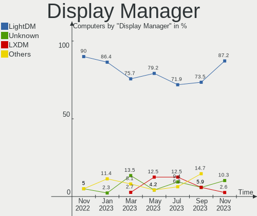

| Name    | Computers | Percent |
|---------|-----------|---------|
| LightDM | 24        | 85.71%  |
| GDM     | 2         | 7.14%   |
| GDM3    | 1         | 3.57%   |
| Unknown | 1         | 3.57%   |

OS Lang
-------

Language

| Lang  | Computers | Percent |
|-------|-----------|---------|
| en_US | 10        | 35.71%  |
| fr_FR | 5         | 17.86%  |
| ru_RU | 3         | 10.71%  |
| en_AU | 3         | 10.71%  |
| it_IT | 2         | 7.14%   |
| es_ES | 1         | 3.57%   |
| es_AR | 1         | 3.57%   |
| de_DE | 1         | 3.57%   |
| de_CH | 1         | 3.57%   |
| C     | 1         | 3.57%   |

Boot Mode
---------

EFI or BIOS

| Mode | Computers | Percent |
|------|-----------|---------|
| EFI  | 16        | 57.14%  |
| BIOS | 12        | 42.86%  |

Filesystem
----------

Type of filesystem

| Type | Computers | Percent |
|------|-----------|---------|
| Ext4 | 27        | 96.43%  |
| Zfs  | 1         | 3.57%   |

Part. scheme
------------

Scheme of partitioning

| Type    | Computers | Percent |
|---------|-----------|---------|
| GPT     | 13        | 46.43%  |
| MBR     | 9         | 32.14%  |
| Unknown | 6         | 21.43%  |

Dual Boot with Linux/BSD
------------------------

Hosting more than one Linux/BSD

| Dual boot | Computers | Percent |
|-----------|-----------|---------|
| No        | 24        | 85.71%  |
| Yes       | 4         | 14.29%  |

Dual Boot (Win)
---------------

Hosting Linux and Windows

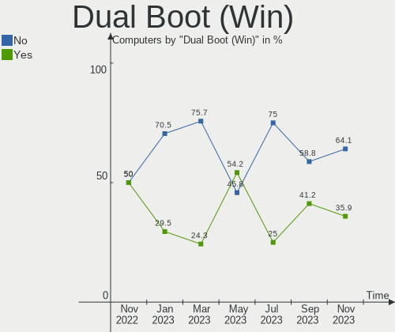

| Dual boot | Computers | Percent |
|-----------|-----------|---------|
| No        | 19        | 67.86%  |
| Yes       | 9         | 32.14%  |

Board
-----

Vendor
------

Motherboard manufacturer

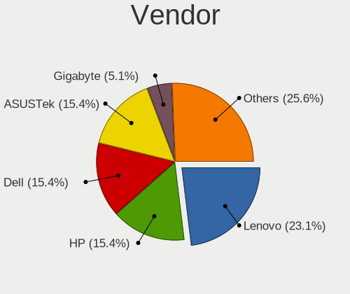

| Name                    | Computers | Percent |
|-------------------------|-----------|---------|
| Dell                    | 5         | 17.86%  |
| ASUSTek Computer        | 4         | 14.29%  |
| Lenovo                  | 3         | 10.71%  |
| MSI                     | 2         | 7.14%   |
| Hewlett-Packard         | 2         | 7.14%   |
| TrekStor                | 1         | 3.57%   |
| Raspberry Pi Foundation | 1         | 3.57%   |
| MicroByte               | 1         | 3.57%   |
| Intel                   | 1         | 3.57%   |
| HUAWEI                  | 1         | 3.57%   |
| HONOR                   | 1         | 3.57%   |
| Hardkernel              | 1         | 3.57%   |
| Google                  | 1         | 3.57%   |
| Gigabyte Technology     | 1         | 3.57%   |
| ASRock                  | 1         | 3.57%   |
| Acer                    | 1         | 3.57%   |
| Unknown                 | 1         | 3.57%   |

Model
-----

Motherboard model

| Name                                 | Computers | Percent |
|--------------------------------------|-----------|---------|
| TrekStor Surfbook A13B               | 1         | 3.57%   |
| RPi Raspberry Pi                     | 1         | 3.57%   |
| MSI Pro 3000 Small Form Factor PC    | 1         | 3.57%   |
| MSI MS-7817                          | 1         | 3.57%   |
| MicroByte ezbook                     | 1         | 3.57%   |
| Lenovo V15 G2 ITL 82KB               | 1         | 3.57%   |
| Lenovo ThinkPad E15 Gen 2 20TDS0T500 | 1         | 3.57%   |
| Lenovo ThinkPad E15 Gen 2 20TDCTO1WW | 1         | 3.57%   |
| Intel Kabylake Platform              | 1         | 3.57%   |
| HUAWEI KLVD-WXX9                     | 1         | 3.57%   |
| HONOR BOHK-WAX9X                     | 1         | 3.57%   |
| HP EliteBook 8560p                   | 1         | 3.57%   |
| HP Compaq Elite 8300 SFF             | 1         | 3.57%   |
| Hardkernel ODROID-N2Plus             | 1         | 3.57%   |
| Google Kled                          | 1         | 3.57%   |
| Gigabyte GA-990FXA-UD5               | 1         | 3.57%   |
| Dell XPS 17 9710                     | 1         | 3.57%   |
| Dell XPS 13 9360                     | 1         | 3.57%   |
| Dell Precision M6500                 | 1         | 3.57%   |
| Dell OptiPlex 9020                   | 1         | 3.57%   |
| Dell OptiPlex 7080                   | 1         | 3.57%   |
| ASUS TUF Gaming B550M-PLUS           | 1         | 3.57%   |
| ASUS S550CM                          | 1         | 3.57%   |
| ASUS PRIME X570-P                    | 1         | 3.57%   |
| ASUS H61M-K                          | 1         | 3.57%   |
| ASRock B450M Pro4                    | 1         | 3.57%   |
| Acer Aspire X3950                    | 1         | 3.57%   |
| Unknown                              | 1         | 3.57%   |

Model Family
------------

Motherboard model prefix

| Name                     | Computers | Percent |
|--------------------------|-----------|---------|
| Lenovo ThinkPad          | 2         | 7.14%   |
| Dell XPS                 | 2         | 7.14%   |
| Dell OptiPlex            | 2         | 7.14%   |
| TrekStor Surfbook        | 1         | 3.57%   |
| RPi Raspberry            | 1         | 3.57%   |
| MSI Pro                  | 1         | 3.57%   |
| MSI MS-7817              | 1         | 3.57%   |
| MicroByte ezbook         | 1         | 3.57%   |
| Lenovo V15               | 1         | 3.57%   |
| Intel Kabylake           | 1         | 3.57%   |
| HUAWEI KLVD-WXX9         | 1         | 3.57%   |
| HONOR BOHK-WAX9X         | 1         | 3.57%   |
| HP EliteBook             | 1         | 3.57%   |
| HP Compaq                | 1         | 3.57%   |
| Hardkernel ODROID-N2Plus | 1         | 3.57%   |
| Google Kled              | 1         | 3.57%   |
| Gigabyte GA-990FXA-UD5   | 1         | 3.57%   |
| Dell Precision           | 1         | 3.57%   |
| ASUS TUF                 | 1         | 3.57%   |
| ASUS S550CM              | 1         | 3.57%   |
| ASUS PRIME               | 1         | 3.57%   |
| ASUS H61M-K              | 1         | 3.57%   |
| ASRock B450M             | 1         | 3.57%   |
| Acer Aspire              | 1         | 3.57%   |
| Unknown                  | 1         | 3.57%   |

MFG Year
--------

Motherboard manufacture year

| Year    | Computers | Percent |
|---------|-----------|---------|
| 2021    | 5         | 17.86%  |
| 2020    | 5         | 17.86%  |
| 2018    | 3         | 10.71%  |
| 2010    | 3         | 10.71%  |
| 2013    | 2         | 7.14%   |
| 2012    | 2         | 7.14%   |
| 2011    | 2         | 7.14%   |
| Unknown | 2         | 7.14%   |
| 2022    | 1         | 3.57%   |
| 2019    | 1         | 3.57%   |
| 2016    | 1         | 3.57%   |
| 2014    | 1         | 3.57%   |

Form Factor
-----------

Physical design of the computer

| Name           | Computers | Percent |
|----------------|-----------|---------|
| Notebook       | 14        | 50%     |
| Desktop        | 12        | 42.86%  |
| System on chip | 2         | 7.14%   |

Secure Boot
-----------

Enabled or disabled

| State    | Computers | Percent |
|----------|-----------|---------|
| Disabled | 24        | 85.71%  |
| Enabled  | 4         | 14.29%  |

Coreboot
--------

Have coreboot on board

| Used | Computers | Percent |
|------|-----------|---------|
| No   | 27        | 96.43%  |
| Yes  | 1         | 3.57%   |

RAM Size
--------

Total RAM memory

| Size in GB  | Computers | Percent |
|-------------|-----------|---------|
| 4.01-8.0    | 7         | 25%     |
| 16.01-24.0  | 6         | 21.43%  |
| 8.01-16.0   | 6         | 21.43%  |
| 32.01-64.0  | 3         | 10.71%  |
| 3.01-4.0    | 3         | 10.71%  |
| 64.01-256.0 | 2         | 7.14%   |
| 24.01-32.0  | 1         | 3.57%   |

RAM Used
--------

Used RAM memory

| Used GB    | Computers | Percent |
|------------|-----------|---------|
| 3.01-4.0   | 7         | 25%     |
| 1.01-2.0   | 7         | 25%     |
| 4.01-8.0   | 6         | 21.43%  |
| 2.01-3.0   | 6         | 21.43%  |
| 16.01-24.0 | 1         | 3.57%   |
| 8.01-16.0  | 1         | 3.57%   |

Total Drives
------------

Number of drives on board

| Drives | Computers | Percent |
|--------|-----------|---------|
| 1      | 19        | 67.86%  |
| 2      | 7         | 25%     |
| 3      | 2         | 7.14%   |

Has CD-ROM
----------

Has CD-ROM on board

| Presented | Computers | Percent |
|-----------|-----------|---------|
| No        | 17        | 60.71%  |
| Yes       | 11        | 39.29%  |

Has Ethernet
------------

Has Ethernet on board

| Presented | Computers | Percent |
|-----------|-----------|---------|
| Yes       | 20        | 71.43%  |
| No        | 8         | 28.57%  |

Has WiFi
--------

Has WiFi module

| Presented | Computers | Percent |
|-----------|-----------|---------|
| Yes       | 19        | 67.86%  |
| No        | 9         | 32.14%  |

Has Bluetooth
-------------

Has Bluetooth module

| Presented | Computers | Percent |
|-----------|-----------|---------|
| Yes       | 14        | 50%     |
| No        | 14        | 50%     |

Location
--------

Country
-------

Geographic location (country)

| Country     | Computers | Percent |
|-------------|-----------|---------|
| USA         | 4         | 14.29%  |
| Russia      | 4         | 14.29%  |
| Germany     | 4         | 14.29%  |
| France      | 4         | 14.29%  |
| Italy       | 3         | 10.71%  |
| Australia   | 3         | 10.71%  |
| UK          | 1         | 3.57%   |
| Turkey      | 1         | 3.57%   |
| Switzerland | 1         | 3.57%   |
| Spain       | 1         | 3.57%   |
| Netherlands | 1         | 3.57%   |
| Argentina   | 1         | 3.57%   |

City
----

Geographic location (city)

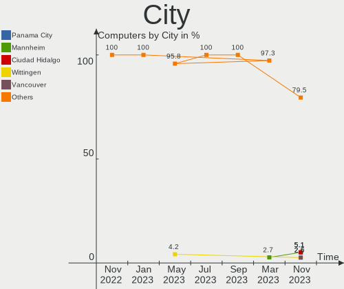

| City           | Computers | Percent |
|----------------|-----------|---------|
| Paris          | 3         | 10.71%  |
| Southampton    | 1         | 3.57%   |
| Singen         | 1         | 3.57%   |
| Seville        | 1         | 3.57%   |
| Rostov-on-Don  | 1         | 3.57%   |
| Naaldwijk      | 1         | 3.57%   |
| Mount Waverley | 1         | 3.57%   |
| Moscow         | 1         | 3.57%   |
| Milan          | 1         | 3.57%   |
| Melbourne      | 1         | 3.57%   |
| Magdeburg      | 1         | 3.57%   |
| Limbiate       | 1         | 3.57%   |
| Libourne       | 1         | 3.57%   |
| Lake Forest    | 1         | 3.57%   |
| Kuznetsk       | 1         | 3.57%   |
| Iesi           | 1         | 3.57%   |
| Hamburg        | 1         | 3.57%   |
| Gams           | 1         | 3.57%   |
| Edinburgh      | 1         | 3.57%   |
| Buenos Aires   | 1         | 3.57%   |
| Berlin         | 1         | 3.57%   |
| Barnaul        | 1         | 3.57%   |
| Bakersfield    | 1         | 3.57%   |
| Artvin         | 1         | 3.57%   |
| Albuquerque    | 1         | 3.57%   |
| Adelaide       | 1         | 3.57%   |

Drives
------

Drive Vendor
------------

Hard drive vendors

| Vendor              | Computers | Drives | Percent |
|---------------------|-----------|--------|---------|
| Samsung Electronics | 7         | 7      | 19.44%  |
| Seagate             | 5         | 7      | 13.89%  |
| Unknown             | 3         | 3      | 8.33%   |
| SK hynix            | 3         | 3      | 8.33%   |
| SanDisk             | 3         | 3      | 8.33%   |
| WDC                 | 2         | 2      | 5.56%   |
| Phison              | 2         | 2      | 5.56%   |
| Kingston            | 2         | 2      | 5.56%   |
| Crucial             | 2         | 2      | 5.56%   |
| Toshiba             | 1         | 1      | 2.78%   |
| LITEON              | 1         | 1      | 2.78%   |
| KIOXIA              | 1         | 1      | 2.78%   |
| KingSpec            | 1         | 1      | 2.78%   |
| Intel               | 1         | 1      | 2.78%   |
| China               | 1         | 1      | 2.78%   |
| A-DATA Technology   | 1         | 1      | 2.78%   |

Drive Model
-----------

Hard drive models

| Model                                  | Computers | Percent |
|----------------------------------------|-----------|---------|
| Seagate ST1000DM003-1ER162 1TB         | 2         | 5.26%   |
| Kingston SA400S37480G 480GB SSD        | 2         | 5.26%   |
| WDC WD4003FRYZ-01F0DB0 4TB             | 1         | 2.63%   |
| WDC WD20EZRZ-22Z5HB0 2TB               | 1         | 2.63%   |
| Unknown SLD64G  64GB                   | 1         | 2.63%   |
| Unknown SC32G  32GB                    | 1         | 2.63%   |
| Unknown MMC Card  64GB                 | 1         | 2.63%   |
| Toshiba THNSNK256GVN8 256GB SSD        | 1         | 2.63%   |
| SK hynix SHGP31-1000GM 1TB             | 1         | 2.63%   |
| SK hynix HFM128GDJTNG-8310A 128GB      | 1         | 2.63%   |
| SK hynix BC511 NVMe 256GB              | 1         | 2.63%   |
| Seagate ST3500414CS 500GB              | 1         | 2.63%   |
| Seagate ST250DM000-1BD141 250GB        | 1         | 2.63%   |
| Seagate ST2000DM006-2DM164 2TB         | 1         | 2.63%   |
| Seagate ST2000DM001 4GB                | 1         | 2.63%   |
| Seagate ST1000DM003-1SB102 1TB         | 1         | 2.63%   |
| SanDisk SSD U100 24GB                  | 1         | 2.63%   |
| SanDisk SSD PLUS 1000GB                | 1         | 2.63%   |
| SanDisk NVMe SSD Drive 512GB           | 1         | 2.63%   |
| Samsung SSD 980 500GB                  | 1         | 2.63%   |
| Samsung SSD 870 EVO 500GB              | 1         | 2.63%   |
| Samsung SSD 860 PRO 512GB              | 1         | 2.63%   |
| Samsung SSD 860 EVO 250GB              | 1         | 2.63%   |
| Samsung SM963 2.5" NVMe PCIe SSD 500GB | 1         | 2.63%   |
| Samsung NVMe SSD Drive 256GB           | 1         | 2.63%   |
| Samsung MZALQ256HBJD-00BL1 256GB       | 1         | 2.63%   |
| Phison Sabrent Rocket nano 512GB       | 1         | 2.63%   |
| Phison 311CD0512GB                     | 1         | 2.63%   |
| LITEON CX2-8B512-Q11 NVMe 512GB        | 1         | 2.63%   |
| KIOXIA KXG70PNV2T04 NVMe 2048GB        | 1         | 2.63%   |
| KingSpec NT-512 512GB SSD              | 1         | 2.63%   |
| Intel SSDPEKKR128G7 128GB              | 1         | 2.63%   |
| Crucial CT500MX500SSD4 500GB           | 1         | 2.63%   |
| Crucial CT240BX500SSD1 240GB           | 1         | 2.63%   |
| China SSD 512GB                        | 1         | 2.63%   |
| A-DATA SX8200PNP 512GB                 | 1         | 2.63%   |

HDD Vendor
----------

Hard disk drive vendors

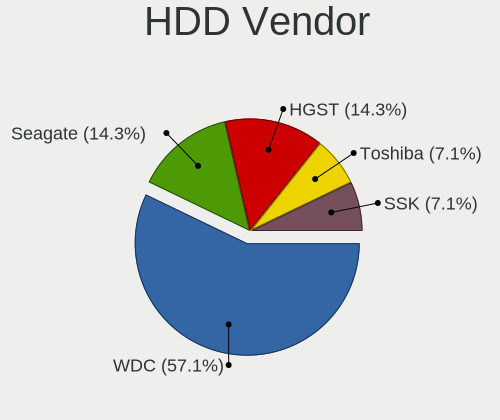

| Vendor  | Computers | Drives | Percent |
|---------|-----------|--------|---------|
| Seagate | 5         | 7      | 71.43%  |
| WDC     | 2         | 2      | 28.57%  |

SSD Vendor
----------

Solid state drive vendors

| Vendor              | Computers | Drives | Percent |
|---------------------|-----------|--------|---------|
| Samsung Electronics | 3         | 3      | 25%     |
| SanDisk             | 2         | 2      | 16.67%  |
| Kingston            | 2         | 2      | 16.67%  |
| Crucial             | 2         | 2      | 16.67%  |
| Toshiba             | 1         | 1      | 8.33%   |
| KingSpec            | 1         | 1      | 8.33%   |
| China               | 1         | 1      | 8.33%   |

Drive Kind
----------

HDD or SSD

| Kind | Computers | Drives | Percent |
|------|-----------|--------|---------|
| NVMe | 13        | 14     | 38.24%  |
| SSD  | 11        | 12     | 32.35%  |
| HDD  | 7         | 9      | 20.59%  |
| MMC  | 3         | 3      | 8.82%   |

Drive Connector
---------------

SATA, SAS, NVMe, etc.

| Type | Computers | Drives | Percent |
|------|-----------|--------|---------|
| SATA | 15        | 21     | 48.39%  |
| NVMe | 13        | 14     | 41.94%  |
| MMC  | 3         | 3      | 9.68%   |

Drive Size
----------

Size of hard drive

| Size in TB | Computers | Drives | Percent |
|------------|-----------|--------|---------|
| 0.01-0.5   | 10        | 11     | 50%     |
| 0.51-1.0   | 7         | 7      | 35%     |
| 1.01-2.0   | 2         | 2      | 10%     |
| 3.01-4.0   | 1         | 1      | 5%      |

Space Total
-----------

Amount of disk space available on the file system

| Size in GB     | Computers | Percent |
|----------------|-----------|---------|
| 251-500        | 8         | 28.57%  |
| 101-250        | 8         | 28.57%  |
| 2001-3000      | 3         | 10.71%  |
| 1001-2000      | 2         | 7.14%   |
| 1-20           | 2         | 7.14%   |
| 501-1000       | 2         | 7.14%   |
| More than 3000 | 1         | 3.57%   |
| 21-50          | 1         | 3.57%   |
| 51-100         | 1         | 3.57%   |

Space Used
----------

Amount of used disk space

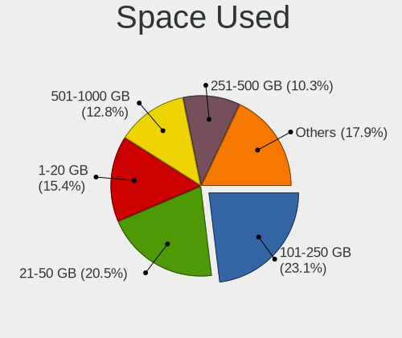

| Used GB   | Computers | Percent |
|-----------|-----------|---------|
| 101-250   | 7         | 25%     |
| 1-20      | 7         | 25%     |
| 51-100    | 7         | 25%     |
| 1001-2000 | 4         | 14.29%  |
| 251-500   | 1         | 3.57%   |
| 21-50     | 1         | 3.57%   |
| 501-1000  | 1         | 3.57%   |

Malfunc. Drives
---------------

Drive models with a malfunction

Zero info for selected period =(

Malfunc. Drive Vendor
---------------------

Vendors of faulty drives

Zero info for selected period =(

Malfunc. HDD Vendor
-------------------

Vendors of faulty HDD drives

Zero info for selected period =(

Malfunc. Drive Kind
-------------------

Kinds of faulty drives

Zero info for selected period =(

Failed Drives
-------------

Failed drive models

Zero info for selected period =(

Failed Drive Vendor
-------------------

Failed drive vendors

Zero info for selected period =(

Drive Status
------------

Number of failed and malfunc. drives

| Status   | Computers | Drives | Percent |
|----------|-----------|--------|---------|
| Works    | 18        | 26     | 66.67%  |
| Detected | 9         | 12     | 33.33%  |

Storage controller
------------------

Storage Vendor
--------------

Storage controller vendors

| Vendor                   | Computers | Percent |
|--------------------------|-----------|---------|
| Intel                    | 18        | 48.65%  |
| Samsung Electronics      | 4         | 10.81%  |
| AMD                      | 4         | 10.81%  |
| SK hynix                 | 3         | 8.11%   |
| Phison Electronics       | 2         | 5.41%   |
| SanDisk                  | 1         | 2.7%    |
| Marvell Technology Group | 1         | 2.7%    |
| Lite-On Technology       | 1         | 2.7%    |
| KIOXIA                   | 1         | 2.7%    |
| ADATA Technology         | 1         | 2.7%    |
| 3ware                    | 1         | 2.7%    |

Storage Model
-------------

Storage controller models

| Model                                                                                  | Computers | Percent |
|----------------------------------------------------------------------------------------|-----------|---------|
| Samsung NVMe SSD Controller 980                                                        | 3         | 7.14%   |
| Phison PS5013 E13 NVMe Controller                                                      | 2         | 4.76%   |
| Intel Volume Management Device NVMe RAID Controller                                    | 2         | 4.76%   |
| Intel Comet Lake SATA AHCI Controller                                                  | 2         | 4.76%   |
| Intel Celeron N3350/Pentium N4200/Atom E3900 Series SATA AHCI Controller               | 2         | 4.76%   |
| Intel 82801 Mobile SATA Controller [RAID mode]                                         | 2         | 4.76%   |
| AMD FCH SATA Controller [AHCI mode]                                                    | 2         | 4.76%   |
| SK hynix Gold P31 SSD                                                                  | 1         | 2.38%   |
| SK hynix BC511                                                                         | 1         | 2.38%   |
| SK hynix BC501 NVMe Solid State Drive                                                  | 1         | 2.38%   |
| SanDisk WD Black SN750 / PC SN730 NVMe SSD                                             | 1         | 2.38%   |
| Samsung NVMe SSD Controller PM9A1/PM9A3/980PRO                                         | 1         | 2.38%   |
| Marvell Group 88SE9172 SATA III 6Gb/s RAID Controller                                  | 1         | 2.38%   |
| Lite-On Lite-On Non-Volatile memory controller                                         | 1         | 2.38%   |
| KIOXIA Non-Volatile memory controller                                                  | 1         | 2.38%   |
| Intel Tiger Lake-LP SATA Controller [AHCI mode]                                        | 1         | 2.38%   |
| Intel SSD 600P Series                                                                  | 1         | 2.38%   |
| Intel SATA Controller [RAID mode]                                                      | 1         | 2.38%   |
| Intel Cannon Lake PCH SATA AHCI Controller                                             | 1         | 2.38%   |
| Intel 82801JI (ICH10 Family) 4 port SATA IDE Controller #1                             | 1         | 2.38%   |
| Intel 82801JI (ICH10 Family) 2 port SATA IDE Controller #2                             | 1         | 2.38%   |
| Intel 8 Series/C220 Series Chipset Family 6-port SATA Controller 1 [AHCI mode]         | 1         | 2.38%   |
| Intel 7 Series/C210 Series Chipset Family 6-port SATA Controller [AHCI mode]           | 1         | 2.38%   |
| Intel 7 Series Chipset Family 6-port SATA Controller [AHCI mode]                       | 1         | 2.38%   |
| Intel 6 Series/C200 Series Chipset Family Mobile SATA Controller (IDE mode, ports 4-5) | 1         | 2.38%   |
| Intel 6 Series/C200 Series Chipset Family Mobile SATA Controller (IDE mode, ports 0-3) | 1         | 2.38%   |
| Intel 6 Series/C200 Series Chipset Family 6 port Desktop SATA AHCI Controller          | 1         | 2.38%   |
| Intel 5 Series/3400 Series Chipset 6 port SATA AHCI Controller                         | 1         | 2.38%   |
| AMD SB7x0/SB8x0/SB9x0 SATA Controller [AHCI mode]                                      | 1         | 2.38%   |
| AMD SB7x0/SB8x0/SB9x0 IDE Controller                                                   | 1         | 2.38%   |
| AMD 500 Series Chipset SATA Controller                                                 | 1         | 2.38%   |
| AMD 400 Series Chipset SATA Controller                                                 | 1         | 2.38%   |
| ADATA XPG SX8200 Pro PCIe Gen3x4 M.2 2280 Solid State Drive                            | 1         | 2.38%   |
| 3ware 9650SE SATA-II RAID PCIe                                                         | 1         | 2.38%   |

Storage Kind
------------

Kind of storage controller (IDE, SATA, NVMe, SAS, ...)

| Kind | Computers | Percent |
|------|-----------|---------|
| SATA | 15        | 40.54%  |
| NVMe | 13        | 35.14%  |
| RAID | 6         | 16.22%  |
| IDE  | 3         | 8.11%   |

Processor
---------

CPU Vendor
----------

Processor vendors

| Vendor | Computers | Percent |
|--------|-----------|---------|
| Intel  | 21        | 75%     |
| AMD    | 5         | 17.86%  |
| ARM    | 2         | 7.14%   |

CPU Model
---------

Processor models

| Model                                         | Computers | Percent |
|-----------------------------------------------|-----------|---------|
| Intel Core i7-4790 CPU @ 3.60GHz              | 2         | 7.14%   |
| Intel 11th Gen Core i7-1165G7 @ 2.80GHz       | 2         | 7.14%   |
| ARM Processor                                 | 2         | 7.14%   |
| Intel Pentium Dual-Core CPU E5500 @ 2.80GHz   | 1         | 3.57%   |
| Intel Pentium CPU N4200 @ 1.10GHz             | 1         | 3.57%   |
| Intel Pentium CPU G840 @ 2.80GHz              | 1         | 3.57%   |
| Intel Core i7-9750H CPU @ 2.60GHz             | 1         | 3.57%   |
| Intel Core i7-7560U CPU @ 2.40GHz             | 1         | 3.57%   |
| Intel Core i7-7500U CPU @ 2.70GHz             | 1         | 3.57%   |
| Intel Core i7-3517U CPU @ 1.90GHz             | 1         | 3.57%   |
| Intel Core i7 CPU X 920 @ 2.00GHz             | 1         | 3.57%   |
| Intel Core i5-3470 CPU @ 3.20GHz              | 1         | 3.57%   |
| Intel Core i5-2540M CPU @ 2.60GHz             | 1         | 3.57%   |
| Intel Core i5-10500 CPU @ 3.10GHz             | 1         | 3.57%   |
| Intel Core i5 CPU 650 @ 3.20GHz               | 1         | 3.57%   |
| Intel Core i3-10110U CPU @ 2.10GHz            | 1         | 3.57%   |
| Intel Celeron CPU N3450 @ 1.10GHz             | 1         | 3.57%   |
| Intel 11th Gen Core i9-11980HK @ 2.60GHz      | 1         | 3.57%   |
| Intel 11th Gen Core i5-1135G7 @ 2.40GHz       | 1         | 3.57%   |
| Intel 11th Gen Core i3-1115G4 @ 3.00GHz       | 1         | 3.57%   |
| AMD Ryzen 7 5800X 8-Core Processor            | 1         | 3.57%   |
| AMD Ryzen 7 3700U with Radeon Vega Mobile Gfx | 1         | 3.57%   |
| AMD Ryzen 5 5600G with Radeon Graphics        | 1         | 3.57%   |
| AMD Ryzen 5 2400G with Radeon Vega Graphics   | 1         | 3.57%   |
| AMD Athlon II X4 640 Processor                | 1         | 3.57%   |

CPU Model Family
----------------

Processor model prefix

| Model                   | Computers | Percent |
|-------------------------|-----------|---------|
| Other                   | 7         | 25%     |
| Intel Core i7           | 7         | 25%     |
| Intel Core i5           | 4         | 14.29%  |
| Intel Pentium           | 2         | 7.14%   |
| AMD Ryzen 7             | 2         | 7.14%   |
| AMD Ryzen 5             | 2         | 7.14%   |
| Intel Pentium Dual-Core | 1         | 3.57%   |
| Intel Core i3           | 1         | 3.57%   |
| Intel Celeron           | 1         | 3.57%   |
| AMD Athlon II X4        | 1         | 3.57%   |

CPU Cores
---------

Number of processor cores

| Number  | Computers | Percent |
|---------|-----------|---------|
| 4       | 12        | 42.86%  |
| 2       | 9         | 32.14%  |
| 6       | 4         | 14.29%  |
| 8       | 2         | 7.14%   |
| Unknown | 1         | 3.57%   |

CPU Sockets
-----------

Number of sockets

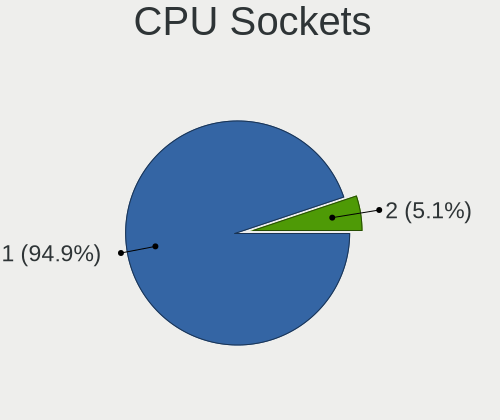

| Number  | Computers | Percent |
|---------|-----------|---------|
| 1       | 26        | 92.86%  |
| 2       | 1         | 3.57%   |
| Unknown | 1         | 3.57%   |

CPU Threads
-----------

Threads per core (Hyper-Threading)

| Number  | Computers | Percent |
|---------|-----------|---------|
| 2       | 20        | 71.43%  |
| 1       | 7         | 25%     |
| Unknown | 1         | 3.57%   |

CPU Op-Modes
------------

CPU Operation Modes (32-bit, 64-bit)

| Op mode        | Computers | Percent |
|----------------|-----------|---------|
| 32-bit, 64-bit | 28        | 100%    |

CPU Microcode
-------------

Microcode number

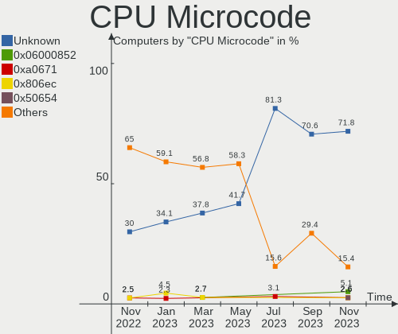

| Number     | Computers | Percent |
|------------|-----------|---------|
| Unknown    | 9         | 32.14%  |
| 0x806c1    | 3         | 10.71%  |
| 0x806e9    | 2         | 7.14%   |
| 0x506c9    | 2         | 7.14%   |
| 0x306c3    | 2         | 7.14%   |
| 0x206a7    | 2         | 7.14%   |
| 0x906ed    | 1         | 3.57%   |
| 0x806ec    | 1         | 3.57%   |
| 0x806d1    | 1         | 3.57%   |
| 0x306a9    | 1         | 3.57%   |
| 0x20655    | 1         | 3.57%   |
| 0x1067a    | 1         | 3.57%   |
| 0x0a50000c | 1         | 3.57%   |
| 0x010000c8 | 1         | 3.57%   |

CPU Microarch
-------------

Microarchitecture

| Name        | Computers | Percent |
|-------------|-----------|---------|
| TigerLake   | 4         | 14.29%  |
| KabyLake    | 4         | 14.29%  |
| Zen 3       | 2         | 7.14%   |
| SandyBridge | 2         | 7.14%   |
| IvyBridge   | 2         | 7.14%   |
| Haswell     | 2         | 7.14%   |
| Goldmont    | 2         | 7.14%   |
| Unknown     | 2         | 7.14%   |
| Zen+        | 1         | 3.57%   |
| Zen         | 1         | 3.57%   |
| Westmere    | 1         | 3.57%   |
| Penryn      | 1         | 3.57%   |
| Nehalem     | 1         | 3.57%   |
| K10         | 1         | 3.57%   |
| Icelake     | 1         | 3.57%   |
| CometLake   | 1         | 3.57%   |

Graphics
--------

GPU Vendor
----------

Vendors of graphics cards

| Vendor | Computers | Percent |
|--------|-----------|---------|
| Intel  | 16        | 57.14%  |
| AMD    | 7         | 25%     |
| Nvidia | 5         | 17.86%  |

GPU Model
---------

Graphics card models

| Model                                                                              | Computers | Percent |
|------------------------------------------------------------------------------------|-----------|---------|
| Intel TigerLake-LP GT2 [Iris Xe Graphics]                                          | 3         | 10.71%  |
| Nvidia TU117 [GeForce GTX 1650]                                                    | 1         | 3.57%   |
| Nvidia GP107 [GeForce GTX 1050 Ti]                                                 | 1         | 3.57%   |
| Nvidia GF108M [GeForce GT 635M]                                                    | 1         | 3.57%   |
| Nvidia GA106M [GeForce RTX 3060 Mobile / Max-Q]                                    | 1         | 3.57%   |
| Nvidia G92GLM [Quadro FX 2800M]                                                    | 1         | 3.57%   |
| Intel Xeon E3-1200 v3/4th Gen Core Processor Integrated Graphics Controller        | 1         | 3.57%   |
| Intel Xeon E3-1200 v2/3rd Gen Core processor Graphics Controller                   | 1         | 3.57%   |
| Intel TigerLake-H GT1 [UHD Graphics]                                               | 1         | 3.57%   |
| Intel Tiger Lake UHD Graphics                                                      | 1         | 3.57%   |
| Intel Iris Plus Graphics 640                                                       | 1         | 3.57%   |
| Intel HD Graphics 620                                                              | 1         | 3.57%   |
| Intel HD Graphics 500                                                              | 1         | 3.57%   |
| Intel CometLake-U GT2 [UHD Graphics]                                               | 1         | 3.57%   |
| Intel CometLake-S GT2 [UHD Graphics 630]                                           | 1         | 3.57%   |
| Intel CoffeeLake-H GT2 [UHD Graphics 630]                                          | 1         | 3.57%   |
| Intel Celeron N3350/Pentium N4200/Atom E3900 Series Integrated Graphics Controller | 1         | 3.57%   |
| Intel 3rd Gen Core processor Graphics Controller                                   | 1         | 3.57%   |
| Intel 2nd Generation Core Processor Family Integrated Graphics Controller          | 1         | 3.57%   |
| AMD RV730 PRO [Radeon HD 4650]                                                     | 1         | 3.57%   |
| AMD Redwood PRO [Radeon HD 5550/5570/5630/6510/6610/7570]                          | 1         | 3.57%   |
| AMD Raven Ridge [Radeon Vega Series / Radeon Vega Mobile Series]                   | 1         | 3.57%   |
| AMD Picasso/Raven 2 [Radeon Vega Series / Radeon Vega Mobile Series]               | 1         | 3.57%   |
| AMD Oland [Radeon HD 8570 / R5 430 OEM / R7 240/340 / Radeon 520 OEM]              | 1         | 3.57%   |
| AMD Cezanne                                                                        | 1         | 3.57%   |
| AMD Cedar [Radeon HD 5000/6000/7350/8350 Series]                                   | 1         | 3.57%   |

GPU Combo
---------

Combinations of graphics cards

| Name           | Computers | Percent |
|----------------|-----------|---------|
| 1 x Intel      | 14        | 50%     |
| 1 x AMD        | 7         | 25%     |
| 1 x Nvidia     | 3         | 10.71%  |
| Other          | 2         | 7.14%   |
| Intel + Nvidia | 2         | 7.14%   |

GPU Driver
----------

Free vs proprietary

| Driver      | Computers | Percent |
|-------------|-----------|---------|
| Free        | 23        | 82.14%  |
| Proprietary | 3         | 10.71%  |
| Unknown     | 2         | 7.14%   |

GPU Memory
----------

Total video memory

| Size in GB | Computers | Percent |
|------------|-----------|---------|
| Unknown    | 18        | 64.29%  |
| 0.51-1.0   | 4         | 14.29%  |
| 3.01-4.0   | 2         | 7.14%   |
| 1.01-2.0   | 2         | 7.14%   |
| 5.01-6.0   | 1         | 3.57%   |
| 0.01-0.5   | 1         | 3.57%   |

Monitor
-------

Monitor Vendor
--------------

Monitor vendors

| Vendor                  | Computers | Percent |
|-------------------------|-----------|---------|
| Samsung Electronics     | 7         | 21.88%  |
| BOE                     | 5         | 15.63%  |
| Dell                    | 3         | 9.38%   |
| Sharp                   | 2         | 6.25%   |
| Philips                 | 2         | 6.25%   |
| BenQ                    | 2         | 6.25%   |
| AOC                     | 2         | 6.25%   |
| Vizio                   | 1         | 3.13%   |
| ViewSonic               | 1         | 3.13%   |
| Packard Bell            | 1         | 3.13%   |
| Iiyama                  | 1         | 3.13%   |
| Hewlett-Packard         | 1         | 3.13%   |
| Goldstar                | 1         | 3.13%   |
| CS_                     | 1         | 3.13%   |
| Chi Mei Optoelectronics | 1         | 3.13%   |
| Ancor Communications    | 1         | 3.13%   |

Monitor Model
-------------

Monitor models

| Model                                                                    | Computers | Percent |
|--------------------------------------------------------------------------|-----------|---------|
| Vizio D32x-D1 VIZ1005 1920x1080 700x390mm 31.5-inch                      | 1         | 3.03%   |
| ViewSonic VX2439wm VSC3D24 1920x1080 521x293mm 23.5-inch                 | 1         | 3.03%   |
| Sharp LCD Monitor SHP1517 3840x2400 366x229mm 17.0-inch                  | 1         | 3.03%   |
| Sharp LCD Monitor SHP1449 1920x1080 294x165mm 13.3-inch                  | 1         | 3.03%   |
| Samsung Electronics SyncMaster SAM014C 1280x1024 338x270mm 17.0-inch     | 1         | 3.03%   |
| Samsung Electronics SMB2340 SAM0691 1920x1080 510x290mm 23.1-inch        | 1         | 3.03%   |
| Samsung Electronics SMB2220N SAM06A2 1920x1080 480x270mm 21.7-inch       | 1         | 3.03%   |
| Samsung Electronics S24F350 SAM0D20 1920x1080 521x293mm 23.5-inch        | 1         | 3.03%   |
| Samsung Electronics S24C450 SAM09CF 1920x1200 518x324mm 24.1-inch        | 1         | 3.03%   |
| Samsung Electronics LCD Monitor SEC5442 1440x900 303x190mm 14.1-inch     | 1         | 3.03%   |
| Samsung Electronics LCD Monitor SEC334A 1366x768 344x194mm 15.5-inch     | 1         | 3.03%   |
| Philips PHL 272B8Q PHL0918 2560x1440 597x336mm 27.0-inch                 | 1         | 3.03%   |
| Philips PHL 240B4Q PHL08E3 1920x1200 518x324mm 24.1-inch                 | 1         | 3.03%   |
| Philips 236VL PHLC082 1920x1080 509x286mm 23.0-inch                      | 1         | 3.03%   |
| Packard Bell Viseo203DX PKB03B1 1600x900 432x240mm 19.5-inch             | 1         | 3.03%   |
| Iiyama PL2773H IVM660A 1920x1080 598x336mm 27.0-inch                     | 1         | 3.03%   |
| Hewlett-Packard w2216 HWP280C 1680x1050 465x291mm 21.6-inch              | 1         | 3.03%   |
| Goldstar ULTRAWIDE GSM76E4 3440x1440 800x335mm 34.1-inch                 | 1         | 3.03%   |
| Dell S2421HS DEL41F3 1920x1080 527x296mm 23.8-inch                       | 1         | 3.03%   |
| Dell P2714H DELD05F 1920x1080 598x336mm 27.0-inch                        | 1         | 3.03%   |
| Dell P2419H DELD0D9 1920x1080 527x296mm 23.8-inch                        | 1         | 3.03%   |
| CS_ LCD Monitor CS_5211 1920x1080 519x324mm 24.1-inch                    | 1         | 3.03%   |
| Chi Mei Optoelectronics LCD Monitor CMO15A1 1366x768 344x193mm 15.5-inch | 1         | 3.03%   |
| BOE LCD Monitor BOE08D5 1920x1080 344x194mm 15.5-inch                    | 1         | 3.03%   |
| BOE LCD Monitor BOE08C2 1920x1080 344x194mm 15.5-inch                    | 1         | 3.03%   |
| BOE LCD Monitor BOE0893 2160x1440 296x197mm 14.0-inch                    | 1         | 3.03%   |
| BOE LCD Monitor BOE0872 1920x1080 344x194mm 15.5-inch                    | 1         | 3.03%   |
| BOE LCD Monitor BOE085E 1920x1080 344x194mm 15.5-inch                    | 1         | 3.03%   |
| BenQ T2200HD BNQ7726 1920x1080 477x268mm 21.5-inch                       | 1         | 3.03%   |
| BenQ LCD BNQ801B 2560x1440 527x296mm 23.8-inch                           | 1         | 3.03%   |
| AOC Q27P1B AOC2701 2560x1440 597x336mm 27.0-inch                         | 1         | 3.03%   |
| AOC 2475W AOC2475 1920x1080 521x293mm 23.5-inch                          | 1         | 3.03%   |
| Ancor Communications ASUS VC239 ACI23C4 1920x1080 509x286mm 23.0-inch    | 1         | 3.03%   |

Monitor Resolution
------------------

Monitor screen resolution

| Resolution         | Computers | Percent |
|--------------------|-----------|---------|
| 1920x1080 (FHD)    | 17        | 54.84%  |
| 2560x1440 (QHD)    | 3         | 9.68%   |
| 1920x1200 (WUXGA)  | 2         | 6.45%   |
| 1366x768 (WXGA)    | 2         | 6.45%   |
| 3840x2400          | 1         | 3.23%   |
| 3440x1440          | 1         | 3.23%   |
| 2160x1440          | 1         | 3.23%   |
| 1680x1050 (WSXGA+) | 1         | 3.23%   |
| 1600x900 (HD+)     | 1         | 3.23%   |
| 1440x900 (WXGA+)   | 1         | 3.23%   |
| 1280x1024 (SXGA)   | 1         | 3.23%   |

Monitor Diagonal
----------------

Diagonal size in inches

| Inches | Computers | Percent |
|--------|-----------|---------|
| 15     | 6         | 19.35%  |
| 24     | 5         | 16.13%  |
| 23     | 5         | 16.13%  |
| 27     | 4         | 12.9%   |
| 21     | 3         | 9.68%   |
| 17     | 3         | 9.68%   |
| 34     | 1         | 3.23%   |
| 31     | 1         | 3.23%   |
| 19     | 1         | 3.23%   |
| 14     | 1         | 3.23%   |
| 13     | 1         | 3.23%   |

Monitor Width
-------------

Physical width

| Width in mm | Computers | Percent |
|-------------|-----------|---------|
| 501-600     | 12        | 41.38%  |
| 301-350     | 7         | 24.14%  |
| 401-500     | 4         | 13.79%  |
| 351-400     | 2         | 6.9%    |
| 201-300     | 2         | 6.9%    |
| 701-800     | 1         | 3.45%   |
| 601-700     | 1         | 3.45%   |

Aspect Ratio
------------

Proportional relationship between the width and the height

| Ratio | Computers | Percent |
|-------|-----------|---------|
| 16/9  | 20        | 68.97%  |
| 16/10 | 6         | 20.69%  |
| 5/4   | 1         | 3.45%   |
| 3/2   | 1         | 3.45%   |
| 21/9  | 1         | 3.45%   |

Monitor Area
------------

Area in inch

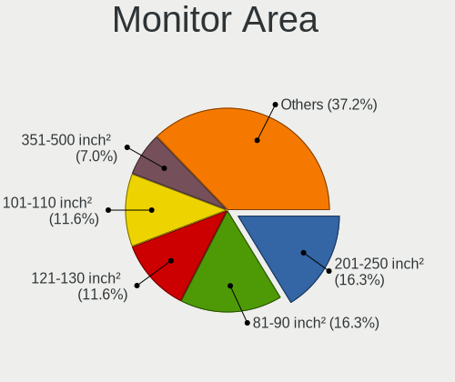

| Area in inch | Computers | Percent |
|----------------|-----------|---------|
| 201-250        | 10        | 32.26%  |
| 101-110        | 6         | 19.35%  |
| 301-350        | 4         | 12.9%   |
| 251-300        | 3         | 9.68%   |
| 351-500        | 2         | 6.45%   |
| 81-90          | 1         | 3.23%   |
| 71-80          | 1         | 3.23%   |
| 151-200        | 1         | 3.23%   |
| 141-150        | 1         | 3.23%   |
| 131-140        | 1         | 3.23%   |
| 121-130        | 1         | 3.23%   |

Pixel Density
-------------

Pixels per inch

| Density       | Computers | Percent |
|---------------|-----------|---------|
| 51-100        | 15        | 53.57%  |
| 121-160       | 5         | 17.86%  |
| 101-120       | 5         | 17.86%  |
| 161-240       | 2         | 7.14%   |
| More than 240 | 1         | 3.57%   |

Multiple Monitors
-----------------

Total monitors connected

| Total | Computers | Percent |
|-------|-----------|---------|
| 1     | 21        | 75%     |
| 2     | 5         | 17.86%  |
| 3     | 1         | 3.57%   |
| 0     | 1         | 3.57%   |

Network
-------

Net Controller Vendor
---------------------

Controller vendors

| Vendor                | Computers | Percent |
|-----------------------|-----------|---------|
| Realtek Semiconductor | 18        | 47.37%  |
| Intel                 | 14        | 36.84%  |
| TP-Link               | 2         | 5.26%   |
| Ralink Technology     | 1         | 2.63%   |
| Qualcomm Atheros      | 1         | 2.63%   |
| Broadcom Limited      | 1         | 2.63%   |
| Broadcom              | 1         | 2.63%   |

Net Controller Model
--------------------

Controller models

| Model                                                             | Computers | Percent |
|-------------------------------------------------------------------|-----------|---------|
| Realtek RTL8111/8168/8411 PCI Express Gigabit Ethernet Controller | 13        | 31.71%  |
| Intel Wi-Fi 6 AX201                                               | 3         | 7.32%   |
| TP-Link TL-WN722N v2/v3 [Realtek RTL8188EUS]                      | 2         | 4.88%   |
| Intel Wireless 3165                                               | 2         | 4.88%   |
| Intel 82579LM Gigabit Network Connection (Lewisville)             | 2         | 4.88%   |
| Realtek RTL88x2bu [AC1200 Techkey]                                | 1         | 2.44%   |
| Realtek RTL8822CE 802.11ac PCIe Wireless Network Adapter          | 1         | 2.44%   |
| Realtek RTL8821CE 802.11ac PCIe Wireless Network Adapter          | 1         | 2.44%   |
| Realtek RTL8812AU 802.11a/b/g/n/ac 2T2R DB WLAN Adapter           | 1         | 2.44%   |
| Realtek RTL8188CE 802.11b/g/n WiFi Adapter                        | 1         | 2.44%   |
| Realtek RTL8153 Gigabit Ethernet Adapter                          | 1         | 2.44%   |
| Realtek RTL8125 2.5GbE Controller                                 | 1         | 2.44%   |
| Ralink MT7601U Wireless Adapter                                   | 1         | 2.44%   |
| Qualcomm Atheros QCA6174 802.11ac Wireless Network Adapter        | 1         | 2.44%   |
| Intel Wireless 7260                                               | 1         | 2.44%   |
| Intel Wireless 3160                                               | 1         | 2.44%   |
| Intel Wi-Fi 6 AX210/AX211/AX411 160MHz                            | 1         | 2.44%   |
| Intel Tiger Lake PCH CNVi WiFi                                    | 1         | 2.44%   |
| Intel Ethernet Connection I217-LM                                 | 1         | 2.44%   |
| Intel Ethernet Connection (11) I219-LM                            | 1         | 2.44%   |
| Intel Comet Lake PCH-LP CNVi WiFi                                 | 1         | 2.44%   |
| Intel Centrino Advanced-N 6205 [Taylor Peak]                      | 1         | 2.44%   |
| Broadcom NetXtreme BCM5761e Gigabit Ethernet PCIe                 | 1         | 2.44%   |
| Broadcom Limited BCM4312 802.11b/g LP-PHY                         | 1         | 2.44%   |

Wireless Vendor
---------------

Wireless vendors

| Vendor                | Computers | Percent |
|-----------------------|-----------|---------|
| Intel                 | 11        | 52.38%  |
| Realtek Semiconductor | 5         | 23.81%  |
| TP-Link               | 2         | 9.52%   |
| Ralink Technology     | 1         | 4.76%   |
| Qualcomm Atheros      | 1         | 4.76%   |
| Broadcom Limited      | 1         | 4.76%   |

Wireless Model
--------------

Wireless models

| Model                                                      | Computers | Percent |
|------------------------------------------------------------|-----------|---------|
| Intel Wi-Fi 6 AX201                                        | 3         | 14.29%  |
| TP-Link TL-WN722N v2/v3 [Realtek RTL8188EUS]               | 2         | 9.52%   |
| Intel Wireless 3165                                        | 2         | 9.52%   |
| Realtek RTL88x2bu [AC1200 Techkey]                         | 1         | 4.76%   |
| Realtek RTL8822CE 802.11ac PCIe Wireless Network Adapter   | 1         | 4.76%   |
| Realtek RTL8821CE 802.11ac PCIe Wireless Network Adapter   | 1         | 4.76%   |
| Realtek RTL8812AU 802.11a/b/g/n/ac 2T2R DB WLAN Adapter    | 1         | 4.76%   |
| Realtek RTL8188CE 802.11b/g/n WiFi Adapter                 | 1         | 4.76%   |
| Ralink MT7601U Wireless Adapter                            | 1         | 4.76%   |
| Qualcomm Atheros QCA6174 802.11ac Wireless Network Adapter | 1         | 4.76%   |
| Intel Wireless 7260                                        | 1         | 4.76%   |
| Intel Wireless 3160                                        | 1         | 4.76%   |
| Intel Wi-Fi 6 AX210/AX211/AX411 160MHz                     | 1         | 4.76%   |
| Intel Tiger Lake PCH CNVi WiFi                             | 1         | 4.76%   |
| Intel Comet Lake PCH-LP CNVi WiFi                          | 1         | 4.76%   |
| Intel Centrino Advanced-N 6205 [Taylor Peak]               | 1         | 4.76%   |
| Broadcom Limited BCM4312 802.11b/g LP-PHY                  | 1         | 4.76%   |

Ethernet Vendor
---------------

Ethernet vendors

| Vendor                | Computers | Percent |
|-----------------------|-----------|---------|
| Realtek Semiconductor | 15        | 75%     |
| Intel                 | 4         | 20%     |
| Broadcom              | 1         | 5%      |

Ethernet Model
--------------

Ethernet models

| Model                                                             | Computers | Percent |
|-------------------------------------------------------------------|-----------|---------|
| Realtek RTL8111/8168/8411 PCI Express Gigabit Ethernet Controller | 13        | 65%     |
| Intel 82579LM Gigabit Network Connection (Lewisville)             | 2         | 10%     |
| Realtek RTL8153 Gigabit Ethernet Adapter                          | 1         | 5%      |
| Realtek RTL8125 2.5GbE Controller                                 | 1         | 5%      |
| Intel Ethernet Connection I217-LM                                 | 1         | 5%      |
| Intel Ethernet Connection (11) I219-LM                            | 1         | 5%      |
| Broadcom NetXtreme BCM5761e Gigabit Ethernet PCIe                 | 1         | 5%      |

Net Controller Kind
-------------------

Ethernet, WiFi or modem

| Kind     | Computers | Percent |
|----------|-----------|---------|
| Ethernet | 20        | 51.28%  |
| WiFi     | 19        | 48.72%  |

Used Controller
---------------

Currently used network controller

| Kind     | Computers | Percent |
|----------|-----------|---------|
| WiFi     | 15        | 53.57%  |
| Ethernet | 13        | 46.43%  |

NICs
----

Total network controllers on board

| Total | Computers | Percent |
|-------|-----------|---------|
| 1     | 17        | 60.71%  |
| 2     | 9         | 32.14%  |
| 0     | 2         | 7.14%   |

IPv6
----

IPv6 vs IPv4

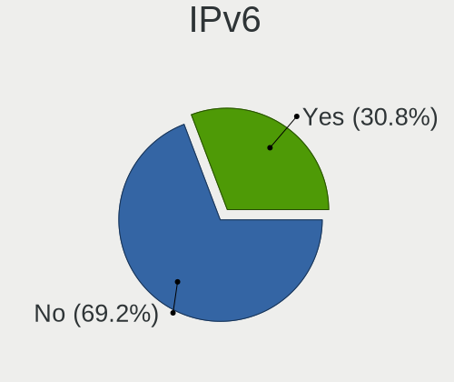

| Used | Computers | Percent |
|------|-----------|---------|
| No   | 24        | 85.71%  |
| Yes  | 4         | 14.29%  |

Bluetooth
---------

Bluetooth Vendor
----------------

Controller vendors

| Vendor                          | Computers | Percent |
|---------------------------------|-----------|---------|
| Intel                           | 10        | 66.67%  |
| Realtek Semiconductor           | 3         | 20%     |
| Qualcomm Atheros Communications | 1         | 6.67%   |
| Hewlett-Packard                 | 1         | 6.67%   |

Bluetooth Model
---------------

Controller models

| Model                                  | Computers | Percent |
|----------------------------------------|-----------|---------|
| Intel Bluetooth Device                 | 5         | 33.33%  |
| Intel Bluetooth wireless interface     | 4         | 26.67%  |
| Realtek Bluetooth Radio                | 3         | 20%     |
| Qualcomm Atheros QCA61x4 Bluetooth 4.0 | 1         | 6.67%   |
| Intel AX210 Bluetooth                  | 1         | 6.67%   |
| HP Broadcom 2070 Bluetooth Combo       | 1         | 6.67%   |

Sound
-----

Sound Vendor
------------

Sound card vendors

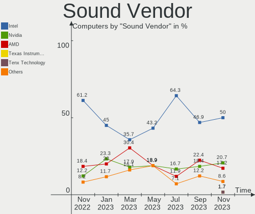

| Vendor                 | Computers | Percent |
|------------------------|-----------|---------|
| Intel                  | 21        | 55.26%  |
| AMD                    | 8         | 21.05%  |
| Nvidia                 | 4         | 10.53%  |
| C-Media Electronics    | 2         | 5.26%   |
| Realtek Semiconductor  | 1         | 2.63%   |
| Logitech               | 1         | 2.63%   |
| Generalplus Technology | 1         | 2.63%   |

Sound Model
-----------

Sound card models

| Model                                                                      | Computers | Percent |
|----------------------------------------------------------------------------|-----------|---------|
| Intel Tiger Lake-LP Smart Sound Technology Audio Controller                | 4         | 9.3%    |
| AMD Family 17h/19h HD Audio Controller                                     | 3         | 6.98%   |
| Intel Sunrise Point-LP HD Audio                                            | 2         | 4.65%   |
| Intel Celeron N3350/Pentium N4200/Atom E3900 Series Audio Cluster          | 2         | 4.65%   |
| Intel 8 Series/C220 Series Chipset High Definition Audio Controller        | 2         | 4.65%   |
| Intel 7 Series/C216 Chipset Family High Definition Audio Controller        | 2         | 4.65%   |
| Intel 6 Series/C200 Series Chipset Family High Definition Audio Controller | 2         | 4.65%   |
| Intel 5 Series/3400 Series Chipset High Definition Audio                   | 2         | 4.65%   |
| AMD Raven/Raven2/Fenghuang HDMI/DP Audio Controller                        | 2         | 4.65%   |
| Realtek Semiconductor UACDemoV1.0                                          | 1         | 2.33%   |
| Nvidia TU107 GeForce GTX 1650 High Definition Audio Controller             | 1         | 2.33%   |
| Nvidia GP107GL High Definition Audio Controller                            | 1         | 2.33%   |
| Nvidia GF108 High Definition Audio Controller                              | 1         | 2.33%   |
| Nvidia Audio device                                                        | 1         | 2.33%   |
| Logitech Headset H390                                                      | 1         | 2.33%   |
| Intel Xeon E3-1200 v3/4th Gen Core Processor HD Audio Controller           | 1         | 2.33%   |
| Intel Tiger Lake-H HD Audio Controller                                     | 1         | 2.33%   |
| Intel Comet Lake PCH-LP cAVS                                               | 1         | 2.33%   |
| Intel Comet Lake PCH cAVS                                                  | 1         | 2.33%   |
| Intel Cannon Lake PCH cAVS                                                 | 1         | 2.33%   |
| Intel 82801JI (ICH10 Family) HD Audio Controller                           | 1         | 2.33%   |
| Generalplus Technology IMYB 7.1 Channel                                    | 1         | 2.33%   |
| C-Media Electronics CM106 Like Sound Device                                | 1         | 2.33%   |
| C-Media Electronics Audio Adapter                                          | 1         | 2.33%   |
| AMD Starship/Matisse HD Audio Controller                                   | 1         | 2.33%   |
| AMD SBx00 Azalia (Intel HDA)                                               | 1         | 2.33%   |
| AMD RV710/730 HDMI Audio [Radeon HD 4000 series]                           | 1         | 2.33%   |
| AMD Renoir Radeon High Definition Audio Controller                         | 1         | 2.33%   |
| AMD Redwood HDMI Audio [Radeon HD 5000 Series]                             | 1         | 2.33%   |
| AMD Oland/Hainan/Cape Verde/Pitcairn HDMI Audio [Radeon HD 7000 Series]    | 1         | 2.33%   |
| AMD Cedar HDMI Audio [Radeon HD 5400/6300/7300 Series]                     | 1         | 2.33%   |

Memory
------

Memory Vendor
-------------

Memory module vendors

| Vendor              | Computers | Percent |
|---------------------|-----------|---------|
| Kingston            | 5         | 20.83%  |
| Micron Technology   | 4         | 16.67%  |
| Unknown             | 3         | 12.5%   |
| Unknown (ABCD)      | 2         | 8.33%   |
| SK hynix            | 2         | 8.33%   |
| G.Skill             | 2         | 8.33%   |
| Unknown (0x0C26)    | 1         | 4.17%   |
| Unifosa             | 1         | 4.17%   |
| Samsung Electronics | 1         | 4.17%   |
| Nanya Technology    | 1         | 4.17%   |
| Elpida              | 1         | 4.17%   |
| Corsair             | 1         | 4.17%   |

Memory Model
------------

Memory module models

| Model                                                               | Computers | Percent |
|---------------------------------------------------------------------|-----------|---------|
| Unknown (ABCD) RAM 123456789012345678 2048MB SODIMM LPDDR4 2400MT/s | 2         | 7.69%   |
| Unknown RAM Module 8192MB DIMM 1333MT/s                             | 1         | 3.85%   |
| Unknown RAM Module 4GB SODIMM DDR4 2667MT/s                         | 1         | 3.85%   |
| Unknown RAM Module 2048MB DIMM 1333MT/s                             | 1         | 3.85%   |
| Unknown RAM DDR4 NB 16G 2666 16384MB SODIMM DDR4 2667MT/s           | 1         | 3.85%   |
| Unknown (0x0C26) RAM TIMETEC-SD4-3200 32GB SODIMM DDR4 3200MT/s     | 1         | 3.85%   |
| Unifosa RAM GU512303EP0202 2GB DIMM DDR3 1333MT/s                   | 1         | 3.85%   |
| SK hynix RAM HMT41GU6BFR8A-PB 8192MB DIMM DDR3 2000MT/s             | 1         | 3.85%   |
| SK hynix RAM HMA81GU6DJR8N-XN 8GB DIMM DDR4 3200MT/s                | 1         | 3.85%   |
| Samsung RAM M378B5673FH0-CH9 2GB DIMM DDR3 1600MT/s                 | 1         | 3.85%   |
| Nanya RAM NT4GC64B8HB0NS-CG 4096MB SODIMM DDR3 1334MT/s             | 1         | 3.85%   |
| Micron RAM MT52L1G32D4PG-093 8GB Row Of Chips LPDDR3 2133MT/s       | 1         | 3.85%   |
| Micron RAM 8JTF51264AZ-1G6E1 4GB DIMM DDR3 1600MT/s                 | 1         | 3.85%   |
| Micron RAM 8ATF2G64HZ-3G2E1 8GB Row Of Chips DDR4 3200MT/s          | 1         | 3.85%   |
| Micron RAM 8ATF1G64HZ-2G3B1 8GB SODIMM DDR4 2400MT/s                | 1         | 3.85%   |
| Kingston RAM KP6FH5-MIE 32GB SODIMM DDR4 3200MT/s                   | 1         | 3.85%   |
| Kingston RAM KHX1600C9D3/4GX 4GB DIMM DDR3 2400MT/s                 | 1         | 3.85%   |
| Kingston RAM 99U5471-054.A00LF 8GB DIMM DDR3 1600MT/s               | 1         | 3.85%   |
| Kingston RAM 9905744-035.A00G 16GB SODIMM DDR4 3200MT/s             | 1         | 3.85%   |
| Kingston RAM 9905471-017.A00LF 4096MB DIMM DDR3 1333MT/s            | 1         | 3.85%   |
| Kingston RAM 9905471-001.A01LF 2GB DIMM 1600MT/s                    | 1         | 3.85%   |
| G.Skill RAM F4-3200C16-16GIS 16GB DIMM DDR4 3600MT/s                | 1         | 3.85%   |
| G.Skill RAM F4-2400C15-8GFX 8192MB DIMM DDR4 3000MT/s               | 1         | 3.85%   |
| Elpida RAM EBJ21UE8BDF0-DJ-F 2048MB DIMM DDR3 1333MT/s              | 1         | 3.85%   |
| Corsair RAM CMK16GX4M2A2666C16 8GB DIMM DDR4 3200MT/s               | 1         | 3.85%   |

Memory Kind
-----------

Memory module kinds

| Kind    | Computers | Percent |
|---------|-----------|---------|
| DDR4    | 10        | 45.45%  |
| DDR3    | 7         | 31.82%  |
| LPDDR4  | 2         | 9.09%   |
| SDRAM   | 1         | 4.55%   |
| LPDDR3  | 1         | 4.55%   |
| Unknown | 1         | 4.55%   |

Memory Form Factor
------------------

Physical design of the memory module

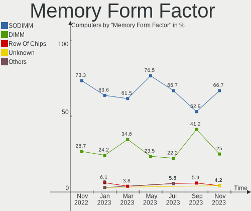

| Name         | Computers | Percent |
|--------------|-----------|---------|
| DIMM         | 10        | 47.62%  |
| SODIMM       | 9         | 42.86%  |
| Row Of Chips | 2         | 9.52%   |

Memory Size
-----------

Memory module size

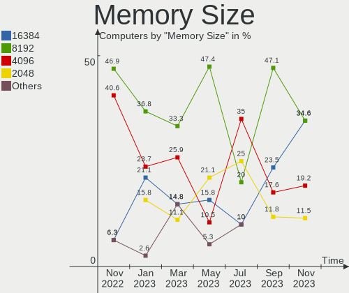

| Size  | Computers | Percent |
|-------|-----------|---------|
| 8192  | 8         | 34.78%  |
| 4096  | 7         | 30.43%  |
| 16384 | 3         | 13.04%  |
| 2048  | 3         | 13.04%  |
| 32768 | 2         | 8.7%    |

Memory Speed
------------

Memory module speed

| Speed | Computers | Percent |
|-------|-----------|---------|
| 3200  | 6         | 25%     |
| 2400  | 4         | 16.67%  |
| 1333  | 4         | 16.67%  |
| 1600  | 3         | 12.5%   |
| 2667  | 2         | 8.33%   |
| 3600  | 1         | 4.17%   |
| 3000  | 1         | 4.17%   |
| 2133  | 1         | 4.17%   |
| 2000  | 1         | 4.17%   |
| 1334  | 1         | 4.17%   |

Printers & scanners
-------------------

Printer Vendor
--------------

Printer device vendors

| Vendor             | Computers | Percent |
|--------------------|-----------|---------|
| Brother Industries | 1         | 100%    |

Printer Model
-------------

Printer device models

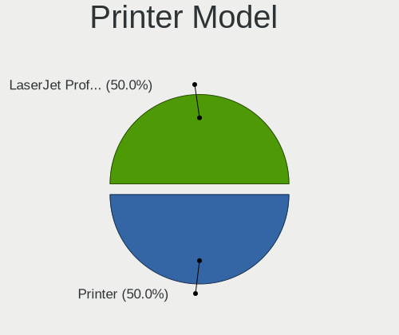

| Model                      | Computers | Percent |
|----------------------------|-----------|---------|
| Brother MFC-L2710DN series | 1         | 100%    |

Scanner Vendor
--------------

Scanner device vendors

Zero info for selected period =(

Scanner Model
-------------

Scanner device models

Zero info for selected period =(

Camera
------

Camera Vendor
-------------

Camera device vendors

| Vendor                  | Computers | Percent |
|-------------------------|-----------|---------|
| Microdia                | 5         | 27.78%  |
| Chicony Electronics     | 3         | 16.67%  |
| Realtek Semiconductor   | 2         | 11.11%  |
| Quanta                  | 2         | 11.11%  |
| Ricoh                   | 1         | 5.56%   |
| Microsoft               | 1         | 5.56%   |
| Logitech                | 1         | 5.56%   |
| ARC International       | 1         | 5.56%   |
| Alcor Micro             | 1         | 5.56%   |
| 8SSC20F27145V1SR1BX02P8 | 1         | 5.56%   |

Camera Model
------------

Camera device models

| Model                                     | Computers | Percent |
|-------------------------------------------|-----------|---------|
| Microdia Webcam Vitade AF                 | 2         | 11.11%  |
| Microdia USB 2.0 Camera                   | 2         | 11.11%  |
| Chicony Integrated Camera                 | 2         | 11.11%  |
| Ricoh Dell Laptop Integrated Webcam       | 1         | 5.56%   |
| Realtek USB2.0 camera                     | 1         | 5.56%   |
| Realtek USB Camera                        | 1         | 5.56%   |
| Quanta ov9734_techfront_camera            | 1         | 5.56%   |
| Quanta HD User Facing                     | 1         | 5.56%   |
| Microsoft LifeCam VX-500 [1357]           | 1         | 5.56%   |
| Microdia Integrated Webcam HD             | 1         | 5.56%   |
| Logitech Webcam C925e                     | 1         | 5.56%   |
| Chicony Integrated HP HD Webcam           | 1         | 5.56%   |
| ARC International Camera                  | 1         | 5.56%   |
| Alcor Micro USB 2.0 Camera                | 1         | 5.56%   |
| 8SSC20F27145V1SR1BX02P8 Integrated Camera | 1         | 5.56%   |

Security
--------

Fingerprint Vendor
------------------

Fingerprint sensor vendors

| Vendor                     | Computers | Percent |
|----------------------------|-----------|---------|
| Shenzhen Goodix Technology | 4         | 80%     |
| Validity Sensors           | 1         | 20%     |

Fingerprint Model
-----------------

Fingerprint sensor models

| Model                                      | Computers | Percent |
|--------------------------------------------|-----------|---------|
| Shenzhen Goodix  FingerPrint Device        | 4         | 80%     |
| Validity Sensors VFS471 Fingerprint Reader | 1         | 20%     |

Chipcard Vendor
---------------

Chipcard module vendors

| Vendor                | Computers | Percent |
|-----------------------|-----------|---------|
| Broadcom              | 1         | 50%     |
| Advanced Card Systems | 1         | 50%     |

Chipcard Model
--------------

Chipcard module models

| Model                                                                        | Computers | Percent |
|------------------------------------------------------------------------------|-----------|---------|
| Broadcom BCM5880 Secure Applications Processor with fingerprint swipe sensor | 1         | 50%     |
| Advanced Card Systems ACR38 SmartCard Reader                                 | 1         | 50%     |

Unsupported
-----------

Unsupported Devices
-------------------

Total unsupported devices on board

| Total | Computers | Percent |
|-------|-----------|---------|
| 0     | 20        | 71.43%  |
| 1     | 5         | 17.86%  |
| 2     | 2         | 7.14%   |
| 3     | 1         | 3.57%   |

Unsupported Device Types
------------------------

Types of unsupported devices

| Type               | Computers | Percent |
|--------------------|-----------|---------|
| Fingerprint reader | 5         | 41.67%  |
| Chipcard           | 2         | 16.67%  |
| Camera             | 2         | 16.67%  |
| Net/wireless       | 1         | 8.33%   |
| Graphics card      | 1         | 8.33%   |
| Bluetooth          | 1         | 8.33%   |

