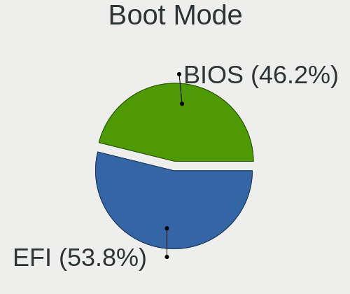
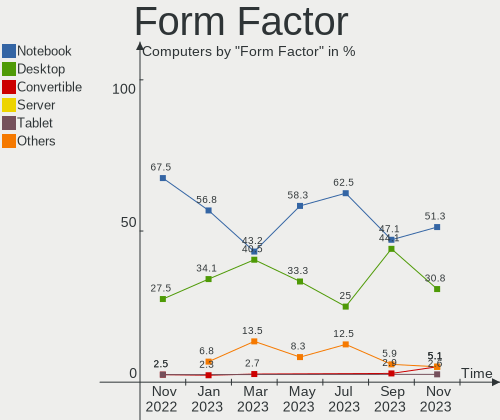
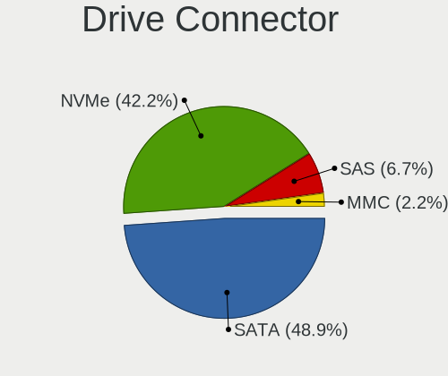
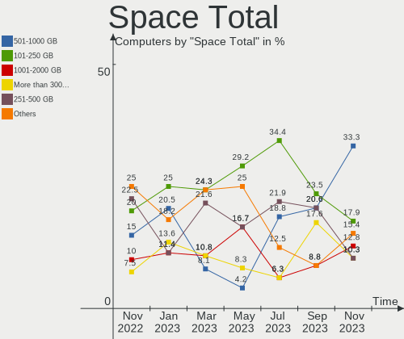
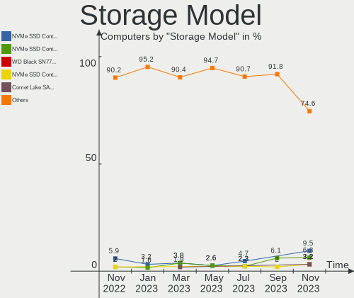
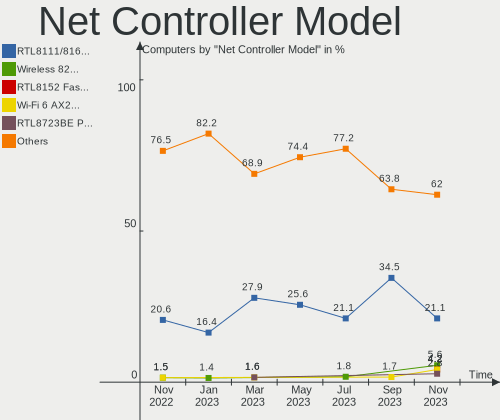
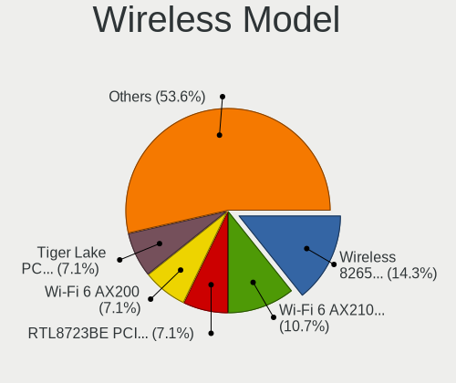
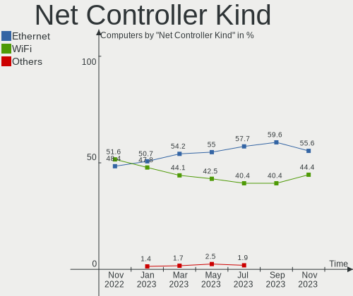
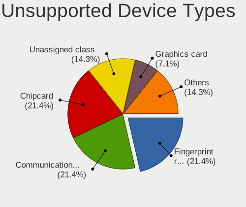

Ubuntu MATE - Hardware Trends
-----------------------------

A project to identify most popular hardware characteristics and track their change
over time based on data collected by Linux users at https://Linux-Hardware.org.

Anyone can contribute to this report by the [hw-probe](https://github.com/linuxhw/hw-probe) tool:

    sudo -E hw-probe -all -upload

This is a report for all computer types. See also reports for [desktops](/Dist/Ubuntu_MATE/Desktop/README.md) and [notebooks](/Dist/Ubuntu_MATE/Notebook/README.md).

This report is for one last month. Overall report since the beginning of time: [TestDays](https://github.com/linuxhw/TestDays)

Period: Feb, 2023.

Contents
--------

* [ System ](#system)
  - [ OS                       ](#os)
  - [ OS Family                ](#os-family)
  - [ Kernel                   ](#kernel)
  - [ Kernel Family            ](#kernel-family)
  - [ Kernel Major Ver.        ](#kernel-major-ver)
  - [ Arch                     ](#arch)
  - [ DE                       ](#de)
  - [ Display Server           ](#display-server)
  - [ Display Manager          ](#display-manager)
  - [ OS Lang                  ](#os-lang)
  - [ Boot Mode                ](#boot-mode)
  - [ Filesystem               ](#filesystem)
  - [ Part. scheme             ](#part-scheme)
  - [ Dual Boot with Linux/BSD ](#dual-boot-with-linuxbsd)
  - [ Dual Boot (Win)          ](#dual-boot-win)

* [ Board ](#board)
  - [ Vendor                   ](#vendor)
  - [ Model                    ](#model)
  - [ Model Family             ](#model-family)
  - [ MFG Year                 ](#mfg-year)
  - [ Form Factor              ](#form-factor)
  - [ Secure Boot              ](#secure-boot)
  - [ Coreboot                 ](#coreboot)
  - [ RAM Size                 ](#ram-size)
  - [ RAM Used                 ](#ram-used)
  - [ Total Drives             ](#total-drives)
  - [ Has CD-ROM               ](#has-cd-rom)
  - [ Has Ethernet             ](#has-ethernet)
  - [ Has WiFi                 ](#has-wifi)
  - [ Has Bluetooth            ](#has-bluetooth)

* [ Location ](#location)
  - [ Country                  ](#country)
  - [ City                     ](#city)

* [ Drives ](#drives)
  - [ Drive Vendor             ](#drive-vendor)
  - [ Drive Model              ](#drive-model)
  - [ HDD Vendor               ](#hdd-vendor)
  - [ SSD Vendor               ](#ssd-vendor)
  - [ Drive Kind               ](#drive-kind)
  - [ Drive Connector          ](#drive-connector)
  - [ Drive Size               ](#drive-size)
  - [ Space Total              ](#space-total)
  - [ Space Used               ](#space-used)
  - [ Malfunc. Drives          ](#malfunc-drives)
  - [ Malfunc. Drive Vendor    ](#malfunc-drive-vendor)
  - [ Malfunc. HDD Vendor      ](#malfunc-hdd-vendor)
  - [ Malfunc. Drive Kind      ](#malfunc-drive-kind)
  - [ Failed Drives            ](#failed-drives)
  - [ Failed Drive Vendor      ](#failed-drive-vendor)
  - [ Drive Status             ](#drive-status)

* [ Storage controller ](#storage-controller)
  - [ Storage Vendor           ](#storage-vendor)
  - [ Storage Model            ](#storage-model)
  - [ Storage Kind             ](#storage-kind)

* [ Processor ](#processor)
  - [ CPU Vendor               ](#cpu-vendor)
  - [ CPU Model                ](#cpu-model)
  - [ CPU Model Family         ](#cpu-model-family)
  - [ CPU Cores                ](#cpu-cores)
  - [ CPU Sockets              ](#cpu-sockets)
  - [ CPU Threads              ](#cpu-threads)
  - [ CPU Op-Modes             ](#cpu-op-modes)
  - [ CPU Microcode            ](#cpu-microcode)
  - [ CPU Microarch            ](#cpu-microarch)

* [ Graphics ](#graphics)
  - [ GPU Vendor               ](#gpu-vendor)
  - [ GPU Model                ](#gpu-model)
  - [ GPU Combo                ](#gpu-combo)
  - [ GPU Driver               ](#gpu-driver)
  - [ GPU Memory               ](#gpu-memory)

* [ Monitor ](#monitor)
  - [ Monitor Vendor           ](#monitor-vendor)
  - [ Monitor Model            ](#monitor-model)
  - [ Monitor Resolution       ](#monitor-resolution)
  - [ Monitor Diagonal         ](#monitor-diagonal)
  - [ Monitor Width            ](#monitor-width)
  - [ Aspect Ratio             ](#aspect-ratio)
  - [ Monitor Area             ](#monitor-area)
  - [ Pixel Density            ](#pixel-density)
  - [ Multiple Monitors        ](#multiple-monitors)

* [ Network ](#network)
  - [ Net Controller Vendor    ](#net-controller-vendor)
  - [ Net Controller Model     ](#net-controller-model)
  - [ Wireless Vendor          ](#wireless-vendor)
  - [ Wireless Model           ](#wireless-model)
  - [ Ethernet Vendor          ](#ethernet-vendor)
  - [ Ethernet Model           ](#ethernet-model)
  - [ Net Controller Kind      ](#net-controller-kind)
  - [ Used Controller          ](#used-controller)
  - [ NICs                     ](#nics)
  - [ IPv6                     ](#ipv6)

* [ Bluetooth ](#bluetooth)
  - [ Bluetooth Vendor         ](#bluetooth-vendor)
  - [ Bluetooth Model          ](#bluetooth-model)

* [ Sound ](#sound)
  - [ Sound Vendor             ](#sound-vendor)
  - [ Sound Model              ](#sound-model)

* [ Memory ](#memory)
  - [ Memory Vendor            ](#memory-vendor)
  - [ Memory Model             ](#memory-model)
  - [ Memory Kind              ](#memory-kind)
  - [ Memory Form Factor       ](#memory-form-factor)
  - [ Memory Size              ](#memory-size)
  - [ Memory Speed             ](#memory-speed)

* [ Printers & scanners ](#printers--scanners)
  - [ Printer Vendor           ](#printer-vendor)
  - [ Printer Model            ](#printer-model)
  - [ Scanner Vendor           ](#scanner-vendor)
  - [ Scanner Model            ](#scanner-model)

* [ Camera ](#camera)
  - [ Camera Vendor            ](#camera-vendor)
  - [ Camera Model             ](#camera-model)

* [ Security ](#security)
  - [ Fingerprint Vendor       ](#fingerprint-vendor)
  - [ Fingerprint Model        ](#fingerprint-model)
  - [ Chipcard Vendor          ](#chipcard-vendor)
  - [ Chipcard Model           ](#chipcard-model)

* [ Unsupported ](#unsupported)
  - [ Unsupported Devices      ](#unsupported-devices)
  - [ Unsupported Device Types ](#unsupported-device-types)

System
------

OS
--

Installed operating systems

| Name              | Computers | Percent |
|-------------------|-----------|---------|
| Ubuntu MATE 22.04 | 23        | 60.53%  |
| Ubuntu MATE 20.04 | 6         | 15.79%  |
| Ubuntu MATE 23.04 | 3         | 7.89%   |
| Ubuntu MATE 22.10 | 3         | 7.89%   |
| Ubuntu MATE 18.04 | 3         | 7.89%   |

OS Family
---------

OS without a version

| Name        | Computers | Percent |
|-------------|-----------|---------|
| Ubuntu MATE | 38        | 100%    |

Kernel
------

Version of the Linux kernel

| Version               | Computers | Percent |
|-----------------------|-----------|---------|
| 5.15.0-60-generic     | 11        | 28.95%  |
| 5.15.0-58-generic     | 6         | 15.79%  |
| 5.4.0-137-generic     | 4         | 10.53%  |
| 5.19.0-32-generic     | 4         | 10.53%  |
| 6.1.12-060112-generic | 2         | 5.26%   |
| 6.2.0-060200-generic  | 1         | 2.63%   |
| 6.1.11-060111-generic | 1         | 2.63%   |
| 5.4.0-139-generic     | 1         | 2.63%   |
| 5.19.0-35-generic     | 1         | 2.63%   |
| 5.19.0-31-generic     | 1         | 2.63%   |
| 5.17.0-1027-oem       | 1         | 2.63%   |
| 5.15.0-66-generic     | 1         | 2.63%   |
| 5.15.0-58-lowlatency  | 1         | 2.63%   |
| 5.15.0-56-generic     | 1         | 2.63%   |
| 5.15.0-1024-raspi     | 1         | 2.63%   |
| 4.15.0-202-generic    | 1         | 2.63%   |

Kernel Family
-------------

Linux kernel without a distro release

| Version | Computers | Percent |
|---------|-----------|---------|
| 5.15.0  | 21        | 55.26%  |
| 5.19.0  | 6         | 15.79%  |
| 5.4.0   | 5         | 13.16%  |
| 6.1.12  | 2         | 5.26%   |
| 6.2.0   | 1         | 2.63%   |
| 6.1.11  | 1         | 2.63%   |
| 5.17.0  | 1         | 2.63%   |
| 4.15.0  | 1         | 2.63%   |

Kernel Major Ver.
-----------------

Linux kernel major version

| Version | Computers | Percent |
|---------|-----------|---------|
| 5.15    | 21        | 55.26%  |
| 5.19    | 6         | 15.79%  |
| 5.4     | 5         | 13.16%  |
| 6.1     | 3         | 7.89%   |
| 6.2     | 1         | 2.63%   |
| 5.17    | 1         | 2.63%   |
| 4.15    | 1         | 2.63%   |

Arch
----

OS architecture (x86_64, i586, etc.)

| Name    | Computers | Percent |
|---------|-----------|---------|
| x86_64  | 35        | 92.11%  |
| i686    | 2         | 5.26%   |
| aarch64 | 1         | 2.63%   |

DE
--

Desktop Environment

| Name  | Computers | Percent |
|-------|-----------|---------|
| MATE  | 37        | 97.37%  |
| GNOME | 1         | 2.63%   |

Display Server
--------------

X11 or Wayland

| Name    | Computers | Percent |
|---------|-----------|---------|
| X11     | 36        | 94.74%  |
| Wayland | 1         | 2.63%   |
| Tty     | 1         | 2.63%   |

Display Manager
---------------

SDDM, LightDM, etc.

| Name    | Computers | Percent |
|---------|-----------|---------|
| LightDM | 31        | 81.58%  |
| LXDM    | 3         | 7.89%   |
| GDM3    | 3         | 7.89%   |
| Unknown | 1         | 2.63%   |

OS Lang
-------

Language

| Lang  | Computers | Percent |
|-------|-----------|---------|
| en_US | 12        | 31.58%  |
| de_DE | 6         | 15.79%  |
| fr_FR | 5         | 13.16%  |
| sv_SE | 3         | 7.89%   |
| ru_RU | 2         | 5.26%   |
| it_IT | 2         | 5.26%   |
| en_CA | 2         | 5.26%   |
| C     | 2         | 5.26%   |
| pt_BR | 1         | 2.63%   |
| hu_HU | 1         | 2.63%   |
| es_MX | 1         | 2.63%   |
| es_ES | 1         | 2.63%   |

Boot Mode
---------

EFI or BIOS

| Mode | Computers | Percent |
|------|-----------|---------|
| BIOS | 21        | 55.26%  |
| EFI  | 17        | 44.74%  |

Filesystem
----------

Type of filesystem

| Type  | Computers | Percent |
|-------|-----------|---------|
| Ext4  | 34        | 89.47%  |
| Btrfs | 4         | 10.53%  |

Part. scheme
------------

Scheme of partitioning

| Type    | Computers | Percent |
|---------|-----------|---------|
| GPT     | 29        | 76.32%  |
| MBR     | 6         | 15.79%  |
| Unknown | 3         | 7.89%   |

Dual Boot with Linux/BSD
------------------------

Hosting more than one Linux/BSD

| Dual boot | Computers | Percent |
|-----------|-----------|---------|
| No        | 33        | 86.84%  |
| Yes       | 5         | 13.16%  |

Dual Boot (Win)
---------------

Hosting Linux and Windows

| Dual boot | Computers | Percent |
|-----------|-----------|---------|
| No        | 25        | 65.79%  |
| Yes       | 13        | 34.21%  |

Board
-----

Vendor
------

Motherboard manufacturer

| Name                    | Computers | Percent |
|-------------------------|-----------|---------|
| ASUSTek Computer        | 8         | 21.05%  |
| Hewlett-Packard         | 5         | 13.16%  |
| Lenovo                  | 4         | 10.53%  |
| Sony                    | 3         | 7.89%   |
| Dell                    | 3         | 7.89%   |
| MSI                     | 2         | 5.26%   |
| Intel                   | 2         | 5.26%   |
| Gigabyte Technology     | 2         | 5.26%   |
| SLIMBOOK                | 1         | 2.63%   |
| Raspberry Pi Foundation | 1         | 2.63%   |
| Packard Bell            | 1         | 2.63%   |
| Notebook                | 1         | 2.63%   |
| BESSTAR Tech            | 1         | 2.63%   |
| ASRock                  | 1         | 2.63%   |
| Apple                   | 1         | 2.63%   |
| Acer                    | 1         | 2.63%   |
| Unknown                 | 1         | 2.63%   |

Model
-----

Motherboard model

| Name                                     | Computers | Percent |
|------------------------------------------|-----------|---------|
| Sony VPCEH1E1E                           | 1         | 2.63%   |
| Sony VPCEB2Z1E                           | 1         | 2.63%   |
| Sony VGN-Z21WRN_B                        | 1         | 2.63%   |
| SLIMBOOK TITAN                           | 1         | 2.63%   |
| RPi Raspberry Pi                         | 1         | 2.63%   |
| Packard Bell EasyNote TE11HC             | 1         | 2.63%   |
| Notebook NJx0MU                          | 1         | 2.63%   |
| MSI MS-B120                              | 1         | 2.63%   |
| MSI MS-7C52                              | 1         | 2.63%   |
| Lenovo ThinkPad X1 Carbon 7th 20QD00LMMX | 1         | 2.63%   |
| Lenovo ThinkPad T470 20HES13701          | 1         | 2.63%   |
| Lenovo ThinkPad SL 2746AHG               | 1         | 2.63%   |
| Lenovo IdeaCentre 5 14IAB7 90T2000SUS    | 1         | 2.63%   |
| Intel NUC8i5BEH                          | 1         | 2.63%   |
| Intel NUC7CJYHN                          | 1         | 2.63%   |
| HP ProOne 440 G5 23.8-in All-in-One      | 1         | 2.63%   |
| HP Presario CQ56                         | 1         | 2.63%   |
| HP Pavilion dv6000 (GF657EA#UUW)         | 1         | 2.63%   |
| HP Laptop 15s-fq5xxx                     | 1         | 2.63%   |
| HP 240 G3                                | 1         | 2.63%   |
| Gigabyte GA-MA770T-UD3                   | 1         | 2.63%   |
| Gigabyte B85M-D3H                        | 1         | 2.63%   |
| Dell Precision 7550                      | 1         | 2.63%   |
| Dell Inspiron 5490 AIO                   | 1         | 2.63%   |
| Dell Inspiron 14-3452                    | 1         | 2.63%   |
| BESSTAR Tech U850                        | 1         | 2.63%   |
| ASUS X550LN                              | 1         | 2.63%   |
| ASUS X541UAK                             | 1         | 2.63%   |
| ASUS Pro WS X570-ACE                     | 1         | 2.63%   |
| ASUS PRIME B360M-C                       | 1         | 2.63%   |
| ASUS P5QL-E                              | 1         | 2.63%   |
| ASUS P5K                                 | 1         | 2.63%   |
| ASUS G75VW                               | 1         | 2.63%   |
| ASUS A0000001                            | 1         | 2.63%   |
| ASRock Z690 Pro RS                       | 1         | 2.63%   |
| Apple iMac12,2                           | 1         | 2.63%   |
| Acer Aspire ES1-523                      | 1         | 2.63%   |
| Unknown                                  | 1         | 2.63%   |

Model Family
------------

Motherboard model prefix

| Name                   | Computers | Percent |
|------------------------|-----------|---------|
| Lenovo ThinkPad        | 3         | 7.89%   |
| Dell Inspiron          | 2         | 5.26%   |
| Sony VPCEH1E1E         | 1         | 2.63%   |
| Sony VPCEB2Z1E         | 1         | 2.63%   |
| Sony VGN-Z21WRN        | 1         | 2.63%   |
| SLIMBOOK TITAN         | 1         | 2.63%   |
| RPi Raspberry          | 1         | 2.63%   |
| Packard Bell EasyNote  | 1         | 2.63%   |
| Notebook NJx0MU        | 1         | 2.63%   |
| MSI MS-B120            | 1         | 2.63%   |
| MSI MS-7C52            | 1         | 2.63%   |
| Lenovo IdeaCentre      | 1         | 2.63%   |
| Intel NUC8i5BEH        | 1         | 2.63%   |
| Intel NUC7CJYHN        | 1         | 2.63%   |
| HP ProOne              | 1         | 2.63%   |
| HP Presario            | 1         | 2.63%   |
| HP Pavilion            | 1         | 2.63%   |
| HP Laptop              | 1         | 2.63%   |
| HP 240                 | 1         | 2.63%   |
| Gigabyte GA-MA770T-UD3 | 1         | 2.63%   |
| Gigabyte B85M-D3H      | 1         | 2.63%   |
| Dell Precision         | 1         | 2.63%   |
| BESSTAR Tech U850      | 1         | 2.63%   |
| ASUS X550LN            | 1         | 2.63%   |
| ASUS X541UAK           | 1         | 2.63%   |
| ASUS Pro               | 1         | 2.63%   |
| ASUS PRIME             | 1         | 2.63%   |
| ASUS P5QL-E            | 1         | 2.63%   |
| ASUS P5K               | 1         | 2.63%   |
| ASUS G75VW             | 1         | 2.63%   |
| ASUS A0000001          | 1         | 2.63%   |
| ASRock Z690            | 1         | 2.63%   |
| Apple iMac12           | 1         | 2.63%   |
| Acer Aspire            | 1         | 2.63%   |
| Unknown                | 1         | 2.63%   |

MFG Year
--------

Motherboard manufacture year

| Year    | Computers | Percent |
|---------|-----------|---------|
| 2020    | 4         | 10.53%  |
| 2022    | 3         | 7.89%   |
| 2021    | 3         | 7.89%   |
| 2019    | 3         | 7.89%   |
| 2016    | 3         | 7.89%   |
| 2010    | 3         | 7.89%   |
| 2008    | 3         | 7.89%   |
| 2018    | 2         | 5.26%   |
| 2014    | 2         | 5.26%   |
| 2012    | 2         | 5.26%   |
| 2011    | 2         | 5.26%   |
| 2009    | 2         | 5.26%   |
| 2023    | 1         | 2.63%   |
| 2017    | 1         | 2.63%   |
| 2015    | 1         | 2.63%   |
| 2013    | 1         | 2.63%   |
| 2007    | 1         | 2.63%   |
| Unknown | 1         | 2.63%   |

Form Factor
-----------

Physical design of the computer

| Name           | Computers | Percent |
|----------------|-----------|---------|
| Notebook       | 19        | 50%     |
| Desktop        | 11        | 28.95%  |
| Mini pc        | 4         | 10.53%  |
| All in one     | 3         | 7.89%   |
| System on chip | 1         | 2.63%   |

Secure Boot
-----------

Enabled or disabled

| State    | Computers | Percent |
|----------|-----------|---------|
| Disabled | 36        | 94.74%  |
| Enabled  | 2         | 5.26%   |

Coreboot
--------

Have coreboot on board

| Used | Computers | Percent |
|------|-----------|---------|
| No   | 38        | 100%    |

RAM Size
--------

Total RAM memory

| Size in GB  | Computers | Percent |
|-------------|-----------|---------|
| 3.01-4.0    | 11        | 28.95%  |
| 16.01-24.0  | 10        | 26.32%  |
| 4.01-8.0    | 6         | 15.79%  |
| 32.01-64.0  | 4         | 10.53%  |
| 8.01-16.0   | 4         | 10.53%  |
| 24.01-32.0  | 1         | 2.63%   |
| 2.01-3.0    | 1         | 2.63%   |
| 64.01-256.0 | 1         | 2.63%   |

RAM Used
--------

Used RAM memory

| Used GB    | Computers | Percent |
|------------|-----------|---------|
| 1.01-2.0   | 16        | 42.11%  |
| 2.01-3.0   | 10        | 26.32%  |
| 4.01-8.0   | 3         | 7.89%   |
| 3.01-4.0   | 3         | 7.89%   |
| 0.51-1.0   | 3         | 7.89%   |
| 8.01-16.0  | 2         | 5.26%   |
| 24.01-32.0 | 1         | 2.63%   |

Total Drives
------------

Number of drives on board

| Drives | Computers | Percent |
|--------|-----------|---------|
| 1      | 25        | 65.79%  |
| 2      | 7         | 18.42%  |
| 3      | 5         | 13.16%  |
| 4      | 1         | 2.63%   |

Has CD-ROM
----------

Has CD-ROM on board

| Presented | Computers | Percent |
|-----------|-----------|---------|
| Yes       | 23        | 60.53%  |
| No        | 15        | 39.47%  |

Has Ethernet
------------

Has Ethernet on board

| Presented | Computers | Percent |
|-----------|-----------|---------|
| Yes       | 35        | 92.11%  |
| No        | 3         | 7.89%   |

Has WiFi
--------

Has WiFi module

| Presented | Computers | Percent |
|-----------|-----------|---------|
| Yes       | 29        | 76.32%  |
| No        | 9         | 23.68%  |

Has Bluetooth
-------------

Has Bluetooth module

| Presented | Computers | Percent |
|-----------|-----------|---------|
| Yes       | 22        | 57.89%  |
| No        | 16        | 42.11%  |

Location
--------

Country
-------

Geographic location (country)

| Country   | Computers | Percent |
|-----------|-----------|---------|
| Germany   | 7         | 18.42%  |
| France    | 5         | 13.16%  |
| USA       | 4         | 10.53%  |
| Sweden    | 4         | 10.53%  |
| Italy     | 3         | 7.89%   |
| Spain     | 2         | 5.26%   |
| Russia    | 2         | 5.26%   |
| Brazil    | 2         | 5.26%   |
| Belgium   | 2         | 5.26%   |
| Ukraine   | 1         | 2.63%   |
| Thailand  | 1         | 2.63%   |
| Mexico    | 1         | 2.63%   |
| Libya     | 1         | 2.63%   |
| Indonesia | 1         | 2.63%   |
| Hungary   | 1         | 2.63%   |
| Canada    | 1         | 2.63%   |

City
----

Geographic location (city)

| City             | Computers | Percent |
|------------------|-----------|---------|
| Solna            | 3         | 7.89%   |
| Sao Paulo        | 2         | 5.26%   |
| Paris            | 2         | 5.26%   |
| Madrid           | 2         | 5.26%   |
| Cologne          | 2         | 5.26%   |
| Woodbridge       | 1         | 2.63%   |
| West Stockbridge | 1         | 2.63%   |
| Victoria         | 1         | 2.63%   |
| Tripoli          | 1         | 2.63%   |
| Salice Salentino | 1         | 2.63%   |
| Saint-Nicolas    | 1         | 2.63%   |
| Rome             | 1         | 2.63%   |
| Pocking          | 1         | 2.63%   |
| Piedmont         | 1         | 2.63%   |
| Perreuil         | 1         | 2.63%   |
| Odesa            | 1         | 2.63%   |
| Novara           | 1         | 2.63%   |
| Nizhniy Novgorod | 1         | 2.63%   |
| Moscow           | 1         | 2.63%   |
| Medan            | 1         | 2.63%   |
| Mannheim         | 1         | 2.63%   |
| Leipzig          | 1         | 2.63%   |
| Henin-Beaumont   | 1         | 2.63%   |
| Halle            | 1         | 2.63%   |
| Győr            | 1         | 2.63%   |
| Gothenburg       | 1         | 2.63%   |
| Delligsen        | 1         | 2.63%   |
| Charvonnex       | 1         | 2.63%   |
| Charleston       | 1         | 2.63%   |
| Celaya           | 1         | 2.63%   |
| Brussels         | 1         | 2.63%   |
| Bangkok          | 1         | 2.63%   |

Drives
------

Drive Vendor
------------

Hard drive vendors

| Vendor                      | Computers | Drives | Percent |
|-----------------------------|-----------|--------|---------|
| Samsung Electronics         | 12        | 19     | 24.49%  |
| Seagate                     | 6         | 7      | 12.24%  |
| WDC                         | 5         | 5      | 10.2%   |
| Kingston                    | 4         | 4      | 8.16%   |
| Unknown                     | 3         | 3      | 6.12%   |
| Toshiba                     | 3         | 5      | 6.12%   |
| Sandisk                     | 2         | 2      | 4.08%   |
| Crucial                     | 2         | 2      | 4.08%   |
| Verbatim                    | 1         | 1      | 2.04%   |
| SK hynix                    | 1         | 1      | 2.04%   |
| PNY                         | 1         | 1      | 2.04%   |
| OCZ                         | 1         | 1      | 2.04%   |
| MAXIO Technology (Hangzhou) | 1         | 1      | 2.04%   |
| KIOXIA                      | 1         | 1      | 2.04%   |
| KingSpec                    | 1         | 1      | 2.04%   |
| Intel                       | 1         | 1      | 2.04%   |
| Hewlett-Packard             | 1         | 1      | 2.04%   |
| Fujitsu                     | 1         | 1      | 2.04%   |
| Corsair                     | 1         | 1      | 2.04%   |
| Unknown                     | 1         | 1      | 2.04%   |

Drive Model
-----------

Hard drive models

| Model                                               | Computers | Percent |
|-----------------------------------------------------|-----------|---------|
| Samsung SSD 850 EVO 250GB                           | 3         | 5.36%   |
| Unknown MMC Card  32GB                              | 2         | 3.57%   |
| Samsung SSD 860 EVO 250GB                           | 2         | 3.57%   |
| Kingston SA400S37240G 240GB SSD                     | 2         | 3.57%   |
| WDC WD40EFAX-68JH4N0 4TB                            | 1         | 1.79%   |
| WDC WD400BB-00JHC0 40GB                             | 1         | 1.79%   |
| WDC WD1600AAJS-40H3A0 160GB                         | 1         | 1.79%   |
| WDC WD10EZEX-08WN4A0 1TB                            | 1         | 1.79%   |
| WDC PC SN730 SDBQNTY-1T00-1001 1TB                  | 1         | 1.79%   |
| Verbatim Vi550 S3 256GB                             | 1         | 1.79%   |
| Unknown SD64G  64GB                                 | 1         | 1.79%   |
| Toshiba MQ01ABF050 500GB                            | 1         | 1.79%   |
| Toshiba MG06ACA800E 8TB                             | 1         | 1.79%   |
| Toshiba DT01ACA100 1TB                              | 1         | 1.79%   |
| SK hynix PC611 NVMe 1TB                             | 1         | 1.79%   |
| Seagate ST500LT012-1DG142 500GB                     | 1         | 1.79%   |
| Seagate ST3360320AS 360GB                           | 1         | 1.79%   |
| Seagate ST3160813AS 160GB                           | 1         | 1.79%   |
| Seagate ST2000DM008-2FR102 2TB                      | 1         | 1.79%   |
| Seagate ST1000LM035-1RK172 1TB                      | 1         | 1.79%   |
| Seagate ST1000DM003-1ER162 1TB                      | 1         | 1.79%   |
| Seagate Expansion 1TB                               | 1         | 1.79%   |
| Sandisk WD PC SN740 SDDQNQD-256G-1001 256GB         | 1         | 1.79%   |
| SanDisk SDSSDH3 500G                                | 1         | 1.79%   |
| Samsung SSD 970 PRO 1TB                             | 1         | 1.79%   |
| Samsung SSD 970 EVO Plus 2TB                        | 1         | 1.79%   |
| Samsung SSD 970 EVO Plus 250GB                      | 1         | 1.79%   |
| Samsung SSD 970 EVO 1TB                             | 1         | 1.79%   |
| Samsung SSD 870 EVO 500GB                           | 1         | 1.79%   |
| Samsung SSD 850 EVO mSATA 250GB                     | 1         | 1.79%   |
| Samsung SSD 840 EVO 120GB                           | 1         | 1.79%   |
| Samsung SSD 750 EVO 250GB                           | 1         | 1.79%   |
| Samsung Portable SSD T5 1TB                         | 1         | 1.79%   |
| Samsung PM991 NVMe 256GB                            | 1         | 1.79%   |
| Samsung NVMe SSD Controller SM981/PM981/PM983 250GB | 1         | 1.79%   |
| Samsung MZVL2512HCJQ-00B00 512GB                    | 1         | 1.79%   |
| Samsung HE753LJ 752GB                               | 1         | 1.79%   |
| PNY CS900 480GB SSD                                 | 1         | 1.79%   |
| OCZ VERTEX3 240GB SSD                               | 1         | 1.79%   |
| MAXIO (Hangzhou) NVMe SSD Controller MAP1202 256GB  | 1         | 1.79%   |

HDD Vendor
----------

Hard disk drive vendors

| Vendor              | Computers | Drives | Percent |
|---------------------|-----------|--------|---------|
| Seagate             | 6         | 7      | 40%     |
| WDC                 | 4         | 4      | 26.67%  |
| Toshiba             | 3         | 5      | 20%     |
| Samsung Electronics | 1         | 1      | 6.67%   |
| Fujitsu             | 1         | 1      | 6.67%   |

SSD Vendor
----------

Solid state drive vendors

| Vendor              | Computers | Drives | Percent |
|---------------------|-----------|--------|---------|
| Samsung Electronics | 9         | 10     | 45%     |
| Kingston            | 4         | 4      | 20%     |
| Crucial             | 2         | 2      | 10%     |
| Verbatim            | 1         | 1      | 5%      |
| SanDisk             | 1         | 1      | 5%      |
| PNY                 | 1         | 1      | 5%      |
| OCZ                 | 1         | 1      | 5%      |
| KingSpec            | 1         | 1      | 5%      |

Drive Kind
----------

HDD or SSD

| Kind | Computers | Drives | Percent |
|------|-----------|--------|---------|
| SSD  | 19        | 21     | 37.25%  |
| NVMe | 14        | 16     | 27.45%  |
| HDD  | 14        | 18     | 27.45%  |
| MMC  | 4         | 4      | 7.84%   |

Drive Connector
---------------

SATA, SAS, NVMe, etc.

| Type | Computers | Drives | Percent |
|------|-----------|--------|---------|
| SATA | 27        | 37     | 57.45%  |
| NVMe | 14        | 16     | 29.79%  |
| MMC  | 4         | 4      | 8.51%   |
| SAS  | 2         | 2      | 4.26%   |

Drive Size
----------

Size of hard drive

| Size in TB | Computers | Drives | Percent |
|------------|-----------|--------|---------|
| 0.01-0.5   | 22        | 26     | 66.67%  |
| 0.51-1.0   | 7         | 7      | 21.21%  |
| 1.01-2.0   | 2         | 2      | 6.06%   |
| 3.01-4.0   | 1         | 1      | 3.03%   |
| 4.01-10.0  | 1         | 3      | 3.03%   |

Space Total
-----------

Amount of disk space available on the file system

| Size in GB     | Computers | Percent |
|----------------|-----------|---------|
| 101-250        | 12        | 31.58%  |
| 501-1000       | 9         | 23.68%  |
| 251-500        | 7         | 18.42%  |
| More than 3000 | 4         | 10.53%  |
| 21-50          | 3         | 7.89%   |
| 1001-2000      | 2         | 5.26%   |
| 51-100         | 1         | 2.63%   |

Space Used
----------

Amount of used disk space

| Used GB        | Computers | Percent |
|----------------|-----------|---------|
| 1-20           | 12        | 31.58%  |
| 21-50          | 7         | 18.42%  |
| 101-250        | 5         | 13.16%  |
| More than 3000 | 3         | 7.89%   |
| 251-500        | 3         | 7.89%   |
| 501-1000       | 3         | 7.89%   |
| 51-100         | 3         | 7.89%   |
| 2001-3000      | 1         | 2.63%   |
| 1001-2000      | 1         | 2.63%   |

Malfunc. Drives
---------------

Drive models with a malfunction

| Model                                 | Computers | Drives | Percent |
|---------------------------------------|-----------|--------|---------|
| Seagate ST500LT012-1DG142 500GB       | 1         | 1      | 20%     |
| Seagate ST1000LM035-1RK172 1TB        | 1         | 1      | 20%     |
| Samsung Electronics SSD 870 EVO 500GB | 1         | 1      | 20%     |
| OCZ VERTEX3 240GB SSD                 | 1         | 1      | 20%     |
| Kingston SA400S37240G 240GB SSD       | 1         | 1      | 20%     |

Malfunc. Drive Vendor
---------------------

Vendors of faulty drives

| Vendor              | Computers | Drives | Percent |
|---------------------|-----------|--------|---------|
| Seagate             | 2         | 2      | 40%     |
| Samsung Electronics | 1         | 1      | 20%     |
| OCZ                 | 1         | 1      | 20%     |
| Kingston            | 1         | 1      | 20%     |

Malfunc. HDD Vendor
-------------------

Vendors of faulty HDD drives

| Vendor  | Computers | Drives | Percent |
|---------|-----------|--------|---------|
| Seagate | 2         | 2      | 100%    |

Malfunc. Drive Kind
-------------------

Kinds of faulty drives

| Kind | Computers | Drives | Percent |
|------|-----------|--------|---------|
| SSD  | 3         | 3      | 60%     |
| HDD  | 2         | 2      | 40%     |

Failed Drives
-------------

Failed drive models

Zero info for selected period =(

Failed Drive Vendor
-------------------

Failed drive vendors

Zero info for selected period =(

Drive Status
------------

Number of failed and malfunc. drives

| Status   | Computers | Drives | Percent |
|----------|-----------|--------|---------|
| Detected | 20        | 27     | 47.62%  |
| Works    | 17        | 27     | 40.48%  |
| Malfunc  | 5         | 5      | 11.9%   |

Storage controller
------------------

Storage Vendor
--------------

Storage controller vendors

| Vendor                      | Computers | Percent |
|-----------------------------|-----------|---------|
| Intel                       | 26        | 55.32%  |
| Samsung Electronics         | 6         | 12.77%  |
| AMD                         | 5         | 10.64%  |
| SanDisk                     | 2         | 4.26%   |
| JMicron Technology          | 2         | 4.26%   |
| SK hynix                    | 1         | 2.13%   |
| Silicon Motion              | 1         | 2.13%   |
| Phison Electronics          | 1         | 2.13%   |
| Nvidia                      | 1         | 2.13%   |
| MAXIO Technology (Hangzhou) | 1         | 2.13%   |
| KIOXIA                      | 1         | 2.13%   |

Storage Model
-------------

Storage controller models

| Model                                                                            | Computers | Percent |
|----------------------------------------------------------------------------------|-----------|---------|
| Samsung NVMe SSD Controller SM981/PM981/PM983                                    | 4         | 7.27%   |
| AMD FCH SATA Controller [AHCI mode]                                              | 4         | 7.27%   |
| Intel 82801IBM/IEM (ICH9M/ICH9M-E) 4 port SATA Controller [AHCI mode]            | 3         | 5.45%   |
| JMicron JMB363 SATA/IDE Controller                                               | 2         | 3.64%   |
| Intel Sunrise Point-LP SATA Controller [AHCI mode]                               | 2         | 3.64%   |
| Intel Comet Lake SATA AHCI Controller                                            | 2         | 3.64%   |
| Intel Cannon Lake PCH SATA AHCI Controller                                       | 2         | 3.64%   |
| Intel Alder Lake-S PCH SATA Controller [AHCI Mode]                               | 2         | 3.64%   |
| Intel 7 Series Chipset Family 6-port SATA Controller [AHCI mode]                 | 2         | 3.64%   |
| SK hynix Non-Volatile memory controller                                          | 1         | 1.82%   |
| Silicon Motion SM2262/SM2262EN SSD Controller                                    | 1         | 1.82%   |
| SanDisk WD Black SN750 / PC SN730 NVMe SSD                                       | 1         | 1.82%   |
| SanDisk Non-Volatile memory controller                                           | 1         | 1.82%   |
| Samsung NVMe SSD Controller PM9A1/PM9A3/980PRO                                   | 1         | 1.82%   |
| Samsung NVMe SSD Controller 980                                                  | 1         | 1.82%   |
| Phison E18 PCIe4 NVMe Controller                                                 | 1         | 1.82%   |
| Nvidia MCP51 Serial ATA Controller                                               | 1         | 1.82%   |
| Nvidia MCP51 IDE                                                                 | 1         | 1.82%   |
| MAXIO (Hangzhou) NVMe SSD Controller MAP1202                                     | 1         | 1.82%   |
| KIOXIA Non-Volatile memory controller                                            | 1         | 1.82%   |
| Intel Tiger Lake-LP SATA Controller                                              | 1         | 1.82%   |
| Intel SSD 660P Series                                                            | 1         | 1.82%   |
| Intel NM10/ICH7 Family SATA Controller [IDE mode]                                | 1         | 1.82%   |
| Intel Celeron/Pentium Silver Processor SATA Controller                           | 1         | 1.82%   |
| Intel Cannon Point-LP SATA Controller [AHCI Mode]                                | 1         | 1.82%   |
| Intel Atom/Celeron/Pentium Processor x5-E8000/J3xxx/N3xxx Series SATA Controller | 1         | 1.82%   |
| Intel Atom Processor E3800 Series SATA AHCI Controller                           | 1         | 1.82%   |
| Intel 82801JI (ICH10 Family) 4 port SATA IDE Controller #1                       | 1         | 1.82%   |
| Intel 82801JI (ICH10 Family) 2 port SATA IDE Controller #2                       | 1         | 1.82%   |
| Intel 82801IB (ICH9) 2 port SATA Controller [IDE mode]                           | 1         | 1.82%   |
| Intel 82801I (ICH9 Family) 2 port SATA Controller [IDE mode]                     | 1         | 1.82%   |
| Intel 82801G (ICH7 Family) IDE Controller                                        | 1         | 1.82%   |
| Intel 8 Series/C220 Series Chipset Family 6-port SATA Controller 1 [AHCI mode]   | 1         | 1.82%   |
| Intel 8 Series SATA Controller 1 [AHCI mode]                                     | 1         | 1.82%   |
| Intel 6 Series/C200 Series Chipset Family 6 port Mobile SATA AHCI Controller     | 1         | 1.82%   |
| Intel 6 Series/C200 Series Chipset Family 6 port Desktop SATA AHCI Controller    | 1         | 1.82%   |
| Intel 5 Series/3400 Series Chipset 4 port SATA AHCI Controller                   | 1         | 1.82%   |
| AMD SB7x0/SB8x0/SB9x0 SATA Controller [IDE mode]                                 | 1         | 1.82%   |
| AMD SB7x0/SB8x0/SB9x0 IDE Controller                                             | 1         | 1.82%   |
| AMD FCH SATA Controller D                                                        | 1         | 1.82%   |

Storage Kind
------------

Kind of storage controller (IDE, SATA, NVMe, SAS, ...)

| Kind | Computers | Percent |
|------|-----------|---------|
| SATA | 28        | 59.57%  |
| NVMe | 14        | 29.79%  |
| IDE  | 5         | 10.64%  |

Processor
---------

CPU Vendor
----------

Processor vendors

| Vendor | Computers | Percent |
|--------|-----------|---------|
| Intel  | 30        | 78.95%  |
| AMD    | 7         | 18.42%  |
| ARM    | 1         | 2.63%   |

CPU Model
---------

Processor models

| Model                                         | Computers | Percent |
|-----------------------------------------------|-----------|---------|
| Intel Xeon CPU E5450 @ 3.00GHz                | 1         | 2.63%   |
| Intel Xeon CPU E3-1245 v3 @ 3.40GHz           | 1         | 2.63%   |
| Intel Pentium CPU B960 @ 2.20GHz              | 1         | 2.63%   |
| Intel Pentium CPU B940 @ 2.00GHz              | 1         | 2.63%   |
| Intel Core i7-9700T CPU @ 2.00GHz             | 1         | 2.63%   |
| Intel Core i7-8565U CPU @ 1.80GHz             | 1         | 2.63%   |
| Intel Core i7-3630QM CPU @ 2.40GHz            | 1         | 2.63%   |
| Intel Core i7-10850H CPU @ 2.70GHz            | 1         | 2.63%   |
| Intel Core i7-10510U CPU @ 1.80GHz            | 1         | 2.63%   |
| Intel Core i5-9600K CPU @ 3.70GHz             | 1         | 2.63%   |
| Intel Core i5-8259U CPU @ 2.30GHz             | 1         | 2.63%   |
| Intel Core i5-7200U CPU @ 2.50GHz             | 1         | 2.63%   |
| Intel Core i5-2400 CPU @ 3.10GHz              | 1         | 2.63%   |
| Intel Core i5-10210U CPU @ 1.60GHz            | 1         | 2.63%   |
| Intel Core i5 CPU M 430 @ 2.27GHz             | 1         | 2.63%   |
| Intel Core i3-6006U CPU @ 2.00GHz             | 1         | 2.63%   |
| Intel Core i3-4010U CPU @ 1.70GHz             | 1         | 2.63%   |
| Intel Core 2 Duo CPU T5870 @ 2.00GHz          | 1         | 2.63%   |
| Intel Core 2 Duo CPU P8400 @ 2.26GHz          | 1         | 2.63%   |
| Intel Core 2 Duo CPU E7500 @ 2.93GHz          | 1         | 2.63%   |
| Intel Core 2 Duo CPU E4500 @ 2.20GHz          | 1         | 2.63%   |
| Intel Celeron J4025 CPU @ 2.00GHz             | 1         | 2.63%   |
| Intel Celeron CPU N3060 @ 1.60GHz             | 1         | 2.63%   |
| Intel Celeron CPU N3050 @ 1.60GHz             | 1         | 2.63%   |
| Intel Celeron CPU N2830 @ 2.16GHz             | 1         | 2.63%   |
| Intel Celeron CPU 900 @ 2.20GHz               | 1         | 2.63%   |
| Intel 12th Gen Core i7-12700K                 | 1         | 2.63%   |
| Intel 12th Gen Core i5-12400                  | 1         | 2.63%   |
| Intel 12th Gen Core i5-1235U                  | 1         | 2.63%   |
| Intel 11th Gen Core i7-1165G7 @ 2.80GHz       | 1         | 2.63%   |
| ARM Processor                                 | 1         | 2.63%   |
| AMD Turion 64 X2 Mobile Technology TL-50      | 1         | 2.63%   |
| AMD Ryzen 9 5900HX with Radeon Graphics       | 1         | 2.63%   |
| AMD Ryzen 9 3900X 12-Core Processor           | 1         | 2.63%   |
| AMD Ryzen 5 2600 Six-Core Processor           | 1         | 2.63%   |
| AMD Athlon II X4 650 Processor                | 1         | 2.63%   |
| AMD A8-9600 RADEON R7, 10 COMPUTE CORES 4C+6G | 1         | 2.63%   |
| AMD A4-7210 APU with AMD Radeon R3 Graphics   | 1         | 2.63%   |

CPU Model Family
----------------

Processor model prefix

| Model                   | Computers | Percent |
|-------------------------|-----------|---------|
| Intel Core i5           | 6         | 15.79%  |
| Other                   | 5         | 13.16%  |
| Intel Core i7           | 5         | 13.16%  |
| Intel Celeron           | 5         | 13.16%  |
| Intel Core 2 Duo        | 4         | 10.53%  |
| Intel Xeon              | 2         | 5.26%   |
| Intel Pentium           | 2         | 5.26%   |
| Intel Core i3           | 2         | 5.26%   |
| AMD Ryzen 9             | 2         | 5.26%   |
| AMD Turion 64 X2 Mobile | 1         | 2.63%   |
| AMD Ryzen 5             | 1         | 2.63%   |
| AMD Athlon II X4        | 1         | 2.63%   |
| AMD A8                  | 1         | 2.63%   |
| AMD A4                  | 1         | 2.63%   |

CPU Cores
---------

Number of processor cores

| Number  | Computers | Percent |
|---------|-----------|---------|
| 2       | 16        | 42.11%  |
| 4       | 11        | 28.95%  |
| 6       | 4         | 10.53%  |
| 12      | 2         | 5.26%   |
| 8       | 2         | 5.26%   |
| 10      | 1         | 2.63%   |
| 1       | 1         | 2.63%   |
| Unknown | 1         | 2.63%   |

CPU Sockets
-----------

Number of sockets

| Number  | Computers | Percent |
|---------|-----------|---------|
| 1       | 37        | 97.37%  |
| Unknown | 1         | 2.63%   |

CPU Threads
-----------

Threads per core (Hyper-Threading)

| Number  | Computers | Percent |
|---------|-----------|---------|
| 1       | 19        | 50%     |
| 2       | 18        | 47.37%  |
| Unknown | 1         | 2.63%   |

CPU Op-Modes
------------

CPU Operation Modes (32-bit, 64-bit)

| Op mode        | Computers | Percent |
|----------------|-----------|---------|
| 32-bit, 64-bit | 38        | 100%    |

CPU Microcode
-------------

Microcode number

| Number     | Computers | Percent |
|------------|-----------|---------|
| Unknown    | 14        | 36.84%  |
| 0x806ec    | 3         | 7.89%   |
| 0x1067a    | 3         | 7.89%   |
| 0x206a7    | 2         | 5.26%   |
| 0x906ed    | 1         | 2.63%   |
| 0x906a4    | 1         | 2.63%   |
| 0x90672    | 1         | 2.63%   |
| 0x806ea    | 1         | 2.63%   |
| 0x806c1    | 1         | 2.63%   |
| 0x706a8    | 1         | 2.63%   |
| 0x6fd      | 1         | 2.63%   |
| 0x406e3    | 1         | 2.63%   |
| 0x406c4    | 1         | 2.63%   |
| 0x306c3    | 1         | 2.63%   |
| 0x30678    | 1         | 2.63%   |
| 0x10676    | 1         | 2.63%   |
| 0x0a50000c | 1         | 2.63%   |
| 0x08701030 | 1         | 2.63%   |
| 0x0800820d | 1         | 2.63%   |
| 0x010000c8 | 1         | 2.63%   |

CPU Microarch
-------------

Microarchitecture

| Name             | Computers | Percent |
|------------------|-----------|---------|
| KabyLake         | 7         | 18.42%  |
| Penryn           | 4         | 10.53%  |
| Silvermont       | 3         | 7.89%   |
| SandyBridge      | 3         | 7.89%   |
| Haswell          | 2         | 5.26%   |
| Core             | 2         | 5.26%   |
| Alderlake Hybrid | 2         | 5.26%   |
| Unknown          | 2         | 5.26%   |
| Zen+             | 1         | 2.63%   |
| Zen 3            | 1         | 2.63%   |
| Zen 2            | 1         | 2.63%   |
| Westmere         | 1         | 2.63%   |
| TigerLake        | 1         | 2.63%   |
| Skylake          | 1         | 2.63%   |
| Puma             | 1         | 2.63%   |
| K8 Hammer        | 1         | 2.63%   |
| K10              | 1         | 2.63%   |
| IvyBridge        | 1         | 2.63%   |
| Goldmont plus    | 1         | 2.63%   |
| Excavator        | 1         | 2.63%   |
| CometLake        | 1         | 2.63%   |

Graphics
--------

GPU Vendor
----------

Vendors of graphics cards

| Vendor | Computers | Percent |
|--------|-----------|---------|
| Intel  | 23        | 53.49%  |
| Nvidia | 11        | 25.58%  |
| AMD    | 9         | 20.93%  |

GPU Model
---------

Graphics card models

| Model                                                                                    | Computers | Percent |
|------------------------------------------------------------------------------------------|-----------|---------|
| Intel Mobile 4 Series Chipset Integrated Graphics Controller                             | 3         | 6.98%   |
| Intel CometLake-U GT2 [UHD Graphics]                                                     | 2         | 4.65%   |
| Intel CoffeeLake-S GT2 [UHD Graphics 630]                                                | 2         | 4.65%   |
| Intel Atom/Celeron/Pentium Processor x5-E8000/J3xxx/N3xxx Integrated Graphics Controller | 2         | 4.65%   |
| Intel 2nd Generation Core Processor Family Integrated Graphics Controller                | 2         | 4.65%   |
| AMD Ellesmere [Radeon RX 470/480/570/570X/580/580X/590]                                  | 2         | 4.65%   |
| Nvidia TU117GLM [Quadro T1000 Mobile]                                                    | 1         | 2.33%   |
| Nvidia TU106 [GeForce GTX 1650]                                                          | 1         | 2.33%   |
| Nvidia GP108 [GeForce GT 1030]                                                           | 1         | 2.33%   |
| Nvidia GP107GL [Quadro P620]                                                             | 1         | 2.33%   |
| Nvidia GM108M [GeForce MX110]                                                            | 1         | 2.33%   |
| Nvidia GM108M [GeForce 840M]                                                             | 1         | 2.33%   |
| Nvidia GF119M [GeForce 410M]                                                             | 1         | 2.33%   |
| Nvidia GF114M [GeForce GTX 670M]                                                         | 1         | 2.33%   |
| Nvidia GA104M [GeForce RTX 3070 Mobile / Max-Q]                                          | 1         | 2.33%   |
| Nvidia G98M [GeForce 9300M GS]                                                           | 1         | 2.33%   |
| Nvidia C51 [GeForce Go 6150]                                                             | 1         | 2.33%   |
| Intel Xeon E3-1200 v3 Processor Integrated Graphics Controller                           | 1         | 2.33%   |
| Intel WhiskeyLake-U GT2 [UHD Graphics 620]                                               | 1         | 2.33%   |
| Intel TigerLake-LP GT2 [Iris Xe Graphics]                                                | 1         | 2.33%   |
| Intel Skylake GT2 [HD Graphics 520]                                                      | 1         | 2.33%   |
| Intel HD Graphics 620                                                                    | 1         | 2.33%   |
| Intel Haswell-ULT Integrated Graphics Controller                                         | 1         | 2.33%   |
| Intel GeminiLake [UHD Graphics 600]                                                      | 1         | 2.33%   |
| Intel CoffeeLake-U GT3e [Iris Plus Graphics 655]                                         | 1         | 2.33%   |
| Intel Atom Processor Z36xxx/Z37xxx Series Graphics & Display                             | 1         | 2.33%   |
| Intel Alder Lake-UP3 GT2 [Iris Xe Graphics]                                              | 1         | 2.33%   |
| Intel Alder Lake-S GT1 [UHD Graphics 730]                                                | 1         | 2.33%   |
| Intel 82G33/G31 Express Integrated Graphics Controller                                   | 1         | 2.33%   |
| AMD Wani [Radeon R5/R6/R7 Graphics]                                                      | 1         | 2.33%   |
| AMD Turks XT [Radeon HD 6670/7670]                                                       | 1         | 2.33%   |
| AMD Turks PRO [Radeon HD 6570/7570/8550 / R5 230]                                        | 1         | 2.33%   |
| AMD RV730 PRO [Radeon HD 4650]                                                           | 1         | 2.33%   |
| AMD Mullins [Radeon R3 Graphics]                                                         | 1         | 2.33%   |
| AMD Madison [Mobility Radeon HD 5650/5750 / 6530M/6550M]                                 | 1         | 2.33%   |
| AMD Blackcomb [Radeon HD 6970M/6990M]                                                    | 1         | 2.33%   |

GPU Combo
---------

Combinations of graphics cards

| Name           | Computers | Percent |
|----------------|-----------|---------|
| 1 x Intel      | 17        | 44.74%  |
| 1 x AMD        | 9         | 23.68%  |
| 1 x Nvidia     | 6         | 15.79%  |
| Intel + Nvidia | 5         | 13.16%  |
| Other          | 1         | 2.63%   |

GPU Driver
----------

Free vs proprietary

| Driver      | Computers | Percent |
|-------------|-----------|---------|
| Free        | 28        | 73.68%  |
| Proprietary | 7         | 18.42%  |
| Unknown     | 3         | 7.89%   |

GPU Memory
----------

Total video memory

| Size in GB | Computers | Percent |
|------------|-----------|---------|
| Unknown    | 26        | 68.42%  |
| 1.01-2.0   | 4         | 10.53%  |
| 7.01-8.0   | 3         | 7.89%   |
| 0.51-1.0   | 3         | 7.89%   |
| 3.01-4.0   | 1         | 2.63%   |
| 0.01-0.5   | 1         | 2.63%   |

Monitor
-------

Monitor Vendor
--------------

Monitor vendors

| Vendor                  | Computers | Percent |
|-------------------------|-----------|---------|
| Samsung Electronics     | 5         | 14.29%  |
| AU Optronics            | 5         | 14.29%  |
| BOE                     | 3         | 8.57%   |
| LG Display              | 2         | 5.71%   |
| Iiyama                  | 2         | 5.71%   |
| Hewlett-Packard         | 2         | 5.71%   |
| Dell                    | 2         | 5.71%   |
| Chimei Innolux          | 2         | 5.71%   |
| Sony                    | 1         | 2.86%   |
| Quanta Display          | 1         | 2.86%   |
| Philips                 | 1         | 2.86%   |
| NEC Computers           | 1         | 2.86%   |
| LGD                     | 1         | 2.86%   |
| Idek Iiyama             | 1         | 2.86%   |
| Goldstar                | 1         | 2.86%   |
| Eizo                    | 1         | 2.86%   |
| Chi Mei Optoelectronics | 1         | 2.86%   |
| BenQ                    | 1         | 2.86%   |
| Apple                   | 1         | 2.86%   |
| Ancor Communications    | 1         | 2.86%   |

Monitor Model
-------------

Monitor models

| Model                                                                     | Computers | Percent |
|---------------------------------------------------------------------------|-----------|---------|
| AU Optronics LCD Monitor AUO22EC 1366x768 344x193mm 15.5-inch             | 2         | 5.71%   |
| Sony LCD Monitor SNY05FA 1366x768 310x170mm 13.9-inch                     | 1         | 2.86%   |
| Samsung Electronics SyncMaster SAM0285 1440x900 410x257mm 19.1-inch       | 1         | 2.86%   |
| Samsung Electronics S24C750 SAM0A5D 1920x1080 531x299mm 24.0-inch         | 1         | 2.86%   |
| Samsung Electronics LCD Monitor SyncMaster 3840x1080                      | 1         | 2.86%   |
| Samsung Electronics LCD Monitor SAM0D49 1920x1080 885x498mm 40.0-inch     | 1         | 2.86%   |
| Samsung Electronics C27F398 SAM0D44 1920x1080 598x336mm 27.0-inch         | 1         | 2.86%   |
| Quanta Display LCD Monitor QDS0027 1280x800 331x207mm 15.4-inch           | 1         | 2.86%   |
| Philips PHL 223V5 PHLC0CF 1920x1080 477x268mm 21.5-inch                   | 1         | 2.86%   |
| NEC Computers LCD2190UXp NEC66BC 1600x1200 432x324mm 21.3-inch            | 1         | 2.86%   |
| LGD LCD Monitor 1366x768                                                  | 1         | 2.86%   |
| LG Display LCD Monitor LGD05EE 2560x1440 309x174mm 14.0-inch              | 1         | 2.86%   |
| LG Display LCD Monitor LGD03DB 1366x768 345x194mm 15.6-inch               | 1         | 2.86%   |
| Iiyama PL2792UH IVM664D 3840x2160 596x335mm 26.9-inch                     | 1         | 2.86%   |
| Iiyama PL1906 IVM483C 1280x1024 376x301mm 19.0-inch                       | 1         | 2.86%   |
| Idek Iiyama LCD Monitor PL2483H                                           | 1         | 2.86%   |
| Hewlett-Packard 27fh HPN354B 1920x1080 598x336mm 27.0-inch                | 1         | 2.86%   |
| Hewlett-Packard 25es HWP3322 1920x1080 553x309mm 24.9-inch                | 1         | 2.86%   |
| Goldstar E2240 GSM57A4 1920x1080 477x268mm 21.5-inch                      | 1         | 2.86%   |
| Eizo S2402W ENC1996 1920x1200 519x324mm 24.1-inch                         | 1         | 2.86%   |
| Dell LCD Monitor P2418D 2560x1440                                         | 1         | 2.86%   |
| Dell Inspiron 549X DEL9400 1920x1080 510x287mm 23.0-inch                  | 1         | 2.86%   |
| Chimei Innolux LCD Monitor CMN15DC 1366x768 344x193mm 15.5-inch           | 1         | 2.86%   |
| Chimei Innolux LCD Monitor CMN1499 1366x768 309x174mm 14.0-inch           | 1         | 2.86%   |
| Chi Mei Optoelectronics LCD Monitor CMO1720 1920x1080 382x215mm 17.3-inch | 1         | 2.86%   |
| BOE LCD Monitor BOE0974 2560x1440 344x194mm 15.5-inch                     | 1         | 2.86%   |
| BOE LCD Monitor BOE0819 1920x1080 344x194mm 15.5-inch                     | 1         | 2.86%   |
| BOE LCD Monitor BOE0672 1366x768 344x194mm 15.5-inch                      | 1         | 2.86%   |
| BenQ EX3210R BNQ7FA5 2560x1440 697x392mm 31.5-inch                        | 1         | 2.86%   |
| AU Optronics LCD Monitor AUO499F 1920x1080 344x194mm 15.5-inch            | 1         | 2.86%   |
| AU Optronics LCD Monitor AUO429D 1920x1080 382x215mm 17.3-inch            | 1         | 2.86%   |
| AU Optronics LCD Monitor AUO103D 1920x1080 309x173mm 13.9-inch            | 1         | 2.86%   |
| Apple iMac APPA007 2560x1440 597x336mm 27.0-inch                          | 1         | 2.86%   |
| Ancor Communications ASUS VW266H ACI26A4 1920x1200 550x340mm 25.5-inch    | 1         | 2.86%   |

Monitor Resolution
------------------

Monitor screen resolution

| Resolution        | Computers | Percent |
|-------------------|-----------|---------|
| 1920x1080 (FHD)   | 12        | 36.36%  |
| 1366x768 (WXGA)   | 8         | 24.24%  |
| 2560x1440 (QHD)   | 4         | 12.12%  |
| 1920x1200 (WUXGA) | 2         | 6.06%   |
| 3840x2160 (4K)    | 1         | 3.03%   |
| 3840x1080         | 1         | 3.03%   |
| 1600x1200         | 1         | 3.03%   |
| 1440x900 (WXGA+)  | 1         | 3.03%   |
| 1280x800 (WXGA)   | 1         | 3.03%   |
| 1280x1024 (SXGA)  | 1         | 3.03%   |
| Unknown           | 1         | 3.03%   |

Monitor Diagonal
----------------

Diagonal size in inches

| Inches  | Computers | Percent |
|---------|-----------|---------|
| 15      | 10        | 29.41%  |
| 27      | 4         | 11.76%  |
| 24      | 3         | 8.82%   |
| 21      | 3         | 8.82%   |
| Unknown | 3         | 8.82%   |
| 19      | 2         | 5.88%   |
| 17      | 2         | 5.88%   |
| 14      | 2         | 5.88%   |
| 40      | 1         | 2.94%   |
| 31      | 1         | 2.94%   |
| 25      | 1         | 2.94%   |
| 23      | 1         | 2.94%   |
| 13      | 1         | 2.94%   |

Monitor Width
-------------

Physical width

| Width in mm | Computers | Percent |
|-------------|-----------|---------|
| 301-350     | 13        | 38.24%  |
| 501-600     | 9         | 26.47%  |
| 401-500     | 4         | 11.76%  |
| 351-400     | 3         | 8.82%   |
| Unknown     | 3         | 8.82%   |
| 801-900     | 1         | 2.94%   |
| 601-700     | 1         | 2.94%   |

Aspect Ratio
------------

Proportional relationship between the width and the height

| Ratio   | Computers | Percent |
|---------|-----------|---------|
| 16/9    | 21        | 70%     |
| 16/10   | 4         | 13.33%  |
| Unknown | 3         | 10%     |
| 5/4     | 1         | 3.33%   |
| 4/3     | 1         | 3.33%   |

Monitor Area
------------

Area in inch²

| Area in inch² | Computers | Percent |
|----------------|-----------|---------|
| 101-110        | 9         | 26.47%  |
| 201-250        | 5         | 14.71%  |
| 301-350        | 4         | 11.76%  |
| 81-90          | 3         | 8.82%   |
| 251-300        | 3         | 8.82%   |
| Unknown        | 3         | 8.82%   |
| 151-200        | 2         | 5.88%   |
| 121-130        | 2         | 5.88%   |
| 351-500        | 1         | 2.94%   |
| 501-1000       | 1         | 2.94%   |
| 91-100         | 1         | 2.94%   |

Pixel Density
-------------

Pixels per inch

| Density | Computers | Percent |
|---------|-----------|---------|
| 51-100  | 13        | 39.39%  |
| 101-120 | 9         | 27.27%  |
| 121-160 | 5         | 15.15%  |
| 161-240 | 3         | 9.09%   |
| Unknown | 3         | 9.09%   |

Multiple Monitors
-----------------

Total monitors connected

| Total | Computers | Percent |
|-------|-----------|---------|
| 1     | 28        | 73.68%  |
| 2     | 6         | 15.79%  |
| 0     | 4         | 10.53%  |

Network
-------

Net Controller Vendor
---------------------

Controller vendors

| Vendor                   | Computers | Percent |
|--------------------------|-----------|---------|
| Realtek Semiconductor    | 23        | 37.1%   |
| Intel                    | 17        | 27.42%  |
| Qualcomm Atheros         | 8         | 12.9%   |
| Ralink                   | 3         | 4.84%   |
| Broadcom                 | 3         | 4.84%   |
| TP-Link                  | 1         | 1.61%   |
| Ralink Technology        | 1         | 1.61%   |
| Nvidia                   | 1         | 1.61%   |
| NetGear                  | 1         | 1.61%   |
| Marvell Technology Group | 1         | 1.61%   |
| FIBOCOM                  | 1         | 1.61%   |
| DisplayLink              | 1         | 1.61%   |
| D-Link System            | 1         | 1.61%   |

Net Controller Model
--------------------

Controller models

| Model                                                                          | Computers | Percent |
|--------------------------------------------------------------------------------|-----------|---------|
| Realtek RTL8111/8168/8411 PCI Express Gigabit Ethernet Controller              | 13        | 18.06%  |
| Realtek RTL810xE PCI Express Fast Ethernet controller                          | 4         | 5.56%   |
| Realtek RTL8125 2.5GbE Controller                                              | 3         | 4.17%   |
| Intel Wi-Fi 6 AX200                                                            | 3         | 4.17%   |
| Realtek RTL8723BE PCIe Wireless Network Adapter                                | 2         | 2.78%   |
| Ralink RT3290 Wireless 802.11n 1T/1R PCIe                                      | 2         | 2.78%   |
| Qualcomm Atheros AR9285 Wireless Network Adapter (PCI-Express)                 | 2         | 2.78%   |
| Intel Ethernet Connection (6) I219-V                                           | 2         | 2.78%   |
| Intel Cannon Point-LP CNVi [Wireless-AC]                                       | 2         | 2.78%   |
| TP-Link TL-WN823N v2/v3 [Realtek RTL8192EU]                                    | 1         | 1.39%   |
| Realtek RTL8822CE 802.11ac PCIe Wireless Network Adapter                       | 1         | 1.39%   |
| Realtek RTL8192EU 802.11b/g/n WLAN Adapter                                     | 1         | 1.39%   |
| Realtek RTL8188EUS 802.11n Wireless Network Adapter                            | 1         | 1.39%   |
| Ralink MT7601U Wireless Adapter                                                | 1         | 1.39%   |
| Ralink RT5390 Wireless 802.11n 1T/1R PCIe                                      | 1         | 1.39%   |
| Qualcomm Atheros QCA9377 802.11ac Wireless Network Adapter                     | 1         | 1.39%   |
| Qualcomm Atheros Attansic L1 Gigabit Ethernet                                  | 1         | 1.39%   |
| Qualcomm Atheros AR9485 Wireless Network Adapter                               | 1         | 1.39%   |
| Qualcomm Atheros AR93xx Wireless Network Adapter                               | 1         | 1.39%   |
| Qualcomm Atheros AR8151 v2.0 Gigabit Ethernet                                  | 1         | 1.39%   |
| Qualcomm Atheros AR8121/AR8113/AR8114 Gigabit or Fast Ethernet                 | 1         | 1.39%   |
| Nvidia MCP51 Ethernet Controller                                               | 1         | 1.39%   |
| NetGear WNA3100M(v1) Wireless-N 300 [Realtek RTL8192CU]                        | 1         | 1.39%   |
| Marvell Group Yukon Optima 88E8059 [PCIe Gigabit Ethernet Controller with AVB] | 1         | 1.39%   |
| Intel Wireless 8265 / 8275                                                     | 1         | 1.39%   |
| Intel WiFi Link 5100                                                           | 1         | 1.39%   |
| Intel Wi-Fi 6 AX210/AX211/AX411 160MHz                                         | 1         | 1.39%   |
| Intel PRO/Wireless 5100 AGN [Shiloh] Network Connection                        | 1         | 1.39%   |
| Intel I211 Gigabit Network Connection                                          | 1         | 1.39%   |
| Intel I210 Gigabit Network Connection                                          | 1         | 1.39%   |
| Intel Gemini Lake PCH CNVi WiFi                                                | 1         | 1.39%   |
| Intel Ethernet Controller I225-V                                               | 1         | 1.39%   |
| Intel Ethernet Connection (7) I219-V                                           | 1         | 1.39%   |
| Intel Ethernet Connection (7) I219-LM                                          | 1         | 1.39%   |
| Intel Ethernet Connection (4) I219-V                                           | 1         | 1.39%   |
| Intel Ethernet Connection (13) I219-V                                          | 1         | 1.39%   |
| Intel Ethernet Connection (11) I219-LM                                         | 1         | 1.39%   |
| Intel Comet Lake PCH-LP CNVi WiFi                                              | 1         | 1.39%   |
| Intel Comet Lake PCH CNVi WiFi                                                 | 1         | 1.39%   |
| Intel Cannon Lake PCH CNVi WiFi                                                | 1         | 1.39%   |

Wireless Vendor
---------------

Wireless vendors

| Vendor                | Computers | Percent |
|-----------------------|-----------|---------|
| Intel                 | 14        | 42.42%  |
| Realtek Semiconductor | 5         | 15.15%  |
| Qualcomm Atheros      | 5         | 15.15%  |
| Ralink                | 3         | 9.09%   |
| TP-Link               | 1         | 3.03%   |
| Ralink Technology     | 1         | 3.03%   |
| NetGear               | 1         | 3.03%   |
| FIBOCOM               | 1         | 3.03%   |
| D-Link System         | 1         | 3.03%   |
| Broadcom              | 1         | 3.03%   |

Wireless Model
--------------

Wireless models

| Model                                                                | Computers | Percent |
|----------------------------------------------------------------------|-----------|---------|
| Intel Wi-Fi 6 AX200                                                  | 3         | 9.09%   |
| Realtek RTL8723BE PCIe Wireless Network Adapter                      | 2         | 6.06%   |
| Ralink RT3290 Wireless 802.11n 1T/1R PCIe                            | 2         | 6.06%   |
| Qualcomm Atheros AR9285 Wireless Network Adapter (PCI-Express)       | 2         | 6.06%   |
| Intel Cannon Point-LP CNVi [Wireless-AC]                             | 2         | 6.06%   |
| TP-Link TL-WN823N v2/v3 [Realtek RTL8192EU]                          | 1         | 3.03%   |
| Realtek RTL8822CE 802.11ac PCIe Wireless Network Adapter             | 1         | 3.03%   |
| Realtek RTL8192EU 802.11b/g/n WLAN Adapter                           | 1         | 3.03%   |
| Realtek RTL8188EUS 802.11n Wireless Network Adapter                  | 1         | 3.03%   |
| Ralink MT7601U Wireless Adapter                                      | 1         | 3.03%   |
| Ralink RT5390 Wireless 802.11n 1T/1R PCIe                            | 1         | 3.03%   |
| Qualcomm Atheros QCA9377 802.11ac Wireless Network Adapter           | 1         | 3.03%   |
| Qualcomm Atheros AR9485 Wireless Network Adapter                     | 1         | 3.03%   |
| Qualcomm Atheros AR93xx Wireless Network Adapter                     | 1         | 3.03%   |
| NetGear WNA3100M(v1) Wireless-N 300 [Realtek RTL8192CU]              | 1         | 3.03%   |
| Intel Wireless 8265 / 8275                                           | 1         | 3.03%   |
| Intel WiFi Link 5100                                                 | 1         | 3.03%   |
| Intel Wi-Fi 6 AX210/AX211/AX411 160MHz                               | 1         | 3.03%   |
| Intel PRO/Wireless 5100 AGN [Shiloh] Network Connection              | 1         | 3.03%   |
| Intel Gemini Lake PCH CNVi WiFi                                      | 1         | 3.03%   |
| Intel Comet Lake PCH-LP CNVi WiFi                                    | 1         | 3.03%   |
| Intel Comet Lake PCH CNVi WiFi                                       | 1         | 3.03%   |
| Intel Cannon Lake PCH CNVi WiFi                                      | 1         | 3.03%   |
| Intel Alder Lake-S PCH CNVi WiFi                                     | 1         | 3.03%   |
| FIBOCOM L831-EAU                                                     | 1         | 3.03%   |
| D-Link System DWA-140 RangeBooster N Adapter(rev.B2) [Ralink RT3072] | 1         | 3.03%   |
| Broadcom BCM4311 802.11b/g WLAN                                      | 1         | 3.03%   |

Ethernet Vendor
---------------

Ethernet vendors

| Vendor                   | Computers | Percent |
|--------------------------|-----------|---------|
| Realtek Semiconductor    | 20        | 51.28%  |
| Intel                    | 11        | 28.21%  |
| Qualcomm Atheros         | 3         | 7.69%   |
| Broadcom                 | 2         | 5.13%   |
| Nvidia                   | 1         | 2.56%   |
| Marvell Technology Group | 1         | 2.56%   |
| DisplayLink              | 1         | 2.56%   |

Ethernet Model
--------------

Ethernet models

| Model                                                                          | Computers | Percent |
|--------------------------------------------------------------------------------|-----------|---------|
| Realtek RTL8111/8168/8411 PCI Express Gigabit Ethernet Controller              | 13        | 33.33%  |
| Realtek RTL810xE PCI Express Fast Ethernet controller                          | 4         | 10.26%  |
| Realtek RTL8125 2.5GbE Controller                                              | 3         | 7.69%   |
| Intel Ethernet Connection (6) I219-V                                           | 2         | 5.13%   |
| Qualcomm Atheros Attansic L1 Gigabit Ethernet                                  | 1         | 2.56%   |
| Qualcomm Atheros AR8151 v2.0 Gigabit Ethernet                                  | 1         | 2.56%   |
| Qualcomm Atheros AR8121/AR8113/AR8114 Gigabit or Fast Ethernet                 | 1         | 2.56%   |
| Nvidia MCP51 Ethernet Controller                                               | 1         | 2.56%   |
| Marvell Group Yukon Optima 88E8059 [PCIe Gigabit Ethernet Controller with AVB] | 1         | 2.56%   |
| Intel I211 Gigabit Network Connection                                          | 1         | 2.56%   |
| Intel I210 Gigabit Network Connection                                          | 1         | 2.56%   |
| Intel Ethernet Controller I225-V                                               | 1         | 2.56%   |
| Intel Ethernet Connection (7) I219-V                                           | 1         | 2.56%   |
| Intel Ethernet Connection (7) I219-LM                                          | 1         | 2.56%   |
| Intel Ethernet Connection (4) I219-V                                           | 1         | 2.56%   |
| Intel Ethernet Connection (13) I219-V                                          | 1         | 2.56%   |
| Intel Ethernet Connection (11) I219-LM                                         | 1         | 2.56%   |
| Intel 82567LM Gigabit Network Connection                                       | 1         | 2.56%   |
| DisplayLink Kensington SD3600 Dual Video Dock                                  | 1         | 2.56%   |
| Broadcom NetXtreme BCM57765 Gigabit Ethernet PCIe                              | 1         | 2.56%   |
| Broadcom NetLink BCM57785 Gigabit Ethernet PCIe                                | 1         | 2.56%   |

Net Controller Kind
-------------------

Ethernet, WiFi or modem

| Kind     | Computers | Percent |
|----------|-----------|---------|
| Ethernet | 35        | 54.69%  |
| WiFi     | 29        | 45.31%  |

Used Controller
---------------

Currently used network controller

| Kind     | Computers | Percent |
|----------|-----------|---------|
| WiFi     | 22        | 53.66%  |
| Ethernet | 19        | 46.34%  |

NICs
----

Total network controllers on board

| Total | Computers | Percent |
|-------|-----------|---------|
| 2     | 25        | 65.79%  |
| 1     | 11        | 28.95%  |
| 3     | 1         | 2.63%   |
| 0     | 1         | 2.63%   |

IPv6
----

IPv6 vs IPv4

| Used | Computers | Percent |
|------|-----------|---------|
| No   | 27        | 71.05%  |
| Yes  | 11        | 28.95%  |

Bluetooth
---------

Bluetooth Vendor
----------------

Controller vendors

| Vendor                          | Computers | Percent |
|---------------------------------|-----------|---------|
| Intel                           | 11        | 50%     |
| Realtek Semiconductor           | 3         | 13.64%  |
| Ralink                          | 2         | 9.09%   |
| Qualcomm Atheros Communications | 1         | 4.55%   |
| Lite-On Technology              | 1         | 4.55%   |
| Foxconn / Hon Hai               | 1         | 4.55%   |
| Broadcom                        | 1         | 4.55%   |
| ASUSTek Computer                | 1         | 4.55%   |
| Apple                           | 1         | 4.55%   |

Bluetooth Model
---------------

Controller models

| Model                                                                               | Computers | Percent |
|-------------------------------------------------------------------------------------|-----------|---------|
| Intel Bluetooth 9460/9560 Jefferson Peak (JfP)                                      | 4         | 18.18%  |
| Realtek Bluetooth Radio                                                             | 3         | 13.64%  |
| Intel AX200 Bluetooth                                                               | 3         | 13.64%  |
| Ralink RT3290 Bluetooth                                                             | 2         | 9.09%   |
| Qualcomm Atheros AR3011 Bluetooth                                                   | 1         | 4.55%   |
| Lite-On Qualcomm Atheros QCA9377 Bluetooth                                          | 1         | 4.55%   |
| Intel Bluetooth wireless interface                                                  | 1         | 4.55%   |
| Intel Bluetooth Device                                                              | 1         | 4.55%   |
| Intel AX210 Bluetooth                                                               | 1         | 4.55%   |
| Intel AX201 Bluetooth                                                               | 1         | 4.55%   |
| Foxconn / Hon Hai Foxconn T77H114 BCM2070 [Single-Chip Bluetooth 2.1 + EDR Adapter] | 1         | 4.55%   |
| Broadcom BCM2045B (BDC-2.1) [Bluetooth Controller]                                  | 1         | 4.55%   |
| ASUS Broadcom BCM20702A0 Bluetooth                                                  | 1         | 4.55%   |
| Apple Built-in Bluetooth 2.0+EDR HCI                                                | 1         | 4.55%   |

Sound
-----

Sound Vendor
------------

Sound card vendors

| Vendor              | Computers | Percent |
|---------------------|-----------|---------|
| Intel               | 30        | 56.6%   |
| AMD                 | 10        | 18.87%  |
| Nvidia              | 8         | 15.09%  |
| C-Media Electronics | 2         | 3.77%   |
| Meizu               | 1         | 1.89%   |
| Lenovo              | 1         | 1.89%   |
| Dell                | 1         | 1.89%   |

Sound Model
-----------

Sound card models

| Model                                                                                             | Computers | Percent |
|---------------------------------------------------------------------------------------------------|-----------|---------|
| Intel 82801I (ICH9 Family) HD Audio Controller                                                    | 4         | 6.78%   |
| Intel Sunrise Point-LP HD Audio                                                                   | 2         | 3.39%   |
| Intel Comet Lake PCH-LP cAVS                                                                      | 2         | 3.39%   |
| Intel Cannon Point-LP High Definition Audio Controller                                            | 2         | 3.39%   |
| Intel Cannon Lake PCH cAVS                                                                        | 2         | 3.39%   |
| Intel Atom/Celeron/Pentium Processor x5-E8000/J3xxx/N3xxx Series High Definition Audio Controller | 2         | 3.39%   |
| Intel Alder Lake-S HD Audio Controller                                                            | 2         | 3.39%   |
| Intel 7 Series/C216 Chipset Family High Definition Audio Controller                               | 2         | 3.39%   |
| Intel 6 Series/C200 Series Chipset Family High Definition Audio Controller                        | 2         | 3.39%   |
| AMD Turks HDMI Audio [Radeon HD 6500/6600 / 6700M Series]                                         | 2         | 3.39%   |
| AMD Kabini HDMI/DP Audio                                                                          | 2         | 3.39%   |
| AMD Ellesmere HDMI Audio [Radeon RX 470/480 / 570/580/590]                                        | 2         | 3.39%   |
| Nvidia TU107 GeForce GTX 1650 High Definition Audio Controller                                    | 1         | 1.69%   |
| Nvidia TU106 High Definition Audio Controller                                                     | 1         | 1.69%   |
| Nvidia MCP51 High Definition Audio                                                                | 1         | 1.69%   |
| Nvidia GP108 High Definition Audio Controller                                                     | 1         | 1.69%   |
| Nvidia GP107GL High Definition Audio Controller                                                   | 1         | 1.69%   |
| Nvidia GF119 HDMI Audio Controller                                                                | 1         | 1.69%   |
| Nvidia GF114 HDMI Audio Controller                                                                | 1         | 1.69%   |
| Nvidia GA104 High Definition Audio Controller                                                     | 1         | 1.69%   |
| Meizu HiFi DAC Headphone Amplifier                                                                | 1         | 1.69%   |
| Lenovo ThinkPad Dock USB Audio                                                                    | 1         | 1.69%   |
| Intel Xeon E3-1200 v3/4th Gen Core Processor HD Audio Controller                                  | 1         | 1.69%   |
| Intel Tiger Lake-LP Smart Sound Technology Audio Controller                                       | 1         | 1.69%   |
| Intel NM10/ICH7 Family High Definition Audio Controller                                           | 1         | 1.69%   |
| Intel Haswell-ULT HD Audio Controller                                                             | 1         | 1.69%   |
| Intel Comet Lake PCH cAVS                                                                         | 1         | 1.69%   |
| Intel Celeron/Pentium Silver Processor High Definition Audio                                      | 1         | 1.69%   |
| Intel Atom Processor Z36xxx/Z37xxx Series High Definition Audio Controller                        | 1         | 1.69%   |
| Intel Alder Lake PCH-P High Definition Audio Controller                                           | 1         | 1.69%   |
| Intel 82801JI (ICH10 Family) HD Audio Controller                                                  | 1         | 1.69%   |
| Intel 8 Series/C220 Series Chipset High Definition Audio Controller                               | 1         | 1.69%   |
| Intel 8 Series HD Audio Controller                                                                | 1         | 1.69%   |
| Intel 5 Series/3400 Series Chipset High Definition Audio                                          | 1         | 1.69%   |
| Dell AC511 Sound Bar                                                                              | 1         | 1.69%   |
| C-Media Electronics USB Advanced Audio Device                                                     | 1         | 1.69%   |
| C-Media Electronics CMI8788 [Oxygen HD Audio]                                                     | 1         | 1.69%   |
| AMD SBx00 Azalia (Intel HDA)                                                                      | 1         | 1.69%   |
| AMD RV710/730 HDMI Audio [Radeon HD 4000 series]                                                  | 1         | 1.69%   |
| AMD Redwood HDMI Audio [Radeon HD 5000 Series]                                                    | 1         | 1.69%   |

Memory
------

Memory Vendor
-------------

Memory module vendors

| Vendor              | Computers | Percent |
|---------------------|-----------|---------|
| Samsung Electronics | 5         | 20%     |
| Kingston            | 5         | 20%     |
| Unknown             | 4         | 16%     |
| Crucial             | 3         | 12%     |
| Corsair             | 3         | 12%     |
| SK hynix            | 2         | 8%      |
| Micron Technology   | 1         | 4%      |
| GOODRAM             | 1         | 4%      |
| Elpida              | 1         | 4%      |

Memory Model
------------

Memory module models

| Model                                                     | Computers | Percent |
|-----------------------------------------------------------|-----------|---------|
| Unknown RAM Module 4GB SODIMM DDR3                        | 1         | 3.7%    |
| Unknown RAM Module 2GB SODIMM DDR2 667MT/s                | 1         | 3.7%    |
| Unknown RAM Module 2GB SODIMM 1067MT/s                    | 1         | 3.7%    |
| Unknown RAM Module 2GB DIMM DDR2 800MT/s                  | 1         | 3.7%    |
| Unknown RAM Module 1GB SODIMM DDR2 667MT/s                | 1         | 3.7%    |
| Unknown RAM Module 1GB DIMM DDR2 800MT/s                  | 1         | 3.7%    |
| SK hynix RAM HYMP125S64CP8-S6 2GB SODIMM DDR2 800MT/s     | 1         | 3.7%    |
| SK hynix RAM HMT41GS6BFR8A-PB 8GB SODIMM DDR3 1333MT/s    | 1         | 3.7%    |
| Samsung RAM Module 8192MB Row Of Chips LPDDR3 2133MT/s    | 1         | 3.7%    |
| Samsung RAM Module 16GB SODIMM DDR4 2667MT/s              | 1         | 3.7%    |
| Samsung RAM M471B5273DH0-CH9 4GB SODIMM DDR3 1334MT/s     | 1         | 3.7%    |
| Samsung RAM M471A5244CB0-CRC 4GB SODIMM DDR4 2667MT/s     | 1         | 3.7%    |
| Samsung RAM M471A2K43DB1-CWE 16GB SODIMM DDR4 3200MT/s    | 1         | 3.7%    |
| Micron RAM 8ATF1G64HZ-2G6E1 8GB SODIMM DDR4 2667MT/s      | 1         | 3.7%    |
| Kingston RAM HP32D4S2S8MR-8 8GB SODIMM DDR4 3200MT/s      | 1         | 3.7%    |
| Kingston RAM CBD26D4S9S1ME-8 8192MB SODIMM DDR4 2667MT/s  | 1         | 3.7%    |
| Kingston RAM ACR16D3LS1NGG/4G 4GB SODIMM DDR3 1600MT/s    | 1         | 3.7%    |
| Kingston RAM ACR16D3LS1KFG/4G 4GB DIMM DDR3 1600MT/s      | 1         | 3.7%    |
| Kingston RAM 9905700-104.A00G 8GB SODIMM DDR4 3200MT/s    | 1         | 3.7%    |
| GOODRAM RAM GR2400S464L17/16G 16GB SODIMM DDR4 2400MT/s   | 1         | 3.7%    |
| Elpida RAM EBJ40UG8BBU0-GN-F 4GB DIMM DDR3 1600MT/s       | 1         | 3.7%    |
| Crucial RAM CT4G4SFS824A.M8FF 4GB SODIMM DDR4 2400MT/s    | 1         | 3.7%    |
| Crucial RAM CT16G4SFD832A.C16FJ 16GB SODIMM DDR4 3200MT/s | 1         | 3.7%    |
| Crucial RAM BLS8G3D1609DS1S00. 8GB DIMM DDR3 1600MT/s     | 1         | 3.7%    |
| Corsair RAM CMK32GX4M2C3200C18 16384MB DIMM DDR4 2133MT/s | 1         | 3.7%    |
| Corsair RAM CMK32GX4M2B3200C16 16GB DIMM DDR4 3400MT/s    | 1         | 3.7%    |
| Corsair RAM CMK16GX4M2B3000C15 8GB DIMM DDR4 3200MT/s     | 1         | 3.7%    |

Memory Kind
-----------

Memory module kinds

| Kind    | Computers | Percent |
|---------|-----------|---------|
| DDR4    | 13        | 54.17%  |
| DDR3    | 6         | 25%     |
| DDR2    | 3         | 12.5%   |
| LPDDR3  | 1         | 4.17%   |
| Unknown | 1         | 4.17%   |

Memory Form Factor
------------------

Physical design of the memory module

| Name         | Computers | Percent |
|--------------|-----------|---------|
| SODIMM       | 17        | 70.83%  |
| DIMM         | 6         | 25%     |
| Row Of Chips | 1         | 4.17%   |

Memory Size
-----------

Memory module size

| Size  | Computers | Percent |
|-------|-----------|---------|
| 8192  | 8         | 30.77%  |
| 16384 | 6         | 23.08%  |
| 4096  | 6         | 23.08%  |
| 2048  | 4         | 15.38%  |
| 1024  | 2         | 7.69%   |

Memory Speed
------------

Memory module speed

| Speed   | Computers | Percent |
|---------|-----------|---------|
| 3200    | 4         | 16.67%  |
| 2667    | 4         | 16.67%  |
| 1600    | 3         | 12.5%   |
| 2400    | 2         | 8.33%   |
| 2133    | 2         | 8.33%   |
| 3466    | 1         | 4.17%   |
| 3400    | 1         | 4.17%   |
| 1334    | 1         | 4.17%   |
| 1333    | 1         | 4.17%   |
| 1067    | 1         | 4.17%   |
| 975     | 1         | 4.17%   |
| 800     | 1         | 4.17%   |
| 667     | 1         | 4.17%   |
| Unknown | 1         | 4.17%   |

Printers & scanners
-------------------

Printer Vendor
--------------

Printer device vendors

Zero info for selected period =(

Printer Model
-------------

Printer device models

Zero info for selected period =(

Scanner Vendor
--------------

Scanner device vendors

| Vendor                                         | Computers | Percent |
|------------------------------------------------|-----------|---------|
| Siemens Information and Communication Products | 1         | 50%     |
| Seiko Epson                                    | 1         | 50%     |

Scanner Model
-------------

Scanner device models

| Model                                                                           | Computers | Percent |
|---------------------------------------------------------------------------------|-----------|---------|
| Siemens Information and Communication Products ID-Mouse with Fingerprint Reader | 1         | 50%     |
| Seiko Epson GT-8400UF [Perfection 1670/1670 PHOTO]                              | 1         | 50%     |

Camera
------

Camera Vendor
-------------

Camera device vendors

| Vendor                                 | Computers | Percent |
|----------------------------------------|-----------|---------|
| Chicony Electronics                    | 7         | 31.82%  |
| Realtek Semiconductor                  | 3         | 13.64%  |
| Microdia                               | 3         | 13.64%  |
| Cheng Uei Precision Industry (Foxlink) | 2         | 9.09%   |
| Sunplus Innovation Technology          | 1         | 4.55%   |
| Ricoh                                  | 1         | 4.55%   |
| Razer USA                              | 1         | 4.55%   |
| Lenovo                                 | 1         | 4.55%   |
| IMC Networks                           | 1         | 4.55%   |
| Apple                                  | 1         | 4.55%   |
| Acer                                   | 1         | 4.55%   |

Camera Model
------------

Camera device models

| Model                                                                  | Computers | Percent |
|------------------------------------------------------------------------|-----------|---------|
| Chicony Integrated Camera                                              | 2         | 9.09%   |
| Chicony HD WebCam                                                      | 2         | 9.09%   |
| Sunplus ASUS Webcam                                                    | 1         | 4.55%   |
| Ricoh Sony Vaio Integrated Webcam                                      | 1         | 4.55%   |
| Realtek USB Camera                                                     | 1         | 4.55%   |
| Realtek Integrated_Webcam_HD                                           | 1         | 4.55%   |
| Realtek Integrated_Webcam_FHD                                          | 1         | 4.55%   |
| Razer USA Razer Kiyo                                                   | 1         | 4.55%   |
| Microdia Webcam                                                        | 1         | 4.55%   |
| Microdia Sonix USB 2.0 Camera                                          | 1         | 4.55%   |
| Microdia Integrated Webcam                                             | 1         | 4.55%   |
| Lenovo CNF7237&CNF7238                                                 | 1         | 4.55%   |
| IMC Networks USB2.0 VGA UVC WebCam                                     | 1         | 4.55%   |
| Chicony VGA Webcam                                                     | 1         | 4.55%   |
| Chicony USB2.0 Camera                                                  | 1         | 4.55%   |
| Chicony HP Truevision HD camera                                        | 1         | 4.55%   |
| Cheng Uei Precision Industry (Foxlink) HP True Vision HD Camera        | 1         | 4.55%   |
| Cheng Uei Precision Industry (Foxlink) HP 2.0MP High Definition Webcam | 1         | 4.55%   |
| Apple FaceTime HD Camera (Built-in)                                    | 1         | 4.55%   |
| Acer Sony Visual Communication Camera                                  | 1         | 4.55%   |

Security
--------

Fingerprint Vendor
------------------

Fingerprint sensor vendors

| Vendor                | Computers | Percent |
|-----------------------|-----------|---------|
| Upek                  | 2         | 50%     |
| Synaptics             | 1         | 25%     |
| Elan Microelectronics | 1         | 25%     |

Fingerprint Model
-----------------

Fingerprint sensor models

| Model                                                  | Computers | Percent |
|--------------------------------------------------------|-----------|---------|
| Upek Biometric Touchchip/Touchstrip Fingerprint Sensor | 2         | 50%     |
| Synaptics Prometheus MIS Touch Fingerprint Reader      | 1         | 25%     |
| Elan ELAN:ARM-M4                                       | 1         | 25%     |

Chipcard Vendor
---------------

Chipcard module vendors

| Vendor   | Computers | Percent |
|----------|-----------|---------|
| Broadcom | 1         | 100%    |

Chipcard Model
--------------

Chipcard module models

| Model          | Computers | Percent |
|----------------|-----------|---------|
| Broadcom 58200 | 1         | 100%    |

Unsupported
-----------

Unsupported Devices
-------------------

Total unsupported devices on board

| Total | Computers | Percent |
|-------|-----------|---------|
| 0     | 29        | 76.32%  |
| 1     | 5         | 13.16%  |
| 3     | 2         | 5.26%   |
| 2     | 2         | 5.26%   |

Unsupported Device Types
------------------------

Types of unsupported devices

| Type               | Computers | Percent |
|--------------------|-----------|---------|
| Fingerprint reader | 4         | 28.57%  |
| Graphics card      | 3         | 21.43%  |
| Unassigned class   | 1         | 7.14%   |
| Sound              | 1         | 7.14%   |
| Net/wireless       | 1         | 7.14%   |
| Dvb card           | 1         | 7.14%   |
| Chipcard           | 1         | 7.14%   |
| Card reader        | 1         | 7.14%   |
| Bluetooth          | 1         | 7.14%   |

