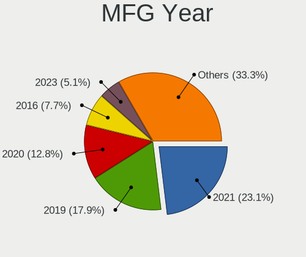
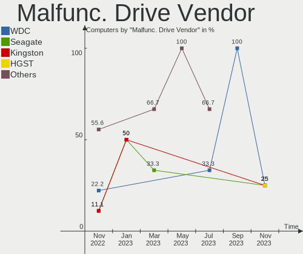
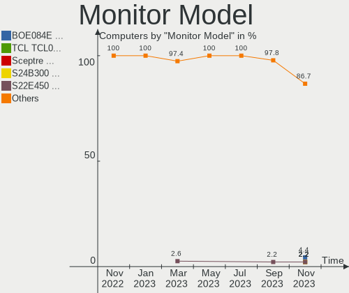
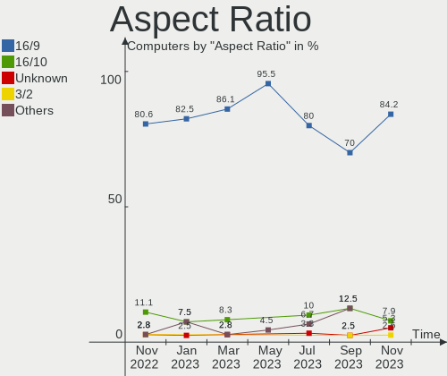
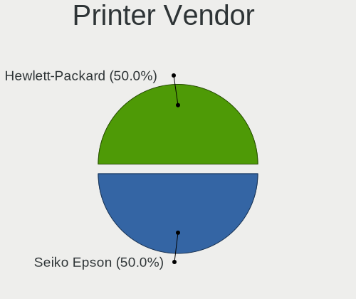
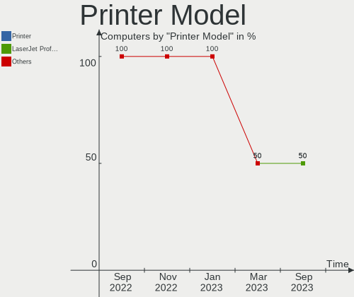

Ubuntu MATE - Hardware Trends
-----------------------------

A project to identify most popular hardware characteristics and track their change
over time based on data collected by Linux users at https://Linux-Hardware.org.

Anyone can contribute to this report by the [hw-probe](https://github.com/linuxhw/hw-probe) tool:

    sudo -E hw-probe -all -upload

This is a report for all computer types. See also reports for [desktops](/Dist/Ubuntu_MATE/Desktop/README.md) and [notebooks](/Dist/Ubuntu_MATE/Notebook/README.md).

This report is for one last month. Overall report since the beginning of time: [TestDays](https://github.com/linuxhw/TestDays)

Period: Jun, 2023.

Contents
--------

* [ System ](#system)
  - [ OS                       ](#os)
  - [ OS Family                ](#os-family)
  - [ Kernel                   ](#kernel)
  - [ Kernel Family            ](#kernel-family)
  - [ Kernel Major Ver.        ](#kernel-major-ver)
  - [ Arch                     ](#arch)
  - [ DE                       ](#de)
  - [ Display Server           ](#display-server)
  - [ Display Manager          ](#display-manager)
  - [ OS Lang                  ](#os-lang)
  - [ Boot Mode                ](#boot-mode)
  - [ Filesystem               ](#filesystem)
  - [ Part. scheme             ](#part-scheme)
  - [ Dual Boot with Linux/BSD ](#dual-boot-with-linuxbsd)
  - [ Dual Boot (Win)          ](#dual-boot-win)

* [ Board ](#board)
  - [ Vendor                   ](#vendor)
  - [ Model                    ](#model)
  - [ Model Family             ](#model-family)
  - [ MFG Year                 ](#mfg-year)
  - [ Form Factor              ](#form-factor)
  - [ Secure Boot              ](#secure-boot)
  - [ Coreboot                 ](#coreboot)
  - [ RAM Size                 ](#ram-size)
  - [ RAM Used                 ](#ram-used)
  - [ Total Drives             ](#total-drives)
  - [ Has CD-ROM               ](#has-cd-rom)
  - [ Has Ethernet             ](#has-ethernet)
  - [ Has WiFi                 ](#has-wifi)
  - [ Has Bluetooth            ](#has-bluetooth)

* [ Location ](#location)
  - [ Country                  ](#country)
  - [ City                     ](#city)

* [ Drives ](#drives)
  - [ Drive Vendor             ](#drive-vendor)
  - [ Drive Model              ](#drive-model)
  - [ HDD Vendor               ](#hdd-vendor)
  - [ SSD Vendor               ](#ssd-vendor)
  - [ Drive Kind               ](#drive-kind)
  - [ Drive Connector          ](#drive-connector)
  - [ Drive Size               ](#drive-size)
  - [ Space Total              ](#space-total)
  - [ Space Used               ](#space-used)
  - [ Malfunc. Drives          ](#malfunc-drives)
  - [ Malfunc. Drive Vendor    ](#malfunc-drive-vendor)
  - [ Malfunc. HDD Vendor      ](#malfunc-hdd-vendor)
  - [ Malfunc. Drive Kind      ](#malfunc-drive-kind)
  - [ Failed Drives            ](#failed-drives)
  - [ Failed Drive Vendor      ](#failed-drive-vendor)
  - [ Drive Status             ](#drive-status)

* [ Storage controller ](#storage-controller)
  - [ Storage Vendor           ](#storage-vendor)
  - [ Storage Model            ](#storage-model)
  - [ Storage Kind             ](#storage-kind)

* [ Processor ](#processor)
  - [ CPU Vendor               ](#cpu-vendor)
  - [ CPU Model                ](#cpu-model)
  - [ CPU Model Family         ](#cpu-model-family)
  - [ CPU Cores                ](#cpu-cores)
  - [ CPU Sockets              ](#cpu-sockets)
  - [ CPU Threads              ](#cpu-threads)
  - [ CPU Op-Modes             ](#cpu-op-modes)
  - [ CPU Microcode            ](#cpu-microcode)
  - [ CPU Microarch            ](#cpu-microarch)

* [ Graphics ](#graphics)
  - [ GPU Vendor               ](#gpu-vendor)
  - [ GPU Model                ](#gpu-model)
  - [ GPU Combo                ](#gpu-combo)
  - [ GPU Driver               ](#gpu-driver)
  - [ GPU Memory               ](#gpu-memory)

* [ Monitor ](#monitor)
  - [ Monitor Vendor           ](#monitor-vendor)
  - [ Monitor Model            ](#monitor-model)
  - [ Monitor Resolution       ](#monitor-resolution)
  - [ Monitor Diagonal         ](#monitor-diagonal)
  - [ Monitor Width            ](#monitor-width)
  - [ Aspect Ratio             ](#aspect-ratio)
  - [ Monitor Area             ](#monitor-area)
  - [ Pixel Density            ](#pixel-density)
  - [ Multiple Monitors        ](#multiple-monitors)

* [ Network ](#network)
  - [ Net Controller Vendor    ](#net-controller-vendor)
  - [ Net Controller Model     ](#net-controller-model)
  - [ Wireless Vendor          ](#wireless-vendor)
  - [ Wireless Model           ](#wireless-model)
  - [ Ethernet Vendor          ](#ethernet-vendor)
  - [ Ethernet Model           ](#ethernet-model)
  - [ Net Controller Kind      ](#net-controller-kind)
  - [ Used Controller          ](#used-controller)
  - [ NICs                     ](#nics)
  - [ IPv6                     ](#ipv6)

* [ Bluetooth ](#bluetooth)
  - [ Bluetooth Vendor         ](#bluetooth-vendor)
  - [ Bluetooth Model          ](#bluetooth-model)

* [ Sound ](#sound)
  - [ Sound Vendor             ](#sound-vendor)
  - [ Sound Model              ](#sound-model)

* [ Memory ](#memory)
  - [ Memory Vendor            ](#memory-vendor)
  - [ Memory Model             ](#memory-model)
  - [ Memory Kind              ](#memory-kind)
  - [ Memory Form Factor       ](#memory-form-factor)
  - [ Memory Size              ](#memory-size)
  - [ Memory Speed             ](#memory-speed)

* [ Printers & scanners ](#printers--scanners)
  - [ Printer Vendor           ](#printer-vendor)
  - [ Printer Model            ](#printer-model)
  - [ Scanner Vendor           ](#scanner-vendor)
  - [ Scanner Model            ](#scanner-model)

* [ Camera ](#camera)
  - [ Camera Vendor            ](#camera-vendor)
  - [ Camera Model             ](#camera-model)

* [ Security ](#security)
  - [ Fingerprint Vendor       ](#fingerprint-vendor)
  - [ Fingerprint Model        ](#fingerprint-model)
  - [ Chipcard Vendor          ](#chipcard-vendor)
  - [ Chipcard Model           ](#chipcard-model)

* [ Unsupported ](#unsupported)
  - [ Unsupported Devices      ](#unsupported-devices)
  - [ Unsupported Device Types ](#unsupported-device-types)

System
------

OS
--

Installed operating systems

| Name              | Computers | Percent |
|-------------------|-----------|---------|
| Ubuntu MATE 22.04 | 14        | 46.67%  |
| Ubuntu MATE 23.04 | 10        | 33.33%  |
| Ubuntu MATE 20.04 | 6         | 20%     |

OS Family
---------

OS without a version

| Name        | Computers | Percent |
|-------------|-----------|---------|
| Ubuntu MATE | 30        | 100%    |

Kernel
------

Version of the Linux kernel

| Version                 | Computers | Percent |
|-------------------------|-----------|---------|
| 6.2.0-20-generic        | 4         | 13.33%  |
| 5.19.0-43-generic       | 3         | 10%     |
| 6.3.7-060307-generic    | 2         | 6.67%   |
| 5.19.0-32-generic       | 2         | 6.67%   |
| 5.15.0-75-generic       | 2         | 6.67%   |
| 5.15.0-73-generic       | 2         | 6.67%   |
| 5.15.0-71-generic       | 2         | 6.67%   |
| 6.4.0-060400rc5-generic | 1         | 3.33%   |
| 6.4.0-060400-generic    | 1         | 3.33%   |
| 6.2.0-23-generic        | 1         | 3.33%   |
| 6.2.0-1003-lowlatency   | 1         | 3.33%   |
| 5.4.0-90-generic        | 1         | 3.33%   |
| 5.4.0-152-generic       | 1         | 3.33%   |
| 5.4.0-113-generic       | 1         | 3.33%   |
| 5.19.0-46-generic       | 1         | 3.33%   |
| 5.19.0-1025-lowlatency  | 1         | 3.33%   |
| 5.15.27-xanmod1         | 1         | 3.33%   |
| 5.15.0-77-generic       | 1         | 3.33%   |
| 5.15.0-69-generic       | 1         | 3.33%   |
| 5.11.0-27-generic       | 1         | 3.33%   |

Kernel Family
-------------

Linux kernel without a distro release

| Version | Computers | Percent |
|---------|-----------|---------|
| 5.15.0  | 8         | 26.67%  |
| 5.19.0  | 7         | 23.33%  |
| 6.2.0   | 6         | 20%     |
| 5.4.0   | 3         | 10%     |
| 6.4.0   | 2         | 6.67%   |
| 6.3.7   | 2         | 6.67%   |
| 5.15.27 | 1         | 3.33%   |
| 5.11.0  | 1         | 3.33%   |

Kernel Major Ver.
-----------------

Linux kernel major version

| Version | Computers | Percent |
|---------|-----------|---------|
| 5.15    | 9         | 30%     |
| 5.19    | 7         | 23.33%  |
| 6.2     | 6         | 20%     |
| 5.4     | 3         | 10%     |
| 6.4     | 2         | 6.67%   |
| 6.3     | 2         | 6.67%   |
| 5.11    | 1         | 3.33%   |

Arch
----

OS architecture (x86_64, i586, etc.)

| Name   | Computers | Percent |
|--------|-----------|---------|
| x86_64 | 30        | 100%    |

DE
--

Desktop Environment

| Name       | Computers | Percent |
|------------|-----------|---------|
| MATE       | 29        | 96.67%  |
| X-Cinnamon | 1         | 3.33%   |

Display Server
--------------

X11 or Wayland

| Name    | Computers | Percent |
|---------|-----------|---------|
| X11     | 29        | 96.67%  |
| Wayland | 1         | 3.33%   |

Display Manager
---------------

SDDM, LightDM, etc.

| Name    | Computers | Percent |
|---------|-----------|---------|
| LightDM | 21        | 70%     |
| Unknown | 4         | 13.33%  |
| LXDM    | 3         | 10%     |
| GDM3    | 2         | 6.67%   |

OS Lang
-------

Language

| Lang  | Computers | Percent |
|-------|-----------|---------|
| en_US | 5         | 16.67%  |
| de_DE | 5         | 16.67%  |
| sv_SE | 3         | 10%     |
| fr_FR | 3         | 10%     |
| ru_RU | 2         | 6.67%   |
| pt_BR | 2         | 6.67%   |
| es_ES | 2         | 6.67%   |
| en_CA | 2         | 6.67%   |
| zh_TW | 1         | 3.33%   |
| it_IT | 1         | 3.33%   |
| es_AR | 1         | 3.33%   |
| en_GB | 1         | 3.33%   |
| ca_ES | 1         | 3.33%   |
| C     | 1         | 3.33%   |

Boot Mode
---------

EFI or BIOS

| Mode | Computers | Percent |
|------|-----------|---------|
| BIOS | 17        | 56.67%  |
| EFI  | 13        | 43.33%  |

Filesystem
----------

Type of filesystem

| Type    | Computers | Percent |
|---------|-----------|---------|
| Ext4    | 18        | 60%     |
| Tmpfs   | 9         | 30%     |
| Btrfs   | 2         | 6.67%   |
| Overlay | 1         | 3.33%   |

Part. scheme
------------

Scheme of partitioning

| Type    | Computers | Percent |
|---------|-----------|---------|
| GPT     | 21        | 70%     |
| MBR     | 5         | 16.67%  |
| Unknown | 4         | 13.33%  |

Dual Boot with Linux/BSD
------------------------

Hosting more than one Linux/BSD

| Dual boot | Computers | Percent |
|-----------|-----------|---------|
| No        | 26        | 86.67%  |
| Yes       | 4         | 13.33%  |

Dual Boot (Win)
---------------

Hosting Linux and Windows

| Dual boot | Computers | Percent |
|-----------|-----------|---------|
| No        | 23        | 76.67%  |
| Yes       | 7         | 23.33%  |

Board
-----

Vendor
------

Motherboard manufacturer

| Name                | Computers | Percent |
|---------------------|-----------|---------|
| Hewlett-Packard     | 6         | 20%     |
| Lenovo              | 4         | 13.33%  |
| ASUSTek Computer    | 4         | 13.33%  |
| Acer                | 4         | 13.33%  |
| MSI                 | 3         | 10%     |
| Gigabyte Technology | 3         | 10%     |
| Dell                | 3         | 10%     |
| Notebook            | 1         | 3.33%   |
| Intel               | 1         | 3.33%   |
| AZW                 | 1         | 3.33%   |

Model
-----

Motherboard model

| Name                                  | Computers | Percent |
|---------------------------------------|-----------|---------|
| Notebook NJx0MU                       | 1         | 3.33%   |
| MSI MS-7C51                           | 1         | 3.33%   |
| MSI MS-7918                           | 1         | 3.33%   |
| MSI Cubi N JSL (MS-B0A1)              | 1         | 3.33%   |
| Lenovo V145-15AST 81MT                | 1         | 3.33%   |
| Lenovo ThinkPad X270 W10DG 20K5S3F200 | 1         | 3.33%   |
| Lenovo ThinkPad T580 20LAS0DL00       | 1         | 3.33%   |
| Lenovo IdeaPad S410p 20296            | 1         | 3.33%   |
| Intel NUC7CJYHN                       | 1         | 3.33%   |
| HP Pavilion Gaming Laptop 17-cd1xxx   | 1         | 3.33%   |
| HP Pavilion 17                        | 1         | 3.33%   |
| HP EliteDesk 800 G1 SFF               | 1         | 3.33%   |
| HP EliteBook 840 G6                   | 1         | 3.33%   |
| HP Desktop M01-F0xxx                  | 1         | 3.33%   |
| HP 625 (WT144EA#ABD)                  | 1         | 3.33%   |
| Gigabyte X570 AORUS ULTRA             | 1         | 3.33%   |
| Gigabyte H81M-S2PH                    | 1         | 3.33%   |
| Gigabyte B85M-D3H                     | 1         | 3.33%   |
| Dell Vostro 3460                      | 1         | 3.33%   |
| Dell Studio 1558                      | 1         | 3.33%   |
| Dell Latitude E5540                   | 1         | 3.33%   |
| AZW EQ                                | 1         | 3.33%   |
| ASUS P7P55 LX                         | 1         | 3.33%   |
| ASUS K53SD                            | 1         | 3.33%   |
| ASUS H61M-K                           | 1         | 3.33%   |
| ASUS H110M-K                          | 1         | 3.33%   |
| Acer TravelMate P648-G2-M             | 1         | 3.33%   |
| Acer Extensa 2519                     | 1         | 3.33%   |
| Acer Aspire TC-705                    | 1         | 3.33%   |
| Acer Aspire ES1-311                   | 1         | 3.33%   |

Model Family
------------

Motherboard model prefix

| Name               | Computers | Percent |
|--------------------|-----------|---------|
| Lenovo ThinkPad    | 2         | 6.67%   |
| HP Pavilion        | 2         | 6.67%   |
| Acer Aspire        | 2         | 6.67%   |
| Notebook NJx0MU    | 1         | 3.33%   |
| MSI MS-7C51        | 1         | 3.33%   |
| MSI MS-7918        | 1         | 3.33%   |
| MSI Cubi           | 1         | 3.33%   |
| Lenovo V145-15AST  | 1         | 3.33%   |
| Lenovo IdeaPad     | 1         | 3.33%   |
| Intel NUC7CJYHN    | 1         | 3.33%   |
| HP EliteDesk       | 1         | 3.33%   |
| HP EliteBook       | 1         | 3.33%   |
| HP Desktop         | 1         | 3.33%   |
| HP 625             | 1         | 3.33%   |
| Gigabyte X570      | 1         | 3.33%   |
| Gigabyte H81M-S2PH | 1         | 3.33%   |
| Gigabyte B85M-D3H  | 1         | 3.33%   |
| Dell Vostro        | 1         | 3.33%   |
| Dell Studio        | 1         | 3.33%   |
| Dell Latitude      | 1         | 3.33%   |
| AZW EQ             | 1         | 3.33%   |
| ASUS P7P55         | 1         | 3.33%   |
| ASUS K53SD         | 1         | 3.33%   |
| ASUS H61M-K        | 1         | 3.33%   |
| ASUS H110M-K       | 1         | 3.33%   |
| Acer TravelMate    | 1         | 3.33%   |
| Acer Extensa       | 1         | 3.33%   |

MFG Year
--------

Motherboard manufacture year

| Year | Computers | Percent |
|------|-----------|---------|
| 2013 | 6         | 20%     |
| 2019 | 4         | 13.33%  |
| 2014 | 4         | 13.33%  |
| 2015 | 3         | 10%     |
| 2021 | 2         | 6.67%   |
| 2018 | 2         | 6.67%   |
| 2017 | 2         | 6.67%   |
| 2023 | 1         | 3.33%   |
| 2022 | 1         | 3.33%   |
| 2020 | 1         | 3.33%   |
| 2012 | 1         | 3.33%   |
| 2011 | 1         | 3.33%   |
| 2010 | 1         | 3.33%   |
| 2009 | 1         | 3.33%   |

Form Factor
-----------

Physical design of the computer

| Name     | Computers | Percent |
|----------|-----------|---------|
| Notebook | 16        | 53.33%  |
| Desktop  | 13        | 43.33%  |
| Mini pc  | 1         | 3.33%   |

Secure Boot
-----------

Enabled or disabled

| State    | Computers | Percent |
|----------|-----------|---------|
| Disabled | 30        | 100%    |

Coreboot
--------

Have coreboot on board

| Used | Computers | Percent |
|------|-----------|---------|
| No   | 30        | 100%    |

RAM Size
--------

Total RAM memory

| Size in GB  | Computers | Percent |
|-------------|-----------|---------|
| 4.01-8.0    | 10        | 33.33%  |
| 16.01-24.0  | 8         | 26.67%  |
| 8.01-16.0   | 5         | 16.67%  |
| 3.01-4.0    | 3         | 10%     |
| 32.01-64.0  | 2         | 6.67%   |
| 24.01-32.0  | 1         | 3.33%   |
| 64.01-256.0 | 1         | 3.33%   |

RAM Used
--------

Used RAM memory

| Used GB   | Computers | Percent |
|-----------|-----------|---------|
| 1.01-2.0  | 14        | 46.67%  |
| 2.01-3.0  | 8         | 26.67%  |
| 4.01-8.0  | 5         | 16.67%  |
| 8.01-16.0 | 2         | 6.67%   |
| 3.01-4.0  | 1         | 3.33%   |

Total Drives
------------

Number of drives on board

| Drives | Computers | Percent |
|--------|-----------|---------|
| 1      | 17        | 56.67%  |
| 2      | 7         | 23.33%  |
| 3      | 4         | 13.33%  |
| 4      | 2         | 6.67%   |

Has CD-ROM
----------

Has CD-ROM on board

| Presented | Computers | Percent |
|-----------|-----------|---------|
| Yes       | 15        | 50%     |
| No        | 15        | 50%     |

Has Ethernet
------------

Has Ethernet on board

| Presented | Computers | Percent |
|-----------|-----------|---------|
| Yes       | 30        | 100%    |

Has WiFi
--------

Has WiFi module

| Presented | Computers | Percent |
|-----------|-----------|---------|
| Yes       | 22        | 73.33%  |
| No        | 8         | 26.67%  |

Has Bluetooth
-------------

Has Bluetooth module

| Presented | Computers | Percent |
|-----------|-----------|---------|
| Yes       | 19        | 63.33%  |
| No        | 11        | 36.67%  |

Location
--------

Country
-------

Geographic location (country)

| Country   | Computers | Percent |
|-----------|-----------|---------|
| Germany   | 5         | 16.67%  |
| USA       | 3         | 10%     |
| Sweden    | 3         | 10%     |
| Spain     | 3         | 10%     |
| France    | 3         | 10%     |
| Brazil    | 3         | 10%     |
| Russia    | 2         | 6.67%   |
| UK        | 1         | 3.33%   |
| Taiwan    | 1         | 3.33%   |
| Slovenia  | 1         | 3.33%   |
| Italy     | 1         | 3.33%   |
| Indonesia | 1         | 3.33%   |
| Canada    | 1         | 3.33%   |
| Austria   | 1         | 3.33%   |
| Argentina | 1         | 3.33%   |

City
----

Geographic location (city)

| City                   | Computers | Percent |
|------------------------|-----------|---------|
| Sundbyberg             | 3         | 10%     |
| Wittingen              | 2         | 6.67%   |
| Barcelona              | 2         | 6.67%   |
| Voronezh               | 1         | 3.33%   |
| Villefontaine          | 1         | 3.33%   |
| Varginha               | 1         | 3.33%   |
| Sarzeau                | 1         | 3.33%   |
| Sao Paulo              | 1         | 3.33%   |
| Rodonya                | 1         | 3.33%   |
| Norden                 | 1         | 3.33%   |
| Nickelsdorf            | 1         | 3.33%   |
| Newham                 | 1         | 3.33%   |
| New Taipei             | 1         | 3.33%   |
| New Brighton           | 1         | 3.33%   |
| Moscow                 | 1         | 3.33%   |
| Mississauga            | 1         | 3.33%   |
| Milan                  | 1         | 3.33%   |
| Macon                  | 1         | 3.33%   |
| Koper                  | 1         | 3.33%   |
| Goslar                 | 1         | 3.33%   |
| Fazenda Rio Grande     | 1         | 3.33%   |
| Delligsen              | 1         | 3.33%   |
| Charleville-Mézières | 1         | 3.33%   |
| Buenos Aires           | 1         | 3.33%   |
| Balikpapan             | 1         | 3.33%   |
| Arlington              | 1         | 3.33%   |

Drives
------

Drive Vendor
------------

Hard drive vendors

| Vendor                      | Computers | Drives | Percent |
|-----------------------------|-----------|--------|---------|
| Samsung Electronics         | 12        | 13     | 25.53%  |
| Seagate                     | 6         | 6      | 12.77%  |
| Toshiba                     | 4         | 7      | 8.51%   |
| Kingston                    | 4         | 4      | 8.51%   |
| WDC                         | 3         | 3      | 6.38%   |
| Unknown                     | 2         | 2      | 4.26%   |
| Transcend                   | 2         | 2      | 4.26%   |
| SanDisk                     | 2         | 2      | 4.26%   |
| A-DATA Technology           | 2         | 2      | 4.26%   |
| Verbatim                    | 1         | 1      | 2.13%   |
| SPCC                        | 1         | 1      | 2.13%   |
| SK hynix                    | 1         | 1      | 2.13%   |
| Ramos Technology            | 1         | 1      | 2.13%   |
| Netac                       | 1         | 1      | 2.13%   |
| Micron/Crucial Technology   | 1         | 1      | 2.13%   |
| MAXIO Technology (Hangzhou) | 1         | 1      | 2.13%   |
| Intel                       | 1         | 1      | 2.13%   |
| Corsair                     | 1         | 1      | 2.13%   |
| China                       | 1         | 1      | 2.13%   |

Drive Model
-----------

Hard drive models

| Model                                               | Computers | Percent |
|-----------------------------------------------------|-----------|---------|
| Kingston SA400S37240G 240GB SSD                     | 3         | 6.12%   |
| WDC WD5000LPCX-21VHAT0 500GB                        | 1         | 2.04%   |
| WDC WD10EZEX-21M2NA0 1TB                            | 1         | 2.04%   |
| WDC WD1002FAEX-00Z3A0 1TB                           | 1         | 2.04%   |
| Verbatim Vi550 S3 512GB                             | 1         | 2.04%   |
| Unknown SD/MMC/MS PRO 250GB                         | 1         | 2.04%   |
| Unknown EB1QT  32GB                                 | 1         | 2.04%   |
| Transcend TS240GSSD220S 240GB                       | 1         | 2.04%   |
| Transcend TS1TSSD220Q 1TB                           | 1         | 2.04%   |
| Toshiba XG6 NVMe SSD Controller 2TB                 | 1         | 2.04%   |
| Toshiba MQ01ABD075 752GB                            | 1         | 2.04%   |
| Toshiba MQ01ABD050V 500GB                           | 1         | 2.04%   |
| Toshiba MG06ACA800E 8TB                             | 1         | 2.04%   |
| Toshiba DT01ACA300 3TB                              | 1         | 2.04%   |
| SPCC Solid State Disk 256GB                         | 1         | 2.04%   |
| SK hynix HFS256G39TND-N210A 256GB SSD               | 1         | 2.04%   |
| Seagate ST500DM002-1BD142 500GB                     | 1         | 2.04%   |
| Seagate ST2000DM008-2FR102 2TB                      | 1         | 2.04%   |
| Seagate ST1000LM014-1EJ164 1TB                      | 1         | 2.04%   |
| Seagate ST1000DM003-1SB102 1TB                      | 1         | 2.04%   |
| Seagate ST1000DM003-1CH162 1TB                      | 1         | 2.04%   |
| Seagate BUP Portable 4TB                            | 1         | 2.04%   |
| Sandisk WD Blue SN550 NVMe SSD 1TB                  | 1         | 2.04%   |
| SanDisk SSD PLUS 480GB                              | 1         | 2.04%   |
| Samsung SSD PM851 2.5 7mm 256GB                     | 1         | 2.04%   |
| Samsung SSD 980 PRO 500GB                           | 1         | 2.04%   |
| Samsung SSD 870 QVO 8TB                             | 1         | 2.04%   |
| Samsung SSD 860 PRO 256GB                           | 1         | 2.04%   |
| Samsung SSD 860 EVO 500GB                           | 1         | 2.04%   |
| Samsung SSD 750 EVO 250GB                           | 1         | 2.04%   |
| Samsung PSSD T7 1TB                                 | 1         | 2.04%   |
| Samsung NVMe SSD Controller SM981/PM981/PM983 250GB | 1         | 2.04%   |
| Samsung NVMe SSD Controller SM961/PM961/SM963 256GB | 1         | 2.04%   |
| Samsung MZVL2512HCJQ-00B00 512GB                    | 1         | 2.04%   |
| Samsung HD502HJ 500GB                               | 1         | 2.04%   |
| Samsung HD103UJ 1TB                                 | 1         | 2.04%   |
| Samsung HD103SI 1TB                                 | 1         | 2.04%   |
| Ramos SSD 1TB                                       | 1         | 2.04%   |
| Netac SSD 1TB                                       | 1         | 2.04%   |
| Micron/Crucial P2 NVMe PCIe SSD 4TB                 | 1         | 2.04%   |

HDD Vendor
----------

Hard disk drive vendors

| Vendor              | Computers | Drives | Percent |
|---------------------|-----------|--------|---------|
| Seagate             | 6         | 6      | 40%     |
| WDC                 | 3         | 3      | 20%     |
| Toshiba             | 3         | 6      | 20%     |
| Samsung Electronics | 2         | 3      | 13.33%  |
| Unknown             | 1         | 1      | 6.67%   |

SSD Vendor
----------

Solid state drive vendors

| Vendor              | Computers | Drives | Percent |
|---------------------|-----------|--------|---------|
| Samsung Electronics | 6         | 6      | 27.27%  |
| Kingston            | 4         | 4      | 18.18%  |
| Transcend           | 2         | 2      | 9.09%   |
| A-DATA Technology   | 2         | 2      | 9.09%   |
| Verbatim            | 1         | 1      | 4.55%   |
| SPCC                | 1         | 1      | 4.55%   |
| SK hynix            | 1         | 1      | 4.55%   |
| SanDisk             | 1         | 1      | 4.55%   |
| Ramos Technology    | 1         | 1      | 4.55%   |
| Netac               | 1         | 1      | 4.55%   |
| Intel               | 1         | 1      | 4.55%   |
| China               | 1         | 1      | 4.55%   |

Drive Kind
----------

HDD or SSD

| Kind | Computers | Drives | Percent |
|------|-----------|--------|---------|
| SSD  | 19        | 22     | 46.34%  |
| HDD  | 13        | 19     | 31.71%  |
| NVMe | 8         | 9      | 19.51%  |
| MMC  | 1         | 1      | 2.44%   |

Drive Connector
---------------

SATA, SAS, NVMe, etc.

| Type | Computers | Drives | Percent |
|------|-----------|--------|---------|
| SATA | 25        | 37     | 67.57%  |
| NVMe | 8         | 9      | 21.62%  |
| SAS  | 3         | 4      | 8.11%   |
| MMC  | 1         | 1      | 2.7%    |

Drive Size
----------

Size of hard drive

| Size in TB | Computers | Drives | Percent |
|------------|-----------|--------|---------|
| 0.01-0.5   | 18        | 21     | 50%     |
| 0.51-1.0   | 13        | 13     | 36.11%  |
| 4.01-10.0  | 2         | 4      | 5.56%   |
| 3.01-4.0   | 1         | 1      | 2.78%   |
| 2.01-3.0   | 1         | 1      | 2.78%   |
| 1.01-2.0   | 1         | 1      | 2.78%   |

Space Total
-----------

Amount of disk space available on the file system

| Size in GB     | Computers | Percent |
|----------------|-----------|---------|
| 101-250        | 11        | 36.67%  |
| 251-500        | 5         | 16.67%  |
| 501-1000       | 4         | 13.33%  |
| More than 3000 | 3         | 10%     |
| 1001-2000      | 3         | 10%     |
| 2001-3000      | 2         | 6.67%   |
| 1-20           | 2         | 6.67%   |

Space Used
----------

Amount of used disk space

| Used GB        | Computers | Percent |
|----------------|-----------|---------|
| 21-50          | 8         | 26.67%  |
| 1-20           | 5         | 16.67%  |
| 101-250        | 4         | 13.33%  |
| 51-100         | 4         | 13.33%  |
| More than 3000 | 3         | 10%     |
| 501-1000       | 3         | 10%     |
| 251-500        | 1         | 3.33%   |
| 2001-3000      | 1         | 3.33%   |
| 1001-2000      | 1         | 3.33%   |

Malfunc. Drives
---------------

Drive models with a malfunction

| Model                                   | Computers | Drives | Percent |
|-----------------------------------------|-----------|--------|---------|
| WDC WD10EZEX-21M2NA0 1TB                | 1         | 1      | 25%     |
| Samsung Electronics HD103UJ 1TB         | 1         | 1      | 25%     |
| Kingston RBU-SNS8350DES3128GP 128GB SSD | 1         | 1      | 25%     |
| A-DATA Technology SU650 120GB SSD       | 1         | 1      | 25%     |

Malfunc. Drive Vendor
---------------------

Vendors of faulty drives

| Vendor              | Computers | Drives | Percent |
|---------------------|-----------|--------|---------|
| WDC                 | 1         | 1      | 25%     |
| Samsung Electronics | 1         | 1      | 25%     |
| Kingston            | 1         | 1      | 25%     |
| A-DATA Technology   | 1         | 1      | 25%     |

Malfunc. HDD Vendor
-------------------

Vendors of faulty HDD drives

| Vendor              | Computers | Drives | Percent |
|---------------------|-----------|--------|---------|
| WDC                 | 1         | 1      | 50%     |
| Samsung Electronics | 1         | 1      | 50%     |

Malfunc. Drive Kind
-------------------

Kinds of faulty drives

| Kind | Computers | Drives | Percent |
|------|-----------|--------|---------|
| SSD  | 2         | 2      | 50%     |
| HDD  | 2         | 2      | 50%     |

Failed Drives
-------------

Failed drive models

Zero info for selected period =(

Failed Drive Vendor
-------------------

Failed drive vendors

Zero info for selected period =(

Drive Status
------------

Number of failed and malfunc. drives

| Status   | Computers | Drives | Percent |
|----------|-----------|--------|---------|
| Detected | 18        | 21     | 48.65%  |
| Works    | 15        | 26     | 40.54%  |
| Malfunc  | 4         | 4      | 10.81%  |

Storage controller
------------------

Storage Vendor
--------------

Storage controller vendors

| Vendor                       | Computers | Percent |
|------------------------------|-----------|---------|
| Intel                        | 22        | 61.11%  |
| AMD                          | 5         | 13.89%  |
| Samsung Electronics          | 4         | 11.11%  |
| Toshiba America Info Systems | 1         | 2.78%   |
| SanDisk                      | 1         | 2.78%   |
| Phison Electronics           | 1         | 2.78%   |
| Micron/Crucial Technology    | 1         | 2.78%   |
| MAXIO Technology (Hangzhou)  | 1         | 2.78%   |

Storage Model
-------------

Storage controller models

| Model                                                                            | Computers | Percent |
|----------------------------------------------------------------------------------|-----------|---------|
| AMD FCH SATA Controller [AHCI mode]                                              | 4         | 10.53%  |
| Intel 8 Series/C220 Series Chipset Family 6-port SATA Controller 1 [AHCI mode]   | 3         | 7.89%   |
| Intel 8 Series SATA Controller 1 [AHCI mode]                                     | 3         | 7.89%   |
| Samsung NVMe SSD Controller PM9A1/PM9A3/980PRO                                   | 2         | 5.26%   |
| Toshiba America Info Systems XG6 NVMe SSD Controller                             | 1         | 2.63%   |
| SanDisk WD Blue SN550 NVMe SSD                                                   | 1         | 2.63%   |
| Samsung NVMe SSD Controller SM981/PM981/PM983                                    | 1         | 2.63%   |
| Samsung NVMe SSD Controller SM961/PM961/SM963                                    | 1         | 2.63%   |
| Phison E16 PCIe4 NVMe Controller                                                 | 1         | 2.63%   |
| Micron/Crucial P2 NVMe PCIe SSD                                                  | 1         | 2.63%   |
| MAXIO (Hangzhou) NVMe SSD Controller MAP1202                                     | 1         | 2.63%   |
| Intel Tiger Lake-LP SATA Controller                                              | 1         | 2.63%   |
| Intel Sunrise Point-LP SATA Controller [AHCI mode]                               | 1         | 2.63%   |
| Intel SATA controller                                                            | 1         | 2.63%   |
| Intel Q170/Q150/B150/H170/H110/Z170/CM236 Chipset SATA Controller [AHCI Mode]    | 1         | 2.63%   |
| Intel Jasper Lake SATA AHCI Controller                                           | 1         | 2.63%   |
| Intel Celeron/Pentium Silver Processor SATA Controller                           | 1         | 2.63%   |
| Intel Atom/Celeron/Pentium Processor x5-E8000/J3xxx/N3xxx Series SATA Controller | 1         | 2.63%   |
| Intel Atom Processor E3800 Series SATA AHCI Controller                           | 1         | 2.63%   |
| Intel 9 Series Chipset Family SATA Controller [AHCI Mode]                        | 1         | 2.63%   |
| Intel 82801 Mobile SATA Controller [RAID mode]                                   | 1         | 2.63%   |
| Intel 8 Series/C220 Series Chipset Family 4-port SATA Controller 1 [IDE mode]    | 1         | 2.63%   |
| Intel 7 Series Chipset Family 6-port SATA Controller [AHCI mode]                 | 1         | 2.63%   |
| Intel 6 Series/C200 Series Chipset Family 6 port Mobile SATA AHCI Controller     | 1         | 2.63%   |
| Intel 6 Series/C200 Series Chipset Family 6 port Desktop SATA AHCI Controller    | 1         | 2.63%   |
| Intel 5 Series/3400 Series Chipset 6 port SATA AHCI Controller                   | 1         | 2.63%   |
| Intel 5 Series/3400 Series Chipset 4 port SATA AHCI Controller                   | 1         | 2.63%   |
| AMD SB7x0/SB8x0/SB9x0 SATA Controller [AHCI mode]                                | 1         | 2.63%   |
| AMD FCH SATA Controller D                                                        | 1         | 2.63%   |
| AMD 400 Series Chipset SATA Controller                                           | 1         | 2.63%   |

Storage Kind
------------

Kind of storage controller (IDE, SATA, NVMe, SAS, ...)

| Kind | Computers | Percent |
|------|-----------|---------|
| SATA | 25        | 71.43%  |
| NVMe | 8         | 22.86%  |
| RAID | 1         | 2.86%   |
| IDE  | 1         | 2.86%   |

Processor
---------

CPU Vendor
----------

Processor vendors

| Vendor | Computers | Percent |
|--------|-----------|---------|
| Intel  | 25        | 83.33%  |
| AMD    | 5         | 16.67%  |

CPU Model
---------

Processor models

| Model                                           | Computers | Percent |
|-------------------------------------------------|-----------|---------|
| Intel Core i5-4460 CPU @ 3.20GHz                | 2         | 6.67%   |
| Intel Core i5-4210U CPU @ 1.70GHz               | 2         | 6.67%   |
| Intel Xeon CPU E3-1245 v3 @ 3.40GHz             | 1         | 3.33%   |
| Intel Pentium CPU G4560 @ 3.50GHz               | 1         | 3.33%   |
| Intel Pentium CPU G2020 @ 2.90GHz               | 1         | 3.33%   |
| Intel N100                                      | 1         | 3.33%   |
| Intel Core i7-8665U CPU @ 1.90GHz               | 1         | 3.33%   |
| Intel Core i7-2670QM CPU @ 2.20GHz              | 1         | 3.33%   |
| Intel Core i7-10750H CPU @ 2.60GHz              | 1         | 3.33%   |
| Intel Core i5-8350U CPU @ 1.70GHz               | 1         | 3.33%   |
| Intel Core i5-7200U CPU @ 2.50GHz               | 1         | 3.33%   |
| Intel Core i5-6300U CPU @ 2.40GHz               | 1         | 3.33%   |
| Intel Core i5-4200U CPU @ 1.60GHz               | 1         | 3.33%   |
| Intel Core i5-3230M CPU @ 2.60GHz               | 1         | 3.33%   |
| Intel Core i5 CPU M 430 @ 2.27GHz               | 1         | 3.33%   |
| Intel Core i3-4170 CPU @ 3.70GHz                | 1         | 3.33%   |
| Intel Core i3-4160 CPU @ 3.60GHz                | 1         | 3.33%   |
| Intel Core i3 CPU 550 @ 3.20GHz                 | 1         | 3.33%   |
| Intel Celeron N4500 @ 1.10GHz                   | 1         | 3.33%   |
| Intel Celeron J4025 CPU @ 2.00GHz               | 1         | 3.33%   |
| Intel Celeron CPU N3060 @ 1.60GHz               | 1         | 3.33%   |
| Intel Celeron CPU N2840 @ 2.16GHz               | 1         | 3.33%   |
| Intel 11th Gen Core i7-1165G7 @ 2.80GHz         | 1         | 3.33%   |
| AMD Ryzen 9 5900X 12-Core Processor             | 1         | 3.33%   |
| AMD Ryzen 5 PRO 3400G with Radeon Vega Graphics | 1         | 3.33%   |
| AMD Athlon II P320 Dual-Core Processor          | 1         | 3.33%   |
| AMD Athlon 300GE with Radeon Vega Graphics      | 1         | 3.33%   |
| AMD A6-9225 RADEON R4, 5 COMPUTE CORES 2C+3G    | 1         | 3.33%   |

CPU Model Family
----------------

Processor model prefix

| Model           | Computers | Percent |
|-----------------|-----------|---------|
| Intel Core i5   | 10        | 33.33%  |
| Intel Celeron   | 4         | 13.33%  |
| Intel Core i7   | 3         | 10%     |
| Intel Core i3   | 3         | 10%     |
| Other           | 2         | 6.67%   |
| Intel Pentium   | 2         | 6.67%   |
| Intel Xeon      | 1         | 3.33%   |
| AMD Ryzen 9     | 1         | 3.33%   |
| AMD Ryzen 5 PRO | 1         | 3.33%   |
| AMD Athlon II   | 1         | 3.33%   |
| AMD Athlon      | 1         | 3.33%   |
| AMD A6          | 1         | 3.33%   |

CPU Cores
---------

Number of processor cores

| Number | Computers | Percent |
|--------|-----------|---------|
| 2      | 19        | 63.33%  |
| 4      | 9         | 30%     |
| 12     | 1         | 3.33%   |
| 6      | 1         | 3.33%   |

CPU Sockets
-----------

Number of sockets

| Number | Computers | Percent |
|--------|-----------|---------|
| 1      | 30        | 100%    |

CPU Threads
-----------

Threads per core (Hyper-Threading)

| Number | Computers | Percent |
|--------|-----------|---------|
| 2      | 20        | 66.67%  |
| 1      | 10        | 33.33%  |

CPU Op-Modes
------------

CPU Operation Modes (32-bit, 64-bit)

| Op mode        | Computers | Percent |
|----------------|-----------|---------|
| 32-bit, 64-bit | 30        | 100%    |

CPU Microcode
-------------

Microcode number

| Number     | Computers | Percent |
|------------|-----------|---------|
| Unknown    | 15        | 50%     |
| 0x40651    | 3         | 10%     |
| 0x306c3    | 3         | 10%     |
| 0x08108109 | 2         | 6.67%   |
| 0x806e9    | 1         | 3.33%   |
| 0x806c1    | 1         | 3.33%   |
| 0x406e3    | 1         | 3.33%   |
| 0x406c4    | 1         | 3.33%   |
| 0x20655    | 1         | 3.33%   |
| 0x0a201016 | 1         | 3.33%   |
| 0x010000c8 | 1         | 3.33%   |

CPU Microarch
-------------

Microarchitecture

| Name          | Computers | Percent |
|---------------|-----------|---------|
| Haswell       | 8         | 26.67%  |
| KabyLake      | 4         | 13.33%  |
| Zen+          | 2         | 6.67%   |
| Westmere      | 2         | 6.67%   |
| Silvermont    | 2         | 6.67%   |
| IvyBridge     | 2         | 6.67%   |
| Zen 3         | 1         | 3.33%   |
| TigerLake     | 1         | 3.33%   |
| Skylake       | 1         | 3.33%   |
| SandyBridge   | 1         | 3.33%   |
| K10           | 1         | 3.33%   |
| Gracemont     | 1         | 3.33%   |
| Goldmont plus | 1         | 3.33%   |
| Excavator     | 1         | 3.33%   |
| CometLake     | 1         | 3.33%   |
| Unknown       | 1         | 3.33%   |

Graphics
--------

GPU Vendor
----------

Vendors of graphics cards

| Vendor | Computers | Percent |
|--------|-----------|---------|
| Intel  | 22        | 62.86%  |
| Nvidia | 7         | 20%     |
| AMD    | 6         | 17.14%  |

GPU Model
---------

Graphics card models

| Model                                                                                    | Computers | Percent |
|------------------------------------------------------------------------------------------|-----------|---------|
| Intel Haswell-ULT Integrated Graphics Controller                                         | 3         | 8.57%   |
| Intel 4th Generation Core Processor Family Integrated Graphics Controller                | 2         | 5.71%   |
| AMD Picasso/Raven 2 [Radeon Vega Series / Radeon Vega Mobile Series]                     | 2         | 5.71%   |
| Nvidia TU116M [GeForce GTX 1660 Ti Mobile]                                               | 1         | 2.86%   |
| Nvidia GP107GL [Quadro P620]                                                             | 1         | 2.86%   |
| Nvidia GM108M [GeForce 840M]                                                             | 1         | 2.86%   |
| Nvidia GM107 [GeForce GTX 745]                                                           | 1         | 2.86%   |
| Nvidia GK208B [GeForce GT 730]                                                           | 1         | 2.86%   |
| Nvidia GF119M [GeForce 610M]                                                             | 1         | 2.86%   |
| Nvidia GF117M [GeForce 610M/710M/810M/820M / GT 620M/625M/630M/720M]                     | 1         | 2.86%   |
| Intel Xeon E3-1200 v3/4th Gen Core Processor Integrated Graphics Controller              | 1         | 2.86%   |
| Intel Xeon E3-1200 v3 Processor Integrated Graphics Controller                           | 1         | 2.86%   |
| Intel Xeon E3-1200 v2/3rd Gen Core processor Graphics Controller                         | 1         | 2.86%   |
| Intel WhiskeyLake-U GT2 [UHD Graphics 620]                                               | 1         | 2.86%   |
| Intel UHD Graphics 620                                                                   | 1         | 2.86%   |
| Intel TigerLake-LP GT2 [Iris Xe Graphics]                                                | 1         | 2.86%   |
| Intel Skylake GT2 [HD Graphics 520]                                                      | 1         | 2.86%   |
| Intel JasperLake [UHD Graphics]                                                          | 1         | 2.86%   |
| Intel HD Graphics 620                                                                    | 1         | 2.86%   |
| Intel HD Graphics 610                                                                    | 1         | 2.86%   |
| Intel GeminiLake [UHD Graphics 600]                                                      | 1         | 2.86%   |
| Intel CometLake-H GT2 [UHD Graphics]                                                     | 1         | 2.86%   |
| Intel Atom/Celeron/Pentium Processor x5-E8000/J3xxx/N3xxx Integrated Graphics Controller | 1         | 2.86%   |
| Intel Atom Processor Z36xxx/Z37xxx Series Graphics & Display                             | 1         | 2.86%   |
| Intel Alder Lake-N [UHD Graphics]                                                        | 1         | 2.86%   |
| Intel 3rd Gen Core processor Graphics Controller                                         | 1         | 2.86%   |
| Intel 2nd Generation Core Processor Family Integrated Graphics Controller                | 1         | 2.86%   |
| AMD Stoney [Radeon R2/R3/R4/R5 Graphics]                                                 | 1         | 2.86%   |
| AMD RS880M [Mobility Radeon HD 4225/4250]                                                | 1         | 2.86%   |
| AMD Park [Mobility Radeon HD 5430]                                                       | 1         | 2.86%   |
| AMD Navi 24 [Radeon PRO W6400]                                                           | 1         | 2.86%   |

GPU Combo
---------

Combinations of graphics cards

| Name           | Computers | Percent |
|----------------|-----------|---------|
| 1 x Intel      | 17        | 56.67%  |
| 1 x AMD        | 6         | 20%     |
| Intel + Nvidia | 5         | 16.67%  |
| 1 x Nvidia     | 2         | 6.67%   |

GPU Driver
----------

Free vs proprietary

| Driver      | Computers | Percent |
|-------------|-----------|---------|
| Free        | 25        | 83.33%  |
| Proprietary | 5         | 16.67%  |

GPU Memory
----------

Total video memory

| Size in GB | Computers | Percent |
|------------|-----------|---------|
| Unknown    | 23        | 76.67%  |
| 1.01-2.0   | 4         | 13.33%  |
| 3.01-4.0   | 2         | 6.67%   |
| 0.01-0.5   | 1         | 3.33%   |

Monitor
-------

Monitor Vendor
--------------

Monitor vendors

| Vendor               | Computers | Percent |
|----------------------|-----------|---------|
| LG Display           | 5         | 16.13%  |
| AU Optronics         | 5         | 16.13%  |
| Chimei Innolux       | 3         | 9.68%   |
| Samsung Electronics  | 2         | 6.45%   |
| Philips              | 2         | 6.45%   |
| Goldstar             | 2         | 6.45%   |
| ASUSTek Computer     | 2         | 6.45%   |
| ViewSonic            | 1         | 3.23%   |
| Sony                 | 1         | 3.23%   |
| NEC Computers        | 1         | 3.23%   |
| InnoLux Display      | 1         | 3.23%   |
| InfoVision           | 1         | 3.23%   |
| Iiyama               | 1         | 3.23%   |
| Envision Peripherals | 1         | 3.23%   |
| BOE                  | 1         | 3.23%   |
| Ancor Communications | 1         | 3.23%   |
| Acer                 | 1         | 3.23%   |

Monitor Model
-------------

Monitor models

| Model                                                                 | Computers | Percent |
|-----------------------------------------------------------------------|-----------|---------|
| Philips PHL 223V5 PHLC0CF 1920x1080 477x268mm 21.5-inch               | 2         | 6.25%   |
| ViewSonic VA2046 SERIES VSC6D2E 1600x900 432x240mm 19.5-inch          | 1         | 3.13%   |
| Sony TV SNY6804 1600x900                                              | 1         | 3.13%   |
| Samsung Electronics SA300/SA350 SAM078E 1920x1080 477x268mm 21.5-inch | 1         | 3.13%   |
| Samsung Electronics C24F390 SAM0D2C 1920x1080 521x293mm 23.5-inch     | 1         | 3.13%   |
| NEC Computers EA241WM NEC674E 1920x1200 518x324mm 24.1-inch           | 1         | 3.13%   |
| LG Display LCD Monitor LGD063F 1920x1080 382x215mm 17.3-inch          | 1         | 3.13%   |
| LG Display LCD Monitor LGD047B 1366x768 344x194mm 15.5-inch           | 1         | 3.13%   |
| LG Display LCD Monitor LGD035C 1366x768 309x174mm 14.0-inch           | 1         | 3.13%   |
| LG Display LCD Monitor LGD02DC 1366x768 344x194mm 15.5-inch           | 1         | 3.13%   |
| LG Display LCD Monitor LGD02AD 1366x768 344x194mm 15.5-inch           | 1         | 3.13%   |
| InnoLux Display LCD Monitor INL000A 1366x768 344x194mm 15.5-inch      | 1         | 3.13%   |
| InfoVision LCD Monitor IVO8C65 1920x1080 309x174mm 14.0-inch          | 1         | 3.13%   |
| Iiyama PL2730H IVM663A 1920x1080 598x336mm 27.0-inch                  | 1         | 3.13%   |
| Goldstar LG Ultra HD GSM5B08 3840x2160 600x340mm 27.2-inch            | 1         | 3.13%   |
| Goldstar HDR 4K GSM7706 3840x2160 600x340mm 27.2-inch                 | 1         | 3.13%   |
| Envision Peripherals LED 2389 ENV2389 1920x1080 509x286mm 23.0-inch   | 1         | 3.13%   |
| Chimei Innolux LCD Monitor CMN1740 1600x900 382x214mm 17.2-inch       | 1         | 3.13%   |
| Chimei Innolux LCD Monitor CMN15D5 1920x1080 344x193mm 15.5-inch      | 1         | 3.13%   |
| Chimei Innolux LCD Monitor CMN1476 1366x768 309x174mm 14.0-inch       | 1         | 3.13%   |
| BOE LCD Monitor BOE0672 1366x768 344x194mm 15.5-inch                  | 1         | 3.13%   |
| AU Optronics LCD Monitor AUO429D 1920x1080 382x215mm 17.3-inch        | 1         | 3.13%   |
| AU Optronics LCD Monitor AUO408D 1920x1080 310x170mm 13.9-inch        | 1         | 3.13%   |
| AU Optronics LCD Monitor AUO2E3C 1366x768 309x173mm 13.9-inch         | 1         | 3.13%   |
| AU Optronics LCD Monitor AUO20ED 1920x1080 344x193mm 15.5-inch        | 1         | 3.13%   |
| AU Optronics LCD Monitor AUO132C 1366x768 293x164mm 13.2-inch         | 1         | 3.13%   |
| AU Optronics LCD Monitor AUO106C 1366x768 277x156mm 12.5-inch         | 1         | 3.13%   |
| ASUSTek Computer VA24E AUS24D1 1920x1080 527x296mm 23.8-inch          | 1         | 3.13%   |
| ASUSTek Computer PA279 AUS2768 3840x2160 597x336mm 27.0-inch          | 1         | 3.13%   |
| Ancor Communications PB248 ACI24A3 1920x1200 518x324mm 24.1-inch      | 1         | 3.13%   |
| Acer Viseo 220Dx ACR00FF 1920x1080 477x268mm 21.5-inch                | 1         | 3.13%   |

Monitor Resolution
------------------

Monitor screen resolution

| Resolution        | Computers | Percent |
|-------------------|-----------|---------|
| 1920x1080 (FHD)   | 13        | 41.94%  |
| 1366x768 (WXGA)   | 10        | 32.26%  |
| 3840x2160 (4K)    | 3         | 9.68%   |
| 1600x900 (HD+)    | 3         | 9.68%   |
| 1920x1200 (WUXGA) | 2         | 6.45%   |

Monitor Diagonal
----------------

Diagonal size in inches

| Inches | Computers | Percent |
|--------|-----------|---------|
| 15     | 7         | 21.88%  |
| 27     | 4         | 12.5%   |
| 21     | 4         | 12.5%   |
| 14     | 4         | 12.5%   |
| 24     | 3         | 9.38%   |
| 17     | 3         | 9.38%   |
| 23     | 2         | 6.25%   |
| 13     | 2         | 6.25%   |
| 72     | 1         | 3.13%   |
| 19     | 1         | 3.13%   |
| 12     | 1         | 3.13%   |

Monitor Width
-------------

Physical width

| Width in mm | Computers | Percent |
|-------------|-----------|---------|
| 301-350     | 11        | 36.67%  |
| 501-600     | 8         | 26.67%  |
| 401-500     | 5         | 16.67%  |
| 351-400     | 3         | 10%     |
| 201-300     | 2         | 6.67%   |
| 1501-2000   | 1         | 3.33%   |

Aspect Ratio
------------

Proportional relationship between the width and the height

| Ratio | Computers | Percent |
|-------|-----------|---------|
| 16/9  | 28        | 93.33%  |
| 16/10 | 2         | 6.67%   |

Monitor Area
------------

Area in inch²

| Area in inch² | Computers | Percent |
|----------------|-----------|---------|
| 201-250        | 7         | 21.88%  |
| 101-110        | 7         | 21.88%  |
| 81-90          | 5         | 15.63%  |
| 301-350        | 4         | 12.5%   |
| 121-130        | 3         | 9.38%   |
| 251-300        | 2         | 6.25%   |
| More than 1000 | 1         | 3.13%   |
| 71-80          | 1         | 3.13%   |
| 61-70          | 1         | 3.13%   |
| 151-200        | 1         | 3.13%   |

Pixel Density
-------------

Pixels per inch

| Density | Computers | Percent |
|---------|-----------|---------|
| 101-120 | 14        | 45.16%  |
| 51-100  | 7         | 22.58%  |
| 121-160 | 6         | 19.35%  |
| 161-240 | 3         | 9.68%   |
| 1-50    | 1         | 3.23%   |

Multiple Monitors
-----------------

Total monitors connected

| Total | Computers | Percent |
|-------|-----------|---------|
| 1     | 26        | 86.67%  |
| 2     | 2         | 6.67%   |
| 3     | 1         | 3.33%   |
| 0     | 1         | 3.33%   |

Network
-------

Net Controller Vendor
---------------------

Controller vendors

| Vendor                | Computers | Percent |
|-----------------------|-----------|---------|
| Realtek Semiconductor | 18        | 41.86%  |
| Intel                 | 11        | 25.58%  |
| Qualcomm Atheros      | 7         | 16.28%  |
| Broadcom              | 2         | 4.65%   |
| Xiaomi                | 1         | 2.33%   |
| Samsung Electronics   | 1         | 2.33%   |
| Motorola PCS          | 1         | 2.33%   |
| Broadcom Limited      | 1         | 2.33%   |
| Aquantia              | 1         | 2.33%   |

Net Controller Model
--------------------

Controller models

| Model                                                             | Computers | Percent |
|-------------------------------------------------------------------|-----------|---------|
| Realtek RTL8111/8168/8411 PCI Express Gigabit Ethernet Controller | 15        | 26.32%  |
| Qualcomm Atheros QCA9565 / AR9565 Wireless Network Adapter        | 3         | 5.26%   |
| Intel Wi-Fi 6 AX200                                               | 3         | 5.26%   |
| Realtek RTL8821CE 802.11ac PCIe Wireless Network Adapter          | 2         | 3.51%   |
| Realtek RTL810xE PCI Express Fast Ethernet controller             | 2         | 3.51%   |
| Qualcomm Atheros AR9485 Wireless Network Adapter                  | 2         | 3.51%   |
| Intel Ethernet Connection (4) I219-LM                             | 2         | 3.51%   |
| Xiaomi Mi/Redmi series (RNDIS)                                    | 1         | 1.75%   |
| Samsung GT-I9070 (network tethering, USB debugging enabled)       | 1         | 1.75%   |
| Realtek RTL8188EUS 802.11n Wireless Network Adapter               | 1         | 1.75%   |
| Realtek RTL8153 Gigabit Ethernet Adapter                          | 1         | 1.75%   |
| Realtek 802.11ac NIC                                              | 1         | 1.75%   |
| Qualcomm Atheros QCA8172 Fast Ethernet                            | 1         | 1.75%   |
| Qualcomm Atheros Killer E220x Gigabit Ethernet Controller         | 1         | 1.75%   |
| Qualcomm Atheros AR8161 Gigabit Ethernet                          | 1         | 1.75%   |
| Qualcomm Atheros AR8151 v2.0 Gigabit Ethernet                     | 1         | 1.75%   |
| Motorola PCS moto g(30)                                           | 1         | 1.75%   |
| Intel Wireless 8265 / 8275                                        | 1         | 1.75%   |
| Intel Wireless 8260                                               | 1         | 1.75%   |
| Intel Wireless 7265                                               | 1         | 1.75%   |
| Intel Wireless 7260                                               | 1         | 1.75%   |
| Intel Wi-Fi 6 AX201 160MHz                                        | 1         | 1.75%   |
| Intel I211 Gigabit Network Connection                             | 1         | 1.75%   |
| Intel Ethernet Controller I225-V                                  | 1         | 1.75%   |
| Intel Ethernet Connection I219-LM                                 | 1         | 1.75%   |
| Intel Ethernet Connection I218-LM                                 | 1         | 1.75%   |
| Intel Ethernet Connection I217-LM                                 | 1         | 1.75%   |
| Intel Ethernet Connection (6) I219-LM                             | 1         | 1.75%   |
| Intel Ethernet Connection (13) I219-V                             | 1         | 1.75%   |
| Intel Comet Lake PCH CNVi WiFi                                    | 1         | 1.75%   |
| Intel Alder Lake-N Wireless-AC                                    | 1         | 1.75%   |
| Broadcom Limited BCM4312 802.11b/g LP-PHY                         | 1         | 1.75%   |
| Broadcom BCM43142 802.11b/g/n                                     | 1         | 1.75%   |
| Broadcom BCM4313 802.11bgn Wireless Network Adapter               | 1         | 1.75%   |
| Aquantia AQC107 NBase-T/IEEE 802.3bz Ethernet Controller [AQtion] | 1         | 1.75%   |

Wireless Vendor
---------------

Wireless vendors

| Vendor                | Computers | Percent |
|-----------------------|-----------|---------|
| Intel                 | 10        | 45.45%  |
| Qualcomm Atheros      | 5         | 22.73%  |
| Realtek Semiconductor | 4         | 18.18%  |
| Broadcom              | 2         | 9.09%   |
| Broadcom Limited      | 1         | 4.55%   |

Wireless Model
--------------

Wireless models

| Model                                                      | Computers | Percent |
|------------------------------------------------------------|-----------|---------|
| Qualcomm Atheros QCA9565 / AR9565 Wireless Network Adapter | 3         | 13.64%  |
| Intel Wi-Fi 6 AX200                                        | 3         | 13.64%  |
| Realtek RTL8821CE 802.11ac PCIe Wireless Network Adapter   | 2         | 9.09%   |
| Qualcomm Atheros AR9485 Wireless Network Adapter           | 2         | 9.09%   |
| Realtek RTL8188EUS 802.11n Wireless Network Adapter        | 1         | 4.55%   |
| Realtek 802.11ac NIC                                       | 1         | 4.55%   |
| Intel Wireless 8265 / 8275                                 | 1         | 4.55%   |
| Intel Wireless 8260                                        | 1         | 4.55%   |
| Intel Wireless 7265                                        | 1         | 4.55%   |
| Intel Wireless 7260                                        | 1         | 4.55%   |
| Intel Wi-Fi 6 AX201 160MHz                                 | 1         | 4.55%   |
| Intel Comet Lake PCH CNVi WiFi                             | 1         | 4.55%   |
| Intel Alder Lake-N Wireless-AC                             | 1         | 4.55%   |
| Broadcom Limited BCM4312 802.11b/g LP-PHY                  | 1         | 4.55%   |
| Broadcom BCM43142 802.11b/g/n                              | 1         | 4.55%   |
| Broadcom BCM4313 802.11bgn Wireless Network Adapter        | 1         | 4.55%   |

Ethernet Vendor
---------------

Ethernet vendors

| Vendor                | Computers | Percent |
|-----------------------|-----------|---------|
| Realtek Semiconductor | 17        | 51.52%  |
| Intel                 | 9         | 27.27%  |
| Qualcomm Atheros      | 4         | 12.12%  |
| Xiaomi                | 1         | 3.03%   |
| Motorola PCS          | 1         | 3.03%   |
| Aquantia              | 1         | 3.03%   |

Ethernet Model
--------------

Ethernet models

| Model                                                             | Computers | Percent |
|-------------------------------------------------------------------|-----------|---------|
| Realtek RTL8111/8168/8411 PCI Express Gigabit Ethernet Controller | 15        | 44.12%  |
| Realtek RTL810xE PCI Express Fast Ethernet controller             | 2         | 5.88%   |
| Intel Ethernet Connection (4) I219-LM                             | 2         | 5.88%   |
| Xiaomi Mi/Redmi series (RNDIS)                                    | 1         | 2.94%   |
| Realtek RTL8153 Gigabit Ethernet Adapter                          | 1         | 2.94%   |
| Qualcomm Atheros QCA8172 Fast Ethernet                            | 1         | 2.94%   |
| Qualcomm Atheros Killer E220x Gigabit Ethernet Controller         | 1         | 2.94%   |
| Qualcomm Atheros AR8161 Gigabit Ethernet                          | 1         | 2.94%   |
| Qualcomm Atheros AR8151 v2.0 Gigabit Ethernet                     | 1         | 2.94%   |
| Motorola PCS moto g(30)                                           | 1         | 2.94%   |
| Intel I211 Gigabit Network Connection                             | 1         | 2.94%   |
| Intel Ethernet Controller I225-V                                  | 1         | 2.94%   |
| Intel Ethernet Connection I219-LM                                 | 1         | 2.94%   |
| Intel Ethernet Connection I218-LM                                 | 1         | 2.94%   |
| Intel Ethernet Connection I217-LM                                 | 1         | 2.94%   |
| Intel Ethernet Connection (6) I219-LM                             | 1         | 2.94%   |
| Intel Ethernet Connection (13) I219-V                             | 1         | 2.94%   |
| Aquantia AQC107 NBase-T/IEEE 802.3bz Ethernet Controller [AQtion] | 1         | 2.94%   |

Net Controller Kind
-------------------

Ethernet, WiFi or modem

| Kind     | Computers | Percent |
|----------|-----------|---------|
| Ethernet | 30        | 56.6%   |
| WiFi     | 22        | 41.51%  |
| Modem    | 1         | 1.89%   |

Used Controller
---------------

Currently used network controller

| Kind     | Computers | Percent |
|----------|-----------|---------|
| Ethernet | 17        | 56.67%  |
| WiFi     | 13        | 43.33%  |

NICs
----

Total network controllers on board

| Total | Computers | Percent |
|-------|-----------|---------|
| 2     | 18        | 60%     |
| 1     | 10        | 33.33%  |
| 3     | 2         | 6.67%   |

IPv6
----

IPv6 vs IPv4

| Used | Computers | Percent |
|------|-----------|---------|
| No   | 19        | 63.33%  |
| Yes  | 11        | 36.67%  |

Bluetooth
---------

Bluetooth Vendor
----------------

Controller vendors

| Vendor                          | Computers | Percent |
|---------------------------------|-----------|---------|
| Intel                           | 10        | 52.63%  |
| Lite-On Technology              | 3         | 15.79%  |
| Realtek Semiconductor           | 2         | 10.53%  |
| Qualcomm Atheros Communications | 2         | 10.53%  |
| Broadcom                        | 2         | 10.53%  |

Bluetooth Model
---------------

Controller models

| Model                                          | Computers | Percent |
|------------------------------------------------|-----------|---------|
| Intel Bluetooth wireless interface             | 4         | 21.05%  |
| Lite-On Atheros AR3012 Bluetooth               | 3         | 15.79%  |
| Intel AX200 Bluetooth                          | 3         | 15.79%  |
| Intel AX201 Bluetooth                          | 2         | 10.53%  |
| Realtek  Bluetooth 4.2 Adapter                 | 1         | 5.26%   |
| Realtek Bluetooth Radio                        | 1         | 5.26%   |
| Qualcomm Atheros Bluetooth USB Host Controller | 1         | 5.26%   |
| Qualcomm Atheros AR3012 Bluetooth 4.0          | 1         | 5.26%   |
| Intel Bluetooth 9460/9560 Jefferson Peak (JfP) | 1         | 5.26%   |
| Broadcom BCM43142A0 Bluetooth Device           | 1         | 5.26%   |
| Broadcom BCM2070 Bluetooth 2.1 + EDR           | 1         | 5.26%   |

Sound
-----

Sound Vendor
------------

Sound card vendors

| Vendor                               | Computers | Percent |
|--------------------------------------|-----------|---------|
| Intel                                | 25        | 60.98%  |
| AMD                                  | 6         | 14.63%  |
| Nvidia                               | 4         | 9.76%   |
| C-Media Electronics                  | 2         | 4.88%   |
| Thesycon Systemsoftware & Consulting | 1         | 2.44%   |
| Meizu                                | 1         | 2.44%   |
| Lenovo                               | 1         | 2.44%   |
| GN Netcom                            | 1         | 2.44%   |

Sound Model
-----------

Sound card models

| Model                                                                                             | Computers | Percent |
|---------------------------------------------------------------------------------------------------|-----------|---------|
| Intel Xeon E3-1200 v3/4th Gen Core Processor HD Audio Controller                                  | 4         | 7.55%   |
| Intel 8 Series/C220 Series Chipset High Definition Audio Controller                               | 4         | 7.55%   |
| Intel Sunrise Point-LP HD Audio                                                                   | 3         | 5.66%   |
| Intel Haswell-ULT HD Audio Controller                                                             | 3         | 5.66%   |
| Intel 8 Series HD Audio Controller                                                                | 3         | 5.66%   |
| Intel 6 Series/C200 Series Chipset Family High Definition Audio Controller                        | 2         | 3.77%   |
| Intel 5 Series/3400 Series Chipset High Definition Audio                                          | 2         | 3.77%   |
| AMD Raven/Raven2/Fenghuang HDMI/DP Audio Controller                                               | 2         | 3.77%   |
| AMD Family 17h/19h HD Audio Controller                                                            | 2         | 3.77%   |
| Thesycon Systemsoftware & Consulting D50s                                                         | 1         | 1.89%   |
| Nvidia TU116 High Definition Audio Controller                                                     | 1         | 1.89%   |
| Nvidia GP107GL High Definition Audio Controller                                                   | 1         | 1.89%   |
| Nvidia GM107 High Definition Audio Controller [GeForce 940MX]                                     | 1         | 1.89%   |
| Nvidia GK208 HDMI/DP Audio Controller                                                             | 1         | 1.89%   |
| Meizu HiFi DAC Headphone Amplifier                                                                | 1         | 1.89%   |
| Lenovo ThinkPad Dock USB Audio                                                                    | 1         | 1.89%   |
| Intel Tiger Lake-LP Smart Sound Technology Audio Controller                                       | 1         | 1.89%   |
| Intel Jasper Lake HD Audio                                                                        | 1         | 1.89%   |
| Intel Comet Lake PCH cAVS                                                                         | 1         | 1.89%   |
| Intel Celeron/Pentium Silver Processor High Definition Audio                                      | 1         | 1.89%   |
| Intel Cannon Point-LP High Definition Audio Controller                                            | 1         | 1.89%   |
| Intel Atom/Celeron/Pentium Processor x5-E8000/J3xxx/N3xxx Series High Definition Audio Controller | 1         | 1.89%   |
| Intel Atom Processor Z36xxx/Z37xxx Series High Definition Audio Controller                        | 1         | 1.89%   |
| Intel Alder Lake-N HD Graphics SGPC                                                               | 1         | 1.89%   |
| Intel 9 Series Chipset Family HD Audio Controller                                                 | 1         | 1.89%   |
| Intel 7 Series/C216 Chipset Family High Definition Audio Controller                               | 1         | 1.89%   |
| Intel 100 Series/C230 Series Chipset Family HD Audio Controller                                   | 1         | 1.89%   |
| GN Netcom Jabra Speak 710                                                                         | 1         | 1.89%   |
| C-Media Electronics USB Advanced Audio Device                                                     | 1         | 1.89%   |
| C-Media Electronics Blue Snowball                                                                 | 1         | 1.89%   |
| AMD Starship/Matisse HD Audio Controller                                                          | 1         | 1.89%   |
| AMD SBx00 Azalia (Intel HDA)                                                                      | 1         | 1.89%   |
| AMD RS880 HDMI Audio [Radeon HD 4200 Series]                                                      | 1         | 1.89%   |
| AMD Navi 21/23 HDMI/DP Audio Controller                                                           | 1         | 1.89%   |
| AMD High Definition Audio Controller                                                              | 1         | 1.89%   |
| AMD Family 15h (Models 60h-6fh) Audio Controller                                                  | 1         | 1.89%   |
| AMD Cedar HDMI Audio [Radeon HD 5400/6300/7300 Series]                                            | 1         | 1.89%   |

Memory
------

Memory Vendor
-------------

Memory module vendors

| Vendor              | Computers | Percent |
|---------------------|-----------|---------|
| Kingston            | 4         | 22.22%  |
| Crucial             | 4         | 22.22%  |
| SK hynix            | 3         | 16.67%  |
| Samsung Electronics | 3         | 16.67%  |
| Micron Technology   | 2         | 11.11%  |
| Unknown             | 1         | 5.56%   |
| Corsair             | 1         | 5.56%   |

Memory Model
------------

Memory module models

| Model                                                     | Computers | Percent |
|-----------------------------------------------------------|-----------|---------|
| Unknown RAM Module 4GB DIMM DDR 1333MT/s                  | 1         | 4.76%   |
| Unknown RAM Module 2GB DIMM DDR 1333MT/s                  | 1         | 4.76%   |
| SK hynix RAM Module 8GB DIMM DDR3 1600MT/s                | 1         | 4.76%   |
| SK hynix RAM HMT41GS6BFR8A-PB 8GB SODIMM DDR3 1600MT/s    | 1         | 4.76%   |
| SK hynix RAM HMT351S6CFR8C-PB 4GB SODIMM DDR3 1600MT/s    | 1         | 4.76%   |
| Samsung RAM M471B5273DH0-CH9 4GB SODIMM DDR3 1334MT/s     | 1         | 4.76%   |
| Samsung RAM M471B5273CH0-CH9 4GB SODIMM DDR3 1334MT/s     | 1         | 4.76%   |
| Samsung RAM M471B5173DB0-YK0 4GB SODIMM DDR3 1600MT/s     | 1         | 4.76%   |
| Samsung RAM M471B2873FHS-CH9 1GB SODIMM DDR3 1334MT/s     | 1         | 4.76%   |
| Samsung RAM M471B1G73DB0-YK0 8GB SODIMM DDR3 1600MT/s     | 1         | 4.76%   |
| Micron RAM 8JTF51264AZ-1G6E1 4GB DIMM DDR3 1600MT/s       | 1         | 4.76%   |
| Micron RAM 8ATF1G64AZ-2G6E1 8GB DIMM DDR4 2667MT/s        | 1         | 4.76%   |
| Kingston RAM Module 4096MB DIMM DDR3 1333MT/s             | 1         | 4.76%   |
| Kingston RAM KN2M64-ETB 8GB SODIMM DDR3 1600MT/s          | 1         | 4.76%   |
| Kingston RAM 9905700-104.A00G 8GB SODIMM DDR4 3200MT/s    | 1         | 4.76%   |
| Kingston RAM 9905403-559A00LF 4096MB SODIMM DDR3 1600MT/s | 1         | 4.76%   |
| Crucial RAM CT8G4DFS824A.C8FDD1 8192MB DIMM DDR4 3200MT/s | 1         | 4.76%   |
| Crucial RAM CT8G4DFS8213.C8FDD1 8GB DIMM DDR4 2400MT/s    | 1         | 4.76%   |
| Crucial RAM CT16G48C40S5.M8A1 16GB SODIMM DDR5 4800MT/s   | 1         | 4.76%   |
| Crucial RAM BLS8G3D1609DS1S00. 8GB DIMM DDR3 1800MT/s     | 1         | 4.76%   |
| Corsair RAM CMH32GX4M2Z3600C18 16GB DIMM DDR4 3600MT/s    | 1         | 4.76%   |

Memory Kind
-----------

Memory module kinds

| Kind | Computers | Percent |
|------|-----------|---------|
| DDR3 | 10        | 58.82%  |
| DDR4 | 5         | 29.41%  |
| DDR5 | 1         | 5.88%   |
| DDR  | 1         | 5.88%   |

Memory Form Factor
------------------

Physical design of the memory module

| Name   | Computers | Percent |
|--------|-----------|---------|
| DIMM   | 9         | 52.94%  |
| SODIMM | 8         | 47.06%  |

Memory Size
-----------

Memory module size

| Size  | Computers | Percent |
|-------|-----------|---------|
| 8192  | 8         | 44.44%  |
| 4096  | 7         | 38.89%  |
| 16384 | 2         | 11.11%  |
| 2048  | 1         | 5.56%   |

Memory Speed
------------

Memory module speed

| Speed | Computers | Percent |
|-------|-----------|---------|
| 1600  | 7         | 38.89%  |
| 3200  | 2         | 11.11%  |
| 1334  | 2         | 11.11%  |
| 1333  | 2         | 11.11%  |
| 4800  | 1         | 5.56%   |
| 3600  | 1         | 5.56%   |
| 2667  | 1         | 5.56%   |
| 2400  | 1         | 5.56%   |
| 1800  | 1         | 5.56%   |

Printers & scanners
-------------------

Printer Vendor
--------------

Printer device vendors

| Vendor          | Computers | Percent |
|-----------------|-----------|---------|
| Hewlett-Packard | 1         | 100%    |

Printer Model
-------------

Printer device models

| Model                           | Computers | Percent |
|---------------------------------|-----------|---------|
| HP LaserJet Professional P1102w | 1         | 100%    |

Scanner Vendor
--------------

Scanner device vendors

Zero info for selected period =(

Scanner Model
-------------

Scanner device models

Zero info for selected period =(

Camera
------

Camera Vendor
-------------

Camera device vendors

| Vendor                                 | Computers | Percent |
|----------------------------------------|-----------|---------|
| Chicony Electronics                    | 4         | 22.22%  |
| Realtek Semiconductor                  | 3         | 16.67%  |
| Microdia                               | 3         | 16.67%  |
| IMC Networks                           | 2         | 11.11%  |
| Syntek                                 | 1         | 5.56%   |
| Sunplus Innovation Technology          | 1         | 5.56%   |
| Quanta                                 | 1         | 5.56%   |
| LG Electronics                         | 1         | 5.56%   |
| Cheng Uei Precision Industry (Foxlink) | 1         | 5.56%   |
| Acer                                   | 1         | 5.56%   |

Camera Model
------------

Camera device models

| Model                                          | Computers | Percent |
|------------------------------------------------|-----------|---------|
| Realtek HD WebCam                              | 2         | 11.11%  |
| Syntek Lenovo EasyCamera                       | 1         | 5.56%   |
| Sunplus Full HD webcam                         | 1         | 5.56%   |
| Realtek Acer 640 x 480 laptop camera           | 1         | 5.56%   |
| Quanta HP Wide Vision HD Camera                | 1         | 5.56%   |
| Microdia Laptop_Integrated_Webcam_2M           | 1         | 5.56%   |
| Microdia Integrated Webcam                     | 1         | 5.56%   |
| Microdia Dell Integrated HD Webcam             | 1         | 5.56%   |
| LG G2/G3 Android Phone [MTP/PTP/Download mode] | 1         | 5.56%   |
| IMC Networks UVC VGA Webcam                    | 1         | 5.56%   |
| IMC Networks Integrated Camera                 | 1         | 5.56%   |
| Chicony USB2.0 Camera                          | 1         | 5.56%   |
| Chicony HP Truevision HD camera                | 1         | 5.56%   |
| Chicony HP HD Camera                           | 1         | 5.56%   |
| Chicony EasyCamera                             | 1         | 5.56%   |
| Cheng Uei Precision Industry (Foxlink) Webcam  | 1         | 5.56%   |
| Acer Integrated Camera                         | 1         | 5.56%   |

Security
--------

Fingerprint Vendor
------------------

Fingerprint sensor vendors

| Vendor                | Computers | Percent |
|-----------------------|-----------|---------|
| Validity Sensors      | 2         | 50%     |
| Synaptics             | 1         | 25%     |
| LighTuning Technology | 1         | 25%     |

Fingerprint Model
-----------------

Fingerprint sensor models

| Model                                            | Computers | Percent |
|--------------------------------------------------|-----------|---------|
| Validity Sensors VFS5011 Fingerprint Reader      | 1         | 25%     |
| Validity Sensors Synaptics WBDI                  | 1         | 25%     |
| Synaptics Metallica MIS Touch Fingerprint Reader | 1         | 25%     |
| LighTuning ES603 Swipe Fingerprint Sensor        | 1         | 25%     |

Chipcard Vendor
---------------

Chipcard module vendors

Zero info for selected period =(

Chipcard Model
--------------

Chipcard module models

Zero info for selected period =(

Unsupported
-----------

Unsupported Devices
-------------------

Total unsupported devices on board

| Total | Computers | Percent |
|-------|-----------|---------|
| 0     | 20        | 66.67%  |
| 1     | 9         | 30%     |
| 2     | 1         | 3.33%   |

Unsupported Device Types
------------------------

Types of unsupported devices

| Type                  | Computers | Percent |
|-----------------------|-----------|---------|
| Fingerprint reader    | 4         | 36.36%  |
| Multimedia controller | 2         | 18.18%  |
| Card reader           | 2         | 18.18%  |
| Net/wireless          | 1         | 9.09%   |
| Graphics card         | 1         | 9.09%   |
| Bluetooth             | 1         | 9.09%   |

