Ubuntu MATE - Hardware Trends
-----------------------------

A project to identify most popular hardware characteristics and track their change
over time based on data collected by Linux users at https://Linux-Hardware.org.

Anyone can contribute to this report by the [hw-probe](https://github.com/linuxhw/hw-probe) tool:

    sudo -E hw-probe -all -upload

This is a report for all computer types. See also reports for [desktops](/Dist/Ubuntu_MATE/Desktop/README.md) and [notebooks](/Dist/Ubuntu_MATE/Notebook/README.md).

This report is for one last month. Overall report since the beginning of time: [TestDays](https://github.com/linuxhw/TestDays)

Period: Oct, 2023.

Contents
--------

* [ System ](#system)
  - [ OS                       ](#os)
  - [ OS Family                ](#os-family)
  - [ Kernel                   ](#kernel)
  - [ Kernel Family            ](#kernel-family)
  - [ Kernel Major Ver.        ](#kernel-major-ver)
  - [ Arch                     ](#arch)
  - [ DE                       ](#de)
  - [ Display Server           ](#display-server)
  - [ Display Manager          ](#display-manager)
  - [ OS Lang                  ](#os-lang)
  - [ Boot Mode                ](#boot-mode)
  - [ Filesystem               ](#filesystem)
  - [ Part. scheme             ](#part-scheme)
  - [ Dual Boot with Linux/BSD ](#dual-boot-with-linuxbsd)
  - [ Dual Boot (Win)          ](#dual-boot-win)

* [ Board ](#board)
  - [ Vendor                   ](#vendor)
  - [ Model                    ](#model)
  - [ Model Family             ](#model-family)
  - [ MFG Year                 ](#mfg-year)
  - [ Form Factor              ](#form-factor)
  - [ Secure Boot              ](#secure-boot)
  - [ Coreboot                 ](#coreboot)
  - [ RAM Size                 ](#ram-size)
  - [ RAM Used                 ](#ram-used)
  - [ Total Drives             ](#total-drives)
  - [ Has CD-ROM               ](#has-cd-rom)
  - [ Has Ethernet             ](#has-ethernet)
  - [ Has WiFi                 ](#has-wifi)
  - [ Has Bluetooth            ](#has-bluetooth)

* [ Location ](#location)
  - [ Country                  ](#country)
  - [ City                     ](#city)

* [ Drives ](#drives)
  - [ Drive Vendor             ](#drive-vendor)
  - [ Drive Model              ](#drive-model)
  - [ HDD Vendor               ](#hdd-vendor)
  - [ SSD Vendor               ](#ssd-vendor)
  - [ Drive Kind               ](#drive-kind)
  - [ Drive Connector          ](#drive-connector)
  - [ Drive Size               ](#drive-size)
  - [ Space Total              ](#space-total)
  - [ Space Used               ](#space-used)
  - [ Malfunc. Drives          ](#malfunc-drives)
  - [ Malfunc. Drive Vendor    ](#malfunc-drive-vendor)
  - [ Malfunc. HDD Vendor      ](#malfunc-hdd-vendor)
  - [ Malfunc. Drive Kind      ](#malfunc-drive-kind)
  - [ Failed Drives            ](#failed-drives)
  - [ Failed Drive Vendor      ](#failed-drive-vendor)
  - [ Drive Status             ](#drive-status)

* [ Storage controller ](#storage-controller)
  - [ Storage Vendor           ](#storage-vendor)
  - [ Storage Model            ](#storage-model)
  - [ Storage Kind             ](#storage-kind)

* [ Processor ](#processor)
  - [ CPU Vendor               ](#cpu-vendor)
  - [ CPU Model                ](#cpu-model)
  - [ CPU Model Family         ](#cpu-model-family)
  - [ CPU Cores                ](#cpu-cores)
  - [ CPU Sockets              ](#cpu-sockets)
  - [ CPU Threads              ](#cpu-threads)
  - [ CPU Op-Modes             ](#cpu-op-modes)
  - [ CPU Microcode            ](#cpu-microcode)
  - [ CPU Microarch            ](#cpu-microarch)

* [ Graphics ](#graphics)
  - [ GPU Vendor               ](#gpu-vendor)
  - [ GPU Model                ](#gpu-model)
  - [ GPU Combo                ](#gpu-combo)
  - [ GPU Driver               ](#gpu-driver)
  - [ GPU Memory               ](#gpu-memory)

* [ Monitor ](#monitor)
  - [ Monitor Vendor           ](#monitor-vendor)
  - [ Monitor Model            ](#monitor-model)
  - [ Monitor Resolution       ](#monitor-resolution)
  - [ Monitor Diagonal         ](#monitor-diagonal)
  - [ Monitor Width            ](#monitor-width)
  - [ Aspect Ratio             ](#aspect-ratio)
  - [ Monitor Area             ](#monitor-area)
  - [ Pixel Density            ](#pixel-density)
  - [ Multiple Monitors        ](#multiple-monitors)

* [ Network ](#network)
  - [ Net Controller Vendor    ](#net-controller-vendor)
  - [ Net Controller Model     ](#net-controller-model)
  - [ Wireless Vendor          ](#wireless-vendor)
  - [ Wireless Model           ](#wireless-model)
  - [ Ethernet Vendor          ](#ethernet-vendor)
  - [ Ethernet Model           ](#ethernet-model)
  - [ Net Controller Kind      ](#net-controller-kind)
  - [ Used Controller          ](#used-controller)
  - [ NICs                     ](#nics)
  - [ IPv6                     ](#ipv6)

* [ Bluetooth ](#bluetooth)
  - [ Bluetooth Vendor         ](#bluetooth-vendor)
  - [ Bluetooth Model          ](#bluetooth-model)

* [ Sound ](#sound)
  - [ Sound Vendor             ](#sound-vendor)
  - [ Sound Model              ](#sound-model)

* [ Memory ](#memory)
  - [ Memory Vendor            ](#memory-vendor)
  - [ Memory Model             ](#memory-model)
  - [ Memory Kind              ](#memory-kind)
  - [ Memory Form Factor       ](#memory-form-factor)
  - [ Memory Size              ](#memory-size)
  - [ Memory Speed             ](#memory-speed)

* [ Printers & scanners ](#printers--scanners)
  - [ Printer Vendor           ](#printer-vendor)
  - [ Printer Model            ](#printer-model)
  - [ Scanner Vendor           ](#scanner-vendor)
  - [ Scanner Model            ](#scanner-model)

* [ Camera ](#camera)
  - [ Camera Vendor            ](#camera-vendor)
  - [ Camera Model             ](#camera-model)

* [ Security ](#security)
  - [ Fingerprint Vendor       ](#fingerprint-vendor)
  - [ Fingerprint Model        ](#fingerprint-model)
  - [ Chipcard Vendor          ](#chipcard-vendor)
  - [ Chipcard Model           ](#chipcard-model)

* [ Unsupported ](#unsupported)
  - [ Unsupported Devices      ](#unsupported-devices)
  - [ Unsupported Device Types ](#unsupported-device-types)

System
------

OS
--

Installed operating systems

| Name              | Computers | Percent |
|-------------------|-----------|---------|
| Ubuntu MATE 22.04 | 22        | 68.75%  |
| Ubuntu MATE 23.04 | 5         | 15.63%  |
| Ubuntu MATE 23.10 | 3         | 9.38%   |
| Ubuntu MATE 20.04 | 2         | 6.25%   |

OS Family
---------

OS without a version

| Name        | Computers | Percent |
|-------------|-----------|---------|
| Ubuntu MATE | 32        | 100%    |

Kernel
------

Version of the Linux kernel

| Version               | Computers | Percent |
|-----------------------|-----------|---------|
| 6.2.0-34-generic      | 6         | 18.75%  |
| 6.2.0-35-generic      | 5         | 15.63%  |
| 6.2.0-33-generic      | 4         | 12.5%   |
| 6.5.7-060507-generic  | 2         | 6.25%   |
| 6.5.0-10-generic      | 2         | 6.25%   |
| 6.2.0-32-generic      | 2         | 6.25%   |
| 5.15.0-86-generic     | 2         | 6.25%   |
| 6.5.0-9-generic       | 1         | 3.13%   |
| 6.2.0-36-generic      | 1         | 3.13%   |
| 6.2.0-26-generic      | 1         | 3.13%   |
| 6.2.0-1013-lowlatency | 1         | 3.13%   |
| 5.15.0-88-generic     | 1         | 3.13%   |
| 5.15.0-87-generic     | 1         | 3.13%   |
| 5.15.0-82-generic     | 1         | 3.13%   |
| 5.15.0-76-generic     | 1         | 3.13%   |
| 4.9.337-92            | 1         | 3.13%   |

Kernel Family
-------------

Linux kernel without a distro release

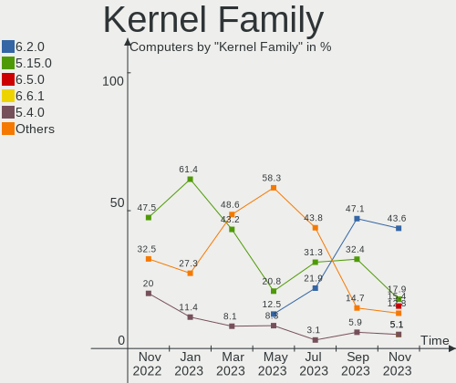

| Version | Computers | Percent |
|---------|-----------|---------|
| 6.2.0   | 20        | 62.5%   |
| 5.15.0  | 6         | 18.75%  |
| 6.5.0   | 3         | 9.38%   |
| 6.5.7   | 2         | 6.25%   |
| 4.9.337 | 1         | 3.13%   |

Kernel Major Ver.
-----------------

Linux kernel major version

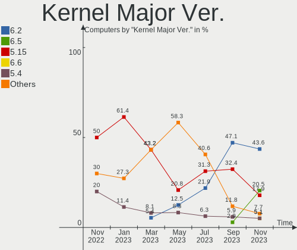

| Version | Computers | Percent |
|---------|-----------|---------|
| 6.2     | 20        | 62.5%   |
| 5.15    | 6         | 18.75%  |
| 6.5     | 5         | 15.63%  |
| 4.9     | 1         | 3.13%   |

Arch
----

OS architecture (x86_64, i586, etc.)

| Name    | Computers | Percent |
|---------|-----------|---------|
| x86_64  | 31        | 96.88%  |
| aarch64 | 1         | 3.13%   |

DE
--

Desktop Environment

| Name | Computers | Percent |
|------|-----------|---------|
| MATE | 32        | 100%    |

Display Server
--------------

X11 or Wayland

| Name    | Computers | Percent |
|---------|-----------|---------|
| X11     | 31        | 96.88%  |
| Wayland | 1         | 3.13%   |

Display Manager
---------------

SDDM, LightDM, etc.

| Name    | Computers | Percent |
|---------|-----------|---------|
| LightDM | 23        | 71.88%  |
| Unknown | 5         | 15.63%  |
| LXDM    | 2         | 6.25%   |
| GDM3    | 2         | 6.25%   |

OS Lang
-------

Language

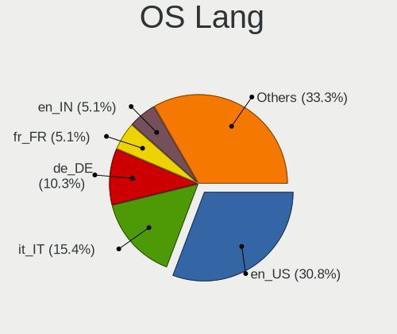

| Lang  | Computers | Percent |
|-------|-----------|---------|
| en_US | 12        | 37.5%   |
| it_IT | 3         | 9.38%   |
| fr_FR | 3         | 9.38%   |
| de_DE | 3         | 9.38%   |
| sv_SE | 2         | 6.25%   |
| pt_BR | 2         | 6.25%   |
| en_GB | 2         | 6.25%   |
| ru_RU | 1         | 3.13%   |
| ja_JP | 1         | 3.13%   |
| id_ID | 1         | 3.13%   |
| es_VE | 1         | 3.13%   |
| en_CA | 1         | 3.13%   |

Boot Mode
---------

EFI or BIOS

| Mode | Computers | Percent |
|------|-----------|---------|
| EFI  | 17        | 53.13%  |
| BIOS | 15        | 46.88%  |

Filesystem
----------

Type of filesystem

| Type    | Computers | Percent |
|---------|-----------|---------|
| Ext4    | 22        | 68.75%  |
| Tmpfs   | 8         | 25%     |
| Overlay | 1         | 3.13%   |
| Btrfs   | 1         | 3.13%   |

Part. scheme
------------

Scheme of partitioning

| Type    | Computers | Percent |
|---------|-----------|---------|
| GPT     | 24        | 75%     |
| Unknown | 5         | 15.63%  |
| MBR     | 3         | 9.38%   |

Dual Boot with Linux/BSD
------------------------

Hosting more than one Linux/BSD

| Dual boot | Computers | Percent |
|-----------|-----------|---------|
| No        | 30        | 93.75%  |
| Yes       | 2         | 6.25%   |

Dual Boot (Win)
---------------

Hosting Linux and Windows

| Dual boot | Computers | Percent |
|-----------|-----------|---------|
| No        | 17        | 53.13%  |
| Yes       | 15        | 46.88%  |

Board
-----

Vendor
------

Motherboard manufacturer

| Name                | Computers | Percent |
|---------------------|-----------|---------|
| Lenovo              | 5         | 15.63%  |
| Acer                | 4         | 12.5%   |
| Hewlett-Packard     | 3         | 9.38%   |
| ASUSTek Computer    | 3         | 9.38%   |
| MSI                 | 2         | 6.25%   |
| Gigabyte Technology | 2         | 6.25%   |
| ASRock              | 2         | 6.25%   |
| VIT                 | 1         | 3.13%   |
| Positivo            | 1         | 3.13%   |
| Panasonic           | 1         | 3.13%   |
| Packard Bell        | 1         | 3.13%   |
| Notebook            | 1         | 3.13%   |
| Infinix             | 1         | 3.13%   |
| Hardkernel          | 1         | 3.13%   |
| GPD                 | 1         | 3.13%   |
| Google              | 1         | 3.13%   |
| Dell                | 1         | 3.13%   |
| Clevo               | 1         | 3.13%   |

Model
-----

Motherboard model

| Name                                    | Computers | Percent |
|-----------------------------------------|-----------|---------|
| VIT P1400                               | 1         | 3.13%   |
| Positivo C4128G-15                      | 1         | 3.13%   |
| Panasonic CF-53SJCZYLM                  | 1         | 3.13%   |
| Packard Bell EasyNote ENTG81BA          | 1         | 3.13%   |
| Notebook NJx0MU                         | 1         | 3.13%   |
| MSI MS-7B84                             | 1         | 3.13%   |
| MSI Creator 15 A11UE                    | 1         | 3.13%   |
| Lenovo V15 G2 ALC 82KD                  | 1         | 3.13%   |
| Lenovo ThinkPad A275 20KCS09T1G         | 1         | 3.13%   |
| Lenovo IdeaPad Y700-15ISK 80NV          | 1         | 3.13%   |
| Lenovo IdeaPad 3 15ADA05 81W1           | 1         | 3.13%   |
| Lenovo IdeaCentre 510S-07ICB 90K800H1BF | 1         | 3.13%   |
| Infinix INBOOK X2                       | 1         | 3.13%   |
| HP ProBook 650 G1                       | 1         | 3.13%   |
| HP ProBook 440 G4                       | 1         | 3.13%   |
| HP Compaq 8000 Elite SFF PC             | 1         | 3.13%   |
| Hardkernel ODROID-C4                    | 1         | 3.13%   |
| GPD G1621-02                            | 1         | 3.13%   |
| Google Galtic                           | 1         | 3.13%   |
| Gigabyte G5 KC                          | 1         | 3.13%   |
| Gigabyte B550M DS3H                     | 1         | 3.13%   |
| Dell Precision 7760                     | 1         | 3.13%   |
| Clevo W240HU/W250HUQ                    | 1         | 3.13%   |
| ASUS K50ID                              | 1         | 3.13%   |
| ASUS G75VW                              | 1         | 3.13%   |
| ASUS All Series                         | 1         | 3.13%   |
| ASRock Z370 Killer SLI                  | 1         | 3.13%   |
| ASRock J4105-ITX                        | 1         | 3.13%   |
| Acer Aspire ES1-311                     | 1         | 3.13%   |
| Acer Aspire E3-112M                     | 1         | 3.13%   |
| Acer Aspire A515-45                     | 1         | 3.13%   |
| Acer Aspire 5050                        | 1         | 3.13%   |

Model Family
------------

Motherboard model prefix

| Name                   | Computers | Percent |
|------------------------|-----------|---------|
| Acer Aspire            | 4         | 12.5%   |
| Lenovo IdeaPad         | 2         | 6.25%   |
| HP ProBook             | 2         | 6.25%   |
| VIT P1400              | 1         | 3.13%   |
| Positivo C4128G-15     | 1         | 3.13%   |
| Panasonic CF-53SJCZYLM | 1         | 3.13%   |
| Packard Bell EasyNote  | 1         | 3.13%   |
| Notebook NJx0MU        | 1         | 3.13%   |
| MSI MS-7B84            | 1         | 3.13%   |
| MSI Creator            | 1         | 3.13%   |
| Lenovo V15             | 1         | 3.13%   |
| Lenovo ThinkPad        | 1         | 3.13%   |
| Lenovo IdeaCentre      | 1         | 3.13%   |
| Infinix INBOOK         | 1         | 3.13%   |
| HP Compaq              | 1         | 3.13%   |
| Hardkernel ODROID-C4   | 1         | 3.13%   |
| GPD G1621-02           | 1         | 3.13%   |
| Google Galtic          | 1         | 3.13%   |
| Gigabyte G5            | 1         | 3.13%   |
| Gigabyte B550M         | 1         | 3.13%   |
| Dell Precision         | 1         | 3.13%   |
| Clevo W240HU           | 1         | 3.13%   |
| ASUS K50ID             | 1         | 3.13%   |
| ASUS G75VW             | 1         | 3.13%   |
| ASUS All               | 1         | 3.13%   |
| ASRock Z370            | 1         | 3.13%   |
| ASRock J4105-ITX       | 1         | 3.13%   |

MFG Year
--------

Motherboard manufacture year

| Year    | Computers | Percent |
|---------|-----------|---------|
| 2021    | 10        | 31.25%  |
| 2018    | 3         | 9.38%   |
| 2020    | 2         | 6.25%   |
| 2015    | 2         | 6.25%   |
| 2014    | 2         | 6.25%   |
| 2013    | 2         | 6.25%   |
| 2012    | 2         | 6.25%   |
| 2009    | 2         | 6.25%   |
| Unknown | 2         | 6.25%   |
| 2022    | 1         | 3.13%   |
| 2017    | 1         | 3.13%   |
| 2016    | 1         | 3.13%   |
| 2011    | 1         | 3.13%   |
| 2006    | 1         | 3.13%   |

Form Factor
-----------

Physical design of the computer

| Name           | Computers | Percent |
|----------------|-----------|---------|
| Notebook       | 24        | 75%     |
| Desktop        | 7         | 21.88%  |
| System on chip | 1         | 3.13%   |

Secure Boot
-----------

Enabled or disabled

| State    | Computers | Percent |
|----------|-----------|---------|
| Disabled | 29        | 90.63%  |
| Enabled  | 3         | 9.38%   |

Coreboot
--------

Have coreboot on board

| Used | Computers | Percent |
|------|-----------|---------|
| No   | 31        | 96.88%  |
| Yes  | 1         | 3.13%   |

RAM Size
--------

Total RAM memory

| Size in GB  | Computers | Percent |
|-------------|-----------|---------|
| 4.01-8.0    | 8         | 25%     |
| 3.01-4.0    | 8         | 25%     |
| 16.01-24.0  | 7         | 21.88%  |
| 8.01-16.0   | 4         | 12.5%   |
| 1.01-2.0    | 2         | 6.25%   |
| 32.01-64.0  | 1         | 3.13%   |
| 24.01-32.0  | 1         | 3.13%   |
| 64.01-256.0 | 1         | 3.13%   |

RAM Used
--------

Used RAM memory

| Used GB   | Computers | Percent |
|-----------|-----------|---------|
| 1.01-2.0  | 12        | 37.5%   |
| 2.01-3.0  | 11        | 34.38%  |
| 3.01-4.0  | 5         | 15.63%  |
| 4.01-8.0  | 2         | 6.25%   |
| 8.01-16.0 | 2         | 6.25%   |

Total Drives
------------

Number of drives on board

| Drives | Computers | Percent |
|--------|-----------|---------|
| 1      | 22        | 68.75%  |
| 2      | 7         | 21.88%  |
| 4      | 2         | 6.25%   |
| 3      | 1         | 3.13%   |

Has CD-ROM
----------

Has CD-ROM on board

| Presented | Computers | Percent |
|-----------|-----------|---------|
| No        | 20        | 62.5%   |
| Yes       | 12        | 37.5%   |

Has Ethernet
------------

Has Ethernet on board

| Presented | Computers | Percent |
|-----------|-----------|---------|
| Yes       | 27        | 84.38%  |
| No        | 5         | 15.63%  |

Has WiFi
--------

Has WiFi module

| Presented | Computers | Percent |
|-----------|-----------|---------|
| Yes       | 26        | 81.25%  |
| No        | 6         | 18.75%  |

Has Bluetooth
-------------

Has Bluetooth module

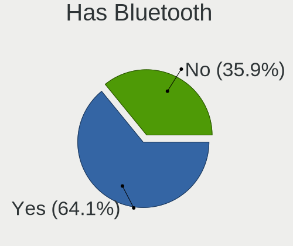

| Presented | Computers | Percent |
|-----------|-----------|---------|
| Yes       | 19        | 59.38%  |
| No        | 13        | 40.63%  |

Location
--------

Country
-------

Geographic location (country)

| Country   | Computers | Percent |
|-----------|-----------|---------|
| France    | 4         | 12.5%   |
| Italy     | 3         | 9.38%   |
| Brazil    | 3         | 9.38%   |
| USA       | 2         | 6.25%   |
| UK        | 2         | 6.25%   |
| Sweden    | 2         | 6.25%   |
| Germany   | 2         | 6.25%   |
| Vietnam   | 1         | 3.13%   |
| Venezuela | 1         | 3.13%   |
| Thailand  | 1         | 3.13%   |
| Russia    | 1         | 3.13%   |
| Romania   | 1         | 3.13%   |
| Portugal  | 1         | 3.13%   |
| Poland    | 1         | 3.13%   |
| Panama    | 1         | 3.13%   |
| Japan     | 1         | 3.13%   |
| Indonesia | 1         | 3.13%   |
| Denmark   | 1         | 3.13%   |
| Belgium   | 1         | 3.13%   |
| Austria   | 1         | 3.13%   |
| Australia | 1         | 3.13%   |

City
----

Geographic location (city)

| City             | Computers | Percent |
|------------------|-----------|---------|
| Sundbyberg       | 2         | 6.25%   |
| Palermo          | 2         | 6.25%   |
| Warsaw           | 1         | 3.13%   |
| Vienna           | 1         | 3.13%   |
| Sønderborg      | 1         | 3.13%   |
| Sao Paulo        | 1         | 3.13%   |
| Pradamano        | 1         | 3.13%   |
| Porto Alegre     | 1         | 3.13%   |
| Phenix City      | 1         | 3.13%   |
| Paris            | 1         | 3.13%   |
| Noda             | 1         | 3.13%   |
| Nantes           | 1         | 3.13%   |
| Moscow           | 1         | 3.13%   |
| Mannheim         | 1         | 3.13%   |
| Louvain-la-Neuve | 1         | 3.13%   |
| Lisbon           | 1         | 3.13%   |
| Kupang           | 1         | 3.13%   |
| Isla Bastimentos | 1         | 3.13%   |
| Hanoi            | 1         | 3.13%   |
| Hamburg          | 1         | 3.13%   |
| Florianópolis   | 1         | 3.13%   |
| Dumbravita       | 1         | 3.13%   |
| Crewe            | 1         | 3.13%   |
| Carbon-Blanc     | 1         | 3.13%   |
| Caracas          | 1         | 3.13%   |
| Brooklyn         | 1         | 3.13%   |
| Brisbane         | 1         | 3.13%   |
| Besançon        | 1         | 3.13%   |
| Bangkok          | 1         | 3.13%   |
| Ashford          | 1         | 3.13%   |

Drives
------

Drive Vendor
------------

Hard drive vendors

| Vendor              | Computers | Drives | Percent |
|---------------------|-----------|--------|---------|
| Samsung Electronics | 10        | 13     | 23.26%  |
| WDC                 | 7         | 7      | 16.28%  |
| Seagate             | 7         | 8      | 16.28%  |
| Unknown             | 3         | 3      | 6.98%   |
| Kingston            | 2         | 2      | 4.65%   |
| KingSpec            | 2         | 2      | 4.65%   |
| Crucial             | 2         | 2      | 4.65%   |
| SK hynix            | 1         | 1      | 2.33%   |
| Sandisk             | 1         | 1      | 2.33%   |
| PNY                 | 1         | 1      | 2.33%   |
| Phison Electronics  | 1         | 1      | 2.33%   |
| Micron Technology   | 1         | 1      | 2.33%   |
| Lexar               | 1         | 1      | 2.33%   |
| Intel               | 1         | 1      | 2.33%   |
| FORESEE             | 1         | 1      | 2.33%   |
| BIWIN               | 1         | 1      | 2.33%   |
| Unknown             | 1         | 1      | 2.33%   |

Drive Model
-----------

Hard drive models

| Model                                              | Computers | Percent |
|----------------------------------------------------|-----------|---------|
| Samsung NVMe SSD Controller PM9A1/PM9A3/980PRO 1TB | 3         | 6.67%   |
| Seagate ST500LT012-1DG142 500GB                    | 2         | 4.44%   |
| Samsung SSD 980 1TB                                | 2         | 4.44%   |
| WDC WD5000LPVX-22V0TT0 500GB                       | 1         | 2.22%   |
| WDC WD10SPCX-24HWST1 1TB                           | 1         | 2.22%   |
| WDC WD10JPVX-22JC3T0 1TB                           | 1         | 2.22%   |
| WDC WD10EADS-00M2B0 1TB                            | 1         | 2.22%   |
| WDC WD1003FZEX-00MK2A0 1TB                         | 1         | 2.22%   |
| WDC WD Blue SA510 M.2 2280 500GB SSD               | 1         | 2.22%   |
| WDC PC SN530 SDBPNPZ-256G                          | 1         | 2.22%   |
| Unknown SD32G  32GB                                | 1         | 2.22%   |
| Unknown MMC Card  16GB                             | 1         | 2.22%   |
| Unknown MMC Card  128GB                            | 1         | 2.22%   |
| SK hynix HFM128GDHTNG-8310B 128GB                  | 1         | 2.22%   |
| Seagate ST9500325AS 500GB                          | 1         | 2.22%   |
| Seagate ST2000DM006-2DM164 2TB                     | 1         | 2.22%   |
| Seagate ST1000DM003-1SB102 1TB                     | 1         | 2.22%   |
| Seagate ST1000DM003-1ER162 1TB                     | 1         | 2.22%   |
| Seagate Expansion 1TB                              | 1         | 2.22%   |
| Sandisk WD_BLACK SN770 1TB                         | 1         | 2.22%   |
| Samsung SSD PM871 mSATA 256GB                      | 1         | 2.22%   |
| Samsung SSD 860 EVO M.2 250GB                      | 1         | 2.22%   |
| Samsung SSD 840 Series 250GB                       | 1         | 2.22%   |
| Samsung SSD 840 EVO 120GB                          | 1         | 2.22%   |
| Samsung SSD 750 EVO 250GB                          | 1         | 2.22%   |
| Samsung MZVL2512HCJQ-00B00 512GB                   | 1         | 2.22%   |
| Samsung MZALQ512HBLU-00BL2 512GB                   | 1         | 2.22%   |
| PNY CS900 500GB SSD                                | 1         | 2.22%   |
| Phison E12 NVMe Controller 1TB                     | 1         | 2.22%   |
| Micron 2210_MTFDHBA512QFD 512GB                    | 1         | 2.22%   |
| Lexar SSD NM620 512GB                              | 1         | 2.22%   |
| Kingston SH103S3120G 120GB SSD                     | 1         | 2.22%   |
| Kingston SA400S37240G 240GB SSD                    | 1         | 2.22%   |
| KingSpec P3-256 256GB                              | 1         | 2.22%   |
| KingSpec P3-128 128GB SSD                          | 1         | 2.22%   |
| Intel SSDSCKJF180A5H REF 180GB                     | 1         | 2.22%   |
| FORESEE 512GB SSD                                  | 1         | 2.22%   |
| Crucial CT500MX500SSD1 500GB                       | 1         | 2.22%   |
| Crucial CT480BX500SSD1 480GB                       | 1         | 2.22%   |
| BIWIN SSD 512GB                                    | 1         | 2.22%   |

HDD Vendor
----------

Hard disk drive vendors

| Vendor  | Computers | Drives | Percent |
|---------|-----------|--------|---------|
| Seagate | 7         | 8      | 58.33%  |
| WDC     | 5         | 5      | 41.67%  |

SSD Vendor
----------

Solid state drive vendors

| Vendor              | Computers | Drives | Percent |
|---------------------|-----------|--------|---------|
| Samsung Electronics | 5         | 5      | 35.71%  |
| Kingston            | 2         | 2      | 14.29%  |
| KingSpec            | 2         | 2      | 14.29%  |
| Crucial             | 2         | 2      | 14.29%  |
| WDC                 | 1         | 1      | 7.14%   |
| PNY                 | 1         | 1      | 7.14%   |
| Intel               | 1         | 1      | 7.14%   |

Drive Kind
----------

HDD or SSD

| Kind | Computers | Drives | Percent |
|------|-----------|--------|---------|
| NVMe | 12        | 16     | 32.43%  |
| SSD  | 12        | 14     | 32.43%  |
| HDD  | 10        | 13     | 27.03%  |
| MMC  | 3         | 4      | 8.11%   |

Drive Connector
---------------

SATA, SAS, NVMe, etc.

| Type | Computers | Drives | Percent |
|------|-----------|--------|---------|
| SATA | 19        | 26     | 54.29%  |
| NVMe | 12        | 16     | 34.29%  |
| MMC  | 3         | 4      | 8.57%   |
| SAS  | 1         | 1      | 2.86%   |

Drive Size
----------

Size of hard drive

| Size in TB | Computers | Drives | Percent |
|------------|-----------|--------|---------|
| 0.01-0.5   | 16        | 18     | 72.73%  |
| 0.51-1.0   | 5         | 7      | 22.73%  |
| 1.01-2.0   | 1         | 2      | 4.55%   |

Space Total
-----------

Amount of disk space available on the file system

| Size in GB     | Computers | Percent |
|----------------|-----------|---------|
| 251-500        | 8         | 25%     |
| 101-250        | 8         | 25%     |
| 501-1000       | 5         | 15.63%  |
| 1001-2000      | 4         | 12.5%   |
| 51-100         | 3         | 9.38%   |
| More than 3000 | 2         | 6.25%   |
| 21-50          | 2         | 6.25%   |

Space Used
----------

Amount of used disk space

| Used GB        | Computers | Percent |
|----------------|-----------|---------|
| 101-250        | 8         | 25%     |
| 21-50          | 7         | 21.88%  |
| 1-20           | 6         | 18.75%  |
| 51-100         | 5         | 15.63%  |
| More than 3000 | 2         | 6.25%   |
| 251-500        | 2         | 6.25%   |
| 1001-2000      | 1         | 3.13%   |
| 501-1000       | 1         | 3.13%   |

Malfunc. Drives
---------------

Drive models with a malfunction

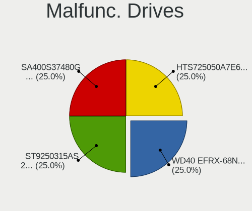

| Model                           | Computers | Drives | Percent |
|---------------------------------|-----------|--------|---------|
| WDC WD1003FZEX-00MK2A0 1TB      | 1         | 1      | 50%     |
| Seagate ST500LT012-1DG142 500GB | 1         | 1      | 50%     |

Malfunc. Drive Vendor
---------------------

Vendors of faulty drives

| Vendor  | Computers | Drives | Percent |
|---------|-----------|--------|---------|
| WDC     | 1         | 1      | 50%     |
| Seagate | 1         | 1      | 50%     |

Malfunc. HDD Vendor
-------------------

Vendors of faulty HDD drives

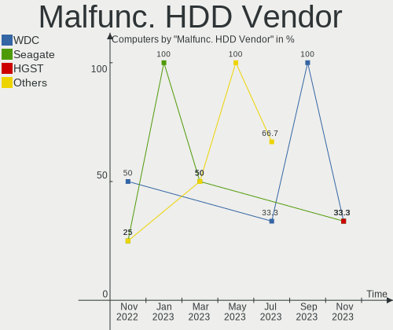

| Vendor  | Computers | Drives | Percent |
|---------|-----------|--------|---------|
| WDC     | 1         | 1      | 50%     |
| Seagate | 1         | 1      | 50%     |

Malfunc. Drive Kind
-------------------

Kinds of faulty drives

| Kind | Computers | Drives | Percent |
|------|-----------|--------|---------|
| HDD  | 2         | 2      | 100%    |

Failed Drives
-------------

Failed drive models

Zero info for selected period =(

Failed Drive Vendor
-------------------

Failed drive vendors

Zero info for selected period =(

Drive Status
------------

Number of failed and malfunc. drives

| Status   | Computers | Drives | Percent |
|----------|-----------|--------|---------|
| Works    | 17        | 24     | 50%     |
| Detected | 15        | 21     | 44.12%  |
| Malfunc  | 2         | 2      | 5.88%   |

Storage controller
------------------

Storage Vendor
--------------

Storage controller vendors

| Vendor                       | Computers | Percent |
|------------------------------|-----------|---------|
| Intel                        | 18        | 45%     |
| AMD                          | 6         | 15%     |
| Samsung Electronics          | 5         | 12.5%   |
| Shenzhen Longsys Electronics | 2         | 5%      |
| SanDisk                      | 2         | 5%      |
| SK hynix                     | 1         | 2.5%    |
| Phison Electronics           | 1         | 2.5%    |
| Nvidia                       | 1         | 2.5%    |
| Micron Technology            | 1         | 2.5%    |
| JMicron Technology           | 1         | 2.5%    |
| Biwin Storage Technology     | 1         | 2.5%    |
| ASMedia Technology           | 1         | 2.5%    |

Storage Model
-------------

Storage controller models

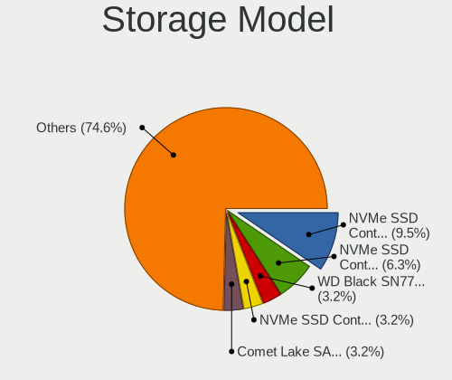

| Model                                                                            | Computers | Percent |
|----------------------------------------------------------------------------------|-----------|---------|
| Samsung NVMe SSD Controller PM9A1/PM9A3/980PRO                                   | 4         | 8.89%   |
| AMD FCH SATA Controller [AHCI mode]                                              | 4         | 8.89%   |
| Samsung NVMe SSD Controller 980 (DRAM-less)                                      | 3         | 6.67%   |
| Intel 7 Series Chipset Family 6-port SATA Controller [AHCI mode]                 | 3         | 6.67%   |
| Intel Celeron/Pentium Silver Processor SATA Controller                           | 2         | 4.44%   |
| Intel Atom Processor E3800 Series SATA AHCI Controller                           | 2         | 4.44%   |
| Intel 8 Series/C220 Series Chipset Family 6-port SATA Controller 1 [AHCI mode]   | 2         | 4.44%   |
| SK hynix BC501 NVMe Solid State Drive                                            | 1         | 2.22%   |
| Shenzhen Longsys SM2263EN/SM2263XT-based OEM NVME SSD (DRAM-less)                | 1         | 2.22%   |
| Shenzhen Longsys Lexar NM620 NVME SSD (DRAM-less)                                | 1         | 2.22%   |
| SanDisk WD Black SN770 / PC SN740 256GB / PC SN560 (DRAM-less) NVMe SSD          | 1         | 2.22%   |
| SanDisk Ultra 3D / WD Blue SN550 NVMe SSD                                        | 1         | 2.22%   |
| Phison E12 NVMe Controller                                                       | 1         | 2.22%   |
| Nvidia MCP79 AHCI Controller                                                     | 1         | 2.22%   |
| Micron 2210 NVMe SSD [Cobain]                                                    | 1         | 2.22%   |
| JMicron JMB363 SATA/IDE Controller                                               | 1         | 2.22%   |
| Intel Tiger Lake-LP SATA Controller                                              | 1         | 2.22%   |
| Intel Sunrise Point-LP SATA Controller [AHCI mode]                               | 1         | 2.22%   |
| Intel SATA Controller [RAID mode]                                                | 1         | 2.22%   |
| Intel HM170/QM170 Chipset SATA Controller [AHCI Mode]                            | 1         | 2.22%   |
| Intel Cannon Lake PCH SATA AHCI Controller                                       | 1         | 2.22%   |
| Intel Atom/Celeron/Pentium Processor x5-E8000/J3xxx/N3xxx Series SATA Controller | 1         | 2.22%   |
| Intel 82801JD/DO (ICH10 Family) 4-port SATA IDE Controller                       | 1         | 2.22%   |
| Intel 82801JD/DO (ICH10 Family) 2-port SATA IDE Controller                       | 1         | 2.22%   |
| Intel 6 Series/C200 Series Chipset Family 6 port Mobile SATA AHCI Controller     | 1         | 2.22%   |
| Intel 400 Series Chipset Family SATA AHCI Controller                             | 1         | 2.22%   |
| Biwin Storage EX900 NVMe SSD (DRAM-less)                                         | 1         | 2.22%   |
| ASMedia ASM1062 Serial ATA Controller                                            | 1         | 2.22%   |
| AMD IXP SB4x0 Serial ATA Controller                                              | 1         | 2.22%   |
| AMD IXP SB4x0 IDE Controller                                                     | 1         | 2.22%   |
| AMD FCH SATA Controller D                                                        | 1         | 2.22%   |
| AMD 500 Series Chipset SATA Controller                                           | 1         | 2.22%   |

Storage Kind
------------

Kind of storage controller (IDE, SATA, NVMe, SAS, ...)

| Kind | Computers | Percent |
|------|-----------|---------|
| SATA | 22        | 57.89%  |
| NVMe | 12        | 31.58%  |
| IDE  | 3         | 7.89%   |
| RAID | 1         | 2.63%   |

Processor
---------

CPU Vendor
----------

Processor vendors

| Vendor | Computers | Percent |
|--------|-----------|---------|
| Intel  | 24        | 75%     |
| AMD    | 7         | 21.88%  |
| ARM    | 1         | 3.13%   |

CPU Model
---------

Processor models

| Model                                         | Computers | Percent |
|-----------------------------------------------|-----------|---------|
| Intel Celeron CPU N2840 @ 2.16GHz             | 2         | 6.25%   |
| Intel Pentium Silver N6000 @ 1.10GHz          | 1         | 3.13%   |
| Intel Pentium Dual-Core CPU T4400 @ 2.20GHz   | 1         | 3.13%   |
| Intel Pentium Dual-Core CPU E5400 @ 2.70GHz   | 1         | 3.13%   |
| Intel Pentium CPU B940 @ 2.00GHz              | 1         | 3.13%   |
| Intel Core i7-8700K CPU @ 3.70GHz             | 1         | 3.13%   |
| Intel Core i7-7500U CPU @ 2.70GHz             | 1         | 3.13%   |
| Intel Core i7-6700HQ CPU @ 2.60GHz            | 1         | 3.13%   |
| Intel Core i7-4790 CPU @ 3.60GHz              | 1         | 3.13%   |
| Intel Core i7-4610M CPU @ 3.00GHz             | 1         | 3.13%   |
| Intel Core i7-3630QM CPU @ 2.40GHz            | 1         | 3.13%   |
| Intel Core i7-1065G7 CPU @ 1.30GHz            | 1         | 3.13%   |
| Intel Core i5-9400 CPU @ 2.90GHz              | 1         | 3.13%   |
| Intel Core i5-3340M CPU @ 2.70GHz             | 1         | 3.13%   |
| Intel Core i5-10500H CPU @ 2.50GHz            | 1         | 3.13%   |
| Intel Celeron N4500 @ 1.10GHz                 | 1         | 3.13%   |
| Intel Celeron N4020C CPU @ 1.10GHz            | 1         | 3.13%   |
| Intel Celeron J4105 CPU @ 1.50GHz             | 1         | 3.13%   |
| Intel Celeron CPU N3150 @ 1.60GHz             | 1         | 3.13%   |
| Intel Celeron CPU 847 @ 1.10GHz               | 1         | 3.13%   |
| Intel 11th Gen Core i7-11850H @ 2.50GHz       | 1         | 3.13%   |
| Intel 11th Gen Core i7-11800H @ 2.30GHz       | 1         | 3.13%   |
| Intel 11th Gen Core i7-1165G7 @ 2.80GHz       | 1         | 3.13%   |
| ARM Processor                                 | 1         | 3.13%   |
| AMD Turion 64 Mobile Technology MK-38         | 1         | 3.13%   |
| AMD Ryzen 7 5700U with Radeon Graphics        | 1         | 3.13%   |
| AMD Ryzen 7 3700U with Radeon Vega Mobile Gfx | 1         | 3.13%   |
| AMD Ryzen 5 5500U with Radeon Graphics        | 1         | 3.13%   |
| AMD Ryzen 5 4600G with Radeon Graphics        | 1         | 3.13%   |
| AMD Ryzen 3 2200G with Radeon Vega Graphics   | 1         | 3.13%   |
| AMD PRO A12-8830B R7, 10 COMPUTE CORES 4C+6G  | 1         | 3.13%   |

CPU Model Family
----------------

Processor model prefix

| Model                   | Computers | Percent |
|-------------------------|-----------|---------|
| Intel Core i7           | 7         | 21.88%  |
| Intel Celeron           | 7         | 21.88%  |
| Other                   | 5         | 15.63%  |
| Intel Core i5           | 3         | 9.38%   |
| Intel Pentium Dual-Core | 2         | 6.25%   |
| AMD Ryzen 7             | 2         | 6.25%   |
| AMD Ryzen 5             | 2         | 6.25%   |
| Intel Pentium Silver    | 1         | 3.13%   |
| Intel Pentium           | 1         | 3.13%   |
| AMD Turion 64 Mobile    | 1         | 3.13%   |
| AMD Ryzen 3             | 1         | 3.13%   |

CPU Cores
---------

Number of processor cores

| Number | Computers | Percent |
|--------|-----------|---------|
| 2      | 12        | 37.5%   |
| 4      | 11        | 34.38%  |
| 6      | 5         | 15.63%  |
| 8      | 3         | 9.38%   |
| 1      | 1         | 3.13%   |

CPU Sockets
-----------

Number of sockets

| Number | Computers | Percent |
|--------|-----------|---------|
| 1      | 32        | 100%    |

CPU Threads
-----------

Threads per core (Hyper-Threading)

| Number | Computers | Percent |
|--------|-----------|---------|
| 2      | 16        | 50%     |
| 1      | 16        | 50%     |

CPU Op-Modes
------------

CPU Operation Modes (32-bit, 64-bit)

| Op mode        | Computers | Percent |
|----------------|-----------|---------|
| 32-bit, 64-bit | 32        | 100%    |

CPU Microcode
-------------

Microcode number

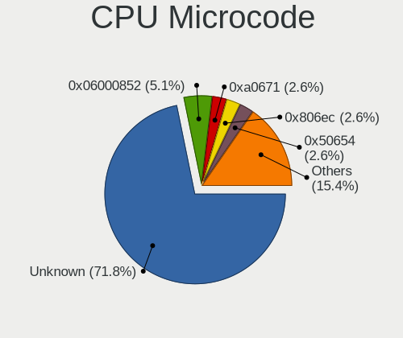

| Number     | Computers | Percent |
|------------|-----------|---------|
| Unknown    | 26        | 81.25%  |
| 0x1067a    | 2         | 6.25%   |
| 0x906c0    | 1         | 3.13%   |
| 0x08600106 | 1         | 3.13%   |
| 0x0810100b | 1         | 3.13%   |
| 0x0600611a | 1         | 3.13%   |

CPU Microarch
-------------

Microarchitecture

| Name          | Computers | Percent |
|---------------|-----------|---------|
| Unknown       | 5         | 15.63%  |
| Silvermont    | 3         | 9.38%   |
| KabyLake      | 3         | 9.38%   |
| Tremont       | 2         | 6.25%   |
| SandyBridge   | 2         | 6.25%   |
| Penryn        | 2         | 6.25%   |
| IvyBridge     | 2         | 6.25%   |
| Haswell       | 2         | 6.25%   |
| Goldmont plus | 2         | 6.25%   |
| Zen+          | 1         | 3.13%   |
| Zen 2         | 1         | 3.13%   |
| Zen           | 1         | 3.13%   |
| TigerLake     | 1         | 3.13%   |
| Skylake       | 1         | 3.13%   |
| K8 Hammer     | 1         | 3.13%   |
| IceLake       | 1         | 3.13%   |
| Excavator     | 1         | 3.13%   |
| CometLake     | 1         | 3.13%   |

Graphics
--------

GPU Vendor
----------

Vendors of graphics cards

| Vendor | Computers | Percent |
|--------|-----------|---------|
| Intel  | 20        | 57.14%  |
| AMD    | 8         | 22.86%  |
| Nvidia | 7         | 20%     |

GPU Model
---------

Graphics card models

| Model                                                                                    | Computers | Percent |
|------------------------------------------------------------------------------------------|-----------|---------|
| Nvidia GA106M [GeForce RTX 3060 Mobile / Max-Q]                                          | 2         | 5.71%   |
| Intel TigerLake-H GT1 [UHD Graphics]                                                     | 2         | 5.71%   |
| Intel JasperLake [UHD Graphics]                                                          | 2         | 5.71%   |
| Intel GeminiLake [UHD Graphics 600]                                                      | 2         | 5.71%   |
| Intel CoffeeLake-S GT2 [UHD Graphics 630]                                                | 2         | 5.71%   |
| Intel Atom Processor Z36xxx/Z37xxx Series Graphics & Display                             | 2         | 5.71%   |
| Intel 2nd Generation Core Processor Family Integrated Graphics Controller                | 2         | 5.71%   |
| AMD Lucienne                                                                             | 2         | 5.71%   |
| Nvidia GT216M [GeForce GT 320M]                                                          | 1         | 2.86%   |
| Nvidia GM107M [GeForce GTX 960M]                                                         | 1         | 2.86%   |
| Nvidia GF114M [GeForce GTX 670M]                                                         | 1         | 2.86%   |
| Nvidia GF108 [GeForce GT 430]                                                            | 1         | 2.86%   |
| Nvidia GA104GLM [RTX A3000 Mobile]                                                       | 1         | 2.86%   |
| Intel TigerLake-LP GT2 [Iris Xe Graphics]                                                | 1         | 2.86%   |
| Intel Iris Plus Graphics G7                                                              | 1         | 2.86%   |
| Intel HD Graphics 620                                                                    | 1         | 2.86%   |
| Intel HD Graphics 530                                                                    | 1         | 2.86%   |
| Intel CometLake-H GT2 [UHD Graphics]                                                     | 1         | 2.86%   |
| Intel Atom/Celeron/Pentium Processor x5-E8000/J3xxx/N3xxx Integrated Graphics Controller | 1         | 2.86%   |
| Intel 4th Gen Core Processor Integrated Graphics Controller                              | 1         | 2.86%   |
| Intel 3rd Gen Core processor Graphics Controller                                         | 1         | 2.86%   |
| AMD Wani [Radeon R5/R6/R7 Graphics]                                                      | 1         | 2.86%   |
| AMD RS482M [Mobility Radeon Xpress 200]                                                  | 1         | 2.86%   |
| AMD Renoir [Radeon RX Vega 6 (Ryzen 4000/5000 Mobile Series)]                            | 1         | 2.86%   |
| AMD Raven Ridge [Radeon Vega Series / Radeon Vega Mobile Series]                         | 1         | 2.86%   |
| AMD Picasso/Raven 2 [Radeon Vega Series / Radeon Vega Mobile Series]                     | 1         | 2.86%   |
| AMD Cedar [Radeon HD 5000/6000/7350/8350 Series]                                         | 1         | 2.86%   |

GPU Combo
---------

Combinations of graphics cards

| Name           | Computers | Percent |
|----------------|-----------|---------|
| 1 x Intel      | 16        | 50%     |
| 1 x AMD        | 8         | 25%     |
| Intel + Nvidia | 4         | 12.5%   |
| 1 x Nvidia     | 3         | 9.38%   |
| Other          | 1         | 3.13%   |

GPU Driver
----------

Free vs proprietary

| Driver      | Computers | Percent |
|-------------|-----------|---------|
| Free        | 28        | 87.5%   |
| Proprietary | 3         | 9.38%   |
| Unknown     | 1         | 3.13%   |

GPU Memory
----------

Total video memory

| Size in GB | Computers | Percent |
|------------|-----------|---------|
| Unknown    | 25        | 78.13%  |
| 0.51-1.0   | 3         | 9.38%   |
| 0.01-0.5   | 3         | 9.38%   |
| 3.01-4.0   | 1         | 3.13%   |

Monitor
-------

Monitor Vendor
--------------

Monitor vendors

| Vendor                  | Computers | Percent |
|-------------------------|-----------|---------|
| AU Optronics            | 6         | 17.65%  |
| Samsung Electronics     | 5         | 14.71%  |
| Chimei Innolux          | 5         | 14.71%  |
| BOE                     | 3         | 8.82%   |
| LG Display              | 2         | 5.88%   |
| Goldstar                | 2         | 5.88%   |
| Chi Mei Optoelectronics | 2         | 5.88%   |
| BenQ                    | 2         | 5.88%   |
| Philips                 | 1         | 2.94%   |
| PANDA                   | 1         | 2.94%   |
| NEC Computers           | 1         | 2.94%   |
| Lenovo                  | 1         | 2.94%   |
| HJC                     | 1         | 2.94%   |
| ASUSTek Computer        | 1         | 2.94%   |
| AOC                     | 1         | 2.94%   |

Monitor Model
-------------

Monitor models

| Model                                                                     | Computers | Percent |
|---------------------------------------------------------------------------|-----------|---------|
| Samsung Electronics SMB2030 SAM063C 1600x900 443x249mm 20.0-inch          | 1         | 2.86%   |
| Samsung Electronics LCD Monitor SDC415F 3840x2160 344x194mm 15.5-inch     | 1         | 2.86%   |
| Samsung Electronics LCD Monitor SAM71B4 3840x2160 950x540mm 43.0-inch     | 1         | 2.86%   |
| Samsung Electronics LCD Monitor SAM0900 1366x768 580x320mm 26.1-inch      | 1         | 2.86%   |
| Samsung Electronics LCD Monitor SAM07C0 1920x1080 890x500mm 40.2-inch     | 1         | 2.86%   |
| Philips 239CQH PHLC0A0 1920x1080 509x286mm 23.0-inch                      | 1         | 2.86%   |
| PANDA LCD Monitor NCP004B 1920x1080 344x194mm 15.5-inch                   | 1         | 2.86%   |
| NEC Computers EA193Mi NEC6956 1280x1024 375x300mm 18.9-inch               | 1         | 2.86%   |
| LG Display LCD Monitor LGD065A 1920x1080 344x194mm 15.5-inch              | 1         | 2.86%   |
| LG Display LCD Monitor LGD0533 1920x1080 344x194mm 15.5-inch              | 1         | 2.86%   |
| Lenovo LCD Monitor LEN40B0 1366x768 345x194mm 15.6-inch                   | 1         | 2.86%   |
| HJC LCD Monitor HJC003D 1920x1080 309x174mm 14.0-inch                     | 1         | 2.86%   |
| Goldstar W2600 GSM5675 1920x1200 550x343mm 25.5-inch                      | 1         | 2.86%   |
| Goldstar L226WTQ GSM564E 1680x1050 474x296mm 22.0-inch                    | 1         | 2.86%   |
| Goldstar IPS FULLHD GSM5AB7 1920x1080 480x270mm 21.7-inch                 | 1         | 2.86%   |
| Chimei Innolux LCD Monitor CMN174A 1920x1080 381x214mm 17.2-inch          | 1         | 2.86%   |
| Chimei Innolux LCD Monitor CMN15F5 1920x1080 344x193mm 15.5-inch          | 1         | 2.86%   |
| Chimei Innolux LCD Monitor CMN15C9 1366x768 344x193mm 15.5-inch           | 1         | 2.86%   |
| Chimei Innolux LCD Monitor CMN15C3 1920x1080 344x193mm 15.5-inch          | 1         | 2.86%   |
| Chimei Innolux LCD Monitor CMN1541 1366x768 344x193mm 15.5-inch           | 1         | 2.86%   |
| Chi Mei Optoelectronics LCD Monitor CMO1720 1920x1080 382x215mm 17.3-inch | 1         | 2.86%   |
| Chi Mei Optoelectronics LCD Monitor CMO1409 1280x800 303x190mm 14.1-inch  | 1         | 2.86%   |
| BOE LCD Monitor BOE084E 1920x1080 382x215mm 17.3-inch                     | 1         | 2.86%   |
| BOE LCD Monitor BOE0628 1366x768 309x173mm 13.9-inch                      | 1         | 2.86%   |
| BOE LCD Monitor BOE05B1 1366x768 309x173mm 13.9-inch                      | 1         | 2.86%   |
| BenQ XL2411Z BNQ7F32 1920x1080 531x298mm 24.0-inch                        | 1         | 2.86%   |
| BenQ EW2420 BNQ7923 1920x1080 531x299mm 24.0-inch                         | 1         | 2.86%   |
| AU Optronics LCD Monitor AUO61ED 1920x1080 344x194mm 15.5-inch            | 1         | 2.86%   |
| AU Optronics LCD Monitor AUO429D 1920x1080 382x215mm 17.3-inch            | 1         | 2.86%   |
| AU Optronics LCD Monitor AUO22EC 1366x768 344x193mm 15.5-inch             | 1         | 2.86%   |
| AU Optronics LCD Monitor AUO1E3D 1920x1080 309x173mm 13.9-inch            | 1         | 2.86%   |
| AU Optronics LCD Monitor AUO132C 1366x768 293x164mm 13.2-inch             | 1         | 2.86%   |
| AU Optronics LCD Monitor AUO106C 1366x768 276x155mm 12.5-inch             | 1         | 2.86%   |
| ASUSTek Computer VA27EHE AUS27D2 1920x1080 598x336mm 27.0-inch            | 1         | 2.86%   |
| AOC Q3279WG5B AOC3279 2560x1440 725x428mm 33.1-inch                       | 1         | 2.86%   |

Monitor Resolution
------------------

Monitor screen resolution

| Resolution         | Computers | Percent |
|--------------------|-----------|---------|
| 1920x1080 (FHD)    | 15        | 48.39%  |
| 1366x768 (WXGA)    | 8         | 25.81%  |
| 3840x2160 (4K)     | 2         | 6.45%   |
| 2560x1440 (QHD)    | 1         | 3.23%   |
| 1920x1200 (WUXGA)  | 1         | 3.23%   |
| 1680x1050 (WSXGA+) | 1         | 3.23%   |
| 1600x900 (HD+)     | 1         | 3.23%   |
| 1280x800 (WXGA)    | 1         | 3.23%   |
| 1280x1024 (SXGA)   | 1         | 3.23%   |

Monitor Diagonal
----------------

Diagonal size in inches

| Inches | Computers | Percent |
|--------|-----------|---------|
| 15     | 11        | 31.43%  |
| 17     | 4         | 11.43%  |
| 13     | 4         | 11.43%  |
| 24     | 2         | 5.71%   |
| 14     | 2         | 5.71%   |
| 84     | 1         | 2.86%   |
| 46     | 1         | 2.86%   |
| 33     | 1         | 2.86%   |
| 31     | 1         | 2.86%   |
| 27     | 1         | 2.86%   |
| 25     | 1         | 2.86%   |
| 23     | 1         | 2.86%   |
| 22     | 1         | 2.86%   |
| 21     | 1         | 2.86%   |
| 20     | 1         | 2.86%   |
| 18     | 1         | 2.86%   |
| 12     | 1         | 2.86%   |

Monitor Width
-------------

Physical width

| Width in mm | Computers | Percent |
|-------------|-----------|---------|
| 301-350     | 16        | 45.71%  |
| 501-600     | 5         | 14.29%  |
| 351-400     | 5         | 14.29%  |
| 401-500     | 3         | 8.57%   |
| 201-300     | 2         | 5.71%   |
| 701-800     | 1         | 2.86%   |
| 601-700     | 1         | 2.86%   |
| 1501-2000   | 1         | 2.86%   |
| 1001-1500   | 1         | 2.86%   |

Aspect Ratio
------------

Proportional relationship between the width and the height

| Ratio | Computers | Percent |
|-------|-----------|---------|
| 16/9  | 26        | 89.66%  |
| 16/10 | 2         | 6.9%    |
| 5/4   | 1         | 3.45%   |

Monitor Area
------------

Area in inch²

| Area in inch² | Computers | Percent |
|----------------|-----------|---------|
| 101-110        | 11        | 32.35%  |
| 81-90          | 5         | 14.71%  |
| 201-250        | 4         | 11.76%  |
| 121-130        | 4         | 11.76%  |
| 351-500        | 2         | 5.88%   |
| 151-200        | 2         | 5.88%   |
| More than 1000 | 1         | 2.94%   |
| 71-80          | 1         | 2.94%   |
| 61-70          | 1         | 2.94%   |
| 301-350        | 1         | 2.94%   |
| 251-300        | 1         | 2.94%   |
| 501-1000       | 1         | 2.94%   |

Pixel Density
-------------

Pixels per inch

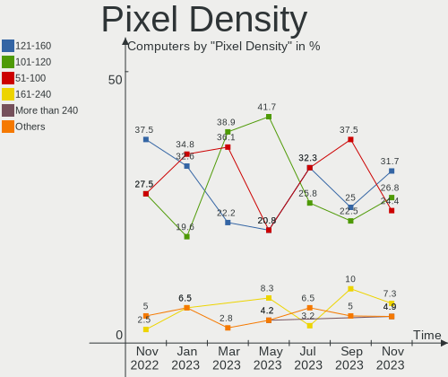

| Density       | Computers | Percent |
|---------------|-----------|---------|
| 121-160       | 13        | 38.24%  |
| 51-100        | 10        | 29.41%  |
| 101-120       | 8         | 23.53%  |
| 1-50          | 2         | 5.88%   |
| More than 240 | 1         | 2.94%   |

Multiple Monitors
-----------------

Total monitors connected

| Total | Computers | Percent |
|-------|-----------|---------|
| 1     | 25        | 78.13%  |
| 2     | 6         | 18.75%  |
| 0     | 1         | 3.13%   |

Network
-------

Net Controller Vendor
---------------------

Controller vendors

| Vendor                | Computers | Percent |
|-----------------------|-----------|---------|
| Realtek Semiconductor | 21        | 44.68%  |
| Intel                 | 14        | 29.79%  |
| Qualcomm Atheros      | 9         | 19.15%  |
| Ralink Technology     | 1         | 2.13%   |
| NetXen Incorporated   | 1         | 2.13%   |
| JMicron Technology    | 1         | 2.13%   |

Net Controller Model
--------------------

Controller models

| Model                                                                   | Computers | Percent |
|-------------------------------------------------------------------------|-----------|---------|
| Realtek RTL8111/8168/8411 PCI Express Gigabit Ethernet Controller       | 16        | 29.63%  |
| Intel Wi-Fi 6 AX200                                                     | 3         | 5.56%   |
| Qualcomm Atheros QCA9565 / AR9565 Wireless Network Adapter              | 2         | 3.7%    |
| Intel Wi-Fi 6 AX210/AX211/AX411 160MHz                                  | 2         | 3.7%    |
| Intel Wi-Fi 6 AX201 160MHz                                              | 2         | 3.7%    |
| Intel Centrino Advanced-N 6235                                          | 2         | 3.7%    |
| Realtek RTL88x2bu [AC1200 Techkey]                                      | 1         | 1.85%   |
| Realtek RTL8822CE 802.11ac PCIe Wireless Network Adapter                | 1         | 1.85%   |
| Realtek RTL8822BE 802.11a/b/g/n/ac WiFi adapter                         | 1         | 1.85%   |
| Realtek RTL8821CE 802.11ac PCIe Wireless Network Adapter                | 1         | 1.85%   |
| Realtek RTL8188CE 802.11b/g/n WiFi Adapter                              | 1         | 1.85%   |
| Realtek RTL8125 2.5GbE Controller                                       | 1         | 1.85%   |
| Realtek RTL-8100/8101L/8139 PCI Fast Ethernet Adapter                   | 1         | 1.85%   |
| Realtek Killer E3000 2.5GbE Controller                                  | 1         | 1.85%   |
| Ralink MT7610U ("Archer T2U" 2.4G+5G WLAN Adapter                       | 1         | 1.85%   |
| Qualcomm Atheros QCA9377 802.11ac Wireless Network Adapter              | 1         | 1.85%   |
| Qualcomm Atheros QCA6174 802.11ac Wireless Network Adapter              | 1         | 1.85%   |
| Qualcomm Atheros AR9485 Wireless Network Adapter                        | 1         | 1.85%   |
| Qualcomm Atheros AR928X Wireless Network Adapter (PCI-Express)          | 1         | 1.85%   |
| Qualcomm Atheros AR9285 Wireless Network Adapter (PCI-Express)          | 1         | 1.85%   |
| Qualcomm Atheros AR8151 v2.0 Gigabit Ethernet                           | 1         | 1.85%   |
| Qualcomm Atheros AR242x / AR542x Wireless Network Adapter (PCI-Express) | 1         | 1.85%   |
| NetXen Incorporated NX3031 Multifunction 1/10-Gigabit Server Adapter    | 1         | 1.85%   |
| JMicron JMC250 PCI Express Gigabit Ethernet Controller                  | 1         | 1.85%   |
| Intel Wireless 7265                                                     | 1         | 1.85%   |
| Intel Ice Lake-LP PCH CNVi WiFi                                         | 1         | 1.85%   |
| Intel Ethernet Connection I217-LM                                       | 1         | 1.85%   |
| Intel Ethernet Connection (2) I219-V                                    | 1         | 1.85%   |
| Intel Ethernet Connection (14) I219-LM                                  | 1         | 1.85%   |
| Intel Ethernet Connection (13) I219-V                                   | 1         | 1.85%   |
| Intel Dual Band Wireless-AC 3165 Plus Bluetooth                         | 1         | 1.85%   |
| Intel 82579LM Gigabit Network Connection (Lewisville)                   | 1         | 1.85%   |
| Intel 82567LM-3 Gigabit Network Connection                              | 1         | 1.85%   |

Wireless Vendor
---------------

Wireless vendors

| Vendor                | Computers | Percent |
|-----------------------|-----------|---------|
| Intel                 | 12        | 46.15%  |
| Qualcomm Atheros      | 8         | 30.77%  |
| Realtek Semiconductor | 5         | 19.23%  |
| Ralink Technology     | 1         | 3.85%   |

Wireless Model
--------------

Wireless models

| Model                                                                   | Computers | Percent |
|-------------------------------------------------------------------------|-----------|---------|
| Intel Wi-Fi 6 AX200                                                     | 3         | 11.54%  |
| Qualcomm Atheros QCA9565 / AR9565 Wireless Network Adapter              | 2         | 7.69%   |
| Intel Wi-Fi 6 AX210/AX211/AX411 160MHz                                  | 2         | 7.69%   |
| Intel Wi-Fi 6 AX201 160MHz                                              | 2         | 7.69%   |
| Intel Centrino Advanced-N 6235                                          | 2         | 7.69%   |
| Realtek RTL88x2bu [AC1200 Techkey]                                      | 1         | 3.85%   |
| Realtek RTL8822CE 802.11ac PCIe Wireless Network Adapter                | 1         | 3.85%   |
| Realtek RTL8822BE 802.11a/b/g/n/ac WiFi adapter                         | 1         | 3.85%   |
| Realtek RTL8821CE 802.11ac PCIe Wireless Network Adapter                | 1         | 3.85%   |
| Realtek RTL8188CE 802.11b/g/n WiFi Adapter                              | 1         | 3.85%   |
| Ralink MT7610U ("Archer T2U" 2.4G+5G WLAN Adapter                       | 1         | 3.85%   |
| Qualcomm Atheros QCA9377 802.11ac Wireless Network Adapter              | 1         | 3.85%   |
| Qualcomm Atheros QCA6174 802.11ac Wireless Network Adapter              | 1         | 3.85%   |
| Qualcomm Atheros AR9485 Wireless Network Adapter                        | 1         | 3.85%   |
| Qualcomm Atheros AR928X Wireless Network Adapter (PCI-Express)          | 1         | 3.85%   |
| Qualcomm Atheros AR9285 Wireless Network Adapter (PCI-Express)          | 1         | 3.85%   |
| Qualcomm Atheros AR242x / AR542x Wireless Network Adapter (PCI-Express) | 1         | 3.85%   |
| Intel Wireless 7265                                                     | 1         | 3.85%   |
| Intel Ice Lake-LP PCH CNVi WiFi                                         | 1         | 3.85%   |
| Intel Dual Band Wireless-AC 3165 Plus Bluetooth                         | 1         | 3.85%   |

Ethernet Vendor
---------------

Ethernet vendors

| Vendor                | Computers | Percent |
|-----------------------|-----------|---------|
| Realtek Semiconductor | 19        | 67.86%  |
| Intel                 | 6         | 21.43%  |
| Qualcomm Atheros      | 1         | 3.57%   |
| NetXen Incorporated   | 1         | 3.57%   |
| JMicron Technology    | 1         | 3.57%   |

Ethernet Model
--------------

Ethernet models

| Model                                                                | Computers | Percent |
|----------------------------------------------------------------------|-----------|---------|
| Realtek RTL8111/8168/8411 PCI Express Gigabit Ethernet Controller    | 16        | 57.14%  |
| Realtek RTL8125 2.5GbE Controller                                    | 1         | 3.57%   |
| Realtek RTL-8100/8101L/8139 PCI Fast Ethernet Adapter                | 1         | 3.57%   |
| Realtek Killer E3000 2.5GbE Controller                               | 1         | 3.57%   |
| Qualcomm Atheros AR8151 v2.0 Gigabit Ethernet                        | 1         | 3.57%   |
| NetXen Incorporated NX3031 Multifunction 1/10-Gigabit Server Adapter | 1         | 3.57%   |
| JMicron JMC250 PCI Express Gigabit Ethernet Controller               | 1         | 3.57%   |
| Intel Ethernet Connection I217-LM                                    | 1         | 3.57%   |
| Intel Ethernet Connection (2) I219-V                                 | 1         | 3.57%   |
| Intel Ethernet Connection (14) I219-LM                               | 1         | 3.57%   |
| Intel Ethernet Connection (13) I219-V                                | 1         | 3.57%   |
| Intel 82579LM Gigabit Network Connection (Lewisville)                | 1         | 3.57%   |
| Intel 82567LM-3 Gigabit Network Connection                           | 1         | 3.57%   |

Net Controller Kind
-------------------

Ethernet, WiFi or modem

| Kind     | Computers | Percent |
|----------|-----------|---------|
| Ethernet | 27        | 50.94%  |
| WiFi     | 26        | 49.06%  |

Used Controller
---------------

Currently used network controller

| Kind     | Computers | Percent |
|----------|-----------|---------|
| WiFi     | 19        | 61.29%  |
| Ethernet | 12        | 38.71%  |

NICs
----

Total network controllers on board

| Total | Computers | Percent |
|-------|-----------|---------|
| 2     | 20        | 62.5%   |
| 1     | 10        | 31.25%  |
| 5     | 1         | 3.13%   |
| 0     | 1         | 3.13%   |

IPv6
----

IPv6 vs IPv4

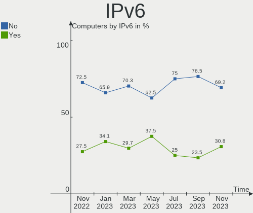

| Used | Computers | Percent |
|------|-----------|---------|
| No   | 22        | 68.75%  |
| Yes  | 10        | 31.25%  |

Bluetooth
---------

Bluetooth Vendor
----------------

Controller vendors

| Vendor                          | Computers | Percent |
|---------------------------------|-----------|---------|
| Intel                           | 11        | 57.89%  |
| Realtek Semiconductor           | 3         | 15.79%  |
| Qualcomm Atheros Communications | 2         | 10.53%  |
| Cambridge Silicon Radio         | 2         | 10.53%  |
| Foxconn / Hon Hai               | 1         | 5.26%   |

Bluetooth Model
---------------

Controller models

| Model                                               | Computers | Percent |
|-----------------------------------------------------|-----------|---------|
| Intel AX200 Bluetooth                               | 3         | 15.79%  |
| Realtek Bluetooth Radio                             | 2         | 10.53%  |
| Intel Bluetooth wireless interface                  | 2         | 10.53%  |
| Intel AX210 Bluetooth                               | 2         | 10.53%  |
| Intel AX201 Bluetooth                               | 2         | 10.53%  |
| Cambridge Silicon Radio Bluetooth Dongle (HCI mode) | 2         | 10.53%  |
| Realtek RTL8822BE Bluetooth 4.2 Adapter             | 1         | 5.26%   |
| Qualcomm Atheros  Bluetooth Device                  | 1         | 5.26%   |
| Qualcomm Atheros QCA61x4 Bluetooth 4.0              | 1         | 5.26%   |
| Intel Centrino Bluetooth Wireless Transceiver       | 1         | 5.26%   |
| Intel Bluetooth 9460/9560 Jefferson Peak (JfP)      | 1         | 5.26%   |
| Foxconn / Hon Hai Bluetooth Device                  | 1         | 5.26%   |

Sound
-----

Sound Vendor
------------

Sound card vendors

| Vendor              | Computers | Percent |
|---------------------|-----------|---------|
| Intel               | 22        | 52.38%  |
| AMD                 | 8         | 19.05%  |
| Nvidia              | 6         | 14.29%  |
| C-Media Electronics | 2         | 4.76%   |
| Texas Instruments   | 1         | 2.38%   |
| Project DAC DS      | 1         | 2.38%   |
| Meizu               | 1         | 2.38%   |
| Kingston Technology | 1         | 2.38%   |

Sound Model
-----------

Sound card models

| Model                                                                                             | Computers | Percent |
|---------------------------------------------------------------------------------------------------|-----------|---------|
| AMD Family 17h/19h HD Audio Controller                                                            | 5         | 10%     |
| Intel 7 Series/C216 Chipset Family High Definition Audio Controller                               | 3         | 6%      |
| AMD Renoir Radeon High Definition Audio Controller                                                | 3         | 6%      |
| Nvidia GA106 High Definition Audio Controller                                                     | 2         | 4%      |
| Intel Tiger Lake-H HD Audio Controller                                                            | 2         | 4%      |
| Intel Jasper Lake HD Audio                                                                        | 2         | 4%      |
| Intel Celeron/Pentium Silver Processor High Definition Audio                                      | 2         | 4%      |
| Intel Atom Processor Z36xxx/Z37xxx Series High Definition Audio Controller                        | 2         | 4%      |
| Intel 8 Series/C220 Series Chipset High Definition Audio Controller                               | 2         | 4%      |
| AMD Raven/Raven2/Fenghuang HDMI/DP Audio Controller                                               | 2         | 4%      |
| Texas Instruments PCM2902 Audio Codec                                                             | 1         | 2%      |
| Project DAC DS USB Audio 2.0                                                                      | 1         | 2%      |
| Nvidia MCP79 High Definition Audio                                                                | 1         | 2%      |
| Nvidia GT216 HDMI Audio Controller                                                                | 1         | 2%      |
| Nvidia GF114 HDMI Audio Controller                                                                | 1         | 2%      |
| Nvidia GF108 High Definition Audio Controller                                                     | 1         | 2%      |
| Nvidia GA104 High Definition Audio Controller                                                     | 1         | 2%      |
| Meizu HiFi DAC Headphone Amplifier                                                                | 1         | 2%      |
| Kingston Technology HyperX 7.1 Audio                                                              | 1         | 2%      |
| Intel Xeon E3-1200 v3/4th Gen Core Processor HD Audio Controller                                  | 1         | 2%      |
| Intel Tiger Lake-LP Smart Sound Technology Audio Controller                                       | 1         | 2%      |
| Intel Sunrise Point-LP HD Audio                                                                   | 1         | 2%      |
| Intel Ice Lake-LP Smart Sound Technology Audio Controller                                         | 1         | 2%      |
| Intel Comet Lake PCH cAVS                                                                         | 1         | 2%      |
| Intel Cannon Lake PCH cAVS                                                                        | 1         | 2%      |
| Intel Atom/Celeron/Pentium Processor x5-E8000/J3xxx/N3xxx Series High Definition Audio Controller | 1         | 2%      |
| Intel 82801JD/DO (ICH10 Family) HD Audio Controller                                               | 1         | 2%      |
| Intel 6 Series/C200 Series Chipset Family High Definition Audio Controller                        | 1         | 2%      |
| Intel 100 Series/C230 Series Chipset Family HD Audio Controller                                   | 1         | 2%      |
| C-Media Electronics USB Advanced Audio Device                                                     | 1         | 2%      |
| C-Media Electronics CMI8788 [Oxygen HD Audio]                                                     | 1         | 2%      |
| AMD Kabini HDMI/DP Audio                                                                          | 1         | 2%      |
| AMD IXP SB4x0 High Definition Audio Controller                                                    | 1         | 2%      |
| AMD Family 15h (Models 60h-6fh) Audio Controller                                                  | 1         | 2%      |
| AMD Cedar HDMI Audio [Radeon HD 5400/6300/7300 Series]                                            | 1         | 2%      |

Memory
------

Memory Vendor
-------------

Memory module vendors

| Vendor              | Computers | Percent |
|---------------------|-----------|---------|
| Samsung Electronics | 6         | 25%     |
| SK hynix            | 5         | 20.83%  |
| G.Skill             | 3         | 12.5%   |
| Unknown             | 2         | 8.33%   |
| Micron Technology   | 2         | 8.33%   |
| Ramaxel Technology  | 1         | 4.17%   |
| Kingston            | 1         | 4.17%   |
| GOODRAM             | 1         | 4.17%   |
| Elpida              | 1         | 4.17%   |
| Corsair             | 1         | 4.17%   |
| Unknown             | 1         | 4.17%   |

Memory Model
------------

Memory module models

| Model                                                            | Computers | Percent |
|------------------------------------------------------------------|-----------|---------|
| Unknown RAM Module 4GB DIMM DDR3 1333MT/s                        | 1         | 4.17%   |
| Unknown RAM Module 2GB SODIMM DDR3 1333MT/s                      | 1         | 4.17%   |
| SK hynix RAM Module 8GB SODIMM DDR4 2133MT/s                     | 1         | 4.17%   |
| SK hynix RAM HMT451S6BFR8A-PB 4GB SODIMM DDR3 1600MT/s           | 1         | 4.17%   |
| SK hynix RAM HMAA1GS6CMR6N-XN 8192MB SODIMM DDR4 3200MT/s        | 1         | 4.17%   |
| SK hynix RAM HMA81GS6AFR8N-UH 8GB SODIMM DDR4 2400MT/s           | 1         | 4.17%   |
| SK hynix RAM H9HCNNNBKMMLXR-NEE 4GB LPDDR4 3733MT/s              | 1         | 4.17%   |
| Samsung RAM M471B5673EH1-CF8 2GB SODIMM DDR3 4199MT/s            | 1         | 4.17%   |
| Samsung RAM M471A1K43DB1-CWE 8GB SODIMM DDR4 3200MT/s            | 1         | 4.17%   |
| Samsung RAM M471A1K43CB1-CRC 8GB SODIMM DDR4 2667MT/s            | 1         | 4.17%   |
| Samsung RAM M378B5273DH0-CH9 4096MB DIMM DDR3 2133MT/s           | 1         | 4.17%   |
| Samsung RAM M378A1K43CB2-CTD 8GB DIMM DDR4 3266MT/s              | 1         | 4.17%   |
| Samsung RAM 53D512M64D4RQ-046 4GB Row Of Chips LPDDR4 4267MT/s   | 1         | 4.17%   |
| Ramaxel RAM RMT3150ED58E8W1600 2GB SODIMM DDR3 1600MT/s          | 1         | 4.17%   |
| Micron RAM MT53E1G32D4NQ-046WTE 4GB Row Of Chips LPDDR4 4266MT/s | 1         | 4.17%   |
| Micron RAM 4ATF1G64HZ-3G2E1 8GB SODIMM DDR4 3200MT/s             | 1         | 4.17%   |
| Kingston RAM 9905700-104.A00G 8GB SODIMM DDR4 3200MT/s           | 1         | 4.17%   |
| GOODRAM RAM IRX3000D464L16S/8G 8GB DIMM DDR4 3333MT/s            | 1         | 4.17%   |
| G.Skill RAM F4-3200C16-8GIS 8GB DIMM DDR4 3200MT/s               | 1         | 4.17%   |
| G.Skill RAM F4-2400C17-4GNT 4GB DIMM DDR4 2400MT/s               | 1         | 4.17%   |
| G.Skill RAM F4-2400C16-4GRS 4GB SODIMM DDR4 2400MT/s             | 1         | 4.17%   |
| Elpida RAM EBJ10UE8BDF0-DJ-F 1GB DIMM DDR3 1333MT/s              | 1         | 4.17%   |
| Corsair RAM CMSO8GX4M1A2133C15 8GB SODIMM DDR4 2133MT/s          | 1         | 4.17%   |
| Unknown                                                          | 1         | 4.17%   |

Memory Kind
-----------

Memory module kinds

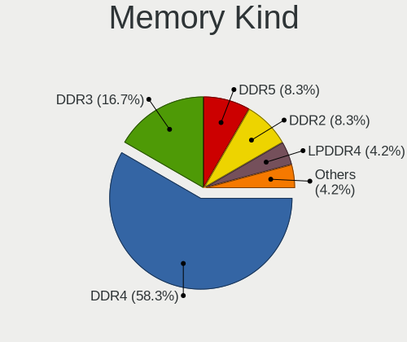

| Kind   | Computers | Percent |
|--------|-----------|---------|
| DDR4   | 12        | 57.14%  |
| DDR3   | 5         | 23.81%  |
| LPDDR4 | 3         | 14.29%  |
| SDRAM  | 1         | 4.76%   |

Memory Form Factor
------------------

Physical design of the memory module

| Name         | Computers | Percent |
|--------------|-----------|---------|
| SODIMM       | 11        | 52.38%  |
| DIMM         | 6         | 28.57%  |
| Row Of Chips | 3         | 14.29%  |
| Unknown      | 1         | 4.76%   |

Memory Size
-----------

Memory module size

| Size  | Computers | Percent |
|-------|-----------|---------|
| 8192  | 11        | 50%     |
| 4096  | 6         | 27.27%  |
| 2048  | 3         | 13.64%  |
| 16384 | 1         | 4.55%   |
| 1024  | 1         | 4.55%   |

Memory Speed
------------

Memory module speed

| Speed | Computers | Percent |
|-------|-----------|---------|
| 3200  | 5         | 21.74%  |
| 2400  | 3         | 13.04%  |
| 2133  | 3         | 13.04%  |
| 1333  | 3         | 13.04%  |
| 1600  | 2         | 8.7%    |
| 4267  | 1         | 4.35%   |
| 4266  | 1         | 4.35%   |
| 4199  | 1         | 4.35%   |
| 3733  | 1         | 4.35%   |
| 3333  | 1         | 4.35%   |
| 3266  | 1         | 4.35%   |
| 2667  | 1         | 4.35%   |

Printers & scanners
-------------------

Printer Vendor
--------------

Printer device vendors

Zero info for selected period =(

Printer Model
-------------

Printer device models

Zero info for selected period =(

Scanner Vendor
--------------

Scanner device vendors

Zero info for selected period =(

Scanner Model
-------------

Scanner device models

Zero info for selected period =(

Camera
------

Camera Vendor
-------------

Camera device vendors

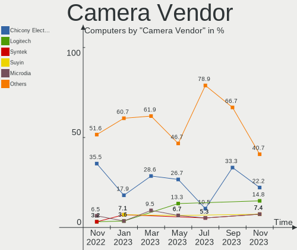

| Vendor                        | Computers | Percent |
|-------------------------------|-----------|---------|
| Chicony Electronics           | 5         | 20.83%  |
| Sunplus Innovation Technology | 3         | 12.5%   |
| Bison Electronics             | 3         | 12.5%   |
| Syntek                        | 2         | 8.33%   |
| Realtek Semiconductor         | 2         | 8.33%   |
| Alcor Micro                   | 2         | 8.33%   |
| Samsung Electronics           | 1         | 4.17%   |
| Quanta                        | 1         | 4.17%   |
| Microdia                      | 1         | 4.17%   |
| Lite-On Technology            | 1         | 4.17%   |
| Intel                         | 1         | 4.17%   |
| IMC Networks                  | 1         | 4.17%   |
| Generalplus Technology        | 1         | 4.17%   |

Camera Model
------------

Camera device models

| Model                                   | Computers | Percent |
|-----------------------------------------|-----------|---------|
| Syntek Integrated Camera                | 2         | 8.33%   |
| Sunplus FHD Capture                     | 1         | 4.17%   |
| Sunplus Camera                          | 1         | 4.17%   |
| Sunplus ASUS Webcam                     | 1         | 4.17%   |
| Samsung Galaxy series, misc. (MTP mode) | 1         | 4.17%   |
| Realtek Integrated_Webcam_HD            | 1         | 4.17%   |
| Realtek HD WebCam                       | 1         | 4.17%   |
| Quanta HD User Facing                   | 1         | 4.17%   |
| Microdia USB 2.0 Camera                 | 1         | 4.17%   |
| Lite-On Integrated Camera               | 1         | 4.17%   |
| Intel RealSense 3D Camera (Front F200)  | 1         | 4.17%   |
| IMC Networks USB2.0 HD UVC WebCam       | 1         | 4.17%   |
| Generalplus WEB CAM                     | 1         | 4.17%   |
| Chicony VGA Webcam                      | 1         | 4.17%   |
| Chicony USB2.0 Camera                   | 1         | 4.17%   |
| Chicony HP HD Camera                    | 1         | 4.17%   |
| Chicony HD WebCam                       | 1         | 4.17%   |
| Chicony 2.0M UVC Webcam / CNF7129       | 1         | 4.17%   |
| Bison HD Camera                         | 1         | 4.17%   |
| Bison BisonCam,NB Pro                   | 1         | 4.17%   |
| Bison Acer Orbicam                      | 1         | 4.17%   |
| Alcor Micro USB 2.0 PC Camera           | 1         | 4.17%   |
| Alcor Micro USB 2.0 Camera              | 1         | 4.17%   |

Security
--------

Fingerprint Vendor
------------------

Fingerprint sensor vendors

| Vendor           | Computers | Percent |
|------------------|-----------|---------|
| Validity Sensors | 1         | 100%    |

Fingerprint Model
-----------------

Fingerprint sensor models

| Model                                      | Computers | Percent |
|--------------------------------------------|-----------|---------|
| Validity Sensors VFS495 Fingerprint Reader | 1         | 100%    |

Chipcard Vendor
---------------

Chipcard module vendors

| Vendor   | Computers | Percent |
|----------|-----------|---------|
| Broadcom | 1         | 100%    |

Chipcard Model
--------------

Chipcard module models

| Model          | Computers | Percent |
|----------------|-----------|---------|
| Broadcom 58200 | 1         | 100%    |

Unsupported
-----------

Unsupported Devices
-------------------

Total unsupported devices on board

| Total | Computers | Percent |
|-------|-----------|---------|
| 0     | 28        | 87.5%   |
| 2     | 2         | 6.25%   |
| 1     | 2         | 6.25%   |

Unsupported Device Types
------------------------

Types of unsupported devices

| Type               | Computers | Percent |
|--------------------|-----------|---------|
| Graphics card      | 1         | 20%     |
| Flash memory       | 1         | 20%     |
| Fingerprint reader | 1         | 20%     |
| Chipcard           | 1         | 20%     |
| Camera             | 1         | 20%     |

