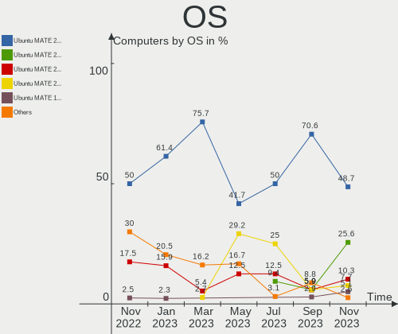
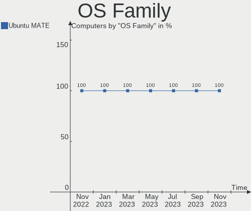
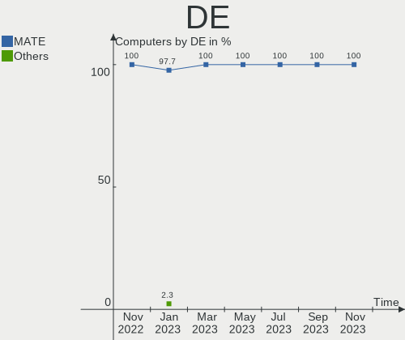
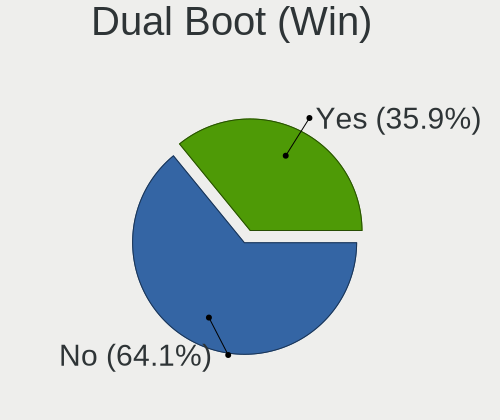
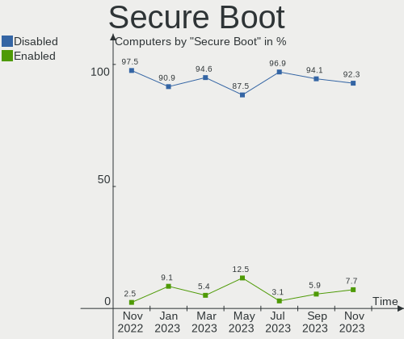
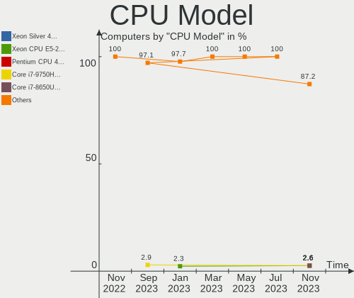
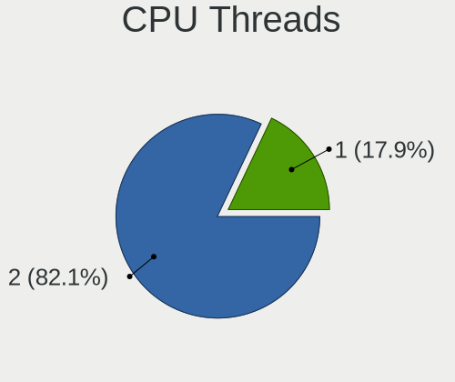
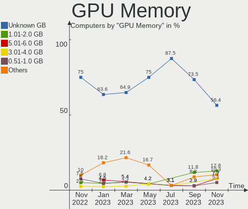
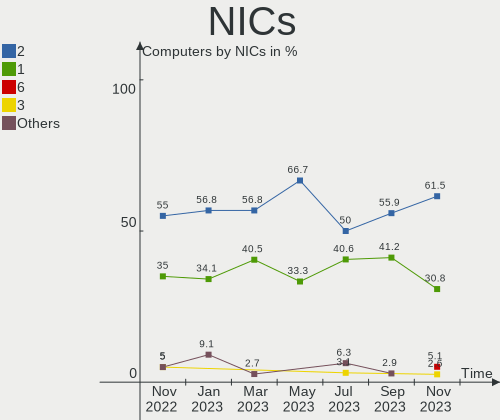
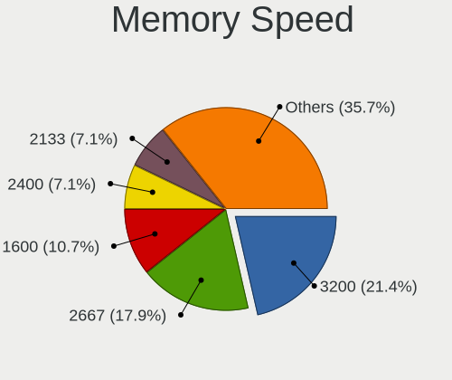

Ubuntu MATE - Hardware Trends
-----------------------------

A project to identify most popular hardware characteristics and track their change
over time based on data collected by Linux users at https://Linux-Hardware.org.

Anyone can contribute to this report by the [hw-probe](https://github.com/linuxhw/hw-probe) tool:

    sudo -E hw-probe -all -upload

This is a report for all computer types. See also reports for [desktops](/Dist/Ubuntu_MATE/Desktop/README.md) and [notebooks](/Dist/Ubuntu_MATE/Notebook/README.md).

This report is for one last month. Overall report since the beginning of time: [TestCoverage](https://github.com/linuxhw/TestCoverage)

Period: Jul, 2022.

Contents
--------

* [ System ](#system)
  - [ OS                       ](#os)
  - [ OS Family                ](#os-family)
  - [ Kernel                   ](#kernel)
  - [ Kernel Family            ](#kernel-family)
  - [ Kernel Major Ver.        ](#kernel-major-ver)
  - [ Arch                     ](#arch)
  - [ DE                       ](#de)
  - [ Display Server           ](#display-server)
  - [ Display Manager          ](#display-manager)
  - [ OS Lang                  ](#os-lang)
  - [ Boot Mode                ](#boot-mode)
  - [ Filesystem               ](#filesystem)
  - [ Part. scheme             ](#part-scheme)
  - [ Dual Boot with Linux/BSD ](#dual-boot-with-linuxbsd)
  - [ Dual Boot (Win)          ](#dual-boot-win)

* [ Board ](#board)
  - [ Vendor                   ](#vendor)
  - [ Model                    ](#model)
  - [ Model Family             ](#model-family)
  - [ MFG Year                 ](#mfg-year)
  - [ Form Factor              ](#form-factor)
  - [ Secure Boot              ](#secure-boot)
  - [ Coreboot                 ](#coreboot)
  - [ RAM Size                 ](#ram-size)
  - [ RAM Used                 ](#ram-used)
  - [ Total Drives             ](#total-drives)
  - [ Has CD-ROM               ](#has-cd-rom)
  - [ Has Ethernet             ](#has-ethernet)
  - [ Has WiFi                 ](#has-wifi)
  - [ Has Bluetooth            ](#has-bluetooth)

* [ Location ](#location)
  - [ Country                  ](#country)
  - [ City                     ](#city)

* [ Drives ](#drives)
  - [ Drive Vendor             ](#drive-vendor)
  - [ Drive Model              ](#drive-model)
  - [ HDD Vendor               ](#hdd-vendor)
  - [ SSD Vendor               ](#ssd-vendor)
  - [ Drive Kind               ](#drive-kind)
  - [ Drive Connector          ](#drive-connector)
  - [ Drive Size               ](#drive-size)
  - [ Space Total              ](#space-total)
  - [ Space Used               ](#space-used)
  - [ Malfunc. Drives          ](#malfunc-drives)
  - [ Malfunc. Drive Vendor    ](#malfunc-drive-vendor)
  - [ Malfunc. HDD Vendor      ](#malfunc-hdd-vendor)
  - [ Malfunc. Drive Kind      ](#malfunc-drive-kind)
  - [ Failed Drives            ](#failed-drives)
  - [ Failed Drive Vendor      ](#failed-drive-vendor)
  - [ Drive Status             ](#drive-status)

* [ Storage controller ](#storage-controller)
  - [ Storage Vendor           ](#storage-vendor)
  - [ Storage Model            ](#storage-model)
  - [ Storage Kind             ](#storage-kind)

* [ Processor ](#processor)
  - [ CPU Vendor               ](#cpu-vendor)
  - [ CPU Model                ](#cpu-model)
  - [ CPU Model Family         ](#cpu-model-family)
  - [ CPU Cores                ](#cpu-cores)
  - [ CPU Sockets              ](#cpu-sockets)
  - [ CPU Threads              ](#cpu-threads)
  - [ CPU Op-Modes             ](#cpu-op-modes)
  - [ CPU Microcode            ](#cpu-microcode)
  - [ CPU Microarch            ](#cpu-microarch)

* [ Graphics ](#graphics)
  - [ GPU Vendor               ](#gpu-vendor)
  - [ GPU Model                ](#gpu-model)
  - [ GPU Combo                ](#gpu-combo)
  - [ GPU Driver               ](#gpu-driver)
  - [ GPU Memory               ](#gpu-memory)

* [ Monitor ](#monitor)
  - [ Monitor Vendor           ](#monitor-vendor)
  - [ Monitor Model            ](#monitor-model)
  - [ Monitor Resolution       ](#monitor-resolution)
  - [ Monitor Diagonal         ](#monitor-diagonal)
  - [ Monitor Width            ](#monitor-width)
  - [ Aspect Ratio             ](#aspect-ratio)
  - [ Monitor Area             ](#monitor-area)
  - [ Pixel Density            ](#pixel-density)
  - [ Multiple Monitors        ](#multiple-monitors)

* [ Network ](#network)
  - [ Net Controller Vendor    ](#net-controller-vendor)
  - [ Net Controller Model     ](#net-controller-model)
  - [ Wireless Vendor          ](#wireless-vendor)
  - [ Wireless Model           ](#wireless-model)
  - [ Ethernet Vendor          ](#ethernet-vendor)
  - [ Ethernet Model           ](#ethernet-model)
  - [ Net Controller Kind      ](#net-controller-kind)
  - [ Used Controller          ](#used-controller)
  - [ NICs                     ](#nics)
  - [ IPv6                     ](#ipv6)

* [ Bluetooth ](#bluetooth)
  - [ Bluetooth Vendor         ](#bluetooth-vendor)
  - [ Bluetooth Model          ](#bluetooth-model)

* [ Sound ](#sound)
  - [ Sound Vendor             ](#sound-vendor)
  - [ Sound Model              ](#sound-model)

* [ Memory ](#memory)
  - [ Memory Vendor            ](#memory-vendor)
  - [ Memory Model             ](#memory-model)
  - [ Memory Kind              ](#memory-kind)
  - [ Memory Form Factor       ](#memory-form-factor)
  - [ Memory Size              ](#memory-size)
  - [ Memory Speed             ](#memory-speed)

* [ Printers & scanners ](#printers--scanners)
  - [ Printer Vendor           ](#printer-vendor)
  - [ Printer Model            ](#printer-model)
  - [ Scanner Vendor           ](#scanner-vendor)
  - [ Scanner Model            ](#scanner-model)

* [ Camera ](#camera)
  - [ Camera Vendor            ](#camera-vendor)
  - [ Camera Model             ](#camera-model)

* [ Security ](#security)
  - [ Fingerprint Vendor       ](#fingerprint-vendor)
  - [ Fingerprint Model        ](#fingerprint-model)
  - [ Chipcard Vendor          ](#chipcard-vendor)
  - [ Chipcard Model           ](#chipcard-model)

* [ Unsupported ](#unsupported)
  - [ Unsupported Devices      ](#unsupported-devices)
  - [ Unsupported Device Types ](#unsupported-device-types)

System
------

OS
--

Installed operating systems

| Name              | Computers | Percent |
|-------------------|-----------|---------|
| Ubuntu MATE 22.04 | 13        | 48.15%  |
| Ubuntu MATE 20.04 | 10        | 37.04%  |
| Ubuntu MATE 20.10 | 2         | 7.41%   |
| Ubuntu MATE 22.10 | 1         | 3.7%    |
| Ubuntu MATE 18.04 | 1         | 3.7%    |

OS Family
---------

OS without a version

| Name        | Computers | Percent |
|-------------|-----------|---------|
| Ubuntu MATE | 27        | 100%    |

Kernel
------

Version of the Linux kernel

| Version           | Computers | Percent |
|-------------------|-----------|---------|
| 5.15.0-41-generic | 7         | 25.93%  |
| 5.15.0-40-generic | 7         | 25.93%  |
| 5.4.0-122-generic | 3         | 11.11%  |
| 5.13.0-52-generic | 3         | 11.11%  |
| 5.15.0-43-generic | 2         | 7.41%   |
| 5.8.0-63-generic  | 1         | 3.7%    |
| 5.8.0-44-generic  | 1         | 3.7%    |
| 5.15.0-23-generic | 1         | 3.7%    |
| 5.13.0-51-generic | 1         | 3.7%    |
| 5.13.0-48-generic | 1         | 3.7%    |

Kernel Family
-------------

Linux kernel without a distro release

| Version | Computers | Percent |
|---------|-----------|---------|
| 5.15.0  | 17        | 62.96%  |
| 5.13.0  | 5         | 18.52%  |
| 5.4.0   | 3         | 11.11%  |
| 5.8.0   | 2         | 7.41%   |

Kernel Major Ver.
-----------------

Linux kernel major version

| Version | Computers | Percent |
|---------|-----------|---------|
| 5.15    | 17        | 62.96%  |
| 5.13    | 5         | 18.52%  |
| 5.4     | 3         | 11.11%  |
| 5.8     | 2         | 7.41%   |

Arch
----

OS architecture (x86_64, i586, etc.)

| Name   | Computers | Percent |
|--------|-----------|---------|
| x86_64 | 26        | 96.3%   |
| i686   | 1         | 3.7%    |

DE
--

Desktop Environment

| Name | Computers | Percent |
|------|-----------|---------|
| MATE | 27        | 100%    |

Display Server
--------------

X11 or Wayland

| Name | Computers | Percent |
|------|-----------|---------|
| X11  | 27        | 100%    |

Display Manager
---------------

SDDM, LightDM, etc.

| Name    | Computers | Percent |
|---------|-----------|---------|
| LightDM | 20        | 74.07%  |
| Unknown | 4         | 14.81%  |
| GDM3    | 2         | 7.41%   |
| GDM     | 1         | 3.7%    |

OS Lang
-------

Language

| Lang  | Computers | Percent |
|-------|-----------|---------|
| en_US | 9         | 33.33%  |
| de_DE | 5         | 18.52%  |
| pt_BR | 2         | 7.41%   |
| en_CA | 2         | 7.41%   |
| en_AU | 2         | 7.41%   |
| ru_RU | 1         | 3.7%    |
| nl_NL | 1         | 3.7%    |
| nl_BE | 1         | 3.7%    |
| it_IT | 1         | 3.7%    |
| hu_HU | 1         | 3.7%    |
| es_AR | 1         | 3.7%    |
| C     | 1         | 3.7%    |

Boot Mode
---------

EFI or BIOS

| Mode | Computers | Percent |
|------|-----------|---------|
| BIOS | 16        | 59.26%  |
| EFI  | 11        | 40.74%  |

Filesystem
----------

Type of filesystem

| Type | Computers | Percent |
|------|-----------|---------|
| Ext4 | 26        | 96.3%   |
| Zfs  | 1         | 3.7%    |

Part. scheme
------------

Scheme of partitioning

| Type    | Computers | Percent |
|---------|-----------|---------|
| Unknown | 14        | 51.85%  |
| GPT     | 12        | 44.44%  |
| MBR     | 1         | 3.7%    |

Dual Boot with Linux/BSD
------------------------

Hosting more than one Linux/BSD

| Dual boot | Computers | Percent |
|-----------|-----------|---------|
| No        | 24        | 88.89%  |
| Yes       | 3         | 11.11%  |

Dual Boot (Win)
---------------

Hosting Linux and Windows

| Dual boot | Computers | Percent |
|-----------|-----------|---------|
| No        | 20        | 74.07%  |
| Yes       | 7         | 25.93%  |

Board
-----

Vendor
------

Motherboard manufacturer

| Name                | Computers | Percent |
|---------------------|-----------|---------|
| Dell                | 7         | 25.93%  |
| Hewlett-Packard     | 4         | 14.81%  |
| Lenovo              | 2         | 7.41%   |
| ASUSTek Computer    | 2         | 7.41%   |
| Sony                | 1         | 3.7%    |
| ONDA                | 1         | 3.7%    |
| MSI                 | 1         | 3.7%    |
| MicroByte           | 1         | 3.7%    |
| Medion              | 1         | 3.7%    |
| HONOR               | 1         | 3.7%    |
| Gigabyte Technology | 1         | 3.7%    |
| Compaq              | 1         | 3.7%    |
| BESSTAR Tech        | 1         | 3.7%    |
| ASRock              | 1         | 3.7%    |
| Apple               | 1         | 3.7%    |
| Acer                | 1         | 3.7%    |

Model
-----

Motherboard model

| Name                                     | Computers | Percent |
|------------------------------------------|-----------|---------|
| Sony VPCEB1S1E                           | 1         | 3.7%    |
| ONDA H110-MINI V3.00                     | 1         | 3.7%    |
| MSI p6-2330                              | 1         | 3.7%    |
| MicroByte ezbook                         | 1         | 3.7%    |
| Medion MS-7797                           | 1         | 3.7%    |
| Lenovo ThinkCentre M75q Gen 2 11JJ008NGE | 1         | 3.7%    |
| Lenovo ThinkCentre M710q 10MQS0FR01      | 1         | 3.7%    |
| HONOR BOHK-WAX9X                         | 1         | 3.7%    |
| HP ProDesk 600 G2 DM                     | 1         | 3.7%    |
| HP EliteBook 8570p                       | 1         | 3.7%    |
| HP Compaq 8000 Elite SFF PC              | 1         | 3.7%    |
| HP 21-h013w                              | 1         | 3.7%    |
| Gigabyte Z87-HD3                         | 1         | 3.7%    |
| Dell XPS 8700                            | 1         | 3.7%    |
| Dell OptiPlex 755                        | 1         | 3.7%    |
| Dell Latitude XT                         | 1         | 3.7%    |
| Dell Latitude E4200                      | 1         | 3.7%    |
| Dell Latitude 7320 Detachable            | 1         | 3.7%    |
| Dell Inspiron MM061                      | 1         | 3.7%    |
| Dell G5 5000                             | 1         | 3.7%    |
| Compaq Presario CQ-23                    | 1         | 3.7%    |
| BESSTAR Tech U850                        | 1         | 3.7%    |
| ASUS M5A97 R2.0                          | 1         | 3.7%    |
| ASUS All Series                          | 1         | 3.7%    |
| ASRock B450M Pro4                        | 1         | 3.7%    |
| Apple iMac11,3                           | 1         | 3.7%    |
| Acer Aspire 5050                         | 1         | 3.7%    |

Model Family
------------

Motherboard model prefix

| Name               | Computers | Percent |
|--------------------|-----------|---------|
| Dell Latitude      | 3         | 11.11%  |
| Lenovo ThinkCentre | 2         | 7.41%   |
| Sony VPCEB1S1E     | 1         | 3.7%    |
| ONDA H110-MINI     | 1         | 3.7%    |
| MSI p6-2330        | 1         | 3.7%    |
| MicroByte ezbook   | 1         | 3.7%    |
| Medion MS-7797     | 1         | 3.7%    |
| HONOR BOHK-WAX9X   | 1         | 3.7%    |
| HP ProDesk         | 1         | 3.7%    |
| HP EliteBook       | 1         | 3.7%    |
| HP Compaq          | 1         | 3.7%    |
| HP 21-h013w        | 1         | 3.7%    |
| Gigabyte Z87-HD3   | 1         | 3.7%    |
| Dell XPS           | 1         | 3.7%    |
| Dell OptiPlex      | 1         | 3.7%    |
| Dell Inspiron      | 1         | 3.7%    |
| Dell G5            | 1         | 3.7%    |
| Compaq Presario    | 1         | 3.7%    |
| BESSTAR Tech U850  | 1         | 3.7%    |
| ASUS M5A97         | 1         | 3.7%    |
| ASUS All           | 1         | 3.7%    |
| ASRock B450M       | 1         | 3.7%    |
| Apple iMac11       | 1         | 3.7%    |
| Acer Aspire        | 1         | 3.7%    |

MFG Year
--------

Motherboard manufacture year

| Year | Computers | Percent |
|------|-----------|---------|
| 2021 | 5         | 18.52%  |
| 2012 | 4         | 14.81%  |
| 2010 | 3         | 11.11%  |
| 2016 | 2         | 7.41%   |
| 2014 | 2         | 7.41%   |
| 2013 | 2         | 7.41%   |
| 2009 | 2         | 7.41%   |
| 2006 | 2         | 7.41%   |
| 2022 | 1         | 3.7%    |
| 2020 | 1         | 3.7%    |
| 2018 | 1         | 3.7%    |
| 2017 | 1         | 3.7%    |
| 2007 | 1         | 3.7%    |

Form Factor
-----------

Physical design of the computer

| Name       | Computers | Percent |
|------------|-----------|---------|
| Desktop    | 12        | 44.44%  |
| Notebook   | 9         | 33.33%  |
| Mini pc    | 3         | 11.11%  |
| All in one | 2         | 7.41%   |
| Tablet     | 1         | 3.7%    |

Secure Boot
-----------

Enabled or disabled

| State    | Computers | Percent |
|----------|-----------|---------|
| Disabled | 27        | 100%    |

Coreboot
--------

Have coreboot on board

| Used | Computers | Percent |
|------|-----------|---------|
| No   | 27        | 100%    |

RAM Size
--------

Total RAM memory

| Size in GB | Computers | Percent |
|------------|-----------|---------|
| 3.01-4.0   | 9         | 33.33%  |
| 4.01-8.0   | 5         | 18.52%  |
| 32.01-64.0 | 4         | 14.81%  |
| 8.01-16.0  | 4         | 14.81%  |
| 16.01-24.0 | 3         | 11.11%  |
| 24.01-32.0 | 1         | 3.7%    |
| 2.01-3.0   | 1         | 3.7%    |

RAM Used
--------

Used RAM memory

| Used GB    | Computers | Percent |
|------------|-----------|---------|
| 1.01-2.0   | 8         | 29.63%  |
| 3.01-4.0   | 6         | 22.22%  |
| 2.01-3.0   | 5         | 18.52%  |
| 4.01-8.0   | 4         | 14.81%  |
| 0.51-1.0   | 3         | 11.11%  |
| 16.01-24.0 | 1         | 3.7%    |

Total Drives
------------

Number of drives on board

| Drives | Computers | Percent |
|--------|-----------|---------|
| 1      | 17        | 62.96%  |
| 3      | 5         | 18.52%  |
| 5      | 2         | 7.41%   |
| 4      | 2         | 7.41%   |
| 2      | 1         | 3.7%    |

Has CD-ROM
----------

Has CD-ROM on board

| Presented | Computers | Percent |
|-----------|-----------|---------|
| Yes       | 14        | 51.85%  |
| No        | 13        | 48.15%  |

Has Ethernet
------------

Has Ethernet on board

| Presented | Computers | Percent |
|-----------|-----------|---------|
| Yes       | 24        | 88.89%  |
| No        | 3         | 11.11%  |

Has WiFi
--------

Has WiFi module

| Presented | Computers | Percent |
|-----------|-----------|---------|
| Yes       | 22        | 81.48%  |
| No        | 5         | 18.52%  |

Has Bluetooth
-------------

Has Bluetooth module

| Presented | Computers | Percent |
|-----------|-----------|---------|
| No        | 14        | 51.85%  |
| Yes       | 13        | 48.15%  |

Location
--------

Country
-------

Geographic location (country)

| Country     | Computers | Percent |
|-------------|-----------|---------|
| USA         | 5         | 18.52%  |
| Germany     | 5         | 18.52%  |
| Italy       | 2         | 7.41%   |
| Canada      | 2         | 7.41%   |
| Brazil      | 2         | 7.41%   |
| Belgium     | 2         | 7.41%   |
| Australia   | 2         | 7.41%   |
| Portugal    | 1         | 3.7%    |
| Netherlands | 1         | 3.7%    |
| Malaysia    | 1         | 3.7%    |
| Hungary     | 1         | 3.7%    |
| Finland     | 1         | 3.7%    |
| Austria     | 1         | 3.7%    |
| Argentina   | 1         | 3.7%    |

City
----

Geographic location (city)

| City             | Computers | Percent |
|------------------|-----------|---------|
| York             | 1         | 3.7%    |
| Wolfhagen        | 1         | 3.7%    |
| Viana do Castelo | 1         | 3.7%    |
| Vancouver        | 1         | 3.7%    |
| Sint-Truiden     | 1         | 3.7%    |
| Settimo Torinese | 1         | 3.7%    |
| Sauerlach        | 1         | 3.7%    |
| Rho              | 1         | 3.7%    |
| Porto Alegre     | 1         | 3.7%    |
| Perth            | 1         | 3.7%    |
| Overpelt         | 1         | 3.7%    |
| Neubrandenburg   | 1         | 3.7%    |
| Naaldwijk        | 1         | 3.7%    |
| Melbourne        | 1         | 3.7%    |
| Max Meadows      | 1         | 3.7%    |
| Lubin            | 1         | 3.7%    |
| Los Angeles      | 1         | 3.7%    |
| Kuala Lumpur     | 1         | 3.7%    |
| Houston          | 1         | 3.7%    |
| Helsinki         | 1         | 3.7%    |
| Guarulhos        | 1         | 3.7%    |
| El Palomar       | 1         | 3.7%    |
| Cleveland        | 1         | 3.7%    |
| Burnaby          | 1         | 3.7%    |
| Budapest         | 1         | 3.7%    |
| Berlin           | 1         | 3.7%    |
| Bad Hall         | 1         | 3.7%    |

Drives
------

Drive Vendor
------------

Hard drive vendors

| Vendor              | Computers | Drives | Percent |
|---------------------|-----------|--------|---------|
| WDC                 | 8         | 11     | 18.6%   |
| Seagate             | 6         | 6      | 13.95%  |
| SanDisk             | 5         | 6      | 11.63%  |
| Hitachi             | 3         | 3      | 6.98%   |
| Unknown             | 2         | 3      | 4.65%   |
| Toshiba             | 2         | 2      | 4.65%   |
| Samsung Electronics | 2         | 2      | 4.65%   |
| Kingston            | 2         | 2      | 4.65%   |
| Transcend           | 1         | 1      | 2.33%   |
| SSSTC               | 1         | 1      | 2.33%   |
| SPCC                | 1         | 1      | 2.33%   |
| SK hynix            | 1         | 1      | 2.33%   |
| LITEON              | 1         | 1      | 2.33%   |
| KIOXIA-EXCERIA      | 1         | 1      | 2.33%   |
| KIOXIA              | 1         | 1      | 2.33%   |
| KingSpec            | 1         | 1      | 2.33%   |
| KESU                | 1         | 1      | 2.33%   |
| JMicron Technology  | 1         | 1      | 2.33%   |
| Fujitsu             | 1         | 1      | 2.33%   |
| faspeed             | 1         | 1      | 2.33%   |
| Dogfish             | 1         | 1      | 2.33%   |

Drive Model
-----------

Hard drive models

| Model                                  | Computers | Percent |
|----------------------------------------|-----------|---------|
| Seagate ST1000DM003-1ER162 1TB         | 2         | 4.17%   |
| WDC WDS500G1R0B-68A4Z0 500GB SSD       | 1         | 2.08%   |
| WDC WD40EFAX-68JH4N0 4TB               | 1         | 2.08%   |
| WDC WD30EZRZ-00GXCB0 3TB               | 1         | 2.08%   |
| WDC WD20EZRZ-00Z5HB0 2TB               | 1         | 2.08%   |
| WDC WD10EZRX-00A8LB0 1TB               | 1         | 2.08%   |
| WDC WD10EZEX-60ZF5A0 1TB               | 1         | 2.08%   |
| WDC WD10EZEX-60WN4A0 1TB               | 1         | 2.08%   |
| WDC WD10EZEX-08WN4A0 1TB               | 1         | 2.08%   |
| WDC WD10EZEX-00KUWA0 1TB               | 1         | 2.08%   |
| WDC WD1001FALS-40Y6A0 1TB              | 1         | 2.08%   |
| WDC WD My Passport 264F 1TB            | 1         | 2.08%   |
| Unknown SD/MMC 16GB                    | 1         | 2.08%   |
| Unknown M.S./M.S.Pro/HG 16GB           | 1         | 2.08%   |
| Unknown 58K722  128GB                  | 1         | 2.08%   |
| Transcend TS256GMTS830S 256GB SSD      | 1         | 2.08%   |
| Toshiba MK8009GAH 80GB                 | 1         | 2.08%   |
| Toshiba DT01ACA200 2TB                 | 1         | 2.08%   |
| SSSTC CL4-3D1024-Q11 NVMe 1024GB       | 1         | 2.08%   |
| SPCC M.2 PCIe SSD 256GB                | 1         | 2.08%   |
| SK hynix SKHynix_HFS512GDE9X081N 512GB | 1         | 2.08%   |
| Seagate ST380013AS 80GB                | 1         | 2.08%   |
| Seagate ST2000DM001-1ER164 2TB         | 1         | 2.08%   |
| Seagate Expansion HDD 5TB              | 1         | 2.08%   |
| Seagate Expansion Desk 4TB             | 1         | 2.08%   |
| SanDisk SSD PLUS 480GB                 | 1         | 2.08%   |
| SanDisk SSD PLUS 240GB                 | 1         | 2.08%   |
| SanDisk SDSSDH3 1T00 1TB               | 1         | 2.08%   |
| SanDisk SDSSDA120G 120GB               | 1         | 2.08%   |
| SanDisk SD5SB2-128G-1006E 128GB SSD    | 1         | 2.08%   |
| SanDisk NVMe SSD Drive 512GB           | 1         | 2.08%   |
| Samsung SSD PM800 TM 128GB             | 1         | 2.08%   |
| Samsung NVMe SSD Drive 1TB             | 1         | 2.08%   |
| LITEON CV6-8Q128 128GB SSD             | 1         | 2.08%   |
| KIOXIA-EXCERIA SATA SSD 240GB          | 1         | 2.08%   |
| KIOXIA KXG60ZNV1T02 NVMe 1024GB        | 1         | 2.08%   |
| Kingston SA400S37240G 240GB SSD        | 1         | 2.08%   |
| Kingston OM8PDP3256B-A01 256GB         | 1         | 2.08%   |
| KingSpec P3-256 256GB                  | 1         | 2.08%   |
| KESU USB 3.0 160GB                     | 1         | 2.08%   |
| JMicron Generic 2TB                    | 1         | 2.08%   |
| Hitachi HTS545050B9SA00 500GB          | 1         | 2.08%   |
| Hitachi HDS721050CLA660 500GB          | 1         | 2.08%   |
| Hitachi HDS721010KLA330 1TB            | 1         | 2.08%   |
| Fujitsu MHV2080BH 80GB                 | 1         | 2.08%   |
| faspeed K7-256G-CD 256GB               | 1         | 2.08%   |
| Dogfish SSD 128GB                      | 1         | 2.08%   |

HDD Vendor
----------

Hard disk drive vendors

| Vendor  | Computers | Drives | Percent |
|---------|-----------|--------|---------|
| WDC     | 7         | 9      | 35%     |
| Seagate | 6         | 6      | 30%     |
| Hitachi | 3         | 3      | 15%     |
| Toshiba | 2         | 2      | 10%     |
| KESU    | 1         | 1      | 5%      |
| Fujitsu | 1         | 1      | 5%      |

SSD Vendor
----------

Solid state drive vendors

| Vendor              | Computers | Drives | Percent |
|---------------------|-----------|--------|---------|
| SanDisk             | 4         | 5      | 33.33%  |
| WDC                 | 1         | 1      | 8.33%   |
| Transcend           | 1         | 1      | 8.33%   |
| Samsung Electronics | 1         | 1      | 8.33%   |
| LITEON              | 1         | 1      | 8.33%   |
| KIOXIA-EXCERIA      | 1         | 1      | 8.33%   |
| Kingston            | 1         | 1      | 8.33%   |
| KingSpec            | 1         | 1      | 8.33%   |
| Dogfish             | 1         | 1      | 8.33%   |

Drive Kind
----------

HDD or SSD

| Kind    | Computers | Drives | Percent |
|---------|-----------|--------|---------|
| HDD     | 16        | 22     | 42.11%  |
| SSD     | 11        | 13     | 28.95%  |
| NVMe    | 7         | 8      | 18.42%  |
| Unknown | 3         | 4      | 7.89%   |
| MMC     | 1         | 1      | 2.63%   |

Drive Connector
---------------

SATA, SAS, NVMe, etc.

| Type | Computers | Drives | Percent |
|------|-----------|--------|---------|
| SATA | 23        | 32     | 63.89%  |
| NVMe | 7         | 7      | 19.44%  |
| SAS  | 5         | 8      | 13.89%  |
| MMC  | 1         | 1      | 2.78%   |

Drive Size
----------

Size of hard drive

| Size in TB | Computers | Drives | Percent |
|------------|-----------|--------|---------|
| 0.01-0.5   | 16        | 18     | 51.61%  |
| 0.51-1.0   | 8         | 10     | 25.81%  |
| 1.01-2.0   | 3         | 3      | 9.68%   |
| 3.01-4.0   | 2         | 2      | 6.45%   |
| 2.01-3.0   | 1         | 1      | 3.23%   |
| 4.01-10.0  | 1         | 1      | 3.23%   |

Space Total
-----------

Amount of disk space available on the file system

| Size in GB     | Computers | Percent |
|----------------|-----------|---------|
| 101-250        | 7         | 25.93%  |
| 251-500        | 5         | 18.52%  |
| 501-1000       | 5         | 18.52%  |
| More than 3000 | 4         | 14.81%  |
| 51-100         | 3         | 11.11%  |
| 1001-2000      | 2         | 7.41%   |
| 1-20           | 1         | 3.7%    |

Space Used
----------

Amount of used disk space

| Used GB        | Computers | Percent |
|----------------|-----------|---------|
| 1-20           | 9         | 33.33%  |
| 101-250        | 5         | 18.52%  |
| 21-50          | 3         | 11.11%  |
| 501-1000       | 3         | 11.11%  |
| 51-100         | 3         | 11.11%  |
| More than 3000 | 2         | 7.41%   |
| 2001-3000      | 1         | 3.7%    |
| 1001-2000      | 1         | 3.7%    |

Malfunc. Drives
---------------

Drive models with a malfunction

| Model                     | Computers | Drives | Percent |
|---------------------------|-----------|--------|---------|
| WDC WD40EFAX-68JH4N0 4TB  | 1         | 1      | 50%     |
| WDC WD1001FALS-40Y6A0 1TB | 1         | 1      | 50%     |

Malfunc. Drive Vendor
---------------------

Vendors of faulty drives

| Vendor | Computers | Drives | Percent |
|--------|-----------|--------|---------|
| WDC    | 2         | 2      | 100%    |

Malfunc. HDD Vendor
-------------------

Vendors of faulty HDD drives

| Vendor | Computers | Drives | Percent |
|--------|-----------|--------|---------|
| WDC    | 2         | 2      | 100%    |

Malfunc. Drive Kind
-------------------

Kinds of faulty drives

| Kind | Computers | Drives | Percent |
|------|-----------|--------|---------|
| HDD  | 2         | 2      | 100%    |

Failed Drives
-------------

Failed drive models

Zero info for selected period =(

Failed Drive Vendor
-------------------

Failed drive vendors

Zero info for selected period =(

Drive Status
------------

Number of failed and malfunc. drives

| Status   | Computers | Drives | Percent |
|----------|-----------|--------|---------|
| Detected | 17        | 28     | 54.84%  |
| Works    | 12        | 18     | 38.71%  |
| Malfunc  | 2         | 2      | 6.45%   |

Storage controller
------------------

Storage Vendor
--------------

Storage controller vendors

| Vendor                         | Computers | Percent |
|--------------------------------|-----------|---------|
| Intel                          | 20        | 62.5%   |
| AMD                            | 5         | 15.63%  |
| Toshiba America Info Systems   | 1         | 3.13%   |
| Solid State Storage Technology | 1         | 3.13%   |
| SK hynix                       | 1         | 3.13%   |
| SanDisk                        | 1         | 3.13%   |
| Samsung Electronics            | 1         | 3.13%   |
| Phison Electronics             | 1         | 3.13%   |
| Kingston Technology Company    | 1         | 3.13%   |

Storage Model
-------------

Storage controller models

| Model                                                                          | Computers | Percent |
|--------------------------------------------------------------------------------|-----------|---------|
| Intel 8 Series/C220 Series Chipset Family 6-port SATA Controller 1 [AHCI mode] | 4         | 11.43%  |
| Intel Q170/Q150/B150/H170/H110/Z170/CM236 Chipset SATA Controller [AHCI Mode]  | 2         | 5.71%   |
| Intel Comet Lake SATA AHCI Controller                                          | 2         | 5.71%   |
| Toshiba America Info Systems XG6 NVMe SSD Controller                           | 1         | 2.86%   |
| Solid State Storage Non-Volatile memory controller                             | 1         | 2.86%   |
| SK hynix Gold P31 SSD                                                          | 1         | 2.86%   |
| SanDisk WD Black SN750 / PC SN730 NVMe SSD                                     | 1         | 2.86%   |
| Samsung NVMe SSD Controller 980                                                | 1         | 2.86%   |
| Phison E12 NVMe Controller                                                     | 1         | 2.86%   |
| Kingston Company OM3PDP3 NVMe SSD                                              | 1         | 2.86%   |
| Intel Volume Management Device NVMe RAID Controller                            | 1         | 2.86%   |
| Intel SATA Controller [RAID mode]                                              | 1         | 2.86%   |
| Intel Celeron N3350/Pentium N4200/Atom E3900 Series SATA AHCI Controller       | 1         | 2.86%   |
| Intel Atom Processor E3800 Series SATA AHCI Controller                         | 1         | 2.86%   |
| Intel 82Q35 Express PT IDER Controller                                         | 1         | 2.86%   |
| Intel 82801IR/IO/IH (ICH9R/DO/DH) 6 port SATA Controller [AHCI mode]           | 1         | 2.86%   |
| Intel 82801GBM/GHM (ICH7-M Family) SATA Controller [IDE mode]                  | 1         | 2.86%   |
| Intel 82801 Mobile SATA Controller [RAID mode]                                 | 1         | 2.86%   |
| Intel 7 Series/C210 Series Chipset Family 6-port SATA Controller [AHCI mode]   | 1         | 2.86%   |
| Intel 7 Series Chipset Family 6-port SATA Controller [AHCI mode]               | 1         | 2.86%   |
| Intel 5 Series/3400 Series Chipset 6 port SATA AHCI Controller                 | 1         | 2.86%   |
| Intel 5 Series/3400 Series Chipset 4 port SATA AHCI Controller                 | 1         | 2.86%   |
| Intel 4 Series Chipset PT IDER Controller                                      | 1         | 2.86%   |
| Intel 200 Series PCH SATA controller [AHCI mode]                               | 1         | 2.86%   |
| AMD SB7x0/SB8x0/SB9x0 SATA Controller [AHCI mode]                              | 1         | 2.86%   |
| AMD SB600 IDE                                                                  | 1         | 2.86%   |
| AMD IXP SB4x0 Serial ATA Controller                                            | 1         | 2.86%   |
| AMD IXP SB4x0 IDE Controller                                                   | 1         | 2.86%   |
| AMD FCH SATA Controller [AHCI mode]                                            | 1         | 2.86%   |
| AMD 400 Series Chipset SATA Controller                                         | 1         | 2.86%   |

Storage Kind
------------

Kind of storage controller (IDE, SATA, NVMe, SAS, ...)

| Kind | Computers | Percent |
|------|-----------|---------|
| SATA | 19        | 55.88%  |
| NVMe | 7         | 20.59%  |
| IDE  | 5         | 14.71%  |
| RAID | 3         | 8.82%   |

Processor
---------

CPU Vendor
----------

Processor vendors

| Vendor | Computers | Percent |
|--------|-----------|---------|
| Intel  | 21        | 77.78%  |
| AMD    | 6         | 22.22%  |

CPU Model
---------

Processor models

| Model                                         | Computers | Percent |
|-----------------------------------------------|-----------|---------|
| Intel Pentium CPU G4560 @ 3.50GHz             | 1         | 3.7%    |
| Intel Pentium CPU G3220T @ 2.60GHz            | 1         | 3.7%    |
| Intel Genuine CPU T2400 @ 1.83GHz             | 1         | 3.7%    |
| Intel Core i7-7700T CPU @ 2.90GHz             | 1         | 3.7%    |
| Intel Core i7-4790 CPU @ 3.60GHz              | 1         | 3.7%    |
| Intel Core i7-4770K CPU @ 3.50GHz             | 1         | 3.7%    |
| Intel Core i7-10700F CPU @ 2.90GHz            | 1         | 3.7%    |
| Intel Core i5-6500T CPU @ 2.50GHz             | 1         | 3.7%    |
| Intel Core i5-4670K CPU @ 3.40GHz             | 1         | 3.7%    |
| Intel Core i5-3210M CPU @ 2.50GHz             | 1         | 3.7%    |
| Intel Core i5-10210U CPU @ 1.60GHz            | 1         | 3.7%    |
| Intel Core i5 CPU M 430 @ 2.27GHz             | 1         | 3.7%    |
| Intel Core i5 CPU 760 @ 2.80GHz               | 1         | 3.7%    |
| Intel Core i3-3220 CPU @ 3.30GHz              | 1         | 3.7%    |
| Intel Core 2 Duo CPU U9600 @ 1.60GHz          | 1         | 3.7%    |
| Intel Core 2 Duo CPU U7700 @ 1.33GHz          | 1         | 3.7%    |
| Intel Core 2 Duo CPU E8400 @ 3.00GHz          | 1         | 3.7%    |
| Intel Core 2 Duo CPU E4600 @ 2.40GHz          | 1         | 3.7%    |
| Intel Celeron CPU N3350 @ 1.10GHz             | 1         | 3.7%    |
| Intel Celeron CPU N2830 @ 2.16GHz             | 1         | 3.7%    |
| Intel 11th Gen Core i7-1180G7 @ 1.30GHz       | 1         | 3.7%    |
| AMD Turion 64 Mobile Technology MK-38         | 1         | 3.7%    |
| AMD Ryzen 7 PRO 4750GE with Radeon Graphics   | 1         | 3.7%    |
| AMD Ryzen 7 3700U with Radeon Vega Mobile Gfx | 1         | 3.7%    |
| AMD Ryzen 5 3600 6-Core Processor             | 1         | 3.7%    |
| AMD FX-6300 Six-Core Processor                | 1         | 3.7%    |
| AMD A6-5400K APU with Radeon HD Graphics      | 1         | 3.7%    |

CPU Model Family
----------------

Processor model prefix

| Model                | Computers | Percent |
|----------------------|-----------|---------|
| Intel Core i5        | 6         | 22.22%  |
| Intel Core i7        | 4         | 14.81%  |
| Intel Core 2 Duo     | 4         | 14.81%  |
| Intel Pentium        | 2         | 7.41%   |
| Intel Celeron        | 2         | 7.41%   |
| Other                | 1         | 3.7%    |
| Intel Genuine        | 1         | 3.7%    |
| Intel Core i3        | 1         | 3.7%    |
| AMD Turion 64 Mobile | 1         | 3.7%    |
| AMD Ryzen 7 PRO      | 1         | 3.7%    |
| AMD Ryzen 7          | 1         | 3.7%    |
| AMD Ryzen 5          | 1         | 3.7%    |
| AMD FX               | 1         | 3.7%    |
| AMD A6               | 1         | 3.7%    |

CPU Cores
---------

Number of processor cores

| Number | Computers | Percent |
|--------|-----------|---------|
| 2      | 12        | 44.44%  |
| 4      | 9         | 33.33%  |
| 8      | 2         | 7.41%   |
| 1      | 2         | 7.41%   |
| 6      | 1         | 3.7%    |
| 3      | 1         | 3.7%    |

CPU Sockets
-----------

Number of sockets

| Number | Computers | Percent |
|--------|-----------|---------|
| 1      | 27        | 100%    |

CPU Threads
-----------

Threads per core (Hyper-Threading)

| Number | Computers | Percent |
|--------|-----------|---------|
| 2      | 15        | 55.56%  |
| 1      | 12        | 44.44%  |

CPU Op-Modes
------------

CPU Operation Modes (32-bit, 64-bit)

| Op mode        | Computers | Percent |
|----------------|-----------|---------|
| 32-bit, 64-bit | 26        | 96.3%   |
| 32-bit         | 1         | 3.7%    |

CPU Microcode
-------------

Microcode number

| Number     | Computers | Percent |
|------------|-----------|---------|
| Unknown    | 10        | 37.04%  |
| 0x906e9    | 2         | 7.41%   |
| 0x6fd      | 2         | 7.41%   |
| 0x306c3    | 2         | 7.41%   |
| 0x306a9    | 2         | 7.41%   |
| 0x806ec    | 1         | 3.7%    |
| 0x806c1    | 1         | 3.7%    |
| 0x6e8      | 1         | 3.7%    |
| 0x506ca    | 1         | 3.7%    |
| 0x106e5    | 1         | 3.7%    |
| 0x1067a    | 1         | 3.7%    |
| 0x08701021 | 1         | 3.7%    |
| 0x08600104 | 1         | 3.7%    |
| 0x06001119 | 1         | 3.7%    |

CPU Microarch
-------------

Microarchitecture

| Name       | Computers | Percent |
|------------|-----------|---------|
| Haswell    | 4         | 14.81%  |
| KabyLake   | 3         | 11.11%  |
| Zen 2      | 2         | 7.41%   |
| Piledriver | 2         | 7.41%   |
| Penryn     | 2         | 7.41%   |
| IvyBridge  | 2         | 7.41%   |
| Core       | 2         | 7.41%   |
| Zen+       | 1         | 3.7%    |
| Westmere   | 1         | 3.7%    |
| TigerLake  | 1         | 3.7%    |
| Skylake    | 1         | 3.7%    |
| Silvermont | 1         | 3.7%    |
| P6         | 1         | 3.7%    |
| Nehalem    | 1         | 3.7%    |
| K8 Hammer  | 1         | 3.7%    |
| Goldmont   | 1         | 3.7%    |
| CometLake  | 1         | 3.7%    |

Graphics
--------

GPU Vendor
----------

Vendors of graphics cards

| Vendor | Computers | Percent |
|--------|-----------|---------|
| Intel  | 13        | 46.43%  |
| AMD    | 11        | 39.29%  |
| Nvidia | 4         | 14.29%  |

GPU Model
---------

Graphics card models

| Model                                                                       | Computers | Percent |
|-----------------------------------------------------------------------------|-----------|---------|
| Intel Xeon E3-1200 v3/4th Gen Core Processor Integrated Graphics Controller | 3         | 10.71%  |
| Nvidia TU106 [GeForce RTX 2060 SUPER]                                       | 1         | 3.57%   |
| Nvidia GM107 [GeForce GTX 745]                                              | 1         | 3.57%   |
| Nvidia GK107 [GeForce GTX 650]                                              | 1         | 3.57%   |
| Nvidia GF108 [GeForce GT 630]                                               | 1         | 3.57%   |
| Intel Tiger Lake Iris Xe Graphics                                           | 1         | 3.57%   |
| Intel Mobile 4 Series Chipset Integrated Graphics Controller                | 1         | 3.57%   |
| Intel HD Graphics 630                                                       | 1         | 3.57%   |
| Intel HD Graphics 610                                                       | 1         | 3.57%   |
| Intel HD Graphics 530                                                       | 1         | 3.57%   |
| Intel HD Graphics 500                                                       | 1         | 3.57%   |
| Intel CometLake-U GT2 [UHD Graphics]                                        | 1         | 3.57%   |
| Intel Atom Processor Z36xxx/Z37xxx Series Graphics & Display                | 1         | 3.57%   |
| Intel 82Q35 Express Integrated Graphics Controller                          | 1         | 3.57%   |
| Intel 3rd Gen Core processor Graphics Controller                            | 1         | 3.57%   |
| AMD Trinity 2 [Radeon HD 7540D]                                             | 1         | 3.57%   |
| AMD RV515/M54 [Mobility Radeon X1400]                                       | 1         | 3.57%   |
| AMD RS600M [Radeon Xpress 1250]                                             | 1         | 3.57%   |
| AMD RS482M [Mobility Radeon Xpress 200]                                     | 1         | 3.57%   |
| AMD Renoir                                                                  | 1         | 3.57%   |
| AMD Picasso/Raven 2 [Radeon Vega Series / Radeon Vega Mobile Series]        | 1         | 3.57%   |
| AMD Madison [Mobility Radeon HD 5650/5750 / 6530M/6550M]                    | 1         | 3.57%   |
| AMD Lexa PRO [Radeon 540/540X/550/550X / RX 540X/550/550X]                  | 1         | 3.57%   |
| AMD Cedar [Radeon HD 5000/6000/7350/8350 Series]                            | 1         | 3.57%   |
| AMD Broadway PRO [Mobility Radeon HD 5850]                                  | 1         | 3.57%   |
| AMD Bonaire XTX [Radeon R7 260X/360]                                        | 1         | 3.57%   |

GPU Combo
---------

Combinations of graphics cards

| Name        | Computers | Percent |
|-------------|-----------|---------|
| 1 x Intel   | 12        | 44.44%  |
| 1 x AMD     | 10        | 37.04%  |
| 1 x Nvidia  | 4         | 14.81%  |
| Intel + AMD | 1         | 3.7%    |

GPU Driver
----------

Free vs proprietary

| Driver      | Computers | Percent |
|-------------|-----------|---------|
| Free        | 24        | 88.89%  |
| Proprietary | 3         | 11.11%  |

GPU Memory
----------

Total video memory

| Size in GB | Computers | Percent |
|------------|-----------|---------|
| Unknown    | 16        | 59.26%  |
| 0.01-0.5   | 5         | 18.52%  |
| 1.01-2.0   | 2         | 7.41%   |
| 0.51-1.0   | 2         | 7.41%   |
| 7.01-8.0   | 1         | 3.7%    |
| 3.01-4.0   | 1         | 3.7%    |

Monitor
-------

Monitor Vendor
--------------

Monitor vendors

| Vendor                  | Computers | Percent |
|-------------------------|-----------|---------|
| Samsung Electronics     | 5         | 18.52%  |
| BOE                     | 3         | 11.11%  |
| Hewlett-Packard         | 2         | 7.41%   |
| Goldstar                | 2         | 7.41%   |
| Westinghouse            | 1         | 3.7%    |
| Toshiba                 | 1         | 3.7%    |
| Sony                    | 1         | 3.7%    |
| Sharp                   | 1         | 3.7%    |
| Panasonic               | 1         | 3.7%    |
| NEC Computers           | 1         | 3.7%    |
| LG Electronics          | 1         | 3.7%    |
| LG Display              | 1         | 3.7%    |
| Iiyama                  | 1         | 3.7%    |
| Gateway                 | 1         | 3.7%    |
| Eizo                    | 1         | 3.7%    |
| Dell                    | 1         | 3.7%    |
| Chi Mei Optoelectronics | 1         | 3.7%    |
| AU Optronics            | 1         | 3.7%    |
| Apple                   | 1         | 3.7%    |

Monitor Model
-------------

Monitor models

| Model                                                                    | Computers | Percent |
|--------------------------------------------------------------------------|-----------|---------|
| Westinghouse DWM40F1D1 WDT7811 1920x1080 890x500mm 40.2-inch             | 1         | 3.7%    |
| Toshiba LCD Monitor LCD2109 1280x800 261x163mm 12.1-inch                 | 1         | 3.7%    |
| Sony LCD Monitor SNY05FA 1366x768 310x170mm 13.9-inch                    | 1         | 3.7%    |
| Sharp LCD Monitor SHP1526 1920x1280 274x183mm 13.0-inch                  | 1         | 3.7%    |
| Samsung Electronics SyncMaster SAM04D3 1920x1080 531x298mm 24.0-inch     | 1         | 3.7%    |
| Samsung Electronics SMB2230N SAM0635 1920x1080 477x268mm 21.5-inch       | 1         | 3.7%    |
| Samsung Electronics LF24T450G SAM71C9 1920x1200 519x324mm 24.1-inch      | 1         | 3.7%    |
| Samsung Electronics LCD Monitor SEC3250 1680x1050 331x207mm 15.4-inch    | 1         | 3.7%    |
| Samsung Electronics C32F391 SAM0D34 1920x1080 698x393mm 31.5-inch        | 1         | 3.7%    |
| Panasonic TV MEIC32C 1280x720 698x392mm 31.5-inch                        | 1         | 3.7%    |
| NEC Computers LCD2190UXp NEC66BC 1600x1200 432x324mm 21.3-inch           | 1         | 3.7%    |
| LG Electronics LCD Monitor 2D HD LG TV 1366x768                          | 1         | 3.7%    |
| LG Display LCD Monitor LGD0259 1920x1080 345x194mm 15.6-inch             | 1         | 3.7%    |
| Iiyama PLX436S IVM46D7 1280x1024 340x270mm 17.1-inch                     | 1         | 3.7%    |
| Hewlett-Packard x22LED HWP2913 1920x1080 477x268mm 21.5-inch             | 1         | 3.7%    |
| Hewlett-Packard All-in-One HWP421A 1920x1080 477x268mm 21.5-inch         | 1         | 3.7%    |
| Goldstar ULTRAGEAR GSM5B72 1920x1080 531x298mm 24.0-inch                 | 1         | 3.7%    |
| Goldstar 23EA53 GSM59A9 1920x1080 510x290mm 23.1-inch                    | 1         | 3.7%    |
| Gateway GTW KX2703 GTW0394 1920x1080 598x336mm 27.0-inch                 | 1         | 3.7%    |
| Eizo S2402W ENC1996 1920x1200 519x324mm 24.1-inch                        | 1         | 3.7%    |
| Dell P1913 DELA087 1440x900 408x255mm 18.9-inch                          | 1         | 3.7%    |
| Chi Mei Optoelectronics LCD Monitor CMO1409 1280x800 303x190mm 14.1-inch | 1         | 3.7%    |
| BOE LCD Monitor BOE0872 1920x1080 344x194mm 15.5-inch                    | 1         | 3.7%    |
| BOE LCD Monitor BOE05F0 1366x768 309x173mm 13.9-inch                     | 1         | 3.7%    |
| BOE LCD Monitor BOE05D7 1920x1080 294x165mm 13.3-inch                    | 1         | 3.7%    |
| AU Optronics LCD Monitor AUO8114 1280x800 261x163mm 12.1-inch            | 1         | 3.7%    |
| Apple Color LCD APP9CD7 2560x1440 597x336mm 27.0-inch                    | 1         | 3.7%    |

Monitor Resolution
------------------

Monitor screen resolution

| Resolution         | Computers | Percent |
|--------------------|-----------|---------|
| 1920x1080 (FHD)    | 10        | 40%     |
| 1366x768 (WXGA)    | 3         | 12%     |
| 1280x800 (WXGA)    | 3         | 12%     |
| 1920x1200 (WUXGA)  | 2         | 8%      |
| 2560x1440 (QHD)    | 1         | 4%      |
| 1920x1280          | 1         | 4%      |
| 1680x1050 (WSXGA+) | 1         | 4%      |
| 1600x1200          | 1         | 4%      |
| 1440x900 (WXGA+)   | 1         | 4%      |
| 1280x720 (HD)      | 1         | 4%      |
| 1280x1024 (SXGA)   | 1         | 4%      |

Monitor Diagonal
----------------

Diagonal size in inches

| Inches  | Computers | Percent |
|---------|-----------|---------|
| 24      | 4         | 14.81%  |
| 15      | 4         | 14.81%  |
| 21      | 3         | 11.11%  |
| 13      | 3         | 11.11%  |
| 31      | 2         | 7.41%   |
| 27      | 2         | 7.41%   |
| 23      | 2         | 7.41%   |
| 12      | 2         | 7.41%   |
| 40      | 1         | 3.7%    |
| 18      | 1         | 3.7%    |
| 17      | 1         | 3.7%    |
| 14      | 1         | 3.7%    |
| Unknown | 1         | 3.7%    |

Monitor Width
-------------

Physical width

| Width in mm | Computers | Percent |
|-------------|-----------|---------|
| 501-600     | 8         | 29.63%  |
| 301-350     | 7         | 25.93%  |
| 401-500     | 4         | 14.81%  |
| 201-300     | 4         | 14.81%  |
| 601-700     | 2         | 7.41%   |
| 801-900     | 1         | 3.7%    |
| Unknown     | 1         | 3.7%    |

Aspect Ratio
------------

Proportional relationship between the width and the height

| Ratio   | Computers | Percent |
|---------|-----------|---------|
| 16/9    | 15        | 60%     |
| 16/10   | 6         | 24%     |
| 5/4     | 1         | 4%      |
| 4/3     | 1         | 4%      |
| 3/2     | 1         | 4%      |
| Unknown | 1         | 4%      |

Monitor Area
------------

Area in inch

| Area in inch | Computers | Percent |
|----------------|-----------|---------|
| 201-250        | 6         | 22.22%  |
| 101-110        | 3         | 11.11%  |
| 81-90          | 2         | 7.41%   |
| 71-80          | 2         | 7.41%   |
| 61-70          | 2         | 7.41%   |
| 351-500        | 2         | 7.41%   |
| 301-350        | 2         | 7.41%   |
| 251-300        | 2         | 7.41%   |
| 151-200        | 2         | 7.41%   |
| 141-150        | 1         | 3.7%    |
| 501-1000       | 1         | 3.7%    |
| 91-100         | 1         | 3.7%    |
| Unknown        | 1         | 3.7%    |

Pixel Density
-------------

Pixels per inch

| Density | Computers | Percent |
|---------|-----------|---------|
| 51-100  | 10        | 40%     |
| 101-120 | 7         | 28%     |
| 121-160 | 4         | 16%     |
| 161-240 | 2         | 8%      |
| 1-50    | 1         | 4%      |
| Unknown | 1         | 4%      |

Multiple Monitors
-----------------

Total monitors connected

| Total | Computers | Percent |
|-------|-----------|---------|
| 1     | 24        | 88.89%  |
| 2     | 3         | 11.11%  |

Network
-------

Net Controller Vendor
---------------------

Controller vendors

| Vendor                   | Computers | Percent |
|--------------------------|-----------|---------|
| Realtek Semiconductor    | 15        | 35.71%  |
| Intel                    | 11        | 26.19%  |
| Qualcomm Atheros         | 5         | 11.9%   |
| Broadcom                 | 4         | 9.52%   |
| Xiaomi                   | 1         | 2.38%   |
| Raspberry Pi             | 1         | 2.38%   |
| Ralink                   | 1         | 2.38%   |
| Marvell Technology Group | 1         | 2.38%   |
| Broadcom Limited         | 1         | 2.38%   |
| AVM                      | 1         | 2.38%   |
| ASIX Electronics         | 1         | 2.38%   |

Net Controller Model
--------------------

Controller models

| Model                                                                          | Computers | Percent |
|--------------------------------------------------------------------------------|-----------|---------|
| Realtek RTL8111/8168/8411 PCI Express Gigabit Ethernet Controller              | 11        | 22%     |
| Xiaomi Mi/Redmi series (RNDIS + ADB)                                           | 1         | 2%      |
| Realtek RTL8822CE 802.11ac PCIe Wireless Network Adapter                       | 1         | 2%      |
| Realtek RTL8821CE 802.11ac PCIe Wireless Network Adapter                       | 1         | 2%      |
| Realtek RTL8188FTV 802.11b/g/n 1T1R 2.4G WLAN Adapter                          | 1         | 2%      |
| Realtek RTL8188EE Wireless Network Adapter                                     | 1         | 2%      |
| Realtek RTL8188CUS 802.11n WLAN Adapter                                        | 1         | 2%      |
| Realtek RTL-8100/8101L/8139 PCI Fast Ethernet Adapter                          | 1         | 2%      |
| Realtek Killer E2600 Gigabit Ethernet Controller                               | 1         | 2%      |
| Realtek 802.11ac NIC                                                           | 1         | 2%      |
| Raspberry Pi Pico                                                              | 1         | 2%      |
| Ralink RT5390R 802.11bgn PCIe Wireless Network Adapter                         | 1         | 2%      |
| Qualcomm Atheros AR9485 Wireless Network Adapter                               | 1         | 2%      |
| Qualcomm Atheros AR928X Wireless Network Adapter (PCI-Express)                 | 1         | 2%      |
| Qualcomm Atheros AR9285 Wireless Network Adapter (PCI-Express)                 | 1         | 2%      |
| Qualcomm Atheros AR8161 Gigabit Ethernet                                       | 1         | 2%      |
| Qualcomm Atheros AR242x / AR542x Wireless Network Adapter (PCI-Express)        | 1         | 2%      |
| Marvell Group Yukon Optima 88E8059 [PCIe Gigabit Ethernet Controller with AVB] | 1         | 2%      |
| Intel Wireless 7265                                                            | 1         | 2%      |
| Intel WiFi Link 5100                                                           | 1         | 2%      |
| Intel Wi-Fi 6 AX210/AX211/AX411 160MHz                                         | 1         | 2%      |
| Intel Wi-Fi 6 AX201                                                            | 1         | 2%      |
| Intel Wi-Fi 6 AX200                                                            | 1         | 2%      |
| Intel PRO/Wireless 3945ABG [Golan] Network Connection                          | 1         | 2%      |
| Intel Ethernet Controller I225-V                                               | 1         | 2%      |
| Intel Ethernet Connection (2) I219-V                                           | 1         | 2%      |
| Intel Ethernet Connection (2) I219-LM                                          | 1         | 2%      |
| Intel Comet Lake PCH CNVi WiFi                                                 | 1         | 2%      |
| Intel Centrino Advanced-N 6205 [Taylor Peak]                                   | 1         | 2%      |
| Intel 82579LM Gigabit Network Connection (Lewisville)                          | 1         | 2%      |
| Intel 82567LM-3 Gigabit Network Connection                                     | 1         | 2%      |
| Intel 82567LM Gigabit Network Connection                                       | 1         | 2%      |
| Intel 82566DM-2 Gigabit Network Connection                                     | 1         | 2%      |
| Broadcom NetXtreme BCM5764M Gigabit Ethernet PCIe                              | 1         | 2%      |
| Broadcom NetXtreme BCM5756ME Gigabit Ethernet PCI Express                      | 1         | 2%      |
| Broadcom Limited BCM4311 802.11a/b/g                                           | 1         | 2%      |
| Broadcom BCM4401-B0 100Base-TX                                                 | 1         | 2%      |
| Broadcom BCM43142 802.11b/g/n                                                  | 1         | 2%      |
| AVM FRITZ!WLAN AC 860                                                          | 1         | 2%      |
| ASIX AX88179 Gigabit Ethernet                                                  | 1         | 2%      |

Wireless Vendor
---------------

Wireless vendors

| Vendor                | Computers | Percent |
|-----------------------|-----------|---------|
| Intel                 | 8         | 36.36%  |
| Realtek Semiconductor | 6         | 27.27%  |
| Qualcomm Atheros      | 4         | 18.18%  |
| Ralink                | 1         | 4.55%   |
| Broadcom Limited      | 1         | 4.55%   |
| Broadcom              | 1         | 4.55%   |
| AVM                   | 1         | 4.55%   |

Wireless Model
--------------

Wireless models

| Model                                                                   | Computers | Percent |
|-------------------------------------------------------------------------|-----------|---------|
| Realtek RTL8822CE 802.11ac PCIe Wireless Network Adapter                | 1         | 4.55%   |
| Realtek RTL8821CE 802.11ac PCIe Wireless Network Adapter                | 1         | 4.55%   |
| Realtek RTL8188FTV 802.11b/g/n 1T1R 2.4G WLAN Adapter                   | 1         | 4.55%   |
| Realtek RTL8188EE Wireless Network Adapter                              | 1         | 4.55%   |
| Realtek RTL8188CUS 802.11n WLAN Adapter                                 | 1         | 4.55%   |
| Realtek 802.11ac NIC                                                    | 1         | 4.55%   |
| Ralink RT5390R 802.11bgn PCIe Wireless Network Adapter                  | 1         | 4.55%   |
| Qualcomm Atheros AR9485 Wireless Network Adapter                        | 1         | 4.55%   |
| Qualcomm Atheros AR928X Wireless Network Adapter (PCI-Express)          | 1         | 4.55%   |
| Qualcomm Atheros AR9285 Wireless Network Adapter (PCI-Express)          | 1         | 4.55%   |
| Qualcomm Atheros AR242x / AR542x Wireless Network Adapter (PCI-Express) | 1         | 4.55%   |
| Intel Wireless 7265                                                     | 1         | 4.55%   |
| Intel WiFi Link 5100                                                    | 1         | 4.55%   |
| Intel Wi-Fi 6 AX210/AX211/AX411 160MHz                                  | 1         | 4.55%   |
| Intel Wi-Fi 6 AX201                                                     | 1         | 4.55%   |
| Intel Wi-Fi 6 AX200                                                     | 1         | 4.55%   |
| Intel PRO/Wireless 3945ABG [Golan] Network Connection                   | 1         | 4.55%   |
| Intel Comet Lake PCH CNVi WiFi                                          | 1         | 4.55%   |
| Intel Centrino Advanced-N 6205 [Taylor Peak]                            | 1         | 4.55%   |
| Broadcom Limited BCM4311 802.11a/b/g                                    | 1         | 4.55%   |
| Broadcom BCM43142 802.11b/g/n                                           | 1         | 4.55%   |
| AVM FRITZ!WLAN AC 860                                                   | 1         | 4.55%   |

Ethernet Vendor
---------------

Ethernet vendors

| Vendor                   | Computers | Percent |
|--------------------------|-----------|---------|
| Realtek Semiconductor    | 13        | 48.15%  |
| Intel                    | 7         | 25.93%  |
| Broadcom                 | 3         | 11.11%  |
| Xiaomi                   | 1         | 3.7%    |
| Qualcomm Atheros         | 1         | 3.7%    |
| Marvell Technology Group | 1         | 3.7%    |
| ASIX Electronics         | 1         | 3.7%    |

Ethernet Model
--------------

Ethernet models

| Model                                                                          | Computers | Percent |
|--------------------------------------------------------------------------------|-----------|---------|
| Realtek RTL8111/8168/8411 PCI Express Gigabit Ethernet Controller              | 11        | 40.74%  |
| Xiaomi Mi/Redmi series (RNDIS + ADB)                                           | 1         | 3.7%    |
| Realtek RTL-8100/8101L/8139 PCI Fast Ethernet Adapter                          | 1         | 3.7%    |
| Realtek Killer E2600 Gigabit Ethernet Controller                               | 1         | 3.7%    |
| Qualcomm Atheros AR8161 Gigabit Ethernet                                       | 1         | 3.7%    |
| Marvell Group Yukon Optima 88E8059 [PCIe Gigabit Ethernet Controller with AVB] | 1         | 3.7%    |
| Intel Ethernet Controller I225-V                                               | 1         | 3.7%    |
| Intel Ethernet Connection (2) I219-V                                           | 1         | 3.7%    |
| Intel Ethernet Connection (2) I219-LM                                          | 1         | 3.7%    |
| Intel 82579LM Gigabit Network Connection (Lewisville)                          | 1         | 3.7%    |
| Intel 82567LM-3 Gigabit Network Connection                                     | 1         | 3.7%    |
| Intel 82567LM Gigabit Network Connection                                       | 1         | 3.7%    |
| Intel 82566DM-2 Gigabit Network Connection                                     | 1         | 3.7%    |
| Broadcom NetXtreme BCM5764M Gigabit Ethernet PCIe                              | 1         | 3.7%    |
| Broadcom NetXtreme BCM5756ME Gigabit Ethernet PCI Express                      | 1         | 3.7%    |
| Broadcom BCM4401-B0 100Base-TX                                                 | 1         | 3.7%    |
| ASIX AX88179 Gigabit Ethernet                                                  | 1         | 3.7%    |

Net Controller Kind
-------------------

Ethernet, WiFi or modem

| Kind     | Computers | Percent |
|----------|-----------|---------|
| Ethernet | 24        | 51.06%  |
| WiFi     | 22        | 46.81%  |
| Modem    | 1         | 2.13%   |

Used Controller
---------------

Currently used network controller

| Kind     | Computers | Percent |
|----------|-----------|---------|
| WiFi     | 15        | 53.57%  |
| Ethernet | 13        | 46.43%  |

NICs
----

Total network controllers on board

| Total | Computers | Percent |
|-------|-----------|---------|
| 2     | 14        | 51.85%  |
| 1     | 12        | 44.44%  |
| 3     | 1         | 3.7%    |

IPv6
----

IPv6 vs IPv4

| Used | Computers | Percent |
|------|-----------|---------|
| No   | 15        | 55.56%  |
| Yes  | 12        | 44.44%  |

Bluetooth
---------

Bluetooth Vendor
----------------

Controller vendors

| Vendor                     | Computers | Percent |
|----------------------------|-----------|---------|
| Intel                      | 4         | 30.77%  |
| Realtek Semiconductor      | 2         | 15.38%  |
| Cambridge Silicon Radio    | 2         | 15.38%  |
| Broadcom                   | 2         | 15.38%  |
| Integrated System Solution | 1         | 7.69%   |
| Dell                       | 1         | 7.69%   |
| Apple                      | 1         | 7.69%   |

Bluetooth Model
---------------

Controller models

| Model                                                 | Computers | Percent |
|-------------------------------------------------------|-----------|---------|
| Realtek Bluetooth Radio                               | 2         | 15.38%  |
| Intel AX201 Bluetooth                                 | 2         | 15.38%  |
| Cambridge Silicon Radio Bluetooth Dongle (HCI mode)   | 2         | 15.38%  |
| Intel AX210 Bluetooth                                 | 1         | 7.69%   |
| Intel AX200 Bluetooth                                 | 1         | 7.69%   |
| Integrated System Solution KY-BT100 Bluetooth Adapter | 1         | 7.69%   |
| Dell Wireless 360 Bluetooth                           | 1         | 7.69%   |
| Broadcom HP Portable SoftSailing                      | 1         | 7.69%   |
| Broadcom BCM43142 Bluetooth 4.0                       | 1         | 7.69%   |
| Apple Built-in Bluetooth 2.0+EDR HCI                  | 1         | 7.69%   |

Sound
-----

Sound Vendor
------------

Sound card vendors

| Vendor                 | Computers | Percent |
|------------------------|-----------|---------|
| Intel                  | 19        | 50%     |
| AMD                    | 10        | 26.32%  |
| Nvidia                 | 4         | 10.53%  |
| Logitech               | 1         | 2.63%   |
| Jieli Technology       | 1         | 2.63%   |
| Generalplus Technology | 1         | 2.63%   |
| Dell                   | 1         | 2.63%   |
| C-Media Electronics    | 1         | 2.63%   |

Sound Model
-----------

Sound card models

| Model                                                                      | Computers | Percent |
|----------------------------------------------------------------------------|-----------|---------|
| Intel 8 Series/C220 Series Chipset High Definition Audio Controller        | 4         | 9.52%   |
| Intel Xeon E3-1200 v3/4th Gen Core Processor HD Audio Controller           | 2         | 4.76%   |
| Intel 7 Series/C216 Chipset Family High Definition Audio Controller        | 2         | 4.76%   |
| Intel 5 Series/3400 Series Chipset High Definition Audio                   | 2         | 4.76%   |
| Intel 100 Series/C230 Series Chipset Family HD Audio Controller            | 2         | 4.76%   |
| AMD SBx00 Azalia (Intel HDA)                                               | 2         | 4.76%   |
| AMD Family 17h/19h HD Audio Controller                                     | 2         | 4.76%   |
| Nvidia TU106 High Definition Audio Controller                              | 1         | 2.38%   |
| Nvidia GM107 High Definition Audio Controller [GeForce 940MX]              | 1         | 2.38%   |
| Nvidia GK107 HDMI Audio Controller                                         | 1         | 2.38%   |
| Nvidia GF108 High Definition Audio Controller                              | 1         | 2.38%   |
| Logitech Zone Wired                                                        | 1         | 2.38%   |
| Jieli Technology UACDemoV1.0                                               | 1         | 2.38%   |
| Intel Tiger Lake-LP Smart Sound Technology Audio Controller                | 1         | 2.38%   |
| Intel NM10/ICH7 Family High Definition Audio Controller                    | 1         | 2.38%   |
| Intel Comet Lake PCH-LP cAVS                                               | 1         | 2.38%   |
| Intel Comet Lake PCH cAVS                                                  | 1         | 2.38%   |
| Intel Celeron N3350/Pentium N4200/Atom E3900 Series Audio Cluster          | 1         | 2.38%   |
| Intel Atom Processor Z36xxx/Z37xxx Series High Definition Audio Controller | 1         | 2.38%   |
| Intel 82801JD/DO (ICH10 Family) HD Audio Controller                        | 1         | 2.38%   |
| Intel 82801I (ICH9 Family) HD Audio Controller                             | 1         | 2.38%   |
| Intel 200 Series PCH HD Audio                                              | 1         | 2.38%   |
| Generalplus Technology USB Audio Device                                    | 1         | 2.38%   |
| Dell AC511 Sound Bar                                                       | 1         | 2.38%   |
| C-Media Electronics CMI8788 [Oxygen HD Audio]                              | 1         | 2.38%   |
| AMD Tobago HDMI Audio [Radeon R7 360 / R9 360 OEM]                         | 1         | 2.38%   |
| AMD Renoir Radeon High Definition Audio Controller                         | 1         | 2.38%   |
| AMD Redwood HDMI Audio [Radeon HD 5000 Series]                             | 1         | 2.38%   |
| AMD Raven/Raven2/Fenghuang HDMI/DP Audio Controller                        | 1         | 2.38%   |
| AMD Juniper HDMI Audio [Radeon HD 5700 Series]                             | 1         | 2.38%   |
| AMD IXP SB4x0 High Definition Audio Controller                             | 1         | 2.38%   |
| AMD FCH Azalia Controller                                                  | 1         | 2.38%   |
| AMD Baffin HDMI/DP Audio [Radeon RX 550 640SP / RX 560/560X]               | 1         | 2.38%   |

Memory
------

Memory Vendor
-------------

Memory module vendors

| Vendor              | Computers | Percent |
|---------------------|-----------|---------|
| SK hynix            | 4         | 19.05%  |
| Kingston            | 4         | 19.05%  |
| Samsung Electronics | 3         | 14.29%  |
| Unknown             | 2         | 9.52%   |
| Micron Technology   | 2         | 9.52%   |
| Unknown (ABCD)      | 1         | 4.76%   |
| Ramaxel Technology  | 1         | 4.76%   |
| Netlist             | 1         | 4.76%   |
| Crucial             | 1         | 4.76%   |
| Corsair             | 1         | 4.76%   |
| Unknown             | 1         | 4.76%   |

Memory Model
------------

Memory module models

| Model                                                            | Computers | Percent |
|------------------------------------------------------------------|-----------|---------|
| Unknown RAM Module 2GB SODIMM DDR2                               | 1         | 4.55%   |
| Unknown RAM Module 1GB SODIMM DDR2 667MT/s                       | 1         | 4.55%   |
| Unknown (ABCD) RAM 123456789012345678 4GB SODIMM LPDDR4 2400MT/s | 1         | 4.55%   |
| SK hynix RAM HYMP112U64CP8-S6 1024MB DIMM DDR 800MT/s            | 1         | 4.55%   |
| SK hynix RAM HMT351U6EFR8C-PB 4GB DIMM DDR3 1600MT/s             | 1         | 4.55%   |
| SK hynix RAM HMT351S6BFR8C-G7 4GB SODIMM DDR3 1067MT/s           | 1         | 4.55%   |
| SK hynix RAM HMT325U6EFR8C-PB 2GB DIMM DDR3 1600MT/s             | 1         | 4.55%   |
| SK hynix RAM HMA82GU6DJR8N-XN 16384MB DIMM DDR4 3200MT/s         | 1         | 4.55%   |
| Samsung RAM Module 1GB SODIMM DDR3 1066MT/s                      | 1         | 4.55%   |
| Samsung RAM M471A2K43CB1-CRC 16384MB SODIMM DDR4 2667MT/s        | 1         | 4.55%   |
| Samsung RAM M3 78T2953EZ3-CF7 1GB DIMM DDR2 800MT/s              | 1         | 4.55%   |
| Ramaxel RAM RMSA3320ME88HBF-3200 16GB SODIMM DDR4 3200MT/s       | 1         | 4.55%   |
| Netlist RAM NL825642120HF-D53M 2GB SODIMM DDR2 667MT/s           | 1         | 4.55%   |
| Micron RAM 8KTF51264HZ-1G6E1 4GB SODIMM DDR3 1600MT/s            | 1         | 4.55%   |
| Micron RAM 16KTF51264HZ-1G6M1 4GB SODIMM DDR3 1600MT/s           | 1         | 4.55%   |
| Kingston RAM Module 4GB SODIMM DDR3 1333MT/s                     | 1         | 4.55%   |
| Kingston RAM KHX2933C15D4/8GX 8192MB DIMM DDR4 2933MT/s          | 1         | 4.55%   |
| Kingston RAM KHX1600C9D3L/4GX 4096MB DIMM DDR3 1600MT/s          | 1         | 4.55%   |
| Kingston RAM CBD26D4S9S1ME-8 8192MB SODIMM DDR4 2667MT/s         | 1         | 4.55%   |
| Crucial RAM BLT8G3D1608DT1TX0. 8192MB DIMM DDR3 1600MT/s         | 1         | 4.55%   |
| Corsair RAM CMK32GX4M2B3200C16 16GB DIMM DDR4 3400MT/s           | 1         | 4.55%   |
| Unknown                                                          | 1         | 4.55%   |

Memory Kind
-----------

Memory module kinds

| Kind   | Computers | Percent |
|--------|-----------|---------|
| DDR3   | 6         | 37.5%   |
| DDR4   | 5         | 31.25%  |
| DDR2   | 3         | 18.75%  |
| LPDDR4 | 2         | 12.5%   |

Memory Form Factor
------------------

Physical design of the memory module

| Name         | Computers | Percent |
|--------------|-----------|---------|
| SODIMM       | 10        | 62.5%   |
| DIMM         | 5         | 31.25%  |
| Row Of Chips | 1         | 6.25%   |

Memory Size
-----------

Memory module size

| Size  | Computers | Percent |
|-------|-----------|---------|
| 4096  | 7         | 33.33%  |
| 16384 | 4         | 19.05%  |
| 2048  | 4         | 19.05%  |
| 8192  | 3         | 14.29%  |
| 1024  | 3         | 14.29%  |

Memory Speed
------------

Memory module speed

| Speed   | Computers | Percent |
|---------|-----------|---------|
| 1600    | 4         | 22.22%  |
| 3200    | 2         | 11.11%  |
| 2667    | 2         | 11.11%  |
| 4267    | 1         | 5.56%   |
| 3400    | 1         | 5.56%   |
| 2933    | 1         | 5.56%   |
| 2400    | 1         | 5.56%   |
| 1333    | 1         | 5.56%   |
| 1067    | 1         | 5.56%   |
| 1066    | 1         | 5.56%   |
| 800     | 1         | 5.56%   |
| 667     | 1         | 5.56%   |
| Unknown | 1         | 5.56%   |

Printers & scanners
-------------------

Printer Vendor
--------------

Printer device vendors

| Vendor             | Computers | Percent |
|--------------------|-----------|---------|
| Graphtec America   | 1         | 33.33%  |
| Dymo-CoStar        | 1         | 33.33%  |
| Brother Industries | 1         | 33.33%  |

Printer Model
-------------

Printer device models

| Model                             | Computers | Percent |
|-----------------------------------|-----------|---------|
| Graphtec America Graphtec Printer | 1         | 33.33%  |
| Dymo-CoStar LabelWriter 310       | 1         | 33.33%  |
| Brother Printer                   | 1         | 33.33%  |

Scanner Vendor
--------------

Scanner device vendors

Zero info for selected period =(

Scanner Model
-------------

Scanner device models

Zero info for selected period =(

Camera
------

Camera Vendor
-------------

Camera device vendors

| Vendor                 | Computers | Percent |
|------------------------|-----------|---------|
| Logitech               | 3         | 21.43%  |
| Chicony Electronics    | 3         | 21.43%  |
| Microdia               | 2         | 14.29%  |
| Apple                  | 2         | 14.29%  |
| Realtek Semiconductor  | 1         | 7.14%   |
| Quanta                 | 1         | 7.14%   |
| Generalplus Technology | 1         | 7.14%   |
| Acer                   | 1         | 7.14%   |

Camera Model
------------

Camera device models

| Model                                 | Computers | Percent |
|---------------------------------------|-----------|---------|
| Realtek MTD camera                    | 1         | 7.14%   |
| Quanta ov9734_techfront_camera        | 1         | 7.14%   |
| Microdia Webcam                       | 1         | 7.14%   |
| Microdia Integrated_Webcam_2M         | 1         | 7.14%   |
| Logitech Webcam C270                  | 1         | 7.14%   |
| Logitech QuickCam E 3500              | 1         | 7.14%   |
| Logitech HD Webcam C525               | 1         | 7.14%   |
| Generalplus WEB CAM                   | 1         | 7.14%   |
| Chicony USB 2.0 Camera                | 1         | 7.14%   |
| Chicony Integrated HP HD Webcam       | 1         | 7.14%   |
| Chicony HP High Definition 1MP Webcam | 1         | 7.14%   |
| Apple iPhone 5/5C/5S/6/SE             | 1         | 7.14%   |
| Apple Built-in iSight                 | 1         | 7.14%   |
| Acer Orbicam                          | 1         | 7.14%   |

Security
--------

Fingerprint Vendor
------------------

Fingerprint sensor vendors

| Vendor                     | Computers | Percent |
|----------------------------|-----------|---------|
| STMicroelectronics         | 1         | 50%     |
| Shenzhen Goodix Technology | 1         | 50%     |

Fingerprint Model
-----------------

Fingerprint sensor models

| Model                                 | Computers | Percent |
|---------------------------------------|-----------|---------|
| STMicroelectronics Fingerprint Reader | 1         | 50%     |
| Shenzhen Goodix  Fingerprint Device   | 1         | 50%     |

Chipcard Vendor
---------------

Chipcard module vendors

| Vendor   | Computers | Percent |
|----------|-----------|---------|
| Broadcom | 2         | 100%    |

Chipcard Model
--------------

Chipcard module models

| Model                                                                        | Computers | Percent |
|------------------------------------------------------------------------------|-----------|---------|
| Broadcom BCM5880 Secure Applications Processor with fingerprint swipe sensor | 1         | 50%     |
| Broadcom 58200                                                               | 1         | 50%     |

Unsupported
-----------

Unsupported Devices
-------------------

Total unsupported devices on board

| Total | Computers | Percent |
|-------|-----------|---------|
| 0     | 20        | 74.07%  |
| 1     | 6         | 22.22%  |
| 2     | 1         | 3.7%    |

Unsupported Device Types
------------------------

Types of unsupported devices

| Type               | Computers | Percent |
|--------------------|-----------|---------|
| Net/wireless       | 2         | 28.57%  |
| Fingerprint reader | 2         | 28.57%  |
| Chipcard           | 2         | 28.57%  |
| Flash memory       | 1         | 14.29%  |

