Ubuntu MATE - Hardware Trends
-----------------------------

A project to identify most popular hardware characteristics and track their change
over time based on data collected by Linux users at https://Linux-Hardware.org.

Anyone can contribute to this report by the [hw-probe](https://github.com/linuxhw/hw-probe) tool:

    sudo -E hw-probe -all -upload

This is a report for all computer types. See also reports for [desktops](/Dist/Ubuntu_MATE/Desktop/README.md) and [notebooks](/Dist/Ubuntu_MATE/Notebook/README.md).

This report is for one last month. Overall report since the beginning of time: [TestDays](https://github.com/linuxhw/TestDays)

Period: Aug, 2023.

Contents
--------

* [ System ](#system)
  - [ OS                       ](#os)
  - [ OS Family                ](#os-family)
  - [ Kernel                   ](#kernel)
  - [ Kernel Family            ](#kernel-family)
  - [ Kernel Major Ver.        ](#kernel-major-ver)
  - [ Arch                     ](#arch)
  - [ DE                       ](#de)
  - [ Display Server           ](#display-server)
  - [ Display Manager          ](#display-manager)
  - [ OS Lang                  ](#os-lang)
  - [ Boot Mode                ](#boot-mode)
  - [ Filesystem               ](#filesystem)
  - [ Part. scheme             ](#part-scheme)
  - [ Dual Boot with Linux/BSD ](#dual-boot-with-linuxbsd)
  - [ Dual Boot (Win)          ](#dual-boot-win)

* [ Board ](#board)
  - [ Vendor                   ](#vendor)
  - [ Model                    ](#model)
  - [ Model Family             ](#model-family)
  - [ MFG Year                 ](#mfg-year)
  - [ Form Factor              ](#form-factor)
  - [ Secure Boot              ](#secure-boot)
  - [ Coreboot                 ](#coreboot)
  - [ RAM Size                 ](#ram-size)
  - [ RAM Used                 ](#ram-used)
  - [ Total Drives             ](#total-drives)
  - [ Has CD-ROM               ](#has-cd-rom)
  - [ Has Ethernet             ](#has-ethernet)
  - [ Has WiFi                 ](#has-wifi)
  - [ Has Bluetooth            ](#has-bluetooth)

* [ Location ](#location)
  - [ Country                  ](#country)
  - [ City                     ](#city)

* [ Drives ](#drives)
  - [ Drive Vendor             ](#drive-vendor)
  - [ Drive Model              ](#drive-model)
  - [ HDD Vendor               ](#hdd-vendor)
  - [ SSD Vendor               ](#ssd-vendor)
  - [ Drive Kind               ](#drive-kind)
  - [ Drive Connector          ](#drive-connector)
  - [ Drive Size               ](#drive-size)
  - [ Space Total              ](#space-total)
  - [ Space Used               ](#space-used)
  - [ Malfunc. Drives          ](#malfunc-drives)
  - [ Malfunc. Drive Vendor    ](#malfunc-drive-vendor)
  - [ Malfunc. HDD Vendor      ](#malfunc-hdd-vendor)
  - [ Malfunc. Drive Kind      ](#malfunc-drive-kind)
  - [ Failed Drives            ](#failed-drives)
  - [ Failed Drive Vendor      ](#failed-drive-vendor)
  - [ Drive Status             ](#drive-status)

* [ Storage controller ](#storage-controller)
  - [ Storage Vendor           ](#storage-vendor)
  - [ Storage Model            ](#storage-model)
  - [ Storage Kind             ](#storage-kind)

* [ Processor ](#processor)
  - [ CPU Vendor               ](#cpu-vendor)
  - [ CPU Model                ](#cpu-model)
  - [ CPU Model Family         ](#cpu-model-family)
  - [ CPU Cores                ](#cpu-cores)
  - [ CPU Sockets              ](#cpu-sockets)
  - [ CPU Threads              ](#cpu-threads)
  - [ CPU Op-Modes             ](#cpu-op-modes)
  - [ CPU Microcode            ](#cpu-microcode)
  - [ CPU Microarch            ](#cpu-microarch)

* [ Graphics ](#graphics)
  - [ GPU Vendor               ](#gpu-vendor)
  - [ GPU Model                ](#gpu-model)
  - [ GPU Combo                ](#gpu-combo)
  - [ GPU Driver               ](#gpu-driver)
  - [ GPU Memory               ](#gpu-memory)

* [ Monitor ](#monitor)
  - [ Monitor Vendor           ](#monitor-vendor)
  - [ Monitor Model            ](#monitor-model)
  - [ Monitor Resolution       ](#monitor-resolution)
  - [ Monitor Diagonal         ](#monitor-diagonal)
  - [ Monitor Width            ](#monitor-width)
  - [ Aspect Ratio             ](#aspect-ratio)
  - [ Monitor Area             ](#monitor-area)
  - [ Pixel Density            ](#pixel-density)
  - [ Multiple Monitors        ](#multiple-monitors)

* [ Network ](#network)
  - [ Net Controller Vendor    ](#net-controller-vendor)
  - [ Net Controller Model     ](#net-controller-model)
  - [ Wireless Vendor          ](#wireless-vendor)
  - [ Wireless Model           ](#wireless-model)
  - [ Ethernet Vendor          ](#ethernet-vendor)
  - [ Ethernet Model           ](#ethernet-model)
  - [ Net Controller Kind      ](#net-controller-kind)
  - [ Used Controller          ](#used-controller)
  - [ NICs                     ](#nics)
  - [ IPv6                     ](#ipv6)

* [ Bluetooth ](#bluetooth)
  - [ Bluetooth Vendor         ](#bluetooth-vendor)
  - [ Bluetooth Model          ](#bluetooth-model)

* [ Sound ](#sound)
  - [ Sound Vendor             ](#sound-vendor)
  - [ Sound Model              ](#sound-model)

* [ Memory ](#memory)
  - [ Memory Vendor            ](#memory-vendor)
  - [ Memory Model             ](#memory-model)
  - [ Memory Kind              ](#memory-kind)
  - [ Memory Form Factor       ](#memory-form-factor)
  - [ Memory Size              ](#memory-size)
  - [ Memory Speed             ](#memory-speed)

* [ Printers & scanners ](#printers--scanners)
  - [ Printer Vendor           ](#printer-vendor)
  - [ Printer Model            ](#printer-model)
  - [ Scanner Vendor           ](#scanner-vendor)
  - [ Scanner Model            ](#scanner-model)

* [ Camera ](#camera)
  - [ Camera Vendor            ](#camera-vendor)
  - [ Camera Model             ](#camera-model)

* [ Security ](#security)
  - [ Fingerprint Vendor       ](#fingerprint-vendor)
  - [ Fingerprint Model        ](#fingerprint-model)
  - [ Chipcard Vendor          ](#chipcard-vendor)
  - [ Chipcard Model           ](#chipcard-model)

* [ Unsupported ](#unsupported)
  - [ Unsupported Devices      ](#unsupported-devices)
  - [ Unsupported Device Types ](#unsupported-device-types)

System
------

OS
--

Installed operating systems

| Name              | Computers | Percent |
|-------------------|-----------|---------|
| Ubuntu MATE 22.04 | 23        | 76.67%  |
| Ubuntu MATE 23.04 | 3         | 10%     |
| Ubuntu MATE 23.10 | 2         | 6.67%   |
| Ubuntu MATE 20.04 | 2         | 6.67%   |

OS Family
---------

OS without a version

| Name        | Computers | Percent |
|-------------|-----------|---------|
| Ubuntu MATE | 30        | 100%    |

Kernel
------

Version of the Linux kernel

| Version               | Computers | Percent |
|-----------------------|-----------|---------|
| 6.2.0-26-generic      | 12        | 40%     |
| 5.15.0-79-generic     | 3         | 10%     |
| 5.19.0-50-generic     | 2         | 6.67%   |
| 5.19.0-32-generic     | 2         | 6.67%   |
| 5.15.0-78-generic     | 2         | 6.67%   |
| 6.5.0-060500-generic  | 1         | 3.33%   |
| 6.4.6-060406-generic  | 1         | 3.33%   |
| 6.4.12-060412-generic | 1         | 3.33%   |
| 6.2.0-1009-lowlatency | 1         | 3.33%   |
| 6.0.0-060000-generic  | 1         | 3.33%   |
| 5.4.0-1104-gke        | 1         | 3.33%   |
| 5.15.0-83-generic     | 1         | 3.33%   |
| 5.15.0-82-generic     | 1         | 3.33%   |
| 4.9.337-31            | 1         | 3.33%   |

Kernel Family
-------------

Linux kernel without a distro release

| Version | Computers | Percent |
|---------|-----------|---------|
| 6.2.0   | 13        | 43.33%  |
| 5.15.0  | 7         | 23.33%  |
| 5.19.0  | 4         | 13.33%  |
| 6.5.0   | 1         | 3.33%   |
| 6.4.6   | 1         | 3.33%   |
| 6.4.12  | 1         | 3.33%   |
| 6.0.0   | 1         | 3.33%   |
| 5.4.0   | 1         | 3.33%   |
| 4.9.337 | 1         | 3.33%   |

Kernel Major Ver.
-----------------

Linux kernel major version

| Version | Computers | Percent |
|---------|-----------|---------|
| 6.2     | 13        | 43.33%  |
| 5.15    | 7         | 23.33%  |
| 5.19    | 4         | 13.33%  |
| 6.4     | 2         | 6.67%   |
| 6.5     | 1         | 3.33%   |
| 6.0     | 1         | 3.33%   |
| 5.4     | 1         | 3.33%   |
| 4.9     | 1         | 3.33%   |

Arch
----

OS architecture (x86_64, i586, etc.)

| Name    | Computers | Percent |
|---------|-----------|---------|
| x86_64  | 29        | 96.67%  |
| aarch64 | 1         | 3.33%   |

DE
--

Desktop Environment

| Name | Computers | Percent |
|------|-----------|---------|
| MATE | 30        | 100%    |

Display Server
--------------

X11 or Wayland

| Name    | Computers | Percent |
|---------|-----------|---------|
| X11     | 26        | 86.67%  |
| Wayland | 2         | 6.67%   |
| Tty     | 2         | 6.67%   |

Display Manager
---------------

SDDM, LightDM, etc.

| Name    | Computers | Percent |
|---------|-----------|---------|
| LightDM | 22        | 73.33%  |
| GDM3    | 4         | 13.33%  |
| LXDM    | 3         | 10%     |
| Unknown | 1         | 3.33%   |

OS Lang
-------

Language

| Lang    | Computers | Percent |
|---------|-----------|---------|
| en_US   | 11        | 36.67%  |
| de_DE   | 4         | 13.33%  |
| sv_SE   | 3         | 10%     |
| pl_PL   | 2         | 6.67%   |
| en_CA   | 2         | 6.67%   |
| ru_RU   | 1         | 3.33%   |
| pt_BR   | 1         | 3.33%   |
| hu_HU   | 1         | 3.33%   |
| fr_FR   | 1         | 3.33%   |
| es_MX   | 1         | 3.33%   |
| en_IL   | 1         | 3.33%   |
| en_AU   | 1         | 3.33%   |
| Unknown | 1         | 3.33%   |

Boot Mode
---------

EFI or BIOS

| Mode | Computers | Percent |
|------|-----------|---------|
| BIOS | 16        | 53.33%  |
| EFI  | 14        | 46.67%  |

Filesystem
----------

Type of filesystem

| Type    | Computers | Percent |
|---------|-----------|---------|
| Ext4    | 15        | 50%     |
| Tmpfs   | 11        | 36.67%  |
| Overlay | 2         | 6.67%   |
| Btrfs   | 2         | 6.67%   |

Part. scheme
------------

Scheme of partitioning

| Type    | Computers | Percent |
|---------|-----------|---------|
| GPT     | 27        | 90%     |
| MBR     | 2         | 6.67%   |
| Unknown | 1         | 3.33%   |

Dual Boot with Linux/BSD
------------------------

Hosting more than one Linux/BSD

| Dual boot | Computers | Percent |
|-----------|-----------|---------|
| No        | 28        | 93.33%  |
| Yes       | 2         | 6.67%   |

Dual Boot (Win)
---------------

Hosting Linux and Windows

| Dual boot | Computers | Percent |
|-----------|-----------|---------|
| No        | 19        | 63.33%  |
| Yes       | 11        | 36.67%  |

Board
-----

Vendor
------

Motherboard manufacturer

| Name                | Computers | Percent |
|---------------------|-----------|---------|
| Dell                | 4         | 13.33%  |
| ASUSTek Computer    | 4         | 13.33%  |
| Lenovo              | 3         | 10%     |
| Acer                | 3         | 10%     |
| Unknown             | 3         | 10%     |
| ASRock              | 2         | 6.67%   |
| Notebook            | 1         | 3.33%   |
| MSI                 | 1         | 3.33%   |
| MACHINIST           | 1         | 3.33%   |
| Kiano               | 1         | 3.33%   |
| Intel               | 1         | 3.33%   |
| HONOR               | 1         | 3.33%   |
| Hewlett-Packard     | 1         | 3.33%   |
| Hardkernel          | 1         | 3.33%   |
| Gigabyte Technology | 1         | 3.33%   |
| Bluechip Computer   | 1         | 3.33%   |
| Biostar             | 1         | 3.33%   |

Model
-----

Motherboard model

| Name                                  | Computers | Percent |
|---------------------------------------|-----------|---------|
| Unknown                               | 3         | 10%     |
| Notebook NJx0MU                       | 1         | 3.33%   |
| MSI MS-7816                           | 1         | 3.33%   |
| MACHINIST E5 MR9A PRO MAX V1.1        | 1         | 3.33%   |
| Lenovo V145-15AST 81MT                | 1         | 3.33%   |
| Lenovo ThinkPad T420 4236MBG          | 1         | 3.33%   |
| Lenovo IdeaPad L340-15IRH Gaming 81LK | 1         | 3.33%   |
| Kiano Elegance 14.2                   | 1         | 3.33%   |
| Intel NUC7CJYHN                       | 1         | 3.33%   |
| HONOR BOHK-WAX9X                      | 1         | 3.33%   |
| HP ProDesk 600 G3 MT                  | 1         | 3.33%   |
| Hardkernel ODROID-N2Plus              | 1         | 3.33%   |
| Gigabyte B85M-D3H                     | 1         | 3.33%   |
| Dell Precision 7520                   | 1         | 3.33%   |
| Dell OptiPlex 5050                    | 1         | 3.33%   |
| Dell Latitude E7250                   | 1         | 3.33%   |
| Dell Inspiron 3593                    | 1         | 3.33%   |
| Bluechip TRAVELline TL14W4            | 1         | 3.33%   |
| Biostar A10N-8800E                    | 1         | 3.33%   |
| ASUS X550LN                           | 1         | 3.33%   |
| ASUS TUF Gaming B650M-PLUS WIFI       | 1         | 3.33%   |
| ASUS P6X58D-E                         | 1         | 3.33%   |
| ASUS G75VW                            | 1         | 3.33%   |
| ASRock B450M Pro4                     | 1         | 3.33%   |
| ASRock A320M-HD                       | 1         | 3.33%   |
| Acer Swift SF514-52T                  | 1         | 3.33%   |
| Acer Extensa 5630                     | 1         | 3.33%   |
| Acer Aspire ES1-311                   | 1         | 3.33%   |

Model Family
------------

Motherboard model prefix

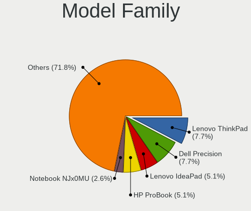

| Name                     | Computers | Percent |
|--------------------------|-----------|---------|
| Unknown                  | 3         | 10%     |
| Notebook NJx0MU          | 1         | 3.33%   |
| MSI MS-7816              | 1         | 3.33%   |
| MACHINIST E5             | 1         | 3.33%   |
| Lenovo V145-15AST        | 1         | 3.33%   |
| Lenovo ThinkPad          | 1         | 3.33%   |
| Lenovo IdeaPad           | 1         | 3.33%   |
| Kiano Elegance           | 1         | 3.33%   |
| Intel NUC7CJYHN          | 1         | 3.33%   |
| HONOR BOHK-WAX9X         | 1         | 3.33%   |
| HP ProDesk               | 1         | 3.33%   |
| Hardkernel ODROID-N2Plus | 1         | 3.33%   |
| Gigabyte B85M-D3H        | 1         | 3.33%   |
| Dell Precision           | 1         | 3.33%   |
| Dell OptiPlex            | 1         | 3.33%   |
| Dell Latitude            | 1         | 3.33%   |
| Dell Inspiron            | 1         | 3.33%   |
| Bluechip TRAVELline      | 1         | 3.33%   |
| Biostar A10N-8800E       | 1         | 3.33%   |
| ASUS X550LN              | 1         | 3.33%   |
| ASUS TUF                 | 1         | 3.33%   |
| ASUS P6X58D-E            | 1         | 3.33%   |
| ASUS G75VW               | 1         | 3.33%   |
| ASRock B450M             | 1         | 3.33%   |
| ASRock A320M-HD          | 1         | 3.33%   |
| Acer Swift               | 1         | 3.33%   |
| Acer Extensa             | 1         | 3.33%   |
| Acer Aspire              | 1         | 3.33%   |

MFG Year
--------

Motherboard manufacture year

| Year    | Computers | Percent |
|---------|-----------|---------|
| 2022    | 5         | 16.67%  |
| 2018    | 5         | 16.67%  |
| 2021    | 4         | 13.33%  |
| 2014    | 4         | 13.33%  |
| 2019    | 3         | 10%     |
| 2017    | 2         | 6.67%   |
| 2023    | 1         | 3.33%   |
| 2013    | 1         | 3.33%   |
| 2012    | 1         | 3.33%   |
| 2011    | 1         | 3.33%   |
| 2010    | 1         | 3.33%   |
| 2008    | 1         | 3.33%   |
| Unknown | 1         | 3.33%   |

Form Factor
-----------

Physical design of the computer

| Name           | Computers | Percent |
|----------------|-----------|---------|
| Notebook       | 15        | 50%     |
| Desktop        | 11        | 36.67%  |
| Mini pc        | 2         | 6.67%   |
| System on chip | 1         | 3.33%   |
| Convertible    | 1         | 3.33%   |

Secure Boot
-----------

Enabled or disabled

| State    | Computers | Percent |
|----------|-----------|---------|
| Disabled | 27        | 90%     |
| Enabled  | 3         | 10%     |

Coreboot
--------

Have coreboot on board

| Used | Computers | Percent |
|------|-----------|---------|
| No   | 30        | 100%    |

RAM Size
--------

Total RAM memory

| Size in GB  | Computers | Percent |
|-------------|-----------|---------|
| 4.01-8.0    | 9         | 30%     |
| 16.01-24.0  | 6         | 20%     |
| 32.01-64.0  | 4         | 13.33%  |
| 8.01-16.0   | 4         | 13.33%  |
| 3.01-4.0    | 2         | 6.67%   |
| 64.01-256.0 | 2         | 6.67%   |
| 24.01-32.0  | 1         | 3.33%   |
| 2.01-3.0    | 1         | 3.33%   |
| 1.01-2.0    | 1         | 3.33%   |

RAM Used
--------

Used RAM memory

| Used GB    | Computers | Percent |
|------------|-----------|---------|
| 1.01-2.0   | 16        | 53.33%  |
| 4.01-8.0   | 5         | 16.67%  |
| 2.01-3.0   | 4         | 13.33%  |
| 8.01-16.0  | 2         | 6.67%   |
| 3.01-4.0   | 1         | 3.33%   |
| 16.01-24.0 | 1         | 3.33%   |
| 0.51-1.0   | 1         | 3.33%   |

Total Drives
------------

Number of drives on board

| Drives | Computers | Percent |
|--------|-----------|---------|
| 1      | 17        | 56.67%  |
| 2      | 8         | 26.67%  |
| 4      | 2         | 6.67%   |
| 5      | 1         | 3.33%   |
| 3      | 1         | 3.33%   |
| 0      | 1         | 3.33%   |

Has CD-ROM
----------

Has CD-ROM on board

| Presented | Computers | Percent |
|-----------|-----------|---------|
| No        | 21        | 70%     |
| Yes       | 9         | 30%     |

Has Ethernet
------------

Has Ethernet on board

| Presented | Computers | Percent |
|-----------|-----------|---------|
| Yes       | 24        | 80%     |
| No        | 6         | 20%     |

Has WiFi
--------

Has WiFi module

| Presented | Computers | Percent |
|-----------|-----------|---------|
| Yes       | 19        | 63.33%  |
| No        | 11        | 36.67%  |

Has Bluetooth
-------------

Has Bluetooth module

| Presented | Computers | Percent |
|-----------|-----------|---------|
| No        | 16        | 53.33%  |
| Yes       | 14        | 46.67%  |

Location
--------

Country
-------

Geographic location (country)

| Country            | Computers | Percent |
|--------------------|-----------|---------|
| Germany            | 8         | 26.67%  |
| USA                | 4         | 13.33%  |
| Sweden             | 3         | 10%     |
| Poland             | 3         | 10%     |
| Brazil             | 3         | 10%     |
| Switzerland        | 1         | 3.33%   |
| Netherlands        | 1         | 3.33%   |
| Mexico             | 1         | 3.33%   |
| Israel             | 1         | 3.33%   |
| Hungary            | 1         | 3.33%   |
| France             | 1         | 3.33%   |
| Dominican Republic | 1         | 3.33%   |
| Canada             | 1         | 3.33%   |
| Australia          | 1         | 3.33%   |

City
----

Geographic location (city)

| City                   | Computers | Percent |
|------------------------|-----------|---------|
| Sundbyberg             | 3         | 10%     |
| Yonkers                | 1         | 3.33%   |
| Warsaw                 | 1         | 3.33%   |
| Untersiggenthal        | 1         | 3.33%   |
| Stuttgart              | 1         | 3.33%   |
| Singen                 | 1         | 3.33%   |
| Shelbyville            | 1         | 3.33%   |
| Sao Paulo              | 1         | 3.33%   |
| Santo André           | 1         | 3.33%   |
| Ramat Gan              | 1         | 3.33%   |
| Paris                  | 1         | 3.33%   |
| Ozarow Mazowiecki      | 1         | 3.33%   |
| Norderney              | 1         | 3.33%   |
| Nordenham              | 1         | 3.33%   |
| New York               | 1         | 3.33%   |
| Naaldwijk              | 1         | 3.33%   |
| Montreal               | 1         | 3.33%   |
| Minden                 | 1         | 3.33%   |
| Krakow                 | 1         | 3.33%   |
| Győr                  | 1         | 3.33%   |
| Garmisch-Partenkirchen | 1         | 3.33%   |
| Denver                 | 1         | 3.33%   |
| Curitiba               | 1         | 3.33%   |
| Concepción de la Vega | 1         | 3.33%   |
| Brisbane               | 1         | 3.33%   |
| Berlin                 | 1         | 3.33%   |
| Baesweiler             | 1         | 3.33%   |
| Apodaca                | 1         | 3.33%   |

Drives
------

Drive Vendor
------------

Hard drive vendors

| Vendor              | Computers | Drives | Percent |
|---------------------|-----------|--------|---------|
| Samsung Electronics | 11        | 15     | 26.83%  |
| WDC                 | 6         | 9      | 14.63%  |
| Unknown             | 3         | 3      | 7.32%   |
| Kingston            | 3         | 3      | 7.32%   |
| Seagate             | 2         | 3      | 4.88%   |
| Intel               | 2         | 2      | 4.88%   |
| Hitachi             | 2         | 2      | 4.88%   |
| Crucial             | 2         | 3      | 4.88%   |
| China               | 2         | 2      | 4.88%   |
| Verbatim            | 1         | 1      | 2.44%   |
| UMIS                | 1         | 1      | 2.44%   |
| Teclast             | 1         | 1      | 2.44%   |
| Netac               | 1         | 1      | 2.44%   |
| Mass                | 1         | 1      | 2.44%   |
| KingFast            | 1         | 1      | 2.44%   |
| ASMT                | 1         | 2      | 2.44%   |
| A-DATA Technology   | 1         | 1      | 2.44%   |

Drive Model
-----------

Hard drive models

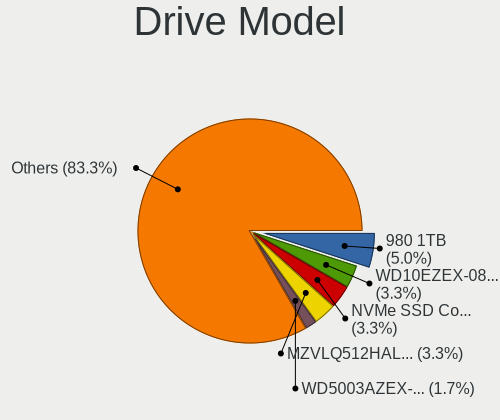

| Model                                               | Computers | Percent |
|-----------------------------------------------------|-----------|---------|
| Samsung SSD 750 EVO 250GB                           | 2         | 4.08%   |
| Samsung SSD 750 EVO 120GB                           | 2         | 4.08%   |
| WDC WD5000AAKX-00ERMA0 500GB                        | 1         | 2.04%   |
| WDC WD30PURZ-85GU6Y0 3TB                            | 1         | 2.04%   |
| WDC WD30EFRX-68EUZN0 3TB                            | 1         | 2.04%   |
| WDC WD20PURZ-85AKKY0 2TB                            | 1         | 2.04%   |
| WDC WD20EZRZ-22Z5HB0 2TB                            | 1         | 2.04%   |
| WDC WD20EARX-32PASB0 2TB                            | 1         | 2.04%   |
| WDC WD10SPZX-24Z10 1TB                              | 1         | 2.04%   |
| WDC WD10EZEX-08WN4A0 1TB                            | 1         | 2.04%   |
| WDC WD1002FBYS-02A6B0 1TB                           | 1         | 2.04%   |
| Verbatim Vi550 S3 512GB                             | 1         | 2.04%   |
| Unknown SLD32G  32GB                                | 1         | 2.04%   |
| Unknown MMC Card  64GB                              | 1         | 2.04%   |
| Unknown BJTD4R  32GB                                | 1         | 2.04%   |
| UMIS RPFTJ128PDD2EWX 128GB                          | 1         | 2.04%   |
| Teclast BD256GB SLCB-2280 SSD                       | 1         | 2.04%   |
| Seagate ST3250318AS 250GB                           | 1         | 2.04%   |
| Seagate ST32000542AS 2TB                            | 1         | 2.04%   |
| Seagate ST1000DM003-1ER162 1TB                      | 1         | 2.04%   |
| Samsung SSD PM851 mSATA 256GB                       | 1         | 2.04%   |
| Samsung SSD 990 PRO with Heatsink 2TB               | 1         | 2.04%   |
| Samsung SSD 980 PRO 2TB                             | 1         | 2.04%   |
| Samsung SSD 970 EVO Plus 1TB                        | 1         | 2.04%   |
| Samsung SSD 870 QVO 2TB                             | 1         | 2.04%   |
| Samsung SSD 870 EVO 500GB                           | 1         | 2.04%   |
| Samsung SSD 850 EVO mSATA 250GB                     | 1         | 2.04%   |
| Samsung NVMe SSD Controller SM981/PM981/PM983 500GB | 1         | 2.04%   |
| Samsung MZVL2512HCJQ-00B00 512GB                    | 1         | 2.04%   |
| Samsung MZNLH256HAJD-00000 256GB SSD                | 1         | 2.04%   |
| Netac NS512GSSD340 512GB                            | 1         | 2.04%   |
| Mass Mass Storage 8MB                               | 1         | 2.04%   |
| Kingston SA400S37480G 480GB SSD                     | 1         | 2.04%   |
| Kingston SA400S37240G 240GB SSD                     | 1         | 2.04%   |
| Kingston SA400S37 480G SSD                          | 1         | 2.04%   |
| KingFast SSD 1TB                                    | 1         | 2.04%   |
| Intel SSDPEKKW256G7 256GB                           | 1         | 2.04%   |
| Intel SSDPEKKR128G7 128GB                           | 1         | 2.04%   |
| Hitachi HUA722020ALA330 59Y5483 42C0416IBMV 2TB     | 1         | 2.04%   |
| Hitachi HTS543216L9A300 160GB                       | 1         | 2.04%   |

HDD Vendor
----------

Hard disk drive vendors

| Vendor  | Computers | Drives | Percent |
|---------|-----------|--------|---------|
| WDC     | 6         | 9      | 54.55%  |
| Seagate | 2         | 3      | 18.18%  |
| Hitachi | 2         | 2      | 18.18%  |
| ASMT    | 1         | 2      | 9.09%   |

SSD Vendor
----------

Solid state drive vendors

| Vendor              | Computers | Drives | Percent |
|---------------------|-----------|--------|---------|
| Samsung Electronics | 7         | 9      | 38.89%  |
| Kingston            | 3         | 3      | 16.67%  |
| Crucial             | 2         | 3      | 11.11%  |
| China               | 2         | 2      | 11.11%  |
| Verbatim            | 1         | 1      | 5.56%   |
| Teclast             | 1         | 1      | 5.56%   |
| Netac               | 1         | 1      | 5.56%   |
| KingFast            | 1         | 1      | 5.56%   |

Drive Kind
----------

HDD or SSD

| Kind    | Computers | Drives | Percent |
|---------|-----------|--------|---------|
| SSD     | 17        | 21     | 44.74%  |
| NVMe    | 9         | 10     | 23.68%  |
| HDD     | 8         | 16     | 21.05%  |
| MMC     | 3         | 3      | 7.89%   |
| Unknown | 1         | 1      | 2.63%   |

Drive Connector
---------------

SATA, SAS, NVMe, etc.

| Type | Computers | Drives | Percent |
|------|-----------|--------|---------|
| SATA | 22        | 35     | 61.11%  |
| NVMe | 9         | 10     | 25%     |
| MMC  | 3         | 3      | 8.33%   |
| SAS  | 2         | 3      | 5.56%   |

Drive Size
----------

Size of hard drive

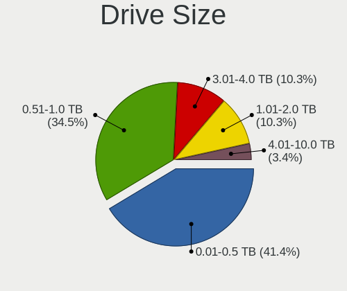

| Size in TB | Computers | Drives | Percent |
|------------|-----------|--------|---------|
| 0.01-0.5   | 15        | 20     | 51.72%  |
| 0.51-1.0   | 7         | 9      | 24.14%  |
| 1.01-2.0   | 5         | 6      | 17.24%  |
| 2.01-3.0   | 2         | 2      | 6.9%    |

Space Total
-----------

Amount of disk space available on the file system

| Size in GB     | Computers | Percent |
|----------------|-----------|---------|
| 101-250        | 7         | 23.33%  |
| 251-500        | 5         | 16.67%  |
| More than 3000 | 4         | 13.33%  |
| 1001-2000      | 4         | 13.33%  |
| 501-1000       | 3         | 10%     |
| 2001-3000      | 2         | 6.67%   |
| 1-20           | 2         | 6.67%   |
| 51-100         | 2         | 6.67%   |
| 21-50          | 1         | 3.33%   |

Space Used
----------

Amount of used disk space

| Used GB        | Computers | Percent |
|----------------|-----------|---------|
| 1-20           | 9         | 30%     |
| 21-50          | 7         | 23.33%  |
| 101-250        | 5         | 16.67%  |
| 1001-2000      | 4         | 13.33%  |
| More than 3000 | 2         | 6.67%   |
| 251-500        | 1         | 3.33%   |
| 501-1000       | 1         | 3.33%   |
| 51-100         | 1         | 3.33%   |

Malfunc. Drives
---------------

Drive models with a malfunction

Zero info for selected period =(

Malfunc. Drive Vendor
---------------------

Vendors of faulty drives

Zero info for selected period =(

Malfunc. HDD Vendor
-------------------

Vendors of faulty HDD drives

Zero info for selected period =(

Malfunc. Drive Kind
-------------------

Kinds of faulty drives

Zero info for selected period =(

Failed Drives
-------------

Failed drive models

Zero info for selected period =(

Failed Drive Vendor
-------------------

Failed drive vendors

Zero info for selected period =(

Drive Status
------------

Number of failed and malfunc. drives

| Status   | Computers | Drives | Percent |
|----------|-----------|--------|---------|
| Detected | 17        | 30     | 54.84%  |
| Works    | 14        | 21     | 45.16%  |

Storage controller
------------------

Storage Vendor
--------------

Storage controller vendors

| Vendor                   | Computers | Percent |
|--------------------------|-----------|---------|
| Intel                    | 23        | 62.16%  |
| AMD                      | 6         | 16.22%  |
| Samsung Electronics      | 5         | 13.51%  |
| Union Memory (Shenzhen)  | 1         | 2.7%    |
| Marvell Technology Group | 1         | 2.7%    |
| ADATA Technology         | 1         | 2.7%    |

Storage Model
-------------

Storage controller models

| Model                                                                          | Computers | Percent |
|--------------------------------------------------------------------------------|-----------|---------|
| AMD FCH SATA Controller [AHCI mode]                                            | 6         | 15.38%  |
| Intel Celeron/Pentium Silver Processor SATA Controller                         | 3         | 7.69%   |
| Samsung NVMe SSD Controller SM981/PM981/PM983                                  | 2         | 5.13%   |
| Samsung NVMe SSD Controller PM9A1/PM9A3/980PRO                                 | 2         | 5.13%   |
| Intel SSD 600P Series                                                          | 2         | 5.13%   |
| Intel 8 Series/C220 Series Chipset Family 6-port SATA Controller 1 [AHCI mode] | 2         | 5.13%   |
| Intel 200 Series PCH SATA controller [AHCI mode]                               | 2         | 5.13%   |
| Union Memory (Shenzhen) AM610 PCIe 3.0 NVMe SSD 128GB                          | 1         | 2.56%   |
| Samsung NVMe SSD Controller S4LV008[Pascal]                                    | 1         | 2.56%   |
| Marvell Group 88SE9123 PCIe SATA 6.0 Gb/s controller                           | 1         | 2.56%   |
| Intel Tiger Lake-LP SATA Controller                                            | 1         | 2.56%   |
| Intel SATA controller                                                          | 1         | 2.56%   |
| Intel Q170/Q150/B150/H170/H110/Z170/CM236 Chipset SATA Controller [AHCI Mode]  | 1         | 2.56%   |
| Intel Ice Lake-LP SATA Controller [AHCI mode]                                  | 1         | 2.56%   |
| Intel Celeron N3350/Pentium N4200/Atom E3900 Series SATA AHCI Controller       | 1         | 2.56%   |
| Intel Cannon Lake Mobile PCH SATA AHCI Controller                              | 1         | 2.56%   |
| Intel Atom Processor E3800 Series SATA AHCI Controller                         | 1         | 2.56%   |
| Intel 9 Series Chipset Family SATA Controller [AHCI Mode]                      | 1         | 2.56%   |
| Intel 82801JI (ICH10 Family) SATA AHCI Controller                              | 1         | 2.56%   |
| Intel 82801IBM/IEM (ICH9M/ICH9M-E) 4 port SATA Controller [AHCI mode]          | 1         | 2.56%   |
| Intel 82801 Mobile SATA Controller [RAID mode]                                 | 1         | 2.56%   |
| Intel 8 Series SATA Controller 1 [AHCI mode]                                   | 1         | 2.56%   |
| Intel 7 Series Chipset Family 6-port SATA Controller [AHCI mode]               | 1         | 2.56%   |
| Intel 6 Series/C200 Series Chipset Family 6 port Mobile SATA AHCI Controller   | 1         | 2.56%   |
| AMD FCH SATA Controller D                                                      | 1         | 2.56%   |
| AMD 400 Series Chipset SATA Controller                                         | 1         | 2.56%   |
| ADATA IM2P33F3 NVMe SSD (DRAM-less)                                            | 1         | 2.56%   |

Storage Kind
------------

Kind of storage controller (IDE, SATA, NVMe, SAS, ...)

| Kind | Computers | Percent |
|------|-----------|---------|
| SATA | 26        | 72.22%  |
| NVMe | 9         | 25%     |
| RAID | 1         | 2.78%   |

Processor
---------

CPU Vendor
----------

Processor vendors

| Vendor | Computers | Percent |
|--------|-----------|---------|
| Intel  | 22        | 73.33%  |
| AMD    | 7         | 23.33%  |
| ARM    | 1         | 3.33%   |

CPU Model
---------

Processor models

| Model                                          | Computers | Percent |
|------------------------------------------------|-----------|---------|
| Intel Xeon D-2796TE CPU @ 2.00GHz              | 1         | 3.33%   |
| Intel Xeon CPU E5-2680 v4 @ 2.40GHz            | 1         | 3.33%   |
| Intel Pentium Silver N5030 CPU @ 1.10GHz       | 1         | 3.33%   |
| Intel Pentium Dual-Core CPU T4200 @ 2.00GHz    | 1         | 3.33%   |
| Intel Core i7-9750H CPU @ 2.60GHz              | 1         | 3.33%   |
| Intel Core i7-6920HQ CPU @ 2.90GHz             | 1         | 3.33%   |
| Intel Core i7-6700 CPU @ 3.40GHz               | 1         | 3.33%   |
| Intel Core i7-5600U CPU @ 2.60GHz              | 1         | 3.33%   |
| Intel Core i7-3630QM CPU @ 2.40GHz             | 1         | 3.33%   |
| Intel Core i7 CPU X 980 @ 3.33GHz              | 1         | 3.33%   |
| Intel Core i5-8250U CPU @ 1.60GHz              | 1         | 3.33%   |
| Intel Core i5-6600 CPU @ 3.30GHz               | 1         | 3.33%   |
| Intel Core i5-4670K CPU @ 3.40GHz              | 1         | 3.33%   |
| Intel Core i5-4430 CPU @ 3.00GHz               | 1         | 3.33%   |
| Intel Core i5-2540M CPU @ 2.60GHz              | 1         | 3.33%   |
| Intel Core i5-1035G1 CPU @ 1.00GHz             | 1         | 3.33%   |
| Intel Core i3-4010U CPU @ 1.70GHz              | 1         | 3.33%   |
| Intel Celeron N4100 CPU @ 1.10GHz              | 1         | 3.33%   |
| Intel Celeron J4025 CPU @ 2.00GHz              | 1         | 3.33%   |
| Intel Celeron CPU N3350 @ 1.10GHz              | 1         | 3.33%   |
| Intel Celeron CPU N2840 @ 2.16GHz              | 1         | 3.33%   |
| Intel 11th Gen Core i7-1165G7 @ 2.80GHz        | 1         | 3.33%   |
| ARM Processor                                  | 1         | 3.33%   |
| AMD Ryzen 7 7700 8-Core Processor              | 1         | 3.33%   |
| AMD Ryzen 7 3700U with Radeon Vega Mobile Gfx  | 1         | 3.33%   |
| AMD Ryzen 5 5600U with Radeon Graphics         | 1         | 3.33%   |
| AMD Ryzen 5 5600G with Radeon Graphics         | 1         | 3.33%   |
| AMD Ryzen 3 2200G with Radeon Vega Graphics    | 1         | 3.33%   |
| AMD FX-8800P Radeon R7, 12 Compute Cores 4C+8G | 1         | 3.33%   |
| AMD A6-9225 RADEON R4, 5 COMPUTE CORES 2C+3G   | 1         | 3.33%   |

CPU Model Family
----------------

Processor model prefix

| Model                   | Computers | Percent |
|-------------------------|-----------|---------|
| Intel Core i7           | 6         | 20%     |
| Intel Core i5           | 6         | 20%     |
| Intel Celeron           | 4         | 13.33%  |
| Other                   | 2         | 6.67%   |
| Intel Xeon              | 2         | 6.67%   |
| AMD Ryzen 7             | 2         | 6.67%   |
| AMD Ryzen 5             | 2         | 6.67%   |
| Intel Pentium Silver    | 1         | 3.33%   |
| Intel Pentium Dual-Core | 1         | 3.33%   |
| Intel Core i3           | 1         | 3.33%   |
| AMD Ryzen 3             | 1         | 3.33%   |
| AMD FX                  | 1         | 3.33%   |
| AMD A6                  | 1         | 3.33%   |

CPU Cores
---------

Number of processor cores

| Number | Computers | Percent |
|--------|-----------|---------|
| 4      | 14        | 46.67%  |
| 2      | 9         | 30%     |
| 6      | 4         | 13.33%  |
| 20     | 1         | 3.33%   |
| 14     | 1         | 3.33%   |
| 8      | 1         | 3.33%   |

CPU Sockets
-----------

Number of sockets

| Number | Computers | Percent |
|--------|-----------|---------|
| 1      | 30        | 100%    |

CPU Threads
-----------

Threads per core (Hyper-Threading)

| Number | Computers | Percent |
|--------|-----------|---------|
| 2      | 18        | 60%     |
| 1      | 12        | 40%     |

CPU Op-Modes
------------

CPU Operation Modes (32-bit, 64-bit)

| Op mode        | Computers | Percent |
|----------------|-----------|---------|
| 32-bit, 64-bit | 30        | 100%    |

CPU Microcode
-------------

Microcode number

| Number     | Computers | Percent |
|------------|-----------|---------|
| Unknown    | 22        | 73.33%  |
| 0x706e5    | 1         | 3.33%   |
| 0x706a8    | 1         | 3.33%   |
| 0x606c1    | 1         | 3.33%   |
| 0x506e3    | 1         | 3.33%   |
| 0x506c9    | 1         | 3.33%   |
| 0x206c2    | 1         | 3.33%   |
| 0x0a50000c | 1         | 3.33%   |
| 0x0600611a | 1         | 3.33%   |

CPU Microarch
-------------

Microarchitecture

| Name          | Computers | Percent |
|---------------|-----------|---------|
| Skylake       | 3         | 10%     |
| Haswell       | 3         | 10%     |
| Goldmont plus | 3         | 10%     |
| Zen 3         | 2         | 6.67%   |
| KabyLake      | 2         | 6.67%   |
| Icelake       | 2         | 6.67%   |
| Excavator     | 2         | 6.67%   |
| Broadwell     | 2         | 6.67%   |
| Unknown       | 2         | 6.67%   |
| Zen+          | 1         | 3.33%   |
| Zen           | 1         | 3.33%   |
| Westmere      | 1         | 3.33%   |
| TigerLake     | 1         | 3.33%   |
| Silvermont    | 1         | 3.33%   |
| SandyBridge   | 1         | 3.33%   |
| Penryn        | 1         | 3.33%   |
| IvyBridge     | 1         | 3.33%   |
| Goldmont      | 1         | 3.33%   |

Graphics
--------

GPU Vendor
----------

Vendors of graphics cards

| Vendor            | Computers | Percent |
|-------------------|-----------|---------|
| Intel             | 17        | 50%     |
| Nvidia            | 9         | 26.47%  |
| AMD               | 7         | 20.59%  |
| ASPEED Technology | 1         | 2.94%   |

GPU Model
---------

Graphics card models

| Model                                                                       | Computers | Percent |
|-----------------------------------------------------------------------------|-----------|---------|
| Intel Xeon E3-1200 v3/4th Gen Core Processor Integrated Graphics Controller | 2         | 5.88%   |
| Intel HD Graphics 530                                                       | 2         | 5.88%   |
| Intel GeminiLake [UHD Graphics 600]                                         | 2         | 5.88%   |
| AMD Cezanne [Radeon Vega Series / Radeon Vega Mobile Series]                | 2         | 5.88%   |
| Nvidia TU117M [GeForce GTX 1650 Mobile / Max-Q]                             | 1         | 2.94%   |
| Nvidia TU117GL [T400 4GB]                                                   | 1         | 2.94%   |
| Nvidia TU116 [GeForce GTX 1660 SUPER]                                       | 1         | 2.94%   |
| Nvidia GP106 [GeForce GTX 1060 6GB]                                         | 1         | 2.94%   |
| Nvidia GM206GLM [Quadro M2200 Mobile]                                       | 1         | 2.94%   |
| Nvidia GM108M [GeForce 840M]                                                | 1         | 2.94%   |
| Nvidia GK208B [GeForce GT 710]                                              | 1         | 2.94%   |
| Nvidia GF114M [GeForce GTX 670M]                                            | 1         | 2.94%   |
| Nvidia GF110 [GeForce GTX 580]                                              | 1         | 2.94%   |
| Intel UHD Graphics 620                                                      | 1         | 2.94%   |
| Intel TigerLake-LP GT2 [Iris Xe Graphics]                                   | 1         | 2.94%   |
| Intel Mobile 4 Series Chipset Integrated Graphics Controller                | 1         | 2.94%   |
| Intel Iris Plus Graphics G1 (Ice Lake)                                      | 1         | 2.94%   |
| Intel HD Graphics 5500                                                      | 1         | 2.94%   |
| Intel HD Graphics 500                                                       | 1         | 2.94%   |
| Intel Haswell-ULT Integrated Graphics Controller                            | 1         | 2.94%   |
| Intel GeminiLake [UHD Graphics 605]                                         | 1         | 2.94%   |
| Intel CoffeeLake-H GT2 [UHD Graphics 630]                                   | 1         | 2.94%   |
| Intel Atom Processor Z36xxx/Z37xxx Series Graphics & Display                | 1         | 2.94%   |
| Intel 2nd Generation Core Processor Family Integrated Graphics Controller   | 1         | 2.94%   |
| ASPEED Technology ASPEED Graphics Family                                    | 1         | 2.94%   |
| AMD Wani [Radeon R5/R6/R7 Graphics]                                         | 1         | 2.94%   |
| AMD Stoney [Radeon R2/R3/R4/R5 Graphics]                                    | 1         | 2.94%   |
| AMD Raven Ridge [Radeon Vega Series / Radeon Vega Mobile Series]            | 1         | 2.94%   |
| AMD Raphael                                                                 | 1         | 2.94%   |
| AMD Picasso/Raven 2 [Radeon Vega Series / Radeon Vega Mobile Series]        | 1         | 2.94%   |

GPU Combo
---------

Combinations of graphics cards

| Name           | Computers | Percent |
|----------------|-----------|---------|
| 1 x Intel      | 12        | 40%     |
| 1 x AMD        | 7         | 23.33%  |
| 1 x Nvidia     | 5         | 16.67%  |
| Intel + Nvidia | 4         | 13.33%  |
| Other          | 1         | 3.33%   |
| 1 x ASPEED     | 1         | 3.33%   |

GPU Driver
----------

Free vs proprietary

| Driver      | Computers | Percent |
|-------------|-----------|---------|
| Free        | 22        | 73.33%  |
| Proprietary | 7         | 23.33%  |
| Unknown     | 1         | 3.33%   |

GPU Memory
----------

Total video memory

| Size in GB | Computers | Percent |
|------------|-----------|---------|
| Unknown    | 23        | 76.67%  |
| 3.01-4.0   | 2         | 6.67%   |
| 1.01-2.0   | 2         | 6.67%   |
| 5.01-6.0   | 1         | 3.33%   |
| 0.51-1.0   | 1         | 3.33%   |
| 0.01-0.5   | 1         | 3.33%   |

Monitor
-------

Monitor Vendor
--------------

Monitor vendors

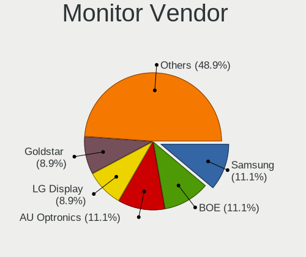

| Vendor                  | Computers | Percent |
|-------------------------|-----------|---------|
| BOE                     | 6         | 18.75%  |
| Dell                    | 5         | 15.63%  |
| AU Optronics            | 4         | 12.5%   |
| Samsung Electronics     | 3         | 9.38%   |
| Philips                 | 3         | 9.38%   |
| LG Display              | 3         | 9.38%   |
| Chimei Innolux          | 2         | 6.25%   |
| Unknown (XXX)           | 1         | 3.13%   |
| Iiyama                  | 1         | 3.13%   |
| Goldstar                | 1         | 3.13%   |
| Chi Mei Optoelectronics | 1         | 3.13%   |
| AOC                     | 1         | 3.13%   |
| Ancor Communications    | 1         | 3.13%   |

Monitor Model
-------------

Monitor models

| Model                                                                     | Computers | Percent |
|---------------------------------------------------------------------------|-----------|---------|
| Unknown (XXX) HDMI XXX2380 1920x1080 527x296mm 23.8-inch                  | 1         | 2.94%   |
| Samsung Electronics S23B550 SAM0919 1920x1080 510x287mm 23.0-inch         | 1         | 2.94%   |
| Samsung Electronics LCD Monitor SAM08FE 1920x1080                         | 1         | 2.94%   |
| Samsung Electronics LCD Monitor S34J55x                                   | 1         | 2.94%   |
| Philips PHL 272B8Q PHL0918 2560x1440 597x336mm 27.0-inch                  | 1         | 2.94%   |
| Philips PHL 242V8 PHLC219 1920x1080 527x296mm 23.8-inch                   | 1         | 2.94%   |
| Philips PHL 240B4Q PHL08E3 1920x1200 518x324mm 24.1-inch                  | 1         | 2.94%   |
| Philips PHL 223V5 PHLC0CF 1920x1080 477x268mm 21.5-inch                   | 1         | 2.94%   |
| LG Display LCD Monitor LGD05E5 1920x1080 344x194mm 15.5-inch              | 1         | 2.94%   |
| LG Display LCD Monitor LGD03DB 1366x768 345x194mm 15.6-inch               | 1         | 2.94%   |
| LG Display LCD Monitor LGD02E2 1600x900 310x174mm 14.0-inch               | 1         | 2.94%   |
| Iiyama PL2773H IVM660A 1920x1080 600x340mm 27.2-inch                      | 1         | 2.94%   |
| Goldstar HDR WQHD GSM772E 3440x1440 800x335mm 34.1-inch                   | 1         | 2.94%   |
| Dell U2715H DELD067 2560x1440 597x336mm 27.0-inch                         | 1         | 2.94%   |
| Dell U2715H DELD066 2560x1440 597x336mm 27.0-inch                         | 1         | 2.94%   |
| Dell U2713HM DEL407E 2560x1440 597x336mm 27.0-inch                        | 1         | 2.94%   |
| Dell P2012H DEL4078 1600x900 443x249mm 20.0-inch                          | 1         | 2.94%   |
| Dell LCD Monitor P2414H 1920x1080                                         | 1         | 2.94%   |
| Dell 1704FPT DEL4004 1280x1024 338x270mm 17.0-inch                        | 1         | 2.94%   |
| Chimei Innolux LCD Monitor CMN15D5 1920x1080 344x193mm 15.5-inch          | 1         | 2.94%   |
| Chimei Innolux LCD Monitor CMN14D2 1920x1080 309x173mm 13.9-inch          | 1         | 2.94%   |
| Chi Mei Optoelectronics LCD Monitor CMO1720 1920x1080 382x215mm 17.3-inch | 1         | 2.94%   |
| BOE LCD Monitor BOE08FA 1920x1080 294x165mm 13.3-inch                     | 1         | 2.94%   |
| BOE LCD Monitor BOE08E7 1920x1080 344x193mm 15.5-inch                     | 1         | 2.94%   |
| BOE LCD Monitor BOE0872 1920x1080 344x194mm 15.5-inch                     | 1         | 2.94%   |
| BOE LCD Monitor BOE07DB 1920x1080 309x174mm 14.0-inch                     | 1         | 2.94%   |
| BOE LCD Monitor BOE0713 1920x1080 344x193mm 15.5-inch                     | 1         | 2.94%   |
| BOE LCD Monitor BOE05F4 1366x768 277x156mm 12.5-inch                      | 1         | 2.94%   |
| AU Optronics LCD Monitor AUO8174 1280x800 331x207mm 15.4-inch             | 1         | 2.94%   |
| AU Optronics LCD Monitor AUO429D 1920x1080 382x215mm 17.3-inch            | 1         | 2.94%   |
| AU Optronics LCD Monitor AUO203D 1920x1080 309x174mm 14.0-inch            | 1         | 2.94%   |
| AU Optronics LCD Monitor AUO132C 1366x768 293x164mm 13.2-inch             | 1         | 2.94%   |
| AOC 2243W AOC2243 1920x1080 477x268mm 21.5-inch                           | 1         | 2.94%   |
| Ancor Communications LCD Monitor ASUS VE278 5360x1440                     | 1         | 2.94%   |

Monitor Resolution
------------------

Monitor screen resolution

| Resolution        | Computers | Percent |
|-------------------|-----------|---------|
| 1920x1080 (FHD)   | 18        | 56.25%  |
| 2560x1440 (QHD)   | 3         | 9.38%   |
| 1366x768 (WXGA)   | 3         | 9.38%   |
| 1600x900 (HD+)    | 2         | 6.25%   |
| 5360x1440         | 1         | 3.13%   |
| 3840x2160 (4K)    | 1         | 3.13%   |
| 1920x1200 (WUXGA) | 1         | 3.13%   |
| 1280x800 (WXGA)   | 1         | 3.13%   |
| 1280x1024 (SXGA)  | 1         | 3.13%   |
| Unknown           | 1         | 3.13%   |

Monitor Diagonal
----------------

Diagonal size in inches

| Inches  | Computers | Percent |
|---------|-----------|---------|
| 15      | 7         | 21.88%  |
| 27      | 4         | 12.5%   |
| 17      | 3         | 9.38%   |
| 14      | 3         | 9.38%   |
| 13      | 3         | 9.38%   |
| Unknown | 3         | 9.38%   |
| 24      | 2         | 6.25%   |
| 23      | 2         | 6.25%   |
| 21      | 2         | 6.25%   |
| 34      | 1         | 3.13%   |
| 20      | 1         | 3.13%   |
| 12      | 1         | 3.13%   |

Monitor Width
-------------

Physical width

| Width in mm | Computers | Percent |
|-------------|-----------|---------|
| 301-350     | 12        | 38.71%  |
| 501-600     | 7         | 22.58%  |
| 401-500     | 3         | 9.68%   |
| 201-300     | 3         | 9.68%   |
| Unknown     | 3         | 9.68%   |
| 351-400     | 2         | 6.45%   |
| 701-800     | 1         | 3.23%   |

Aspect Ratio
------------

Proportional relationship between the width and the height

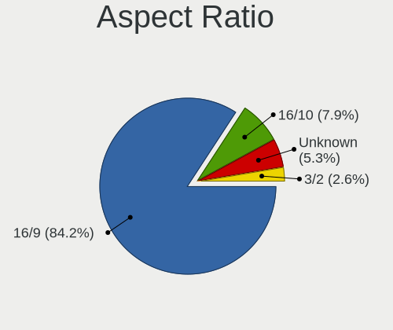

| Ratio   | Computers | Percent |
|---------|-----------|---------|
| 16/9    | 24        | 80%     |
| 16/10   | 2         | 6.67%   |
| Unknown | 2         | 6.67%   |
| 5/4     | 1         | 3.33%   |
| 21/9    | 1         | 3.33%   |

Monitor Area
------------

Area in inch²

| Area in inch² | Computers | Percent |
|----------------|-----------|---------|
| 101-110        | 7         | 21.88%  |
| 81-90          | 4         | 12.5%   |
| 301-350        | 4         | 12.5%   |
| 201-250        | 4         | 12.5%   |
| Unknown        | 3         | 9.38%   |
| 71-80          | 2         | 6.25%   |
| 151-200        | 2         | 6.25%   |
| 121-130        | 2         | 6.25%   |
| 61-70          | 1         | 3.13%   |
| 351-500        | 1         | 3.13%   |
| 251-300        | 1         | 3.13%   |
| 141-150        | 1         | 3.13%   |

Pixel Density
-------------

Pixels per inch

| Density | Computers | Percent |
|---------|-----------|---------|
| 121-160 | 12        | 38.71%  |
| 51-100  | 8         | 25.81%  |
| 101-120 | 7         | 22.58%  |
| Unknown | 3         | 9.68%   |
| 161-240 | 1         | 3.23%   |

Multiple Monitors
-----------------

Total monitors connected

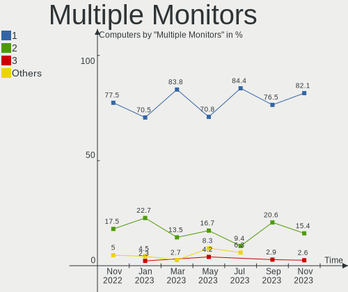

| Total | Computers | Percent |
|-------|-----------|---------|
| 1     | 24        | 80%     |
| 2     | 5         | 16.67%  |
| 0     | 1         | 3.33%   |

Network
-------

Net Controller Vendor
---------------------

Controller vendors

| Vendor                   | Computers | Percent |
|--------------------------|-----------|---------|
| Realtek Semiconductor    | 16        | 40%     |
| Intel                    | 14        | 35%     |
| Qualcomm Atheros         | 4         | 10%     |
| Ralink Technology        | 1         | 2.5%    |
| Ralink                   | 1         | 2.5%    |
| MediaTek                 | 1         | 2.5%    |
| Marvell Technology Group | 1         | 2.5%    |
| Dell                     | 1         | 2.5%    |
| Broadcom                 | 1         | 2.5%    |

Net Controller Model
--------------------

Controller models

| Model                                                             | Computers | Percent |
|-------------------------------------------------------------------|-----------|---------|
| Realtek RTL8111/8168/8411 PCI Express Gigabit Ethernet Controller | 12        | 24.49%  |
| Realtek 802.11ac NIC                                              | 2         | 4.08%   |
| Qualcomm Atheros QCA9377 802.11ac Wireless Network Adapter        | 2         | 4.08%   |
| Intel Wireless 7265                                               | 2         | 4.08%   |
| Intel Gemini Lake PCH CNVi WiFi                                   | 2         | 4.08%   |
| Intel Ethernet Connection (5) I219-LM                             | 2         | 4.08%   |
| Realtek RTL8821CE 802.11ac PCIe Wireless Network Adapter          | 1         | 2.04%   |
| Realtek RTL8723BU 802.11b/g/n WLAN Adapter                        | 1         | 2.04%   |
| Realtek RTL8188EUS 802.11n Wireless Network Adapter               | 1         | 2.04%   |
| Realtek RTL8125 2.5GbE Controller                                 | 1         | 2.04%   |
| Realtek RTL810xE PCI Express Fast Ethernet controller             | 1         | 2.04%   |
| Ralink MT7610U ("Archer T2U" 2.4G+5G WLAN Adapter                 | 1         | 2.04%   |
| Ralink RT3290 Wireless 802.11n 1T/1R PCIe                         | 1         | 2.04%   |
| Qualcomm Atheros AR928X Wireless Network Adapter (PCI-Express)    | 1         | 2.04%   |
| Qualcomm Atheros AR8151 v2.0 Gigabit Ethernet                     | 1         | 2.04%   |
| MediaTek MT7921 802.11ax PCI Express Wireless Network Adapter     | 1         | 2.04%   |
| Marvell Group 88E8056 PCI-E Gigabit Ethernet Controller           | 1         | 2.04%   |
| Intel Wireless 8265 / 8275                                        | 1         | 2.04%   |
| Intel Wireless 3165                                               | 1         | 2.04%   |
| Intel Wi-Fi 6 AX210/AX211/AX411 160MHz                            | 1         | 2.04%   |
| Intel Wi-Fi 6 AX200                                               | 1         | 2.04%   |
| Intel I210 Gigabit Network Connection                             | 1         | 2.04%   |
| Intel Ethernet Controller I225-IT                                 | 1         | 2.04%   |
| Intel Ethernet Connection E823-C for SFP                          | 1         | 2.04%   |
| Intel Ethernet Connection (5) I219-V                              | 1         | 2.04%   |
| Intel Ethernet Connection (3) I218-LM                             | 1         | 2.04%   |
| Intel Ethernet Connection (13) I219-V                             | 1         | 2.04%   |
| Intel Centrino Advanced-N 6205 [Taylor Peak]                      | 1         | 2.04%   |
| Intel 82579LM Gigabit Network Connection (Lewisville)             | 1         | 2.04%   |
| Intel 82576 Gigabit Network Connection                            | 1         | 2.04%   |
| Intel 82574L Gigabit Network Connection                           | 1         | 2.04%   |
| Dell DW5811e Snapdragon™ X7 LTE                              | 1         | 2.04%   |
| Broadcom NetXtreme BCM5764M Gigabit Ethernet PCIe                 | 1         | 2.04%   |

Wireless Vendor
---------------

Wireless vendors

| Vendor                | Computers | Percent |
|-----------------------|-----------|---------|
| Intel                 | 9         | 42.86%  |
| Realtek Semiconductor | 5         | 23.81%  |
| Qualcomm Atheros      | 3         | 14.29%  |
| Ralink Technology     | 1         | 4.76%   |
| Ralink                | 1         | 4.76%   |
| MediaTek              | 1         | 4.76%   |
| Dell                  | 1         | 4.76%   |

Wireless Model
--------------

Wireless models

| Model                                                          | Computers | Percent |
|----------------------------------------------------------------|-----------|---------|
| Realtek 802.11ac NIC                                           | 2         | 9.52%   |
| Qualcomm Atheros QCA9377 802.11ac Wireless Network Adapter     | 2         | 9.52%   |
| Intel Wireless 7265                                            | 2         | 9.52%   |
| Intel Gemini Lake PCH CNVi WiFi                                | 2         | 9.52%   |
| Realtek RTL8821CE 802.11ac PCIe Wireless Network Adapter       | 1         | 4.76%   |
| Realtek RTL8723BU 802.11b/g/n WLAN Adapter                     | 1         | 4.76%   |
| Realtek RTL8188EUS 802.11n Wireless Network Adapter            | 1         | 4.76%   |
| Ralink MT7610U ("Archer T2U" 2.4G+5G WLAN Adapter              | 1         | 4.76%   |
| Ralink RT3290 Wireless 802.11n 1T/1R PCIe                      | 1         | 4.76%   |
| Qualcomm Atheros AR928X Wireless Network Adapter (PCI-Express) | 1         | 4.76%   |
| MediaTek MT7921 802.11ax PCI Express Wireless Network Adapter  | 1         | 4.76%   |
| Intel Wireless 8265 / 8275                                     | 1         | 4.76%   |
| Intel Wireless 3165                                            | 1         | 4.76%   |
| Intel Wi-Fi 6 AX210/AX211/AX411 160MHz                         | 1         | 4.76%   |
| Intel Wi-Fi 6 AX200                                            | 1         | 4.76%   |
| Intel Centrino Advanced-N 6205 [Taylor Peak]                   | 1         | 4.76%   |
| Dell DW5811e Snapdragon™ X7 LTE                           | 1         | 4.76%   |

Ethernet Vendor
---------------

Ethernet vendors

| Vendor                   | Computers | Percent |
|--------------------------|-----------|---------|
| Realtek Semiconductor    | 14        | 53.85%  |
| Intel                    | 9         | 34.62%  |
| Qualcomm Atheros         | 1         | 3.85%   |
| Marvell Technology Group | 1         | 3.85%   |
| Broadcom                 | 1         | 3.85%   |

Ethernet Model
--------------

Ethernet models

| Model                                                             | Computers | Percent |
|-------------------------------------------------------------------|-----------|---------|
| Realtek RTL8111/8168/8411 PCI Express Gigabit Ethernet Controller | 12        | 42.86%  |
| Intel Ethernet Connection (5) I219-LM                             | 2         | 7.14%   |
| Realtek RTL8125 2.5GbE Controller                                 | 1         | 3.57%   |
| Realtek RTL810xE PCI Express Fast Ethernet controller             | 1         | 3.57%   |
| Qualcomm Atheros AR8151 v2.0 Gigabit Ethernet                     | 1         | 3.57%   |
| Marvell Group 88E8056 PCI-E Gigabit Ethernet Controller           | 1         | 3.57%   |
| Intel I210 Gigabit Network Connection                             | 1         | 3.57%   |
| Intel Ethernet Controller I225-IT                                 | 1         | 3.57%   |
| Intel Ethernet Connection E823-C for SFP                          | 1         | 3.57%   |
| Intel Ethernet Connection (5) I219-V                              | 1         | 3.57%   |
| Intel Ethernet Connection (3) I218-LM                             | 1         | 3.57%   |
| Intel Ethernet Connection (13) I219-V                             | 1         | 3.57%   |
| Intel 82579LM Gigabit Network Connection (Lewisville)             | 1         | 3.57%   |
| Intel 82576 Gigabit Network Connection                            | 1         | 3.57%   |
| Intel 82574L Gigabit Network Connection                           | 1         | 3.57%   |
| Broadcom NetXtreme BCM5764M Gigabit Ethernet PCIe                 | 1         | 3.57%   |

Net Controller Kind
-------------------

Ethernet, WiFi or modem

| Kind     | Computers | Percent |
|----------|-----------|---------|
| Ethernet | 24        | 55.81%  |
| WiFi     | 19        | 44.19%  |

Used Controller
---------------

Currently used network controller

| Kind     | Computers | Percent |
|----------|-----------|---------|
| Ethernet | 15        | 51.72%  |
| WiFi     | 14        | 48.28%  |

NICs
----

Total network controllers on board

| Total | Computers | Percent |
|-------|-----------|---------|
| 1     | 15        | 50%     |
| 2     | 11        | 36.67%  |
| 0     | 2         | 6.67%   |
| 6     | 1         | 3.33%   |
| 4     | 1         | 3.33%   |

IPv6
----

IPv6 vs IPv4

| Used | Computers | Percent |
|------|-----------|---------|
| No   | 21        | 70%     |
| Yes  | 9         | 30%     |

Bluetooth
---------

Bluetooth Vendor
----------------

Controller vendors

| Vendor                          | Computers | Percent |
|---------------------------------|-----------|---------|
| Intel                           | 8         | 57.14%  |
| Qualcomm Atheros Communications | 2         | 14.29%  |
| Realtek Semiconductor           | 1         | 7.14%   |
| Ralink                          | 1         | 7.14%   |
| IMC Networks                    | 1         | 7.14%   |
| Broadcom                        | 1         | 7.14%   |

Bluetooth Model
---------------

Controller models

| Model                                          | Computers | Percent |
|------------------------------------------------|-----------|---------|
| Intel Bluetooth wireless interface             | 5         | 35.71%  |
| Qualcomm Atheros  Bluetooth Device             | 2         | 14.29%  |
| Realtek Bluetooth Radio                        | 1         | 7.14%   |
| Ralink RT3290 Bluetooth                        | 1         | 7.14%   |
| Intel Bluetooth 9460/9560 Jefferson Peak (JfP) | 1         | 7.14%   |
| Intel AX210 Bluetooth                          | 1         | 7.14%   |
| Intel AX200 Bluetooth                          | 1         | 7.14%   |
| IMC Networks Wireless_Device                   | 1         | 7.14%   |
| Broadcom BCM2045B (BDC-2.1)                    | 1         | 7.14%   |

Sound
-----

Sound Vendor
------------

Sound card vendors

| Vendor                 | Computers | Percent |
|------------------------|-----------|---------|
| Intel                  | 21        | 53.85%  |
| Nvidia                 | 8         | 20.51%  |
| AMD                    | 7         | 17.95%  |
| Meizu                  | 1         | 2.56%   |
| Generalplus Technology | 1         | 2.56%   |
| C-Media Electronics    | 1         | 2.56%   |

Sound Model
-----------

Sound card models

| Model                                                                      | Computers | Percent |
|----------------------------------------------------------------------------|-----------|---------|
| AMD Family 17h/19h HD Audio Controller                                     | 5         | 10%     |
| Intel Celeron/Pentium Silver Processor High Definition Audio               | 3         | 6%      |
| Nvidia TU107 GeForce GTX 1650 High Definition Audio Controller             | 2         | 4%      |
| Intel Xeon E3-1200 v3/4th Gen Core Processor HD Audio Controller           | 2         | 4%      |
| Intel 8 Series/C220 Series Chipset High Definition Audio Controller        | 2         | 4%      |
| Intel 200 Series PCH HD Audio                                              | 2         | 4%      |
| AMD Renoir Radeon High Definition Audio Controller                         | 2         | 4%      |
| AMD Raven/Raven2/Fenghuang HDMI/DP Audio Controller                        | 2         | 4%      |
| AMD Family 15h (Models 60h-6fh) Audio Controller                           | 2         | 4%      |
| Nvidia TU116 High Definition Audio Controller                              | 1         | 2%      |
| Nvidia GP106 High Definition Audio Controller                              | 1         | 2%      |
| Nvidia GM206 High Definition Audio Controller                              | 1         | 2%      |
| Nvidia GK208 HDMI/DP Audio Controller                                      | 1         | 2%      |
| Nvidia GF114 HDMI Audio Controller                                         | 1         | 2%      |
| Nvidia GF110 High Definition Audio Controller                              | 1         | 2%      |
| Meizu HiFi DAC Headphone Amplifier                                         | 1         | 2%      |
| Intel Wildcat Point-LP High Definition Audio Controller                    | 1         | 2%      |
| Intel Tiger Lake-LP Smart Sound Technology Audio Controller                | 1         | 2%      |
| Intel Sunrise Point-LP HD Audio                                            | 1         | 2%      |
| Intel Ice Lake-LP Smart Sound Technology Audio Controller                  | 1         | 2%      |
| Intel Haswell-ULT HD Audio Controller                                      | 1         | 2%      |
| Intel CM238 HD Audio Controller                                            | 1         | 2%      |
| Intel Celeron N3350/Pentium N4200/Atom E3900 Series Audio Cluster          | 1         | 2%      |
| Intel Cannon Lake PCH cAVS                                                 | 1         | 2%      |
| Intel Broadwell-U Audio Controller                                         | 1         | 2%      |
| Intel Atom Processor Z36xxx/Z37xxx Series High Definition Audio Controller | 1         | 2%      |
| Intel 9 Series Chipset Family HD Audio Controller                          | 1         | 2%      |
| Intel 82801JI (ICH10 Family) HD Audio Controller                           | 1         | 2%      |
| Intel 82801I (ICH9 Family) HD Audio Controller                             | 1         | 2%      |
| Intel 8 Series HD Audio Controller                                         | 1         | 2%      |
| Intel 7 Series/C216 Chipset Family High Definition Audio Controller        | 1         | 2%      |
| Intel 6 Series/C200 Series Chipset Family High Definition Audio Controller | 1         | 2%      |
| Generalplus Technology USB Audio Device                                    | 1         | 2%      |
| C-Media Electronics USB Advanced Audio Device                              | 1         | 2%      |
| AMD Rembrandt Radeon High Definition Audio Controller                      | 1         | 2%      |
| AMD Kabini HDMI/DP Audio                                                   | 1         | 2%      |
| AMD High Definition Audio Controller                                       | 1         | 2%      |

Memory
------

Memory Vendor
-------------

Memory module vendors

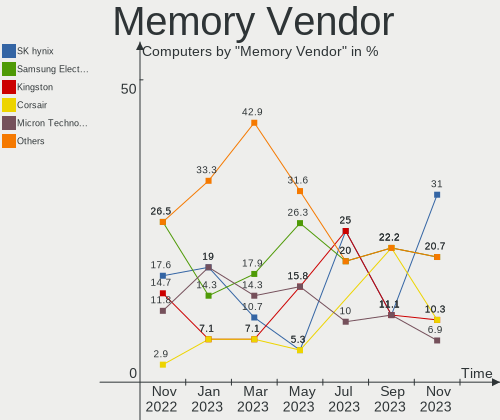

| Vendor              | Computers | Percent |
|---------------------|-----------|---------|
| SK hynix            | 4         | 21.05%  |
| Unknown (ABCD)      | 3         | 15.79%  |
| Kingston            | 3         | 15.79%  |
| Unknown             | 2         | 10.53%  |
| Corsair             | 2         | 10.53%  |
| Team                | 1         | 5.26%   |
| Samsung Electronics | 1         | 5.26%   |
| Micron Technology   | 1         | 5.26%   |
| G.Skill             | 1         | 5.26%   |
| Crucial             | 1         | 5.26%   |

Memory Model
------------

Memory module models

| Model                                                            | Computers | Percent |
|------------------------------------------------------------------|-----------|---------|
| Unknown (ABCD) RAM 123456789012345678 4GB SODIMM LPDDR4 2400MT/s | 2         | 10.53%  |
| Unknown RAM Module 4096MB DIMM 1333MT/s                          | 1         | 5.26%   |
| Unknown RAM Module 1GB DIMM DDR3 1600MT/s                        | 1         | 5.26%   |
| Unknown (ABCD) RAM 123456789012345678 2GB DIMM LPDDR4 2400MT/s   | 1         | 5.26%   |
| Team RAM Elite-1333 4GB DIMM DDR3 1333MT/s                       | 1         | 5.26%   |
| SK hynix RAM Module 8GB DIMM DDR4 2133MT/s                       | 1         | 5.26%   |
| SK hynix RAM HMABAGL7ABR4N-XN 128GB DIMM DDR4 3200MT/s           | 1         | 5.26%   |
| SK hynix RAM HMAA1GS6CMR6N-VK 8GB Row Of Chips DDR4 2667MT/s     | 1         | 5.26%   |
| SK hynix RAM HMA81GS6DJR8N-VK 8GB SODIMM DDR4 2667MT/s           | 1         | 5.26%   |
| Samsung RAM M471A1K43DB1-CTD 8GB SODIMM DDR4 2667MT/s            | 1         | 5.26%   |
| Micron RAM MT52L512M32D2PF-10 4GB Row Of Chips LPDDR3 1867MT/s   | 1         | 5.26%   |
| Kingston RAM KF556C40-32 32GB DIMM DDR5 5808MT/s                 | 1         | 5.26%   |
| Kingston RAM KF3600C18D4/16GX 16GB DIMM DDR4 3600MT/s            | 1         | 5.26%   |
| Kingston RAM 9905700-104.A00G 8GB SODIMM DDR4 3200MT/s           | 1         | 5.26%   |
| G.Skill RAM F4-2400C15-8GFX 8GB DIMM DDR4 3000MT/s               | 1         | 5.26%   |
| Crucial RAM CT8G4SFS8266.M8FD 8192MB SODIMM DDR4 2667MT/s        | 1         | 5.26%   |
| Corsair RAM CMV8GX3M2A1600C11 4GB DIMM DDR3 1600MT/s             | 1         | 5.26%   |
| Corsair RAM CMK16GX4M2A2666C16 8GB DIMM DDR4 3400MT/s            | 1         | 5.26%   |

Memory Kind
-----------

Memory module kinds

| Kind    | Computers | Percent |
|---------|-----------|---------|
| DDR4    | 8         | 50%     |
| LPDDR4  | 3         | 18.75%  |
| DDR3    | 2         | 12.5%   |
| LPDDR3  | 1         | 6.25%   |
| DDR5    | 1         | 6.25%   |
| Unknown | 1         | 6.25%   |

Memory Form Factor
------------------

Physical design of the memory module

| Name         | Computers | Percent |
|--------------|-----------|---------|
| DIMM         | 8         | 53.33%  |
| SODIMM       | 5         | 33.33%  |
| Row Of Chips | 2         | 13.33%  |

Memory Size
-----------

Memory module size

| Size   | Computers | Percent |
|--------|-----------|---------|
| 8192   | 9         | 52.94%  |
| 4096   | 3         | 17.65%  |
| 16384  | 2         | 11.76%  |
| 131072 | 1         | 5.88%   |
| 32768  | 1         | 5.88%   |
| 1024   | 1         | 5.88%   |

Memory Speed
------------

Memory module speed

| Speed | Computers | Percent |
|-------|-----------|---------|
| 2667  | 3         | 16.67%  |
| 2400  | 3         | 16.67%  |
| 3200  | 2         | 11.11%  |
| 1600  | 2         | 11.11%  |
| 1333  | 2         | 11.11%  |
| 5808  | 1         | 5.56%   |
| 3600  | 1         | 5.56%   |
| 3400  | 1         | 5.56%   |
| 3000  | 1         | 5.56%   |
| 2133  | 1         | 5.56%   |
| 1867  | 1         | 5.56%   |

Printers & scanners
-------------------

Printer Vendor
--------------

Printer device vendors

Zero info for selected period =(

Printer Model
-------------

Printer device models

Zero info for selected period =(

Scanner Vendor
--------------

Scanner device vendors

Zero info for selected period =(

Scanner Model
-------------

Scanner device models

Zero info for selected period =(

Camera
------

Camera Vendor
-------------

Camera device vendors

| Vendor                        | Computers | Percent |
|-------------------------------|-----------|---------|
| Chicony Electronics           | 4         | 20%     |
| Sunplus Innovation Technology | 3         | 15%     |
| Realtek Semiconductor         | 2         | 10%     |
| Microdia                      | 2         | 10%     |
| Quanta                        | 1         | 5%      |
| Logitech                      | 1         | 5%      |
| Lite-On Technology            | 1         | 5%      |
| LeCroy                        | 1         | 5%      |
| KYE Systems (Mouse Systems)   | 1         | 5%      |
| IMC Networks                  | 1         | 5%      |
| Denron                        | 1         | 5%      |
| Alcor Micro                   | 1         | 5%      |
| Unknown                       | 1         | 5%      |

Camera Model
------------

Camera device models

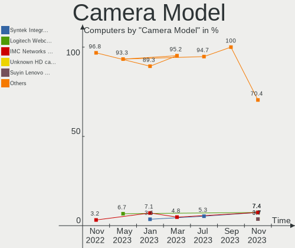

| Model                                     | Computers | Percent |
|-------------------------------------------|-----------|---------|
| Sunplus Integrated_Webcam_HD              | 2         | 10%     |
| Sunplus ASUS Webcam                       | 1         | 5%      |
| Realtek USB Camera                        | 1         | 5%      |
| Realtek HD WebCam                         | 1         | 5%      |
| Quanta ov9734_techfront_camera            | 1         | 5%      |
| Microdia Integrated_Webcam_HD             | 1         | 5%      |
| Microdia GC02M2                           | 1         | 5%      |
| Logitech Quickcam 3000 For Business       | 1         | 5%      |
| Lite-On Integrated Camera                 | 1         | 5%      |
| LeCroy USB 2.0 PC Camera                  | 1         | 5%      |
| KYE Systems (Mouse Systems) Genius Webcam | 1         | 5%      |
| IMC Networks XHC Camera                   | 1         | 5%      |
| Denron 2M Front Camera                    | 1         | 5%      |
| Chicony USB2.0 Camera                     | 1         | 5%      |
| Chicony integrated camera                 | 1         | 5%      |
| Chicony HD WebCam                         | 1         | 5%      |
| Chicony EasyCamera                        | 1         | 5%      |
| Alcor Micro USB 2.0 PC Camera             | 1         | 5%      |
| Unknown                                   | 1         | 5%      |

Security
--------

Fingerprint Vendor
------------------

Fingerprint sensor vendors

| Vendor                     | Computers | Percent |
|----------------------------|-----------|---------|
| Upek                       | 1         | 33.33%  |
| Shenzhen Goodix Technology | 1         | 33.33%  |
| LighTuning Technology      | 1         | 33.33%  |

Fingerprint Model
-----------------

Fingerprint sensor models

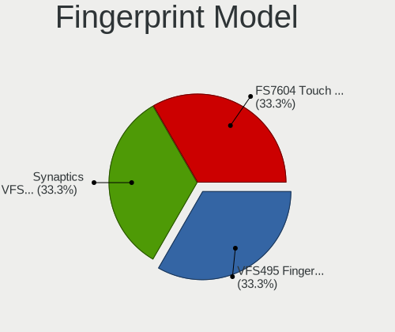

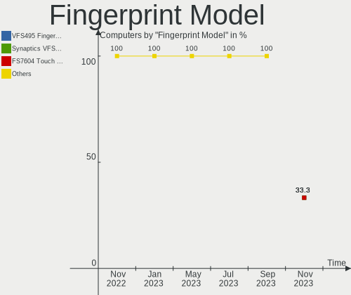

| Model                                                  | Computers | Percent |
|--------------------------------------------------------|-----------|---------|
| Upek Biometric Touchchip/Touchstrip Fingerprint Sensor | 1         | 33.33%  |
| Shenzhen Goodix  Fingerprint Device                    | 1         | 33.33%  |
| LighTuning EgisTec Touch Fingerprint Sensor            | 1         | 33.33%  |

Chipcard Vendor
---------------

Chipcard module vendors

| Vendor   | Computers | Percent |
|----------|-----------|---------|
| Broadcom | 2         | 100%    |

Chipcard Model
--------------

Chipcard module models

| Model                                                                        | Computers | Percent |
|------------------------------------------------------------------------------|-----------|---------|
| Broadcom BCM5880 Secure Applications Processor with fingerprint swipe sensor | 1         | 50%     |
| Broadcom 5880                                                                | 1         | 50%     |

Unsupported
-----------

Unsupported Devices
-------------------

Total unsupported devices on board

| Total | Computers | Percent |
|-------|-----------|---------|
| 0     | 21        | 70%     |
| 1     | 6         | 20%     |
| 2     | 2         | 6.67%   |
| 4     | 1         | 3.33%   |

Unsupported Device Types
------------------------

Types of unsupported devices

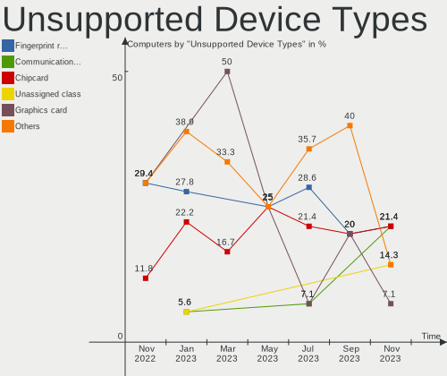

| Type                     | Computers | Percent |
|--------------------------|-----------|---------|
| Fingerprint reader       | 3         | 23.08%  |
| Chipcard                 | 2         | 15.38%  |
| Unassigned class         | 1         | 7.69%   |
| Storage                  | 1         | 7.69%   |
| Sound                    | 1         | 7.69%   |
| Net/ethernet             | 1         | 7.69%   |
| Graphics card            | 1         | 7.69%   |
| Firewire controller      | 1         | 7.69%   |
| Communication controller | 1         | 7.69%   |
| Bluetooth                | 1         | 7.69%   |

