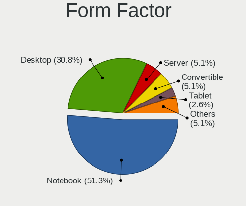
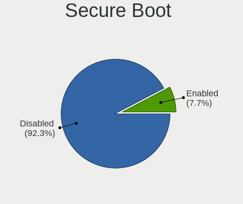
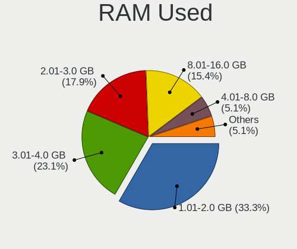
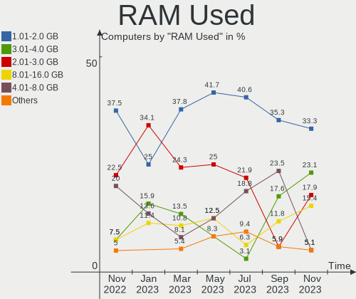
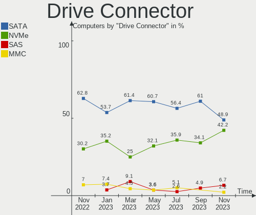
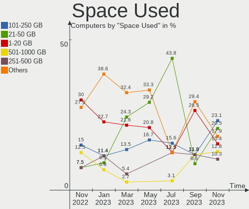
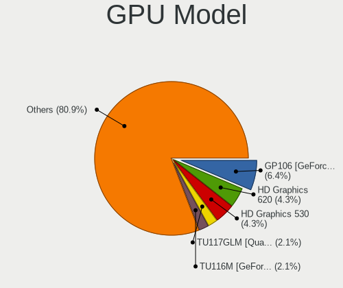
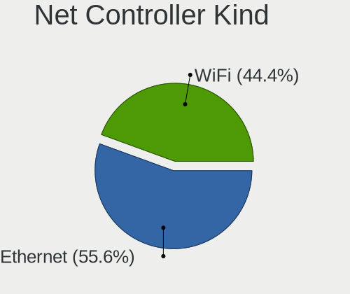
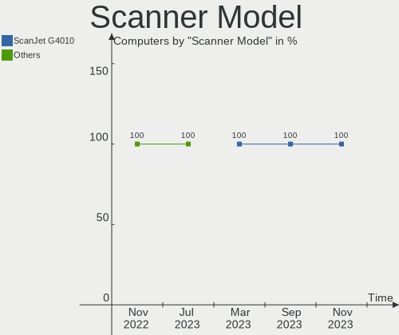
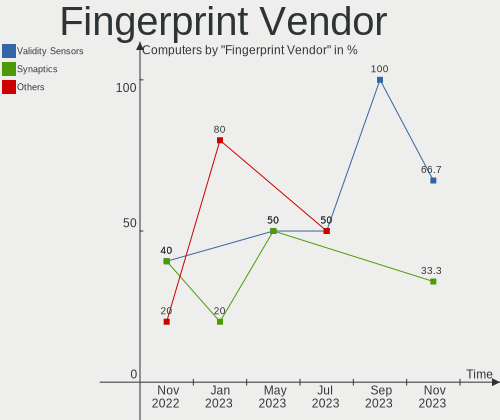

Ubuntu MATE - Hardware Trends
-----------------------------

A project to identify most popular hardware characteristics and track their change
over time based on data collected by Linux users at https://Linux-Hardware.org.

Anyone can contribute to this report by the [hw-probe](https://github.com/linuxhw/hw-probe) tool:

    sudo -E hw-probe -all -upload

This is a report for all computer types. See also reports for [desktops](/Dist/Ubuntu_MATE/Desktop/README.md) and [notebooks](/Dist/Ubuntu_MATE/Notebook/README.md).

This report is for one last month. Overall report since the beginning of time: [TestCoverage](https://github.com/linuxhw/TestCoverage)

Period: Dec, 2022.

Contents
--------

* [ System ](#system)
  - [ OS                       ](#os)
  - [ OS Family                ](#os-family)
  - [ Kernel                   ](#kernel)
  - [ Kernel Family            ](#kernel-family)
  - [ Kernel Major Ver.        ](#kernel-major-ver)
  - [ Arch                     ](#arch)
  - [ DE                       ](#de)
  - [ Display Server           ](#display-server)
  - [ Display Manager          ](#display-manager)
  - [ OS Lang                  ](#os-lang)
  - [ Boot Mode                ](#boot-mode)
  - [ Filesystem               ](#filesystem)
  - [ Part. scheme             ](#part-scheme)
  - [ Dual Boot with Linux/BSD ](#dual-boot-with-linuxbsd)
  - [ Dual Boot (Win)          ](#dual-boot-win)

* [ Board ](#board)
  - [ Vendor                   ](#vendor)
  - [ Model                    ](#model)
  - [ Model Family             ](#model-family)
  - [ MFG Year                 ](#mfg-year)
  - [ Form Factor              ](#form-factor)
  - [ Secure Boot              ](#secure-boot)
  - [ Coreboot                 ](#coreboot)
  - [ RAM Size                 ](#ram-size)
  - [ RAM Used                 ](#ram-used)
  - [ Total Drives             ](#total-drives)
  - [ Has CD-ROM               ](#has-cd-rom)
  - [ Has Ethernet             ](#has-ethernet)
  - [ Has WiFi                 ](#has-wifi)
  - [ Has Bluetooth            ](#has-bluetooth)

* [ Location ](#location)
  - [ Country                  ](#country)
  - [ City                     ](#city)

* [ Drives ](#drives)
  - [ Drive Vendor             ](#drive-vendor)
  - [ Drive Model              ](#drive-model)
  - [ HDD Vendor               ](#hdd-vendor)
  - [ SSD Vendor               ](#ssd-vendor)
  - [ Drive Kind               ](#drive-kind)
  - [ Drive Connector          ](#drive-connector)
  - [ Drive Size               ](#drive-size)
  - [ Space Total              ](#space-total)
  - [ Space Used               ](#space-used)
  - [ Malfunc. Drives          ](#malfunc-drives)
  - [ Malfunc. Drive Vendor    ](#malfunc-drive-vendor)
  - [ Malfunc. HDD Vendor      ](#malfunc-hdd-vendor)
  - [ Malfunc. Drive Kind      ](#malfunc-drive-kind)
  - [ Failed Drives            ](#failed-drives)
  - [ Failed Drive Vendor      ](#failed-drive-vendor)
  - [ Drive Status             ](#drive-status)

* [ Storage controller ](#storage-controller)
  - [ Storage Vendor           ](#storage-vendor)
  - [ Storage Model            ](#storage-model)
  - [ Storage Kind             ](#storage-kind)

* [ Processor ](#processor)
  - [ CPU Vendor               ](#cpu-vendor)
  - [ CPU Model                ](#cpu-model)
  - [ CPU Model Family         ](#cpu-model-family)
  - [ CPU Cores                ](#cpu-cores)
  - [ CPU Sockets              ](#cpu-sockets)
  - [ CPU Threads              ](#cpu-threads)
  - [ CPU Op-Modes             ](#cpu-op-modes)
  - [ CPU Microcode            ](#cpu-microcode)
  - [ CPU Microarch            ](#cpu-microarch)

* [ Graphics ](#graphics)
  - [ GPU Vendor               ](#gpu-vendor)
  - [ GPU Model                ](#gpu-model)
  - [ GPU Combo                ](#gpu-combo)
  - [ GPU Driver               ](#gpu-driver)
  - [ GPU Memory               ](#gpu-memory)

* [ Monitor ](#monitor)
  - [ Monitor Vendor           ](#monitor-vendor)
  - [ Monitor Model            ](#monitor-model)
  - [ Monitor Resolution       ](#monitor-resolution)
  - [ Monitor Diagonal         ](#monitor-diagonal)
  - [ Monitor Width            ](#monitor-width)
  - [ Aspect Ratio             ](#aspect-ratio)
  - [ Monitor Area             ](#monitor-area)
  - [ Pixel Density            ](#pixel-density)
  - [ Multiple Monitors        ](#multiple-monitors)

* [ Network ](#network)
  - [ Net Controller Vendor    ](#net-controller-vendor)
  - [ Net Controller Model     ](#net-controller-model)
  - [ Wireless Vendor          ](#wireless-vendor)
  - [ Wireless Model           ](#wireless-model)
  - [ Ethernet Vendor          ](#ethernet-vendor)
  - [ Ethernet Model           ](#ethernet-model)
  - [ Net Controller Kind      ](#net-controller-kind)
  - [ Used Controller          ](#used-controller)
  - [ NICs                     ](#nics)
  - [ IPv6                     ](#ipv6)

* [ Bluetooth ](#bluetooth)
  - [ Bluetooth Vendor         ](#bluetooth-vendor)
  - [ Bluetooth Model          ](#bluetooth-model)

* [ Sound ](#sound)
  - [ Sound Vendor             ](#sound-vendor)
  - [ Sound Model              ](#sound-model)

* [ Memory ](#memory)
  - [ Memory Vendor            ](#memory-vendor)
  - [ Memory Model             ](#memory-model)
  - [ Memory Kind              ](#memory-kind)
  - [ Memory Form Factor       ](#memory-form-factor)
  - [ Memory Size              ](#memory-size)
  - [ Memory Speed             ](#memory-speed)

* [ Printers & scanners ](#printers--scanners)
  - [ Printer Vendor           ](#printer-vendor)
  - [ Printer Model            ](#printer-model)
  - [ Scanner Vendor           ](#scanner-vendor)
  - [ Scanner Model            ](#scanner-model)

* [ Camera ](#camera)
  - [ Camera Vendor            ](#camera-vendor)
  - [ Camera Model             ](#camera-model)

* [ Security ](#security)
  - [ Fingerprint Vendor       ](#fingerprint-vendor)
  - [ Fingerprint Model        ](#fingerprint-model)
  - [ Chipcard Vendor          ](#chipcard-vendor)
  - [ Chipcard Model           ](#chipcard-model)

* [ Unsupported ](#unsupported)
  - [ Unsupported Devices      ](#unsupported-devices)
  - [ Unsupported Device Types ](#unsupported-device-types)

System
------

OS
--

Installed operating systems

| Name              | Computers | Percent |
|-------------------|-----------|---------|
| Ubuntu MATE 22.04 | 25        | 53.19%  |
| Ubuntu MATE 22.10 | 13        | 27.66%  |
| Ubuntu MATE 20.04 | 8         | 17.02%  |
| Ubuntu MATE 18.04 | 1         | 2.13%   |

OS Family
---------

OS without a version

| Name        | Computers | Percent |
|-------------|-----------|---------|
| Ubuntu MATE | 47        | 100%    |

Kernel
------

Version of the Linux kernel

| Version                | Computers | Percent |
|------------------------|-----------|---------|
| 5.15.0-56-generic      | 23        | 48.94%  |
| 5.19.0-26-generic      | 9         | 19.15%  |
| 5.15.0-56-lowlatency   | 2         | 4.26%   |
| 5.15.0-53-generic      | 2         | 4.26%   |
| 5.4.0-131-generic      | 1         | 2.13%   |
| 5.4.0-113-generic      | 1         | 2.13%   |
| 5.19.0-27-generic      | 1         | 2.13%   |
| 5.19.0-24-generic      | 1         | 2.13%   |
| 5.19.0-21-generic      | 1         | 2.13%   |
| 5.19.0-1012-lowlatency | 1         | 2.13%   |
| 5.15.0-43-generic      | 1         | 2.13%   |
| 5.15.0-1021-raspi      | 1         | 2.13%   |
| 5.14.0-1054-oem        | 1         | 2.13%   |
| 5.11.0-43-generic      | 1         | 2.13%   |
| 5.11.0-27-generic      | 1         | 2.13%   |

Kernel Family
-------------

Linux kernel without a distro release

| Version | Computers | Percent |
|---------|-----------|---------|
| 5.15.0  | 29        | 61.7%   |
| 5.19.0  | 13        | 27.66%  |
| 5.4.0   | 2         | 4.26%   |
| 5.11.0  | 2         | 4.26%   |
| 5.14.0  | 1         | 2.13%   |

Kernel Major Ver.
-----------------

Linux kernel major version

| Version | Computers | Percent |
|---------|-----------|---------|
| 5.15    | 29        | 61.7%   |
| 5.19    | 13        | 27.66%  |
| 5.4     | 2         | 4.26%   |
| 5.11    | 2         | 4.26%   |
| 5.14    | 1         | 2.13%   |

Arch
----

OS architecture (x86_64, i586, etc.)

| Name    | Computers | Percent |
|---------|-----------|---------|
| x86_64  | 45        | 95.74%  |
| i686    | 1         | 2.13%   |
| aarch64 | 1         | 2.13%   |

DE
--

Desktop Environment

| Name   | Computers | Percent |
|--------|-----------|---------|
| MATE   | 45        | 95.74%  |
| XFCE   | 1         | 2.13%   |
| Budgie | 1         | 2.13%   |

Display Server
--------------

X11 or Wayland

| Name    | Computers | Percent |
|---------|-----------|---------|
| X11     | 44        | 93.62%  |
| Tty     | 2         | 4.26%   |
| Wayland | 1         | 2.13%   |

Display Manager
---------------

SDDM, LightDM, etc.

| Name    | Computers | Percent |
|---------|-----------|---------|
| LightDM | 39        | 82.98%  |
| GDM3    | 6         | 12.77%  |
| Unknown | 2         | 4.26%   |

OS Lang
-------

Language

| Lang  | Computers | Percent |
|-------|-----------|---------|
| en_US | 17        | 36.17%  |
| de_DE | 6         | 12.77%  |
| hu_HU | 4         | 8.51%   |
| ru_RU | 2         | 4.26%   |
| it_IT | 2         | 4.26%   |
| fr_FR | 2         | 4.26%   |
| en_GB | 2         | 4.26%   |
| en_CA | 2         | 4.26%   |
| en_AU | 2         | 4.26%   |
| C     | 2         | 4.26%   |
| pt_BR | 1         | 2.13%   |
| pl_PL | 1         | 2.13%   |
| es_ES | 1         | 2.13%   |
| el_GR | 1         | 2.13%   |
| de_AT | 1         | 2.13%   |
| ca_ES | 1         | 2.13%   |

Boot Mode
---------

EFI or BIOS

| Mode | Computers | Percent |
|------|-----------|---------|
| BIOS | 25        | 53.19%  |
| EFI  | 22        | 46.81%  |

Filesystem
----------

Type of filesystem

| Type    | Computers | Percent |
|---------|-----------|---------|
| Ext4    | 42        | 89.36%  |
| Btrfs   | 2         | 4.26%   |
| Zfs     | 1         | 2.13%   |
| Xfs     | 1         | 2.13%   |
| Overlay | 1         | 2.13%   |

Part. scheme
------------

Scheme of partitioning

| Type    | Computers | Percent |
|---------|-----------|---------|
| GPT     | 34        | 72.34%  |
| MBR     | 10        | 21.28%  |
| Unknown | 3         | 6.38%   |

Dual Boot with Linux/BSD
------------------------

Hosting more than one Linux/BSD

| Dual boot | Computers | Percent |
|-----------|-----------|---------|
| No        | 35        | 74.47%  |
| Yes       | 12        | 25.53%  |

Dual Boot (Win)
---------------

Hosting Linux and Windows

| Dual boot | Computers | Percent |
|-----------|-----------|---------|
| No        | 32        | 68.09%  |
| Yes       | 15        | 31.91%  |

Board
-----

Vendor
------

Motherboard manufacturer

| Name                    | Computers | Percent |
|-------------------------|-----------|---------|
| ASUSTek Computer        | 10        | 21.28%  |
| Hewlett-Packard         | 8         | 17.02%  |
| Lenovo                  | 7         | 14.89%  |
| MSI                     | 4         | 8.51%   |
| Gigabyte Technology     | 4         | 8.51%   |
| Dell                    | 3         | 6.38%   |
| Acer                    | 2         | 4.26%   |
| Toshiba                 | 1         | 2.13%   |
| Raspberry Pi Foundation | 1         | 2.13%   |
| Notebook                | 1         | 2.13%   |
| IP3 Tech                | 1         | 2.13%   |
| Intel                   | 1         | 2.13%   |
| HUAWEI                  | 1         | 2.13%   |
| Biostar                 | 1         | 2.13%   |
| ASRock                  | 1         | 2.13%   |
| Apple                   | 1         | 2.13%   |

Model
-----

Motherboard model

| Name                                 | Computers | Percent |
|--------------------------------------|-----------|---------|
| Toshiba Satellite C50D-C             | 1         | 2.13%   |
| RPi Raspberry Pi 4 Model B Rev 1.4   | 1         | 2.13%   |
| Notebook NJx0MU                      | 1         | 2.13%   |
| MSI Summit E16Flip A12UCT            | 1         | 2.13%   |
| MSI MS-7C51                          | 1         | 2.13%   |
| MSI MS-7C37                          | 1         | 2.13%   |
| MSI MS-7817                          | 1         | 2.13%   |
| Lenovo ThinkPad T430 2347G5U         | 1         | 2.13%   |
| Lenovo ThinkPad T430 2344BZU         | 1         | 2.13%   |
| Lenovo ThinkPad R61 8918DEG          | 1         | 2.13%   |
| Lenovo IdeaPad S145-14IIL 81W6       | 1         | 2.13%   |
| Lenovo IdeaPad C340-14IML 81TK       | 1         | 2.13%   |
| Lenovo IdeaPad 330-15AST 81D6        | 1         | 2.13%   |
| Lenovo IdeaPad 3 15IIL05 81WE        | 1         | 2.13%   |
| IP3 Tech HeroBox                     | 1         | 2.13%   |
| Intel H61                            | 1         | 2.13%   |
| HUAWEI KPL-W0X                       | 1         | 2.13%   |
| HP ZBook 17 G5                       | 1         | 2.13%   |
| HP Stream Laptop 14-cb1xxx           | 1         | 2.13%   |
| HP Pavilion Gaming Laptop 17-cd1xxx  | 1         | 2.13%   |
| HP EliteDesk 705 G1 SFF              | 1         | 2.13%   |
| HP EliteBook 840 G5                  | 1         | 2.13%   |
| HP Compaq Presario CQ61              | 1         | 2.13%   |
| HP 255 G7 Notebook PC                | 1         | 2.13%   |
| HP 14                                | 1         | 2.13%   |
| Gigabyte X570S AERO G                | 1         | 2.13%   |
| Gigabyte F2A68HM-DS2                 | 1         | 2.13%   |
| Gigabyte B85M-D3H                    | 1         | 2.13%   |
| Gigabyte AB350M-Gaming 3             | 1         | 2.13%   |
| Dell Precision T1500                 | 1         | 2.13%   |
| Dell Precision 3660                  | 1         | 2.13%   |
| Dell Latitude E5430 non-vPro         | 1         | 2.13%   |
| Biostar A320MH                       | 1         | 2.13%   |
| ASUS X550LN                          | 1         | 2.13%   |
| ASUS TUF Gaming FX705GM_FX705GM      | 1         | 2.13%   |
| ASUS TUF Gaming FX505DT_FX505DT      | 1         | 2.13%   |
| ASUS T100TA                          | 1         | 2.13%   |
| ASUS ROG STRIX Z690-A GAMING WIFI D4 | 1         | 2.13%   |
| ASUS PRIME Z590-P WIFI               | 1         | 2.13%   |
| ASUS P8Z77-V PRO                     | 1         | 2.13%   |

Model Family
------------

Motherboard model prefix

| Name                   | Computers | Percent |
|------------------------|-----------|---------|
| Lenovo IdeaPad         | 4         | 8.51%   |
| Lenovo ThinkPad        | 3         | 6.38%   |
| Dell Precision         | 2         | 4.26%   |
| ASUS TUF               | 2         | 4.26%   |
| Toshiba Satellite      | 1         | 2.13%   |
| RPi Raspberry          | 1         | 2.13%   |
| Notebook NJx0MU        | 1         | 2.13%   |
| MSI Summit             | 1         | 2.13%   |
| MSI MS-7C51            | 1         | 2.13%   |
| MSI MS-7C37            | 1         | 2.13%   |
| MSI MS-7817            | 1         | 2.13%   |
| IP3 Tech HeroBox       | 1         | 2.13%   |
| Intel H61              | 1         | 2.13%   |
| HUAWEI KPL-W0X         | 1         | 2.13%   |
| HP ZBook               | 1         | 2.13%   |
| HP Stream              | 1         | 2.13%   |
| HP Pavilion            | 1         | 2.13%   |
| HP EliteDesk           | 1         | 2.13%   |
| HP EliteBook           | 1         | 2.13%   |
| HP Compaq              | 1         | 2.13%   |
| HP 255                 | 1         | 2.13%   |
| HP 14                  | 1         | 2.13%   |
| Gigabyte X570S         | 1         | 2.13%   |
| Gigabyte F2A68HM-DS2   | 1         | 2.13%   |
| Gigabyte B85M-D3H      | 1         | 2.13%   |
| Gigabyte AB350M-Gaming | 1         | 2.13%   |
| Dell Latitude          | 1         | 2.13%   |
| Biostar A320MH         | 1         | 2.13%   |
| ASUS X550LN            | 1         | 2.13%   |
| ASUS T100TA            | 1         | 2.13%   |
| ASUS ROG               | 1         | 2.13%   |
| ASUS PRIME             | 1         | 2.13%   |
| ASUS P8Z77-V           | 1         | 2.13%   |
| ASUS P7P55             | 1         | 2.13%   |
| ASUS M5A78L-M          | 1         | 2.13%   |
| ASUS H110M-K           | 1         | 2.13%   |
| ASRock 5600G           | 1         | 2.13%   |
| Apple iMac11           | 1         | 2.13%   |
| Acer TravelMate        | 1         | 2.13%   |
| Acer Aspire            | 1         | 2.13%   |

MFG Year
--------

Motherboard manufacture year

| Year    | Computers | Percent |
|---------|-----------|---------|
| 2019    | 7         | 14.89%  |
| 2021    | 6         | 12.77%  |
| 2018    | 6         | 12.77%  |
| 2014    | 4         | 8.51%   |
| 2013    | 4         | 8.51%   |
| 2012    | 4         | 8.51%   |
| 2020    | 3         | 6.38%   |
| 2009    | 3         | 6.38%   |
| 2017    | 2         | 4.26%   |
| 2022    | 1         | 2.13%   |
| 2016    | 1         | 2.13%   |
| 2015    | 1         | 2.13%   |
| 2011    | 1         | 2.13%   |
| 2010    | 1         | 2.13%   |
| 2008    | 1         | 2.13%   |
| 2007    | 1         | 2.13%   |
| Unknown | 1         | 2.13%   |

Form Factor
-----------

Physical design of the computer

| Name           | Computers | Percent |
|----------------|-----------|---------|
| Notebook       | 24        | 51.06%  |
| Desktop        | 19        | 40.43%  |
| System on chip | 1         | 2.13%   |
| Convertible    | 1         | 2.13%   |
| Mini pc        | 1         | 2.13%   |
| All in one     | 1         | 2.13%   |

Secure Boot
-----------

Enabled or disabled

| State    | Computers | Percent |
|----------|-----------|---------|
| Disabled | 47        | 100%    |

Coreboot
--------

Have coreboot on board

| Used | Computers | Percent |
|------|-----------|---------|
| No   | 47        | 100%    |

RAM Size
--------

Total RAM memory

| Size in GB  | Computers | Percent |
|-------------|-----------|---------|
| 4.01-8.0    | 12        | 25.53%  |
| 3.01-4.0    | 10        | 21.28%  |
| 32.01-64.0  | 6         | 12.77%  |
| 16.01-24.0  | 6         | 12.77%  |
| 8.01-16.0   | 6         | 12.77%  |
| 64.01-256.0 | 3         | 6.38%   |
| 24.01-32.0  | 2         | 4.26%   |
| 2.01-3.0    | 1         | 2.13%   |
| 1.01-2.0    | 1         | 2.13%   |

RAM Used
--------

Used RAM memory

| Used GB    | Computers | Percent |
|------------|-----------|---------|
| 1.01-2.0   | 19        | 40.43%  |
| 2.01-3.0   | 7         | 14.89%  |
| 4.01-8.0   | 5         | 10.64%  |
| 3.01-4.0   | 5         | 10.64%  |
| 8.01-16.0  | 5         | 10.64%  |
| 0.51-1.0   | 5         | 10.64%  |
| 24.01-32.0 | 1         | 2.13%   |

Total Drives
------------

Number of drives on board

| Drives | Computers | Percent |
|--------|-----------|---------|
| 1      | 23        | 48.94%  |
| 2      | 11        | 23.4%   |
| 3      | 7         | 14.89%  |
| 4      | 4         | 8.51%   |
| 6      | 1         | 2.13%   |
| 5      | 1         | 2.13%   |

Has CD-ROM
----------

Has CD-ROM on board

| Presented | Computers | Percent |
|-----------|-----------|---------|
| No        | 27        | 57.45%  |
| Yes       | 20        | 42.55%  |

Has Ethernet
------------

Has Ethernet on board

| Presented | Computers | Percent |
|-----------|-----------|---------|
| Yes       | 39        | 82.98%  |
| No        | 8         | 17.02%  |

Has WiFi
--------

Has WiFi module

| Presented | Computers | Percent |
|-----------|-----------|---------|
| Yes       | 34        | 72.34%  |
| No        | 13        | 27.66%  |

Has Bluetooth
-------------

Has Bluetooth module

| Presented | Computers | Percent |
|-----------|-----------|---------|
| Yes       | 28        | 59.57%  |
| No        | 19        | 40.43%  |

Location
--------

Country
-------

Geographic location (country)

| Country   | Computers | Percent |
|-----------|-----------|---------|
| USA       | 10        | 21.28%  |
| Hungary   | 6         | 12.77%  |
| Germany   | 6         | 12.77%  |
| Spain     | 3         | 6.38%   |
| UK        | 2         | 4.26%   |
| Russia    | 2         | 4.26%   |
| Norway    | 2         | 4.26%   |
| Italy     | 2         | 4.26%   |
| Greece    | 2         | 4.26%   |
| France    | 2         | 4.26%   |
| Brazil    | 2         | 4.26%   |
| Australia | 2         | 4.26%   |
| Poland    | 1         | 2.13%   |
| Indonesia | 1         | 2.13%   |
| Chile     | 1         | 2.13%   |
| Canada    | 1         | 2.13%   |
| Belgium   | 1         | 2.13%   |
| Austria   | 1         | 2.13%   |

City
----

Geographic location (city)

| City                    | Computers | Percent |
|-------------------------|-----------|---------|
| Olathe                  | 2         | 4.26%   |
| Budapest                | 2         | 4.26%   |
| Brisbane                | 2         | 4.26%   |
| Zottegem                | 1         | 2.13%   |
| West Stockbridge        | 1         | 2.13%   |
| Warsaw                  | 1         | 2.13%   |
| Viroflay                | 1         | 2.13%   |
| Valls                   | 1         | 2.13%   |
| Tovo San Giacomo        | 1         | 2.13%   |
| Talcahuano              | 1         | 2.13%   |
| Stange                  | 1         | 2.13%   |
| Sevenoaks               | 1         | 2.13%   |
| Schmelz                 | 1         | 2.13%   |
| Sao Paulo               | 1         | 2.13%   |
| Santa Cruz de La Palma  | 1         | 2.13%   |
| Saint-Etienne-de-Valoux | 1         | 2.13%   |
| Saint Paul              | 1         | 2.13%   |
| Rome                    | 1         | 2.13%   |
| Picos                   | 1         | 2.13%   |
| Olympia                 | 1         | 2.13%   |
| Moscow                  | 1         | 2.13%   |
| Mannheim                | 1         | 2.13%   |
| Madrid                  | 1         | 2.13%   |
| Lindlar                 | 1         | 2.13%   |
| Kaluga                  | 1         | 2.13%   |
| Kalamata                | 1         | 2.13%   |
| Humble                  | 1         | 2.13%   |
| Hull                    | 1         | 2.13%   |
| Houston                 | 1         | 2.13%   |
| Hohenwald               | 1         | 2.13%   |
| Heraklion               | 1         | 2.13%   |
| Hatvan                  | 1         | 2.13%   |
| Hamar                   | 1         | 2.13%   |
| Győr                   | 1         | 2.13%   |
| Gruenenplan             | 1         | 2.13%   |
| Goslar                  | 1         | 2.13%   |
| Fort Lee                | 1         | 2.13%   |
| Esztergom               | 1         | 2.13%   |
| Deutschlandsberg        | 1         | 2.13%   |
| Charlotte               | 1         | 2.13%   |

Drives
------

Drive Vendor
------------

Hard drive vendors

| Vendor                      | Computers | Drives | Percent |
|-----------------------------|-----------|--------|---------|
| Samsung Electronics         | 14        | 21     | 18.18%  |
| Seagate                     | 13        | 14     | 16.88%  |
| WDC                         | 9         | 12     | 11.69%  |
| Toshiba                     | 6         | 9      | 7.79%   |
| Kingston                    | 6         | 7      | 7.79%   |
| SanDisk                     | 4         | 4      | 5.19%   |
| Unknown                     | 2         | 2      | 2.6%    |
| SPCC                        | 2         | 2      | 2.6%    |
| Micron Technology           | 2         | 2      | 2.6%    |
| HGST                        | 2         | 2      | 2.6%    |
| Crucial                     | 2         | 4      | 2.6%    |
| WDC WDS2                    | 1         | 1      | 1.3%    |
| Verbatim                    | 1         | 1      | 1.3%    |
| SK hynix                    | 1         | 1      | 1.3%    |
| Realtek Semiconductor       | 1         | 1      | 1.3%    |
| Phison Electronics          | 1         | 1      | 1.3%    |
| Patriot                     | 1         | 1      | 1.3%    |
| KIOXIA                      | 1         | 1      | 1.3%    |
| Kingston Technology Company | 1         | 1      | 1.3%    |
| Intel                       | 1         | 1      | 1.3%    |
| HS-SSD-J100N                | 1         | 1      | 1.3%    |
| GLOWAY                      | 1         | 1      | 1.3%    |
| Emtec                       | 1         | 1      | 1.3%    |
| AMD                         | 1         | 1      | 1.3%    |
| addlink                     | 1         | 1      | 1.3%    |
| Unknown                     | 1         | 1      | 1.3%    |

Drive Model
-----------

Hard drive models

| Model                                               | Computers | Percent |
|-----------------------------------------------------|-----------|---------|
| SPCC Solid State Disk 256GB                         | 2         | 2.33%   |
| Seagate ST2000DM008-2FR102 2TB                      | 2         | 2.33%   |
| Samsung NVMe SSD Controller SM981/PM981/PM983 500GB | 2         | 2.33%   |
| Kingston SA400S37120G 120GB SSD                     | 2         | 2.33%   |
| WDC WDS2 50G2B0B-00YS 250GB SSD                     | 1         | 1.16%   |
| WDC WD7500BPVX-22JC3T0 752GB                        | 1         | 1.16%   |
| WDC WD5003AZEX-00K1GA0 500GB                        | 1         | 1.16%   |
| WDC WD5000LPVX-60V0TT0 500GB                        | 1         | 1.16%   |
| WDC WD5000LPCX-24VHAT0 500GB                        | 1         | 1.16%   |
| WDC WD5000AAKS-65TMA0 500GB                         | 1         | 1.16%   |
| WDC WD5000AADS-00S9B0 500GB                         | 1         | 1.16%   |
| WDC WD30EFRX-68N32N0 3TB                            | 1         | 1.16%   |
| WDC WD30EFRX-68EUZN0 3TB                            | 1         | 1.16%   |
| WDC WD2000FYYZ-01UL1B1 2TB                          | 1         | 1.16%   |
| WDC WD10SPZX-21Z10T0 1TB                            | 1         | 1.16%   |
| WDC WD10EZEX-08WN4A0 1TB                            | 1         | 1.16%   |
| WDC WD1001FALS-40Y6A0 1TB                           | 1         | 1.16%   |
| Verbatim Vi550 S3 256GB                             | 1         | 1.16%   |
| Unknown SC32G  32GB                                 | 1         | 1.16%   |
| Unknown MMC Card  64GB                              | 1         | 1.16%   |
| Toshiba XG6 NVMe SSD Controller 256GB               | 1         | 1.16%   |
| Toshiba MQ01ACF050 500GB                            | 1         | 1.16%   |
| Toshiba MQ01ABF050 500GB                            | 1         | 1.16%   |
| Toshiba MG06ACA800E 8TB                             | 1         | 1.16%   |
| Toshiba DT01ACA100 1TB                              | 1         | 1.16%   |
| Toshiba DT01ACA050 500GB                            | 1         | 1.16%   |
| SK hynix HCG8e  64GB                                | 1         | 1.16%   |
| Seagate ST9250827AS 250GB                           | 1         | 1.16%   |
| Seagate ST6000NM0024-1HT17Z 6TB                     | 1         | 1.16%   |
| Seagate ST500DM002-1BD142 500GB                     | 1         | 1.16%   |
| Seagate ST4000DX005-3GH101 4TB                      | 1         | 1.16%   |
| Seagate ST2000LM015-2E8174 2TB                      | 1         | 1.16%   |
| Seagate ST2000LM003 HN-M201RAD 2TB                  | 1         | 1.16%   |
| Seagate ST2000DM001-9YN164 2TB                      | 1         | 1.16%   |
| Seagate ST1000VM002-1ET162 1TB                      | 1         | 1.16%   |
| Seagate ST1000LM048-2E7172 1TB                      | 1         | 1.16%   |
| Seagate ST1000DM010-2EP102 1TB                      | 1         | 1.16%   |
| Seagate One Touch HDD 5TB                           | 1         | 1.16%   |
| Seagate BUP BK 4TB                                  | 1         | 1.16%   |
| Sandisk WD Blue SN500 / PC SN520 NVMe SSD 256GB     | 1         | 1.16%   |

HDD Vendor
----------

Hard disk drive vendors

| Vendor              | Computers | Drives | Percent |
|---------------------|-----------|--------|---------|
| Seagate             | 13        | 14     | 41.94%  |
| WDC                 | 9         | 12     | 29.03%  |
| Toshiba             | 5         | 8      | 16.13%  |
| Samsung Electronics | 2         | 3      | 6.45%   |
| HGST                | 2         | 2      | 6.45%   |

SSD Vendor
----------

Solid state drive vendors

| Vendor              | Computers | Drives | Percent |
|---------------------|-----------|--------|---------|
| Samsung Electronics | 6         | 8      | 24%     |
| Kingston            | 5         | 6      | 20%     |
| SPCC                | 2         | 2      | 8%      |
| SanDisk             | 2         | 2      | 8%      |
| Crucial             | 2         | 4      | 8%      |
| WDC WDS2            | 1         | 1      | 4%      |
| Verbatim            | 1         | 1      | 4%      |
| Patriot             | 1         | 1      | 4%      |
| HS-SSD-J100N        | 1         | 1      | 4%      |
| GLOWAY              | 1         | 1      | 4%      |
| Emtec               | 1         | 1      | 4%      |
| AMD                 | 1         | 1      | 4%      |
| addlink             | 1         | 1      | 4%      |

Drive Kind
----------

HDD or SSD

| Kind    | Computers | Drives | Percent |
|---------|-----------|--------|---------|
| HDD     | 27        | 39     | 39.13%  |
| SSD     | 21        | 30     | 30.43%  |
| NVMe    | 17        | 21     | 24.64%  |
| MMC     | 3         | 3      | 4.35%   |
| Unknown | 1         | 1      | 1.45%   |

Drive Connector
---------------

SATA, SAS, NVMe, etc.

| Type | Computers | Drives | Percent |
|------|-----------|--------|---------|
| SATA | 36        | 67     | 61.02%  |
| NVMe | 17        | 21     | 28.81%  |
| SAS  | 3         | 3      | 5.08%   |
| MMC  | 3         | 3      | 5.08%   |

Drive Size
----------

Size of hard drive

| Size in TB | Computers | Drives | Percent |
|------------|-----------|--------|---------|
| 0.01-0.5   | 26        | 38     | 50%     |
| 0.51-1.0   | 11        | 12     | 21.15%  |
| 1.01-2.0   | 8         | 8      | 15.38%  |
| 4.01-10.0  | 4         | 7      | 7.69%   |
| 3.01-4.0   | 2         | 2      | 3.85%   |
| 2.01-3.0   | 1         | 2      | 1.92%   |

Space Total
-----------

Amount of disk space available on the file system

| Size in GB     | Computers | Percent |
|----------------|-----------|---------|
| 251-500        | 10        | 21.28%  |
| 101-250        | 10        | 21.28%  |
| 501-1000       | 6         | 12.77%  |
| More than 3000 | 5         | 10.64%  |
| 1001-2000      | 5         | 10.64%  |
| 2001-3000      | 4         | 8.51%   |
| 21-50          | 3         | 6.38%   |
| 1-20           | 2         | 4.26%   |
| 51-100         | 2         | 4.26%   |

Space Used
----------

Amount of used disk space

| Used GB        | Computers | Percent |
|----------------|-----------|---------|
| 1-20           | 14        | 29.79%  |
| 21-50          | 8         | 17.02%  |
| 101-250        | 7         | 14.89%  |
| 51-100         | 4         | 8.51%   |
| More than 3000 | 3         | 6.38%   |
| 251-500        | 3         | 6.38%   |
| 2001-3000      | 3         | 6.38%   |
| 1001-2000      | 3         | 6.38%   |
| 501-1000       | 2         | 4.26%   |

Malfunc. Drives
---------------

Drive models with a malfunction

| Model                           | Computers | Drives | Percent |
|---------------------------------|-----------|--------|---------|
| WDC WD7500BPVX-22JC3T0 752GB    | 1         | 1      | 20%     |
| WDC WD5000AADS-00S9B0 500GB     | 1         | 1      | 20%     |
| WDC WD1001FALS-40Y6A0 1TB       | 1         | 1      | 20%     |
| Seagate ST500DM002-1BD142 500GB | 1         | 1      | 20%     |
| Intel SSDPEKNW512G8H 512GB      | 1         | 1      | 20%     |

Malfunc. Drive Vendor
---------------------

Vendors of faulty drives

| Vendor  | Computers | Drives | Percent |
|---------|-----------|--------|---------|
| WDC     | 3         | 3      | 60%     |
| Seagate | 1         | 1      | 20%     |
| Intel   | 1         | 1      | 20%     |

Malfunc. HDD Vendor
-------------------

Vendors of faulty HDD drives

| Vendor  | Computers | Drives | Percent |
|---------|-----------|--------|---------|
| WDC     | 3         | 3      | 75%     |
| Seagate | 1         | 1      | 25%     |

Malfunc. Drive Kind
-------------------

Kinds of faulty drives

| Kind | Computers | Drives | Percent |
|------|-----------|--------|---------|
| HDD  | 4         | 4      | 80%     |
| NVMe | 1         | 1      | 20%     |

Failed Drives
-------------

Failed drive models

Zero info for selected period =(

Failed Drive Vendor
-------------------

Failed drive vendors

Zero info for selected period =(

Drive Status
------------

Number of failed and malfunc. drives

| Status   | Computers | Drives | Percent |
|----------|-----------|--------|---------|
| Works    | 28        | 52     | 56%     |
| Detected | 17        | 37     | 34%     |
| Malfunc  | 5         | 5      | 10%     |

Storage controller
------------------

Storage Vendor
--------------

Storage controller vendors

| Vendor                       | Computers | Percent |
|------------------------------|-----------|---------|
| Intel                        | 29        | 47.54%  |
| AMD                          | 12        | 19.67%  |
| Samsung Electronics          | 7         | 11.48%  |
| ASMedia Technology           | 3         | 4.92%   |
| SanDisk                      | 2         | 3.28%   |
| Micron Technology            | 2         | 3.28%   |
| Kingston Technology Company  | 2         | 3.28%   |
| Toshiba America Info Systems | 1         | 1.64%   |
| Realtek Semiconductor        | 1         | 1.64%   |
| Phison Electronics           | 1         | 1.64%   |
| KIOXIA                       | 1         | 1.64%   |

Storage Model
-------------

Storage controller models

| Model                                                                          | Computers | Percent |
|--------------------------------------------------------------------------------|-----------|---------|
| AMD FCH SATA Controller [AHCI mode]                                            | 10        | 14.29%  |
| Samsung NVMe SSD Controller PM9A1/PM9A3/980PRO                                 | 3         | 4.29%   |
| Intel 5 Series/3400 Series Chipset 6 port SATA AHCI Controller                 | 3         | 4.29%   |
| ASMedia ASM1062 Serial ATA Controller                                          | 3         | 4.29%   |
| Samsung NVMe SSD Controller SM981/PM981/PM983                                  | 2         | 2.86%   |
| Samsung NVMe SSD Controller 980                                                | 2         | 2.86%   |
| Micron Non-Volatile memory controller                                          | 2         | 2.86%   |
| Intel Volume Management Device NVMe RAID Controller                            | 2         | 2.86%   |
| Intel Ice Lake-LP SATA Controller [AHCI mode]                                  | 2         | 2.86%   |
| Intel Cannon Lake Mobile PCH SATA AHCI Controller                              | 2         | 2.86%   |
| Intel Alder Lake-S PCH SATA Controller [AHCI Mode]                             | 2         | 2.86%   |
| Intel 8 Series/C220 Series Chipset Family 6-port SATA Controller 1 [AHCI mode] | 2         | 2.86%   |
| Intel 8 Series SATA Controller 1 [AHCI mode]                                   | 2         | 2.86%   |
| Intel 7 Series Chipset Family 6-port SATA Controller [AHCI mode]               | 2         | 2.86%   |
| AMD FCH SATA Controller D                                                      | 2         | 2.86%   |
| Toshiba America Info Systems XG6 NVMe SSD Controller                           | 1         | 1.43%   |
| SanDisk WD Blue SN500 / PC SN520 NVMe SSD                                      | 1         | 1.43%   |
| SanDisk PC SN520 NVMe SSD                                                      | 1         | 1.43%   |
| Samsung NVMe SSD Controller SM961/PM961/SM963                                  | 1         | 1.43%   |
| Realtek Realtek Non-Volatile memory controller                                 | 1         | 1.43%   |
| Phison E16 PCIe4 NVMe Controller                                               | 1         | 1.43%   |
| KIOXIA NVMe SSD Controller BG4                                                 | 1         | 1.43%   |
| Kingston Company Company Non-Volatile memory controller                        | 1         | 1.43%   |
| Kingston Company A2000 NVMe SSD                                                | 1         | 1.43%   |
| Intel Tiger Lake-LP SATA Controller                                            | 1         | 1.43%   |
| Intel SSD 660P Series                                                          | 1         | 1.43%   |
| Intel Q170/Q150/B150/H170/H110/Z170/CM236 Chipset SATA Controller [AHCI Mode]  | 1         | 1.43%   |
| Intel Comet Lake SATA AHCI Controller                                          | 1         | 1.43%   |
| Intel Celeron/Pentium Silver Processor SATA Controller                         | 1         | 1.43%   |
| Intel Atom Processor E3800 Series SATA AHCI Controller                         | 1         | 1.43%   |
| Intel 82801IBM/IEM (ICH9M/ICH9M-E) 4 port SATA Controller [AHCI mode]          | 1         | 1.43%   |
| Intel 82801IBM/IEM (ICH9M/ICH9M-E) 2 port SATA Controller [IDE mode]           | 1         | 1.43%   |
| Intel 82801HM/HEM (ICH8M/ICH8M-E) SATA Controller [AHCI mode]                  | 1         | 1.43%   |
| Intel 82801HM/HEM (ICH8M/ICH8M-E) IDE Controller                               | 1         | 1.43%   |
| Intel 82801 Mobile SATA Controller [RAID mode]                                 | 1         | 1.43%   |
| Intel 7 Series/C210 Series Chipset Family 6-port SATA Controller [AHCI mode]   | 1         | 1.43%   |
| Intel 7 Series Chipset Family 4-port SATA Controller [IDE mode]                | 1         | 1.43%   |
| Intel 7 Series Chipset Family 2-port SATA Controller [IDE mode]                | 1         | 1.43%   |
| Intel 6 Series/C200 Series Chipset Family 6 port Desktop SATA AHCI Controller  | 1         | 1.43%   |
| Intel 500 Series Chipset Family SATA AHCI Controller                           | 1         | 1.43%   |

Storage Kind
------------

Kind of storage controller (IDE, SATA, NVMe, SAS, ...)

| Kind | Computers | Percent |
|------|-----------|---------|
| SATA | 37        | 60.66%  |
| NVMe | 17        | 27.87%  |
| IDE  | 4         | 6.56%   |
| RAID | 3         | 4.92%   |

Processor
---------

CPU Vendor
----------

Processor vendors

| Vendor | Computers | Percent |
|--------|-----------|---------|
| Intel  | 32        | 68.09%  |
| AMD    | 14        | 29.79%  |
| ARM    | 1         | 2.13%   |

CPU Model
---------

Processor models

| Model                                           | Computers | Percent |
|-------------------------------------------------|-----------|---------|
| Intel Core i5-3320M CPU @ 2.60GHz               | 2         | 4.26%   |
| AMD Ryzen 7 5800X 8-Core Processor              | 2         | 4.26%   |
| Intel Xeon CPU E3-1245 v3 @ 3.40GHz             | 1         | 2.13%   |
| Intel Pentium Dual-Core CPU T4400 @ 2.20GHz     | 1         | 2.13%   |
| Intel Pentium CPU N3540 @ 2.16GHz               | 1         | 2.13%   |
| Intel Pentium CPU G4400 @ 3.30GHz               | 1         | 2.13%   |
| Intel Core i7-8850H CPU @ 2.60GHz               | 1         | 2.13%   |
| Intel Core i7-8750H CPU @ 2.20GHz               | 1         | 2.13%   |
| Intel Core i7-10750H CPU @ 2.60GHz              | 1         | 2.13%   |
| Intel Core i5-8250U CPU @ 1.60GHz               | 1         | 2.13%   |
| Intel Core i5-4200U CPU @ 1.60GHz               | 1         | 2.13%   |
| Intel Core i5-3340M CPU @ 2.70GHz               | 1         | 2.13%   |
| Intel Core i5-1035G1 CPU @ 1.00GHz              | 1         | 2.13%   |
| Intel Core i5-10210U CPU @ 1.60GHz              | 1         | 2.13%   |
| Intel Core i5 CPU 760 @ 2.80GHz                 | 1         | 2.13%   |
| Intel Core i5 CPU 750 @ 2.67GHz                 | 1         | 2.13%   |
| Intel Core i3-4170 CPU @ 3.70GHz                | 1         | 2.13%   |
| Intel Core i3-4010U CPU @ 1.70GHz               | 1         | 2.13%   |
| Intel Core i3-3220 CPU @ 3.30GHz                | 1         | 2.13%   |
| Intel Core i3-2105 CPU @ 3.10GHz                | 1         | 2.13%   |
| Intel Core i3-1005G1 CPU @ 1.20GHz              | 1         | 2.13%   |
| Intel Core i3 CPU 550 @ 3.20GHz                 | 1         | 2.13%   |
| Intel Core 2 Duo CPU T8100 @ 2.10GHz            | 1         | 2.13%   |
| Intel Core 2 Duo CPU T5670 @ 1.80GHz            | 1         | 2.13%   |
| Intel Celeron N4020 CPU @ 1.10GHz               | 1         | 2.13%   |
| Intel Celeron J4125 CPU @ 2.00GHz               | 1         | 2.13%   |
| Intel Atom CPU Z3740 @ 1.33GHz                  | 1         | 2.13%   |
| Intel 12th Gen Core i9-12900K                   | 1         | 2.13%   |
| Intel 12th Gen Core i7-12700F                   | 1         | 2.13%   |
| Intel 12th Gen Core i7-1260P                    | 1         | 2.13%   |
| Intel 11th Gen Core i7-11700K @ 3.60GHz         | 1         | 2.13%   |
| Intel 11th Gen Core i7-1165G7 @ 2.80GHz         | 1         | 2.13%   |
| ARM Processor                                   | 1         | 2.13%   |
| AMD Ryzen 7 3750H with Radeon Vega Mobile Gfx   | 1         | 2.13%   |
| AMD Ryzen 5 PRO 3400G with Radeon Vega Graphics | 1         | 2.13%   |
| AMD Ryzen 5 5600G with Radeon Graphics          | 1         | 2.13%   |
| AMD Ryzen 5 2600 Six-Core Processor             | 1         | 2.13%   |
| AMD Ryzen 5 2500U with Radeon Vega Mobile Gfx   | 1         | 2.13%   |
| AMD Ryzen 3 3200U with Radeon Vega Mobile Gfx   | 1         | 2.13%   |
| AMD Ryzen 3 2200G with Radeon Vega Graphics     | 1         | 2.13%   |

CPU Model Family
----------------

Processor model prefix

| Model                   | Computers | Percent |
|-------------------------|-----------|---------|
| Intel Core i5           | 9         | 19.15%  |
| Other                   | 6         | 12.77%  |
| Intel Core i3           | 6         | 12.77%  |
| Intel Core i7           | 3         | 6.38%   |
| AMD Ryzen 7             | 3         | 6.38%   |
| AMD Ryzen 5             | 3         | 6.38%   |
| Intel Pentium           | 2         | 4.26%   |
| Intel Core 2 Duo        | 2         | 4.26%   |
| Intel Celeron           | 2         | 4.26%   |
| AMD Ryzen 3             | 2         | 4.26%   |
| Intel Xeon              | 1         | 2.13%   |
| Intel Pentium Dual-Core | 1         | 2.13%   |
| Intel Atom              | 1         | 2.13%   |
| AMD Ryzen 5 PRO         | 1         | 2.13%   |
| AMD E2                  | 1         | 2.13%   |
| AMD E1                  | 1         | 2.13%   |
| AMD Athlon II X2        | 1         | 2.13%   |
| AMD A8                  | 1         | 2.13%   |
| AMD A4                  | 1         | 2.13%   |

CPU Cores
---------

Number of processor cores

| Number  | Computers | Percent |
|---------|-----------|---------|
| 2       | 20        | 42.55%  |
| 4       | 14        | 29.79%  |
| 6       | 5         | 10.64%  |
| 8       | 3         | 6.38%   |
| 12      | 2         | 4.26%   |
| 16      | 1         | 2.13%   |
| 1       | 1         | 2.13%   |
| Unknown | 1         | 2.13%   |

CPU Sockets
-----------

Number of sockets

| Number  | Computers | Percent |
|---------|-----------|---------|
| 1       | 46        | 97.87%  |
| Unknown | 1         | 2.13%   |

CPU Threads
-----------

Threads per core (Hyper-Threading)

| Number  | Computers | Percent |
|---------|-----------|---------|
| 2       | 31        | 65.96%  |
| 1       | 15        | 31.91%  |
| Unknown | 1         | 2.13%   |

CPU Op-Modes
------------

CPU Operation Modes (32-bit, 64-bit)

| Op mode        | Computers | Percent |
|----------------|-----------|---------|
| 32-bit, 64-bit | 47        | 100%    |

CPU Microcode
-------------

Microcode number

| Number     | Computers | Percent |
|------------|-----------|---------|
| Unknown    | 15        | 31.91%  |
| 0x306a9    | 4         | 8.51%   |
| 0x306c3    | 2         | 4.26%   |
| 0x106e5    | 2         | 4.26%   |
| 0x08108109 | 2         | 4.26%   |
| 0xa0671    | 1         | 2.13%   |
| 0x906a3    | 1         | 2.13%   |
| 0x806ea    | 1         | 2.13%   |
| 0x806c1    | 1         | 2.13%   |
| 0x706e5    | 1         | 2.13%   |
| 0x706a8    | 1         | 2.13%   |
| 0x6fd      | 1         | 2.13%   |
| 0x506e3    | 1         | 2.13%   |
| 0x40651    | 1         | 2.13%   |
| 0x30678    | 1         | 2.13%   |
| 0x30673    | 1         | 2.13%   |
| 0x206a7    | 1         | 2.13%   |
| 0x20655    | 1         | 2.13%   |
| 0x1067a    | 1         | 2.13%   |
| 0x10676    | 1         | 2.13%   |
| 0x0a50000c | 1         | 2.13%   |
| 0x0a201205 | 1         | 2.13%   |
| 0x0810100b | 1         | 2.13%   |
| 0x0800820d | 1         | 2.13%   |
| 0x07030105 | 1         | 2.13%   |
| 0x06006704 | 1         | 2.13%   |
| 0x06001119 | 1         | 2.13%   |

CPU Microarch
-------------

Microarchitecture

| Name             | Computers | Percent |
|------------------|-----------|---------|
| Zen+             | 4         | 8.51%   |
| KabyLake         | 4         | 8.51%   |
| IvyBridge        | 4         | 8.51%   |
| Haswell          | 4         | 8.51%   |
| Zen 3            | 3         | 6.38%   |
| IceLake          | 3         | 6.38%   |
| Unknown          | 3         | 6.38%   |
| Zen              | 2         | 4.26%   |
| Silvermont       | 2         | 4.26%   |
| Piledriver       | 2         | 4.26%   |
| Penryn           | 2         | 4.26%   |
| Nehalem          | 2         | 4.26%   |
| Goldmont plus    | 2         | 4.26%   |
| Westmere         | 1         | 2.13%   |
| TigerLake        | 1         | 2.13%   |
| Skylake          | 1         | 2.13%   |
| SandyBridge      | 1         | 2.13%   |
| Puma             | 1         | 2.13%   |
| K10              | 1         | 2.13%   |
| Excavator        | 1         | 2.13%   |
| Core             | 1         | 2.13%   |
| CometLake        | 1         | 2.13%   |
| Alderlake Hybrid | 1         | 2.13%   |

Graphics
--------

GPU Vendor
----------

Vendors of graphics cards

| Vendor | Computers | Percent |
|--------|-----------|---------|
| Intel  | 24        | 44.44%  |
| Nvidia | 17        | 31.48%  |
| AMD    | 13        | 24.07%  |

GPU Model
---------

Graphics card models

| Model                                                                     | Computers | Percent |
|---------------------------------------------------------------------------|-----------|---------|
| Intel 3rd Gen Core processor Graphics Controller                          | 3         | 5.56%   |
| AMD Picasso/Raven 2 [Radeon Vega Series / Radeon Vega Mobile Series]      | 3         | 5.56%   |
| Intel Iris Plus Graphics G1 (Ice Lake)                                    | 2         | 3.7%    |
| Intel Haswell-ULT Integrated Graphics Controller                          | 2         | 3.7%    |
| Intel GeminiLake [UHD Graphics 600]                                       | 2         | 3.7%    |
| Intel CoffeeLake-H GT2 [UHD Graphics 630]                                 | 2         | 3.7%    |
| Intel Atom Processor Z36xxx/Z37xxx Series Graphics & Display              | 2         | 3.7%    |
| Nvidia TU117M [GeForce GTX 1650 Mobile / Max-Q]                           | 1         | 1.85%   |
| Nvidia TU116M [GeForce GTX 1660 Ti Mobile]                                | 1         | 1.85%   |
| Nvidia GP108M [GeForce MX230]                                             | 1         | 1.85%   |
| Nvidia GP108 [GeForce GT 1030]                                            | 1         | 1.85%   |
| Nvidia GP107GL [Quadro P620]                                              | 1         | 1.85%   |
| Nvidia GP107 [GeForce GTX 1050 Ti]                                        | 1         | 1.85%   |
| Nvidia GP106M [GeForce GTX 1060 Mobile]                                   | 1         | 1.85%   |
| Nvidia GM108M [GeForce 840M]                                              | 1         | 1.85%   |
| Nvidia GM107GL [Quadro K620]                                              | 1         | 1.85%   |
| Nvidia GM107 [GeForce GTX 750 Ti]                                         | 1         | 1.85%   |
| Nvidia GK208B [GeForce GT 730]                                            | 1         | 1.85%   |
| Nvidia GK208B [GeForce GT 710]                                            | 1         | 1.85%   |
| Nvidia GA107M [GeForce RTX 3050 Mobile]                                   | 1         | 1.85%   |
| Nvidia GA104 [GeForce RTX 3070 Lite Hash Rate]                            | 1         | 1.85%   |
| Nvidia GA102 [GeForce RTX 3080 Lite Hash Rate]                            | 1         | 1.85%   |
| Nvidia G98M [GeForce G 103M]                                              | 1         | 1.85%   |
| Nvidia G86M [Quadro NVS 140M]                                             | 1         | 1.85%   |
| Intel Xeon E3-1200 v3 Processor Integrated Graphics Controller            | 1         | 1.85%   |
| Intel Xeon E3-1200 v2/3rd Gen Core processor Graphics Controller          | 1         | 1.85%   |
| Intel UHD Graphics 620                                                    | 1         | 1.85%   |
| Intel TigerLake-LP GT2 [Iris Xe Graphics]                                 | 1         | 1.85%   |
| Intel RocketLake-S GT1 [UHD Graphics 750]                                 | 1         | 1.85%   |
| Intel Mobile 4 Series Chipset Integrated Graphics Controller              | 1         | 1.85%   |
| Intel CometLake-U GT2 [UHD Graphics]                                      | 1         | 1.85%   |
| Intel CometLake-H GT2 [UHD Graphics]                                      | 1         | 1.85%   |
| Intel AlderLake-S GT1                                                     | 1         | 1.85%   |
| Intel Alder Lake-P Integrated Graphics Controller                         | 1         | 1.85%   |
| Intel 4th Generation Core Processor Family Integrated Graphics Controller | 1         | 1.85%   |
| AMD Trinity 2 [Radeon HD 7480D]                                           | 1         | 1.85%   |
| AMD Stoney [Radeon R2/R3/R4/R5 Graphics]                                  | 1         | 1.85%   |
| AMD RV730 PRO [Radeon HD 4650]                                            | 1         | 1.85%   |
| AMD RS780L [Radeon 3000]                                                  | 1         | 1.85%   |
| AMD Richland [Radeon HD 8570D]                                            | 1         | 1.85%   |

GPU Combo
---------

Combinations of graphics cards

| Name           | Computers | Percent |
|----------------|-----------|---------|
| 1 x Intel      | 17        | 36.17%  |
| 1 x AMD        | 12        | 25.53%  |
| 1 x Nvidia     | 10        | 21.28%  |
| Intel + Nvidia | 6         | 12.77%  |
| Other          | 1         | 2.13%   |
| AMD + Nvidia   | 1         | 2.13%   |

GPU Driver
----------

Free vs proprietary

| Driver      | Computers | Percent |
|-------------|-----------|---------|
| Free        | 34        | 72.34%  |
| Proprietary | 12        | 25.53%  |
| Unknown     | 1         | 2.13%   |

GPU Memory
----------

Total video memory

| Size in GB | Computers | Percent |
|------------|-----------|---------|
| Unknown    | 26        | 55.32%  |
| 1.01-2.0   | 7         | 14.89%  |
| 0.01-0.5   | 7         | 14.89%  |
| 3.01-4.0   | 3         | 6.38%   |
| 0.51-1.0   | 2         | 4.26%   |
| 7.01-8.0   | 1         | 2.13%   |
| 8.01-16.0  | 1         | 2.13%   |

Monitor
-------

Monitor Vendor
--------------

Monitor vendors

| Vendor               | Computers | Percent |
|----------------------|-----------|---------|
| Chimei Innolux       | 6         | 11.32%  |
| Samsung Electronics  | 5         | 9.43%   |
| LG Display           | 5         | 9.43%   |
| AU Optronics         | 5         | 9.43%   |
| Goldstar             | 4         | 7.55%   |
| BOE                  | 4         | 7.55%   |
| Hewlett-Packard      | 3         | 5.66%   |
| Ancor Communications | 3         | 5.66%   |
| Acer                 | 3         | 5.66%   |
| ViewSonic            | 2         | 3.77%   |
| Philips              | 2         | 3.77%   |
| Dell                 | 2         | 3.77%   |
| PANDA                | 1         | 1.89%   |
| NEC Computers        | 1         | 1.89%   |
| Medion               | 1         | 1.89%   |
| LG Philips           | 1         | 1.89%   |
| Iiyama               | 1         | 1.89%   |
| IBM                  | 1         | 1.89%   |
| BenQ                 | 1         | 1.89%   |
| ASUSTek Computer     | 1         | 1.89%   |
| Apple                | 1         | 1.89%   |

Monitor Model
-------------

Monitor models

| Model                                                                 | Computers | Percent |
|-----------------------------------------------------------------------|-----------|---------|
| Dell SE2717H/HX DELD0A1 1920x1080 600x340mm 27.2-inch                 | 2         | 3.77%   |
| Acer K272HL H ACR087E 1920x1080 600x330mm 27.0-inch                   | 2         | 3.77%   |
| ViewSonic VX2370 SERIES VSC342C 1920x1080 509x286mm 23.0-inch         | 1         | 1.89%   |
| ViewSonic VA2431 Series VSCD824 1920x1080 521x293mm 23.5-inch         | 1         | 1.89%   |
| Samsung Electronics U28E590 SAM0C4D 3840x2160 607x345mm 27.5-inch     | 1         | 1.89%   |
| Samsung Electronics S22E450 SAM0C79 1920x1080 477x268mm 21.5-inch     | 1         | 1.89%   |
| Samsung Electronics LCD Monitor SEC3451 1366x768 344x194mm 15.5-inch  | 1         | 1.89%   |
| Samsung Electronics LCD Monitor SAM094E 1920x1080 700x390mm 31.5-inch | 1         | 1.89%   |
| Samsung Electronics LCD Monitor SAM07C5 1920x1080 890x500mm 40.2-inch | 1         | 1.89%   |
| Philips PHL 276E8V PHLC18F 3840x2160 600x340mm 27.2-inch              | 1         | 1.89%   |
| Philips PHL 243V7 PHLC155 1920x1080 527x296mm 23.8-inch               | 1         | 1.89%   |
| PANDA LCD Monitor NCP002D 1920x1080 344x194mm 15.5-inch               | 1         | 1.89%   |
| NEC Computers AS221WM NEC67C2 1680x1050 473x296mm 22.0-inch           | 1         | 1.89%   |
| Medion MD 20431 MED36A5 1920x1080 520x290mm 23.4-inch                 | 1         | 1.89%   |
| LG Philips LCD Monitor LPLA106 1440x900 367x230mm 17.1-inch           | 1         | 1.89%   |
| LG Display LCD Monitor LGD063F 1920x1080 382x215mm 17.3-inch          | 1         | 1.89%   |
| LG Display LCD Monitor LGD05F1 1920x1080 309x174mm 14.0-inch          | 1         | 1.89%   |
| LG Display LCD Monitor LGD0456 1366x768 344x194mm 15.5-inch           | 1         | 1.89%   |
| LG Display LCD Monitor LGD03DB 1366x768 345x194mm 15.6-inch           | 1         | 1.89%   |
| LG Display LCD Monitor LGD033E 1366x768 309x174mm 14.0-inch           | 1         | 1.89%   |
| Iiyama PL2730H IVM663A 1920x1080 598x336mm 27.0-inch                  | 1         | 1.89%   |
| IBM LCD Monitor IBM2887 1680x1050 331x207mm 15.4-inch                 | 1         | 1.89%   |
| Hewlett-Packard Z22i HWP308C 1920x1080 477x268mm 21.5-inch            | 1         | 1.89%   |
| Hewlett-Packard w2408 HWP26CE 1920x1200 518x324mm 24.1-inch           | 1         | 1.89%   |
| Hewlett-Packard 32 Display HPN351A 1920x1080 698x393mm 31.5-inch      | 1         | 1.89%   |
| Goldstar IPS FULLHD GSM5AB8 1920x1080 480x270mm 21.7-inch             | 1         | 1.89%   |
| Goldstar HDR 4K GSM774F 3840x2160 697x392mm 31.5-inch                 | 1         | 1.89%   |
| Goldstar HD GSM5ACB 1366x768 410x230mm 18.5-inch                      | 1         | 1.89%   |
| Goldstar E2240 GSM57A3 1920x1080 480x270mm 21.7-inch                  | 1         | 1.89%   |
| Chimei Innolux LCD Monitor CMN1775 1920x1080 381x214mm 17.2-inch      | 1         | 1.89%   |
| Chimei Innolux LCD Monitor CMN175E 1920x1080 381x214mm 17.2-inch      | 1         | 1.89%   |
| Chimei Innolux LCD Monitor CMN15D5 1920x1080 344x193mm 15.5-inch      | 1         | 1.89%   |
| Chimei Innolux LCD Monitor CMN14D6 1366x768 309x173mm 13.9-inch       | 1         | 1.89%   |
| Chimei Innolux LCD Monitor CMN14D4 1920x1080 309x173mm 13.9-inch      | 1         | 1.89%   |
| Chimei Innolux LCD Monitor CMN1481 1600x900 309x174mm 14.0-inch       | 1         | 1.89%   |
| BOE LCD Monitor BOE083C 1920x1080 309x173mm 13.9-inch                 | 1         | 1.89%   |
| BOE LCD Monitor BOE0812 1920x1080 344x194mm 15.5-inch                 | 1         | 1.89%   |
| BOE LCD Monitor BOE0687 1920x1080 344x193mm 15.5-inch                 | 1         | 1.89%   |
| BOE LCD Monitor BOE0602 1366x768 309x173mm 13.9-inch                  | 1         | 1.89%   |
| BenQ PJ BNQ4102 1920x1080                                             | 1         | 1.89%   |

Monitor Resolution
------------------

Monitor screen resolution

| Resolution         | Computers | Percent |
|--------------------|-----------|---------|
| 1920x1080 (FHD)    | 26        | 55.32%  |
| 1366x768 (WXGA)    | 8         | 17.02%  |
| 3840x2160 (4K)     | 4         | 8.51%   |
| 2560x1440 (QHD)    | 2         | 4.26%   |
| 1680x1050 (WSXGA+) | 2         | 4.26%   |
| 1600x900 (HD+)     | 2         | 4.26%   |
| 2560x1600          | 1         | 2.13%   |
| 1920x1200 (WUXGA)  | 1         | 2.13%   |
| 1440x900 (WXGA+)   | 1         | 2.13%   |

Monitor Diagonal
----------------

Diagonal size in inches

| Inches  | Computers | Percent |
|---------|-----------|---------|
| 15      | 10        | 19.61%  |
| 27      | 8         | 15.69%  |
| 17      | 5         | 9.8%    |
| 24      | 4         | 7.84%   |
| 23      | 4         | 7.84%   |
| 21      | 4         | 7.84%   |
| 14      | 4         | 7.84%   |
| 13      | 4         | 7.84%   |
| 54      | 2         | 3.92%   |
| 31      | 2         | 3.92%   |
| 22      | 1         | 1.96%   |
| 18      | 1         | 1.96%   |
| 16      | 1         | 1.96%   |
| Unknown | 1         | 1.96%   |

Monitor Width
-------------

Physical width

| Width in mm | Computers | Percent |
|-------------|-----------|---------|
| 301-350     | 19        | 38%     |
| 501-600     | 13        | 26%     |
| 401-500     | 6         | 12%     |
| 351-400     | 5         | 10%     |
| 601-700     | 4         | 8%      |
| 1001-1500   | 2         | 4%      |
| Unknown     | 1         | 2%      |

Aspect Ratio
------------

Proportional relationship between the width and the height

| Ratio | Computers | Percent |
|-------|-----------|---------|
| 16/9  | 39        | 88.64%  |
| 16/10 | 5         | 11.36%  |

Monitor Area
------------

Area in inch²

| Area in inch² | Computers | Percent |
|----------------|-----------|---------|
| 101-110        | 10        | 20%     |
| 201-250        | 9         | 18%     |
| 81-90          | 8         | 16%     |
| 301-350        | 8         | 16%     |
| 121-130        | 4         | 8%      |
| More than 1000 | 2         | 4%      |
| 351-500        | 2         | 4%      |
| 151-200        | 2         | 4%      |
| 251-300        | 1         | 2%      |
| 141-150        | 1         | 2%      |
| 131-140        | 1         | 2%      |
| 111-120        | 1         | 2%      |
| Unknown        | 1         | 2%      |

Pixel Density
-------------

Pixels per inch

| Density | Computers | Percent |
|---------|-----------|---------|
| 121-160 | 18        | 37.5%   |
| 51-100  | 15        | 31.25%  |
| 101-120 | 10        | 20.83%  |
| 1-50    | 2         | 4.17%   |
| 161-240 | 2         | 4.17%   |
| Unknown | 1         | 2.08%   |

Multiple Monitors
-----------------

Total monitors connected

| Total | Computers | Percent |
|-------|-----------|---------|
| 1     | 38        | 80.85%  |
| 2     | 6         | 12.77%  |
| 4     | 1         | 2.13%   |
| 3     | 1         | 2.13%   |
| 0     | 1         | 2.13%   |

Network
-------

Net Controller Vendor
---------------------

Controller vendors

| Vendor                          | Computers | Percent |
|---------------------------------|-----------|---------|
| Realtek Semiconductor           | 26        | 42.62%  |
| Intel                           | 21        | 34.43%  |
| Broadcom                        | 6         | 9.84%   |
| Qualcomm Atheros                | 4         | 6.56%   |
| Samsung Electronics             | 1         | 1.64%   |
| Ralink                          | 1         | 1.64%   |
| Qualcomm Atheros Communications | 1         | 1.64%   |
| Belkin Components               | 1         | 1.64%   |

Net Controller Model
--------------------

Controller models

| Model                                                                                         | Computers | Percent |
|-----------------------------------------------------------------------------------------------|-----------|---------|
| Realtek RTL8111/8168/8411 PCI Express Gigabit Ethernet Controller                             | 16        | 20.51%  |
| Realtek RTL810xE PCI Express Fast Ethernet controller                                         | 5         | 6.41%   |
| Intel Ethernet Controller I225-V                                                              | 4         | 5.13%   |
| Realtek RTL8822CE 802.11ac PCIe Wireless Network Adapter                                      | 3         | 3.85%   |
| Realtek RTL8821CE 802.11ac PCIe Wireless Network Adapter                                      | 2         | 2.56%   |
| Qualcomm Atheros AR9485 Wireless Network Adapter                                              | 2         | 2.56%   |
| Intel Wireless 8265 / 8275                                                                    | 2         | 2.56%   |
| Intel Wi-Fi 6 AX200                                                                           | 2         | 2.56%   |
| Intel Centrino Advanced-N 6205 [Taylor Peak]                                                  | 2         | 2.56%   |
| Intel Cannon Lake PCH CNVi WiFi                                                               | 2         | 2.56%   |
| Intel 82579LM Gigabit Network Connection (Lewisville)                                         | 2         | 2.56%   |
| Broadcom NetXtreme BCM5764M Gigabit Ethernet PCIe                                             | 2         | 2.56%   |
| Samsung GT-I9070 (network tethering, USB debugging enabled)                                   | 1         | 1.28%   |
| Realtek RTL8723BE PCIe Wireless Network Adapter                                               | 1         | 1.28%   |
| Realtek RTL8188FTV 802.11b/g/n 1T1R 2.4G WLAN Adapter                                         | 1         | 1.28%   |
| Realtek RTL8152 Fast Ethernet Adapter                                                         | 1         | 1.28%   |
| Realtek RTL8125 2.5GbE Controller                                                             | 1         | 1.28%   |
| Realtek Realtek 8812AU/8821AU 802.11ac WLAN Adapter [USB Wireless Dual-Band Adapter 2.4/5Ghz] | 1         | 1.28%   |
| Realtek 802.11ac NIC                                                                          | 1         | 1.28%   |
| Ralink RT3290 Wireless 802.11n 1T/1R PCIe                                                     | 1         | 1.28%   |
| Qualcomm Atheros QCA9565 / AR9565 Wireless Network Adapter                                    | 1         | 1.28%   |
| Qualcomm Atheros AR9271 802.11n                                                               | 1         | 1.28%   |
| Qualcomm Atheros AR928X Wireless Network Adapter (PCI-Express)                                | 1         | 1.28%   |
| Intel WiFi Link 5100                                                                          | 1         | 1.28%   |
| Intel Tiger Lake PCH CNVi WiFi                                                                | 1         | 1.28%   |
| Intel PRO/Wireless 4965 AG or AGN [Kedron] Network Connection                                 | 1         | 1.28%   |
| Intel Ice Lake-LP PCH CNVi WiFi                                                               | 1         | 1.28%   |
| Intel Gemini Lake PCH CNVi WiFi                                                               | 1         | 1.28%   |
| Intel Ethernet Connection (7) I219-LM                                                         | 1         | 1.28%   |
| Intel Ethernet Connection (4) I219-V                                                          | 1         | 1.28%   |
| Intel Ethernet Connection (17) I219-LM                                                        | 1         | 1.28%   |
| Intel Ethernet Connection (13) I219-V                                                         | 1         | 1.28%   |
| Intel Dual Band Wireless-AC 3168NGW [Stone Peak]                                              | 1         | 1.28%   |
| Intel Comet Lake PCH-LP CNVi WiFi                                                             | 1         | 1.28%   |
| Intel Comet Lake PCH CNVi WiFi                                                                | 1         | 1.28%   |
| Intel Centrino Wireless-N 1000 [Condor Peak]                                                  | 1         | 1.28%   |
| Intel Alder Lake-S PCH CNVi WiFi                                                              | 1         | 1.28%   |
| Intel Alder Lake-P PCH CNVi WiFi                                                              | 1         | 1.28%   |
| Intel 82579V Gigabit Network Connection                                                       | 1         | 1.28%   |
| Intel 82566MC Gigabit Network Connection                                                      | 1         | 1.28%   |

Wireless Vendor
---------------

Wireless vendors

| Vendor                          | Computers | Percent |
|---------------------------------|-----------|---------|
| Intel                           | 19        | 54.29%  |
| Realtek Semiconductor           | 8         | 22.86%  |
| Qualcomm Atheros                | 4         | 11.43%  |
| Ralink                          | 1         | 2.86%   |
| Qualcomm Atheros Communications | 1         | 2.86%   |
| Broadcom                        | 1         | 2.86%   |
| Belkin Components               | 1         | 2.86%   |

Wireless Model
--------------

Wireless models

| Model                                                                                         | Computers | Percent |
|-----------------------------------------------------------------------------------------------|-----------|---------|
| Realtek RTL8822CE 802.11ac PCIe Wireless Network Adapter                                      | 3         | 8.33%   |
| Realtek RTL8821CE 802.11ac PCIe Wireless Network Adapter                                      | 2         | 5.56%   |
| Qualcomm Atheros AR9485 Wireless Network Adapter                                              | 2         | 5.56%   |
| Intel Wireless 8265 / 8275                                                                    | 2         | 5.56%   |
| Intel Wi-Fi 6 AX200                                                                           | 2         | 5.56%   |
| Intel Centrino Advanced-N 6205 [Taylor Peak]                                                  | 2         | 5.56%   |
| Intel Cannon Lake PCH CNVi WiFi                                                               | 2         | 5.56%   |
| Realtek RTL8723BE PCIe Wireless Network Adapter                                               | 1         | 2.78%   |
| Realtek RTL8188FTV 802.11b/g/n 1T1R 2.4G WLAN Adapter                                         | 1         | 2.78%   |
| Realtek Realtek 8812AU/8821AU 802.11ac WLAN Adapter [USB Wireless Dual-Band Adapter 2.4/5Ghz] | 1         | 2.78%   |
| Realtek 802.11ac NIC                                                                          | 1         | 2.78%   |
| Ralink RT3290 Wireless 802.11n 1T/1R PCIe                                                     | 1         | 2.78%   |
| Qualcomm Atheros QCA9565 / AR9565 Wireless Network Adapter                                    | 1         | 2.78%   |
| Qualcomm Atheros AR9271 802.11n                                                               | 1         | 2.78%   |
| Qualcomm Atheros AR928X Wireless Network Adapter (PCI-Express)                                | 1         | 2.78%   |
| Intel WiFi Link 5100                                                                          | 1         | 2.78%   |
| Intel Tiger Lake PCH CNVi WiFi                                                                | 1         | 2.78%   |
| Intel PRO/Wireless 4965 AG or AGN [Kedron] Network Connection                                 | 1         | 2.78%   |
| Intel Ice Lake-LP PCH CNVi WiFi                                                               | 1         | 2.78%   |
| Intel Gemini Lake PCH CNVi WiFi                                                               | 1         | 2.78%   |
| Intel Dual Band Wireless-AC 3168NGW [Stone Peak]                                              | 1         | 2.78%   |
| Intel Comet Lake PCH-LP CNVi WiFi                                                             | 1         | 2.78%   |
| Intel Comet Lake PCH CNVi WiFi                                                                | 1         | 2.78%   |
| Intel Centrino Wireless-N 1000 [Condor Peak]                                                  | 1         | 2.78%   |
| Intel Alder Lake-S PCH CNVi WiFi                                                              | 1         | 2.78%   |
| Intel Alder Lake-P PCH CNVi WiFi                                                              | 1         | 2.78%   |
| Broadcom BCM4313 802.11bgn Wireless Network Adapter                                           | 1         | 2.78%   |
| Belkin Components F7D2101 802.11n Surf & Share Wireless Adapter v1000 [Realtek RTL8192SU]     | 1         | 2.78%   |

Ethernet Vendor
---------------

Ethernet vendors

| Vendor                | Computers | Percent |
|-----------------------|-----------|---------|
| Realtek Semiconductor | 23        | 56.1%   |
| Intel                 | 11        | 26.83%  |
| Broadcom              | 6         | 14.63%  |
| Samsung Electronics   | 1         | 2.44%   |

Ethernet Model
--------------

Ethernet models

| Model                                                             | Computers | Percent |
|-------------------------------------------------------------------|-----------|---------|
| Realtek RTL8111/8168/8411 PCI Express Gigabit Ethernet Controller | 16        | 38.1%   |
| Realtek RTL810xE PCI Express Fast Ethernet controller             | 5         | 11.9%   |
| Intel Ethernet Controller I225-V                                  | 4         | 9.52%   |
| Intel 82579LM Gigabit Network Connection (Lewisville)             | 2         | 4.76%   |
| Broadcom NetXtreme BCM5764M Gigabit Ethernet PCIe                 | 2         | 4.76%   |
| Samsung GT-I9070 (network tethering, USB debugging enabled)       | 1         | 2.38%   |
| Realtek RTL8152 Fast Ethernet Adapter                             | 1         | 2.38%   |
| Realtek RTL8125 2.5GbE Controller                                 | 1         | 2.38%   |
| Intel Ethernet Connection (7) I219-LM                             | 1         | 2.38%   |
| Intel Ethernet Connection (4) I219-V                              | 1         | 2.38%   |
| Intel Ethernet Connection (17) I219-LM                            | 1         | 2.38%   |
| Intel Ethernet Connection (13) I219-V                             | 1         | 2.38%   |
| Intel 82579V Gigabit Network Connection                           | 1         | 2.38%   |
| Intel 82566MC Gigabit Network Connection                          | 1         | 2.38%   |
| Broadcom NetXtreme BCM57786 Gigabit Ethernet PCIe                 | 1         | 2.38%   |
| Broadcom NetXtreme BCM5762 Gigabit Ethernet PCIe                  | 1         | 2.38%   |
| Broadcom NetXtreme BCM5761 Gigabit Ethernet PCIe                  | 1         | 2.38%   |
| Broadcom NetLink BCM57780 Gigabit Ethernet PCIe                   | 1         | 2.38%   |

Net Controller Kind
-------------------

Ethernet, WiFi or modem

| Kind     | Computers | Percent |
|----------|-----------|---------|
| Ethernet | 39        | 53.42%  |
| WiFi     | 34        | 46.58%  |

Used Controller
---------------

Currently used network controller

| Kind     | Computers | Percent |
|----------|-----------|---------|
| WiFi     | 24        | 51.06%  |
| Ethernet | 23        | 48.94%  |

NICs
----

Total network controllers on board

| Total | Computers | Percent |
|-------|-----------|---------|
| 2     | 26        | 55.32%  |
| 1     | 19        | 40.43%  |
| 0     | 2         | 4.26%   |

IPv6
----

IPv6 vs IPv4

| Used | Computers | Percent |
|------|-----------|---------|
| No   | 31        | 65.96%  |
| Yes  | 16        | 34.04%  |

Bluetooth
---------

Bluetooth Vendor
----------------

Controller vendors

| Vendor                  | Computers | Percent |
|-------------------------|-----------|---------|
| Intel                   | 13        | 44.83%  |
| Broadcom                | 6         | 20.69%  |
| Realtek Semiconductor   | 4         | 13.79%  |
| Toshiba                 | 1         | 3.45%   |
| Ralink                  | 1         | 3.45%   |
| Lite-On Technology      | 1         | 3.45%   |
| IMC Networks            | 1         | 3.45%   |
| Cambridge Silicon Radio | 1         | 3.45%   |
| Apple                   | 1         | 3.45%   |

Bluetooth Model
---------------

Controller models

| Model                                               | Computers | Percent |
|-----------------------------------------------------|-----------|---------|
| Intel Bluetooth 9460/9560 Jefferson Peak (JfP)      | 5         | 17.24%  |
| Realtek Bluetooth Radio                             | 3         | 10.34%  |
| Intel AX201 Bluetooth                               | 3         | 10.34%  |
| Intel AX200 Bluetooth                               | 2         | 6.9%    |
| Broadcom BCM20702 Bluetooth 4.0 [ThinkPad]          | 2         | 6.9%    |
| Toshiba Bluetooth Radio                             | 1         | 3.45%   |
| Realtek  Bluetooth 4.2 Adapter                      | 1         | 3.45%   |
| Ralink RT3290 Bluetooth                             | 1         | 3.45%   |
| Lite-On Atheros AR3012 Bluetooth                    | 1         | 3.45%   |
| Intel Wireless-AC 3168 Bluetooth                    | 1         | 3.45%   |
| Intel Bluetooth wireless interface                  | 1         | 3.45%   |
| Intel Bluetooth Device                              | 1         | 3.45%   |
| IMC Networks Bluetooth Radio                        | 1         | 3.45%   |
| Cambridge Silicon Radio Bluetooth Dongle (HCI mode) | 1         | 3.45%   |
| Broadcom Bluetooth 3.0 Dongle                       | 1         | 3.45%   |
| Broadcom BCM20702A0 Bluetooth 4.0                   | 1         | 3.45%   |
| Broadcom BCM2045B (BDC-2) [Bluetooth Controller]    | 1         | 3.45%   |
| Broadcom BCM2045 Bluetooth                          | 1         | 3.45%   |
| Apple Built-in Bluetooth 2.0+EDR HCI                | 1         | 3.45%   |

Sound
-----

Sound Vendor
------------

Sound card vendors

| Vendor                 | Computers | Percent |
|------------------------|-----------|---------|
| Intel                  | 31        | 43.66%  |
| AMD                    | 16        | 22.54%  |
| Nvidia                 | 12        | 16.9%   |
| C-Media Electronics    | 3         | 4.23%   |
| ONN                    | 1         | 1.41%   |
| Meizu                  | 1         | 1.41%   |
| Medeli Electronics     | 1         | 1.41%   |
| JMTek                  | 1         | 1.41%   |
| GN Netcom              | 1         | 1.41%   |
| Generalplus Technology | 1         | 1.41%   |
| Corsair                | 1         | 1.41%   |
| ASUSTek Computer       | 1         | 1.41%   |
| Alesis                 | 1         | 1.41%   |

Sound Model
-----------

Sound card models

| Model                                                                      | Computers | Percent |
|----------------------------------------------------------------------------|-----------|---------|
| AMD Family 17h/19h HD Audio Controller                                     | 6         | 7.14%   |
| Intel 7 Series/C216 Chipset Family High Definition Audio Controller        | 4         | 4.76%   |
| Intel 5 Series/3400 Series Chipset High Definition Audio                   | 3         | 3.57%   |
| AMD Raven/Raven2/Fenghuang HDMI/DP Audio Controller                        | 3         | 3.57%   |
| AMD FCH Azalia Controller                                                  | 3         | 3.57%   |
| Nvidia GP107GL High Definition Audio Controller                            | 2         | 2.38%   |
| Nvidia GM107 High Definition Audio Controller [GeForce 940MX]              | 2         | 2.38%   |
| Nvidia GK208 HDMI/DP Audio Controller                                      | 2         | 2.38%   |
| Intel Xeon E3-1200 v3/4th Gen Core Processor HD Audio Controller           | 2         | 2.38%   |
| Intel Ice Lake-LP Smart Sound Technology Audio Controller                  | 2         | 2.38%   |
| Intel Haswell-ULT HD Audio Controller                                      | 2         | 2.38%   |
| Intel Celeron/Pentium Silver Processor High Definition Audio               | 2         | 2.38%   |
| Intel Cannon Lake PCH cAVS                                                 | 2         | 2.38%   |
| Intel Alder Lake-S HD Audio Controller                                     | 2         | 2.38%   |
| Intel 82801I (ICH9 Family) HD Audio Controller                             | 2         | 2.38%   |
| Intel 8 Series/C220 Series Chipset High Definition Audio Controller        | 2         | 2.38%   |
| Intel 8 Series HD Audio Controller                                         | 2         | 2.38%   |
| AMD Trinity HDMI Audio Controller                                          | 2         | 2.38%   |
| AMD Starship/Matisse HD Audio Controller                                   | 2         | 2.38%   |
| ONN 100009002                                                              | 1         | 1.19%   |
| Nvidia TU116 High Definition Audio Controller                              | 1         | 1.19%   |
| Nvidia TU107 GeForce GTX 1650 High Definition Audio Controller             | 1         | 1.19%   |
| Nvidia GP108 High Definition Audio Controller                              | 1         | 1.19%   |
| Nvidia GP106 High Definition Audio Controller                              | 1         | 1.19%   |
| Nvidia GA104 High Definition Audio Controller                              | 1         | 1.19%   |
| Nvidia GA102 High Definition Audio Controller                              | 1         | 1.19%   |
| Meizu HiFi DAC Headphone Amplifier                                         | 1         | 1.19%   |
| Medeli Electronics USB LCS Audio                                           | 1         | 1.19%   |
| JMTek USB Speaker                                                          | 1         | 1.19%   |
| Intel Tiger Lake-LP Smart Sound Technology Audio Controller                | 1         | 1.19%   |
| Intel Tiger Lake-H HD Audio Controller                                     | 1         | 1.19%   |
| Intel Sunrise Point-LP HD Audio                                            | 1         | 1.19%   |
| Intel Comet Lake PCH-LP cAVS                                               | 1         | 1.19%   |
| Intel Comet Lake PCH cAVS                                                  | 1         | 1.19%   |
| Intel Atom Processor Z36xxx/Z37xxx Series High Definition Audio Controller | 1         | 1.19%   |
| Intel Alder Lake PCH-P High Definition Audio Controller                    | 1         | 1.19%   |
| Intel 82801H (ICH8 Family) HD Audio Controller                             | 1         | 1.19%   |
| Intel 6 Series/C200 Series Chipset Family High Definition Audio Controller | 1         | 1.19%   |
| Intel 100 Series/C230 Series Chipset Family HD Audio Controller            | 1         | 1.19%   |
| GN Netcom Jabra SPEAK 510                                                  | 1         | 1.19%   |

Memory
------

Memory Vendor
-------------

Memory module vendors

| Vendor              | Computers | Percent |
|---------------------|-----------|---------|
| Kingston            | 10        | 26.32%  |
| SK hynix            | 6         | 15.79%  |
| Samsung Electronics | 6         | 15.79%  |
| Unknown             | 4         | 10.53%  |
| Ramaxel Technology  | 3         | 7.89%   |
| Crucial             | 3         | 7.89%   |
| Micron Technology   | 2         | 5.26%   |
| G.Skill             | 2         | 5.26%   |
| Unknown (ABCD)      | 1         | 2.63%   |
| A-DATA Technology   | 1         | 2.63%   |

Memory Model
------------

Memory module models

| Model                                                        | Computers | Percent |
|--------------------------------------------------------------|-----------|---------|
| Unknown RAM Module 2GB SODIMM DDR2 667MT/s                   | 2         | 4.76%   |
| Unknown RAM Module 4GB DIMM DDR 1333MT/s                     | 1         | 2.38%   |
| Unknown RAM Module 2GB DIMM DDR 1333MT/s                     | 1         | 2.38%   |
| Unknown RAM Module 1GB SODIMM DDR2 667MT/s                   | 1         | 2.38%   |
| Unknown RAM Module 1024MB SODIMM DDR3 1066MT/s               | 1         | 2.38%   |
| Unknown (ABCD) RAM 123456789012345678 4GB DIMM DDR4 2400MT/s | 1         | 2.38%   |
| SK hynix RAM Module 8GB SODIMM DDR4 2400MT/s                 | 1         | 2.38%   |
| SK hynix RAM HMT41GS6BFR8A-PB 8GB SODIMM DDR3 1600MT/s       | 1         | 2.38%   |
| SK hynix RAM HMT351U6BFR8C-H9 4096MB DIMM 1450MT/s           | 1         | 2.38%   |
| SK hynix RAM HMT351S6CFR8A-PB 4096MB SODIMM DDR3 1600MT/s    | 1         | 2.38%   |
| SK hynix RAM HMA81GS6DJR8N-XN 8GB SODIMM DDR4 3200MT/s       | 1         | 2.38%   |
| SK hynix RAM H9JCNNNCP3MLYR-N6E 2GB Row Of Chips 6400MT/s    | 1         | 2.38%   |
| Samsung RAM M471B5173QH0-YK0 4GB SODIMM DDR3 1600MT/s        | 1         | 2.38%   |
| Samsung RAM M471B5173EB0-YK0 4GB SODIMM DDR3 1600MT/s        | 1         | 2.38%   |
| Samsung RAM M471B5173DB0-YK0 4GB SODIMM DDR3 1600MT/s        | 1         | 2.38%   |
| Samsung RAM M471A5244CB0-CTD 4GB SODIMM DDR4 3266MT/s        | 1         | 2.38%   |
| Samsung RAM M4 70T5663QZ3-CF7 2GB SODIMM DDR2 2048MT/s       | 1         | 2.38%   |
| Samsung RAM M378B1G73EB0-YK0 8GB DIMM DDR3 1600MT/s          | 1         | 2.38%   |
| Samsung RAM M323R2GA3BB0-CQKOL 16GB DIMM DDR5 4800MT/s       | 1         | 2.38%   |
| Ramaxel RAM RMT3170MN68F9F1600 4096MB SODIMM DDR3 1600MT/s   | 1         | 2.38%   |
| Ramaxel RAM RMSA3270ME86H9F-2666 4096MB SODIMM DDR4 2667MT/s | 1         | 2.38%   |
| Ramaxel RAM RMR1870EC58E9 4GB DIMM DDR3 1333MT/s             | 1         | 2.38%   |
| Micron RAM Module 8GB SODIMM DDR4 2400MT/s                   | 1         | 2.38%   |
| Micron RAM 4ATF51264HZ-3G2J1 4GB Row Of Chips DDR4 3200MT/s  | 1         | 2.38%   |
| Kingston RAM TSB16D3LS1MNG/4G 4096MB SODIMM DDR3 1600MT/s    | 1         | 2.38%   |
| Kingston RAM Module 4096MB SODIMM DDR3 1333MT/s              | 1         | 2.38%   |
| Kingston RAM KHX1600C9D3LK2/8GX 4GB DIMM DDR3 1600MT/s       | 1         | 2.38%   |
| Kingston RAM KF3200C16D4/32GX 32GB DIMM DDR4 3200MT/s        | 1         | 2.38%   |
| Kingston RAM HP16D3LS1KBG/8G 8GB SODIMM DDR3 1600MT/s        | 1         | 2.38%   |
| Kingston RAM CL16-16-16 D4-2400 8GB DIMM DDR4 2400MT/s       | 1         | 2.38%   |
| Kingston RAM CL15-15-15 D4-2133 8GB DIMM DDR4 2400MT/s       | 1         | 2.38%   |
| Kingston RAM 99U5702-094.A00G 8GB DIMM DDR4 2400MT/s         | 1         | 2.38%   |
| Kingston RAM 9905700-104.A00G 8GB SODIMM DDR4 3200MT/s       | 1         | 2.38%   |
| Kingston RAM 9905471-014.A 4GB DIMM DDR3 1333MT/s            | 1         | 2.38%   |
| Kingston RAM 9905402-666.A00LF 4096MB DIMM DDR3 1333MT/s     | 1         | 2.38%   |
| G.Skill RAM F4-3600C18-32GVK 32GB DIMM DDR4 3600MT/s         | 1         | 2.38%   |
| G.Skill RAM F4-3200C16-16GVK 16GB DIMM DDR4 3600MT/s         | 1         | 2.38%   |
| Crucial RAM CT8G4DFS824A.C8FDD1 8GB DIMM DDR4 3200MT/s       | 1         | 2.38%   |
| Crucial RAM CT16G4DFD824A.C16FE 16GB DIMM DDR4 2400MT/s      | 1         | 2.38%   |
| Crucial RAM BLS8G3D1609DS1S00. 8GB DIMM DDR3 1600MT/s        | 1         | 2.38%   |

Memory Kind
-----------

Memory module kinds

| Kind   | Computers | Percent |
|--------|-----------|---------|
| DDR4   | 13        | 39.39%  |
| DDR3   | 13        | 39.39%  |
| DDR2   | 2         | 6.06%   |
| SDRAM  | 1         | 3.03%   |
| LPDDR5 | 1         | 3.03%   |
| LPDDR4 | 1         | 3.03%   |
| DDR5   | 1         | 3.03%   |
| DDR    | 1         | 3.03%   |

Memory Form Factor
------------------

Physical design of the memory module

| Name         | Computers | Percent |
|--------------|-----------|---------|
| SODIMM       | 16        | 48.48%  |
| DIMM         | 15        | 45.45%  |
| Row Of Chips | 2         | 6.06%   |

Memory Size
-----------

Memory module size

| Size  | Computers | Percent |
|-------|-----------|---------|
| 4096  | 13        | 35.14%  |
| 8192  | 10        | 27.03%  |
| 16384 | 5         | 13.51%  |
| 2048  | 5         | 13.51%  |
| 32768 | 2         | 5.41%   |
| 1024  | 2         | 5.41%   |

Memory Speed
------------

Memory module speed

| Speed | Computers | Percent |
|-------|-----------|---------|
| 1600  | 9         | 26.47%  |
| 3200  | 5         | 14.71%  |
| 2400  | 5         | 14.71%  |
| 1333  | 4         | 11.76%  |
| 3600  | 2         | 5.88%   |
| 667   | 2         | 5.88%   |
| 6400  | 1         | 2.94%   |
| 4800  | 1         | 2.94%   |
| 3266  | 1         | 2.94%   |
| 2667  | 1         | 2.94%   |
| 2048  | 1         | 2.94%   |
| 1450  | 1         | 2.94%   |
| 1066  | 1         | 2.94%   |

Printers & scanners
-------------------

Printer Vendor
--------------

Printer device vendors

Zero info for selected period =(

Printer Model
-------------

Printer device models

Zero info for selected period =(

Scanner Vendor
--------------

Scanner device vendors

| Vendor          | Computers | Percent |
|-----------------|-----------|---------|
| Canon           | 2         | 50%     |
| Seiko Epson     | 1         | 25%     |
| Hewlett-Packard | 1         | 25%     |

Scanner Model
-------------

Scanner device models

| Model                                                | Computers | Percent |
|------------------------------------------------------|-----------|---------|
| Seiko Epson GT-7600UF [Perfection 1200U/1200U Photo] | 1         | 25%     |
| HP ScanJet G4010                                     | 1         | 25%     |
| Canon CanoScan LiDE 120                              | 1         | 25%     |
| Canon CanoScan LiDE 110                              | 1         | 25%     |

Camera
------

Camera Vendor
-------------

Camera device vendors

| Vendor                                 | Computers | Percent |
|----------------------------------------|-----------|---------|
| Chicony Electronics                    | 5         | 19.23%  |
| IMC Networks                           | 4         | 15.38%  |
| Syntek                                 | 2         | 7.69%   |
| Suyin                                  | 2         | 7.69%   |
| Realtek Semiconductor                  | 2         | 7.69%   |
| Quanta                                 | 2         | 7.69%   |
| Logitech                               | 2         | 7.69%   |
| Cheng Uei Precision Industry (Foxlink) | 2         | 7.69%   |
| Acer                                   | 2         | 7.69%   |
| Sunplus Innovation Technology          | 1         | 3.85%   |
| Razer USA                              | 1         | 3.85%   |
| Apple                                  | 1         | 3.85%   |

Camera Model
------------

Camera device models

| Model                                            | Computers | Percent |
|--------------------------------------------------|-----------|---------|
| Syntek Integrated Camera                         | 2         | 7.69%   |
| IMC Networks USB2.0 HD UVC WebCam                | 2         | 7.69%   |
| Chicony HP HD Camera                             | 2         | 7.69%   |
| Acer Integrated Camera                           | 2         | 7.69%   |
| Suyin HD WebCam                                  | 1         | 3.85%   |
| Suyin Acer/HP Integrated Webcam [CN0314]         | 1         | 3.85%   |
| Sunplus Integrated Webcam                        | 1         | 3.85%   |
| Realtek USB Camera                               | 1         | 3.85%   |
| Realtek NexiGo N660P FHD Webcam                  | 1         | 3.85%   |
| Razer USA Gaming Webcam [Kiyo]                   | 1         | 3.85%   |
| Quanta HP Wide Vision HD Camera                  | 1         | 3.85%   |
| Quanta HP Webcam-101                             | 1         | 3.85%   |
| Logitech Webcam C310                             | 1         | 3.85%   |
| Logitech HD Webcam C615                          | 1         | 3.85%   |
| IMC Networks Integrated Camera                   | 1         | 3.85%   |
| IMC Networks EasyCamera                          | 1         | 3.85%   |
| Chicony USB2.0 Camera                            | 1         | 3.85%   |
| Chicony TOSHIBA Web Camera - HD                  | 1         | 3.85%   |
| Chicony HP Webcam                                | 1         | 3.85%   |
| Cheng Uei Precision Industry (Foxlink) Webcam    | 1         | 3.85%   |
| Cheng Uei Precision Industry (Foxlink) HP Webcam | 1         | 3.85%   |
| Apple Built-in iSight                            | 1         | 3.85%   |

Security
--------

Fingerprint Vendor
------------------

Fingerprint sensor vendors

| Vendor           | Computers | Percent |
|------------------|-----------|---------|
| Validity Sensors | 2         | 40%     |
| Upek             | 1         | 20%     |
| Synaptics        | 1         | 20%     |
| AuthenTec        | 1         | 20%     |

Fingerprint Model
-----------------

Fingerprint sensor models

| Model                                                                      | Computers | Percent |
|----------------------------------------------------------------------------|-----------|---------|
| Validity Sensors Synaptics VFS7552 Touch Fingerprint Sensor with PurePrint | 2         | 40%     |
| Upek Biometric Touchchip/Touchstrip Fingerprint Sensor                     | 1         | 20%     |
| AuthenTec AES1600                                                          | 1         | 20%     |
| Unknown                                                                    | 1         | 20%     |

Chipcard Vendor
---------------

Chipcard module vendors

| Vendor      | Computers | Percent |
|-------------|-----------|---------|
| Upek        | 1         | 50%     |
| Alcor Micro | 1         | 50%     |

Chipcard Model
--------------

Chipcard module models

| Model                                                      | Computers | Percent |
|------------------------------------------------------------|-----------|---------|
| Upek TouchChip Fingerprint Coprocessor (WBF advanced mode) | 1         | 50%     |
| Alcor Micro AU9540 Smartcard Reader                        | 1         | 50%     |

Unsupported
-----------

Unsupported Devices
-------------------

Total unsupported devices on board

| Total | Computers | Percent |
|-------|-----------|---------|
| 0     | 35        | 74.47%  |
| 1     | 11        | 23.4%   |
| 2     | 1         | 2.13%   |

Unsupported Device Types
------------------------

Types of unsupported devices

| Type               | Computers | Percent |
|--------------------|-----------|---------|
| Fingerprint reader | 5         | 41.67%  |
| Net/wireless       | 3         | 25%     |
| Chipcard           | 2         | 16.67%  |
| Card reader        | 1         | 8.33%   |
| Bluetooth          | 1         | 8.33%   |

