Ubuntu MATE - Hardware Trends
-----------------------------

A project to identify most popular hardware characteristics and track their change
over time based on data collected by Linux users at https://Linux-Hardware.org.

Anyone can contribute to this report by the [hw-probe](https://github.com/linuxhw/hw-probe) tool:

    sudo -E hw-probe -all -upload

This is a report for all computer types. See also reports for [desktops](/Dist/Ubuntu_MATE/Desktop/README.md) and [notebooks](/Dist/Ubuntu_MATE/Notebook/README.md).

This report is for one last month. Overall report since the beginning of time: [TestCoverage](https://github.com/linuxhw/TestCoverage)

Period: Nov, 2022.

Contents
--------

* [ System ](#system)
  - [ OS                       ](#os)
  - [ OS Family                ](#os-family)
  - [ Kernel                   ](#kernel)
  - [ Kernel Family            ](#kernel-family)
  - [ Kernel Major Ver.        ](#kernel-major-ver)
  - [ Arch                     ](#arch)
  - [ DE                       ](#de)
  - [ Display Server           ](#display-server)
  - [ Display Manager          ](#display-manager)
  - [ OS Lang                  ](#os-lang)
  - [ Boot Mode                ](#boot-mode)
  - [ Filesystem               ](#filesystem)
  - [ Part. scheme             ](#part-scheme)
  - [ Dual Boot with Linux/BSD ](#dual-boot-with-linuxbsd)
  - [ Dual Boot (Win)          ](#dual-boot-win)

* [ Board ](#board)
  - [ Vendor                   ](#vendor)
  - [ Model                    ](#model)
  - [ Model Family             ](#model-family)
  - [ MFG Year                 ](#mfg-year)
  - [ Form Factor              ](#form-factor)
  - [ Secure Boot              ](#secure-boot)
  - [ Coreboot                 ](#coreboot)
  - [ RAM Size                 ](#ram-size)
  - [ RAM Used                 ](#ram-used)
  - [ Total Drives             ](#total-drives)
  - [ Has CD-ROM               ](#has-cd-rom)
  - [ Has Ethernet             ](#has-ethernet)
  - [ Has WiFi                 ](#has-wifi)
  - [ Has Bluetooth            ](#has-bluetooth)

* [ Location ](#location)
  - [ Country                  ](#country)
  - [ City                     ](#city)

* [ Drives ](#drives)
  - [ Drive Vendor             ](#drive-vendor)
  - [ Drive Model              ](#drive-model)
  - [ HDD Vendor               ](#hdd-vendor)
  - [ SSD Vendor               ](#ssd-vendor)
  - [ Drive Kind               ](#drive-kind)
  - [ Drive Connector          ](#drive-connector)
  - [ Drive Size               ](#drive-size)
  - [ Space Total              ](#space-total)
  - [ Space Used               ](#space-used)
  - [ Malfunc. Drives          ](#malfunc-drives)
  - [ Malfunc. Drive Vendor    ](#malfunc-drive-vendor)
  - [ Malfunc. HDD Vendor      ](#malfunc-hdd-vendor)
  - [ Malfunc. Drive Kind      ](#malfunc-drive-kind)
  - [ Failed Drives            ](#failed-drives)
  - [ Failed Drive Vendor      ](#failed-drive-vendor)
  - [ Drive Status             ](#drive-status)

* [ Storage controller ](#storage-controller)
  - [ Storage Vendor           ](#storage-vendor)
  - [ Storage Model            ](#storage-model)
  - [ Storage Kind             ](#storage-kind)

* [ Processor ](#processor)
  - [ CPU Vendor               ](#cpu-vendor)
  - [ CPU Model                ](#cpu-model)
  - [ CPU Model Family         ](#cpu-model-family)
  - [ CPU Cores                ](#cpu-cores)
  - [ CPU Sockets              ](#cpu-sockets)
  - [ CPU Threads              ](#cpu-threads)
  - [ CPU Op-Modes             ](#cpu-op-modes)
  - [ CPU Microcode            ](#cpu-microcode)
  - [ CPU Microarch            ](#cpu-microarch)

* [ Graphics ](#graphics)
  - [ GPU Vendor               ](#gpu-vendor)
  - [ GPU Model                ](#gpu-model)
  - [ GPU Combo                ](#gpu-combo)
  - [ GPU Driver               ](#gpu-driver)
  - [ GPU Memory               ](#gpu-memory)

* [ Monitor ](#monitor)
  - [ Monitor Vendor           ](#monitor-vendor)
  - [ Monitor Model            ](#monitor-model)
  - [ Monitor Resolution       ](#monitor-resolution)
  - [ Monitor Diagonal         ](#monitor-diagonal)
  - [ Monitor Width            ](#monitor-width)
  - [ Aspect Ratio             ](#aspect-ratio)
  - [ Monitor Area             ](#monitor-area)
  - [ Pixel Density            ](#pixel-density)
  - [ Multiple Monitors        ](#multiple-monitors)

* [ Network ](#network)
  - [ Net Controller Vendor    ](#net-controller-vendor)
  - [ Net Controller Model     ](#net-controller-model)
  - [ Wireless Vendor          ](#wireless-vendor)
  - [ Wireless Model           ](#wireless-model)
  - [ Ethernet Vendor          ](#ethernet-vendor)
  - [ Ethernet Model           ](#ethernet-model)
  - [ Net Controller Kind      ](#net-controller-kind)
  - [ Used Controller          ](#used-controller)
  - [ NICs                     ](#nics)
  - [ IPv6                     ](#ipv6)

* [ Bluetooth ](#bluetooth)
  - [ Bluetooth Vendor         ](#bluetooth-vendor)
  - [ Bluetooth Model          ](#bluetooth-model)

* [ Sound ](#sound)
  - [ Sound Vendor             ](#sound-vendor)
  - [ Sound Model              ](#sound-model)

* [ Memory ](#memory)
  - [ Memory Vendor            ](#memory-vendor)
  - [ Memory Model             ](#memory-model)
  - [ Memory Kind              ](#memory-kind)
  - [ Memory Form Factor       ](#memory-form-factor)
  - [ Memory Size              ](#memory-size)
  - [ Memory Speed             ](#memory-speed)

* [ Printers & scanners ](#printers--scanners)
  - [ Printer Vendor           ](#printer-vendor)
  - [ Printer Model            ](#printer-model)
  - [ Scanner Vendor           ](#scanner-vendor)
  - [ Scanner Model            ](#scanner-model)

* [ Camera ](#camera)
  - [ Camera Vendor            ](#camera-vendor)
  - [ Camera Model             ](#camera-model)

* [ Security ](#security)
  - [ Fingerprint Vendor       ](#fingerprint-vendor)
  - [ Fingerprint Model        ](#fingerprint-model)
  - [ Chipcard Vendor          ](#chipcard-vendor)
  - [ Chipcard Model           ](#chipcard-model)

* [ Unsupported ](#unsupported)
  - [ Unsupported Devices      ](#unsupported-devices)
  - [ Unsupported Device Types ](#unsupported-device-types)

System
------

OS
--

Installed operating systems

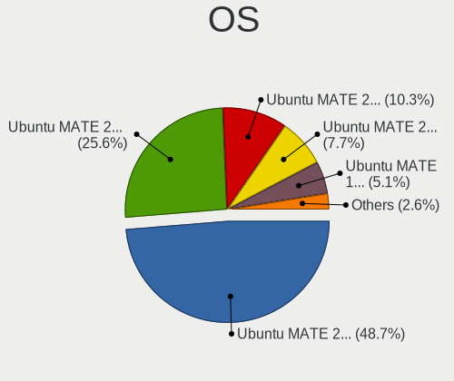

| Name              | Computers | Percent |
|-------------------|-----------|---------|
| Ubuntu MATE 22.04 | 20        | 50%     |
| Ubuntu MATE 20.04 | 7         | 17.5%   |
| Ubuntu MATE 22.10 | 6         | 15%     |
| Ubuntu MATE 18.04 | 6         | 15%     |
| Ubuntu MATE 16.04 | 1         | 2.5%    |

OS Family
---------

OS without a version

| Name        | Computers | Percent |
|-------------|-----------|---------|
| Ubuntu MATE | 40        | 100%    |

Kernel
------

Version of the Linux kernel

| Version                                | Computers | Percent |
|----------------------------------------|-----------|---------|
| 5.15.0-52-generic                      | 8         | 20%     |
| 5.15.0-53-generic                      | 7         | 17.5%   |
| 5.19.0-23-generic                      | 6         | 15%     |
| 5.4.0-132-generic                      | 3         | 7.5%    |
| 5.4.0-131-generic                      | 2         | 5%      |
| 5.15.0-52-lowlatency                   | 2         | 5%      |
| 5.14.0-1054-oem                        | 2         | 5%      |
| 6.0.8-x64v1-xanmod1                    | 1         | 2.5%    |
| 5.4.0-90-generic                       | 1         | 2.5%    |
| 5.4.0-128-generic                      | 1         | 2.5%    |
| 5.4.0-122-generic                      | 1         | 2.5%    |
| 5.17.0-rc4-next-20220217-g21d89a4d51a7 | 1         | 2.5%    |
| 5.15.27-xanmod1                        | 1         | 2.5%    |
| 5.15.0-43-generic                      | 1         | 2.5%    |
| 5.15.0-41-generic                      | 1         | 2.5%    |
| 5.0.0-63-generic                       | 1         | 2.5%    |
| 4.4.0-208-powerpc-smp                  | 1         | 2.5%    |

Kernel Family
-------------

Linux kernel without a distro release

| Version | Computers | Percent |
|---------|-----------|---------|
| 5.15.0  | 19        | 47.5%   |
| 5.4.0   | 8         | 20%     |
| 5.19.0  | 6         | 15%     |
| 5.14.0  | 2         | 5%      |
| 6.0.8   | 1         | 2.5%    |
| 5.17.0  | 1         | 2.5%    |
| 5.15.27 | 1         | 2.5%    |
| 5.0.0   | 1         | 2.5%    |
| 4.4.0   | 1         | 2.5%    |

Kernel Major Ver.
-----------------

Linux kernel major version

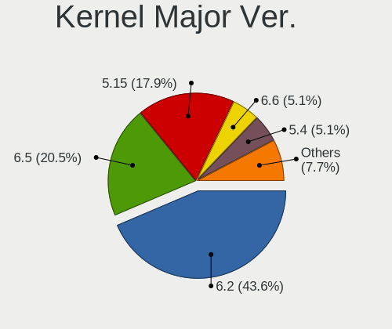

| Version | Computers | Percent |
|---------|-----------|---------|
| 5.15    | 20        | 50%     |
| 5.4     | 8         | 20%     |
| 5.19    | 6         | 15%     |
| 5.14    | 2         | 5%      |
| 6.0     | 1         | 2.5%    |
| 5.17    | 1         | 2.5%    |
| 5.0     | 1         | 2.5%    |
| 4.4     | 1         | 2.5%    |

Arch
----

OS architecture (x86_64, i586, etc.)

| Name   | Computers | Percent |
|--------|-----------|---------|
| x86_64 | 37        | 92.5%   |
| ppc    | 1         | 2.5%    |
| i686   | 1         | 2.5%    |
| armv7l | 1         | 2.5%    |

DE
--

Desktop Environment

| Name | Computers | Percent |
|------|-----------|---------|
| MATE | 40        | 100%    |

Display Server
--------------

X11 or Wayland

| Name    | Computers | Percent |
|---------|-----------|---------|
| X11     | 38        | 95%     |
| Wayland | 1         | 2.5%    |
| Tty     | 1         | 2.5%    |

Display Manager
---------------

SDDM, LightDM, etc.

| Name    | Computers | Percent |
|---------|-----------|---------|
| LightDM | 36        | 90%     |
| Unknown | 2         | 5%      |
| GDM3    | 1         | 2.5%    |
| GDM     | 1         | 2.5%    |

OS Lang
-------

Language

| Lang  | Computers | Percent |
|-------|-----------|---------|
| en_US | 13        | 32.5%   |
| de_DE | 4         | 10%     |
| ru_RU | 3         | 7.5%    |
| pt_BR | 3         | 7.5%    |
| fr_FR | 3         | 7.5%    |
| es_ES | 2         | 5%      |
| en_GB | 2         | 5%      |
| C     | 2         | 5%      |
| tr_TR | 1         | 2.5%    |
| nl_NL | 1         | 2.5%    |
| ja_JP | 1         | 2.5%    |
| it_IT | 1         | 2.5%    |
| hr_HR | 1         | 2.5%    |
| fi_FI | 1         | 2.5%    |
| en_CA | 1         | 2.5%    |
| de_CH | 1         | 2.5%    |

Boot Mode
---------

EFI or BIOS

| Mode | Computers | Percent |
|------|-----------|---------|
| EFI  | 21        | 52.5%   |
| BIOS | 19        | 47.5%   |

Filesystem
----------

Type of filesystem

| Type    | Computers | Percent |
|---------|-----------|---------|
| Ext4    | 35        | 87.5%   |
| Zfs     | 2         | 5%      |
| Btrfs   | 2         | 5%      |
| Overlay | 1         | 2.5%    |

Part. scheme
------------

Scheme of partitioning

| Type    | Computers | Percent |
|---------|-----------|---------|
| GPT     | 29        | 72.5%   |
| MBR     | 8         | 20%     |
| Unknown | 3         | 7.5%    |

Dual Boot with Linux/BSD
------------------------

Hosting more than one Linux/BSD

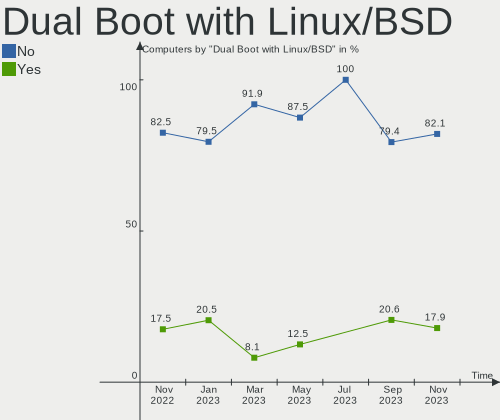

| Dual boot | Computers | Percent |
|-----------|-----------|---------|
| No        | 33        | 82.5%   |
| Yes       | 7         | 17.5%   |

Dual Boot (Win)
---------------

Hosting Linux and Windows

| Dual boot | Computers | Percent |
|-----------|-----------|---------|
| Yes       | 20        | 50%     |
| No        | 20        | 50%     |

Board
-----

Vendor
------

Motherboard manufacturer

| Name                | Computers | Percent |
|---------------------|-----------|---------|
| Hewlett-Packard     | 10        | 25%     |
| ASUSTek Computer    | 5         | 12.5%   |
| Lenovo              | 4         | 10%     |
| Dell                | 3         | 7.5%    |
| Acer                | 3         | 7.5%    |
| MSI                 | 2         | 5%      |
| Gigabyte Technology | 2         | 5%      |
| ASRock              | 2         | 5%      |
| Toshiba             | 1         | 2.5%    |
| Sony                | 1         | 2.5%    |
| Notebook            | 1         | 2.5%    |
| NEC Computers       | 1         | 2.5%    |
| Microsoft           | 1         | 2.5%    |
| Intel               | 1         | 2.5%    |
| Getac               | 1         | 2.5%    |
| Chuwi               | 1         | 2.5%    |
| Unknown             | 1         | 2.5%    |

Model
-----

Motherboard model

| Name                                     | Computers | Percent |
|------------------------------------------|-----------|---------|
| Toshiba Satellite P50-B-10Z              | 1         | 2.5%    |
| Sony VGN-CR120E                          | 1         | 2.5%    |
| Notebook NJx0MU                          | 1         | 2.5%    |
| NEC Computers PC-VK27MCZDM               | 1         | 2.5%    |
| MSI MS-7920                              | 1         | 2.5%    |
| MSI MS-7758                              | 1         | 2.5%    |
| Microsoft Surface 2                      | 1         | 2.5%    |
| Lenovo Yoga 520-14IKB 80X8               | 1         | 2.5%    |
| Lenovo ThinkPad T420 4238LY7             | 1         | 2.5%    |
| Lenovo IdeaPad S410p 20296               | 1         | 2.5%    |
| Lenovo IdeaPad 130-15AST 81H5            | 1         | 2.5%    |
| Intel H61                                | 1         | 2.5%    |
| HP ProBook 640 G8 Notebook PC            | 1         | 2.5%    |
| HP ProBook 450 G6                        | 1         | 2.5%    |
| HP Pavilion Laptop 15-eh1xxx             | 1         | 2.5%    |
| HP Laptop 15s-eq1xxx                     | 1         | 2.5%    |
| HP EliteDesk 800 G1 SFF                  | 1         | 2.5%    |
| HP EliteBook 855 G7 Notebook PC          | 1         | 2.5%    |
| HP EliteBook 8540w                       | 1         | 2.5%    |
| HP EliteBook 840 G5                      | 1         | 2.5%    |
| HP Compaq Elite 8300 SFF                 | 1         | 2.5%    |
| HP 15 Notebook PC                        | 1         | 2.5%    |
| Gigabyte H110M-S2V                       | 1         | 2.5%    |
| Gigabyte GA-MA770T-UD3                   | 1         | 2.5%    |
| Getac S410                               | 1         | 2.5%    |
| Dell Vostro 3501                         | 1         | 2.5%    |
| Dell Studio 1558                         | 1         | 2.5%    |
| Dell Latitude D630                       | 1         | 2.5%    |
| Chuwi X312B                              | 1         | 2.5%    |
| ASUS X555LAB                             | 1         | 2.5%    |
| ASUS P8Z77-V                             | 1         | 2.5%    |
| ASUS K93SV                               | 1         | 2.5%    |
| ASUS H61M-K                              | 1         | 2.5%    |
| ASUS ASUS TUF Gaming A17 FA706IH_FA706IH | 1         | 2.5%    |
| ASRock Z590M-ITX/ax                      | 1         | 2.5%    |
| ASRock 990FX Extreme3                    | 1         | 2.5%    |
| Acer TravelMate P614-51T-G2              | 1         | 2.5%    |
| Acer Swift SF114-34                      | 1         | 2.5%    |
| Acer Aspire A515-45                      | 1         | 2.5%    |
| Unknown                                  | 1         | 2.5%    |

Model Family
------------

Motherboard model prefix

| Name                       | Computers | Percent |
|----------------------------|-----------|---------|
| HP EliteBook               | 3         | 7.5%    |
| Lenovo IdeaPad             | 2         | 5%      |
| HP ProBook                 | 2         | 5%      |
| Toshiba Satellite          | 1         | 2.5%    |
| Sony VGN-CR120E            | 1         | 2.5%    |
| Notebook NJx0MU            | 1         | 2.5%    |
| NEC Computers PC-VK27MCZDM | 1         | 2.5%    |
| MSI MS-7920                | 1         | 2.5%    |
| MSI MS-7758                | 1         | 2.5%    |
| Microsoft Surface          | 1         | 2.5%    |
| Lenovo Yoga                | 1         | 2.5%    |
| Lenovo ThinkPad            | 1         | 2.5%    |
| Intel H61                  | 1         | 2.5%    |
| HP Pavilion                | 1         | 2.5%    |
| HP Laptop                  | 1         | 2.5%    |
| HP EliteDesk               | 1         | 2.5%    |
| HP Compaq                  | 1         | 2.5%    |
| HP 15                      | 1         | 2.5%    |
| Gigabyte H110M-S2V         | 1         | 2.5%    |
| Gigabyte GA-MA770T-UD3     | 1         | 2.5%    |
| Getac S410                 | 1         | 2.5%    |
| Dell Vostro                | 1         | 2.5%    |
| Dell Studio                | 1         | 2.5%    |
| Dell Latitude              | 1         | 2.5%    |
| Chuwi X312B                | 1         | 2.5%    |
| ASUS X555LAB               | 1         | 2.5%    |
| ASUS P8Z77-V               | 1         | 2.5%    |
| ASUS K93SV                 | 1         | 2.5%    |
| ASUS H61M-K                | 1         | 2.5%    |
| ASUS ASUS                  | 1         | 2.5%    |
| ASRock Z590M-ITX           | 1         | 2.5%    |
| ASRock 990FX               | 1         | 2.5%    |
| Acer TravelMate            | 1         | 2.5%    |
| Acer Swift                 | 1         | 2.5%    |
| Acer Aspire                | 1         | 2.5%    |
| Unknown                    | 1         | 2.5%    |

MFG Year
--------

Motherboard manufacture year

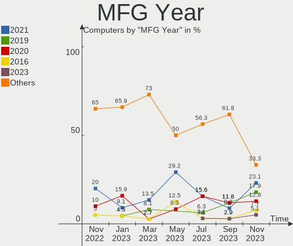

| Year    | Computers | Percent |
|---------|-----------|---------|
| 2021    | 8         | 20%     |
| 2020    | 4         | 10%     |
| 2014    | 4         | 10%     |
| 2018    | 3         | 7.5%    |
| 2017    | 3         | 7.5%    |
| 2013    | 3         | 7.5%    |
| 2012    | 3         | 7.5%    |
| 2016    | 2         | 5%      |
| 2015    | 2         | 5%      |
| 2011    | 2         | 5%      |
| 2010    | 2         | 5%      |
| 2007    | 2         | 5%      |
| 2009    | 1         | 2.5%    |
| Unknown | 1         | 2.5%    |

Form Factor
-----------

Physical design of the computer

| Name        | Computers | Percent |
|-------------|-----------|---------|
| Notebook    | 27        | 67.5%   |
| Desktop     | 11        | 27.5%   |
| Tablet      | 1         | 2.5%    |
| Convertible | 1         | 2.5%    |

Secure Boot
-----------

Enabled or disabled

| State    | Computers | Percent |
|----------|-----------|---------|
| Disabled | 39        | 97.5%   |
| Enabled  | 1         | 2.5%    |

Coreboot
--------

Have coreboot on board

| Used | Computers | Percent |
|------|-----------|---------|
| No   | 40        | 100%    |

RAM Size
--------

Total RAM memory

| Size in GB  | Computers | Percent |
|-------------|-----------|---------|
| 4.01-8.0    | 9         | 22.5%   |
| 16.01-24.0  | 9         | 22.5%   |
| 3.01-4.0    | 8         | 20%     |
| 8.01-16.0   | 8         | 20%     |
| 1.01-2.0    | 3         | 7.5%    |
| 32.01-64.0  | 2         | 5%      |
| 64.01-256.0 | 1         | 2.5%    |

RAM Used
--------

Used RAM memory

| Used GB   | Computers | Percent |
|-----------|-----------|---------|
| 1.01-2.0  | 15        | 37.5%   |
| 2.01-3.0  | 9         | 22.5%   |
| 4.01-8.0  | 8         | 20%     |
| 3.01-4.0  | 3         | 7.5%    |
| 8.01-16.0 | 3         | 7.5%    |
| 0.51-1.0  | 1         | 2.5%    |
| 0.01-0.5  | 1         | 2.5%    |

Total Drives
------------

Number of drives on board

| Drives | Computers | Percent |
|--------|-----------|---------|
| 1      | 27        | 67.5%   |
| 2      | 7         | 17.5%   |
| 3      | 4         | 10%     |
| 4      | 2         | 5%      |

Has CD-ROM
----------

Has CD-ROM on board

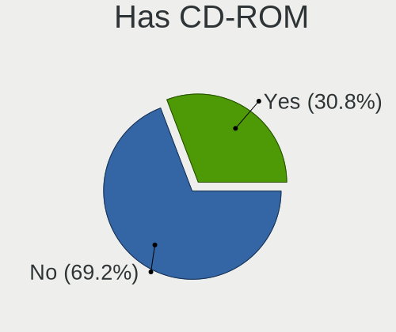

| Presented | Computers | Percent |
|-----------|-----------|---------|
| No        | 21        | 52.5%   |
| Yes       | 19        | 47.5%   |

Has Ethernet
------------

Has Ethernet on board

| Presented | Computers | Percent |
|-----------|-----------|---------|
| Yes       | 31        | 77.5%   |
| No        | 9         | 22.5%   |

Has WiFi
--------

Has WiFi module

| Presented | Computers | Percent |
|-----------|-----------|---------|
| Yes       | 33        | 82.5%   |
| No        | 7         | 17.5%   |

Has Bluetooth
-------------

Has Bluetooth module

| Presented | Computers | Percent |
|-----------|-----------|---------|
| Yes       | 26        | 65%     |
| No        | 14        | 35%     |

Location
--------

Country
-------

Geographic location (country)

| Country     | Computers | Percent |
|-------------|-----------|---------|
| Germany     | 4         | 10%     |
| Brazil      | 4         | 10%     |
| Spain       | 3         | 7.5%    |
| Russia      | 3         | 7.5%    |
| France      | 3         | 7.5%    |
| USA         | 2         | 5%      |
| Turkey      | 2         | 5%      |
| Norway      | 2         | 5%      |
| Italy       | 2         | 5%      |
| UK          | 1         | 2.5%    |
| Switzerland | 1         | 2.5%    |
| Serbia      | 1         | 2.5%    |
| Netherlands | 1         | 2.5%    |
| Morocco     | 1         | 2.5%    |
| Japan       | 1         | 2.5%    |
| Ireland     | 1         | 2.5%    |
| Indonesia   | 1         | 2.5%    |
| Hungary     | 1         | 2.5%    |
| Greece      | 1         | 2.5%    |
| Finland     | 1         | 2.5%    |
| Estonia     | 1         | 2.5%    |
| Croatia     | 1         | 2.5%    |
| Canada      | 1         | 2.5%    |
| Bulgaria    | 1         | 2.5%    |

City
----

Geographic location (city)

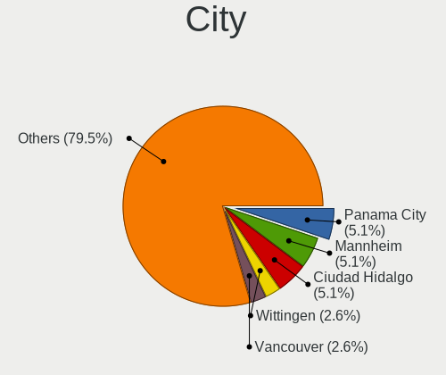

| City               | Computers | Percent |
|--------------------|-----------|---------|
| Serpukhov          | 2         | 5%      |
| Sao Paulo          | 2         | 5%      |
| Melhus             | 2         | 5%      |
| Izmir              | 2         | 5%      |
| Zagreb             | 1         | 2.5%    |
| Varna              | 1         | 2.5%    |
| Trenton            | 1         | 2.5%    |
| Toyohashi          | 1         | 2.5%    |
| Toulon             | 1         | 2.5%    |
| Tartu              | 1         | 2.5%    |
| Salé              | 1         | 2.5%    |
| Rennes             | 1         | 2.5%    |
| Picos              | 1         | 2.5%    |
| North Wilkesboro   | 1         | 2.5%    |
| Munich             | 1         | 2.5%    |
| Moosseedorf        | 1         | 2.5%    |
| Modena             | 1         | 2.5%    |
| Lille              | 1         | 2.5%    |
| Kuznetsk           | 1         | 2.5%    |
| Halikko            | 1         | 2.5%    |
| Guarapuava         | 1         | 2.5%    |
| Frankfurt am Main  | 1         | 2.5%    |
| Dublin             | 1         | 2.5%    |
| Dubino             | 1         | 2.5%    |
| Dortmund           | 1         | 2.5%    |
| Dippoldiswalde     | 1         | 2.5%    |
| Conroe             | 1         | 2.5%    |
| Canterbury         | 1         | 2.5%    |
| Budapest           | 1         | 2.5%    |
| Boadilla del Monte | 1         | 2.5%    |
| Belgrade           | 1         | 2.5%    |
| Balikpapan         | 1         | 2.5%    |
| Badalona           | 1         | 2.5%    |
| Athens             | 1         | 2.5%    |
| Arnhem             | 1         | 2.5%    |
| Arevalo            | 1         | 2.5%    |

Drives
------

Drive Vendor
------------

Hard drive vendors

| Vendor              | Computers | Drives | Percent |
|---------------------|-----------|--------|---------|
| Samsung Electronics | 9         | 11     | 16.07%  |
| Seagate             | 8         | 11     | 14.29%  |
| WDC                 | 5         | 6      | 8.93%   |
| Crucial             | 5         | 5      | 8.93%   |
| SanDisk             | 3         | 3      | 5.36%   |
| Kingston            | 3         | 3      | 5.36%   |
| Intel               | 3         | 3      | 5.36%   |
| A-DATA Technology   | 3         | 3      | 5.36%   |
| Unknown             | 2         | 2      | 3.57%   |
| SK hynix            | 2         | 2      | 3.57%   |
| HGST                | 2         | 2      | 3.57%   |
| Toshiba             | 1         | 1      | 1.79%   |
| SPCC                | 1         | 1      | 1.79%   |
| ShanDianZhe         | 1         | 1      | 1.79%   |
| Plextor             | 1         | 1      | 1.79%   |
| Micron Technology   | 1         | 1      | 1.79%   |
| LITEONIT            | 1         | 1      | 1.79%   |
| Intenso             | 1         | 1      | 1.79%   |
| Hitachi             | 1         | 1      | 1.79%   |
| Fujitsu             | 1         | 1      | 1.79%   |
| Corsair             | 1         | 1      | 1.79%   |
| ADATA Technology    | 1         | 1      | 1.79%   |

Drive Model
-----------

Hard drive models

| Model                                               | Computers | Percent |
|-----------------------------------------------------|-----------|---------|
| Seagate ST1000DM003-1ER162 1TB                      | 3         | 4.92%   |
| Samsung MZVLQ512HBLU-00BH1 512GB                    | 2         | 3.28%   |
| WDC WD40EZRZ-22GXCB0 4TB                            | 1         | 1.64%   |
| WDC WD3200BEKT-60V5T1 320GB                         | 1         | 1.64%   |
| WDC WD2500BEKT-60A25T1 250GB                        | 1         | 1.64%   |
| WDC WD20EZRZ-00Z5HB0 2TB                            | 1         | 1.64%   |
| WDC WD10EZEX-60M2NA0 1TB                            | 1         | 1.64%   |
| WDC PC SN520 SDAPNUW-512G-1014 512GB                | 1         | 1.64%   |
| Unknown SU08G  8GB                                  | 1         | 1.64%   |
| Unknown MMC Card  7GB                               | 1         | 1.64%   |
| Toshiba MQ01ABF050 500GB                            | 1         | 1.64%   |
| SPCC Solid State Disk 1024GB                        | 1         | 1.64%   |
| SK hynix SC311 SATA 256GB SSD                       | 1         | 1.64%   |
| SK hynix HBG4e  32GB                                | 1         | 1.64%   |
| ShanDianZhe 256GB                                   | 1         | 1.64%   |
| Seagate ST9500420AS 500GB                           | 1         | 1.64%   |
| Seagate ST4000DM004-2CV104 4TB                      | 1         | 1.64%   |
| Seagate ST3750840AS 752GB                           | 1         | 1.64%   |
| Seagate ST3360320AS 360GB                           | 1         | 1.64%   |
| Seagate ST2000DM006-2DM164 2TB                      | 1         | 1.64%   |
| Seagate ST1000VM002-1ET162 1TB                      | 1         | 1.64%   |
| Seagate ST1000LM035-1RK172 1TB                      | 1         | 1.64%   |
| Seagate ST1000DM003-1SB102 1TB                      | 1         | 1.64%   |
| SanDisk SSD PLUS 2000GB                             | 1         | 1.64%   |
| SanDisk SD8SB8U1T001122 1024GB SSD                  | 1         | 1.64%   |
| SanDisk SD6SB1M-128G-1006 128GB SSD                 | 1         | 1.64%   |
| Samsung SSD 970 EVO Plus 2TB                        | 1         | 1.64%   |
| Samsung SSD 860 EVO 500GB                           | 1         | 1.64%   |
| Samsung SSD 860 EVO 250GB                           | 1         | 1.64%   |
| Samsung SSD 850 EVO 250GB                           | 1         | 1.64%   |
| Samsung NVMe SSD Controller SM961/PM961/SM963 250GB | 1         | 1.64%   |
| Samsung MZVLQ256HBJD-00BH1 256GB                    | 1         | 1.64%   |
| Samsung MZVL2512HCJQ-00B00 512GB                    | 1         | 1.64%   |
| Samsung HD322HJ 320GB                               | 1         | 1.64%   |
| Plextor PX-256M8VC 256GB SSD                        | 1         | 1.64%   |
| Micron 2210_MTFDHBA1T0QFD 1TB                       | 1         | 1.64%   |
| LITEONIT LCS-128M6S 128GB SSD                       | 1         | 1.64%   |
| Kingston SA400S37120G 120GB SSD                     | 1         | 1.64%   |
| Kingston SA2000M81000G 1TB                          | 1         | 1.64%   |
| Kingston OM8PCP3512F-AB 512GB                       | 1         | 1.64%   |

HDD Vendor
----------

Hard disk drive vendors

| Vendor              | Computers | Drives | Percent |
|---------------------|-----------|--------|---------|
| Seagate             | 8         | 11     | 44.44%  |
| WDC                 | 4         | 5      | 22.22%  |
| HGST                | 2         | 2      | 11.11%  |
| Toshiba             | 1         | 1      | 5.56%   |
| Samsung Electronics | 1         | 1      | 5.56%   |
| Hitachi             | 1         | 1      | 5.56%   |
| Fujitsu             | 1         | 1      | 5.56%   |

SSD Vendor
----------

Solid state drive vendors

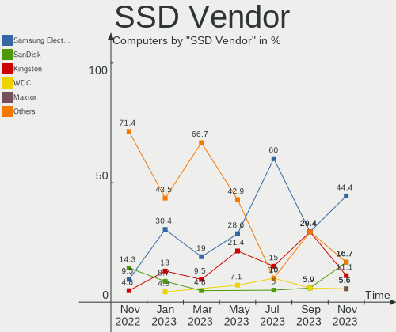

| Vendor              | Computers | Drives | Percent |
|---------------------|-----------|--------|---------|
| Crucial             | 5         | 5      | 23.81%  |
| SanDisk             | 3         | 3      | 14.29%  |
| Samsung Electronics | 2         | 3      | 9.52%   |
| Intel               | 2         | 2      | 9.52%   |
| A-DATA Technology   | 2         | 2      | 9.52%   |
| SPCC                | 1         | 1      | 4.76%   |
| SK hynix            | 1         | 1      | 4.76%   |
| Plextor             | 1         | 1      | 4.76%   |
| LITEONIT            | 1         | 1      | 4.76%   |
| Kingston            | 1         | 1      | 4.76%   |
| Intenso             | 1         | 1      | 4.76%   |
| Corsair             | 1         | 1      | 4.76%   |

Drive Kind
----------

HDD or SSD

| Kind    | Computers | Drives | Percent |
|---------|-----------|--------|---------|
| SSD     | 18        | 22     | 36%     |
| HDD     | 15        | 22     | 30%     |
| NVMe    | 13        | 14     | 26%     |
| MMC     | 3         | 3      | 6%      |
| Unknown | 1         | 1      | 2%      |

Drive Connector
---------------

SATA, SAS, NVMe, etc.

| Type | Computers | Drives | Percent |
|------|-----------|--------|---------|
| SATA | 27        | 45     | 62.79%  |
| NVMe | 13        | 14     | 30.23%  |
| MMC  | 3         | 3      | 6.98%   |

Drive Size
----------

Size of hard drive

| Size in TB | Computers | Drives | Percent |
|------------|-----------|--------|---------|
| 0.01-0.5   | 21        | 25     | 53.85%  |
| 0.51-1.0   | 11        | 11     | 28.21%  |
| 1.01-2.0   | 5         | 6      | 12.82%  |
| 3.01-4.0   | 2         | 2      | 5.13%   |

Space Total
-----------

Amount of disk space available on the file system

| Size in GB     | Computers | Percent |
|----------------|-----------|---------|
| 251-500        | 9         | 22.5%   |
| 101-250        | 8         | 20%     |
| 501-1000       | 6         | 15%     |
| 1001-2000      | 4         | 10%     |
| 1-20           | 4         | 10%     |
| 51-100         | 4         | 10%     |
| More than 3000 | 3         | 7.5%    |
| 21-50          | 1         | 2.5%    |
| 2001-3000      | 1         | 2.5%    |

Space Used
----------

Amount of used disk space

| Used GB        | Computers | Percent |
|----------------|-----------|---------|
| 1-20           | 12        | 30%     |
| 51-100         | 7         | 17.5%   |
| 101-250        | 6         | 15%     |
| 501-1000       | 5         | 12.5%   |
| 251-500        | 3         | 7.5%    |
| 21-50          | 3         | 7.5%    |
| 1001-2000      | 2         | 5%      |
| More than 3000 | 1         | 2.5%    |
| 2001-3000      | 1         | 2.5%    |

Malfunc. Drives
---------------

Drive models with a malfunction

| Model                                        | Computers | Drives | Percent |
|----------------------------------------------|-----------|--------|---------|
| WDC WD3200BEKT-60V5T1 320GB                  | 1         | 1      | 11.11%  |
| WDC WD2500BEKT-60A25T1 250GB                 | 1         | 1      | 11.11%  |
| Seagate ST9500420AS 500GB                    | 1         | 1      | 11.11%  |
| Samsung Electronics MZVLQ512HBLU-00BH1 512GB | 1         | 1      | 11.11%  |
| Kingston SA2000M81000G 1TB                   | 1         | 1      | 11.11%  |
| Intel SSDSC2KW512G8 512GB                    | 1         | 1      | 11.11%  |
| Intel SSDPEKNW512G8H 512GB                   | 1         | 1      | 11.11%  |
| Hitachi HTS541616J9SA00 160GB                | 1         | 1      | 11.11%  |
| A-DATA Technology SU650 120GB SSD            | 1         | 1      | 11.11%  |

Malfunc. Drive Vendor
---------------------

Vendors of faulty drives

| Vendor              | Computers | Drives | Percent |
|---------------------|-----------|--------|---------|
| WDC                 | 2         | 2      | 22.22%  |
| Intel               | 2         | 2      | 22.22%  |
| Seagate             | 1         | 1      | 11.11%  |
| Samsung Electronics | 1         | 1      | 11.11%  |
| Kingston            | 1         | 1      | 11.11%  |
| Hitachi             | 1         | 1      | 11.11%  |
| A-DATA Technology   | 1         | 1      | 11.11%  |

Malfunc. HDD Vendor
-------------------

Vendors of faulty HDD drives

| Vendor  | Computers | Drives | Percent |
|---------|-----------|--------|---------|
| WDC     | 2         | 2      | 50%     |
| Seagate | 1         | 1      | 25%     |
| Hitachi | 1         | 1      | 25%     |

Malfunc. Drive Kind
-------------------

Kinds of faulty drives

| Kind | Computers | Drives | Percent |
|------|-----------|--------|---------|
| HDD  | 4         | 4      | 44.44%  |
| NVMe | 3         | 3      | 33.33%  |
| SSD  | 2         | 2      | 22.22%  |

Failed Drives
-------------

Failed drive models

Zero info for selected period =(

Failed Drive Vendor
-------------------

Failed drive vendors

Zero info for selected period =(

Drive Status
------------

Number of failed and malfunc. drives

| Status   | Computers | Drives | Percent |
|----------|-----------|--------|---------|
| Works    | 19        | 31     | 46.34%  |
| Detected | 14        | 22     | 34.15%  |
| Malfunc  | 8         | 9      | 19.51%  |

Storage controller
------------------

Storage Vendor
--------------

Storage controller vendors

| Vendor                      | Computers | Percent |
|-----------------------------|-----------|---------|
| Intel                       | 28        | 60.87%  |
| Samsung Electronics         | 6         | 13.04%  |
| AMD                         | 5         | 10.87%  |
| Kingston Technology Company | 2         | 4.35%   |
| ADATA Technology            | 2         | 4.35%   |
| SanDisk                     | 1         | 2.17%   |
| Micron Technology           | 1         | 2.17%   |
| ASMedia Technology          | 1         | 2.17%   |

Storage Model
-------------

Storage controller models

| Model                                                                                  | Computers | Percent |
|----------------------------------------------------------------------------------------|-----------|---------|
| Samsung NVMe SSD Controller 980                                                        | 3         | 5.88%   |
| Intel 8 Series/C220 Series Chipset Family 6-port SATA Controller 1 [AHCI mode]         | 3         | 5.88%   |
| AMD FCH SATA Controller [AHCI mode]                                                    | 3         | 5.88%   |
| Intel Sunrise Point-LP SATA Controller [AHCI mode]                                     | 2         | 3.92%   |
| Intel 8 Series SATA Controller 1 [AHCI mode]                                           | 2         | 3.92%   |
| Intel 7 Series/C210 Series Chipset Family 6-port SATA Controller [AHCI mode]           | 2         | 3.92%   |
| Intel 6 Series/C200 Series Chipset Family 6 port Desktop SATA AHCI Controller          | 2         | 3.92%   |
| AMD SB7x0/SB8x0/SB9x0 IDE Controller                                                   | 2         | 3.92%   |
| SanDisk WD Blue SN500 / PC SN520 NVMe SSD                                              | 1         | 1.96%   |
| Samsung NVMe SSD Controller SM981/PM981/PM983                                          | 1         | 1.96%   |
| Samsung NVMe SSD Controller SM961/PM961/SM963                                          | 1         | 1.96%   |
| Samsung NVMe SSD Controller PM9A1/PM9A3/980PRO                                         | 1         | 1.96%   |
| Micron Non-Volatile memory controller                                                  | 1         | 1.96%   |
| Kingston Company Company Non-Volatile memory controller                                | 1         | 1.96%   |
| Kingston Company A2000 NVMe SSD                                                        | 1         | 1.96%   |
| Intel Volume Management Device NVMe RAID Controller                                    | 1         | 1.96%   |
| Intel Tiger Lake-LP SATA Controller                                                    | 1         | 1.96%   |
| Intel SSD 660P Series                                                                  | 1         | 1.96%   |
| Intel Q170/Q150/B150/H170/H110/Z170/CM236 Chipset SATA Controller [AHCI Mode]          | 1         | 1.96%   |
| Intel Ice Lake-LP SATA Controller [AHCI mode]                                          | 1         | 1.96%   |
| Intel Celeron/Pentium Silver Processor SATA Controller                                 | 1         | 1.96%   |
| Intel Cannon Point-LP SATA Controller [AHCI Mode]                                      | 1         | 1.96%   |
| Intel Atom Processor E3800 Series SATA AHCI Controller                                 | 1         | 1.96%   |
| Intel 9 Series Chipset Family SATA Controller [AHCI Mode]                              | 1         | 1.96%   |
| Intel 82801HM/HEM (ICH8M/ICH8M-E) SATA Controller [IDE mode]                           | 1         | 1.96%   |
| Intel 82801HM/HEM (ICH8M/ICH8M-E) SATA Controller [AHCI mode]                          | 1         | 1.96%   |
| Intel 82801HM/HEM (ICH8M/ICH8M-E) IDE Controller                                       | 1         | 1.96%   |
| Intel 7 Series/C210 Series Chipset Family 4-port SATA Controller [IDE mode]            | 1         | 1.96%   |
| Intel 7 Series/C210 Series Chipset Family 2-port SATA Controller [IDE mode]            | 1         | 1.96%   |
| Intel 6 Series/C200 Series Chipset Family Mobile SATA Controller (IDE mode, ports 4-5) | 1         | 1.96%   |
| Intel 6 Series/C200 Series Chipset Family Mobile SATA Controller (IDE mode, ports 0-3) | 1         | 1.96%   |
| Intel 6 Series/C200 Series Chipset Family 6 port Mobile SATA AHCI Controller           | 1         | 1.96%   |
| Intel 500 Series Chipset Family SATA AHCI Controller                                   | 1         | 1.96%   |
| Intel 5 Series/3400 Series Chipset 6 port SATA AHCI Controller                         | 1         | 1.96%   |
| Intel 5 Series/3400 Series Chipset 4 port SATA AHCI Controller                         | 1         | 1.96%   |
| ASMedia ASM1062 Serial ATA Controller                                                  | 1         | 1.96%   |
| AMD SB7x0/SB8x0/SB9x0 SATA Controller [RAID5 mode]                                     | 1         | 1.96%   |
| AMD SB7x0/SB8x0/SB9x0 SATA Controller [IDE mode]                                       | 1         | 1.96%   |
| ADATA XPG SX8200 Pro PCIe Gen3x4 M.2 2280 Solid State Drive                            | 1         | 1.96%   |
| ADATA Non-Volatile memory controller                                                   | 1         | 1.96%   |

Storage Kind
------------

Kind of storage controller (IDE, SATA, NVMe, SAS, ...)

| Kind | Computers | Percent |
|------|-----------|---------|
| SATA | 27        | 56.25%  |
| NVMe | 13        | 27.08%  |
| IDE  | 6         | 12.5%   |
| RAID | 2         | 4.17%   |

Processor
---------

CPU Vendor
----------

Processor vendors

| Vendor       | Computers | Percent |
|--------------|-----------|---------|
| Intel        | 30        | 75%     |
| AMD          | 8         | 20%     |
| PowerBook5,6 | 1         | 2.5%    |
| ARM          | 1         | 2.5%    |

CPU Model
---------

Processor models

| Model                                                  | Computers | Percent |
|--------------------------------------------------------|-----------|---------|
| PowerBook5,6 7447A, altivec supported                  | 1         | 2.5%    |
| Intel Pentium Silver N6000 @ 1.10GHz                   | 1         | 2.5%    |
| Intel Pentium CPU N3540 @ 2.16GHz                      | 1         | 2.5%    |
| Intel Pentium CPU G840 @ 2.80GHz                       | 1         | 2.5%    |
| Intel Pentium CPU G4400 @ 3.30GHz                      | 1         | 2.5%    |
| Intel Pentium CPU 4415U @ 2.30GHz                      | 1         | 2.5%    |
| Intel Core i7-8565U CPU @ 1.80GHz                      | 1         | 2.5%    |
| Intel Core i7-4790K CPU @ 4.00GHz                      | 1         | 2.5%    |
| Intel Core i7-4710HQ CPU @ 2.50GHz                     | 1         | 2.5%    |
| Intel Core i7-3770K CPU @ 3.50GHz                      | 1         | 2.5%    |
| Intel Core i7-3770 CPU @ 3.40GHz                       | 1         | 2.5%    |
| Intel Core i7-2670QM CPU @ 2.20GHz                     | 1         | 2.5%    |
| Intel Core i7-10510U CPU @ 1.80GHz                     | 1         | 2.5%    |
| Intel Core i5-8250U CPU @ 1.60GHz                      | 1         | 2.5%    |
| Intel Core i5-6300U CPU @ 2.40GHz                      | 1         | 2.5%    |
| Intel Core i5-4570 CPU @ 3.20GHz                       | 1         | 2.5%    |
| Intel Core i5-4310M CPU @ 2.70GHz                      | 1         | 2.5%    |
| Intel Core i5-4200U CPU @ 1.60GHz                      | 1         | 2.5%    |
| Intel Core i5-2520M CPU @ 2.50GHz                      | 1         | 2.5%    |
| Intel Core i5-2320 CPU @ 3.00GHz                       | 1         | 2.5%    |
| Intel Core i5-1035G1 CPU @ 1.00GHz                     | 1         | 2.5%    |
| Intel Core i5 CPU M 520 @ 2.40GHz                      | 1         | 2.5%    |
| Intel Core i5 CPU M 430 @ 2.27GHz                      | 1         | 2.5%    |
| Intel Core i3-4005U CPU @ 1.70GHz                      | 1         | 2.5%    |
| Intel Core i3-3220 CPU @ 3.30GHz                       | 1         | 2.5%    |
| Intel Core 2 Duo CPU T7500 @ 2.20GHz                   | 1         | 2.5%    |
| Intel Core 2 Duo CPU T7100 @ 1.80GHz                   | 1         | 2.5%    |
| Intel Celeron J4125 CPU @ 2.00GHz                      | 1         | 2.5%    |
| Intel 11th Gen Core i7-1165G7 @ 2.80GHz                | 1         | 2.5%    |
| Intel 11th Gen Core i5-11400 @ 2.60GHz                 | 1         | 2.5%    |
| Intel 11th Gen Core i5-1135G7 @ 2.40GHz                | 1         | 2.5%    |
| ARM NVIDIA Tegra SoC (Flattened Device Tree) Processor | 1         | 2.5%    |
| AMD Ryzen 7 5700U with Radeon Graphics                 | 1         | 2.5%    |
| AMD Ryzen 5 5500U with Radeon Graphics                 | 1         | 2.5%    |
| AMD Ryzen 5 4600H with Radeon Graphics                 | 1         | 2.5%    |
| AMD Ryzen 3 PRO 4450U with Radeon Graphics             | 1         | 2.5%    |
| AMD Ryzen 3 4300U with Radeon Graphics                 | 1         | 2.5%    |
| AMD Athlon II X4 650 Processor                         | 1         | 2.5%    |
| AMD Athlon II X2 250 Processor                         | 1         | 2.5%    |
| AMD A6-9225 RADEON R4, 5 COMPUTE CORES 2C+3G           | 1         | 2.5%    |

CPU Model Family
----------------

Processor model prefix

| Model                | Computers | Percent |
|----------------------|-----------|---------|
| Intel Core i5        | 10        | 25%     |
| Intel Core i7        | 7         | 17.5%   |
| Other                | 5         | 12.5%   |
| Intel Pentium        | 4         | 10%     |
| Intel Core i3        | 2         | 5%      |
| Intel Core 2 Duo     | 2         | 5%      |
| AMD Ryzen 5          | 2         | 5%      |
| Intel Pentium Silver | 1         | 2.5%    |
| Intel Celeron        | 1         | 2.5%    |
| AMD Ryzen 7          | 1         | 2.5%    |
| AMD Ryzen 3 PRO      | 1         | 2.5%    |
| AMD Ryzen 3          | 1         | 2.5%    |
| AMD Athlon II X4     | 1         | 2.5%    |
| AMD Athlon II X2     | 1         | 2.5%    |
| AMD A6               | 1         | 2.5%    |

CPU Cores
---------

Number of processor cores

| Number | Computers | Percent |
|--------|-----------|---------|
| 4      | 20        | 50%     |
| 2      | 15        | 37.5%   |
| 6      | 3         | 7.5%    |
| 8      | 1         | 2.5%    |
| 1      | 1         | 2.5%    |

CPU Sockets
-----------

Number of sockets

| Number | Computers | Percent |
|--------|-----------|---------|
| 1      | 40        | 100%    |

CPU Threads
-----------

Threads per core (Hyper-Threading)

| Number | Computers | Percent |
|--------|-----------|---------|
| 2      | 24        | 60%     |
| 1      | 16        | 40%     |

CPU Op-Modes
------------

CPU Operation Modes (32-bit, 64-bit)

| Op mode        | Computers | Percent |
|----------------|-----------|---------|
| 32-bit, 64-bit | 38        | 95%     |
| 32-bit         | 1         | 2.5%    |
| Unknown        | 1         | 2.5%    |

CPU Microcode
-------------

Microcode number

| Number     | Computers | Percent |
|------------|-----------|---------|
| Unknown    | 12        | 30%     |
| 0x306a9    | 3         | 7.5%    |
| 0x206a7    | 3         | 7.5%    |
| 0x806c1    | 2         | 5%      |
| 0x40651    | 2         | 5%      |
| 0x306c3    | 2         | 5%      |
| 0x010000c8 | 2         | 5%      |
| 0xa0671    | 1         | 2.5%    |
| 0x806ec    | 1         | 2.5%    |
| 0x806ea    | 1         | 2.5%    |
| 0x806e9    | 1         | 2.5%    |
| 0x706e5    | 1         | 2.5%    |
| 0x6fd      | 1         | 2.5%    |
| 0x6fb      | 1         | 2.5%    |
| 0x506e3    | 1         | 2.5%    |
| 0x406e3    | 1         | 2.5%    |
| 0x30678    | 1         | 2.5%    |
| 0x20652    | 1         | 2.5%    |
| 0x08608103 | 1         | 2.5%    |
| 0x08608102 | 1         | 2.5%    |
| 0x08600106 | 1         | 2.5%    |

CPU Microarch
-------------

Microarchitecture

| Name          | Computers | Percent |
|---------------|-----------|---------|
| Haswell       | 6         | 15%     |
| Unknown       | 5         | 12.5%   |
| SandyBridge   | 4         | 10%     |
| KabyLake      | 4         | 10%     |
| Zen 2         | 3         | 7.5%    |
| IvyBridge     | 3         | 7.5%    |
| Westmere      | 2         | 5%      |
| TigerLake     | 2         | 5%      |
| Skylake       | 2         | 5%      |
| K10           | 2         | 5%      |
| Icelake       | 2         | 5%      |
| Core          | 2         | 5%      |
| Silvermont    | 1         | 2.5%    |
| Goldmont plus | 1         | 2.5%    |
| Excavator     | 1         | 2.5%    |

Graphics
--------

GPU Vendor
----------

Vendors of graphics cards

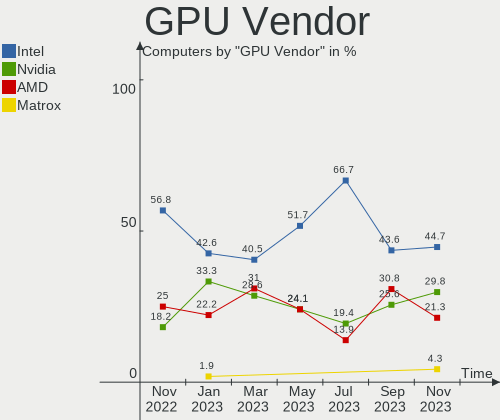

| Vendor | Computers | Percent |
|--------|-----------|---------|
| Intel  | 25        | 56.82%  |
| AMD    | 11        | 25%     |
| Nvidia | 8         | 18.18%  |

GPU Model
---------

Graphics card models

| Model                                                                       | Computers | Percent |
|-----------------------------------------------------------------------------|-----------|---------|
| AMD Renoir                                                                  | 3         | 6.52%   |
| Intel Xeon E3-1200 v3/4th Gen Core Processor Integrated Graphics Controller | 2         | 4.35%   |
| Intel TigerLake-LP GT2 [Iris Xe Graphics]                                   | 2         | 4.35%   |
| Intel Mobile GM965/GL960 Integrated Graphics Controller (secondary)         | 2         | 4.35%   |
| Intel Mobile GM965/GL960 Integrated Graphics Controller (primary)           | 2         | 4.35%   |
| Intel Haswell-ULT Integrated Graphics Controller                            | 2         | 4.35%   |
| Intel 4th Gen Core Processor Integrated Graphics Controller                 | 2         | 4.35%   |
| Intel 2nd Generation Core Processor Family Integrated Graphics Controller   | 2         | 4.35%   |
| AMD Lucienne                                                                | 2         | 4.35%   |
| Nvidia TU117M                                                               | 1         | 2.17%   |
| Nvidia GT216GLM [Quadro FX 880M]                                            | 1         | 2.17%   |
| Nvidia GP107 [GeForce GTX 1050]                                             | 1         | 2.17%   |
| Nvidia GP107 [GeForce GTX 1050 Ti]                                          | 1         | 2.17%   |
| Nvidia GM108M [GeForce MX130]                                               | 1         | 2.17%   |
| Nvidia GK208B [GeForce GT 710]                                              | 1         | 2.17%   |
| Nvidia GF117M [GeForce 610M/710M/810M/820M / GT 620M/625M/630M/720M]        | 1         | 2.17%   |
| Nvidia GF108M [GeForce GT 540M]                                             | 1         | 2.17%   |
| Intel Xeon E3-1200 v2/3rd Gen Core processor Graphics Controller            | 1         | 2.17%   |
| Intel WhiskeyLake-U GT2 [UHD Graphics 620]                                  | 1         | 2.17%   |
| Intel UHD Graphics 620                                                      | 1         | 2.17%   |
| Intel Skylake GT2 [HD Graphics 520]                                         | 1         | 2.17%   |
| Intel RocketLake-S GT1 [UHD Graphics 730]                                   | 1         | 2.17%   |
| Intel JasperLake [UHD Graphics]                                             | 1         | 2.17%   |
| Intel IvyBridge GT2 [HD Graphics 4000]                                      | 1         | 2.17%   |
| Intel Iris Plus Graphics G1 (Ice Lake)                                      | 1         | 2.17%   |
| Intel HD Graphics 610                                                       | 1         | 2.17%   |
| Intel HD Graphics 510                                                       | 1         | 2.17%   |
| Intel GeminiLake [UHD Graphics 600]                                         | 1         | 2.17%   |
| Intel CometLake-U GT2 [UHD Graphics]                                        | 1         | 2.17%   |
| Intel Atom Processor Z36xxx/Z37xxx Series Graphics & Display                | 1         | 2.17%   |
| AMD Venus PRO [Radeon HD 8850M / R9 M265X]                                  | 1         | 2.17%   |
| AMD Turks PRO [Radeon HD 6570/7570/8550 / R5 230]                           | 1         | 2.17%   |
| AMD Stoney [Radeon R2/R3/R4/R5 Graphics]                                    | 1         | 2.17%   |
| AMD RV350/M10 / RV360/M11 [Mobility Radeon 9600 (PRO) / 9700]               | 1         | 2.17%   |
| AMD Park [Mobility Radeon HD 5430]                                          | 1         | 2.17%   |
| AMD Caicos [Radeon HD 6450/7450/8450 / R5 230 OEM]                          | 1         | 2.17%   |

GPU Combo
---------

Combinations of graphics cards

| Name           | Computers | Percent |
|----------------|-----------|---------|
| 1 x Intel      | 21        | 52.5%   |
| 1 x AMD        | 9         | 22.5%   |
| 1 x Nvidia     | 4         | 10%     |
| Intel + Nvidia | 3         | 7.5%    |
| Other          | 1         | 2.5%    |
| Intel + AMD    | 1         | 2.5%    |
| AMD + Nvidia   | 1         | 2.5%    |

GPU Driver
----------

Free vs proprietary

| Driver      | Computers | Percent |
|-------------|-----------|---------|
| Free        | 33        | 82.5%   |
| Unknown     | 4         | 10%     |
| Proprietary | 3         | 7.5%    |

GPU Memory
----------

Total video memory

| Size in GB | Computers | Percent |
|------------|-----------|---------|
| Unknown    | 30        | 75%     |
| 0.01-0.5   | 4         | 10%     |
| 0.51-1.0   | 3         | 7.5%    |
| 1.01-2.0   | 2         | 5%      |
| 3.01-4.0   | 1         | 2.5%    |

Monitor
-------

Monitor Vendor
--------------

Monitor vendors

| Vendor                  | Computers | Percent |
|-------------------------|-----------|---------|
| LG Display              | 7         | 16.67%  |
| BOE                     | 6         | 14.29%  |
| Samsung Electronics     | 5         | 11.9%   |
| AU Optronics            | 5         | 11.9%   |
| Goldstar                | 3         | 7.14%   |
| Dell                    | 3         | 7.14%   |
| Chimei Innolux          | 2         | 4.76%   |
| Unknown                 | 1         | 2.38%   |
| STD                     | 1         | 2.38%   |
| PANDA                   | 1         | 2.38%   |
| NEC Computers           | 1         | 2.38%   |
| InnoLux Display         | 1         | 2.38%   |
| Iiyama                  | 1         | 2.38%   |
| Chi Mei Optoelectronics | 1         | 2.38%   |
| BenQ                    | 1         | 2.38%   |
| Apple                   | 1         | 2.38%   |
| AOC                     | 1         | 2.38%   |
| Ancor Communications    | 1         | 2.38%   |

Monitor Model
-------------

Monitor models

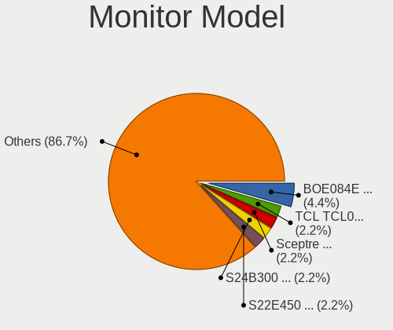

| Model                                                                     | Computers | Percent |
|---------------------------------------------------------------------------|-----------|---------|
| Unknown SMART TV 0563 1920x1080 1209x680mm 54.6-inch                      | 1         | 2.38%   |
| STD LCD Monitor STD0001 1920x1080                                         | 1         | 2.38%   |
| Samsung Electronics SMT27A300 SAM087A 1920x1080 598x336mm 27.0-inch       | 1         | 2.38%   |
| Samsung Electronics S24D330 SAM0D92 1920x1080 531x299mm 24.0-inch         | 1         | 2.38%   |
| Samsung Electronics LCD Monitor SMB2340 1920x1080                         | 1         | 2.38%   |
| Samsung Electronics LCD Monitor SEC3157 1280x800 303x190mm 14.1-inch      | 1         | 2.38%   |
| Samsung Electronics LCD Monitor SAM03D3 1360x768 410x256mm 19.0-inch      | 1         | 2.38%   |
| PANDA LCD Monitor NCP0040 1920x1080 344x194mm 15.5-inch                   | 1         | 2.38%   |
| NEC Computers EA241WM NEC674E 1920x1200 518x324mm 24.1-inch               | 1         | 2.38%   |
| LG Display LCD Monitor LGD40A0 1366x768 310x174mm 14.0-inch               | 1         | 2.38%   |
| LG Display LCD Monitor LGD0724 1920x1080 309x174mm 14.0-inch              | 1         | 2.38%   |
| LG Display LCD Monitor LGD0639 1920x1080 340x190mm 15.3-inch              | 1         | 2.38%   |
| LG Display LCD Monitor LGD05F1 1920x1080 309x174mm 14.0-inch              | 1         | 2.38%   |
| LG Display LCD Monitor LGD0493 1366x768 344x194mm 15.5-inch               | 1         | 2.38%   |
| LG Display LCD Monitor LGD045C 1366x768 344x194mm 15.5-inch               | 1         | 2.38%   |
| LG Display LCD Monitor LGD0413 1600x900 294x166mm 13.3-inch               | 1         | 2.38%   |
| InnoLux Display LCD Monitor INL000A 1366x768 344x194mm 15.5-inch          | 1         | 2.38%   |
| Iiyama PL1906 IVM483C 1280x1024 376x301mm 19.0-inch                       | 1         | 2.38%   |
| Goldstar HDR 4K GSM7707 3840x2160 600x340mm 27.2-inch                     | 1         | 2.38%   |
| Goldstar HD GSM5ACB 1366x768 410x230mm 18.5-inch                          | 1         | 2.38%   |
| Goldstar 22EA53 GSM59A5 1920x1080 477x268mm 21.5-inch                     | 1         | 2.38%   |
| Dell U2515H DELD070 2560x1440 553x311mm 25.0-inch                         | 1         | 2.38%   |
| Dell S2722QC DELA1CF 3840x2160 597x336mm 27.0-inch                        | 1         | 2.38%   |
| Dell S2421HGF DELA16C 1920x1080 527x296mm 23.8-inch                       | 1         | 2.38%   |
| Chimei Innolux LCD Monitor CMN1526 1920x1080 344x193mm 15.5-inch          | 1         | 2.38%   |
| Chimei Innolux LCD Monitor CMN1476 1366x768 309x174mm 14.0-inch           | 1         | 2.38%   |
| Chi Mei Optoelectronics LCD Monitor CMO1808 1920x1080 408x230mm 18.4-inch | 1         | 2.38%   |
| BOE LCD Monitor BOE08CD 1366x768 344x194mm 15.5-inch                      | 1         | 2.38%   |
| BOE LCD Monitor BOE08BE 1920x1080 382x215mm 17.3-inch                     | 1         | 2.38%   |
| BOE LCD Monitor BOE08A8 1920x1080 344x194mm 15.5-inch                     | 1         | 2.38%   |
| BOE LCD Monitor BOE081D 1920x1080 309x174mm 14.0-inch                     | 1         | 2.38%   |
| BOE LCD Monitor BOE06F3 1920x1080 309x173mm 13.9-inch                     | 1         | 2.38%   |
| BOE LCD Monitor BOE0675 1366x768 344x194mm 15.5-inch                      | 1         | 2.38%   |
| BenQ G2200W BNQ780E 1680x1050 474x296mm 22.0-inch                         | 1         | 2.38%   |
| AU Optronics LCD Monitor AUO4999 1920x1080 344x193mm 15.5-inch            | 1         | 2.38%   |
| AU Optronics LCD Monitor AUO429D 1920x1080 382x215mm 17.3-inch            | 1         | 2.38%   |
| AU Optronics LCD Monitor AUO253D 1920x1080 309x174mm 14.0-inch            | 1         | 2.38%   |
| AU Optronics LCD Monitor AUO23ED 1920x1080 344x194mm 15.5-inch            | 1         | 2.38%   |
| AU Optronics LCD Monitor AUO213D 1920x1080 309x173mm 13.9-inch            | 1         | 2.38%   |
| Apple Color LCD APP9C20 1280x854 321x214mm 15.2-inch                      | 1         | 2.38%   |

Monitor Resolution
------------------

Monitor screen resolution

| Resolution         | Computers | Percent |
|--------------------|-----------|---------|
| 1920x1080 (FHD)    | 20        | 51.28%  |
| 1366x768 (WXGA)    | 8         | 20.51%  |
| 3840x2160 (4K)     | 2         | 5.13%   |
| 2560x1440 (QHD)    | 2         | 5.13%   |
| 1920x1200 (WUXGA)  | 1         | 2.56%   |
| 1680x1050 (WSXGA+) | 1         | 2.56%   |
| 1600x900 (HD+)     | 1         | 2.56%   |
| 1440x900 (WXGA+)   | 1         | 2.56%   |
| 1360x768           | 1         | 2.56%   |
| 1280x854           | 1         | 2.56%   |
| 1280x1024 (SXGA)   | 1         | 2.56%   |

Monitor Diagonal
----------------

Diagonal size in inches

| Inches  | Computers | Percent |
|---------|-----------|---------|
| 15      | 12        | 28.57%  |
| 14      | 9         | 21.43%  |
| 27      | 4         | 9.52%   |
| 24      | 3         | 7.14%   |
| 23      | 2         | 4.76%   |
| 19      | 2         | 4.76%   |
| 18      | 2         | 4.76%   |
| 17      | 2         | 4.76%   |
| 54      | 1         | 2.38%   |
| 25      | 1         | 2.38%   |
| 22      | 1         | 2.38%   |
| 21      | 1         | 2.38%   |
| 13      | 1         | 2.38%   |
| Unknown | 1         | 2.38%   |

Monitor Width
-------------

Physical width

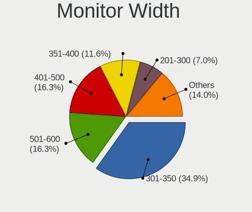

| Width in mm | Computers | Percent |
|-------------|-----------|---------|
| 301-350     | 21        | 50%     |
| 501-600     | 10        | 23.81%  |
| 401-500     | 5         | 11.9%   |
| 351-400     | 3         | 7.14%   |
| 201-300     | 1         | 2.38%   |
| 1001-1500   | 1         | 2.38%   |
| Unknown     | 1         | 2.38%   |

Aspect Ratio
------------

Proportional relationship between the width and the height

| Ratio   | Computers | Percent |
|---------|-----------|---------|
| 16/9    | 30        | 81.08%  |
| 16/10   | 4         | 10.81%  |
| 5/4     | 1         | 2.7%    |
| 3/2     | 1         | 2.7%    |
| Unknown | 1         | 2.7%    |

Monitor Area
------------

Area in inch²

| Area in inch² | Computers | Percent |
|----------------|-----------|---------|
| 101-110        | 11        | 26.19%  |
| 81-90          | 9         | 21.43%  |
| 201-250        | 6         | 14.29%  |
| 301-350        | 4         | 9.52%   |
| 251-300        | 2         | 4.76%   |
| 151-200        | 2         | 4.76%   |
| 141-150        | 2         | 4.76%   |
| 121-130        | 2         | 4.76%   |
| More than 1000 | 1         | 2.38%   |
| 71-80          | 1         | 2.38%   |
| 91-100         | 1         | 2.38%   |
| Unknown        | 1         | 2.38%   |

Pixel Density
-------------

Pixels per inch

| Density | Computers | Percent |
|---------|-----------|---------|
| 121-160 | 15        | 36.59%  |
| 101-120 | 11        | 26.83%  |
| 51-100  | 11        | 26.83%  |
| 161-240 | 2         | 4.88%   |
| 1-50    | 1         | 2.44%   |
| Unknown | 1         | 2.44%   |

Multiple Monitors
-----------------

Total monitors connected

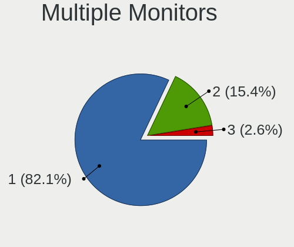

| Total | Computers | Percent |
|-------|-----------|---------|
| 1     | 31        | 77.5%   |
| 2     | 7         | 17.5%   |
| 0     | 2         | 5%      |

Network
-------

Net Controller Vendor
---------------------

Controller vendors

| Vendor                     | Computers | Percent |
|----------------------------|-----------|---------|
| Realtek Semiconductor      | 23        | 41.82%  |
| Intel                      | 22        | 40%     |
| Qualcomm Atheros           | 3         | 5.45%   |
| TP-Link                    | 2         | 3.64%   |
| Broadcom                   | 2         | 3.64%   |
| Quectel Wireless Solutions | 1         | 1.82%   |
| Broadcom Limited           | 1         | 1.82%   |
| Apple                      | 1         | 1.82%   |

Net Controller Model
--------------------

Controller models

| Model                                                             | Computers | Percent |
|-------------------------------------------------------------------|-----------|---------|
| Realtek RTL8111/8168/8411 PCI Express Gigabit Ethernet Controller | 14        | 20.59%  |
| Realtek RTL810xE PCI Express Fast Ethernet controller             | 4         | 5.88%   |
| Intel Wireless 7260                                               | 3         | 4.41%   |
| Intel Wi-Fi 6 AX200                                               | 3         | 4.41%   |
| Realtek RTL8822CE 802.11ac PCIe Wireless Network Adapter          | 2         | 2.94%   |
| Realtek RTL8821CE 802.11ac PCIe Wireless Network Adapter          | 2         | 2.94%   |
| Intel Ethernet Connection (13) I219-V                             | 2         | 2.94%   |
| Intel 82579LM Gigabit Network Connection (Lewisville)             | 2         | 2.94%   |
| TP-Link Archer T3U [Realtek RTL8812BU]                            | 1         | 1.47%   |
| TP-Link 802.11ac NIC                                              | 1         | 1.47%   |
| Realtek RTL8852AE 802.11ax PCIe Wireless Network Adapter          | 1         | 1.47%   |
| Realtek RTL8188EE Wireless Network Adapter                        | 1         | 1.47%   |
| Realtek RTL8188CE 802.11b/g/n WiFi Adapter                        | 1         | 1.47%   |
| Realtek RTL8125 2.5GbE Controller                                 | 1         | 1.47%   |
| Realtek 802.11ac NIC                                              | 1         | 1.47%   |
| Quectel Wireless Solutions EM12G-ACER                             | 1         | 1.47%   |
| Qualcomm Atheros QCA9565 / AR9565 Wireless Network Adapter        | 1         | 1.47%   |
| Qualcomm Atheros QCA9377 802.11ac Wireless Network Adapter        | 1         | 1.47%   |
| Qualcomm Atheros QCA8172 Fast Ethernet                            | 1         | 1.47%   |
| Qualcomm Atheros AR9485 Wireless Network Adapter                  | 1         | 1.47%   |
| Intel Wireless 8265 / 8275                                        | 1         | 1.47%   |
| Intel Wireless 8260                                               | 1         | 1.47%   |
| Intel Wireless 7265                                               | 1         | 1.47%   |
| Intel Wireless 3160                                               | 1         | 1.47%   |
| Intel Wi-Fi 6 AX210/AX211/AX411 160MHz                            | 1         | 1.47%   |
| Intel Wi-Fi 6 AX201 160MHz                                        | 1         | 1.47%   |
| Intel Wi-Fi 6 AX201                                               | 1         | 1.47%   |
| Intel PRO/Wireless 4965 AG or AGN [Kedron] Network Connection     | 1         | 1.47%   |
| Intel Ice Lake-LP PCH CNVi WiFi                                   | 1         | 1.47%   |
| Intel Ethernet Connection I219-LM                                 | 1         | 1.47%   |
| Intel Ethernet Connection I217-LM                                 | 1         | 1.47%   |
| Intel Ethernet Connection (6) I219-LM                             | 1         | 1.47%   |
| Intel Ethernet Connection (4) I219-V                              | 1         | 1.47%   |
| Intel Ethernet Connection (14) I219-V                             | 1         | 1.47%   |
| Intel Comet Lake PCH-LP CNVi WiFi                                 | 1         | 1.47%   |
| Intel Centrino Ultimate-N 6300                                    | 1         | 1.47%   |
| Intel Centrino Advanced-N 6205 [Taylor Peak]                      | 1         | 1.47%   |
| Intel Cannon Point-LP CNVi [Wireless-AC]                          | 1         | 1.47%   |
| Intel 82579V Gigabit Network Connection                           | 1         | 1.47%   |
| Intel 82577LM Gigabit Network Connection                          | 1         | 1.47%   |

Wireless Vendor
---------------

Wireless vendors

| Vendor                     | Computers | Percent |
|----------------------------|-----------|---------|
| Intel                      | 19        | 54.29%  |
| Realtek Semiconductor      | 8         | 22.86%  |
| Qualcomm Atheros           | 3         | 8.57%   |
| TP-Link                    | 2         | 5.71%   |
| Quectel Wireless Solutions | 1         | 2.86%   |
| Broadcom Limited           | 1         | 2.86%   |
| Broadcom                   | 1         | 2.86%   |

Wireless Model
--------------

Wireless models

| Model                                                         | Computers | Percent |
|---------------------------------------------------------------|-----------|---------|
| Intel Wireless 7260                                           | 3         | 8.57%   |
| Intel Wi-Fi 6 AX200                                           | 3         | 8.57%   |
| Realtek RTL8822CE 802.11ac PCIe Wireless Network Adapter      | 2         | 5.71%   |
| Realtek RTL8821CE 802.11ac PCIe Wireless Network Adapter      | 2         | 5.71%   |
| TP-Link Archer T3U [Realtek RTL8812BU]                        | 1         | 2.86%   |
| TP-Link 802.11ac NIC                                          | 1         | 2.86%   |
| Realtek RTL8852AE 802.11ax PCIe Wireless Network Adapter      | 1         | 2.86%   |
| Realtek RTL8188EE Wireless Network Adapter                    | 1         | 2.86%   |
| Realtek RTL8188CE 802.11b/g/n WiFi Adapter                    | 1         | 2.86%   |
| Realtek 802.11ac NIC                                          | 1         | 2.86%   |
| Quectel Wireless Solutions EM12G-ACER                         | 1         | 2.86%   |
| Qualcomm Atheros QCA9565 / AR9565 Wireless Network Adapter    | 1         | 2.86%   |
| Qualcomm Atheros QCA9377 802.11ac Wireless Network Adapter    | 1         | 2.86%   |
| Qualcomm Atheros AR9485 Wireless Network Adapter              | 1         | 2.86%   |
| Intel Wireless 8265 / 8275                                    | 1         | 2.86%   |
| Intel Wireless 8260                                           | 1         | 2.86%   |
| Intel Wireless 7265                                           | 1         | 2.86%   |
| Intel Wireless 3160                                           | 1         | 2.86%   |
| Intel Wi-Fi 6 AX210/AX211/AX411 160MHz                        | 1         | 2.86%   |
| Intel Wi-Fi 6 AX201 160MHz                                    | 1         | 2.86%   |
| Intel Wi-Fi 6 AX201                                           | 1         | 2.86%   |
| Intel PRO/Wireless 4965 AG or AGN [Kedron] Network Connection | 1         | 2.86%   |
| Intel Ice Lake-LP PCH CNVi WiFi                               | 1         | 2.86%   |
| Intel Comet Lake PCH-LP CNVi WiFi                             | 1         | 2.86%   |
| Intel Centrino Ultimate-N 6300                                | 1         | 2.86%   |
| Intel Centrino Advanced-N 6205 [Taylor Peak]                  | 1         | 2.86%   |
| Intel Cannon Point-LP CNVi [Wireless-AC]                      | 1         | 2.86%   |
| Broadcom Limited BCM4312 802.11b/g LP-PHY                     | 1         | 2.86%   |
| Broadcom BCM4306 802.11b/g Wireless LAN Controller            | 1         | 2.86%   |

Ethernet Vendor
---------------

Ethernet vendors

| Vendor                | Computers | Percent |
|-----------------------|-----------|---------|
| Realtek Semiconductor | 19        | 57.58%  |
| Intel                 | 11        | 33.33%  |
| Qualcomm Atheros      | 1         | 3.03%   |
| Broadcom              | 1         | 3.03%   |
| Apple                 | 1         | 3.03%   |

Ethernet Model
--------------

Ethernet models

| Model                                                             | Computers | Percent |
|-------------------------------------------------------------------|-----------|---------|
| Realtek RTL8111/8168/8411 PCI Express Gigabit Ethernet Controller | 14        | 42.42%  |
| Realtek RTL810xE PCI Express Fast Ethernet controller             | 4         | 12.12%  |
| Intel Ethernet Connection (13) I219-V                             | 2         | 6.06%   |
| Intel 82579LM Gigabit Network Connection (Lewisville)             | 2         | 6.06%   |
| Realtek RTL8125 2.5GbE Controller                                 | 1         | 3.03%   |
| Qualcomm Atheros QCA8172 Fast Ethernet                            | 1         | 3.03%   |
| Intel Ethernet Connection I219-LM                                 | 1         | 3.03%   |
| Intel Ethernet Connection I217-LM                                 | 1         | 3.03%   |
| Intel Ethernet Connection (6) I219-LM                             | 1         | 3.03%   |
| Intel Ethernet Connection (4) I219-V                              | 1         | 3.03%   |
| Intel Ethernet Connection (14) I219-V                             | 1         | 3.03%   |
| Intel 82579V Gigabit Network Connection                           | 1         | 3.03%   |
| Intel 82577LM Gigabit Network Connection                          | 1         | 3.03%   |
| Broadcom NetLink BCM57781 Gigabit Ethernet PCIe                   | 1         | 3.03%   |
| Apple UniNorth 2 GMAC (Sun GEM)                                   | 1         | 3.03%   |

Net Controller Kind
-------------------

Ethernet, WiFi or modem

| Kind     | Computers | Percent |
|----------|-----------|---------|
| WiFi     | 33        | 51.56%  |
| Ethernet | 31        | 48.44%  |

Used Controller
---------------

Currently used network controller

| Kind     | Computers | Percent |
|----------|-----------|---------|
| WiFi     | 30        | 73.17%  |
| Ethernet | 11        | 26.83%  |

NICs
----

Total network controllers on board

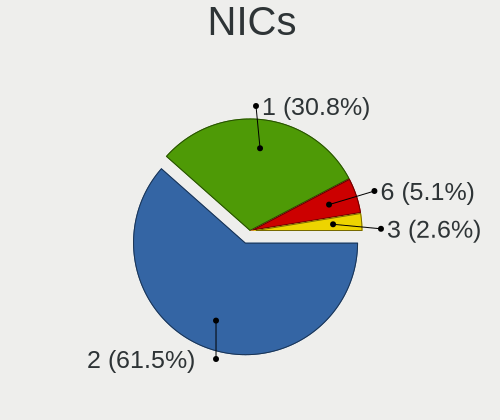

| Total | Computers | Percent |
|-------|-----------|---------|
| 2     | 22        | 55%     |
| 1     | 14        | 35%     |
| 3     | 2         | 5%      |
| 0     | 2         | 5%      |

IPv6
----

IPv6 vs IPv4

| Used | Computers | Percent |
|------|-----------|---------|
| No   | 29        | 72.5%   |
| Yes  | 11        | 27.5%   |

Bluetooth
---------

Bluetooth Vendor
----------------

Controller vendors

| Vendor                          | Computers | Percent |
|---------------------------------|-----------|---------|
| Intel                           | 12        | 46.15%  |
| Realtek Semiconductor           | 4         | 15.38%  |
| Cambridge Silicon Radio         | 3         | 11.54%  |
| Qualcomm Atheros Communications | 2         | 7.69%   |
| IMC Networks                    | 2         | 7.69%   |
| Hewlett-Packard                 | 1         | 3.85%   |
| Dell                            | 1         | 3.85%   |
| Apple                           | 1         | 3.85%   |

Bluetooth Model
---------------

Controller models

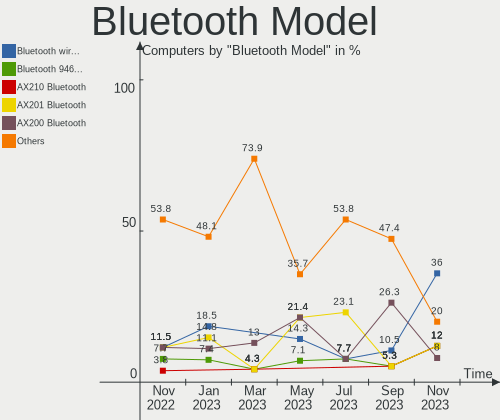

| Model                                               | Computers | Percent |
|-----------------------------------------------------|-----------|---------|
| Realtek Bluetooth Radio                             | 4         | 15.38%  |
| Intel Bluetooth wireless interface                  | 3         | 11.54%  |
| Intel AX201 Bluetooth                               | 3         | 11.54%  |
| Intel AX200 Bluetooth                               | 3         | 11.54%  |
| Cambridge Silicon Radio Bluetooth Dongle (HCI mode) | 3         | 11.54%  |
| Intel Bluetooth 9460/9560 Jefferson Peak (JfP)      | 2         | 7.69%   |
| Qualcomm Atheros  Bluetooth Device                  | 1         | 3.85%   |
| Qualcomm Atheros AR3012 Bluetooth 4.0               | 1         | 3.85%   |
| Intel AX210 Bluetooth                               | 1         | 3.85%   |
| IMC Networks Bluetooth Radio                        | 1         | 3.85%   |
| IMC Networks Bluetooth Device                       | 1         | 3.85%   |
| HP Broadcom 2070 Bluetooth Combo                    | 1         | 3.85%   |
| Dell Wireless 365 Bluetooth                         | 1         | 3.85%   |
| Apple Bluetooth HCI                                 | 1         | 3.85%   |

Sound
-----

Sound Vendor
------------

Sound card vendors

| Vendor                  | Computers | Percent |
|-------------------------|-----------|---------|
| Intel                   | 30        | 61.22%  |
| AMD                     | 9         | 18.37%  |
| Nvidia                  | 6         | 12.24%  |
| Meizu                   | 1         | 2.04%   |
| DSEA A/S                | 1         | 2.04%   |
| Cambridge Silicon Radio | 1         | 2.04%   |
| C-Media Electronics     | 1         | 2.04%   |

Sound Model
-----------

Sound card models

| Model                                                                             | Computers | Percent |
|-----------------------------------------------------------------------------------|-----------|---------|
| AMD Renoir Radeon High Definition Audio Controller                                | 5         | 8.06%   |
| AMD Family 17h/19h HD Audio Controller                                            | 5         | 8.06%   |
| Intel Xeon E3-1200 v3/4th Gen Core Processor HD Audio Controller                  | 4         | 6.45%   |
| Intel 6 Series/C200 Series Chipset Family High Definition Audio Controller        | 4         | 6.45%   |
| Intel Sunrise Point-LP HD Audio                                                   | 3         | 4.84%   |
| Intel 8 Series/C220 Series Chipset High Definition Audio Controller               | 3         | 4.84%   |
| Intel 7 Series/C216 Chipset Family High Definition Audio Controller               | 3         | 4.84%   |
| Nvidia GP107GL High Definition Audio Controller                                   | 2         | 3.23%   |
| Intel Tiger Lake-LP Smart Sound Technology Audio Controller                       | 2         | 3.23%   |
| Intel Haswell-ULT HD Audio Controller                                             | 2         | 3.23%   |
| Intel 82801H (ICH8 Family) HD Audio Controller                                    | 2         | 3.23%   |
| Intel 8 Series HD Audio Controller                                                | 2         | 3.23%   |
| Intel 5 Series/3400 Series Chipset High Definition Audio                          | 2         | 3.23%   |
| AMD SBx00 Azalia (Intel HDA)                                                      | 2         | 3.23%   |
| Nvidia TU107 GeForce GTX 1650 High Definition Audio Controller                    | 1         | 1.61%   |
| Nvidia GT216 HDMI Audio Controller                                                | 1         | 1.61%   |
| Nvidia GK208 HDMI/DP Audio Controller                                             | 1         | 1.61%   |
| Nvidia GF108 High Definition Audio Controller                                     | 1         | 1.61%   |
| Meizu HiFi DAC Headphone Amplifier                                                | 1         | 1.61%   |
| Intel Tiger Lake-H HD Audio Controller                                            | 1         | 1.61%   |
| Intel Jasper Lake HD Audio                                                        | 1         | 1.61%   |
| Intel Ice Lake-LP Smart Sound Technology Audio Controller                         | 1         | 1.61%   |
| Intel Comet Lake PCH-LP cAVS                                                      | 1         | 1.61%   |
| Intel Celeron/Pentium Silver Processor High Definition Audio                      | 1         | 1.61%   |
| Intel Cannon Point-LP High Definition Audio Controller                            | 1         | 1.61%   |
| Intel Atom Processor Z36xxx/Z37xxx Series High Definition Audio Controller        | 1         | 1.61%   |
| Intel 100 Series/C230 Series Chipset Family HD Audio Controller                   | 1         | 1.61%   |
| DSEA A/S EPOS GSA 70                                                              | 1         | 1.61%   |
| Cambridge Silicon Radio B25                                                       | 1         | 1.61%   |
| C-Media Electronics USB Advanced Audio Device                                     | 1         | 1.61%   |
| AMD Turks HDMI Audio [Radeon HD 6500/6600 / 6700M Series]                         | 1         | 1.61%   |
| AMD High Definition Audio Controller                                              | 1         | 1.61%   |
| AMD Family 15h (Models 60h-6fh) Audio Controller                                  | 1         | 1.61%   |
| AMD Cedar HDMI Audio [Radeon HD 5400/6300/7300 Series]                            | 1         | 1.61%   |
| AMD Caicos HDMI Audio [Radeon HD 6450 / 7450/8450/8490 OEM / R5 230/235/235X OEM] | 1         | 1.61%   |

Memory
------

Memory Vendor
-------------

Memory module vendors

| Vendor              | Computers | Percent |
|---------------------|-----------|---------|
| Samsung Electronics | 9         | 26.47%  |
| SK hynix            | 6         | 17.65%  |
| Kingston            | 5         | 14.71%  |
| Micron Technology   | 4         | 11.76%  |
| Crucial             | 2         | 5.88%   |
| Unknown (ABCD)      | 1         | 2.94%   |
| Unknown             | 1         | 2.94%   |
| Transcend           | 1         | 2.94%   |
| Timetec             | 1         | 2.94%   |
| Teikon              | 1         | 2.94%   |
| Smart               | 1         | 2.94%   |
| Nanya Technology    | 1         | 2.94%   |
| Corsair             | 1         | 2.94%   |

Memory Model
------------

Memory module models

| Model                                                            | Computers | Percent |
|------------------------------------------------------------------|-----------|---------|
| Samsung RAM M471B5273DH0-CH9 4GB SODIMM DDR3 1334MT/s            | 2         | 5.41%   |
| Unknown RAM Module 1024MB SODIMM DDR2                            | 1         | 2.7%    |
| Unknown (ABCD) RAM 123456789012345678 2GB SODIMM LPDDR4 2400MT/s | 1         | 2.7%    |
| Transcend RAM TS1GSK64W6H 8GB SODIMM DDR3 1600MT/s               | 1         | 2.7%    |
| Timetec RAM UD3-1600 8GB DIMM DDR3 1600MT/s                      | 1         | 2.7%    |
| Teikon RAM TMT351U6EFR8C-PBHJ 4GB DIMM DDR3                      | 1         | 2.7%    |
| Smart RAM SMS4WEC8C1K0446FCG 8192MB SODIMM DDR4 3200MT/s         | 1         | 2.7%    |
| SK hynix RAM Module 8GB SODIMM DDR4 2400MT/s                     | 1         | 2.7%    |
| SK hynix RAM Module 16GB SODIMM DDR4 2667MT/s                    | 1         | 2.7%    |
| SK hynix RAM HMT351U6CFR8C-PB 4096MB DIMM DDR3 1800MT/s          | 1         | 2.7%    |
| SK hynix RAM HMAA1GS6CMR6N-VK 8GB SODIMM DDR4 2667MT/s           | 1         | 2.7%    |
| SK hynix RAM HMAA1GS6CJR6N-XN 8GB SODIMM DDR4 3200MT/s           | 1         | 2.7%    |
| SK hynix RAM HMA851S6DJR6N-XN 4GB SODIMM DDR4 3200MT/s           | 1         | 2.7%    |
| SK hynix RAM HMA81GS6CJR8N-VK 8GB SODIMM DDR4 2667MT/s           | 1         | 2.7%    |
| Samsung RAM Module 8GB SODIMM DDR4 3200MT/s                      | 1         | 2.7%    |
| Samsung RAM Module 16GB SODIMM DDR4 3200MT/s                     | 1         | 2.7%    |
| Samsung RAM M471B5273DH0-CK0 4GB SODIMM DDR3 1600MT/s            | 1         | 2.7%    |
| Samsung RAM M471B5273CH0-CH9 4GB SODIMM DDR3 1334MT/s            | 1         | 2.7%    |
| Samsung RAM M471B5173QH0-YK0 4GB SODIMM DDR3 1600MT/s            | 1         | 2.7%    |
| Samsung RAM M471B5173EB0-YK0 4GB SODIMM DDR3 1600MT/s            | 1         | 2.7%    |
| Samsung RAM M471B1G73DB0-YK0 8GB SODIMM DDR3 1600MT/s            | 1         | 2.7%    |
| Samsung RAM M471A5244CB0-CRC 4GB SODIMM DDR4 2667MT/s            | 1         | 2.7%    |
| Samsung RAM M378B5173DB0-CK0 4GB DIMM DDR3 1600MT/s              | 1         | 2.7%    |
| Nanya RAM M2X8G64CB8HB5N-DG 8GB DIMM DDR3 1600MT/s               | 1         | 2.7%    |
| Micron RAM Module 8GB SODIMM DDR4 2400MT/s                       | 1         | 2.7%    |
| Micron RAM 8KTF51264HZ-1G6N1 4GB SODIMM DDR3 1600MT/s            | 1         | 2.7%    |
| Micron RAM 4ATF1G64HZ-3G2E1 8GB SODIMM DDR4 3200MT/s             | 1         | 2.7%    |
| Micron RAM 16JSF51264HZ-1G4D1 4096MB SODIMM DDR3 1334MT/s        | 1         | 2.7%    |
| Kingston RAM SNY1600S11-4G-EDEG 4GB SODIMM DDR3 1600MT/s         | 1         | 2.7%    |
| Kingston RAM Module 8GB DIMM DDR3 1333MT/s                       | 1         | 2.7%    |
| Kingston RAM 9905700-104.A00G 8GB SODIMM DDR4 3200MT/s           | 1         | 2.7%    |
| Kingston RAM 9905471-017.A00LF 4096MB DIMM DDR3 1333MT/s         | 1         | 2.7%    |
| Kingston RAM 9905403-559A00LF 4096MB SODIMM DDR3 1600MT/s        | 1         | 2.7%    |
| Crucial RAM CT8G4SFS824A.M8FJ 8GB SODIMM DDR4 2400MT/s           | 1         | 2.7%    |
| Crucial RAM CT51264BA160BJ.C8F 4GB DIMM DDR3 1600MT/s            | 1         | 2.7%    |
| Corsair RAM CMK64GX4M2E3200C16 32GB DIMM DDR4 3200MT/s           | 1         | 2.7%    |

Memory Kind
-----------

Memory module kinds

| Kind   | Computers | Percent |
|--------|-----------|---------|
| DDR3   | 16        | 53.33%  |
| DDR4   | 12        | 40%     |
| LPDDR4 | 1         | 3.33%   |
| DDR2   | 1         | 3.33%   |

Memory Form Factor
------------------

Physical design of the memory module

| Name   | Computers | Percent |
|--------|-----------|---------|
| SODIMM | 22        | 73.33%  |
| DIMM   | 8         | 26.67%  |

Memory Size
-----------

Memory module size

| Size  | Computers | Percent |
|-------|-----------|---------|
| 4096  | 14        | 45.16%  |
| 8192  | 13        | 41.94%  |
| 16384 | 2         | 6.45%   |
| 32768 | 1         | 3.23%   |
| 1024  | 1         | 3.23%   |

Memory Speed
------------

Memory module speed

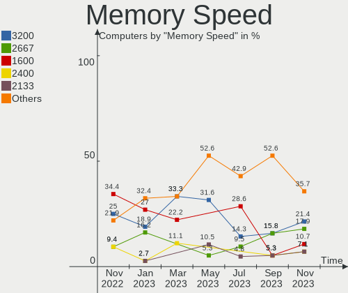

| Speed   | Computers | Percent |
|---------|-----------|---------|
| 1600    | 11        | 34.38%  |
| 3200    | 8         | 25%     |
| 2667    | 3         | 9.38%   |
| 2400    | 3         | 9.38%   |
| 1334    | 3         | 9.38%   |
| 1333    | 2         | 6.25%   |
| 1800    | 1         | 3.13%   |
| Unknown | 1         | 3.13%   |

Printers & scanners
-------------------

Printer Vendor
--------------

Printer device vendors

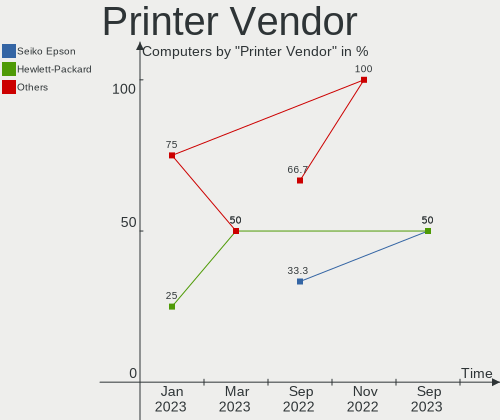

| Vendor              | Computers | Percent |
|---------------------|-----------|---------|
| Samsung Electronics | 1         | 33.33%  |
| Canon               | 1         | 33.33%  |
| Brother Industries  | 1         | 33.33%  |

Printer Model
-------------

Printer device models

| Model                            | Computers | Percent |
|----------------------------------|-----------|---------|
| Samsung M2070 Series             | 1         | 33.33%  |
| Canon LaserShot LBP-1120 Printer | 1         | 33.33%  |
| Brother HL-3140CW series         | 1         | 33.33%  |

Scanner Vendor
--------------

Scanner device vendors

| Vendor                      | Computers | Percent |
|-----------------------------|-----------|---------|
| Acer Peripherals (now BenQ) | 1         | 100%    |

Scanner Model
-------------

Scanner device models

| Model                                       | Computers | Percent |
|---------------------------------------------|-----------|---------|
| Acer Peripherals (now BenQ) S2W 3300U/4300U | 1         | 100%    |

Camera
------

Camera Vendor
-------------

Camera device vendors

| Vendor                                 | Computers | Percent |
|----------------------------------------|-----------|---------|
| Chicony Electronics                    | 11        | 35.48%  |
| Quanta                                 | 3         | 9.68%   |
| Samsung Electronics                    | 2         | 6.45%   |
| Realtek Semiconductor                  | 2         | 6.45%   |
| Microdia                               | 2         | 6.45%   |
| IMC Networks                           | 2         | 6.45%   |
| Syntek                                 | 1         | 3.23%   |
| Silicon Motion                         | 1         | 3.23%   |
| Ricoh                                  | 1         | 3.23%   |
| Logitech                               | 1         | 3.23%   |
| LG Electronics                         | 1         | 3.23%   |
| Google                                 | 1         | 3.23%   |
| Cheng Uei Precision Industry (Foxlink) | 1         | 3.23%   |
| Apple                                  | 1         | 3.23%   |
| Alcor Micro                            | 1         | 3.23%   |

Camera Model
------------

Camera device models

| Model                                                           | Computers | Percent |
|-----------------------------------------------------------------|-----------|---------|
| Chicony HP HD Camera                                            | 3         | 9.68%   |
| Samsung Galaxy series, misc. (MTP mode)                         | 2         | 6.45%   |
| Chicony HD User Facing                                          | 2         | 6.45%   |
| Syntek Lenovo EasyCamera                                        | 1         | 3.23%   |
| Silicon Motion 300k Pixel Camera                                | 1         | 3.23%   |
| Ricoh Visual Communication Camera VGP-VCC6 [R5U870]             | 1         | 3.23%   |
| Realtek USB Camera                                              | 1         | 3.23%   |
| Realtek HD webcam                                               | 1         | 3.23%   |
| Quanta HP TrueVision HD Camera                                  | 1         | 3.23%   |
| Quanta HP HD Camera                                             | 1         | 3.23%   |
| Quanta HD User Facing                                           | 1         | 3.23%   |
| Microdia Laptop_Integrated_Webcam_2M                            | 1         | 3.23%   |
| Microdia Integrated_Webcam_HD                                   | 1         | 3.23%   |
| Logitech Webcam C925e                                           | 1         | 3.23%   |
| LG LM-X420xxx/G2/G3 Android Phone (MTP/download mode)           | 1         | 3.23%   |
| IMC Networks USB2.0 HD UVC WebCam                               | 1         | 3.23%   |
| IMC Networks TOSHIBA Web Camera - HD                            | 1         | 3.23%   |
| Google Nexus/Pixel Device (MTP + debug)                         | 1         | 3.23%   |
| Chicony USB2.0 Camera                                           | 1         | 3.23%   |
| Chicony integrated camera                                       | 1         | 3.23%   |
| Chicony HP Webcam [2 MP Macro]                                  | 1         | 3.23%   |
| Chicony HP Webcam                                               | 1         | 3.23%   |
| Chicony EasyCamera                                              | 1         | 3.23%   |
| Chicony CNFA078                                                 | 1         | 3.23%   |
| Cheng Uei Precision Industry (Foxlink) HP Wide Vision HD Camera | 1         | 3.23%   |
| Apple iPhone 5/5C/5S/6/SE                                       | 1         | 3.23%   |
| Alcor Micro USB 2.0 Camera                                      | 1         | 3.23%   |

Security
--------

Fingerprint Vendor
------------------

Fingerprint sensor vendors

| Vendor                | Computers | Percent |
|-----------------------|-----------|---------|
| Validity Sensors      | 2         | 40%     |
| Synaptics             | 2         | 40%     |
| Elan Microelectronics | 1         | 20%     |

Fingerprint Model
-----------------

Fingerprint sensor models

| Model                                                                      | Computers | Percent |
|----------------------------------------------------------------------------|-----------|---------|
| Validity Sensors VFS451 Fingerprint Reader                                 | 1         | 20%     |
| Validity Sensors Synaptics VFS7552 Touch Fingerprint Sensor with PurePrint | 1         | 20%     |
| Synaptics  WBDI                                                            | 1         | 20%     |
| Synaptics  VFS7552 Touch Fingerprint Sensor with PurePrint                 | 1         | 20%     |
| Elan ELAN:ARM-M4                                                           | 1         | 20%     |

Chipcard Vendor
---------------

Chipcard module vendors

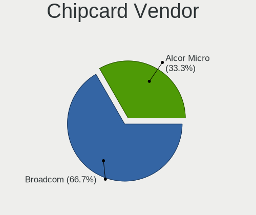

| Vendor      | Computers | Percent |
|-------------|-----------|---------|
| O2 Micro    | 1         | 50%     |
| Alcor Micro | 1         | 50%     |

Chipcard Model
--------------

Chipcard module models

| Model                                | Computers | Percent |
|--------------------------------------|-----------|---------|
| O2 Micro OZ776 CCID Smartcard Reader | 1         | 50%     |
| Alcor Micro AU9540 Smartcard Reader  | 1         | 50%     |

Unsupported
-----------

Unsupported Devices
-------------------

Total unsupported devices on board

| Total | Computers | Percent |
|-------|-----------|---------|
| 0     | 26        | 65%     |
| 1     | 12        | 30%     |
| 2     | 2         | 5%      |

Unsupported Device Types
------------------------

Types of unsupported devices

| Type               | Computers | Percent |
|--------------------|-----------|---------|
| Fingerprint reader | 5         | 31.25%  |
| Graphics card      | 4         | 25%     |
| Net/wireless       | 2         | 12.5%   |
| Chipcard           | 2         | 12.5%   |
| Camera             | 2         | 12.5%   |
| Network            | 1         | 6.25%   |

