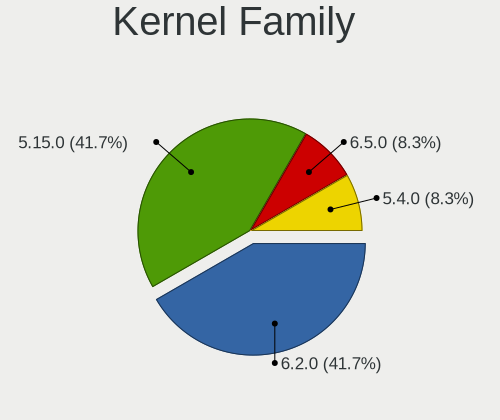
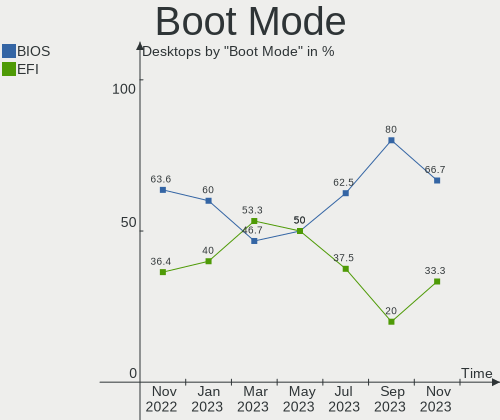
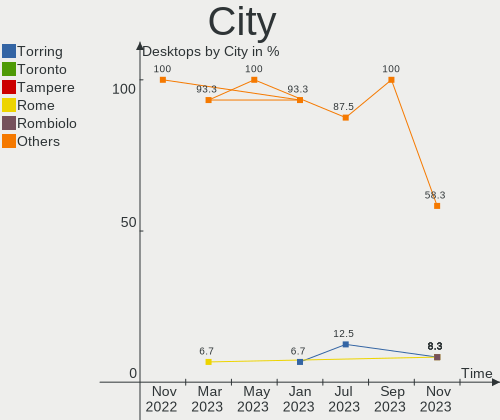
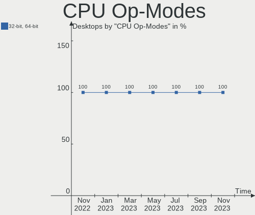
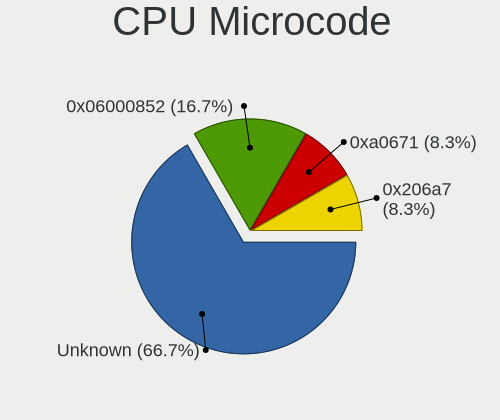
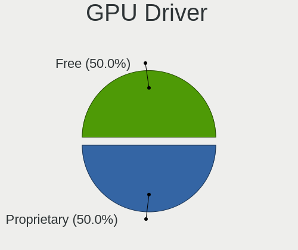
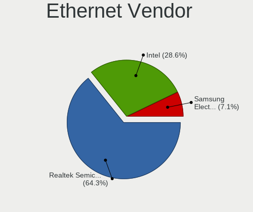
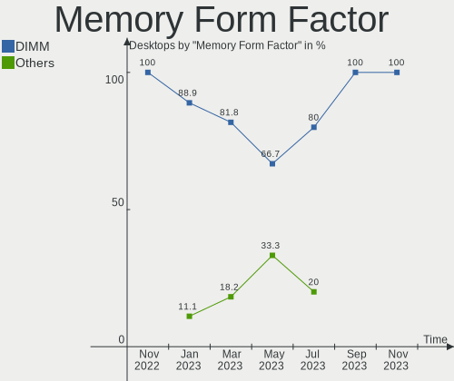
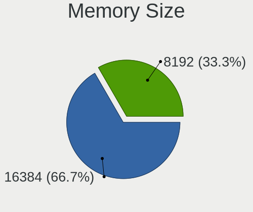

Ubuntu MATE - Hardware Trends (Desktops)
----------------------------------------

A project to identify most popular hardware characteristics and track their change
over time based on data collected by Linux users at https://Linux-Hardware.org.

Anyone can contribute to this report by the [hw-probe](https://github.com/linuxhw/hw-probe) tool:

    sudo -E hw-probe -all -upload

This report is for one last month. Overall report since the beginning of time: [TestCoverage](https://github.com/linuxhw/TestCoverage)

Period: Jul, 2022.

Contents
--------

* [ System ](#system)
  - [ OS                       ](#os)
  - [ OS Family                ](#os-family)
  - [ Kernel                   ](#kernel)
  - [ Kernel Family            ](#kernel-family)
  - [ Kernel Major Ver.        ](#kernel-major-ver)
  - [ Arch                     ](#arch)
  - [ DE                       ](#de)
  - [ Display Server           ](#display-server)
  - [ Display Manager          ](#display-manager)
  - [ OS Lang                  ](#os-lang)
  - [ Boot Mode                ](#boot-mode)
  - [ Filesystem               ](#filesystem)
  - [ Part. scheme             ](#part-scheme)
  - [ Dual Boot with Linux/BSD ](#dual-boot-with-linuxbsd)
  - [ Dual Boot (Win)          ](#dual-boot-win)

* [ Board ](#board)
  - [ Vendor                   ](#vendor)
  - [ Model                    ](#model)
  - [ Model Family             ](#model-family)
  - [ MFG Year                 ](#mfg-year)
  - [ Form Factor              ](#form-factor)
  - [ Secure Boot              ](#secure-boot)
  - [ Coreboot                 ](#coreboot)
  - [ RAM Size                 ](#ram-size)
  - [ RAM Used                 ](#ram-used)
  - [ Total Drives             ](#total-drives)
  - [ Has CD-ROM               ](#has-cd-rom)
  - [ Has Ethernet             ](#has-ethernet)
  - [ Has WiFi                 ](#has-wifi)
  - [ Has Bluetooth            ](#has-bluetooth)

* [ Location ](#location)
  - [ Country                  ](#country)
  - [ City                     ](#city)

* [ Drives ](#drives)
  - [ Drive Vendor             ](#drive-vendor)
  - [ Drive Model              ](#drive-model)
  - [ HDD Vendor               ](#hdd-vendor)
  - [ SSD Vendor               ](#ssd-vendor)
  - [ Drive Kind               ](#drive-kind)
  - [ Drive Connector          ](#drive-connector)
  - [ Drive Size               ](#drive-size)
  - [ Space Total              ](#space-total)
  - [ Space Used               ](#space-used)
  - [ Malfunc. Drives          ](#malfunc-drives)
  - [ Malfunc. Drive Vendor    ](#malfunc-drive-vendor)
  - [ Malfunc. HDD Vendor      ](#malfunc-hdd-vendor)
  - [ Malfunc. Drive Kind      ](#malfunc-drive-kind)
  - [ Failed Drives            ](#failed-drives)
  - [ Failed Drive Vendor      ](#failed-drive-vendor)
  - [ Drive Status             ](#drive-status)

* [ Storage controller ](#storage-controller)
  - [ Storage Vendor           ](#storage-vendor)
  - [ Storage Model            ](#storage-model)
  - [ Storage Kind             ](#storage-kind)

* [ Processor ](#processor)
  - [ CPU Vendor               ](#cpu-vendor)
  - [ CPU Model                ](#cpu-model)
  - [ CPU Model Family         ](#cpu-model-family)
  - [ CPU Cores                ](#cpu-cores)
  - [ CPU Sockets              ](#cpu-sockets)
  - [ CPU Threads              ](#cpu-threads)
  - [ CPU Op-Modes             ](#cpu-op-modes)
  - [ CPU Microcode            ](#cpu-microcode)
  - [ CPU Microarch            ](#cpu-microarch)

* [ Graphics ](#graphics)
  - [ GPU Vendor               ](#gpu-vendor)
  - [ GPU Model                ](#gpu-model)
  - [ GPU Combo                ](#gpu-combo)
  - [ GPU Driver               ](#gpu-driver)
  - [ GPU Memory               ](#gpu-memory)

* [ Monitor ](#monitor)
  - [ Monitor Vendor           ](#monitor-vendor)
  - [ Monitor Model            ](#monitor-model)
  - [ Monitor Resolution       ](#monitor-resolution)
  - [ Monitor Diagonal         ](#monitor-diagonal)
  - [ Monitor Width            ](#monitor-width)
  - [ Aspect Ratio             ](#aspect-ratio)
  - [ Monitor Area             ](#monitor-area)
  - [ Pixel Density            ](#pixel-density)
  - [ Multiple Monitors        ](#multiple-monitors)

* [ Network ](#network)
  - [ Net Controller Vendor    ](#net-controller-vendor)
  - [ Net Controller Model     ](#net-controller-model)
  - [ Wireless Vendor          ](#wireless-vendor)
  - [ Wireless Model           ](#wireless-model)
  - [ Ethernet Vendor          ](#ethernet-vendor)
  - [ Ethernet Model           ](#ethernet-model)
  - [ Net Controller Kind      ](#net-controller-kind)
  - [ Used Controller          ](#used-controller)
  - [ NICs                     ](#nics)
  - [ IPv6                     ](#ipv6)

* [ Bluetooth ](#bluetooth)
  - [ Bluetooth Vendor         ](#bluetooth-vendor)
  - [ Bluetooth Model          ](#bluetooth-model)

* [ Sound ](#sound)
  - [ Sound Vendor             ](#sound-vendor)
  - [ Sound Model              ](#sound-model)

* [ Memory ](#memory)
  - [ Memory Vendor            ](#memory-vendor)
  - [ Memory Model             ](#memory-model)
  - [ Memory Kind              ](#memory-kind)
  - [ Memory Form Factor       ](#memory-form-factor)
  - [ Memory Size              ](#memory-size)
  - [ Memory Speed             ](#memory-speed)

* [ Printers & scanners ](#printers--scanners)
  - [ Printer Vendor           ](#printer-vendor)
  - [ Printer Model            ](#printer-model)
  - [ Scanner Vendor           ](#scanner-vendor)
  - [ Scanner Model            ](#scanner-model)

* [ Camera ](#camera)
  - [ Camera Vendor            ](#camera-vendor)
  - [ Camera Model             ](#camera-model)

* [ Security ](#security)
  - [ Fingerprint Vendor       ](#fingerprint-vendor)
  - [ Fingerprint Model        ](#fingerprint-model)
  - [ Chipcard Vendor          ](#chipcard-vendor)
  - [ Chipcard Model           ](#chipcard-model)

* [ Unsupported ](#unsupported)
  - [ Unsupported Devices      ](#unsupported-devices)
  - [ Unsupported Device Types ](#unsupported-device-types)

System
------

OS
--

Installed operating systems

| Name              | Desktops | Percent |
|-------------------|----------|---------|
| Ubuntu MATE 22.04 | 7        | 58.33%  |
| Ubuntu MATE 20.04 | 4        | 33.33%  |
| Ubuntu MATE 20.10 | 1        | 8.33%   |

OS Family
---------

OS without a version

| Name        | Desktops | Percent |
|-------------|----------|---------|
| Ubuntu MATE | 12       | 100%    |

Kernel
------

Version of the Linux kernel

| Version           | Desktops | Percent |
|-------------------|----------|---------|
| 5.15.0-40-generic | 3        | 25%     |
| 5.15.0-43-generic | 2        | 16.67%  |
| 5.15.0-41-generic | 2        | 16.67%  |
| 5.8.0-63-generic  | 1        | 8.33%   |
| 5.4.0-122-generic | 1        | 8.33%   |
| 5.15.0-23-generic | 1        | 8.33%   |
| 5.13.0-52-generic | 1        | 8.33%   |
| 5.13.0-51-generic | 1        | 8.33%   |

Kernel Family
-------------

Linux kernel without a distro release

| Version | Desktops | Percent |
|---------|----------|---------|
| 5.15.0  | 8        | 66.67%  |
| 5.13.0  | 2        | 16.67%  |
| 5.8.0   | 1        | 8.33%   |
| 5.4.0   | 1        | 8.33%   |

Kernel Major Ver.
-----------------

Linux kernel major version

| Version | Desktops | Percent |
|---------|----------|---------|
| 5.15    | 8        | 66.67%  |
| 5.13    | 2        | 16.67%  |
| 5.8     | 1        | 8.33%   |
| 5.4     | 1        | 8.33%   |

Arch
----

OS architecture (x86_64, i586, etc.)

| Name   | Desktops | Percent |
|--------|----------|---------|
| x86_64 | 12       | 100%    |

DE
--

Desktop Environment

| Name | Desktops | Percent |
|------|----------|---------|
| MATE | 12       | 100%    |

Display Server
--------------

X11 or Wayland

| Name | Desktops | Percent |
|------|----------|---------|
| X11  | 12       | 100%    |

Display Manager
---------------

SDDM, LightDM, etc.

| Name    | Desktops | Percent |
|---------|----------|---------|
| LightDM | 9        | 75%     |
| Unknown | 2        | 16.67%  |
| GDM     | 1        | 8.33%   |

OS Lang
-------

Language

| Lang  | Desktops | Percent |
|-------|----------|---------|
| en_US | 6        | 50%     |
| nl_NL | 1        | 8.33%   |
| hu_HU | 1        | 8.33%   |
| es_AR | 1        | 8.33%   |
| en_CA | 1        | 8.33%   |
| en_AU | 1        | 8.33%   |
| de_DE | 1        | 8.33%   |

Boot Mode
---------

EFI or BIOS

| Mode | Desktops | Percent |
|------|----------|---------|
| BIOS | 8        | 66.67%  |
| EFI  | 4        | 33.33%  |

Filesystem
----------

Type of filesystem

| Type | Desktops | Percent |
|------|----------|---------|
| Ext4 | 12       | 100%    |

Part. scheme
------------

Scheme of partitioning

| Type    | Desktops | Percent |
|---------|----------|---------|
| Unknown | 7        | 58.33%  |
| GPT     | 5        | 41.67%  |

Dual Boot with Linux/BSD
------------------------

Hosting more than one Linux/BSD

| Dual boot | Desktops | Percent |
|-----------|----------|---------|
| No        | 10       | 83.33%  |
| Yes       | 2        | 16.67%  |

Dual Boot (Win)
---------------

Hosting Linux and Windows

| Dual boot | Desktops | Percent |
|-----------|----------|---------|
| No        | 9        | 75%     |
| Yes       | 3        | 25%     |

Board
-----

Vendor
------

Motherboard manufacturer

| Name                | Desktops | Percent |
|---------------------|----------|---------|
| Dell                | 3        | 25%     |
| Hewlett-Packard     | 2        | 16.67%  |
| ASUSTek Computer    | 2        | 16.67%  |
| ONDA                | 1        | 8.33%   |
| MSI                 | 1        | 8.33%   |
| Medion              | 1        | 8.33%   |
| Gigabyte Technology | 1        | 8.33%   |
| ASRock              | 1        | 8.33%   |

Model
-----

Motherboard model

| Name                        | Desktops | Percent |
|-----------------------------|----------|---------|
| ONDA H110-MINI V3.00        | 1        | 8.33%   |
| MSI p6-2330                 | 1        | 8.33%   |
| Medion MS-7797              | 1        | 8.33%   |
| HP ProDesk 600 G2 DM        | 1        | 8.33%   |
| HP Compaq 8000 Elite SFF PC | 1        | 8.33%   |
| Gigabyte Z87-HD3            | 1        | 8.33%   |
| Dell XPS 8700               | 1        | 8.33%   |
| Dell OptiPlex 755           | 1        | 8.33%   |
| Dell G5 5000                | 1        | 8.33%   |
| ASUS M5A97 R2.0             | 1        | 8.33%   |
| ASUS All Series             | 1        | 8.33%   |
| ASRock B450M Pro4           | 1        | 8.33%   |

Model Family
------------

Motherboard model prefix

| Name             | Desktops | Percent |
|------------------|----------|---------|
| ONDA H110-MINI   | 1        | 8.33%   |
| MSI p6-2330      | 1        | 8.33%   |
| Medion MS-7797   | 1        | 8.33%   |
| HP ProDesk       | 1        | 8.33%   |
| HP Compaq        | 1        | 8.33%   |
| Gigabyte Z87-HD3 | 1        | 8.33%   |
| Dell XPS         | 1        | 8.33%   |
| Dell OptiPlex    | 1        | 8.33%   |
| Dell G5          | 1        | 8.33%   |
| ASUS M5A97       | 1        | 8.33%   |
| ASUS All         | 1        | 8.33%   |
| ASRock B450M     | 1        | 8.33%   |

MFG Year
--------

Motherboard manufacture year

| Year | Desktops | Percent |
|------|----------|---------|
| 2012 | 3        | 25%     |
| 2013 | 2        | 16.67%  |
| 2020 | 1        | 8.33%   |
| 2018 | 1        | 8.33%   |
| 2017 | 1        | 8.33%   |
| 2016 | 1        | 8.33%   |
| 2014 | 1        | 8.33%   |
| 2009 | 1        | 8.33%   |
| 2007 | 1        | 8.33%   |

Form Factor
-----------

Physical design of the computer

| Name    | Desktops | Percent |
|---------|----------|---------|
| Desktop | 12       | 100%    |

Secure Boot
-----------

Enabled or disabled

| State    | Desktops | Percent |
|----------|----------|---------|
| Disabled | 12       | 100%    |

Coreboot
--------

Have coreboot on board

| Used | Desktops | Percent |
|------|----------|---------|
| No   | 12       | 100%    |

RAM Size
--------

Total RAM memory

| Size in GB | Desktops | Percent |
|------------|----------|---------|
| 4.01-8.0   | 3        | 25%     |
| 32.01-64.0 | 3        | 25%     |
| 3.01-4.0   | 3        | 25%     |
| 24.01-32.0 | 1        | 8.33%   |
| 16.01-24.0 | 1        | 8.33%   |
| 8.01-16.0  | 1        | 8.33%   |

RAM Used
--------

Used RAM memory

| Used GB    | Desktops | Percent |
|------------|----------|---------|
| 3.01-4.0   | 3        | 25%     |
| 2.01-3.0   | 3        | 25%     |
| 4.01-8.0   | 2        | 16.67%  |
| 1.01-2.0   | 2        | 16.67%  |
| 16.01-24.0 | 1        | 8.33%   |
| 0.51-1.0   | 1        | 8.33%   |

Total Drives
------------

Number of drives on board

| Drives | Desktops | Percent |
|--------|----------|---------|
| 1      | 5        | 41.67%  |
| 3      | 3        | 25%     |
| 5      | 2        | 16.67%  |
| 4      | 2        | 16.67%  |

Has CD-ROM
----------

Has CD-ROM on board

| Presented | Desktops | Percent |
|-----------|----------|---------|
| Yes       | 7        | 58.33%  |
| No        | 5        | 41.67%  |

Has Ethernet
------------

Has Ethernet on board

| Presented | Desktops | Percent |
|-----------|----------|---------|
| Yes       | 12       | 100%    |

Has WiFi
--------

Has WiFi module

| Presented | Desktops | Percent |
|-----------|----------|---------|
| Yes       | 7        | 58.33%  |
| No        | 5        | 41.67%  |

Has Bluetooth
-------------

Has Bluetooth module

| Presented | Desktops | Percent |
|-----------|----------|---------|
| No        | 9        | 75%     |
| Yes       | 3        | 25%     |

Location
--------

Country
-------

Geographic location (country)

| Country   | Desktops | Percent |
|-----------|----------|---------|
| USA       | 3        | 25%     |
| Portugal  | 1        | 8.33%   |
| Malaysia  | 1        | 8.33%   |
| Hungary   | 1        | 8.33%   |
| Finland   | 1        | 8.33%   |
| Canada    | 1        | 8.33%   |
| Belgium   | 1        | 8.33%   |
| Austria   | 1        | 8.33%   |
| Australia | 1        | 8.33%   |
| Argentina | 1        | 8.33%   |

City
----

Geographic location (city)

| City             | Desktops | Percent |
|------------------|----------|---------|
| York             | 1        | 8.33%   |
| Viana do Castelo | 1        | 8.33%   |
| Overpelt         | 1        | 8.33%   |
| Melbourne        | 1        | 8.33%   |
| Kuala Lumpur     | 1        | 8.33%   |
| Houston          | 1        | 8.33%   |
| Helsinki         | 1        | 8.33%   |
| El Palomar       | 1        | 8.33%   |
| Cleveland        | 1        | 8.33%   |
| Burnaby          | 1        | 8.33%   |
| Budapest         | 1        | 8.33%   |
| Bad Hall         | 1        | 8.33%   |

Drives
------

Drive Vendor
------------

Hard drive vendors

| Vendor             | Desktops | Drives | Percent |
|--------------------|----------|--------|---------|
| WDC                | 7        | 10     | 29.17%  |
| Seagate            | 4        | 4      | 16.67%  |
| SanDisk            | 2        | 3      | 8.33%   |
| Hitachi            | 2        | 2      | 8.33%   |
| Unknown            | 1        | 2      | 4.17%   |
| Toshiba            | 1        | 1      | 4.17%   |
| SPCC               | 1        | 1      | 4.17%   |
| LITEON             | 1        | 1      | 4.17%   |
| KIOXIA-EXCERIA     | 1        | 1      | 4.17%   |
| KIOXIA             | 1        | 1      | 4.17%   |
| Kingston           | 1        | 1      | 4.17%   |
| KESU               | 1        | 1      | 4.17%   |
| JMicron Technology | 1        | 1      | 4.17%   |

Drive Model
-----------

Hard drive models

| Model                            | Desktops | Percent |
|----------------------------------|----------|---------|
| WDC WDS500G1R0B-68A4Z0 500GB SSD | 1        | 3.45%   |
| WDC WD40EFAX-68JH4N0 4TB         | 1        | 3.45%   |
| WDC WD30EZRZ-00GXCB0 3TB         | 1        | 3.45%   |
| WDC WD20EZRZ-00Z5HB0 2TB         | 1        | 3.45%   |
| WDC WD10EZRX-00A8LB0 1TB         | 1        | 3.45%   |
| WDC WD10EZEX-60ZF5A0 1TB         | 1        | 3.45%   |
| WDC WD10EZEX-60WN4A0 1TB         | 1        | 3.45%   |
| WDC WD10EZEX-08WN4A0 1TB         | 1        | 3.45%   |
| WDC WD10EZEX-00KUWA0 1TB         | 1        | 3.45%   |
| WDC WD My Passport 264F 1TB      | 1        | 3.45%   |
| Unknown SD/MMC 16GB              | 1        | 3.45%   |
| Unknown M.S./M.S.Pro/HG 16GB     | 1        | 3.45%   |
| Toshiba DT01ACA200 2TB           | 1        | 3.45%   |
| SPCC M.2 PCIe SSD 256GB          | 1        | 3.45%   |
| Seagate ST380013AS 80GB          | 1        | 3.45%   |
| Seagate ST2000DM001-1ER164 2TB   | 1        | 3.45%   |
| Seagate ST1000DM003-1ER162 1TB   | 1        | 3.45%   |
| Seagate Expansion HDD 5TB        | 1        | 3.45%   |
| SanDisk SSD PLUS 240GB           | 1        | 3.45%   |
| SanDisk SDSSDH3 1T00 1TB         | 1        | 3.45%   |
| SanDisk SDSSDA120G 120GB         | 1        | 3.45%   |
| LITEON CV6-8Q128 128GB SSD       | 1        | 3.45%   |
| KIOXIA-EXCERIA SATA SSD 240GB    | 1        | 3.45%   |
| KIOXIA KXG60ZNV1T02 NVMe 1024GB  | 1        | 3.45%   |
| Kingston SA400S37240G 240GB SSD  | 1        | 3.45%   |
| KESU USB 3.0 160GB               | 1        | 3.45%   |
| JMicron Generic 2TB              | 1        | 3.45%   |
| Hitachi HDS721050CLA660 500GB    | 1        | 3.45%   |
| Hitachi HDS721010KLA330 1TB      | 1        | 3.45%   |

HDD Vendor
----------

Hard disk drive vendors

| Vendor  | Desktops | Drives | Percent |
|---------|----------|--------|---------|
| WDC     | 6        | 8      | 42.86%  |
| Seagate | 4        | 4      | 28.57%  |
| Hitachi | 2        | 2      | 14.29%  |
| Toshiba | 1        | 1      | 7.14%   |
| KESU    | 1        | 1      | 7.14%   |

SSD Vendor
----------

Solid state drive vendors

| Vendor         | Desktops | Drives | Percent |
|----------------|----------|--------|---------|
| SanDisk        | 2        | 3      | 33.33%  |
| WDC            | 1        | 1      | 16.67%  |
| LITEON         | 1        | 1      | 16.67%  |
| KIOXIA-EXCERIA | 1        | 1      | 16.67%  |
| Kingston       | 1        | 1      | 16.67%  |

Drive Kind
----------

HDD or SSD

| Kind    | Desktops | Drives | Percent |
|---------|----------|--------|---------|
| HDD     | 10       | 16     | 52.63%  |
| SSD     | 5        | 7      | 26.32%  |
| NVMe    | 2        | 3      | 10.53%  |
| Unknown | 2        | 3      | 10.53%  |

Drive Connector
---------------

SATA, SAS, NVMe, etc.

| Type | Desktops | Drives | Percent |
|------|----------|--------|---------|
| SATA | 11       | 20     | 64.71%  |
| SAS  | 4        | 7      | 23.53%  |
| NVMe | 2        | 2      | 11.76%  |

Drive Size
----------

Size of hard drive

| Size in TB | Desktops | Drives | Percent |
|------------|----------|--------|---------|
| 0.01-0.5   | 7        | 9      | 36.84%  |
| 0.51-1.0   | 6        | 8      | 31.58%  |
| 1.01-2.0   | 3        | 3      | 15.79%  |
| 3.01-4.0   | 1        | 1      | 5.26%   |
| 2.01-3.0   | 1        | 1      | 5.26%   |
| 4.01-10.0  | 1        | 1      | 5.26%   |

Space Total
-----------

Amount of disk space available on the file system

| Size in GB     | Desktops | Percent |
|----------------|----------|---------|
| More than 3000 | 3        | 25%     |
| 501-1000       | 3        | 25%     |
| 101-250        | 2        | 16.67%  |
| 1001-2000      | 2        | 16.67%  |
| 251-500        | 1        | 8.33%   |
| 51-100         | 1        | 8.33%   |

Space Used
----------

Amount of used disk space

| Used GB        | Desktops | Percent |
|----------------|----------|---------|
| 1-20           | 3        | 25%     |
| 501-1000       | 3        | 25%     |
| More than 3000 | 1        | 8.33%   |
| 21-50          | 1        | 8.33%   |
| 2001-3000      | 1        | 8.33%   |
| 101-250        | 1        | 8.33%   |
| 1001-2000      | 1        | 8.33%   |
| 51-100         | 1        | 8.33%   |

Malfunc. Drives
---------------

Drive models with a malfunction

| Model                    | Desktops | Drives | Percent |
|--------------------------|----------|--------|---------|
| WDC WD40EFAX-68JH4N0 4TB | 1        | 1      | 100%    |

Malfunc. Drive Vendor
---------------------

Vendors of faulty drives

| Vendor | Desktops | Drives | Percent |
|--------|----------|--------|---------|
| WDC    | 1        | 1      | 100%    |

Malfunc. HDD Vendor
-------------------

Vendors of faulty HDD drives

| Vendor | Desktops | Drives | Percent |
|--------|----------|--------|---------|
| WDC    | 1        | 1      | 100%    |

Malfunc. Drive Kind
-------------------

Kinds of faulty drives

| Kind | Desktops | Drives | Percent |
|------|----------|--------|---------|
| HDD  | 1        | 1      | 100%    |

Failed Drives
-------------

Failed drive models

Zero info for selected period =(

Failed Drive Vendor
-------------------

Failed drive vendors

Zero info for selected period =(

Drive Status
------------

Number of failed and malfunc. drives

| Status   | Desktops | Drives | Percent |
|----------|----------|--------|---------|
| Detected | 9        | 18     | 60%     |
| Works    | 5        | 10     | 33.33%  |
| Malfunc  | 1        | 1      | 6.67%   |

Storage controller
------------------

Storage Vendor
--------------

Storage controller vendors

| Vendor                       | Desktops | Percent |
|------------------------------|----------|---------|
| Intel                        | 9        | 64.29%  |
| AMD                          | 3        | 21.43%  |
| Toshiba America Info Systems | 1        | 7.14%   |
| Phison Electronics           | 1        | 7.14%   |

Storage Model
-------------

Storage controller models

| Model                                                                          | Desktops | Percent |
|--------------------------------------------------------------------------------|----------|---------|
| Intel 8 Series/C220 Series Chipset Family 6-port SATA Controller 1 [AHCI mode] | 3        | 18.75%  |
| Intel Q170/Q150/B150/H170/H110/Z170/CM236 Chipset SATA Controller [AHCI Mode]  | 2        | 12.5%   |
| Toshiba America Info Systems XG6 NVMe SSD Controller                           | 1        | 6.25%   |
| Phison E12 NVMe Controller                                                     | 1        | 6.25%   |
| Intel SATA Controller [RAID mode]                                              | 1        | 6.25%   |
| Intel Comet Lake SATA AHCI Controller                                          | 1        | 6.25%   |
| Intel 82Q35 Express PT IDER Controller                                         | 1        | 6.25%   |
| Intel 82801IR/IO/IH (ICH9R/DO/DH) 6 port SATA Controller [AHCI mode]           | 1        | 6.25%   |
| Intel 7 Series/C210 Series Chipset Family 6-port SATA Controller [AHCI mode]   | 1        | 6.25%   |
| Intel 4 Series Chipset PT IDER Controller                                      | 1        | 6.25%   |
| AMD SB7x0/SB8x0/SB9x0 SATA Controller [AHCI mode]                              | 1        | 6.25%   |
| AMD FCH SATA Controller [AHCI mode]                                            | 1        | 6.25%   |
| AMD 400 Series Chipset SATA Controller                                         | 1        | 6.25%   |

Storage Kind
------------

Kind of storage controller (IDE, SATA, NVMe, SAS, ...)

| Kind | Desktops | Percent |
|------|----------|---------|
| SATA | 11       | 68.75%  |
| NVMe | 2        | 12.5%   |
| IDE  | 2        | 12.5%   |
| RAID | 1        | 6.25%   |

Processor
---------

CPU Vendor
----------

Processor vendors

| Vendor | Desktops | Percent |
|--------|----------|---------|
| Intel  | 9        | 75%     |
| AMD    | 3        | 25%     |

CPU Model
---------

Processor models

| Model                                    | Desktops | Percent |
|------------------------------------------|----------|---------|
| Intel Pentium CPU G4560 @ 3.50GHz        | 1        | 8.33%   |
| Intel Core i7-4790 CPU @ 3.60GHz         | 1        | 8.33%   |
| Intel Core i7-4770K CPU @ 3.50GHz        | 1        | 8.33%   |
| Intel Core i7-10700F CPU @ 2.90GHz       | 1        | 8.33%   |
| Intel Core i5-6500T CPU @ 2.50GHz        | 1        | 8.33%   |
| Intel Core i5-4670K CPU @ 3.40GHz        | 1        | 8.33%   |
| Intel Core i3-3220 CPU @ 3.30GHz         | 1        | 8.33%   |
| Intel Core 2 Duo CPU E8400 @ 3.00GHz     | 1        | 8.33%   |
| Intel Core 2 Duo CPU E4600 @ 2.40GHz     | 1        | 8.33%   |
| AMD Ryzen 5 3600 6-Core Processor        | 1        | 8.33%   |
| AMD FX-6300 Six-Core Processor           | 1        | 8.33%   |
| AMD A6-5400K APU with Radeon HD Graphics | 1        | 8.33%   |

CPU Model Family
----------------

Processor model prefix

| Model            | Desktops | Percent |
|------------------|----------|---------|
| Intel Core i7    | 3        | 25%     |
| Intel Core i5    | 2        | 16.67%  |
| Intel Core 2 Duo | 2        | 16.67%  |
| Intel Pentium    | 1        | 8.33%   |
| Intel Core i3    | 1        | 8.33%   |
| AMD Ryzen 5      | 1        | 8.33%   |
| AMD FX           | 1        | 8.33%   |
| AMD A6           | 1        | 8.33%   |

CPU Cores
---------

Number of processor cores

| Number | Desktops | Percent |
|--------|----------|---------|
| 4      | 4        | 33.33%  |
| 2      | 4        | 33.33%  |
| 8      | 1        | 8.33%   |
| 6      | 1        | 8.33%   |
| 3      | 1        | 8.33%   |
| 1      | 1        | 8.33%   |

CPU Sockets
-----------

Number of sockets

| Number | Desktops | Percent |
|--------|----------|---------|
| 1      | 12       | 100%    |

CPU Threads
-----------

Threads per core (Hyper-Threading)

| Number | Desktops | Percent |
|--------|----------|---------|
| 2      | 8        | 66.67%  |
| 1      | 4        | 33.33%  |

CPU Op-Modes
------------

CPU Operation Modes (32-bit, 64-bit)

| Op mode        | Desktops | Percent |
|----------------|----------|---------|
| 32-bit, 64-bit | 12       | 100%    |

CPU Microcode
-------------

Microcode number

| Number     | Desktops | Percent |
|------------|----------|---------|
| Unknown    | 6        | 50%     |
| 0x906e9    | 1        | 8.33%   |
| 0x6fd      | 1        | 8.33%   |
| 0x306c3    | 1        | 8.33%   |
| 0x306a9    | 1        | 8.33%   |
| 0x08701021 | 1        | 8.33%   |
| 0x06001119 | 1        | 8.33%   |

CPU Microarch
-------------

Microarchitecture

| Name       | Desktops | Percent |
|------------|----------|---------|
| Haswell    | 3        | 25%     |
| Piledriver | 2        | 16.67%  |
| Zen 2      | 1        | 8.33%   |
| Skylake    | 1        | 8.33%   |
| Penryn     | 1        | 8.33%   |
| KabyLake   | 1        | 8.33%   |
| IvyBridge  | 1        | 8.33%   |
| Core       | 1        | 8.33%   |
| CometLake  | 1        | 8.33%   |

Graphics
--------

GPU Vendor
----------

Vendors of graphics cards

| Vendor | Desktops | Percent |
|--------|----------|---------|
| Intel  | 5        | 38.46%  |
| Nvidia | 4        | 30.77%  |
| AMD    | 4        | 30.77%  |

GPU Model
---------

Graphics card models

| Model                                                                       | Desktops | Percent |
|-----------------------------------------------------------------------------|----------|---------|
| Intel Xeon E3-1200 v3/4th Gen Core Processor Integrated Graphics Controller | 2        | 15.38%  |
| Nvidia TU106 [GeForce RTX 2060 SUPER]                                       | 1        | 7.69%   |
| Nvidia GM107 [GeForce GTX 745]                                              | 1        | 7.69%   |
| Nvidia GK107 [GeForce GTX 650]                                              | 1        | 7.69%   |
| Nvidia GF108 [GeForce GT 630]                                               | 1        | 7.69%   |
| Intel HD Graphics 610                                                       | 1        | 7.69%   |
| Intel HD Graphics 530                                                       | 1        | 7.69%   |
| Intel 82Q35 Express Integrated Graphics Controller                          | 1        | 7.69%   |
| AMD Trinity 2 [Radeon HD 7540D]                                             | 1        | 7.69%   |
| AMD Lexa PRO [Radeon 540/540X/550/550X / RX 540X/550/550X]                  | 1        | 7.69%   |
| AMD Cedar [Radeon HD 5000/6000/7350/8350 Series]                            | 1        | 7.69%   |
| AMD Bonaire XTX [Radeon R7 260X/360]                                        | 1        | 7.69%   |

GPU Combo
---------

Combinations of graphics cards

| Name        | Desktops | Percent |
|-------------|----------|---------|
| 1 x Nvidia  | 4        | 33.33%  |
| 1 x Intel   | 4        | 33.33%  |
| 1 x AMD     | 3        | 25%     |
| Intel + AMD | 1        | 8.33%   |

GPU Driver
----------

Free vs proprietary

| Driver      | Desktops | Percent |
|-------------|----------|---------|
| Free        | 9        | 75%     |
| Proprietary | 3        | 25%     |

GPU Memory
----------

Total video memory

| Size in GB | Desktops | Percent |
|------------|----------|---------|
| Unknown    | 6        | 50%     |
| 1.01-2.0   | 2        | 16.67%  |
| 7.01-8.0   | 1        | 8.33%   |
| 3.01-4.0   | 1        | 8.33%   |
| 0.51-1.0   | 1        | 8.33%   |
| 0.01-0.5   | 1        | 8.33%   |

Monitor
-------

Monitor Vendor
--------------

Monitor vendors

| Vendor              | Desktops | Percent |
|---------------------|----------|---------|
| Samsung Electronics | 3        | 30%     |
| Westinghouse        | 1        | 10%     |
| Panasonic           | 1        | 10%     |
| LG Electronics      | 1        | 10%     |
| Iiyama              | 1        | 10%     |
| Goldstar            | 1        | 10%     |
| Gateway             | 1        | 10%     |
| Dell                | 1        | 10%     |

Monitor Model
-------------

Monitor models

| Model                                                               | Desktops | Percent |
|---------------------------------------------------------------------|----------|---------|
| Westinghouse DWM40F1D1 WDT7811 1920x1080 890x500mm 40.2-inch        | 1        | 10%     |
| Samsung Electronics SMB2230N SAM0635 1920x1080 477x268mm 21.5-inch  | 1        | 10%     |
| Samsung Electronics LF24T450G SAM71C9 1920x1200 519x324mm 24.1-inch | 1        | 10%     |
| Samsung Electronics C32F391 SAM0D34 1920x1080 698x393mm 31.5-inch   | 1        | 10%     |
| Panasonic TV MEIC32C 1280x720 698x392mm 31.5-inch                   | 1        | 10%     |
| LG Electronics LCD Monitor 2D HD LG TV 1366x768                     | 1        | 10%     |
| Iiyama PLX436S IVM46D7 1280x1024 340x270mm 17.1-inch                | 1        | 10%     |
| Goldstar 23EA53 GSM59A9 1920x1080 510x290mm 23.1-inch               | 1        | 10%     |
| Gateway GTW KX2703 GTW0394 1920x1080 598x336mm 27.0-inch            | 1        | 10%     |
| Dell P1913 DELA087 1440x900 408x255mm 18.9-inch                     | 1        | 10%     |

Monitor Resolution
------------------

Monitor screen resolution

| Resolution        | Desktops | Percent |
|-------------------|----------|---------|
| 1920x1080 (FHD)   | 4        | 44.44%  |
| 1920x1200 (WUXGA) | 1        | 11.11%  |
| 1440x900 (WXGA+)  | 1        | 11.11%  |
| 1366x768 (WXGA)   | 1        | 11.11%  |
| 1280x720 (HD)     | 1        | 11.11%  |
| 1280x1024 (SXGA)  | 1        | 11.11%  |

Monitor Diagonal
----------------

Diagonal size in inches

| Inches  | Desktops | Percent |
|---------|----------|---------|
| 31      | 2        | 20%     |
| 40      | 1        | 10%     |
| 27      | 1        | 10%     |
| 24      | 1        | 10%     |
| 23      | 1        | 10%     |
| 21      | 1        | 10%     |
| 18      | 1        | 10%     |
| 17      | 1        | 10%     |
| Unknown | 1        | 10%     |

Monitor Width
-------------

Physical width

| Width in mm | Desktops | Percent |
|-------------|----------|---------|
| 501-600     | 3        | 30%     |
| 601-700     | 2        | 20%     |
| 401-500     | 2        | 20%     |
| 801-900     | 1        | 10%     |
| 301-350     | 1        | 10%     |
| Unknown     | 1        | 10%     |

Aspect Ratio
------------

Proportional relationship between the width and the height

| Ratio   | Desktops | Percent |
|---------|----------|---------|
| 16/9    | 5        | 55.56%  |
| 16/10   | 2        | 22.22%  |
| 5/4     | 1        | 11.11%  |
| Unknown | 1        | 11.11%  |

Monitor Area
------------

Area in inch²

| Area in inch² | Desktops | Percent |
|----------------|----------|---------|
| 351-500        | 2        | 20%     |
| 201-250        | 2        | 20%     |
| 301-350        | 1        | 10%     |
| 251-300        | 1        | 10%     |
| 151-200        | 1        | 10%     |
| 141-150        | 1        | 10%     |
| 501-1000       | 1        | 10%     |
| Unknown        | 1        | 10%     |

Pixel Density
-------------

Pixels per inch

| Density | Desktops | Percent |
|---------|----------|---------|
| 51-100  | 6        | 66.67%  |
| 1-50    | 1        | 11.11%  |
| 101-120 | 1        | 11.11%  |
| Unknown | 1        | 11.11%  |

Multiple Monitors
-----------------

Total monitors connected

| Total | Desktops | Percent |
|-------|----------|---------|
| 1     | 11       | 91.67%  |
| 2     | 1        | 8.33%   |

Network
-------

Net Controller Vendor
---------------------

Controller vendors

| Vendor                | Desktops | Percent |
|-----------------------|----------|---------|
| Realtek Semiconductor | 9        | 52.94%  |
| Intel                 | 4        | 23.53%  |
| Xiaomi                | 1        | 5.88%   |
| Ralink                | 1        | 5.88%   |
| Qualcomm Atheros      | 1        | 5.88%   |
| Broadcom              | 1        | 5.88%   |

Net Controller Model
--------------------

Controller models

| Model                                                             | Desktops | Percent |
|-------------------------------------------------------------------|----------|---------|
| Realtek RTL8111/8168/8411 PCI Express Gigabit Ethernet Controller | 7        | 35%     |
| Xiaomi Mi/Redmi series (RNDIS + ADB)                              | 1        | 5%      |
| Realtek RTL8188FTV 802.11b/g/n 1T1R 2.4G WLAN Adapter             | 1        | 5%      |
| Realtek RTL8188CUS 802.11n WLAN Adapter                           | 1        | 5%      |
| Realtek Killer E2600 Gigabit Ethernet Controller                  | 1        | 5%      |
| Realtek 802.11ac NIC                                              | 1        | 5%      |
| Ralink RT5390R 802.11bgn PCIe Wireless Network Adapter            | 1        | 5%      |
| Qualcomm Atheros AR8161 Gigabit Ethernet                          | 1        | 5%      |
| Intel Wireless 7265                                               | 1        | 5%      |
| Intel Ethernet Connection (2) I219-LM                             | 1        | 5%      |
| Intel Comet Lake PCH CNVi WiFi                                    | 1        | 5%      |
| Intel 82567LM-3 Gigabit Network Connection                        | 1        | 5%      |
| Intel 82566DM-2 Gigabit Network Connection                        | 1        | 5%      |
| Broadcom BCM43142 802.11b/g/n                                     | 1        | 5%      |

Wireless Vendor
---------------

Wireless vendors

| Vendor                | Desktops | Percent |
|-----------------------|----------|---------|
| Realtek Semiconductor | 3        | 42.86%  |
| Intel                 | 2        | 28.57%  |
| Ralink                | 1        | 14.29%  |
| Broadcom              | 1        | 14.29%  |

Wireless Model
--------------

Wireless models

| Model                                                  | Desktops | Percent |
|--------------------------------------------------------|----------|---------|
| Realtek RTL8188FTV 802.11b/g/n 1T1R 2.4G WLAN Adapter  | 1        | 14.29%  |
| Realtek RTL8188CUS 802.11n WLAN Adapter                | 1        | 14.29%  |
| Realtek 802.11ac NIC                                   | 1        | 14.29%  |
| Ralink RT5390R 802.11bgn PCIe Wireless Network Adapter | 1        | 14.29%  |
| Intel Wireless 7265                                    | 1        | 14.29%  |
| Intel Comet Lake PCH CNVi WiFi                         | 1        | 14.29%  |
| Broadcom BCM43142 802.11b/g/n                          | 1        | 14.29%  |

Ethernet Vendor
---------------

Ethernet vendors

| Vendor                | Desktops | Percent |
|-----------------------|----------|---------|
| Realtek Semiconductor | 8        | 61.54%  |
| Intel                 | 3        | 23.08%  |
| Xiaomi                | 1        | 7.69%   |
| Qualcomm Atheros      | 1        | 7.69%   |

Ethernet Model
--------------

Ethernet models

| Model                                                             | Desktops | Percent |
|-------------------------------------------------------------------|----------|---------|
| Realtek RTL8111/8168/8411 PCI Express Gigabit Ethernet Controller | 7        | 53.85%  |
| Xiaomi Mi/Redmi series (RNDIS + ADB)                              | 1        | 7.69%   |
| Realtek Killer E2600 Gigabit Ethernet Controller                  | 1        | 7.69%   |
| Qualcomm Atheros AR8161 Gigabit Ethernet                          | 1        | 7.69%   |
| Intel Ethernet Connection (2) I219-LM                             | 1        | 7.69%   |
| Intel 82567LM-3 Gigabit Network Connection                        | 1        | 7.69%   |
| Intel 82566DM-2 Gigabit Network Connection                        | 1        | 7.69%   |

Net Controller Kind
-------------------

Ethernet, WiFi or modem

| Kind     | Desktops | Percent |
|----------|----------|---------|
| Ethernet | 12       | 63.16%  |
| WiFi     | 7        | 36.84%  |

Used Controller
---------------

Currently used network controller

| Kind     | Desktops | Percent |
|----------|----------|---------|
| Ethernet | 8        | 72.73%  |
| WiFi     | 3        | 27.27%  |

NICs
----

Total network controllers on board

| Total | Desktops | Percent |
|-------|----------|---------|
| 1     | 8        | 66.67%  |
| 2     | 4        | 33.33%  |

IPv6
----

IPv6 vs IPv4

| Used | Desktops | Percent |
|------|----------|---------|
| Yes  | 6        | 50%     |
| No   | 6        | 50%     |

Bluetooth
---------

Bluetooth Vendor
----------------

Controller vendors

| Vendor                  | Desktops | Percent |
|-------------------------|----------|---------|
| Intel                   | 1        | 33.33%  |
| Cambridge Silicon Radio | 1        | 33.33%  |
| Broadcom                | 1        | 33.33%  |

Bluetooth Model
---------------

Controller models

| Model                                               | Desktops | Percent |
|-----------------------------------------------------|----------|---------|
| Intel AX201 Bluetooth                               | 1        | 33.33%  |
| Cambridge Silicon Radio Bluetooth Dongle (HCI mode) | 1        | 33.33%  |
| Broadcom BCM43142 Bluetooth 4.0                     | 1        | 33.33%  |

Sound
-----

Sound Vendor
------------

Sound card vendors

| Vendor                 | Desktops | Percent |
|------------------------|----------|---------|
| Intel                  | 8        | 42.11%  |
| Nvidia                 | 4        | 21.05%  |
| AMD                    | 4        | 21.05%  |
| Jieli Technology       | 1        | 5.26%   |
| Generalplus Technology | 1        | 5.26%   |
| C-Media Electronics    | 1        | 5.26%   |

Sound Model
-----------

Sound card models

| Model                                                               | Desktops | Percent |
|---------------------------------------------------------------------|----------|---------|
| Intel 8 Series/C220 Series Chipset High Definition Audio Controller | 3        | 14.29%  |
| Intel Xeon E3-1200 v3/4th Gen Core Processor HD Audio Controller    | 2        | 9.52%   |
| Intel 100 Series/C230 Series Chipset Family HD Audio Controller     | 2        | 9.52%   |
| Nvidia TU106 High Definition Audio Controller                       | 1        | 4.76%   |
| Nvidia GM107 High Definition Audio Controller [GeForce 940MX]       | 1        | 4.76%   |
| Nvidia GK107 HDMI Audio Controller                                  | 1        | 4.76%   |
| Nvidia GF108 High Definition Audio Controller                       | 1        | 4.76%   |
| Jieli Technology UACDemoV1.0                                        | 1        | 4.76%   |
| Intel Comet Lake PCH cAVS                                           | 1        | 4.76%   |
| Intel 82801JD/DO (ICH10 Family) HD Audio Controller                 | 1        | 4.76%   |
| Intel 7 Series/C216 Chipset Family High Definition Audio Controller | 1        | 4.76%   |
| Generalplus Technology USB Audio Device                             | 1        | 4.76%   |
| C-Media Electronics CMI8788 [Oxygen HD Audio]                       | 1        | 4.76%   |
| AMD Tobago HDMI Audio [Radeon R7 360 / R9 360 OEM]                  | 1        | 4.76%   |
| AMD SBx00 Azalia (Intel HDA)                                        | 1        | 4.76%   |
| AMD FCH Azalia Controller                                           | 1        | 4.76%   |
| AMD Baffin HDMI/DP Audio [Radeon RX 550 640SP / RX 560/560X]        | 1        | 4.76%   |

Memory
------

Memory Vendor
-------------

Memory module vendors

| Vendor              | Desktops | Percent |
|---------------------|----------|---------|
| SK hynix            | 3        | 37.5%   |
| Kingston            | 2        | 25%     |
| Samsung Electronics | 1        | 12.5%   |
| Crucial             | 1        | 12.5%   |
| Corsair             | 1        | 12.5%   |

Memory Model
------------

Memory module models

| Model                                                    | Desktops | Percent |
|----------------------------------------------------------|----------|---------|
| SK hynix RAM HYMP112U64CP8-S6 1024MB DIMM DDR 800MT/s    | 1        | 11.11%  |
| SK hynix RAM HMT351U6EFR8C-PB 4GB DIMM DDR3 1600MT/s     | 1        | 11.11%  |
| SK hynix RAM HMT325U6EFR8C-PB 2GB DIMM DDR3 1600MT/s     | 1        | 11.11%  |
| SK hynix RAM HMA82GU6DJR8N-XN 16384MB DIMM DDR4 3200MT/s | 1        | 11.11%  |
| Samsung RAM M3 78T2953EZ3-CF7 1GB DIMM DDR2 800MT/s      | 1        | 11.11%  |
| Kingston RAM KHX2933C15D4/8GX 8192MB DIMM DDR4 2933MT/s  | 1        | 11.11%  |
| Kingston RAM KHX1600C9D3L/4GX 4096MB DIMM DDR3 1600MT/s  | 1        | 11.11%  |
| Crucial RAM BLT8G3D1608DT1TX0. 8192MB DIMM DDR3 1600MT/s | 1        | 11.11%  |
| Corsair RAM CMK32GX4M2B3200C16 16GB DIMM DDR4 3400MT/s   | 1        | 11.11%  |

Memory Kind
-----------

Memory module kinds

| Kind | Desktops | Percent |
|------|----------|---------|
| DDR4 | 2        | 40%     |
| DDR3 | 2        | 40%     |
| DDR2 | 1        | 20%     |

Memory Form Factor
------------------

Physical design of the memory module

| Name | Desktops | Percent |
|------|----------|---------|
| DIMM | 5        | 100%    |

Memory Size
-----------

Memory module size

| Size  | Desktops | Percent |
|-------|----------|---------|
| 16384 | 2        | 25%     |
| 8192  | 2        | 25%     |
| 4096  | 2        | 25%     |
| 2048  | 1        | 12.5%   |
| 1024  | 1        | 12.5%   |

Memory Speed
------------

Memory module speed

| Speed | Desktops | Percent |
|-------|----------|---------|
| 1600  | 2        | 33.33%  |
| 3400  | 1        | 16.67%  |
| 3200  | 1        | 16.67%  |
| 2933  | 1        | 16.67%  |
| 800   | 1        | 16.67%  |

Printers & scanners
-------------------

Printer Vendor
--------------

Printer device vendors

| Vendor             | Desktops | Percent |
|--------------------|----------|---------|
| Graphtec America   | 1        | 50%     |
| Brother Industries | 1        | 50%     |

Printer Model
-------------

Printer device models

| Model                             | Desktops | Percent |
|-----------------------------------|----------|---------|
| Graphtec America Graphtec Printer | 1        | 50%     |
| Brother Printer                   | 1        | 50%     |

Scanner Vendor
--------------

Scanner device vendors

Zero info for selected period =(

Scanner Model
-------------

Scanner device models

Zero info for selected period =(

Camera
------

Camera Vendor
-------------

Camera device vendors

| Vendor                 | Desktops | Percent |
|------------------------|----------|---------|
| Logitech               | 2        | 50%     |
| Generalplus Technology | 1        | 25%     |
| Apple                  | 1        | 25%     |

Camera Model
------------

Camera device models

| Model                     | Desktops | Percent |
|---------------------------|----------|---------|
| Logitech Webcam C270      | 1        | 25%     |
| Logitech QuickCam E 3500  | 1        | 25%     |
| Generalplus WEB CAM       | 1        | 25%     |
| Apple iPhone 5/5C/5S/6/SE | 1        | 25%     |

Security
--------

Fingerprint Vendor
------------------

Fingerprint sensor vendors

Zero info for selected period =(

Fingerprint Model
-----------------

Fingerprint sensor models

Zero info for selected period =(

Chipcard Vendor
---------------

Chipcard module vendors

Zero info for selected period =(

Chipcard Model
--------------

Chipcard module models

Zero info for selected period =(

Unsupported
-----------

Unsupported Devices
-------------------

Total unsupported devices on board

| Total | Desktops | Percent |
|-------|----------|---------|
| 0     | 10       | 83.33%  |
| 1     | 2        | 16.67%  |

Unsupported Device Types
------------------------

Types of unsupported devices

| Type         | Desktops | Percent |
|--------------|----------|---------|
| Net/wireless | 2        | 100%    |

