Ubuntu MATE - Hardware Trends (Desktops)
----------------------------------------

A project to identify most popular hardware characteristics and track their change
over time based on data collected by Linux users at https://Linux-Hardware.org.

Anyone can contribute to this report by the [hw-probe](https://github.com/linuxhw/hw-probe) tool:

    sudo -E hw-probe -all -upload

This report is for one last month. Overall report since the beginning of time: [TestCoverage](https://github.com/linuxhw/TestCoverage)

Period: Oct, 2022.

Contents
--------

* [ System ](#system)
  - [ OS                       ](#os)
  - [ OS Family                ](#os-family)
  - [ Kernel                   ](#kernel)
  - [ Kernel Family            ](#kernel-family)
  - [ Kernel Major Ver.        ](#kernel-major-ver)
  - [ Arch                     ](#arch)
  - [ DE                       ](#de)
  - [ Display Server           ](#display-server)
  - [ Display Manager          ](#display-manager)
  - [ OS Lang                  ](#os-lang)
  - [ Boot Mode                ](#boot-mode)
  - [ Filesystem               ](#filesystem)
  - [ Part. scheme             ](#part-scheme)
  - [ Dual Boot with Linux/BSD ](#dual-boot-with-linuxbsd)
  - [ Dual Boot (Win)          ](#dual-boot-win)

* [ Board ](#board)
  - [ Vendor                   ](#vendor)
  - [ Model                    ](#model)
  - [ Model Family             ](#model-family)
  - [ MFG Year                 ](#mfg-year)
  - [ Form Factor              ](#form-factor)
  - [ Secure Boot              ](#secure-boot)
  - [ Coreboot                 ](#coreboot)
  - [ RAM Size                 ](#ram-size)
  - [ RAM Used                 ](#ram-used)
  - [ Total Drives             ](#total-drives)
  - [ Has CD-ROM               ](#has-cd-rom)
  - [ Has Ethernet             ](#has-ethernet)
  - [ Has WiFi                 ](#has-wifi)
  - [ Has Bluetooth            ](#has-bluetooth)

* [ Location ](#location)
  - [ Country                  ](#country)
  - [ City                     ](#city)

* [ Drives ](#drives)
  - [ Drive Vendor             ](#drive-vendor)
  - [ Drive Model              ](#drive-model)
  - [ HDD Vendor               ](#hdd-vendor)
  - [ SSD Vendor               ](#ssd-vendor)
  - [ Drive Kind               ](#drive-kind)
  - [ Drive Connector          ](#drive-connector)
  - [ Drive Size               ](#drive-size)
  - [ Space Total              ](#space-total)
  - [ Space Used               ](#space-used)
  - [ Malfunc. Drives          ](#malfunc-drives)
  - [ Malfunc. Drive Vendor    ](#malfunc-drive-vendor)
  - [ Malfunc. HDD Vendor      ](#malfunc-hdd-vendor)
  - [ Malfunc. Drive Kind      ](#malfunc-drive-kind)
  - [ Failed Drives            ](#failed-drives)
  - [ Failed Drive Vendor      ](#failed-drive-vendor)
  - [ Drive Status             ](#drive-status)

* [ Storage controller ](#storage-controller)
  - [ Storage Vendor           ](#storage-vendor)
  - [ Storage Model            ](#storage-model)
  - [ Storage Kind             ](#storage-kind)

* [ Processor ](#processor)
  - [ CPU Vendor               ](#cpu-vendor)
  - [ CPU Model                ](#cpu-model)
  - [ CPU Model Family         ](#cpu-model-family)
  - [ CPU Cores                ](#cpu-cores)
  - [ CPU Sockets              ](#cpu-sockets)
  - [ CPU Threads              ](#cpu-threads)
  - [ CPU Op-Modes             ](#cpu-op-modes)
  - [ CPU Microcode            ](#cpu-microcode)
  - [ CPU Microarch            ](#cpu-microarch)

* [ Graphics ](#graphics)
  - [ GPU Vendor               ](#gpu-vendor)
  - [ GPU Model                ](#gpu-model)
  - [ GPU Combo                ](#gpu-combo)
  - [ GPU Driver               ](#gpu-driver)
  - [ GPU Memory               ](#gpu-memory)

* [ Monitor ](#monitor)
  - [ Monitor Vendor           ](#monitor-vendor)
  - [ Monitor Model            ](#monitor-model)
  - [ Monitor Resolution       ](#monitor-resolution)
  - [ Monitor Diagonal         ](#monitor-diagonal)
  - [ Monitor Width            ](#monitor-width)
  - [ Aspect Ratio             ](#aspect-ratio)
  - [ Monitor Area             ](#monitor-area)
  - [ Pixel Density            ](#pixel-density)
  - [ Multiple Monitors        ](#multiple-monitors)

* [ Network ](#network)
  - [ Net Controller Vendor    ](#net-controller-vendor)
  - [ Net Controller Model     ](#net-controller-model)
  - [ Wireless Vendor          ](#wireless-vendor)
  - [ Wireless Model           ](#wireless-model)
  - [ Ethernet Vendor          ](#ethernet-vendor)
  - [ Ethernet Model           ](#ethernet-model)
  - [ Net Controller Kind      ](#net-controller-kind)
  - [ Used Controller          ](#used-controller)
  - [ NICs                     ](#nics)
  - [ IPv6                     ](#ipv6)

* [ Bluetooth ](#bluetooth)
  - [ Bluetooth Vendor         ](#bluetooth-vendor)
  - [ Bluetooth Model          ](#bluetooth-model)

* [ Sound ](#sound)
  - [ Sound Vendor             ](#sound-vendor)
  - [ Sound Model              ](#sound-model)

* [ Memory ](#memory)
  - [ Memory Vendor            ](#memory-vendor)
  - [ Memory Model             ](#memory-model)
  - [ Memory Kind              ](#memory-kind)
  - [ Memory Form Factor       ](#memory-form-factor)
  - [ Memory Size              ](#memory-size)
  - [ Memory Speed             ](#memory-speed)

* [ Printers & scanners ](#printers--scanners)
  - [ Printer Vendor           ](#printer-vendor)
  - [ Printer Model            ](#printer-model)
  - [ Scanner Vendor           ](#scanner-vendor)
  - [ Scanner Model            ](#scanner-model)

* [ Camera ](#camera)
  - [ Camera Vendor            ](#camera-vendor)
  - [ Camera Model             ](#camera-model)

* [ Security ](#security)
  - [ Fingerprint Vendor       ](#fingerprint-vendor)
  - [ Fingerprint Model        ](#fingerprint-model)
  - [ Chipcard Vendor          ](#chipcard-vendor)
  - [ Chipcard Model           ](#chipcard-model)

* [ Unsupported ](#unsupported)
  - [ Unsupported Devices      ](#unsupported-devices)
  - [ Unsupported Device Types ](#unsupported-device-types)

System
------

OS
--

Installed operating systems

| Name              | Desktops | Percent |
|-------------------|----------|---------|
| Ubuntu MATE 22.04 | 10       | 76.92%  |
| Ubuntu MATE 22.10 | 2        | 15.38%  |
| Ubuntu MATE 20.04 | 1        | 7.69%   |

OS Family
---------

OS without a version

| Name        | Desktops | Percent |
|-------------|----------|---------|
| Ubuntu MATE | 13       | 100%    |

Kernel
------

Version of the Linux kernel

| Version           | Desktops | Percent |
|-------------------|----------|---------|
| 5.15.0-50-generic | 5        | 38.46%  |
| 5.15.0-48-generic | 4        | 30.77%  |
| 5.4.0-128-generic | 1        | 7.69%   |
| 5.19.0-23-generic | 1        | 7.69%   |
| 5.19.0-15-generic | 1        | 7.69%   |
| 5.15.0-52-generic | 1        | 7.69%   |

Kernel Family
-------------

Linux kernel without a distro release

| Version | Desktops | Percent |
|---------|----------|---------|
| 5.15.0  | 10       | 76.92%  |
| 5.19.0  | 2        | 15.38%  |
| 5.4.0   | 1        | 7.69%   |

Kernel Major Ver.
-----------------

Linux kernel major version

| Version | Desktops | Percent |
|---------|----------|---------|
| 5.15    | 10       | 76.92%  |
| 5.19    | 2        | 15.38%  |
| 5.4     | 1        | 7.69%   |

Arch
----

OS architecture (x86_64, i586, etc.)

| Name   | Desktops | Percent |
|--------|----------|---------|
| x86_64 | 13       | 100%    |

DE
--

Desktop Environment

| Name | Desktops | Percent |
|------|----------|---------|
| MATE | 13       | 100%    |

Display Server
--------------

X11 or Wayland

| Name | Desktops | Percent |
|------|----------|---------|
| X11  | 13       | 100%    |

Display Manager
---------------

SDDM, LightDM, etc.

| Name    | Desktops | Percent |
|---------|----------|---------|
| LightDM | 10       | 76.92%  |
| GDM3    | 2        | 15.38%  |
| Unknown | 1        | 7.69%   |

OS Lang
-------

Language

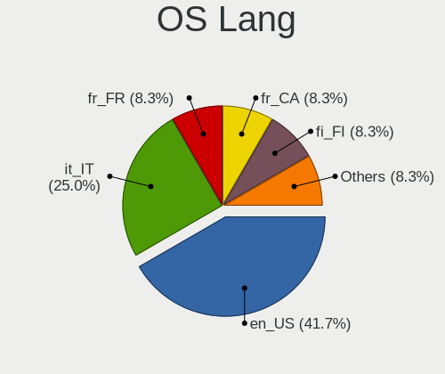

| Lang  | Desktops | Percent |
|-------|----------|---------|
| en_US | 4        | 30.77%  |
| it_IT | 3        | 23.08%  |
| fr_FR | 2        | 15.38%  |
| ru_RU | 1        | 7.69%   |
| hr_HR | 1        | 7.69%   |
| fi_FI | 1        | 7.69%   |
| en_IL | 1        | 7.69%   |

Boot Mode
---------

EFI or BIOS

| Mode | Desktops | Percent |
|------|----------|---------|
| EFI  | 7        | 53.85%  |
| BIOS | 6        | 46.15%  |

Filesystem
----------

Type of filesystem

| Type | Desktops | Percent |
|------|----------|---------|
| Ext4 | 12       | 92.31%  |
| Xfs  | 1        | 7.69%   |

Part. scheme
------------

Scheme of partitioning

| Type    | Desktops | Percent |
|---------|----------|---------|
| GPT     | 10       | 76.92%  |
| MBR     | 2        | 15.38%  |
| Unknown | 1        | 7.69%   |

Dual Boot with Linux/BSD
------------------------

Hosting more than one Linux/BSD

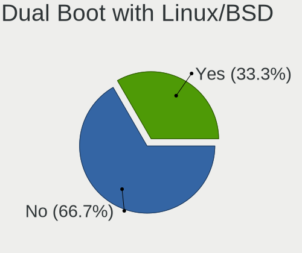

| Dual boot | Desktops | Percent |
|-----------|----------|---------|
| No        | 8        | 61.54%  |
| Yes       | 5        | 38.46%  |

Dual Boot (Win)
---------------

Hosting Linux and Windows

| Dual boot | Desktops | Percent |
|-----------|----------|---------|
| No        | 7        | 53.85%  |
| Yes       | 6        | 46.15%  |

Board
-----

Vendor
------

Motherboard manufacturer

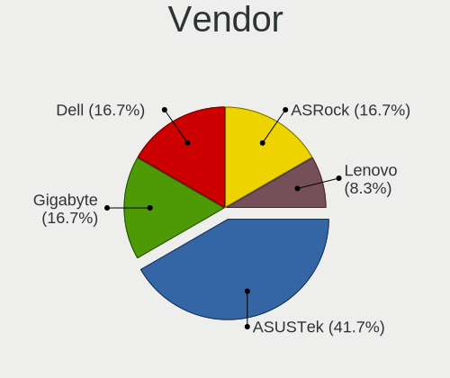

| Name                | Desktops | Percent |
|---------------------|----------|---------|
| ASUSTek Computer    | 7        | 53.85%  |
| MSI                 | 2        | 15.38%  |
| Gigabyte Technology | 2        | 15.38%  |
| Lenovo              | 1        | 7.69%   |
| ASRock              | 1        | 7.69%   |

Model
-----

Motherboard model

| Name                              | Desktops | Percent |
|-----------------------------------|----------|---------|
| MSI MS-7C56                       | 1        | 7.69%   |
| MSI MS-7C09                       | 1        | 7.69%   |
| Lenovo T530-28ICB                 | 1        | 7.69%   |
| Gigabyte X570S AERO G             | 1        | 7.69%   |
| Gigabyte B450M DS3H               | 1        | 7.69%   |
| ASUS Z170 PRO GAMING/AURA         | 1        | 7.69%   |
| ASUS TUF Gaming B560M-PLUS        | 1        | 7.69%   |
| ASUS ROG STRIX Z590-E GAMING WIFI | 1        | 7.69%   |
| ASUS ProArt X670E-CREATOR WIFI    | 1        | 7.69%   |
| ASUS PRIME B450-PLUS              | 1        | 7.69%   |
| ASUS M5A78L LE                    | 1        | 7.69%   |
| ASUS GL342AA-ABZ a6165.it         | 1        | 7.69%   |
| ASRock Z77 Extreme4               | 1        | 7.69%   |

Model Family
------------

Motherboard model prefix

| Name              | Desktops | Percent |
|-------------------|----------|---------|
| MSI MS-7C56       | 1        | 7.69%   |
| MSI MS-7C09       | 1        | 7.69%   |
| Lenovo T530-28ICB | 1        | 7.69%   |
| Gigabyte X570S    | 1        | 7.69%   |
| Gigabyte B450M    | 1        | 7.69%   |
| ASUS Z170         | 1        | 7.69%   |
| ASUS TUF          | 1        | 7.69%   |
| ASUS ROG          | 1        | 7.69%   |
| ASUS ProArt       | 1        | 7.69%   |
| ASUS PRIME        | 1        | 7.69%   |
| ASUS M5A78L       | 1        | 7.69%   |
| ASUS GL342AA-ABZ  | 1        | 7.69%   |
| ASRock Z77        | 1        | 7.69%   |

MFG Year
--------

Motherboard manufacture year

| Year | Desktops | Percent |
|------|----------|---------|
| 2021 | 3        | 23.08%  |
| 2018 | 3        | 23.08%  |
| 2022 | 1        | 7.69%   |
| 2020 | 1        | 7.69%   |
| 2019 | 1        | 7.69%   |
| 2016 | 1        | 7.69%   |
| 2012 | 1        | 7.69%   |
| 2011 | 1        | 7.69%   |
| 2007 | 1        | 7.69%   |

Form Factor
-----------

Physical design of the computer

| Name    | Desktops | Percent |
|---------|----------|---------|
| Desktop | 13       | 100%    |

Secure Boot
-----------

Enabled or disabled

| State    | Desktops | Percent |
|----------|----------|---------|
| Disabled | 11       | 84.62%  |
| Enabled  | 2        | 15.38%  |

Coreboot
--------

Have coreboot on board

| Used | Desktops | Percent |
|------|----------|---------|
| No   | 13       | 100%    |

RAM Size
--------

Total RAM memory

| Size in GB | Desktops | Percent |
|------------|----------|---------|
| 32.01-64.0 | 5        | 38.46%  |
| 16.01-24.0 | 3        | 23.08%  |
| 24.01-32.0 | 2        | 15.38%  |
| 8.01-16.0  | 2        | 15.38%  |
| 3.01-4.0   | 1        | 7.69%   |

RAM Used
--------

Used RAM memory

| Used GB   | Desktops | Percent |
|-----------|----------|---------|
| 2.01-3.0  | 4        | 30.77%  |
| 4.01-8.0  | 3        | 23.08%  |
| 1.01-2.0  | 3        | 23.08%  |
| 8.01-16.0 | 2        | 15.38%  |
| 3.01-4.0  | 1        | 7.69%   |

Total Drives
------------

Number of drives on board

| Drives | Desktops | Percent |
|--------|----------|---------|
| 2      | 4        | 30.77%  |
| 1      | 4        | 30.77%  |
| 3      | 2        | 15.38%  |
| 7      | 1        | 7.69%   |
| 6      | 1        | 7.69%   |
| 5      | 1        | 7.69%   |

Has CD-ROM
----------

Has CD-ROM on board

| Presented | Desktops | Percent |
|-----------|----------|---------|
| No        | 7        | 53.85%  |
| Yes       | 6        | 46.15%  |

Has Ethernet
------------

Has Ethernet on board

| Presented | Desktops | Percent |
|-----------|----------|---------|
| Yes       | 13       | 100%    |

Has WiFi
--------

Has WiFi module

| Presented | Desktops | Percent |
|-----------|----------|---------|
| Yes       | 9        | 69.23%  |
| No        | 4        | 30.77%  |

Has Bluetooth
-------------

Has Bluetooth module

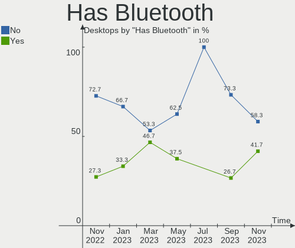

| Presented | Desktops | Percent |
|-----------|----------|---------|
| Yes       | 7        | 53.85%  |
| No        | 6        | 46.15%  |

Location
--------

Country
-------

Geographic location (country)

| Country  | Desktops | Percent |
|----------|----------|---------|
| USA      | 3        | 23.08%  |
| Italy    | 3        | 23.08%  |
| France   | 2        | 15.38%  |
| Russia   | 1        | 7.69%   |
| Portugal | 1        | 7.69%   |
| Israel   | 1        | 7.69%   |
| Finland  | 1        | 7.69%   |
| Croatia  | 1        | 7.69%   |

City
----

Geographic location (city)

| City          | Desktops | Percent |
|---------------|----------|---------|
| Zagreb        | 1        | 7.69%   |
| Washington    | 1        | 7.69%   |
| Turku         | 1        | 7.69%   |
| Tel Aviv      | 1        | 7.69%   |
| Taranto       | 1        | 7.69%   |
| St Petersburg | 1        | 7.69%   |
| Seia          | 1        | 7.69%   |
| Sanremo       | 1        | 7.69%   |
| Saint-Etienne | 1        | 7.69%   |
| Lansdale      | 1        | 7.69%   |
| Joigny        | 1        | 7.69%   |
| Collegno      | 1        | 7.69%   |
| Cleveland     | 1        | 7.69%   |

Drives
------

Drive Vendor
------------

Hard drive vendors

| Vendor                      | Desktops | Drives | Percent |
|-----------------------------|----------|--------|---------|
| Samsung Electronics         | 7        | 10     | 25%     |
| WDC                         | 6        | 11     | 21.43%  |
| Seagate                     | 3        | 3      | 10.71%  |
| Sandisk                     | 3        | 4      | 10.71%  |
| Unknown                     | 1        | 1      | 3.57%   |
| Toshiba                     | 1        | 1      | 3.57%   |
| SPCC                        | 1        | 1      | 3.57%   |
| Phison                      | 1        | 1      | 3.57%   |
| Kingston Technology Company | 1        | 1      | 3.57%   |
| Kingston                    | 1        | 1      | 3.57%   |
| Hitachi                     | 1        | 1      | 3.57%   |
| HGST                        | 1        | 1      | 3.57%   |
| Crucial                     | 1        | 1      | 3.57%   |

Drive Model
-----------

Hard drive models

| Model                                               | Desktops | Percent |
|-----------------------------------------------------|----------|---------|
| Samsung SSD 980 1TB                                 | 2        | 5.88%   |
| WDC WDS240G2G0A-00JH30 240GB SSD                    | 1        | 2.94%   |
| WDC WD8001FZBX-00ASYA0 8TB                          | 1        | 2.94%   |
| WDC WD5000AAKX-003CA0 500GB                         | 1        | 2.94%   |
| WDC WD5000AAKS-00A7B0 500GB                         | 1        | 2.94%   |
| WDC WD40EFZX-68AWUN0 4TB                            | 1        | 2.94%   |
| WDC WD30EFRX-68EUZN0 3TB                            | 1        | 2.94%   |
| WDC WD20EADS-00R6B0 2TB                             | 1        | 2.94%   |
| WDC WD10EZRZ-00HTKB0 1TB                            | 1        | 2.94%   |
| WDC WD10EZEX-08WN4A0 1TB                            | 1        | 2.94%   |
| WDC WD1002FAEX-00Z3A0 1TB                           | 1        | 2.94%   |
| Unknown CBADS  32GB                                 | 1        | 2.94%   |
| Toshiba HDWD130 3TB                                 | 1        | 2.94%   |
| SPCC Solid State Disk 480GB                         | 1        | 2.94%   |
| Seagate ST6000NM0024-1HT17Z 6TB                     | 1        | 2.94%   |
| Seagate ST3250820AS 250GB                           | 1        | 2.94%   |
| Seagate ST2000DM008-2FR102 2TB                      | 1        | 2.94%   |
| Sandisk WD_BLACK SN750 SE NVMe 1TB                  | 1        | 2.94%   |
| Sandisk WD_BLACK SN750 SE 1TB                       | 1        | 2.94%   |
| SanDisk SSD PLUS 480GB                              | 1        | 2.94%   |
| SanDisk NVMe SSD Drive 1TB                          | 1        | 2.94%   |
| Samsung SSD 980 PRO 500GB                           | 1        | 2.94%   |
| Samsung SSD 980 500GB                               | 1        | 2.94%   |
| Samsung SSD 870 QVO 2TB                             | 1        | 2.94%   |
| Samsung SSD 860 QVO 1TB                             | 1        | 2.94%   |
| Samsung SSD 840 PRO Series 256GB                    | 1        | 2.94%   |
| Samsung NVMe SSD Controller SM981/PM981/PM983 500GB | 1        | 2.94%   |
| Phison SBX 256GB                                    | 1        | 2.94%   |
| Kingston Company A2000 NVMe SSD 1TB                 | 1        | 2.94%   |
| Kingston SVP200S3120G 120GB SSD                     | 1        | 2.94%   |
| Hitachi HDS721032CLA362 320GB                       | 1        | 2.94%   |
| HGST HUS726T6TALE6L4 6TB                            | 1        | 2.94%   |
| Crucial CT2000MX500SSD1 2TB                         | 1        | 2.94%   |

HDD Vendor
----------

Hard disk drive vendors

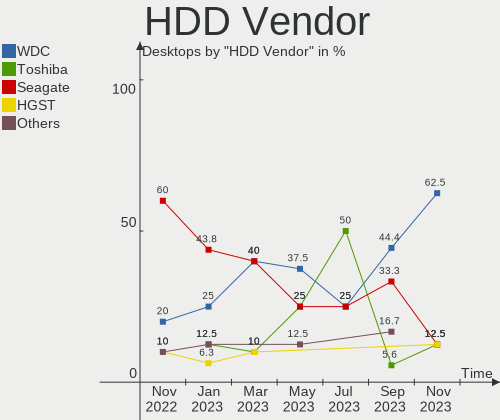

| Vendor  | Desktops | Drives | Percent |
|---------|----------|--------|---------|
| WDC     | 6        | 10     | 50%     |
| Seagate | 3        | 3      | 25%     |
| Toshiba | 1        | 1      | 8.33%   |
| Hitachi | 1        | 1      | 8.33%   |
| HGST    | 1        | 1      | 8.33%   |

SSD Vendor
----------

Solid state drive vendors

| Vendor              | Desktops | Drives | Percent |
|---------------------|----------|--------|---------|
| Samsung Electronics | 3        | 3      | 37.5%   |
| WDC                 | 1        | 1      | 12.5%   |
| SPCC                | 1        | 1      | 12.5%   |
| SanDisk             | 1        | 1      | 12.5%   |
| Kingston            | 1        | 1      | 12.5%   |
| Crucial             | 1        | 1      | 12.5%   |

Drive Kind
----------

HDD or SSD

| Kind | Desktops | Drives | Percent |
|------|----------|--------|---------|
| HDD  | 9        | 16     | 39.13%  |
| NVMe | 7        | 12     | 30.43%  |
| SSD  | 6        | 8      | 26.09%  |
| MMC  | 1        | 1      | 4.35%   |

Drive Connector
---------------

SATA, SAS, NVMe, etc.

| Type | Desktops | Drives | Percent |
|------|----------|--------|---------|
| SATA | 10       | 24     | 55.56%  |
| NVMe | 7        | 12     | 38.89%  |
| MMC  | 1        | 1      | 5.56%   |

Drive Size
----------

Size of hard drive

| Size in TB | Desktops | Drives | Percent |
|------------|----------|--------|---------|
| 0.01-0.5   | 7        | 9      | 38.89%  |
| 1.01-2.0   | 4        | 4      | 22.22%  |
| 0.51-1.0   | 3        | 4      | 16.67%  |
| 4.01-10.0  | 2        | 3      | 11.11%  |
| 3.01-4.0   | 1        | 2      | 5.56%   |
| 2.01-3.0   | 1        | 2      | 5.56%   |

Space Total
-----------

Amount of disk space available on the file system

| Size in GB     | Desktops | Percent |
|----------------|----------|---------|
| 101-250        | 4        | 30.77%  |
| More than 3000 | 3        | 23.08%  |
| 251-500        | 2        | 15.38%  |
| 1001-2000      | 2        | 15.38%  |
| 501-1000       | 2        | 15.38%  |

Space Used
----------

Amount of used disk space

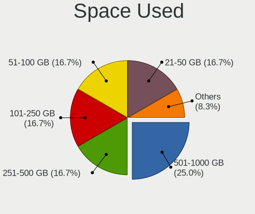

| Used GB        | Desktops | Percent |
|----------------|----------|---------|
| 51-100         | 3        | 23.08%  |
| More than 3000 | 2        | 15.38%  |
| 101-250        | 2        | 15.38%  |
| 1-20           | 2        | 15.38%  |
| 251-500        | 1        | 7.69%   |
| 21-50          | 1        | 7.69%   |
| 2001-3000      | 1        | 7.69%   |
| 1001-2000      | 1        | 7.69%   |

Malfunc. Drives
---------------

Drive models with a malfunction

Zero info for selected period =(

Malfunc. Drive Vendor
---------------------

Vendors of faulty drives

Zero info for selected period =(

Malfunc. HDD Vendor
-------------------

Vendors of faulty HDD drives

Zero info for selected period =(

Malfunc. Drive Kind
-------------------

Kinds of faulty drives

Zero info for selected period =(

Failed Drives
-------------

Failed drive models

Zero info for selected period =(

Failed Drive Vendor
-------------------

Failed drive vendors

Zero info for selected period =(

Drive Status
------------

Number of failed and malfunc. drives

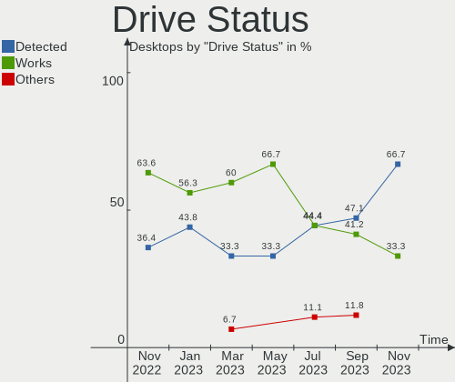

| Status   | Desktops | Drives | Percent |
|----------|----------|--------|---------|
| Works    | 10       | 24     | 66.67%  |
| Detected | 5        | 13     | 33.33%  |

Storage controller
------------------

Storage Vendor
--------------

Storage controller vendors

| Vendor                      | Desktops | Percent |
|-----------------------------|----------|---------|
| Intel                       | 7        | 30.43%  |
| AMD                         | 6        | 26.09%  |
| Samsung Electronics         | 5        | 21.74%  |
| SanDisk                     | 2        | 8.7%    |
| Phison Electronics          | 1        | 4.35%   |
| Kingston Technology Company | 1        | 4.35%   |
| ASMedia Technology          | 1        | 4.35%   |

Storage Model
-------------

Storage controller models

| Model                                                                         | Desktops | Percent |
|-------------------------------------------------------------------------------|----------|---------|
| Samsung NVMe SSD Controller 980                                               | 3        | 11.54%  |
| Intel 500 Series Chipset Family SATA AHCI Controller                          | 2        | 7.69%   |
| AMD FCH SATA Controller [AHCI mode]                                           | 2        | 7.69%   |
| AMD 400 Series Chipset SATA Controller                                        | 2        | 7.69%   |
| SanDisk WD Blue SN570 NVMe SSD                                                | 1        | 3.85%   |
| SanDisk Non-Volatile memory controller                                        | 1        | 3.85%   |
| Samsung NVMe SSD Controller SM981/PM981/PM983                                 | 1        | 3.85%   |
| Samsung NVMe SSD Controller PM9A1/PM9A3/980PRO                                | 1        | 3.85%   |
| Phison NVMe Storage Controller                                                | 1        | 3.85%   |
| Kingston Company A2000 NVMe SSD                                               | 1        | 3.85%   |
| Intel Q170/Q150/B150/H170/H110/Z170/CM236 Chipset SATA Controller [AHCI Mode] | 1        | 3.85%   |
| Intel Cannon Lake PCH SATA AHCI Controller                                    | 1        | 3.85%   |
| Intel 82801GR/GDH (ICH7R/ICH7DH) SATA Controller [RAID mode]                  | 1        | 3.85%   |
| Intel 82801G (ICH7 Family) IDE Controller                                     | 1        | 3.85%   |
| Intel 7 Series/C210 Series Chipset Family 6-port SATA Controller [AHCI mode]  | 1        | 3.85%   |
| Intel 200 Series PCH SATA controller [AHCI mode]                              | 1        | 3.85%   |
| ASMedia ASM1062 Serial ATA Controller                                         | 1        | 3.85%   |
| AMD SB7x0/SB8x0/SB9x0 SATA Controller [IDE mode]                              | 1        | 3.85%   |
| AMD SB7x0/SB8x0/SB9x0 IDE Controller                                          | 1        | 3.85%   |
| AMD SATA controller                                                           | 1        | 3.85%   |
| AMD 500 Series Chipset SATA Controller                                        | 1        | 3.85%   |

Storage Kind
------------

Kind of storage controller (IDE, SATA, NVMe, SAS, ...)

| Kind | Desktops | Percent |
|------|----------|---------|
| SATA | 12       | 54.55%  |
| NVMe | 7        | 31.82%  |
| IDE  | 2        | 9.09%   |
| RAID | 1        | 4.55%   |

Processor
---------

CPU Vendor
----------

Processor vendors

| Vendor | Desktops | Percent |
|--------|----------|---------|
| Intel  | 7        | 53.85%  |
| AMD    | 6        | 46.15%  |

CPU Model
---------

Processor models

| Model                                       | Desktops | Percent |
|---------------------------------------------|----------|---------|
| Intel 11th Gen Core i5-11600K @ 3.90GHz     | 2        | 15.38%  |
| Intel Core i7-6700K CPU @ 4.00GHz           | 1        | 7.69%   |
| Intel Core i7-3770K CPU @ 3.50GHz           | 1        | 7.69%   |
| Intel Core i5-9400F CPU @ 2.90GHz           | 1        | 7.69%   |
| Intel Core i5-8400 CPU @ 2.80GHz            | 1        | 7.69%   |
| Intel Core 2 Duo CPU E4400 @ 2.00GHz        | 1        | 7.69%   |
| AMD Ryzen 9 7950X 16-Core Processor         | 1        | 7.69%   |
| AMD Ryzen 7 5800X 8-Core Processor          | 1        | 7.69%   |
| AMD Ryzen 7 5700G with Radeon Graphics      | 1        | 7.69%   |
| AMD Ryzen 5 1600 Six-Core Processor         | 1        | 7.69%   |
| AMD Ryzen 3 3200G with Radeon Vega Graphics | 1        | 7.69%   |
| AMD FX-4100 Quad-Core Processor             | 1        | 7.69%   |

CPU Model Family
----------------

Processor model prefix

| Model            | Desktops | Percent |
|------------------|----------|---------|
| Other            | 2        | 15.38%  |
| Intel Core i7    | 2        | 15.38%  |
| Intel Core i5    | 2        | 15.38%  |
| AMD Ryzen 7      | 2        | 15.38%  |
| Intel Core 2 Duo | 1        | 7.69%   |
| AMD Ryzen 9      | 1        | 7.69%   |
| AMD Ryzen 5      | 1        | 7.69%   |
| AMD Ryzen 3      | 1        | 7.69%   |
| AMD FX           | 1        | 7.69%   |

CPU Cores
---------

Number of processor cores

| Number | Desktops | Percent |
|--------|----------|---------|
| 6      | 5        | 38.46%  |
| 4      | 3        | 23.08%  |
| 8      | 2        | 15.38%  |
| 2      | 2        | 15.38%  |
| 16     | 1        | 7.69%   |

CPU Sockets
-----------

Number of sockets

| Number | Desktops | Percent |
|--------|----------|---------|
| 1      | 13       | 100%    |

CPU Threads
-----------

Threads per core (Hyper-Threading)

| Number | Desktops | Percent |
|--------|----------|---------|
| 2      | 9        | 69.23%  |
| 1      | 4        | 30.77%  |

CPU Op-Modes
------------

CPU Operation Modes (32-bit, 64-bit)

| Op mode        | Desktops | Percent |
|----------------|----------|---------|
| 32-bit, 64-bit | 13       | 100%    |

CPU Microcode
-------------

Microcode number

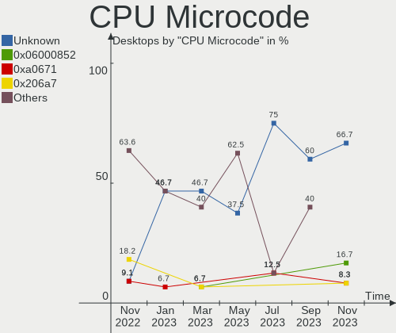

| Number     | Desktops | Percent |
|------------|----------|---------|
| Unknown    | 6        | 46.15%  |
| 0x906ea    | 2        | 15.38%  |
| 0xa0671    | 1        | 7.69%   |
| 0x506e3    | 1        | 7.69%   |
| 0x306a9    | 1        | 7.69%   |
| 0x0a601203 | 1        | 7.69%   |
| 0x08108109 | 1        | 7.69%   |

CPU Microarch
-------------

Microarchitecture

| Name      | Desktops | Percent |
|-----------|----------|---------|
| Zen+      | 2        | 15.38%  |
| Zen 3     | 2        | 15.38%  |
| KabyLake  | 2        | 15.38%  |
| Unknown   | 2        | 15.38%  |
| Skylake   | 1        | 7.69%   |
| IvyBridge | 1        | 7.69%   |
| Icelake   | 1        | 7.69%   |
| Core      | 1        | 7.69%   |
| Bulldozer | 1        | 7.69%   |

Graphics
--------

GPU Vendor
----------

Vendors of graphics cards

| Vendor | Desktops | Percent |
|--------|----------|---------|
| AMD    | 8        | 47.06%  |
| Nvidia | 5        | 29.41%  |
| Intel  | 4        | 23.53%  |

GPU Model
---------

Graphics card models

| Model                                                                | Desktops | Percent |
|----------------------------------------------------------------------|----------|---------|
| Nvidia TU117 [GeForce GTX 1650]                                      | 1        | 5.88%   |
| Nvidia GP106 [GeForce GTX 1060 6GB]                                  | 1        | 5.88%   |
| Nvidia GM206GL [Quadro M2000]                                        | 1        | 5.88%   |
| Nvidia GK208B [GeForce GT 710]                                       | 1        | 5.88%   |
| Nvidia GA106 [Geforce RTX 3050]                                      | 1        | 5.88%   |
| Intel RocketLake-S GT1 [UHD Graphics 750]                            | 1        | 5.88%   |
| Intel IvyBridge GT2 [HD Graphics 4000]                               | 1        | 5.88%   |
| Intel CoffeeLake-S GT2 [UHD Graphics 630]                            | 1        | 5.88%   |
| Intel 82945G/GZ Integrated Graphics Controller                       | 1        | 5.88%   |
| AMD Tahiti PRO [Radeon HD 7950/8950 OEM / R9 280]                    | 1        | 5.88%   |
| AMD Raphael                                                          | 1        | 5.88%   |
| AMD Picasso/Raven 2 [Radeon Vega Series / Radeon Vega Mobile Series] | 1        | 5.88%   |
| AMD Navi 23 [Radeon RX 6600/6600 XT/6600M]                           | 1        | 5.88%   |
| AMD Navi 22 [Radeon RX 6700/6700 XT/6750 XT / 6800M]                 | 1        | 5.88%   |
| AMD Ellesmere [Radeon RX 470/480/570/570X/580/580X/590]              | 1        | 5.88%   |
| AMD Cezanne                                                          | 1        | 5.88%   |
| AMD Cape Verde XT [Radeon HD 7770/8760 / R7 250X]                    | 1        | 5.88%   |

GPU Combo
---------

Combinations of graphics cards

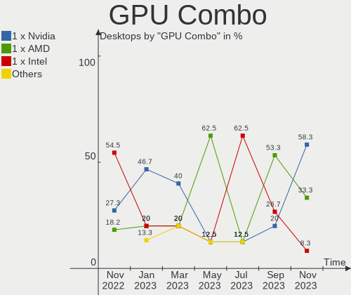

| Name         | Desktops | Percent |
|--------------|----------|---------|
| 1 x AMD      | 6        | 46.15%  |
| 1 x Nvidia   | 3        | 23.08%  |
| 1 x Intel    | 2        | 15.38%  |
| AMD + Nvidia | 2        | 15.38%  |

GPU Driver
----------

Free vs proprietary

| Driver      | Desktops | Percent |
|-------------|----------|---------|
| Free        | 7        | 53.85%  |
| Proprietary | 4        | 30.77%  |
| Unknown     | 2        | 15.38%  |

GPU Memory
----------

Total video memory

| Size in GB | Desktops | Percent |
|------------|----------|---------|
| Unknown    | 7        | 53.85%  |
| 3.01-4.0   | 3        | 23.08%  |
| 5.01-6.0   | 1        | 7.69%   |
| 2.01-3.0   | 1        | 7.69%   |
| 1.01-2.0   | 1        | 7.69%   |

Monitor
-------

Monitor Vendor
--------------

Monitor vendors

| Vendor              | Desktops | Percent |
|---------------------|----------|---------|
| Philips             | 4        | 22.22%  |
| Dell                | 3        | 16.67%  |
| Acer                | 3        | 16.67%  |
| Samsung Electronics | 2        | 11.11%  |
| Goldstar            | 2        | 11.11%  |
| VMO                 | 1        | 5.56%   |
| Lenovo              | 1        | 5.56%   |
| BenQ                | 1        | 5.56%   |
| Apple               | 1        | 5.56%   |

Monitor Model
-------------

Monitor models

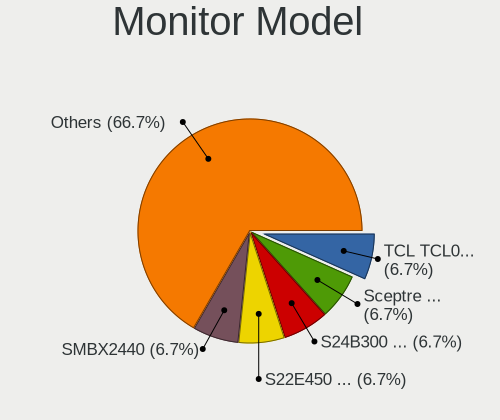

| Model                                                             | Desktops | Percent |
|-------------------------------------------------------------------|----------|---------|
| VMO LCD WQXGA HDM VMO1506 2560x1600 1600x1000mm 74.3-inch         | 1        | 5.56%   |
| Samsung Electronics S32F351 SAM0D24 1920x1080 698x393mm 31.5-inch | 1        | 5.56%   |
| Samsung Electronics EPSON PJ SECA605 1600x1200                    | 1        | 5.56%   |
| Philips PHL 243V7 PHLC155 1920x1080 530x300mm 24.0-inch           | 1        | 5.56%   |
| Philips PHL 242E2F PHLC238 1920x1080 527x296mm 23.8-inch          | 1        | 5.56%   |
| Philips 246EL2SBH PHLC074 1920x1080 521x293mm 23.5-inch           | 1        | 5.56%   |
| Philips 190B PHL081A 1280x1024 376x301mm 19.0-inch                | 1        | 5.56%   |
| Lenovo LEN G25-10 LEN65FE 1920x1080 544x303mm 24.5-inch           | 1        | 5.56%   |
| Goldstar W2353 GSM56F0 1920x1080 510x290mm 23.1-inch              | 1        | 5.56%   |
| Goldstar ULTRAWIDE GSM59F2 2560x1080 798x334mm 34.1-inch          | 1        | 5.56%   |
| Dell SE2417HGX DELD0F6 1920x1080 521x293mm 23.5-inch              | 1        | 5.56%   |
| Dell S3222DGM DELD111 2560x1440 697x392mm 31.5-inch               | 1        | 5.56%   |
| Dell P2417H DELA0DB 1920x1080 527x296mm 23.8-inch                 | 1        | 5.56%   |
| BenQ GL2250H BNQ78A1 1920x1080 477x268mm 21.5-inch                | 1        | 5.56%   |
| Apple ProDisplayXDR APPAE22 3840x2160 699x393mm 31.6-inch         | 1        | 5.56%   |
| Acer XF243Y ACR0934 1920x1080 527x296mm 23.8-inch                 | 1        | 5.56%   |
| Acer P241W ACRADB4 1920x1200 518x324mm 24.1-inch                  | 1        | 5.56%   |
| Acer ET322QU ACR0687 2560x1440 698x393mm 31.5-inch                | 1        | 5.56%   |

Monitor Resolution
------------------

Monitor screen resolution

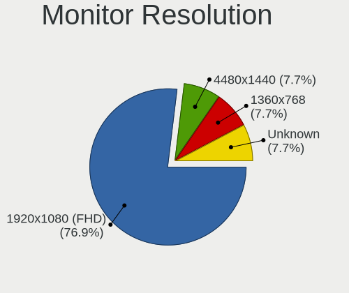

| Resolution         | Desktops | Percent |
|--------------------|----------|---------|
| 1920x1080 (FHD)    | 8        | 53.33%  |
| 3840x2160 (4K)     | 1        | 6.67%   |
| 2560x1600          | 1        | 6.67%   |
| 2560x1440 (QHD)    | 1        | 6.67%   |
| 2560x1080          | 1        | 6.67%   |
| 1920x1200 (WUXGA)  | 1        | 6.67%   |
| 1680x1050 (WSXGA+) | 1        | 6.67%   |
| 1280x1024 (SXGA)   | 1        | 6.67%   |

Monitor Diagonal
----------------

Diagonal size in inches

| Inches  | Desktops | Percent |
|---------|----------|---------|
| 24      | 6        | 37.5%   |
| 31      | 3        | 18.75%  |
| 23      | 2        | 12.5%   |
| 74      | 1        | 6.25%   |
| 34      | 1        | 6.25%   |
| 21      | 1        | 6.25%   |
| 19      | 1        | 6.25%   |
| Unknown | 1        | 6.25%   |

Monitor Width
-------------

Physical width

| Width in mm | Desktops | Percent |
|-------------|----------|---------|
| 501-600     | 8        | 50%     |
| 601-700     | 3        | 18.75%  |
| 701-800     | 1        | 6.25%   |
| 401-500     | 1        | 6.25%   |
| 351-400     | 1        | 6.25%   |
| 1501-2000   | 1        | 6.25%   |
| Unknown     | 1        | 6.25%   |

Aspect Ratio
------------

Proportional relationship between the width and the height

| Ratio | Desktops | Percent |
|-------|----------|---------|
| 16/9  | 9        | 69.23%  |
| 16/10 | 2        | 15.38%  |
| 5/4   | 1        | 7.69%   |
| 21/9  | 1        | 7.69%   |

Monitor Area
------------

Area in inch²

| Area in inch² | Desktops | Percent |
|----------------|----------|---------|
| 201-250        | 7        | 43.75%  |
| 351-500        | 4        | 25%     |
| 251-300        | 2        | 12.5%   |
| More than 1000 | 1        | 6.25%   |
| 151-200        | 1        | 6.25%   |
| Unknown        | 1        | 6.25%   |

Pixel Density
-------------

Pixels per inch

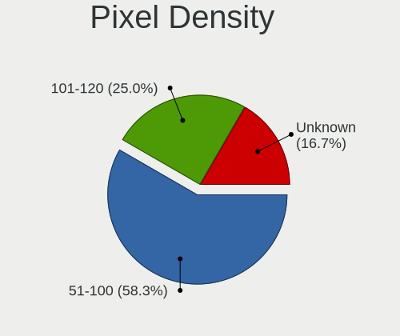

| Density | Desktops | Percent |
|---------|----------|---------|
| 51-100  | 11       | 73.33%  |
| 1-50    | 1        | 6.67%   |
| 121-160 | 1        | 6.67%   |
| 101-120 | 1        | 6.67%   |
| Unknown | 1        | 6.67%   |

Multiple Monitors
-----------------

Total monitors connected

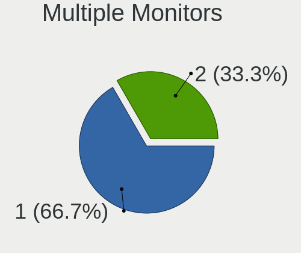

| Total | Desktops | Percent |
|-------|----------|---------|
| 1     | 7        | 53.85%  |
| 2     | 5        | 38.46%  |
| 0     | 1        | 7.69%   |

Network
-------

Net Controller Vendor
---------------------

Controller vendors

| Vendor                | Desktops | Percent |
|-----------------------|----------|---------|
| Realtek Semiconductor | 9        | 40.91%  |
| Intel                 | 6        | 27.27%  |
| TP-Link               | 1        | 4.55%   |
| Ralink Technology     | 1        | 4.55%   |
| Ralink                | 1        | 4.55%   |
| MediaTek              | 1        | 4.55%   |
| Broadcom              | 1        | 4.55%   |
| ASUSTek Computer      | 1        | 4.55%   |
| Aquantia              | 1        | 4.55%   |

Net Controller Model
--------------------

Controller models

| Model                                                               | Desktops | Percent |
|---------------------------------------------------------------------|----------|---------|
| Realtek RTL8111/8168/8411 PCI Express Gigabit Ethernet Controller   | 6        | 24%     |
| Intel Ethernet Controller I225-V                                    | 3        | 12%     |
| TP-Link AC600 wireless Realtek RTL8811AU [Archer T2U Nano]          | 1        | 4%      |
| Realtek RTL8812AE 802.11ac PCIe Wireless Network Adapter            | 1        | 4%      |
| Realtek RTL8188EUS 802.11n Wireless Network Adapter                 | 1        | 4%      |
| Realtek RTL8125 2.5GbE Controller                                   | 1        | 4%      |
| Ralink MT7601U Wireless Adapter                                     | 1        | 4%      |
| Ralink RT2561/RT61 802.11g PCI                                      | 1        | 4%      |
| MediaTek MT7922 802.11ax PCI Express Wireless Network Adapter       | 1        | 4%      |
| Intel Wi-Fi 6 AX210/AX211/AX411 160MHz                              | 1        | 4%      |
| Intel Wi-Fi 6 AX200                                                 | 1        | 4%      |
| Intel NM10/ICH7 Family LAN Controller                               | 1        | 4%      |
| Intel Ethernet Controller (2) I225-LMvP                             | 1        | 4%      |
| Intel Ethernet Connection (2) I219-V                                | 1        | 4%      |
| Intel Dual Band Wireless-AC 3165 Plus Bluetooth                     | 1        | 4%      |
| Broadcom NetLink BCM57781 Gigabit Ethernet PCIe                     | 1        | 4%      |
| ASUS 802.11ac NIC                                                   | 1        | 4%      |
| Aquantia AQC113CS NBase-T/IEEE 802.3bz Ethernet Controller [AQtion] | 1        | 4%      |

Wireless Vendor
---------------

Wireless vendors

| Vendor                | Desktops | Percent |
|-----------------------|----------|---------|
| Intel                 | 3        | 30%     |
| Realtek Semiconductor | 2        | 20%     |
| TP-Link               | 1        | 10%     |
| Ralink Technology     | 1        | 10%     |
| Ralink                | 1        | 10%     |
| MediaTek              | 1        | 10%     |
| ASUSTek Computer      | 1        | 10%     |

Wireless Model
--------------

Wireless models

| Model                                                         | Desktops | Percent |
|---------------------------------------------------------------|----------|---------|
| TP-Link AC600 wireless Realtek RTL8811AU [Archer T2U Nano]    | 1        | 10%     |
| Realtek RTL8812AE 802.11ac PCIe Wireless Network Adapter      | 1        | 10%     |
| Realtek RTL8188EUS 802.11n Wireless Network Adapter           | 1        | 10%     |
| Ralink MT7601U Wireless Adapter                               | 1        | 10%     |
| Ralink RT2561/RT61 802.11g PCI                                | 1        | 10%     |
| MediaTek MT7922 802.11ax PCI Express Wireless Network Adapter | 1        | 10%     |
| Intel Wi-Fi 6 AX210/AX211/AX411 160MHz                        | 1        | 10%     |
| Intel Wi-Fi 6 AX200                                           | 1        | 10%     |
| Intel Dual Band Wireless-AC 3165 Plus Bluetooth               | 1        | 10%     |
| ASUS 802.11ac NIC                                             | 1        | 10%     |

Ethernet Vendor
---------------

Ethernet vendors

| Vendor                | Desktops | Percent |
|-----------------------|----------|---------|
| Realtek Semiconductor | 7        | 50%     |
| Intel                 | 5        | 35.71%  |
| Broadcom              | 1        | 7.14%   |
| Aquantia              | 1        | 7.14%   |

Ethernet Model
--------------

Ethernet models

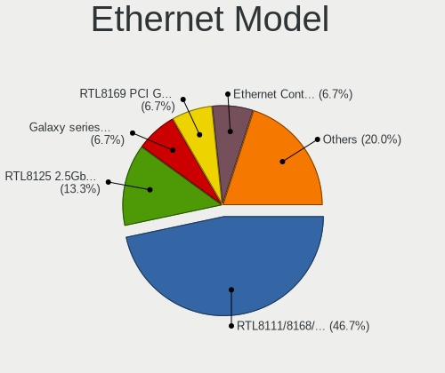

| Model                                                               | Desktops | Percent |
|---------------------------------------------------------------------|----------|---------|
| Realtek RTL8111/8168/8411 PCI Express Gigabit Ethernet Controller   | 6        | 40%     |
| Intel Ethernet Controller I225-V                                    | 3        | 20%     |
| Realtek RTL8125 2.5GbE Controller                                   | 1        | 6.67%   |
| Intel NM10/ICH7 Family LAN Controller                               | 1        | 6.67%   |
| Intel Ethernet Controller (2) I225-LMvP                             | 1        | 6.67%   |
| Intel Ethernet Connection (2) I219-V                                | 1        | 6.67%   |
| Broadcom NetLink BCM57781 Gigabit Ethernet PCIe                     | 1        | 6.67%   |
| Aquantia AQC113CS NBase-T/IEEE 802.3bz Ethernet Controller [AQtion] | 1        | 6.67%   |

Net Controller Kind
-------------------

Ethernet, WiFi or modem

| Kind     | Desktops | Percent |
|----------|----------|---------|
| Ethernet | 13       | 59.09%  |
| WiFi     | 9        | 40.91%  |

Used Controller
---------------

Currently used network controller

| Kind     | Desktops | Percent |
|----------|----------|---------|
| Ethernet | 8        | 66.67%  |
| WiFi     | 4        | 33.33%  |

NICs
----

Total network controllers on board

| Total | Desktops | Percent |
|-------|----------|---------|
| 1     | 6        | 46.15%  |
| 2     | 5        | 38.46%  |
| 4     | 1        | 7.69%   |
| 3     | 1        | 7.69%   |

IPv6
----

IPv6 vs IPv4

| Used | Desktops | Percent |
|------|----------|---------|
| No   | 10       | 76.92%  |
| Yes  | 3        | 23.08%  |

Bluetooth
---------

Bluetooth Vendor
----------------

Controller vendors

| Vendor                  | Desktops | Percent |
|-------------------------|----------|---------|
| Intel                   | 3        | 42.86%  |
| Realtek Semiconductor   | 1        | 14.29%  |
| Foxconn / Hon Hai       | 1        | 14.29%  |
| Cambridge Silicon Radio | 1        | 14.29%  |
| Broadcom                | 1        | 14.29%  |

Bluetooth Model
---------------

Controller models

| Model                                               | Desktops | Percent |
|-----------------------------------------------------|----------|---------|
| Realtek Bluetooth Radio                             | 1        | 14.29%  |
| Intel Bluetooth wireless interface                  | 1        | 14.29%  |
| Intel AX210 Bluetooth                               | 1        | 14.29%  |
| Intel AX200 Bluetooth                               | 1        | 14.29%  |
| Foxconn / Hon Hai Wireless_Device                   | 1        | 14.29%  |
| Cambridge Silicon Radio Bluetooth Dongle (HCI mode) | 1        | 14.29%  |
| Broadcom BCM92046DG-CL1ROM Bluetooth 2.1 Adapter    | 1        | 14.29%  |

Sound
-----

Sound Vendor
------------

Sound card vendors

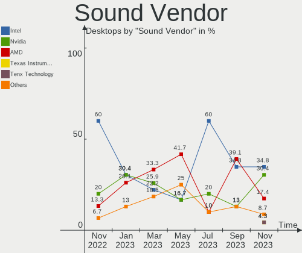

| Vendor                  | Desktops | Percent |
|-------------------------|----------|---------|
| AMD                     | 9        | 32.14%  |
| Intel                   | 7        | 25%     |
| Nvidia                  | 5        | 17.86%  |
| Kingston Technology     | 1        | 3.57%   |
| Focusrite-Novation      | 1        | 3.57%   |
| Creative Technology     | 1        | 3.57%   |
| Cambridge Silicon Radio | 1        | 3.57%   |
| C-Media Electronics     | 1        | 3.57%   |
| ASUSTek Computer        | 1        | 3.57%   |
| Unknown                 | 1        | 3.57%   |

Sound Model
-----------

Sound card models

| Model                                                                   | Desktops | Percent |
|-------------------------------------------------------------------------|----------|---------|
| AMD Family 17h/19h HD Audio Controller                                  | 3        | 9.09%   |
| Intel Tiger Lake-H HD Audio Controller                                  | 2        | 6.06%   |
| AMD Navi 21/23 HDMI/DP Audio Controller                                 | 2        | 6.06%   |
| Nvidia TU107 GeForce GTX 1650 High Definition Audio Controller          | 1        | 3.03%   |
| Nvidia GP106 High Definition Audio Controller                           | 1        | 3.03%   |
| Nvidia GM206 High Definition Audio Controller                           | 1        | 3.03%   |
| Nvidia GK208 HDMI/DP Audio Controller                                   | 1        | 3.03%   |
| Nvidia GA106 High Definition Audio Controller                           | 1        | 3.03%   |
| Kingston Technology HyperX 7.1 Audio                                    | 1        | 3.03%   |
| Intel NM10/ICH7 Family High Definition Audio Controller                 | 1        | 3.03%   |
| Intel Cannon Lake PCH cAVS                                              | 1        | 3.03%   |
| Intel 7 Series/C216 Chipset Family High Definition Audio Controller     | 1        | 3.03%   |
| Intel 200 Series PCH HD Audio                                           | 1        | 3.03%   |
| Intel 100 Series/C230 Series Chipset Family HD Audio Controller         | 1        | 3.03%   |
| Focusrite-Novation Scarlett Solo (3rd Gen.)                             | 1        | 3.03%   |
| Creative Technology Sound Blaster Play!                                 | 1        | 3.03%   |
| Cambridge Silicon Radio Avantree DG60                                   | 1        | 3.03%   |
| C-Media Electronics Audio Adapter (Unitek Y-247A)                       | 1        | 3.03%   |
| ASUSTek Computer USB Audio                                              | 1        | 3.03%   |
| AMD Tahiti HDMI Audio [Radeon HD 7870 XT / 7950/7970]                   | 1        | 3.03%   |
| AMD Starship/Matisse HD Audio Controller                                | 1        | 3.03%   |
| AMD SBx00 Azalia (Intel HDA)                                            | 1        | 3.03%   |
| AMD Renoir Radeon High Definition Audio Controller                      | 1        | 3.03%   |
| AMD Rembrandt Radeon High Definition Audio Controller                   | 1        | 3.03%   |
| AMD Raven/Raven2/Fenghuang HDMI/DP Audio Controller                     | 1        | 3.03%   |
| AMD Oland/Hainan/Cape Verde/Pitcairn HDMI Audio [Radeon HD 7000 Series] | 1        | 3.03%   |
| AMD Family 17h (Models 00h-0fh) HD Audio Controller                     | 1        | 3.03%   |
| AMD Ellesmere HDMI Audio [Radeon RX 470/480 / 570/580/590]              | 1        | 3.03%   |
| Unknown                                                                 | 1        | 3.03%   |

Memory
------

Memory Vendor
-------------

Memory module vendors

| Vendor            | Desktops | Percent |
|-------------------|----------|---------|
| Corsair           | 6        | 46.15%  |
| Crucial           | 3        | 23.08%  |
| Unknown           | 2        | 15.38%  |
| SK hynix          | 1        | 7.69%   |
| Micron Technology | 1        | 7.69%   |

Memory Model
------------

Memory module models

| Model                                                    | Desktops | Percent |
|----------------------------------------------------------|----------|---------|
| Unknown                                                  | 2        | 15.38%  |
| SK hynix RAM HMA82GU6JJR8N-VK 16GB DIMM DDR4 2667MT/s    | 1        | 7.69%   |
| Micron RAM 8HTF12864AY-667E1 1GB DIMM DDR2 667MT/s       | 1        | 7.69%   |
| Crucial RAM CT16G4DFRA266.M8FB 16GB DIMM DDR4 2667MT/s   | 1        | 7.69%   |
| Crucial RAM BLT8G3D1608DT1TX0. 8GB DIMM DDR3 1600MT/s    | 1        | 7.69%   |
| Crucial RAM BLM16G40C18U4B.M8FB1 16GB DIMM DDR4 4000MT/s | 1        | 7.69%   |
| Corsair RAM VS2GB800D2 2048MB DIMM DDR2 800MT/s          | 1        | 7.69%   |
| Corsair RAM CMK32GX4M2D3000C16 16GB DIMM DDR4 3200MT/s   | 1        | 7.69%   |
| Corsair RAM CMK32GX4M2A2666C16 16GB DIMM DDR4 3100MT/s   | 1        | 7.69%   |
| Corsair RAM CMK16GX4M2B3200C16 8192MB DIMM DDR4 3600MT/s | 1        | 7.69%   |
| Corsair RAM CMK16GX4M2B3000C15 8GB DIMM DDR4 3200MT/s    | 1        | 7.69%   |
| Corsair RAM CMK16GX4M2A2666C16 8GB DIMM DDR4 3400MT/s    | 1        | 7.69%   |

Memory Kind
-----------

Memory module kinds

| Kind  | Desktops | Percent |
|-------|----------|---------|
| DDR4  | 7        | 63.64%  |
| SDRAM | 1        | 9.09%   |
| DDR5  | 1        | 9.09%   |
| DDR3  | 1        | 9.09%   |
| DDR2  | 1        | 9.09%   |

Memory Form Factor
------------------

Physical design of the memory module

| Name | Desktops | Percent |
|------|----------|---------|
| DIMM | 10       | 100%    |

Memory Size
-----------

Memory module size

| Size  | Desktops | Percent |
|-------|----------|---------|
| 16384 | 5        | 45.45%  |
| 8192  | 4        | 36.36%  |
| 2048  | 1        | 9.09%   |
| 1024  | 1        | 9.09%   |

Memory Speed
------------

Memory module speed

| Speed | Desktops | Percent |
|-------|----------|---------|
| 4800  | 1        | 9.09%   |
| 4000  | 1        | 9.09%   |
| 3600  | 1        | 9.09%   |
| 3466  | 1        | 9.09%   |
| 3400  | 1        | 9.09%   |
| 3200  | 1        | 9.09%   |
| 3100  | 1        | 9.09%   |
| 2667  | 1        | 9.09%   |
| 1600  | 1        | 9.09%   |
| 800   | 1        | 9.09%   |
| 667   | 1        | 9.09%   |

Printers & scanners
-------------------

Printer Vendor
--------------

Printer device vendors

Zero info for selected period =(

Printer Model
-------------

Printer device models

Zero info for selected period =(

Scanner Vendor
--------------

Scanner device vendors

Zero info for selected period =(

Scanner Model
-------------

Scanner device models

Zero info for selected period =(

Camera
------

Camera Vendor
-------------

Camera device vendors

| Vendor                  | Desktops | Percent |
|-------------------------|----------|---------|
| Logitech                | 3        | 75%     |
| Z-Star Microelectronics | 1        | 25%     |

Camera Model
------------

Camera device models

| Model                                | Desktops | Percent |
|--------------------------------------|----------|---------|
| Z-Star HP 3-MegaPixel Webcam GX607AA | 1        | 25%     |
| Logitech Webcam C270                 | 1        | 25%     |
| Logitech Logi 4K Pro                 | 1        | 25%     |
| Logitech HD Pro Webcam C920          | 1        | 25%     |

Security
--------

Fingerprint Vendor
------------------

Fingerprint sensor vendors

Zero info for selected period =(

Fingerprint Model
-----------------

Fingerprint sensor models

Zero info for selected period =(

Chipcard Vendor
---------------

Chipcard module vendors

Zero info for selected period =(

Chipcard Model
--------------

Chipcard module models

Zero info for selected period =(

Unsupported
-----------

Unsupported Devices
-------------------

Total unsupported devices on board

| Total | Desktops | Percent |
|-------|----------|---------|
| 0     | 11       | 84.62%  |
| 3     | 1        | 7.69%   |
| 1     | 1        | 7.69%   |

Unsupported Device Types
------------------------

Types of unsupported devices

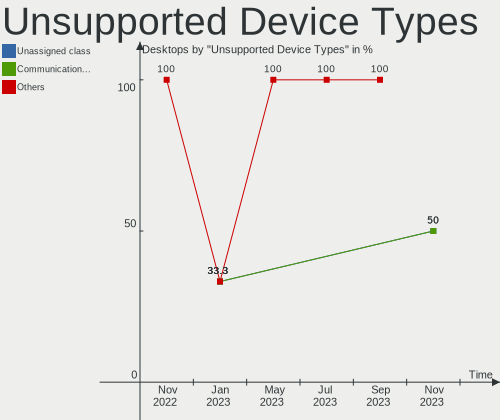

| Type          | Desktops | Percent |
|---------------|----------|---------|
| Graphics card | 2        | 66.67%  |
| Net/wireless  | 1        | 33.33%  |

