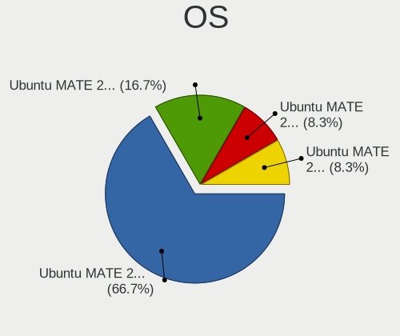
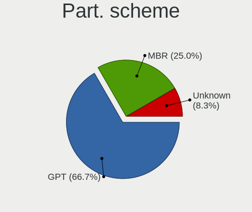
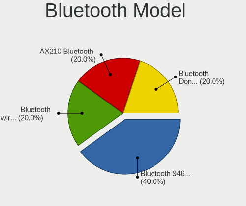
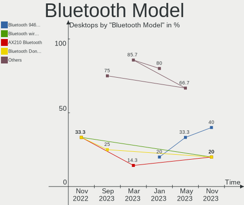
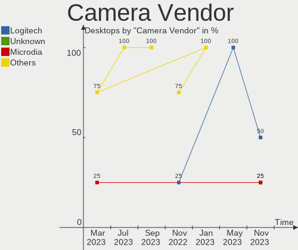

Ubuntu MATE - Hardware Trends (Desktops)
----------------------------------------

A project to identify most popular hardware characteristics and track their change
over time based on data collected by Linux users at https://Linux-Hardware.org.

Anyone can contribute to this report by the [hw-probe](https://github.com/linuxhw/hw-probe) tool:

    sudo -E hw-probe -all -upload

This report is for one last month. Overall report since the beginning of time: [TestCoverage](https://github.com/linuxhw/TestCoverage)

Period: Jun, 2022.

Contents
--------

* [ System ](#system)
  - [ OS                       ](#os)
  - [ OS Family                ](#os-family)
  - [ Kernel                   ](#kernel)
  - [ Kernel Family            ](#kernel-family)
  - [ Kernel Major Ver.        ](#kernel-major-ver)
  - [ Arch                     ](#arch)
  - [ DE                       ](#de)
  - [ Display Server           ](#display-server)
  - [ Display Manager          ](#display-manager)
  - [ OS Lang                  ](#os-lang)
  - [ Boot Mode                ](#boot-mode)
  - [ Filesystem               ](#filesystem)
  - [ Part. scheme             ](#part-scheme)
  - [ Dual Boot with Linux/BSD ](#dual-boot-with-linuxbsd)
  - [ Dual Boot (Win)          ](#dual-boot-win)

* [ Board ](#board)
  - [ Vendor                   ](#vendor)
  - [ Model                    ](#model)
  - [ Model Family             ](#model-family)
  - [ MFG Year                 ](#mfg-year)
  - [ Form Factor              ](#form-factor)
  - [ Secure Boot              ](#secure-boot)
  - [ Coreboot                 ](#coreboot)
  - [ RAM Size                 ](#ram-size)
  - [ RAM Used                 ](#ram-used)
  - [ Total Drives             ](#total-drives)
  - [ Has CD-ROM               ](#has-cd-rom)
  - [ Has Ethernet             ](#has-ethernet)
  - [ Has WiFi                 ](#has-wifi)
  - [ Has Bluetooth            ](#has-bluetooth)

* [ Location ](#location)
  - [ Country                  ](#country)
  - [ City                     ](#city)

* [ Drives ](#drives)
  - [ Drive Vendor             ](#drive-vendor)
  - [ Drive Model              ](#drive-model)
  - [ HDD Vendor               ](#hdd-vendor)
  - [ SSD Vendor               ](#ssd-vendor)
  - [ Drive Kind               ](#drive-kind)
  - [ Drive Connector          ](#drive-connector)
  - [ Drive Size               ](#drive-size)
  - [ Space Total              ](#space-total)
  - [ Space Used               ](#space-used)
  - [ Malfunc. Drives          ](#malfunc-drives)
  - [ Malfunc. Drive Vendor    ](#malfunc-drive-vendor)
  - [ Malfunc. HDD Vendor      ](#malfunc-hdd-vendor)
  - [ Malfunc. Drive Kind      ](#malfunc-drive-kind)
  - [ Failed Drives            ](#failed-drives)
  - [ Failed Drive Vendor      ](#failed-drive-vendor)
  - [ Drive Status             ](#drive-status)

* [ Storage controller ](#storage-controller)
  - [ Storage Vendor           ](#storage-vendor)
  - [ Storage Model            ](#storage-model)
  - [ Storage Kind             ](#storage-kind)

* [ Processor ](#processor)
  - [ CPU Vendor               ](#cpu-vendor)
  - [ CPU Model                ](#cpu-model)
  - [ CPU Model Family         ](#cpu-model-family)
  - [ CPU Cores                ](#cpu-cores)
  - [ CPU Sockets              ](#cpu-sockets)
  - [ CPU Threads              ](#cpu-threads)
  - [ CPU Op-Modes             ](#cpu-op-modes)
  - [ CPU Microcode            ](#cpu-microcode)
  - [ CPU Microarch            ](#cpu-microarch)

* [ Graphics ](#graphics)
  - [ GPU Vendor               ](#gpu-vendor)
  - [ GPU Model                ](#gpu-model)
  - [ GPU Combo                ](#gpu-combo)
  - [ GPU Driver               ](#gpu-driver)
  - [ GPU Memory               ](#gpu-memory)

* [ Monitor ](#monitor)
  - [ Monitor Vendor           ](#monitor-vendor)
  - [ Monitor Model            ](#monitor-model)
  - [ Monitor Resolution       ](#monitor-resolution)
  - [ Monitor Diagonal         ](#monitor-diagonal)
  - [ Monitor Width            ](#monitor-width)
  - [ Aspect Ratio             ](#aspect-ratio)
  - [ Monitor Area             ](#monitor-area)
  - [ Pixel Density            ](#pixel-density)
  - [ Multiple Monitors        ](#multiple-monitors)

* [ Network ](#network)
  - [ Net Controller Vendor    ](#net-controller-vendor)
  - [ Net Controller Model     ](#net-controller-model)
  - [ Wireless Vendor          ](#wireless-vendor)
  - [ Wireless Model           ](#wireless-model)
  - [ Ethernet Vendor          ](#ethernet-vendor)
  - [ Ethernet Model           ](#ethernet-model)
  - [ Net Controller Kind      ](#net-controller-kind)
  - [ Used Controller          ](#used-controller)
  - [ NICs                     ](#nics)
  - [ IPv6                     ](#ipv6)

* [ Bluetooth ](#bluetooth)
  - [ Bluetooth Vendor         ](#bluetooth-vendor)
  - [ Bluetooth Model          ](#bluetooth-model)

* [ Sound ](#sound)
  - [ Sound Vendor             ](#sound-vendor)
  - [ Sound Model              ](#sound-model)

* [ Memory ](#memory)
  - [ Memory Vendor            ](#memory-vendor)
  - [ Memory Model             ](#memory-model)
  - [ Memory Kind              ](#memory-kind)
  - [ Memory Form Factor       ](#memory-form-factor)
  - [ Memory Size              ](#memory-size)
  - [ Memory Speed             ](#memory-speed)

* [ Printers & scanners ](#printers--scanners)
  - [ Printer Vendor           ](#printer-vendor)
  - [ Printer Model            ](#printer-model)
  - [ Scanner Vendor           ](#scanner-vendor)
  - [ Scanner Model            ](#scanner-model)

* [ Camera ](#camera)
  - [ Camera Vendor            ](#camera-vendor)
  - [ Camera Model             ](#camera-model)

* [ Security ](#security)
  - [ Fingerprint Vendor       ](#fingerprint-vendor)
  - [ Fingerprint Model        ](#fingerprint-model)
  - [ Chipcard Vendor          ](#chipcard-vendor)
  - [ Chipcard Model           ](#chipcard-model)

* [ Unsupported ](#unsupported)
  - [ Unsupported Devices      ](#unsupported-devices)
  - [ Unsupported Device Types ](#unsupported-device-types)

System
------

OS
--

Installed operating systems

| Name              | Desktops | Percent |
|-------------------|----------|---------|
| Ubuntu MATE 20.04 | 6        | 50%     |
| Ubuntu MATE 22.04 | 3        | 25%     |
| Ubuntu MATE 18.04 | 2        | 16.67%  |
| Ubuntu MATE 21.10 | 1        | 8.33%   |

OS Family
---------

OS without a version

| Name        | Desktops | Percent |
|-------------|----------|---------|
| Ubuntu MATE | 12       | 100%    |

Kernel
------

Version of the Linux kernel

| Version            | Desktops | Percent |
|--------------------|----------|---------|
| 5.4.0-110-generic  | 2        | 16.67%  |
| 5.15.0-37-generic  | 2        | 16.67%  |
| 5.13.0-44-generic  | 2        | 16.67%  |
| 5.15.0-35-generic  | 1        | 8.33%   |
| 5.13.0-51-generic  | 1        | 8.33%   |
| 5.13.0-48-generic  | 1        | 8.33%   |
| 5.13.0-46-generic  | 1        | 8.33%   |
| 5.0.0-63-generic   | 1        | 8.33%   |
| 4.15.0-180-generic | 1        | 8.33%   |

Kernel Family
-------------

Linux kernel without a distro release

| Version | Desktops | Percent |
|---------|----------|---------|
| 5.13.0  | 5        | 41.67%  |
| 5.15.0  | 3        | 25%     |
| 5.4.0   | 2        | 16.67%  |
| 5.0.0   | 1        | 8.33%   |
| 4.15.0  | 1        | 8.33%   |

Kernel Major Ver.
-----------------

Linux kernel major version

| Version | Desktops | Percent |
|---------|----------|---------|
| 5.13    | 5        | 41.67%  |
| 5.15    | 3        | 25%     |
| 5.4     | 2        | 16.67%  |
| 5.0     | 1        | 8.33%   |
| 4.15    | 1        | 8.33%   |

Arch
----

OS architecture (x86_64, i586, etc.)

| Name   | Desktops | Percent |
|--------|----------|---------|
| x86_64 | 12       | 100%    |

DE
--

Desktop Environment

| Name | Desktops | Percent |
|------|----------|---------|
| MATE | 11       | 91.67%  |
| KDE5 | 1        | 8.33%   |

Display Server
--------------

X11 or Wayland

| Name    | Desktops | Percent |
|---------|----------|---------|
| X11     | 11       | 91.67%  |
| Wayland | 1        | 8.33%   |

Display Manager
---------------

SDDM, LightDM, etc.

| Name    | Desktops | Percent |
|---------|----------|---------|
| LightDM | 10       | 83.33%  |
| GDM     | 2        | 16.67%  |

OS Lang
-------

Language

| Lang  | Desktops | Percent |
|-------|----------|---------|
| en_US | 4        | 33.33%  |
| fr_FR | 3        | 25%     |
| en_AU | 2        | 16.67%  |
| ru_RU | 1        | 8.33%   |
| es_AR | 1        | 8.33%   |
| de_CH | 1        | 8.33%   |

Boot Mode
---------

EFI or BIOS

| Mode | Desktops | Percent |
|------|----------|---------|
| BIOS | 6        | 50%     |
| EFI  | 6        | 50%     |

Filesystem
----------

Type of filesystem

| Type | Desktops | Percent |
|------|----------|---------|
| Ext4 | 12       | 100%    |

Part. scheme
------------

Scheme of partitioning

| Type    | Desktops | Percent |
|---------|----------|---------|
| MBR     | 6        | 50%     |
| GPT     | 5        | 41.67%  |
| Unknown | 1        | 8.33%   |

Dual Boot with Linux/BSD
------------------------

Hosting more than one Linux/BSD

| Dual boot | Desktops | Percent |
|-----------|----------|---------|
| No        | 9        | 75%     |
| Yes       | 3        | 25%     |

Dual Boot (Win)
---------------

Hosting Linux and Windows

| Dual boot | Desktops | Percent |
|-----------|----------|---------|
| Yes       | 6        | 50%     |
| No        | 6        | 50%     |

Board
-----

Vendor
------

Motherboard manufacturer

| Name                | Desktops | Percent |
|---------------------|----------|---------|
| ASUSTek Computer    | 3        | 25%     |
| MSI                 | 2        | 16.67%  |
| Dell                | 2        | 16.67%  |
| Hewlett-Packard     | 1        | 8.33%   |
| Gigabyte Technology | 1        | 8.33%   |
| ASRock              | 1        | 8.33%   |
| Acer                | 1        | 8.33%   |
| Unknown             | 1        | 8.33%   |

Model
-----

Motherboard model

| Name                              | Desktops | Percent |
|-----------------------------------|----------|---------|
| MSI Pro 3000 Small Form Factor PC | 1        | 8.33%   |
| MSI MS-7817                       | 1        | 8.33%   |
| HP Compaq Elite 8300 SFF          | 1        | 8.33%   |
| Gigabyte GA-990FXA-UD5            | 1        | 8.33%   |
| Dell OptiPlex 9020                | 1        | 8.33%   |
| Dell OptiPlex 7080                | 1        | 8.33%   |
| ASUS TUF Gaming B550M-PLUS        | 1        | 8.33%   |
| ASUS PRIME X570-P                 | 1        | 8.33%   |
| ASUS H61M-K                       | 1        | 8.33%   |
| ASRock B450M Pro4                 | 1        | 8.33%   |
| Acer Aspire X3950                 | 1        | 8.33%   |
| Unknown                           | 1        | 8.33%   |

Model Family
------------

Motherboard model prefix

| Name                   | Desktops | Percent |
|------------------------|----------|---------|
| Dell OptiPlex          | 2        | 16.67%  |
| MSI Pro                | 1        | 8.33%   |
| MSI MS-7817            | 1        | 8.33%   |
| HP Compaq              | 1        | 8.33%   |
| Gigabyte GA-990FXA-UD5 | 1        | 8.33%   |
| ASUS TUF               | 1        | 8.33%   |
| ASUS PRIME             | 1        | 8.33%   |
| ASUS H61M-K            | 1        | 8.33%   |
| ASRock B450M           | 1        | 8.33%   |
| Acer Aspire            | 1        | 8.33%   |
| Unknown                | 1        | 8.33%   |

MFG Year
--------

Motherboard manufacture year

| Year | Desktops | Percent |
|------|----------|---------|
| 2020 | 3        | 25%     |
| 2013 | 2        | 16.67%  |
| 2010 | 2        | 16.67%  |
| 2019 | 1        | 8.33%   |
| 2018 | 1        | 8.33%   |
| 2014 | 1        | 8.33%   |
| 2012 | 1        | 8.33%   |
| 2011 | 1        | 8.33%   |

Form Factor
-----------

Physical design of the computer

| Name    | Desktops | Percent |
|---------|----------|---------|
| Desktop | 12       | 100%    |

Secure Boot
-----------

Enabled or disabled

| State    | Desktops | Percent |
|----------|----------|---------|
| Disabled | 11       | 91.67%  |
| Enabled  | 1        | 8.33%   |

Coreboot
--------

Have coreboot on board

| Used | Desktops | Percent |
|------|----------|---------|
| No   | 12       | 100%    |

RAM Size
--------

Total RAM memory

| Size in GB  | Desktops | Percent |
|-------------|----------|---------|
| 8.01-16.0   | 4        | 33.33%  |
| 4.01-8.0    | 2        | 16.67%  |
| 32.01-64.0  | 2        | 16.67%  |
| 16.01-24.0  | 2        | 16.67%  |
| 24.01-32.0  | 1        | 8.33%   |
| 64.01-256.0 | 1        | 8.33%   |

RAM Used
--------

Used RAM memory

| Used GB    | Desktops | Percent |
|------------|----------|---------|
| 4.01-8.0   | 4        | 33.33%  |
| 1.01-2.0   | 3        | 25%     |
| 2.01-3.0   | 2        | 16.67%  |
| 3.01-4.0   | 1        | 8.33%   |
| 16.01-24.0 | 1        | 8.33%   |
| 8.01-16.0  | 1        | 8.33%   |

Total Drives
------------

Number of drives on board

| Drives | Desktops | Percent |
|--------|----------|---------|
| 2      | 5        | 41.67%  |
| 1      | 5        | 41.67%  |
| 3      | 2        | 16.67%  |

Has CD-ROM
----------

Has CD-ROM on board

| Presented | Desktops | Percent |
|-----------|----------|---------|
| Yes       | 8        | 66.67%  |
| No        | 4        | 33.33%  |

Has Ethernet
------------

Has Ethernet on board

| Presented | Desktops | Percent |
|-----------|----------|---------|
| Yes       | 12       | 100%    |

Has WiFi
--------

Has WiFi module

| Presented | Desktops | Percent |
|-----------|----------|---------|
| No        | 8        | 66.67%  |
| Yes       | 4        | 33.33%  |

Has Bluetooth
-------------

Has Bluetooth module

| Presented | Desktops | Percent |
|-----------|----------|---------|
| No        | 11       | 91.67%  |
| Yes       | 1        | 8.33%   |

Location
--------

Country
-------

Geographic location (country)

| Country     | Desktops | Percent |
|-------------|----------|---------|
| France      | 3        | 25%     |
| Russia      | 2        | 16.67%  |
| Germany     | 2        | 16.67%  |
| Australia   | 2        | 16.67%  |
| USA         | 1        | 8.33%   |
| Switzerland | 1        | 8.33%   |
| Argentina   | 1        | 8.33%   |

City
----

Geographic location (city)

| City           | Desktops | Percent |
|----------------|----------|---------|
| Paris          | 2        | 16.67%  |
| Singen         | 1        | 8.33%   |
| Mount Waverley | 1        | 8.33%   |
| Moscow         | 1        | 8.33%   |
| Melbourne      | 1        | 8.33%   |
| Libourne       | 1        | 8.33%   |
| Kuznetsk       | 1        | 8.33%   |
| Hamburg        | 1        | 8.33%   |
| Gams           | 1        | 8.33%   |
| Buenos Aires   | 1        | 8.33%   |
| Albuquerque    | 1        | 8.33%   |

Drives
------

Drive Vendor
------------

Hard drive vendors

| Vendor              | Desktops | Drives | Percent |
|---------------------|----------|--------|---------|
| Seagate             | 5        | 7      | 27.78%  |
| Samsung Electronics | 4        | 4      | 22.22%  |
| WDC                 | 2        | 2      | 11.11%  |
| SK hynix            | 1        | 1      | 5.56%   |
| SanDisk             | 1        | 1      | 5.56%   |
| Kingston            | 1        | 1      | 5.56%   |
| KingSpec            | 1        | 1      | 5.56%   |
| Intel               | 1        | 1      | 5.56%   |
| Crucial             | 1        | 1      | 5.56%   |
| A-DATA Technology   | 1        | 1      | 5.56%   |

Drive Model
-----------

Hard drive models

| Model                                  | Desktops | Percent |
|----------------------------------------|----------|---------|
| Seagate ST1000DM003-1ER162 1TB         | 2        | 10%     |
| WDC WD4003FRYZ-01F0DB0 4TB             | 1        | 5%      |
| WDC WD20EZRZ-22Z5HB0 2TB               | 1        | 5%      |
| SK hynix BC511 NVMe 256GB              | 1        | 5%      |
| Seagate ST3500414CS 500GB              | 1        | 5%      |
| Seagate ST250DM000-1BD141 250GB        | 1        | 5%      |
| Seagate ST2000DM006-2DM164 2TB         | 1        | 5%      |
| Seagate ST2000DM001 4GB                | 1        | 5%      |
| Seagate ST1000DM003-1SB102 1TB         | 1        | 5%      |
| SanDisk SSD PLUS 1000GB                | 1        | 5%      |
| Samsung SSD 980 500GB                  | 1        | 5%      |
| Samsung SSD 870 EVO 500GB              | 1        | 5%      |
| Samsung SSD 860 PRO 512GB              | 1        | 5%      |
| Samsung SM963 2.5" NVMe PCIe SSD 500GB | 1        | 5%      |
| Kingston SA400S37480G 480GB SSD        | 1        | 5%      |
| KingSpec NT-512 512GB SSD              | 1        | 5%      |
| Intel SSDPEKKR128G7 128GB              | 1        | 5%      |
| Crucial CT500MX500SSD4 500GB           | 1        | 5%      |
| A-DATA SX8200PNP 512GB                 | 1        | 5%      |

HDD Vendor
----------

Hard disk drive vendors

| Vendor  | Desktops | Drives | Percent |
|---------|----------|--------|---------|
| Seagate | 5        | 7      | 71.43%  |
| WDC     | 2        | 2      | 28.57%  |

SSD Vendor
----------

Solid state drive vendors

| Vendor              | Desktops | Drives | Percent |
|---------------------|----------|--------|---------|
| Samsung Electronics | 2        | 2      | 33.33%  |
| SanDisk             | 1        | 1      | 16.67%  |
| Kingston            | 1        | 1      | 16.67%  |
| KingSpec            | 1        | 1      | 16.67%  |
| Crucial             | 1        | 1      | 16.67%  |

Drive Kind
----------

HDD or SSD

| Kind | Desktops | Drives | Percent |
|------|----------|--------|---------|
| HDD  | 7        | 9      | 38.89%  |
| SSD  | 6        | 6      | 33.33%  |
| NVMe | 5        | 5      | 27.78%  |

Drive Connector
---------------

SATA, SAS, NVMe, etc.

| Type | Desktops | Drives | Percent |
|------|----------|--------|---------|
| SATA | 10       | 15     | 66.67%  |
| NVMe | 5        | 5      | 33.33%  |

Drive Size
----------

Size of hard drive

| Size in TB | Desktops | Drives | Percent |
|------------|----------|--------|---------|
| 0.51-1.0   | 6        | 6      | 40%     |
| 0.01-0.5   | 6        | 6      | 40%     |
| 1.01-2.0   | 2        | 2      | 13.33%  |
| 3.01-4.0   | 1        | 1      | 6.67%   |

Space Total
-----------

Amount of disk space available on the file system

| Size in GB     | Desktops | Percent |
|----------------|----------|---------|
| 251-500        | 4        | 33.33%  |
| 2001-3000      | 3        | 25%     |
| 501-1000       | 2        | 16.67%  |
| More than 3000 | 1        | 8.33%   |
| 101-250        | 1        | 8.33%   |
| 1001-2000      | 1        | 8.33%   |

Space Used
----------

Amount of used disk space

| Used GB   | Desktops | Percent |
|-----------|----------|---------|
| 101-250   | 4        | 33.33%  |
| 1001-2000 | 3        | 25%     |
| 51-100    | 2        | 16.67%  |
| 251-500   | 1        | 8.33%   |
| 21-50     | 1        | 8.33%   |
| 501-1000  | 1        | 8.33%   |

Malfunc. Drives
---------------

Drive models with a malfunction

Zero info for selected period =(

Malfunc. Drive Vendor
---------------------

Vendors of faulty drives

Zero info for selected period =(

Malfunc. HDD Vendor
-------------------

Vendors of faulty HDD drives

Zero info for selected period =(

Malfunc. Drive Kind
-------------------

Kinds of faulty drives

Zero info for selected period =(

Failed Drives
-------------

Failed drive models

Zero info for selected period =(

Failed Drive Vendor
-------------------

Failed drive vendors

Zero info for selected period =(

Drive Status
------------

Number of failed and malfunc. drives

| Status   | Desktops | Drives | Percent |
|----------|----------|--------|---------|
| Works    | 10       | 17     | 90.91%  |
| Detected | 1        | 3      | 9.09%   |

Storage controller
------------------

Storage Vendor
--------------

Storage controller vendors

| Vendor                   | Desktops | Percent |
|--------------------------|----------|---------|
| Intel                    | 9        | 47.37%  |
| AMD                      | 4        | 21.05%  |
| Samsung Electronics      | 2        | 10.53%  |
| SK hynix                 | 1        | 5.26%   |
| Marvell Technology Group | 1        | 5.26%   |
| ADATA Technology         | 1        | 5.26%   |
| 3ware                    | 1        | 5.26%   |

Storage Model
-------------

Storage controller models

| Model                                                                          | Desktops | Percent |
|--------------------------------------------------------------------------------|----------|---------|
| AMD FCH SATA Controller [AHCI mode]                                            | 2        | 9.09%   |
| SK hynix BC511                                                                 | 1        | 4.55%   |
| Samsung NVMe SSD Controller PM9A1/PM9A3/980PRO                                 | 1        | 4.55%   |
| Samsung NVMe SSD Controller 980                                                | 1        | 4.55%   |
| Marvell Group 88SE9172 SATA III 6Gb/s RAID Controller                          | 1        | 4.55%   |
| Intel SSD 600P Series                                                          | 1        | 4.55%   |
| Intel SATA Controller [RAID mode]                                              | 1        | 4.55%   |
| Intel Comet Lake SATA AHCI Controller                                          | 1        | 4.55%   |
| Intel Cannon Lake PCH SATA AHCI Controller                                     | 1        | 4.55%   |
| Intel 82801JI (ICH10 Family) 4 port SATA IDE Controller #1                     | 1        | 4.55%   |
| Intel 82801JI (ICH10 Family) 2 port SATA IDE Controller #2                     | 1        | 4.55%   |
| Intel 8 Series/C220 Series Chipset Family 6-port SATA Controller 1 [AHCI mode] | 1        | 4.55%   |
| Intel 7 Series/C210 Series Chipset Family 6-port SATA Controller [AHCI mode]   | 1        | 4.55%   |
| Intel 6 Series/C200 Series Chipset Family 6 port Desktop SATA AHCI Controller  | 1        | 4.55%   |
| Intel 5 Series/3400 Series Chipset 6 port SATA AHCI Controller                 | 1        | 4.55%   |
| AMD SB7x0/SB8x0/SB9x0 SATA Controller [AHCI mode]                              | 1        | 4.55%   |
| AMD SB7x0/SB8x0/SB9x0 IDE Controller                                           | 1        | 4.55%   |
| AMD 500 Series Chipset SATA Controller                                         | 1        | 4.55%   |
| AMD 400 Series Chipset SATA Controller                                         | 1        | 4.55%   |
| ADATA XPG SX8200 Pro PCIe Gen3x4 M.2 2280 Solid State Drive                    | 1        | 4.55%   |
| 3ware 9650SE SATA-II RAID PCIe                                                 | 1        | 4.55%   |

Storage Kind
------------

Kind of storage controller (IDE, SATA, NVMe, SAS, ...)

| Kind | Desktops | Percent |
|------|----------|---------|
| SATA | 10       | 52.63%  |
| NVMe | 5        | 26.32%  |
| RAID | 2        | 10.53%  |
| IDE  | 2        | 10.53%  |

Processor
---------

CPU Vendor
----------

Processor vendors

| Vendor | Desktops | Percent |
|--------|----------|---------|
| Intel  | 8        | 66.67%  |
| AMD    | 4        | 33.33%  |

CPU Model
---------

Processor models

| Model                                       | Desktops | Percent |
|---------------------------------------------|----------|---------|
| Intel Core i7-4790 CPU @ 3.60GHz            | 2        | 16.67%  |
| Intel Pentium Dual-Core CPU E5500 @ 2.80GHz | 1        | 8.33%   |
| Intel Pentium CPU G840 @ 2.80GHz            | 1        | 8.33%   |
| Intel Core i7-9750H CPU @ 2.60GHz           | 1        | 8.33%   |
| Intel Core i5-3470 CPU @ 3.20GHz            | 1        | 8.33%   |
| Intel Core i5-10500 CPU @ 3.10GHz           | 1        | 8.33%   |
| Intel Core i5 CPU 650 @ 3.20GHz             | 1        | 8.33%   |
| AMD Ryzen 7 5800X 8-Core Processor          | 1        | 8.33%   |
| AMD Ryzen 5 5600G with Radeon Graphics      | 1        | 8.33%   |
| AMD Ryzen 5 2400G with Radeon Vega Graphics | 1        | 8.33%   |
| AMD Athlon II X4 640 Processor              | 1        | 8.33%   |

CPU Model Family
----------------

Processor model prefix

| Model                   | Desktops | Percent |
|-------------------------|----------|---------|
| Intel Core i7           | 3        | 25%     |
| Intel Core i5           | 3        | 25%     |
| AMD Ryzen 5             | 2        | 16.67%  |
| Intel Pentium Dual-Core | 1        | 8.33%   |
| Intel Pentium           | 1        | 8.33%   |
| AMD Ryzen 7             | 1        | 8.33%   |
| AMD Athlon II X4        | 1        | 8.33%   |

CPU Cores
---------

Number of processor cores

| Number | Desktops | Percent |
|--------|----------|---------|
| 4      | 5        | 41.67%  |
| 6      | 3        | 25%     |
| 2      | 3        | 25%     |
| 8      | 1        | 8.33%   |

CPU Sockets
-----------

Number of sockets

| Number | Desktops | Percent |
|--------|----------|---------|
| 1      | 12       | 100%    |

CPU Threads
-----------

Threads per core (Hyper-Threading)

| Number | Desktops | Percent |
|--------|----------|---------|
| 2      | 8        | 66.67%  |
| 1      | 4        | 33.33%  |

CPU Op-Modes
------------

CPU Operation Modes (32-bit, 64-bit)

| Op mode        | Desktops | Percent |
|----------------|----------|---------|
| 32-bit, 64-bit | 12       | 100%    |

CPU Microcode
-------------

Microcode number

| Number     | Desktops | Percent |
|------------|----------|---------|
| Unknown    | 3        | 25%     |
| 0x306c3    | 2        | 16.67%  |
| 0x906ed    | 1        | 8.33%   |
| 0x306a9    | 1        | 8.33%   |
| 0x206a7    | 1        | 8.33%   |
| 0x20655    | 1        | 8.33%   |
| 0x1067a    | 1        | 8.33%   |
| 0x0a50000c | 1        | 8.33%   |
| 0x010000c8 | 1        | 8.33%   |

CPU Microarch
-------------

Microarchitecture

| Name        | Desktops | Percent |
|-------------|----------|---------|
| Zen 3       | 2        | 16.67%  |
| Haswell     | 2        | 16.67%  |
| Zen         | 1        | 8.33%   |
| Westmere    | 1        | 8.33%   |
| SandyBridge | 1        | 8.33%   |
| Penryn      | 1        | 8.33%   |
| KabyLake    | 1        | 8.33%   |
| K10         | 1        | 8.33%   |
| IvyBridge   | 1        | 8.33%   |
| CometLake   | 1        | 8.33%   |

Graphics
--------

GPU Vendor
----------

Vendors of graphics cards

| Vendor | Desktops | Percent |
|--------|----------|---------|
| AMD    | 6        | 50%     |
| Intel  | 4        | 33.33%  |
| Nvidia | 2        | 16.67%  |

GPU Model
---------

Graphics card models

| Model                                                                       | Desktops | Percent |
|-----------------------------------------------------------------------------|----------|---------|
| Nvidia TU117 [GeForce GTX 1650]                                             | 1        | 8.33%   |
| Nvidia GP107 [GeForce GTX 1050 Ti]                                          | 1        | 8.33%   |
| Intel Xeon E3-1200 v3/4th Gen Core Processor Integrated Graphics Controller | 1        | 8.33%   |
| Intel Xeon E3-1200 v2/3rd Gen Core processor Graphics Controller            | 1        | 8.33%   |
| Intel CometLake-S GT2 [UHD Graphics 630]                                    | 1        | 8.33%   |
| Intel CoffeeLake-H GT2 [UHD Graphics 630]                                   | 1        | 8.33%   |
| AMD RV730 PRO [Radeon HD 4650]                                              | 1        | 8.33%   |
| AMD Redwood PRO [Radeon HD 5550/5570/5630/6510/6610/7570]                   | 1        | 8.33%   |
| AMD Raven Ridge [Radeon Vega Series / Radeon Vega Mobile Series]            | 1        | 8.33%   |
| AMD Oland [Radeon HD 8570 / R5 430 OEM / R7 240/340 / Radeon 520 OEM]       | 1        | 8.33%   |
| AMD Cezanne                                                                 | 1        | 8.33%   |
| AMD Cedar [Radeon HD 5000/6000/7350/8350 Series]                            | 1        | 8.33%   |

GPU Combo
---------

Combinations of graphics cards

| Name       | Desktops | Percent |
|------------|----------|---------|
| 1 x AMD    | 6        | 50%     |
| 1 x Intel  | 4        | 33.33%  |
| 1 x Nvidia | 2        | 16.67%  |

GPU Driver
----------

Free vs proprietary

| Driver      | Desktops | Percent |
|-------------|----------|---------|
| Free        | 10       | 83.33%  |
| Proprietary | 2        | 16.67%  |

GPU Memory
----------

Total video memory

| Size in GB | Desktops | Percent |
|------------|----------|---------|
| 0.51-1.0   | 4        | 33.33%  |
| Unknown    | 4        | 33.33%  |
| 3.01-4.0   | 2        | 16.67%  |
| 1.01-2.0   | 1        | 8.33%   |
| 0.01-0.5   | 1        | 8.33%   |

Monitor
-------

Monitor Vendor
--------------

Monitor vendors

| Vendor               | Desktops | Percent |
|----------------------|----------|---------|
| Samsung Electronics  | 4        | 25%     |
| Dell                 | 3        | 18.75%  |
| Philips              | 2        | 12.5%   |
| BenQ                 | 2        | 12.5%   |
| ViewSonic            | 1        | 6.25%   |
| Packard Bell         | 1        | 6.25%   |
| Hewlett-Packard      | 1        | 6.25%   |
| Goldstar             | 1        | 6.25%   |
| Ancor Communications | 1        | 6.25%   |

Monitor Model
-------------

Monitor models

| Model                                                                 | Desktops | Percent |
|-----------------------------------------------------------------------|----------|---------|
| ViewSonic VX2439wm VSC3D24 1920x1080 521x293mm 23.5-inch              | 1        | 5.88%   |
| Samsung Electronics SyncMaster SAM014C 1280x1024 338x270mm 17.0-inch  | 1        | 5.88%   |
| Samsung Electronics SMB2340 SAM0691 1920x1080 510x290mm 23.1-inch     | 1        | 5.88%   |
| Samsung Electronics S24F350 SAM0D20 1920x1080 521x293mm 23.5-inch     | 1        | 5.88%   |
| Samsung Electronics S24C450 SAM09CF 1920x1200 518x324mm 24.1-inch     | 1        | 5.88%   |
| Philips PHL 272B8Q PHL0918 2560x1440 597x336mm 27.0-inch              | 1        | 5.88%   |
| Philips PHL 240B4Q PHL08E3 1920x1200 518x324mm 24.1-inch              | 1        | 5.88%   |
| Philips 236VL PHLC082 1920x1080 509x286mm 23.0-inch                   | 1        | 5.88%   |
| Packard Bell Viseo203DX PKB03B1 1600x900 432x240mm 19.5-inch          | 1        | 5.88%   |
| Hewlett-Packard w2216 HWP280C 1680x1050 465x291mm 21.6-inch           | 1        | 5.88%   |
| Goldstar ULTRAWIDE GSM76E4 3440x1440 800x335mm 34.1-inch              | 1        | 5.88%   |
| Dell S2421HS DEL41F3 1920x1080 527x296mm 23.8-inch                    | 1        | 5.88%   |
| Dell P2714H DELD05F 1920x1080 598x336mm 27.0-inch                     | 1        | 5.88%   |
| Dell P2419H DELD0D9 1920x1080 527x296mm 23.8-inch                     | 1        | 5.88%   |
| BenQ T2200HD BNQ7726 1920x1080 477x268mm 21.5-inch                    | 1        | 5.88%   |
| BenQ LCD BNQ801B 2560x1440 527x296mm 23.8-inch                        | 1        | 5.88%   |
| Ancor Communications ASUS VC239 ACI23C4 1920x1080 509x286mm 23.0-inch | 1        | 5.88%   |

Monitor Resolution
------------------

Monitor screen resolution

| Resolution         | Desktops | Percent |
|--------------------|----------|---------|
| 1920x1080 (FHD)    | 7        | 46.67%  |
| 2560x1440 (QHD)    | 2        | 13.33%  |
| 1920x1200 (WUXGA)  | 2        | 13.33%  |
| 3440x1440          | 1        | 6.67%   |
| 1680x1050 (WSXGA+) | 1        | 6.67%   |
| 1600x900 (HD+)     | 1        | 6.67%   |
| 1280x1024 (SXGA)   | 1        | 6.67%   |

Monitor Diagonal
----------------

Diagonal size in inches

| Inches | Desktops | Percent |
|--------|----------|---------|
| 24     | 4        | 26.67%  |
| 23     | 4        | 26.67%  |
| 27     | 2        | 13.33%  |
| 21     | 2        | 13.33%  |
| 34     | 1        | 6.67%   |
| 19     | 1        | 6.67%   |
| 17     | 1        | 6.67%   |

Monitor Width
-------------

Physical width

| Width in mm | Desktops | Percent |
|-------------|----------|---------|
| 501-600     | 8        | 61.54%  |
| 401-500     | 3        | 23.08%  |
| 701-800     | 1        | 7.69%   |
| 301-350     | 1        | 7.69%   |

Aspect Ratio
------------

Proportional relationship between the width and the height

| Ratio | Desktops | Percent |
|-------|----------|---------|
| 16/9  | 10       | 66.67%  |
| 16/10 | 3        | 20%     |
| 5/4   | 1        | 6.67%   |
| 21/9  | 1        | 6.67%   |

Monitor Area
------------

Area in inch²

| Area in inch² | Desktops | Percent |
|----------------|----------|---------|
| 201-250        | 8        | 53.33%  |
| 301-350        | 2        | 13.33%  |
| 251-300        | 2        | 13.33%  |
| 351-500        | 1        | 6.67%   |
| 151-200        | 1        | 6.67%   |
| 141-150        | 1        | 6.67%   |

Pixel Density
-------------

Pixels per inch

| Density | Desktops | Percent |
|---------|----------|---------|
| 51-100  | 9        | 69.23%  |
| 101-120 | 3        | 23.08%  |
| 121-160 | 1        | 7.69%   |

Multiple Monitors
-----------------

Total monitors connected

| Total | Desktops | Percent |
|-------|----------|---------|
| 1     | 8        | 66.67%  |
| 2     | 3        | 25%     |
| 3     | 1        | 8.33%   |

Network
-------

Net Controller Vendor
---------------------

Controller vendors

| Vendor                | Desktops | Percent |
|-----------------------|----------|---------|
| Realtek Semiconductor | 9        | 60%     |
| Intel                 | 4        | 26.67%  |
| TP-Link               | 1        | 6.67%   |
| Ralink Technology     | 1        | 6.67%   |

Net Controller Model
--------------------

Controller models

| Model                                                             | Desktops | Percent |
|-------------------------------------------------------------------|----------|---------|
| Realtek RTL8111/8168/8411 PCI Express Gigabit Ethernet Controller | 8        | 50%     |
| TP-Link TL-WN722N v2/v3 [Realtek RTL8188EUS]                      | 1        | 6.25%   |
| Realtek RTL8188CE 802.11b/g/n WiFi Adapter                        | 1        | 6.25%   |
| Realtek RTL8125 2.5GbE Controller                                 | 1        | 6.25%   |
| Ralink MT7601U Wireless Adapter                                   | 1        | 6.25%   |
| Intel Wireless 3160                                               | 1        | 6.25%   |
| Intel Ethernet Connection I217-LM                                 | 1        | 6.25%   |
| Intel Ethernet Connection (11) I219-LM                            | 1        | 6.25%   |
| Intel 82579LM Gigabit Network Connection (Lewisville)             | 1        | 6.25%   |

Wireless Vendor
---------------

Wireless vendors

| Vendor                | Desktops | Percent |
|-----------------------|----------|---------|
| TP-Link               | 1        | 25%     |
| Realtek Semiconductor | 1        | 25%     |
| Ralink Technology     | 1        | 25%     |
| Intel                 | 1        | 25%     |

Wireless Model
--------------

Wireless models

| Model                                        | Desktops | Percent |
|----------------------------------------------|----------|---------|
| TP-Link TL-WN722N v2/v3 [Realtek RTL8188EUS] | 1        | 25%     |
| Realtek RTL8188CE 802.11b/g/n WiFi Adapter   | 1        | 25%     |
| Ralink MT7601U Wireless Adapter              | 1        | 25%     |
| Intel Wireless 3160                          | 1        | 25%     |

Ethernet Vendor
---------------

Ethernet vendors

| Vendor                | Desktops | Percent |
|-----------------------|----------|---------|
| Realtek Semiconductor | 9        | 75%     |
| Intel                 | 3        | 25%     |

Ethernet Model
--------------

Ethernet models

| Model                                                             | Desktops | Percent |
|-------------------------------------------------------------------|----------|---------|
| Realtek RTL8111/8168/8411 PCI Express Gigabit Ethernet Controller | 8        | 66.67%  |
| Realtek RTL8125 2.5GbE Controller                                 | 1        | 8.33%   |
| Intel Ethernet Connection I217-LM                                 | 1        | 8.33%   |
| Intel Ethernet Connection (11) I219-LM                            | 1        | 8.33%   |
| Intel 82579LM Gigabit Network Connection (Lewisville)             | 1        | 8.33%   |

Net Controller Kind
-------------------

Ethernet, WiFi or modem

| Kind     | Desktops | Percent |
|----------|----------|---------|
| Ethernet | 12       | 75%     |
| WiFi     | 4        | 25%     |

Used Controller
---------------

Currently used network controller

| Kind     | Desktops | Percent |
|----------|----------|---------|
| Ethernet | 10       | 83.33%  |
| WiFi     | 2        | 16.67%  |

NICs
----

Total network controllers on board

| Total | Desktops | Percent |
|-------|----------|---------|
| 1     | 10       | 83.33%  |
| 2     | 2        | 16.67%  |

IPv6
----

IPv6 vs IPv4

| Used | Desktops | Percent |
|------|----------|---------|
| No   | 10       | 83.33%  |
| Yes  | 2        | 16.67%  |

Bluetooth
---------

Bluetooth Vendor
----------------

Controller vendors

| Vendor | Desktops | Percent |
|--------|----------|---------|
| Intel  | 1        | 100%    |

Bluetooth Model
---------------

Controller models

| Model                              | Desktops | Percent |
|------------------------------------|----------|---------|
| Intel Bluetooth wireless interface | 1        | 100%    |

Sound
-----

Sound Vendor
------------

Sound card vendors

| Vendor                | Desktops | Percent |
|-----------------------|----------|---------|
| Intel                 | 8        | 40%     |
| AMD                   | 7        | 35%     |
| Nvidia                | 2        | 10%     |
| Realtek Semiconductor | 1        | 5%      |
| Logitech              | 1        | 5%      |
| C-Media Electronics   | 1        | 5%      |

Sound Model
-----------

Sound card models

| Model                                                                      | Desktops | Percent |
|----------------------------------------------------------------------------|----------|---------|
| Intel 8 Series/C220 Series Chipset High Definition Audio Controller        | 2        | 8.33%   |
| AMD Family 17h/19h HD Audio Controller                                     | 2        | 8.33%   |
| Realtek Semiconductor UACDemoV1.0                                          | 1        | 4.17%   |
| Nvidia TU107 GeForce GTX 1650 High Definition Audio Controller             | 1        | 4.17%   |
| Nvidia GP107GL High Definition Audio Controller                            | 1        | 4.17%   |
| Logitech Headset H390                                                      | 1        | 4.17%   |
| Intel Xeon E3-1200 v3/4th Gen Core Processor HD Audio Controller           | 1        | 4.17%   |
| Intel Comet Lake PCH cAVS                                                  | 1        | 4.17%   |
| Intel Cannon Lake PCH cAVS                                                 | 1        | 4.17%   |
| Intel 82801JI (ICH10 Family) HD Audio Controller                           | 1        | 4.17%   |
| Intel 7 Series/C216 Chipset Family High Definition Audio Controller        | 1        | 4.17%   |
| Intel 6 Series/C200 Series Chipset Family High Definition Audio Controller | 1        | 4.17%   |
| Intel 5 Series/3400 Series Chipset High Definition Audio                   | 1        | 4.17%   |
| C-Media Electronics CM106 Like Sound Device                                | 1        | 4.17%   |
| AMD Starship/Matisse HD Audio Controller                                   | 1        | 4.17%   |
| AMD SBx00 Azalia (Intel HDA)                                               | 1        | 4.17%   |
| AMD RV710/730 HDMI Audio [Radeon HD 4000 series]                           | 1        | 4.17%   |
| AMD Renoir Radeon High Definition Audio Controller                         | 1        | 4.17%   |
| AMD Redwood HDMI Audio [Radeon HD 5000 Series]                             | 1        | 4.17%   |
| AMD Raven/Raven2/Fenghuang HDMI/DP Audio Controller                        | 1        | 4.17%   |
| AMD Oland/Hainan/Cape Verde/Pitcairn HDMI Audio [Radeon HD 7000 Series]    | 1        | 4.17%   |
| AMD Cedar HDMI Audio [Radeon HD 5400/6300/7300 Series]                     | 1        | 4.17%   |

Memory
------

Memory Vendor
-------------

Memory module vendors

| Vendor              | Desktops | Percent |
|---------------------|----------|---------|
| Kingston            | 3        | 21.43%  |
| Unknown             | 2        | 14.29%  |
| SK hynix            | 2        | 14.29%  |
| G.Skill             | 2        | 14.29%  |
| Unifosa             | 1        | 7.14%   |
| Samsung Electronics | 1        | 7.14%   |
| Micron Technology   | 1        | 7.14%   |
| Elpida              | 1        | 7.14%   |
| Corsair             | 1        | 7.14%   |

Memory Model
------------

Memory module models

| Model                                                     | Desktops | Percent |
|-----------------------------------------------------------|----------|---------|
| Unknown RAM Module 8192MB DIMM 1333MT/s                   | 1        | 6.25%   |
| Unknown RAM Module 2048MB DIMM 1333MT/s                   | 1        | 6.25%   |
| Unknown RAM DDR4 NB 16G 2666 16384MB SODIMM DDR4 2667MT/s | 1        | 6.25%   |
| Unifosa RAM GU512303EP0202 2GB DIMM DDR3 1333MT/s         | 1        | 6.25%   |
| SK hynix RAM HMT41GU6BFR8A-PB 8192MB DIMM DDR3 2000MT/s   | 1        | 6.25%   |
| SK hynix RAM HMA81GU6DJR8N-XN 8GB DIMM DDR4 3200MT/s      | 1        | 6.25%   |
| Samsung RAM M378B5673FH0-CH9 2GB DIMM DDR3 1600MT/s       | 1        | 6.25%   |
| Micron RAM 8JTF51264AZ-1G6E1 4GB DIMM DDR3 1600MT/s       | 1        | 6.25%   |
| Kingston RAM KHX1600C9D3/4GX 4GB DIMM DDR3 2400MT/s       | 1        | 6.25%   |
| Kingston RAM 99U5471-054.A00LF 8GB DIMM DDR3 1600MT/s     | 1        | 6.25%   |
| Kingston RAM 9905471-017.A00LF 4096MB DIMM DDR3 1333MT/s  | 1        | 6.25%   |
| Kingston RAM 9905471-001.A01LF 2GB DIMM 1600MT/s          | 1        | 6.25%   |
| G.Skill RAM F4-3200C16-16GIS 16GB DIMM DDR4 3600MT/s      | 1        | 6.25%   |
| G.Skill RAM F4-2400C15-8GFX 8192MB DIMM DDR4 3000MT/s     | 1        | 6.25%   |
| Elpida RAM EBJ21UE8BDF0-DJ-F 2048MB DIMM DDR3 1333MT/s    | 1        | 6.25%   |
| Corsair RAM CMK16GX4M2A2666C16 8GB DIMM DDR4 3200MT/s     | 1        | 6.25%   |

Memory Kind
-----------

Memory module kinds

| Kind    | Desktops | Percent |
|---------|----------|---------|
| DDR3    | 6        | 50%     |
| DDR4    | 4        | 33.33%  |
| SDRAM   | 1        | 8.33%   |
| Unknown | 1        | 8.33%   |

Memory Form Factor
------------------

Physical design of the memory module

| Name   | Desktops | Percent |
|--------|----------|---------|
| DIMM   | 10       | 90.91%  |
| SODIMM | 1        | 9.09%   |

Memory Size
-----------

Memory module size

| Size  | Desktops | Percent |
|-------|----------|---------|
| 8192  | 5        | 38.46%  |
| 4096  | 3        | 23.08%  |
| 2048  | 3        | 23.08%  |
| 16384 | 2        | 15.38%  |

Memory Speed
------------

Memory module speed

| Speed | Desktops | Percent |
|-------|----------|---------|
| 1333  | 4        | 28.57%  |
| 1600  | 3        | 21.43%  |
| 3200  | 2        | 14.29%  |
| 3600  | 1        | 7.14%   |
| 3000  | 1        | 7.14%   |
| 2667  | 1        | 7.14%   |
| 2400  | 1        | 7.14%   |
| 2000  | 1        | 7.14%   |

Printers & scanners
-------------------

Printer Vendor
--------------

Printer device vendors

| Vendor             | Desktops | Percent |
|--------------------|----------|---------|
| Brother Industries | 1        | 100%    |

Printer Model
-------------

Printer device models

| Model                      | Desktops | Percent |
|----------------------------|----------|---------|
| Brother MFC-L2710DN series | 1        | 100%    |

Scanner Vendor
--------------

Scanner device vendors

Zero info for selected period =(

Scanner Model
-------------

Scanner device models

Zero info for selected period =(

Camera
------

Camera Vendor
-------------

Camera device vendors

| Vendor    | Desktops | Percent |
|-----------|----------|---------|
| Microdia  | 3        | 60%     |
| Microsoft | 1        | 20%     |
| Logitech  | 1        | 20%     |

Camera Model
------------

Camera device models

| Model                           | Desktops | Percent |
|---------------------------------|----------|---------|
| Microdia USB 2.0 Camera         | 2        | 40%     |
| Microsoft LifeCam VX-500 [1357] | 1        | 20%     |
| Microdia Webcam Vitade AF       | 1        | 20%     |
| Logitech Webcam C925e           | 1        | 20%     |

Security
--------

Fingerprint Vendor
------------------

Fingerprint sensor vendors

Zero info for selected period =(

Fingerprint Model
-----------------

Fingerprint sensor models

Zero info for selected period =(

Chipcard Vendor
---------------

Chipcard module vendors

Zero info for selected period =(

Chipcard Model
--------------

Chipcard module models

Zero info for selected period =(

Unsupported
-----------

Unsupported Devices
-------------------

Total unsupported devices on board

| Total | Desktops | Percent |
|-------|----------|---------|
| 0     | 12       | 100%    |

Unsupported Device Types
------------------------

Types of unsupported devices

Zero info for selected period =(

