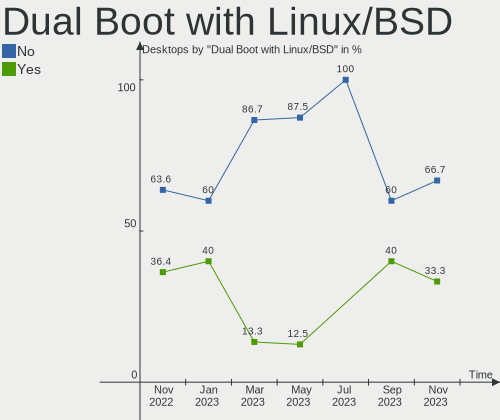
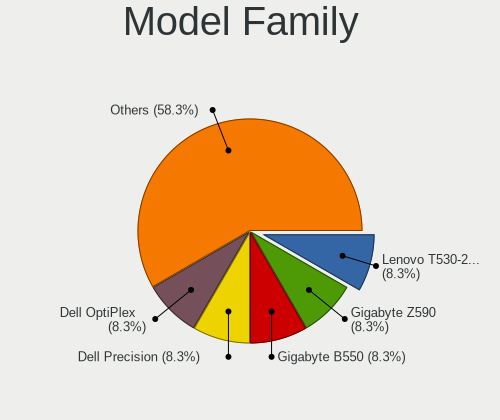
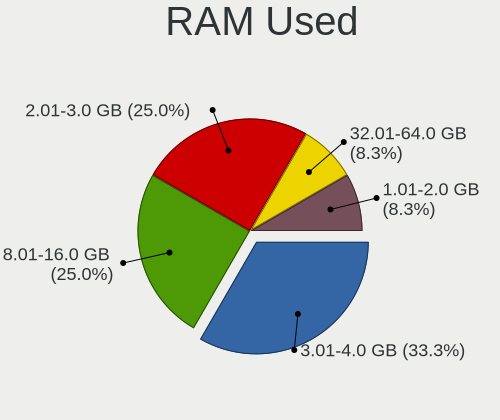
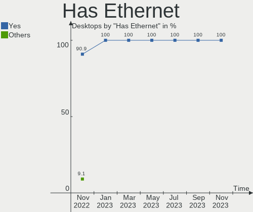
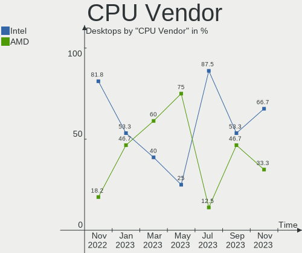
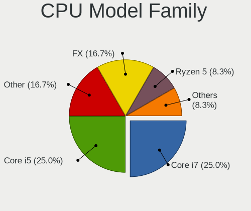
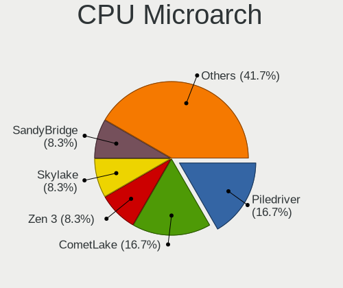
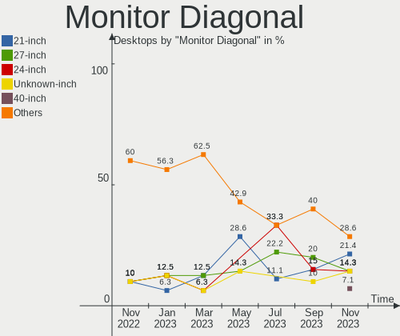
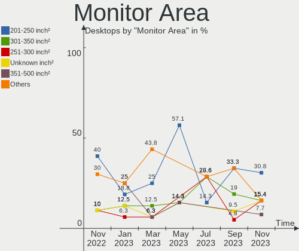
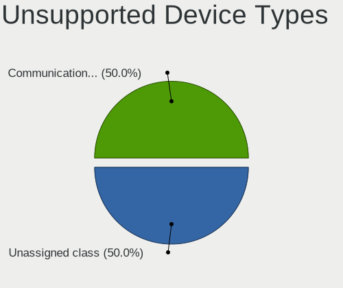

Ubuntu MATE - Hardware Trends (Desktops)
----------------------------------------

A project to identify most popular hardware characteristics and track their change
over time based on data collected by Linux users at https://Linux-Hardware.org.

Anyone can contribute to this report by the [hw-probe](https://github.com/linuxhw/hw-probe) tool:

    sudo -E hw-probe -all -upload

This report is for one last month. Overall report since the beginning of time: [TestDays](https://github.com/linuxhw/TestDays)

Period: Feb, 2023.

Contents
--------

* [ System ](#system)
  - [ OS                       ](#os)
  - [ OS Family                ](#os-family)
  - [ Kernel                   ](#kernel)
  - [ Kernel Family            ](#kernel-family)
  - [ Kernel Major Ver.        ](#kernel-major-ver)
  - [ Arch                     ](#arch)
  - [ DE                       ](#de)
  - [ Display Server           ](#display-server)
  - [ Display Manager          ](#display-manager)
  - [ OS Lang                  ](#os-lang)
  - [ Boot Mode                ](#boot-mode)
  - [ Filesystem               ](#filesystem)
  - [ Part. scheme             ](#part-scheme)
  - [ Dual Boot with Linux/BSD ](#dual-boot-with-linuxbsd)
  - [ Dual Boot (Win)          ](#dual-boot-win)

* [ Board ](#board)
  - [ Vendor                   ](#vendor)
  - [ Model                    ](#model)
  - [ Model Family             ](#model-family)
  - [ MFG Year                 ](#mfg-year)
  - [ Form Factor              ](#form-factor)
  - [ Secure Boot              ](#secure-boot)
  - [ Coreboot                 ](#coreboot)
  - [ RAM Size                 ](#ram-size)
  - [ RAM Used                 ](#ram-used)
  - [ Total Drives             ](#total-drives)
  - [ Has CD-ROM               ](#has-cd-rom)
  - [ Has Ethernet             ](#has-ethernet)
  - [ Has WiFi                 ](#has-wifi)
  - [ Has Bluetooth            ](#has-bluetooth)

* [ Location ](#location)
  - [ Country                  ](#country)
  - [ City                     ](#city)

* [ Drives ](#drives)
  - [ Drive Vendor             ](#drive-vendor)
  - [ Drive Model              ](#drive-model)
  - [ HDD Vendor               ](#hdd-vendor)
  - [ SSD Vendor               ](#ssd-vendor)
  - [ Drive Kind               ](#drive-kind)
  - [ Drive Connector          ](#drive-connector)
  - [ Drive Size               ](#drive-size)
  - [ Space Total              ](#space-total)
  - [ Space Used               ](#space-used)
  - [ Malfunc. Drives          ](#malfunc-drives)
  - [ Malfunc. Drive Vendor    ](#malfunc-drive-vendor)
  - [ Malfunc. HDD Vendor      ](#malfunc-hdd-vendor)
  - [ Malfunc. Drive Kind      ](#malfunc-drive-kind)
  - [ Failed Drives            ](#failed-drives)
  - [ Failed Drive Vendor      ](#failed-drive-vendor)
  - [ Drive Status             ](#drive-status)

* [ Storage controller ](#storage-controller)
  - [ Storage Vendor           ](#storage-vendor)
  - [ Storage Model            ](#storage-model)
  - [ Storage Kind             ](#storage-kind)

* [ Processor ](#processor)
  - [ CPU Vendor               ](#cpu-vendor)
  - [ CPU Model                ](#cpu-model)
  - [ CPU Model Family         ](#cpu-model-family)
  - [ CPU Cores                ](#cpu-cores)
  - [ CPU Sockets              ](#cpu-sockets)
  - [ CPU Threads              ](#cpu-threads)
  - [ CPU Op-Modes             ](#cpu-op-modes)
  - [ CPU Microcode            ](#cpu-microcode)
  - [ CPU Microarch            ](#cpu-microarch)

* [ Graphics ](#graphics)
  - [ GPU Vendor               ](#gpu-vendor)
  - [ GPU Model                ](#gpu-model)
  - [ GPU Combo                ](#gpu-combo)
  - [ GPU Driver               ](#gpu-driver)
  - [ GPU Memory               ](#gpu-memory)

* [ Monitor ](#monitor)
  - [ Monitor Vendor           ](#monitor-vendor)
  - [ Monitor Model            ](#monitor-model)
  - [ Monitor Resolution       ](#monitor-resolution)
  - [ Monitor Diagonal         ](#monitor-diagonal)
  - [ Monitor Width            ](#monitor-width)
  - [ Aspect Ratio             ](#aspect-ratio)
  - [ Monitor Area             ](#monitor-area)
  - [ Pixel Density            ](#pixel-density)
  - [ Multiple Monitors        ](#multiple-monitors)

* [ Network ](#network)
  - [ Net Controller Vendor    ](#net-controller-vendor)
  - [ Net Controller Model     ](#net-controller-model)
  - [ Wireless Vendor          ](#wireless-vendor)
  - [ Wireless Model           ](#wireless-model)
  - [ Ethernet Vendor          ](#ethernet-vendor)
  - [ Ethernet Model           ](#ethernet-model)
  - [ Net Controller Kind      ](#net-controller-kind)
  - [ Used Controller          ](#used-controller)
  - [ NICs                     ](#nics)
  - [ IPv6                     ](#ipv6)

* [ Bluetooth ](#bluetooth)
  - [ Bluetooth Vendor         ](#bluetooth-vendor)
  - [ Bluetooth Model          ](#bluetooth-model)

* [ Sound ](#sound)
  - [ Sound Vendor             ](#sound-vendor)
  - [ Sound Model              ](#sound-model)

* [ Memory ](#memory)
  - [ Memory Vendor            ](#memory-vendor)
  - [ Memory Model             ](#memory-model)
  - [ Memory Kind              ](#memory-kind)
  - [ Memory Form Factor       ](#memory-form-factor)
  - [ Memory Size              ](#memory-size)
  - [ Memory Speed             ](#memory-speed)

* [ Printers & scanners ](#printers--scanners)
  - [ Printer Vendor           ](#printer-vendor)
  - [ Printer Model            ](#printer-model)
  - [ Scanner Vendor           ](#scanner-vendor)
  - [ Scanner Model            ](#scanner-model)

* [ Camera ](#camera)
  - [ Camera Vendor            ](#camera-vendor)
  - [ Camera Model             ](#camera-model)

* [ Security ](#security)
  - [ Fingerprint Vendor       ](#fingerprint-vendor)
  - [ Fingerprint Model        ](#fingerprint-model)
  - [ Chipcard Vendor          ](#chipcard-vendor)
  - [ Chipcard Model           ](#chipcard-model)

* [ Unsupported ](#unsupported)
  - [ Unsupported Devices      ](#unsupported-devices)
  - [ Unsupported Device Types ](#unsupported-device-types)

System
------

OS
--

Installed operating systems

| Name              | Desktops | Percent |
|-------------------|----------|---------|
| Ubuntu MATE 22.04 | 5        | 45.45%  |
| Ubuntu MATE 20.04 | 3        | 27.27%  |
| Ubuntu MATE 18.04 | 2        | 18.18%  |
| Ubuntu MATE 22.10 | 1        | 9.09%   |

OS Family
---------

OS without a version

| Name        | Desktops | Percent |
|-------------|----------|---------|
| Ubuntu MATE | 11       | 100%    |

Kernel
------

Version of the Linux kernel

| Version               | Desktops | Percent |
|-----------------------|----------|---------|
| 5.15.0-60-generic     | 4        | 36.36%  |
| 5.4.0-137-generic     | 3        | 27.27%  |
| 6.1.12-060112-generic | 1        | 9.09%   |
| 5.19.0-35-generic     | 1        | 9.09%   |
| 5.15.0-58-generic     | 1        | 9.09%   |
| 5.15.0-56-generic     | 1        | 9.09%   |

Kernel Family
-------------

Linux kernel without a distro release

| Version | Desktops | Percent |
|---------|----------|---------|
| 5.15.0  | 6        | 54.55%  |
| 5.4.0   | 3        | 27.27%  |
| 6.1.12  | 1        | 9.09%   |
| 5.19.0  | 1        | 9.09%   |

Kernel Major Ver.
-----------------

Linux kernel major version

| Version | Desktops | Percent |
|---------|----------|---------|
| 5.15    | 6        | 54.55%  |
| 5.4     | 3        | 27.27%  |
| 6.1     | 1        | 9.09%   |
| 5.19    | 1        | 9.09%   |

Arch
----

OS architecture (x86_64, i586, etc.)

| Name   | Desktops | Percent |
|--------|----------|---------|
| x86_64 | 10       | 90.91%  |
| i686   | 1        | 9.09%   |

DE
--

Desktop Environment

| Name | Desktops | Percent |
|------|----------|---------|
| MATE | 11       | 100%    |

Display Server
--------------

X11 or Wayland

| Name    | Desktops | Percent |
|---------|----------|---------|
| X11     | 10       | 90.91%  |
| Wayland | 1        | 9.09%   |

Display Manager
---------------

SDDM, LightDM, etc.

| Name    | Desktops | Percent |
|---------|----------|---------|
| LightDM | 10       | 90.91%  |
| GDM3    | 1        | 9.09%   |

OS Lang
-------

Language

| Lang  | Desktops | Percent |
|-------|----------|---------|
| en_US | 3        | 27.27%  |
| de_DE | 3        | 27.27%  |
| fr_FR | 2        | 18.18%  |
| ru_RU | 1        | 9.09%   |
| it_IT | 1        | 9.09%   |
| C     | 1        | 9.09%   |

Boot Mode
---------

EFI or BIOS

| Mode | Desktops | Percent |
|------|----------|---------|
| BIOS | 7        | 63.64%  |
| EFI  | 4        | 36.36%  |

Filesystem
----------

Type of filesystem

| Type  | Desktops | Percent |
|-------|----------|---------|
| Ext4  | 10       | 90.91%  |
| Btrfs | 1        | 9.09%   |

Part. scheme
------------

Scheme of partitioning

| Type    | Desktops | Percent |
|---------|----------|---------|
| GPT     | 7        | 63.64%  |
| MBR     | 3        | 27.27%  |
| Unknown | 1        | 9.09%   |

Dual Boot with Linux/BSD
------------------------

Hosting more than one Linux/BSD

| Dual boot | Desktops | Percent |
|-----------|----------|---------|
| No        | 8        | 72.73%  |
| Yes       | 3        | 27.27%  |

Dual Boot (Win)
---------------

Hosting Linux and Windows

| Dual boot | Desktops | Percent |
|-----------|----------|---------|
| No        | 6        | 54.55%  |
| Yes       | 5        | 45.45%  |

Board
-----

Vendor
------

Motherboard manufacturer

| Name                | Desktops | Percent |
|---------------------|----------|---------|
| ASUSTek Computer    | 5        | 45.45%  |
| Gigabyte Technology | 2        | 18.18%  |
| MSI                 | 1        | 9.09%   |
| Lenovo              | 1        | 9.09%   |
| ASRock              | 1        | 9.09%   |
| Unknown             | 1        | 9.09%   |

Model
-----

Motherboard model

| Name                                  | Desktops | Percent |
|---------------------------------------|----------|---------|
| MSI MS-7C52                           | 1        | 9.09%   |
| Lenovo IdeaCentre 5 14IAB7 90T2000SUS | 1        | 9.09%   |
| Gigabyte GA-MA770T-UD3                | 1        | 9.09%   |
| Gigabyte B85M-D3H                     | 1        | 9.09%   |
| ASUS Pro WS X570-ACE                  | 1        | 9.09%   |
| ASUS PRIME B360M-C                    | 1        | 9.09%   |
| ASUS P5QL-E                           | 1        | 9.09%   |
| ASUS P5K                              | 1        | 9.09%   |
| ASUS A0000001                         | 1        | 9.09%   |
| ASRock Z690 Pro RS                    | 1        | 9.09%   |
| Unknown                               | 1        | 9.09%   |

Model Family
------------

Motherboard model prefix

| Name                   | Desktops | Percent |
|------------------------|----------|---------|
| MSI MS-7C52            | 1        | 9.09%   |
| Lenovo IdeaCentre      | 1        | 9.09%   |
| Gigabyte GA-MA770T-UD3 | 1        | 9.09%   |
| Gigabyte B85M-D3H      | 1        | 9.09%   |
| ASUS Pro               | 1        | 9.09%   |
| ASUS PRIME             | 1        | 9.09%   |
| ASUS P5QL-E            | 1        | 9.09%   |
| ASUS P5K               | 1        | 9.09%   |
| ASUS A0000001          | 1        | 9.09%   |
| ASRock Z690            | 1        | 9.09%   |
| Unknown                | 1        | 9.09%   |

MFG Year
--------

Motherboard manufacture year

| Year | Desktops | Percent |
|------|----------|---------|
| 2018 | 2        | 18.18%  |
| 2009 | 2        | 18.18%  |
| 2023 | 1        | 9.09%   |
| 2022 | 1        | 9.09%   |
| 2020 | 1        | 9.09%   |
| 2019 | 1        | 9.09%   |
| 2013 | 1        | 9.09%   |
| 2008 | 1        | 9.09%   |
| 2007 | 1        | 9.09%   |

Form Factor
-----------

Physical design of the computer

| Name    | Desktops | Percent |
|---------|----------|---------|
| Desktop | 11       | 100%    |

Secure Boot
-----------

Enabled or disabled

| State    | Desktops | Percent |
|----------|----------|---------|
| Disabled | 10       | 90.91%  |
| Enabled  | 1        | 9.09%   |

Coreboot
--------

Have coreboot on board

| Used | Desktops | Percent |
|------|----------|---------|
| No   | 11       | 100%    |

RAM Size
--------

Total RAM memory

| Size in GB  | Desktops | Percent |
|-------------|----------|---------|
| 3.01-4.0    | 3        | 27.27%  |
| 8.01-16.0   | 3        | 27.27%  |
| 32.01-64.0  | 2        | 18.18%  |
| 16.01-24.0  | 2        | 18.18%  |
| 64.01-256.0 | 1        | 9.09%   |

RAM Used
--------

Used RAM memory

| Used GB  | Desktops | Percent |
|----------|----------|---------|
| 1.01-2.0 | 4        | 36.36%  |
| 4.01-8.0 | 3        | 27.27%  |
| 2.01-3.0 | 3        | 27.27%  |
| 0.51-1.0 | 1        | 9.09%   |

Total Drives
------------

Number of drives on board

| Drives | Desktops | Percent |
|--------|----------|---------|
| 3      | 4        | 36.36%  |
| 2      | 3        | 27.27%  |
| 1      | 3        | 27.27%  |
| 4      | 1        | 9.09%   |

Has CD-ROM
----------

Has CD-ROM on board

| Presented | Desktops | Percent |
|-----------|----------|---------|
| Yes       | 7        | 63.64%  |
| No        | 4        | 36.36%  |

Has Ethernet
------------

Has Ethernet on board

| Presented | Desktops | Percent |
|-----------|----------|---------|
| Yes       | 11       | 100%    |

Has WiFi
--------

Has WiFi module

| Presented | Desktops | Percent |
|-----------|----------|---------|
| No        | 6        | 54.55%  |
| Yes       | 5        | 45.45%  |

Has Bluetooth
-------------

Has Bluetooth module

| Presented | Desktops | Percent |
|-----------|----------|---------|
| No        | 9        | 81.82%  |
| Yes       | 2        | 18.18%  |

Location
--------

Country
-------

Geographic location (country)

| Country   | Desktops | Percent |
|-----------|----------|---------|
| Germany   | 4        | 36.36%  |
| Russia    | 2        | 18.18%  |
| France    | 2        | 18.18%  |
| USA       | 1        | 9.09%   |
| Italy     | 1        | 9.09%   |
| Indonesia | 1        | 9.09%   |

City
----

Geographic location (city)

| City             | Desktops | Percent |
|------------------|----------|---------|
| Rome             | 1        | 9.09%   |
| Pocking          | 1        | 9.09%   |
| Paris            | 1        | 9.09%   |
| Nizhniy Novgorod | 1        | 9.09%   |
| Moscow           | 1        | 9.09%   |
| Medan            | 1        | 9.09%   |
| Henin-Beaumont   | 1        | 9.09%   |
| Halle            | 1        | 9.09%   |
| Delligsen        | 1        | 9.09%   |
| Cologne          | 1        | 9.09%   |
| Charleston       | 1        | 9.09%   |

Drives
------

Drive Vendor
------------

Hard drive vendors

| Vendor              | Desktops | Drives | Percent |
|---------------------|----------|--------|---------|
| Samsung Electronics | 6        | 10     | 33.33%  |
| WDC                 | 3        | 3      | 16.67%  |
| Seagate             | 3        | 4      | 16.67%  |
| Toshiba             | 2        | 4      | 11.11%  |
| Sandisk             | 1        | 1      | 5.56%   |
| PNY                 | 1        | 1      | 5.56%   |
| Kingston            | 1        | 1      | 5.56%   |
| Crucial             | 1        | 1      | 5.56%   |

Drive Model
-----------

Hard drive models

| Model                                               | Desktops | Percent |
|-----------------------------------------------------|----------|---------|
| Samsung SSD 850 EVO 250GB                           | 3        | 13.04%  |
| WDC WD40EFAX-68JH4N0 4TB                            | 1        | 4.35%   |
| WDC WD400BB-00JHC0 40GB                             | 1        | 4.35%   |
| WDC WD10EZEX-08WN4A0 1TB                            | 1        | 4.35%   |
| Toshiba MG06ACA800E 8TB                             | 1        | 4.35%   |
| Toshiba DT01ACA100 1TB                              | 1        | 4.35%   |
| Seagate ST3360320AS 360GB                           | 1        | 4.35%   |
| Seagate ST3160813AS 160GB                           | 1        | 4.35%   |
| Seagate ST2000DM008-2FR102 2TB                      | 1        | 4.35%   |
| Seagate ST1000DM003-1ER162 1TB                      | 1        | 4.35%   |
| Sandisk WD PC SN740 SDDQNQD-256G-1001 256GB         | 1        | 4.35%   |
| Samsung SSD 970 PRO 1TB                             | 1        | 4.35%   |
| Samsung SSD 970 EVO Plus 250GB                      | 1        | 4.35%   |
| Samsung SSD 970 EVO 1TB                             | 1        | 4.35%   |
| Samsung SSD 860 EVO 250GB                           | 1        | 4.35%   |
| Samsung Portable SSD T5 1TB                         | 1        | 4.35%   |
| Samsung NVMe SSD Controller SM981/PM981/PM983 250GB | 1        | 4.35%   |
| Samsung HE753LJ 752GB                               | 1        | 4.35%   |
| PNY CS900 480GB SSD                                 | 1        | 4.35%   |
| Kingston SA400S37120G 120GB SSD                     | 1        | 4.35%   |
| Crucial CT250MX200SSD1 250GB                        | 1        | 4.35%   |

HDD Vendor
----------

Hard disk drive vendors

| Vendor              | Desktops | Drives | Percent |
|---------------------|----------|--------|---------|
| WDC                 | 3        | 3      | 33.33%  |
| Seagate             | 3        | 4      | 33.33%  |
| Toshiba             | 2        | 4      | 22.22%  |
| Samsung Electronics | 1        | 1      | 11.11%  |

SSD Vendor
----------

Solid state drive vendors

| Vendor              | Desktops | Drives | Percent |
|---------------------|----------|--------|---------|
| Samsung Electronics | 5        | 5      | 62.5%   |
| PNY                 | 1        | 1      | 12.5%   |
| Kingston            | 1        | 1      | 12.5%   |
| Crucial             | 1        | 1      | 12.5%   |

Drive Kind
----------

HDD or SSD

| Kind | Desktops | Drives | Percent |
|------|----------|--------|---------|
| HDD  | 8        | 12     | 42.11%  |
| SSD  | 7        | 8      | 36.84%  |
| NVMe | 4        | 5      | 21.05%  |

Drive Connector
---------------

SATA, SAS, NVMe, etc.

| Type | Desktops | Drives | Percent |
|------|----------|--------|---------|
| SATA | 10       | 19     | 66.67%  |
| NVMe | 4        | 5      | 26.67%  |
| SAS  | 1        | 1      | 6.67%   |

Drive Size
----------

Size of hard drive

| Size in TB | Desktops | Drives | Percent |
|------------|----------|--------|---------|
| 0.01-0.5   | 7        | 10     | 46.67%  |
| 0.51-1.0   | 5        | 5      | 33.33%  |
| 3.01-4.0   | 1        | 1      | 6.67%   |
| 1.01-2.0   | 1        | 1      | 6.67%   |
| 4.01-10.0  | 1        | 3      | 6.67%   |

Space Total
-----------

Amount of disk space available on the file system

| Size in GB     | Desktops | Percent |
|----------------|----------|---------|
| 101-250        | 3        | 27.27%  |
| 501-1000       | 3        | 27.27%  |
| More than 3000 | 2        | 18.18%  |
| 251-500        | 1        | 9.09%   |
| 21-50          | 1        | 9.09%   |
| 1001-2000      | 1        | 9.09%   |

Space Used
----------

Amount of used disk space

| Used GB        | Desktops | Percent |
|----------------|----------|---------|
| More than 3000 | 2        | 18.18%  |
| 21-50          | 2        | 18.18%  |
| 101-250        | 2        | 18.18%  |
| 1-20           | 2        | 18.18%  |
| 501-1000       | 2        | 18.18%  |
| 51-100         | 1        | 9.09%   |

Malfunc. Drives
---------------

Drive models with a malfunction

Zero info for selected period =(

Malfunc. Drive Vendor
---------------------

Vendors of faulty drives

Zero info for selected period =(

Malfunc. HDD Vendor
-------------------

Vendors of faulty HDD drives

Zero info for selected period =(

Malfunc. Drive Kind
-------------------

Kinds of faulty drives

Zero info for selected period =(

Failed Drives
-------------

Failed drive models

Zero info for selected period =(

Failed Drive Vendor
-------------------

Failed drive vendors

Zero info for selected period =(

Drive Status
------------

Number of failed and malfunc. drives

| Status   | Desktops | Drives | Percent |
|----------|----------|--------|---------|
| Detected | 7        | 12     | 63.64%  |
| Works    | 4        | 13     | 36.36%  |

Storage controller
------------------

Storage Vendor
--------------

Storage controller vendors

| Vendor              | Desktops | Percent |
|---------------------|----------|---------|
| Intel               | 7        | 41.18%  |
| AMD                 | 4        | 23.53%  |
| Samsung Electronics | 3        | 17.65%  |
| JMicron Technology  | 2        | 11.76%  |
| SanDisk             | 1        | 5.88%   |

Storage Model
-------------

Storage controller models

| Model                                                                          | Desktops | Percent |
|--------------------------------------------------------------------------------|----------|---------|
| Samsung NVMe SSD Controller SM981/PM981/PM983                                  | 3        | 13.04%  |
| AMD FCH SATA Controller [AHCI mode]                                            | 3        | 13.04%  |
| JMicron JMB363 SATA/IDE Controller                                             | 2        | 8.7%    |
| Intel Alder Lake-S PCH SATA Controller [AHCI Mode]                             | 2        | 8.7%    |
| SanDisk Non-Volatile memory controller                                         | 1        | 4.35%   |
| Intel NM10/ICH7 Family SATA Controller [IDE mode]                              | 1        | 4.35%   |
| Intel Cannon Lake PCH SATA AHCI Controller                                     | 1        | 4.35%   |
| Intel 82801JI (ICH10 Family) 4 port SATA IDE Controller #1                     | 1        | 4.35%   |
| Intel 82801JI (ICH10 Family) 2 port SATA IDE Controller #2                     | 1        | 4.35%   |
| Intel 82801IB (ICH9) 2 port SATA Controller [IDE mode]                         | 1        | 4.35%   |
| Intel 82801I (ICH9 Family) 2 port SATA Controller [IDE mode]                   | 1        | 4.35%   |
| Intel 82801G (ICH7 Family) IDE Controller                                      | 1        | 4.35%   |
| Intel 8 Series/C220 Series Chipset Family 6-port SATA Controller 1 [AHCI mode] | 1        | 4.35%   |
| AMD SB7x0/SB8x0/SB9x0 SATA Controller [IDE mode]                               | 1        | 4.35%   |
| AMD SB7x0/SB8x0/SB9x0 IDE Controller                                           | 1        | 4.35%   |
| AMD FCH SATA Controller D                                                      | 1        | 4.35%   |
| AMD 400 Series Chipset SATA Controller                                         | 1        | 4.35%   |

Storage Kind
------------

Kind of storage controller (IDE, SATA, NVMe, SAS, ...)

| Kind | Desktops | Percent |
|------|----------|---------|
| SATA | 8        | 50%     |
| NVMe | 4        | 25%     |
| IDE  | 4        | 25%     |

Processor
---------

CPU Vendor
----------

Processor vendors

| Vendor | Desktops | Percent |
|--------|----------|---------|
| Intel  | 7        | 63.64%  |
| AMD    | 4        | 36.36%  |

CPU Model
---------

Processor models

| Model                                         | Desktops | Percent |
|-----------------------------------------------|----------|---------|
| Intel Xeon CPU E5450 @ 3.00GHz                | 1        | 9.09%   |
| Intel Xeon CPU E3-1245 v3 @ 3.40GHz           | 1        | 9.09%   |
| Intel Core i5-9600K CPU @ 3.70GHz             | 1        | 9.09%   |
| Intel Core 2 Duo CPU E7500 @ 2.93GHz          | 1        | 9.09%   |
| Intel Core 2 Duo CPU E4500 @ 2.20GHz          | 1        | 9.09%   |
| Intel 12th Gen Core i7-12700K                 | 1        | 9.09%   |
| Intel 12th Gen Core i5-12400                  | 1        | 9.09%   |
| AMD Ryzen 9 3900X 12-Core Processor           | 1        | 9.09%   |
| AMD Ryzen 5 2600 Six-Core Processor           | 1        | 9.09%   |
| AMD Athlon II X4 650 Processor                | 1        | 9.09%   |
| AMD A8-9600 RADEON R7, 10 COMPUTE CORES 4C+6G | 1        | 9.09%   |

CPU Model Family
----------------

Processor model prefix

| Model            | Desktops | Percent |
|------------------|----------|---------|
| Other            | 2        | 18.18%  |
| Intel Xeon       | 2        | 18.18%  |
| Intel Core 2 Duo | 2        | 18.18%  |
| Intel Core i5    | 1        | 9.09%   |
| AMD Ryzen 9      | 1        | 9.09%   |
| AMD Ryzen 5      | 1        | 9.09%   |
| AMD Athlon II X4 | 1        | 9.09%   |
| AMD A8           | 1        | 9.09%   |

CPU Cores
---------

Number of processor cores

| Number | Desktops | Percent |
|--------|----------|---------|
| 6      | 3        | 27.27%  |
| 4      | 3        | 27.27%  |
| 2      | 3        | 27.27%  |
| 12     | 2        | 18.18%  |

CPU Sockets
-----------

Number of sockets

| Number | Desktops | Percent |
|--------|----------|---------|
| 1      | 11       | 100%    |

CPU Threads
-----------

Threads per core (Hyper-Threading)

| Number | Desktops | Percent |
|--------|----------|---------|
| 1      | 6        | 54.55%  |
| 2      | 5        | 45.45%  |

CPU Op-Modes
------------

CPU Operation Modes (32-bit, 64-bit)

| Op mode        | Desktops | Percent |
|----------------|----------|---------|
| 32-bit, 64-bit | 11       | 100%    |

CPU Microcode
-------------

Microcode number

| Number     | Desktops | Percent |
|------------|----------|---------|
| Unknown    | 3        | 27.27%  |
| 0x1067a    | 2        | 18.18%  |
| 0x90672    | 1        | 9.09%   |
| 0x6fd      | 1        | 9.09%   |
| 0x306c3    | 1        | 9.09%   |
| 0x08701030 | 1        | 9.09%   |
| 0x0800820d | 1        | 9.09%   |
| 0x010000c8 | 1        | 9.09%   |

CPU Microarch
-------------

Microarchitecture

| Name             | Desktops | Percent |
|------------------|----------|---------|
| Penryn           | 2        | 18.18%  |
| Zen+             | 1        | 9.09%   |
| Zen 2            | 1        | 9.09%   |
| KabyLake         | 1        | 9.09%   |
| K10              | 1        | 9.09%   |
| Haswell          | 1        | 9.09%   |
| Excavator        | 1        | 9.09%   |
| Core             | 1        | 9.09%   |
| Alderlake Hybrid | 1        | 9.09%   |
| Unknown          | 1        | 9.09%   |

Graphics
--------

GPU Vendor
----------

Vendors of graphics cards

| Vendor | Desktops | Percent |
|--------|----------|---------|
| AMD    | 6        | 46.15%  |
| Intel  | 4        | 30.77%  |
| Nvidia | 3        | 23.08%  |

GPU Model
---------

Graphics card models

| Model                                                          | Desktops | Percent |
|----------------------------------------------------------------|----------|---------|
| AMD Ellesmere [Radeon RX 470/480/570/570X/580/580X/590]        | 2        | 15.38%  |
| Nvidia TU106 [GeForce GTX 1650]                                | 1        | 7.69%   |
| Nvidia GP108 [GeForce GT 1030]                                 | 1        | 7.69%   |
| Nvidia GP107GL [Quadro P620]                                   | 1        | 7.69%   |
| Intel Xeon E3-1200 v3 Processor Integrated Graphics Controller | 1        | 7.69%   |
| Intel CoffeeLake-S GT2 [UHD Graphics 630]                      | 1        | 7.69%   |
| Intel Alder Lake-S GT1 [UHD Graphics 730]                      | 1        | 7.69%   |
| Intel 82G33/G31 Express Integrated Graphics Controller         | 1        | 7.69%   |
| AMD Wani [Radeon R5/R6/R7 Graphics]                            | 1        | 7.69%   |
| AMD Turks XT [Radeon HD 6670/7670]                             | 1        | 7.69%   |
| AMD Turks PRO [Radeon HD 6570/7570/8550 / R5 230]              | 1        | 7.69%   |
| AMD RV730 PRO [Radeon HD 4650]                                 | 1        | 7.69%   |

GPU Combo
---------

Combinations of graphics cards

| Name           | Desktops | Percent |
|----------------|----------|---------|
| 1 x AMD        | 6        | 54.55%  |
| Intel + Nvidia | 2        | 18.18%  |
| 1 x Intel      | 2        | 18.18%  |
| 1 x Nvidia     | 1        | 9.09%   |

GPU Driver
----------

Free vs proprietary

| Driver      | Desktops | Percent |
|-------------|----------|---------|
| Free        | 9        | 81.82%  |
| Proprietary | 2        | 18.18%  |

GPU Memory
----------

Total video memory

| Size in GB | Desktops | Percent |
|------------|----------|---------|
| Unknown    | 4        | 36.36%  |
| 7.01-8.0   | 2        | 18.18%  |
| 1.01-2.0   | 2        | 18.18%  |
| 0.51-1.0   | 2        | 18.18%  |
| 3.01-4.0   | 1        | 9.09%   |

Monitor
-------

Monitor Vendor
--------------

Monitor vendors

| Vendor               | Desktops | Percent |
|----------------------|----------|---------|
| Samsung Electronics  | 4        | 40%     |
| Iiyama               | 1        | 10%     |
| Idek Iiyama          | 1        | 10%     |
| Hewlett-Packard      | 1        | 10%     |
| Goldstar             | 1        | 10%     |
| Dell                 | 1        | 10%     |
| Ancor Communications | 1        | 10%     |

Monitor Model
-------------

Monitor models

| Model                                                                  | Desktops | Percent |
|------------------------------------------------------------------------|----------|---------|
| Samsung Electronics SyncMaster SAM0285 1440x900 410x257mm 19.1-inch    | 1        | 10%     |
| Samsung Electronics LCD Monitor SyncMaster 3840x1080                   | 1        | 10%     |
| Samsung Electronics LCD Monitor SAM0D49 1920x1080 885x498mm 40.0-inch  | 1        | 10%     |
| Samsung Electronics C27F398 SAM0D44 1920x1080 598x336mm 27.0-inch      | 1        | 10%     |
| Iiyama PL1906 IVM483C 1280x1024 376x301mm 19.0-inch                    | 1        | 10%     |
| Idek Iiyama LCD Monitor PL2483H                                        | 1        | 10%     |
| Hewlett-Packard 25es HWP3322 1920x1080 553x309mm 24.9-inch             | 1        | 10%     |
| Goldstar E2240 GSM57A4 1920x1080 477x268mm 21.5-inch                   | 1        | 10%     |
| Dell LCD Monitor P2418D 2560x1440                                      | 1        | 10%     |
| Ancor Communications ASUS VW266H ACI26A4 1920x1200 550x340mm 25.5-inch | 1        | 10%     |

Monitor Resolution
------------------

Monitor screen resolution

| Resolution        | Desktops | Percent |
|-------------------|----------|---------|
| 1920x1080 (FHD)   | 4        | 40%     |
| 3840x1080         | 1        | 10%     |
| 2560x1440 (QHD)   | 1        | 10%     |
| 1920x1200 (WUXGA) | 1        | 10%     |
| 1440x900 (WXGA+)  | 1        | 10%     |
| 1280x1024 (SXGA)  | 1        | 10%     |
| Unknown           | 1        | 10%     |

Monitor Diagonal
----------------

Diagonal size in inches

| Inches  | Desktops | Percent |
|---------|----------|---------|
| 19      | 2        | 22.22%  |
| Unknown | 2        | 22.22%  |
| 40      | 1        | 11.11%  |
| 27      | 1        | 11.11%  |
| 25      | 1        | 11.11%  |
| 24      | 1        | 11.11%  |
| 21      | 1        | 11.11%  |

Monitor Width
-------------

Physical width

| Width in mm | Desktops | Percent |
|-------------|----------|---------|
| 501-600     | 3        | 33.33%  |
| 401-500     | 2        | 22.22%  |
| Unknown     | 2        | 22.22%  |
| 801-900     | 1        | 11.11%  |
| 351-400     | 1        | 11.11%  |

Aspect Ratio
------------

Proportional relationship between the width and the height

| Ratio   | Desktops | Percent |
|---------|----------|---------|
| 16/9    | 4        | 44.44%  |
| 16/10   | 2        | 22.22%  |
| Unknown | 2        | 22.22%  |
| 5/4     | 1        | 11.11%  |

Monitor Area
------------

Area in inch²

| Area in inch² | Desktops | Percent |
|----------------|----------|---------|
| 251-300        | 2        | 22.22%  |
| 151-200        | 2        | 22.22%  |
| Unknown        | 2        | 22.22%  |
| 301-350        | 1        | 11.11%  |
| 201-250        | 1        | 11.11%  |
| 501-1000       | 1        | 11.11%  |

Pixel Density
-------------

Pixels per inch

| Density | Desktops | Percent |
|---------|----------|---------|
| 51-100  | 6        | 66.67%  |
| Unknown | 2        | 22.22%  |
| 101-120 | 1        | 11.11%  |

Multiple Monitors
-----------------

Total monitors connected

| Total | Desktops | Percent |
|-------|----------|---------|
| 1     | 9        | 81.82%  |
| 2     | 1        | 9.09%   |
| 0     | 1        | 9.09%   |

Network
-------

Net Controller Vendor
---------------------

Controller vendors

| Vendor                | Desktops | Percent |
|-----------------------|----------|---------|
| Realtek Semiconductor | 9        | 47.37%  |
| Intel                 | 5        | 26.32%  |
| Qualcomm Atheros      | 2        | 10.53%  |
| TP-Link               | 1        | 5.26%   |
| Ralink Technology     | 1        | 5.26%   |
| NetGear               | 1        | 5.26%   |

Net Controller Model
--------------------

Controller models

| Model                                                             | Desktops | Percent |
|-------------------------------------------------------------------|----------|---------|
| Realtek RTL8111/8168/8411 PCI Express Gigabit Ethernet Controller | 5        | 26.32%  |
| Realtek RTL8125 2.5GbE Controller                                 | 2        | 10.53%  |
| TP-Link TL-WN823N v2/v3 [Realtek RTL8192EU]                       | 1        | 5.26%   |
| Realtek RTL8188EUS 802.11n Wireless Network Adapter               | 1        | 5.26%   |
| Realtek RTL810xE PCI Express Fast Ethernet controller             | 1        | 5.26%   |
| Ralink MT7601U Wireless Adapter                                   | 1        | 5.26%   |
| Qualcomm Atheros Attansic L1 Gigabit Ethernet                     | 1        | 5.26%   |
| Qualcomm Atheros AR8121/AR8113/AR8114 Gigabit or Fast Ethernet    | 1        | 5.26%   |
| NetGear WNA3100M(v1) Wireless-N 300 [Realtek RTL8192CU]           | 1        | 5.26%   |
| Intel Wi-Fi 6 AX210/AX211/AX411 160MHz                            | 1        | 5.26%   |
| Intel I211 Gigabit Network Connection                             | 1        | 5.26%   |
| Intel I210 Gigabit Network Connection                             | 1        | 5.26%   |
| Intel Ethernet Connection (7) I219-V                              | 1        | 5.26%   |
| Intel Alder Lake-S PCH CNVi WiFi                                  | 1        | 5.26%   |

Wireless Vendor
---------------

Wireless vendors

| Vendor                | Desktops | Percent |
|-----------------------|----------|---------|
| Intel                 | 2        | 33.33%  |
| TP-Link               | 1        | 16.67%  |
| Realtek Semiconductor | 1        | 16.67%  |
| Ralink Technology     | 1        | 16.67%  |
| NetGear               | 1        | 16.67%  |

Wireless Model
--------------

Wireless models

| Model                                                   | Desktops | Percent |
|---------------------------------------------------------|----------|---------|
| TP-Link TL-WN823N v2/v3 [Realtek RTL8192EU]             | 1        | 16.67%  |
| Realtek RTL8188EUS 802.11n Wireless Network Adapter     | 1        | 16.67%  |
| Ralink MT7601U Wireless Adapter                         | 1        | 16.67%  |
| NetGear WNA3100M(v1) Wireless-N 300 [Realtek RTL8192CU] | 1        | 16.67%  |
| Intel Wi-Fi 6 AX210/AX211/AX411 160MHz                  | 1        | 16.67%  |
| Intel Alder Lake-S PCH CNVi WiFi                        | 1        | 16.67%  |

Ethernet Vendor
---------------

Ethernet vendors

| Vendor                | Desktops | Percent |
|-----------------------|----------|---------|
| Realtek Semiconductor | 8        | 61.54%  |
| Intel                 | 3        | 23.08%  |
| Qualcomm Atheros      | 2        | 15.38%  |

Ethernet Model
--------------

Ethernet models

| Model                                                             | Desktops | Percent |
|-------------------------------------------------------------------|----------|---------|
| Realtek RTL8111/8168/8411 PCI Express Gigabit Ethernet Controller | 5        | 38.46%  |
| Realtek RTL8125 2.5GbE Controller                                 | 2        | 15.38%  |
| Realtek RTL810xE PCI Express Fast Ethernet controller             | 1        | 7.69%   |
| Qualcomm Atheros Attansic L1 Gigabit Ethernet                     | 1        | 7.69%   |
| Qualcomm Atheros AR8121/AR8113/AR8114 Gigabit or Fast Ethernet    | 1        | 7.69%   |
| Intel I211 Gigabit Network Connection                             | 1        | 7.69%   |
| Intel I210 Gigabit Network Connection                             | 1        | 7.69%   |
| Intel Ethernet Connection (7) I219-V                              | 1        | 7.69%   |

Net Controller Kind
-------------------

Ethernet, WiFi or modem

| Kind     | Desktops | Percent |
|----------|----------|---------|
| Ethernet | 11       | 68.75%  |
| WiFi     | 5        | 31.25%  |

Used Controller
---------------

Currently used network controller

| Kind     | Desktops | Percent |
|----------|----------|---------|
| Ethernet | 9        | 69.23%  |
| WiFi     | 4        | 30.77%  |

NICs
----

Total network controllers on board

| Total | Desktops | Percent |
|-------|----------|---------|
| 1     | 7        | 63.64%  |
| 2     | 4        | 36.36%  |

IPv6
----

IPv6 vs IPv4

| Used | Desktops | Percent |
|------|----------|---------|
| No   | 8        | 72.73%  |
| Yes  | 3        | 27.27%  |

Bluetooth
---------

Bluetooth Vendor
----------------

Controller vendors

| Vendor | Desktops | Percent |
|--------|----------|---------|
| Intel  | 2        | 100%    |

Bluetooth Model
---------------

Controller models

| Model                  | Desktops | Percent |
|------------------------|----------|---------|
| Intel Bluetooth Device | 1        | 50%     |
| Intel AX210 Bluetooth  | 1        | 50%     |

Sound
-----

Sound Vendor
------------

Sound card vendors

| Vendor              | Desktops | Percent |
|---------------------|----------|---------|
| Intel               | 7        | 41.18%  |
| AMD                 | 6        | 35.29%  |
| Nvidia              | 3        | 17.65%  |
| C-Media Electronics | 1        | 5.88%   |

Sound Model
-----------

Sound card models

| Model                                                               | Desktops | Percent |
|---------------------------------------------------------------------|----------|---------|
| Intel Alder Lake-S HD Audio Controller                              | 2        | 9.52%   |
| AMD Turks HDMI Audio [Radeon HD 6500/6600 / 6700M Series]           | 2        | 9.52%   |
| AMD Ellesmere HDMI Audio [Radeon RX 470/480 / 570/580/590]          | 2        | 9.52%   |
| Nvidia TU106 High Definition Audio Controller                       | 1        | 4.76%   |
| Nvidia GP108 High Definition Audio Controller                       | 1        | 4.76%   |
| Nvidia GP107GL High Definition Audio Controller                     | 1        | 4.76%   |
| Intel Xeon E3-1200 v3/4th Gen Core Processor HD Audio Controller    | 1        | 4.76%   |
| Intel NM10/ICH7 Family High Definition Audio Controller             | 1        | 4.76%   |
| Intel Cannon Lake PCH cAVS                                          | 1        | 4.76%   |
| Intel 82801JI (ICH10 Family) HD Audio Controller                    | 1        | 4.76%   |
| Intel 82801I (ICH9 Family) HD Audio Controller                      | 1        | 4.76%   |
| Intel 8 Series/C220 Series Chipset High Definition Audio Controller | 1        | 4.76%   |
| C-Media Electronics CMI8788 [Oxygen HD Audio]                       | 1        | 4.76%   |
| AMD SBx00 Azalia (Intel HDA)                                        | 1        | 4.76%   |
| AMD RV710/730 HDMI Audio [Radeon HD 4000 series]                    | 1        | 4.76%   |
| AMD Kabini HDMI/DP Audio                                            | 1        | 4.76%   |
| AMD Family 17h (Models 00h-0fh) HD Audio Controller                 | 1        | 4.76%   |
| AMD Family 15h (Models 60h-6fh) Audio Controller                    | 1        | 4.76%   |

Memory
------

Memory Vendor
-------------

Memory module vendors

| Vendor  | Desktops | Percent |
|---------|----------|---------|
| Corsair | 3        | 60%     |
| Unknown | 1        | 20%     |
| Crucial | 1        | 20%     |

Memory Model
------------

Memory module models

| Model                                                     | Desktops | Percent |
|-----------------------------------------------------------|----------|---------|
| Unknown RAM Module 2GB DIMM DDR2 800MT/s                  | 1        | 16.67%  |
| Unknown RAM Module 1GB DIMM DDR2 800MT/s                  | 1        | 16.67%  |
| Crucial RAM BLS8G3D1609DS1S00. 8GB DIMM DDR3 1600MT/s     | 1        | 16.67%  |
| Corsair RAM CMK32GX4M2C3200C18 16384MB DIMM DDR4 2133MT/s | 1        | 16.67%  |
| Corsair RAM CMK32GX4M2B3200C16 16GB DIMM DDR4 3400MT/s    | 1        | 16.67%  |
| Corsair RAM CMK16GX4M2B3000C15 8GB DIMM DDR4 3200MT/s     | 1        | 16.67%  |

Memory Kind
-----------

Memory module kinds

| Kind | Desktops | Percent |
|------|----------|---------|
| DDR4 | 3        | 60%     |
| DDR3 | 1        | 20%     |
| DDR2 | 1        | 20%     |

Memory Form Factor
------------------

Physical design of the memory module

| Name | Desktops | Percent |
|------|----------|---------|
| DIMM | 5        | 100%    |

Memory Size
-----------

Memory module size

| Size  | Desktops | Percent |
|-------|----------|---------|
| 16384 | 2        | 33.33%  |
| 8192  | 2        | 33.33%  |
| 2048  | 1        | 16.67%  |
| 1024  | 1        | 16.67%  |

Memory Speed
------------

Memory module speed

| Speed | Desktops | Percent |
|-------|----------|---------|
| 3466  | 1        | 20%     |
| 3400  | 1        | 20%     |
| 2133  | 1        | 20%     |
| 1600  | 1        | 20%     |
| 800   | 1        | 20%     |

Printers & scanners
-------------------

Printer Vendor
--------------

Printer device vendors

Zero info for selected period =(

Printer Model
-------------

Printer device models

Zero info for selected period =(

Scanner Vendor
--------------

Scanner device vendors

| Vendor      | Desktops | Percent |
|-------------|----------|---------|
| Seiko Epson | 1        | 100%    |

Scanner Model
-------------

Scanner device models

| Model                                              | Desktops | Percent |
|----------------------------------------------------|----------|---------|
| Seiko Epson GT-8400UF [Perfection 1670/1670 PHOTO] | 1        | 100%    |

Camera
------

Camera Vendor
-------------

Camera device vendors

Zero info for selected period =(

Camera Model
------------

Camera device models

Zero info for selected period =(

Security
--------

Fingerprint Vendor
------------------

Fingerprint sensor vendors

Zero info for selected period =(

Fingerprint Model
-----------------

Fingerprint sensor models

Zero info for selected period =(

Chipcard Vendor
---------------

Chipcard module vendors

Zero info for selected period =(

Chipcard Model
--------------

Chipcard module models

Zero info for selected period =(

Unsupported
-----------

Unsupported Devices
-------------------

Total unsupported devices on board

| Total | Desktops | Percent |
|-------|----------|---------|
| 0     | 10       | 90.91%  |
| 2     | 1        | 9.09%   |

Unsupported Device Types
------------------------

Types of unsupported devices

| Type             | Desktops | Percent |
|------------------|----------|---------|
| Unassigned class | 1        | 50%     |
| Sound            | 1        | 50%     |

