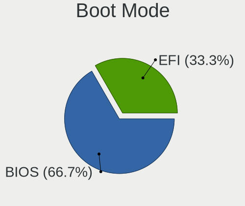
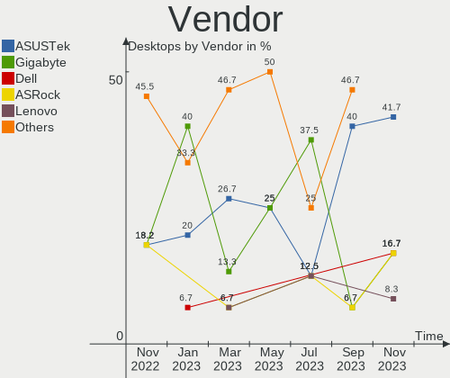
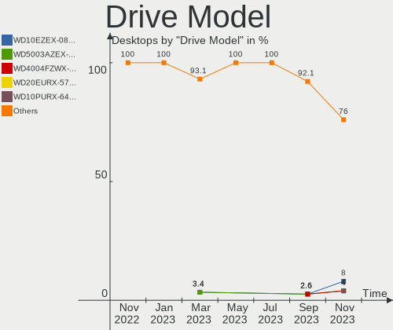
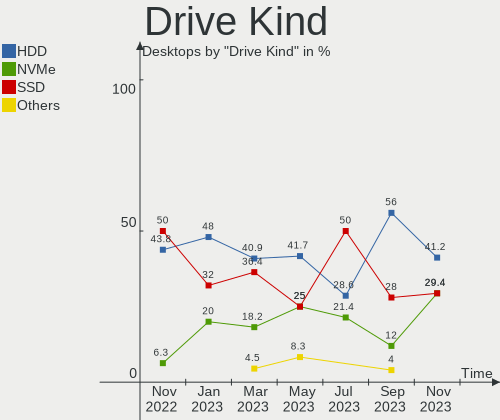
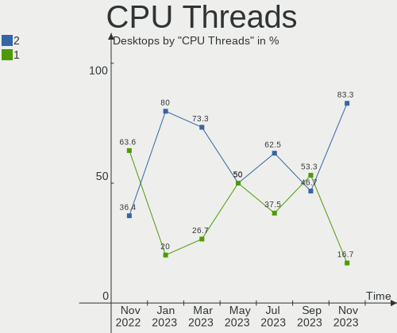
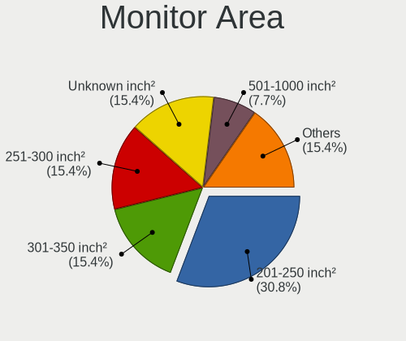
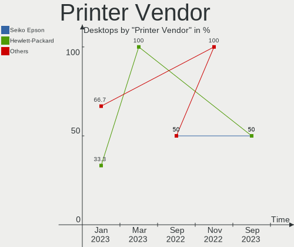
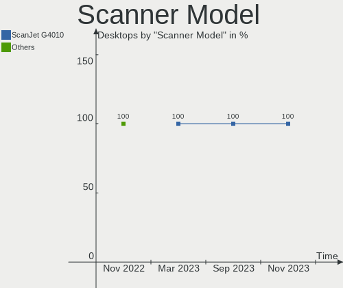

Ubuntu MATE - Hardware Trends (Desktops)
----------------------------------------

A project to identify most popular hardware characteristics and track their change
over time based on data collected by Linux users at https://Linux-Hardware.org.

Anyone can contribute to this report by the [hw-probe](https://github.com/linuxhw/hw-probe) tool:

    sudo -E hw-probe -all -upload

This report is for one last month. Overall report since the beginning of time: [TestCoverage](https://github.com/linuxhw/TestCoverage)

Period: Sep, 2022.

Contents
--------

* [ System ](#system)
  - [ OS                       ](#os)
  - [ OS Family                ](#os-family)
  - [ Kernel                   ](#kernel)
  - [ Kernel Family            ](#kernel-family)
  - [ Kernel Major Ver.        ](#kernel-major-ver)
  - [ Arch                     ](#arch)
  - [ DE                       ](#de)
  - [ Display Server           ](#display-server)
  - [ Display Manager          ](#display-manager)
  - [ OS Lang                  ](#os-lang)
  - [ Boot Mode                ](#boot-mode)
  - [ Filesystem               ](#filesystem)
  - [ Part. scheme             ](#part-scheme)
  - [ Dual Boot with Linux/BSD ](#dual-boot-with-linuxbsd)
  - [ Dual Boot (Win)          ](#dual-boot-win)

* [ Board ](#board)
  - [ Vendor                   ](#vendor)
  - [ Model                    ](#model)
  - [ Model Family             ](#model-family)
  - [ MFG Year                 ](#mfg-year)
  - [ Form Factor              ](#form-factor)
  - [ Secure Boot              ](#secure-boot)
  - [ Coreboot                 ](#coreboot)
  - [ RAM Size                 ](#ram-size)
  - [ RAM Used                 ](#ram-used)
  - [ Total Drives             ](#total-drives)
  - [ Has CD-ROM               ](#has-cd-rom)
  - [ Has Ethernet             ](#has-ethernet)
  - [ Has WiFi                 ](#has-wifi)
  - [ Has Bluetooth            ](#has-bluetooth)

* [ Location ](#location)
  - [ Country                  ](#country)
  - [ City                     ](#city)

* [ Drives ](#drives)
  - [ Drive Vendor             ](#drive-vendor)
  - [ Drive Model              ](#drive-model)
  - [ HDD Vendor               ](#hdd-vendor)
  - [ SSD Vendor               ](#ssd-vendor)
  - [ Drive Kind               ](#drive-kind)
  - [ Drive Connector          ](#drive-connector)
  - [ Drive Size               ](#drive-size)
  - [ Space Total              ](#space-total)
  - [ Space Used               ](#space-used)
  - [ Malfunc. Drives          ](#malfunc-drives)
  - [ Malfunc. Drive Vendor    ](#malfunc-drive-vendor)
  - [ Malfunc. HDD Vendor      ](#malfunc-hdd-vendor)
  - [ Malfunc. Drive Kind      ](#malfunc-drive-kind)
  - [ Failed Drives            ](#failed-drives)
  - [ Failed Drive Vendor      ](#failed-drive-vendor)
  - [ Drive Status             ](#drive-status)

* [ Storage controller ](#storage-controller)
  - [ Storage Vendor           ](#storage-vendor)
  - [ Storage Model            ](#storage-model)
  - [ Storage Kind             ](#storage-kind)

* [ Processor ](#processor)
  - [ CPU Vendor               ](#cpu-vendor)
  - [ CPU Model                ](#cpu-model)
  - [ CPU Model Family         ](#cpu-model-family)
  - [ CPU Cores                ](#cpu-cores)
  - [ CPU Sockets              ](#cpu-sockets)
  - [ CPU Threads              ](#cpu-threads)
  - [ CPU Op-Modes             ](#cpu-op-modes)
  - [ CPU Microcode            ](#cpu-microcode)
  - [ CPU Microarch            ](#cpu-microarch)

* [ Graphics ](#graphics)
  - [ GPU Vendor               ](#gpu-vendor)
  - [ GPU Model                ](#gpu-model)
  - [ GPU Combo                ](#gpu-combo)
  - [ GPU Driver               ](#gpu-driver)
  - [ GPU Memory               ](#gpu-memory)

* [ Monitor ](#monitor)
  - [ Monitor Vendor           ](#monitor-vendor)
  - [ Monitor Model            ](#monitor-model)
  - [ Monitor Resolution       ](#monitor-resolution)
  - [ Monitor Diagonal         ](#monitor-diagonal)
  - [ Monitor Width            ](#monitor-width)
  - [ Aspect Ratio             ](#aspect-ratio)
  - [ Monitor Area             ](#monitor-area)
  - [ Pixel Density            ](#pixel-density)
  - [ Multiple Monitors        ](#multiple-monitors)

* [ Network ](#network)
  - [ Net Controller Vendor    ](#net-controller-vendor)
  - [ Net Controller Model     ](#net-controller-model)
  - [ Wireless Vendor          ](#wireless-vendor)
  - [ Wireless Model           ](#wireless-model)
  - [ Ethernet Vendor          ](#ethernet-vendor)
  - [ Ethernet Model           ](#ethernet-model)
  - [ Net Controller Kind      ](#net-controller-kind)
  - [ Used Controller          ](#used-controller)
  - [ NICs                     ](#nics)
  - [ IPv6                     ](#ipv6)

* [ Bluetooth ](#bluetooth)
  - [ Bluetooth Vendor         ](#bluetooth-vendor)
  - [ Bluetooth Model          ](#bluetooth-model)

* [ Sound ](#sound)
  - [ Sound Vendor             ](#sound-vendor)
  - [ Sound Model              ](#sound-model)

* [ Memory ](#memory)
  - [ Memory Vendor            ](#memory-vendor)
  - [ Memory Model             ](#memory-model)
  - [ Memory Kind              ](#memory-kind)
  - [ Memory Form Factor       ](#memory-form-factor)
  - [ Memory Size              ](#memory-size)
  - [ Memory Speed             ](#memory-speed)

* [ Printers & scanners ](#printers--scanners)
  - [ Printer Vendor           ](#printer-vendor)
  - [ Printer Model            ](#printer-model)
  - [ Scanner Vendor           ](#scanner-vendor)
  - [ Scanner Model            ](#scanner-model)

* [ Camera ](#camera)
  - [ Camera Vendor            ](#camera-vendor)
  - [ Camera Model             ](#camera-model)

* [ Security ](#security)
  - [ Fingerprint Vendor       ](#fingerprint-vendor)
  - [ Fingerprint Model        ](#fingerprint-model)
  - [ Chipcard Vendor          ](#chipcard-vendor)
  - [ Chipcard Model           ](#chipcard-model)

* [ Unsupported ](#unsupported)
  - [ Unsupported Devices      ](#unsupported-devices)
  - [ Unsupported Device Types ](#unsupported-device-types)

System
------

OS
--

Installed operating systems

| Name              | Desktops | Percent |
|-------------------|----------|---------|
| Ubuntu MATE 22.04 | 13       | 81.25%  |
| Ubuntu MATE 20.04 | 2        | 12.5%   |
| Ubuntu MATE 18.04 | 1        | 6.25%   |

OS Family
---------

OS without a version

| Name        | Desktops | Percent |
|-------------|----------|---------|
| Ubuntu MATE | 16       | 100%    |

Kernel
------

Version of the Linux kernel

| Version           | Desktops | Percent |
|-------------------|----------|---------|
| 5.15.0-47-generic | 11       | 68.75%  |
| 5.15.0-48-generic | 2        | 12.5%   |
| 5.4.0-125-generic | 1        | 6.25%   |
| 5.15.0-46-generic | 1        | 6.25%   |
| 5.0.0-63-generic  | 1        | 6.25%   |

Kernel Family
-------------

Linux kernel without a distro release

| Version | Desktops | Percent |
|---------|----------|---------|
| 5.15.0  | 14       | 87.5%   |
| 5.4.0   | 1        | 6.25%   |
| 5.0.0   | 1        | 6.25%   |

Kernel Major Ver.
-----------------

Linux kernel major version

| Version | Desktops | Percent |
|---------|----------|---------|
| 5.15    | 14       | 87.5%   |
| 5.4     | 1        | 6.25%   |
| 5.0     | 1        | 6.25%   |

Arch
----

OS architecture (x86_64, i586, etc.)

| Name   | Desktops | Percent |
|--------|----------|---------|
| x86_64 | 16       | 100%    |

DE
--

Desktop Environment

| Name | Desktops | Percent |
|------|----------|---------|
| MATE | 16       | 100%    |

Display Server
--------------

X11 or Wayland

| Name | Desktops | Percent |
|------|----------|---------|
| X11  | 16       | 100%    |

Display Manager
---------------

SDDM, LightDM, etc.

| Name    | Desktops | Percent |
|---------|----------|---------|
| LightDM | 14       | 87.5%   |
| Unknown | 2        | 12.5%   |

OS Lang
-------

Language

| Lang  | Desktops | Percent |
|-------|----------|---------|
| fr_FR | 3        | 18.75%  |
| en_US | 3        | 18.75%  |
| en_AU | 2        | 12.5%   |
| de_DE | 2        | 12.5%   |
| de_CH | 2        | 12.5%   |
| ru_RU | 1        | 6.25%   |
| pt_BR | 1        | 6.25%   |
| it_IT | 1        | 6.25%   |
| en_CA | 1        | 6.25%   |

Boot Mode
---------

EFI or BIOS

| Mode | Desktops | Percent |
|------|----------|---------|
| BIOS | 11       | 68.75%  |
| EFI  | 5        | 31.25%  |

Filesystem
----------

Type of filesystem

| Type | Desktops | Percent |
|------|----------|---------|
| Ext4 | 15       | 93.75%  |
| Zfs  | 1        | 6.25%   |

Part. scheme
------------

Scheme of partitioning

| Type    | Desktops | Percent |
|---------|----------|---------|
| Unknown | 7        | 43.75%  |
| GPT     | 5        | 31.25%  |
| MBR     | 4        | 25%     |

Dual Boot with Linux/BSD
------------------------

Hosting more than one Linux/BSD

| Dual boot | Desktops | Percent |
|-----------|----------|---------|
| No        | 15       | 93.75%  |
| Yes       | 1        | 6.25%   |

Dual Boot (Win)
---------------

Hosting Linux and Windows

| Dual boot | Desktops | Percent |
|-----------|----------|---------|
| No        | 10       | 62.5%   |
| Yes       | 6        | 37.5%   |

Board
-----

Vendor
------

Motherboard manufacturer

| Name                | Desktops | Percent |
|---------------------|----------|---------|
| ASUSTek Computer    | 6        | 37.5%   |
| Hewlett-Packard     | 3        | 18.75%  |
| ASRock              | 3        | 18.75%  |
| MSI                 | 2        | 12.5%   |
| Gigabyte Technology | 1        | 6.25%   |
| Acer                | 1        | 6.25%   |

Model
-----

Motherboard model

| Name                                 | Desktops | Percent |
|--------------------------------------|----------|---------|
| MSI MS-7817                          | 1        | 6.25%   |
| MSI MS-7599                          | 1        | 6.25%   |
| HP EliteDesk 800 G1 TWR              | 1        | 6.25%   |
| HP Compaq Elite 8300 SFF             | 1        | 6.25%   |
| HP 23-d027c                          | 1        | 6.25%   |
| Gigabyte Z590 UD AC                  | 1        | 6.25%   |
| ASUS ROG STRIX Z690-A GAMING WIFI D4 | 1        | 6.25%   |
| ASUS P7P55 LX                        | 1        | 6.25%   |
| ASUS P5GZ-MX                         | 1        | 6.25%   |
| ASUS M2A74-AM                        | 1        | 6.25%   |
| ASUS K30AD_M31AD_M51AD               | 1        | 6.25%   |
| ASUS H61M-K                          | 1        | 6.25%   |
| ASRock J5040-ITX                     | 1        | 6.25%   |
| ASRock HM55-HT                       | 1        | 6.25%   |
| ASRock B450 Gaming-ITX/ac            | 1        | 6.25%   |
| Acer Aspire X3950                    | 1        | 6.25%   |

Model Family
------------

Motherboard model prefix

| Name             | Desktops | Percent |
|------------------|----------|---------|
| MSI MS-7817      | 1        | 6.25%   |
| MSI MS-7599      | 1        | 6.25%   |
| HP EliteDesk     | 1        | 6.25%   |
| HP Compaq        | 1        | 6.25%   |
| HP 23-d027c      | 1        | 6.25%   |
| Gigabyte Z590    | 1        | 6.25%   |
| ASUS ROG         | 1        | 6.25%   |
| ASUS P7P55       | 1        | 6.25%   |
| ASUS P5GZ-MX     | 1        | 6.25%   |
| ASUS M2A74-AM    | 1        | 6.25%   |
| ASUS K30AD       | 1        | 6.25%   |
| ASUS H61M-K      | 1        | 6.25%   |
| ASRock J5040-ITX | 1        | 6.25%   |
| ASRock HM55-HT   | 1        | 6.25%   |
| ASRock B450      | 1        | 6.25%   |
| Acer Aspire      | 1        | 6.25%   |

MFG Year
--------

Motherboard manufacture year

| Year | Desktops | Percent |
|------|----------|---------|
| 2013 | 4        | 25%     |
| 2010 | 3        | 18.75%  |
| 2021 | 2        | 12.5%   |
| 2009 | 2        | 12.5%   |
| 2020 | 1        | 6.25%   |
| 2018 | 1        | 6.25%   |
| 2014 | 1        | 6.25%   |
| 2012 | 1        | 6.25%   |
| 2006 | 1        | 6.25%   |

Form Factor
-----------

Physical design of the computer

| Name    | Desktops | Percent |
|---------|----------|---------|
| Desktop | 16       | 100%    |

Secure Boot
-----------

Enabled or disabled

| State    | Desktops | Percent |
|----------|----------|---------|
| Disabled | 16       | 100%    |

Coreboot
--------

Have coreboot on board

| Used | Desktops | Percent |
|------|----------|---------|
| No   | 16       | 100%    |

RAM Size
--------

Total RAM memory

| Size in GB | Desktops | Percent |
|------------|----------|---------|
| 8.01-16.0  | 8        | 50%     |
| 3.01-4.0   | 3        | 18.75%  |
| 32.01-64.0 | 2        | 12.5%   |
| 16.01-24.0 | 2        | 12.5%   |
| 1.01-2.0   | 1        | 6.25%   |

RAM Used
--------

Used RAM memory

| Used GB  | Desktops | Percent |
|----------|----------|---------|
| 1.01-2.0 | 6        | 37.5%   |
| 2.01-3.0 | 5        | 31.25%  |
| 4.01-8.0 | 2        | 12.5%   |
| 3.01-4.0 | 2        | 12.5%   |
| 0.51-1.0 | 1        | 6.25%   |

Total Drives
------------

Number of drives on board

| Drives | Desktops | Percent |
|--------|----------|---------|
| 1      | 6        | 37.5%   |
| 2      | 4        | 25%     |
| 6      | 2        | 12.5%   |
| 4      | 2        | 12.5%   |
| 3      | 2        | 12.5%   |

Has CD-ROM
----------

Has CD-ROM on board

| Presented | Desktops | Percent |
|-----------|----------|---------|
| Yes       | 9        | 56.25%  |
| No        | 7        | 43.75%  |

Has Ethernet
------------

Has Ethernet on board

| Presented | Desktops | Percent |
|-----------|----------|---------|
| Yes       | 16       | 100%    |

Has WiFi
--------

Has WiFi module

| Presented | Desktops | Percent |
|-----------|----------|---------|
| Yes       | 9        | 56.25%  |
| No        | 7        | 43.75%  |

Has Bluetooth
-------------

Has Bluetooth module

| Presented | Desktops | Percent |
|-----------|----------|---------|
| No        | 11       | 68.75%  |
| Yes       | 5        | 31.25%  |

Location
--------

Country
-------

Geographic location (country)

| Country     | Desktops | Percent |
|-------------|----------|---------|
| France      | 3        | 18.75%  |
| Switzerland | 2        | 12.5%   |
| Germany     | 2        | 12.5%   |
| Canada      | 2        | 12.5%   |
| Australia   | 2        | 12.5%   |
| USA         | 1        | 6.25%   |
| Ukraine     | 1        | 6.25%   |
| Russia      | 1        | 6.25%   |
| Italy       | 1        | 6.25%   |
| Brazil      | 1        | 6.25%   |

City
----

Geographic location (city)

| City                 | Desktops | Percent |
|----------------------|----------|---------|
| Melbourne            | 2        | 12.5%   |
| Velyki Mosty         | 1        | 6.25%   |
| Vancouver            | 1        | 6.25%   |
| Pindamonhangaba      | 1        | 6.25%   |
| Paris                | 1        | 6.25%   |
| Noventa Vicentina    | 1        | 6.25%   |
| Montpellier          | 1        | 6.25%   |
| Limoges              | 1        | 6.25%   |
| Lansdale             | 1        | 6.25%   |
| Lanigan              | 1        | 6.25%   |
| Kuznetsk             | 1        | 6.25%   |
| Heerbrugg            | 1        | 6.25%   |
| Goslar               | 1        | 6.25%   |
| Buchs / Buchs (Dorf) | 1        | 6.25%   |
| Bad Iburg            | 1        | 6.25%   |

Drives
------

Drive Vendor
------------

Hard drive vendors

| Vendor              | Desktops | Drives | Percent |
|---------------------|----------|--------|---------|
| WDC                 | 6        | 15     | 22.22%  |
| Seagate             | 6        | 7      | 22.22%  |
| Samsung Electronics | 6        | 9      | 22.22%  |
| Crucial             | 3        | 3      | 11.11%  |
| Toshiba             | 2        | 2      | 7.41%   |
| SPCC                | 1        | 1      | 3.7%    |
| Phison              | 1        | 1      | 3.7%    |
| Maxtor              | 1        | 1      | 3.7%    |
| Intel               | 1        | 1      | 3.7%    |

Drive Model
-----------

Hard drive models

| Model                               | Desktops | Percent |
|-------------------------------------|----------|---------|
| WDC WD40EZAZ-00SF3B0 4TB            | 2        | 5.13%   |
| WDC WDS250G2B0A-00SM50 250GB SSD    | 1        | 2.56%   |
| WDC WDBNCE0010PNC 1TB SSD           | 1        | 2.56%   |
| WDC WD6400AAKS-00E4A0 640GB         | 1        | 2.56%   |
| WDC WD60 EFAX-68JH4N1 6TB           | 1        | 2.56%   |
| WDC WD5000AAKX-08ERMA0 500GB        | 1        | 2.56%   |
| WDC WD5000AACS-00G8B1 500GB         | 1        | 2.56%   |
| WDC WD40 PURZ-85TTDY0 4TB           | 1        | 2.56%   |
| WDC WD30EFRX-68N32N0 3TB            | 1        | 2.56%   |
| WDC WD30EFRX-68EUZN0 3TB            | 1        | 2.56%   |
| WDC WD3000HLFS-01G6U0 304GB         | 1        | 2.56%   |
| WDC WD2500AAKX-753CA1 250GB         | 1        | 2.56%   |
| WDC WD10 01FALS-00J7B1 1TB          | 1        | 2.56%   |
| Toshiba HDWG180 8TB                 | 1        | 2.56%   |
| Toshiba DT01ACA200 2TB              | 1        | 2.56%   |
| SPCC Solid State Disk 256GB         | 1        | 2.56%   |
| Seagate ST4000DM004-2CV104 4TB      | 1        | 2.56%   |
| Seagate ST3500418AS 500GB           | 1        | 2.56%   |
| Seagate ST3500312CS 500GB           | 1        | 2.56%   |
| Seagate ST325082 0AS 250GB          | 1        | 2.56%   |
| Seagate ST2000NE001-2M5101 2TB      | 1        | 2.56%   |
| Seagate ST2000DM006-2DM164 2TB      | 1        | 2.56%   |
| Seagate ST1000DM003-1SB102 1TB      | 1        | 2.56%   |
| Samsung SSD 870 QVO 2TB             | 1        | 2.56%   |
| Samsung SSD 870 QVO 1TB             | 1        | 2.56%   |
| Samsung SSD 870 EVO 500GB           | 1        | 2.56%   |
| Samsung NVMe SSD Drive 250GB        | 1        | 2.56%   |
| Samsung NVMe SSD Drive 1TB          | 1        | 2.56%   |
| Samsung MZMPC032HBCD-00000 32GB SSD | 1        | 2.56%   |
| Samsung HD502HJ 500GB               | 1        | 2.56%   |
| Samsung HD154UI 1TB                 | 1        | 2.56%   |
| Samsung HD103SI 1TB                 | 1        | 2.56%   |
| Phison NVMe SSD Drive 512GB         | 1        | 2.56%   |
| Maxtor STM380215AS 80GB             | 1        | 2.56%   |
| Intel SSDPEKNU512GZ 512GB           | 1        | 2.56%   |
| Crucial CT275MX300SSD1 275GB        | 1        | 2.56%   |
| Crucial CT2000MX500SSD1 2TB         | 1        | 2.56%   |
| Crucial CT1000BX500SSD1 1TB         | 1        | 2.56%   |

HDD Vendor
----------

Hard disk drive vendors

| Vendor              | Desktops | Drives | Percent |
|---------------------|----------|--------|---------|
| WDC                 | 6        | 13     | 35.29%  |
| Seagate             | 6        | 7      | 35.29%  |
| Toshiba             | 2        | 2      | 11.76%  |
| Samsung Electronics | 2        | 3      | 11.76%  |
| Maxtor              | 1        | 1      | 5.88%   |

SSD Vendor
----------

Solid state drive vendors

| Vendor              | Desktops | Drives | Percent |
|---------------------|----------|--------|---------|
| Samsung Electronics | 4        | 4      | 40%     |
| Crucial             | 3        | 3      | 30%     |
| WDC                 | 2        | 2      | 20%     |
| SPCC                | 1        | 1      | 10%     |

Drive Kind
----------

HDD or SSD

| Kind | Desktops | Drives | Percent |
|------|----------|--------|---------|
| HDD  | 13       | 26     | 56.52%  |
| SSD  | 7        | 10     | 30.43%  |
| NVMe | 3        | 4      | 13.04%  |

Drive Connector
---------------

SATA, SAS, NVMe, etc.

| Type | Desktops | Drives | Percent |
|------|----------|--------|---------|
| SATA | 15       | 32     | 75%     |
| NVMe | 3        | 4      | 15%     |
| SAS  | 2        | 4      | 10%     |

Drive Size
----------

Size of hard drive

| Size in TB | Desktops | Drives | Percent |
|------------|----------|--------|---------|
| 0.01-0.5   | 11       | 14     | 37.93%  |
| 0.51-1.0   | 6        | 8      | 20.69%  |
| 1.01-2.0   | 5        | 5      | 17.24%  |
| 3.01-4.0   | 4        | 5      | 13.79%  |
| 4.01-10.0  | 2        | 2      | 6.9%    |
| 2.01-3.0   | 1        | 2      | 3.45%   |

Space Total
-----------

Amount of disk space available on the file system

| Size in GB     | Desktops | Percent |
|----------------|----------|---------|
| More than 3000 | 5        | 31.25%  |
| 251-500        | 4        | 25%     |
| 2001-3000      | 2        | 12.5%   |
| 21-50          | 1        | 6.25%   |
| 101-250        | 1        | 6.25%   |
| 1001-2000      | 1        | 6.25%   |
| 501-1000       | 1        | 6.25%   |
| 51-100         | 1        | 6.25%   |

Space Used
----------

Amount of used disk space

| Used GB        | Desktops | Percent |
|----------------|----------|---------|
| More than 3000 | 3        | 18.75%  |
| 21-50          | 3        | 18.75%  |
| 101-250        | 3        | 18.75%  |
| 251-500        | 2        | 12.5%   |
| 1001-2000      | 2        | 12.5%   |
| 1-20           | 1        | 6.25%   |
| 501-1000       | 1        | 6.25%   |
| 51-100         | 1        | 6.25%   |

Malfunc. Drives
---------------

Drive models with a malfunction

Zero info for selected period =(

Malfunc. Drive Vendor
---------------------

Vendors of faulty drives

Zero info for selected period =(

Malfunc. HDD Vendor
-------------------

Vendors of faulty HDD drives

Zero info for selected period =(

Malfunc. Drive Kind
-------------------

Kinds of faulty drives

Zero info for selected period =(

Failed Drives
-------------

Failed drive models

Zero info for selected period =(

Failed Drive Vendor
-------------------

Failed drive vendors

Zero info for selected period =(

Drive Status
------------

Number of failed and malfunc. drives

| Status   | Desktops | Drives | Percent |
|----------|----------|--------|---------|
| Works    | 9        | 18     | 52.94%  |
| Detected | 8        | 22     | 47.06%  |

Storage controller
------------------

Storage Vendor
--------------

Storage controller vendors

| Vendor              | Desktops | Percent |
|---------------------|----------|---------|
| Intel               | 13       | 61.9%   |
| ASMedia Technology  | 3        | 14.29%  |
| AMD                 | 3        | 14.29%  |
| Samsung Electronics | 1        | 4.76%   |
| Phison Electronics  | 1        | 4.76%   |

Storage Model
-------------

Storage controller models

| Model                                                                          | Desktops | Percent |
|--------------------------------------------------------------------------------|----------|---------|
| ASMedia ASM1062 Serial ATA Controller                                          | 3        | 10%     |
| Intel 8 Series/C220 Series Chipset Family 6-port SATA Controller 1 [AHCI mode] | 2        | 6.67%   |
| Intel 6 Series/C200 Series Chipset Family 6 port Desktop SATA AHCI Controller  | 2        | 6.67%   |
| AMD SB7x0/SB8x0/SB9x0 SATA Controller [IDE mode]                               | 2        | 6.67%   |
| AMD SB7x0/SB8x0/SB9x0 IDE Controller                                           | 2        | 6.67%   |
| Samsung NVMe SSD Controller SM981/PM981/PM983                                  | 1        | 3.33%   |
| Samsung NVMe SSD Controller SM961/PM961/SM963                                  | 1        | 3.33%   |
| Phison NVMe Storage Controller                                                 | 1        | 3.33%   |
| Intel Volume Management Device NVMe RAID Controller                            | 1        | 3.33%   |
| Intel Non-Volatile memory controller                                           | 1        | 3.33%   |
| Intel NM10/ICH7 Family SATA Controller [IDE mode]                              | 1        | 3.33%   |
| Intel Celeron/Pentium Silver Processor SATA Controller                         | 1        | 3.33%   |
| Intel Alder Lake-S PCH SATA Controller [AHCI Mode]                             | 1        | 3.33%   |
| Intel 82801G (ICH7 Family) IDE Controller                                      | 1        | 3.33%   |
| Intel 8 Series/C220 Series Chipset Family 4-port SATA Controller 1 [IDE mode]  | 1        | 3.33%   |
| Intel 8 Series/C220 Series Chipset Family 2-port SATA Controller 2 [IDE mode]  | 1        | 3.33%   |
| Intel 7 Series/C210 Series Chipset Family 6-port SATA Controller [AHCI mode]   | 1        | 3.33%   |
| Intel 500 Series Chipset Family SATA AHCI Controller                           | 1        | 3.33%   |
| Intel 5 Series/3400 Series Chipset 6 port SATA AHCI Controller                 | 1        | 3.33%   |
| Intel 5 Series/3400 Series Chipset 4 port SATA IDE Controller                  | 1        | 3.33%   |
| Intel 5 Series/3400 Series Chipset 4 port SATA AHCI Controller                 | 1        | 3.33%   |
| Intel 5 Series/3400 Series Chipset 2 port SATA IDE Controller                  | 1        | 3.33%   |
| AMD FCH SATA Controller [AHCI mode]                                            | 1        | 3.33%   |
| AMD 400 Series Chipset SATA Controller                                         | 1        | 3.33%   |

Storage Kind
------------

Kind of storage controller (IDE, SATA, NVMe, SAS, ...)

| Kind | Desktops | Percent |
|------|----------|---------|
| SATA | 14       | 60.87%  |
| IDE  | 5        | 21.74%  |
| NVMe | 3        | 13.04%  |
| RAID | 1        | 4.35%   |

Processor
---------

CPU Vendor
----------

Processor vendors

| Vendor | Desktops | Percent |
|--------|----------|---------|
| Intel  | 13       | 81.25%  |
| AMD    | 3        | 18.75%  |

CPU Model
---------

Processor models

| Model                                       | Desktops | Percent |
|---------------------------------------------|----------|---------|
| Intel Pentium Silver J5040 CPU @ 2.00GHz    | 1        | 6.25%   |
| Intel Pentium CPU G840 @ 2.80GHz            | 1        | 6.25%   |
| Intel Pentium CPU G3240 @ 3.10GHz           | 1        | 6.25%   |
| Intel Pentium CPU G3220 @ 3.00GHz           | 1        | 6.25%   |
| Intel Pentium 4 CPU 3.06GHz                 | 1        | 6.25%   |
| Intel Core i7-4790 CPU @ 3.60GHz            | 1        | 6.25%   |
| Intel Core i5-3570 CPU @ 3.40GHz            | 1        | 6.25%   |
| Intel Core i5-3330S CPU @ 2.70GHz           | 1        | 6.25%   |
| Intel Core i5 CPU 650 @ 3.20GHz             | 1        | 6.25%   |
| Intel Core i3 CPU M 330 @ 2.13GHz           | 1        | 6.25%   |
| Intel Core i3 CPU 550 @ 3.20GHz             | 1        | 6.25%   |
| Intel 12th Gen Core i7-12700F               | 1        | 6.25%   |
| Intel 11th Gen Core i9-11900K @ 3.50GHz     | 1        | 6.25%   |
| AMD Ryzen 5 2400G with Radeon Vega Graphics | 1        | 6.25%   |
| AMD Phenom II X6 1090T Processor            | 1        | 6.25%   |
| AMD Athlon II X4 635 Processor              | 1        | 6.25%   |

CPU Model Family
----------------

Processor model prefix

| Model                | Desktops | Percent |
|----------------------|----------|---------|
| Intel Pentium        | 3        | 18.75%  |
| Intel Core i5        | 3        | 18.75%  |
| Other                | 2        | 12.5%   |
| Intel Core i3        | 2        | 12.5%   |
| Intel Pentium Silver | 1        | 6.25%   |
| Intel Pentium 4      | 1        | 6.25%   |
| Intel Core i7        | 1        | 6.25%   |
| AMD Ryzen 5          | 1        | 6.25%   |
| AMD Phenom II X6     | 1        | 6.25%   |
| AMD Athlon II X4     | 1        | 6.25%   |

CPU Cores
---------

Number of processor cores

| Number | Desktops | Percent |
|--------|----------|---------|
| 4      | 6        | 37.5%   |
| 2      | 6        | 37.5%   |
| 12     | 1        | 6.25%   |
| 8      | 1        | 6.25%   |
| 6      | 1        | 6.25%   |
| 1      | 1        | 6.25%   |

CPU Sockets
-----------

Number of sockets

| Number | Desktops | Percent |
|--------|----------|---------|
| 1      | 16       | 100%    |

CPU Threads
-----------

Threads per core (Hyper-Threading)

| Number | Desktops | Percent |
|--------|----------|---------|
| 1      | 9        | 56.25%  |
| 2      | 7        | 43.75%  |

CPU Op-Modes
------------

CPU Operation Modes (32-bit, 64-bit)

| Op mode        | Desktops | Percent |
|----------------|----------|---------|
| 32-bit, 64-bit | 16       | 100%    |

CPU Microcode
-------------

Microcode number

| Number     | Desktops | Percent |
|------------|----------|---------|
| Unknown    | 8        | 50%     |
| 0x306c3    | 2        | 12.5%   |
| 0x20655    | 2        | 12.5%   |
| 0xa0671    | 1        | 6.25%   |
| 0x90672    | 1        | 6.25%   |
| 0x206a7    | 1        | 6.25%   |
| 0x010000dc | 1        | 6.25%   |

CPU Microarch
-------------

Microarchitecture

| Name             | Desktops | Percent |
|------------------|----------|---------|
| Westmere         | 3        | 18.75%  |
| Haswell          | 3        | 18.75%  |
| K10              | 2        | 12.5%   |
| IvyBridge        | 2        | 12.5%   |
| Zen              | 1        | 6.25%   |
| SandyBridge      | 1        | 6.25%   |
| NetBurst         | 1        | 6.25%   |
| Goldmont plus    | 1        | 6.25%   |
| Alderlake Hybrid | 1        | 6.25%   |
| Unknown          | 1        | 6.25%   |

Graphics
--------

GPU Vendor
----------

Vendors of graphics cards

| Vendor | Desktops | Percent |
|--------|----------|---------|
| Intel  | 7        | 43.75%  |
| Nvidia | 5        | 31.25%  |
| AMD    | 4        | 25%     |

GPU Model
---------

Graphics card models

| Model                                                                       | Desktops | Percent |
|-----------------------------------------------------------------------------|----------|---------|
| Intel Xeon E3-1200 v3/4th Gen Core Processor Integrated Graphics Controller | 2        | 12.5%   |
| Intel Xeon E3-1200 v2/3rd Gen Core processor Graphics Controller            | 2        | 12.5%   |
| Nvidia TU116 [GeForce GTX 1660]                                             | 1        | 6.25%   |
| Nvidia GP107 [GeForce GTX 1050 Ti]                                          | 1        | 6.25%   |
| Nvidia GK208B [GeForce GT 730]                                              | 1        | 6.25%   |
| Nvidia GA102 [GeForce RTX 3090]                                             | 1        | 6.25%   |
| Nvidia GA102 [GeForce RTX 3080 Lite Hash Rate]                              | 1        | 6.25%   |
| Intel GeminiLake [UHD Graphics 605]                                         | 1        | 6.25%   |
| Intel Core Processor Integrated Graphics Controller                         | 1        | 6.25%   |
| Intel 82945G/GZ Integrated Graphics Controller                              | 1        | 6.25%   |
| AMD Redwood XT [Radeon HD 5670/5690/5730]                                   | 1        | 6.25%   |
| AMD Redwood PRO [Radeon HD 5550/5570/5630/6510/6610/7570]                   | 1        | 6.25%   |
| AMD Raven Ridge [Radeon Vega Series / Radeon Vega Mobile Series]            | 1        | 6.25%   |
| AMD Navi 10 [Radeon RX 5600 OEM/5600 XT / 5700/5700 XT]                     | 1        | 6.25%   |

GPU Combo
---------

Combinations of graphics cards

| Name       | Desktops | Percent |
|------------|----------|---------|
| 1 x Intel  | 7        | 43.75%  |
| 1 x Nvidia | 5        | 31.25%  |
| 1 x AMD    | 4        | 25%     |

GPU Driver
----------

Free vs proprietary

| Driver      | Desktops | Percent |
|-------------|----------|---------|
| Free        | 11       | 68.75%  |
| Proprietary | 5        | 31.25%  |

GPU Memory
----------

Total video memory

| Size in GB | Desktops | Percent |
|------------|----------|---------|
| Unknown    | 9        | 56.25%  |
| 0.51-1.0   | 2        | 12.5%   |
| 5.01-6.0   | 1        | 6.25%   |
| 3.01-4.0   | 1        | 6.25%   |
| 16.01-24.0 | 1        | 6.25%   |
| 1.01-2.0   | 1        | 6.25%   |
| 8.01-16.0  | 1        | 6.25%   |

Monitor
-------

Monitor Vendor
--------------

Monitor vendors

| Vendor               | Desktops | Percent |
|----------------------|----------|---------|
| Samsung Electronics  | 3        | 16.67%  |
| Hewlett-Packard      | 3        | 16.67%  |
| Acer                 | 3        | 16.67%  |
| Iiyama               | 2        | 11.11%  |
| Goldstar             | 2        | 11.11%  |
| Philips              | 1        | 5.56%   |
| Lenovo               | 1        | 5.56%   |
| Dell                 | 1        | 5.56%   |
| AOC                  | 1        | 5.56%   |
| Ancor Communications | 1        | 5.56%   |

Monitor Model
-------------

Monitor models

| Model                                                                  | Desktops | Percent |
|------------------------------------------------------------------------|----------|---------|
| Samsung Electronics SyncMaster SAM027F 1680x1050 474x296mm 22.0-inch   | 1        | 5.56%   |
| Samsung Electronics SyncMaster SAM0225 1440x900 410x257mm 19.1-inch    | 1        | 5.56%   |
| Samsung Electronics SMB2340 SAM0691 1920x1080 510x290mm 23.1-inch      | 1        | 5.56%   |
| Philips PHL 272B8Q PHL0918 2560x1440 597x336mm 27.0-inch               | 1        | 5.56%   |
| Lenovo C27-35 LEN66BA 1920x1080 597x336mm 27.0-inch                    | 1        | 5.56%   |
| Iiyama PL2740HS IVM6662 1920x1080 600x340mm 27.2-inch                  | 1        | 5.56%   |
| Iiyama PL2730H IVM663A 1920x1080 598x336mm 27.0-inch                   | 1        | 5.56%   |
| Hewlett-Packard w2216 HWP280C 1680x1050 465x291mm 21.6-inch            | 1        | 5.56%   |
| Hewlett-Packard LCD Monitor HWP1001 1920x1080 477x268mm 21.5-inch      | 1        | 5.56%   |
| Hewlett-Packard 24fh HPN3546 1920x1080 527x296mm 23.8-inch             | 1        | 5.56%   |
| Goldstar W2452 GSM5694 1920x1200 432x324mm 21.3-inch                   | 1        | 5.56%   |
| Goldstar L1717S GSM43FF 1280x1024 338x270mm 17.0-inch                  | 1        | 5.56%   |
| Dell E248WFP DELA02E 1920x1200 518x324mm 24.1-inch                     | 1        | 5.56%   |
| AOC 731W AOC1731 1280x720 340x270mm 17.1-inch                          | 1        | 5.56%   |
| Ancor Communications ASUS PB287Q ACI28A3 3840x2160 620x340mm 27.8-inch | 1        | 5.56%   |
| Acer R240HY ACR046F 1920x1080 527x296mm 23.8-inch                      | 1        | 5.56%   |
| Acer H236HL ACR0318 1920x1080 509x286mm 23.0-inch                      | 1        | 5.56%   |
| Acer ET322QU ACR0687 2560x1440 698x393mm 31.5-inch                     | 1        | 5.56%   |

Monitor Resolution
------------------

Monitor screen resolution

| Resolution         | Desktops | Percent |
|--------------------|----------|---------|
| 1920x1080 (FHD)    | 7        | 43.75%  |
| 2560x1440 (QHD)    | 2        | 12.5%   |
| 1680x1050 (WSXGA+) | 2        | 12.5%   |
| 3840x2160 (4K)     | 1        | 6.25%   |
| 1920x1200 (WUXGA)  | 1        | 6.25%   |
| 1440x900 (WXGA+)   | 1        | 6.25%   |
| 1280x720 (HD)      | 1        | 6.25%   |
| 1280x1024 (SXGA)   | 1        | 6.25%   |

Monitor Diagonal
----------------

Diagonal size in inches

| Inches | Desktops | Percent |
|--------|----------|---------|
| 27     | 5        | 29.41%  |
| 23     | 4        | 23.53%  |
| 24     | 2        | 11.76%  |
| 17     | 2        | 11.76%  |
| 31     | 1        | 5.88%   |
| 22     | 1        | 5.88%   |
| 21     | 1        | 5.88%   |
| 19     | 1        | 5.88%   |

Monitor Width
-------------

Physical width

| Width in mm | Desktops | Percent |
|-------------|----------|---------|
| 501-600     | 9        | 56.25%  |
| 401-500     | 3        | 18.75%  |
| 601-700     | 2        | 12.5%   |
| 301-350     | 2        | 12.5%   |

Aspect Ratio
------------

Proportional relationship between the width and the height

| Ratio | Desktops | Percent |
|-------|----------|---------|
| 16/9  | 10       | 62.5%   |
| 16/10 | 4        | 25%     |
| 5/4   | 2        | 12.5%   |

Monitor Area
------------

Area in inch²

| Area in inch² | Desktops | Percent |
|----------------|----------|---------|
| 201-250        | 6        | 37.5%   |
| 301-350        | 5        | 31.25%  |
| 141-150        | 2        | 12.5%   |
| 351-500        | 1        | 6.25%   |
| 251-300        | 1        | 6.25%   |
| 151-200        | 1        | 6.25%   |

Pixel Density
-------------

Pixels per inch

| Density | Desktops | Percent |
|---------|----------|---------|
| 51-100  | 13       | 86.67%  |
| 121-160 | 1        | 6.67%   |
| 101-120 | 1        | 6.67%   |

Multiple Monitors
-----------------

Total monitors connected

| Total | Desktops | Percent |
|-------|----------|---------|
| 1     | 13       | 81.25%  |
| 2     | 3        | 18.75%  |

Network
-------

Net Controller Vendor
---------------------

Controller vendors

| Vendor                   | Desktops | Percent |
|--------------------------|----------|---------|
| Realtek Semiconductor    | 11       | 47.83%  |
| Intel                    | 6        | 26.09%  |
| Qualcomm Atheros         | 2        | 8.7%    |
| Ralink                   | 1        | 4.35%   |
| NetGear                  | 1        | 4.35%   |
| Marvell Technology Group | 1        | 4.35%   |
| ASIX Electronics         | 1        | 4.35%   |

Net Controller Model
--------------------

Controller models

| Model                                                             | Desktops | Percent |
|-------------------------------------------------------------------|----------|---------|
| Realtek RTL8111/8168/8411 PCI Express Gigabit Ethernet Controller | 8        | 29.63%  |
| Realtek RTL8188CE 802.11b/g/n WiFi Adapter                        | 2        | 7.41%   |
| Realtek RTL8821AE 802.11ac PCIe Wireless Network Adapter          | 1        | 3.7%    |
| Realtek RTL8125 2.5GbE Controller                                 | 1        | 3.7%    |
| Realtek RTL-8100/8101L/8139 PCI Fast Ethernet Adapter             | 1        | 3.7%    |
| Ralink RT3290 Wireless 802.11n 1T/1R PCIe                         | 1        | 3.7%    |
| Qualcomm Atheros AR9287 Wireless Network Adapter (PCI-Express)    | 1        | 3.7%    |
| Qualcomm Atheros AR8131 Gigabit Ethernet                          | 1        | 3.7%    |
| NetGear A6150                                                     | 1        | 3.7%    |
| Marvell Group 88E8001 Gigabit Ethernet Controller                 | 1        | 3.7%    |
| Intel Tiger Lake PCH CNVi WiFi                                    | 1        | 3.7%    |
| Intel I211 Gigabit Network Connection                             | 1        | 3.7%    |
| Intel Ethernet Controller I225-V                                  | 1        | 3.7%    |
| Intel Ethernet Connection I217-V                                  | 1        | 3.7%    |
| Intel Ethernet Connection I217-LM                                 | 1        | 3.7%    |
| Intel Dual Band Wireless-AC 3168NGW [Stone Peak]                  | 1        | 3.7%    |
| Intel Alder Lake-S PCH CNVi WiFi                                  | 1        | 3.7%    |
| Intel 82579LM Gigabit Network Connection (Lewisville)             | 1        | 3.7%    |
| ASIX AX88179 Gigabit Ethernet                                     | 1        | 3.7%    |

Wireless Vendor
---------------

Wireless vendors

| Vendor                | Desktops | Percent |
|-----------------------|----------|---------|
| Realtek Semiconductor | 3        | 33.33%  |
| Intel                 | 3        | 33.33%  |
| Ralink                | 1        | 11.11%  |
| Qualcomm Atheros      | 1        | 11.11%  |
| NetGear               | 1        | 11.11%  |

Wireless Model
--------------

Wireless models

| Model                                                          | Desktops | Percent |
|----------------------------------------------------------------|----------|---------|
| Realtek RTL8188CE 802.11b/g/n WiFi Adapter                     | 2        | 22.22%  |
| Realtek RTL8821AE 802.11ac PCIe Wireless Network Adapter       | 1        | 11.11%  |
| Ralink RT3290 Wireless 802.11n 1T/1R PCIe                      | 1        | 11.11%  |
| Qualcomm Atheros AR9287 Wireless Network Adapter (PCI-Express) | 1        | 11.11%  |
| NetGear A6150                                                  | 1        | 11.11%  |
| Intel Tiger Lake PCH CNVi WiFi                                 | 1        | 11.11%  |
| Intel Dual Band Wireless-AC 3168NGW [Stone Peak]               | 1        | 11.11%  |
| Intel Alder Lake-S PCH CNVi WiFi                               | 1        | 11.11%  |

Ethernet Vendor
---------------

Ethernet vendors

| Vendor                   | Desktops | Percent |
|--------------------------|----------|---------|
| Realtek Semiconductor    | 10       | 55.56%  |
| Intel                    | 5        | 27.78%  |
| Qualcomm Atheros         | 1        | 5.56%   |
| Marvell Technology Group | 1        | 5.56%   |
| ASIX Electronics         | 1        | 5.56%   |

Ethernet Model
--------------

Ethernet models

| Model                                                             | Desktops | Percent |
|-------------------------------------------------------------------|----------|---------|
| Realtek RTL8111/8168/8411 PCI Express Gigabit Ethernet Controller | 8        | 44.44%  |
| Realtek RTL8125 2.5GbE Controller                                 | 1        | 5.56%   |
| Realtek RTL-8100/8101L/8139 PCI Fast Ethernet Adapter             | 1        | 5.56%   |
| Qualcomm Atheros AR8131 Gigabit Ethernet                          | 1        | 5.56%   |
| Marvell Group 88E8001 Gigabit Ethernet Controller                 | 1        | 5.56%   |
| Intel I211 Gigabit Network Connection                             | 1        | 5.56%   |
| Intel Ethernet Controller I225-V                                  | 1        | 5.56%   |
| Intel Ethernet Connection I217-V                                  | 1        | 5.56%   |
| Intel Ethernet Connection I217-LM                                 | 1        | 5.56%   |
| Intel 82579LM Gigabit Network Connection (Lewisville)             | 1        | 5.56%   |
| ASIX AX88179 Gigabit Ethernet                                     | 1        | 5.56%   |

Net Controller Kind
-------------------

Ethernet, WiFi or modem

| Kind     | Desktops | Percent |
|----------|----------|---------|
| Ethernet | 16       | 64%     |
| WiFi     | 9        | 36%     |

Used Controller
---------------

Currently used network controller

| Kind     | Desktops | Percent |
|----------|----------|---------|
| Ethernet | 11       | 68.75%  |
| WiFi     | 5        | 31.25%  |

NICs
----

Total network controllers on board

| Total | Desktops | Percent |
|-------|----------|---------|
| 2     | 9        | 56.25%  |
| 1     | 7        | 43.75%  |

IPv6
----

IPv6 vs IPv4

| Used | Desktops | Percent |
|------|----------|---------|
| No   | 14       | 87.5%   |
| Yes  | 2        | 12.5%   |

Bluetooth
---------

Bluetooth Vendor
----------------

Controller vendors

| Vendor       | Desktops | Percent |
|--------------|----------|---------|
| Intel        | 3        | 60%     |
| Ralink       | 1        | 20%     |
| IMC Networks | 1        | 20%     |

Bluetooth Model
---------------

Controller models

| Model                                          | Desktops | Percent |
|------------------------------------------------|----------|---------|
| Ralink RT3290 Bluetooth                        | 1        | 20%     |
| Intel Wireless-AC 3168 Bluetooth               | 1        | 20%     |
| Intel Bluetooth 9460/9560 Jefferson Peak (JfP) | 1        | 20%     |
| Intel AX201 Bluetooth                          | 1        | 20%     |
| IMC Networks Bluetooth Radio                   | 1        | 20%     |

Sound
-----

Sound Vendor
------------

Sound card vendors

| Vendor              | Desktops | Percent |
|---------------------|----------|---------|
| Intel               | 13       | 48.15%  |
| Nvidia              | 5        | 18.52%  |
| AMD                 | 5        | 18.52%  |
| Corsair             | 1        | 3.7%    |
| C-Media Electronics | 1        | 3.7%    |
| BR25                | 1        | 3.7%    |
| ASUSTek Computer    | 1        | 3.7%    |

Sound Model
-----------

Sound card models

| Model                                                                      | Desktops | Percent |
|----------------------------------------------------------------------------|----------|---------|
| Intel 8 Series/C220 Series Chipset High Definition Audio Controller        | 3        | 10%     |
| Intel 5 Series/3400 Series Chipset High Definition Audio                   | 3        | 10%     |
| Nvidia GA102 High Definition Audio Controller                              | 2        | 6.67%   |
| Intel 6 Series/C200 Series Chipset Family High Definition Audio Controller | 2        | 6.67%   |
| AMD SBx00 Azalia (Intel HDA)                                               | 2        | 6.67%   |
| AMD Redwood HDMI Audio [Radeon HD 5000 Series]                             | 2        | 6.67%   |
| Nvidia TU116 High Definition Audio Controller                              | 1        | 3.33%   |
| Nvidia GP107GL High Definition Audio Controller                            | 1        | 3.33%   |
| Nvidia GK208 HDMI/DP Audio Controller                                      | 1        | 3.33%   |
| Intel Xeon E3-1200 v3/4th Gen Core Processor HD Audio Controller           | 1        | 3.33%   |
| Intel Tiger Lake-H HD Audio Controller                                     | 1        | 3.33%   |
| Intel NM10/ICH7 Family High Definition Audio Controller                    | 1        | 3.33%   |
| Intel Celeron/Pentium Silver Processor High Definition Audio               | 1        | 3.33%   |
| Intel Alder Lake-S HD Audio Controller                                     | 1        | 3.33%   |
| Intel 7 Series/C216 Chipset Family High Definition Audio Controller        | 1        | 3.33%   |
| Corsair VOID ELITE Wireless Gaming Dongle                                  | 1        | 3.33%   |
| C-Media Electronics USB MICROPHONE                                         | 1        | 3.33%   |
| BR25 UACDemoV1.0                                                           | 1        | 3.33%   |
| ASUSTek Computer USB Audio                                                 | 1        | 3.33%   |
| AMD Raven/Raven2/Fenghuang HDMI/DP Audio Controller                        | 1        | 3.33%   |
| AMD Navi 10 HDMI Audio                                                     | 1        | 3.33%   |
| AMD Family 17h/19h HD Audio Controller                                     | 1        | 3.33%   |

Memory
------

Memory Vendor
-------------

Memory module vendors

| Vendor   | Desktops | Percent |
|----------|----------|---------|
| Corsair  | 3        | 30%     |
| Unknown  | 2        | 20%     |
| Unifosa  | 1        | 10%     |
| SK hynix | 1        | 10%     |
| Kingston | 1        | 10%     |
| HBS      | 1        | 10%     |
| Crucial  | 1        | 10%     |

Memory Model
------------

Memory module models

| Model                                                     | Desktops | Percent |
|-----------------------------------------------------------|----------|---------|
| Unknown RAM Module 4GB DIMM DDR2 800MT/s                  | 1        | 9.09%   |
| Unknown RAM Module 4GB DIMM DDR 1333MT/s                  | 1        | 9.09%   |
| Unknown RAM Module 2GB DIMM DDR 1333MT/s                  | 1        | 9.09%   |
| Unifosa RAM GU512303EP0202 2GB DIMM DDR3 1333MT/s         | 1        | 9.09%   |
| SK hynix RAM HMT451U6BFR8A-PB 4GB DIMM DDR3 1600MT/s      | 1        | 9.09%   |
| Kingston RAM 9905471-017.A00LF 4096MB DIMM DDR3 1333MT/s  | 1        | 9.09%   |
| HBS RAM SO8G1600CL11L 8GB SODIMM DDR3 1600MT/s            | 1        | 9.09%   |
| Crucial RAM CT8G4SFS824A.C8FJ 8192MB SODIMM DDR4 2400MT/s | 1        | 9.09%   |
| Corsair RAM CMZ8GX3M2A1600C9 4096MB DIMM DDR3 1600MT/s    | 1        | 9.09%   |
| Corsair RAM CMH32GX4M2E3200C16 16GB DIMM DDR4 2133MT/s    | 1        | 9.09%   |
| Corsair RAM CM4X16GD3000C16K4D 16384MB DIMM DDR4 3000MT/s | 1        | 9.09%   |

Memory Kind
-----------

Memory module kinds

| Kind | Desktops | Percent |
|------|----------|---------|
| DDR3 | 5        | 50%     |
| DDR4 | 3        | 30%     |
| DDR2 | 1        | 10%     |
| DDR  | 1        | 10%     |

Memory Form Factor
------------------

Physical design of the memory module

| Name   | Desktops | Percent |
|--------|----------|---------|
| DIMM   | 8        | 80%     |
| SODIMM | 2        | 20%     |

Memory Size
-----------

Memory module size

| Size  | Desktops | Percent |
|-------|----------|---------|
| 4096  | 5        | 45.45%  |
| 16384 | 2        | 18.18%  |
| 8192  | 2        | 18.18%  |
| 2048  | 2        | 18.18%  |

Memory Speed
------------

Memory module speed

| Speed | Desktops | Percent |
|-------|----------|---------|
| 1600  | 3        | 30%     |
| 1333  | 3        | 30%     |
| 3000  | 1        | 10%     |
| 2400  | 1        | 10%     |
| 2133  | 1        | 10%     |
| 800   | 1        | 10%     |

Printers & scanners
-------------------

Printer Vendor
--------------

Printer device vendors

| Vendor      | Desktops | Percent |
|-------------|----------|---------|
| Seiko Epson | 1        | 50%     |
| Canon       | 1        | 50%     |

Printer Model
-------------

Printer device models

| Model                            | Desktops | Percent |
|----------------------------------|----------|---------|
| Seiko Epson XP-4100 Series       | 1        | 50%     |
| Canon LaserShot LBP-1120 Printer | 1        | 50%     |

Scanner Vendor
--------------

Scanner device vendors

| Vendor                      | Desktops | Percent |
|-----------------------------|----------|---------|
| Acer Peripherals (now BenQ) | 1        | 100%    |

Scanner Model
-------------

Scanner device models

| Model                                       | Desktops | Percent |
|---------------------------------------------|----------|---------|
| Acer Peripherals (now BenQ) S2W 3300U/4300U | 1        | 100%    |

Camera
------

Camera Vendor
-------------

Camera device vendors

| Vendor                | Desktops | Percent |
|-----------------------|----------|---------|
| Realtek Semiconductor | 1        | 33.33%  |
| Logitech              | 1        | 33.33%  |
| ARC International     | 1        | 33.33%  |

Camera Model
------------

Camera device models

| Model                                   | Desktops | Percent |
|-----------------------------------------|----------|---------|
| Realtek HP 1.0MP High Definition Webcam | 1        | 33.33%  |
| Logitech Webcam C925e                   | 1        | 33.33%  |
| ARC International Camera                | 1        | 33.33%  |

Security
--------

Fingerprint Vendor
------------------

Fingerprint sensor vendors

Zero info for selected period =(

Fingerprint Model
-----------------

Fingerprint sensor models

Zero info for selected period =(

Chipcard Vendor
---------------

Chipcard module vendors

Zero info for selected period =(

Chipcard Model
--------------

Chipcard module models

Zero info for selected period =(

Unsupported
-----------

Unsupported Devices
-------------------

Total unsupported devices on board

| Total | Desktops | Percent |
|-------|----------|---------|
| 0     | 13       | 81.25%  |
| 1     | 2        | 12.5%   |
| 2     | 1        | 6.25%   |

Unsupported Device Types
------------------------

Types of unsupported devices

| Type                     | Desktops | Percent |
|--------------------------|----------|---------|
| Network                  | 1        | 25%     |
| Communication controller | 1        | 25%     |
| Card reader              | 1        | 25%     |
| Bluetooth                | 1        | 25%     |

