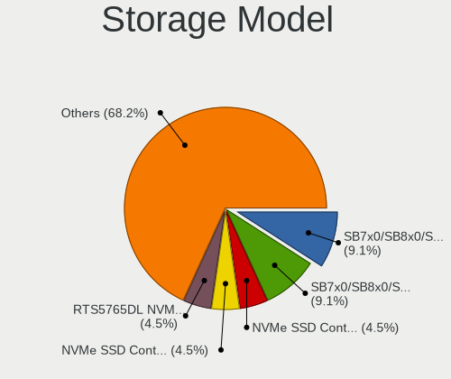
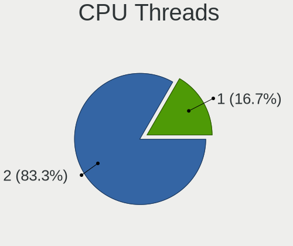
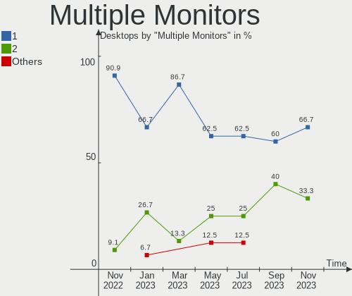
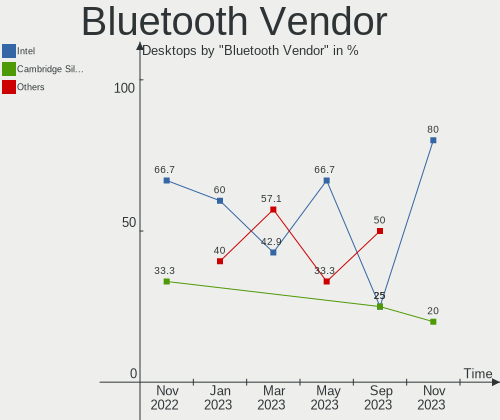
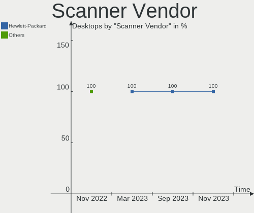
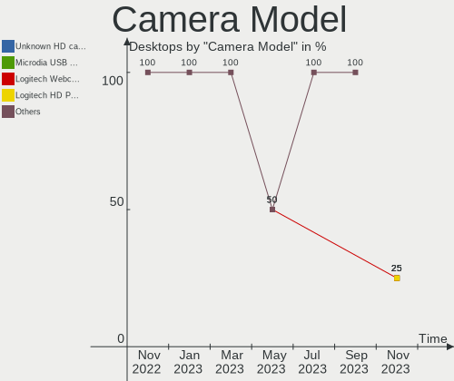

Ubuntu MATE - Hardware Trends (Desktops)
----------------------------------------

A project to identify most popular hardware characteristics and track their change
over time based on data collected by Linux users at https://Linux-Hardware.org.

Anyone can contribute to this report by the [hw-probe](https://github.com/linuxhw/hw-probe) tool:

    sudo -E hw-probe -all -upload

This report is for one last month. Overall report since the beginning of time: [TestDays](https://github.com/linuxhw/TestDays)

Period: Mar, 2023.

Contents
--------

* [ System ](#system)
  - [ OS                       ](#os)
  - [ OS Family                ](#os-family)
  - [ Kernel                   ](#kernel)
  - [ Kernel Family            ](#kernel-family)
  - [ Kernel Major Ver.        ](#kernel-major-ver)
  - [ Arch                     ](#arch)
  - [ DE                       ](#de)
  - [ Display Server           ](#display-server)
  - [ Display Manager          ](#display-manager)
  - [ OS Lang                  ](#os-lang)
  - [ Boot Mode                ](#boot-mode)
  - [ Filesystem               ](#filesystem)
  - [ Part. scheme             ](#part-scheme)
  - [ Dual Boot with Linux/BSD ](#dual-boot-with-linuxbsd)
  - [ Dual Boot (Win)          ](#dual-boot-win)

* [ Board ](#board)
  - [ Vendor                   ](#vendor)
  - [ Model                    ](#model)
  - [ Model Family             ](#model-family)
  - [ MFG Year                 ](#mfg-year)
  - [ Form Factor              ](#form-factor)
  - [ Secure Boot              ](#secure-boot)
  - [ Coreboot                 ](#coreboot)
  - [ RAM Size                 ](#ram-size)
  - [ RAM Used                 ](#ram-used)
  - [ Total Drives             ](#total-drives)
  - [ Has CD-ROM               ](#has-cd-rom)
  - [ Has Ethernet             ](#has-ethernet)
  - [ Has WiFi                 ](#has-wifi)
  - [ Has Bluetooth            ](#has-bluetooth)

* [ Location ](#location)
  - [ Country                  ](#country)
  - [ City                     ](#city)

* [ Drives ](#drives)
  - [ Drive Vendor             ](#drive-vendor)
  - [ Drive Model              ](#drive-model)
  - [ HDD Vendor               ](#hdd-vendor)
  - [ SSD Vendor               ](#ssd-vendor)
  - [ Drive Kind               ](#drive-kind)
  - [ Drive Connector          ](#drive-connector)
  - [ Drive Size               ](#drive-size)
  - [ Space Total              ](#space-total)
  - [ Space Used               ](#space-used)
  - [ Malfunc. Drives          ](#malfunc-drives)
  - [ Malfunc. Drive Vendor    ](#malfunc-drive-vendor)
  - [ Malfunc. HDD Vendor      ](#malfunc-hdd-vendor)
  - [ Malfunc. Drive Kind      ](#malfunc-drive-kind)
  - [ Failed Drives            ](#failed-drives)
  - [ Failed Drive Vendor      ](#failed-drive-vendor)
  - [ Drive Status             ](#drive-status)

* [ Storage controller ](#storage-controller)
  - [ Storage Vendor           ](#storage-vendor)
  - [ Storage Model            ](#storage-model)
  - [ Storage Kind             ](#storage-kind)

* [ Processor ](#processor)
  - [ CPU Vendor               ](#cpu-vendor)
  - [ CPU Model                ](#cpu-model)
  - [ CPU Model Family         ](#cpu-model-family)
  - [ CPU Cores                ](#cpu-cores)
  - [ CPU Sockets              ](#cpu-sockets)
  - [ CPU Threads              ](#cpu-threads)
  - [ CPU Op-Modes             ](#cpu-op-modes)
  - [ CPU Microcode            ](#cpu-microcode)
  - [ CPU Microarch            ](#cpu-microarch)

* [ Graphics ](#graphics)
  - [ GPU Vendor               ](#gpu-vendor)
  - [ GPU Model                ](#gpu-model)
  - [ GPU Combo                ](#gpu-combo)
  - [ GPU Driver               ](#gpu-driver)
  - [ GPU Memory               ](#gpu-memory)

* [ Monitor ](#monitor)
  - [ Monitor Vendor           ](#monitor-vendor)
  - [ Monitor Model            ](#monitor-model)
  - [ Monitor Resolution       ](#monitor-resolution)
  - [ Monitor Diagonal         ](#monitor-diagonal)
  - [ Monitor Width            ](#monitor-width)
  - [ Aspect Ratio             ](#aspect-ratio)
  - [ Monitor Area             ](#monitor-area)
  - [ Pixel Density            ](#pixel-density)
  - [ Multiple Monitors        ](#multiple-monitors)

* [ Network ](#network)
  - [ Net Controller Vendor    ](#net-controller-vendor)
  - [ Net Controller Model     ](#net-controller-model)
  - [ Wireless Vendor          ](#wireless-vendor)
  - [ Wireless Model           ](#wireless-model)
  - [ Ethernet Vendor          ](#ethernet-vendor)
  - [ Ethernet Model           ](#ethernet-model)
  - [ Net Controller Kind      ](#net-controller-kind)
  - [ Used Controller          ](#used-controller)
  - [ NICs                     ](#nics)
  - [ IPv6                     ](#ipv6)

* [ Bluetooth ](#bluetooth)
  - [ Bluetooth Vendor         ](#bluetooth-vendor)
  - [ Bluetooth Model          ](#bluetooth-model)

* [ Sound ](#sound)
  - [ Sound Vendor             ](#sound-vendor)
  - [ Sound Model              ](#sound-model)

* [ Memory ](#memory)
  - [ Memory Vendor            ](#memory-vendor)
  - [ Memory Model             ](#memory-model)
  - [ Memory Kind              ](#memory-kind)
  - [ Memory Form Factor       ](#memory-form-factor)
  - [ Memory Size              ](#memory-size)
  - [ Memory Speed             ](#memory-speed)

* [ Printers & scanners ](#printers--scanners)
  - [ Printer Vendor           ](#printer-vendor)
  - [ Printer Model            ](#printer-model)
  - [ Scanner Vendor           ](#scanner-vendor)
  - [ Scanner Model            ](#scanner-model)

* [ Camera ](#camera)
  - [ Camera Vendor            ](#camera-vendor)
  - [ Camera Model             ](#camera-model)

* [ Security ](#security)
  - [ Fingerprint Vendor       ](#fingerprint-vendor)
  - [ Fingerprint Model        ](#fingerprint-model)
  - [ Chipcard Vendor          ](#chipcard-vendor)
  - [ Chipcard Model           ](#chipcard-model)

* [ Unsupported ](#unsupported)
  - [ Unsupported Devices      ](#unsupported-devices)
  - [ Unsupported Device Types ](#unsupported-device-types)

System
------

OS
--

Installed operating systems

| Name              | Desktops | Percent |
|-------------------|----------|---------|
| Ubuntu MATE 22.04 | 13       | 86.67%  |
| Ubuntu MATE 23.04 | 1        | 6.67%   |
| Ubuntu MATE 22.10 | 1        | 6.67%   |

OS Family
---------

OS without a version

| Name        | Desktops | Percent |
|-------------|----------|---------|
| Ubuntu MATE | 15       | 100%    |

Kernel
------

Version of the Linux kernel

| Version           | Desktops | Percent |
|-------------------|----------|---------|
| 5.15.0-67-generic | 5        | 33.33%  |
| 5.19.0-35-generic | 2        | 13.33%  |
| 5.19.0-32-generic | 2        | 13.33%  |
| 5.15.0-60-generic | 2        | 13.33%  |
| 6.1.0-16-generic  | 1        | 6.67%   |
| 5.19.0-38-generic | 1        | 6.67%   |
| 5.19.0-37-generic | 1        | 6.67%   |
| 5.15.0-25-generic | 1        | 6.67%   |

Kernel Family
-------------

Linux kernel without a distro release

| Version | Desktops | Percent |
|---------|----------|---------|
| 5.15.0  | 8        | 53.33%  |
| 5.19.0  | 6        | 40%     |
| 6.1.0   | 1        | 6.67%   |

Kernel Major Ver.
-----------------

Linux kernel major version

| Version | Desktops | Percent |
|---------|----------|---------|
| 5.15    | 8        | 53.33%  |
| 5.19    | 6        | 40%     |
| 6.1     | 1        | 6.67%   |

Arch
----

OS architecture (x86_64, i586, etc.)

| Name   | Desktops | Percent |
|--------|----------|---------|
| x86_64 | 15       | 100%    |

DE
--

Desktop Environment

| Name | Desktops | Percent |
|------|----------|---------|
| MATE | 15       | 100%    |

Display Server
--------------

X11 or Wayland

| Name    | Desktops | Percent |
|---------|----------|---------|
| X11     | 14       | 93.33%  |
| Wayland | 1        | 6.67%   |

Display Manager
---------------

SDDM, LightDM, etc.

| Name    | Desktops | Percent |
|---------|----------|---------|
| LightDM | 11       | 73.33%  |
| Unknown | 3        | 20%     |
| GDM3    | 1        | 6.67%   |

OS Lang
-------

Language

| Lang  | Desktops | Percent |
|-------|----------|---------|
| en_US | 5        | 33.33%  |
| fr_FR | 3        | 20%     |
| it_IT | 2        | 13.33%  |
| pt_BR | 1        | 6.67%   |
| es_AR | 1        | 6.67%   |
| en_AU | 1        | 6.67%   |
| de_DE | 1        | 6.67%   |
| C     | 1        | 6.67%   |

Boot Mode
---------

EFI or BIOS

| Mode | Desktops | Percent |
|------|----------|---------|
| EFI  | 8        | 53.33%  |
| BIOS | 7        | 46.67%  |

Filesystem
----------

Type of filesystem

| Type    | Desktops | Percent |
|---------|----------|---------|
| Ext4    | 10       | 66.67%  |
| Overlay | 2        | 13.33%  |
| Xfs     | 1        | 6.67%   |
| Ext2    | 1        | 6.67%   |
| Btrfs   | 1        | 6.67%   |

Part. scheme
------------

Scheme of partitioning

| Type    | Desktops | Percent |
|---------|----------|---------|
| GPT     | 8        | 53.33%  |
| MBR     | 4        | 26.67%  |
| Unknown | 3        | 20%     |

Dual Boot with Linux/BSD
------------------------

Hosting more than one Linux/BSD

| Dual boot | Desktops | Percent |
|-----------|----------|---------|
| No        | 13       | 86.67%  |
| Yes       | 2        | 13.33%  |

Dual Boot (Win)
---------------

Hosting Linux and Windows

| Dual boot | Desktops | Percent |
|-----------|----------|---------|
| No        | 12       | 80%     |
| Yes       | 3        | 20%     |

Board
-----

Vendor
------

Motherboard manufacturer

| Name                                 | Desktops | Percent |
|--------------------------------------|----------|---------|
| ASUSTek Computer                     | 4        | 26.67%  |
| MSI                                  | 3        | 20%     |
| Gigabyte Technology                  | 2        | 13.33%  |
| Shenzhen Meigao Electronic Equipment | 1        | 6.67%   |
| Lenovo                               | 1        | 6.67%   |
| Hewlett-Packard                      | 1        | 6.67%   |
| CCE                                  | 1        | 6.67%   |
| ASRock                               | 1        | 6.67%   |
| Acer                                 | 1        | 6.67%   |

Model
-----

Motherboard model

| Name                                       | Desktops | Percent |
|--------------------------------------------|----------|---------|
| Shenzhen Meigao Electronic Equipment HX90G | 1        | 6.67%   |
| MSI MS-7D43                                | 1        | 6.67%   |
| MSI MS-7C37                                | 1        | 6.67%   |
| MSI MS-7A33                                | 1        | 6.67%   |
| Lenovo H50-55 90BG000TFR                   | 1        | 6.67%   |
| HP Compaq Pro 6300 MT                      | 1        | 6.67%   |
| Gigabyte X570S AERO G                      | 1        | 6.67%   |
| Gigabyte B85M-D3H                          | 1        | 6.67%   |
| CCE NM70-I                                 | 1        | 6.67%   |
| ASUS M5A97 R2.0                            | 1        | 6.67%   |
| ASUS M5A78L-M LX                           | 1        | 6.67%   |
| ASUS M5A78L LE                             | 1        | 6.67%   |
| ASUS H61M-K                                | 1        | 6.67%   |
| ASRock A320M-HDV R4.0                      | 1        | 6.67%   |
| Acer Aspire XC-1760                        | 1        | 6.67%   |

Model Family
------------

Motherboard model prefix

| Name                                       | Desktops | Percent |
|--------------------------------------------|----------|---------|
| Shenzhen Meigao Electronic Equipment HX90G | 1        | 6.67%   |
| MSI MS-7D43                                | 1        | 6.67%   |
| MSI MS-7C37                                | 1        | 6.67%   |
| MSI MS-7A33                                | 1        | 6.67%   |
| Lenovo H50-55                              | 1        | 6.67%   |
| HP Compaq                                  | 1        | 6.67%   |
| Gigabyte X570S                             | 1        | 6.67%   |
| Gigabyte B85M-D3H                          | 1        | 6.67%   |
| CCE NM70-I                                 | 1        | 6.67%   |
| ASUS M5A97                                 | 1        | 6.67%   |
| ASUS M5A78L-M                              | 1        | 6.67%   |
| ASUS M5A78L                                | 1        | 6.67%   |
| ASUS H61M-K                                | 1        | 6.67%   |
| ASRock A320M-HDV                           | 1        | 6.67%   |
| Acer Aspire                                | 1        | 6.67%   |

MFG Year
--------

Motherboard manufacture year

| Year | Desktops | Percent |
|------|----------|---------|
| 2012 | 3        | 20%     |
| 2022 | 2        | 13.33%  |
| 2021 | 2        | 13.33%  |
| 2013 | 2        | 13.33%  |
| 2011 | 2        | 13.33%  |
| 2019 | 1        | 6.67%   |
| 2018 | 1        | 6.67%   |
| 2017 | 1        | 6.67%   |
| 2015 | 1        | 6.67%   |

Form Factor
-----------

Physical design of the computer

| Name    | Desktops | Percent |
|---------|----------|---------|
| Desktop | 15       | 100%    |

Secure Boot
-----------

Enabled or disabled

| State    | Desktops | Percent |
|----------|----------|---------|
| Disabled | 13       | 86.67%  |
| Enabled  | 2        | 13.33%  |

Coreboot
--------

Have coreboot on board

| Used | Desktops | Percent |
|------|----------|---------|
| No   | 15       | 100%    |

RAM Size
--------

Total RAM memory

| Size in GB  | Desktops | Percent |
|-------------|----------|---------|
| 3.01-4.0    | 5        | 33.33%  |
| 32.01-64.0  | 4        | 26.67%  |
| 4.01-8.0    | 2        | 13.33%  |
| 8.01-16.0   | 2        | 13.33%  |
| 64.01-256.0 | 1        | 6.67%   |
| 16.01-24.0  | 1        | 6.67%   |

RAM Used
--------

Used RAM memory

| Used GB   | Desktops | Percent |
|-----------|----------|---------|
| 1.01-2.0  | 6        | 40%     |
| 2.01-3.0  | 3        | 20%     |
| 4.01-8.0  | 2        | 13.33%  |
| 3.01-4.0  | 2        | 13.33%  |
| 8.01-16.0 | 2        | 13.33%  |

Total Drives
------------

Number of drives on board

| Drives | Desktops | Percent |
|--------|----------|---------|
| 2      | 6        | 40%     |
| 1      | 5        | 33.33%  |
| 8      | 1        | 6.67%   |
| 5      | 1        | 6.67%   |
| 4      | 1        | 6.67%   |
| 0      | 1        | 6.67%   |

Has CD-ROM
----------

Has CD-ROM on board

| Presented | Desktops | Percent |
|-----------|----------|---------|
| No        | 8        | 53.33%  |
| Yes       | 7        | 46.67%  |

Has Ethernet
------------

Has Ethernet on board

| Presented | Desktops | Percent |
|-----------|----------|---------|
| Yes       | 15       | 100%    |

Has WiFi
--------

Has WiFi module

| Presented | Desktops | Percent |
|-----------|----------|---------|
| No        | 9        | 60%     |
| Yes       | 6        | 40%     |

Has Bluetooth
-------------

Has Bluetooth module

| Presented | Desktops | Percent |
|-----------|----------|---------|
| No        | 8        | 53.33%  |
| Yes       | 7        | 46.67%  |

Location
--------

Country
-------

Geographic location (country)

| Country   | Desktops | Percent |
|-----------|----------|---------|
| Italy     | 3        | 20%     |
| Germany   | 3        | 20%     |
| France    | 3        | 20%     |
| Brazil    | 2        | 13.33%  |
| Portugal  | 1        | 6.67%   |
| Belgium   | 1        | 6.67%   |
| Australia | 1        | 6.67%   |
| Argentina | 1        | 6.67%   |

City
----

Geographic location (city)

| City                | Desktops | Percent |
|---------------------|----------|---------|
| Uberaba             | 1        | 6.67%   |
| Savona              | 1        | 6.67%   |
| Savigny-en-Sancerre | 1        | 6.67%   |
| Rome                | 1        | 6.67%   |
| Rio Bonito          | 1        | 6.67%   |
| Ratingen            | 1        | 6.67%   |
| Perth               | 1        | 6.67%   |
| Olivos              | 1        | 6.67%   |
| Milano              | 1        | 6.67%   |
| Mannheim            | 1        | 6.67%   |
| Mâcon              | 1        | 6.67%   |
| Lisbon              | 1        | 6.67%   |
| Lede                | 1        | 6.67%   |
| Delligsen           | 1        | 6.67%   |
| Bordeaux            | 1        | 6.67%   |

Drives
------

Drive Vendor
------------

Hard drive vendors

| Vendor              | Desktops | Drives | Percent |
|---------------------|----------|--------|---------|
| WDC                 | 4        | 5      | 15.38%  |
| Seagate             | 4        | 4      | 15.38%  |
| Kingston            | 3        | 3      | 11.54%  |
| Crucial             | 3        | 3      | 11.54%  |
| Samsung Electronics | 2        | 4      | 7.69%   |
| Unknown             | 1        | 3      | 3.85%   |
| Transcend           | 1        | 1      | 3.85%   |
| Toshiba             | 1        | 3      | 3.85%   |
| Team                | 1        | 1      | 3.85%   |
| Pichau              | 1        | 1      | 3.85%   |
| Phison Electronics  | 1        | 1      | 3.85%   |
| Phison              | 1        | 1      | 3.85%   |
| LDLC                | 1        | 1      | 3.85%   |
| Intenso             | 1        | 1      | 3.85%   |
| HGST                | 1        | 1      | 3.85%   |

Drive Model
-----------

Hard drive models

| Model                                | Desktops | Percent |
|--------------------------------------|----------|---------|
| WDC WD5003AZEX-00K1GA0 500GB         | 1        | 3.45%   |
| WDC WD5001AALS-00J7B1 500GB          | 1        | 3.45%   |
| WDC WD40EZRZ-00GXCB0 4TB             | 1        | 3.45%   |
| WDC WD10EZEX-08WN4A0 1TB             | 1        | 3.45%   |
| WDC WD10EARX-00N0YB0 1TB             | 1        | 3.45%   |
| Unknown SD/MMC 2GB                   | 1        | 3.45%   |
| Unknown M.S./M.S.Pro/HG 16GB         | 1        | 3.45%   |
| Transcend TS1TSSD220Q 1TB            | 1        | 3.45%   |
| Toshiba MG06ACA800E 8TB              | 1        | 3.45%   |
| Team T2535T240G 240GB SSD            | 1        | 3.45%   |
| Seagate ST6000NM0024-1HT17Z 6TB      | 1        | 3.45%   |
| Seagate ST500DM002-1BD142 500GB      | 1        | 3.45%   |
| Seagate ST500DM002-1BC142 500GB      | 1        | 3.45%   |
| Seagate ST1000DM003-1ER162 1TB       | 1        | 3.45%   |
| Samsung SSD 980 500GB                | 1        | 3.45%   |
| Samsung SSD 860 PRO 256GB            | 1        | 3.45%   |
| Samsung MZVLQ512HBLU-00B00 512GB     | 1        | 3.45%   |
| Pichau Gaming PG256X 256GB SSD       | 1        | 3.45%   |
| Phison ESO512GYLCT-EP3-2L 512GB      | 1        | 3.45%   |
| Phison E16 PCIe4 NVMe Controller 1TB | 1        | 3.45%   |
| LDLC F7+240GB SSD                    | 1        | 3.45%   |
| Kingston SA400S37480G 480GB SSD      | 1        | 3.45%   |
| Kingston SA400S37120G 120GB SSD      | 1        | 3.45%   |
| Kingston SA2000M8250G 250GB          | 1        | 3.45%   |
| Intenso SCSI 2TB                     | 1        | 3.45%   |
| HGST HUS726T6TALE6L4 6TB             | 1        | 3.45%   |
| Crucial CT500P2SSD8 500GB            | 1        | 3.45%   |
| Crucial CT240BX500SSD1 240GB         | 1        | 3.45%   |
| Crucial CT1050MX300SSD1 1TB          | 1        | 3.45%   |

HDD Vendor
----------

Hard disk drive vendors

| Vendor  | Desktops | Drives | Percent |
|---------|----------|--------|---------|
| WDC     | 4        | 5      | 40%     |
| Seagate | 4        | 4      | 40%     |
| Toshiba | 1        | 3      | 10%     |
| HGST    | 1        | 1      | 10%     |

SSD Vendor
----------

Solid state drive vendors

| Vendor              | Desktops | Drives | Percent |
|---------------------|----------|--------|---------|
| Kingston            | 2        | 2      | 22.22%  |
| Crucial             | 2        | 2      | 22.22%  |
| Transcend           | 1        | 1      | 11.11%  |
| Team                | 1        | 1      | 11.11%  |
| Samsung Electronics | 1        | 1      | 11.11%  |
| Pichau              | 1        | 1      | 11.11%  |
| LDLC                | 1        | 1      | 11.11%  |

Drive Kind
----------

HDD or SSD

| Kind    | Desktops | Drives | Percent |
|---------|----------|--------|---------|
| HDD     | 9        | 13     | 40.91%  |
| SSD     | 8        | 9      | 36.36%  |
| NVMe    | 4        | 7      | 18.18%  |
| Unknown | 1        | 4      | 4.55%   |

Drive Connector
---------------

SATA, SAS, NVMe, etc.

| Type | Desktops | Drives | Percent |
|------|----------|--------|---------|
| SATA | 12       | 22     | 70.59%  |
| NVMe | 4        | 7      | 23.53%  |
| SAS  | 1        | 4      | 5.88%   |

Drive Size
----------

Size of hard drive

| Size in TB | Desktops | Drives | Percent |
|------------|----------|--------|---------|
| 0.01-0.5   | 9        | 11     | 52.94%  |
| 0.51-1.0   | 5        | 5      | 29.41%  |
| 4.01-10.0  | 2        | 5      | 11.76%  |
| 3.01-4.0   | 1        | 1      | 5.88%   |

Space Total
-----------

Amount of disk space available on the file system

| Size in GB     | Desktops | Percent |
|----------------|----------|---------|
| More than 3000 | 3        | 20%     |
| 101-250        | 3        | 20%     |
| 251-500        | 2        | 13.33%  |
| 21-50          | 2        | 13.33%  |
| 501-1000       | 2        | 13.33%  |
| 2001-3000      | 1        | 6.67%   |
| 1001-2000      | 1        | 6.67%   |
| 1-20           | 1        | 6.67%   |

Space Used
----------

Amount of used disk space

| Used GB        | Desktops | Percent |
|----------------|----------|---------|
| 1-20           | 4        | 26.67%  |
| 51-100         | 3        | 20%     |
| 2001-3000      | 2        | 13.33%  |
| 101-250        | 2        | 13.33%  |
| More than 3000 | 1        | 6.67%   |
| 251-500        | 1        | 6.67%   |
| 21-50          | 1        | 6.67%   |
| 1001-2000      | 1        | 6.67%   |

Malfunc. Drives
---------------

Drive models with a malfunction

| Model                          | Desktops | Drives | Percent |
|--------------------------------|----------|--------|---------|
| Seagate ST1000DM003-1ER162 1TB | 1        | 1      | 100%    |

Malfunc. Drive Vendor
---------------------

Vendors of faulty drives

| Vendor  | Desktops | Drives | Percent |
|---------|----------|--------|---------|
| Seagate | 1        | 1      | 100%    |

Malfunc. HDD Vendor
-------------------

Vendors of faulty HDD drives

| Vendor  | Desktops | Drives | Percent |
|---------|----------|--------|---------|
| Seagate | 1        | 1      | 100%    |

Malfunc. Drive Kind
-------------------

Kinds of faulty drives

| Kind | Desktops | Drives | Percent |
|------|----------|--------|---------|
| HDD  | 1        | 1      | 100%    |

Failed Drives
-------------

Failed drive models

Zero info for selected period =(

Failed Drive Vendor
-------------------

Failed drive vendors

Zero info for selected period =(

Drive Status
------------

Number of failed and malfunc. drives

| Status   | Desktops | Drives | Percent |
|----------|----------|--------|---------|
| Works    | 9        | 22     | 60%     |
| Detected | 5        | 10     | 33.33%  |
| Malfunc  | 1        | 1      | 6.67%   |

Storage controller
------------------

Storage Vendor
--------------

Storage controller vendors

| Vendor                      | Desktops | Percent |
|-----------------------------|----------|---------|
| AMD                         | 9        | 42.86%  |
| Intel                       | 5        | 23.81%  |
| Samsung Electronics         | 2        | 9.52%   |
| Phison Electronics          | 2        | 9.52%   |
| Micron/Crucial Technology   | 1        | 4.76%   |
| Kingston Technology Company | 1        | 4.76%   |
| ASMedia Technology          | 1        | 4.76%   |

Storage Model
-------------

Storage controller models

| Model                                                                          | Desktops | Percent |
|--------------------------------------------------------------------------------|----------|---------|
| AMD FCH SATA Controller [AHCI mode]                                            | 6        | 23.08%  |
| Samsung NVMe SSD Controller 980                                                | 2        | 7.69%   |
| Intel Alder Lake-S PCH SATA Controller [AHCI Mode]                             | 2        | 7.69%   |
| AMD SB7x0/SB8x0/SB9x0 SATA Controller [IDE mode]                               | 2        | 7.69%   |
| AMD SB7x0/SB8x0/SB9x0 IDE Controller                                           | 2        | 7.69%   |
| Phison PS5013 E13 NVMe Controller                                              | 1        | 3.85%   |
| Phison E16 PCIe4 NVMe Controller                                               | 1        | 3.85%   |
| Micron/Crucial P2 NVMe PCIe SSD                                                | 1        | 3.85%   |
| Kingston Company A2000 NVMe SSD                                                | 1        | 3.85%   |
| Intel Volume Management Device NVMe RAID Controller                            | 1        | 3.85%   |
| Intel 8 Series/C220 Series Chipset Family 6-port SATA Controller 1 [AHCI mode] | 1        | 3.85%   |
| Intel 7 Series/C210 Series Chipset Family 6-port SATA Controller [AHCI mode]   | 1        | 3.85%   |
| Intel 6 Series/C200 Series Chipset Family 6 port Desktop SATA AHCI Controller  | 1        | 3.85%   |
| ASMedia ASM1062 Serial ATA Controller                                          | 1        | 3.85%   |
| AMD X370 Series Chipset SATA Controller                                        | 1        | 3.85%   |
| AMD SB7x0/SB8x0/SB9x0 SATA Controller [AHCI mode]                              | 1        | 3.85%   |
| AMD FCH SATA Controller D                                                      | 1        | 3.85%   |

Storage Kind
------------

Kind of storage controller (IDE, SATA, NVMe, SAS, ...)

| Kind | Desktops | Percent |
|------|----------|---------|
| SATA | 14       | 66.67%  |
| NVMe | 4        | 19.05%  |
| IDE  | 2        | 9.52%   |
| RAID | 1        | 4.76%   |

Processor
---------

CPU Vendor
----------

Processor vendors

| Vendor | Desktops | Percent |
|--------|----------|---------|
| AMD    | 9        | 60%     |
| Intel  | 6        | 40%     |

CPU Model
---------

Processor models

| Model                                          | Desktops | Percent |
|------------------------------------------------|----------|---------|
| Intel Xeon CPU E3-1245 v3 @ 3.40GHz            | 1        | 6.67%   |
| Intel Pentium CPU G2020 @ 2.90GHz              | 1        | 6.67%   |
| Intel Core i5-3470 CPU @ 3.20GHz               | 1        | 6.67%   |
| Intel Celeron CPU 847 @ 1.10GHz                | 1        | 6.67%   |
| Intel 12th Gen Core i5-12600K                  | 1        | 6.67%   |
| Intel 12th Gen Core i5-12400                   | 1        | 6.67%   |
| AMD Ryzen 9 5900HX with Radeon Graphics        | 1        | 6.67%   |
| AMD Ryzen 7 5800X 8-Core Processor             | 1        | 6.67%   |
| AMD Ryzen 7 1700 Eight-Core Processor          | 1        | 6.67%   |
| AMD Ryzen 5 3600 6-Core Processor              | 1        | 6.67%   |
| AMD FX-6300 Six-Core Processor                 | 1        | 6.67%   |
| AMD FX-6100 Six-Core Processor                 | 1        | 6.67%   |
| AMD Athlon II X2 245 Processor                 | 1        | 6.67%   |
| AMD A8-9600 RADEON R7, 10 COMPUTE CORES 4C+6G  | 1        | 6.67%   |
| AMD A10-7800 Radeon R7, 12 Compute Cores 4C+8G | 1        | 6.67%   |

CPU Model Family
----------------

Processor model prefix

| Model            | Desktops | Percent |
|------------------|----------|---------|
| Other            | 2        | 13.33%  |
| AMD Ryzen 7      | 2        | 13.33%  |
| AMD FX           | 2        | 13.33%  |
| Intel Xeon       | 1        | 6.67%   |
| Intel Pentium    | 1        | 6.67%   |
| Intel Core i5    | 1        | 6.67%   |
| Intel Celeron    | 1        | 6.67%   |
| AMD Ryzen 9      | 1        | 6.67%   |
| AMD Ryzen 5      | 1        | 6.67%   |
| AMD Athlon II X2 | 1        | 6.67%   |
| AMD A8           | 1        | 6.67%   |
| AMD A10          | 1        | 6.67%   |

CPU Cores
---------

Number of processor cores

| Number | Desktops | Percent |
|--------|----------|---------|
| 2      | 5        | 33.33%  |
| 8      | 3        | 20%     |
| 6      | 2        | 13.33%  |
| 4      | 2        | 13.33%  |
| 3      | 2        | 13.33%  |
| 10     | 1        | 6.67%   |

CPU Sockets
-----------

Number of sockets

| Number | Desktops | Percent |
|--------|----------|---------|
| 1      | 15       | 100%    |

CPU Threads
-----------

Threads per core (Hyper-Threading)

| Number | Desktops | Percent |
|--------|----------|---------|
| 2      | 11       | 73.33%  |
| 1      | 4        | 26.67%  |

CPU Op-Modes
------------

CPU Operation Modes (32-bit, 64-bit)

| Op mode        | Desktops | Percent |
|----------------|----------|---------|
| 32-bit, 64-bit | 15       | 100%    |

CPU Microcode
-------------

Microcode number

| Number     | Desktops | Percent |
|------------|----------|---------|
| Unknown    | 7        | 46.67%  |
| 0x306c3    | 1        | 6.67%   |
| 0x306a9    | 1        | 6.67%   |
| 0x206a7    | 1        | 6.67%   |
| 0x0a50000d | 1        | 6.67%   |
| 0x0600611a | 1        | 6.67%   |
| 0x06003106 | 1        | 6.67%   |
| 0x06000852 | 1        | 6.67%   |
| 0x0600063e | 1        | 6.67%   |

CPU Microarch
-------------

Microarchitecture

| Name        | Desktops | Percent |
|-------------|----------|---------|
| Zen 3       | 2        | 13.33%  |
| IvyBridge   | 2        | 13.33%  |
| Unknown     | 2        | 13.33%  |
| Zen 2       | 1        | 6.67%   |
| Zen         | 1        | 6.67%   |
| Steamroller | 1        | 6.67%   |
| SandyBridge | 1        | 6.67%   |
| Piledriver  | 1        | 6.67%   |
| K10         | 1        | 6.67%   |
| Haswell     | 1        | 6.67%   |
| Excavator   | 1        | 6.67%   |
| Bulldozer   | 1        | 6.67%   |

Graphics
--------

GPU Vendor
----------

Vendors of graphics cards

| Vendor | Desktops | Percent |
|--------|----------|---------|
| Nvidia | 7        | 43.75%  |
| AMD    | 5        | 31.25%  |
| Intel  | 4        | 25%     |

GPU Model
---------

Graphics card models

| Model                                                                     | Desktops | Percent |
|---------------------------------------------------------------------------|----------|---------|
| AMD Navi 23 [Radeon RX 6600/6600 XT/6600M]                                | 2        | 11.11%  |
| Nvidia TU116 [GeForce GTX 1650 SUPER]                                     | 1        | 5.56%   |
| Nvidia TU106 [GeForce RTX 2060 Rev. A]                                    | 1        | 5.56%   |
| Nvidia GP108 [GeForce GT 1030]                                            | 1        | 5.56%   |
| Nvidia GP107GL [Quadro P620]                                              | 1        | 5.56%   |
| Nvidia GK208B [GeForce GT 730]                                            | 1        | 5.56%   |
| Nvidia GK208B [GeForce GT 710]                                            | 1        | 5.56%   |
| Nvidia GF119 [GeForce GT 520]                                             | 1        | 5.56%   |
| Intel Xeon E3-1200 v3 Processor Integrated Graphics Controller            | 1        | 5.56%   |
| Intel Xeon E3-1200 v2/3rd Gen Core processor Graphics Controller          | 1        | 5.56%   |
| Intel Alder Lake-S GT1 [UHD Graphics 730]                                 | 1        | 5.56%   |
| Intel 2nd Generation Core Processor Family Integrated Graphics Controller | 1        | 5.56%   |
| AMD Wani [Radeon R5/R6/R7 Graphics]                                       | 1        | 5.56%   |
| AMD RS780L [Radeon 3000]                                                  | 1        | 5.56%   |
| AMD Oland [Radeon HD 8570 / R5 430 OEM / R7 240/340 / Radeon 520 OEM]     | 1        | 5.56%   |
| AMD Kaveri [Radeon R7 Graphics]                                           | 1        | 5.56%   |
| AMD Cezanne [Radeon Vega Series / Radeon Vega Mobile Series]              | 1        | 5.56%   |

GPU Combo
---------

Combinations of graphics cards

| Name           | Desktops | Percent |
|----------------|----------|---------|
| 1 x Nvidia     | 6        | 40%     |
| 1 x Intel      | 3        | 20%     |
| 1 x AMD        | 3        | 20%     |
| 2 x AMD        | 2        | 13.33%  |
| Intel + Nvidia | 1        | 6.67%   |

GPU Driver
----------

Free vs proprietary

| Driver      | Desktops | Percent |
|-------------|----------|---------|
| Free        | 11       | 73.33%  |
| Proprietary | 4        | 26.67%  |

GPU Memory
----------

Total video memory

| Size in GB | Desktops | Percent |
|------------|----------|---------|
| Unknown    | 7        | 46.67%  |
| 1.01-2.0   | 2        | 13.33%  |
| 0.51-1.0   | 2        | 13.33%  |
| 0.01-0.5   | 2        | 13.33%  |
| 7.01-8.0   | 1        | 6.67%   |
| 3.01-4.0   | 1        | 6.67%   |

Monitor
-------

Monitor Vendor
--------------

Monitor vendors

| Vendor               | Desktops | Percent |
|----------------------|----------|---------|
| Samsung Electronics  | 4        | 23.53%  |
| Goldstar             | 4        | 23.53%  |
| Philips              | 3        | 17.65%  |
| ViewSonic            | 1        | 5.88%   |
| SNC                  | 1        | 5.88%   |
| Lenovo Group Limited | 1        | 5.88%   |
| Kogan                | 1        | 5.88%   |
| Fujitsu Siemens      | 1        | 5.88%   |
| Dell                 | 1        | 5.88%   |

Monitor Model
-------------

Monitor models

| Model                                                                | Desktops | Percent |
|----------------------------------------------------------------------|----------|---------|
| ViewSonic VA2046 SERIES VSC6D2E 1600x900 432x240mm 19.5-inch         | 1        | 5.88%   |
| SNC SKP_E20-32 SNC3200 1920x1080 477x268mm 21.5-inch                 | 1        | 5.88%   |
| Samsung Electronics SA300/SA350 SAM0788 1366x768 410x230mm 18.5-inch | 1        | 5.88%   |
| Samsung Electronics S22F350 SAM0D1A 1920x1080 477x268mm 21.5-inch    | 1        | 5.88%   |
| Samsung Electronics S22E450 SAM0C79 1920x1080 477x268mm 21.5-inch    | 1        | 5.88%   |
| Samsung Electronics S19C301 SAM0B07 1366x768 410x230mm 18.5-inch     | 1        | 5.88%   |
| Philips PHL 439P1 PHL0973 3840x2160 941x529mm 42.5-inch              | 1        | 5.88%   |
| Philips PHL 243V7 PHLC155 1920x1080 527x296mm 23.8-inch              | 1        | 5.88%   |
| Philips 220S4L PHL08BE 1680x1050 474x296mm 22.0-inch                 | 1        | 5.88%   |
| Lenovo Group Limited LCD Monitor LEN T24i-10 1920x1080               | 1        | 5.88%   |
| Kogan DP KGN0AF0 3840x2160 620x341mm 27.9-inch                       | 1        | 5.88%   |
| Goldstar ULTRAWIDE GSM777D 3840x1600 880x367mm 37.5-inch             | 1        | 5.88%   |
| Goldstar ULTRAGEAR GSM5BD2 2560x1440 697x392mm 31.5-inch             | 1        | 5.88%   |
| Goldstar TV SSCR2 GSMC0C8 3840x2160                                  | 1        | 5.88%   |
| Goldstar E2240 GSM57A3 1920x1080 477x268mm 21.5-inch                 | 1        | 5.88%   |
| Fujitsu Siemens SL3260W FUS07CC 1920x1080 550x344mm 25.5-inch        | 1        | 5.88%   |
| Dell U2715H DELD066 2560x1440 597x336mm 27.0-inch                    | 1        | 5.88%   |

Monitor Resolution
------------------

Monitor screen resolution

| Resolution         | Desktops | Percent |
|--------------------|----------|---------|
| 1920x1080 (FHD)    | 6        | 37.5%   |
| 3840x2160 (4K)     | 3        | 18.75%  |
| 2560x1440 (QHD)    | 2        | 12.5%   |
| 1366x768 (WXGA)    | 2        | 12.5%   |
| 3840x1600          | 1        | 6.25%   |
| 1680x1050 (WSXGA+) | 1        | 6.25%   |
| 1600x900 (HD+)     | 1        | 6.25%   |

Monitor Diagonal
----------------

Diagonal size in inches

| Inches  | Desktops | Percent |
|---------|----------|---------|
| 38      | 2        | 12.5%   |
| 27      | 2        | 12.5%   |
| 21      | 2        | 12.5%   |
| 18      | 2        | 12.5%   |
| 72      | 1        | 6.25%   |
| 42      | 1        | 6.25%   |
| 31      | 1        | 6.25%   |
| 25      | 1        | 6.25%   |
| 24      | 1        | 6.25%   |
| 22      | 1        | 6.25%   |
| 19      | 1        | 6.25%   |
| Unknown | 1        | 6.25%   |

Monitor Width
-------------

Physical width

| Width in mm | Desktops | Percent |
|-------------|----------|---------|
| 401-500     | 6        | 40%     |
| 801-900     | 2        | 13.33%  |
| 601-700     | 2        | 13.33%  |
| 501-600     | 2        | 13.33%  |
| 1501-2000   | 1        | 6.67%   |
| 901-1000    | 1        | 6.67%   |
| Unknown     | 1        | 6.67%   |

Aspect Ratio
------------

Proportional relationship between the width and the height

| Ratio   | Desktops | Percent |
|---------|----------|---------|
| 16/9    | 12       | 75%     |
| 16/10   | 2        | 12.5%   |
| 21/9    | 1        | 6.25%   |
| Unknown | 1        | 6.25%   |

Monitor Area
------------

Area in inch²

| Area in inch² | Desktops | Percent |
|----------------|----------|---------|
| 201-250        | 3        | 18.75%  |
| 501-1000       | 3        | 18.75%  |
| 301-350        | 2        | 12.5%   |
| 151-200        | 2        | 12.5%   |
| 141-150        | 2        | 12.5%   |
| More than 1000 | 1        | 6.25%   |
| 351-500        | 1        | 6.25%   |
| 251-300        | 1        | 6.25%   |
| Unknown        | 1        | 6.25%   |

Pixel Density
-------------

Pixels per inch

| Density | Desktops | Percent |
|---------|----------|---------|
| 51-100  | 9        | 56.25%  |
| 101-120 | 5        | 31.25%  |
| 121-160 | 1        | 6.25%   |
| Unknown | 1        | 6.25%   |

Multiple Monitors
-----------------

Total monitors connected

| Total | Desktops | Percent |
|-------|----------|---------|
| 1     | 13       | 86.67%  |
| 2     | 2        | 13.33%  |

Network
-------

Net Controller Vendor
---------------------

Controller vendors

| Vendor                | Desktops | Percent |
|-----------------------|----------|---------|
| Realtek Semiconductor | 12       | 63.16%  |
| Intel                 | 5        | 26.32%  |
| Motorola PCS          | 1        | 5.26%   |
| MediaTek              | 1        | 5.26%   |

Net Controller Model
--------------------

Controller models

| Model                                                             | Desktops | Percent |
|-------------------------------------------------------------------|----------|---------|
| Realtek RTL8111/8168/8411 PCI Express Gigabit Ethernet Controller | 10       | 43.48%  |
| Intel Ethernet Controller I225-V                                  | 2        | 8.7%    |
| Realtek RTL8723BE PCIe Wireless Network Adapter                   | 1        | 4.35%   |
| Realtek RTL8188EUS 802.11n Wireless Network Adapter               | 1        | 4.35%   |
| Realtek RTL8153 Gigabit Ethernet Adapter                          | 1        | 4.35%   |
| Realtek RTL8125 2.5GbE Controller                                 | 1        | 4.35%   |
| Realtek RTL810xE PCI Express Fast Ethernet controller             | 1        | 4.35%   |
| Motorola PCS moto g pure                                          | 1        | 4.35%   |
| MediaTek MT7921K (RZ608) Wi-Fi 6E 80MHz                           | 1        | 4.35%   |
| Intel Wi-Fi 6 AX210/AX211/AX411 160MHz                            | 1        | 4.35%   |
| Intel Wi-Fi 6 AX200                                               | 1        | 4.35%   |
| Intel Alder Lake-S PCH CNVi WiFi                                  | 1        | 4.35%   |
| Intel 82579LM Gigabit Network Connection (Lewisville)             | 1        | 4.35%   |

Wireless Vendor
---------------

Wireless vendors

| Vendor                | Desktops | Percent |
|-----------------------|----------|---------|
| Intel                 | 3        | 50%     |
| Realtek Semiconductor | 2        | 33.33%  |
| MediaTek              | 1        | 16.67%  |

Wireless Model
--------------

Wireless models

| Model                                               | Desktops | Percent |
|-----------------------------------------------------|----------|---------|
| Realtek RTL8723BE PCIe Wireless Network Adapter     | 1        | 16.67%  |
| Realtek RTL8188EUS 802.11n Wireless Network Adapter | 1        | 16.67%  |
| MediaTek MT7921K (RZ608) Wi-Fi 6E 80MHz             | 1        | 16.67%  |
| Intel Wi-Fi 6 AX210/AX211/AX411 160MHz              | 1        | 16.67%  |
| Intel Wi-Fi 6 AX200                                 | 1        | 16.67%  |
| Intel Alder Lake-S PCH CNVi WiFi                    | 1        | 16.67%  |

Ethernet Vendor
---------------

Ethernet vendors

| Vendor                | Desktops | Percent |
|-----------------------|----------|---------|
| Realtek Semiconductor | 12       | 75%     |
| Intel                 | 3        | 18.75%  |
| Motorola PCS          | 1        | 6.25%   |

Ethernet Model
--------------

Ethernet models

| Model                                                             | Desktops | Percent |
|-------------------------------------------------------------------|----------|---------|
| Realtek RTL8111/8168/8411 PCI Express Gigabit Ethernet Controller | 10       | 58.82%  |
| Intel Ethernet Controller I225-V                                  | 2        | 11.76%  |
| Realtek RTL8153 Gigabit Ethernet Adapter                          | 1        | 5.88%   |
| Realtek RTL8125 2.5GbE Controller                                 | 1        | 5.88%   |
| Realtek RTL810xE PCI Express Fast Ethernet controller             | 1        | 5.88%   |
| Motorola PCS moto g pure                                          | 1        | 5.88%   |
| Intel 82579LM Gigabit Network Connection (Lewisville)             | 1        | 5.88%   |

Net Controller Kind
-------------------

Ethernet, WiFi or modem

| Kind     | Desktops | Percent |
|----------|----------|---------|
| Ethernet | 15       | 71.43%  |
| WiFi     | 6        | 28.57%  |

Used Controller
---------------

Currently used network controller

| Kind     | Desktops | Percent |
|----------|----------|---------|
| Ethernet | 15       | 88.24%  |
| WiFi     | 2        | 11.76%  |

NICs
----

Total network controllers on board

| Total | Desktops | Percent |
|-------|----------|---------|
| 1     | 9        | 60%     |
| 2     | 6        | 40%     |

IPv6
----

IPv6 vs IPv4

| Used | Desktops | Percent |
|------|----------|---------|
| No   | 10       | 66.67%  |
| Yes  | 5        | 33.33%  |

Bluetooth
---------

Bluetooth Vendor
----------------

Controller vendors

| Vendor                | Desktops | Percent |
|-----------------------|----------|---------|
| Intel                 | 3        | 42.86%  |
| TP-Link               | 2        | 28.57%  |
| Realtek Semiconductor | 1        | 14.29%  |
| MediaTek              | 1        | 14.29%  |

Bluetooth Model
---------------

Controller models

| Model                      | Desktops | Percent |
|----------------------------|----------|---------|
| TP-Link UB500 Adapter      | 2        | 28.57%  |
| Realtek RTL8723B Bluetooth | 1        | 14.29%  |
| MediaTek Wireless_Device   | 1        | 14.29%  |
| Intel AX210 Bluetooth      | 1        | 14.29%  |
| Intel AX201 Bluetooth      | 1        | 14.29%  |
| Intel AX200 Bluetooth      | 1        | 14.29%  |

Sound
-----

Sound Vendor
------------

Sound card vendors

| Vendor                    | Desktops | Percent |
|---------------------------|----------|---------|
| AMD                       | 9        | 33.33%  |
| Nvidia                    | 7        | 25.93%  |
| Intel                     | 6        | 22.22%  |
| C-Media Electronics       | 3        | 11.11%  |
| Sennheiser Communications | 1        | 3.7%    |
| Focusrite-Novation        | 1        | 3.7%    |

Sound Model
-----------

Sound card models

| Model                                                                      | Desktops | Percent |
|----------------------------------------------------------------------------|----------|---------|
| AMD SBx00 Azalia (Intel HDA)                                               | 3        | 8.82%   |
| Nvidia GK208 HDMI/DP Audio Controller                                      | 2        | 5.88%   |
| Intel Alder Lake-S HD Audio Controller                                     | 2        | 5.88%   |
| Intel 7 Series/C216 Chipset Family High Definition Audio Controller        | 2        | 5.88%   |
| C-Media Electronics Audio Adapter (Unitek Y-247A)                          | 2        | 5.88%   |
| AMD Starship/Matisse HD Audio Controller                                   | 2        | 5.88%   |
| AMD Navi 21/23 HDMI/DP Audio Controller                                    | 2        | 5.88%   |
| Sennheiser Communications Headset [PC 8]                                   | 1        | 2.94%   |
| Nvidia TU116 High Definition Audio Controller                              | 1        | 2.94%   |
| Nvidia TU106 High Definition Audio Controller                              | 1        | 2.94%   |
| Nvidia GP108 High Definition Audio Controller                              | 1        | 2.94%   |
| Nvidia GP107GL High Definition Audio Controller                            | 1        | 2.94%   |
| Nvidia GF119 HDMI Audio Controller                                         | 1        | 2.94%   |
| Intel Xeon E3-1200 v3/4th Gen Core Processor HD Audio Controller           | 1        | 2.94%   |
| Intel 8 Series/C220 Series Chipset High Definition Audio Controller        | 1        | 2.94%   |
| Intel 6 Series/C200 Series Chipset Family High Definition Audio Controller | 1        | 2.94%   |
| Focusrite-Novation Scarlett Solo USB                                       | 1        | 2.94%   |
| C-Media Electronics USB Advanced Audio Device                              | 1        | 2.94%   |
| AMD Renoir Radeon High Definition Audio Controller                         | 1        | 2.94%   |
| AMD Oland/Hainan/Cape Verde/Pitcairn HDMI Audio [Radeon HD 7000 Series]    | 1        | 2.94%   |
| AMD Kaveri HDMI/DP Audio Controller                                        | 1        | 2.94%   |
| AMD Kabini HDMI/DP Audio                                                   | 1        | 2.94%   |
| AMD FCH Azalia Controller                                                  | 1        | 2.94%   |
| AMD Family 17h/19h HD Audio Controller                                     | 1        | 2.94%   |
| AMD Family 17h (Models 00h-0fh) HD Audio Controller                        | 1        | 2.94%   |
| AMD Family 15h (Models 60h-6fh) Audio Controller                           | 1        | 2.94%   |

Memory
------

Memory Vendor
-------------

Memory module vendors

| Vendor              | Desktops | Percent |
|---------------------|----------|---------|
| Crucial             | 3        | 27.27%  |
| Unknown             | 2        | 18.18%  |
| Team                | 1        | 9.09%   |
| Samsung Electronics | 1        | 9.09%   |
| G.Skill             | 1        | 9.09%   |
| Corsair             | 1        | 9.09%   |
| Atermiter           | 1        | 9.09%   |
| A-DATA Technology   | 1        | 9.09%   |

Memory Model
------------

Memory module models

| Model                                                   | Desktops | Percent |
|---------------------------------------------------------|----------|---------|
| Unknown RAM Module 8GB DIMM DDR3 1600MT/s               | 1        | 9.09%   |
| Unknown RAM Module 2GB DIMM 667MT/s                     | 1        | 9.09%   |
| Team RAM TEAMGROUP-UD4-3200 8GB DIMM DDR4 3800MT/s      | 1        | 9.09%   |
| Samsung RAM M378B5173EB0-CK0 4GB DIMM DDR3 1600MT/s     | 1        | 9.09%   |
| G.Skill RAM F3-1866C9-4GAB 4GB DIMM DDR3 1600MT/s       | 1        | 9.09%   |
| Crucial RAM CT16G4DFRA32A.C16FP 16GB DIMM DDR4 3200MT/s | 1        | 9.09%   |
| Crucial RAM CT16G4DFD824A.M16FB 16GB DIMM DDR4 2400MT/s | 1        | 9.09%   |
| Crucial RAM BLS8G3D1609DS1S00. 8GB DIMM DDR3 1600MT/s   | 1        | 9.09%   |
| Corsair RAM CMK32GX4M2D3000C16 16GB DIMM DDR4 3200MT/s  | 1        | 9.09%   |
| Atermiter RAM Module 8GB SODIMM DDR3 1333MT/s           | 1        | 9.09%   |
| A-DATA RAM Module 8GB SODIMM DDR4 3200MT/s              | 1        | 9.09%   |

Memory Kind
-----------

Memory module kinds

| Kind    | Desktops | Percent |
|---------|----------|---------|
| DDR4    | 5        | 45.45%  |
| DDR3    | 5        | 45.45%  |
| Unknown | 1        | 9.09%   |

Memory Form Factor
------------------

Physical design of the memory module

| Name   | Desktops | Percent |
|--------|----------|---------|
| DIMM   | 9        | 81.82%  |
| SODIMM | 2        | 18.18%  |

Memory Size
-----------

Memory module size

| Size  | Desktops | Percent |
|-------|----------|---------|
| 8192  | 4        | 36.36%  |
| 16384 | 3        | 27.27%  |
| 4096  | 2        | 18.18%  |
| 32768 | 1        | 9.09%   |
| 2048  | 1        | 9.09%   |

Memory Speed
------------

Memory module speed

| Speed | Desktops | Percent |
|-------|----------|---------|
| 1600  | 4        | 36.36%  |
| 3200  | 3        | 27.27%  |
| 3800  | 1        | 9.09%   |
| 2400  | 1        | 9.09%   |
| 1333  | 1        | 9.09%   |
| 667   | 1        | 9.09%   |

Printers & scanners
-------------------

Printer Vendor
--------------

Printer device vendors

| Vendor          | Desktops | Percent |
|-----------------|----------|---------|
| Hewlett-Packard | 1        | 100%    |

Printer Model
-------------

Printer device models

| Model                           | Desktops | Percent |
|---------------------------------|----------|---------|
| HP LaserJet Professional P1102w | 1        | 100%    |

Scanner Vendor
--------------

Scanner device vendors

| Vendor          | Desktops | Percent |
|-----------------|----------|---------|
| Hewlett-Packard | 1        | 100%    |

Scanner Model
-------------

Scanner device models

| Model            | Desktops | Percent |
|------------------|----------|---------|
| HP ScanJet G4010 | 1        | 100%    |

Camera
------

Camera Vendor
-------------

Camera device vendors

| Vendor                 | Desktops | Percent |
|------------------------|----------|---------|
| Samsung Electronics    | 1        | 25%     |
| Microdia               | 1        | 25%     |
| Generalplus Technology | 1        | 25%     |
| Alcorlink              | 1        | 25%     |

Camera Model
------------

Camera device models

| Model                                    | Desktops | Percent |
|------------------------------------------|----------|---------|
| Samsung Galaxy A5 (MTP)                  | 1        | 25%     |
| Microdia Webcam Vitade AF                | 1        | 25%     |
| Generalplus 808 Camera #9 (web-cam mode) | 1        | 25%     |
| Alcorlink USB 2.0 Camera                 | 1        | 25%     |

Security
--------

Fingerprint Vendor
------------------

Fingerprint sensor vendors

Zero info for selected period =(

Fingerprint Model
-----------------

Fingerprint sensor models

Zero info for selected period =(

Chipcard Vendor
---------------

Chipcard module vendors

Zero info for selected period =(

Chipcard Model
--------------

Chipcard module models

Zero info for selected period =(

Unsupported
-----------

Unsupported Devices
-------------------

Total unsupported devices on board

| Total | Desktops | Percent |
|-------|----------|---------|
| 0     | 15       | 100%    |

Unsupported Device Types
------------------------

Types of unsupported devices

Zero info for selected period =(

