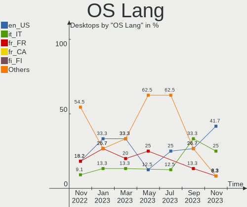
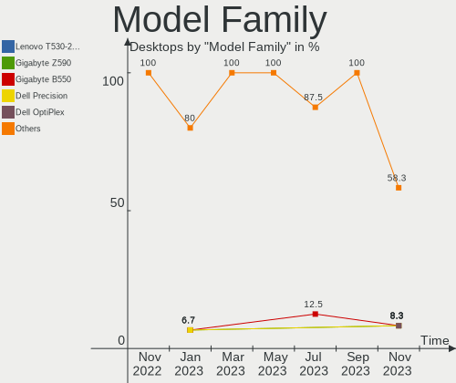
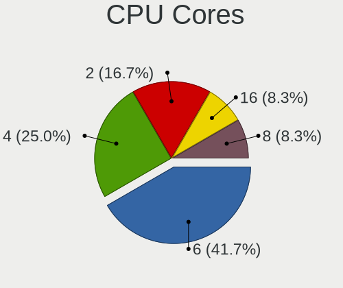
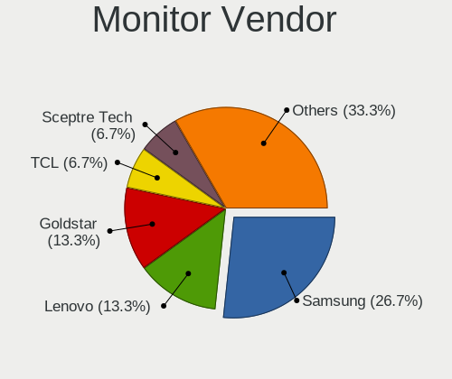
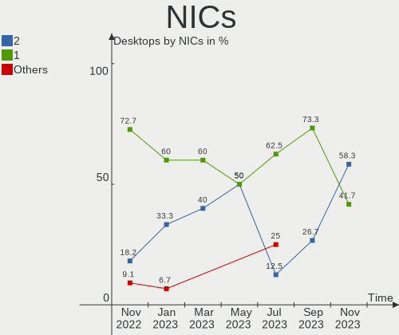
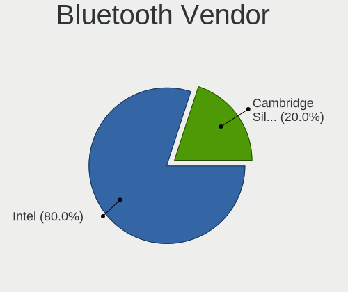
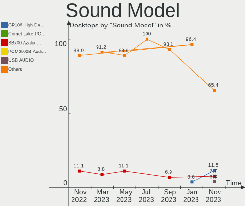
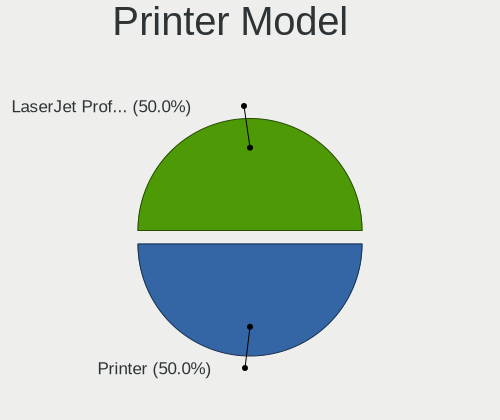

Ubuntu MATE - Hardware Trends (Desktops)
----------------------------------------

A project to identify most popular hardware characteristics and track their change
over time based on data collected by Linux users at https://Linux-Hardware.org.

Anyone can contribute to this report by the [hw-probe](https://github.com/linuxhw/hw-probe) tool:

    sudo -E hw-probe -all -upload

This report is for one last month. Overall report since the beginning of time: [TestCoverage](https://github.com/linuxhw/TestCoverage)

Period: Nov, 2022.

Contents
--------

* [ System ](#system)
  - [ OS                       ](#os)
  - [ OS Family                ](#os-family)
  - [ Kernel                   ](#kernel)
  - [ Kernel Family            ](#kernel-family)
  - [ Kernel Major Ver.        ](#kernel-major-ver)
  - [ Arch                     ](#arch)
  - [ DE                       ](#de)
  - [ Display Server           ](#display-server)
  - [ Display Manager          ](#display-manager)
  - [ OS Lang                  ](#os-lang)
  - [ Boot Mode                ](#boot-mode)
  - [ Filesystem               ](#filesystem)
  - [ Part. scheme             ](#part-scheme)
  - [ Dual Boot with Linux/BSD ](#dual-boot-with-linuxbsd)
  - [ Dual Boot (Win)          ](#dual-boot-win)

* [ Board ](#board)
  - [ Vendor                   ](#vendor)
  - [ Model                    ](#model)
  - [ Model Family             ](#model-family)
  - [ MFG Year                 ](#mfg-year)
  - [ Form Factor              ](#form-factor)
  - [ Secure Boot              ](#secure-boot)
  - [ Coreboot                 ](#coreboot)
  - [ RAM Size                 ](#ram-size)
  - [ RAM Used                 ](#ram-used)
  - [ Total Drives             ](#total-drives)
  - [ Has CD-ROM               ](#has-cd-rom)
  - [ Has Ethernet             ](#has-ethernet)
  - [ Has WiFi                 ](#has-wifi)
  - [ Has Bluetooth            ](#has-bluetooth)

* [ Location ](#location)
  - [ Country                  ](#country)
  - [ City                     ](#city)

* [ Drives ](#drives)
  - [ Drive Vendor             ](#drive-vendor)
  - [ Drive Model              ](#drive-model)
  - [ HDD Vendor               ](#hdd-vendor)
  - [ SSD Vendor               ](#ssd-vendor)
  - [ Drive Kind               ](#drive-kind)
  - [ Drive Connector          ](#drive-connector)
  - [ Drive Size               ](#drive-size)
  - [ Space Total              ](#space-total)
  - [ Space Used               ](#space-used)
  - [ Malfunc. Drives          ](#malfunc-drives)
  - [ Malfunc. Drive Vendor    ](#malfunc-drive-vendor)
  - [ Malfunc. HDD Vendor      ](#malfunc-hdd-vendor)
  - [ Malfunc. Drive Kind      ](#malfunc-drive-kind)
  - [ Failed Drives            ](#failed-drives)
  - [ Failed Drive Vendor      ](#failed-drive-vendor)
  - [ Drive Status             ](#drive-status)

* [ Storage controller ](#storage-controller)
  - [ Storage Vendor           ](#storage-vendor)
  - [ Storage Model            ](#storage-model)
  - [ Storage Kind             ](#storage-kind)

* [ Processor ](#processor)
  - [ CPU Vendor               ](#cpu-vendor)
  - [ CPU Model                ](#cpu-model)
  - [ CPU Model Family         ](#cpu-model-family)
  - [ CPU Cores                ](#cpu-cores)
  - [ CPU Sockets              ](#cpu-sockets)
  - [ CPU Threads              ](#cpu-threads)
  - [ CPU Op-Modes             ](#cpu-op-modes)
  - [ CPU Microcode            ](#cpu-microcode)
  - [ CPU Microarch            ](#cpu-microarch)

* [ Graphics ](#graphics)
  - [ GPU Vendor               ](#gpu-vendor)
  - [ GPU Model                ](#gpu-model)
  - [ GPU Combo                ](#gpu-combo)
  - [ GPU Driver               ](#gpu-driver)
  - [ GPU Memory               ](#gpu-memory)

* [ Monitor ](#monitor)
  - [ Monitor Vendor           ](#monitor-vendor)
  - [ Monitor Model            ](#monitor-model)
  - [ Monitor Resolution       ](#monitor-resolution)
  - [ Monitor Diagonal         ](#monitor-diagonal)
  - [ Monitor Width            ](#monitor-width)
  - [ Aspect Ratio             ](#aspect-ratio)
  - [ Monitor Area             ](#monitor-area)
  - [ Pixel Density            ](#pixel-density)
  - [ Multiple Monitors        ](#multiple-monitors)

* [ Network ](#network)
  - [ Net Controller Vendor    ](#net-controller-vendor)
  - [ Net Controller Model     ](#net-controller-model)
  - [ Wireless Vendor          ](#wireless-vendor)
  - [ Wireless Model           ](#wireless-model)
  - [ Ethernet Vendor          ](#ethernet-vendor)
  - [ Ethernet Model           ](#ethernet-model)
  - [ Net Controller Kind      ](#net-controller-kind)
  - [ Used Controller          ](#used-controller)
  - [ NICs                     ](#nics)
  - [ IPv6                     ](#ipv6)

* [ Bluetooth ](#bluetooth)
  - [ Bluetooth Vendor         ](#bluetooth-vendor)
  - [ Bluetooth Model          ](#bluetooth-model)

* [ Sound ](#sound)
  - [ Sound Vendor             ](#sound-vendor)
  - [ Sound Model              ](#sound-model)

* [ Memory ](#memory)
  - [ Memory Vendor            ](#memory-vendor)
  - [ Memory Model             ](#memory-model)
  - [ Memory Kind              ](#memory-kind)
  - [ Memory Form Factor       ](#memory-form-factor)
  - [ Memory Size              ](#memory-size)
  - [ Memory Speed             ](#memory-speed)

* [ Printers & scanners ](#printers--scanners)
  - [ Printer Vendor           ](#printer-vendor)
  - [ Printer Model            ](#printer-model)
  - [ Scanner Vendor           ](#scanner-vendor)
  - [ Scanner Model            ](#scanner-model)

* [ Camera ](#camera)
  - [ Camera Vendor            ](#camera-vendor)
  - [ Camera Model             ](#camera-model)

* [ Security ](#security)
  - [ Fingerprint Vendor       ](#fingerprint-vendor)
  - [ Fingerprint Model        ](#fingerprint-model)
  - [ Chipcard Vendor          ](#chipcard-vendor)
  - [ Chipcard Model           ](#chipcard-model)

* [ Unsupported ](#unsupported)
  - [ Unsupported Devices      ](#unsupported-devices)
  - [ Unsupported Device Types ](#unsupported-device-types)

System
------

OS
--

Installed operating systems

| Name              | Desktops | Percent |
|-------------------|----------|---------|
| Ubuntu MATE 22.04 | 3        | 27.27%  |
| Ubuntu MATE 20.04 | 3        | 27.27%  |
| Ubuntu MATE 18.04 | 3        | 27.27%  |
| Ubuntu MATE 22.10 | 2        | 18.18%  |

OS Family
---------

OS without a version

| Name        | Desktops | Percent |
|-------------|----------|---------|
| Ubuntu MATE | 11       | 100%    |

Kernel
------

Version of the Linux kernel

| Version           | Desktops | Percent |
|-------------------|----------|---------|
| 5.15.0-52-generic | 3        | 27.27%  |
| 5.19.0-23-generic | 2        | 18.18%  |
| 5.4.0-132-generic | 1        | 9.09%   |
| 5.4.0-131-generic | 1        | 9.09%   |
| 5.4.0-128-generic | 1        | 9.09%   |
| 5.4.0-122-generic | 1        | 9.09%   |
| 5.15.0-53-generic | 1        | 9.09%   |
| 5.0.0-63-generic  | 1        | 9.09%   |

Kernel Family
-------------

Linux kernel without a distro release

| Version | Desktops | Percent |
|---------|----------|---------|
| 5.4.0   | 4        | 36.36%  |
| 5.15.0  | 4        | 36.36%  |
| 5.19.0  | 2        | 18.18%  |
| 5.0.0   | 1        | 9.09%   |

Kernel Major Ver.
-----------------

Linux kernel major version

| Version | Desktops | Percent |
|---------|----------|---------|
| 5.4     | 4        | 36.36%  |
| 5.15    | 4        | 36.36%  |
| 5.19    | 2        | 18.18%  |
| 5.0     | 1        | 9.09%   |

Arch
----

OS architecture (x86_64, i586, etc.)

| Name   | Desktops | Percent |
|--------|----------|---------|
| x86_64 | 10       | 90.91%  |
| i686   | 1        | 9.09%   |

DE
--

Desktop Environment

| Name | Desktops | Percent |
|------|----------|---------|
| MATE | 11       | 100%    |

Display Server
--------------

X11 or Wayland

| Name | Desktops | Percent |
|------|----------|---------|
| X11  | 10       | 90.91%  |
| Tty  | 1        | 9.09%   |

Display Manager
---------------

SDDM, LightDM, etc.

| Name    | Desktops | Percent |
|---------|----------|---------|
| LightDM | 10       | 90.91%  |
| GDM     | 1        | 9.09%   |

OS Lang
-------

Language

| Lang  | Desktops | Percent |
|-------|----------|---------|
| fr_FR | 2        | 18.18%  |
| en_US | 2        | 18.18%  |
| tr_TR | 1        | 9.09%   |
| ru_RU | 1        | 9.09%   |
| pt_BR | 1        | 9.09%   |
| it_IT | 1        | 9.09%   |
| hr_HR | 1        | 9.09%   |
| es_ES | 1        | 9.09%   |
| C     | 1        | 9.09%   |

Boot Mode
---------

EFI or BIOS

| Mode | Desktops | Percent |
|------|----------|---------|
| BIOS | 7        | 63.64%  |
| EFI  | 4        | 36.36%  |

Filesystem
----------

Type of filesystem

| Type | Desktops | Percent |
|------|----------|---------|
| Ext4 | 10       | 90.91%  |
| Zfs  | 1        | 9.09%   |

Part. scheme
------------

Scheme of partitioning

| Type    | Desktops | Percent |
|---------|----------|---------|
| GPT     | 8        | 72.73%  |
| MBR     | 2        | 18.18%  |
| Unknown | 1        | 9.09%   |

Dual Boot with Linux/BSD
------------------------

Hosting more than one Linux/BSD

| Dual boot | Desktops | Percent |
|-----------|----------|---------|
| No        | 7        | 63.64%  |
| Yes       | 4        | 36.36%  |

Dual Boot (Win)
---------------

Hosting Linux and Windows

| Dual boot | Desktops | Percent |
|-----------|----------|---------|
| Yes       | 9        | 81.82%  |
| No        | 2        | 18.18%  |

Board
-----

Vendor
------

Motherboard manufacturer

| Name                | Desktops | Percent |
|---------------------|----------|---------|
| MSI                 | 2        | 18.18%  |
| Hewlett-Packard     | 2        | 18.18%  |
| Gigabyte Technology | 2        | 18.18%  |
| ASUSTek Computer    | 2        | 18.18%  |
| ASRock              | 2        | 18.18%  |
| Intel               | 1        | 9.09%   |

Model
-----

Motherboard model

| Name                     | Desktops | Percent |
|--------------------------|----------|---------|
| MSI MS-7920              | 1        | 9.09%   |
| MSI MS-7758              | 1        | 9.09%   |
| Intel H61                | 1        | 9.09%   |
| HP EliteDesk 800 G1 SFF  | 1        | 9.09%   |
| HP Compaq Elite 8300 SFF | 1        | 9.09%   |
| Gigabyte H110M-S2V       | 1        | 9.09%   |
| Gigabyte GA-MA770T-UD3   | 1        | 9.09%   |
| ASUS P8Z77-V             | 1        | 9.09%   |
| ASUS H61M-K              | 1        | 9.09%   |
| ASRock Z590M-ITX/ax      | 1        | 9.09%   |
| ASRock 990FX Extreme3    | 1        | 9.09%   |

Model Family
------------

Motherboard model prefix

| Name                   | Desktops | Percent |
|------------------------|----------|---------|
| MSI MS-7920            | 1        | 9.09%   |
| MSI MS-7758            | 1        | 9.09%   |
| Intel H61              | 1        | 9.09%   |
| HP EliteDesk           | 1        | 9.09%   |
| HP Compaq              | 1        | 9.09%   |
| Gigabyte H110M-S2V     | 1        | 9.09%   |
| Gigabyte GA-MA770T-UD3 | 1        | 9.09%   |
| ASUS P8Z77-V           | 1        | 9.09%   |
| ASUS H61M-K            | 1        | 9.09%   |
| ASRock Z590M-ITX       | 1        | 9.09%   |
| ASRock 990FX           | 1        | 9.09%   |

MFG Year
--------

Motherboard manufacture year

| Year | Desktops | Percent |
|------|----------|---------|
| 2012 | 3        | 27.27%  |
| 2016 | 2        | 18.18%  |
| 2013 | 2        | 18.18%  |
| 2021 | 1        | 9.09%   |
| 2017 | 1        | 9.09%   |
| 2014 | 1        | 9.09%   |
| 2009 | 1        | 9.09%   |

Form Factor
-----------

Physical design of the computer

| Name    | Desktops | Percent |
|---------|----------|---------|
| Desktop | 11       | 100%    |

Secure Boot
-----------

Enabled or disabled

| State    | Desktops | Percent |
|----------|----------|---------|
| Disabled | 10       | 90.91%  |
| Enabled  | 1        | 9.09%   |

Coreboot
--------

Have coreboot on board

| Used | Desktops | Percent |
|------|----------|---------|
| No   | 11       | 100%    |

RAM Size
--------

Total RAM memory

| Size in GB  | Desktops | Percent |
|-------------|----------|---------|
| 8.01-16.0   | 4        | 36.36%  |
| 3.01-4.0    | 3        | 27.27%  |
| 16.01-24.0  | 2        | 18.18%  |
| 32.01-64.0  | 1        | 9.09%   |
| 64.01-256.0 | 1        | 9.09%   |

RAM Used
--------

Used RAM memory

| Used GB   | Desktops | Percent |
|-----------|----------|---------|
| 1.01-2.0  | 5        | 45.45%  |
| 2.01-3.0  | 3        | 27.27%  |
| 4.01-8.0  | 2        | 18.18%  |
| 8.01-16.0 | 1        | 9.09%   |

Total Drives
------------

Number of drives on board

| Drives | Desktops | Percent |
|--------|----------|---------|
| 2      | 4        | 36.36%  |
| 3      | 3        | 27.27%  |
| 4      | 2        | 18.18%  |
| 1      | 2        | 18.18%  |

Has CD-ROM
----------

Has CD-ROM on board

| Presented | Desktops | Percent |
|-----------|----------|---------|
| Yes       | 7        | 63.64%  |
| No        | 4        | 36.36%  |

Has Ethernet
------------

Has Ethernet on board

| Presented | Desktops | Percent |
|-----------|----------|---------|
| Yes       | 10       | 90.91%  |
| No        | 1        | 9.09%   |

Has WiFi
--------

Has WiFi module

| Presented | Desktops | Percent |
|-----------|----------|---------|
| No        | 6        | 54.55%  |
| Yes       | 5        | 45.45%  |

Has Bluetooth
-------------

Has Bluetooth module

| Presented | Desktops | Percent |
|-----------|----------|---------|
| No        | 8        | 72.73%  |
| Yes       | 3        | 27.27%  |

Location
--------

Country
-------

Geographic location (country)

| Country | Desktops | Percent |
|---------|----------|---------|
| Italy   | 2        | 18.18%  |
| France  | 2        | 18.18%  |
| Turkey  | 1        | 9.09%   |
| Spain   | 1        | 9.09%   |
| Russia  | 1        | 9.09%   |
| Hungary | 1        | 9.09%   |
| Germany | 1        | 9.09%   |
| Croatia | 1        | 9.09%   |
| Brazil  | 1        | 9.09%   |

City
----

Geographic location (city)

| City     | Desktops | Percent |
|----------|----------|---------|
| Zagreb   | 1        | 9.09%   |
| Toulon   | 1        | 9.09%   |
| Picos    | 1        | 9.09%   |
| Munich   | 1        | 9.09%   |
| Modena   | 1        | 9.09%   |
| Lille    | 1        | 9.09%   |
| Kuznetsk | 1        | 9.09%   |
| Izmir    | 1        | 9.09%   |
| Dubino   | 1        | 9.09%   |
| Budapest | 1        | 9.09%   |
| Badalona | 1        | 9.09%   |

Drives
------

Drive Vendor
------------

Hard drive vendors

| Vendor              | Desktops | Drives | Percent |
|---------------------|----------|--------|---------|
| Seagate             | 6        | 9      | 28.57%  |
| Samsung Electronics | 4        | 6      | 19.05%  |
| Crucial             | 3        | 3      | 14.29%  |
| WDC                 | 2        | 3      | 9.52%   |
| SanDisk             | 1        | 1      | 4.76%   |
| LITEONIT            | 1        | 1      | 4.76%   |
| Intenso             | 1        | 1      | 4.76%   |
| HGST                | 1        | 1      | 4.76%   |
| Corsair             | 1        | 1      | 4.76%   |
| A-DATA Technology   | 1        | 1      | 4.76%   |

Drive Model
-----------

Hard drive models

| Model                          | Desktops | Percent |
|--------------------------------|----------|---------|
| Seagate ST1000DM003-1ER162 1TB | 3        | 11.54%  |
| WDC WD40EZRZ-22GXCB0 4TB       | 1        | 3.85%   |
| WDC WD20EZRZ-00Z5HB0 2TB       | 1        | 3.85%   |
| WDC WD10EZEX-60M2NA0 1TB       | 1        | 3.85%   |
| Seagate ST4000DM004-2CV104 4TB | 1        | 3.85%   |
| Seagate ST3750840AS 752GB      | 1        | 3.85%   |
| Seagate ST3360320AS 360GB      | 1        | 3.85%   |
| Seagate ST2000DM006-2DM164 2TB | 1        | 3.85%   |
| Seagate ST1000VM002-1ET162 1TB | 1        | 3.85%   |
| Seagate ST1000DM003-1SB102 1TB | 1        | 3.85%   |
| SanDisk SSD PLUS 2000GB        | 1        | 3.85%   |
| Samsung SSD 970 EVO Plus 2TB   | 1        | 3.85%   |
| Samsung SSD 860 EVO 500GB      | 1        | 3.85%   |
| Samsung SSD 860 EVO 250GB      | 1        | 3.85%   |
| Samsung SSD 850 EVO 250GB      | 1        | 3.85%   |
| Samsung HD322HJ 320GB          | 1        | 3.85%   |
| LITEONIT LCS-128M6S 128GB SSD  | 1        | 3.85%   |
| Intenso SSD Sata III 128GB     | 1        | 3.85%   |
| HGST HTS545050A7E380 500GB     | 1        | 3.85%   |
| Crucial CT480BX500SSD1 480GB   | 1        | 3.85%   |
| Crucial CT240BX500SSD1 240GB   | 1        | 3.85%   |
| Crucial CT1000BX500SSD1 1TB    | 1        | 3.85%   |
| Corsair Neutron GTX SSD 240GB  | 1        | 3.85%   |
| A-DATA SU800 256GB SSD         | 1        | 3.85%   |

HDD Vendor
----------

Hard disk drive vendors

| Vendor              | Desktops | Drives | Percent |
|---------------------|----------|--------|---------|
| Seagate             | 6        | 9      | 60%     |
| WDC                 | 2        | 3      | 20%     |
| Samsung Electronics | 1        | 1      | 10%     |
| HGST                | 1        | 1      | 10%     |

SSD Vendor
----------

Solid state drive vendors

| Vendor              | Desktops | Drives | Percent |
|---------------------|----------|--------|---------|
| Crucial             | 3        | 3      | 30%     |
| Samsung Electronics | 2        | 3      | 20%     |
| SanDisk             | 1        | 1      | 10%     |
| LITEONIT            | 1        | 1      | 10%     |
| Intenso             | 1        | 1      | 10%     |
| Corsair             | 1        | 1      | 10%     |
| A-DATA Technology   | 1        | 1      | 10%     |

Drive Kind
----------

HDD or SSD

| Kind | Desktops | Drives | Percent |
|------|----------|--------|---------|
| SSD  | 8        | 11     | 50%     |
| HDD  | 7        | 14     | 43.75%  |
| NVMe | 1        | 2      | 6.25%   |

Drive Connector
---------------

SATA, SAS, NVMe, etc.

| Type | Desktops | Drives | Percent |
|------|----------|--------|---------|
| SATA | 10       | 25     | 90.91%  |
| NVMe | 1        | 2      | 9.09%   |

Drive Size
----------

Size of hard drive

| Size in TB | Desktops | Drives | Percent |
|------------|----------|--------|---------|
| 0.01-0.5   | 9        | 12     | 40.91%  |
| 0.51-1.0   | 8        | 8      | 36.36%  |
| 1.01-2.0   | 3        | 3      | 13.64%  |
| 3.01-4.0   | 2        | 2      | 9.09%   |

Space Total
-----------

Amount of disk space available on the file system

| Size in GB     | Desktops | Percent |
|----------------|----------|---------|
| 501-1000       | 3        | 27.27%  |
| 251-500        | 2        | 18.18%  |
| 101-250        | 2        | 18.18%  |
| More than 3000 | 1        | 9.09%   |
| 2001-3000      | 1        | 9.09%   |
| 1001-2000      | 1        | 9.09%   |
| 1-20           | 1        | 9.09%   |

Space Used
----------

Amount of used disk space

| Used GB   | Desktops | Percent |
|-----------|----------|---------|
| 1-20      | 3        | 27.27%  |
| 101-250   | 2        | 18.18%  |
| 51-100    | 2        | 18.18%  |
| 251-500   | 1        | 9.09%   |
| 21-50     | 1        | 9.09%   |
| 2001-3000 | 1        | 9.09%   |
| 501-1000  | 1        | 9.09%   |

Malfunc. Drives
---------------

Drive models with a malfunction

Zero info for selected period =(

Malfunc. Drive Vendor
---------------------

Vendors of faulty drives

Zero info for selected period =(

Malfunc. HDD Vendor
-------------------

Vendors of faulty HDD drives

Zero info for selected period =(

Malfunc. Drive Kind
-------------------

Kinds of faulty drives

Zero info for selected period =(

Failed Drives
-------------

Failed drive models

Zero info for selected period =(

Failed Drive Vendor
-------------------

Failed drive vendors

Zero info for selected period =(

Drive Status
------------

Number of failed and malfunc. drives

| Status   | Desktops | Drives | Percent |
|----------|----------|--------|---------|
| Works    | 7        | 19     | 63.64%  |
| Detected | 4        | 8      | 36.36%  |

Storage controller
------------------

Storage Vendor
--------------

Storage controller vendors

| Vendor              | Desktops | Percent |
|---------------------|----------|---------|
| Intel               | 9        | 69.23%  |
| AMD                 | 2        | 15.38%  |
| Samsung Electronics | 1        | 7.69%   |
| ASMedia Technology  | 1        | 7.69%   |

Storage Model
-------------

Storage controller models

| Model                                                                          | Desktops | Percent |
|--------------------------------------------------------------------------------|----------|---------|
| Intel 7 Series/C210 Series Chipset Family 6-port SATA Controller [AHCI mode]   | 2        | 12.5%   |
| Intel 6 Series/C200 Series Chipset Family 6 port Desktop SATA AHCI Controller  | 2        | 12.5%   |
| AMD SB7x0/SB8x0/SB9x0 IDE Controller                                           | 2        | 12.5%   |
| Samsung NVMe SSD Controller SM981/PM981/PM983                                  | 1        | 6.25%   |
| Intel Q170/Q150/B150/H170/H110/Z170/CM236 Chipset SATA Controller [AHCI Mode]  | 1        | 6.25%   |
| Intel 9 Series Chipset Family SATA Controller [AHCI Mode]                      | 1        | 6.25%   |
| Intel 8 Series/C220 Series Chipset Family 6-port SATA Controller 1 [AHCI mode] | 1        | 6.25%   |
| Intel 7 Series/C210 Series Chipset Family 4-port SATA Controller [IDE mode]    | 1        | 6.25%   |
| Intel 7 Series/C210 Series Chipset Family 2-port SATA Controller [IDE mode]    | 1        | 6.25%   |
| Intel 500 Series Chipset Family SATA AHCI Controller                           | 1        | 6.25%   |
| ASMedia ASM1062 Serial ATA Controller                                          | 1        | 6.25%   |
| AMD SB7x0/SB8x0/SB9x0 SATA Controller [RAID5 mode]                             | 1        | 6.25%   |
| AMD SB7x0/SB8x0/SB9x0 SATA Controller [IDE mode]                               | 1        | 6.25%   |

Storage Kind
------------

Kind of storage controller (IDE, SATA, NVMe, SAS, ...)

| Kind | Desktops | Percent |
|------|----------|---------|
| SATA | 9        | 64.29%  |
| IDE  | 3        | 21.43%  |
| RAID | 1        | 7.14%   |
| NVMe | 1        | 7.14%   |

Processor
---------

CPU Vendor
----------

Processor vendors

| Vendor | Desktops | Percent |
|--------|----------|---------|
| Intel  | 9        | 81.82%  |
| AMD    | 2        | 18.18%  |

CPU Model
---------

Processor models

| Model                                  | Desktops | Percent |
|----------------------------------------|----------|---------|
| Intel Pentium CPU G840 @ 2.80GHz       | 1        | 9.09%   |
| Intel Pentium CPU G4400 @ 3.30GHz      | 1        | 9.09%   |
| Intel Core i7-4790K CPU @ 4.00GHz      | 1        | 9.09%   |
| Intel Core i7-3770K CPU @ 3.50GHz      | 1        | 9.09%   |
| Intel Core i7-3770 CPU @ 3.40GHz       | 1        | 9.09%   |
| Intel Core i5-4570 CPU @ 3.20GHz       | 1        | 9.09%   |
| Intel Core i5-2320 CPU @ 3.00GHz       | 1        | 9.09%   |
| Intel Core i3-3220 CPU @ 3.30GHz       | 1        | 9.09%   |
| Intel 11th Gen Core i5-11400 @ 2.60GHz | 1        | 9.09%   |
| AMD Athlon II X4 650 Processor         | 1        | 9.09%   |
| AMD Athlon II X2 250 Processor         | 1        | 9.09%   |

CPU Model Family
----------------

Processor model prefix

| Model            | Desktops | Percent |
|------------------|----------|---------|
| Intel Core i7    | 3        | 27.27%  |
| Intel Pentium    | 2        | 18.18%  |
| Intel Core i5    | 2        | 18.18%  |
| Other            | 1        | 9.09%   |
| Intel Core i3    | 1        | 9.09%   |
| AMD Athlon II X4 | 1        | 9.09%   |
| AMD Athlon II X2 | 1        | 9.09%   |

CPU Cores
---------

Number of processor cores

| Number | Desktops | Percent |
|--------|----------|---------|
| 4      | 6        | 54.55%  |
| 2      | 4        | 36.36%  |
| 6      | 1        | 9.09%   |

CPU Sockets
-----------

Number of sockets

| Number | Desktops | Percent |
|--------|----------|---------|
| 1      | 11       | 100%    |

CPU Threads
-----------

Threads per core (Hyper-Threading)

| Number | Desktops | Percent |
|--------|----------|---------|
| 1      | 7        | 63.64%  |
| 2      | 4        | 36.36%  |

CPU Op-Modes
------------

CPU Operation Modes (32-bit, 64-bit)

| Op mode        | Desktops | Percent |
|----------------|----------|---------|
| 32-bit, 64-bit | 11       | 100%    |

CPU Microcode
-------------

Microcode number

| Number     | Desktops | Percent |
|------------|----------|---------|
| 0x306a9    | 3        | 27.27%  |
| 0x206a7    | 2        | 18.18%  |
| 0x010000c8 | 2        | 18.18%  |
| 0xa0671    | 1        | 9.09%   |
| 0x506e3    | 1        | 9.09%   |
| 0x306c3    | 1        | 9.09%   |
| Unknown    | 1        | 9.09%   |

CPU Microarch
-------------

Microarchitecture

| Name        | Desktops | Percent |
|-------------|----------|---------|
| IvyBridge   | 3        | 27.27%  |
| SandyBridge | 2        | 18.18%  |
| K10         | 2        | 18.18%  |
| Haswell     | 2        | 18.18%  |
| Skylake     | 1        | 9.09%   |
| Icelake     | 1        | 9.09%   |

Graphics
--------

GPU Vendor
----------

Vendors of graphics cards

| Vendor | Desktops | Percent |
|--------|----------|---------|
| Intel  | 6        | 54.55%  |
| Nvidia | 3        | 27.27%  |
| AMD    | 2        | 18.18%  |

GPU Model
---------

Graphics card models

| Model                                                                       | Desktops | Percent |
|-----------------------------------------------------------------------------|----------|---------|
| Intel Xeon E3-1200 v3/4th Gen Core Processor Integrated Graphics Controller | 2        | 18.18%  |
| Nvidia GP107 [GeForce GTX 1050]                                             | 1        | 9.09%   |
| Nvidia GP107 [GeForce GTX 1050 Ti]                                          | 1        | 9.09%   |
| Nvidia GK208B [GeForce GT 710]                                              | 1        | 9.09%   |
| Intel Xeon E3-1200 v2/3rd Gen Core processor Graphics Controller            | 1        | 9.09%   |
| Intel RocketLake-S GT1 [UHD Graphics 730]                                   | 1        | 9.09%   |
| Intel IvyBridge GT2 [HD Graphics 4000]                                      | 1        | 9.09%   |
| Intel HD Graphics 510                                                       | 1        | 9.09%   |
| AMD Turks PRO [Radeon HD 6570/7570/8550 / R5 230]                           | 1        | 9.09%   |
| AMD Caicos [Radeon HD 6450/7450/8450 / R5 230 OEM]                          | 1        | 9.09%   |

GPU Combo
---------

Combinations of graphics cards

| Name       | Desktops | Percent |
|------------|----------|---------|
| 1 x Intel  | 6        | 54.55%  |
| 1 x Nvidia | 3        | 27.27%  |
| 1 x AMD    | 2        | 18.18%  |

GPU Driver
----------

Free vs proprietary

| Driver      | Desktops | Percent |
|-------------|----------|---------|
| Free        | 9        | 81.82%  |
| Proprietary | 2        | 18.18%  |

GPU Memory
----------

Total video memory

| Size in GB | Desktops | Percent |
|------------|----------|---------|
| Unknown    | 6        | 54.55%  |
| 1.01-2.0   | 2        | 18.18%  |
| 0.51-1.0   | 2        | 18.18%  |
| 3.01-4.0   | 1        | 9.09%   |

Monitor
-------

Monitor Vendor
--------------

Monitor vendors

| Vendor               | Desktops | Percent |
|----------------------|----------|---------|
| Samsung Electronics  | 3        | 27.27%  |
| Goldstar             | 3        | 27.27%  |
| STD                  | 1        | 9.09%   |
| Iiyama               | 1        | 9.09%   |
| Dell                 | 1        | 9.09%   |
| BenQ                 | 1        | 9.09%   |
| Ancor Communications | 1        | 9.09%   |

Monitor Model
-------------

Monitor models

| Model                                                                | Desktops | Percent |
|----------------------------------------------------------------------|----------|---------|
| STD LCD Monitor STD0001 1920x1080                                    | 1        | 9.09%   |
| Samsung Electronics S24D330 SAM0D92 1920x1080 531x299mm 24.0-inch    | 1        | 9.09%   |
| Samsung Electronics LCD Monitor SMB2340 1920x1080                    | 1        | 9.09%   |
| Samsung Electronics LCD Monitor SAM03D3 1360x768 410x256mm 19.0-inch | 1        | 9.09%   |
| Iiyama PL1906 IVM483C 1280x1024 376x301mm 19.0-inch                  | 1        | 9.09%   |
| Goldstar HDR 4K GSM7707 3840x2160 600x340mm 27.2-inch                | 1        | 9.09%   |
| Goldstar HD GSM5ACB 1366x768 410x230mm 18.5-inch                     | 1        | 9.09%   |
| Goldstar 22EA53 GSM59A5 1920x1080 477x268mm 21.5-inch                | 1        | 9.09%   |
| Dell U2515H DELD070 2560x1440 553x311mm 25.0-inch                    | 1        | 9.09%   |
| BenQ G2200W BNQ780E 1680x1050 474x296mm 22.0-inch                    | 1        | 9.09%   |
| Ancor Communications VS278 ACI27A1 1920x1080 598x336mm 27.0-inch     | 1        | 9.09%   |

Monitor Resolution
------------------

Monitor screen resolution

| Resolution         | Desktops | Percent |
|--------------------|----------|---------|
| 1920x1080 (FHD)    | 4        | 36.36%  |
| 2560x1440 (QHD)    | 2        | 18.18%  |
| 3840x2160 (4K)     | 1        | 9.09%   |
| 1680x1050 (WSXGA+) | 1        | 9.09%   |
| 1366x768 (WXGA)    | 1        | 9.09%   |
| 1360x768           | 1        | 9.09%   |
| 1280x1024 (SXGA)   | 1        | 9.09%   |

Monitor Diagonal
----------------

Diagonal size in inches

| Inches  | Desktops | Percent |
|---------|----------|---------|
| 27      | 2        | 18.18%  |
| 19      | 2        | 18.18%  |
| 25      | 1        | 9.09%   |
| 24      | 1        | 9.09%   |
| 23      | 1        | 9.09%   |
| 22      | 1        | 9.09%   |
| 21      | 1        | 9.09%   |
| 18      | 1        | 9.09%   |
| Unknown | 1        | 9.09%   |

Monitor Width
-------------

Physical width

| Width in mm | Desktops | Percent |
|-------------|----------|---------|
| 501-600     | 5        | 45.45%  |
| 401-500     | 4        | 36.36%  |
| 351-400     | 1        | 9.09%   |
| Unknown     | 1        | 9.09%   |

Aspect Ratio
------------

Proportional relationship between the width and the height

| Ratio   | Desktops | Percent |
|---------|----------|---------|
| 16/9    | 7        | 63.64%  |
| 16/10   | 2        | 18.18%  |
| 5/4     | 1        | 9.09%   |
| Unknown | 1        | 9.09%   |

Monitor Area
------------

Area in inch²

| Area in inch² | Desktops | Percent |
|----------------|----------|---------|
| 201-250        | 4        | 36.36%  |
| 301-350        | 2        | 18.18%  |
| 151-200        | 2        | 18.18%  |
| 251-300        | 1        | 9.09%   |
| 141-150        | 1        | 9.09%   |
| Unknown        | 1        | 9.09%   |

Pixel Density
-------------

Pixels per inch

| Density | Desktops | Percent |
|---------|----------|---------|
| 51-100  | 6        | 60%     |
| 101-120 | 2        | 20%     |
| 161-240 | 1        | 10%     |
| Unknown | 1        | 10%     |

Multiple Monitors
-----------------

Total monitors connected

| Total | Desktops | Percent |
|-------|----------|---------|
| 1     | 10       | 90.91%  |
| 2     | 1        | 9.09%   |

Network
-------

Net Controller Vendor
---------------------

Controller vendors

| Vendor                | Desktops | Percent |
|-----------------------|----------|---------|
| Realtek Semiconductor | 6        | 42.86%  |
| Intel                 | 6        | 42.86%  |
| TP-Link               | 1        | 7.14%   |
| Broadcom              | 1        | 7.14%   |

Net Controller Model
--------------------

Controller models

| Model                                                             | Desktops | Percent |
|-------------------------------------------------------------------|----------|---------|
| Realtek RTL8111/8168/8411 PCI Express Gigabit Ethernet Controller | 4        | 25%     |
| TP-Link Archer T3U [Realtek RTL8812BU]                            | 1        | 6.25%   |
| Realtek RTL8188CE 802.11b/g/n WiFi Adapter                        | 1        | 6.25%   |
| Realtek RTL8125 2.5GbE Controller                                 | 1        | 6.25%   |
| Realtek RTL810xE PCI Express Fast Ethernet controller             | 1        | 6.25%   |
| Intel Wireless 7265                                               | 1        | 6.25%   |
| Intel Wireless 7260                                               | 1        | 6.25%   |
| Intel Wi-Fi 6 AX210/AX211/AX411 160MHz                            | 1        | 6.25%   |
| Intel Ethernet Connection I217-LM                                 | 1        | 6.25%   |
| Intel Ethernet Connection (14) I219-V                             | 1        | 6.25%   |
| Intel 82579V Gigabit Network Connection                           | 1        | 6.25%   |
| Intel 82579LM Gigabit Network Connection (Lewisville)             | 1        | 6.25%   |
| Broadcom NetLink BCM57781 Gigabit Ethernet PCIe                   | 1        | 6.25%   |

Wireless Vendor
---------------

Wireless vendors

| Vendor                | Desktops | Percent |
|-----------------------|----------|---------|
| Intel                 | 3        | 60%     |
| TP-Link               | 1        | 20%     |
| Realtek Semiconductor | 1        | 20%     |

Wireless Model
--------------

Wireless models

| Model                                      | Desktops | Percent |
|--------------------------------------------|----------|---------|
| TP-Link Archer T3U [Realtek RTL8812BU]     | 1        | 20%     |
| Realtek RTL8188CE 802.11b/g/n WiFi Adapter | 1        | 20%     |
| Intel Wireless 7265                        | 1        | 20%     |
| Intel Wireless 7260                        | 1        | 20%     |
| Intel Wi-Fi 6 AX210/AX211/AX411 160MHz     | 1        | 20%     |

Ethernet Vendor
---------------

Ethernet vendors

| Vendor                | Desktops | Percent |
|-----------------------|----------|---------|
| Realtek Semiconductor | 6        | 54.55%  |
| Intel                 | 4        | 36.36%  |
| Broadcom              | 1        | 9.09%   |

Ethernet Model
--------------

Ethernet models

| Model                                                             | Desktops | Percent |
|-------------------------------------------------------------------|----------|---------|
| Realtek RTL8111/8168/8411 PCI Express Gigabit Ethernet Controller | 4        | 36.36%  |
| Realtek RTL8125 2.5GbE Controller                                 | 1        | 9.09%   |
| Realtek RTL810xE PCI Express Fast Ethernet controller             | 1        | 9.09%   |
| Intel Ethernet Connection I217-LM                                 | 1        | 9.09%   |
| Intel Ethernet Connection (14) I219-V                             | 1        | 9.09%   |
| Intel 82579V Gigabit Network Connection                           | 1        | 9.09%   |
| Intel 82579LM Gigabit Network Connection (Lewisville)             | 1        | 9.09%   |
| Broadcom NetLink BCM57781 Gigabit Ethernet PCIe                   | 1        | 9.09%   |

Net Controller Kind
-------------------

Ethernet, WiFi or modem

| Kind     | Desktops | Percent |
|----------|----------|---------|
| Ethernet | 10       | 66.67%  |
| WiFi     | 5        | 33.33%  |

Used Controller
---------------

Currently used network controller

| Kind     | Desktops | Percent |
|----------|----------|---------|
| Ethernet | 7        | 63.64%  |
| WiFi     | 4        | 36.36%  |

NICs
----

Total network controllers on board

| Total | Desktops | Percent |
|-------|----------|---------|
| 1     | 8        | 72.73%  |
| 2     | 2        | 18.18%  |
| 3     | 1        | 9.09%   |

IPv6
----

IPv6 vs IPv4

| Used | Desktops | Percent |
|------|----------|---------|
| No   | 9        | 81.82%  |
| Yes  | 2        | 18.18%  |

Bluetooth
---------

Bluetooth Vendor
----------------

Controller vendors

| Vendor                  | Desktops | Percent |
|-------------------------|----------|---------|
| Intel                   | 2        | 66.67%  |
| Cambridge Silicon Radio | 1        | 33.33%  |

Bluetooth Model
---------------

Controller models

| Model                                               | Desktops | Percent |
|-----------------------------------------------------|----------|---------|
| Intel Bluetooth wireless interface                  | 1        | 33.33%  |
| Intel AX210 Bluetooth                               | 1        | 33.33%  |
| Cambridge Silicon Radio Bluetooth Dongle (HCI mode) | 1        | 33.33%  |

Sound
-----

Sound Vendor
------------

Sound card vendors

| Vendor                  | Desktops | Percent |
|-------------------------|----------|---------|
| Intel                   | 9        | 60%     |
| Nvidia                  | 3        | 20%     |
| AMD                     | 2        | 13.33%  |
| Cambridge Silicon Radio | 1        | 6.67%   |

Sound Model
-----------

Sound card models

| Model                                                                             | Desktops | Percent |
|-----------------------------------------------------------------------------------|----------|---------|
| Intel 7 Series/C216 Chipset Family High Definition Audio Controller               | 3        | 16.67%  |
| Nvidia GP107GL High Definition Audio Controller                                   | 2        | 11.11%  |
| Intel Xeon E3-1200 v3/4th Gen Core Processor HD Audio Controller                  | 2        | 11.11%  |
| Intel 6 Series/C200 Series Chipset Family High Definition Audio Controller        | 2        | 11.11%  |
| AMD SBx00 Azalia (Intel HDA)                                                      | 2        | 11.11%  |
| Nvidia GK208 HDMI/DP Audio Controller                                             | 1        | 5.56%   |
| Intel Tiger Lake-H HD Audio Controller                                            | 1        | 5.56%   |
| Intel 8 Series/C220 Series Chipset High Definition Audio Controller               | 1        | 5.56%   |
| Intel 100 Series/C230 Series Chipset Family HD Audio Controller                   | 1        | 5.56%   |
| Cambridge Silicon Radio B25                                                       | 1        | 5.56%   |
| AMD Turks HDMI Audio [Radeon HD 6500/6600 / 6700M Series]                         | 1        | 5.56%   |
| AMD Caicos HDMI Audio [Radeon HD 6450 / 7450/8450/8490 OEM / R5 230/235/235X OEM] | 1        | 5.56%   |

Memory
------

Memory Vendor
-------------

Memory module vendors

| Vendor              | Desktops | Percent |
|---------------------|----------|---------|
| Kingston            | 2        | 22.22%  |
| Timetec             | 1        | 11.11%  |
| Teikon              | 1        | 11.11%  |
| SK hynix            | 1        | 11.11%  |
| Samsung Electronics | 1        | 11.11%  |
| Nanya Technology    | 1        | 11.11%  |
| Crucial             | 1        | 11.11%  |
| Corsair             | 1        | 11.11%  |

Memory Model
------------

Memory module models

| Model                                                    | Desktops | Percent |
|----------------------------------------------------------|----------|---------|
| Timetec RAM UD3-1600 8GB DIMM DDR3 1600MT/s              | 1        | 11.11%  |
| Teikon RAM TMT351U6EFR8C-PBHJ 4GB DIMM DDR3              | 1        | 11.11%  |
| SK hynix RAM HMT351U6CFR8C-PB 4096MB DIMM DDR3 1800MT/s  | 1        | 11.11%  |
| Samsung RAM M378B5173DB0-CK0 4GB DIMM DDR3 1600MT/s      | 1        | 11.11%  |
| Nanya RAM M2X8G64CB8HB5N-DG 8GB DIMM DDR3 1600MT/s       | 1        | 11.11%  |
| Kingston RAM Module 8GB DIMM DDR3 1333MT/s               | 1        | 11.11%  |
| Kingston RAM 9905471-017.A00LF 4096MB DIMM DDR3 1333MT/s | 1        | 11.11%  |
| Crucial RAM CT51264BA160BJ.C8F 4GB DIMM DDR3 1600MT/s    | 1        | 11.11%  |
| Corsair RAM CMK64GX4M2E3200C16 32GB DIMM DDR4 3200MT/s   | 1        | 11.11%  |

Memory Kind
-----------

Memory module kinds

| Kind | Desktops | Percent |
|------|----------|---------|
| DDR3 | 7        | 87.5%   |
| DDR4 | 1        | 12.5%   |

Memory Form Factor
------------------

Physical design of the memory module

| Name | Desktops | Percent |
|------|----------|---------|
| DIMM | 8        | 100%    |

Memory Size
-----------

Memory module size

| Size  | Desktops | Percent |
|-------|----------|---------|
| 4096  | 5        | 62.5%   |
| 8192  | 2        | 25%     |
| 32768 | 1        | 12.5%   |

Memory Speed
------------

Memory module speed

| Speed | Desktops | Percent |
|-------|----------|---------|
| 1600  | 4        | 50%     |
| 1333  | 2        | 25%     |
| 3200  | 1        | 12.5%   |
| 1800  | 1        | 12.5%   |

Printers & scanners
-------------------

Printer Vendor
--------------

Printer device vendors

| Vendor             | Desktops | Percent |
|--------------------|----------|---------|
| Canon              | 1        | 50%     |
| Brother Industries | 1        | 50%     |

Printer Model
-------------

Printer device models

| Model                            | Desktops | Percent |
|----------------------------------|----------|---------|
| Canon LaserShot LBP-1120 Printer | 1        | 50%     |
| Brother HL-3140CW series         | 1        | 50%     |

Scanner Vendor
--------------

Scanner device vendors

| Vendor                      | Desktops | Percent |
|-----------------------------|----------|---------|
| Acer Peripherals (now BenQ) | 1        | 100%    |

Scanner Model
-------------

Scanner device models

| Model                                       | Desktops | Percent |
|---------------------------------------------|----------|---------|
| Acer Peripherals (now BenQ) S2W 3300U/4300U | 1        | 100%    |

Camera
------

Camera Vendor
-------------

Camera device vendors

| Vendor                | Desktops | Percent |
|-----------------------|----------|---------|
| Samsung Electronics   | 1        | 25%     |
| Realtek Semiconductor | 1        | 25%     |
| Logitech              | 1        | 25%     |
| Alcor Micro           | 1        | 25%     |

Camera Model
------------

Camera device models

| Model                                   | Desktops | Percent |
|-----------------------------------------|----------|---------|
| Samsung Galaxy series, misc. (MTP mode) | 1        | 25%     |
| Realtek HD webcam                       | 1        | 25%     |
| Logitech Webcam C925e                   | 1        | 25%     |
| Alcor Micro USB 2.0 Camera              | 1        | 25%     |

Security
--------

Fingerprint Vendor
------------------

Fingerprint sensor vendors

Zero info for selected period =(

Fingerprint Model
-----------------

Fingerprint sensor models

Zero info for selected period =(

Chipcard Vendor
---------------

Chipcard module vendors

Zero info for selected period =(

Chipcard Model
--------------

Chipcard module models

Zero info for selected period =(

Unsupported
-----------

Unsupported Devices
-------------------

Total unsupported devices on board

| Total | Desktops | Percent |
|-------|----------|---------|
| 0     | 9        | 81.82%  |
| 1     | 2        | 18.18%  |

Unsupported Device Types
------------------------

Types of unsupported devices

| Type         | Desktops | Percent |
|--------------|----------|---------|
| Network      | 1        | 50%     |
| Net/wireless | 1        | 50%     |

