Ubuntu MATE - Hardware Trends (Desktops)
----------------------------------------

A project to identify most popular hardware characteristics and track their change
over time based on data collected by Linux users at https://Linux-Hardware.org.

Anyone can contribute to this report by the [hw-probe](https://github.com/linuxhw/hw-probe) tool:

    sudo -E hw-probe -all -upload

This report is for one last month. Overall report since the beginning of time: [TestDays](https://github.com/linuxhw/TestDays)

Period: Oct, 2023.

Contents
--------

* [ System ](#system)
  - [ OS                       ](#os)
  - [ OS Family                ](#os-family)
  - [ Kernel                   ](#kernel)
  - [ Kernel Family            ](#kernel-family)
  - [ Kernel Major Ver.        ](#kernel-major-ver)
  - [ Arch                     ](#arch)
  - [ DE                       ](#de)
  - [ Display Server           ](#display-server)
  - [ Display Manager          ](#display-manager)
  - [ OS Lang                  ](#os-lang)
  - [ Boot Mode                ](#boot-mode)
  - [ Filesystem               ](#filesystem)
  - [ Part. scheme             ](#part-scheme)
  - [ Dual Boot with Linux/BSD ](#dual-boot-with-linuxbsd)
  - [ Dual Boot (Win)          ](#dual-boot-win)

* [ Board ](#board)
  - [ Vendor                   ](#vendor)
  - [ Model                    ](#model)
  - [ Model Family             ](#model-family)
  - [ MFG Year                 ](#mfg-year)
  - [ Form Factor              ](#form-factor)
  - [ Secure Boot              ](#secure-boot)
  - [ Coreboot                 ](#coreboot)
  - [ RAM Size                 ](#ram-size)
  - [ RAM Used                 ](#ram-used)
  - [ Total Drives             ](#total-drives)
  - [ Has CD-ROM               ](#has-cd-rom)
  - [ Has Ethernet             ](#has-ethernet)
  - [ Has WiFi                 ](#has-wifi)
  - [ Has Bluetooth            ](#has-bluetooth)

* [ Location ](#location)
  - [ Country                  ](#country)
  - [ City                     ](#city)

* [ Drives ](#drives)
  - [ Drive Vendor             ](#drive-vendor)
  - [ Drive Model              ](#drive-model)
  - [ HDD Vendor               ](#hdd-vendor)
  - [ SSD Vendor               ](#ssd-vendor)
  - [ Drive Kind               ](#drive-kind)
  - [ Drive Connector          ](#drive-connector)
  - [ Drive Size               ](#drive-size)
  - [ Space Total              ](#space-total)
  - [ Space Used               ](#space-used)
  - [ Malfunc. Drives          ](#malfunc-drives)
  - [ Malfunc. Drive Vendor    ](#malfunc-drive-vendor)
  - [ Malfunc. HDD Vendor      ](#malfunc-hdd-vendor)
  - [ Malfunc. Drive Kind      ](#malfunc-drive-kind)
  - [ Failed Drives            ](#failed-drives)
  - [ Failed Drive Vendor      ](#failed-drive-vendor)
  - [ Drive Status             ](#drive-status)

* [ Storage controller ](#storage-controller)
  - [ Storage Vendor           ](#storage-vendor)
  - [ Storage Model            ](#storage-model)
  - [ Storage Kind             ](#storage-kind)

* [ Processor ](#processor)
  - [ CPU Vendor               ](#cpu-vendor)
  - [ CPU Model                ](#cpu-model)
  - [ CPU Model Family         ](#cpu-model-family)
  - [ CPU Cores                ](#cpu-cores)
  - [ CPU Sockets              ](#cpu-sockets)
  - [ CPU Threads              ](#cpu-threads)
  - [ CPU Op-Modes             ](#cpu-op-modes)
  - [ CPU Microcode            ](#cpu-microcode)
  - [ CPU Microarch            ](#cpu-microarch)

* [ Graphics ](#graphics)
  - [ GPU Vendor               ](#gpu-vendor)
  - [ GPU Model                ](#gpu-model)
  - [ GPU Combo                ](#gpu-combo)
  - [ GPU Driver               ](#gpu-driver)
  - [ GPU Memory               ](#gpu-memory)

* [ Monitor ](#monitor)
  - [ Monitor Vendor           ](#monitor-vendor)
  - [ Monitor Model            ](#monitor-model)
  - [ Monitor Resolution       ](#monitor-resolution)
  - [ Monitor Diagonal         ](#monitor-diagonal)
  - [ Monitor Width            ](#monitor-width)
  - [ Aspect Ratio             ](#aspect-ratio)
  - [ Monitor Area             ](#monitor-area)
  - [ Pixel Density            ](#pixel-density)
  - [ Multiple Monitors        ](#multiple-monitors)

* [ Network ](#network)
  - [ Net Controller Vendor    ](#net-controller-vendor)
  - [ Net Controller Model     ](#net-controller-model)
  - [ Wireless Vendor          ](#wireless-vendor)
  - [ Wireless Model           ](#wireless-model)
  - [ Ethernet Vendor          ](#ethernet-vendor)
  - [ Ethernet Model           ](#ethernet-model)
  - [ Net Controller Kind      ](#net-controller-kind)
  - [ Used Controller          ](#used-controller)
  - [ NICs                     ](#nics)
  - [ IPv6                     ](#ipv6)

* [ Bluetooth ](#bluetooth)
  - [ Bluetooth Vendor         ](#bluetooth-vendor)
  - [ Bluetooth Model          ](#bluetooth-model)

* [ Sound ](#sound)
  - [ Sound Vendor             ](#sound-vendor)
  - [ Sound Model              ](#sound-model)

* [ Memory ](#memory)
  - [ Memory Vendor            ](#memory-vendor)
  - [ Memory Model             ](#memory-model)
  - [ Memory Kind              ](#memory-kind)
  - [ Memory Form Factor       ](#memory-form-factor)
  - [ Memory Size              ](#memory-size)
  - [ Memory Speed             ](#memory-speed)

* [ Printers & scanners ](#printers--scanners)
  - [ Printer Vendor           ](#printer-vendor)
  - [ Printer Model            ](#printer-model)
  - [ Scanner Vendor           ](#scanner-vendor)
  - [ Scanner Model            ](#scanner-model)

* [ Camera ](#camera)
  - [ Camera Vendor            ](#camera-vendor)
  - [ Camera Model             ](#camera-model)

* [ Security ](#security)
  - [ Fingerprint Vendor       ](#fingerprint-vendor)
  - [ Fingerprint Model        ](#fingerprint-model)
  - [ Chipcard Vendor          ](#chipcard-vendor)
  - [ Chipcard Model           ](#chipcard-model)

* [ Unsupported ](#unsupported)
  - [ Unsupported Devices      ](#unsupported-devices)
  - [ Unsupported Device Types ](#unsupported-device-types)

System
------

OS
--

Installed operating systems

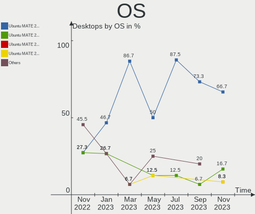

| Name              | Desktops | Percent |
|-------------------|----------|---------|
| Ubuntu MATE 22.04 | 5        | 71.43%  |
| Ubuntu MATE 23.10 | 2        | 28.57%  |

OS Family
---------

OS without a version

| Name        | Desktops | Percent |
|-------------|----------|---------|
| Ubuntu MATE | 7        | 100%    |

Kernel
------

Version of the Linux kernel

| Version           | Desktops | Percent |
|-------------------|----------|---------|
| 6.5.0-9-generic   | 1        | 14.29%  |
| 6.5.0-10-generic  | 1        | 14.29%  |
| 6.2.0-35-generic  | 1        | 14.29%  |
| 6.2.0-33-generic  | 1        | 14.29%  |
| 6.2.0-26-generic  | 1        | 14.29%  |
| 5.15.0-86-generic | 1        | 14.29%  |
| 5.15.0-76-generic | 1        | 14.29%  |

Kernel Family
-------------

Linux kernel without a distro release

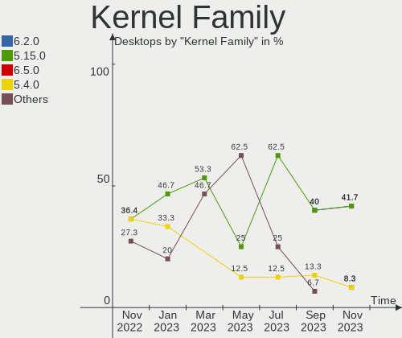

| Version | Desktops | Percent |
|---------|----------|---------|
| 6.2.0   | 3        | 42.86%  |
| 6.5.0   | 2        | 28.57%  |
| 5.15.0  | 2        | 28.57%  |

Kernel Major Ver.
-----------------

Linux kernel major version

| Version | Desktops | Percent |
|---------|----------|---------|
| 6.2     | 3        | 42.86%  |
| 6.5     | 2        | 28.57%  |
| 5.15    | 2        | 28.57%  |

Arch
----

OS architecture (x86_64, i586, etc.)

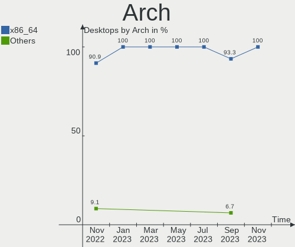

| Name   | Desktops | Percent |
|--------|----------|---------|
| x86_64 | 7        | 100%    |

DE
--

Desktop Environment

| Name | Desktops | Percent |
|------|----------|---------|
| MATE | 7        | 100%    |

Display Server
--------------

X11 or Wayland

| Name | Desktops | Percent |
|------|----------|---------|
| X11  | 7        | 100%    |

Display Manager
---------------

SDDM, LightDM, etc.

| Name    | Desktops | Percent |
|---------|----------|---------|
| LightDM | 6        | 85.71%  |
| GDM3    | 1        | 14.29%  |

OS Lang
-------

Language

| Lang  | Desktops | Percent |
|-------|----------|---------|
| en_US | 3        | 42.86%  |
| ja_JP | 1        | 14.29%  |
| it_IT | 1        | 14.29%  |
| fr_FR | 1        | 14.29%  |
| en_GB | 1        | 14.29%  |

Boot Mode
---------

EFI or BIOS

| Mode | Desktops | Percent |
|------|----------|---------|
| EFI  | 6        | 85.71%  |
| BIOS | 1        | 14.29%  |

Filesystem
----------

Type of filesystem

| Type    | Desktops | Percent |
|---------|----------|---------|
| Ext4    | 4        | 57.14%  |
| Tmpfs   | 2        | 28.57%  |
| Overlay | 1        | 14.29%  |

Part. scheme
------------

Scheme of partitioning

| Type | Desktops | Percent |
|------|----------|---------|
| GPT  | 6        | 85.71%  |
| MBR  | 1        | 14.29%  |

Dual Boot with Linux/BSD
------------------------

Hosting more than one Linux/BSD

| Dual boot | Desktops | Percent |
|-----------|----------|---------|
| No        | 7        | 100%    |

Dual Boot (Win)
---------------

Hosting Linux and Windows

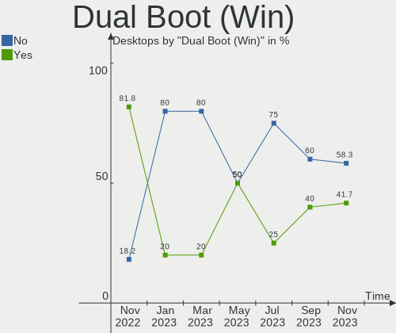

| Dual boot | Desktops | Percent |
|-----------|----------|---------|
| Yes       | 5        | 71.43%  |
| No        | 2        | 28.57%  |

Board
-----

Vendor
------

Motherboard manufacturer

| Name                | Desktops | Percent |
|---------------------|----------|---------|
| ASRock              | 2        | 28.57%  |
| MSI                 | 1        | 14.29%  |
| Lenovo              | 1        | 14.29%  |
| Hewlett-Packard     | 1        | 14.29%  |
| Gigabyte Technology | 1        | 14.29%  |
| ASUSTek Computer    | 1        | 14.29%  |

Model
-----

Motherboard model

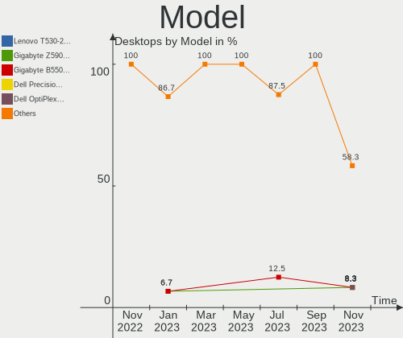

| Name                                    | Desktops | Percent |
|-----------------------------------------|----------|---------|
| MSI MS-7B84                             | 1        | 14.29%  |
| Lenovo IdeaCentre 510S-07ICB 90K800H1BF | 1        | 14.29%  |
| HP Compaq 8000 Elite SFF PC             | 1        | 14.29%  |
| Gigabyte B550M DS3H                     | 1        | 14.29%  |
| ASUS All Series                         | 1        | 14.29%  |
| ASRock Z370 Killer SLI                  | 1        | 14.29%  |
| ASRock J4105-ITX                        | 1        | 14.29%  |

Model Family
------------

Motherboard model prefix

| Name              | Desktops | Percent |
|-------------------|----------|---------|
| MSI MS-7B84       | 1        | 14.29%  |
| Lenovo IdeaCentre | 1        | 14.29%  |
| HP Compaq         | 1        | 14.29%  |
| Gigabyte B550M    | 1        | 14.29%  |
| ASUS All          | 1        | 14.29%  |
| ASRock Z370       | 1        | 14.29%  |
| ASRock J4105-ITX  | 1        | 14.29%  |

MFG Year
--------

Motherboard manufacture year

| Year | Desktops | Percent |
|------|----------|---------|
| 2018 | 2        | 28.57%  |
| 2021 | 1        | 14.29%  |
| 2020 | 1        | 14.29%  |
| 2017 | 1        | 14.29%  |
| 2012 | 1        | 14.29%  |
| 2009 | 1        | 14.29%  |

Form Factor
-----------

Physical design of the computer

| Name    | Desktops | Percent |
|---------|----------|---------|
| Desktop | 7        | 100%    |

Secure Boot
-----------

Enabled or disabled

| State    | Desktops | Percent |
|----------|----------|---------|
| Disabled | 6        | 85.71%  |
| Enabled  | 1        | 14.29%  |

Coreboot
--------

Have coreboot on board

| Used | Desktops | Percent |
|------|----------|---------|
| No   | 7        | 100%    |

RAM Size
--------

Total RAM memory

| Size in GB | Desktops | Percent |
|------------|----------|---------|
| 4.01-8.0   | 2        | 28.57%  |
| 8.01-16.0  | 2        | 28.57%  |
| 32.01-64.0 | 1        | 14.29%  |
| 3.01-4.0   | 1        | 14.29%  |
| 16.01-24.0 | 1        | 14.29%  |

RAM Used
--------

Used RAM memory

| Used GB  | Desktops | Percent |
|----------|----------|---------|
| 2.01-3.0 | 3        | 42.86%  |
| 3.01-4.0 | 2        | 28.57%  |
| 1.01-2.0 | 2        | 28.57%  |

Total Drives
------------

Number of drives on board

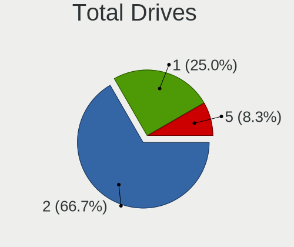

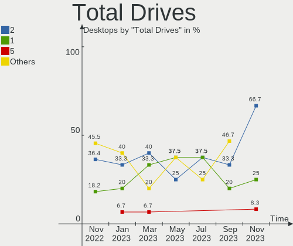

| Drives | Desktops | Percent |
|--------|----------|---------|
| 2      | 3        | 42.86%  |
| 1      | 3        | 42.86%  |
| 4      | 1        | 14.29%  |

Has CD-ROM
----------

Has CD-ROM on board

| Presented | Desktops | Percent |
|-----------|----------|---------|
| No        | 4        | 57.14%  |
| Yes       | 3        | 42.86%  |

Has Ethernet
------------

Has Ethernet on board

| Presented | Desktops | Percent |
|-----------|----------|---------|
| Yes       | 7        | 100%    |

Has WiFi
--------

Has WiFi module

| Presented | Desktops | Percent |
|-----------|----------|---------|
| No        | 4        | 57.14%  |
| Yes       | 3        | 42.86%  |

Has Bluetooth
-------------

Has Bluetooth module

| Presented | Desktops | Percent |
|-----------|----------|---------|
| No        | 5        | 71.43%  |
| Yes       | 2        | 28.57%  |

Location
--------

Country
-------

Geographic location (country)

| Country | Desktops | Percent |
|---------|----------|---------|
| Vietnam | 1        | 14.29%  |
| UK      | 1        | 14.29%  |
| Poland  | 1        | 14.29%  |
| Japan   | 1        | 14.29%  |
| Italy   | 1        | 14.29%  |
| France  | 1        | 14.29%  |
| Belgium | 1        | 14.29%  |

City
----

Geographic location (city)

| City             | Desktops | Percent |
|------------------|----------|---------|
| Warsaw           | 1        | 14.29%  |
| Palermo          | 1        | 14.29%  |
| Noda             | 1        | 14.29%  |
| Louvain-la-Neuve | 1        | 14.29%  |
| Hanoi            | 1        | 14.29%  |
| Besançon        | 1        | 14.29%  |
| Ashford          | 1        | 14.29%  |

Drives
------

Drive Vendor
------------

Hard drive vendors

| Vendor              | Desktops | Drives | Percent |
|---------------------|----------|--------|---------|
| WDC                 | 4        | 4      | 33.33%  |
| Seagate             | 3        | 4      | 25%     |
| SK hynix            | 1        | 1      | 8.33%   |
| Samsung Electronics | 1        | 1      | 8.33%   |
| Lexar               | 1        | 1      | 8.33%   |
| KingSpec            | 1        | 1      | 8.33%   |
| Crucial             | 1        | 1      | 8.33%   |

Drive Model
-----------

Hard drive models

| Model                             | Desktops | Percent |
|-----------------------------------|----------|---------|
| WDC WD10JPVX-22JC3T0 1TB          | 1        | 8.33%   |
| WDC WD10EADS-00M2B0 1TB           | 1        | 8.33%   |
| WDC WD1003FZEX-00MK2A0 1TB        | 1        | 8.33%   |
| WDC PC SN530 SDBPNPZ-256G         | 1        | 8.33%   |
| SK hynix HFM128GDHTNG-8310B 128GB | 1        | 8.33%   |
| Seagate ST2000DM006-2DM164 2TB    | 1        | 8.33%   |
| Seagate ST1000DM003-1SB102 1TB    | 1        | 8.33%   |
| Seagate ST1000DM003-1ER162 1TB    | 1        | 8.33%   |
| Samsung SSD 840 Series 250GB      | 1        | 8.33%   |
| Lexar SSD NM620 512GB             | 1        | 8.33%   |
| KingSpec P3-128 128GB SSD         | 1        | 8.33%   |
| Crucial CT480BX500SSD1 480GB      | 1        | 8.33%   |

HDD Vendor
----------

Hard disk drive vendors

| Vendor  | Desktops | Drives | Percent |
|---------|----------|--------|---------|
| WDC     | 3        | 3      | 50%     |
| Seagate | 3        | 4      | 50%     |

SSD Vendor
----------

Solid state drive vendors

| Vendor              | Desktops | Drives | Percent |
|---------------------|----------|--------|---------|
| Samsung Electronics | 1        | 1      | 33.33%  |
| KingSpec            | 1        | 1      | 33.33%  |
| Crucial             | 1        | 1      | 33.33%  |

Drive Kind
----------

HDD or SSD

| Kind | Desktops | Drives | Percent |
|------|----------|--------|---------|
| HDD  | 5        | 7      | 45.45%  |
| NVMe | 3        | 3      | 27.27%  |
| SSD  | 3        | 3      | 27.27%  |

Drive Connector
---------------

SATA, SAS, NVMe, etc.

| Type | Desktops | Drives | Percent |
|------|----------|--------|---------|
| SATA | 6        | 10     | 66.67%  |
| NVMe | 3        | 3      | 33.33%  |

Drive Size
----------

Size of hard drive

| Size in TB | Desktops | Drives | Percent |
|------------|----------|--------|---------|
| 0.51-1.0   | 4        | 5      | 50%     |
| 0.01-0.5   | 3        | 3      | 37.5%   |
| 1.01-2.0   | 1        | 2      | 12.5%   |

Space Total
-----------

Amount of disk space available on the file system

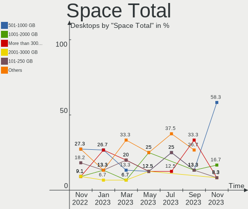

| Size in GB     | Desktops | Percent |
|----------------|----------|---------|
| 1001-2000      | 2        | 28.57%  |
| More than 3000 | 1        | 14.29%  |
| 251-500        | 1        | 14.29%  |
| 21-50          | 1        | 14.29%  |
| 101-250        | 1        | 14.29%  |
| 501-1000       | 1        | 14.29%  |

Space Used
----------

Amount of used disk space

| Used GB        | Desktops | Percent |
|----------------|----------|---------|
| 101-250        | 3        | 42.86%  |
| More than 3000 | 1        | 14.29%  |
| 21-50          | 1        | 14.29%  |
| 1-20           | 1        | 14.29%  |
| 501-1000       | 1        | 14.29%  |

Malfunc. Drives
---------------

Drive models with a malfunction

| Model                      | Desktops | Drives | Percent |
|----------------------------|----------|--------|---------|
| WDC WD1003FZEX-00MK2A0 1TB | 1        | 1      | 100%    |

Malfunc. Drive Vendor
---------------------

Vendors of faulty drives

| Vendor | Desktops | Drives | Percent |
|--------|----------|--------|---------|
| WDC    | 1        | 1      | 100%    |

Malfunc. HDD Vendor
-------------------

Vendors of faulty HDD drives

| Vendor | Desktops | Drives | Percent |
|--------|----------|--------|---------|
| WDC    | 1        | 1      | 100%    |

Malfunc. Drive Kind
-------------------

Kinds of faulty drives

| Kind | Desktops | Drives | Percent |
|------|----------|--------|---------|
| HDD  | 1        | 1      | 100%    |

Failed Drives
-------------

Failed drive models

Zero info for selected period =(

Failed Drive Vendor
-------------------

Failed drive vendors

Zero info for selected period =(

Drive Status
------------

Number of failed and malfunc. drives

| Status   | Desktops | Drives | Percent |
|----------|----------|--------|---------|
| Works    | 6        | 11     | 75%     |
| Detected | 1        | 1      | 12.5%   |
| Malfunc  | 1        | 1      | 12.5%   |

Storage controller
------------------

Storage Vendor
--------------

Storage controller vendors

| Vendor                       | Desktops | Percent |
|------------------------------|----------|---------|
| Intel                        | 5        | 41.67%  |
| AMD                          | 2        | 16.67%  |
| SK hynix                     | 1        | 8.33%   |
| Shenzhen Longsys Electronics | 1        | 8.33%   |
| SanDisk                      | 1        | 8.33%   |
| JMicron Technology           | 1        | 8.33%   |
| ASMedia Technology           | 1        | 8.33%   |

Storage Model
-------------

Storage controller models

| Model                                                                          | Desktops | Percent |
|--------------------------------------------------------------------------------|----------|---------|
| SK hynix BC501 NVMe Solid State Drive                                          | 1        | 7.14%   |
| Shenzhen Longsys Lexar NM620 NVME SSD (DRAM-less)                              | 1        | 7.14%   |
| SanDisk Ultra 3D / WD Blue SN550 NVMe SSD                                      | 1        | 7.14%   |
| JMicron JMB363 SATA/IDE Controller                                             | 1        | 7.14%   |
| Intel SATA Controller [RAID mode]                                              | 1        | 7.14%   |
| Intel Celeron/Pentium Silver Processor SATA Controller                         | 1        | 7.14%   |
| Intel Cannon Lake PCH SATA AHCI Controller                                     | 1        | 7.14%   |
| Intel 82801JD/DO (ICH10 Family) 4-port SATA IDE Controller                     | 1        | 7.14%   |
| Intel 82801JD/DO (ICH10 Family) 2-port SATA IDE Controller                     | 1        | 7.14%   |
| Intel 8 Series/C220 Series Chipset Family 6-port SATA Controller 1 [AHCI mode] | 1        | 7.14%   |
| ASMedia ASM1062 Serial ATA Controller                                          | 1        | 7.14%   |
| AMD FCH SATA Controller [AHCI mode]                                            | 1        | 7.14%   |
| AMD FCH SATA Controller D                                                      | 1        | 7.14%   |
| AMD 500 Series Chipset SATA Controller                                         | 1        | 7.14%   |

Storage Kind
------------

Kind of storage controller (IDE, SATA, NVMe, SAS, ...)

| Kind | Desktops | Percent |
|------|----------|---------|
| SATA | 5        | 45.45%  |
| NVMe | 3        | 27.27%  |
| IDE  | 2        | 18.18%  |
| RAID | 1        | 9.09%   |

Processor
---------

CPU Vendor
----------

Processor vendors

| Vendor | Desktops | Percent |
|--------|----------|---------|
| Intel  | 5        | 71.43%  |
| AMD    | 2        | 28.57%  |

CPU Model
---------

Processor models

| Model                                       | Desktops | Percent |
|---------------------------------------------|----------|---------|
| Intel Pentium Dual-Core CPU E5400 @ 2.70GHz | 1        | 14.29%  |
| Intel Core i7-8700K CPU @ 3.70GHz           | 1        | 14.29%  |
| Intel Core i7-4790 CPU @ 3.60GHz            | 1        | 14.29%  |
| Intel Core i5-9400 CPU @ 2.90GHz            | 1        | 14.29%  |
| Intel Celeron J4105 CPU @ 1.50GHz           | 1        | 14.29%  |
| AMD Ryzen 5 4600G with Radeon Graphics      | 1        | 14.29%  |
| AMD Ryzen 3 2200G with Radeon Vega Graphics | 1        | 14.29%  |

CPU Model Family
----------------

Processor model prefix

| Model                   | Desktops | Percent |
|-------------------------|----------|---------|
| Intel Core i7           | 2        | 28.57%  |
| Intel Pentium Dual-Core | 1        | 14.29%  |
| Intel Core i5           | 1        | 14.29%  |
| Intel Celeron           | 1        | 14.29%  |
| AMD Ryzen 5             | 1        | 14.29%  |
| AMD Ryzen 3             | 1        | 14.29%  |

CPU Cores
---------

Number of processor cores

| Number | Desktops | Percent |
|--------|----------|---------|
| 6      | 3        | 42.86%  |
| 4      | 3        | 42.86%  |
| 2      | 1        | 14.29%  |

CPU Sockets
-----------

Number of sockets

| Number | Desktops | Percent |
|--------|----------|---------|
| 1      | 7        | 100%    |

CPU Threads
-----------

Threads per core (Hyper-Threading)

| Number | Desktops | Percent |
|--------|----------|---------|
| 1      | 4        | 57.14%  |
| 2      | 3        | 42.86%  |

CPU Op-Modes
------------

CPU Operation Modes (32-bit, 64-bit)

| Op mode        | Desktops | Percent |
|----------------|----------|---------|
| 32-bit, 64-bit | 7        | 100%    |

CPU Microcode
-------------

Microcode number

| Number     | Desktops | Percent |
|------------|----------|---------|
| Unknown    | 4        | 57.14%  |
| 0x1067a    | 1        | 14.29%  |
| 0x08600106 | 1        | 14.29%  |
| 0x0810100b | 1        | 14.29%  |

CPU Microarch
-------------

Microarchitecture

| Name          | Desktops | Percent |
|---------------|----------|---------|
| KabyLake      | 2        | 28.57%  |
| Zen 2         | 1        | 14.29%  |
| Zen           | 1        | 14.29%  |
| Penryn        | 1        | 14.29%  |
| Haswell       | 1        | 14.29%  |
| Goldmont plus | 1        | 14.29%  |

Graphics
--------

GPU Vendor
----------

Vendors of graphics cards

| Vendor | Desktops | Percent |
|--------|----------|---------|
| Intel  | 3        | 42.86%  |
| AMD    | 3        | 42.86%  |
| Nvidia | 1        | 14.29%  |

GPU Model
---------

Graphics card models

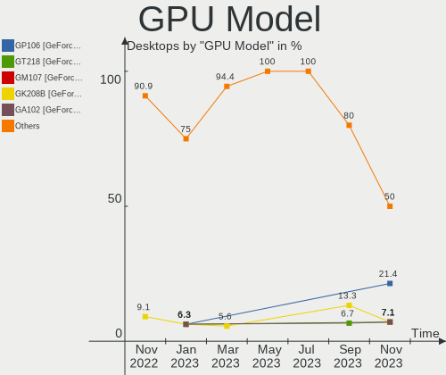

| Model                                                            | Desktops | Percent |
|------------------------------------------------------------------|----------|---------|
| Intel CoffeeLake-S GT2 [UHD Graphics 630]                        | 2        | 28.57%  |
| Nvidia GF108 [GeForce GT 430]                                    | 1        | 14.29%  |
| Intel GeminiLake [UHD Graphics 600]                              | 1        | 14.29%  |
| AMD Renoir [Radeon RX Vega 6 (Ryzen 4000/5000 Mobile Series)]    | 1        | 14.29%  |
| AMD Raven Ridge [Radeon Vega Series / Radeon Vega Mobile Series] | 1        | 14.29%  |
| AMD Cedar [Radeon HD 5000/6000/7350/8350 Series]                 | 1        | 14.29%  |

GPU Combo
---------

Combinations of graphics cards

| Name       | Desktops | Percent |
|------------|----------|---------|
| 1 x Intel  | 3        | 42.86%  |
| 1 x AMD    | 3        | 42.86%  |
| 1 x Nvidia | 1        | 14.29%  |

GPU Driver
----------

Free vs proprietary

| Driver | Desktops | Percent |
|--------|----------|---------|
| Free   | 7        | 100%    |

GPU Memory
----------

Total video memory

| Size in GB | Desktops | Percent |
|------------|----------|---------|
| Unknown    | 3        | 42.86%  |
| 0.51-1.0   | 2        | 28.57%  |
| 0.01-0.5   | 2        | 28.57%  |

Monitor
-------

Monitor Vendor
--------------

Monitor vendors

| Vendor              | Desktops | Percent |
|---------------------|----------|---------|
| Samsung Electronics | 2        | 25%     |
| Goldstar            | 2        | 25%     |
| NEC Computers       | 1        | 12.5%   |
| BenQ                | 1        | 12.5%   |
| ASUSTek Computer    | 1        | 12.5%   |
| AOC                 | 1        | 12.5%   |

Monitor Model
-------------

Monitor models

| Model                                                                 | Desktops | Percent |
|-----------------------------------------------------------------------|----------|---------|
| Samsung Electronics SMB2030 SAM063C 1600x900 443x249mm 20.0-inch      | 1        | 11.11%  |
| Samsung Electronics LCD Monitor SAM07C0 1920x1080 890x500mm 40.2-inch | 1        | 11.11%  |
| NEC Computers EA193Mi NEC6956 1280x1024 375x300mm 18.9-inch           | 1        | 11.11%  |
| Goldstar W2600 GSM5675 1920x1200 550x343mm 25.5-inch                  | 1        | 11.11%  |
| Goldstar L226WTQ GSM564E 1680x1050 474x296mm 22.0-inch                | 1        | 11.11%  |
| Goldstar IPS FULLHD GSM5AB7 1920x1080 480x270mm 21.7-inch             | 1        | 11.11%  |
| BenQ EW2420 BNQ7923 1920x1080 531x299mm 24.0-inch                     | 1        | 11.11%  |
| ASUSTek Computer VA27EHE AUS27D2 1920x1080 598x336mm 27.0-inch        | 1        | 11.11%  |
| AOC Q3279WG5B AOC3279 2560x1440 725x428mm 33.1-inch                   | 1        | 11.11%  |

Monitor Resolution
------------------

Monitor screen resolution

| Resolution         | Desktops | Percent |
|--------------------|----------|---------|
| 1920x1080 (FHD)    | 3        | 37.5%   |
| 2560x1440 (QHD)    | 1        | 12.5%   |
| 1920x1200 (WUXGA)  | 1        | 12.5%   |
| 1680x1050 (WSXGA+) | 1        | 12.5%   |
| 1600x900 (HD+)     | 1        | 12.5%   |
| 1280x1024 (SXGA)   | 1        | 12.5%   |

Monitor Diagonal
----------------

Diagonal size in inches

| Inches | Desktops | Percent |
|--------|----------|---------|
| 46     | 1        | 11.11%  |
| 33     | 1        | 11.11%  |
| 27     | 1        | 11.11%  |
| 25     | 1        | 11.11%  |
| 24     | 1        | 11.11%  |
| 22     | 1        | 11.11%  |
| 21     | 1        | 11.11%  |
| 20     | 1        | 11.11%  |
| 18     | 1        | 11.11%  |

Monitor Width
-------------

Physical width

| Width in mm | Desktops | Percent |
|-------------|----------|---------|
| 501-600     | 3        | 33.33%  |
| 401-500     | 3        | 33.33%  |
| 701-800     | 1        | 11.11%  |
| 351-400     | 1        | 11.11%  |
| 1001-1500   | 1        | 11.11%  |

Aspect Ratio
------------

Proportional relationship between the width and the height

| Ratio | Desktops | Percent |
|-------|----------|---------|
| 16/9  | 5        | 71.43%  |
| 5/4   | 1        | 14.29%  |
| 16/10 | 1        | 14.29%  |

Monitor Area
------------

Area in inch²

| Area in inch² | Desktops | Percent |
|----------------|----------|---------|
| 201-250        | 2        | 25%     |
| 151-200        | 2        | 25%     |
| 351-500        | 1        | 12.5%   |
| 301-350        | 1        | 12.5%   |
| 251-300        | 1        | 12.5%   |
| 501-1000       | 1        | 12.5%   |

Pixel Density
-------------

Pixels per inch

| Density | Desktops | Percent |
|---------|----------|---------|
| 51-100  | 6        | 75%     |
| 1-50    | 1        | 12.5%   |
| 101-120 | 1        | 12.5%   |

Multiple Monitors
-----------------

Total monitors connected

| Total | Desktops | Percent |
|-------|----------|---------|
| 1     | 5        | 71.43%  |
| 2     | 2        | 28.57%  |

Network
-------

Net Controller Vendor
---------------------

Controller vendors

| Vendor                | Desktops | Percent |
|-----------------------|----------|---------|
| Realtek Semiconductor | 5        | 50%     |
| Intel                 | 3        | 30%     |
| Qualcomm Atheros      | 1        | 10%     |
| NetXen Incorporated   | 1        | 10%     |

Net Controller Model
--------------------

Controller models

| Model                                                                | Desktops | Percent |
|----------------------------------------------------------------------|----------|---------|
| Realtek RTL8111/8168/8411 PCI Express Gigabit Ethernet Controller    | 5        | 45.45%  |
| Realtek RTL88x2bu [AC1200 Techkey]                                   | 1        | 9.09%   |
| Qualcomm Atheros AR928X Wireless Network Adapter (PCI-Express)       | 1        | 9.09%   |
| NetXen Incorporated NX3031 Multifunction 1/10-Gigabit Server Adapter | 1        | 9.09%   |
| Intel Ethernet Connection (2) I219-V                                 | 1        | 9.09%   |
| Intel Dual Band Wireless-AC 3165 Plus Bluetooth                      | 1        | 9.09%   |
| Intel 82567LM-3 Gigabit Network Connection                           | 1        | 9.09%   |

Wireless Vendor
---------------

Wireless vendors

| Vendor                | Desktops | Percent |
|-----------------------|----------|---------|
| Realtek Semiconductor | 1        | 33.33%  |
| Qualcomm Atheros      | 1        | 33.33%  |
| Intel                 | 1        | 33.33%  |

Wireless Model
--------------

Wireless models

| Model                                                          | Desktops | Percent |
|----------------------------------------------------------------|----------|---------|
| Realtek RTL88x2bu [AC1200 Techkey]                             | 1        | 33.33%  |
| Qualcomm Atheros AR928X Wireless Network Adapter (PCI-Express) | 1        | 33.33%  |
| Intel Dual Band Wireless-AC 3165 Plus Bluetooth                | 1        | 33.33%  |

Ethernet Vendor
---------------

Ethernet vendors

| Vendor                | Desktops | Percent |
|-----------------------|----------|---------|
| Realtek Semiconductor | 5        | 62.5%   |
| Intel                 | 2        | 25%     |
| NetXen Incorporated   | 1        | 12.5%   |

Ethernet Model
--------------

Ethernet models

| Model                                                                | Desktops | Percent |
|----------------------------------------------------------------------|----------|---------|
| Realtek RTL8111/8168/8411 PCI Express Gigabit Ethernet Controller    | 5        | 62.5%   |
| NetXen Incorporated NX3031 Multifunction 1/10-Gigabit Server Adapter | 1        | 12.5%   |
| Intel Ethernet Connection (2) I219-V                                 | 1        | 12.5%   |
| Intel 82567LM-3 Gigabit Network Connection                           | 1        | 12.5%   |

Net Controller Kind
-------------------

Ethernet, WiFi or modem

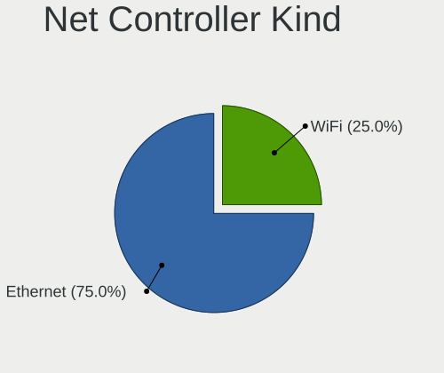

| Kind     | Desktops | Percent |
|----------|----------|---------|
| Ethernet | 7        | 70%     |
| WiFi     | 3        | 30%     |

Used Controller
---------------

Currently used network controller

| Kind     | Desktops | Percent |
|----------|----------|---------|
| Ethernet | 5        | 71.43%  |
| WiFi     | 2        | 28.57%  |

NICs
----

Total network controllers on board

| Total | Desktops | Percent |
|-------|----------|---------|
| 1     | 4        | 57.14%  |
| 2     | 2        | 28.57%  |
| 5     | 1        | 14.29%  |

IPv6
----

IPv6 vs IPv4

| Used | Desktops | Percent |
|------|----------|---------|
| No   | 4        | 57.14%  |
| Yes  | 3        | 42.86%  |

Bluetooth
---------

Bluetooth Vendor
----------------

Controller vendors

| Vendor                  | Desktops | Percent |
|-------------------------|----------|---------|
| Intel                   | 1        | 50%     |
| Cambridge Silicon Radio | 1        | 50%     |

Bluetooth Model
---------------

Controller models

| Model                                               | Desktops | Percent |
|-----------------------------------------------------|----------|---------|
| Intel Bluetooth wireless interface                  | 1        | 50%     |
| Cambridge Silicon Radio Bluetooth Dongle (HCI mode) | 1        | 50%     |

Sound
-----

Sound Vendor
------------

Sound card vendors

| Vendor              | Desktops | Percent |
|---------------------|----------|---------|
| Intel               | 4        | 44.44%  |
| AMD                 | 3        | 33.33%  |
| Nvidia              | 1        | 11.11%  |
| C-Media Electronics | 1        | 11.11%  |

Sound Model
-----------

Sound card models

| Model                                                               | Desktops | Percent |
|---------------------------------------------------------------------|----------|---------|
| AMD Family 17h/19h HD Audio Controller                              | 2        | 18.18%  |
| Nvidia GF108 High Definition Audio Controller                       | 1        | 9.09%   |
| Intel Celeron/Pentium Silver Processor High Definition Audio        | 1        | 9.09%   |
| Intel Cannon Lake PCH cAVS                                          | 1        | 9.09%   |
| Intel 82801JD/DO (ICH10 Family) HD Audio Controller                 | 1        | 9.09%   |
| Intel 8 Series/C220 Series Chipset High Definition Audio Controller | 1        | 9.09%   |
| C-Media Electronics CMI8788 [Oxygen HD Audio]                       | 1        | 9.09%   |
| AMD Renoir Radeon High Definition Audio Controller                  | 1        | 9.09%   |
| AMD Raven/Raven2/Fenghuang HDMI/DP Audio Controller                 | 1        | 9.09%   |
| AMD Cedar HDMI Audio [Radeon HD 5400/6300/7300 Series]              | 1        | 9.09%   |

Memory
------

Memory Vendor
-------------

Memory module vendors

| Vendor              | Desktops | Percent |
|---------------------|----------|---------|
| G.Skill             | 3        | 37.5%   |
| Samsung Electronics | 2        | 25%     |
| Unknown             | 1        | 12.5%   |
| GOODRAM             | 1        | 12.5%   |
| Elpida              | 1        | 12.5%   |

Memory Model
------------

Memory module models

| Model                                                  | Desktops | Percent |
|--------------------------------------------------------|----------|---------|
| Unknown RAM Module 4GB DIMM DDR3 1333MT/s              | 1        | 12.5%   |
| Samsung RAM M378B5273DH0-CH9 4096MB DIMM DDR3 2133MT/s | 1        | 12.5%   |
| Samsung RAM M378A1K43CB2-CTD 8GB DIMM DDR4 3266MT/s    | 1        | 12.5%   |
| GOODRAM RAM IRX3000D464L16S/8G 8GB DIMM DDR4 3333MT/s  | 1        | 12.5%   |
| G.Skill RAM F4-3200C16-8GIS 8GB DIMM DDR4 3200MT/s     | 1        | 12.5%   |
| G.Skill RAM F4-2400C17-4GNT 4GB DIMM DDR4 2400MT/s     | 1        | 12.5%   |
| G.Skill RAM F4-2400C16-4GRS 4GB SODIMM DDR4 2400MT/s   | 1        | 12.5%   |
| Elpida RAM EBJ10UE8BDF0-DJ-F 1GB DIMM DDR3 1333MT/s    | 1        | 12.5%   |

Memory Kind
-----------

Memory module kinds

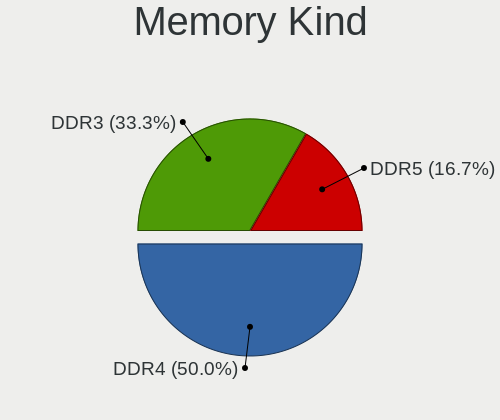

| Kind | Desktops | Percent |
|------|----------|---------|
| DDR4 | 5        | 71.43%  |
| DDR3 | 2        | 28.57%  |

Memory Form Factor
------------------

Physical design of the memory module

| Name   | Desktops | Percent |
|--------|----------|---------|
| DIMM   | 6        | 85.71%  |
| SODIMM | 1        | 14.29%  |

Memory Size
-----------

Memory module size

| Size | Desktops | Percent |
|------|----------|---------|
| 4096 | 4        | 50%     |
| 8192 | 3        | 37.5%   |
| 1024 | 1        | 12.5%   |

Memory Speed
------------

Memory module speed

| Speed | Desktops | Percent |
|-------|----------|---------|
| 2400  | 2        | 25%     |
| 1333  | 2        | 25%     |
| 3333  | 1        | 12.5%   |
| 3266  | 1        | 12.5%   |
| 3200  | 1        | 12.5%   |
| 2133  | 1        | 12.5%   |

Printers & scanners
-------------------

Printer Vendor
--------------

Printer device vendors

Zero info for selected period =(

Printer Model
-------------

Printer device models

Zero info for selected period =(

Scanner Vendor
--------------

Scanner device vendors

Zero info for selected period =(

Scanner Model
-------------

Scanner device models

Zero info for selected period =(

Camera
------

Camera Vendor
-------------

Camera device vendors

| Vendor              | Desktops | Percent |
|---------------------|----------|---------|
| Samsung Electronics | 1        | 50%     |
| Alcor Micro         | 1        | 50%     |

Camera Model
------------

Camera device models

| Model                                   | Desktops | Percent |
|-----------------------------------------|----------|---------|
| Samsung Galaxy series, misc. (MTP mode) | 1        | 50%     |
| Alcor Micro USB 2.0 PC Camera           | 1        | 50%     |

Security
--------

Fingerprint Vendor
------------------

Fingerprint sensor vendors

Zero info for selected period =(

Fingerprint Model
-----------------

Fingerprint sensor models

Zero info for selected period =(

Chipcard Vendor
---------------

Chipcard module vendors

Zero info for selected period =(

Chipcard Model
--------------

Chipcard module models

Zero info for selected period =(

Unsupported
-----------

Unsupported Devices
-------------------

Total unsupported devices on board

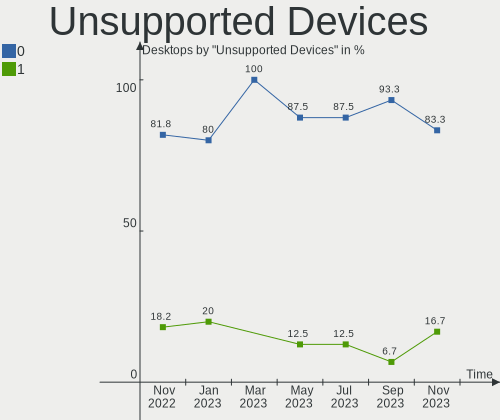

| Total | Desktops | Percent |
|-------|----------|---------|
| 0     | 7        | 100%    |

Unsupported Device Types
------------------------

Types of unsupported devices

Zero info for selected period =(

