Ubuntu MATE - Hardware Trends (Desktops)
----------------------------------------

A project to identify most popular hardware characteristics and track their change
over time based on data collected by Linux users at https://Linux-Hardware.org.

Anyone can contribute to this report by the [hw-probe](https://github.com/linuxhw/hw-probe) tool:

    sudo -E hw-probe -all -upload

This report is for one last month. Overall report since the beginning of time: [TestDays](https://github.com/linuxhw/TestDays)

Period: Jun, 2023.

Contents
--------

* [ System ](#system)
  - [ OS                       ](#os)
  - [ OS Family                ](#os-family)
  - [ Kernel                   ](#kernel)
  - [ Kernel Family            ](#kernel-family)
  - [ Kernel Major Ver.        ](#kernel-major-ver)
  - [ Arch                     ](#arch)
  - [ DE                       ](#de)
  - [ Display Server           ](#display-server)
  - [ Display Manager          ](#display-manager)
  - [ OS Lang                  ](#os-lang)
  - [ Boot Mode                ](#boot-mode)
  - [ Filesystem               ](#filesystem)
  - [ Part. scheme             ](#part-scheme)
  - [ Dual Boot with Linux/BSD ](#dual-boot-with-linuxbsd)
  - [ Dual Boot (Win)          ](#dual-boot-win)

* [ Board ](#board)
  - [ Vendor                   ](#vendor)
  - [ Model                    ](#model)
  - [ Model Family             ](#model-family)
  - [ MFG Year                 ](#mfg-year)
  - [ Form Factor              ](#form-factor)
  - [ Secure Boot              ](#secure-boot)
  - [ Coreboot                 ](#coreboot)
  - [ RAM Size                 ](#ram-size)
  - [ RAM Used                 ](#ram-used)
  - [ Total Drives             ](#total-drives)
  - [ Has CD-ROM               ](#has-cd-rom)
  - [ Has Ethernet             ](#has-ethernet)
  - [ Has WiFi                 ](#has-wifi)
  - [ Has Bluetooth            ](#has-bluetooth)

* [ Location ](#location)
  - [ Country                  ](#country)
  - [ City                     ](#city)

* [ Drives ](#drives)
  - [ Drive Vendor             ](#drive-vendor)
  - [ Drive Model              ](#drive-model)
  - [ HDD Vendor               ](#hdd-vendor)
  - [ SSD Vendor               ](#ssd-vendor)
  - [ Drive Kind               ](#drive-kind)
  - [ Drive Connector          ](#drive-connector)
  - [ Drive Size               ](#drive-size)
  - [ Space Total              ](#space-total)
  - [ Space Used               ](#space-used)
  - [ Malfunc. Drives          ](#malfunc-drives)
  - [ Malfunc. Drive Vendor    ](#malfunc-drive-vendor)
  - [ Malfunc. HDD Vendor      ](#malfunc-hdd-vendor)
  - [ Malfunc. Drive Kind      ](#malfunc-drive-kind)
  - [ Failed Drives            ](#failed-drives)
  - [ Failed Drive Vendor      ](#failed-drive-vendor)
  - [ Drive Status             ](#drive-status)

* [ Storage controller ](#storage-controller)
  - [ Storage Vendor           ](#storage-vendor)
  - [ Storage Model            ](#storage-model)
  - [ Storage Kind             ](#storage-kind)

* [ Processor ](#processor)
  - [ CPU Vendor               ](#cpu-vendor)
  - [ CPU Model                ](#cpu-model)
  - [ CPU Model Family         ](#cpu-model-family)
  - [ CPU Cores                ](#cpu-cores)
  - [ CPU Sockets              ](#cpu-sockets)
  - [ CPU Threads              ](#cpu-threads)
  - [ CPU Op-Modes             ](#cpu-op-modes)
  - [ CPU Microcode            ](#cpu-microcode)
  - [ CPU Microarch            ](#cpu-microarch)

* [ Graphics ](#graphics)
  - [ GPU Vendor               ](#gpu-vendor)
  - [ GPU Model                ](#gpu-model)
  - [ GPU Combo                ](#gpu-combo)
  - [ GPU Driver               ](#gpu-driver)
  - [ GPU Memory               ](#gpu-memory)

* [ Monitor ](#monitor)
  - [ Monitor Vendor           ](#monitor-vendor)
  - [ Monitor Model            ](#monitor-model)
  - [ Monitor Resolution       ](#monitor-resolution)
  - [ Monitor Diagonal         ](#monitor-diagonal)
  - [ Monitor Width            ](#monitor-width)
  - [ Aspect Ratio             ](#aspect-ratio)
  - [ Monitor Area             ](#monitor-area)
  - [ Pixel Density            ](#pixel-density)
  - [ Multiple Monitors        ](#multiple-monitors)

* [ Network ](#network)
  - [ Net Controller Vendor    ](#net-controller-vendor)
  - [ Net Controller Model     ](#net-controller-model)
  - [ Wireless Vendor          ](#wireless-vendor)
  - [ Wireless Model           ](#wireless-model)
  - [ Ethernet Vendor          ](#ethernet-vendor)
  - [ Ethernet Model           ](#ethernet-model)
  - [ Net Controller Kind      ](#net-controller-kind)
  - [ Used Controller          ](#used-controller)
  - [ NICs                     ](#nics)
  - [ IPv6                     ](#ipv6)

* [ Bluetooth ](#bluetooth)
  - [ Bluetooth Vendor         ](#bluetooth-vendor)
  - [ Bluetooth Model          ](#bluetooth-model)

* [ Sound ](#sound)
  - [ Sound Vendor             ](#sound-vendor)
  - [ Sound Model              ](#sound-model)

* [ Memory ](#memory)
  - [ Memory Vendor            ](#memory-vendor)
  - [ Memory Model             ](#memory-model)
  - [ Memory Kind              ](#memory-kind)
  - [ Memory Form Factor       ](#memory-form-factor)
  - [ Memory Size              ](#memory-size)
  - [ Memory Speed             ](#memory-speed)

* [ Printers & scanners ](#printers--scanners)
  - [ Printer Vendor           ](#printer-vendor)
  - [ Printer Model            ](#printer-model)
  - [ Scanner Vendor           ](#scanner-vendor)
  - [ Scanner Model            ](#scanner-model)

* [ Camera ](#camera)
  - [ Camera Vendor            ](#camera-vendor)
  - [ Camera Model             ](#camera-model)

* [ Security ](#security)
  - [ Fingerprint Vendor       ](#fingerprint-vendor)
  - [ Fingerprint Model        ](#fingerprint-model)
  - [ Chipcard Vendor          ](#chipcard-vendor)
  - [ Chipcard Model           ](#chipcard-model)

* [ Unsupported ](#unsupported)
  - [ Unsupported Devices      ](#unsupported-devices)
  - [ Unsupported Device Types ](#unsupported-device-types)

System
------

OS
--

Installed operating systems

| Name              | Desktops | Percent |
|-------------------|----------|---------|
| Ubuntu MATE 22.04 | 6        | 46.15%  |
| Ubuntu MATE 23.04 | 5        | 38.46%  |
| Ubuntu MATE 20.04 | 2        | 15.38%  |

OS Family
---------

OS without a version

| Name        | Desktops | Percent |
|-------------|----------|---------|
| Ubuntu MATE | 13       | 100%    |

Kernel
------

Version of the Linux kernel

| Version                 | Desktops | Percent |
|-------------------------|----------|---------|
| 6.2.0-20-generic        | 2        | 15.38%  |
| 5.15.0-71-generic       | 2        | 15.38%  |
| 6.4.0-060400rc5-generic | 1        | 7.69%   |
| 6.4.0-060400-generic    | 1        | 7.69%   |
| 6.2.0-23-generic        | 1        | 7.69%   |
| 5.4.0-152-generic       | 1        | 7.69%   |
| 5.4.0-113-generic       | 1        | 7.69%   |
| 5.19.0-43-generic       | 1        | 7.69%   |
| 5.19.0-32-generic       | 1        | 7.69%   |
| 5.15.0-75-generic       | 1        | 7.69%   |
| 5.15.0-73-generic       | 1        | 7.69%   |

Kernel Family
-------------

Linux kernel without a distro release

| Version | Desktops | Percent |
|---------|----------|---------|
| 5.15.0  | 4        | 30.77%  |
| 6.2.0   | 3        | 23.08%  |
| 6.4.0   | 2        | 15.38%  |
| 5.4.0   | 2        | 15.38%  |
| 5.19.0  | 2        | 15.38%  |

Kernel Major Ver.
-----------------

Linux kernel major version

| Version | Desktops | Percent |
|---------|----------|---------|
| 5.15    | 4        | 30.77%  |
| 6.2     | 3        | 23.08%  |
| 6.4     | 2        | 15.38%  |
| 5.4     | 2        | 15.38%  |
| 5.19    | 2        | 15.38%  |

Arch
----

OS architecture (x86_64, i586, etc.)

| Name   | Desktops | Percent |
|--------|----------|---------|
| x86_64 | 13       | 100%    |

DE
--

Desktop Environment

| Name       | Desktops | Percent |
|------------|----------|---------|
| MATE       | 12       | 92.31%  |
| X-Cinnamon | 1        | 7.69%   |

Display Server
--------------

X11 or Wayland

| Name    | Desktops | Percent |
|---------|----------|---------|
| X11     | 12       | 92.31%  |
| Wayland | 1        | 7.69%   |

Display Manager
---------------

SDDM, LightDM, etc.

| Name    | Desktops | Percent |
|---------|----------|---------|
| LightDM | 9        | 69.23%  |
| GDM3    | 2        | 15.38%  |
| LXDM    | 1        | 7.69%   |
| Unknown | 1        | 7.69%   |

OS Lang
-------

Language

| Lang  | Desktops | Percent |
|-------|----------|---------|
| fr_FR | 2        | 15.38%  |
| de_DE | 2        | 15.38%  |
| zh_TW | 1        | 7.69%   |
| sv_SE | 1        | 7.69%   |
| pt_BR | 1        | 7.69%   |
| it_IT | 1        | 7.69%   |
| es_AR | 1        | 7.69%   |
| en_US | 1        | 7.69%   |
| en_GB | 1        | 7.69%   |
| ca_ES | 1        | 7.69%   |
| C     | 1        | 7.69%   |

Boot Mode
---------

EFI or BIOS

| Mode | Desktops | Percent |
|------|----------|---------|
| EFI  | 8        | 61.54%  |
| BIOS | 5        | 38.46%  |

Filesystem
----------

Type of filesystem

| Type    | Desktops | Percent |
|---------|----------|---------|
| Ext4    | 10       | 76.92%  |
| Tmpfs   | 2        | 15.38%  |
| Overlay | 1        | 7.69%   |

Part. scheme
------------

Scheme of partitioning

| Type    | Desktops | Percent |
|---------|----------|---------|
| GPT     | 10       | 76.92%  |
| MBR     | 2        | 15.38%  |
| Unknown | 1        | 7.69%   |

Dual Boot with Linux/BSD
------------------------

Hosting more than one Linux/BSD

| Dual boot | Desktops | Percent |
|-----------|----------|---------|
| No        | 11       | 84.62%  |
| Yes       | 2        | 15.38%  |

Dual Boot (Win)
---------------

Hosting Linux and Windows

| Dual boot | Desktops | Percent |
|-----------|----------|---------|
| No        | 9        | 69.23%  |
| Yes       | 4        | 30.77%  |

Board
-----

Vendor
------

Motherboard manufacturer

| Name                | Desktops | Percent |
|---------------------|----------|---------|
| MSI                 | 3        | 23.08%  |
| Gigabyte Technology | 3        | 23.08%  |
| ASUSTek Computer    | 3        | 23.08%  |
| Hewlett-Packard     | 2        | 15.38%  |
| AZW                 | 1        | 7.69%   |
| Acer                | 1        | 7.69%   |

Model
-----

Motherboard model

| Name                      | Desktops | Percent |
|---------------------------|----------|---------|
| MSI MS-7C51               | 1        | 7.69%   |
| MSI MS-7918               | 1        | 7.69%   |
| MSI Cubi N JSL (MS-B0A1)  | 1        | 7.69%   |
| HP EliteDesk 800 G1 SFF   | 1        | 7.69%   |
| HP Desktop M01-F0xxx      | 1        | 7.69%   |
| Gigabyte X570 AORUS ULTRA | 1        | 7.69%   |
| Gigabyte H81M-S2PH        | 1        | 7.69%   |
| Gigabyte B85M-D3H         | 1        | 7.69%   |
| AZW EQ                    | 1        | 7.69%   |
| ASUS P7P55 LX             | 1        | 7.69%   |
| ASUS H61M-K               | 1        | 7.69%   |
| ASUS H110M-K              | 1        | 7.69%   |
| Acer Aspire TC-705        | 1        | 7.69%   |

Model Family
------------

Motherboard model prefix

| Name               | Desktops | Percent |
|--------------------|----------|---------|
| MSI MS-7C51        | 1        | 7.69%   |
| MSI MS-7918        | 1        | 7.69%   |
| MSI Cubi           | 1        | 7.69%   |
| HP EliteDesk       | 1        | 7.69%   |
| HP Desktop         | 1        | 7.69%   |
| Gigabyte X570      | 1        | 7.69%   |
| Gigabyte H81M-S2PH | 1        | 7.69%   |
| Gigabyte B85M-D3H  | 1        | 7.69%   |
| AZW EQ             | 1        | 7.69%   |
| ASUS P7P55         | 1        | 7.69%   |
| ASUS H61M-K        | 1        | 7.69%   |
| ASUS H110M-K       | 1        | 7.69%   |
| Acer Aspire        | 1        | 7.69%   |

MFG Year
--------

Motherboard manufacture year

| Year | Desktops | Percent |
|------|----------|---------|
| 2013 | 4        | 30.77%  |
| 2019 | 3        | 23.08%  |
| 2014 | 2        | 15.38%  |
| 2023 | 1        | 7.69%   |
| 2021 | 1        | 7.69%   |
| 2015 | 1        | 7.69%   |
| 2009 | 1        | 7.69%   |

Form Factor
-----------

Physical design of the computer

| Name    | Desktops | Percent |
|---------|----------|---------|
| Desktop | 13       | 100%    |

Secure Boot
-----------

Enabled or disabled

| State    | Desktops | Percent |
|----------|----------|---------|
| Disabled | 13       | 100%    |

Coreboot
--------

Have coreboot on board

| Used | Desktops | Percent |
|------|----------|---------|
| No   | 13       | 100%    |

RAM Size
--------

Total RAM memory

| Size in GB | Desktops | Percent |
|------------|----------|---------|
| 16.01-24.0 | 4        | 30.77%  |
| 4.01-8.0   | 3        | 23.08%  |
| 8.01-16.0  | 3        | 23.08%  |
| 32.01-64.0 | 2        | 15.38%  |
| 3.01-4.0   | 1        | 7.69%   |

RAM Used
--------

Used RAM memory

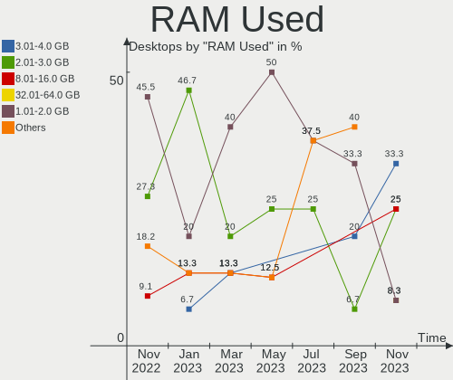

| Used GB   | Desktops | Percent |
|-----------|----------|---------|
| 2.01-3.0  | 5        | 38.46%  |
| 1.01-2.0  | 4        | 30.77%  |
| 4.01-8.0  | 3        | 23.08%  |
| 8.01-16.0 | 1        | 7.69%   |

Total Drives
------------

Number of drives on board

| Drives | Desktops | Percent |
|--------|----------|---------|
| 1      | 5        | 38.46%  |
| 3      | 3        | 23.08%  |
| 2      | 3        | 23.08%  |
| 4      | 2        | 15.38%  |

Has CD-ROM
----------

Has CD-ROM on board

| Presented | Desktops | Percent |
|-----------|----------|---------|
| No        | 7        | 53.85%  |
| Yes       | 6        | 46.15%  |

Has Ethernet
------------

Has Ethernet on board

| Presented | Desktops | Percent |
|-----------|----------|---------|
| Yes       | 13       | 100%    |

Has WiFi
--------

Has WiFi module

| Presented | Desktops | Percent |
|-----------|----------|---------|
| Yes       | 7        | 53.85%  |
| No        | 6        | 46.15%  |

Has Bluetooth
-------------

Has Bluetooth module

| Presented | Desktops | Percent |
|-----------|----------|---------|
| No        | 8        | 61.54%  |
| Yes       | 5        | 38.46%  |

Location
--------

Country
-------

Geographic location (country)

| Country   | Desktops | Percent |
|-----------|----------|---------|
| Germany   | 2        | 15.38%  |
| France    | 2        | 15.38%  |
| UK        | 1        | 7.69%   |
| Taiwan    | 1        | 7.69%   |
| Sweden    | 1        | 7.69%   |
| Spain     | 1        | 7.69%   |
| Slovenia  | 1        | 7.69%   |
| Italy     | 1        | 7.69%   |
| Brazil    | 1        | 7.69%   |
| Austria   | 1        | 7.69%   |
| Argentina | 1        | 7.69%   |

City
----

Geographic location (city)

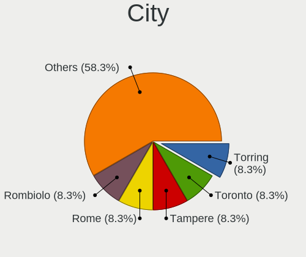

| City                   | Desktops | Percent |
|------------------------|----------|---------|
| Villefontaine          | 1        | 7.69%   |
| Sundbyberg             | 1        | 7.69%   |
| Rodonya                | 1        | 7.69%   |
| Nickelsdorf            | 1        | 7.69%   |
| Newham                 | 1        | 7.69%   |
| New Taipei             | 1        | 7.69%   |
| Milan                  | 1        | 7.69%   |
| Koper                  | 1        | 7.69%   |
| Goslar                 | 1        | 7.69%   |
| Fazenda Rio Grande     | 1        | 7.69%   |
| Delligsen              | 1        | 7.69%   |
| Charleville-Mézières | 1        | 7.69%   |
| Buenos Aires           | 1        | 7.69%   |

Drives
------

Drive Vendor
------------

Hard drive vendors

| Vendor                      | Desktops | Drives | Percent |
|-----------------------------|----------|--------|---------|
| Seagate                     | 4        | 4      | 16%     |
| Samsung Electronics         | 4        | 5      | 16%     |
| Kingston                    | 3        | 3      | 12%     |
| WDC                         | 2        | 2      | 8%      |
| Transcend                   | 2        | 2      | 8%      |
| Toshiba                     | 2        | 4      | 8%      |
| Unknown                     | 1        | 1      | 4%      |
| SPCC                        | 1        | 1      | 4%      |
| SanDisk                     | 1        | 1      | 4%      |
| Netac                       | 1        | 1      | 4%      |
| Micron/Crucial Technology   | 1        | 1      | 4%      |
| MAXIO Technology (Hangzhou) | 1        | 1      | 4%      |
| Corsair                     | 1        | 1      | 4%      |
| A-DATA Technology           | 1        | 1      | 4%      |

Drive Model
-----------

Hard drive models

| Model                                   | Desktops | Percent |
|-----------------------------------------|----------|---------|
| Kingston SA400S37240G 240GB SSD         | 2        | 7.69%   |
| WDC WD10EZEX-21M2NA0 1TB                | 1        | 3.85%   |
| WDC WD1002FAEX-00Z3A0 1TB               | 1        | 3.85%   |
| Unknown SD/MMC/MS PRO 250GB             | 1        | 3.85%   |
| Transcend TS240GSSD220S 240GB           | 1        | 3.85%   |
| Transcend TS1TSSD220Q 1TB               | 1        | 3.85%   |
| Toshiba MG06ACA800E 8TB                 | 1        | 3.85%   |
| Toshiba DT01ACA300 3TB                  | 1        | 3.85%   |
| SPCC Solid State Disk 256GB             | 1        | 3.85%   |
| Seagate ST500DM002-1BD142 500GB         | 1        | 3.85%   |
| Seagate ST2000DM008-2FR102 2TB          | 1        | 3.85%   |
| Seagate ST1000DM003-1SB102 1TB          | 1        | 3.85%   |
| Seagate ST1000DM003-1CH162 1TB          | 1        | 3.85%   |
| SanDisk SSD PLUS 480GB                  | 1        | 3.85%   |
| Samsung SSD 980 PRO 500GB               | 1        | 3.85%   |
| Samsung SSD 860 PRO 256GB               | 1        | 3.85%   |
| Samsung HD502HJ 500GB                   | 1        | 3.85%   |
| Samsung HD103UJ 1TB                     | 1        | 3.85%   |
| Samsung HD103SI 1TB                     | 1        | 3.85%   |
| Netac SSD 1TB                           | 1        | 3.85%   |
| Micron/Crucial P2 NVMe PCIe SSD 4TB     | 1        | 3.85%   |
| MAXIO (Hangzhou) NVMe SSD Drive 512GB   | 1        | 3.85%   |
| Kingston RBU-SNS8350DES3128GP 128GB SSD | 1        | 3.85%   |
| Corsair Force MP600 1TB                 | 1        | 3.85%   |
| A-DATA SU800 256GB SSD                  | 1        | 3.85%   |

HDD Vendor
----------

Hard disk drive vendors

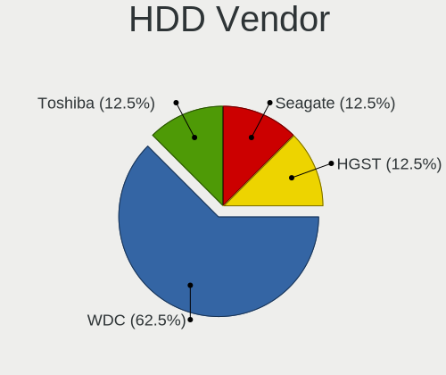

| Vendor              | Desktops | Drives | Percent |
|---------------------|----------|--------|---------|
| Seagate             | 4        | 4      | 36.36%  |
| WDC                 | 2        | 2      | 18.18%  |
| Toshiba             | 2        | 4      | 18.18%  |
| Samsung Electronics | 2        | 3      | 18.18%  |
| Unknown             | 1        | 1      | 9.09%   |

SSD Vendor
----------

Solid state drive vendors

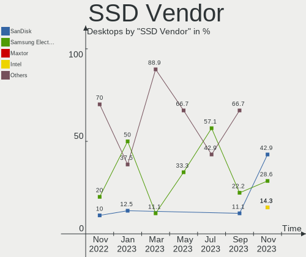

| Vendor              | Desktops | Drives | Percent |
|---------------------|----------|--------|---------|
| Kingston            | 3        | 3      | 30%     |
| Transcend           | 2        | 2      | 20%     |
| SPCC                | 1        | 1      | 10%     |
| SanDisk             | 1        | 1      | 10%     |
| Samsung Electronics | 1        | 1      | 10%     |
| Netac               | 1        | 1      | 10%     |
| A-DATA Technology   | 1        | 1      | 10%     |

Drive Kind
----------

HDD or SSD

| Kind | Desktops | Drives | Percent |
|------|----------|--------|---------|
| HDD  | 9        | 14     | 45%     |
| SSD  | 8        | 10     | 40%     |
| NVMe | 3        | 4      | 15%     |

Drive Connector
---------------

SATA, SAS, NVMe, etc.

| Type | Desktops | Drives | Percent |
|------|----------|--------|---------|
| SATA | 12       | 23     | 75%     |
| NVMe | 3        | 4      | 18.75%  |
| SAS  | 1        | 1      | 6.25%   |

Drive Size
----------

Size of hard drive

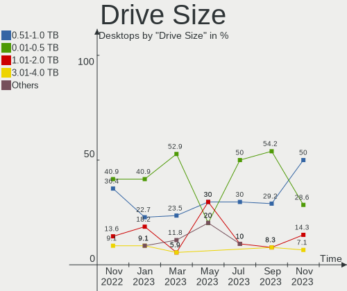

| Size in TB | Desktops | Drives | Percent |
|------------|----------|--------|---------|
| 0.51-1.0   | 8        | 8      | 42.11%  |
| 0.01-0.5   | 8        | 11     | 42.11%  |
| 2.01-3.0   | 1        | 1      | 5.26%   |
| 1.01-2.0   | 1        | 1      | 5.26%   |
| 4.01-10.0  | 1        | 3      | 5.26%   |

Space Total
-----------

Amount of disk space available on the file system

| Size in GB     | Desktops | Percent |
|----------------|----------|---------|
| 1001-2000      | 3        | 23.08%  |
| More than 3000 | 2        | 15.38%  |
| 251-500        | 2        | 15.38%  |
| 101-250        | 2        | 15.38%  |
| 1-20           | 2        | 15.38%  |
| 2001-3000      | 1        | 7.69%   |
| 501-1000       | 1        | 7.69%   |

Space Used
----------

Amount of used disk space

| Used GB        | Desktops | Percent |
|----------------|----------|---------|
| 21-50          | 4        | 30.77%  |
| 1-20           | 3        | 23.08%  |
| More than 3000 | 2        | 15.38%  |
| 2001-3000      | 1        | 7.69%   |
| 101-250        | 1        | 7.69%   |
| 1001-2000      | 1        | 7.69%   |
| 501-1000       | 1        | 7.69%   |

Malfunc. Drives
---------------

Drive models with a malfunction

| Model                                   | Desktops | Drives | Percent |
|-----------------------------------------|----------|--------|---------|
| WDC WD10EZEX-21M2NA0 1TB                | 1        | 1      | 33.33%  |
| Samsung Electronics HD103UJ 1TB         | 1        | 1      | 33.33%  |
| Kingston RBU-SNS8350DES3128GP 128GB SSD | 1        | 1      | 33.33%  |

Malfunc. Drive Vendor
---------------------

Vendors of faulty drives

| Vendor              | Desktops | Drives | Percent |
|---------------------|----------|--------|---------|
| WDC                 | 1        | 1      | 33.33%  |
| Samsung Electronics | 1        | 1      | 33.33%  |
| Kingston            | 1        | 1      | 33.33%  |

Malfunc. HDD Vendor
-------------------

Vendors of faulty HDD drives

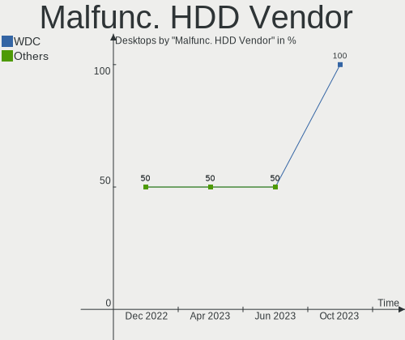

| Vendor              | Desktops | Drives | Percent |
|---------------------|----------|--------|---------|
| WDC                 | 1        | 1      | 50%     |
| Samsung Electronics | 1        | 1      | 50%     |

Malfunc. Drive Kind
-------------------

Kinds of faulty drives

| Kind | Desktops | Drives | Percent |
|------|----------|--------|---------|
| HDD  | 2        | 2      | 66.67%  |
| SSD  | 1        | 1      | 33.33%  |

Failed Drives
-------------

Failed drive models

Zero info for selected period =(

Failed Drive Vendor
-------------------

Failed drive vendors

Zero info for selected period =(

Drive Status
------------

Number of failed and malfunc. drives

| Status   | Desktops | Drives | Percent |
|----------|----------|--------|---------|
| Works    | 9        | 20     | 52.94%  |
| Detected | 5        | 5      | 29.41%  |
| Malfunc  | 3        | 3      | 17.65%  |

Storage controller
------------------

Storage Vendor
--------------

Storage controller vendors

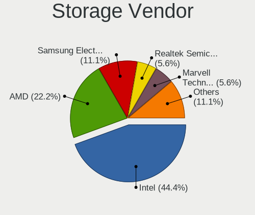

| Vendor                      | Desktops | Percent |
|-----------------------------|----------|---------|
| Intel                       | 10       | 58.82%  |
| AMD                         | 3        | 17.65%  |
| Samsung Electronics         | 1        | 5.88%   |
| Phison Electronics          | 1        | 5.88%   |
| Micron/Crucial Technology   | 1        | 5.88%   |
| MAXIO Technology (Hangzhou) | 1        | 5.88%   |

Storage Model
-------------

Storage controller models

| Model                                                                          | Desktops | Percent |
|--------------------------------------------------------------------------------|----------|---------|
| Intel 8 Series/C220 Series Chipset Family 6-port SATA Controller 1 [AHCI mode] | 3        | 15.79%  |
| AMD FCH SATA Controller [AHCI mode]                                            | 3        | 15.79%  |
| Samsung NVMe SSD Controller PM9A1/PM9A3/980PRO                                 | 1        | 5.26%   |
| Phison E16 PCIe4 NVMe Controller                                               | 1        | 5.26%   |
| Micron/Crucial P2 NVMe PCIe SSD                                                | 1        | 5.26%   |
| MAXIO (Hangzhou) NVMe SSD Controller MAP1202                                   | 1        | 5.26%   |
| Intel SATA controller                                                          | 1        | 5.26%   |
| Intel Q170/Q150/B150/H170/H110/Z170/CM236 Chipset SATA Controller [AHCI Mode]  | 1        | 5.26%   |
| Intel Jasper Lake SATA AHCI Controller                                         | 1        | 5.26%   |
| Intel 9 Series Chipset Family SATA Controller [AHCI Mode]                      | 1        | 5.26%   |
| Intel 8 Series/C220 Series Chipset Family 4-port SATA Controller 1 [IDE mode]  | 1        | 5.26%   |
| Intel 6 Series/C200 Series Chipset Family 6 port Desktop SATA AHCI Controller  | 1        | 5.26%   |
| Intel 5 Series/3400 Series Chipset 6 port SATA AHCI Controller                 | 1        | 5.26%   |
| AMD FCH SATA Controller D                                                      | 1        | 5.26%   |
| AMD 400 Series Chipset SATA Controller                                         | 1        | 5.26%   |

Storage Kind
------------

Kind of storage controller (IDE, SATA, NVMe, SAS, ...)

| Kind | Desktops | Percent |
|------|----------|---------|
| SATA | 12       | 75%     |
| NVMe | 3        | 18.75%  |
| IDE  | 1        | 6.25%   |

Processor
---------

CPU Vendor
----------

Processor vendors

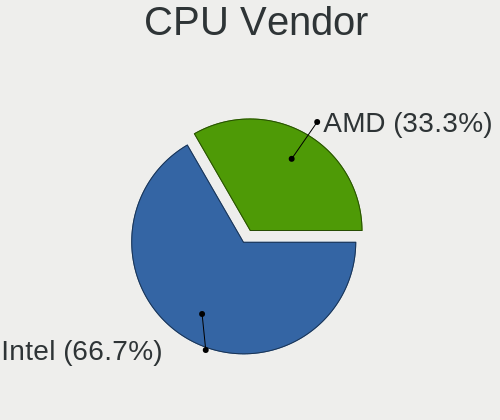

| Vendor | Desktops | Percent |
|--------|----------|---------|
| Intel  | 10       | 76.92%  |
| AMD    | 3        | 23.08%  |

CPU Model
---------

Processor models

| Model                                           | Desktops | Percent |
|-------------------------------------------------|----------|---------|
| Intel Core i5-4460 CPU @ 3.20GHz                | 2        | 15.38%  |
| Intel Xeon CPU E3-1245 v3 @ 3.40GHz             | 1        | 7.69%   |
| Intel Pentium CPU G4560 @ 3.50GHz               | 1        | 7.69%   |
| Intel Pentium CPU G2020 @ 2.90GHz               | 1        | 7.69%   |
| Intel N100                                      | 1        | 7.69%   |
| Intel Core i3-4170 CPU @ 3.70GHz                | 1        | 7.69%   |
| Intel Core i3-4160 CPU @ 3.60GHz                | 1        | 7.69%   |
| Intel Core i3 CPU 550 @ 3.20GHz                 | 1        | 7.69%   |
| Intel Celeron N4500 @ 1.10GHz                   | 1        | 7.69%   |
| AMD Ryzen 9 5900X 12-Core Processor             | 1        | 7.69%   |
| AMD Ryzen 5 PRO 3400G with Radeon Vega Graphics | 1        | 7.69%   |
| AMD Athlon 300GE with Radeon Vega Graphics      | 1        | 7.69%   |

CPU Model Family
----------------

Processor model prefix

| Model           | Desktops | Percent |
|-----------------|----------|---------|
| Intel Core i3   | 3        | 23.08%  |
| Intel Pentium   | 2        | 15.38%  |
| Intel Core i5   | 2        | 15.38%  |
| Other           | 1        | 7.69%   |
| Intel Xeon      | 1        | 7.69%   |
| Intel Celeron   | 1        | 7.69%   |
| AMD Ryzen 9     | 1        | 7.69%   |
| AMD Ryzen 5 PRO | 1        | 7.69%   |
| AMD Athlon      | 1        | 7.69%   |

CPU Cores
---------

Number of processor cores

| Number | Desktops | Percent |
|--------|----------|---------|
| 2      | 7        | 53.85%  |
| 4      | 5        | 38.46%  |
| 12     | 1        | 7.69%   |

CPU Sockets
-----------

Number of sockets

| Number | Desktops | Percent |
|--------|----------|---------|
| 1      | 13       | 100%    |

CPU Threads
-----------

Threads per core (Hyper-Threading)

| Number | Desktops | Percent |
|--------|----------|---------|
| 2      | 8        | 61.54%  |
| 1      | 5        | 38.46%  |

CPU Op-Modes
------------

CPU Operation Modes (32-bit, 64-bit)

| Op mode        | Desktops | Percent |
|----------------|----------|---------|
| 32-bit, 64-bit | 13       | 100%    |

CPU Microcode
-------------

Microcode number

| Number     | Desktops | Percent |
|------------|----------|---------|
| Unknown    | 6        | 46.15%  |
| 0x306c3    | 3        | 23.08%  |
| 0x08108109 | 2        | 15.38%  |
| 0x20655    | 1        | 7.69%   |
| 0x0a201016 | 1        | 7.69%   |

CPU Microarch
-------------

Microarchitecture

| Name      | Desktops | Percent |
|-----------|----------|---------|
| Haswell   | 5        | 38.46%  |
| Zen+      | 2        | 15.38%  |
| Zen 3     | 1        | 7.69%   |
| Westmere  | 1        | 7.69%   |
| KabyLake  | 1        | 7.69%   |
| IvyBridge | 1        | 7.69%   |
| Gracemont | 1        | 7.69%   |
| Unknown   | 1        | 7.69%   |

Graphics
--------

GPU Vendor
----------

Vendors of graphics cards

| Vendor | Desktops | Percent |
|--------|----------|---------|
| Intel  | 8        | 57.14%  |
| Nvidia | 3        | 21.43%  |
| AMD    | 3        | 21.43%  |

GPU Model
---------

Graphics card models

| Model                                                                       | Desktops | Percent |
|-----------------------------------------------------------------------------|----------|---------|
| Intel 4th Generation Core Processor Family Integrated Graphics Controller   | 2        | 14.29%  |
| AMD Picasso/Raven 2 [Radeon Vega Series / Radeon Vega Mobile Series]        | 2        | 14.29%  |
| Nvidia GP107GL [Quadro P620]                                                | 1        | 7.14%   |
| Nvidia GM107 [GeForce GTX 745]                                              | 1        | 7.14%   |
| Nvidia GK208B [GeForce GT 730]                                              | 1        | 7.14%   |
| Intel Xeon E3-1200 v3/4th Gen Core Processor Integrated Graphics Controller | 1        | 7.14%   |
| Intel Xeon E3-1200 v3 Processor Integrated Graphics Controller              | 1        | 7.14%   |
| Intel Xeon E3-1200 v2/3rd Gen Core processor Graphics Controller            | 1        | 7.14%   |
| Intel JasperLake [UHD Graphics]                                             | 1        | 7.14%   |
| Intel HD Graphics 610                                                       | 1        | 7.14%   |
| Intel Alder Lake-N [UHD Graphics]                                           | 1        | 7.14%   |
| AMD Navi 24 [Radeon PRO W6400]                                              | 1        | 7.14%   |

GPU Combo
---------

Combinations of graphics cards

| Name           | Desktops | Percent |
|----------------|----------|---------|
| 1 x Intel      | 7        | 53.85%  |
| 1 x AMD        | 3        | 23.08%  |
| 1 x Nvidia     | 2        | 15.38%  |
| Intel + Nvidia | 1        | 7.69%   |

GPU Driver
----------

Free vs proprietary

| Driver      | Desktops | Percent |
|-------------|----------|---------|
| Free        | 11       | 84.62%  |
| Proprietary | 2        | 15.38%  |

GPU Memory
----------

Total video memory

| Size in GB | Desktops | Percent |
|------------|----------|---------|
| Unknown    | 8        | 61.54%  |
| 1.01-2.0   | 3        | 23.08%  |
| 3.01-4.0   | 2        | 15.38%  |

Monitor
-------

Monitor Vendor
--------------

Monitor vendors

| Vendor               | Desktops | Percent |
|----------------------|----------|---------|
| Samsung Electronics  | 2        | 16.67%  |
| ASUSTek Computer     | 2        | 16.67%  |
| ViewSonic            | 1        | 8.33%   |
| Sony                 | 1        | 8.33%   |
| Philips              | 1        | 8.33%   |
| Iiyama               | 1        | 8.33%   |
| Goldstar             | 1        | 8.33%   |
| Envision Peripherals | 1        | 8.33%   |
| Ancor Communications | 1        | 8.33%   |
| Acer                 | 1        | 8.33%   |

Monitor Model
-------------

Monitor models

| Model                                                                 | Desktops | Percent |
|-----------------------------------------------------------------------|----------|---------|
| ViewSonic VA2046 SERIES VSC6D2E 1600x900 432x240mm 19.5-inch          | 1        | 8.33%   |
| Sony TV SNY6804 1600x900                                              | 1        | 8.33%   |
| Samsung Electronics SA300/SA350 SAM078E 1920x1080 477x268mm 21.5-inch | 1        | 8.33%   |
| Samsung Electronics C24F390 SAM0D2C 1920x1080 521x293mm 23.5-inch     | 1        | 8.33%   |
| Philips PHL 223V5 PHLC0CF 1920x1080 477x268mm 21.5-inch               | 1        | 8.33%   |
| Iiyama PL2730H IVM663A 1920x1080 598x336mm 27.0-inch                  | 1        | 8.33%   |
| Goldstar LG Ultra HD GSM5B08 3840x2160 600x340mm 27.2-inch            | 1        | 8.33%   |
| Envision Peripherals LED 2389 ENV2389 1920x1080 509x286mm 23.0-inch   | 1        | 8.33%   |
| ASUSTek Computer VA24E AUS24D1 1920x1080 527x296mm 23.8-inch          | 1        | 8.33%   |
| ASUSTek Computer PA279 AUS2768 3840x2160 597x336mm 27.0-inch          | 1        | 8.33%   |
| Ancor Communications PB248 ACI24A3 1920x1200 518x324mm 24.1-inch      | 1        | 8.33%   |
| Acer Viseo 220Dx ACR00FF 1920x1080 477x268mm 21.5-inch                | 1        | 8.33%   |

Monitor Resolution
------------------

Monitor screen resolution

| Resolution        | Desktops | Percent |
|-------------------|----------|---------|
| 1920x1080 (FHD)   | 7        | 58.33%  |
| 3840x2160 (4K)    | 2        | 16.67%  |
| 1600x900 (HD+)    | 2        | 16.67%  |
| 1920x1200 (WUXGA) | 1        | 8.33%   |

Monitor Diagonal
----------------

Diagonal size in inches

| Inches | Desktops | Percent |
|--------|----------|---------|
| 27     | 3        | 25%     |
| 21     | 3        | 25%     |
| 24     | 2        | 16.67%  |
| 23     | 2        | 16.67%  |
| 72     | 1        | 8.33%   |
| 19     | 1        | 8.33%   |

Monitor Width
-------------

Physical width

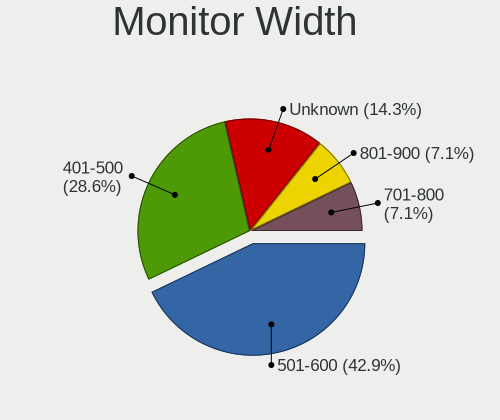

| Width in mm | Desktops | Percent |
|-------------|----------|---------|
| 501-600     | 6        | 54.55%  |
| 401-500     | 4        | 36.36%  |
| 1501-2000   | 1        | 9.09%   |

Aspect Ratio
------------

Proportional relationship between the width and the height

| Ratio | Desktops | Percent |
|-------|----------|---------|
| 16/9  | 11       | 91.67%  |
| 16/10 | 1        | 8.33%   |

Monitor Area
------------

Area in inch²

| Area in inch² | Desktops | Percent |
|----------------|----------|---------|
| 201-250        | 6        | 50%     |
| 301-350        | 3        | 25%     |
| More than 1000 | 1        | 8.33%   |
| 251-300        | 1        | 8.33%   |
| 151-200        | 1        | 8.33%   |

Pixel Density
-------------

Pixels per inch

| Density | Desktops | Percent |
|---------|----------|---------|
| 51-100  | 6        | 50%     |
| 101-120 | 3        | 25%     |
| 161-240 | 2        | 16.67%  |
| 1-50    | 1        | 8.33%   |

Multiple Monitors
-----------------

Total monitors connected

| Total | Desktops | Percent |
|-------|----------|---------|
| 1     | 11       | 84.62%  |
| 2     | 1        | 7.69%   |
| 0     | 1        | 7.69%   |

Network
-------

Net Controller Vendor
---------------------

Controller vendors

| Vendor                | Desktops | Percent |
|-----------------------|----------|---------|
| Realtek Semiconductor | 10       | 50%     |
| Intel                 | 4        | 20%     |
| Qualcomm Atheros      | 2        | 10%     |
| Xiaomi                | 1        | 5%      |
| Samsung Electronics   | 1        | 5%      |
| Motorola PCS          | 1        | 5%      |
| Aquantia              | 1        | 5%      |

Net Controller Model
--------------------

Controller models

| Model                                                             | Desktops | Percent |
|-------------------------------------------------------------------|----------|---------|
| Realtek RTL8111/8168/8411 PCI Express Gigabit Ethernet Controller | 9        | 36%     |
| Xiaomi Mi/Redmi series (RNDIS)                                    | 1        | 4%      |
| Samsung GT-I9070 (network tethering, USB debugging enabled)       | 1        | 4%      |
| Realtek RTL8821CE 802.11ac PCIe Wireless Network Adapter          | 1        | 4%      |
| Realtek RTL8188EUS 802.11n Wireless Network Adapter               | 1        | 4%      |
| Realtek RTL8153 Gigabit Ethernet Adapter                          | 1        | 4%      |
| Realtek 802.11ac NIC                                              | 1        | 4%      |
| Qualcomm Atheros QCA9565 / AR9565 Wireless Network Adapter        | 1        | 4%      |
| Qualcomm Atheros Killer E220x Gigabit Ethernet Controller         | 1        | 4%      |
| Motorola PCS moto g(30)                                           | 1        | 4%      |
| Intel Wi-Fi 6 AX201 160MHz                                        | 1        | 4%      |
| Intel Wi-Fi 6 AX200                                               | 1        | 4%      |
| Intel I211 Gigabit Network Connection                             | 1        | 4%      |
| Intel Ethernet Controller I225-V                                  | 1        | 4%      |
| Intel Ethernet Connection I217-LM                                 | 1        | 4%      |
| Intel Alder Lake-N Wireless-AC                                    | 1        | 4%      |
| Aquantia AQC107 NBase-T/IEEE 802.3bz Ethernet Controller [AQtion] | 1        | 4%      |

Wireless Vendor
---------------

Wireless vendors

| Vendor                | Desktops | Percent |
|-----------------------|----------|---------|
| Realtek Semiconductor | 3        | 42.86%  |
| Intel                 | 3        | 42.86%  |
| Qualcomm Atheros      | 1        | 14.29%  |

Wireless Model
--------------

Wireless models

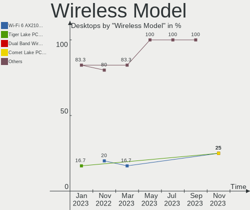

| Model                                                      | Desktops | Percent |
|------------------------------------------------------------|----------|---------|
| Realtek RTL8821CE 802.11ac PCIe Wireless Network Adapter   | 1        | 14.29%  |
| Realtek RTL8188EUS 802.11n Wireless Network Adapter        | 1        | 14.29%  |
| Realtek 802.11ac NIC                                       | 1        | 14.29%  |
| Qualcomm Atheros QCA9565 / AR9565 Wireless Network Adapter | 1        | 14.29%  |
| Intel Wi-Fi 6 AX201 160MHz                                 | 1        | 14.29%  |
| Intel Wi-Fi 6 AX200                                        | 1        | 14.29%  |
| Intel Alder Lake-N Wireless-AC                             | 1        | 14.29%  |

Ethernet Vendor
---------------

Ethernet vendors

| Vendor                | Desktops | Percent |
|-----------------------|----------|---------|
| Realtek Semiconductor | 9        | 56.25%  |
| Intel                 | 3        | 18.75%  |
| Xiaomi                | 1        | 6.25%   |
| Qualcomm Atheros      | 1        | 6.25%   |
| Motorola PCS          | 1        | 6.25%   |
| Aquantia              | 1        | 6.25%   |

Ethernet Model
--------------

Ethernet models

| Model                                                             | Desktops | Percent |
|-------------------------------------------------------------------|----------|---------|
| Realtek RTL8111/8168/8411 PCI Express Gigabit Ethernet Controller | 9        | 52.94%  |
| Xiaomi Mi/Redmi series (RNDIS)                                    | 1        | 5.88%   |
| Realtek RTL8153 Gigabit Ethernet Adapter                          | 1        | 5.88%   |
| Qualcomm Atheros Killer E220x Gigabit Ethernet Controller         | 1        | 5.88%   |
| Motorola PCS moto g(30)                                           | 1        | 5.88%   |
| Intel I211 Gigabit Network Connection                             | 1        | 5.88%   |
| Intel Ethernet Controller I225-V                                  | 1        | 5.88%   |
| Intel Ethernet Connection I217-LM                                 | 1        | 5.88%   |
| Aquantia AQC107 NBase-T/IEEE 802.3bz Ethernet Controller [AQtion] | 1        | 5.88%   |

Net Controller Kind
-------------------

Ethernet, WiFi or modem

| Kind     | Desktops | Percent |
|----------|----------|---------|
| Ethernet | 13       | 61.9%   |
| WiFi     | 7        | 33.33%  |
| Modem    | 1        | 4.76%   |

Used Controller
---------------

Currently used network controller

| Kind     | Desktops | Percent |
|----------|----------|---------|
| Ethernet | 11       | 84.62%  |
| WiFi     | 2        | 15.38%  |

NICs
----

Total network controllers on board

| Total | Desktops | Percent |
|-------|----------|---------|
| 1     | 8        | 61.54%  |
| 2     | 3        | 23.08%  |
| 3     | 2        | 15.38%  |

IPv6
----

IPv6 vs IPv4

| Used | Desktops | Percent |
|------|----------|---------|
| No   | 10       | 76.92%  |
| Yes  | 3        | 23.08%  |

Bluetooth
---------

Bluetooth Vendor
----------------

Controller vendors

| Vendor                | Desktops | Percent |
|-----------------------|----------|---------|
| Intel                 | 3        | 60%     |
| Realtek Semiconductor | 1        | 20%     |
| Lite-On Technology    | 1        | 20%     |

Bluetooth Model
---------------

Controller models

| Model                                          | Desktops | Percent |
|------------------------------------------------|----------|---------|
| Realtek  Bluetooth 4.2 Adapter                 | 1        | 20%     |
| Lite-On Atheros AR3012 Bluetooth               | 1        | 20%     |
| Intel Bluetooth 9460/9560 Jefferson Peak (JfP) | 1        | 20%     |
| Intel AX201 Bluetooth                          | 1        | 20%     |
| Intel AX200 Bluetooth                          | 1        | 20%     |

Sound
-----

Sound Vendor
------------

Sound card vendors

| Vendor                               | Desktops | Percent |
|--------------------------------------|----------|---------|
| Intel                                | 10       | 55.56%  |
| Nvidia                               | 3        | 16.67%  |
| AMD                                  | 3        | 16.67%  |
| Thesycon Systemsoftware & Consulting | 1        | 5.56%   |
| C-Media Electronics                  | 1        | 5.56%   |

Sound Model
-----------

Sound card models

| Model                                                                      | Desktops | Percent |
|----------------------------------------------------------------------------|----------|---------|
| Intel Xeon E3-1200 v3/4th Gen Core Processor HD Audio Controller           | 4        | 16%     |
| Intel 8 Series/C220 Series Chipset High Definition Audio Controller        | 4        | 16%     |
| AMD Raven/Raven2/Fenghuang HDMI/DP Audio Controller                        | 2        | 8%      |
| AMD Family 17h/19h HD Audio Controller                                     | 2        | 8%      |
| Thesycon Systemsoftware & Consulting D50s                                  | 1        | 4%      |
| Nvidia GP107GL High Definition Audio Controller                            | 1        | 4%      |
| Nvidia GM107 High Definition Audio Controller [GeForce 940MX]              | 1        | 4%      |
| Nvidia GK208 HDMI/DP Audio Controller                                      | 1        | 4%      |
| Intel Jasper Lake HD Audio                                                 | 1        | 4%      |
| Intel Alder Lake-N HD Graphics SGPC                                        | 1        | 4%      |
| Intel 9 Series Chipset Family HD Audio Controller                          | 1        | 4%      |
| Intel 6 Series/C200 Series Chipset Family High Definition Audio Controller | 1        | 4%      |
| Intel 5 Series/3400 Series Chipset High Definition Audio                   | 1        | 4%      |
| Intel 100 Series/C230 Series Chipset Family HD Audio Controller            | 1        | 4%      |
| C-Media Electronics Blue Snowball                                          | 1        | 4%      |
| AMD Starship/Matisse HD Audio Controller                                   | 1        | 4%      |
| AMD Navi 21/23 HDMI/DP Audio Controller                                    | 1        | 4%      |

Memory
------

Memory Vendor
-------------

Memory module vendors

| Vendor            | Desktops | Percent |
|-------------------|----------|---------|
| Crucial           | 4        | 40%     |
| Micron Technology | 2        | 20%     |
| Unknown           | 1        | 10%     |
| SK hynix          | 1        | 10%     |
| Kingston          | 1        | 10%     |
| Corsair           | 1        | 10%     |

Memory Model
------------

Memory module models

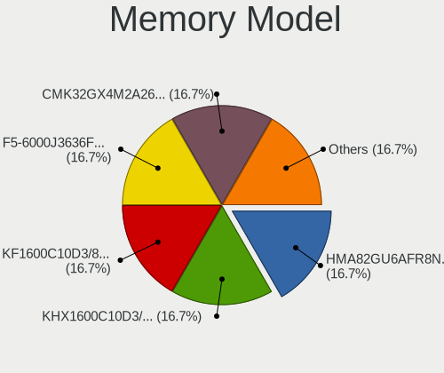

| Model                                                     | Desktops | Percent |
|-----------------------------------------------------------|----------|---------|
| Unknown RAM Module 4GB DIMM DDR 1333MT/s                  | 1        | 9.09%   |
| Unknown RAM Module 2GB DIMM DDR 1333MT/s                  | 1        | 9.09%   |
| SK hynix RAM Module 8GB DIMM DDR3 1600MT/s                | 1        | 9.09%   |
| Micron RAM 8JTF51264AZ-1G6E1 4GB DIMM DDR3 1600MT/s       | 1        | 9.09%   |
| Micron RAM 8ATF1G64AZ-2G6E1 8GB DIMM DDR4 2667MT/s        | 1        | 9.09%   |
| Kingston RAM Module 4096MB DIMM DDR3 1333MT/s             | 1        | 9.09%   |
| Crucial RAM CT8G4DFS824A.C8FDD1 8192MB DIMM DDR4 3200MT/s | 1        | 9.09%   |
| Crucial RAM CT8G4DFS8213.C8FDD1 8GB DIMM DDR4 2400MT/s    | 1        | 9.09%   |
| Crucial RAM CT16G48C40S5.M8A1 16GB SODIMM DDR5 4800MT/s   | 1        | 9.09%   |
| Crucial RAM BLS8G3D1609DS1S00. 8GB DIMM DDR3 1800MT/s     | 1        | 9.09%   |
| Corsair RAM CMH32GX4M2Z3600C18 16GB DIMM DDR4 3600MT/s    | 1        | 9.09%   |

Memory Kind
-----------

Memory module kinds

| Kind | Desktops | Percent |
|------|----------|---------|
| DDR4 | 4        | 40%     |
| DDR3 | 4        | 40%     |
| DDR5 | 1        | 10%     |
| DDR  | 1        | 10%     |

Memory Form Factor
------------------

Physical design of the memory module

| Name   | Desktops | Percent |
|--------|----------|---------|
| DIMM   | 9        | 90%     |
| SODIMM | 1        | 10%     |

Memory Size
-----------

Memory module size

| Size  | Desktops | Percent |
|-------|----------|---------|
| 8192  | 5        | 45.45%  |
| 4096  | 3        | 27.27%  |
| 16384 | 2        | 18.18%  |
| 2048  | 1        | 9.09%   |

Memory Speed
------------

Memory module speed

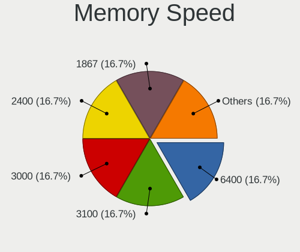

| Speed | Desktops | Percent |
|-------|----------|---------|
| 1600  | 2        | 20%     |
| 1333  | 2        | 20%     |
| 4800  | 1        | 10%     |
| 3600  | 1        | 10%     |
| 3200  | 1        | 10%     |
| 2667  | 1        | 10%     |
| 2400  | 1        | 10%     |
| 1800  | 1        | 10%     |

Printers & scanners
-------------------

Printer Vendor
--------------

Printer device vendors

| Vendor          | Desktops | Percent |
|-----------------|----------|---------|
| Hewlett-Packard | 1        | 100%    |

Printer Model
-------------

Printer device models

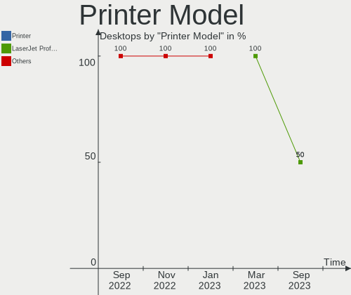

| Model                           | Desktops | Percent |
|---------------------------------|----------|---------|
| HP LaserJet Professional P1102w | 1        | 100%    |

Scanner Vendor
--------------

Scanner device vendors

Zero info for selected period =(

Scanner Model
-------------

Scanner device models

Zero info for selected period =(

Camera
------

Camera Vendor
-------------

Camera device vendors

| Vendor                        | Desktops | Percent |
|-------------------------------|----------|---------|
| Sunplus Innovation Technology | 1        | 100%    |

Camera Model
------------

Camera device models

| Model                  | Desktops | Percent |
|------------------------|----------|---------|
| Sunplus Full HD webcam | 1        | 100%    |

Security
--------

Fingerprint Vendor
------------------

Fingerprint sensor vendors

Zero info for selected period =(

Fingerprint Model
-----------------

Fingerprint sensor models

Zero info for selected period =(

Chipcard Vendor
---------------

Chipcard module vendors

Zero info for selected period =(

Chipcard Model
--------------

Chipcard module models

Zero info for selected period =(

Unsupported
-----------

Unsupported Devices
-------------------

Total unsupported devices on board

| Total | Desktops | Percent |
|-------|----------|---------|
| 0     | 9        | 69.23%  |
| 1     | 4        | 30.77%  |

Unsupported Device Types
------------------------

Types of unsupported devices

| Type                  | Desktops | Percent |
|-----------------------|----------|---------|
| Multimedia controller | 2        | 50%     |
| Net/wireless          | 1        | 25%     |
| Card reader           | 1        | 25%     |

